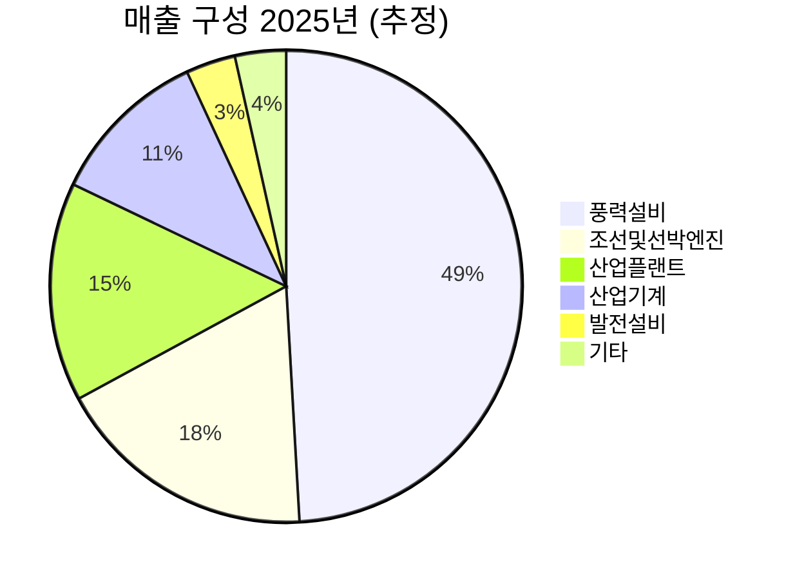

---

company: (주)태웅
created: 2026-04-13 14:21
date: 2026-04-13 14:21
exchange: KRX
listing: public
market: KR
tags:
- daily
- deal-sourcing
ticker: 044490.KS
title: Deal - (주)태웅 (044490.KS) 14:21
type: deal-sourcing
publish: true
---

> **오늘의 탐색 분야**: 클라우드, 사이버보안, 바이오텍, 헬스케어 테크, 원자력, 클린에너지, 원자재, 전기차, 로보틱스
> 4일 주기 로테이션 (21개 분야 커버)

# 태웅 (044490.KS)

044490.KS 🇰🇷 KR KOSDAQ 산업재 / 금속단조

---

Investment Score 65/100 — 🟡 Buy (조건부)

업사이드 비대칭 20/30 — SMR·해상풍력 구조 성장이지만 턴어라운드 가시성 아직 낮음

카탈리스트 & 타이밍 18/25 — 2026 2Q 롤링밀 재가동·플랜지 인도·1Q 실적 5/18 예정

비즈니스 품질 13/20 — 15,000톤 프레스·일관체제 강한 해자, ROE·마진 현재 최저

밸류에이션 9/15 — 52주 최저 근처 회복, PBR 1.5x는 저렴하나 현 이익 기준 고PER

발견 가치 5/10 — 커버 애널리스트 소수, 유튜브 노출 증가로 개인 관심 상승 중

---

> [!abstract] 리포트 요약
> 
> **한 줄 테시스:** 태웅은 "단조강"의 물리적 한계가 만든 천연 해자를 보유한 회사로, 2025년 설비 고도화로 인한 일시적 이익 급감이 주가를 바닥권으로 밀어넣었고, 2026년 2분기부터 신형 롤링밀 재가동 + 해상풍력 인도 재개 + SMR 부품 공급 시작이 맞물리는 **멀티 촉매 턴어라운드** 국면이다.
> 
> **왜 지금인가:** 2025년 영업이익 78% 급감(설비공사 원인)이 어닝 쇼크로 인식되어 주가가 52주 최저 13,370원까지 밀렸다가 현재 45,000원대로 회복 중. 시장은 아직 "실적 부진 기업"으로 보지만, 실제 원인은 구조적 쇠퇴가 아닌 **1회성 설비 업그레이드 디스럽션**이다.
> 
> **Variant Perception:** 시장 컨센서스는 2026년 실적 개선을 알고 있지만, SMR 공급 이력(캐나다 다링턴 BWRX300)이 글로벌 가격결정력을 대폭 높일 가능성과, 15,000톤 프레스로만 가능한 직경 9.5m 초대형 플랜지의 과점적 지위가 충분히 반영되지 않았다고 본다.
> 
> **핵심 수치:** 2025년 매출 3,497억원(-9.5% YoY) / 영업이익 50억원(-78% YoY) / NH투자증권 2026년 영업이익 611억원 전망[컨센서스 추정]

---

## ① 핵심 지표

| 항목 | 값 | 의미 |
|------|-----|------|
| 현재가 | 45,000원 | 🟡 52주 최저(13,370원) 대비 236% 회복, 최고(58,800원) 대비 -23.5%. 중간 회복 구간 |
| 시가총액 | 약 8,903억원 | 🟡 코스닥 중형주. 소형~중형 경계. 기관 유입 여지 충분 |
| PER (Trailing) | 164.21배 | 🔴 현재 이익 기준 극단적 고PER — 단, 2025년이 설비공사로 인한 이익 바닥이므로 트레일링 PER은 무의미 |
| PER (Forward) | 데이터 미확인 | 🟡 NH투자증권 2026년 순이익 495억원 추정[컨센서스 추정] 적용 시 포워드 PER ≈ 18배[가정] |
| PBR | 1.46배 | 🟢 BPS 30,212원 기준. 설비·재고 자산 규모 감안 시 순자산 대비 적정~저평가 |
| EV/EBITDA | 1,567.79배 | 🔴 현재 EBITDA가 바닥이라 의미 없는 수치. 정상화 EBITDA 기준 재산정 필요 |
| 영업이익률 | 0.8% | 🔴 2025년 설비공사 영향 최저치. 2026년 복귀 여부가 핵심 |
| 순이익률 | 2.3% | 🔴 영업이익 대비 순이익이 높은 것은 비영업 수익(토지/자산 평가 등) 추정 — 확인 필요 |
| ROE | 0.3% | 🔴 현재 자본수익률 최저. 정상화 시 10%+ 가능 여부가 투자 판단의 핵심 |
| 52주 고/저 | 58,800 / 13,370원 | 🟢 변동폭 4.4배. 극단적 변동성 — 테마 및 실적 반응 모두 큼 |
| 섹터/지역 | 금속 단조 / 한국 | 🟡 원자력·해상풍력·조선 다중 테마에 연결된 독특한 포지션 |

> [!warning] PER/EV/EBITDA 해석 주의
> 현재 트레일링 밸류에이션 지표(PER 164배, EV/EBITDA 1,568배)는 2025년 설비 업그레이드로 인한 이익 바닥 상황을 반영한 것으로, 정상화 이익 기준 밸류에이션과 큰 괴리가 있습니다. 투자 판단은 반드시 Forward 기준으로만 해야 합니다.

---

## ② 회사 개요, 제품, 핵심 경쟁력

> [!abstract] 섹션 요약
> 태웅은 "쇠를 내 마음대로 찍어내는 물리적 능력"이 해자인 회사다. 15,000톤 프레스라는 거대 인프라를 보유한 곳은 전 세계에 손에 꼽히며, 이 장벽이 원자력·해상풍력·조선 등 핵심 산업에서 과점적 공급자 지위를 만든다.

### 한 줄 설명
태웅은 **대형 금속 단조(Forging) 부품을 제조하는 회사**로, 특수강 잉곳(Ingot) 자체 생산부터 단조, 열처리, 기계가공까지 일관 생산 체계를 갖춘 한국 최대 규모의 중공업 단조 전문기업이다.

### 사업 모델: 어떻게 돈을 버는가?

태웅의 수익 구조는 **고객 맞춤형 단조 부품 수주→제작→납품**이다. 단가가 수억~수십억 원에 달하는 대형 단조 부품(메인샤프트, 타워플랜지, 원자로 용기 부품, 크랭크샤프트 등)을 전 세계 에너지·조선·산업플랜트 기업에 공급한다. 수주 기반 사업이므로 수주잔고가 향후 매출 가시성의 핵심 지표다.

**수익 구조의 핵심:**
- 원재료(특수강 잉곳) 자체 생산 → 원가 구조 통제권 보유
- 대형 단조 설비(15,000톤 프레스)의 설비 가동률이 마진의 핵심 레버
- 프로젝트 단위 수주이므로 매출·이익 분기별 변동성 높음

### 핵심 제품/서비스

| 제품군 | 고객 가치 | 주요 적용처 |
|--------|-----------|------------|
| **풍력 메인샤프트·타워플랜지** | 세계 일류 상품 인증. 직경 9.5m급 초대형 공급 가능 | 해상·육상 풍력발전 |
| **원전 단조 부품 (SMR 포함)** | 캐나다 다링턴 BWRX300 공급 이력. 핵폐기물 저장용 Cask | 원자력 발전소 |
| **조선·선박엔진 부품** | 대형 크랭크샤프트, 선박엔진 핵심 단조 부품 | 컨테이너선·LNG선 |
| **산업플랜트 단조** | 석유화학·발전소 압력 용기 핵심 부품 | 정유·화학·발전 |
| **산업기계 부품** | 제철소·공작기계용 롤 등 | 철강·제조업 |

### 매출 구성 (2025년 기준 — iM증권 2025.12 리포트 기반)

> [!note] 매출 비중 출처
> 위 비중은 iM증권 2025년 12월 리포트 기반으로 알려진 수치이며, 2025년 3분기 누적 기준 iM증권 자료(풍력 53.8%, 조선&선박엔진 16.5%, 산업기계 14.9%, 산업플랜트 8.0%, 발전 2.6%, 기타 4.2%)와 일부 차이가 있습니다. 공식 세그먼트별 YoY 성장률은 미확인입니다.

### 핵심 경쟁력

| 경쟁력 | 설명 | 복제 난이도 (1-10) |
|--------|------|:---:|
| **15,000톤 초대형 프레스** | 직경 9.5m급 초대형 단조 가능. 이 규모의 설비를 보유한 기업은 전 세계 극소수 | **10** |
| **일관 생산 체계** | 2016년 제강사업부 설립 이후 잉곳 자체 생산 → 단조 → 열처리 → 기계가공 전 공정 내재화 | **9** |
| **세계 일류 상품 인증** | 풍력용 메인샤프트·타워플랜지 세계 일류 상품 선정 (출처: 유튜브 달려라경제 인용) | **8** |
| **SMR 공급 이력** | 캐나다 다링턴 BWRX300 — 북미 최초 상업용 SMR 단조 부품 공급 이력 [확인 필요: 계약 공시 직접 확인 필요] | **9** |
| **40년 제조 노하우** | 창업 이래 40년간 축적된 야금·열처리·품질 관리 노하우 | **8** |
| **고객 인증 장벽** | 원자력·풍력 등 안전 인증 기반 산업의 승인된 공급자 등록 — 신규 진입 수년 소요 | **9** |

### 성장 공식

**TAM × 점유율 × 가격**의 구조로 분석하면:
- **TAM 확대**: 해상풍력 대형화(직경↑) → 초대형 단조 수요 급증 / SMR 시장 초기 성장 / 조선 슈퍼사이클
- **점유율 유지**: 15,000톤 프레스라는 물리적 진입장벽으로 경쟁자 진입 제한
- **가격**: SMR 공급 이력 확보 시 원전 부품 단가는 일반 산업 단조 대비 3~5배 이상 [추정]

---

## ③ 왜 100%+ 가능한가? — 업사이드 비대칭

> [!tip] 핵심 인사이트
> 태웅의 비대칭 기회는 "좋은 기업이 나쁜 한 해를 보내는 동안 시장이 구조를 오해한" 전형적인 패턴이다. 2025년 이익 급감의 95%는 설비 업그레이드로 인한 일시적 조업 중단이었으나, 시장은 이를 구조적 쇠퇴로 읽어 주가를 1/3 토막 냈다.

### 시총 vs TAM: 성장 여력

| 시장 | 규모 / 성장률 | 태웅의 포지션 |
|------|--------------|-------------|
| 글로벌 해상풍력 단조 부품 | (데이터 미확인) | 세계 일류 상품 공급자. 독보적 초대형 플랜지 공급 가능 |
| SMR 시장 | 2030년까지 CAGR 16.9% → 2050년 누적 404GW [출처: iM증권 2025.12] | 다링턴 BWRX300 공급 이력 — 레퍼런스 확보 완료 [확인 필요] |
| 글로벌 조선 단조 부품 | 조선 슈퍼사이클 지속 (확인 필요) | 크랭크샤프트 등 주요 공급자 |
| 원전 단조 부품 (기존 대형 원전) | 노후 원전 교체·신규 발주 증가 | 핵폐기물 저장 Cask 수주 진행 중 |

현재 시가총액 약 8,903억원. NH투자증권 기준 2026년 예상 매출 5,076억원 대비 PSR ≈ 1.8배[가정 — NH투자증권 컨센서스 추정]. 단조 업종 특성상 낮은 PSR이지만, SMR·해상풍력 복합 성장이 현실화될 경우 밸류에이션 리레이팅 가능.

### 성장 가속 시나리오

**2026년 실적 반등의 3가지 엔진:**

1. **롤링밀 설비 재가동**: 2025년 4분기 고도화 완료 후 2026년 상반기부터 정상 가동 → 고정비 부담 해소, 마진 급반등
2. **해상풍력 플랜지 인도 재개**: 노퍽 뱅가드 프로젝트 등 이연된 물량이 2026년 2분기 집중 인도 예정 (iM증권 2025.12 리포트)
3. **SMR/원전 부품 공급 시작**: Cask 수주 + 다링턴 프로젝트 납품 시작 → 고마진 원전 부문 매출 비중 16%까지 확대 예상 (NH투자증권 추정)

🟢 Bull 35%

🟡 Base 45%

🔴 Bear 20%

| 시나리오 | 핵심 가정 | 2026년 영업이익 | 목표 시총 | 목표주가 | 업사이드 |
|---------|---------|----------------|----------|--------|--------|
| 🟢 Bull | SMR 수주 본격화 + 해상풍력 대형화 가속 + 설비 풀가동 | 700억+ | 1.5조 [가정] | 75,000원 | +67% |
| 🟡 Base | 설비 재가동 + 풍력 인도 정상화. SMR 초기 | 400~600억 [컨센서스 추정 NH/흥국] | 1.0~1.2조 [가정] | 50,000~60,000원 | +11~33% |
| 🔴 Bear | 설비 재가동 지연 + 풍력 수요 둔화 + 글로벌 경기침체 | 100억 이하 | 7,000억 이하 [가정] | 30,000~35,000원 | -22~33% |

### 옵셔널리티: 현재 가치에 미반영된 성장 동력

1. **SMR 글로벌 확산**: 2025년 체코 진출 포함 다수 국가 SMR 프로젝트 파이프라인. 레퍼런스를 보유한 공급자는 극소수 [확인 필요]
2. **우주항공 특수소재**: 우주항공 단조 소재 공급 영역 확장 중 (유튜브 정보 — 공시 확인 필요)
3. **AI 전력 인프라 원전 붐**: AI 데이터센터 전력 수요 폭증 → 원자력 르네상스 → 태웅 원전 부품 수요 구조 강화

> [!tip] Compounding 구조 분석
> 현재 ROE 0.3%는 설비공사 중의 비정상 수치다. 과거 정상 운영 기간의 ROE가 얼마였는지, 고도화 설비 완공 후 달성 가능한 ROIC 수준이 얼마인지를 확인하는 것이 핵심 숙제다. 고도화된 15,000톤 프레스 + SMR 고마진 부품 믹스가 정상화되면 ROIC 10%+ 달성 가능 여부가 진정한 Compounding Machine 해당 여부를 결정한다. (확인 필요)

---

## ④ 왜 지금인가? — 카탈리스트 & 타이밍

> [!abstract] 섹션 요약
> 2026년은 태웅의 "실적 정상화 원년"으로, 복수의 구체적 촉매가 2분기에 집중되어 있다. 시장이 2025년 어닝 쇼크 후유증에서 아직 완전히 벗어나지 못한 지금이 진입 타이밍이다.

### 구체적 카탈리스트 (시간순)

| 카탈리스트 | 예상 시점 | 시장 반영도 | 임팩트 |
|-----------|---------|-----------|-------|
| **1Q 2026 실적 발표** | 2026년 5월 18일 예정 | 낮음 | 설비 재가동 초기 이익 방향 확인 |
| **노퍽 뱅가드 플랜지 인도 시작** | 2026년 2분기 (iM증권) | 낮음 | 매출 분기 1,000억 돌파 가능성 |
| **SMR 추가 수주 발표** | 불확실 — 2026년 중 | 매우 낮음 | 밸류에이션 리레이팅 트리거 |
| **롤링밀 신설비 완전 가동 확인** | 2026년 상반기 | 부분 반영 | 마진 개선 구체화 |
| **원전 Cask 공급 시작** | 2026년 하반기 (iM증권) | 매우 낮음 | 고마진 원전 매출 믹스 개선 |

<strong>가장 중요한 단기 촉매</strong>: 2026년 5월 18일 1Q 실적 발표. 설비 재가동 후 첫 분기 성적표로, 영업이익이 흑자 전환 + QoQ 개선 확인 시 주가 재평가 트리거가 된다.

### Variant Perception — 시장과 다른 나의 뷰

| 구분 | 시장 컨센서스 | 나의 뷰 |
|------|------------|--------|
| 2025년 이익 급감 원인 | 사업 경쟁 심화 + 수요 둔화 | **1회성 설비 공사 중단이 본질** — 구조적 쇠퇴 아님 |
| SMR 기회 | "파이프라인 단계, 아직 수익 없음" | **다링턴 레퍼런스**가 글로벌 SMR 공급망 진입 티켓. 단순 테마주 아님 |
| 밸류에이션 | PER 164배 — 고평가 기업 | **정상화 Forward PER ≈ 18배** — 성장 대비 저평가 [가정] |
| 경쟁 심화 | SK증권 투자의견 '중립' 하향 (2026.3) | 15,000톤 프레스 진입장벽은 경쟁사 복제 5~10년 소요. 단기 경쟁 격화는 산업기계·탄소강 부문 한정 |

### 매크로 환경 분석

| 매크로 시나리오 | 태웅 영향 |
|--------------|---------|
| **금리 인하 지속** | 🟢 긍정 — 풍력·원전 대형 프로젝트 투자 촉진. WACC 하락으로 장기 인프라 발주 증가 |
| **AI 전력 수요 폭증 지속** | 🟢 강한 긍정 — 원자력 르네상스 가속. 태웅 원전 부품 수요 직접 수혜 |
| **글로벌 경기침체** | 🔴 부정 — 조선·산업기계 수요 약화. 단, 원전·해상풍력은 경기 민감도 낮음 |
| **미·중 무역갈등 심화** | 🟡 중립~약한 긍정 — 중국산 단조 부품 배제 움직임 시 한국 업체 수혜 가능 [추정] |
| **원/달러 환율 상승** | 🟢 긍정 — 수출 비중이 높은 만큼 원화 약세 시 매출 증가 효과 [확인 필요: 수출 비중] |

---

## ⑤ 비즈니스 퀄리티

> [!abstract] 섹션 요약
> 태웅은 "물리적 해자"라는 독특한 형태의 경제적 해자를 보유한다. 소프트웨어나 브랜드처럼 디지털로 복제되는 해자가 아니라, 수천억 원의 설비 투자와 수십 년의 야금 노하우가 결합된 하드웨어 해자다. 현재 ROE/마진이 바닥인 것은 사실이나, 이는 해자의 소멸이 아닌 해자의 업그레이드 과정이다.

### 경제적 해자 (Moat) 분석

| 해자 계층 | 내용 | 복제 난이도 |
|---------|------|-----------|
| **15,000톤 초대형 프레스 설비** | 물리적으로 이 규모 이상의 단조를 할 수 있는 설비를 갖춘 기업은 전 세계 극소수. 신규 설비 투자만 수천억원 + 수년 Lead Time | 🔴 매우 높음 (9/10) |
| **일관생산체제 (제강→단조→가공)** | 2016년 자체 제강 내재화. 잉곳 품질부터 최종 가공까지 통제. 원가 구조 + 품질 우위 | 🔴 높음 (8/10) |
| **원전 공급자 인증 (Qualified Supplier)** | 원자력 부품은 규제 기관 승인된 공급자만 납품 가능. 인증 취득 3~7년 소요. 다링턴 BWRX300 이력이 핵심 자산 | 🔴 매우 높음 (9/10) |
| **세계 일류 상품 (풍력 메인샤프트·플랜지)** | 정부 지정 세계 일류 상품. 글로벌 주요 풍력 OEM과의 관계 구축 | 🟡 높음 (7/10) |
| **야금·열처리 노하우 (40년)** | 특수강 야금 노하우는 인력과 경험 축적이 핵심. 스펙 서류가 있어도 실제 품질 재현은 불가 | 🔴 높음 (8/10) |

> [!success] 해자의 본질
> 태웅의 해자는 "이 회사를 대체할 공급자를 찾기 어렵다"는 구매자의 딜레마에서 나온다. 원전 CASK나 직경 9.5m 풍력 플랜지는 전 세계에서 만들 수 있는 곳이 몇 군데 되지 않으며, 그 희소성이 가격결정력을 만든다.

### ROIC/ROE 추세 분석

| 지표 | 현재 (2025년) | 의미 |
|------|------------|-----|
| ROE | 0.3% | 🔴 설비공사로 인한 이익 최저. 정상 수준 복귀가 핵심 과제 |
| 영업이익률 | 0.8% | 🔴 과거 정상 마진 데이터 없음 (확인 필요) — 업계 표준 단조 기업 OPM은 통상 5~12%대 [추정] |
| 순이익률 | 2.3% | 🟡 영업이익보다 높은 것은 비영업 수익 영향 — 세부 내역 확인 필요 |

> [!question] 검토 필요
> 과거 정상 운영 연도(2022~2024년)의 OPM, ROIC 수치를 DART 공시에서 확인하여 "정상 수익력"을 검증해야 한다. 2025년이 진정한 이익 바닥인지, 아니면 구조적으로 수익성이 낮아진 것인지가 투자 테시스의 핵심 가정이다.

### 마진 방향성

2026년 마진 개선의 구조적 근거:
1. 설비 고도화 완료 → 고정비 절감 (조업일 정상화)
2. 원전 부품 믹스 확대 (2026년 발전 부문 16% 예상) → 고마진 제품군 비중 상승
3. 해상풍력 대형화 → 초대형 플랜지 단가 상승 효과

마진 개선 확신도 70% — 방향성 확실, 속도는 불확실

### 경영진 분석

| 항목 | 평가 |
|------|-----|
| 인센티브 정렬 | 🟡 허용도 회장 오너 경영. 일감 몰아주기 논란 과거 이력 있음 (2021년 보도) — 주주 친화성 점검 필요 |
| 자본배분 결정 | 🟡 롤링밀 설비 고도화 결정은 단기 이익 희생, 장기 경쟁력 강화의 올바른 결정 |
| 2세 경영 | 🟡 오너 2세 지배력 확대 추세 (2019년 보도). 승계 구조 모니터링 필요 |
| 주주환원 | 🔴 배당수익률 N/A. 주주환원 정책 확인 필요 |

> [!warning] 오너 거버넌스 리스크
> 2021년 일감 몰아주기 보도, 오너 2세 지배력 확대 이슈는 투자 시 반드시 모니터링해야 할 거버넌스 위험 요소다. 다만, 설비 투자 의사결정의 타이밍과 품질이 실질적으로 올바른 방향이었다는 점은 긍정적으로 평가한다.

---

## ⑥ 밸류에이션 & 안전마진

> [!abstract] 섹션 요약
> 현재 Trailing PER 164배는 "재난 밸류에이션"처럼 보이지만, 실상은 1회성 이익 급감으로 인한 착시다. 정상화 이익 기준 포워드 밸류에이션으로 보면 의외로 합리적인 가격대에 있다.

### 정상화 수익 기준 밸류에이션 [가정]

| 기관 | 2026년 매출 | 2026년 영업이익 | 2026년 순이익 | 비고 |
|------|-----------|--------------|------------|-----|
| NH투자증권 | 5,076억원 | 611억원 | 495억원 | (출처: 버핏 리포트 2025.10.21 보도) |
| iM증권 | 4,432억원 | 288억원 | (미확인) | (출처: 페로타임즈 2025.12.8 보도) |
| 흥국증권 | (미확인) | (미확인) | (미확인) | 목표주가 51,000원 제시 |
| 컨센서스 중간값 | ~4,700억원 [추정] | ~400억원 [추정] | ~350억원 [추정] | |

**현재 시가총액(8,903억원) 기준 포워드 배수 [가정]:**
- NH 기준 Forward PER: 8,903억 / 495억 ≈ **18배** [가정]
- iM 기준 Forward PER: 계산 불가 (순이익 데이터 미확인)
- NH 기준 Forward PBR: 1.46배 (현재 수준)
- NH 기준 EV/EBITDA (정상화): 단순 추정 시 10~15배대 [가정]

> [!note] 밸류에이션 해석
> Forward PER 18배는 성장 기업으로서의 프리미엄을 정당화하기 어렵지 않은 수준이다. SMR 시장 CAGR 16.9% + 해상풍력 성장을 감안하면 PER 25~30배까지 리레이팅 가능하다는 Bull 논리가 성립한다 [가정]. 반면 SK증권이 최근 '중립' 하향 + 목표주가 85,000원 → 현재가 45,000원 대비 큰 폭 상회는 설비 완공 후 이익 구체화를 전제로 한 것임을 주의해야 한다.

### 역사적 밴드 위치

| 지표 | 52주 최저 | 현재 | 52주 최고 | 위치 |
|------|---------|-----|---------|-----|
| 주가 | 13,370원 | 45,000원 | 58,800원 | 52주 범위 상단 35% 지점 |
| PBR | (미확인) | 1.46배 | (미확인) | 자산 기준 적정 수준 |

52주 최저 13,370원 대비 현재 +236% 이미 회복했으나, 52주 최고 58,800원까지는 아직 30% 업사이드 존재. 단기 모멘텀 투자자에게는 이미 많이 오른 주식으로 보일 수 있으나, 펀더멘탈 기반 장기 투자자에게는 정상화 이익 가시화 구간에 진입 중인 상황.

### FCF / Owner Earnings 관점

2025년 영업이익 50억원 수준이므로 현 FCF는 매우 낮을 것으로 추정 (확인 필요). 핵심은 설비투자(CapEx)가 2025년 집중 집행 후 감소하는지 여부다. 설비 고도화 완료 후 CapEx 감소 + 이익 정상화가 맞물리면 FCF Yield 급반등 가능.

### 안전마진 분석

안전마진 보유 55%

불확실성 45%

- **보호 요인**: PBR 1.46배 (자산 담보), 15,000톤 설비 대체 불가 가치, 수주잔고(구체적 수치 확인 필요)
- **리스크 요인**: 이익 정상화 타이밍 불확실, 설비 재가동 지연 가능성, 글로벌 경기 변수

---

## ⑦ 리스크 & Devil's Advocate

| 구분 | 핵심 논거 |
|------|---------|
| 🟢 Bull #1 | 15,000톤 프레스는 전 세계 극소수 보유. 초대형 해상풍력·원전 부품 수요 급증 시 독점적 공급자 지위 → 가격결정력 + 높은 마진 |
| 🟢 Bull #2 | 2025년 이익 급감은 구조적 쇠퇴가 아닌 1회성 설비 업그레이드 디스럽션. 2026년 설비 재가동 후 이익 정상화는 구조적으로 예상 가능 |
| 🟢 Bull #3 | SMR 시장 CAGR 16.9%, 글로벌 원전 르네상스(AI 전력 수요 폭증)가 구조적 테일윈드. 이미 다링턴 공급 이력 보유 → 글로벌 SMR 공급망의 검증된 플레이어로 포지셔닝 [확인 필요] |
| 🔴 Bear #1 | **설비 재가동 지연**: 고도화 작업이 예상보다 늦어지거나 추가 문제 발생 시 2026년에도 저마진 지속. 가장 현실적인 실패 시나리오 |
| 🔴 Bear #2 | **SMR 상업화 지연**: 전 세계적으로 SMR 실제 운영 사례 없음. 규제 승인, 자금 조달 문제로 프로젝트들이 수년 지연될 경우 태웅 원전 부문 성장 지연 |
| 🔴 Bear #3 | **글로벌 경기침체 + 해상풍력 프로젝트 취소**: 고금리 지속이나 경기 악화 시 해상풍력 프로젝트 투자 결정 지연. 풍력 매출 50% 비중이 리스크 집중 |

### 가장 현실적인 실패 시나리오

> [!bear] Bear 시나리오
> 신형 롤링밀 설비가 2026년 1분기에도 완전 가동에 이르지 못하고, 노퍽 뱅가드 프로젝트 인도가 2분기 이후로 재차 이연된다. 동시에 트럼프발 관세 전쟁으로 글로벌 신재생에너지 프로젝트 투자 결정이 동결되면서 수주가 급감한다. 이 경우 2026년에도 영업이익 100억 미만을 기록하고, 주가는 30,000원대 이탈 가능.

### 숨겨진 가정 (Hidden Assumptions)

1. **[가정]** 2026년 설비가 정상 가동될 것이다 — 이것이 현재 투자 테시스의 핵심 전제. 검증 방법: 2026년 1Q 실적 발표(5월 18일)에서 설비 가동률 데이터 확인 필수
2. **[가정]** 다링턴 BWRX300 공급 이력이 실제 수주 계약으로 이어졌다 — 공시 미확인. 계약 공시 확인 필요
3. **[가정]** SMR 시장이 2026년 이후 실제 발주로 이어질 것이다 — 현재는 파이프라인 단계
4. **[가정]** 오너 경영진의 자본배분 결정이 주주 이익과 일치한다 — 과거 일감 몰아주기 이력 감안 모니터링 필요

### Kill Criteria

| Kill Criteria | 임계값 |
|-------------|-------|
| 2026년 2Q 이후에도 설비 가동률 미회복 | 분기 매출 900억 이하 + 영업이익 적자 지속 |
| SMR 주요 프로젝트 계약 취소/대규모 지연 | 연 2개 이상 SMR 프로젝트 취소 발표 |
| 오너 거버넌스 이슈 재발 | 대규모 일감 몰아주기 또는 사익 편취 공시 |
| 수주잔고 급감 | 수주잔고가 연매출의 1배 이하로 하락 (확인 필요: 현재 수주잔고) |
| 경쟁사 대규모 설비 투자 완공 | 국내외 경쟁사의 15,000톤급 프레스 설비 완공 발표 |
| 해상풍력 정책 역전 | 주요국 해상풍력 보조금/정책 대규모 철회 |

---

## ⑧ 발견 가치 & 엣지

> [!abstract] 섹션 요약
> 태웅은 "알만한 사람은 아는" 단계에 진입 중이다. 기관 순매수 초기 포착, 유튜브 커버 증가, 소수 애널리스트 커버가 공존하는 "발견 초기 단계"의 전형적 특징을 보인다.

### 애널리스트 커버리지

- Investing.com 기준 12개월 목표주가 제시 애널리스트: **2명** (매수 의견)
- 컨센서스 목표주가: 44,500원 (최고 51,000원, 최저 38,000원)
- 커버 증권사: 흥국증권, NH투자증권, iM증권, SK증권(중립 하향) 등 4~5개사 [확인 필요]

커버리지 희소성 중간 — 대형 IB는 미커버, 소형 증권사 4~5개사

### 기관 보유 변화 (스마트머니 동향)

최근 기관 매매 동향 (증권플러스 데이터):
- 4월 5일: 기관 83천주 순매수 🟢
- 4월 2일: 기관 148천주 순매수 🟢
- 4월 1일: 기관 17천주 순매도 🟡
- 3월 31일: 기관 34천주 순매도 🟡
- 3월 10일: 기관 6거래일 연속 순매수 (52주 최고가 경신 당시) 🟢

**외인 비율**: 3.80% (매우 낮음) — 외국인 투자자에게는 거의 발견되지 않은 상태

스마트머니 유입 신호 긍정적 — 기관 단기 매집 흔적 포착

### 왜 다른 투자자들이 이 기회를 놓치는가?

1. **표면적 밸류에이션의 함정**: PER 164배, EV/EBITDA 1,568배라는 숫자만 보면 "비싸다"고 판단. 이익 정상화 사이클을 읽는 눈 부재
2. **단조 업종의 이해 부족**: 15,000톤 프레스의 의미를 직관적으로 이해하기 어려움. SMR/풍력 테마주로만 인식
3. **2025년 어닝 쇼크 후유증**: 영업이익 78% 감소 뉴스가 투자자 심리를 위축시킴. 원인(설비공사)을 결과(실적부진)로만 읽음
4. **외인 비율 3.8%**: 글로벌 투자자에게 거의 발견되지 않은 상태. 한국 중소형 코스닥 기업에 대한 구조적 무관심

### 시장의 오해/편견

> [!question] 핵심 오해
> "태웅은 풍력·SMR 테마주다" → **잘못된 인식**. 태웅은 테마주가 아니라 실제 공급 계약을 보유한 실물 인프라 기업이다. 풍력 메인샤프트를 실제로 납품하고, 원전 Cask를 실제 수주한 회사다. 이 구분이 중요한 이유는 테마 소멸 시에도 실적은 지속되기 때문이다.

---

## ⑨ 액션 아이템

| 항목 | 판단 |
|------|-----|
| **BUY / WATCH / PASS** | 조건부 BUY — 2026년 5월 18일 1Q 실적에서 설비 재가동 + 이익 방향 전환 확인 시 추가 매수 |
| **Conviction** | Medium — 방향성은 확실하나 타이밍과 속도 불확실성 잔존 |
| **적정 진입가** | 40,000~45,000원 구간 — PBR 1.3~1.5배, 설비 재가동 전 선취 구간 |
| **목표가 (12개월)** | Base 50,000~55,000원 / Bull 70,000원+ [가정, 컨센서스 추정 근거] |
| **손절 기준** | 36,000원 이탈 (현재가 대비 -20%) 또는 Kill Criteria 충족 시 |
| **권장 비중** | 포트폴리오 대비 3~5% — 촉매 확인 후 5~8%로 증량 가능 |

### 추가 리서치 필요 사항

| 우선순위 | 확인 사항 | 확인 방법 |
|---------|---------|---------|
| 🔴 최우선 | 과거 정상 영업연도(2021~2023년) OPM, ROIC 수치 | DART 사업보고서 |
| 🔴 최우선 | 다링턴 BWRX300 공급 계약 공시 원문 확인 | DART 공시 검색 |
| 🔴 최우선 | 현재 수주잔고 규모 및 구성 | 최근 IR/공시 |
| 🟡 중요 | 설비 고도화 CapEx 집행 완료 여부 및 향후 CapEx 가이던스 | 분기 보고서 |
| 🟡 중요 | 오너 지분 구조 및 특수관계인 거래 현황 | DART 사업보고서 |
| 🟡 중요 | 해외 수출 비중 및 주요 고객사 현황 | IR 자료 |
| 🟢 참고 | 경쟁사 (일본 JSFC, 중국 CFHI 등) 설비 현황 비교 | 업계 리포트 |

### 모니터링 핵심 지표

| 지표 | 모니터링 주기 | 임계값 (긍정/부정) |
|------|------------|----------------|
| 분기 매출 / 영업이익 | 분기별 | 매출 1,000억+ / 영업이익 100억+ → 긍정 신호 |
| 수주잔고 / 신규 수주 | 분기별 | YoY 성장 지속 여부 |
| 원전 부문 매출 비중 | 분기별 | 10% 이상 확대 → 밸류에이션 리레이팅 근거 |
| 기관 순매수 흐름 | 주간 | 연속 순매수 → 긍정 / 연속 순매도 → 주의 |
| 외인 비율 변화 | 월간 | 5% 이상 증가 시 → 글로벌 발견 단계 진입 |
| SMR 관련 수주 공시 | 수시 | 신규 수주 공시 → 강한 상향 촉매 |

### 다음 체크포인트

| 날짜 | 확인 사항 |
|------|---------|
| **2026년 5월 18일** | 1Q 2026 실적 발표 — 설비 가동률, 매출/이익 방향, 경영진 가이던스 |
| **2026년 6월 말** | 노퍽 뱅가드 프로젝트 플랜지 인도 현황 확인 |
| **2026년 8월 (2Q 실적)** | 2분기 실적 — 분기 매출 1,000억원 돌파 여부, OPM 두 자릿수 회복 여부 |
| **상시** | SMR 추가 수주 공시 / 해상풍력 대형 프로젝트 계약 공시 |

---

> [!verdict] 최종 판단
> 
> 태웅은 **"물리적 해자를 가진 구조적 턴어라운드 기업"**이다. 현재 주가는 2025년 이익 쇼크의 잔영을 반영하고 있으나, 그 원인이 1회성임을 감안하면 현 45,000원대는 정상화 이익 기준으로 합리적인 진입 구간이다.
> 
> 핵심 베팅은 단순하다: **"신형 설비가 2026년 정상 가동되면, 이익은 구조적으로 5~12배 증가한다."** 이것이 사실인지를 5월 18일 1Q 실적이 최초로 검증해줄 것이다.
> 
> 다만, 오너 거버넌스 리스크, SMR 상업화 타이밍 불확실성, 글로벌 경기 변수는 포지션 사이즈를 절제하는 이유다. 초기 3~5% 비중으로 진입하고, 1Q 실적 확인 후 증량하는 **단계적 접근**이 리스크 대비 수익 비율을 최적화한다.