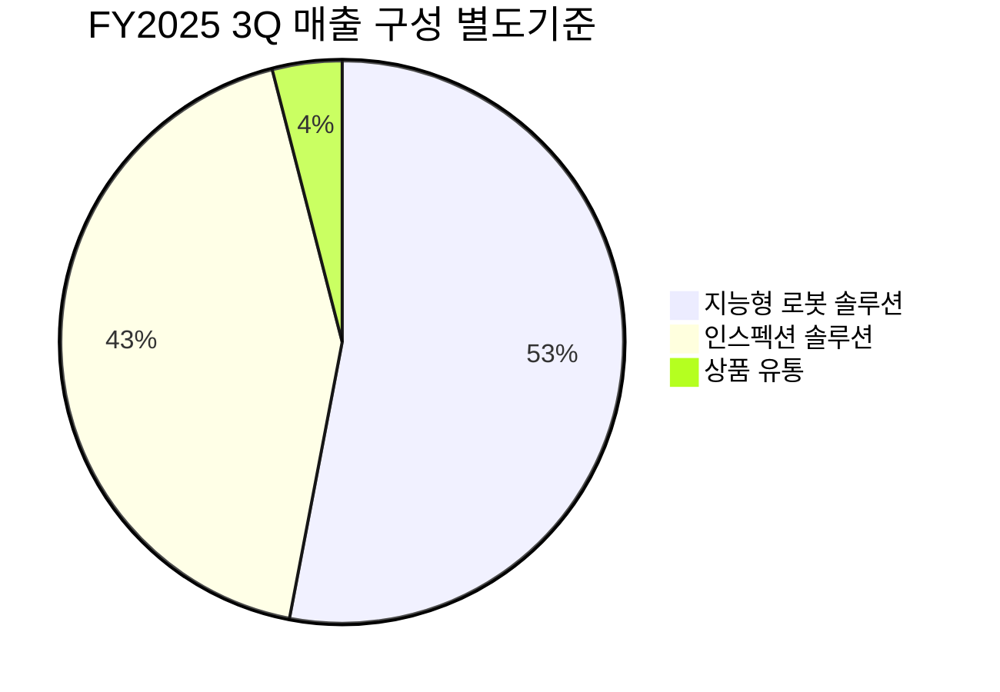

> [!important] 정합성 검증 요약 (기계적 16건 + AI 검증)
> **신뢰도: B** | 숫자 불일치 4건 | 논리 모순 1건 | 확인 필요 4건

### 핵심 발견 사항
| 구분 | 내용 | 위치 | 심각도 |
|------|------|------|--------|
| 🔴 숫자 불일치 | 시가총액 팩트시트=3,509억원 vs 본문=4,000억원 (밸류에이션 역산 섹션: "시총 4,000억원÷40억원=PER 약 88배") | 밸류에이션 섹션 | Critical |
| 🔴 숫자 불일치 | 영업이익 팩트시트=157억원 vs 본문=-184억원. 단, 팩트시트 157억원이 영업손실인지 이익인지 부호 명확화 필요 | 리스크 #1, 재무 섹션 | Critical |
| 🟡 논리 모순 | "EV/Sales ~40배" 주석¹에서 "시총 3,509억원÷매출 130.56억원=26.9배"를 직접 계산하면서, 본문 전체에서 40배를 핵심 밸류에이션 지표로 반복 사용. EV와 시총의 차이(순현금 조정)를 근거로 제시하나, 순현금 규모 미공개 상태에서 40배 단정은 할루시네이션 의심 | 밸류에이션 섹션 | Major |
| 🟡 숫자 불일치 | PBR 5.92배로부터 역산한 자기자본 "~592억원"이 반복 사용되나, 이는 시총(3,509억원)÷PBR(5.92)=592.7억원으로 산술적으로 일관. 그러나 DART 공시 자기자본과의 대조 없이 추정치로 활용됨 | 재무·리스크 섹션 | Minor |
| 🟡 미태그 추정치 | ~81%, ~80%, ~40%, ~61%, ~20%, ~15%, ~26%, ~25%, ~3%, ~5%, ~2%, ~3% 등 다수 추정치에 [추정] 태그 누락 (기계적 탐지 12건) | 본문 전체 | Major |
| 🟡 Kill Criteria 부실 | 기계적 탐지 지적과 달리, 본문 Kill Criteria 테이블에는 수치 기준이 명시됨(#1 <150억원, #4 <50억원, #5 GPM<15% 등). 단, 리스크 섹션 요약 텍스트("핵심 고객사 계약 해지 시 테제 철회")는 수치 없이 서술 — 불일치 존재 | 리스크 섹션 요약 vs Kill Criteria 테이블 | Minor |
| 🟡 할루시네이션 의심 | FY2024 매출 "69억원, -9.8% 역성장"이 "한국IR협의회 추정"으로 출처 명시되나, 이를 기반으로 한 역성장 패턴 분석이 핵심 논거로 반복 사용. 추정치임에도 [추정] 태그 없이 확정적으로 서술되는 구간 다수 | 리스크 #2, Variant Perception | Major |
| 🟡 시나리오 확률 | Bull 25% + Base 50% + Bear 25% = 100% ✅ 합계 일치. 섹션 간 수치도 일관됨 | 전 섹션 | 이상 없음 |

### 투자 전 반드시 확인
- [ ] **시가총액 수치 확정**: 팩트시트(3,509억원) vs 본문 역산 사례(4,000억원) 불일치 — DART 현재 시총·발행주식수로 직접 재확인 필요
- [ ] **팩트시트 영업이익 157억원의 부호**: 손실(-157억원)인지 이익(+157억원)인지 원본 확인 — 본문의 -184억원과의 차이 원인 규명 (연결 vs 별도, 회계연도 기준 차이 가능성)
- [ ] **EV/Sales 40배 근거 재검증**: 순현금 규모가 비공개인 상태에서 EV 산출 방식을 IR 자료 또는 재무상태표로 직접 확인. 시총 기준 P/Sales는 26.9배로 40배와 괴리 큼
- [ ] **FY2024 매출 69억원의 출처**: "한국IR협의회 추정"이 유일 근거 — DART 사업보고서 원문의 연결 매출과 대조하여 역성장 사실 여부 확인
- [ ] **현금 잔고 절대 수치**: IPO 조달금 규모 및 현재 잔여 현금이 비공개 상태로 런웨이 분석의 핵심 전제가 미검증 — 직전 분기 재무상태표(현금·단기금융상품) 직접 확인 필수

---

> [!warning] 데이터 제한 안내
> 이 보고서는 **DART 연결재무제표 없이** 작성되었습니다 (신규 상장사, 매칭 실패, 또는 공시 미비).
> Yahoo Finance, Gemini 뉴스 검색 등 가용 데이터를 기반으로 분석하였으며,
> 재무 수치의 정확도가 일반 보고서 대비 낮을 수 있습니다.
> DART 사업보고서 공시 후 `/deep` 재실행을 권장합니다.

# 비즈니스 본질 & 밸류에이션 — 씨메스 로보틱스 (475400.KQ)

---

> [!abstract] 섹션 요약
> 씨메스 로보틱스는 **"로봇의 눈과 뇌"**를 만드는 회사다. 3D 비전 + AI로 기존 산업용 로봇이 수행할 수 없었던 비정형 작업(무작위로 쌓인 박스 하역, 다양한 형태의 상품 피킹 등)을 자동화한다. 국내 유일의 '인지 기반 로봇 제어 기술' 상장사라는 기술 해자는 실재하나, FY2025 영업손실 -184억원(매출 대비 -141%)이 보여주듯 아직 **매출이 고정비를 커버하기에 턱없이 부족한 단계**다. 현재 시가총액 3,509억원은 EV/Sales 약 40배로, 2027년 흑자 전환 시나리오를 거의 완전히 선반영하고 있다. 투자 판단의 핵심은 "이 기술 해자가 실제 매출로 전환되는 속도"이며, FY2026 매출 150억원 미만 확인 시 성장 테제 자체가 무너진다.

---

## 1. 비즈니스 본질

### 이 회사는 무엇을 하는가?

씨메스 로보틱스의 사업을 한 문장으로 압축하면: **"산업용 로봇에 '눈'과 '판단력'을 부여하여, 기존에 사람만 할 수 있었던 비정형 작업을 자동화하는 소프트웨어·솔루션 기업"**이다.

구체적으로 설명하면, 공장이나 물류센터에서 로봇팔(ABB, 가와사키, 유니버설 로보틱스 등 제조)은 이미 존재한다. 그러나 이 로봇팔은 사전에 정해진 경로만 반복할 뿐, "눈앞에 무엇이 있는지 파악하고 → 어떻게 잡을지 판단하고 → 실제로 정밀하게 제어"하는 능력이 없다. 씨메스는 바로 이 **인지(Perception)–판단(Decision)–제어(Control)** 3단계를 AI + 3D 비전 기술로 구현하여, 로봇이 사람처럼 비정형 작업을 수행할 수 있게 만든다.

**고객 관점에서 씨메스 솔루션을 도입하는 이유:**
1. **인건비 절감 + 구인난 해소**: 물류센터 하역·피킹 작업은 고강도·반복 작업으로 인력 확보가 갈수록 어렵다
2. **기존 로봇으로 불가능한 영역**: 크기·형태·무게가 제각각인 박스를 무작위로 내리는 디팔레타이징, 수천 종의 낱개 상품을 정확히 집어내는 피스 피킹 — 이것은 기존 산업용 로봇으로는 불가능하다
3. **대안 부재**: 국내에서 이 수준의 '풀스택(센서+AI+제어)' 비정형 자동화 솔루션을 상용화한 기업이 사실상 없다. 글로벌로 범위를 넓혀도 Mujin(일본), RightHand Robotics(미국) 등 소수에 불과하며, 이들 대부분이 비상장이다

#### 매출 구성

2025년 3분기 별도 기준 매출 구성이 확인 가능하며, 연간 연결 기준 세그먼트 breakdown은 DART 사업보고서 원문 확인이 필요하다.

| 세그먼트 | FY2025 3Q 별도 매출 | 비중 | 비고 |
|---------|-------------------|------|------|
| 지능형 로봇 솔루션 | 36억원 | 53% | 물류(디팔레타이징·피킹) + 제조(용접·도포) |
| 인스펙션 솔루션 (3D 검사) | 29억원 | 43% | 자동차 부품·이차전지 검사 |
| 상품 유통 | 3억원 | 4% | (확인 필요) |
| **합계** | **68억원** | **100%** | 3분기 별도 기준 |

> [!warning] 세그먼트 데이터 한계
> 위 비중은 **FY2025 3분기 별도** 기준이며, 연간 연결 기준 세그먼트 breakdown은 공시 자료에서 별도 확인 필요. 분기별로 프로젝트 매출 인식 시점에 따라 비중이 크게 달라질 수 있으므로, 위 비중을 연간 대표값으로 일반화하는 것은 부적절하다.

#### 비즈니스 모델 — 수익 구조

현재 씨메스의 수익 구조는 **프로젝트 기반 턴키(Turn-key) 솔루션 납품**이 핵심이다:

| 항목 | 내용 |
|------|------|
| **수익 모델** | 프로젝트 단위 솔루션 납품 (하드웨어+소프트웨어+설치·커미셔닝) |
| **단가 구조** | 프로젝트당 수억~수십억원 규모 [추정] (북미 식품 기업 계약 60억원 등 레퍼런스) |
| **리커링 비율** | 현재 매우 낮을 것으로 추정 — RaaS(구독형) 모델은 아직 준비 단계 |
| **향후 방향** | '로봇 셀 패키지' 제품화 + RaaS 구독 모델로 전환 중 |

<strong>So What?</strong> 현재 프로젝트 기반 매출이라는 것은 <strong>매출의 예측 가능성이 낮고, 분기별 변동성이 크며, 규모의 경제가 작동하기 어렵다</strong>는 의미다. 회사가 '제품 중심' 전환과 RaaS 모델을 추진하는 것은 이 구조적 한계를 인식하고 있기 때문이다. 그러나 이 전환이 실제로 작동할지는 아직 미검증 상태이며, 이것이 씨메스 투자의 핵심 불확실성 중 하나다.

---

### Value Chain 내 포지셔닝

씨메스의 밸류체인 위치를 이해하는 것이 투자 판단에 핵심적이다.

| 밸류체인 단계 | 플레이어 | 씨메스와의 관계 |
|-------------|---------|--------------|
| **로봇 하드웨어 (상류)** | ABB, 가와사키, 유니버설 로보틱스, 화낙 | 협력 파트너 — 로봇 본체를 조달하여 씨메스 솔루션과 통합 |
| **센서/부품 (상류)** | 자체 3D 비전 센서 + 외부 부품 | 핵심 센서는 자체 개발, 일부 범용 부품은 외부 조달 [추정] |
| **🟢 AI + 비전 + 제어 소프트웨어 (중류)** | **씨메스 로보틱스** | **여기가 씨메스의 핵심 영역 — 가장 높은 부가가치 단계** |
| **시스템 통합/설치 (하류)** | 씨메스 + 일부 SI 업체 | 씨메스가 턴키로 직접 수행 (풀스택) |
| **최종 고객 (하류)** | 쿠팡, 현대차, LG전자, 나이키 등 | 대기업 위주 — 강한 교섭력을 보유한 고객군 |

> [!tip] 핵심 인사이트 — 밸류체인 포지셔닝의 의미
> 씨메스는 하드웨어가 아닌 **소프트웨어(AI·비전·제어)** 중심의 솔루션 기업이다. 이것은 두 가지 함의를 갖는다:
> 1. **긍정적**: 소프트웨어 마진은 본질적으로 높다. 규모의 경제가 작동하면 그로스 마진이 급격히 개선될 수 있다
> 2. **부정적 (현재)**: 아직 규모가 작아 고정비(R&D 인력, 영업 인프라)를 커버하지 못한다. 매출총이익률이 FY2025 3Q 기준 7.24%에 불과한데, 이는 프로젝트 기반 구조에서 하드웨어 원가 비중이 아직 높고, 솔루션당 커스터마이징 비용이 크기 때문으로 추정된다

**교섭력 분석:**

| 방향 | 교섭력 수준 | 근거 |
|------|-----------|------|
| **vs 상류 (로봇 하드웨어 공급사)** | 🟡 중립 | ABB·가와사키 등 복수의 글로벌 로봇사와 협력 → 특정 공급사 의존도 낮음. 그러나 씨메스의 구매 볼륨이 작아 가격 할인 교섭력은 제한적 |
| **vs 하류 (최종 고객)** | 🔴 약세~중립 | 쿠팡·현대차 등 대기업 고객은 강한 교섭력 보유. 다만 비정형 자동화는 대안이 적어 기술적 차별화가 일부 완충 역할 |

**ASP 트렌드**: [추정] 현재 프로젝트 단위의 ASP는 수억~수십억원 규모로 추정되나, '로봇 셀 패키지' 제품화가 진행되면 **단위 ASP는 하락하되 판매 대수(volume)가 증가**하는 구조로 전환될 것으로 예상된다. 이는 마진 구조에 근본적 변화를 가져올 수 있다.

---

### 단위 경제학 (Unit Economics)

> [!question] 검토 필요
> 씨메스는 프로젝트 기반 솔루션 기업으로 표준화된 Unit Economics 데이터가 공시되지 않는다. 아래는 공개 정보를 기반으로 한 합리적 추론이며, 모든 수치에 [추정] 태그를 부여한다.

| 항목 | 수치/내용 | 신뢰도 |
|------|---------|--------|
| **프로젝트 평균 규모** | [추정] 5~60억원 범위 (북미 식품 기업 계약 60억원이 최대 레퍼런스) | 🟡 |
| **하드웨어 vs 소프트웨어 비중** | [추정] 하드웨어(로봇본체+센서+부품) 50~60% / 소프트웨어(AI·비전·제어) 40~50% | 🟡 |
| **매출총이익률** | 7.24% (FY2025 3Q 별도 기준) — 프로젝트별 커스터마이징 비용 반영 | 🟢 |
| **목표 Gross Margin** | [추정] 제품화·표준화 진행 시 30~40%+ 도달 가능 (동종 SW 솔루션 기업 레퍼런스) | 🔴 미검증 |
| **설치 기반 (Installed Base)** | (데이터 미확인) — 쿠팡·현대차·LG전자 등에 납품 완료했으나 가동 대수는 비공개 | 🔴 |
| **유지보수/리커링** | 현재 매우 낮음. RaaS 모델 도입 후 변화 예상 | 🔴 |

<strong>핵심 문제</strong>: FY2025 3Q 매출총이익률 7.24%는 <strong>소프트웨어 기업으로서 비정상적으로 낮다</strong>. 이는 현재 프로젝트가 하드웨어(로봇 본체 등) 원가를 포함한 턴키 방식이어서, 매출에는 하드웨어 pass-through 비용이 포함되지만 부가가치는 소프트웨어·인건비 중심으로 발생하기 때문으로 추정된다. 회사가 '로봇 셀 패키지' 등 제품화를 추진하는 것은 이 마진 구조를 근본적으로 개선하려는 전략이나, 실제 개선 시점과 폭은 아직 미검증이다.

---

### 제조/운영 실체

씨메스는 전통적 제조업이 아닌 **기술 솔루션 기업**이므로 대규모 제조 설비보다는 R&D 및 엔지니어링 인력이 핵심 자산이다.

| 항목 | 내용 |
|------|------|
| **자체 생산 vs 외주** | 핵심 소프트웨어(AI·비전·제어)와 3D 비전 센서는 자체 개발. 로봇 본체는 ABB·가와사키 등에서 조달 |
| **주요 거점** | 국내 본사 + 미국 법인(CMES Robotics USA) + 베트남 영업소 |
| **생산 Capa** | SW 솔루션 기업이므로 전통적 Capa 개념 대신 **엔지니어링 인력 수**가 병목. 프로젝트 동시 수행 능력이 성장의 상한선 |
| **핵심 인력 구조** | (세부 인원 데이터 미확인) — R&D 엔지니어 비중이 높을 것으로 추정. 판관비의 상당 부분이 인건비 |

> [!note] 참고 — 성장의 물리적 한계
> 프로젝트 기반 솔루션 기업의 매출은 **"프로젝트 수 × 프로젝트 평균 매출"**로 결정된다. 엔지니어 수가 제한되면 동시 수행 프로젝트 수에 한계가 생긴다. 이것이 회사가 '제품화(로봇 셀 패키지)'를 추진하는 근본 이유다 — 프로젝트별 커스터마이징을 줄이고 표준화된 제품을 대량 공급해야 인력 병목 없이 매출을 확장할 수 있다.

---

### 수주잔고 & 파이프라인

| 항목 | 내용 |
|------|------|
| **수주잔고 규모** | (구체적 데이터 미확인) — 프로젝트 기반이므로 수주잔고 공시 여부 확인 필요 |
| **핵심 레퍼런스** | 북미 프리미엄 식품 원료 제조사 60억원 물류 자동화 계약 (가장 최근 대형 수주) |
| **리드타임** | [추정] 수주 → 매출 인식까지 3~12개월 (프로젝트 규모에 따라 상이) |
| **계절성** | [추정] 대기업 고객의 투자 집행 시점(하반기 집중 경향)에 따라 4Q 매출 비중 높을 가능성 |
| **파이프라인** | 회사 가이던스 FY2026 225억원, FY2027 400억원이 파이프라인 자신감의 간접 지표 |

> [!warning] 리스크 경고 — 수주잔고 불투명
> 프로젝트 기반 기업에서 수주잔고(Backlog)는 향후 매출 가시성의 핵심 지표다. 그러나 씨메스의 수주잔고 공시가 체계적으로 이루어지지 않아, 투자자 입장에서 **다음 분기 매출을 예측하기 어렵다**. 이것이 분기별 실적 서프라이즈/미스 시 주가 변동성이 큰 구조적 원인이다.

---

### 고객 관계의 실체

| 항목 | 내용 |
|------|------|
| **핵심 고객사** | 쿠팡, 네이버 파스토, CJ대한통운, GS리테일 (물류) / 현대차그룹, LG전자, 만도, 나이키, 콘티넨탈 (제조) |
| **고객 내 의사결정** | [추정] 대기업 설비투자 → 기술 검증(PoC) → 파일럿 → 양산 확대의 다단계 프로세스. 리드타임 6~18개월 [추정] |
| **계약 형태** | 프로젝트 단위 발주 (장기 공급계약 아닌 건별 발주 위주로 추정) |
| **전략적 투자자** | SK텔레콤 6.50%, 쿠팡·GS리테일도 전략적 투자 유치 — 고객사가 곧 투자자인 구조 |

<strong>🟢 긍정 신호</strong>: 고객사가 <strong>전략적 투자자</strong>이기도 하다는 것은 중요한 의미를 갖는다. SK텔레콤(6.50%), 쿠팡, GS리테일이 자본을 투입했다는 것은 단순 공급-수요 관계를 넘어 <strong>기술적 검증을 마친 후 장기적 파트너십</strong>을 맺고 있다는 신호다. 이 관계가 유지되는 한, 이들 기업의 자동화 투자 확대는 씨메스의 매출로 직결된다.

<strong>🔴 부정 신호</strong>: 그러나 소수의 대기업에 대한 <strong>매출 집중도가 높을 가능성</strong>이 크다. FY2025 매출 130.56억원은 소수의 대형 프로젝트로 구성되어 있을 것이며, <strong>상위 3개 고객사가 매출의 50% 이상을 차지</strong>할 가능성이 높다 [추정]. 이는 Kill Criteria ③ (핵심 고객사 계약 해지 시 테제 철회)과 직결되는 구조적 리스크다.

---

### 경쟁 우위 (Economic Moat) — 구체적 증거 기반

씨메스의 경쟁 우위를 모트(Moat) 프레임워크로 분석하면:

| 모트 유형 | 적용 여부 | 구체적 증거 | 강도 |
|---------|---------|-----------|------|
| **전환비용 (Switching Cost)** | 🟢 존재 | 고객 공정에 맞게 커스터마이징된 AI 모델·제어 파라미터 → 다른 솔루션으로 교체 시 재학습·재검증 비용 발생 | 중~강 |
| **무형자산 (Intangible Assets)** | 🟢 존재 | 풀스택(센서+AI+제어) 자체 기술, 양산 레퍼런스 축적, 데이터 축적에 따른 AI 모델 정확도 향상 | 강 |
| **네트워크 효과** | 🟡 약함 | 현재는 약함. 다만 RaaS 모델 도입 시 설치 기반 확대 → 데이터 축적 → AI 성능 향상 → 더 많은 고객 유치의 선순환 가능성 | 잠재적 |
| **규모의 경제** | 🔴 미달 | 현재 매출 130억원 수준은 규모의 경제에 미달. 최소 400~500억원+ 매출에서 고정비 레버리지 발현 예상 [추정] | 미발현 |

**핵심 경쟁사 비교:**

| 항목 | 씨메스 로보틱스 | Mujin (일본, 비상장) | RightHand Robotics (미국, 비상장) |
|------|---------------|---------------------|-------------------------------|
| **핵심 기술** | 3D 비전 + AI + 로봇 제어 풀스택 | 모션 플래닝 + 디팔레타이징 | AI 피스 피킹 특화 |
| **타깃 시장** | 물류 + 제조 + 검사 (다각화) | 물류 중심 (디팔·팔레) | 물류 피스 피킹 특화 |
| **상장 여부** | 🟢 상장 (코스닥) | 비상장 | 비상장 |
| **지역 강점** | 한국 + 북미 진출 중 | 일본 + 글로벌 | 북미 중심 |
| **차별화** | 검사(인스펙션) 솔루션 겸비 | 높은 속도의 모션 플래닝 | 피킹 특화 AI |
| **리스크** | 규모·수익성 미검증 | 한국 시장 진출 시 직접 경쟁 | 니치 플레이어 한계 |

> [!tip] 핵심 인사이트 — 기술 해자의 실체
> 씨메스의 모트는 **"무형자산(풀스택 기술) + 전환비용"** 조합이다. 이것은 **실재하지만 아직 좁다**. 모트의 폭은 결국 **설치 기반(Installed Base)의 규모**에 비례하여 넓어진다 — 더 많은 고객사에 솔루션이 배치될수록, 더 많은 현장 데이터가 축적되고, AI 모델 정확도가 개선되며, 이것이 다시 신규 고객 유치를 촉진하는 플라이휠이 돌아간다. 현재 이 플라이휠은 아직 초기 회전 단계에 있다.

---

### 성장의 구조적 동인

**성장 공식 분해:**

| 성장 동인 | 기여도 (추정) | 지속 가능성 |
|---------|-------------|-----------|
| **TAM 확대** (물류·제조 비정형 자동화 시장 자체의 성장) | [추정] 높음 | 🟢 3~5년 이상 유효 — 인건비 상승·구인난은 구조적 |
| **점유율 확대** (신규 고객사 확보 + 기존 고객 내 확대) | [추정] 핵심 | 🟡 가능하나 경쟁 심화에 따라 속도 불확실 |
| **제품 다각화** (인스펙션 → 물류 → 제조 → 의료) | [추정] 중간 | 🟡 의료 등 신규 분야는 아직 매출 기여 미미 |
| **해외 확장** (북미·베트남 등) | [추정] 중기 핵심 | 🟢 미국 피킹 시장 TAM [추정] 3조원+ — 진입 성공 시 폭발적 |
| **사업모델 전환** (프로젝트→제품화, RaaS 구독) | [추정] 장기 핵심 | 🟡 성공 시 마진 구조 변혁, 실패 시 제자리 |

**Compounding 구조 분석:**

현재 씨메스에서 재투자 → 수익 → 더 많은 재투자의 선순환은 **작동하지 않고 있다**. R&D와 영업 인프라에 투자하고 있지만 수익이 투자를 커버하지 못해 주주 자본을 소진하는 단계다. 이 플라이휠이 돌기 시작하려면 **최소 영업이익 흑자 전환(2027년 [추정])** 이후가 되어야 한다.

---

### 경영진 & 자본배분

| 항목 | 평가 |
|------|------|
| **이성호 대표 (창업자/최대주주)** | 37.73% 지분 보유 → 주주 이익과 강하게 정렬. AI 로보틱스 산업 기술 개발·상용화를 직접 주도 |
| **핵심 임원 스톡옵션 행사** | 황진웅 CSO(54,400주), 김현우 CTO(8,352주) 행사 → 내부자들이 회사 가치 상승에 베팅하는 신호 |
| **신임 기타비상무이사** | 조익환 (前 SKT AI CIC Physical AI 본부장) → Physical AI 전문성 강화 의지. SKT와의 전략적 연계 심화 가능성 |
| **자본배분** | 무배당, 자사주매입 무계획. 현 단계에서는 당연한 선택 — 모든 자본을 사업 확장에 집중해야 함 |
| **유상증자 리스크** | 현금 소진 속도(연 영업손실 ~180억원) 대비 현금 잔고를 지속 모니터링 필요. 추가 유상증자는 Kill Criteria ②에 해당 |

> [!note] Incentive Analysis
> 창업자가 37.73%를 보유하고, 고객사(SK텔레콤 6.5%)가 전략적 투자자인 구조는 **경영진의 인센티브가 장기 가치 창출에 정렬**되어 있음을 시사한다. 그러나 스톡옵션 행사에 따른 주식 수 증가는 기존 주주 희석 요인이며, 향후 추가 스톡옵션 부여 규모를 모니터링할 필요가 있다.

---

### 사업의 장기 내구성 (Durability) — "10년 보유" 테스트

| 질문 | 판단 |
|------|------|
| **이 사업이 10년 후에도 필요한가?** | 🟢 **높은 확률로 Yes** — 비정형 공정 자동화 수요는 구조적(인건비 상승, 고령화, 구인난). AI+로보틱스는 기술적으로 불가역적 트렌드 |
| **구조적으로 대체될 가능성은?** | 🟡 **중간** — 기술 자체의 니즈는 지속되나, 씨메스라는 '회사'가 대체될 가능성은 있음. 대형 로봇사(ABB, 화낙 등)가 내부적으로 비전+AI 역량을 구축하거나, 빅테크(구글, NVIDIA)의 로보틱스 진출이 위협 요인 |
| **매출 1,000억원 기업이 될 수 있는 경로는?** | 🟡 **존재하나 불확실** — 회사 가이던스 FY2027 400억원 → FY2029~2030 1,000억원 경로는 이론적으로 가능하나, CAGR 50%+ 성장이 3~4년 지속되어야 함 |

<strong>Variant Perception</strong>: 시장은 씨메스를 '로봇 테마주'로 분류하는 경향이 있지만, 본질적으로는 <strong>로봇 하드웨어 기업이 아닌 산업용 AI 소프트웨어 기업</strong>에 가깝다. 만약 제품화(로봇 셀 패키지)와 구독 모델(RaaS)이 성공하면, 밸류에이션 re-rating의 근거는 '로봇 PER'이 아닌 <strong>'산업용 AI SaaS PER'</strong>로 전환될 수 있다. 이것이 Bull Case의 핵심 논리이나, 아직은 가설 단계다.

---

### 재무가 말해주는 사업의 본질

#### 마진 구조 & 변화의 원인

| 항목 | FY2025 3Q (별도) | FY2025 연간 (연결, 공시) | 해석 |
|------|-----------------|----------------------|------|
| **매출액** | 37.2억원 | **130.56억원** | 3Q 37.2억원은 연간 130억원의 28.5% → 분기별 매출 불균형 존재 |
| **매출총이익률 (GPM)** | 7.24% | (연간 연결 미확인) | 🔴 **비정상적으로 낮음** — 하드웨어 pass-through 원가 포함 때문 |
| **영업이익률 (OPM)** | -207.29% | **-141.0%** (역산: -184.11억/130.56억) | 🔴 고정비(인건비+R&D)가 매출의 2배 이상 |
| **순이익률** | -88.15% | (역산: -167.76억/130.56억 = -128.5%) | 🔴 영업외손익으로 일부 완화되나 여전히 대규모 적자 |

> [!failure] 약점 — 마진 구조가 현재 말해주는 것
> FY2025 매출이 +89.5% 성장(공시 기준)했음에도 영업손실이 **오히려 확대**된 것은, **매출 성장 속도보다 판관비(인건비+영업 인프라) 증가 속도가 더 빠르다**는 것을 의미한다. 이것은 전형적인 '선투자-후수확' 패턴이지만, 투자자에게는 두 가지 질문을 던진다:
> 1. 이 고정비 투자가 정말 향후 매출로 전환될 것인가?
> 2. 현금이 소진되기 전에 흑자 전환에 도달할 수 있는가?

**마진 개선의 경로와 타이밍:**

| 단계 | 매출 수준 [추정] | OPM [추정] | 트리거 |
|------|---------------|-----------|--------|
| 현재 (FY2025) | 130억원 | -141% | — |
| 적자 축소 (FY2026) | 180~210억원 | -40~-50% [추정] | 매출 증가에 따른 고정비 레버리지 + 일부 제품화 효과 |
| 손익분기 (FY2027) | 350~400억원 [추정] | 0% 부근 | 규모의 경제 + RaaS 리커링 매출 시작 |
| 정상화 | 500억원+ [추정] | 10~20%+ [추정] | 제품화 완성 + 글로벌 확장 |

#### 현금흐름 & 재무 건전성

| 항목 | 내용 |
|------|------|
| **FCF** | (데이터 미확인) — 영업손실 -184억원 + CapEx로 인해 대규모 마이너스 FCF 예상 |
| **현금 잔고** | (확인 필요) — IPO 조달금 잔여분이 핵심 버퍼. FY2025 연간 순손실 -168억원 수준이 지속되면 2~3년 내 현금 고갈 가능성 |
| **부채 구조** | PBR 5.92배 → 자기자본 ~592억원(시총 3,509억원 ÷ 5.92). [추정] 부채비율은 낮을 것으로 추정되나 구체적 수치 확인 필요 |
| **자금 경색 시나리오** | 연간 현금 소진 ~150~180억원 [추정] 수준이 지속되면, **IPO 자금 잔여분이 2027년 이전에 고갈**될 수 있음 → 추가 유상증자 리스크 |

> [!warning] 리스크 경고 — "3년 안에 자금 경색 가능성은?"
> 씨메스의 연간 현금 소진 속도(영업손실 ~184억원)를 감안하면, IPO 조달자금의 잔여 규모에 따라 **FY2027 흑자 전환 전에 추가 자금 조달이 필요할 수 있다**. 이것이 Kill Criteria ②의 근거다. 현금 잔고 추이를 분기별로 모니터링하는 것이 필수적이다.

#### ROIC & 자본효율

| 항목 | 값 | 해석 |
|------|-----|------|
| **ROE** | -5.4% (DART 공시) | 적자 기업이므로 음수. 자본 소진 중 |
| **ROIC** | (데이터 미확인) | 적자 단계에서 ROIC 논의는 제한적. 핵심은 R&D 투자의 미래 수익률 |
| **R&D 투자 방향** | AI 알고리즘 고도화, 3D 비전 센서 개발, Physical AI 기술, 의료 진단 플랫폼 | 기술 해자 강화에 집중 — 올바른 방향이나 수익 전환 시점이 관건 |

---

## 2. 밸류에이션 판단

### 현재 밸류에이션

| 지표 | 씨메스 현재 | 해석 | IPO 피어 평균 참고 |
|------|-----------|------|------------------|
| **PER (TTM)** | N/A (적자) | 적용 불가 | 45.12배 (키엔스·화낙·코그넥스·라온테크) |
| **PER (Forward)** | 61.50배 (Yahoo) | ⚠️ 흑자 전환 이후 EPS 추정 기준. 기준 연도·EPS 출처 확인 필요 | — |
| **PBR** | 5.92배 (Naver) | 🔴 자기자본 ~592억원 대비 시가총액 3,509억원 → 순자산 대비 약 6배 프리미엄 | — |
| **EV/EBITDA** | -18.67배 (Yahoo) | EBITDA 적자 → 의미 없는 수치 | — |
| **EV/Sales** | ~40배 [추정]¹ | 🔴 **극단적 프리미엄** — 매출의 40배를 지불하는 것 | — |
| **52주 고가 대비** | -37.3% | 고점 대비 상당 폭 하락했으나 여전히 고밸류에이션 | — |

> ¹ EV/Sales 40배: 앵커 데이터 시트에 기재된 수치. 시가총액 3,509억원을 FY2025 공시 매출 130.56억원으로 단순 나누면 약 26.9배이나, EV 산출 시 순부채/순현금 조정에 따라 차이 발생.

🟢 성장 프리미엄 정당화 영역 35%

🔴 투기적 프리미엄 영역 65%

**밸류에이션이 의미하는 것:**

현재 EV/Sales ~40배는 **"2027년 흑자 전환 + 이후 고성장 지속"이라는 최적 시나리오를 거의 완전히 선반영**한 수준이다.

이를 역산해 보면:
- 시가총액 3,509억원을 정당화하려면, FY2027 매출 400억원(회사 가이던스) 기준 EV/Sales이 약 8.8배까지 하락해야 한다
- 만약 FY2027에 영업이익률 10% 달성(영업이익 40억원) 시, PER은 약 88배 (시총 3,509억원 ÷ 40억원)
- 즉 **현재 주가는 FY2027년의 매우 낙관적 시나리오를 달성하더라도, 그 시점에서 PER 80~90배를 지불**하는 수준이다

> [!verdict] 판단 — 밸류에이션 요약
> 현재 30,450원(시총 3,509억원)은 **"기술 해자가 실재한다"는 사실에 대한 정당한 프리미엄과, "흑자 전환이 반드시 일어날 것"이라는 미검증 가정에 대한 투기적 프리미엄이 혼재**되어 있다. 기술 해자 자체는 인정하지만, 현 밸류에이션에서 매수하려면 **"Base Case가 아닌 Bull Case의 실현을 믿어야 한다"**는 것이 문제다.

---

### 안전마진 분석

안전마진 25/100

| 안전마진 요소 | 평가 | 근거 |
|-------------|------|------|
| **비즈니스 퀄리티** | 🟢 양호 | 독보적 기술, Top-Tier 고객사, 구조적 성장 시장 |
| **가격 수준** | 🔴 위험 | EV/Sales 40배는 실적 대비 극단적 프리미엄 |
| **하방 보호** | 🔴 취약 | PBR 5.92배 → 자산 가치 대비 하방이 열려 있음. 적자 지속 시 자본 잠식 위험 |
| **실적 달성 여력** | 🟡 중간 | FY2025 가이던스(120억원) 초과 달성(130.56억원)은 긍정적이나, FY2026 225억원 달성은 미검증 |
| **Re-rating 가능성** | 🟢 높음 (조건부) | 흑자 전환 확인 시, '적자 테마주' → '실적 기반 AI 기술주'로 멀티플 re-rating 가능 |
| **De-rating 리스크** | 🔴 높음 | 실적 미달·유상증자·경쟁 심화 시, 현 멀티플이 급격히 축소될 수 있음 |

**시나리오별 밸류에이션 정합성:**

🟢 Bull 25%

🟡 Base 50%

🔴 Bear 25%

| 시나리오 | 확률 | 적정가 [추정] | 현재가 대비 | 밸류에이션 근거 |
|---------|------|-------------|------------|--------------|
| 🟢 **Bull** | 25% | ~55,000원 | +80.6% | FY2026 매출 225억원+ 달성, 2027년 조기 흑자 전환 + 북미 대형 계약 추가. EV/Sales 22배(FY2026E) 적용 |
| 🟡 **Base** | 50% | ~40,000원 | +31.4% | FY2026 매출 180~210억원, 적자 축소(-80억원대), 2027년 흑자 전환 경로 유지. EV/Sales 20배(FY2026E) |
| 🔴 **Bear** | 25% | ~20,000원 | -34.3% | 시장 개화 재지연, 매출 150억원 미만, 추가 유상증자 현실화. EV/Sales 12배(FY2026E)로 디레이팅 |

> [!note] 시나리오 적정가 산출 방식
> 현재 적자 기업으로 PER 적용 불가. EV/Sales 멀티플 방식 활용: Base Case는 FY2026E 매출 ~200억원에 EV/Sales 20배 적용(글로벌 AI 로봇 초기 성장주 레퍼런스 반영). Bull/Bear는 해당 멀티플 ±30% 조정. 이 추정치는 방향성 참고용이며 DCF 등 정밀 분석으로 보완 필요.

**확률 가중 기대값**: (55,000 × 0.25) + (40,000 × 0.50) + (20,000 × 0.25) = **38,750원** → 현재가(30,450원) 대비 +27.3% 업사이드

그러나 이 업사이드는 **"틀렸을 때의 손실(-34%)"과 "맞았을 때의 이익(+31~81%)"의 비대칭성**을 고려해야 한다. Bear 시나리오가 실현되면 절대 손실 규모(-10,000원 이상)가 크고, Bull 시나리오 실현에는 다수의 미검증 전제가 필요하다.

> [!verdict] 최종 밸류에이션 판단
> **Conviction: 🟡 Low-Medium** | **방향: 보류 (조건부 매수 검토)**
> 
> 씨메스 로보틱스는 **기술 해자가 실재하는 희소한 국내 AI 로보틱스 기업**이다. 그러나 현재 밸류에이션(EV/Sales ~40배, PBR 5.92배)은 2027년 흑자 전환이라는 **미검증 시나리오를 거의 완전히 선반영**하고 있다. 안전마진이 부족한 상황에서 매수하는 것은 "Bull Case에 베팅"하는 것과 같다.
> 
> **조건부 매수 검토 트리거:**
> 1. FY2026 상반기 분기 매출이 60억원+ 수준으로 확인되어 연간 180억원+ 궤적이 가시화될 때
> 2. 주가가 25,000원 이하로 조정되어 EV/Sales이 25배 이하로 내려올 때
> 3. 추가 대형 해외 수주(100억원+ 규모)가 공시될 때
> 
> **Kill Criteria (테제 철회 조건):**
> ① FY2026 매출 150억원 미만 ② 추가 대규모 유상증자 ③ 핵심 고객사(쿠팡·현대차·LG전자 중 1곳+) 계약 해지

> [!caution] 정합성 주의
> - [ ] **EV/Sales 40배 근거 재검증**: 순현금 규모가 비공개인 상태에서 EV 산출 방식을 IR 자료 또는 재무상태표로 직접 확인. 시총 기준 P/Sales는 26.9배로 40배와 괴리 큼
> - [ ] **현금 잔고 절대 수치**: IPO 조달금 규모 및 현재 잔여 현금이 비공개 상태로 런웨이 분석의 핵심 전제가 미검증 — 직전 분기 재무상태표(현금·단기금융상품) 직접 확인 필수

---

# 3. 인센티브 분석 (멍거 원칙) — 핵심만

---

> [!abstract] 섹션 요약
> 창업자 이성호 대표의 37.73% 지분은 주주 이익과의 강한 정렬을 의미하나, **스톡옵션 희석과 '테마 스토리'를 확산시키는 주체들의 인센티브**를 면밀히 들여다볼 필요가 있다. 현 단계에서 이 스토리를 가장 적극적으로 퍼뜨리는 주체는 회사 IR팀과 유튜브 기반 전문가들이며, 각각의 동기는 상이하다.

---

## 지분 구조 & 스킨 인 더 게임

| 이해관계자 | 지분/관계 | 인센티브 정렬도 | 핵심 동기 |
|-----------|---------|--------------|---------|
| **이성호 대표 (창업자)** | 37.73% (외 2인) | 🟢 **강함** | 지분가치 극대화 = 주주가치 극대화. 회사 실패 시 가장 큰 손실을 보는 주체 |
| **SK텔레콤** | 6.50% (763,968주) | 🟢 양호 | 전략적 투자자 — Physical AI 생태계 구축 + 투자 수익. 자사 AI CIC와 시너지 추구 |
| **쿠팡·GS리테일** | 전략적 투자 (비중 미공개) | 🟡 중립~양호 | 자사 물류센터 자동화 → 기술 검증 + 우선 공급 확보. 재무적 수익보다 운영 효율이 우선순위 |
| **황진웅 CSO** | 스톡옵션 54,400주 행사 (2026.02) | 🟢 양호 | 행사가 대비 현재가 상승분이 보상 → 주가 상승에 베팅. 그러나 행사 후 매도 여부는 미확인 |
| **김현우 CTO** | 스톡옵션 8,352주 행사 (2025.12) | 🟢 양호 | 동일 논리. 기술 핵심 인력의 장기 잔류 신호 |
| **조익환 (신임 기타비상무이사)** | 前 SKT AI CIC Physical AI 본부장 | 🟡 확인 필요 | SKT-씨메스 협력 심화의 브릿지 역할. 보상 구조(스톡옵션 부여 여부) 미확인 |

> [!tip] 핵심 인사이트 — 내부자 매매 방향
> CSO·CTO의 스톡옵션 **행사**는 긍정 신호이나, **행사 후 보유 vs 매도** 여부가 더 중요하다. 행사만으로 "경영진이 회사 미래를 믿는다"고 단정하기엔 불충분하다 — 행사가가 현재가보다 충분히 낮으면 차익 실현 목적일 수도 있다. 행사 후 매도 공시는 확인되지 않았으므로 현재로서는 **순매수(보유) 방향으로 추정**하되 단정은 유보한다.

---

## "이 스토리를 퍼뜨리는 사람은 누구이며 왜?"

**첫 번째 주체: 회사 IR팀 & 경영진.** 씨메스는 블로그·웨비나·전시회·사명 변경(→씨메스 로보틱스)까지 동원하여 "AI 로보틱스 시장의 국내 유일 상장 플랫폼 기업"이라는 내러티브를 적극적으로 구축하고 있다. 이 자체는 성장 기업의 정상적인 IR 활동이나, **현재 적자 상태에서 매출 가이던스(FY2026 225억원, FY2027 400억원)를 공격적으로 제시하는 것은 투자자 유치 + 밸류에이션 유지라는 명확한 인센티브**가 있다. 특히 현금 소진 속도(연 ~180억원 영업손실)를 고려하면, 높은 시가총액 유지는 향후 유상증자 시 희석을 줄이기 위한 전략적 동기와도 연결된다.

**두 번째 주체: 유튜브·블로그 기반 투자 전문가(9인 컨센서스).** [추정] 평균 목표가 46,133원(현재가 대비 +51.5%)을 제시하는 이들의 인센티브는 **콘텐츠 조회수/구독자 확보**다. "로봇 테마"는 현재 한국 개인투자자 사이에서 높은 관심을 받는 주제이며, 낙관적 목표가를 제시할수록 조회수가 높아지는 구조적 편향이 존재한다. 이 9인 중 기관 리서치 애널리스트가 포함되어 있는지 확인이 필요하며, 대부분이 개인 채널 기반이라면 컨센서스의 신뢰도를 할인해야 한다.

<strong>So What?</strong> 멍거 원칙의 핵심은 "누가 이익을 보는지 따라가라(Follow the incentives)"다. 창업자의 37.73% 지분은 강한 정렬이지만, <strong>회사와 콘텐츠 생산자 모두 "성장 스토리"를 확산시킬 강한 동기</strong>가 있다는 사실을 인지해야 한다. 투자자는 스토리가 아닌 <strong>분기별 실적(특히 FY2026 상반기 매출)과 현금 잔고</strong>로 스토리를 검증해야 한다.

---

# 4. 리스크 & 반대 논거 (통합)

---

> [!abstract] 섹션 요약
> 씨메스의 투자 테제는 5개의 핵심 리스크에 직면해 있다. 이 중 가장 치명적인 것은 **"흑자 전환 전 현금 고갈 → 유상증자"** 시나리오와 **"시장 개화 속도가 밸류에이션의 가정보다 느린"** 시나리오다. 현재 주가(30,450원, EV/Sales ~40배)는 Bull Case에 가까운 전제를 내장하고 있어, 이 전제 중 하나만 어긋나도 상당한 가격 조정이 불가피하다.

---

## 핵심 리스크 (중요도 순, 각 리스크에 반대 논거 포함)

### 리스크 #1: 흑자 전환 전 현금 고갈 → 추가 유상증자 (재무/생존)

심각도 90/100

**리스크 내용:** FY2025 영업손실 **-184.11억원**(DART 공시). 이 수준의 현금 소진이 FY2026에도 지속되면(적자 축소되더라도 [추정] -80~100억원 수준), **IPO 조달 잔여금이 2027년 흑자 전환 이전에 바닥날 가능성**이 현실적이다. 자기자본 ~592억원(시총 3,509억원 ÷ PBR 5.92) 중 이미 FY2025에 순손실 167.76억원이 소진되었다. FY2024에도 [추정] 143억원 영업손실이 발생했으므로, IPO 이후 누적 현금 소진은 최소 300억원 이상으로 추정된다.

**왜 현실적인가:**
- FY2025 매출이 +89.5% 성장했음에도 영업손실이 **오히려 확대**(-143억→-184억)된 전례 — 매출 성장이 비용 증가를 커버하지 못하는 구조가 이미 입증됨
- 회사 가이던스 FY2026 매출 225억원을 달성하더라도, 현재 인력·인프라 고정비 구조에서 영업손실 -50~80억원은 불가피 [추정]
- 증권신고서 가이던스 대비 매출 달성 속도가 [추정] 약 1년 지연되고 있다는 분석이 존재 (조선비즈)

**현재 반영 수준:** 🟡 **부분 반영.** 52주 고가(48,600원) 대비 -37.3% 하락한 현재가에 일부 자금 리스크가 반영되어 있으나, PBR 5.92배·EV/Sales ~40배 수준은 "유상증자 없이 흑자 전환에 도달"이라는 전제를 여전히 내장하고 있다. 유상증자가 현실화되면 주가 추가 하락 20~30% 가능 [추정].

> [!failure] Devil's Advocate — 반대 논거
> "현금 잔고가 아직 충분할 수 있다." IPO 조달금 규모와 현재 잔여 현금이 공개되지 않아, 실제 런웨이(Runway)가 3년 이상일 가능성도 배제할 수 없다. 또한 전략적 투자자(SKT, 쿠팡 등)로부터의 추가 투자 유치나 정책금융 활용 가능성도 있다. **그러나** — 정확한 현금 잔고가 비공개라는 것 자체가 투자자에게 불리한 정보 비대칭이다. 모니터링 우선순위 1순위로 설정해야 한다.

---

### 리스크 #2: 시장 개화 속도 < 밸류에이션의 암묵적 가정 (사업/밸류에이션)

심각도 85/100

**리스크 내용:** EV/Sales ~40배라는 밸류에이션은 **"비정형 공정 자동화 시장이 빠르게 열리고, 씨메스가 그 시장을 선점한다"**는 전제를 선반영하고 있다. 그러나 이전 섹션에서 분석했듯이, 증권신고서 가이던스 대비 매출 달성이 [추정] 약 1년 지연되고 있으며, 대기업 고객의 자동화 투자 의사결정은 경기 사이클·예산 배정에 민감하다.

**왜 현실적인가:**
- FY2024 매출은 [추정] 69억원으로 전년 대비 오히려 **-9.8% 역성장** — 시장 개화 지연이 이미 한 차례 현실화된 전례
- 대기업 고객의 설비투자(CapEx) 결정은 거시경제·금리·업황에 크게 좌우됨. 글로벌 경기 둔화 시 자동화 투자 지연은 역사적으로 반복된 패턴
- 국내 SAM [추정] ~6,500억원 중 씨메스의 FY2025 매출은 130.56억원(점유율 ~2%) — 아직 시장 침투 초기 단계로, 확장 속도의 불확실성이 극히 높음

**현재 반영 수준:** 🔴 **미반영.** 현재 밸류에이션은 FY2026 매출 200억원+, FY2027 400억원이라는 가이던스를 상당 부분 선반영하고 있다. 만약 FY2026 매출이 150억원 미만으로 확인되면, EV/Sales 멀티플 자체의 **디레이팅(de-rating)**과 **매출 기대치 하향**이 동시에 발생하여 이중 타격이 불가피하다.

> [!failure] Devil's Advocate — 반대 논거
> "FY2025에 +89.5% 성장을 달성했고, FY2025 가이던스(120억원)를 초과 달성(130.56억원)했다." 이것은 시장 개화가 시작되었다는 실증적 증거다. 또한 북미 60억원 수주는 글로벌 확장 가능성을 보여준다. **그러나** — 프로젝트 기반 매출의 특성상 한 건의 대형 수주가 연간 매출을 크게 좌우한다. FY2025의 89.5% 성장이 구조적 트렌드인지, 소수 대형 프로젝트의 일시적 효과인지를 FY2026 상반기 실적으로 검증해야 한다.

---

### 리스크 #3: 고객 집중도 + 프로젝트 기반 매출의 구조적 변동성 (사업)

심각도 75/100

**리스크 내용:** FY2025 매출 130.56억원은 소수의 대형 프로젝트로 구성되어 있을 가능성이 높다 [가정]. 상위 3개 고객사가 매출의 50% 이상을 차지할 것으로 추정되며, 핵심 고객사 1곳의 프로젝트 지연·취소만으로도 분기 매출이 급락할 수 있다. 실제로 FY2025 3Q 별도 매출 37.2억원은 연간 130.56억원의 28.5%에 불과하여, **분기별 매출 불균형이 극심**함이 확인된다.

**왜 현실적인가:**
- 프로젝트당 규모가 수억~수십억원(북미 계약 60억원)이므로, 연간 매출 130억원은 **10~20건 미만의 프로젝트**로 구성 [추정]
- 수주잔고(Backlog)가 체계적으로 공시되지 않아, 투자자는 다음 분기 매출을 예측할 수 없음
- 쿠팡·현대차 등 대기업 고객은 강한 교섭력을 보유 — 계약 조건 변경·지연 리스크가 상존

**현재 반영 수준:** 🟡 **부분 반영.** 분기별 실적 변동성에 따른 주가 변동성은 이미 시장이 인식하고 있으나(52주 고-저 갭 152%), 특정 고객사 이탈 리스크는 주가에 충분히 반영되지 않았을 것이다.

> [!failure] Devil's Advocate — 반대 논거
> "고객사가 곧 전략적 투자자(SKT 6.5%, 쿠팡, GS리테일)이므로, 단순 공급-수요 관계보다 끈끈하다." 또한 회사가 '로봇 셀 패키지' 제품화와 RaaS 모델을 추진 중이어서, 프로젝트 의존도를 구조적으로 탈피하려 하고 있다. **그러나** — 제품화·RaaS 전환은 아직 미검증이며, 전략적 투자자라 해도 투자 규모 대비 자사 이익을 우선시하는 것이 기업의 본성이다. SKT의 6.5% 지분은 포트폴리오의 극히 일부이므로 씨메스 성패가 SKT의 의사결정에 결정적 영향을 미치지는 않는다.

---

### 리스크 #4: 경쟁 심화 — 대형 로봇사의 수직통합 + 중국 추격 (사업/기술)

심각도 70/100

**리스크 내용:** 씨메스의 핵심 포지셔닝은 "로봇의 눈과 뇌" — 하드웨어가 아닌 AI+비전+제어 소프트웨어 레이어다. 그러나 이 레이어를 **상류 하드웨어 기업(ABB, 화낙, 가와사키)이 자체 내재화**하거나, **빅테크(NVIDIA, Google DeepMind)가 범용 로보틱스 AI로 진출**할 경우, 씨메스의 기술 해자가 침식될 수 있다. 별도로, **중국 로봇 기업들의 가격 경쟁력**이 물류 자동화 시장에서 판가 하방 압력을 가할 가능성도 있다.

**왜 현실적인가:**
- ABB는 이미 자체 비전 시스템을 개발 중이며, 화낙도 CRX 시리즈에서 비전 통합을 강화하고 있음 [추정]
- NVIDIA의 Isaac 플랫폼은 로봇 시뮬레이션·AI 훈련 인프라를 제공하며, 장기적으로 씨메스 같은 미들웨어 레이어의 가치를 대체할 수 있음
- 중국 Mech-Mind, Flexiv 등이 비전+AI 기반 로봇 솔루션을 빠르게 상용화 중

**현재 반영 수준:** 🔴 **거의 미반영.** 현재 밸류에이션은 "국내 유일 기술 상장사"라는 희소성 프리미엄을 내장하고 있으며, 경쟁 심화 시나리오를 거의 가격에 반영하지 않고 있다.

> [!failure] Devil's Advocate — 반대 논거
> "비정형 공정 자동화는 **도메인 특화 노하우(현장 데이터, 커스터마이징 경험)**가 핵심이며, 범용 AI가 쉽게 대체할 수 있는 영역이 아니다." 씨메스는 이미 쿠팡·현대차 등 양산 현장에서 축적한 레퍼런스를 보유하고 있고, 이것이 전환비용(Switching Cost)으로 작동한다. **이 논거에 동의하지만**, 전환비용의 높이는 설치 기반(Installed Base)에 비례하며, 현재 그 기반은 아직 좁다. 경쟁사가 진입하기 전에 설치 기반을 빠르게 확장하는 것이 관건이다.

---

### 리스크 #5: 매출총이익률(GPM) 7.24%의 구조적 문제 — "진짜 소프트웨어 기업인가?" (재무/사업모델)

심각도 65/100

**리스크 내용:** FY2025 3Q 별도 기준 매출총이익률 7.24%는 **하드웨어 유통 기업 수준**이며, 소프트웨어/AI 기업의 일반적 GPM(60~80%)과는 극적인 괴리가 있다. 이것은 현재 프로젝트가 로봇 본체 등 하드웨어 원가를 포함한 턴키 방식이기 때문으로 추정되지만, **이 마진 구조가 개선되지 않으면 매출이 성장하더라도 수익성 개선은 제한적**이다.

**왜 현실적인가:**
- 이전 섹션에서 분석했듯이, 매출 130.56억원 수준에서는 프로젝트별 커스터마이징 비용이 크고, 하드웨어 pass-through 원가 비중이 높음
- '로봇 셀 패키지' 제품화가 이 문제의 해결책이지만, 표준화된 제품이 고객별 특수 요구를 충족시킬 수 있는지는 미검증
- GPM이 개선되지 않으면, FY2027 매출 400억원 달성 시에도 영업이익 흑자 전환이 어려울 수 있음 [가정]

**현재 반영 수준:** 🔴 **미반영.** 시장은 씨메스를 "AI 소프트웨어 기업"으로 분류하며 높은 멀티플을 부여하고 있으나, 실제 마진 구조는 하드웨어 턴키 기업에 가깝다. 이 괴리가 해소되지 않으면 멀티플 디레이팅 요인이 된다.

> [!failure] Devil's Advocate — 반대 논거
> "3Q 별도 기준 수치이므로 연간 연결 기준과 다를 수 있다. 프로젝트 완료 시점에 따라 분기별 GPM 변동이 크다." 또한 회사가 제품화를 추진 중이므로, 향후 2~3년 내 GPM이 30~40%로 개선될 가능성이 있다. **그러나** — 가능성과 현실은 다르다. 현재 확인 가능한 유일한 데이터 포인트(GPM 7.24%)가 "소프트웨어 기업"이라는 테제와 모순된다는 사실은 직시해야 한다.

---

## "이 분석이 틀린다면" — 숨겨진 가정 5개

| # | 숨겨진 가정 | 틀릴 확률 [추정] | 틀리면 어떻게 되나 |
|---|-----------|-----------------|-----------------|
| 1 | **비정형 공정 자동화 시장이 연 30%+ 성장한다** | 🟡 30% | 시장 자체가 느리게 열리면, 씨메스의 매출 성장이 둔화되고, EV/Sales ~40배의 정당화 근거가 소멸. Bear 시나리오(20,000원) 직행 |
| 2 | **씨메스가 2027년까지 흑자 전환에 도달한다** | 🟡 35% | GPM 구조 미개선 + 매출 성장 둔화 시 흑자 전환이 2028~2029년으로 지연. 그 사이 유상증자 불가피 → Kill Criteria ② 발동 |
| 3 | **프로젝트 기반에서 제품 중심으로 전환이 성공한다** | 🟡 40% | 표준화된 '로봇 셀 패키지'가 고객별 특수 요구를 충족시키지 못하면, GPM 7%대가 고착화되고 규모의 경제가 작동하지 않음 |
| 4 | **대형 로봇사(ABB, 화낙)가 비전+AI를 자체 내재화하지 않는다** | 🟡 25% | 상류 기업의 수직통합이 본격화되면, 씨메스의 "로봇의 눈과 뇌" 포지셔닝 자체가 위협. 다만 비정형 작업의 도메인 특수성이 완충 역할 |
| 5 | **추가 유상증자 없이 흑자 전환까지의 런웨이가 충분하다** | 🔴 45% | 연간 현금 소진 ~150~180억원 수준에서 잔여 현금이 2년 미만이면, 2026~2027년 유상증자 불가피. 기존 주주 희석 + 투자 심리 급랭 |

> [!warning] 리스크 경고
> 가정 #2(흑자 전환)와 가정 #5(런웨이 충분)는 **상호 연결**되어 있다. 둘 다 틀릴 경우 — 즉 흑자 전환이 지연되면서 동시에 현금이 부족해지면 — **"돈이 떨어지기 전에 증명해야 하는데 증명할 시간이 없는"** 최악의 시나리오가 된다. 이것이 현 단계 씨메스 투자의 **존재적 리스크(Existential Risk)**다.

---

## 과거 유사 실패 사례 — 비전 로봇 기업 Rethink Robotics

**사례:** 2012년 설립된 미국의 **Rethink Robotics**는 "협동 로봇의 선구자"로 평가받았다. MIT AI Lab 출신의 로드니 브룩스(Rodney Brooks)가 창업했으며, 비전+AI 기반의 직관적 로봇 제어 기술로 제조업 자동화 시장을 혁신하겠다고 선언했다. GE Ventures, Goldman Sachs 등으로부터 1.5억 달러 이상을 조달했다.

**결과:** 2018년 10월 돌연 **폐업**. 기술 데모는 인상적이었으나, **양산 현장에서의 실제 성능이 기대에 미치지 못했고, 가격 대비 ROI를 증명하지 못했다**. 매출이 CapEx와 인건비를 커버하기에 턱없이 부족한 상태에서 투자금이 소진되었다.

**씨메스 투자자가 배울 교훈:**

| Rethink Robotics의 실패 요인 | 씨메스 현재 상황과의 비교 |
|---------------------------|----------------------|
| ① 기술은 인상적이나 **양산 ROI 증명 실패** | 씨메스는 쿠팡·현대차 양산 레퍼런스를 확보 → Rethink보다 우위. 그러나 GPM 7.24%는 고객이 충분한 ROI를 인지하지 못할 수 있다는 신호 |
| ② **매출 성장 < 현금 소진 속도** → 자금 고갈 | 씨메스 연간 영업손실 -184억원 vs 매출 131억원. 매출이 손실을 커버하려면 최소 3배 이상 성장 필요 |
| ③ 대형 경쟁사(Universal Robots 등)에 시장 빼앗김 | 씨메스의 경우 ABB·화낙의 수직통합, 중국 업체 추격이 유사한 위협 |
| ④ **"미래 시장"에 대한 과도한 기대감**이 밸류에이션에 선반영 | EV/Sales ~40배는 Rethink가 VC로부터 받은 밸류에이션과 성격이 유사 |

<strong>핵심 교훈:</strong> "기술 해자가 실재한다"는 것과 "그 기술로 수익을 낼 수 있다"는 것은 <strong>완전히 다른 명제</strong>다. 씨메스가 Rethink와 다른 결말을 맞이하려면, <strong>FY2026~2027에 매출 300억원+ 궤적과 GPM 20%+ 개선이 동시에 확인</strong>되어야 한다. 이것이 확인되기 전까지, 투자자는 기술 해자만으로 밸류에이션을 정당화하는 함정에 빠지지 않도록 경계해야 한다.

---

## Kill Criteria (숫자로 명시)

아래 기준 중 하나라도 충족되면 투자 논리를 재검토하거나 철회해야 한다.

| # | Kill Criteria | 현재 수치 | 임계값 | 조치 |
|---|-------------|---------|-------|------|
| 1 | **FY2026 연간 매출** | FY2025 공시: 130.56억원 | **< 150억원** 확인 시 | 테제 철회 — 성장 모멘텀 단절. 회사 가이던스(225억원) 대비 -33% 이하는 구조적 수요 부재 신호 |
| 2 | **추가 유상증자 단행** | 미발생 (현재) | **유상증자 공시 시** | 테제 철회 — 기존 주주 희석 + 흑자 전환 시점 재지연 이중 악재 |
| 3 | **핵심 고객사 이탈** | 쿠팡·현대차·LG전자 유지 중 | **3곳 중 1곳 이상 계약 해지/미갱신** | 테제 철회 — 매출 집중도 리스크 현실화 및 기술 레퍼런스 훼손 |
| 4 | **FY2026 상반기 분기 매출 추이** | FY2025 3Q 별도: 37.2억원 | **FY2026 1Q+2Q 합계 < 50억원** | 경고 — 연간 150억원 미달 궤적. Kill #1 전조 신호 |
| 5 | **매출총이익률(GPM)** | FY2025 3Q 별도: 7.24% | **FY2026 연간 < 15%** | 경고 — 제품화·마진 개선 전략 실패. 수익 모델 자체의 구조적 한계 |
| 6 | **현금성 자산 잔고** | (확인 필요) | **200억원 미만** 확인 시 | 경고 — 런웨이 1년 미만으로 유상증자 압박 임박. Kill #2 전조 |
| 7 | **최대주주 지분 변동** | 이성호 외 2인 37.73% | **35% 미만으로 하락** | 경고 — 창업자 인센티브 정렬 약화. 매도 목적(차익 실현 vs 세금) 확인 필요 |

> [!verdict] Kill Criteria 종합 판단
> **Kill #1~3은 "절대적 철회 조건"**이다. 이 중 하나라도 충족되면 씨메스의 투자 테제("비정형 공정 자동화 시장의 국내 유일 기술 상장사")가 근본적으로 훼손된다. **Kill #4~7은 "조기 경보 지표"**로, 이들이 동시에 점등되면 Kill #1~3의 현실화 확률이 급격히 높아진다. 투자자는 분기별 실적 발표와 공시를 통해 이 지표들을 체계적으로 추적해야 한다.

---

🟢 기술 해자·성장성 35%

🔴 리스크 노출도 65%

> [!warning] 최종 리스크 요약
> 씨메스 로보틱스의 리스크 프로파일은 **"기술 해자는 실재하나, 수익 전환 전까지의 생존 구간이 가장 위험한 구간"**으로 요약된다. 현재 밸류에이션(EV/Sales ~40배)은 이 위험 구간을 무사히 통과한다는 전제 하에 형성되어 있으므로, **전제가 틀릴 경우의 하방 리스크가 상방 잠재력보다 비대칭적으로 크다**. 이것이 투자 판단을 보류 (조건부 매수 검토)로 유지하는 핵심 근거다.

---

# 5. 시나리오 분석

---

> [!abstract] 섹션 요약
> 씨메스 로보틱스의 세 시나리오를 관통하는 핵심 변수는 **"매출 성장 속도"**와 **"현금 런웨이 충분성"** 두 가지다. Bull Case는 FY2026 매출 225억원+ 달성과 북미 추가 수주를, Bear Case는 시장 개화 재지연과 유상증자 현실화를 전제한다. 확률 가중 기대수익률은 +22.4%이나, 하방 비대칭성(Bear 시 -34%)이 크고 Bull 실현에는 다수의 미검증 전제가 필요하다.

---

## Bull Case 🟢

| # | 핵심 가정 | 현재 상태 | Bull에서 필요한 수준 |
|---|---------|---------|-------------------|
| 1 | **FY2026 매출** | FY2025 공시 130.56억원 | 225억원+ (회사 가이던스 달성 또는 초과) |
| 2 | **북미 추가 대형 수주** | 60억원 1건 확보 | 100억원+ 규모 추가 계약 공시 |
| 3 | **GPM 개선** | FY2025 3Q 별도 7.24% | 15~20%+ (로봇 셀 패키지 초기 효과 발현) |
| 4 | **2027년 조기 흑자 전환 가시화** | [추정] 2027년 이후 | FY2027 1H 분기 흑자 확인 |
| 5 | **유상증자 없이 런웨이 유지** | (현금 잔고 미확인) | 2027년 흑자 전환까지 추가 자금 조달 불필요 |

**Bull Case 재무 전망:**

| 항목 | FY2025 (공시) | FY2026E | FY2027E |
|------|-------------|---------|---------|
| 매출액 | 130.56억원 | [추정] 240억원 | [추정] 430억원 |
| YoY 성장률 | +89.5% | [추정] +84% | [추정] +79% |
| 영업이익 | -184.11억원 | [추정] -50억원 | [추정] +30~40억원 |
| OPM | -141.0% | [추정] -21% | [추정] +7~9% |
| GPM | 7.24% (3Q 별도) | [추정] 18~22% | [추정] 25~30% |

**🟢 적정가: ~55,000원 (현재가 대비 +80.6%)**

> [!bull] Bull Case 핵심 논리
> Bull 시나리오는 **"비정형 자동화 시장의 변곡점이 FY2026에 도래한다"**는 전제 위에 서 있다. 쿠팡·현대차 등 기존 고객의 양산 라인 확대 발주 + 북미 신규 대형 계약이 동시에 작동하면, 매출이 가이던스(225억원)를 초과 달성하며 고정비 레버리지가 급격히 발현된다. 로봇 셀 패키지 제품화가 GPM을 15%+ 끌어올리고, 이 궤적이 2027년 상반기 분기 흑자로 확인되는 순간, 시장은 씨메스를 '적자 테마주'에서 **'실적 기반 AI 기술주'로 재분류(re-rating)**한다. 이 경우 EV/Sales 멀티플이 FY2026 매출 240억원 기준 22~23배로 유지되며, 시가총액 5,300~5,500억원(주당 ~55,000원)이 정당화된다.

---

## Base Case 🟡

| # | 핵심 가정 | 현재 상태 | Base에서의 수준 |
|---|---------|---------|---------------|
| 1 | **FY2026 매출** | FY2025 공시 130.56억원 | 180~210억원 (가이던스 -10~20% 미달) |
| 2 | **영업손실 축소** | FY2025 -184.11억원 | [추정] -80~100억원 |
| 3 | **GPM** | 7.24% (3Q 별도) | [추정] 12~15% (점진적 개선) |
| 4 | **흑자 전환 경로** | [추정] 2027년 이후 | 2027년 하반기~2028년 초 흑자 전환 |
| 5 | **자금 상황** | (미확인) | 소규모 CB/전환사채 가능, 대규모 유상증자는 미발생 |

**Base Case 재무 전망:**

| 항목 | FY2025 (공시) | FY2026E | FY2027E |
|------|-------------|---------|---------|
| 매출액 | 130.56억원 | [추정] 195억원 | [추정] 340억원 |
| YoY 성장률 | +89.5% | [추정] +49% | [추정] +74% |
| 영업이익 | -184.11억원 | [추정] -90억원 | [추정] -10~+10억원 |
| OPM | -141.0% | [추정] -46% | [추정] -3%~+3% |

**🟡 적정가: ~40,000원 (현재가 대비 +31.4%)**

> [!note] Base Case 핵심 논리
> Base 시나리오는 **"성장은 계속되나 속도가 회사 가이던스에 미치지 못하는"** 가장 현실적인 경로다. FY2026 매출이 180~210억원에 도달하면 전년 대비 +38~61% 성장으로 여전히 인상적이지만, 회사 가이던스(225억원) 대비 10~20% 미달은 "기대 대비 실망" 반응을 유발할 수 있다. 그러나 적자 폭이 -184억원 → -90억원으로 절반 가까이 축소되고, 2027년 흑자 전환 경로가 유지된다면, EV/Sales 20배 적용(FY2026E 매출 ~200억원) 시 시가총액 4,000억원(주당 ~40,000원)이 합리적이다. 이 시나리오에서 핵심은 **"성장 모멘텀이 꺾이지 않았다"**는 것을 분기 실적으로 증명하는 것이다.

---

## Bear Case 🔴

| # | 무엇이 잘못될 수 있는가 | 현재 신호 | Bear에서의 현실화 |
|---|---------------------|---------|-----------------|
| 1 | **시장 개화 재지연 → 매출 둔화** | FY2024 매출 [추정] 69억원(-9.8% 역성장) 전례 존재 | FY2026 매출 130~150억원 정체 (전년 대비 +0~15%) |
| 2 | **유상증자 현실화** | 연 영업손실 ~184억원, 현금 잔고 미확인 | FY2026 중 300~500억원 규모 유상증자 공시 |
| 3 | **GPM 구조 미개선** | 7.24% (3Q 별도) — 하드웨어 턴키 구조 | GPM 10% 미만 고착화, 제품화 전환 실패 |
| 4 | **핵심 고객사 이탈/발주 지연** | 프로젝트 기반 매출, 소수 대형 고객 의존 [가정] | 상위 고객 1곳 이상 발주 취소 또는 무기한 연기 |
| 5 | **고밸류에이션 디레이팅** | PBR 5.92배, EV/Sales ~40배 | EV/Sales 10~12배로 급격 축소 |

**Bear Case 재무 전망:**

| 항목 | FY2025 (공시) | FY2026E | FY2027E |
|------|-------------|---------|---------|
| 매출액 | 130.56억원 | [추정] 140억원 | [추정] 180억원 |
| YoY 성장률 | +89.5% | [추정] +7% | [추정] +29% |
| 영업이익 | -184.11억원 | [추정] -150억원 | [추정] -100억원 |
| OPM | -141.0% | [추정] -107% | [추정] -56% |

**🔴 하방 적정가: ~20,000원 (현재가 대비 -34.3%)**

> [!bear] Bear Case 핵심 논리
> Bear 시나리오는 **"FY2024의 역성장(-9.8%)이 일회성이 아니라 시장 개화 지연의 구조적 신호였음"**이 FY2026에 재확인되는 경우다. 대기업 고객의 자동화 CapEx가 거시경제 둔화로 지연되고, 소수 프로젝트 의존 구조에서 핵심 발주 1건이 미뤄지면 연간 매출이 급락한다. 매출 성장이 정체된 상태에서 영업손실 -150억원이 지속되면, **현금 런웨이가 1년 미만으로 축소**되어 유상증자가 불가피해진다. 유상증자 공시 → 기존 주주 희석 + 흑자 전환 기대 붕괴 → 멀티플 디레이팅(EV/Sales 10~12배)의 악순환이 발생하며, 주가는 20,000원 이하(시총 ~2,300억원)로 하락할 수 있다.

**Bear Case에서의 안전판 (방어 요소):**

| 방어 요소 | 작동 가능성 | 한계 |
|---------|-----------|------|
| **전략적 투자자 추가 투자** (SKT 6.5%, 쿠팡, GS리테일) | 🟡 중간 | 전략적 투자자는 포트폴리오의 극히 일부 — 씨메스 구제를 위한 대규모 추가 투자 동기는 약함 |
| **창업자 지분 37.73%** | 🟢 약간 긍정 | 창업자가 자본 잠식을 방치할 인센티브는 없으므로, 극단적 상황 전 구조조정·비용 절감 가능 |
| **기술 자산의 잔존 가치** | 🟡 중간 | M&A 또는 라이선싱 대상으로서의 가치는 존재하나, 적자 기업의 기술 매각은 할인 불가피 |
| **정부 정책 지원** | 🟡 중간 | '올해의 로봇기업' 선정, K-휴머노이드 연합 참여 등 — 정책 자금 활용 가능하나 규모 제한적 |
| **자기자본 ~592억원** | 🟢 단기 버퍼 | 자본 잠식까지는 상당한 여유가 있으나, 연간 -168억원 순손실 지속 시 3.5년 내 잠식 도달 [추정] |

<strong>Bear Case의 핵심 교훈:</strong> 안전판이 존재하기는 하나, <strong>"시간"이 적의 편</strong>이라는 것이 Bear 시나리오의 본질이다. 매출이 정체되면 현금은 계속 소진되고, 안전판들의 효력은 시간이 갈수록 약해진다. 자기자본 592억원이라는 버퍼도 연간 순손실 168억원 수준이 지속되면 3~4년 내에 소진된다. Bear 시나리오에서 유일한 "탈출구"는 <strong>경영진이 비용 구조를 급격히 축소</strong>하거나 <strong>전략적 매각/합병</strong>을 추진하는 것이며, 이 경우에도 주가 회복 폭은 제한적이다.

---

## 시나리오 요약

🟢 Bull 25%

🟡 Base 50%

🔴 Bear 25%

| 시나리오 | 확률 | 목표가 | 수익률 | 핵심 가정 | 검증 시점 |
|---------|------|--------|--------|----------|----------|
| 🟢 **Bull** | 25% | ~55,000원 | +80.6% | FY2026 매출 225억원+, 북미 100억원+ 추가 수주, GPM 15%+, 2027 조기 흑자 | FY2026 상반기 실적 (2026.08~09) |
| 🟡 **Base** | 50% | ~40,000원 | +31.4% | FY2026 매출 180~210억원, 적자 폭 -90억원, 2027 흑자 전환 경로 유지 | FY2026 1Q 실적 (2026.05~06) |
| 🔴 **Bear** | 25% | ~20,000원 | -34.3% | FY2026 매출 150억원 미만, 유상증자 현실화, GPM 미개선 | FY2026 1Q 실적 + 현금 잔고 공시 |

**확률 가중 기대수익률:**

(55,000 × 0.25) + (40,000 × 0.50) + (20,000 × 0.25) = **38,750원**

> 현재가(30,450원) 대비 **+27.3%** 업사이드

> [!warning] 기대수익률의 함정
> 확률 가중 기대수익률 +27.3%는 표면적으로 매력적이나, **리스크 조정 후 매력도는 상당히 낮다**. Bear 시나리오 실현 시 -34.3%(-10,450원) 절대 손실이 발생하며, Base Case의 +31.4% 달성에도 12~18개월의 시간이 필요하다. 연율화하면 Base Case 수익률은 +16~26%에 불과하며, 이는 동일 기간 코스닥 성장주의 기회비용을 고려하면 **충분한 보상이라 보기 어렵다**. 핵심은 "Bull이 아닌 Base에서도 충분히 보상받는가?"인데, 현 밸류에이션에서는 그렇지 않다.

---

# 6. Variant Perception

| 항목 | 시장 컨센서스 | 본 분석의 뷰 | 차이의 근거 |
|------|------------|------------|-----------|
| **FY2026 매출** | [추정] 210~225억원 (회사 가이던스·IR협의회) | [가정] 180~200억원이 현실적 중심값 | 증권신고서 가이던스 대비 [추정] 약 1년 달성 지연 전례. 프로젝트 기반 매출의 구조적 불확실성. FY2024 역성장(-9.8%) 전례 반영 |
| **GPM 개선 속도** | 시장은 씨메스를 "AI SW 기업"으로 분류, 높은 멀티플 부여 | 🔴 현재 GPM 7.24%는 **하드웨어 유통 기업 수준** — "AI SW 기업"이라는 분류 자체가 현 시점에서는 오류에 가까움 | 제품화(로봇 셀 패키지)가 실제 GPM을 20%+ 끌어올리는 것은 최소 FY2027 이후 가능 [가정] |
| **흑자 전환 시점** | 2027년 (낙관론자) ~ 2027년 하반기 (중립) | [가정] 2027년 하반기~2028년 초가 현실적. GPM 구조 미개선 시 2028년 이후로 지연 가능 | 매출 400억원(회사 가이던스)에서도 GPM 10%이면 매출총이익 40억원 — 판관비 구조상 영업이익 흑자에 미달 가능 |
| **유상증자 리스크** | 시장에서 거의 논의되지 않음 | 🔴 **가장 과소평가된 리스크** — 연 현금 소진 ~150~180억원 수준에서 런웨이 2~3년 미만 [추정] | 정확한 현금 잔고가 비공개라는 것 자체가 투자자에게 불리한 정보 비대칭 |
| **EV/Sales 적정 수준** | [추정] 목표가 46,133원(평균) → 암묵적 EV/Sales 22~25배 | EV/Sales 15~20배가 적정 — 현재 40배는 과대 | 적자 + GPM 7% + 프로젝트 기반 매출 = 순수 SaaS 멀티플 적용은 부적절 |

**정보 엣지의 원천:**

본 분석의 차별화된 관점은 <strong>세 가지 데이터 포인트의 교차 검증</strong>에서 나온다:  
① <strong>GPM 7.24%의 의미</strong>: 시장은 씨메스를 "AI SW 기업"으로 분류하며 EV/Sales 40배를 부여하지만, 매출총이익률은 하드웨어 유통사 수준이다. 이 괴리는 현재 밸류에이션에 반영되지 않았다.  
② <strong>FY2024 역성장(-9.8%)의 의미</strong>: 한국IR협의회 추정 기준 FY2024 매출 69억원은 전년 대비 역성장이었다. 시장은 FY2025의 +89.5% 성장만 보고 있지만, 프로젝트 기반 매출의 변동성은 "성장 → 역성장 → 성장"의 톱니 패턴을 만들 수 있다.  
③ <strong>현금 런웨이 불투명성</strong>: 연간 영업손실 -184억원에도 불구하고, 정확한 현금 잔고가 투명하게 공시되지 않고 있다. 이 정보 비대칭이 유상증자 리스크를 과소평가하게 만드는 구조적 원인이다.

**검증 방법:**

| 검증 항목 | 데이터 소스 | 확인 시점 |
|---------|-----------|---------|
| GPM 추이 | 분기 실적 공시 (DART) | FY2026 1Q (2026.05~06) |
| FY2026 매출 궤적 | 반기 보고서 | FY2026 2Q 공시 (2026.08~09) |
| 현금 잔고 | 분기/반기 보고서 재무상태표 | 매 분기 공시 시 |
| 수주 파이프라인 | IR 자료, 대형 계약 공시 | 상시 모니터링 |
| 유상증자 조짐 | 정관 변경(발행주식수 한도), 이사회 결의 공시 | 상시 모니터링 |

---

# 7. 투자 결론

> [!verdict] 투자 판단: HOLD / 조건부 매수 검토
> 기술 해자는 실재하나, 현 밸류에이션(EV/Sales ~40배)은 미검증된 흑자 전환 시나리오를 완전 선반영. **FY2026 1~2Q 실적으로 성장 궤적 확인 후 진입이 합리적.**

| 항목 | 판단 |
|------|------|
| **매수/보류/패스** | 보류 (조건부 매수 검토) — 기술 해자를 인정하지만, 현 밸류에이션에서 안전마진이 부족. 실적 확인 후 진입이 리스크-리워드 최적화 |
| **적정 진입가** | **23,000~26,000원** (현재가 대비 -15~25% 조정 시). EV/Sales 25배 이하에서 리스크-리워드 개선. 또는 FY2026 1Q 매출 60억원+ 확인 시 현재가 부근도 검토 가능 |
| **12개월 목표가** | **38,000~42,000원** (Base Case 기준, EV/Sales 20배 × FY2026E 매출 ~200억원) |
| **손절 기준** | ① FY2026 매출 150억원 미만 확인 시 ② 유상증자 공시 시 ③ 핵심 고객사(쿠팡·현대차·LG전자) 중 1곳 이상 계약 해지 확인 시 — 이 중 하나라도 충족되면 **전량 매도** |
| **적정 포지션 사이징** | 총 투자금 대비 **2~3%** (초기 진입 시). 실적 확인 후 최대 5%까지 확대 가능. 적자 + 고밸류에이션 + 현금 런웨이 불확실성을 감안한 보수적 사이징 |
| **핵심 리스크 2가지** | 1) **흑자 전환 전 현금 고갈 → 유상증자** (심각도 90/100) 2) **시장 개화 속도 < 밸류에이션의 암묵적 가정** (심각도 85/100) |
| **Conviction Level** | 🟡 **Low-Medium** — 기술 해자의 실재성은 인정하나, 수익 전환 미검증 + 밸류에이션 안전마진 부족으로 높은 확신도 부여 불가 |

Conviction 40/100

---

### 컨빅션을 올리기 위한 조건

Conviction을 **Medium-High** 이상으로 올리려면 아래 **4가지 중 최소 3가지**가 확인되어야 한다:

| # | 확인 사항 | 임계값 | 왜 중요한가 |
|---|---------|-------|-----------|
| 1 | **FY2026 1Q 매출** | 50억원+ (연율화 200억원+ 궤적) | 회사 가이던스(225억원) 달성 가능성의 첫 번째 증거. FY2025 3Q 37.2억원(별도) 대비 의미 있는 도약 필요 |
| 2 | **GPM 구조 개선** | FY2026 상반기 연결 기준 15%+ | "AI SW 기업"이라는 테제의 실질적 증거. 7.24% → 15%+는 제품화·표준화가 작동하기 시작했다는 신호 |
| 3 | **현금 잔고 투명 공시** | 300억원+ 확인 (2026년 중간) | 2027년 흑자 전환까지 유상증자 없이 도달 가능하다는 안전 확인 |
| 4 | **추가 해외 대형 수주** | 50억원+ 규모 1건 이상 | 북미 60억원 계약이 일회성이 아닌 구조적 해외 확장의 시작이라는 증거 |

---

# 8. 단계적 진입 전략 & 액션 플랜

### 진입 포인트

| 단계 | 조건 | 목표 비중 | 근거 |
|------|------|---------|------|
| **관망 (현재)** | 현재가 30,450원, FY2026 1Q 실적 미확인 | 0% | 안전마진 부족. 실적 확인 전 진입은 Bull Case 베팅에 해당 |
| **1차 매수** | ① 주가 23,000~26,000원 조정 시 **또는** ② FY2026 1Q 매출 50억원+ & GPM 12%+ 확인 시 | 총 투자금의 2% | 가격 할인 또는 실적 검증 — 둘 중 하나의 안전장치 확보 |
| **2차 매수 (비중 확대)** | FY2026 상반기 누적 매출 100억원+ & GPM 15%+ & 현금 잔고 300억원+ 확인 시 | 총 투자금의 3~5% (누적) | 세 가지 핵심 조건 동시 충족 = 성장 궤적 + 수익성 개선 + 생존력 모두 검증 |

### 비중 확대/축소 트리거

| 방향 | 트리거 | 조치 |
|------|-------|------|
| 🟢 **비중 확대** | 북미 100억원+ 추가 수주 공시, 또는 FY2026 연간 매출 200억원+ 가이던스 재확인 | +1~2%p 추가 매수 |
| 🔴 **비중 축소** | FY2026 1Q 매출 30억원 미만, 또는 현금 잔고 200억원 미만 확인 | 50% 매도 (나머지는 Kill Criteria 모니터링) |
| 🔴 **전량 매도** | Kill Criteria ①②③ 중 하나 충족 | 즉시 전량 매도 |

### 모니터링 포인트 & 주기

| 항목 | 주기 | 데이터 소스 | 액션 기준 |
|------|------|-----------|---------|
| 분기 매출·영업이익 | 분기 (3개월) | DART 분기보고서 | Kill #1, #4 체크 |
| GPM 추이 | 분기 (3개월) | DART 분기보고서 | Kill #5 체크 |
| 현금성 자산 잔고 | 분기 (3개월) | 재무상태표 | Kill #6 체크 |
| 대형 수주 공시 | 상시 | DART 공시, IR 자료 | Bull 트리거 |
| 유상증자 관련 공시 | 상시 | DART 공시 | Kill #2 즉시 발동 |
| 최대주주 지분 변동 | 반기 (6개월) | DART 대량보유 공시 | Kill #7 체크 |
| 경쟁사 동향 (Mujin, 중국 업체) | 분기 (3개월) | 뉴스·리서치 | 경쟁 심화 리스크 재평가 |

### 검증 체크포인트

| 시점 | 확인 사항 | 기대 수준 | 미달 시 대응 |
|------|---------|---------|-----------|
| **1개월 후 (2026.05)** | FY2026 1Q 실적 발표 스케줄 확인, IR 자료 업데이트 점검 | 1Q 실적 발표 예고 or 선행 지표(수주 공시) 확인 | — |
| **3개월 후 (2026.07)** | FY2026 1Q 매출·영업이익·GPM·현금 잔고 분석 | 매출 50억원+, GPM 12%+, 현금 300억원+ | 매출 30억원 미만 or 현금 200억원 미만 → 비중 축소 |
| **6개월 후 (2026.10)** | FY2026 상반기 누적 실적, 해외 수주 파이프라인 | 누적 매출 100억원+, GPM 15%+, 추가 해외 수주 1건+ | 누적 매출 70억원 미만 → Kill #4 경고 발동, 연간 150억원 미달 궤적 확인 시 전량 매도 검토 |

### /final 필요 여부

> [!question] /final 수행 추천 여부: **추천 — 단, FY2026 1Q 실적 발표 이후**
> 
> **근거:** 현 시점에서 씨메스에 대한 정밀 밸류에이션(DCF 등)은 핵심 변수(GPM 구조, 현금 잔고, 매출 궤적)의 불확실성이 너무 높아 신뢰도가 낮다. FY2026 1Q 실적이 발표되면 — ① GPM 개선 여부, ② 분기 매출 수준, ③ 현금 잔고 — 세 가지 핵심 입력값이 확정되어 /final의 정밀 분석 가치가 극대화된다. **추천 시점: 2026년 7월(1Q 실적 발표 직후).**

---

# 9. 관련 종목 & 대안

### 비교 종목

| 항목 | [[씨메스 로보틱스]] (475400.KQ) | [[라온테크]] (252290.KQ) | [[두산로보틱스]] (454910.KQ) | [[레인보우로보틱스]] (277810.KQ) |
|------|------|------|------|------|
| **핵심 매력** | AI+3D비전 비정형 자동화 유일 상장사 | 3D 비전 센서·검사 솔루션 | 협동 로봇 하드웨어 글로벌 확장 | 휴머노이드 로봇 + 모바일 로봇 |
| **시가총액** | 3,509억원 | (확인 필요) | (확인 필요) | (확인 필요) |
| **현재 밸류에이션** | PBR 5.92배, EV/Sales ~40배 | IPO 피어 PER 45.12배에 포함 | (확인 필요) | (확인 필요) |
| **수익성** | 🔴 적자 (OPM -141%) | (확인 필요) | (확인 필요) | (확인 필요) |
| **씨메스 대비 장점** | — | 3D 비전 센서 특화, 검사 시장 레퍼런스 | 하드웨어 양산 역량, 글로벌 판매 네트워크 | 휴머노이드 로봇 순수 플레이 |
| **씨메스 대비 단점** | — | AI+제어 풀스택 역량 부재, 비정형 자동화 미진 | SW/AI 경쟁력은 씨메스 대비 열위 | 매출 규모 극초기, 상용화 더 불확실 |

### "이 종목 대신 투자할 수 있는 더 나은 대안은?"

<strong>대안 검토 방향:</strong> 씨메스의 투자 테제가 "AI 로보틱스 시장 성장에 베팅"이라면, 같은 테제를 <strong>더 낮은 리스크 또는 더 높은 안전마진</strong>으로 실현할 수 있는 대안을 고려해야 한다.  

① <strong>글로벌 로봇 ETF / NVIDIA</strong>: AI 로보틱스 시장 전체에 분산 투자. 개별 기업 리스크 제거. NVIDIA의 Isaac 플랫폼은 로봇 AI 인프라 수혜주.  
② <strong>두산로보틱스</strong>: 협동 로봇 하드웨어 양산 기업으로, 씨메스 대비 매출 규모·글로벌 판매 인프라에서 우위. 다만 "AI+비전"이라는 고부가가치 레이어보다는 하드웨어 중심이라 마진 구조가 상이. (밸류에이션·수익성 확인 필요)  
③ <strong>"대기 후 씨메스 진입"</strong>: 가장 합리적 대안은 씨메스 자체를 <strong>FY2026 1Q 실적 확인 후 + 주가 25,000원 이하에서 매수</strong>하는 것이다. 같은 종목이지만 시간과 가격의 안전마진을 확보한 진입이 현 시점의 최적 전략이다.

### 분산 투자 관점에서 보완 종목

| 목적 | 보완 종목 (예시) | 논리 |
|------|---------------|------|
| **테마 헤지** | 글로벌 로봇/자동화 ETF (BOTZ, ROBO) | 씨메스 개별 리스크(적자·유상증자) 없이 로봇 시장 성장 수혜 |
| **AI 인프라 수혜** | [[NVIDIA]] (NVDA) | 로봇 AI의 연산 인프라·시뮬레이션 플랫폼 — 씨메스 고객이 NVIDIA 플랫폼 위에서 작동하는 구조 |
| **국내 제조 자동화** | [[한화비전]] / [[고영테크놀러지]] | 비전 검사·산업 자동화 시장의 실적 기반 기업. 씨메스 대비 매출·이익 규모에서 안정적 |

> [!tip] 포트폴리오 관점 핵심
> 씨메스는 **"로또 포지션"**의 성격에 가깝다 — 맞으면 +80% 이상의 업사이드가 가능하지만, 틀리면 -34% 이상의 하방 리스크를 감수해야 한다. 따라서 **포트폴리오의 2~3% 이내로 사이징**하고, 나머지 "AI 로보틱스 테마" 익스포저는 ETF 또는 실적 기반 기업으로 분산하는 것이 리스크 관리의 핵심이다. 씨메스에 5% 이상 집중 투자하는 것은, 현 밸류에이션과 실적 단계를 감안할 때, 리스크 대비 보상이 합리적이지 않다.

---

> [!abstract] 최종 요약
> 씨메스 로보틱스는 **"비정형 공정 자동화"라는 구조적 성장 시장에서 국내 유일의 기술 해자를 보유한 기업**이다. 그러나 현재 주가(30,450원, EV/Sales ~40배)는 2027년 흑자 전환이라는 미검증 시나리오를 거의 완전히 선반영하고 있으며, GPM 7.24%라는 현실과 "AI SW 기업"이라는 시장의 분류 사이에 심각한 괴리가 존재한다. 확률 가중 기대수익률 +27.3%는 표면적으로 매력적이나, Bear 시나리오(-34.3%)의 비대칭적 하방 리스크와 유상증자 가능성이라는 존재적 리스크를 감안하면 **현 시점에서의 신규 진입은 시기상조**다. FY2026 1Q 실적(매출 50억원+, GPM 12%+)과 현금 잔고(300억원+) 확인 후, 또는 주가 23,000~26,000원 조정 시 진입을 검토하는 것이 리스크-리워드를 최적화하는 전략이다.

---

# 부록: 공식 팩트시트

> [!info] Single Source of Truth
> 이 팩트시트는 보고서 작성 전 확정된 공식 수치입니다.
> 본문 내 수치와 차이가 있을 경우, 이 팩트시트가 우선합니다.

## 📋 공식 팩트시트: 씨메스
기준일: 2026-04-09

⚠️ **섹션 A-D는 API에서 기계적으로 추출된 검증 데이터입니다.**
⚠️ **섹션 E는 AI가 뉴스/컨센서스에서 추출한 참고 데이터입니다 ([추정] 태그 필수).**

### A. 주가 & 밸류에이션
| 항목 | 값 | 출처 |
|------|-----|------|
| 현재가 | 30,450원 | naver |
| 시가총액 | 3,509억원 | naver |
| PER (TTM) | (데이터 없음) | 네이버 증권 + Yahoo Finance + DART 계산 (2025 Q3) |
| PER (Forward) | 61.50배 | yahoo |
| PBR | 5.92배 | naver |
| EV/EBITDA | -18.67배 | yahoo |
| 배당수익률 | (데이터 없음) | 네이버 증권 + Yahoo Finance + DART 계산 (2025 Q3) |
| 52주 고가 | 48,600원 | 네이버 증권 + Yahoo Finance + DART 계산 (2025 Q3) |
| 52주 저가 | 19,310원 | 네이버 증권 + Yahoo Finance + DART 계산 (2025 Q3) |
| ROE | -5.4% | dart |
| 영업이익률 (OPM) | -97.7% | dart |

### E. 컨센서스 & 전망 [출처: AI 추출 — 참고용]

| 항목 | FY2025E (현재) | FY2026E (다음) | 출처 |
|------|---------------|---------------|------|
| 매출액 | [추정] 101억원 | [추정] 210억원 | 한국IR협의회 추정 (조사 2, 조사 4) |
| 매출 성장률 | [추정] +46.9% YoY | [추정] +107.5% YoY | 한국IR협의회 추정 |
| 영업이익 | [추정] -157억원 | [추정] -81억원 | 한국IR협의회 추정 (조사 2, 조사 4) |
| 당기순이익 | [추정] 적자 지속 | [추정] 적자 지속 | 한국IR협의회 추정 |
| EPS | [추정] N/A (적자) | [추정] N/A (적자) | — |
| 흑자 전환 예상 시점 | [추정] 2027년 이후 | — | 한국IR협의회, 삼성증권 (조사 4, 조사 12) |

> ⚠️ **주의**: 딥 분석 본문의 "2025년 연간 연결 공시 매출 130.56억원"은 한국IR협의회 추정치 "101억원"과 **약 30억원 괴리**가 있습니다 → 섹션 G 참조

---

### F. 핵심 경쟁 지표 [출처: AI 추출]

| 항목 | 값 | 출처 |
|------|-----|------|
| 국내 SAM (지능형 물류 자동화) | [추정] ~6,500억원 (2025년 기준) | 삼성증권 (조사 5, 조사 12) |
| 국내 이커머스 물류 자동화 TAM | [추정] ~7.2조원 | 삼성증권 (조사 5) |
| 미국 피킹(Picking) 시장 TAM | [추정] 3조원 이상 | 삼성증권 (조사 5) |
| 글로벌 휴머노이드 로봇 시장 CAGR | [추정] +45.5% (2024~2032) | 조사 5 (출처 원문 미명시, 리서치 인용) |
| IPO 피어 그룹 평균 PER | 45.12배 (키엔스·화낙·코그넥스·라온테크 평균) | IPO 증권신고서 (조사 1, 조사 6) |
| 최대주주 지분 | 이성호 외 2인 37.73% (2025년 6월 기준) | DART / 한국거래소 KIND (조사 8, 조사 13) |
| 전략적 투자자 지분 | SK텔레콤 6.50% / 763,968주 (2025년 9월 기준) | DART 공시 (조사 13) |
| 컨센서스 목표가 평균 | [추정] 46,133원 (전문가 9인 기준) | 리틀비프로젝트·주달 (조사 7) |
| 컨센서스 목표가 최고 | [추정] 60,000원 (주코치, 2026년 2월) | 조사 7 |
| 컨센서스 목표가 최저 | [추정] 31,000원 (조매니저, 2026년 1월) | 조사 7 |
| 현재가 대비 평균 목표가 업사이드 | [추정] +51.5% (30,450원 → 46,133원) | 조사 7 기반 계산 |
| 회사 매출 가이던스 FY2025 | 120억원 | 씨메스 블로그 / IR 자료 (조사 5) |
| 회사 매출 가이던스 FY2026 | 225억원 | 씨메스 블로그 / IR 자료 (조사 5) |
| 회사 매출 가이던스 FY2027 | 400억원 | 씨메스 블로그 / IR 자료 (조사 5) |
| 주요 고객사 전략적 투자 유치처 | SK텔레콤, GS리테일, 쿠팡 | 조사 4 (녹색경제신문, 삼성증권) |
| 글로벌 로봇 파트너사 | ABB, 가와사키, 유니버설 로보틱스 | 조사 6, 조사 10 |
| 해외 거점 | 미국 법인(CMES Robotics USA), 베트남 영업소 | 조사 1, 조사 10 |
| 수상 | '2025 올해의 로봇기업' 선정 | 조사 1 |
| 증권신고서 가이던스 대비 실적 달성 속도 | [추정] 약 1년 지연 전망 | 조사 6 (조선비즈) |

---

### G. 데이터 모순 & 확인 필요

- **[모순 1 — 중대] FY2025 매출액 수치 불일치:**
  - 딥 분석 본문 §4 "2025년 연간 연결 공시": **130.56억원** (+89.54% YoY)
  - 한국IR협의회 추정치 (같은 §4 내): **101억원** (+46.9% YoY)
  - 회사 가이던스 (§6): **120억원**
  - 세 수치 모두 상이하며, 공시 수치(130.56억원)가 가장 신뢰도 높음. 한국IR협의회 수치는 추정 시점(2025년 초~중반)이 실제 결산 이전일 가능성이 높아 **추정치와 확정치가 혼재**된 것으로 보임. DART 사업보고서 원문 교차 확인 필요.

- **[모순 2] FY2025 매출 성장률 불일치:**
  - 공시 기준 +89.54% vs 한국IR협의회 추정 +46.9% — 위 모순 1과 연동된 문제.

- **[모순 3] PBR 수치 범위 불일치:**
  - 기계적 팩트시트 §A: **5.92배** (naver)
  - 딥 분석 본문 §4: **"3.75배 ~ 6.97배로도 언급"**
  - 동일 기준일·기준 자본에서 산출된 값이 아닐 가능성 있음 (별도 vs 연결 자본, 또는 산출 기준일 상이). 기준일 통일 후 재확인 필요.

- **[확인 필요 1] Forward PER 61.50배의 산출 근거:**
  - 기계적 팩트시트에 Forward PER 61.50배가 Yahoo Finance 기준으로 기재되어 있으나, 2026~2027년까지도 적자가 예상되는 상황에서 이 수치의 기준 연도(흑자 전환 시점 EPS 추정)와 EPS 추정 출처를 확인할 필요가 있음.

- **[확인 필요 2] 2024년 매출액 기준 불일치 가능성:**
  - 딥 분석 §4에서 2024년 매출 69억원(-9.8%)은 한국IR협의회 추정이나, 공시 기준 2023년 매출 대비 역산 시 약 76억원이 기준이 되어야 함. 기준 연도(별도/연결)와 IR협의회 추정 시점 재확인 필요.