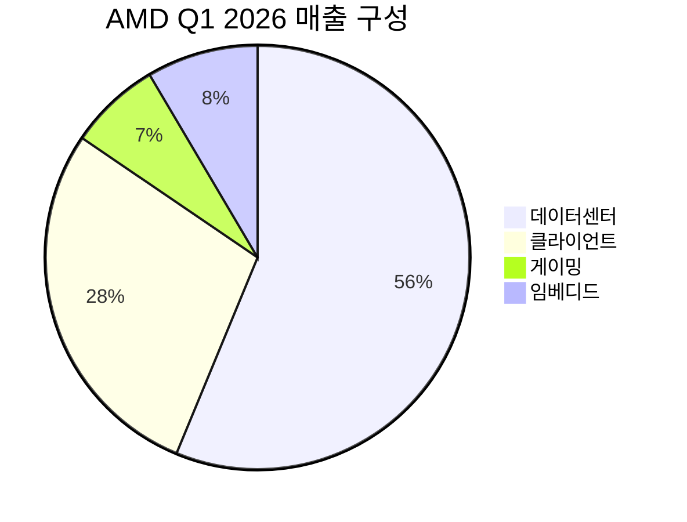

---

company: AMD
created: 2026-05-06 22:42
date: 2026-05-06 22:42
exchange: NASDAQ/NYSE
listing: public
market: US
tags:
- daily
- deal-sourcing
ticker: AMD
title: Deal - AMD (AMD) 22:42
type: deal-sourcing
publish: true
---

> **오늘의 탐색 분야**: AI 인프라, AI 소프트웨어, 신흥국 성장 시장, 방산, 지속가능 인프라, 농업기술, 교육, 디지털 콘텐츠, 한국 시장
> 4일 주기 로테이션 (30개 분야 커버)

# Advanced Micro Devices, Inc. (AMD)

AMD 🇺🇸 US NASDAQ Semiconductors

---

## Investment Score

Investment Score 67/100 — 🟡 Buy (조건부)

업사이드 비대칭 21/30 — AI 서버 TAM $1,200B로 확장, 단 시총 $697B으로 이미 상당 부분 반영

카탈리스트 & 타이밍 21/25 — Q1 어닝 서프라이즈 이미 실현, Q2 가이던스 +46% 제시, Helios 하반기 출하

비즈니스 품질 16/20 — 리사 수 리더십 + EPYC CPU 해자 강화, GPU 해자는 NVDA 대비 취약

밸류에이션 4/15 — Forward PER 38x, 52주 저점 $96 대비 340% 급등, 안전마진 매우 낮음

발견 가치 5/10 — 애널리스트 49명 커버, 매수 컨센서스 압도적, 숨겨진 알파 거의 없음

---

> [!abstract] 리포트 요약
> 
> **한 줄 테시스**: AMD는 AI 인프라 사이클의 핵심 수혜주이나, 주가가 이미 52주 저점 대비 340% 급등하여 현재가($427)는 컨센서스 목표가($312) 대비 37% 프리미엄을 거래 중인 상태다.
> 
> **왜 지금인가**: 2026년 Q1 어닝 서프라이즈(매출 +38% YoY, 데이터센터 +57% YoY)가 이미 주가에 반영되었으며, 하반기 Helios 랙스케일 출하가 다음 모멘텀이다.
> 
> **Variant Perception**: 시장은 AMD를 "NVDA의 열등한 대안"으로 보지만, 실제로는 ① EPYC 서버 CPU에서 독보적 모멘텀 (2분기 +70% YoY 가이던스), ② 에이전틱 AI 시대의 CPU 르네상스 수혜, ③ 하이퍼스케일러의 공급망 다변화 니즈가 복합적으로 작용하는 독자적 성장 스토리다. NVDA 대비 "열등주"가 아닌 "보완재"로 재평가받을 가능성이 핵심이다.
> 
> **핵심 수치**: Q1 매출 $10.25B (+38% YoY) / 데이터센터 $5.8B (+57% YoY) / Q2 가이던스 $11.2B(±$0.3B)
> 
> **리스크**: 컨센서스 목표가($312) 대비 현재가($427)가 이미 37% 초과 — 현재 주가는 "완벽한 시나리오"를 내포. 생산능력 제약, 중국 수출 규제, ARM 아키텍처 경쟁 심화가 주요 하방 요인.

---

## ① 핵심 지표

| 항목 | 값 | 의미 |
|------|-----|------|
| 현재가 | $427.30 🟡 | 52주 최고가($427.49) 직전 수준. 1년 전 $96에서 시작한 기술적 상단권 |
| 시가총액 | $696.6B 🟡 | 대형주. AI 열풍 반영 시 정당화 가능하나 이미 세계 10위권 반도체 시총 |
| PER (Trailing / Forward) | 164.96x / 38.08x 🔴🟡 | Trailing PER 165x는 명목상 과도. Forward 38x는 성장 감안 시 합리적이나 실현 전제 필요 |
| PBR | 11.05x 🟡 | 반도체 고성장주로서 수용 가능한 수준이나 높음 |
| EV/EBITDA | 84.90x 🔴 | 현재 수익성 기준 고평가. 향후 EBITDA 확장이 핵심 전제 |
| 영업이익률 | 17.1% 🟡 | GAAP 기준 — 비GAAP 영업이익률은 약 24% 수준. 마진 확장 궤도에 있으나 NVDA(60%+) 대비 낮음 |
| 순이익률 | 12.5% 🟡 | GAAP 기준. 무형자산 상각(주로 Xilinx 인수) 제거 시 실질 수익성은 더 높음 |
| ROE | 7.1% 🔴 | 낮은 수준. 대규모 인수로 인한 자본 팽창이 원인. 향후 이익 성장으로 개선 예상 [가정] |
| FCF (2025) | $6.74B 🟢 | 전년($2.40B) 대비 180% 급증. 실질적 현금 창출력 입증 |
| 52주 고/저 | $427.49 / $96.88 🟡 | 현재가 52주 고점 직전. 저점 대비 340% 상승 — 모멘텀 강하나 추격 매수 리스크 |
| 섹터/지역 | Technology / Semiconductors / US | AI 최대 수혜 섹터 |

> [!warning] 밸류에이션 경고
> 현재가 $427은 애널리스트 컨센서스 평균 목표가 $312.28을 **37% 초과**합니다. 일부 최근 상향된 목표가(베어드 $625, 번스타인 $525, TD코웬 $500)가 상단을 지지하지만, 이는 Q1 어닝 서프라이즈 이후 긴급 상향된 수치입니다. 현재 주가 수준은 이미 2027년 이후 실적까지 일부 선반영하고 있습니다.

---

## ② 회사 개요, 제품, 핵심 경쟁력

> [!abstract] 섹션 요약
> AMD는 데이터센터용 CPU·GPU, PC 프로세서, 임베디드 칩을 설계하는 팹리스(Fabless) 반도체 기업이다. 2022년 리사 수의 리더십 하에 시작된 데이터센터 전환이 AI 사이클과 맞물려 폭발적 성장을 만들어냈다.

### 한 줄 설명
AMD는 **고성능 프로세서(CPU+GPU)를 설계하여 데이터센터, PC, 게이밍, 임베디드 시장에 판매하는 팹리스 반도체 기업**이다. TSMC에 위탁 생산을 맡기고 설계에 집중하는 구조다.

### 사업 모델 & 수익 구조
AMD의 핵심 비즈니스는 **설계 경쟁력을 기반으로 한 프리미엄 프로세서 판매**다. TSMC의 최첨단 공정을 활용하여 경쟁력 있는 칩을 설계하고, 이를 OEM(Dell, HP, Lenovo), 하이퍼스케일러(Meta, Microsoft, Google, AWS), 게이밍 기업에 판매한다.

수익의 핵심은 **ASP(평균판매가격) 상승과 물량 증가의 동시 실현**이다. 데이터센터용 EPYC CPU 및 Instinct GPU는 일반 소비자용 칩 대비 10~100배 높은 ASP를 가진다.

### 매출 구성 (2026년 Q1 실적, 출처: AMD Q1 2026 실적 발표 보도)

| 사업부 | 매출액 | 비중 | YoY 성장률 |
|--------|--------|------|-----------|
| **데이터센터 (Data Center)** | $5.8B | ~56% | **+57%** |
| **클라이언트 + 게이밍** | $3.6B | ~35% | +23% |
| └ 클라이언트 (Client) | $2.9B | ~28% | +26% |
| └ 게이밍 (Gaming) | $0.72B | ~7% | +11% |
| **임베디드 (Embedded)** | $0.87B | ~8.5% | +6% |
| **총계** | **$10.25B** | 100% | **+38%** |

### 핵심 제품/서비스

**① EPYC 프로세서 (서버 CPU)**
AMD의 가장 강력한 제품. Intel Xeon을 대체하며 클라우드 및 AI 서버 시장을 공략 중. "Turin" 세대가 현재 주력이며, 2026년 하반기 "Venice" 출시 예정. 2분기 서버 CPU 매출 +70% YoY 가이던스 제시. EPYC는 코어 수, 전력 효율, 가격 대비 성능에서 인텔 Xeon을 압도한다는 평가가 확산 중이다. (출처: AMD Q1 2026 실적 발표, 2026.5.5)

**② Instinct GPU (AI 가속기)**
NVDA H100/B200의 경쟁 제품. MI300X가 현재 주력이며, MI350 시리즈 출시 예정. 주요 고객: Meta, Microsoft Azure, Google Cloud, OpenAI. MI355X는 NVDA B200 대비 달러당 40% 더 많은 토큰 처리를 주장 — 가격 경쟁력이 핵심 무기. (출처: 초이스스탁 뉴스 보도)

**③ Helios (랙스케일 AI 서버 시스템)**
AMD가 처음으로 완성형 AI 서버 시스템 레벨로 진출. Meta, OpenAI에 하반기 출하 예정. NVDA의 DGX 시스템과 직접 경쟁. 이는 AMD가 단순 칩 공급자에서 시스템 파트너로 포지셔닝이 바뀌는 중요한 전환점이다. (출처: AMD Q1 2026 실적 발표, 2026.5.5)

**④ Ryzen 프로세서 (PC CPU)**
소비자 및 기업용 PC 시장. Intel Core와 경쟁. AI PC 트렌드에서 NPU(Neural Processing Unit) 내장으로 차별화. 클라이언트 매출 +26% YoY — 예상 외의 강세.

**⑤ Radeon GPU (소비자 그래픽)**
NVDA GeForce와 경쟁. 게이밍 시장. 하반기 메모리 가격 상승으로 약세 전환 예상.

### 핵심 경쟁력

| 경쟁력 | 설명 | 복제 난이도 (1-10) |
|--------|------|:---:|
| **리사 수 리더십** | 2014년 취임 이후 AMD를 파산 직전에서 AI 시대 핵심 기업으로 전환. 전략적 실행력 최고 수준 | 10 |
| **x86 아키텍처 면허** | Intel과 함께 x86 크로스 라이선스 보유. x86 서버 CPU 시장은 사실상 AMD-Intel 복점 | 9 |
| **TSMC와의 선진 공정 접근성** | 3nm/5nm 공정에서 TSMC와의 긴밀한 협력 관계. Intel 대비 공정 우위 | 7 |
| **Chiplet 설계 혁신** | 여러 작은 다이를 조합하는 Chiplet 구조 선도. 수율 개선 + 비용 최적화 동시 달성 | 7 |
| **서버 CPU 모멘텀** | EPYC 4분기 연속 사상 최대 매출. 한번 데이터센터에 채택되면 전환 비용 高 | 6 |
| **ROCm 소프트웨어 스택** | NVDA CUDA에 대응하는 오픈소스 GPU 컴퓨팅 환경. 아직 격차 있으나 개선 중 | 4 |

### 성장 공식

**AMD 매출 성장 메커니즘**:

**데이터센터** = (AI 인프라 CapEx 규모) × (AMD 점유율) × (ASP 상승률)
- AI 인프라 CapEx는 구조적으로 계속 증가 중
- 하이퍼스케일러들의 공급망 다변화(NVDA 의존도 낮추기) 니즈 → AMD 점유율 상승
- MI400/Helios 등 고부가가치 제품으로 ASP 상승 가능

**서버 CPU** = (서버 시장) × (AMD vs Intel 점유율 이동)
- 에이전틱 AI 시대: AI 서버 1대에 CPU 수요가 비선형적으로 증가
- AMD TAM 전망 2030년 $120B (CAGR 35%) [출처: AMD Q1 2026 실적 발표, 2026.5.5]
- AMD 목표 점유율: 50%+ [출처: Benzinga Korea, AMD CEO 발언 인용]

---

## ③ 왜 100%+ 가능한가? — 업사이드 비대칭

> [!abstract] 섹션 요약
> 현재 $427에서 100%+ 수익($854+ 도달)은 어렵지만, 2027~2028년 기준 정당화 가능한 시나리오가 존재한다. 핵심은 서버 CPU에서의 독보적 성장 + GPU 시장 점유율 확대 + Helios를 통한 시스템 수준 포지셔닝이다.

### 시총 vs TAM 분석

| 시장 | 현재 시장 규모 [추정] | 2030년 전망 | AMD 잠재 점유율 | 잠재 매출 |
|------|---------|-----------|--------------|---------|
| AI 서버 CPU | ~$20B (2025E) | **$120B** (AMD 가이던스) | 50%+ | ~$60B |
| AI 가속기 (GPU) | ~$80B (2025E) | $200B+ [추정] | 15~25% | $30~50B |
| PC/클라이언트 CPU | ~$30B | ~$35B | ~25% | ~$8.75B |
| 임베디드 | ~$20B | ~$25B | ~15% | ~$3.75B |
| **합계 잠재 매출** | | | | **$100B~$120B** |

현재 AMD 연간 매출 런레이트(Q1 $10.25B × 4 = ~$41B)와 $100B+ 잠재 매출 간의 갭이 업사이드의 핵심이다. 매출 $100B 도달 시 영업이익률 30% 가정 [가정] → 영업이익 $30B → 세후 순이익 $25B 가정 [가정] → PER 25x 적용 시 시총 $625B. 현재 시총 $697B이므로 이 시나리오에서는 현재 가격이 이미 2030년 완성된 성장을 반영하고 있다는 의미다.

> [!warning] 업사이드 비대칭의 함정
> AMD 시총 $697B은 이미 "성공한 AI 기업"의 밸류에이션을 반영하고 있다. $120B 서버 CPU TAM에서 50% 점유율 달성 + GPU 20% 점유율 달성이라는 낙관 시나리오가 현재 주가에 내포되어 있다. 따라서 100%+ 수익을 얻으려면 ① 추정 TAM이 실제로 훨씬 크거나 ② 마진이 예상보다 훨씬 빠르게 개선되어야 한다.

### 성장 가속 구간 확인

AMD의 FCF 궤적이 업사이드 논거의 핵심이다:

| 연도 | FCF | YoY 변화 |
|------|-----|---------|
| 2022 | $3.12B | — |
| 2023 | $1.12B | -64% (사이클 저점) |
| 2024 | $2.40B | +114% |
| **2025** | **$6.74B** | **+181%** |

2023년 저점에서 2025년까지 FCF가 6배 성장했다. 이 FCF 가속이 밸류에이션 정당화의 근거다. 다만 이미 주가에 반영된 측면이 강하다.

**영업이익 성장률**: Q1 2026 영업이익 $1.476B (+83% YoY) — 매출 성장(+38%)을 크게 상회하는 레버리지 효과 확인.

### 옵셔널리티 (현재 가치에 미반영된 성장 동력)

1. **Helios 시스템 사업**: 단순 칩 공급 → 완성형 시스템 공급으로 전환 시 ASP 5~10배 상승 가능 [가정]. Meta, OpenAI와의 Helios 계약은 AMD가 NVDA의 DGX 시스템에 대응하는 최초 사례
2. **Meta와의 전략적 파트너십**: "향후 5년간 최대 $600억 달러 규모 AI 칩 공급 계약" (출처: 뉴스핌, AMD 경영진 발언 인용) — 이 수치의 확실성은 [확인 필요]이나, 실현 시 AMD 미래 매출의 근본적 변화
3. **에이전틱 AI CPU 르네상스**: AI 서버에서 GPU당 CPU 비율이 증가하는 구조 변화. 기존 서버는 CPU 1개당 GPU 1~2개였지만, AI 서버는 GPU당 더 많은 CPU 코어 필요 → EPYC 수요 비선형적 증가
4. **AI PC 사이클**: Windows AI 재출시 사이클과 NPU 내장 칩 교체 주기 — 아직 본격화 안 된 PC 업그레이드 사이클 [가정]

---

## ④ 왜 지금인가? — 카탈리스트 & 타이밍

> [!abstract] 섹션 요약
> Q1 어닝 서프라이즈(2026.5.5)가 이미 발동되었다. 주가는 시간외 +16% 급등 후 $427까지 상승. 단기적으로는 Q1 카탈리스트 소화 국면이나, 중기적으로 Helios 출하 + Q2 실적 + AI CapEx 확장이 다음 모멘텀이다.

### 카탈리스트 맵

| 카탈리스트 | 예상 시점 | 현재 반영도 | 업사이드 잠재력 |
|-----------|----------|-----------|--------------|
| Q1 2026 어닝 서프라이즈 (완료) | 2026.5.5 [출처: AMD 실적 발표] | 🔴 100% 반영 | 소진됨 |
| Q2 2026 실적 (112억 달러 가이던스) | 2026년 8월 초 [추정] | 🟡 50% 반영 | 서프라이즈 시 추가 상승 |
| **Helios AI 서버 출하 (Meta·OpenAI)** | **2026년 하반기** | 🟢 20% 미반영 | 핵심 모멘텀 |
| Venice (차세대 EPYC) 출시 | 2026년 하반기 [추정] | 🟢 30% 미반영 | 서버 CPU 점유율 가속 |
| AI 수출 규제 완화 | 진행 중 | 🟡 부분 반영 | 중국 시장 회복 시 의미 있는 업사이드 |
| MI350/MI400 출시 | 2026~2027년 | 🟢 20% 미반영 | GPU 시장 점유율 확대 |

### Variant Perception (시장과의 뷰 차이)

**시장의 일반적 시각**: AMD는 NVDA의 2등이다. NVDA가 CUDA 생태계로 AI GPU를 독점하는 구조에서 AMD는 가격 경쟁력으로만 일부 점유율을 가져가는 2차 수혜주.

**우리의 다른 뷰**:
1. **서버 CPU에서 AMD는 1등이 되고 있다**: Intel의 데이터센터 사업 붕괴 속에서 AMD EPYC는 이미 데이터센터 CPU 매출에서 Intel을 추월했다. 이 전환은 되돌리기 어렵다.
2. **에이전틱 AI는 GPU만의 게임이 아니다**: AI Agent 운영에는 CPU 연산량이 급증한다. AMD의 CPU+GPU 포트폴리오가 "GPU 전문"인 NVDA와 다른 방식으로 에이전틱 AI 시대를 공략한다.
3. **Helios는 포지셔닝 전환의 신호**: 단순 칩 공급자에서 시스템 솔루션 파트너로 — NVDA가 독점하던 시스템 레벨 시장에 AMD가 진입. Meta·OpenAI가 첫 고객이라는 사실 자체가 AMD의 기술 신뢰도를 증명한다.

> [!tip] 핵심 인사이트: CPU 르네상스
> 시장은 AMD를 GPU 업체로만 보지만, 실제로 더 강력한 모멘텀은 서버 CPU(EPYC)에 있다. 2026년 Q2 서버 CPU 성장률 +70% YoY 전망은 AMD의 CPU 사업이 독자적인 성장 스토리를 가지고 있음을 보여준다. AI 시대에 CPU가 다시 중요해지는 "CPU 르네상스"는 시장이 충분히 인식하지 못한 Variant Perception이다.

### 매크로 환경 분석

| 매크로 변수 | AMD에 대한 영향 | 방향 |
|-----------|--------------|-----|
| AI 인프라 CapEx 사이클 | 하이퍼스케일러 AI 투자 계속 확대 — 직접 수혜 | 🟢 강한 순풍 |
| 미국 AI 칩 수출 규제 완화 시사 | 중국 등 신흥 시장 AMD AI 칩 수요 회복 가능성 | 🟢 순풍 |
| TSMC 첨단 공정 공급 확대 | 생산능력 제약 완화 — 매출 증가 직결 | 🟢 순풍 |
| 금리 환경 (현재 고금리) | 고PER 성장주에 구조적 역풍 | 🟡 중립→역풍 |
| USD 강세 | 해외 매출 환산 시 약간의 역풍 | 🟡 중립 |
| 글로벌 반도체 지정학 리스크 | 중국 수출 제한 지속 시 AMD 타격 가능 | 🔴 잠재적 역풍 |

**시나리오별 AMD 영향**:
- **금리 인하 시나리오**: 성장주 멀티플 확장 → AMD 주가 추가 상승 가능
- **AI CapEx 버블 붕괴 시나리오**: 하이퍼스케일러 투자 축소 → 데이터센터 수요 급감, 주가 50%+ 하락 가능
- **중국 수출 완전 통제 시나리오**: MI308X 등 주요 GPU의 중국 판매 차단 → 연간 매출 $3~5B 영향 추정 [가정]

---

## ⑤ 비즈니스 퀄리티

> [!abstract] 섹션 요약
> AMD는 "충분히 강한 해자"를 가진 고품질 기업이다. 다만 NVDA처럼 압도적 독점 해자는 없고, CPU에서는 x86 구조적 우위, GPU에서는 가격 경쟁력 위주의 포지셔닝이다.

### 경제적 해자 (Moat) 분석

| 해자 계층 | 내용 | 복제 난이도 |
|---------|------|-----------|
| **x86 면허 (구조적 해자)** | Intel과의 크로스 라이선스. 신규 진입자는 x86 CPU를 만들 수 없음. 서버 시장 95%+ 는 x86 의존 | ⭐⭐⭐⭐⭐ 불가 |
| **EPYC 전환 비용** | 데이터센터에서 CPU를 바꾸면 OS, 소프트웨어, 인프라 전체를 재검증해야 함. 한번 채택하면 강한 고착화 | ⭐⭐⭐⭐ 높음 |
| **리사 수 & 엔지니어링 문화** | 2014~현재 지속적 기술 혁신. EPYC, Instinct, Chiplet 설계 모두 경쟁 우위 창출 | ⭐⭐⭐ 중간 |
| **하이퍼스케일러 관계** | Meta, Microsoft, Google, AWS와의 설계 협력(co-design) 관계. 고객이 AMD 칩을 시스템에 최적화해 줌 | ⭐⭐⭐ 중간 |
| **ROCm (GPU 소프트웨어)** | NVDA CUDA에 대응. 오픈소스 전략으로 생태계 확대 시도 중이나 CUDA 대비 격차 큼 | ⭐ 취약 |

> [!failure] 핵심 약점: CUDA vs ROCm 소프트웨어 해자
> NVDA의 가장 강력한 해자는 하드웨어가 아닌 CUDA 소프트웨어 생태계다. 수백만 개의 AI 모델, 연구 코드, 라이브러리가 CUDA에 최적화되어 있다. AMD의 ROCm은 개선되고 있지만 이 격차를 좁히는 데 수년이 걸릴 것이다. AMD가 GPU 시장에서 NVDA를 위협하는 것은 하드웨어 성능보다 소프트웨어 생태계의 전쟁이다.

### ROIC/ROE 추세 및 자본 효율

현재 GAAP ROE 7.1%는 낮아 보이지만, 맥락이 중요하다:
- 2022년 Xilinx 인수($49B)로 자본(자기자본)이 크게 팽창 → ROE 분모가 커짐
- 실제 영업 레버리지는 강하게 나타나고 있음: 영업이익 +83% vs 매출 +38%
- FCF 수익률: $6.74B FCF / $697B 시총 = **~0.97%** [가정 계산] — 낮지만 성장 기업 특성 반영

> [!tip] 진짜 수익성 지표: 비GAAP 영업이익률
> GAAP 영업이익률 17.1%보다 중요한 것은 **비GAAP 영업이익률 약 24%** (Q1 2026 비GAAP 영업이익 $2.5B / 매출 $10.25B 기준). 주식 보상 및 Xilinx 인수 관련 무형자산 상각을 제외하면 실질적인 수익성은 훨씬 높다. 그리고 매출 성장에 따른 고정비 레버리지로 향후 30%+까지 개선 여지가 있다 [가정].

### 경영진 & 자본 배분

**리사 수 (Lisa Su) CEO**:
- 2014년 취임 당시 AMD는 파산 직전. 주가 $2 → $427 전환을 이끈 반도체 역사상 최고의 CEO 중 한 명
- 기술 출신(MIT 공학박사)으로 제품 전략에 깊이 관여
- 인센티브: 스톡 옵션/RSU 위주 보상 구조 — 주주와 이해관계 강하게 정렬

**자본 배분**:
- 자사주 매입: 2025년 $1.92B — FCF $6.74B 대비 28% 환원. 성장 투자 우선하면서도 주주 환원 병행
- Xilinx 인수 통합: 임베디드 부문(현재 ~8.5% 매출 비중)은 아직 기대 이하지만, AI 에지 컴퓨팅으로 재포지셔닝 중

---

## ⑥ 밸류에이션 & 안전마진

> [!abstract] 섹션 요약
> 현재 밸류에이션은 "성장 프리미엄"을 최대한 반영한 상태다. FCF Yield는 약 0.97%에 불과하며, 컨센서스 목표가를 37% 초과하는 현재가는 전형적인 "기대 선반영" 구간이다.

### 주요 밸류에이션 지표

| 밸류에이션 지표 | 값 | 해석 |
|--------------|-----|-----|
| Forward PER (2026E) | 38.08x | 성장률 감안 시 합리적이나 리스크 있음 |
| EV/EBITDA | 84.90x | 고평가. EBITDA 급증 전제 필요 |
| FCF Yield | ~0.97% ($6.74B / $697B) | 매우 낮음. 성장 기대 반영 |
| PEG Ratio | ~0.9x (Forward PER 38 / 성장률 ~40%) [가정 계산] | 성장 대비로는 합리적 |
| Price/Sales | ~16x (시총 $697B / 연간화 매출 $41B) [가정 계산] | 고평가이나 마진 확장 전제 |

### 애널리스트 목표가 분포 (2026.5.5 실적 발표 이후)

| 기관 | 목표가 | 등급 | 현재가 대비 |
|-----|--------|-----|-----------|
| 베어드 | $625 | Outperform | +46% |
| 번스타인 | $525 | Outperform | +23% |
| TD 코웬 | $500 | Buy | +17% |
| 로젠블랫 | $490 | Buy | +15% |
| 골드만삭스 | $450 | Buy | +5% |
| 울프 리서치 | $450 | Outperform | +5% |
| 미즈호 | $415 | Buy | -3% |
| RBC 캐피탈 | $400 | Sector Perform | -6% |
| **컨센서스 평균** | **$312** | Buy | **-27%** |
| HSBC | $340 | Hold | -20% |
| 도이치방크 | $250 | Hold | -41% |

> [!warning] 컨센서스 목표가 괴리
> 컨센서스 평균 $312는 실적 발표 전 기준이다. 실적 후 상향된 공격적 목표가들이 최근 분포를 끌어올리고 있지만, 현재가 $427은 여전히 최근 상향 기관들의 평균(약 $480) 대비도 낮은 수준이다. 단, 어닝 서프라이즈 직후 낙관 편향이 강하게 반영되는 경향이 있으므로 주의가 필요하다.

### 안전마진 (Margin of Safety) 분석

🟢 Bull Case 20%

🟡 Base Case 50%

🔴 Bear Case 30%

| 시나리오 | 가정 | 목표 시총 | 목표주가 | 현재가 대비 |
|---------|-----|---------|---------|-----------|
| 🟢 Bull | 2027년 매출 $80B+, 비GAAP OPM 30%, PER 45x | $1.1T+ | $670+ | +57% |
| 🟡 Base | 2027년 매출 $55B, 비GAAP OPM 27%, PER 38x | $700B | $430 | +0.7% |
| 🔴 Bear | AI CapEx 둔화, 매출 $35B, OPM 20%, PER 25x | $220B | $135 | -68% |

**So What?**: Base Case에서 현재가 대비 업사이드가 거의 없다. 현재가는 이미 "성공한 성장 시나리오"를 상당 부분 반영하고 있으며, 추가 멀티플 확장보다는 실적 성장이 주가를 받쳐야 하는 구간이다. Bear Case 하방은 매우 가파르다.

---

## ⑦ 리스크 & Devil's Advocate

| 구분 | 핵심 논거 |
|------|---------|
| 🟢 Bull #1 | 서버 CPU에서 인텔 대체 가속 — EPYC 4분기 연속 최고 매출, Q2 +70% YoY 가이던스. CPU 점유율 50%+ 도달 시 연간 $30B+ 매출 단일 사업부 |
| 🟢 Bull #2 | 에이전틱 AI가 CPU 르네상스를 만든다 — 추론(Inference) 중심 AI로 전환 시 CPU 연산 비중 증가. AMD의 CPU+GPU 통합 포지셔닝이 NVDA보다 유리할 수 있음 |
| 🟢 Bull #3 | Helios를 통한 시스템 레벨 포지셔닝 전환 — Meta·OpenAI 채택은 레퍼런스가 됨. 달러당 40% 많은 토큰 처리라는 가격 경쟁력이 실증되면 클라우드 고객 확대 가속 |
| 🔴 Bear #1 | NVDA CUDA 생태계 해자가 너무 높다 — 소프트웨어 전환 비용이 하드웨어 가격 차이를 상쇄. GPU 시장 점유율 확대가 생각보다 느릴 수 있음 |
| 🔴 Bear #2 | 현재 주가에 내포된 완벽한 시나리오 — Base Case에서 현재가 대비 업사이드 거의 없음. AI CapEx 사이클 조정 시 PER 수축 + 실적 하락 동시에 발생하는 Double Compression 위험 |
| 🔴 Bear #3 | 중국 수출 규제 & 지정학 리스크 — MI308X 등 중국향 제품의 판매 제한 강화 시 상당한 매출 손실 가능. 트럼프 행정부의 정책 예측 불가능성 |

### 가장 현실적인 실패 시나리오

> [!warning] 최악의 시나리오: AI CapEx 피크아웃 + NVDA 점유율 방어
> 
> 만약 2026~2027년에 하이퍼스케일러들의 AI CapEx 증가 속도가 둔화되고, NVDA가 CUDA 생태계를 통해 GPU 점유율을 방어한다면 AMD는 "기대를 채우지 못한 성장주" 함정에 빠질 수 있다.
> 
> AMD GPU 매출이 기대치보다 20~30% 낮게 나올 경우, 현재 밸류에이션에서 주가 -40%~-50% 조정 가능. 이는 단순한 실적 미스가 아니라 "AI 인프라 수혜주" 포지션 자체가 재평가받는 것을 의미한다.

### 숨겨진 가정 (Hidden Assumptions)

1. **생산능력 제약 해소**: HSBC 하향 이유가 "생산능력 제약"이었음. TSMC 3nm/4nm 할당이 NVDA와 경쟁하며 제한될 경우, 수요가 있어도 공급 못하는 상황 가능
2. **Helios 고객 채택 지속**: Meta·OpenAI 이후 다른 하이퍼스케일러들이 Helios를 채택하지 않으면 기대 이하 성과
3. **서버 CPU 점유율 방어**: 인텔이 18A 공정으로 반격하거나, ARM 기반 서버 CPU(AWS Graviton, 애플 Silicon 방식)가 급성장하면 EPYC 모멘텀 꺾일 수 있음

### Kill Criteria

| Kill Criteria | 임계값 |
|-------------|-------|
| 데이터센터 YoY 성장률 급감 | 2분기 이상 연속으로 성장률 20% 이하 |
| GPU 시장 점유율 후퇴 | Instinct 매출이 전년 동기 대비 감소 |
| 영업이익률 하락 전환 | 비GAAP OPM이 2분기 연속 하락 |
| 경영진 변화 | 리사 수 CEO 교체 또는 사임 |
| 생산능력 공급 차질 | 가이던스 대비 실제 매출 미달 2분기 연속 |
| 주가 기술적 붕괴 | $320 이하 (최근 고점 대비 -25%) |

---

## ⑧ 발견 가치 & 엣지

> [!abstract] 섹션 요약
> AMD는 49명의 애널리스트가 커버하고, 실적 후 폭발적 뉴스 노출이 있었으며, Vanguard·Blackrock 등 메가 기관이 9%+ 씩 보유한다. "숨겨진 보석"과는 거리가 멀다. 그러나 CPU 르네상스 테마는 아직 덜 알려진 각도이다.

### 애널리스트 커버리지

- **커버 인원**: 49명 (매우 높음 — 발견 가치 최하위)
- **등급 분포**: Strong Buy 4 / Buy 31 / Hold 14 / Sell 0
- **컨센서스**: 압도적 Buy. 즉, 시장이 이미 AMD에 대해 매우 낙관적
- **목표가 평균**: $312.28 (n=46) — 어닝 서프라이즈 이전 데이터가 평균을 끌어내리고 있음

### 기관 보유 동향

| 기관 | 변동 | 신호 |
|-----|-----|-----|
| Blackrock | +8.17% 증가 | 🟢 스마트머니 추가 매수 |
| Vanguard | +1.62% 증가 | 🟢 패시브 자금 유입 |
| NORGES BANK (노르웨이 국부펀드) | +5.54% 증가 | 🟢 의미 있는 추가 |
| Morgan Stanley | -16.70% 감소 | 🔴 주의 |
| JPMorgan | -22.92% 감소 | 🔴 주의 |

> [!question] 기관 보유 변화의 해석
> Morgan Stanley와 JPMorgan의 의미 있는 보유 축소(-17%, -23%)가 눈에 띈다. 이것이 밸류에이션 우려에 따른 차익실현인지, 포트폴리오 리밸런싱인지는 [확인 필요]다. 반면 Blackrock과 NORGES BANK의 증가는 긍정 신호.

### 시장의 오해/미인식 포인트

**시장이 간과하는 것**: AMD는 "GPU 회사"로만 분류되지만, 실제로 가장 강한 모멘텀은 **서버 CPU(EPYC)**에 있다. 2026년 Q2 서버 CPU 성장률 +70% YoY 가이던스는 GPU보다도 강력한 성장률이다. NVDA와의 비교 프레임에서 벗어나, AMD를 "서버 CPU 최강자로 부상하는 기업"으로 볼 때 다른 평가가 나온다.

**BofA의 흥미로운 분석**: 에이전틱 AI 시대에 AMD가 서버 CPU 시장 약 50% 점유율을 확보하고, 나머지를 Intel과 ARM이 나눌 것으로 전망. 이는 기존 Intel이 지배하던 서버 CPU 시장의 권력 이동이 이미 진행 중임을 의미한다.

---

## ⑨ 액션 아이템

| 항목 | 판단 |
|------|-----|
| **BUY / WATCH / PASS** | WATCH / 조건부 BUY 현재가는 Q1 서프라이즈를 완전 반영. $350~380 조정 시 강한 매수 기회 |
| **Conviction** | Medium — 비즈니스 품질은 High Conviction, 현재 밸류에이션은 Low Conviction |
| **적정 진입가** | $350~380 (Forward PER 32~34x, FCF Yield 1.7~1.9% 구간) |
| **목표가 (12개월)** | $480 (Bull Case 기준, Helios 하반기 출하 성공 및 Q2 실적 컨센 상회 전제) |
| **손절 기준** | $320 이하 (현재가 대비 -25%, 구조적 약세 전환 신호) |
| **권장 비중** | 현재가에서 최대 3~5% (조정 후 $350~380에서 8~10%까지 확대 가능) |

### 추가 리서치 필요 사항

1. **Helios 랙스케일 시스템 구체적 계약 규모** — Meta와 $600억 달러 계약 [확인 필요]. 계약 구조와 실행 일정 파악 필요
2. **MI350/MI400 기술 스펙과 NVDA B200 대비 실측 성능** — 마케팅 자료가 아닌 독립적 벤치마크
3. **중국 수출 규제 영향 구체적 수치** — MI308X 등 중국향 매출 비중 (확인 필요)
4. **Venice(차세대 EPYC) 출시 일정과 기술 리프** — 서버 CPU 모멘텀 연장의 핵심
5. **ROCm 소프트웨어 생태계 채택 속도** — GPU 시장 점유율 확대의 실질적 병목

### 모니터링 핵심 지표

| 지표 | 모니터링 주기 | 기준 |
|-----|------------|-----|
| 데이터센터 분기별 매출 성장률 | 분기 | 40%+ 유지 여부 |
| 비GAAP 영업이익률 | 분기 | 25%+ 확장 추세 |
| Helios 출하 뉴스 | 수시 | Meta·OpenAI 외 추가 고객 확보 |
| EPYC 서버 CPU 점유율 | 분기 | 35%+ 목표 |
| Morgan Stanley·JPMorgan 기관 보유 변화 | 분기 | 추가 축소 시 경고 |
| AI 칩 수출 규제 뉴스 | 수시 | 추가 제한 여부 |

### 다음 체크포인트

| 날짜 | 확인 사항 |
|-----|---------|
| **2026년 8월 초** | Q2 2026 실적 발표 — $11.2B 가이던스 달성 여부, 데이터센터 성장률 |
| **2026년 하반기** | Helios 출하 시작 공식 확인 및 추가 고객 발표 |
| **2026년 하반기** | Venice EPYC 출시 — 성능 리프와 시장 반응 |
| **매월** | AI CapEx 관련 하이퍼스케일러 CapEx 발표 모니터링 |

---

> [!verdict] 최종 판단
> 
> **AMD는 훌륭한 기업이지만, 현재가($427)는 훌륭한 투자 진입점이 아니다.**
> 
> 비즈니스 품질(리사 수 리더십 + EPYC 해자 + AI 모멘텀)은 최상위권이다. 그러나 현재가는 이미 "모든 것이 잘 된다"는 시나리오를 반영하고 있으며, 컨센서스 목표가를 37% 초과한다. Bear Case 하방은 -68%에 달하는 반면, Base Case 업사이드는 거의 0%에 가깝다.
> 
> **조건부 전략**: $350~380 구간 조정 시 포지션 구축 시작. 이 가격에서 Bull Case 목표가($480)까지 약 26~37% 업사이드, Bear Case 손절($320)까지 약 -11~16% 하방 — 비대칭성이 더 좋아진다.
> 
> **모니터링할 핵심 촉매**: Q2 실적(8월), Helios 추가 고객 발표, 중국 수출 규제 변화