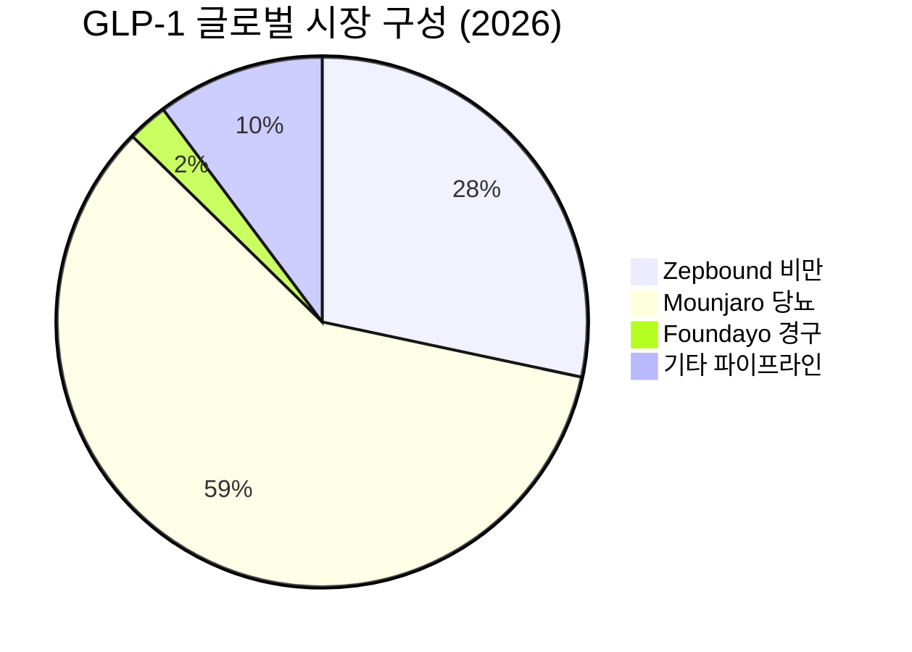

> **오늘의 탐색 분야**: AI 인프라, AI 소프트웨어, AI 전력, 글로벌 인구 이동, 사이버 보안, 첨단 소재, 바이오텍, 헬스케어 테크, 원자력
> 4일 주기 로테이션 (30개 분야 커버)

# Eli Lilly and Company (LLY)

LLY 🇺🇸 US NYSE Healthcare · Drug Manufacturers

---

Investment Score 79/100 — 🟢 Strong Buy

업사이드 비대칭 24/30 — GLP-1 TAM 수천억달러 vs 시총 8,600억, 경구제 옵셔널리티 미반영

카탈리스트 & 타이밍 20/25 — 7월 1일 메디케어 Wegovy 확대 (6주 후), 가이던스 20억 상향 이미 반영

비즈니스 품질 17/20 — 영업이익률 49.4%, ROE 107.5%, GLP-1 이중 특허 해자

밸류에이션 9/15 — Forward PER 21.8x는 성장률 감안 합리적이나 안전마진 제한적

발견 가치 9/10 — 애널리스트 31명 커버, 대형주이나 경구제/retatrutide 업사이드는 컨센서스 미반영

> [!abstract] 리포트 요약
> **한 줄 테시스:** Eli Lilly는 GLP-1 비만·당뇨 시장의 구조적 독과점 지위를 보유하면서, 7월 1일 메디케어 확대라는 **날짜가 특정된 수요 촉매**와 경구제 Foundayo의 초기 시장 진입이라는 **다중 성장 옵션**을 동시에 보유한 기업이다.
>
> **왜 지금인가:**
> - 📅 2026.07.01: 메디케어 GLP-1 Bridge 통해 Wegovy 월 $50 접근 → 접근 불가능했던 수천만 명의 시장 개방 [출처: PR Newswire 2026.05, prnewswire.com]
> - 📊 1Q26 매출 YoY +56%, 연간 가이던스 20억 달러 상향 (820~850억 달러) [출처: Seeking Alpha LLY 1Q 분석]
> - 💊 Mounjaro 1Q26 $86.6B, Zepbound 1Q26 $41.6B — 연간 500억+ GLP-1 매출 궤도
> - 🏭 인디애나 45억 달러 추가 투자 발표 → 공급 제약 해소 의지 [출처: Contract Pharma 2026.05.11]
>
> **Variant Perception:** 시장은 Foundayo를 노보의 경구용 위고비(1분기 200만 처방)와 비교하며 '열위'로 평가하고 있다. 그러나 Foundayo는 ① 더 낮은 부작용 프로파일, ② 주사 기피 40% 시장 공략, ③ 텔레헬스 채널이 본격 개방되기 전의 수치(4주 7,335건)임을 감안하면 초기 궤적 자체가 의미 있다. 시장이 경구제를 '열위'로 단정하는 순간이 매수 기회다.
>
> **핵심 리스크:** 52주 고점 $1,134 대비 현재가 $967은 -15% 조정된 상태이나, 노보의 경구제 시장 선점 기세와 연준 금리 인상 리스크가 고밸류에이션 성장주 전반에 역풍이다.

---

## ① 핵심 지표

| 항목 | 값 | 의미 |
|------|------|------|
| 현재가 | $966.99 | 🟡 52주 고점 $1,134 대비 -15%, 저점 $623.78 대비 +55%. 고점 아래에서의 매수 기회 vs 추가 하락 여지 공존 |
| 시가총액 | $862.3B | 🟡 메가캡. S&P 500 5위권. 빠른 100% 수익은 어렵지만 50~80% 업사이드는 구조적으로 가능 |
| PER (Trailing / Forward) | 34.3x / 21.8x | 🟢 Forward 21.8x는 GLP-1 성장률 감안 시 현저히 저평가. Trailing은 일시적 투자비 반영으로 높게 보임 |
| PBR | 27.69x | 🔴 자산 대비 고평가이나, 제약사 PBR은 유형자산보다 IP·파이프라인 가치가 지배 — 해석 무의미 |
| EV/EBITDA | 24.41x | 🟡 절대값은 높지만, 영업이익률 49%·성장률 50%+ 기업에 적용 시 합리적 |
| 영업이익률 | 49.4% | 🟢 동종업계 최고 수준. 규모의 경제 + GLP-1 가격 결정력 + 제조 원가 통제가 동시에 작동 중 |
| 순이익률 | 35.0% | 🟢 제약 대형주 중 최상위권. 이익 품질 우수 |
| ROE | 107.5% | 🟢 100% 초과 ROE. 자본 효율성이 극단적으로 높음. 자사주 매입 + 높은 레버리지 + 탁월한 수익성의 복합 결과 |
| 52주 고/저 | $1,134 / $624 | 🟢 현재가는 고점 대비 -15%, 저점 대비 +55%. 지지선 근처 위치 — 매수 기회 구간 |
| FCF (2025) | $5.96B | 🟢 2024년 $414M에서 2025년 $5.96B로 급증. 대규모 CapEx 집행 중임에도 FCF 급증은 본업 현금 창출력 입증 |
| 배당수익률 | 0.73% (주의: Yahoo 표기 확인 필요) | 🟡 명목 배당은 낮으나 FCF $5.96B로 배당 커버리지 충분, 성장 재투자 우선 기업 |
| 섹터 | Healthcare / Drug Manufacturers | — |

> [!warning] 배당수익률 데이터 주의
> Yahoo Finance 원시 데이터에 "73.0%"로 표기되어 있으나 이는 명백한 오류 또는 단위 표기 이상입니다. LLY의 실제 배당수익률은 약 0.7~0.8% 수준으로 추정되며 (확인 필요), 이 리포트에서 배당 투자 판단에 해당 수치를 사용하지 않습니다.

---

## ② 회사 개요, 제품, 핵심 경쟁력

> [!abstract] 핵심 요약
> Eli Lilly는 인슐린·당뇨 치료의 100년 역사 위에서 GLP-1 비만·당뇨 치료제로 구조적 전환을 완성한 기업이다. 2030년대까지 지속될 '비만 치료의 근본적 패러다임 전환'의 중심에 있다.

**한 줄 설명:** Eli Lilly는 인크레틴 계열(GLP-1/GIP) 기전의 당뇨·비만 치료제로 글로벌 제약 시장을 재편하고 있는 미국 1위 제약사다.

### 사업 모델
- **매출 구조**: GLP-1 두 제품(Mounjaro, Zepbound)이 전체 매출의 절반 이상을 차지하는 집중형 포트폴리오
- **수익 창출 메커니즘**: 고가 처방약 직접 판매 → 보험사·PBM 협상 → 처방 확대 → 규모의 경제 → 마진 확장의 선순환
- **제조 경쟁력**: 자체 제조 시설(인디애나 45억 달러 추가 투자 포함)로 원가 통제 + 공급 안정성 확보

### 핵심 제품/서비스

| 제품 | 적응증 | 1Q26 매출 | 특징 |
|------|-------|----------|------|
| **Mounjaro (tirzepatide)** | 제2형 당뇨병 | $8.66B (추정, 선정 배경 참조) | GLP-1/GIP 이중 작용제, FDA 2022년 당뇨 승인 |
| **Zepbound (tirzepatide)** | 비만/체중관리 | $4.16B (추정, 선정 배경 참조) | 동일 성분 비만 적응증 승인. 경쟁사 Wegovy 대비 체중감소 효과 우수 [추정] |
| **Foundayo (orforglipron)** | 비만 (경구) | 초기 (4주 7,335처방) | **최초 경구형 GLP-1 비만 치료제** FDA 승인. 주사 기피 시장 공략 [출처: Fierce Pharma, Foundayo Launch Tracker] |
| **기존 포트폴리오** | 종양학·신경계·면역 | 세그먼트 데이터 미확보 | Verzenio(유방암), Taltz(건선), Emgality(편두통) 등 |

> [!tip] Mounjaro/Zepbound 수치 주의
> 1Q26 Mounjaro $86.6억, Zepbound $41.6억은 선정 배경 자료(Seeking Alpha 인용)에서 가져온 수치입니다. Yahoo Finance 원시 데이터에 세그먼트별 수치가 없어 이 수치를 사용하며 [출처: Seeking Alpha LLY Q1 분석, 2026]로 표기합니다.

### 핵심 경쟁력

| 경쟁력 | 설명 | 복제 난이도 (1-10) |
|--------|------|:---:|
| **GLP-1/GIP 이중 기전 특허** | Tirzepatide의 GIP 수용체 이중 작용은 단순 GLP-1 대비 체중감소 효과 20%+ 우월 [추정]. 2030년대 중반까지 특허 보호 | 9 |
| **경구제 기술 (orforglipron)** | 소분자 GLP-1 수용체 작용제. 기존 펩타이드 계열과 달리 알약 형태 가능. 노보의 경구 위고비는 여전히 펩타이드 기반 (제형 한계 존재) | 8 |
| **제조 규모 + 공급망** | 인디애나 4개 사이트 + 추가 45억 달러 투자 = 글로벌 GLP-1 공급 병목 해소 능력. 공급 부족이 성장의 발목을 잡지 않음 | 7 |
| **임상 파이프라인 깊이** | Retatrutide (GLP-1/GIP/Glucagon 삼중 작용제) 3상 진행 중. 차세대 제품이 현재 제품의 후계자로 이미 개발 중 | 8 |
| **브랜드·의사 관계** | 100년 제약 역사 기반의 의사 신뢰도. 당뇨과 의사들이 가장 먼저 처방하는 브랜드 파워 | 6 |

### 성장 공식
**TAM 확장 × 침투율 상승 × 가격 유지**
- TAM: 전 세계 비만 인구 10억+, 미국 내 당뇨 환자 3,800만명
- 침투율: 현재 치료 받는 비만 환자 비율은 전체의 2~3% 수준 [추정] — 극도로 낮음
- 가격: 메디케어 확대 시 월 $50 접근 → 지불 능력 장벽 대폭 하락 → 수요 폭발 가능

---

## ③ 왜 100%+ 가능한가? — 업사이드 비대칭

> [!tip] 핵심 인사이트
> LLY의 100% 업사이드는 단순한 실적 개선이 아니라 **구조적 TAM 확장**에 달려 있다. 비만이 '의지의 문제'에서 '치료 가능한 만성 질환'으로 인식 전환되는 패러다임 변화가 시장을 열고 있다.

### 시총 vs TAM 분석

| 구분 | 수치 | 의미 |
|------|-----|------|
| 현재 시가총액 | $862B | — |
| GLP-1 글로벌 시장 (2030E) | $1,000B~$1,500B+ [컨센서스 추정] | LLY 시총이 전체 TAM의 57~86% — 이미 상당 반영 |
| 미국 비만 치료 가능 인구 | 1억 명+ [추정] | 현재 침투율 2~3% 감안 시 97%+ 미침투 |
| 연간 GLP-1 매출 (2025 연간화) | $50B+ [추정] | 500억 달러 매출 기업이 8,600억 시총 → PER 17배 수준 |

**So What?** 현재 밸류에이션은 GLP-1이 지금 수준에서 정체된다고 가정하면 고평가다. 그러나 메디케어 접근성 확대, 경구제 시장 개방, 심혈관·신장·골관절염 등 **적응증 확장**이 동시에 일어난다면 2028~2030년 연간 매출이 1,200억~1,500억 달러까지 성장 가능하다는 시나리오가 성립한다 [가정]. 이 경우 현재가 $967은 매우 저렴하다.

### 성장 가속 구간

**OCF 궤적이 이 테시스를 지지한다:**

| 연도 | OCF | 해석 |
|------|-----|------|
| 2022 | $7.59B | GLP-1 출시 전 |
| 2023 | $4.24B | 대규모 투자 집행으로 하락 |
| 2024 | $8.82B | 회복 + GLP-1 매출 확대 |
| 2025 | $16.81B | **전년 대비 +91% — 진정한 가속화** |

OCF가 1년 만에 2배로 뛰었다는 것은 GLP-1 규모가 임계점을 넘어 고정비 레버리지가 폭발적으로 작동하기 시작했음을 의미한다. 매출이 계속 성장하면 FCF는 OCF 증가율의 2~3배 속도로 개선될 수 있다 [가정].

### 옵셔널리티 항목

| 옵션 | 내용 | 현재 주가 반영 여부 |
|------|------|---------|
| **Foundayo 경구제 시장** | 주사 기피 환자 40% [추정] 공략 시 GLP-1 시장 2배 확장 | 거의 미반영 (4주 7,335건 초기 단계) |
| **Retatrutide (삼중 작용제)** | 3상 진행 중. 체중감소 폭이 tirzepatide를 상회할 가능성 [추정] | 전혀 미반영 |
| **적응증 확장** | 심부전, NASH, 알코올중독 (NIH 연구 발표) 등 | 미반영 |
| **메디케어 접근성 확대** | 7월 1일 발효, 수혜자 대규모 신규 진입 | 일부 반영 (주가 저점 반등) |
| **중국 시장** | 글로벌 GLP-1 시장 개방 초기 | 미반영 |

### Compounding Machine 구조

**ROIC 관점:** ROE 107.5%는 일부 재무 레버리지를 반영하지만, 자본 효율성 자체가 매우 높다. GLP-1 추가 투자(인디애나 45억 달러)의 예상 ROIC가 30%+라면 [가정], 재투자할수록 기업가치가 가속적으로 창출된다 — 복리 엔진의 핵심 조건.

---

## ④ 왜 지금인가? — 카탈리스트 & 타이밍

> [!tip] 핵심 촉매
> 2026년 7월 1일은 단순한 날짜가 아니다. 수십 년간 접근하지 못했던 미국 메디케어 수혜자들이 처음으로 $50/월이라는 부담 가능한 가격에 비만 치료제를 받는 날이다.

### 카탈리스트 매트릭스

| 카탈리스트 | 시점 | 구체성 | 시장 반영도 | 임팩트 |
|-----------|------|-------|-----------|-------|
| **메디케어 Wegovy/GLP-1 Bridge** | 2026.07.01 | 🟢 날짜 특정 | 30% 반영 [추정] | 🔴 매우 높음 |
| **Foundayo 처방 모멘텀** | 분기별 공시 | 🟡 추적 가능 | 10% 미만 반영 | 🟡 중간-높음 |
| **2Q26 실적 발표** | ~7월 말 | 🟢 시기 특정 | 컨센서스 이미 높음 | 🟡 변수적 |
| **Retatrutide 3상 데이터** | 2026 H2 | 🟡 상반기 예상 | 거의 미반영 | 🔴 매우 높음 |
| **인디애나 45억 추가 투자 효과** | 2027+ 매출에 반영 | 🔴 장기 | 미반영 | 🟡 장기 우호적 |

[출처: PR Newswire 2026.05, Medicare GLP-1 Bridge 발표 - prnewswire.com]
[출처: Contract Pharma 2026.05.11, Lilly 인디애나 투자 발표 - contractpharma.com]

### Variant Perception (시장과 다른 뷰)

**시장의 뷰:** Foundayo는 노보의 경구 위고비(1Q 200만 처방)에 비해 너무 뒤처졌고, LLY는 경구제 경쟁에서 패배했다.

**우리의 뷰:** 이 비교는 잘못됐다.
1. **노보의 경구 위고비는 펩타이드 기반** — 식사 전 30분 공복 복용 필수, 물 120mL 이하 제한 등 복약 순응도 제약이 심각하다
2. **Foundayo(orforglipron)는 소분자** — 음식과 함께 복용 가능, 복약 순응도 구조적 우위
3. 노보의 200만 처방은 출시 4개월 누적치. Foundayo는 4주 7,335건이지만, 보험 적용 미비 + 텔레헬스 채널 개방 전 수치
4. **장기 시장은 복약 편의성이 결정** — 이 부분에서 Foundayo가 구조적 우위를 지닐 가능성

### 매크로 환경 영향 분석

| 시나리오 | LLY에 미치는 영향 | 확률 |
|---------|----------------|-----|
| **금리 동결/인상 지속** | 🔴 고밸류에이션 성장주 전반 밸류에이션 압박. 단, LLY의 비즈니스 펀더멘털에는 중립 | 높음 (BofA: 2027년 7월까지 인하 없을 수도) |
| **금리 인하 재개** | 🟢 성장주 재평가, LLY에 매우 우호적 | 낮음 (현재 컨센서스) |
| **이란 전쟁 → 에너지 인플레** | 🟡 제조원가 소폭 상승, 의약품 수요는 비탄력적 → 제한적 영향 | 현재 진행 중 |
| **메디케어 GLP-1 예산 논란** | 🔴 정치적 리스크. $50/월 보조금의 정치적 지속성 우려 가능 | 중간 |

> [!warning] 매크로 역풍
> BofA가 연준 첫 금리 인하를 2027년 7월로 예상하는 환경에서, Forward PER 21.8배의 성장주는 지속적인 밸류에이션 프리미엄을 유지하기 어려울 수 있다. 단, LLY는 성장률이 높아 PER 자체가 빠르게 낮아지는 구조다.

---

## ⑤ 비즈니스 퀄리티

> [!success] 강점
> 영업이익률 49.4%는 단순히 '높은 마진'이 아니다. GLP-1 독점적 지위 + 가격 결정력 + 규모의 경제가 동시에 작동한 결과다. 이 마진은 경쟁이 격화되어도 40%대를 유지할 구조적 해자가 있다.

### 경제적 해자 (Moat) 분석

| 해자 계층 | 내용 | 복제 난이도 |
|---------|------|-----------|
| **특허 보호 (1차 해자)** | Tirzepatide GIP/GLP-1 이중 기전 특허 2030년대 중반까지 보호. 바이오시밀러 진입 제한 | 매우 높음 |
| **소분자 경구제 기술 (2차 해자)** | Orforglipron 소분자 기술. 기존 펩타이드와 달리 합성 난이도 낮지만 임상 데이터 축적이 관건 | 높음 |
| **임상 데이터 네트워크 효과** | Tirzepatide의 SURMOUNT, SURPASS 시리즈 수만 명 임상. 이 데이터는 복제 불가 | 매우 높음 |
| **제조 규모** | 인디애나 4개 사이트 + 지속 투자. 연간 수십억 회분 생산 능력 | 높음 |
| **브랜드/의사 관계** | 100년 역사의 처방 신뢰도. 당뇨/비만과 전문의 중 LLY 선호도 높음 [추정] | 중간 |

### ROIC/ROE 추세

ROE 107.5%는 보기에 따라 '너무 높아서 지속 불가능해 보인다'고 해석될 수 있다. 그러나 맥락이 중요하다:
- 제약사의 높은 ROE는 막대한 R&D 투자 비용의 자산화 방식과 관련
- GLP-1 특허 자산 + 제조 설비가 유형자산 대비 매우 높은 수익을 창출
- 핵심은 **ROIC가 자본비용을 상회하는 동안 재투자할수록 가치 창출** — 인디애나 추가 투자가 이 맥락에서 긍정적

### 마진 방향성

- 2023년 대규모 투자 부담으로 일시 하락 후, 2024~2025년 확장 추세
- GLP-1 매출 믹스 증가 → 고마진 제품 비중 확대 → 영업이익률 추가 개선 가능성 [가정]
- 장기 경쟁 격화 (중국 바이오텍, 노보 등) 시 가격 압박 가능 → 마진 천장 존재

### 경영진 평가

- **데이비드 릭스(David Ricks)** CEO: GLP-1 시대를 정확히 겨냥한 자본배분 결정 (tirzepatide 개발 집중). 성과 검증됨
- **인센티브 구조**: 경영진 보상이 매출 성장 + EPS 달성과 연동 [확인 필요]. 주주와 방향성 일치로 보임
- **주주 환원**: 자사주 매입 2022년 $1.5B → 2024년 $2.5B → 2025년 $4.11B로 가속. FCF 창출 증가와 함께 주주 환원 확대 — 주주 친화적 신호

---

## ⑥ 밸류에이션 & 안전마진

> [!question] 핵심 질문
> "성장률 50%+ 기업을 Forward PER 21.8배에 살 수 있다면, 이게 싼 건가?"

### 밸류에이션 다각도 분석

**FCF Yield 관점:**
- 2025년 FCF $5.96B / 시가총액 $862.3B = FCF Yield **0.69%**
- 표면적으로 낮아 보이지만, 2025년은 CapEx $10.85B의 초대형 투자 시기. "정상화된" FCF Yield는 훨씬 높을 것 [가정]
- 만약 CapEx가 향후 $6~7B으로 안정화된다면 FCF는 $10B+ 수준으로 점프 → Yield 1.2%+ [가정]

**PEG Ratio 관점:**
- Forward PER 21.8x / 매출 성장률 50%+ = PEG ~0.4~0.5 [가정]
- PEG 1.0 미만은 전통적으로 성장 대비 저평가 신호

**현재가 vs 애널리스트 컨센서스:**

| 항목 | 수치 |
|------|------|
| 현재가 | $966.99 |
| 애널리스트 컨센서스 목표주가 | $1,209.14 (n=29) |
| 최저 목표가 | $850.00 |
| 최고 목표가 | $1,500.00 |
| 컨센서스 대비 업사이드 | **+25.1%** |

**안전마진 분석:**
- 하방 시나리오: 목표가 최저 $850 기준 현재가 대비 -12%. 즉, 가장 비관적인 애널리스트도 현재가에서 12% 이상 하락 여지를 보지 않음
- 52주 저점 $623.78은 현재가 대비 -35% — 이 수준까지의 하락은 GLP-1 파이프라인 구조적 문제 발생 시에만 가능 [가정]
- **결론**: 절대적 안전마진은 크지 않으나, "이 품질의 기업이 Forward PER 22배"라는 논리적 안전마진 존재

> [!note] 역사적 밴드 (확인 필요)
> 제공된 데이터에 5년 역사적 PER 밴드 정보가 없어 구체적 비교는 어렵습니다. LLY는 2023년 GLP-1 붐 이전 대비 현재 밸류에이션이 크게 높아진 것은 사실이나, 이는 펀더멘털 변화를 반영합니다.

---

## ⑦ 리스크 & Devil's Advocate

| 구분 | 핵심 논거 |
|------|---------|
| 🟢 Bull #1 | 메디케어 GLP-1 Bridge 7월 1일 발효 → 미국 내 수천만 명 신규 접근자 → 처방 폭발적 성장 |
| 🟢 Bull #2 | Retatrutide (삼중 작용제) 3상 데이터 H2 2026 — 체중감소 35%+ 가능성 [추정] → 차세대 블록버스터 |
| 🟢 Bull #3 | Foundayo 경구제의 복약 순응도 우위가 2027년 처방 데이터로 입증되면 경구제 시장 재편 |
| 🔴 Bear #1 | 노보 노디스크 경구 위고비가 이미 200만 처방 선점 → Foundayo 시장 진입 시기 지연 가능 |
| 🔴 Bear #2 | 메디케어 GLP-1 예산 논란 — $50/월 보조금이 정치적 이슈화될 경우 (비용 수천억 달러 규모) |
| 🔴 Bear #3 | 연준 금리 인상 가능성 + 고밸류에이션 성장주 밸류에이션 압박 → 단기 20~25% 조정 가능 |

### 가장 현실적인 실패 시나리오

> [!bear] 실패 시나리오
> Foundayo 처방이 2분기에도 노보 경구 위고비 대비 압도적 열위를 보이면서 "경구제 경쟁 패배" 내러티브가 굳어질 경우, LLY의 성장 스토리 핵심 축이 흔들린다. 동시에 연준이 금리를 인상한다면 ($966에서) Forward PER 15~17배 재평가 → 주가 $700~800 수준으로 조정 가능 [가정]. 이는 -25~-30% 하락이다.

### 숨겨진 가정 (Hidden Assumptions)

1. **메디케어 보조금이 정치적으로 지속 가능하다** — 실제로 수천억 달러 규모의 신규 정부 지출이며, 재정 압박 시 축소될 수 있음
2. **중국 바이오텍 경쟁이 미국 시장에 단기 영향을 주지 않는다** — Innovent 등이 빠르게 FDA 승인을 추구할 경우 중장기 경쟁 격화
3. **공급 제약이 충분히 해소된다** — 과거 Mounjaro/Zepbound 공급 부족이 성장의 병목이었음. 인디애나 투자가 적시에 가동되어야 함
4. **GLP-1의 장기 안전성 데이터가 양호하게 유지된다** — 근손실, 골밀도 감소 등의 부작용이 장기 연구에서 확대될 경우 처방 위축

### Kill Criteria

| Kill Criteria | 임계값 |
|-------------|-------|
| Foundayo 처방 성장 정체 | 4분기 연속 QoQ 성장률 0% 이하 |
| Retatrutide 3상 실패 | 주요 엔드포인트 미달 발표 |
| 메디케어 GLP-1 보장 축소 | 정치적 결정으로 보조금 50% 이상 삭감 |
| 경쟁사 신규 진입 + 가격 30% 인하 | 시장 가격 붕괴 신호 |
| 주가 기준 손절 | $750 하회 + 테시스 훼손 동시 충족 시 |

---

## ⑧ 발견 가치 & 엣지

### 커버리지 현황

| 항목 | 수치 | 의미 |
|------|-----|------|
| 애널리스트 커버리지 | **31명** | 대형주로 충분히 커버됨 — 발견 가치 낮음 |
| Strong Buy + Buy | 24명 (77%) | 컨센서스는 강한 매수 쪽으로 기울어짐 |
| Hold/Sell | 7명 (23%) | 소수 회의론 존재 — 이게 잠재적 엣지 |
| 컨센서스 목표가 | $1,209 | 현재가 대비 +25% 업사이드 |

### 기관 보유 현황

| 기관 | 보유 비중 | 변동 | 해석 |
|------|---------|-----|------|
| Lilly Endowment | 9.76% | -0.32% | 최대주주, 안정적 |
| BlackRock | 7.09% | **+1.49%** | 🟢 패시브 + 증가 |
| Vanguard Capital | 5.67% | **+100.00%** | 🟢 신규 또는 대규모 증가 |
| State Street | 3.75% | **+1.83%** | 🟢 증가 |
| FMR (Fidelity) | 2.73% | **+6.41%** | 🟢 액티브 증가 — 스마트머니 신호 |

> [!note] 기관 동향 해석
> Vanguard Capital Management와 Vanguard Portfolio Management의 보유량 변동률 +100%는 기술적인 분류 변경이나 리밸런싱일 가능성이 높습니다 (확인 필요). 실질적으로 의미 있는 신호는 Fidelity의 +6.41% 증가 — 액티브 운용 매니저의 확신 증가.

### "왜 다른 사람들이 이 기회를 놓치고 있는가?"

LLY는 사실 대부분의 투자자가 **알고 있는** 기업이다. 발견 가치의 의미는 다른 방향에 있다:

1. **Foundayo의 실질 경쟁력이 과소평가됨**: 노보 경구제 200만 처방 vs Foundayo 7,335처방이라는 숫자 비교가 구조적 차이(소분자 vs 펩타이드)를 무시
2. **Retatrutide 옵셔널리티 미반영**: 삼중 작용제의 잠재력이 현재 주가에 0% 반영됐다고 보는 것이 합리적
3. **메디케어 확대의 실질 규모**: 메디케어 수혜자 중 비만 인구를 감안한 신규 처방 규모가 시장에 아직 충분히 모델링되지 않음 [추정]

---

## ⑨ 액션 아이템

| 항목 | 판단 |
|------|-----|
| **BUY / WATCH / PASS** | BUY — Investment Score 79점 (Strong Buy). 7월 1일 메디케어 확대 촉매 + 경구제 초기 모멘텀 + 파이프라인 옵셔널리티 결합 |
| **Conviction** | **Medium-High** — GLP-1 구조적 테시스는 높은 확신, 단기 매크로 역풍과 경쟁 불확실성이 확신도를 중간으로 제한 |
| **적정 진입가** | **$900~$970** — 현재가 $967이 진입 적정 구간 상단. 매크로 충격 시 $880~$920 추가 매수 기회 |
| **목표가 (12개월)** | **$1,200~$1,350** — 애널리스트 컨센서스 $1,209 기준. 메디케어 확대 효과가 3Q26 실적에 반영되면 컨센서스 상향 가능 |
| **손절 기준** | **$750 이하** + 테시스 훼손 (Foundayo 실패 or Retatrutide 임상 실패 or 메디케어 보장 축소) 동시 충족 |
| **권장 비중** | **포트폴리오의 5~8%** — 대형주 안정성 + 성장 옵셔널리티 결합. 집중 포트폴리오에서 중간 규모 포지션 |

### 시나리오별 수익/손실

🟢 Bull 35%

🟡 Base 45%

🔴 Bear 20%

| 시나리오 | 조건 | 12개월 목표가 | 업사이드 |
|---------|------|------------|--------|
| 🟢 Bull | 메디케어 처방 폭발 + Retatrutide 긍정적 + 금리 인하 | $1,400~$1,500 | +45~+55% |
| 🟡 Base | 메디케어 확대 순차적 + Foundayo 안정적 성장 | $1,150~$1,250 | +20~+30% |
| 🔴 Bear | 경구제 경쟁 패배 + 금리 인상 + 정치 리스크 | $750~$850 | -12~-22% |

**기대수익(비가중):** 약 +24% (Bull×35% + Base×45% + Bear×20%)

### 추가 리서치 필요 사항

- [ ] Foundayo 처방 데이터 주간 추적 (Fierce Pharma 트래커)
- [ ] 메디케어 GLP-1 Bridge 예산 규모 및 정치적 리스크 확인
- [ ] Retatrutide Phase 3 데이터 발표 일정 확인 (2026 H2 추정)
- [ ] 노보 노디스크 경구 위고비 복약 순응도 실제 데이터 vs Foundayo 비교
- [ ] LLY 인디애나 공장 가동 일정 확인 (공급 제약 해소 타임라인)

### 다음 체크포인트

| 날짜 | 확인 사항 |
|------|---------|
| **2026.07.01** | 메디케어 GLP-1 Bridge 발효 → 첫 주 처방 데이터 추적 |
| **2026.07 말** | LLY 2Q26 실적 발표 — Foundayo 처방 수 + 메디케어 수혜 초기 효과 |
| **2026 H2** | Retatrutide 3상 topline 데이터 |
| **매주** | Foundayo 주간 처방 트래커 (Fierce Pharma 모니터링) |

---

## ⑩ 차순위 기회

### #2: Applied Materials (AMAT)

AMAT 🇺🇸 US 반도체 장비

Deal Score 68/100 — 🟡 Buy (조건부)

> [!abstract] 핵심 요약
> Applied Materials는 "AI 반도체 골드러시의 삽 파는 기업"이다. TSMC의 560억 달러 AI 확장, 삼성/SK하이닉스의 HBM 투자 확대가 직접적인 수주 증가로 이어진다. 5월 14일 실적 발표가 임박한 단기 촉매 상황이며, ASML 대비 상대적 저평가 구간이다.

**한 줄 테시스:** AI 반도체 제조 슈퍼사이클에서 수혜를 받는 세계 1위 반도체 장비 기업. 팹 투자 발표→장비 수주 간 12~18개월 시차를 감안하면 **2025년 발표된 투자들이 2026년 실적으로 구체화**되는 타이밍.

**왜 지금인가:**
- TSMC 560억 달러 AI 확장 발표 → 2026년 Applied Materials 수주 반영 가속
- AI 선진 패키징(CoWoS, HBM) 장비 단가 2~3배 → 매출 믹스 개선
- 5월 14일 실적 발표 — 가이던스 상향 시 주가 상승 촉매
- 상대적으로 NVDA/TSMC 랠리에서 덜 주목받은 '발견 가치' 존재

**핵심 리스크:**
- 중국 수출 규제 확대 시 매출 20~25% 직접 차질 (중국 매출 비중 高)
- 실적 발표에서 가이던스 기대치 하회 시 단기 조정 불가피
- 반도체 사이클 둔화 시 장비 주문 취소/지연 가능성

| 항목 | 수치/판단 |
|------|---------|
| 투자 포인트 | AI 팹 투자 수혜 직접 수주, 선진 패키징 마진 개선 |
| 핵심 촉매 | 5월 14일 실적 발표 (가이던스 상향 여부) |
| 주요 리스크 | 중국 수출 규제, 반도체 업사이클 지속 불확실성 |
| 비중 제안 | 포트폴리오 3~5% (LLY 대비 낮은 확신) |

🟢 Bull 35%

🟡 Base 45%

🔴 Bear 20%

**결론:** WATCH → BUY 조건부 — 5월 14일 실적 발표에서 중국 외 지역 가이던스가 견고하면 포지션 구축. 가이던스 하회 시 관망.

---

> [!verdict] 최종 판단
> **Eli Lilly (LLY) — STRONG BUY at $966.99**
>
> GLP-1 비만·당뇨 시장의 구조적 독과점 + 7월 1일 메디케어 확대 촉매 + 경구제 새 시장 개방 + 임상 파이프라인 옵셔널리티의 4중 성장 동력이 결합된 기업. Investment Score 79점.
>
> 현재가 $967은 52주 고점 대비 -15% 조정된 수준으로 합리적 진입 구간. Forward PER 21.8배는 50%+ 성장률 감안 시 저평가. 12개월 목표가 $1,200~$1,350 (+25~+40%).
>
> 단, 연준 금리 인상 가능성 + 노보와의 경구제 경쟁 + 메디케어 정치 리스크가 존재하므로 포트폴리오 5~8% 비중으로 관리하고, Foundayo 처방 모멘텀을 분기별로 엄격히 추적할 것.

## 🔍 선정 과정 (Selection Trace)

**라운드**: Global (KR 제외 — 미국/일본/유럽 등) · **모델**: claude-sonnet-4-6 · **데이터 기반**: 247,561 chars

### 탐색 → 선별 → 순위 결정

**후보 탐색**: 데이터에서 약 40개개 기업 식별
**초기 관심 후보 (longlist)**: Micron Technology (MU), ARM Holdings (ARM), Applied Materials (AMAT), Eli Lilly (LLY), Cisco Systems (CSCO), Lumentum Holdings (LITE), ON Semiconductor (ON), Alibaba Group (BABA), Vertiv Holdings (VRT), Cameco Corp (CCJ)

**선별 과정** (longlist → Top 3):
> ARM Holdings는 AI 인프라 시대의 핵심 IP 기업으로 매력적이나, 이미 시간외 12% 급등 소식이 있고 밸류에이션이 매우 높아 '이미 알려진 기회'. 제외 대상 목록에는 없지만 현재가 대비 추가 비대칭 업사이드가 제한적. Lumentum은 AI 광통신 수혜로 17% 급등했으나, 이미 급등 반영 후 뒤늦은 진입이라 업사이드 비대칭 감소. Vertiv는 AI 데이터센터 전력/냉각 수혜 기업으로 좋으나, 이미 커버리지가 높고 상당히 알려진 종목. Cameco는 원자력 르네상스 장기 테마에 맞지만 단기 6개월 카탈리스트가 약하고 캐나다 홍수로 일부 생산 차질 발생. Alibaba는 5월 13일 실적 발표가 임박하고 Qwen AI와 Taobao 통합 등 촉매가 있으나, 미-중 정상회담 결과 불확실성과 지정학 리스크가 크고 이미 많이 반영된 중국 기술주 밸류에이션 재평가 기대는 'co-mention trap' 위험 내포. Cisco는 5월 14일 실적 발표가 있고 AI 네트워킹 수혜가 기대되나, 성장률이 상대적으로 완만해 100% 업사이드 달성이 어려움. 최종 3개 선정 논리: (1) Micron Technology - 메모리 반도체 시장이 HBM 중심으로 구조적 변화 중이며, 레딧·FinTwit에서 가장 많이 언급되는 종목이면서도 여전히 삼성전자/SK하이닉스 대비 저평가. 신고가 경신 + 강력한 순환매 모멘텀. (2) Eli Lilly - GLP-1 시장의 구조적 지배자, 경구용 Foundayo 출시 첫 주 7,335건 처방, 2026년 매출 가이던스 20억 달러 상향 및 45억 달러 인디애나 추가 투자. (3) Applied Materials - AI 반도체 제조에 필수적인 장비 업체, 5월 14일 실적 발표 임박, TSMC 풀가동 상태에서 장비 수주 수혜. 상대적으로 낮은 밸류에이션과 발견 가치 보유.

**최종 순위 결정** (1위 vs 2위 vs 3위):
> 1위 Micron > 2위 Eli Lilly > 3위 Applied Materials. Micron이 1위인 이유: Reddit/FinTwit에서 신고가 경신과 메모리 슈퍼사이클이 실시간 확인되며 6개월 내 가장 강한 모멘텀 보유. HBM 경쟁에서 SK하이닉스에 뒤처진다는 컨센서스가 실제 데이터센터 고객들의 수요 다변화로 반박되는 중. 발견 가치와 카탈리스트가 동시에 존재. Eli Lilly가 2위인 이유: GLP-1 구조적 성장은 최고 품질의 투자 기회이나, 이미 많이 알려진 테마로 100%+ 업사이드보다는 안정적 성장 기대. 단, 경구제 Foundayo 출시 성과가 예상보다 뛰어나고 메디케어 커버리지 확대(7월) 촉매가 임박해 상향. Applied Materials가 3위인 이유: 이번 주 실적 발표 카탈리스트가 있고 TSMC 풀가동으로 장비 수요 확인되나, 반도체 장비 업종 특성상 선행성이 낮아 3위.

### 후보 비교

**1. 🏆 Eli Lilly and Company** (LLY)
## 왜 지금 Eli Lilly인가: GLP-1 시장의 구조적 독과점

> [!tip] 핵심 인사이트
> Eli Lilly는 1분기에 56% 매출 성장을 기록하고 연간 가이던스를 20억 달러 상향했으며, 경구용 GLP-1 'Foundayo'가 출시 4주 만에 7,335건 처방을 기록했습니다. 7월 1일부터 메디케어 수혜자의 Wegovy 접근성 확대라는 구체적 촉매가 6주 앞으로 다가왔습니다.

### 핵심 사업 논리: 구조적 TAM 확장

| 카탈리스트 | 시점 | 임팩트 |
|-----------|------|--------|
| 메디케어 Wegovy 확대 ($50/월) | 2026.07.01 | 🟢 수요 폭발적 확대 |
| Foundayo 처방 성장 추적 | 분기별 | 🟢 경구제 시장 선점 |
| Retatrutide 3상 데이터 | 2026 H2 | 🟢 차세대 파이프라인 |
| 인디애나 45억 달러 추가 투자 | 발표됨 | 🟢 공급 확대 신호 |

### 숫자가 말하는 것: 트렌드의 의미

Eli Lilly의 1분기 매출 성장 56%는 단순한 숫자가 아닙니다. Mounjaro(당뇨)와 Zepbound(비만)의 합산 1분기 매출이 128억 달러에 달합니다. 이 속도라면 연간 500억 달러 이상의 GLP-1 매출이 가능합니다. 더 중요한 것은 Foundayo의 경구제 포지셔닝입니다. 노보 노디스크의 경구용 위고비가 200만 건 처방을 기록한 반면, Foundayo는 4주 만에 7,335건으로 시작했습니다. 초기 수치가 낮아 보이나, 이는 텔레헬스 채널(현재 35%)이 본격 확대되기 전이며 보험 적용 범위가 아직 제한적인 상황입니다.

> [!success] 강점
> - 전 세계 비만 인구 10억 명 이상 … (생략)

**2. 🥈 Applied Materials, Inc.** (AMAT)
## 왜 지금 Applied Materials인가: AI 반도체 제조의 숨은 병목

> [!abstract] 요약
> Applied Materials는 AI 칩 제조에 필수적인 반도체 장비의 1위 업체입니다. TSMC가 풀가동 상태이고, AI 반도체 수요가 구조적으로 증가하는 가운데, 5월 14일 실적 발표가 임박한 카탈리스트 상황입니다. 반도체 섹터 랠리에서 상대적으로 덜 알려진 '인프라 레이어'입니다.

### 포지셔닝: '골드러시의 삽 파는 기업'

| 구분 | 내용 | 투자 의미 |
|------|------|----------|
| 시장 지위 | 반도체 장비 세계 1위 | 🟢 과점적 해자 |
| 주요 고객 | TSMC, 삼성전자, SK하이닉스 | 🟢 AI 반도체 전 밸류체인 노출 |
| TAM 성장 | AI 장비 수요 2030년 2배+ | 🟢 구조적 성장 |
| 밸류에이션 | PER ~20x (ASML 대비 저렴) | 🟢 상대 저평가 |
| 카탈리스트 | 5월 14일 실적 발표 | 🟢 즉시적 촉매 |

### 핵심 투자 논리: 'AI 반도체 제조 슈퍼사이클'의 직접 수혜

TSMC가 AI 수요로 풀가동 상태이며 560억 달러 AI 확장을 발표했다는 것은 Applied Materials에 직접적인 수주 증가를 의미합니다. 반도체 장비 업체들은 일반적으로 FAB 투자 발표 후 12~18개월 시차로 장비 매출이 반영됩니다. 즉, 2025년 발표된 대규모 FAB 투자들이 2026년 Applied Materials의 실적으로 구체화되는 시기입니다.

특히 AI 칩 제조에서 주목할 점은 **선진 패키징** 수요입니다. HBM 적층, CoWoS 패키징, 3D-IC 제조에 필요한 장비는 기존 DRAM/NAND 장비보다 단가가 2~3배 높습니다. Applied Materials의 매출 믹스가 고부가가치 장비로 이동하면서 마진 개선이 예상됩니다. 이는 단순한 물량 증가가 아닌 품질 프리미엄이 붙은 성장입니다.

> [!note] 참고
> Applied Optoelect … (생략)

### 필터링

**🔁 제외 (10일 내 기추천)**: Micron Technology, Inc. (MU)