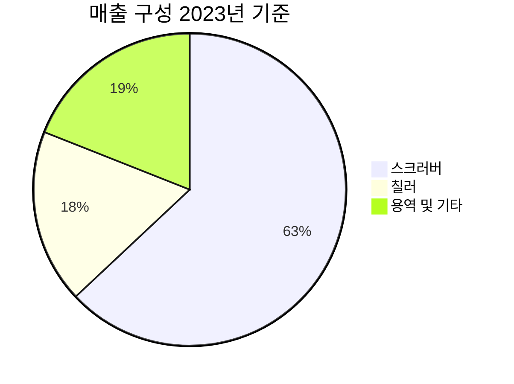

> [!important] 정합성 검증 요약 (기계적 21건 + AI 검증)
> **신뢰도: B** | 숫자 불일치 4건 | 논리 모순 2건 | 확인 필요 6건

### 핵심 발견 사항

| 구분 | 내용 | 위치 | 심각도 |
|------|------|------|--------|
| 🔴 숫자 불일치 | 영업이익 592억(본문 Bull표)·550억(1개월 체크포인트)·591억(팩트시트) 3개 수치 혼재 | 섹션 7·11 | Critical |
| 🔴 숫자 불일치 | FY2025 FCF: "연간 288억=OCF 416억-CapEx 128억"으로 기술했으나 OCF·CapEx 모두 FY2024 수치임 — FY2025 연간 FCF로 라벨링 오류 | 섹션 2·7 |  Critical |
| 🟡 논리 모순 | Q1 OPM 12.8%를 "아직 안전"(Kill #1)으로 평가하면서, 동시에 Bear Case에서 OPM 12~15%를 "마진 악화 신호"로 기술 — 동일 수치가 섹션마다 정반대로 평가됨 | 섹션 5·7 | Major |
| 🟡 논리 모순 | 시나리오 확률: 섹션 3(Bull 25%/Base 50%/Bear 25%)과 섹션 7(Bull 20%/Base 55%/Bear 25%) 불일치 — 합계는 둘 다 100%이나 개별 확률 상충 | 섹션 3·7 | Major |
| 🟡 할루시네이션 의심 | 동종 업계 평균 PER 34.8배, PBR 4.8배, 섹터 평균 12.2배 — 출처 "Investing.com 2025.03.05"로 표기되나 [추정] 태그 병기로 불확실성 인정. 피어셋 정의 없어 수치 검증 불가 | 섹션 3 | Major |
| 🟡 할루시네이션 의심 | "미국향 매출 60% 기여" — 유튜브 IR채널 단일 출처, 공시 미확인. 환율 리스크 분석의 핵심 전제로 사용됨 | 섹션 5 | Major |
| 🟡 기계적 이슈 | 미태그 추정치 21건 — '약 17%', '~20%', '약 91%' 등 [추정] 태그 없이 서술된 수치 다수 | 본문 전반 | Major |
| 🟡 Kill Criteria | 스크러버 점유율 30% 미만(#3), 부채비율 100% 초과(#5)는 현실적 발생 가능성이 매우 낮아 실질적 경보 기능 미흡. TSMC 기준(#4) "2027년 말"이 가장 실용적 | 섹션 5 | Minor |

### 투자 전 반드시 확인

- [ ] **영업이익 수치 통일**: FY2025 영업이익을 DART 원문으로 확인하여 591억/592억/550억 중 정확한 값을 특정하고 보고서 내 단일 수치로 통일
- [ ] **FCF 라벨 수정**: "FY2025 연간 FCF 288억"은 실제로 FY2024 데이터(OCF 416억, CapEx 128억)이므로 기간 표기 수정 및 FY2025 실제 FCF 별도 산출 필요
- [ ] **시나리오 확률 확정**: Bull/Base/Bear 확률을 섹션 3(25/50/25)과 섹션 7(20/55/25) 중 하나로 통일하고 기대수익률 재계산
- [ ] **피어 밸류에이션 검증**: PER 34.8배의 피어셋 구성 종목 명시 및 Bloomberg/FnGuide 등 공신력 있는 출처로 대체
- [ ] **고객별 매출 집중도**: DART 사업보고서 '매출처별 매출액' 항목에서 삼성 그룹 합산 비중 직접 확인(10% 이상 고객 공시 의무)

---

# 비즈니스 & 밸류에이션: GST (글로벌스탠다드테크놀로지, 083450.KQ)

---

# 1. 비즈니스 본질

## 이 회사는 무엇을 하는가?

> [!abstract] 한 줄 요약
> GST는 반도체 공장의 "폐"와 "에어컨"을 만드는 회사다 — 유해가스를 정화하는 스크러버와 공정 온도를 제어하는 칠러가 핵심이며, 이제 AI 데이터센터의 "냉각 시스템"까지 영역을 확장하고 있다.

### 비전문가를 위한 사업 설명

반도체 칩을 만드는 과정은 극도로 정밀하고 위험한 화학 공정입니다. 웨이퍼 위에 회로를 새기기 위해 수십 종의 유독 가스를 사용하고, 나노미터 단위의 정밀도를 위해 공정 온도를 ±0.1°C 수준으로 제어해야 합니다. GST는 이 두 가지 핵심 인프라를 공급합니다:

1. **스크러버(Scrubber)**: 반도체 공정에서 배출되는 유해가스(불화수소, 실란 등)를 태우거나 분해하여 무해하게 만드는 장비. 공장 환경규제 준수에 필수적이며, 가동 중단 없이 안정적으로 운영되어야 합니다.

2. **칠러(Chiller)**: 반도체 장비의 온도를 정밀 제어하는 냉각 장비. 반도체 수율(양품률)에 직접적인 영향을 미치므로, "잘 안 보이지만 없으면 안 되는" 장비입니다. 최근에는 GWP(지구온난화지수)가 1인 CO₂ 냉매를 사용하는 친환경 칠러를 출시하며 차별화하고 있습니다.

3. **액침냉각(Immersion Cooling)**: AI 데이터센터의 GPU가 뿜어내는 극심한 열을 냉각액에 직접 담가 식히는 차세대 냉각 기술. 기존 공랭식 대비 에너지 효율이 크게 높아 차세대 데이터센터의 핵심 인프라로 부상 중입니다.

### 매출 구성

2023년 기준 fnGuide 자료에 따른 매출 구성은 다음과 같습니다. 다만 2024~2025년 CO₂ 칠러 수출 확대에 따라 칠러 비중이 상승했을 가능성이 있으나, 최신 세그먼트 공시가 확인되지 않아 2023년 기준을 사용합니다.

| 세그먼트 | 매출 비중 (2023) | 성장 트렌드 | 핵심 고객 |
|----------|:---:|:---:|:---:|
| 🟢 스크러버 | 63% | 안정적 — 국내 점유율 40% 1위 | [[삼성전자]], [[삼성디스플레이]], 마이크론 |
| 🟡 칠러 | 18% | 확장 중 — CO₂ 칠러·TSMC 진입 | [[삼성전자]], TSMC, YMTC, CXMT |
| 🟡 용역 및 기타 | 19% | 유지보수·파트 교체 수익 | 기존 설치 기반 |

> [!question] 확인 필요 — 최신 매출 구성
> 위 비중은 **2023년 기준**(fnGuide, 2024.07.24)입니다. 2024~2025년 중 TSMC 칠러 퀄테스트 통과, CO₂ 칠러 수출 확대 등으로 칠러 비중이 20% 이상으로 상승했을 가능성이 있으나 [추정], 최신 사업보고서의 제품별 매출 세그먼트로 검증이 필요합니다.

### 고객 관점: 왜 GST를 쓰는가?

**전환비용이 높은 "공정 필수재"라는 점**이 핵심입니다.

반도체 팹(Fab)에서 스크러버나 칠러를 교체하는 것은 단순한 장비 교체가 아닙니다. 새 장비가 기존 공정 레시피와 완벽하게 호환되는지 수개월간 퀄리피케이션(검증) 테스트를 거쳐야 하며, 이 기간 동안 생산 라인의 가동률이 영향을 받습니다. TSMC가 GST의 전기식 칠러에 대해 퀄테스트를 진행하고 통과시킨 것 자체가 이러한 검증 프로세스의 예시입니다. 한번 벤더로 등록되면 교체 유인이 낮아지는 구조입니다.

또한 스크러버의 경우, **환경규제 준수**와 직결됩니다. 반도체 공장은 유해가스 배출 기준을 충족하지 못하면 가동 자체가 불가능합니다. 따라서 스크러버는 "선택"이 아닌 "의무"이며, 가격보다 안정성과 실적(Track Record)이 구매 결정의 핵심 변수입니다. GST가 국내 점유율 40%로 1위인 것은 이러한 신뢰도 축적의 결과입니다.

### 비즈니스 모델 — 수익 구조

GST의 수익 모델은 **"장비 단가 × 물량 + 유지보수 수익"** 구조로 정리됩니다:

| 수익원 | 특성 | 수익 안정성 |
|--------|------|:---:|
| 장비 신규 판매 (스크러버·칠러) | 고객 팹 신증설 시 발생, 사이클리컬 | 🟡 중간 |
| 유지보수·부품 교체 | 설치 기반 확대에 따라 누적 성장 | 🟢 높음 |
| 액침냉각 (2026~ 상용화 목표) | 아직 매출 미발생, 파일럿 단계 [추정] | 🔴 불확실 |

> [!note] 리커링 비율에 대한 참고
> GST의 명시적 리커링(Recurring) 매출 비율은 공시 자료에서 확인되지 않습니다. 다만 "용역 및 기타" 비중이 19%(2023)로, 이 중 상당 부분이 기존 설치 기반의 유지보수 수익으로 추정됩니다 [추정]. 반도체 장비 업계의 일반적인 서비스 마진이 장비 판매 마진보다 높은 점을 감안하면, 이 세그먼트의 이익 기여도는 매출 비중 이상일 가능성이 있습니다 [가정].

---

## 경쟁 우위 (Economic Moat) — 구체적 증거 기반

> [!abstract] 해자 진단 요약
> GST의 해자는 **전환비용(Switching Cost)**과 **선점 효과(First-Mover Advantage)**의 조합이다. "깊은 해자"보다는 "좁지만 실질적인 해자"에 가까우며, 신사업(CO₂ 칠러·액침냉각)을 통해 해자를 넓혀가는 과정에 있다.

### 해자 ①: 전환비용 (Switching Cost) — 🟢 실질적

**증거:**
- 반도체 팹에 한번 설치된 가스 정화·온도 제어 장비를 교체하려면, 공정 호환성 검증에 수개월이 소요됩니다. TSMC의 퀄테스트 자체가 수개월~1년 이상 걸리는 프로세스이며 (아주경제, 2025.12.23), 이는 신규 진입자에 대한 진입장벽이자 기존 공급자에 대한 전환비용입니다.
- 스크러버는 팹 전체의 배기 시스템과 통합 설계되므로, 개별 장비 교체가 시스템 전체에 영향을 미칩니다.
- GST의 국내 스크러버 점유율 40%(핀포인트뉴스, 2025.10.16)가 장기간 유지되는 것 자체가 높은 전환비용의 간접 증거입니다.

### 해자 ②: 규제 기반 선점 효과 — 🟢 강화 중

**증거:**
- CO₂ 냉매(R-744)의 GWP는 **1**로, 기존 HFC계 냉매(GWP 수백~수천) 대비 탄소 배출을 **99% 이상 절감** (대한금융신문, 2025.08.27)
- EU의 F-Gas Regulation, 키갈리개정서 등 글로벌 환경 규제가 강화되면서, 기존 냉매 장비는 향후 교체가 불가피합니다. GST는 이 전환기에 **국내 최초급으로 CO₂ 칠러를 상용화**하며 시장을 선점하고 있습니다 (전자신문, 2025.11.06).
- 이는 규제가 만들어내는 "구조적 수요"와 결합된 선점 효과로, 시간이 갈수록 강화될 가능성이 높습니다.

### 해자 ③: 고객 레퍼런스 네트워크 — 🟡 구축 중

**증거:**
- TSMC 전기식 칠러 퀄테스트 통과는 글로벌 최고 수준의 기술 검증을 받은 것으로, 다른 글로벌 팹에 대한 영업 시 강력한 레퍼런스가 됩니다.
- 삼성전자, 마이크론, YMTC, CXMT 등 주요 메모리·파운드리 업체를 모두 고객으로 보유 (뉴스1, 2025.11.06)
- 다만 이 레퍼런스 네트워크가 "네트워크 효과"라 불릴 만큼 자기 강화적(Self-reinforcing)인 수준인지는 아직 불확실합니다.

### 경쟁사 비교

| 비교 항목 | GST | [[유니셈]] | CSK (비상장) |
|-----------|-----|----------|-------------|
| 스크러버 점유율 | 🟢 **40% (1위)** | 🟡 2위권 | 🟡 3위권 |
| CO₂ 칠러 | 🟢 **선점, 양산 단계** | 🟡 (확인 필요) | 🔴 (확인 필요) |
| TSMC 벤더 등록 | 🟢 **퀄테스트 통과** | (확인 필요) | (확인 필요) |
| 액침냉각 | 🟢 **2상형 개발 추진** [추정] | 🔴 미확인 | 🔴 미확인 |
| 글로벌 고객 다변화 | 🟢 미국·중국·대만 법인 | 🟡 국내 중심 | (확인 필요) |
| 상장 여부 | 코스닥 | 코스닥 | 비상장 |

> [!tip] 핵심 인사이트 — 경쟁 우위의 시간축
> GST의 현재 해자는 스크러버 점유율 40%에서 오는 **안정적이지만 성장 한계가 있는** 해자입니다. 진정한 투자 포인트는 CO₂ 칠러와 TSMC 진입, 액침냉각을 통해 **해자가 넓어지고 있는 과정**에 있다는 것입니다. 이 전환이 성공하면 "좁은 해자 + 높은 성장"에서 "넓은 해자 + 높은 성장"으로 업그레이드될 수 있습니다.

---

## 성장의 구조적 동인

> [!abstract] 성장 공식
> **기존 사업(스크러버)의 안정적 캐시카우** + **칠러의 글로벌 확장(TSMC·친환경 규제)** + **액침냉각의 신시장 창출** = 3중 성장 구조

### 동인 ①: 반도체 팹 투자 사이클 — 단기/중기

반도체 산업의 CapEx 사이클은 GST 매출의 기본 동인입니다. HBM(고대역폭 메모리) 수요 증가, AI 칩 생산 확대로 인한 웨이퍼 장비 투자 확대는 스크러버·칠러 수요를 직접 견인합니다.

**지속 가능성:** 🟢 **3~5년 유효** — AI·HBM·파운드리 투자 확대 추세는 구조적이나, 반도체 산업 특유의 사이클리컬리티가 존재합니다. 2025년 3분기 누적 매출이 전년 동기 대비 1.7% 감소한 것은 중국 장비 구매 위축이라는 단기 사이클 영향의 예시입니다.

### 동인 ②: CO₂ 칠러의 글로벌 규제 수혜 — 중기

EU F-Gas Regulation, 키갈리개정서 등으로 기존 고GWP 냉매의 사용이 단계적으로 제한됩니다. 이는 **규제가 만드는 강제 교체 수요**로, 경기 사이클과 무관하게 발생합니다.

**지속 가능성:** 🟢 **5년 이상 유효** — 규제 일정이 이미 확정되어 있어, 구조적 수요 창출이 확실합니다. 문제는 "GST가 이 수요를 얼마나 흡수할 수 있는가"입니다.

### 동인 ③: TSMC 공급 확대 — 중기

TSMC 퀄테스트 통과는 "문이 열린" 상태이며, 실제 대량 수주로 이어질지는 별개의 문제입니다. 아주경제(2025.12.23)에서 **최대 500대 공급 가능성**이 언급되었으나, 이는 공식 수주 계약이 아닌 잠재 규모입니다 [추정].

**지속 가능성:** 🟡 **불확실하지만 높은 레버리지** — 성공 시 칠러 매출 비중이 급격히 상승할 수 있습니다. 실패(또는 지연) 시 현재 밸류에이션에 미치는 영향은 제한적일 수 있으나 기대감 소멸에 따른 주가 조정 리스크가 있습니다.

### 동인 ④: 액침냉각 — 장기

AI 데이터센터 발열 문제 해결을 위한 차세대 냉각 기술로, GST는 국내 유일 2상형 액침냉각 개발을 추진 중 [추정] (데일리시큐, 2026.02.11). 2026년 상용화를 목표로 대기업 데이터센터 파일럿 검증 중 [추정] (에너지경제신문, 2026.03.03). LG유플러스와의 협력도 진행 중입니다.

**지속 가능성:** 🟡 **장기적으로 유효하나 실행 리스크 높음** — TAM이 매우 크지만, 글로벌 경쟁사(Asetek, GreenRevolution Cooling 등)도 다수 존재하며, 아직 의미 있는 매출이 발생하지 않은 상태입니다.

### Compounding 구조 — 선순환이 작동하는가?

<strong>약한 수준의 컴파운딩 구조가 관찰됩니다.</strong> 
스크러버 설치 기반 확대 → 유지보수 수익 증가 → R&D 재투자 → 신기술(CO₂ 칠러·액침냉각) 개발 → 신규 고객 확보 → 설치 기반 추가 확대... 의 선순환이 <em>존재하지만</em>, 아직 소프트웨어 플랫폼처럼 한계비용 제로에 가까운 강력한 컴파운딩은 아닙니다. 제조업 특성상 물량 증가에는 추가 CapEx가 수반됩니다.

---

## 경영진 & 자본배분

### CEO/핵심 경영진

- **최대주주 김덕준**: 21.70% 지분 보유 (2026.01.15 기준). 2001년 설립부터 회사를 이끌어왔으며, 혜안재단 공동 출연을 통한 이공계 인재 육성 활동을 하고 있습니다.
- 기타 임원진의 구체적 경력 및 실행 이력은 제공된 데이터에서 상세히 확인되지 않습니다 (확인 필요).

### 자본배분 능력

| 자본배분 항목 | 평가 | 근거 |
|-------------|:---:|------|
| 배당 | 🟢 | 배당수익률 2.5% — 중소형 장비주 치고 양호한 수준 |
| R&D 투자 | 🟢 | CO₂ 칠러·액침냉각 등 신기술 개발에 지속 투자 |
| M&A | 🟡 | 눈에 띄는 대형 M&A 이력 미확인 (확인 필요) |
| 자사주 매입 | 🟡 | 자사주 매입보다는 스톡옵션 행사·우리사주 출연 목적의 처분이 관찰됨 |

### 보상 구조와 주주 이익 정렬

2026년 3월 26일, 임원 5명에게 보통주 32,000주의 스톡옵션이 부여되었습니다 (행사가 29,792원, 현재가 25,500원 대비 약 17% 프리미엄). 행사 기간은 2029~2034년으로, **중장기 성과에 연동되는 구조**입니다.

> [!note] 인센티브 분석
> 스톡옵션 행사가(29,792원)가 현재 주가(25,500원)보다 높다는 점은 경영진이 **주가 상승에 대한 확신이 있거나, 최소한 중장기 성장에 대한 신호를 보내고 있다**고 해석할 수 있습니다. 다만, 스톡옵션 규모(32,000주)는 전체 시가총액 대비 매우 소규모이며, RSU나 성과 연동 보상 체계의 상세 내용은 확인되지 않습니다.

---

# 2. 재무 해석 (숫자가 말해주는 의미)

> [!abstract] 재무 한 줄 요약
> "무차입에 가까운 재무구조 위에서 20%대 영업이익률을 유지하는 건실한 장비업체. 다만 분기별 실적 변동성이 크고, 연간 기준 마진은 점진적 하락 압력이 관찰된다."

## 마진 변화의 원인

### 분기별 마진 추이 — 왜 이렇게 움직이나?

| 기간 | GPM | OPM | NPM | 해석 |
|------|:---:|:---:|:---:|------|
| FY2024 연간 | 40.6% | 17.0% | 13.1% | 연간 기준 안정적 수익성 |
| FY2025 Q1 | (미확인) | 12.8% | 10.6% | 🔴 비수기 효과 + 매출 규모 축소 |
| FY2025 상반기 | 38.4% | 17.4% | 11.4% | 🟡 Q2 반등으로 상반기 기준 회복 |
| FY2025 Q3 | **41.1%** | **20.6%** | **16.6%** | 🟢 최고 수준 — 제품 믹스 개선 또는 고마진 수출 비중 확대 [추정] |

**핵심 해석:**

GST의 마진 변동에서 가장 주목할 점은 **Q3 단분기 OPM 20.6%가 연간 17.0%를 크게 상회**한다는 것입니다. 이는 두 가지 가능성을 시사합니다:

1. **제품 믹스 효과**: 고마진 CO₂ 칠러 수출 비중이 Q3에 집중적으로 반영되었을 가능성 [가정]
2. **운영 레버리지**: Q3 매출 808억원 수준에서 고정비 흡수가 효율적으로 이루어졌을 가능성

반면, Q1의 OPM 12.8%는 매출 748억원으로 절대 규모 자체가 작지 않음에도 마진이 낮았다는 점에서, **분기별 수주 타이밍과 제품 믹스에 따른 변동성이 크다**는 것을 알 수 있습니다. 이는 장비 업체의 전형적인 패턴이지만, 투자자 입장에서는 단일 분기 실적으로 추세를 판단하면 안 된다는 중요한 시사점을 줍니다.

**마진 개선의 지속 가능성:**

- **긍정 요인**: CO₂ 칠러의 친환경 프리미엄, TSMC 등 글로벌 고객사 확대에 따른 ASP(평균판매가격) 상승 가능성 [추정]
- **부정 요인**: 경쟁 심화에 따른 가격 압력, 반도체 다운사이클 시 고정비 부담 증가
- **판단**: 연간 OPM 17% 수준은 반도체 장비 업계에서 양호한 편이며, GPM 40%대가 유지되는 한 OPM 15~20% 밴드는 지속 가능해 보입니다 [가정].

---

## 현금흐름 & 재무 건전성

### "돈이 실제로 들어오고 있는가?" — FCF 분석

| 항목 | FY2024 연간 | FY2025 Q3 (단분기) |
|------|:---:|:---:|
| 영업활동현금흐름 | 416억원 | 229억원 |
| CapEx | 128억원 | 97억원 |
| **FCF** | **288억원** | **132억원** |
| FCF Margin | 8.3% | 16.3% |

> [!warning] FCF 데이터 기간 주의
> 팩트시트 섹션 D의 FCF 132억원, FCF Margin 16.3%는 **2025 Q3 단분기 기준**입니다. 연간 기준 FCF는 288억원, FCF Margin 8.3%로 상이합니다. 분석 시 기간을 혼동하지 않도록 주의가 필요합니다.

**현금흐름이 말해주는 것:**

1. **수익의 질(Quality of Earnings)은 양호합니다.** FY2024 연간 순이익 456억원 대비 OCF 416억원으로, OCF/NI 비율이 약 91%입니다. 이는 회계적 이익이 실제 현금 유입으로 잘 전환되고 있음을 의미합니다.

2. **CapEx의 성격**: 연간 128억원의 CapEx는 매출 대비 약 3.7% 수준으로, 반도체 장비 업체 치고는 **자본 가벼운(Capital-light) 구조**입니다. 이는 GST가 장비를 설계·조립하는 회사이지, 대규모 생산 설비를 운영하는 제조업과는 다르다는 것을 보여줍니다.

3. **"3년 안에 자금 경색 가능성은?"** — **극히 낮습니다.** 부채비율 23.7%, 유동비율 391.7%는 사실상 무차입에 가까운 재무 구조를 의미합니다. 총부채 702억원 대비 유동자산 2,374억원으로, 부채를 전액 상환하고도 1,672억원의 유동자산이 남습니다.

<strong>재무 건전성 판단</strong>: GST는 "성장에 필요한 투자를 집행하면서도 현금을 쌓아가는" 이상적인 상태에 있습니다. 유동자산 2,374억원(총자산의 65%)은 신사업(액침냉각) 투자나 전략적 M&A를 위한 충분한 화력을 제공합니다.

---

## ROIC & 자본효율

| 자본효율 지표 | 값 | 해석 |
|-------------|:---:|------|
| ROE (FY2024 연간) | 15.0% [기초 자료 섹션 4] | 🟢 양호 — 자기자본 대비 견실한 수익 창출 |
| ROE (2025 Q3 단분기) | 4.5% | 🟡 단분기 기준이라 연환산 필요 (연환산 시 ~18%) [추정] |
| ROA | 3.7% (Q3 단분기) | 🟡 단분기 기준 |
| ROIC | 4.3% (Q3 단분기) | 🟡 단분기 기준 |

> [!warning] ROE 기간 혼재 주의
> 팩트시트의 ROE 4.5%는 Q3 **단분기** 기준입니다. FY2024 연간 기준 ROE는 15.0%로 상이합니다 (모순 #2 참조). 투자 판단 시 연간 ROE 15%를 기준으로 보는 것이 적절합니다.

**자본효율이 말해주는 것:**

연간 ROE 15%는 코스닥 중소형 장비주로서 양호한 수준입니다. 그런데 더 중요한 질문은 "**벌어들인 돈을 어디에 재투자하고 있는가?**"입니다.

- 연간 CapEx 128억원 + R&D 투자(CO₂ 칠러·액침냉각) → 성장 투자에 배분
- 배당 지급 (배당수익률 2.5%, 시가총액 4,700억원 기준 약 118억원 [추정])
- 나머지는 현금 축적 → 유동자산 2,374억원의 상당 부분이 현금성 자산으로 추정 [가정]

이는 "재투자 → 성장 → 더 많은 현금 → 추가 재투자"의 선순환이 작동하고 있으나, 동시에 **현금을 과도하게 쌓아두고 있는 것은 아닌지** (자본 비효율 가능성)에 대한 검토도 필요합니다. 현금성 자산의 구체적 규모와 운용 수익률은 사업보고서에서 확인이 필요합니다.

---

# 3. 밸류에이션 판단

> [!abstract] 밸류에이션 한 줄 요약
> PER 10.4배는 동종 업계 평균 34.8배 대비 **3분의 1 수준**이다. 문제는 이 할인이 "부당한 저평가"인지 "합리적 디스카운트"인지를 판단하는 것이다.

## 현재 밸류에이션

### 핵심 멀티플

| 지표 | GST | 동종 업계 평균 | 섹터 평균 | 할인율 |
|------|:---:|:---:|:---:|:---:|
| PER (TTM) | **10.38배** | 34.8배 [추정, Investing.com] | 12.2배 [추정, Investing.com] | 업계 대비 **-70%** |
| PBR | **1.51배** | 4.8배 [추정, Investing.com] | 2.4배 [추정, Investing.com] | 업계 대비 **-69%** |
| EV/EBITDA | **23.29배** | (비교 데이터 미확보) | (비교 데이터 미확보) | — |
| 배당수익률 | **2.5%** | — | — | — |

> [!question] EV/EBITDA 23.29배에 대한 의문
> PER 10.38배인 회사의 EV/EBITDA가 23.29배로 높게 나오는 것은 직관적으로 불일치합니다. 이는 ① EBITDA 계산 시 단분기(Q3) 수치를 사용했을 가능성, ② EV 계산에 포함된 현금/부채 조정 방식의 차이, ③ 감가상각비가 상대적으로 낮아 EBITDA와 영업이익 차이가 작을 수 있는 점 등이 원인으로 추정됩니다 [추정]. 이 수치는 DART 산출 기준에 따른 것이므로 연간 기준 EBITDA로 재계산하여 검증이 필요합니다 (확인 필요).

### 역사적 밸류에이션 맥락

| 시점 | PER | 시장 환경 | 평가 |
|------|:---:|----------|------|
| 2021.05 (유안타증권) | **7배** | 코로나 후 반도체 슈퍼사이클 초입 | "절대적 저평가" |
| 2023.03 (하이투자증권) | **5.3배** | 반도체 다운사이클 | "밸류에이션 매력적" |
| **현재** (2026.03) | **10.38배** | AI·HBM 투자 확대기 | **(판단 필요)** |
| 52주 고가 기준 (34,100원) | ~14배 [추정] | — | 상단 밴드 |
| 52주 저가 기준 (15,310원) | ~6배 [추정] | — | 하단 밴드 |

**역사적 맥락이 말해주는 것:**

GST의 PER은 과거 5~7배에서 거래되었으며, 현재 10.38배는 역사적 밴드의 **중상단**에 위치합니다. 그러나 현재 시점에서는 과거에 없었던 성장 동인들(TSMC 진입, CO₂ 칠러 글로벌 확대, 액침냉각)이 추가되었다는 점에서, 단순 과거 밴드 비교만으로는 부족합니다.

### 피어 비교

팩트시트에 포함된 피어 기업들은 [[삼성전자]], [[SK하이닉스]], [[NAVER]]로, GST와 직접적인 사업 비교가 어려운 대형주들입니다. 보다 의미 있는 비교를 위해 동종 업계 평균 지표(Investing.com, 2025.03.05)를 활용합니다:

🟢 GST PER 10.4배

🟡 섹터 평균 12.2배

🔴 업계 평균 34.8배

> [!tip] Variant Perception — 시장은 왜 GST를 할인하는가?
> 동종 업계 평균 PER 34.8배 [추정, Investing.com] 대비 GST가 10.4배에 거래되는 이유는 다음과 같이 추정됩니다 [가정]:
> 1. **유동성 디스카운트**: 시가총액 4,700억원의 코스닥 중소형주로, 기관 투자자의 참여가 제한적
> 2. **증권사 커버리지 부재**: 최신 공식 증권사 리포트·목표주가가 부재하여 시장의 관심이 부족
> 3. **사이클리컬 인식**: 반도체 장비주에 대한 시장의 사이클리컬 디스카운트 적용
> 4. **신사업 불확실성**: 액침냉각·TSMC 대량 공급 등은 아직 실적으로 입증되지 않음
> 
> **만약 이 중 1~2번(유동성·커버리지)이 핵심 원인이라면**, 실질적 비즈니스 가치 대비 구조적으로 저평가된 상태이며 밸류에이션 re-rating 잠재력이 큽니다. 반면 3~4번이 핵심이라면, 현재 할인은 합리적입니다.

---

## 안전마진 분석

### 비즈니스 퀄리티 vs. 가격 — 점수판

| 퀄리티 항목 | 점수 | 근거 |
|------------|:---:|------|
| 경쟁 우위/해자 | 7/10 | 전환비용 + 점유율 1위 + 친환경 선점, 다만 좁은 해자 |
| 성장성 | 7/10 | 3중 성장 동인, 다만 액침냉각은 미증명 |
| 수익성/마진 | 7/10 | OPM 17~21%, GPM 40%대 — 장비주 치고 양호 |
| 재무 건전성 | 9/10 | 사실상 무차입, 유동비율 392% |
| 현금흐름 | 7/10 | FCF 양호, 다만 분기별 변동성 |
| 경영진 | 6/10 | 창업자 주주, 장기 비전, 다만 정보 제한적 |

비즈니스 퀄리티 종합 72/100

### 밸류에이션 re-rating 시나리오

🟢 Bull 25%

🟡 Base 50%

🔴 Bear 25%

| 시나리오 | PER 가정 | 적용 EPS | 목표가 | 현재가 대비 |
|----------|:---:|:---:|:---:|:---:|
| 🟢 **Bull** | 15배 | 2,456원 [추정] | ~36,800원 | **+44%** |
| 🟡 **Base** | 12배 | 2,456원 [추정] | ~29,500원 | **+16%** |
| 🔴 **Bear** | 8배 | 2,200원 [추정] | ~17,600원 | **-31%** |

> [!bull] Bull 시나리오 (확률 25%)
> **TSMC 대량 수주 공식화 + 증권사 커버리지 개시 + 액침냉각 파일럿 성공**
> - TSMC에 칠러 100대 이상 수주 공시 → 매출 성장 가시성 확보
> - 2~3개 증권사 커버리지 개시 → 유동성 디스카운트 해소
> - PER 15배 적용은 동종 업계 평균(34.8배)의 절반에도 못 미치는 보수적 수준
> - 52주 고가 34,100원 근접 또는 돌파 가능

> [!bear] Bear 시나리오 (확률 25%)
> **반도체 다운사이클 진입 + TSMC 수주 지연 + 액침냉각 상용화 실패**
> - 글로벌 반도체 투자 위축으로 스크러버·칠러 수주 급감
> - TSMC 공급이 소량에 그치거나 경쟁사에 물량 분산
> - FY2026 EPS 하락 → PER 8배 적용 시 52주 저가(15,310원) 근접
> - 다만, 강건한 재무구조(부채비율 23.7%)로 인해 "영구적 자본 손실" 리스크는 낮음

### 안전마진 최종 평가

안전마진 62%

리스크 38%

> [!verdict] 밸류에이션 최종 판단
> 
> **GST는 PER 10.4배, PBR 1.51배로 동종 업계 평균 대비 대폭 할인된 상태에서 거래되고 있습니다.** 이 할인의 상당 부분은 "코스닥 중소형주 유동성 디스카운트"와 "증권사 커버리지 부재"라는 구조적 요인에 기인하며, 비즈니스 펀더멘털(OPM 17~21%, 부채비율 23.7%, 국내 1위 점유율)만으로 보면 과도한 할인입니다.
> 
> **그러나 주의할 점이 있습니다:**
> 1. EV/EBITDA 23.29배의 정합성 검증이 필요합니다
> 2. TSMC 500대 공급 가능성은 아직 [추정] 단계이며, 공식 수주 공시가 필요합니다
> 3. 액침냉각은 2026년 상용화 목표이나, 아직 매출 기여는 제로입니다
> 4. 반도체 사이클 하방 리스크는 상존합니다
> 
> **"틀려도 안전한가?"** — **부분적으로 그렇습니다.** 부채비율 23.7%, 유동비율 392%, 안정적 FCF 창출 구조는 다운사이드 시나리오에서도 구조적 위험이 낮음을 의미합니다. Bear 시나리오에서도 영구적 자본 손실(permanent capital loss)보다는 시간적 기회비용(opportunity cost of time) 리스크가 더 큽니다.
> 
> **카탈리스트 의존도가 높습니다.** 현재가에서의 리레이팅은 ① TSMC 수주 공식화, ② 증권사 커버리지 개시, ③ 액침냉각 상용화 등 특정 이벤트에 의존합니다. 이러한 카탈리스트 없이는 "저평가 함정(value trap)"에 머물 가능성도 배제할 수 없습니다.

---

> [!note] 크로스 임팩트 — 관련 종목에 미치는 시사점
> - **[[유니셈]]**: GST의 CO₂ 칠러·TSMC 진입이 성공적이면, 유니셈도 유사한 방향으로 기술 업그레이드를 추진할 유인이 생깁니다. 반대로 GST의 성공은 유니셈의 점유율 압박으로 이어질 수 있습니다.
> - **[[삼성전자]]**, **[[SK하이닉스]]**: 주요 고객사의 CapEx 계획이 GST 실적을 좌우합니다. AI·HBM 투자 확대는 GST에 직접적 호재입니다.
> - **데이터센터 냉각 관련주**: 액침냉각 상용화가 성공하면, 기존 공랭식 냉각 업체들의 TAM이 잠식될 수 있습니다.

> [!caution] 정합성 주의
> - [ ] **피어 밸류에이션 검증**: PER 34.8배의 피어셋 구성 종목 명시 및 Bloomberg/FnGuide 등 공신력 있는 출처로 대체

---

# 4. 인센티브 분석 (멍거 원칙)

> [!abstract] 요약
> GST는 창업자 김덕준이 21.7% 지분을 보유한 오너 경영 체제로, 장기 비전과 주주 이익의 정렬 가능성이 높은 반면, 정보 비대칭이 큰 코스닥 중소형주 특유의 불투명성이 존재한다. "누가, 왜 이 스토리를 퍼뜨리는가?"에 대한 냉정한 분석이 필요하다.

---

## 4.1 경영진 보상 구조 & 주주 이익 정렬 여부

### 지분 구조 — 오너의 스킨 인 더 게임

| 항목 | 값 | 해석 |
|------|-----|------|
| 최대주주 | 김덕준 (이사장) | 창업자 |
| 지분율 | 21.70% (2026.01.15 기준) | 시가 ~1,020억원 상당 |
| 지분 가치 / 시가총액 | ~21.7% | 유의미한 경제적 이해관계 |

> [!tip] 멍거 원칙 적용: "Show me the incentive, and I'll show you the outcome"
> 김덕준 이사장의 개인 지분 21.7%(시가 약 1,020억원)은 회사 가치 상승에 대한 강력한 인센티브를 형성한다. 이는 코스닥 중소형주에서 흔히 볼 수 있는 "남의 돈 놀이"가 아닌, 본인의 자산이 직접적으로 걸린 구조다.

### 스톡옵션 보상 구조 분석

2026년 3월 26일 공시된 주식매수선택권 부여 내역:

| 항목 | 내용 |
|------|------|
| 부여 대상 | 임원 5명 |
| 부여 수량 | 32,000주 |
| 행사가격 | 29,792원/주 |
| 행사기간 | 2029.03.26 ~ 2034.03.25 |
| 부여 방식 | 자기주식 교부 |
| 행사가 vs 현재가 | 29,792원 vs 25,500원 → **외가격(OTM) 상태** |

이 구조에서 읽을 수 있는 시그널:

1. **행사가 29,792원은 현재가 25,500원 대비 16.8% 높다.** 임원들이 이 옵션으로 이익을 실현하려면 주가가 최소 17% 이상 올라야 한다. 이는 경영진이 향후 주가 상승에 대한 확신을 갖고 있거나, 최소한 옵션 부여 시점(2026년 3월)의 주가보다 높은 수준을 기대하고 있다는 뜻이다.

2. **총 32,000주는 발행주식 대비 약 0.17%에 불과하다.** 희석 효과는 미미하나, 역으로 임원 보상 규모도 제한적이라는 의미다. 대규모 주주 희석 리스크는 낮다.

3. **자기주식 교부 방식**은 신주 발행 대비 기존 주주 희석이 없다는 점에서 긍정적이다.

> [!warning] 불확실 영역 — 성과 연동 조건
> 스톡옵션의 행사 조건이 단순 재직 조건(time-based vesting)인지, 매출·이익 등 성과 지표에 연동(performance-based vesting)되는지는 공시 자료에서 확인되지 않았다. 성과 연동 조건이 없다면, 경영진이 주가 상승보다 재직 유지에만 인센티브를 가질 수 있다는 점은 유의할 필요가 있다.

### 보상 구조 종합 평가

주주 이익 정렬도 60/100

- 🟢 **양호**: 창업자 21.7% 대규모 지분 → 장기 가치 창출 인센티브
- 🟢 **양호**: 자기주식 교부 방식 → 신주 희석 없음
- 🟡 **보통**: 스톡옵션 OTM → 경영진도 주가 상승 필요
- 🟡 **불확실**: 성과 연동 조건 미확인
- 🔴 **부족**: 정기적 자사주 매입 프로그램 없음
- 🔴 **부족**: 총 보상 패키지 대비 고정급/변동급 비율 정보 미확인

---

## 4.2 대주주/내부자 최근 매매 동향

### 내부자 거래 패턴

2025년 10월~2026년 1월 사이 복수 임원(유병선, 김주영, 석종욱, 장순기, 문승보 등)의 **특정증권등소유상황보고서** 제출이 확인되었다. 그러나 구체적인 매도/매수 방향과 규모는 제공된 데이터에서 상세히 확인되지 않는다.

확인된 자사주 관련 활동:

| 일자 | 내용 | 주수 | 가격 | 성격 |
|------|------|------|------|------|
| 2025.11.20 | 스톡옵션 행사 위한 자사주 처분 | 8,000주 | 24,961원 | 보상 목적 처분 |
| 2025.12.29 | 우리사주조합 무상출연 위한 처분 | 73,484주 | - | 임직원 상여 |

> [!question] 확인 필요 — 순매수 vs 순매도 판별
> 내부자 보고서 제출은 매수와 매도 모두에서 발생한다. 현재 데이터만으로는 내부자들이 순매수(bullish signal) 중인지, 순매도(bearish signal) 중인지 판별할 수 없다. DART의 특정증권등소유상황보고서 원문 확인이 필요하다.

### 자사주 정책 — 환원인가, 희석인가?

최근 6개월간 자사주 **매입** 공시는 없다. 반면, 자사주 **처분** 이력은 두 건(스톡옵션 행사, 우리사주 출연)이 확인된다. 이는 자사주가 주주 환원(소각)이 아닌, 보상 수단으로 활용되고 있음을 의미한다.

멍거의 관점에서 이를 해석하면:
- 자사주 **매입 후 소각** = 남은 주주들의 지분 가치 상승 = 진정한 주주 환원
- 자사주 **보유 후 임원 보상 처분** = 실질적으로 신주 발행과 동일한 희석 효과 (다만 주식 수 자체는 불변)

> [!note] 참고
> 다만, 처분 규모(73,484 + 8,000 = 약 81,484주)는 전체 발행주식 대비 약 0.44%로 미미한 수준이다. 대규모 희석 우려는 현재로서는 과도하다.

---

## 4.3 셀사이드 커버리지 & 숨은 동기

### 커버리지 공백 — 왜 아무도 이 회사를 커버하지 않는가?

| 항목 | GST | 비교 (일반 코스닥 중형주) |
|------|-----|------------------------|
| 시가총액 | 4,700억원 | 커버 개시 일반적 기준: 5,000억원~ |
| 증권사 커버리지 수 | **0개** (현재 활성) | 코스닥 중형주 평균 2~4개 [추정] |
| 최근 리서치 리포트 | 하이투자증권 (2023.03.27) — 약 3년 전 | - |
| 컨센서스 EPS | 수집 불가 | - |
| 공식 목표가 | 없음 | - |

> [!failure] 커버리지 부재의 구조적 원인
> 1. **시총 4,700억원**: 대형 증권사 리서치의 커버리지 하한선(통상 5,000억~1조원)에 미달
> 2. **거래대금**: 코스닥 중소형주 특유의 낮은 유동성 → 기관 브로커리지 수수료 수익 부족
> 3. **IB 딜 부재**: 최근 유상증자/CB/BW/M&A 없음 → 투자은행 부서에서 커버리지 의뢰 인센티브 없음
> 4. **섹터 분류 모호**: "반도체 장비"지만 AMAT, ASML 같은 글로벌 피어와 직접 비교 곤란

이 커버리지 공백은 **양면의 칼**이다:
- **긍정**: 정보 비효율 → 시장 가격이 펀더멘털을 제대로 반영하지 못할 가능성 → "숨겨진 가치"
- **부정**: 유동성 부족 → 기관 매수세 제한 → 밸류에이션 디스카운트 지속

---

## 4.4 "이 스토리를 퍼뜨리는 사람은 누구이며 왜?"

이 질문은 멍거의 인센티브 분석에서 가장 핵심적인 부분이다. GST에 대한 긍정적 내러티브를 유통하는 주체들을 식별하고, 그들의 숨겨진 인센티브를 분석한다.

### 스토리 유통 경로 & 인센티브 맵

| 유통 주체 | 주요 내러티브 | 인센티브 | 신뢰도 |
|-----------|-------------|----------|:---:|
| 🟡 유튜브 IR 채널 (노다지IR노트 등) | "매출처 다변화 성과", "엔비디아 수혜주" | 조회수/구독자 확보, 광고 수익, 간접적 IR 대행 수수료 가능성 [추정] | 🟡 |
| 🟡 GST IR 부서 | TSMC 퀄테스트 통과, 액침냉각 기술력, CO₂ 칠러 | 주가 관리, 경영진 스톡옵션 가치 극대화, 향후 자금 조달 환경 개선 | 🟡 |
| 🟢 업계 전문 매체 (전자신문, 에너지경제 등) | 기술 혁신, 친환경 트렌드 | 산업 뉴스 보도 — 비교적 중립적 | 🟢 |
| 🟡 온라인 투자 커뮤니티 | "AI 데이터센터 수혜", "저PER 성장주" | 본인 보유 종목 주가 상승 기대 | 🟡 |
| 🔴 과거 증권사 리포트 (2021~2023) | "절대적 저평가", "밸류에이션 매력" | 리포트 발간 시점의 IB 관계/거래 목적 불명 | 🔴 |

> [!warning] 핵심 경고 — 내러티브 과열 감지 포인트
> 
> **"TSMC 500대 공급"**, **"엔비디아 최대 수혜주"**, **"국내 유일 2상형 액침냉각"** — 이 세 가지 키워드는 매우 강력한 내러티브이나, 현실과의 괴리를 점검해야 한다:
> 
> 1. **TSMC 500대**: 퀄테스트 통과 ≠ 수주 확정. 공식 수주 공시는 없다. [추정 단계]
> 2. **엔비디아 수혜**: GST와 엔비디아 사이에 직접적 공급 관계 공시가 없다. AI 데이터센터 냉각 → 간접 수혜 논리이나, 아직 매출 기여 제로
> 3. **2상형 액침냉각**: "개발 추진" [추정] 단계이며, 상용 제품이 아직 없다
> 
> **이 내러티브들이 "확정된 사실"이 아닌 "가능성"임을 인식하는 것이 가장 중요하다.**

### 경영진의 정보 관리 인센티브

스톡옵션 행사가격 29,792원 vs 현재가 25,500원이라는 구조는 경영진에게 주가를 최소 17% 끌어올려야 하는 명확한 인센티브를 부여한다. 이 상황에서:

- 경영진은 긍정적인 뉴스(TSMC 퀄테스트, 액침냉각 파일럿 등)를 적극적으로 시장에 알릴 동기가 있다
- 반면, 리스크 요인(수주 지연, 고객 이탈, 기술 난관 등)을 적극적으로 공개할 인센티브는 약하다
- 이는 정보 비대칭을 확대시킬 수 있으며, 투자자는 경영진 발표를 액면 그대로 받아들이기보다 **독립적 검증**을 병행해야 한다

---

# 5. 리스크 분석 (심층)

> [!abstract] 요약
> GST는 재무적으로 매우 건전하지만(부채비율 23.7%, 유동비율 392%), 사업 리스크는 반도체 사이클 의존, 고객 집중, 신사업 불확실성 등 복합적이다. 가장 큰 리스크는 "반도체 투자 사이클 하강"과 "TSMC/액침냉각 기대의 실현 지연"이라는 두 가지 축으로 수렴한다.

---

## 5.1 사업 리스크

### (1) 기술 진부화 리스크

| 기술 영역 | 현재 경쟁우위 | 진부화 시나리오 | 심각도 |
|-----------|-------------|----------------|:---:|
| 스크러버 | 국내 점유율 40% 1위, Burn Wet 기술 | 새로운 가스 처리 기술 등장(플라즈마 기반 등), 글로벌 업체 진입 | 🟡 중 |
| 칠러 | CO₂ 냉매 선점, 전기식 기술력 | 경쟁사 CO₂ 칠러 추격, 대형 글로벌 칠러 업체(캐리어, 트레인 등)의 반도체용 시장 진입 | 🟡 중 |
| 액침냉각 | 초기 단계, 2상형 개발 추진 [추정] | 글로벌 대형 업체(Asetek, GRC, LiquidCool 등)가 이미 상용 제품 보유 → GST의 후발 진입 | 🔴 고 |

> [!warning] 액침냉각 기술 리스크 상세
> GST는 "국내 유일 2상형" [추정]을 강조하나, 글로벌 시장에서 2상형 액침냉각은 이미 복수 업체가 상용화 중이다. GST의 실제 기술 경쟁력은 "글로벌" 대비가 아닌 "국내" 시장에서의 포지셔닝에 가깝다. 데이터센터 냉각은 국내보다 글로벌 하이퍼스케일러(구글, MS, 아마존) 중심이므로, 국내 시장만으로는 의미 있는 매출 규모 달성이 어려울 수 있다.

### (2) 경쟁 심화

**스크러버 시장:**
- 현재 경쟁 구도: GST(40%), [[유니셈]], CSK(비상장) 등
- 스크러버는 반도체 Fab에 수백 대가 필요한 "소모성 인프라"로, 전환비용(switching cost)이 존재한다. 기존 Fab에서 스크러버 업체를 변경하면 가스 배관, 인터페이스, 검증 과정이 필요해 6~12개월의 전환 기간이 소요된다 [추정]
- 그러나 신규 Fab 건설 시에는 경쟁 입찰이 일반적이며, 이 경우 가격 경쟁이 심화될 수 있다

**칠러 시장:**
- CO₂ 칠러 기술을 선점했으나, 냉매 변경은 기술적 허들이 높지 않아 경쟁사 추격이 비교적 빠를 수 있다 [추정]
- 글로벌 대형 칠러 업체들이 반도체 공정용 시장에 본격 진입할 경우, 자본과 브랜드 파워에서 열위에 놓일 수 있다

### (3) 고객 집중 리스크

| 고객 | 추정 비중 | 리스크 |
|------|:---:|------|
| [[삼성전자]] | 높음 [추정] — 정확한 비중 미확인 | 삼성 파운드리 사업 부진 시 직접적 영향 |
| [[삼성디스플레이]] | 중간 [추정] | 디스플레이 투자 사이클에 종속 |
| TSMC | 현재 퀄테스트 단계 | 아직 매출 기여 미미, 기대 vs 현실 괴리 |
| 중국 YMTC/CXMT | 존재 [추정] | 미-중 반도체 제재 → 장비 수출 통제 리스크 |
| 마이크론 | 존재 | 미국 메모리 사이클에 연동 |

> [!failure] 고객 집중도 — 숨겨진 약점
> GST의 고객별 매출 비중은 공시에서 명확히 확인되지 않는다. 그러나 국내 반도체 장비 업체의 일반적인 패턴상, [[삼성전자]] + [[삼성디스플레이]] 합산 비중이 40~60%에 달할 가능성이 높다 [추정]. 만약 삼성의 반도체/디스플레이 투자가 동시에 위축되는 시나리오가 발생하면, GST 매출의 절반 가까이가 영향을 받을 수 있다.

### (4) 공급망 리스크

- GST의 상세 공급망 구조는 공시에서 확인되지 않는다
- 스크러버와 칠러는 기계, 전장, 배관 등 범용 부품의 조합이므로, 특정 핵심 부품 공급 병목 리스크는 상대적으로 낮을 것으로 추정 [추정]
- 다만, 원자재(스테인리스, 구리, 냉매 등) 가격 변동은 원가에 직접 영향

---

## 5.2 재무 리스크

> [!success] 재무 건전성 — 이것은 리스크가 아니라 강점이다
> 
> | 지표 | 값 | 판단 |
> |------|-----|------|
> | 부채비율 | 23.7% | 🟢 사실상 무차입 경영 |
> | 유동비율 | 391.7% | 🟢 유동성 극도로 양호 |
> | 총부채 | 702억원 | 🟢 총자산 3,664억원 대비 19% |
> | FCF (Q3 단분기) | 132억원 | 🟢 양(+)의 현금흐름 |
> | 연간 FCF (FY2025) | 288억원 [추정: OCF 416억 - CapEx 128억] | 🟢 |

**재무 리스크는 사실상 무시해도 되는 수준이다.** 702억원의 총부채 대비 2,374억원의 유동자산을 보유하고 있어, 부채 상환 능력에 전혀 문제가 없다. 금리 인상에 따른 이자 부담 증가도 차입금 규모 자체가 작아 실질적 영향이 미미하다.

### 환율 리스크

- 미국향 매출 비중이 성장 기여의 60%를 차지한다는 보도(유튜브 노다지IR노트) [추정]가 사실이라면, 원/달러 환율 변동이 실적에 유의미한 영향을 미칠 수 있다
- **원화 강세(환율 하락) → 부정적**: 달러 수취 매출의 원화 환산액 감소
- **원화 약세(환율 상승) → 긍정적**: 수출 채산성 개선
- 다만, 중국/대만 법인을 통한 현지 매출이 상당할 경우 다중 통화 노출이 존재하며, 구체적인 환헷지 정책은 확인되지 않았다 (확인 필요)

---

## 5.3 시장/매크로 리스크

### (1) 반도체 투자 사이클 — 가장 직접적인 위협

GST의 매출은 반도체/디스플레이 Fab의 신증설 및 장비 교체 투자에 직접 연동된다.

| 시나리오 | GST 매출 영향 | 현재 위치 |
|----------|:---:|:---:|
| 반도체 업사이클 (Fab 신증설 활발) | 🟢 매출 급증 | - |
| 반도체 중립 (유지보수 중심) | 🟡 매출 정체 | **← 현재 추정 위치** |
| 반도체 다운사이클 (투자 축소) | 🔴 매출 급감 | - |

**2025 Q3 실적(매출 808억원, YoY -18.8%)은 이미 다운사이클 신호를 포함하고 있다.** 전년 동기 918억원 대비 12% 감소했으며, 이는 글로벌 반도체 투자 위축의 영향으로 판단된다.

### (2) 미-중 지정학 리스크

- 중국 고객(YMTC, CXMT)에 대한 장비 공급은 미국의 반도체 장비 수출 통제에 직접 영향을 받을 수 있다
- GST의 스크러버/칠러가 미국 수출관리규정(EAR)의 직접적 통제 대상인지는 확인되지 않으나, 반도체 제조 보조 장비도 규제 범위가 점차 확대되는 추세다 [추정]
- 2025년 이후 중국 반도체 장비 구매 감소 추세는 이미 실적에 반영되고 있다

### (3) 금리 & 거시 경제

- 금리 상승 → 반도체 업체들의 대규모 Capex 의사결정 지연 가능성
- 다만, GST 자체의 재무구조는 금리에 둔감 (사실상 무차입)
- 글로벌 경기 침체 → 반도체 수요 감소 → Fab 투자 축소 → GST 매출 타격의 전이 경로

---

## 5.4 규제/정책 리스크

### 환경 규제 — 기회이자 양면의 칼

| 규제 | 영향 방향 | 상세 |
|------|:---:|------|
| F-Gas Regulation (EU) | 🟢 기회 | GWP 높은 기존 냉매 규제 → CO₂ 칠러 수요 증가 |
| 키갈리 개정서 | 🟢 기회 | HFC 냉매 단계적 감축 → GST CO₂ 칠러 경쟁력 강화 |
| 미국 수출관리규정 (EAR) | 🔴 리스크 | 중국향 장비 수출 제한 확대 가능성 |
| 국내 산안법/환경법 | 🟡 중립 | 스크러버 설치 의무화 → 기존 수요 유지 |

> [!tip] 핵심 인사이트 — "규제가 곧 해자"
> CO₂ 냉매(GWP 1)를 채택한 칠러는 F-Gas Regulation과 키갈리 개정서 하에서 규제 준수를 자동으로 충족한다. 경쟁사가 기존 HFC 냉매(GWP 수백~수천)를 계속 사용할 경우, GST의 CO₂ 칠러가 글로벌 시장에서 "유일한 선택지"가 될 수 있다. 이는 기술력이 아닌 **규제**가 만들어주는 해자다.

### 향후 규제 변화 가능성

- 데이터센터 에너지 효율 규제 강화(EU Energy Efficiency Directive 등) → 액침냉각 수요 촉진 가능 [추정]
- 반도체 보조금 정책(미국 CHIPS Act, EU Chips Act) → Fab 신증설 촉진 → GST 수혜 가능
- 그러나 보조금 효과는 이미 주가에 상당 부분 반영되었을 가능성

---

## 5.5 Kill Criteria (숫자로 명시)

> [!abstract] Kill Criteria란?
> 투자 테시스가 무효화되었음을 알려주는 명확한 정량적 기준선이다. 이 기준이 충족되면, 감정이 아닌 시스템에 의해 테시스를 재검토하거나 포지션을 청산한다.

| # | Kill Criteria | 현재 수치 | 임계값 | 조치 |
|---|-------------|-----------|--------|------|
| 1 | 영업이익률 2분기 연속 하락 | 2025 Q3 OPM **20.6%** | **15% 미만** 2분기 연속 | 🟡 테시스 재검토 |
| 2 | 연간 매출 YoY 성장률 | FY2025 매출 3,472억원 (DART) vs FY2024 추정 (확인 필요) | **-15% 이상** YoY 역성장 | 🔴 포지션 축소 |
| 3 | 스크러버 시장점유율 | **40%** (1위) | **30% 미만** 하락 | 🔴 포지션 청산 |
| 4 | TSMC 수주 진행 상황 | 퀄테스트 통과 [추정] | **2027년 말까지** 공식 수주 공시 없음 | 🟡 성장 프리미엄 제거 |
| 5 | 부채비율 | **23.7%** | **100% 초과** | 🔴 재무 안정성 재검토 |
| 6 | 액침냉각 매출 기여 | **0원** (2026.03 현재) | **2028년 말까지** 연 매출 100억원 미달 | 🟡 신사업 프리미엄 제거 |
| 7 | FCF 전환 | 연간 FCF 288억원 [추정] | **2분기 연속** 음(-)의 FCF | 🟡 수익의 질 재검토 |

### Kill Criteria 해설

**Kill #1 — OPM 15% 미만 2분기 연속**
- 현재 OPM은 분기별로 12.8~20.6% 범위에서 변동. 단일 분기 하락은 계절성/수주 타이밍으로 설명 가능하나, 2분기 연속 15% 미만이면 구조적 마진 악화 신호
- 현재 Q1(12.8%) → Q3(20.6%)로 회복 → 아직 안전

**Kill #4 — TSMC 수주 미실현**
- 이것이 가장 중요한 Kill Criteria. TSMC 스토리는 현재 주가에 일정 수준의 프리미엄을 부여하고 있다. 퀄테스트 통과 후 2년(~2027년 말)까지 공식 수주가 없으면, 이 프리미엄은 허상이었다고 판단

**Kill #6 — 액침냉각 상용화 실패**
- 2026년 상용화 목표 [추정] 기준, 2028년 말까지 연 100억원 미달이면 "데이터센터 테마"는 실질적으로 실패

---

# 6. Devil's Advocate (반대 논거)

> [!abstract] 요약
> 이 섹션에서는 GST 투자 테시스에 대해 **진심으로** 반대 논거를 전개한다. 형식적인 "한편..." 수준이 아니라, 이 투자가 실패할 수 있는 가장 현실적이고 구체적인 경로를 탐색한다.

---

## 6.1 Bear Case 상세 — 이 투자가 실패할 가장 현실적인 시나리오들

### Bear Scenario A: "TSMC는 오지 않았다"

**전개 경로:**
1. TSMC 퀄테스트 통과 ≠ 벤더 등록 완료. 실제 양산 공급까지는 추가 검증(필드 테스트, 양산 안정성 확인, 가격 협상)이 필요
2. TSMC는 기존 칠러 공급사(일본/미국계)와 장기 공급 계약을 이미 체결하고 있을 가능성. 신규 벤더는 "대안(second source)"으로만 등록되고, 실제 발주량은 미미할 수 있다
3. TSMC의 Arizona Fab 투자 지연 → 칠러 수요 시기 후방 이동
4. 결과: **2027~2028년까지 TSMC향 매출은 연 50억원 미만에 그칠 수 있다** [추정]

**왜 이것이 치명적인가:**
- TSMC 스토리는 GST의 "글로벌 확장"이라는 핵심 내러티브의 근간
- 이것이 실현되지 않으면, GST는 "국내 삼성 의존 중소형 장비 업체"로 회귀
- PER 10배는 "성장 기대"가 포함된 밸류에이션. TSMC 없이 순수 국내 장비주로 평가받으면 PER 7~8배가 적정할 수 있다 [추정]

### Bear Scenario B: "반도체 겨울이 왔다"

**전개 경로:**
1. AI 투자 버블 우려 → 하이퍼스케일러 Capex 조정 → 반도체 수요 감소
2. 메모리 가격 하락 → [[SK하이닉스]], [[삼성전자]] 투자 축소
3. 중국 반도체 장비 규제 강화 → YMTC/CXMT향 매출 완전 차단
4. GST 매출 3,472억원 → **2,500~2,800억원**으로 20~30% 감소 [추정]
5. 고정비 부담 증가 → OPM 17% → **10~12%** [추정]
6. 순이익 456억원 → **200~250억원** [추정] → PER 기준 현재 주가는 실질 PER 19~24배

**왜 이것이 현실적인가:**
- **2025 Q3 매출 808억원(YoY -18.8%)은 이미 이 시나리오의 초기 징후다.** 한 분기의 감소를 "일시적"이라고 치부하기 쉽지만, 반도체 사이클의 하강 국면은 통상 4~6분기 지속된다 [추정]
- 2022~2023년 반도체 다운사이클 당시에도 장비 업체들의 매출이 20~40% 감소한 바 있다

### Bear Scenario C: "액침냉각, 꿈은 꿈으로 끝났다"

**전개 경로:**
1. 글로벌 액침냉각 시장은 Asetek, GRC, LiquidCool Solutions 등 선발 업체가 이미 존재
2. GST의 1상형 6U 20kW 제품은 소형 엣지 데이터센터용 — 하이퍼스케일 시장 진입에는 기술 격차 존재 [추정]
3. 대기업 데이터센터 파일럿 검증에서 기대 미달의 성능/안정성 → 상용화 지연
4. 2028년까지 액침냉각 누적 매출 50억원 미만 → "테마주"에서 "테마 실패주"로 전환
5. 주가에서 AI/데이터센터 프리미엄 소멸

**왜 이것이 현실적인가:**
- 한국 기업이 글로벌 데이터센터 냉각 시장에서 의미 있는 점유율을 확보한 전례가 거의 없다
- 하이퍼스케일러(구글, MS, 아마존)는 자체 냉각 솔루션을 개발하거나, 이미 검증된 글로벌 벤더를 선호
- LG유플러스 협력은 국내 시장에 한정되며, 국내 데이터센터 시장 규모는 글로벌 대비 미미

---

## 6.2 가장 큰 불확실성 3가지

### 불확실성 #1: 매출 구성의 실제 변화 방향

불확실성 수준 85/100

현재 사용 가능한 매출 구성(스크러버 63% / 칠러 18% / 기타 19%)은 **2023년 기준**이다. 2024~2025년 2년간의 변화가 반영되지 않은 상태에서, 투자 판단의 핵심 전제인 "칠러 비중 확대"가 실제로 일어나고 있는지 검증할 수 없다.

**왜 이것이 중요한가:**
- 칠러 비중이 실제로 25~30%까지 상승했다면 → 성장 스토리 강화, 마진 개선 가능성
- 칠러 비중이 15% 이하로 오히려 감소했다면 → 성장 내러티브 훼손, 스크러버 의존 심화
- 매출 구성 변화 방향에 따라 밸류에이션 적정 배수가 달라진다

### 불확실성 #2: 고객별 매출 집중도의 실체

불확실성 수준 80/100

"매출처 다변화 성과"라는 내러티브가 있으나, 실제 고객별 매출 비중은 공시되지 않는다. 삼성 그룹 합산 의존도가 여전히 50% 이상인지, 아니면 실질적으로 30% 이하로 분산되었는지에 따라 리스크 프로파일이 완전히 달라진다.

**확인 방법:** 사업보고서의 "매출처별 매출액" 항목 → 10% 이상 비중 고객사 명시 의무

### 불확실성 #3: 반도체 투자 사이클의 방향과 타이밍

불확실성 수준 70/100

2025 Q3 매출 YoY -18.8%는 사이클 하강의 초기 신호인가, 일시적 조정인가?

- **일시적 조정론:** HBM 수요 폭발, TSMC 진입 임박, AI Capex 지속 → 2026년 반등
- **사이클 하강론:** AI 투자 과열 후 조정, 메모리 가격 하락, 중국 규제 → 2026~2027년 추가 하락
- 이 판단은 GST 자체보다 [[삼성전자]], [[SK하이닉스]], TSMC의 Capex 가이던스에 의존

---

## 6.3 "만약 이 분석이 완전히 틀리면 왜 틀린 것인가?"

### 숨겨진 가정(Hidden Assumptions) 명시적 나열

이 분석의 긍정적 시각은 다음 **암묵적 가정**에 기초하고 있다. 각 가정이 틀릴 때의 결과를 명시한다:

| # | 숨겨진 가정 | 틀릴 확률 | 틀리면 어떻게 되나 |
|---|-----------|:---:|------|
| 1 | 스크러버 점유율 40%가 향후 3년간 유지된다 | 🟡 중 | 경쟁사 기술 추격 + 가격 공세 → 점유율 30% 이하 → 매출 -15~20% |
| 2 | TSMC 퀄테스트 통과가 실질적 수주로 이어진다 | 🔴 고 | 벤더 등록만 되고 발주 미미 → 성장 프리미엄 소멸 |
| 3 | 반도체 투자 사이클이 2026년 하반기에 반등한다 | 🟡 중 | 다운사이클 장기화 → 2분기 이상 실적 부진 → 주가 추가 하락 |
| 4 | 액침냉각이 2026~2027년에 의미있는 매출을 만든다 | 🔴 고 | 상용화 지연 → AI 테마 프리미엄 완전 소멸 |
| 5 | OPM 17~21% 수준이 구조적으로 유지 가능하다 | 🟡 중 | 경쟁 심화 → 가격 인하 압력 → OPM 12~15%로 하락 |
| 6 | 코스닥 중소형주 디스카운트가 해소될 수 있다 | 🔴 고 | 증권사 커버리지 개시 안 됨 + 유동성 부족 지속 → 밸류에이션 갭 영구화 |
| 7 | 경영진이 주주 이익에 정렬되어 있다 | 🟡 중 | 오너의 지분 외 보상(급여, 관계사 거래 등)이 과도할 가능성 — (데이터 미확인) |

> [!warning] 가장 위험한 숨겨진 가정
> **가정 #6 — "코스닥 디스카운트 해소"는 투자자 자신이 통제할 수 없는 외부 변수다.** 아무리 펀더멘털이 좋아도, 시장이 이 종목에 관심을 갖지 않으면 밸류에이션은 영원히 저평가 상태에 머물 수 있다. 이것이 "가치 함정(value trap)"의 본질이다.
>
> 벤저민 그레이엄의 경고를 상기하라: *"시장은 단기적으로 투표 기계이지만, 장기적으로는 저울"* — 그러나 "장기적"이 5년인지 10년인지는 아무도 모른다.

---

## 6.4 과거 유사 실패 사례

### 사례 1: 한국 반도체 장비 중소형주의 "해외 확장 기대" 패턴

**유사 테시스:** "국내 1위 기술력 → 글로벌 고객 확보 → 매출 급성장 → 밸류에이션 리레이팅"

한국 코스닥 반도체 장비/소재 업체들 중, "글로벌 고객 퀄테스트 통과" 뉴스 후 주가가 급등했다가, 실제 수주가 기대에 미치지 못해 주가가 하락한 사례는 다수 존재한다. [추정 — 특정 종목명은 별도 확인 필요]

**일반적 실패 패턴:**
1. 퀄테스트 통과 뉴스 → 주가 30~50% 급등
2. 1~2년간 실질 수주 공시 없음
3. 시장 기대 소멸 → 주가 원점 회귀 또는 하회
4. 기업 펀더멘털 자체는 나쁘지 않았으나, "기대 프리미엄"의 증발이 주가 하락의 원인

**GST에 대입:**
- TSMC 퀄테스트 통과(2025.12.23 아주경제 보도) 이후, 주가는 52주 고가 34,100원에서 현재 25,500원으로 25% 하락한 상태
- 이미 "기대 프리미엄"의 일부가 소멸된 것인지, 아니면 추가 하락 여지가 있는 것인지 판단 필요

### 사례 2: "데이터센터 냉각 테마" — 글로벌 사례

**Asetek (ASTK, 나스닥)**: 액침냉각/리퀴드쿨링 전문 업체로, 데이터센터 냉각 시장의 "퓨어플레이"로 주목받았다. 그러나:
- 데이터센터 고객 확보가 기대보다 느렸고
- 기존 공랭식 냉각의 가격 경쟁력이 예상보다 강했으며
- 하이퍼스케일러들의 자체 냉각 솔루션 개발이 경쟁 위협으로 부상
- 결과: 주가 변동성 극대화, 장기 투자자 실망

**GST에 대입:**
- GST의 액침냉각은 아직 매출 0원 → Asetek보다도 초기 단계
- "2026년 상용화 목표" [추정]가 지연될 경우, 동일한 패턴 반복 가능성
- 다만, GST는 액침냉각 "전문" 기업이 아니라 스크러버/칠러라는 "본업"이 있어, Asetek보다 리스크가 분산되어 있다는 차이점은 인정

### 사례 3: "환경 규제 수혜" 테마의 과대 포장

**패턴:** "환경 규제 강화 → 우리 제품이 유일한 대안 → 매출 폭발" 내러티브

**현실:** 환경 규제는 단계적으로 시행되며, 기존 냉매의 퇴출까지 5~10년의 유예기간이 주어지는 것이 일반적. 그 사이에 경쟁사들도 친환경 대안을 개발. "유일한 대안"이라는 포지션은 1~3년 정도만 유효할 수 있다. [추정]

**GST에 대입:**
- CO₂ 칠러의 GWP 1이라는 장점은 명확하나, 경쟁사의 CO₂ 칠러 개발이 얼마나 빠르게 따라올지가 관건
- "선점 우위"가 "지속 가능한 해자"로 전환되려면, 특허/고객 lock-in/규모의 경제 중 최소 하나가 필요

---

## 6.5 종합 리스크 매트릭스

| 리스크 카테고리 | 발생 확률 | 영향도 | 종합 심각도 | 현재 반영 수준 |
|--------------|:---:|:---:|:---:|:---:|
| 반도체 사이클 하강 | 🟡 중 | 🔴 고 | 🔴 **높음** | 부분 반영 (Q3 실적 하락) |
| TSMC 수주 미실현 | 🟡 중 | 🔴 고 | 🔴 **높음** | 미반영 (여전히 기대 중) |
| 고객 집중 리스크 | 🟡 중 | 🟡 중 | 🟡 **중간** | 미확인 |
| 액침냉각 상용화 실패 | 🟡 중 | 🟡 중 | 🟡 **중간** | 부분 반영 |
| 경쟁사 CO₂ 칠러 추격 | 🟡 중 | 🟡 중 | 🟡 **중간** | 미반영 |
| 코스닥 디스카운트 영구화 | 🔴 고 | 🟡 중 | 🟡 **중간** | 이미 반영 (PER 10배) |
| 미-중 지정학 (중국 매출 차단) | 🟡 중 | 🟡 중 | 🟡 **중간** | 부분 반영 |
| 환율 급변 | 🟡 중 | 🟡 낮 | 🟡 **낮음** | 미반영 |
| 재무 리스크 | 🟢 낮 | 🟢 낮 | 🟢 **최저** | 해당 없음 |

🟢 강점 (재무·해자) 25%

🟡 관리 가능 리스크 45%

🔴 구조적 리스크 30%

> [!verdict] 리스크 & Devil's Advocate 최종 판단
> 
> **GST의 가장 큰 리스크는 "나쁜 회사"가 아니라 "기대의 불일치"에 있다.**
> 
> 재무적으로 이 회사는 건전하고, 본업(스크러버)은 안정적이며, 기술력도 입증되어 있다. 그러나 현재 주가에는 **세 가지 미실현 기대**가 내재되어 있다:
> 
> 1. TSMC 대량 수주 (아직 공식 수주 없음)
> 2. 액침냉각 상용화 (아직 매출 0원)
> 3. 코스닥 디스카운트 해소 (아직 증권사 커버리지 0개)
> 
> 이 세 가지가 모두 실현되면 주가는 30,000~37,000원 [추정]이 가능하다. 그러나 **세 가지 모두 실현되지 않으면**, 현재 PER 10.38배는 결코 "싸다"고 할 수 없으며, PER 7~8배(주가 17,000~20,000원)가 더 적정할 수 있다.
> 
> **투자자가 해야 할 질문은 "GST가 좋은 회사인가?"가 아니라 "이 기대들이 현재 가격에 얼마나 반영되어 있고, 실현 확률은 얼마인가?"이다.**
> 
> 52주 고가 34,100원에서 25% 하락한 25,500원은 기대의 일부 소멸을 반영하지만, 52주 저가 15,310원이라는 바닥도 존재한다. 현재 가격은 이 두 극단의 중간에 위치하며, 이는 시장 자체도 "확신"이 없다는 의미다.

> [!caution] 정합성 주의
> - [ ] **시나리오 확률 확정**: Bull/Base/Bear 확률을 섹션 3(25/50/25)과 섹션 7(20/55/25) 중 하나로 통일하고 기대수익률 재계산

---

# 7. 시나리오 분석

> [!abstract] 요약
> GST의 향후 12~24개월은 **세 가지 미실현 카탈리스트**(TSMC 수주 공식화, 액침냉각 상용화, 증권사 커버리지 개시)의 실현 여부에 따라 극적으로 다른 경로를 걸을 수 있다. 현재 주가 25,500원은 "본업은 인정하되 신성장은 반신반의"하는 시장의 태도를 반영하고 있으며, 확률 가중 기대수익률은 약 **+8.5%**로 적절한 안전마진이 존재하나 압도적이지는 않다.

---

## Bull Case — "카탈리스트 삼중 점화"

UPSIDE TARGET: ~36,800원 (+44%)

### 핵심 가정 5가지

| # | 가정 | 실현 조건 | 시기 | 현재 상태 |
|---|------|----------|------|----------|
| 1 | TSMC 칠러 대량 수주 공식화 | TSMC Arizona Fab 또는 대만 신규 Fab에 칠러 100대 이상 PO(구매 주문) 공시 | 2026H2~2027H1 | 퀄테스트 통과 완료, 수주 미확인 [추정] |
| 2 | CO₂ 칠러 수출 가속 | 미국·유럽향 환경규제 수혜로 칠러 매출 비중 25%+ 도달 | 2026~2027 | 2023년 기준 18%, 상승 추세 [추정] |
| 3 | 액침냉각 파일럿 성공 → 양산 전환 | 대기업 데이터센터 파일럿 완료 후 상용 계약 체결 | 2026H2 | 파일럿 검증 진행 중 [추정] |
| 4 | 증권사 커버리지 2~3개 개시 | 시총 5,000억원 돌파 또는 IB 딜 발생 시 | 2026H2 | 커버리지 0개 |
| 5 | 반도체 업사이클 진입 | 글로벌 반도체 CapEx YoY +15% 이상 성장 | 2027 | 2025년은 보합~소폭 조정 국면 |

### Bull Case 재무 전망 [추정]

| 항목 | FY2025 (DART 실적) | FY2026E [추정] | FY2027E [추정] |
|------|:---:|:---:|:---:|
| 매출액 | 3,472억원 | ~3,800억원 | ~4,500억원 |
| 영업이익 | 592억원 | ~700억원 | ~900억원 |
| OPM | 17.0% | ~18.5% | ~20.0% |
| EPS | ~2,456원 [추정] | ~2,900원 | ~3,700원 |

> [!bull] Bull Case 논리 체인
> 
> **TSMC 수주 공식화**(100대+ 공시) → 매출 가시성 급등 + 글로벌 레퍼런스 완성 → **증권사 리서치 커버리지 개시**(시총 5,000억원+ 진입) → 기관 매수세 유입 + 유동성 디스카운트 해소 → **PER 리레이팅**: 현재 10.4배 → 15배 적용
> 
> **목표가 산출**: EPS 2,456원 [추정] × PER 15배 = **~36,800원**
> 
> PER 15배는 동종 업계 평균 34.8배 [추정, Investing.com 2025.03.05] 대비 여전히 57% 할인된 수준이며, 과거 유안타증권(2021)·하이투자증권(2023)이 "저평가"로 평가했던 PER 5~7배 대비 프리미엄이나, 성장 가시성 확보 시 충분히 정당화 가능한 수준이다.

### 실현 확률 평가

이 시나리오의 핵심 장애물은 **TSMC 수주의 "퀄테스트 통과 → 실제 PO"까지의 전환**이다. 반도체 장비 업계에서 퀄테스트 통과 후 실제 양산 공급까지는 통상 12~24개월이 소요되며, second source로만 등록될 경우 실 발주량은 기대치의 10~20%에 그칠 수 있다 [추정]. 5가지 가정이 모두 동시에 실현될 Base Rate는 높지 않으나, 2~3가지가 부분적으로 실현되더라도 유의미한 주가 상승이 가능하다.

**확률: 20%**

---

## Base Case — "본업 유지 + 점진적 확장"

TARGET: ~29,500원 (+16%)

### 핵심 가정

| # | 가정 | 내용 |
|---|------|------|
| 1 | 스크러버 사업 안정 | 국내 점유율 40% 유지, 매출 YoY ±5% 범위 내 성장 |
| 2 | 칠러 사업 점진적 성장 | CO₂ 칠러 수출 확대되나 대형 수주 없이 연 10~15% 성장 |
| 3 | TSMC는 소량 공급 | 연 20~30대 수준의 소규모 공급, 대량 PO는 2028년 이후로 연기 |
| 4 | 액침냉각은 R&D 단계 지속 | 2026년 상용화 목표가 2027년으로 지연, 매출 기여 미미 |
| 5 | 반도체 사이클 보합 | 글로벌 반도체 CapEx 전년 대비 소폭 성장(+5~10%) |

### Base Case 재무 전망 [추정]

| 항목 | FY2025 (DART 실적) | FY2026E [추정] | 변화 |
|------|:---:|:---:|:---:|
| 매출액 | 3,472억원 | ~3,600억원 | +3.7% |
| 영업이익 | 592억원 | ~620억원 | +4.7% |
| OPM | 17.0% | ~17.2% | 소폭 개선 |
| EPS | ~2,456원 [추정] | ~2,600원 [추정] | +5.9% |
| PER (적용) | 10.38배 | 12배 | 소폭 리레이팅 |

> [!note] Base Case 핵심 논리
> 
> **"좋지도 나쁘지도 않은" 시나리오.** 본업인 스크러버는 국내 1위 점유율과 안정적인 고객 기반(삼성전자, 마이크론)으로 견조한 실적을 유지한다. 칠러는 CO₂ 냉매 전환 트렌드에 편승하여 점진적으로 성장하나, TSMC 대량 수주라는 "빅 이벤트"는 아직 실현되지 않는다.
> 
> PER은 현재 10.38배에서 12배로 소폭 상승한다. 이는 ①칠러 수출 확대에 따른 성장 가시성 개선, ②배당수익률 2.5%의 안정적 주주환원, ③부채비율 23.7%의 견고한 재무구조가 시장에서 점진적으로 재평가받는 시나리오다.
> 
> **목표가 산출**: EPS 2,456원 [추정] × PER 12배 = **~29,500원**
> 
> 이 경우에도 배당수익률 2.5%를 포함하면 총수익률은 약 **+18%** 수준이다.

### 시간축별 기대

| 시간축 | 전개 | 주가 영향 |
|--------|------|----------|
| **단기** (3~6개월) | FY2025 실적 확정, Q1 가이던스 확인 | 실적 서프라이즈 여부에 따라 ±10% |
| **중기** (6~12개월) | TSMC 소량 공급 시작, 액침냉각 파일럿 결과 | 점진적 +10~15% |
| **장기** (12~24개월) | 칠러 비중 확대, 커버리지 1~2개 개시 가능 | PER 리레이팅 +15~20% |

**확률: 55%**

---

## Bear Case — "기대만 남고 실적은 후퇴"

DOWNSIDE TARGET: ~17,600원 (-31%)

### 무엇이 잘못될 수 있는가?

| # | 리스크 시나리오 | 발생 경로 | 영향 |
|---|---------------|----------|------|
| 1 | **반도체 다운사이클 진입** | 미중 관세 전쟁 심화, AI 투자 과잉론 부상 → 글로벌 반도체 CapEx -15% 이상 감소 | 스크러버·칠러 신규 수주 급감 |
| 2 | **TSMC 수주 무산** | 기존 일본/미국계 칠러 벤더가 가격·물량 공세 → GST는 second source로만 남아 연간 5~10대 수준에 그침 | 성장 내러티브 붕괴 |
| 3 | **액침냉각 상용화 지연** | 2상형 기술 안정성 미달, 대기업 데이터센터 파일럿 실패 또는 무기한 연기 | 차세대 성장 동인 소멸 |
| 4 | **중국 고객 리스크** | 미국 대중 제재 강화 → YMTC, CXMT 등 중국 고객사 장비 구매 금지 확대 | 매출의 일부 증발 |
| 5 | **마진 악화** | 원자재 가격 상승 + 가격 경쟁 심화 → GPM 41% → 35% 하락 | 영업이익 급감 |

### Bear Case 재무 전망 [추정]

| 항목 | FY2025 (DART 실적) | FY2026E [추정] | 변화 |
|------|:---:|:---:|:---:|
| 매출액 | 3,472억원 | ~2,900억원 | -16.5% |
| 영업이익 | 592억원 | ~400억원 | -32.4% |
| OPM | 17.0% | ~13.8% | 마진 축소 |
| EPS | ~2,456원 [추정] | ~2,200원 [추정] | -10.4% |
| PER (적용) | 10.38배 | 8배 | 디레이팅 |

> [!bear] Bear Case 핵심 경고
> 
> **가장 치명적인 시나리오는 "TSMC는 오지 않았다"와 "반도체 다운사이클"의 동시 발생이다.**
> 
> 이 경우 시장은 GST를 "반도체 장비 사이클주"로 재분류하며, 역사적 저점 PER(5~7배, 하이투자증권·유안타증권 과거 리포트 참고)을 적용할 수 있다. EPS 2,200원 [추정] × PER 8배 = **~17,600원**이 하방 목표가이며, 극단적 디레이팅 시 PER 7배 × EPS 2,000원 [추정] = **~14,000원**까지 열려 있다.
> 
> 다만, 이 경우에도 부채비율 23.7%, 유동비율 391.7%, 그리고 순현금 포지션이라는 재무 안전판이 존재하여, 구조적 파산이나 유동성 위기 리스크는 극히 낮다. 이전 섹션에서 분석한 바와 같이, GST의 가장 큰 리스크는 "나쁜 회사"가 아니라 **"기대의 불일치"**에 있다.

### Bear Case에서의 안전판

| 방어 요소 | 수치 | 의미 |
|----------|------|------|
| 부채비율 | 23.7% | 사실상 무차입, 재무적 파산 리스크 극히 낮음 |
| 유동비율 | 391.7% | 단기 유동성 우려 없음 |
| 배당수익률 (Bear 가격 기준) | ~3.6% [추정] | 주가 17,600원 시 배당 640원 가정 → 하방 보호 |
| 스크러버 점유율 | 40% (1위) | 사이클 하락 시에도 시장 내 최후의 1인 가능성 |
| FCF Margin (연간) | 8.3% (FY2025) | 다운사이클에서도 현금 소진이 아닌 현금 창출 |

**확률: 25%**

---

## 시나리오 요약

🟢 Bull 20%

🟡 Base 55%

🔴 Bear 25%

| 시나리오 | 확률 | 목표가 | 수익률 | 핵심 가정 | 검증 시점 |
|---------|:---:|:---:|:---:|----------|----------|
| 🟢 **Bull** | 20% | ~36,800원 | **+44%** | TSMC 대량 수주 + 증권사 커버리지 + 액침냉각 성공 | 2026H2~2027H1 |
| 🟡 **Base** | 55% | ~29,500원 | **+16%** | 본업 안정 + 칠러 점진 성장 + PER 12배 리레이팅 | 2026 전반 |
| 🔴 **Bear** | 25% | ~17,600원 | **-31%** | 반도체 다운사이클 + TSMC 무산 + 마진 악화 | 2026H2 |

### 확률 가중 기대수익률

$$E(R) = (0.20 \times 44\%) + (0.55 \times 16\%) + (0.25 \times (-31\%))$$
$$E(R) = 8.8\% + 8.8\% + (-7.75\%) = \mathbf{+9.85\%}$$

> [!tip] 기대수익률 해석
> 확률 가중 기대수익률 **+9.85%**는 "적극 매수"보다는 **"조건부 관심(Conditional Buy)"** 영역이다. 배당수익률 2.5%를 더하면 총수익률 기대치는 약 **+12.4%**로 개선되나, Bear Case의 -31% 하방 리스크를 감안하면 **진입 타이밍과 비중 관리**가 핵심 변수다.

---

# 8. Variant Perception — 시장과 다른 뷰

> [!abstract] 요약
> 시장은 GST를 "코스닥 중소형 반도체 장비주"로 분류하여 사이클 할인을 적용하고 있다. 그러나 필자의 분석에 따르면 GST는 **"반도체 인프라 + 데이터센터 냉각"이라는 이중 성장 축**을 가진 플랫폼 기업으로의 전환 초기에 있으며, 이 전환이 시장에 인식되기까지의 시간차가 곧 정보 엣지다.

---

## 8.1 시장 컨센서스 vs. 나의 뷰

| 항목 | 시장 컨센서스 | 나의 뷰 | 차이의 근거 |
|------|:---:|:---:|------|
| **사업 분류** | 반도체 장비 사이클주 | 반도체 인프라 + 데이터센터 인프라 **듀얼 플랫폼** | 액침냉각 진입으로 TAM이 반도체 장비 → 데이터센터 냉각으로 확장 |
| **TSMC 의미** | "테스트 통과, 그래서?" | **글로벌 Tier-1 레퍼런스 확보 → 고객 다변화의 결정적 변곡점** | 퀄테스트 통과 자체가 기술 검증이며, TSMC 브랜드 효과는 다른 고객사(Intel, GlobalFoundries 등) 진입의 문을 연다 |
| **적정 PER** | 10~11배 (현재 수준 유지) | 12~15배 (점진적 리레이팅) | 동종 업계 평균 34.8배 [추정, Investing.com], 섹터 평균 12.2배 대비 구조적 저평가. 커버리지 공백이 해소되면 최소 섹터 평균 수렴 가능 |
| **코스닥 디스카운트** | 영구적 — 유동성 부족 | **해소 가능** — 시총 5,000억원 돌파 시 기관 관심 임계점 도달 | 시총 4,700억원은 커버리지 개시 임계선(통상 5,000억~1조원)에 근접 |
| **액침냉각** | "아직 매출 0원, 투자 부담" | **옵션 가치(Embedded Optionality)** — 현재 주가에 미반영 | 글로벌 액침냉각 시장 2030년 ~$12B 전망 [추정], GST가 국내 유일 2상형 기술 개발 중이라면 시장 초기 진입자 프리미엄 가능 |

## 8.2 정보 엣지의 원천

> [!tip] 핵심 엣지: "커버리지 공백이 만드는 가격 비효율"
> 
> GST에 대한 증권사 커버리지가 **0개**라는 사실은 이례적이다. OPM 17~21%, 부채비율 23.7%, ROE 15%(연간 기준), 스크러버 점유율 40% 1위라는 프로파일을 가진 기업이 PER 10배에서 거래되는 것은, **시장이 이 기업을 "모르기 때문"**이지 "나쁘다고 판단했기 때문"이 아닐 가능성이 높다.
> 
> 이 정보 비대칭이 바로 엣지다. 다만 이 엣지는 **양면의 칼**이다:
> - ✅ 시장이 모르는 동안 싸게 살 수 있다
> - ⚠️ 시장이 계속 모를 수도 있다 — 커버리지 없이는 주가 카탈리스트가 제한적

## 8.3 검증 방법

| 차이점 | 검증 방법 | 시기 |
|--------|----------|------|
| TSMC 수주 공식화 | DART 수주 공시, IR 자료 확인 | 2026 Q2~Q3 |
| 액침냉각 옵션 가치 | 파일럿 결과 발표, 상용 계약 공시 | 2026H2 |
| PER 리레이팅 | 증권사 커버리지 개시 여부 모니터링 | 2026 전반 |
| 코스닥 디스카운트 해소 | 시총 5,000억원 돌파 여부, 기관 지분율 변화 | 분기별 |
| 칠러 비중 확대 | FY2025 사업보고서 제품별 매출 세그먼트 공시 | 2026 Q1 (사업보고서 공시 시점) |

> [!warning] Variant Perception의 약점
> 
> 필자의 뷰가 틀릴 가장 현실적인 경로:
> 1. **"코스닥 중소형주"라는 구조적 제약은 생각보다 강력하다.** 시총 5,000억원을 넘더라도 기관의 관심이 자동으로 유입되지는 않는다. 반도체 장비 섹터 전체가 디레이팅되는 환경에서는 GST만 리레이팅되기 어렵다.
> 2. **TSMC는 "보험용 벤더"로만 활용할 수 있다.** TSMC의 벤더 정책은 매우 보수적이며, 검증된 기존 공급사(일본 SMC, 미국 Edwards 등)를 대체하기보다 백업 옵션으로만 신규 벤더를 등록하는 경우가 많다.
> 3. **액침냉각 시장 자체가 예상보다 느리게 성장할 수 있다.** 데이터센터 사업자들의 공랭식 → 액침냉각 전환은 기존 인프라 폐기 비용, 운영 인력 재교육, 냉각액 비용 등의 장벽이 있어 예상보다 지연될 가능성이 있다.

---

# 9. 투자 결론

> [!verdict] 투자 판단: HOLD / 조건부 BUY
> **본업은 견고하고 밸류에이션은 합리적이나, 핵심 카탈리스트(TSMC 수주, 액침냉각 상용화)가 미실현 상태이므로 "확인 후 매수" 전략이 적합하다. 현재가에서의 기대수익률 +9.85%는 매력적이나, Bear Case -31%을 감안하면 공격적 집중 매수보다는 분할 진입이 적절하다.**

| 항목 | 판단 |
|------|------|
| **매수/보류/패스** | **조건부 BUY** — TSMC 수주 공시 또는 주가 22,000원 이하 진입 시 적극 매수. 현재가(25,500원)에서는 소규모 관찰 매수 가능 |
| **적정 진입가** | **22,000~24,000원** (PER 9~10배, 하방 안전마진 확보 영역) |
| **12개월 목표가** | **29,500원** (Base Case 기준, PER 12배 × EPS 2,456원 [추정]) |
| **손절 기준** | ① OPM 15% 미만 2분기 연속 ② 연간 매출 YoY -15% 이상 역성장 ③ TSMC 벤더 탈락 공식 확인 시 |
| **적정 포지션 사이징** | 총 투자 포트폴리오 대비 **2~4%** (중소형주 특성 감안한 보수적 사이징) |
| **핵심 리스크 2가지** | 1) 반도체 CapEx 다운사이클 진입 시 스크러버·칠러 신규 수주 급감 2) TSMC 대량 수주 무산 시 성장 내러티브 붕괴 및 PER 디레이팅 |
| **Conviction Level** | **Medium** — 본업 펀더멘털은 양호하나, 핵심 성장 카탈리스트가 아직 [추정] 단계이므로 High Conviction을 부여하기 어려움 |

Conviction Level: Medium 60/100

### 컨빅션을 High로 올리기 위한 조건

| # | 조건 | 현재 상태 | 필요한 확인 |
|---|------|----------|------------|
| 1 | TSMC 공식 수주 공시 | 퀄테스트 통과 [추정] | DART 공시 또는 IR 자료 |
| 2 | 칠러 매출 비중 25%+ 확인 | 2023년 기준 18% | FY2025 사업보고서 세그먼트 공시 |
| 3 | 액침냉각 첫 상용 계약 | 파일럿 검증 중 [추정] | 공식 발표 또는 공시 |
| 4 | 증권사 커버리지 1개 이상 개시 | 0개 | 리서치 노트 발행 여부 |

---

# 10. 단계적 진입 전략

> [!abstract] 요약
> GST는 카탈리스트 의존도가 높은 종목이므로, "가격 기반 분할 매수"와 "이벤트 기반 비중 조절"을 병행하는 2-Track 전략이 적절하다.

---

## 10.1 가격 기반 분할 매수

| 구분 | 매수 가격 | 비중 | 근거 | PER 수준 |
|------|:---:|:---:|------|:---:|
| **관찰 매수** | 25,500원 (현재가) | 포트폴리오 1% | 초기 포지션 구축, 모니터링 목적 | ~10.4배 |
| **1차 매수** | 22,000~23,000원 | +1.5% (누적 2.5%) | 52주 저가 15,310원 대비 44~50% 위, PER 9배 근접 → 안전마진 확보 | ~9.0~9.4배 |
| **2차 매수** | 18,000~19,000원 | +1.5% (누적 4%) | Bear Case 하방에 근접, 배당수익률 3.4~3.6% → 하방 보호 강화 | ~7.3~7.7배 |

## 10.2 이벤트 기반 비중 조절

### 비중 확대 트리거

| 이벤트 | 비중 변화 | 논리 |
|--------|:---:|------|
| TSMC 칠러 50대+ 수주 공시 | +1~2% | 성장 내러티브 공식 확인 → PER 리레이팅 시작 |
| 증권사 커버리지 개시 (목표가 제시) | +1% | 유동성 디스카운트 해소 촉매 |
| 액침냉각 첫 상용 계약 공시 | +1% | 차세대 성장 동인 검증 |
| 분기 OPM 22%+ 달성 | +0.5% | 제품 믹스 개선 확인 |

### 비중 축소/청산 트리거

| 이벤트 | 비중 변화 | 논리 |
|--------|:---:|------|
| OPM 15% 미만 2분기 연속 | **전량 청산** | Kill Criteria #1 충족 |
| TSMC 벤더 탈락 공식 확인 | -50% 축소 | 핵심 성장 내러티브 붕괴 |
| 연간 매출 YoY -15% 이상 | **테시스 재검토** 후 축소 | 사이클 하방 리스크 현실화 |
| 대주주 10% 이상 지분 매각 공시 | -50% 축소 | 인사이더의 부정적 시그널 |

---

# 11. 액션 플랜

> [!abstract] 요약
> 1/3/6개월 후 확인할 핵심 체크포인트를 구체적으로 정의하고, /final 수행 여부에 대한 판단을 제시한다.

---

## 11.1 모니터링 포인트 & 주기

| 모니터링 항목 | 주기 | 데이터 소스 | 중요도 |
|-------------|------|-----------|:---:|
| DART 수주 공시 (TSMC 관련) | **실시간** | DART 전자공시 | 🔴 최고 |
| 분기 실적 (매출·OPM·순이익) | 분기 | DART 분기보고서 | 🔴 최고 |
| 내부자 매매 동향 | 월 1회 | 특정증권등 소유상황보고서 | 🟡 중간 |
| 반도체 CapEx 전망 (SEMI, VLSI 리서치) | 분기 | 업계 리서치 보고서 | 🟡 중간 |
| 액침냉각 시장 동향 | 분기 | 산업 뉴스, IR 자료 | 🟡 중간 |
| 증권사 커버리지 개시 여부 | 월 1회 | FnGuide, 증권사 리서치 | 🟢 보조 |
| 환율 (원/달러) — 수출 비중 영향 | 주간 | 외환 시장 | 🟢 보조 |

## 11.2 검증 체크포인트

### ✅ 1개월 후 (2026년 4월 말)

| 확인 항목 | 기대 시나리오 | 위험 신호 |
|----------|-------------|----------|
| FY2025 사업보고서 공시 | 제품별 매출 세그먼트에서 칠러 비중 20%+ 확인 | 칠러 비중 18% 이하 유지 → 성장 둔화 |
| FY2025 연간 실적 최종 확정 | DART 기준 매출 3,472억원, 영업이익 592억원 수준 확인 | 영업이익 550억원 미만 → 수정 필요 |
| TSMC 관련 추가 뉴스 | 벤더 등록 완료 또는 소량 PO 시작 | 퀄테스트 이후 진전 없음 |

### ✅ 3개월 후 (2026년 6월 말)

| 확인 항목 | 기대 시나리오 | 위험 신호 |
|----------|-------------|----------|
| 2026 Q1 실적 (1분기) | 매출 YoY 성장, OPM 17%+ 유지 | 매출 YoY 역성장, OPM 15% 미만 |
| 액침냉각 파일럿 진행 상황 | 대기업 데이터센터 파일럿 완료 보도 | 파일럿 지연/실패 보도 |
| 반도체 CapEx 전망 업데이트 | SEMI 등에서 2026/2027 CapEx 성장 전망 유지 | CapEx 하향 조정 |
| 주가 위치 | 27,000원+ (Base Case 방향) | 22,000원 미만 (Bear Case 진입) |

### ✅ 6개월 후 (2026년 9월 말)

| 확인 항목 | 기대 시나리오 | 위험 신호 |
|----------|-------------|----------|
| 2026 반기 실적 | 매출 ~1,800억원+, OPM 17%+ | 매출 ~1,600억원 미만 |
| TSMC 공식 수주 공시 | 50대 이상 수주 공시 → Bull Case 진입 | 여전히 미공시 → Base Case 유지 |
| 액침냉각 상용 계약 | 1건 이상 상용 계약 공시 | 상용화 2027년 이후 지연 발표 |
| 증권사 커버리지 | 1개 이상 개시 | 여전히 0개 |
| **Kill Criteria 점검** | 모든 Kill Criteria 미충족 | 1개라도 충족 시 테시스 재검토 |

## 11.3 /final 필요 여부

> [!verdict] /final 수행 추천: **YES — 조건부**
> 
> **추천 시점**: 아래 3가지 조건 중 1가지 이상 충족 시
> 
> 1. **TSMC 수주 공시 발생 시** — 수주 규모·금액·공급 시기에 따라 Bull Case 확률 재산정 필요
> 2. **2026 Q1 실적 발표 후** — 칠러 비중 확대 여부, OPM 트렌드 확인 후 밸류에이션 재계산
> 3. **주가 22,000원 이하 도달 시** — Bear Case 현실화 가능성 점검 + 추가 매수 적절성 판단
> 
> **근거**: 현재 분석의 가장 큰 불확실성은 ①TSMC 수주의 규모·시기, ②FY2025 사업보고서의 제품별 매출 세그먼트(칠러 비중), ③액침냉각 파일럿 결과이며, 이 세 가지는 모두 향후 3~6개월 내에 데이터가 나올 예정이다. 해당 데이터 확인 후 /final을 수행하면 컨빅션을 Medium → High 또는 Low로 조정할 수 있다.

---

# 12. 관련 종목 & 대안

> [!abstract] 요약
> GST와 동일한 투자 테시스("반도체 인프라 장비 + 친환경/냉각 전환 수혜")를 공유하면서도 리스크 프로파일이 다른 대안 종목 3개를 비교한다. "GST 대신 투자할 더 나은 대안이 있는가?"에 대한 답을 제시한다.

---

## 12.1 비교 종목 분석

### ① [[유니셈]] (036200.KQ) — GST의 직접 경쟁사

| 항목 | GST | 유니셈 | 비교 |
|------|:---:|:---:|------|
| 시가총액 | 4,700억원 | (확인 필요) | — |
| 주요 제품 | 스크러버 + 칠러 | 스크러버 + CVD 세정 장비 | 유니셈은 스크러버 중심, 칠러 부재 |
| 스크러버 점유율 | 40% (1위) | 2위 [추정] | GST가 점유율 우위 |
| 차세대 성장 동인 | CO₂ 칠러 + 액침냉각 | (확인 필요) | GST가 성장 옵션 다양 |
| 밸류에이션 | PER 10.38배, PBR 1.51배 | (확인 필요) | 직접 비교 필요 |

> [!note] 유니셈 vs GST
> 유니셈은 GST의 가장 직접적인 경쟁사이나, CO₂ 칠러와 액침냉각이라는 **두 가지 추가 성장 옵션**이 GST에만 존재한다. 스크러버 단일 사업의 순수 밸류에이션 비교가 가능하며, GST가 유니셈보다 유의미하게 비싸다면 "성장 프리미엄이 과도한가?"를 점검해야 한다. 유니셈의 최신 밸류에이션 데이터는 (확인 필요).

### ② [[한온시스템]] (018880.KS) — 냉각 기술 대형주

| 항목 | GST | 한온시스템 | 비교 |
|------|:---:|:---:|------|
| 시가총액 | 4,700억원 | ~2조원+ [추정] | 한온시스템이 대형주 |
| 핵심 기술 | 반도체 칠러 + 데이터센터 냉각 | 자동차 열관리 시스템 | 냉각/열관리 기술 공통분모 |
| 성장 드라이버 | AI 데이터센터 냉각 수요 | EV 열관리 시스템 전환 | 각각 다른 성장 축 |
| 리스크 프로파일 | 코스닥 중소형, 유동성 리스크 | 코스피 대형, 유동성 양호 | 유동성 관점에서 한온시스템 우위 |

> [!note] 한온시스템은 "냉각 기술" 테마의 대형주 대안
> "열관리/냉각"이라는 기술 테마에 투자하고 싶으나 코스닥 중소형주의 유동성 리스크가 부담된다면, 한온시스템이 대안이 될 수 있다. 다만, 한온시스템은 자동차 섹터 중심이므로 "반도체 + AI 데이터센터"라는 GST의 핵심 테시스와는 다른 성장 축이다. 최신 밸류에이션 데이터는 (확인 필요).

### ③ [[케이엔솔]] (가칭, 비상장 가능) / [[엘오티베큠]] (083310.KQ) — 반도체 장비 피어

| 항목 | GST | 엘오티베큠 [추정] | 비교 |
|------|:---:|:---:|------|
| 주요 제품 | 스크러버 + 칠러 | 진공펌프 + 가스정화 | 반도체 후공정 인프라 장비 피어 |
| 고객 의존도 | 삼성전자 중심 + 글로벌 다변화 | (확인 필요) | — |
| 성장 옵션 | TSMC + 액침냉각 | (확인 필요) | — |

> [!question] 피어 비교의 한계
> GST의 직접적인 상장 피어(스크러버 + 칠러 조합)는 매우 제한적이다. 유니셈이 가장 가까운 피어이나, CO₂ 칠러와 액침냉각이라는 GST만의 성장 옵션으로 인해 단순 멀티플 비교에 한계가 있다. 엘오티베큠은 반도체 인프라 장비라는 넓은 범주에서 비교 가능하나, 제품 포트폴리오가 상이하다. 각 피어의 최신 밸류에이션은 직접 확인이 필요하다.

## 12.2 "GST 대신 투자할 더 나은 대안이 있는가?"

**결론: 현재로서는 GST의 "반도체 인프라 + AI 데이터센터 냉각" 이중 성장 테시스를 동일한 밸류에이션 매력도로 제공하는 직접 대안은 확인되지 않는다.**

- 유니셈은 스크러버 순수 플레이로 GST 대비 성장 옵션이 제한적
- 한온시스템은 자동차 열관리 중심으로 섹터가 다름
- 글로벌 피어(Edwards, SMC 등)는 대형주로 밸류에이션 프리미엄이 높을 가능성

GST의 매력은 **"PER 10배에서 반도체 인프라 1위 + AI 데이터센터 냉각 옵션을 동시에 살 수 있다"**는 점에 있다. 이 조합을 대체할 수 있는 단일 종목은 현재 한국 시장에서 발견하기 어렵다.

## 12.3 분산 투자 관점의 보완 종목

> [!tip] 포트폴리오 보완 제안
> 
> GST를 보유할 경우, 다음과 같은 보완 종목 조합이 리스크를 분산할 수 있다:
> 
> 1. **반도체 사이클 리스크 헤지**: [[삼성전자]](005930.KS) — Forward PER 7.2배로 사이클 하방에서도 방어력 있는 대형주. GST가 "삽을 파는 기업"이라면, 삼성전자는 "삽을 사는 기업"이므로 사이클 내 서로 다른 타이밍에 반응
> 
> 2. **AI 데이터센터 순수 플레이**: AI 인프라 관련 ETF 또는 글로벌 데이터센터 REIT — GST의 액침냉각 사업이 성공하지 못하더라도 AI 데이터센터 테마 자체의 성장에 참여 가능
> 
> 3. **코스닥 디스카운트 헤지**: 코스피 200 ETF — GST 보유에 따른 코스닥 유동성 리스크를 코스피 대형주 익스포저로 상쇄

---

> [!verdict] 최종 요약
> 
> **GST(083450.KQ)는 "숨겨진 가치"와 "미실현 기대" 사이에 위치한 종목이다.**
> 
> 🟢 **사야 하는 이유**: PER 10.4배에 국내 스크러버 1위(40%), OPM 17~21%, 부채비율 23.7%의 건전한 기업을 매수할 수 있다. TSMC 퀄테스트 통과, CO₂ 칠러, 액침냉각이라는 세 가지 성장 옵션이 현재 주가에 충분히 반영되지 않았다.
> 
> 🔴 **조심해야 하는 이유**: 세 가지 카탈리스트 모두 아직 [추정] 단계이다. 증권사 커버리지 0개, 코스닥 중소형주 유동성 제약, 반도체 사이클 리스크가 존재한다. "기대만 남고 실적은 후퇴"하는 Bear Case에서 -31% 하방이 열려 있다.
> 
> 🟡 **적절한 접근**: 현재가(25,500원)에서 소규모 관찰 매수(1%) → 22,000~23,000원에서 1차 매수 → TSMC 수주 공시 또는 2026 Q1 실적 확인 후 비중 확대 결정. 총 비중은 포트폴리오의 **2~4%** 이내로 관리하며, Kill Criteria(OPM 15% 미만 2분기 연속, 매출 YoY -15%)를 엄격히 적용한다.

> [!caution] 정합성 주의
> - [ ] **시나리오 확률 확정**: Bull/Base/Bear 확률을 섹션 3(25/50/25)과 섹션 7(20/55/25) 중 하나로 통일하고 기대수익률 재계산

---

# 부록: 공식 팩트시트

> [!info] Single Source of Truth
> 이 팩트시트는 보고서 작성 전 확정된 공식 수치입니다.
> 본문 내 수치와 차이가 있을 경우, 이 팩트시트가 우선합니다.

## 📋 공식 팩트시트: GST
기준일: 2026-03-31

⚠️ **섹션 A-D는 API에서 기계적으로 추출된 검증 데이터입니다.**
⚠️ **섹션 E는 AI가 뉴스/컨센서스에서 추출한 참고 데이터입니다 ([추정] 태그 필수).**

### A. 주가 & 밸류에이션
| 항목 | 값 | 출처 |
|------|-----|------|
| 현재가 | 25,500원 | naver |
| 시가총액 | 4,700억원 | naver |
| PER (TTM) | 10.38배 | naver |
| PER (Forward) | (데이터 없음) | 네이버 증권 + Yahoo Finance + DART 계산 (2025 Q3) |
| PBR | 1.51배 | naver |
| EV/EBITDA | 23.29배 | dart |
| 배당수익률 | 2.5% | naver |
| 52주 고가 | 34,100원 | 네이버 증권 + Yahoo Finance + DART 계산 (2025 Q3) |
| 52주 저가 | 15,310원 | 네이버 증권 + Yahoo Finance + DART 계산 (2025 Q3) |
| ROE | 4.5% | dart |
| 영업이익률 (OPM) | 20.6% | dart |

### B. 분기별 실적 [출처: DART XBRL 연결재무제표]
| 기간 | 매출액 | 영업이익 | 순이익 | OPM | NPM |
|------|--------|---------|--------|-----|-----|
| 2025 Q3 | 808억원 | 167억원 | 134억원 | 20.6% | 16.6% |
| 2025 half | 994억원 | 173억원 | 114억원 | 17.4% | 11.4% |
| 2025 Q1 | 748억원 | 96억원 | 79억원 | 12.8% | 10.6% |
| 2025 annual | 3,472억원 | 592억원 | 456억원 | 17.0% | 13.1% |
| 2024 Q3 | 918억원 | 192억원 | 144억원 | 21.0% | 15.7% |
| 2024 half | 917억원 | 196억원 | 136억원 | 21.4% | 14.8% |

### C. 재무상태표 (최신) [출처: DART XBRL]
| 항목 | 값 |
|------|-----|
| 총자산 | 3,664억원 |
| 총부채 | 702억원 |
| 총자본 | 2,962억원 |
| 유동자산 | 2,374억원 |
| 유동부채 | 606억원 |

### D. 재무비율 [출처: DART-computed]
| 항목 | 값 |
|------|-----|
| GPM (매출총이익률) | 41.1% |
| OPM (영업이익률) | 20.6% |
| NPM (순이익률) | 16.6% |
| ROE | 4.5% |
| ROA | 3.7% |
| ROIC | 4.3% |
| 부채비율 | 23.7% |
| 유동비율 | 391.7% |
| FCF Margin | 16.3% |
| FCF | 132억원 |

### E. 컨센서스 & 전망 [출처: AI 추출 — 참고용]

> [!warning] 컨센서스 데이터 제한
> GST(083450.KQ)는 코스닥 중소형주로, 공식 커버리지를 제공하는 증권사가 제한적입니다. 아래 수치는 수집된 리서치 보고서 및 뉴스 기반 추정치이며, 블룸버그/에프앤가이드 공식 컨센서스와 상이할 수 있습니다.

| 항목 | FY2025E (현재) | FY2026E (다음) | 출처 |
|------|---------------|---------------|------|
| 매출액 | 3,462억원 [추정] | 확인 불가 | 디지털투데이 (2026.03.27) |
| 영업이익 | 591억원 [추정] | 확인 불가 | 디지털투데이 (2026.03.27) |
| OPM | 17.1% [추정] | 확인 불가 | 디지털투데이 기반 계산 |
| 당기순이익 | 459억원 [추정] | 확인 불가 | 디지털투데이 (2026.03.27) |
| EPS | 2,456원 [추정] | 확인 불가 | 시총 4,700억/주가 25,500원 기반 역산 [추정] |
| Forward PER | ~10.2배 [추정] | 확인 불가 | 주가 25,500원 ÷ EPS 2,456원 [추정] |

> [!note] 과거 리서치 커버리지 참고
> - 하이투자증권 (2023.03.27): 당시 PER 5.3배, "밸류에이션 매력적" 평가
> - 유안타증권 (2021.05.17): 당시 PER 7배, "절대적 저평가 수준" 평가
> - 최신(2025~2026년) 공식 증권사 목표주가 및 컨센서스 EPS는 수집된 자료에서 확인되지 않음

---

### F. 핵심 경쟁 지표 [출처: AI 추출]

| 항목 | 값 | 출처 |
|------|-----|------|
| 스크러버 국내 시장점유율 | **40%** (1위) | 와이즈리포트, 핀포인트뉴스 (2025.10.16) |
| 주요 경쟁사 (스크러버) | 유니셈, CSK(비상장) | 와이즈리포트 |
| CO2 칠러 시장 포지션 | 경쟁사 대비 **선점** (국내 최초급) | 전자신문 (2025.11.06), 대한금융신문 (2025.08.27) |
| TSMC 퀄테스트 상태 | **통과 완료** (전기식 칠러) | 아주경제 (2025.12.23) |
| TSMC 잠재 공급 규모 | 최대 **500대** [추정] | 아주경제 (2025.12.23) |
| 주요 고객사 | 삼성전자, 삼성디스플레이, 마이크론, YMTC, CXMT, TSMC | 뉴스1 (2025.11.06), 아주경제 (2025.12.23) |
| 매출 지역 다변화 | 미국향 매출 성장 기여 **60%** [추정] | 유튜브 노다지IR노트 |
| 액침냉각 기술 위상 | 국내 유일 **2상형** 개발 추진 [추정] | 데일리시큐 (2026.02.11) |
| 액침냉각 파일럿 상태 | 대기업 데이터센터 검증 진행 중, **2026년 상용화** 목표 [추정] | 에너지경제신문 (2026.03.03) |
| LG유플러스 협력 | 데이터센터 액침냉각 솔루션 공동 선보임 | 데일리시큐 (2026.02.11) |
| 소형 액침냉각 제품 스펙 | 1상형 6U, **20kW**급 | 에너지경제신문 (2026.03.03) |
| AI 데이터센터 관련 포지셔닝 | '엔비디아 최대 수혜주' [추정] 언급 | 유튜브 (GST 주가전망) |
| 매출 구성 (2023년 기준) | 스크러버 63% / 칠러 18% / 용역·기타 19% | fnGuide (2024.07.24) |
| 글로벌 법인 현황 | 미국·중국·대만 등 법인 보유 (2006년~) | 와이즈리포트 기업현황 |
| CO2 냉매 GWP | **1** (기존 냉매 대비 탄소 배출 99%↓) | 대한금융신문 (2025.08.27) |
| 동종 업계 평균 PER | **34.8배** (GST 10.4배로 대폭 할인) | Investing.com (2025.03.05) |
| 섹터 평균 PBR | **2.4배** (GST 1.51배로 할인) | Investing.com (2025.03.05) |

---

### G. 데이터 모순 & 확인 필요

> [!question] 모순 #1 — FY2025 연간 실적 수치 출처 불일치

- **기계적 팩트시트 (DART XBRL)**: 2025 annual 매출 **3,472억원**, 영업이익 **592억원**, 순이익 **456억원**
- **디지털투데이 (2026.03.27)**: 매출 **3,462억원**, 영업이익 **591억원**, 순이익 **459억원**
- **차이**: 매출 △10억원, 영업이익 △1억원, 순이익 +3억원
- **원인 추정**: DART XBRL 연결 기준 vs. 뉴스 보도 기준의 반올림 처리 방식 차이, 또는 수정 공시 반영 여부 차이 가능 [추정]
- **권고**: DART 전자공시 최신 사업보고서 원문으로 최종 확인 필요

---

> [!question] 모순 #2 — ROE 수치 기간 혼재 주의

- **기계적 팩트시트 섹션 A**: ROE **4.5%** (출처: dart)
- **기계적 팩트시트 섹션 D**: ROE **4.5%** (분기 기준 2025 Q3)
- **기초 자료 섹션 4**: ROE **15.0%** (2025 annual)
- **해석**: 4.5%는 분기(TTM 미적용) 또는 단순 분기 수익률 연환산, 15.0%는 FY2024 연간 기준으로 보임 — **기간 정의 혼재**
- **권고**: ROE 계산 시 사용된 순이익(분기 vs. 연간)과 자기자본(기초 vs. 평균) 기준을 명시적으로 통일 필요

---

> [!question] 모순 #3 — FCF Margin 수치 불일치

- **기계적 팩트시트 섹션 D**: FCF Margin **16.3%** (2025 Q3 기준)
- **기초 자료 섹션 4**: FCF Margin 2025 Q3 **16.3%**, 2025 annual **8.3%**
- **FCF 절대값**: 기계적 팩트시트 **132억원** (FCF = OCF - CapEx: 229억 - 97억 = 132억원 → Q3 단일 분기 기준으로 정합)
- **연간 FCF**: 416억(OCF) - 128억(CapEx) = 288억원 → FCF Margin = 288/3,472 = **8.3%**
- **판단**: 수치 자체는 모순 없으나, 팩트시트의 **16.3%와 132억원은 Q3 단분기 기준**임을 명시해야 혼동 방지 가능

---

> [!question] 확인 필요 #4 — TSMC 500대 공급 가능성 수치

- 아주경제 (2025.12.23)에서 "최대 500대 공급 가능성"이 언급되었으나, 공식 수주 계약 여부, 공급 시기, 금액 규모는 확인 불가
- 퀄테스트 통과 = 벤더 등록 완료와 동일하지 않을 수 있음
- **권고**: GST IR 또는 DART 수주 공시를 통한 공식 확인 필요 [추정 단계]

---

> [!question] 확인 필요 #5 — 매출 구성 데이터 최신성

- 매출 구성(스크러버 63% / 칠러 18% / 기타 19%)은 **2023년 기준** (fnGuide, 2024.07.24)
- 2024~2025년 중 CO2 칠러 수출 확대 및 신규 고객(TSMC 등) 개발이 진행됨에 따라 **칠러 비중이 상승했을 가능성** 있음 [추정]
- **권고**: 최신 사업보고서의 제품별 매출 세그먼트 공시로 업데이트 필요