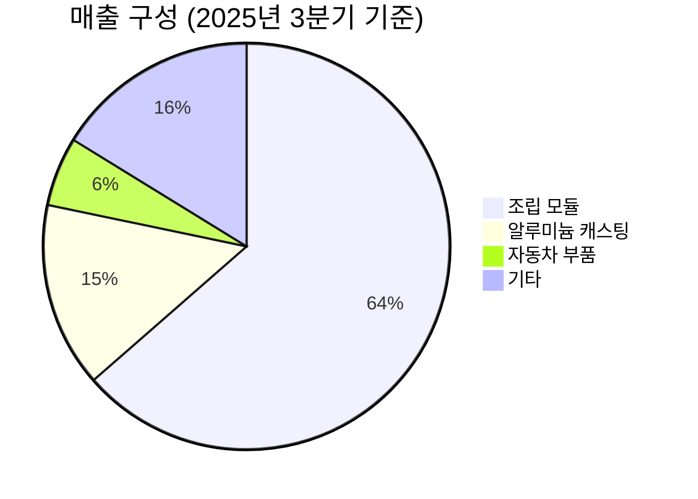

---

company: KH바텍
created: 2026-04-23 21:12
date: 2026-04-23 21:12
exchange: KOSDAQ
listing: public
market: KR
tags:
- deal-sourcing
- daily
ticker: 060720.KQ
title: Deal - KH바텍 (060720.KQ) 21:12
type: deal-sourcing
publish: true
---


> **오늘의 탐색 분야**: 클라우드, 사이버보안, 유럽 경제, 신흥국 성장 시장, 방산, 지속가능 인프라, 농업기술, 교육, 디지털 콘텐츠
> 4일 주기 로테이션 (30개 분야 커버)

# KH바텍 (060720.KQ)

<span style="background:#2196F3;color:white;padding:2px 8px;border-radius:4px;font-size:0.85em">060720.KQ</span> <span style="background:#D32F2F;color:white;padding:2px 8px;border-radius:4px;font-size:0.85em">🇰🇷 KR</span> <span style="background:#424242;color:white;padding:2px 8px;border-radius:4px;font-size:0.85em">KOSDAQ</span> <span style="background:#7B1FA2;color:white;padding:2px 8px;border-radius:4px;font-size:0.85em">비철금속 정밀부품 / 전자부품</span>

---

<div style="background:#e0e0e0;border-radius:8px;overflow:hidden;margin:8px 0"><div style="background:#FF9800;width:64%;padding:6px 12px;color:white;font-weight:bold;font-size:1em;white-space:nowrap">Investment Score 64/100 — 🟡 Buy (조건부)</div></div>

<div style="background:#e0e0e0;border-radius:8px;overflow:hidden;margin:4px 0"><div style="background:#FF9800;width:60%;padding:4px 8px;color:white;font-size:0.85em;white-space:nowrap">업사이드 비대칭 18/30 — 폴더블+로봇+전장 TAM 확대, 시총 3355억 vs 성장 시장, 단 힌지 점유율 하락이 발목</div></div>
<div style="background:#e0e0e0;border-radius:8px;overflow:hidden;margin:4px 0"><div style="background:#FF9800;width:68%;padding:4px 8px;color:white;font-size:0.85em;white-space:nowrap">카탈리스트 & 타이밍 17/25 — 5/18 실적발표 + 애플 폴더블 진입 + 로봇 사업 매출 2027년 본격화, 6개월 내 촉매 존재</div></div>
<div style="background:#e0e0e0;border-radius:8px;overflow:hidden;margin:4px 0"><div style="background:#FF9800;width:65%;padding:4px 8px;color:white;font-size:0.85em;white-space:nowrap">비즈니스 품질 13/20 — 삼성 밀착 공급망 진입장벽 있으나 경쟁 격화, ROE 4.2%로 자본효율 개선 필요</div></div>
<div style="background:#e0e0e0;border-radius:8px;overflow:hidden;margin:4px 0"><div style="background:#4CAF50;width:67%;padding:4px 8px;color:white;font-size:0.85em;white-space:nowrap">밸류에이션 10/15 — PER 14.4배(Forward), PBR 1.13배, 52주 저점 9,160원 대비 54% 반등, 컨센 목표가 대비 추가 업사이드 존재</div></div>
<div style="background:#e0e0e0;border-radius:8px;overflow:hidden;margin:4px 0"><div style="background:#FF9800;width:60%;padding:4px 8px;color:white;font-size:0.85em;white-space:nowrap">발견 가치 6/10 — 공식 애널리스트 커버리지 2~8명 수준, 소형주 카테고리, 로봇 신사업 초기 인식 단계</div></div>

---

> [!abstract] 리포트 요약
> **한 줄 테시스**: KH바텍은 삼성 폴더블폰 힌지 공급사에서 전장·로봇 부품 다각화 기업으로 전환 중인 코스닥 소형주로, 2025년 매출 +36.6% / 영업이익 +45.3%의 강한 실적 턴어라운드를 확인했다.
>
> **왜 지금인가**: ① 2026년 하반기 애플 첫 폴더블폰 출시로 글로벌 폴더블 패널 출하 40% 성장 전망 (옴디아) ② 2026년 5월 18일 실적 발표에서 로봇/전장 매출 가시성 확인 가능 ③ 주가는 52주 최저 9,160원에서 반등했으나 고점 19,960원 대비 여전히 29% 하단
>
> **Variant Perception**: 시장은 힌지 점유율 하락(중국 경쟁사 환리 진입)에만 집중하지만, **전장 수주잔고 7,000억원(2024년 3분기 기준)과 로봇 외형 부품 사업화** 가치는 현재 시총 3,355억원에 거의 미반영 상태로 추정
>
> **핵심 수치**: 2025년 매출 4,249억원(+36.6%), 시총 3,355억원, Forward PER 14.4배
>
> **리스크**: 힌지 의존도 집중 + 중국 저가 경쟁 + ROE 4.2%의 낮은 자본효율 + 2026년 가이던스 성장률 둔화(+2.7%)

---

## ① 핵심 지표

| 항목 | 값 | 의미 |
|------|-----|------|
| 현재가 | 14,120원 | 🟡 52주 고점(19,960원) 대비 -29%, 저점(9,160원) 대비 +54% — 바닥권 탈출 후 중간 구간 |
| 시가총액 | 3,355억원 | 🟡 코스닥 소형주. 2025년 매출 4,249억원의 0.79배 PSR — 성장성 대비 저평가 논거 가능 |
| PER (Trailing / Forward) | 16.46 / 14.36배 | 🟢 Forward PER 14.4배는 2025년 성장률(+45% 이익 성장) 감안 시 저렴. 단 2026년 성장 둔화 주의 |
| PBR | 1.13배 | 🟢 자산 대비 소폭 프리미엄. 사실상 청산가치 수준 거래 — 하방 리스크 제한적 |
| EV/EBITDA | 29.74배 | 🔴 EV/EBITDA는 높은 편. EBITDA 규모 대비 기업가치 부담, D&A 비중 확인 필요 (확인 필요) |
| 배당수익률 | 2.6% | 🟢 기준금리 대비 양호한 배당. 보유 비용 낮춤 |
| 영업이익률 | 8.4% | 🟡 제조업 대비 양호하나, 삼성 단가 협상력 + 중국 경쟁 심화로 마진 압박 리스크 존재 |
| 순이익률 | 6.7% | 🟡 영업이익률(8.4%) vs 순이익률(6.7%) — 금융비용 또는 세금 효과 확인 필요 |
| ROE | 4.2% | 🔴 매우 낮은 자본효율. 자기자본 대비 이익 창출력 부진 — Compounding Machine으로 보기 어려운 수준 |
| 52주 고/저 | 19,960원 / 9,160원 | 🟡 변동성 극심. 고저 차이 118%. 현재가는 저점-고점 중간(47% 위치)에 위치 |
| 섹터 | 비철금속 정밀부품 / 전자부품 제조 | 🟡 스마트폰 부품 사이클 영향권 + 신사업(전장, 로봇) 다각화 진행 중 |

> [!warning] EV/EBITDA 29.74배 주의
> PER 14배와 EV/EBITDA 30배 사이의 괴리는 순이익에 비해 EBITDA가 상대적으로 작다는 뜻입니다. 이는 감가상각비가 크거나 순이익에 일회성 항목이 포함될 가능성을 시사합니다. DART 공시의 현금흐름표 검토가 필수입니다. (확인 필요)

---

## ② 회사 개요, 제품, 핵심 경쟁력

> [!abstract] 한 줄 요약
> KH바텍은 알루미늄·티타늄 등 비철금속 소형정밀 다이캐스팅 기술을 보유한 제조기업으로, 삼성전자 폴더블폰의 핵심 힌지 모듈을 공급하는 동시에 전기차 배터리 모듈 부품(End Plate)과 로봇 외형 케이스 부품으로 사업을 확장하고 있다.

### 사업 모델
KH바텍은 **고객사 주문생산(OEM/ODM) 방식**으로 운영됩니다. 고객(삼성전자 등 대형 전자/자동차 기업)의 설계 요구에 맞춰 정밀 금속 부품을 제조·납품하는 구조입니다. 수익 구조의 핵심은 **설계-제조-납품의 수직 통합**으로, 고객이 일단 채택하면 모델 수명주기 동안 안정적 매출이 발생하는 소품종 대량생산 모델입니다.

**돈을 버는 방식**: 단가(ASP) × 출하 물량의 함수. 폴더블폰 출하량 증가 및 탑재 물량 확대 → 매출 직접 연동. 고정비 레버리지가 있어 매출 증가 시 이익률이 빠르게 개선되는 구조.

### 핵심 제품/서비스

| 제품 | 설명 | 고객 가치 |
|------|------|----------|
| **힌지 모듈 (폴더블폰)** | 폴더블 스마트폰이 접히고 펼쳐지는 핵심 기계 부품. 알루미늄 다이캐스팅 + 정밀 가공 | 갤럭시 Z Fold/Flip 등 폴더블의 내구성·완성도 결정 |
| **IDC (Internal Display Cover)** | 폴더블 디스플레이 내부 보호 커버 부품. 티타늄 소재 적용 확대 중 [확인 필요: 2026년 S 전 모델 적용 여부] | 디스플레이 보호 + 초박형화 구현 |
| **알루미늄 캐스팅 부품** | 스마트폰 외장 부품, 내부 프레임 등 | 경량화 + 방열 기능 |
| **자동차 전장 부품 (End Plate 등)** | 전기차 배터리 모듈의 End Plate 및 구조 부품. 2024년 3분기 기준 수주잔고 약 7,000억원 [출처: IBK투자증권 2024.10 리포트] | EV 배터리 셀 안전성·구조 고정 |
| **로봇 외형 케이스 부품** | 협동로봇 및 휴머노이드 로봇 외장 케이스 부품. 2026년 사업 기반 구축 중 | 정밀 가공이 필요한 로봇 외장 경량화 |
| **FPCB 관련 부품** | 플렉시블 PCB 관련 소형 정밀 부품 | 스마트폰 내부 기구 연결 |

### 매출 구성 (2025년 3분기 기준)
[출처: 데일리인베스트 2026.01.02, 2025년 3분기 실적 기준]



| 세그먼트 | 비중 (2025년 3분기) | 특징 |
|---------|-------------------|------|
| 조립 모듈 (힌지 중심) | 63.5% | 핵심 캐시카우, 폴더블폰 연동 |
| 알루미늄 캐스팅 | 14.7% | 스마트폰 외장, 안정적 물량 |
| 자동차 부품 | 5.5% | 전기차 전장 확대 중, 수주잔고 대규모 |
| 기타 (FPCB 등) | 16.2% | 로봇 부품 초기 포함 가능성 |

> [!tip] 핵심 인사이트: 세그먼트 믹스 변화가 투자 테시스의 핵심
> 현재 63.5% 비중의 조립 모듈(힌지)에서 자동차·로봇 부품으로의 믹스 전환이 성공한다면, 단가 구조 개선 및 고객 집중도 리스크 완화가 동시에 실현됩니다. 전장 부품은 스마트폰 대비 마진이 높고 수주 기반 사업이라는 구조적 장점이 있습니다.

### 핵심 경쟁력

| 경쟁력 | 설명 | 복제 난이도 (1-10) |
|--------|------|:---:|
| **삼성전자 서플라이체인 진입** | 폴더블폰 초기부터 공동 개발로 납품. 삼성 품질 승인 취득에 수년 소요 | 8 |
| **비철금속 정밀 다이캐스팅 Know-how** | 알루미늄·티타늄 소형 정밀 가공 기술 (두께 수십 마이크론 수준의 공차 관리) | 7 |
| **힌지 설계 특허 및 구조 이해** | 폴더블폰 힌지의 고도화된 기구 설계 역량 — 접히는 각도·내구성·두께 동시 만족 | 8 |
| **전장 수주 기반 (7,000억원)** | [IBK투자증권 2024.10 기준] 국내 배터리 셀 업체와 협력 관계 구축 완료 | 6 |
| **티타늄 가공 역량** | IDC 등 고부가 소재 적용 확대 역량. 중국 저가 업체가 단기간 복제 어려운 소재 | 7 |

### 성장 공식
```
KH바텍 매출 = (폴더블폰 출하량 × 힌지 점유율 × 힌지 ASP)
            + (EV 배터리 모듈 수주 × 출하 타이밍)
            + (로봇 외형 부품 채택 × 로봇 출하량)
```

현재는 첫 번째 항이 지배적이나, 2027년부터는 두 번째·세 번째 항의 비중이 빠르게 확대될 것으로 예상됩니다 [추정, IBK투자증권 2026.4.14 기반].

### 주요 고객
- **삼성전자**: 갤럭시 Z Fold/Flip 시리즈 힌지 모듈 공급 (매출의 대다수 추정, 고객집중 리스크)
- **국내 EV 배터리 셀 업체**: End Plate 공급 계약 확보 (업체명 확인 필요)
- **국내외 협동로봇 업체**: 초기 파일럿 납품 단계

> [!warning] 고객 집중 리스크
> 삼성전자 의존도가 매출의 절대 다수를 차지하는 것으로 추정됩니다. 삼성 폴더블 라인업 전략 변경, ASP 협상, 경쟁 공급사 비중 확대 등이 즉각적인 실적 영향으로 연결될 수 있습니다. 정확한 삼성향 매출 비중은 DART 사업보고서 확인 필요 (확인 필요).

---

## ③ 왜 100%+ 가능한가? — 업사이드 비대칭

> [!abstract] 핵심 논거
> 현재 시총 3,355억원이지만, 전장 수주잔고 7,000억원(2024년 기준) + 로봇 신사업 옵셔널리티 + 폴더블 시장 40% 성장이라는 세 가지 레버가 동시에 작동하면 2027년 기준 적정 시총은 현재의 2배 이상이 될 수 있습니다 [가정].

### 시총 vs TAM 비교

| TAM | 규모 | KH바텍 현재 위치 |
|-----|------|----------------|
| 글로벌 폴더블폰 시장 | 278억 달러(2023) → 740억 달러(2030) 전망 [출처: 그랜드뷰리서치] | 힌지 공급사, TAM의 극히 일부 — 점유율 유지가 관건 |
| 글로벌 폴더블 패널 출하 | 1,950만대(2025) → 2,720만대(2026E, +40%) [출처: 옴디아] | 직접 수혜 — 출하량 증가가 힌지 수요 직결 |
| 전기차 배터리 모듈 부품 | 글로벌 전장 부품 시장 규모 막대 (수주잔고 7,000억원 확보) | 초기 진입 단계, 연간 1,000억원 수준 매출 목표 [IBK투자증권 2024.10] |
| 협동·휴머노이드 로봇 | 빠른 성장 초기 단계 (TAM 추정 어려움) | 2026년 사업 기반, 2027년 본격 매출 예상 [IBK투자증권 2026.4.14] |

<div style="border-left:4px solid #4CAF50;padding-left:12px;margin:8px 0">
<b>시총 3,355억원 vs 전장 수주잔고 7,000억원</b><br>
2024년 3분기 기준 전장 수주잔고가 이미 현재 시총의 2배를 초과합니다. 이 수주가 정상적으로 매출로 전환된다면 (연간 1,000억원 기준 7년치), 현재 시총에 전장 사업가치가 거의 반영되지 않은 것입니다. [출처: IBK투자증권 2024.10 리포트]
</div>

### 성장 가속 구간 확인
- **2025년 연간 매출 4,249억원, YoY +36.6%** [출처: 와이즈리포트/주달 2026.04.17 기반]
- **2025년 영업이익 YoY +45.3%** — 매출 성장 대비 이익 성장 초과 → 영업 레버리지 작동 확인
- 단, 2026년 전망치(대신증권): 매출 4,304억원(+1.3%), 영업이익 322억원(+0.9%) [추정, 대신증권]으로 성장 둔화 예상됨이 큰 리스크

> [!question] 2026년 성장 둔화의 실체는?
> 대신증권 전망치 기준 2026년 성장률은 +2~3%로 극도로 보수적입니다. 이는 힌지 점유율 하락 + 전장 매출 온기 반영 전이라는 타이밍 이슈인지, 아니면 구조적 성장 정체인지 구분이 핵심입니다. 전장·로봇 매출이 2027년부터 본격화될 경우, 2026년은 저점 통과 구간이 됩니다.

### 옵셔널리티 분석

| 옵션 | 현재 가치 반영 | 실현 시나리오 |
|------|-------------|-------------|
| 애플 폴더블폰 힌지 공급 [추정] | 거의 0 | 애플이 KH바텍의 힌지 채택 시 ASP 2~3배, 물량 대규모 — 단 공급사 확정 여부 불명확 (확인 필요) |
| 전장 End Plate 매출 본격화 | 일부 반영 | 수주잔고 7,000억원의 연간 인식 속도에 따라 실적 급등 가능 |
| 로봇 외형 부품 | 거의 0 | 2027년부터 IBK 전망 70억원 → 수년 내 수백억원 가능성 [추정] |
| 티타늄 IDC 갤럭시 S 전 모델 적용 | 일부 반영 | 2026년 갤럭시 S 전 모델 IDC 적용 시 알루미늄 대비 ASP 상승 |

### Compounding Machine 관점

현재 ROE 4.2%는 Compounding Machine으로 보기 어려운 수준입니다. 그러나:
- 2025년 기준 영업이익률 8.4%는 개선 추세
- 전장·로봇 부품은 마진 구조가 스마트폰 부품 대비 안정적
- 설비 투자(CapEx) 사이클 완료 후 FCF 개선 여부가 핵심 체크포인트 (확인 필요)

> [!tip] 100%+ 시나리오의 핵심 조건
> 1. 폴더블 출하 +40% + 삼성 점유율 유지 → 힌지 매출 성장 지속
> 2. 전장 수주 1,000억원/년 매출 전환 성공 (2025~2026년)
> 3. 로봇 부품 2027년 본격 매출 → 신규 멀티플 재평가
>
> 이 세 가지가 동시 실현 시, 매출 6,000억원+ / 영업이익 600억원+ [가정] → 현재 시총 3배+ 가능 [가정]

---

## ④ 왜 지금인가? — 카탈리스트 & 타이밍

> [!abstract] 6개월 내 주요 촉매
> 2026년 5월 실적발표 + 삼성 Z 시리즈 3종 출시 + 애플 폴더블 출시라는 세 가지 촉매가 2026년 하반기에 집중됩니다.

### 구체적 카탈리스트

| 카탈리스트 | 예상 시점 | 영향 강도 | 시장 반영도 |
|-----------|----------|----------|-----------|
| **2025년 연간 실적 발표** | 2026년 5월 18일 | 중 | 부분 반영 |
| **삼성 갤럭시 Z 시리즈 3종 출시** | 2026년 하반기 추정 [추정] | 高 | 일부 반영 |
| **애플 첫 폴더블 아이폰 출시** | 2026년 하반기 예상 [출처: 옴디아/다수 언론] | 中~高 | 낮은 반영 (직접 수혜 여부 불확실) |
| **전장 End Plate 매출 본격 반영** | 2026년 하반기~2027년 | 高 | 거의 미반영 |
| **로봇 사업 첫 매출 기록** | 2026년 중 예상 [IBK투자증권 2026.4.14] | 中 (심리적 촉매) | 거의 미반영 |
| **IBK목표가 20,000원 유지 확인** | 2026년 4월 14일 이미 발표됨 | 低 | 반영 중 |

### Variant Perception (시장과 다른 뷰)

<div style="display:flex;border-radius:8px;overflow:hidden;margin:8px 0;font-size:0.85em"><div style="background:#F44336;width:50%;padding:6px 8px;color:white">🔴 시장 컨센서스: 힌지 점유율 하락 → 성장 정체</div><div style="background:#4CAF50;width:50%;padding:6px 8px;color:white">🟢 Variant View: 전장 수주 7,000억원 + 로봇 미반영 → 재평가 여지</div></div>

**시장의 오해**: 시장은 2024년 중국 환리(Huanli)의 힌지 시장 진입으로 KH바텍의 성장이 끝났다고 봅니다. 그러나:

1. **폴더블 출하 자체가 40% 성장한다면**, 점유율이 낮아지더라도 절대 물량 증가 가능
2. **전장 사업은 수주잔고 7,000억원이 시총 2배** — 현재 시총에 거의 반영 안 됨
3. **삼성 Z 시리즈 3종 확대 + 애플 진입** = 글로벌 폴더블 힌지 수요 급증

### 매크로 환경 분석

| 매크로 시나리오 | KH바텍 영향 |
|---------------|-----------|
| **금리 인하 지속** | 소형 성장주 멀티플 확장에 유리. 코스닥 유동성 개선 → 긍정적 |
| **달러 강세 지속** | 제조 원가(원자재) 일부 상승 부담, 수출 가격 경쟁력 중립 |
| **글로벌 스마트폰 수요 회복** | 삼성 폴더블 판매량 직결 → 힌지 수요 증가 → 긍정적 |
| **미-중 무역 갈등 심화** | 삼성의 국내·해외 부품 조달 전략 변화 가능 — 중국 환리 견제 시 KH바텍 수혜 가능 |
| **EV 수요 둔화** | 전장 수주 매출 전환 속도 지연 리스크 |

---

## ⑤ 비즈니스 퀄리티

> [!abstract] 퀄리티 요약
> "매우 좋은 기업"은 아니지만 "충분한 해자를 가진 적정 품질" 기업입니다. 핵심 해자는 삼성 서플라이체인 진입장벽과 정밀 가공 기술이며, ROE 4.2%의 낮은 자본효율이 가장 큰 약점입니다.

### 경제적 해자 (Moat)

| 해자 계층 | 내용 | 복제 난이도 |
|---------|------|-----------|
| **전환비용 (삼성 서플라이체인)** | 삼성전자 협력사 등록 후 공동 개발 → 교체 비용 상당. 힌지는 폴더블폰의 핵심 기구 부품으로 검증된 공급사 교체 리스크 高 | 높음 |
| **무형자산 (기술·특허)** | 힌지 구조 설계 특허, 다이캐스팅 공정 Know-how. 단, 중국 환리의 모방 사례 존재 → 절대적 방어력 제한 | 중간 |
| **규모의 경제 (제한적)** | 삼성향 대량 생산으로 고정비 분산. 단 중국 경쟁사 대비 인건비 열위 | 낮음~중간 |
| **고객 관계 (관계 자산)** | 삼성 폴더블 초기부터 공동 개발 파트너십. 신규 소재(티타늄), 신규 제품(IDC) 선제 개발로 관계 유지 | 높음 |

> [!warning] 해자 침식 신호
> 2024년 갤럭시 Z Flip6에서 중국 환리가 KH바텍보다 높은 힌지 점유율을 기록했습니다 [출처: 디일렉 2024.7]. 이는 과거 사실상 독점적이었던 KH바텍의 지위가 약화되었음을 의미합니다. 해자가 완전히 사라진 것은 아니지만 침식되고 있습니다.

### ROIC/ROE 추세

| 지표 | 현재값 | 투자 의미 |
|------|------|---------|
| ROE | 4.2% | 🔴 부진. 자기자본 100억원으로 4.2억원만 벌어들임 — Compounding 어려운 수준 |
| 영업이익률 | 8.4% | 🟡 절대적 수준은 제조업 평균 정도. 단 추세는 개선 방향 (+45% 영업이익 성장) |
| 순이익률 | 6.7% | 🟡 영업이익률 대비 낮은 수준 — 금융비용 혹은 세금 부담 확인 필요 |
| EV/EBITDA | 29.7배 | 🔴 이익 대비 높은 밸류에이션. FCF 실질 확인 필요 |

**마진 방향성**: 2025년 영업이익 +45.3% 성장 → 개선 추세 확인. 단 2026년 가이던스(+0.9%) 기준 정체 예상.

### 경영진 분석

> [!question] 경영진 검토 사항
> - 이사보수한도안이 2026년 정기주총에서 **부결**됨 [출처: 디지털투데이, 정기주총 결과] — 주주들의 경영진 보수에 대한 견제 작용. 주주 친화적 시그널일 수도, 갈등 신호일 수도
> - 자본 배분 트랙레코드: 전장 사업 진출(7,000억원 수주)과 로봇 사업 다각화는 장기 가치 창출 방향으로 적절해 보이나, 실제 ROE 개선으로 이어지는지 추적 필요
> - 배당수익률 2.6% 유지 — 주주 환원 의지 긍정적

---

## ⑥ 밸류에이션 & 안전마진

> [!abstract] 밸류에이션 요약
> PER 14배, PBR 1.1배는 성장 정체 기업으로 보면 적정이지만, 전장·로봇 신사업 옵셔널리티를 감안하면 저평가 논거가 성립합니다. 하방은 PBR 1.0배(약 12,500원 수준 추정 [가정])로 제한적.

### 현재 밸류에이션 포지셔닝

| 기준 | 현재 | 해석 |
|------|------|------|
| Forward PER | 14.4배 | 🟢 2025년 +45% 이익성장 기업에 14배는 저렴. 단 2026년 성장 둔화 감안 시 중립 |
| PBR | 1.13배 | 🟢 청산가치 수준 거래 — 하방 제한적 |
| 배당수익률 | 2.6% | 🟢 인플레이션 헤지 + 보유 비용 낮춤 |
| 52주 밴드 내 위치 | 저점 대비 +54%, 고점 대비 -29% | 🟡 중간 구간 — 바닥은 통과했으나 강한 상승 모멘텀 필요 |
| 컨센서스 목표주가 | 평균 16,000원, 최고 20,000원 | 🟢 현재가 14,120원 대비 +13%~+42% 업사이드 |

### 시나리오 분석

<div style="display:flex;border-radius:8px;overflow:hidden;margin:8px 0;font-size:0.85em"><div style="background:#4CAF50;width:25%;padding:6px 8px;color:white">🟢 Bull 25%</div><div style="background:#FF9800;width:50%;padding:6px 8px;color:white">🟡 Base 50%</div><div style="background:#F44336;width:25%;padding:6px 8px;color:white">🔴 Bear 25%</div></div>

| 시나리오 | 조건 | 12개월 목표주가 | 업사이드 |
|---------|------|--------------|--------|
| **Bull** | 폴더블 +40% + 전장 매출 1,000억원 온기 반영 + 로봇 첫 매출 확인 + 멀티플 확장 | 22,000~25,000원 [가정] | +56~+77% |
| **Base** | 폴더블 +20% + 전장 점진 증가 + 힌지 점유율 유지 | 17,000~18,500원 [컨센서스 기반] | +20~+31% |
| **Bear** | 힌지 점유율 추가 하락 + 전장 매출 지연 + 스마트폰 수요 부진 | 10,000~11,500원 [가정] | -19~-29% |

### FCF Yield 관점
FCF 데이터 미확인. EV/EBITDA 29.7배의 높은 수준은 FCF Yield가 낮을 가능성을 시사합니다. DART 현금흐름표 검토 필수 (확인 필요).

### 안전마진 (Margin of Safety)
- **하방**: PBR 1.0배 = 약 12,500원 [가정] — 현재가 대비 -11%
- **배당 2.6%**: 보유 기간 배당 수익으로 일부 방어
- **전장 수주잔고 7,000억원**: 극단적 저평가 시나리오에서 청산가치 논거 강화

<div style="border-left:4px solid #FF9800;padding-left:12px;margin:8px 0">
<b>"이 품질의 기업을 이 가격에?"</b><br>
PER 14배, 배당 2.6%, 2025년 +36% 매출성장 확인, 전장 수주잔고 7,000억원 — 이런 조합을 시총 3,355억원에 살 수 있다는 것은 매력적입니다. 단, 중국 경쟁 + 낮은 ROE라는 구조적 약점을 인정해야 합니다.
</div>

---

## ⑦ 리스크 & Devil's Advocate

| 구분 | 핵심 논거 |
|------|---------|
| 🟢 **Bull #1** | 폴더블 패널 출하 +40% (2025→2026년, 옴디아) + 삼성 Z 시리즈 3종 확대 → 힌지 절대 물량 증가 |
| 🟢 **Bull #2** | 전장 수주잔고 7,000억원이 현재 시총 2배 — 매출 전환 가시화 시 밸류에이션 재평가 불가피 |
| 🟢 **Bull #3** | 로봇 사업 정관 변경 완료 + 협동/휴머노이드 로봇 시장 폭발 → 미래 성장 옵셔널리티 Zero Cost |
| 🔴 **Bear #1** | 중국 환리 저가 공세로 힌지 점유율 지속 하락 → 삼성 내 단가 협상력 약화 → 마진 압박 구조화 |
| 🔴 **Bear #2** | 2026년 가이던스 매출 +2.7%, 영업이익 +1.5% (대신증권 추정) → 현재 주가 모멘텀 지지 어려움 |
| 🔴 **Bear #3** | 삼성 단일 고객 집중 리스크 — 삼성의 폴더블 전략 변경, 내재화(In-house) 진행 시 매출 급락 가능 |

### 가장 현실적인 실패 시나리오

> [!failure] 실패 시나리오: "힌지 상품화 + 전장 지연"
> 1. 환리·파인엠텍의 가격 경쟁이 심화되며 KH바텍 힌지 점유율이 갤럭시 Z Fold/Flip 모두에서 50% 이하로 추락
> 2. 전기차 시장 수요 둔화로 배터리 모듈 End Plate 수주 매출 전환이 2027년 이후로 지연
> 3. 로봇 사업은 2027~2028년에도 연간 100억원 미만 매출에 그침
> 4. 결과: 2026~2027년 매출 성장 정체 + 마진 압박 → 주가 10,000원 이하 재시험

### 숨겨진 가정 (Hidden Assumptions)

| 가정 | 실제로는? |
|------|---------|
| "전장 수주잔고 7,000억원 = 확정 매출" | 수주잔고는 취소 가능. EV 수요 둔화 시 고객사가 수주 물량 조정 가능 |
| "애플 폴더블 진입 = KH바텍 수혜" | 애플이 KH바텍을 공급사로 채택할 보장 없음. 애플은 통상 자체 개발 또는 미국·일본 부품사 선호 가능 |
| "로봇 부품 마진이 스마트폰보다 높다" | 협동로봇 시장도 가격 경쟁 심화 중. ASP 및 마진 구조 검증 필요 |
| "삼성 관계가 지속된다" | 삼성은 항상 이중 소싱 전략. KH바텍의 비중은 변동 가능 |

### Kill Criteria (즉시 탈출 기준)

| Kill Criteria | 임계값 |
|-------------|-------|
| 삼성 폴더블 힌지 점유율 | KH바텍 점유율이 특정 모델에서 30% 이하로 확인 시 |
| 전장 매출 전환 실패 | 2026년 말까지 자동차 부품 매출이 분기 200억원 미달 시 |
| 영업이익률 하락 | 분기 영업이익률이 5% 이하로 2분기 연속 하락 시 |
| 주요 고객 변경 신호 | 삼성전자의 힌지 내재화 또는 경쟁사 단독 선정 공시 |
| 재무 건전성 악화 | 부채비율 급증 또는 분기 FCF 마이너스 지속 (2분기 이상) |

---

## ⑧ 발견 가치 & 엣지

> [!tip] 발견 가치
> 시총 3,355억원, 코스닥 소형주. 대형 기관의 레이더 밖에 있으며, 로봇 사업 초기 모멘텀은 아직 가격에 충분히 반영되지 않은 상태입니다.

### 애널리스트 커버리지

| 기관 | 투자의견 | 목표주가 | 일자 |
|------|---------|---------|------|
| IBK투자증권 | 매수 | 20,000원 | 2026.04.14 |
| 키움증권 | BUY | 17,000원 | 2026.04.02 |
| 대신증권 | (확인 필요) | (확인 필요) | - |
| Investing.com 컨센서스 | 적극 매수 | 16,000원 (2명 기준) | 2026.04 |
| 증권플러스 컨센서스 | 매수 | 18,000원 | 2026.04.20 |

공식 커버리지 애널리스트 수: **2~5명 수준** (Investing.com 기준 2명, 국내 포함 시 소수). 코스닥 소형주로 대형 증권사의 집중 분석 대상은 아님.

### 기관 매매 동향 (최근)

| 일자 | 기관 | 외국인 | 개인 |
|------|------|--------|------|
| 2026.04.22 | -34,039주 (순매도) | +46,844주 (순매수) | -23,915주 (순매도) |
| 2026.04.16 기준 1주일 | -6,880주 (순매도) | -204,110주 (순매도) | 방향 불명 |

> [!warning] 기관·외국인 매도세 주의
> 단기적으로 기관과 외국인이 매도세를 보이고 있습니다. 다만 단 하루의 데이터로는 추세 판단이 어렵습니다. 1~3개월 기관 누적 매매 동향 확인이 필요합니다.

### 시장이 놓치고 있는 것

1. **전장 수주잔고 7,000억원의 과소평가**: 대부분의 분석이 힌지 점유율 하락에 집중하며 전장 사업의 멀티플 재평가 가능성을 간과
2. **로봇 사업의 Zero-Cost 옵셔널리티**: 정관 변경으로 로봇 부품 사업을 공식화했으나 현재 시총에 0원 반영 상태 [가정]
3. **폴더블 시장 자체 성장**: 점유율 하락을 볼록렌즈처럼 확대해서 보는 반면, 시장 자체가 40% 성장한다는 사실은 상대적으로 과소평가

---

## ⑨ 액션 아이템

| 항목 | 판단 |
|------|-----|
| **BUY / WATCH / PASS** | <span style="background:#FF9800;color:white;padding:2px 8px;border-radius:4px;font-size:0.85em">조건부 BUY</span> — 전장 매출 전환 가시화 + 폴더블 수요 확인을 전제로 분할 매수 적합 |
| **Conviction** | Medium — 힌지 경쟁 심화 vs 신사업 확장이라는 양방향 불확실성 동시 존재 |
| **적정 진입가** | 13,000~14,500원 — 현재가(14,120원)는 진입 가능 구간. PBR 1.0배(≈12,500원 추정 [가정]) 접근 시 적극 매수 |
| **목표가 (12개월)** | Base: 17,000~18,000원 (+20~27%), Bull: 22,000원+ (+56%, 전장+로봇 가시화 시) |
| **손절 기준** | 12,000원 이하 (PBR 1.0배 하회 + 기술적 지지선 이탈) |
| **권장 비중** | 포트폴리오 대비 3~5% — 소형주 유동성 리스크 + 고객 집중 리스크 감안, 단일 포지션으로 대규모 베팅은 비권장 |

### 추가 리서치 필요 사항

| 확인 항목 | 우선순위 | 확인 방법 |
|----------|---------|---------|
| DART 사업보고서: 삼성전자 매출 의존도 실제 수치 | 최우선 | DART 공시 |
| 전장 수주잔고 7,000억원의 현재 상태 (2025년 말 기준) | 최우선 | IR 또는 최신 리포트 |
| FCF (영업현금흐름 vs CapEx) 실제 수치 | 높음 | DART 재무제표 |
| 삼성 갤럭시 Z 시리즈 힌지 점유율 최신 데이터 | 높음 | 산업 분석가 리포트 |
| 로봇 부품 납품 고객사 및 시제품 현황 | 중간 | 회사 IR |
| 티타늄 IDC 2026 갤럭시 S 적용 확정 여부 | 중간 | 산업 미디어 (전자공시, 디일렉 등) |

### 모니터링 핵심 지표 & 체크포인트

| 체크포인트 | 날짜 | 확인 사항 |
|-----------|------|---------|
| **Q4 2025 실적 발표** | 2026.05.18 | 전장 부품 매출 분기 규모 + 로봇 첫 매출 여부 + 2026년 가이던스 |
| **삼성 갤럭시 Z 출시** | 2026년 하반기 (추정) | KH바텍 힌지 탑재 모델 수 + 점유율 유지 여부 |
| **애플 폴더블 출시 공급망** | 2026년 하반기 (추정) | KH바텍 공급사 포함 여부 (IR/미디어) |
| **분기별 자동차 부품 매출** | 매 분기 실적 | 분기 200억원 이상 여부 (Kill Criteria 연동) |
| **글로벌 EV 수요 지표** | 월간 | 배터리 수주 매출 전환 속도 영향 |

> [!verdict] 최종 판단
> **KH바텍은 "전환점에 선 소형주" 입니다.**
>
> 폴더블폰 힌지라는 캐시카우가 경쟁 압박을 받는 동시에, 전장·로봇이라는 신성장 엔진이 점화를 시작했습니다. 현재 시총 3,355억원은 전장 수주잔고(7,000억원)와 로봇 옵셔널리티가 거의 반영되지 않은 수준으로 보입니다.
>
> 단, 중요한 투자 원칙을 지켜야 합니다:
> - **분할 매수**: 전장 매출 가시화(2026년 Q4 실적) 전까지 포지션 일부만 구축
> - **5% 이내 비중**: 삼성 고객 집중 + 힌지 경쟁 심화라는 이중 리스크
> - **Kill Criteria 엄수**: 힌지 점유율 급락 또는 전장 매출 지연 시 즉시 재평가
>
> 투자 시간축은 **12~18개월** — 전장 매출 본격화(2026~2027년) 가시화 시 리레이팅 가능성이 핵심 베팅 포인트입니다.

---

*리포트 작성 기준일: 2026년 4월 23일. 현재가 14,120원 기준. 시장 데이터 출처: Yahoo Finance, 네이버 증권, IBK투자증권(2026.04.14), 키움증권(2026.04.02), 대신증권(2026 추정치), 옴디아(폴더블 출하 전망), 디일렉(힌지 점유율), 그랜드뷰리서치(폴더블 TAM).*