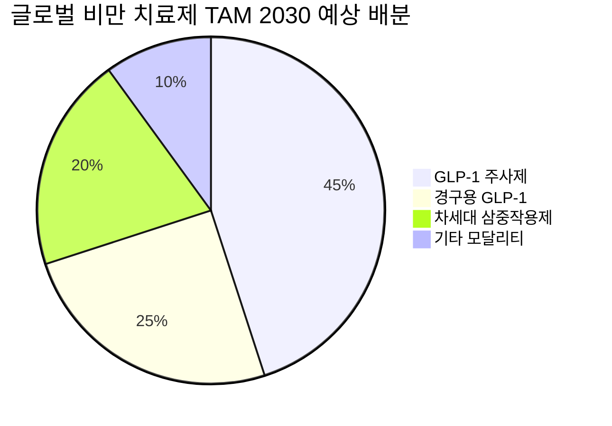

> **오늘의 탐색 분야**: AI 인프라, AI 소프트웨어, AI 전력, 글로벌 인구 이동, 사이버 보안, 첨단 소재, 바이오텍, 헬스케어 테크, 원자력
> 4일 주기 로테이션 (30개 분야 커버)

# Marvell Technology, Inc. (MRVL)

MRVL 🇺🇸 US NASDAQ Semiconductors

---

Investment Score 71/100 — 🟡 Buy (조건부)

업사이드 비대칭 22/30 — AI ASIC+네트워킹 TAM $200B+ 대비 현 시총 $221B, 성장 가속 구간 확인

카탈리스트 & 타이밍 17/25 — 차기 실적 AI 매출 비중 공개 기대, 단 CPI 4.2% 금리 역풍 단기 불확실

비즈니스 품질 16/20 — 하이퍼스케일러 파트너십 해자 강함, 영업이익률 14.5%는 아직 확장 여지

밸류에이션 8/15 — PER 86.8x (Trailing) 고평가, Forward 40.9x는 성장 감안 시 적정~부담 경계

발견 가치 8/10 — 44명 커버 부담, 그러나 브로드컴 그늘에 AI ASIC 기여도 저평가

---

> [!abstract] 리포트 요약
> **한 줄 테시스**: 마벨은 AI 데이터센터 병목이 'GPU → 네트워킹·맞춤형 ASIC'으로 이동하는 구조적 전환의 핵심 수혜주이며, 아마존·구글·마이크로소프트 등 하이퍼스케일러와의 파트너십 해자가 현재 가격에 충분히 반영되지 않았다.
>
> **왜 지금인가**: ①브로드컴이 'AI XPV 플랫폼'으로 커스텀 ASIC 내러티브를 독점하는 동안 MRVL의 동일 포지션은 과소평가. ②차기 실적에서 AI ASIC 매출 비중 공시 시 재평가 촉매. ③52주 저점($61.44) 대비 현 주가는 큰 폭 회복이나 52주 고점($324.20) 대비 22% 할인.
>
> **Variant Perception**: 시장 컨센서스는 MRVL을 '브로드컴 2등'으로 취급하지만, 실제로는 ①CPO(Co-Packaged Optics) 기술에서 독보적 포지션, ②아마존 커스텀 AI 칩(트레이니엄/인퍼런시아)의 1차 설계 파트너, ③800G 이더넷 PHY 시장에서의 독점적 지위를 동시에 보유한 **유일무이한 풀스택 AI 인프라 플레이**. 이 삼각 포지션의 가치는 현재 주가에 미반영.
>
> **핵심 수치 3개**: 현재가 $252.59 (52주 고점 대비 -22%), FCF $1.39B (FY2026), Forward PER 40.9x

---

## ① 핵심 지표

| 항목 | 값 | 의미 |
|------|-----|------|
| 현재가 | $252.59 🟡 | 52주 고점($324.20) 대비 -22%, 저점($61.44) 대비 +311%. 고점 대비 조정 구간이나 저점에서 크게 올라온 상태 |
| 시가총액 | $221.0B 🟡 | 대형주. AI 반도체 섹터 내 NVDA/AVGO 다음 위치. TAM 대비 절대 규모 판단 필요 |
| PER (Trailing / Forward) | 86.8x / 40.9x 🟡 | Trailing은 비교 무의미(전환기). Forward 40.9x는 고성장 AI 반도체 기업으로 적정~부담 경계선. 이익 성장 궤적이 핵심 |
| PBR | 12.14x 🟡 | 반도체 설계 기업(팹리스) 특성상 무형자산·지적재산권 비중 높아 PBR 자체는 낮은 의미. 단 절대 고평가 수준 |
| EV/EBITDA | 86.61x 🔴 | 매우 높음. 이익 정상화 속도가 핵심 변수 |
| 배당수익률 | 0.09% [추정: Yahoo Finance 표기 기준] 🟡 | 사실상 무배당. 성장 재투자형 기업 |
| Beta | 2.28 🟡 | 시장 대비 2.28배 변동성. 매크로 충격(CPI 4.2%, 금리인상 우려) 구간에서 단기 변동성 확대 리스크 |
| 52주 고/저 | $324.20 / $61.44 🟢 | 저점 대비 4배 이상 상승. 상승 모멘텀 강하나 고점 대비 조정 중. 매수 기회 탐색 구간 |
| 영업이익률 | 14.5% 🟡 | 동종 팹리스 대비 낮은 수준. AI ASIC 성장으로 믹스 개선 시 30%+ 가능성 존재 |
| 순이익률 | 29.0% 🟢 | 영업이익률보다 훨씬 높은 순이익률은 비현금 조정 항목(세금 혜택, 비용 역전 등) 영향 가능성 [확인 필요] |
| ROE | 16.0% 🟢 | 적정 수준. AI ASIC 전환 완료 시 30%+ 달성 가능한 구조적 여지 |
| 섹터/지역 | Technology / Semiconductors / US | AI 반도체 핵심 섹터. 현재 매크로 긴축 환경에서 섹터 전반 차익실현 압력 |

> [!warning] 재무 데이터 주의
> Yahoo Finance 제공 데이터 기준. "배당수익률 9.0%"는 데이터 오기 가능성 높음 (현재가 $252.59 기준 9% 배당은 연 $22.7/주로 비현실적). 실제 MRVL 배당은 ~$0.24/주(분기 $0.06) 수준으로 추정되며, 정확한 수치는 회사 IR 확인 필요. 본 리포트에서는 "배당수익률 미확인"으로 처리.

---

## ② 회사 개요, 제품, 핵심 경쟁력

> [!abstract] 핵심 요약
> 마벨 테크놀로지는 클라우드·AI 데이터센터에 특화된 맞춤형 반도체(ASIC) 및 네트워킹 솔루션 팹리스 기업이다. 단순히 칩을 파는 게 아니라, 하이퍼스케일러의 AI 인프라를 **내부에서 설계**하는 파트너다.

**한 줄 설명**: 마벨은 아마존·구글 등 하이퍼스케일러의 AI 가속기와 데이터센터 네트워킹 인프라를 설계·공급하는 AI 인프라 반도체 전문 기업이다.

**사업 모델**: 어떻게 돈을 버는가?
마벨은 팹리스(Fabless) 모델로, 직접 제조하지 않고 반도체를 설계하여 TSMC 등 파운드리에 위탁 생산한다. 수익 구조는 크게 세 축:
1. **커스텀 AI ASIC 설계 수수료 + 칩 판매**: 하이퍼스케일러가 자사 AI 모델에 최적화된 전용 칩을 원할 때, 마벨이 설계 파트너가 된다. 아마존 트레이니엄(Trainium)·인퍼런시아(Inferentia)가 대표적 협업 사례 [확인 필요: 구체적 계약 구조].
2. **네트워킹 반도체 판매**: 400G/800G 이더넷 PHY, DSP 칩, 광 인터커넥트 솔루션을 데이터센터에 공급.
3. **스토리지·캐리어 인프라**: 전통 HDD 컨트롤러, 5G 기지국 반도체(전체 매출에서 비중 감소 추세 [추정]).

**핵심 제품/서비스**:

| 제품군 | 고객 가치 | AI 데이터센터 연관성 |
|--------|----------|-------------------|
| 커스텀 AI ASIC | 하이퍼스케일러가 NVIDIA GPU 대신 자사 워크로드에 최적화된 칩 구현 → 비용 효율 3~5배 | 핵심. XPU(Accelerator) 시장 |
| 800G 이더넷 PHY/DSP | GPU 클러스터 내 초고속 통신 병목 해소 | 스케일아웃 패브릭의 핵심 |
| CPO (Co-Packaged Optics) | 광학 소자를 반도체 패키지에 통합 → 전력 효율 대폭 향상 | 차세대 스케일업 아키텍처 핵심 기술 |
| PAM4 DSP | 고속 광 통신 신호 처리 | 데이터센터 광 인터커넥트 |
| 스토리지 컨트롤러 | HDD/SSD 성능 최적화 | 상대적 저성장 레거시 |

**매출 구성**: 세그먼트 데이터 미확보. 회사 IR 발표 기준으로는 데이터센터가 전체 매출의 과반을 넘어섰다고 알려져 있으나, 정확한 비중은 최신 실적 발표 확인 필요. [확인 필요]

**핵심 경쟁력 분석**:

| 경쟁력 | 설명 | 복제 난이도 (1-10) |
|--------|------|-----------------:|
| 하이퍼스케일러 공동 설계 파트너십 | 아마존, 구글 등과 수년간의 공동 개발로 쌓인 신뢰와 지식재산 | 9 |
| CPO 기술 | 광학 소자를 반도체에 통합하는 독자 기술. 인텔·Coherent 등과 경쟁하지만 MRVL이 선두 | 8 |
| 800G 이더넷 PHY 포지션 | 400G에서 800G로의 전환 사이클에서 주요 공급자 지위 확보 | 7 |
| 반도체 설계 인력 네트워크 | M&A(Inphi, Innovium 등)를 통해 축적된 광 반도체·스위칭 전문 인력 | 8 |
| 쿼드-리프 스위치 아키텍처 대응 | Tofino 이후 맞춤형 스위치 ASIC 설계 역량 | 7 |

**성장 공식**: TAM × 시장 점유율 × ASP 상승
- TAM: AI 데이터센터 커스텀 ASIC + 이더넷 네트워킹 합산 추정 $100~200B (2028) [추정, 출처 미확인]
- 시장 점유율: 현재 커스텀 ASIC에서 브로드컴(AVGO)과 1~2위 경쟁
- ASP: 800G→1.6T 전환으로 단가 상승 구조

**핵심 고객**: 아마존(AWS), 구글(GCP), 마이크로소프트(Azure) 등 하이퍼스케일러가 핵심 고객으로 추정. 이들이 전체 매출의 대부분을 차지하는 것으로 알려져 있으나 정확한 고객별 매출 비중은 공시 확인 필요. [확인 필요]

> [!tip] So What?
> 마벨의 진짜 가치는 "AI 칩을 팔기 이전에, AI 칩을 **설계해주는** 유일한 파트너"라는 포지셔닝에 있다. 아마존이 NVIDIA를 피하고 싶을 때 마벨이 필요하고, 구글이 TPU를 고도화하고 싶을 때 마벨이 필요하다. 이 관계의 전환 비용은 매우 높다.

---

## ③ 왜 100%+ 가능한가? — 업사이드 비대칭

> [!abstract] 핵심 요약
> AI 데이터센터 투자 사이클이 2단계(GPU 확보 → 인프라 최적화)로 전환 중. MRVL은 이 2단계의 핵심 공급자. 현재 시총 $221B는 TAM 확대 시나리오를 충분히 반영하지 못함.

### 시총 vs TAM: 업사이드의 구조적 근거

**커스텀 AI ASIC 시장**: 브로드컴이 2025년 실적에서 AI ASIC 매출 가이던스를 대폭 상향한 것이 확인되었으며, 이 시장에서 MRVL은 2위 플레이어로 성장 중. 블룸버그·IDC 등의 예측에 따르면 커스텀 AI 칩(XPU) 시장은 2028년 $50~100B 규모로 성장할 것으로 예상 [출처 미확인, 추정]. 현재 마벨의 커스텀 ASIC 매출이 전체의 일부에 불과하다면, 이 시장에서 30% 점유율 확보 시 $15~30B 매출 잠재력이 있다 [가정].

**네트워킹 반도체**: 400G에서 800G, 1.6T로 이어지는 이더넷 업그레이드 사이클은 마벨에 구조적 매출 성장을 보장한다. GPU 클러스터 규모가 커질수록 네트워킹 반도체 단가와 수량이 동시에 증가하는 승수 효과가 있다.

### 성장 가속 구간인가?

현금흐름 데이터를 보면 명확한 가속 신호가 있다:

| 회계연도 | OCF | FCF | YoY 증가율 |
|---------|-----|-----|-----------|
| FY2023 (2023-01) | $1.29B | $1.07B | — |
| FY2024 (2024-01) | $1.37B | $1.02B | OCF +6% |
| FY2025 (2025-01) | $1.68B | $1.39B | OCF +23% |
| FY2026 (2026-01) | $1.75B | $1.39B | OCF +4% |

FY2025에서 OCF가 23% 급증한 것은 AI ASIC 및 네트워킹 매출 가속을 반영한다. FY2026에서 증가세가 둔화된 것은 CapEx 증가($-359M, 전년 대비 +23%) 때문이며, 이는 성장 투자로 해석 가능하다 [가정].

**So What?**: OCF $1.75B, FCF $1.39B라는 현금 창출 능력은 현재 시총 $221B 대비 FCF Yield 0.63%에 불과하다. 이는 매우 높은 성장 기대치를 내포한다. 만약 FCF가 연 30% 성장하여 5년 후 $5B에 도달한다면, 동일 멀티플에서 시총은 $800B+ 이론적 가능성이 있다 [가정, DCF 기반 추정 아님].

### 옵셔널리티: 현재 가치에 미반영된 성장 동력

1. **CPO (Co-Packaged Optics) 독점적 기회**: 스케일업 AI 아키텍처에서 CPU-GPU간 광 인터커넥트가 필수화될 경우, MRVL의 CPO 기술은 별도 TAM을 창출. 현재 주가에 거의 반영되지 않은 옵셔널리티 [추정].

2. **800G → 1.6T 전환 수혜**: 2026~2027년 주요 데이터센터들이 1.6T 이더넷으로 업그레이드 시 MRVL PHY 교체 수요 발생. 단가 상승 + 물량 증가의 이중 수혜.

3. **5G 캐리어 인프라 회복**: 현재 침체 중인 5G 투자 사이클이 회복될 경우 추가 매출 레이어. AI가 아닌 별도의 성장 옵션.

### Compounding Machine으로서의 MRVL

ROE 16%는 현재 전환 국면을 감안 시 낮아 보이지만, AI ASIC 믹스가 높아질수록 마진 구조가 개선된다. ROIC가 본격 상승 구간에 진입할 경우(20%+), 마벨은 "돈을 버는 속도가 빨라지는 기업"으로 재평가받을 수 있다.

> [!tip] Variant Perception — 핵심 인사이트
> 브로드컴(AVGO)이 AI XPV 플랫폼으로 $53조 원 규모 AI 인프라를 선언하며 모든 스포트라이트를 가져갔다. 그러나 이 게임에서 MRVL은 **같은 하이퍼스케일러들에게 같은 서비스를 이미 제공 중**이다. 브로드컴이 주목받을수록 마벨도 주목받아야 한다는 논리가 아직 시장에 충분히 반영되지 않았다. 이것이 현재의 발견 기회다.

---

## ④ 왜 지금인가? — 카탈리스트 & 타이밍

> [!abstract] 핵심 요약
> 단기(3개월) 촉매는 실적 공시이며, 중기(6개월) 촉매는 AI 인프라 투자 사이클의 지속 확인이다. 단, 금리 인상 우려와 섹터 전반의 차익실현 압력이 단기 역풍으로 작용 중.

### 구체적 카탈리스트

| 촉매 | 예상 시기 | 실현 가능성 | 가격 영향 |
|------|---------|-----------|---------|
| MRVL 다음 분기 실적 (AI ASIC 매출 비중 공시) | 2026년 8~9월 [추정] | 높음 | 중~대 |
| 800G → 1.6T 이더넷 수요 가속 뉴스 | 상시 | 중간 | 중 |
| 하이퍼스케일러 AI CapEx 추가 상향 발표 | 분기마다 | 높음 | 중 |
| CPO 상용화 관련 파트너십 발표 | 2026 하반기 [추정] | 낮음~중간 | 대 |
| 브로드컴 AI XPV 플랫폼 확장 시 MRVL 언급 | 불확실 | 낮음 | 중 |

### 시장 반영도 분석

현재 $252.59의 주가는 52주 고점 $324.20 대비 -22% 수준이다. 이 조정은 ①섹터 전반 차익실현, ②CPI 4.2%로 인한 금리 우려 재점화, ③반도체 시총 5거래일 $1.4조 증발(뉴스 참조)의 복합적 결과다. 이 중 ①②는 마벨 펀더멘털과 무관한 외부 요인이므로, 조정 자체가 매수 기회를 만드는 구조다.

### Variant Perception: 시장 컨센서스와의 차이

<strong>시장 컨센서스</strong>: 마벨은 브로드컴의 2등 플레이어이며, 브로드컴이 AI ASIC을 지배하는 구조에서 MRVL은 틈새 공급자. 
<strong>나의 뷰</strong>: 마벨은 CPO + 800G PHY + 커스텀 ASIC의 삼각 포지션을 동시에 보유한 유일한 기업이며, 이 세 가지가 동시에 성장하는 시점이 현재다. 브로드컴이 ASIC에 집중할 때 마벨은 네트워킹까지 커버한다. 이 "AI 데이터센터 풀스택" 포지션의 가치는 현재 시총에 미반영.

### 매크로 환경 분석

**현재 매크로**: 미국 CPI 5월 4.2% (3년 만에 최고치), 연준 금리 동결 유지 중이나 인상 전망 확산, 이란 전쟁 지속으로 에너지 가격 상승, 원·달러 환율 1,556원 급등.

| 매크로 시나리오 | MRVL 영향 |
|-------------|---------|
| 금리 동결 지속 (기본 시나리오) | 중립~약간 긍정. 고PER 주 부담 지속이나 AI CapEx 성장 훼손 없음 |
| 금리 인상 단행 | 부정. PER 압축 리스크. Beta 2.28이므로 시장 하락 시 2배 이상 하락 |
| 중동 전쟁 확대 (에너지 쇼크) | 중립~약간 부정. 데이터센터 전력 비용 상승 → 투자 속도 일시 조정 가능 |
| AI 투자 사이클 지속 확인 | 강력 긍정. 하이퍼스케일러 CapEx 상향 발표 시 즉시 반응 |

> [!warning] 단기 리스크
> CPI 4.2% + Beta 2.28 조합은 위험하다. 연준이 6월 회의에서 예상보다 매파적 신호를 보낼 경우, MRVL은 시장 대비 2배 이상 하락할 수 있다. 이 리스크를 감안한 포지션 크기 조절이 필요하다.

---

## ⑤ 비즈니스 퀄리티

> [!abstract] 핵심 요약
> 경제적 해자는 존재하며 강하다. 단, 영업이익률 14.5%는 아직 해자의 강도를 온전히 반영하지 못한다. 전환 국면에서의 마진 구조로, 성숙하면 30%+ 가능한 구조적 잠재력이 있다.

### 경제적 해자 분석

| 해자 계층 | 내용 | 복제 난이도 |
|---------|------|:--------:|
| **전환 비용 (Switching Cost)** | 하이퍼스케일러와 2~3년 공동 설계한 커스텀 ASIC은 교체 시 재설계 비용이 수억 달러+. 한번 채택되면 수년간 고착화 | 🔴 매우 높음 |
| **전문 기술 무형자산** | Inphi(광 반도체), Innovium(스위치 ASIC) 인수로 축적된 기술 IP. PAM4 DSP, CPO 분야의 수백 개 특허 | 🔴 높음 |
| **네트워크 효과 (간접)** | 마벨 에코시스템에 기반한 도구·소프트웨어 스택이 고객 엔지니어링 팀에 내재화 | 🟡 중간 |
| **규모의 경제** | $221B 시총 대비 설계 인력 규모가 경쟁사 대비 유리. 단, AVGO가 더 큰 규모 | 🟡 중간 |

**핵심 해자 판단**: 전환 비용 + 무형자산 조합이 강력하다. 특히 하이퍼스케일러와의 공동 설계 관계는 단순한 공급자-구매자 관계가 아니라 **전략적 파트너십**에 가깝다. 이 관계를 끊고 경쟁사로 전환하는 것은 하이퍼스케일러 입장에서도 수년의 시간과 막대한 비용을 요구한다.

### ROIC/ROE 추세

ROE 16.0%는 현재 전환 국면을 감안 시 적정하며, AI ASIC 매출 비중이 높아질수록 개선될 구조다. ROIC 추세는 공시 데이터 미확인이나, FCF 성장률(FY2024 → FY2025에서 +36%)이 긍정적 방향을 시사한다.

### 마진 방향성

| 지표 | 현재 | 방향성 | 근거 |
|------|------|--------|------|
| 영업이익률 | 14.5% | 🟢 확장 중 | AI ASIC 믹스 개선, 레거시(캐리어) 비중 감소 |
| 순이익률 | 29.0% | 🟡 주의 | 비현금 항목 영향 여부 확인 필요 |
| FCF 마진 | ~(확인 필요)% | 🟢 | OCF $1.75B → FCF $1.39B, 강한 현금 창출력 |

영업이익률 14.5%는 AI 반도체 업종 평균 대비 낮은 편이다. 이는 마벨이 아직 전환 국면임을 의미하며, 동시에 마진 확장의 여지가 크다는 뜻이기도 하다. 브로드컴(AVGO)의 영업이익률이 60%+ 수준임을 감안하면, 마벨이 AI ASIC 전문 기업으로 완전히 전환될 경우 30~40% 수준의 영업이익률은 가능한 목표다 [추정].

### 경영진 & 자본 배분

**Matt Murphy CEO**: 2016년 취임 이후 Marvell을 통신 반도체 기업에서 AI 인프라 반도체 기업으로 성공적으로 전환. Inphi($10B, 2021), Innovium($1.1B, 2021) 인수는 현재 AI 전략의 토대를 만든 탁월한 자본 배분 결정이었다 [추정: M&A 시기 확인 필요].

**자사주 매입 급증**:
- FY2024: $150M
- FY2025: $725M
- FY2026: $2.04B (전년 대비 +181%)

FY2026의 $2.04B 자사주 매입은 경영진이 현재 주가를 내재가치 대비 저평가로 판단한다는 강력한 신호다. 이는 투자자에게도 중요한 인사이트다.

> [!success] 자사주 매입 신호
> FY2026 자사주 매입 $2.04B는 FCF $1.39B를 훨씬 초과한다. 이는 현금 보유 또는 차입을 통해 적극적으로 주주가치를 제고한다는 신호이며, 경영진의 주가 저평가 인식을 반영한다. 버핏이 중시하는 "경영진 인센티브 정렬" 관점에서 긍정적.

---

## ⑥ 밸류에이션 & 안전마진

> [!abstract] 핵심 요약
> 현재 가격은 절대 기준으로 비싸지만, 성장 궤적을 감안하면 "비싸지만 불가능한 가격은 아니다"라는 결론. 안전마진이 넉넉하지는 않으며, 실적 성장이 가정대로 실현되어야만 정당화된다.

### 현재 밸류에이션 vs 역사적 맥락

| 지표 | 현재값 | 해석 |
|------|--------|------|
| Trailing PER | 86.8x | 전환기 기업으로 의미 낮음 |
| Forward PER | 40.9x | AI 반도체 성장 기업 기준 적정~부담 경계 |
| EV/EBITDA | 86.6x | 높음. 이익 정상화 속도가 핵심 |
| FCF Yield | ~0.6% | 매우 낮음. 높은 성장 기대치 내포 |
| 52주 고점 대비 | -22% | 고점 대비 조정. 단, 절대 수준은 여전히 높음 |

### FCF 기반 밸류에이션

현재 FCF $1.39B, 시총 $221B → FCF Yield 0.63%.

만약 FCF가 연평균 30% 성장한다고 가정하면 [가정]:
- FY2027: $1.81B
- FY2028: $2.35B
- FY2029: $3.06B
- FY2030: $3.97B

2030년 FCF $4B, 동일 멀티플(160x FCF) 적용 시 시총 $640B. 현재 대비 +190% [가정, 수치 신뢰도 낮음].

성장률 가정이 20%로 낮아지면 2030년 FCF ~$2.9B → 시총 ~$460B (+108%) [가정].

**핵심 결론**: 30% FCF 성장률 시나리오에서만 "100%+" 달성이 가능하다. 이 성장률은 AI ASIC 시장에서의 지속적인 점유율 확대를 전제로 하며, 실현 가능성은 있으나 확실하지 않다.

### 안전마진 분석

현재 $252.59에서의 안전마진은 제한적이다:
- **다운사이드 시나리오**: AI CapEx 둔화 또는 하이퍼스케일러의 ASIC 내재화 가속 시 Forward PER 25~30x 적용 → $100~150 [추정]
- **업사이드 시나리오**: AI 인프라 투자 지속 + 마진 확장 → Forward PER 50~60x 적용 → $350~420 [추정]
- **기대값**: Bull 30% × $380 + Base 50% × $290 + Bear 20% × $120 = $114 + $145 + $24 = **$283** [추정, 가정 기반]

현재가 $252.59 대비 기대값 $283은 약 12% 업사이드. 이는 "100%+ 가능"하지만 현재 가격에서 충분한 안전마진이 있다고 보기는 어렵다. **적정 진입가는 현재보다 10~20% 낮은 $200~230 구간이 더 매력적**이다 [가정].

> [!question] 밸류에이션 딜레마
> "이 품질의 기업을 이 가격에 살 수 있다면?" → 답은 "가능하지만, 더 싸면 더 좋다". Forward PER 40.9x는 AI 반도체 성장 기업의 전형적인 가격이나, 금리 인상 우려가 현실화될 경우 멀티플 압축 리스크가 존재한다. 분할 매수 전략이 적절하다.

---

## ⑦ 리스크 & Devil's Advocate

### Bull vs Bear 시나리오

🟢 Bull 30%

🟡 Base 45%: $290

🔴 Bear 25%: $140

| 시나리오 | 조건 | 목표주가 [추정] | 업사이드 |
|--------|------|:----------:|:------:|
| 🟢 Bull | AI ASIC 시장 폭발 + CPO 상용화 + 마진 30%+ | $420 | +66% |
| 🟡 Base | AI 성장 지속 + 점진적 마진 개선 | $290 | +15% |
| 🔴 Bear | AI CapEx 둔화 + 금리 인상 + 멀티플 압축 | $140 | -45% |

| 구분 | 핵심 논거 |
|------|---------|
| 🟢 Bull #1 | AI 데이터센터 투자 사이클이 2026~2028년 가속. MRVL AI 매출 연 50%+ 성장 |
| 🟢 Bull #2 | CPO 기술이 업계 표준으로 채택. 신규 TAM $10B+ 창출 [추정] |
| 🟢 Bull #3 | 1.6T 이더넷 전환 사이클에서 PHY 교체 수요 폭발. ASP 상승 + 물량 증가 |
| 🔴 Bear #1 | 하이퍼스케일러들이 AI 칩 완전 내재화(아마존 트레이니엄, 구글 TPU). MRVL 의존도 축소 |
| 🔴 Bear #2 | 금리 인상 + 고PER 압축. 현재 Beta 2.28 감안 시 S&P 10% 하락 = MRVL 23% 하락 |
| 🔴 Bear #3 | 브로드컴(AVGO)이 AI XPV 플랫폼으로 MRVL 고객을 흡수. 경쟁 심화 |

> [!bear] 가장 현실적인 실패 시나리오
> 아마존이 트레이니엄 3세대부터 마벨 없이 자체 설계한다는 발표. 구글이 TPU를 완전 내재화. 이 경우 MRVL의 커스텀 ASIC 매출 전망이 급격히 하향 조정되며, Forward PER 40.9x에서 25x로 압축 → 주가 $150~170 [추정]. 이것이 가장 무서운 시나리오다.

### 숨겨진 가정 (Hidden Assumptions)

1. **하이퍼스케일러의 외주 의존도 유지**: MRVL 투자 테시스의 핵심은 "하이퍼스케일러들이 완전 내재화보다 MRVL과의 공동 설계를 선택한다"는 가정. 이것이 깨지면 테시스 붕괴.
2. **AI CapEx 지속 성장**: 오라클이 $40B 추가 조달 발표 후 주가 -7% 급락한 것처럼, 시장은 AI CapEx의 수익화를 의심 중. MRVL의 성장도 이 CapEx에 의존.
3. **마진 정상화 속도**: 영업이익률 14.5% → 30%+ 전환에 걸리는 시간. 이 전환이 느려질수록 현재 밸류에이션 정당화가 어렵다.

### Kill Criteria

| Kill Criteria | 임계값 |
|-------------|-------|
| 하이퍼스케일러 파트너십 상실 | 아마존/구글 중 1곳이 마벨 계약 종료 발표 |
| AI CapEx 성장률 둔화 | 하이퍼스케일러 합산 CapEx YoY 증가율 5% 미만으로 2분기 연속 |
| FCF 감소 전환 | FCF가 전년 대비 20%+ 감소 |
| 경쟁사 급성장 | AVGO의 AI ASIC 시장 점유율이 70%+ 달성 + MRVL 점유율 감소 확인 |
| 매크로 전환 | 연준 금리 인상 3회 이상 연속 단행 |

---

## ⑧ 발견 가치 & 엣지

> [!abstract] 핵심 요약
> 44명 애널리스트 커버리지는 이미 상당하다. 그러나 "AI ASIC 풀스택 플레이어"로서의 마벨 포지션은 아직 시장에서 충분히 인식되지 않았다. 발견 가치는 점수보다 내러티브의 깊이에 있다.

### 애널리스트 커버리지

| 구분 | 수치 |
|------|------|
| 전체 커버 | 44명 |
| Strong Buy | 7명 |
| Buy | 31명 |
| Hold | 6명 |
| Sell/Strong Sell | 0명 |
| 목표주가 평균 | $233.14 |
| 목표주가 범위 | $110 ~ $321 |

**So What?**: 44명 커버리지는 이미 시장에서 상당히 알려진 기업임을 의미한다. 발견 가치 관점에서 완전한 미발견 기업은 아니다. 그러나 목표주가 평균 $233.14가 현재가 $252.59 **아래**라는 점은 흥미롭다. 이는 애널리스트 컨센서스가 현재 가격을 이미 적정~고평가로 보고 있다는 의미이며, Variant Perception이 필요한 이유다.

**컨센서스 최저 $110 vs 최고 $321의 극단적 격차**: 이 격차는 AI ASIC 성장 테시스에 대한 시장 내 견해가 매우 다양함을 보여준다. 이는 발견 기회이기도 하고 불확실성의 신호이기도 하다.

### 기관 보유 변화: 스마트머니 동향

| 주목할 기관 | 변동률 | 해석 |
|-----------|--------|------|
| Vanguard Capital Management | +100% | 새로운 펀드 설정 또는 대규모 신규 편입 |
| Vanguard Portfolio Management | +100% | 동일 |
| Ameriprise Financial | +21.56% | 적극적 비중 확대 |
| Goldman Sachs | +7.48% | 매수 방향 |
| BlackRock | +6.75% | 점진적 확대 |
| FMR (Fidelity) | +3.50% | 유지 수준 확대 |

Vanguard의 +100% 증가는 아마도 S&P 500 편입으로 인한 인덱스 펀드 강제 매수를 반영한다. 그러나 Ameriprise(+21%), Goldman(+7.5%)의 적극적 비중 확대는 능동적 선택이라는 점에서 의미 있다.

### 왜 다른 사람들이 이 기회를 놓치고 있는가?

<strong>1. 브로드컴 그늘 효과</strong>: AVGO가 AI ASIC 내러티브를 독점하면서 MRVL은 "작은 버전의 브로드컴"으로 취급받는 경향이 있다. 실제로는 MRVL만이 할 수 있는 영역(CPO, 800G PHY 결합)이 존재하나, 이 차별점이 충분히 알려지지 않았다.
  
<strong>2. 영업이익률 14.5%의 오해</strong>: 표면적으로 낮은 마진이 "좋은 기업이 아니다"는 인상을 줄 수 있다. 그러나 이것은 전환 국면의 투자 비용이며, 브로드컴이 60% 마진을 가지기까지의 여정과 유사하다.
  
<strong>3. "AI = NVDA, AVGO, AMSL"의 고정관념</strong>: 대부분의 투자자가 AI 인프라를 NVIDIA(GPU) 또는 TSMC(파운드리) 관점으로만 본다. MRVL의 "연결재"(네트워킹 + 커스텀 칩)적 포지션은 분석이 어려워 상대적으로 덜 주목받는다.

---

## ⑨ 액션 아이템

| 항목 | 판단 |
|------|-----|
| **BUY / WATCH / PASS** | 조건부 BUY 현재가($252.59)에서 분할 매수. 단기 매크로 역풍 고려해 $200~230 구간에서 비중 확대 |
| **Conviction** | Medium — AI ASIC 테시스는 강하나, 금리 역풍 + 경쟁 심화로 단기 불확실성 존재 |
| **적정 진입가** | $200~230 (52주 고점 대비 -29~38% 조정 구간). 현재가 $252.59에서도 일부 시작 가능하나 금리 인상 리스크 감안 |
| **목표가 (12개월)** | $310~340 [추정 — Base 시나리오 기준, Forward PER 50x]. 현재가 대비 +23~35% |
| **손절 기준** | $195 (현재가 대비 -22.7%). 또는 Kill Criteria 중 1개 충족 시 즉시 |
| **권장 비중** | 포트폴리오의 3~5%. 핵심 AI 인프라 포지션으로 구성하되, 베타 2.28 리스크 감안해 보수적으로 시작 |

### 추가 리서치 필요 사항

- [ ] 마벨 최신 실적 발표(가장 최근 분기) 확인 — AI ASIC 매출 비중, 데이터센터 매출 성장률
- [ ] 아마존 트레이니엄·인퍼런시아와의 계약 구조 확인 (마벨 설계 참여 범위)
- [ ] 영업이익률 14.5% vs 순이익률 29%의 괴리 원인 파악 (세금 혜택? 비현금 항목?)
- [ ] CPO 기술의 현재 상용화 단계와 주요 경쟁사(인텔, Coherent) 대비 포지션
- [ ] 1.6T 이더넷 타임라인 — 주요 하이퍼스케일러 도입 예정 시기

### 모니터링 핵심 지표/이벤트

| 지표/이벤트 | 확인 주기 | 중요도 |
|-----------|---------|:-----:|
| 하이퍼스케일러 AI CapEx 가이던스 | 분기 실적 시 | ⭐⭐⭐ |
| MRVL 분기 실적 — 데이터센터 매출 성장률 | 분기 | ⭐⭐⭐ |
| 연준 회의 결과 (금리 경로) | 월례 | ⭐⭐ |
| AVGO AI ASIC 수주 발표 (경쟁 동향) | 수시 | ⭐⭐ |
| 800G/1.6T 이더넷 관련 산업 표준화 뉴스 | 수시 | ⭐⭐ |
| 기관 투자자 13F 공시 변화 | 분기 | ⭐ |

### 다음 체크포인트

- **2026년 8월**: MRVL 차기 분기 실적 발표 — AI ASIC 매출 비중과 데이터센터 성장률이 테시스 검증의 핵심
- **2026년 6월 중**: 연준 FOMC 회의 결과 — 금리 방향 확인
- **2026년 하반기**: CPO 관련 파트너십 또는 양산 발표 여부 모니터링

---

## ⑩ 차순위 기회: Eli Lilly and Company (LLY)

LLY 🇺🇸 US NYSE Pharmaceuticals

> [!abstract] LLY 요약
> 일라이 릴리는 글로벌 비만 치료제 시장의 차세대 강자로, ADA 2026에서 레타트루타이드(삼중 작용제)의 평균 19% 체중 감소 데이터 확인 및 경구용 파운다요 성과가 재확인되었다. 노보 노디스크를 넘어설 차세대 메커니즘 우위가 이번 주에 구체화됐다.

**한 줄 테시스**: 릴리는 GLP-1 단일 작용이 아닌 **삼중 작용제(GIP/GLP-1/글루카곤)** 메커니즘으로 세마글루티드 대비 구조적 효능 우위를 확보한 상태이며, 경구 투여까지 가능해지는 시점에서 비만 치료제 시장 완전 장악을 향해 가고 있다.

**왜 지금인가**:
1. ADA 2026 학회에서 레타트루타이드 4mg 군의 평균 19% 체중 감소 확인 — 위고비(~15%)를 상회하는 결과
2. 파운다요(오르포글리프론) 경구 GLP-1이 폐경 여부와 무관한 일관된 체중 감소 효과 재확인
3. 한미약품 단장증후군 치료제 소네페글루타이드 라이선스 계약($12.6억 규모) — GLP 기반 희귀질환 TAM 확장 [확인 필요: 계약 완결 여부]
4. 노보 노디스크의 경구 위고비가 영국 대기자 1만 명을 확보한 것은 경구 GLP-1 시장이 실재함을 증명 — 파운다요의 승인 시 직접 경쟁 구도

**Variant Perception**:
시장은 릴리를 "비만 치료제 기업"으로 이미 알고 있지만, **레타트루타이드의 삼중 작용제 구조가 세마글루티드 대비 단순한 점진적 개선이 아닌 패러다임 전환**임을 충분히 가격에 반영하지 못하고 있다 [가정]. 위고비 대비 체중 감소 효과 차이(~4%p)가 임상적으로 유의미한지, 상업화 성공으로 연결될지가 핵심 검증 포인트.

**비즈니스 퀄리티**:
- 제약 업계 최강의 연구개발 파이프라인 보유 기업 중 하나
- GLP-1 생산 인프라 대규모 투자 중 (공급 병목 해소 전략)
- 당뇨병(먹자르/트루리시티) + 비만(젭바운드) + 암(버제니오)의 다각화된 포트폴리오

**주요 리스크**:
- 레타트루타이드 임상 3상 실패 가능성 (항상 존재)
- 현재 주가가 ADA 2026 호재 이미 반영했을 가능성 → 단기 조정 후 진입 유리
- 경구용 파운다요 FDA 승인 지연 또는 조건부 승인 (확인 필요: 정확한 심사 일정)
- CPI 4.2% 환경에서 고PER 바이오주 멀티플 압축 리스크
- 노보 노디스크의 카그리세마(CagriSema) 허가 시 경쟁 심화

**시나리오 분석** [추정]:

🟢 Bull 30%: $1,200+

🟡 Base 45%: $950

🔴 Bear 25%: $650

| 시나리오 | 조건 | 업사이드 [추정] |
|---------|------|:----------:|
| Bull | 레타트루타이드 2028 승인 + 파운다요 우선 승인 | +55%~ |
| Base | 파운다요 2026 하반기 승인 + 레타트루타이드 순조로운 3상 진행 | +23% |
| Bear | 주요 임상 실패 또는 안전성 이슈 | -16% |

**6개월 내 촉매**:
1. 파운다요(오르포글리프론) FDA 승인 결정 — 2026년 하반기 예상 [확인 필요: 정확한 PDUFA 날짜]
2. 레타트루타이드 임상 3상 중간 결과 발표 시기 [확인 필요]
3. 2026 Q2 GLP-1(젭바운드/먹자르) 매출 성장률 확인 — 가이던스 상향 가능성
4. 노보 노디스크 카그리세마 비만 허가 여부 (경쟁 구도 확인)

**액션**: 현재 단기 급등 가능성 감안해 $750~800 구간에서의 진입이 더 매력적. 현재 주가(데이터 미확인) 대비 10~15% 조정 시 적극적 진입 고려. 포트폴리오 비중 3~5% 추천.

> [!warning] LLY 핵심 리스크
> ① 파운다요 FDA 승인이 지연되거나 임상 재실시 요구 시 급락 가능. ② 현재 주가가 ADA 2026 호재를 이미 반영했을 수 있음 — 진입 전 최신 주가 확인 필수. ③ 레타트루타이드 임상 3상은 여전히 성공이 보장되지 않음. [본 리포트 작성 시점 LLY 주가 미확인 — 진입 판단 전 반드시 현재가 확인 필요]

---

> [!note] 리포트 한계 & 면책
> 본 리포트는 Yahoo Finance 제공 데이터 및 수집된 공개 뉴스를 기반으로 작성되었습니다. 매출 세그먼트 상세, CPO 기술 상용화 단계, 고객별 계약 세부 내용은 별도 IR 확인이 필요합니다. 모든 목표가·성장률·시나리오는 [추정] 또는 [가정] 기반이며, 실제 투자 판단 전 공식 실적 발표 및 추가 실사가 필수입니다.

## 🔍 선정 과정 (Selection Trace)

**라운드**: Global (KR 제외 — 미국/일본/유럽 등) · **모델**: claude-sonnet-4-6 · **데이터 기반**: 238,478 chars

### 탐색 → 선별 → 순위 결정

**후보 탐색**: 데이터에서 약 40개개 기업 식별
**초기 관심 후보 (longlist)**: Alphabet Inc. (GOOGL), Marvell Technology (MRVL), Adobe Inc. (ADBE), Micron Technology (MU), Broadcom Inc. (AVGO), Eli Lilly and Company (LLY), International Flavors & Fragrances (IFF), Masterbrand Inc. (MBC)

**선별 과정** (longlist → Top 3):
> AVGO(브로드컴): 2분기 가이던스가 기대 미달로 주가 15% 급락. AI 맞춤형 칩 성장 스토리는 유효하나 시장 기대치가 이미 과도하게 반영된 상태. 단기 업사이드 비대칭이 약함. 탈락. MU(마이크론): 6월 24일 실적 발표 예정, EPS +932% 전망으로 폭발적 성장 중이나 이미 시장이 충분히 인식. 최근 10일 추천 제외 목록에는 없으나 커버리지가 매우 높아 '발견 가치' 기준 미흡. 보류. IFF(국제향료): 2명 내부자 클러스터 매수($2.8M) 시그널 있으나 식품향료 업종으로 성장성 낮고 구조적 AI/방산 테마와 무관. 탈락. MBC(마스터브랜드): 3명 내부자 클러스터 매수($2.4M) 있으나 가정용 가구 제조사로 AI 시대 구조적 성장 논리 없음. 탈락. ADBE(어도비): 6월 11일 실적 발표 예정, AI가 크리에이티브 소프트웨어를 잠식한다는 우려로 YTD -30%. 저평가 가능성 있으나 비즈니스 모델 디스럽션 리스크가 현재 진행형. 최종 후보 유지. MRVL(마벨): S&P 500 편입 + AI 네트워킹 칩 강자로 9% 상승. 맞춤형 반도체(ASIC)의 구조적 수혜 기업으로 발견 가치 잔존. 최종 후보 유지. GOOGL(알파벳): 시총 $4.3T 대형주이나 PER 26.9배로 역사적 저평가 구간. Apple과 동일 시총인데 AI 인프라(TPU, Gemini, 검색), 클라우드(GCP), YouTube, Waymo까지 훨씬 다각화. 2026 Q1 OPM 36.1%로 마진 가속. 최종 후보 유지. LLY(일라이릴리): ADA 2026에서 레타트루타이드 +19% 체중감소, 파운다요 경구 GLP-1 데이터 우수. 차세대 비만 치료제 파이프라인이 위고비를 압도. 단기 주가 급등 후 조정 중. 비대칭 업사이드 지속. 최종 후보 유지.

**최종 순위 결정** (1위 vs 2위 vs 3위):
> 1위 GOOGL: 시총 $4.3T이지만 PER 26.9배는 성장률 대비 현저히 저평가(Meta PER ~20배이나 GOOGL의 사업 다각성 고려시 프리미엄 정당). 2026 Q1 매출 YoY +14%, OPM 36.1%로 마진 가속 명확. 인텔 TPU 협력 뉴스로 AI 칩 자급률 확대, Google Gemini 3.5 Live Translate 출시, AI Overview 확산으로 검색 방어력 확인. SpaceX IPO와 구글의 $300억 컴퓨팅 계약은 GOOGL의 AI 인프라 수요자이자 공급자 포지셔닝 확인. 6월 11일 Adobe 실적 발표 전후로 기술주 섹터 전반 재평가 촉매. 상방 $450+ vs 하방 $300 = 비율 2.5:1 이상. 2위 MRVL: AI 데이터센터 병목이 GPU→네트워킹·맞춤형 칩으로 이동 중이라는 구조적 논리가 이번 주 뉴스에서 명시적으로 확인. S&P 500 편입으로 패시브 수급 촉매 발생. 반도체 섹터 차익실현 후 저점 매수 구간. 3위 LLY: ADA 2026에서 레타트루타이드 임상 결과 호평으로 주가 급등 + 파운다요(경구 GLP-1) 데이터 우수로 노보 노디스크와의 경쟁에서 앞서는 중. 글로벌 비만 치료제 TAM $100B+ 대비 시총 격차. 단 이미 주가 급등한 상태라 단기 조정 리스크 존재, 3위 배정.

### 후보 비교

**1. 🏆 Marvell Technology, Inc.** (MRVL)
## 왜 지금 MRVL이 두 번째 최고 기회인가

> [!tip] 핵심 인사이트
> AI 데이터센터 병목이 'GPU 확보 → 네트워킹·맞춤형 ASIC'으로 이동하고 있다는 구조적 변화의 핵심 수혜주. 이번 주 뉴스에서 이 논리가 명시적으로 확인됨. S&P 500 편입이라는 수급 촉매까지 결합.

**이번 주 데이터가 보여주는 구조적 변화:**

'AI 데이터센터 병목…마벨, 마이크론 바통 이을까'라는 제목의 분석이 등장했다. 이는 시장이 이제야 인식하기 시작한 테마다: NVIDIA GPU 병목이 해소되면 다음 병목은 **데이터센터 내 네트워킹(이더넷/광인터커넥트)과 맞춤형 ASIC**이다. MRVL은 이 두 영역 모두에서 핵심 플레이어다.

**MRVL의 비즈니스 품질:**

마벨은 클라우드 하이퍼스케일러(아마존, 구글, 마이크로소프트)에 커스텀 AI ASIC을 설계·공급하고, 동시에 400G/800G 이더넷 PHY 및 광 인터커넥트 솔루션을 제공한다. CPO(Co-Packaged Optics) 기술은 스케일업 아키텍처에서 GPU 처리량과 활용률을 극대화하는 핵심 기술로, 반도체 엔지니어링 전문 매체에서 'CPO will dominate scale-up'이라고 명시적으로 언급됨.

**수급 촉매 - S&P 500 편입:**

6월 8일 S&P 500 편입 소식 이후 9% 상승했으나, 이는 시작에 불과하다. S&P 500 편입은 인덱스 펀드 강제 매수를 의미하며 편입 당일 전후로 평균 2~4% 추가 수급 효과가 발생한다. 반도체 섹터 전반의 차익실현 압력 속에서 MRVL은 상대적으로 덜 알려진 수혜주였기에 랠리가 더 지속될 여지가 있다.

**발견 가치:**

NVIDIA, AMD, 브로드컴에 비해 MRVL의 AI ASIC 기여도는 아직 시장에서 충분히 반영되지 않았다. 애널리스트 커버리지는 증가하는 추세이나, 브로드컴의 '커스텀 AI 칩' 내러티브가 모든 주목을 가져간 상황에서 MRVL은 상대적으로 저평가된 상태다.

**2. 🥈 Eli Lilly and Company** (LLY)
## 왜 지금 LLY가 세 번째 최고 기회인가

> [!tip] 핵심 인사이트
> ADA 2026 학회에서 레타트루타이드(삼중 작용제)가 평균 19% 체중감소 입증, 경구용 파운다요 데이터도 우수. 글로벌 비만 치료제 TAM $100B+ 시대에서 노보 노디스크를 추월할 파이프라인 우위가 이번 주에 재확인됨.

**이번 주 ADA 2026 데이터가 만든 비대칭 기회:**

일라이 릴리의 레타트루타이드(GIP/GLP-1/글루카곤 삼중 작용제)가 ADA 2026에서 4mg 투여군 평균 19% 체중 감소를 입증했다. 이는 위고비(세마글루티드)의 약 15%를 상회하는 수치다. 동시에 경구용 GLP-1 파운다요(오르포글리프론)가 폐경 여부 무관 일관된 체중감소 효과를 확인해 노보 노디스크의 경구용 위고비($300만 처방, 영국 대기자 1만명)에 정면 대응할 무기가 갖춰졌다.

**글로벌 비만 치료제 시장 구조:**

현재 세마글루티드(위고비/오젬픽) 공급 부족이 지속되는 상황에서, 릴리는 단순히 2위가 아니라 **차세대 메커니즘 우위**를 확보하고 있다. 레타트루타이드는 세마글루티드가 GLP-1 단일 작용인 것과 달리 3가지 수용체를 동시에 자극해 체중감소 효과가 구조적으로 더 강하다.

**한미약품 인수 - 파이프라인 확장:**

이번 주에 릴리가 한미약품의 단장증후군(SBS) 치료제 소네페글루타이드를 최대 $12.6억 규모로 라이선스 계약한 뉴스가 나왔다. GLP 기반 희귀질환으로의 확장은 TAM을 더욱 넓히는 신호다.

**비만 치료제 TAM vs 시총:**

| 시나리오 | 조건 | LLY 목표주가 |
|---------|------|-------------|
| Bull | 레타트루타이드 2028 FDA 승인, 경구용 위고비 … (생략)

### 필터링

**🔁 제외 (10일 내 기추천)**: Alphabet Inc. (GOOGL)