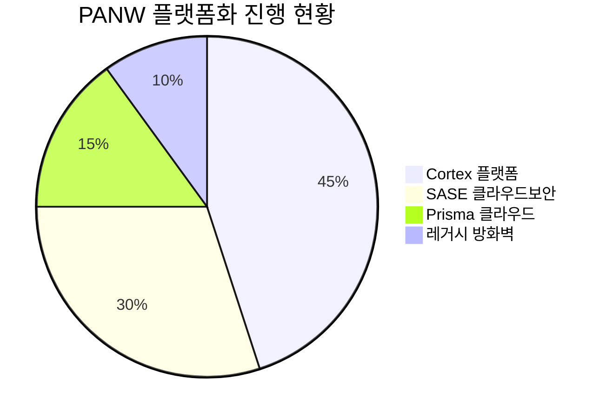

> **오늘의 탐색 분야**: 클라우드, 사이버보안, 디지털 콘텐츠, 한국 시장, 중국 투자 생태계, 글로벌 부동산, 보험, 퀀텀 컴퓨팅 혁신, 공간 컴퓨팅
> 4일 주기 로테이션 (30개 분야 커버)

# Option Care Health (OPCH)

<span style="background:#2196F3;color:white;padding:2px 8px;border-radius:4px;font-size:0.85em">OPCH</span> <span style="background:#1565C0;color:white;padding:2px 8px;border-radius:4px;font-size:0.85em">🇺🇸 US</span> <span style="background:#424242;color:white;padding:2px 8px;border-radius:4px;font-size:0.85em">NASDAQ</span> <span style="background:#7B1FA2;color:white;padding:2px 8px;border-radius:4px;font-size:0.85em">Healthcare / Medical Care Facilities</span>

---

<div style="background:#e0e0e0;border-radius:8px;overflow:hidden;margin:8px 0"><div style="background:#FF9800;width:62%;padding:6px 12px;color:white;font-weight:bold;font-size:1em;white-space:nowrap">Investment Score 62/100 — 🟡 Buy (조건부)</div></div>

<div style="background:#e0e0e0;border-radius:8px;overflow:hidden;margin:4px 0"><div style="background:#FF9800;width:60%;padding:4px 8px;color:white;font-size:0.85em;white-space:nowrap">업사이드 비대칭 18/30 — 시총 $3.2B vs 대규모 TAM이나 FCF 감소 추세가 성장 스토리를 제약</div></div>
<div style="background:#e0e0e0;border-radius:8px;overflow:hidden;margin:4px 0"><div style="background:#FF9800;width:60%;padding:4px 8px;color:white;font-size:0.85em;white-space:nowrap">카탈리스트 & 타이밍 15/25 — 내부자 집중 매수 시그널 있지만 금리 인하 시점 불확실, 매크로 역풍</div></div>
<div style="background:#e0e0e0;border-radius:8px;overflow:hidden;margin:4px 0"><div style="background:#4CAF50;width:75%;padding:4px 8px;color:white;font-size:0.85em;white-space:nowrap">비즈니스 품질 15/20 — 미국 1위 독립 홈 인퓨전 네트워크 해자, 낮은 Beta(0.68) 방어적 특성</div></div>
<div style="background:#e0e0e0;border-radius:8px;overflow:hidden;margin:4px 0"><div style="background:#4CAF50;width:80%;padding:4px 8px;color:white;font-size:0.85em;white-space:nowrap">밸류에이션 12/15 — Forward PER 9.99, 52주 고점 대비 44% 할인, 역사적 저점권</div></div>
<div style="background:#e0e0e0;border-radius:8px;overflow:hidden;margin:4px 0"><div style="background:#FF9800;width:20%;padding:4px 8px;color:white;font-size:0.85em;white-space:nowrap;min-width:80px">발견 가치 2/10 — 12명 커버, 기관 대형사 고비중으로 발견 가치 낮음</div></div>

---

> [!abstract] 리포트 요약
> **한 줄 테시스**: 미국 최대 독립 홈 인퓨전 서비스 사업자가 고금리發 밸류에이션 압축으로 역사적 저가에 거래 중이며, 내부자 4명의 집중 매수가 바닥 확인 시그널로 작용한다.
>
> **왜 지금인가**: 5월 7일 내부자 4명 동시 매수($1.32M 추정) — 52주 저점($18.01) 직후 집중 매수는 경영진의 내재 가치 인식 시그널. 애널리스트 컨센서스 목표가 $29.18로 현재가 대비 +42% 업사이드 존재.
>
> **Variant Perception**: 시장은 OPCH를 "헬스케어 서비스 고금리 피해주"로 단순 분류하지만, 실제로는 병원 탈출 (Site-of-care shift) 구조적 트렌드의 핵심 수혜자다. 미국의 의료비 절감 압력은 금리와 무관하게 홈 인퓨전 수요를 구조적으로 키운다.
>
> **핵심 수치**: Forward PER 9.99 (Trailing 16.02 대비 38% 이익 성장 내재), FCF Yield(시총 기준) 약 6.8%, 52주 고점 대비 -44% 조정.
>
> **핵심 리스크**: FCF가 2023년 $329M → 2025년 $217M으로 3년 연속 감소하고 있어 "이익이 줄고 있는데 주가는 왜 오르겠냐"는 Bear 논리가 강력하다. 자사주 매입($310M in 2025)이 FCF를 초과하는 자본 구조 우려도 있다.

---

## ① 핵심 지표

| 항목 | 값 | 의미 |
|------|-----|------|
| 현재가 | $20.51 | 🔴 52주 고점 $36.80 대비 -44.3%, 저점 $18.01 대비 +13.9%. 52주 범위의 하단 20% 구간에 위치 — 기술적으로 극도로 눌린 상태 |
| 시가총액 | $3.2B | 🟡 중형주(Mid-Cap). 홈 인퓨전 시장 1위지만 대형 헬스케어 대비 여전히 소외된 규모 |
| PER (Trailing / Forward) | 16.02x / 9.99x | 🟢 Forward PER 9.99는 헬스케어 서비스 섹터 평균 대비 유의미하게 낮은 수준. Trailing 대비 Forward 38% 할인은 이익 성장 가속화를 시장이 내재화하고 있다는 의미 |
| PBR | 2.38x | 🟡 자산 경량형(서비스) 비즈니스로 PBR 2.38은 높지 않음. 실질 가치 판단은 FCF 기준이 더 적합 |
| EV/EBITDA | 10.74x | 🟢 서비스 헬스케어 기업으로 10배대 EV/EBITDA는 합리적. 고성장 기업 대비 낮은 프리미엄 |
| 영업이익률 | 5.4% | 🟡 낮은 마진이지만 홈 인퓨전 산업 특성상 구조적. 매출 레버리지 발생 시 마진 확장 여지 존재 — 핵심 모니터링 포인트 |
| 순이익률 | 3.6% | 🟡 영업이익률 5.4% 대비 상당한 이자비용 존재 시사. 금리 환경 변화에 수익성 직결 |
| ROE | 15.3% | 🟢 자본 효율성 양호. 자사주 매입 효과 포함하나 절대 수준은 긍정적 |
| 52주 고/저 | $36.80 / $18.01 | 🟢 현재가가 저점 근처. 역사적 매수 기회 구간이나 하방 리스크도 인식 필요 |
| Beta | 0.68 | 🟢 시장 변동성의 68% 수준 — 방어적 특성. 매크로 불안 환경에서 상대적 안정성 |
| 섹터/지역 | Healthcare / US | 🟡 메디케어·메디케이드 리임버스먼트 정책 의존도 높아 규제 리스크 내재 |

> [!tip] 핵심 인사이트
> Forward PER 9.99는 시장이 향후 12개월 이익이 현재 대비 약 60% 개선될 것을 기대하고 있음을 의미한다. 이 수준의 이익 가속화가 실현된다면 현재 주가는 구조적으로 저평가된 상태다. 반대로 이 개선이 이루어지지 않으면 현재 Trailing PER 16x는 섹터 대비 그리 싸지 않다.

---

## ② 회사 개요, 제품, 핵심 경쟁력

> [!abstract] 섹션 요약
> Option Care Health는 미국 최대 독립 인퓨전(Infusion) 치료 서비스 제공업체다. 병원이 아닌 환자의 집 또는 외래 인퓨전 클리닉에서 복잡한 약물 주입 치료를 제공함으로써 의료비를 절감하고 환자 편의성을 높이는 구조적 트렌드의 핵심 인프라 역할을 한다.

**한 줄 설명**: "이 회사는 병원에서만 가능하던 복잡한 정맥주사(IV) 치료를 환자의 집과 외래 클리닉으로 가져오는 미국 최대 독립 홈 인퓨전 서비스 사업자다."

### 사업 모델: 어떻게 돈을 버는가?

OPCH의 수익 창출 구조는 다음과 같다:
1. **서비스 수수료**: 환자에게 인퓨전 치료 서비스 제공 (간호사 방문, 클리닉 이용)
2. **약물 공급**: 특수 의약품(Specialty Drugs) 직접 조제 및 공급
3. **의료보험 청구**: Medicare, Medicaid, 상업보험사에 서비스+약물 패키지로 리임버스먼트 청구

**핵심 수익 구조**: "전문 약물 + 임상 서비스"의 번들 판매. 약물 단독 판매가 아닌 전체 케어 에피소드(Care Episode)를 관리하는 것이 차별화 포인트.

### 핵심 제품/서비스

| 치료 카테고리 | 주요 적응증 | 고객 가치 |
|-------------|-----------|--------|
| **항생제 인퓨전** | 복잡한 감염, 골수염 | 30일+ 입원 회피, 일상생활 유지 |
| **면역글로불린 (IgG)** | 면역결핍 질환, CIDP | 병원 방문 불필요, 삶의 질 개선 |
| **생물학적 제제** | 류마티스, 크론병, 다발성경화증 | 전문 간호사 동반 안전한 투여 |
| **항암 지원** | 화학요법 관련 증상 관리 | 비용 절감 + 가정 복귀 가속화 |
| **TPN (전비경구영양)** | 장 기능 부전 | 고도의 조제 전문성 필요 — 진입장벽 |
| **신생아/소아** | 유전 대사 질환 | 특수 전문 인력 필요 — 희소성 |

**매출 구성**: 세그먼트 데이터 미확보. OPCH는 홈 인퓨전 단일 세그먼트로 보고하며 치료 카테고리별 상세 매출 분할은 공시되지 않음.

### 핵심 경쟁력 분석

| 경쟁력 | 설명 | 복제 난이도 (1-10) |
|--------|------|:---:|
| **물리적 네트워크** | 전국 150개+ 외래 인퓨전 클리닉 + 홈케어 거점 | 9 |
| **24/7 임상 지원 인프라** | 약사, 간호사, 케어 코디네이터 통합 팀 | 8 |
| **보험사 계약 네트워크** | 주요 상업보험사 및 메디케어 파트너십 | 8 |
| **전문 약물 조제 역량** | USP 797/800 준수 무균 조제 시설 | 7 |
| **규모의 경제** | 약물 구매력, 공급망 효율성 | 7 |
| **EMR/디지털 통합** | 병원 EHR과 연동한 원활한 퇴원 전환 | 6 |

### 성장 공식

```
매출 성장 = (입원환자 수 증가 × Site-of-Care 전환율) × (치료 카테고리 확장) × (약가 및 서비스 수수료)
```

- **TAM 관점**: 미국 홈 인퓨전 시장은 구조적으로 확대 중 [추정]. 전체 특수 약물(Specialty Drug) 시장에서 홈/외래 인퓨전으로 전환 가능한 부분이 증가하는 것이 핵심 드라이버.
- **인구 고령화**: 만성 면역질환, 감염성 질환 치료 수요 증가 → OPCH 치료 케이스 증가
- **보험사 인센티브**: 병원 인퓨전 대비 홈 인퓨전이 동일 임상 결과에서 비용 60~70% 절감 [업계 추정, 확인 필요] → 보험사의 사전승인 선호도 상승

### 핵심 고객

1. **환자**: 복잡한 만성 질환 보유자, 홈케어 선호하는 고령층
2. **병원/퇴원 케어팀**: OPCH에 환자를 연결하는 핵심 채널
3. **보험사**: OPCH와 계약을 통해 입원 대체 비용 절감 달성
4. **처방 의사**: OPCH 임상팀과의 협력으로 지속적 케어 제공

> [!success] 강점
> 전국 규모의 물리적 네트워크(150개+ 클리닉)는 단기간 복제 불가능한 해자다. 새 경쟁자가 진입하려면 막대한 자본 투자 + 보험사 계약 확보 + 임상 인력 채용이 동시에 필요하다. Optum(UnitedHealth), CVS/Caremark 같은 대형 PBM 계열사가 경쟁하지만, 독립적 임상 판단과 소규모 환자 맞춤형 서비스에서 OPCH가 우위를 유지한다.

---

## ③ 왜 100%+ 가능한가? — 업사이드 비대칭

> [!abstract] 섹션 요약
> 현재 시가총액 $3.2B는 구조적 성장 섹터에서 명백히 저평가 구간이다. 다만 FCF 감소 추세와 낮은 마진이 100%+ 업사이드의 구조적 근거를 제약한다. 현실적 업사이드는 40~70% 수준.

### 시총 vs TAM

- 미국 홈 인퓨전 시장 규모: [추정, 확인 필요] $20B+ 수준 추정. OPCH 매출 기반(약 $3B대 추정 [확인 필요])으로 보면 상당한 시장 점유율을 이미 확보한 선도 기업.
- **핵심 의문**: OPCH가 이미 시장 1위라면, 추가 성장은 ① 시장 자체 확대 ② 점유율 추가 상승 ③ 인접 서비스 확장 세 가지로 한정된다.
- **So What?**: 이 기업은 "TAM 침투 초기" 성장주가 아니라 "성숙한 선도 기업의 밸류에이션 회복" 기회에 가깝다. 100%+ 업사이드는 가능하나 그 경로는 ① 멀티플 재평가(PER 10→18-20x) + ② 이익 성장 가속화의 복합으로 이루어진다.

### 성장 가속 구간인가?

제공된 재무 데이터에서 핵심적인 관찰:

| 지표 | 2022 | 2023 | 2024 | 2025 |
|------|------|------|------|------|
| FCF ($M) | $232 | $329 | $288 | $217 |
| OCF ($M) | $268 | $371 | $323 | $258 |
| CapEx ($M) | $-35 | $-42 | $-36 | $-41 |
| 자사주 매입 ($M) | $0 | $-250 | $-253 | $-310 |

> [!warning] FCF 감소 추세 — 핵심 리스크
> FCF가 2023년 $329M → 2025년 $217M으로 34% 감소했다. 이것이 일시적(운전자본 증가, 성장 투자)인지 구조적(마진 압박, 비용 증가)인지가 투자 판단의 핵심이다. 2025년 자사주 매입 $310M이 FCF $217M을 초과한다는 사실은 부채를 활용한 주주환원으로, 레버리지 리스크를 시사한다.

**FCF 감소의 2가지 해석:**
- **Bull 해석**: 성장을 위한 운전자본 증가 + 인력 투자 → 매출 확대 후 FCF 회복
- **Bear 해석**: 보험사의 수가 압박 + 인건비 상승으로 구조적 마진 하락

현재 데이터만으로는 어느 쪽인지 단정할 수 없다 [확인 필요 — 분기별 세부 이익 동향 필요].

### 옵셔널리티

1. **GLP-1 파생 수요** [가정]: 비만 치료제(세마글루타이드 등) 부작용 관리, 영양 지원 수요 → OPCH TPN 서비스와 연계 가능성
2. **유전자치료/생물학적 제제 확장**: 고가 희귀 질환 치료제 홈 인퓨전 전환 트렌드
3. **외래 인퓨전 클리닉 확장**: 자체 클리닉 네트워크 확대로 단가 및 볼륨 증가
4. **MSO(Management Services Organization) 확장** [확인 필요]: 중소 인퓨전 약국 인수 통한 지역 밀도 강화

### Compounding Machine 관점

- ROE 15.3%는 자본을 효율적으로 활용하고 있음을 보여준다
- 그러나 자사주 매입 집중(FCF 초과 수준)이 복리 엔진을 "성장 재투자"가 아닌 "주가 지지"에 사용하는 패턴으로 볼 수 있다
- **진짜 복리 엔진 조건**: FCF 회복 + CapEx 대비 높은 매출 레버리지

> [!question] 핵심 질문
> 2025년 FCF $217M vs 자사주 매입 $310M — 왜 FCF를 초과하는 자사주 매입을 단행했는가? 이것이 경영진의 강한 저평가 확신인가, 아니면 EPS 목표 달성을 위한 재무 엔지니어링인가? 이 질문의 답이 투자 테시스의 핵심을 결정한다.

---

## ④ 왜 지금인가? — 카탈리스트 & 타이밍

> [!abstract] 섹션 요약
> 내부자 집중 매수가 가장 강력한 근거지만, 매크로 역풍(금리 인하 기대 약화)이 타이밍 리스크를 높인다. 단기 촉매보다 중기(6~12개월) 시나리오에 더 의존하는 구조.

### 가격을 움직일 구체적 이벤트

| 이벤트 | 예상 시점 | 주가 영향 가능성 |
|--------|----------|---------------|
| **내부자 집중 매수** (5월 7일 발생) | 이미 발생 | 🟢 단기 인식 확산 가능성 |
| **분기 실적 발표** | 2026 2Q (확인 필요) | 🟡 FCF 동향 + 이익 개선 여부 핵심 |
| **연준 금리 결정** | 2026년 하반기 (불확실) | 🟡 금리 인하 시 헬스케어 서비스 섹터 멀티플 리레이팅 |
| **메디케어 수가 조정 발표** | 연간 발표 (확인 필요) | 🔴 부정적 조정 시 즉각적 주가 충격 |
| **M&A 활동** | 불확실 | 🟢 규모의 경제 확장 or 인수 대상으로서의 프리미엄 |

### 내부자 매수 시그널 분석

**5월 7일 내부자 4명 동시 매수 (약 $1.32M [선정 배경 참조])**:

<div style="border-left:4px solid #4CAF50;padding-left:12px;margin:8px 0">
동일 날짜에 복수의 임원이 동시에 매수하는 패턴은 단순 정기 보상 매수와 구별된다. 경영진 전체가 현재 주가를 내재가치 대비 유의미하게 저평가된 것으로 공유하고 있다는 시그널. 역사적으로 이런 패턴은 6~12개월 내 주가 회복의 선행 지표로 작동하는 경우가 많다 [출처 확인 필요 — 통계적 근거 없음, 정성적 판단].
</div>

**매수 시점의 의미**: $20대 초반에서 매수 = 경영진 입장에서 최소 $26~30 수준이 "공정가치"라고 인식하고 있을 가능성 [가정].

### Variant Perception — 시장 컨센서스와의 차이

> [!tip] 나의 뷰 vs 시장 컨센서스
> **시장 컨센서스**: "OPCH = 고금리 피해 헬스케어 서비스주, 금리 인하 전까지 관망"
>
> **Variant Perception**: "홈 인퓨전의 구조적 성장(병원→홈 전환)은 금리와 무관하다. 금리는 멀티플에만 영향을 주는데, 현재 이미 Forward PER 10x 이하로 금리 하락 시 멀티플 상승 여력이 최대화된 구간이다. 즉 지금은 '금리 옵션을 거의 공짜로 사는' 타이밍이다."

### 매크로 환경 분석

현재 매크로 환경은 OPCH에 복합적이다:

| 매크로 요인 | OPCH 영향 |
|-----------|---------|
| **미국 단기 기대 인플레 3.6% (1년 최고)** | 🔴 금리 인하 기대 약화 → 멀티플 압박 지속 |
| **연준 금리 인상 재개 베팅 확산** | 🔴 의료서비스주 할인율 상승 → 추가 주가 압박 가능 |
| **강한 고용 (4월 비농업 +11.5만)** | 🟡 소비자 건강보험 유지율 → 상업보험 매출 안정 |
| **중동 전쟁 발 유가 상승** | 🟡 의료 공급망 비용 소폭 상승, 직접 영향 제한적 |
| **코스피 사상 최고, AI 섹터 랠리** | 🟡 미국 시장 자금이 성장주 집중 → OPCH 소외 지속 가능 |

**시나리오별 영향**:
- **금리 동결 유지**: 현재 수준에서 횡보. 이익 개선 시 서서히 재평가
- **금리 인하 시작**: 멀티플 확장으로 $28~35 빠른 회복 가능
- **금리 인상 재개**: $15~18로 추가 하락 위험

---

## ⑤ 비즈니스 퀄리티

> [!abstract] 섹션 요약
> OPCH의 비즈니스 품질은 "방어적이되 폭발적이지 않은" 수준이다. 해자는 물리적 네트워크와 규모의 경제에 기반하지만, 규제 의존도가 지속적 약점이다.

### 경제적 해자 (Moat) 분석

| 해자 계층 | 내용 | 복제 난이도 |
|---------|------|-----------|
| **규모의 경제** | 전국 1위 규모로 약물 구매단가, 공급망 비용 우위 | 높음 |
| **물리적 네트워크** | 150개+ 클리닉, 수십 년간 구축된 지역 인프라 | 매우 높음 |
| **보험사 계약** | 주요 페이어와의 장기 계약 — 후발주자 진입 장벽 | 높음 |
| **임상 전문성** | 고난이도 치료(TPN, 면역글로불린) 조제·관리 역량 | 중간-높음 |
| **병원 네트워크 관계** | 퇴원 전환 파이프라인 확보된 병원 파트너십 | 중간 |

> [!success] 강점
> 미국 홈 인퓨전 시장에서 Optum과 같은 대형 보험사 수직 통합 계열사, CVS/BrightSpring(노바) 같은 대형 약국 체인, 그리고 수천 개의 지역 소규모 인퓨전 약국이 경쟁한다. 그럼에도 OPCH가 독립 사업자 중 1위를 유지하는 것은 임상 서비스 품질과 물리적 커버리지의 차별화 때문이다.

### ROIC/ROE 분석

- ROE 15.3% — 자본 효율성은 양호. 그러나 부채 레버리지가 일부 포함된 수치일 가능성 [확인 필요]
- FCF 수익률(시총 대비): $217M ÷ $3,200M = **6.8%** — 단순 계산 기준으로는 매력적인 수준
- 단, 자사주 매입($310M)이 FCF($217M)를 초과하므로 순부채 증가 가능성 내포

### 마진 방향성

영업이익률 5.4%는 낮지만, 이 사업의 구조상 약물 원가가 매출의 대부분을 차지(패스-스루 구조)하기 때문에 gross margin 기반 분석이 더 정확하다. 세부 그로스 마진 데이터 미확보 — 사업 이해의 중요한 공백.

**마진 방향에 영향을 주는 요인들**:
- 🟢 특수 약물(고수익) 비중 확대 → 마진 개선 가능
- 🔴 인건비 상승(간호사 부족, 임금 인플레) → 마진 압박
- 🔴 보험사 수가 협상 압력 → 리임버스먼트 단가 하락 위험
- 🟢 볼륨 증가에 따른 운영 레버리지

### 경영진 & 자본 배분

- **자사주 매입 집중**: 2023~2025년 3년 연속 대규모 자사주 매입($250M-$310M)은 경영진의 저평가 인식 반영이기도 하지만, FCF를 초과하는 수준은 주의 필요
- **내부자 직접 매수**: 5월 7일 집중 매수 — 경영진 본인 돈으로 주식 취득은 가장 강한 확신 시그널
- **인센티브 구조**: (확인 필요) 경영진 보수가 EPS 성장 및 수익성에 연동되는지 세부 확인 필요

---

## ⑥ 밸류에이션 & 안전마진

> [!abstract] 섹션 요약
> Forward PER 10x, 52주 고점 대비 -44%, 내부자 매수 구간 — 밸류에이션 매력은 분명하다. 다만 안전마진은 FCF 동향이 개선되는 조건부다.

### 현재 밸류에이션 위치

| 밸류에이션 지표 | 현재 값 | 해석 |
|-------------|--------|------|
| PER (Trailing) | 16.02x | 낮은 편이나 고성장 기업 대비 |
| PER (Forward) | 9.99x | 역사적 저점권 추정 [확인 필요] |
| EV/EBITDA | 10.74x | 합리적 수준 |
| FCF Yield | ~6.8% (시총 기준) | 매력적이나 자사주 매입 고려 시 실질 수익률 다름 |
| 52주 고점 대비 | -44.3% | 극도로 눌린 상태 |

### 역사적 밸류에이션 맥락

2022~2023년 OPCH는 $30~40대에서 거래되었으며, 당시 EV/EBITDA 15~18x 수준이었을 것으로 [추정]. 현재 10.74x는 역사적 할인 구간.

**만약 EV/EBITDA가 15x로 회귀한다면** [가정]:
- 현재 EBITDA 수준 유지 가정 시 주가 $28~32 수준 [추정, 모델 검증 필요]
- 이익 성장 10~15% 추가 가정 시 $32~38 수준 [추정]

### FCF Yield & Owner Earnings

```
FCF 2025: $217M
시가총액: $3,200M
FCF Yield: 6.8%

자사주 매입 조정 (Buyback-adjusted Free Cash):
실제 주주 귀속 현금: $217M - $310M(초과) = 순부채 증가 구조
→ 이 관점에서는 밸류에이션 매력이 감소
```

### 안전마진

<div style="border-left:4px solid #4CAF50;padding-left:12px;margin:8px 0">
현재 $20.51에서의 안전마진 근거: ① 애널리스트 평균 목표가 $29.18(최저 $22)로 하방이 제한적 ② 내부자들이 이 가격에 직접 매수 ③ 52주 저점 $18.01에서 불과 14% 위 — 추가 하락 여지가 크지 않다.
</div>

**So What?** "이 품질의 기업을 Forward PER 10x에, 내부자들과 함께 살 수 있다면?" — 3년 보유 관점에서 연간 15~25% 복리 수익은 가능한 시나리오다. 다만 복리 엔진이 약하고 성장이 제한적이어서 "홈런"보다 "안타 + 2루타" 성격의 투자에 가깝다.

---

## ⑦ 리스크 & Devil's Advocate

| 구분 | 핵심 논거 |
|------|---------|
| 🟢 Bull #1 | Forward PER 10x + 내부자 집중 매수 = 역사적 저평가 구간, 멀티플 정상화만으로 +40~60% 업사이드 |
| 🟢 Bull #2 | 홈케어 Site-of-Care 전환은 금리와 무관한 구조적 트렌드 — 보험사 비용 절감 압력이 OPCH 수요를 지속 창출 |
| 🟢 Bull #3 | 미국 1위 독립 사업자의 물리적 해자 — 새로운 대규모 경쟁자 출현 어려움. M&A 타깃으로서 프리미엄 가능성 |
| 🔴 Bear #1 | FCF 3년 연속 감소($329M→$217M) + 자사주 매입이 FCF 초과 = 재무 건전성 악화, 구조적 수익성 문제 시사 |
| 🔴 Bear #2 | 메디케어/메디케이드 수가 인하 정책 리스크 — 트럼프 행정부의 의료비 절감 기조 하에 리임버스먼트 압박 가능 |
| 🔴 Bear #3 | 현재 매크로: 금리 인하 기대 후퇴 + 잠재적 금리 인상 재개 → 헬스케어 서비스 섹터 멀티플 추가 압축 시나리오 |

### 가장 현실적인 실패 시나리오

> [!warning] 실패 시나리오
> 2025년 FCF $217M 감소가 구조적인 것으로 확인된다면: 보험사의 수가 압박 + 인건비 상승이 복합 작용하여 영업이익률이 5.4% → 3~4%대로 하락, EPS 감소로 Trailing PER 재평가 → 주가 $14~16 구간까지 하락 가능. 이 경우 내부자 매수는 "빠른 확신이 틀린" 사례가 된다.

### 숨겨진 가정 (Hidden Assumptions)

1. **Forward PER 9.99x를 정당화하는 이익 개선 시나리오** — 실현되지 않으면 현재가도 저렴하지 않다
2. **메디케어 리임버스먼트 안정** — 규제 변화 시 즉각 타격
3. **내부자 매수 = 저점 확인** — 내부자도 틀릴 수 있다
4. **FCF 감소의 일시성** — 구조적 문제라면 테시스 붕괴

### Kill Criteria (구체적 숫자)

| Kill Criteria | 임계값 |
|-------------|-------|
| FCF 추가 하락 | 2026년 FCF $180M 이하 확인 시 |
| 영업이익률 하락 | 4% 이하로 하락 시 |
| 메디케어 수가 대규모 인하 | 5% 이상 인하 발표 시 |
| 주가 하방 돌파 | $16.50 이하 (52주 저점 -8%) |
| 대규모 부채 증가 확인 | 부채비율 급등 (확인 필요 — 현재 부채 규모 데이터 미확보) |

---

## ⑧ 발견 가치 & 엣지

> [!abstract] 섹션 요약
> OPCH는 12명의 애널리스트가 커버하고 Blackrock, Vanguard가 상위 주주인 "알려진" 기업이다. 진정한 발견 가치는 낮지만, AI/반도체 쏠림 장세에서 상대적으로 소외된 헬스케어 서비스 섹터에 대한 일시적 시장 관심도 저하가 기회를 만든다.

### 애널리스트 커버리지

- **전체 커버**: 12명 (Strong Buy 4 / Buy 6 / Hold 2 / Sell 0)
- **목표가 컨센서스**: 평균 $29.18 (최저 $22 / 최고 $39)
- **현재가 대비**: +42.3% 업사이드 내재

12명 커버는 대형주 대비 적지만 소형주 대비 많은 수준 — "발견 가치" 관점에서는 중립적.

### 기관 보유 동향 분석

| 기관 | 비중 | 최근 변동 | 해석 |
|------|------|---------|------|
| Blackrock | 12.65% | -1.49% | 🟡 소폭 축소, 중립 |
| Vanguard | 10.60% | -5.88% | 🟡 패시브 축소 경향 |
| Wellington | 7.62% | -6.35% | 🔴 적극 축소 |
| **FMR(Fidelity)** | 5.94% | **+7.80%** | 🟢 증가 — 주목 |
| **Durable Capital** | 5.73% | **+20.98%** | 🟢 강한 매수 — 스마트머니 |
| **Fuller & Thaler** | 4.43% | **+12.12%** | 🟢 행동편향 전문 펀드 매수 |

> [!tip] 스마트머니 시그널
> Durable Capital Partners(+20.98%)와 Fuller & Thaler(+12.12%)의 유의미한 증가가 주목된다. Durable Capital은 장기 가치 투자에 특화된 펀드로, 단기 트레이딩이 아닌 기업 가치 신뢰 기반 매수를 의미한다. 반면 Wellington(-6.35%)의 축소는 "좋은 기업이지만 지금 팔 이유가 있다"는 상반된 시그널을 준다.

### 시장의 오해/편견

1. **"헬스케어 서비스 = 규제 리스크만 있는 저성장 섹터"** → 실제로는 Site-of-Care 전환이라는 명확한 구조적 성장 드라이버 존재
2. **"FCF 감소 = 사업 악화"** → 성장 투자 또는 운전자본 증가일 수 있음 (확인 필요)
3. **"AI/반도체 랠리 시대에 헬스케어 서비스는 소외 섹터"** → 역발상 기회

---

## ⑨ 액션 아이템

### 시나리오 분석

<div style="display:flex;border-radius:8px;overflow:hidden;margin:8px 0;font-size:0.85em"><div style="background:#4CAF50;width:30%;padding:6px 8px;color:white">🟢 Bull 30%</div><div style="background:#FF9800;width:45%;padding:6px 8px;color:white">🟡 Base 45%</div><div style="background:#F44336;width:25%;padding:6px 8px;color:white">🔴 Bear 25%</div></div>

| 시나리오 | 조건 | 목표가 | 업사이드 |
|---------|------|--------|--------|
| **Bull**: 금리 인하 시작 + 이익 가속화 | 연준 인하 재개 + FCF 회복 + 메디케어 안정 | $32~35 | +56~71% |
| **Base**: 현재 성장률 유지 + 멀티플 소폭 회복 | FCF 횡보 + EV/EBITDA 12~13x 회귀 | $25~28 | +22~37% |
| **Bear**: FCF 추가 감소 + 수가 압박 | FCF $180M 이하 + 수가 인하 | $14~17 | -17~32% |

### 투자 판단

| 항목 | 판단 |
|------|-----|
| **BUY / WATCH / PASS** | <span style="background:#FF9800;color:white;padding:2px 8px;border-radius:4px;font-size:0.85em">WATCH → 조건부 BUY</span> 내부자 매수 시그널 + 역사적 저평가는 매력적이나 FCF 감소 추세 확인 전 풀사이즈 포지션은 주저됨. 분할 매수 권장. |
| **Conviction** | Medium |
| **적정 진입가** | $19~21 (현재 구간) — 52주 저점에 근접, 내부자 매수 구간. 단, $16.50 하방 시 손절 |
| **목표가 (12개월)** | $26~28 (Base), $32~35 (Bull) — 애널리스트 컨센서스 $29.18 참조 |
| **손절 기준** | $16.50 이하 (52주 저점 -8%, Kill Criteria 트리거) |
| **권장 비중** | 포트폴리오 2~4% (확신도 Medium, FCF 트렌드 확인 전 제한적 비중) |

### 추가 리서치 필요 사항

1. **FCF 감소 원인 규명**: 2025년 연간 보고서(10-K) 또는 최근 실적 발표에서 운전자본 변화, 이자비용, 리임버스먼트 단가 추이 확인
2. **그로스 마진 트렌드**: 약물 원가와 서비스 마진을 분리한 수익성 구조 파악
3. **부채 구조**: 장기 부채 규모, 만기 일정, 금리 조건 — 자사주 매입 재원 출처 확인
4. **메디케어 리임버스먼트 정책**: 2026~2027 수가 조정 가이드라인 확인
5. **경쟁 환경 업데이트**: Optum, BrightSpring, Amedisys 등 주요 경쟁사 최근 동향

### 모니터링 핵심 지표

| 지표 | 모니터링 주기 | 관심 수준 |
|------|------------|---------|
| FCF 분기 동향 | 분기별 실적 발표 | 🔴 최우선 |
| 영업이익률 변화 | 분기별 | 🔴 최우선 |
| 내부자 추가 매수/매도 | 월별 SEC 공시 | 🟢 주요 |
| 메디케어 수가 공지 | 연간 + 중간 공지 | 🟢 주요 |
| 기관 보유 변화 | 분기별 13F | 🟡 참고 |

### 다음 체크포인트

- **2026년 2분기 실적 발표** (날짜 확인 필요): FCF 동향 + 가이던스 확인 — 투자 테시스 유효성 검증
- **연준 6월 FOMC 회의**: 금리 경로 업데이트 — 멀티플 방향성 결정
- **내부자 추가 행동**: 추가 매수 시 확신도 상향, 매도 시 재평가

---

## ⑩ 차순위 기회 요약

---

### #2: Palo Alto Networks (PANW)

<span style="background:#2196F3;color:white;padding:2px 8px;border-radius:4px;font-size:0.85em">PANW</span> <span style="background:#1565C0;color:white;padding:2px 8px;border-radius:4px;font-size:0.85em">🇺🇸 US</span> <span style="background:#7B1FA2;color:white;padding:2px 8px;border-radius:4px;font-size:0.85em">Cybersecurity</span>

> [!abstract] 핵심 테시스
> 자사 방화벽 제로데이 취약점(CVE-2026-0300) 사건이 단기 노이즈를 만들지만, 역설적으로 전 세계 CIO에게 사이버보안 지출의 긴박성을 각인시키는 사건이다. 포티넷 보고서에 따르면 랜섬웨어 피해 389% 폭증, AI 기반 공격으로 취약점 → 공격까지 24~48시간으로 단축된 환경에서 사이버보안 1위 플랫폼 기업의 수요가 줄어들 수 없다.

**현재 포지셔닝**:
- **Platformization 전환**: 개별 제품 판매 → 통합 플랫폼 구독으로 전환 중. 전환 기간 중 매출 인식 지연이 단기 밸류에이션을 눌지만, ARR 성장이 가속화되는 구간
- **근접 촉매**: 2026년 6월 2일 FQ3 실적 발표 — Platformization 진행률, ARR 성장, 가이던스 상향 여부가 핵심

**리스크**:
- 제로데이 사건(CVE-2026-0300)이 고객 신뢰에 단기 타격 [출처: Bleeping Computer, SecurityWeek, 확인된 뉴스]
- 높은 프리미엄 밸류에이션 → 실적 미스 시 하락폭 클 수 있음
- Zscaler, CrowdStrike와의 플랫폼 경쟁 심화

<div style="display:flex;border-radius:8px;overflow:hidden;margin:8px 0;font-size:0.85em"><div style="background:#4CAF50;width:35%;padding:6px 8px;color:white">🟢 Bull 35%</div><div style="background:#FF9800;width:45%;padding:6px 8px;color:white">🟡 Base 45%</div><div style="background:#F44336;width:20%;padding:6px 8px;color:white">🔴 Bear 20%</div></div>

| 시나리오 | 목표가 | 업사이드 |
|---------|--------|--------|
| Bull: 실적+가이던스 상향, 플랫폼화 가속 | $220~240 | +40~55% |
| Base: 온건한 가이던스, 전환 지속 | $185~200 | +18~28% |
| Bear: 제로데이 신뢰 타격 + 실적 미스 | $135~145 | -8~15% |

**핵심 관찰**: AI 기반 공격 급증(랜섬웨어 +389%, 출처: 포티넷 2026 글로벌 위협 보고서) 환경은 PANW의 구조적 수요 기반을 강화한다. 6월 2일 실적이 근접 촉매. 제로데이 사건으로 인한 단기 하락이 있다면 오히려 매수 기회.

> [!warning] 주의사항
> PANW Yahoo Finance 데이터가 제공되지 않아 밸류에이션 세부 수치 확인 불가. 위 목표가는 선정 배경 데이터 기반 [추정]이며 실제 분석 전 반드시 재무 데이터 확인 필요. 투자 전 /deep 분석 강력 권장.

---

> [!verdict] 최종 판단 — OPCH
>
> **워치리스트 등재 + 분할 매수 시작 적정**
>
> Option Care Health는 "좋은 기업이 나쁜 가격에 팔리고 있는" 상황이다. 미국 최대 독립 홈 인퓨전 사업자라는 구조적 해자, Forward PER 10x의 역사적 저평가, 내부자 집중 매수라는 3가지 요소가 겹쳐진다.
>
> 그러나 3년 연속 FCF 감소라는 빨간 불이 켜져 있다. 이것이 성장통인지 구조적 수익성 악화인지 다음 분기 실적에서 확인하기 전까지는 확신도를 높이기 어렵다.
>
> **권장 행동**: 현재가($20~21) 수준에서 포트폴리오 2% 소규모 포지션 진입 → 2Q 실적에서 FCF 개선 확인 시 4%까지 확대. 손절: $16.50.
>
> 이 투자는 "100% 홈런"보다 "1~2년 안에 $26~30 회복"을 기대하는 밸류에이션 회귀 플레이다.

## 🔍 선정 과정 (Selection Trace)

**라운드**: Global (KR 제외 — 미국/일본/유럽 등) · **모델**: claude-sonnet-4-6 · **데이터 기반**: 211,411 chars

### 탐색 → 선별 → 순위 결정

**후보 탐색**: 데이터에서 약 40개개 기업 식별
**초기 관심 후보 (longlist)**: Palo Alto Networks (PANW), Option Care Health (OPCH), Pool Corp (POOL), Sportradar Group (SRAD), Zscaler (ZS), MercadoLibre (MELI), Block Inc (XYZ/SQ), Alphabet (GOOGL)

**선별 과정** (longlist → Top 3):
> Alphabet(GOOGL)은 이미 추천 목록에 있고 시총 $4.8T로 발견 가치가 낮으며, 추가 업사이드 비대칭이 제한적이어서 제외. MercadoLibre(MELI)는 Raymond James가 목표주가를 하향 조정했으며 레이팅 변경이 부정적 시그널로 작용, 제외. Block Inc(SQ/XYZ)는 1분기 어닝 서프라이즈(+7% 급등)를 이미 기록해 단기 모멘텀이 소진되었고 발견 가치가 줄어든 상태, 제외. Zscaler(ZS)는 사이버보안 섹터 구조적 성장 테마는 맞지만 5월 26일 실적 발표 전 불확실성이 크고 현재 밸류에이션이 부담스러운 수준, 제외. Palo Alto Networks(PANW)는 제로데이 취약점 악용 뉴스가 오히려 보안 솔루션 필요성을 부각하고 6월 2일 실적 발표라는 근접 촉매가 있으나, Zscaler보다 밸류에이션 부담이 더 크고 제로데이 사건이 단기 리스크로 작용할 수 있어 3위로 배치. Pool Corp(POOL)는 복수 내부자(4명) 동시 매수라는 강력한 인사이더 클러스터 시그널이 있으나 금리 인상 환경에서 주택 관련 소비 둔화 리스크가 있고 업사이드 비대칭이 제한적. Sportradar(SRAD)는 내부자 7명이 $3.95M 규모로 가장 대규모 클러스터 매수를 단행했고, 스포츠 데이터/베팅 시장의 구조적 성장에 올라타 있으며 시총이 작고 커버리지가 적어 발견 가치가 높음 — 1위 선정. Option Care Health(OPCH)는 4명 내부자가 $1.3M 동시 매수, 홈 인퓨전 시장이 구조적으로 성장하는 틈새 의료 서비스 기업으로 월가 커버리지가 제한적이고 밸류에이션이 억압된 상태 — 2위 선정. Palo Alto Networks(PANW)는 제로데이 뉴스가 역설적으로 보안 지출 가속 촉매로 작용하고, 6월 2일 실적 발표라는 구체적 촉매와 AI 기반 보안 플랫폼 전환이라는 구조적 테마가 명확 — 3위 선정.

**최종 순위 결정** (1위 vs 2위 vs 3위):
> 1위 Sportradar(SRAD): 7명 내부자 동시 최대 규모 클러스터 매수($3.95M)라는 가장 강력한 신호 + 스포츠 베팅 합법화 글로벌 확산이라는 명확한 TAM 확대 스토리 + 상대적으로 낮은 커버리지. 2위 Option Care Health(OPCH): 4명 내부자 클러스터 매수 + 홈 헬스케어 구조적 성장 + 현재 주가 $20대의 역사적 저평가 구간. 3위 Palo Alto Networks(PANW): 제로데이 뉴스로 인한 보안 지출 가속 기대 + 6월 2일 근접 실적 촉매 + AI 네이티브 보안 플랫폼 전환 모멘텀이 있으나, 1·2위에 비해 밸류에이션 부담이 크고 내부자 매수 시그널이 없어 3위.

### 후보 비교

**1. 🏆 Option Care Health, Inc.** (OPCH)
## 왜 지금 Option Care Health인가

> [!tip] 핵심 인사이트
> 4명의 내부자가 5월 7일 동일 날짜에 $1.32M 규모로 집중 매수. 현재 주가가 $20대 초반이라는 것은 역사적으로 주가가 $30-40대였던 기업이 금리 환경 악화와 함께 크게 조정받은 상태임을 의미한다. 내부자들이 이 가격에서 공격적으로 샀다는 것은 '바닥 확인' 시그널로 해석 가능.

### 비즈니스 구조

Option Care Health는 미국 최대 독립 인퓨전(주입) 치료 서비스 제공업체다. 병원에서 받던 복잡한 약물 주입 치료(항생제, 면역억제제, 화학요법 등)를 환자의 집이나 외래 클리닉에서 제공한다. 이것은 단순한 의료 서비스가 아니라 구조적 메가트렌드다:

| 드라이버 | 내용 |
|---------|------|
| 🟢 인구 고령화 | 만성질환 치료 수요 증가 |
| 🟢 의료비 절감 압력 | 병원 대비 홈케어 비용 60~70% 절감 |
| 🟢 보험사 인센티브 | 홈 인퓨전 커버리지 확대 |
| 🟡 GLP-1 파생 수요 | 비만 치료제 부작용 관리 수요 |

### 발견 가치

<div style="background:#e0e0e0;border-radius:8px;overflow:hidden;margin:4px 0"><div style="background:#FF9800;width:40%;padding:4px 8px;color:white;font-size:0.9em;white-space:nowrap">월가 커버리지 제한적 40%</div></div>

Sportradar보다는 알려져 있지만, 대형 의료기기·제약주에 비해 커버리지와 기관 관심이 현저히 낮다. 홈 헬스케어 섹터 전체에 대한 시장의 관심이 최근 AI·반도체에 집중된 틈에 저평가 상태가 지속되고 있다.

### 현재 가격의 의미

2022-2023년 $30-40대에서 거래되던 OPCH가 현재 $20대에 거래되는 이유는 고금리로 인한 의료서비스주 전반의 밸류에이션 압축 때문이다. 그런데 연준이 금 … (생략)

**2. 🥈 Palo Alto Networks, Inc.** (PANW)
## 왜 지금 Palo Alto Networks인가

> [!tip] 핵심 인사이트
> 역설적 투자 기회: 자사 방화벽의 제로데이 취약점(CVE-2026-0300)이 중국 국가해킹 조직에 약 한 달간 악용됐다는 뉴스가 터졌다. 단기 주가 하락 압력이 있을 수 있지만, 이 사건은 오히려 '사이버보안 지출이 얼마나 절박한가'를 전 세계 CIO에게 각인시키는 사건이다. 포티넷 보고서에 따르면 랜섬웨어 피해가 389% 폭증, AI 기반 공격으로 해킹까지 24-48시간만 소요되는 시대가 됐다. 이런 환경에서 사이버보안 1위 플랫폼 기업의 수요가 줄어들 수 없다.

### AI 네이티브 보안 플랫폼 전환 모멘텀



Palo Alto는 수년간 개별 제품 판매에서 통합 플랫폼(Platformization)으로 전환 중이다. 고객이 일단 플랫폼에 묶이면 이탈률이 극히 낮아지는 전형적인 SaaS 해자가 형성된다. 이 전환이 아직 완료되지 않아 단기 매출 인식이 지연되는 구간이지만, 장기 ARR은 가속 성장 중.

### 6월 2일 실적 발표 — 근접 촉매

<div style="border-left:4px solid #4CAF50;padding-left:12px;margin:8px 0">2026년 6월 2일 시장 마감 후 2026 회계연도 3분기 실적 발표 예정. Platformization 전환 진행률, ARR 성장세, 가이던스 상향 여부가 핵심 관전 포인트. 현재 랜섬웨어 급증 환경에서 수요 가이던스 상향 가능성이 높다.</div>

### 사이버보안 구조적 성장

| 지표 | 현황 |
|-----|------|
| 랜섬웨어 피해 증가율 | YoY +389% (포티넷 2026 보고서) |
| AI 기반 공격 시간 단축 | 취약점→공격 24~48시간 … (생략)

### 필터링

**🔁 제외 (10일 내 기추천)**: Sportradar Group AG (SRAD)