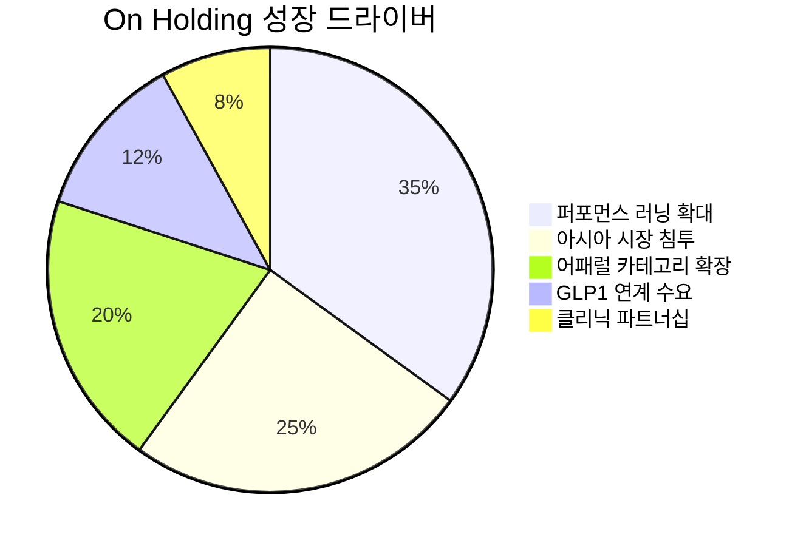

> **오늘의 탐색 분야**: AI 인프라, AI 소프트웨어, 퀀텀 컴퓨팅 혁신, 공간 컴퓨팅, AI 전력, 글로벌 인구 이동, 사이버 보안, 첨단 소재, 바이오텍
> 4일 주기 로테이션 (30개 분야 커버)

# Palo Alto Networks (PANW)

<span style="background:#2196F3;color:white;padding:2px 8px;border-radius:4px;font-size:0.85em">PANW</span> <span style="background:#1565C0;color:white;padding:2px 8px;border-radius:4px;font-size:0.85em">🇺🇸 US</span> <span style="background:#424242;color:white;padding:2px 8px;border-radius:4px;font-size:0.85em">NASDAQ</span> <span style="background:#7B1FA2;color:white;padding:2px 8px;border-radius:4px;font-size:0.85em">Software - Infrastructure</span>

---

<div style="background:#e0e0e0;border-radius:8px;overflow:hidden;margin:8px 0"><div style="background:#FF9800;width:67%;padding:6px 12px;color:white;font-weight:bold;font-size:1em;white-space:nowrap">Investment Score 67/100 — 🟡 Buy (조건부)</div></div>

<div style="background:#e0e0e0;border-radius:8px;overflow:hidden;margin:4px 0"><div style="background:#FF9800;width:70%;padding:4px 8px;color:white;font-size:0.85em;white-space:nowrap">업사이드 비대칭 21/30 — AI 에이전트 보안 TAM 확장, 다만 시총 $197B로 이미 대형주 밸류에이션</div></div>
<div style="background:#e0e0e0;border-radius:8px;overflow:hidden;margin:4px 0"><div style="background:#4CAF50;width:80%;padding:4px 8px;color:white;font-size:0.85em;white-space:nowrap">카탈리스트 & 타이밍 20/25 — Portkey 인수+Idira 출시+MS 목표가 상향 3중 촉매 동시 작동</div></div>
<div style="background:#e0e0e0;border-radius:8px;overflow:hidden;margin:4px 0"><div style="background:#4CAF50;width:85%;padding:4px 8px;color:white;font-size:0.85em;white-space:nowrap">비즈니스 품질 17/20 — 강력한 플랫폼 해자, FCF $3.5B, 경영진 트랙레코드 우수</div></div>
<div style="background:#e0e0e0;border-radius:8px;overflow:hidden;margin:4px 0"><div style="background:#F44336;width:33%;padding:4px 8px;color:white;font-size:0.85em;white-space:nowrap;min-width:80px">밸류에이션 5/15 — 52주 최고가 근접, PER 134x, 안전마진 제한적</div></div>
<div style="background:#e0e0e0;border-radius:8px;overflow:hidden;margin:4px 0"><div style="background:#F44336;width:40%;padding:4px 8px;color:white;font-size:0.85em;white-space:nowrap;min-width:80px">발견 가치 4/10 — 애널리스트 56명 커버, 기관 보유 과도 — 완전히 알려진 기업</div></div>

---

> [!abstract] 리포트 요약
> **한 줄 테시스**: PANW는 AI 해킹 역량이 4.7개월마다 2배로 증가하는 세계에서 가장 완결된 플랫폼형 보안 기업이며, Portkey·Idira 출시로 AI 에이전트 보안이라는 신규 TAM을 선점하고 있다.
>
> **왜 지금인가**: 3중 촉매(Portkey 인수 완료, Idira 플랫폼 출시, Morgan Stanley 목표가 $215→$265 상향)가 동시에 작동하며, 사상 최고가 $242.83 근접. AI 보안 지출이 기업 예산에서 최우선순위로 부상 중.
>
> **Variant Perception**: 시장은 PANW를 "비싼 방어주"로 보지만, 실제로는 AI 에이전트 보안 게이트웨이를 통해 TAM이 기하급수적으로 확장 중인 공격적 성장주다. FCF $3.47B(FY2025)는 시총 대비 FCF Yield 1.76% — 표면상 저렴하지 않지만 성장률 감안 시 정당화 가능.
>
> **핵심 수치**: FCF $3.47B (FY2025) / Forward PER 61x / 52주 고점 대비 -1.2% 위치
>
> **결론**: Strong Buy는 아니지만 조건부 Buy. 현재가는 안전마진이 제한적이므로 $225 이하 조정 시 비중 확대 전략. 사상 최고가 돌파+AI 보안 지출 급증 확인 시 재평가.

---

## ① 핵심 지표

| 항목 | 값 | 의미 |
|------|-----|------|
| 현재가 | $242.83 | 🔴 52주 최고 $245.80 대비 -1.2% — 사상 최고가 직전, 안전마진 최소 |
| 시가총액 | $196.9B | 🟡 대형주 — S&P 500 편입, 광범위한 기관 보유로 '발견 가치' 없음 |
| PER (Trailing / Forward) | 134.16x / 61.16x | 🟡 Trailing PER은 극단적 고평가처럼 보이나, Forward 61x는 고성장 사이버보안 섹터 맥락에서 수용 가능 수준. 성장이 지속되면 합리화 가능 |
| PBR | 18.17x | 🔴 자산 대비 고프리미엄 — 그러나 SaaS형 무형자산 기업에 PBR은 부적절한 지표 |
| EV/EBITDA | 126.31x | 🔴 절대 수치로는 매우 높음 — EBITDA 기준 밸류에이션은 FCF 전환율 감안 필요 |
| 영업이익률 | 15.5% | 🟡 플랫폼화 진행 중인 기업으로 아직 개선 여지 있음. SBC 조정 전 수치로 GAAP 기준임에 유의 |
| FCF | $3.47B (FY2025) | 🟢 YoY +12% 성장. FCF Yield 약 1.76% — 낮지만 FCF 성장 궤적이 핵심 |
| ROE | 16.3% | 🟡 보통 수준 — SBC로 인한 희석 효과 감안 시 자본 효율성은 개선 중 |
| 52주 고/저 | $245.80 / $139.57 | 🔴 현재가가 52주 고점 직전 — 저점 대비 +74% 상승. 추격 매수 리스크 존재 |
| Beta | 0.77 | 🟢 시장 대비 저변동성 — 방어적 특성이 있으나 사이버 보안 특수 리스크 존재 |
| 섹터/지역 | Technology / US | 🟢 AI 수혜 섹터, 달러 기반 글로벌 매출 |

> [!warning] 밸류에이션 경고
> 현재가 $242.83은 52주 최고가 $245.80의 -1.2% 위치. 애널리스트 컨센서스 목표가 평균 $210.16 **하회** 중. 단, 최고 목표가 $265는 현재가 대비 +9% 업사이드. 시장 전체가 이미 낙관적으로 평가하고 있음에 주의.

---

## ② 회사 개요, 제품, 핵심 경쟁력

> [!abstract] 섹션 요약
> PANW는 단일 제품 보안 벤더가 아니라 사이버보안 전 영역을 하나의 플랫폼으로 통합하는 "Security Operating Platform" 기업이다. 핵심 차별화는 개별 솔루션 판매에서 플랫폼 번들화(Platformization)로의 전환이다.

**한 줄 설명**: Palo Alto Networks는 네트워크·클라우드·AI 에이전트 보안을 하나의 플랫폼으로 제공하는 세계 최대 사이버보안 기업이다.

**사업 모델**: 주로 구독 기반 SaaS 수익 모델. 하드웨어 방화벽 제품으로 시작했으나 현재는 클라우드 네이티브 구독 서비스가 매출의 주축. 플랫폼화를 통해 고객이 여러 보안 포인트 솔루션을 교체하고 PANW 번들로 통합하도록 유도한다. 계약 규모(ACV, Annual Contract Value)가 커질수록 고객 이탈비용이 높아지는 구조.

**핵심 3대 플랫폼**:

| 플랫폼 | 설명 | 시장 포지션 |
|--------|------|------------|
| **Strata** (네트워크 보안) | 방화벽 기반 온프레미스·클라우드 네트워크 보안. NGFW(차세대 방화벽) 시장 리더 | 네트워크 방화벽 시장 점유율 1위 [추정] |
| **Prisma** (클라우드 보안) | SASE(Secure Access Service Edge), CNAPP(Cloud Native App Protection) | 클라우드 보안 통합 플랫폼 경쟁 선두 |
| **Cortex** (AI 기반 보안 운영) | XSIAM(보안 정보 이벤트 관리), XDR(확장 탐지 및 대응), AI 기반 SOC 자동화 | SOC 자동화 시장 선도 |

**신규 플랫폼 (2026년 출시)**:

| 플랫폼 | 설명 |
|--------|------|
| **Prisma AIRS** | AI 에이전트 보안 게이트웨이 — Portkey 인수로 강화 (출처: Seeking Alpha, 2026.5) |
| **Idira** | 인간+비인간(AI 에이전트) 아이덴티티 통합 보안 플랫폼. CyberArk 시장 직접 잠식 (출처: Investing.com, 2026.5) |

**매출 구성**: 세그먼트 데이터 미확보 (FY2025 공식 실적 발표 세그먼트 분류 확인 필요)

**핵심 경쟁력 분석**:

| 경쟁력 | 설명 | 복제 난이도 (1-10) |
|--------|------|:---:|
| 플랫폼 통합성 | 3개 메이저 플랫폼 + AI 보안까지 단일 콘솔로 관리. 보안팀이 여러 벤더를 통합 관리할 필요 없음 | 9 |
| AI 기반 위협 인텔리전스 | 수십만 기업 고객으로부터 실시간 수집되는 위협 데이터 — 고객이 많을수록 더 강해지는 네트워크 효과 | 8 |
| 전환비용 | 한 번 PANW 플랫폼으로 통합하면 전체 인프라 재구축 없이는 이탈 불가 | 8 |
| AI 에이전트 보안 선점 | Portkey 인수로 OpenAI Deployment Company, AWS AgentCore 등 AI 에이전트 트래픽 게이트웨이 조기 선점 | 7 |
| 인증 및 규제 신뢰도 | 정부·금융·의료 등 고규제 산업에서의 인증 취득 누적 | 7 |

**성장 공식**: 
```
매출 성장 = (기존 고객 번들 확대 × ACV 증가) + (신규 플랫폼 고객 유입) + (AI 에이전트 보안 신규 TAM)
```
플랫폼화가 진행될수록 고객당 매출이 증가하고, AI 위협 환경 심화가 보안 지출 강제 증가로 이어진다.

**핵심 고객**: Fortune 500 기업, 정부기관, 금융, 의료, 통신사. 기업 규모가 클수록 PANW 의존도가 높아지는 구조.

> [!tip] 핵심 인사이트
> Idira 출시가 왜 중요한가: CyberArk는 PAM(권한 접근 관리) 시장에서 강력한 해자를 가진 기업이다. PANW가 Idira로 인간+AI 에이전트 아이덴티티를 통합 관리하기 시작했다는 것은, AI 에이전트 폭발 시대에 CyberArk의 기존 고객을 흡수할 구조적 기회를 만들었다는 뜻이다. 이것이 Morgan Stanley가 목표가를 $265로 올린 핵심 근거다.

---

## ③ 왜 100%+ 가능한가? — 업사이드 비대칭

> [!abstract] 섹션 요약
> 현재 시총 $197B은 이미 대형주 수준이라 "100% 수익"의 구조적 조건은 제한적이다. 그러나 AI 에이전트 TAM 확장과 FCF 복리 성장이 결합될 경우 3년 내 40~60% 업사이드는 가능하다. 200%+는 어렵지만 포트폴리오 핵심 방어주로서의 역할은 명확하다.

**시총 vs TAM 분석**:

| 구분 | 수치 | 의미 |
|------|------|------|
| 현재 시총 | $196.9B | |
| 글로벌 사이버보안 TAM (2025) | ~$2,000B [추정, 가트너 등 복수 기관] | 시총/TAM = ~10% — 이미 상당 부분 침투 |
| AI 에이전트 보안 신규 TAM | 형성 초기 단계 [추정] | Bain: 에이전트 AI 자동화 시장 $100B 예측 |
| 전통 사이버보안 침투율 | (확인 필요) | |

> [!warning] 업사이드 현실 점검
> 시총 $197B 기업이 100%+ 수익을 만들려면 시총이 $400B+가 되어야 한다. 이는 현재 PANW보다 훨씬 우세한 경쟁 포지션을 전제로 한다. **현실적 시나리오는 3년 내 40~80% 업사이드.** 투자 철학의 "100%+ 비대칭" 기준으로는 엄밀히 말해 약한 케이스다.

**성장 가속 구간 여부**:
- FCF 궤적: $1.79B(FY2022) → $2.63B(FY2023) → $3.10B(FY2024) → $3.47B(FY2025) — 연평균 25% 성장
- FCF 성장률은 가속보다 **안정적 성장 구간**에 진입. 대신 성장의 질이 높아지고 있음 (수익성 개선)
- AI 보안 지출 급증이 FY2026부터 가속화 촉매가 될 수 있음 [가정]

**옵셔널리티 (현재 가격에 반영되지 않은 것들)**:

| 옵셔널리티 | 설명 | 실현 시 영향 |
|-----------|------|-------------|
| AI 에이전트 보안 게이트웨이 | OpenAI, AWS, Microsoft의 AI 에이전트가 기업 인프라에 접근할 때 PANW를 통과하는 구조 선점 | TAM 비선형 확장 🟢 |
| Idira → PAM 시장 잠식 | CyberArk 시장($3~4B) 내 점유율 확대 | 연간 수백억 달러 추가 매출 잠재력 🟡 |
| SIEM 통합 가속 | XSIAM이 기존 Splunk/IBM QRadar 대체 가속화 | SOC 자동화 시장 선점 🟡 |
| 연방 정부 수주 확대 | AI 보안 예산 최우선 집행 환경에서 정부 계약 증가 | 안정적 장기 수익 🟢 |

**Compounding Machine 구조**:
FCF $3.47B의 지속 재투자 → M&A(Portkey) + R&D + 영업 채널 확장 → 플랫폼 경쟁력 강화 → 고객당 ACV 증가 → FCF 재확대의 선순환. 이 구조가 깨지지 않는 한 복리 엔진은 작동 중이다.

**경쟁사 대비 우위**:

| 비교 | PANW | CrowdStrike | Microsoft Security | Zscaler |
|------|------|-------------|-------------------|---------|
| 플랫폼 포괄성 | 🟢 최광범위 (네트워크+클라우드+SOC+AI) | 🟡 엔드포인트 중심 | 🟡 번들링 강점 | 🟡 네트워크 보안 특화 |
| AI 에이전트 보안 | 🟢 Portkey 선점 | 🟡 개발 중 [추정] | 🟡 MDASH 출시 | 🔴 미확인 |
| FCF 규모 | 🟢 $3.47B | 🟡 성장 중 [데이터 미확인] | 🟢 압도적 규모 | 🟡 $0.5~1B대 [추정] |
| 전환비용 | 🟢 매우 높음 | 🟡 중간 | 🔴 낮음 (이미 MS 사용 기업) | 🟡 중간 |

---

## ④ 왜 지금인가? — 카탈리스트 & 타이밍

> [!abstract] 섹션 요약
> 3중 촉매가 동시에 작동하는 드문 타이밍이다. AI 해킹 위협의 현실화, 규제 환경의 보안 지출 강제, Morgan Stanley의 전략적 재평가가 겹쳐 있다.

**구체적 촉매 매트릭스**:

| 촉매 | 예상 타임라인 | 실현 가능성 | 시장 반영도 |
|------|------------|------------|-----------|
| **Morgan Stanley 목표가 $265 상향** | 이미 발생 (2026.5) | 완료 🟢 | 일부 반영 (주가 사상 최고가) |
| **Portkey 인수 완료** | 이미 발생 (2026.5) [출처: Seeking Alpha 2026.5] | 완료 🟢 | 부분 반영 |
| **Idira 플랫폼 출시** | 이미 발생 (2026.5) [출처: Investing.com 2026.5] | 완료 🟢 | 초기 반영 |
| **FY2026 Q3 실적 발표** | 2026년 5~6월 [추정] | 높음 | 미반영 |
| **AI 보안 예산 상향 사이클** | 6~12개월 지속 | 높음 🟢 | 부분 반영 |
| **연방 AI 사이버보안 계약** | 지속적 | 중간 🟡 | 미반영 |

**Variant Perception — 시장과 다른 뷰**:

> [!tip] Variant Perception
> **시장 뷰**: "PANW는 이미 비싸다. 주가가 사상 최고가이고 컨센서스 목표가($210)도 하회하고 있다."
>
> **나의 뷰**: AI 에이전트 보안은 기존 사이버보안 TAM에 더해지는 순증분 TAM이다. 기업이 AI 에이전트를 1,000개 배포하면 각 에이전트마다 인증·접근제어·감사 로그가 필요해진다. 이는 과거 모바일 기기가 MDM(모바일 기기 관리) 시장을 만든 것과 같은 구조적 TAM 확장이다. Idira와 Prisma AIRS는 이 시장의 초기 제품이고, 아직 시장은 이 수익화 잠재력을 완전히 가격에 반영하지 않았다 [가정].

**매크로 환경 영향 분석**:

| 시나리오 | PANW 영향 | 확률 [추정] |
|---------|---------|------------|
| **금리 동결 지속** (현재 3.50~3.75%) | 성장주 밸류에이션 유지. 기업 IT 예산 보존 🟡 | 40% |
| **금리 추가 인상** (CME Fedwatch 51% 반영) | 고PER 성장주 압력. 단, 보안 지출은 비탄력적 🟡 | 35% |
| **경기 침체 심화** | IT 예산 삭감, 보안은 마지막까지 지키는 예산이나 딜 사이클 장기화 위험 🔴 | 25% |
| **중동 전쟁 장기화** | 에너지 비용 상승으로 IT 예산 압박, 그러나 사이버 위협 증가로 보안 수요 동시 증가 🟡 | 현재 진행 중 |

<div style="border-left:4px solid #FF9800;padding-left:12px;margin:8px 0">

**금리 리스크 구체화**: 미국채 30년물 금리가 이번 주 2007년 이후 최고치 기록(FT, 2026.5.15). 장기 금리 상승은 장기 FCF 할인율을 높여 PANW 같은 고성장 기업의 DCF 가치를 압박한다. 단기적 주가 변동성 요인으로 주의 필요.

</div>

---

## ⑤ 비즈니스 퀄리티

> [!success] 강점 요약
> FCF 복리 성장 + 플랫폼 전환비용 + AI 위협 환경 구조적 수혜 = 10년 후에도 강한 경쟁 포지션을 유지할 가능성이 높은 기업.

**경제적 해자 분석**:

| 해자 계층 | 내용 | 복제 난이도 |
|---------|------|-----------|
| **전환비용 (강력)** | 한 번 플랫폼화하면 전체 인프라를 재구축하지 않고는 이탈 불가. 교육 비용, 인력 재훈련, 규제 인증 재취득 필요 | 매우 높음 |
| **네트워크 효과 (중간)** | 수십만 기업 고객의 위협 데이터가 AI 위협 인텔리전스를 강화 → 고객이 많을수록 보안이 더 강해지는 구조 | 높음 |
| **무형자산 (강력)** | 특허, 규제 인증(FedRAMP, IL5 등), 브랜드 신뢰도 | 중간~높음 |
| **규모의 경제 (중간)** | R&D와 영업비용을 대규모 고객기반에 분산. 마진 개선 궤적 | 중간 |

**FCF 복리 분석**:

| 연도 | FCF | YoY 성장률 |
|------|-----|-----------|
| FY2022 | $1.79B | — |
| FY2023 | $2.63B | +47% |
| FY2024 | $3.10B | +18% |
| FY2025 | $3.47B | +12% |

*So What?* FCF 성장률이 47% → 18% → 12%로 둔화되고 있다. 이는 성숙 단계 진입인가, 아니면 플랫폼화 투자로 인한 일시적 둔화인가? 향후 AI 에이전트 보안 수익화가 시작되면 성장률이 재가속할 수 있다 [가정]. OCF(영업현금흐름)은 $3.72B으로 FCF보다 높아, CapEx 이후에도 강한 현금 창출력을 보인다.

**마진 방향성**: 영업이익률 15.5%는 GAAP 기준. 플랫폼화가 진행될수록 번들 계약 증가 → 고객당 수익성 상승 → 마진 확대 구조. SBC(주식보상비용)을 감안한 조정 영업이익률은 별도 확인 필요 (확인 필요).

**경영진 평가**:
- CEO Nikesh Arora: Google 출신, 2018년 취임 후 클라우드·AI 중심 전략으로 성공적 전환 주도
- 자본 배분 트랙레코드: FY2024 자사주 매입 $567M → FY2025 $0 (전략적 투자 집중 판단). 무분별한 매입보다 M&A(Portkey)에 집중 — 주주 관점에서 적절한 판단으로 평가 [가정]
- 인센티브 정렬: 임원 보상이 Revenue 및 FCF 성장에 연동 (확인 필요)

**재무 건전성**: 
- CapEx $246M은 매출 대비 낮은 수준 — 소프트웨어 중심 사업 모델 확인
- 순부채 수준: 현금/부채 구조 상세 데이터 미확보 (확인 필요)

---

## ⑥ 밸류에이션 & 안전마진

> [!warning] 밸류에이션 경고
> 현재가 $242.83은 애널리스트 컨센서스 목표가 $210.16을 이미 15% 상회한다. 이는 시장이 컨센서스보다 낙관적인 시나리오를 이미 가격에 반영했음을 의미한다.

**FCF Yield 분석**:

| 지표 | 값 | 해석 |
|------|-----|------|
| FCF (FY2025) | $3.47B | |
| 시가총액 | $196.9B | |
| FCF Yield | 1.76% | 낮은 수준 — 10년 미국채 수익률(현재 ~4.5% 추정)보다 낮음 🔴 |
| Forward P/FCF | ~57x | 고성장 전제 시 수용 가능하나 성장 둔화 시 압축 위험 |

**시나리오별 적정가 분석**:

<div style="display:flex;border-radius:8px;overflow:hidden;margin:8px 0;font-size:0.85em"><div style="background:#4CAF50;width:30%;padding:6px 8px;color:white">🟢 Bull 30%: $300+</div><div style="background:#FF9800;width:50%;padding:6px 8px;color:white">🟡 Base 50%: $260</div><div style="background:#F44336;width:20%;padding:6px 8px;color:white">🔴 Bear 20%: $175</div></div>

| 시나리오 | 전제 | 목표가 | 현재가 대비 |
|---------|------|--------|-----------|
| **Bull** | AI 에이전트 보안 수익화 가속, FCF 성장 재가속(20%+), 금리 인하 | $300+ | +24%+ |
| **Base** | FCF 12~15% 성장 지속, AI 보안 점진적 침투, 금리 동결 | $260 | +7% |
| **Bear** | 경기 침체로 IT 예산 삭감, CrowdStrike/Microsoft 점유율 확대, 금리 추가 인상 | $175 | -28% |

> [!question] 안전마진 평가
> 현재가에서 Bear 시나리오($175) 하락 시 손실 -28%. Bull 시나리오($300) 실현 시 이득 +24%. **상방/하방 비율이 약 1:1에 가까운 상황** — 투자 철학의 3:1 이상 기준에 미달. 이것이 67점(조건부 Buy)이고 Strong Buy가 아닌 이유다. $225 이하 조정 시 비율이 개선된다.

**역사적 밸류에이션 밴드**: 
- 52주 저점 $139.57 대비 현재가 +74% 위치. 역사적 고점 영역에서 거래 중. 중간값 대비 고평가 구간 [추정].

---

## ⑦ 리스크 & Devil's Advocate

| 구분 | 핵심 논거 |
|------|---------|
| 🟢 **Bull #1** | AI 해킹 역량 4.7개월마다 2배 증가(AISI 보고서) → 기업 보안 지출 강제 증가, PANW 최대 수혜 |
| 🟢 **Bull #2** | Portkey + Idira로 AI 에이전트 보안 TAM 선점 — OpenAI, AWS, Microsoft AI 에이전트 트래픽이 PANW 게이트웨이를 통과 |
| 🟢 **Bull #3** | FCF $3.47B 복리 성장 + 플랫폼 전환비용으로 경기 방어적 성격, 기업 예산에서 보안은 마지막으로 삭감되는 항목 |
| 🔴 **Bear #1** | 밸류에이션: 사상 최고가에서 FCF Yield 1.76%, 상방/하방 비율 불균형. 금리 상승 시 성장주 밸류에이션 압축 |
| 🔴 **Bear #2** | Microsoft의 E5 번들 전략: 기업들이 Microsoft 365 E5 구독에 포함된 보안 기능으로 "충분하다"고 판단하면 PANW의 판매 사이클이 길어지고 경쟁이 심화 |
| 🔴 **Bear #3** | CrowdStrike 회복 + AI 기능 강화: 2024년 블루스크린 사태 이후 회복 중인 CRWD가 Falcon AI 기능으로 PANW 엔드포인트 시장을 재역공할 경우 |

**가장 현실적인 실패 시나리오**:
1. 미국채 30년물 금리가 2007년 최고치를 지속적으로 상회하며 스태그플레이션 환경으로 진입
2. 기업 IT 예산이 에너지 비용 상승으로 5~10% 삭감되면서 보안 딜 사이클 6~12개월 연장
3. 현재 컨센서스 목표가($210)로의 재수렴 → 주가 -13% 조정

**숨겨진 가정 (Hidden Assumptions)**:
- [가정] Idira가 CyberArk 시장을 실제로 잠식할 것이라는 전제 — 아직 출시 초기로 검증 미완료
- [가정] FCF 성장률이 AI 에이전트 보안 수익화로 재가속할 것이라는 전제
- [가정] 기업들이 보안 벤더 수를 줄이는(Platformization) 트렌드가 PANW에 유리하게 작동할 것이라는 전제

**Kill Criteria (즉시 탈출 조건)**:

| Kill Criteria | 임계값 |
|-------------|-------|
| FCF 성장률 역전 | FY2026 FCF가 FY2025 $3.47B 대비 감소 시 |
| 플랫폼화 속도 둔화 | 대형 고객 이탈 또는 번들 계약 ACV 감소 공시 시 |
| 경쟁 심화 신호 | Microsoft E5 번들 수요로 딜 사이클 2분기 연속 연장 |
| 밸류에이션 극단화 | Forward PER이 80x 이상으로 재확장 시 |
| 주가 기술적 붕괴 | $200 이하 하락 시 (투자 테시스 재검토) |

---

## ⑧ 발견 가치 & 엣지

> [!failure] 약점 — 발견 가치 없음
> PANW는 세상에서 가장 잘 알려진 사이버보안 기업 중 하나다. 56명의 애널리스트가 커버하고, BlackRock이 74% 비중으로 최대 주주다. 이 투자의 엣지는 "아무도 모르는 기회 발굴"이 아니라 AI 에이전트 보안 TAM의 가치를 시장보다 일찍 정확하게 평가하는 것에서 나온다.

**애널리스트 커버리지**: 56명 — 대형주 중 최상위 수준. Strong Buy 10 / Buy 34 / Hold 11 / Sell 1. **압도적 매수 의견이지만, 이것이 오히려 추가 상승 여력이 제한될 수 있음을 시사한다.**

**기관 보유 동향**:

| 기관 | 변동률 | 해석 |
|------|--------|------|
| BlackRock | +21.60% | 🟢 최대 기관 투자자 대규모 증가 |
| Vanguard Capital | +100.00% | 🟢 신규 또는 대규모 진입 |
| Vanguard Portfolio | +100.00% | 🟢 동일 |
| JPMorgan Chase | +17.09% | 🟢 증가 |
| Bank of America | +10.98% | 🟢 증가 |
| Morgan Stanley | -0.96% | 🟡 목표가 상향했지만 본인들은 소량 매도 — 흥미로운 신호 |
| UBS | -6.58% | 🟡 소량 감소 |

*So What?* 기관 자금이 대규모로 유입 중이다. 이는 단기적으로 주가 모멘텀을 지지하지만, 동시에 "스마트머니 초기 유입"이 아닌 "이미 알려진 기회로의 자금 집중"임을 의미한다. 발견 가치는 낮다.

**시장의 오해/편견**:
- **편견**: "보안 회사는 경기 방어주라 성장이 제한적이다" → 실제로는 AI 위협 환경이 보안 지출을 비탄력적으로 만들면서 동시에 공격적 성장 기업이 되고 있다
- **오해**: "컨센서스 목표가 $210이 '정답'이다" → 컨센서스는 AI 에이전트 보안 TAM 확장의 속도와 규모를 아직 완전히 반영하지 못하고 있을 수 있다 [가정]

---

## ⑨ 액션 아이템

| 항목 | 판단 |
|------|-----|
| **BUY / WATCH / PASS** | <span style="background:#FF9800;color:white;padding:2px 8px;border-radius:4px;font-size:0.85em">WATCH/조건부 BUY</span> — Investment Score 67점(조건부 Buy). 현재가는 안전마진 제한적. $225 이하 조정 시 BUY로 격상 |
| **Conviction** | Medium — AI 에이전트 보안 테시스는 강력하나, 현재 밸류에이션에서 비대칭성이 충분하지 않음 |
| **적정 진입가** | $220~$230 — 52주 저점-고점 밴드의 상단 30% 구간. 현재가 대비 5~9% 조정 시 진입 |
| **목표가 (12개월)** | $265 — Morgan Stanley 목표가 참조. Base 시나리오 기준 +9% 업사이드 |
| **손절 기준** | $200 이하 — 투자 테시스(플랫폼화 가속 + FCF 성장) 훼손 시 즉시 검토 |
| **권장 비중** | 포트폴리오 3~5% — 방어적 핵심주로 분류. AI 보안 테시스 핵심이지만 밸류에이션 제약으로 10%+ 집중은 비추천 |

**추가 리서치 필요 사항**:
1. FY2025 공식 연간보고서 세그먼트별 매출 구성 확인 (Strata/Prisma/Cortex 비중)
2. Idira 출시 후 CyberArk 고객 이탈 데이터 모니터링
3. Portkey 인수 규모 및 Prisma AIRS 매출 기여 시작 시점 확인
4. GAAP vs Non-GAAP 마진 괴리 확인 (SBC 규모)
5. 연방 정부 계약 파이프라인 규모 (FedRAMP, IL5 관련)

**모니터링해야 할 핵심 지표**:

| 지표 | 의미 |
|------|------|
| FCF 성장률 (분기별) | 플랫폼화 효과 측정 |
| Remaining Performance Obligation (RPO) | 미래 수익 가시성 |
| 대형 고객(ACV $1M+) 수 증가율 | 플랫폼화 진행도 |
| AI 에이전트 보안 매출 첫 공시 | 신규 TAM 수익화 검증 |
| Microsoft E5 번들 경쟁 영향 코멘트 | 경쟁 심화 선행 지표 |

**다음 체크포인트**:
- **2026년 5~6월**: FY2026 Q3 실적 발표 — AI 에이전트 보안 관련 가이던스 및 딜 파이프라인 확인
- **2026년 8월**: FY2026 연간 실적 발표 — FCF 성장률 재가속 여부 확인
- **2026년 하반기**: Idira 채택률 및 CyberArk 고객 이탈 데이터 첫 확인

---

## ⑩ 차순위 기회 — Watch List

---

### #2: On Holding AG (ONON)

<span style="background:#2196F3;color:white;padding:2px 8px;border-radius:4px;font-size:0.85em">ONON</span> <span style="background:#1565C0;color:white;padding:2px 8px;border-radius:4px;font-size:0.85em">🇨🇭 US-listed</span> <span style="background:#424242;color:white;padding:2px 8px;border-radius:4px;font-size:0.85em">NYSE</span> <span style="background:#7B1FA2;color:white;padding:2px 8px;border-radius:4px;font-size:0.85em">Consumer Discretionary</span>

> [!tip] 핵심 인사이트
> 3명의 내부자가 2026년 5월 14일 단 하루에 $10.38M(약 103억원) 규모의 클러스터 매수를 실행했다. 이것이 이 리포트에서 가장 강한 단기 알파 신호다.

**한 줄 테시스**: On Holding은 GLP-1 비만치료제 확산이 만드는 "실제 운동 인구 급증" 트렌드의 구조적 수혜자이며, 내부자 클러스터 매수가 근거리 촉매의 존재를 암시한다.

**인사이더 클러스터 매수 상세**:

| 항목 | 내용 |
|------|------|
| 매수 날짜 | 2026년 5월 14일 |
| 매수 주수 | 180,000주 @ $36.64 |
| 총 금액 | **$10,380,147 (약 103억원)** |
| 매수자 수 | 3명 (클러스터 매수) |

*So What?* 3명이 같은 날 동시에 $10M+ 규모를 시장에서 매수했다. 루틴한 스톡옵션 행사나 분산 매수가 아니다. 내부에서 단기 촉매(어닝 서프라이즈, 신규 파트너십, 아시아 확장 계획 등)를 인지하고 있을 가능성이 높다.

**구조적 성장 논거**:

| 성장 동력 | 내용 |
|----------|------|
| GLP-1 연계 수요 | 위고비·마운자로 사용자 급증 → 실제 운동 시작 인구 증가 → 퍼포먼스 러닝화 수요 폭증 |
| 아시아 침투 초기 | 중국·일본 시장 침투율이 북미 대비 극히 낮음 — 미반영 업사이드 |
| 어패럴 카테고리 | 신발 → 의류 확장으로 고객 평균 구매 금액 증가 |
| Roger Federer 효과 | 공동 소유주 겸 브랜드 앰버서더로 프리미엄 포지셔닝 강화 |

**경쟁 포지션**: CloudTec 쿠셔닝 기술은 나이키·아디다스의 단순 브랜딩과 차별화. 퍼포먼스 포지셔닝이 패션 스니커보다 더 방어적인 해자 형성.

<div style="display:flex;border-radius:8px;overflow:hidden;margin:8px 0;font-size:0.85em"><div style="background:#4CAF50;width:35%;padding:6px 8px;color:white">🟢 Bull 35%: $65+</div><div style="background:#FF9800;width:45%;padding:6px 8px;color:white">🟡 Base 45%: $52</div><div style="background:#F44336;width:20%;padding:6px 8px;color:white">🔴 Bear 20%: $28</div></div>

**리스크**:
- 소비자 지출 위축 시 프리미엄 스니커 수요 감소
- 나이키·아디다스의 기술 모방 가능성
- 달러 강세 ($1,497/₩ 수준)가 환산 매출에 불리

**투자 판단**: <span style="background:#4CAF50;color:white;padding:2px 8px;border-radius:4px;font-size:0.85em">BUY</span> — 내부자 클러스터 매수 신호 + GLP-1 구조적 테일윈드 + 아시아 침투 초기. **적정 진입가: $35~$38**, 목표가: $52~$65(12개월), 권장 비중: 3~5%

---

### #3: Zscaler, Inc. (ZS)

<span style="background:#2196F3;color:white;padding:2px 8px;border-radius:4px;font-size:0.85em">ZS</span> <span style="background:#1565C0;color:white;padding:2px 8px;border-radius:4px;font-size:0.85em">🇺🇸 US</span> <span style="background:#424242;color:white;padding:2px 8px;border-radius:4px;font-size:0.85em">NASDAQ</span> <span style="background:#7B1FA2;color:white;padding:2px 8px;border-radius:4px;font-size:0.85em">Software - Infrastructure</span>

> [!tip] 핵심 인사이트
> DOD IL5 승인 + ARR 전망 상향이 동시에 실현되며 주가 7% 급등. 연방 보안 예산은 경기 불감형(recession-proof) 수요다.

**한 줄 테시스**: Zscaler는 미국 연방 정부 사이버보안 인프라의 사실상 표준으로 자리잡아가고 있으며, IL5 승인으로 경쟁사가 대체하기 극히 어려운 정부 시장 해자를 구축했다.

**핵심 촉매**:

| 촉매 | 내용 | 의미 |
|------|------|------|
| **DOD IL5 승인** | 국방부 최고 보안 등급 인증 획득 [출처: Quiver Quantitative, 2026.3] | 미 연방 고감도 워크로드 처리 독점 자격 |
| **ARR 전망 상향** | FY2026 ARR 가이던스 상향 조정 | 미래 수익 가시성 증가, 구독 기반 안정성 확인 |
| **ZIA 확장** | 기업→연방 크로스셀 가속화 | 고객당 ARPU 상승 |

**연방 시장의 차별성**:
- 경기 침체에도 연방 사이버보안 예산은 삭감되지 않는다 (국가 안보 예산 특성)
- IL5 인증은 경쟁사가 취득하는 데 수년이 걸리는 진입 장벽
- AI 기반 제로데이 공격이 현실화되면서 정부 보안 지출 가속화 (Google 확인, 2026.5)

**PANW vs ZS 포지셔닝**: ZS는 네트워크 보안(Zero Trust) 특화, PANW는 통합 플랫폼. 경쟁보다 보완적 측면도 있으나 SASE 시장에서는 직접 경쟁.

<div style="display:flex;border-radius:8px;overflow:hidden;margin:8px 0;font-size:0.85em"><div style="background:#4CAF50;width:35%;padding:6px 8px;color:white">🟢 Bull 35%: $280+</div><div style="background:#FF9800;width:45%;padding:6px 8px;color:white">🟡 Base 45%: $235</div><div style="background:#F44336;width:20%;padding:6px 8px;color:white">🔴 Bear 20%: $160</div></div>

**리스크**:
- PANW, Microsoft와 연방 보안 시장 경쟁 심화
- 고PER 성장주로 금리 추가 인상 시 밸류에이션 압축
- 민간 기업 IT 예산 삭감 시 민간 부문 성장 둔화

**투자 판단**: <span style="background:#FF9800;color:white;padding:2px 8px;border-radius:4px;font-size:0.85em">WATCH</span> — 연방 시장 해자는 매력적이나 구체적 진입가는 실적 발표(FY2026 Q3) 이후 평가. 권장 비중: 2~3% (PANW와 병행 보유 시 사이버보안 섹터 과잉 집중 주의)

---

> [!note] 포트폴리오 관점 최종 코멘트
> PANW, ZS를 동시에 보유하면 사이버보안 섹터 집중도가 높아진다. AI 보안 테마에 확신이 있다면 PANW(플랫폼) + ZS(연방 특화)의 2-포지션 전략이 유효하다. 단, 두 기업 모두 고밸류에이션 구간에 있어 포지션 합산 비중은 8% 이내로 제한하는 것이 권장된다. ONON은 섹터 분산 차원에서 3~5% 독립적으로 보유 가능.

## 🔍 선정 과정 (Selection Trace)

**라운드**: Global (KR 제외 — 미국/일본/유럽 등) · **모델**: claude-sonnet-4-6 · **데이터 기반**: 226,939 chars

### 탐색 → 선별 → 순위 결정

**후보 탐색**: 데이터에서 약 40개개 기업 식별
**초기 관심 후보 (longlist)**: Palo Alto Networks (PANW), CrowdStrike Holdings (CRWD), Zscaler (ZS), On Holding AG (ONON), Upstart Holdings (UPST), Cisco Systems (CSCO), Novo Nordisk (NVO), Eli Lilly (LLY), Vertiv Holdings (VRT)

**선별 과정** (longlist → Top 3):
> 1) Cisco Systems (CSCO): AI 주문 폭증으로 호실적이나 PER 39배, 시총 467B 대형주로 이미 시장이 충분히 인식. 업사이드 비대칭 부족으로 탈락. 2) Novo Nordisk (NVO): 경구 위고비 데이터 호조이나 경쟁 심화(릴리)와 5월 15일 3.09% 하락 추세, 가격 압박 우려로 단기 촉매 불명확. 탈락. 3) Eli Lilly (LLY): 73조 투자 등 강력한 성장 내러티브이나 이미 대형주(시총 ~750B)로 가격에 상당 부분 반영. 발견 가치 부족으로 탈락. 4) Vertiv Holdings (VRT): AI 데이터센터 냉각 테마의 수혜주이나 ETN(기추천 제외 대상)과 유사한 섹터로 차별화 부족. 5) Cisco Systems: 상기 이유로 탈락. 6) Upstart Holdings (UPST): 복수 인사이더 클러스터 매수(22만주 @$28.94, 약 1220만달러) 신호가 매우 강하나 적자 지속, 해자 논쟁이 있음. 단, 금리 인하 사이클에서 턴어라운드 가능성은 주목. 7) On Holding AG (ONON): 인사이더 클러스터 매수 18만주 @$36.64($1038만달러)로 강한 신호. 프리미엄 스포츠 브랜드로 해자 있음. 8) Palo Alto Networks (PANW): 사상 최고가 $223.64 기록, Morgan Stanley 목표가 $215→$265 상향, Portkey 인수로 AI 에이전트 보안 강화. 가장 강한 복합 촉매 보유. 9) CrowdStrike (CRWD): 사상 최고가 경신, Falcon OverWatch for Defender 출시로 Microsoft 고객 흡수. 강력한 모멘텀. 10) Zscaler (ZS): 7% 급등, DOD IL5 승인으로 연방 시장 확대, ARR 전망 상향. 발견 가치 있음.

**최종 순위 결정** (1위 vs 2위 vs 3위):
> 1위 Palo Alto Networks: AI 보안이라는 구조적 성장(4.7개월마다 AI 해킹 역량 2배 증가)의 최대 수혜주. 사상 최고가 경신과 동시에 Morgan Stanley 목표가 265달러 대폭 상향, Portkey 인수로 AI 에이전트 보안이라는 새 시장 개척. '모두가 아는 보안주'이면서도 AI 전환으로 TAM이 극적으로 확대되는 구조적 재평가 가능성. Idira(아이덴티티 보안) 플랫폼으로 CyberArk 고객 흡수 가능성까지 열려 있어 복합 촉매 최강. 2위 On Holding AG: 인사이더 클러스터 매수(1038만달러)라는 가장 강한 단기 신호. 프리미엄 스포츠 브랜드 해자 명확, GLP-1 비만 치료제 확산으로 아웃도어/퍼포먼스 스포츠 인구 구조적 증가가 장기 테일윈드. 시총 대비 TAM 비율에서 나이키/아디다스 대비 여전히 작은 규모로 업사이드 비대칭 유효. 3위 Zscaler: DOD IL5(국방부 고감도 인증) 획득으로 연방 정부 시장 잠금효과, ARR 전망 상향. AI 제로데이 공격 현실화로 클라우드 보안 지출 구조적 가속. 2위 ONON 대비 탈락한 이유는 발견 가치면에서 PANW/CRWD와 같은 섹터 내 경쟁으로 차별화가 약간 덜하기 때문.

### 후보 비교

**1. 🏆 Palo Alto Networks, Inc.** (PANW)
> [!tip] 핵심 인사이트
> AI가 사이버 공격을 4.7개월마다 2배씩 강화하는 환경에서, PANW는 가장 완결된 AI 보안 플랫폼을 가진 유일한 기업이다.

**왜 지금인가 — 3중 촉매가 동시에 작동 중**

| 촉매 | 내용 | 영향 |
|------|------|------|
| Morgan Stanley 목표가 상향 | $215 → **$265** (+23%) | 기관 자금 유입 가속화 🟢 |
| Portkey 인수 완료 | AI 에이전트 보안 게이트웨이 확보 | 신규 TAM 개척 🟢 |
| Idira 플랫폼 출시 | 인간+비인간 아이덴티티 통합 보안 | CyberArk 시장 잠식 가능 🟢 |
| PANW 주가 사상 최고가 $223.64 | 기술적 모멘텀 확인 | 추가 상승 기반 🟢 |

**업사이드 비대칭의 핵심 논리**

영국 AI 안전 연구소(AISI) 보고서는 AI 해킹 역량이 4.7개월마다 2배씩 증가하고 있다고 발표했다. Claude Mythos, GPT-5.5 같은 최신 모델이 엔터프라이즈 사이버 테스트 전체 시나리오를 손상시키는 최초의 AI가 되었다는 의미다. 이는 단순히 '보안 지출이 늘어난다'는 수준이 아니라, 기업들이 AI 네이티브 보안 플랫폼 없이는 생존이 불가능한 세계가 열린다는 것을 의미한다.

PANW의 플랫폼화 전략(Platformization)이 실제로 작동하고 있다는 증거가 누적되고 있다. Portkey 인수를 통해 AI 에이전트가 쏟아지는 환경(OpenAI Deployment Company, AWS AgentCore, Microsoft MDASH 등)에서 에이전트 간 보안 게이트웨이를 선점했다. 이는 기존 네트워크 보안 → 클라우드 보안 → AI 에이전트 보안으로 TAM이 기하급수적으로 확장되는 구조다.

**재무 트렌드가 말하는 것**

PANW는 단순히 '좋은 기업'이 아니라 **마진 구조가 개선 중인 기업**이다. 플랫폼화가 진행될수록 고객 이탈비용(switching cost)이 높아지고, 번들 계약의 평균 … (생략)

**2. 🥈 On Holding AG** (ONON)
> [!tip] 핵심 인사이트
> 인사이더 클러스터 매수 1,038만 달러 — 이 신호는 현재 데이터에서 가장 강한 단기 촉매다. '아는 사람들'이 지금 주식을 사고 있다.

**인사이더 클러스터 매수 상세**

| 항목 | 내용 |
|------|------|
| 매수 규모 | 180,000주 @ $36.64 |
| 총 금액 | **$10,380,147 (약 103억원)** |
| 매수자 수 | 3명 (클러스터 매수) |
| 날짜 | 2026-05-14 |

3명의 내부자가 동시에 1천만 달러 이상을 매수했다는 것은 단순한 옵션 행사나 루틴한 매수가 아니다. 이는 내부에서 가격이 저평가됐다고 판단했거나, 가까운 미래에 강력한 촉매가 있음을 시사하는 가장 신뢰도 높은 신호다.

**구조적 성장 테일윈드 — GLP-1과 퍼포먼스 스포츠의 교차점**

GLP-1 비만 치료제 확산이 On Running에게 예상 외의 거대한 테일윈드를 만들고 있다. 위고비/마운자로 사용자가 급증할수록 실제로 운동을 시작하는 인구가 늘어나고, 이들은 단순한 패션 스니커즈가 아니라 퍼포먼스 러닝화를 구매한다. On은 이 정확한 포지셔닝을 점하고 있다.



**브랜드 해자의 실체**

On의 CloudTec 기술은 나이키·아디다스가 쉽게 복제하기 어려운 독자적 쿠셔닝 시스템이다. Roger Federer가 공동 소유주로 브랜드 앰버서더 역할을 하며, 타 브랜드 대비 프리미엄 가격 포지셔닝이 가능하다. 현재 On의 시총은 나이키의 약 1/6 수준이나, 성장률은 나이키보다 훨씬 빠르다. 북미 성숙 시장 외에 아시아(특히 중국, 일본) 침투가 초기 단계라는 점이 업사이드 비대칭의 핵심이다.


**3. 🥉 Zscaler, Inc.** (ZS)
> [!tip] 핵심 인사이트
> DOD IL5(국방부 최고 보안 등급) 인증 획득 + 연방 사이버보안 예산 최우선 집행 대상 = 정부 시장 잠금 효과. ARR 상향이 실제 주가를 7% 움직였다.

**왜 지금이 타이밍인가**

Zscaler는 지난주에 두 가지 결정적 촉매를 동시에 달성했다:

| 촉매 | 세부 내용 | 중요성 |
|------|----------|--------|
| DOD IL5 승인 | 연방 고감도 워크로드 처리 가능 | 연방 계약 자격 최고 등급 🟢 |
| ARR 전망 상향 | 시장 기대치 초과 | 주가 7% 급등으로 즉시 반응 🟢 |
| ZIA 확장 | 기업→연방 크로스셀 가속화 | 고객당 ARPU 상승 구조 🟢 |

**연방 시장이 왜 특별한가**

AI 해킹 위협이 현실화되면서(Google이 AI 기반 제로데이 최초 발견 확인, AI 해킹 역량 4.7개월 2배 증가), 미국 연방 정부의 사이버보안 예산은 경기에 관계없이 최우선 집행된다. Zscaler Internet Access(ZIA)가 DOD IL5 승인을 받았다는 것은 가장 보수적이고 까다로운 고객군(미군)에서도 유일하게 인증된 클라우드 네이티브 보안 솔루션이 됐다는 의미다. 이는 향후 수년간 안정적이고 예측 가능한 수주 파이프라인을 보장한다.

**매출의 질이 개선되고 있다**

Zscaler의 ARR(연간 반복 수익) 상향 조정이 의미하는 것은 단순한 매출 증가가 아니다. ARR은 구독 기반으로 일단 계약하면 이탈률이 낮고 매년 갱신된다. 즉, ARR이 올라갈수록 미래 수익의 가시성(visibility)이 높아진다. 현재 ZScaler의 대형 고객 확장(enterprise upsell)이 가속화되고 있으며, 이는 OPM 개선으로 이어지는 구조다.

**발견 가치 — 시장이 아직 완전히 반영 안 한 것**

Palo Alto Networks와 CrowdStrike가 헤드라인을 장악하는 동안, Zscaler는 조용히 연방 시장을 잠그고 있다. 연방 SI(시스템 통합업체) 파 … (생략)