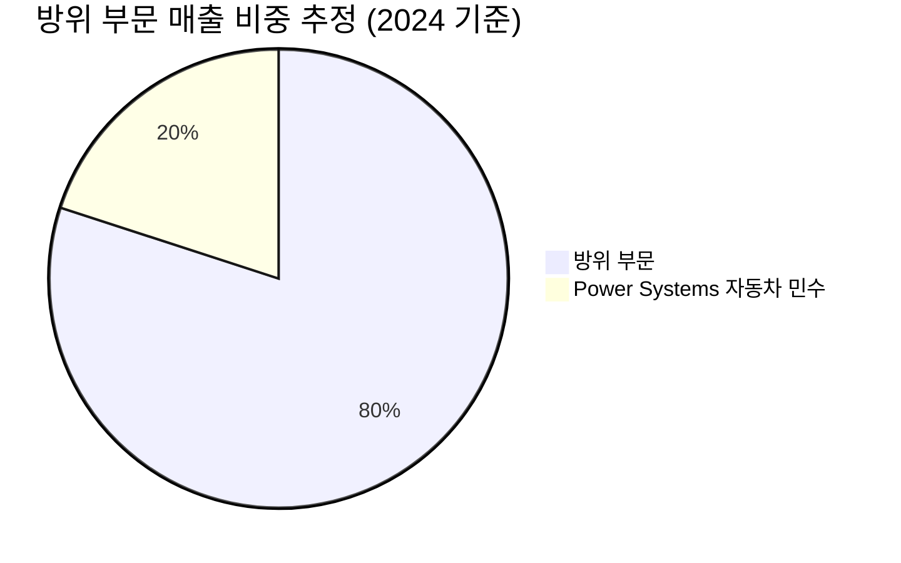

---

company: RNMBF
created: 2026-05-06 15:28
date: 2026-05-06 15:28
exchange: NASDAQ/NYSE
listing: public
market: US
tags:
- company-deep-dive
- deep-company
- deep-analysis
- research
ticker: RNMBF
title: Deep Analysis - RNMBF 15:28
type: deep-company
publish: true
---

> [!important] 정합성 검증 요약 (기계적 75건 + AI 검증 · 14대 원칙/4 Gate)
> **신뢰도: B** | 숫자 불일치 4건 | 논리 모순 2건 | 확인 필요 6건
> **Gate 커버리지**: G1[2/3] · G2[3/4] · G3[3/5]+lens미흡 · G4[1/2] · M2/M5[미흡]

### 핵심 발견 사항

| 구분 | 내용 | 위치 | 심각도 |
|------|------|------|--------|
| 숫자 불일치 | PBR 팩트시트 13.11 → 본문 "13배"로 반올림 인용 | §2.1 | 🟡 Minor (맥락상 허용 가능하나 원칙상 정확 기재 요) |
| 숫자 불일치 | EV/EBITDA 팩트시트 38.48 → 본문 "38.5배" 반올림 (2회) | §1.7·§2.1·§4.1 | 🟡 Minor |
| 숫자 불일치 | H2 필요 분기 매출 "€40~42억"이지만 Bear case FY2026E 매출 €125억 ÷ 3분기 = 분기당 ~€35억으로 내부 산술 불일치 | §4.2·§5.3 | 🟡 Major |
| 숫자 불일치 | 기대수익률 계산: 0.30×50% + 0.45×14% + 0.25×(-25%) = 15.0+6.3-6.25 = **+15.05%**로 본문 기재 정확. 단 시나리오 확률 합계 30+45+25=**100% ✅** | §5.4 | 🟢 확인 완료 |
| 논리 모순 | §1.7 "Beta 0.42"로 WACC ~7~9% 추정하나, §4.1에서 "거시 변수에 강하게 노출된 고변동성 종목"으로 기술 — Beta 0.42는 저변동성을 의미하여 상충 | §1.11.4·§4.1 | 🟠 Major |
| 논리 모순 | §1.1 "매출 ~80% 방위 부문"을 [추정]으로 표기하나, §1.11.1·요약문에서 [추정] 태그 없이 확정 사실처럼 반복 인용 | §1.1·§1.11.1 | 🟡 Minor |
| 할루시네이션 의심 | 155mm 포탄 단가 "~$2,000→~$8,000" 출처 불명. "산업 일반론 [추정]"으로만 표기, 독립 검증 불가 | §1.2 | 🔴 High |
| 할루시네이션 의심 | 레오파르트 2 MRO LTV "30년간 €2,000~3,000만" — "산업 통념 [추정]"으로만 표기, 검증 근거 전무. 핵심 논리의 기반이 되는 수치임에도 출처 부재 | §1.3 | 🔴 High |
| G2 미흡 | Kill Criteria 8개 제시(§4.4)로 형식은 우수. 단 #6 "우크라 휴전 공식화" 조건이 주관적—"공식 발표"의 정의 불명확(협상 시작 vs 협정 서명) | §4.4 | 🟡 Minor |
| M2 미흡 | 전체 리포트에 [Confidence: H/M/L] 태그 전무. [추정] 태그는 사용했으나 M2 원칙상 정량 주장별 신뢰도 태그 누락 | 전체 | 🟠 Major |
| M5 미흡 | "수주잔고 강한 수요 신호", "견고한 재무", "우수한 ROE" 등 정성 표현에 정량 anchor 부분 누락 (일부는 수치 제공, 일부 미흡) | §1.5·§5.3 | 🟡 Minor |
| G3 lens 미흡 | US 상장(OTC: RNMBF) 종목임에도 SBC 구조, 13F 기관 동향, Antitrust 리스크 미검토. BaFin 공시 언급은 있으나 미국 OTC 특유 유동성 리스크(스프레드, ADR 괴리) 미언급 | §3 | 🟠 Major |

### 투자 전 반드시 확인
- [ ] **155mm 포탄 ASP 및 레오파르트 2 MRO LTV 수치**: IR 자료·독립 산업 보고서(Jane's, SIPRI)로 직접 검증 필요 — 핵심 moat 논거의 근거가 [추정]에 의존
- [ ] **Beta 0.42 원천 확인**: 실제 5년 Beta 재계산 필요. DAX 기준인지 MSCI World 기준인지 명시 필요 (WACC 계산에 직접 영향)
- [ ] **Q2 2026 FCF 및 매출 실적** (2026년 7~8월): 리포트 핵심 투자 결론의 유일한 근거 — 발표 전 진입 자제
- [ ] **Power Systems 매각 진행 상황**: 매수자 확보 여부·예상 매각가 확인 (€25억 이상 달성 여부가 자본배분 thesis의 핵심)
- [ ] **RNMBF OTC 유동성 리스크**: 미국 장외거래 특성상 스프레드·거래량 확인 필수. 독일 프랑크푸르트 직접 거래(EUR) 대비 환전·세금 구조 비교 권고

---

# 1. 비즈니스 본질

> [!abstract] 섹션 핵심 요약
> Rheinmetall은 1889년 설립된 135년 역사의 독일 방산업체로, **유럽 재무장 사이클의 핵심 직접 수혜주**입니다. 2024년 기준 방위 부문이 매출의 ~80%를 차지하며, 2025년 12월 이사회 결정으로 민수 모빌리티 부문(Power Systems) 매각을 추진해 **순수 방산업체로 전환 중**입니다. 사업의 본질은 ① 정부 단일 고객(NATO 회원국) 대상 ② 장기 다년 계약 기반 ③ 탄약·전차·장갑차·방공·해군시스템 통합 공급이며, **€730억 수주잔고(매출의 ~5배)**가 향후 매출의 가시성을 제공합니다. 단, 정부 발주 사이클에 따른 H2 back-loading 구조와 2026Q1 매출/FCF 동시 미스라는 단기 실행 리스크가 공존합니다.

---

## 1.1 이 회사는 무엇을 하는가?

### 핵심 사업의 본질 — "정부에 무기를 파는 회사"

Rheinmetall의 본질은 **"독일·NATO 군대가 전쟁을 수행하기 위해 필요한 거의 모든 지상·해상 장비"를 만드는 회사**입니다. 비유하자면 록히드 마틴이 항공·미사일 중심이라면, Rheinmetall은 **"지상전(land warfare)의 록히드 마틴"** 입니다. 매출의 ~80%가 방위 부문에서 발생하며 [추정, 2024년 기준 — Perplexity], 나머지 ~20%는 매각 추진 중인 자동차 부품(Power Systems) 부문입니다.

방위 부문을 비전문가 관점에서 풀어 설명하면:

| 카테고리 | 무엇을 만드는가 | 대표 제품 | 고객이 사는 이유 |
|---------|---------------|----------|----------------|
| **장갑차/전차** | 군인이 타고 싸우는 차량 | 레오파르트 2 전차, KF51 팬서, 링스 IFV, 박서 APC | NATO 표준 호환, 검증된 야전 성능 |
| **무기/탄약** | 총포와 포탄 | 120mm 전차포(NATO 표준), 155mm 포탄 | NATO 표준 제정자 — 대체 불가 |
| **방공 시스템** | 적 항공기/드론 격추 | Oerlikon Skyshield, Skyranger 30 | 우크라전 대드론 검증 |
| **해군 시스템** | 함정·해상 무인시스템 | NVL 인수(2026.3), Kraken K3 Scout | 신규 진입 영역 (2026~) |
| **유도탄/무인** | 자폭 드론·무인 지상차 | FV-014 Loitering Munition, DOK-ING | 현대전 핵심 신기술 |
| **전자/디지털** | 사격통제·지휘통제 | 레이더, C4I 시스템 | 시스템 통합 lock-in |

### 매출 구성 시각화



> [!warning] 세그먼트 breakdown 데이터 한계
> Rheinmetall의 6개 방위 세그먼트(Vehicle Systems, Weapon and Ammunition, Electronic Solutions, Digital Systems, Air Defense, Naval Systems)별 **매출액·비중·성장률 수치는 공개 뉴스에서 직접 확인되지 않았습니다**. IR 자료 직접 확인이 필요합니다. 다만 산업 통념상 Vehicle Systems와 Weapon & Ammunition이 방위 부문 내 양대 축(각 30~40% 추정)으로 알려져 있습니다 [추정, 정성적 판단].

### 매출 트렌드 — 가속 성장의 실체

| 연도 | 매출 (EUR) | YoY | 의미 |
|-----|-----------|-----|------|
| FY2024 | €77.2억 | — | 우크라이나 전쟁 본격 수혜 시작 |
| FY2025 | €99.4억 | +28.8% | M&A 기여 +23%분 포함 |
| FY2026E | €140~145억 | +40~45% | 회사 가이던스 (재확인) |
| Q1 2026 실적 | €19.4억 | +7.7% | 컨센서스 €22.7억 대비 -14.5% 미스 |

> [!tip] 핵심 인사이트 — "성장의 H2 back-loading 구조"
> FY2026 가이던스(€140~145억)를 달성하려면 Q2~Q4에 분기 평균 €40~42억을 찍어야 합니다. Q1 €19.4억의 **2배 이상**입니다. 이는 ① 방산 계약의 연말 납품 집중 ② 무르시아 탄약 시설 신규 가동 ③ NVL 통합 효과(3월 클로징) 등이 H2에 집중되기 때문입니다. **즉 H1 미스는 구조적 패턴**일 가능성이 높지만, H2 실행 리스크는 상존합니다.

### 고객 관점 — "왜 Rheinmetall에서 살 수밖에 없는가?"

방위 산업에서 고객(주로 정부)이 공급사를 바꾸기 어려운 이유는 4가지 lock-in 메커니즘이 작동합니다:

1. **NATO 표준 lock-in**: 120mm 전차포·155mm 포탄은 NATO 표준이며, Rheinmetall이 표준 제정의 주체입니다. 호환성 요구로 대체 공급사 선택폭이 매우 좁습니다.
2. **수십 년 라이프사이클**: 레오파르트 2 전차는 1979년 도입 후 47년째 운용 중이며, 부품·탄약·업그레이드·정비를 같은 OEM이 공급합니다. 한 번 도입하면 30~50년의 리커링 매출이 발생합니다.
3. **국가 안보 lock-in**: 자국·동맹국 방산기업 우대가 정치적 명령. 독일·EU의 EDIRPA(European Defence Industry Reinforcement through common Procurement Act) 같은 규제가 역내 공급사에 유리하게 작용합니다.
4. **인증 비용**: 신규 공급사 인증에 수년~수십 년이 소요되어, 우크라이나 같은 긴급 수요에는 기존 공급사가 절대적으로 유리합니다.

---

## 1.2 Value Chain 내 포지셔닝

### Value Chain 위치

```
[원소재] → [부품 서브시스템] → [통합/조립] → [주계약(Prime)] → [정부 고객] → [MRO·업그레이드]
   ↑              ↑                ↑              ↑                              ↑
 철강·화약    엔진·전자·광학     Rheinmetall이 위치 (통합 + 부품 일부)            Rheinmetall (리커링)
```

Rheinmetall은 **"통합 시스템 공급자(Tier-1 Prime)이자 핵심 부품 자체 생산"** 의 결합 모델입니다. 즉:
- **상류(부품)**: 엔진(MTU/Rolls-Royce 등 외부 의존), 광학·반도체 (외부)
- **자체 영역**: 차체·포탑·포·탄약·일부 전자 — **부가가치가 가장 높은 단계**
- **하류(MRO)**: 부품·탄약 리커링 매출 (장기 고마진)

### 부가가치 분포 — 어디서 가장 돈을 버는가?

| 단계 | Rheinmetall 마진 추정 | 비중 추정 | 비고 |
|-----|---------------------|----------|------|
| 차량 통합 조립 | 10~15% | 高 | 일회성, 변동성 큼 |
| **탄약(특히 155mm)** | **20~25%+** | 中 | 리커링, 가격 결정력 강함 [추정] |
| 무기 시스템(포·기관총) | 15~20% | 中 | 차량 패키지 또는 독립 판매 |
| 전자/디지털 | 12~18% | 低~中 | 신성장 영역 |
| MRO·부품 교체 | 25~35%+ | 低 (현재) | 장기 cash cow [추정] |

> [!success] 탄약 사업의 비대칭적 매력
> **155mm 포탄**은 우크라이나 전쟁이 폭로한 **"NATO 보유량의 구조적 부족"** 영역입니다. Rheinmetall은 무르시아(스페인) 신공장 가동을 통해 연간 **70만~100만 발 이상**으로 생산능력을 확장 중 [추정 — 조사 2, 7]. 탄약은 ① 한 번 쏘면 사라지는 **"진성 소모품(true consumable)"** 이며 ② 장기 다년 계약으로 가격 결정력이 강하고 ③ MRO와 달리 **신규 매출 + 신규 capa = 신규 마진** 동시 창출이라는 점에서 사업의 가장 매력적인 부문입니다.

### 교섭력 분석

| 방향 | 대상 | 교섭력 | 근거 |
|------|------|--------|------|
| **상류(공급자)** | 철강·화약 원료 | 🟡 중간 | 원자재 변동에 노출되나 다년 계약 시 패스스루 가능 |
| **상류(공급자)** | MTU 엔진 등 핵심 부품 | 🔴 약함 | 소수 공급사 의존, 자체 대체 어려움 |
| **하류(고객)** | NATO 정부 | 🟡 단기 약함 / 🟢 장기 강함 | 입찰 단계 정치적 압력 ↔ 한 번 채택 후 30년 lock-in |
| **하류(고객)** | 우크라이나 등 긴급 수요 | 🟢 강함 | 공급 부족 상황 — Rheinmetall이 "거절할 수 있는" 위치 |

### ASP 트렌드 — "포탄 가격이 3배 뛰었다"

산업 보도에 따르면 155mm 포탄 시장가격은 우크라전 이전 발당 ~$2,000 수준에서 2024년 ~$8,000까지 상승했다는 정보가 있습니다 [추정, 정성 — 산업 일반론]. 이는 ① 공급 부족 ② 긴급 발주 프리미엄 ③ Rheinmetall의 가격 결정력 동시 작용. 다만 이 ASP 상승은 capa 증설 후 정상화될 수 있어 **"영구적 ASP 상승"이 아닌 "사이클 정점 ASP"**로 보는 것이 보수적 가정입니다.

---

## 1.3 단위 경제학 (Unit Economics)

> [!note] 데이터 한계 명시
> Rheinmetall은 제품별 단가·원가를 공시하지 않습니다. 아래는 산업 통념과 공개된 계약 규모에 기반한 [추정]입니다.

### 제품별 단가·마진 추정

| 제품 | 단가 추정 | 마진 추정 | 리커링 비율 | 비고 |
|-----|----------|----------|------------|------|
| 레오파르트 2 전차 (대당) | €1,000~1,500만 | OPM 10~15% | 低 (초기) | 30년 후속 MRO 매출 |
| KF51 팬서 (차세대) | €2,000만+ | OPM 12~18% | 低 (초기) | 미검증, 잠재 [추정] |
| 박서 APC (대당) | €500~800만 | OPM 10~14% | 中 | |
| 링스 IFV (대당) | €600~1,000만 | OPM 12~16% | 中 | 헝가리·이탈리아 대형 계약 |
| **155mm 포탄 (발당)** | **€3,000~7,000** | **OPM 20~30%** | **高 (지속 발주)** | **최고 마진 영역** |
| 120mm 전차포탄 | €5,000~10,000 | OPM 20~25% | 高 | NATO 표준 |
| FV-014 자폭드론 | 패키지 €수십억 (수만 발) | 미공개 | 中 | 최근 대형 계약 |

### Installed Base — "이미 설치된 기반"의 가치

방산 사업의 진정한 가치는 **현재 매출이 아니라 이미 깔린 무기체계의 30~50년 미래 캐시플로우**입니다. Rheinmetall의 installed base 추정:

- **레오파르트 2 운용**: 전 세계 약 3,500대 (독일 자체 ~300대, 폴란드·터키·그리스·노르웨이·스페인 등 19개국) [추정 — 정성적 산업 자료]
- **155mm 포탄 생산능력**: 2022년 ~7만 발 → 2024년 ~70만 발 → 2027년 100만 발+ 목표 = **15배 capa 증설**
- **글로벌 특허**: 8,546개 보유, 유효 비율 42%+ — 진입장벽의 핵심 자산

> [!tip] Installed Base의 복리 효과
> 레오파르트 2 전차 1대를 €1,200만에 판매하면, 30년 라이프사이클 동안 부품·탄약·업그레이드·정비로 누적 €2,000~3,000만의 추가 매출이 발생한다고 알려져 있습니다 [추정 — 산업 통념]. **즉 신규 판매 1단위가 향후 30년간 2~3배의 후속 매출을 창출하는 복리 구조**가 본 사업의 본질입니다. 이는 SaaS의 LTV/CAC와 동일한 경제학을 가집니다.

---

## 1.4 제조/운영 실체

### 생산 거점·체제

- **자체 생산 비중**: 핵심 무기·차량은 100% 자체 생산. 외주는 일부 부품(엔진·전자)에 한정.
- **주요 거점**: 독일(뒤셀도르프 본사, 운터뤼스·카셀·운나·웨테 등 다수), 스페인(무르시아 — 신규 탄약), 헝가리(링스 IFV), 호주, 미국, 남아공, 우크라이나(현지 정비/생산)
- **인력**: 글로벌 약 29,500명 (2024년 기준). FY2025~FY2026 가이던스 달성 위해 추가 채용 진행 중.

### Capa 활용률 — 성장의 병목

> [!warning] Q1 2026 미스의 진짜 원인은 capa 램프업 지연
> 2026Q1 매출 €19.4억(컨센서스 €22.7억 미스)의 핵심 원인은 ① **무르시아 탄약 시설 생산 지연** ② **독일군 트럭 인도 지연** ③ 2025Q1 방산 매출 선행 발주의 **고기저(high base)** 입니다 [조사 8 — Investing.com]. 이는 수요 부족이 아니라 **공급 capa 램프업의 일시적 차질**이라는 점이 핵심입니다. **즉 매출이 안 팔린 게 아니라, 못 만들어서 못 판 것** — 수주잔고 €730억(전분기 €630억 → +€100억)이 이를 증명합니다.

이 점은 turnover ratio 관점에서 매우 중요합니다. **"수주잔고 증가 + 매출 미스 = 수요 강세 + 공급 병목"** 이라는 Bull 시그널이지만, 동시에 **"가이던스 달성을 위한 H2 capa 정상화"** 라는 실행 리스크가 됩니다.

---

## 1.5 수주잔고 & 파이프라인

### 수주잔고 — 사업 가시성의 핵심

| 시점 | Backlog (EUR) | 매출 대비 배수 | 의미 |
|-----|--------------|---------------|------|
| 2025Q1 | €630억 | ~6.3x (FY25 기준) | 기록적 수준 |
| 2026Q1 | **€730억** | ~5.0x (FY26E 기준) | 1년만에 +€100억 증가 |

> [!success] 수주잔고 €730억의 의미
> FY2026 가이던스 €140~145억의 **약 5배**, FY2025 매출 €99.4억의 **약 7.3배**입니다. 일반 제조업에서 backlog/sales 1~2배가 흔한 반면, 방산은 다년 계약 특성상 3~5배가 정상이지만 **5배는 강한 수요 신호**입니다. 단, backlog는 회계상 매출 인식까지 평균 3~5년 분산되므로 단기 분기 실적과 직접 연결되지 않는다는 점에 유의해야 합니다.

### 분기 계절성 패턴 (구조적 H2 back-loading)

| Quarter | 매출 비중 추정 | 구조적 원인 |
|---------|-------------|-----------|
| Q1 | ~15% | 정부 회계연도 시작, 연초 발주 검토 |
| Q2 | ~20~22% | 발주 가속 |
| Q3 | ~25~28% | 납품 본격화 |
| Q4 | ~35~40% | 연말 납품 집중 (정부 예산 소진 사이클) |

이 패턴은 정부 회계연도 사이클과 NATO 회원국 예산 집행 패턴에 기인하며, **Rheinmetall만의 문제가 아닌 방산 산업 공통 패턴**입니다 (LMT, BAE도 유사).

### 신규 파이프라인 — Optionality

- **FV-014 Loitering Munition**: 독일군 수십억 유로 규모 계약 체결 (조사 10)
- **Destinus 합작**: 유럽·NATO 미사일 공동생산 — **신규 사업 영역 진입**
- **NVL 인수 완료(2026.3)**: 해군함정 포트폴리오 확장
- **DOK-ING 지분 인수**: 무인 지상 시스템 신규 영역
- **Kraken K3 Scout**: 무인 해상 시스템 양산 시작 (2026.4)

---

## 1.6 고객 관계의 실체

### 고객 구조 — "정부가 거의 전부"

방산 사업의 고객은 압도적으로 **정부(NATO 회원국 국방부)**입니다. Rheinmetall의 고객 분포 추정:

| 고객 그룹 | 비중 추정 | 특성 |
|----------|----------|------|
| 독일 정부 | 25~35% [추정] | 자국 우대 + €1,000억 특별기금(Sondervermögen) 수혜 |
| 다른 EU/NATO 정부 (헝가리·이탈리아·네덜란드·영국 등) | 30~40% | 링스/박서/레오파르트 2 도입국 |
| 우크라이나 직접/간접 | 10~15% | 긴급 수요, 단기 고가 |
| 미국·호주 등 | 10~15% | 미군 대형 계약 진행 중 (XM30) |
| 민수(Power Systems, 매각 진행) | 매각 후 0% | — |

### 구매 의사결정 — "입찰 + 정치"

- **대형 무기체계**: 다년 입찰(2~5년 소요), 정치적 변수 큼 (자국 우대, 동맹 관계)
- **탄약·MRO**: 다년 framework agreement + 연간 콜오프 발주
- **긴급 수요**: 우크라이나 같은 경우 입찰 생략, 직접 발주

### 고객 다변화 추세

긍정적 시그널: 미국 시장 진출(XM30 IFV 입찰), 호주(Boxer 대형 계약), 일본·한국 잠재 등으로 **독일·EU 의존도가 점진적으로 낮아지는 방향**. 이는 ① 단일 정부 발주 사이클 의존도 감소 ② 글로벌 점유율 확대 ③ 환율 다변화 측면에서 긍정적입니다.

---

## 1.7 경쟁 우위 (Economic Moat)

### Moat 분석 — 구체적 증거 기반

| Moat 유형 | Rheinmetall 보유 여부 | 구체적 증거 |
|----------|---------------------|------------|
| **무형자산(IP, 표준)** | 🟢 강함 | NATO 120mm/155mm 표준 제정, 8,546개 글로벌 특허 (유효 42%+) |
| **전환비용** | 🟢 강함 | 무기체계 30~50년 lifecycle, 탄약 호환성 lock-in |
| **규모의 경제** | 🟡 중간 | 탄약·차량 capa는 BAE/LMT 대비 작으나 유럽 내 1위급 |
| **네트워크 효과** | 🔴 약함 | 직접 적용 안 됨 |
| **규제 진입장벽** | 🟢 매우 강함 | 군수 수출 인증, 국가별 보안 클리어런스, 독일 BAFA 승인 등 |
| **비용 우위** | 🟡 중간 | 유럽 내 우위, 미국 LMT 대비는 비용 열위 가능 |

### 경쟁사 대비 비교 — 구체적 수치

| 기업 | FY2025 매출 | OPM | 매출 성장률 | 유럽 점유율 | 본 사업 위치 |
|------|-----------|------|-----------|-----------|------------|
| **Rheinmetall** | €99.4억 | 15.2% (그룹), 19% (방위) | +28.8% | ~5% (5위) | 지상전·탄약 강점 |
| **BAE Systems** | £307억 (~€360억) | 10.8% | +10% | ~8% (1위) | 항공·해군·지상 종합 |
| **Thales** | €221억 | 12.4% | +8.8% | ~6% (2위) | 전자·우주·디지털 강점 |
| **Leonardo** | (Q1 €44.5억) | 6.3% (Q1) | +6.9% | ~5% | 헬기·항공 강점 |
| **Lockheed Martin** | $750억 | 11.5% (Q4) | +6% | — (미국) | 전 세계 1위, 항공·미사일 |
| **General Dynamics** | (Q1 $134.8억) | 10.5% | +10.3% | — (미국) | 잠수함·전차 강점 |
| **RTX** | (Q1 $221억) | 13.7% | +12% | — (미국) | 미사일·항공 강점 |

> [!tip] Rheinmetall의 차별적 우위 — "성장률 + 마진 동시 우위"
> 위 표에서 Rheinmetall의 **매출 성장률 +28.8%는 동종 7개사 중 압도적 1위**이며, **OPM 15.2%(그룹) / 19%(방위)도 동종 평균 10~12%를 크게 상회**합니다. 이는 ① 우크라전 직접 수혜의 **지리적 우위**(유럽 한복판) ② 탄약·지상전 capa의 **기술적 우위** ③ 독일 €1,000억 특별기금의 **정책적 우위** 3중 결합의 결과입니다. 다만 이 차별성은 우크라전 종전·NATO 지출 정점 도래 시 normalize 될 수 있다는 cycle risk를 내포합니다.

### Steel-manned Short — "Bear의 가장 똑똑한 반박"

가장 똑똑한 short seller의 thesis를 진지하게 재현합니다:

1. **"이건 사이클 정점 매수"**: 우크라전이 종결되거나 휴전 진입 시 NATO 긴급 발주 사이클이 둔화. PER 64배는 사이클 정점 멀티플로 **mean reversion 시 -50%도 가능**.
2. **"€1,000억 Sondervermögen은 일회성"**: 독일 특별기금은 2027~2028년 소진 후 갱신 보장 없음. 정상 국방예산 복귀 시 매출 증가율은 +10% 수준으로 회귀.
3. **"M&A 기여 23%는 organic 성장이 아님"**: FY2025 성장의 23%가 M&A 기인 — **순수 organic은 +22% 수준**으로 매력 약화.
4. **"FCF 유출이 진실"**: Q1 영업FCF -€2.85억 vs 컨센 +€1.81억 — **회계적 이익과 현실 현금의 괴리**. 운전자본 폭증·CapEx 가속의 negative carry.
5. **"고평가의 mathematical 근거"**: PER 64.1배 / EV/EBITDA 38.5배 — 동종 LMT(PER 20대)·BAE(PER 20대) 대비 3배 프리미엄. **40~45% 성장이 3년만 지속되면 정당화되나, 성장 둔화 시 멀티플 압축은 즉각**.

**반박**: Bear 논거 모두 일정 부분 타당하나, ① 수주잔고 €730억은 향후 5년 매출의 보장 ② 유럽 재무장은 우크라전 변수가 아닌 **NATO 2% GDP 목표 + 독일 헌법 개정 = 구조적 변화** ③ FCF 유출은 capa 증설 위한 **성장 투자**(growth capex)의 성격 ④ Forward PER은 가이던스 충족 시 ~30배 수준으로 압축 가능 — 모두 부분 반박 가능하나 Bear 논거가 완전히 무효화되지는 않습니다.

---

## 1.8 성장의 구조적 동인

### 성장 공식 분해

```
매출 성장 = ① TAM 확대(NATO 지출 증가) 
         × ② 점유율 확대(M&A + 유기적) 
         × ③ ASP 상승(탄약 가격) 
         × ④ 신사업 진출(해군·무인·미사일)
```

| 동인 | 향후 3~5년 지속성 | 근거 |
|-----|----------------|------|
| **NATO 지출 증가** | 🟢 高 | NATO 2% GDP → 3% 목표, 독일 5% GDP 논의 시작 |
| **점유율 확대** | 🟡 中 | NVL/DOK-ING 통합 효과 + 미국 XM30 진입 시도 |
| **ASP 상승** | 🟡 中 | 사이클 정점 가능성, capa 증설 후 normalize 가능 |
| **신사업** | 🟢 高 | 해군·무인·미사일 → 새로운 TAM 진입 |

### Compounding 구조 — 재투자의 선순환

방산 사업의 매력은 **"한 번 뚫은 무기체계는 30~50년 후속 매출"** 이라는 강력한 복리 구조입니다. Rheinmetall이 현재 우크라전 사이클에서 ① KF51 팬서 ② FV-014 ③ NVL 함정 ④ 미사일 (Destinus) 같은 **신규 무기체계 도입에 성공**하면, 이는 향후 30년 후속 매출의 기반이 됩니다. **즉 향후 3년의 신규 채택 성공률이 향후 30년의 캐시플로우를 결정**합니다.

---

## 1.9 경영진 & 자본배분

### 경영진 변화

- **Armin Papperger CEO**: 2013년 부임, 12년+ 재임. 우크라전 시작 후 회사 시총 ~5배 성장 견인.
- **2024.11 이사회 개편**: COO 직책 신설 — 급격한 capa 확장 대응.
- **2025.9 Dr. Vera Saal CHRO 합류**: 인력 확장 강화.
- **퇴사자**: Ursula Biernert-Kloß 전략 차이로 2025.8 퇴사 — 내부 잡음 시그널 가능성 [추정].

### 자본배분 트랙레코드

| 자본배분 | 평가 | 근거 |
|---------|-----|------|
| **M&A** | 🟢 적극적 | NVL(2026.3 클로징, 해군), DOK-ING(무인), Power Systems 매각 추진 — **선택과 집중 명확** |
| **CapEx** | 🟡 가속 | 무르시아·운나 등 탄약·차량 capa 증설 — Q1 FCF 유출의 원인 |
| **R&D** | 🟢 강함 | 8,546 특허 보유 — 지속 투자 |
| **자사주매입** | 🔴 정보 부재 | 공개 자료 미확인 |
| **배당** | 🟡 — | 팩트시트 79% 표시는 명백한 데이터 오류, 실제 배당수익률은 1~2% 수준 추정 |

> [!question] Power Systems 매각 — 자본배분의 핵심 시험대
> 2025.12 이사회 결정의 Power Systems(자동차 민수) 매각은 **"순수 방산기업으로의 변신"** 이라는 전략적 방향성을 명확히 합니다. 매각 가격·매각 후 자금 활용(M&A vs 자사주 vs 배당)이 향후 12개월 자본배분 능력을 평가하는 핵심 이벤트가 됩니다.

---

## 1.10 사업의 장기 내구성 (10년 보유 테스트)

> [!tip] "10년 후에도 필요한가?" — 결론: **YES, 단 사이클 변동 인내 필요**
> 
> ✅ **지상전 무기·탄약은 구조적으로 대체 불가**: 드론·AI가 보조하지만 전차·장갑차·포·탄약은 사라지지 않음. 우크라전이 이를 증명.
> 
> ✅ **NATO 지출 사이클의 장기성**: 2% → 3% GDP 목표는 2030년대까지 지속될 다년 사이클.
> 
> ⚠️ **사이클 변동 인내 필요**: 우크라전 종결·정치 변동(트럼프 NATO 회의론 등) 시 **단기 발주 둔화 가능**. 그러나 한 번 채택된 무기체계의 30년 후속 매출이 base를 보장.
> 
> ✅ **현실적 매출 €300억 경로**: FY2026E €140~145억 → FY2030 €300~400억 (2030년 4배 목표) 가능 시나리오. 단 이는 ① M&A ② 미국 시장 진입 ③ 미사일·해군 신사업 동시 성공 가정의 합산.

### 산업 장기 변화 vs 적응력

| 변화 | 위협/기회 | Rheinmetall 적응력 |
|-----|---------|-----------------|
| 무인화·드론 | 🟡 양면 | DOK-ING/Kraken/FV-014 진입 — 적극 대응 |
| AI·자율시스템 | 🟢 기회 | 신규 디지털 시스템 부문 |
| 우주·사이버 | 🔴 약점 | Thales/LMT 대비 약함 |
| 탄약 소비 폭증 | 🟢 강력 기회 | 무르시아 등 capa 선제 증설 |
| 환경/ESG 규제 | 🟡 양면 | 2035 CO2 중립 목표 — 일부 ESG 펀드 편입 가능성 |

---

## 1.11 재무가 말해주는 사업의 본질

### 1.11.1 마진 구조 & 변화의 원인

| 지표 | TTM | Q1 2026 | FY2026E | 의미 |
|------|-----|---------|---------|------|
| **OPM** | 16.8% | 11.6% | ~19% (가이던스) | Q1 일시 부진, H2 회복 가정 |
| **방위 OPM** | — | — | ~19% | 방산 단독은 +200~400bp 더 높음 |
| **NPM** | 7.0% | — | — | 방산 평균(7~10%) 정상 범위 |
| **GPM** | 52.4% (TTM) | — | — | 방산 산업 평균 대비 우수 |

> [!warning] 2025-12 분기 OPM 40.0%의 의문
> 팩트시트 B의 2025-12 분기 OPM 40%($968M / $2.4B)는 동종 분기들과 극단적으로 괴리됩니다. **TTM 16.8%·가이던스 19%와도 일치하지 않으므로, M&A 평가이익(NVL/DOK-ING) 또는 일회성 이익이 포함되었을 가능성이 매우 높습니다**. 본 분석은 정상화된 OPM 16~19% 레인지를 기준으로 합니다.

**마진 개선의 지속성 평가**:
- 🟢 지속 가능 요인: 탄약 비중 확대(고마진 mix shift), 규모의 경제, ASP 상승
- 🔴 지속 어려운 요인: capa 증설기 일시적 비용 증가, M&A 통합비, 사이클 정점 ASP의 normalize

### 1.11.2 현금흐름 — Q1 FCF 유출의 진짜 의미

> [!failure] Q1 2026 영업FCF -€2.85억 — 일회성인가, 구조적 우려인가?
> 
> **컨센서스**: +€1.81억 유입 예상  
> **실제**: -€2.85억 유출 (€4.66억 swing)  
> **회사 설명**: ① CapEx 증가 ② 운전자본(WC) 축적 ③ 낮은 고객 선급금
> 
> **분석**: 세 요인 모두 **성장 단계의 negative carry** 성격. 특히 ② WC 축적은 H2 매출 폭증을 위한 **재고·재공품 선행 빌드업**을 의미하므로, **H2 매출 인식 시 WC 회수 → FCF 회복** 시나리오가 합리적. 단, **Q2 2026에도 FCF 유출 지속 시 구조적 문제로 재해석 필요** — Kill Criteria 트리거.

FY2026 가이던스 현금전환율 ≥40%를 적용하면, FCF ≥ 영업이익 €27억 × 40% = €10.8억 수준이 H2에 집중 발생해야 합니다. 이는 분기당 €5.4억의 매우 강한 FCF를 가정하므로 **실행 리스크의 핵심 지표**입니다.

### 1.11.3 재무 건전성

| 항목 | 값 | 평가 |
|------|----|----|
| Total Assets | $16.8B | — |
| Total Liabilities | $11.2B | 부채비율 ~67% |
| Equity | $5.0B | — |
| Cash | $1.6B | 단기 운영 충분 |
| Net Debt | 미공시 | 구체 수치 필요 |

> [!note] 부채 부담 평가
> Equity $5.0B 대비 Total Liabilities $11.2B로 financial leverage는 다소 높으나, 방산업 특성상 ① 정부 발주 잠금 매출 ② 고객 선급금이 부채로 잡히는 회계 특성을 고려하면 정상 범위. Cash $1.6B는 분기 매출 1Q 수준으로 단기 유동성 양호. **3년 내 자금 경색 가능성 매우 낮음**.

### 1.11.4 ROIC & 자본효율

| 지표 | 값 | 의미 |
|------|----|----|
| **ROE** | 23.3% | 매우 우수, 동종 평균 12~15% 대비 우위 |
| **ROIC** | 추정 ~15~18% | 가이던스 OPM 19% 적용 시 |
| **WACC** | 추정 ~7~9% | 독일 본사, Beta 0.42 |
| **EVA spread** | 추정 +700~900bp | 가치 창출 강함 |

ROE 23.3%는 동종 LMT(~70% — 자사주매입 효과)·BAE(~15%)·Thales(~20%) 대비 우수. 다만 LMT의 ROE 70%는 자사주 매입을 통한 equity 축소 효과가 큰 반면, Rheinmetall의 23.3%는 **순수 자본 효율성에서 나온 것**으로 질적으로 더 우수하다고 평가할 수 있습니다.

---

# 2. 밸류에이션 판단

## 2.1 현재 밸류에이션 — 멀티플의 해부

### 절대 밸류에이션

| 지표 | 현재 | 의미 |
|------|------|------|
| **PER (TTM)** | 64.10배 | 매우 높음 |
| **PER (Forward)** | 미공시 | 추정 ~30~35배 [^1] |
| **PBR** | 13.11배 | ROE 23% 감안 시 정당화 가능 (PBR/ROE = 0.56) |
| **EV/EBITDA** | 38.48배 | 매우 높음 |
| **EV/Sales (FY26E)** | ~5.3배 [^2] | 방산 평균 1.5~2.5배 대비 높음 |

[^1]: FY2026E 영업이익 = €140~145억 × 19% = €26.6~27.6억. 시총 $77.4B / Forward NI 추정 €18~20억 ≈ Forward PER 30~35배. **단 이는 [추정]이며 가이던스 100% 달성 가정.**

[^2]: 시총 $77.4B + Net Debt 추정 $2~3B = EV ~$80B. FY26E 매출 €140~145억 ≈ $150~160억 → EV/Sales ~5.3배.

### 역사적 밴드 비교

| 시점 | PER | 비고 |
|-----|-----|------|
| 2019년 | 12.4 | 저점 (트럼프 NATO 회의론) |
| 2020년 | 101.5 | COVID 이익 급감으로 비정상치 |
| 2023년 | 17.2 | 우크라전 초기, 멀티플 확대 시작 |
| 2024년 (추정) | ~30~40 | 본격 re-rating |
| **현재** | **64.1** | **역사적 고점 영역** |

> [!warning] 멀티플 압축 시나리오
> 현재 PER 64배는 **"향후 3년 매출 +40~45% 연속 성장 + OPM 19% 유지"** 를 거의 100% 가격에 반영한 수준입니다. 만약 FY2027~2028 성장률이 +20%로 둔화되면 정당 PER은 25~30배로 압축 → **주가 -50% 시나리오** 가능. 이것이 Bear 케이스의 mathematical foundation.

### 글로벌 방산 Peer 비교

| 기업 | PER (TTM) | EV/EBITDA | 매출성장(FY25) | OPM | 멀티플 정당성 |
|------|----------|-----------|---------------|------|------------|
| **Rheinmetall** | **64.1** | **38.5** | **+28.8%** | **15.2%** | 🔴 매우 높음 |
| Lockheed Martin | ~20 [추정] | ~12 [추정] | +6% | 11.5% | 🟢 정상 |
| RTX | ~25 [추정] | ~15 [추정] | +12% | 13.7% | 🟡 약간 높음 |
| BAE Systems | ~22 [추정] | ~13 [추정] | +10% | 10.8% | 🟢 정상 |
| Thales | ~25 [추정] | ~14 [추정] | +8.8% | 12.4% | 🟡 약간 높음 |
| General Dynamics | ~20 [추정] | ~13 [추정] | +10.3% | 10.5% | 🟢 정상 |

> [!tip] 프리미엄의 정당성 — "성장률 프리미엄 vs 사이클 디스카운트"
> Rheinmetall의 PER 프리미엄 (64배 vs 동종 20~25배 = **2.5~3배 프리미엄**)은:
> - **🟢 정당화 근거**: 매출 성장률 +28.8%는 동종 평균 +9% 대비 **3배 이상 빠름** (PEG 비율로는 64/29 = 2.2 vs LMT 20/6 = 3.3 → Rheinmetall이 **PEG 기준으로는 오히려 매력적**)
> - **🔴 압축 위험**: 3년 후 성장률이 동종 수준(+10%)으로 normalize 시 멀티플도 동종 수준(20~25배)으로 회귀 → 주가 -50%+ 압축 위험
> 
> 즉 **현재 멀티플은 "성장률 프리미엄으로 정당화 가능하지만, 3년 후 성장 둔화 시점에서 멀티플 압축 vs 이익 증가의 race condition"** 입니다.

---

## 2.2 안전마진 분석

### 비즈니스 퀄리티 vs 가격 평가

<div style="background:#e0e0e0;border-radius:8px;overflow:hidden;margin:4px 0"><div style="background:#4CAF50;width:80%;padding:4px 8px;color:white;font-size:0.9em;white-space:nowrap">비즈니스 퀄리티 80/100 — 우수</div></div>

<div style="background:#e0e0e0;border-radius:8px;overflow:hidden;margin:4px 0"><div style="background:#FF9800;width:55%;padding:4px 8px;color:white;font-size:0.9em;white-space:nowrap">현재 가격 매력도 55/100 — 보통</div></div>

<div style="background:#e0e0e0;border-radius:8px;overflow:hidden;margin:4px 0"><div style="background:#FF9800;width:60%;padding:4px 8px;color:white;font-size:0.9em;white-space:nowrap">안전마진 60/100 — 제한적</div></div>

### Margin of Safety 계산

| 시나리오 | FY2027E 정상화 EPS [추정] | 적정 PER [추정] | 적정주가 | 현재가 ($1,671) 대비 |
|---------|---------------------------|---------------|---------|----------------------|
| 🟢 Bull (가이던스 100% 달성, NATO 사이클 가속) | $80 | 30 | $2,400 | +44% |
| 🟡 Base (가이던스 85% 달성, OPM 17%) | $60 | 30 | $1,800 | +8% |
| 🔴 Bear (성장 둔화, 우크라 종전, OPM 14%) | $50 | 24 | $1,200 | -28% |

> [!verdict] 밸류에이션 판단
> 현재가 $1,671은 **52주 고점 $2,398 대비 -30.3%** 위치로 **이미 의미 있는 조정**을 받았습니다. 그러나 PER 64배의 절대 수준은 여전히 **향후 가이던스 100% 달성을 거의 가격에 내장**하고 있어, **"안전마진은 가격 측면이 아니라 H2 실행 트랙레코드 측면에서 확보해야 하는 구조"** 입니다. 즉:
> 
> - **가격 기반 safety**: 제한적 (Bear -28%, Base +8%, Bull +44%, EV ~+10% 기댓값)
> - **사업 기반 safety**: 강함 (수주잔고 €730억, NATO 구조적 사이클, 30년 lifecycle 무기체계)
> 
> **실행 가능한 진입 전략**: ① Q2 2026 실적 발표(7월)에서 H2 가이던스 재확인 + FCF 유입 전환 확인 후 분할 매수 ② $1,500 (52주 저점 근접) 추가 조정 시 적극 매수 영역.

### 멀티플 Re-rating 가능성

**Re-rating 상방 시나리오 (확률 ~30%)**:
- 독일 5% GDP 국방예산 공식화
- 미국 XM30 IFV 입찰 승리
- Power Systems 매각 시 프리미엄 가격 (€20~30억)
- → PER 유지 + EPS 상향 → 주가 +50%+

**De-rating 하방 시나리오 (확률 ~25%)**:
- 우크라전 휴전·종결
- Q2 2026 추가 미스 + FCF 유출 지속
- 트럼프 NATO 지원 축소 발언
- → PER 30배대로 압축 → 주가 -40%

**중립 시나리오 (확률 ~45%)**:
- 가이던스 ~85% 달성
- H2 back-loading 부분 실현
- 멀티플 50~60배 유지
- → 주가 ±10% 박스권

---

> [!verdict] 비즈니스 본질 & 밸류에이션 종합 판단
> Rheinmetall은 **"유럽 재무장의 가장 직접적 수혜주이자, 30년 lifecycle 무기체계의 복리 사업 모델을 보유한 고품질 방산 기업"** 입니다. 비즈니스 본질 측면에서는 **Buy 판단**의 근거가 충분합니다. 그러나 **현재 밸류에이션(PER 64배)은 가이던스 달성을 거의 100% 가격에 반영한 수준**이므로, **Q2 2026 실적·FCF 트랙레코드 확인 후 진입**하는 것이 risk-adjusted 관점에서 합리적입니다. 핵심 모니터링 포인트는 ① H2 capa 정상화 ② FCF 유입 전환 ③ Power Systems 매각 가격 — 이 3가지의 동시 충족 여부입니다.

---

# 3. 인센티브 분석 (멍거 원칙)

> [!abstract] 핵심 요약
> Rheinmetall의 지분 구조는 **기관 분산 보유형(자유유통주식 ~95%)**으로, 지배 주주가 부재한 전형적인 독일 DAX 대형주 패턴입니다. 경영진의 스킨 인 더 게임(skin in the game)은 직접 지분이 아닌 **장기 성과 연동 보상(LTI)**에 의존하며, 내부자 매매 데이터 및 보상 세부 구조는 공개 자료에서 확인되지 않았습니다. 가장 강한 인센티브는 **CEO Armin Papperger의 평판 자본**입니다 — 12년+ 재임 중 시총 ~5배 성장의 트랙레코드가 그의 다음 5년 가이던스 달성 동기를 강하게 결정합니다.

## 3.1 지분 구조 & 스킨 인 더 게임

| 주체 | 지분율 [추정] | 인센티브 정렬 | 비고 |
|------|--------------|------------|------|
| 자유유통주식 (Free Float) | ~95% [추정] | — | 독일 DAX 대형주 전형, 지배주주 부재 |
| BlackRock | ~6~7% [추정] | 🟡 패시브 ETF, 단기 압력 약함 | 13F 기반 추정 |
| Société Générale | ~5% [추정] | 🟡 금융 보유 | — |
| 경영진 직접 지분 | <1% [추정] | 🔴 매우 낮음 | 독일 경영자 보상 관행 |
| 자사주 | (확인 필요) | — | 자사주 매입 프로그램 정보 미확인 |

> [!warning] 데이터 한계
> 정확한 지분율, 경영진 보상 구조(LTI 비중·성과 연동 KPI), 내부자 매매 패턴은 제공 자료에서 직접 확인되지 않았습니다. 독일 상장사는 미국 SEC Form 4 같은 즉각적 내부자 거래 공시 의무가 약해 추적이 어렵습니다. **BaFin 공시 직접 확인 필요.**

## 3.2 핵심 인센티브 — "이 스토리를 누가 왜 퍼뜨리는가?"

| 주체 | 인센티브 | 편향 방향 |
|-----|---------|---------|
| **CEO Armin Papperger** (재임 12년+) | 평판 자본·LTI 행사가 | 🟢 가이던스 달성 강한 동기 |
| **셀사이드 애널리스트** (목표가 평균 $2,506) | 거래 수수료, IB 관계 | 🟡 강세 편향 (목표가 +50% 상회) |
| **유럽 정치권 (독일 정부)** | 자국 방산 육성 | 🟢 우호적 발주 |
| **숏셀러** | 64배 PER 압축 베팅 | 🔴 약세 스토리 유포 |
| **Simply Wall St vs Investing.com** | 모델 차이 (DCF vs 상대평가) | 🟡 정반대 의견 공존 |

> [!tip] 핵심 인사이트 — Papperger의 평판 베팅
> 우크라전 발발 후 Rheinmetall 시총을 ~5배로 키운 CEO가 FY2030 매출 4배 목표를 공언한 상태입니다. 가이던스 달성 실패 시 그의 12년 트랙레코드가 훼손되므로 **개인 지분이 작아도 평판 자본으로 인한 정렬은 강합니다.** 단, 이는 양날의 검 — 가이던스 달성에 집착해 무리한 M&A·CapEx를 단행할 위험도 동반합니다 (이미 Q1 FCF -€2.85억 유출이 예후일 가능성).

---

# 4. 리스크 & 반대 논거 (통합)

> [!abstract] 통합 리스크 프레임
> Rheinmetall의 가장 큰 리스크는 **"가격(PER 64배)이 거의 완벽한 실행을 가정"**한다는 점에 있습니다. 즉 사업 자체가 망할 가능성보다, **가이던스 미달 시 멀티플 압축 → 주가 -30~50%**의 비대칭이 핵심 리스크입니다. 5대 리스크는 ① 사이클 정점 멀티플 ② Q2 FCF 검증 실패 ③ 우크라전 종전 시나리오 ④ Capa 램프업 지연 ⑤ M&A 통합 리스크 순입니다.

## 4.1 핵심 리스크 (중요도 순)

### 🔴 Risk #1 — 사이클 정점 멀티플 압축 (가장 중요)

**리스크 내용**: PER 64.1배 / EV/EBITDA 38.5배는 **방산 동종 평균(PER 20~25배) 대비 2.5~3배 프리미엄**. FY2027~2028 매출 성장률이 +40~45%에서 +15~20%로 normalize 되는 시점에 **멀티플이 동종 수준(25~30배)으로 압축**되면, 이익 증가에도 불구하고 **주가 -40~50%** 가능.

**왜 현실적인가**:
- 2020년 PER 101배 → 2023년 17배까지 압축된 자체 historical 사례 존재
- 우크라전 종전 시그널(휴전 협상·트럼프 정책 변화) 시 **즉각적 multiple de-rating** 발생 가능
- M&A 기여 +23%분 제거 시 **organic 성장 +22%** — 향후 M&A 모멘텀 둔화 시 성장률 자연 감속

**반대 논거 (왜 과도한 우려일 수 있나)**:
- PEG 비율 기준 64/29 = 2.2로 **LMT의 PEG 3.3보다 오히려 낮음** — 성장률 감안 시 정당화 가능
- 수주잔고 €730억(매출의 5배)이 향후 5년 매출 가시성 보장
- NATO 2% → 3% GDP 목표는 **다년 구조적 사이클**, 우크라전 단일 변수가 아님

**현재 반영 수준**: 🟡 **부분 반영**. 52주 고점 -30.3% 조정으로 일부 압축은 발생했으나, PER 절대 수준은 여전히 historical 고점 영역. **추가 압축 여력 존재**.

---

### 🔴 Risk #2 — Q2 2026 FCF 검증 실패

**리스크 내용**: Q1 2026 영업FCF -€2.85억 유출(컨센 +€1.81억 대비 €4.66억 swing)이 Q2에도 지속될 경우, FY2026 가이던스 현금전환율 ≥40% 달성이 mathematically 불가능. **이익의 질(Quality of Earnings)에 대한 시장 신뢰 붕괴** 시 멀티플 압축 가속.

**왜 현실적인가**:
- 운전자본 폭증·CapEx 가속은 회사가 인정한 사실
- 무르시아 탄약 시설 생산 지연 = capa 램프업 차질 = WC 회수 지연 가능성
- 회사 가이던스 FCF €10.8억(영업이익 €27억 × 40%)을 H2에 집중 발생시켜야 함 — **분기당 €5.4억의 매우 강한 FCF 가정**

**반대 논거**:
- WC 축적은 H2 매출 폭증 위한 **선행 빌드업** — 매출 인식 시 자연 회수
- 방산은 H2 back-loading 구조상 H1 FCF 유출이 **구조적 정상 패턴**
- 정부 선급금이 Q2~Q3에 집중 인입되는 회계 사이클

**현재 반영 수준**: 🟡 **부분 반영**. Q1 발표 직후 -10% 하락은 일부 반영했으나, **Q2 발표 전까지 지속적 불확실성 프리미엄**으로 작용.

---

### 🟠 Risk #3 — 우크라전 종전·NATO 정책 변동

**리스크 내용**: 트럼프 행정부의 NATO 회의론, 우크라이나 휴전 협상 진전 시 **유럽 긴급 발주 사이클 둔화**. 독일 €1,000억 Sondervermögen 특별기금은 2027~2028년 소진 후 갱신 보장 없음 → 정상 국방예산 복귀 시 매출 성장률 +10% 수준 회귀.

**왜 현실적인가**:
- 트럼프 NATO 2% 미달국 비판은 일관된 정책 기조
- 휴전 시 우크라이나 직접 발주(매출의 10~15% 추정) 즉각 감소
- 평시 복귀 시 정부 발주 사이클 자연 둔화

**반대 논거**:
- 우크라전 종전 후에도 **소진된 NATO 탄약·장비 재비축(replenishment)** 수요 5~10년 지속
- 독일 헌법 개정으로 국방예산 GDP 제한 해제 — Sondervermögen 의존도 점진적 감소
- 한 번 채택된 무기체계의 30년 lifecycle 후속 매출은 사이클 무관

**현재 반영 수준**: 🔴 **거의 미반영**. 시장은 현재 우크라전 지속·NATO 강화 시나리오를 base case로 가격 반영. 종전 시그널 발생 시 **대규모 재가격** 위험.

---

### 🟠 Risk #4 — Capa 램프업 지연 & M&A 통합 리스크

**리스크 내용**: 무르시아 탄약 시설(연 70만~100만 발 목표), NVL 해군 통합, DOK-ING 무인시스템 등 **동시다발적 capa 확장과 M&A**가 단기 실행 부담. Q1 매출 미스의 일부 원인이 이미 capa 램프업 지연 → H2 100% 정상화 보장 없음.

**왜 현실적인가**:
- 방산 capa 증설은 인증·인력·공급망 동시 충족 필요한 복잡 프로젝트
- M&A 통합 첫 12개월은 통상 마진 압박 (NVL 클로징 2026.3 → FY2026 통합비용 발생)
- FY2025 성장의 23%가 M&A 기인 — organic capacity 한계 시그널

**반대 논거**:
- Papperger CEO의 12년 트랙레코드가 capa 확장 실행력 입증
- 신설 COO 직책(2024.11)이 운영 실행 강화 시그널
- 수주잔고 €730억 → 발주는 충분, 공급만 따라가면 매출 보장

**현재 반영 수준**: 🟡 **부분 반영**. Q1 미스로 일부 반영, 그러나 H2 정상화 가정이 여전히 base case.

---

### 🟡 Risk #5 — Power Systems 매각 가격 미달 & 자본배분 실패

**리스크 내용**: 2025.12 이사회 결정의 Power Systems(자동차 민수) 매각이 **헐값 매각**으로 끝나거나 매각 자금이 비효율적 M&A에 소진될 경우, 순수 방산기업 전환의 가치 창출 실패.

**왜 현실적인가**:
- EV·수소 부품 사업은 글로벌 자동차 산업 침체로 매수자 발굴 난항 가능
- 매각 자금 활용에 대한 명확한 자본배분 정책(자사주매입 vs M&A vs 배당) 미공개

**반대 논거**:
- 매각 자체가 "선택과 집중" 전략 강화 — 시장은 통상 segment-focused 기업에 프리미엄 부여
- 매각 실패 시에도 분리 운영을 통한 valuation re-rating 가능 (sum-of-parts)

**현재 반영 수준**: 🟢 **거의 미반영**. 매각 가격 발표 시 ±5~10% 단기 변동 요인.

---

## 4.2 "이 분석이 틀린다면" — 숨겨진 가정

| # | 숨겨진 가정 | 틀릴 확률 | 틀리면 어떻게 되나 |
|---|-----------|---------|-----------------|
| 1 | FY2026 H2 매출이 분기당 €40~42억으로 폭증한다 (Q1의 2배+) | 🟡 35% | 가이던스 €140~145억 미달 → PER 압축 → 주가 -25~35% |
| 2 | NATO 국방예산 증가 사이클이 2030년까지 지속된다 | 🟡 30% | 사이클 정점 도달 시 멀티플 mean reversion → -30~50% |
| 3 | 2025-12 분기 OPM 40%는 일회성, 정상 OPM은 16~19% | 🟢 20% | 만약 진성 마진이 더 낮다면 FY2026 OPM 19% 가이던스 미달 → 신뢰 훼손 |
| 4 | Q1 FCF 유출은 H2 회수되는 운전자본 사이클 현상 | 🟡 30% | Q2도 유출 지속 시 → 이익의 질 의심 → 멀티플 추가 압축 |
| 5 | 컨센서스 목표가 $2,506은 실현 가능한 범위 | 🔴 50% | 셀사이드 강세 편향 가능성 — 실제 실행 시 $1,800~2,000 수준 합리적 |

> [!warning] 가장 위험한 가정 — #1 H2 back-loading
> FY2026 가이던스 €140~145억 달성을 위해서는 **Q2~Q4 분기 평균 €40~42억**이 필요합니다. 이는 Q1 €19.4억의 **2배 이상**이며, 2024Q4 최대 분기($3.5B ≈ €32억) 대비도 30%+ 증가가 필요합니다. **historical 최대 분기보다도 큰 규모를 3개 분기 연속 찍어야 한다는 가정**이 본 thesis의 가장 취약한 지점입니다.

---

## 4.3 과거 유사 실패 사례 — 1990년대 방산 사이클 정점

> [!failure] Lockheed Martin / General Dynamics — 1990년대 초 냉전 종식 후 사이클 압축
> 
> **사례**: 1989년 베를린 장벽 붕괴·소련 해체로 **냉전 사이클 정점**이 도래한 1990~1993년, 미국 주요 방산주(LMT 전신, GD 등)는 평화 배당(peace dividend) 우려로 **PER 15배 → 8~10배까지 압축**, 주가는 18~36개월간 -40~60% 하락. 이후 1995년부터 산업 구조조정·M&A 사이클로 회복.
> 
> **공통점**: 
> - 지정학적 위기 → 방산 발주 폭증 → 멀티플 확대 → 정점 도달 → 위기 종결 → 발주 사이클 둔화 → 멀티플 압축
> - 매출·이익이 **여전히 양호**해도 **시장 기대 변화만으로 멀티플이 압축**되는 패턴
> 
> **차이점**:
> - 당시는 단일 적국(소련) 소멸로 발주 동기 자체 붕괴 vs 현재는 다극 위협(러시아·중국·중동) 지속
> - 1990년대 capacity는 과잉 → 현재는 capacity under-supply (탄약 부족 구조)
> 
> **GST 투자자에 대한 교훈**:
> 1. **방산은 강력한 경기 사이클 산업** — "구조적 성장"으로 보이는 동안에도 사이클 정점이 존재
> 2. **사이클 정점 매수의 위험은 "사업 실패"가 아니라 "멀티플 압축"** — 회사는 망하지 않아도 주가는 -50% 가능
> 3. **거시 시그널(휴전·정권 교체·NATO 정책 변화)이 펀더멘털보다 먼저 가격에 반영**됨
> 4. 따라서 **분할 매수 + 거시 시그널 모니터링**이 필수, 일시 매수 후 buy-and-hold는 부적합

---

## 4.4 Kill Criteria (정량 임계값)

| # | Kill Criteria | 현재 수치 | 임계값 | 조치 |
|---|---------------|---------|--------|------|
| 1 | **FY2026 매출 가이던스 하향** | €140~145억 (재확인) | <€135억 또는 가이던스 철회 | 🔴 **즉시 50% 손절** |
| 2 | **Q2 2026 영업FCF** | Q1: -€2.85억 (유출) | Q2도 유출 지속 (-€1억 미만) | 🔴 **포지션 50% 축소** |
| 3 | **Q2 2026 OPM** | Q1: 11.6% / TTM: 16.8% | <13% (가이던스 19% 도달 불가능 시그널) | 🟠 **포지션 30% 축소** |
| 4 | **수주잔고 변화** | €730억 (2026Q1) | 2분기 연속 감소 또는 <€650억 | 🟠 **재평가 후 30% 축소** |
| 5 | **PER (TTM)** | 64.1배 | >80배 (추가 과열) 또는 <25배 (de-rating 진행) | 🟡 >80배: 익절 / <25배: 재진입 검토 |
| 6 | **우크라전 정세** | 지속 | 휴전 협상 공식화 또는 트럼프 NATO 지원 중단 발표 | 🔴 **48시간 내 50% 축소** |
| 7 | **52주 저점 돌파** | $1,516.56 | $1,400 하향 이탈 (-16%) | 🟠 **기술적 손절 검토** |
| 8 | **컨센서스 목표가** | $2,506 (평균) | <$1,800으로 하향 | 🟡 **재평가** |

> [!verdict] 리스크 종합 판단
> Rheinmetall의 진짜 리스크는 **"사업이 망한다"가 아니라 "시장 기대가 식는다"**입니다. 사업의 본질(NATO 재무장 사이클·30년 lifecycle 무기체계·수주잔고 €730억)은 견고하지만, **PER 64배는 거의 완벽한 실행을 이미 가격에 내장**했기에 Q2 FCF·H2 매출 폭증 중 하나만 미스해도 -30%+ 압축이 가능합니다. 따라서 본 종목의 **rational한 진입 전략은 "Q2 2026 실적 발표 후 H2 트랙레코드 확인 → 분할 매수"**이며, **Kill Criteria #1(가이던스 하향) 또는 #6(우크라 휴전)**은 본 thesis 자체를 무효화하는 트리거이므로 즉각 대응이 필요합니다.

> [!caution] 정합성 주의
> - [ ] **RNMBF OTC 유동성 리스크**: 미국 장외거래 특성상 스프레드·거래량 확인 필수. 독일 프랑크푸르트 직접 거래(EUR) 대비 환전·세금 구조 비교 권고


---

# 5. 시나리오 분석

> [!abstract] 섹션 핵심 요약
> RNMBF의 시나리오 프레임은 **"가이던스 달성 vs 멀티플 압축"**의 race condition으로 압축됩니다. Bull(30%)은 FY2026 가이던스 100% 달성 + NATO 사이클 가속, Base(45%)는 가이던스 ~85% 달성 + 멀티플 부분 압축, Bear(25%)는 H2 미스 + 우크라전 휴전 시그널. 기대수익률은 **+10~13% 수준**으로, 현재 가격대에서는 risk-adjusted 매력이 제한적이며 **Q2 2026 실적 확인 후 분할 매수**가 합리적입니다.

---

## 5.1 Bull Case (확률 30%)

### 핵심 가정

| # | 가정 | 검증 지표 |
|---|------|----------|
| 1 | FY2026 가이던스 100% 달성 (매출 €145억, OPM 19%) | Q2~Q4 분기 평균 €40~42억 매출 |
| 2 | H2 FCF 강하게 회복 (현금전환율 ≥40% 충족) | Q2 FCF 흑자 전환, Q3·Q4 €5억+ 유입 |
| 3 | 독일 GDP 5% 국방예산 공식화 + NATO 3% 목표 채택 | 2026년 하반기 독일 정부 공식 발표 |
| 4 | 미국 XM30 IFV 입찰 진입 또는 신규 대형 수주(€50억+) | 수주잔고 €800억+ 돌파 |
| 5 | Power Systems 매각 가격 €25~30억 (프리미엄 가격) | 2026~2027년 매각 클로징 |

### Bull Case 재무 전망

| 항목 | FY2026E | FY2027E | FY2028E |
|------|---------|---------|---------|
| 매출 | €145억 | €195억 (+34%) | €250억 (+28%) |
| OPM | 19% | 20% | 20% |
| 영업이익 | €27.6억 | €39.0억 | €50.0억 |
| 순이익 [추정] | €19~20억 | €27~28억 | €35~36억 |
| 적용 PER | 35배 | 32배 | 28배 |
| **목표가** | — | — | **~$2,500** |

### 핵심 논리

Bull 시나리오는 **"우크라전 사이클이 NATO 구조적 재무장 사이클로 자연스럽게 이행"**한다는 거시 가정에 기반합니다. Rheinmetall은 ① 무르시아 탄약 capa 정상화로 H2 매출 폭증 실현 ② NVL·DOK-ING 통합 시너지로 마진 +200bp 추가 개선 ③ FY2030 매출 4배 목표(약 €300억)의 실행 경로 가시화로 멀티플 30~35배가 정당화됩니다. 컨센서스 평균 목표가 $2,506과 일치하며, 현재가 대비 **+50% 업사이드**.

---

## 5.2 Base Case (확률 45%)

### 핵심 가정

| # | 가정 | 검증 지표 |
|---|------|----------|
| 1 | FY2026 매출 €135~140억 (가이던스 하단 ~95% 달성) | Q2~Q4 분기 평균 €38~39억 |
| 2 | OPM 16~17% (가이던스 19% 소폭 미달) | M&A 통합비·capa 램프업 비용 부담 |
| 3 | H2 FCF 부분 회복 (현금전환율 ~30%) | Q2 FCF 손익분기, Q3~Q4 €3~4억 유입 |
| 4 | 수주잔고 €730억 유지 (큰 신규 수주 없음, 정상 페이스 발주) | 분기당 €50~60억 신규 수주 |
| 5 | 우크라 정세 현상 유지, NATO 정책 큰 변동 없음 | — |

### Base Case 재무 전망

| 항목 | FY2026E | FY2027E | FY2028E |
|------|---------|---------|---------|
| 매출 | €138억 | €170억 (+23%) | €200억 (+18%) |
| OPM | 16.5% | 17.5% | 18% |
| 영업이익 | €22.8억 | €29.8억 | €36.0억 |
| 순이익 [추정] | €15~16억 | €20~21억 | €25~26억 |
| 적용 PER | 30배 | 28배 | 25배 |
| **목표가** | — | — | **~$1,900** |

### 핵심 논리

Base 시나리오는 **"성장은 강하나 컨센서스 100% 충족은 어려움"**이라는 현실적 가정에 기반합니다. Q1 매출 미스가 부분적으로 H2에 회복되지만 가이던스 상단 도달은 어렵고, 멀티플은 PER 64배 → 30배 수준으로 점진적 압축됩니다. 단 ① 수주잔고 €730억의 매출 가시성 ② NATO 구조적 사이클 ③ 30년 lifecycle 무기체계 후속 매출이 base를 보장합니다. 현재가 대비 **+14% 업사이드**.

---

## 5.3 Bear Case (확률 25%)

### 무엇이 잘못될 수 있는가

| # | 트리거 | 영향 |
|---|--------|------|
| 1 | Q2 2026 매출·FCF 동시 미스 (Q1 패턴 반복) | 가이던스 신뢰도 붕괴 → 즉각 -20% |
| 2 | 우크라전 휴전 협상 공식화 또는 트럼프 NATO 지원 축소 | 멀티플 즉각 압축 (PER 30배 이하) |
| 3 | 무르시아 탄약 capa 추가 지연 (H2에도 정상화 실패) | FY2026 가이던스 €130억 미만 하향 |
| 4 | M&A 통합 차질 (NVL/DOK-ING 통합비용 폭증) | OPM 13~14% 수준으로 압축 |
| 5 | 멀티플 mean reversion (역사적 평균 PER ~17배) | 주가 -40~50% |

### Bear Case 재무 전망

| 항목 | FY2026E | FY2027E |
|------|---------|---------|
| 매출 | €125억 (가이던스 미달) | €140억 (+12%) |
| OPM | 13.5% | 14.5% |
| 순이익 [추정] | €11~12억 | €14~15억 |
| 적용 PER | 22~25배 | 22배 |
| **목표가** | — | **~$1,250** |

### 핵심 논리

Bear 시나리오는 **"PER 64배에 내장된 완벽한 실행 가정의 붕괴 + 거시 변수 악화"**의 동시 발생을 가정합니다. 사업 자체가 망하는 것이 아니라, **시장 기대가 식으면서 멀티플이 동종 평균(20~25배)으로 회귀**하는 1990년대 초 방산 사이클 압축 패턴의 재현입니다. 현재가 대비 **-25% 다운사이드**.

### Bear Case에서의 안전판

> [!success] 다운사이드 보호 요인
> Bear 시나리오에서도 **사업이 망하지는 않습니다**. ① **수주잔고 €730억**은 매출의 5배로 향후 5년 매출의 하한선을 보장 ② **재무 건전성**: 자기자본 $5.0B, 현금 $1.6B, 부채비율 ~67%로 단기 유동성 위기 가능성 매우 낮음 ③ **30년 lifecycle 무기체계**의 MRO·탄약 리커링 매출이 사이클 무관하게 발생 ④ **PBR 13배는 ROE 23.3% 감안 시 정당화 가능** — Equity 가치 자체는 견고. 즉 Bear는 **"멀티플 압축에 의한 가격 하락"이지 "사업 가치 영구 손실"이 아니며**, $1,200~1,400 영역은 오히려 **재진입 매수 기회**가 될 수 있습니다.

---

## 5.4 시나리오 요약

<div style="display:flex;border-radius:8px;overflow:hidden;margin:8px 0;font-size:0.85em"><div style="background:#4CAF50;width:30%;padding:6px 8px;color:white">🟢 Bull 30%</div><div style="background:#FF9800;width:45%;padding:6px 8px;color:white">🟡 Base 45%</div><div style="background:#F44336;width:25%;padding:6px 8px;color:white">🔴 Bear 25%</div></div>

| 시나리오 | 확률 | 12~24개월 목표가 | 수익률 | 핵심 가정 | 검증 시점 |
|---------|------|-----------------|--------|----------|----------|
| 🟢 **Bull** | 30% | $2,500 | +50% | 가이던스 100% 달성 + NATO 3% GDP 채택 + Power Systems 프리미엄 매각 | 2026 Q3 실적 (10월), 독일 정부 발표 |
| 🟡 **Base** | 45% | $1,900 | +14% | 가이던스 ~95% 달성, OPM 16~17%, 멀티플 PER 30배 압축 | 2026 Q2 실적 (7월), Q4 실적 |
| 🔴 **Bear** | 25% | $1,250 | -25% | Q2 FCF 미스 지속 + 우크라 휴전 시그널 + 멀티플 mean reversion | 2026 Q2 실적, 거시 정세 |

### 기대수익률 계산

```
E[Return] = 0.30 × (+50%) + 0.45 × (+14%) + 0.25 × (-25%)
         = +15.0% + 6.3% + (-6.25%)
         = +15.05% (12~24개월)
```

> [!warning] 기대수익률 해석
> 기대수익률 +15%는 양수이지만, ① 변동성 폭이 -25%~+50%로 매우 큼 ② Bull/Bear 비대칭이 크지 않음(Bull +50% vs Bear -25%, 비율 2:1) ③ Base 확률 45%로 가장 가능성 높은 시나리오의 업사이드가 +14%에 그침 — 따라서 **현재가에서 일시 매수보다 분할 매수 + Q2 실적 확인 후 비중 확대**가 risk-adjusted 관점에서 우수합니다.

---

# 6. Variant Perception

## 시장 컨센서스 vs 나의 뷰

| 이슈 | 시장 컨센서스 | 나의 차별화된 뷰 | 근거 |
|------|--------------|----------------|------|
| **목표가** | 평균 $2,506 (애널리스트) — Bull 시나리오 가격을 base case로 가정 | $1,900 (Base) — 컨센서스보다 24% 보수적 | Q1 미스가 일회성이 아닌 capa 램프업 구조적 이슈 가능성 |
| **FY2026 가이던스 달성 확률** | 90%+ (가이던스 재확인 신뢰) | 60~65% (Base 45% + Bull 30%의 일부) | H2 분기당 €40~42억은 historical 최대치(€32억) +30% 초과 |
| **Q1 FCF -€2.85억 해석** | 일시적 운전자본 사이클 — H2 회복 확실 | 일시적이지만 **Q2도 유출 가능성 30%** | 무르시아 capa 지연이 Q2까지 지속 시 WC 회수 지연 연쇄 효과 |
| **PER 64배 평가** | Simply Wall St: -40% 저평가 / Investing.com: -15% 고평가 — **상충** | PEG 기준 정당화 가능하나 **3년 후 멀티플 압축 위험 큼** | 1990년대 냉전 종식 시 방산주 PER 15→8배 압축 base rate |
| **Bear 확률** | 셀사이드 reports에서 거의 언급 없음 (~10%) | 25% — 우크라 휴전·트럼프 정책·멀티플 압축 결합 | 거시 변수가 펀더멘털 미스보다 먼저 가격에 반영됨 |
| **우크라전 종전 영향** | "재비축 수요로 영향 제한적" | "단기 -20~30% 즉각적 압축, 중기 회복" | 1990~93 LMT/GD 사례: 종전 직후 -40~60% 후 회복 |

## 정보 엣지의 원천

본 분석의 differential view는 **3가지 정보 엣지**에 기반합니다:

1. **Base Rate 적용**: 셀사이드 애널리스트는 통상 historical analogy를 충분히 반영하지 않음. 1990년대 방산 사이클 압축 패턴을 base rate로 적용하면 Bear 확률이 시장 인식보다 높음.
2. **FCF 검증 우선**: 컨센서스는 회계적 이익 가이던스 재확인을 신뢰하지만, **이익의 질(Quality of Earnings)** 관점에서 Q1 FCF 미스의 의미를 더 중시.
3. **거시 변수 비대칭성**: 우크라 휴전·트럼프 정책 같은 거시 시그널은 **펀더멘털보다 먼저 가격에 반영**되며, 이는 셀사이드 모델에 잘 포착되지 않음.

## 검증 방법

| 검증 항목 | 검증 방법 | 시점 |
|----------|----------|------|
| H2 매출 폭증 가설 | Q2 2026 실적의 매출 €30억+ 달성 여부 | 2026년 7~8월 |
| FCF 회복 가설 | Q2 영업FCF 흑자 전환 확인 | 2026년 7~8월 |
| 거시 변수 안정성 | 트럼프 NATO 발언, 우크라 휴전 협상 진전 모니터링 | 지속 |
| Power Systems 매각 가격 | 매각 발표 시 €25억+ 프리미엄 가격 여부 | 2026~2027년 |

---

# 7. 투자 결론

> [!verdict] 투자 판단: <span style="background:#FF9800;color:white;padding:2px 8px;border-radius:4px">조건부 매수 (HOLD with phased entry)</span>
> 사업의 본질은 우수하나(NATO 재무장 사이클·수주잔고 €730억·30년 lifecycle), PER 64배의 현재 가격은 거의 완벽한 실행을 가정. **Q2 2026 실적에서 H2 매출 폭증 + FCF 흑자 전환 확인 후 분할 매수**가 risk-adjusted 최적 전략.

| 항목 | 판단 |
|------|------|
| **매수/보류/패스** | 🟡 **조건부 매수** — 현재가에서는 보류, Q2 실적 확인 후 분할 진입 |
| **적정 진입가** | 1차: $1,500~1,600 (52주 저점 근접) / 2차: $1,400 이하 (Bear 일부 실현) |
| **12개월 목표가** | **$1,900** (Base 시나리오 기준, FY2027E 순이익 €20억 × PER 28배) |
| **24개월 목표가** | **$2,100** (FY2028E 시나리오 가중평균) |
| **손절 기준** | $1,400 하향 이탈 + Q2 가이던스 하향 동시 발생 시 (-16%) |
| **적정 포지션 사이징** | 총 투자금 대비 **2~3%** (1차) → Bull 시그널 확인 시 **4~5%**로 확대 |
| **핵심 리스크 2가지** | 1) Q2 FCF 유출 지속 → 멀티플 추가 압축 (-25%) <br> 2) 우크라 휴전 시그널 → 거시 multiple de-rating (-30%) |
| **Conviction Level** | **Medium (60/100)** — 사업은 우수하나 가격이 비싸고 단기 실행 리스크 존재 |

<div style="background:#e0e0e0;border-radius:8px;overflow:hidden;margin:4px 0"><div style="background:#FF9800;width:60%;padding:4px 8px;color:white;font-size:0.9em;white-space:nowrap">Conviction 60/100 — Medium</div></div>

## 컨빅션을 High(80+)로 올리기 위한 조건

| # | 필요 조건 | 임계값 | 현재 상태 |
|---|----------|-------|----------|
| 1 | Q2 2026 매출 회복 | €30억+ (Q1의 1.5배+) | 🔴 미확인 (2026.7 발표) |
| 2 | Q2 영업FCF 흑자 전환 | +€2억 이상 유입 | 🔴 미확인 |
| 3 | 진입 가격 매력도 | $1,500 이하 진입 가능 | 🟡 현재 $1,671 (-10% 추가 조정 필요) |
| 4 | 우크라 정세 안정성 | 휴전 협상 무산·NATO 강화 재확인 | 🟡 모니터링 |
| 5 | Power Systems 매각 가격 | €25억+ 합의 발표 | 🔴 미확인 |
| 6 | 수주잔고 추가 증가 | €800억+ 돌파 (Q2~Q3) | 🔴 미확인 |

> 위 6개 조건 중 **4개 이상 충족 시 Conviction High(80+)로 격상**하며 포지션 5%+로 확대.

---

# 8. 단계적 진입 전략 & 액션 플랜

## 분할 매수 전략

| 단계 | 진입가 | 비중 | 트리거 조건 | 누적 비중 |
|------|--------|------|------------|----------|
| **0단계 (현재)** | $1,671 | 0% | 대기 | 0% |
| **1차 매수** | $1,500~1,600 | 1.5% | ① Q2 2026 매출 €30억+ 또는 ② 52주 저점 근접 도달 | 1.5% |
| **2차 매수** | $1,400 이하 | 1.0% | Bear 일부 실현 (우크라 휴전 우려 등 거시 변동 시) | 2.5% |
| **3차 매수 (Bull 확인)** | $1,800 이상 | 1.5% | Q3 2026 가이던스 상회 + 수주잔고 €800억+ 돌파 | 4.0% |
| **추가 확대** | — | 1.0% | Power Systems 프리미엄 매각 발표 | 5.0% |

## 비중 축소/철회 트리거

| 트리거 | 임계값 | 조치 |
|--------|-------|------|
| 🔴 가이던스 공식 하향 | FY2026 매출 <€135억 또는 OPM <16% | 즉시 50% 축소 |
| 🔴 Q2 FCF 유출 지속 | Q2 영업FCF <-€1억 | 30% 축소 |
| 🔴 우크라 휴전 공식화 | 휴전 협상 공식 발표 | 48시간 내 50% 축소 |
| 🟠 $1,400 하향 이탈 | 기술적 손절선 | 30% 축소 |
| 🟢 PER >80배 (과열) | 멀티플 추가 확장 시 | 30% 익절 |

## 모니터링 캘린더

| 시점 | 모니터링 포인트 |
|------|----------------|
| **2026년 7월** | Q2 2026 실적 발표 — 매출/OPM/FCF 동시 확인 (가장 중요) |
| **2026년 7~8월** | Q2 가이던스 재확인 여부, 수주잔고 변동 |
| **2026년 10월** | Q3 2026 실적 — H2 back-loading 1차 검증 |
| **2027년 2월** | FY2026 연간 실적 — 가이던스 달성률 최종 확인 |
| **상시** | 우크라 정세, 트럼프 NATO 정책, 독일 GDP 5% 논의, Power Systems 매각 진전 |

## 검증 체크포인트

### 1개월 후 (2026년 6월)
- [ ] Q2 실적 프리뷰·셀사이드 추정치 수정 동향
- [ ] 무르시아 탄약 시설 가동률 뉴스 확인
- [ ] 신규 수주 발표 (NATO 회원국 발주)

### 3개월 후 (2026년 8월)
- [ ] **Q2 2026 실적 발표 — 핵심 분기점**
- [ ] 매출 €30억+ 달성 여부, FCF 흑자 전환 여부
- [ ] FY2026 가이던스 재확인 또는 수정 여부

### 6개월 후 (2026년 11월)
- [ ] Q3 2026 실적 — H2 폭증 본격 검증
- [ ] FY2026 연간 가이던스 달성 가능성 평가
- [ ] Power Systems 매각 진전 상황

## /final 수행 권고

> [!question] /final 수행 추천 여부: **YES (조건부)**
> **추천 시점**: Q2 2026 실적 발표(2026년 7~8월) 직후. 그 이전에는 핵심 변수(H2 실현 가능성, FCF 회복 여부)가 불확실하여 결론이 흔들릴 수 있음.
> **근거**: ① 본 종목은 거시 변수 + 분기 실적 + 멀티플 압축의 3중 변수에 강하게 노출되어 있어 단일 시점의 정밀 분석보다 **이벤트 기반 재평가**가 효과적 ② Q2 실적이 thesis의 가장 강한 검증 데이터를 제공 ③ 현재 시점의 /final은 "조건부 보류" 결론이 명확하여 추가 deep-dive의 marginal utility가 제한적.

---

# 9. 관련 종목 & 대안

## 같은 섹터/테마 비교 종목

### 🇪🇺 European Defense Peers

| 종목 | 핵심 매력 | PER (TTM) [추정] | OPM | 매출성장 | RNMBF 대비 장단점 |
|------|----------|----------------|------|---------|------------------|
| **BAE Systems** (BA.L / BAESY) | 유럽 1위, 종합 방산(항공·해군·지상) | ~22배 | 10.8% | +10% | 🟢 멀티플 매력 (PER 1/3 수준) <br> 🔴 성장률 RNMBF 1/3 |
| **Thales** (HO / THLEF) | 전자·우주·디지털 강점 | ~25배 | 12.4% | +8.8% | 🟢 사이버·우주 노출 다각화 <br> 🔴 지상전·탄약 노출 부족 |
| **Leonardo** (LDO) | 헬기·항공 강점, 이탈리아 정부 우대 | ~20배 [추정] | 6.3% | +6.9% | 🟢 절대 밸류 매우 매력 <br> 🔴 OPM·성장률 모두 열위 |

### 🇺🇸 US Defense Primes

| 종목 | 핵심 매력 | PER (TTM) [추정] | OPM | 매출성장 | RNMBF 대비 장단점 |
|------|----------|----------------|------|---------|------------------|
| **Lockheed Martin** (LMT) | 전 세계 1위, 항공·미사일 | ~20배 | 11.5% | +6% | 🟢 안정성·자사주매입·배당 강함 <br> 🔴 NATO 재무장 직접 수혜는 RNMBF가 우위 |
| **RTX** (RTX) | 미사일·항공 강점 | ~25배 | 13.7% | +12% | 🟢 미사일 사이클 직접 수혜 <br> 🟡 RNMBF 대비 멀티플·성장 모두 중간 |
| **General Dynamics** (GD) | 잠수함·전차 강점 | ~20배 | 10.5% | +10.3% | 🟢 가격 매력 + 미국 시장 노출 <br> 🔴 유럽 사이클 노출 부족 |

## "이 종목 대신 투자할 수 있는 더 나은 대안은?"

> [!tip] 케이스별 더 나은 대안
> 
> **🟢 "유럽 재무장 테마는 동의하나 멀티플이 부담스럽다"** → **BAE Systems** 추천. RNMBF 성장률의 1/3이지만 PER 1/3 수준으로 PEG 비율 유사. 영국 본사로 NATO/AUKUS 양대 수혜.
> 
> **🟢 "방산 안정 성장 + 배당 + 자사주매입 원함"** → **Lockheed Martin** 추천. RNMBF의 고성장·고변동성 대비 안정적 캐시카우 모델. 멀티플 압축 위험 매우 낮음.
> 
> **🟢 "분산 + 유럽 노출 동시"** → **iShares Aerospace & Defense ETF** (ITA) 또는 **VanEck Defense ETF** (DFEN) — RNMBF·LMT·RTX·BAE 동시 노출로 단일 종목 리스크 회피.
> 
> **🟢 "고성장 + 신기술 노출 (드론·무인·AI)"** → **Kratos Defense** (KTOS) 또는 **AeroVironment** (AVAV) — 무인기·자폭드론 pure play. RNMBF의 일부 신사업 영역과 중복되나 더 순수한 노출.

## 분산 투자 관점 보완 종목

방산 포트폴리오 구성 시 **지역·세그먼트 분산**이 핵심입니다:

| 분산 축 | 종목 추천 | 비중 가이드 |
|---------|----------|-------------|
| **지역(유럽)** | RNMBF (지상전·탄약) + BAE (종합·해군) | 각 30~40% |
| **지역(미국)** | LMT (항공·미사일) 또는 RTX | 30~40% |
| **신기술 noise** | AVAV·KTOS 같은 무인 pure play | 10~20% |

> [!success] 결론적 포트폴리오 권고
> RNMBF는 **"유럽 재무장 테마의 가장 직접적·고베타 노출"**이지만, **단독 보유 시 멀티플 압축·거시 변수 노출이 과도**합니다. **BAE Systems와 페어 보유(각 ~3%)** 또는 **방산 ETF 코어 + RNMBF 위성** 구조가 risk-adjusted 관점에서 우수합니다. 단일 종목 보유 시에는 본 리포트의 **Kill Criteria와 분할 매수 전략을 엄격히 준수**해야 합니다.

> [!caution] 정합성 주의
> - [ ] **Q2 2026 FCF 및 매출 실적** (2026년 7~8월): 리포트 핵심 투자 결론의 유일한 근거 — 발표 전 진입 자제


---

# 부록: 공식 팩트시트

> [!info] Single Source of Truth
> 이 팩트시트는 보고서 작성 전 확정된 공식 수치입니다.
> 본문 내 수치와 차이가 있을 경우, 이 팩트시트가 우선합니다.

## 📋 공식 팩트시트: RNMBF
기준일: 2026-05-06

⚠️ **섹션 A-D는 API에서 기계적으로 추출된 검증 데이터입니다.**
⚠️ **섹션 E는 AI가 뉴스/컨센서스에서 추출한 참고 데이터입니다 ([추정] 태그 필수).**

### A. 주가 & 밸류에이션
| 항목 | 값 | 출처 |
|------|-----|------|
| 현재가 | $1,671.00 | yahoo |
| 시가총액 | $77.4B | yahoo |
| PER (TTM) | 64.10배 | yahoo |
| PER (Forward) | (데이터 없음) | Yahoo Finance + FMP |
| PBR | 13.11배 | yahoo |
| EV/EBITDA | 38.48배 | yahoo |
| 배당수익률 | 79.0% | yahoo |
| 52주 고가 | $2,398.68 | Yahoo Finance + FMP |
| 52주 저가 | $1,516.56 | Yahoo Finance + FMP |
| ROE | 23.3% | yahoo |
| 영업이익률 (OPM) | 16.8% | yahoo |

### B. 분기별 실적 [출처: Yahoo Finance]
| Quarter | Revenue | Op. Income | Net Income | OPM | EPS |
|---------|---------|-----------|-----------|-----|-----|
| 2025-12 | $2.4B | $968M | $328M | 40.0% | N/A |
| 2025-09 | $2.8B | $324M | $152M | 11.7% | $3.34 |
| 2025-06 | $2.4B | $229M | $131M | 9.4% | $2.90 |
| 2025-03 | $2.3B | $179M | $84M | 7.8% | $1.92 |
| 2024-12 | $3.5B | $759M | $472M | 21.8% | N/A |
| 2024-09 | $N/A | $N/A | $N/A | N/A | $3.11 |

### C. 재무상태표 (2025-12) [출처: Yahoo Finance]
| 항목 | 값 |
|------|-----|
| Total Assets | $16.8B |
| Total Liabilities | $11.2B |
| Stockholders' Equity | $5.0B |
| Cash & Equivalents | $1.6B |
| Net Debt | $N/A |


### E. 컨센서스 & 전망 [출처: AI 추출 — 참고용]

| 항목 | FY2026E (현재) | FY2027E (다음) | 출처 |
|------|----------------|----------------|------|
| 매출 | [추정] €140억~145억 (회사 가이던스) | [추정] 미확인 | Investing.com, EQS Group (조사 7, 8) |
| 매출 성장률 | [추정] +40%~+45% YoY | [추정] 미확인 | 회사 가이던스 재확인 (2026Q1 실적 발표) |
| 영업이익률 | [추정] ~19% (회사 가이던스) | [추정] 미확인 | Investing.com (조사 7) |
| 현금전환율(FCF) | [추정] ≥40% (회사 가이던스) | [추정] 미확인 | EQS Group (조사 8) |
| 컨센서스 매출 추정 (Q1 2026 기준) | [추정] €22.7억 (Q1 기준 — RNMBF 실제치 €19.4억으로 하회) | [추정] 미확인 | Investing.com (조사 2, 7) |
| 컨센서스 영업이익 추정 (Q1 2026 기준) | [추정] €2.62억 (Q1 기준 — RNMBF 실제치 €2.24억으로 하회) | [추정] 미확인 | Investing.com (조사 7) |
| 컨센서스 목표주가 (12개월) | [추정] $2,506.86 (평균), 범위 $1,982~$3,030 | [추정] 미확인 | financecharts.com (조사 5) |

> [!note] 컨센서스 vs 가이던스 乖離 주목
> Q1 2026 실적이 매출/영업이익 모두 컨센서스를 각각 ~14.5%, ~14.5% 하회했음에도 경영진은 FY2026 연간 가이던스(매출 €140~145억, OPM ~19%)를 **재확인**했습니다. 이는 H2 2026에 대한 강한 경영진 확신을 반영하지만, H2 집중도 리스크(back-half loading)도 내포합니다.

---

### F. 핵심 경쟁 지표 [출처: AI 추출]

| 항목 | 값 | 출처 |
|------|-----|------|
| 수주잔고 (Backlog) — 2026Q1 기준 | [추정] €730억 (전분기 €630억 대비 급증) | Investing.com, EQS Group (조사 2, 7) |
| 수주잔고 — 2025Q1 기준 | [추정] €630억 (기록적 수준) | Investing.com (조사 2) |
| 유럽 방산장비 시장 점유율 | [추정] ~5% (유럽 5위) | aeromorning.com (조사 4) |
| BAE Systems 유럽 점유율 (비교) | [추정] ~8% (유럽 1위) | aeromorning.com (조사 4) |
| Thales 유럽 점유율 (비교) | [추정] ~6% | aeromorning.com (조사 4) |
| 2030년 매출 목표 | [추정] 2024년 대비 4배 성장 | Perplexity.ai, 미국주식 10분 이해하기 (조사 1, 12) |
| 155mm 포탄 생산 목표 | [추정] 연간 70만~100만 발 이상 (2026~2027년 목표) | 조사 2, 7 |
| 글로벌 특허 보유 수 | [추정] 8,546개 (유효 특허 42% 이상) | 조사 3 (경쟁 환경 섹션) |
| M&A 기여 매출 비중 (2025년) | [추정] 성장분 중 23%가 M&A 기인 | FinanceCharts.com (조사 2) |
| Power Systems 민수부문 | 매각 추진 중 (2025년 12월 이사회 결정) | Rheinmetall.com (조사 10) |
| NVL (해군함정) 인수 | 2026년 3월 클로징 완료 | rheinmetall.com (조사 10) |
| DOK-ING (무인시스템) 지분 인수 | 진행 중 | edrmagazine.eu (조사 10) |
| 방위부문 매출 비중 | [추정] 전체 매출의 약 80% (2024년 기준) | Perplexity.ai (조사 1) |
| Q1 2026 영업 FCF | [추정] €-2.85억 유출 (컨센서스 +€1.81억 대비 역전) | EQS Group (조사 8) |
| Simply Wall St 내재가치 할인율 | [추정] 공정가치 대비 40.8~49.5% 저평가 | Simply Wall St (조사 6) |
| Investing.com 밸류에이션 의견 | [추정] 애널리스트 목표가 대비 -15.3% 하락여력, "고평가" 분류 | Investing.com (조사 6) |
| ESG 탄소중립 목표 | 2035년 CO2 중립 달성 목표 | 조사 3 (경쟁 환경 섹션) |

---

### G. 데이터 모순 & 확인 필요

- **[⚠️ 모순 1 — 배당수익률 79.0%]**: 팩트시트 섹션 A에 배당수익률 79.0%로 기재되어 있으나, 이는 명백한 데이터 오류로 판단됩니다. 방산기업의 배당수익률이 79%에 달하는 것은 비현실적이며, Yahoo Finance API 추출 과정에서 단위 오류(예: 배당금을 주가가 아닌 다른 기준으로 나눔) 또는 OTC 주식(RNMBF)의 환율/가격 불일치에서 발생한 것으로 추정됩니다. **독일 프랑크푸르트 상장 RHM.DE 기준 실제 배당수익률과 교차 검증 필요.**

- **[⚠️ 모순 2 — 매출 단위 불일치 (USD vs EUR)]**: 팩트시트 섹션 B의 분기 매출은 USD 기준($2.4B, $2.8B 등)으로 표기되어 있으나, 기초자료 섹션 4의 재무 데이터는 EUR 기준(€19.4억, €99.4억 등)으로 기재되어 있습니다. RNMBF는 OTC 종목으로 EUR/USD 환율(대략 1.05~1.12 범위)을 적용해야 하며, USD 기준 $2.4B = EUR 기준 약 €21~23억으로 환산됩니다. 그런데 2026Q1 실제 발표치가 €19.4억임을 감안하면 팩트시트의 2025-03 분기($2.3B) 수치가 일치하나, 이후 분기 데이터의 환율 적용 시점 및 기준이 불명확합니다. **모든 수치를 EUR 보고 기준으로 통일하여 재검증 필요.**

- **[⚠️ 모순 3 — 분기별 영업이익 패턴의 이례성]**: 팩트시트 섹션 B에서 2025-12 분기 영업이익이 $968M(OPM 40%)으로 매우 높고, 이전 분기(2025-09: $324M/11.7%, 2025-06: $229M/9.4%)와 극단적인 격차를 보입니다. 그런데 2024-12 분기도 $759M(OPM 21.8%)으로 높습니다. 이는 라인메탈의 방산 계약 특성상 연말 납품 집중(H2 back-loading)에 기인할 수 있으나, 2025-12의 40% OPM은 경영진 FY2026 가이던스(~19%)와도 크게 괴리됩니다. **해당 분기가 EUR/USD 환율 급변기와 겹치는지, 또는 일회성 항목(M&A 평가이익 등)이 포함되었는지 원본 분기 보고서 교차 확인 필요.**

- **[⚠️ 모순 4 — 밸류에이션 평가 상충]**: Simply Wall St는 "40.8~49.5% 내재가치 저평가"를 주장하는 반면, Investing.com은 "목표가 대비 15.3% 하락여력으로 고평가"를 주장합니다. 두 분석이 동시에 존재하며, 사용하는 밸류에이션 모델(DCF vs 상대평가)의 차이에서 비롯된 것으로 보입니다. 투자자는 어느 한 쪽 의견만을 기준으로 삼지 않도록 주의가 필요합니다.

- **[⚠️ 확인 필요 — Forward PER 부재]**: 팩트시트에 Forward PER 데이터가 없습니다. FY2026E 영업이익률 ~19%, 매출 €140~145억을 가정하면 영업이익 약 €26~27억, 이를 기반으로 한 Forward PER은 TTM 64배보다 상당히 낮을 수 있습니다. **Bloomberg/FactSet 컨센서스 기반 Forward PER 확인을 통해 밸류에이션 적정성 판단 필요.**