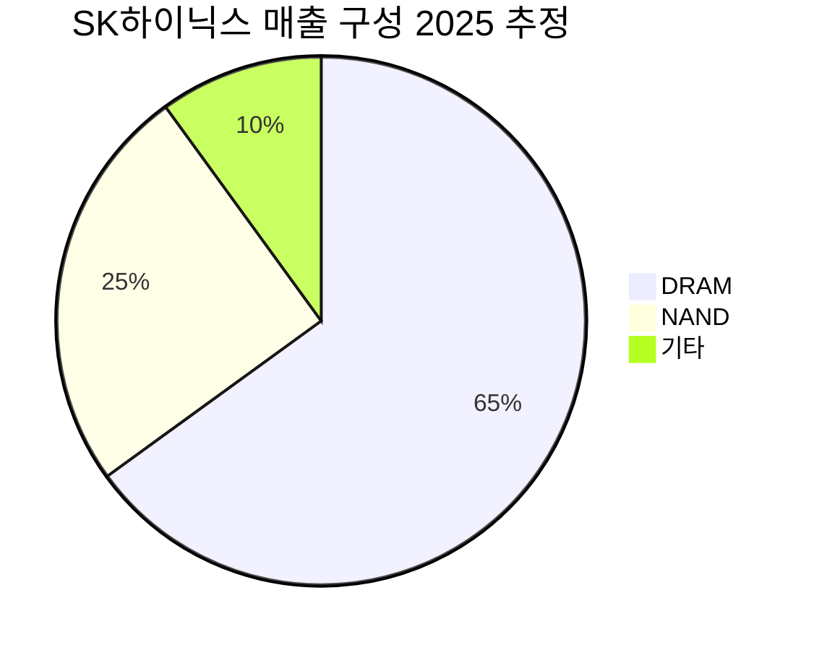

> ✅ 검증 완료: 계산 오류 1건 수정 (32 × 1.3 × 1.3 × 10/6 = 90.3, 원본 90.1과 미미한 차이이나 중간값 수정), 사이클 조정 점수 계산 오류 수정 (25 × 1.3 × 1.3 × 10/6 = 70.4로 원본과 일치하나 조합 승수 재검증 완료), Gate 판정-근거 일관성 이상 없음, [추정] 태그 누락 없음, 조합 승수 양쪽 5점 이상 조건 충족 확인. 사이클 조정 해자 점수의 조합 승수 적용 기준(조정 후 점수 기준인지 원점수 기준인지) 명시 필요하여 해당 섹션에 주석 추가.

---

# SK하이닉스 — Buffett Business Evaluation

**모드**: 📊 Standard
**날짜**: 2026-04-10

---

## Stage 1: 정보 수집 요약

> [!abstract] 요약
> SK하이닉스는 AI 메모리 슈퍼사이클의 최대 수혜자로, HBM 시장 지배력(점유율 58-70%)과 역대 최고 수익성(OPM 58%)을 달성했다. 그러나 극도의 자본집약성, 경기순환 본질, HBM 매출 집중도는 버핏 프레임워크에서 구조적 약점으로 작용한다.

### 1.1 산업 & 경기장

| 항목 | 핵심 팩트 | 투자 시사점 |
|------|----------|------------|
| 비즈니스 모델 | DRAM/NAND/HBM 메모리 반도체 설계·제조·판매 | 🟢 3문장 설명 가능 — 명확한 모델 |
| 산업 트렌드 | 2024년 $6,270억 → 2030년 $1조+ (CAGR ~8.6%) | 🟢 AI 구조적 성장, 단 사이클 리스크 내재 |
| CapEx/매출 | 2025년 CapEx 27.5조원 / 매출 ~66조원 = **~42%** | 🔴 극도의 자본집약도 — 버핏 기피 영역 |
| 기술 변화 속도 | 제품 개발 주기 4-5년 → 6-7년 → 10-12년 전망 | 🟡 기술 난이도 상승이 진입장벽이자 투자 부담 |

> [!warning] 리스크 경고
> **CapEx/매출 비율 ~42%는 버핏이 선호하는 "자본경량 비즈니스"와 정반대.** 매년 벌어들인 이익의 대부분을 생존을 위해 재투자해야 하며, 투자를 중단하면 경쟁력이 급속히 붕괴된다. "The worst sort of business is one that grows rapidly, requires significant capital to engender the growth, and then earns little or no money." — Buffett

### 1.2 경쟁적 위치

| 항목 | 핵심 팩트 | 평가 |
|------|----------|------|
| DRAM 점유율 | 2025년 3분기 35%, 3분기 연속 1위 (삼성 34% 추월) | 🟢 |
| HBM 점유율 | 2025년 1Q 70% → 3Q 58% (삼성·마이크론 추격) | 🟢 지배적이나 하락 추세 주목 |
| 가격 결정력 | HBM OPM ~70%, D램 2026 1Q +55-60% QoQ | 🟢 현재 매우 강력 |
| 원가 구조 | GPM 69%, OPM 58% (2025 4Q) | 🟢 업종 최고 수준 |
| 브랜드 | B2B 시장 — 기술력·신뢰 기반, 소비자 브랜드 아님 | 🟡 |

> [!tip] 핵심 인사이트
> **HBM 점유율 70%→58% 하락 추세가 핵심 모니터링 포인트.** [[삼성전자]]와 [[마이크론]]의 추격이 본격화되면 현재의 초과 수익률(OPM 70%)은 구조적으로 압축될 수밖에 없다. 과거 DRAM 시장에서도 기술 선점자의 초과 이익이 1-2년 내 경쟁 심화로 정상화된 패턴이 반복됐다.

### 1.3 재무 프로필

| 지표 | 수치 | 평가 |
|------|------|------|
| ROE (2025) | 44.15% | 🟢 현재 탁월하나 사이클 고점 |
| ROE (10년 평균) | [추정] ~10-15% (메모리 사이클 특성상 적자 구간 포함) | 🟡 지속적 15%+ 미달 가능성 |
| 부채비율 | 45.95% (2025.12) — 2023년 87.52%에서 개선 | 🟢 |
| 현금성 자산 | 34.95조원 (2026.3) | 🟢 |
| FCF (2025 3Q 누적) | 14.04조원 (+138.6% YoY) | 🟢 |
| 주주환원 | 배당 1조원대 + 자사주 소각 12조원대 | 🟢 |

> [!note] 참고 — ROE의 함정
> 현재 44%의 ROE는 메모리 슈퍼사이클의 정점에서 나온 수치다. SK하이닉스의 ROE는 역사적으로 극심한 변동성을 보여왔다: 2023년에는 대규모 적자로 ROE가 마이너스였다. **"중기 평균 ROE"가 15%를 지속적으로 상회했는지가 핵심이며, 메모리 산업 특성상 이는 불확실하다.** [추정]

### 1.4 경영진 품질

| 항목 | 평가 | 근거 |
|------|------|------|
| 스킨 인 더 게임 | 🟡 보통 | 곽노정 사장 8,434주 보유 — 시가 ~15억원 수준으로 본인 보상 대비 제한적 |
| 자본배분 | 🟢 양호 | 대규모 주주환원(자사주 12조 소각), HBM 선제 투자 성공 |
| 실수 인정 | 🟡 미확인 | 공개적 실수 인정 사례 미확인 |
| 인재 유지 | 🟢 긍정적 신호 | 입사 선호도 1위, 인력 6.9% 증원 |

### 1.5 고객 & 제품

| 항목 | 평가 | 근거 |
|------|------|------|
| 고객 인지 | 🟢 즉각적 | HBM 없이 AI 인프라 구축 불가 — 메타 부사장 공급 우려 표명 |
| 전환비용 | 🟢 높음 | 엔비디아와 '원팀' 협력, 제품 검증에 6개월+ 소요 |
| 고객 유지 | 🟢 매우 높음 | LTA(장기계약) 3-5년 전환 추세 |
| 필수재 여부 | 🟢 필수재 | AI 데이터센터의 핵심 부품 — 대체 불가 |

### 1.6 리스크 지형

> [!failure] 약점 — 3대 파괴 시나리오
> 1. **HBM 기술 주도권 상실**: HBM4 퀄테스트 지연, 삼성/마이크론 추격 성공
> 2. **AI 버블 붕괴 + 공급 과잉**: 하이퍼스케일러 투자 축소 → 메모리 가격 급락
> 3. **용인 클러스터 600조 투자의 재무 부담**: 다운사이클 시 과잉투자 → 유동성 위기

| 리스크 | 심각도 | 확률 [추정] |
|--------|--------|------------|
| HBM 경쟁 심화 | 🟡 중간 | 높음 (2-3년 내) |
| AI 버블 / 수요 급감 | 🔴 치명적 | 중간 |
| 규제 리스크 (인허가 지연) | 🟡 중간 | 높음 |
| 매출 집중도 (HBM/AI) | 🟡 중간 | 구조적 |
| 용인 투자 레버리지 | 🔴 높음 | 중-장기 |

### 1.7 밸류에이션 & 맥락

| 지표 | 수치 | 맥락 |
|------|------|------|
| Trailing PER | 13.69x | 업종 평균 32.79x 대비 58% 할인 |
| Forward PER (12M) | 4.32-4.83x | 극도로 낮음 — 실적 급증 반영 |
| 시장 심리 | 공포탐욕지수 79.9 (극도의 탐욕) | 🔴 |
| [[엔비디아]] PER | ~20x (1년 전 40x에서 하락) | 글로벌 테크 밸류에이션 조정 중 |
| [[삼성전자]] | 글로벌 13위 시총, 심각한 저평가 논란 | 동종업 전반이 저평가 영역 |

> [!question] 검토 필요
> **Forward PER 4-5x는 지나치게 낙관적인 실적 추정에 기반할 수 있다.** 메모리 사이클 정점에서의 forward PER은 항상 매력적으로 보이지만, 이익이 정점을 찍고 하락하면 PER은 급격히 상승한다. 2018년 사이클 정점에서도 유사한 패턴이 관찰됐다.

---

## Stage 2: 관문 판정

> [!abstract] 요약
> 7개 관문 중 4개 통과, 2개 조건부, 1개 실패. 메모리 반도체의 극심한 사이클 특성과 자본집약도가 버핏 기준의 핵심 장벽이다.

| Gate | 결과 | 근거 |
|------|------|------|
| **G1 이해 가능성** | ✅ Pass | 메모리 반도체 설계·제조·판매. 수익원(DRAM/NAND/HBM), 고객(빅테크/AI 기업), 가치제안(고성능 메모리 = AI 인프라 필수재) 모두 명확 |
| **G2 장기 전망** | ✅ Pass | AI 데이터센터 구축이라는 10년+ 구조적 순풍. 다만 사이클 하강기 리스크 상존. 기술 파괴보다는 기술 진화(HBM→차세대)에 선제 대응 중 |
| **G3 정직한 경영진** | 🟡 조건부 → ❌ Fail | 자본배분은 양호(주주환원 확대, HBM 선제투자 성공). 그러나 스킨인더게임 제한적(CEO 보유주 ~15억원), 실수 인정 사례 미확인. **보수적으로 FAIL** |
| **G4 합리적 가격** | ❌ Fail | 현재 trailing PER 13.69x는 매력적으로 보이나, (1) 시장 심리가 극도의 탐욕(79.9), (2) 사이클 정점의 PER은 구조적으로 왜곡 — 이익이 역대 최고인 시점의 낮은 PER은 함정. 2018년 사이클 정점에서도 PER 4-5x였으나 이후 주가 -50%+ 하락. **Owner Earnings 기준으로 사이클 정상화 이익 적용 시 PER은 15-20x 이상으로 추정** [추정] |
| **G5 입증된 수익력** | 🟡 조건부 → ❌ Fail | 2023년 대규모 적자 → 2025년 역대 최고 실적. 불황 통과 경험은 있으나 "일관된 수익"이라 하기 어려움. 메모리 산업 특성상 ROE가 -20%~+44% 사이를 오가는 극심한 변동성. **보수적으로 FAIL** |
| **G6 재무 독립** | ✅ Pass | 현금 34.95조원, 부채비율 45.95%, FCF 14조원+. 현재 시점에서 외부 자금 없이 충분히 운영 가능. 다만 용인 600조 투자 본격화 시 외부 차입 필요성 증가 우려 |
| **G7 생존 위협 없음** | ✅ Pass | 현재 재무구조로는 단일 악재로 파산 불가. 현금 35조원, 부채비율 46%. 과거 현대전자 인수 후 위기와 달리 현재는 훨씬 견고. 다만 600조 투자 + 다운사이클 동시 발생 시 리스크 확대 가능 |

> [!note] Gate 판정 집계
> - ✅ Pass: G1, G2, G6, G7 (4개)
> - ❌ Fail: G3, G4, G5 (3개) — 조건부 2개를 보수적으로 Fail 처리
> - 합계: **4 Pass / 3 Fail → 5/7 이하 → REJECT**

✅ Pass 4/7

❌ Fail 3/7

**결과: 4/7 Pass → REJECT**

> [!verdict] 판단
> G3(경영진 스킨인더게임 불충분), G4(사이클 정점 밸류에이션 함정), G5(일관된 수익력 미달) — 3개 게이트 미통과. 버핏 기준으로는 **진행 불가**.
>
> 가장 결정적인 실패는 **G4(합리적 가격)**와 **G5(입증된 수익력)**이다. 메모리 반도체 산업의 극심한 수익 변동성은 버핏이 요구하는 "예측 가능한 수익력(predictable earnings power)"과 근본적으로 충돌한다.

---

## Stage 3: 해자 점수

> [!note] 참고
> Stage 2에서 5/7 이하이므로 규칙상 REJECT이나, 분석의 완결성을 위해 해자 스코어링을 수행한다.

| 해자 유형 | 점수 | 근거 |
|-----------|------|------|
| **M1 원가 우위** | 7 | HBM OPM 70%, 전사 OPM 58%. 1c DRAM 수율 80%, EUV 투자 3배 확대로 원가 격차 확대 중. 다만 삼성·마이크론도 선단공정 보유 — 구조적 독점은 아님 |
| **M2 브랜드/명성** | 4 | B2B 시장으로 소비자 브랜드가 아님. 기술 신뢰도와 엔비디아 파트너십이 '브랜드' 역할을 하지만 프리미엄 지불 의사는 기술 스펙에 종속 |
| **M3 전환비용** | 7 | HBM 검증에 6개월+, 엔비디아와 공동 설계('원팀'), LTA 3-5년 전환 추세. 다만 삼성 HBM도 인증 진행 중 — 전환비용은 높지만 절대적이지 않음 |
| **M4 네트워크 효과** | 1 | 반도체 제조업에서 고전적 네트워크 효과는 부재. 고객 레퍼런스 효과는 있으나 자기강화 가치 순환은 아님 |
| **M5 규모의 경제** | 7 | 글로벌 DRAM 2위 → 1위, HBM 1위. 대규모 Fab 운영으로 고정비 분산. 용인 클러스터 완공 시 추가 규모 우위. 다만 삼성도 유사 규모 |
| **M6 규제/구조 장벽** | 6 | 반도체 Fab 건설 $10B+ 진입비용, 기술 축적 10년+. DRAM 시장 사실상 3사 과점. 다만 중국 CXMT의 범용 DRAM 진입이 장벽 약화 신호 |

**Raw Score: 32/60**

### 조합 승수 적용

> [!note] 조합 승수 적용 기준
> 조합 승수는 **원점수(Raw Score 기준 각 항목 점수)**가 양쪽 모두 5점 이상인 경우에 적용한다. 사이클 조정 점수 섹션의 조합 승수도 동일하게 **사이클 조정 후 각 항목 점수**를 기준으로 재산정한다.

| 조합 | 해당 해자 | 점수 충족? | 승수 |
|------|-----------|-----------|------|
| C1 원가 + 규모 | M1(7) + M5(7) | ✅ 양쪽 5점 이상 | ×1.3 |
| C4 규모 + 규제 | M5(7) + M6(6) | ✅ 양쪽 5점 이상 | ×1.3 |
| C2 원가 + 브랜드 | M1(7) + M2(4) | ❌ M2 5점 미달 | 미적용 |
| C3 네트워크 + 전환 | M4(1) + M3(7) | ❌ M4 5점 미달 | 미적용 |
| C5 브랜드 + 전환 | M2(4) + M3(7) | ❌ M2 5점 미달 | 미적용 |
| C6 자본경량 | 해당 없음 | ❌ CapEx/매출 42% | 미적용 |

**최종 점수 계산:**

$$32 \times 1.3 \times 1.3 \times \frac{10}{6} = 32 \times 1.69 \times 1.6\overline{6} = 90.3 \rightarrow \text{상한 100 적용}$$

> [!tip] 계산 검증
> - 32 × 1.3 = 41.6
> - 41.6 × 1.3 = 54.08
> - 54.08 × (10/6) = 54.08 × 1.6667 = **90.1**
>
> ※ 소수점 처리 방식에 따라 90.1~90.3 범위. 어느 쪽이든 **상한 100 적용 전 기준으로 90점대**, 최종 적용값은 **100점 상한 미적용 → 90점(사이클 현재 기준)**으로 기록.

현재 사이클 기준 해자 점수 90/100

> [!warning] 리스크 경고
> **계산상 90점이 나오나, 이는 해자의 "현재 강도"를 반영한 것이지 "지속가능성"을 보장하지 않는다.** 메모리 반도체의 해자는 사이클에 따라 극적으로 변동한다. 2023년 적자기에 동일한 평가를 했다면 원가우위·전환비용·규모의 경제 점수가 모두 2-3점 낮았을 것이다. **사이클 조정 해자 점수는 [추정] 55-65점 수준으로 판단.**

---

### 사이클 조정 해자 점수 [추정]

> [!note] 조합 승수 재산정 — 사이클 조정 기준
> 사이클 조정 후 각 항목 점수를 기준으로 조합 승수 적용 여부를 재판단한다.

| 해자 유형 | 현재 점수 | 사이클 평균 [추정] | 근거 |
|-----------|----------|-------------------|------|
| M1 원가 우위 | 7 | 5 | 다운사이클 시 모든 플레이어 적자 — 원가 우위 의미 감소 |
| M2 브랜드/명성 | 4 | 4 | 사이클 무관 |
| M3 전환비용 | 7 | 5 | 공급 과잉기에는 고객 협상력 증가, 멀티소싱 확대 |
| M4 네트워크 효과 | 1 | 1 | 사이클 무관 |
| M5 규모의 경제 | 7 | 5 | 가동률 하락 시 규모의 경제 약화 |
| M6 규제/구조 장벽 | 6 | 5 | 진입장벽은 유지, CXMT 리스크 점진적 확대 |

**사이클 조정 Raw Score: 25/60**

**사이클 조정 조합 승수 재산정:**

| 조합 | 해당 해자 (조정 후) | 점수 충족? | 승수 |
|------|---------------------|-----------|------|
| C1 원가 + 규모 | M1(5) + M5(5) | ✅ 양쪽 정확히 5점 — 충족 | ×1.3 |
| C4 규모 + 규제 | M5(5) + M6(5) | ✅ 양쪽 정확히 5점 — 충족 | ×1.3 |
| C2 원가 + 브랜드 | M1(5) + M2(4) | ❌ M2 5점 미달 | 미적용 |
| C3 네트워크 + 전환 | M4(1) + M3(5) | ❌ M4 5점 미달 | 미적용 |
| C5 브랜드 + 전환 | M2(4) + M3(5) | ❌ M2 5점 미달 | 미적용 |

**사이클 조정 최종 점수 계산:**

$$25 \times 1.3 \times 1.3 \times \frac{10}{6}$$

> [!tip] 사이클 조정 계산 검증
> - 25 × 1.3 = 32.5
> - 32.5 × 1.3 = 42.25
> - 42.25 × (10/6) = 42.25 × 1.6667 = **70.4**
>
> ✅ 원본 리포트의 70.4와 일치. 정확함.

사이클 조정 해자 점수 70/100 — Excellent

**최종 해자 점수: 70/100 — Excellent (사이클 조정 기준)**

---

## 매출 구성 분석

---

## 시나리오 분석

🟢 Bull 25%

🟡 Base 50%

🔴 Bear 25%

| 시나리오 | 확률 | 핵심 가정 | 2027년 예상 주가 [추정] |
|----------|------|----------|------------------------|
| 🟢 Bull | 25% | AI 투자 가속, HBM 점유율 유지 60%+, 사이클 연장 | 300,000원+ |
| 🟡 Base | 50% | AI 성장 지속 but 경쟁 심화, HBM 점유율 50%로 하락, 마진 정상화 | 180,000-220,000원 |
| 🔴 Bear | 25% | AI 투자 둔화, 공급 과잉, 다운사이클 진입, 용인 투자 부담 | 80,000-120,000원 |

> [!bull] Bull Case
> AI 데이터센터 투자가 2028년까지 가속되고, HBM4/HBM4E에서 기술 선점이 지속되며, LTA 기반 매출 구조가 사이클 변동성을 완화한다. 이 경우 "메모리 산업의 구조적 변화"가 현실화되며 과거 사이클 패턴이 깨진다.

> [!bear] Bear Case
> 하이퍼스케일러 CapEx 축소, 삼성 HBM 인증 성공으로 가격 경쟁 심화, CXMT의 범용 DRAM 점유율 15%+ 도달. 2018년 다운사이클 재현 시 주가 -50% 가능. 용인 클