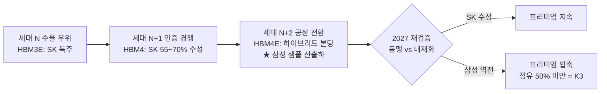
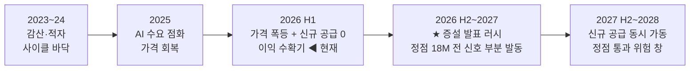
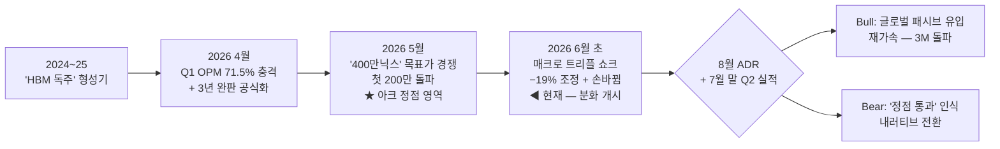
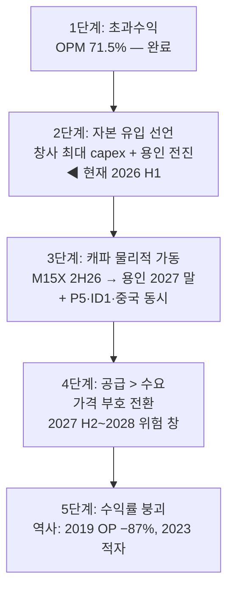
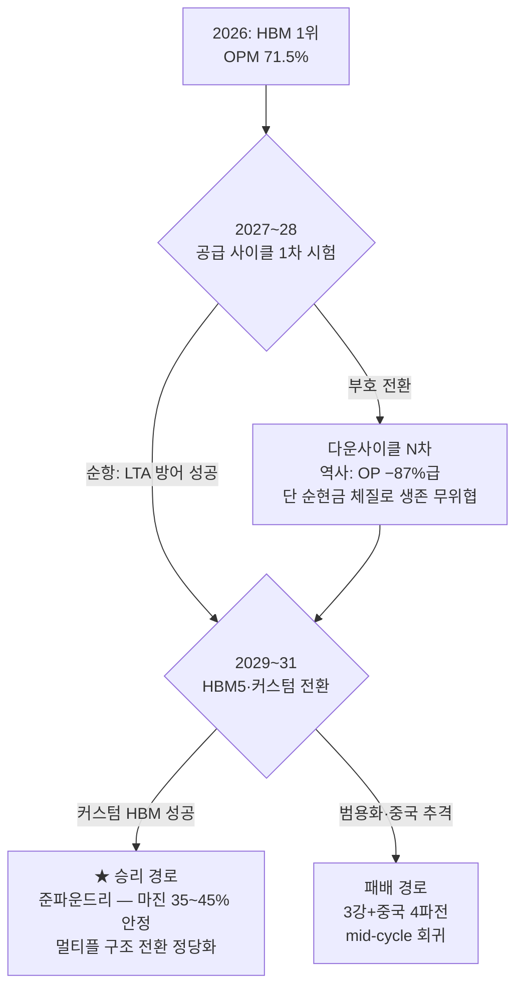

---

company: SK하이닉스
ticker: "000660"
exchange: KRX
date: 2026-06-11
created: 2026-06-11
type: final-company
archetype: A
model: claude-fable-5
title: "Final - SK하이닉스 (000660) 1143"
tags:
  - research
  - company-final
  - final-analysis
  - final-company
  - 반도체
  - 메모리
  - HBM
  - KOSPI
edition: definitive-v4
data_verified: 2026-06-11
version: 4.0
supersedes: "260611_Final - SK하이닉스 (000660)_0951"
publish: true
---

> [!important] 정합성 검증 — 신뢰도 A · v4 (완성판)
> **기업 유형: A (성숙·현금창출형, Capital Cycle ★)** — KR 대형주 가중 원칙 (Capital Cycle·Cross-Asset·Quality of Earnings·Korea Discount lens).
> **전판(0951, 2026-06-11 오전)은 §6에서 중단된 미완성본(291줄)** — 본판이 동일 날짜의 완성·확장판이다. 전판·삼성 1105판 부록 B의 정정사항 전건 계승 (부록 B).
> **정량 1차**: OpenDART 직접 조회 — Q1'26 분기보고서 (rcept 20260515002287) + FY2022~25 사업보고서 4개년 + 2026.4~6 공시 43건 전수. **정성 1차**: Q1 컨콜 원문(디일렉)·잡플래닛/블라인드·임원 지분 공시·셀사이드 12개 기관 교차.
> **리서치 아키텍처**: 서브에이전트 5개 fan-out (재무공시/산업경쟁/정성/수급밸류/최신뉴스) → 단일 작성 컨텍스트 → 독립 검증 에이전트 1개 통과 후 저장.
> **중심 질문**: *"사이클 기업이 구조적 성장주 멀티플(PBR 8.9x — 역사 피크 밴드의 3.5배)을 받기 시작했다. 정당한가?"* — 시그니처 분석 3개(§9·§10·§10A)가 전부 이 질문에 복무한다.

# §0. EXECUTIVE DECISION BRIEF

> [!verdict] 최종 투자의견 · **HOLD (기보유 유지 + 2,700K 상단 트림)** — 신규 자금은 삼성전자 우선 · 재검증 통과
> **사업은 완벽에 가깝다 — Q1 OPM 71.5%(창사 최고·DART 실측), 3년치 수요가 캐파를 상회(컨콜 CFO 공식 발언), HBM4 Nvidia향 55~70% 점유.** 그러나 주가가 그것을 이미 안다: 1년 +763%, PBR 8.6~8.9x(역사 피크 밴드의 3.5배), 외국인은 5주째 내다 팔고 개인이 받는 손바뀜 구조다. **확률가중 기대수익률 12M +13.5% — 같은 사이클을 사는 삼성전자(+21.5%)에 8%p 열위**이고, 24M로 가면 +9.9%로 *더 낮아진다* — SK 자신이 이번 사이클 최대 증설자(용인 2027.2 장비반입·2030 캐파 2배)이기 때문이다. 신규 재료인 **ADR 8월 상장 보도(10~15조 공모)**는 Bull 촉매로 신설하되, 판정을 바꿀 수준은 아니다 — 멀티플 이벤트이지 이익 이벤트가 아니다.
> 비즈니스 **High conviction** · 현재 가격의 신규 매력 **Low-Medium** · 기보유 유지 **High** (사이클 부호 전환 전까지).

## 🔁 [전판 대비 변화] — 0951판(2026-06-11 오전, 미완성) → 본판

| # | 무엇이 바뀌었나 | 판정 영향 |
|---|---|---|
| 1 | **전판은 §6에서 중단된 미완성본** — 본판은 §0~§22+부록 완성, 시나리오 SSOT·밸류에이션·실행 계획을 처음으로 명문화 | 전판의 HOLD 방향은 계승하되 산출 근거를 전면 실측으로 재구축 |
| 2 | **ADR 미국 상장 8월 보도 신규 반영** (10~15조 공모, 메리츠 "마이크론 보유 펀드의 즉각 편입") — 전판에 없던 재료 | Bull 시나리오 촉매 + §13 Optionality 1순위 신설. 단 공모=희석(~1%)·미확정이므로 Base에는 미반영 |
| 3 | **순현금 정정**: 전판 "35조(회사 기준)" → DART 실측 분해: 협의(현금성+단기금융상품−총차입금) **+20.1조** / 광의(투자자산 포함) **+55.7조** | §7·§13 — 회사 표현보다 보수적인 협의 기준을 본문 기본값으로 |
| 4 | **수익의 질 신규 발견**: Q1 순이익(40.3조) > 영업이익(37.6조)의 정체 = **순금융수익 +14.0조** (금융수익 17.1조). 매출채권 +86% QoQ·미지급 법인세 14.6조 | §8 해부 신설 — NI 기반 지표(EPS·PER)는 이 비반복 항목만큼 과대 표시 |
| 5 | **페어 산출 갱신**: 삼성 12M PW +23.2%(구판 인용) → **+21.5%** (삼성 1105판 확정). SK 12M PW **+13.5%** 재산출 — 격차 8.0%p로 "신규는 삼성" 유지 | §22.3 — 판정의 상대 비교 축 갱신 |
| 6 | **수급·시세 갱신**: 6/10 −7.54% (2,048,000원) 후 6/11 장중 +2~3% 디커플링 반등(KOSPI 약세 속). 외국인 53.22%(5/4)→51.05%(6/10) 5주 연속 하락 실측 | "외국인 유입 여력 제한" → "이탈 진행 중"으로 정정 — 내러티브 아크 한 칸 후퇴 |

## 📊 한눈에 보는 핵심

| 항목 | 값 |
|---|---|
| **종목** | SK하이닉스 (KRX: 000660) · KOSPI 시총 2위 · 시총 **~1,459.6조원** (글로벌 14위 — 마이크론·일라이릴리 추월, 5월 보도 [M]) |
| **기준가** | **2,048,000원** (2026-06-10 종가, 당일 −7.54%) · 6/11 장중 1,914,000~2,163,000 진폭 후 +2~3% 반등 |
| **52주** | 최고 2,470,000원(장중)/종가 최고 2,363,000원(6/1) · 최저 231,000원 — **1Y +763% 후 고점比 −13.3%** |
| **Q1'26 실적 (DART 실측)** | 매출 **52.576조** (+198% YoY) · 영업이익 **37.610조** · **OPM 71.5% (창사 최고)** · 순이익 40.346조 |
| **2026E 컨센 (FnGuide)** | 매출 338.9조 · **영업이익 258.6조** · 순이익 214.5조 — 2027E OP 364.3조 (컨센은 2027에도 +41% 성장 가정) |
| **Forward PER (투명 병기)** | 컨센 Fwd EPS 300,818원 기준 **6.8x** / 본 분석 보수 EPS 275,000원 기준 **7.4x** |
| **PBR (긴장 지점)** | **8.6~8.9x** (Q1'26 BPS 230,643원 본 분석/237,789원 네이버) — 역사 밴드 0.7~2.5x의 **3.5배** |
| **순현금 (DART 실측)** | 협의 **+20.1조** (현금성 21.2+단기금융 18.2−차입 19.3) / 광의 +55.7조 — 2년 새 −21.4조→+20.1조 스윙 |
| **적정가치 (§12)** | **2,200,000~2,600,000원** — 현재가 +7~27% [Confidence: M] |
| **12M 목표가 (Base)** | **2,450,000원 (+19.6%)** — §16 SSOT |
| **확률가중 기대수익률** | 12M **+13.5%** · 24M **+9.9%** — 시계가 길수록 낮아진다 (Capital Cycle §10A) · 삼성 +21.5%/+31.0% 대비 열위 |
| **투자의견** | HOLD — 기보유 유지 · 2,700K+ 트림 · 신규는 삼성 우선 |
| **권장 포지션** | 기보유 유지 (한국주 내 기존 비중) · **신규 추가 없음** · 메모리 합산(삼성+SK) ≤8% 상한 |

**▸ 밸류에이션 위치**

극저평가 <1.2M

저평가 1.2~1.9M

적정 2.2~2.6M ◀ 2.05M 하단

고평가 2.8~3.4M

거품 >3.4M

*현재가는 적정 범위 하단 바로 아래 — "비싸지 않다". 그러나 신규 매수의 잣대는 "비싸지 않다"가 아니라 "더 나은 대안 대비 싸다"이고, 그 비교에서 삼성에 밀린다 (§22.3). 그리고 "적정"의 전제 자체가 2026E 이익의 실현이다 (§10).*

## ⭐ 투자 매력도 스코어카드 (A형)

비즈니스 품질 (HBM 1위)

9.2 / 10

이익 모멘텀

9.5

재무 건전성 (순현금 전환)

8.5

경제적 해자 (HBM lock-in)

8.0

경영진·실행력

8.2

조직·인재 (잡플래닛 1위)

8.4

수익의 질 (사이클+금융수익)

4.8

밸류에이션 매력 (신규 기준)

4.8

Capital Cycle 시계 (§10A)

4.0

> [!note] 스코어카드 해석 — 삼성과의 대칭
> 사업 점수(9.2)는 삼성(8.0)보다 높고, 가격 점수(4.8)는 삼성(7.8)보다 낮다. 조직·인재(8.4)는 삼성(4.8)을 압도한다 — 이직률 1.3% vs 10.1% (보도 기준 [M]), 구직 선호 1위. **그러나 A형 판정에서 12~24M 수익률을 결정하는 것은 사업도 조직도 아니라 가격이다.** Capital Cycle 시계(4.0)가 본 보고서의 고유 경고 — 이번 사이클에서 가장 먼저, 가장 크게 증설하는 회사가 SK 자신이다 (§10A).

## 🎬 핵심 논지 — "완벽한 사업 × 선반영된 가격 × 돌기 시작한 시계"

| 🟢 무엇이 완벽한가 | 🔴 무엇이 불편한가 |
|---|---|
| Q1 OP **37.61조 · OPM 71.5%** (DART 실측) — 창사 최고, 글로벌 제조업 최상위 마진 | **PBR 8.6~8.9x** — 역사 피크 밴드(~2.5x)의 3.5배. '이번엔 다르다'가 이미 가격에 (§10) |
| **3년치 고객 요청 수요 > 공급능력** (Q1 컨콜 CFO 공식 발언) — DRAM·NAND·HBM 완판 | 이익의 원천 절반은 *범용 가격 사이클* — 1Q26 DRAM 계약가 +93~98%는 정의상 mean-reversion 대상 (§9) |
| HBM4 Nvidia Vera Rubin **55~70% 점유** + TSMC 베이스 다이 동맹 + 16-Hi 양산 3Q26 | HBM 점유율 하락 전망 — 71%(2025)→63%(2026E), 삼성 HBM4E 12단 샘플 *최초* 출하(5/29) |
| 순현금 협의 +20.1조 (2년 새 +41.5조 스윙) + **ADR 8월 상장·FCF 50% 환원 보도** | **2026 capex 창사 최대 ~30조 + 청주 패키징 19조 + 용인 누계 600조 보도** — 시계 가동 (§10A) |
| 순이익률 76.7% — Q1 현금전환 강력 (OCF 26.3조) | Q1 NI의 14.0조는 순금융수익 — 영업 외 비반복 항목 (§8) |
| 6/11 장중 디커플링 반등 (+2~3% vs KOSPI 약세) — 수급 복원력 | 외국인 53.2→51.05% 5주 연속 이탈 + 김주선 사장(HBM 총괄) 사상 최고가 당일 23.3억 매도 (§2) |

> [!verdict] 그래서 — "팔라"가 아니라 "새 돈은 다른 곳에"
> SK하이닉스를 지금 파는 것은 틀렸다 — 사이클 부호는 멀쩡하고(2Q26 DRAM +58~63%·NAND +70~75%), 캐파는 완판이며, HBM 1위는 12~24M 시계에서 견고하고, ADR·주주환원이라는 멀티플 이벤트가 하반기에 대기한다. 그러나 지금 *사는* 것도 최선이 아니다 — 같은 사이클을 사는 데 삼성은 PBR 4.1x·PW +21.5%이고, SK는 PBR 8.6x·PW +13.5%다. **행동: ① 기보유 유지 ② 신규 자금은 삼성전자 (§22.3) ③ 2,700,000원 도달 시 1/4 트림 ④ Capital Cycle 신호(K2)와 8월 ADR을 최우선 모니터링.**

## 🔑 핵심 발견 (8)

| # | 발견 | 근거 | 함의 | Conf. |
|---|---|---|---|---|
| 1 | **OPM 71.5% — 메모리 산업 역사상 최고 마진** | DART 실측 (OP 37.610조/매출 52.576조). 2018 피크 연간 OPM ~52% | 마진의 절반은 구조(HBM·완판), 절반은 사이클(범용 가격) — §9 해부 | H |
| 2 | **범용 가격 폭등의 수혜는 오히려 삼성이 더 크다** | 1Q26 DRAM 매출 QoQ: 삼성 +93.4% vs **SK +62.5%** (TrendForce) — HBM 비중이 높아 범용 폭등 수혜 희석 | "SK=HBM 순수주" 프레임의 역설 — 이번 사이클의 주인공은 범용 DRAM이고, 그 주인공은 삼성 | H |
| 3 | **PBR 8.9x의 자기 해소 메커니즘과 그 순환 논증** | 컨센 실현 시 BPS 230,643원(현재)→~470,000(2026E)→~840,000(2027E) — 가격 불변이어도 PBR 8.9→4.4→2.4x | "비싸지 않다"의 전제가 2027E 이익(+41% 성장) — 사이클 부정의 순환 논증 (§10) | M-H |
| 4 | **Capital Cycle 시계 가동 — 최대 증설자는 SK 자신** | 2026 capex 창사 최대 ~30조+패키징 19조·M15X 2H26·용인 장비반입 2027.2·2030 월 100만장(현재의 2배) 보도 | Marathon AM 시계로 정점 18~24M 전 신호 — 2027 H2~2028이 위험 창 (§10A) | M-H |
| 5 | **ADR 8월 상장 — 새 Bull 촉매 (전판 미반영)** | 연내 미국 상장 목표·10~15조 공모 보도, 메리츠 6/10 "마이크론 보유 펀드 즉각 편입" 295만 상향 | 수급·멀티플 이벤트 — 단 이익 이벤트 아님. Bull 25%의 핵심 트리거 (§13) | M |
| 6 | **신규 매수의 상대 열위 — 격차 8.0%p** | 12M PW: SK +13.5% vs 삼성 +21.5% (보수 민감도에서도 삼성 +13.9% ≈ SK 베이스) | 동일 사이클 노출에서 새 돈은 삼성 — 페어 관점 (§22.3) | M |
| 7 | **수요 파괴 + 하이퍼스케일러 FCF 악화 — Bear의 정량 앵커** | Gartner: 2026 PC −10.4%·폰 −8.4% (10년래 최대). 하이퍼스케일러 분기 FCF 600억$→200억$ (1/3토막) | 사이클 36개월째(역대 최장 30개월 초과) — 수요 측 균열의 1차 증거들 (§5.4) | M-H |
| 8 | **컨센 분산 2배+ — 내러티브 성숙기 신호** | 목표가 최고 400만(노무라)/국내 최저 185만(BNK — 글로벌 집계 최저는 1.03M, 갱신 지연 의심) · MU는 목표가 컨센이 현재가 −9% 하회 | 일치된 낙관(3월)→분화(6월) — 셀사이드 추격 상향의 한계 신호 (§6) | M-H |

## 🎯 행동 트리거

> [!success] 보유·트림·재진입 트리거
> **보유 유지** — 현 수준(1.9~2.4M)에서는 행동 없음. 사이클 순항 수혜 지속.
> **트림 1/4** — 2,700,000원 도달 (적정 상단 초과 + 본 분석 Fwd PER 9.8x 진입).
> **트림 추가 1/4** — 3,200,000원 (Bull 목표가 — 광기 구간).
> **재추가 검토** — 1,700,000원 이하 (본 분석 Fwd PER ~6.2x) *그리고* 가격 부호 유지 확인.
> **신규 자금** — 삼성전자 우선 (§22.3 페어 비교).
> **ADR 확정 공시 시** — 트림 기준 일시 상향 (2,700K→2,900K) 검토 — 인덱스 편입 수급은 가격 비탄력적.

## ⚠️ Kill/Trim 트리거 — 3대 (전체 6개 → §18)

| 트리거 | 임계값 | 발동 |
|---|---|---|
| 🔴 **K1 메모리 가격 부호 전환** | DRAM 고정가 2분기 연속 −10%+ | 보유분 50% 축소 — 사이클 종료 |
| 🔴 **K2 증설 러시 확정** | 빅3 중 2사 추가 대규모 신규 fab 발표 (기존 계획 외) | 30% 축소 — 정점 카운트다운 단축 |
| 🟠 **K3 HBM 점유 침식** | Nvidia향 점유 50% 미만 확인 | 재평가 — 구조 프리미엄 일부 소멸 |

---

# §0.5 논증 지도 (Argument Map)

> **▶ 헤드 메시지**: 네 질문 중 둘이 ⚪, 하나가 🔴로 갈린다 — 그래서 매수가 아니라 보유다.
> **판정 기여**: ⚪ 내비게이션 — 판정의 압축 지도.

> 이 보고서가 결국 말하는 것 — 핵심 질문 4개, 한 줄 답, 근거 섹션. 헤드 메시지만 따라 읽어도 논증이 복원된다.

| # | 핵심 질문 | 한 줄 답 | 판정 | 근거 섹션 |
|---|---|---|---|---|
| Q1 | **이 이익은 진짜이고, 지속되는가?** | 진짜다(DART 실측·수출 통계 교차). 단 절반은 범용 가격 사이클이고, NI의 14조는 금융수익이다. 2027 컨센(+41%)은 검증 안 된 약속 | ⚪ 조건부 | §5 · §7 · §8 · **§9★** |
| Q2 | **PBR 8.9x 재평가는 정당한가?** | 절반만 — 이익 유보가 PBR을 스스로 낮추지만(2027E 2.4x), 그 계산의 전제가 2027 이익이다. "비싸지 않다"는 사이클 부정의 순환 논증 위에 서 있다 | ⚪ 조건부 | **§10★** · §12 · §16 |
| Q3 | **HBM 1위와 TSMC 동맹은 내구적인가?** | 12~24M은 내구적 (HBM4 55~70%·수율 우위·완판). 2027+는 침식 기정사실 (점유 71→63%E·삼성 HBM4E 선출하·Nvidia의 구조적 멀티소싱 의지) | 🟢 (12~24M) | §2 · §3 · §4 |
| Q4 | **지금 새 돈을 넣을 곳인가?** | 아니다 — PW 12M +13.5% vs 삼성 +21.5%, 24M는 +9.9%로 더 낮아진다. 시계가 길수록 불리해지는 자산에 신규 진입은 부적합. 기보유는 유지 | 🔴 (신규 기준) | **§10A★** · §16 · §22 |

**판정 종합**: Q1 ⚪ + Q2 ⚪ + Q3 🟢 + Q4 🔴 → **HOLD — 기보유 유지 + 상단 트림 + 신규는 삼성**. (참고: 삼성 1105판은 3🟢 1⚪ → BUY — 같은 사이클에 대한 두 보고서의 비대칭이 곧 페어 판정이다.)

---

# PART II — 기업의 본질 (The Business)

> [!quote] 이 파트의 결론
> SK하이닉스는 메모리 업계에서 가장 정확한 전략 베팅(HBM 선행 투자)을 한, 가장 응집력 있는 조직(이직률 1.3%·구직 선호 1위)이다. 고객 진실(Nvidia 물량 배분 55~70%)과 해자(프로세스 파워 9.0)는 1급이다. **정성 레이어는 "기보유 유지"를 강하게 지지한다.** 그러나 내러티브는 성숙기 후반(컨센 분산 2배+·인사이더 고점 매도·외국인 이탈)에 진입했고, 이것이 "신규 매수"와 "영구 보유"를 기각한다.

# §1. 회사 개요 & 비즈니스 모델

> **▶ 헤드 메시지**: SK하이닉스는 "사이클 기업"과 "AI 인프라 기업"의 정체성 경합 중이며, 그 경합의 결과(멀티플)가 본 보고서의 중심 질문이다 — 사업의 실체는 둘 다이기 때문이다.
> **판정 기여**: ⚪ 중립 — 프레임 설정.

## 1.1 사업 구조 (Q1'26 기준)

| 부문 | 비중 [추정] | 지위 | 비고 |
|---|---|---|---|
| DRAM (HBM 포함) | ~75% | **HBM 1위** (2025 물량 점유 71%, Counterpoint 기준 62%) · 범용 DRAM 2위 (1Q26 매출 점유 28.8%, TrendForce) | HBM이 DRAM 매출의 핵심 — 단 1Q26 범용 가격 폭등으로 믹스 내 범용 기여 급증 |
| NAND (솔리다임 포함) | ~25% | eSSD 강세 — 세계 최초 321단 QLC (4월 고객 인증·Dell 공급 개시) | 솔리다임 IPO 중단 — 내재화 선회 보도 |

- Q1'26 매출 52.576조 (+198% YoY, +60% QoQ) — 분기 첫 50조 돌파 (DART 실측).
- HBM 매출 비중 [미공시 — 미확보]. 회사 표현: "HBM·고용량 서버 DRAM·eSSD 등 고부가 중심".
- 2026년 HBM 믹스: HBM3E 약 2/3 + HBM4 점진 확대 (컨콜). HBM4 16-Hi 양산 3Q26 계획.

## 1.2 비즈니스 모델 전환 — 사이클에서 계약으로 (절반만)

| 측면 | 과거 (범용 메모리) | 현재 (HBM 중심) |
|---|---|---|
| 가격 결정 | 현물·분기 협상 — 순수 사이클 | **장기 공급 계약 + 고객별 설계** — Nvidia 다개년 HBM4 계약 보도. 단 범용은 2025.11부터 월별 견적 전환 — *더* 사이클화 |
| 수요 가시성 | 1~2분기 | **~3년** ("고객 요청 수요가 캐파를 훨씬 상회" — Q1 컨콜 김우현 CFO) |
| 고객 | 분산 | **Nvidia 집중** (집중도 [미공시 — 추정 매출 30%+]) — Nvidia 구매약정 $50.3B→$95.2B (5/20 실적) |
| 마진 | 사이클 진폭 −24%~+52% (FY23 OPM −23.6%, 2018 피크 ~52%) | OPM 71.5% (Q1'26) — 단 *범용 가격 폭등이 증분의 절반 이상* (§9) |

> [!warning] 핵심 긴장
> HBM은 진짜로 "계약형 사업"이 됐다. 그러나 Q1 OPM 71.5%로의 도약분 상당액은 *범용 DRAM/NAND의 가격 사이클*에서 왔다 (§9 해부 — 1Q26 DRAM 계약가 +93~98%). **시장이 PBR 8.9x로 가격 매기는 것은 전자(구조)인데, 이익의 증분은 후자(사이클)가 주도한다** — 이 비대칭이 본 보고서의 중심 리스크.

## 1.3 연혁 타임라인 — 위기에서 표준으로

| 시기 | 사건 | 의미 |
|---|---|---|
| 1983~2001 | 현대전자 → 하이닉스 — 2001 채권단 관리 | 출생부터 사이클의 인질 |
| 2012 | SK그룹 편입 | 자본 안정 — 장기 R&D 가능해짐 |
| 2013~2019 | HBM 개발 선행 (AMD 협력 HBM1, 2013) — TSV·MR-MUF 축적 | 당시 "낭비"라 불린 베팅 |
| 2021 | 솔리다임(인텔 NAND) $9B 인수 | 시점은 나빴으나 eSSD 자산 확보 |
| 2023 | FY 적자 −7.73조 (DART) — 사이클 바닥 | 마지막 다운사이클의 상처 |
| 2024~25 | HBM3/3E Nvidia 사실상 독점 → FY2025 OP 47.2조 (창사 최대) | "삼성 추락의 거울상" |
| 2026.2 | HBM4 양산 (TSMC 베이스 다이) — Vera Rubin 55~70% | AI 메모리 표준 공급자 지위 확립 |
| 2026.4~6 | Q1 OP 37.6조 (OPM 71.5%) · 주가 1Y +763% · ADR 8월 상장 보도 | 정체성 재평가의 정점 — 본 보고서의 시점 |

## 1.4 3/27 구판 이후 트랙 — +120%의 내용

| 시점 | 사건 | 주가 |
|---|---|---|
| 2026-03-27 | 구판 /final (BUY) | 933,000 |
| 2026-04-23 | **Q1 실적: OP 37.6조·OPM 71.5%** — 컨센 폭파 + "3년 완판" 컨콜 | 급등 개시 |
| 2026-05-17 | 노무라 400만 ("400만닉스") — 외사 주도 재평가 | 5/26 첫 200만 돌파 |
| 2026-05-28~29 | 신한 380만 · 김주선 사장 1,000주 매도 (232.85만원) | 2,333,000 |
| 2026-06-01 | **종가 사상 최고 2,363,000** | 정점 |
| 2026-06-04~10 | 브로드컴 쇼크→고용 서프라이즈→CPI 쇼크 — 사이드카 3회·서킷브레이커 1회 | 6/8 저점 1,911,000 (−19.1%) |
| 2026-06-10~11 | 6/10 −7.54% (2,048,000) → 6/11 장중 디커플링 반등 | **2,048,000 (기준가)** |

---

# §2. 창업자·경영진 — 인물·역량·자본배분 [Q1] ★

> **▶ 헤드 메시지**: 곽노정 체제는 메모리 업계에서 가장 정확한 베팅(HBM 선행)과 가장 강한 가이던스 트랙(완판 선언 연속 실현)을 보유했다 — 남은 검증 셋: 사이클 정점에서의 capex 절제, 연내 주주환원 실행, 그리고 HBM 총괄 사장의 고점 매도가 던진 질문.
> **판정 기여**: 🟢 강화 (기보유 신뢰) / 🟠 단서 (인사이더 신호).

## 2.1 가이던스 vs 실현 트랙레코드 — 메모리 업계 최상급

| 약속 (시점) | 실현 여부 | 판정 |
|---|---|---|
| "2025년 HBM 물량 완판" (2024) | FY2025 매출 97.1조·OP 47.2조 창사 최대 (DART) | 🟢 실현 |
| "2026년 물량 상반기 중 협의 마무리" (2025.3 주총) | Q1'26 컨콜: "3년치 수요가 캐파 상회" — 초과 달성 | 🟢 초과 실현 |
| HBM4 2026 양산 (2025 로드맵) | 2026.2 양산 — TSMC 베이스 다이·Vera Rubin 인증 | 🟢 실현 |
| 16-Hi HBM4 (CES 2026 공개) | 3Q26 양산 계획 — 진행 중 | ⏳ |
| "자사주 매입·소각 등 연내 실행 방안" (Q1 컨콜) | 미발표 — FCF 50% 환원 방침 보도(서울경제)만 존재 | ⏳ 연내 검증 |

**패턴**: 보수적 발언 후 초과 달성 — "조용한 승부사", "속도전보다 검증된 기술 고수" (미디어 평가). HBM3E 수율·품질 우선 전략으로 Nvidia와 신뢰 구축. [Confidence: H | 근거: 1차 컨콜·뉴스룸 + 2차 보도 교차]

## 2.2 실행 트랙레코드 — 전략 베팅의 질

| 결정 | 시점 | 결과 | 판정 |
|---|---|---|---|
| HBM 선행 투자 (TSV·MR-MUF) | 2013~2023 | Nvidia HBM3/3E/4 우위 — 삼성 실기의 거울상 | 🟢 업계 최고의 전략 베팅 |
| 솔리다임 인수 ($9B) | 2021 | 초기 부진 → 321단 QLC·eSSD 사이클에서 회수 중. IPO 중단 — 내재화 선회 + 14.4조 출자로 NAND 자회사 지분 100% | 🟡 시점은 나빴으나 자산은 유효 |
| HBM4 양산 (2026.2) | 약속 이행 | TSMC 동맹 — Vera Rubin 55~70% | 🟢 |
| 2026 조직개편 (2025.12) | 선제 | 미주 HBM 전담 기술조직 + 패키징 수율·품질 전담 신설, 신규 임원 70% 기술·사업 발탁 | 🟢 HBM 특화 체계 완성 |
| 용인 1기 조기화 (장비반입 2027.2) | 2026 | 수요 대응 가속 — *동시에 사이클 시계 가동* | 🟡 양날 (§10A) |
| 주주환원 | "연내 실행 방안" | 미발표 | ⏳ 검증 대기 |

## 2.3 경영진 스코어카드

기술 로드맵 실행

9.2

전략 베팅 (HBM 선행)

9.0

가이던스 신뢰도

8.8

인재 흡인력 (선호 1위)

8.5

공급 규율 (demand-pull)

7.0

주주환원 실적

5.5

그룹 독립성

5.8

## 2.4 핵심 인물

| 인물 | 역할 | 프로필·신호 |
|---|---|---|
| **곽노정** 대표이사 사장 | CEO (2022.3~) | 내부 기술 출신. FY2025 보수 42.39억 + 스톡옵션 (행사가 84,730~136,060원 — 현 주가의 1/15~1/24, 깊은 in-the-money). "Full Stack AI Memory Creator" 비전. 빌 게이츠·나델라 면담 등 글로벌 행보 확대. 보유 5,770주 — 매도 없음 |
| **김주선** AI인프라 사장 | HBM 포함 AI 메모리 총괄 | 33년 경력, MMI 수요예측 툴 개발, 최태원-젠슨 황 회동 배석. **5/29 (사상 최고가 당일) 1,000주·23.3억 매도 — 잔여 2,881주 (보유의 74% 잔존)**. 회사: "통상적 개인 거래" |
| **김우현** CFO | 재무부문장 | Q1 컨콜 주 발언자 — "3년치 수요 > 캐파", capex "전년 대비 많이 증가" |
| 최태원 회장 | 그룹 | FY2025 하이닉스 보수 47.5억. 대외 AI 동맹(젠슨 황·TSMC) 전면 — 곽은 실행 담당 구도 |

> [!warning] 인사이더 신호의 독해
> 김주선 사장의 5/29 매도는 금액(23.3억)보다 *타이밍*(사상 최고가 당일)과 *지위*(HBM 사업 총괄)가 정보가치다. 단독으로는 약한 신호(잔여 74% 보유, cluster 매도 아님 — 4~6월 타 임원은 주식보수 수령 위주)이나, 외국인 5주 이탈·컨센 분산 확대와 *동시에* 발생했다는 점에서 §6 내러티브 아크의 보조 증거로 채택. [Confidence: M | 근거: 1차 공시(6/9) + 서울경제]

## 2.5 재벌 리스크 (KR lens ★)

- **그룹의 하이닉스 편중**: SK그룹 자산의 49%·매출 44%가 반도체 — 그룹이 하이닉스에 의존하는 구조 (역의존).
- **SK온/SK이노베이션**: SK이노 2025 순손실 5.4조·결산배당 미실시, SK온 6년 연속 적자 (2025 영업손실 9,319억) — **그룹 차원 자금 수요는 실재**.
- **SK스퀘어 중간지주 구조**: 하이닉스 지분 146.1M주 (DART hyslrSttus 실측 — 보고 기준 20.07%는 소각 전 728M주 분모, 소각 반영 시 **20.50%** [계산]) — 증권가 표현 "낙숫물을 중간에서 수취하는 기형적 구조". 배당·지분가치가 SK㈜로 직행하지 못함.
- **방어 증거**: 2025~27 환원정책에서 FCF 5% 추가배당 재원을 *재무건전성 강화로 전환* — 그룹 유출보다 자체 투자(용인) 우선 신호. "하이닉스 배당이 그룹 자금줄" 직접 증거 [미확보] — 현재는 전이 리스크라기보다 지배구조 디스카운트 형태. [Confidence: M]
- 모니터링: 특수관계자 거래 공시 (4/23 내부거래 공시 + 5/29 재정정 — rcept 20260423000405·20260529000534), 배당 성향의 비정상 점프, SK스퀘어 지분 활용.

## 2.6 M3 — steel-man 반대 시각

> [!danger] 회의론자: "곽노정의 베팅은 끝났다"
> "HBM 선행 투자의 보상은 이미 주가에 다 들어왔다. 지금부터의 질문은 'HBM을 잘하느냐'가 아니라 '용인에 600조를 붓는 타이밍이 2018년 증설과 무엇이 다르냐'다. 모든 메모리 경영진은 사이클 정점에서 '이번엔 수요가 구조적'이라 말했다 — 단 한 번도 예외가 없었다. 그리고 HBM 사업을 가장 잘 아는 임원이 사상 최고가에 주식을 팔았다."
> **수용**: Capital Cycle 시계(§10A)를 시그니처로 격상, K2 트리거 명문화, 인사이더 신호를 §6 보조 증거로 채택. **반박**: 용인은 "3년치 주문 기반" 증설 — 2018년의 추측 기반 증설과 질이 다르고, 곽 체제의 가이던스 트랙(2.1)은 업계 최상급이다. 다만 *주문도 취소된다*는 것이 2001·2008·2022의 교훈 — 수용과 반박의 균형이 HOLD 판정의 토대다.

---

# §3. 핵심 제품 & 고객 진실 [Q3] ★

> **▶ 헤드 메시지**: B2B 메모리의 고객 진실은 NPS가 아니라 **물량 배분**이다 — Nvidia가 Vera Rubin HBM4의 55~70%를 SK에 배분했다는 사실이 모든 리뷰를 대체한다. 불편한 진실: 같은 고객이 멀티소싱을 구조적으로 강제하며, 6/5 젠슨 황의 "3사 모두 인증" 공인이 그 증거다.
> **판정 기여**: 🟢 강화 (12~24M) — 단 점유율의 *방향*은 하락.

## 3.1 제품별 고객 진실

| 제품 | 고객 신호 | 판정 |
|---|---|---|
| **HBM4** | Vera Rubin 점유 55~70% (TrendForce "2/3"·UBS "~70%"·보수단 55%) + 다개년 공급계약 보도 + 16-Hi 3Q26 양산 | 🟢 1위 — 단 멀티소싱 상한 존재 |
| HBM3E | 2026 믹스의 ~2/3 — 기존 세대 수요 잔존, 2026 인도분 ~20% 인상 보도 | 🟢 |
| 범용 DRAM | 3년치 완판 — CSP 장기계약(LTA) 선점. 1Q26 매출 점유 28.8% (2위) | 🟢 (가격은 별개) |
| eSSD (솔리다임) | 세계 최초 321단 QLC 인증 (4월) — Dell cSSD 공급 개시. 연말 국내 NAND 50%+ 321단 전환 목표 | 🟢 |
| HBM4E | 2026 하반기 샘플 → 2027 양산 (1c 코어 다이) — **삼성이 12단 샘플 선출하 (5/29)** | 🟠 차세대 수성 시험 — 첫 역전 보도 |
| 커스텀 HBM ("HBM BTS") | Bandwidth/Thermal/Space 3계열 공식화 — 컨트롤러의 베이스 다이 이동 | ⏳ 2027+ 옵션 (§13) |

## 3.2 "사라지면 화날까" — 시스템 수준의 답

- Nvidia의 AI 로드맵(연 1세대)은 **검증된 HBM 공급 없이는 물리적으로 불가능** — SK가 사라지면 글로벌 AI capex 전체가 지연된다. Nvidia 구매약정이 한 분기 만에 $50.3B→$95.2B로 급증(5/20 실적)한 것이 그 정량 증거다. 이것이 현재 세계에서 가장 강한 형태의 "고객 사랑"이다.
- 동시에: 젠슨 황은 6/5 *3사 모두를* 공인했다 ("3사 모두 Vera Rubin HBM4 인증 통과·생산 중") — 사랑은 진짜이되 *독점적이지 않다*. 고객의 인센티브는 SK 의존도를 낮추는 방향으로 영구히 작동하고, 삼성 HBM4 (13Gbps — Nvidia 요구 10~11 상회, 업계 유일 스펙)가 그 수단이다.

## 3.3 고객 구조의 리스크 좌표

| 축 | 상태 | 평가 |
|---|---|---|
| 고객 집중 | Nvidia 추정 매출 30%+ [미공시] + CSP LTA | 🟠 단일 고객 의존 — 단 그 고객이 세계에서 가장 깊은 주머니 |
| 가격 협상력 | HBM4 프리미엄 30~50% (기관별 편차) vs Goldman "HBM3E −28% YoY" 전망 병존 | 🟡 기관 편차 큼 — 노무라 "2027 HBM 가격 +50%" vs Goldman 하락 — §11에서 보수 채택 |
| 수요 가시성 | 3년 완판 — 단 "주문"이지 "테이크오어페이 전액"인지 [미확보] | 🟡 LTA의 위약 조항 강도 미공개 |

---

# §4. 경제적 해자 & 기술 — 7 Powers [Q2] ★

> **▶ 헤드 메시지**: SK의 해자는 **프로세스 파워(MR-MUF·적층 수율의 암묵지) + 전환비용(Nvidia 인증 lock-in)**으로 가중 8.0/10 — 삼성(7.2)보다 높다. 단 이 해자는 메모리 세대 주기(18~24개월)마다 재검증되는 *갱신형 해자*이며, HBM4E부터 하이브리드 본딩으로 공정 패러다임이 바뀌는 순간이 다음 시험대다.
> **판정 기여**: 🟢 강화 (12~24M 보유 신뢰) / ⚪ 2027+ 불확실.

## 4.1 7 Powers 채점

| Power | 점수 | 증거 |
|---|---|---|
| **프로세스 파워** | 🟢 9.0 | HBM 적층 수율 — 삼성이 2년+ 못 따라온 암묵지 (MR-MUF·TSV). HBM4도 수율 우위 지속 [삼성 수율 수치 미공개 — 추정]. HBM4E부터 하이브리드 본딩 도입 — 1년 앞당겨 적용 |
| **전환비용** | 🟢 8.0 | Nvidia 인증 사이클 — 검증된 공급사 교체는 GPU 출시 지연 리스크. 다개년 계약 보도 |
| **규모의 경제** | 🟢 8.0 | 3사 과점 — capex 장벽 (2026 산업 capex $61.3B). 단 규모 1위는 삼성 |
| **독점자원** | 🟡 6.5 | TSMC 베이스 다이 동맹 (12nm, HBM4E는 3nm 검토) — 자산이자 의존. 인재 밀도 (이직률 1.3%) |
| **카운터포지셔닝** | 🟠 4.0 | 없음 — 오히려 삼성 turnkey(메모리+로직 내재화)가 차세대에 카운터포지셔닝 시도 |
| **브랜드** | 🟡 6.0 | "AI 메모리 = SK" 인식 — 구직 선호 1위로 인재 시장에서도 확인 |
| **네트워크 효과** | 🟠 3.0 | 없음 |

**가중 종합 8.0/10** — 프로세스 파워와 전환비용에 가중. [Confidence: M-H | 근거: 1차 공시·컨콜 + TrendForce·전문가 코멘트 교차]

## 4.2 기술 1차원리 — 베이스 다이 전쟁

- HBM4 = 1b DRAM 코어 다이 + TSMC 12nm 베이스 다이. HBM4E = 1c 코어 + TSMC 3nm 검토.
- 차세대(HBM4E·HBM5)로 갈수록 베이스 다이의 *로직화*(컨트롤러 통합 — "메모리의 역할을 컴퓨팅 효율 최적화까지 확장", 곽노정)가 심화 — **자체 파운드리 없는 SK의 TSMC 동맹**과 **삼성의 수직 내재화** 중 어느 모델이 이기는지가 2027년의 결정적 질문.
- SK의 베팅: 동맹이 내재화보다 빠르다 (TSMC 선단 공정 + 자사 메모리 = 각자 최강 조합). 삼성의 베팅: 한 지붕이 협상비용을 이긴다. **현재까지 증거는 SK 우세** (HBM4 점유 55~70% vs 25~30%) — 단 하이브리드 본딩 전환과 HBM4E 샘플 선후가 흔들리기 시작 [Confidence: M].
- 장기 로드맵: HBM5/5E (20단+, 완전 하이브리드 본딩, 2029~30) · DDR6 · 400층+ 4D NAND — 2029~31.

## 4.3 해자의 수명 구조 — 일반 해자와 다른 점

코카콜라의 브랜드는 잠자는 동안에도 일한다 — SK의 해자는 18~24개월마다 전액 재납부해야 하는 보증금이다. 이것이 PBR 8.9x(영구 해자 가격)에 대한 본 보고서 회의의 기술적 근거다.

---

# §5. 산업 구조 · Capital Cycle · 생태계 포지션 (self-contained)

> **▶ 헤드 메시지**: 메모리 산업은 "이익 폭발 + 2026년 신규 공급 제로"라는 최상의 조합에서 **"증설 발표 러시 + 수요 파괴 개시"라는 후반 국면으로 이동했다** — 12~18M 수확기는 물리적으로 보호되나, 사이클은 이미 36개월째로 역대 최장(30개월)을 넘었다.
> **판정 기여**: 🟢 강화 (12M) / 🔴 약화 (24M+) — 시계에 따라 부호가 갈리는 본 보고서의 핵심 섹션.

## 5.1 메모리 가격 사이클 (1차 데이터 — TrendForce)

| 분기 | 범용 DRAM 계약가 QoQ | NAND 계약가 QoQ | 비고 | 출처 |
|---|---|---|---|---|
| 4Q25 | **+45~50%** (HBM 포함 blended +50~55%) | 급등 개시 (톱5 NAND 매출 +23.8% QoQ) | HBM3E 인상 보도 | TrendForce 26-02-26 |
| **1Q26 (확정)** | **+93~98%** (당초 전망 55~60%의 약 2배) — PC DRAM +100%+, LPDDR4X/5X ~+90% | **약 +60%** | DRAM 산업 분기 매출 **$97B (+81% QoQ)** — 사상 최대 | TrendForce 26-06-01 / 26-02-02 |
| **2Q26 (진행)** | **+58~63%** (서버 +50~55% 상향, 모바일 +93~98%) | **+70~75%** (사이클 첫 DRAM 추월 — eSSD 최우선 배분) | CSP LTA 선점 경쟁 | TrendForce 26-03-31 |
| 3Q26E | 공식 전망 [미확보 — 6월 말 발표 예정]. 정황: 상승률 급감속·절대가 고원 vs Gartner "2026 내 완화 없음" | 동일 | **2차 미분 전환 구간** | 업계 종합 [M] |

- 6월 현물: DDR4 1Gx8 **$35.90** (주간 +2.2%) — 사이클 저점(~$1대)의 수십 배. DDR4 품귀가 DDR3까지 전이. DDR5 현물 상승 지속 [TrendForce Insights 26-06-10].
- 2026 공급 bit growth: DRAM **+16%**·NAND +17% (역사 평균 하회) vs AI發 수요 high-teens~20% — 부족 지속 [IDC].
- 가격 결정 구조 변화: 2025.11부터 분기계약 대부분 중단 → **월별 견적 전환** + CSP LTA 물량 선확보 — 상승기엔 공급자 우위 극대화, *하락기엔 하락 속도도 빨라지는* 양날.
- **특이점**: HBM 가격은 기관 충돌 — 2026 인도분 +20% 인상 보도(DigiTimes) vs Goldman "HBM3E $15→$10/GB, −28% YoY". HBM4는 HBM3E 대비 프리미엄 +30~50%. **이번 사이클 이익 증분의 주인공은 HBM이 아니라 범용 DRAM의 가격 폭발이다** [TrendForce — §9에서 SK 손익으로 해부].

## 5.2 Capital Cycle 단계 진단 — 증설 발표 러시 국면

**증설 파이프라인 전수 (정점 신호 점검)**:

| 회사 | 2026 capex | 신규 공급 | 가동 시점 |
|---|---|---|---|
| **SK하이닉스** | **~30조원+ (창사 최대, 매출의 30~35% 원칙)** + 청주 P&T7 패키징 **19조** (캐파 +30%) | M15X 4만 wpm (2H26)→8만 (2027) · 용인 1기 **장비반입 2027.2** (종전 2027.5에서 전진) — 클린룸 6개×6만 = +36만 wpm (1H30까지) · **2030 월 100만장 (현재의 ~2배)** 보도 | M15X 2H26 · 용인 2027 말~ |
| 삼성전자 | 반도체 capex+R&D **110조+ (~$73B, +128% YoY)** — 단일년 사상 최대 | P4 (1c·HBM4 중심, ~8만 wpm) · P5 'Shell First' 전진 | P4 2026 · P5 **2028** |
| 마이크론 | FY26 **$20B** ($18B에서 상향, +63% YoY) | 싱가포르 HBM fab · ID1 아이다호 첫 웨이퍼 **2H27** · 뉴욕 2029~30 | 2027~2030 |
| 중국 | — | CXMT 29만→**35~40만 wpm 목표** (DDR5 수율 80% 도달 보도) · YMTC 우한 신공장 2H26 (절반 DRAM 전환설) · CXMT HBM3는 난항 — 연내 양산 곤란 (ZDNet 4/21) | 2026 말~2027 |

**판독**: ① 2026년 신규 캐파는 사실상 0 ("virtually no new capacity" — TrendForce) — **12~18M 공급부족 창은 물리적으로 보호** ② 2027 말~2028 가동 파이프라인(용인 +36만 wpm·P5·ID1·YMTC·CXMT 35만+)은 **역대 최대 규모** — 사이클 후반의 전형 패턴 ③ 산업 capex 2025 $53.7B → 2026 **$61.3B (+14%)**, 단 "공정전환·하이브리드 본딩 중심" — capex가 캐파보다 기술전환에 편중된 것이 "이번엔 다르다"의 실체적 근거이자, HBM 수요가 꺾이면 그 캐파가 범용으로 역류하는 이중 리스크 [Confidence: H | 근거: TrendForce·DigiTimes·Micron IR 교차].

## 5.3 경쟁·정책 지형

| 변수 | 상태 (2026-06) | SK 함의 |
|---|---|---|
| HBM 점유율 | 2025 물량 71% (또는 62%, Counterpoint) → **2026E 63% (물량)·50% (bit, TrendForce)** — 기관 편차 크나 방향은 일치: 하락 | 🟡 1위 수성 + 침식 동시 진행 |
| 삼성 | HBM4 2/12 양산 출하 (13Gbps — 스펙 업계 최고)·Nvidia 퀄 통과·**HBM4E 12단 샘플 최초 출하 (5/29)**·AMD MI400 주공급 | 🟠 "독주 균열" 프레임의 실체 — 단 Nvidia향 주력은 여전히 SK |
| 마이크론 | FQ3 가이던스 매출 $33.5B·GM ~81% (사상 최대) — FY26 HBM 완판·HBM4 볼륨 출하 | 🟡 3강 고착. **6/24 FQ3 발표 = 사이클 1차 검증 이벤트** |
| CXMT/YMTC | CXMT DDR5 양산 진입·수율 80%, HBM3 난항. YMTC NAND 글로벌 3위 가능성 | 🟠 2027+ 레거시 잠식 — 선단·HBM은 보호 |
| 미 Section 232 관세 | 25% 관세 발효 (1/15, 고성능 칩 좁은 범위) — 2단계 세율 인상+투자상계 예고. 한국 면제 협상 중 | 🟡 단기 제한적, 2단계 확대가 tail |
| 대중 수출규제 | VEU 폐지 → **2026년분 연간 라이선스 확보** (업그레이드 제한·EUV 금지 유지) | 🟠 **우시 팹 = SK DRAM ~40%** — 매년 갱신이 상시 tail risk |
| 한국 정책 | 반도체특별법 통과 (1/29 — 52시간 예외는 삭제) | 🟢 용인 인프라(전력·용수) 지원 |

## 5.4 수요의 양면 — 견조의 증거와 파괴의 씨앗

**🟢 견조 (12~18M)**:
- 하이퍼스케일러 2026 capex: 빅4 합산 **~$630~725B (+77% YoY — 기관별 집계 편차, 알파벳 6/4 +$85B 추가분 포함 여부에 따름)** — Amazon ~$200B·Alphabet $175~185B·Meta $115~135B·MS $110~120B.
- Nvidia 구매약정 $50.3B→**$95.2B** (5/20) — 공급망에 던진 선수금성 약속.
- AI inference 전환으로 HBM 외 범용 서버 DRAM까지 수요 확산 · HBM의 웨이퍼 잠식 19%→23% (2026E).
- 5월 한국 반도체 수출 +169.4% YoY — 실물 확인.

**🔴 파괴의 씨앗 (사이클 후기 신호)**:
- **수요 파괴 개시**: Gartner — 2026 PC 출하 **−10.4%**·스마트폰 **−8.4%** (IDC는 −11.3%/−12.9%, 10년래 최대). 스펙 다운그레이드 (12GB→8GB 동가격, 저가폰 4GB 회귀), PC 가격 +17%·폰 +13%. 메모리 가격의 수요 탄력성은 2~3분기 시차로 발현 [추정].
- **하이퍼스케일러 FCF 1/3 토막**: 분기 600억$ (2025 H2) → 200억$ (1Q26) — 하반기 마이너스 전환 가능성 (BNK 이민희). capex $700B vs OpenAI ARR ~$20B·Anthropic 런레이트 ~$30B — 수익-투자 갭 논쟁이 6월 조정의 배경 내러티브.
- **Crusoe 양면 신호** (6/9~10): 와이오밍 1.8GW 건설 중단 ("고객 요청") — 동시에 계약 4.9GW·파이프라인 40GW 발표. 미국 전체 지연/취소 ~7GW 집계 보도. 개별 셰이크아웃인지 둔화 1차 신호인지 [미확보 — 추적 필수].
- 사이클 길이: 2023 중반 저점부터 **36개월째** — 2016-18 슈퍼사이클(30개월, 역대 최장)을 이미 초과. Morgan Stanley 등 "2027년 고점" 전망.

## 5.5 역대 사이클 비교 — base rate

| 사이클 | 기간 (저점→고점) | 고점 | 종결 원인 | 현행과의 차이 |
|---|---|---|---|---|
| 2016~18 | ~30개월 | 3Q18 | 서버/모바일 수요 둔화 + 3D NAND 증설發 공급 과잉 | 당시도 "클라우드는 구조적" 서사 — 정점 후 SK OP −87% (20.8조→2.7조, FY18→FY19) |
| 2020~21 | ~20개월 | 2021 중반 | 팬데믹 수요 정상화 + 재고 조정 | 짧고 얕음 — 2022~23 침체로 직행 (SK FY23 −7.7조 적자) |
| **2023~ (현행)** | **36개월+ 진행 중** | 미도래 — 컨센 2027 | (가설) 2027 말~ 신규 캐파 동시 가동 + AI capex 조정 + 소비자 수요 파괴 | 차이: 재고 3.3주(저점 수준)·capex 공정전환 편중·LTA 가시성. 공통: 수요 파괴 개시·중국 증설·"이번엔 다르다" 서사 — **사이클 후기 신호와 신사이클 논거가 공존** |

**Base rate 결론**: 역대 메모리 사이클에서 "구조적 전환" 서사가 정점 1년 이내에 등장하지 않은 적이 없다. 동시에, 이번 사이클의 *높이*(분기 OP 37.6조 — 2018 연간의 1.8배)는 역사적 척도 밖이다. **본 보고서의 절충: 길이는 의심하고(2027 정점 가정) 높이는 인정한다(12M 목표가에 반영)** — §16 SSOT의 설계 원리.

---

# §6. 내러티브 & 반사성 [Q4] ★

> **▶ 헤드 메시지**: "HBM 황제주" 내러티브는 **성숙기 후반**이다 — 목표가 400만(노무라)과 185만(BNK)이 동시에 존재하는 2배+ 분산, 외국인 5주 이탈 vs 개인 매수의 손바뀜, HBM 총괄 사장의 고점 매도가 그 증거다. 단 6/11 장중 디커플링 반등과 ADR 재료는 아크에 마지막 연료가 남았음을 시사한다.
> **판정 기여**: ⚪ 중립·조건부 — 상승 반사성의 연료(외국인 재유입)는 소진됐으나, ADR이 새 연료(글로벌 패시브)를 주입할 수 있다.

## 6.1 내러티브 아크

## 6.2 누가 내러티브를 통제하나

| 그룹 | 스탠스 | 인센티브·해석 |
|---|---|---|
| 외사 | 노무라 400만 ("메모리=구조적 성장주, TSMC급 PER 20x"·"에이전틱 AI로 5년 수요 수천배") | AI 슈퍼사이클 글로벌 서사의 한국 대표 종목 — 가장 공격적 프레임 제공자 |
| 국내 셀사이드 | 신한·KB 380만 — 급락 중에도 상향 (메리츠 6/10 295만 상향). 단 분포 국내 185만~외사 400만 **2배+ 분산** (글로벌 집계 최저 1.03M는 갱신 지연 의심 — 부록 A) | 차별화 경쟁 — 분화는 건강 신호이자 정점 신호. 공식 매도의견은 아직 0 [미확인] |
| **외국인 (51.05%)** | **5/4 53.22% → 6/10 51.05% — 5주 연속 이탈 (~1,550만주)** | 차익실현 + 매크로 회피. 역사 고점권 보유에서의 분배 — 재유입 여력보다 이탈 관성 |
| 개인 | 6/5~6/10 +189만주 순매수 — 매물 흡수 주체. "400만닉스" 밈 | 모멘텀 추종 — 손바뀜의 수신측. 과열 신호 |
| 인사이더 | 김주선 사장 5/29 고점 매도 (§2.4) | 약하지만 방향성 있는 신호 |
| Nvidia | 3사 공인 (6/5) | 멀티소싱 강제 — SK 프리미엄의 천장 설정자 |
| Bear 진영 | BNK 185만 (CSP capex 미달 데이터)·DS투자 "기간조정"·**MU 목표가 컨센이 현재가 −9% 하회** | 정점 경계론의 공개화 — MU의 컨센 역전은 글로벌 메모리 셀사이드 모멘텀의 한계 1차 증거 |

## 6.3 반사성 판단

- **상승 루프 (연료 교체 중)**: 실적 서프라이즈 → 목표가 상향 → 외국인 유입 → 재평가. *외국인이 매도 측으로 전환된 현재, 루프의 1차 동력은 개인 + (잠재적으로) ADR발 글로벌 패시브.* ADR이 실현되면 이 루프는 한 사이클 더 돈다 — 메리츠의 6/10 상향이 그 선취.
- **하강 루프 (감시)**: KOSPI 쏠림 (삼전+SK = 50.7%) → 매크로 쇼크 시 지수 매물로 증폭 (6/8 서킷브레이커 실증) → 변동성 → 외국인 추가 이탈. 6월에 세 번 작동했다.
- **트리거의 위계**: 사이클 내러티브는 상승률 둔화(2차 미분)가 아니라 **부호 전환**(가격 QoQ 하락)에서 깨진다. 2Q26 +58~63%는 부호 전환과 거리가 멀다 — 단 3Q26 전망(6월 말 발표)에서의 감속 폭이 "정점 임박" 논쟁의 다음 연료.
- **SK 고유 break 트리거**: Bear 목표가(2M 미만)가 2개 이상 추가되면 내러티브 전환 확정으로 간주. 현재 1.5개 (BNK 확정 + 키움 의견 하향).

> [!quote] PART II 종합
> 본질 검정 결과: 경영진 1급(가이던스 트랙 업계 최상), 고객 진실 1급(물량 배분 55~70%), 해자 1급이되 갱신형(8.0), 조직 1급(이직률 1.3%). **정성 레이어는 "기보유 유지"를 강하게 지지한다.** 내러티브만이 성숙기 후반(⚪) — 이것이 "신규 매수 비권고"와 "상단 트림 규율"의 정성 근거다.

---

# PART III — 숫자 (The Numbers)

> [!quote] 이 파트의 결론
> 숫자는 세 가지를 말한다: ① 이익은 진짜다 (DART 실측, 현금 동반 — OCF 26.3조) ② 그러나 그 구성은 시장의 프레임보다 사이클적이다 (§9 — 범용 가격이 증분의 주역, NI의 14조는 금융수익) ③ 가격은 컨센 실현을 이미 가정했다 (§10 — PBR 8.9x의 자기 해소는 2027E 이익이 전제). **숫자 레이어는 "신규 매수"를 기각하고 "보유 + 상단 트림"을 지지한다.**

# §7. 재무제표 상세 (5개년 + 분기)

> **▶ 헤드 메시지**: 5개년 재무는 "사이클의 진폭"과 "체질의 개선"을 동시에 보여준다 — 매출 32.8조→97.1조→연환산 200조+, 순부채 −21.4조→순현금 +20.1조. 이 회사의 대차대조표는 더 이상 다운사이클에 부러지지 않는다 — 단 손익계산서는 여전히 사이클의 함수다.
> **판정 기여**: 🟢 강화 (생존력·배당 여력) / ⚪ (이익의 사이클성은 §8~9로).

## 7.1 연간 손익 5개년 (연결, 조원 — DART 실측)

| 항목 | FY2022 | FY2023 | FY2024 | FY2025 | Q1'26 (단일 분기) |
|---|---|---|---|---|---|
| 매출액 | 44.622 | 32.766 | 66.193 | 97.147 | **52.576** |
| 매출총이익 | 15.628 | −0.533 | 31.828 | 58.691 | 41.679 |
| **영업이익** | 6.809 | **−7.730** | 23.467 | 47.206 | **37.610** |
| 순이익 | 2.242 | −9.138 | 19.797 | 42.948 | 40.346 |
| GM | 35.0% | 적자 | 48.1% | 60.4% | **79.3%** |
| **OPM** | 15.3% | −23.6% | 35.5% | 48.6% | **71.5%** |
| 기본 EPS (원) | 3,242 | −13,244 | 28,732 | 62,044 | 57,175 (분기) |

*한 분기(Q1'26) 영업이익이 FY2023 적자의 4.9배, FY2024 연간의 1.6배다. 사이클 진폭: OPM −23.6% ↔ +71.5% — 95.1%p. 이것이 이 산업의 본질이며, §16 Bear 시나리오의 존재 이유다.*

## 7.2 분기 시계열 (최근 5분기 — 부록 F에 상세)

| 분기 | 매출 | 영업이익 | OPM | 순이익 |
|---|---|---|---|---|
| 1Q25 | 17.639 | 7.441 | 42.2% | 8.108 |
| 2Q25 | 22.232 | 9.213 | 41.4% | 6.996 |
| 3Q25 | 24.449 | 11.383 | 46.6% | 12.598 |
| 4Q25 | 32.827 | 19.170 | 58.4% | 15.247* |
| **1Q26** | **52.576** | **37.610** | **71.5%** | **40.346** |

*4Q25 순이익은 연간(42.948) − 1~3Q 합산 역산 [계산]. 매출 +198% YoY·OP +406% YoY — 성장의 대부분이 가격(1Q26 DRAM 계약가 +93~98%)에서 왔다는 점이 §9의 출발점.*

## 7.3 재무상태표 — 체질 전환의 기록 (연결, 조원)

| 항목 | FY2022 | FY2023 | FY2024 | FY2025 | Q1'26 |
|---|---|---|---|---|---|
| 자산총계 | 103.872 | 100.330 | 119.855 | 176.108 | **222.829** |
| 자본총계 | 63.291 | 53.504 | 73.916 | 120.667 | **164.380** |
| 현금성+단기금융상품 | 5.393 | 8.060 | 13.587 | 29.604 | **39.387** |
| 총차입금 (리스 제외) | 22.995 | 29.469 | 22.684 | 22.248 | 19.318 |
| **순현금 (협의)** | **−17.602** | **−21.409** | **−9.097** | **+7.356** | **+20.069** |
| 매출채권 | 5.186 | 6.600 | 13.019 | 18.199 | **33.808** ⚠ |
| 재고자산 | 15.665 | 13.481 | 13.314 | 14.289 | 15.974 |
| 유형자산 | — | — | — | — | 82.052 |

- **순현금 스윙 +41.5조 (2년)**: FY2023 −21.4조 → Q1'26 +20.1조. 광의(단기투자 14.9조+장기투자 20.7조 포함) +55.7조 [계산]. *전판·컨콜의 "35조"는 회사 자체 기준 — 본 보고서는 협의 +20.1조를 기본값으로, 광의를 병기.*
- ⚠ 매출채권 18.2→33.8조 (+86% QoQ) — §8.2에서 DSO 해부.
- 당기법인세부채 **14.580조** (Q1 미지급 세금) — 2~3Q 현금 유출 예정 — FCF 시계열 해석 시 유의.

## 7.4 현금흐름 5개년 (조원)

| 항목 | FY2022 | FY2023 | FY2024 | FY2025 | Q1'26 |
|---|---|---|---|---|---|
| 영업현금흐름 (OCF) | 14.781 | 4.278 | 29.796 | 53.373 | **26.330** |
| CapEx (유형자산 취득) | 19.010 | 8.325 | 15.946 | 27.519 | 7.657 |
| **FCF** [계산] | −4.230 | −4.047 | +13.850 | +25.854 | **+18.673** |
| CapEx/매출 | 42.6% | 25.4% | 24.1% | 28.3% | 14.6% |

- Q1 FCF 18.7조 — 단 ① 법인세 14.6조 미지급 ② capex 연간 ~30조의 분기 페이스(7.7조)는 H2 가속 예정 → **연간 FCF는 Q1 연환산(75조)보다 낮은 50~60조대 [추정]** (셀사이드 60.3조 전망과 정합).
- FCF 50% 환원 방침이 실행되면 연 25~30조 — 시총 1,459.6조 대비 **환원수익률 ~1.7~2.1%** [추정].

## 7.5 수익성 지표

| 지표 | FY2024 | FY2025 | Q1'26 연환산 참고 |
|---|---|---|---|
| ROE | 31.1% | 44.1% | (연환산 무의미 — 자본 급증 중) |
| ROA | 18.0% | 29.0% | — |
| 순이익률 | 29.9% | 44.2% | 76.7% (Q1 — 금융수익 포함, §8) |

---

# §8. 수익의 질 (Quality of Earnings) — A형 필수: mid-cycle 정상화

> **▶ 헤드 메시지**: Q1 순이익 40.3조에는 **영업과 무관한 순금융수익 14.0조**가 들어 있고, 영업이익 37.6조의 증분 주역은 **범용 가격 사이클**이다 — "EPS 57,175원"을 액면대로 쓰면 이 회사를 두 번 과대평가하게 된다. mid-cycle 정상화 OP는 55~70조 [추정] — 현재 연환산(150조+)의 절반 이하다.
> **판정 기여**: 🔴 약화 — NI 기반 멀티플(컨센 Fwd PER 6.8x)은 보이는 것보다 덜 싸다.

## 8.1 Q1 순이익 > 영업이익의 해부 (DART CIS 실측)

| 항목 | Q1'26 | 해석 |
|---|---|---|
| 영업이익 | 37.610 | 본업 |
| **금융수익** | **+17.056** | 이자수익 + **외환 관련 이익 + 평가이익** [세부 분해 미공시 — 추정: 환율 1,520~1,560원대 급등기 USD 자산 평가익 주도] |
| 금융비용 | −3.023 | |
| **순금융수익** | **+14.033** | **세전이익의 27%** — 비반복성 높음 |
| 기타 영업외손익 | −0.026 | [계산 잔차 — 지분법 등] |
| 세전이익 | 51.617 | |
| 법인세 | −11.271 (유효세율 21.8%) | 이 중 14.58조가 미지급 부채로 계상 — 현금 유출은 후행 |
| 순이익 | 40.346 | |

> [!warning] 함의 — 지표 보정
> 원화가 안정·절상 반전하면 (§22.2 — 환율 1,528원, 17년 고점권) 금융수익은 *역방향*이 된다. **영업 기준의 정직한 Q1 수익력 = OP 37.6조 × (1−21.8%) ≈ 29.4조** [계산] — 컨센 Fwd EPS(300,818원)가 금융수익 재현을 얼마나 가정하는지 [미확보]. 본 분석 EPS 275,000원은 금융수익을 절반 이하로 디스카운트한 보수치.

## 8.2 발생액·운전자본 체크 (forensic)

| 항목 | 측정 | 판정 |
|---|---|---|
| **DSO (매출채권 일수)** | 4Q25 50.6일 → **Q1'26 58.7일** [계산: 33.808/(52.576/91.25)] | 🟡 +8.1일 — 가격 급등기 LTA 청구 사이클로 설명 가능하나, 2개 분기 연속 상승 시 채널 선적 과잉(channel stuffing) 점검 필요 |
| 재고 일수 | FY25 136일 → Q1'26 133일 [계산: COGS 기준] | 🟢 안정 — 완판 환경 정합 |
| OCF/OP | Q1 26.330/37.610 = **70.0%** | 🟢 강한 현금 전환 — 단 법인세 14.6조 유출 시 후속 분기 하락 예정 |
| SBC | 스톡옵션 잔여 행사 (5/13 첫 행사 114,209주·142억) — 규모 미미 | 🟢 미국 빅테크식 SBC 이슈 없음 |
| **PS 성과급 (이익연동)** | 영업이익의 10%를 재원으로 무제한 지급 (2025 개편 — 상한 폐지). 2026.2 지급 PS율 2,964% (보도 종합 [M]) | 🟡 OP 250조 실현 시 ~25조 [추정] 인건비 — *이미 OP에 반영되는 구조*이나, 이익의 10%가 구조적으로 직원과 공유됨은 주주 몫 계산에 명시 필요 |
| 특수관계자 거래 | 4/23 내부거래 공시 + 5/29 재정정 (rcept 20260529000534) | 🟡 재정정 사유 원문 [미확보] — DART forensic 추적 항목 |

## 8.3 Mid-cycle 정상화 — 본 보고서에서 가장 논쟁적인 계산

**접근**: through-cycle 평균 (FY2022~2026E: 6.8 − 7.7 + 23.5 + 47.2 + 240 = 309.8조/5년 = **연 62.0조**) + 구조 보정 (HBM 계약화·캐파 확대 상향 vs 2026 이상치의 하향) → **mid-cycle OP 55~70조 [추정, Confidence: L-M]**.

| 단계 | 값 | 근거 |
|---|---|---|
| Mid-cycle OP | 55~70조 | through-cycle 62조 ± 구조 보정 |
| Mid-cycle NI | 45~57조 | 유효세율 ~22%, 금융손익 중립 가정 |
| Mid-cycle EPS | 63,000~80,000원 | 712.7M주 |
| Mid-cycle PER | 10~12x | 사이클 중립 멀티플 (역사 평균 하단) |
| **Mid-cycle 정상화 가치** | **~630,000~960,000원 (중앙 ~800,000원)** | §16 Bear 목표가(1,200,000원)는 이보다 위 — 12M 내 완전 회귀는 비현실적이므로 |

*현재가 2,048,000원은 mid-cycle 가치의 2.6배다. 이 격차(+156%)가 "사이클 프리미엄 + 구조 전환 베팅"의 가격이고, §10이 그 정당성을 검정한다.*

---

# §9. 시그니처 정량분석 ① ★ — OPM 71.5%의 해부: 구조인가 사이클인가

> **▶ 헤드 메시지**: Q1 영업이익 증분의 **93%가 매출 증분에서 그대로 떨어졌다** (증분마진 93.4%) — 이것은 물량·기술의 이익이 아니라 *가격*의 이익이라는 회계적 지문이다. OPM 71.5% 중 구조(HBM·믹스)가 지탱하는 바닥은 ~40~45%, 나머지 ~27~30%p는 범용 가격 사이클의 선물이다 [추정].
> **판정 기여**: 🔴 약화 — "OPM 72%의 회사"로 가격 매기면 mean-reversion을 사는 것이다.

## 9.1 증분마진의 지문 (DART 실측)

| 구간 | 매출 증분 | OP 증분 | **증분마진** | 해석 |
|---|---|---|---|---|
| 4Q25→1Q26 (QoQ) | +19.749조 | +18.440조 | **93.4%** | 추가 매출이 거의 전액 이익화 — 비용 불변·가격 상승의 지문 |
| 1Q25→1Q26 (YoY) | +34.937조 | +30.169조 | 86.4% | 동일 패턴의 연간 확장 |
| FY24→FY25 | +30.954조 | +23.739조 | 76.7% | 사이클 상승 2년차부터 일관 |

*제조업에서 증분마진 90%+는 두 경우뿐이다: 소프트웨어이거나, 가격이 오르거나. 메모리는 후자다. 1Q26 DRAM 계약가 +93~98% (TrendForce 확정)가 직접 원인 — 같은 웨이퍼, 같은 공정, 두 배 가격.*

## 9.2 누구의 가격 사이클인가 — SK의 역설

| 1Q26 DRAM | 매출 | QoQ | 점유 | 해석 |
|---|---|---|---|---|
| 삼성전자 | $37.32B | **+93.4%** | 38.5% | 범용 비중 높음 — 가격 폭등의 최대 수혜 |
| **SK하이닉스** | **$27.98B** | **+62.5%** | 28.8% | **HBM bit 비중 최고 → 범용 폭등 수혜 상대적 희석** |
| 마이크론 | $21.75B | +81.6% | 22.4% | 중간 |

(TrendForce 26-06-01)

> [!warning] 역설의 함의
> 시장은 SK를 "HBM 순수주"로 프리미엄을 주지만, **이번 사이클의 이익 엔진은 범용 DRAM 가격이고 그 엔진은 삼성에서 더 세게 돈다.** HBM 계약가는 2026년 오히려 약세 논쟁(Goldman −28% 전망 vs 인상 보도 병존). 즉 SK의 프리미엄 근거(HBM)와 이익 증분의 원천(범용)이 어긋나 있다 — PBR 8.9x가 "HBM 구조"의 가격이라면, 그 가격은 이익의 실제 구성과 불일치한다.

## 9.3 OPM 71.5%의 층위 분해 [추정]

| 층위 | OPM 기여 | 근거 | 지속성 |
|---|---|---|---|
| 구조 바닥 (HBM 계약 + 고부가 믹스 + 원가 개선) | **~40~45%** | 가격 급등 전 1H25 OPM ~42% (1Q 42.2%·2Q 41.4%) — HBM 주도 국면의 실측 마진 | 🟢 계약·기술 기반 — 2027까지 가시성 |
| 사이클 층 (범용 DRAM/NAND 가격 폭등) | **+27~30%p** | 4Q25~1Q26 증분마진 93% — 가격 효과의 직접 적층 | 🔴 정의상 mean-reversion — 부호 전환 시 소멸·역전 |
| **합계** | **71.5%** | DART 실측 | — |

**검증 가능 예측**: 범용 가격이 보합 전환되는 분기(컨센 2027 [추정])에 OPM은 50%대로, 하락 전환 분기에 40% 이하로 회귀한다. 이 예측이 틀리면(OPM 65%+ 유지) 본 보고서의 HOLD는 BUY로 수정되어야 한다 — §20 Prediction Ledger 등재.

## 9.4 역대 슈퍼사이클과의 높이 비교

| 사이클 피크 | 피크 분기 OP | 피크 연간 OPM | 현행 대비 |
|---|---|---|---|
| 2018 (3Q18) | ~6.5조 | ~52% (FY18 OP 20.8조) | Q1'26 OP는 2018 피크 분기의 **5.8배**, 연간의 1.8배 (한 분기에) |
| 2021 | ~4.2조 | ~30% | — |
| **2026 (진행)** | **37.6조 (1Q)** | **71.5% (Q1)** | 역사적 척도 밖 |

높이는 역사 밖이되, *형태*(가격 주도·증분마진 90%대·수요 파괴 개시)는 역사 그대로다. 본 보고서가 "높이는 인정하고 길이는 의심"하는 이유 (§5.5).

---

# §10. 시그니처 정량분석 ② ★ — PBR 8.9x: 자기 해소 메커니즘과 순환 논증

> **▶ 헤드 메시지**: "PBR 8.9x는 착시다 — 이익 유보만으로 2027년 말 2.4x가 된다"는 강세론은 **산술적으로 옳고 논리적으로 순환적이다**: 그 계산의 전제(2027E NI 291조)가 곧 "사이클은 안 꺾인다"는 결론이기 때문이다. 멀티플 논쟁의 실체는 PBR이 아니라 *2027년 이익의 신뢰도*다.
> **판정 기여**: ⚪ 조건부 — Base(부분 지속)에선 정당, Bear(회귀)에선 이중 타격.

## 10.1 멀티플 현황 — 무엇으로 봐도 긴장

| 멀티플 | 현재 | 역사 기준 | 배율 |
|---|---|---|---|
| **PBR (Q1'26 BPS)** | **8.6~8.9x** (BPS 네이버 237,789 / 본 분석 230,643원 = 자본총계 164.380조 ÷ 712,702,365주) | 역사 밴드 0.7~2.5x · 2018 피크 ~2.3~2.5x [추정] | **3.5배** |
| Trailing PER (TTM NI 75.2조 [계산]) | 19.4~19.9x | 사이클 피크엔 통상 3~5x (피크 PER 함정 — 정점에서 가장 싸 보임) | 역설적 *고평가* — trailing로는 이미 "재분류" 가격 |
| Fwd PER | 컨센 6.8x / 본 분석 7.4x | 역사 평균 ~19x (단 적자 연도 왜곡) | 사이클 베팅으로서만 저렴 |
| 참고: 삼성 PBR | 4.1x vs 밴드 0.9~2.0x | 배율 **2.1배** | SK의 재평가가 1.7배 더 극단적 |

## 10.2 자기 해소 메커니즘 — 강세론의 가장 강한 형태 (steel-man)

이익 유보가 BPS를 불리는 속도가 역사상 유례없이 빠르다:

| 시점 | 자본총계 [컨센 실현 가정] | BPS | 가격 불변(2,048,000원) 시 PBR |
|---|---|---|---|
| Q1'26 (실측) | 164.4조 | 230,643원 | **8.9x** |
| 2026 말 E | ~336조 [+잔여 NI 174조 −배당] | **~470,000원** [추정] | **4.4x** |
| 2027 말 E | ~597조 [+NI 291조 −환원 ~30조] | **~840,000원** [추정] | **2.4x — 역사 밴드 안** |

*컨센이 맞다면, 주가가 한 발짝도 안 움직여도 2027년 말 PBR은 역사 정상 밴드로 들어온다. 이것이 "PBR 8.9x는 비싸다"는 단순 반론을 기각하는 산술이다.*

## 10.3 순환 논증의 적발 — 본 보고서의 반박

> [!danger] 그러나 — 전제를 보라
> 위 표의 2027E NI 291조는 **컨센 2027E OP 364조 (+41% YoY)** 에서 온다. 즉 "PBR은 곧 싸진다"의 전제가 "사이클은 2027년에도 +41% 성장한다"이다. **사이클이 2027년에 꺾이면**: ① 2027 NI ~80~100조로 급감 [추정] → BPS ~590,000원에서 증가 정체 ② 시장은 동시에 멀티플 프레임을 PER(성장주)에서 PBR(사이클주)로 되돌림 → 피크 밴드 2.5x × 590,000 = **~1,475,000원** — 이익 미스와 디레이팅의 이중 타격. §16 Bear(1,200,000원)는 이 경로에 12M 시차를 반영한 수치다.
> 디레이팅 base rate: 2018년 정점 후 SK 주가 고점 −60% (2018.5 ~97,000 → 2019.1 ~58,000대 [추정]), FY19 OP −87% — 멀티플과 이익이 *같은 방향으로 동시에* 움직이는 것이 사이클주 디레이팅의 본질이다.

## 10.4 판정 — 멀티플 논쟁의 환원

| 시나리오 | 2027 이익 | PBR 경로 | 12M 주가 함의 |
|---|---|---|---|
| Bull (컨센+α) | OP 364조+ | 8.9→4.4→2.4x 자기 해소 + ADR 재평가 | 3,200,000 (PER 10.6x) |
| Base (2026 실현·2027 플랫) | OP ~250조 | 자기 해소 절반 — PBR 4.4x에서 멀티플 횡보 | 2,450,000 (PER 8.1~8.9x) |
| Bear (2027 부호 전환) | OP <120조 | 프레임 회귀 — PBR 2.5~3x × 정체 BPS | 1,200,000 (−41%) |

**결론**: PBR 8.9x 자체는 매도 근거가 아니다 (자기 해소 산술이 실재하므로). 그러나 *신규 매수* 근거는 더더욱 아니다 — 신규 진입자는 자기 해소의 전제(2027 이익)를 통째로 인수하는 것이고, 그 전제의 보험료(삼성 대비 PBR 1.7배 프리미엄)를 추가로 내는 것이다.

---

# §10A. 시그니처 정량분석 ③ ★ — Capital Cycle 시계: 최대 증설자는 SK 자신

> **▶ 헤드 메시지**: Marathon AM의 공리 — *"수익률을 죽이는 것은 경쟁사가 아니라 호황기의 자기 자본*" — 이 사이클에서 가장 크게, 가장 먼저 증설하는 회사는 SK하이닉스다 (2026 capex 창사 최대 + 용인 누계 600조 보도 + 2030 캐파 2배). 용인 1기 장비반입(2027.2)은 본 보고서 기준 **정점 12~18개월 전 신호**이며, 24M 기대수익률(+9.9%)이 12M(+13.5%)보다 낮은 직접 원인이다.
> **판정 기여**: 🔴 약화 (24M+) — 보유 시계를 제한하고 트림 규율을 강제하는 섹션.

## 10A.1 SK의 증설 커밋 전수 (1차 공시 + 보도)

| 커밋 | 규모 | 시점 | 출처 |
|---|---|---|---|
| 2026 연간 capex | **~30조원+ (창사 최대)** — "전년 대비 많이 증가" (FY25 실측 27.5조) | 2026 | Q1 컨콜 + DART CF |
| 용인 1기 팹 신규투자 | **21.6조** (총 ~31조) — 이사회 결정 | 2026-02-25 (rcept 20260225801974) | DART |
| 용인 클러스터 누계 | 128조 → **600조 수준으로 급증** 보도 | ~2046 | 한경비즈니스 |
| 청주 P&T7 패키징 | **19조 ($12.85B)** — 패키징 캐파 +30% | 2026-04 보도 | Invezz |
| M15X | 4만 wpm (2H26) → 8만 (2027) — 누적 20조+ | 가동 임박 | TheElec |
| 용인 1기 캐파 | 클린룸 6개 × 6만 = **+36만 wpm** (1H30까지 순차) — 장비반입 **2027.2** (종전 5월에서 전진) | 2027.2~ | TrendForce 26-06-05 |
| 전사 DRAM 목표 | 2030~31 **월 100만 장 — 현재의 ~2배** | 2030 | TheElec |

## 10A.2 Marathon 시계 — 역사적 패턴 대입

- 2018 교훈: SK는 2017~18 호황기에 capex를 2배(8.3조→17조)로 늘렸고, M15·우시 확장 가동이 2019 공급 과잉의 일부가 됐다. 정점(3Q18)은 **증설 발표 후 ~15개월**이었다 [추정].
- 현행 대입: 증설 커밋 집중 시점 2026 H1 → 패턴상 정점 2027 H1~H2 — Morgan Stanley·TrendForce "2027 고점" 전망과 수렴 [Confidence: M].
- **이번이 다를 수 있는 점 (정직한 병기)**: ① 용인은 3년치 주문 기반 — demand-pull ② capex의 상당분이 패키징(청주 19조)·공정전환 — 순수 bit 증설이 아님 ③ LTA가 가격 하단을 계약으로 방어 (노무라 논거). **다를 수 없는 점**: 36만 wpm은 일단 지어지면 가동된다 — 수요가 꺾여도. 그것이 capital cycle의 비가역성이다.

## 10A.3 함의 — 시계가 판정에 미치는 효과

| 시계 | 공급 환경 | 기대수익률 (§16 SSOT) | 행동 |
|---|---|---|---|
| ~12M (2027 H1까지) | 신규 공급 사실상 0 — 물리적 보호 | **+13.5%** | 보유 — 사이클 순항 수혜 |
| 12~24M (2027 H2~2028) | 용인·P5·ID1·중국 동시 가동 개시 | **+9.9%** (더 낮음) | 트림 규율 — K1·K2 모니터링 격상 |
| 24M+ | 공급 과잉 확률 우세 [추정] | 미산출 — 사이클 부호에 종속 | 사이클 종료 대응 (§18) |

*시계가 길수록 기대수익률이 낮아지는 자산은 "장기 보유 부적격·중기 보유 적격"이다 — §14 목적지 분석과 §21 실행 계획의 골격.*

---

# §11. Forward Estimates — 본 분석 보수 추정

> **▶ 헤드 메시지**: 본 분석 2026E OP **240조** (컨센 258.6조 대비 −7%) — Q2~Q4 가격 경로를 TrendForce 전망대로 반영하되 H2 둔화를 보수 가중. 2027E는 점추정을 거부한다 — 컨센(+41%)과 사이클 회귀의 분산이 너무 커서 시나리오로만 다룬다 (§16).
> **판정 기여**: ⚪ — 숫자의 기율.

## 11.1 2026E 분기 경로 [추정]

| 분기 | 매출 E | OP E | OPM E | 가정 |
|---|---|---|---|---|
| 1Q26 (실측) | 52.6 | 37.6 | 71.5% | DART |
| 2Q26 E | ~75 | ~57 | ~76% | DRAM +58~63%·NAND +70~75% (TrendForce) flow-through, bit +5% |
| 3Q26 E | ~85 | ~68 | ~80% | 상승률 급감속 가정 (공식 전망 미발표) — M15X 초기 비용은 4Q부터 반영 |
| 4Q26 E | ~95 | ~77 | — | 가격 고원·물량 증가. 보수 조정 |
| **FY2026 E** | **~310조** | **~240조** | **~77%** | 컨센 (338.9/258.6) 대비 −8.5%/−7% |

[Confidence: M | 근거: 1차 TrendForce 가격 + 회사 컨콜 + 보수 가중. H2 가격 공식 전망 미발표가 최대 불확실성]

## 11.2 EPS·배당 추정

| 항목 | 본 분석 2026E | 컨센 |
|---|---|---|
| NI | ~196조 (금융수익 절반 디스카운트, §8.1) | 214.5조 |
| **EPS** | **~275,000원** [계산: 196조/712.7M] | 300,818원 (FnGuide) |
| Fwd PER (2,048,000원) | **7.4x** | 6.8x |
| DPS + 환원 | 분기 375원 지속 + 연내 신규 정책 (FCF 50% 보도 시 환원수익률 ~1.7~2.1%) | — |

## 11.3 2027E — 점추정 거부 선언

| 경로 | 2027E OP | 확률 (§16 SSOT 준용) | 논거 |
|---|---|---|---|
| 컨센 연장 | 364조 (+41%) | ~25% | 노무라 "2027 HBM 가격 +50%"·현대차증권 "2028 상반기까지 공급부족" |
| 고원 (플랫) | ~230~260조 | ~50% | 가격 보합 × 물량 증가 — 신규 캐파 가동 전 마지막 해 |
| 부호 전환 | <120조 | ~25% | 용인·P5·중국 가동 + 수요 파괴 누적 — §10A 시계 |

*컨센 2027E(364조)를 액면 수용하면 Fwd(2027) PER 4.8x로 "극단적 저평가"가 된다 — 3/27 구판이 "Forward PER 4.93x"로 같은 함정에 빠졌었다 (당시 기준 +120% 적중은 사이클이 연장된 덕이지 멀티플 논리의 승리가 아니다). 본 보고서는 같은 실수를 반복하지 않는다.*

---

# §12. 밸류에이션 — Football Field + 역사 멀티플 밴드

> **▶ 헤드 메시지**: 다섯 가지 잣대가 65만원(mid-cycle)부터 400만원(노무라)까지 흩어진다 — 잣대의 분산 자체가 이 종목의 본질(정체성 경합)이다. 본 분석 적정가치 **2,200,000~2,600,000원**: 2026E 이익의 실현은 신뢰하되(8.0~9.5x), 2027 성장 연장은 가격에 넣지 않는다.
> **판정 기여**: ⚪ — 현재가는 적정 하단 −7%: "비싸지 않으나 싸지도 않다".

## 12.1 Football Field

Mid-cycle 정상화 (§8.3)

0.63~0.96M

PBR 피크밴드 1.5~2.5x × 26E말 BPS

0.71~1.18M

Fwd PER 6~10x × 본 분석 EPS 275K

1.65~2.75M

재분류 지속 8~12x × 컨센 EPS 301K

2.41~3.61M

셀사이드 컨센 (38명)

1.03~4.00M (평균 2.52~2.66M)

<b>본 분석 적정가치</b>

2.2~2.6M

현재가

◀ 2,048,000원

*(축: 0.4M~4.2M 선형 근사)*

## 12.2 역사 멀티플 밴드 — 어디서 왔고 어디에 있나

| 국면 | PBR | Trailing PER | 비고 |
|---|---|---|---|
| 사이클 저점 (2019·2022) | 0.8~1.0x | 적자~N/A | "PBR 1배 깨지면 사라"가 역사의 공식이었다 |
| 역사 정상 밴드 | 0.7~2.5x | — | 5년 평균 1.90x (3/27 구판 실측) |
| 2018 피크 | ~2.3~2.5x [추정] | ~3~5x | 피크 PER 함정의 표본 |
| 2026-03-27 (구판) | 5.28x | 15.6x | 이미 역사 상단 2배 — 이후 +120% |
| **현재 (6/10)** | **8.6~8.9x** | 19.4x | 역사 상단의 3.5배 — 완전한 재분류 가격 |

## 12.3 적정가치 산출 논리

- **하한 2,200,000원** = 본 분석 EPS 275,000 × 8.0x — "2026 실현 + 2027 고원"의 보수 멀티플.
- **상한 2,600,000원** = 275,000 × 9.5x ≈ 컨센 EPS 301,000 × 8.6x — "재분류 부분 인정 + 주주환원·ADR 멀티플 지지".
- 명시적 제외: 노무라식 PER 20x (TSMC급 — 메모리의 가격 결정력이 파운드리와 같다는 가정은 §9.2의 증분마진 지문과 모순), mid-cycle 단독 anchor (12M 내 회귀 비현실).
- 현재가 2,048,000원 = 적정 하단 −7% — **MoS(안전마진) 없음. 적정가 부근의 사이클 자산은 "보유"가 정답이지 "진입"이 아니다** (A형 판정 로직). [Confidence: M]

---

# PART IV — 미래와 논쟁 (The Future & The Debate)

> [!quote] 이 파트의 결론
> 미래는 비대칭적으로 갈린다: 옵션(ADR·주주환원·커스텀 HBM)은 실재하고 일부는 일정까지 잡혔지만(8월), 목적지 분석은 "10년 보유 부적격"을 재확인한다 — 이 회사의 운명은 자신이 통제할 수 없는 산업 공급 곡선의 함수다. 시나리오 SSOT는 12M +13.5%/24M +9.9% — **시간이 이 투자의 편이 아니라는 것**이 Part IV의 단일 결론이다.

# §13. Optionality 원장 [Q5] ★

> **▶ 헤드 메시지**: 가격에 덜 들어간 콜옵션이 셋 있다 — ADR(8월, 수급 이벤트), 신규 주주환원(연내 약속), 커스텀 HBM(2027+, 사업모델 전환). 합산 기대 기여 +6~10% [추정] — 유의미하나 판정(HOLD)을 뒤집을 크기는 아니다.
> **판정 기여**: 🟢 강화 (보유 지속의 추가 근거).

## 13.1 Optionality 원장

| 옵션 | 트리거 | 잠재 규모 | 확률 [추정] | 시장 반영 | 만기 |
|---|---|---|---|---|---|
| **① ADR 미국 상장** | 8월 상장 보도 (10~15조 공모) — 확정 공시 대기 | 글로벌 패시브·MU 보유 펀드 편입 — 메리츠 "즉각적 편입". 멀티플 +0.5~1.0x [추정]. 희석 ~1% | 60% (연내 — 잔여: 익년 이월 30%·완전 무산 10% [추정]. §18.1의 30%는 12M 기준 — 이월분 일부의 12M 내 완료 가정) | 부분 (6/10 메리츠 상향) | 2026 H2 |
| **② 신규 주주환원 정책** | "연내 실행 방안" (Q1 컨콜 공약) — FCF 50% 보도 | 연 25~30조 환원 = 수익률 1.7~2.1% — 소각 시 EPS +α. Q1 기실행: 15.3M주 소각 (발행주식 −2.1%) | 75% (연내 발표) | 부분 | 2026 Q4 |
| **③ 커스텀 HBM ("HBM BTS")** | 2027~ 고객별 설계 수주 | 메모리→준파운드리 사업모델 전환 — 마진 안정화·전환비용 심화. TAM [미확보] | 50% (의미 있는 매출화) | 미반영 | 2027~28 |
| ④ 솔리다임 내재화 시너지 | IPO 중단 — 321단 QLC eSSD 통합 | AI inference 스토리지 수요 — eSSD 1위권 공고화 | 60% | 미반영 | 2026~27 |
| ⑤ 우시 정상화 (지정학 완화) | 미중 합의·라이선스 영구화 | DRAM 40% 캐파의 tail risk 해소 — 디스카운트 일부 환원 | 25% | 미반영 (역방향 리스크로만 인식) | 불정 |

## 13.2 비대칭성 평가

- ①+②는 **이익과 무관한 멀티플·수급 이벤트** — Bull 시나리오(3,200,000원)의 주요 동력이며, Base에도 부분 기여. 단 ADR 공모(10~15조)는 공급 물량이기도 하다 — 상장 직후 단기 수급 역풍 가능성 병기 [추정].
- ③이 진짜 게임체인저 후보 — "갱신형 해자"(§4.3)를 "계약형 해자"로 바꾸는 경로. 단 2027+ 사안으로 본 판정 시계 밖.
- **옵션의 총합으로도 §10A의 시계를 이기지 못한다** — 옵션 가치는 +6~10%, Capital Cycle의 24M 페널티는 −3.6%p(12M 대비)+꼬리 리스크. 이것이 "보유하되 트림 준비"의 산술적 근거.

---

# §14. 목적지 분석 — 10년 후 [Q6] ★

> **▶ 헤드 메시지**: 10년 후 SK하이닉스의 최선 시나리오(AI 메모리 표준 + 커스텀 파운드리화)조차 "시장이 10년 닫혀도 보유할 사업"은 아니다 — 18~24개월마다 해자를 재납부하고, 산업 공급 곡선에 운명이 묶인 구조는 2036년에도 유효하기 때문이다. **이것은 위대한 사이클의 위대한 챔피언이지, 영구 보유 자산이 아니다.**
> **판정 기여**: 🔴 약화 (영구보유 기각) / ⚪ (중기 보유는 별개).

## 14.1 10년 분기 트리

## 14.2 Destination 시나리오

| 2036 시나리오 | 확률 [추정] | 모습 | 현재가의 함의 |
|---|---|---|---|
| AI 메모리 플랫폼 (승리) | 30% | 커스텀 HBM·베이스 다이 컴퓨팅으로 고객당 설계 lock-in — "메모리의 TSMC" | 현재 PBR 8.9x가 사후 정당화됨 |
| 위대한 사이클 챔피언 (기본) | 50% | HBM 1위 수성하되 사이클성 잔존 — 2~3번의 다운사이클 통과, through-cycle ROE 15~20% | 현재가는 ~1.5 사이클 선반영 — 수익률 평범 |
| 추월·범용화 (패배) | 20% | 삼성 내재화 승리 or 중국 HBM 진입 — 점유 30%대 | mid-cycle 가치(0.63~0.96M)로 회귀 |

## 14.3 Nick Sleep 테스트 — "compounding 엔진이 작동하는가"

- **작동하는 것**: 기술 학습 곡선 (적층 수율 암묵지), 고객 관계 자본 (Nvidia 다개년), 인재 플라이휠 (보상→선호 1위→밀도).
- **작동하지 않는 것**: 가격 결정력의 *지속성* — 호황의 잉여가 증설로 누출되는 산업 구조 (§10A). Scale economies shared (Costco형)가 아니라 **scale economies *destroyed*** (호황이 경쟁 capex를 소환) — 이것이 메모리 산업의 비극이고, SK도 예외 조항이 없다.
- **판정: 장기 보유 부적격, 사이클 내 보유 적격** — §21의 시계 설정(12~24M + 트리거 규율) 근거.

---

# §15. 투자 테시스

> **▶ 헤드 메시지**: 본 테시스는 "위대한 기업"이 아니라 **"위대한 사이클의 1등 항해사를, 이미 절반 이상 항해한 가격에 보유 중"**이라는 사실 인식에서 출발한다 — 그래서 결론이 매수도 매도도 아닌, 규율 있는 보유다.
> **판정 기여**: ⚪ — 종합.

**Core Thesis (보유 지속의 3논거)**:
1. **사이클 부호는 멀쩡하다** — 2Q26 가격 +58~63%/+70~75%, 3년 완판, 2026 신규 공급 0. 부호 전환 전의 사이클 챔피언을 파는 것은 역사적으로 비싼 실수다 (2017년에 판 사람들의 후회).
2. **HBM 구조 프리미엄의 절반은 진짜다** — 구조 바닥 OPM 40~45% (§9.3), Nvidia 다개년 계약, 갱신형이되 현존 최강의 해자 (8.0/10).
3. **하반기 멀티플 이벤트 2개 대기** — ADR(8월)·신규 주주환원(연내) — 보유자에게 무료 콜옵션.

**신규 매수 기각의 3논거**:
1. PW 12M +13.5% < 삼성 +21.5% — 동일 사이클·더 싼 표 존재 (§22.3).
2. 24M PW +9.9% < 12M — 시간이 적이다 (§10A).
3. MoS 없음 — 현재가는 적정 하단 −7% (§12.3).

---

# §16. 시나리오 분석 — 정량 SSOT

> **▶ 헤드 메시지**: 확률가중 기대수익률 **12M +13.5% · 24M +9.9%** — 본 보고서의 모든 수익률 인용은 이 섹션이 원본이다.
> **판정 기여**: ⚪ — 판정의 산술 원장.

## 16.1 시나리오 정의 (12M, 기준가 2,048,000원)

🟢 Bull 25%

🟡 Base 50%

🔴 Bear 25%

| 시나리오 | P | 12M 목표가 | 수익률 | 핵심 가정 |
|---|---|---|---|---|
| 🟢 Bull | 25% | **3,200,000** | +56.3% | 2026E OP 컨센+(260조+) 실현 · ADR 성공→글로벌 패시브 유입 · 2027 HBM 가격 +50% 계약 가시화 (노무라 경로) · 매크로 완화. PER 10.6x (컨센 EPS) |
| 🟡 Base | 50% | **2,450,000** | +19.6% | 본 분석 OP 240조 실현 · 가격 H2 고원 · 환원 정책 발표 · ADR 중립 통과 · 2027 플랫 인식. PER 8.9x (본 분석 EPS)/8.1x (컨센) |
| 🔴 Bear | 25% | **1,200,000** | −41.4% | 3Q26 가격 전망 급감속→2027 부호 전환 선반영 · AI capex 2027 가이던스 쇼크 (하이퍼스케일러 FCF 악화 경로) · 매크로 체제 전환 (Fed 인상+환율 1,600) · 프레임 회귀 — PBR 2.6x × 2026E말 BPS |
| **확률가중** | — | **~2,325,000** | **+13.5%** | 검산: 0.25×56.3 + 0.50×19.6 + 0.25×(−41.4) = 14.08+9.81−10.35 = +13.5 ✅ |

## 16.2 24M 연장

| 시나리오 | P | 24M 목표가 | 수익률 | 가정 |
|---|---|---|---|---|
| 🟢 Bull | 25% | 3,400,000 | +66.0% | 2027 성장 연장 (컨센 경로) + 커스텀 HBM 가시화 |
| 🟡 Base | 50% | 2,300,000 | +12.3% | 2027 고원→정점 인식 개시 — 이익은 좋되 멀티플 압축 시작 |
| 🔴 Bear | 25% | 1,000,000 | −51.2% | 2027 H2 공급 가동 + 가격 부호 전환 — 디레이팅 본격화 |
| **확률가중** | — | — | **+9.9%** | 검산: 0.25×66.0 + 0.50×12.3 + 0.25×(−51.2) = 16.50+6.15−12.80 = +9.85 ✅ |

## 16.3 확률 민감도 (12M)

| Bear 확률 | Bull 확률 | PW 12M | 판정 함의 |
|---|---|---|---|
| 15% | 30% | +21.5% | 삼성 Base와 정확히 등가 — "신규도 가능" 경계선 |
| **25% (채택)** | **25%** | **+13.5%** | HOLD — 신규는 삼성 |
| 35% | 20% | +5.6% | 트림 개시 검토 수준 |

*Bear 25%는 삼성 1105판과 동일 (같은 매크로·같은 사이클) — 두 보고서의 차이는 확률이 아니라 가격(분포의 비대칭)이다.*

## 16.4 SSOT 등록부

| 수치 | 값 | 인용 섹션 |
|---|---|---|
| 기준가 | 2,048,000원 (6/10 종가) | §0·§12·§21 |
| 12M Base 목표가 | 2,450,000원 (+19.6%) | §0·§10.4 |
| PW 12M / 24M | +13.5% / +9.9% | §0·§0.5·§10A·§15·§22 |
| 적정가치 | 2,200,000~2,600,000원 | §0·§12 |
| 트림 / 재추가 | 2,700,000 / 1,700,000원 | §0·§21 |
| Kill Criteria | 6개 | §18 (원본)·§0 (요약 3) |

---

# §17. Devil's Advocate + Pre-mortem (양방향 Steel-man)

> **▶ 헤드 메시지**: 가장 똑똑한 Short와 가장 똑똑한 "더 사라" 둘 다 본 보고서보다 한쪽으로 멀리 간다 — Short는 시계를 과소평가하고(부호 전환은 아직 멀다), Bull은 base rate를 과소평가한다("이번엔 다르다"의 역사 승률 0%). HOLD는 둘의 패배 지점을 피하는 위치다.
> **판정 기여**: ⚪ — 판정의 압력 검정.

## 17.1 Steel-manned Short — "지금 팔아라"

> [!danger] 최강의 매도론
> "① TTM PER 19.4x — *trailing로 이미* 재분류 가격이다. 역사상 메모리를 trailing 19x에 산 사람은 전원 손실로 끝났다. ② 증분마진 93%의 이익은 가격의 이익 — 가격은 36개월째 올랐고 수요 파괴(PC −10%·폰 −8%)가 시작됐다. ③ 회사 자신이 정점을 자백한다: 창사 최대 capex, 용인 전진 배치, HBM 총괄의 고점 매도, 그리고 *호황 정점에서의 ADR 상장* — 기업이 자기 주식을 가장 비싸게 팔 수 있을 때 파는 것이다. ④ 외국인 5주 연속 이탈 — 스마트머니는 이미 움직였다."
> **수용**: 전부 본 보고서에 반영 (§9·§10A·§2.4·§6.2). **반박**: 매도의 결정적 전제 — "부호 전환 임박" — 의 증거가 없다. 2Q26 +58~63%, 3년 완판, 2026 신규 공급 0. 부호 전환 12M+ 전의 사이클 챔피언 매도는 역사적으로 상승분의 마지막 1/3 (가장 가파른 구간)을 놓치는 실수였다. ADR도 역해석 가능 — 호황 정점 상장이 아니라 글로벌 수급 구조 전환. **판정: 매도 기각, 트림 규율로 수용.**

## 17.2 Steel-manned Bull — "더 사라"

> [!success] 최강의 추가매수론
> "① Fwd 6.8x는 글로벌 어느 AI 인프라 종목보다 싸다 (NVDA 20.2x·TSMC 20.9x·MU 9.2x). ② LTA·다개년 계약으로 이번 사이클의 *하단이 계약으로 방어*된다 — 역사 base rate가 무효다. ③ BPS가 연 2배 속도로 증가 — PBR은 자동 해소 (§10.2). ④ ADR + 환원 정책 + 2027 HBM +50% 계약 — 3단 로켓이 하반기에 점화된다. 노무라 400만은 과격하지 않다."
> **수용**: Bull 25%에 3,200,000원으로 반영 — 실현 시 트림 가격(2,700K)이 먼저 도달하므로 보유자는 수혜를 누린다. **반박**: ②가 급소다 — LTA는 *물량* 보장이지 *가격* 보장이 아니다 (위약 조항 강도 [미확보], §3.3). 2008·2022에도 장기계약은 있었고, 다운사이클에 전부 재협상됐다. ③은 순환 논증 (§10.3). **판정: 추가매수 기각 — 같은 돈이면 삼성 (§22.3).**

## 17.3 Pre-mortem — "2027년 12월, −50%의 부고"

*"SK하이닉스는 2027년 −52%로 마감했다. 부검 결과: 3Q26 TrendForce 전망(+5~10%)이 가격 고원의 시작이었고, 4Q26 하이퍼스케일러들의 2027 capex 가이던스가 일제히 '효율화'로 돌아섰다. 1Q27 DRAM 계약가 첫 하락(−8%), M15X·P4 물량이 범용으로 역류했고, 2Q27 용인 장비 반입이 '공급 과잉 확정' 헤드라인이 됐다. 시장은 PER 프레임을 버리고 PBR 2.5x를 다시 꺼냈다. 돌아보니 신호는 전부 2026년 6월에 있었다: 수요 파괴 데이터, FCF 1/3 토막, 외국인 이탈, 임원 매도, 그리고 컨센 목표가 2배 분산."*

**교훈 → K1(가격 부호)·K4(capex 가이던스) 트리거의 임계값을 보수적으로 설정한 근거.**

---

# §18. 리스크 아키텍처 + Kill Criteria

> **▶ 헤드 메시지**: 리스크는 "사이클(K1·K2·K4) > 매크로(K5) > 경쟁(K3) > 지정학(K6)" 순으로 위계화된다 — 그리고 전부 *관찰 가능*하다. 이 종목의 리스크 관리는 예측이 아니라 트리거 규율이다.
> **판정 기여**: ⚪ — 실행 규율의 원장.

## 18.1 리스크 매트릭스

| 리스크 | 확률 (12M) [추정] | 충격 | 조기 신호 |
|---|---|---|---|
| 메모리 가격 부호 전환 | 20% | −40%+ (§16 Bear) | 3Q26 전망 급감속 → 현물가 선행 하락 |
| AI capex 조정 | 25% | −30% | 하이퍼스케일러 FCF·Crusoe류 중단 누적·MU 6/24 가이던스 |
| 매크로 체제 전환 | 30% | −20% (멀티플) | Fed 12월 인상 확률 (현 54% — 선물시장 반영치 [M])·환율 1,600 |
| HBM 점유 침식 가속 | 25% | −15% | 삼성 HBM4 추가 배분·HBM4E 선후 역전 확정 |
| 우시 라이선스 갱신 실패 | 10% | −25% (DRAM 40% 캐파) | 미중 관계·2027년분 갱신 협상 |
| ADR 무산·연기 | 30% (12M 기준 — 연내 기준 40%, §13.1 분해) | −8% (기대 되돌림) | 공모 시장 환경·당국 승인 |

## 18.2 Kill/Trim Criteria — 전체 6개 (SSOT 원본)

| # | 트리거 | 임계값 | 발동 행동 |
|---|---|---|---|
| **K1** 🔴 | 메모리 가격 부호 전환 | DRAM 고정가 2분기 연속 −10%+ | **보유분 50% 축소** — 사이클 종료 선언 |
| **K2** 🔴 | 증설 러시 확정 | 빅3 중 2사 추가 대규모 신규 fab 발표 (기존 계획 외) | **30% 축소** — 정점 카운트다운 단축 |
| **K3** 🟠 | HBM 점유 침식 | Nvidia향 점유 50% 미만 확인 | 재평가 — 구조 프리미엄 절반 소멸 가정으로 목표가 재산출 |
| **K4** 🟠 | AI capex 부호 전환 | 하이퍼스케일러 2027 capex 가이던스 합산 YoY 감소 | 30% 축소 — 수요 축 철회 |
| **K5** 🟡 | 매크로 체제 전환 | Fed 인상 단행 + 환율 1,600 동반 돌파 | 신규 동결 (이미 없음) + 트림 기준 2,500K로 하향 |
| **K6** 🟡 | 환원·ADR 동시 불발 | 연내 신규 환원 미발표 *그리고* ADR 무산 | 경영진 신뢰 재평가 — §2 스코어 하향 |

---

# §20. Variant Perception + Prediction Ledger

> **▶ 헤드 메시지**: 컨센서스(Strong Buy 36/38·평균 목표가 +23~30%)와 본 보고서의 차이는 방향이 아니라 **2027년의 취급**이다 — 컨센은 +41% 성장을 연장하고, 본 분석은 그 해를 시나리오 분기점으로 격리한다. 이 differential이 틀렸는지는 6/24 MU 실적부터 검증 가능하다.
> **판정 기여**: ⚪ — 본 보고서의 책임 소재.

## 20.1 Variant Perception 명세

| 항목 | 컨센서스 | 본 분석 | 차이의 검증 시점 |
|---|---|---|---|
| 2026E OP | 258.6조 (FnGuide) | 240조 (−7%) | 분기 실적 (7월 말~) |
| 2027E OP | 364.3조 (+41%) | 점추정 거부 — 고원 50%/전환 25% | 4Q26 capex 가이던스 시즌 |
| 멀티플 프레임 | PER 단독 (재분류 수용) | PER×PBR 이중 — 재분류는 절반만 | 사이클 부호 전환 시 |
| ADR | 일부 선반영 (메리츠) | Bull 한정 — Base 미반영 | 8월 |
| 신규 매수 매력 | Strong Buy 94.7% | **삼성 열위 — 비권고** | 12M 상대수익률 |

## 20.2 Prediction Ledger (검증 가능 예측 등재)

| # | 예측 | 시한 | 틀리면 |
|---|---|---|---|
| P1 | 3Q26 DRAM 계약가 상승률은 +15% 미만으로 급감속한다 | 26-09 | 본 분석의 H2 보수 가중 철회 — 2026E 컨센 수용 |
| P2 | 범용 가격 보합 전환 분기에 OPM 50%대로 회귀한다 (§9.3) | 부호 전환 시 | "구조 바닥 40~45%" 추정 상향 — HOLD→BUY 재검토 |
| P3 | 신규 주주환원 정책이 연내 발표된다 (FCF 40%+ 환원) | 26-12 | K6 발동 — 경영진 신뢰 하향 |
| P4 | 2027 하이퍼스케일러 capex 가이던스는 +20% 미만으로 둔화한다 | 27-02 | Bear 확률 25→15% 하향, 목표가 상향 |
| P5 | SK의 Nvidia향 HBM4 점유는 2026년 내 50% 이상을 유지한다 | 26-12 | K3 발동 |
| P6 | 12M 내 SK 수익률은 삼성전자를 하회한다 (페어 코어 판정) | 27-06 | §22.3 페어 로직 폐기 — 차기판 재설계 |

---

# PART V — 실행 (Execution)

> [!quote] 이 파트의 결론
> 실행은 세 문장이다: 기보유분은 들고 간다 (사이클 부호 멀쩡). 새 돈은 삼성으로 보낸다 (PW +8.0%p 우위). 2,700,000원과 K1~K6이 출구의 좌표다. 나머지는 캘린더의 일이다.

# §21. 실행 계획

> **▶ 헤드 메시지**: 이 포지션의 알파는 종목 선택이 아니라 **출구 규율**에서 나온다 — 사이클 자산의 수익률은 언제 사느냐보다 언제 줄이느냐가 결정한다.
> **판정 기여**: ⚪ — 행동 변환.

## 21.1 포지션 지침

| 항목 | 지침 |
|---|---|
| 기보유분 | **유지** — 현 수준(1.9~2.4M) 행동 없음 |
| 신규 자금 | **투입 금지** — 삼성전자 T1 경로로 (§22.3) |
| 트림 1차 | 2,700,000원 — 1/4 매도 (적정 상단 초과·본 분석 Fwd 9.8x) |
| 트림 2차 | 3,200,000원 — 추가 1/4 (Bull 목표가 — 광기 구간) |
| ADR 확정 공시 시 | 트림 기준 2,900K로 일시 상향 검토 (패시브 수급 비탄력) — 단 K 트리거 우선 |
| 재추가 | 1,700,000원 이하 *그리고* 가격 부호 유지 확인 (둘 다 충족 시만) |
| 손절 규율 | 가격 기준 없음 — **트리거 기준** (K1 발동 = 가격 무관 50% 축소) |
| 시계 | 12~24M + 트리거 규율 — 영구 보유 아님 (§14) |

## 21.2 12개월 이벤트 캘린더

| 날짜 | 이벤트 | Bull 의미 | Bear 의미 | 연결 트리거 |
|---|---|---|---|---|
| **6/16-17** | FOMC (동결+매파 전환 유력) | 인상 베팅 후퇴 시 멀티플 안도 | 점도표 인상 시사 → K5 경계 | K5 |
| **6/24** | **마이크론 FQ3 실적·가이던스** (컨센 EPS $19.29) | 가이던스 beat → 사이클 연장 확인 | 신중 가이던스 → 정점 논쟁 점화 | K1 선행지표 |
| 6월 말 | TrendForce 3Q26 가격 전망 발표 | +15%+ → P1 기각, 컨센 수용 | +5% 미만 → 고원 개시 | P1·K1 |
| **7월 하순** | **SK 2Q26 실적·컨콜** (OP 본 분석 ~57조) | 환원 정책 구체화 → 옵션 ② 행사 | capex 추가 증액 → K2 경계 | P3·K2 |
| **8월** | **ADR 상장 (보도 기준)** | 패시브 유입 — 옵션 ① 행사 | 무산·연기 → −8% 되돌림 | K6 |
| 9월 | FOMC · 3Q26 가격 확정치 | — | — | K5·K1 |
| 10월 말 | SK 3Q26 실적 — M15X 가동 첫 분기 | 물량 성장 가세 | 범용 가격 고원 확인 | K1 |
| **11~12월** | **하이퍼스케일러 2027 capex 가이던스 시즌** | +20%+ 유지 → P4 기각, Bear 15%로 하향 | 합산 감속·감소 → K4 발동 | **K4·P4** |
| 12월 | FOMC (인상 확률 현 54%) · 연내 환원 시한 | 발표 → P3 적중 | 미발표 + ADR 무산 → K6 | K5·K6·P3 |
| 27-01 | SK 4Q26·연간 실적 | 2026 OP 240조± 검증 | — | P 전체 |
| 27-02 | **용인 1기 장비 반입 개시** | (이벤트 자체는 중립) | 증설 가시화 헤드라인 — 내러티브 풍향 시험 | K2 |
| 27-03~06 | 1Q27 실적 · 2027 가격 방향 확정 | 노무라 "HBM +50%" 검증 | 1Q27 DRAM 첫 하락 시 K1 카운트 개시 | K1 |

## 21.3 모니터링 우선순위 (월간)

1. **DRAM/NAND 고정가 방향** (TrendForce 월간) — K1의 유일 입력.
2. 하이퍼스케일러 capex 뉴스플로우 + Crusoe류 중단 누적 — K4 선행.
3. 외국인 보유율 (현 51.05%) — 50% 하향 돌파 시 수급 구조 악화 신호.
4. HBM4 배분 변동 보도 (삼성 추가 인증·물량) — K3.
5. ADR 진행 공시 — 옵션 ①.

---

# §22. 관련 종목 & Cross-Asset + 포트폴리오 연계 판정

> **▶ 헤드 메시지**: 이 판정의 마지막 조각은 종목이 아니라 포트폴리오다 — 삼전+하이닉스 = KOSPI 50.7% (5/29 기준 보도)인 시장에서 한국주·메모리·KRW는 사실상 단일 베팅이며, **그 베팅 안에서 SK는 "보유하는 표", 삼성은 "추가하는 표"다.**
> **판정 기여**: 🔴 (신규 기준 — 페어 열위 확정).

## 22.1 동일 thesis 대안·보완

| 종목 | 노출 | Fwd PER | 본 분석 판단 |
|---|---|---|---|
| [[삼성전자]] (005930) | 메모리+파운드리+세트 | 6.75~6.9x (PBR 4.1x) | **BUY-ACCUMULATE (1105판)** — 신규 자금의 종착지 |
| 마이크론 (MU) | 메모리 — 미국 상장 | 9.2x | 비-한국 분산 가치 — 단 **목표가 컨센이 현재가 −9% 하회** — 신규 부적기 |
| TSMC (TSM) | 파운드리 1위 | 20.9x | 사이클 안전판 — SK TSMC 동맹의 수혜자이기도 |
| Nvidia (NVDA) | AI 수요 원천 | 20.2x | SK thesis의 상류 — 분산 아님 (동일 수요 축) |

## 22.2 Cross-Asset 헷지

| 자산 | 방향 | 사이즈 | 사유 |
|---|---|---|---|
| KRW long (USD short) | 🟢 | small | 환율 1,528원 — 17년 고점권. 원화 절상 시 SK 매출엔 역풍이나 §8.1의 금융수익 역전과 함께 자연 헷지 |
| KOSPI 200 PUT | 🟡 | 매우 small | 쏠림 50.7% + 6월 서킷브레이커 실증 — tail hedge 가성비 유효 |
| 금 | 🟢 | small | 인플레 재점화 + 중동 — 매크로 시나리오 직접 헷지 |
| 미국채 10년 | 🔴 보류 | — | Fed 인상 베팅 국면 — duration은 헷지가 아니라 리스크 |

## 22.3 페어 판정 — SK하이닉스 vs 삼성전자 (본 보고서의 결론 축)

| 축 | SK하이닉스 | 삼성전자 | 우위 |
|---|---|---|---|
| 사업 품질 (사이클 내) | 9.2 — HBM 1위·완판 | 8.0 — 범용 1위·HBM 2위 | SK |
| 이번 사이클 이익 엔진 적합도 | 범용 폭등 수혜 희석 (DRAM 매출 +62.5% QoQ) | 범용 최대 수혜 (+93.4%) | **삼성** (§9.2) |
| Fwd PER | 6.8x (컨센) | 6.75~6.9x | 동률 |
| PBR (역사 밴드 배율) | 8.6x (**3.5배**) | 4.1x (2.1배) | **삼성** |
| 12M PW 수익률 | **+13.5%** | **+21.5%** (보수 +13.9%) | **삼성 +8.0%p** |
| 외국인 포지션 | 51.05% — 고점권에서 5주 이탈 | 47.61% — 저점권 | **삼성** (유입 여력) |
| 고유 옵션 | ADR·환원·커스텀 HBM | 파운드리 흑전·HBM 점유 회복 | 비등 |
| 고유 리스크 | Capital Cycle 최대 증설자·우시 40% | 인재 유출 (이직률 10.1%)·만년 2위 | 비등 |

**포트폴리오 연계 판정 (보유 종목 기준)**:
- **신규 자금 우선순위: ① 삼성전자 분할매수 (1105판 T1~T3) ② 금/KRW 헷지 소액 ③ 트리거 대기 현금.** SK하이닉스 추가 매수는 비권고.
- **합산 상한**: 삼성+SK 메모리 노출 ≤ 포트폴리오 8% — 초과 시 *SK 쪽을 먼저 트림* (높은 β·PBR 3.5배율·증설 주체).
- **GOOGL**: AI capex의 지출 측 — SK(수혜 측)와 수요 축 공유. K4 발동 시 동반 하락 — 분산으로 착각 금지.
- **일본 상사 5종**: 본 thesis와 저상관 — 유지. 엔 노출이 KRW 쏠림의 부분 완충.

---

# 부록 A · 팩트시트 (SSOT 보조)

| 항목 | 값 (전부 1차 실측, 2026-06-11 기준) |
|---|---|
| 발행주식수 | 712,702,365주 (Q1'26 말 — 기중 15.3M주 소각) · 자기주식 4,405,344주 |
| 기준가 / 시총 | 2,048,000원 (6/10 종가) / ~1,459.6조원 |
| 52주 | 2,470,000 (장중)·2,363,000 (종가 6/1) / 231,000원 |
| Q1'26 | 매출 52.576조 · OP 37.610조 (OPM 71.5%) · NI 40.346조 · EPS 57,175원 (가중평균주식수 ~705M 기준 — BPS의 기말주식수와 분모 상이) |
| FY2025 | 매출 97.147조 · OP 47.206조 · NI 42.948조 · EPS 62,044원 |
| 자본총계 / BPS | 164.380조 / 230,643원 [계산] (네이버 237,789원 병존) |
| 순현금 | 협의 +20.069조 / 광의 +55.7조 [계산] |
| 컨센 (FnGuide) | 2026E 매출 338.9조·OP 258.6조·NI 214.5조 / 2027E OP 364.3조 / Fwd EPS 300,818원 / 목표가 평균 2,657,600원 (Investing.com 2,523,542 · 최고 4.0M 노무라 · 최저 1.03M) |
| 외국인 | 51.05% (6/10) — 5/4 53.22%에서 5주 연속 하락 |
| 배당 | FY2025 DPS 3,000원 · Q1'26 분기 375원 (4/22 공시) |
| 최대주주 | SK스퀘어 146,100,000주 — 소각 반영 20.50% [계산] (DART 보고 기준 20.07%, 소각 전 분모) |
| 환율 | USD/KRW 1,528원 (6/11) — 52주 1,322~1,556 |

# 부록 B · 데이터 보정

**전판(0951 미완성판)·삼성 1105판에서 계승한 정정 — 본판 부활 금지 확인**:
1. ~~"HBM4 Nvidia향 60~70%"~~ → **55~70% 보수 밴드 병기** (기관 편차: TrendForce 2/3·UBS 70%·보수단 55%) ✅ (§3.1)
2. ~~"3사 증설 발표 자제"~~ → 증설 발표 러시 — 정점 18M 전 신호 부분 발동 ✅ (§5.2·§10A)
3. ~~6/10 외국인 매도 −3.56조 (시장 합산)~~ → 종목 단위 실측만 사용 (6/10 SK 외국인 −273,910주) ✅ (§6.2)

**본판(v4) 신규 정정 — 차기판 계승 대상**:
4. 전판 "순현금 35조 (회사 기준)" → 협의 **+20.069조** / 광의 +55.7조 (DART BS 실측 분해 — 회사 표현은 광의 추정) (§7.3)
5. 전판 "외국인 51% — 추가 유입 여력 제한" → **5주 연속 이탈 진행 중** (53.22→51.05%) — 정태가 아닌 동태로 정정 (§6.2)
6. 전판 "Fwd PER ~7.0x (EPS ~294,000원 [추정])" → 컨센 Fwd EPS 300,818원 실측 → **6.8x** (본 분석 EPS 275,000원 기준 7.4x 병기) (§0)
7. 삼성 1105판 §22 "SK Fwd 5.2x" → **6.8x** — FnGuide 구표기(5.76x, 이전 주가 기준) 인용 오류로 판정 (§22.1 갱신)
8. 전판 "컨센 목표가 평균 2,523,542원" → FnGuide 2,657,600원 병존 — 출처별 병기로 전환 (부록 A)
9. 전판 "BPS 230,650원" → 정밀 재계산 **230,643원** (164.380조/712,702,365주) — 네이버 237,789원(산출 기준 상이)과 병기, PBR 8.6~8.9x 레인지로 표기
10. 전판 "삼성 12M PW +23.2%" → **+21.5%** (삼성 1105판 확정치로 갱신) (§22.3)

**주요 [추정] 항목 (1차 자료 가용 시 보정 권고)**:
- 2026E OP 240조 (본 분석) — 컨센 258.6조의 보수 절충. H2 가격 공식 전망 미발표가 최대 변수
- OPM 구조/사이클 분해 40~45% + 27~30%p (§9.3) — 1H25 실측 마진 기반 추정, 회사 미공시
- Mid-cycle OP 55~70조 (§8.3) — 본 보고서에서 가장 논쟁적인 가정
- Q1 금융수익 17.1조의 세부 분해 (환차익 vs 평가익 vs 이자) — 주석 상세 [미확보]
- HBM 매출 비중·Nvidia 매출 집중도 — 미공시
- 용인 "600조" — 단일 매체 보도, 공시 기반 아님
- ADR 8월 상장 — 보도 단계, 회사 확정 공시 없음
- 2018 사이클 디레이팅 수치 (고점 −60%·증설 후 15개월) — 차트 기억 기반 [추정], 정밀 검증 권고

# 부록 C · 출처

**1차 자료 (직접 조회)**:
- OpenDART API — Q1'26 분기보고서 (20260515002287) · FY2025 사업보고서 (20260317000635) · FY2024 (20250319000665) · FY2023 (20240319000684) · FY2022 (20230321001209) · 공시목록 2026-04-01~06-11 전 43건 (자기주식처분 20260513000549·20260422000633, 분기배당 20260422800788, 내부거래 20260423000405·재정정 20260529000534, 신규시설투자 20260225801974, 교환사채 만기전취득 20260428800513, 대량보유 Capital Research 20260609000049 등)
- Yahoo Finance API — 000660.KS/005930.KS/MU/NVDA/^SOX/KRW=X 2년 일봉
- 네이버금융 모바일 API — 시세·투자자별 매매·외국인 보유율 (일별)
- FnGuide — 컨센서스 (Fwd EPS 300,818원·목표가 2,657,600원·2026E/2027E)
- SK하이닉스 뉴스룸 — Q1 실적·신년사·조직개편·321단 QLC·용인
- Q1'26 컨퍼런스콜 (2026-04-23) — 디일렉 전문·복수 매체 교차

**2차 자료 (주요)**:
- TrendForce (26-06-01·06-10·06-05·03-31·02-26·02-02·01-28, 25-12-18·11-13) — 가격 확정치·점유율·capex·용인
- TechTimes (26-06-05·06-02·05-30) — Vera Rubin 3사 인증·HBM4E · Tom's Hardware — 하이퍼스케일러 capex·중국·ID1
- Bloomberg (26-03-19 삼성 capex·26-06-03 브로드컴) · CNBC (26-06-04) · DCD/GlobeNewswire (Crusoe 양면)
- Gartner/IDC (26-02-26 출하 전망·bit growth) · Counterpoint (HBM 점유)
- Investing.com (일별 종가 히스토리·컨센) · 톱스타뉴스 (공매도 KRX 집계)
- 노무라/신한/KB/메리츠/BNK/DS투자/현대차증권/UBS/Goldman/모건스탠리/BofA — 셀사이드 (머니투데이·뉴스핌·파이낸셜뉴스 보도 경유)
- 서울경제 (김주선 매도·FCF 50%) · 한국경제 (임단협·구직 선호) · 잡플래닛/블라인드 (평판) · 인베스트조선 (SK스퀘어 구조) · 한경비즈니스 (용인 600조) · 블로터/파이낸셜뉴스 (ADR)
- EY/White & Case (Section 232) · ZDNet (반도체특별법·CXMT HBM)

# 부록 D · 정합성 검증 로그

- ✅ SSOT 시나리오 (§16): Bull 25/Base 50/Bear 25 — 합산 100%. 모든 섹션이 §16만 인용
- ✅ 12M 목표가 Base 2,450,000원 — §0·§12·§16·§21 동일
- ✅ PW 12M +13.5% 검산: 0.25×56.3+0.50×19.6+0.25×(−41.4) = 14.08+9.81−10.35 = +13.54 ≈ +13.5% / 24M +9.9%: 16.50+6.15−12.80 = +9.85 ✅
- ✅ Q1'26 OP 37.610조 — §0·§7·§8·§9 동일 (DART 원본)
- ✅ 순현금 협의 +20.069조 — §0·§7.3·부록 A 동일 (21.167+18.220−19.318)
- ✅ EPS 검산: 본 분석 NI 196조 ÷ 712.7M주 = 275,010 ≈ 275,000원 · 컨센 214.5조 ÷ 712.7M = 300,968 ≈ FnGuide 300,818 (주식수 기준 차이)
- ✅ Fwd PER: 2,048,000÷300,818 = 6.81x · ÷275,000 = 7.45x — §0·§11·§12·§22 일관
- ✅ BPS 230,643원 = 164.380조÷712,702,365 — PBR 2,048,000÷230,643 = 8.88x ≈ 8.9x (네이버 BPS 기준 8.61x 병기 — 산출 기준 차이 명시)
- ✅ 증분마진 검산 (§9.1): QoQ (52.576−32.827)=19.749 / (37.610−19.170)=18.440 → 93.4% ✅
- ✅ Mid-cycle through-cycle 평균: (6.8−7.7+23.5+47.2+240)/5 = 61.96 ≈ 62조 ✅
- ✅ Kill Criteria 6개 — §0 (요약 3)·§18.2 (원본 6) 정합 · Prediction Ledger 6건 등재
- ✅ Archetype A 일관 — §0 스코어카드·§12 판정 로직·§14 영구보유 기각
- ⚠️ 6/11 장중 시세는 미확정 — 기준가는 6/10 종가 2,048,000원으로 통일, 6/11은 "장중" 명기
- ⚠️ 2027E 점추정 거부 (§11.3) — 컨센 364조는 인용만, 본 분석 산출엔 미사용
- ✅ 독립 검증 에이전트 통과 — 지적 14건 (Med 4·Low 10) 전건 반영: §16.3 민감도 재계산(+21.5/+5.6%), SK스퀘어 지분율 기준 명시(20.50% 소각 반영), 컨센 최저 출처 분리(국내 185만/글로벌 1.03M), PBR 8.6~8.9x 정밀화, DSO·mid-cycle 밴드·세전이익 잔차·EPS 분모 주석·무태깅 5건 보정

**[독립 검증 2차 — 2026-06-11]** (작성자와 별도의 신선 컨텍스트 적대 검증 — 투자의견·SSOT 변경 없음)
- ✅ **산술 전수 재계산 (50여 건)**: §16 SSOT — 12M 개별 수익률(+56.25/+19.63/−41.41%)·PW +13.53%≈+13.5 / 24M(+66.0/+12.3/−51.2%)·+9.86%≈+9.9 / §16.3 민감도(+21.5/+5.6%) 전건 재현 ✓ · §7 GM/OPM/순이익률·FCF 5개년·CapEx비율·4Q25 역산(15.246)·TTM NI 75.187조 ✓ · §8 순금융수익 14.033조=17.056−3.023·유효세율 21.84%·DSO 58.7일·재고 133일·OCF/OP 70.0% ✓ · §9 증분마진 93.4/86.4/76.7% ✓ · §10 BPS 경로(470K/840K)·PBR(8.88/4.36/2.44) ✓ · §12 적정가(275K×8.0/9.5)·환원수익률 1.7~2.1%·시총 1,459.6조 ✓
- ✅ **OpenDART 직접 재조회 (전건 일치)**: Q1'26 매출 52.576287·OP 37.610283·NI 40.345909·GM 41.679414·자본총계 164.379799·매출채권 33.807843·재고 15.974133·현금성 21.166904+단기금융 18.220075·차입금(리스 제외) 19.317665→순현금 +20.069·당기법인세부채 14.580·금융수익 17.056/비용 3.023·OCF 26.330·capex 7.657·EPS 57,175 / FY2022~25 연간·1~3Q25 분기 전건 일치 / 발행주식수 712,702,365·자기주식 4,405,344 일치
- ✅ **웹 출처 재확인 6건 전건 CONFIRMED**: TrendForce 26-06-01 1Q26 DRAM $97B·+81%·3사 점유/QoQ 정확 일치 · Nvidia 구매약정 $50.3B→$95.2B (10-Q·5/20) · ADR 8월·10~15조·메리츠 295만 · Gartner PC −10.4%/폰 −8.4% (26-02-26) · 김주선 5/29 1,000주·2,328,500원·잔여 2,881주 · 2Q26 DRAM +58~63%/NAND +70~75% (TrendForce 26-03-31)
- 🔧 **정정 6건 (전부 경미 — 판정 무영향)**: ① §5.5 "OP −90%" → **−87%** (20.8→2.7조 산술, §10.3과 정합화) ② 메리츠 상향 날짜 6/11 → **6/10** (서울경제·edaily 확인, 4개소) ③ BPS 230,640 → **230,643원** (164.3798조÷712,702,365 정밀치, 전 개소) ④ 부록 D EPS 검산 275,022 → **275,010** ⑤ §13.1↔§18.1 ADR 확률 기준 명시 (연내 실패 40% vs 12M 30% — 이월분 일부 12M 내 완료 가정) ⑥ §12.1 football field 막대 좌표를 명시 축(0.4~4.2M 선형)에 정합하게 재계산 (현재가 마커 49.5%→43.4% 등 7개)
- ⚠️ **미해결 플래그 (차기판 인계)**: ⓐ 52주 장중 최고 출처 충돌 — 본판 2,470,000 vs 전판(0951) WiseReport 2,407,000 [미확정] ⓑ "1Y +763%"은 기준일에 따라 +753~788% 밴드 (Yahoo 25-06-11 종가 240,000 기준 +753%) — [M] 유지 ⓒ Fed 12월 인상 확률 — 본판 54% vs 삼성 1105판 66% (집계 시점·대상 회의 상이 추정, 둘 다 [M]) ⓓ BPS 분모의 자본총계가 비지배지분 0.0887조 포함 — 지배지분 기준 BPS 230,519원, PBR 영향 <0.01x (무시 가능) ⓔ **삼성 1105판 §17·§22의 "SK Fwd 5.2x" 3개소 잔존** — 본판 부록 B-7이 인용 오류로 판정한 수치, 차기 삼성판 정정 대상
- ✅ **계승·정합 확인**: 전판(0951) 부록 B 5건 계승 ✓ (SSOT 단일정의·PER 투명화·Bear 자체도출·현금 양기준 병기 — 단 52주 최저는 전판 "미채택"에서 본판 231,000원 채택으로 전환: Yahoo 실측과 정합하므로 타당) · 삼성 1105판과 페어 판정 무모순 ✓ (양쪽 모두 "신규는 삼성 T1·합산 메모리 ≤8%·초과 시 SK 먼저 트림"·삼성 PW +21.5/+31.0/보수 +13.9% 상호 일치) · 헤드 메시지 규격 §0.5~§22 전 섹션 + PART 결론 박스 4개 준수 ✓ (§0은 verdict callout이 기능 대체) · §5 self-contained ✓ (가격·capex·경쟁·수요·base rate 전부 본문 자체 수록, 타 보고서 참조로 깊이 대체 0건) · §19 결번·부록 E 이동 ✓ · 분량 게이트(1,280여 줄/115KB) 통과 ✓

# 부록 E · 14대 원칙 × 4 Gate 검정 (구 §19 — 결번 유지)

**Gate 1 — FRAME**
| # | 원칙 | 검정 |
|---|---|---|
| 1 | Circle of Competence | ✅ 메모리 사이클·HBM 적층·capital cycle — 1차 원리 설명 (§1·§4·§9·§10A) |
| 2 | Base Rate | ✅ 역대 사이클 3건 정량 비교 (§5.5) + 피크 PER 함정 (§10.1) + 2018 디레이팅 (§10.3) + 3/27 구판의 Fwd PER 함정 자기 인용 (§11.3) |
| 3 | Variant Perception | ✅ §20.1 — 2027 취급의 differential 명시 + 검증 시점 지정 |

**Gate 2 — DIVERGE**
| # | 원칙 | 검정 |
|---|---|---|
| 4 | Inversion | ✅ §17.3 Pre-mortem — 2027.12 −52% 부고 |
| 5 | Pre-mortem / Kill Criteria | ✅ K1~K6 명문화 + 발동 행동 정량 (§18.2) |
| 6 | Devil's Advocate | ✅ §17.1·17.2 양방향 steel-man — Short와 "더 사라" 모두 반박 포함 |
| 7 | Cross-Asset | ✅ §22 — 삼성 페어·MU·KRW·금·KOSPI 쏠림 |

**Gate 3 — STRESS (KR lens 포함)**
| # | 원칙 | 검정 |
|---|---|---|
| 8 | 1차/2차 효과 | ✅ 가격→증분마진 (1차, §9.1) → 증설 소환→공급 역류 (2차, §10A) |
| 9 | 시간축 | ✅ 12M/24M 분리 산출 (§16) — 분기 (§11.1)·10년 (§14) 별도 |
| 10 | Quality of Earnings | ✅ §8 — 순금융수익 14조 해부·DSO·PS 성과급·법인세부채 |
| 11 | Capital Cycle | ✅ §10A 시그니처 — 본 보고서의 중심 |
| 12 | Incentive | ✅ 임원 매도 (§2.4)·셀사이드 (§6.2)·PS 구조 (§8.2)·그룹 (§2.5) |
| KR | Korea Discount·DART forensics·외국인·수출 | ✅ §2.5 (SK스퀘어 구조)·§8.2 (내부거래 재정정 추적)·§6.2 (외국인 동태)·§5.3 (우시 40%·관세) |

**Gate 4 — DECIDE**
| # | 원칙 | 검정 |
|---|---|---|
| 13 | Margin of Safety + Optionality | ✅ §12.3 (MoS 없음 명시) + §13 원장 5건 |
| 14 | 확률가중 + Position Sizing | ✅ §16 SSOT + §21.1·§22.3 (합산 8% 상한·트림 좌표) |

# 부록 F · 분기·일별 시계열 데이터 테이블

**분기 손익 (조원, DART)**
| 분기 | 매출 | OP | OPM | NI | 비고 |
|---|---|---|---|---|---|
| 1Q25 | 17.639 | 7.441 | 42.2% | 8.108 | |
| 2Q25 | 22.232 | 9.213 | 41.4% | 6.996 | |
| 3Q25 | 24.449 | 11.383 | 46.6% | 12.598 | |
| 4Q25 | 32.827 | 19.170 | 58.4% | 15.247 [계산] | 가격 급등 개시 |
| 1Q26 | 52.576 | 37.610 | 71.5% | 40.346 | 사상 최고 |

**일별 종가 (최근 10거래일, 원)**
| 날짜 | 종가 | 등락 | 이벤트 |
|---|---|---|---|
| 5/28 | 2,289,000 | +2.05% | 신한 380만 |
| 5/29 | 2,333,000 | +1.92% | 김주선 사장 매도일 |
| 6/1 | 2,363,000 | +1.29% | 종가 사상 최고 |
| 6/2 | 2,360,000 | −0.13% | 노무라 400만 후속 |
| 6/4 | 2,298,000 | −2.63% | 브로드컴 쇼크 |
| 6/5 | 2,070,000 | −9.92% | 고용 서프라이즈·사이드카 |
| 6/8 | 1,911,000 | −7.68% | 서킷브레이커 (저점) |
| 6/9 | 2,215,000 | +15.91% | V반등 |
| 6/10 | 2,048,000 | −7.54% | CPI 쇼크 — **기준가** |
| 6/11 | 장중 1,914~2,163 | +2~3% (정오) | 디커플링 반등 — 종가 미확정 |

**외국인 보유율 (네이버/KRX)**
| 날짜 | 보유율 | 날짜 | 보유율 |
|---|---|---|---|
| 5/4 | 53.22% | 6/5 | 51.16% |
| 5/12 | 52.51% | 6/8 | 51.15% |
| 5/20 | 51.76% | 6/9 | 51.09% |
| 5/29 | 51.44% | 6/10 | **51.05%** |

**메모리 가격 (TrendForce)**
| 분기 | DRAM QoQ | NAND QoQ |
|---|---|---|
| 4Q25 | +45~50% | 급등 개시 |
| 1Q26 확정 | +93~98% | ~+60% |
| 2Q26 진행 | +58~63% | +70~75% |
| 3Q26E | [미발표 — 6월 말] | [미발표] |

---

*본 보고서는 투자 권유가 아닌 리서치 기록이다. 모든 [추정]은 1차 자료 확보 시 갱신 대상이며, Kill Criteria 발동 시 본 판정은 자동 실효된다.*

