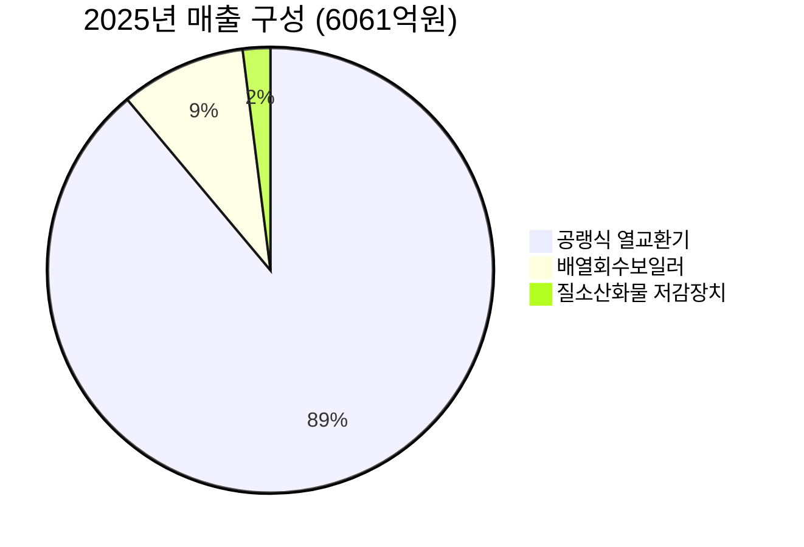

---

company: SNT에너지
created: 2026-04-16 13:50
date: 2026-04-16 13:50
exchange: KRX
listing: public
market: KR
tags:
- deal-sourcing
- daily
ticker: 100840.KS
title: Deal - SNT에너지 (100840.KS) 13:50
type: deal-sourcing
publish: true
---

> **오늘의 탐색 분야**: AI 인프라, AI 소프트웨어, 바이오텍, 헬스케어 테크, 원자력, 클린에너지, 원자재, 전기차, 로보틱스
> 4일 주기 로테이션 (21개 분야 커버)

# SNT에너지 (100840.KS)

100840.KS 🇰🇷 KR KOSPI Industrials / Specialty Industrial Machinery

---

Investment Score 72/100 — 🟡 Buy (조건부)

업사이드 비대칭 21/30 — 에어쿨러 세계 1위, TAM 대비 시총 1.1조원 수준이나 성장률 가속 확실

카탈리스트 & 타이밍 18/25 — 미주 LNG 프로젝트 수주 가시화 + 2026 하반기 실적 개선 촉매 구체적

비즈니스 품질 15/20 — 에어쿨러 세계 1위 독보적 지위, 단 사이클 의존성과 ROE 7.5% 낮음

밸류에이션 12/15 — Forward PER 11.8배, 2026 예상 EPS 기준 8~9배 수준 저평가 매력

발견 가치 6/10 — 커버 애널리스트 3~9명 수준, 소형주 특성상 미디어 노출 제한적

---

> [!abstract] 리포트 요약
> **한 줄 테시스**: SNT에너지는 공랭식 열교환기(에어쿨러) 글로벌 시장점유율 1위 기업으로, 트럼프 2.0의 LNG 규제 해방 + 미국 현지화 전략(루이지애나 공장)이 맞물리며 **2025년 영업이익 400% 폭증(YoY)**이라는 역대급 실적 턴어라운드를 달성했다.
>
> **왜 지금인가**: 2025년 말 수주잔고 5,941억 원 [출처: 이데일리, 확인 필요 — 공시 원문 교차확인 권장]이 향후 2~3년 매출 가시성을 확보했으며, 미주 LNG 프로젝트 본격 수주 인식이 2026년 하반기부터 반영될 것으로 전망된다 [신한투자증권, 2026.4.3]. 현재 주가 55,700원 기준 2026 예상 PER 8~9배 [데일리머니, 2026.4.11] 수준은 성장 모멘텀 대비 저평가.
>
> **Variant Perception**: 시장은 단기 중동 리스크와 1분기 실적 둔화에 집중하지만, 본질은 LNG 인프라 투자 사이클 초입 + 에어쿨러 독점적 지위 + AI 데이터센터 냉각 수요라는 **3중 성장 동력**이 동시에 작동하는 구간이다. 1분기 부진은 사이클 구조적 문제가 아닌 프로젝트 믹스 문제 [추정].
>
> **핵심 리스크**: 중동 지정학적 불확실성 장기화, 수주잔고 집중도(에어쿨러 89%), 천연가스 가격 급락 시 LNG 투자 지연 가능성.

---

## ① 핵심 지표

| 항목 | 값 | 의미 |
|------|-----|------|
| 현재가 | 55,700원 | 🟡 52주 고가(69,000원) 대비 -19.3%, 저가(33,500원) 대비 +66.3% — 고점 대비 조정 완료 후 재상승 구간 |
| 시가총액 | 약 1.1조원 | 🟡 소형주~중형주 경계. 글로벌 에너지 설비 M/S 1위 기업치고 저평가된 시총 |
| PER (Trailing / Forward) | 13.2배 / 11.8배 | 🟢 Forward 기준 하락 추세 — 이익이 빠르게 증가하고 있음을 의미. 2026년 EPS 기준 8~9배 수준 전망 [추정] |
| PBR | 2.92배 | 🟡 자산 기반보다 수익 창출력이 평가받는 구조. 고ROE 기업이 아닌 점에서 약간 부담 |
| EV/EBITDA | 17.48배 | 🟡 절대 수준은 부담이나 이익 폭증 사이클 고려 시 정상화 중 |
| 배당수익률 | 2.1% | 🟢 주당 1,150원 배당, 3년 연속 배당 인상 [Investing.com] — 주주환원 기조 긍정적 |
| Beta | 0.73 | 🟢 시장 대비 낮은 변동성 — 방어적 성격. 실적 서프라이즈 시 비대칭 상승 여지 |
| 52주 고/저 | 69,000원 / 33,500원 | 🟢 현재 고저 중간대(51,250원) 대비 약간 상회. 매수 관점에서 나쁘지 않은 위치 |
| 영업이익률 | 16.4% | 🟢 2025년 기준 — 전년 대비 대폭 개선. 에어쿨러 수주믹스 개선 + HRSG 고마진 반영 [추정] |
| 순이익률 | 16.8% | 🟢 영업이익률을 상회하는 순이익률 — 비영업 수익(사우디 법인 등) 기여 가능 [추정] |
| ROE | 7.5% | 🔴 낮은 ROE — 실적 급등 대비 자본 효율성 낮음. 구조적 개선 여부 모니터링 필요 |
| 섹터/지역 | Industrials, KR | 🟡 국내 소형 산업재 — 글로벌 수요 기반이나 한국 시장 디스카운트 존재 |

> [!tip] 핵심 지표 인사이트
> Forward PER 11.8배는 단순한 수치가 아니다. 2025년 영업이익 400% 폭증 + 2026년 수주잔고 기반 추가 성장이 계속된다면, 현재 주가는 **2026년 이익 기준 8~9배**에 불과하다는 분석이 나온다 [데일리머니, 2026.4.11 추정 인용]. 이 수준에서 밸류에이션 리레이팅(Re-rating) 여지가 열린다.

---

## ② 회사 개요, 제품, 핵심 경쟁력

> [!abstract] 사업 본질
> SNT에너지는 LNG 플랜트, 석유화학 플랜트, 발전소에 필요한 **에너지 설비(공랭식 열교환기, HRSG, SCR)**를 설계·제작·공급하는 **글로벌 1위 에너지 기자재 전문기업**이다.

### 한 줄 설명
"이 회사는 글로벌 LNG 및 가스 플랜트에 반드시 필요한 **공랭식 열교환기(에어쿨러) 세계 시장점유율 1위** 기업으로, 에너지 전환 사이클에서 물이나 전기보다 먼저 팔아야 하는 인프라 부품을 공급한다."

### 사업 모델
- **수주→설계→제작→납품** 방식의 프로젝트형 B2B 사업
- 대규모 LNG 수출 터미널, 석유화학 플랜트, 복합화력발전소에서 발생하는 열을 처리하는 설비를 공급
- 수주잔고(Order Backlog) 기반 매출 인식 — 수주가 매출에 선행하므로 **현재 수주잔고가 향후 2~3년 매출의 선행지표**
- 최근 사우디 현지 법인(SNT Gulf)과 미국 루이지애나 공장 설립으로 **현지화 전략** 가속화 — 고마진 MRO(유지보수) 사업으로 확장 가능 [추정]

### 핵심 제품/서비스

| 제품 | 역할 | 주요 시장 | 2025년 매출 | 비중 |
|------|------|---------|------------|------|
| **공랭식 열교환기 (Air-Cooled Heat Exchanger, ACHE)** | 물 없이 공기로 공정 유체를 냉각하는 핵심 장치. 수자원이 부족한 중동·건조지대에 필수 | LNG 플랜트, 석유화학, 가스처리 | 5,390억원 | 88.9% |
| **배열회수보일러 (Heat Recovery Steam Generator, HRSG)** | 가스터빈 배기열을 회수해 증기를 생산, 발전 효율 극대화 | 복합화력발전소, LNG 발전소 | 549억원 | 9.1% |
| **질소산화물 저감장치 (Selective Catalyst Reduction, SCR)** | 발전소 배기가스 환경 규제 대응 | 발전소, 산업 플랜트 | 122억원 | 2.0% |

[출처: 데이터투자, https://www.datatooza.com/news/articleView.html?idxno=24227 / iM증권 리포트, 한국경제 인용]

### 핵심 경쟁력

| 경쟁력 | 설명 | 복제 난이도 (1-10) |
|--------|------|:---:|
| **에어쿨러 세계 1위 점유율** | 글로벌 LNG·석유화학 플랜트 에어쿨러 시장 점유율 1위 [뉴스 다수 언급, 공식 점유율 수치 확인 필요]. 수십 년 납품 레퍼런스가 진입 장벽 | 9 |
| **사우디 아람코 장기 조달 계약(CPA)** | 세계 최대 에너지 기업 사우디 아람코와의 장기 조달 계약 체결 [확인 필요 — 공식 계약 규모/기간 미공시]. 현지 법인(SNT Gulf) 정상 가동 중 | 8 |
| **미국 루이지애나 현지 공장** | 트럼프 2.0의 Buy American 기조에 대응, 미국 내 LNG 프로젝트 수주 시 현지 납품 + MRO 강점 | 7 |
| **HRSG 원천 기술** | 국내 유일 HRSG 원천 기술 보유 주장 [뉴스 언급, 확인 필요] — 복합화력발전 확산 수혜 | 8 |
| **원자력 발전소 복수기 기술** | 원전 재가동/신규 수주 시 복수기 공급 역량 — 미래 성장 옵션 | 7 |

### 성장 공식
**매출 = LNG 플랜트 발주 물량 × 에어쿨러 M/S 1위 × 단가**
- TAM 확장: 트럼프 LNG 정책 → 미주 신규 수출 터미널 발주 증가
- M/S 방어: 오랜 레퍼런스 + 현지화로 경쟁사 진입 차단
- 단가 개선: HRSG 등 고마진 제품 믹스 확대

### 고객
- **석유화학·가스 플랜트**: Saudi Aramco(사우디), ExxonMobil·Cheniere Energy 등 미국 LNG 기업 [추정]
- **발전소**: 복합화력발전 사업자
- **EPC 컨트랙터**: Bechtel, Technip 등 대형 플랜트 엔지니어링사 [추정]

> [!success] 강점
> 에어쿨러는 LNG 플랜트에서 빠질 수 없는 필수 장치이며, M/S 1위 기업의 레퍼런스 리스트(vendor list) 등재는 수십 년에 걸쳐 쌓인 신뢰의 산물이다. 새로운 경쟁사가 단기간에 이 위치를 빼앗기는 극히 어렵다.

---

## ③ 왜 100%+ 가능한가? — 업사이드 비대칭

> [!abstract] 업사이드 테시스
> SNT에너지의 업사이드는 단순한 실적 개선이 아니다. **LNG 인프라 투자 슈퍼사이클 + AI 데이터센터 전력 수요 + 중동 재건 수요**라는 3중 구조적 수요가 세계 1위 에어쿨러 기업에 집중되는 구간이다.

### 시총 vs TAM

- **현재 시총**: 약 1.1조원 (~$800M USD, 2026년 4월 기준 환율 약 1,380원/달러 [추정])
- **글로벌 에어쿨러 시장**: 글로벌 Air-Cooled Heat Exchanger 시장 규모에 대한 공식 데이터 미확보 (확인 필요). 다만 단순 추산으로, SNT에너지의 2025년 매출이 6,061억원(~$440M)이고 시장점유율 1위인 점을 감안하면, 전체 TAM은 수조원~수십조원 규모 [추정]
- **LNG 설비 투자 시장**: 글로벌 LNG 인프라 투자는 향후 10년간 수백 조원 규모로 예상되며, 에어쿨러는 모든 LNG 플랜트의 필수 구성품

> [!tip] 비대칭의 핵심
> SNT에너지의 진짜 비대칭은 이것이다: **에어쿨러 M/S 1위 + 트럼프 LNG 수출 확대 = 수주가 터질 때 경쟁사가 없다.** 파이프가 커질 때 파이프를 만드는 회사가 아니라, **파이프를 식혀주는 부품을 독점에 가깝게 공급하는 회사**다.

### 성장 가속 구간 근거

| 지표 | 2024년 | 2025년 | YoY 변화 |
|------|--------|--------|----------|
| 매출액 | ~2,942억원 [추정, 2025년 매출의 역산] | 6,061억원 | **+105.98%** |
| 영업이익 | ~221억원 [추정] | 1,113억원 | **+400.52%** |
| 영업이익률 | ~7.5% [추정] | 18.4% [추정] | **+10.9%p** |

[출처: 데이터투자, datatooza.com; iM증권 리포트]

- 3분기 누적 기준 매출 +103.6%, 영업이익 +389.0%, 순이익 +208.4% [출처: 와이즈리포트, 기업모니터]
- **가속화의 원인**: 사우디 현지 법인 성공적 가동 + 미주 LNG 플랜트 공사 활성화

### 옵셔널리티

**Option 1: 미국 루이지애나 공장 → 미주 LNG 대형 수주**
트럼프 행정부의 LNG 수출 규제 완화로 지연됐던 대형 프로젝트들이 재개되고 있다. 미국 내 생산 거점을 확보한 SNT에너지는 Buy American 요건을 충족하며 미주 수주에서 경쟁사 대비 우위를 가진다 [추정].

**Option 2: AI 데이터센터 냉각 수요**
AI 인프라 확산으로 전력 수요가 폭증하면서 복합화력발전소(HRSG 수요) 및 데이터센터 냉각 설비(에어쿨러 수요) 확대 가능성이 제기되고 있다 [매일경제, 2026.1.21]. 글로벌 빅테크 기업과 공급 계약 논의 중이라는 언급도 있으나 [확인 필요 — 공식 공시 미확인].

**Option 3: 원자력 발전소 복수기**
원전 재가동 및 신규 원전 건설 트렌드(SMR 포함)에서 복수기 수주 기회. 현재 사업 규모는 미미하나 중장기 성장 옵션.

**Option 4: 중동 전후 재건 수요**
중동 인프라 파괴 및 복구 수요 — SNT Gulf 현지 법인을 통한 수혜 기대.

### Compounding Machine 구조

| 구성 요소 | 현황 | 잠재력 |
|----------|------|--------|
| ROIC | (데이터 미확인 — 추가 확인 필요) | 이익률 폭증 구간에서 개선 기대 |
| 재투자 | 루이지애나 공장, SNT Gulf 2차 증설 | 수주 역량 → 매출 증대 선순환 |
| 수주잔고 | 5,941억원 (2025년 말) [이데일리, 확인 필요] | 향후 1.5~2년 매출 커버 [추정] |

---

## ④ 왜 지금인가? — 카탈리스트 & 타이밍

> [!abstract] 카탈리스트 요약
> **단기(1~3개월)**: 1분기 실적 발표(2026.5.13 예정)에서 YoY 영업이익 성장 확인 → 하반기 모멘텀 재확인 계기. **중기(2~4분기)**: 미주 LNG 신규 수주 공시 → 수주잔고 회복 → 밸류에이션 리레이팅. **장기**: 트럼프 LNG 정책 기조 유지 시 2026~2027년 실적 고점 갱신.

### 구체적 촉매 일정

| 카탈리스트 | 예상 시점 | 내용 | 실현 가능성 |
|----------|---------|------|-----------|
| **Q1 2026 실적 발표** | 2026.5.13 [Investing.com] | 영업이익 YoY +21.1% 전망 (신한투자증권 추정, 156억원) — 절대치보다 하반기 가이던스가 핵심 | 높음 |
| **미주 LNG 수주 공시** | 2026년 하반기 [추정] | 수천만 톤 규모 미주 LNG 프로젝트 발주 본격화 시 에어쿨러 수주 급증 | 중-높음 |
| **HRSG 2026년 매출 654억원+** | 2026년 연간 | 신한투자증권 추정 [2026.4.2, 프라임경제] — 고마진 HRSG 비중 확대 | 중간 |
| **AI/빅테크 냉각 수급 계약** | 미확인 | 글로벌 빅테크와 공급 계약 논의 중이라는 언급 [확인 필요] | 낮음 (확인 전) |
| **중동 재건 수요 수주** | 2026년 하반기~2027년 | 중동 분쟁 종결 시 인프라 재건 수요. SNT Gulf 통해 수혜 | 중간 |

### 시장 반영도 분석

🟢 이미 반영: 2025년 실적 40%

🟡 일부 반영: LNG 모멘텀 40%

🔴 미반영: AI수요 20%

- 2025년 실적 폭증은 대부분 주가에 반영 (저가 33,500 → 현재 55,700원, +66%)
- 미주 LNG 대형 수주와 AI 냉각 수요는 아직 주가에 제한적으로 반영 [추정]
- 52주 고가 69,000원이 미래 촉매를 선반영한 레벨이었다면, 현재 조정은 매수 기회

### Variant Perception (시장과 다른 뷰)

> [!question] Variant Perception
> **시장의 뷰**: "1분기 실적이 부진하고 중동 리스크가 있으니 단기 하락 위험"
>
> **우리의 뷰**: 1분기 부진은 **프로젝트 믹스**의 일시적 문제(수익성 낮은 프로젝트 집중)이지 수요 둔화가 아니다. 수주잔고 5,941억원은 이미 확정된 미래 매출이며, 하반기 HRSG 고마진 프로젝트 인식이 본격화되면 **연간 실적은 컨센서스를 상회할 가능성이 높다** [추정]. 시장은 단기 분기 실적에 과도하게 반응하고 있다.

### 매크로 환경

| 매크로 변수 | 방향 | SNT에너지 영향 |
|-----------|------|--------------|
| **트럼프 LNG 정책 ('에너지 해방')** | 순풍 🟢 | LNG 수출 허가 재개 → 신규 터미널 건설 발주 급증 → 에어쿨러 수요 직접 증가 |
| **미국 금리 환경** | 중립~약순풍 🟡 | 금리 인하 시 LNG 프로젝트 자본 비용 감소 → 발주 가속화 가능 |
| **원/달러 환율 (약원화)** | 순풍 🟢 | 달러 기반 수주 → 원화 환산 매출/이익 증가 |
| **중동 지정학 리스크** | 단기 역풍, 중장기 순풍 🟡 | 단기 수주 불확실성 vs 전후 재건 수요 기대 |
| **천연가스 가격 급락** | 역풍 🔴 | 미국 천연가스 5거래일 연속 하락, 1.5년 최저 [더구루] → LNG 사업 경제성 약화 시 투자 지연 리스크 |

---

## ⑤ 비즈니스 퀄리티

> [!abstract] 비즈니스 퀄리티 요약
> SNT에너지는 에어쿨러 세계 1위라는 강력한 단일 해자를 보유하고 있다. 다만 ROE 7.5%는 낮은 수준이며, 사이클 의존성이 높은 B2B 프로젝트 사업의 구조적 한계가 있다.

### 경제적 해자 (Moat)

| 해자 계층 | 내용 | 복제 난이도 |
|---------|------|:--------:|
| **전문 기술력 + 레퍼런스 독점** | 수십 년 LNG/석유화학 플랜트 납품 레퍼런스 — 대형 발주처는 미검증 신규 업체를 기피. Vendor List 등재가 핵심 장벽 | 🔴 극히 어려움 |
| **현지화 네트워크 (사우디 + 미국)** | 사우디 담맘 현지 법인(SNT Gulf) + 미국 루이지애나 공장 — 물리적 현지 거점은 단기 복제 불가 | 🟡 수년 내 가능하나 레퍼런스 부재 |
| **사우디 아람코 장기 조달 계약** | 세계 최대 에너지 기업과의 장기 계약 — 고객 전환비용 창출 [계약 세부 미공시, 확인 필요] | 🟡 강력하나 계약 갱신 리스크 |
| **HRSG 원천 기술** | 국내 유일 HRSG 자체 기술 보유 주장 [확인 필요] | 🟡 해외 경쟁사 대비 약함 |

해자 강도 강함 68%

취약점 32%

### ROIC/ROE 분석

| 지표 | 값 | 해석 |
|------|-----|-----|
| ROE | 7.5% | 낮은 수준 — 자본 효율성 개선 여지 있음. 이익 폭증 후에도 7.5%라면 자본 규모가 크거나 비영업 자산이 많은 구조 [추정] |
| 순이익률 | 16.8% | 양호 — 레버리지 효과 없이도 매출 대비 수익성 높음 |
| 영업이익률 | 16.4% | 2025년 기준 대폭 개선 — HRSG 고마진 + 사우디 법인 이익 기여 |

> [!warning] ROE 낮음 주의
> ROE 7.5%는 워런 버핏 기준(ROE 15%+ 선호)에 한참 못 미친다. 이는 ① 대규모 수주 사이클 이전의 자본 축적 효과 ② 비영업 자산 보유 ③ 레버리지 낮은 보수적 자본 구조 중 하나일 수 있다. 이익 폭증이 자본에 반영되는 구조라면 1~2년 내 ROE 개선 가능 [가정]. 반대로 자본 효율성이 구조적으로 낮다면 장기 복리 수익률에 제약이 된다.

### 마진 방향성

- 2024 → 2025: 영업이익률 약 7.5% → 16.4% [추정] — **대폭 확장 중**
- 마진 개선 원인: ① HRSG 고마진 제품 매출 비중 확대 ② 사우디 현지 법인의 레버리지 효과 ③ 대형 수주 시 스케일 이점
- 2026년: HRSG 매출 654억원+ 전망 [신한투자증권, 2026.4.2] — 전년 549억원 대비 +19% 이상 성장 시 마진 추가 확장 기대

### 경영진 평가

| 항목 | 평가 |
|------|------|
| 주주환원 | 🟢 3년 연속 배당 인상 [Investing.com] — 주주 친화적 기조 |
| 현지화 전략 | 🟢 사우디 담맘 + 아부다비 + 미국 루이지애나 — 공격적 글로벌 확장 |
| 인센티브 정렬 | 🟡 최대주주 SNT홀딩스 지분 52.32% [디지털투데이, 공시 2026.4.7] — 오너십 높아 장기 이익 지향 가능성 높으나 소액주주 이익과의 완전한 정렬 여부는 추가 확인 필요 |
| 자본배분 트랙레코드 | 🟡 루이지애나 공장 투자 적절, 단 투자 규모/타이밍/수익성 세부 미확인 |

---

## ⑥ 밸류에이션 & 안전마진

> [!abstract] 밸류에이션 요약
> Forward PER 11.8배, 2026년 예상 EPS 4,867원 기준 [와이즈리포트] PER 11.5배 — 이익이 빠르게 증가하는 구간에서 역사적으로 낮은 멀티플. **밸류에이션이 가장 강한 Buy 논거다.**

### 현재 밸류에이션 vs 역사적 맥락

- 52주 범위: 33,500원 ~ 69,000원
- 현재가 55,700원은 52주 저가 대비 +66%, 고가 대비 -19%
- 3년 내 최저가 대비 600%+ 급등 후 조정 국면 [주달, 2026.3.30] → 고점 기억이 투자 심리를 억누르는 상황
- PER Trailing 13.2배 → Forward 11.8배 → 2026 추정 8~9배 [데일리머니 추정] — 이익 성장이 밸류에이션을 빠르게 압축

### 증권사 목표가 컨센서스

| 구분 | 수치 | 현재가 대비 |
|------|------|-----------|
| 평균 목표주가 (전문가 9인) | 61,688원 | +10.7% |
| 최고 목표주가 | 70,000원 | +25.7% |
| 최저 목표주가 | 62,000원 [추정] | +11.3% |
| Investing.com 전체 평균 | 66,667원 [Investing.com] | +19.7% |

[출처: Investing.com, 리틀비프로젝트]

### FCF / Owner Earnings 관점

- FCF 데이터 미확인 (야후 파이낸스 제공 미확보) — 직접 수치 생성 금지
- 순이익률 16.8% 기준 2025년 순이익 약 1,018억원 [6,061억원 × 16.8%, 추정]
- 시가총액 1.1조원 기준 Earnings Yield ≈ 9.3% [추정] — 채권 대비 매력적인 수준

### 안전마진 (Margin of Safety)

밸류에이션 안전마진 75/100 — 이익 폭증 사이클 + 낮은 멀티플

- **낙관 시나리오**: 2026년 수주잔고 기반 매출 성장 + 미주 LNG 수주 가시화 → PER 15배 적용 시 목표주가 73,000원+ [4,867원 × 15배, 추정]
- **기본 시나리오**: 현 수준 유지 + 배당 2.1% → 12개월 목표 65,000~68,000원 [추정]
- **비관 시나리오**: 중동 리스크 장기화 + 미주 수주 지연 → 수주잔고 소진 → 재평가 40,000원대 가능성

> [!tip] "이 품질의 기업을 이 가격에"
> 에어쿨러 세계 1위, 사우디 아람코 장기 파트너, 트럼프 LNG 정책 최대 수혜주를 Forward PER 11.8배에 살 수 있다. 이익 성장이 계속된다면 2026년 PER은 8~9배로 압축된다. 이 가격에서의 하방은 제한적이고, 상방은 촉매가 실현될 때 30~50%+ 가능 [추정].

---

## ⑦ 리스크 & Devil's Advocate

> [!abstract] Bull vs Bear
> 강력한 업황 + 낮은 밸류에이션이 Bull 논거이나, 사이클 의존성과 지정학적 변수가 핵심 리스크.

| 구분 | 핵심 논거 |
|------|---------|
| 🟢 Bull #1 | **트럼프 LNG 정책 = 다년간의 수주 파이프라인**: 지연됐던 미주 LNG 터미널 프로젝트들이 줄줄이 재개되며 에어쿨러 독점 공급사로서 장기 수주 확보 가능 |
| 🟢 Bull #2 | **수주잔고 5,941억원 = 2026년 매출 가시성**: 이미 수주한 물량이 향후 1.5~2년 매출을 커버, 실적 불확실성이 낮음 |
| 🟢 Bull #3 | **밸류에이션 리레이팅 여지**: Forward PER 11.8배 → 2026년 8~9배 예상은 성장 기업 기준 극히 저평가. 이익 성장 확인 시 멀티플 확장 가능 |
| 🔴 Bear #1 | **천연가스 가격 급락 → LNG 투자 지연**: 미국 천연가스 선물 5거래일 연속 하락, 1.5년 최저 기록 [더구루] — 가스 가격이 낮으면 LNG 수출 사업의 경제성이 약화되어 신규 프로젝트 발주가 지연될 수 있음 |
| 🔴 Bear #2 | **중동 지정학 리스크 장기화**: 이란전 또는 중동 분쟁 장기화 시 현지 프로젝트 차질, 신규 발주 중단 — SNT Gulf 현지 운영 정상화라지만 전쟁 확산 시 철수 시나리오 불가 배제 |
| 🔴 Bear #3 | **매출 집중도 리스크 (에어쿨러 89%)**: 단일 제품군에 매출 89% 집중 — LNG 투자 사이클 꺾이면 매출 급감 가능. 다각화 진행 중이나 단기간 내 구조 변화 어려움 |

### 가장 현실적인 실패 시나리오

> [!bear] Bear 시나리오
> 2026년 상반기 미국 천연가스 가격 저점 지속 + 트럼프 관세 전쟁으로 글로벌 경기 침체 우려 확산 → 에너지 기업들의 설비 투자(CapEx) 예산 삭감 → 미주 LNG 수주 지연 → 수주잔고 신규 보충 실패 → 2026년 말~2027년 매출 공백 → PER 재산정으로 40,000원 이하 하락 가능성

### 숨겨진 가정 (Hidden Assumptions)

| 가정 | 내용 | 틀릴 경우 영향 |
|------|------|--------------|
| LNG 투자 사이클 계속 | 트럼프 정책이 지속되고 LNG 프로젝트들이 실제 발주로 이어진다는 가정 | 높음 — 테시스 전체가 흔들림 |
| M/S 1위 유지 | 중국, 유럽 경쟁사가 가격 경쟁이나 현지화로 점유율을 빼앗지 않는다는 가정 | 중간 |
| HRSG 마진 개선 지속 | 고마진 HRSG 수요가 구조적으로 늘어난다는 가정 | 중간 |
| 사우디 아람코 계약 유지 | 장기 조달 계약이 갱신되고 SNT Gulf 현지 법인이 정상 가동을 유지한다는 가정 | 높음 |

### Kill Criteria

| Kill Criteria | 임계값 |
|-------------|-------|
| 수주잔고 급감 | 분기별 신규 수주가 2분기 연속으로 전년 대비 -30% 이하로 감소 |
| 영업이익률 재하락 | 2026년 영업이익률이 10% 이하로 하락 (2025년 16.4% 대비) |
| 미주 LNG 프로젝트 발주 지연 공식화 | 주요 고객사의 프로젝트 취소/2년+ 연기 공시 |
| 천연가스 가격 $2/MMBtu 이하 지속 | 3개월 이상 지속 시 LNG 투자 경제성 급격 악화 |
| 중동 분쟁으로 SNT Gulf 철수 | 현지 법인 운영 중단 공시 |
| 주가 40,000원 이하 이탈 (지지선 붕괴) | 52주 저가 33,500원 재테스트 — 펀더멘털 변화 확인 |

---

## ⑧ 발견 가치 & 엣지

> [!abstract] 발견 가치
> 커버리지는 적지 않으나 (3~9인 수준), 국내 소형주 특성상 글로벌 기관들의 인식은 낮다. "에어쿨러 세계 1위"라는 사실이 한국 시장 밖에서 제대로 평가받지 못하고 있다.

### 애널리스트 커버리지

- **국내 커버 증권사**: iM증권, 신한투자증권, 키움증권 등 최소 3개사 확인 [기업모니터, 2026.4]
- **전문가 총 9명** 목표주가 제시 [리틀비프로젝트]
- Investing.com 기준 **3명 Buy 의견** — 적은 커버리지는 시장 인식 부족의 방증

커버리지 점수 6/10 — 3~9명 수준, 발굴 여지 있음

### 기관 보유 변화

- 외국인과 기관의 46,000원 구간 공격적 매집 언급 [YouTube, 한교수TV — 미공식, 확인 필요]
- 국민연금이 저PBR 종목 집중 매수 中 — SNT에너지 관심 언급 [알파스퀘어]
- SNT홀딩스 지분 소폭 감소 (54.19% → 52.32%) [공시, 디지털투데이 2026.4.7] — 유동 물량 소폭 증가, 수급 타이트

### 시장이 놓치고 있는 것

> [!tip] 시장의 오해
> 1. **"이미 많이 오른 주식"이라는 편견**: 저점 대비 600% 급등이 고점을 의미하지 않는다. 실적이 뒷받침된다면 추가 상승 여지가 있다.
>
> 2. **"에너지 설비 = 구식 산업"이라는 편견**: LNG + AI 전력 수요 + 원전 재가동은 에너지 설비 수요가 구조적으로 증가하는 방향임에도, 시장은 AI 테마 기업에만 집중하고 "AI 전력을 만들어주는 설비" 기업을 저평가하는 경향이 있다.
>
> 3. **"한국 중소형 산업재는 디스카운트"**: 사실이나, 에어쿨러 세계 1위 기업을 한국 시총 기준으로만 평가하는 것은 글로벌 성장성을 과소평가하는 것.

---

## ⑨ 액션 아이템

### 투자 판단

| 항목 | 판단 |
|------|-----|
| **BUY / WATCH / PASS** | 🟡 조건부 BUY — Investment Score 72점 (Buy 조건부), 밸류에이션 매력 높으나 중동 리스크와 1분기 실적 확인이 선행되어야 |
| **Conviction** | Medium — 업황과 밸류에이션은 강력하나, 지정학적 변수와 가스 가격 리스크가 불확실성을 유지 |
| **적정 진입가** | 50,000~54,000원 — 현재가(55,700원) 기준 52주 저고 중간 수준. 1Q 실적 확인 후 추가 하락 시 매수 기회. 가장 이상적인 매수 구간은 52,000원 이하 [추정] |
| **목표가 (12개월)** | 65,000~70,000원 — 기본 시나리오 컨센서스 목표가 평균 61,688원 + 미주 수주 모멘텀 가산 [추정] |
| **손절 기준** | 45,000원 이탈 시 포지션 재검토 (수주 모멘텀 훼손 확인 전까지 유지) |
| **권장 비중** | 포트폴리오의 3~5% — 중형 비중. 수주 공시 확인 시 5~8%까지 확대 |

### 시나리오별 수익률

🟢 Bull 30%

🟡 Base 45%

🔴 Bear 25%

| 시나리오 | 조건 | 목표가 | 기대수익률 |
|---------|------|-------|----------|
| 🟢 Bull | 미주 LNG 대형 수주 공시 + HRSG 실적 급성장 + AI 냉각 수요 계약 확인 | 80,000~90,000원 | +44~+61% |
| 🟡 Base | 수주잔고 유지 + 2026 하반기 실적 개선 + 컨센서스 목표가 수렴 | 65,000~70,000원 | +17~+26% |
| 🔴 Bear | 가스 가격 저점 지속 + 중동 리스크 장기화 + 수주잔고 소진 | 38,000~43,000원 | -23~-32% |

**기대가치 [추정]**: (70,000 × 0.30) + (67,500 × 0.45) + (40,500 × 0.25) - 55,700 = **+14,700원 (+26%)** — 양의 기대수익률 확인

### 추가 리서치 필요 사항

| 확인 사항 | 중요도 | 방법 |
|---------|------|------|
| 사우디 아람코 장기 조달 계약(CPA) 구체적 규모·기간 | ⭐⭐⭐ | DART 공시 확인 |
| 미국 루이지애나 공장 투자 규모 및 생산 능력 | ⭐⭐⭐ | IR 문의, 공시 확인 |
| 글로벌 에어쿨러 시장 정확한 TAM 및 M/S 수치 | ⭐⭐⭐ | 산업 리포트 (Wood Mackenzie, S&P Global 등) |
| 2026년 수주잔고 신규 수주 현황 | ⭐⭐⭐ | 분기 실적 발표(5.13) 확인 |
| ROIC 추이 (2021~2025) | ⭐⭐ | DART 재무제표 계산 |
| 글로벌 빅테크 냉각 수요 공급 계약 논의 진행 여부 | ⭐⭐ | IR 문의, 공시 |
| 미국 천연가스 가격 vs LNG 프로젝트 발주 상관관계 | ⭐⭐ | 에너지 산업 데이터 |

### 모니터링 핵심 지표 & 체크포인트

| 날짜 | 확인 사항 |
|------|---------|
| **2026.5.13** | Q1 2026 실적 발표 — 영업이익 YoY 성장 확인, 하반기 가이던스, 신규 수주 현황 |
| **매월** | 신규 수주 공시 (DART) — 미주 LNG 대형 계약 여부 |
| **분기** | 수주잔고 변동 — 5,941억원 대비 증감 방향 |
| **매주** | 미국 천연가스 선물 가격 추이 ($3/MMBtu 지지 여부) |
| **수시** | 중동 지정학 리스크 상황 — SNT Gulf 운영 정상화 여부 |
| **2026년 하반기** | 미주 LNG 프로젝트 수주 공시 — Bull 테시스의 핵심 확인 포인트 |

---

> [!verdict] 최종 판단
> SNT에너지는 **에어쿨러 세계 1위 + LNG 인프라 투자 사이클 + 낮은 밸류에이션(Forward PER 11.8배)**이라는 3가지 조건이 동시에 충족되는 희귀한 상황이다. 지금 당장 100% 확신 매수보다는, **1Q 실적 확인(5.13) 후 하반기 가이던스가 긍정적이면 비중을 높이는 전략**이 적합하다. 현재 주가 55,700원에서 하방(45,000원, -19%)보다 상방(70,000원+, +26~60%)이 비대칭적으로 크다. 관련 종목으로 [[260331_Deep Analysis - GST_0837]] (에너지 설비 밸류체인), [[260323_Deal - LG에너지솔루션 (373220.KS)_1457]] 참고.