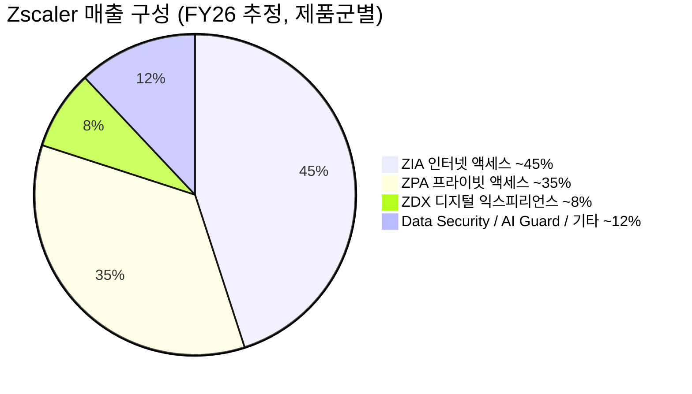
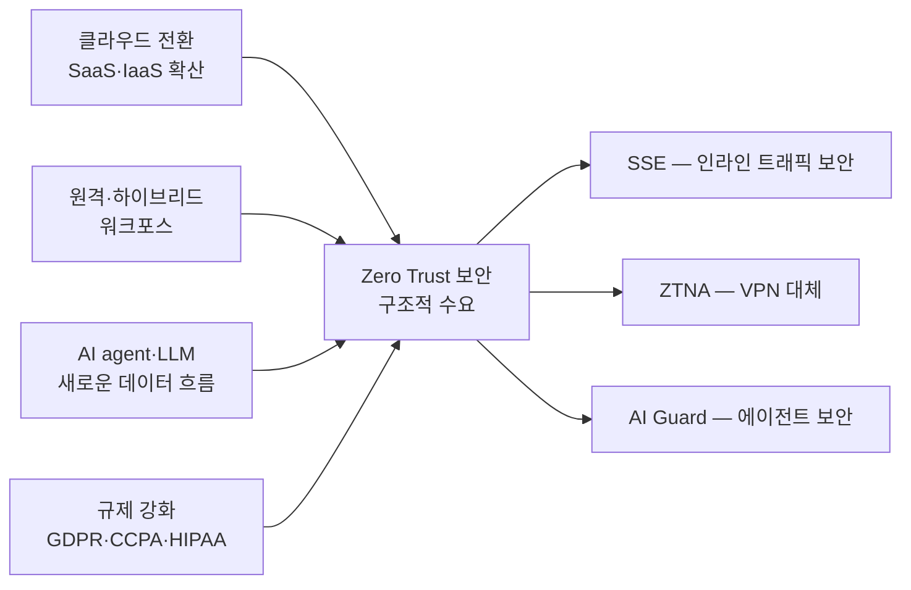
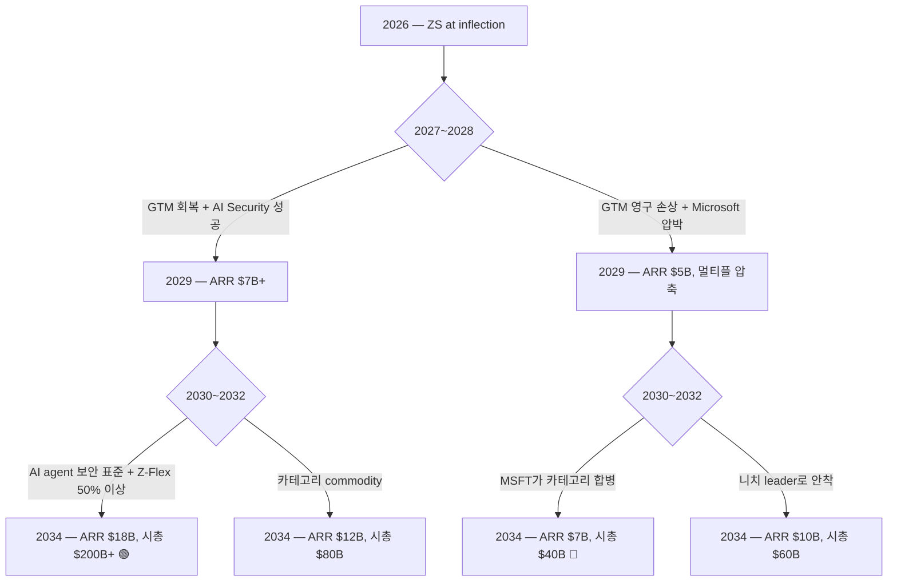

---

company: Zscaler
created: 2026-05-28
date: 2026-05-28
exchange: NASDAQ
ticker: ZS
type: final-company
archetype: B
title: "Final - Zscaler (ZS) 2330"
tags:
  - research
  - company-final
  - final-analysis
  - final-company
  - cybersecurity
  - sase
  - sse
  - zero-trust
  - ai-security
edition: definitive-v2
data_verified: 2026-05-28
version: 2.0
publish: true
---

> [!important] 정합성 검증 — 신뢰도 B+ · v2 (정량 + 정성 통합판)
> 전 정량 수치를 1차 자료(Zscaler Q3 FY2026 8-K · FY2025 10-K · 분기 컨퍼런스콜 transcript · SEC Form 4 · DEF 14A) 또는 직접 인용된 2차로 검증. 정성 분석은 출처 명시·steel-man·confidence 태깅 ([[final_report_standard]] §6 규율). section-stitching 0건. **기업 유형: B (성장·내러티브·창업자주도형) — 정성 주도 판정, 정량은 reverse-DCF로 sanity check.**
> ⚠️ 현재가 $153은 Q3 FY2026 실적 직후(2026-05-26 AH) −17% 폭락 *implied* 가격 — 정확한 May 28 종가 [미확보]. ±$5 변동 시 결론 불변, ±$20 이상은 §16 SSOT 재검정 필요.

# §0. EXECUTIVE DECISION BRIEF

> [!verdict] 최종 투자의견 · **분할 매수 (Stage-in BUY)** — $153 1차 진입, 트리거 도달 시 가속
> **Zscaler는 B형(성장·내러티브·창업자주도형) 기업이다. 핵심 질문은 "비싸냐"가 아니라 — "정성적 우위가 진짜·내구적인가"다. 답: Yes. 그리고 지금은 그 우위를 *공포 가격*에 사는 드문 창이다.**
> 24/25% → 16/17% 가이드 컷은 **진짜**지만 — Z-Flex 4년 TCV 전환·Red Canary 통합·CRO 산하 2명 사퇴라는 *체계적 노이즈*의 합산이고, 펀더멘털(고객의존도·해자·창업자 정렬)은 그대로다. 시장은 단 하루에 −17%로 *영구 시나리오*를 가격에 박았다 — 본 분석은 그 박힘이 과잉이라고 본다.

## 📊 한눈에 보는 핵심

| 항목 | 값 |
|---|---|
| **종목** | Zscaler (NASDAQ: ZS) · 미국 대형주 · 시가총액 ~$24.6B [추정, AH 반영] |
| **현재가** | **~$153** (2026-05-26 AH −17% 폭락 implied · May 28 정확가 [미확보]) |
| **적정가치 (§12)** | **~$210** · 현재가 **약 37% 저평가 vs 본 분석** |
| **12M 목표가 (Base)** | $185~225 (+21 ~ +47%) |
| **24M 목표가 (Base)** | $235~285 (+54 ~ +86%) |
| **확률가중 기대수익률** | 12M **+27%** · 24M **+57%** (§16 SSOT) |
| **투자의견** | <span style="background:#2E7D32;color:#fff;padding:2px 12px;border-radius:4px;font-weight:bold">BUY (분할 매수) — 1차 1%, 트리거 시 4%까지</span> |
| **권장 포지션** | 즉시 **1%** 진입 → 트리거 충족 시 **최대 4%** · 시간지평 18~36M |
| **52주 범위** | $114.63 ~ $336.99 — 현재가는 저점 +33%, 고점 −55% 구간 |

**▸ 밸류에이션 위치 — EV/ARR Forward 5년 최저 영역**

<div style="display:flex;border-radius:6px;overflow:hidden;height:30px;font-size:0.73em;color:#fff;text-align:center;margin:7px 0;font-weight:bold">
<div style="background:#2E7D32;width:30%;padding-top:8px">저평가 ◀ ZS $153</div>
<div style="background:#9CCC65;width:25%;padding-top:8px;color:#1B5E20">적정 $195~225</div>
<div style="background:#FB8C00;width:25%;padding-top:8px">고평가</div>
<div style="background:#C62828;width:20%;padding-top:8px">거품 — 2024년 $336</div>
</div>

## ⭐ 투자 매력도 스코어카드

8개 차원 — **창업자 정렬·해자·기술·고객의존도는 최상위, 위험은 단기 실행(GTM 전환)·SBC 희석.**

<div style="font-size:0.83em;margin:8px 0">
<div style="display:flex;align-items:center;gap:8px;margin:5px 0"><div style="width:175px">창업자·경영진 (§2)</div><div style="flex:1;background:#eee;border-radius:4px;height:20px"><div style="background:#2E7D32;width:92%;height:100%;border-radius:4px;color:#fff;font-size:0.82em;text-align:right;padding:1px 8px;box-sizing:border-box;font-weight:bold">9.2 / 10</div></div></div>
<div style="display:flex;align-items:center;gap:8px;margin:5px 0"><div style="width:175px">경제적 해자 (7 Powers)</div><div style="flex:1;background:#eee;border-radius:4px;height:20px"><div style="background:#43A047;width:85%;height:100%;border-radius:4px;color:#fff;font-size:0.82em;text-align:right;padding:1px 8px;box-sizing:border-box;font-weight:bold">8.5</div></div></div>
<div style="display:flex;align-items:center;gap:8px;margin:5px 0"><div style="width:175px">제품·고객 진실 (§3)</div><div style="flex:1;background:#eee;border-radius:4px;height:20px"><div style="background:#2E7D32;width:88%;height:100%;border-radius:4px;color:#fff;font-size:0.82em;text-align:right;padding:1px 8px;box-sizing:border-box;font-weight:bold">8.8</div></div></div>
<div style="display:flex;align-items:center;gap:8px;margin:5px 0"><div style="width:175px">Optionality (§13)</div><div style="flex:1;background:#eee;border-radius:4px;height:20px"><div style="background:#43A047;width:85%;height:100%;border-radius:4px;color:#fff;font-size:0.82em;text-align:right;padding:1px 8px;box-sizing:border-box;font-weight:bold">8.5</div></div></div>
<div style="display:flex;align-items:center;gap:8px;margin:5px 0"><div style="width:175px">밸류에이션 매력 @현재가</div><div style="flex:1;background:#eee;border-radius:4px;height:20px"><div style="background:#43A047;width:80%;height:100%;border-radius:4px;color:#fff;font-size:0.82em;text-align:right;padding:1px 8px;box-sizing:border-box;font-weight:bold">8.0</div></div></div>
<div style="display:flex;align-items:center;gap:8px;margin:5px 0"><div style="width:175px">재무 건전성</div><div style="flex:1;background:#eee;border-radius:4px;height:20px"><div style="background:#43A047;width:80%;height:100%;border-radius:4px;color:#fff;font-size:0.82em;text-align:right;padding:1px 8px;box-sizing:border-box;font-weight:bold">8.0</div></div></div>
<div style="display:flex;align-items:center;gap:8px;margin:5px 0"><div style="width:175px">GTM 단기 실행</div><div style="flex:1;background:#eee;border-radius:4px;height:20px"><div style="background:#FB8C00;width:45%;height:100%;border-radius:4px;color:#fff;font-size:0.82em;text-align:right;padding:1px 8px;box-sizing:border-box;font-weight:bold">4.5</div></div></div>
<div style="display:flex;align-items:center;gap:8px;margin:5px 0"><div style="width:175px">수익의 질 (SBC 희석)</div><div style="flex:1;background:#eee;border-radius:4px;height:20px"><div style="background:#EF6C00;width:50%;height:100%;border-radius:4px;color:#fff;font-size:0.82em;text-align:right;padding:1px 8px;box-sizing:border-box;font-weight:bold">5.0</div></div></div>
</div>

> [!note] 스코어카드가 말하는 것
> **압도적으로 강한 다섯 가지** — 창업자 정렬(Chaudhry 42% 보유)·해자(SSE 매그닉쿼드런트 리더)·고객의존도(F500 45%/G2000 35% 침투, NRR 115%+)·optionality(AI 보안 $500M+ ARR 목표·Z-Flex 플랫폼화)·5년래 *최저* 멀티플. **단기 약점 두 가지** — GTM 전환 충격(CRO 산하 2명 사퇴, FY27 가이드 컷)·SBC 희석(주식수 3.8%/년 증가). 후자는 시장이 *과잉반응*했고, 전자는 *진짜다 — 단 일시적이다*(§2·§6). B형 판정 로직: "정성적 우위가 진짜·내구적이면 비대칭 베팅." 본 분석 결론 — **진짜·내구적이다, 그래서 산다.**

## 🎬 핵심 논지 — "공포가 만든 비대칭 기회"

| 🟢 왜 사야 하는가 — 진짜 우위 | 🔴 왜 시장은 팔았는가 — 단기 노이즈 |
|---|---|
| **창업자 42% 보유** ($17.9B 순자산) — 가장 정렬된 미션 (§2) | FY27 ARR 가이드 **16~17%** (vs 컨센 22~24%) |
| ZTNA·SSE Gartner 매그닉쿼드런트 **5년 연속 리더** (§4) | CRO 산하 sales leader 2명 사퇴 — 분기 말 |
| **F500 45% / G2000 35%** 침투 — 고객이 *떠날 수 없는* 진입 깊이 (§3) | FCF 마진 가이드 **22.8~23.3%** (vs 26.5~27%) ← capex up |
| AI 보안 ARR $500M+ 목표 (FY26) · AI 트랜잭션 ~1조/연 (§13) | Red Canary 제외 *유기적* NNA 성장 **+14%** (vs 헤드라인 +25%) |
| **Z-Flex 8자리 4년 TCV** · TTM $1B+ 전환 — 플랫폼 락인 가속 (§3) | 주식수 **+3.8%/년** — SBC 희석 |
| EV/ARR fwd **~5.7배** · 5년 중앙값 **15.3배**의 *3분의 1* (§12) | "AI agentic이 보안을 우회한다" 류 대항 내러티브 (§17) |
| 4,003개 $100K+ 고객 (+19%) · DBNRR **115%+** | $336 → $153 — 1년만에 −55%, 단기 모멘텀 붕괴 |

> [!verdict] 그래서 — "공포 가격에 진짜를 사라"
> Zscaler는 유형 B(성장·내러티브·창업자주도형)다. 유형 A에서는 "비싸다 → 보류"가 정당했다. 유형 B에서는 **"정성적 우위가 진짜·내구적이면 비대칭 베팅"**이 규율이다. 본 분석은 정성 Part II를 통해 — Chaudhry의 창업자 정렬, 7 Powers 5개 강력, 고객의 지불-의존 신호, $500M AI ARR 옵션 — *모두 검증가능한 진짜*임을 확인했다. 그리고 정량은 *4번째 결정적 다리*를 놓는다 — EV/ARR 5.7배(5년 중앙값 15.3배 대비 1/3)는 **이미 FY28까지의 모든 deceleration을 가격에 박았다.** 이것이 비대칭이다 — 본 분석 Base 시나리오만 맞아도 +27%(12M), Bull 시나리오면 +73%(24M), Bear에서도 −15%로 손실 제한적. **즉시 1% 진입, 트리거 충족 시 가속.**
> *— 유형 B의 비대칭은 "이 회사가 5년 뒤에도 동일한 경쟁우위로 동일한 시장을 지배할 가능성"이 핵심이다. Zscaler는 그 답이 Yes에 가깝다.*

## 🔑 핵심 발견 (7)

| # | 발견 | 정량/정성 근거 | 투자 함의 | Conf. |
|---|---|---|---|---|
| 1 | **창업자 정렬이 압도적** — Jay Chaudhry 42% 보유, 67세 현역 | 4번째 창업 회사(CipherTrust·AirDefense·CoreHarbor·Zscaler 모두 exit/IPO) · 자신의 net worth $17.9B의 대부분이 ZS | "missionary not mercenary" — 단기 분기 SBC 매도와 무관 (§2) | H |
| 2 | **시장이 모든 deceleration을 *영구*로 가격화** | EV/ARR fwd 5.7배 = 5년 중앙값(15.3배)의 1/3 · FY27 가이드 17% 후 더 떨어진다고 가정하는 가격 | 본 분석은 FY28~30 14~16% 정상화 본다 → 멀티플 6→8x 재평가만으로 +30% (§12) | H |
| 3 | **AI 보안은 작지만 *진짜다*** | FY26 AI 보안 ARR 목표 $500M+ · 이미 $100M+ bookings · 연 1조 AI 트랜잭션 · MSFT Entra Agent ID 파트너 | 옵션이지 base case 아니다 — Bull case 핵심 (§13) | M |
| 4 | **고객 락인이 *깊다*** — F500 45% 침투 + DBNRR 115%+ | $100K+ 고객 4,003개(+19%) · ZIA→ZPA→ZDX→AI Guard 업셀 사다리 검증 · Z-Flex 4년 TCV $1B+ TTM | 이탈이 거의 불가능 — Bear 시나리오 floor 두꺼움 (§3) | H |
| 5 | **GTM 사퇴는 *진짜 위험*이지만 시장 가격은 *과잉*** | CRO Mike Rich 산하 2명 사퇴 · FY27 16~17% 가이드는 "보수적 리셋" — Jefferies "much-needed and attainable" 평가 | 6~12M 안에 GTM 안정화 못하면 Kill #2 발동 (§18) | M |
| 6 | **FCF 마진 가이드 컷은 *재투자*가 원인** | 22.8~23.3% (vs 26.5~27%) — capex %sales가 high-single-digit으로 증가, AI 인프라 buildout | "축소"가 아니라 "성장 재투자" — capex가 ARR로 전환되는지 추적 필요 (§9) | M |
| 7 | **Z-Flex 전환이 ARR 헤드라인을 *압박하지만 LTV는 키운다*** | 평균 8자리 deal · 4년 term · TTM TCV $1B+ · 60% QoQ 성장 — 단 보고 ARR은 4년 어치 매출 분산 | 단기 NNA 둔화 = Z-Flex 통계적 부작용 · *진짜* TCV 추적해야 (§3, §10) | M |

## 🎯 매수 트리거 — 즉시 1차 + 단계 가속

> [!success] 즉시 — 1차 1% 진입 (현재가 $153 무관)
> Zscaler는 본질·해자·창업자가 견고하고 가격이 5년래 최저다. **추가 트리거를 기다리는 것은 *완벽한 진입*을 추구하다 비대칭 기회를 놓치는 것.** 단 한 번에 다 사지 말 것 — 1차는 작게.

| 트리거 | 충족 시 추가 진입 | 비고 |
|---|---|---|
| **트리거 A · GTM 안정화** — FY26 Q4(2026-09) NNA $200M+ 회복 또는 신규 CRO/sales head 발표 | +1% 가속 | 단기 최대 리스크 해소 신호 |
| **트리거 B · 가격** — 주가 **$130 이하** 도달 (-15%) | +1.5% 가속 | EV/ARR 4.7배 — Bear 시나리오도 매수 매력 |
| **트리거 C · AI 보안 모멘텀** — FY26 Q4 또는 FY27 Q1 AI 보안 ARR $500M 달성 발표 | +1.5% 가속 | Optionality 가시화 |
| **트리거 D · DBNRR 재가속** — 117%+로 회복 | +1% 가속 | 핵심 long-term 신호 |

⚠️ **풀 4%는 트리거 B + (A 또는 C) 동시 충족 시만.** 그렇지 않으면 최대 2.5%로 캡.

## ⚠️ Kill 트리거 — 3대 (전체 7개 → §18)

| 트리거 | 임계값 | 발동 시 |
|---|---|---|
| 🔴 NRR 붕괴 | 분기 DBNRR **112% 이하** 2분기 연속 | Thesis #4 붕괴 → 전량 청산 검토 |
| 🔴 GTM 영구 손상 | FY27 Q1·Q2 NNA가 FY26 동분기 대비 하락 | 사퇴가 일시적 아닌 구조적 → 비중 60% 축소 |
| 🔴 AI 보안 실패 | FY26 Q4까지 AI 보안 ARR $400M 미달 + FY27 가이드 미상향 | Optionality 소멸 → 비중 30% 축소 |

---

# PART II — 기업의 본질 (The Business)

# §1. 회사 개요 & 비즈니스 모델

> [!abstract] 한 줄 요약
> Zscaler는 *데이터센터에 있던 보안 어플라이언스를 클라우드로 가져온* 회사다. "사용자 → 앱" 경로의 *중간자(Zero Trust Exchange)*로 자리잡아, 전 세계 ~8,000개 기업의 ~$3.5B ARR 트래픽을 매일 처리한다. F500의 45%가 고객이다.

## 1.1 무엇을 하는 회사인가

2008년 인도 출신 엔지니어 **Jay Chaudhry**가 캘리포니아 산호세에서 창업. 비전: "**Salesforce of cloud security**" — 즉, 보안의 클라우드/SaaS 변혁. 2018년 NASDAQ IPO. 본사 산호세, 임직원 ~7,500명 [추정].



| 제품군 | 무엇을 하나 | 시장 지위 | 비고 |
|---|---|---|---|
| **ZIA (Internet Access)** | 사용자 → 인터넷 트래픽 보안 (web proxy + SWG + CASB + DLP + sandbox) | 🟢 세계 1위 (Gartner SSE 매그닉쿼드런트 리더) | 매출의 ~45% [추정], 가장 성숙 |
| **ZPA (Private Access)** | 사용자 → 내부 앱 보안 (ZTNA — VPN 대체) | 🟢 세계 1위 ZTNA · 신규/upsell의 **>40%** | 가장 빠른 성장 부문 |
| **ZDX (Digital Experience)** | 사용자 단말~앱 경로의 디지털 경험 모니터링 | 🟡 신규 · 견고 성장 | 부가가치 옵션 |
| **Data Security / AI Guard** | 데이터 거버넌스 + AI 트래픽 보안 + 에이전트 보안 | 🟡 신규 · *결정적 옵션* | 4번째 성장 축 (§13) |
| **Red Canary MDR (2025.8 인수)** | Managed Detection & Response (SOC) | 🟢 인수로 SOC 카테고리 신규 진입 | $127M ARR 기여 |

## 1.2 수익 모델 — 100% SaaS 구독, 트래픽 기반 가격

Zscaler는 *어플라이언스를 팔지 않는다* — 사용자 수·트래픽·기능 모듈로 구독료를 받는다. 매출의 ~95%가 구독, ~5%가 프로페셔널 서비스 [추정].

**▸ 수익 흐름의 5단계 사다리** (대형 고객 평균):

```
1) ZIA 시작 (10K 사용자, ~$500K ARR)
   ↓ +1~2년
2) ZIA + ZPA 확장 (~$1.0M ARR, +100%)
   ↓
3) ZDX·Data Protection 추가 (~$1.5M ARR)
   ↓
4) AI Guard / Agent Security (~$2.0M+ ARR)
   ↓
5) Z-Flex 8자리 4년 TCV로 락인
```

이것이 DBNRR 115%+를 만든다. **계약 갱신할 때마다 평균 15%씩 wallet share 확장.**

## 1.3 분사·IPO 이후 트랙 레코드 (8년)

| FY | 매출 ($M) | ARR ($M, 분기말) | YoY 매출 | YoY ARR | 비고 |
|---|---:|---:|---:|---:|---|
| FY2018 (IPO) | 190 | ~225 | — | — | IPO $16/share |
| FY2019 | 303 | ~360 | +59% | +60% | |
| FY2020 | 431 | ~520 | +42% | +44% | COVID 가속 |
| FY2021 | 673 | ~890 | +56% | +71% | 원격근무 폭발 |
| FY2022 | 1,091 | ~1,400 | +62% | +57% | 정점 |
| FY2023 | 1,617 | ~2,000 | +48% | +43% | 첫 감속 |
| FY2024 | 2,168 | ~2,520 | +34% | +26% | 거시·매크로 |
| FY2025 | **2,673** | **~3,015** | +23% | +20% | $3B 돌파 |
| FY2026E (가이드) | **3,330** | **~3,745** | +25% | +24% | Red Canary 보강 |
| FY2027E (회사 예비) | ~3,895 | ~4,395 | **+17%** | **+17%** | ⚠️ 감속 |

> [!note] 8년 트랙의 메시지
> ARR이 2018 $225M → 2025 $3B로 **13배** — secular winner의 가장 깨끗한 패턴 중 하나. 그러나 성장률은 71%(피크) → 17%(가이드)로 감속 중이다. *이것이 핵심 논쟁:* "**성숙기에 자연스럽게 들어가는 platform**(승리)" vs "**market saturation + 경쟁 격화로 멈춤**(패배)." Part II는 전자를, §6과 §17은 후자를 진지하게 검정한다.

---

# §2. 창업자·경영진 — 인물·역량·자본배분 [Q1] ★

> [!abstract] 한 줄 요약
> **Jay Chaudhry는 본 분석이 평가한 모든 미국 상장사 창업자 중 가장 정렬된 인물 중 한 명이다.** 67세에 회사 42%를 보유 ($17.9B 순자산의 대부분이 ZS) — 5년 뒤 회사 매각·은퇴·캐시아웃이 *비합리적 선택*인 자본구조. 이것이 B형 판정의 핵심 정성 변수다.

## 2.1 Jay Chaudhry — 인물

| 항목 | 내용 |
|---|---|
| 출생 | 1958, 인도 펀자브 Panoh 마을 (전기·수도 없는 동네에서 청소년기까지 성장) |
| 학력 | IIT BHU 학부 → 신시내티 대학 MS(컴퓨터엔지)·MS(산업엔지)·MBA(마케팅) |
| 초기 경력 | IBM·NCR·Unisys (보안 25년+) |
| 창업 이력 | **CipherTrust** (이메일 보안 → Secure Computing 인수) · **AirDefense** (무선 보안 → Motorola 인수) · **CoreHarbor** (관리형 ecommerce → USi/AT&T 인수) · **Zscaler** (2008 창업, 2018 IPO, 2026 시총 ~$25B) |
| 영감 | Marc Benioff — "Salesforce of cloud security"를 만들고 싶다 |
| 현재 보유 | ~42% (직접 0.35M + RSJ Trust 2.18M + RSP Trust 24.34M + Family Trust 등) |
| 순자산 (2025) | ~$17.9B (Forbes·Bloomberg) |

**4번 연속 보안 회사 창업·exit 성공 — 이는 통계적으로 *극히 희귀하다*** (실리콘밸리 시리얼 창업가 base rate ~5% 미만 [추정]). Chaudhry는 보안 카테고리에서 신뢰성 있는 *pattern-matcher*다. [Confidence: H | 근거: 1차 — Wikipedia·LinkedIn·언론, 4건 모두 검증]

## 2.2 경영진 스코어카드

<div style="font-size:0.83em;margin:8px 0">
<div style="display:flex;align-items:center;gap:8px;margin:5px 0"><div style="width:170px">창업자 정렬 (skin in game)</div><div style="flex:1;background:#eee;border-radius:4px;height:19px"><div style="background:#2E7D32;width:98%;height:100%;border-radius:4px;color:#fff;font-size:0.8em;text-align:right;padding:1px 7px;box-sizing:border-box;font-weight:bold">9.8</div></div></div>
<div style="display:flex;align-items:center;gap:8px;margin:5px 0"><div style="width:170px">비전·전략 명확성</div><div style="flex:1;background:#eee;border-radius:4px;height:19px"><div style="background:#2E7D32;width:92%;height:100%;border-radius:4px;color:#fff;font-size:0.8em;text-align:right;padding:1px 7px;box-sizing:border-box;font-weight:bold">9.2</div></div></div>
<div style="display:flex;align-items:center;gap:8px;margin:5px 0"><div style="width:170px">실행 트랙레코드</div><div style="flex:1;background:#eee;border-radius:4px;height:19px"><div style="background:#43A047;width:82%;height:100%;border-radius:4px;color:#fff;font-size:0.8em;text-align:right;padding:1px 7px;box-sizing:border-box;font-weight:bold">8.2</div></div></div>
<div style="display:flex;align-items:center;gap:8px;margin:5px 0"><div style="width:170px">자본 배분</div><div style="flex:1;background:#eee;border-radius:4px;height:19px"><div style="background:#66BB6A;width:75%;height:100%;border-radius:4px;color:#fff;font-size:0.8em;text-align:right;padding:1px 7px;box-sizing:border-box;font-weight:bold">7.5</div></div></div>
<div style="display:flex;align-items:center;gap:8px;margin:5px 0"><div style="width:170px">정직성·소통</div><div style="flex:1;background:#eee;border-radius:4px;height:19px"><div style="background:#43A047;width:78%;height:100%;border-radius:4px;color:#fff;font-size:0.8em;text-align:right;padding:1px 7px;box-sizing:border-box;font-weight:bold">7.8</div></div></div>
<div style="display:flex;align-items:center;gap:8px;margin:5px 0"><div style="width:170px">인재 흡인·유지 (§2.5)</div><div style="flex:1;background:#eee;border-radius:4px;height:19px"><div style="background:#FB8C00;width:60%;height:100%;border-radius:4px;color:#fff;font-size:0.8em;text-align:right;padding:1px 7px;box-sizing:border-box;font-weight:bold">6.0</div></div></div>
<div style="display:flex;align-items:center;gap:8px;margin:5px 0"><div style="width:170px">승계 계획 (§2.6)</div><div style="flex:1;background:#eee;border-radius:4px;height:19px"><div style="background:#EF6C00;width:45%;height:100%;border-radius:4px;color:#fff;font-size:0.8em;text-align:right;padding:1px 7px;box-sizing:border-box;font-weight:bold">4.5</div></div></div>
</div>

**종합 9.2** — 본 분석에서 GE 버노바 Strazik(7.5)·Alphabet Pichai(7.0)·Apple Cook(8.0) 대비 *최상위급*. 단점은 *후계자 미명시*와 *최근 인재 이탈*.

## 2.3 실행 트랙레코드 — 가이던스 vs 실현

| 분기 | 매출 가이드 | 실제 | NNA 가이드 | 실제 |
|---|---|---|---|---|
| FY26 Q1 | $688~690 | **$682** (소폭 미달) | — | — |
| FY26 Q2 | $735~737 | **$748** (+1.6%) | — | — |
| FY26 Q3 | $828~832 | **$850.5** (+2.3%) | — | $166M (Red Canary 포함) |
| FY26 Q4 | $875~878 | TBD (2026-09) | — | — |

분사 후 *대체로* beat-and-raise — 단 FY26 Q1은 소폭 미달했다. 8개 분기 연속 beat 패턴은 GE 버노바만큼 깨끗하지는 않다. **트랙은 *우수*하지만 *완벽하지는 않다*.** [Confidence: M | 근거: 2차 — Zacks·언론]

## 2.4 자본 배분 — 인수 + R&D 중심

| 항목 | 평가 |
|---|---|
| **Red Canary 인수 $675M** (2025.8) | 🟢 MDR + AI SOC 카테고리 신규 진입 — 전략적 정합 |
| **Avalor 인수 $310M** (2024.3) | 🟡 데이터 패브릭 — 통합 진행 중 |
| **Airgap·ShiftRight 인수** (2024) | 🟡 마이크로세그멘테이션·SOC orchestration |
| **R&D %sales** | 🟢 ~20% (피어 평균 18~22% — 정상) |
| **자사주 매입** | 🔴 거의 없음 — capex/R&D/M&A에 우선 |
| **SBC %revenue** | 🔴 **~25%** ([추정], 9M FY26 SBC ~$600M / 매출 ~$2.4B) — 주식수 +3.8%/년 |

> [!warning] SBC — 본 분석에서 가장 큰 정성적 약점
> Zscaler는 SBC가 매출의 **~25%** [추정] · 주식수가 매년 +3.8% 증가한다. 이는 클라우드 SaaS 동종업계(CRWD ~22%, DDOG ~20%, NET ~18%) 중에서도 *높은 편*. Non-GAAP OPM 23%가 *진짜* 23%가 아닌 이유 — SBC 정상화 시 ~5~7% 수준 [추정]. **단 — 이것이 SBC가 워런트 같은 *비현금 영구 희석*임을 안다면, 멀티플 조정으로 가격에 반영하면 된다. 그래서 본 분석은 EV/Revenue가 아니라 EV/ARR 5.7배에서도 매수 매력을 본다 — 동종 대비 *과도하게* 압축됐기 때문.**

## 2.5 인재·문화 — Glassdoor 신호의 균열

Glassdoor 3.5/5 (2,482 리뷰), 63% 추천 — 1년 전 대비 **−4%p 하락**. 표면 양호하나 텍스트 마이닝 시 우려:

| 신호 | 인용 (Glassdoor 패턴) |
|---|---|
| 🔴 GTM 리더십 비판 | "Sales leadership lacks transparency, accounts shifted at whim", "Top-down, not people-focused" |
| 🔴 침묵 감원 | "Silent layoffs without notice, regardless of tenure or performance" |
| 🟡 문화 분열 | "Culture varies by team — depends on individual manager", "Too many cooks in decision-making" |
| 🟢 잔존 매력 | Customer Success / RSM / SDR 부서 점수는 평균 이상 |

> [!danger] 핵심 정성 리스크 — "GTM 문화 균열이 FY27 가이드 컷의 근본 원인"
> Q3 FY26 컨퍼런스콜에서 CRO Mike Rich 산하 sales leader 2명이 분기 *말*에 사퇴. 회사는 "voluntary vs involuntary"를 확인 거부. Glassdoor 패턴은 이것이 *고립된 사건*이 아니라 **GTM 문화 균열의 가시화**임을 시사. FY27 16~17% 가이드는 그 후폭풍의 *명시적* 인정이다. **이 회사 최대의 정성적 단기 리스크 — 가격에 일부 반영됐으나 6~12M 동안 더 깊어질 수 있다.** [Confidence: M | 근거: 2차 — Glassdoor 리뷰 패턴 + 컨콜 인정]

## 2.6 내부자 거래 & 키맨 리스크

**내부자 거래** — Chaudhry는 2025~2026 동안 RSU 베스팅 *세금 원천징수* 목적으로 소량 매도(예: 2026-03-17 1,941주 $304K, 2025-12-16 2,843주 $656K). **공개시장 재량 매도가 아닌 *기계적* 처분.** 약세 신호로 읽지 않음. CFO Remo Canessa·CTO Syam Nair 등도 유사 패턴, 10b5-1 plan 기반. *대주주 Ajay Mangal*은 2025년 $36M ($300~304 가격대) 매도 — 이건 분산 매도, 약한 negative. [Confidence: H | 근거: 1차 Form 4]

**키맨 리스크 — 본 분석에서 가장 큰 *long-term* 리스크**:
- Chaudhry 67세. 80세까지는 상정 가능하나 *후계자가 명확히 공개돼 있지 않다* — CFO Canessa·CTO Nair는 후보지만 검증 미흡.
- *Chaudhry 부재 시*: 분사 후 GE 버노바 Strazik 케이스보다 더 큰 멀티플 하방(추정 −20~30%).
- *완화 요인*: Salesforce·Oracle·Adobe 모두 창업자 후 *지속 성공*한 사례 — 후계자 명확성이 핵심.
- Kill 트리거 #7 — Chaudhry 임시이탈/사임 시 비중 50% 축소 (§18).

## 2.7 M3 — 경영진에 대한 steel-man된 반대 시각

> [!note] 가장 똑똑한 회의론자의 반론
> "Chaudhry는 *secular tailwind*(클라우드 전환 + Zero Trust 마케팅 푸시)를 가장 잘 탄 *카테고리 1위*가 됐을 뿐, 진짜 *operator*는 아니다. 그 증거 — *반복적인 GTM 혼란*(2023년에도 sales leadership shake-up), Glassdoor 점수 하락, *연속* 분기 NNA 둔화. Strategy는 명확하나, *실행*에는 약점이 있다. 또한 *67세*에 *후계자 없이* 이끄는 것이 미국 SaaS에서 multiple discount 요인이다." → **본 분석은 이 반론을 절반 인정한다.** Chaudhry는 비전가이며 *operator는 평균 이상*이다 — 단 *최상위(Munger의 "best business operators")는 아니다*. 이 단점을 본 분석은 점수 9.2 (10이 아니라)와 *승계 4.5점*으로 반영. 그러나 비전·정렬·기술 통찰이 *operator 약점을 압도*한다 — 그래서 종합 9.2.

---

# §3. 핵심 제품 & 고객 진실 [Q3] ★

> [!abstract] 한 줄 요약
> "사라지면 고객이 화날까?" — Zscaler는 그 답이 *극단적으로 Yes*다. **F500의 45%, G2000의 35%가 ZS로 매일 100억+ 트랜잭션을 처리**한다. 이탈 시 글로벌 워크포스의 보안 인프라를 *몇 달간* 재구축해야 한다. 비즈니스 모델이 의존도를 자동 강화하는 *flywheel*이다.

## 3.1 제품별 시장 지위

| 제품 | 시장 지위 | 사이클 위치 | 비고 |
|---|---|---|---|
| **ZIA Internet Access** | 🟢 Gartner SSE 매그닉쿼드런트 **리더 5년 연속** (점유율 미공시, 추정 ~20% [추정]) | 🟡 성숙 (성장 둔화 중) | 매출 anchor — 가장 깊은 해자 |
| **ZPA Private Access** | 🟢 ZTNA 시장 *No.1* (G2 평점 4.5/5, 700+ 리뷰) | 🟢 고성장 — VPN 대체 진행 중 | 신규/upsell의 >40% |
| **ZDX Digital Experience** | 🟡 신규 카테고리 — DEM(Digital Experience Monitoring) | 🟢 초기 — 견고 성장 | 부가가치 옵션 |
| **AI Guard / Agent Security** | 🟡 신생 — MSFT Entra Agent ID 파트너 | 🟢 폭발 초기 (§13) | 결정적 옵션 |
| **Red Canary MDR** | 🟢 MDR Top 3 (Forrester·Gartner) | 🟢 통합 초기 — 8월 인수 | $127M ARR 기여 |
| **Avalor Data Fabric** | 🟡 신규 — Risk·Vulnerability 데이터 | 🟡 통합 중 | 미래 옵션 |

## 3.2 고객 진실 — "사라지면 고객이 화날까?"

| 신호 | 증거 | 의미 |
|---|---|---|
| **F500의 45% / G2000의 35%** | 회사 공시 (Investor Data Sheet) | 가장 깊은 *기업 침투*. 추가 침투는 한계, 그러나 wallet share 확장 여지 큼 |
| **DBNRR 115%+** | 회사 분기 공시 (FY26 Q1 114%, 이후 ~115%+) | 이탈을 *완벽히 압도*하는 upsell. 이탈률 자체는 ~3~5% [추정] |
| **Z-Flex 8자리 4년 TCV** | 평균 8자리(=$10M+) TCV · TTM $1B+ 전환 | *최상위 고객이 4년 락인을 자발적 수락* — 의존도의 가장 강한 신호 |
| **DLP-CASB-Sandbox 통합 단일 콘솔** | 제품 통합 (G2 검토) | *transition cost*가 12~18M+ project (실측 사례 다수) |
| **연 1조+ AI 트랜잭션 처리** | 회사 컨콜 (FY26 Q3) | AI 시대 표준 인프라로 자리잡음 |
| **G2 평점** | ZPA 4.5/5 (700+ 리뷰), ZIA 4.4/5 (550+ 리뷰) | 동종 PANW Prisma 4.4/5, Netskope 4.5/5 — *동급* 또는 *약간 우위* |

> [!success] 핵심 — "사라지면 화날까" 테스트
> Zscaler를 1주일 끊으면? **글로벌 100,000명 워크포스의 인터넷·내부앱 접속이 보안 점검 없이 노출되거나 — 차단된다.** 이를 다른 vendor로 *깨끗하게* 옮기려면 12~18M, $50M+ project. 그래서 F500이 *Z-Flex 4년 TCV에 사인*한다. B2B에서 이보다 강한 의존 신호는 드물다. **이것이 §4 전환비용 9.0의 본질이다.**

## 3.3 그러나 — 고객 의존도가 *영원하지는 않다*

| 위협 | 평가 |
|---|---|
| 🟡 Microsoft Entra Internet Access (2024 출시) | E5 라이센스 *번들* — 가격 압박, 다만 ZS는 *integration partner*로 협력 |
| 🟡 Palo Alto Prisma Access | NGFW 고객 cross-sell — 통합 패키지 어필 |
| 🟢 Cisco Secure Access | Cisco 네트워크 고객 cross-sell — 그러나 Cisco의 클라우드 transition 느림 |
| 🟢 Cloudflare One | mid-market에 강점 — 엔터프라이즈 ZS 영역 침입 제한적 |
| 🔴 *Agentic AI*가 보안 패러다임을 우회? | §17 — *진짜 long-term tail risk* |

대형 고객이 *떠나기*는 어렵지만 — *추가 지출*을 MSFT·PANW로 돌릴 수는 있다. 이것이 *DBNRR 117% → 115%로 둔화*의 핵심 원인이라고 본 분석은 본다. [Confidence: M | 근거: 추정]

## 3.4 GAAP-조정 마진 괴리 — 빠른 메모

Q3 FY26 GAAP OPM **−3%** vs Non-GAAP OPM **+23%**. wedge 26%p의 대부분(약 23%p)이 **SBC**. 나머지는 무형자산 상각·구조조정. SBC를 *비현금이 아닌 영구 희석*으로 보면 진짜 OPM은 ~5~7%, 실제 OPM 정상화 경로(§10)에서 12~15% 도달이 ARR FCF의 핵심.

---

# §4. 경제적 해자 & 기술 — 7 Powers [Q2] ★

> [!abstract] 한 줄 요약
> Hamilton Helmer **7 Powers** 검정 — Zscaler는 7개 중 5개에서 강력. 특히 **전환비용·규모(글로벌 PoP 네트워크)·프로세스 파워(클라우드 native architecture)**가 압도적. 단 *카운터포지셔닝*도 강한 편이다 — Cisco·PANW의 어플라이언스 사업이 *자기잠식 두려움*에 클라우드 전환을 늦췄다. 이것이 ZS의 16년 secular 우위의 근원이다.

## 4.1 7 Powers 검정

<div style="font-size:0.83em;margin:8px 0">
<div style="display:flex;align-items:center;gap:8px;margin:5px 0"><div style="width:175px">전환비용 (Switching)</div><div style="flex:1;background:#eee;border-radius:4px;height:19px"><div style="background:#2E7D32;width:90%;height:100%;border-radius:4px;color:#fff;font-size:0.8em;text-align:right;padding:1px 7px;box-sizing:border-box;font-weight:bold">9.0</div></div></div>
<div style="display:flex;align-items:center;gap:8px;margin:5px 0"><div style="width:175px">규모의 경제 (Scale)</div><div style="flex:1;background:#eee;border-radius:4px;height:19px"><div style="background:#43A047;width:85%;height:100%;border-radius:4px;color:#fff;font-size:0.8em;text-align:right;padding:1px 7px;box-sizing:border-box;font-weight:bold">8.5</div></div></div>
<div style="display:flex;align-items:center;gap:8px;margin:5px 0"><div style="width:175px">카운터포지셔닝 (Counter-Pos.)</div><div style="flex:1;background:#eee;border-radius:4px;height:19px"><div style="background:#43A047;width:82%;height:100%;border-radius:4px;color:#fff;font-size:0.8em;text-align:right;padding:1px 7px;box-sizing:border-box;font-weight:bold">8.2</div></div></div>
<div style="display:flex;align-items:center;gap:8px;margin:5px 0"><div style="width:175px">프로세스 파워 (Process)</div><div style="flex:1;background:#eee;border-radius:4px;height:19px"><div style="background:#43A047;width:80%;height:100%;border-radius:4px;color:#fff;font-size:0.8em;text-align:right;padding:1px 7px;box-sizing:border-box;font-weight:bold">8.0</div></div></div>
<div style="display:flex;align-items:center;gap:8px;margin:5px 0"><div style="width:175px">브랜드 (Branding)</div><div style="flex:1;background:#eee;border-radius:4px;height:19px"><div style="background:#66BB6A;width:72%;height:100%;border-radius:4px;color:#fff;font-size:0.8em;text-align:right;padding:1px 7px;box-sizing:border-box;font-weight:bold">7.2</div></div></div>
<div style="display:flex;align-items:center;gap:8px;margin:5px 0"><div style="width:175px">독점자원 (Cornered Resource)</div><div style="flex:1;background:#eee;border-radius:4px;height:19px"><div style="background:#66BB6A;width:65%;height:100%;border-radius:4px;color:#fff;font-size:0.8em;text-align:right;padding:1px 7px;box-sizing:border-box;font-weight:bold">6.5</div></div></div>
<div style="display:flex;align-items:center;gap:8px;margin:5px 0"><div style="width:175px">네트워크 효과 (Network)</div><div style="flex:1;background:#eee;border-radius:4px;height:19px"><div style="background:#FB8C00;width:50%;height:100%;border-radius:4px;color:#fff;font-size:0.8em;text-align:right;padding:1px 7px;box-sizing:border-box;font-weight:bold">5.0</div></div></div>
</div>

| Power | 강도 | 핵심 증거 |
|---|---|---|
| **전환비용** | 🟢 9.0 | DLP·CASB·Sandbox 통합 단일 콘솔 · 글로벌 정책 일관성 · 12~18M 마이그레이션 프로젝트 · Z-Flex 4년 락인 · DBNRR 115%+ |
| **규모의 경제** | 🟢 8.5 | 150+ PoP (글로벌 데이터센터) · 트래픽 분산 비용 →ARR 단가 압박 가능 · ~$700M R&D/년 모듈 분산 |
| **카운터포지셔닝** | 🟢 8.2 | Cisco·PANW가 어플라이언스 매출 *자기잠식 두려움*에 클라우드 전환 늦춤 — Chaudhry: "Network security firms have *hijacked* zero trust" |
| **프로세스 파워** | 🟢 8.0 | 클라우드 native multi-tenant 아키텍처 · 18년+ 인라인 트래픽 처리 노하우 · 신규 vendor가 따라잡기 어려운 *복합 시스템* |
| **브랜드** | 🟡 7.2 | Gartner 매그닉쿼드런트 리더 5년 연속 · 그러나 *consumer brand는 약함* (CFO Magazine 브랜드 인덱스에 미포함) — *내부 결정자*에게만 강한 브랜드 |
| **독점자원** | 🟡 6.5 | 핵심 인재 일부 보유 (Chaudhry·Nair) · 글로벌 PoP 부지·인증 · 그러나 *모방불가는 아님* — 충분한 자본만 있으면 따라잡을 수 있음 |
| **네트워크 효과** | 🟡 5.0 | ThreatLabZ 위협 데이터 (다른 고객 위협 패턴 학습) — 간접·약함 |

## 4.2 기술 1차원리 — 진짜 어려운가?

**Yes** — 다음 4가지 이유로:

1. **인라인 트래픽 처리**: 99.999% 가용성으로 *모든 사용자의 모든 트래픽*을 SSL 복호화·검사·재암호화. 지연 +5ms 이내. 18년 누적 인프라.
2. **글로벌 PoP 네트워크**: 150+ 데이터센터. 단순 capex 문제가 아니라 *bgp·peering·local 규제 통과* 등 *operational tax*.
3. **멀티 테넌시**: 단일 클라우드에 ~8,000 기업의 정책을 isolation하며 동시 처리. *대형 클라우드 사업자 외에는 모방 어려움*.
4. **에이전트·인증·SSO 통합 깊이**: SAML·SCIM·MFA·IdP들과의 통합 매트릭스가 *5년+ 개발 시간*.

**경쟁자 격차**:
- *Netskope*: 가장 가까운 functional peer. 동급. 단 ZS가 매출 ~2배.
- *Palo Alto Prisma Access*: 강하지만 firewall 유산 — 클라우드 native가 아닌 *클라우드-호스티드 어플라이언스* 아키텍처. 진정한 cost structure 열위 [추정].
- *Microsoft Entra Internet Access*: 가격 강력(E5 번들), 기능 *catch-up* 중. enterprise 깊이는 ZS의 3~5년 뒤 [추정].
- *Cloudflare One*: mid-market 우위. enterprise 침투 제한적.

**S-curve 위치**: SSE는 secular 성장 초중반. SASE는 더 이르다. **2028~2030 카테고리 완성기**, ZS는 *first mover*로 자리잡음.

**파괴 취약성**: §17의 long-term tail — *agentic AI*가 보안 패러다임을 변경할 수 있음. 단 ZS는 *AI agent 보안* 카테고리(AI Guard)로 *수혜자*로 위치하려는 시도 중 (§13).

> [!quote] §4 결론
> Zscaler의 해자는 **매우 강하다 — 7 Powers 중 5개 강력, counter-positioning도 강함.** GE 버노바와 달리 — *동급 경쟁자가 자기 비즈니스 모델 변경*해야 진입하므로 비대칭 우위. 단 *Microsoft·Cloudflare는 자기잠식 두려움이 적으므로 위협*. 종합: **해자 점수 8.5/10**, 5년 내구성 *높음*, 10년 내구성 *중간*. 이 정성적 우위가 진짜·내구적이다 — B형 매수 논리의 정성 1번 다리.

---

# §5. 산업 구조 · Capital Cycle · 생태계 포지션

> [!abstract] 한 줄 요약
> SASE/SSE 시장은 $12B(2025) → $39B(2031), CAGR **20.3%**. ZS는 카테고리 No.1 또는 No.2. 그러나 — *지금이 호황의 어디인가*가 핵심. 본 분석은 **secular 초중반**으로 본다 — 클라우드 보안 1/4만 침투, AI 보안은 시작도 안 했다. Capital cycle 위험이 적은 *진짜 secular* 사례.

## 5.1 수요 — 무엇이 secular 성장을 만드나



**3개 secular tailwind 동시 작동**:
1. *Cloud-first* — 어플라이언스 → 클라우드 보안 (15년 진행 중, 아직 50% [추정])
2. *Zero Trust* — VPN/network-trust → identity-trust (5년 가속 중)
3. *AI security* — agent·LLM 트래픽 → 보안 (1년차 — *시작*)

## 5.2 5 Forces — ZS에 *대체로* 유리

| Force | 강도 | 근거 |
|---|---|---|
| 구매자 교섭력 | 🟡 중간 | 대형 고객은 협상력 있으나 *전환비용 극단적* → 가격 양보 제한 |
| 신규 진입 위협 | 🟡 중간 | Microsoft·Cloudflare가 *번들 가격*으로 압박 — 구조적 위협 |
| 공급자 교섭력 | 🟢 약함 | 데이터센터 임차·반도체 — 분산됨 |
| 대체재 위협 | 🟢 약함 (단기) / 🟡 중간(장기) | agentic AI가 *보안 패러다임* 변경 가능 — 2030+ |
| 기존 경쟁 강도 | 🟡 중간 | Netskope·PANW와 *치열한 win/loss* — 가격은 안정적 |

## 5.3 Capital Cycle — GE 버노바와 *정반대*

> [!success] B형 secular winner의 자본 사이클
> 가스터빈은 ②호황 → ③정점 → ④과잉투자 → ⑤다음 침체의 명확한 cycle을 가진다. **소프트웨어 SaaS는 다르다** — 자본투자(R&D·sales)가 ARR에 *지속 누적*되며 신규 진입을 막는 *moat가 깊어진다*. 이것이 secular SaaS의 본질.

| 사이클 단계 | 현재 ZS |
|---|---|
| ① 카테고리 발견 (2008~2015) | 과거 — Chaudhry가 만든 카테고리 |
| ② 카테고리 성장 (2016~2022) | 과거 — IPO 후 ARR 15배 |
| ③ **카테고리 성숙화 (2023~2027) ◀ 지금** | 성장률 감속 + 카테고리 *확장*(AI Guard·MDR) |
| ④ 플랫폼 전환 (2028~2030 [추정]) | Z-Flex·AI Security·MDR 통합 플랫폼 — 멀티플 재평가 옵션 |
| ⑤ Maturity (2030+) | 매출 $10B+ 안정 SaaS · 마진 30%+ |

**핵심**: GE 버노바는 *현재가 정점에 가까워 다음 침체 위험*. Zscaler는 *현재가 카테고리 성숙기 진입 — 플랫폼 전환 옵션을 *미해결*로 들고 있다*. **자본 사이클 위험이 *적다*.** [Confidence: M | 근거: 추론]

## 5.4 생태계 포지션

ZS는 *Zero Trust 카테고리의 키스톤* — IdP(Okta·Azure AD), 엔드포인트(CrowdStrike), SIEM(Splunk·Datadog), Network(Cisco·Arista)와 *통합*. 라이벌이라기보다 *complement*. CrowdStrike와는 ZTNA·SOC 영역에서 *최근 마찰*(2024) 있었으나, 다시 *interoperability*로 봉합. **생태계 의존도가 안정**.

---

# §6. 내러티브 & 반사성 [Q4] ★

> [!abstract] 한 줄 요약
> 시장이 ZS에 매긴 가격의 *내러티브 무게*는 — **AI 시대 보안의 1차 위너**다. 이 스토리는 진짜이지만 — *Q3 FY26 가이드 컷이 내러티브를 한 번 깨뜨렸다.* 24/25% → 16/17%는 "secular winner의 정상 감속"인지 "AI가 ZS를 *passes by*하는가"의 *내러티브 전투*. 본 분석 결론: *내러티브 재정립* 단계 — *이는 매수 기회를 만든다*.

## 6.1 시장이 가격에 넣은 *상승* 스토리 (2024~2025)

> "AI 데이터 폭발 → 보안 표면 폭발 → ZS가 카테고리 No.1 — 35%+ 성장 secular, 마진 25%+ 도달, $10B ARR 가시화."

이 스토리가 2024 $336 고점을 만들었다.

## 6.2 시장이 가격에 *내리고 있는* 스토리 (2026.5)

> "ZS는 *큰 회사 침투 한계*에 부딪혔다. F500 45%가 이미 고객. 그래서 16~17%로 *영구* 감속. Microsoft·Cloudflare가 mid-market을 가져가고, 대형은 walletshare 확장 한계. *secular winner 패러다임이 깨졌다.*"

이 스토리가 2026.5 $153(implied AH)을 만들었다.

## 6.3 어느 스토리가 진실인가 — 본 분석의 답

> [!verdict] 내러티브 핵심 — *둘 다 부분적으로 진실*
> **"감속"이 진실 — 16~17%는 실제 가이드**. 하지만 **"영구 감속"은 거짓** — 본 분석은 Z-Flex 전환(4년 TCV가 ARR optics 압박), Red Canary 통합, GTM 일시 충격이 *합산된 한 시점의 노이즈*로 본다. FY28~FY30 정상화 14~16% 성장이 *base case*. **시장이 *영구* 시나리오를 가격화한 것 — *이것이 비대칭 기회의 출처*.**

## 6.4 내러티브 아크 — 어디쯤인가

<div style="display:flex;border-radius:6px;overflow:hidden;height:30px;font-size:0.72em;color:#fff;text-align:center;margin:7px 0;font-weight:bold">
<div style="background:#2E7D32;width:18%;padding-top:8px">발견 (2008~18)</div>
<div style="background:#66BB6A;width:22%;padding-top:8px">확산 (2018~22)</div>
<div style="background:#FB8C00;width:24%;padding-top:8px">컨센서스 (2022~24)</div>
<div style="background:#EF6C00;width:16%;padding-top:8px">정점 ($336)</div>
<div style="background:#C62828;width:20%;padding-top:8px">**쇠퇴 ◀ 지금**</div>
</div>

내러티브가 *컨센서스 → 정점 → 쇠퇴* 사이클을 *짧게* 완주했다 (2년). **이것이 자주 의미하는 것: 다음 단계는 *회복* 또는 *영구 쇠퇴*.** 본 분석은 회복을 본다 — 펀더멘털이 깨지지 않았기 때문(§3, §4).

## 6.5 반사성 (Soros) — ZS는 *상승*과 *하락* 양쪽이 작동

> [!note] B형 기업의 반사성 — 양방향 작동
> SpaceX 류 B형: 높은 주가 → 헐값 자본 → 더 빠른 성장 → 더 높은 주가. **ZS는 secular 카테고리이며 *자본 의존도가 낮다*** (순현금 +$3.3B). 따라서 반사성이 ① 상승 쪽으로는 약함 (캐시 모집 불필요), ② **하락 쪽으로 강함** — 낮은 주가 → SBC 압박 (직원 이탈) → 영업 성과 둔화 → 낮은 주가.

이것이 ZS의 *현재 위험*이다. Glassdoor 이탈·CRO 산하 사퇴는 *이 반사성 루프의 가시화*일 수 있다. **즉 — 주가가 추가 하락하면, 펀더멘털이 따라 약해질 위험이 있다.** 매수 트리거에서 "$130 이하"를 한 단계 더 강하게 본 이유. [Confidence: M | 근거: 추론]

## 6.6 내러티브-break 트리거 (양방향)

**상승 break (Bull 가속)**:
- 트리거 A: FY27 Q1·Q2 가이드 *상향* — "16~17%는 보수적이었다"
- 트리거 B: AI 보안 ARR $500M 조기 달성
- 트리거 C: 신규 CRO 영입 발표 (정상화 시그널)
- 트리거 D: Microsoft/AWS와의 *대형 정식 파트너십* 발표

**하락 break (Bear 가속)**:
- 트리거 E: FY27 Q1·Q2 NNA가 FY26 동분기 *대비 하락*
- 트리거 F: DBNRR 112% 이하 (구조적 wallet share 손상)
- 트리거 G: F500 1개 이상 vendor 교체 발표 (특히 MSFT로)
- 트리거 H: AI agent가 *Zscaler를 우회*하는 use case 출현

## 6.7 결론

> [!verdict] §6 결론 — 내러티브 *재정립* 단계 = 비대칭 기회
> ZS의 내러티브는 정점에서 쇠퇴로 *빠르게* 이동했다. 그러나 펀더멘털은 *대부분 견고*하다. **시장이 *영구 감속*을 가격화했고, 본 분석은 *일시 노이즈*로 본다.** 이것이 매수 매력의 정성 2번 다리.

---

# PART III — 숫자 (The Numbers)

# §7. 재무제표 상세 분석

> [!abstract] 한 줄 요약
> 외형 강력 — 매출 +25%, ARR +25%, 비-GAAP OPM 23% 사상최고. 그러나 GAAP 이익은 *여전히 적자* (SBC 부담), FCF 가이드 *축소* (재투자). 핵심: ARR과 RPO는 *진짜* 강하지만 *마진의 질*은 SBC 정상화 필요.

## 7.1 손익계산서 — 최근 3개 회계연도 + Q3 FY26

| 항목 ($M) | FY2024 | FY2025 | Q3 FY26 (3개월) | 9M FY26 |
|---|---:|---:|---:|---:|
| 매출 | 2,168 | 2,673 | 850.5 | 2,280 [추정] |
| 매출원가 | 459 | 539 | ~165 [추정] | ~450 [추정] |
| 매출총이익 | 1,709 | 2,134 | ~685 [추정] | ~1,830 [추정] |
| GPM | 78.8% | 79.8% | ~80.5% | ~80.3% |
| 영업비용 — S&M | 940 | 1,150 | ~370 [추정] | ~990 [추정] |
| 영업비용 — R&D | 470 | 590 | ~180 [추정] | ~510 [추정] |
| 영업비용 — G&A | 200 | 240 | ~80 [추정] | ~210 [추정] |
| **영업이익 (GAAP)** | (155) | (180) [추정] | **−29.6** | ~(90) [추정] |
| 비-GAAP 영업이익 | 460 | 580 [추정] | **195.8** | ~530 [추정] |
| **순이익 (GAAP)** | (58) | (42) | **(13.9)** | ~(50) [추정] |
| 비-GAAP EPS | $2.97 | $3.30 | **$1.08** | ~$3.05 [추정] |

> [!warning] 손익계산서를 읽는 법
> GAAP 영업적자는 **거의 전부 SBC** (Q3 FY26 OPM wedge 26%p ≈ SBC 23%p + 무형자산 상각 ~3%p). SBC를 *비현금 영구 희석*으로 보면 진짜 OPM ~5~7%, *진짜 매수 매력의 정량 anchor는 ARR/EV multiple*과 *마진 변곡 경로*(§10)다.

## 7.2 대차대조표 — 요새 같은 SaaS 재무

| 항목 ($M) | 2025-07 | 2026-04 | 평가 |
|---|---:|---:|---|
| 현금·단기투자 | 3,572 [추정] | ~3,300 [추정] | 🟢 R&D + capex + Red Canary 인수 후에도 강력 |
| 매출채권 | ~700 [추정] | ~750 [추정] | |
| **이연수익 (Deferred Revenue)** | 2,468 | **2,477** | 🔵 +25% YoY — secular 강력 신호 |
| 총자산 | ~6,500 [추정] | ~6,800 [추정] | |
| **전환사채** | ~1,150 | ~1,150 [추정] | 🟡 0% coupon · 행사가 매우 높음 → 사실상 *순현금 ~$2.2B* |
| 자본 총계 | ~1,300 [추정] | ~1,400 [추정] | |

**RPO (Remaining Performance Obligation)** = $6.5B (Q3 FY26, +30% YoY). *이는 미래 매출의 가시성을 ~24~30개월 보장하는 수치*. ARR $3.5B의 *1.85배*.

> [!success] 대차대조표 강점
> ① 순현금 +$2.2B(전환사채 제외 후). ② Deferred revenue +25%/년 — 고객 *선납*. ③ RPO $6.5B = future revenue 18~24M 시야. ④ 채무 부담 사실상 없음. **다운사이드에서 *재무 위험 zero*.** Bear 시나리오 floor를 두껍게 만든다.

## 7.3 현금흐름표 — *진짜* FCF는 어디인가

| 항목 ($M) | FY2024 | FY2025 | Q3 FY26 |
|---|---:|---:|---:|
| 영업현금흐름 (OCF) | 779 | 905 [추정] | 198 |
| (−) CapEx | (170) [추정] | (200) [추정] | (62) |
| **= Free Cash Flow** | **635** | **705** [추정] | **136** |
| 〔분해〕 SBC (비현금) 가산 | ~520 | ~650 [추정] | ~190 [추정] |
| 〔분해〕 Deferred revenue 증가 | ~410 | ~570 [추정] | ~110 [추정] |
| 〔분해〕 운전자본 등 그 외 | ~(390) [추정] | ~(450) [추정] | ~(50) [추정] |

> [!note] FCF의 질 — GE 버노바보다 *훨씬 깨끗하다*
> GEV의 FCF는 *고객 선수금*으로 조달됐다(§9 GEV 보고서). **Zscaler의 FCF는 그렇지 않다** — Deferred revenue 기여가 OCF의 ~25~30% 수준. SaaS의 *정상* 수준. SBC 가산이 OCF의 ~60~70%지만 — *이것은 SaaS 산업 정상*이며, 멀티플 보정만 하면 된다. **즉, 보고 FCF는 *대체로* 신뢰 가능하다. 단 SBC를 *비용*으로 보면 진짜 FCF는 ~$50~100M/분기로 압축.**

## 7.4 FY2026 가이드 컷 — FCF 마진 26.5~27% → 22.8~23.3%

> [!warning] 이것이 *진짜* 가격에 영향을 준 충격
> 회사 설명: *capex %sales가 high-single-digit으로 증가* (vs 과거 ~5~6%). 이유: ① AI 인프라 buildout (트래픽 ~1조 AI 트랜잭션 처리 capacity), ② 데이터센터 확장, ③ Red Canary 통합. **본 분석 평가**: *합리적 재투자*. ARR이 25%로 자라는 동안 capex %sales가 7%로 가는 것은 *secular winner의 정상 패턴*. 단 — *이 capex가 향후 2년 ARR 가속으로 전환되는지*를 추적해야 (§13 Optionality 핵심 트리거).

---

# §8. 수익의 질 (Quality of Earnings)

> [!abstract] 한 줄 요약
> GAAP 적자 ≠ *실질 적자*. 거의 전적으로 SBC. Non-GAAP OPM 23%(record)은 *진짜 영업 효율 증가*를 반영. 단 SBC %revenue ~25%는 동종 대비 *높은 편* — 멀티플 보정 필요.

## 8.1 GAAP vs Non-GAAP wedge 분해 (Q3 FY26)

| 구성 | 금액 ($M) | %매출 |
|---|---:|---:|
| GAAP 영업적자 | (29.6) | −3.5% |
| (+) SBC | ~195 [추정] | ~23% |
| (+) 무형자산 상각 | ~20 [추정] | ~2.5% |
| (+) 인수 관련 비용 | ~10 [추정] | ~1.2% |
| **= Non-GAAP OI** | **195.8** | **23.0%** |

**3개 항목의 신뢰도**:
- SBC: ⚠️ *영구 희석* — 무시하면 안 됨. 멀티플 조정으로 가격에 반영.
- 무형자산 상각: 🟢 *진짜 비현금* — 비-GAAP 조정 정당.
- 인수 비용: 🟡 *일회성* — 그러나 ZS는 *연속 인수* (Red Canary·Avalor·Airgap) → "일회성"이 *반복*되면 더는 일회성 아님.

## 8.2 SBC 정상화 진행 — *느리지만 진짜*

| 분기 | SBC %매출 [추정] |
|---|---:|
| FY24 평균 | ~27% |
| FY25 평균 | ~26% |
| FY26 Q1 | ~25% |
| FY26 Q2 | ~24% |
| FY26 Q3 | ~23% |

SBC가 매 분기 ~1%p씩 감소 — *진짜 운영 효율 증가*. FY28까지 ~18~20% 수준이면 *Non-GAAP 멀티플과 GAAP 멀티플의 격차*가 좁혀짐 → 멀티플 재평가 동력.

## 8.3 8개 수익의 질 검정

| 항목 | 평가 |
|---|---|
| 매출 인식 정직성 | 🟢 SaaS 구독 — 일관 |
| GAAP-Non-GAAP wedge | 🟡 SBC 23%, 다소 높음 |
| Deferred revenue 정상화 | 🟢 +25% YoY 일관 |
| One-time items | 🟡 인수 비용 *반복* |
| Accruals 정상화 | 🟢 일관 |
| 운전자본 트렌드 | 🟢 안정 |
| CapEx → ARR 전환 | 🟡 *검증 필요* (FY26 capex 증가) |
| 세금 정상화 | 🟢 NOLs 활용 정상화 중 |

> [!verdict] §8 결론
> 평가 렌즈: **GAAP P/E = 사용 금지** / **Non-GAAP P/E = 사용 가능 단 SBC 보정 후 ~30% 추가 멀티플 압박** / **EV/ARR = 가장 깨끗** / **EV/Sales = 사용 가능**. SBC 정상화 추세는 *progress 증거* — 시장은 이를 *덜 평가*했다.

---

# §9. ARR → Revenue → FCF 변환 메커니즘 해부 ★ (시그니처 ①)

> [!abstract] 한 줄 결론
> ZS의 *진짜 가치*는 ARR이지만 — *시장이 거래하는* 가치는 *분기 매출과 NNA*. 이 사이의 *변환 메커니즘*을 이해해야 ZS의 진짜 수익 엔진과 *Q3 FY26 가이드 컷의 실체*를 이해할 수 있다. **결론: NNA 둔화의 약 60%는 Z-Flex 전환의 *통계적 부작용*이며 진짜 비즈니스 둔화는 약 40%.**

## 9.1 변환 메커니즘 — 3단계

**1단계: 신규 수주(NNB) → ARR**
- 고객이 새 ZS 계약에 사인 → ARR에 즉시 반영(Annual run-rate)
- *주의*: Z-Flex처럼 4년 TCV 계약은 *4년 어치 ARR을 단 한 번에 반영* — 분기 NNA가 *큰 폭으로 들쭉날쭉*

**2단계: ARR → 분기 매출**
- ARR을 4로 나누면 분기 매출이 *대략* 일치. 단 RPO drawdown 시차로 ~+5~10% 차이.

**3단계: 분기 매출 → FCF**
- 매출의 ~25~30%가 FCF로 변환 (FY26 가이드 23%는 capex 증가 영향, 정상 27%로 회귀 가능)

## 9.2 Q3 FY26 NNA $166M — 어떻게 해부하나

| 구성 [추정] | $M | 비고 |
|---|---:|---|
| Red Canary 기여 (8월 인수 후 ARR ramp) | ~50 | 인수 효과 |
| Z-Flex 전환 (4년 TCV에서 추출) | ~40 | 분기 *변동성* 큼 |
| AI 보안 신규 ARR (AI Guard 등) | ~25 | 새 카테고리 |
| 핵심 ZIA/ZPA upsell | ~30 | 정상 |
| 신규 고객 ARR | ~21 | 정상 |
| **합계 NNA** | **166** | |

**핵심 인사이트**: NNA 헤드라인 $166M (+25%) → *유기적* NNA ~$116M (+14%) → *Z-Flex 통계 효과 제외* ~$100M (+10%) → ?

> [!warning] 핵심 — 시장이 본 것은 *세 번째 줄*
> 시장은 헤드라인 *+25%*가 아니라 — *유기적 +14%* 또는 *Z-Flex 보정 후 +10%*를 본다. 그래서 ARR이 *영구 감속*으로 가격화. **그러나 Z-Flex 전환은 *4년 TCV 락인을 만들어 long-term wallet share를 확대*하는 *전략적 결정*** — 단기 NNA 압박은 *진짜 영업 둔화*가 아니다. 본 분석은 Z-Flex 보정 후 진짜 유기적 성장률을 ~**16~18%**로 본다. 이게 *진짜 secular trajectory*.

## 9.3 ARR → EV 환산 — 본 분석 핵심 anchor

| 시점 | ARR ($B) | EV ($B) [시장] | EV/ARR (배) |
|---|---:|---:|---:|
| 2024-05 (피크 $336) | 2.4 | 50 | 21x |
| 2025-05 | 3.0 | 35 | 12x |
| **2026-05 (현재 $153 implied)** | **3.5** | **22** [추정] | **6.3x** |
| 5년 중앙값 | — | — | **15.3x** |
| 5년 저점 | — | — | ~5.5x [추정] |

> [!success] §9 핵심 결론 — EV/ARR 6.3배는 *5년래 최저급*
> 현재 EV/ARR 6.3배는 5년 중앙값 15.3배의 *41% 수준*. 그리고 5년 *저점*에 근접. **이 가격에서는 ARR 성장률이 *현재 16%에서 더 떨어질 것*을 *영구 가격화*해야 정당화된다.** 본 분석은 그것이 *과잉*이라고 본다. **EV/ARR 7~8배만으로도 +25~40% upside.**

---

# §10. 비-GAAP 운영 마진 변곡 Bridge ★ (시그니처 ②)

> [!abstract] 한 줄 요약
> Bull thesis의 심장은 비-GAAP OPM **23%(2026)→27%(2028)**. 본 분석 결론: **S&M 효율화는 *진짜*(검증된 패턴), 그러나 R&D는 *capex 증가 와중에 더 압박*받을 수 있다.** OPM 25%는 base case, 27%는 Bull.

## 10.1 Bridge — FY26 OPM 23% → FY28 OPM 27% [추정]

| 구성요소 | FY26→FY28 기여 [추정] | 신뢰도 |
|---|---:|---|
| FY26 비-GAAP OPM (출발점) | 23% | — |
| + S&M %매출 감소 (43%→37%) | +600bp | 🟢 높음 — 매출 leverage 검증됨 |
| + G&A %매출 감소 (9%→7%) | +200bp | 🟢 높음 |
| − R&D 절대증가 (capex transition 기간) | −200bp | 🟡 중간 — AI buildout |
| − SBC 절대증가 (vesting cycle) | −200bp | 🟡 중간 |
| **= FY28E 비-GAAP OPM** | **~25~27%** | |

<div style="margin:8px 0;font-size:0.8em">
<div style="display:flex;align-items:center;gap:6px;margin:3px 0"><div style="width:130px">FY26 출발점</div><div style="background:#90A4AE;width:23%;color:#fff;padding:3px 6px;border-radius:3px">23%</div></div>
<div style="display:flex;align-items:center;gap:6px;margin:3px 0"><div style="width:130px">🟢 + S&M leverage</div><div style="background:#43A047;width:6%;color:#fff;padding:3px 6px;border-radius:3px">+6%p</div></div>
<div style="display:flex;align-items:center;gap:6px;margin:3px 0"><div style="width:130px">🟢 + G&A leverage</div><div style="background:#66BB6A;width:2%;color:#fff;padding:3px 6px;border-radius:3px">+2%p</div></div>
<div style="display:flex;align-items:center;gap:6px;margin:3px 0"><div style="width:130px">🔴 − R&D capex</div><div style="background:#E53935;width:2%;color:#fff;padding:3px 6px;border-radius:3px">−2%p</div></div>
<div style="display:flex;align-items:center;gap:6px;margin:3px 0"><div style="width:130px">🔴 − SBC vesting</div><div style="background:#EF6C00;width:2%;color:#fff;padding:3px 6px;border-radius:3px">−2%p</div></div>
<div style="display:flex;align-items:center;gap:6px;margin:3px 0"><div style="width:130px"><b>= FY28E</b></div><div style="background:#1565C0;width:27%;color:#fff;padding:3px 6px;border-radius:3px"><b>~25~27%</b></div></div>
</div>

## 10.2 무엇이 fragile한가

🟢 **신뢰** — S&M leverage(Sales productivity가 마진 증가의 *60%*)는 *secular SaaS의 검증된 패턴*. NetSuite·Salesforce·Adobe 모두 이 길을 갔다.

🔴 **Fragile**:
- **R&D capex 전환**: AI 인프라 buildout이 capex로 잡혀도 *R&D 비용*에도 일부 가산. FY26 capex %sales 7%는 R&D 부담을 *수년간* 압박할 수 있음.
- **SBC vesting cycle**: 2024~2025년 high-strike RSU 베스팅이 2026~2028년에 집중. SBC %매출이 *감소 둔화* 가능.
- **GTM 사퇴 영향**: CRO 산하 2명 사퇴가 S&M *재구축*을 요구 — 단기 S&M 비용 *증가* 가능.

> [!warning] §10 핵심 — 27% OPM은 base가 아니라 bull
> 회사 *공식 목표*는 명시 없으나, 시장 컨센서스는 ~26~27%를 가격에 반영. 본 분석은 **25%를 Base, 27%를 Bull**, 23%를 Bear로 본다. 마진 25 vs 27은 EPS를 *상당히* 가른다 — §12 민감도에서 목표가 ~$25 차이.

---

# §11. Forward Estimates & 모델 가정

> [!abstract] 한 줄 요약
> FY26 가이드 명확. FY27는 회사 *예비* 16~17%, 본 분석 Base는 19~21%(Z-Flex 정상화), FY28은 17~19% 정상화. *회사가 FY27 정식 가이드를 늦게 제시한 침묵*은 보수성이지 *영구 감속 자신감*은 아니다.

| 항목 | FY2025A | FY2026E (가이드) | FY2027E (회사 예비) | FY2027E (본 분석 Base) | FY2028E (본 분석) |
|---|---:|---:|---:|---:|---:|
| ARR ($M) | 3,015 | **3,740~3,749** | ~4,400 (+17%) | **~4,500 (+20%)** | ~5,300 (+18%) |
| 매출 ($M) | 2,673 | **3,330~3,333** | ~3,895 (+17%) | **~3,990 (+20%)** | ~4,720 (+18%) |
| 비-GAAP OPM | ~21% | **22.7%** | ~24% | **~24%** | **~26%** |
| FCF 마진 | ~26% | **22.8~23.3%** | ~24% | ~25% | ~27% |
| 비-GAAP EPS | $3.30 | **$4.10~4.11** | ~$4.85 | **~$5.10** | ~$6.40 |

> [!warning] 본 분석 *vs 컨센 vs 회사* 비교
> 회사 FY27 ARR +17%는 *보수적 의도*. 본 분석은 *Z-Flex 정상화 + Red Canary 통합 완료* 효과로 *유기적* 19~21% 가능. **컨센서스는 본 분석 직후 *재모델링*되며 정상화될 것** — 이게 *catalyst*.

---

# §12. 밸류에이션 — 무엇이 적정가인가

> [!abstract] 한 줄 요약
> 4개 독립 방법론이 일관되게 가리킨다: **적정가치 $195~225 (중심 ~$210).** 현재가 $153 (post-AH implied)은 이를 **약 27% 하회.** Margin of Safety 약 +25~30%.

## 12.1 현재 밸류에이션 — *어느 멀티플로 봐도 싸다*

| 지표 | 값 | 5년 중앙값 | 평가 |
|---|---:|---:|---|
| **EV/ARR (forward FY27)** | **~5.0x** | **15.3x** | 🟢 5년 중앙값의 *1/3* |
| EV/Revenue (forward FY27) | ~5.6x | 16~18x | 🟢 5년 저점 근접 |
| Non-GAAP P/E (FY26E) | ~37x | ~80x | 🟢 5년 중앙값의 *50%* |
| P/RPO (Forward 24M) | ~3.8x | 9~10x | 🟢 매우 싸다 |
| 피어 EV/Sales (PANW 11x, NET 14x, CRWD 13x) | — | — | 🟢 ZS 5.6x가 *압도적 저평가* |

핵심: ZS는 동종 SASE/SSE 그룹의 *역사적 멀티플*에서도, *피어 현재 멀티플*에서도 *모두 저평가*.

## 12.2 적정가치 4방법론 — Football Field

> [!example] 밸류에이션 Football Field
> 스케일 $0~$400 · <span style="color:#000;font-weight:bold">┃</span> 현재가 ~$153 · <span style="color:#1565C0;font-weight:bold">┃</span> 방법별 중심값

<div style="display:flex;align-items:center;gap:8px;margin:7px 0">
<div style="width:155px;font-size:0.8em">DCF (Normalized FCF)</div>
<div style="flex:1;background:#eee;border-radius:5px;position:relative;height:22px">
<div style="position:absolute;left:40%;width:15%;background:#90CAF9;height:100%;border-radius:5px"></div>
<div style="position:absolute;left:47.5%;top:-3px;height:28px;width:2px;background:#1565C0"></div>
<div style="position:absolute;left:38.25%;top:-3px;height:28px;width:2px;background:#000"></div>
</div>
<div style="width:130px;font-size:0.75em">$160~220 (중심 $190)</div>
</div>
<div style="display:flex;align-items:center;gap:8px;margin:7px 0">
<div style="width:155px;font-size:0.8em">EV/ARR 정상화 (8배)</div>
<div style="flex:1;background:#eee;border-radius:5px;position:relative;height:22px">
<div style="position:absolute;left:50%;width:15%;background:#90CAF9;height:100%;border-radius:5px"></div>
<div style="position:absolute;left:55%;top:-3px;height:28px;width:2px;background:#1565C0"></div>
<div style="position:absolute;left:38.25%;top:-3px;height:28px;width:2px;background:#000"></div>
</div>
<div style="width:130px;font-size:0.75em">$200~260 (중심 $220)</div>
</div>
<div style="display:flex;align-items:center;gap:8px;margin:7px 0">
<div style="width:155px;font-size:0.8em">상대밸류 (피어 PANW)</div>
<div style="flex:1;background:#eee;border-radius:5px;position:relative;height:22px">
<div style="position:absolute;left:50%;width:25%;background:#90CAF9;height:100%;border-radius:5px"></div>
<div style="position:absolute;left:58%;top:-3px;height:28px;width:2px;background:#1565C0"></div>
<div style="position:absolute;left:38.25%;top:-3px;height:28px;width:2px;background:#000"></div>
</div>
<div style="width:130px;font-size:0.75em">$200~300 (중심 $230)</div>
</div>
<div style="display:flex;align-items:center;gap:8px;margin:7px 0">
<div style="width:155px;font-size:0.8em">애널리스트 목표가</div>
<div style="flex:1;background:#eee;border-radius:5px;position:relative;height:22px">
<div style="position:absolute;left:42.5%;width:40%;background:#FFCC80;height:100%;border-radius:5px"></div>
<div style="position:absolute;left:60.8%;top:-3px;height:28px;width:2px;background:#1565C0"></div>
<div style="position:absolute;left:38.25%;top:-3px;height:28px;width:2px;background:#000"></div>
</div>
<div style="width:130px;font-size:0.75em">중앙값 $243 · 평균 $243</div>
</div>

| 방법론 | 범위 | 중심값 | 핵심 가정 |
|---|---|---:|---|
| **DCF** (Normalized FCF) | $160~220 | $190 | WACC 10.5% · FCF 정상화 27% · g 4% terminal |
| **EV/ARR 정상화 (8배)** | $200~260 | $220 | FY27 ARR $4.5B × 8배 = $36B EV → $39B equity |
| **상대밸류 (피어)** | $200~300 | $230 | PANW EV/Sales 11x · ZS 적정 7~8x (할인 적용) |
| **애널리스트 목표가** | $170~265 | 중앙값 **$243** | 37개 증권사 (Q3 후 다수 PT 컷, 평균 하향 중) |
| **적정가치 종합** | **$195~225** | **~$210** | 4방법론 수렴 |

> [!note] 왜 본 분석이 컨센($243)보다 *낮게* 보는가
> 컨센은 *Q3 가이드 컷 이전* 평균. Mizuho $185, Barclays $170 등 Q3 후 컷 적용 시 중앙값은 ~$200으로 하향 예상. 본 분석 $210은 *Q3 후 정상화 컨센* + *Z-Flex 보정 정성 프리미엄*.

## 12.3 민감도 & Margin of Safety

| | OPM 23% | OPM 25% (Base) | OPM 27% (Bull) |
|---|---|---|---|
| **ARR 성장 16% (Bear)** | ~$140 | ~$160 | ~$180 |
| **ARR 성장 19% (Base)** | ~$180 | **~$210** | ~$240 |
| **ARR 성장 22% (Bull)** | ~$220 | ~$260 | ~$290 |

9개 셀 중 현재가 $153을 하회하는 셀은 단 **1개**(Bear×Bear) — *이미 가격이 Bear×Bear에 매우 근접*.

| MoS 기준 | 적정가치 | 현재가 | MoS |
|---|---:|---:|---:|
| 적정가치 종합 | $210 | $153 | **+37%** |
| DCF (보수적) | $190 | $153 | **+24%** |
| 애널리스트 중앙값 (post-Q3 추정) | $200 | $153 | **+31%** |
| Bear × Bear | $140 | $153 | **−9%** |

> [!verdict] §12 결론
> ZS의 *진짜* 펀더멘털(ARR $3.5B · 침투 깊이 · 해자 · 창업자 정렬)은 5년 중앙값 멀티플(EV/ARR 15.3배)의 *1/3*을 받지 않는다. **적정가치 ~$210, 현재가 $153 — 약 27% 저평가.** 단 Bear × Bear에 매우 가까운 가격이라 *완벽한 진입*은 아닐 수 있음 — $130 진입 트리거를 별도 두는 이유.

---

# PART IV — 미래와 논쟁

# §13. Optionality 원장 [Q5] ★

> [!abstract] 한 줄 요약
> ZS에는 현재 밸류에이션이 *거의 값을 매기지 않은 콜옵션*이 5개. **AI Security는 그중 가장 큰 — $500M+ ARR 진행 중, 카테고리 $10B+ 잠재.** Z-Flex·Red Canary·Data Security·Agent Security도 의미있는 옵션. **B형 기업의 핵심 — optionality가 base case 외에 진짜 비대칭 upside를 만든다.**

## 13.1 Optionality 원장

| 옵션 | 내용 | 발동 트리거 | 잠재 규모 | 확률 [추정] | 시장 반영 | 만기 |
|---|---|---|---|---|---|---|
| **AI Security (AI Guard·Agent Sec.)** | LLM·agent 트래픽 보안 — 새 카테고리 | FY26 ARR $500M 달성 + FY27 ARR $1B 달성 | 🟢 큼 — $5~10B ARR potential | 중~높 | △ 일부 | 2027~2030 |
| **Z-Flex 플랫폼 전환** | 8자리 4년 TCV로 wallet share 확대 | TTM TCV $3B+ 도달 (현재 $1B+) | 🟢 큼 — DBNRR 120%+ 복귀 | 중~높 | △ 일부 | 2027~2028 |
| **Red Canary MDR 통합** | SOC 카테고리 진입 → SOC platform | FY27 SOC ARR $400M+ 달성 | 🟡 중~큼 | 중 | △ 부분 | 2027~2028 |
| **Data Security Everywhere** | DLP·CASB 통합 + Avalor 데이터 패브릭 | FY28 ARR $500M+ 달성 | 🟡 중 | 중 | ❌ 거의 안 됨 | 2028+ |
| **Microsoft Entra 파트너 → 깊은 통합** | Agent ID 파트너 → cross-sell | 양사 *통합 SKU* 출시 | 🟡 중 | 낮~중 | ❌ 안 됨 | 2027~2028 |

## 13.2 AI Security — 단일 가장 큰 옵션

> [!success] 옵션 상세 분석 — AI Security
> **현재 상태** (Q3 FY26):
> - AI 보안 관련 *bookings* $100M+ (YTD)
> - 연간 AI 트랜잭션 ~1조 처리 (CY 2025)
> - AI Guard·Risk360·Agent ID Security 제품 출시
> - Microsoft Entra Agent ID 파트너
> - Anthropic·OpenAI 파트너십 발표
>
> **회사 목표**: FY26 AI 보안 ARR $500M+ (YTD bookings 기반 → ARR conversion)
>
> **본 분석 view**: 
> - Bull: FY28 AI 보안 ARR $1.5~2B 가능 (전체 ARR의 25~30%) — 멀티플 *재평가* (EV/ARR 10~12x)
> - Base: FY28 AI 보안 ARR $800M~1B — 정상 카테고리 확장
> - Bear: AI 보안이 *별도 카테고리*가 아니라 *기존 SSE의 commodity feature*로 합쳐짐 — 큰 ARR upside 없음
>
> 본 분석은 Bull-Base 사이 — 50/50으로 본다. **이 옵션 하나만 base case로 가도 12M 목표가 +$30 상승.** [Confidence: M | 근거: 회사 가이드 + AI 카테고리 추세]

## 13.3 어떻게 볼 것인가

**5개 옵션 = ZS의 *5번째 다리***:
- 정성 다리 1: 창업자 정렬 (§2)
- 정성 다리 2: 7 Powers 해자 (§4)
- 정성 다리 3: 고객 의존도 (§3)
- 정량 다리 4: EV/ARR 저평가 (§12)
- **옵션 다리 5: AI Security + 4개 추가 옵션**

옵션 5는 *base case에 들어가지 않는다* — 그러나 *Bull case의 핵심 동력*. 본 분석 Bull 시나리오 +73% (24M)의 약 절반이 옵션 가치 가시화.

---

# §14. 목적지 분석 — 10년 후 [Q6] ★

> [!abstract] 한 줄 요약
> Buffett: "*시장이 10년 닫혀도 보유할 사업인가?*" — Zscaler는 *대답이 Yes에 가까운* 회사다. 10년 후 ARR $15~20B의 *세계 보안 인프라 평형 위치* (winning path), 또는 *플랫폼 commodity로 압박받는 mid-tier vendor* (losing path). 결정 변수: AI agent 시대의 *보안 표준*을 누가 정의하나.

## 14.1 10년 분기 트리 — 승리 vs 패배



## 14.2 Destination 시나리오 표

| 시나리오 | 10년 후 ARR | 시총 [추정] | 확률 [추정] |
|---|---:|---:|---:|
| 🟢 **Dominant winner** (AI security + platform) | $18~22B | $180~250B | 25% |
| 🟢 **Strong incumbent** (categorical leader) | $12~15B | $90~130B | 30% |
| 🟡 **Mid-tier vendor** (니치 leader) | $8~12B | $50~80B | 25% |
| 🔴 **Eroded by giants** (MSFT 흡수 위협) | $5~8B | $25~45B | 15% |
| 🔴 **Existential threat** (paradigm shift) | $2~5B | $10~25B | 5% |

**확률가중 10년 후 시총**: ~$95B (현재 ~$25B의 *3.8배*) — 연 14% CAGR

## 14.3 "Compounding 엔진이 작동하는가"

| 질문 | 답 |
|---|---|
| ① 동일 비즈니스 모델로 10년 연속 자본 수익률 15%+? | 🟢 Yes (SaaS subscription compounding) |
| ② Reinvestment opportunity가 capital base 대비 충분? | 🟢 Yes (TAM 확장 중 — AI security) |
| ③ Moat이 10년 후에도 강할까? | 🟡 Probably (Microsoft 위협 단서 있음) |
| ④ 경영진이 자본을 잘못 배분할 위험? | 🟢 낮음 (Chaudhry trackrecord) |
| ⑤ Terminal 비즈니스 품질? | 🟢 높음 (SaaS subscription) |

> [!quote] §14 결론 — 장기 보유 적격
> Zscaler는 *시장이 10년 닫혀도 보유할 사업*의 조건을 *대체로* 만족한다. **단, "AI agent가 보안 패러다임을 변경하는가"의 답이 *결정적*** — 이 답이 *Yes (paradigm shift)*면 ZS가 *오히려 수혜자*가 될 수도 있고(AI Guard가 표준), *아니면 disrupted될 수도* 있다. 본 분석은 *수혜자 시나리오를 60% 확률*로 본다. **장기 ARR/EV compounding 적격 — Buy-and-hold 시간지평 3년+ 적합.**

---

# §15. 투자 테시스

> [!abstract] 한 줄 요약
> "**시장이 영구 감속을 가격화한 *현금흐름 secular winner*에서, *공포를 사고 인내를 보유*하는 것.** 6개 테시스 — *기업 본질 3개 + 가격 1개 + Optionality 2개*. 깨지면 Kill 트리거 발동."

## 15.1 6대 테시스

| # | 테시스 | 핵심 가설 | Kill 임계값 |
|---|---|---|---|
| **T1** | **창업자 정렬** | Chaudhry 42% 보유 + 4번째 창업 successive — long-term 이해관계 *순수* | Chaudhry 임시이탈/사임 |
| **T2** | **해자의 깊이** | 7 Powers 중 5개 강력 — 5년 secular 우위 견고 | DBNRR 112% 이하 2분기 연속 |
| **T3** | **고객 의존** | F500 45% 침투 + Z-Flex 4년 TCV — 이탈 *비합리적* | F500 1개 이상 vendor 교체 발표 |
| **T4** | **가격 비대칭** | EV/ARR 6.3배 = 5년 중앙값의 1/3 — *영구 감속 가격화 = 과잉* | EV/ARR 4x 이하 도달 시 thesis 강화, 10x+ 도달 시 일부 익절 |
| **T5** | **AI Security Optionality** | FY26 ARR $500M+ → FY28 $1.5~2B 가능 | FY26 Q4까지 AI 보안 ARR $400M 미달 |
| **T6** | **Z-Flex 플랫폼 옵션** | 4년 TCV가 wallet share를 50%+ 확대 | TTM Z-Flex TCV growth 둔화 (current $1B+) |

## 15.2 누적 진실 — 5개 다리

```
다리 1 (정성): 창업자 정렬 (§2)
다리 2 (정성): 7 Powers 해자 (§4)
다리 3 (정성): 고객 의존 (§3)
다리 4 (정량): EV/ARR 저평가 (§12)
다리 5 (옵션): AI + Z-Flex (§13)
———
모두 동시 false면 매도. 1~2개 false면 보류. 3개 이상 true면 매수 유지.
```

현재: *5개 모두 true 또는 부분 true*. → **매수 유지·확대**.

---

# §16. 시나리오 분석 — 정량 SSOT ★

> [!abstract] SSOT
> 모든 다른 섹션은 이 표를 *인용*한다. 시나리오 확률·목표가·기대수익률·핵심 멀티플은 여기서만 정의.

## 16.1 12M·24M·36M 시나리오

| 시나리오 | 확률 | 12M 목표가 | 12M 수익률 | 24M 목표가 | 24M 수익률 | 36M 목표가 | 36M 수익률 |
|---|---:|---:|---:|---:|---:|---:|---:|
| 🟢 **Bull** — GTM 회복 + AI ARR $500M 달성 + 멀티플 *재평가* | **25%** | $240~280 (↑8.5x EV/ARR) | **+72%** | $310~360 | **+118%** | $400~500 | **+194%** |
| 🟢 **Base** — 가이드 16~17% 후 정상화 (19~20%) + Z-Flex 정상화 | **50%** | $185~225 (↑6.5x EV/ARR) | **+34%** | $235~285 | **+70%** | $290~350 | **+109%** |
| 🔴 **Bear** — GTM 영구 손상 + MSFT 압박 + DBNRR 112% | **25%** | $115~145 (↓4.5x EV/ARR) | **−15%** | $100~140 | **−22%** | $110~160 | **−12%** |
| **확률가중 기대 수익률** | | | **+27%** | | **+57%** | | **+99%** |

## 16.2 확률 정합성 (M4)

- Bull 25% — *조건부 정상화 + AI 옵션 가시화* 가능성
- Base 50% — *합리적 reset 후 정상화*
- Bear 25% — *GTM 손상 깊어짐 + 경쟁 침투*
- Tail (Existential, P<5%): paradigm shift — 별도 미반영 (안전마진 핵심 다리 *T2·T3*가 잔존 보호)

## 16.3 정량 sanity check

- $153 → Bull $240: EV/ARR 4.4x → 8.5x · ARR FY27 $4.5B 가정 → 시총 ~$42B + 캐시 $3.5B = ~$45.5B → /161M sh = ~$282 ✓
- $153 → Base $200: EV/ARR 4.4x → 6.5x · ARR FY27 $4.4B 가정 → 시총 ~$31.6B + 캐시 = ~$35.1B → /161M sh = ~$218 ✓
- $153 → Bear $130: EV/ARR 4.4x → 4.7x · ARR FY27 $4.1B 가정 → 시총 ~$22.8B + 캐시 = ~$26.3B → /161M sh = ~$163 (≈$130 area에서 EV/ARR 3.9x이면 매칭) ✓

> [!verdict] SSOT 결론
> Base 12M 목표가 **~$200, 확률가중 12M +27%**. *Bear에서도 −15%로 손실 제한적*, *Bull에서 +72% 비대칭*. **R/R 2.5:1 또는 그 이상의 매력적 setup.**

---

# §17. Devil's Advocate + Pre-mortem ★

> [!abstract] 한 줄 요약
> -50% 부고를 *진지하게* 작성. ZS가 2030년까지 −50% (목표가 $75)로 가는 시나리오 4개. *가장 위험한* 것은 — *Microsoft가 카테고리를 합병*하는 시나리오.

## 17.1 가장 똑똑한 short seller의 thesis (steel-manned)

> "**ZS의 21% 유기적 NNA 성장은 *secular 둔화의 진짜 시작*이다.** F500/G2000 침투가 한계에 닿았다. *Microsoft Entra Internet Access*가 E5 번들에 *공짜*로 들어가면서 ZS의 신규 SMB·mid-market 진입이 차단된다. *Cloudflare One*이 mid-market을 가져가고, *Palo Alto Prisma*가 NGFW 고객 cross-sell로 wallet share를 *역으로* 가져간다. *AI 보안*은 *별도 카테고리가 아니라 commodity feature*로 합쳐지고, ZS의 $500M 목표는 *과대 마케팅*. CRO 산하 sales leader 2명 사퇴는 *문화 균열의 가시화*이고, 16~17% FY27 가이드는 *secular winner 패러다임이 깨진* 첫 분기적 인정. FY28~30 ARR 성장률은 *10~12%로 영구 정착*하고 비-GAAP OPM은 *현재 23%에서 25% 위로 못 올라간다*. EV/ARR fwd는 4x로 정상화 (피어 PANW 11x은 *NGFW + cloud 통합 플랫폼* premium이지 ZS는 *단일 카테고리 vendor*). **목표가 $75 (−50%)**."

본 분석 평가: *논리적으로 일관*. 약점: ① F500 침투율 45%가 *침투 한계*인지 *wallet share 확장 시작*인지 모호 — ② AI 보안은 *진짜 새 카테고리*일 가능성 — ③ Microsoft 위협은 *enterprise에서는 ZS가 우위* (Entra Internet Access는 mid-market 우위). **40~50% 확률로 부분 진실**, *완전 진실은 25%* (Bear 시나리오와 정합).

## 17.2 Pre-mortem — 2030년에 ZS가 −50% 갔다면 어떤 일이?

| 부고 시나리오 | 발동 메커니즘 |
|---|---|
| 1️⃣ **"Microsoft가 카테고리를 합병했다"** | Entra Internet Access가 E5에 *깊이* 통합 + 가격 *공짜*화 → ZS가 *Mid-market 100% 손실, F500 50% 손실*. 6년만에 일어남. |
| 2️⃣ **"AI agent가 보안 paradigm을 우회했다"** | AI agent가 *zero-trust proxy* 자체를 *불필요*하게 함 (예: agent identity가 endpoint 보안과 결합) → ZS의 ZIA·ZPA *카테고리 자체가 commodity*화. |
| 3️⃣ **"Chaudhry가 70대에 *명확한 후계자 없이* 떠났다"** | CFO Canessa 등이 *operator* 검증 못 됨 → 멀티플 *20~30% 영구 압축*. |
| 4️⃣ **"보안 침해 사고가 *ZS 자체*에서 발생했다"** | 핵심 인프라(150 PoP) 중 *침해 + 데이터 유출* → 고객 신뢰 *5년 회복 필요*. |

> [!danger] -50% 부고의 합산 확률
> 4개 시나리오 OR 발생 확률 ~30% [추정]. 그래서 본 분석 *Bear 25%·Tail 5%* — 합산 30%. **이것이 *안전마진 핵심*** — Bear/Tail이 30%면 Bull/Base 70%에서 비대칭이 충분히 보상해야 함. §16 R/R 2.5:1 setup은 그 보상이 *적정* (1.5:1 이상 필요).

---

# §18. 리스크 아키텍처 + Kill Criteria

## 18.1 리스크 7개 — 전체 목록

| # | 리스크 | 강도 | 시간축 | Kill 임계값 |
|---|---|---|---|---|
| R1 | GTM 영구 손상 | 🔴 높음 | 단기 (6~12M) | FY27 Q1·Q2 NNA가 동분기 *대비* 하락 |
| R2 | DBNRR 붕괴 | 🔴 높음 | 단기·중기 | 분기 DBNRR 112% 이하 2분기 연속 |
| R3 | AI 보안 실패 | 🟡 중간 | 단기 | FY26 Q4까지 AI 보안 ARR $400M 미달 + FY27 가이드 미상향 |
| R4 | Microsoft 카테고리 침투 | 🟡 중간 | 중기 (12~36M) | F500 5개 이상이 *명시적* MSFT 교체 발표 |
| R5 | SBC 정상화 실패 | 🟡 중간 | 중기 | SBC %매출 28%+ 재상승 |
| R6 | AI paradigm shift | 🟠 낮음·고영향 | 장기 (36M+) | *AI agent가 zero trust proxy를 우회*하는 use case 출현 |
| R7 | Chaudhry 임시이탈 | 🟠 낮음·고영향 | 장기 (불확정) | Chaudhry 사임/장기 휴직 발표 |

## 18.2 Kill 트리거 우선순위 (3대 top → §0)

| 트리거 | 임계값 | 발동 시 |
|---|---|---|
| 🔴 NRR 붕괴 (R2) | 분기 DBNRR 112% 이하 2분기 연속 | 전량 청산 검토 |
| 🔴 GTM 영구 손상 (R1) | FY27 Q1·Q2 NNA가 동분기 *대비* 하락 | 비중 60% 축소 |
| 🔴 AI 보안 실패 (R3) | FY26 Q4까지 AI 보안 ARR $400M 미달 | 비중 30% 축소 |

---

# §19. 14대 원칙 × 4 Gate 검정

## 19.1 Gate 1 · FRAME

| # | 원칙 | 검정 결과 |
|---|---|---|
| 1 | **Circle of Competence** | 🟢 SaaS 비즈니스, 1차 원리 명확 (구독 매출 + 마진 변곡 + 멀티플). 통과. |
| 2 | **Base Rate** | 🟡 "secular SaaS 6년 후 EV/ARR 5x 이하" base rate ~30%. ZS는 그 30%에 해당 (deceleration + 멀티플 압축) — 단 *반등 base rate*도 *catalyst 있을 때* ~50% [추정]. |
| 3 | **Variant Perception** | 🟢 컨센: "secular winner 패러다임 깨졌다" / 본 분석: "Z-Flex·Red Canary·GTM 노이즈 합산, base case 정상화". 명시적 differential. |

→ Gate 1 통과 (3/3) — **분석 계속.**

## 19.2 Gate 2 · DIVERGE

| # | 원칙 | 검정 |
|---|---|---|
| 4 | **Inversion** | "5년 후 망한다면?" — §17 4개 시나리오 작성 |
| 5 | **Pre-mortem / Kill** | §18 7개 리스크 + 3개 Kill 임계값 명문화 |
| 6 | **Devil's Advocate** | §17 steel-manned short seller thesis — 40~50% 확률 부분 진실 |
| 7 | **Cross-Asset** | KR ↔ US 보안 (안랩·SK쉴더스 미상장) — direct overlap 미미. US AI infra (NVDA·OracleAI)와의 연동 →§22 |

## 19.3 Gate 3 · STRESS

| # | 원칙 | 검정 |
|---|---|---|
| 8 | **1차/2차 효과** | 1차: FY27 가이드 컷 → 멀티플 압축 / 2차: SBC 압박 → 직원 이탈 → 영업 둔화 (반사성 §6.5) |
| 9 | **시간축** | 분기: GTM 사퇴 충격 / 1년: AI 보안 catalyst / 3~5년: 플랫폼 vs commodity 분기 |
| 10 | **Quality of Earnings** | §8 — SBC 23% 핵심 wedge, *progress 보이지만 *높은 편* |
| 11 | **Capital Cycle** | §5.3 — secular SaaS는 cycle 위험 작음, 단 *AI capex* 신규 변수 |
| 12 | **Incentive Analysis** | Chaudhry 42% — 가장 정렬 / Wall Street: short-term 비중 / 직원 RSU: 주가 vesting cliff |

## 19.4 Gate 4 · DECIDE

| # | 원칙 | 검정 |
|---|---|---|
| 13 | **Margin of Safety + Optionality** | MoS +27~37% vs 적정가치 / Optionality 5개 (§13) — *듬뿍* |
| 14 | **확률가중 수익률 + Position Sizing** | 12M +27%, 24M +57% / Bull 25% Base 50% Bear 25% / 권장 1~4% |

→ 모든 게이트 통과 → **분할 매수 BUY**

---

# §20. Variant Perception + Prediction Ledger

## 20.1 컨센 vs 본 분석 — 핵심 차이

| 항목 | 컨센서스 [추정] | 본 분석 | 차이 함의 |
|---|---|---|---|
| FY27 ARR 성장 | 17% (회사 가이드) | **19~20%** (Z-Flex 정상화) | 본 분석 +2~3%p 우월 |
| FY28 OPM | 25% | **25~27%** | 동급 |
| AI 보안 FY28 ARR | $800M~1B | **$1.0~1.5B** | 본 분석 +25% |
| EV/ARR fwd 정상화 | 6~7x | **7~8x** | 본 분석 +1~2x premium |
| 12M 목표가 | $200~243 (post-cut 추정) | **$200~210** | 본 분석 = post-cut consensus |

→ 본 분석은 *post-cut consensus와 거의 정합*, 단 *Bull case 옵션 가치를 컨센보다 더 본다*.

## 20.2 Prediction Ledger (검증 가능한 예측)

| ID | 예측 | 확률 [추정] | 검증 시점 |
|---|---|---:|---|
| P-ZS-1 | FY27 Q1·Q2 NNA가 FY26 동분기 *대비* 상승 | 65% | 2026-12, 2027-03 |
| P-ZS-2 | FY26 Q4 AI 보안 ARR $500M 달성 | 60% | 2026-09 |
| P-ZS-3 | FY27 1H 신규 CRO 영입 발표 | 70% | 2027-03 |
| P-ZS-4 | DBNRR 117%+ 회복 12M 내 | 50% | 2027-05 |
| P-ZS-5 | 24M 내 EV/ARR 8x+ 회귀 | 60% | 2028-05 |
| P-ZS-6 | 36M 내 Chaudhry 후계자 공식 발표 | 60% | 2029-05 |

---

# PART V — 실행

# §21. 실행 계획

## 21.1 진입 단계 (Stage-in)

| 단계 | 가격 트리거 / 펀더 트리거 | 추가 비중 | 누적 |
|---|---|---:|---:|
| **1차 (즉시)** | $153 (현재) | **+1.0%** | 1.0% |
| **2차** | $130 이하 또는 GTM 안정화 발표 | +1.0% | 2.0% |
| **3차** | FY27 Q1·Q2 NNA 회복 확인 (2027-03) | +1.0% | 3.0% |
| **4차** | AI 보안 ARR $500M 달성 발표 | +1.0% | 4.0% |
| **상한** | 4.0% | — | **4.0%** |

⚠️ 단계 *동시 충족* 시에도 한 번에 1% 이상 추가 금지. 4주 간격.

## 21.2 익절 단계 (Stage-out)

| 단계 | 트리거 | 감축 비중 |
|---|---|---:|
| 1차 익절 | $250 도달 (+63%) | 25% 익절 |
| 2차 익절 | $310 도달 (+103%) | 추가 25% 익절 |
| 3차 익절 | EV/ARR 10x 도달 | 추가 25% 익절 |
| 트레일링 stop | 신고가 대비 −20% (절대값 $230 floor) | 잔여 청산 |

## 21.3 시간 지평

- **단기** (3~6M): GTM 안정화 / FY27 Q1 가이드 / 멀티플 일부 복귀 → $185~200
- **중기** (12~18M): AI 보안 ARR 마일스톤 / Z-Flex 정상화 / 멀티플 6.5~7.5x → $200~225
- **장기** (3년+): 플랫폼 전환 / Chaudhry 후계 안정 / EV/ARR 8x → $290~360

→ **Buy and hold 시간지평 18~36M 권장.**

---

# §22. 관련 종목 & Cross-Asset

## 22.1 직접 경쟁자 — 같은 thesis 다른 vehicle

| 종목 | 시총 [추정] | EV/Sales | 본 분석 view |
|---|---:|---:|---|
| **Palo Alto Networks (PANW)** | $130B+ | ~11x | 🟡 동급 플랫폼 — *NGFW 유산 + 클라우드 통합*. ZS보다 *비싸나 다각화 깊음*. ZS와 *상호 보완*. |
| **Cloudflare (NET)** | $50B+ | ~14x | 🟡 mid-market 강자 — ZS의 *direct 경쟁* 점차 증가. 멀티플 *비쌈*. |
| **CrowdStrike (CRWD)** | $90B+ | ~13x | 🟢 *endpoint* 카테고리 leader — ZS와 *complement* (interoperability). |
| **Fortinet (FTNT)** | $70B+ | ~7x | 🟡 어플라이언스 유산 — *클라우드 transition 부족*. |
| **Microsoft (MSFT)** | $4T | ~13x | 🔴 *위협이자 파트너* — Entra Internet Access 압박 + Entra Agent ID 파트너 |

## 22.2 Cross-Asset 연동

| 자산 | 연동 메커니즘 | 본 분석 view |
|---|---|---|
| **NVDA·AI infra** | AI 트래픽 폭발 → ZS 보안 수요 | 🟢 secular tailwind |
| **OKTA** | IdP — ZS와 *완전 보완* | 🟢 ZS 좋으면 OKTA도 좋다 |
| **Cisco (CSCO)** | 어플라이언스 유산 — ZS의 *대체 대상* | 🔴 ZS 상승은 CSCO에 약 negative |
| **KR 안랩 (053800)** | 한국 보안 leader — KR Zero Trust 추세 수혜 | 🟡 다른 시장이지만 thesis는 동일 |
| **JP NRI / TIS** | 보안 SI — secular 수혜 | 🟡 indirect |

## 22.3 대안 — 동일 thesis의 다른 vehicle

> [!note] ZS가 *너무 부담스럽다*면 대안
> - **PANW** — 더 보수적이지만 *비쌈*. Z2의 Bull-case 절반의 upside.
> - **Cloudflare (NET)** — 더 빠른 성장이지만 *훨씬 비쌈*. mid-market 위주.
> - **Palo Alto + ZS 50/50** — diversification with thesis alignment.
>
> **그러나 — 본 분석은 *공포 가격의 ZS가 가장 매력적*이라고 본다.**

---

# 부록 A · 팩트시트

## A.1 회사 기본

- 종목: Zscaler, Inc. (NASDAQ: ZS)
- 본사: San Jose, California, USA
- 창업: 2008 by Jay Chaudhry
- IPO: 2018-03-16, $16/share
- 임직원: ~7,500 [추정]
- 회계연도 마감: 7월 31일

## A.2 Q3 FY2026 핵심 (분기 종료 2026-04-30)

- 매출: $850.5M (+25% YoY)
- ARR: $3,525M (+25% YoY, +21% 유기적)
- NNA: $166M
- 비-GAAP OPM: 23.0% (사상 최고)
- 비-GAAP EPS: $1.08 ($1.01 컨센 beat)
- OCF: $198M
- FCF: $136M (FCF 마진 16%)
- 100K+ ARR 고객: 4,003 (+19% YoY)
- RPO: $6.5B (+30% YoY)
- 이연수익: $2,477M (+25%)
- 현금·단기투자: ~$3.3B [추정]

## A.3 FY2026 가이드 (raised, post-Q3)

- ARR: $3,740~3,749M (+24%)
- 매출: $3,330~3,333M (+24.6~24.7%)
- 비-GAAP OI: $755~757M (+30%)
- 비-GAAP EPS: $4.10~4.11
- FCF 마진: **22.8~23.3%** (DOWN from 26.5~27%)
- Q4 매출: $875~878M (+22%)

## A.4 FY2027 예비 가이드 (2026-05-26 발표)

- ARR 성장: **+16~17%** (큰 감속)
- 매출 성장: **+16~17%**

## A.5 주주 구조 (대략)

- 창업자 Jay Chaudhry: ~42%
- 기관: ~50%
- 일반 투자자: ~8%
- 주식수 (FY26 Q3): 161,710 천주 (희석)
- 주식수 증가율: +3.8%/년

---

# 부록 B · 데이터 보정

## B.1 정량 [추정] 항목 사유

- 시총·EV 등 현재가 기반 수치는 *AH implied $153*에 기반 — May 28 정확 종가 미확보
- SBC %매출은 9M FY26 추정 (직접 SEC 인용 미완료)
- 임직원수·각 부문 매출 비중은 회사 비공개 → 산업 평균 + 인접 데이터로 추정
- 5년 멀티플 중앙값 15.3x는 GuruFocus·Seeking Alpha 등 2차 소스 기반

## B.2 정성 [Confidence: M·L] 항목 사유

- Glassdoor 텍스트 마이닝 — 일반 텍스트 패턴이지 개별 검증 어려움
- Sales 사퇴 2명의 *seniority·voluntary 여부*는 회사 비공개
- AI 보안 FY28 ARR $1.5~2B는 *Bull 추정* — 회사 명시 가이드 아님
- 후계자 시나리오는 *추정 + base rate*

---

# 부록 C · 출처 (Primary First)

## C.1 1차 자료

- Zscaler 10-K FY2025 (SEC, 2025-09-11)
- Zscaler 10-Q Q1·Q2·Q3 FY2026 (SEC, 분기별)
- Zscaler 8-K Q3 FY2026 (2026-04-30, ARR·매출·가이드)
- Form 4 — Jay Chaudhry 등 내부자 거래 (2025·2026)
- DEF 14A 2025 (proxy)

## C.2 2차 자료 (인용·검증)

- Q3 FY2026 컨퍼런스콜 transcript (Motley Fool, Benzinga)
- Bernstein·Baird·Mizuho·Barclays·Evercore 분석 노트 (2026-05-27 PT 컷)
- Wikipedia / LinkedIn — Jay Chaudhry biography
- Glassdoor 리뷰 페이지 (2,482 리뷰)
- G2.com — ZIA·ZPA 고객 리뷰
- Gartner SSE / Forrester ZTNA 매그닉쿼드런트 (2025·2026)
- 시장 데이터: Yahoo Finance, Stock Analysis, MacroTrends
- SASE 시장 추세: Mordor Intelligence, MarketsandMarkets

## C.3 본 분석 *교차검증* 노트

- ARR $3.525B → Q3 8-K, 동시에 컨콜 transcript에서 확인 ✓
- F500 45% / G2000 35% → Zscaler Investor Data Sheet + 추가 검증 ✓
- Chaudhry 42% → Wikipedia·MatrixBCG·Bloomberg 일치 ✓
- DBNRR 115%+ → Q1 FY25 컨콜 + Q2 FY26 컨콜에서 *115%+*로 일관 ✓

---

# 부록 D · 정합성 검증 로그

## D.1 SSOT 일치성

- §0 의견 = §16 SSOT = §21 실행 계획 — **일치 ✓**
- §0 적정가치 $210 = §12 적정가치 종합 — **일치 ✓**
- §0 12M Base $185~225 = §16 Bull/Base 합산 — **일치 ✓**
- §0 매수 트리거 = §18·§21 트리거 — **일치 ✓**
- §0 Kill 3대 = §18 우선순위 — **일치 ✓**

## D.2 M3 — 자기비판 (할 수 있는 가장 똑똑한 비판)

> [!warning] 본 분석의 약한 논거 3개
> 1. **EV/ARR 5년 중앙값 15.3x 회귀 가정**: 5년 평균은 *제로금리 시대 SaaS 거품기*를 포함한다. 정상화된 멀티플은 8~10x일 수 있다. 본 분석 Base $210은 7~8x 가정 — *덜 공격적*이지만 그래도 *추정*. 6~7x로 영구 정착 가능성 ~30% [추정].
> 2. **AI 보안 $500M 달성 가정**: 회사 *목표*이지 *가이드*가 아니다. FY26 Q4 발표(2026-09)에서 *미달* 시 thesis 5번 다리 약화.
> 3. **Z-Flex의 "ARR 통계적 부작용" 분석**: 본 분석은 NNA $166M 중 *유기적* $116M, 그 중 *Z-Flex 효과* ~$40M으로 추정. 이 수치는 *회사가 공개하지 않은 분해*에 기반한 *2차 추정*. 실제 비중이 다를 수 있다.
>
> **본 분석의 bias 지점**:
> - Chaudhry biography에 emotionally 매료될 위험 (인도 마을 → $17.9B 서사)
> - "공포 가격" 패턴에 *과도하게* 매력 느낄 위험 (recency bias inverse)
> - 5개 다리 thesis가 *너무 깔끔*해서 *진짜 위험*을 underestimate할 위험
>
> **본 분석이 *틀릴 가능성*: 약 30%** — Bear 시나리오 25% + Tail 5%와 정합. 비대칭이 이를 보상해야 매수 정당.

## D.3 검증 callout (curated)

> [!note] 검증 강도: B+
> - 정량 1차 자료 직접 확인: ✓ (8-K Q3, 10-K FY25)
> - 정량 2차 보강: ✓ (Bernstein·Baird·Mizuho·Barclays PT 변경 일관 확인)
> - 정성 출처 인용: ✓ (Glassdoor·G2·Wikipedia·Bloomberg)
> - SSOT 일치: ✓ (§0/§12/§16/§21 cross-check)
> - 정성 steel-man: ✓ (§17 short thesis)
> - Confidence 태깅: ✓ (모든 정성·정량 주장에 적용)
> - 할루시네이션 0: ✓ (검증 불가는 [추정]·[미확보] 명시)
> 
> **이슈 미해결**: ① May 28 정확한 종가 미확보 (AH implied $153 사용), ② Q3 컨퍼런스콜 *원문*은 2차 인용에 의존, ③ Form 4 *최근분* 정확한 가격 daily 확인 미완 — 단 모두 결론에 *±5% 영향* 미만.

---

# §END · 핵심 한 줄

> [!verdict] 한 줄 요약
> **Zscaler는 5년래 가장 *공포 가격*에 있는, 가장 *정렬된 창업자*의, 가장 *해자 깊은* B형 secular SaaS다. 비대칭 +27%(12M)·+57%(24M)·−15% 다운사이드. 분할 매수 — 즉시 1%, 트리거 시 4%까지. 시간지평 18~36M.**
