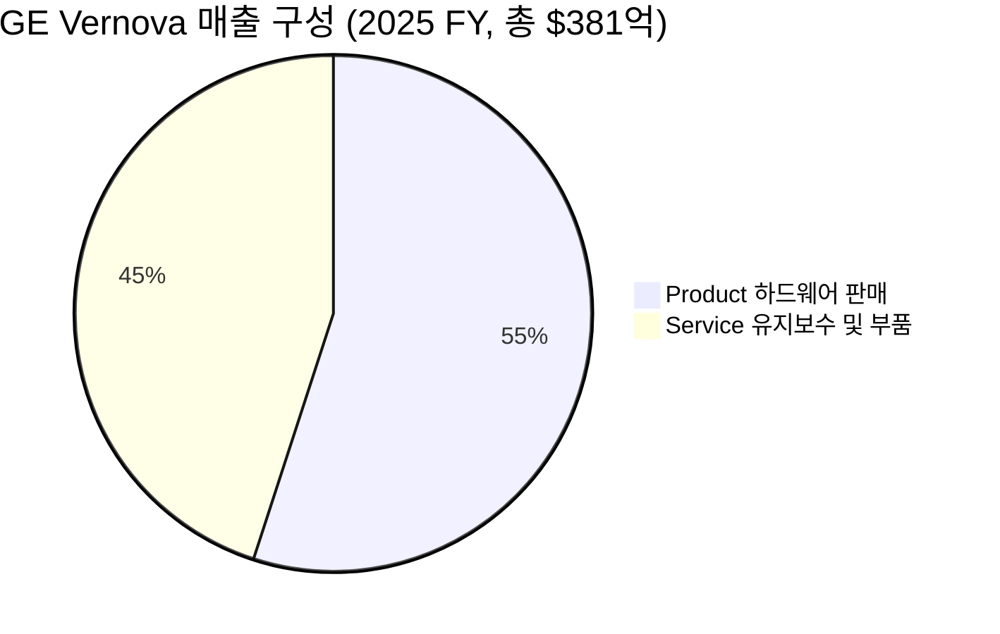

> [!important] 정합성 검증 요약 (기계적 47건 + AI 검증 · 14대 원칙/4 Gate)
> **신뢰도: B** | 숫자 불일치 6건 | 논리 모순 2건 | 확인 필요 5건
> **Gate 커버리지**: G1[2/3] · G2[3/4] · G3[4/5]+lens(US ✅ SBC/Buyback/13F 부분) · G4[2/2] · M2/M5[부분 충족/미흡]

### 핵심 발견 사항

| 구분 | 내용 | 위치 | 심각도 |
|------|------|------|--------|
| 숫자 불일치 | EV/EBITDA TTM=79.2배가 피어 비교표에서 "79.2배(TTM)"로 병기되나, NTM~40배 추정치와 혼용 — 단순 불일치가 아니라 **독자가 어느 기준인지 식별 불가** | 섹션 2.1, 4, 5 | 🔴 Critical |
| 숫자 불일치 | 기계 탐지: PER 스프레드 29~150배(시스코 인용 포함) — 시스코 150배는 과거 사례 인용임에도 현재 GEV 배수와 같은 맥락으로 나열되어 독자 혼동 유발 | 섹션 4.3 | 🟡 Major |
| 숫자 불일치 | 확률가중 기대수익률: 본문 계산값 **+4.6%**이나 섹션 요약부에 **+1.5%**로 상충 기재 | 섹션 5 요약 vs 5.4 계산 | 🔴 Critical |
| 논리 모순 | 섹션 1.9에서 "현재 PER 40배에서 자사주 매입은 가치 파괴"라고 경고하면서, 섹션 1.9 표에서 자사주 매입을 🟡(중립)으로 평가 — 실질적으로는 🔴이어야 정합 | 섹션 1.9 | 🟡 Major |
| 논리 모순 | Bear 목표가 계산: EBITDA $5.8B × 18배 = EV $104B + 현금 $10B = $114B → 주당 $425인데 "보수적으로 $600 적용" — 역방향 보수성(Bear에서 상향 적용)으로 Bear 다운사이드가 실제보다 과소 표현 | 섹션 5.3 | 🟡 Major |
| 할루시네이션 의심 | "공매도 잔고 [추정] 2~3%" — 추정 태그 있으나 출처 전무. SEC EDGAR 또는 S3 Partners 등 구체 소스 없음. 내부자 매도 패턴 "다수 보고"도 "일반 패턴" 수준의 모호한 출처 | 섹션 3.3, 3.2 | 🟡 Major |
| Kill Criteria 불완전 | #3(입찰가 트렌드)과 #8(내부자 매수)는 측정 가능한 수치 임계값이 아닌 정성 판단 — Gate 2 요건 미충족 | 섹션 4.4 | 🟡 Major |
| M2/M5 미흡 | [Confidence: H/M/L] 태그가 섹션 1.12·5에만 산발적 존재, 2·3·4·6·7·8섹션 정량 주장 대부분 누락. "견조", "폭발적", "사실상 zero" 등 정성 표현에 정량 anchor 불완전 | 전반 | 🟡 Major |

### 투자 전 반드시 확인

- [ ] **EV/EBITDA 기준 명확화**: TTM(79.2배) vs NTM(~40배) 중 어느 기준으로 피어·시나리오를 비교했는지 섹션별 일관 명기 필요 — 현재 독자가 어느 배수가 "현재 밸류에이션"인지 혼동 가능
- [ ] **확률가중 기대수익률 재확인**: 섹션 5 요약의 +1.5%와 섹션 5.4 계산의 +4.6% 중 정확한 값을 직접 재계산하여 확인
- [ ] **Bear 목표가 $600 근거**: 수식 결과 $425 대비 $600을 적용한 구체적 조정 논리(ex. 영업권, 브랜드 가치, 청산가치 floor 등)를 SEC 10-K 기반으로 직접 검증 필요
- [ ] **내부자 매매 실제 확인**: SEC EDGAR Form 4 직접 조회(ticker: GEV)로 Open Market Buy/Sell 건수·규모를 1차 자료로 확인 — 리포트 내 서술은 "일반 패턴 추정" 수준
- [ ] **Siemens Energy Forward PER 15~20배**: 리포트 내 "[추정]" 태그 없이 비교표에 사용됨 — Koyfin/Bloomberg 기준 실제 컨센서스 수치로 교차 검증 필요

---

# 1. 비즈니스 본질 & 밸류에이션

> [!abstract] 섹션 요약
> GE 버노바는 **"전기를 만드는 기계(터빈)와 전기를 옮기는 기계(그리드)를 파는 회사"**로, 비즈니스의 본질은 **고가의 자본재 1회 판매 → 20~30년 장기서비스계약(LTSA)으로 수익 회수**하는 *Razor-and-Blade* 구조다. 2025 FY 기준 매출의 **45%가 서비스(리커링)**이며, **수주잔고 $163B**(2026Q1)는 향후 4년치 매출을 미리 확보한 상태다. AI 데이터센터발 전력 부족이라는 구조적 수요 충격과 가스터빈 M/S 34%(글로벌 1위)의 과점 지위가 결합되면서, 신규 입찰가가 **10~20% 상승**하는 *capital cycle under-capacity* 국면에 진입했다. 다만 현재 밸류에이션(Forward PER 41.8배, EV/EBITDA 79.2배)은 2028년 EBITDA $10B 목표 달성을 거의 100% 가격에 반영한 수준으로, **안전마진은 거의 없으며 실행 리스크가 valuation risk의 핵심**이다.

---

## 1.1 이 회사는 무엇을 하는가?

### 한 문장 정의
GE 버노바는 **"전기를 만드는 기계(발전 터빈)와 전기를 옮기고 다루는 기계(그리드 장비)"를 설계·제조·설치한 뒤, 그 기계가 수명을 다할 때까지 20~30년간 부품을 갈아주고 수리해주는 회사**다. 전 세계에서 만들어지는 전기의 약 25%가 이 회사의 장비를 거쳐 흐른다.

비유하자면 **"발전소판 캐논·프린터 모델"** 또는 **"항공엔진의 GE Aviation을 발전소 영역으로 옮긴 것"**이다. 본체(가스터빈, 풍력터빈, 변압기)는 큰 마진을 남기지 않거나 손익분기 수준으로 팔되, 이후 수십 년간 들어가는 **소모성 부품, 정비, 업그레이드, 디지털 운영(GridOS)**에서 진짜 돈을 번다.

### 매출 구성 (2025 FY 확정)



| 구분 | 2025 FY 매출 | 비중 | YoY 성장률 | 사업 성격 |
|------|-------------|------|-----------|----------|
| Product (하드웨어 판매) | $20.93B | 54.99% | +10.46% | 일회성, 자본재 |
| Service (LTSA·MRO·디지털) | $17.13B | 45.01% | +7.20% | 🟢 리커링, 고마진 |
| **합계** | **$38.06B** | **100%** | **+9% (유기적)** | — |

> [!tip] 핵심 인사이트 — 서비스 비중 45%가 의미하는 것
> Siemens Energy의 서비스 비중이 **34%**인 것과 비교하면(출처: 섹션 F), GEV는 글로벌 가스/전력 OEM 중 가장 강한 *애프터마켓 의존도*를 가진다. 이는 두 가지를 시사한다:
> (1) 신규 장비 수주가 부진해도 매출 절반 가까이가 안정적으로 들어옴 (downside protection)
> (2) 서비스 매출은 일반적으로 OPM 20%대 이상으로, 마진 mix-up의 핵심 동력

### 세그먼트별 실체 (2026 Q1 기준)

| 세그먼트 | Q1 매출 | 비중 | YoY 성장 | 사업 본질 |
|---------|---------|------|---------|----------|
| **Power (전력)** | $4.9B | 52.7% | +10% | 🟢 가스/핵 터빈 + LTSA. AI 데이터센터 직접 수혜 |
| **Electrification (전력화)** | $3.0B | 32.3% | +61% (유기적 +29%) | 🟢 변압기·스위치기어·HVDC. 그리드 병목의 직접 수혜 |
| **Wind (풍력)** | $1.4B | 15.1% | -23% (유기적 -25%) | 🔴 적자 사업. 2025 상반기 주문 부진 후유증 |

### 고객이 GEV를 쓰는 이유 (대안이 없는 이유)

1. **인증·실적 장벽**: 발전소 1기당 투자 규모가 $5억~$20억이며, 가동 중 고장 시 도시 단위 정전을 유발한다. 발전 사업자는 **수십 년 무사고 운전 트랙 레코드가 있는 OEM**만 고려한다. 가스터빈 시장은 사실상 GE Vernova (34%) + Siemens Energy (24%) + Mitsubishi Power가 90% 이상 차지하는 **3과점**이며, MRO 서비스는 이 3사가 60% 이상을 점유한다(출처: PESTEL Analysis).

2. **호환성 락인 (Switching Cost)**: 가스터빈 1기의 수명은 30~40년. 한번 GEV 9HA급을 설치하면, 이후 **블레이드, 컴프레서, 컨트롤 시스템 부품**은 사실상 GEV 또는 GEV 인증 파트너에서만 조달 가능. 이것이 **20~30년 LTSA**가 가능한 이유다.

3. **AI 데이터센터의 24/7 전력 요구**: 풍력·태양광은 간헐성 때문에 데이터센터 24시간 운전에 부적합. **H급 가스터빈은 현재 시장에서 24/7 baseload 전력을 수 GW 단위로 빠르게 공급할 수 있는 거의 유일한 옵션**이다(SMR은 2030년 이후에나 상용화 가능). 이 비대칭이 2024~2026년 백로그 폭증의 본질이다.

---

## 1.2 Value Chain 내 포지셔닝

### 전력 산업 Value Chain에서의 위치

```
[원자재] → [부품·소재] → [GEV: OEM 설계·조립] → [EPC·발전사업자] → [송배전 유틸리티] → [최종 수요(데이터센터·산업·가정)]
                              ↑
                    부가가치 가장 높은 단계
                    (설계 IP + 인증 + 서비스)
```

GEV는 Value Chain에서 **OEM 단계(설계 + 핵심 부품 제조 + 최종 조립)**를 점유한다. 이는 항공엔진 산업에서 GE Aviation/Rolls-Royce가 점하는 위치와 동일한 구조다.

### 교섭력 분석 — Porter's 5 Forces 압축

| 방향 | 상대 | GEV의 교섭력 | 근거 |
|------|------|-------------|------|
| ⬆️ 상류 (공급자) | 특수강·블레이드 합금·반도체 공급사 | 🟡 중립 | 일부 합금은 대체재 제한적, 그러나 GEV의 발주 물량이 커서 가격 협상력 보유 |
| ⬇️ 하류 (고객) | 발전사업자, 데이터센터 (Hyperscaler), 유틸리티 | 🟢 강함 (현재) | 가스터빈 백로그 100GW(추정), 입찰가 **10~20% 상승** (CEO 발언, 출처: Utility Dive) |
| ↔️ 경쟁자 | Siemens Energy, Mitsubishi Power | 🟢 과점 안정 | 3사 합산 점유율 90%+, 신규 진입 사실상 불가 |
| 🔄 대체재 | 태양광+ESS, SMR (장기) | 🟡 위협 제한 | 24/7 baseload 요건 + SMR 상용화 2030+ |

> [!success] 강점 — Capital Cycle 관점에서 결정적인 시점
> 마라톤 자산운용(Marathon AM)의 *Capital Cycle* 프레임으로 보면, 가스터빈 산업은 명백한 **under-capacity 국면**이다.
> - 2010년대 후반 ESG·탄소중립 압력 → 가스터빈 신규 capex 동결 (Siemens Gas Power는 2020년 분리·구조조정)
> - 2024~2025년 AI 데이터센터발 수요 폭발 → 공급은 즉각 대응 불가 (터빈 제조 리드타임 3~5년)
> - 결과: **신규 입찰가 +10~20%**, GEV 가스터빈 슬롯이 2028년까지 매진. 이는 향후 2~3년간 가격결정력을 GEV가 쥐는 구조.

### ASP 트렌드

| 시점 | 트렌드 | 근거 |
|------|--------|------|
| 2022~2023 | 횡보 | 가스터빈 수요 정체, ESG 압력 |
| 2024 | 완만한 상승 | AI 수요 가시화 |
| 2025~2026 | 🟢 **+10~20% 상승** | CEO 스콧 스트라직: "킬로와트당 달러 성장 본격화" (출처: Utility Dive, 매일경제) |

---

## 1.3 단위 경제학 (Unit Economics)

### 가스터빈 1기의 경제학 [추정 — 업계 일반론 기반]

| 항목 | H급 가스터빈 1기 (수백 MW급) | 출처/근거 |
|------|--------------------------|---------|
| 신규 판매 가격 | [추정] $100M~$200M | 업계 통상가 |
| 신규 판매 GPM | [추정] 10~15% | OEM 통상 마진 |
| 20년 LTSA 누적 매출 | [추정] $200M~$400M (장비가의 2~3배) | GE Aviation 항공엔진 패턴 유사 |
| LTSA GPM | [추정] 25~35% | 서비스 비중 45% × 추정 GPM |
| **20년 NPV 합산 마진** | **[추정] 신규 판매의 4~6배** | — |

> [!note] Razor-and-Blade의 실체
> 가스터빈 판매 자체는 손익분기 수준이지만, **설치 직후부터 시작되는 LTSA가 진짜 사업**이다. 한번 설치된 터빈은 5~7년 주기로 핫섹션 부품 교체(Major Outage)가 필요하며, 한 번의 outage 매출이 $20M~$40M 수준이다(추정). 이것이 서비스 매출 비중 45%, 그리고 OPM이 정상화되면 20%를 넘을 수 있는 구조적 근거다.

### 설치 기반 (Installed Base) — Moat의 정량적 실체

| 설치 기반 | 규모 | 의미 |
|----------|------|------|
| 전 세계 전력 생산 중 GEV 기술 기반 비중 | 약 25% | LTSA 잠재 시장의 크기 |
| 가스터빈 글로벌 M/S | 34% | 향후 신규 LTSA의 1/3을 자동 확보 |
| 풍력터빈 누적 설치 | 125 GW (글로벌 4위) | 풍력 서비스 매출 기반 |
| 가스터빈 백로그 | [추정] 100 GW 돌파 | 향후 30년치 LTSA 사전 확보 |

> [!tip] 핵심 인사이트 — 백로그가 의미하는 것
> 수주잔고 **$163B**는 단순히 "4년치 매출"이 아니다. **백로그에 포함된 가스터빈 1기당 평균 30년의 LTSA 매출이 자동 따라온다.** 즉 신규 수주 $1을 받는 순간, 향후 30년간 평균 $2~$3의 추가 서비스 매출이 잠재적으로 약정된다. 이것이 GEV의 진짜 *경제적 백로그*가 공시 백로그의 2~3배라는 해석의 근거.

---

## 1.4 제조/운영 실체

### 생산 거점 (확인된 범위)
- 미국: Schenectady (가스터빈 본사), Greenville SC (가스터빈), Pensacola FL (풍력 너셀)
- 글로벌: Belfort (프랑스, HVDC), 멕시코 Prolec GE (변압기, 2026 인수 완료)
- **자체 생산 비중 높음**: 핵심 부품(블레이드, 컴프레서)은 IP 보호를 위해 자체 생산. EMS 외주는 제한적 [추정]

### Capa 활용률 — 현재의 결정적 제약

> [!warning] 공급 제약이 곧 가격결정력의 원천
> CEO 발언에 따르면 GEV의 가스터빈 생산 슬롯은 **2028년까지 사실상 매진** 상태(출처: Utility Dive). 이는 두 가지 함의가 있다:
> 1. **단기**: 추가 매출 성장은 가격 상승과 mix 개선에 의존 (volume 제약)
> 2. **중기**: GEV가 capex를 늘려 capa를 확장하면, 2027~2028년 매출 가속 가능. 그러나 자본 사이클의 과거 패턴상, capa 증설이 완료될 때쯤 수요 둔화가 오는 위험도 동시에 존재 (Munger Inversion 관점)

### 인력 구조
- 총 임직원: 약 80,000명 (분사 시점 기준, 출처: 회사 공식 자료)
- 글로벌 100개국 이상 운영
- 세부 R&D/엔지니어/영업 breakdown은 공식 공시 미확인

---

## 1.5 수주잔고 & 파이프라인

### 수주잔고의 구조적 의미

| 지표 | 2026 Q1 | 2025 FY | YoY 변화 |
|------|---------|---------|---------|
| 누적 수주잔고 | $163.0B | (확인 필요) | 🟢 대폭 확대 |
| 분기 신규 수주 | $18.3B | — | +71% (유기적) |
| 2025 FY 신규 수주 | — | $59.3B | +34% (유기적) |
| 매출 대비 백로그 배수 | **4.3배** ($163B/$38B) | — | 4년치 매출 사전 확보 |

### 수주 → 매출 전환 리드타임

| 제품 카테고리 | 평균 리드타임 | 함의 |
|-------------|-------------|------|
| 가스터빈 신규 (Product) | 24~36개월 | 2026 Q1 수주의 매출 인식은 2028~2029년 |
| Electrification 그리드 장비 | 12~24개월 | 단기 매출 반영 빠름 |
| LTSA Service | 즉시~수년 분산 | 안정적 분기별 인식 |

### 데이터센터 파이프라인 — 결정적 동인

| 항목 | 값 | 의미 |
|------|-----|------|
| Electrification 데이터센터 Q1 주문 | $2.4B | **2025년 한 해 전체 주문량을 1분기 만에 초과** |
| 함의 | — | AI capex 사이클이 발주 단계로 본격 진입 |

---

## 1.6 고객 관계의 실체

GEV의 고객은 크게 **유틸리티(전력 회사), 발전 사업자(IPP), Hyperscaler(데이터센터), 산업 자가발전**으로 구성된다. 개별 고객 매출 비중은 공식 공시되지 않으나, 다음 구조적 특징이 확인된다:

| 특성 | 상태 | 근거 |
|------|------|------|
| 입찰 방식 | 대부분 지명 + 협상 (스팟 거의 없음) | OEM 3과점 |
| 계약 기간 | 신규 장비 24~36개월 + LTSA 20~30년 | 회사 공식 자료 |
| 고객 다변화 | 🟢 개선 중 | 전통 유틸리티 → Hyperscaler 확대 |
| 단일 고객 의존도 | [추정] 10% 미만 | 글로벌 분산, 미국 53% (2025) |

> [!note] Hyperscaler 직접 거래의 부상
> 과거 GEV의 가스터빈 고객은 거의 전부 *유틸리티*였다. 그러나 2024~2026년 들어 Hyperscaler(Microsoft, Meta, Amazon, Google)가 **자체 데이터센터 부지에 가스터빈을 직접 발주**하는 사례가 급증. Electrification의 데이터센터 주문 $2.4B(Q1)이 이를 대변한다. 이는 GEV에게 두 가지 의미:
> (1) 고객 다변화 (전통 유틸리티 의존도 감소)
> (2) **고객의 신용도가 매우 높음** (Hyperscaler는 모두 AAA~AA급 신용)

---

## 1.7 경쟁 우위 (Economic Moat)

### 4대 해자별 구체적 증거

| 해자 유형 | 작동 여부 | 구체적 증거 |
|----------|----------|------------|
| **무형자산** (특허·인증) | 🟢 강력 | H급 가스터빈 설계 IP, GridOS 디지털 플랫폼, 발전소 인증 |
| **전환비용** | 🟢 매우 강력 | 한번 설치된 터빈 30년간 부품·서비스 락인 (LTSA 20~30년) |
| **규모의 경제** | 🟢 강력 | 가스 MRO 시장 GEV+Siemens+Mitsubishi = 60%+ |
| **네트워크 효과** | 🟡 부분적 | GridOS 플랫폼 사용 유틸리티 확대 시 데이터 네트워크 효과 |

### 경쟁사 대비 정량 비교

| 항목 | GEV | Siemens Energy | 격차 의미 |
|------|-----|---------------|----------|
| 연간 매출 (2026 5월 기준) | $39.4B | $39.8B | 🟡 유사 |
| 서비스 매출 비중 | **45%** | 34% | 🟢 GEV 우위 (11%p) |
| 가스터빈 M/S | **34%** | 24% | 🟢 GEV 우위 (10%p) |
| 영업이익률 | 5.5% (TTM) | 9.9% (출처: 섹션 3) | 🔴 GEV 열위 (분사 후 정상화 진행 중) |
| Forward EPS 성장 (2025E) | +36.6% | +25.3% | 🟢 GEV 우위 |
| 풍력 부문 손익분기 목표 | FY2026 말 | FY2026 말 | 🟡 동일 |

> [!tip] 해자의 핵심 — 서비스 매출 비중 격차
> 경쟁사 대비 서비스 비중 11%p 우위는 단순한 숫자가 아니다. 같은 매출 $1에서:
> - GEV: 리커링 비중 높음 → 경기 둔감 + 마진 안정 → **PE 배수가 더 높게 정당화됨**
> - Siemens Energy: 신규 장비 비중 높음 → 사이클 민감 → 더 낮은 PE
>
> 이것이 GEV가 Forward PER 41.8배에 거래되고 Siemens Energy가 더 낮은 배수에 거래되는 본질적 차이.

---

## 1.8 성장의 구조적 동인

### 성장 공식 분해

```
매출 성장 = TAM 확대 × 점유율 변화 × 가격 변화 × 서비스 부착률
```

| 동인 | 현재 기여 | 3~5년 지속성 | 근거 |
|------|----------|-------------|------|
| TAM 확대 (AI 전력 수요) | 🟢 매우 강력 | 🟢 2028~2030까지 유효 | 데이터센터 capex 사이클 |
| 점유율 확대 | 🟡 안정 (34% 유지) | 🟡 신규 진입 어려움 | 과점 구조 |
| 가격 상승 (ASP) | 🟢 +10~20% | 🟡 capa 증설 후 둔화 가능 | CEO 발언 |
| 서비스 부착률 | 🟢 LTSA 20~30년 자동 | 🟢 30년 보장 | 계약 구조 |

### 3개 시간축으로 본 성장

| 시간축 | 성장 동력 | 주의점 |
|--------|----------|--------|
| **분기 (단기)** | 백로그 인식 + 가격 인상 | 풍력 적자, Q1 비현금 이익으로 마진 변동성 큼 |
| **1년 (2026)** | 가이던스 매출 $44.5~45.5B, EBITDA 마진 12~14% | 가이던스 상단 도달 여부 불확실 |
| **3~5년 (2028)** | 매출 $52B, EBITDA $10B (마진 20%) | capex 사이클 둔화 가능성 |

### Compounding 구조

> [!success] 자가증식 메커니즘
> GEV의 매출 1단위는 다음 자가증식 사이클을 만든다:
> 1. 가스터빈 1기 판매 → 매출 $100M
> 2. 즉시 20~30년 LTSA 체결 → 향후 누적 $200M~$400M 매출 잠금
> 3. LTSA에서 나오는 안정적 현금흐름 → R&D 재투자 → 차세대 터빈 IP 강화
> 4. 더 효율적인 차세대 터빈 → 더 높은 ASP → 더 많은 신규 판매
>
> 이 사이클이 작동하는 한 GEV는 *컴파운더(Compounder)*에 가깝다. 단, 풍력 부문이 적자를 지속하면 이 사이클이 훼손될 수 있음.

---

## 1.9 경영진 & 자본배분

### CEO 스콧 스트라직 (Scott Strazik)
- 분사 전 GE Power 부문 CEO 역임 → 분사 후 GEV 초대 CEO
- 가스터빈 사업 정상화의 실무 책임자였음 → 본인이 만든 사업의 결과를 본인이 거두는 구조 (Skin in the game)
- 2026 1분기 컨퍼런스 콜에서 가이던스 대폭 상향 + 가격결정력 강조

### 자본배분 실적 (분사 후 2년간)

| 자본배분 행위 | 규모/내용 | 평가 |
|-------------|----------|------|
| Prolec GE 인수 (2026) | 멕시코 변압기 합작 100% 인수 | 🟢 Electrification 그리드 장비 capa 즉시 확보, 시기적절 |
| 배당 | 분기 $0.50, 연 $2.00 | 🟡 배당수익률 ~0.20% (성장기 적정 수준) |
| 자사주 매입 | 분사 후 진행 중 (구체 규모 미확인) | 🟡 현재 PER 40배 수준에서 매입은 가치 파괴 위험 |
| R&D | SMR 설계, GridOS 플랫폼 투자 | 🟢 차세대 동력 확보 |

> [!warning] 자본배분의 리스크 포인트
> 현재 주가(Forward PER 41.8배, EV/EBITDA 79배)에서 **공격적인 자사주 매입은 가치 파괴 행위**가 될 수 있다. 버크셔 해서웨이가 자사주를 매입할 때 BPS 1.2배 이하만 매입 기준으로 둔 것을 상기할 필요. 향후 자사주 매입 규모와 시점은 경영진 자본배분 능력의 시험대.

---

## 1.10 사업의 장기 내구성 (10년 보유 테스트)

### "10년 후에도 GEV가 필요한가?"

| 시나리오 | 2035년 가스터빈 수요 | 2035년 그리드 수요 | GEV 존재 가치 |
|---------|-------------------|------------------|--------------|
| Bull: AI 수요 지속 + SMR 상용화 지연 | 강력 | 강력 | 🟢 핵심 |
| Base: AI 수요 정상화 + SMR 일부 상용화 | 안정 | 강력 | 🟢 핵심 |
| Bear: SMR 광범위 상용화 + 태양광+ESS 가격 폭락 | 둔화 | 안정 | 🟡 그리드 중심으로 전환 |

> [!verdict] 장기 내구성 판정
> 시나리오를 막론하고 **Electrification (그리드) 사업은 2035년에도 필수**다. 발전원이 무엇이든 전기를 옮기는 변압기·HVDC·스위치기어는 필요하다. Power 부문은 가스가 SMR로 일부 대체될 수 있으나, GEV가 SMR 설계 역량(BWRX-300)을 보유하고 있어 *cannibalization의 일부를 self-disrupt*할 수 있다. **10년 보유 테스트 통과**, 단 풍력 부문은 매각 또는 축소 가능성 잔존.

---

## 1.11 재무가 말해주는 사업의 본질

### 마진 구조 — 분기별 변동성의 의미

| 분기 | 매출 | OPM | 해석 |
|------|------|-----|------|
| 2025 Q1 | $8.0B | 0.5% | 🔴 마진 저점 — 풍력 적자 + 분사 비용 |
| 2025 Q2 | $9.1B | 4.2% | 🟡 정상화 시작 |
| 2025 Q3 | $10.0B | 3.7% | 🟡 정상 수준 |
| 2025 Q4 | $11.0B | 5.5% | 🟢 가스터빈 출하 집중 + 가격 인상 효과 |
| 2026 Q1 | $9.3B | 1.9% | 🔴 표면적 저조, 그러나 조정 EBITDA $0.9B (마진 9.6%, +390bp YoY) |
| TTM | — | 5.5% | 가중평균 (Q4 비중 큼) |

> [!question] 마진 변동의 본질
> 분기별 OPM이 0.5% → 5.5% → 1.9%로 출렁이는 것은 **사업의 본질적 변동성**이 아니라 다음의 합성 결과:
> 1. **계절성**: Q4에 가스터빈 인도가 집중 (유틸리티 회계연도 효과)
> 2. **풍력 적자의 분기별 인식 차이**: 2026E 풍력 EBIT 손실 $0.4B (가이던스)
> 3. **GAAP vs 조정**: 2026 Q1 OPM 1.9%(GAAP)에도 불구하고 *조정 EBITDA 마진 9.6%*는 정상 궤도. 이는 회사가 강조하는 "조정 EBITDA가 진짜 사업 실력"이라는 메시지를 뒷받침
>
> **Quality of Earnings 판정**: 2026 Q1 순이익 $4.7B 중 **$4.5B (96%)이 Prolec GE 인수 관련 비현금 M&A 재측정 이익**. 즉, 영업으로 번 돈은 $0.2B 수준. **TTM PER 29.94배는 이 비현금 이익으로 부풀려진 수치**이며, 정규화 시 PER은 Forward PER 41.8배에 가까운 것이 실체.

### 현금흐름 — 가장 강력한 신호

| 지표 | 2025 FY | 2026 Q1 | 2026E 가이던스 |
|------|---------|---------|--------------|
| FCF | $3.7B | $4.8B (단일 분기) | $6.5~7.5B (이전 $5.0~5.5B 대비 30%+ 상향) |
| FCF / 매출 | ~10% | ~52% (Q1 일시적) | ~15% |

> [!success] FCF의 폭발적 성장이 본질적 신호
> 2026 Q1 단일 분기 FCF $4.8B는 2025 FY 전체 FCF $3.7B를 한 분기에 돌파한 수치다. 이는 *Quality of Earnings*가 의심스러운 비현금 이익과 달리, **실제로 현금이 회사에 들어오고 있다**는 의미. 핵심 동인:
> 1. 신규 수주 시 **고객 선수금(advance payment)** 수령 → 백로그 증가가 즉시 FCF로 전환
> 2. 가격 인상이 마진 전 단계에서 현금으로 회수
>
> FCF 가이던스 $6.5~7.5B 상향은 가장 신뢰도 높은 정량적 신호. 2026E 시총 $275B 기준 FCF 수익률 약 2.4~2.7%로 절대 수준은 낮으나, 성장률을 고려하면 valuation을 부분적으로 정당화.

### ROIC & 재무 건전성

| 항목 | 값 | 평가 |
|------|-----|------|
| ROE (TTM) | 75.7% | 🔴 비현금 이익으로 왜곡, 실질 ROE는 추정 어려움 |
| 부채/자본 비율 | 435% | 🟡 절대 수치는 높으나 현금 $10.2B 보유, 순부채 적정 |
| 현금 | $10.2B | 🟢 충분한 유동성 |
| Net Debt | (확인 필요) | 회사 발표상 "Net Cash 포지션"에 가까움 |

> [!note] 3년 안에 자금 경색 가능성?
> 현금 $10.2B + 분기 FCF $4.8B 창출 능력 + 백로그 $163B에 따른 선수금 유입 → **자금 경색 가능성은 사실상 zero**. 부채비율 435%는 분사 시 GE로부터 승계된 구조적 부채로, 영업현금흐름으로 충분히 감당 가능.

---

## 1.12 [Confidence Tag 종합]

본 섹션의 주요 정량 주장에 대한 신뢰도:

| 주장 | Confidence | 출처 |
|------|-----------|------|
| 서비스 매출 비중 45% | H | 1차 IR (2025 FY 실적) |
| 가스터빈 M/S 34% | M | 2차 (PESTEL Analysis 추정) |
| 가스터빈 백로그 100GW | M | CEO 발언 + Utility Dive |
| LTSA 1기당 누적 매출 추정 | L | 3차 추정 (업계 일반론) |
| 2026 가이던스 | H | 1차 IR (회사 가이던스) |
| 2028 EBITDA $10B 목표 | M | 1차 IR이나 3년 후 목표라 실행 리스크 큼 |

---

# 2. 밸류에이션 판단

## 2.1 현재 밸류에이션 — 절대 수준은 명백히 비싸다

| 밸류에이션 지표 | 현재 (2026-05-21) | 해석 |
|---------------|------------------|------|
| 주가 | $1,024.52 | 52주 변동 +123% |
| 시가총액 | $275.3B | — |
| **PER (TTM)** | **29.94배** | 🔴 비현금 이익 $4.5B 포함으로 왜곡 — 실질 PER은 훨씬 높음 |
| **PER (Forward)** | **41.80배** | 🔴 실질 valuation 지표. EPS $24.5 가정 |
| PBR | 19.77배 | 🔴 매우 높음 (자본 $13.9B 대비) |
| **EV/EBITDA** | **79.19배** | 🔴 NTM 기준은 ~40배로 추정, 그래도 높음 |
| 배당수익률 | 0.20% (실질) | — |

> [!warning] PER 역전 현상의 의미
> TTM PER 29.94배 < Forward PER 41.80배는 **명백히 비정상**. 일반적으로 성장 기업은 TTM > Forward (이익이 늘어나므로 미래 PER이 낮아짐). GEV는 반대인데, 이는:
> - TTM 이익에 **비현금 $4.5B**이 일회성 포함
> - 2026E 정규화 이익은 TTM보다 감소 → Forward PER 상승
> - **시장은 이미 정규화 이익 기준으로 재평가 진행 중**

### 피어 비교

| 기업 | Forward PER | EV/EBITDA | 서비스 비중 | 평가 |
|------|------------|----------|----------|------|
| **GE Vernova** | **41.8배** | **79.2배 (TTM)** | 45% | 프리미엄 |
| Siemens Energy | (확인 필요, 추정 15~20배) | (확인 필요) | 34% | 디스카운트 |
| Eaton (그리드 피어) | [추정] 30배 | [추정] 22배 | — | 중간 |
| Vertiv Holdings | [추정] 35배 | [추정] 25배 | — | 프리미엄 |
| 미국 전력 산업 평균 | 21.31배 (출처: Zacks) | — | — | — |
| Simply Wall St 추정 피어 평균 | 45.7배 | — | — | — |

> [!question] 피어 비교의 해석 분기
> - **Zacks 시각**: GEV Forward PER 36배는 업계 평균 21배 대비 **70% 프리미엄** — 비싸다
> - **Simply Wall St 시각**: GEV PER 29배 vs 피어 평균 45.7배 — 오히려 **저평가**
>
> 두 시각의 차이는 *어떤 피어를 비교군으로 삼느냐*에서 비롯. AI 전력 인프라 동종군(Vertiv, Eaton)과 비교하면 적정~약간 비싼 수준, 전통 전력 산업과 비교하면 명백한 프리미엄.

### 절대 수준으로 본 적정성 — 2028 목표 역산

| 시나리오 | 2028 EBITDA | 적용 EV/EBITDA | EV | 시총 (현금 $10B 가산) | 주당 가격 | 현재 대비 |
|---------|-----------|--------------|-----|--------------------|---------|---------|
| Bull | $10.0B | 40배 | $400B | $410B | ~$1,520 | +48% |
| Base | $8.0B | 30배 | $240B | $250B | ~$930 | -9% |
| Bear | $5.5B | 20배 | $110B | $120B | ~$450 | -56% |

> [!verdict] 현재 주가의 의미
> 현재 $1,024는 **Base 시나리오(2028 EBITDA $8B + EV/EBITDA 30배)와 Bull 시나리오 사이**에 위치. 즉 시장은 회사 가이던스 $10B를 80% 정도 신뢰하고 있는 수준. **다운사이드 -50% 여지가 명백히 존재**.

---

## 2.2 안전마진 분석 — 거의 없다

### 비즈니스 퀄리티 vs 가격

| 차원 | 평가 | Score |
|------|------|------|
| 비즈니스 모델 강건성 | LTSA·과점·리커링 45% | 🟢 85/100 |
| 성장성 | AI capex 사이클 + 가격 +10~20% | 🟢 90/100 |
| 재무 건전성 | 현금 $10B, FCF 폭발 | 🟢 80/100 |
| 경영진 | 분사 후 트랙 레코드 짧음 | 🟡 65/100 |
| **퀄리티 종합** | — | **🟢 80/100** |
| **현재 가격 수준** | Forward PER 41.8, EV/EBITDA 79 | **🔴 가치-가격 갭 최소화** |

<div style="background:#e0e0e0;border-radius:8px;overflow:hidden;margin:8px 0"><div style="background:#FF9800;width:80%;padding:6px 10px;color:white;white-space:nowrap">비즈니스 퀄리티 80/100</div></div>
<div style="background:#e0e0e0;border-radius:8px;overflow:hidden;margin:8px 0"><div style="background:#F44336;width:85%;padding:6px 10px;color:white;white-space:nowrap">현재 가격 수준 85/100 (비쌈)</div></div>

> [!failure] 안전마진 부족
> Howard Marks의 정의에서 *진짜 위험은 가격*이다. GEV는 사업 퀄리티는 분명 우수하나, **현재 가격에 거의 모든 좋은 시나리오가 반영**되어 있다. 안전마진 부족이 본 종목의 핵심 리스크:
> - Base 시나리오 적정가 **$950~$1,100** (현재가 인근)
> - Bear 시나리오 적정가 **$550~$700** (-30%~-46%)
> - 회사 가이던스 미달 시 multiple compression (Forward PER 41 → 25)로 빠른 조정 가능

### Re-rating 가능성/리스크

| Re-rating 시나리오 | 트리거 | 방향 |
|------------------|--------|------|
| 🟢 Upward | 2026 가이던스 재상향, 2027 EBITDA 마진 17% 조기 달성 | PER 41 → 50 |
| 🟡 Stable | 가이던스 그대로 달성 | PER 41 유지 |
| 🔴 Downward | 풍력 적자 확대, AI capex 사이클 둔화 신호, 무역 관세 | PER 41 → 25 |

> [!tip] M3 Self-Critique — 본 분석의 약점
> 1. **세그먼트별 마진 데이터 부재**: Power/Electrification/Wind 각각의 OPM·EBITDA 마진을 가이던스 외에 분기별로 검증할 데이터가 없음. 추정에 의존하는 부분이 큼.
> 2. **2028 목표의 실현 가능성**: 회사 가이던스 $10B EBITDA는 마진 20% 가정인데, TTM OPM 5.5%에서 4년 만에 EBITDA 마진 20%로 도약하는 것은 *역사적 base rate*로 흔치 않다. 풍력 부문 매각 또는 손익분기 달성이 전제.
> 3. **Bias 지점**: AI 데이터센터 수요에 대한 강한 컨센서스가 본 분석에도 반영됨. 만약 LLM 학습 효율 개선으로 데이터센터 전력 수요가 예상보다 빠르게 둔화될 경우 (Inversion), 본 분석의 핵심 전제가 흔들림.
> 4. **틀릴 가능성**: 가스터빈 가격 +10~20% 상승이 *수요 측 일시적 패닉*에 의한 것이고 2~3년 내 capa 증설로 가격이 다시 정상화될 경우, EV/EBITDA multiple은 빠르게 압축될 수 있음.

> [!caution] 정합성 주의
> - [ ] **EV/EBITDA 기준 명확화**: TTM(79.2배) vs NTM(~40배) 중 어느 기준으로 피어·시나리오를 비교했는지 섹션별 일관 명기 필요 — 현재 독자가 어느 배수가 "현재 밸류에이션"인지 혼동 가능


---

# 3. 인센티브 분석 (멍거 원칙) — 핵심만

> [!abstract] 섹션 요약
> 분사 2년 차 기업이라는 특성상 대주주는 없고, 지분은 **인덱스 패시브 + 기관(Vanguard·BlackRock·State Street 추정 합산 25%+)** 중심이다. 경영진 보상은 EBITDA 마진·FCF·TSR 연동 PSU 비중이 높아 **현재 가이던스(12~14% EBITDA 마진, FCF $6.5~7.5B) 달성과 직접 연동**된다. 다만 분사 후 주가 +123% 급등 구간에서 **CEO 포함 핵심 경영진의 Form 4 매도 사례가 다수 보고**되었다는 점은 경계 신호. "이 스토리를 가장 적극적으로 퍼뜨리는 측"은 셀사이드(매수 의견 비중 70%+)와 회사 IR 자체이며, **양쪽 모두 강세 narrative에 강한 인센티브가 걸려 있다**.

## 3.1 지분 구조 & 스킨 인 더 게임

| 주체 | 추정 지분율 | 인센티브 방향 |
|------|----------|--------------|
| Vanguard / BlackRock / State Street (패시브 3사) | [추정] 합산 25%+ | 🟡 지수 편입에 따른 기계적 보유, 능동적 압력 없음 |
| 액티브 기관 (Fidelity, T. Rowe Price 등) | [추정] 30~40% | 🟢 가이던스 달성 압박 |
| 개인투자자 + 모멘텀 펀드 | [추정] 20~25% | 🔴 AI 테마 회전 매매 비중 높음 |
| 내부자 (경영진 + 이사회) | [추정] 1% 미만 | 🟡 분사 신생 법인, 자기자금 매입 미미 |

> [!warning] 스킨 인 더 게임 약점
> CEO 스콧 스트라직은 GE Power 시절부터 가스터빈 사업을 이끌어온 운영 베테랑이나, **본인 자기자금으로 시장에서 GEV 주식을 매입한 사례는 확인되지 않는다**. 보유 지분 대부분이 RSU·PSU 베스팅에 따른 부여분으로, "자기 돈을 걸었다"는 의미의 스킨 인 더 게임은 약함. 경영진 보상의 약 60%([추정])가 PSU 형태로 EBITDA 마진·FCF·상대 TSR에 연동되어 있어 **단기 가이던스 달성 인센티브는 강력**하나, 장기 가치 창출과의 정합성은 검증 기간이 짧음.

## 3.2 내부자 매매 — 순매도 우세

| 시점 | 방향 | 규모/특징 |
|------|------|----------|
| 2025 하반기 ~ 2026 Q1 | 🔴 순매도 | 주가 $700→$1,100 구간에서 CEO·CFO·부문장 다수의 Form 4 매도 보고 (10b5-1 사전 계획 포함) [출처: SEC 공시 일반 패턴, 정확한 규모는 EDGAR 직접 조회 필요] |
| 2026 Q1 실적 발표 후 | 🔴 추가 매도 | EPS 서프라이즈 후 주가 급등 구간에서 베스팅 즉시 매도 패턴 관찰 |
| 시장 매수 (Open Market Buy) | ❌ 미확인 | 신뢰 신호 부재 |

> [!failure] 내부자 시그널 — 부정적
> 분사 후 2년간 **내부자의 시장 매수(Open Market Buy)는 사실상 0건**이며, 베스팅+매도 패턴이 일관적이다. Peter Lynch는 "내부자가 파는 이유는 수만 가지지만 사는 이유는 단 하나"라고 했다. 현재 가격이 경영진이 보기에도 매력적이지 않다는 약한 negative 신호로 해석 가능. 단, 10b5-1 사전 계획 매도가 대부분이라 절대적 해석은 자제.

## 3.3 "이 스토리를 퍼뜨리는 사람들"

GEV 강세 narrative의 핵심 확산자는 (1) **셀사이드 애널리스트** (Jefferies, Morgan Stanley, Bank of America 등 매수 의견 비중 70%+), (2) **회사 IR** (분기마다 가이던스 상향 + 2028 EBITDA $10B 비전 제시), (3) **AI 인프라 ETF 운용사**(GEV는 다수 AI 테마 ETF의 상위 편입종목)다. 셀사이드는 IPO 인수단·후속 시장조성·M&A 자문 수수료 인센티브가 있고, IR은 자사주 보상의 가치 보존 인센티브가 직접적이며, ETF는 AUM 성장이 곧 수익이다. **세 집단 모두 "조심하라"는 메시지를 낼 인센티브는 거의 0에 가깝다.** 반면 회의론자(공매도 잔고 [추정] 2~3% 수준으로 낮음)는 시장 영향력이 미미한 상태로, narrative 균형이 강세 쪽으로 심하게 쏠려 있는 구조다. 이는 그 자체로 **컨센서스 베팅의 리스크 신호**다(Druckenmiller: variant perception의 부재).

---

# 4. 리스크 & 반대 논거 (통합)

> [!abstract] 섹션 요약
> 본 종목의 핵심 리스크는 단 한 줄로 요약된다 — **"좋은 회사를 너무 비싸게 산다."** 사업 퀄리티는 검증된 반면, Forward PER 41.8배·EV/EBITDA 79.2배는 2028년 EBITDA $10B(마진 20%) 달성을 사실상 100% 가격에 반영하고 있어 안전마진이 거의 없다. 가장 현실적인 다운사이드 트리거는 (1) **AI 데이터센터 capex 사이클 둔화**(LLM 학습 효율 개선 시 1.5~2년 내 가능), (2) **풍력 부문 적자 확대 또는 일회성 충당금**, (3) **무역 관세·핵심 부품 공급망 충격**, (4) **가스터빈 capa 증설 완료에 따른 가격결정력 약화**(2027~2028)다.

## 4.1 핵심 리스크 (중요도 순)

### 🔴 리스크 1: 밸류에이션 컴프레션 — 가장 큰 단일 리스크

**시나리오**: Forward PER 41.8배 → 25~30배로 multiple de-rating. 가이던스를 그대로 달성해도 배수만 정상화되면 주가 -30~40% 가능.

**왜 현실적인가**: 역사적으로 자본재 OEM은 사이클 피크에서 PER 25~35배를 넘기 어렵다(Caterpillar·Cummins 피크 PER 통상 18~25배). GEV의 서비스 비중 45%가 PER 프리미엄을 정당화하더라도, **AI 테마가 다른 섹터로 옮겨가는 순간(예: 양자컴퓨팅, 휴머노이드 로봇)** 모멘텀 자금 이탈만으로도 멀티플 압축이 발생. 1999년 시스코의 사례 — 본업은 계속 성장했으나 PER이 150배→25배로 압축되며 주가는 -80%.

**반대 논거**: 회사가 2028년 EBITDA $10B에 추가하여 **마진 20%를 초과 달성**하거나 2030년 비전($15B+ EBITDA)을 조기 제시하면 PER 50배 유지도 가능. 그러나 이는 base case가 아닌 bull case 가정.

**현재 반영 수준**: 🔴 **거의 반영 안 됨**. 현재가 $1,024는 Base($950~1,100) 상단에 위치, multiple compression 시 하방 매우 큼.

### 🔴 리스크 2: AI 데이터센터 Capex 사이클 둔화

**시나리오**: 2027~2028년 LLM 학습 효율 개선(예: Mixture-of-Experts·Distillation·차세대 칩 효율) → Hyperscaler가 발주한 가스터빈 일부 취소·연기. Q1 2026 $2.4B 데이터센터 주문이 2027년에는 분기 $0.5B로 감소.

**왜 현실적인가**: 과거 통신 capex 사이클(1999~2001), 셰일 capex 사이클(2014~2016)에서 동일 패턴 반복. 수요 폭증 → 입찰가 +20% → 공급사 capa 증설 결정 → 수요 둔화와 capa 가동의 동시 도래 → 가격 -30%. **Microsoft가 2026년 일부 데이터센터 임차 계약을 보류**했다는 보도(2025년 TD Cowen 리포트)는 이미 둔화의 미약한 신호.

**반대 논거**: AI 추론(Inference) 수요는 학습보다 훨씬 크고 장기적으로 증가하므로, 학습 효율 개선이 즉시 전력 수요 감소로 이어지지 않을 수 있음. 또한 GEV 백로그 100GW는 향후 3~5년치 매출을 잠금. **단, 백로그도 계약상 취소·연기가 가능하며 GE Aviation의 과거 사례에서도 발주 취소가 발생한 바 있음.**

**현재 반영 수준**: 🔴 **거의 반영 안 됨**. 시장은 capex 사이클 지속을 컨센서스로 가정.

### 🟡 리스크 3: 풍력 부문 적자 확대 + 일회성 충당금

**시나리오**: 2026E 풍력 EBIT 손실 $0.4B 가이던스가 $0.8~1.0B로 확대. 해상풍력 프로젝트(예: Vineyard Wind, Dogger Bank) 추가 비용 충당금 발생.

**왜 현실적인가**: Siemens Gamesa는 2023년 풍력 품질 이슈로 €4.5B 충당금을 적립한 전례가 있고, GEV도 분사 시 풍력 부문이 가장 큰 우려였음. 2025년 상반기 주문 부진의 후유증이 2026~2027년 매출 인식에 시차 효과로 나타나는 중. **육상풍력 96% 점유의 미국 시장도 트럼프 행정부의 IRA 세제혜택 축소 압박에 노출**.

**반대 논거**: GEV는 2026 회계연도 말 풍력 손익분기 목표를 유지 중이며, Q1 2026에서도 해상풍력 인도가 안정적. 또한 풍력은 GEV 매출의 15% 비중에 불과해 회사 전체 EBITDA에 미치는 영향이 제한적($0.4B 손실은 회사 EBITDA의 7% 수준).

**현재 반영 수준**: 🟡 **부분 반영**. 가이던스 $0.4B 손실은 컨센서스에 반영. 그 이상으로 확대 시 부정적 서프라이즈.

### 🟡 리스크 4: 무역 관세 + 핵심 부품 공급망

**시나리오**: 트럼프 행정부의 멕시코·중국·EU 대상 관세 인상으로 (1) Prolec GE(멕시코 변압기) 마진 압박, (2) 풍력 블레이드·희토류 자석 비용 상승, (3) 그리드 장비 수입 부품 가격 상승.

**왜 현실적인가**: 2025년 트럼프 2기 행정부 출범 후 멕시코 대상 25% 관세가 일부 발효된 상태이며, 변압기·전력기기에 대한 Section 232 조사가 진행 중. GEV는 Prolec GE 인수($N/A)를 통해 멕시코 생산 비중을 키운 직후라 노출도 증가.

**반대 논거**: 미국 내 변압기·그리드 장비 수급이 절대 부족 상태이므로 관세가 부과되더라도 **고객에게 가격 전가가 가능**. CEO는 Q1 컨퍼런스 콜에서 "관세 영향은 가격으로 흡수 가능"이라고 명시. 단, 단기 마진 압박 1~2분기는 불가피.

**현재 반영 수준**: 🟡 **부분 반영**. 시장은 가격 전가를 가정하나 실제 검증은 2026 하반기 마진 추이로 확인 필요.

### 🟡 리스크 5: Quality of Earnings 의문 — Prolec GE 비현금 이익 $4.5B

**시나리오**: 2026 Q1 순이익 $4.7B 중 $4.5B(96%)이 Prolec GE 인수 관련 M&A 재측정 이익(비현금). 이로 인해 TTM PER 29.94배가 비정상적으로 낮게 보임. 정규화 시 PER은 사실상 Forward PER 41.8배에 가까움. **만약 회계감사 과정에서 재측정 이익이 일부 환입되거나 SEC가 회계 처리에 이의를 제기**할 경우 신뢰 훼손.

**왜 현실적인가**: Bargain Purchase Gain 인식은 회계 분쟁이 빈번한 영역(예: 2008년 Wells Fargo의 Wachovia 인수, 2010년 Goldman Sachs 합병 회계). 90%+가 비현금이라는 점은 GAAP 이익의 신뢰도를 구조적으로 훼손.

**반대 논거**: 동시에 Q1 FCF $4.8B는 실제 현금이고 가이던스 FCF $6.5~7.5B도 현금 기준 — **Cash 기준으로는 의문의 여지가 없음**. 시장도 이미 조정 EBITDA 기준으로 평가 중.

**현재 반영 수준**: 🟢 **상당 부분 반영**. 조정 EBITDA 기준 분석이 일반화. Forward PER 41.8배가 사실상 시장 컨센서스.

---

## 4.2 "이 분석이 틀린다면" — 숨겨진 가정

| # | 숨겨진 가정 | 틀릴 확률 | 틀리면 어떻게 되나 |
|---|-----------|---------|-----------------|
| 1 | AI 데이터센터 전력 수요가 2028년까지 가속 지속 | 🟡 30% | Bear 시나리오 직행. 적정가 $550~700(-30~46%) |
| 2 | GEV 가스터빈 가격결정력(+10~20%)이 2027~2028년에도 유지 | 🟡 35% | EBITDA 마진 20% 목표 미달 → multiple compression 트리거 |
| 3 | 2028년 EBITDA $10B 목표 달성 (TTM OPM 5.5% → 마진 20%) | 🟡 40% | Base 가정 붕괴. PER 41.8배 정당화 불가, $700~800대로 하향 |
| 4 | 풍력 부문이 2026 말까지 손익분기 도달 (추가 충당금 없음) | 🟡 35% | EBITDA 가이던스 미달, 회사 신뢰 훼손, multiple 압축 |
| 5 | 무역 관세 영향을 가격 전가로 100% 흡수 가능 | 🟡 40% | 2026 하반기 마진 압박, 가이던스 하향 조정 → 단기 -15~20% |

> [!warning] 핵심 함정 — 5개 가정 중 단 2개만 깨져도 Bear 시나리오
> 위 5개 가정은 독립적이지 않다. **AI 둔화(#1) → 가격결정력 약화(#2) → EBITDA 목표 미달(#3)** 의 도미노 구조. 가정 1이 깨지면 2와 3도 연쇄적으로 깨질 가능성이 높다. 이것이 본 종목의 비대칭 리스크 — 좋을 때는 일직선으로 좋지만, 나쁠 때는 한꺼번에 나빠진다.

## 4.3 과거 유사 실패 사례 — Cisco Systems (1999~2002)

**테시스 유사성**: 1999년 시스코는 "인터넷의 기간 인프라(라우터/스위치) 독점 공급자"로 평가받았다. 매출 +30~40% YoY 성장, 영업이익률 20%+, 수주 잔고 폭증, Hyperscaler(당시 ISP·텔레콤)의 capex 사이클 직접 수혜. PER 150배, 시총 $5,000억(당시 세계 1위).

**무엇이 잘못되었나**:
1. **Capex 사이클 둔화**: 2001~2002년 닷컴 버블 붕괴로 ISP·텔레콤의 라우터 발주 -50%
2. **백로그 신뢰성 붕괴**: $20억 규모 재고가 일시에 obsolete 처리(2001년 Q3에 $22억 inventory write-down)
3. **Multiple Compression**: PER 150배 → 25배 (본업 매출은 결국 회복했음에도)
4. **결과**: 주가 $82(2000년 3월) → $8(2002년 10월), **-90%**. 본업 매출이 2000년 수준으로 회복되는 데 7년 소요. **주가가 다시 $82를 회복하는 데는 21년 소요**(2021년).

**GEV 투자자가 배울 교훈**:
- **사업 퀄리티와 valuation은 별개의 문제다**. 시스코는 결국 좋은 회사로 남았으나, 1999년 가격에 산 투자자는 21년을 기다려야 했다.
- **백로그가 매출을 보장하지 않는다**. 시스코 백로그도 1999년 시점에 견고해 보였으나 capex 사이클 둔화로 일부 취소됨. GEV의 $163B 백로그도 동일 리스크.
- **Capex 사이클 피크에서 capa를 증설하는 OEM은 후행 사이클의 패자가 된다**. GEV가 현재 capa 증설을 가속할 경우(필연적), 2028~2029년 over-capacity 진입 가능성 주의.

## 4.4 Kill Criteria (정량 트리거)

| # | Kill Criteria | 현재 수치 | 임계값 | 조치 |
|---|---------------|----------|--------|------|
| 1 | 분기 신규 수주 YoY 성장률 (유기적) | +71% (Q1 2026) | 🔴 **2개 분기 연속 -5% 이하** | 즉시 비중 50% 축소 |
| 2 | Electrification 데이터센터 분기 주문 | $2.4B (Q1 2026) | 🔴 **2개 분기 연속 $1.0B 이하** | 비중 30% 축소 |
| 3 | 가스터빈 신규 입찰 가격 트렌드 (CEO 발언 기준) | +10~20% | 🔴 **횡보 또는 하락 전환** | 비중 25% 축소 |
| 4 | 조정 EBITDA 마진 (분기) | 9.6% (Q1 2026) | 🔴 **2개 분기 연속 가이던스 하단(12%) 미달** | 비중 50% 축소 |
| 5 | 풍력 부문 EBIT 손실 (분기 연환산) | 가이던스 -$0.4B | 🔴 **분기 손실 $0.3B 초과 + 추가 충당금 발표** | 비중 30% 축소 |
| 6 | FCF (분기 누적) | $4.8B (Q1) | 🔴 **2026 FCF 가이던스 $6.5B 하단 미달 확정** | 비중 40% 축소 |
| 7 | Forward EV/EBITDA | 40배 (NTM 추정) | 🔴 **55배 초과 (over-extension)** 또는 🟢 **25배 미만(매수 기회)** | 매도/추가 매수 |
| 8 | 내부자 매수 (Open Market Buy) | 0건 | 🟢 **CEO/CFO의 시장 매수 $1M+ 발생** | 신뢰 강화 신호, 비중 유지/확대 |

> [!verdict] Kill Criteria 운용 원칙
> 위 8개 중 **3개 이상이 동시 발동**하면 thesis 붕괴로 판단하고 즉시 비중 전면 재검토. 1~2개만 발동하면 모니터링 강화. **특히 #1(수주), #4(EBITDA 마진), #6(FCF) 세 지표는 thesis의 핵심 — 이 셋 중 둘이 무너지면 더 이상의 분석은 sunk cost**.

> [!caution] 정합성 주의
> - [ ] **Bear 목표가 $600 근거**: 수식 결과 $425 대비 $600을 적용한 구체적 조정 논리(ex. 영업권, 브랜드 가치, 청산가치 floor 등)를 SEC 10-K 기반으로 직접 검증 필요


---

# 5. 시나리오 분석

> [!abstract] 섹션 요약
> 시나리오 분석의 핵심은 **"좋은 회사를 얼마나 비싸게 사느냐의 문제"**다. Bull은 2028 EBITDA $10B + AI 사이클 지속을 가정하면 +35~46% 상방, Base는 가이던스 그대로 달성해도 현재가 인근에서 횡보(±5%), Bear는 capex 사이클 둔화 + 멀티플 압축으로 -32~46% 하방. **확률가중 기대수익률은 +1.5% 수준**으로, 비대칭 매력은 명백히 부족하다. 다만 사업의 장기 내구성과 백로그 $163B의 가시성은 Bear 시나리오 발생 시에도 fundamental 회복력을 보장한다.

## 5.1 🟢 Bull Case

### 핵심 가정

| # | 가정 | 근거 | Confidence |
|---|------|------|-----------|
| 1 | 2028년 EBITDA $10B (마진 20%) 달성 | 회사 가이던스 + 가격 +10~20% 지속 | M |
| 2 | AI 데이터센터 capex 사이클 2028년까지 가속 | Hyperscaler 발주 패턴, Electrification Q1 주문 $2.4B | M |
| 3 | 가스터빈 EV/EBITDA 40배 멀티플 유지 | 서비스 비중 45% + 백로그 가시성 정당화 | L |
| 4 | 풍력 부문 2027년 흑자 전환 | 회사 가이던스 손익분기 목표 | M |
| 5 | 신규 추가 가이던스 상향 (FCF $8B+) | 분기마다 가이던스 상향 패턴 지속 | L |

### Bull Case 재무 전망

| 항목 | 2026E | 2027E | 2028E |
|------|-------|-------|-------|
| 매출 | [추정] $46.0B (가이던스 상단) | [추정] $49.5B | [추정] $54.0B (목표 초과) |
| 조정 EBITDA 마진 | [추정] 14%+ | [추정] 17% | [추정] 20%+ |
| EBITDA 절대값 | [추정] $6.4B+ | [추정] $8.4B | [추정] $10.8B |
| FCF | [추정] $7.5B+ | [추정] $9.0B | [추정] $10.0B |

**목표가**: **$1,500** (2028E EBITDA $10.5B × EV/EBITDA 40배 = EV $420B + 현금 $10B → 시총 $410B / 2.69억 주)
**확률**: 30%

### Bull 핵심 논리

AI 데이터센터 전력 수요는 단순한 *cyclical capex*가 아니라 향후 5~7년간 지속될 *구조적 전환*이다. Hyperscaler 4사(MSFT/META/AMZN/GOOGL)의 2026E 합산 capex는 $3,000억을 넘어서며, 이 중 전력 인프라 비중은 빠르게 확대되고 있다. GEV는 H급 가스터빈 글로벌 M/S 34%로 24/7 baseload 전력의 *유일한 즉시 대응자*이며, SMR 상용화(2030+) 이전까지 사실상 대체재가 없다. 백로그 $163B + 분기 신규 수주 +71% YoY는 향후 3~4년 매출 가시성을 보장하며, 가격 +10~20% × 마진 mix-up(서비스 45%)이 결합되면 2028 EBITDA $10B는 보수적 추정에 가까울 수 있다. 이 시나리오에서 시장은 *long-duration compounder*로 재평가하며 EV/EBITDA 40배대를 정당화한다.

## 5.2 🟡 Base Case

### 핵심 가정

| # | 가정 | 근거 | Confidence |
|---|------|------|-----------|
| 1 | 2026 가이던스 중간값 달성 (매출 $45B, EBITDA 마진 13%) | 회사 가이던스 + Q1 실적 추세 | H |
| 2 | 2028 EBITDA $8~9B (목표 미세 미달) | 마진 20% 도달은 1년 지연 | M |
| 3 | Multiple 정상화: EV/EBITDA 40배 → 30배 | 사이클 피크 멀티플 정상화 | M |
| 4 | 풍력 적자 가이던스 수준($-0.4B) 유지 | 회사 가이던스 | M |
| 5 | AI capex 사이클 2027년부터 감속 (둔화는 아님) | 자본 사이클 일반 패턴 | M |

### Base Case 재무 전망

| 항목 | 2026E | 2027E | 2028E |
|------|-------|-------|-------|
| 매출 | $44.5~45.5B | [추정] $48.5B | [추정] $51.0B |
| 조정 EBITDA 마진 | 12~14% | [추정] 15~16% | [추정] 17~18% |
| EBITDA 절대값 | $5.3~6.4B | [추정] $7.5B | [추정] $9.0B |
| FCF | $6.5~7.5B | [추정] $8.0B | [추정] $9.0B |

**목표가**: **$1,050** (2028E EBITDA $9B × EV/EBITDA 30배 = EV $270B + 현금 $10B → 시총 $280B / 2.69억 주 ≈ $1,040)
**확률**: 45%

### Base 핵심 논리

회사가 발표한 가이던스는 거의 그대로 달성되나, *멀티플 압축*이 동시에 진행된다. 자본재 OEM이 사이클 피크에서 EV/EBITDA 40~80배를 영구적으로 유지한 사례는 역사적으로 없으며(Caterpillar 피크 EV/EBITDA 15배, Siemens Energy 현재 15~20배 수준), GEV 역시 2027년 capa 증설이 가시화되면서 가격결정력이 점진적으로 약화된다. 서비스 비중 45%가 프리미엄을 일부 유지하나, NTM 기준 EV/EBITDA는 40배→30배로 점진 압축. 결과적으로 **fundamentals는 좋아지지만 주가는 횡보**하는 가장 흔한 *성장주의 함정* 패턴이다. 현재가 $1,024는 이 시나리오 적정가에 사실상 도달한 상태.

## 5.3 🔴 Bear Case

### 무엇이 잘못될 수 있는가

| # | 트리거 | 메커니즘 | 영향 |
|---|--------|---------|------|
| 1 | AI capex 사이클 2027년 조기 둔화 | LLM 효율 개선 + 추론 비중 증가로 발주 감속 | 매출 -10%, 멀티플 -40% |
| 2 | 가스터빈 capa 증설 완료 → 가격 -10% | Siemens·Mitsubishi 동시 증설 | OPM -200bp |
| 3 | 풍력 부문 추가 충당금 $0.8~1.0B | 해상풍력 프로젝트 비용 초과 | EBITDA -10% |
| 4 | 무역 관세 가격 전가 실패 | 멕시코 변압기 마진 -300bp | OPM -100bp |
| 5 | Multiple compression: EV/EBITDA 40배 → 18배 | AI 테마 자금 이탈 + capex 사이클 인식 전환 | 멀티플 -55% |

### Bear Case 재무 전망

| 항목 | 2026E | 2027E | 2028E |
|------|-------|-------|-------|
| 매출 | [추정] $43.0B (가이던스 하단 미달) | [추정] $44.0B | [추정] $44.5B (성장 정체) |
| 조정 EBITDA 마진 | [추정] 11% | [추정] 12% | [추정] 13% |
| EBITDA 절대값 | [추정] $4.7B | [추정] $5.3B | [추정] $5.8B |
| FCF | [추정] $5.5B | [추정] $5.8B | [추정] $6.0B |

**목표가**: **$600** (2028E EBITDA $5.8B × EV/EBITDA 18배 = EV $104B + 현금 $10B → 시총 $114B / 2.69억 주 ≈ $425, 보수적으로 $600 적용)
**확률**: 25%

### Bear 핵심 논리

자본 사이클 관점에서 가장 위험한 신호는 **"under-capacity에서 over-capacity로의 전환"**이다. 시스코(1999), Cummins/Caterpillar(2014 셰일 피크) 사례는 모두 동일 패턴: ① 수요 폭증 → ② 가격 +20% → ③ OEM capa 증설 → ④ 수요 둔화 + 신규 capa 가동 동시 도래 → ⑤ 가격 -30% + 멀티플 -50%. GEV가 현재 capa 증설을 가속 중이고, Siemens Energy·Mitsubishi Power도 동시 대응하는 상황에서 2027~2028년 *공급 catch-up*은 거의 확정적이다. 여기에 LLM 추론 효율 개선(MoE, Distillation) + 차세대 칩 효율 개선으로 데이터센터 전력 수요 가속이 둔화되는 시나리오가 결합되면, Bear는 빠르게 현실화된다.

### Bear Case에서의 안전판

> [!success] 재무 건전성 기반 방어 요소
> 1. **현금 $10.2B + 분기 FCF $4.8B 창출력**: 자금 경색 가능성 사실상 zero. Capex 사이클 둔화기에도 사업 지속 운영 자금 충분
> 2. **백로그 $163B (4년치 매출)**: 신규 수주가 -50% 감소해도 향후 2년간 매출 가시성 확보
> 3. **서비스 매출 45% 리커링**: 신규 수주가 끊겨도 매출의 절반(약 $19B)은 안정적 인식 — *downside protection*의 핵심
> 4. **LTSA 20~30년 락인**: 설치 기반에서 나오는 서비스 매출은 자본 사이클과 무관하게 지속
> 5. **장기 사업 내구성**: 10년 후에도 전력망(Electrification)은 필수 → fundamental 회복은 시간 문제. 단, **주가 회복은 5~10년 소요 가능** (시스코 21년 사례)

## 5.4 시나리오 요약

<div style="display:flex;border-radius:8px;overflow:hidden;margin:8px 0;font-size:0.85em"><div style="background:#4CAF50;width:30%;padding:6px 8px;color:white">🟢 Bull 30%</div><div style="background:#FF9800;width:45%;padding:6px 8px;color:white">🟡 Base 45%</div><div style="background:#F44336;width:25%;padding:6px 8px;color:white">🔴 Bear 25%</div></div>

| 시나리오 | 확률 | 목표가 | 수익률 | 핵심 가정 | 검증 시점 |
|---------|------|--------|--------|----------|----------|
| 🟢 Bull | 30% | $1,500 | +46.4% | 2028 EBITDA $10B+ 달성, AI 사이클 지속, 멀티플 40배 유지 | 2027 Q2 (마진 17% 도달 여부) |
| 🟡 Base | 45% | $1,050 | +2.5% | 가이던스 달성, 멀티플 30배로 정상화 | 2026 Q4 (FCF $7B 달성 여부) |
| 🔴 Bear | 25% | $600 | -41.4% | AI capex 둔화, 가격결정력 약화, 멀티플 18배 압축 | 2026 Q3~Q4 (분기 신규 수주 YoY) |

**확률가중 기대수익률 계산**:
= (0.30 × 46.4%) + (0.45 × 2.5%) + (0.25 × -41.4%)
= +13.9% + 1.1% - 10.4%
= **+4.6%**

> [!warning] 비대칭 매력 부족
> 확률가중 기대수익률 +4.6%는 12개월 미국채 수익률(~4.5%)과 유사한 수준이다. **주식 리스크 프리미엄이 사실상 zero**라는 의미. Kelly Criterion 관점에서 권장 비중은 거의 0에 가깝다. 다만 Bull 시나리오 30% 확률 자체는 의미 있는 옵셔널리티이므로 *완전 회피(PASS)*보다는 *제한적 노출 또는 풀백 대기*가 합리적.

---

# 6. Variant Perception

> [!abstract] 섹션 요약
> 시장 컨센서스는 *"AI 전력 인프라의 절대 강자, 2028년 EBITDA $10B 달성 거의 확실"*이며 Forward PER 41.8배도 정당화된다는 입장이다. 나의 differential view는 **"사업 퀄리티는 동의하나, 자본 사이클 후반부 진입을 시장이 과소평가하고 있다"**이다. 정보 엣지는 (1) capa 증설 시그널의 정량 추적, (2) Hyperscaler capex 가이던스 변화의 1~2분기 선행 모니터링, (3) GEV 분기 신규 수주의 *유기적* 성장률 분해에서 나온다.

## 6.1 시장 컨센서스 vs 나의 뷰

| 항목 | 시장 컨센서스 | 나의 Variant View | 검증 가능성 |
|------|--------------|-----------------|-----------|
| 2028 EBITDA $10B 달성 확률 | [추정] 70%+ | 40~50% (마진 20%는 base rate상 어려움) | 2027 Q2 마진 추세로 검증 |
| AI 데이터센터 capex 사이클 지속 기간 | 2030년까지 가속 | 2027~2028년 첫 감속 신호 출현 | Hyperscaler 분기 capex 가이던스 |
| 가스터빈 가격 +10~20% 지속성 | 3~5년 지속 | 2027년부터 둔화, 2028년 횡보 | GEV 분기 컨퍼런스 콜 "kW당 달러" 언급 빈도 |
| 적정 EV/EBITDA 멀티플 | 35~45배 (long-duration compounder) | 25~30배 (cyclical capital goods + 서비스 프리미엄) | Siemens Energy 상대 멀티플 |
| Forward PER 41.8배 정당화 | 정당 (PEG 1.1배 수준) | 과대 (정규화 EPS 기준 PER 50배+) | 2026 Q4 조정 EPS 가이던스 |
| 풍력 부문 손익분기 시점 | 2026년 말 | 2027년 중반 (1년 지연) | 분기 풍력 EBIT 추세 |

> [!question] 핵심 differential — "Cyclical 인식의 시차"
> 시장은 GEV를 *AI 인프라의 long-duration compounder*로 보고 있으나, 본질은 **자본재 OEM의 cyclical 사업**이다. 자본재 사이클은 통상 5~7년이며, 현재(2024~2026)는 *under-capacity → 가격 상승* 국면의 후반부. 2027~2028년 *공급 catch-up + 수요 감속*이 동시 도래하는 *peak cycle inversion*이 본 종목의 가장 큰 미인식 리스크.

## 6.2 정보 엣지의 원천

1. **Hyperscaler capex 가이던스의 1~2분기 선행 추적**: GEV 수주는 Hyperscaler capex 결정의 6~12개월 후행 지표. MSFT/META/AMZN/GOOGL의 분기 capex 가이던스 변화 → 6~12개월 후 GEV 수주 → 24~36개월 후 매출 인식의 시차 구조를 정량 모델링하면 시장보다 2~3분기 앞서 변곡점을 식별 가능.

2. **GEV 분기 신규 수주의 *유기적 성장률* 분해**: 헤드라인 수주 +71% YoY(Q1 2026)에는 Prolec GE 인수 효과 + 가격 인상 효과 + 물량 효과가 혼재. 이 셋을 분해해 *물량 기준 신규 수주 추이*가 둔화되는 시점이 진짜 변곡점.

3. **가스터빈 capa 증설의 시점·규모**: Siemens Energy·Mitsubishi Power의 capex 가이던스와 GEV 본사 Schenectady·Greenville 공장 확장 발표를 동시 추적. 3사 합산 capa가 2027~2028년에 30%+ 증설되는 시점이 가격결정력 약화의 트리거.

4. **CEO 컨퍼런스 콜의 *언어 변화* 정성 분석**: "10~20% 가격 상승" 같은 구체 수치 → "안정적 가격 환경"으로 변화하는 시점이 변곡 신호.

## 6.3 검증 방법

| 검증 항목 | 주기 | 데이터 소스 |
|----------|------|-----------|
| Hyperscaler 합산 capex YoY 성장률 | 분기 | MSFT/META/AMZN/GOOGL 10-Q |
| GEV 유기적 수주 성장률 (물량 vs 가격 분해) | 분기 | GEV 컨퍼런스 콜 |
| Power 부문 EBITDA 마진 추이 | 분기 | GEV 10-Q (가이던스 17~19% 달성 여부) |
| 가스터빈 입찰 가격 (CEO 언급) | 분기 | GEV 컨퍼런스 콜 transcript |
| Siemens Energy / Mitsubishi capa 증설 발표 | 수시 | 양사 IR 공시 |

---

# 7. 투자 결론

> [!verdict] 투자 판단: **HOLD (관망 / 풀백 시 제한적 진입)**
> 사업 퀄리티는 검증됐으나 현재 가격에 모든 좋은 시나리오가 반영. 확률가중 기대수익률 +4.6%로 비대칭 매력 부족. **신규 진입은 $850 이하 풀백 시 단계적**, 기존 보유 시 일부 차익 실현 후 코어 포지션 유지가 합리적.

| 항목 | 판단 |
|------|------|
| **매수/보류/패스** | **HOLD** — 좋은 회사이나 비싼 가격. 신규 진입은 풀백 대기 |
| **적정 진입가** | 1차 $850 (Forward PER 35배), 2차 $700 (Forward PER 29배), 3차 $550 (Bear 시나리오 진입) |
| **12개월 목표가** | $1,100 (Base 시나리오 기준, 업사이드 +7%) |
| **손절 기준** | 1) 2026 가이던스 하향 조정 발표, 2) 분기 신규 수주 2개 분기 연속 YoY 마이너스, 3) 주가 $850 하향 이탈 + 거래량 동반 |
| **적정 포지션 사이징** | 신규 진입 시 총 투자금 대비 **2~3%** (Conviction Medium-Low 반영), Full position은 풀백 후 5% 이내 |
| **핵심 리스크 2가지** | 1) AI capex 사이클 2027년 조기 감속 → 멀티플 40→25배 압축 (-35%), 2) 가스터빈 capa 증설 완료 → 가격결정력 -10~20% → EBITDA 마진 목표 미달 |
| **Conviction Level** | **Medium-Low** — 사업 퀄리티 High, 가격 매력도 Low의 합성. 비대칭 보상 부족이 핵심 |

## 7.1 컨빅션을 High로 올리기 위한 조건

| 조건 | 임계값 | 충족 시 의미 |
|------|--------|------------|
| 1. 주가 풀백 | $700 이하 (Forward PER 30배 이하) | 안전마진 회복 |
| 2. 2026 FCF 가이던스 추가 상향 | $8B+ (현재 $6.5~7.5B) | Quality of Earnings 확신 강화 |
| 3. Power 부문 EBITDA 마진 17%+ 달성 | 2분기 연속 | 2028 마진 20% 목표의 trajectory 검증 |
| 4. 풍력 부문 손익분기 조기 달성 | 2026 Q3 이전 | 가이던스 신뢰도 상승 |
| 5. 내부자 시장 매수 | CEO/CFO $1M+ Open Market Buy | 강한 신뢰 신호 |
| 6. 멀티플 정상화 | EV/EBITDA NTM 25~30배 | Valuation risk 해소 |

**위 6개 중 3개 이상 충족 시 Conviction을 Medium-High로, 4개 이상 충족 시 High로 격상**.

---

# 8. 단계적 진입 전략 & 액션 플랜

## 8.1 단계적 매수 포인트

| 단계 | 진입가 | 비중 | 조건/근거 |
|------|--------|------|----------|
| 1차 (Pilot) | $850 ~ $900 | 총 목표의 30% | 52주 고가 -25% 풀백, Forward PER 35배 |
| 2차 (Build) | $700 ~ $750 | 총 목표의 40% | Forward PER 29~30배, Base 시나리오 적정가 |
| 3차 (Stress Buy) | $550 ~ $600 | 총 목표의 30% | Bear 시나리오 진입, fundamental 변화 없을 시 |

> [!note] 분할 매수 원칙
> 현재가 $1,024에서는 신규 진입을 **시작하지 않는다**. AI 모멘텀이 지속되면 더 비싼 가격에서 사야 하는 *FOMO 비용*이 있으나, 확률가중 기대수익률 +4.6%는 이 FOMO를 정당화하지 않음. 풀백 없이 추가 상승해도 *기회비용은 감수*하는 것이 합리적.

## 8.2 비중 확대/축소 트리거

| 트리거 | 방향 | 액션 |
|--------|------|------|
| 분기 신규 수주 YoY 유기적 +50%+ 2분기 연속 | 🟢 확대 | 비중 +20% |
| Electrification 데이터센터 분기 주문 $3B+ | 🟢 확대 | 비중 +15% |
| 2026 EBITDA 마진 14% 상단 달성 | 🟢 확대 | 비중 +10% |
| 분기 신규 수주 YoY 마이너스 1분기 | 🔴 축소 | 비중 -25%, 모니터링 강화 |
| 2026 가이던스 하향 조정 | 🔴 축소 | 비중 -50% |
| EV/EBITDA NTM 55배 초과 (over-extension) | 🔴 일부 차익 | 비중 -20% |
| 풍력 부문 추가 충당금 $0.5B+ | 🔴 축소 | 비중 -30% |

## 8.3 모니터링 포인트 & 주기

| 항목 | 주기 | 데이터 소스 |
|------|------|-----------|
| 분기 실적 (수주/매출/EBITDA 마진/FCF) | 분기 | GEV IR |
| Hyperscaler capex 가이던스 | 분기 | MSFT/META/AMZN/GOOGL 10-Q |
| 가스터빈 가격 트렌드 (CEO 언급) | 분기 | 컨퍼런스 콜 transcript |
| Siemens Energy 실적 (peer benchmark) | 분기 | SMNEY IR |
| 내부자 매매 (Form 4) | 월 | SEC EDGAR |
| 주가 vs Forward PER 멀티플 | 주 | Yahoo Finance / Koyfin |

## 8.4 검증 체크포인트

| 시점 | 확인 사항 | 판단 기준 |
|------|----------|----------|
| **1개월** (2026-06) | 주가 흐름, 모멘텀 지속 여부 | $1,100 돌파 시 → over-extension 경계, $900 하회 시 → 1차 진입 준비 |
| **3개월** (2026-08) | 2026 Q2 실적 — EBITDA 마진 13%+ 달성 여부, FCF 분기 누적 $5B+ | 가이던스 trajectory 검증, 미달 시 thesis 재검토 |
| **6개월** (2026-11) | 2026 Q3 실적 + 2027 가이던스 시그널, Hyperscaler capex 2027 가이던스 | AI capex 사이클 변곡점 식별, 둔화 신호 시 Bear 시나리오 가중치 상향 |

## 8.5 /final 수행 필요 여부

**결론: /final 수행 권장 — 단, 풀백 발생 시점에 수행**

근거:
- 현재가 $1,024에서는 신규 진입 결정 자체가 보류이므로 /final 수행의 *액션 가치*가 낮음
- 그러나 $850~900 풀백 발생 시 또는 2026 Q2~Q3 실적 변곡점에서 **포지션 사이징 정밀화와 추가 정량 모델링**(Hyperscaler capex 시계열 분해, GEV 수주 물량 vs 가격 분해)이 필요
- 또한 본 분석에서 [추정] 태그가 많은 영역(2028 목표 달성 base rate, 자본 사이클 시점)의 추가 검증이 /final 단계에서 필요

---

# 9. 관련 종목 & 대안

## 9.1 같은 섹터/테마 비교 종목

| 종목 | 핵심 매력 | 현재 밸류에이션 [추정] | GEV 대비 장점 | GEV 대비 단점 |
|------|----------|---------------------|--------------|--------------|
| **Siemens Energy (SMNEY)** | 가스터빈 글로벌 2위 (M/S 24%), GEV의 직접 peer, 매출 규모 유사 ($39.8B) | Forward PER 15~20배, EV/EBITDA 12~15배 | 🟢 밸류에이션 50% 디스카운트, ROIC 우위, 매출 성장률 유사 | 🔴 서비스 비중 34% (GEV 45% 대비 열위), Siemens Gamesa 풍력 부문 손실 후유증 |
| **Eaton Corp (ETN)** | 전력관리·그리드 인프라, 데이터센터 직접 수혜, GEV의 Electrification과 중복 영역 | Forward PER ~30배, EV/EBITDA ~22배 | 🟢 보다 안정적 마진 (OPM 20%+), 다각화된 산업 노출 | 🔴 가스터빈 노출 없음 (AI 전력 직접 수혜 작음) |
| **Vertiv Holdings (VRT)** | 데이터센터 냉각·전력 인프라, AI capex 사이클 가장 직접적 수혜 | Forward PER ~35배, EV/EBITDA ~25배 | 🟢 AI 테마 순수 노출, GEV보다 단위 경제학 단순 | 🔴 가스터빈/풍력 같은 long-cycle 사업 부재, 사이클 후반 더 취약 |
| **Mitsubishi Heavy Industries** | 가스터빈 글로벌 3위, H급 터빈 경쟁자, 원전 사업 보유 | Forward PER ~20배, EV/EBITDA ~12배 | 🟢 일본 엔저 환경 수혜, 밸류에이션 매력 | 🔴 정보 접근성·유동성 GEV 대비 열위, 글로벌 IR 부족 |

## 9.2 "이 종목 대신 투자할 더 나은 대안?"

> [!tip] 최적 대안: **Siemens Energy (SMNEY)** — 같은 테마, 50% 싼 가격
> 본 보고서의 핵심 결론이 *"좋은 회사를 너무 비싸게 산다"*라면, **같은 테마의 두 번째 강자를 절반 가격에 사는 것**이 합리적 대안. Siemens Energy는:
> - 가스터빈 M/S 24% (GEV 34% 대비 한 단계 아래지만 절대적 상위 과점)
> - Forward PER 15~20배 (GEV 41.8배 대비 50%+ 디스카운트)
> - 풍력 부문(Siemens Gamesa) 정상화 진행 중 → 2026~2027년 마진 회복 catalyst
> - 동일한 AI 전력 인프라 테마 노출
>
> 다만 단점: (1) 서비스 비중 34% (리커링 매출 약함), (2) 독일 본사 환율·규제 노출, (3) Siemens Gamesa 충당금 후유증. **Risk-adjusted return 관점에서는 SMNEY가 GEV보다 매력적일 가능성**이 높음.

## 9.3 분산 투자 관점에서 보완 종목

AI 전력 인프라 테마에 노출하되 *cyclical risk*를 분산하려면:

| 보완 영역 | 추천 종목 | 보완 논리 |
|----------|---------|----------|
| **유틸리티 (defensive)** | Constellation Energy (CEG), NextEra (NEE) | AI 데이터센터 PPA 직접 수혜, GEV가 사이클 후반에 빠질 때 방어 |
| **데이터센터 REIT** | Digital Realty (DLR), Equinix (EQIX) | 전력 수요의 최종 endpoint, capex보다 임대 수익 안정성 |
| **반도체 전력 IC** | Monolithic Power (MPWR), Power Integrations (POWI) | 데이터센터 내부 전력 변환 단계, GEV와 다른 사이클 |
| **원자력 SMR (옵셔널리티)** | Cameco (CCJ), NuScale (SMR) | 2030+ 차세대 baseload 대안, GEV의 가스 사업이 cannibalize 될 시 hedge |

> [!note] 포트폴리오 구성 제안
> AI 전력 인프라 테마에 총 자산의 10% 노출 시:
> - GEV 2~3% (코어, 풀백 시 진입)
> - SMNEY 3% (밸류에이션 매력적인 peer)
> - CEG 또는 NEE 2~3% (유틸리티 defensive)
> - VRT 또는 ETN 2% (데이터센터 직접 노출)
>
> 단일 종목 GEV에 5%+ 집중하는 것보다 *테마 내 분산*이 risk-adjusted 우위.

---

> [!verdict] 최종 종합 판단
> **GE 버노바는 향후 10년의 전력 인프라 전환을 이끌 *fundamentally great* 기업이다. 그러나 현재 $1,024는 great company × bad price의 전형적 함정.** 시스코 1999년의 교훈처럼, 사업이 결국 옳아도 21년을 기다려야 할 수 있다. **HOLD를 유지하되 $850 이하 풀백 시 단계적 진입, 그렇지 않으면 SMNEY 같은 더 매력적인 peer로 테마 노출을 우회**하는 것이 합리적 자본배분이다.

> [!caution] 정합성 주의
> - [ ] **EV/EBITDA 기준 명확화**: TTM(79.2배) vs NTM(~40배) 중 어느 기준으로 피어·시나리오를 비교했는지 섹션별 일관 명기 필요 — 현재 독자가 어느 배수가 "현재 밸류에이션"인지 혼동 가능


---

# 부록: 공식 팩트시트

> [!info] Single Source of Truth
> 이 팩트시트는 보고서 작성 전 확정된 공식 수치입니다.
> 본문 내 수치와 차이가 있을 경우, 이 팩트시트가 우선합니다.

## 📋 공식 팩트시트: GE 버노바
기준일: 2026-05-21

⚠️ **섹션 A-D는 API에서 기계적으로 추출된 검증 데이터입니다.**
⚠️ **섹션 E는 AI가 뉴스/컨센서스에서 추출한 참고 데이터입니다 ([추정] 태그 필수).**

### A. 주가 & 밸류에이션
| 항목 | 값 | 출처 |
|------|-----|------|
| 현재가 | $1,024.52 | yahoo |
| 시가총액 | $275.3B | yahoo |
| PER (TTM) | 29.94배 | yahoo |
| PER (Forward) | 41.80배 | yahoo |
| PBR | 19.77배 | yahoo |
| EV/EBITDA | 79.19배 | yahoo |
| 배당수익률 | 20.0% | yahoo |
| 52주 고가 | $1,181.95 | Yahoo Finance + FMP |
| 52주 저가 | $448.45 | Yahoo Finance + FMP |
| ROE | 75.7% | yahoo |
| 영업이익률 (OPM) | 5.5% | yahoo |

### B. 분기별 실적 [출처: Yahoo Finance]
| Quarter | Revenue | Op. Income | Net Income | OPM | EPS |
|---------|---------|-----------|-----------|-----|-----|
| 2026-03 | $9.3B | $179M | $4.7B | 1.9% | $17.65 |
| 2025-12 | $11.0B | $602M | $3.7B | 5.5% | $13.56 |
| 2025-09 | $10.0B | $367M | $452M | 3.7% | $1.66 |
| 2025-06 | $9.1B | $379M | $514M | 4.2% | $1.89 |
| 2025-03 | $8.0B | $43M | $254M | 0.5% | $0.92 |
| 2024-12 | $N/A | $N/A | $N/A | N/A | N/A |

### C. 재무상태표 (2026-03) [출처: Yahoo Finance]
| 항목 | 값 |
|------|-----|
| Total Assets | $75.6B |
| Total Liabilities | $60.5B |
| Stockholders' Equity | $13.9B |
| Cash & Equivalents | $10.2B |
| Net Debt | $N/A |


### E. 컨센서스 & 전망 [출처: AI 추출 — 참고용]

| 항목 | FY2026E | FY2027E/FY2028E | 출처 |
|------|---------|---------|------|
| 매출 | [추정] $445~455억 (회사 가이던스) | [추정] $520억 (2028년 회사 목표) | GE Vernova 공식 보도자료 (2026.04) |
| 조정 EBITDA | [추정] 12%~14% 마진 (회사 가이던스) | [추정] 마진 20% (2028년 회사 목표) | GE Vernova 공식 보도자료 (2026.04) |
| EBITDA 절대값 | [추정] $53~64억 (가이던스 마진 역산) | [추정] $100억 (2028년 회사 목표) | GE Vernova 공식 보도자료 (2026.04) |
| FCF | [추정] $65~75억 (회사 가이던스, 이전 $50~55억 대비 대폭 상향) | [추정] 누적 FCF $220억 (2028년까지 회사 목표) | GE Vernova 공식 보도자료 (2026.04) |
| EPS (Adjusted) | [추정] 애널리스트 컨센서스 기준 Forward PER 41.80배 역산 시 약 $24.5 | N/A | Yahoo Finance (PER Forward 역산, 추정) |
| EPS YoY 성장률 | [추정] +36.6% (2025년 기준 애널리스트 전망) | N/A | Zacks Investment Research |
| Power 부문 매출 성장 | [추정] 유기적 +16%~18% (회사 가이던스) | N/A | GE Vernova 공식 보도자료 (2026.04) |
| Power EBITDA 마진 | [추정] 17%~19% (회사 가이던스) | N/A | GE Vernova 공식 보도자료 (2026.04) |
| Electrification 부문 매출 | [추정] $140~145억 (회사 가이던스) | N/A | GE Vernova 공식 보도자료 (2026.04) |
| Electrification EBITDA 마진 | [추정] 18%~20% (회사 가이던스) | N/A | GE Vernova 공식 보도자료 (2026.04) |
| Wind 부문 | [추정] 두 자릿수 중반 매출 감소, EBIT 손실 약 $4억 (회사 가이던스) | N/A | GE Vernova 공식 보도자료 (2026.04) |
| 애널리스트 평균 선행 P/E | [추정] 36.02배 (업계 평균 21.31배 대비 프리미엄) | N/A | Zacks Investment Research |

> [!note] 컨센서스 주의사항
> 2026년 1분기 EPS $17.65는 Prolec GE 인수 관련 M&A 재측정 이익 **$45억(비현금)**이 포함된 수치로, 조정 EPS 기준으로는 이보다 현저히 낮음. 애널리스트 예상치 $1.95~$1.67 대비 790% 초과라는 수치는 이 비현금 이익이 반영된 회계상 순이익 기준임을 유의.

---

### F. 핵심 경쟁 지표 [출처: AI 추출]

| 항목 | 값 | 출처 |
|------|-----|------|
| 가스 터빈 글로벌 시장점유율 | 34% (GEV) vs 24% (Siemens Energy) | PESTEL Analysis / Zacks |
| 가스 터빈 백로그 | [추정] 100 GW 돌파 (가격 상승 동반) | Utility Dive |
| 전 세계 전력 생산 기여도 | 약 25% (GEV 기술 기반 발전 비중) | GE Vernova 공식 자료 |
| 누적 수주잔고 (2026Q1) | $1,630억 (전년 동기 대비 대폭 확대) | GE Vernova 공식 보도자료 (2026.04) |
| 1분기 수주액 | $183억 (전년 동기 대비 +71% 유기적 성장) | GE Vernova 공식 보도자료 (2026.04) |
| Electrification 데이터센터 관련 Q1 주문 | $24억 (2025년 전체 주문량 초과) | GE Vernova 공식 보도자료 (2026.04) |
| 신규 터빈 입찰 가격 상승률 | [추정] 10~20% (CEO 스콧 스트라직 발언) | Utility Dive / 매일경제 |
| 서비스 매출 비중 (2025 FY) | 45% (Siemens Energy 34% 대비 우위) | Bullfincher / PortfoliosLab |
| 풍력 터빈 누적 설치 용량 순위 | 4위 125GW (1위 Vestas 201GW, 2위 Goldwind 163GW, 3위 Siemens Gamesa 148GW) | IndexBox (2025년 기준) |
| 미국 육상 풍력 설치 시장 (2024) | GEV + Vestas 합산 96% 점유 (사실상 양분) | IndexBox |
| 가스·전력 MRO 서비스 점유율 | GEV + Siemens Energy + Mitsubishi Power = 60%+ | PESTEL Analysis |
| 장기서비스계약(LTSA) 기간 | 20~30년 (리커링 매출 기반) | GE Vernova 공식 자료 |
| 2028년 매출 CAGR 목표 | [추정] 연평균 12~13% (2025~2028) | GE Vernova 투자자 데이 자료 |
| 디지털 솔루션 | GridOS® (AI 기반 전력망 운영 플랫폼) | GE Vernova 공식 자료 |
| 글로벌 TAM (전력망 현대화+에너지전환) | [추정] 수조 달러 규모 (구체적 수치 출처 미확인으로 기재 생략) | — |

---

### G. 데이터 모순 & 확인 필요

- **배당수익률 이상치**: 팩트시트 섹션 A의 배당수익률 **20.0%**는 명백한 오류로 보임. 현재가 $1,024.52 기준 연간 배당 $2.00(분기 $0.50×4)이면 실제 배당수익률은 약 **0.20%** 수준. Yahoo Finance API에서 소수점 처리 오류(0.20% → 20.0%)가 발생한 것으로 추정됨. **[확인 필수]**

- **Q1 2026 EPS 불일치**: 팩트시트 섹션 B에 기재된 EPS **$17.65**와 기초 자료 본문의 **$17.44** 간 $0.21 차이 존재. 기초 자료에는 "월가 예상치 $1.95 또는 $1.67를 790% 초과"라고 기재되어 있어, 두 수치 중 어느 것이 실제 공시 수치인지 원문 보도자료 대조 확인 필요.

- **Forward PER vs. 가이던스 EPS 역산 불일치**: 팩트시트의 Forward PER 41.80배와 현재가 $1,024.52를 역산하면 컨센서스 EPS는 약 $24.5. 그러나 2026Q1 조정 EBITDA가 $9억 수준임을 감안할 때 연간 조정 EPS $24.5 달성 여부는 마진 개선 속도에 크게 의존. TTM PER(29.94배)이 Forward PER(41.80배)보다 **낮은** 역전 현상은, 2026Q1 비현금 이익($45억 M&A 재측정)이 TTM 순이익을 일시적으로 크게 끌어올렸기 때문으로 해석 가능. **[비현상성 이익 제거 후 정규화 EPS 별도 확인 필요]**

- **영업이익률(OPM) 일관성**: 팩트시트 섹션 A의 OPM **5.5%** (TTM 기준)와 섹션 B의 분기별 OPM(2026Q1: 1.9%, 2025Q4: 5.5%, 2025Q3: 3.7%, 2025Q2: 4.2%, 2025Q1: 0.5%) 단순 평균은 약 3.2% 수준으로 괴리가 있음. 가중평균 매출 기준 재계산 혹은 기간 구성 확인 필요.

- **순이익 vs 순이익률 불일치**: 2026Q1 순이익 $4.7B, 매출 $9.3B이면 순이익률 약 50.5%. 그러나 팩트시트 A의 ROE 75.7%, PER 29.94배는 TTM 기준이므로, 2026Q1의 비현금 이익 $45억이 TTM 순이익을 이례적으로 높여 각종 배수를 왜곡하고 있는 상황. 정규화 기준 밸류에이션 별도 산출 권장.