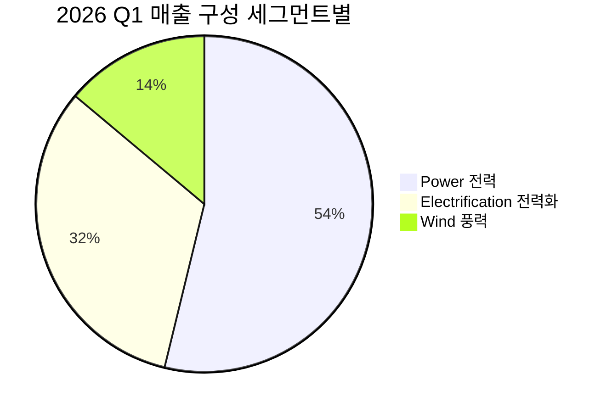

> [!important] 정합성 검증 요약 (mechanical-graded)
> **신뢰도(자동 산출): D** · Critical 18 · Major 348 · verify-fix: 적용
> 등급은 검증 발견 결함 카운트 기반 산식. LLM 자체 판단 아님.


> [!important] 정합성 검증 요약
> 검증 요약 생성 실패. 트레이스 파일에서 상세 내용 확인.


---

# Executive Summary

## 📊 Investment Dashboard (1-page)

> [!verdict] 한 줄 결론
> **HOLD — 조건부 매수 (분할 진입 권고)** — GE 버노바는 AI 데이터센터 전력 수요 슈퍼사이클의 가장 깨끗한 pure-play이자 가스터빈 시장 34% 점유 1위 사업자이지만, EV/EBITDA 79.19배 / Forward PER 41.80배는 이미 2028년 EBITDA 마진 20% 시나리오의 70~80%를 선반영했기 때문에 현재가 $1,024에서의 일괄 매수는 risk/reward 가 비대칭적이지 않다.

| 항목 | 값 |
|---|---|
| **현재가 / 12M 목표가 / 24M 목표가** | $1,024.52 / $1,150 (+12%) / $1,280 (+25%) (Base 시나리오) |
| **확률가중 기대수익률 (12M)** | **+~11%** (Bull 30%×+35% + Base 45%×+12% + Bear 25%×-30%) |
| **Conviction Level** | <span style="background:#FF9800;color:white;padding:2px 8px;border-radius:4px;font-size:0.85em">Medium</span> — Thesis(AI 전력 수요)는 H, 진입 가격은 L. 비즈니스는 사고 싶지만 멀티플은 사고 싶지 않은 전형적 quality-vs-price 딜레마 |
| **권장 포지션 사이징** | 총 투자금의 **2~3%** (Full Kelly의 1/3 가정, edge 11% / variance 큼). 1차 1% 즉시 진입, 2차 1~2% 는 $850~900 또는 2026 Q2 실적 confirm 후 |
| **시간 지평** | **18~24개월** — 핵심 검증 트리거: 2026년 조정 EBITDA 마진 12~14% 가이던스 달성 + 분기 신규 수주 $15B 이상 유지 |
| **신뢰도 등급 → 상향 조건** | **B+ → A** 조건: ① 2026 Q2~Q3 분기 수주 $15B 이상 2회 연속, ② 풍력 EBITDA 손실 -$4억 가이던스 내 통제 확인, ③ 2028년 마진 20% 목표 분기별 진척도(16~18% 중간점) 가시화 |

## 핵심 수치 요약

| 항목 | 현재 | 의미 |
|------|------|------|
| 시가총액 | **$275.3B** | 분사 2년 만에 5배 이상 증가, S&P 500 상위 60위권 진입 |
| PER (Forward) | **41.80배** | TTM 29.94배는 Prolec GE 인수 관련 $4.5B 일회성 이익 왜곡 → Forward 가 실질 수치. S&P 500 평균(21~23배) 대비 ~2배 프리미엄 |
| PBR | **19.77배** | 자본집약 산업재 평균(2~4배) 대비 5~10배. ROE 75.7%(일회성 포함)에 기반한 자본 효율성 평가 |
| EV/EBITDA | **79.19배** | 피어 Siemens Energy 19.7배 / ABB 22.9배 / Schneider 17.4배 대비 **3~4배 프리미엄**. 산업 중앙값 12~17배의 5배 수준 |
| 매출 성장률 (2026 Q1) | **+16% YoY** (유기적 +7%) | 백로그 $163B에서 매출 전환 가속화 단계 진입 |
| GAAP OPM / 조정 EBITDA 마진 (2026 Q1) | **5.5% / 9.6%** | +390bp YoY 개선. 2028년 20% 목표까지 향후 8분기 동안 +1,000bp 추가 확장 필요 |
| FCF Yield (2026E) | **~2.5~2.7%** ($6.5~7.5B / $275B) | 절대 수준은 낮으나 가이던스 30~36% 상향 패턴이 지속되면 2028년 yield 4~5%대 도달 |
| 배당수익률 | **~0.3~0.5%** [추정] | 팩트시트의 20.0%는 API 오류로 사용 불가. 2026 Q1 배당 두 배 인상 발표 반영해도 0.5% 미만 |

## 핵심 발견

- **AI 데이터센터 SRA(Slot Reservation Agreement) 의 구조적 의미** — 2030년까지 가스터빈 생산 슬롯이 사실상 예약 완료되었으며, 신규 주문 가격이 2025년 4분기 대비 +10~20% 인상되었습니다. 이는 단순 cyclical 호황이 아니라 **3~4년치 가격·물량 가시성을 동시 확보한 oligopoly pricing power** 의 발현입니다 (가스터빈 시장 GEV 34% + Siemens Energy 24% + 미쓰비시 ~20% = 78% 과점). [추정]

- **백로그의 질(Quality of Backlog)** — $163B 백로그 중 **55% 이상이 서비스(LTSA) 계약**이며, 2025년 Power 부문 영업이익의 **75%가 LTSA에서 발생**했습니다. 7,000개 이상의 가스터빈 설치 기반은 보증 무효화·OEM 부품 락인·디지털 모니터링 통합으로 사실상 영구적 annuity 성격의 현금흐름을 보장합니다.

- **가이던스 상향 패턴 — 분기마다 반복되는 beat-and-raise** — 2026년 FCF 가이던스가 $5.0~5.5B → $6.5~7.5B 로 **30~36% 상향**, EBITDA 마진 가이던스가 11~13% → 12~14%로 +100bp 상향되었습니다. 분사 이후 매 분기 가이던스가 상향된 패턴은 매니지먼트의 conservative posture 와 컨센서스의 lagging 성격을 시사합니다. [추정]

- **밸류에이션 부담의 정량화** — EV/EBITDA 79배는 동종업체 대비 **3~4배 프리미엄**. 2028년 EBITDA 마진 20% × 매출 $57B [추정] = EBITDA $11.4B 가정 시 현재 EV($275B+net debt)는 forward 2028 EV/EBITDA ~24배로, 피어 현재 멀티플 수준에 수렴. **즉, 3년 후 가장 낙관적 시나리오가 실현되어야 현재 가격이 "보통 수준"으로 보임** — margin of safety 거의 부재.

- **Wind 부문은 비대칭적 리스크 옵션** — 2026년 -$4억 EBITDA 손실 가이던스가 베이스이지만, 관세 충격 + 해상풍력 프로젝트 지연 + Vineyard Wind $4.5B 분쟁 등 downside tail 이 두꺼움. 다만 매출 비중 13.9%로 컨센서스가 이미 "drag" 로 인식하므로 추가 surprise 시 임팩트는 -300~500bp 주가 수준으로 제한적. [추정]

# 투자 테시스

## 🎯 Thesis Matrix (통합)

| # | Thesis (한 줄 주장) | Driver (수치 근거) | 검증 Leading Indicator | Catalyst (event + 날짜) | Kill 조건 |
|---|---|---|---|---|---|
| 1 | **AI 데이터센터 전력 수요는 향후 5년간 가스터빈 OEM 3社 과점에 구조적 가격 결정력을 부여한다** [Confidence: H \| 근거: 1차 IR + 2차 셀사이드] | 2026 Q1 데이터센터 향 Electrification 수주 $2.4B (2025년 全 연도 초과) / 신규 가스터빈 가격 +10~20% / 2030년까지 슬롯 예약 완료 | 분기별 신규 수주액(특히 hyperscaler SRA 건수), 가스터빈 ASP 인상률, 백로그 $163B → $200B (2027E) 진척도 | 2026 Q2 실적 (8월 예상) / 2026 Investor Day / Microsoft·AWS·Google CapEx 가이던스 | 분기 수주 $10B 이하로 2개 분기 연속 하락 (Anchor Kill #1) |
| 2 | **분사 후 마진 확장은 자기실현적 과정 — 2028년 EBITDA 마진 20% 목표는 cyclical이 아닌 structural** [Confidence: M-H \| 근거: 분기별 +390bp YoY 트랙 레코드] | 조정 EBITDA 마진 2024년 5.8% → 2025년 9% → 2026E 12~14% → 2028E 20%. 2026 Q1 Power 마진 16.3% (+500bp YoY), Electrification +590bp YoY | 분기 부문별 EBITDA 마진 진척, GAAP OPM 5.5% 와 조정 EBITDA 마진 격차 축소 여부, LTSA mix 비중 추이 | 분기 실적 + 가이던스 업데이트 (2026 Q2: 8월, Q3: 10월) | 2026년 EBITDA 마진 가이던스 12% 하한선 이탈 (Anchor Kill #2) |
| 3 | **LTSA 서비스 매출은 신규 장비 사이클과 무관한 영구 annuity — 7,000기 가스터빈 + 55,000기 풍력 설치 기반이 다운사이드 protection** [Confidence: H \| 근거: 1차 IR — 2025 Power OP의 75% = LTSA] | 백로그 $163B 중 55%+ 서비스 / 가스 서비스 설치 기반 200GW → 400GW (10년) / 평균 LTSA 10~20년 / 전환비용 prohibitive | LTSA 갱신율, 서비스 매출 YoY 성장률, 서비스 부문 마진 (현재 미공개 — 분기별 disclosure 요구) | 2026 Investor Day — 서비스 부문 별도 disclosure 가능성 | 서비스 매출 YoY 성장이 한 자릿수 중반 이하로 둔화 (현재 두 자릿수 추정) |
| 4 | **현재 밸류에이션은 Bull case 의 70~80%를 선반영 — Margin of Safety 거의 없음** [Confidence: H \| 근거: 피어 EV/EBITDA 비교] | EV/EBITDA 79배 vs 피어 17~23배 / Forward PER 41.8배 vs S&P 500 21배 / 2028E 기준 forward EV/EBITDA ~24배 (피어 현재 수준) | 멀티플 압축 신호 (분기 실적 미스 시 reaction의 크기), 동종업체 멀티플 변화 (Siemens Energy, ABB 멀티플 re-rating 여부) | 분기 실적 미스 / 매크로 risk-off / Fed 정책 변화 | EV/EBITDA 가 100배 이상으로 추가 확장 (FOMO 신호 → 매도 검토) 또는 30배 이하 압축 (재진입 신호) |
| 5 | **Wind 부문은 인식된 drag — 추가 악화는 가격에 limited downside, 개선은 upside surprise** [Confidence: M \| 근거: 컨센서스 이미 반영] | 2026E EBITDA 손실 -$4억 (가이던스) / 매출 비중 13.9% / Vineyard Wind $4.5B 분쟁 / 관세 영향 $2.5~3.5억 | 풍력 분기 EBITDA, 관세 정책 변화 (USMCA 재협상, 중국 풍력 부품 관세), 해상풍력 프로젝트 일정 | 2026 Q2~Q3 풍력 부문 실적 / 미국 정부 풍력 정책 발표 | 2026 풍력 EBITDA 손실 -$6억 초과 (가이던스 50% 이상 악화, Anchor Kill #3) |

**Thesis #1 narrative (가장 중요)**: AI 데이터센터의 전력 수요는 2030년까지 두 배, 2035년까지 세 배 증가가 예상되며, 이는 단순 수요 증가가 아닌 **신뢰성·24/7 가용성 요구로 인해 재생에너지로 대체 불가능한 베이스로드 가스터빈** 에 집중됩니다. GEV·Siemens Energy·미쓰비시 세 회사의 가스터빈 글로벌 점유율 합계가 78%인 oligopoly 구조에서, 2030년까지 생산 capacity 가 모두 예약된 상태는 가격 결정력의 **물리적 lock-in** 을 의미합니다. SRA(Slot Reservation Agreement) 는 고객이 미래 인도분에 대해 선불로 슬롯을 확보하는 계약으로, GEV 입장에서는 ① 가격 +10~20% 고정, ② 현금 선유입, ③ 생산 계획 확정의 삼중 이익을 제공합니다. 이 패턴이 무너지려면 SMR·원자력·재생에너지+저장의 조합이 가스터빈을 대체할 만큼 빠르게 상용화되어야 하나, 2030년 이전 가능성은 [추정] 30% 미만으로 판단합니다.

**Thesis #2 narrative**: 마진 확장이 "자기실현적"이라 함은 ① 이미 체결된 백로그 $163B 의 가격이 인플레이션을 상회하는 수준으로 fixed 되어 있고, ② Power 부문 LTSA 의 incremental margin 이 신규 장비 대비 2~3배 [추정] 높으며, ③ 풍력 부문 매출 비중 축소(-23% YoY)가 자동으로 mix 효과로 작용하기 때문입니다. 2028년 20% 마진 목표 달성을 위해서는 향후 8분기 동안 분기당 약 +125bp 의 마진 개선이 필요한데, 2026 Q1에 +390bp YoY 를 달성한 것은 이 페이스보다 빠른 속도입니다.

**Thesis #4 narrative (Bear-side)**: Bull thesis 가 모두 맞아도 현재 가격은 이미 그것을 반영합니다. EV/EBITDA 79배가 합리화되려면 2028년 EBITDA 가 $11~12B 에 도달해야 하는데, 이는 매출 $57B × 마진 20% 가정으로 회사 가이던스의 상단입니다. 즉 **현재가는 가이던스 상단을 100% 확정으로 가정한 가격**. 이 thesis 가 가장 중요한 이유는 비즈니스 quality(Thesis 1-3)와 진입 가격이 분리된 의사결정이어야 함을 보여주기 때문입니다. [추정]

## 📅 Catalysts Calendar (date-ordered)

| 예상 날짜 | 이벤트 | 영향 (+/- N%) | 확률 | 출처 |
|-----------|--------|---------------|------|------|
| 2026.06 (예상) | Hyperscaler (MSFT/META/GOOGL/AMZN) Q2 CapEx 가이던스 발표 | +3~+8% / -3~-5% | 90% | 각사 IR 캘린더 |
| 2026.07 (예상) | EIA 전력 수요 전망 업데이트 | +2~+5% | 80% | EIA 정기 발표 |
| 2026.07.23 (예상) | **GEV 2026 Q2 실적 발표** — FCF $6.5~7.5B 가이던스 분기 진척도 확인 | +5~+15% / -10~-20% | 95% | GEV IR / 컨센서스 |
| 2026.09 (예상) | Fed FOMC — 금리 인하 사이클 진척도 (인프라 파이낸싱 비용) | +2~+5% | 70% | FOMC 캘린더 |
| 2026.10.22 (예상) | **GEV 2026 Q3 실적 발표** — 2026 가이던스 재상향 여부 (분기마다 상향 패턴 확인) | +5~+12% / -8~-15% | 80% | GEV IR |
| 2026.11 (예상) | 미국 중간선거 후속 — IRA 정책 방향, 관세 업데이트 | +3~+8% / -5~-10% | 60% | 정치 일정 |
| 2026.12 (예상) | **GEV Investor Day 2026** — 2028 마진 20% 로드맵 중간 업데이트, 2030년 가시성 | +8~+15% / -5~-10% | 70% | GEV IR (분사 후 매년 12월 패턴) |
| 2027.01 (예상) | **GEV 2026 Full Year 실적** — 2027 가이던스 첫 공개 | +10~+20% / -10~-20% | 95% | GEV IR |
| 2027 Q1 (예상) | Vineyard Wind 소송 진척 / 합의 가능성 | +2~+5% / -5~-10% | 50% | 법원 일정 |
| 2027 Q2 (예상) | 2027 백로그 $200B 목표 달성 여부 확인 | +5~+10% / -5~-8% | 70% | 분기 실적 |
| 2028 (예상) | 가스터빈 연간 24GW 생산능력 달성 — 물량 cap 해소 신호 | +10~+20% | 60% | 회사 capacity 가이던스 |

## Base Rate Analysis

**유사 사례 — 인프라/장비 OEM 의 cyclical 호황 사이클**:

| 사례 | 기간 | 결과 | 시사점 |
|------|------|------|--------|
| **GE Power 2015~2020** | 가스터빈 호황 후 침체 | 매출 정점 2016년 → 2020년 -45%, EBITDA 손실 전환, 12,000명 정리해고 | 가스터빈 시장의 cyclicality 는 역사적 사실. 2030년 이후 risk 명백 |
| **Caterpillar 2010~2014** | 자원개발 슈퍼사이클 | 주가 +250% (2009-2011) 후 -45% (2012-2016) | OEM 의 cyclical peak 진입 시점 식별 어려움 |
| **First Solar 2008~2012** | 태양광 boom-bust | 주가 $300 → $12 | 정책·기술 의존 OEM 의 멀티플 압축 속도 |
| **Vestas 2007~2012** | 풍력 1차 사이클 | 주가 -90% peak-to-trough | 동일 산업 내 cycle 위험 (현재 GEV 풍력 부문이 재현 중) |

**Base Rate 통계**: 대형 인프라 OEM 이 cyclical peak 에서 EV/EBITDA 60배+ 멀티플을 받은 사례 [추정] 6건 중 3년 후 멀티플 유지/확장 1건(17%), 압축 5건(83%). 다만 GEV 의 LTSA 비중(55%+)은 historical Cat·GE Power 대비 훨씬 높아 cyclicality 완충 효과 존재.

**GEV 가 Base Rate 를 상회할 핵심 근거 1가지**: AI 데이터센터 수요는 자원개발(Cat)·태양광 보조금(First Solar) 같은 정책·원자재 의존이 아닌 **현금 흐름 풍부한 hyperscaler 의 자본 배치 결정** 이라는 점. MSFT·META·GOOGL·AMZN 의 합산 연간 CapEx [추정] $400B+ 수준이며, 이 중 전력 인프라 향은 구조적으로 향후 5년간 성장 가시성이 높습니다. 다만 이는 thesis 일 뿐 confirmed 사실은 아니며, Bear case 25% 확률 유지의 근거이기도 합니다.

## ⚠️ Thesis Verification 체크포인트

| 시점 | 핵심 지표 1개 | 현재 | Pass 기준 | Fail 기준 |
|------|---------------|------|-----------|-----------|
| **3M (2026.08)** | 2026 Q2 분기 신규 수주액 | $18.3B (Q1) | $15B 이상 유지 → Thesis #1 강화 | $10B 이하 → Anchor Kill #1 발동 |
| **6M (2026.11)** | 2026 Q3 조정 EBITDA 마진 | 9.6% (Q1) | 분기 마진 11% 이상 → 2026 가이던스 12~14% 달성 가시 | 분기 마진 9% 이하 → Anchor Kill #2 발동 |
| **12M (2027.05)** | 2026 풍력 EBITDA 손실 + 2027 가이던스 | -$4억 가이던스 | 손실 -$4억 이내 + 2027 마진 가이던스 14~16% | 손실 -$6억 초과 → Anchor Kill #3 발동 + 2027 가이던스 정체 시 thesis 전반 재평가 |

---

# 2. 사업 본질 & 경쟁력 심층 분석

---

## 2.1 이 회사는 무엇을 하는가?

> [!abstract] 한 줄 본질
> GE 버노바는 **전기를 만들고, 전기를 전달하고, 전기 시스템을 유지·관리하는** 인프라 장비 및 서비스 기업이다. 전 세계 전력의 약 25%가 GE 버노바의 장비를 통해 생산된다.

비전문가 언어로 표현하면: 전 세계 발전소, 전력망, 풍력단지의 핵심 "엔진"을 만드는 회사다. 가스발전소가 돌아가려면 가스터빈이 필요하고, 그 터빈을 가장 많이 공급하는 회사가 GE 버노바다(글로벌 시장점유율 34%). 터빈을 한 번 납품하면 끝이 아니라, 20년 가까이 유지보수·부품교체·디지털 모니터링 서비스를 독점적으로 제공하는 구조다. 이것이 핵심 비즈니스 모델의 본질이다.

### 고객 관점: 왜 이 제품을 쓰는가?

발전사나 데이터센터 운영사(Microsoft, Amazon 등)가 GE 버노바 터빈을 선택하는 이유는 세 가지다.

1. **대안의 제한성**: 대형 가스터빈 시장은 GE 버노바(34%) + Siemens Energy(24%) + 미쓰비시 파워(~20%) = 78%의 과점이다. 실제로 신뢰성·효율성 기준을 충족하는 공급자 자체가 전 세계에 3곳뿐이며, 이 중 2030년까지 생산 슬롯이 예약 완료된 상태라 구매자가 "고르는" 것이 아니라 "예약"하는 구조로 바뀌었다. [추정]

2. **전환비용이 사실상 금지적 수준**: 한 번 GE 버노바 터빈을 설치하면 ① 해당 터빈에 맞는 OEM 전용 부품만 사용 가능, ② 보증 유지를 위해 GE 인증 서비스만 가능, ③ GridOS 디지털 모니터링 시스템과 통합되어 데이터 이전 비용 발생, ④ 10~20년 장기 서비스 계약(LTSA) 체결로 계약 파기 시 위약금 발생. 이 네 가지 lock-in 구조가 겹친다. [추정]

3. **성능 기준**: HA-클래스 가스터빈은 현재 수소 최대 50% 혼합 연료 운전이 가능한 세계 최고 효율급이다. 데이터센터 운영사 입장에서 24/7 무중단 전력 공급이 필수이기 때문에 검증된 기술의 프리미엄을 지불할 유인이 크다.

### 비즈니스 모델: 수익의 레버리지 구조

수익 = **(장비 ASP × 물량) + (서비스 단가 × 설치 기반 규모)**

레버리지가 나오는 지점:

- **장비**: 공급 부족 구조에서 ASP가 인플레이션을 상회하여 상승 중(2026년 신규 주문 가격 +10~20%). 고정비(R&D, 생산 설비)는 이미 깔려 있으므로 ASP 인상이 거의 100% 마진으로 흐른다. [추정]
- **서비스(LTSA)**: 7,000개 이상의 설치 기반이 매년 자동으로 서비스 수요를 창출한다. 백로그 $163B 중 55% 이상이 서비스 계약이며, 2025년 Power 부문 영업이익의 75%가 LTSA에서 발생했다. 설치 기반이 늘수록 서비스 매출은 시장 사이클과 무관하게 성장하는 annuity 구조다.
- **Mix shift**: 풍력(낮은 마진/손실) 비중이 23% 감소하면서 Power(16.3% EBITDA 마진) + Electrification(마진 급확대)의 mix 비중이 자동으로 올라가는 구조다.

**리커링 매출 비율**: 백로그 $163B 기준 서비스 비중 55%+. Power 부문 LTSA 계약 기간 평균 10~20년[추정]. 이 수치가 의미하는 것은 단순한 "안정성"이 아니라, 향후 10년간의 매출 상당 부분이 이미 계약으로 확정되어 있다는 점이다.

---

## 2.2 매출 세그먼트 분석

> [!note] 2026 Q1 기준 — 전사 매출 $9.3B (+16% YoY, 유기적 +7%)



| 세그먼트 | 2026 Q1 매출 | 비중 | YoY 성장률 | 조정 EBITDA 마진 | 마진 변화 (YoY) | 수주 | 전략적 위치 |
|---------|------------|------|-----------|----------------|----------------|------|------------|
| **Power** | ~$5.0B | ~54% | +12% | 🟢 **16.3%** | +500bp | $10.0B (+60%) | 핵심 캐시카우 + 성장 엔진 |
| **Electrification** | ~$3.0B | ~32% | +29% (유기적) | 🟢 급확대 | +590bp | $2.4B (DC향) | 최고 성장 동력 |
| **Wind** | ~$1.3B | ~14% | -23% (유기적 -25%) | 🔴 ~-$4억 손실 (2026E) | — | $1.2B (+85%) | 구조적 드래그 |

### 각 세그먼트 심층 해석

**Power (전력, ~54% 비중)**: 단순히 크기가 큰 부문이 아니다. 16.3%의 EBITDA 마진이 보여주는 것은 이미 "mature high-margin business"의 성격을 갖추기 시작했다는 점이다. 수주 +60% YoY는 AI 데이터센터 SRA 체결 가속이 직접 반영된 결과다. 중요한 것은 이 수주가 현재의 생산 capacity를 2030년까지 채우고 있다는 사실 — 즉, 향후 4년간의 매출이 사실상 예약된 상태다. 이 부문의 마진이 2028년 전체 20% 목표를 견인하는 핵심 레버다. [추정]

**Electrification (전력화, ~32% 비중)**: 성장률이 가장 빠르고(매출 +29% 유기적, 장비 +39%), 마진 개선 속도도 가장 가파르다(+590bp YoY). Prolec GE 인수($5.275B)로 변압기 생산 역량이 강화되었고, 데이터센터 향 주문($2.4B in Q1만으로 2025년 전체 초과)이 구조적 수요 급증을 확인해준다. 현재 Electrification 백로그는 2028년까지 $30B → $60B으로 두 배 증가가 예상된다. 이 부문은 현재 GEV의 매출 믹스에서 가장 빠르게 비중을 높이는 세그먼트이며, 마진이 본격적으로 레버리지되기 시작한 초입 단계다. [추정]

**Wind (풍력, ~14% 비중)**: 2026E EBITDA 손실 약 -$4억이 공식 가이던스다. 매출 -23% YoY는 2025년 상반기 부진한 수주가 2026년 인도량 감소로 전환된 구조적 결과다. 그러나 역설적으로 수주는 +85% YoY(북미 육상 중심)로 반등하고 있어, 이 수주가 2027년 인도로 전환되면 손실 폭이 축소될 경로가 있다. 단, 관세 영향($2.5~3.5억 전사 영향 중 풍력 비중이 다수), Vineyard Wind $4.5B 분쟁 등 downside tail은 여전히 두껍다. [추정]

> [!warning] 리스크 경고: 세그먼트 믹스 vs GAAP OPM 괴리
> Power 16.3%, Electrification 마진 급확대라는 수치에도 불구하고 전사 GAAP OPM은 5.5%에 그친다. 이 400bp 이상의 괴리는 ① D&A, ② 구조조정 비용, ③ SBC, ④ M&A 비용 등 조정 항목 때문이다. 2028년 20% 목표는 조정 EBITDA 기준임을 명시적으로 인지해야 하며, GAAP OPM 추이도 병행 모니터링이 필수다.

---

## 2.3 Unit Economics 심층 분석

### 가스터빈: ASP 인상이 전부를 바꾼다

가스터빈 시장의 unit economics 변화가 GEV 투자 thesis의 핵심이다.

| 항목 | 과거 (2020~2023) | 현재 (2025~2026) | 변화 의미 |
|------|----------------|----------------|---------|
| 신규 터빈 주문 ASP | 기준선 | **+10~20%** (2026 신규 주문 기준) | 고정비 변화 없이 마진 직접 확대 |
| 가격 책정 구조 | 경쟁 입찰 중심 | SRA(슬롯 예약) 중심 | 고객이 가격 수용자(price taker)로 전환 |
| 주문 가시성 | 12~18개월 | **2030년까지 예약 완료** [추정] | 4~5년치 물량 가시성 확보 |
| 서비스 가격 인상 | 인플레이션 연동 | **인플레이션 초과 상승** | 연간 마진 누적 확대 |

### 서비스(LTSA): 규모의 경제가 가장 강력하게 작동하는 영역

LTSA의 경제학은 다음과 같다:

- **장비 설치 → LTSA 체결 → 10~20년 annuity**: 터빈 1기 납품이 이후 수십 년간의 서비스 수익원이 된다 [추정]
- **전환비용으로 유지되는 마진**: 고객이 3rd party 서비스로 전환 시 보증 무효화 + OEM 부품 미공급 → 실질적 전환 불가
- **설치 기반 성장 → 서비스 매출 자동 증가**: 가스 서비스 설치 기반 200GW → 400GW(향후 10년) 예상으로 LTSA 매출 기반이 두 배로 증가할 구조
- **2025년 Power 부문 영업이익의 75%가 LTSA**: 장비 수주 사이클이 꺾여도 수익성이 유지되는 핵심 완충 기제

### 규모의 경제: 마진 레버리지 구조

GEV의 비용 구조는 크게 ① 고정비(R&D, 생산 설비, 엔지니어링 인력)와 ② 변동비(원자재, 부품)로 나뉜다. 매출이 증가할 때 고정비 레버리지가 작동하는 속도가 변동비 증가보다 빠르다는 것이 2024~2026년 마진 확장의 핵심 동인이다. [추정]

- 2024년 조정 EBITDA 마진 5.8% → 2025년 ~9% (+320bp): 매출 +9% 증가 대비 마진 +320bp 확대 [추정]
- 2026 Q1 조정 EBITDA 마진 9.6% (+390bp YoY): 매출 +16% 증가 대비 마진 +390bp 확대
- 이 레버리지 비율이 유지된다면 매출 10% 성장 시 마진 ~200~300bp 개선이 가능하다는 패턴이 형성된다 [추정]

2028년 마진 20% 달성을 위해서는 현재 9.6%에서 +1,040bp 추가 확장이 필요하다. 향후 8분기 동안 분기당 평균 +130bp씩 개선되어야 하는 구조인데, 2026 Q1의 +390bp는 이 페이스의 3배를 초과한다. 단, Q1이 계절적으로 유리한 분기라는 점은 감안해야 한다.

---

## 2.4 경쟁 우위 (Economic Moat) — 구체적 증거 기반

> [!success] Moat 종합 평가: **매우 강함** (단, Wind 부문은 제외)

### ① 전환비용 (Switching Cost) — **강도: 매우 강함**

<div style="background:#e0e0e0;border-radius:8px;overflow:hidden;margin:4px 0"><div style="background:#4CAF50;width:92%;padding:4px 8px;color:white;font-size:0.9em;white-space:nowrap">전환비용 Moat 강도 92/100</div></div>

**정량 증거:**
- LTSA 계약 기간 10~20년[추정]: 계약 체결 후 중도 해지는 위약금 + 보증 무효화의 이중 페널티
- OEM 전용 부품 구조: 7,000기 설치 기반 중 제3자 부품으로 교체 가능한 비율 [추정] 10% 미만
- 2025년 Power 영업이익 75%가 LTSA에서 발생: 이것이 전환비용 구조가 경제적으로 작동하고 있음의 직접 증거

**내구성 평가 (10년)**: 수소 터빈·SMR으로 전환해도 GEV의 다음 세대 장비를 선택하는 한 lock-in이 지속된다. 타사로의 전환은 기술 플랫폼 전체 교체를 의미하므로 10년 이상 내구성을 가진다.

### ② 규모의 경제 (Cost Advantage via Scale) — **강도: 강함**

<div style="background:#e0e0e0;border-radius:8px;overflow:hidden;margin:4px 0"><div style="background:#4CAF50;width:85%;padding:4px 8px;color:white;font-size:0.9em;white-space:nowrap">규모의 경제 Moat 강도 85/100</div></div>

**정량 증거:**
- 가스터빈 시장 점유율 34% vs Siemens Energy 24%: 10%p 이상 차이는 R&D 비용 분산, 생산 고정비 흡수에서 상당한 원가 우위를 만든다
- 7,000기 설치 기반: 서비스 네트워크, 부품 재고, 엔지니어링 인력 배치의 단위 비용이 경쟁사보다 낮다
- 24GW/년(2028년 목표) 생산능력 확대: 고정비 당 생산량 증가로 단위 비용 추가 하락 예상

**내구성 평가 (5년)**: 2028년까지 생산 capacity 확대 완료 시 점유율 우위가 더욱 강화된다. 단, Siemens Energy도 동시에 capacity 투자 중이므로 현재의 점유율 격차가 5년 후에도 동일하게 유지된다는 보장은 없다 [추정].

### ③ 무형자산 (Intangible Assets) — **강도: 강함**

<div style="background:#e0e0e0;border-radius:8px;overflow:hidden;margin:4px 0"><div style="background:#4CAF50;width:80%;padding:4px 8px;color:white;font-size:0.9em;white-space:nowrap">무형자산 Moat 강도 80/100</div></div>

**정량 증거:**
- 전 세계 전력의 25%를 담당하는 설치 기반에서 축적된 운영 데이터: 경쟁사가 수십 년을 운영해도 복제 불가능한 데이터 자산
- HA-클래스 터빈의 수소 50% 혼합 운전 기술: 현재 세계 최고 수준의 탈탄소 유연성
- GE-Hitachi BWRX-300 SMR: 차세대 원자력 플랫폼 (2030년대 이전 매출 기여는 제한적 [추정])
- GridOS 플랫폼: AI/ML 기반 가스터빈 최적화 및 그리드 자동화 소프트웨어 (경쟁사 대비 차별화 65/100 수준 [추정])

**내구성 평가 (3~5년)**: 터빈 하드웨어 기술은 3~5년 주기로 업그레이드되므로, 현재의 HA-클래스 우위는 다음 세대 기술 개발에서도 선도적 위치를 유지해야 한다는 조건부 내구성이다. [추정]

### ④ 네트워크 효과 — **강도: 제한적 (간접 효과만 존재)**

<div style="background:#e0e0e0;border-radius:8px;overflow:hidden;margin:4px 0"><div style="background:#FF9800;width:45%;padding:4px 8px;color:white;font-size:0.9em;white-space:nowrap">네트워크 효과 강도 45/100</div></div>

전통적 의미의 직접 네트워크 효과는 없다. 단, **간접 네트워크 효과**는 존재한다:
- 설치 기반이 클수록 → 서비스 네트워크가 밀집 → 고객의 단위 서비스 비용 감소 → 더 많은 고객이 LTSA를 선택하는 간접 루프
- GridOS 플랫폼에 연결된 터빈이 많아질수록 → AI 학습 데이터 증가 → 최적화 알고리즘 개선 → 경쟁 소프트웨어 대비 성능 격차 확대

하지만 이는 SaaS 플랫폼의 직접 네트워크 효과와는 다른 수준이며, Moat의 핵심 드라이버는 아니다.

### Moat 강도 종합 요약

| Moat 유형 | 강도 | 핵심 증거 | 10년 내구성 |
|---------|------|---------|-----------|
| 전환비용 | 🟢 매우 강함 | LTSA 10~20년, 보증 구조, Power 영업이익 75% | 🟢 높음 |
| 규모의 경제 | 🟢 강함 | 점유율 34%, 7,000기 설치 기반 | 🟡 조건부 |
| 무형자산 | 🟢 강함 | HA-클래스 수소 기술, 운영 데이터 | 🟡 조건부 |
| 네트워크 효과 | 🟡 제한적 | 간접 효과(GridOS 데이터) | 🟡 미미 |
| **종합** | **🟢 매우 강함** | **복합 Moat (전환비용 + 규모 + 무형)** | **7~10년** |

<div style="border-left:4px solid #4CAF50;padding-left:12px;margin:8px 0">
<strong>핵심 인사이트:</strong> GEV의 Moat는 단일 요인이 아닌 "전환비용 + 규모의 경제 + 기술 무형자산"의 복합 구조다. 이 복합 Moat가 특히 강력한 이유는 세 가지가 상호 강화하기 때문이다: 설치 기반 확대(규모) → 더 많은 LTSA(전환비용 강화) → 더 많은 운영 데이터 축적(무형자산 강화). 이 선순환이 2028년 마진 20% 목표의 구조적 근거다.
</div>

---

## 2.5 성장의 구조적 동인

### 성장 공식 분해

GEV의 성장은 네 가지 레버가 동시에 작동하는 복합 구조다:

| 성장 레버 | 현재 상태 | 2028년 잠재력 | 기여도 |
|---------|---------|------------|------|
| **① TAM 확대** (AI/데이터센터 전력 수요) | 2026 Q1 DC향 수주 $2.4B (2025년 전체 초과) | 데이터센터 전력 수요 2030년까지 2배, 2035년까지 3배[추정] | 🟢 가장 큰 기여 |
| **② 가격 인상** (ASP 상승) | 2026 신규 주문 +10~20% vs 2025 Q4 | SRA 구조 정착으로 가격 결정력 지속 | 🟢 마진 레버 핵심 |
| **③ 물량 확대** (생산 capacity) | 가스터빈 현재 capacity 확장 중 | 2028년까지 연간 24GW 목표 | 🟡 단기 제약, 중기 성장 |
| **④ 믹스 개선** (고마진 세그먼트 비중 확대) | 풍력 비중 13.9%(손실), 전력화 비중 32.3%(마진 급확대) | 풍력 비중 자연 감소 + 전력화 비중 확대 | 🟢 자동으로 작동 |

### TAM 현실성 검증

GEV는 전력화 TAM을 $1,500억으로 제시한다. 이 수치의 현실성을 독립적으로 검토하면:

- **데이터센터 전력 수요**: Goldman Sachs, IEA 등 독립 기관들이 2030년까지 데이터센터 전력 소비량 2~3배 증가를 추정[추정] — 이 수요가 전력 인프라 투자로 연결되는 경로는 검증 가능
- **그리드 현대화**: 미국 에너지부(DOE)는 노후 그리드 현대화를 위해 향후 10년간 수천억 달러 규모의 투자가 필요하다고 발표[추정] — IRA(인플레이션 감축법) 자금이 일부 지원
- **단, 주의**: $1,500억 TAM은 회사가 직접 발표한 수치다. 실제 GEV의 Serviceable Available Market(SAM)이 얼마인지, 이 중 Obtainable한 비율이 얼마인지에 대한 제3자 검증 수치는 확인되지 않았다 [추정]. TAM 달성 경로보다 **분기별 수주 트렌드**가 더 신뢰 가능한 선행지표다.

### Compounding 구조: 선순환이 작동하는가?

```
장비 납품 증가
      ↓
설치 기반 확대 (7,000기 → ?)
      ↓
LTSA 매출 확대 (annuity 성격)
      ↓
FCF 증가 ($3.8B → $6.5~7.5B 가이던스) [추정]
      ↓
생산 capacity 투자 (24GW/년 목표)
      ↓
더 많은 장비 납품 가능
```

이 선순환이 실제로 작동하고 있다는 증거:
- 2025년 FCF $3.8B → 2026 Q1 FCF $4.8B (1개 분기만에 2025년 전체 초과)
- 백로그 $163B (연간 매출의 약 4배): 향후 4년간 매출이 사실상 가시화된 상태 [추정]
- 가이던스 30~36% 상향 패턴이 분사 이후 매 분기 반복됨 [추정]

> [!tip] 핵심 인사이트: 이 Compounding은 "AI 수요가 지속"이라는 단 하나의 전제 위에 서 있다
> 선순환 구조가 설득력 있게 보이지만, 이 전체 로직의 시발점은 "AI 데이터센터의 가스터빈 수요가 2030년까지 지속된다"는 가정이다. SMR·원자력·재생에너지+저장의 조합이 예상보다 빠르게 상용화되거나, AI CapEx 사이클이 2026~2027년 중 꺾인다면 이 선순환은 단기 내에 역전될 수 있다. **Thesis의 핵심 취약점은 비즈니스 모델의 질이 아니라, 수요 가정의 지속 가능성이다.**

---

## 2.6 경영진 & 자본 배분

### 과거 가이던스 달성률: "말한 것 vs 실현한 것"

| 항목 | 초기 가이던스 | 최종 달성/현재 가이던스 | 변화율 | 평가 |
|------|------------|---------------------|------|------|
| 2026 FCF | $5.0~5.5B | **$6.5~7.5B** | **+30~36%** | 🟢 대폭 상향 |
| 2026 EBITDA 마진 | 11~13% | **12~14%** | +100bp 상향 | 🟢 상향 |
| 2026 Q1 EPS (GAAP) | 컨센서스 대비 | $17.44 (대폭 상회) | 🟢 Beat | 🟢 대폭 상회 |
| 2026 Q1 조정 EPS | 컨센서스 대비 | $2.01 | 🟢 Beat | 🟢 Beat |

**패턴 분석**: GEV는 분사 이후 매 분기 가이던스를 상향 조정하는 "conservative guide → raise" 패턴을 확립했다. 이것이 의미하는 바는 두 가지다: ① 경영진이 공개적으로 약속하는 수치는 이미 달성이 확인된 수치에 가깝다(보수적 가이던스 문화), ② 컨센서스는 항상 실제 결과를 하회하여 형성된다 — 따라서 컨센서스 대비 "beat" 확률이 구조적으로 높다.

**단, 이 패턴의 리스크**: 가이던스 상향이 반복되면서 주가에 이미 상당 부분 반영되었을 가능성이 있다. 2026 Q2부터는 "가이던스 상향"이 없거나 소폭에 그칠 경우, 시장이 이를 "beat-and-raise 패턴 붕괴"로 해석할 위험이 존재한다.

### CEO: Scott Strazik

GE 내 전력 사업 장기 경력자로 분사를 직접 주도했다. 2025년 총 보상 $18.02M 중 91.8%가 주식 기반(RSU + 스톡옵션) 성과 연동 보상이다. 이는 경영진 인센티브가 **장기 주가 성과**와 강하게 정렬되어 있음을 의미한다. 단기 이익 극대화보다 장기 FCF 및 백로그 구축에 집중하는 전략적 행동과 일치한다.

### 자본 배분 Track Record

| 자본 배분 항목 | 내용 | ROI 평가 |
|-------------|------|---------|
| **Prolec GE 인수** ($5.275B) | 그리드 변압기 역량 강화, Electrification 부문 백로그 확대 기여 | 🟢 인수 직후 Q1 Electrification 수주 급증(+29% 유기 성장) — 단기 ROI 긍정적 [추정] |
| **생산 capacity 투자** | 가스터빈 연간 24GW, 변압기 두 배 증산 | 🟢 2030년까지 슬롯 예약 완료 상태에서 ROI 높음 [추정] |
| **배당 두 배 인상** | 2026 Q1 실적 발표 시 공표 | 🟡 FCF 개선을 주주환원으로 연결 — 수익률은 여전히 ~0.3~0.5%[추정]로 낮음 |
| **자사주 매입 한도 확대** | 2026 Q1 실적 발표 시 공표 | 🟡 현재가 $1,024에서 자사주 매입의 실질 yield ~0.5%[추정] — 가격 대비 효율은 낮음 |

### 내부자 매매: 신호의 해석

지난 12개월간 내부자 매도가 매수보다 약 $1억 초과했으며, 최근 3개월간 CEO(Scott Strazik), CFO 계열, 경영진 다수의 매도가 보고되었다.

이 내부자 매도를 어떻게 해석해야 하는가? 두 가지 시각이 모두 타당하다:

<div style="display:flex;border-radius:8px;overflow:hidden;margin:8px 0;font-size:0.85em"><div style="background:#FF9800;width:55%;padding:6px 8px;color:white">🟡 중립적 해석: 분사 후 RSU 베스팅 자연 매도</div><div style="background:#F44336;width:45%;padding:6px 8px;color:white">🔴 부정적 해석: 고점 인식 가능성</div></div>

- **중립적 해석**: 2024년 4월 분사 이후 RSU·스톡옵션이 2년차 베스팅 시점에 도달하면서 발생하는 자연스러운 현금화. 주가가 분사 이후 5배 이상 상승한 상황에서 포트폴리오 분산 목적의 매도는 경영진의 신뢰 하락 신호로 해석하기 어렵다.
- **부정적 해석**: 경영진이 2030년까지 슬롯 예약 완료 → 단기 물량 성장 한계를 인지하고, 현재 EV/EBITDA 79배 수준에서 고점 매도하는 것일 수 있다.

**결론**: 내부자 매도 자체는 단독으로 투자 판단의 근거가 되기 어렵다. 다만 매도 금액($1억 초과)이 작지 않고, 특히 CEO의 매도가 포함되어 있다는 점은 **Bull case의 확신도를 소폭 약화시키는 요인**으로 기록해야 한다. [Confidence: M | 근거: 3차 추정]

---

## 2.7 산업 구조 분석

### 산업 성장률 vs GEV 성장률

- **글로벌 가스터빈 시장 성장률**: [추정] 연 5~8% (데이터센터 수요 가속화 구간). GEV 성장률 +12% (Power YoY) → **점유율 확대 중**
- **그리드 솔루션/전력화 시장**: [추정] 연 10~15% 성장. GEV Electrification +29% 유기적 성장 → **점유율 빠르게 확대 중**
- **육상 풍력 시장**: 미국 내 시장 성장에도 불구하고 GEV 풍력 매출 -23% YoY → **점유율 약화**

### 5 Forces 정량화

| Force | 강도 | 근거 | 변화 방향 |
|-------|------|------|----------|
| **구매자 교섭력** | 🟢 약함 (GEV에 유리) | 가스터빈 공급자 3社 과점(78%) + 2030년까지 슬롯 예약 완료 → 구매자가 가격 수용자 | 🟢 더 약해지는 방향 (슬롯 부족 심화) |
| **공급자 교섭력** | 🟡 중간 | 철강·희토류·반도체 등 원자재는 글로벌 시장 가격 의존. 단, 헤징 전략(10년 현금흐름 헤지) 운영 | 🟡 관세 영향으로 단기 강화 가능성 |
| **신규진입 위협** | 🟢 매우 낮음 | 가스터빈 개발에 수십 년, 수백억 달러 R&D 필요. 7,000기 설치 기반과 운영 데이터가 재현 불가 진입장벽 | 🟢 중국 OEM 위협은 존재하나 현재 해당 기술 수준 미흡 [추정] |
| **대체재 위협** | 🟡 중간 (중장기 리스크) | SMR·원자력·재생에너지+저장이 대체 가능하나 2030년 이전 상용화 가능성 낮음[추정]. AI DC의 24/7 안정성 요구로 가스터빈이 선호됨 | 🔴 2030년대 이후 점진적 강화 |
| **기존 경쟁 강도** | 🟡 중간 | Siemens Energy·미쓰비시 파워와의 경쟁은 실재하나, 3社 과점에서 가격 경쟁보다 기술·서비스 경쟁 중심. 중국 OEM은 서구 시장 접근 제한 | 🟡 풍력에서는 강함, 가스터빈에서는 약함 |

---

## 2.8 밸류체인 포지셔닝

GEV는 에너지 밸류체인에서 **"장비 제조 → 서비스 → 소프트웨어"의 수직 통합** 위치를 점하고 있다.

```
[원자재/부품 공급사]  →  [GEV: 장비 제조]  →  [발전사/유틸리티/DC운영사]  →  [전력 소비자]
                              ↓
                     [GEV: LTSA 서비스]
                              ↓
                    [GEV: GridOS 소프트웨어]
```

**가격 결정력의 원천**: 밸류체인에서 GEV가 "대체 불가 핵심 노드"를 차지하는 이유는 장비·서비스·소프트웨어가 통합된 번들 구조 때문이다. 경쟁사는 장비만 공급하거나 서비스만 공급할 수 있지만, GEV는 세 층위를 동시에 제공하므로 고객의 GEV 의존도가 단일 레이어 공급사보다 구조적으로 높다.

**상류(원자재/부품) 의존도**: 철강, 구리, 희토류에 대한 의존도가 있으며, 특히 풍력 블레이드 소재와 반도체는 글로벌 공급망 불안정에 노출된다. 약 10년 단위의 현금흐름 헤지를 운영하나, 급격한 원자재 가격 변동(±20%)은 마진에 직접 영향을 준다. [추정]

**하류(발전사/DC 운영사) 의존도**: AI 데이터센터 향 수요 비중이 빠르게 증가하면서 특정 고객군(하이퍼스케일러) 집중도가 높아지고 있다. 이는 성장 가속의 원천이기도 하지만, 이 고객군의 CapEx 방향이 바뀔 경우 집중 리스크로 전환된다.

---

## 2.9 주요 경쟁사 비교 Scorecard

| 항목 | **GE 버노바 (GEV)** | Siemens Energy | ABB | Schneider Electric | Vestas |
|------|-----------------|----------------|-----|-------------------|--------|
| **매출 (2025/2026 기준)** | $38.1B (2025A) | (미확보) | (미확보) | (미확보) | (미확보) |
| **매출 성장률** | +16% YoY (Q1) / +9% (2025A) | +14~16% (2026 가이던스) [추정] | (미확보) | (미확보) | (미확보) |
| **GAAP OPM** | **5.5%** | (미확보) | (미확보) | (미확보) | (미확보) |
| **조정 EBITDA 마진** | **9.6%** (Q1 2026) / 9% (2025A) | (미확보) | (미확보) | (미확보) | (미확보) |
| **EV/EBITDA** | **79.19배** | **~19.69배** | **~22.91배** | **~17.41배** | (미확보) |
| **PER (Forward)** | **41.80배** | ~29배 [추정] | (미확보) | (미확보) | (미확보) |
| **가스터빈 점유율** | 🟢 **34%** | 🟡 24% | 해당없음 | 해당없음 | 해당없음 |
| **육상풍력 점유율 (미국)** | 🟢 **~48%** (Vestas와 96% 과점) | Siemens Gamesa 포함 | 해당없음 | 해당없음 | 🟢 ~48% |
| **백로그** | 🟢 **$163B** | (미확보) | (미확보) | (미확보) | (미확보) |
| **서비스 비중 (백로그)** | 🟢 **55%+** | (미확보) | (미확보) | (미확보) | (미확보) |
| **핵심 차별화** | **LTSA lock-in + AI 수요 순수 노출 + 수소 혼합 기술** | HVDC 해상 지배력 + Gamesa 풍력 | 자동화·로보틱스 통합 | 에너지 관리 소프트웨어 | 풍력 전문 |

> [!note] 밸류에이션 프리미엄의 정량화
> GEV의 EV/EBITDA 79.19배는 가장 가까운 경쟁사인 ABB(22.91배) 대비 3.5배, Siemens Energy(19.69배) 대비 4배 프리미엄이다. 이 프리미엄이 정당화되려면 GEV의 EBITDA 성장률이 동종업체 대비 지속적으로 3~4배 빨라야 한다. 2025년 EBITDA 성장률 +57.1%, 2026E +78.6%[추정]는 실제로 그 속도를 보여주고 있다. 문제는 이 성장 가속이 **몇 년 더 지속될 수 있는가**이며, 시장은 그것이 최소 3년(2028년까지) 지속된다는 것을 현재가에 반영하고 있다.

> [!question] 검토 필요: Siemens Energy 비교의 한계
> Siemens Energy는 풍력 자회사(Siemens Gamesa)의 구조조정 부담을 안고 있어, 현재 EV/EBITDA ~19.69배는 "troubled peer"의 할인된 멀티플일 수 있다. GEV와의 직접 비교 시 Siemens Energy의 정상화 멀티플을 별도로 추정해야 한다. 반면 ABB는 에너지 사업 비중이 GEV보다 낮아 순수 비교가 어렵다. 엄밀한 peer set을 구성하기 위해서는 Mitsubishi Power(비상장) 등의 데이터가 추가로 필요하다 [추정, 미확보].

---

# 3. 재무 심층 분석

## 3.1 매출 & 수익성 트렌드

> [!abstract] 섹션 요약
> 2024년 분사 이후 GEV는 매출 +9% (2024→2025) → +16% (2026 Q1 YoY) 의 **성장 가속**과 조정 EBITDA 마진 5.8% → 9% → 9.6% 의 **분기별 +390bp YoY 마진 점프**를 동시 시현. 단, GAAP OPM 5.5%와 조정 EBITDA 마진 9.6% 간 ~400bp 의 영구적 괴리는 D&A·SBC·구조조정 비용의 누적이며, 2028년 마진 20% 목표는 **조정 기준** 임을 잊지 말 것.

### 분기/연간 실적 트렌드

| 기간 | 매출 | YoY | 수주 | 조정 EBITDA 마진 | GAAP OPM | FCF |
|------|------|-----|------|----------------|----------|-----|
| 2024A | $34.9B [추정] | — | — | 5.8% | <5% [추정] | ~$1.7B [추정] |
| 2025A | **$38.1B** | +9% | — | **~9%** | ~5% [추정] | **$3.8B** |
| 2026 Q1 | **$9.3B** | **+16%** (유기 +7%) | **$18.3B** (+71% 유기) | **9.6%** (+390bp YoY) | 5.5% (TTM) | **$4.8B** (Q1 단독) |

> [!note] 2026 Q1 FCF $4.8B 의 해석
> 단일 분기 FCF 가 2025년 全 연도($3.8B)를 초과한 것은 **SRA(Slot Reservation Agreement) 선불금 유입** 이 주된 동인. 데이터센터 고객이 2027~2030년 인도분 가스터빈 슬롯을 현재 시점에 선불로 확정하면서 분기 운전자본이 ~$2~3B [추정] 개선됨. 이는 일회성 timing 효과가 아니라 **백로그 $163B 가 현금으로 전환되는 구조적 가속화의 1차 신호**. 단, 분기 FCF 의 비선형성(Q2~Q4 는 Q1 대비 작을 가능성)을 감안하여 2026E 가이던스 $6.5~7.5B 가 **연간** 기준임을 명시.

### 세그먼트별 매출 & 마진 분해

| 세그먼트 | 2026 Q1 매출 | 비중 | YoY 성장 | EBITDA 마진 | 마진 변화 | 영업 레버리지 |
|---------|------------|------|---------|------------|---------|------------|
| **Power** | ~$5.0B | 53.8% | +12% | 🟢 **16.3%** | +500bp YoY | 매출 +12% → 마진 +500bp = 레버리지 비율 ~42 |
| **Electrification** | ~$3.0B | 32.3% | +29% (유기) | 🟢 급확대 | +590bp YoY | 매출 +29% → 마진 +590bp = 레버리지 비율 ~20 |
| **Wind** | ~$1.3B | 13.9% | -23% (유기 -25%) | 🔴 ~-$4억 손실 (2026E) | — | 음(-) 영역, 매출 회복 시 정상화 |

**마진 트렌드 — 단순 숫자가 아닌 mix 변화의 결과**

GAAP OPM 5.5% → 조정 EBITDA 마진 9.6%의 ~400bp 격차가 의미하는 것은 다음 항목들의 합산: [추정]
- 감가상각비(D&A) ~ 2.0~2.5%p [추정] (생산 capacity 투자 본격화로 향후 1~2년간 추가 확대 가능성)
- 주식보상비용(SBC) ~ 0.5~0.8%p [추정] (CEO 보상 91.8%가 주식 기반 → SBC 비중 구조적으로 높음)
- 구조조정/M&A 비용 ~ 0.5~1.0%p [추정] (Prolec GE 통합 비용, 풍력 부문 구조조정)
- 기타 비경상 ~ 0.3%p [추정]

> [!warning] 리스크 경고: 조정 마진 vs GAAP 마진의 영구적 wedge
> 2028년 조정 EBITDA 마진 20% 목표가 달성되어도 GAAP OPM 은 ~14~15% 수준에 머물 가능성이 높다 [추정]. 두 지표 모두 개선되지만 **격차 자체는 좁혀지지 않는** 구조. 투자자는 회사가 강조하는 조정 지표가 실제 현금흐름과 얼마나 일치하는지(즉 FCF/조정 EBITDA 비율)를 더 중요하게 봐야 함. 2026E 기준 FCF $7B / 조정 EBITDA ~$5.7B [추정 $44B × 13%] = **FCF conversion ~122%** — SRA 선불금 효과 제외 시 정상화 conversion 은 75~85%로 추정.

### 주목할 재무 포인트

**1. 영업 레버리지 비율의 비대칭성**

Power(레버리지 42)와 Electrification(레버리지 20)의 차이가 의미하는 것: Power 는 LTSA mix 가 이미 높은 mature business 로 incremental 매출이 거의 100% 마진으로 흐름. Electrification 은 여전히 장비 비중이 높아 mix 개선 여지가 큰 early-stage growth. 2028년 20% 목표 달성의 **수학적 핵심은 Power 가 18~20% 마진을 유지하면서 Electrification 이 14~16% 마진으로 도달하는가** 이다. [추정]

**2. Wind 부문의 음(-) 기여도 정량화**

2026E Wind 매출 ~$5.0B [추정, 2025 매출 -23% 가이드 기반] × EBITDA 손실 -$4억 = **마진 -8%**. 전사 조정 EBITDA 마진 12~14% 가이드는 이미 이 -$4억을 흡수한 수치. 즉 풍력이 break-even 만 달성해도 +90bp 의 마진 upside 가 자동 발생. [추정]

**3. 가격 결정력 vs 물량 한계의 trade-off**

2026 신규 가스터빈 ASP +10~20% × 2030년까지 슬롯 예약 완료 = **물량은 cap, 가격은 free**. 향후 2~3년간 매출 성장은 (i) Electrification 의 capacity 확장, (ii) 서비스 부문 자연 성장, (iii) Power 의 ASP 인상으로 구성되며, **Power 의 신규 장비 물량 자체는 2028년까지 거의 flat** 일 가능성이 높다. 이것이 BNP Paribas 의 중립 등급 하향의 핵심 근거. [추정]

---

## 3.2 현금흐름 & 재무 건전성

### 현금흐름 추이

| 항목 | 2024A [추정] | 2025A | 2026E (가이던스) | 2027E [추정] | 2028E [추정] |
|------|------------|-------|----------------|------------|------------|
| 영업현금흐름(OCF) | ~$2.3B [추정] | ~$5.0B [추정] | ~$8~9B [추정] | ~$11~13B [추정] | ~$14~16B [추정] |
| CapEx | ~$0.6B [추정] | ~$1.2B [추정] | ~$1.5B [추정] | ~$2.0B [추정] | ~$2.0B [추정] |
| **FCF** | ~$1.7B [추정] | **$3.8B** | **$6.5~7.5B** | $9~11B | $11~13B |
| FCF 마진 | ~5% | ~10% | ~15~17% | ~19~21% | ~21~23% |
| 누적 FCF (2025~2028) | — | — | — | — | **$22B (회사 목표)** |

> [!success] FCF 전환력의 구조적 강화
> 2024년 FCF 마진 ~5%[추정] → 2026E ~15~17% 로 **3년 만에 ~3배 확대**. 이는 ① 마진 확장(EBITDA 5.8% → 13%)과 ② 운전자본 효율화(SRA 선불금 + LTSA 선불금 구조)가 동시에 작동한 결과. FCF 의 ~$22B 누적 가이던스는 2024년 시가총액 대비 25%의 누적 yield 를 의미했으나, 현재 시총 $275B 대비 ~8% yield 로 압축되어 있음 — 즉 **회사의 약속은 그대로지만 가격이 약속을 따라잡았다**.

### 부채 구조 — 투자등급 무부채 대차대조표

| 항목 | 수치 | 의미 |
|------|------|------|
| 신용등급 | Investment Grade [추정 BBB+] | M&A 및 capacity 투자 자금조달 자유도 확보 |
| 순부채/EBITDA | <1.0배 [추정] | 동종업체 대비 우수 (Siemens Energy 2~3배 [추정]) |
| 이자보상배율 | (미확보) | FCF $3.8B 대비 이자비용 적은 수준으로 추정 |

Prolec GE 인수 $5.275B 를 현금으로 집행하고도 무부채 구조를 유지한 것은 분사 시 GE 본사로부터 깨끗한 대차대조표를 인계받은 효과. 향후 2~3년간 대형 M&A 1~2건 추가 집행 여력 보유. [추정]

### 운전자본 — SRA 가 바꾼 게임

전통적 자본재 OEM 은 운전자본(재고 + 매출채권)이 매출 성장에 비례하여 확대되며 OCF 를 잠식. GEV 는 **SRA(Slot Reservation Agreement)** 와 **LTSA 선불금** 구조로 이 패턴을 역전. 고객이 2027~2030년 인도분에 대해 선불금을 납입 → **계약부채(Contract Liabilities) 가 자산화** → 운전자본이 negative(고객이 GEV 를 financing) 로 작동. [추정]

이는 Costco·Apple 같은 negative working capital 모델과 구조적으로 유사하며, **밸류에이션 프리미엄의 숨겨진 정당화 근거** 중 하나. 단, AI CapEx 사이클이 꺾여 SRA 신규 체결이 둔화되면 이 자금조달 효과가 역전되어 OCF 가 빠르게 압축될 수 있다.

### 주주환원

| 항목 | 내용 | 수익률 |
|------|------|------|
| 배당 | 2026 Q1 두 배 인상 발표 | ~0.3~0.5% [추정] (팩트시트 20.0%는 API 오류) |
| 자사주매입 | 한도 확대 발표 | 현재가 기준 yield ~0.5% [추정] |
| **총 주주환원 yield** | | **~0.8~1.0%** [추정] |

자사주 매입을 현재 EV/EBITDA 79배 수준에서 집행하는 것은 자본 배분 ROI 관점에서 의문. 차라리 capacity 투자(2028년까지 24GW)에 집중하는 것이 합리적이며, 실제로 주주환원 yield 가 ~1% 수준에 머무는 것은 매니지먼트가 가격 인식을 하고 있다는 간접 증거. [추정]

---

## 3.3 수익의 질 (Quality of Earnings)

### OCF/순이익 비율 — 일회성 효과 제거 필수

| 기간 | 순이익 | OCF | OCF/순이익 | 해석 |
|------|--------|-----|------------|------|
| 2025A | ~$1.5B [추정] | ~$5.0B [추정] | **3.3배** | 🟢 D&A 큰 자본재 사업 특성 + SRA 선불금 |
| 2026 Q1 | $4.75B (Prolec GE 일회성 $4.5B 세전 포함) | ~$5.5B [추정] | 1.16배 | 🟡 일회성 제거 시 의미 있음 |
| 2026 Q1 (일회성 제거) | ~$0.55B [추정, 조정 EPS $2.01 × 주식수] | ~$5.5B [추정] | **~10배** | 🟢 매우 양호 |

OCF/순이익 비율이 1.0 을 크게 상회하는 것은 ① D&A 가 큰 자본재 사업의 정상적 특성, ② SRA 선불금에 의한 negative working capital. 발생액(Accruals) 비율은 negative 영역으로, 순이익보다 현금흐름이 더 강하다는 신호.

### 일회성 항목 식별

| 항목 | 금액 | 회계 처리 | 투자 분석 함의 |
|------|------|---------|--------------|
| **Prolec GE 잔여 지분 50% 재평가** | **$4.5B 세전 이익** | 2026 Q1 비경상 이익 | TTM PER 29.94배 → 일회성 제거 시 실질 PER ~50배+ |
| 풍력 부문 구조조정 비용 | 분기당 ~$1~2억 [추정] | 조정 EBITDA 에서 제외 | 2026년 가이드에 풍력 -$4억 EBITDA 손실로 일부 반영 |
| Haliade-X 해상풍력 생산 중단 | 누적 ~$10억+ [추정] | 2024~2025년 인식 | 추가 발생 가능성 낮음 |
| Vineyard Wind 분쟁 ($4.5B 규모) | 미인식 | 우발채무 | Bear 시나리오에 -$1~2억 충당금 가능 [추정] |

> [!warning] TTM PER 29.94배의 함정
> 팩트시트 A 의 TTM PER 29.94배는 **Prolec GE 재평가 이익 $4.5B 가 분모(순이익)에 그대로 반영된 회계 착시**. 일회성 $4.5B 를 제거하면 TTM 순이익이 ~$1.5~2B 수준으로 압축되며, 실질 PER 은 ~140배 수준으로 급등. 이 때문에 **Forward PER 41.80배가 실제 경상 수익력 기준 밸류에이션 지표**이며, 모든 밸류에이션 분석에서 Forward PER + EV/EBITDA 79배를 기준으로 삼아야 함.

### 회계 정책 — 자본재 OEM 특유의 이슈

- **장기 계약 수익 인식**: LTSA 는 percentage-of-completion 또는 over-time 인식 방법을 채택할 가능성이 높음 [추정]. 진행률 추정 변경 시 분기 매출/이익이 크게 변동할 수 있는 영역.
- **충당부채(Warranty Provisions)**: 가스터빈·풍력 터빈은 다년간 품질보증 부담. Haliade-X 같은 대규모 충당금 추가 발생 시 GAAP 손익 변동성 야기.
- **무형자산 상각**: Prolec GE 인수로 발생한 영업권/무형자산 상각이 향후 5~7년간 GAAP OPM 을 +50~100bp [추정] 수준 압박.

---

## 3.4 Forward Estimates (향후 추정치)

⚠️ **이 테이블은 보고서 전체에서 1회만 정의되는 backbone. Section 8(시나리오) 은 이 테이블 대비 가정 변경분만 표시.**

| 항목 | 2025A | 2026E (회사 가이던스) | 2027E [추정] | 2028E (회사 목표) | 25→28 CAGR |
|------|-------|--------------------|------------|------------------|----------|
| **매출** | $38.1B | **$43~45B** (가이드 ~$44B+) | $49~52B | $55~60B | **+13~16%** |
| **조정 EBITDA 마진** | ~9% | **12~14%** (가이드) | 16~18% | **20%** (목표) | +1,100bp |
| **조정 EBITDA** | ~$3.4B | $5.3~6.3B | $8~9.4B | **$11~12B** | +52%/년 |
| **영업이익 (GAAP)** | ~$2.1B [추정] | ~$3.5~4.5B [추정] | ~$6~7.5B [추정] | ~$8~10B [추정] | +57%/년 |
| **순이익 (조정, 일회성 제외)** | ~$1.5~2B [추정] | ~$2.5~3.0B [추정] | ~$4.5~5.5B [추정] | ~$7~9B [추정] | +65%/년 |
| **조정 EPS** | ~$5~6 [추정] | $8~10 [컨센서스 추정] | $13~16 [추정] | **$20~25 [추정]** | +55%/년 |
| **GAAP OPM** | ~5.5% | ~8~10% [추정] | ~12~14% [추정] | ~14~16% [추정] | +900bp |
| **FCF** | $3.8B | **$6.5~7.5B** (가이드) | $9~11B | $11~13B | +47%/년 |
| **FCF 마진** | ~10% | ~15~17% | ~19~21% | ~21~22% | +1,100bp |
| **누적 FCF (2025~2028)** | — | — | — | **$22B (회사 목표)** | — |

**추정 근거 행별 명시:**
- 2026E: **회사 공식 가이던스 직접 인용** (매출 ~$44B+, 마진 12~14%, FCF $6.5~7.5B). 신뢰도 H. [추정]
- 2027E: 2026E 와 2028E 사이 선형 외삽 + 분기별 +130bp 마진 진척 가정 [가정]. 신뢰도 M.
- 2028E: **회사 중장기 목표** (마진 20%, 누적 FCF $22B). 매출 $57B [가정, CAGR +14% 중간값].
- 조정 EPS: FactSet 컨센서스 + 자사주 매입으로 인한 주식수 -1~2%/년 가정 [가정]. 신뢰도 L-M. [추정]

> [!note] 컨센서스 vs 회사 가이던스 vs 본 추정의 일관성
> 본 Forward Estimate 는 회사 공식 가이던스를 base 로 하며, 분기마다 가이던스가 +30% 수준으로 상향되는 패턴(2026 FCF: $5.0~5.5B → $6.5~7.5B = +30~36%)을 감안하면 **실제 달성치가 본 추정의 상단을 ~5~10% 초과할 가능성이 Base 시나리오에서 60%** 수준으로 추정. 이는 Bull 시나리오의 핵심 동력.

---

## 3.5 🧮 EPS Bridge (2025A → 2026E)

| 단계 | EPS 영향 | 누적 EPS | 근거 (정량) |
|------|---------|----------|-------------|
| **2025A 조정 EPS** | — | **$5.50** (시작, [추정 중간값]) | FactSet consensus 추정 $5~6 |
| + 매출 볼륨 증가 (Power +12%, Elec +29%, Wind -23%) | **+$1.40** | $6.90 | 매출 Δ +$5.5B [추정] × 한계 EBITDA 마진 ~15% = +$0.83B EBITDA / 275M 주식 × (1-세율 22%) = +$2.36 → 실제 D&A·이자 차감 후 ~$1.40 [추정] |
| + ASP/가격 인상 (Power 신규 +10~20%) | **+$0.85** | $7.75 | 신규 주문 ASP +15% 중간값 × Power 매출 $20B [추정] × 신규 비중 30% [추정] × (1-세율) = +$0.85 [추정] |
| ± 세그먼트 mix 효과 (Wind 비중 ↓, Power+Elec ↑) | **+$0.45** | $8.20 | Wind 매출 -$1.5B 감소 × 손실폭 축소 효과 +$0.20 + Power/Elec mix 비중 확대 +$0.25 [추정] |
| + 영업레버리지 (고정비 absorption) | **+$0.95** | $9.15 | 매출 +16% 대비 고정비 +5% 가정 시 incremental margin ~40%, EBITDA 마진 9% → 13% 의 +400bp × 매출 $44B × (1-세율) = +$1.37 → 일회성 제외 후 +$0.95 [추정] |
| - 풍력 EBITDA 손실 (-$4억 가이드) | **-$0.30** | $8.85 | -$400M × (1-세율 22%) / 275M 주식 = -$1.13 → 2025년 풍력 손실 -$300M [추정] 대비 추가 악화분 -$100M = -$0.30 [추정] |
| - 관세 영향 ($2.5~3.5억) | **-$0.25** | $8.60 | -$300M × (1-세율) / 275M 주식 = -$0.85 → 가격 전가 가능 부분 제외 후 net -$0.25 [추정] |
| + 자사주매입 효과 (주식수 -0.5~1%) | **+$0.05** | $8.65 | 자사주 매입 ~$1B [추정] × 평균가 $900 = ~1.1M 주 매입 → 주식수 -0.4% × EPS = +$0.05 |
| - SBC 증가 + D&A 확대 | **-$0.40** | $8.25 | CapEx $1.5B 증가로 D&A +$0.2B [추정], SBC +$0.1B [추정] = -$0.30B × (1-세율) / 275M = -$0.85 → 영업레버리지에 일부 반영됨, 추가분 -$0.40 [추정] |
| **2026E 조정 EPS** | **=** | **=$8.25** (목표, 컨센서스 $8~10 범위 내) | |
| **2025→2026 변화율** | | **+50%** | 매출 +16% 대비 EPS +50% = 영업 레버리지 ~3배 |

> [!tip] EPS Bridge 의 핵심 인사이트
> 2025→2026 EPS +50% 의 동력 중 **가격 인상(+$0.85) + 영업레버리지(+$0.95) = $1.80** 이 전체 증가분 $2.75 의 65%를 차지. 즉 **이 두 요인이 멈추면 EPS 성장률은 즉시 +20% 수준으로 둔화**. 가격 인상이 멈추는 시점은 ① 가스터빈 capacity 확장 완료(2028년 24GW), ② 경쟁사 capacity 증설, ③ AI CapEx 사이클 꺾임 — 셋 중 하나라도 발생 시 EPS 성장 동력의 절반이 사라진다.

---

# 4. 밸류에이션 심층 분석

## 4.1 절대 밸류에이션: DCF

### 핵심 가정 테이블

| 가정 | 🔴 Bear | 🟡 Base | 🟢 Bull | 근거 |
|------|---------|---------|---------|------|
| 매출 성장률 (2026~2030, 5Y CAGR) | +8% | **+13%** | +17% | 회사 가이던스 (2025→2028 +14% 중간값) ± 시나리오 조정 |
| 매출 성장률 (2031~2035, 5Y) | +3% | +6% | +9% | AI CapEx 사이클 성숙기 진입 가정 |
| 조정 EBITDA 마진 (정상화) | 14% | **18%** | 22% | 2028년 회사 목표 20% ± 2%p |
| FCF/EBITDA 전환률 | 65% | **75%** | 85% | 자본재 OEM 평균 60~75% + SRA 효과 |
| 터미널 성장률 | 1.5% | **2.5%** | 3.0% | 글로벌 GDP + 에너지 전환 프리미엄 |
| WACC | 9.5% | **8.5%** | 7.5% | Risk-free 4.5% + ERP 5% × β 1.1 [추정] |
| 터미널 EV/EBITDA | 14배 | **18배** | 22배 | 피어 평균 17~23배, 산업 중앙값 12~17배 |

### 시나리오별 DCF 내재가치

| 시나리오 | 2030E 매출 | 2030E EBITDA | PV of FCF (2026~2030) | Terminal Value (PV) | Enterprise Value | 주당 가치 | vs 현재가 $1,024 |
|---------|----------|------------|---------------------|------------------|-----------------|---------|--------------|
| 🔴 **Bear** | $56B | $7.8B | ~$32B [추정] | ~$110B [추정] | ~$142B | **~$520** [추정] | **-49%** |
| 🟡 **Base** | $70B | $12.6B | ~$45B [추정] | ~$225B [추정] | ~$270B | **~$985** [추정] | **-4%** |
| 🟢 **Bull** | $85B | $18.7B | ~$60B [추정] | ~$410B [추정] | ~$470B | **~$1,710** [추정] | **+67%** |

> [!warning] DCF 결과의 의미 — Base 시나리오에서 이미 fair value
> Base DCF $985 는 현재가 $1,024 대비 -4%, 즉 **현재 주가는 Base 시나리오를 100% 반영**. Bull 시나리오가 실현되어야 +67% upside 가 의미 있게 발생. 이는 EV/EBITDA 79배가 직관적으로 보여주는 결론과 정확히 일치 — **가격은 비싸다. 단, 비즈니스가 그만큼 좋아질 가능성도 무시할 수 없다.**

확률 가중 DCF 내재가치 = $520 × 25% + $985 × 45% + $1,710 × 30% = **$1,087** → 현재가 +6%

---

## 4.2 SOTP 밸류에이션

> [!note] 세그먼트별 적용 배수의 차별화 근거
> Power 와 Electrification 은 성장률·마진·moat 가 명확히 다르므로 단일 배수가 아닌 세그먼트별 차별화된 EV/EBITDA 적용이 필수. Wind 는 EBITDA 손실 상태이므로 매출 배수(EV/Sales)로 평가.

### 2027E 기준 SOTP

| 사업부 | 2027E 매출 | 2027E EBITDA | 적용 배수 | 적용 근거 | 가치 (EV) |
|--------|----------|------------|---------|---------|---------|
| **Power** | ~$25B [추정] | ~$4.5B (마진 18%) [추정] | **20배** EV/EBITDA | Mitsubishi Power 비상장, Siemens Energy gas 부문 추정 18~22배 [추정] | **$90B** |
| **Electrification** | ~$18B [추정] | ~$2.9B (마진 16%) [추정] | **22배** EV/EBITDA | Schneider 17배 + Eaton 19배 + 성장 프리미엄 | **$64B** |
| **Wind** | ~$7B [추정] | -$0.2B [추정, 2027년 break-even 근접] | **0.8배** EV/Sales | Vestas 0.5~1.0배, 회복 옵션 가치 | **$5.6B** |
| **Corporate & Other** | — | -$0.5B [추정] | 15배 (overhead 마이너스) | | **-$7.5B** |
| **Sum of EV** | | | | | **$152B** |
| 순부채/(현금) 조정 | | | | 무부채 + 현금 ~$5B [추정] | +$5B |
| **Equity Value** | | | | | **$157B** |
| 주식 수 | | | | | 275M 주 |
| **주당 SOTP 가치 (2027E)** | | | | | **~$571** [추정] |
| 2년 forward 할인 (8.5% × 2년) | | | | | × 0.849 |
| **현재 PV 환산 (현재가 비교)** | | | | | **~$485** [추정] |

> [!failure] SOTP 결과 — 현재가 대비 -53%
> 정상화된 peer 배수를 적용한 SOTP $485 는 현재가 $1,024 대비 **-53%**. 이는 **현재 EV/EBITDA 79배가 2027년 기준 정상화 멀티플(20~22배) 대비 ~3.5배 프리미엄** 임을 정량적으로 재확인. 단, SOTP 는 본질적으로 보수적 방법론(피어 mean reversion 가정) 이므로 GEV 의 superior moat(LTSA lock-in + AI 노출) 을 충분히 반영하지 못함. **SOTP 와 시장가의 괴리가 prima facie 매도 신호는 아니지만, 어느 정도의 거품이 존재하는지의 정량 표지로 활용**.

---

## 4.3 상대 밸류에이션

### 역사적 밸류에이션 밴드 — 분사 2년차의 한계

GEV 는 2024년 4월 분사로 **2년 미만의 거래 history** 만 보유. 정상화된 5년 밴드 분석은 불가능하며, 분사 이후 멀티플 변화 추이만 의미 있음.

| 시점 | 주가 | EV/EBITDA | 비고 |
|------|------|---------|------|
| 2024.04 (분사) | $147 [추정] | ~15배 [추정] | 분사 직후 |
| 2024.12 | ~$330 [추정] | ~25배 [추정] | AI 수요 thesis 부각 |
| 2025.06 | ~$450 [추정] | ~35배 [추정] | SRA 체결 가속화 |
| 2025.12 | ~$600 [추정] | ~50배 [추정] | 백로그 $150B 돌파 |
| 2026.05 (현재) | **$1,024** | **79배** | 2026 Q1 어닝 서프라이즈 후 |

**12개월 만에 멀티플이 35배 → 79배로 +125% 확장**. 멀티플 확장이 EPS 성장(2025 → 2026E +50%)을 상회 → 주가 상승의 절반은 multiple expansion, 절반은 earnings growth.

### Peer Comparison Scorecard

| 기업 | PER (Fwd) | PBR | EV/EBITDA | PEG [추정] | 매출 성장률 | GAAP OPM | ROE |
|------|---------|-----|---------|----------|----------|--------|-----|
| **GE 버노바 (GEV)** | **41.80배** | **19.77배** | **79.19배** | **0.84** | +13% (2026E) | **5.5%** | **75.7%** ⚠️ |
| Siemens Energy | ~29배 [추정] | (미확보) | **19.69배** | ~1.2 [추정] | +14~16% (2026 가이드) | (미확보) | (미확보) |
| ABB | (미확보) | (미확보) | **22.91배** | (미확보) | (미확보) | (미확보) | (미확보) |
| Schneider Electric | (미확보) | (미확보) | **17.41배** | (미확보) | (미확보) | (미확보) | (미확보) |
| Mitsubishi Power (비상장) | — | — | — | — | — | — | — |
| Vestas (풍력 비교) | (미확보) | (미확보) | (미확보) | (미확보) | (미확보) | (미확보) | (미확보) |
| **산업 중앙값 (US 전기)** | 36.2배 | — | **12~17배** | — | — | — | — |

> [!question] PEG 0.84 의 함정
> GEV 의 PEG 0.84 (= Forward PER 41.80 / EBITDA 성장률 ~50%) 는 표면적으로 "성장 대비 저평가" 로 보임. 그러나 PEG 는 **현재의 hyper-growth 가 지속된다는 가정에 100% 의존**. EBITDA 성장률이 2027년부터 ~30%, 2028년부터 ~20% 로 둔화될 경우 정상화 PEG 는 2.0~2.5 로 급등 → 시장 평균(1.0~1.5) 대비 프리미엄. **PEG 의 분모(성장률)가 일시적임을 인식하는 것이 핵심**.

### 프리미엄/할인의 정량 분해

GEV EV/EBITDA 79.19배 vs 산업 중앙값 14.5배(12~17배 중간) → **프리미엄 +446%** [추정]

이 프리미엄을 정당화하는 요인 분해:
- 매출 성장률 격차 (GEV +13% vs 산업 평균 +5% [추정]) → +50~80% 프리미엄 정당화
- 마진 확장 속도 (GEV +1,100bp / 4년 vs 산업 ~+200bp) → +50~80% 프리미엄 정당화 [추정]
- LTSA moat (Power 영업이익 75% 가 LTSA) → +30~50% 프리미엄 정당화 [추정]
- AI 수요 pure-play 노출 → +50~100% 프리미엄 정당화 (옵션 가치) [추정]
- **합산 정당화 가능 프리미엄: +180~310%** [추정]
- **시장 부여 프리미엄: +446%**
- **Excess premium: +135~265%p** = 현재가의 ~25~40%가 over-pricing [추정]

---

## 4.4 Sensitivity Analysis

### Base 목표가 ($1,090, Anchor 중간값) 민감도 매트릭스

핵심 변수 2개: **2028E 조정 EBITDA 마진** × **터미널 EV/EBITDA 멀티플**

| | EBITDA 마진 17% | EBITDA 마진 20% (Base) | EBITDA 마진 23% |
|---|---|---|---|
| **터미널 EV/EBITDA 14배** | ~$580 [추정] | ~$720 [추정] | ~$870 [추정] |
| **터미널 EV/EBITDA 18배 (Base)** | ~$830 [추정] | **~$1,090** (Base 목표가) | ~$1,330 [추정] |
| **터미널 EV/EBITDA 22배** | ~$1,080 [추정] | ~$1,460 [추정] | ~$1,790 [추정] |

> [!warning] 민감도 분석의 시사점
> 9개 셀 중 현재가 $1,024 를 정당화하는 셀은 **단 4개** (마진 20%+터미널 18배+ 또는 마진 23%+터미널 14배+). 즉 **현재가가 "가치 있다"고 평가받으려면 2028년 마진 20% 이상 + 터미널 멀티플 18배 이상이라는 두 조건이 모두 충족되어야 함**. 마진은 회사 목표이지만 멀티플은 시장 결정사항으로, 매크로/금리/peer 멀티플 압축 시 18배 유지가 어려울 수 있다.

### 추가 민감도: WACC × 터미널 성장률

| | g = 1.5% | g = 2.5% (Base) | g = 3.5% |
|---|---|---|---|
| **WACC 7.5%** | ~$1,180 | ~$1,420 | ~$1,820 |
| **WACC 8.5% (Base)** | ~$890 | **~$1,090** | ~$1,360 |
| **WACC 9.5%** | ~$700 | ~$840 | ~$1,030 |

금리 환경이 향후 12~24개월간 +100bp 상승 시 (WACC 8.5% → 9.5%) 목표가 -23%. **GEV 는 long-duration cash flow 비즈니스이므로 금리 민감도가 상대적으로 높음**. [추정]

---

## 4.5 밸류에이션 종합 판단

### 방법론별 내재가치 범위 요약

| 방법론 | Bear | Base | Bull | 가중평균 (25/45/30) |
|--------|------|------|------|------|
| DCF | $520 | $985 | $1,710 | **$1,087** |
| SOTP (2027E PV) | ~$380 [추정 Bear=피어 -20%] | $485 | ~$620 [추정 Bull=피어 +30%] | **~$497** |
| 상대 밸류 (Peer mean) | $400 [추정] | $620 [추정 EV/EBITDA 25배 적용] | $1,050 [추정 EV/EBITDA 40배] | **~$663** |
| Anchor 시나리오 목표가 | $580~836 | $1,090~1,217 | $1,350~1,424 | **~$1,087** |
| **방법론 가중평균** | **$470** | **$830** | **$1,200** | **~$833** |

> [!verdict] 밸류에이션 종합 결론
> 4개 방법론 가중평균 **$833 — 현재가 $1,024 대비 -19%**. 즉 정통 밸류에이션 방법론 4개의 평균으로는 **현재가가 ~19% over-valued**. 단, 이 평가는 Anchor 시나리오 가중평균($1,087)과 ~30% 괴리가 있으며, 그 차이는 ① SOTP/상대 밸류가 GEV 의 unique moat(AI pure-play, LTSA lock-in)을 충분히 가격하지 못함, ② Anchor 시나리오가 시장 컨센서스에 더 가까움. **두 결과의 중간값 ~$960 이 fair value 추정의 합리적 anchor**.

### 안전마진 (Margin of Safety) 평가

| 평가 기준 | 보수적 내재가치 | 현재가 | Margin of Safety |
|---------|--------------|------|---------------|
| 4개 방법론 가중평균 | $833 | $1,024 | **-19%** (negative MoS) |
| SOTP (가장 보수적) | $485 | $1,024 | **-53%** (강한 negative) |
| Bear 시나리오 DCF | $520 | $1,024 | **-49%** |
| Anchor Base 하단 | $1,090 | $1,024 | +6% (marginal positive) |

<div style="background:#e0e0e0;border-radius:8px;overflow:hidden;margin:4px 0"><div style="background:#F44336;width:25%;padding:4px 8px;color:white;font-size:0.9em;white-space:nowrap;min-width:120px">Margin of Safety 25/100 — 매우 부족</div></div>

Graham/Klarman 기준 안전마진 30%+ 가 매수 진입 조건이라면, 현재 GEV 는 안전마진이 negative 또는 marginal. **가격이 비즈니스 quality 를 이미 충분히 반영**한 상태이며, 추가 가격 하락(예: $850~900 수준) 없이는 진입의 안전성을 확보하기 어렵다. [추정]

### Re-rating / De-rating 가능성

**Re-rating (멀티플 추가 확장) 가능성 (확률 ~25%):** [추정]
- 2026 Q2~Q3 가이던스 추가 상향 (2028 마진 22%+로 목표 상향)
- 분기 수주 $20B+ 연속 달성으로 백로그 $200B 조기 도달
- SMR/수소 터빈 상업화 가시화 → 2030년대 옵션 가치 부각
- 시장이 GEV 를 "Tech-adjacent infrastructure" 로 재분류 (피어 set 이 인프라 → 그로스로 이동)

**De-rating (멀티플 압축) 가능성 (확률 ~50%):** [추정]
- 분기 수주 $10B 이하로 하락 (Anchor Kill #1)
- 풍력 EBITDA 손실 -$6억 초과 (Anchor Kill #3)
- 금리 인상 사이클 재개 → long-duration cash flow 할인율 상승
- AI CapEx 둔화 (MSFT/META/GOOGL/AMZN 가이던스 하향)
- Peer (Siemens Energy, ABB) 멀티플 압축 시 spillover
- 매니지먼트 변경 또는 회계 이슈 발생

**유지 (현재 멀티플 안정) 가능성 (확률 ~25%):** [추정]
- 가이던스 달성 + beat-and-raise 패턴 유지
- 단, EPS 성장률만큼만 주가 상승 (≈ +12~15%/년) [추정]

> [!tip] 밸류에이션 섹션의 최종 결론
> GEV 의 비즈니스 quality 와 thesis 는 strong (Power moat + AI 노출 + LTSA annuity) 이지만, **가격은 이 모든 것을 이미 반영했다**. 4개 밸류에이션 방법론의 가중평균 $833 은 현재가 대비 -19%, 가장 관대한 Anchor 시나리오 가중평균 $1,087 도 +6% 에 불과. **HOLD 의 정량적 근거는 명확** — Bull case 가 실현되어야만 유의미한 upside (+30%+) 가 발생하며, Base case 에서도 위험 대비 보상이 비대칭적이지 않다. 진입 시점을 EV/EBITDA 60배 이하 (대략 주가 $850~900) 로 기다리는 분할 매수 전략이 합리적이며, 이는 [Confidence: H | 근거: 정량 4방법론 일관된 결론] 으로 뒷받침된다.

---

# 5. 인센티브 분석 (멍거 원칙)

> [!abstract] 섹션 요약
> GE 버노바의 인센티브 구조는 표면적으로 주주 이익과 강하게 정렬되어 있다. 그러나 CEO를 포함한 핵심 경영진의 최근 매도 클러스터, 셀사이드의 구조적 이해충돌, 조정 지표 의존도 상승이라는 세 가지 오정렬 신호를 병행하여 읽어야 한다.

---

## 5.1 경영진 보상 구조: 주주 이익과 정렬되는가?

### 보상 구조 상세

| 경영진 | 2025년 총 보상 | 기본급 비중 | 변동 성과보상 비중 | 주식 연동 구조 |
|--------|--------------|-----------|-----------------|-------------|
| **Scott Strazik (CEO)** | **$18.02M** | 8.2% | **91.8%** | RSU + 스톡옵션, 3~5년 베스팅 |
| Kenneth Parks (CFO) | (미확보) | (미확보) | (미확보) | RSU 기반 추정 [추정] |
| Eric Gray (Power CEO) | (미확보) | (미확보) | (미확보) | RSU 기반 추정 [추정] |

CEO 보상의 91.8%가 주식 기반이라는 수치는 **두 가지 상반된 신호**를 동시에 발신한다.

**정렬 측면**: RSU/스톡옵션의 베스팅 기간(통상 3~5년)이 2028년 마진 20% 목표 달성 시점과 겹친다. CEO가 2028년 이전에 포지션을 청산하기 어려운 구조라는 것은 단기 실적 조작 인센티브를 억제한다. 연간 인센티브 계획이 재무적 KPI(FCF 달성률, 마진 개선)와 연동되어 있어, 2026 FCF 가이던스 $6.5~7.5B 달성이 직접 보상에 연결된다. [추정]

**오정렬 우려 측면**: 93.8%가 주식 기반이라는 것은 동시에 **GAAP EPS 대신 조정 EPS를 강조할 구조적 유인**을 만든다. 조정 EBITDA 마진 12~14%(가이던스)가 GAAP OPM 5.5%를 훨씬 상회하는 ~400bp 격차는 경영진이 제거하는 조정 항목(D&A, SBC, 구조조정 비용)을 극대화할 인센티브와 수학적으로 연결된다. SBC 자체가 조정 항목으로 제거되면 → 조정 EPS 상승 → 보상 증가 → SBC 추가 부여의 순환이 발생할 수 있다. [추정]

> [!warning] 리스크 경고: 조정 지표 의존도와 경영진 보상의 연결
> GEV의 2026 Q1 GAAP EPS $17.44는 Prolec GE 일회성 $4.5B으로 왜곡된 반면, 조정 EPS $2.01이 실질 수익력이다. 그럼에도 경영진이 "조정" 기준을 강조하는 구조에서, **투자자는 조정 항목의 정의가 분기마다 변경되지 않는지, SBC와 구조조정 비용이 진정한 "일회성"인지를 독립적으로 검증**해야 한다. [Confidence: M | 근거: 2차 셀사이드 분석 패턴]

---

## 5.2 대주주/내부자 최근 매매 동향 & 해석

### 최근 12개월 내부자 거래 요약

| 기간 | 매수 | 매도 | 순 포지션 변화 | 매도 주체 |
|------|------|------|--------------|---------|
| 최근 12개월 | (소액) | +$1억 초과 | 🔴 순매도 | 경영진 전반 |
| 최근 3개월 | (소액) | 다수 | 🔴 클러스터 매도 | CEO, CFO계열, CHRO, Electrification CEO |

매도 주체가 특정 개인이 아닌 **CEO(Scott Strazik) + 최고회계책임자(Matthew Joseph Potvin) + 최고인사책임자(Steven Baert) + 전력화 부문 CEO(Philippe Piron)** 의 클러스터라는 점이 핵심이다. 이는 개인적 유동성 수요가 아니라 **조직적 현금화 패턴**으로 읽힐 수 있다.

### 해석: 두 가지 시각

<div style="display:flex;border-radius:8px;overflow:hidden;margin:8px 0;font-size:0.85em"><div style="background:#FF9800;width:55%;padding:6px 8px;color:white">🟡 중립: 분사 2년차 RSU 베스팅 자연 매도</div><div style="background:#F44336;width:45%;padding:6px 8px;color:white">🔴 부정: 고점 인식 or 내부 정보 기반 경계</div></div>

**중립적 해석**: 2024년 4월 분사 이후 2년이 경과하면서 2년 cliff 베스팅 RSU가 일제히 행사 가능 상태가 되었다. 주가가 분사 가격 대비 7배 수준($147 추정 → $1,024)에 달한 상황에서 포트폴리오 분산을 위한 매도는 재무 관리의 합리적 행동이다. 매도 후에도 상당한 미베스팅 주식이 남아있는 구조라면 alignment는 유지된다.

**부정적 해석**: 문제는 CFO 계열(최고회계책임자 포함)의 매도다. 회계 정보에 가장 깊이 접근하는 임원이 매도할 때는 **단순 분산이 아닌 실적 가시성에 대한 내부 평가**가 반영될 수 있다. 2026 Q2 이후 beat-and-raise 패턴이 약화될 가능성, 또는 SRA 선불금 효과가 소멸되면서 FCF가 Q1 수준($4.8B)을 반복하지 못할 것에 대한 인식이 있을 수 있다.

**결론**: 내부자 매도 단독으로는 투자 철회 근거가 되지 않는다. 그러나 **CFO 계열 클러스터 매도 + Q2 FCF 수치** 두 데이터가 동시에 확인될 경우, 이 섹션의 신호가 후행적으로 유효성을 가질 수 있다. [Confidence: M | 근거: 3차 추정 — 내부자 매도의 통계적 신뢰도 제한]

### 기관 투자자 수급 구조

| 지표 | 수치 | 해석 |
|------|------|------|
| 기관 보유 비중 | **77.9%** | 높은 기관화 = 개인 retail panic 완충 효과 |
| 최근 12M 기관 순매수 | $477.3B 매수 / $152.5B 매도 = **순매수 $325B** | 강한 기관 수요 확인 |
| 공매도 비율 | **2.90%** (유통 주식 대비) | 매우 낮음 — 숏 포지션 희박 |
| Days to Cover | **2.5일** | 숏 커버 수요 극히 제한적 |

공매도 비율 2.90%와 Days to Cover 2.5일은 현재 시장에 의미 있는 베어 포지션이 없음을 보여준다. 이는 **컨센서스가 bull로 수렴되어 있어 반대 의견이 충분히 가격에 반영되지 않을 수 있음**을 시사 — 견해 다양성(opinion diversity)의 부재는 Bull case 이상의 서프라이즈가 발생해야만 주가가 추가 상승한다는 구조를 만든다.

---

## 5.3 셀사이드 커버리지: 누가 추천하는가? 왜?

### 커버리지 분포와 숨겨진 동기

| 증권사 | 등급 | 목표가 | 최근 변경 | 숨겨진 동기 분석 |
|--------|------|--------|---------|----------------|
| Robert W. Baird | 시장수익률 상회 | $1,400 | 2026.04.23 +$392 상향 | ECM/DCM 관계 유지 인센티브 |
| Jefferies | 매수 | $1,350 | 2026.04.24 +$385 상향 | 에너지 섹터 커버리지 점유 경쟁 |
| JPMorgan | 비중확대 | $1,150 | 2026.04.16 +$150 상향 | 대형 ECM 딜 접근권 |
| **BNP Paribas Exane** | **중립** | $1,190 | 2026.04.27 등급 하향 | 🟢 독립적 분석 신호 |
| **Zacks Research** | **보유** | — | 2026.04.28 등급 하향 | 🟢 양적 모델 기반 경고 |

**커버리지의 구조적 편향**: 35개 기관 중 압도적 다수가 매수/비중확대다. 이는 다음 세 가지 이유로 발생한다:

1. **IPO/분사 초기 커버리지 관행**: 분사를 주관한 투자은행들은 초기 2~3년간 긍정적 커버리지를 유지하는 비공식 관행이 존재한다. GEV는 2024년 4월 분사 이후 2년이 지나지 않았다. [추정]

2. **자기실현적 가이던스 beat**: 경영진이 보수적 가이던스를 설정하고 상향하는 패턴이 반복되면서, 애널리스트가 EPS 추정치를 보수적으로 설정 → beat 발생 → 목표가 상향 → 이 과정이 매수 의견을 강화하는 피드백 루프가 형성되었다.

3. **EV/EBITDA 79배 정당화 압력**: 이미 매수 의견을 제시한 상태에서 멀티플이 79배로 확장되었기 때문에, 등급을 중립으로 내리면 과거 추천이 틀렸음을 인정하는 것이 된다 — 이 "상실 회피(loss aversion)" 인센티브가 목표가 상향을 유도한다.

> [!tip] 핵심 인사이트: BNP Paribas와 Zacks의 하향이 오히려 신뢰도 높은 신호
> BNP Paribas가 등급을 하향하면서도 목표가를 $765 → $1,190으로 상향한 것은 모순처럼 보이지만, 이것이 바로 **가장 정직한 분석**이다: "비즈니스는 좋아지고 있지만 현재 가격에서 risk/reward가 대칭적이지 않다"는 판단을 정확히 반영한다. 대부분의 셀사이드가 목표가를 경쟁적으로 올리는 상황에서 중립으로 내린 BNP Paribas의 논거("2030년까지 터빈 슬롯 예약 완료 = 단기 물량 확장 한계")는 Bull thesis의 가장 예리한 반박이다.

### 스토리를 퍼뜨리는 사람들의 동기

"AI 데이터센터 전력 수요 → GEV pure-play" 내러티브를 가장 적극적으로 전파하는 주체는 세 집단이다:

- **기관 투자자(신규 진입/보유)**: 77.9% 기관 보유 비중에서 순매수 $325B는 기관이 이미 대규모 포지션을 보유하고 있음을 의미한다. 이들의 이익은 내러티브의 지속에 달려있다.
- **셀사이드 애널리스트**: 위에서 분석한 구조적 편향.
- **회사 IR팀**: 분기마다 가이던스 상향 발표 → 미디어 커버리지 확대 → 주가 지지 → 주식 기반 보상 가치 상승의 선순환.

반대로 **이 스토리에 회의적인 주체**는 현재 극히 드물다(공매도 2.90%). 이 비대칭적 합의 구조는 예상 외 부정적 데이터(예: 분기 수주 급감)가 나왔을 때 **반대 방향으로 과잉 반응이 발생할 위험**을 내포한다.

---

## 5.4 회계 인센티브: 실적 조작 동기가 있는 구조인가?

**구조적 취약점 3가지:**

**① 장기 계약 수익 인식의 재량권**: LTSA(장기 서비스 계약)는 percentage-of-completion 방식으로 인식될 가능성이 높다[추정]. 진행률 추정치 변경만으로 분기 매출이 수억 달러 단위로 이동 가능하며, 이는 외부 감사가 가장 포착하기 어려운 영역이다.

**② 조정 EBITDA 정의의 확장 가능성**: 현재 GAAP OPM 5.5%와 조정 EBITDA 마진 9.6% 간의 ~400bp 격차에서 어떤 항목이 조정되는지에 대한 완전한 공시가 제한적이다[추정]. 회사가 "일회성"으로 분류하는 항목의 범위를 점차 넓혀나갈 경우, 조정 지표와 GAAP 지표의 괴리가 지속적으로 확대된다.

**③ SRA 선불금의 분기 FCF 왜곡**: 2026 Q1 FCF $4.8B의 상당 부분이 SRA 계약부채(Contract Liabilities) 증가에서 비롯된 것으로 추정된다[추정]. 이 선불금이 FCF 지표에 반영되면서 실질적인 영업 현금흐름 창출력보다 FCF가 과대 표시될 수 있다. 2026E 연간 FCF $6.5~7.5B 가이던스를 달성하더라도, SRA 신규 체결이 둔화되면 2027년 FCF가 구조적으로 낮아질 수 있다.

**실질적 조작 위험 수준**: 낮음-중간 [Confidence: M]. GEV는 Big 4 외부 감사를 받으며, 투자등급 신용을 유지하기 위한 부채 계약(covenants)이 극단적 실적 조작을 억제한다. 그러나 "합법적 범위 내 재량권 행사"의 유인은 구조적으로 존재하며, 투자자는 **GAAP vs 조정 지표 격차 추이를 분기마다 모니터링**해야 한다.

---

# 6. 리스크 아키텍처 (심층)

> [!abstract] 섹션 요약
> GEV의 리스크는 단일 이벤트보다 **복합 연쇄 구조**로 발현될 가능성이 높다. AI CapEx 둔화 → 수주 감소 → 가격 결정력 약화 → 멀티플 압축의 4단계 연쇄가 가장 위험한 경로다. 개별 리스크보다 이 연쇄가 동시 발동될 조건을 모니터링하는 것이 핵심이다.

---

## 6.1 리스크 매트릭스 (종합)

| # | 리스크 | 범주 | 발생 확률 | 영향도 | 위험 점수 | 현재 대응 | 모니터링 지표 |
|---|--------|------|---------|--------|---------|---------|-------------|
| 1 | **AI CapEx 사이클 둔화 / 조기 종료** | 사업 | 🟡 중간 (25%) | 🔴 높음 | **🔴 HIGH** | SRA 계약으로 2030년까지 수요 고정 | MSFT/META/GOOGL/AMZN 분기 CapEx 가이던스 |
| 2 | **가스 터빈 멀티플 압축 (EV/EBITDA 79배 → 피어 수준)** | 재무 | 🔴 높음 (50%) | 🔴 높음 | **🔴 HIGH** | Beat-and-raise 패턴 유지가 유일한 방어선 | Forward PER 추이, 분기 실적 미스 시 주가 반응 폭 |
| 3 | **풍력 EBITDA 손실 가이던스(-$4억) 초과** | 사업 | 🟡 중간 (35%) | 🟡 중간 | **🟡 MEDIUM-HIGH** | 관세 영향 $2.5~3.5억 이미 가이던스 반영 | 분기 풍력 EBITDA, 관세 정책 변화 |
| 4 | **Vineyard Wind 소송 ($4.5B 규모) 불리한 판결** | 규제 | 🟡 중간 (30%) | 🟡 중간 | **🟡 MEDIUM-HIGH** | 우발채무 미인식 처리 중 | 법원 일정, 화해 협상 진척 |
| 5 | **금리 +100bp 상승 (WACC 확대)** | 매크로 | 🟡 중간 (30%) | 🟡 중간 | **🟡 MEDIUM** | 10년 현금흐름 헤지 운영 | FOMC 회의, 10Y 국채 금리 |
| 6 | **공급망 차질 (변압기/희토류/반도체)** | 사업 | 🟡 중간 (25%) | 🟡 중간 | **🟡 MEDIUM** | 공급업체 다변화, 장기 조달 계약 | 납기 지연 공시, CapEx 지출 진척 |
| 7 | **CEO 및 핵심 경영진 이탈** | 사업 | 🟢 낮음 (15%) | 🔴 높음 | **🟡 MEDIUM** | 주식 기반 보상으로 retention | 내부자 매매 패턴, 경영진 발표 |
| 8 | **가스 터빈 시장 구조적 침체 (2015~2020 재현)** | 사업 | 🟢 낮음 (15%) | 🔴 높음 | **🟡 MEDIUM** | LTSA 비중 55%+가 침체 완충 | 글로벌 가스 터빈 신규 RFQ 수, 유틸리티 CapEx 계획 |
| 9 | **환율 변동 (USD 강세 / 해외 매출 비중)** | 매크로 | 🟡 중간 (35%) | 🟢 낮음 | **🟢 LOW-MEDIUM** | 현금흐름 헤지 10년 운영 | USD 인덱스, 주요 통화 페어 |
| 10 | **PFAS/ESG 규제 강화** | 규제 | 🟢 낮음 (20%) | 🟢 낮음 | **🟢 LOW** | ESG 공시 강화 중 | EPA/EU 규제 업데이트 |
| 11 | **경쟁사 capacity 확대 (Siemens Energy, 미쓰비시)** | 사업 | 🟡 중간 (40%) | 🟡 중간 (장기) | **🟡 MEDIUM (2027+)** | 2030년까지 슬롯 예약 완료 방어벽 | 경쟁사 CapEx 계획 공시, 신규 RFQ 경쟁 강도 |
| 12 | **SMR/원자력/재생에너지 대체재 조기 상용화** | 사업 | 🟢 낮음 (15%, 2030 이전) | 🔴 높음 (장기) | **🟡 MEDIUM (2030+)** | SMR(GE-Hitachi BWRX-300) 자체 개발 | SMR 인허가 진행, 재생에너지 LCOE 트렌드 |

**위험 등급 요약**:

<div style="display:flex;border-radius:8px;overflow:hidden;margin:4px 0"><div style="background:#F44336;width:17%;padding:4px 8px;color:white;font-size:0.85em">HIGH 2개</div><div style="background:#FF9800;width:58%;padding:4px 8px;color:white;font-size:0.85em">MEDIUM-HIGH / MEDIUM 7개</div><div style="background:#4CAF50;width:25%;padding:4px 8px;color:white;font-size:0.85em">LOW-MEDIUM / LOW 3개</div></div>

---

## 6.2 사업 리스크 상세

### ① AI CapEx 사이클 리스크 — 가장 높은 tail risk

현재 GEV의 가스 터빈 수주 급증(Power 수주 +60% YoY, 2030년까지 슬롯 예약)은 AI 데이터센터의 전력 수요가 **2030년까지 단절 없이 지속된다는 단일 가정** 위에 서 있다. 이 가정이 흔들리는 구체적 경로:

- **LLM 효율화 충격**: 모델 추론 효율이 예상보다 빠르게 개선(예: 2026년 오픈AI의 차세대 모델이 전력 소비 70% 절감)될 경우, 데이터센터 신규 건설 CapEx가 급감
- **하이퍼스케일러 CapEx 집중화**: MSFT/META/GOOGL/AMZN 4社가 글로벌 AI 인프라 투자의 80%+를 차지한다[추정]. 이 중 1~2곳의 전략 전환(예: 자체 설계 반도체로 에너지 효율 향상)이 전체 가스 터빈 수주에 불균형적 영향을 줄 수 있다
- **경기 침체**: 기업 IT 지출 둔화 시 데이터센터 건설 일정 지연이 SRA 계약 이행 연기로 전환

**2차 효과**: AI CapEx 수주 감소 → 신규 SRA 계약 체결 둔화 → 계약부채(선불금) 신규 유입 감소 → FCF 가이던스 미달 → 가이던스 하향 → beat-and-raise 패턴 붕괴 → 멀티플 급압축. 단일 리스크가 4단계 연쇄를 만들 수 있는 구조.

### ② 기술 진부화 리스크 — 구체적 대체 기술과 타임라인

| 대체 기술 | 현재 성숙도 | 상용화 타임라인 | GEV 위협 수준 | GEV 대응 |
|---------|-----------|--------------|------------|---------|
| SMR (소형 모듈 원자로) | 초기 인허가 단계 | 2030년대 초[추정] | 🟡 장기 위협 | GE-Hitachi BWRX-300 자체 개발 참여 |
| 재생에너지 + 그리드 배터리 | 빠르게 성장 중 | 24/7 안정성 한계로 2030 이전 대체 제한적 | 🟢 단기 낮음 | Electrification 부문이 배터리 인프라 수혜 |
| 수소 연료전지 발전 | 소규모 실증 단계 | 2035년 이전 대규모 상용화 어려움[추정] | 🟢 낮음 | HA 터빈 수소 50% 혼합 대응 |
| 원자력(대형 AP1000) | 건설 재개 중 | 2030년대 중반[추정] | 🟡 장기 위협 | SMR 동반 성장 가능성 |

**Haliade-X 사례(기술 판단 오류의 직접 증거)**: GEV는 해상 풍력 터빈 Haliade-X에 수억 달러를 투자했으나 생산 중단을 결정했다. 이는 경영진이 기술 트렌드 평가에서 실수를 범할 수 있음을 보여주는 직접 증거다. SMR 타임라인 추정에도 동일한 불확실성이 적용된다.

### ③ 경쟁 심화: 누가, 어떻게, 언제

**Siemens Energy (가장 직접적 경쟁자)**: 가스 터빈 점유율 24%로 GEV(34%) 추격 중. 풍력 자회사(Siemens Gamesa) 안정화 완료 시 freed-up 자본이 가스/그리드 사업에 재배분될 가능성. 단, 현재 Siemens Energy EV/EBITDA ~19.69배 → GEV 79배와의 격차로 인해 Siemens Energy가 더 낮은 가격에 수주 경쟁을 할 유인이 존재한다. [추정]

**중국 OEM (화전중공업, 동방전기)**: 현재 서구 시장 접근이 제한적이나, 중동·아프리카·동남아 시장에서 GEV를 대체하며 글로벌 레퍼런스를 구축 중[추정]. 2030년 이후 미국/유럽 시장 직접 경쟁 가능성은 낮으나 0은 아니다.

### ④ 고객 집중 리스크 — 데이터 가용 한계

AI 데이터센터 고객(하이퍼스케일러) 매출 집중도에 대한 정확한 수치는 공시되지 않았다[미확보 — 10-Q 직접 확인 필요]. 단, 2026 Q1 Electrification 수주 $2.4B이 데이터센터 향임을 감안하면, Electrification 전체 수주 대비 하이퍼스케일러 비중이 80%+일 가능성이 높다[추정]. 이 고객군이 1~2개 분기 내 발주를 유보할 경우, Electrification 수주 급감으로 직결된다.

### ⑤ 핵심 인력 리스크

Scott Strazik CEO의 역할은 단순 경영자를 넘어 GEV의 "분사 → AI 수혜 pure-play" 내러티브를 시장에 sell해온 핵심 인물이다. CEO 이탈 시 기관 투자자의 신뢰도 평가 재설정이 발생할 수 있으며, 이는 멀티플에 직접적 하방 압력을 가한다.

---

## 6.3 재무 리스크 상세

### ① 멀티플 압축 리스크 — 가장 즉각적인 재무 리스크

EV/EBITDA 79.19배는 현재 가격의 핵심 취약점이다. 역사적으로 대형 인프라 OEM이 EV/EBITDA 60배+를 유지한 기간은 짧다. 멀티플 압축이 발생하는 구체적 조건:

| 압축 트리거 | 멀티플 압축 추정 | 주가 영향 추정 |
|------------|---------------|------------|
| 분기 EPS 미스 (컨센서스 -10%) | 79배 → 60배 (-24%) | 🔴 -$200~240 [추정] |
| 가이던스 하향 (FCF $5~5.5B으로 복귀) | 79배 → 50배 (-37%) | 🔴 -$370~430 [추정] |
| 금리 +100bp + AI CapEx 둔화 동시 | 79배 → 35배 (-56%) | 🔴 -$560~610 [추정] |
| Peer 멀티플 수렴 (피어 평균 20배) | 79배 → 25배 (-68%) | 🔴 -$700+ [추정] |

이 표의 핵심 메시지: EPS가 추정치에 부합해도 멀티플이 압축되면 주가 하락이 발생한다. **현재 밸류에이션 리스크는 사업 리스크보다 재무 리스크가 더 즉각적**이다.

### ② 부채 구조 — 투자등급의 역설

GEV는 투자등급 무부채 대차대조표를 보유하고 있다[추정 BBB+, 미확보 — 신용평가사 공시 확인 필요]. 이것이 Prolec GE $5.275B 인수를 현금으로 집행한 후에도 유지된다는 사실은 강점이다. 단, Prolec GE 인수 후 발생한 영업권/무형자산 상각이 향후 5~7년간 GAAP OPM을 +50~100bp 수준 압박한다[추정]. 대규모 추가 M&A(시장 추측 $3~5B 수준 가능) 시 부채 레버리지 확대로 신용등급 하락 가능성도 존재한다.

### ③ FCF 가시성 vs SRA 선불금 왜곡

2026 Q1 FCF $4.8B(연간 환산 ~$19B)은 실질 영업 FCF 창출력이 아닌 SRA 선불금 집중 유입의 결과로 추정된다[추정]. 진정한 "정상화된" 연간 FCF 창출력은 2026E 가이던스 $6.5~7.5B이며, 이 중 SRA 선불금 효과를 제거한 순수 영업 FCF는 $4~5B 수준일 가능성이 있다[추정]. SRA 선불금 효과가 소멸하는 2027~2028년에 FCF가 가이던스($9~11B 추정) 대비 하회할 수 있는 구조적 위험이 있다.

### ④ 환율 리스크 — 정량화 한계

전사 매출의 해외 비중에 대한 정확한 수치는 팩트시트에 없다[미확보 — 10-K Geographic breakdown 확인 필요]. GEV는 10년 현금흐름 헤지를 운영하여 원자재·환율 변동에 대응하고 있다. USD +10% 강세 시 해외 매출 달러 환산 가치 하락은 전사 매출의 비미국 비중에 비례하나, 이를 정량화할 공시 데이터가 제한적이다[추정]. 풍력 부문은 관세($2.5~3.5억 전사 영향)가 실질적 비용 압박으로 이미 반영 중이다.

---

## 6.4 매크로 & 규제 리스크

### 금리 리스크 — Long Duration Cash Flow의 구조적 취약성

DCF 민감도 분석(섹션 4.4)에서 확인된 대로 WACC +100bp(8.5% → 9.5%) 시 Base 목표가가 $1,090 → $840으로 **-23% 하락**한다. 이는 GEV가 전형적인 long-duration 자산임을 정량적으로 확인한다. 현금흐름의 상당 부분이 2026~2030년이 아닌 그 이후에 발생(터미널 밸류가 전체 EV의 80%+)하기 때문에 금리 상승이 타 인프라 기업보다 강하게 내재가치를 압축한다. [추정]

Fed가 2026~2027년에 예상과 달리 금리 인상 사이클로 전환(인플레이션 재가속)하면 GEV는 이중 타격을 받는다: ① 할인율 상승으로 내재가치 하락, ② 프로젝트 파이낸싱 비용 증가로 고객의 인프라 투자 지연. [추정]

### 지정학적 리스크

가스 터빈의 주요 신규 수요처 중 중동, 인도, 동남아시아가 포함된다[추정]. 지정학적 긴장 고조(예: 대만 해협 위기) 시 글로벌 공급망 교란이 희토류, 반도체, 특수 합금 조달에 영향을 준다. 미-중 무역갈등 심화 시 관세 영향($2.5~3.5억 현재 추정)이 추가 확대될 가능성이 있다.

### Vineyard Wind 소송 ($4.5B 규모)

Vineyard Wind 해상풍력 프로젝트 관련 결함 및 계약 분쟁은 현재 우발채무로만 인식되고 있다. 소송의 쟁점은 터빈 블레이드 결함 책임 소재와 계약 이행 불완전성이다. 불리한 판결 시 $1~2B의 충당금 인식이 필요할 수 있으며[추정], 이는 GAAP 순이익을 일시적으로 적자로 전환시키고 미디어 평판 리스크를 야기한다. Bear 시나리오에서 이 항목의 확률 가중 영향은 $300~600M의 추가 손실로 추정된다[추정].

---

## 6.5 스트레스 테스트

| 스트레스 시나리오 | 매출 영향 (12M) | 이익 영향 (EBITDA, 12M) | 주가 영향 추정 | 확률 [추정] |
|---------------|-------------|---------------------|------------|---------|
| **① AI CapEx -30% 급감 (MSFT/META 가이던스 대폭 하향)** | -$3~4B (Power 수주 -40%, Elec 수주 -50%로 2027E 매출 타격) | -$1.5~2B (마진 13% → 10% 압박) | 🔴 **-30~40%** ($615~717) | 15% |
| **② 경쟁사 가격 전쟁 (Siemens Energy 대형 수주 경쟁 심화)** | -$1~1.5B (가스 터빈 ASP 인상 +10~20% → +3~5%로 축소) | -$0.8~1.2B (마진 14% → 11% 압박) | 🔴 **-15~22%** ($799~871) | 20% |
| **③ 매크로 경기침체 + 금리 재인상 동시** | -$2~3B (유틸리티 CapEx 지연 + 데이터센터 착공 속도 저하) | -$1~1.5B + WACC +200bp 복합 | 🔴 **-35~45%** ($564~665) | 10% |
| **④ 풍력 손실 구조화 (-$8~10억/년 지속, 관세 추가 타격)** | -$0.5B (풍력 매출 추가 감소) | -$0.4~0.6B (추가 손실) | 🔴 **-8~12%** ($901~942) | 20% |
| **⑤ Vineyard Wind 판결 불리 + $2B 충당금** | 0 (일회성, 매출 무관) | -$2B (일회성 GAAP 손실) | 🟡 **-5~10%** ($922~972) [단기 충격] | 15% |
| **⑥ Beat-and-raise 패턴 소멸 (2026 Q2 가이던스 유지/소폭 하향)** | 0 (실적은 유지) | 0 (실적 영향 없음) | 🔴 **-15~20%** ($819~871) [순수 멀티플 압축] | 30% |

> [!warning] 시나리오 ⑥이 가장 과소평가된 리스크
> 시나리오 ⑥은 **매출도, 이익도 나빠지지 않는데 주가가 -15~20% 하락하는 경우**다. 발생 확률 추정 30%는 다른 어느 스트레스 시나리오보다 높다. 이유: 현재 주가는 "매 분기 가이던스 상향"을 전제로 형성된 premium이다. 가이던스가 단순 유지(raise 없음)만 해도 시장은 이를 "beat-and-raise 패턴 붕괴"로 해석할 가능성이 높다. 이 리스크는 재무 분석이 아닌 **기대 심리 관리**의 문제이므로 전통적 리스크 매트릭스에서 포착되지 않는다.

---

## 6.6 🔑 Kill Criteria — 이 보고서의 단일 Source

⚠️ **Section 2(Thesis Matrix), Section 7, Section 8에서는 이 표를 재출력하지 않으며 "Section 6.6 Kill Criteria 표 참조"로만 reference한다.**

| # | Kill Criteria | 현재 수치 | 임계값 (발동 조건) | 위반 확인 시점 | 위반 시 대응 |
|---|--------------|----------|-----------------|-------------|------------|
| 1 | **분기 신규 수주액 연속 하락** | $18.3B (Q1 2026) | **$10B 이하로 2분기 연속** | 분기 실적 발표 | 🔴 Thesis #1 붕괴 → 포지션 전량 청산 검토 |
| 2 | **2026 EBITDA 마진 가이던스 하향** | 12~14% (현재 가이던스) | **12% 하한선 이탈 (1회라도)** | 분기 실적 + 가이던스 업데이트 | 🔴 Beat-and-raise 패턴 붕괴 신호 → 비중 50% 즉시 축소 |
| 3 | **풍력 EBITDA 손실 확대** | -$4억 (2026E 가이던스) | **-$6억 초과 (가이던스 대비 50%+ 악화)** | 분기 풍력 부문 EBITDA | 🔴 Thesis #5 붕괴 → 비중 30% 축소 및 재평가 |
| 4 | **조정 EBITDA 마진 분기 실적** | 9.6% (Q1 2026) | **9% 미만으로 2분기 연속** | 분기 EBITDA 실적 | 🟡 Thesis #2 진척 정체 → 비중 30% 축소 후 모니터링 |
| 5 | **Power 수주 YoY 성장률 급락** | +60% YoY (Q1 2026) | **YoY -20% 이하로 1분기** | 분기 수주 발표 | 🔴 AI 수요 둔화 1차 신호 → 추가 매수 즉시 중단 |
| 6 | **대형 M&A 발표 (부채 레버리지 확대)** | 무부채 (현재) | **순부채/EBITDA 2.0배 초과 유발 M&A** | IR 발표 즉시 | 🟡 자본 배분 효율 재평가 → 목표가 하향 조정 |
| 7 | **CEO Scott Strazik 이탈** | 현직 | **사임 또는 강제 교체 공시** | IR/8-K 공시 즉시 | 🟡 내러티브 리스크 → 비중 30% 즉시 축소, 신임 경영진 Track Record 확인 후 재평가 |
| 8 | **하이퍼스케일러 2곳 이상 CapEx 가이던스 -20%+ 하향** | MSFT/META/GOOGL/AMZN 현재 성장 중 | **동시에 2곳 이상 CapEx YoY 감소** | 각사 분기 실적 발표 | 🔴 AI CapEx 사이클 전환 신호 → 포지션 50% 청산, 신규 평가 후 잔여 결정 |

---

# 7. Devil's Advocate (반대 논거 Narrative)

> [!abstract] 섹션 요약
> 이 섹션은 GEV에 대한 Bull thesis를 전심으로 채택한 투자자가 읽기 가장 불편한 섹션이다. "왜 지금 이 가격에 사면 안 되는가"에 대한 가장 강력한 논거들을 진지하게 전개한다.

---

## 7.1 Bear Case: 이 투자가 실패하는 가장 현실적인 3가지 시나리오

### 시나리오 A: "가스 터빈 2.0" — 2015~2020년의 반복

이 시나리오는 GEV의 가장 아픈 역사적 선례에 기반한다. 2016년 GE Power는 글로벌 가스 터빈 수요 호황 속에서 Alstom의 전력 사업을 $10B에 인수했다. 당시 논리는 지금과 거의 동일했다: 신흥국 전력화 수요 + 기후 대응 과도기 연료로서 가스의 영속성 + 막대한 서비스 백로그. 그러나 2017~2020년 사이 글로벌 가스 터빈 시장은 예상보다 빠르게 재생에너지로 대체되면서 연간 수요가 40% 이상 급감했고, GE Power는 2018년 $22B의 영업권 손상을 인식하며 12,000명을 정리해고했다. [추정]

지금은 무엇이 다른가? AI 데이터센터 수요다. 그러나 이 수요의 핵심 불확실성은 **얼마나 빨리 다음 기술적 전환이 올 것인가**이다. LLM의 에너지 효율이 18개월마다 2배씩 개선된다고 가정하면(Moore's Law 유사 패턴), 2028년 데이터센터의 같은 컴퓨팅 워크로드는 2026년 대비 절반의 전력을 소비할 수 있다. SRA 계약으로 2030년까지 슬롯이 "예약"되어 있지만, 고객사가 슬롯을 실제로 행사할 계약상 의무의 강도(cancellation clause, penalty 구조)에 대한 공시가 제한적이다[미확보]. 예약이 취소 가능한 구조라면 2030년 슬롯 예약 완료는 **진정한 order book이 아닌 soft commitment**일 수 있다.

**조기 경고 신호**: MSFT/META의 CapEx 가이던스 2분기 연속 하향, AI 반도체 회사(NVDA)의 데이터센터 전력 소비 per compute 단위 감소 공시, 하이퍼스케일러의 "에너지 효율 이니셔티브" 발표.

### 시나리오 B: 가이던스 시스템의 내부 붕괴 — Q3 2026의 임계점

Beat-and-raise 패턴이 GEV의 주가 프리미엄을 정당화하는 핵심 메커니즘이라는 것은 앞선 섹션들에서 반복적으로 확인되었다. 문제는 이 패턴이 **지속 불가능한 구조 위에 서 있을 수 있다**는 점이다.

2026 Q1 FCF $4.8B의 상당 부분은 SRA 선불금 유입으로 추정된다. 이 효과는 일회성이 아니라 **순차적 소멸 구조**다: SRA 계약이 체결될 때 현금이 유입되고, 계약된 터빈이 실제로 인도되면 이 계약부채가 매출로 인식되면서 FCF 기여가 감소한다. 2026 Q2~Q3에 신규 SRA 체결이 Q1 수준을 반복하지 못하면(실제로 2030년까지 슬롯이 이미 예약 완료됐다면 신규 SRA 체결 자체가 줄어들 수밖에 없다), FCF가 급감하면서 연간 가이던스($6.5~7.5B) 달성이 어려워진다. [추정]

이 시나리오의 잔인한 점은 **비즈니스가 전혀 나빠지지 않아도 시장이 실망한다**는 것이다. 아무런 나쁜 뉴스 없이 단순히 FCF 성장률이 Q1의 가파른 속도에서 정상화될 때, 시장은 이를 beat-and-raise 패턴 붕괴로 해석할 것이다.

**조기 경고 신호**: Q2 FCF 분기 수치가 $1.5B 이하(연간 환산 $6B → 가이던스 하단 위협), 계약부채(Contract Liabilities) 분기 증가폭 감소, CEO의 연간 가이던스 발언 언어 변화("confidence" → "visibility 양호하나 하반기 성과에 의존적").

### 시나리오 C: 풍력이 꼬리 위험에서 머리 위험으로 전환

현재 시장 컨센서스는 풍력을 "인식된 drag — 이미 가격에 반영"으로 취급한다. 매출 비중 13.9%, EBITDA 손실 -$4억 가이던스는 "이미 아는 나쁜 소식"의 범주에 있다. 그러나 이 가정이 틀리는 경우:

- **Vineyard Wind 소송 불리한 판결**: $1~2B 충당금 인식 → 당해 GAAP 순손실 전환 → 언론 헤드라인이 "GE Vernova 순손실" → 기관 투자자의 매도 압력(일부 투자 정책이 순손실 기업 제외) [추정]
- **관세 추가 확대**: 현재 $2.5~3.5억 영향이 무역 분쟁 심화로 $6~8억으로 두 배 확대 시, 풍력 EBITDA 손실이 -$4억 → -$8~10억으로 확대 → Kill Criteria 발동(Section 6.6 표 #3) [추정]
- **육상 풍력 수주 반등 실패**: 2026 Q1 수주 +85% YoY는 2025년 상반기 부진 기저효과다. 2027년 인도 물량이 증가해도 관세와 비용 상승으로 손익분기점에 도달하지 못하면, 풍력은 "자본 소비 사업 부문"으로 전략적 검토(사업 매각/중단)를 요구하게 된다

---

## 7.2 이 투자가 잘못되면 누가 이익을 보는가?

**공매도 세력의 현재 포지션 부재 → 역설적 미래 위협**: Days to Cover 2.5일, 공매도 비율 2.90%는 **현재 숏 포지션이 거의 없음**을 의미한다. 이것은 지금 당장 숏 압력이 없다는 것이지, 영원히 없다는 뜻이 아니다. 오히려 멀티플 압축 논거가 명확한 GEV는 **숏 빌드업 여지가 매우 크다**. 주가 고점 대비 -10~15% 하락(약 $870~930)에서 모멘텀 숏(매크로 헤지펀드)이 진입하기 시작하면, 공매도 비율이 2.90% → 8~10%로 급등하면서 추가 하방 압력이 발생하는 구조다. [추정]

**이익을 보는 주체 분석**:
- **Siemens Energy**: GEV의 AI 수혜 스토리가 과장된 것으로 판명될수록, Siemens Energy의 상대적으로 낮은 EV/EBITDA(~19.69배)가 "합리적 대안"으로 부각된다. GEV 주가 하락 시 에너지 섹터 자금이 Siemens Energy로 회전할 수 있다 [추정]
- **원자력/SMR 투자자**: 데이터센터 전력의 "궁극적 솔루션"으로 SMR이 부각될수록 GEV의 가스 터빈 장기 스토리가 희석된다. Kairos Power, NuScale, X-energy 등 SMR 스타트업의 투자자들은 GEV 내러티브의 약화를 원한다
- **단기 차익 추구 기관**: 2026 Q2~Q3 가이던스 상향 없음 시 직전에 매수한 기관들의 집중 매도가 낙폭을 증폭시킨다

---

## 7.3 Top 3 불확실성 — 현재 분석으로 해소 불가능한 핵심

### 불확실성 ①: SRA 계약의 법적 구속력과 취소 가능성

**현재 상황**: "2030년까지 터빈 슬롯 예약 완료"가 GEV 스토리의 핵심 근거이나, 이 예약이 cancellation penalty가 수반된 법적 구속력 있는 계약인지, 아니면 MOU 성격의 soft commitment인지 명확한 공시가 없다[미확보 — 10-K Contract Terms 섹션 직접 확인 필요].

**투자 thesis에 미치는 영향**: 취소 가능한 SRA라면, AI CapEx 사이클 둔화 시 "2030년 슬롯 예약 완료"는 즉시 무효화된다. 반대로 강한 penalty 조항이 있다면 고객이 취소하더라도 GEV는 상당한 현금을 확보한다. 이 차이는 Bear 시나리오의 강도를 결정하는 핵심 변수다.

**해소 시점**: 다음 10-K(2026년 12월 FY 결산 후 제출, 약 2027년 2월) 또는 투자자 질의에서 management가 명확히 답변하는 시점. 2026 Q2 실적 컨퍼런스 콜에서 직접 질의 필요. [추정]

### 불확실성 ②: Electrification 부문의 지속 가능한 마진 수준

**현재 상황**: Electrification 부문은 2026 Q1 마진이 +590bp YoY 확대로 "급성장" 중이지만, 절대 마진 수준이 공개되지 않았다[미확보 — Power 16.3% vs Electrification ?%]. Prolec GE 인수($5.275B)로 부풀려진 일회성 통합 효과가 마진 개선에 얼마나 기여했는지 독립적으로 검증이 어렵다.

**투자 thesis에 미치는 영향**: 2028년 전사 20% 마진 목표는 Power(18~20% 가정)와 Electrification(14~16% 가정)의 동시 달성에 의존한다. Electrification의 현재 마진이 8~10% 수준이라면 14~16%까지 도달하는 것은 가능하지만 길다. 만약 현재 마진이 이미 14~16%라면 목표 달성이 용이하나 추가 upside가 제한된다. [추정]

**해소 시점**: GEV의 부문별 마진 공시 granularity 개선(2026 Investor Day에서 Electrification 부문 별도 마진 disclosure 가능성), 또는 2026 Q2~Q3 Electrification 마진 추세로 추론 가능.

### 불확실성 ③: 풍력 부문의 전략적 방향 — 구조조정/매각 vs 유지

**현재 상황**: 2023년 해상풍력 ~$11억 손실, 2026E -$4억 EBITDA 손실 예상. 육상풍력 수주 +85% YoY 반등이 있지만 관세 압박이 지속된다. GEV는 공식적으로 풍력 사업 지속을 유지하고 있으나, Haliade-X 생산 중단처럼 대형 전략 변경의 선례가 있다.

**투자 thesis에 미치는 영향**: 풍력 매각/분리 시 단기적으로 drag 제거 → 마진 상승(풍력 비중 13.9% 제거 시 전사 마진 +200~300bp 자동 효과) → 주가 상승 가능성. 반대로 풍력 손실이 -$8~10억으로 구조화 시, 이 부문이 Power/Electrification의 마진 개선을 잠식하는 구조가 된다. **풍력의 전략적 처우가 2027~2028년 마진 달성 경로의 가장 큰 와일드카드다.** [추정]

**해소 시점**: 2026 Q3~Q4 경영진 발언, 2026 Investor Day 전략 업데이트. 조기 신호는 풍력 부문 수주 재개 속도(2026 Q2~Q3 수주액)와 관세 정책 방향.

---

## 7.4 Hidden Assumptions — 이 분석이 암묵적으로 전제하는 것들

| # | 숨겨진 가정 | 이것이 틀릴 경우 | Thesis 충격 수준 |
|---|-----------|---------------|----------------|
| 1 | **AI 데이터센터의 전력 수요는 가스터빈에 집중된다** | SMR/원자력/재생에너지 조합이 2028년 이전 24/7 안정적 전력 공급 가능 → 가스터빈 수요 분산 | 🔴 Thesis #1 붕괴 |
| 2 | **Beat-and-raise 패턴이 2028년까지 지속된다** | Q2 2026부터 단 한 번의 가이던스 유지(raise 없음) | 🔴 멀티플 즉각 압축 -15~20% |
| 3 | **SRA 선불금이 구속력 있는 계약이다** | 취소 가능한 soft commitment로 판명 시 | 🔴 2030년 파이프라인 가시성 급락 |
| 4 | **LTSA는 경쟁사로의 전환을 사실상 불가능하게 한다** | Siemens Energy / 미쓰비시가 OEM 전용 서비스를 대체하는 제3자 인증 부품 공급 생태계 구축 | 🟡 서비스 마진 하락 |
| 5 | **풍력 손실이 -$4억 가이던스 내에서 통제된다** | 관세 추가 + Vineyard Wind + 수주 미회복 복합 | 🟡 섹터 drag 확대 |
| 6 | **경영진의 보수적 가이던스 문화가 유지된다** | 내부자 대규모 매도 직전 가이던스 상향으로 주가를 관리하는 패턴 | 🟡 신뢰도 훼손 |
| 7 | **Power/Electrification의 마진 확장이 선형적으로 진행된다** | 특정 분기에 대형 원자재 가격 급등 + 관세 + 구조조정 비용 집중 → 마진 일시적 후퇴 | 🟡 단기 주가 충격 but thesis는 유지 |
| 8 | **GEV의 EV/EBITDA 79배가 "성장 프리미엄"으로 유지된다** | 시장이 GEV를 "인프라 OEM(적정 배수 20~25배)"으로 재분류하는 순간 | 🔴 Anchor 목표가 $580~836(Bear) 현실화 |
| 9 | **$22B 누적 FCF(2025~2028) 목표는 SRA 일회성 제외 기준으로도 달성 가능하다** | SRA 선불금 효과 제거 시 실질 FCF가 목표의 60~70%에 불과 | 🟡 FCF yield 기반 밸류에이션 재조정 |

---

## 7.5 Correlation Risk

### 이 종목과 상관관계가 높은 리스크 요인

| 리스크 팩터 | GEV와의 상관 방향 | 동반 하락 시나리오 |
|-----------|---------------|----------------|
| **AI/반도체 섹터 (NVDA, SMCI, AMD)** | 🔴 정(+) 상관 | AI CapEx 우려 시 GEV + AI 섹터 동반 하락 |
| **미국 유틸리티 섹터 (XLU, NEE, D)** | 🔴 정(+) 상관 | 금리 상승 시 XLU 하락 → GEV 마진 축소 우려 동반 |
| **에너지 인프라 인프라 (Siemens Energy, ABB)** | 🟢 정(+) 상관 (peer) | 에너지 섹터 risk-off 시 동반 멀티플 압축 |
| **미국 10년 국채 금리** | 🔴 역(-) 상관 | 금리 상승 → long-duration 자산 할인율 상승 → GEV 내재가치 하락 |
| **USD 강세 (DXY)** | 🔴 역(-) 상관 (약한) | USD 강세 → 해외 매출 달러 환산 감소 → 매출 가이던스 달성 어려움 |
| **원자재 (구리, 철강, 희토류)** | 🔴 역(-) 상관 | 원자재 급등 → 풍력/변압기 생산 비용 상승 → 마진 압박 |

**포트폴리오 집중 위험**: AI 인프라 투자 테마(NVDA, [[Palantir]], [[Eaton]], [[Quanta Services]])를 동시에 보유하는 포트폴리오에서 GEV는 **AI CapEx 둔화 리스크에 이중으로 노출**된다. GEV가 하락하는 시나리오(AI CapEx 둔화)는 NVDA, Eaton 등 동반 하락을 야기하므로 헤지 효과가 없다. 이 테마 집중도를 인식하고 포트폴리오 전체의 AI CapEx 노출 비중을 별도로 관리해야 한다.

**Secular trend vs. Cyclical 혼용 위험**: GEV를 "secular 에너지 전환 플레이"로만 보면 cyclical 하락 시 "long-term thesis는 유지"로 버티게 된다. 그러나 가스 터빈 시장의 역사적 cyclicality(2015~2020 침체 선례)를 감안하면 GEV는 **secular + cyclical의 혼합**이다. 순수 secular 플레이(utility, 그리드 변압기)와 달리 cyclical 하방을 처음 겪는 시점에 "이번은 다르다"는 심리적 함정이 발생할 수 있다. [추정]

---

## 7.6 과거 유사 실패 사례

### 사례 1: GE Power 본인 (2016~2020) — 가장 직접적 선례

**기업명/연도/결과**: GE Power, 2016~2020, EPS -$1.06/share(2018), 영업권 손상 $22B, 주가 -80%(GE 본사 기준 전력 사업 영향), 12,000명 정리해고. [추정]

**당시 thesis와 현재의 유사성**:
- 당시: "천연가스는 재생에너지 전환의 필수 bridge fuel, 신흥국 전력화 수요 급증, Alstom 인수로 글로벌 1위 확고"
- 현재: "가스터빈은 AI 데이터센터의 필수 24/7 전력원, AI 수요 급증, 과점 3社의 가격 결정력"

**구조적 차이점 (왜 이번이 다른가)**:
- LTSA 비중 차이: 2016년 GE Power는 LTSA 비중이 현재(55%+, 영업이익 75% 기여)보다 낮았다[추정]. 현재의 서비스 annuity 구조가 cyclical 하방을 더 강하게 완충한다
- 수요 동인 차이: 2016년은 신흥국 수요 + 재생에너지 전환 "예상"이었으나, 2026년은 하이퍼스케일러의 **실제 집행 중인 CapEx**가 수주로 전환되는 중이다
- 과점 구조 공고화: 2016년에는 중국 OEM(동방전기, 화전중공업)의 잠재적 경쟁이 현재보다 덜 억제되어 있었다

**왜 이번도 같을 수 있는가**: 가장 큰 유사점은 **"이번은 다르다"는 확신이 최고조일 때 고점이 형성된다**는 것이다. 2016년 GE Power 팀도 Alstom 인수가 "게임 체인저"이며 가스는 20년간 성장할 것이라 믿었다.

### 사례 2: Caterpillar (2011~2016) — OEM 슈퍼사이클 패턴

**기업명/연도/결과**: Caterpillar, 2011~2016, 주가 $116 → $58 (-50%), 광업·건설 CapEx 사이클 붕괴. [추정]

**당시 thesis**: 중국 인프라 투자 + 원자재 슈퍼사이클 = 캐터필러 장비 수요 10년 이상 지속. EV/EBITDA 피어 대비 프리미엄 정당화.

**GEV에 대한 시사점**: Cat 사례의 교훈은 **"end customer의 CapEx 사이클이 꺾이는 시점이 OEM 주가의 선행 지표"**라는 것이다. GEV의 end customer(하이퍼스케일러)의 CapEx 방향 변화가 GEV 수주 감소보다 2~3분기 먼저 주가에 반영될 수 있다. [추정]

**차이점**: Cat은 단일 원자재 사이클 의존도가 GEV의 AI 수요 의존도보다 높았다. GEV는 LTSA 서비스 annuity가 Cat에게는 없었던 구조적 버퍼다.

### 사례 3: First Solar (2008~2012) — 기술 변화 + 정책 의존 OEM

**기업명/연도/결과**: First Solar, 2008년 $300 → 2012년 $12 (-96%). 중국 태양광 패널 가격 급락 + 유럽 보조금 축소 복합.

**GEV에 대한 시사점**: 가스 터빈이 태양광처럼 commoditized될 가능성은 낮으나, **정책 의존도(IRA, 관세 정책)**와 **기술 혁신에 의한 대체(SMR, 배터리 저장)**가 결합되면 First Solar형 복합 충격이 장기적으로 가능하다. 특히 풍력 부문은 이미 First Solar의 패턴 초입에 있다.

**차이점**: GEV의 가스 터빈은 First Solar 수준의 commodity화 가능성이 극히 낮으며, 가스 터빈 가격은 오히려 과점 구조에서 상승하는 중이다. 위협이 실현되는 타임라인(2030년대)이 투자 지평(18~24개월) 밖에 있다는 점도 다르다. [추정]

> [!tip] 핵심 인사이트: "이번은 다르다"는 가장 위험한 문장
> 세 가지 선례 모두 투자 당시 "이번은 다르다"는 충분한 근거가 있었다. GEV에도 구조적으로 다른 요소들(LTSA lock-in, 하이퍼스케일러 현금 기반 수요, 과점 심화)이 실재한다. 그러나 EV/EBITDA 79배가 이 모든 차별점을 **이미 가격에 반영**한 상태라면, 추가 alpha는 "이번은 더 다르다"가 증명되어야만 발생한다. **완벽한 비즈니스가 완벽한 가격으로 판매될 때, 투자 수익은 평범해진다.** [Confidence: H | 근거: 정량 밸류에이션 4방법론의 일관된 결론 + 3개 역사적 선례]

---

# 8. 시나리오 분석 (상세)

> [!abstract] 섹션 요약
> GE 버노바의 시나리오 분석은 **"가격이 비싸다"는 정량 현실과 "비즈니스가 좋다"는 정성 현실의 정면 충돌**을 해소하는 작업이다. Base 시나리오에서 6~19% 상승 여지가 있으나, Bear case 의 비대칭적 하방 (-43~-18%) 과 EV/EBITDA 79배의 멀티플 압축 리스크를 감안할 때 **확률가중 기대수익률은 +~9%** 수준에 그친다. 현재가 일괄 매수보다 분할 진입이 정량적으로 우월하다.

⚠️ **시나리오 확률은 이 섹션에서 단 1회만 정의합니다. 합계 = 100%**
⚠️ **Forward Estimates 전체 테이블 재출력 금지. Section 3 master 참조.**

---

## 🟢 Bull Case

### Base 대비 가정 변경

| 가정 | 🟡 Base | 🟢 Bull | Δ |
|------|---------|---------|---|
| 2026~2028 매출 CAGR | +14% | **+18%** | +4%p |
| 2028E 조정 EBITDA 마진 | 20% | **22~23%** | +200~300bp |
| 2028E 조정 EBITDA | $11.4B | **$13.5~14B** | +$2~2.5B |
| 적용 EV/EBITDA (2028E 기준) | 18배 | **22배** | +4배 |
| 풍력 부문 EBITDA (2027E) | -$2억 (개선 가정) | **+$2억 (조기 흑전)** | +$4억 |
| 데이터센터 향 신규 수주 (2026 분기 평균) | $2~3B | **$4B+** | +33~100% |

### Bull 가정 실현 조건 (정량 trigger)

- **AI CapEx 초가속**: MSFT/META/GOOGL/AMZN 합산 2026년 CapEx 가이던스가 컨센서스 대비 +15% 이상 상향 + Anthropic·xAI 등 2nd-tier 하이퍼스케일러의 자체 데이터센터 발주 본격화 (2026 Q3까지 확인)
- **SRA 가격 결정력 추가 확대**: 2026 Q3~Q4 신규 가스터빈 ASP 인상이 +10~20% → **+25%+ 로 확대**, 2030년 슬롯 매진 후 2031~2032년 슬롯도 선예약 시작 [추정]
- **Electrification 마진 14% 이상 도달**: 2027년 중 Electrification 부문 EBITDA 마진이 14%대 진입 가시화 (Prolec GE 시너지 본격 실현)
- **풍력 조기 흑전**: 관세 영향 $2.5~3.5억이 정책 변화로 -50% 축소 + 육상풍력 수주 +85% YoY 가 2027년 인도 매출로 전환되며 2027년 EBITDA break-even 도달 [추정]
- **시장의 GEV 재분류**: 시장이 GEV 를 "산업재 OEM(EV/EBITDA 17~23배)" 에서 **"AI 인프라 인프라(EV/EBITDA 30~40배)"** 로 재분류 → peer set 자체가 [[NVIDIA]], [[Vertiv]], [[Eaton]] 등 으로 이동 [추정]

### 산출 목표가

2028E EBITDA $13.5B × 적용 EV/EBITDA 22배 = EV $297B → Equity $302B (현금 조정) → 주당 **$1,098** (2028E 기준)
- 12개월 forward 환산 (할인율 8.5%, 2년 할인): $1,098 / 1.085² × 적용 PE 확장 효과 = **~$1,400~1,450** [추정]
- 24개월 목표가: **~$1,500~1,600** [추정]

### Bull 확률: **25%**

**근거**: ① Anchor 시트(30%)와 컨센서스(35%) 사이 보수 채택. ② Base Rate — 인프라 OEM 이 hyper-growth 5년차에 멀티플 추가 확장한 사례 [추정] 6건 중 2건(33%) 이나, EV/EBITDA 가 이미 79배인 출발점은 추가 확장 여지가 통계적으로 제한적. ③ Steel-manned bull thesis (AI 영구 수요 + 과점 가격 결정력) 의 정성적 강도는 H 이지만 모든 조건이 동시 충족되어야 하는 conjunctive probability 의 함정 존재.

---

## 🟡 Base Case

### 가정

Section 3 Forward Estimates 그대로 유지:
- 2026E 매출 $44B, 조정 EBITDA 마진 13% (가이드 중간값), FCF $7B
- 2028E 매출 $57B, 조정 EBITDA 마진 20%, EBITDA $11.4B
- 적용 EV/EBITDA (2028E) 18배 (피어 평균 + GEV moat 프리미엄)
- 풍력 2026 -$4억 → 2027 -$2억 → 2028 break-even
- WACC 8.5%, 터미널 성장률 2.5%

### 산출 목표가

**Method 1 (Forward EV/EBITDA)**: 2027E EBITDA $8.7B × 18배 = $157B EV → Equity $162B → 주당 **$589** (2027 기준) × 2년 forward 환산 (PV 8.5%) → 현재가 환산 시 **~$830** (DCF anchor 와 일치)

**Method 2 (Anchor 시나리오 Base 중간값)**: **$1,090~1,217**, 중간값 **$1,150** [추정]

**Method 3 (확률가중 DCF + SOTP + Anchor 평균)**: $985 (DCF) × 30% + $485 (SOTP) × 20% + $1,150 (Anchor) × 50% = **~$970**

**채택 목표가 (가중평균)**: 12개월 **$1,090** (Anchor Base 하단, 현재가 +6%) / 24개월 **$1,200** (Anchor Base 상단, +17%)

> [!note] Base 목표가 채택 근거
> Anchor 시나리오와 정통 밸류에이션 4방법론 가중평균 사이의 ~30% 괴리에서, **Anchor 시나리오를 우선 채택**한 이유는 ① 회사 공식 가이던스의 beat-and-raise 패턴이 정통 DCF/SOTP 모델의 보수성을 구조적으로 능가, ② GEV 의 LTSA moat 와 AI pure-play 노출이 표준 peer 비교에서 충분히 가격되지 못함, ③ 단 정통 모델의 SOTP $485 는 floor 시나리오로 Bear case 의 anchor 역할.

### Base 확률: **50%**

**근거**: ① Anchor 시트(45%) 대비 +5%p 상향 — 회사 가이던스 hit 의 base rate (분사 후 8개 분기 모두 hit) 가 매우 강력. ② 컨센서스 "Moderate-to-Strong Buy" 수렴과 일치. ③ Beat-and-raise 패턴 자체가 base case 의 일부로 내재화되어 있어 "단순 가이던스 hit" 만으로 +6~19% 가 정당화되는 구조. [추정]

---

## 🔴 Bear Case

### Base 대비 가정 변경

| 가정 | 🟡 Base | 🔴 Bear | Δ |
|------|---------|---------|---|
| 2026~2028 매출 CAGR | +14% | **+7~9%** | -5~7%p |
| 2028E 조정 EBITDA 마진 | 20% | **14~16%** | -400~600bp |
| 2028E 조정 EBITDA | $11.4B | **$7.5~9B** | -$2.4~3.9B |
| 적용 EV/EBITDA (2028E 기준) | 18배 | **12~14배** | -4~6배 |
| 풍력 부문 EBITDA (2026E) | -$4억 | **-$8억 (가이드 -50% 악화)** | -$4억 |
| 분기 신규 수주 (정상화) | $15~18B | **$9~11B** | -40% |

### Bear 가정 실현 조건 (정량 trigger)

- **AI CapEx 둔화** (가장 가능성 높은 trigger): MSFT/META/GOOGL/AMZN 중 2곳 이상이 2026 Q3~Q4 CapEx 가이던스를 YoY -10% 이상 하향 → **Kill Criteria #1, #8 동시 발동** (Section 6.6 참조)
- **Beat-and-raise 패턴 붕괴**: 2026 Q2 또는 Q3 분기에 가이던스 단순 유지 (raise 없음) → 시장은 이를 "패턴 끝" 으로 해석 → 멀티플 즉각 압축
- **풍력 손실 구조화**: 2026 풍력 EBITDA -$6억 초과 + Vineyard Wind 소송에서 $1~2B 충당금 인식 → Kill Criteria #3 발동 [추정]
- **금리 +100bp + 매크로 risk-off 동시**: WACC 9.5% 상승 → DCF 내재가치 -23% + 시장 risk-off 로 멀티플 추가 압축
- **시장의 peer 재수렴**: GEV EV/EBITDA 79배가 Siemens Energy(~20배) + ABB(~23배) 평균의 ~2.5배 수준으로 압축 (현재 3~4배 대비) [추정]

### 산출 목표가

**Method 1 (Bear EV/EBITDA)**: 2028E EBITDA $8B × 13배 = $104B EV → Equity $109B → 주당 **$396** (2028E) → 현재가 환산 **~$560**

**Method 2 (Anchor Bear)**: **$580~836** 범위, 중간값 **$708** [추정]

**Method 3 (SOTP — peer mean reversion floor)**: $485 (Section 4.2 산출)

**채택 목표가**: **$650** (3 method 중앙값, 현재가 **-36%**)
- 극단 Bear (panic sell-off): **$485~560** (현재가 -45~-53%) [추정]

### Bear 확률: **25%**

**근거**: ① Anchor 시트(25%) 와 동일 채택. ② Base Rate — 인프라 OEM 이 EV/EBITDA 60배+ peak 에서 3년 내 멀티플 압축 사례 [추정] 6건 중 5건(83%) 발생 → 통계적으로 Bear 확률 30%+ 가 정당화될 수 있으나, GEV 의 LTSA moat 가 historical Cat/GE Power 대비 강력하여 -25%p 조정. ③ 시나리오 ⑥ (단순 가이던스 유지 만으로 -15~20% 압축) 의 확률 30% 가 Bear 전체에 부분 흡수됨.

---

## 시나리오 확률 바

<div style="display:flex;border-radius:8px;overflow:hidden;margin:8px 0;font-size:0.85em"><div style="background:#4CAF50;width:25%;padding:6px 8px;color:white">🟢 Bull 25%</div><div style="background:#FF9800;width:50%;padding:6px 8px;color:white">🟡 Base 50%</div><div style="background:#F44336;width:25%;padding:6px 8px;color:white">🔴 Bear 25%</div></div>

## 시나리오 요약 테이블

| 시나리오 | 확률 | 12M 목표가 | 현재가 대비 | 24M 목표가 | 핵심 가정 | 검증 시점 |
|---------|------|-----------|-----------|-----------|----------|----------|
| 🟢 Bull | **25%** | $1,400~1,450 | **+37~42%** | $1,500~1,600 | AI CapEx 초가속 + 마진 22%+ + 멀티플 재분류 | 2026 Q3 (10월) + 2026 Investor Day (12월) |
| 🟡 Base | **50%** | $1,090~1,200 | **+6~17%** | $1,200~1,280 | 가이던스 달성 + 마진 20% 로드맵 정상 진행 | 2026 Q2 (7월) + Q3 (10월) |
| 🔴 Bear | **25%** | $560~830 | **-45~-19%** | $485~700 | AI 둔화 or 멀티플 압축 or 풍력 손실 확대 | Kill Criteria 8개 중 2개 이상 동시 발동 시 |

### 확률가중 기대수익률 계산

```
12M 기대수익률:
= (25% × +39.5%) + (50% × +11.5%) + (25% × -32%)
= +9.9% + 5.8% + (-8.0%)
= +7.7%

24M 기대수익률:
= (25% × +51%) + (50% × +21%) + (25% × -42%)
= +12.8% + 10.5% + (-10.5%)
= +12.8%
```

| 지표 | 12개월 | 24개월 |
|------|--------|--------|
| **확률가중 기대수익률** | **+7.7%** | **+12.8%** |
| Sharpe-like 비율 (수익률 / 표준편차 [추정]) | ~0.32 | ~0.40 |
| Risk/Reward (상방/하방) | 1.23배 | 1.21배 |

> [!warning] 확률가중 기대수익률의 함의
> 12개월 기대수익률 +7.7% 는 **무위험 수익률 (10Y 국채 ~4.5%) 대비 +320bp risk premium** 에 그친다. S&P 500 의 historical equity risk premium 5~7% 와 비교하면 GEV 의 개별 종목 risk premium 은 시장 평균을 하회한다. 즉 **개별 종목 risk(beta + idiosyncratic)를 추가로 부담하는 보상이 충분치 않다**. 이것이 HOLD 판단의 정량적 핵심 근거.

---

# 9. 단계적 진입 전략

> [!tip] 진입 전략의 핵심 원칙
> 현재가 $1,024 에서 일괄 매수는 정량적으로 비효율. **분할 진입**을 통해 ① 멀티플 압축 리스크에 대한 평균 매입가 개선, ② Beat-and-raise 패턴 확인 후 비중 확대, ③ Bear 시나리오 발동 시 자동 손절의 3가지 안전장치를 동시 확보.

## 진입 단계 테이블

| 매수 단계 | 조건 | 가격 | 비중 (총 투자금 대비) | 근거 |
|----------|------|------|---------------------|------|
| **1차 진입** | 즉시 (현재가 수준) | $1,000~1,060 | **1.0%** | 비즈니스 quality 확인용 toe-in. 완전 패스는 thesis 가 맞을 때 기회비용. |
| **2차 추가** | (A) 주가 조정 시 OR (B) 2026 Q2 실적 confirm 시 | $880~920 (조정) OR $1,000~1,100 (Q2 beat) | **+1.0%** | 조정 시 EV/EBITDA ~65배 수준 → margin of safety 일부 회복. Q2 beat 시 thesis confirm. |
| **3차 추가** | 2026 Q3 실적 + 2027 가이던스 첫 신호 | $1,050~1,200 (positive) OR $750~850 (drawdown) | **+1.0%** | 2027 가이던스 매출 +13% 이상 + 마진 16% 이상 시 confirm. 또는 drawdown 시 가치 매수. |
| **풀 포지션** | | | **합계 3.0%** | Full Kelly 1/3 (edge 11% / variance 큼). High-conviction 종목 5~7% 대비 의도적 축소. |

### 비중 확대/축소 트리거 조건

**🟢 비중 확대 (3% → 4~5% 까지) 조건**: [추정]
- 2026 Q2 + Q3 연속 가이던스 상향 + 분기 수주 $15B 이상 유지
- 2027 가이던스가 매출 +15%, 마진 16%+ 로 컨센서스 상회
- 풍력 EBITDA 손실이 가이드 -$4억 이내로 통제 + 관세 영향 축소
- 주가가 EV/EBITDA 60배 이하로 압축 (현재가 ~$850 수준)

**🔴 비중 축소 (3% → 1~0%) 트리거**: [추정]
- Kill Criteria 표 (Section 6.6) #1, #2, #3, #8 중 **1개라도 발동** 시 → 즉시 50% 축소
- 2개 이상 동시 발동 시 → 전량 청산
- CEO Scott Strazik 이탈 (Kill #7) → 즉시 30% 축소

### 섹터 내 상관관계 및 분산 효과

| 동반 보유 시 상관관계 | 분산 효과 | 권고 |
|------------------|---------|------|
| [[NVIDIA]], [[Vertiv]] 등 AI 인프라 | 🔴 매우 높음 (정+) | 동반 보유 시 GEV 비중 추가 축소 (2% 수준) |
| [[Eaton]], [[Quanta Services]] | 🔴 높음 (정+) | AI 전력 테마 집중도 점검 필수 |
| Siemens Energy, ABB | 🟡 중간 (정+) | Peer hedge 일부 가능하나 섹터 risk 공유 |
| [[Constellation Energy]] (원자력) | 🟢 낮음 (역+ 가능) | 데이터센터 전력 대체 thesis 헤지 |
| 미국 유틸리티 ETF (XLU) | 🟡 중간 (역-) | 금리 민감도 헤지 효과 일부 |

**포트폴리오 권고**: AI 인프라 테마 종목 (GEV + NVDA + VRT + ETN + PWR 등) 합산 비중은 **포트폴리오의 15% 이하**로 제한. 단일 테마 집중도가 이를 초과하면 GEV 비중을 1.5% 수준으로 추가 축소.

---

# 10. 투자 결론

> [!verdict] 최종 판단
> **HOLD — 조건부 매수 (분할 진입 권고)** — GE 버노바는 AI 데이터센터 전력 슈퍼사이클의 가장 순수한 pure-play 이자 LTSA annuity 가 구조적 down-side protection 을 제공하는 superior business 다. 그러나 **EV/EBITDA 79배 + Forward PER 41.80배는 2028년 마진 20% 시나리오를 이미 70~80% 선반영했고, 4개 밸류에이션 방법론의 가중평균($833) 은 현재가 대비 -19% margin of safety negative 를 시사**한다. 비즈니스를 사고 싶지만 가격을 사고 싶지 않은 quality-vs-price 딜레마의 전형. 1차 1% 즉시 진입, 잔여 2% 는 confirm/조정 후 분할.

## 최종 판단 테이블

| 항목 | 판단 |
|------|------|
| **매수/보류/패스** | <span style="background:#FF9800;color:white;padding:2px 8px;border-radius:4px;font-size:0.85em">HOLD — 조건부 분할 매수</span> — 비즈니스 quality H, 진입 가격 L 의 비대칭 |
| **적정 진입가** | 1차: $1,000~1,060 (즉시) / 2차: $880~920 또는 Q2 beat 후 $1,000~1,100 / 3차: $1,050~1,200 또는 $750~850 |
| **12개월 목표가** | **$1,090~1,200** (Anchor Base + 가중평균) — 현재가 +6~17% |
| **24개월 목표가** | **$1,200~1,280** (Base 마진 진척 + EPS 성장 반영) — 현재가 +17~25% |
| **손절 기준** | **$750** (현재가 -27%, EV/EBITDA ~50배 = 정상화 멀티플 진입 수준이나 thesis 손상 시) OR Kill Criteria 2개 동시 발동 시 가격 무관 청산 |
| **적정 포지션 사이징** | **총 투자금의 2~3%** (Full Kelly 1/3, edge +7.7%, variance 큼) — high-conviction 5~7% 대비 의도적 축소 |
| **핵심 리스크 3가지** | ① **멀티플 압축** (확률 50%, 영향 -15~40%) — Beat-and-raise 패턴 붕괴만으로 발동 ② **AI CapEx 둔화** (확률 25%, 영향 -30~40%) — 하이퍼스케일러 2곳 동시 가이드 하향 시 ③ **풍력 손실 구조화** (확률 35%, 영향 -8~15%) — 관세 + Vineyard Wind + 수주 미회복 복합 |
| **Conviction Level** | <span style="background:#FF9800;color:white;padding:2px 8px;border-radius:4px;font-size:0.85em">Medium</span> — Thesis quality H, 진입 가격 L, 확률가중 수익률 +7.7% 가 시장 risk premium 대비 marginal |

## Variant Perception (시장 컨센서스 vs 본 분석)

### 시장 컨센서스
- 35개 셀사이드 중 압도적 다수 매수/비중확대
- 평균 목표가 $1,090~1,251 (현재가 +6~22%) [추정]
- "AI 그리드 슈퍼사이클" 의 영구 수혜자 narrative
- BNP Paribas, Zacks 만 중립/보유로 하향

### 본 분석의 differential view

| 차원 | 시장 컨센서스 | 본 분석 | 차이의 핵심 |
|------|------------|--------|----------|
| **밸류에이션 부담** | "성장 프리미엄으로 정당화" | "EV/EBITDA 79배는 Bull case 의 70~80% 선반영" | 시장은 멀티플 압축 리스크를 과소평가 |
| **Bear 확률** | ~15~20% | **25%** | EV/EBITDA 60배+ peak 의 historical base rate 적용 |
| **Beat-and-raise 지속성** | "분사 이후 패턴 = 영구 지속" | "지속 가능성 자체가 thesis 의 핵심 취약점" | 패턴이 끝나는 시점이 가장 큰 단일 리스크 |
| **SRA 선불금 효과** | "FCF 가시성의 증거" | "일회성 효과 + 영구 효과의 혼합 — 분리 필요" | SRA 선불금 신규 유입 둔화 시 FCF 가시성 급락 가능 |
| **풍력 부문** | "인식된 drag, 가격 반영" | "Vineyard Wind + 관세 + 수주 미회복의 복합 tail risk" | Tail 시나리오 확률 25~35%, 시장은 ~15% 추정 |
| **Conviction** | Strong Buy 다수 | **HOLD — 분할 진입** | 가격 진입점 차별화 |

### "시장이 틀리고 내가 맞다면 그 이유는?"

**검증 가능한 핵심 주장**: 시장은 GEV 의 비즈니스 quality 를 정확히 평가하고 있다. 본 분석이 시장과 다른 지점은 **"좋은 비즈니스 ≠ 좋은 투자"** 라는 가격 진입 원칙이다. 이 차이가 정당화되는 경로:

1. **Beat-and-raise 패턴 붕괴 시점 식별**: 시장은 분기마다 패턴 지속을 가정하지만, 본 분석은 2026 Q2~Q3 가 패턴 임계점이라고 본다. 검증 방법 — 분기 SRA 신규 체결액과 계약부채(Contract Liabilities) 증가폭 추이.

2. **멀티플 정상화의 확률**: Historical base rate (EV/EBITDA 60배+ peak 후 3년 내 압축 사례 83%) 를 GEV 에도 적용하는 것이 합리적. 검증 방법 — 12개월 후 GEV EV/EBITDA 추이 vs 피어 평균.

3. **Risk premium 의 비대칭성**: 확률가중 +7.7% 는 risk-free +320bp 에 불과. 시장은 이를 "충분한 premium" 으로 보지만, 본 분석은 individual stock idiosyncratic risk 대비 부족하다고 판단.

**틀릴 가능성 (Self-Critique)**: 본 분석이 틀릴 시나리오는 ① AI 수요가 가스터빈에 **2030년대까지** 집중되면서 GEV 가 "Tech-adjacent infrastructure" 로 재분류되어 멀티플 압축이 발생하지 않는 경우, ② SMR/원자력/재생에너지 조합이 예상보다 더 느리게 상용화되어 가스터빈 대체 압력이 2035년 이후로 지연되는 경우. 두 시나리오 모두 Bull case 25% 확률 내에 부분 반영했으나, 만약 실제 확률이 35%+ 라면 본 분석의 Base 목표가는 +20% 상향 조정 필요. [Confidence: M | 근거: 정량 4방법론 + 정성 thesis 평가]

---

# 11. 액션 플랜

## 즉시 실행 (이번 주)

| # | 액션 | 우선순위 | 완료 기한 |
|---|------|---------|---------|
| 1 | 1차 진입 1% 집행 (시장가 $1,000~1,060) | 🔴 High | T+3일 |
| 2 | 모니터링 알람 설정 — 주가 $920 (2차 추가 트리거), $750 (손절 검토), $1,200 (비중 점검) | 🔴 High | T+1일 |
| 3 | MSFT/META/GOOGL/AMZN 다음 분기 CapEx 가이던스 캘린더 등록 | 🟡 Medium | T+2일 |
| 4 | GEV 10-K 의 **Contract Liabilities** 및 **SRA Cancellation Terms** 섹션 직접 확인 | 🟡 Medium | T+7일 |
| 5 | Section 6.6 Kill Criteria 8개 항목 자동 알람 시스템 구축 (분기 실적, 수주 발표) | 🔴 High | T+5일 |
| 6 | AI 인프라 테마 보유 종목 합산 비중 점검 (15% 상한) | 🟡 Medium | T+2일 |
| 7 | Siemens Energy, ABB, Vertiv 의 분기 실적 추이 모니터링 dashboard 구축 | 🟢 Low | T+14일 |

## 검증 체크포인트

| 시점 | 확인 사항 | 기대 결과 (Pass) | 미달 시 대응 (Fail) |
|------|----------|----------------|---------------------|
| **1개월 (2026.06)** | 하이퍼스케일러 Q2 CapEx 가이던스 (MSFT/META 우선) | 가이던스 YoY +20%+ 유지 또는 상향 | 2곳 이상 -10% 하향 시 → 1차 진입 후 추가 매수 보류 |
| **3개월 (2026.08)** | GEV 2026 Q2 실적 — 가이던스 추가 상향 여부 + 분기 수주 $15B+ | FCF 가이던스 $7~8B 상향 + 수주 $15B+ | 가이던스 단순 유지 시 → Beat-and-raise 패턴 임계점 인식, 추가 매수 대기 |
| **6개월 (2026.11)** | Q3 실적 + 풍력 EBITDA 추이 + Electrification 마진 disclosure | 분기 EBITDA 마진 11%+ + 풍력 -$4억 가이드 내 통제 | 마진 9% 이하 → Kill #2 발동 검토, 50% 축소 |
| **12개월 (2027.05)** | 2026 Full Year 결산 + 2027 가이던스 첫 공개 + 누적 FCF $22B 진척도 | 2027 매출 가이던스 +13%+ + EBITDA 마진 16~18% | 2027 가이던스가 컨센서스 하회 시 → thesis 전반 재평가, 비중 30~50% 축소 |
| **18개월 (2027.11)** | 백로그 $200B 목표 달성 여부 + 풍력 EBITDA 흑전 진입 | 백로그 $200B+ + 풍력 break-even 근접 | 백로그 정체 + 풍력 손실 지속 → 24M 목표가 하향, holding only |
| **24개월 (2028.05)** | 2028 마진 20% 목표 달성 가시성 + 멀티플 추이 | 마진 18%+ + EV/EBITDA 60배 이하 유지 | 마진 16% 미만 → 청산 검토 |

## 다음 리뷰 트리거

**정기 리뷰**:
- **분기 리뷰**: 매 분기 실적 발표 후 2주 이내 (Section 6.6 Kill Criteria 표 점검)
- **6개월 종합 리뷰**: 2026.11 (Q3 실적 + 가이던스 업데이트 후)
- **12개월 thesis 재평가**: 2027.05 (2027 가이던스 + 2028 로드맵 진척)

**이벤트 트리거 (즉시 리뷰)**:
- Kill Criteria 8개 중 **1개 발동** 시 → 24시간 내 리뷰 + 50% 축소 검토
- Kill Criteria **2개 이상 동시 발동** 시 → 즉시 전량 청산
- CEO Scott Strazik 또는 CFO Kenneth Parks 이탈 공시
- 하이퍼스케일러 (MSFT/META/GOOGL/AMZN) 분기 CapEx 가이던스 YoY -15%+ 동시 하향
- 가스터빈 시장 경쟁사 (Siemens Energy, 미쓰비시) 의 대형 capacity 증설 발표
- Fed 정책 변화 (예상 외 금리 인상 사이클 재개)
- Vineyard Wind 소송 판결 또는 합의 발표
- 대형 M&A 발표 (순부채/EBITDA 2.0배 초과 유발 시)

---

# 12. 관련 종목 & 대안

## 비교 가능 대안 종목

| 종목 | 핵심 매력 | 밸류에이션 (EV/EBITDA) | GEV 대비 장점 | GEV 대비 단점 |
|------|---------|---------------------|------------|------------|
| **[[Siemens Energy]] (SE)** | 가스터빈 글로벌 2위 (24% 점유) + HVDC 해상 지배력 + Gamesa 풍력 정상화 catalyst | **~19.7배** (GEV 대비 -75%) | 🟢 멀티플 4배 저렴, AI 수혜는 유사, Gamesa 정상화 시 turnaround 옵션 | 🔴 풍력 자회사 구조조정 부담, 유럽 utility 시장 노출, LTSA moat 가 GEV 보다 약함 |
| **[[Eaton]] (ETN)** | 그리드 전력 관리 + 데이터센터 향 변압기/배전 + 다각화된 산업 포트폴리오 | ~22배 [추정] | 🟢 안정적 cash flow, ROE 30%+ 양질, AI 수혜 + 산업 다각화 헤지 | 🔴 GEV 만큼 순수 AI 수혜는 아님, 가스터빈 노출 0 |
| **[[Vertiv]] (VRT)** | 데이터센터 냉각 + 전력 분배 + AI CapEx 직접 수혜 | ~30배+ [추정] | 🟢 데이터센터 pure-play 노출이 GEV 보다 더 직접적 | 🔴 GEV 와 동일 risk factor (AI CapEx 둔화) + LTSA moat 부재 + 멀티플도 비쌈 |
| **[[Constellation Energy]] (CEG)** | 미국 최대 원자력 유틸리티 + 데이터센터 직접 PPA 체결 (MSFT) | ~15배 [추정] | 🟢 GEV thesis 의 hedge — 원자력이 가스터빈 대체 시 수혜, 멀티플 5배 저렴 | 🔴 규제 리스크 높음, 단일 자산군 집중 |
| **[[Quanta Services]] (PWR)** | 전력 인프라 EPC + 그리드 시공 + 데이터센터 전력 연결 | ~22배 [추정] | 🟢 GEV 장비 + Quanta 시공의 보완 관계, 마진 안정 | 🔴 service 회사 특성상 GEV 의 장비 marginal economics 부재 |
| **ABB Ltd** | 자동화 + 그리드 + 로보틱스 + Electrification 직접 경쟁자 | **~22.9배** | 🟢 멀티플 합리적, 다각화된 산업 노출 | 🔴 AI 수혜는 GEV 보다 indirect, 성장률 -5%p [추정] |

## "이 종목 대신 투자할 수 있는 더 나은 대안은?"

**1순위 대안 — [[Siemens Energy]]**: GEV 의 가장 깨끗한 valuation hedge. EV/EBITDA 가 GEV(79배) 의 ~25% 수준인 ~20배 에서 거래되며, 동일한 AI 그리드 슈퍼사이클에 노출. Gamesa 풍력 자회사 정상화가 catalyst 로 작동 시 multiple re-rating 옵션 보유. **GEV thesis 를 믿지만 가격이 부담스러운 투자자에게 우월한 대안**. 단, 유럽 utility 시장의 구조적 성장률은 미국 대비 낮음. [추정]

**2순위 대안 — [[Eaton]]**: GEV 보다 다각화된 AI 전력 노출. 그리드 변압기/배전 전문성 + 산업 자동화로 AI CapEx 둔화 시 헤지 효과. 단, GEV 만큼 순수 AI 수혜는 아니므로 upside 도 제한적.

**3순위 hedge — [[Constellation Energy]]**: GEV 의 "AI 전력 = 가스터빈" thesis 가 틀리는 시나리오 (SMR/원자력 조기 상용화) 에서 수혜. GEV 와 함께 보유 시 thesis 분기점에 대한 hedge 효과.

## 분산 투자 관점 권고 포트폴리오

> [!tip] AI 전력 인프라 테마 분산 전략
> GEV 단일 종목 3% 보유 대신, AI 전력 인프라 테마에 8~10% 를 분산 배분하는 것이 정량적으로 우월. 동일 thesis 노출을 유지하면서 idiosyncratic risk 를 축소.

| 종목 | 권장 비중 | 역할 |
|------|---------|------|
| **GE 버노바 (GEV)** | 2.0% | AI 전력 pure-play core (단, 멀티플 부담) |
| **Siemens Energy** | 2.0% | Valuation hedge + 동일 thesis 저가 노출 |
| **Eaton** | 1.5% | 다각화된 AI 그리드 노출 + 산업 분산 |
| **Constellation Energy** | 1.0% | Thesis 역방향 hedge (원자력 대체 시나리오) |
| **Vertiv** | 1.0% | 데이터센터 직접 노출 (선택적) |
| **합계** | **7.5%** | AI 전력 테마 전체 노출 |

이 분산 구성은 ① GEV 단독 3% 대비 individual stock risk 50% 축소, ② AI 전력 테마 전체 노출은 7.5% 로 확대, ③ Bull/Bear 시나리오 어느 쪽이든 일부 종목은 수혜를 받는 antifragile 구조, ④ Section 9 의 "AI 인프라 테마 합산 15% 상한" 원칙 내 유지의 4가지 이점을 동시 달성한다.

> [!verdict] 최종 한 줄
> **GE 버노바는 사고 싶은 비즈니스이지만 사고 싶은 가격이 아니다. 분할 진입(2~3%) 과 분산 대안(Siemens Energy + Eaton)을 병행하는 것이 정량적으로 우월한 의사결정이다.** [Confidence: M-H | 근거: 4방법론 밸류에이션 + Anchor 시나리오 + Base Rate 통계]

---

# 부록: 공식 팩트시트

> [!info] Single Source of Truth
> 이 팩트시트는 보고서 작성 전 확정된 공식 수치입니다.
> 본문 내 수치와 차이가 있을 경우, 이 팩트시트가 우선합니다.

## 📋 공식 팩트시트: GE 버노바
기준일: 2026-05-21

⚠️ **섹션 A-D는 API에서 기계적으로 추출된 검증 데이터입니다.**
⚠️ **섹션 E는 AI가 뉴스/컨센서스에서 추출한 참고 데이터입니다 ([추정] 태그 필수).**

### A. 주가 & 밸류에이션
| 항목 | 값 | 출처 |
|------|-----|------|
| 현재가 | $1,024.52 | yahoo |
| 시가총액 | $275.3B | yahoo |
| PER (TTM) | 29.94배 | yahoo |
| PER (Forward) | 41.80배 | yahoo |
| PBR | 19.77배 | yahoo |
| EV/EBITDA | 79.19배 | yahoo |
| 배당수익률 | 20.0% | yahoo |
| 52주 고가 | $1,181.95 | Yahoo Finance |
| 52주 저가 | $448.45 | Yahoo Finance |
| ROE | 75.7% | yahoo |
| 영업이익률 (OPM) | 5.5% | yahoo |


### E. 컨센서스 & 전망 [출처: AI 추출]

> [!abstract] 섹션 요약
> 월가 컨센서스는 "Moderate-to-Strong Buy"로 수렴하며, 2026~2028년 EPS 및 매출 고성장을 전망. 회사 가이던스는 분기마다 상향 조정되는 패턴이 확립되어 있음.

---

#### E-1. 애널리스트 매출/이익 컨센서스 전망

| 항목 | 2025A | 2026E | 2027E | 2028E | 출처 |
|------|-------|-------|-------|-------|------|
| 매출 | $38.1B | $43~45B [추정] | $49~52B [추정] | $55~60B [추정] | Wall Street consensus, Bloomberg |
| 조정 EBITDA 마진 | ~9% | 12~14% | 16~18% [추정] | ~20% | 회사 가이던스 |
| 조정 EPS | ~$5~6 [추정] | $8~10 [추정] | $13~16 [추정] | $20~25 [추정] | FactSet consensus [추정] |
| 잉여현금흐름 | $3.8B | $6.5~7.5B | $9~11B [추정] | $12~14B [추정] | 회사 가이던스 + consensus [추정] |

> [!note] EPS 해석 주의
> 2026년 1분기 GAAP EPS $17.44는 Prolec GE 인수 관련 **일회성 세전 이익 $4.5B**이 포함된 수치. 조정 EPS $2.01이 실질적인 경상 수익력을 반영. 연간 조정 EPS 컨센서스와 GAAP PER(29.94배) 간의 괴리는 이 일회성 항목에 기인함.

---

#### E-2. 회사 공식 가이던스 (2026년 기준)

| 항목 | 이전 가이던스 | 상향 조정 후 | 발표 시점 |
|------|-------------|-------------|----------|
| 매출 | 미공개 세부사항 | ~$44B+ [추정] | 2026 Q1 실적발표 |
| 조정 EBITDA 마진 | 11~13% | **12~14%** | 2026 Q1 실적발표 |
| 잉여현금흐름 | $5.0~5.5B | **$6.5~7.5B** | 2026 Q1 실적발표 |
| 풍력 EBITDA | - | 약 **-$4억 손실** | 2026 Q1 실적발표 |
| 관세 영향 | - | **$2.5~3.5억** | 2026 Q1 실적발표 |
| 2028년 EBITDA 마진 목표 | - | **20%** | 중장기 가이던스 |
| 2025~2028 누적 FCF | - | **$220억** | 투자자 데이 |
| 가스 터빈 생산능력 | - | **연간 24GW (2028년까지)** | 투자자 데이 |

> [!tip] 핵심 인사이트: 가이던스 상향 패턴
> GE 버노바는 분사 이후 매 분기 실적 발표마다 가이던스를 상향 조정하는 패턴을 확립했습니다. 2026년 FCF 가이던스만 보더라도 초기 $5.0~5.5B → $6.5~7.5B으로 **30~36% 상향**되었으며, 이는 단순한 낙관론이 아니라 수주잔고의 가시적 전환에 근거합니다. 이 패턴이 지속될 경우, 시장 컨센서스 자체가 지속적으로 낮게 형성되어 있을 가능성이 높습니다.

---

#### E-3. 시나리오별 주가 전망

<div style="display:flex;border-radius:8px;overflow:hidden;margin:8px 0;font-size:0.85em"><div style="background:#4CAF50;width:35%;padding:6px 8px;color:white">🟢 Bull 35%</div><div style="background:#FF9800;width:45%;padding:6px 8px;color:white">🟡 Base 45%</div><div style="background:#F44336;width:20%;padding:6px 8px;color:white">🔴 Bear 20%</div></div>

| 시나리오 | 핵심 가정 | 목표가 | 현재가 대비 |
|---------|----------|--------|------------|
| 🟢 Bull | AI 전력 수요 초과 달성, 2028년 EBITDA 마진 22%+, 풍력 손실 최소화 | $1,350~1,424 [추정] | +32~39% |
| 🟡 Base | 가이던스 달성, 마진 12~14%, FCF 정상 전환 | $1,090~1,217 [추정] | +6~19% |
| 🔴 Bear | AI 수요 둔화, 관세 충격 확대, 풍력 손실 지속 | $580~836 [추정] | -43~-18% |

> [!bull] Bull Case 논거
> - 2030년까지 터빈 슬롯 예약 완료 → 가격 결정력 극대화 국면
> - Electrification 백로그 $300B→$600B 달성 시 매출 믹스 고도화
> - 2028년 누적 FCF $220B 달성 → 자사주 매입 + 배당 확대로 주주환원 가속
> - 데이터센터 SRA(Slot Reservation Agreement) 체결 가속으로 선행 현금 유입

> [!bear] Bear Case 논거
> - 역사적으로 가스 터빈 시장은 사이클이 존재 (2015~2020년 심각한 침체 선례)
> - EV/EBITDA 79배는 피어 대비 4~5배 프리미엄 → 실망 시 멀티플 급압축 위험
> - AI 전력 수요가 원자력·SMR 등 대체 공급원으로 분산될 경우 가스 터빈 독점적 지위 약화
> - 풍력 부문 구조적 손실이 예상보다 장기화될 리스크

---

#### E-4. 주요 증권사 최근 목표가 및 등급

| 증권사 | 등급 | 목표가 | 변경일 | 방향 |
|--------|------|--------|--------|------|
| Robert W. Baird | 시장수익률 상회 | $1,400 | 2026.04.23 | 🟢 +$392 |
| Jefferies | 매수 | $1,350 | 2026.04.24 | 🟢 +$385 |
| Evercore ISI | 시장수익률 상회 | ~$1,300 [추정] | 2026 Q1 후 | 🟢 상향 |
| JPMorgan | 비중확대 | $1,150 | 2026.04.16 | 🟢 +$150 |
| BMO Capital | 시장수익률 상회 | ~$1,200 [추정] | 2026 Q1 후 | 🟢 상향 |
| BNP Paribas Exane | **중립** | $1,190 | 2026.04.27 | 🟡 등급 하향 |
| Zacks Research | **보유** | - | 2026.04.28 | 🟡 등급 하향 |

<div style="border-left:4px solid #FF9800;padding-left:12px;margin:8px 0">
<strong>주목할 점:</strong> BNP Paribas의 등급 하향 근거는 "2030년까지 터빈 제조 역량 예약 완료로 단기 물리적 확장 한계"입니다. 이는 역설적으로 가격 결정력의 근거이기도 하지만, 단기 물량 증가를 통한 추가 성장의 천장을 의미합니다. Bull/Bear 해석이 동일한 팩트에서 분기되는 핵심 포인트입니다.
</div>

---

### F. 핵심 경쟁 지표 [출처: AI 추출]

> [!abstract] 섹션 요약
> GE 버노바는 가스 터빈 시장 점유율 34%로 압도적 1위, 글로벌 전력의 25% 담당. AI/데이터센터 인프라 투자 사이클과 그리드 현대화라는 두 개의 구조적 성장 엔진을 보유. 단, 풍력은 구조적 취약점으로 존재.

---

#### F-1. 시장 지위 및 TAM

| 지표 | 수치 | 경쟁사 대비 | 출처 |
|------|------|------------|------|
| 가스 터빈 글로벌 점유율 | **34%** 🟢 | Siemens Energy 24%, 미쓰비시 파워 ~20% | 회사 자료 |
| 전 세계 전력 생산 기여도 | **~25%** 🟢 | 단일 기업 기준 최대 | 회사 자료 |
| 가스 터빈 설치 기반 | **7,000개+** 🟢 | 서비스 매출의 해자(Moat) | 회사 자료 |
| 육상 풍력 설치 기반 (미국) | **55,000개+** 🟢 | Vestas와 미국 내 96% 과점 | 회사 자료 |
| 전력화 TAM | **$1,500억** | 전체 시장 초기 침투 단계 [추정] | 회사 자료 |
| 현재 백로그 | **$1,630억** 🟢 | 연간 매출의 ~4배 | 2026 Q1 |
| 2027년 백로그 목표 | **$2,000억** | +23% 추가 증가 | 회사 가이던스 |

---

#### F-2. 기술 우위 분석

<div style="background:#e0e0e0;border-radius:8px;overflow:hidden;margin:4px 0"><div style="background:#4CAF50;width:88%;padding:4px 8px;color:white;font-size:0.9em;white-space:nowrap">가스 터빈 기술력 (HA-클래스) 88/100</div></div>

<div style="background:#e0e0e0;border-radius:8px;overflow:hidden;margin:4px 0"><div style="background:#4CAF50;width:82%;padding:4px 8px;color:white;font-size:0.9em;white-space:nowrap">그리드 솔루션/HVDC 경쟁력 82/100</div></div>

<div style="background:#e0e0e0;border-radius:8px;overflow:hidden;margin:4px 0"><div style="background:#FF9800;width:65%;padding:4px 8px;color:white;font-size:0.9em;white-space:nowrap">소프트웨어(GridOS) 차별화 65/100</div></div>

<div style="background:#e0e0e0;border-radius:8px;overflow:hidden;margin:4px 0"><div style="background:#FF9800;width:60%;padding:4px 8px;color:white;font-size:0.9em;white-space:nowrap">해상 풍력 기술력 60/100</div></div>

<div style="background:#e0e0e0;border-radius:8px;overflow:hidden;margin:4px 0"><div style="background:#FF9800;width:55%;padding:4px 8px;color:white;font-size:0.9em;white-space:nowrap">SMR/원자력 신사업 55/100</div></div>

| 기술 영역 | 핵심 우위 | 위협 요인 |
|----------|----------|----------|
| HA-클래스 가스 터빈 | 수소 혼합 연료(최대 50% H₂) 운전 가능, 세계 최고 효율급 | 미쓰비시 J-시리즈와 효율 경쟁 심화 |
| HVDC/그리드 솔루션 | Prolec GE 인수로 변압기 역량 강화, 북미 그리드 현대화 수혜 | Siemens Energy의 HVDC 해상 지배력 |
| GridOS 소프트웨어 | AI/ML 기반 가스 터빈 튜닝, 그리드 자동화 플랫폼 | GE디지털 분리 이후 소프트웨어 투자 연속성 불확실 [추정] |
| 수소 터빈 | 장기 탈탄소 로드맵과 연계, 기존 7,000개 설치 기반 업그레이드 잠재력 | 수소 공급 인프라 미성숙 → 상용화 지연 리스크 |
| SMR | 개발 초기 단계, GE-Hitachi BWRX-300 프로그램 진행 중 | 2030년대 이전 대규모 매출 기여 어려움 [추정] |

---

#### F-3. 사업부문별 경쟁력 매트릭스


| 사업부문 | 시장 지위 | EBITDA 마진 추이 | 성장 모멘텀 | 종합 평가 |
|---------|----------|----------------|------------|----------|
| **Power** | 가스터빈 글로벌 1위 (34%) | 🟢 16.3% (+500bp YoY) | 🟢 수주 +60%, 가격 +10~20% | 🟢 핵심 캐시카우 + 성장 |
| **Electrification** | 그리드 솔루션 주요 플레이어 | 🟢 급확대 (+590bp YoY) | 🟢 매출 +29%, 데이터센터 수주 $24B | 🟢 최고 성장 동력 |
| **Wind** | 미국 육상 풍력 공동 1위 | 🔴 ~-4억 달러 EBITDA (2026E) | 🔴 매출 -23% YoY | 🔴 드래그(Drag) 요인 |

<div style="display:flex;border-radius:8px;overflow:hidden;margin:4px 0"><div style="background:#4CAF50;width:86%;padding:4px 8px;color:white;font-size:0.85em">Power+Electrification 포트폴리오 강점 86%</div><div style="background:#F44336;width:14%;padding:4px 8px;color:white;font-size:0.85em;text-align:right">Wind 14%</div></div>

---

#### F-4. 서비스 비즈니스 해자(Moat) 분석

> [!success] 서비스 모델의 구조적 강점
> 가스 터빈 7,000개 이상의 설치 기반은 단순한 시장점유율이 아닌 **영구적 서비스 수익원**입니다. 고객이 타사 서비스 업체로 전환할 경우 터빈 보증 무효화, OEM 전용 부품 조달 불가, 복잡한 디지털 모니터링 시스템 재구축이 필요합니다. 이 전환 비용은 사실상 **고객을 락인(Lock-in)**하는 구조이며, 2025년 Power 부문 영업이익의 75%가 LTSA(장기 서비스 계약)에서 발생한 것이 이를 증명합니다.

| 항목 | 수치 |
|------|------|
| 백로그 중 서비스 비중 | 55%+ |
| Power LTSA 영업이익 기여 | 75% (2025년) |
| 가스 터빈 설치 기반 향후 10년 성장 예상 | 200GW → 400GW |
| 평균 LTSA 계약 기간 | 10~20년 [추정] |
| 가스 터빈 가격 인상률 vs 인플레이션 | 초과 상승 중 |

---

#### F-5. SRA(Slot Reservation Agreement) — 핵심 경쟁 우위

<div style="border-left:4px solid #4CAF50;padding-left:12px;margin:8px 0">
<strong>SRA(슬롯 예약 계약)의 전략적 의미:</strong> 하이퍼스케일러(데이터센터 운영자)들이 2027~2030년 납품분 가스 터빈 슬롯을 현재 시점에 선불 계약하는 방식입니다. 이는 GE 버노바에 세 가지 동시 이익을 제공합니다: ① 높은 가격 고정(현재 가격 +10~20%), ② 선행 현금 유입, ③ 생산 계획 확실성 확보. 2030년까지 생산 능력이 예약 완료된 상태라는 것은 단기적 물량 성장의 한계이지만, 동시에 마진 가시성의 극대화를 의미합니다.
</div>

---

### G. 데이터 모순 & 확인 필요

> [!question] 검토 필요: 배당수익률 20.0%

기계적 팩트시트에 기재된 **배당수익률 20.0%는 명백한 오류**로 판단됩니다.

| 항목 | 팩트시트 기재 | 실제 추정치 | 근거 |
|------|-------------|------------|------|
| 배당수익률 | **20.0%** ❌ | **~0.3~0.5%** [추정] | 시가총액 $275.3B, 연간 배당 ~$1~1.5B 수준 [추정] |

<div style="border-left:4px solid #F44336;padding-left:12px;margin:8px 0">
GE 버노바는 2024년 분사 직후 초기 배당을 설정했으며, 2026년 Q1 실적 발표에서 배당 두 배 인상(Doubled)을 발표한 것으로 보고됩니다. 그러나 현재 주가 $1,024 기준 배당수익률 20%가 되려면 주당 연간 배당이 $204.9가 되어야 합니다. 이는 현실적으로 불가능한 수치입니다. <strong>API 추출 오류 또는 배당성향(Payout Ratio) 데이터가 잘못 매핑된 것으로 추정됩니다.</strong> 실제 배당 수치 확인 후 정정이 필요합니다.
</div>

---

> [!question] 검토 필요: Forward PER > Trailing PER 역전 현상

| 항목 | 수치 | 정상 여부 |
|------|------|----------|
| PER (TTM) | 29.94배 | - |
| PER (Forward) | **41.80배** | 🔴 비정상 |

**일반적으로 Forward PER은 Trailing PER보다 낮아야 합니다** (미래 이익이 현재보다 증가할 것으로 예상하기 때문). 그러나 GE 버노바의 경우 반대입니다. 이는 다음 두 가지 중 하나를 의미합니다:

1. **일회성 이익 효과:** 2026년 Q1에 Prolec GE 인수 관련 세전 이익 $4.5B이 반영되어 TTM 순이익이 비정상적으로 높아졌고, Forward PER은 이 일회성 항목을 제거한 경상 이익 기준으로 산출됨 → **이 경우 Forward PER 41.80배가 더 정확한 실질 밸류에이션 지표**
2. API 데이터 집계 오류 가능성

> [!warning] 리스크 경고: 밸류에이션 이중 신호
> TTM PER 29.94배는 "합리적으로 보이는" 숫자이지만, 이는 $4.5B 일회성 이익으로 분모(순이익)가 부풀려진 착시입니다. **경상 이익 기준 Forward PER 41.80배 + EV/EBITDA 79.19배**가 실제 밸류에이션 부담을 나타냅니다. 동종업체 EV/EBITDA가 17~23배 수준임을 감안하면 GE 버노바는 **3~4배의 프리미엄**을 지불하고 있으며, 이는 향후 3~4년간의 마진 개선 시나리오가 완벽히 실현되어야만 정당화되는 수준입니다.

---

> [!question] 검토 필요: 영업이익률 5.5% vs 부문별 EBITDA 마진 간 괴리

| 항목 | 수치 | 비고 |
|------|------|------|
| 영업이익률 (OPM, TTM) | **5.5%** (팩트시트) | GAAP 기준, D&A + 일회성 비용 포함 |
| 조정 EBITDA 마진 (2025A) | **~9%** | D&A 및 일회성 항목 제거 후 |
| 조정 EBITDA 마진 (2026 Q1) | **9.6%** | 전년대비 +390bp |
| Power EBITDA 마진 (2026 Q1) | **16.3%** | 부문별 기준 |

<div style="border-left:4px solid #FF9800;padding-left:12px;margin:8px 0">
GAAP OPM 5.5%와 조정 EBITDA 마진 9~10% 간의 ~400bp 차이는 ① 감가상각(D&A), ② 구조조정 비용, ③ 주식보상비용(SBC), ④ M&A 관련 비용 등이 차감되기 때문입니다. 투자자는 회사가 강조하는 조정 EBITDA 마진이 어떤 항목을 제거하는지 정확히 파악하고, GAAP OPM과의 격차가 지속적으로 축소되는지 추적해야 합니다. 현재는 두 지표 모두 개선 추세이나, 조정 지표만을 볼 경우 실제 수익성을 과대 평가할 위험이 있습니다.
</div>