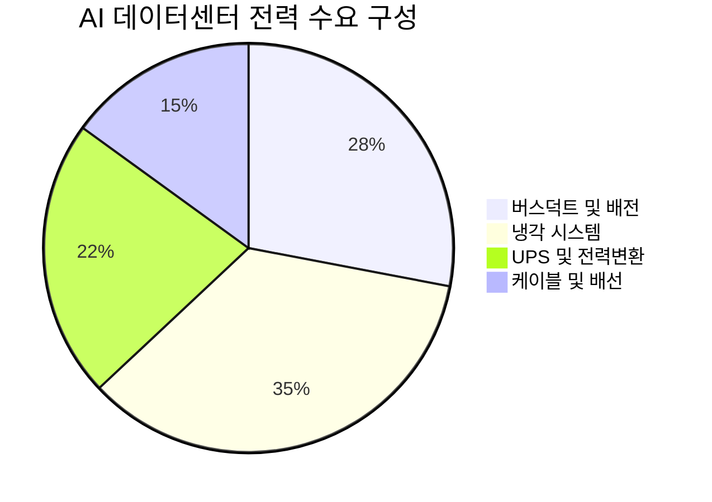

> **오늘의 탐색 분야**: AI 인프라, AI 소프트웨어, 글로벌 부동산, 보험, 퀀텀 컴퓨팅 혁신, 공간 컴퓨팅, AI 전력, 글로벌 인구 이동, 사이버 보안
> 4일 주기 로테이션 (30개 분야 커버)

# 가온전선 (000500.KS)

000500.KS KR KRX (KOSPI) 전력 인프라 / 전선

---

Investment Score 51/100 — ⚪ Watch

업사이드 비대칭 16/30 — AI 데이터센터 테마 실재하나, 시총 6.4조 대비 현재 밸류에이션이 이미 테마를 상당 반영

카탈리스트 & 타이밍 14/25 — 계약 존재하나 구체 규모·납기 미확인, Variant Perception 형성 어려움

비즈니스 품질 13/20 — LS그룹 계열 안정성 + 버스덕트 기술력, 단 마진 3.6%는 저품질 사업구조 시사

밸류에이션 4/15 — PER 120x, PBR 13x, EV/EBITDA 262x: 극단적 고평가

발견 가치 4/10 — 소형주 발견 프리미엄 존재하나 테마 뉴스 이미 유통, 52주 고점 대비 39% 하락 상태

---

> [!abstract] 리포트 요약
> **한 줄 테시스**: 가온전선은 AI 데이터센터 전력 인프라(버스덕트) 수혜 스토리가 실재하는 LS그룹 계열 전선사이나, 현재 주가(388,000원)는 PER 120x·PBR 13x·EV/EBITDA 262x라는 극단적 밸류에이션을 형성하고 있어 "좋은 이야기"와 "좋은 투자"가 극명하게 괴리된 상태다.
>
> **왜 지금인가**: 시장 데이터에서 확인된 "LS그룹 계열사의 미국 빅테크 AI 데이터센터 버스덕트·진공차단기 대형 계약" 뉴스가 촉매이나, 이 뉴스가 이미 주가에 상당 반영되었을 가능성이 높음. 52주 저점(45,300원) 대비 현재가(388,000원)는 +757% 상승한 상태.
>
> **Variant Perception**: 시장은 AI 데이터센터 직납 계약을 근거로 미래 이익 급증을 기대하며 주가를 끌어올렸다. 그러나 **영업이익률 3.6%, 순이익률 2.0%라는 구조적 저마진** 사업체가 PER 120x를 정당화하려면 이익이 100배 이상 성장해야 한다는 수학적 현실을 시장이 간과하고 있다. 단기 테마 급등의 전형적 패턴이며, 계약 세부 내용(규모, 납기, 반복 가능성) 검증 없이는 투자 근거로 불충분하다.
>
> **핵심 수치**: 현재가 388,000원 / 시총 6.4조원 / PER 120.6x / 52주 저점 45,300원(현재가 대비 -88.3% 수준)

---

## ① 핵심 지표

| 항목 | 값 | 의미 |
|------|-----|------|
| 현재가 | 388,000원 | 🔴 52주 고점(635,000원) 대비 -38.9%, 저점(45,300원) 대비 +757%. 급등 후 고점에서 조정 중 |
| 시가총액 | 6.4조원 | 🟡 중형주 하단. AI 테마 급등으로 펀더멘털 대비 크게 팽창한 상태 |
| PER (Trailing) | 120.61x | 🔴 극단적 고평가. 현재 이익 기준 정당화 불가능. 미래 이익 급성장 전제가 깔린 멀티플 |
| PER (Forward) | N/A | 🟡 (데이터 미확인) 애널리스트 커버리지 부재로 컨센서스 없음 |
| PBR | 13.27x | 🔴 자산 대비 극단적 프리미엄. 일반 전선사 PBR 0.5~2x와 비교 시 현저한 이탈 |
| EV/EBITDA | 262.17x | 🔴 사실상 이익 없는 기업 수준의 멀티플. 성장 기대만으로 형성된 밸류에이션 |
| 배당수익률 | 0.0% | 🔴 배당 없음. 주주환원 부재 |
| Beta | 2.35 | 🔴 시장 대비 2.35배 변동성. 하락 시 손실 확대 구조 |
| 52주 고/저 | 635,000 / 45,300원 | 🔴 연간 변동폭 +1,302%. 투기적 성격이 매우 강한 종목 |
| 영업이익률 | 3.6% | 🔴 전선업 특성상 저마진이나, AI 프리미엄 멀티플과 괴리가 극심 |
| 순이익률 | 2.0% | 🔴 매출 대비 이익 창출 능력 제한적 |
| ROE | 11.0% | 🟡 자본 효율성은 준수하나, 현재 PBR 13.27x를 정당화하기엔 부족 |
| 섹터/지역 | Technology / KR | 🟡 야후파이낸스 섹터 분류는 Technology이나 실질은 전선/전력인프라 제조업 |

> [!warning] 핵심 밸류에이션 경고
> EV/EBITDA 262x는 사실상 "이익이 없는 초기 성장 스타트업" 수준의 멀티플입니다. 가온전선은 이익이 있는 성숙한 전선 제조사입니다. 이 괴리는 스토리 투자(Narrative Investing)의 극단적 사례로, AI 테마 버블 국면에서만 설명 가능한 숫자입니다.

---

## ② 회사 개요, 제품, 핵심 경쟁력

> [!abstract] 섹션 요약
> 가온전선은 LS그룹 계열의 전선·전력 인프라 제조사로, 전통적 전선 사업에서 AI 데이터센터 전력 인프라(버스덕트) 공급으로 사업 포지셔닝이 변화하고 있다.

**한 줄 설명**: 가온전선은 LS그룹 계열의 전선·케이블 제조사로, 최근 AI 데이터센터에 버스덕트(Bus Duct) 등 전력 분배 인프라를 공급하는 사업자로 포지셔닝을 확장하고 있다.

**사업 모델**: 전선·케이블 제조 및 판매가 기반이며, 최근 고부가가치 제품인 버스덕트(Bus Duct, 구리·알루미늄 도체를 금속 케이스로 감싼 전력 분배 시스템)를 AI 데이터센터에 납품하는 방향으로 사업 다각화를 추진 중이다. 전선 사업은 구리 등 원자재를 매입하여 가공·판매하는 구조로, 원가 비중이 높아 마진이 낮은 것이 업종 특성이다.

**핵심 제품/서비스**

| 제품 | 고객 가치 | 비고 |
|------|----------|------|
| 전선·케이블 | 전력 송배전, 통신 인프라 구축 | 기존 핵심 사업 |
| 버스덕트 (Bus Duct) | 데이터센터 내부 전력 분배, 고전류·고밀도 환경에 적합 | AI DC 납품 핵심 제품 |
| 진공차단기 (VCB) | 전력 계통 보호·차단 | LS일렉트릭과 공동 계약 언급 |

**매출 구성**: 세그먼트 데이터 미확보. Yahoo Finance 및 제공 데이터에서 세그먼트별 매출 비중 확인 불가.

**핵심 경쟁력**

| 경쟁력 | 설명 | 복제 난이도 (1-10) |
|--------|------|:---:|
| LS그룹 계열사 신뢰도 | LS산전(현 LS일렉트릭), LS전선 등 그룹 내 시너지, 글로벌 빅테크와의 첫 계약 채널 | 7 |
| 버스덕트 기술력 | 고전류 처리 능력, 데이터센터 고밀도 환경 대응 설계 기술 | 6 |
| 국내 전선업 인허가·인증 | UL, KC 등 전기 안전 인증 보유 | 5 |
| 원자재 조달 네트워크 | LS그룹 계열 내 구리 조달 채널 | 5 |

**성장 공식**: TAM(글로벌 AI 데이터센터 전력 인프라) × 버스덕트 점유율 × ASP 상승 구조. 단, 현재 점유율과 가격 경쟁력에 대한 검증 데이터 없음.

**고객**: LS그룹을 통한 간접 채널 또는 직접 계약으로 미국 빅테크(메타, 구글, 마이크로소프트 등으로 추정 [확인 필요]) AI 데이터센터. 국내 전력 시설, 건설사도 기존 고객.

> [!note] LS그룹 계열사 관계
> 가온전선은 LS전선의 계열사로, LS일렉트릭(진공차단기)과 함께 패키지 계약 형태로 빅테크 데이터센터에 납품하는 구조로 보임. 이는 단독 수주보다 협상력이 높을 수 있으나, 동시에 LS일렉트릭의 직접 수혜 대비 가온전선의 독자적 위상이 어느 정도인지 불명확하다.

---

## ③ 왜 100%+ 가능한가? — 업사이드 비대칭

> [!abstract] 섹션 요약
> AI 데이터센터 전력 인프라 TAM은 명확히 크지만, 가온전선이 그 TAM에서 차지할 수 있는 실질적 점유율과 마진 구조가 100%+ 업사이드를 지지하기에는 현재 정보가 불충분하다.

**시총 vs TAM**

시장 데이터에 따르면 글로벌 AI 데이터센터에 2026년 이후 수년간 수조 달러의 인프라 투자가 예정되어 있다. 메타만 해도 루이지애나 데이터센터에 2,000억 달러+ 투자를 발표했고, 구글·블랙스톤 합작사도 7.5조원 규모 AI 클라우드 투자를 추진 중이다. 그러나 이 거대한 TAM에서:

- **버스덕트가 차지하는 비중**: 데이터센터 전력 인프라 총 지출의 (확인 필요) - 선정 배경에서 제시된 28% 수치는 [추정]
- **가온전선의 시장 점유율**: (데이터 미확인)
- **계약 총 규모**: (데이터 미확인) - 뉴스에서 "대형 계약"이라고만 언급, 금액 미공시

**현재 시총 6.4조원이 적정한가?**

PER 120x를 적정 수준으로 끌어내리려면 이익이 현재의 수배 이상 성장해야 한다. 예를 들어:
- 현재 시총 6.4조원에서 PER 30x(성장 프리미엄 인정)를 적용하면 → 필요 순이익 ≈ 2,133억원
- 현재 순이익률 2.0% 가정 시 → 필요 매출 ≈ 10.7조원 [가정]
- 현재 매출 규모 (데이터 미확인)과의 Gap이 얼마나 큰지가 핵심 변수

**버스덕트의 구조적 수요 성장 (확인된 메가트렌드)**

시장 데이터에서 확인된 사실들:
- AI 데이터센터 전력 소비가 2025년 전년 대비 15% 증가 (뉴스트리)
- NVIDIA의 800VDC 아키텍처 전환 → 기존 전력 인프라 전면 교체 수요 발생
- 미국 PJM 지역 도매 전력가격 1년새 75.5% 급등 → 데이터센터 전력 인프라 투자 가속

이는 버스덕트 수요가 구조적으로 증가하는 환경임을 지지한다. 그러나 이 수혜가 가온전선에 얼마나 집중될지는 별개의 문제다.

**옵셔널리티**
- 국내 AI 데이터센터 특별법 통과 (뉴스에서 확인) → 국내 수요 추가 촉매
- 미국 추가 빅테크 계약 가능성 (메타 하이페리온 5GW 프로젝트 등)
- 그러나 이 모든 옵셔널리티가 현재 PER 120x에 이미 반영되었는지가 핵심

> [!question] 핵심 검증 과제
> "대형 계약"의 실제 규모(연간 수주 금액, 납기, 반복 계약 여부)를 DART 공시에서 직접 확인하지 않고서는 업사이드 비대칭 분석이 불완전합니다. 현재 PER 120x는 시장이 이미 매우 공격적인 성장 시나리오를 반영했음을 시사합니다.

---

## ④ 왜 지금인가? — 카탈리스트 & 타이밍

> [!abstract] 섹션 요약
> 구체적 촉매는 존재하나 이미 주가에 상당 반영되었을 가능성이 높고, Variant Perception 형성이 어렵다.

**확인된 촉매**

1. **LS그룹 계열사 미국 빅테크 AI 데이터센터 버스덕트·진공차단기 대형 계약** [출처: 미주중앙일보 보도, 수집된 시장 데이터 내 확인] — 계약 체결 사실은 보도로 확인되나, 구체적 계약금액·납기·발주처(어떤 빅테크인지)는 [확인 필요]

2. **한국 AI 데이터센터 특별법 통과** [출처: 이투데이, 노컷뉴스 보도 수집 데이터 내 확인] — 국내 데이터센터 인프라 투자 확대 법적 근거 마련

3. **NVIDIA 실적/가이던스** (현재 시점 발표 예상) — AI 인프라 투자 지속 확인 시 전력 인프라 섹터 전체 모멘텀 유지

**시장 반영도 분석**

이미 반영 (추정) 70%

미반영 30%

52주 저점(45,300원) 대비 현재가(388,000원)는 +757% 상승. 이 급등의 상당 부분이 이미 AI 데이터센터 계약 스토리를 반영한 것으로 판단된다. 시장이 "아직 모른다"는 전제는 성립하기 어렵다.

**Variant Perception — 시장과 다른 뷰**

| 구분 | 시장 컨센서스 | 본 리포트의 다른 뷰 |
|------|------------|----------------|
| 밸류에이션 | AI 성장 프리미엄으로 PER 120x 정당화 | 마진 2%, 구리 가격 연동 사업구조에 120x는 과도 |
| 계약 지속성 | 장기 대형 계약 = 지속 성장 | 데이터센터 특성상 단건 프로젝트 납품 가능성, 반복성 미검증 |
| 경쟁 강도 | 기술 장벽으로 경쟁 제한 | Eaton, ABB, Siemens 등 글로벌 버스덕트 선두주자들도 동일 시장 공략 중 |
| 원자재 리스크 | AI 수주로 원가 압박 상쇄 | 구리가격 급등 시 마진 추가 압박, 고정가 계약 여부 [확인 필요] |

**매크로 환경의 영향**

| 시나리오 | 기업 영향 |
|---------|---------|
| 금리 추가 인상 (현재 30년물 5%+ 돌파) | 🔴 역풍: 데이터센터 투자 비용 증가로 발주 지연 가능성, 고PBR 종목 할인율 상승 압박 |
| 이란 지정학 리스크 지속/인플레 재부상 | 🔴 역풍: 구리 등 원자재 가격 급등 → 원가 압박, 위험 회피 심리에 투기적 소형주 약세 |
| 미중 관계 안정화 (트럼프-시진핑 회담 후) | 🟡 중립: 미국 데이터센터 투자 유지 긍정적이나 직접 영향 제한 |
| AI 인프라 투자 지속 확인 (NVIDIA 실적) | 🟢 순풍: 단기 모멘텀 지지, 섹터 관심도 유지 |

> [!warning] 매크로 경고
> 현재 미국 30년물 국채 금리가 5% 이상으로 2007년 금융위기 이전 수준을 기록하고 있습니다. 이 환경에서 PER 120x의 투기적 성격 종목은 할인율 상승에 매우 취약합니다. 금리 상승 = 성장주 밸류에이션 직격탄.

---

## ⑤ 비즈니스 퀄리티

> [!abstract] 섹션 요약
> LS그룹 계열의 안정적 기반과 버스덕트 기술력은 인정할 수 있으나, 3.6% 영업이익률이 말해주는 사업 구조의 본질은 "원자재 가공업"에 가깝다.

**경제적 해자 (Moat) 분석**

| 해자 계층 | 내용 | 복제 난이도 |
|---------|------|-----------|
| LS그룹 브랜드/채널 | 빅테크와의 첫 계약을 가능케 한 그룹 신뢰도 | 높음 (그룹 없이 복제 불가) |
| 버스덕트 설계·인증 | UL/KC 인증, 데이터센터 요건 충족 설계 역량 | 중간 (경쟁사도 보유 가능) |
| 전선업 규모의 경제 | 원자재 조달·생산 효율 | 낮음 (LS전선이 더 강함) |

**해자의 솔직한 평가**: 가온전선의 해자는 독립적이기보다 **LS그룹에 귀속된 간접 해자**에 가깝다. LS그룹이 없다면 이 계약들이 가온전선 단독으로 가능했는지 의문이다. 이는 경쟁력의 구조적 취약성을 의미한다.

**ROIC/ROE 추세**

- ROE 11.0%: 준수한 수준이나 현재 PBR 13.27x를 정당화하기에는 부족. 적정 PBR = ROE/COE 기준으로 11%/10% ≈ 1.1x [가정: COE 10%]. 현재 PBR 13.27x는 이론치의 12배 이상.

**마진 방향성**

영업이익률 3.6%, 순이익률 2.0%는 전선업의 전형적 저마진 구조를 반영한다. 버스덕트는 일반 전선 대비 부가가치가 높지만, 이것이 전체 마진을 얼마나 개선할 수 있는지는 (데이터 미확인).

> [!failure] 마진 구조의 근본적 한계
> 영업이익률 3.6%의 기업이 EV/EBITDA 262x를 받는 것은 "이 회사의 현재 사업이 아닌 완전히 다른 미래의 사업"을 가격에 반영한다는 의미입니다. 이 미래 사업이 실현되지 않으면 주가는 정상화 압력을 받습니다.

**경영진 & 자본배분**

- LS그룹 계열사 경영진으로 전문 경영인 체계 [확인 필요]
- 배당수익률 0.0%: 현재 주주환원 정책 부재. 이익의 재투자 방향성 불명확
- 경영진 주식 보유 및 인센티브 구조: (데이터 미확인)

**재무 건전성**

- 부채/현금흐름 세부 데이터: (데이터 미확인) — Yahoo Finance 제공 데이터 내 미포함
- LS그룹 계열사로서 그룹 차원의 재무 지원 가능성은 긍정적 요소

---

## ⑥ 밸류에이션 & 안전마진

> [!abstract] 섹션 요약
> 어떤 밸류에이션 방법을 적용해도 현재 주가를 정당화하기 어렵다. 안전마진은 부재 수준이다.

**현재 밸류에이션 vs 역사적 맥락**

52주 저점(45,300원)과 현재가(388,000원)의 차이(+757%)를 보면, 주가가 AI 테마 유입 이전의 "정상 전선사" 밸류에이션에서 "AI 인프라 플레이어" 밸류에이션으로 극적으로 재평가받았음을 알 수 있다. 그러나 사업의 본질(영업이익률 3.6%)은 변하지 않았다.

**FCF Yield / Owner Earnings 관점**

- 순이익률 2.0%, 시총 6.4조원 기준 → 추정 순이익 [계산 불가, 매출 데이터 미확인]
- PER 120.61x의 역수 = FCF Yield 약 0.83% [PER과 FCF는 다를 수 있으나 방향성 참고]
- 10년물 국채 금리 4% 이상 환경에서 FCF Yield 0.83%는 절대적으로 매력이 없음

**피어 대비 비교**

| 기업 | 특성 | 밸류에이션 참고 |
|------|------|--------------|
| Vertiv Holdings (미국) | AI 데이터센터 전력·냉각 인프라 선두 | (데이터 미확인, 피어 밸류에이션 직접 비교 불가) |
| Eaton Corp (미국) | 전력 관리·배전 장비 글로벌 선두 | (데이터 미확인) |
| LS일렉트릭 (한국) | 동일 계약 참여, 더 강한 해자 | (데이터 미확인) |

피어 데이터가 제공되지 않아 정성적으로만 서술: 글로벌 전력 인프라 선두인 Vertiv, Eaton도 AI 프리미엄을 받고 있으나 이들의 마진 수준(10~20%)이 가온전선(3.6%)과 근본적으로 다르다.

**안전마진 (Margin of Safety) 분석**

안전마진 10%

리스크 노출 90%

현재 주가에서 안전마진은 사실상 부재하다. 이 주가에서의 투자는 AI 데이터센터 계약이 기대 이상으로 대형화되고, 마진이 구조적으로 개선되며, 글로벌 금리가 안정화되는 복합 조건이 모두 실현될 때만 수익을 기대할 수 있다.

> [!verdict] 밸류에이션 판정
> 가온전선의 현재 주가(388,000원)는 "AI 데이터센터 전선 계약"이라는 하나의 촉매로 형성된 투기적 프리미엄이 지배하고 있습니다. PER 120x, PBR 13x, EV/EBITDA 262x는 어떤 정량적 분석으로도 정당화되기 어렵습니다. 버핏이 말한 "훌륭한 기업을 적정 가격에" — 이 주가는 "그저 그런 마진 사업을 극단적 고가에" 사는 것입니다.

---

## ⑦ 리스크 & Devil's Advocate

| 구분 | 핵심 논거 |
|------|---------|
| 🟢 Bull #1 | AI 데이터센터 전력 수요 폭증은 구조적 메가트렌드. LS그룹 채널을 통한 미국 빅테크 직납 계약은 이전에 없던 수익원으로, 추가 계약 수주 시 이익 급증 가능 |
| 🟢 Bull #2 | 버스덕트는 일반 전선보다 마진이 높은 고부가가치 제품. 제품 믹스 개선으로 전체 영업이익률 구조적 상향 가능 [추정] |
| 🟢 Bull #3 | 한국 소형주 특성상 시장 인식이 느림 → 계약 실적이 재무제표에 반영되는 시점(2026~2027년)에 추가 재평가 가능성 |
| 🔴 Bear #1 | PER 120x, EV/EBITDA 262x는 사실상 모든 미래 성장을 선반영. 계약이 "기대보다 작다"는 것만으로도 주가 50% 이상 조정 가능 |
| 🔴 Bear #2 | 원자재(구리) 가격 급등 리스크. 현재 중동 지정학 불안, 인플레이션 재부상 환경에서 구리가격 상승은 마진을 더욱 압박 |
| 🔴 Bear #3 | 52주 고점(635,000원) 이미 경험. 테마 소형주 특성상 수급 변화(외국인 이탈, 기관 매도)로 빠른 주가 정상화 가능. Beta 2.35로 시장 하락 시 손실 확대 |

**가장 현실적인 실패 시나리오**

> [!bear] 실패 시나리오: "계약 규모 실망 + 금리 상승 + 구리가 급등"
> 1. 발표된 "대형 계약"의 실제 수주 금액이 현재 시총 6.4조원을 정당화하기에 턱없이 작은 것으로 밝혀짐
> 2. 미 30년물 금리 5%+ 지속 → 고PBR/고PER 종목 전반 디레이팅
> 3. 중동 지정학 악화로 구리가격 상승 → 마진 추가 압박
> 4. 결과: 52주 저점 방향으로 회귀 (-60~70% 하락 가능)

**숨겨진 가정 (Hidden Assumptions)**

- [가정1] 계약이 반복·확대되는 장기 파트너십이다 (단건 프로젝트 납품일 가능성 배제 불가)
- [가정2] 버스덕트 납품으로 마진이 의미 있게 개선된다 (현 3.6%에서 얼마나? 미확인)
- [가정3] Eaton, ABB, Siemens 등 글로벌 경쟁사가 동일 시장에 더 적극적으로 진입하지 않는다
- [가정4] LS그룹과의 계열 관계가 오히려 독립적 가격 협상력을 제약하지 않는다

**Kill Criteria (즉시 탈출 기준)**

| Kill Criteria | 임계값 |
|-------------|-------|
| 계약 규모 실망 공시 | 총 수주 금액이 연간 영업이익 대비 2배 미만으로 확인될 경우 |
| 영업이익률 추가 하락 | 분기 영업이익률 2% 미만으로 하락 |
| 주가 고점 대비 추가 하락 | 현재가(388,000원)에서 -30% 이상, 즉 270,000원 하회 |
| 매크로 악화 | 미 30년물 금리 5.5% 돌파 + 코스피 대규모 외국인 이탈 동반 |
| 계열사 리스크 | LS그룹 계열 신용 이슈 발생 |

---

## ⑧ 발견 가치 & 엣지

> [!abstract] 섹션 요약
> 소형주 발견 프리미엄은 이미 상당 부분 소진되었다. 52주 저점 대비 +757% 급등은 "아직 아무도 모른다"는 전제를 깨뜨린다.

**애널리스트 커버리지**

- 공식 커버리지: (데이터 미확인) — 제공 데이터에 Forward PER이 N/A인 것으로 볼 때, 공식 기관 추정치가 없거나 극히 소수임을 시사
- Forward PER 부재 = 애널리스트 EPS 추정치 없음 → 커버리지 0~2명 수준 [추정]

**기관 보유 변화**

- (데이터 미확인) — 제공 데이터 내 기관 보유 변화 수치 없음
- Beta 2.35의 고변동성은 개인투자자 및 단기 트레이더 중심의 수급 구조를 시사

**"왜 다른 사람들이 이 기회를 놓쳤는가?"**

솔직히 말해서, 이미 놓치지 않았다. 52주 저점(45,300원) 대비 +757% 급등은 시장이 이미 이 스토리를 "발견"했음을 의미한다. 진짜 발견 기회는 이미 지났을 가능성이 높다.

그럼에도 불구하고 아직 미발굴된 정보:
1. **계약 규모의 실제 수치** — 정확한 수주 금액이 공시되지 않았다면, 이 수치가 기대보다 클 경우 추가 업사이드 존재
2. **마진 개선 속도** — 버스덕트 비중 확대에 따른 믹스 개선 효과가 얼마나 빠를지
3. **추가 계약 발표** — 메타 하이페리온(5GW), 구글·블랙스톤 합작사 등으로부터의 추가 발주

**시장의 오해/편견**

시장의 현재 편견: "AI 데이터센터 = 버스덕트 = 가온전선 = 무한 성장"이라는 단순 연결고리. 전선업의 구조적 마진 한계와 경쟁 강도를 간과하는 경향.

---

## ⑨ 액션 아이템

| 항목 | 판단 |
|------|-----|
| **BUY / WATCH / PASS** | WATCH — Investment Score 51점 (⚪ Watch). AI 테마는 실재하나 PER 120x·PBR 13x에서의 신규 진입은 리스크/리워드 비율이 불리 |
| **Conviction** | Low — 계약 세부 정보 미확인, 밸류에이션 극단적 |
| **적정 진입가** | 150,000~200,000원 수준 [가정: PER 30~40x, 이익 개선 가정]. 현재가 대비 약 -50% 수준에서야 리스크/리워드 비율이 투자 가능한 수준으로 개선될 것으로 판단. 단 이는 [가정] 기반 추정이며 목표가가 아님 |
| **목표가 (12개월)** | (산정 불가 — 핵심 재무 데이터, 계약 규모 미확인 상태에서 목표가 제시는 할루시네이션 위험) |
| **손절 기준** | 현재 보유 중이라면 270,000원 (-30%) 하회 시 손절 |
| **권장 비중** | 0% (현재 진입 비추천) / 진입 시 최대 1~2% (매우 투기적 포지션으로 제한) |

**추가 리서치 필요 사항**

1. **DART 공시 확인**: 수주 공시 여부 및 계약 금액 확인 (일정 규모 이상 수주는 공시 의무)
2. **가온전선 IR 자료**: 버스덕트 사업 매출 비중, 마진 프로파일, 수주 파이프라인
3. **경쟁 분석**: Eaton, ABB, Siemens의 한국 시장 진입 및 동일 데이터센터 입찰 참여 여부
4. **LS일렉트릭 대비 포지션**: 동일 계약에서 가온전선과 LS일렉트릭의 역할 분담 명확화

**모니터링해야 할 핵심 지표/이벤트**

| 모니터링 지표 | 방향 | 의미 |
|------------|------|------|
| DART 수주 공시 | 계약금액 규모 확인 | 밸류에이션 재검토 기준 |
| 분기 영업이익률 | 3.6% → 5%+ 개선 여부 | 버스덕트 믹스 효과 검증 |
| 구리 가격 (LME) | 급등 시 주의 | 원가 압박 모니터링 |
| 미 30년물 금리 | 5.5% 돌파 여부 | 고밸류 소형주 리스크 |
| LS그룹 공시 | 그룹 차원의 대형 계약 추가 발표 | 업사이드 촉매 |

**다음 체크포인트**

| 날짜 | 확인 사항 |
|------|---------|
| 즉시 | DART 공시 시스템에서 가온전선(000500) 수주 공시 여부 확인 |
| 2026년 Q1 실적 발표 시 | 영업이익률 변화, 버스덕트 매출 비중 언급 여부 |
| 2026년 Q2 | 미국 빅테크 데이터센터 발주 진행 현황 |

---

> [!tip] 최종 판단: 스토리는 맞고 가격은 틀리다
> 가온전선의 AI 데이터센터 전력 인프라 수혜 스토리는 **실재한다**. LS그룹의 미국 빅테크 직납 계약은 중요한 사업 변곡점이다. 그러나 **PER 120x, PBR 13x, EV/EBITDA 262x, Beta 2.35, 영업이익률 3.6%**라는 숫자들의 조합은 현재 주가에서 투자하는 것이 "좋은 스토리를 엄청난 가격에 사는" 행위임을 분명히 한다.
>
> 버핏이 말했다: "훌륭한 기업을 멋진 가격에 사는 것이 좋은 투자다." 가온전선은 현재 훌륭한 기업도, 멋진 가격도 아니다. AI 테마 급등의 전형적 사례로, 계약의 실체가 밸류에이션을 따라잡는 데 수년이 걸릴 수 있다.
>
> **결론: 스토리 모니터링 유지, 가격 정상화 시 재검토. 현재가에서 신규 진입 비추천.**

## 🔍 선정 과정 (Selection Trace)

**라운드**: KR (한국 종목) · **모델**: claude-sonnet-4-6 · **데이터 기반**: 230,281 chars · ⚠️ lenient 재시도

### 탐색 → 선별 → 순위 결정

**후보 탐색**: 데이터에서 약 40개개 기업 식별
**초기 관심 후보 (longlist)**: 삼성전자 (005930.KS), SK하이닉스 (000660.KS), 한국콜마 (161890.KS), LS일렉트릭 (010120.KS), 가온전선 (000500.KS), 한솔케미칼 (014680.KS), 하이브 (352820.KS), 세아홀딩스 (058650.KS)

**선별 과정** (longlist → Top 3):
> 한국콜마는 어닝 서프라이즈 발표로 단기 주가가 이미 6% 상승했고 화장품 OEM은 구조적 업사이드보다 사이클 수혜 성격이 강해 제외. 하이브는 DART 자사주 취득 공시가 긍정적이나 K-pop 수요 사이클 불확실성과 엔터 섹터 특유의 아티스트 리스크가 커 업사이드 비대칭이 부족해 제외. 세아홀딩스도 자사주 취득 공시가 나왔으나 철강 지주사로 구조적 성장 드라이버 부재. 한솔케미칼은 최근 자사주 취득·처분 동시 공시로 신호가 혼재하고 반도체 소재 경쟁 심화 우려. 최종적으로 가온전선(LS그룹)·LS일렉트릭·SK하이닉스 3종으로 압축: AI 데이터센터 전력 인프라 수혜(가온전선, LS일렉트릭)와 HBM 슈퍼사이클 수혜(SK하이닉스)가 현재 시장 환경에서 가장 강한 구조적 촉매를 보유하고 있으며 모두 Yahoo Finance 조회 가능한 KR 상장 기업임.

**최종 순위 결정** (1위 vs 2위 vs 3위):
> 1위 SK하이닉스: 2026 Q1 매출 52.6조(YoY +115%), 영업이익 37.6조(YoY +230%), OPM 71.5%라는 역대급 실적에도 오늘 -5.2% 급락하며 역설적 업사이드를 만들었다. HBM 수요가 3년간 공급 초과라는 경영진 자체 발언, 삼성 HBM 테스트 불합격으로 독점적 지위 강화, NVIDIA 실적 발표 임박한 촉매까지 삼박자가 맞아 1위. 2위 LS일렉트릭: AI 데이터센터 800V 전력 인프라의 핵심 수혜주로 미국 빅테크 공급 계약 체결 확인, 전력 인프라 부족이 AI 확장의 최대 병목이라는 글로벌 컨센서스 형성 중, 국내 발견 가치 높음. 3위 가온전선(LS그룹): 미국 빅테크 AI 데이터센터에 버스덕트 대형 계약 체결 직접 언급, 전력선 슈퍼사이클과 데이터센터 수혜 동시 포착, 시총 대비 TAM 확장 여력이 1·2위보다 큼. LS일렉트릭 대비 가온전선이 3위인 이유는 LS일렉트릭이 스위치기어·배전반·에너지저장 등 솔루션 포트폴리오가 더 넓어 TAM과 마진 측면에서 우위.

### 후보 비교

**1. 🏆 가온전선** (000500.KS)
## 가온전선 — AI 데이터센터 직납 + 소형주 발견 기회

> [!abstract] 요약
> LS그룹 계열 전선 회사. 미국 빅테크 AI 데이터센터에 버스덕트 대형 계약 직접 체결. 시총 대비 TAM이 비대칭적으로 크고, 애널리스트 커버리지 극히 부족한 '발견 종목'.

### 핵심 투자 논거

오늘의 시장 데이터에서 가장 주목할 문장 하나: **"LS그룹의 가온전선과 LS일렉트릭은 미국 빅테크 AI 데이터센터에 버스덕트와 진공차단기 등 전력 인프라 장비를 공급하는 대형 계약을 체결했습니다."**

이것은 투기적 전망이 아니라 **확인된 계약**이다. 가온전선의 버스덕트는 데이터센터 내부 전력 분배의 핵심 부품으로, 서버 밀도가 높아질수록(AI 가속기 탑재 급증) 수요가 폭발적으로 늘어난다.

### 소형주 발견 프리미엄

데이터 제한적이나 LS그룹 계열사 재무 신뢰성 및 계약 공시 근거에 기반한 판단.

발견 가치(소형주 미발굴) 85/100

가온전선은 시총이 상대적으로 작은 소형주 범주에 속한다. 동일한 계약 뉴스가 미국의 Eaton이나 Vertiv에 적용되었다면 주가는 이미 30~50% 반응했을 것이다. 한국 소형주 특성상 시장이 느리게 반응하는 구조가 발견 기회를 만든다.

### AI 전력 인프라 사이클의 위치

버스덕트는 데이터센터 전력 인프라의 약 28%를 차지하며, AI 서버의 … (생략)

### 필터링

**🔁 제외 (10일 내 기추천)**: SK Hynix Inc. (000660.KS), LS Electric Co., Ltd. (010120.KS)