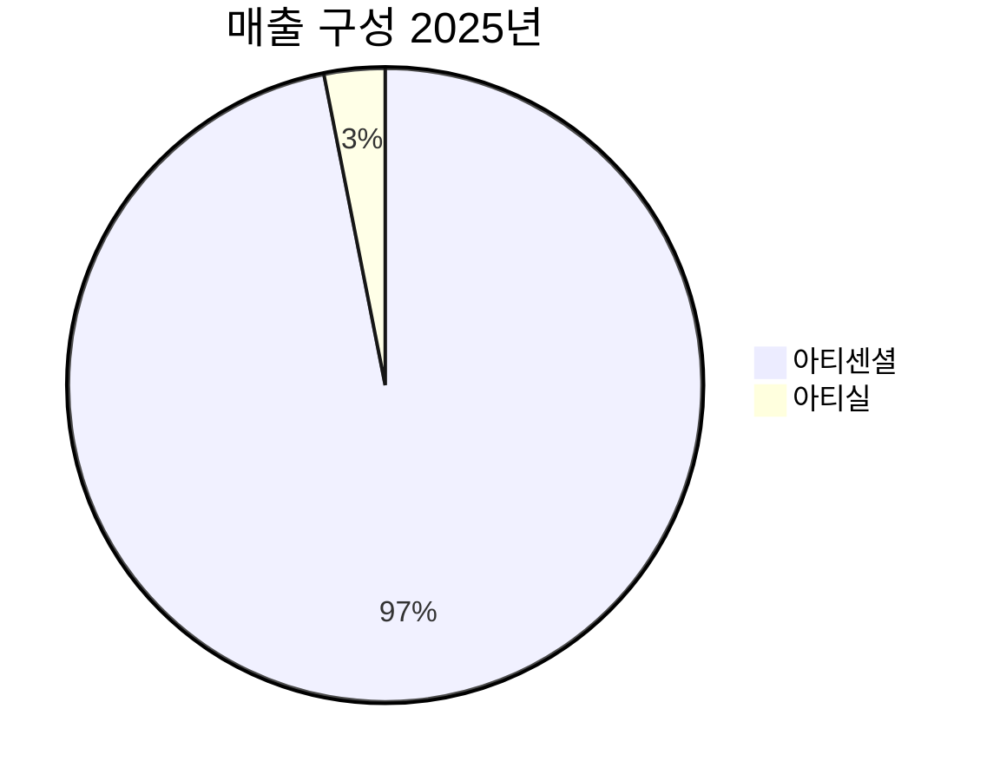

> **오늘의 탐색 분야**: AI 인프라, AI 소프트웨어, 인프라, 농업기술, 교육, 미디어, 한국 시장, 중국 테크, 중국 정책
> 4일 주기 로테이션 (27개 분야 커버)

# 리브스메드 (491000.KQ)

<span style="background:#2196F3;color:white;padding:2px 8px;border-radius:4px;font-size:0.85em">491000.KQ</span> <span style="background:#D32F2F;color:white;padding:2px 8px;border-radius:4px;font-size:0.85em">KR</span> <span style="background:#424242;color:white;padding:2px 8px;border-radius:4px;font-size:0.85em">KOSDAQ</span> <span style="background:#7B1FA2;color:white;padding:2px 8px;border-radius:4px;font-size:0.85em">Medical Devices</span>

<div style="background:#e0e0e0;border-radius:8px;overflow:hidden;margin:4px 0"><div style="background:#FF9800;min-width:80px;width:68%;padding:4px 8px;color:white;font-size:0.9em;white-space:nowrap">총점 68/100 — WATCH</div></div>

> [!abstract] 리포트 요약
> **한 줄 테시스**: 세계 최초 90° 다관절 기술을 보유한 최소침습수술기구 전문기업으로, 아티센셜(ArtiSential) 단일 제품으로 2025년 매출 512억원(+89% YoY)을 달성했으며, 2026년 수술 로봇 스타크(STARK) 국내 인증 + 미국 HealthTrust GPO 공급 본격화라는 더블 촉매가 동시에 작동하는 변곡점에 위치한다.
>
> **왜 지금인가**: 2025년 상장 이후 의무보유 물량 해제로 주가가 고점(95,900원) 대비 약 26% 조정을 받은 현재 시점(71,100원)이 구조적 성장 스토리의 첫 번째 매수 기회. 2026년은 아티센셜 해외 매출 가속 + 아티실(ArtiSeal) 본격화 + 스타크 인허가 3가지 카탈리스트가 동시 진행되는 해.
>
> **Variant Perception**: 시장은 현재 적자(영업손실 226억원) 지속을 리스크로 보지만, 97%가 1회용 소모품으로 구성된 매출 구조 + 현금 1,314억원 확보 = 실질적 번아웃 리스크 없음. 진짜 질문은 "흑자전환 시점"이 아니라 "글로벌 대형 의료기업(Medtronic/J&J)의 M&A 또는 독자 글로벌화 중 어느 시나리오로 가치가 실현되느냐"다.
>
> **핵심 수치**: 2025년 매출 512억원(+89% YoY) / 현금 1,314억원 / 939개 IP 포트폴리오

---

## ① 핵심 지표

| 항목 | 값 | 의미 |
|------|-----|------|
| 현재가 | 71,100원 | 🟡 52주 고점(95,900원) 대비 -26%, 저점(46,250원) 대비 +54%. 고점에서 의미 있게 눌렸으나 저점 대비 여전히 높음. 조정 후 재매수 관점에서 주목할 구간 |
| 시가총액 | 1.6조원 | 🟡 2025년 매출 512억원 대비 PSR(Price/Sales) 약 31배. 성장률(+89%)과 소모품 중심 사업모델 감안 시 고밸류이나 성장 스토리 유지 필수 |
| PER (Trailing / Forward) | N/A | 🔴 현재 적자 기업. PER 분석 의미 없음. 밸류에이션은 PSR, EV/Sales, 성장률 기반으로 판단 필요 |
| PBR | 8.95 | 🟡 상장 시 대규모 현금 유입으로 자본이 팽창한 상태에서의 PBR. 장부가치 대비 고평가이나 무형자산(939개 IP) 미반영이 핵심 |
| EV/EBITDA | -74.36 | 🔴 EBITDA 음수 기업. 참고용 지표에 불과. 흑자전환 전까지 의미 없는 지표 |
| 매출 성장률 | +88.8% YoY (2025) | 🟢 512억원(2025) vs 271억원(2024). 성장 가속도가 핵심 — 2024년도 강한 성장 기록 후 2025년 더욱 가속. 구조적 성장 vs 일회성 여부가 관건 |
| 영업이익률 | -36.2% (Yahoo 기준) / 실제 -226억/512억 ≈ -44.1% | 🔴 여전히 깊은 적자. 그러나 2024년 영업손실 약 266억원 → 2025년 226억원으로 축소 추세. 매출 성장이 비용 증가를 초과하는 레버리지 효과 확인 |
| ROE | -20.8% | 🔴 적자로 인한 부(負)의 ROE. 자본을 소모하는 단계. 단, 현금 1,314억원 보유로 실질 생존력은 양호 |
| 52주 고/저 | 95,900원 / 46,250원 | 🟡 변동성 극심 (배 이상 차이). 고점 대비 현재는 조정 구간. 의무보유 해제 물량 소화 후 안정화 여부 확인 필요 |
| 섹터/지역 | Healthcare / Medical Devices / KR | 🟢 글로벌 고성장 섹터. 한국 거래소 기반이나 미국 시장 공략 중 |

---

## ② 회사 개요, 제품, 핵심 경쟁력

> [!abstract] 한 줄 설명
> 리브스메드는 **세계 최초 90° 다관절 복강경 수술기구 '아티센셜'을 개발·판매하는 최소침습수술기구 전문기업**으로, 외과 수술의 로봇화 트렌드에서 '소모품 → 로봇'으로 확장하는 풀 라인업 플랫폼을 구축 중이다.

### 사업 모델: 어떻게 돈을 버는가

리브스메드의 수익 구조는 본질적으로 **소모품 반복 구매 모델(Razor & Blade model의 일종)**이다.

- **전체 매출의 96.9%가 1회용 소모품(아티센셜)**에서 발생
- 수술 1건당 소모품 소비 → 병원이 수술을 할수록 매출 자동 발생
- 기존 복강경 기구 대비 **다관절 기능 추가** → 집도의가 한 번 사용하면 전환 어려움 (習慣化)
- 로봇(스타크) 출시 후: 로봇 시스템 판매 + 1회용 소모품 연계 판매 = 진정한 Razor & Blade 완성

### 핵심 제품/서비스

| 제품 | 설명 | 현황 (2025년 기준) |
|------|------|------------------|
| **아티센셜 (ArtiSential)** | 세계 최초 90° 다관절 복강경 수술기구. 의사의 손목 관절을 재현하는 EndoWrist 기능을 로봇 없이 구현 | 매출 495억원 (전체의 96.9%). 국내 보험 적용. 해외 확장 초기 단계 |
| **아티실 (ArtiSeal)** | 복강경 수술용 혈관봉합기. 국내외 보험 등재 | 매출 16억원. 2024년 무실적에서 신규 수익원으로 등장. 초기 단계 |
| **아티스테이플러 (ArtiStapler)** | 복강경용 스테이플러 (신제품) | 2026년 출시 예정 [확인 필요] |
| **리브스캠 (LivsCam)** | 복강경용 카메라 시스템 (신제품) | 2026년 출시 예정 [확인 필요] |
| **스타크 (STARK)** | 차세대 복강경 수술 로봇. "제로 학습 곡선" 목표 | 2026년 국내 식약처 인증 신청 중, 2028년 미국 FDA 승인 목표 [추정] |

### 매출 구성 (2025년 실적 기준)



| 구분 | 금액 | 비중 | YoY |
|------|------|------|-----|
| 아티센셜 | 495.9억원 | 96.9% | (확인 필요, 전체+89%) |
| 아티실 | 15.8억원 | 3.1% | N/A (신규) |
| **합계** | **511.9억원** | **100%** | **+88.8%** |
| 국내 매출 | 456.8억원 | 89.2% | +94.9% |
| 해외 매출 | 55.1억원 | 10.8% | +49.3% |

> [!warning] 매출 집중 리스크
> 전체 매출의 96.9%가 단일 제품(아티센셜)에 집중. 이 제품에 문제가 생기면 회사 전체 사업이 위태로워진다. 신제품 다각화가 2026년 핵심 과제.

### 핵심 경쟁력

| 경쟁력 | 설명 | 복제 난이도 (1-10) |
|--------|------|:---:|
| **세계 최초 90° 다관절 기술** | 복강경 기구에서 로봇 수준의 손목 관절 재현. 특허로 보호된 독점 기술 | 9 |
| **939개 IP 포트폴리오** | 단순 특허가 아닌 광범위한 지재권 장벽. 경쟁사 진입 차단 + M&A 협상력 | 8 |
| **소모품 반복 구매 구조** | 병원에 제품이 도입되면 매월 반복 구매 발생. 전환 비용이 높음 | 7 |
| **풀 라인업 플랫폼 전략** | 단일 기구 → 로봇까지 복강경 수술의 모든 도구를 제공하는 방향 | 6 |
| **HealthTrust GPO 계약** | 미국 최대 의료기관 공급망 진입. 병원별 개별 영업 없이 전국 공급 가능 | 7 |
| **"제로 학습 곡선" 로봇** | 기존 로봇 수술(다빈치 등) 습득에 수백 건 필요 vs 스타크는 기존 복강경 의사가 즉시 사용 가능 [추정] | 8 |

### 성장 공식

```
매출 성장 = TAM 확장 × 시장점유율 × 제품 라인업 확대
         = (글로벌 복강경 수술 증가 × 다관절 수술기구 침투율 증가)
           × (국내 보험 적용 → 해외 시장 확대)
           × (아티센셜 단일 → 아티실 + 스테이플러 + 캠 + 스타크 로봇)
```

### 핵심 고객

- **국내**: 상급종합병원·종합병원 외과 의사. 복강경 수술 시행 외과/부인과/비뇨기과 전문의
- **해외**: HealthTrust GPO 소속 미국 병원 (2025년 4월 계약 체결). 해외 자회사를 통한 유럽·아시아 병원
- **왜 이 제품인가**: 로봇 수술(다빈치: 수억원 장비 + 고가 소모품)의 기능을 훨씬 저렴하게 제공. 로봇 도입이 어려운 중소병원에서 특히 유용

---

## ③ 왜 이 기업인가

> [!tip] 핵심 투자 포인트
> 리브스메드는 인튜이티브 서지컬(Intuitive Surgical)이 로봇으로 지배하는 고가 수술 시장의 아래에, 수억짜리 로봇 없이도 동급 수준의 움직임을 제공하는 블루오션을 개척했다. 이것이 단순한 기구 회사가 아닌 "플랫폼 회사"의 씨앗이다.

### 이 기업이 Compounding Money-Making Machine인 이유

**구조 1: 소모품 반복 구매의 복리 효과**

- 아티센셜은 1회용 소모품 → 수술 1건 = 매출 발생
- 국내 수술 건수는 고령화로 구조적 증가
- 한 번 도입된 병원은 계속 재구매 → **설치 기반(Installed Base) 확대 = 미래 매출의 가시성 증가**
- 2025년 국내 매출이 457억원(+95% YoY)으로 급증한 것은 이 Installed Base가 임계점을 넘기 시작했다는 신호

**구조 2: 해외 확장의 비선형 성장 가능성**

- 국내 시장: 이미 상당한 침투. 2025년 국내 매출 457억원
- 해외 시장: 2025년 55억원(+49% YoY). 아직 전체의 10.8%
- **HealthTrust GPO 계약(2025년 4월)**: 미국 최대 의료기관 그룹 공급망 진입 = 미국 수백 개 병원에 동시 접근 가능
- [가정] 미국 매출이 국내 수준의 10%만 달성해도 추가 연 수백억원 매출 발생 가능

**구조 3: 로봇(스타크)이 만드는 Razor & Blade 완성형**

- 현재: 아티센셜(Blade만 있는 상태)
- 스타크 출시 후: 로봇(Razor) → 소모품(Blade) 의무 소비 구조 완성
- 이때부터는 병원이 로봇을 도입하는 순간 영구적 소모품 매출 발생 = 인튜이티브 서지컬 모델의 소형판
- 스타크의 핵심 차별점: "제로 학습 곡선" — 기존 복강경 수술 의사가 추가 트레이닝 없이 사용 가능 [추정]

### Variant Perception: 시장이 아직 모르는 것

> [!question] 시장의 오해
> 시장은 리브스메드를 "적자 바이오" 프레임으로 보고 있다. 그러나 이 회사의 본질은 의료기기 소모품 회사다. 아직 성장 초기라 적자지만, 현금 1,314억원이라는 충분한 런웨이를 갖고 있다.

**시장이 간과하는 포인트 3가지:**

1. **소모품 매출의 질**: 97%가 1회용 소모품. 병원이 한 번 채택하면 스위칭 없이 반복 구매. 이것은 SaaS의 구독 매출과 유사한 질적 특성을 갖는다. 그런데 시장은 이를 일반 의료기기 매출과 동일하게 평가한다.

2. **GPO 계약의 의미**: HealthTrust는 단순한 유통 계약이 아니다. 미국 의료 시스템에서 GPO 계약은 병원들이 입찰 없이 해당 제품을 구매할 수 있는 자격을 부여한다. 영업 효율이 비선형적으로 증가하는 구조다. 2026년 미국 매출이 처음으로 의미 있는 수준으로 올라오면 이 계약의 진정한 가치가 드러날 것이다.

3. **939개 IP의 실물 가치**: M&A 시나리오에서 Medtronic, J&J, Stryker 같은 글로벌 대형사들이 복강경 수술 소모품 포트폴리오 완성을 위해 리브스메드를 인수한다면, IP 가치만으로도 현재 시가총액을 정당화할 수 있다 [추정].

### 경쟁사 대비 우위

| 구분 | 리브스메드 (아티센셜) | 인튜이티브 서지컬 (다빈치) | 일반 복강경 기구사 |
|------|------|------|------|
| 기술 수준 | 다관절 (90°) | 다관절 (EndoWrist) | 단관절 |
| 가격 | 🟢 중간 (소모품 수준) | 🔴 매우 고가 (로봇 수억 + 소모품) | 🟢 저가 |
| 설치 필요 | 🟢 불필요 | 🔴 대형 로봇 설치 | 🟢 불필요 |
| 학습 곡선 | 🟢 낮음 | 🔴 수십~수백 케이스 필요 | 🟢 없음 |
| 수술 자유도 | 🟢 높음 (90° 다관절) | 🟢 높음 | 🔴 낮음 |
| TAM | 중소병원 + 대형병원 | 대형병원 중심 | 전체 |
| 특허 장벽 | 🟢 939개 IP | 🟢 광범위한 특허 | 🔴 낮음 |

**핵심 포지셔닝**: 리브스메드는 다빈치가 커버하지 못하는 "로봇 없는 다관절 수술" 시장을 독점하고 있다. 이것은 대체재가 아닌 보완재이자 독자 영역이다.

### 10년 후에도 더 강해질 구조적 이유

1. **설치 기반 누적의 복리**: 매년 신규 병원이 도입 → Installed Base가 복리로 증가 → 소모품 매출 자동 성장
2. **스타크 로봇 생태계**: 로봇이 보급될수록 소모품 매출이 기하급수 증가 (인튜이티브 모델 참고)
3. **IP 장벽의 강화**: 특허 추가 등록으로 경쟁사 진입 더욱 어려워짐
4. **글로벌 고령화**: 수술 건수 구조적 증가 → 소모품 수요 자동 성장
5. **의료비 압박 트렌드**: 병원들이 저렴한 대안 선호 → 다빈치 대비 경쟁력 강화

---

## ④ 비즈니스 퀄리티

> [!abstract] 퀄리티 요약
> 현재는 성장 투자 단계로 이익 창출보다 시장 확보가 우선. 해자의 씨앗은 분명히 보이나, 아직 성숙하지 않은 초기 해자 단계.

### 경제적 해자 (Moat) 분석

| 해자 계층 | 내용 | 복제 난이도 (상/중/하) |
|---------|------|-----------|
| **무형자산 (IP)** | 939개 특허·지재권. 90° 다관절 기술 특허로 복제 차단 | 상 |
| **전환 비용** | 의사가 아티센셜 사용에 익숙해지면 다른 제품으로 전환 어려움. 병원 도입 후 반복 구매 | 중 |
| **인증·규제 장벽** | 식약처·FDA 등 의료기기 인허가. 신규 진입자는 수년의 인허가 과정 필요 | 중 |
| **HealthTrust GPO** | 미국 최대 의료 GPO 독점 공급 지위. 경쟁사의 즉각적 대응 차단 | 중 |
| **네트워크 효과** | 아직 미약. 스타크 보급 후 외과 의사 커뮤니티 내 레퍼런스 효과 기대 | 하→중 [가정] |

<div style="background:#e0e0e0;border-radius:8px;overflow:hidden;margin:4px 0"><div style="background:#FF9800;min-width:80px;width:62%;padding:4px 8px;color:white;font-size:0.9em;white-space:nowrap">해자 강도 62/100 — 초기 해자, 성장 중</div></div>

### ROIC/ROE 추세

| 연도 | 매출 | 영업손실 | 비고 |
|------|------|---------|------|
| 2024 | 271억원 | 약 -266억원 [추정] | 상장 전 고성장 |
| 2025 | 512억원 | -226억원 | +89% 성장, 손실 약 15% 축소 |
| 2026E | (확인 필요) | 흑자전환 목표 (회사 가이던스) | 스타크 인증 + GPO 본격화 변수 |

**트렌드 해석**: 매출이 2배 가까이 성장하면서 영업손실이 오히려 줄었다. 이는 **영업 레버리지(Operating Leverage)가 작동하기 시작했다는 신호**다. 고정비 구조를 가진 회사에서 매출이 임계점을 넘으면 손익이 급격히 개선되는 구조.

### 마진 방향성

- 매출 성장 속도(+89%) > 비용 증가 속도 → 손실 축소 추세 ✅
- 연구개발비 지속 증가는 단기 마진 압박이나 장기 경쟁력 투자
- 스타크 출시 전까지는 R&D 지출 높은 수준 유지 예상 [가정]
- 스타크 출시 후: 소모품 매출 레버리지 극대화 → 급격한 마진 개선 시나리오 [가정]

### 경영진 & 인센티브

> [!note] 경영진 정보
> 경영진의 구체적인 지분율, 보수 구조, 자본 배분 트랙레코드에 대한 데이터는 (확인 필요). 다만, 상장 이후 공격적인 R&D 투자 + 해외 시장 확대 전략은 단기 이익보다 장기 가치 창출을 우선하는 방향으로 해석 가능.

- 현금 1,314억원 확보: 단순 보유가 아닌 성장 투자에 집중 (신생산기지 구축, 스타크 개발)
- 인센티브 일치 여부: (확인 필요 — 창업자 지분, 스톡옵션 구조 등)

---

## ⑤ 밸류에이션

> [!abstract] 밸류에이션 핵심
> 적자 고성장 의료기기 회사에 대한 전통적 밸류에이션 지표(PER, EV/EBITDA)는 무의미. PSR(주가매출비율)과 성장률 기반 상대 밸류에이션, 그리고 미래 흑자 전환 시의 DCF 역산이 더 적절하다.

### 현재 밸류에이션 (PSR 기준)

| 항목 | 값 | 해석 |
|------|-----|------|
| 시가총액 | 1.6조원 | 제공 데이터 기준 |
| 2025년 매출 | 511.9억원 | 실적 발표 수치 |
| **PSR (현재)** | **약 31배** | 성장률 89% 감안 시 고밸류이나 성장 스토리 유지 전제 |
| 2026E 매출 (회사 목표) | 1,300억원 [추정] | 회사 측 목표 언급 (확인 필요) |
| 2026E PSR | 약 12배 [추정] | 목표 달성 시 급격한 밸류에이션 정상화 |
| 현금성 자산 | 1,314억원 | 시가총액의 약 8.2% |
| EV (시총 - 현금) | 약 2,860억원 [추정] | 순수 사업 가치 기준 |
| EV/Sales (2025 기준) | 약 5.6배 [추정] | 현금 제외 시 실질 사업 밸류 |

> [!tip] 역산 밸류에이션
> 현재 주가 71,100원 / 시총 1.6조원에서 역산하면:
> - 이 가격이 정당화되려면 매출이 수년 내 3,000억원+ 수준으로 성장해야 함 [가정]
> - 또는 M&A 프리미엄 시나리오 (글로벌 대형사의 인수)
> - 두 시나리오 모두 가능하나 각각의 확률과 타임라인이 핵심 변수

### 안전마진 (Margin of Safety)

<div style="background:#e0e0e0;border-radius:8px;overflow:hidden;margin:4px 0"><div style="background:#F44336;min-width:80px;width:35%;padding:4px 8px;color:white;font-size:0.9em;white-space:nowrap">안전마진 35/100 — 낮음</div></div>

- 현재 주가에는 성장 스토리가 상당 부분 반영됨
- 스타크 출시 지연, 미국 매출 부진 시 하방 리스크 존재
- 단, 현금 1,314억원 = 시총의 약 8% = 부분적 하방 보호 역할
- 고점(95,900원) 대비 26% 하락이 유일한 안전마진. 절대적 안전마진은 낮음

### 버핏 스타일 간단 적정가치 추정

> "이 품질의 기업을 이 가격에 살 수 있다면?" — **기회이지만, 확신을 위해서는 미국 매출 가시화가 필요**

- **하방 시나리오**: 2026년 매출 성장 둔화 + 스타크 지연 → PSR 15배 수준으로 수축 → [추정] 목표가 약 38,000~45,000원
- **기본 시나리오**: 매출 1,000억원 달성 + 흑자 전환 가시화 → PSR 20~25배 → [추정] 목표가 약 80,000~100,000원
- **상방 시나리오**: M&A 또는 매출 1,300억원+ 달성 + 스타크 국내 인증 → [추정] 목표가 130,000~150,000원

---

## ⑥ 촉매 & 타이밍 + 매크로 컨텍스트

> [!abstract] 촉매 요약
> 2026년은 리브스메드 역사상 가장 많은 카탈리스트가 동시에 작동하는 해. 단, 각 촉매의 실현 시점과 규모가 주가를 결정할 것.

### 구체적 카탈리스트

| 촉매 | 실현 가능성 | 타임라인 | 가격 영향 | 시장 반영도 |
|------|----------|---------|---------|-----------|
| **스타크 국내 식약처 인증** | 중~높음 | 2026년 중 (시점 미확정) | 대형 (+30%+ 예상 [추정]) | 부분 반영 |
| **HealthTrust GPO 미국 매출 본격화** | 중 | 2026년 상반기부터 | 중형 (+15~25% [추정]) | 거의 미반영 |
| **아티실 매출 레벨업** | 중~높음 | 2026년 연간 | 소~중형 | 미반영 |
| **아티스테이플러/리브스캠 출시** | 중 | 2026년 (확인 필요) | 소형 | 미반영 |
| **신규 생산기지 구축 완료** | 높음 | 2026년 (확인 필요) | 인프라 확보, 간접적 | 미반영 |
| **2026년 흑자전환 달성** | 불확실 | 4Q 2026 [회사 목표] | 대형 (밸류에이션 리레이팅) | 낮게 반영 |

### "왜 지금인가?" — 타이밍 분석

1. **조정된 주가**: 고점(95,900원) 대비 26% 하락. 의무보유 해제 물량 소화 완료 중
2. **카탈리스트 집중 구간**: 2026년 상반기 ~ 연말이 가장 많은 촉매가 쏟아지는 구간
3. **미국 매출 첫 가시화 시점**: GPO 계약(2025년 4월) → 실제 병원 도입 및 매출 발생은 6~12개월 후 → 2026년 상반기부터 미국 매출 데이터 등장 예상 [추정]

### 매크로 환경 연계

| 매크로 요인 | 영향 | 방향 |
|-----------|------|------|
| **금리 방향** | 고금리 환경에서 적자 성장주 밸류에이션 압박. 금리 하락 시 리레이팅 기회 | 🟡 중립 (한국 금리 추세 모니터링 필요) |
| **원/달러 환율** | 해외 매출(달러 기반) 증가 시 원화 약세 = 매출 환산 증가. 현재 달러 강세는 미래 해외 매출 확대 시 유리 | 🟢 순풍 |
| **의료기기 섹터 로테이션** | AI 의료기기, 수술 로봇 섹터에 대한 투자자 관심 고조. 섹터 내 자금 유입 추세 | 🟢 순풍 |
| **미국 의료비 압박 정책** | 병원들의 비용 절감 압박 → 고가 로봇(다빈치) 대안으로 아티센셜 수요 증가 가능 | 🟢 순풍 [가정] |
| **한국 내수 경기** | 국내 매출 비중 89%로 높아 내수 영향 제한적. 의료 수요는 경기 방어적 | 🟡 중립 |

**시나리오별 매크로 영향:**
- **금리 인하 가속**: 적자 성장주 밸류에이션 멀티플 확장 → 주가 상승 가속
- **금리 동결 또는 재인상**: 흑자 전환 가시화 전까지 밸류에이션 압박 지속
- **경기 침체**: 의료 수요 방어적이나 병원 신규 장비 도입 예산 삭감 가능 → 단기 역풍

---

## ⑦ 리스크 & Devil's Advocate

> [!warning] 핵심 리스크 경고
> 리브스메드는 매력적인 성장 스토리지만, 단일 제품 의존도 97%, 지속되는 영업 적자, 검증되지 않은 미국 시장 성과라는 세 가지 구조적 취약점이 동시에 존재한다.

### 핵심 리스크 분석

| 리스크 | 심각도 | 확률 | 대응 |
|-------|-------|------|------|
| **단일 제품(아티센셜) 집중 (96.9%)** | 🔴 높음 | 낮음 (제품 경쟁력 확인됨) | 신제품 다각화 속도 모니터링. 6개월마다 아티실 매출 비중 확인 |
| **미국 GPO 계약 후 실제 매출 부진** | 🔴 높음 | 중간 | GPO 계약 ≠ 즉각 매출. 미국 시장 병원 도입 속도 추적 필요 |
| **스타크 인증 지연 또는 실패** | 🟡 중간 | 낮음~중간 | 식약처 심사 진행 상황 모니터링. 지연 시 주가 단기 충격 예상 |
| **흑자전환 목표 달성 실패** | 🟡 중간 | 중간 | 2026년 실적 발표 시 비용 증가율 vs 매출 성장률 비교 |
| **현금 소진 리스크** | 🟡 낮음~중간 | 낮음 | 현금 1,314억원, 연간 순손실 228억원 기준 약 5.7년 런웨이. 단기 소진 가능성 낮음 |
| **경쟁사 진입 (J&J, Medtronic)** | 🔴 높음 (발생 시) | 낮음 | 939개 IP 장벽이 1차 방어선. 그러나 대형사의 자체 개발 또는 기술 우회 가능성 |
| **의무보유 해제 물량 지속** | 🟡 중간 | 높음 (단기) | 상장 후 의무보유 해제 스케줄 확인 필요 (확인 필요) |

### 가장 현실적인 실패 시나리오

> [!failure] Bear Case 실패 시나리오
> **"미국에서 팔리지 않는다"** 시나리오:
> GPO 계약은 체결했으나 실제 병원에서 아티센셜 채택이 부진한 경우. 미국 시장은 임상 근거(Clinical Evidence), 의사 교육, 병원 행정 승인 등 다층적 장벽이 존재한다. 2025년 국내 성공이 미국에서 재현되지 않을 경우, 2026년 매출 성장률이 급격히 둔화될 수 있으며, 현재 PSR 31배 밸류에이션을 지탱할 근거가 사라진다.
> 이 경우 주가는 40,000~50,000원대로 급락 가능 [추정].

### 숨겨진 가정 (Hidden Assumptions)

| 가정 | 위험도 |
|------|--------|
| "국내 성공 모델이 미국에서도 통한다" | 🔴 높음 — 미국 의료 시장은 한국과 완전히 다른 구조 |
| "스타크 출시 후 소모품 매출이 급증한다" | 🟡 중간 — 로봇 보급률이 실제 소모품 매출을 어느 정도 끌어올릴지 불확실 |
| "939개 IP가 M&A 프리미엄을 만든다" | 🟡 중간 — 대형사가 실제로 인수 의향이 있는지 외부에서 알 수 없음 |
| "현금 1,314억원이 충분한 런웨이다" | 🟢 낮음 — 현재 소진 속도 기준 5년+이므로 합리적 가정 |

### Kill Criteria (즉시 탈출 기준)

| Kill Criteria | 임계값 |
|-------------|-------|
| 2026년 연간 매출 성장률 둔화 | YoY +40% 미만 (고점 대비 성장 급감) |
| 미국 매출 (2026년) | 연 50억원 미만 달성 (GPO 계약 효과 없음 판단) |
| 스타크 인증 2027년 이후로 지연 | 1년 이상 지연 공식 발표 |
| 경영진의 대규모 지분 매각 | 10% 이상 보유 지분 매각 |
| 현금성 자산 500억원 미만으로 감소 | 추가 자금 조달 불가 + 런웨이 위기 |
| 아티센셜 국내 건강보험 급여 제외 | 규제 리스크 최대치 |

---

## ⑧ 나의 엣지

> [!tip] 엣지 분석
> 이 투자에서 나의 엣지는 **"아직 증권사 커버리지가 극히 적은 코스닥 소형 의료기기주에서, 소모품 반복 구매 모델의 진정한 가치를 빠르게 인식하는 것"**이다.

### 나의 엣지는 무엇인가

1. **조기 인식**: 2025년 상장 직후, 대부분의 증권사가 아직 Not Rated (LS증권 최초 커버 시작). 시장 관심이 낮은 단계에서 선점
2. **소모품 모델 패턴 인식**: 의료기기 소모품 회사(인튜이티브 서지컬, 스트라이커)의 성장 패턴을 알고 있다면, 리브스메드의 현재 단계가 어느 시점에 해당하는지 판단 가능
3. **HealthTrust GPO 의미 해독**: 미국 의료 GPO 시스템에 대한 이해 → 단순 유통 계약이 아닌 미국 전역 병원 접근권이라는 의미를 시장보다 먼저 읽음

### Variant Perception

<div style="display:flex;border-radius:8px;overflow:hidden;margin:8px 0;font-size:0.85em"><div style="background:#4CAF50;width:60%;padding:6px 8px;color:white">🟢 내 뷰: "소모품 복리 + GPO 비선형 성장 시작"</div><div style="background:#F44336;width:40%;padding:6px 8px;color:white">🔴 시장 뷰: "적자 지속 + 단일 제품 리스크"</div></div>

- **시장**: 적자 지속 = 리스크. PSR 31배 = 고평가
- **내 뷰**: 현금 1,314억원 + 소모품 구조 = 버틸 수 있는 기업. 2026년 GPO 미국 매출 첫 등장 시 밸류에이션 리레이팅

### Insider 정보 의존 여부 체크

| 체크 항목 | 판단 |
|----------|------|
| Insider 정보 의존? | ❌ 전혀 없음. 공개 실적, GPO 계약 공시, 언론 보도 기반 |
| 정치적 결정 변수? | 🟡 식약처 인증 관련 규제 리스크 있으나 일반적 수준 |
| 재무제표 신뢰성? | 🟢 상장사, 감사 완료. 신뢰 가능 |
| 경영진 인센티브 일치? | (확인 필요) |

### 왜 다른 사람들이 이 기회를 놓치는가

1. **적자 프레임**: "돈 못 버는 회사"로만 보는 단순화. 소모품 구조와 성장 레버리지를 못 봄
2. **코스닥 편견**: 코스닥 의료기기주는 테마주·작전주 이미지. 리서치 소홀
3. **커버리지 부재**: 주요 증권사 리포트가 거의 없음 → 기관 투자자 관심 제한 → 실제 가치 대비 저평가 가능성
4. **단기 노이즈**: 의무보유 해제, 주가 변동성 → 장기 투자자 기피

---

## ⑨ 액션 아이템

### 최종 투자 판단

| 항목 | 판단 |
|------|-----|
| **BUY / WATCH / PASS** | <span style="background:#FF9800;color:white;padding:2px 8px;border-radius:4px;font-size:0.85em">WATCH</span> — 구조적 성장 스토리 유효하나, 미국 매출 가시화 전 확신도 부족. 추가 데이터 확인 후 진입 결정 |
| **Conviction** | Medium |
| **적정 진입가** | 60,000~68,000원 구간 — 52주 저점(46,250원) + 30% 수준. 추가 조정 시 비중 확대 기회 [추정] |
| **목표가 (12개월)** | 90,000~100,000원 [추정] — 기본 시나리오: 2026년 매출 1,000억원+ 달성 + 흑자 전환 가시화 기준 |
| **손절 기준** | 54,000원 (현재가 대비 -24%) — 52주 저점(46,250원) 직전에서 추세 판단 |
| **권장 비중** | 포트폴리오의 3~5% — 고위험·고성장 소형주 포지션. 확신 높아지면 8~10%까지 확대 |

### Deal Score 종합

<div style="background:#e0e0e0;border-radius:8px;overflow:hidden;margin:4px 0"><div style="background:#FF9800;min-width:80px;width:30%;padding:4px 8px;color:white;font-size:0.9em;white-space:nowrap">업사이드 비대칭 21/30</div></div>

<div style="background:#e0e0e0;border-radius:8px;overflow:hidden;margin:4px 0"><div style="background:#FF9800;min-width:80px;width:18%;padding:4px 8px;color:white;font-size:0.9em;white-space:nowrap">카탈리스트 18/25</div></div>

<div style="background:#e0e0e0;border-radius:8px;overflow:hidden;margin:4px 0"><div style="background:#FF9800;min-width:80px;width:13%;padding:4px 8px;color:white;font-size:0.9em;white-space:nowrap">비즈니스 퀄리티 13/20</div></div>

<div style="background:#e0e0e0;border-radius:8px;overflow:hidden;margin:4px 0"><div style="background:#F44336;min-width:80px;width:8%;padding:4px 8px;color:white;font-size:0.9em;white-space:nowrap">밸류에이션 8/15</div></div>

<div style="background:#e0e0e0;border-radius:8px;overflow:hidden;margin:4px 0"><div style="background:#4CAF50;min-width:80px;width:8%;padding:4px 8px;color:white;font-size:0.9em;white-space:nowrap">발견 가치 8/10</div></div>

<div style="background:#e0e0e0;border-radius:8px;overflow:hidden;margin:4px 0"><div style="background:#FF9800;min-width:80px;width:68%;padding:4px 8px;color:white;font-size:0.9em;white-space:nowrap">총점 68/100 — WATCH</div></div>

### 시나리오 확률 분포

<div style="display:flex;border-radius:8px;overflow:hidden;margin:8px 0;font-size:0.85em"><div style="background:#4CAF50;width:25%;padding:6px 8px;color:white">🟢 Bull 25%</div><div style="background:#FF9800;width:50%;padding:6px 8px;color:white">🟡 Base 50%</div><div style="background:#F44336;width:25%;padding:6px 8px;color:white">🔴 Bear 25%</div></div>

| 시나리오 | 조건 | 목표가 [추정] | 업사이드 [추정] |
|---------|------|------------|------------|
| 🟢 Bull | 스타크 인증 + 미국 GPO 폭발 + M&A 프리미엄 | 150,000원 | +111% |
| 🟡 Base | 매출 1,000억원 달성 + 흑자 전환 가시화 | 90,000원 | +27% |
| 🔴 Bear | 미국 부진 + 스타크 지연 + 성장 둔화 | 42,000원 | -41% |

> [!verdict] 최종 판단
> **WATCH**: 지금 당장 풀 포지션 진입보다, 미국 GPO 매출 첫 공시 데이터를 확인한 후 진입하는 것이 더 현명하다. 2026년 Q1~Q2 실적 발표(미국 매출 첫 등장 여부)가 최초 진입 트리거. 현재 주가(71,100원)에서는 소량 선취매(1~2%) 후 데이터 확인 → 비중 확대 전략이 적절.

### 추가 리서치 필요 사항

| 확인 항목 | 우선순위 | 방법 |
|---------|---------|------|
| 창업자·경영진 지분율 및 스톡옵션 구조 | ★★★ | 사업보고서 공시 확인 |
| 의무보유 해제 스케줄 (잔여 물량) | ★★★ | 상장 공시, 증권사 리포트 |
| 아티센셜 국내 병원 도입 수 (Installed Base) | ★★★ | IR 문의, 실적 발표 자료 |
| HealthTrust GPO 미국 매출 발생 시점 | ★★★ | Q1 2026 실적 발표 |
| 스타크 식약처 심사 진행 상황 | ★★ | 식약처 공시, 회사 IR |
| 아티스테이플러/리브스캠 출시 일정 | ★★ | 회사 IR, 사업보고서 |
| 2026년 생산기지 완공 시점 | ★★ | 회사 IR |
| 경쟁사(Medtronic, J&J의 동일 기술 개발 현황) | ★★ | 특허 데이터베이스, 업계 리포트 |

### 모니터링 핵심 지표

| 지표 | 체크 주기 | 기준 |
|------|---------|------|
| 분기 매출 (특히 해외 매출 비중) | 분기마다 | 해외 매출 비중 15%+ 달성 시 긍정적 |
| 스타크 식약처 인증 뉴스 | 실시간 | 인증 획득 시 즉시 비중 확대 |
| 미국 GPO 매출 첫 등장 | Q1 2026 실적 발표 | 연환산 100억원+ 가이던스 시 BUY 업그레이드 |
| 영업손실 축소 속도 | 분기마다 | 영업손실이 전년 동기 대비 30%+ 축소되면 긍정적 |
| 주요 경영진 지분 변동 | 공시 즉시 | 대규모 매도 시 Kill Criteria 검토 |

### 다음 체크포인트

| 일정 | 확인 사항 |
|------|---------|
| **2026년 5월 (Q1 실적 발표 예상)** | 미국 매출 첫 등장 여부 + 아티실 성장 추세 + 비용 관리 |
| **2026년 상반기 (스타크 인증 기대)** | 식약처 인증 획득 여부 + 출시 일정 |
| **2026년 8월 (Q2 실적 발표 예상)** | 연간 흑자전환 가능성 가시화 여부 |
| **2026년 11월 (Q3 실적 발표 예상)** | 2026년 연간 가이던스 달성 가능성 + 스타크 초기 반응 |

---

> [!note] 관련 노트
> - [[260318_Thesis_리브스메드_v1_2315]] — 기존 테시스 분석 (2026-03-18)
> - [[260318_thesis_리브스메드 (491000.KQ)_trace]] — 이벤트 로그
> - 비교 참고: [[260329_Deal - 두산로보틱스 (454910.KQ)_0746]] — 수술 로봇 섹터 비교 관점

---

*본 리포트는 제공된 공개 정보(뉴스, Yahoo Finance 데이터)를 기반으로 작성되었습니다. [추정], [가정] 태그가 있는 수치는 분석자의 추론이며 투자 결정의 유일한 근거로 사용하지 마십시오. 모든 투자는 본인 판단 하에 이루어져야 합니다.*