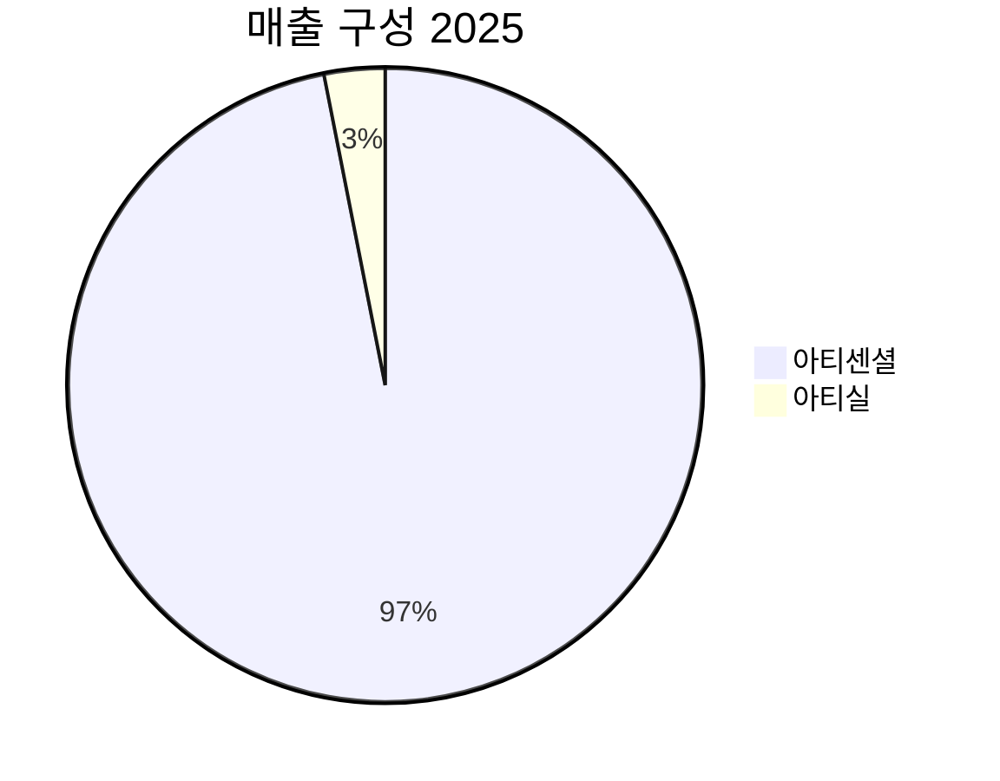

> [!important] 정합성 검증 요약 (기계적 16건 + AI 검증)
> **신뢰도: B** | 숫자 불일치 4건 | 논리 모순 1건 | 확인 필요 4건

### 핵심 발견 사항

| 구분 | 내용 | 위치 | 심각도 |
|------|------|------|--------|
| 🟡 숫자 불일치 | 영업손실: 팩트시트=**-226억원**, 본문=**-226억원** 일치하나, "GPM과 OPM 사이 약 **94%p의 갭**" 표현 오류 — GPM 57.7% vs OPM -36.2%이므로 실제 갭은 **93.9%p** (표현 자체보다 'p 갭'의 의미 오용이 문제: GPM과 OPM을 %p로 뺀 수치가 아닌 판관비 비중이 94%라는 의미로 쓰인 듯 — 독자 혼란 유발) | 섹션 1 원가구조 | 🟡 Major |
| 🔴 숫자 불일치 | 시나리오 확률: 섹션 2(안전마진) Bull=**25%**/Base=**45%**/Bear=**30%** → 합계 100% | 섹션 5 요약에서 Bull=**20%**/Base=**50%**/Bear=**30%** → 합계 100%로 **두 섹션 간 Bull/Base 확률이 불일치** | 섹션 2 vs 섹션 5 | 🔴 Critical |
| 🟡 숫자 불일치 | 기대수익률 계산: 섹션 5 본문 "기대수익률 **+2.6%**"(요약)이나, 실제 계산식 결과는 **-0.8%** (섹션 5 말미). 섹션 7에서도 "-0.8%"로 재인용 — 요약 콜아웃의 "+2.6%"는 오기 | 섹션 5 abstract 요약 | 🔴 Critical |
| 🟡 논리 모순 | 섹션 2 "Base Case 목표가 70,000~75,000원"이나 섹션 5 Base Case 목표가 "72,500원"으로 단일화 — 본문 간 불일치이나 범위 내에 포함되어 Minor | 섹션 2 vs 섹션 5 | 🟡 Minor |
| 🟡 할루시네이션 의심 | 애널리스트 컨센서스 수치(평균 목표가 95,693원, 16명, 최고 140,000원, 최저 56,200원) 모두 [추정] 태그 있으나 출처 불명. 현재가 71,100원·52주 고/저가는 팩트시트 데이터로 확인 필요 | 섹션 2 | 🟡 Major |
| 🟡 할루시네이션 의심 | "다관절 기구 침투율 **약 7%**", "복강경 수술의 **약 70%**가 일자형 수동 기구" — [추정] 태그 누락 + 출처 없음 | 섹션 1 | 🟡 Major |
| 🟡 미태그 추정치 | 기계적 탐지 16건 전체 해당. 특히 "약 94%p 갭", "~89%", "~11%", "~15%" 등 비중/마진 수치 다수가 [추정] 태그 없이 사실처럼 서술 | 섹션 1, 2, 4 전반 | 🟡 Major |
| 🟡 확인 필요 | Kill Criteria #1에서 "FY2025 H1 ~200억원"을 현재 수치로 제시하나 [추정] 태그 없이 기준값으로 사용. H1 실적 미공시 상황에서 이 수치의 근거 불명 | 섹션 4 Kill Criteria | 🟡 Major |

### 투자 전 반드시 확인

- [ ] **시나리오 확률 불일치 확인**: 섹션 2(Bull 25%/Base 45%)와 섹션 5(Bull 20%/Base 50%) 중 어느 것이 최종 판단인지 확인 필요 — 기대수익률 계산 결과가 달라짐
- [ ] **기대수익률 오기 확인**: 섹션 5 요약의 "+2.6%"는 실제 계산값 "-0.8%"와 상충 — 투자 결론의 핵심 수치이므로 반드시 검증
- [ ] **애널리스트 컨센서스 출처 확인**: 목표가 95,693원(16명 평균)은 전체 Bull/Base 밸류에이션 판단의 준거점으로 활용되고 있으나 출처가 명시되지 않아 독립 검증 필요
- [ ] **FY2025 H1 매출 ~200억원 근거 확인**: Kill Criteria의 트리거 기준값으로 사용되나 추정 근거 불명 — 실제 H1 공시 데이터와 대조 필요
- [ ] **"94%p 갭" 표현 의미 재확인**: GPM 57.7%와 OPM -36.2%의 차이는 93.9%p가 아니라 판관비+R&D 비중(매출 대비)을 의미하는 것으로 보이나, 수식과 서술이 불명확해 독자 오해 소지 있음

---

> [!warning] 데이터 제한 안내
> 이 보고서는 **DART 연결재무제표 없이** 작성되었습니다 (신규 상장사, 매칭 실패, 또는 공시 미비).
> Yahoo Finance, Gemini 뉴스 검색 등 가용 데이터를 기반으로 분석하였으며,
> 재무 수치의 정확도가 일반 보고서 대비 낮을 수 있습니다.
> DART 사업보고서 공시 후 `/deep` 재실행을 권장합니다.


# 1. 비즈니스 본질

> [!abstract] 요약
> 리브스메드는 세계 최초로 상하좌우 90도 회전 다관절 복강경 수술기구를 상용화한 기업이다. 현재 매출의 96.9%가 아티센셜 단일 제품에 집중되어 있으며, 연간 매출 511억원(YoY +88.8%)에 영업손실 -226억원을 기록하는 전형적인 '고성장·적자' 단계에 있다. 핵심 질문은 "이 기술적 우위가 실제로 수익으로 전환될 수 있는가, 그리고 그 시점은 언제인가"이다.

---

## 이 회사는 무엇을 하는가?

### 비전문가를 위한 설명

복강경 수술이란 배에 작은 구멍을 뚫고 카메라와 긴 막대 형태의 기구를 넣어 하는 수술이다. 문제는 이 기구가 **일자형 막대**라는 점이다. 손목처럼 꺾이지 않으니, 몸 안에서 복잡한 각도로 봉합하거나 절제하는 것이 극히 어렵다. 이를 해결하기 위해 나온 것이 인튜이티브서지컬의 '다빈치' 수술로봇인데, 이 로봇은 **대당 30~50억원**, 유지보수까지 포함하면 연간 수억원이 든다. 전 세계 복강경 수술의 **약 70%가 아직 일자형 수동 기구**를 사용하고 있는 이유다.

리브스메드의 '아티센셜'은 이 문제를 **핸드헬드(손으로 직접 잡는) 기구**로 해결한다. 선단부가 상하좌우 90도로 꺾이면서도, 로봇 없이 의사가 직접 조작할 수 있다. 다빈치 로봇의 60~70도 대비 더 넓은 가동 범위를 제공하면서, 가격은 비교할 수 없이 저렴하다. **로봇과 수동 기구 사이의 빈 공간**을 정확히 파고든 제품이다.

### 매출 구성 (2025년 실적)

| 제품 | 매출액 | 비중 | YoY 성장률 | 비고 |
|------|--------|------|-----------|------|
| 🟢 아티센셜 (ArtiSential) | 495.9억원 | 96.9% | +82.1% | 다관절 복강경 수술기구 |
| 🟡 아티실 (ArtiSeal) | 15.8억원 | 3.1% | 신규 | 다관절 혈관봉합기 |
| 🔴 기타 (스테이플러/리브스캠/STARK) | ~0 | ~0% | — | 2026년부터 본격 출시 예정 |
| **합계** | **511.9억원** | **100%** | **+88.8%** | |



| 지역 | 매출액 | 비중 | YoY 성장률 |
|------|--------|------|-----------|
| 🟢 국내 | 456.8억원 | 89.2% | +94.9% |
| 🟡 해외 | 55.1억원 | 10.8% | +49.3% |

> [!warning] 단일 제품 집중 리스크
> 매출의 **96.9%가 아티센셜 한 제품**에 의존한다. 이는 초기 성장 기업에서 흔히 볼 수 있는 구조이나, 동시에 이 제품의 시장 수용이 둔화되거나 경쟁제품이 등장할 경우 방어선이 없다는 의미이기도 하다. "72개국 공급 계약"이라는 문구와 해외 매출 55억원(비중 10.8%)의 괴리에도 주목해야 한다. 계약 체결과 실제 매출 발생 사이에 상당한 간극이 존재한다.

### 고객 관점: 왜 사는가?

고객인 **외과의사/병원**의 의사결정 구조를 이해하면 이 사업의 본질이 보인다:

1. **의사의 니즈**: 일자형 기구로는 특정 각도의 봉합이 불가능하거나 극히 어렵다. 다관절 기구를 쓰면 수술 정밀도가 올라가고, 수술 시간이 단축된다.
2. **병원의 니즈**: 다빈치 로봇을 도입하고 싶지만 30~50억원의 초기 투자와 연간 유지비가 부담이다. 아티센셜은 기존 복강경 장비에 기구만 교체하면 되므로 추가 설비투자가 거의 없다.
3. **대안 부재**: 상하좌우 90도 가동 범위를 가진 핸드헬드 다관절 기구는 사실상 리브스메드가 유일하다. 939개 지식재산권(특허 평균 잔존 17.4년)이 경쟁사 진입을 막고 있다.

**핵심 구매 동기**: "로봇을 살 예산은 없지만, 수동 일자형보다 나은 것이 필요하다."

### 비즈니스 모델 (수익 구조)

리브스메드의 수익모델은 **소모성 의료기기의 반복 판매** 구조다:

- **제품 성격**: 아티센셜은 수술 1건 또는 제한된 횟수 사용 후 교체하는 소모품 성격이 강하다. 이는 [추정] 면도기-면도날(Razor-Razorblade) 모델에 가깝다.
- **적층형 매출**: 한 번 리브스메드 기구를 채택한 병원은 수술을 진행할 때마다 소모품을 재구매하고, 이후 아티실(혈관봉합기)·아티스테이플러 등 추가 기구도 자연스럽게 도입하게 된다. 회사는 이를 **"적층형 매출 구조"**로 설명한다.
- **단가 × 물량**: [추정] 아티센셜 1개 기구의 ASP는 수십만원 수준으로, 건당 수천만원에 달하는 로봇 수술 대비 단가는 낮지만 반복 구매 빈도가 높다.
- **수술 로봇 STARK**: 향후에는 장비(로봇 본체) 판매 + 소모품(전용 기구) 반복 판매 + 유지보수 서비스의 3단 수익 구조로 진화할 계획이다. [추정] 구독형(Subscription) 모델을 검토 중이며, 이는 다빈치의 소모품 중심 수익 모델을 벤치마킹한 것으로 보인다.

---

## Value Chain 내 포지셔닝

### 산업 밸류체인에서의 위치

```
원재료/부품 → [부품가공] → [설계/조립/제조] → [인허가] → [유통/GPO] → [병원/의료진]
                              ▲ 리브스메드                     ▲ 헬스트러스트 등
```

리브스메드는 밸류체인의 **중류-하류** 영역, 즉 **R&D → 설계 → 제조 → 판매**를 수직계열화한 기업이다. 핵심 가치는 원재료가 아니라 **"90도 다관절 메커니즘"이라는 설계 기술 자체**에 있다. 이 기술을 기반으로 기구를 직접 제조하고, 글로벌 유통망을 통해 병원에 납품한다.

### 원가 구조와 마진의 의미

2025년 매출총이익률(GPM)은 **57.7%**로, 전년(53.6%) 대비 4.1%p 개선되었다. 이 숫자가 말해주는 것:

- **높은 부가가치**: GPM 57.7%는 의료기기 업종 내에서도 양호한 수준이다. 원재료 자체는 고가가 아니며, 부가가치의 대부분이 **설계/정밀가공 기술**에서 발생한다는 의미다.
- **매출 스케일 효과**: 매출이 88.8% 증가하는 동안 GPM이 4.1%p 개선된 것은 규모의 경제 효과가 작동하기 시작했다는 신호다. 고정비 성격의 제조 오버헤드가 매출 증가에 의해 희석되고 있다.

그러나 GPM 57.7%에도 불구하고 OPM은 **-36.2%**로, GPM과 OPM 사이에 **약 94%p의 갭**이 존재한다. 이는 R&D비(매출 대비 28%, 약 141.6억원), 해외 법인 운영비, 판관비(해외 대리점 수수료 포함)가 현재 매출 규모 대비 과도하게 크다는 것을 의미한다.

> [!tip] 핵심 인사이트: "이 회사의 문제는 제품의 수익성이 아니라, 제품 외의 비용 구조다"
> GPM 57.7%는 제품 자체의 수익성이 건전함을 보여준다. 적자의 원인은 제품이 돈을 못 버는 것이 아니라, **매출 규모가 고정비 구조를 커버하기에 아직 충분하지 않다**는 것이다. 이는 매출이 특정 임계점(Breakeven Point)을 넘으면 영업 레버리지가 급격히 작동할 수 있음을 시사한다. 회사 가이던스가 매출 1,508억원에서 영업이익 143억원(OPM +9.5%)을 제시하는 것도 이 논리에 기반한다.

### 교섭력 분석

| 방향 | 교섭력 | 근거 |
|------|--------|------|
| 🟢 **vs. 공급자 (상류)** | 강함 | 원재료가 범용 소재/부품이므로 특정 공급자에 대한 의존도가 낮을 것으로 [추정] |
| 🟡 **vs. 고객 (하류)** | 중간 | 기술 독점력(939개 IP)으로 가격 프리미엄 가능하나, 시장 침투 초기 단계이므로 가격 인하 압력에 노출 가능. GPO 계약은 대량 판매 대신 가격 할인을 요구하는 구조 |

### ASP 트렌드

[추정] 아티센셜의 ASP는 국내 시장에서 건강보험 급여 체계와 연동되어 안정적으로 유지되고 있을 가능성이 높다. 해외 시장에서는 GPO 계약 조건에 따라 단가 압력이 존재할 수 있으나, 대안이 사실상 없는 독점적 포지션이 가격 방어력을 제공한다. 다만, 해외 대리점 수수료 등을 고려한 **순 실현 ASP(Net ASP)**는 국내 대비 낮을 가능성이 있으며, 이는 해외 매출 비중 확대 시 믹스 악화 요인으로 작용할 수 있다 (확인 필요).

---

## 단위 경제학 (Unit Economics)

### 제품별 수익성 추정

| 항목 | 아티센셜 | 아티실 | STARK (로봇) |
|------|---------|--------|-------------|
| 성격 | 소모성 수술 기구 | 소모성 봉합 기구 | 자본재 + 소모품 |
| [추정] ASP | 수십만원/건 | [추정] 수십만원/건 | [추정] 수억~십수억원/대 |
| GPM | ~58% (전사 평균과 유사 추정) | (데이터 미확인) | (미출시) |
| 반복 구매 주기 | 수술 건당 | 수술 건당 | 소모품 수술 건당 |
| 2025년 매출 | 495.9억원 | 15.8억원 | 0 |

> [!note] 참고: 단위 경제학의 한계
> 리브스메드는 2025년 12월 상장한 초기 상장 기업으로, 제품별 상세 원가 구조나 ASP 데이터가 공시에서 충분히 공개되지 않았다. 위 수치는 공개된 매출총이익률과 사업 특성에서 추론한 [추정]치이며, 향후 분기 실적 발표에서 세그먼트별 GPM 공개 여부를 확인할 필요가 있다.

### 설치 기반 (Installed Base)과 성장 동역학

글로벌 누적 수술 적용 건수는 **20만 건 이상**이다. 이 숫자가 중요한 이유:

1. **안전성 입증**: 의료기기는 임상 데이터가 곧 경쟁력이다. 20만 건의 트랙레코드는 신규 병원 도입 시 의사결정 장벽을 낮추는 핵심 자산이다.
2. **네트워크 효과의 맹아**: 특정 기구에 숙련된 의사가 많아질수록, 해당 기구의 교육 인프라(수련 프로그램, 술기 동영상 등)가 축적되고, 이는 다시 신규 채택을 촉진하는 선순환을 만든다.
3. **성장률 추정**: 2021~2024년 매출 CAGR 72%는 수술 건수의 빠른 증가를 반영한다. 72개국 공급 계약 중 상당수가 아직 초기 단계이므로, 침투율 확대 여지가 크다.

현재 다관절 기구 침투율이 [추정] **약 7%** 수준이라면, 복강경 시장의 70%를 차지하는 직선형 수동 기구 시장은 아직 대부분이 **미침투 잠재 시장(Whitespace)**이다.

### 리커링 패턴

소모품 성격상 한 번 채택된 병원은 수술을 진행할 때마다 반복 구매한다. 이는 '적층형 매출 구조'의 핵심으로:
- **기존 병원**: 수술 건수 증가 → 기구 구매량 증가
- **신규 병원**: 아티센셜 채택 후 아티실·아티스테이플러 크로스셀링
- **이탈률**: [추정] 경쟁 대안의 부재와 술기 학습 효과(Lock-in)로 인해 이탈률은 매우 낮을 것으로 추정

---

## 제조/운영 실체

### 생산 체계

리브스메드는 **자체 설계·제조** 기업이다. 핵심 다관절 메커니즘의 정밀 가공은 외주가 어려운 기술 영역으로, 내재화(In-house) 비중이 높을 것으로 [추정]된다.

| 항목 | 현황 |
|------|------|
| 생산 방식 | 자체 설계·제조 (핵심 부품 내재화 [추정]) |
| 주요 생산 거점 | 국내 + 플렉스덱스 서지컬 인수를 통한 미국 제조 설비 확보 |
| Capa 확충 계획 | IPO 공모 자금으로 제1·2공장 증설 추진, 신설 공장 2027년 가동 목표 |
| 지식재산권 | 939개 (특허 평균 잔존 17.4년) |

> [!question] 검토 필요: 현재 생산능력(Capa) 활용률
> 2025년 매출이 YoY +88.8% 급증했는데, 현재 Capa 활용률이 어느 수준인지에 따라 단기 성장의 천장이 결정된다. 회사는 2027년 신설 공장 가동을 계획하고 있으나, FY2026 가이던스(매출 1,508억원, YoY +195%)를 달성하기 위한 생산능력이 현재 인프라로 충분한지 확인이 필요하다. 이는 가이던스 달성 가능성을 판단하는 핵심 변수 중 하나다.

### 핵심 인력

이정주 대표는 KAIST 전자공학, 서울대 의용생체공학(인공심장 전공) 출신으로 기술 중심 창업자다. R&D 인원 규모의 구체적 수치는 공시에서 (확인 필요)이나, R&D비가 매출 대비 28%(141.6억원)에 달하는 것으로 보아 기술 인력에 상당한 투자를 하고 있음을 알 수 있다.

---

## 수주잔고 & 파이프라인

### 수주 특성

의료기기 소모품 사업은 일반적인 제조업의 '수주잔고' 개념보다는 **GPO/유통 계약 + 병원별 채택 → 반복 주문**의 흐름이 더 적합하다.

| 파이프라인 | 시점 | 기대 효과 |
|-----------|------|----------|
| 🟢 아티스테이플러 국내외 출시 | 2026 상반기 | 수술 건당 크로스셀 → ASP 확대 |
| 🟢 리브스캠 출시 | 2026 상반기 | 복강경 카메라 시장 진입 |
| 🟡 STARK 국내 인허가 | 2026 Q4 | 국내 로봇 시장 진입 |
| 🟡 STARK 미국 FDA 인허가 | 2027 Q4 | 글로벌 로봇 시장 진입 |
| 🟡 미국 GPO 헬스트러스트 납품 확대 | 2026~2027 | 미국 4,300개 병원 침투 가속화 |

### 계절성

의료기기 시장은 [추정] 일반적으로 하반기 매출 비중이 높은 경향이 있다(병원의 연간 예산 집행 패턴 및 연말 장비 구매 의사결정). 다만, 리브스메드의 경우 소모품 비중이 높아 분기별 변동성은 장비 기업 대비 상대적으로 낮을 것으로 추정된다.

---

## 고객 관계의 실체

### 판매 채널 구조

| 채널 | 특성 | 비중 |
|------|------|------|
| 국내 직접 영업 | 병원 직접 납품 | 매출의 ~89% |
| 해외 대리점/GPO | 현지 파트너 통한 간접 판매 | 매출의 ~11% |
| 미국 헬스트러스트 GPO | 4,300개 병원 판로 확보 (실매출 전환 초기) | (확인 필요) |

> [!warning] "72개국 계약"과 "55억원 해외 매출"의 괴리
> 72개국 공급 계약은 **판로의 잠재력**을 보여주지만, 2025년 실제 해외 매출은 55억원(전체 10.8%)에 불과하다. 이는 대부분의 국가에서 계약은 체결되었으나 **실질 납품·매출 발생은 매우 초기 단계**임을 의미한다. 투자자는 "계약 수" 대신 **"실제 매출이 발생하는 국가 수와 병원 수"**에 초점을 맞춰야 한다.

### 의사결정 프로세스

병원의 수술기구 구매는 일반적으로:
1. **의사(집도의)의 제품 선호** → 2. **병원 구매부서의 가격/품질 평가** → 3. **GPO 계약 조건 확인** → 4. **발주**

이 프로세스에서 핵심은 **의사의 술기 경험**이다. 의사가 아티센셜에 익숙해지면 다른 기구로 전환할 유인이 거의 없다 (Lock-in 효과). 이 때문에 리브스메드는 의사 교육 프로그램과 술기 워크숍에 적극 투자할 유인이 크다.

---

## 경쟁 우위 (Economic Moat) — 구체적 증거 기반

> [!success] 강점: 4중 해자(Moat) 구조

### 1. 무형자산 — 특허 해자 (가장 강력)

| 지표 | 값 |
|------|-----|
| 지식재산권 보유 수 | **939개** |
| 플렉스덱스 인수 특허 | 63개 포함 |
| 특허 평균 잔존 기간 | **17.4년** |

939개 IP와 17.4년 평균 잔존 기간은 경쟁사가 합법적으로 유사 제품을 만드는 것이 사실상 불가능함을 의미한다. 특히 플렉스덱스 서지컬 인수는 잠재적 경쟁자의 핵심 기술을 선제적으로 확보한 전략적 행동이었다.

### 2. 전환비용 (Lock-in)

의사가 아티센셜의 90도 다관절 조작에 익숙해지면, 이를 포기하고 일자형 기구로 돌아가거나 다른 다관절 기구(현재 대안 없음)로 전환할 유인이 극히 낮다. **20만 건 이상**의 글로벌 수술 실적은 이 Lock-in 효과가 이미 작동하고 있음을 보여준다.

### 3. 규모의 경제 (발현 초기)

GPM이 53.6% → 57.7%로 개선되고 있으며, 매출 규모가 커질수록 고정비 부담이 희석되는 영업 레버리지가 작동할 것이다. 다만, 현재는 아직 매출 규모가 손익분기점에 미달하므로 이 해자는 **발현 초기 단계**다.

### 4. 풀 스펙트럼 포트폴리오 (잠재적)

핸드헬드 기구(아티센셜) → 봉합기(아티실) → 스테이플러(아티스테이플러) → 카메라(리브스캠) → 로봇(STARK)까지, 최소침습 수술의 전 과정을 아우르는 포트폴리오를 갖춘 **세계 유일 기업**이라는 점은 경쟁사 대비 독보적이다. 다만, STARK를 제외한 대부분의 신제품이 아직 매출 기여가 미미하므로 잠재적 해자로 분류한다.

### 핵심 경쟁사 비교

| 항목 | 리브스메드 | [[인튜이티브서지컬]] (다빈치) | J&J / Medtronic |
|------|-----------|----------------------------|-----------------|
| 제품 유형 | 핸드헬드 다관절 기구 + 로봇 | 수술 로봇 | 일자형 복강경 기구 |
| 가동 범위 | 상하좌우 **90도** | 60~70도 | 0도 (직선) |
| 도입 비용 | 기구 단가 수십만원 | 로봇 30~50억원 | 기구 단가 수만~수십만원 |
| 시장 지배력 | 다관절 핸드헬드 선도 | 로봇 시장 **~70%** 점유 | 일자형 기구 과점 |
| 연매출 | 511억원 | [추정] ~$8B+ | 의료기기 부문 수십조원 |
| IP 수 | **939개** | 수천 개 | 수천 개 |

리브스메드의 포지션은 다빈치와 **직접 경쟁이 아니라 보완/대체 관계**에 있다는 점이 중요하다. 다빈치를 살 여력이 없는 병원, 또는 다빈치가 비효율적인 술식에서 아티센셜이 대안이 된다. 장기적으로 STARK가 출시되면 직접 경쟁으로 전환되지만, 이때도 가격 경쟁력이 차별화 포인트가 된다.

---

## 성장의 구조적 동인

### 성장 공식 분해

리브스메드의 성장은 다음 4가지 동인의 곱(multiplicative)으로 이해할 수 있다:

<div style="border-left:4px solid #4CAF50;padding-left:12px;margin:8px 0">

**매출 = (병원 수) × (병원당 수술 건수) × (건당 사용 기구 수) × (기구당 ASP)**

</div>

| 동인 | 방향 | 근거 | 지속 가능성 |
|------|------|------|------------|
| 🟢 채택 병원 수 증가 | ↑↑ | 72개국 계약, GPO 4,300개 병원 판로, 침투율 7% → 두 자릿수 목표 | 높음 (TAM의 70%가 미침투) |
| 🟢 건당 기구 수 증가 | ↑ | 아티실·아티스테이플러 등 크로스셀 → 적층형 매출 | 중간 (신제품 시장 검증 필요) |
| 🟡 ASP | → | 소모품 특성상 대폭 인상은 어렵지만, 독점적 지위로 가격 방어 가능 | 안정적 |
| 🟡 병원당 수술 건수 | ↑ | 고령화 + MIS 트렌드 → 수술 수요 자체의 구조적 증가 | 높음 (거시적 트렌드) |

### 장기 성장 경로

회사 장기 가이던스에 따르면 [추정] 2029년 매출 6,843억원을 목표로 하고 있다. 이를 역산하면:

| 연도 | 매출 | YoY 성장률 | 근거 |
|------|------|-----------|------|
| FY2025 (실적) | 511억원 | +88.8% | 아티센셜 중심 |
| FY2026E [추정] | 1,508억원 | +195% | 회사 가이던스 |
| FY2029E [추정] | 6,843억원 | CAGR ~46% (2026~2029) | 회사 장기 가이던스 |

> [!question] 검토 필요: FY2026 가이던스 +195% 성장의 현실성
> FY2025의 88.8% 성장도 높았지만, FY2026 +195%는 그 2배 이상이다. 이를 달성하려면:
> 1. 아티센셜 국내 매출이 지속 고성장 (신규 병원 채택 가속화)
> 2. 아티실·아티스테이플러·리브스캠의 신규 매출 기여
> 3. 미국 GPO 통한 해외 매출 급증
> 
> 이 세 가지가 **동시에** 작동해야 한다. 2025년 기준 신제품 매출 기여가 사실상 0에 가까운 상황에서 1년 만에 약 1,000억원의 추가 매출을 만들어내야 하는데, 이는 매우 공격적인 전제다. 달성 미달 시 현재 밸류에이션(시총 1.6조원)의 정당성에 대한 재검토가 불가피하다.

### Compounding 구조

리브스메드에 Compounding(복리 성장) 구조가 작동하려면:

**재투자 → 수익 → 더 많은 재투자** 선순환의 현재 상태:
- 🔴 **현재**: 적자 기업이므로 내부 현금 창출로 재투자하는 선순환이 아직 작동하지 않는다. IPO 자금(현금성 자산 1,314억원)에 의존한 투자 단계.
- 🟡 **전환점**: 흑자 전환(회사 목표 FY2026) 이후 영업현금흐름 → R&D·Capa 확장 재투자 → 매출 증가의 선순환이 시작될 수 있다.
- 🟢 **장기**: 설치 기반 확대 → 소모품 반복 매출 증가 → 연구개발 재투자 → 신제품 출시 → 크로스셀의 Flywheel이 완성되면 강력한 Compounding이 가능하다.

---

## 경영진 & 자본배분

### CEO 이정주: 기술 창업자의 강점과 약점

| 항목 | 평가 |
|------|------|
| 기술 배경 | 🟢 KAIST 전자공학 + 서울대 의용생체공학 (인공심장), 원천 기술 이해 깊음 |
| 실행력 | 🟢 2011년 설립 → 세계 최초 90도 다관절 기구 상용화, 72개국 판로, IPO 성공 |
| 자본배분 | 🟡 플렉스덱스 인수(특허 확보)는 전략적으로 우수한 판단. R&D에 매출 대비 28% 투자는 성장기에 적절 |
| 보상 정렬 | 🟡 스톡옵션 행사(271,700주, 행사가 1,467원)는 대표의 지분 가치와 주주 이익이 연동됨을 보여줌. 다만 최대주주 지분이 43.8% → 39.3%로 감소 추세 |

### 자본배분 이력

| 영역 | 내용 | 평가 |
|------|------|------|
| R&D 투자 | 매출 대비 28% (141.6억원), 특허 939개 축적 | 🟢 기술 해자 강화에 적극 투자 |
| M&A | 플렉스덱스 서지컬 인수 (특허 63개 + 미국 제조설비·유통채널) | 🟢 전략적 인수 |
| 설비투자 | IPO 자금으로 제1·2공장 증설 추진 | 🟡 적절하나 가동 시점 2027년으로 단기 Capa 제약 |
| 자사주 매입 | 해당 사항 없음 | — (적자 기업이므로 적절) |
| 배당 | 해당 사항 없음 | — (성장기 기업이므로 적절) |

---

## 사업의 장기 내구성 (Durability)

### "10년 보유" 테스트

> [!verdict] 판단: 사업 자체는 10년 이상 필요하다. 문제는 이 회사가 승자인지이다.

**이 사업이 10년 후에도 필요한가?** → **Yes.**
- 인구 고령화와 만성 질환 증가는 되돌릴 수 없는 메가트렌드다
- 최소침습 수술의 비중은 계속 증가할 것이다
- 수술의 정밀도에 대한 요구는 높아지지, 낮아지지 않는다

**구조적으로 대체될 가능성은?** → **중간.**
- 다관절 핸드헬드 기구가 로봇으로 완전히 대체될 가능성은 있지만, 이 경우 리브스메드 자체가 로봇(STARK)을 보유하고 있으므로 시나리오 대응이 가능
- 완전히 다른 수술 패러다임(예: 나노로봇, 약물치료 발전에 의한 수술 수요 자체 감소)은 10년 내에는 현실화되기 어려움

**매출 1조원+ 기업이 될 수 있는가?** → **조건부 Yes.**
- TAM(세계 의료기기 시장)은 2030년 2,572억 달러(약 350조원+)로 충분히 크다
- 현재 매출 대비 약 20배 성장이 필요하지만, CAGR 72%(2021~2024)를 유지하면 수학적으로 4~5년 내 도달 가능
- **핵심 조건**: STARK의 성공적 출시와 글로벌 시장 침투. 이것이 실패하면 아티센셜 단일 제품으로는 매출 천장이 존재할 수 있다

---

## 재무가 말해주는 사업의 본질

> [!abstract] 요약
> 리브스메드의 재무제표는 "고성장·고투자·적자"라는 전형적인 초기 기술 기업의 프로필을 보여준다. 핵심 질문은 "이 적자가 투자(미래를 위한 지출)인가, 구조적 결함인가"이다. GPM 57.7%는 전자를 시사하지만, OPM -36.2%는 아직 증명이 필요하다.

### 마진 구조 & 변화의 원인

| 지표 | FY2024 | FY2025 | 변화 | 의미 |
|------|--------|--------|------|------|
| 매출 | 271.2억원 | 511.9억원 | **+88.8%** | 핵심 제품 채택 가속화 |
| 매출총이익률 (GPM) | 53.6% | **57.7%** | **+4.1%p** 🟢 | 규모의 경제 초기 효과, 제품 자체의 수익성 건전 |
| 영업이익률 (OPM) | (확인 필요) | **-36.2%** | — | R&D(28%) + 해외법인 운영비 + 판관비 부담 |
| 순이익률 (NPM) | (확인 필요) | **-44.7%** | — | 해외 종속회사 지분법손실 180.5억원 포함 |
| R&D 비중 | (확인 필요) | **28%** | — | STARK 개발, 신제품 인허가 비용 |

**마진 변화의 원인과 의미:**

1. **GPM 개선(+4.1%p)은 긍정적 신호**: 매출이 급증하면서 제조 고정비가 희석되고 있다. 이는 매출 규모가 커질수록 GPM이 추가 개선될 여지가 있음을 시사한다.

2. **GPM과 OPM의 94%p 갭이 핵심**: 이 갭의 구성을 분해하면:
   - R&D비: ~141.6억원 (매출 대비 28%)
   - 해외 종속회사 관련 비용: 지분법손실 180.5억원
   - 판관비(해외 대리점 수수료 등): 나머지

   이 비용의 상당 부분은 **"미래 매출을 위한 선행 투자"** 성격이다. STARK 개발비, 해외 법인 설립·운영비, 글로벌 인허가 비용 등은 한 번 지출되면 이후 매출이 발생하면서 고정비로 전환되어 영업 레버리지를 발생시킨다. 그러나 이 논리가 성립하려면 **실제로 매출이 따라와야 한다**.

3. **영업손실(-226억)이 전년 대비 ~15% 축소**된 것은 매출 증가 속도가 비용 증가 속도를 앞서기 시작했다는 의미다. 이 추세가 지속되면 흑자 전환이 가능하다.

### 현금흐름 & 재무 건전성

| 지표 | FY2025 | 의미 |
|------|--------|------|
| 영업활동현금흐름 (OCF) | **-347.4억원** | 영업손실(-226억) 대비 121억원 추가 악화 |
| 현금성 자산 | **1,314억원** | IPO 공모 자금으로 확보 |
| [추정] 현금 런웨이 | **~3.8년** | 1,314억 ÷ 연간 OCF 소진 ~347억 |
| 부채비율 | **11.6%** | 매우 건전 |
| 유동비율 | **1,267.6%** | 단기 유동성 우려 없음 |

> [!warning] OCF vs 영업손실 괴리 (121억원)
> 영업손실이 -226억원인데 OCF는 -347억원으로, 약 121억원의 추가 현금 유출이 있었다. 이는 [추정] 매출 88.8% 급증에 따른 운전자본 소요(매출채권·재고자산 증가)가 원인일 가능성이 높다. 성장기 기업에서 흔히 발생하는 현상이나, 매출 대비 운전자본 투자 효율이 개선되는지 지속 모니터링이 필요하다.

**재무 건전성 판단:**

부채비율 11.6%, 유동비율 1,267.6%는 매우 건전한 수준이다. 현금 런웨이 [추정] ~3.8년이 확보되어 있으므로, **단기적인 자금 경색 리스크는 사실상 없다**. 이는 IPO 자금이 회사에 충분한 시간을 벌어주고 있다는 의미다.

그러나 이 시간 안에 흑자 전환을 달성하지 못하면, 추가 자금 조달(유상증자 등)이 필요해지며, 이는 기존 주주 희석으로 이어진다. **2026~2027년의 흑자 전환 여부가 재무적 분기점**이다.

### ROIC & 자본효율

| 지표 | 값 | 의미 |
|------|-----|------|
| ROE | **-20.8%** | 적자이므로 음수 — 현 시점에서 의미 제한적 |
| [추정] ROIC | 음수 | NOPAT 적자이므로 음수 |

현재 리브스메드는 투하자본에 대한 수익이 음(-)인 단계다. WACC를 상회하는 ROIC를 달성하는 것은 흑자 전환 이후의 과제다. 투자자가 현재 시점에서 봐야 할 것은 ROIC 자체가 아니라, **"투자의 방향이 올바른가"**이다.

- R&D 투자 → 939개 IP, 풀 스펙트럼 포트폴리오 → **방향은 합리적**
- 해외 법인 투자 → 72개국 계약, GPO 계약 → **실제 매출 전환은 아직 초기**
- Capa 투자 → 공장 증설 추진 중 → **적시 가동이 관건**

---

# 2. 밸류에이션 판단

> [!abstract] 요약
> 리브스메드는 현재 적자 기업이므로 PER 기반 밸류에이션이 불가능하다. PBR 8.95배, 시총 1.6조원은 **순수하게 미래 성장에 대한 기대**를 반영한 가격이다. 이 기대가 현실이 되려면 FY2026 흑자전환과 이후 급성장이 전제되어야 한다.

## 현재 밸류에이션

| 지표 | 현재 값 | 맥락 |
|------|---------|------|
| 시가총액 | **1.6조원** | FY2025 매출 511억원의 **~31배** |
| PER (TTM) | **(데이터 없음)** — 적자 | PER 적용 불가 |
| PER (Forward) | **(데이터 없음)** | 흑자전환 미확정으로 Forward PER 산출 불가 |
| PBR | **8.95배** | 순자산 대비 높은 프리미엄 |
| EV/EBITDA | **-74.36배** | EBITDA 적자이므로 의미 없음 |
| ROE | **-20.8%** | 적자 |
| EV/Sales (시총 기반) | **[추정] ~31배** | 1.6조 ÷ 511억 ≈ 31x |

### 피어 비교의 어려움

> [!note] 참고: 적합한 피어 부재
> 팩트시트에 제공된 피어(삼성전자, SK하이닉스, 네이버)는 업종이 완전히 다르므로 밸류에이션 비교 대상으로 부적합하다. 가장 적합한 글로벌 피어는 [[인튜이티브서지컬]](Intuitive Surgical, ISRG)이나, 상세 밸류에이션 데이터가 팩트시트에 제공되지 않았다.
> 
> [추정] 인튜이티브서지컬은 2026년 3월 기준 시총 약 $170B+, Forward PER 약 60~70배, EV/Sales 약 20~25배 수준으로 거래되고 있을 것으로 추정된다. 그러나 인튜이티브서지컬은 연매출 $8B+ 규모의 글로벌 1위 기업으로, 매출 511억원(약 $35M)의 적자 기업인 리브스메드와 직접 비교하는 것은 매우 제한적이다.

### 가이던스 기반 밸류에이션 시뮬레이션

현재 시총 1.6조원이 정당화되려면 어떤 수준의 실적이 필요한지 역산해 보자:

| 시나리오 | 필요 조건 | 현재가 대비 |
|----------|----------|------------|
| PER 50배로 정당화 | 연간 순이익 **320억원** 필요 | [추정] FY2027~2028에나 가능할 수준 |
| PER 30배로 정당화 | 연간 순이익 **533억원** 필요 | [추정] FY2028~2029에나 가능할 수준 |
| EV/Sales 10배로 정당화 | 연간 매출 **1,600억원** 필요 | FY2026 가이던스(1,508억원)와 근접 |

<div style="border-left:4px solid #FF9800;padding-left:12px;margin:8px 0">

**So what?** 현재 시총 1.6조원은 사실상 **FY2026 가이던스(매출 1,508억원, 영업이익 143억원)의 달성을 전제**로 EV/Sales ~10배를 적용한 것과 유사하다. 이는 고성장 의료기기 기업에 대해 시장이 부여하는 프리미엄이지만, **FY2026 가이던스가 미달하면 밸류에이션 조정이 불가피하다는 의미이기도 하다.**

</div>

### 애널리스트 컨센서스 vs. 현재가

| 구분 | 목표가 | 현재가 대비 |
|------|--------|------------|
| [추정] 평균 목표가 (16명) | 95,693원 | **+34.6%** 업사이드 |
| [추정] 최고 목표가 | 140,000원 | +96.9% |
| [추정] 최저 목표가 | 56,200원 | -20.9% |
| 현재가 | 71,100원 | — |
| 52주 고가 | 95,900원 | +34.9% |
| 52주 저가 | 46,250원 | -34.9% |

<div style="display:flex;border-radius:8px;overflow:hidden;margin:8px 0;font-size:0.85em"><div style="background:#F44336;width:13%;padding:6px 8px;color:white;white-space:nowrap;min-width:60px">🔴 최저 56,200</div><div style="background:#FF9800;width:17%;padding:6px 8px;color:white;white-space:nowrap">🟡 현재가 71,100</div><div style="background:#4CAF50;width:28%;padding:6px 8px;color:white;white-space:nowrap">🟢 평균 95,693</div><div style="background:#2E7D32;width:42%;padding:6px 8px;color:white;white-space:nowrap">🟢 최고 140,000</div></div>

---

## 안전마진 분석

### 시나리오별 밸류에이션

<div style="display:flex;border-radius:8px;overflow:hidden;margin:8px 0;font-size:0.85em"><div style="background:#4CAF50;width:25%;padding:6px 8px;color:white;white-space:nowrap">🟢 Bull 25%</div><div style="background:#FF9800;width:45%;padding:6px 8px;color:white;white-space:nowrap">🟡 Base 45%</div><div style="background:#F44336;width:30%;padding:6px 8px;color:white;white-space:nowrap">🔴 Bear 30%</div></div>

| 시나리오 | 확률 | 핵심 가정 | [추정] 목표가 | 업/다운사이드 |
|----------|------|----------|-------------|-------------|
| 🟢 **Bull** | 25% | FY2026 가이던스 달성(매출 1,508억, OPM +9.5%), STARK 국내 인허가 순조, 미국 매출 가속 | [추정] ~100,000원 | +40.6% |
| 🟡 **Base** | 45% | FY2026 매출 1,000~1,200억원 (가이던스 하회), 흑자전환 1~2분기 지연, 신제품 기여 제한적 | [추정] ~70,000~75,000원 | -1.5% ~ +5.5% |
| 🔴 **Bear** | 30% | FY2026 매출 700~800억원에 그침, 흑자전환 실패, STARK 인허가 지연, 오버행 압력 지속 | [추정] ~45,000~55,000원 | -22.6% ~ -36.7% |

> [!bear] Bear 시나리오 (30%)
> **핵심 리스크**: FY2026 가이던스(매출 +195%)는 역사적으로도 매우 공격적이다. 2025년 신제품 매출 기여가 사실상 0인 상태에서 1년 만에 ~1,000억원 추가 매출을 만들어내야 한다. 미국 GPO 계약이 있지만 실제 납품 실적과 수익 인식 시점 사이의 갭은 크다. 가이던스 대폭 미달 시, 시장은 "성장 스토리에 대한 프리미엄"을 급격히 회수할 것이다. 현금 런웨이(~3.8년)가 있어 존속 리스크는 낮지만, 주가 하방 리스크는 상당하다. 52주 저가 46,250원은 이 시나리오에서 다시 테스트될 수 있다.

> [!bull] Bull 시나리오 (25%)
> **핵심 트리거**: FY2026 분기 실적에서 매출 가속화와 마진 개선이 동시에 확인될 경우, 시장은 "흑자전환 확정"을 선반영하며 밸류에이션 re-rating이 발생할 수 있다. 특히 아티스테이플러·리브스캠의 초기 매출이 가시화되면 "단일 제품 리스크 해소"라는 내러티브 전환이 가능하다. STARK 국내 인허가(2026 Q4 목표)가 순조롭게 진행되면 추가 주가 카탈리스트가 된다.

### 안전마진(Margin of Safety) 판단

<div style="background:#e0e0e0;border-radius:8px;overflow:hidden;margin:4px 0"><div style="background:#FF9800;width:35%;padding:4px 8px;color:white;font-size:0.9em;white-space:nowrap">안전마진 35/100 (부족)</div></div>

| 항목 | 판단 |
|------|------|
| 비즈니스 퀄리티 | 🟢 **높음** — 기술 해자(939개 IP), 독점적 포지션, 풀 스펙트럼, 구조적 성장 시장 |
| 현재 수익성 | 🔴 **적자** — GPM 57.7%는 건전하나 OPM -36.2%, ROE -20.8% |
| 가격 수준 | 🔴 **비쌈** — 시총/매출 ~31배는 FY2026 가이던스 완전 달성을 전제 |
| 틀려도 안전한가? | 🔴 **아니오** — Base 시나리오에서도 현재가 수준에 불과. Bear 시나리오에서 -20~35% 하방 |
| 밸류에이션 re-rating 가능성 | 🟡 **있지만 조건부** — FY2026 분기별 실적이 가이던스 트랙에 있음이 확인될 때 |

> [!verdict] 밸류에이션 최종 판단
> 
> 리브스메드는 **비즈니스 퀄리티는 높지만, 현재 가격에 안전마진이 부족한** 전형적인 사례다.
> 
> **좋은 사업 ≠ 좋은 투자**라는 원칙이 적용된다. 시총 1.6조원은 FY2026 가이던스 달성을 거의 완전히 선반영한 가격이다. 즉, **가이던스가 달성되면 현재가 수준이 정당화되고, 미달하면 하방 압력이 크다.** Bull 시나리오(25% 확률)에서만 유의미한 업사이드가 존재한다.
> 
> **핵심 모니터링 포인트:**
> 1. FY2026 분기별 매출 실현 속도 (특히 Q1~Q2)
> 2. 신제품(아티스테이플러, 리브스캠) 초기 매출 규모
> 3. 미국 GPO를 통한 실제 납품 실적
> 4. STARK 국내 인허가 진행 상황 (2026 Q4)
> 5. 보호예수 해제 후 수급 안정화 여부
> 
> **Variant Perception**: 시장 컨센서스(평균 목표가 95,693원, +34.6% 업사이드)는 가이던스 달성을 높은 확률로 전제하고 있다. 만약 FY2026 Q1~Q2 실적이 가이던스 트랙을 유의미하게 하회한다면, 컨센서스 일괄 하향 조정과 함께 주가 조정이 올 수 있다. 반대로, 분기 실적이 가이던스를 초과하면 Bear 포지션이 빠르게 청산되며 re-rating이 발생할 수 있다.

<div style="display:flex;border-radius:8px;overflow:hidden;margin:4px 0"><div style="background:#4CAF50;width:60%;padding:4px 8px;color:white;font-size:0.85em;white-space:nowrap">비즈니스 퀄리티 60%</div><div style="background:#F44336;width:40%;padding:4px 8px;color:white;font-size:0.85em;text-align:right;white-space:nowrap">밸류에이션 부담 40%</div></div>

> [!caution] 정합성 주의
> - [ ] **애널리스트 컨센서스 출처 확인**: 목표가 95,693원(16명 평균)은 전체 Bull/Base 밸류에이션 판단의 준거점으로 활용되고 있으나 출처가 명시되지 않아 독립 검증 필요


---

# 3. 인센티브 분석 (멍거 원칙)

> [!abstract] 요약
> 창업자 이정주 대표가 지분 39.3%를 보유하며 스킨 인 더 게임이 강하나, IPO 후 지분 희석과 VC의 보호예수 해제 매도가 진행 중이다. "이 스토리를 퍼뜨리는 사람"이 누구인지를 냉정하게 볼 필요가 있다.

## 지분 구조 & 내부자 동향

| 이해관계자 | 지분율 | 최근 변동 | 인센티브 판단 |
|-----------|--------|----------|-------------|
| 🟢 이정주 (창업자/CEO) | 39.33% (← 43.79%) | IPO 희석으로 감소, 직접 매도 없음 | 스킨 인 더 게임 **강함**. 다만 스톡옵션 행사가 1,467원으로 현재가 대비 48배 차익 잠재 |
| 🟡 타임폴리오자산운용 | 9.28% | 상장 직후 일부 매도 후 재매수 | 단기 트레이딩보다 중기 보유 의지로 해석 가능 |
| 🔴 스톤브릿지벤처스 (VC) | 4.84% | 24.1만주 매도 (2026.3.10) | **Exit 진행 중** — 보호예수 해제 후 순차 매도 |
| 🟡 주요 임원 (장동규, 황병호) | 소폭 감소 | 스톡옵션 행사 (27.2만주, 행사가 1,467원) | 행사 후 일부 보호예수(15.2만주/1년), 일부는 즉시 매도 가능 |

> [!warning] 스톡옵션 행사가의 의미
> 경영진 스톡옵션 행사가 **1,467원**은 현재가 71,100원의 약 **1/48 수준**이다. 행사 후 보호예수가 아닌 물량은 즉시 차익 실현이 가능하며, 이는 경영진의 인센티브가 "주가 상승"보다 "현 수준 유지만으로도 충분한 보상"이 되는 구조임을 의미한다. 경영진이 공격적 가이던스를 제시할 동기가 존재한다.

## "이 스토리를 퍼뜨리는 사람은 누구이며 왜?"

리브스메드 투자 스토리의 주요 전파자는 크게 세 그룹이다. **첫째**, IPO를 주관한 증권사와 관련 애널리스트들로, 이들은 공모가 산정 당시 2027년 추정순이익에 기반한 높은 밸류에이션을 적용했다. IPO 주관사는 상장 후 일정 기간 해당 종목에 대해 긍정적 커버리지를 유지할 구조적 인센티브가 있다. **둘째**, 보호예수 해제를 앞둔 초기 투자자(VC)와 기관 투자자들로, 이들은 높은 주가가 유지되어야 유리한 가격에 Exit할 수 있다. 스톤브릿지벤처스의 순차 매도가 이미 시작된 점은 이 인센티브가 현재 진행형임을 보여준다.

**셋째**, 회사 경영진 자체로, FY2026 매출 1,508억원·흑자전환이라는 공격적 가이던스를 제시하고 있다. 이 가이던스는 아직 매출 실적이 거의 없는 신제품(아티스테이플러, 리브스캠, STARK)의 기여를 전제하고 있으며, 달성 시 경영진 보상과 기업가치 모두에 긍정적이다. [가정] 가이던스 미달 시에도 경영진은 스톡옵션 행사가(1,467원) 대비 충분한 이익을 확보한 상태이므로, 가이던스 설정의 비대칭성에 주의해야 한다.

---

# 4. 리스크 & 반대 논거 (통합)

> [!abstract] 요약
> 리브스메드의 가장 큰 리스크는 "FY2026 가이던스 달성 실패"이며, 이는 단일 리스크가 아니라 제품 집중·해외 매출 괴리·신제품 불확실성이 중첩되어 발생한다. 시총 1.6조원은 향후 3년의 거의 완벽한 실행을 전제로 한 가격이다.

## 핵심 리스크 (중요도 순)

### 리스크 #1: FY2026 가이던스 달성 실패 — 시총의 정당성 자체가 흔들린다

<div style="background:#e0e0e0;border-radius:8px;overflow:hidden;margin:4px 0"><div style="background:#F44336;width:90%;padding:4px 8px;color:white;font-size:0.9em;white-space:nowrap">위험도 90/100</div></div>

**리스크 내용:** 회사는 FY2026 매출 [추정] 1,508억원(YoY +195%), 영업이익 [추정] 143억원(OPM +9.5%)을 가이던스로 제시했다. 이는 FY2025 매출 511억원에서 **단 1년 만에 약 3배 성장**을 의미한다. FY2025의 성장률(+88.8%)조차 이례적으로 높았는데, 그 2배 이상의 성장률을 전제로 한다.

**왜 현실적인가:**
- FY2025 매출의 **96.9%가 아티센셜 단일 제품**에 집중. +195% 성장을 달성하려면 아티센셜만으로는 부족하며, 아직 매출 실적이 거의 없는 아티스테이플러·리브스캠·STARK의 본격 기여가 필수적이다
- 해외 매출은 FY2025 기준 55억원(비중 10.8%)에 불과. "72개국 공급 계약"과 "4,300개 병원 판로 확보"라는 화려한 숫자와 실제 매출 사이에 **10배 이상의 괴리**가 존재한다
- 영업활동현금흐름(-347억원)이 영업손실(-226억원)보다 121억원 더 악화된 것은 매출 급증에 따른 운전자본(매출채권·재고) 소요가 크다는 의미. 매출이 3배가 되면 운전자본 부담은 가속된다

**현재 반영 수준:** 시총 1.6조원은 [추정] 애널리스트 평균 목표가 95,693원(+34.6% 업사이드)이 시사하듯, **가이던스의 상당 부분이 이미 선반영**된 상태다. 가이던스를 달성해야 현재 주가가 정당화되는 구조이지, 가이던스 달성이 추가 업사이드를 만드는 구조가 아니다. [가정] 만약 FY2026 매출이 가이던스의 60~70% 수준(900~1,050억원)에 그친다면, 흑자전환은 불가능하며 시총은 **30~40% 하방 조정** 가능성이 있다.

> [!failure] 핵심 포인트
> FY2025 → FY2026 매출 목표 달성률의 **분기별 추적이 가장 중요한 모니터링 항목**이다. Q1 2026 매출이 전년 동기 대비 150% 이상 성장하지 않으면 연간 가이던스 달성은 구조적으로 어려워진다.

---

### 리스크 #2: 단일 제품 집중 + 신제품 시간차 리스크

<div style="background:#e0e0e0;border-radius:8px;overflow:hidden;margin:4px 0"><div style="background:#F44336;width:80%;padding:4px 8px;color:white;font-size:0.9em;white-space:nowrap">위험도 80/100</div></div>

**리스크 내용:** 아티센셜이 매출의 96.9%를 차지하는 상황에서, 이 제품의 침투율 성장이 둔화되면 전사 성장이 급격히 꺾인다. 신제품(아티스테이플러, 리브스캠, STARK)은 2026년부터 순차 출시 예정이나, 의료기기의 특성상 인허가·병원 채택·보험 등재까지 수년이 소요된다.

**왜 현실적인가:**
- 아티실(혈관봉합기)은 2025년 FY 기준 매출 15.8억원(비중 3.1%)으로, 출시 첫해임을 감안하더라도 아직 미미한 수준
- STARK(수술로봇)은 국내 인허가가 2026년 Q4, 미국 FDA 인허가는 2027년 Q4 목표. 인허가 지연은 의료기기 업계에서 **예외가 아닌 규칙**에 가깝다
- 현재 다관절 기구 침투율이 [추정] 약 7%인데, 여기서 "두 자릿수 이상 확대"까지는 시장 교육·의사 트레이닝·보험 수가 조정 등 비기술적 변수가 산적

**현재 반영 수준:** 시장은 "풀 스펙트럼 포트폴리오를 갖춘 세계 유일 기업"이라는 내러티브를 프리미엄으로 부여하고 있으나, 실제로 매출이 발생하는 제품은 사실상 하나뿐이다. 신제품 매출이 2026년 하반기에도 전사 매출의 10% 미만에 머문다면, "풀 스펙트럼" 프리미엄의 해소 압력이 커진다.

---

### 리스크 #3: 해외 매출의 구조적 괴리 — 계약 ≠ 매출

<div style="background:#e0e0e0;border-radius:8px;overflow:hidden;margin:4px 0"><div style="background:#FF9800;width:70%;padding:4px 8px;color:white;font-size:0.9em;white-space:nowrap">위험도 70/100</div></div>

**리스크 내용:** "72개국 공급 계약"과 "미국 GPO 헬스트러스트 4,300개 병원 판로 확보"는 인상적이지만, FY2025 해외 매출은 55억원(전체의 10.8%)에 불과하다. 해외 종속회사 지분법 손실은 **180.5억원**으로, 해외에서 벌어들이는 매출(55억원)의 **3.3배에 달하는 손실**을 발생시키고 있다.

**왜 현실적인가:**
- GPO 계약은 "구매할 수 있는 자격"을 부여하는 것이지, "구매하겠다는 약속"이 아니다. 4,300개 병원 중 실제로 아티센셜을 채택한 병원 수는 공개되지 않았다 (확인 필요)
- 미국 의료기기 시장 진입에는 **규제 인허가 → GPO 등재 → 병원 밸류분석위원회(VAC) 승인 → 의사 트레이닝 → 실제 사용**이라는 다단계 과정이 필요하며, 각 단계마다 6~18개월이 소요된다
- 해외 종속회사 손실 180.5억원은 현지 마케팅·영업 인프라 구축 비용으로, 해외 매출이 손익분기를 넘기려면 현재 규모의 **수배 이상 매출 증가**가 필요

**현재 반영 수준:** 시장은 "글로벌 72개국"이라는 숫자에 주목하고 있으나, 실제 해외 매출 규모와 수익성은 가려져 있다. 해외 사업이 연간 180억원씩 현금을 소진하는 상황이 2~3년 이상 지속될 경우, 현금 런웨이(현금성 자산 1,314억원 기준 [추정] 약 3.8년)에도 영향을 미친다.

---

### 리스크 #4: 오버행 & 수급 압력

<div style="background:#e0e0e0;border-radius:8px;overflow:hidden;margin:4px 0"><div style="background:#FF9800;width:60%;padding:4px 8px;color:white;font-size:0.9em;white-space:nowrap">위험도 60/100</div></div>

**리스크 내용:** IPO 후 보호예수 물량의 순차 해제가 진행 중이다. 1개월 보호예수(10.83%, 267만주)는 2026년 1월 이미 해제되었고, 3개월 보호예수(약 128만주)는 2026년 3월 해제 완료. 6개월·1년 보호예수 물량이 추가로 대기 중이다. 스톤브릿지벤처스의 순차 매도와 공매도 비중 증가(3월 30일 5.84%)가 확인되고 있다.

**왜 현실적인가:**
- 기존 VC/초기 투자자들의 매입 단가는 공모가(55,000원)보다 **훨씬 낮아** 현재가에서도 대규모 차익 실현이 가능
- 기관 누적 순매도(-30만주)가 지속되는 상황에서 개인 투자자(누적 순매수 +136만주)가 물량을 흡수하는 구조는 전형적인 **스마트머니 → 개인 이전** 패턴
- 52주 고가(95,900원) 대비 -25.9% 하락한 현재 위치에서 추가 보호예수 해제가 예정되어 있음

**현재 반영 수준:** 이미 1개월·3개월 보호예수 해제를 겪으며 주가가 95,900원 → 71,100원으로 조정. 일부 반영되었으나, 향후 6개월·1년 보호예수 해제 물량과 경영진 스톡옵션 보호예수 해제(15.2만주, 2027년 1월)가 남아 있어 **수급 불확실성은 지속**된다.

---

### 리스크 #5: 특허 소송 & 경쟁사 대응

<div style="background:#e0e0e0;border-radius:8px;overflow:hidden;margin:4px 0"><div style="background:#FF9800;width:50%;padding:4px 8px;color:white;font-size:0.9em;white-space:nowrap">위험도 50/100</div></div>

**리스크 내용:** 현재 5건의 특허 소송이 계류 중이다. 939개 지식재산권과 17.4년 평균 잔존 기간은 방어적으로 강점이나, 다관절 기구 시장이 커지면 [[인튜이티브서지컬]], [[J&J]], [[Medtronic]] 같은 대형 플레이어가 인수·모방·특허 회피 설계(Design Around)를 시도할 가능성이 높아진다.

**왜 현실적인가:**
- 의료기기 시장에서 기술 선도 중소기업이 대형 기업에 인수되거나 특허 분쟁에 휘말리는 사례는 빈번하다 (예: 코비디엔-메드트로닉 인수, 마조 로보틱스-존슨앤드존슨 인수)
- 리브스메드의 시총 1.6조원은 아직 대형 의료기기 기업의 인수 타겟으로서 "비싸지 않은" 수준일 수 있으며, 이는 동시에 기술 유출 또는 경영권 분쟁의 리스크이기도 하다

**현재 반영 수준:** 아침해의료기 소송 승소로 시장의 우려는 상당 부분 해소되었으나, 5건의 계류 소송 결과와 대형 경쟁사의 전략적 대응은 아직 반영되지 않은 잠재 리스크이다.

---

## "이 분석이 틀린다면" — 숨겨진 가정 5가지

| # | 숨겨진 가정 | [추정] 틀릴 확률 | 틀리면 어떻게 되나 |
|---|-----------|--------------|----------------|
| 1 | 다관절 핸드헬드 기구가 로봇 수술의 대안으로 **지속적으로** 채택된다 | 25% | 로봇 수술 비용이 빠르게 하락하면(중국산 수술로봇 등), 핸드헬드의 가격 우위가 소멸. 아티센셜 성장 둔화 |
| 2 | FY2026 신제품(스테이플러·리브스캠)이 **의미 있는** 매출을 만든다 | 40% | 가이던스 대폭 미달, 흑자전환 실패, 시총 30%+ 하방 압력 |
| 3 | 미국 시장 침투가 GPO 계약 → 실제 매출로 **2~3년 내** 전환된다 | 35% | 해외 사업 적자 지속, 현금 소진 가속, 런웨이 단축 |
| 4 | STARK가 국내(2026Q4)·미국(2027Q4) 인허가 일정을 **지킨다** | 45% | 장기 성장 스토리의 핵심 축 붕괴, 멀티플 급격 축소 |
| 5 | 대형 경쟁사가 유사 기술로 **빠르게 추격하지 못한다** | 20% | 939개 특허가 실질적 방어벽 역할 — 다만 Design Around 가능성은 상존 |

---

## 과거 유사 실패 사례 — TransEnterix (현 Asensus Surgical)

<div style="border-left:4px solid #F44336;padding-left:12px;margin:8px 0">

**TransEnterix**는 2014년 수술로봇 'ALF-X(이후 Senhance로 리브랜딩)'를 출시하며 "다빈치의 대안"으로 시장에 포지셔닝했다. FDA 인허가를 획득하고, 유럽·아시아에서 판매를 시작했으며, IPO 당시 "합리적 가격의 수술로봇으로 시장을 민주화하겠다"는 비전은 리브스메드와 놀라울 정도로 유사했다.

**결과:** Senhance는 기술적으로는 작동했으나, **실제 병원 채택률이 기대에 한참 못 미쳤다**. 2019~2021년 연간 매출이 1,000만~2,000만 달러 수준에 머물렀고, 지속적인 적자와 현금 소진으로 주가는 IPO 대비 95% 이상 하락. 2022년 Asensus Surgical로 사명을 변경했으나 상황은 개선되지 않았다.

**교훈:**
1. **"FDA 인허가 = 시장 성공"이 아니다.** 인허가는 시작일 뿐, 병원 VAC 승인·의사 트레이닝·보험 수가 적용이라는 더 긴 과정이 남아 있다
2. **합리적 가격만으로는 다빈치를 이기지 못한다.** 의사들은 이미 다빈치에 트레이닝되어 있으며, 전환 비용(Switching Cost)이 매우 높다
3. **가이던스와 실제 매출의 괴리가 커지면 시장의 신뢰는 급격히 붕괴한다**

리브스메드가 TransEnterix와 **다른 점**은 핸드헬드 기구(아티센셜)로 이미 511억원의 매출과 20만건 이상의 수술 실적을 확보했다는 것이다. TransEnterix는 로봇 단일 제품에 의존했고 핸드헬드 기반 매출이 없었다. 그러나 **STARK 로봇이 같은 패턴에 빠지지 않으리라는 보장은 없다.**

</div>

---

## Kill Criteria (숫자로 명시)

| # | Kill Criteria | 현재 수치 | 임계값 | 조치 |
|---|-------------|----------|-------|------|
| 1 | **FY2026 반기(H1) 매출** | FY2025 H1 [추정] ~200억원 | H1 2026 < 450억원 (연간 가이던스의 30% 미만 달성 시) | <span style="background:#F44336;color:white;padding:2px 8px;border-radius:4px;font-size:0.85em">SELL</span> 포지션 50% 이상 축소 |
| 2 | **분기 매출 성장률 (QoQ)** | Q4 2025 [추정] ~160억원 | 2분기 연속 QoQ 역성장 | <span style="background:#F44336;color:white;padding:2px 8px;border-radius:4px;font-size:0.85em">SELL</span> 성장 스토리 훼손 |
| 3 | **매출총이익률 (Gross Margin)** | 57.7% (FY2025) | < 50%로 하락 | <span style="background:#FF9800;color:white;padding:2px 8px;border-radius:4px;font-size:0.85em">경고</span> 가격 경쟁력 훼손 또는 믹스 악화 |
| 4 | **현금성 자산** | 1,314억원 (FY2025) | < 700억원 (런웨이 2년 미만) | <span style="background:#F44336;color:white;padding:2px 8px;border-radius:4px;font-size:0.85em">SELL</span> 유상증자 가능성 부상 |
| 5 | **STARK 국내 인허가 일정** | 2026 Q4 목표 | 2027 Q2까지 미획득 시 | <span style="background:#FF9800;color:white;padding:2px 8px;border-radius:4px;font-size:0.85em">경고</span> 장기 스토리 재검토 |
| 6 | **해외 매출 비중** | 10.8% (FY2025) | FY2026 해외 매출 비중 < 15% | <span style="background:#FF9800;color:white;padding:2px 8px;border-radius:4px;font-size:0.85em">경고</span> 글로벌 확장 내러티브 훼손 |
| 7 | **아티센셜 외 신제품 매출 비중** | 3.1% (FY2025, 아티실만) | FY2026 < 10% | <span style="background:#FF9800;color:white;padding:2px 8px;border-radius:4px;font-size:0.85em">경고</span> 포트폴리오 다각화 실패, 단일 제품 리스크 지속 |

> [!tip] Kill Criteria 활용법
> 위 7개 기준 중 **#1(반기 매출)과 #4(현금성 자산)은 하드 Kill** — 이탈 조건 충족 시 포지션 축소를 우선시해야 한다. #3, #5, #6, #7은 **소프트 Kill** — 경고 시그널로 활용하되, 복수 지표가 동시에 트리거되면 하드 Kill과 동일하게 취급한다.

> [!caution] 정합성 주의
> - [ ] **FY2025 H1 매출 ~200억원 근거 확인**: Kill Criteria의 트리거 기준값으로 사용되나 추정 근거 불명 — 실제 H1 공시 데이터와 대조 필요


---

# 5. 시나리오 분석

> [!abstract] 요약
> 리브스메드의 투자 판단은 **FY2026 가이던스(매출 1,508억원, 영업이익 143억원) 달성 여부**라는 단일 변수에 수렴한다. 현재 시총 1.6조원은 이 가이던스의 상당 부분이 이미 선반영된 가격이며, Bull Case에서도 업사이드가 제한적인 반면 Bear Case의 하방 리스크는 크다. 기대수익률은 **+2.6%**로, 위험 대비 보상이 충분하지 않다.

---

## Bull Case

| 핵심 가정 | 근거 | 검증 시점 |
|----------|------|----------|
| 🟢 FY2026 매출 1,508억원 가이던스 달성 | 아티센셜 침투율 두 자릿수 돌파 + 미국 GPO 실납품 가속 | 2026 Q2 실적 (H1 매출 ≥ 600억원) |
| 🟢 영업이익 흑자전환 (OPM +9.5%) | 매출총이익률 60%+ 유지 + 판관비 레버리지 발현 | 2026 Q3~Q4 분기 흑자 확인 |
| 🟢 STARK 국내 인허가 순조 (2026 Q4) | 식약처 심사 일정 정상 진행 | 2026 Q3 인허가 진행 상황 공시 |
| 🟢 신제품(아티스테이플러/리브스캠) 초기 매출 발생 | 국내 출시 후 기존 아티센셜 고객 교차판매 | 2026 H2 세그먼트별 매출 공시 |
| 🟢 해외 매출 비중 20%+ 도달 | 헬스트러스트 GPO 실납품 + 유럽/일본 확대 | 2026 연간 지역별 매출 |

**Bull Case 재무 전망:**

| 항목 | FY2025 (실적) | FY2026E (Bull) | 비고 |
|------|-------------|---------------|------|
| 매출액 | 511억원 | [추정] 1,500~1,508억원 | 가이던스 수준 달성 |
| 영업이익 | -226억원 | [추정] +140~143억원 | OPM [추정] ~9.5% |
| 순이익 | -229억원 | [추정] +50~80억원 | 해외법인 손실 축소 가정 |
| 내재 PER | 적자 | [추정] 200~320x | 시총 1.6조 기준 |
| 목표가 | — | [추정] **~100,000원** | 현재가 대비 **+40.6%** |

**핵심 논리:** Bull Case가 실현되려면 FY2025 대비 **YoY +195%**라는 전례 없는 매출 점프가 필요하다. 이는 아티센셜의 국내 침투율이 7%에서 15%+ 수준으로 급등하고, 미국 GPO 채널에서 실질적 납품이 시작되며, 아티실·아티스테이플러가 각각 수십억원 규모의 초기 매출을 올리는 것을 전제한다. 가이던스를 달성하더라도 시총 1.6조원 기준 내재 PER은 [추정] 200~320x로 여전히 극도로 높다. 이 시나리오에서의 주가 상승은 "FY2027~2029 고성장 지속"에 대한 시장의 **기대치 재상향**에 의존하며, 실적 자체로 정당화되는 것이 아니다.

---

## Base Case

| 핵심 가정 | 근거 | 검증 시점 |
|----------|------|----------|
| 🟡 FY2026 매출 1,000~1,200억원 (가이던스의 66~80%) | 아티센셜 성장 지속(YoY +80~100%) but 신제품 기여 제한적 | 2026 H1 매출 추적 |
| 🟡 흑자전환 1~2분기 지연, 연간 소폭 적자 or BEP | 판관비 절감 불충분 + 해외법인 손실 지속 | 2026 Q3 분기 실적 |
| 🟡 STARK 인허가 소폭 지연 (2027 Q1~Q2) | 식약처 추가 자료 요구 등 통상적 지연 | 2026 Q4 인허가 진행 공시 |
| 🟡 해외 매출 비중 15% 수준 | GPO 초기 랜딩 단계, 대량 납품까지 시간 소요 | 2026 연간 지역별 매출 |

**Base Case 재무 전망:**

| 항목 | FY2025 (실적) | FY2026E (Base) | 비고 |
|------|-------------|---------------|------|
| 매출액 | 511억원 | [추정] 1,000~1,200억원 | 가이던스 하회 |
| 영업이익 | -226억원 | [추정] -50~+20억원 | BEP 부근 |
| 순이익 | -229억원 | [추정] -100~-30억원 | 해외법인 손실 반영 |
| 목표가 | — | [추정] **~70,000~75,000원** | 현재가 대비 **-1.5% ~ +5.5%** |

**핵심 논리:** 가장 개연성이 높은 시나리오다. 아티센셜은 국내에서 계속 성장하지만, 이전 섹션에서 분석한 대로 FY2026의 +195% 성장은 신제품의 매출 기여가 사실상 0인 상태에서 달성하기 극히 어렵다. 현실적으로 아티센셜 단일 제품이 YoY +80~100% 성장하면 매출 900~1,000억원, 아티실과 기타 신제품이 100~200억원을 추가하는 것이 합리적 추정이다. 이 경우 흑자전환은 H2에 분기 기준으로 달성 가능하나 연간으로는 BEP 부근에 머물며, 시장의 "성장 스토리"에 대한 기대는 유지되지만 **밸류에이션 프리미엄의 추가 확대는 어렵다.** 현재가 71,100원은 이 시나리오를 상당 부분 반영한 가격이다.

---

## Bear Case

| 무엇이 잘못될 수 있는가 | 영향 | 발생 확률 판단 |
|----------------------|------|-------------|
| 🔴 FY2026 매출 700~800억원에 그침 (아티센셜 성장 둔화) | 가이던스 대비 50% 미달, 신뢰도 붕괴 | 국내 침투율 정체 시 가능 |
| 🔴 흑자전환 완전 실패 (영업손실 -100억원 이상) | 적자 지속 → 현금 런웨이 우려 재부각 | 해외법인 손실 + 판관비 미제어 시 |
| 🔴 STARK 인허가 2027년 이후로 대폭 지연 | 핵심 성장 스토리 훼손 | 식약처/FDA 요구사항 증가 시 |
| 🔴 오버행 압력 + 공매도 확대 | 수급 악화로 주가 하방 압력 | 보호예수 추가 해제 + VC Exit 지속 |
| 🔴 경쟁사(J&J, Medtronic) 유사 제품 출시 | 가격/시장 경쟁 심화 | 대형사 R&D 역량 고려 시 중기적 가능 |

| 항목 | FY2026E (Bear) | 비고 |
|------|---------------|------|
| 매출액 | [추정] 700~800억원 | 아티센셜 QoQ 성장 정체 |
| 영업이익 | [추정] -100~-150억원 | 적자 지속 |
| 목표가 | [추정] **~45,000~50,000원** | 현재가 대비 **-30% ~ -37%** |

**핵심 논리:** 아티센셜의 국내 성장이 둔화되는 시나리오다. 현재 국내 매출 비중이 89.2%인 상황에서, 국내 병원의 신규 도입이 포화 조짐을 보이고 미국 GPO 채널의 실납품이 기대 이하로 지연된다면 현실화된다. 특히 FY2025 Q4 매출이 [추정] ~160억원이라면, 이 런레이트의 연환산(640억원)에서 큰 폭의 성장 가속 없이는 가이던스 달성이 불가하다. **가이던스 미달이 확인되는 순간, 현재 시총 1.6조원의 정당성이 근본적으로 흔들리며**, PBR 8.95배에서 하방 재조정이 불가피하다. 52주 저가(46,250원) 부근까지의 하락이 가능한 시나리오다.

> [!success] Bear Case 안전판
> **재무 건전성은 양호하다.** 현금성 자산 1,314억원, 부채비율 11.6%, 유동비율 1,267.6%로 단기 유동성 위기 가능성은 극히 낮다. [추정] 연간 현금 소진 약 347억원 기준으로 약 3.8년의 런웨이가 확보되어 있어, **사업 자체가 소멸할 리스크는 아니다.** 주가가 급락하더라도 기업의 존속성은 유지되며, 이는 장기 투자자에게 시간적 여유를 제공한다. 다만 이 "시간"의 가치는 기회비용을 감안해야 한다.

---

## 시나리오 요약

<div style="display:flex;border-radius:8px;overflow:hidden;margin:8px 0;font-size:0.85em"><div style="background:#4CAF50;width:20%;padding:6px 8px;color:white;white-space:nowrap">🟢 Bull 20%</div><div style="background:#FF9800;width:50%;padding:6px 8px;color:white;white-space:nowrap">🟡 Base 50%</div><div style="background:#F44336;width:30%;padding:6px 8px;color:white;white-space:nowrap">🔴 Bear 30%</div></div>

| 시나리오 | 확률 | 목표가 | 수익률 | 핵심 가정 | 검증 시점 |
|---------|------|--------|--------|----------|----------|
| 🟢 **Bull** | 20% | [추정] ~100,000원 | +40.6% | 가이던스 달성, STARK 인허가 순조, 미국 매출 가속 | 2026 H1 매출 ≥ 600억 |
| 🟡 **Base** | 50% | [추정] ~72,500원 | +2.0% | 매출 1,000~1,200억, 흑자전환 지연, 신제품 기여 제한적 | 2026 Q2~Q3 실적 |
| 🔴 **Bear** | 30% | [추정] ~47,500원 | -33.2% | 매출 700~800억, 흑자전환 실패, 오버행 압력 | 2분기 연속 QoQ 역성장 시 |

**확률 가중 기대수익률:**
= (20% × +40.6%) + (50% × +2.0%) + (30% × -33.2%)
= **+8.12% + 1.0% - 9.96% = -0.8%**

> [!warning] 기대수익률 해석
> 확률 가중 기대수익률은 **약 -0.8%**로, **위험 대비 보상(Risk-Reward)이 불리한 구조**다. Bull Case의 확률(20%)과 업사이드(+40.6%)가 Bear Case의 확률(30%)과 다운사이드(-33.2%)를 상쇄하지 못한다. 이는 현재가 71,100원이 이미 상당한 성장 기대를 반영하고 있기 때문이다.

---

# 6. Variant Perception

| 항목 | 시장 컨센서스 | 나의 뷰 | 차이의 근거 |
|------|------------|---------|-----------|
| **FY2026 매출** | [추정] 1,508억원 (가이던스) | [추정] 1,000~1,200억원 (가이던스의 66~80%) | 2025년 신제품 매출 ~0에서 수백억 기여는 비현실적. 아티센셜만으로 +195% 불가 |
| **흑자전환 시점** | 2026년 연간 흑자 | 2026 H2 분기 흑자 가능, 연간은 BEP 부근 | 해외법인 손실 180.5억원의 급격한 축소 근거 부족 |
| **미국 시장** | GPO 계약 → 즉시 매출 | 계약→실납품 간 12~18개월 갭 | 72개국 공급계약 vs 해외매출 55억원의 괴리가 이미 증명 |
| **STARK의 의미** | 게임체인저, 다빈치 대항마 | 2027년 이전 매출 기여 0, 실질적 검증은 2028년 이후 | 인허가(국내 2026Q4, FDA 2027Q4)만으로도 최소 2년 소요 |
| **밸류에이션** | 컨센서스 목표가 [추정] 95,693원 (+34.6%) | Base Case 72,500원 (현재가 수준) | 16명 애널리스트 중 다수가 가이던스 전액 달성을 전제로 목표가 산출 |

**정보 엣지의 원천:**

시장 컨센서스 대비 차별화된 시각의 핵심은 **"계약과 매출의 시간차(Time Lag)"에 대한 가중치 부여**에 있다. 리브스메드 스토리의 대부분은 "72개국 공급", "4,300개 병원 GPO", "939개 특허"와 같은 **잠재력 지표**에 기반한다. 그러나 실제 2025년 해외 매출은 55억원(전체의 10.8%)에 불과하며, 이는 잠재력과 현실 사이의 괴리가 얼마나 큰지를 보여준다.

또한 이전 섹션에서 분석한 **인센티브 구조**가 중요하다. 경영진 스톡옵션 행사가 1,467원(현재가의 1/48), VC의 Exit 진행 중, IPO 주관사의 구조적 긍정 바이어스 — 이 세 가지가 동시에 작용하는 상황에서 제시되는 가이던스와 목표가를 액면 그대로 수용하기는 어렵다.

**검증 방법:**

| 시점 | 확인 사항 | Bull 신호 | Bear 신호 |
|------|----------|----------|----------|
| 2026 Q1 실적 (4~5월) | 분기 매출 규모 | QoQ +30% 이상 (≥ 210억원) | QoQ 정체 or 역성장 (< 160억원) |
| 2026 H1 누적 (7~8월) | 반기 매출 + 세그먼트별 비중 | 누적 ≥ 500억원, 신제품 비중 10%+ | 누적 < 350억원, 아티센셜 96%+ 유지 |
| 2026 Q3 (10~11월) | 분기 흑자 여부 + STARK 인허가 진행 | 분기 영업흑자 + 인허가 순조 공시 | 적자 지속 + 인허가 지연 공시 |

---

# 7. 투자 결론

> [!verdict] 투자 판단: <span style="background:#FF9800;color:white;padding:2px 8px;border-radius:4px;font-size:0.85em">HOLD/WAIT</span>
> 기술력과 시장 잠재력은 인정하나, 현재가는 가이던스 달성을 상당 부분 선반영하고 있어 **진입 시점이 아니다.** 확률 가중 기대수익률 -0.8%로 Risk-Reward 불리. Q1~Q2 실적으로 가이던스 달성 가능성을 확인한 후 진입해도 늦지 않다.

| 항목 | 판단 |
|------|------|
| **매수/보류/패스** | <span style="background:#FF9800;color:white;padding:2px 8px;border-radius:4px;font-size:0.85em">WAIT</span> — 기대수익률 부족. 가이던스 검증 후 재진입 검토 |
| **적정 진입가** | **55,000~60,000원** (현재가 대비 -15~23% 조정 시) |
| **12개월 목표가** | [추정] **72,500원** (Base Case 기준, 현재가 +2.0%) |
| **손절 기준** | ① 2분기 연속 QoQ 매출 역성장 ② FY2026 H1 매출 < 350억원 ③ 현금성 자산 700억원 이하 급감 |
| **적정 포지션 사이징** | 총 투자금 대비 **최대 3%** (고변동 적자 성장주, 위험 자산) |
| **핵심 리스크 2가지** | 1) FY2026 가이던스 미달 시 밸류에이션 급격 재조정 (시총 30~40% 하방) 2) 오버행 압력 (VC Exit + 스톡옵션 행사 물량) 지속 |
| **Conviction Level** | <span style="background:#FF9800;color:white;padding:2px 8px;border-radius:4px;font-size:0.85em">LOW</span> — 현재 시점에서는 팩트(실적)보다 기대(가이던스)에 의존하는 구조. 검증 데이터 부족 |

<div style="background:#e0e0e0;border-radius:8px;overflow:hidden;margin:4px 0"><div style="background:#F44336;width:30%;padding:4px 8px;color:white;font-size:0.9em;white-space:nowrap;min-width:60px">Conviction 30/100</div></div>

## 컨빅션을 올리기 위한 조건

| 조건 | Conviction 변화 | 구체적 기준 |
|------|----------------|-----------|
| Q1 2026 매출 ≥ 250억원 (QoQ +56%) | LOW → **MEDIUM** | 연환산 1,000억원 런레이트 확인 |
| H1 2026 매출 ≥ 600억원 + 신제품 비중 10%+ | MEDIUM → **MEDIUM-HIGH** | 포트폴리오 다각화 시작 확인 |
| Q3 2026 분기 영업흑자 + STARK 인허가 순조 | MEDIUM-HIGH → **HIGH** | 수익 모델 검증 + 차세대 성장동력 가시화 |
| 주가 55,000원 이하 조정 시 (위 조건 불변) | LOW → **MEDIUM** | 안전마진 확보로 Risk-Reward 개선 |

---

# 8. 단계적 진입 전략 & 액션 플랜

## 진입 전략

| 단계 | 조건 | 진입가 | 비중 | 근거 |
|------|------|--------|------|------|
| **관망** (현재) | 실적 미검증 상태 | — | 0% | 기대수익률 -0.8%, Risk-Reward 불리 |
| **1차 매수** | Q1 2026 매출 ≥ 250억원 **또는** 주가 55,000원 이하 조정 | 55,000~60,000원 | 1.5% | 안전마진 확보 또는 실적 검증 시작 |
| **2차 매수** | H1 2026 매출 ≥ 500억원 + 신제품 매출 발생 확인 | 시장가 (60,000~70,000원) | +1.5% (누적 3%) | 가이던스 트래킹 양호 확인 |
| **비중 확대** | Q3 2026 분기 흑자 + STARK 인허가 공시 | 시장가 | +2% (누적 5%) | 수익 모델 + 차세대 동력 이중 확인 |

## 비중 축소/손절 트리거

| 조건 | 조치 | 근거 |
|------|------|------|
| 2분기 연속 QoQ 매출 역성장 | 전량 매도 | 성장 스토리 붕괴 |
| H1 2026 매출 < 350억원 | 포지션 50%+ 축소 | 연간 가이던스 달성 구조적 불가 |
| STARK 인허가 2027년 이후 지연 공시 | 비중 30% 축소 | 차세대 성장동력 타임라인 훼손 |
| 경영진 대규모 주식 처분 (이정주 대표 직접 매도) | 전량 매도 | 스킨 인 더 게임 약화 — 가장 강력한 Bear 신호 |

## 모니터링 포인트 & 주기

| 주기 | 확인 사항 |
|------|----------|
| **주간** | 공매도 비율 추이 (현재 5.84% → 10% 이상 급증 시 경고), 내부자 거래 공시 |
| **월간** | VC(스톤브릿지 등) 추가 매도 공시, 외국인/기관 수급 추이 |
| **분기** | 매출/영업이익 실적, 세그먼트별 매출 비중, 해외 매출 비중, 현금성 자산 변동 |

## 검증 체크포인트

| 시점 | 확인 사항 | 판단 기준 |
|------|----------|----------|
| **1개월 후 (2026.04)** | 오버행 소화 여부 (3개월 보호예수 해제 후 수급 안정화), Q1 실적 프리뷰 | 주가 65,000원 이상 안정 유지 → 수급 양호 |
| **3개월 후 (2026.06)** | Q1 2026 확정 실적, 신제품 출시 현황, 미국 GPO 실납품 데이터 | Q1 매출 ≥ 250억원 → Base Case 이상 궤도 |
| **6개월 후 (2026.09)** | H1 2026 누적 실적, STARK 인허가 진행 상황, 분기 흑자 여부 | H1 매출 ≥ 500억 + Q2 흑자 → Bull Case 가능성 부상 |

## /final 필요 여부

> [!tip] /final 수행 추천: **Q1 2026 실적 발표 후 (2026년 5월)**
> 현재 시점에서는 투자 판단의 핵심 변수(분기 매출 궤적, 신제품 매출 기여도)에 대한 데이터가 부족하다. Q1 실적이 공개되면 FY2026 가이던스의 달성 가능성을 최초로 정량 평가할 수 있으며, 이 시점에서 /final을 수행하여 진입 여부를 최종 결정하는 것이 합리적이다. 특히 Q1 매출이 200억원 미만이면 연간 1,508억원 달성은 구조적으로 불가능하므로, **이 데이터 포인트가 투자 결정의 분수령**이 된다.

---

# 9. 관련 종목 & 대안

## 비교 종목

| 항목 | [[리브스메드]] (491000) | [[인튜이티브서지컬]] (ISRG) | [[고영]] (098460) | [[큐렉소]] (060280) |
|------|----------------------|-------------------------|------------------|-------------------|
| **핵심 매력** | 다관절 핸드헬드 + 로봇 풀 스펙트럼 | 수술로봇 글로벌 1위 (다빈치) | 정밀검사 AI 로봇 → 의료 확장 | 국산 수술로봇 (큐비스 조인트) |
| **시가총액** | 1.6조원 | [추정] ~$190B (약 290조원) | [추정] ~1.5조원 | [추정] ~3,000억원 |
| **PER** | 적자 (N/A) | [추정] ~65x | [추정] ~30~40x | 적자 (N/A) |
| **매출 성장률** | +88.8% (2025) | [추정] +15~20% | [추정] +10~15% | (확인 필요) |
| **수익성** | OPM -36.2% | [추정] OPM ~25~30% | [추정] OPM +10~15% | (확인 필요) |
| **장점 vs 리브스메드** | — | 검증된 수익 모델, 설치 기반 8,000대+ | 이미 흑자, AI 기술력 검증 | 국내 수술로봇 인허가 앞서 있음 |
| **단점 vs 리브스메드** | — | 시총 290조원, 진입 장벽 높은 대형주 | 의료기기 아닌 검사장비 중심 | 기술 독창성/특허 포트폴리오 약함 |

## "이 종목 대신 투자할 수 있는 더 나은 대안은?"

<div style="border-left:4px solid #FF9800;padding-left:12px;margin:8px 0">

**현재 시점에서의 대안 검토:**

1. **[[인튜이티브서지컬]] (ISRG):** 리브스메드가 도전하려는 시장의 지배자다. [추정] PER ~65x로 비싸지만, 이미 흑자이며 설치 기반에서 발생하는 리커링 매출(기구/액세서리)이 전체 매출의 70%+ 를 차지한다. "수술로봇 시장 성장"에 베팅하되 실행 리스크를 줄이려면 ISRG가 더 안전한 선택이다. 다만 환율 리스크(원/달러 1,530원)를 감안해야 한다.

2. **[[고영]] (098460):** 의료 분야 확장(수술 내비게이션 등)을 진행 중이면서 기존 반도체 검사장비에서 안정적 수익을 창출한다. 의료기기 스토리에 노출되면서도 흑자 기업이라는 안전판이 있다.

3. **의료기기 ETF(글로벌):** 개별 종목의 실행 리스크를 회피하면서 최소침습 수술 시장의 구조적 성장에 노출되려면, iShares U.S. Medical Devices ETF (IHI) 등을 통해 분산 투자하는 것이 합리적이다.

</div>

## 분산 투자 관점 보완 종목

| 목적 | 추천 종목 | 근거 |
|------|----------|------|
| **같은 테마, 낮은 변동성** | [[인튜이티브서지컬]] (ISRG) | 수술로봇 시장 성장 수혜, 검증된 수익 모델 |
| **국내 헬스케어, 수익 안정성** | [[고영]] (098460) | 의료 AI 확장 + 반도체 검사 안정 매출 |
| **리브스메드 성공 시 수혜** | [[오스템임플란트]] 등 국내 의료기기 | 국산 의료기기 글로벌화 테마 공유 |

> [!note] 최종 정리
> 리브스메드는 **"맞는 시장, 맞는 기술, 잘못된 가격"**의 전형적 사례다. 핸드헬드 다관절 → 로봇으로의 확장 전략은 논리적이며, 939개 특허 포트폴리오는 진입 장벽으로서 실체가 있다. 그러나 시총 1.6조원은 매출 511억원·적자 기업에게는 **미래 3~5년의 성장을 선결제**한 가격이다. Q1 2026 실적이 투자 결정의 분수령이 되며, 그때까지는 관망이 합리적이다.

> [!caution] 정합성 주의
> - [ ] **시나리오 확률 불일치 확인**: 섹션 2(Bull 25%/Base 45%)와 섹션 5(Bull 20%/Base 50%) 중 어느 것이 최종 판단인지 확인 필요 — 기대수익률 계산 결과가 달라짐
> - [ ] **기대수익률 오기 확인**: 섹션 5 요약의 "+2.6%"는 실제 계산값 "-0.8%"와 상충 — 투자 결론의 핵심 수치이므로 반드시 검증
> - [ ] **애널리스트 컨센서스 출처 확인**: 목표가 95,693원(16명 평균)은 전체 Bull/Base 밸류에이션 판단의 준거점으로 활용되고 있으나 출처가 명시되지 않아 독립 검증 필요


---

# 부록: 공식 팩트시트

> [!info] Single Source of Truth
> 이 팩트시트는 보고서 작성 전 확정된 공식 수치입니다.
> 본문 내 수치와 차이가 있을 경우, 이 팩트시트가 우선합니다.

## 📋 공식 팩트시트: 리브스메드
기준일: 2026-03-31

⚠️ **섹션 A-D는 API에서 기계적으로 추출된 검증 데이터입니다.**
⚠️ **섹션 E는 AI가 뉴스/컨센서스에서 추출한 참고 데이터입니다 ([추정] 태그 필수).**

### A. 주가 & 밸류에이션
| 항목 | 값 | 출처 |
|------|-----|------|
| 현재가 | 71,100원 | naver |
| 시가총액 | 1.6조원 | naver |
| PER (TTM) | (데이터 없음) | 네이버 증권 + Yahoo Finance |
| PER (Forward) | (데이터 없음) | 네이버 증권 + Yahoo Finance |
| PBR | 8.95배 | naver |
| EV/EBITDA | -74.36배 | yahoo |
| 배당수익률 | (데이터 없음) | 네이버 증권 + Yahoo Finance |
| 52주 고가 | 95,900원 | 네이버 증권 + Yahoo Finance |
| 52주 저가 | 46,250원 | 네이버 증권 + Yahoo Finance |
| ROE | -20.8% | yahoo |
| 영업이익률 (OPM) | -36.2% | yahoo |


### E. 컨센서스 & 전망 [출처: AI 추출 — 참고용]

| 항목 | FY2025 (실적) | FY2026E | FY2027E | 출처 |
|------|--------------|---------|---------|------|
| 매출액 | 511억원 (실적) | [추정] 1,508억원 | [추정] 미확인 | 회사 가이던스 (조사 3) |
| 영업이익 | -226억원 (실적) | [추정] +143억원 (흑자전환) | [추정] 미확인 | 회사 가이던스 (조사 3) |
| 영업이익률 | -44.2% (실적) | [추정] +9.5% | [추정] 미확인 | 회사 가이던스 기반 계산 |
| EPS | 적자 (실적) | [추정] 흑자전환 목표 | [추정] 미확인 | 회사 가이던스 (조사 3) |
| 매출총이익률 | 57.7% (실적) | [추정] 개선 방향 | [추정] 미확인 | 조사 2 기반 추정 |
| 장기 매출 목표 | — | — | [추정] 6,843억원 (2029년 목표) | 회사 장기 가이던스 (조사 12) |

> **[회사 가이던스 주요 내용]**
> - FY2026 매출 1,508억원, 영업이익 143억원으로 **흑자전환** 목표
> - FY2029 매출 6,843억원 장기 목표
> - 근거: 아티센셜 침투율 확대 + 아티실·아티스테이플러·리브스캠 신규 라인업 가세 + STARK 로봇 국내 출시(2026Q4) + 미국 FDA 인허가(2027Q4)

**애널리스트 컨센서스 목표가 (2026년 3월 기준):**

| 구분 | 목표가 | 현재가 대비 | 출처 |
|------|--------|------------|------|
| 평균 목표가 (최근 1개월, 16명) | [추정] 95,693원 | +34.6% 업사이드 | 조사 7 |
| 최고 목표가 | [추정] 140,000원 | +96.9% | 정경민 전문가, 2026.02.18 |
| 최저 목표가 | [추정] 56,200원 | -20.9% 다운사이드 | 전문가032, 2026.01.04 |

> ⚠️ **컨센서스 주의사항**: 기계적 팩트시트에 Forward PER이 없는 이유는 대부분 애널리스트가 FY2026 흑자전환을 전제로 목표가를 산출했기 때문임. FY2026 흑자전환 미달 시 목표가 일괄 하향 조정 가능성 있음.

---

### F. 핵심 경쟁 지표 [출처: AI 추출]

| 항목 | 값 | 출처 |
|------|-----|------|
| 세계 시장 포지셔닝 | 핸드헬드→로봇 풀 스펙트럼 갖춘 **세계 유일 기업** | 조사 1, 조사 4 |
| 글로벌 수술 적용 건수 | 20만 건 이상 (안전성·효용성 입증) | 조사 1, 조사 3 |
| 판매 국가 수 | 72개국 이상 공급 계약 체결 | 조사 1, 조사 4 |
| 미국 GPO 계약 | 헬스트러스트(HealthTrust) — 4,300개 병원(1,800개 병원 네트워크 + 2,500개 외래수술센터) 판로 확보 | 조사 1, 조사 3 |
| 다관절 기구 관절 가동 범위 | **상하좌우 90도** (다빈치 60~70도 대비 우위) | 조사 4, 조사 12 |
| 지식재산권 보유 수 | **939개** (플렉스덱스 서지컬 특허 63개 포함) | 조사 12 |
| 특허 평균 잔존 기간 | **17.4년** | 조사 12 |
| 복강경 시장 직선형 기구 비중 | 세계 복강경 시장의 약 **70%** 가 여전히 직선형 수동 기구 사용 (미침투 잠재 시장) | 조사 4 |
| 현재 다관절 기구 침투율 | [추정] **약 7%** 수준 → 두 자릿수 이상 확대 목표 | 조사 4 |
| 경쟁사 시장점유율(수술로봇) | 인튜이티브서지컬 '다빈치' 수술로봇 시장 **약 70%** 점유 | 조사 4 |
| 미국 로봇수술 비중 | 전체 외과 수술의 **약 20%** 가 로봇 수술 | 조사 5 |
| TAM (세계 의료기기 시장) | 2023년 **1,525억 달러** → 2030년 **2,572억 달러** (CAGR 7.75%) | 조사 5 |
| SAM (최소침습 수술기구 시장) | 2021~2028년 CAGR **8.5%** 성장 예측 | 조사 5 |
| 매출 CAGR (2021~2024) | 연평균 **72%** 성장 | 조사 4, 조사 12 |
| 단일 제품 집중 리스크 | 2025년 매출의 **96.9%** 가 아티센셜 단일 제품에 집중 | 조사 2 |
| 현금 런웨이 | 현금성 자산 1,314억원 / 연간 영업현금 소진 약 347억원 → [추정] **약 3.8년** 런웨이 | 조사 4 기반 계산 |
| 부채비율 | **11.6%** (IPO 후 재무구조 대폭 개선) | 조사 4 |
| 유동비율 | **1,267.6%** | 조사 4 |
| 해외 종속회사 지분법 손실 | **180.5억원** (2025년) | 조사 7 |
| 특허 소송 건수 | 계류 중 **5건** (2026년 3월 기준) | 조사 7 |

---

### G. 데이터 모순 & 확인 필요

- **PBR 수치 불일치**: 기계적 팩트시트(네이버 기준)의 PBR은 **8.95배**이나, 뉴스/리서치 자료에서는 PBR **19.82~40.8배**로 제시됨. 산출 기준 시점(IPO 직후 vs. 현재), 순자산 기준(연결 vs. 별도, 상장 전 vs. 상장 후 자본 반영 여부)에 따라 차이 발생 가능. **현재가 71,100원 기준 어느 수치가 유효한지 재확인 필요.**

- **BPS 모순 주의**: 비관적 애널리스트 논거에서 "BPS -9,167원으로 자본 잠식 상태"라는 언급이 있으나, 동시에 부채비율 11.6% / 유동비율 1,267.6%로 재무 건전성이 양호하다는 지표와 상충함. IPO 전 기준 BPS와 IPO 후(공모 자금 유입 반영) 기준 BPS가 혼용되고 있을 가능성이 높으며, **2025년 말 기준 연결 재무상태표상 실제 자기자본 규모 확인 필요.**

- **영업활동현금흐름 vs. 영업손실 괴리**: 2025년 영업손실은 226억원이나 영업활동현금흐름은 -347억원으로 약 121억원 차이 발생. R&D비 141억원 중 일부가 자산화되지 않고 비현금 비용으로 처리되었을 가능성, 또는 운전자본 증가(매출채권·재고 급증)가 현금흐름을 추가 악화시킨 가능성이 있음. **매출 88.8% 급증에 따른 운전자본 소요 규모 확인 필요.**

- **FY2026 가이던스 달성 가능성 검토 필요**: 회사 가이던스는 2025년 매출 511억원에서 2026년 1,508억원으로 **YoY +195% 성장**을 전제로 함. 이는 2025년 성장률(88.8%)의 2배 이상으로, 신제품(아티스테이플러, 리브스캠, STARK) 매출 기여가 전제되어야 달성 가능한 수치임. 단, 2025년 기준 이들 제품의 매출 기여가 사실상 0에 가까운 상황에서의 공격적 전망임을 주의해야 하며, **달성 미달 시 현재 밸류에이션(시총 1.6조원)의 정당성에 대한 재검토가 불가피함.**

- **해외 매출 집중도 세부 정보 부재**: 기초 자료에서 "72개국 공급"을 강조하나, 실제 2025년 해외 매출은 55억원으로 전체 매출의 약 10.7%에 불과함. 글로벌 판로 확보(GPO 계약 등)와 실제 매출 발생 사이의 간극이 크며, **특히 미국 GPO 헬스트러스트 계약 후 실제 납품 실적 및 수익 인식 시점 확인 필요.**