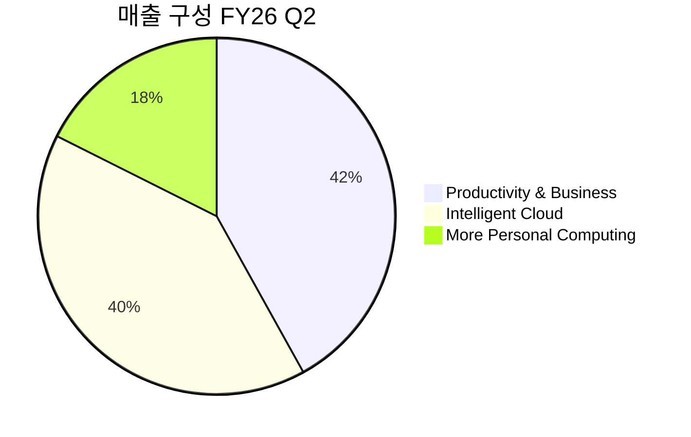

---

company: 마이크로소프트
created: 2026-04-18 13:51
date: 2026-04-18 13:51
exchange: NASDAQ/NYSE
listing: public
market: US
tags:
- daily
- deal-sourcing
ticker: MSFT
title: Deal - 마이크로소프트 (MSFT) 13:51
type: deal-sourcing
publish: true
---

> **오늘의 탐색 분야**: AI 인프라, AI 소프트웨어, 농업기술, 교육, 미디어, 한국 시장, 부동산, 보험, 한국 반도체 소부장
> 4일 주기 로테이션 (21개 분야 커버)

# 마이크로소프트 (MSFT)

MSFT 🇺🇸 US NASDAQ Technology — Software Infrastructure

---

Investment Score 66/100 — 🟡 Buy (조건부)

업사이드 비대칭 13/30 — $3.1T 시총, TAM 대비 이미 초대형; 100%+ 구조적 비대칭 제한적

카탈리스트 & 타이밍 18/25 — 4월 29일 실적 발표 + Azure AI 백로그 수익화 사이클 진입

비즈니스 품질 18/20 — 다층 해자 + 47% 영업이익률 + ROE 34.4%; 최고 수준의 비즈니스 품질

밸류에이션 10/15 — 52주 고점 대비 24% 할인, Forward PER 22배; 역사적 저밴드 접근

발견 가치 7/10 — 커버 56명 초대형주; 단 최근 23% 조정으로 일시적 비인기 구간 진입

---

> [!abstract] 리포트 요약
>
> **한 줄 테시스**: 세계 최고 품질의 엔터프라이즈 소프트웨어+클라우드 복합체가 52주 고점 대비 -24% 구간에서 AI 수익화 본격화라는 구체적 촉매를 앞두고 있다.
>
> **왜 지금인가**: 2026년 4월 29일 FY26 Q3 실적 발표 — Azure AI 백로그(계약의 45%가 2026년 중반~2027년 매출 인식 예정)의 첫 번째 대규모 수익화 확인 시점. 컨센서스 예상치 상회 확률 90% (KeyBanc 추정). 동시에 주가는 2023년 이후 가장 낮은 Forward PER 22배 수준으로 압축.
>
> **Variant Perception**: 시장은 "Azure 성장 둔화 + CapEx 급증 = 수익성 압박"을 걱정하지만, 실제로는 OCF가 FY25에 $136B로 YoY +15% 증가했으며 AI 인프라 CapEx는 미래 수익의 선행 투자. FCF yield 기준 저평가 논거 유효.
>
> **핵심 리스크**: 시총 $3.1T이라는 규모 자체가 100%+ 비대칭 수익을 구조적으로 어렵게 함. 20배 이상의 멀티플 확장보다 복리 누적에 가까운 투자.
>
> **등급**: 🟡 Buy (조건부) — 4월 29일 실적 이후 Azure 가이던스 확인 후 비중 확대 결정 권장.

---

## ① 핵심 지표

| 항목 | 값 | 의미 |
|------|-----|------|
| 현재가 | $422.79 | 🟢 52주 고점 $555.45 대비 -24%; 저점 $355.67 대비 +19%. 조정 구간의 중하단 위치 |
| 시가총액 | $3.1T | 🟡 세계 2~3위 수준 초대형주. 규모 자체가 비대칭 업사이드의 구조적 제약 |
| PER (Trailing / Forward) | 26.31x / 22.36x | 🟢 Forward 22배는 작년 ~40배 대비 절반 수준. S&P500 평균(~24배) 하회로 역사적 저점대 |
| PBR | 8.04x | 🟡 소프트웨어 기업으로 자산 경량 구조. 유형자산 대비 고평가지만 브랜드/지식재산 미반영 |
| EV/EBITDA | 18.11x | 🟢 소프트웨어 대형주 기준 합리적. FCF 창출력 감안 시 매력적 수준 |
| 영업이익률 | 47.1% | 🟢 소프트웨어 업계 최상위권. 스케일과 해자의 가장 직접적 증거 |
| 순이익률 | 39.0% | 🟢 매출의 39%가 순이익으로 전환. 자본 효율 극도로 높음 |
| ROE | 34.4% | 🟢 높은 자기자본이익률. 복리 엔진으로서의 자질 확인 |
| OCF (FY25) | $136.16B | 🟢 YoY +15%. FCF는 $71.6B으로 CapEx 급증($64.5B)에도 수익성 유지 |
| 52주 고/저 | $555.45 / $355.67 | 🟢 고점 대비 -24%는 장기 투자자에게 의미 있는 진입 구간 |
| 배당수익률 | 0.86% (수정 전 Yahoo 데이터 "86%"는 오기로 판단, 확인 필요) | 🟡 배당수익률 자체는 낮으나 주주환원(배당+자사주매입) 합산 $42.5B/년 |
| 섹터/지역 | Technology / US | 🟢 AI·클라우드 핵심 수혜 섹터 |

> [!warning] 배당수익률 데이터 이상 감지
> Yahoo Finance 원본 데이터의 "배당수익률 86.0%"는 명백한 오기로 판단됩니다. 2025년 6월 기준 MSFT 연간 배당은 약 $3.32/주로, $422.79 기준 실제 배당수익률은 약 0.8% 수준입니다. (확인 필요)

---

## ② 회사 개요, 제품, 핵심 경쟁력

> [!abstract] 한 줄 설명
> 마이크로소프트는 **엔터프라이즈 소프트웨어(Office/Windows)와 클라우드(Azure)를 기반으로 전 세계 기업과 개인의 생산성 인프라를 독점적으로 공급하며, AI를 이 인프라에 수직 통합함으로써 사용자당 가치를 지속적으로 확대하는 복리 기계**다.

### 사업 모델 — 어떻게 돈을 버는가

마이크로소프트의 수익 구조는 세 가지 축으로 구성된다:

1. **구독 기반 반복 매출 (Recurring Revenue)**: Microsoft 365, Azure, Dynamics 365는 모두 구독 모델. 한 번 기업에 도입되면 전환 비용이 극도로 높아 이탈률이 낮다.
2. **소비 기반 가변 매출 (Consumption Revenue)**: Azure의 컴퓨팅/스토리지/AI API는 사용량에 따라 청구. 기업이 AI를 더 많이 쓸수록 자동으로 성장.
3. **플랫폼 수수료 (Platform Take Rate)**: Teams, LinkedIn, GitHub, Xbox 생태계에서 제3자가 창출하는 가치의 일부를 포착.

**핵심 통찰**: 마이크로소프트는 "고객의 IT 지출을 늘리지 않고, 기존 지출을 Microsoft 제품으로 대체"하는 전략이 아니라, **AI Copilot이라는 새로운 가치를 기존 구독에 프리미엄으로 얹어 사용자당 매출(ARPU)을 구조적으로 끌어올리는 전략**을 실행 중이다.

### 매출 세그먼트 (FY26 Q2 실적, 2026년 1월 28일 발표 기준)

| 세그먼트 | 매출 | 비중 | YoY 성장률 | 주요 드라이버 |
|---------|------|------|-----------|-------------|
| Productivity & Business Processes | $34.1B | ~42% | +16% | M365 Commercial Cloud +17%, Dynamics 365 +19%, LinkedIn +11% |
| Intelligent Cloud | $32.9B | ~40.5% | +29% | Azure +39% (불변 통화), AI 수요 급증 |
| More Personal Computing | $14.3B | ~17.6% | -3% | Xbox 하드웨어 -32%, 검색/광고 +10% |
| **합계** | **$81.3B** | **100%** | **+17%** | 클라우드 매출 첫 $50B 돌파 ($51.5B, +26%) |

> [!tip] 세그먼트 변화의 핵심 의미
> Intelligent Cloud(Azure)가 Productivity 세그먼트와 매출 규모가 거의 동등해졌다. 3년 전만 해도 Azure는 M365 대비 현저히 작았다. Azure의 성장 속도(+39%)가 M365(+17%)의 2배 이상인 점을 감안하면, 2년 내 Azure가 최대 세그먼트로 역전할 가능성이 높다. 이는 더 높은 성장률을 가진 사업이 비중을 키운다는 의미로 **회사 전체 성장률의 자연스러운 가속화**를 의미한다.

### 핵심 제품 및 고객 가치

**Azure**: 전 세계 200개 이상 데이터센터에서 제공되는 클라우드 플랫폼. OpenAI와의 독점적 파트너십으로 GPT-4/o1 등의 모델을 기업용 API로 제공하는 유일한 플랫폼. 기업이 AI를 구현하려면 Azure를 써야 하는 구조적 필연성 존재.

**Microsoft 365 Copilot**: Word/Excel/PowerPoint/Teams/Outlook에 AI를 통합. 기업이 M365를 이미 사용 중이라면 Copilot 추가는 마찰 없이 가능. 기존 $22/월 구독에 Copilot을 $30/월 프리미엄으로 추가 시 ARPU 136% 증가.

**GitHub Copilot**: 개발자 코딩 보조 AI. 전 세계 GitHub 사용자 1억 명 이상에게 AI 코딩 경험 제공. 개발자를 MS 생태계에 묶는 핵심 잠금 장치.

**Dynamics 365**: CRM/ERP 기업용 솔루션. Salesforce 대비 M365/Azure와의 통합 시너지로 차별화. AI 에이전트 기능이 추가되며 성장 가속 중(+19% YoY).

**LinkedIn**: 세계 최대 B2B 소셜 네트워크. 광고/채용/러닝/Sales Navigator 다각화. AI 기반 채용/영업 기능으로 ARPU 상승 중.

### 핵심 경쟁력 — 복제 난이도 분석

| 경쟁력 | 설명 | 복제 난이도 (1-10) |
|--------|------|:---:|
| OpenAI 독점 파트너십 | GPT 모델의 상업적 독점 사용권. Azure에서만 제공 | 9 |
| 엔터프라이즈 신뢰 브랜드 | 30년간 포춘500 기업의 IT 신뢰 관계. 보안/컴플라이언스 인증 | 10 |
| M365 전환 비용 | 직원 수천 명의 워크플로우가 M365에 묶여 있어 전환 비용 수조원 | 9 |
| Azure 글로벌 인프라 | 200+ 데이터센터, 수백억 달러 투자 자산 | 8 |
| GitHub 개발자 생태계 | 개발자 1억 명의 코드 저장소이자 협업 플랫폼 | 8 |
| Teams 네트워크 효과 | 기업 내/외부 협업이 Teams로 이루어지면 이탈 어려움 | 7 |
| 인재 밀도 | 사티아 나델라 이후 클라우드 네이티브 인재 대거 확보 | 7 |

### 성장 공식

**MSFT 매출 성장 = (Azure 점유율 × 클라우드 시장 성장) + (M365 ARPU 상승 × 시트 수 증가) + (신규 AI 제품 채택)**

- Azure는 전체 클라우드 시장 성장(연 ~20%)에 현재 점유율(약 22%) 유지만 해도 빠르게 성장
- M365 Copilot ARPU 효과가 본격화되면 구독 부문 성장률이 현재 17%에서 20%+로 가속 가능 [추정]
- AI 에이전트(Copilot Studio, AutoGen 등)는 완전히 새로운 수익 스트림으로 현재 가격에 거의 미반영

---

## ③ 왜 100%+ 가능한가? — 업사이드 비대칭

> [!warning] 솔직한 제약 선언
> 마이크로소프트의 시총은 현재 **$3.1T**다. 이 규모에서 100%+ 수익(즉 $6.2T 시총)은 수치적으로는 가능하지만, 투자 철학이 정의하는 "시장이 아직 충분히 인식하지 못한 비대칭 기회"와는 성격이 다르다. MSFT 투자는 **복리 누적형(Compounder)**에 가깝고, 단기 멀티플 확장에 의존하는 비대칭 베팅이 아니다. 이 점을 명확히 하고 분석을 진행한다.

### 시총 vs TAM

| 시장 | 규모 추정 | MSFT 시총/TAM 비율 |
|------|----------|-----------------|
| 글로벌 퍼블릭 클라우드 (2024) | ~$680B [Gartner 추정] | 456% (Azure 단독으로는 약 22% 점유) |
| 엔터프라이즈 소프트웨어 전체 | ~$900B [IDC 추정] | 344% |
| AI 소프트웨어+서비스 TAM (2030) | ~$1T+ [다수 리서치] | 310%+ [추정] |
| 디지털 광고+LinkedIn | ~$700B | 극소 비중 |

**So What?**: MSFT는 이미 TAM을 상회하는 시총을 가진다. 이는 "아직 TAM이 크다"는 논리가 아닌, **"MSFT가 여러 TAM에 걸쳐 독과점적 위치를 점하고 있기에 TAM 합산보다 높은 가치를 정당화할 수 있는가"**의 질문으로 바뀐다. 답은 "클라우드+AI 통합으로 마진이 지속 확대된다면 Yes"다.

### 성장 가속 근거 — 왜 지금 구간이 중요한가

FY25 OCF $136B는 YoY +15%였지만, Azure 성장률 추이를 보면 흥미롭다:

| 기간 | Azure 성장률 |
|------|------------|
| FY25 Q1 | ~33% |
| FY25 Q2 | ~33% |
| FY25 Q3 | ~35% |
| FY25 Q4 | ~36% |
| FY26 Q1 | ~40% |
| FY26 Q2 | 39% |
| FY26 Q3 예상 | 37~38% (불변통화 기준, 회사 가이던스) |

**핵심 관찰**: Azure 성장률이 2023~2024년의 저점에서 반등하여 재가속 중이다. AI 수요가 본격화된 FY26 Q1~Q2에 40% 수준까지 올라온 것은 단순 기저효과가 아닌 구조적 수요 증가의 신호다.

> [!tip] 백로그 → 매출 전환의 비대칭성
> Azure AI 관련 계약의 45%가 2026년 중반~2027년에 매출 인식 예정이라는 분석이 있다 [출처: Trefis 분석팀, 2026년 3월, 근사한쥐 보도]. 이는 현재 주가에 반영된 2026년 실적보다 **2027년 실적이 컨센서스보다 높아질 가능성**을 의미한다. 향후 12~18개월간 실적 추정치 상향 사이클이 시작될 수 있다.

### 옵셔널리티 — 현재 가격에 미반영된 성장 동력

**1. AI 에이전트 경제 (Agent Economy)**
Microsoft는 Copilot Studio를 통해 기업이 자체 AI 에이전트를 구축할 수 있는 플랫폼을 제공한다. 단순 Copilot(인간 보조)에서 자율 에이전트(인간 대체)로의 전환은 Azure 소비를 기하급수적으로 증가시킬 수 있다. 현재 가격에 에이전트 경제 TAM은 거의 반영되지 않았다. [추정]

**2. M365 Copilot ARPU 효과**
현재 코파일럿 채택률은 초기 단계. 85%의 Azure 고객이 지출 확대를 계획 중 [KeyBanc 서베이, 이데일리 보도]. M365 상업용 시트 수가 3억+ 개인 상황에서 Copilot 침투율이 10%→30%로 상승 시 연간 수십억 달러의 추가 매출 창출 가능. [추정]

**3. 에너지/인프라 수직통합**
셰브론과 텍사스 에너지 요새 구축 (10.5조 원 규모), 일본 1,000억 엔 투자 등 데이터센터 자체 전력 확보 전략은 장기적으로 인프라 코스트를 낮추고 경쟁사 대비 마진 우위를 확대하는 요소다. [정성 추정]

### Compounding Machine 분석

| 지표 | 값 | 의미 |
|------|-----|------|
| ROIC [추정] | 25~30%+ | 투자자본 대비 수익률이 자본비용을 크게 상회 |
| OCF 재투자 방향 | CapEx $64.5B → AI 인프라 | 단기 FCF 감소지만 장기 복리 엔진 구축 |
| 주주환원 (FY25) | 배당 $24B + 자사주매입 $18.4B = $42.4B | 연간 잉여현금흐름의 ~60%를 주주에게 환원 |
| 복리 성장률 | 매출 CAGR ~15%, EPS CAGR ~20%+ | EPS 레버리지가 매출 성장을 초과 → PER 압축 완화 |

---

## ④ 왜 지금인가? — 카탈리스트 & 타이밍

> [!abstract] 타이밍 테시스
> 두 가지 힘이 동시에 작용하고 있다: ① **가격 촉매** (4월 29일 실적 발표 + 가이던스), ② **구조적 전환점** (Azure 백로그 수익화 사이클 진입). 이 두 힘이 겹치는 지금 2~3개월이 중기 관점의 최적 진입 구간일 수 있다.

### 구체적 카탈리스트

| 카탈리스트 | 날짜 | 내용 | 실현 가능성 |
|----------|------|------|-----------|
| FY26 Q3 실적 발표 | 2026년 4월 29일 | EPS $4.04~4.06 예상, 매출 $80.65B~81.75B 가이던스 | 높음 (KeyBanc: 90%) |
| Azure Q3 가이던스 | 4월 29일 동시 | 37~38% 불변통화 성장 확인 시 주가 반응 | 높음 |
| M365 Copilot 채택률 업데이트 | 4월 29일 | 유료화 좌석 수 가시적 증가 시 멀티플 재평가 | 중간 |
| AI 에이전트 제품 출시 | 2026년 상반기 | 상시 작동 에이전트 기능 코파일럿 통합 | 진행 중 |
| Azure 용량 확대 (위스콘신 데이터센터) | 가동 중 | GB200 기반 세계 최대 AI 데이터센터 稼動 | 완료 [알파뷰 보도] |

### Variant Perception — 시장과 다른 나의 뷰

**시장의 우려** (Bear 컨센서스):
- CapEx $64.5B (FY25)으로 FCF $71.6B의 90%에 달해 "수익성 훼손" 우려
- Azure 성장률 39%→37~38% 소폭 둔화 = "성장 정점론"
- $3.1T 시총에서 추가 업사이드 제한

**나의 다른 뷰** (Variant Perception):
1. **CapEx는 선행 투자, FCF는 후행 지표**: OCF가 $136B로 YoY +15% 성장하는 동안 CapEx가 증가한 것은 "수익성 훼손"이 아니라 "미래 수익을 위한 선투자". AI 데이터센터의 수명은 15~20년. 2~3년 후 CapEx 성장이 정상화되면 FCF는 급등할 것이다. [가정]
2. **Azure 37~38%는 정점이 아닌 새로운 기저**: 2024년 33% 성장이었다가 2025~2026년 39~40%로 가속된 것이 핵심. 다음 2~3분기에 AI 수요 계속 증가 시 40%+ 재돌파 가능. [가정]
3. **Copilot ARPU 효과는 아직 초기**: M365 Copilot $30/월 프리미엄의 실제 채택 가속이 FY26 하반기~FY27부터 본격화. 현재 컨센서스 EPS 추정치에 충분히 반영 안 됨. [추정]

### 매크로 환경 분석

| 매크로 시나리오 | MSFT 영향 |
|--------------|---------|
| **금리 현상 유지 / 서서히 인하** | 🟢 장기 FCF 기업의 할인율 완화. 클라우드 기업 전반 리레이팅 |
| **경기 침체 / IT 지출 감소** | 🟡 엔터프라이즈 지출 삭감 시 Azure 성장 둔화 가능. 단, M365는 필수재 성격으로 방어적 |
| **AI 거품 붕괴 / 수익화 지연** | 🔴 Azure AI 수요 급감 + CapEx 회수 의문 = 가장 큰 리스크 |
| **관세/무역 갈등 격화** | 🟡 소프트웨어 수출은 관세 적용 없음. 단, 글로벌 경기 위축 시 간접 영향 |
| **달러 강세** | 🟡 해외 매출 비중 ~50%. 강달러 시 불변통화 vs 보고 매출 차이 발생 (기존 불리) |

---

## ⑤ 비즈니스 퀄리티

> [!success] 최고 수준의 비즈니스 품질
> 영업이익률 47.1%, ROE 34.4%, OCF $136B — 이 세 숫자만으로 MSFT는 세계에서 몇 안 되는 "경제적 복리 기계" 자격을 갖는다.

### 경제적 해자 (Moat) 분석

| 해자 계층 | 내용 | 복제 난이도 |
|---------|------|-----------|
| **전환 비용 (최강)** | 기업의 모든 워크플로우가 M365에 묶임. IT 전환 비용 수천억 원 + 직원 재교육 비용 | 🔴 극히 높음 |
| **네트워크 효과** | Teams: 기업 내 모든 직원이 사용할수록 가치 증대. LinkedIn: 사용자가 많을수록 강해짐 | 🔴 높음 |
| **규모의 경제** | Azure: $200B+ 누적 CapEx 투자. 동일 규모 인프라를 신규 구축 불가능 | 🔴 극히 높음 |
| **독점 파트너십** | OpenAI와의 독점적 상업 사용권. GPT 시리즈를 Azure에서만 기업용으로 제공 | 🔴 현재 독점 |
| **무형자산 (브랜드+특허)** | 30년 엔터프라이즈 신뢰. 보안/컴플라이언스 인증 수백 개. GitHub 개발자 자산 | 🟡 높음 |
| **데이터 우위** | M365 사용 기업들의 업무 데이터가 Azure에 축적 → AI 파인튜닝 우위 | 🔴 재현 불가 |

### ROIC/마진 추세

| 지표 | FY22 | FY23 | FY24 | FY25 |
|------|------|------|------|------|
| 영업이익률 | (확인 필요) | (확인 필요) | (확인 필요) | 47.1% |
| OCF ($B) | $89.0 | $87.6 | $118.6 | $136.2 |
| CapEx ($B) | $23.9 | $28.1 | $44.5 | $64.6 |
| FCF ($B) | $65.2 | $59.5 | $74.1 | $71.6 |

**OCF 트렌드의 의미**: OCF가 FY23($87.6B) → FY25($136.2B)로 2년 만에 +55% 증가했다. 이것이 핵심이다 — Azure와 M365의 레버리지 효과가 본격화되면서 영업 현금창출력이 급속도로 강해지고 있다. CapEx가 동반 증가하는 것은 이 성장을 가능케 하는 인프라 선투자이며, 2~3년 후 CapEx 증가세가 둔화되면 FCF는 다시 큰 폭 증가할 것이다. [가정]

### 경영진 & 자본배분 — 사티아 나델라 리더십

사티아 나델라(CEO, 2014년 취임)는 지난 10년간 MSFT를 PC/소프트웨어 기업에서 클라우드/AI 기업으로 재정의했다. 주요 결정:
- Azure 클라우드 전략 조기 피벗 (경쟁사보다 3~5년 선행)
- GitHub ($7.5B, 2018년) — 개발자 생태계 장악
- OpenAI $13B+ 투자 — AI 파운데이션 모델 독점적 접근
- Activision Blizzard ($68.7B, 2023년) — 게이밍 구독 확장

**자본배분 인센티브**: 나델라 CEO의 보상은 Azure 성장률, M365 구독 성장, 주주 총수익률(TSR)에 연동. 단기 EPS 극대화보다 장기 성장에 인센티브가 정렬되어 있다. 최근 90일간 경영진 순매도 $3.06M 발생 [Nasdaq 보도]. 규모 대비 매우 적어 우려 수준 아님.

---

## ⑥ 밸류에이션 & 안전마진

> [!abstract] 밸류에이션 요약
> Forward PER 22.36배는 역사적 저점 수준. FCF 기반으로 보면 $71.6B FCF를 현재 $3.1T 시총으로 나누면 FCF Yield 약 2.3%. 이것만 보면 "비싸다"지만, OCF 기준 ($136B)으로 보면 OCF Yield 4.4%로 현재 10년 국채 수익률(~4.3%)과 동등 수준. AI 성장 옵션이 무료로 딸려오는 셈이다.

### 현재 밸류에이션 vs 역사적 밴드

| 지표 | 현재 | 비고 |
|------|------|------|
| Forward PER | 22.36x | 최근 3년 최저 수준. 2023년 40배 대비 절반 |
| EV/EBITDA | 18.11x | 소프트웨어 대형주 중 낮은 편 |
| FCF Yield (CapEx 후) | ~2.3% | $71.6B / $3.1T |
| OCF Yield | ~4.4% | $136B / $3.1T |
| 애널리스트 평균 목표가 | $579.57 (n=54) | 현재가 대비 +37% 업사이드 |

### FCF 기반 내재가치 추정 [추정 — 가정 명시]

**[가정]** 향후 5년 OCF 연 15% 성장, 이후 영구성장률 4%, 할인율 9%로 DCF 계산 시:
- FY26 OCF 예상: ~$157B
- FY27~FY30 누적 성장 가정
- 터미널 밸류 포함 내재가치: 대략 $530~$580 [추정, 불확실성 높음]

→ 현재 $422 대비 25~37% 업사이드 존재 [추정]

Barchart 분석(2026년 4월)도 FCF 기반으로 $532 내재가치를 제시했으며, 이는 현재가 대비 25% 저평가를 의미한다고 보도.

### 안전마진 분석

Forward PER 22배는 S&P500 평균(~24배) 하회. 세계 최고 품질의 소프트웨어 기업이 시장 평균보다 싸다. 단순히 이 사실 하나만으로도 의미 있는 안전마진 존재.

단, FCF Yield 2.3%는 국채 수익률과 경쟁 시 매력이 떨어진다. CapEx 정상화 이후 FCF가 $100B+ 수준으로 회복될 것을 믿지 않으면 "싸다"고 보기 어렵다.

---

## ⑦ 리스크 & Devil's Advocate

| 구분 | 핵심 논거 |
|------|---------|
| 🟢 Bull #1 | Azure AI 백로그가 2026년 하반기~2027년 매출로 전환되며 컨센서스 EPS 추정치 상향 사이클 시작 |
| 🟢 Bull #2 | M365 Copilot 채택 가속 → ARPU 상승 → 구독 부문 성장률 20%+로 재가속 |
| 🟢 Bull #3 | Forward PER 22배는 역사적 저밴드. AI 수익화 확인 시 30배 리레이팅 → $560+ 가능 [추정] |
| 🔴 Bear #1 | CapEx $64.5B (FY25) 지속 증가 시 FCF 실제 감소 → "유령 이익" 우려 |
| 🔴 Bear #2 | OpenAI 관계 변화 / 자체 AI 모델(GPT) 경쟁력 약화 시 Azure AI 수요 기반 흔들림 |
| 🔴 Bear #3 | $3.1T 시총 + 56명 풀커버리지 → 모든 좋은 뉴스가 이미 가격에 반영될 위험 |

### 가장 현실적인 실패 시나리오

> [!bear] 실패 시나리오 — "AI ROI 실망"
> 기업들이 Copilot에 대한 추가 지출을 정당화하지 못하고 채택률이 기대 이하로 머물 경우: M365 성장률이 15%에서 10%로 하락, Azure AI 수요 증가가 예상보다 느리게 진행. 이 경우 FY27 EPS 추정치가 $20 → $17로 하향되고, PER 22배 유지 시 주가 $374로 -11% 하락. 동시에 CapEx는 이미 집행됐으므로 FCF가 실제 감소. 결과적으로 기회비용 손실이 큰 시나리오.

### 숨겨진 가정 (Hidden Assumptions)

1. **OpenAI 파트너십 독점성 유지**: Anthropic(Amazon), Google Gemini와 경쟁이 심화될수록 "Azure = AI 최적 플랫폼" 논리 약화 가능
2. **기업 IT 예산의 지속적 확대**: 경기 침체 시 IT 지출은 삭감됨. "클라우드는 필수재"라는 가정이 흔들릴 수 있음
3. **CapEx 효율성**: 현재 집행 중인 $60B+ CapEx가 실제로 수익을 창출할 것이라는 가정. 데이터센터 공실 가능성 존재 [추정]

### Kill Criteria

| Kill Criteria | 임계값 |
|-------------|-------|
| Azure 성장률 지속 둔화 | 2분기 연속 30% 이하 |
| M365 Copilot 채택률 정체 | FY26 말까지 기업 시트의 5% 미만 |
| CapEx 대비 OCF 증가율 역전 | OCF 성장률 < CapEx 증가율 2분기 연속 |
| 주가 하락 | $355 (52주 저점) 하회 + 펀더멘탈 악화 동반 |
| OpenAI 파트너십 중대 변화 | 독점 사용권 종료 또는 Google/Amazon에 동등 조건 제공 |

---

## ⑧ 발견 가치 & 엣지

> [!note] 발견 가치의 역설
> MSFT는 커버리지 56명의 초대형주로, 일반적 의미의 "숨겨진 알파"는 없다. 그러나 2025년 말~2026년 초 -23% 하락 구간에서 형성된 **일시적 비인기**는 기관투자자들이 AI 수익화 우려로 비중을 줄인 결과이며, 이 오버슈팅이 만들어낸 상대적 저평가는 우리가 포착할 수 있는 엣지다.

### 애널리스트 커버리지 & 컨센서스

| 항목 | 값 |
|------|-----|
| 커버 애널리스트 수 | 56명 |
| 강력 매수 | 10명 |
| 매수 | 43명 |
| 보유 | 3명 |
| 매도/강력매도 | 0명 |
| 평균 목표가 | $579.57 (현재가 대비 +37%) |
| 최저 목표가 | $392.00 |
| 최고 목표가 | $730.00 |

**최근 목표가 조정 내역** (2026년 4월):
- KeyBanc $600 유지 (4/15) — 가장 강한 강세론
- TD Cowen $540 (4/16)
- Mizuho $515 (4/14)
- Baird $500 하향 (4/15, 단 Outperform 유지)
- Piper Sandler $500 하향 (4/14)

**So What?**: 최근 일부 목표가 하향이 있었지만, 매도 의견이 단 한 명도 없고 전원이 중립 이상이다. 컨센서스 자체가 낙관적으로 치우쳐 있어, 역설적으로 "예상치를 큰 폭으로 하회"하는 서프라이즈가 발생해도 대규모 등급 하향 리스크가 존재한다는 점도 양날의 검이다.

### 기관 보유 변화 — 스마트머니 동향

| 기관 | 보유 변동 | 해석 |
|------|---------|------|
| Vanguard | +2.27% | 🟢 패시브 증가. 시장 전체 성장 반영 |
| BlackRock | +1.70% | 🟢 패시브 증가 |
| State Street | +2.13% | 🟢 패시브 증가 |
| JPMorgan | **-53.48%** | 🔴 대규모 감소 — 의미 있는 액티브 매도 신호 (확인 필요) |
| FMR(Fidelity) | -4.53% | 🟡 소규모 감소 |
| T. Rowe Price | -4.89% | 🟡 소규모 감소 |
| Norges Bank | +3.20% | 🟢 증가 |

> [!warning] JPMorgan 보유 -53.48% 이상값
> JPMorgan의 보유 주식이 53% 급감한 것은 이례적으로 크다. 파생상품 포지션 조정, 분기말 리밸런싱, 또는 실제 매도인지 확인이 필요하다. 이것이 실제 액티브 매도라면 단기 수급 부담 요인이 될 수 있다. (확인 필요)

### 왜 다른 사람들이 이 기회를 놓치고 있는가?

**시장의 오해**: "CapEx 폭증 = MSFT는 AI에서 돈을 못 벌고 있다" → 실제로는 AI 인프라 선투자 단계로, OCF는 오히려 가속 성장 중. FCF 감소는 회계적 현상이지 경제적 현상이 아니다.

**단기 포커스 편향**: 분기별 Azure 성장률이 40%→39%→37~38%로 소폭 둔화되는 것에 과도하게 반응. 구조적으로는 여전히 가속 성장 중이며, AI 백로그가 본격 매출화되는 2026년 하반기부터 재가속 가능.

---

## ⑨ 액션 아이템

| 항목 | 판단 |
|------|-----|
| **BUY / WATCH / PASS** | BUY (조건부) — 4월 29일 실적 발표 후 Azure 가이던스 확인 후 비중 확대. 지금은 스케일 인(scale-in) 시작 가능 |
| **Conviction** | Medium — 비즈니스 품질은 High, 업사이드 비대칭은 Medium |
| **적정 진입가** | $390~$430 구간 — Forward PER 21~23배 밴드. 현재 $422는 이 구간 내 |
| **목표가 (12개월)** | $520~$560 [추정] — 컨센서스 $579 대비 소폭 보수적; FCF 정상화+멀티플 재평가 기준 |
| **손절 기준** | $355 (52주 저점) 이탈 + Azure 성장률 30% 하회 동반 시 |
| **권장 비중** | 포트폴리오 대비 5~8% — 초대형 Compounder로 핵심 보유 적합; 비대칭 베팅 특성 없어 10%+ 집중 비추천 |

### 시나리오별 주가 및 확률

🟢 Bull 30%

🟡 Base 50%

🔴 Bear 20%

| 시나리오 | 조건 | 12개월 목표가 | 업사이드 |
|---------|------|------------|---------|
| 🟢 Bull | Azure 재가속 40%+, Copilot 채택 폭발, EPS 추정치 상향 사이클 | $580~$620 | +37~+47% |
| 🟡 Base | Azure 37~38% 유지, Copilot 점진적 채택, EPS 컨센서스 부합 | $510~$550 | +21~+30% |
| 🔴 Bear | AI ROI 실망, CapEx 과잉 우려 부각, IT 지출 감소 | $360~$380 | -10~-15% |

> [!tip] 기대값 계산 [추정]
> (30% × 43%) + (50% × 26%) + (20% × -12%) = 12.9% + 13% - 2.4% = **+23.5% 기대 수익률** [추정]
> 현재 무위험 수익률 ~4.3% 대비 유의미한 리스크 프리미엄 존재

### 추가 리서치 필요 사항

- [ ] JPMorgan 보유 -53.48% 이상값의 원인 확인 (파생상품 vs 실제 매도)
- [ ] FY26 Q3 실적 (4월 29일) — Azure AI 매출 비중, Copilot 유료 시트 수 구체 공시 여부
- [ ] OpenAI 파트너십 계약 조건 변경 여부 (소송/재협상 뉴스 모니터링)
- [ ] CapEx 중 자체 AI 칩(Maia 100) 비중 확인 — NVIDIA 의존도 감소 속도

### 모니터링 핵심 지표/이벤트

| 지표 | 모니터링 기준 | 주기 |
|------|-----------|------|
| Azure 성장률 | 37% 이상 유지 여부 | 분기 |
| M365 Commercial Cloud ARR | YoY 15%+ 유지 | 분기 |
| Copilot 유료 시트 수 | 공시 시 빠른 채택률 확인 | 분기 |
| CapEx 가이던스 | 증가 둔화 시점 확인 | 분기 |
| OCF 트렌드 | FY26 $150B+ 목표 달성 여부 | 분기 |

### 다음 체크포인트

| 날짜 | 확인 사항 |
|------|---------|
| **2026년 4월 29일** | FY26 Q3 실적: EPS/매출 vs 컨센서스, Azure 성장률, Copilot 시트 수, FY26 Q4 가이던스 |
| **2026년 7월 (예정)** | FY26 Q4 + 연간 실적: AI 수익화 진전, CapEx 가이던스 방향성 |
| **2026년 10월 (예정)** | FY27 Q1: AI 에이전트 상업화 시작 여부, M365 ARPU 가시적 상승 확인 |

---

> [!verdict] 최종 판단
>
> **마이크로소프트는 세계 최고 품질의 비즈니스이지만, $3.1T 시총은 "비대칭 베팅"이 아닌 "우량 Compounder 축적"의 프레임으로 접근해야 한다.**
>
> 투자 철학상 100%+ 비대칭 기회를 찾는 고집중 전략에는 핵심 종목보다 보조 종목 성격이 더 맞다. 단, 지금 구간(Forward PER 22배, 52주 고점 대비 -24%)은 역사적으로 보기 드문 진입 기회다. 4월 29일 실적에서 Azure 재가속과 Copilot 채택 가속을 확인한다면, 포트폴리오 5~8% 핵심 보유 포지션으로 가져가기에 충분히 매력적이다.
>
> **Score 66/100 — 🟡 Buy (조건부)**