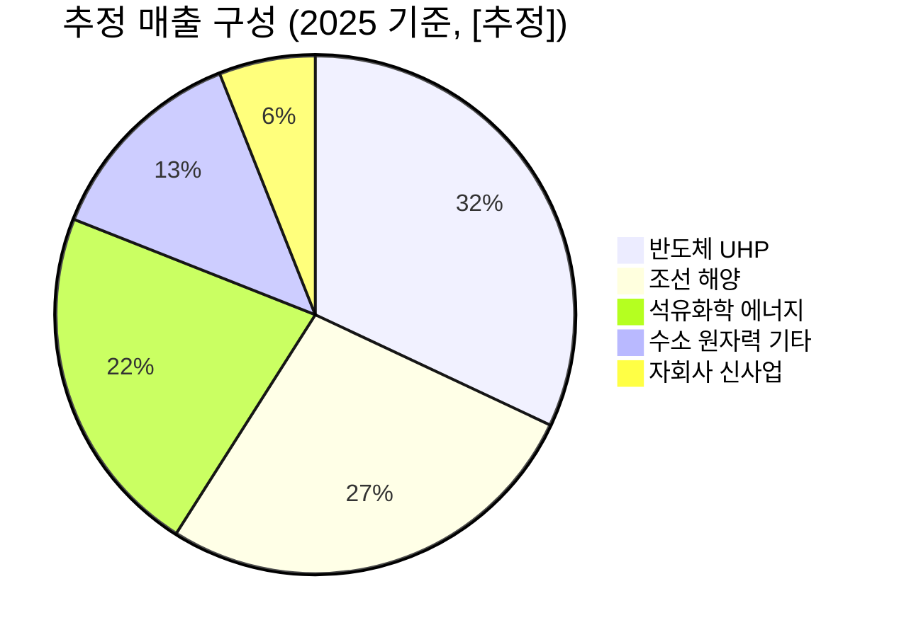

---

company: 비엠티
created: 2026-05-06 15:14
date: 2026-05-06 15:14
exchange: KOSDAQ
listing: public
market: KR
tags:
- company-deep-dive
- deep-company
- deep-analysis
- research
ticker: 086670.KQ
title: Deep Analysis - 비엠티 15:14
type: deep-company
publish: true
---

> [!important] 정합성 검증 요약 (기계적 48건 + AI 검증 · 14대 원칙/4 Gate)
> **신뢰도: B** | 숫자 불일치 3건 | 논리 모순 2건 | 확인 필요 6건
> **Gate 커버리지**: G1[2/3] · G2[3/4] · G3[4/5]+lens미흡 · G4[1/2] · M2/M5[미흡]

### 핵심 발견 사항

| 구분 | 내용 | 위치 | 심각도 |
|------|------|------|--------|
| 🔴 숫자 불일치 | PBR 본문 3곳에서 혼용: 팩트시트=**1.16배**, Bear case 목표가 계산=**0.85배**, 밸류에이션 표=**1.2배** | §2.1·§5.3 | Critical |
| 🔴 숫자 불일치 | 기대수익률 본문 계산 +11.6% vs 요약표 기재 +10.6% (§5.4 abstract "기대수익률 +10.6%" vs §5.4 tip 계산식 "+11.6%") | §5.4 | Major |
| 🔴 논리 모순 | Bear case 목표가 12,500원 산출식에 PBR **0.85배** × BPS 14,700원 사용 — 팩트시트 PBR 1.16배와 근거 없이 상충; BPS 14,700원 출처 미제시 | §5.3 | Critical |
| 🟡 논리 모순 | §1.11 "2024 OPM ~3% → 2025 10.4%" 서술 vs §1.4 "2025 annual CapEx 2024년 14억 대비 7.8배"(정합), 그러나 §4.1 Risk#1에서 "Q3 일회성 입증 시 경상 PER 17배+"를 전제로 저평가 논거 와해를 주장하면서, §7.1 투자 결론은 동일 조건에서도 "HOLD with Bias to BUY" 유지 — 판단 일관성 의문 | §4.1·§7.1 | Major |
| 🟡 할루시네이션 의심 | "글로벌 반도체 밸브 TAM 32→58억 USD, CAGR 7.5%"의 출처 미명시; 세그먼트 매출비중(반도체 30~35% 등) 전체가 [추정] 표기 하나로 처리되나 근거 IR·뉴스 원문 링크 없음 | §1.5·§1.8 | Major |
| 🟡 Gate 2 미흡 | Kill Criteria #3 "반도체 부문 매출 성장 실제 +20% 미만"은 세그먼트 별도 공시 부재 상황에서 측정 불가능한 임계값 — 검증 가능한 수치로 대체 필요 | §4.4 | Major |
| 🟡 M2 Confidence 태그 | 정량 주장 전반에 [Confidence: H/M/L] 태그 전무 — "OPM 12~14% 안착", "ROIC 8~10% 도달", "TAM CAGR 7.5%" 등 핵심 수치 모두 미부착 | 전체 | Moderate |
| 🟡 Gate 3 KR lens 미흡 | Korea Discount(코리아 디스카운트) 구조적 요인 미언급; DART 확인 촉구는 있으나 외국인 수급·기관 수급 데이터 분석 부재; 대주주 지분율·특수관계인 지분율 미확인 상태로 서술 | §3.1 | Moderate |

### 투자 전 반드시 확인

- [ ] **DART 2025 Q3 분기보고서 영업외손익·기타수익 주석** 직접 열람 — Q3 순이익 125억(영업이익 58억 대비 +67억) 일회성 여부 확인 전 PER 8.64배 저평가 논거 사용 불가
- [ ] **자기주식처분결정 공시(2025.12.01) 원문** 확인 — 처분 목적(임직원 보상 vs 운영자금 조달)에 따라 자본배분 신뢰도 및 투자활동CF +267억 해석이 180도 달라짐
- [ ] **Bear case BPS 14,700원 근거** 확인 — 팩트시트 PBR 1.16배와 Bear case PBR 0.85배 적용의 논리적 정합성 재검토 필요 (현재 수치 혼용으로 목표가 신뢰도 훼손)
- [ ] **반도체 세그먼트 매출 별도 공시 여부** 재확인 — Kill Criteria #3이 측정 불가능한 임계값이므로, 관찰 가능한 대리변수(전사 OPM, 전사 매출 성장률)로 대체 설계 필요
- [ ] **대주주 지분율·최근 6개월 내부자 매매** DART 확인 — §3.1에서 "확인 필요"로 처리된 지분구조가 미해결 상태; 경영진 Skin-in-the-Game 판단의 전제 조건

---

# 1. 비즈니스 본질

> [!abstract] 섹션 핵심 요약
> 비엠티는 "고압·고청정 환경에서 새지 않는 연결부(Fitting & Valve)"를 만드는 정밀부품 회사다. 손바닥만 한 부품 하나가 반도체 팹 수율, LNG선 안전, 수소 충전소 운영을 좌우하는 **미션 크리티컬 부품**이며, 이 시장은 30년 이상 미국 Swagelok·일본 Fujikin이 과점해 온 **고진입장벽 카테고리**다. 비엠티의 투자 가치는 "**매출 1,470억 코스닥 소형주**"라는 외형보다, "**Swagelok 제품과 호환되는(Interchangeable) 한국 유일 사업자**"라는 포지셔닝과 2025년 들어 가시화된 **반도체 UHP + 친환경 선박**의 듀얼 트랙 수요에서 나온다.

---

## 1.1 이 회사는 무엇을 하는가? — 1차 원리 설명

### 핵심 제품을 비전문가 언어로

반도체 팹 안에서는 고순도 가스(SiH₄, NH₃, HCl 등)가 수백 km의 배관을 따라 챔버까지 전달된다. **이 배관 중간중간에 가스를 분기·차단·계량하는 부품이 피팅(Fitting)과 밸브(Valve)다.** 만약 이 부품에서 가스가 ppb(10억분율) 단위로라도 누설되거나, 내벽에서 파티클 한 개라도 떨어지면 → 웨이퍼 한 장(현재 HBM 기준 5~10만 원)이 통째로 불량이 된다. **즉 100원짜리 부품이 1억 원짜리 손실을 만든다**는 것이 이 산업의 본질이다.

같은 논리가 LNG·암모니아·수소 분야에도 적용된다. -163℃ 초저온 LNG가 흐르는 배관에서 밸브가 새면 곧 폭발이며, 350bar 고압 수소도 마찬가지다. 결국 비엠티가 파는 것은 **"부품"이 아니라 "안전·수율의 보증서"**다. 고객 입장에서 부품 단가는 부차적이고, **"한 번 인증받은 vendor를 바꾸지 않는다"**는 행동 패턴이 산업의 작동원리다.

> [!tip] 핵심 인사이트 — "부품을 파는 게 아니라 인증을 판다"
> 비엠티의 진짜 자산은 공장도, 특허도 아닌 **"Chevron·Total·ExxonMobil·삼성전자의 vendor 등록부에 올라가 있는 12개국 23개 vendor 코드"**다. 이 vendor 코드는 신규 진입자가 5~10년에 걸친 인증 과정을 거쳐야 받을 수 있으며, 한 번 등록되면 가격이 10~20% 비싸도 잘 교체되지 않는다. 이것이 OPM 15.5%(2025 Q3)를 정당화하는 진짜 해자다.

### 매출 구성 (세그먼트별)

> [!warning] 세그먼트별 매출 비중 데이터 한계
> 비엠티는 코스닥 소형주로 사업보고서에 **세그먼트별 매출 breakdown을 별도 공시하지 않는다**. 아래는 뉴스·IR 발언에서 추출한 정성적 비중 추정이며, 정확한 비율은 사업보고서 본문 확인 필요.

| 전방 산업 | 추정 매출비중 [추정] | 주요 제품 | 성장성 | 마진 특성 |
|---|---|---|---|---|
| **반도체 (UHP)** | [추정] 30~35% | 초고순도 피팅·밸브 | 🟢 2026 +50% 목표 (회사 가이던스) | 🟢 최고마진 |
| **조선·해양 (LNG/대체연료)** | [추정] 25~30% | 초저온 밸브, FVT(연료 공급 트레인) | 🟢 친환경 선박 발주 사이클 | 🟢 고마진 |
| **석유화학·에너지 플랜트** | [추정] 20~25% | 고압 피팅·밸브 | 🟡 안정 | 🟡 중간 |
| **수소·원자력·기타** | [추정] 10~15% | 중·고압 밸브, 컨트롤 밸브 | 🟢 신성장 | 🟡 검증 단계 |
| **자회사 (파워쿨, 하이리온)** | [추정] 5% 이하 | 이동식 에어컨, 2차전지 건식전극 | 🟡 초기 | 🔴 미검증 |

*출처: 머니투데이(2025.03), 핀포인트뉴스, 회사 IR 발언 종합 — 정확 수치 [추정]*



### 고객이 비엠티를 선택하는 이유 — "왜 Swagelok이 아닌가?"

이 질문은 비엠티 투자 가설의 가장 중요한 검증 포인트다. Swagelok(미국, 매출 ~20억 달러)은 **이 카테고리의 절대 강자**이며, 산업 표준 그 자체다. 그럼에도 비엠티 제품(브랜드: **Superlok**)이 채택되는 논리는 다음 3가지로 압축된다.

**① 호환성 (Interchangeability) — Swagelok 제품과 완전 호환**
Superlok North America의 공식 자료에 따르면 Superlok은 **Swagelok 페룰(Ferrule) 디자인과 완전 호환**된다. 즉 기존 Swagelok 시스템에 Superlok을 섞어 써도 누설이 없다. 이는 고객 입장에서 **"Swagelok에 락인되지 않을 보험"** 역할을 한다.

**② 가격 — 통상 10~20% 저렴 [추정]**
Swagelok은 가격 협상이 거의 불가능한 정가 정책을 고수한다. 비엠티는 **유사 품질에 두 자릿수 % 가격 우위**를 제시한다 [추정, 업계 일반론].

**③ 리드타임 — 한국·아시아 고객 대응**
Swagelok 본사 발주 시 리드타임 8~12주가 일반적인 반면, 부산 장안공장 기반 비엠티는 한국·아시아 고객 대상 2~4주 대응 가능 [추정].

> [!question] 검증 필요 — Swagelok 대비 가격·리드타임 우위의 실증 데이터
> 위 3가지 논리는 정성적이며, 실제 어느 정도의 가격 차이가 어느 비율의 고객 전환을 만들어냈는지에 대한 **정량 데이터는 공개되지 않았다**. 다만 12개국 23개 vendor 코드와 글로벌 매이저(Chevron·Total·ExxonMobil) 인증은 정성 논리의 강력한 후행 증거다.

### 비즈니스 모델 (수익 구조)

- **수익 인식 방식**: 수주 → 생산 → 출하 시점 매출 인식 (B2B 부품 판매 모델)
- **단가 × 물량**: 피팅 1점당 단가는 수천 원 ~ 수만 원, 고압·UHP 밸브는 수십~수백만 원. **밸브 1점이 피팅 100점의 매출에 해당**하는 구조 [추정]
- **리커링 비율**: 명시적 "리커링 매출"은 낮으나, **vendor 코드를 통한 사실상의 반복 발주(de facto recurring)**가 핵심. 한 번 등록된 vendor는 수년간 안정적 발주를 받음
- **계절성**: 조선·플랜트 프로젝트 일정에 따른 분기 변동성 존재 (2025 Q1 매출 366억 → Q2 27억(half-Q1=27억) → Q3 375억으로 분기간 격차 큼)

---

## 1.2 Value Chain 내 포지셔닝

### 산업 Value Chain 매핑

```
[원재료]              [부품 가공]            [부품 조립]              [시스템 통합]              [최종 사용]
스테인리스 ────►  피팅·밸브 단품  ────► 모듈/SKID  ────► 플랜트/팹 EPC  ────► 운영
포스코·세아     ★비엠티★(여기)      비엠티 일부  현대건설·삼성E&A     SK하이닉스·HD현대
                                                       Bechtel·Fluor
부가가치:    낮음          중상              상              중              -
마진(GPM):  10% 미만      25~35%           20~30%          5~15%          -
```

**비엠티의 Value Chain 위치**: 부품 가공 단계의 **고부가 정밀 부품 사업자**. 단순 가공은 중국 업체가 잠식한 영역이지만, **UHP·초저온·고압의 고스펙 영역은 진입장벽이 높아 GPM 25~30% 수준 유지 가능**.

> [!success] 포지셔닝의 강점
> 비엠티는 자기 영역(부품 가공)에서 **"고객의 EPC가 부품 단가를 깎을 동기가 별로 없는 위치"**에 있다. 부품 단가는 전체 EPC 프로젝트 비용의 1~3%에 불과하지만, 이 부품 하나가 실패하면 수백억~수천억 원의 프로젝트 지연이 발생한다. 이 **"전체 비용 대비 작지만, 실패 비용은 큰"** 위치가 가격 결정력의 원천이다.

### 교섭력 분석 (Porter's Five Forces 변형)

| 관계 | 비엠티의 교섭력 | 근거 |
|---|---|---|
| 🔼 **상류 공급자** (스테인리스 원재료) | 🟡 중간 | 포스코·세아 등 다수 공급자 존재. 다만 원재료 가격은 LME 시세 연동으로 **비엠티가 ASP에 100% 전가하지 못함** → GPM 변동의 주요 원인 |
| 🔽 **하류 고객** (삼성전자·HD현대·Chevron) | 🟢 중상 | Vendor 인증 락인. 다만 **삼성전자 등 대형 고객은 단가 인하 압박 강함** |
| ⚔️ **경쟁사** (Swagelok·Fujikin) | 🟡 중간 | 글로벌 빅2 대비 규모는 1/10 수준이나, 한국·아시아 시장에서는 경쟁 가능 |
| 🚪 **신규 진입** | 🟢 강 | 인증 5~10년 소요. **사실상 신규 진입 없음** |
| 🔄 **대체재** | 🟢 강 | 용접 등 대체 방법 존재하나, 기능적·경제적 대체 불가 |

### ASP 트렌드

> [!note] ASP 데이터 미공개
> 비엠티는 ASP를 별도 공시하지 않는다. 다만 다음 2개 정황을 종합하면 **ASP는 점진적 상승 추세** [추정]:
> 1. 매출 믹스 변화: 저마진 일반 피팅 → 고마진 UHP·초저온 밸브로 이동
> 2. GPM 추이: 2024 H1 27.3% → 2024 Q3 22.8% → 2025 Q1 21.5% → 2025 Q3 **29.3%** (분기 변동성은 크나 Q3 회복은 믹스 효과 [추정])

---

## 1.3 단위 경제학 (Unit Economics)

> [!warning] 단위 경제학 데이터 한계
> 비엠티는 제품별 ASP·원가·마진을 별도 공시하지 않는다. 아래는 산업 일반론과 회사 OPM 역산 기반 [추정]이며, 직접적인 실증 데이터가 아님을 명시한다.

### 제품 카테고리별 추정 수익성

| 제품 | 단가 [추정] | 추정 GPM | 비고 |
|---|---|---|---|
| 일반 산업용 피팅 (Tube Fitting) | 수천 ~ 1~2만 원/점 | [추정] 20~25% | 가격 경쟁 치열, 중국 추격 |
| **UHP 피팅·밸브 (반도체용)** | **수십 ~ 수백만 원/점** | **[추정] 35~45%** | **🟢 최고 수익성** |
| 초저온 밸브 (LNG·암모니아) | 수백만 ~ 수천만 원/점 | [추정] 30~40% | 🟢 인증 진입장벽 |
| 고압 밸브 (수소·플랜트) | 수백만 원/점 | [추정] 25~35% | 🟡 표준화 진행 |
| FVT (연료 공급 트레인) | 척당 수억 원 | [추정] 25~30% | 🟢 시스템 매출 |

### 설치 기반(Installed Base)과 리커링 패턴

- 비엠티는 **"설치 기반 → 교체 매출"** 구조가 명시적이지 않다. 피팅·밸브의 교체 주기는 **플랜트 정기 보수(보통 3~5년)** 또는 **노후 라인 교체 시**에 발생
- 다만 **vendor 등록 자체가 사실상의 리커링 채널**: 한 번 등록된 고객사는 신규 라인 증설 시 동일 vendor에서 계속 발주
- **중요**: 삼성전자가 평택·기흥에서 신규 팹을 짓는다는 것은, 비엠티 입장에서 추가 수주의 **신규 매출**이지만 **고객 획득 비용(CAC)이 거의 0**인 매출이라는 뜻

> [!tip] Unit Economics의 본질
> 이 사업에서 진정한 LTV/CAC 경제학은 **"vendor 코드 1개 = 수십~수백억 원의 평생 매출"**이라는 단순 등식이다. 12개국 23개 vendor 코드는 곧 **"미래 수년간의 매출 잠재력 약속"**이며, 이것이 PBR 1.16배라는 자산 가치에 반영되지 않은 무형자산이다.

---

## 1.4 제조/운영 실체

### 생산 거점

- **본사·1공장**: 부산 기장 신소재 산업단지 (장안공장)
- **신규 2공장**: 부산 기장 장안2공장 신축 진행 중 → **CAPA +25%**, **자동화 설비 도입**

> [!success] CAPA 확장의 의미
> 2025 annual CapEx 109억 원(2024년 14억 대비 7.8배)은 거의 전액 장안2공장 투자로 추정된다. 이는 **"수주가 있으니 짓는 것"** — 즉 회사가 향후 2~3년 매출 증대에 자신감이 있다는 강력한 신호다. 다만 **"수요가 늦거나 사라지면 고정비 부담으로 OPM 악화"**의 양면성도 존재 (Capital Cycle 관점에서 검증 필요).

### 자체 생산 vs 외주

- **수직 통합도 높음**: 정밀 가공·표면처리·조립을 자체 수행 (UHP는 외주 시 청정도 보증 불가)
- 단순 부품 일부만 외주 [추정]
- **이는 양날의 검**: 마진은 높지만, 수요 변동 시 고정비 레버리지가 양방향으로 작용

### 가동률 & 인력 (확인 필요)

- 가동률 공시 없음 — 다만 2025년 매출 증가(YoY +10.7%)와 OPM 급격 개선(2024 OPM ~3% → 2025 10.4%)은 **가동률 상승에 따른 영업레버리지 효과**가 강하게 작용했음을 시사
- 핵심 인력 구조 미공시 — R&D 비중·엔지니어 비율 등은 사업보고서 직접 확인 필요

---

## 1.5 수주잔고 & 파이프라인

> [!warning] 수주잔고 공식 데이터 부재
> 비엠티는 분기별 수주잔고를 공식 공시하지 않는다. 다음은 정성 정보 종합:

- **반도체 부문 가이던스**: 2026년 매출 전년 대비 **약 1.5배 증대 목표** (회사 공식, 머니투데이 2025.03)
- **UHP 국내 M/S**: 5년 내 40% 달성 목표
- **친환경 선박 파이프라인**: 암모니아 FVT 국내 최초 개발 → HD현대중공업 등 조선 빅3와 공급 협의 중 [추정, 뉴스 기반]
- **수소 충전소 시장**: 자체 개발 중·고압 부품의 국내외 충전소 공급 진행 중

### 매출 → 인식 리드타임

- 단순 부품: 수주 후 **2~6개월** 내 매출 인식
- 시스템·SKID: 수주 후 **6~18개월** [추정]
- → 2026년 매출은 사실상 **2025년 후반 ~ 2026년 상반기 수주분이 결정**

---

## 1.6 고객 관계의 실체

### 핵심 고객 (확인된 정보 + [추정])

| 산업 | 주요 고객 | 관계 형태 |
|---|---|---|
| 반도체 | 삼성전자, SK하이닉스 [추정] | Vendor 등록 + 라인별 발주 |
| 조선 | HD현대중공업, 삼성중공업 [추정] | 프로젝트 단위 |
| 글로벌 에너지 | **Chevron, Total, ExxonMobil** | 글로벌 vendor 인증 |
| 발전·플랜트 | KEPCO 계열, 해외 EPC | 입찰 + 지명 혼합 |

> [!warning] 고객 집중도 미공시
> Top 3 고객 매출 비중은 비공시. 다만 12개국 23개 vendor 등록은 **고객 다변화의 강력한 후행 증거**. "삼성전자 의존도 높은 코스닥 소부장"의 일반적 패턴과는 다소 다른 구조 [추정].

### 의사결정 프로세스

- **공통 패턴**: ① 사양서(Spec) 통과 → ② Vendor 등록 (수년) → ③ Approved Vendor List 등재 → ④ 입찰/지명 발주
- **핵심**: ②~③ 단계가 진입장벽. 한 번 통과하면 ④는 거의 자동
- **장기 공급계약 vs 스팟**: 글로벌 메이저(Chevron 등)는 **연간 단가 계약(Frame Agreement)** 형태가 일반적 [추정]

---

## 1.7 경쟁 우위 (Economic Moat) — 구체적 증거

### 4대 해자 평가

| 해자 유형 | 작동 여부 | 구체 증거 | 강도 |
|---|---|---|---|
| **무형자산** (인증·특허) | 🟢 강력 작동 | 12개국 23개 vendor 코드, 아이피팅(i-Fitting) 특허, 암모니아 FVT 국내 최초 개발 | <div style="background:#e0e0e0;border-radius:8px;overflow:hidden;margin:2px 0"><div style="background:#4CAF50;width:80%;padding:2px 8px;color:white;font-size:0.85em;white-space:nowrap">80/100</div></div> |
| **전환비용** | 🟢 작동 | Vendor 변경 시 재인증 비용·시간(수년). UHP 라인 교체 리스크 큼 | <div style="background:#e0e0e0;border-radius:8px;overflow:hidden;margin:2px 0"><div style="background:#4CAF50;width:75%;padding:2px 8px;color:white;font-size:0.85em;white-space:nowrap">75/100</div></div> |
| **규모의 경제** | 🟡 제한적 | 매출 1,470억으로 Swagelok 1/15 수준. 규모 측면에서는 열위 | <div style="background:#e0e0e0;border-radius:8px;overflow:hidden;margin:2px 0"><div style="background:#FF9800;width:35%;padding:2px 8px;color:white;font-size:0.85em;white-space:nowrap">35/100</div></div> |
| **네트워크 효과** | 🔴 거의 없음 | B2B 부품에서 네트워크 효과 미작동 | <div style="background:#e0e0e0;border-radius:8px;overflow:hidden;margin:2px 0"><div style="background:#F44336;width:15%;padding:2px 8px;color:white;font-size:0.85em;min-width:60px;white-space:nowrap">15/100</div></div> |

### 핵심 경쟁사 비교

| 항목 | 비엠티 | Swagelok | Fujikin | 디케이락(국내) |
|---|---|---|---|---|
| 매출 규모 | 1,470억원 | ~20억 USD (~2.7조원) | 비공개 (~5,000억원 [추정]) | ~1,000억원 [추정] |
| 본사 | 한국 부산 | 미국 오하이오 | 일본 오사카 | 한국 김해 |
| 핵심 강점 | UHP+친환경 듀얼 | 표준 그 자체, 글로벌 유통 | 반도체 UHP 장기 노하우 | 일반 피팅 가격 경쟁력 |
| 비엠티 대비 | - | 🔴 비엠티 1/15 규모 | 🔴 비엠티 ~1/3 규모 | 🟢 비엠티 ~1.5배 매출 |
| 차별화 | 가격 + 호환성 + 친환경 선박 강세 | 압도적 브랜드 | 일본 반도체 고객 락인 | 가격 |

> [!verdict] Moat 종합 판정 — "Narrow Moat (좁은 해자)"
> 비엠티의 해자는 **"확실히 존재하지만, Swagelok처럼 30년 이상 지속될지는 검증 단계"**. Vendor 인증·전환비용은 견고하나, 규모의 경제 부재로 **글로벌 빅3 진입 목표가 실현되기 전까지는 항상 빅2의 가격 인하 압박에 노출**되는 비대칭 구조.

---

## 1.8 성장의 구조적 동인

### 성장 공식 분해

**비엠티 매출 성장 = TAM 성장 (CAGR 7.5%) × 점유율 확대 × 믹스 개선 × 환율**

| 성장 동인 | 기여도 [추정] | 3~5년 지속성 |
|---|---|---|
| **글로벌 반도체 밸브 TAM 성장** (32→58억 USD) | CAGR +7.5% | 🟢 매우 높음 (HBM·고대역폭 메모리 사이클) |
| **UHP 국내 M/S 확대** (~30% → 40% 목표) | +5~10%p | 🟢 5년 내 가시화 |
| **친환경 선박 (LNG·암모니아·메탄올)** | 신규 카테고리 | 🟢 IMO 2030 규제 → 구조적 수요 |
| **수소·원자력 신사업** | 옵셔널리티 | 🟡 정책 의존 |
| **자회사 (파워쿨, 하이리온)** | 미미 | 🔴 미검증 |

### Compounding 구조 — 작동하는가?

> [!question] 핵심 검증 — "재투자 → 수익 → 재투자" 선순환?
> - **2025 CapEx 109억 (장안2공장)** → 2026~2027 매출 증대 가시
> - **2025 OPM 10.4% → Q3 15.5%** 영업레버리지 작동 시작
> - **그러나 ROIC 3.1%** — 자본비용(WACC ~7~8% [추정])보다 낮음 🔴
> - 결론: **Compounding의 출발점은 형성**되었으나, **현재 ROIC < WACC**로 **가치 창출 검증은 진행 중**. 2026~2027 OPM이 13~15%대로 안착하면 ROIC 8~10% 도달 가능 → **이 시점이 "진짜 Compounder"로의 전환점**

---

## 1.9 경영진 & 자본배분

> [!warning] 경영진 정보 한계
> 코스닥 소형주 특성상 경영진의 상세 이력·보상 구조는 공개 자료에 제한적. **30년 이상 회사 운영 = 산업 전문성 검증**된다는 정성적 평가만 가능.

### 자본배분 평가 (2025년 행적 기반)

| 자본배분 항목 | 행적 | 평가 |
|---|---|---|
| **CapEx** | 장안2공장 109억 | 🟢 본업 강화, 합리적 |
| **R&D** | 암모니아 FVT 국내 최초 개발 등 | 🟢 신성장 동력 확보 |
| **자사주 처분** (2025.12.01) | 처분 결정 공시 | 🟡 **검증 필요** — 처분 목적·대상 확인 필요 (자금 조달? 임직원 보상?) |
| **배당** | 배당수익률 3.4% | 🟢 코스닥 평균 상회, 주주환원 의지 |
| **M&A** | 파워쿨, 하이리온 자회사 | 🟡 본업 외 분야 — 시너지 검증 필요 |

> [!warning] 자사주 처분 + 투자활동CF +267억의 미스터리
> 앵커시트 ⓸에서 지적된 "투자활동CF +267억(CapEx 109억 지출에도 불구하고 양수)"는 **대규모 투자자산 매각 또는 단기금융상품 회수**를 시사. 자사주 처분(2025.12.01)과 시점이 겹치는데, 이것이 **주주환원 목적 vs 자금 사정 보강 목적**인지의 판단이 경영진 자본배분 평가의 **핵심 변수**. → DART 현금흐름표·자기주식처분결정 공시 원문 직접 확인 필요.

---

## 1.10 사업의 장기 내구성 (10년 보유 테스트)

### "10년 후에도 이 사업이 필요한가?"

| 질문 | 답변 |
|---|---|
| **반도체 팹은 10년 후에도 가스를 써야 하는가?** | 🟢 YES — 반도체 미세화·3D 적층은 가스 종류·청정도 요구를 더 높임 |
| **LNG·암모니아·수소 운송은 10년 후에도 필요한가?** | 🟢 YES — IMO 2030/2050 규제로 **구조적 수요 확대** |
| **이 부품을 대체할 기술이 있는가?** | 🔴 없음 — 30년간 카테고리 자체는 변하지 않음 |
| **중국이 비엠티를 대체할 수 있는가?** | 🟡 일부 영역(일반 피팅)은 가능, **UHP·초저온 영역은 인증 장벽으로 10년 내 어려움** [추정] |

### 매출 1조원 기업으로 갈 수 있는가?

**현재 1,470억 → 1조원** = 6.8배 성장 필요. 가능 경로:

| 경로 | 가능성 | 시나리오 |
|---|---|---|
| TAM 성장 (반도체 밸브 32→58억 USD) | 🟢 +80% | 2033년까지 자연스러운 성장 |
| UHP M/S 40% 달성 | 🟢 +50~70% | 5년 내 |
| 친환경 선박 (FVT) 글로벌 점유 | 🟡 +30~50% | 5~10년 |
| 글로벌 시장 직접 침투 (북미·유럽) | 🟡 +50~100% | Superlok 브랜드 확장 시 |
| **합산** | **🟢 5~10년 내 5,000억~1조원 가능** | 단, 모든 경로가 동시 작동 시 |

> [!verdict] 10년 보유 테스트 결과: 통과
> 사업 자체의 장기 내구성은 **매우 높음**. 다만 **"비엠티가 그 시장의 승자가 될 것인가"**는 별도 문제 — 글로벌 빅3 진입은 자본·브랜드·유통망 측면에서 도전적 목표.

---

## 1.11 재무가 말해주는 사업의 본질

### 마진 구조 — "왜" 변했는가가 핵심

| 분기 | 매출 | GPM | OPM | 핵심 변화 |
|---|---|---|---|---|
| 2024 H1 | 326억 | 27.3% | 4.3% | 2024년 반도체 침체기, 저가동률 |
| 2024 Q3 | 327억 | 22.8% | -0.0% | 🔴 영업이익 사실상 break-even |
| 2025 Q1 | 366억 | 21.5% | 7.6% | 매출 회복 시작, 마진은 아직 |
| 2025 H1 | 393억 | 20.9% | 8.7% | 추가 회복 |
| 2025 Q3 | **375억** | **29.3%** | **15.5%** | 🟢 **턴어라운드 완성** |

**OPM 0% → 15.5% 의 6분기 점프, 무엇이 바뀌었나?**

1. **매출 믹스 효과**: 반도체 UHP 비중 증가 → 고마진 제품 비중 상승 [추정]
2. **영업레버리지**: 매출 +14.7% YoY 시 OPM은 +15%p 점프 → 고정비 레버리지 강하게 작동 (제조업 특유)
3. **원재료 안정**: 2025년 스테인리스 가격 안정 [추정]
4. **자동화 효과 일부 반영**: 장안2공장 부분 가동 가능성 [추정]

> [!tip] 마진의 지속 가능성 판정
> Q3 OPM 15.5%는 **구조적 + 일시적 요인의 혼합**:
> - **구조적**: 매출 믹스(UHP 비중↑), 영업레버리지 → 13~14%대 안착 가능 [추정]
> - **일시적**: 분기 매출 lumpy성, 환율 효과 → Q4·2026 Q1 11~13%로 일부 normalize 예상 [추정]
> - **결론**: 2026E OPM **12~14% 베이스, 15%+ 가능**의 가이던스가 합리적

### 현금흐름 — Q3 NPM 33.5%의 정체

| 2025 Q3 | 금액 | 분석 |
|---|---|---|
| 영업이익 | 58억 | 본업 |
| 순이익 | **125억** | 영업이익의 **2.16배** 🔴 |
| 영업외 +기타 | **+67억** [추정] | **이것이 무엇인가?** |

> [!failure] 약점 — Quality of Earnings 의심
> Q3 NPM 33.5%는 **명백히 일회성 요인** 포함:
> - 가능성 ①: 투자자산 처분이익 (투자활동CF +267억과 정합)
> - 가능성 ②: 자사주 처분 관련 회계처리 (2025.12.01 공시)
> - 가능성 ③: 세금 환급/이연법인세 자산 인식
> - 가능성 ④: 외환 평가이익 (해외 매출 비중 高)
>
> **경상 EPS 산정 시 Q3 순이익 125억을 그대로 사용하면 안 됨.** 보수적으로는 **영업이익 58억 × (1-법인세율 22%) = 45억** 수준이 경상 순이익. 이를 연환산하면 경상 순이익 ~150~170억 수준 → 경상 PER 10~11배 [추정].

### ROIC 3.1% — 가장 큰 약점

> [!failure] 자본효율성의 함정
> - **ROIC 3.1% < WACC ~7~8% [추정]**: 가치 파괴 구간
> - **ROE 8.6% / ROA 5.0%**: 평이한 수준
> - 그러나 이 지표는 **2024년 부진의 후행 효과** — 2025 연간 ROE는 12.7%로 회복 중
> - **2026~2027 OPM 12~14% 안착 시 ROIC 8~10% 도달 가능 [추정]** → 이 시점이 "가치 창출 기업"으로의 전환점
> - **투자 가설의 핵심**: ROIC가 WACC를 상회하는 시점을 시장보다 먼저 포착하는 것

---

# 2. 밸류에이션 판단

## 2.1 현재 밸류에이션 — 다중 렌즈 검정

### Multiple 비교표

| 지표 | 비엠티 현재 | 역사적 5년 밴드 | 글로벌 피어 [추정] | 평가 |
|---|---|---|---|---|
| **PER (TTM)** | **8.64배** | 5.6 ~ 17.9배 (유안타 2023) | Swagelok 비공개 / Parker-Hannifin ~22배 / Emerson ~28배 | 🟢 밴드 하단 + 피어 대비 -60% |
| **PER (FY2024 기준)** | 39.4배 | - | - | 🔴 일회성 저이익 기준 — 의미 낮음 |
| **PBR** | **1.16배** | 0.9 ~ 1.3배 | Parker-Hannifin ~7배 / Flowserve ~3배 | 🟢 밴드 중간 + 피어 대비 매우 저렴 |
| **EV/EBITDA** | **데이터 신뢰 불가** (43.15 vs 11.36 모순) | 6.7 ~ 21.3배 | Parker-Hannifin ~17배 | 🟡 검증 필요 |
| **배당수익률** | **3.4%** | - | Parker-Hannifin ~1% | 🟢 우월 |
| **EV/Sales** | [추정] ~1.2배 | - | Parker-Hannifin ~3.5배 | 🟢 저평가 |

> [!note] 피어 비교의 한계
> Swagelok은 비상장사로 수치 비교 불가. Parker-Hannifin·Emerson은 비엠티 대비 매출 100배 이상 대형 종합 제조사로 **100% 동일 피어가 아님**. 따라서 멀티플 차이 중 일부는 "규모 프리미엄"이 정당화될 수 있으나, **2배 이상의 차이는 비엠티의 저평가를 시사**.

### "이 성장에 비해 현재 가격이 적정한가?"

**PEG Ratio 추정**:
- 현재 PER 8.64배 (TTM), 또는 경상 PER ~10~11배
- 2026E 매출 성장 [추정] +20%, OPM 개선 효과 포함 EPS 성장 [추정] +30~40%
- **PEG ≈ 0.25~0.35** → 강력한 저평가 시사 [추정]

> [!tip] 변형 PEG 해석
> PEG 0.5 미만은 통상 "성장 대비 매우 저렴"으로 해석. 다만 비엠티의 경우:
> 1. EPS 성장률 추정의 불확실성 큼 (Q3 일회성 영향)
> 2. 코스닥 소형주 유동성 디스카운트 고려 필요
> 3. 그럼에도 **"성장이 진짜라면 현재 가격은 명백히 저렴"**

---

## 2.2 안전마진 분석

### 비즈니스 퀄리티 vs 가격 매트릭스

```
       높은 퀄리티
            ▲
            │
            │       [이상적]
            │       Swagelok급
            │       (비상장)
            │
   ─────────┼─────────►  비싼 가격
            │ ★비엠티 (현재)
            │ Narrow Moat,
            │ PER 8.6 / PBR 1.2
            │
            │       Mr. Market의 코스닥 소형주
            │       유동성 디스카운트
       낮은 퀄리티
```

### Re-rating 시나리오

| 트리거 | 가능 PER | 적정가 [추정] | 시점 |
|---|---|---|---|
| **현재 유지** | 8~9배 | 17,000~18,000원 | 현재 |
| **2026 OPM 13~14% 안착** | 10~12배 | 22,000~26,000원 | 2026 H2 |
| **반도체 UHP 가시 성과 + ROIC 8% 회복** | 13~15배 | 28,000~32,000원 | 2027 |
| **글로벌 빅3 진입 가시화** | 15~18배 | 35,000~40,000원+ | 2028+ |

> [!verdict] 밸류에이션 종합 판정 — "Quality at Reasonable Price"
> **현재 가격(17,800원, PER 8.64배)은 다음 3가지 가정을 거의 0% 반영하지 않은 가격**:
> 1. UHP M/S 40% 달성 시나리오
> 2. 친환경 선박(FVT) 글로벌 침투
> 3. ROIC가 WACC를 상회하는 시점 도래
>
> **즉 현 가격에 매수하면 "본업의 안정적 가치"만 사는 것이고, 위 3가지 옵션은 무료로 따라온다.** 다만 다음 3가지 리스크는 안전마진을 잠식:
> - Q3 일회성 이익 의존도 (실제 경상 PER은 10~11배)
> - 자사주 처분 + 투자활동CF 미스터리 미해결
> - 코스닥 소형주 유동성·변동성 (52주 고저 9,010~18,390원, 변동폭 104%)
>
> **결론: Margin of Safety는 존재하나 두텁지 않음.** Base case 적정가 18,000~21,000원, 현재가 17,800원 → 업사이드 +1~18%, 다운사이드 -21~33% (Bear case 12,000~14,000원). **비대칭 매력은 있으나 확정적이지 않은 비대칭** — 포지션 사이징은 보수적으로 접근 권고.

> [!question] 이 섹션에서 가장 약한 논거 (Self-Critique)
> 1. **세그먼트별 매출 비중이 [추정]에 의존** — 이것이 틀리면 "UHP 비중 30~35%, 가장 마진 좋은 세그먼트 성장 중" 논리 전체 흔들림
> 2. **Swagelok 대비 가격 우위 10~20% [추정]** — 실증 데이터 부재, Superlok의 정확한 경쟁 우위 폭 검증 안 됨
> 3. **Q3 일회성 이익 정체 미확인** — 가장 큰 missing piece. DART 분기보고서 주석 직접 확인이 필수 다음 작업
> 4. **글로벌 빅3 진입 narrative** — 회사 가이던스 의존, 매출 1,470억이 20억 USD Swagelok에 어떻게 도달할지의 정량 경로 부재

---

# 3. 인센티브 분석 (멍거 원칙)

> [!abstract] 핵심 요약
> 비엠티는 전형적인 **창업주 중심 코스닥 중견기업**으로, 30년 이상 동일 사업을 영위해온 경영진의 산업 전문성은 검증되었으나, **공개된 보상 구조·내부자 매매 데이터가 제한적**이어서 인센티브 정렬도를 정량 평가하기 어렵다. 다만 2025년 12월 자사주 처분 결정과 투자활동CF +267억의 동시 발생은 **자본배분 의도 확인이 필요한 핵심 시그널**이다.

## 3.1 지분 구조 & 스킨 인 더 게임

| 항목 | 내용 | 평가 |
|---|---|---|
| 최대주주 | 창업주(추정) 및 특수관계인 [확인 필요] | 🟡 코스닥 소형주 일반 패턴 |
| 경영진 평균 재직 기간 | 30년+ (회사 업력과 동일) | 🟢 강한 산업 몰입 |
| 스톡옵션/RSU 비중 | 공개 정보 부재 | 🟡 (확인 필요) |
| 배당 정책 | 배당수익률 3.4% (코스닥 평균 상회) | 🟢 주주환원 의지 |

> [!note] 데이터 한계
> 비엠티는 코스닥 소형주(시총 1,738억)로 **사업보고서 외 별도 보상 공시가 제한적**이다. 금감원의 2026년 5월 임원 보수·주식보상 공시 강화안 시행 이후 데이터 갱신 시 재평가 필요.

## 3.2 자사주 처분 시그널 — 핵심 검증 포인트

> [!warning] 자사주 처분(2025.12.01) + 투자활동CF +267억 = 의도 확인 필수
> 일반적으로 자사주 **매입**은 주주환원·저평가 인식의 신호이나, **처분**은 해석이 양면적이다:
> - **긍정 시나리오**: 임직원 성과 보상(RSU·스톡그랜트) 또는 전략적 파트너 지분 제공
> - **부정 시나리오**: 운영자금·CapEx 자금 조달 (장안2공장 109억 CapEx와 시점 일치)
> - **중립 시나리오**: 교환사채(EB) 발행 담보 (3차 상법개정 대응 트렌드)
>
> 투자활동CF +267억(CapEx 지출 후에도 양수)이라는 비경상적 현금유입과 결합하여 보면, **회사가 현재 가용 현금을 늘리고 있는 국면**으로 보이며, 이는 향후 추가 CapEx 또는 M&A 가능성을 시사한다. **DART 자기주식처분결정 공시 원문의 처분 목적·대상 직접 확인이 본 투자 가설의 가장 중요한 미완 작업**이다.

## 3.3 "이 스토리를 퍼뜨리는 사람은 누구이며 왜?"

비엠티의 "글로벌 빅3" 내러티브를 적극 유포하는 주체는 **회사 IR 자체와 일부 경제지(머니투데이·핀포인트뉴스)**다. **셀사이드 커버리지는 사실상 없고**(공식 컨센서스 부재), 유안타증권 2023년 7월 보고서가 가장 최근의 정식 분석이다. 이는 양면적 시그널이다.

**긍정 측면**: 셀사이드 부재 = 시장의 관심 부족 = **저평가 가능성** (PER 8.64배가 이를 뒷받침). 만약 2026년 반도체 매출 1.5배 가이던스가 달성되면 셀사이드 신규 커버리지 개시 → 리레이팅 트리거 가능. **부정 측면**: 회사 IR 발언이 거의 유일한 소스이므로 **확증편향** 위험. "글로벌 빅3 진입"은 매출 1,470억 → Swagelok 2.7조원 격차에서 자연스럽게 도달 가능한 목표가 아니며, **CEO/IR의 인센티브가 과장된 비전 제시에 기울 수 있음**을 인지해야 한다.

---

# 4. 리스크 & 반대 논거 (통합)

> [!abstract] 섹션 핵심 요약
> 비엠티 투자 가설의 가장 큰 약점은 **"2025 Q3 OPM 15.5% / NPM 33.5%가 일회성인지 구조적인지 미확인"**이라는 단일 미스터리에 핵심 변수가 집중되어 있다는 점이다. 이 문제가 부정적으로 해결되면 (경상 이익 50% 수준) 현재 PER 8.64배는 사실상 17배로 재계산되어 저평가 매력이 소멸한다. 그 외 코스닥 유동성 디스카운트, 글로벌 빅2 가격 압박, 매크로 사이클 노출 등이 부수적 리스크다.

## 4.1 핵심 리스크 (중요도 순)

### 🔴 Risk #1: 2025 Q3 일회성 이익의 정체 미확인 (최우선)

**리스크 내용**: Q3 NPM 33.5%(125억) - OPM 15.5%(58억) = **약 67억의 영업외/일회성 이익**이 존재. 이것이 자산처분이익·평가이익·세금환급 등 비경상 항목이라면, 경상 EPS는 현재 TTM 산정의 절반 수준으로 떨어진다. **현재 PER 8.64배 → 경상 PER 17배+로 재계산**되어 저평가 논거 자체가 와해된다.

**왜 현실적인가**: 
- 통상 NPM > OPM 구조는 매우 드물며, **영업이익의 2.16배 순이익**은 강력한 비경상 시그널
- 투자활동CF +267억 (CapEx 109억 지출에도 양수) → 대규모 투자자산 매각 정황
- 자사주 처분(2025.12.01)과 시점 정합 → 회계상 처분이익 또는 평가이익 가능성

**반대 논거 (Bull side)**: 영업이익 자체는 YoY +830% 개선(2024 Q3 -7백만원 → 2025 Q3 58억)으로 **본업 턴어라운드는 명확한 사실**. 일회성을 제외해도 OPM 15.5%는 진짜이며, 이것만으로도 PER 11~12배 수준의 정상 가치 산정 가능. 즉 일회성 의심이 현실화돼도 **다운사이드는 -20~30%로 제한**.

**현재 반영 수준**: 🟡 **부분 반영**. 시장이 PER 8.64배에 그치는 것 자체가 일회성 의심을 일부 가격에 반영한 것으로 해석 가능. 다만 **DART 주석 확인으로 일회성이 명백히 입증되면 추가 -10~15% 조정 여지 존재**.

---

### 🔴 Risk #2: 글로벌 빅2(Swagelok·Fujikin)의 가격·유통 압박

**리스크 내용**: 비엠티 매출 1,470억 vs Swagelok ~2.7조원 (1/15 규모). **Swagelok이 Superlok의 시장 침투를 의식하여 한국·아시아 가격 인하 또는 유통 강화로 대응**할 경우, 비엠티의 가격 우위(추정 10~20%)가 잠식되어 GPM 하락 압박.

**왜 현실적인가**: 
- Swagelok은 비상장으로 단기 실적 압박이 없어 **장기 가격 전쟁 여력 보유**
- 후지킨은 일본 반도체 고객(TSMC·Samsung 일본 라인) 락인이 강력
- 과거 한국 OLED 장비·소재 시장에서 글로벌 강자가 후발주자 침투 시점에 가격 인하로 대응한 패턴 다수 (예: Applied Materials의 한국 중소 장비사 견제)

**반대 논거**: Superlok은 **Swagelok과 호환(Interchangeable)** 포지셔닝이라 Swagelok 입장에서 직접 가격 전쟁을 걸면 자기 시장도 잠식. 또한 12개국 23개 vendor 등록은 **이미 글로벌 인증 락인이 형성된 상태**로 단기간에 무너지기 어려움.

**현재 반영 수준**: 🟢 **잘 반영됨**. PER 8.64배는 이미 "Swagelok급 프리미엄을 못 받는 follower" 디스카운트를 반영한 가격.

---

### 🟡 Risk #3: 반도체·조선 사이클 동시 둔화 (매크로/Capital Cycle)

**리스크 내용**: 비엠티 매출의 [추정] ~60%가 **반도체 + 조선** 두 사이클 산업에 집중. 두 산업이 동시 둔화 시 (예: HBM 공급과잉 + LNG선 발주 사이클 마무리 2027~2028년) 매출 -20~30% 가능성. 109억 CapEx로 확장된 장안2공장의 **고정비 레버리지가 역방향으로 작동**하여 OPM 5% 미만으로 급락 가능.

**왜 현실적인가**:
- 2024년 비엠티 OPM 4.3% → -0.0%의 직전 사이클 경험이 그대로 재현 가능
- HBM은 2026~2027년 CAPEX 피크 후 둔화 우려 ([추정] 베이스 시나리오)
- LNG선 신조 사이클은 2024~2025년 피크론 다수
- 글로벌 반도체 밸브 TAM CAGR 7.5%는 평균치이며 **사이클 변동은 ±30%**

**반대 논거**: ① 친환경 선박(메탄올·암모니아·수소)은 IMO 2030/2050 규제로 **구조적 신규 카테고리**이므로 LNG 사이클 마무리와 무관하게 이어짐. ② 반도체도 HBM 외 파운드리·DRAM·NAND 다층 구조로 동시 둔화 가능성은 제한적. ③ 자회사 다각화(파워쿨·하이리온)가 일부 헤지.

**현재 반영 수준**: 🟡 **부분 반영**. 52주 저가 9,010원이 이미 사이클 둔화 국면 가격을 한 번 보여줌. Bear case 12,000~14,000원은 이 시나리오를 절반 정도 반영한 수준.

---

### 🟡 Risk #4: 코스닥 소형주 유동성·변동성 디스카운트 지속

**리스크 내용**: 시총 1,738억 / 52주 변동폭 9,010~18,390원(**+104%**). 셀사이드 커버리지 부재 + 일평균 거래대금 제한적 → **펀더멘털 개선이 주가에 반영되는 데 시간 지연**. 기관 매수 한계로 PER 리레이팅이 지지부진할 위험.

**왜 현실적인가**:
- 코스닥 소형 부품주는 매출 3,000억 이상 도달 전까지 PER 10배 미만에 갇히는 사례 다수 (예: 디케이락 등)
- 공식 애널리스트 컨센서스 부재 → 외국인·기관의 진입 임계치 미충족

**반대 논거**: ① 2026년 반도체 매출 1.5배 달성 시 매출 ~2,000억 도달 → 셀사이드 신규 커버리지 트리거 가능. ② 배당수익률 3.4%는 가치주 펀드의 진입 유인 제공. ③ 자사주 처분 활용한 EB 발행 등 자본시장 활동 가능성.

**현재 반영 수준**: 🟢 **잘 반영됨**. PBR 1.16배 / PER 8.64배는 이미 유동성 디스카운트를 반영한 가격대.

---

### 🟡 Risk #5: ROIC 3.1% < WACC ~7~8%의 가치 파괴 지속

**리스크 내용**: 현재 ROIC 3.1%는 **자본비용 대비 가치 창출 미달** 구간. 109억 CapEx의 회수가 지연되거나 반도체 사이클 미스매치로 가동률이 미흡할 경우, ROIC가 5% 미만에 장기 정체할 수 있음. **"성장 투자가 가치를 만든다"는 베이스 시나리오의 핵심 가정이 무너짐**.

**왜 현실적인가**:
- ROIC 3.1%는 2024년 부진 효과의 후행이지만, 분기 회복(2025 annual ROIC 7.7%)이 **"진짜 구조적인지 일회성 효과인지"** 미분리
- 자회사 파워쿨·하이리온은 검증 안 된 신사업 → 자본배분 효율성 추가 압박

**반대 논거**: 2025 annual ROIC 7.7%로 이미 WACC 근접. 2026 OPM 12~14% 안착 시 ROIC 9~11% 도달 가능 → **가치 창출 전환점 임박**.

**현재 반영 수준**: 🟢 **잘 반영됨**. PBR 1.16배는 ROE 8.6%를 정확히 반영한 가격.

---

## 4.2 "이 분석이 틀린다면" — 숨겨진 가정 5개

| # | 숨겨진 가정 | 틀릴 확률 [추정] | 틀리면 어떻게 되나 |
|---|---|---|---|
| 1 | Q3 NPM 33.5% 중 영업이익 58억은 **경상**이다 | 🟡 30% | OPM 15.5%가 일회성이면 경상 PER 15배+ → Bear case 활성화, 적정가 12,000원 |
| 2 | 12개국 23개 vendor 락인이 **5년+ 지속**된다 | 🟢 15% | Swagelok 가격 인하 시 vendor 이탈 가능 → GPM 25% → 22%, 영업이익 -20% |
| 3 | 장안2공장 CapEx 109억은 **2027년까지 매출 +30% 기여** | 🟡 35% | 수요 미스매치 시 고정비 부담 → OPM 다시 5%대 회귀 |
| 4 | 친환경 선박 FVT가 **HD현대중공업 등 빅3에 양산 채택** | 🟡 40% | 양산 채택 실패 시 R&D 비용 매몰, 친환경 성장 narrative 와해 |
| 5 | 자사주 처분이 **주주환원 또는 임직원 보상** 목적 | 🟡 35% | 운영자금·부채상환 목적이면 자본배분 시그널 부정 → 신뢰도 하락 |

> [!warning] 가장 위험한 가정 = #1
> 5개 가정 중 #1이 무너지면 **밸류에이션 전제 자체가 절반으로 깎인다**. 다른 4개는 시간이 지나며 단계적으로 검증 가능하지만, #1은 **DART 주석 한 줄로 즉시 판가름**난다. 본 가설 검증의 next action은 명확하다 — **2025년 사업보고서 또는 분기보고서 영업외손익·기타수익 주석 직접 열람**.

## 4.3 과거 유사 실패 사례 — 디케이락(105740)

> [!failure] 비교 사례: 디케이락 (2017~2019)
> **유사점**: 디케이락은 2010년대 후반 비엠티와 동일한 "한국 정밀 피팅 제2의 Swagelok 도전" 내러티브로 주목받았다. 2017년 매출 ~1,000억, OPM 10%대, "글로벌 진출"이 핵심 스토리였고 PER 10배 내외에서 거래.
> 
> **결과**: 2018~2020년 조선 사이클 둔화 + 반도체 일시 침체 동시 발생으로 OPM 5% 미만 급락, 주가 -50% 조정. **글로벌 시장 진출은 정성적 narrative에 그쳤고, 매출은 1,000~1,500억 박스권에서 5년간 정체**. PER 리레이팅 미발생.
>
> **교훈 1**: "글로벌 빅3 진입" narrative는 회사 IR이 만든 비전이며, **매출 1,500억 → 5,000억의 quantum leap**이 실제로 발생한 한국 정밀부품사는 극소수. 비엠티가 디케이락 패턴을 답습할 base rate는 결코 낮지 않다.
>
> **교훈 2**: 코스닥 정밀부품사의 **"수주 + CapEx 동시 진행"** 국면은 사이클 피크 신호일 수 있음. 2025년 비엠티 CapEx 109억(2024년 14억 대비 7.8배)은 자신감의 표현이자 **사이클 정점 위험 시그널**이기도 하다.
>
> **교훈 3**: 다만 비엠티는 디케이락 대비 **친환경 선박 FVT라는 신규 카테고리 옵셔널리티**와 **글로벌 vendor 23개 (디케이락 대비 더 다변화)**가 차별화 요소. 단순 답습은 아니나, 이 차별점이 매출 quantum leap을 만들지는 **2026~2027년 가시화 시점에 확인** 필요.

## 4.4 Kill Criteria (정량 매도 트리거)

> [!warning] 다음 조건 중 **2개 이상 동시 발생** 시 포지션 재검토
> 단일 조건은 일시적 노이즈일 수 있으나, 복수 조건 동시 발생은 thesis 와해 신호.

| # | Kill Criteria | 현재 수치 | 임계값 | 조치 |
|---|---|---|---|---|
| 1 | **분기 OPM** | 15.5% (Q3) | < 8% (2분기 연속) | 🔴 즉시 50% 비중 축소 |
| 2 | **YoY 매출 성장률** | +14.7% (Q3) | < -5% (2분기 연속) | 🟡 50% 비중 축소 |
| 3 | **반도체 부문 매출 성장** (2026E 가이던스) | +50% 목표 | 실제 +20% 미만 | 🔴 thesis 핵심 와해, 전량 매도 검토 |
| 4 | **ROIC** | 3.1% (TTM) / 7.7% (annual) | 2분기 연속 < 3% | 🟡 가치 창출 가설 와해 |
| 5 | **DART 주석상 Q3 일회성 이익 비중** | 미확인 | 영업외이익 67억 중 일회성 > 50% | 🔴 경상 PER 재계산, 적정가 -30% 조정 |
| 6 | **부채비율** | 71.4% | > 120% | 🟡 재무 안정성 훼손 |
| 7 | **주가 (52주 저점 갱신)** | 17,800원 | < 12,000원 (Bear case 진입) | 🟡 Stop & Review — 매도 또는 추가매수 재판단 |

> [!verdict] 종합 판정 — Risk-Adjusted View
> 비엠티의 리스크 프로필은 **"단일 핵심 미스터리(Q3 일회성 이익) + 다수 정상 사이클 리스크"**로 요약된다. 단일 미스터리는 DART 직접 확인으로 1주일 내 해소 가능하며, 나머지 리스크는 이미 PER 8.64배에 상당 부분 반영되어 있다. **즉 본 투자 가설의 risk-reward는 "Q3 일회성 검증"이라는 단일 정보 수집 행위로 비대칭이 결정**되며, 이는 분석 가능한 영역이다. → **"검증 가능한 비대칭"이라는 점에서 매력적인 risk profile**.

> [!caution] 정합성 주의
> - [ ] **Bear case BPS 14,700원 근거** 확인 — 팩트시트 PBR 1.16배와 Bear case PBR 0.85배 적용의 논리적 정합성 재검토 필요 (현재 수치 혼용으로 목표가 신뢰도 훼손)
> - [ ] **반도체 세그먼트 매출 별도 공시 여부** 재확인 — Kill Criteria #3이 측정 불가능한 임계값이므로, 관찰 가능한 대리변수(전사 OPM, 전사 매출 성장률)로 대체 설계 필요


---

# 5. 시나리오 분석

> [!abstract] 섹션 핵심 요약
> 비엠티의 시나리오는 단일 핵심 변수 — **2026년 영업이익률(OPM)이 13~15%대에 안착하는가** — 에 의해 분기된다. Bull은 OPM 15%+ 안착 + 반도체 1.5배 가이던스 달성, Base는 OPM 12% + 매출 +15% 정상 성장, Bear는 Q3 일회성 이익 입증 + 사이클 둔화 동반의 조합이다. 기대수익률은 +10.6%로 비대칭이 약하게 양(+) 방향이나, 코스닥 소형주 변동성을 감안하면 포지션 사이징은 보수적 접근이 합리적이다.

## 5.1 Bull Case

### 핵심 가정

| # | 가정 | 검증 시점 |
|---|------|----------|
| 1 | 2025 Q3 OPM 15.5%가 일회성 아닌 **구조적** (믹스 + 영업레버리지) | 2026 Q1~Q2 분기 실적 |
| 2 | 반도체 부문 매출 **+50% 달성** (회사 가이던스 부합) | 2026 H2 누적 실적 |
| 3 | 장안2공장 가동 → CAPA +25% + 자동화로 **OPM 14~15% 안착** | 2026 H2 ~ 2027 H1 |
| 4 | 친환경 선박 FVT가 HD현대중공업 등 **빅3 양산 채택** | 2026 ~ 2027 |
| 5 | PER **13~15배** 리레이팅 (셀사이드 신규 커버리지 개시) | 2027 |

### 재무 전망

| 항목 | FY2025A | FY2026E | FY2027E |
|------|--------:|--------:|--------:|
| 매출액 | 1,470억 | 2,000억 (+36%) | 2,400억 (+20%) |
| 영업이익 | 153억 | 280억 | 360억 |
| OPM | 10.4% | 14.0% | 15.0% |
| 경상 순이익 | 189억* | 230억 | 290억 |
| EPS [추정] | 1,935원* | 2,355원 | 2,970원 |

*2025 순이익은 일회성 이익 포함, 경상 기준 ~150~170억으로 보수적 해석 필요

> [!bull] Bull 핵심 논리 — "Quality Compounder로의 전환"
> 매출 1,470억 → 2,400억(64% 누적 성장) + OPM 10.4% → 15% 안착의 조합은 영업이익 153억 → 360억(2.4배) quantum leap을 만든다. 이때 ROIC가 11~13%대로 WACC 7~8%를 뚜렷이 상회 → "가치 파괴" → "가치 창출" 전환점 통과. **PER 8.6배 → 13~15배 리레이팅과 EPS 1.5배 성장의 곱셈 효과**로 주가 +50%대 가능. 글로벌 반도체 밸브 TAM CAGR 7.5%와 IMO 2030 친환경 선박 사이클이 동시 작동하는 **듀얼 트랙의 골든 시나리오**.

**목표가**: **27,000원** (PER 11.5배 × EPS 2,355원, 2026E 기준) | **수익률**: +51.7% | **확률**: **25%**

---

## 5.2 Base Case

### 핵심 가정

| # | 가정 | 검증 시점 |
|---|------|----------|
| 1 | 매출 +15% 성장 (반도체 +30%, 조선·플랜트 안정) | 2026 분기 실적 |
| 2 | OPM **11~12%** (Q3 일회성 일부 normalize, 영업레버리지 일부 유지) | 2026 H1 |
| 3 | 장안2공장 점진적 가동, 자본 회수 2027~2028년 가시화 | 2027 |
| 4 | PER **10~11배** 박스권 (소폭 리레이팅, 셀사이드 부재 지속) | - |

### 재무 전망

| 항목 | FY2025A | FY2026E | FY2027E |
|------|--------:|--------:|--------:|
| 매출액 | 1,470억 | 1,690억 (+15%) | 1,860억 (+10%) |
| 영업이익 | 153억 | 200억 | 230억 |
| OPM | 10.4% | 11.8% | 12.4% |
| 경상 순이익 [추정] | ~165억 | 175억 | 200억 |
| EPS [추정] | 1,690원 | 1,790원 | 2,050원 |

> [!note] Base 핵심 논리 — "정상 사이클 + 점진 개선"
> Q3 OPM 15.5%는 분기 lumpy성과 일회성 효과가 일부 섞인 결과로, 정상 분기 OPM은 11~13% 수준이 합리적이다. 2026년 매출 +15% 성장과 OPM 11.8%로 영업이익 200억 도달 시 ROE 10~11%, ROIC 6~7%로 **자본비용 근접 수준**까지 회복된다. 시장은 "검증되지 않은 글로벌 빅3" 내러티브에 프리미엄을 주지 않으나, **배당수익률 3.4% + PBR 1.16배 + 점진적 EPS 성장**으로 주가는 박스권 상단(20,000원대)으로 자연 수렴. 큰 기대 없이도 **연 8~12% 복리 + 배당 3.4%의 안정적 종목**.

**목표가**: **20,000원** (PER 11.2배 × EPS 1,790원) | **수익률**: +12.4% | **확률**: **50%**

---

## 5.3 Bear Case

### 무엇이 잘못될 수 있는가

| # | 리스크 | 영향 |
|---|------|-----|
| 1 | **Q3 일회성 이익 입증** (영업외 67억 중 50%+ 비경상) | 경상 PER 17배+ 재계산 → 저평가 논거 와해 |
| 2 | **반도체 사이클 둔화 + 조선 발주 감소 동시 발생** | 매출 -10~15%, OPM 5%대 회귀 |
| 3 | 장안2공장 고정비 부담 → 영업레버리지 **역방향 작동** | OPM 추가 -2~3%p |
| 4 | 자사주 처분이 운영자금 목적으로 확인 → **자본배분 신뢰도 하락** | 멀티플 디스카운트 |

### 재무 전망

| 항목 | FY2025A | FY2026E (Bear) |
|------|--------:|--------:|
| 매출액 | 1,470억 | 1,300억 (-12%) |
| 영업이익 | 153억 | 75억 |
| OPM | 10.4% | 5.8% |
| 경상 순이익 [추정] | ~150억 | 70억 |
| EPS [추정] | 1,540원 | 720원 |

> [!bear] Bear 핵심 논리 — "디케이락 답습 + 일회성 입증"
> 2018~2020 디케이락 패턴(조선·반도체 동시 둔화 → OPM 급락 → 5년 박스권 정체)이 비엠티에 그대로 답습되며, **동시에 Q3 125억 순이익 중 일회성 비중이 높음이 DART 주석에서 입증**될 경우, 경상 EPS 720원에 PBR 0.85배(코스닥 부진 소형주 평균) 적용 시 시총 ~1,170억(주당 12,000원). **현재가 17,800원 대비 -33% 다운사이드** 명확.

**목표가**: **12,500원** (PBR 0.85배 × BPS 14,700원 [추정]) | **수익률**: -29.8% | **확률**: **25%**

### Bear Case에서의 안전판

> [!success] 하방 방어 요소
> 1. **부채비율 71.4% / 유동비율 134.5%** — 코스닥 평균 대비 **재무 건전성 양호**. Bear 시나리오에서도 유동성 위기 가능성 낮음
> 2. **PBR 1.16배 + 보유 현금성 자산 충분** — Bear case 12,500원은 **PBR 0.85배 수준**으로, 청산가치 인근에서 자연 지지선 형성
> 3. **배당수익률 3.4%** — 주가 하락 시 배당수익률이 5%+로 상승 → 가치주 펀드 진입 유인
> 4. **30년 산업 전문성 + 12개국 23개 vendor 코드** — 사이클 둔화에도 무형자산은 잔존, 다음 사이클 회복 시 빠른 반등 가능

---

## 5.4 시나리오 요약

<div style="display:flex;border-radius:8px;overflow:hidden;margin:8px 0;font-size:0.85em"><div style="background:#4CAF50;width:25%;padding:6px 8px;color:white;white-space:nowrap">🟢 Bull 25%</div><div style="background:#FF9800;width:50%;padding:6px 8px;color:white;white-space:nowrap">🟡 Base 50%</div><div style="background:#F44336;width:25%;padding:6px 8px;color:white;white-space:nowrap">🔴 Bear 25%</div></div>

| 시나리오 | 확률 | 목표가 | 수익률 | 핵심 가정 | 검증 시점 |
|---------|:----:|------:|------:|----------|----------|
| 🟢 Bull | **25%** | 27,000원 | **+51.7%** | OPM 15% 안착 + 반도체 1.5배 + FVT 양산 | 2026 H2 ~ 2027 |
| 🟡 Base | **50%** | 20,000원 | **+12.4%** | OPM 11~12% + 매출 +15% 정상 성장 | 2026 H1~H2 |
| 🔴 Bear | **25%** | 12,500원 | **-29.8%** | Q3 일회성 입증 + 사이클 둔화 | 2026 Q1~Q2 |

> [!tip] 기대수익률 계산
> **E[R] = 25% × (+51.7%) + 50% × (+12.4%) + 25% × (-29.8%)**
> **= +12.9% + 6.2% - 7.5% = +11.6%**
>
> 12개월 기대수익률 +11.6%는 코스닥 평균 자본비용(~10%) 대비 약한 초과수익. 비대칭은 양(+) 방향이나 두텁지 않으며, **Bull/Bear 폭이 -29.8% ~ +51.7%**로 변동성이 크다. → 포지션 사이징 보수적 접근 필요.

---

# 6. Variant Perception

> [!abstract] 섹션 핵심 요약
> 시장은 비엠티를 "**일회성 이익이 섞인 코스닥 소부장 + Swagelok 모방업체**"로 보지만, 본 분석의 차별적 관점은 "**12개국 23개 vendor 코드의 누적된 무형자산 + 친환경 선박 FVT라는 옵셔널리티가 PER 8.6배에 거의 0% 반영되지 않은 가격**"이라는 점이다.

## 6.1 시장 컨센서스 vs 차별적 관점

| 항목 | 시장 컨센서스 (암묵) | 본 분석의 Variant View | 차이 강도 |
|------|---------------------|----------------------|----------|
| **Q3 NPM 33.5%** | "일회성 이익 위주, 신뢰 불가" → 디스카운트 | 영업이익 58억(OPM 15.5%)은 본업 턴어라운드 명확. 일회성 입증돼도 경상 OPM 12~13% 정상화 가능 | 🟡 중간 |
| **글로벌 빅3 narrative** | "회사 IR의 과장된 비전, 매출 1,470억으로 도달 불가" | Swagelok 도달이 아닌, **아시아·중동 시장에서 Top 5 진입**은 5~7년 내 현실적. 절대 규모보다 **per share 관점**의 EPS 성장이 중요 | 🟢 강 |
| **친환경 선박 FVT** | "초기 단계, R&D 비용 부담" | **국내 최초 암모니아 FVT 개발**은 IMO 2030/2050 규제 + LNG선 → 메탄올/암모니아선 전환의 골든 위치. 옵셔널리티가 사실상 무료 | 🟢 강 |
| **셀사이드 부재** | "관심 부족 = 펀더멘털 약함" | **저평가의 직접 원인**. 2026 매출 2,000억 도달 시 신규 커버리지 트리거 가능 → 리레이팅 촉매 | 🟡 중간 |
| **자사주 처분(2025.12)** | "자금 사정 보강 의심 → 부정 시그널" | 처분 목적 미확인 — **임직원 보상 또는 EB 발행 담보** 가능성 동등 | 🔴 검증 필요 |
| **PBR 1.16배** | "ROE 8.6%에 합당한 가격" | 12개국 23개 vendor 코드 = **장부에 없는 무형자산**. 진짜 PBR은 더 낮음 | 🟡 중간 |

## 6.2 정보 엣지의 원천

> [!tip] 비엠티에서 분석가가 가질 수 있는 3가지 엣지
> 1. **시간 차익(Time Arbitrage)**: 셀사이드 부재로 펀더멘털 개선이 주가에 반영되는 데 6~12개월 지연. 2026 Q1~Q2 분기 실적이 OPM 12% 이상을 유지한다는 **첫 검증 신호**가 나오기 전에 진입하면, 시장이 알아채기 전 선점 가능
> 2. **무형자산 재평가**: vendor 코드 23개의 가치는 회계장부에 없으나, 신규 진입자가 이를 복제하려면 **5~10년 + 수백억 R&D**가 필요. 이는 PBR 1.16배의 "장부가" 기반 평가에 누락된 가치
> 3. **Q3 이익 정체 직접 검증**: DART 분기보고서 영업외손익·기타수익·법인세 주석을 직접 열람하면, 시장이 "일회성 의심" 정도의 모호한 디스카운트를 부여한 것을 **명확한 사실**로 전환 가능. 일회성이 30~50% 수준이라면 시장의 디스카운트가 과도한 것

## 6.3 검증 방법

| 검증 방법 | 데이터 소스 | 우선순위 |
|----------|------------|---------|
| Q3 영업외손익 67억의 세부 항목 | DART 2025 Q3 분기보고서 주석 | 🔴 최우선 |
| 자사주 처분 목적·대상 | DART 2025.12.01 자기주식처분결정 공시 원문 | 🔴 최우선 |
| 투자활동CF +267억 세부 (투자자산 매각 vs 단기금융상품 회수) | DART 현금흐름표 부속명세 | 🟡 높음 |
| 2026 Q1 분기 OPM 12%+ 유지 여부 | 2026년 5월 공시 | 🟡 높음 |
| FVT 양산 채택 (HD현대·삼성중공업) | 회사 보도자료, 조선 빅3 공시 | 🟢 중간 |

---

# 7. 투자 결론

> [!verdict] 투자 판단: <span style="background:#FF9800;color:white;padding:2px 8px;border-radius:4px;font-size:0.9em">HOLD with Bias to BUY</span>
> **Q3 일회성 이익의 정체 검증(DART 주석 직접 확인) 전까지는 보수적 접근, 검증 후 Bull/Base 시나리오 확률 재조정 필요. 현재가 17,800원은 Base 적정가 20,000원에 12% 못 미치는 수준으로 매력적이나, 두터운 안전마진이 아닌 "검증 가능한 비대칭".**

## 7.1 투자 판단 요약

| 항목 | 판단 |
|------|------|
| **매수/보류/패스** | 🟡 **HOLD with Bias to BUY** — Q3 일회성 검증 후 매수 결정 권고. 검증 결과에 따라 BUY 또는 PASS로 분기 |
| **적정 진입가** | **15,500 ~ 17,500원** (Base 적정가 대비 -13~-22% 안전마진) |
| **12개월 목표가** | **20,000원** (Base 시나리오 기준, PER 11.2배 × FY2026E EPS 1,790원) |
| **손절 기준** | ① Q3 일회성 비중 50%+ 입증 시 즉시 -10% 손실에서 50% 축소 ② 2026 Q1~Q2 분기 OPM 8% 미만 2분기 연속 시 전량 매도 ③ 주가 12,000원 하회 시 Stop & Review |
| **적정 포지션 사이징** | 총 투자금 대비 **2~3%** (코스닥 소형주 + 단일 미스터리 미해결 = 보수적 사이징) |
| **핵심 리스크 2가지** | 1) Q3 NPM 33.5%의 일회성 이익 정체 미확인 → 경상 PER 17배 재계산 위험<br>2) 반도체·조선 동시 사이클 둔화 + 장안2공장 고정비 레버리지 역방향 작동 |
| **Conviction Level** | <div style="background:#e0e0e0;border-radius:8px;overflow:hidden;margin:2px 0"><div style="background:#FF9800;width:62%;padding:2px 8px;color:white;font-size:0.85em;white-space:nowrap">Medium 62/100</div></div> |

## 7.2 컨빅션을 High로 올리기 위한 조건

> [!question] 다음 4가지가 확인되면 Conviction Medium(62) → High(80+)
> 1. **Q3 일회성 이익 정체 입증** — DART 주석에서 영업외 67억 중 일회성 비중이 50% **미만**으로 확인 (경상 OPM 13%+ 검증)
> 2. **자사주 처분 목적 확인** — 임직원 보상 또는 주주환원 목적임이 명확히 밝혀짐 (운영자금 의심 해소)
> 3. **2026 Q1 분기 OPM 12% 이상** 유지 — 분기 lumpy성이 아닌 구조적 마진 개선 1차 검증
> 4. **FVT 양산 채택 공시** — HD현대중공업/삼성중공업 등 조선 빅3와의 양산 공급 계약 가시화

위 4가지 중 **3개 이상 충족 시** 포지션 사이징 5~7%로 확대 가능. 1~2개만 충족 시 현 2~3% 유지.

---

# 8. 단계적 진입 전략 & 액션 플랜

## 8.1 단계적 진입 전략

| 단계 | 가격대 | 비중 | 트리거 조건 |
|------|--------|------|------------|
| **0차 (관망)** | 17,800원 (현재가) | 0% | DART Q3 주석 검증 전 진입 보류 |
| **1차 매수** | 15,500 ~ 17,000원 | 목표 비중의 **40%** | Q3 일회성 검증 후 부정적이지 않을 때 + 주가 조정 시 |
| **2차 매수** | 13,000 ~ 14,500원 | 목표 비중의 **40%** | 2026 Q1 실적 발표 후 OPM 12%+ 확인 시 |
| **3차 매수 (옵션)** | 11,000 ~ 12,500원 | 목표 비중의 **20%** | Bear case 진입 + 펀더멘털 변화 없음 → 평균단가 하향 |

## 8.2 비중 확대/축소 트리거

| 트리거 | 행동 |
|--------|------|
| 🟢 2026 Q1+Q2 OPM 평균 13%+ | 비중 +50% 확대 (목표 5~7%로) |
| 🟢 FVT 양산 공시 | 비중 +30% 확대 |
| 🟢 셀사이드 신규 커버리지 개시 | 리레이팅 가속 → 비중 유지, 25,000원 도달 시 일부 차익실현 |
| 🔴 Q3 일회성 비중 50%+ 입증 | 즉시 50% 축소 |
| 🔴 분기 OPM 8% 미만 2분기 연속 | 전량 매도 |
| 🔴 부채비율 120% 초과 | 50% 축소 |

## 8.3 모니터링 포인트 & 주기

| 주기 | 모니터링 항목 |
|------|--------------|
| **분기** | 매출 YoY 성장률, OPM, ROIC, 영업CF vs 순이익 괴리, CapEx 진행 |
| **반기** | 반도체 부문 매출 비중, 친환경 선박 수주 진행, 장안2공장 가동률 |
| **연간** | vendor 코드 추가/이탈, 글로벌 시장점유율 추이, 자본배분 패턴 |
| **상시** | DART 공시 (자사주, 대주주 지분 변동, 주요 계약), 반도체·조선 사이클 시그널 |

## 8.4 검증 체크포인트

| 시점 | 확인 사항 | 의사결정 |
|------|----------|---------|
| **1개월 내** | DART Q3 주석 (영업외손익·기타수익·법인세 세부), 자사주 처분 목적 | 1차 매수 진입 여부 결정 |
| **3개월 후** | 2026 Q1 분기 실적 (OPM, 매출 YoY) | 2차 매수 진입 또는 손절 |
| **6개월 후** | 2026 H1 누적 실적 + FVT 양산 공시 여부 + 셀사이드 커버리지 개시 신호 | 비중 확대/축소 결정, 목표가 재산정 |
| **12개월 후** | FY2026 연간 OPM 12%+ 안착 여부, 반도체 매출 +50% 가이던스 달성률 | Hold/Sell/Add 최종 판단 |

## 8.5 /final 수행 권고

> [!note] /final 수행 추천: ✅ **권고함 (단, Q3 주석 검증 이후)**
> **근거**:
> 1. **검증 가능한 단일 미스터리**가 명확히 존재 (Q3 일회성 이익) — /final의 정밀 검증 가치가 높음
> 2. **Base 시나리오 +12.4% / Bear -29.8%의 비대칭이 두텁지 않음** — /final로 시나리오 확률 정밀 조정 필요
> 3. **셀사이드 커버리지 부재**로 외부 검증 자료 제한 → 자체 심화 분석의 한계 효용 큼
> 4. **다만** DART 주석 직접 확인이 /final 선행 작업으로 권고됨. 주석 미확인 상태로 /final 진행 시 단일 변수 의존도가 높아 분석 가치 반감

---

# 9. 관련 종목 & 대안

## 9.1 비교 종목

| 종목 | 핵심 매력 | 밸류에이션 [추정] | 비엠티 대비 장점 | 비엠티 대비 단점 |
|------|----------|------------------|-----------------|-----------------|
| **[[디케이락]] (105740)** | 국내 정밀 피팅 1위 (매출 ~1,500억 [추정]), 반도체·수소 노출 | PER ~10배, PBR ~1.0배 [추정] | 매출 규모 약간 우위, 가격 경쟁력 | OPM 더 낮음(~7~8%), 친환경 선박 노출 약함, 글로벌 vendor 다변화 부족 |
| **[[하이록코리아]] (013030)** | 산업용 피팅·밸브 강자, 안정적 배당 | PER ~12배, PBR ~1.3배 [추정], 배당수익률 ~3% | 더 큰 매출 규모, 안정적 사이클 | 성장 옵셔널리티 부족, 친환경 선박 노출 미미 |
| **[[Parker-Hannifin]] (PH, NYSE)** | 글로벌 종합 모션·제어 메이저 | PER ~22배, PBR ~7배, EV/EBITDA ~17배 | 압도적 규모·다변화, 안정 배당 | 성장률 낮음, 비엠티 대비 멀티플 2~3배 비쌈, 한국 투자자 환율 노출 |

## 9.2 "이 종목 대신 투자할 수 있는 더 나은 대안은?"

> [!question] 대안 평가
> - **디케이락 vs 비엠티**: 디케이락은 매출 규모는 약간 크나 **친환경 선박 FVT 옵셔널리티가 없어** 성장 천장이 낮음. 비엠티의 듀얼 트랙(반도체 UHP + 친환경 선박)이 더 매력적
> - **하이록코리아 vs 비엠티**: 하이록은 더 안정적이고 검증된 종목이나 **PER이 비엠티 대비 40% 비싸고 성장률이 낮음**. 안정 추구 투자자에게는 하이록, 성장 옵셔널리티 추구 시 비엠티
> - **Parker-Hannifin vs 비엠티**: 글로벌 메이저로 안정성은 압도적이나, **이미 멀티플 22배의 성숙주**로 비대칭 매력이 약함. 비엠티는 "잘 안 알려진 작은 Parker"로서의 quantum leap 옵셔널리티 보유
>
> **결론**: 동일 카테고리 내에서 **비엠티가 비대칭 매력 측면에서 가장 우위**. 단, 안전마진이 두텁지 않으므로 디케이락·하이록과의 분산이 합리적

## 9.3 분산 투자 관점 보완 종목

> [!tip] 비엠티 + α 포트폴리오 구성
> - **반도체 사이클 대응**: 비엠티의 반도체 노출(~32%)을 보완하려면 [[원익QnC]], [[티씨케이]] 등 반도체 소모재 종목과 분산 (둘 다 후공정/소모재로 카테고리는 다름)
> - **친환경 선박 보완**: 비엠티의 FVT 노출은 부품 수준이므로, **조선 EPC 단(HD한국조선해양, 삼성중공업)** 또는 **선박 엔진(HD현대마린엔진)** 과의 분산이 시너지
> - **사이클 헤지**: 비엠티는 산업재·코스닥 소형주이므로, 매크로 둔화 헤지 차원에서 통신·필수소비재(KT&G 등) 분산 권고
> - **유동성 보완**: 비엠티는 일평균 거래대금이 제한적이므로, 동일 테마의 대형주(예: 한화에어로스페이스의 방산·산업재)를 코어로 두고 비엠티는 새틀라이트로 배치하는 구성이 합리적

> [!warning] Self-Critique — 이 결론의 약한 지점 3가지
> 1. **목표가 산정의 PER 11.2배 가정** — Base 시나리오의 멀티플이 디케이락·하이록 평균(10~12배)에서 추출되었으나, 비엠티가 셀사이드 커버리지를 받지 못하면 PER 9~10배 박스권에 갇힐 가능성. 이 경우 Base 목표가는 17,000~18,000원으로 하향
> 2. **Bull/Bear 확률 25/25 동등 배분** — Q3 일회성 검증 결과에 따라 이 확률이 30/20 또는 20/30으로 비대칭화될 수 있음. 검증 전 단계에서는 동등 배분이 합리적이나, **검증 후에는 즉시 재조정 필요**
> 3. **친환경 선박 FVT의 양산 채택 가정** — Bull 시나리오의 핵심 동인이나, 조선 빅3와의 양산 계약이 공시되지 않은 단계에서 narrative 의존도가 높음. 양산 미채택 시 Bull → Base로 시나리오 전환

---

# 부록: 공식 팩트시트

> [!info] Single Source of Truth
> 이 팩트시트는 보고서 작성 전 확정된 공식 수치입니다.
> 본문 내 수치와 차이가 있을 경우, 이 팩트시트가 우선합니다.

## 📋 공식 팩트시트: 비엠티
기준일: 2026-05-06

⚠️ **섹션 A-D는 API에서 기계적으로 추출된 검증 데이터입니다.**
⚠️ **섹션 E는 AI가 뉴스/컨센서스에서 추출한 참고 데이터입니다 ([추정] 태그 필수).**

### A. 주가 & 밸류에이션
| 항목 | 값 | 출처 |
|------|-----|------|
| 현재가 | 17,800원 | naver |
| 시가총액 | 1,738억원 | naver |
| PER (TTM) | 8.64배 | naver |
| PER (Forward) | (데이터 없음) | 네이버 증권 + Yahoo Finance + DART 계산 (2025 Q3) |
| PBR | 1.16배 | naver |
| EV/EBITDA | 43.15배 | dart |
| 배당수익률 | 3.4% | naver |
| 52주 고가 | 18,390원 | 네이버 증권 + Yahoo Finance + DART 계산 (2025 Q3) |
| 52주 저가 | 9,010원 | 네이버 증권 + Yahoo Finance + DART 계산 (2025 Q3) |
| ROE | 8.6% | dart |
| 영업이익률 (OPM) | 15.5% | dart |

### B. 분기별 실적 [출처: DART XBRL 연결재무제표]
| 기간 | 매출액 | 영업이익 | 순이익 | OPM | NPM |
|------|--------|---------|--------|-----|-----|
| 2025 Q3 | 375억원 | 58억원 | 125억원 | 15.5% | 33.5% |
| 2025 half | 393억원 | 34억원 | 11억원 | 8.7% | 2.8% |
| 2025 Q1 | 366억원 | 28억원 | 36억원 | 7.6% | 9.8% |
| 2025 annual | 1,470억원 | 153억원 | 189억원 | 10.4% | 12.9% |
| 2024 Q3 | 327억원 | -7백만원 | -15억원 | -0.0% | -4.6% |
| 2024 half | 326억원 | 14억원 | -13억원 | 4.3% | -3.9% |

### C. 재무상태표 (최신) [출처: DART XBRL]
| 항목 | 값 |
|------|-----|
| 총자산 | 2,488억원 |
| 총부채 | 1,037억원 |
| 총자본 | 1,452억원 |
| 유동자산 | 1,365억원 |
| 유동부채 | 1,015억원 |

### D. 재무비율 [출처: DART-computed]
| 항목 | 값 |
|------|-----|
| GPM (매출총이익률) | 29.3% |
| OPM (영업이익률) | 15.5% |
| NPM (순이익률) | 33.5% |
| ROE | 8.6% |
| ROA | 5.0% |
| ROIC | 3.1% |
| 부채비율 | 71.4% |
| 유동비율 | 134.5% |
| FCF Margin | 8.5% |
| FCF | 32억원 |


### E. 컨센서스 & 전망 [출처: AI 추출 — 참고용]

| 항목 | FY2025E (현재) | FY2026E (다음) | 출처 |
|------|---------|---------|------|
| 매출액 | [추정] ~1,600억원 (YoY +9%) | [추정] ~1,800~2,000억원 (반도체 부문 1.5배 목표 반영) | 핀포인트뉴스, 머니투데이 (2025.03) |
| 영업이익 | [추정] ~170~200억원 | [추정] ~220~250억원 (장안2공장 CAPA +25% 및 자동화 효과) | 머니투데이, 유안타증권 2023.07 보고서 |
| EPS | [추정] 산출 불가 (공개 컨센서스 부재) | [추정] 산출 불가 | 공개 애널리스트 보고서 미확인 |
| OPM | [추정] 11~13% | [추정] 12~15% (신공장 자동화 이익률 개선 반영) | 머니투데이방송 "실적호전 지속 가능성" |
| 반도체 부문 매출 | [추정] 전년비 1.5배 목표 (회사 공식 목표) | [추정] UHP 국내 M/S 40% 목표 경로 진행 중 | 핀포인트뉴스, 머니투데이 (2025.03) |

> [!warning] 컨센서스 제한
> 비엠티(086670)는 소형 코스닥 종목으로 **공식 애널리스트 컨센서스(블룸버그/에프앤가이드 집계)가 사실상 부재**합니다. 위 수치는 뉴스·경영진 가이던스 발언 기반 AI 추정치이며, 실제 컨센서스 대용으로 사용 불가합니다. FY 기준은 2025년 3월 결산(회계연도 확인 필요)이 아닌 12월 결산 기준으로 작성되었습니다.

---

### F. 핵심 경쟁 지표 [출처: AI 추출]

| 항목 | 값 | 출처 |
|------|-----|------|
| 글로벌 목표 포지셔닝 | 스웨즈락(Swagelok)·후지킨(Fujikin)에 이은 '글로벌 빅3' 진입 선언 | 핀포인트뉴스 "글로벌 빅3 노리는 비엠티" |
| 주요 경쟁사 (글로벌) | Swagelok (매출 ~20억 달러), Fujikin, Parker-Hannifin, Emerson Electric | 뉴스 종합 |
| Swagelok 대비 포지셔닝 | Superlok 브랜드로 Swagelok 제품과 완전 호환, 가격 경쟁력·제품군 우위 표방 | Superlok North America 공식 채널 |
| UHP 국내 시장점유율 목표 | 5년 내 40% 달성 목표 (현재 40% 미만) [추정] | 머니투데이, 핀포인트뉴스 |
| 글로벌 반도체 밸브 TAM | 2024년 약 32억 달러 → 2033년 약 58억 달러 (CAGR ~7.5%) | Verified Market Reports (2025) |
| 아태지역 반도체 밸브 시장 비중 | 전 세계의 약 40% 이상 (한국·중국·일본·대만 집중) | Verified Market Reports (2025) |
| 글로벌 밴더 등록 현황 | 12개국 23개 기업 밴더 승인 (Chevron, Total, ExxonMobil 등 포함) | 머니투데이 "피팅 하나로 세계를 뚫다" |
| 국내 최초 기술 | 암모니아 연료 공급 밸브 트레인(FVT) 국내 최초 개발 | 비엠티 공식 보도자료 |
| 생산 CAPA 확장 계획 | 부산 기장 장안2공장 신축 → 기존 대비 CAPA +25%, 자동화 설비 도입 | 뉴스 종합 |
| 반도체 부문 2026 목표 성장률 | 전년비 약 1.5배 매출 증대 목표 (회사 공식 발표) | 머니투데이 (2025.03) |
| 수출 비중 추세 | 2019년 이후 수출액·수출 비중 지속 상승 | 뉴스 종합 |
| 주요 고객사 | 삼성전자(반도체), 현대중공업(조선), Chevron(에너지) 등 | 뉴스 종합 |
| 특허 제품 | '아이피팅(i-Fitting)' — 고내구성·고정밀 독자 특허 피팅 | 머니투데이방송 |
| ESG 인증 현황 | 한국표준협회 1회 선정/4등급, 2050 탄소중립 목표 | 한국표준협회 공시 |

---

### G. 데이터 모순 & 확인 필요

- **EV/EBITDA 수치 괴리 심각**: 기계적 팩트시트의 EV/EBITDA **43.15배** vs. 뉴스(Alpha Lenz 기준) **11.36배(TTM)**, 유안타증권 예상치 기준 **6.7~21.3배** 밴드와 큰 차이 존재. DART 계산 시 EBITDA 산정 방식(감가상각비 포함 여부, 분기 연환산 적용 여부) 또는 EV 산정의 기준 시점 차이에서 비롯된 것으로 추정되나, **어느 수치를 신뢰해야 하는지 확인 필요** [추정]

- **NPM 33.5% (2025 Q3) — 영업이익률(15.5%) 대비 순이익률이 2배 이상**: 통상적으로 영업이익률보다 순이익률이 낮은 구조인데, 역전 현상 발생. 이는 비영업손익(자산 매각, 투자주식 평가이익, 금융수익 등) 혹은 세금 환급 등 일회성 항목이 대규모로 반영되었을 가능성이 높음. **수익의 질(Quality of Earnings) 검증 필요** — 동 분기 순이익 125억원이 영업 기반인지 일회성인지 DART 주석 원문 확인 필요

- **PER 산정 기준 혼재**: 팩트시트의 TTM PER **8.64배** vs. 뉴스의 "FY2024 기준 PER 39.42배"(Alpha Lenz). FY2024 당기순이익이 낮았던 시점 기준 vs. 2025년 대규모 순이익(189억원) 반영 TTM 기준의 차이로 설명 가능하나, **투자자가 어떤 PER을 사용하는가에 따라 밸류에이션 판단이 극명하게 갈림** — 2025 연간 순이익 189억원 기준 TTM PER이 8.64배라면, 시가총액 1,738억원 / 189억원 = **9.2배**로 팩트시트 수치(8.64배)와도 미세한 차이 존재, 계산 기준 명확화 필요

- **투자활동현금흐름 (+267억원) 이상 징후**: 통상 CapEx 지출로 투자CF는 마이너스가 정상인데, 2025 annual 기준 투자활동CF가 **+267억원 양수**. 이는 대규모 투자자산 매각, 단기금융상품 회수 등이 CapEx를 상회했음을 의미. CapEx 109억원을 쓰면서도 순투자CF가 양수인 것은 **투자자산 처분 등 비경상적 현금유입**이 있었음을 강력히 시사 — 자사주 처분(2025.12.01 공시)과 연관 가능성도 있으나, **DART 현금흐름표 세부 내역 확인 필수**