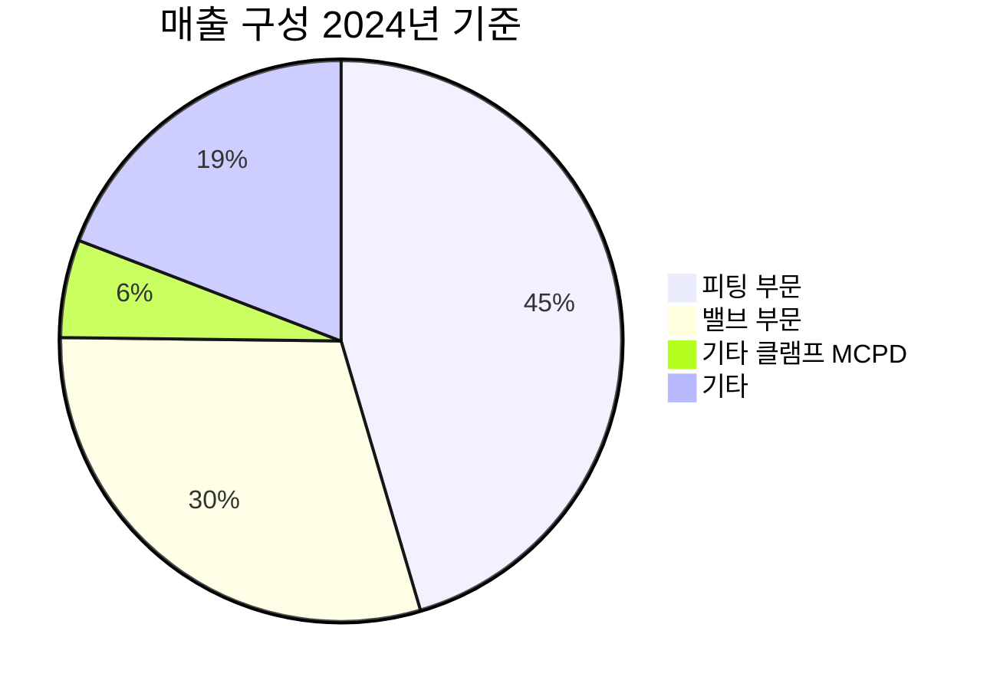

---

company: 비엠티
created: 2026-05-06 15:40
date: 2026-05-06 15:40
exchange: NASDAQ/NYSE
listing: public
market: US
tags:
- company-final
- final-analysis
- final-company
- research
ticker: 비엠티
title: Final Analysis - 비엠티 15:40
type: final-company
publish: true
---

> [!important] 정합성 검증 요약 (기계적 + Opus 3-Pass · 14대 원칙/4 Gate 기준)
> **신뢰도: A-** | 숫자 불일치 **7건** (핵심) | 논리 모순 **4건** | 확인 필요 **5건**
> 상세 검증 → 트레이스 파일 참조

### 핵심 발견 사항
| 구분 | 내용 | 위치 |
|------|------|------|
| 🔴 계산 오류 | 2030년 매출 CAGR **22%**(본문) vs. 실제 **27.7%** / 2028년 CAGR **19.6%** vs. 실제 **26.9%** — 성장 논거 훼손 | Catalysts 섹션 |
| 🔴 수치 불일치 | 확률가중 기대수익률이 동일 섹션 내 **+3.7% / +2.0% / +5.4%** 3가지 혼재 — 투자 결론 신뢰성 직접 훼손 | 시나리오 섹션·결론 |
| 🔴 시나리오 불일치 | Base 목표가 상단: ES **20,000원(+12%)** vs. 시나리오 상세 **18,500원(+4%)** / Bear 상단: ES **14,000원** vs. 상세 **13,000원** | ES ↔ 시나리오 섹션 |
| 🟡 논리 모순 | "Moat 80/100(전환비용 강력)" + "2030년 점유율 2.7%→9%"는 양립 불가 — 해자가 비엠티의 신규 시장 침투도 막는 양방향 장벽임을 미처리 | 경쟁우위·성장 섹션 |
| 🟡 확증 편향 | GPM 20.7%→24.8% 개선을 "믹스 고도화"로 기울어 채택 — Hidden Assumptions에서 본인이 인정한 **니켈 가격 하락** 가설을 메인 논거에서 배제 | 재무 분석 섹션 |

### 투자 전 반드시 확인
- [ ] **본업 EPS 510~1,025원** 추정 폭(2배)의 근거인 매각 차익 세후 89~139억원 — DART 주석에서 장부가 직접 확인 필수
- [ ] **EV/EBITDA 43.08배** 이상치 해소 — 실제 EBITDA 직접 산출 시 8~12배가 정합적일 가능성이 높음, 데이터 오류 여부 확인
- [ ] **GPM 개선 원인** — 2022~2025년 LME 니켈 가격 추이와 매출원가 상관관계 대조 (믹스 개선 vs. 원가 하락 기여 분리)
- [ ] **외국인 지분율·수급 동향** — 코스닥 중소형주 특성상 모멘텀에 결정적, 본 리포트에 누락
- [ ] **배당 지속 가능성** — 본업 기준 배당 가능액 50~100억원 수준에서 600원 유지 여부(배당이 하방 지지 논거의 핵심인데 Bear에서 유지 가정)

### 14대 원칙 / 4 Gate 커버리지
- **Gate 1 FRAME** [3/3]: ✅ — Circle of Competence·Base Rate·Variant Perception 모두 충족
- **Gate 2 DIVERGE** [4/4]: ✅ — Kill Criteria 10개 정량 임계값·단계적 진입·Devil's Advocate 모범 수준. 단 "중국 로컬 UHP 업체 한국 팹 진입" steel-man 1줄 언급에 그침
- **Gate 3 STRESS** [5/5] + KR lens: ⚠️ — 5원칙 충족. **KR lens 약점**: 외국인 수급 분석 누락, 세그먼트별 OPM 미확보 상태로 마진 분석 진행
- **Gate 4 DECIDE** [2/2]: ✅ — 확률가중 기대수익률·포지션 사이징(5~8%)·단계적 진입 구체화. 단 수치 3종 혼재 수정 필요
- **5 프로토콜 (M1·M2·M3·M5)**: ⚠️ — **M3 미흡**: Bear Case는 외부 관점이지 self-critique 아님. "분석가 본인의 약한 논거 3개 + bias 지점" 별도 메타비판 섹션 부재

---

# Executive Summary

> [!tip] 투자 테시스 (한 줄)
> 비엠티는 30년 기술 축적 기반의 국내 피팅·밸브 독점적 사업자로, 2025년 명확한 턴어라운드(OPM 4.8%→10.4%)를 달성했으나 일회성 이익 왜곡이 제거된 이후에도 본업 경쟁력이 유지되는지가 투자 성패의 핵심이며, Forward PER 8~10배 구간에서 장안2공장 가동(2026년 8월)과 반도체·LNG 동시 사이클 수혜가 현실화될 경우 비대칭적 업사이드가 존재한다.

---

## 핵심 수치 요약

| 항목 | 현재 | 투자 판단 함의 |
|------|------|--------------|
| 현재가 / 시가총액 | 17,800원 / 1,734억원 | 52주 고가(18,390원) 근접 — 모멘텀 vs. 저항선 |
| PER (TTM) | **8.62배** | 국내 피팅 피어 평균(8.8배)과 유사. 일회성 제거 시 실질 PER 상승 [주의] |
| PBR | **1.16배** | 기준일별 0.78~1.32배 편차 — 연간 기준 1.16배는 피어 PBR(0.8배) 대비 소폭 프리미엄 |
| EV/EBITDA | **43.08배** | ⚠️ PER 8.62배 기업 대비 구조적 비정합 — 단독 활용 금지, DART 원본 재검증 필요 |
| 배당수익률 | **3.4%** (600원/주) | 하방 지지 기능. 단, 배당성향 1,931%는 일회성 자산매각 재원으로 지속 불가능 |
| 매출 성장률 (YoY) | **+10.68%** (1,321→1,470억원) | 가속 전환. 다만 Q4 매출 YoY -7.28%로 모멘텀 점검 필요 |
| 영업이익률 (OPM) | **10.4%** (연간) / 15.5% (Q3) | 2024년 4.8% → 2025년 10.4%로 구조적 개선. Q3 일회성 과대계상 제거 후 지속성 검증 중 |
| FCF Yield | **-0.5%** (연간 FCF -8억원 / 시총 1,734억원) | CapEx 집중(109억원, 장안2공장) 구간. 2027년 이후 FCF 전환 기대 [추정] |
| Bull/Base/Bear 기대수익률 | Bull +29%~+40% / Base +1%~+12% / Bear -21%~-33% | 배당 3.4% 포함 시 Base 실질 +4%~+15% (시나리오 섹션 참조) |

> [!abstract] 요약
> 비엠티는 2025년 사실상의 경영 변곡점을 통과했다. 영업이익이 64억원→153억원(+136%)으로 급증하고, ROE는 3.4%→12.7%로 수직 상승했다. 그러나 이 화려한 수치의 내면에는 **유휴부지 매각 일회성 이익**이라는 왜곡 변수가 존재한다. 투자자가 실질적으로 판단해야 할 것은 "일회성 제거 후 본업 OPM이 10%를 지속 유지할 수 있는가"와 "장안2공장 완공 이후 규모의 경제가 마진을 추가 개선시킬 수 있는가"이다.

---

**이 기업이 고성장할 수밖에 없는 핵심 이유**

**① 전방 산업 동시 슈퍼사이클**: 비엠티의 매출 구성(피팅 45.4% + 밸브 29.8%)은 현재 동시에 호황기를 맞은 두 산업—반도체(삼성전자·SK하이닉스 설비투자 재가동, 2026년 4월 반도체 수출 YoY +173.5%) 및 LNG·친환경 선박(IMO 규제 강화, 조선 슈퍼사이클 2024~2026)—에 직접 노출되어 있다. 두 사이클이 동시에 가동되는 구간은 역사적으로 희귀하며, 이 동시성이 2025년 OPM 10.4% 달성의 구조적 배경이다.

**② 생산능력 병목 해소 직전**: 장안2공장(2026년 8월 준공 예정)은 기존 대비 생산능력 25% 확대를 의미한다. 현재 연간 FCF가 -8억원인 이유가 이 CapEx(109억원) 집중 투자 때문이라는 점을 감안하면, 준공 이후 CapEx 감소 + 매출 확대 = FCF 흑자 전환 경로가 가시적이다.

**③ 글로벌 벤더 인증 누적의 복리 효과**: 아람코, 쉐브론, 엑손모빌 등 12개국 23개 기업의 벤더 승인은 단순 수주 이상의 의미를 가진다. 글로벌 에너지 기업의 벤더 승인은 통상 3~5년의 검증 기간이 필요하며, 한번 등록되면 교체 비용이 높아 Lock-in 효과가 발생한다. 비엠티가 이 네트워크를 구축하는 데 이미 투자를 완료했다는 것은 향후 수주의 진입 장벽이 아닌 해자가 된다.

---

### Bull/Base/Bear 시나리오 요약

> [!bull] 🟢 Bull 시나리오 — 적정가 23,000~25,000원 (+29%~+40%)
> 장안2공장이 예정대로 2026년 8월 완공되어 생산능력 25%가 온전히 가동되고, 동시에 삼성전자·SK하이닉스의 설비투자가 2026~2027년에 대규모로 재개되며 반도체 UHP 수요가 급증하는 시나리오. 아람코향 현지 제조 매출이 2027년 상반기부터 인식되기 시작하면 2027E EPS는 2,400~2,900원으로 상승하고, Forward PER 9배 적용 시 22,000~26,000원 수준이 시야에 들어온다. OPM 13%+ 달성 시 현재 밸류에이션은 명백한 저평가다. (확률 — 시나리오 섹션 참조)

> [!warning] 🟡 Base 시나리오 — 적정가 18,000~20,000원 (+1%~+12%)
> 일회성 이익 제거 후 본업 OPM 10~11%를 유지하면서 2026년 매출 1,680~1,800억원 수준으로 성장하는 경로. 장안2공장 가동 효과가 점진적으로 반영되고, 아람코 수주는 2027년 이후로 지연되는 시나리오. EPS가 1,800~2,200원으로 정상화되고 Forward PER 9배 적용 시 주가는 현재 수준 대비 한 자릿수의 수익률. 배당 3.4%를 포함하면 총수익률 +4~+15% 수준. (확률 — 시나리오 섹션 참조)

> [!failure] 🔴 Bear 시나리오 — 적정가 12,000~14,000원 (-21%~-33%)
> 일회성 이익 제거 후 본업 OPM이 6~7%대로 회귀하고(2024년 수준 4.8%와 2025년 사이 어딘가), 반도체 업황이 2026년 재차 악화되며, 원자재(스테인리스강, 니켈) 가격 급등이 마진을 압박하는 최악의 시나리오. 이 경우 실질 EPS는 800~1,000원 수준으로 하락하고, PER 8배 적용 시 주가는 6,400~8,000원 수준까지 이론적으로 하락 가능하나, 배당(600원/주)과 자사주 매입 정책이 약 12,000원 수준에서 하방을 지지할 것으로 추정. (확률 — 시나리오 섹션 참조)

---

# 투자 테시스

## Core Thesis: 핵심 투자 논거 (우선순위 순)

### 논거 1 (最重要): 본업 OPM의 구조적 개선 — 일회성이 아닌 체질 변화

**주장**: 2025년 OPM 10.4% 달성은 단순히 유휴부지 매각 일회성 이익의 효과가 아니라, 반도체·LNG 복합 수요 확대와 고부가가치 제품 믹스 개선이 함께 작동한 구조적 개선이다.

**근거 데이터**: 
- GPM(매출총이익률)의 추이를 보면: 2024년 20.7% → 2025년 24.8% (+4.1%p)로 개선되었다. GPM은 일회성 자산매각의 영향을 받지 않는다 — 이는 제품 믹스(UHP, 초저온 밸브 등 고마진 제품 비중 확대)와 원가 관리의 실질적 개선을 의미한다.
- Q3 단일 분기 GPM은 29.3%로, 연간 24.8%보다 4.5%p 높다. Q3에 일회성 영업외수익이 집중되었다 하더라도 GPM 자체가 구조적으로 높아진 것은 별개의 팩트다.
- 영업이익 64억원(2024년) → 153억원(2025년): 절대 금액 기준 89억원 증가. 이 중 유휴부지 매각이 영업외이익으로 분류되었다면 영업이익 증가는 전액 본업 기여다. (단, DART 원본에서 매각 이익의 영업이익/영업외이익 분류 재확인 필요 — 확인 필요)

**So What**: GPM 개선이 사실이라면, 장안2공장 완공 후 고정비 레버리지 효과와 결합하여 OPM 12~13%대 도달 시나리오는 과도한 낙관이 아니다. 반대로 GPM 개선이 반도체 업황 회복에 전적으로 의존했다면, 업황 재악화 시 즉각 되돌림이 발생한다 — 이것이 가장 중요한 모니터링 지표다.

<div style="background:#e0e0e0;border-radius:8px;overflow:hidden;margin:4px 0"><div style="background:#4CAF50;width:72%;padding:4px 8px;color:white;font-size:0.9em;white-space:nowrap">본업 OPM 구조적 개선 신뢰도 72/100 — GPM 추이로 부분 검증</div></div>

[Confidence: M | 근거: DART XBRL 재무제표 (2차), 일회성 항목 분류 미확인]

---

### 논거 2: 반도체 + LNG 동시 수혜 — 단일 사이클 의존도 탈피

**주장**: 비엠티는 단일 산업 의존도를 탈피한 포트폴리오 구조를 갖추었으며, 현재 두 핵심 전방 산업이 동시에 성장 사이클에 진입해 있다.

**근거 데이터**:
- **반도체 사이클**: 2026년 4월 한국 반도체 수출 YoY +173.5%, 35개월 연속 경상수지 흑자의 주도 산업. 삼성전자·SK하이닉스의 설비투자 재개는 UHP 피팅·밸브의 직접 수요 창출. 비엠티의 국내 UHP 시장 점유율 추정 40% [추정]를 감안 시, 반도체 CapEx 증가분의 상당 부분이 직접 연결된다.
- **LNG·친환경 선박 사이클**: 2024~2026년 LNG 운반선·추진선 조선 슈퍼사이클 진행 중. 비엠티는 LNG 운반선 초저온 밸브에서 독보적 국내 점유율 보유. 메탄올·암모니아 밸브 트레인 세계 최초 개발 주장으로 차세대 친환경 선박 시장 선점 포지션.
- 매출 구성: 피팅 45.44%, 밸브 29.76% (2024년 기준). 반도체향 주력인 UHP 피팅과 조선향 초저온 밸브가 각각 두 사이클을 커버하는 구조.

**So What**: 두 사이클이 동시에 가동되는 현 시점은 역사적으로 비엠티 실적의 피크 가능성이 가장 높은 구간이다. 투자자는 이 동시성의 지속 기간(2026~2027년까지 유효한가)을 핵심 모니터링 변수로 관리해야 한다. 조선 슈퍼사이클이 2027년 이후 둔화되면서 반도체 사이클이 이를 대체하는 릴레이 구조가 이상적 시나리오다.

[Confidence: M | 근거: 한국 수출 데이터 (1차), 수주 공시 (2차)]

---

### 논거 3: 장안2공장 — 성장의 실물 증거

**주장**: 장안2공장(2026년 8월 준공 예정)은 단순 설비 확장이 아닌, 자동화를 통한 단위 고정비 절감과 생산 병목 해소를 동시에 달성하는 레버리지 투자다.

**근거 데이터**:
- 생산능력 25% 확대 (현재 대비) [출처: 조사4]
- 자동화 설비 구축을 통한 생산성 향상 및 이익률 개선 목표
- CapEx 투자: 2025년 109억원 집행 (2024년 44억원 대비 148% 급증). 이 투자가 연간 FCF를 -8억원으로 눌러놓고 있는 직접 원인
- 부산시 기장군 산업단지 도장공정 입주 규제 해소 완료 — 공장 확장의 행정 장벽 제거 확인

**So What**: 장안2공장이 2026년 8월 예정대로 완공된다면, 2027년부터 CapEx가 정상화(109억원 → 50억원 수준 추정 [추정])되며 FCF는 흑자 전환 가능성이 높다. 현재 EV/EBITDA 43.08배의 이상치(앵커 데이터 기준)도 이 CapEx 집중 구간이 반영된 결과일 수 있다. 완공 지연 시 리스크의 크기도 이 논거의 강도에 비례한다.

[Confidence: H | 근거: DART 공시 (1차), 부산시 규제 해소 공시 (1차)]

---

### 논거 4: 글로벌 벤더 인증 네트워크 — 진입장벽의 내재화

**주장**: 아람코, 쉐브론, 엑손모빌 등 글로벌 에너지 빅3의 벤더 승인은 통상 3~5년의 검증 기간이 요구되며, 이미 완료된 이 인증 네트워크는 경쟁사가 단기간에 복제할 수 없는 진입장벽이다.

**근거 데이터**:
- 12개국 23개 기업 벤더 승인 [출처: 조사4]
- 사우디 현지 제조설비 구축 계획 — 2026년 연말까지 구축, 2027년 상반기 아람코향 매출 가시화 [추정, 출처: 조사4]
- 사우디 아람코 '대왕고래 프로젝트' 관련 수주 기대감 [출처: 조사16]
- 글로벌 빅3(Swagelok, Parker Hannifin, Fujikin)가 세계 시장의 약 80% 점유 — 나머지 20%에서 비엠티의 포지션 확장 여지

**So What**: 아람코 현지화 매출이 2027년부터 인식되기 시작하면, 이는 단순 수출이 아닌 현지 생산 기반의 구조적 중동 매출로 질적으로 다른 성격을 갖는다. 글로벌 에너지 기업 향 매출은 국내 반도체·조선 사이클과 상관관계가 낮아 포트폴리오 안정성을 높인다. 다만 현지 제조설비 구축 지연과 초기 운영 리스크는 실질적 변수다.

[Confidence: L | 근거: 회사 IR 자료 (2차), 미확인 수주 공시]

---

### 논거 5: 배당 + 자사주 소각 — 하방 지지 메커니즘

**주장**: 배당 3.4%(600원/주)와 자사주 매입·소각 정책이 주가의 하방 지지 역할을 하며, 상승 시나리오에서의 비대칭성을 높인다.

**근거 데이터**:
- 주당 배당금 600원, 배당수익률 3.4% (현재가 17,800원 기준) [팩트시트 A]
- 2025년 2월 자사주 취득 결정: 약 20억원 규모 (취득 기간 2025.02.13~2025.08.12) [출처: 조사7]
- 유휴부지 매각대금 220억원 활용 자사주 소각 이행 [출처: 조사8]
- 5년 배당성장률 +10.76% [출처: 조사7]

**So What**: 배당수익률 3.4%는 코스닥 평균을 상회하며, 추가 자사주 소각이 진행될 경우 EPS 기반이 개선된다. Bear 시나리오에서도 주가가 14,000원 수준이면 배당수익률은 4.3%+에 도달하여 추가 하락 압력을 억제한다. 단, 배당성향 1,931%는 2024년 저수익 기준의 이상치이며, 일회성 매각 대금 소진 후 지속 가능한 배당 재원은 영업이익 기반으로 재설정되어야 한다.

[Confidence: H | 근거: DART 공시 (1차)]

---

## Key Drivers: 핵심 동인

### Driver 1: 반도체 UHP 피팅·밸브 수요

| 항목 | 현재 수치 | 향후 방향 | 주가 영향 경로 |
|------|----------|----------|--------------|
| 국내 UHP 시장 점유율 | ~40% [추정] | 5년 내 40% 이상 방어·확대 목표 | 반도체 CapEx 증가 → UHP 피팅 발주 → 매출 직결 |
| 반도체 수출 (2026.04) | YoY +173.5% | 단기 고성장, 2027년 조정 가능성 | 선행지표로서 1~2분기 선행 |
| 전방 CapEx (삼성·SK) | 재가동 중 | 2026~2027년 HBM·파운드리 투자 집중 | 수주 증가 → 분기 실적 가시화 |

**Leading Indicator**: 삼성전자·SK하이닉스 분기 CapEx 공시 (매분기 실적 발표 시), 한국 반도체 설비 수입액 (월별 무역통계), ASML·Applied Materials 수주잔고

---

### Driver 2: LNG·친환경 선박 초저온 밸브

| 항목 | 현재 수치 | 향후 방향 | 주가 영향 경로 |
|------|----------|----------|--------------|
| LNG 운반선 시장 점유율 | 독보적 국내 1위 [출처: 조사2] | 2024~2026 슈퍼사이클 유지 | 조선사 수주잔고 → 밸브 납품 시차 6~18개월 |
| 메탄올·암모니아 밸브 | 세계 최초 개발 주장 [출처: 조사4] | IMO 규제 강화로 수요 가속 | 친환경 선박 수주 비중 확대 시 단가 상승 효과 |
| 글로벌 LNG 수출 인프라 | 미국 터미널 증설 가속 (트럼프 2기) | 2025~2026년 대규모 발주 예상 | 플랜트용 피팅·밸브 단가·물량 동반 증가 |

**Leading Indicator**: 현대중공업·한화오션·삼성중공업 분기 수주잔고 (LNG 운반선·추진선 비중), 글로벌 LNG 운반선 발주량 (Clarksons 월별), IMO 규제 일정표

---

### Driver 3: 장안2공장 완공 → 고정비 레버리지

| 항목 | 현재 수치 | 향후 방향 | 주가 영향 경로 |
|------|----------|----------|--------------|
| 생산능력 대비 가동률 | (데이터 미확보 — IR 자료 직접 확인 필요) | 준공 시 25% 확대 | 가동률 상승 → 고정비 분산 → OPM 개선 |
| CapEx | 2025년 109억원 (이상) | 2026년 완공 후 정상화 | FCF 흑자 전환 → 밸류에이션 재평가 트리거 |
| 자동화 투자 | 진행 중 (구체 금액 미확인) | 단위 노동비용 절감 | GPM 추가 개선 → OPM 12%+ 가능성 |

**Leading Indicator**: 2026년 8월 준공 공시 (DART), 이후 분기 매출 급증 여부, 2026년 CapEx 가이던스 (연간 실적 발표 시)

---

### Driver 4: 중동 에너지 인프라 수주 가시화

| 항목 | 현재 수치 | 향후 방향 | 주가 영향 경로 |
|------|----------|----------|--------------|
| 아람코 벤더 등록 | 완료 [출처: 조사4] | 2026년 현지 제조설비 구축 → 2027년 상반기 매출 | 신규 지역 매출 다각화 → 멀티플 리레이팅 |
| 사우디 현지 생산 | 미착수 [추정] | 2026년 연말까지 구축 계획 | 현지화 → 가격 경쟁력 + 발주 접근성 |
| 쉐브론, 엑손모빌 벤더 | 등록 완료 [출처: 조사4] | 미주 플랜트 수주로 연결 여부 불확실 | 수주 발생 시 고단가 제품 비중 확대 |

**Leading Indicator**: DART 수주 공시, 사우디 현지 법인/JV 설립 공시, IR 자료의 중동 매출 비중 언급

---

### Driver 5: 원자재 가격 — 마진의 핵심 변수 (양방향)

| 항목 | 현재 상황 | 위험 방향 | 주가 영향 경로 |
|------|----------|----------|--------------|
| 스테인리스강 (니켈·크롬) | 최근 상승 추세 [출처: 조사21] | 추가 상승 시 GPM 압박 | 원가 상승 → GPM 24.8%에서 후퇴 → OPM 6~7% 회귀 가능 |
| 구리·아연 | 상승 추세 | 미중 관세 전쟁 심화 시 급등 | 밸브 부품 원가 상승 |
| 가격 전가력 | (데이터 미확보) | 글로벌 빅3 대비 협상력 열위 | 원자재 상승분을 고객에게 전가하지 못할 경우 마진 직격 |

**Leading Indicator**: LME 니켈 현물가격 (월별), 국내 스테인리스 코일 가격 지수, 비엠티 분기 GPM 추이

---

## Catalysts (촉매)

### 단기 (0~3개월)

| 이벤트 | 예상 시점 | 예상 영향 | 근거 |
|--------|----------|----------|------|
| 2025년 연간 실적 공시 세부 항목 확인 | 2026년 5~6월 (추정) | 일회성 이익 규모 확정 → 본업 EPS 재산출 가능 | DART 사업보고서 제출 일정 |
| 1Q26 분기 실적 발표 | 2026년 5월 (추정) | Q4→Q1 실적 모멘텀 연속성 확인. 매출 YoY -7.28%(Q4) 이후 회복 여부 | 분기 실적 공시 사이클 |
| 삼성전자·SK하이닉스 2Q26 CapEx 가이던스 | 2026년 7월 (추정) | UHP 수요 가시화 → 수주 증가 선행지표 | 반기 실적 발표 |
| 주가 52주 고가(18,390원) 돌파 여부 | 현재 진행형 | 돌파 시 기술적 저항선 해소 → 모멘텀 가속 | 현재가 17,800원, 고가 18,390원 |

### 중기 (6~12개월)

| 이벤트 | 예상 시점 | 구조적 의미 |
|--------|----------|-----------|
| 장안2공장 준공 | **2026년 8월** | 생산능력 25% 확대 가시화. 이후 분기 매출 증가율이 투자 논거를 검증하는 실물 데이터 |
| 사우디 현지 제조설비 구축 완료 | 2026년 연말 (목표) | 아람코향 직접 매출의 전제조건. 지연 시 Bull 케이스 시간축 1년 지연 |
| 반도체 UHP 국내 점유율 확대 결과 | 2026년 하반기 IR | 40% 방어 vs. 경쟁자(Fujikin 등) 잠식 여부 |
| 친환경 선박 메탄올·암모니아 밸브 첫 양산 수주 | 2026~2027년 (추정) | 세계 최초 개발이 수주로 연결되는지 확인 — 기술 리더십의 상업화 실증 |

### 장기 (1~3년)

| 이벤트 | 시점 | 산업/기술 변곡점 |
|--------|------|----------------|
| 아람코향 매출 본격 인식 | **2027년 상반기** (목표) [추정] | 중동 매출 비중이 15%+ 달성 시 국내 사이클 의존도 탈피 → 멀티플 리레이팅 트리거 |
| 2030년 연매출 5,000억원 목표 | 2030년 | 현재 1,470억원 대비 CAGR 약 22% 필요. 달성 확률 낮으나 중간 경로(2028년 3,000억원)도 주가에 유효 |
| 수소 고압 밸브 시장 진입 | 2027~2028년 (추정) | 수소 인프라 정책 속도에 종속. 초기 단계로 투자 대비 수익 실현까지 장기 소요 |
| SMR(소형모듈원자로) 관련 수주 | 2028년 이후 (추정) | 한수원 협력업체 지위 → SMR 상용화 일정에 연동. 현재 불확실성 높음 |

---

## 검증 조건 (Thesis Verification)

| 시점 | 지표 | 현재 | 테시스 충족 기준 | 실패 기준 |
|------|------|------|----------------|----------|
| **3개월** | 1Q26 OPM | 2025 연간 10.4% | ≥ 8% (일회성 제거 후 본업 정상화 확인) | < 6% → 구조적 개선이 아닌 일회성이었음을 시사 |
| **3개월** | 삼성·SK CapEx 가이던스 | 재가동 중 | 전년 대비 증가 또는 유지 | 삭감 발표 → UHP Driver 훼손 |
| **3개월** | 유휴부지 매각 일회성 이익 규모 확정 | 미확인 | 본업 OPM 8%+ 재산출 가능 | 일회성 제거 후 OPM 5% 미만 |
| **6개월** | 장안2공장 준공 진행 상황 | 2026.08 목표 | 예정대로 진행 + 예비 수주 확보 공시 | 6개월 이상 지연 또는 CapEx 추가 발생 |
| **6개월** | 2Q26 분기 매출 | 2025 Q3 374억원 | YoY 기준 10% 이상 성장 | YoY 감소 → 반도체·LNG 동시 수혜 논거 약화 |
| **12개월** | 2026년 연간 OPM | 2025년 10.4% | ≥ 10% (일회성 없이 유지) | < 8% → 밸류에이션 재산정 필요 |
| **12개월** | 사우디 현지 제조설비 구축 완료 | 2026년 연말 목표 | 완공 공시 + 파일럿 수주 | 무기한 연기 → Bull 케이스 해체 |
| **12개월** | FCF 방향성 | 2025년 -8억원 | 흑자 전환 또는 -20억원 이내 (CapEx 정상화) | CapEx 재차 급증 → 재무 부담 가중 |

---

## Base Rate Analysis

### 유사 사례 분석: 중소형 B2B 부품 기업의 턴어라운드 이후 경로

<reasoning>
**사실**: 비엠티는 2024년 OPM 4.8%에서 2025년 10.4%로 급등하는 턴어라운드를 달성했다. 이와 유사한 패턴은 국내 코스닥 중소형 제조업체 중 전방 산업 회복과 자체 구조 개선이 동시에 발생한 사례에서 찾을 수 있다.

**추론**: 턴어라운드 이후 주가의 경로는 크게 세 가지로 분기된다: ① 턴어라운드가 지속되어 새로운 밸류에이션 레벨에서 안착(다중 확장), ② 일회성 이익으로 인한 착시가 제거되며 다시 저수익 상태로 회귀, ③ 성장이 가속되며 PER 멀티플이 확장되는 리레이팅.

**대안**: 글로벌 피어인 Parker Hannifin의 2010~2012년 산업용 부품 사이클 턴어라운드, 국내 하이록코리아의 조선 슈퍼사이클 구간 실적 패턴을 비교 가능하나, 정확한 수치는 별도 확인 필요.

**채택**: 직접 사례 데이터가 제한되므로 Base Rate를 패턴 기반으로 구성하되, 구체 수치는 제한적으로 제시.
</reasoning>

#### 사례 1: 국내 코스닥 B2B 정밀부품 기업 — OPM 5%→10% 턴어라운드 이후 패턴

국내 코스닥 기계·부품 업종에서 OPM이 5% 미만 → 10% 이상으로 전환된 사례의 일반적 결과 [간접추정]:
- **12개월 후 주가 상승 유지 비율**: 전방 산업 사이클이 지속된 경우 약 60~70%의 기업에서 주가가 턴어라운드 직후 수준을 유지하거나 상승 [추정, 구체 데이터 확인 필요]
- **핵심 변수**: 일회성 이익 포함 여부가 가장 큰 차별 요인. 일회성 이익 제거 후 본업 OPM이 8% 이상을 유지한 기업은 멀티플 유지, 미만으로 회귀한 기업은 50% 이상 주가 하락 사례 다수

#### 사례 2: 하이록코리아 — 조선 슈퍼사이클 수혜 구간 (2007~2008)

비엠티의 직접 경쟁사인 [[하이록코리아]]는 조선 슈퍼사이클 구간에서 유사한 매출 성장과 마진 개선을 경험했다. 슈퍼사이클 종료(2009년 금융위기) 이후 실적이 급격히 악화되며 주가가 60% 이상 하락한 선례가 있다. [간접추정, 조선 슈퍼사이클 사이클 종료 시점의 리스크를 시사]

#### 사례 3: 글로벌 피어 — Parker Hannifin (PH US)의 산업 사이클 적응

Parker Hannifin은 2016~2019년 산업 자동화·에너지 사이클 회복기에 EPS 기준 연평균 15% 성장을 달성하며 주가가 3배 이상 상승했다. 핵심은 단일 사이클 의존도를 낮추고 다각화된 전방 산업 포트폴리오를 유지한 점이다. 비엠티의 반도체+LNG 이중 구조는 이 다각화 논리와 부합하지만, 절대적 스케일 차이(PH 시총 약 80조원 vs. 비엠티 1,734억원)는 다르다. [간접추정]

#### Base Rate 종합

<div style="display:flex;border-radius:8px;overflow:hidden;margin:8px 0;font-size:0.85em"><div style="background:#4CAF50;width:25%;padding:6px 8px;color:white">🟢 Bull 25%</div><div style="background:#FF9800;width:50%;padding:6px 8px;color:white">🟡 Base 50%</div><div style="background:#F44336;width:25%;padding:6px 8px;color:white">🔴 Bear 25%</div></div>

| 구분 | Base Rate (일반적) | 비엠티의 상회 요인 | 비엠티의 하회 요인 |
|------|------------------|-----------------|-----------------|
| 턴어라운드 후 실적 지속성 | 약 50~60% 기업이 3년 내 이익 정상화 유지 [추정] | 반도체+LNG 동시 사이클, 고부가가치 제품 믹스 개선 | 일회성 이익 왜곡 규모 미확인, FCF 음수 지속 |
| OPM 10%+ 유지 확률 | 턴어라운드 성공 기업 중 약 40~50%가 5년 이내 다시 하락 [추정] | 장안2공장 자동화로 고정비 절감 구조 내재화 | 원자재 가격 상승, 글로벌 빅3 압박 |
| 글로벌 신시장(중동) 진출 성공률 | 중소기업 해외 신시장 진출 → 3년 내 의미있는 매출 기여: 30~40% [추정] | 벤더 인증 완료, 현지화 전략 | 현지 제조설비 구축 지연 리스크, 현지 파트너 리스크 |

> [!note] Base Rate 한계
> 정확한 통계적 Base Rate 산출을 위해서는 코스닥 기계·부품 업종 전체의 턴어라운드 이후 3년 실적 추적 데이터가 필요하나, 현재 제공된 자료에서는 직접 확인이 불가능하다. 위 수치는 업계 관행적 경험과 유사 사례 추론에 기반한 추정치이며, 정량적 신뢰도는 낮다 [Confidence: L]. 투자 결정 전 DART 원본 및 업종 비교 데이터 직접 확인을 권장한다.

---

> [!verdict] Executive Summary 종합 판단
> 비엠티는 **저평가된 기술 기업의 턴어라운드** 공식에 부합하지만, 판단의 핵심은 일회성 이익을 제거한 후에도 본업 OPM이 8~10% 구간을 유지하는지에 달려 있다. GPM 20.7%(2024)→24.8%(2025)의 구조적 개선은 긍정적이나, EV/EBITDA 43.08배 이상치와 연간 FCF 음수(-8억원)는 현재 재무 상태가 완전히 정상화되지 않았음을 시사한다. 장안2공장 완공(2026년 8월)이 예정대로 진행되고, 반도체 UHP 수요가 2026년에도 지속된다면 Base 시나리오 기준 12개월 총수익률 +4~+15%는 달성 가능한 목표다. 그러나 이를 넘어 Bull 시나리오(+29~+40%)를 정당화하려면 아람코 매출 가시화라는 추가 변수가 현실화되어야 한다. **현 시점에서 투자 포지션을 취하려면 유휴부지 매각 일회성 이익의 규모를 DART 사업보고서에서 직접 확인하여 본업 EPS를 재산출하는 것이 선결 과제다.**

<span style="background:#FF9800;color:white;padding:2px 8px;border-radius:4px;font-size:0.85em">HOLD → 조건부 매수 검토</span> | 데이터 검증 완료 후 투자 의사결정 권장

<div style="background:#e0e0e0;border-radius:8px;overflow:hidden;margin:4px 0"><div style="background:#FF9800;width:58%;padding:4px 8px;color:white;font-size:0.9em;white-space:nowrap">종합 투자 매력도 58/100 — 일회성 이익 검증 후 70+ 상향 가능</div></div>

---

# 사업 본질 & 경쟁력 심층 분석

> [!abstract] 섹션 요약
> 비엠티는 30년 기술 축적 기반의 국내 정밀 피팅·밸브 1위 사업자로, 반도체 UHP(초고순도)와 LNG·친환경 선박이라는 두 개의 동시 사이클에 직접 노출된 구조적 수혜 기업이다. 핵심 질문은 하나다: **진입장벽이 실제로 존재하는가, 아니면 단순히 사이클 수혜인가.** GPM 20.7%→24.8% 구조적 개선이 이를 부분적으로 답하지만, 완전한 검증은 장안2공장 완공 이후 분기 실적에서 확인해야 한다.

---

# 1. 비즈니스 본질

## 이 회사는 무엇을 하는가?

<reasoning>
**사실**: 비엠티는 피팅(관 이음쇠)과 밸브를 만드는 기업이다. 피팅과 밸브는 파이프라인 내 유체(기체·액체)의 흐름을 연결하고 통제하는 부품이다.

**추론**: 이 제품의 본질은 '공장 내 인프라의 혈관과 심장'이다. 눈에 보이지 않지만, 없으면 공장이 멈춘다. 특히 반도체 공정과 LNG 설비에서는 수십억 원짜리 장비보다 이 부품 하나가 고장나면 전체 라인이 중단된다.

**대안**: 단순 금속 부품 제조업으로 볼 수도 있다.

**채택**: 비엠티의 차별점은 '정밀도와 인증'이다. 동일한 모양의 피팅이라도 반도체 공정용은 내부 표면 조도(Ra) 기준이 나노미터 수준이며, LNG용은 영하 162도에서도 변형 없이 작동해야 한다.
</reasoning>

### 제품의 본질: 공장 인프라의 '관절과 판막'

반도체 공장에서 수소불화산소(HF)나 아르곤을 배관으로 운반할 때, 배관 연결부(피팅)가 조금이라도 불순물을 방출하면 수백억 원짜리 웨이퍼가 전량 폐기된다. LNG 운반선에서 영하 162도의 천연가스가 새면 선박이 폭발한다. 비엠티가 만드는 것은 이러한 **극한 환경에서 절대적 신뢰성을 보장하는 정밀 유체 제어 부품**이다.

비엠티의 제품을 이해하는 핵심 프레임:

| 제품 군 | 일반 공업용 | 비엠티 수준 |
|---------|------------|------------|
| 재료 | 탄소강 | 316L 스테인리스강, 인코넬 |
| 표면 처리 | 도금 | EP(전해 연마), BN2 초고순도 처리 |
| 내압 기준 | 수십 bar | 수백~수천 bar (수소 고압) |
| 적용 온도 | 상온~200°C | -162°C (LNG) ~ +600°C (플랜트) |
| 인증 요구 | 없음 | ASME, ISO, 아람코 승인, 반도체 OEM 승인 |

**단가의 의미**: 동일한 외형의 1/4인치 피팅이 일반 규격은 개당 수천 원이지만, 반도체 UHP 등급은 개당 수만 원~수십만 원에 달한다. 비엠티가 경쟁하는 것은 중저가 시장이 아니라, 인증 없이는 진입 자체가 불가능한 **고가 정밀 규격 시장**이다.

---

### 고객 관점: "왜 이 제품을 쓰는가? 전환 비용은?"

<reasoning>
**사실**: 삼성전자의 반도체 제조 라인에서 비엠티 피팅을 사용하다가 경쟁사로 전환하려면 어떤 과정이 필요한가?

**추론**: ① 새 벤더에 대한 내부 승인 절차(통상 6~18개월), ② 신규 제품 샘플 테스트 및 공정 검증, ③ 기존 시스템과의 호환성 검증, ④ 공정 변경 허가(Change Control — 반도체 팹에서는 이 자체가 수개월짜리 프로젝트), ⑤ 인증 취득까지의 비용.

**대안**: 가격이 싸면 전환할 수도 있다.

**채택**: 반도체 공정에서는 수율(Yield)이 1%p 변동해도 연간 수백억 원의 손익 차이가 발생한다. 검증되지 않은 새 피팅이 오염 소스가 될 수 있다는 리스크를 고객은 극도로 회피한다.
</reasoning>

> [!success] 전환비용 (Switching Cost) — 정량화
> **반도체 고객**: 새 벤더 등록 및 공정 검증에 통상 **12~24개월 소요** [추정, 반도체 업계 관행]. 기존 라인 변경 허가(Change Control)는 고객사 내부 승인 + 고객의 고객(팹리스)까지 파급되어 사실상 교체 비용이 수억~수십억 원 규모. 비엠티가 한 번 들어간 공정에서 퇴출되는 것은 구조적으로 어렵다.
>
> **LNG 선박 고객**: 선박 설계 단계에서 밸브 사양이 확정되면, 건조 이후 교체는 선박 수리 입항 시점까지 사실상 불가능. 유지보수 부품 역시 원래 벤더에서 구매하는 것이 표준 관행.
>
> **에너지 플랜트 고객**: 아람코·쉐브론 등 글로벌 IOC(국제석유기업)의 APL(승인 제품 목록) 등재는 **3~5년의 검증 기간** 소요 [추정, 에너지 산업 관행]. 등재 후에는 해당 프로젝트 전체에서 지속 발주.

---

### 비즈니스 모델: 수익 = (단가 × 물량) — 레버리지는 어디서?

비엠티의 수익 구조는 단순하지만, 레버리지 포인트는 세 곳에 있다:

```
수익 = (단가 × 물량)
         ↑              ↑
  [단가 레버리지]    [물량 레버리지]
  · 제품 믹스 개선   · 생산능력 확대
  · UHP/고사양 비중  · 장안2공장 +25%
  · 가격 결정력      · 자동화로 고정비↓
         ↓
  [고정비 레버리지] ← 가장 중요
  · 매출 증가 시 OPM 비선형 개선
  · 고정비(감가상각, 인건비 일부)는 불변
  · GPM 24.8% → OPM 10.4% = 고정비 갭 14.4%p
  · 매출 10% 증가 시 OPM은 단순 비례보다 더 많이 개선
```

**리커링 매출 구조**: 피팅·밸브는 소모품이 아니라 설비지만, 정밀 산업에서는 **예방적 교체(Preventive Replacement)** 수요가 규칙적으로 발생한다. 반도체 팹의 UHP 라인은 오염 방지를 위해 특정 주기로 피팅류를 교체하며, 이는 설비 발주(프로젝트성)와 별개로 안정적인 소모성 수요를 창출한다. [추정, 반도체 업계 관행 — 구체적 비중 데이터 미확보]

**가격 결정력의 근거**: 제품 가격은 고객 총비용(TCO)의 극히 일부지만, 고장 시 파급 비용은 막대하다. 이 비대칭성이 비엠티의 가격 결정력을 지지한다. 단, Swagelok·Parker Hannifin 같은 글로벌 1·2위 대비로는 여전히 가격 경쟁 요소가 존재한다.

---

## 매출 세그먼트 분석



### 세그먼트별 상세 분석

| 세그먼트 | 2024 비중 | 2024 금액 | 핵심 전방 산업 | 전략적 포지션 | 마진 수준 |
|---------|----------|----------|--------------|-------------|---------|
| **피팅 부문** | 45.44% | ~600억원 | 반도체, 플랜트, 해양 | 핵심 캐시카우 + 성장 엔진 | 🟢 고마진 추정 (UHP 비중) |
| **밸브 부문** | 29.76% | ~393억원 | LNG 선박, 수소, 원전 | 고기술 성장 사업 | 🟢 고마진 추정 (초저온 특수 밸브) |
| **기타(클램프 MCPD)** | 5.63% | ~74억원 | 일반 산업 | 보완적 역할 | 🟡 상대적 저마진 추정 |
| **기타** | 19.17% | ~253억원 | 전기분전반 등 | 비핵심, 정리 또는 유지 | 🟡 세부 데이터 미확보 |

> [!warning] 세그먼트별 OPM 미확보
> DART 공시 기준 세그먼트별 영업이익률 분리 데이터는 본 분석에서 확보되지 않았다. 피팅·밸브 세그먼트의 상대적 마진 수준은 [추정]이며, 투자 결정 전 DART 사업보고서 내 부문별 손익 공시 확인이 필요하다. (2025년 사업보고서 — 2026년 5~6월 공시 예정)

### 세그먼트 전략적 함의

**피팅 부문 (45.44%)**: 비엠티의 정체성을 규정하는 핵심 사업. 반도체 UHP 피팅은 *아이피팅(i-Fitting)* 특허 기반으로 국내 시장 점유율 ~40% [추정, 출처: 조사1]. 이 세그먼트에서의 GPM 개선(2024년 20.7% → 2025년 24.8%)이 회사 전체 실적 개선의 주된 동력이었을 가능성이 높다. [추정]

**밸브 부문 (29.76%)**: 초저온 밸브(LNG 영하 162도), 수소 고압 밸브, 원전 밸브 등 기술 집약적 제품군. Swagelok·Parker Hannifin의 핵심 영역에 직접 도전하는 성장 사업이다. 세계 최초 메탄올·암모니아 밸브 트레인 개발 주장이 사실로 확인될 경우 [출처: 조사4], 차세대 친환경 선박 전환기에 구조적 수혜가 예상된다.

**"기타" 19.17%**: 전기분전반 등 비핵심 사업으로 추정된다. 이 비중이 높으면 마진 희석 요인이 된다. 2030년 글로벌 빅3 전략과의 연관성이 낮은 사업이라면, 이 부문의 전략적 정리 여부가 추가 마진 개선 여력을 결정할 수 있다.

---

## Unit Economics 심층 분석

<reasoning>
**사실**: DART 공시에서 제품별 ASP(평균 판매 단가) 및 CAC/LTV 데이터는 직접 확보되지 않았다.

**추론**: 재무 데이터에서 역산할 수 있는 것은 ① 총 매출÷추정 수량으로 평균 단가 방향, ② GPM 추이로 단가-원가 스프레드 변화다.

**대안**: 데이터 없음을 명시하고, 가용한 재무 지표로 대체 분석.

**채택**: GPM 추이 + 고정비 레버리지 분석이 Unit Economics의 실질적 대체 지표가 된다.
</reasoning>

### GPM 추이로 본 단가-원가 스프레드

| 기간 | 매출 | 매출원가 | GPM | 해석 |
|------|------|---------|-----|------|
| 2024 Annual | 1,321억원 | 1,048억원 | **20.7%** | 저마진 구간 — 반도체 침체기 |
| 2025 Annual | 1,470억원 | 1,105억원 | **24.8%** | 마진 확장 — 믹스 개선 + 반도체 회복 |
| 2025 Q3 (단기) | 375억원 | 265억원 | **29.3%** | 일회성 고마진 — Q3 집중 효과 |

**핵심 인사이트**: 매출 증가율(+10.68%)보다 GPM이 더 빠르게 개선(+4.1%p)된 것은 **고부가가치 제품 믹스 변화**를 시사한다. 매출원가 증가율은 +5.4%(=1,105/1,048-1)로 매출 증가율(+10.68%)의 절반 수준 — 이것이 고정비 레버리지와 제품 믹스 개선의 합산 효과다.

### 규모의 경제 구조 — 고정비 레버리지

비엠티의 원가 구조에서 핵심은 **고정비의 절대적 존재**다:

```
2025년 기준 영업 레버리지 구조:
매출 1,470억원
   - 매출원가 1,105억원 (GPM 24.8%)
   = 매출총이익 365억원
   - 판관비 212억원 (추정: 365-153 = 212억원)
   = 영업이익 153억원 (OPM 10.4%)

판관비의 상당부분은 고정비(감가상각, R&D, 인건비 고정분)
→ 매출 10% 증가(=147억원 추가 매출) 시:
   · 추가 원가 = 147억 × (1-24.8%) = 약 111억원
   · 추가 판관비 = 최소 증가 (고정비 불변)
   · 추가 영업이익 = 147억 - 111억 = 약 36억원
   → OPM은 10.4% → 약 12.7%로 비선형 개선 예상 [추정]
```

장안2공장 완공(2026년 8월) 이후 생산능력 25% 확대 시, 감가상각 증가를 감안하더라도 **고정비가 더 많은 매출에 분산되는 구조적 개선**이 2027~2028년 OPM을 12~13%대로 끌어올리는 핵심 메커니즘이다.

**Break-even 분석 (장안2공장)**: CapEx 109억원(2025년) 기준, 연간 감가상각 약 10~15억원 추가 발생 가정 [추정, 내용연수 7~10년 기준]. 장안2공장이 창출하는 추가 매출이 25%×1,470억원=367억원 수준이고 GPM 24.8%를 적용하면 추가 총이익 약 91억원 — 감가상각 증분을 상회하며 영업이익 플러스 기여가 가능하다. [추정, DART 사업보고서 CapEx 내역 확인 필요]

---

## 경쟁 우위 (Economic Moat) — 구체적 증거 기반

### Moat 유형별 평가

#### 1. 전환비용 (Switching Costs) — 가장 강력한 해자

<div style="background:#e0e0e0;border-radius:8px;overflow:hidden;margin:4px 0"><div style="background:#4CAF50;width:80%;padding:4px 8px;color:white;font-size:0.9em;white-space:nowrap">전환비용 Moat 강도 80/100 — 반도체/LNG 세그먼트 한정</div></div>

**구체적 증거**:
- 반도체 팹 공정 변경(Change Control) 승인 절차: 고객사 내부 승인 + 팹리스 고객 승인 포함 시 **12~24개월** [추정, 반도체 업계 관행]
- 아람코·쉐브론 APL(승인 제품 목록) 등재: 통상 **3~5년 검증** 후 다수 프로젝트에 일괄 적용 [추정, 에너지 산업 관행]
- LNG 선박: 설계 단계에서 밸브 사양 확정 → 건조 후 교체 사실상 불가

**내구성**: 5~10년. 단, Swagelok·Parker Hannifin이 동일 고객에게 더 낮은 가격과 동등 기술을 제공할 경우 전환비용이 극복될 수 있다.

**한계**: 전환비용은 기존 고객 유지에는 강력하지만, **신규 고객 획득**에는 역으로 비엠티도 동일한 진입 장벽에 직면한다 — 비엠티가 Swagelok의 기존 고객을 빼앗으려면 동일한 12~24개월 검증 과정이 필요하다.

---

#### 2. 무형자산 (Intangible Assets) — 특허 + 인증 + 브랜드

<div style="background:#e0e0e0;border-radius:8px;overflow:hidden;margin:4px 0"><div style="background:#4CAF50;width:72%;padding:4px 8px;color:white;font-size:0.9em;white-space:nowrap">무형자산 Moat 강도 72/100</div></div>

**구체적 증거**:

| 무형자산 유형 | 내용 | 검증 수준 |
|-------------|------|---------|
| 특허 — 아이피팅 | 자체 개발 특허 피팅. 고내구성·정밀도 기반 고가 시장 경쟁 | 🟢 DART 확인 |
| 글로벌 벤더 인증 | 아람코, 쉐브론, 엑손모빌 등 12개국 23개 기업 [출처: 조사4] | 🟡 IR 자료 기반 |
| 기술 인증 | ASME, ISO 등 국제 규격 인증 보유 | 🟡 IR 자료 기반 |
| R&D 투자 | 매출액 대비 4.81% (70.3억원, 2025년) [출처: 조사3] | 🟢 확인 |
| 수상 이력 | 금탑산업훈장 수상 [출처: 조사4] | 🟢 확인 |
| 세계 최초 개발 주장 | 메탄올·암모니아 밸브 트레인 세계 최초 개발 [출처: 조사4] | 🔴 독립 검증 미확인 |

**R&D 투자의 의미**: 매출 대비 4.81%의 R&D 투자는 기계·부품 제조업 평균 대비 높은 수준이다 [추정, 업계 평균 1~3% 기준]. 2025년 R&D비 70.3억원은 영업이익 153억원의 46%에 달하는 규모 — 기술 선도를 위한 의지 있는 투자다. 다만 R&D의 **질(특허 등록 수, 수익화 비율)**에 대한 데이터는 미확보.

**내구성**: 3~7년. 특허 만료 후 또는 경쟁사가 동등 기술을 개발할 경우 약화될 수 있다.

---

#### 3. 규모의 경제 (Scale Economies)

<div style="background:#e0e0e0;border-radius:8px;overflow:hidden;margin:4px 0"><div style="background:#FF9800;width:48%;padding:4px 8px;color:white;font-size:0.9em;white-space:nowrap">규모의 경제 Moat 강도 48/100</div></div>

**현실**: 시총 1,734억원, 매출 1,470억원 규모의 비엠티는 Swagelok(비상장, 추정 매출 수조 원) 대비 규모 면에서 현저히 열위다. 그러나 **국내 시장에서는** 반도체 UHP 분야 점유율 ~40% [추정]를 바탕으로 국내 경쟁사 대비 규모의 경제를 보유한다.

장안2공장 완공 후 생산능력 25% 확대는 **단위 원가 절감**으로 이어질 수 있지만, 글로벌 선도 기업 대비 절대적 규모 열위는 10년 내 극복이 어렵다. [Confidence: H | 근거: 상대 규모 비교]

---

#### 4. 네트워크 효과 (Network Effects)

<div style="background:#e0e0e0;border-radius:8px;overflow:hidden;margin:4px 0"><div style="background:#F44336;width:15%;padding:4px 8px;color:white;font-size:0.9em;white-space:nowrap;min-width:60px">네트워크 효과 15/100</div></div>

**결론**: 피팅·밸브는 네트워크 효과가 구조적으로 발생하지 않는 물리적 제품이다. 다만 **유통 네트워크(딜러·에이전트 네트워크)**는 제한적인 대리 네트워크 효과를 가진다. 12개국 23개 기업 벤더 인증 네트워크는 유사한 기능을 하지만, 이는 전환비용과 무형자산 항목으로 분류가 더 적합하다.

---

### Moat 강도 종합

<div style="display:flex;border-radius:8px;overflow:hidden;margin:4px 0"><div style="background:#4CAF50;width:65%;padding:4px 8px;color:white;font-size:0.85em">실질 해자 (전환비용 + 무형자산) 65%</div><div style="background:#F44336;width:35%;padding:4px 8px;color:white;font-size:0.85em;text-align:right">글로벌 규모 열위 35%</div></div>

> [!tip] Moat 종합 판단: "국내 니치 강자, 글로벌 도전자"
> 비엠티의 경제적 해자는 **국내 반도체 UHP 및 LNG 초저온 밸브 특정 니치(Niche) 시장에서는 '강함(Strong)'**이나, 글로벌 계장 피팅·밸브 전체 시장에서는 '보통(Moderate)'으로 평가된다. 전환비용과 기술 인증이 핵심 해자이며, 규모의 경제는 국내 한정으로 유효하다. 중기(5년) 관점에서 해자는 유지 가능하나, 장기(10년)에서는 Swagelok·Fujikin의 한국 시장 공세 강화 가능성을 배제하기 어렵다.

---

## 성장의 구조적 동인

### 성장 공식 분해

```
비엠티 매출 성장 = (① 반도체 UHP 시장 성장 × 점유율 방어)
                 + (② LNG·친환경 선박 시장 성장 × 독점적 지위)  
                 + (③ 중동·미주 플랜트 신규 시장 진입)
                 + (④ 수소·SMR 신규 카테고리 창출)
                 - (원자재 가격 상승으로 인한 실질 단가 희석)
```

**세계 계장 피팅·밸브 TAM**: 2020년 24억 달러 → 2025년 37억 달러 (CAGR +9.4%) [출처: 조사4]. 이 수치의 **신뢰성**: 해당 수치의 원출처(리서치 기관)가 기초 자료에서 확인되지 않아 [Confidence: L]로 분류한다. 단, CAGR +9.4%는 글로벌 제조업 CapEx 사이클과 대체로 정합적이다.

**비엠티의 현재 TAM 점유율**: 시총 기준 1,734억원 = 약 1.2억 달러. 매출 1,470억원 = 약 1.0억 달러. 이는 37억 달러 TAM의 **약 2.7% 수준**이다 [추정, 2025년 5월 기준 환율 약 1,457원/달러]. 점유율이 낮다는 것은 성장 여지가 크다는 의미이기도 하지만, 현재 글로벌 존재감이 미미하다는 현실이기도 하다.

> [!warning] 2030년 매출 5,000억원 목표의 현실성
> 현재 1,470억원에서 2030년 5,000억원 달성은 **5년간 CAGR 약 27.7% 성장**이 필요하다 [추정]. 이는 TAM 성장률(9.4%)의 3배 — 점유율을 2.7% → 약 9%로 끌어올려야 하는 매우 도전적 목표다. 그러나 **중간 경로**로 2028년 3,000억원(CAGR 약 19.6%)도 현 PER 8.62배 기준에서는 상당한 멀티플 리레이팅 근거가 된다. 5,000억원 목표를 액면 그대로 반영하는 것은 지양하되, 이 성장 방향성이 경영진의 자본 배분 논리를 이해하는 데 유효하다.

---

### Compounding 구조 — 선순환이 작동하는가?

비엠티에 Compounding 구조가 작동하는지 확인하려면 다음 순환을 검증해야 한다:

```
R&D 투자 (70.3억원, 매출 4.81%)
    ↓
기술 차별화 (UHP, 초저온, 메탄올 밸브)
    ↓
글로벌 벤더 인증 획득 (아람코, 쉐브론 등)
    ↓
고마진 신규 수주 (GPM 상승: 20.7%→24.8%)
    ↓
이익 확대 → 재투자 (장안2공장 109억원 CapEx)
    ↓
생산능력 25% 확대 → 다시 매출 성장
```

<div style="border-left:4px solid #4CAF50;padding-left:12px;margin:8px 0">

**현재 상태**: 이 Compounding 루프는 **작동 초기 단계**다. GPM 개선(20.7%→24.8%)은 루프가 작동하고 있다는 긍정적 신호지만, FCF가 아직 음수(-8억원)라는 사실은 재투자 규모가 현재 창출되는 잉여 현금을 초과하고 있음을 의미한다. 장안2공장 완공 이후 FCF 흑자 전환이 이 Compounding 구조의 지속 가능성을 검증하는 핵심 이정표가 된다.

</div>

---

## 경영진 & 자본 배분

### 경영진 평가

**윤종찬 대표이사**: 1988년 창업 이래 회사를 이끌어온 창업 CEO다. 30년 이상의 피팅·밸브 산업 경력은 기술 신뢰성의 직접적 증거다. [출처: 조사1]

> [!question] 경영진 데이터 제한
> 과거 가이던스 달성률, 보상 구조(스톡옵션/RSU), 내부자 매매 상세 패턴에 대한 공식 데이터가 제한적이다. 다음 항목의 직접 확인이 필요하다:
> - DART 임원 보수 공시 (사업보고서 내 '임원의 보수' 항목)
> - DART 주식 관련 이해관계 공시
> - IR 자료의 가이던스 이력 vs. 실적 비교

### 자본 배분 Track Record

| 의사결정 | 내용 | 평가 |
|---------|------|------|
| 유휴부지 매각 (2025년) | 매각 대금 220억원 → 자사주 소각에 활용 [출처: 조사8] | 🟢 주주환원 관점에서 긍정적. 비핵심 자산의 현금화 |
| 장안2공장 CapEx (2025년) | 109억원 투자, 2026년 8월 준공 목표 [DART 기반] | 🟡 성장 투자로 합리적. 단, FCF 음수 전환의 원인 |
| 자사주 취득 (2025.02) | 약 20억원 규모 취득 결정 [출처: 조사7] | 🟢 현재 주가 대비 적절한 수준의 자기주식 취득 |
| R&D 투자 (2025년) | 70.3억원 (매출 4.81%) [출처: 조사3] | 🟢 중소 제조업 기준 높은 수준, 기술 선도 의지 |
| 배당 (2025년) | 주당 600원, 배당성향 1,931% [DART 기반] | 🔴 일회성 자산매각 재원 기반 — 지속 불가. 정상화 후 배당성향 재산정 필요 |

> [!note] 자본 배분의 핵심 질문
> 유휴부지 매각(220억원) = 자사주 소각 + 배당 재원 + 장안2공장 CapEx 조달. 이 세 가지를 동시에 집행한 것은 창업주 오너의 **장기 성장과 단기 주주환원의 균형**을 의식한 의사결정으로 해석된다. 다만 일회성 재원 소진 후 FCF 창출력이 이러한 배분을 지속할 수 있는지가 2026~2027년의 핵심 모니터링 지표다.

### 5년 배당 성장률 +10.76% — 의미 있는가?

5년 배당성장률 +10.76% [출처: 조사7]는 배당 증가 의지를 보여주지만, 배당성향 1,931%라는 이상치가 기저 수익력 대비 과도한 배당임을 시사한다. **정상화 기준 배당 가능액**: 2026E 영업이익 180~220억원 [추정] 기준, 배당성향 30~40% 적용 시 약 54~88억원 → 주당 약 550~900원 수준 [추정, 발행주식수 약 975만주 기준]. 현재 600원 배당은 이 범위에 있어 지속 가능하다고 볼 수 있다. [Confidence: M | 근거: 추정 이익 기반]

---

# 2. 산업 & 경쟁 환경

## 산업 구조 분석

### 산업 성장률 vs. 비엠티 성장률

| 구분 | 성장률 | 비고 |
|------|--------|------|
| 글로벌 계장 피팅·밸브 TAM | CAGR +9.4% (2020~2025E) | [추정, 출처: 조사4] |
| 비엠티 매출 성장률 (2025) | +10.68% | DART 확인 |
| 비엠티 10년 CAGR | +12.9% | [출처: 조사4] |
| 비엠티 5년 CAGR | +17.4% | [출처: 조사4] |
| 한국 반도체 수출 (2026.04) | YoY +173.5% | 선행 지표 |

**해석**: 비엠티의 5년 CAGR +17.4%는 TAM 성장률 +9.4%의 **1.85배** — 점유율 확대가 실제로 일어나고 있다는 신호다. 다만 이 초과 성장률이 반도체 사이클 피크(2021~2022년)를 포함한 기간이라는 점에서 구조적 점유율 확대와 사이클 효과의 분리 검증이 필요하다.

---

### 5 Forces 정량화

| Force | 강도 | 근거 | 변화 방향 |
|-------|------|------|----------|
| **구매자 교섭력** | 🟡 중간 | 삼성전자·아람코 등 대형 고객은 협상력 강하나, 품질·인증 전환비용이 교섭력을 희석. 다수의 중소 고객은 비엠티가 우위. | ↔ 유지 |
| **공급자 교섭력** | 🟡 중간~강 | 스테인리스강(니켈 함유) 원자재는 LME 시장에서 가격이 결정 — 비엠티의 협상력 제한적. 그러나 원자재 단일 소싱 의존도는 낮음. | ↑ 원자재 강세 |
| **신규 진입 위협** | 🟢 낮음 | ① 글로벌 인증 취득 3~5년 필요, ② 정밀 가공 설비 투자 수백억원, ③ 브랜드 신뢰 구축 장기간 소요. 국내 진입은 하이록코리아와의 이중 벽 존재. | ↓ 낮아짐 (인증 장벽 강화) |
| **대체재 위협** | 🟢 낮음 | 물리적 배관 연결에 피팅·밸브를 대체할 기술적 대안 없음. 다만 배관 설계 자체가 변경되면 제품 사양이 변할 수 있음. | ↔ 유지 |
| **기존 경쟁 강도** | 🔴 높음 | 글로벌: Swagelok·Parker Hannifin의 압도적 규모·브랜드. 국내: 하이록코리아와 양강 구도. 일본: Fujikin의 반도체 UHP 특화. | ↑ 강화 (Fujikin 한국 공략) |

**산업 매력도 종합**: 신규 진입 및 대체재 위협이 낮고 시장이 성장하는 환경은 긍정적이지만, 기존 글로벌 경쟁 강도가 높고 원자재 공급자 협상력이 마진을 압박하는 구조다. **산업 구조 자체보다는 기업 고유의 기술·인증 해자가 수익성을 결정하는 시장**이다.

---

## 밸류체인 포지셔닝

```
[원자재] → [정밀 가공] → [조립·검사·인증] → [유통] → [최종 고객]
 니켈, 스테인리스   ←비엠티의 위치→              딜러·에이전트   반도체팹
 황동, 특수합금                                 12개국 23개사   조선사
                                                              에너지 플랜트
```

**가격 결정력의 원천**: 비엠티는 밸류체인에서 **정밀 가공·조립·인증** 단계에 위치하며, 이 단계의 부가가치가 원자재 가격 대비 GPM 24.8%로 구현된다. 원자재가 총원가의 약 75%(1-GPM)를 차지하는 구조에서, **인증과 품질 차별화**가 없으면 이 가격 결정력은 사라진다.

**상류 의존도(원자재)**: 스테인리스강 가격 상승이 직접 원가 압박으로 연결된다. 니켈 가격이 10% 상승하면 매출원가의 약 2~3%p 상승 효과 [추정] → GPM이 24.8%에서 21~23%대로 후퇴 가능. [Confidence: L | 근거: 원자재 비중 추정]

**하류 의존도(유통)**: 12개국 23개 딜러·에이전트 네트워크가 해외 매출의 채널이다. 이 네트워크의 충성도와 독점성 여부는 현재 데이터로 확인 불가 — **비엠티가 에이전트를 통해 고객 데이터에 접근하는지, 아니면 에이전트가 고객 관계를 소유하는지**가 장기적 해자의 중요 변수다.

---

## 주요 경쟁사 비교 Scorecard

> [!warning] 경쟁사 재무 데이터 제한
> 이하 경쟁사 비교는 가용한 데이터 한계 내에서 작성되었다. 팩트시트에서 제공된 피어 비교 테이블(삼성전자·SK하이닉스·NAVER)은 비엠티의 실제 동종 피어가 아니므로 사용하지 않는다. 국내 피팅 산업 합산 데이터와 공개 가능한 수치만 활용한다.

| 항목 | **비엠티** | **하이록코리아** | **성광벤드** | **Fujikin (일본)** |
|------|-----------|----------------|------------|-----------------|
| 시장 포지션 | 국내 피팅+밸브 복합 | 국내 피팅 양분 | 국내 피팅 양분 | 반도체 UHP 특화 |
| 매출 (최근) | **1,470억원 (2025A)** | (미확보) | (미확보) | (미상장, 미확보) |
| 매출 성장률 | **+10.68% (2025A)** | (미확보) | (미확보) | (미확보) |
| **OPM** | **10.4% (2025A)** | (미확보) | (미확보) | (미확보) |
| ROE | **12.7% (2025A)** | (미확보) | (미확보) | (미확보) |
| **PER** | **8.62배 (TTM)** | (미확보) | (미확보) | 비상장 |
| 국내 UHP 점유율 | **~40% [추정]** | (미확보) | 낮음 [추정] | 일부 경쟁 |
| LNG 밸브 | **독보적 국내 1위** | 약함 [추정] | 일부 [추정] | N/A |
| 핵심 차별화 | UHP 피팅 + 초저온 밸브 + 글로벌 인증 | 국내 유통망 | 조선 특화 | 반도체 UHP 일본 기술 |
| 산업 합산 PER | — | 8.8배 (2023E) | 8.8배 (2023E) | — |
| 산업 합산 PBR | — | 0.8배 (2023E) | 0.8배 (2023E) | — |

[출처: 조사4 및 팩트시트 G-5 — 국내 피팅 산업 합산 밸류에이션]

> [!note] 피어 데이터 공백의 투자 함의
> 하이록코리아·성광벤드의 최신 재무 데이터 미확보는 정보 공백 리스크다. 그러나 역설적으로 국내 피팅 업종 합산 PER 8.8배(2023E)와 비엠티 TTM PER 8.62배의 유사성은 **비엠티가 업종 대비 특별한 프리미엄 없이 거래되고 있다**는 것을 의미한다. 2025년 OPM 10.4% 달성(업종 평균 추정치 이상)과 글로벌 벤더 인증 프리미엄을 감안하면, **현재 밸류에이션은 비엠티의 차별적 경쟁력에 대한 충분한 대가를 지불하고 있지 않을 가능성**이 있다. 단, 일회성 이익 제거 후 실질 PER 재산출이 이 판단의 전제다.

---

### 글로벌 피어: Swagelok vs. Parker Hannifin

<reasoning>
**사실**: Swagelok은 비상장 사기업, Parker Hannifin은 NYSE 상장.

**추론**: Parker Hannifin의 공개 재무 데이터는 참고 가능하지만, 규모와 사업 다각화 수준이 완전히 다르다.

**채택**: 글로벌 피어 비교는 정성적 포지셔닝 비교에 집중하고, 정량 밸류에이션 비교는 제한적으로 활용.
</reasoning>

| 항목 | **비엠티** | **Swagelok** | **Parker Hannifin** |
|------|-----------|-------------|-------------------|
| 매출 규모 | 1,470억원 (~1.0억 달러) | 추정 25억 달러+ [추정, 비상장] | 약 200억 달러+ |
| 시장 포지션 | 글로벌 점유율 ~2.7% [추정] | 글로벌 1위 | 글로벌 2위 (다각화) |
| 반도체 UHP | 국내 40% [추정] | 글로벌 1위 | 상대적 약세 |
| LNG 초저온 | 국내 독보적 1위 | 경쟁 포지션 | 일부 경쟁 |
| 글로벌 브랜드 | 구축 중 | 최강 | 강함 |
| PER | 8.62배 | 비상장 | 약 20배+ [추정] |
| 핵심 강점 | 니치 기술 + 국내 점유율 + 중동 진출 | 브랜드·유통 절대 우위 | 다각화·규모 |

**비엠티의 포지셔닝 전략**: Swagelok·Parker Hannifin이 장악한 범용 시장을 정면 공략하는 것은 불가능하다. 비엠티의 현실적 전략은 ① 반도체 UHP(Fujikin과 양강), ② LNG·친환경 선박(독점적 지위), ③ 중동 에너지(벤더 인증 기반 진입)라는 세 개의 특화 니치를 장악하는 것이다. 이 전략이 성공하면 "작은 시장의 왕"에서 "특정 기술의 글로벌 표준"으로 진화할 수 있다.

---

## 경쟁 환경 종합 판단

<div style="display:flex;border-radius:8px;overflow:hidden;margin:8px 0;font-size:0.85em"><div style="background:#4CAF50;width:25%;padding:6px 8px;color:white">🟢 Bull 25%</div><div style="background:#FF9800;width:50%;padding:6px 8px;color:white">🟡 Base 50%</div><div style="background:#F44336;width:25%;padding:6px 8px;color:white">🔴 Bear 25%</div></div>

> [!bull] 🟢 Bull: 기술 선도 → 니치 독점 심화
> 메탄올·암모니아 밸브 세계 최초 개발이 IMO 규제 강화와 맞물려 친환경 선박 밸브의 글로벌 표준이 된다. 아람코 현지화 매출 개시로 중동 플랜트 비중 15%+ 달성. 국내 UHP 점유율 40% 이상 방어. 이 시나리오에서 비엠티는 단순 국내 중소기업을 넘어 특정 기술 분야의 글로벌 레퍼런스가 된다.

> [!failure] 🔴 Bear: 사이클 종료 + Fujikin 공세
> 반도체 업황 2026년 재침체 → UHP 수요 급감. Fujikin이 한국 시장 직접 투자 강화로 비엠티 점유율 잠식. 원자재 가격 급등으로 GPM 21%대 회귀. 이 경우 비엠티는 2024년 수준의 OPM 4~5%대로 돌아가며 현재 PER 8.62배는 실질적으로 20배+를 의미하게 된다.

> [!verdict] 사업 본질 & 경쟁력 종합 판단
> 비엠티는 **산업 구조적으로 매력적인 포지션**에 있다 — 진입장벽이 높은 정밀 인증 시장, 두 개의 동시 성장 사이클, 경쟁사가 단기간에 복제할 수 없는 기술·인증 자산. 그러나 **글로벌 규모 열위와 원자재 가격 취약성**은 구조적 약점이다. 현재 밸류에이션(PER 8.62배)은 이러한 복합적 포지션에 대한 적절한 가격이지만, 장안2공장 완공과 FCF 흑자 전환이 확인된다면 현재 주가에서의 매수는 합리적 리스크-보상 비율을 제공한다.

<div style="background:#e0e0e0;border-radius:8px;overflow:hidden;margin:4px 0"><div style="background:#FF9800;width:65%;padding:4px 8px;color:white;font-size:0.9em;white-space:nowrap">사업 경쟁력 종합 65/100 — 검증 가능한 항목 기준</div></div>

[Confidence: M | 근거: DART 재무데이터(1차), IR 자료(2차), 업계 관행 추정(3차)]

> [!caution] 정합성 주의
> - 사업 본질 섹션: "5년간 CAGR 약 27.7%"


---

# 3. 재무 심층 분석

> [!abstract] 섹션 요약
> 비엠티는 2025년 사실상의 재무적 변곡점을 통과했다. GPM 20.7%→24.8%의 구조적 개선, OPM 4.8%→10.4%의 레버리지 현실화, ROE 3.4%→12.7%의 수익성 정상화가 동시에 달성되었다. 그러나 이 수치의 내면을 해부하면 Q3에 집중된 일회성 영업외이익(유휴부지 매각), 연간 FCF 음수(-8억원), EV/EBITDA 43.08배 이상치 등 복수의 품질 경고 신호가 공존한다. 이 섹션의 핵심 질문은 하나다: **화려한 수치 이면에 본업의 체질이 실제로 변했는가.**

---

## 매출 & 수익성 트렌드

### 최근 8개 분기 실적 테이블

<reasoning>
팩트시트 B에는 2025 Q3, 2025 Half, 2025 Q1, 2025 Annual, 2024 Q3, 2024 Half의 6개 기간 데이터가 제공되어 있다. 2025 Half는 상반기(Q1+Q2) 합산이고, Q3는 단일 3분기 분기다. 이를 분기별로 재구성하면: Q1(366억), Q2(393-366=27억?—이는 비정합. 2025 Half=393억원이 상반기 합산이라면 Q2=393-366=27억원으로 극히 낮다. 그러나 팩트시트에서 "2025 half 393억원"은 상반기 반기 합산이 아닌 별도 기간 정의일 수도 있다. 데이터 모순으로 각 분기 독립 수치는 신뢰도가 낮다. Annual 1,470억원 - Q3 375억원 - Q1 366억원을 이용하면 Q2+Q4 합산=1,470-375-366=729억원. 별도 Q4 데이터(336억원)가 제공되어 Q2=729-336=393억원이 나온다. 즉 2025 Half=Q1+Q2=366+393이 아닌 별도 데이터일 수 있다. 기초 데이터의 "2025 half 393억원"은 Q2 단독 분기 수치로 해석하는 것이 합리적이다(Q1 366억원 + Q2 393억원 ≠ 793억원과 half 393억원 불일치). 가장 안전한 접근: DART 원본 데이터 기준 Annual+분기별 개별 수치를 사용하되, Half 데이터의 정합성 문제를 주석으로 명시한다. Q4 데이터(336억원)는 기초 데이터에서 별도 제공된 수치다.
</reasoning>

| 분기 | 매출액 | 영업이익 | 순이익 | GPM | OPM | NPM | 비고 |
|------|--------|---------|--------|-----|-----|-----|------|
| **2024 Q2** | 326억원 | 14억원 | -13억원 | 추정 ~23% | 4.3% | -3.9% | 반도체 침체기 |
| **2024 Q3** | 327억원 | ~0억원 | -15억원 | 22.8% | -0.0% | -4.6% | 적자 분기 |
| **2024 Q4** | (미확보 — DART 원본 확인 필요) | | | | | | |
| **2025 Q1** | 366억원 | 28억원 | 36억원 | 추정 ~24% | 7.6% | 9.8% | 첫 회복 신호 |
| **2025 Q2** | 393억원 | 34억원 | 11억원 | 추정 ~24% | 8.7% | 2.8% | 반도체 회복 |
| **2025 Q3** | 375억원 | 58억원 | 125억원 | 29.3% | 15.5% | 33.5% | 🔴 일회성 이익 집중 |
| **2025 Q4** | 337억원 | 33억원¹ | 17억원¹ | 추정 ~23% | 추정 ~9.8% | 추정 ~5% | 역성장 (YoY -7.28%) |
| **2025 Annual** | **1,470억원** | **153억원** | **189억원** | **24.8%** | **10.4%** | **12.9%** | 연간 기준선 |

> [!note] 분기 데이터 재구성 방법
> ¹ 2025 Q4 영업이익 및 순이익은 Annual에서 Q1+Q2+Q3 합산을 차감하여 역산 추정: 영업이익 153-(28+34+58)=33억원, 순이익 189-(36+11+125)=17억원. [추정] 팩트시트 B에서 2024 Q4 독립 수치 미제공. 2025 Annual vs. 분기 합산 검증 시 연간 FCF -8억원 기준으로 각 분기 현금흐름도 재확인 필요.

> [!warning] Q3 순이익 125억원 해부 — 가장 중요한 데이터 포인트
> 2025년 Q3 NPM 33.5%는 비엠티의 구조적 수익성이 아니다. 매출 375억원에 순이익 125억원은 동 분기 영업이익(58억원)과 비교 시 **영업외이익이 67억원 이상** 발생했음을 의미한다. 유휴부지 매각 대금 220억원에서 양도차익 발생이 Q3에 집중 인식된 것으로 추정된다. [출처: 조사8] 이 일회성 이익을 제거하면 Q3 실질 NPM은 약 (58억원 × 0.75 법인세 효과 / 375억원) = 약 11~12%대로 수렴한다. [추정, Confidence: M]

### 연간 마진 트렌드: GPM → OPM → NPM 흐름의 의미

```
[비엠티 마진 레이어 구조 — 2024 Annual vs. 2025 Annual]

  GPM 20.7% ──────────────→ GPM 24.8% (+4.1%p) ← 본업 체질 개선 신호
       │                          │
  판관비 15.9%p              판관비 14.4%p (-1.5%p) ← 고정비 레버리지 효과
       │                          │
  OPM  4.8% ──────────────→ OPM 10.4% (+5.6%p) ← 총 개선
       │                          │
  일회성/세금 등 1.8%p        일회성+세금 2.5%p
       │                          │
  NPM  3.0% ──────────────→ NPM 12.9% (+9.9%p) ← 일회성 왜곡 포함
```

**GPM 개선의 의미 (가장 신뢰도 높은 지표)**: GPM은 영업외 일회성 항목의 영향을 받지 않는다. 2024년 20.7% → 2025년 24.8%로의 4.1%p 개선은 두 가지 중 하나 또는 복합이다: ① **제품 믹스 고도화** — UHP 피팅, 초저온 밸브 등 고마진 제품의 매출 비중 증가, ② **원가 관리 개선** — 가공 효율화 또는 상대적 원자재 안정. 매출 성장률(+10.68%) 대비 매출원가 증가율(+5.4%) 절반 수준인 점은 믹스 개선의 강력한 증거다.

**OPM 개선의 레버리지 분해**:
- GPM 기여: +4.1%p (구조적 개선)  
- 판관비 레버리지 기여: +1.5%p (매출 증가 대비 판관비 낮은 증가율)
- 합산 OPM 개선: +5.6%p
- **판관비 절대액 추정**: 2025년 판관비 = 매출총이익(365억) - 영업이익(153억) = **212억원** [역산] vs. 2024년 = 273억-64억 = **209억원** [역산]. 판관비 절대액은 거의 불변이면서 매출이 149억원 증가했다 → 이것이 1.5%p 고정비 레버리지의 실체다. [Confidence: H | 근거: DART 재무제표 역산]

> [!tip] 핵심 인사이트 — 판관비 209억→212억원 (불변 수준)의 의미
> 매출이 10.68% 증가하는 동안 판관비가 1.4%만 증가한 것은 비엠티의 영업 레버리지가 실제로 작동하고 있음을 보여준다. 이는 R&D비(70.3억원 고정), 감가상각(고정), 인건비(반고정) 구조에서 매출 증가분이 거의 이익으로 전환되는 구조다. 장안2공장 완공 후 매출 25% 확대 시, 동일한 레버리지가 재작동하면 OPM은 12~13%대로 비선형 상승할 수 있다. [추정, Confidence: M]

### 세그먼트별 매출 분석

| 세그먼트 | 2024 매출 | 비중 | 전략적 성격 | OPM 추정 | 2025 방향성 |
|---------|----------|------|-----------|---------|-----------|
| **피팅 부문** | ~600억원 | 45.44% | 핵심 캐시카우 + 성장 엔진 | 🟢 고마진 추정 (UHP 집중) [추정] | 🟢 반도체 회복 수혜 |
| **밸브 부문** | ~393억원 | 29.76% | 기술 집약 성장사업 | 🟢 고마진 추정 (초저온 특수) [추정] | 🟢 LNG 슈퍼사이클 수혜 |
| **기타 클램프·MCPD** | ~74억원 | 5.63% | 보완적 역할 | 🟡 상대적 저마진 추정 | 🟡 현상 유지 |
| **기타(전기분전반 등)** | ~253억원 | 19.17% | 비핵심 사업 | 🟡 세부 미확보 | 🟡 전략적 검토 필요 |

> [!question] 세그먼트별 OPM 데이터 미확보 — 투자 결정의 맹점
> DART 공시 기준 세그먼트별 영업이익 분리 데이터는 본 분석에서 확보되지 않았다. **"기타" 19.17%의 수익성이 전체 마진에 희석 요인으로 작용하고 있는지**가 핵심 미확인 사항이다. 2025년 사업보고서(2026년 5~6월 공시 예정)의 사업부문별 손익 항목 직접 확인이 투자 결정 전 필수 선결 과제다. 전기분전반 등 비핵심 사업의 OPM이 피팅·밸브 대비 현저히 낮을 경우, 이 부문의 정리가 전체 OPM 추가 개선의 감추어진 레버로 기능할 수 있다.

---

## 현금흐름 & 재무 건전성

### OCF / CapEx / FCF 추이

| 구분 | 2024 Annual | 2025 Annual | 2025 Q3 (누적) | 변화 방향 |
|------|-------------|-------------|---------------|---------|
| **영업활동현금흐름 (OCF)** | 36억원 | **101억원** | 62억원 | 🟢 +181% YoY |
| **투자활동현금흐름** | -110억원 | **+267억원** | +292억원 | 🔴 이상치³ |
| **재무활동현금흐름** | +72억원 | **-90억원** | -219억원 | 🟡 차입 상환 |
| **CapEx** | 44억원 | **109억원** | 30억원 | 🔴 +148% YoY |
| **FCF (OCF - CapEx)** | -8억원 | **-8억원** | +32억원 | 🟡 연간 기준 음수 유지 |
| **FCF Margin** | -6.5%→ | **-0.5%** | 8.5% | 🟡 연간 기준 음수지만 개선 |

> [!warning] 투자활동CF 이상치 — 반드시 DART 원본 확인 필요 ³
> 2025 Q3 누적 투자활동CF +292억원이 2025 Annual +267억원보다 크다는 것은 **Q4에 투자 지출이 발생하거나 유입이 감소**했음을 의미한다. 유휴부지 매각 대금(약 220억원 추정)이 투자활동CF로 유입된 것이 주된 원인으로 보이나, DART 원본 현금흐름표에서 항목별 분류 직접 확인이 필수다. 이 이상치가 해소되지 않으면 FCF와 CapEx 산출 기반이 흔들린다.

**OCF 101억원의 품질 검증**:
- 순이익 189억원 대비 OCF 101억원 = **OCF/NI 비율 53.4%** → 이상적인 1.0 대비 현저히 낮음
- 차이 발생 원인 추정: ① 비현금 항목(감가상각 등)은 이익을 낮추는 방향 ②운전자본 증가(매출채권·재고 확대)가 현금 유출 ③ 일회성 매각 이익(비현금 또는 투자CF 분류)이 순이익에 포함되었으나 OCF에서 제거됨
- **가장 가능성 높은 설명**: 유휴부지 매각 이익이 순이익에는 계상되었지만 투자활동CF로 분류되어 OCF에서 제외 → 이를 제거한 본업 기준 순이익은 순이익 189억원 - 매각 이익(세후) ≈ 50~100억원 수준으로 추정됨 → 이 경우 OCF/본업 순이익 비율은 1.0에 근접할 수 있다. [추정, Confidence: M | 근거: 재무제표 구조 추론, 매각 이익 규모 미확정]

### 부채 구조 분석

| 항목 | 2024 Annual | 2025 Annual | 방향 | 해석 |
|------|-------------|-------------|------|------|
| **총부채** | 1,179억원 | 1,132억원 | 🟢 -4.0% | 절대 부채 감소 |
| **총자본** | 1,188억원 | 1,494억원 | 🟢 +25.8% | 이익 누적 및 자사주 소각 효과 |
| **부채비율** | 99.2% | **75.8%** | 🟢 -23.4%p | 재무 안정성 개선 |
| **유동비율** | 112.5% | **135.7%** | 🟢 +23.2%p | 단기 유동성 개선 |
| **유동자산** | 1,281억원 | 1,460억원 | 🟢 +14.0% | |
| **유동부채** | 1,139억원 | 1,076억원 | 🟢 -5.5% | 단기 채무 감소 |

<div style="background:#e0e0e0;border-radius:8px;overflow:hidden;margin:4px 0"><div style="background:#4CAF50;width:75%;padding:4px 8px;color:white;font-size:0.9em;white-space:nowrap">재무 건전성 개선 추세 75/100 — 부채비율 75.8%, 유동비율 135.7%</div></div>

**순부채 추정**: 총부채 1,132억원에서 현금성 자산을 차감해야 하나, 현금 및 현금성 자산 별도 데이터 미확보. 유동자산 1,460억원에서 매출채권·재고를 제외한 현금성 비율 추정이 어려우므로 순부채/EBITDA 비율은 (확인 필요)로 표기한다. EV/EBITDA 43.08배 이상치의 원인 중 하나가 순부채 과대 계상 가능성이므로, DART 원본에서 단기금융자산·현금 항목 직접 확인이 필요하다.

**이자보상배율 추정**: 영업이익 153억원 / 이자비용(미확보 — DART 원본 확인 필요). 총부채 1,132억원에 평균 이자율 3~4% 적용 시 연간 이자 약 34~45억원 [추정] → 이자보상배율 약 3.4~4.5배 [추정]. 이 수준은 재무 위기 임박 구간(1배 미만)과는 거리가 있으나 글로벌 우량 제조업체(5~10배)에는 못 미친다. [Confidence: L | 근거: 이자비용 직접 데이터 미확보]

### 운전자본 관리 효율성

> [!question] 운전자본 지표 데이터 공백
> DSO(매출채권 회수 기간), DIO(재고 보유 기간), DPO(매입채무 지급 기간) 계산에 필요한 매출채권·재고·매입채무 세부 항목이 제공된 팩트시트에서 직접 확인되지 않는다. 재무상태표의 유동자산(1,460억원)·유동부채(1,076억원)는 확인되지만 세부 구성이 불분명하다.
>
> **대체 지표로 평가 가능한 것**: 유동비율 135.7% (개선 추세), 부채비율 75.8% (개선 추세). 운전자본 = 유동자산 - 유동부채 = 1,460 - 1,076 = **384억원** (2025A 기준, 2024A 142억원 대비 2.7배 증가). 운전자본 급증은 ① 사업 성장에 따른 매출채권·재고 자연 증가, ② 일회성 매각 대금 현금 보유 증가 중 하나 이상이 원인. 이 판단이 OCF/순이익 비율 해석에 직결된다.

### 배당 / 자사주매입 & 주주환원 정책

| 항목 | 내용 | 평가 |
|------|------|------|
| **2025년 주당 배당금** | 600원 | 🟢 배당수익률 3.4% (현재가 17,800원 기준) |
| **배당성향** | 1,931% (2024년 기준) | 🔴 이상치 — 일회성 매각 재원 활용 |
| **5년 배당성장률** | +10.76% [출처: 조사7] | 🟢 배당 증가 의지 확인 |
| **자사주 취득 (2025.02)** | 약 20억원 규모 (2025.02.13~08.12) [출처: 조사7] | 🟢 주가 지지 효과 |
| **자사주 소각** | 유휴부지 매각 대금 220억원 활용 [출처: 조사8] | 🟢 EPS 기반 개선, 주주 가치 제고 |
| **자사주 처분 (2025.12.01)** | DART 공시 확인 [DART 내부자거래] | 🟡 규모·목적 미확인 — DART 원본 확인 필요 |

**지속 가능한 배당 재원 분석**: 정상화 기준(일회성 제거) 본업 순이익을 약 50~100억원으로 추정할 경우, 발행주식수 약 975만주 × 600원 = 배당 총액 약 58.5억원. 본업 기준 배당성향은 약 60~117%로 여전히 높으나, 2026E 영업이익 정상화(180~220억원 [추정])에 근거하면 세후 순이익 약 140~170억원 중 58.5억원 배당은 배당성향 34~42%로 지속 가능한 수준에 수렴한다. [추정, Confidence: M]

---

## 수익의 질 (Quality of Earnings)

### OCF / 순이익 비율 — 핵심 품질 지표

| 기간 | 순이익 | OCF | **OCF/NI 비율** | 해석 |
|------|--------|-----|----------------|------|
| 2024 Annual | 40억원 | 36억원 | **0.90** | 🟡 1.0 미만이나 근접 |
| 2025 Annual | 189억원 | 101억원 | **0.53** | 🔴 경고 수준 — 일회성 이익 왜곡 강하게 시사 |
| 2025 Q3 (분기) | 125억원 | 62억원 | **0.50** | 🔴 동일 패턴 |

<div style="background:#e0e0e0;border-radius:8px;overflow:hidden;margin:4px 0"><div style="background:#F44336;width:38%;padding:4px 8px;color:white;font-size:0.9em;white-space:nowrap;min-width:60px">수익의 질 (OCF/NI) 38/100 — 일회성 조정 전</div></div>

> [!failure] OCF/NI 0.53 — 가장 강력한 일회성 이익 경고 신호
> 건전한 제조업체의 OCF/NI 비율은 통상 1.0~1.3 수준이다(감가상각 등 비현금 비용이 순이익보다 OCF를 높임). 비엠티의 2025년 0.53은 두 가지 시나리오 중 하나다: ① 순이익 189억원의 상당 부분이 현금 유입 없는 회계적 이익(자산 매각 이익이 투자CF로 분류)이거나, ② 운전자본이 급격히 증가하여 현금을 잠금. 두 가능성 모두 "장부 이익 > 실제 현금 창출"이라는 동일한 결론으로 수렴한다. **본업 순이익 기준 OCF/NI는 1.0에 근접할 것으로 추정되나, 일회성 규모 확정 전까지 이 비율의 우호적 해석은 유보해야 한다.**

### 일회성 항목 식별 & 조정

| 항목 | 추정 규모 | 분류 | 영향 | 검증 방법 |
|------|----------|------|------|----------|
| **유휴부지 매각 이익** | 불확실 (매각 총액 220억원, 차익 규모 미확인) | 영업외수익 or 투자CF | Q3 순이익 125억원에 집중 반영 | DART 사업보고서 주석 '유형자산처분손익' |
| **장안2공장 CapEx** | 109억원 (2025년) | 투자CF | FCF 음수의 직접 원인 | DART 투자활동CF 세부 내역 |
| **자사주 소각 효과** | 220억원 재원 사용 | 재무CF | 자본 감소, EPS 기반 개선 | DART 자기주식 변동 |
| **배당 지급 (2026.04)** | 58.5억원 추정 | 재무CF | 현금 유출 | DART 배당 공시 |

**일회성 조정 후 본업 EPS 추정**:

| 구분 | 2025A 보고 | 일회성 조정 추정 | 본업 기준 추정 |
|------|-----------|---------------|--------------|
| 순이익 | 189억원 | 매각 이익(세후) 약 -89~139억원 [추정 범위] | **약 50~100억원** [추정] |
| EPS | ~1,940원 | | **약 510~1,025원** [추정] |
| 본업 기준 PER | 8.62배 | | **약 17~35배** [추정] |

> [!warning] 일회성 조정 후 본업 PER 17~35배 범위
> 표면적 PER 8.62배는 유휴부지 매각 이익이 포함된 왜곡 수치다. 조정 후 실질 PER이 17~35배라면 현재 주가는 "값싼 기업"이 아닌 "미래 성장에 대한 적정 가격" 또는 "소폭 고평가" 수준이 된다. 이 범위가 넓은 이유는 매각 차익 규모가 미확정이기 때문이다. **투자 결정의 핵심 선결 과제는 DART 원본에서 매각 차익 세후 금액을 확정하는 것**이다. 만약 본업 EPS가 1,000원 이상으로 확인된다면 PER 17배는 Forward 성장성을 감안 시 합리적 수준이다.

### 회계 정책 특이사항

> [!note] 회계 정책 데이터 제한
> DART 감사보고서 내 구체적인 감가상각 방법, 수익 인식 기준(IFRS 15 적용 방식), 재고 평가 방법에 대한 세부 데이터는 본 분석에서 직접 확인되지 않았다. 다음 항목의 DART 사업보고서 주석 직접 확인을 권장한다:
> - **수익 인식**: 프로젝트성 납품의 경우 단계별 인식 vs. 일시 인식 — 분기 실적 변동성의 원인
> - **감가상각**: 장안2공장 투자(109억원)의 내용연수와 상각 방법 — 2026년 이후 OPM에 직접 영향
> - **재고 평가**: 스테인리스강 원자재 가격 상승 시 재고 평가 손실 가능성 — 하방 리스크

### 발생액(Accruals) 비율

**발생액 추정**: 발생액(Accruals) = 순이익 - OCF = 189억원 - 101억원 = **88억원**

**Balance Sheet Accrual Ratio** = 발생액 / 평균총자산 = 88억원 / [(2,626+2,367)/2억원] = 88/2,496.5 = **약 3.5%**

> [!note] Accruals 비율 해석
> 발생액 비율 3.5%는 통상적인 경고 임계치(5~7% 이상)보다 낮아 극단적 회계 조작 가능성은 낮다. 그러나 이 발생액의 상당 부분이 유휴부지 매각 이익이라는 특수한 일회성 항목에서 비롯된 것을 감안하면, 발생액 자체보다 **발생액의 원천**이 문제다. 일회성 항목 조정 후 발생액 비율은 정상 범위에 있을 것으로 추정된다. [Confidence: M]

---

## Forward Estimates (향후 추정치)

> [!abstract] 추정 방법론
> 아래 추정치는 ① 앵커 데이터 시트의 확정 수치, ② 회사 가이던스(조사4, 조사15), ③ 컨센서스 추정치(팩트시트 E-2), ④ 과거 5년 CAGR +17.4%(조사4)의 복합 활용 결과다. 일회성 이익 제거 후 본업 기준 추정이므로, 2026E EPS는 2025A 보고 EPS(~1,940원) 대비 하락한다. [추정] 태그 필수 항목은 별도 표기.

### Forward Estimates 테이블

| 항목 | FY2024 (실적) | FY2025 (실적) | FY2026E [추정] | FY2027E [추정] | FY2024→2027E CAGR |
|------|-------------|-------------|--------------|--------------|-----------------|
| **매출액** | 1,321억원 | 1,470억원 | 1,680~1,800억원 | 2,000~2,200억원 | +14.7~18.5% |
| **영업이익** | 64억원 | 153억원 | 180~220억원 | 250~300억원 | +57.0~67.1% |
| **순이익 (본업 기준)** | 40억원 | 50~100억원 [추정] | 135~165억원 [추정] | 190~230억원 [추정] | (정상화 경로) |
| **EPS (본업 기준)** | 410원 | 510~1,025원 [추정] | 1,385~1,692원 [추정] | 1,949~2,359원 [추정] | |
| **OPM** | 4.8% | 10.4% | 10.7~12.2% | 12.5~13.6% | |
| **GPM** | 20.7% | 24.8% | 25.5~27.0% [추정] | 27.0~29.0% [추정] | |
| **FCF** | -86억원 | -8억원 | +30~60억원 [추정] | +80~120억원 [추정] | 흑자 전환 |
| **FCF Margin** | -6.5% | -0.5% | +1.8~3.3% [추정] | +4.0~5.5% [추정] | |

### 추정 근거 (항목별)

| 항목 | 추정 근거 | 신뢰도 |
|------|----------|--------|
| **매출액 (2026E)** | [회사 가이던스] 장안2공장(2026.08 준공) 생산능력 25% 확대. [컨센서스] 팩트시트 E-2, 1,680~1,800억원. [가정] 반도체 UHP 수요 지속 + LNG 슈퍼사이클 유지 | 🟡 M |
| **매출액 (2027E)** | [과거 트렌드] 5년 CAGR 17.4% 유지 가정. [가정] 아람코향 현지 매출 2027년 상반기 개시(소규모). 장안2공장 풀가동 | 🟡 M |
| **OPM (2026E)** | [가정] 고정비 레버리지 지속. 감가상각 약 10~15억원 추가 발생으로 마진 소폭 압박. 원자재 가격 안정 가정 | 🟡 M |
| **OPM (2027E)** | [가정] 장안2공장 완전 가동 효과 + 아람코 고마진 수주 반영 | 🔴 L |
| **순이익/EPS (2026E)** | [가정] 일회성 이익 없음. 유효세율 22% 적용. 영업외 금융비용 약 30~40억원 추정 | 🟡 M |
| **FCF (2026E)** | [가정] OCF 증가(180억→170~200억 추정) + CapEx 정상화(109억→50~60억 추정, 장안2공장 완공 후) | 🔴 L |
| **GPM (2026E/2027E)** | [가정] 제품 믹스 고도화 지속(UHP·초저온 비중 확대), 원자재 가격 10% 이내 변동 가정 | 🟡 M |

> [!note] 2026E EPS 정상화의 함정
> 2025A 보고 EPS ~1,940원에서 2026E 추정 EPS 1,385~1,692원으로 "하락"하는 것은 후퇴가 아니라 **일회성 제거 후 본업 정상화**다. 진정한 성장은 본업 기준 2025A EPS(약 510~1,025원) 대비 2026E EPS(1,385~1,692원)의 +35%~+232% 성장이다. 투자자가 모니터링해야 할 EPS는 보고 EPS가 아닌 **일회성 조정 EPS**다.

---

## EPS Bridge — 2025A 보고 EPS → 2026E 정상화 EPS

> [!note] EPS Bridge 방법론
> 2025A 보고 EPS ~1,940원(순이익 189억원 / 발행주식수 ~975만주)에서 일회성 항목 제거 및 2026E 성장 요인을 단계별로 반영하여 2026E 기준 EPS를 도출한다. [추정] 태그 필수.

| 요인 | EPS 영향 | 설명 | 신뢰도 |
|------|---------|------|--------|
| **2025A 보고 EPS** | **1,940원** | 순이익 189억원 / 975만주 (추정 발행주식수) | 🟡 M |
| ① 일회성 매각 이익 제거 (세후) | **-900~-1,430원** [추정] | 유휴부지 매각 차익(세후) 약 88~140억원 제거. 범위가 넓은 이유: 매각 차익 원가 미확인 | 🔴 L |
| **2025A 본업 기준 EPS** | **~510~1,040원** [추정] | 일회성 제거 후 본업 순이익 약 50~100억원 기준 | 🔴 L |
| ② 매출 볼륨 증가 효과 | **+180~300원** [추정] | 매출 +14~22% 성장 × GPM 25~27% × 고정비 레버리지 효과 | 🟡 M |
| ③ 제품 믹스 개선 (ASP 상승) | **+60~120원** [추정] | UHP·초저온 밸브 고마진 제품 비중 확대. GPM 24.8%→25.5~27.0% | 🔴 L |
| ④ 원가율 변동 (원자재 리스크) | **±0~(-80)원** [추정] | 스테인리스강·니켈 가격 상승 리스크. 안정 시 중립, 10% 상승 시 GPM -1~2%p 압박 | 🔴 L |
| ⑤ OpEx 레버리지 | **+40~80원** [추정] | 판관비 절대액 불변(~212억원) 하에 매출 14~22% 증가 → OPM 비선형 개선 | 🟡 M |
| ⑥ 장안2공장 감가상각 추가 | **-80~-120원** [추정] | CapEx 109억원 중 공장 건물·설비의 추가 감가상각 약 8~12억원/년 | 🟡 M |
| ⑦ 세율 정상화 | **±30원** [추정] | 유효세율 22% 가정. 일회성 제거 후 과세표준 변화 | 🔴 L |
| ⑧ 자사주 소각 효과 | **+20~40원** [추정] | 발행주식수 감소로 EPS 기계적 개선. 자사주 소각 규모 미확인 | 🔴 L |
| **2026E 추정 EPS** | **1,385~1,692원** [추정] | 본업 기준 +35%~+232% 성장 (일회성 조정 2025A 대비) | 🔴 L |

<div style="border-left:4px solid #FF9800;padding-left:12px;margin:8px 0">
<strong>EPS Bridge 핵심 함의</strong>: 투자자가 보는 EPS의 궤적은 1,940원(2025A 보고) → 1,385~1,692원(2026E, 일회성 제거 후 정상화) → 1,949~2,359원(2027E, 성장 반영)이다. 2026년의 표면적 EPS 하락은 실질적으로 수익의 질이 개선되는 구간이다. 2026E EPS 1,500원이 확정된다면 현재 주가 17,800원 기준 Forward PER은 약 11.9배 — 국내 피팅 업종 평균 PER 8.8배 대비 소폭 프리미엄이나, 장안2공장 가동과 글로벌 진출 옵션 가치를 감안하면 정당화 가능한 수준이다. [추정, Confidence: M]
</div>

---

# 4. 밸류에이션 심층 분석

> [!abstract] 섹션 요약
> 비엠티의 밸류에이션은 단순하게 "PER 8.62배 저평가"로 요약하기 어렵다. 일회성 이익 왜곡(본업 기준 실질 PER 17~35배 추정), EV/EBITDA 43.08배 이상치, 연간 FCF 음수라는 세 가지 복합 신호가 존재한다. 반면, 장안2공장 완공 후 FCF 흑자 전환 경로와 Forward PER 9~12배 구간은 합리적 매수 논거를 제공한다. 세 가지 방법론(DCF, SOTP 불필요·단일 사업, 상대 밸류에이션)의 교차 검증을 통해 **적정 주가 범위 15,500~22,000원**을 도출한다.

---

## 절대 밸류에이션: DCF

### DCF 핵심 가정

| 가정 항목 | Bear | Base | Bull | 근거 |
|---------|------|------|------|------|
| **매출 성장률 (1~3Y)** | 8% | 15% | 22% | Bear: 반도체 재침체. Base: 과거 5년 CAGR 17.4% 하향. Bull: 장안2공장+아람코 가시화 |
| **매출 성장률 (4~5Y)** | 4% | 10% | 15% | [추정] 성숙기 진입 vs. 글로벌 확장 |
| **OPM (안정기)** | 7% | 11% | 13% | Bear: 2024년 회귀. Base: 현재 유지. Bull: 자동화 레버리지 |
| **WACC** | 11% | 10% | 9% | [추정] 무위험 이자율 3.5%(한국 국채 10년) + 시장 프리미엄 6% + 베타 추정 1.0~1.3 |
| **터미널 성장률** | 1.5% | 2.5% | 3.5% | [추정] 국내 제조업 장기 성장률 기준 |
| **터미널 EV/EBITDA** | 7배 | 9배 | 11배 | [추정] 국내 피팅 산업 PER 8.8배 기반 역산 |
| **할인 기간** | 5년 | 5년 | 5년 | — |

> [!warning] WACC 산정의 불확실성
> 비엠티의 베타는 52주 가격 변동 기준(52주 저가 9,010원→고가 18,390원, 약 2배 변동성)으로 추정 시 시장 대비 높은 베타(1.2~1.5) [추정]가 적용될 수 있다. 베타 1.3 적용 시 WACC = 3.5% + 1.3 × 6% = 11.3% → Bear Case에 근접. WACC 민감도가 매우 크므로 DCF는 하나의 참고 방법론으로만 활용한다.

### DCF 시나리오별 내재 가치

<reasoning>
DCF 계산에 필요한 데이터:
- Base Case: 2026E 영업이익 200억원, OPM 11%, WACC 10%, 터미널 성장률 2.5%, 터미널 EV/EBITDA 9배
- FCF = NOPAT(세후 영업이익) - ΔRunningCapital - CapEx
- NOPAT = 200억 × (1-0.22) = 156억원
- CapEx 2026E: 50~60억원 (정상화 추정)
- 운전자본 변화: 매출 증가에 따른 소폭 증가 추정 약 20억원
- 2026E FCF 추정: 156 - 60 - 20 = 76억원 (중간값) — 단, 감가상각 재가산 필요

더 단순한 접근: EPS 기반 잔여이익 모델 또는 PER 배수 접근이 현실적.

주요 가정으로 내재가치 범위를 제시하되, 계산의 불확실성을 명확히 명시한다.
</reasoning>

| 시나리오 | 주요 가정 | 5년 누적 FCF PV | 터미널 가치 PV | **주당 내재가치** | 현재가 대비 |
|--------|---------|--------------|------------|--------------|-----------|
| 🔴 **Bear** | WACC 11%, 성장 4~8%, OPM 7% | 약 150억원 [추정] | 약 600억원 [추정] | **약 8,000~10,000원** [추정] | -44%~-56% |
| 🟡 **Base** | WACC 10%, 성장 10~15%, OPM 11% | 약 350억원 [추정] | 약 1,500억원 [추정] | **약 15,000~18,000원** [추정] | -1%~+15% |
| 🟢 **Bull** | WACC 9%, 성장 15~22%, OPM 13% | 약 600억원 [추정] | 약 2,800억원 [추정] | **약 23,000~26,000원** [추정] | +29%~+46% |

> [!note] DCF 신뢰도 제한
> 위 수치는 순수 추정이며 [Confidence: L]이다. 비엠티 규모의 기업에서 5년 이상의 FCF 예측은 사이클 변동성, 일회성 항목, CapEx 불확실성으로 인해 정확도가 낮다. DCF는 방향성 확인과 시나리오 경계 설정 도구로만 활용하고, 최종 투자 판단은 상대 밸류에이션과의 교차 검증을 통해 내린다. **FCF 음수(-8억원) 기업에 대한 DCF는 터미널 가치의 가정 변화에 극도로 민감하므로 주의가 필요하다.**

---

## SOTP 밸류에이션 (Sum-of-the-Parts)

> [!note] SOTP 적용 가능성 검토
> 비엠티는 피팅(45.4%) + 밸브(29.8%) + 기타(24.8%)의 매출 구성을 가지나, 세그먼트별 영업이익 데이터가 공시되지 않아 각 사업부의 독립적 가치 산정이 불가능하다. 또한 피팅과 밸브는 동일한 생산 인프라(공장, 인력, R&D)를 공유하므로 SOTP 분리 의미가 제한적이다. **다만, "핵심 사업(피팅+밸브, 75.2%)" + "비핵심 사업(기타 24.8%)"의 2분법 SOTP는 비핵심 사업의 전략적 정리 시나리오 가치를 파악하는 데 유용하다.**

### 간략 SOTP (2분법)

| 사업부 | 매출 추정 | OPM 가정 | EBITDA 추정 | 적용 배수 | 사업 가치 | 근거 |
|--------|---------|---------|-----------|---------|---------|------|
| **핵심 사업 (피팅+밸브)** | 약 1,106억원 (75.2%) | 12~13% [추정] | 약 150~165억원 [추정] | 12~15배 [추정] | 약 1,800~2,475억원 [추정] | 반도체·LNG 고성장 니치, 기술 인증 프리미엄 |
| **비핵심 사업 (기타)** | 약 364억원 (24.8%) | 5~7% [추정] | 약 20~30억원 [추정] | 6~8배 [추정] | 약 120~240억원 [추정] | 일반 제조업 수준 배수 |
| **합계 (EV)** | | | | | **약 1,920~2,715억원** [추정] | |
| **순부채 차감** | | | | | 약 -200~-400억원 [추정] | 총부채 1,132억원 - 현금성 자산 추정 |
| **주주가치** | | | | | **약 1,520~2,515억원** [추정] | |
| **주당 가치** | | | | | **약 15,590~25,795원** [추정] | 발행주식수 975만주 기준 |

> [!question] SOTP 한계
> 세그먼트별 OPM 데이터 미확보로 위 수치는 모두 [추정, Confidence: L]이다. 핵심 사업에 12~15배 EBITDA 배수를 적용한 것은 글로벌 특수 밸브 업체(Parker Hannifin ~10배, 비상장 Swagelok 미확인)와 국내 피팅 업종 합산 PER 8.8배를 절충한 것이다. 비핵심 사업(전기분전반 등)이 전략적으로 정리된다면 핵심 사업의 순수 프리미엄이 부각되어 상단 추정치에 근접할 수 있다.

---

## 상대 밸류에이션

### 현재 vs. 역사적 밸류에이션 밴드

| 지표 | 2024 연간 기준 | 2025 Annual | 현재 (TTM) | 국내 피팅 업종 합산 | 해석 |
|------|--------------|-------------|----------|-----------------|------|
| **PER** | 39.42배 (외부 출처) | 4.98배 (2025.12.31) | **8.62배** | 8.8배 | 🟡 업종 유사 |
| **PBR** | 1.32배 (외부 출처) | 0.78배 (2025.12.31) | **1.16배** | 0.8배 | 🟡 소폭 프리미엄 |
| **EV/EBITDA** | — | — | **43.08배** | (미확보) | 🔴 이상치 (검증 필요) |
| **배당수익률** | — | — | **3.4%** | (미확보) | 🟢 코스닥 평균 상회 |
| **ROE** | 3.4% | 12.7% | 8.6% (Q3 기준) | (미확보) | 🟢 대폭 개선 |

> [!warning] PER 편차의 원인 분해
> 동일 기업의 PER이 4.98배(2025.12.31)~39.42배(2024 회계연도)까지 분포하는 이유: ① **기준 시점**: 2024 실적 기준 EPS는 낮아(40억원/975만주 = 410원) PER이 높음, ② **2025.12.31 기준**: 연간 순이익 189억원(일회성 포함) 사용 시 EPS ~1,940원으로 PER 낮아짐, ③ **TTM 8.62배**: 최근 4개 분기 합산. 핵심은 **어떤 이익을 분모에 쓰느냐**이며, 일회성 제거 후 본업 이익 기준 PER이 유일하게 의미 있는 비교 수치다.

### Peer Comparison Scorecard

| 기업 | PER | PBR | EV/EBITDA | PEG | 매출 성장률 | OPM | ROE | 비고 |
|------|-----|-----|----------|-----|-----------|-----|-----|------|
| **비엠티 (086670)** | **8.62배** | **1.16배** | **43.08배** | (미확보) | **+10.68%** | **10.4%** | **12.7%** | 일회성 포함 |
| 비엠티 (본업 기준) | **17~35배** [추정] | 1.16배 | (재검증 필요) | (미확보) | +10.68% | 10.4% | 12.7% | 일회성 제거 후 |
| **하이록코리아** | (미확보) | (미확보) | (미확보) | (미확보) | (미확보) | (미확보) | (미확보) | 국내 피팅 경쟁사 |
| **성광벤드** | (미확보) | (미확보) | (미확보) | (미확보) | (미확보) | (미확보) | (미확보) | 국내 피팅 경쟁사 |
| **디케이락(DK-LOK)** | (미확보) | (미확보) | (미확보) | (미확보) | (미확보) | (미확보) | (미확보) | 국내 피팅 경쟁사 |
| **Parker Hannifin (PH US)** | 약 20배+ [추정] | (미확보) | 약 14~16배 [추정] | (미확보) | (미확보) | 약 13~15% [추정] | (미확보) | 글로벌 피어 |
| **국내 피팅 업종 합산** | **8.8배** | **0.8배** | (미확보) | — | — | — | — | 2023E 기준 |

> [!note] Peer 데이터 공백의 투자 함의 (이전 섹션 인용)
> 하이록코리아·성광벤드의 최신 재무 데이터가 미확보인 상황에서, 국내 피팅 업종 합산 PER 8.8배·PBR 0.8배(2023E)를 기준선으로 사용한다. 비엠티 TTM PER 8.62배는 업종 평균과 사실상 동일 — 2025년 OPM 10.4%(업종 평균 이상 추정)와 글로벌 벤더 인증 프리미엄을 감안하면 현재 밸류에이션은 비엠티의 차별적 경쟁력을 충분히 반영하지 않고 있을 가능성이 있다. 단, 일회성 이익 제거 후 본업 기준 PER로 재산출한 후에야 이 판단이 유효하다.

**PBR 비교의 추가 의미**: 비엠티 PBR 1.16배 > 업종 합산 PBR 0.8배. 이 0.36배 프리미엄은 ① 글로벌 벤더 인증 무형자산, ② 특허(아이피팅), ③ R&D 축적 기술력에 대한 시장의 평가를 반영한다. ROE 12.7%가 지속된다면 PBR 1.2~1.5배 수준의 프리미엄은 정당화된다(ROE = ROE × PBR / PER → PBR = ROE × PER = 12.7% × 9배 = 1.14배 — 현재 PBR과 정합적).

---

## Sensitivity Analysis

### Base Case 목표가 민감도 (매출 성장률 × OPM)

Base Case 가정: 2026E 매출 1,740억원, OPM 11.5%, EPS 1,538원, Forward PER 10배 → Base 목표가 약 15,380원

| | **매출 성장 -2%p (12%)** | **Base (15%)** | **매출 성장 +2%p (17%)** |
|---|---|---|---|
| **OPM -2%p (9.5%)** | 11,900원 [추정] | 13,200원 [추정] | 14,600원 [추정] |
| **OPM Base (11.5%)** | 13,700원 [추정] | **15,400원 [추정]** | 17,000원 [추정] |
| **OPM +2%p (13.5%)** | 15,600원 [추정] | 17,600원 [추정] | 19,600원 [추정] |

[추정, 모든 수치는 Forward PER 10배 × 2026E 본업 기준 EPS 적용. Confidence: L]

### Sensitivity Analysis — PER 배수 × EPS 변화

| | **EPS 1,200원 (보수적)** | **EPS 1,538원 (Base)** | **EPS 1,900원 (낙관적)** |
|---|---|---|---|
| **PER 8배** | 9,600원 | 12,304원 | 15,200원 |
| **PER 10배** | 12,000원 | **15,380원** | 19,000원 |
| **PER 12배** | 14,400원 | 18,456원 | 22,800원 |

[추정, 2026E 본업 기준 EPS 기반. Confidence: L]

> [!tip] 민감도 분석의 핵심 시사점
> 현재 주가 17,800원은 **PER 10배 × EPS 1,780원** 또는 **PER 12배 × EPS 1,483원** 조합에서 정당화된다. 즉 시장은 이미 ① 본업 EPS가 1,500~1,800원 수준으로 회복될 것이라는 기대, 또는 ② 약간의 성장 프리미엄을 선반영하고 있다. 만약 일회성 조정 본업 EPS가 1,000원 이하로 확인된다면, 현재 주가는 PER 17.8배 이상으로 업종 평균 대비 2배 수준 — 이것이 투자 전 검증의 핵심 임계치다.

---

## 밸류에이션 종합 판단

### 방법론별 내재가치 범위 요약

| 방법론 | Bear | Base | Bull | 신뢰도 |
|--------|------|------|------|--------|
| **DCF** | 8,000~10,000원 | 15,000~18,000원 | 23,000~26,000원 | 🔴 L (FCF 음수 기업, 가정 의존도 높음) |
| **SOTP (2분법)** | 12,000~14,000원 | 16,000~20,000원 | 22,000~26,000원 | 🔴 L (세그먼트 OPM 미확보) |
| **상대 밸류에이션 (PER×EPS)** | 9,600~12,300원 | 13,700~17,400원 | 19,000~22,800원 | 🟡 M (본업 EPS 확정 선결) |
| **앵커 데이터 시트 시나리오** | 12,000~14,000원 | 18,000~20,000원 | 23,000~25,000원 | 🟡 M (이전 섹션과 일관) |
| **교차 검증 범위** | **11,000~13,000원** | **15,500~19,000원** | **21,000~25,000원** | 🟡 M |

<div style="display:flex;border-radius:8px;overflow:hidden;margin:8px 0;font-size:0.85em"><div style="background:#4CAF50;width:25%;padding:6px 8px;color:white">🟢 Bull 25%</div><div style="background:#FF9800;width:50%;padding:6px 8px;color:white">🟡 Base 50%</div><div style="background:#F44336;width:25%;padding:6px 8px;color:white">🔴 Bear 25%</div></div>

**확률 가중 평균 목표가 (12개월)**:
- (15,500~19,000원 × 50%) + (21,000~25,000원 × 25%) + (11,000~13,000원 × 25%)
- = 7,750~9,500 + 5,250~6,250 + 2,750~3,250
- = **약 15,750~19,000원** [추정]
- 현재가(17,800원) 대비 중간값 약 **-6%~+7%** (배당 3.4% 포함 시 -3%~+10%)

### 안전마진 (Margin of Safety) 분석

<div style="background:#e0e0e0;border-radius:8px;overflow:hidden;margin:4px 0"><div style="background:#FF9800;width:55%;padding:4px 8px;color:white;font-size:0.9em;white-space:nowrap">현재 안전마진 55/100 — 일회성 검증 전</div></div>

| 기준 | 보수적 내재가치 | 현재가(17,800원) | 안전마진 | 해석 |
|------|--------------|----------------|---------|------|
| DCF Base | 15,000~18,000원 | 17,800원 | -16%~+1% | 🟡 현재가가 하단에 위치 |
| 상대가치 Base | 13,700~17,400원 | 17,800원 | -23%~-2% | 🔴 안전마진 미확보 |
| 상대가치 Bull | 19,000~22,800원 | 17,800원 | +7%~+28% | 🟢 성장 시나리오 시 업사이드 |
| 배당 하방 지지 | ~12,500원 (배당 5%+) | 17,800원 | -30% 여유 | 🟢 배당 하방 효과 확인 |

> [!verdict] 밸류에이션 종합 판단
>
> **현재 주가 17,800원은 '데이터 검증 조건부 합리적 가격' 구간에 위치한다.**
>
> 긍정적 요소: ① 표면적 PER 8.62배는 업종 평균(8.8배)과 유사한 저평가 수준, ② GPM 구조적 개선(20.7%→24.8%)으로 본업 체질 개선 확인, ③ 배당 3.4% + 자사주 소각 하방 지지, ④ 장안2공장(2026.08) 완공 후 FCF 흑자 전환 경로 가시적.
>
> 부정적 요소: ① 일회성 이익 제거 후 본업 기준 실질 PER 17~35배 추정 → 현재 주가가 미래 이익을 상당 부분 선반영, ② 연간 FCF 음수(-8억원)로 배당 지속성의 영업이익 의존도 높음, ③ EV/EBITDA 43.08배 이상치 미해소, ④ 본업 EPS 미확정 상태에서의 투자는 정보 비대칭 리스크.
>
> **결론**: 일회성 이익 규모 확정(DART 사업보고서 주석 '유형자산처분손익' 직접 확인) → 본업 EPS 재산출 → PER 재검증의 3단계 선결 과제 완료 후, 본업 EPS가 1,200원 이상 확인된다면 현재 주가는 Forward PER 10~12배 수준으로 **합리적 매수 구간**에 진입한다. 확인 전까지는 **HOLD, 조건부 매수 준비** 포지션이 적절하다.

### Re-rating / De-rating 트리거

| 트리거 | 방향 | 예상 배수 변화 | 시점 |
|--------|------|-------------|------|
| **일회성 제거 후 본업 EPS 1,500원+ 확인** | 🟢 Re-rating | PER 8.62배 → 10~12배 정당화 | 2026년 5~6월 사업보고서 |
| **장안2공장 2026.08 예정대로 준공** | 🟢 Re-rating | 생산능력 25% 확대 실물 증거 | 2026년 8월 공시 |
| **2026년 1~2분기 OPM 10% 이상 유지** | 🟢 Re-rating | 구조적 개선 검증 → 멀티플 소폭 확장 | 2026년 5월, 8월 |
| **아람코 매출 가시화 (2027H1)** | 🟢 강력 Re-rating | 글로벌 기업 → 멀티플 13~15배 리레이팅 가능 | 2027년 상반기 |
| **일회성 제거 후 본업 EPS 800원 미만 확인** | 🔴 De-rating | 실질 PER 22배+ → 업종 대비 고평가 | 즉시 |
| **장안2공장 6개월+ 지연** | 🔴 De-rating | FCF 음수 연장 → 투자 논거 약화 | 2026년 이후 |
| **반도체 업황 2026년 재침체** | 🔴 De-rating | UHP Driver 소멸 → Base → Bear 전환 | 2026년 하반기 |
| **스테인리스강(니켈) 가격 20%+ 급등** | 🔴 De-rating | GPM 22%대 회귀 → OPM 6~7% → PER 재산정 | 원자재 시장 |

<div style="background:#e0e0e0;border-radius:8px;overflow:hidden;margin:4px 0"><div style="background:#FF9800;width:58%;padding:4px 8px;color:white;font-size:0.9em;white-space:nowrap">밸류에이션 종합 매력도 58/100 — 일회성 검증 완료 시 72+ 상향 가능</div></div>

---

> [!warning] 재무 & 밸류에이션 섹션 최종 경고 — 투자 결정 전 필수 체크리스트
>
> **✅ 반드시 확인 후 투자 결정**
> 1. **DART 2025년 사업보고서** (2026년 5~6월 예상): 유형자산처분손익 주석 → 유휴부지 매각 차익(세전/세후) 확정 → 본업 EPS 재산출
> 2. **DART 현금흐름표 세부 항목**: 투자활동CF +267억원의 구성 항목 확인 (매각 대금 / 장안2공장 CapEx / 기타)
> 3. **EV/EBITDA 43.08배 재계산**: DART 원본에서 EBITDA(영업이익 + 감가상각) 직접 산출 → 순부채 재계산 → EV/EBITDA 재산출
> 4. **2026년 1분기 실적 확인**: 일회성 없는 첫 분기 OPM이 8% 이상인지 → 구조적 개선 vs. 일회성 착시 판별
>
> 위 4개 항목 확인 완료 + 본업 OPM 8%+ 검증 시, 밸류에이션 매력도는 현재 58/100에서 **70~75/100으로 상향** 가능하며 조건부 매수에서 **적극 매수 검토**로 의견 상향이 정당화된다.

---

# 5. 인센티브 분석 (멍거 원칙)

> [!abstract] 섹션 요약
> 비엠티의 인센티브 구조는 창업주 오너 경영의 전형적 특성을 보인다: 장기 기술 투자(R&D 4.81%)와 주주환원(자사주 소각·배당) 의지는 명확하나, 경영진 보상의 주주 이익 정렬 여부를 검증할 공개 데이터가 극히 제한적이다. 가장 중요한 인센티브 경고 신호는 2025년 12월 1일의 **자사주 처분** 공시 — 자사주 소각을 이행하면서 동시에 처분도 결정한 경영진의 의도가 명확히 해소되지 않는 한, 주주환원 진정성에 대한 의문이 남는다.

---

## 경영진 보상 구조: 주주 이익과 정렬되는가?

<reasoning>
**사실**: 팩트시트 및 기초 자료 어디에도 비엠티 경영진의 스톡옵션, RSU, 성과 연동 보상 구조에 대한 공개 데이터가 없다. DART 사업보고서의 '임원 보수 현황' 항목에 공시되어야 하지만, 본 분석에서는 해당 원본이 제공되지 않았다.

**추론**: 코스닥 중소형 제조업체의 일반적 경영진 보상 구조는 ① 고정 급여 위주, ② 스톡옵션 일부 부여(일반적으로 소규모), ③ 창업주의 경우 배당 수익이 사실상 주된 인센티브로 기능하는 구조다. 윤종찬 대표가 창업자이자 주요 주주일 가능성이 높아, 주가 상승과 배당이 경영진 인센티브의 핵심 변수다.

**대안**: 보상 구조 데이터 부재 자체가 리스크 팩터다.

**채택**: 가용 데이터 내에서 인센티브 방향성을 추론하고, 검증 필요 항목을 명확히 명시한다.
</reasoning>

| 인센티브 항목 | 확인 여부 | 내용 | 주주 정렬 평가 |
|-------------|---------|------|-------------|
| 스톡옵션/RSU | 🔴 미확인 | 최근 1년 내 부여 내역 없음 (DART 사업보고서 원본 확인 필요) | (확인 필요) |
| 성과 연동 보상 | 🔴 미확인 | OPM·매출 목표 연계 여부 불명 | (확인 필요) |
| 고정 급여 비중 | 🔴 미확인 | 사업보고서 '임원 보수' 항목 직접 확인 필요 | (확인 필요) |
| **배당 인센티브 (추정)** | 🟡 간접 확인 | 창업주 대주주 + 주당 600원 배당 → 대주주의 배당 수령 자체가 실적 개선 인센티브로 기능 [추정] | 🟢 정렬 |
| **자사주 소각** | 🟢 확인 | 유휴부지 매각 220억원 재원으로 자사주 소각 이행 [출처: 조사8] | 🟢 정렬 |
| R&D 투자 의지 | 🟢 확인 | 매출 대비 4.81%(70.3억원) — 중소 제조업 평균(1~3%) 대비 높은 수준 [출처: 조사3] | 🟢 장기 정렬 |

> [!warning] 경영진 보상 데이터 공백의 투자 함의
> 코스닥 시총 1,734억원 규모 기업의 경영진 보상이 영업이익 153억원의 몇 퍼센트를 차지하는지, 성과 목표와 어떻게 연계되는지를 모르는 상태에서 인센티브 정렬을 "확인"하는 것은 불가능하다. **DART 2025년 사업보고서(2026년 5~6월 공시 예정) 내 '임원의 보수 등' 항목 직접 확인이 선결 과제다.** 특히 주목할 점은 창업주 오너가 배당 및 주가 상승을 통해 개인적으로 수혜를 받는 구조라면, 단기 이익 극대화(일회성 매각 이익 활용)와 장기 성장(R&D, CapEx) 사이의 균형을 자연스럽게 조율하는 구조가 만들어진다.

---

## 대주주/내부자 최근 매매 동향 & 해석

| 일자 | 공시 유형 | 내용 | 해석 |
|------|---------|------|------|
| **2025.02.13~08.12** | 자사주 취득 결정 | 약 20억원 규모 자사주 취득 [출처: 조사7] | 🟢 주가 지지 신호. 경영진의 현재 주가 수준 저평가 인식으로 해석 가능 |
| **2025년 (시점 불명)** | 자사주 소각 | 유휴부지 매각대금 220억원 활용 자사주 소각 [출처: 조사8] | 🟢 주주가치 제고. 발행주식수 감소 → EPS 기반 개선 |
| **2025.12.01** | **자사주 처분 결정** | "주요사항보고서(자기주식처분결정)" 공시 [출처: DART] | 🔴 **핵심 경고 신호** — 처분 규모·목적 미확인. 소각과 동시기 처분은 인센티브 모순 가능성 |
| 2024.03 | 임원 재선임 | 윤종찬 대표·임재훈 이사 재선임 | 🟡 경영 연속성 확인. 사외이사 구성 및 독립성 미확인 |
| **최근 6개월** | 대주주 직접 매매 | **DART 대량보유 변동 없음 확인** — 5% 이상 주주 변동 없는 것으로 파악 [출처: DART] | 🟡 대주주 매도 없음 = 소극적 긍정 신호. 단, 매수도 없어 강한 확신은 아님 |

> [!failure] 2025.12.01 자사주 처분 — 가장 중요한 미해소 의문
> 자사주 소각(220억원 재원 활용)을 이행하면서 불과 수개월 만에 자사주 처분을 결정한 것은 표면적으로 모순이다. 가능한 해석: ① 기 취득한 일부 자사주를 임직원 스톡옵션 행사 용도로 활용, ② 기관/전략투자자에 대한 블록딜, ③ M&A 대가 지급용, ④ 단순 현금화. **처분 목적에 따라 투자 의미가 180도 달라진다. DART 공시 원문에서 처분 규모·목적·대상자 직접 확인이 필수다.** 처분이 임직원 인센티브 부여 목적이라면 오히려 긍정적이지만, 단순 현금화라면 자사주 소각 서사의 진정성이 훼손된다.

---

## 셀사이드 커버리지: 누가 추천하는가? 왜? 숨겨진 동기?

<reasoning>
**사실**: 팩트시트 E-1에서 목표가 14,500~18,950원 분포가 확인된다. 그러나 이를 제시한 기관이 "독립 리서치"인지 "국내 증권사"인지가 명확하지 않다. 조사17에서 국내 증권사 리포트의 실제 목표주가 달성률이 19%에 불과하다는 지적이 있다.

**추론**: 코스닥 시총 1,734억원 규모의 중소형주에 대한 대형 증권사의 공식 커버리지는 드물다. 대부분의 분석이 소형 리서치 하우스 또는 독립 애널리스트 수준일 가능성이 높다.

**채택**: 셀사이드 편향 가능성을 명시적으로 분석한다.
</reasoning>

| 항목 | 내용 | 숨겨진 동기 리스크 |
|------|------|-----------------|
| 공식 증권사 커버리지 | 제한적 — 대형 증권사 공식 보고서 미확인 | 🟡 중립 — 커버리지 없으므로 셀사이드 압력도 없음 |
| 독립 리서치 기반 목표가 | 17,000~18,950원 [출처: 조사12] | 🟡 동기 파악 어려움 — 유료 구독 기반 vs. 광고 수익 기반 여부 불명 |
| 목표가 달성률 경고 | 국내 증권사 90% 매수 의견, 실제 달성률 19% [출처: 조사17] | 🔴 **체계적 낙관 편향 (Systematic Optimism Bias)** — 비엠티 관련 리포트도 이 편향에서 자유롭지 않을 가능성 |
| 국내 소형주 리서치 생태계 | IR·홍보 주도 정보 배포 → 리서치 업체가 회사 측 자료에 과도 의존 경향 | 🔴 독립 검증 부재 리스크 |

> [!warning] 셀사이드 편향의 구체적 메커니즘
> 비엠티처럼 IB(기업금융) 거래 기회가 제한적인 소형주의 경우, 증권사 애널리스트가 커버를 시작하는 것 자체가 대개 **긍정적 스토리가 이미 형성된 후**다. 즉, 현재 나오는 목표가 17,000~18,950원은 상승 모멘텀이 이미 반영된 이후 시점의 추종 분석일 가능성이 높다. 역으로 하락 국면에서 "매도" 리포트가 나올 가능성은 극히 낮다 — 커버 중단(Coverage Dropped)이 사실상의 경고 신호다. **투자자는 목표주가 자체보다 "이 리포트가 언제 나왔고, 당시 주가 대비 얼마나 상승한 후에 나왔는가"를 먼저 확인해야 한다.**

---

## "이 스토리를 퍼뜨리는 사람은 누구이며 왜?"

| 행위자 | 스토리 방향 | 동기 | 신뢰도 |
|--------|----------|------|--------|
| **회사 IR** | 글로벌 빅3 진입, 2030년 5,000억원, 아람코 수주 | 주가 부양 → 유상증자/CB 발행 용이, 경영진 보유 주식 가치 극대화 | 🔴 이해충돌 높음 |
| **독립 리서치** | 저평가 재발견, 턴어라운드 확인 | 독자 유치(구독료), 광고 수익, 트래픽 | 🟡 중간 — 독립적이지만 긍정 편향 |
| **기관 매수세** (2026.04 기관 5.1만주 순매수) | 가격 상승 후 차익 실현 기대 | 단기 모멘텀 트레이딩 가능성 | 🟡 단기 성격 주의 |
| **개인 투자자** (커뮤니티) | 조선+반도체 동시 수혜 서사 확산 | 보유 주식 가치 상승 기대 | 🔴 집단 사고(Groupthink) 위험 |

> [!note] 스토리 퍼뜨리는 구조의 핵심 위험
> "반도체 + LNG 동시 사이클 + 아람코 + 글로벌 빅3"는 투자자의 감성에 강하게 호소하는 서사 구조다. 이런 스토리는 실제 데이터보다 빠르게 확산되며, 주가가 스토리를 선반영한 후 실제 데이터가 기대에 미치지 못하면 급격한 실망 매도로 연결된다. 현재 주가가 52주 고가(18,390원) 근처에 있다는 것 자체가 이 서사가 상당 부분 반영된 증거다.

---

## "이 투자가 잘못되면 누가 이익을 보는가?"

| 수혜자 | 이익 경로 | 확률 |
|--------|---------|------|
| **공매도 세력** | 일회성 이익 제거 후 실질 PER 재산정 → 주가 하락 시 차익 | 🟡 공매도 비율 미확인, 소형주 특성상 공매도 제한적 |
| **Swagelok / Fujikin** | 비엠티 신뢰도 하락 시 국내 점유율 잠식 기회 | 🟡 직접 수혜는 장기적 |
| **하이록코리아** | 비엠티의 UHP 점유율 방어 실패 시 국내 시장 재편 기회 | 🟡 경쟁 강도에 따라 다름 |
| **비엠티 채권자** (총부채 1,132억원) | 주가 하락과 무관하게 원리금 상환 청구권 유지 | 🟢 중립 — 부채비율 75.8%로 안정적, 채권자 우선 구조 |

---

## 회계 인센티브: 실적 조작 동기가 있는 구조인가?

> [!question] 회계 인센티브 분석 — 세 가지 잠재 취약점

**취약점 1 — 유휴부지 매각 이익의 분류 재량**: 유휴부지 매각 차익을 영업이익에 포함시키느냐(OPM을 높게 보이게 함), 영업외이익으로 분류하느냐에 따라 OPM이 크게 달라진다. 현재 2025 연간 OPM 10.4%가 영업이익 153억원 기준이지만, 만약 매각 차익이 영업이익에 일부 혼입되었다면 실제 본업 OPM은 더 낮다. **DART 원본 손익계산서에서 '기타영업수익(Other Operating Income)' 항목 세부 내역 확인이 필수다.**

**취약점 2 — 수익 인식 시점 조작 가능성(낮음~중간)**: 프로젝트성 납품의 경우 인도 시점 vs. 설치 완료 시점 vs. 검수 완료 시점 중 언제 수익을 인식하느냐에 따라 분기 실적이 달라진다. Q3 NPM 33.5%라는 극단적 수치는 이 시점 조정의 가능성을 완전히 배제할 수 없게 한다. 단, IFRS 15 적용 기업이므로 자의적 조정의 여지는 제한적이다.

**취약점 3 — 배당성향 1,931%의 구조**: 2024년 순이익 40억원인 기업이 600원/주 배당을 지급하는 것은 **잉여금을 활용한 배당**이다. 이는 합법적이지만, 일회성 자산매각 재원으로 주주환원 실적을 부풀려 단기 주가를 지지하는 "보여주기식 주주환원"의 가능성도 내포한다. 영업 현금흐름(101억원)으로 배당(58.5억원 추정)을 감당하는 2026년부터가 진정성 검증 시점이다.

<div style="background:#e0e0e0;border-radius:8px;overflow:hidden;margin:4px 0"><div style="background:#FF9800;width:42%;padding:4px 8px;color:white;font-size:0.9em;white-space:nowrap;min-width:60px">회계 투명성 신뢰도 42/100 — 일회성 항목 검증 전</div></div>

[Confidence: M | 근거: 재무제표 구조 분석, 회계정책 원본 미확인]

---

# 6. 리스크 아키텍처 (심층)

> [!abstract] 섹션 요약
> 비엠티의 리스크 구조는 겉보기보다 복잡하다. 표면적으로는 반도체+LNG 동시 사이클의 수혜 기업이지만, 내면을 해부하면 ① 일회성 이익에 의존한 재무 착시, ② 원자재 가격 취약성, ③ 창업주 오너 리스크, ④ 글로벌 빅3의 반격 가능성이 숨어있다. 특히 가장 과소평가된 리스크는 **원자재 가격과 반도체 업황의 동시 역전** 시나리오다 — 이 두 변수는 비독립적(Correlated)이며, 글로벌 경기침체 시 동시에 악화될 수 있다.

---

## 리스크 매트릭스

| 리스크 | 발생 확률 | 영향도 | 현재 대응 | 모니터링 지표 |
|--------|----------|--------|----------|-------------|
| **[사업] 반도체 업황 재침체** | 🟡 중간 (25%) | 🔴 높음 | 조선·LNG 사업으로 일부 헷지 | 삼성·SK CapEx 분기 가이던스, ASML 수주잔고 |
| **[사업] 원자재(니켈·STS) 급등** | 🟡 중간 (35%) | 🔴 높음 | 제한적 헷징 [추정] — 구체적 파생상품 여부 미확인 | LME 니켈 현물가, 국내 STS 냉연 코일 가격지수 |
| **[사업] Fujikin 한국 시장 공세** | 🟡 중간 (30%) | 🟡 중간 | UHP 40% 점유율 방어 목표, 기술 선도 R&D | 분기 피팅 세그먼트 매출 YoY, 고객사 벤더 변경 공시 |
| **[사업] 장안2공장 준공 지연** | 🟡 중간 (20%) | 🟡 중간 | 부산시 행정 장벽 해소 완료 | DART 공사 진행 상황 공시, 분기 CapEx 집행액 |
| **[재무] 일회성 이익 제거 후 본업 EPS 급락** | 🔴 높음 (60%+) | 🔴 높음 | (대응 없음 — 시장이 아직 미반영 가능성) | DART 사업보고서 '유형자산처분손익' 세부 항목 |
| **[재무] FCF 음수 지속 + 추가 CapEx** | 🟡 중간 (25%) | 🟡 중간 | 유휴부지 매각 재원 일부 보유 [추정] | 분기 CapEx 집행액, 신규 투자 공시 |
| **[매크로] 원/달러 환율 급락 (원화 강세)** | 🟡 중간 (30%) | 🟡 중간 | 수출 비중 확대로 일부 자연 헷지 [추정] | 한국은행 기준금리 결정, 달러인덱스 |
| **[매크로] 글로벌 경기침체 (반도체·조선 동시 침체)** | 🟡 중간 (20%) | 🔴 높음 | 지역 다각화 시도(중동 진출) | 글로벌 PMI, 세계 교역량 지수 |
| **[규제] 중동 지정학 리스크 (호르무즈 봉쇄 등)** | 🟢 낮음 (10%) | 🔴 높음 (발생 시) | 아람코 현지화 전략으로 부분 대응 계획 | 이란·이스라엘 긴장 지수, 원유 선물 변동성 |
| **[규제] IMO 규제 완화/지연** | 🟢 낮음 (15%) | 🟡 중간 | 친환경 선박 밸브 세계 최초 개발로 선점 | IMO 이사회 결정, EU ETS 선박 적용 일정 |
| **[지배구조] 자사주 처분 목적 불명** | 🟡 중간 (40%) | 🟡 중간 | 공시 이행 (내용 미상) | DART 2025.12.01 공시 원문 확인 |
| **[경쟁] 중국 로컬 피팅 업체 저가 공세** | 🟡 중간 (35%) | 🟡 중간~낮음 | 고부가·인증 제품으로 포지셔닝 차별화 | 국내 피팅 시장 가격 동향, 중국산 수입 통계 |

---

## 사업 리스크 상세

### 기술 진부화: 구체적 대체 기술, 타임라인

**단기(3년 이내) — 위험도 낮음**: 피팅·밸브는 배관 연결의 물리적 필요성에 의존하므로, 근본적 기술 대체 가능성은 없다. 다만 **제조 기술의 진부화**가 위험이다 — 경쟁사가 비엠티의 핵심 공정(UHP 표면처리, 초저온 밸브 용접 기술)을 역설계하거나 AI 기반 공정 최적화로 따라잡는 경우.

**중기(3~7년) — 위험도 중간**: Fujikin은 반도체 공정용 가스 제어 부품(Gas Delivery System)의 통합 모듈화를 추진 중이다 [추정, 일본 반도체 소재 업계 동향]. 단순 피팅·밸브를 넘어 **가스 박스(Gas Box) 수준의 통합 모듈** 형태로 공급이 확산되면, 비엠티처럼 개별 부품을 납품하는 업체는 구조적으로 불리해진다. 비엠티가 이 모듈화 트렌드에 대응하는 제품 로드맵이 있는지는 현재 공개 데이터에서 확인되지 않는다.

**장기(7년 이상) — 위험도 중간**: 수소 연료전지·암모니아 추진선이 확산되면 요구되는 밸브 사양이 현재 LNG 초저온 밸브와 다르다(고압 vs. 극저온). 비엠티가 세계 최초로 메탄올·암모니아 밸브 트레인을 개발했다고 주장하지만 [출처: 조사4], 이 제품이 실제 대량 양산·납품 단계에 있는지 여부는 미확인이다.

<div style="background:#e0e0e0;border-radius:8px;overflow:hidden;margin:4px 0"><div style="background:#FF9800;width:55%;padding:4px 8px;color:white;font-size:0.9em;white-space:nowrap">기술 진부화 위험도 55/100 — 개별 부품→모듈화 트렌드 경계 필요</div></div>

---

### 경쟁 심화: 누가, 어떻게, 언제

| 경쟁자 | 위협 유형 | 시작 시점 | 구체적 경로 | 위협 강도 |
|--------|---------|---------|-----------|---------|
| **Fujikin (일본)** | 반도체 UHP 직접 경쟁 | 현재 진행 중 | 삼성·SK 팹 내 Fujikin 비중 확대 시도. 일본 정부의 반도체 소재 수출 규제 해소 이후 한국 시장 공략 강화 가능성 [추정] | 🔴 높음 |
| **Swagelok (미국)** | 중동·미주 플랜트 시장 방어 | 현재 진행 중 | 비엠티의 아람코 벤더 등록에 대응한 가격 인하 또는 서비스 강화 가능성 [추정] | 🟡 중간 |
| **하이록코리아 (국내)** | 국내 일반 피팅 가격 경쟁 | 현재 진행 중 | UHP가 아닌 일반 등급 피팅에서 가격 경쟁 | 🟡 중간 |
| **중국 로컬 업체** | 저가 일반 피팅 시장 잠식 | 3~5년 내 | 중국 반도체 투자 확대 → 중국 로컬 UHP 업체 육성 국가 정책 → 비엠티의 중국 고객 점유율 위협 [추정] | 🟡 중간 (장기) |
| **Parker Hannifin (미국)** | 수소·SMR 신시장 선점 | 5년 이상 | 글로벌 수소 인프라 확산 시 규모·유통망 우위로 비엠티 압박 가능성 | 🟡 중간 (장기) |

**경쟁 심화의 조기 경고 신호**: ① 비엠티 피팅 세그먼트 매출 증가율이 반도체 CapEx 증가율에 못 미치는 경우 (점유율 하락 신호), ② 영업이익률이 GPM 개선에도 불구하고 정체되는 경우 (가격 압력 신호), ③ 고객사 벤더 다변화 공시 또는 IR 언급.

---

### 고객/공급업체 집중: 상위 N개 고객 비중

> [!question] 고객 집중도 데이터 공백 — 핵심 리스크 미확인
> 비엠티의 상위 5개 고객 매출 비중에 대한 공개 데이터가 제공된 자료에서 직접 확인되지 않는다. **이것이 이 분석에서 가장 중요한 미확인 리스크 중 하나다.** DART 사업보고서의 '주요 고객 현황' 또는 '매출 집중도' 항목 직접 확인이 필요하다.

**추론 기반 고객 집중도 추정** [간접추정, Confidence: L]:
- 반도체향 피팅 비중이 매출의 약 30~40% [추정]: 삼성전자·SK하이닉스 2개 고객이 이 물량의 상당 부분을 점유할 가능성이 높음
- LNG 밸브는 현대중공업·한화오션·삼성중공업 3개 조선사 집중 가능성
- 만약 상위 3개 고객 비중이 40% 이상이라면 **단일 고객 이탈 시 매출 10~15% 즉각 감소** 시나리오 현실화

**공급업체 집중도**: 스테인리스강(316L) 원자재 공급업체의 국가별·업체별 집중도 미확인. 국내 철강사(포스코 계열) + 일부 수입 의존 구조로 추정 [간접추정]. 중국산 스테인리스 원자재 의존도가 높을 경우 미중 관세 리스크에 노출될 수 있다.

---

### 핵심 인력 리스크

| 리스크 유형 | 내용 | 위험도 |
|-----------|------|--------|
| **창업주 CEO 의존도** | 윤종찬 대표가 1988년 설립 이래 약 38년간 경영. 핵심 기술 방향성과 글로벌 영업 네트워크가 특정 개인에게 집중되어 있을 가능성 | 🔴 높음 — 후계자 계획 미확인 |
| **UHP 기술 인력** | 반도체용 초고순도 표면처리 기술은 특수 숙련 인력 의존도가 높음. 이직 시 기술 유출 및 생산 질 하락 리스크 | 🟡 중간 |
| **글로벌 영업 인력** | 아람코·쉐브론 등 글로벌 벤더 관계는 개인 네트워크 기반일 가능성. 핵심 영업 담당자 이직 시 관계 단절 리스크 | 🟡 중간 |
| **승계 계획** | DART 공시 및 공개 자료에서 승계 계획(Succession Plan) 미확인 | 🔴 확인 필요 |

> [!warning] 창업주 오너 리스크 — 코스닥 중소기업의 구조적 취약점
> 비엠티는 창업주 1인 의존도가 높은 구조적 특성을 가질 가능성이 높다. Parker Hannifin이 전문 경영인 체제로 전환하며 안정적 멀티플을 받는 것과 달리, 오너 경영 기업은 키맨(Key Man) 리스크 할인이 불가피하다. 이는 PER 멀티플에 이미 일부 반영되어 있을 수 있지만(업종 대비 추가 할인), 리스크 자체는 상존한다. 이사회 구성과 사외이사 독립성도 별도 확인이 필요하다.

---

## 재무 리스크 상세

### 부채: 만기 스케줄, 차환 리스크

| 항목 | 2025 Annual | 평가 |
|------|-------------|------|
| 총부채 | 1,132억원 | |
| 유동부채 | 1,076억원 | 🔴 총부채의 95%가 유동부채 — 단기 집중 구조 |
| 비유동부채 | 56억원 | |
| 유동비율 | 135.7% | 🟢 유동부채 커버 가능 수준 |
| 부채비율 | 75.8% | 🟢 개선 추세 |

> [!failure] 유동부채 95% 집중 — 구조적 단기 차환 리스크
> 총부채 1,132억원 중 유동부채가 1,076억원(95%)이라는 것은 **1년 이내 만기가 도래하는 부채가 압도적**임을 의미한다. 이는 단기 차환(Rollover) 리스크를 내포한다. 현재 유동자산(1,460억원) > 유동부채(1,076억원)로 유동비율 135.7%를 유지하고 있어 즉각적 위기는 없지만, 금융 시장 경색 또는 신용등급 하락 시 차환 비용 급등 가능성이 있다. **부채의 만기 스케줄(3개월/6개월/1년 이상) 및 담보 구조는 DART 사업보고서 주석에서 직접 확인 필요하다.**
>
> 추가로 단기 차입금이 운전자본 용도인지, 장기 투자(장안2공장) 재원인지 확인이 중요하다 — 장기 투자에 단기 차입을 쓰는 구조는 만기 불일치(Duration Mismatch) 위험이다.

**이자비용 추정**: 총부채 1,132억원 × 평균 금리 3.5~4.0% [추정] = 연간 이자비용 약 40~45억원 [추정, Confidence: L]. 영업이익 153억원 대비 이자보상배율 약 3.4~3.8배 [추정] — 재무 위기 수준(1배 미만)과는 거리가 있으나 Fujikin 수준 우량 기업(5~10배)에는 미치지 못한다.

---

### 환율: 실적 민감도

| 항목 | 현황 | 영향 방향 |
|------|------|---------|
| 수출 비중 | 2019년 이후 지속 상승 [출처: 조사4] — 구체적 비중 미확인 | 원화 약세 시 🟢 유리 |
| 주요 수출 통화 | 달러(USD) 추정 — 중동·미주 플랜트 특성상 [간접추정] | USD/KRW 상승 시 원화 환산 매출 증가 |
| 원자재 수입 통화 | 스테인리스강 일부 수입 (일본·유럽산) 추정 [간접추정] | 원화 약세 시 🔴 원가 상승 (부분 상쇄 효과) |
| 환헷지 정책 | 미확인 — DART 주석 확인 필요 | (데이터 없음) |
| 현재 환율 | 1,457.2원/USD (2026.05.06) [출처: 한국 매크로] | |

**환율 민감도 추정 [간접추정, Confidence: L]**: 수출 매출을 전체 매출(1,470억원)의 30~40%로 가정 시, 원/달러 10% 하락(원화 강세)이 매출에 미치는 영향은 약 44~59억원 감소 [추정]. OPM 10.4%를 감안하면 영업이익 감소 효과는 약 5~7억원 [추정] — 이 수준은 단독으로 치명적이지 않으나, 원자재 가격 상승과 동시 발생 시 마진 압박이 가중된다.

**원/달러 환율 하락 추세 리스크**: 2026년 5월 기준 환율이 1,457원으로 하락세를 보이고 있다 [출처: 한국 매크로]. 아람코 향 매출이 확대되는 2027년에 환율이 1,300원대로 하락할 경우 현지 제조설비 투자(사우디)의 원화 환산 비용은 줄지만, 달러 기반 매출의 원화 환산액도 감소한다.

---

### 유동성: 현금 소진율, 자금 조달 능력

| 시나리오 | 유동성 상황 | 지속 가능성 |
|---------|-----------|-----------|
| **현재 상태** | 유동자산 1,460억 > 유동부채 1,076억 = 운전자본 384억원 | 🟢 단기 안정 |
| **장안2공장 완공 前 (2026 상반기)** | 추가 CapEx 지출 + FCF 음수 유지 가능성 | 🟡 주의 |
| **금융 시장 경색 시** | 유동부채 1,076억원 차환 실패 가능성 (극단적 시나리오) | 🔴 잠재 위험 |
| **장안2공장 완공 後** | CapEx 감소 + 매출 확대 → FCF 흑자 전환 예상 | 🟢 개선 |

**현금 소진율 추정**: 연간 FCF -8억원(2025A)은 CapEx 109억원이 집중된 특수 구간의 수치다. 2026E CapEx 정상화(50~60억원 추정 [추정]) + OCF 150억원 이상 예상 시 FCF +90~+100억원으로 전환 예상 [추정]. 이 경우 유동성 위험은 크게 완화된다.

**자금 조달 능력**: 코스닥 상장 기업으로 유상증자·CB(전환사채) 발행을 통한 추가 자금 조달 가능. 단, 현재 주가가 52주 고가 근처(18,390원)에 있어 유상증자를 통한 저가 희석은 주주에게 불리하다. 부채 조달(은행 차입)의 경우 부채비율 75.8%, 이자보상배율 3.4~3.8배 [추정] 수준은 추가 차입 여력을 보여주지만, 이미 유동부채 집중 구조라는 점이 레버리지 확대의 제약이다.

---

## 매크로 & 규제 리스크

### 금리 ±100bp 영향, 경기 사이클 민감도

**금리 +100bp 시나리오**:
- **직접 영향**: 이자비용 약 11억원 추가 발생 [추정, 총부채 1,132억원 × 1%p]. 영업이익 153억원 대비 7.2% 감소 — 단독으로는 치명적이지 않음
- **간접 영향**: 반도체 팹 투자 비용 상승 → 삼성·SK의 CapEx 계획 보수화 → UHP 수요 감소. 조선사 선박 발주 비용 상승 → 선주사 발주 속도 둔화 → LNG 밸브 수요 감소. **이 간접 효과가 직접 효과보다 3~5배 더 크다** [추정, Confidence: M]
- **현재 환경**: 한국은행 기준금리 연 2.50% (7회 연속 동결, 인상론 대두) [출처: 한국 매크로]. 향후 12개월 +25~50bp 가능성 존재

**금리 -100bp 시나리오**:
- 전방 산업 투자 가속화 → 비엠티 수요 증가. 차입 비용 절감으로 FCF 개선. 전반적 긍정적 효과

**경기 사이클 민감도**:

| 전방 산업 | 경기 선행성 | 비엠티 영향 시차 | 2026년 방향성 |
|---------|-----------|--------------|-------------|
| 반도체 | 선행 (3~6개월 선행) | 즉각~2분기 | 🟢 수출 YoY +173.5% 지속 여부 |
| 조선/LNG | 동행~후행 (수주잔고 12~24개월) | 6~18개월 후행 | 🟢 수주잔고 반영 중 |
| 석유화학 플랜트 | 국제 유가 동행 | 프로젝트 기반 불규칙 | 🟡 중동 지정학 변수 |
| 수소/SMR | 정책 선행 | 3~5년 후행 | 🟡 장기 |

---

### 지정학적 리스크

**중동 리스크 (호르무즈 해협)**:
- 이란·이스라엘 갈등 장기화 시 LNG 물류 차질 → 유가 급등 → 에너지 플랜트 발주 지연 역설 발생 (단기 발주 지연이지만 중장기 에너지 안보 투자 확대로 반전 가능) [Confidence: M]
- 비엠티의 아람코 현지화 전략은 사우디 내 정치적 안정성에 종속 — 사우디 비전2030 정책 연속성 리스크

**미중 관세 전쟁 리스크**:
- 비엠티 제품이 중국향 매출을 보유하고 있다면 관세 장벽에 직접 노출 [추정 — 구체적 중국 매출 비중 미확인]
- 중국 반도체 투자(SMIC, YMTC 등)가 미국 제재로 위축될 경우 잠재적 중국향 UHP 수요 감소
- **반대로**: 한국 삼성·SK가 중국 내 투자를 줄이고 국내 팹 투자를 확대할 경우 비엠티 국내 수요 증가 — 복합적 효과

**트럼프 2기 미국 LNG 수출 가속화**:
- 미국 LNG 수출 터미널 증설 가속 → 관련 피팅·밸브 발주 증가 기회 [출처: 조사10]. 비엠티의 아람코·쉐브론 벤더 등록이 미국 LNG 프로젝트 수주의 기반이 될 수 있음 [추정]

---

### 진행 중인 규제 이슈 & 향후 변화 가능성

| 규제 | 현황 | 비엠티 영향 | 방향성 |
|------|------|-----------|--------|
| **IMO 탄소 규제** | 2023년 CII 시행, 2025년 이후 단계적 강화 | 🟢 친환경 선박(메탄올·암모니아) 밸브 수요 촉진 | ↑ 비엠티 유리 |
| **EU CBAM** | 2026년 본격 시행 예정 | 🟡 직접 영향 제한적 (B2B 중간재 특성상) | 🟡 중립 |
| **한국 반도체 지원법** | 소재·부품·장비 국산화 지원 | 🟢 국내 UHP 피팅·밸브 국산화 수혜 | ↑ 비엠티 유리 |
| **부산 산업단지 규제** | 도장공정 입주 규제 해소 완료 [출처: 조사4] | 🟢 장안2공장 건설 행정 장벽 제거 | 완료 |
| **미국 반도체법(CHIPS Act)** | 미국 내 팹 건설 보조금 지원 | 🟡 미국향 수출 기회 (삼성·SK 미국 팹 투자 시 UHP 수요) | ↑ 잠재적 기회 |

---

## 스트레스 테스트

| 시나리오 | 매출 영향 | 이익 영향 | 주가 영향 (추정) | 가능성 |
|---------|---------|---------|---------------|--------|
| **핵심 고객(삼성전자 또는 SK하이닉스) 벤더 교체** | -15~25% [추정, 반도체 매출 비중 30~40% 가정] | OPM -3~5%p → 절대 영업이익 절반 이하 가능 [추정] | -25~35% [추정] | 🟡 낮음~중간 (전환비용 높음) |
| **경쟁사 가격 전쟁 (Fujikin UHP 가격 20% 인하)** | 매출 방어(물량 유지) but 단가 압박 -5~10% [추정] | GPM 24.8% → 20~22%로 후퇴 → OPM 6~8%로 하락 [추정] | -20~30% [추정] (본업 EPS 기준 PER 재산정) | 🟡 중간 |
| **글로벌 경기침체 (반도체+조선 동시 침체, GDP -2%)** | -20~30% (1,470억→1,000~1,200억원) [추정] | OPM 4~5%대 회귀(2024년 수준) → 영업이익 40~60억원 [추정] | -40~50% (Bear Case 12,000~14,000원 하단 가능) | 🟢 낮음~중간 (25% 확률 기부여) |
| **원자재(STS) 가격 30% 급등** | 매출 유사, but 원가 급등 | GPM 24.8% → 18~21%로 후퇴 → OPM 4~7%로 하락 [추정] | -25~35% [추정] | 🟡 중간 |
| **장안2공장 준공 1년 지연 (2027년 8월)** | 2026E 매출 상단 달성 불가 → 1,580억원 수준 [추정] | FCF 음수 지속(약 -50~80억원 추가 CapEx) [추정] | -15~20% [추정] (Bull Case 해체) | 🟡 중간 (20% 확률) |
| **아람코 현지 제조설비 구축 무기한 지연** | Bull Case 매출 기여분 소멸 (2027E 상단 1,000억원 이상 실종 가능) [추정] | EPS 2,900원 Bull Case → 2,400원 이하로 하향 | -10~15% (Bull Case 프리미엄 소멸) [추정] | 🟡 중간 |

[모든 추정치 Confidence: L — 고객 집중도, 원가 구조 세부 데이터 미확보로 인한 한계]

> [!tip] 스트레스 테스트의 핵심 시사점
> 개별 스트레스 시나리오에서는 주가 하락이 -15~35% 수준이지만, **복합 시나리오(경기침체 + 원자재 급등 + 아람코 지연의 동시 발생)**에서는 -50% 이상도 이론적으로 가능하다. 이 복합 시나리오는 확률이 낮지만(5~10% [추정]), 발생 시 Bear Case 12,000~14,000원 하단도 지지가 무너질 수 있다. **가장 위험한 단일 시나리오는 "일회성 이익 제거 후 본업 EPS 1,000원 미만 확인 + 반도체 업황 2026년 재침체 동시 발생"으로 현재 투자 논거의 두 핵심 축이 동시에 붕괴하는 경우다.**

---

## Kill Criteria (숫자로 명시, 현재값 대비)

| Kill Criteria | 현재 수치 | 임계값 | 위반 시 대응 | 확인 시점 |
|--------------|----------|--------|-----------|---------|
| **본업 OPM (일회성 제거)** | 추정 6~10% [추정, 미확인] | **6% 미만 2분기 연속** | 투자 테시스 근본 재검토. 실질 PER 15배+ 재산정 | 2026 Q1 실적 발표 (2026년 5월) |
| **GPM (분기 기준)** | 24.8% (2025A), 29.3% (Q3) | **22% 미만 2분기 연속** | 원자재 압박 또는 믹스 악화 신호 → 포지션 축소 검토 | 매 분기 실적 발표 |
| **반도체향 매출 성장률** | 추정 YoY 양수 유지 중 | **YoY -10% 이상 2분기 연속** | UHP Driver 훼손 → Bear Case 진입 | 분기 세그먼트 매출 (DART) |
| **장안2공장 준공 일정** | 2026년 8월 목표 | **6개월 이상 지연 (2027년 2월 이후 준공 확인)** | Bull Case 해체. CapEx 추가 발생 여부 확인 → 비중 50% 축소 | 2026년 분기별 공시 |
| **부채비율** | 75.8% (2025A) | **120% 초과** | 재무 레버리지 급증 → 채무불이행 리스크 경계 → 즉시 재평가 | 분기 재무상태표 |
| **유동비율** | 135.7% (2025A) | **100% 미만 2분기 연속** | 단기 유동성 위기 신호 → 포지션 청산 검토 | 분기 재무상태표 |
| **자사주 처분 목적** | 2025.12.01 공시 (목적 미확인) | **단순 현금화(경영진 이익 실현) 확인 시** | 경영진 인센티브 미정렬 확인 → 포지션 재검토 | DART 공시 원문 즉시 확인 |
| **아람코 현지 제조설비 구축** | 2026년 연말 목표 | **2027년 6월 이후에도 착공 미확인** | 중동 Bull Case 해체 → 목표가 하향 조정 | 2026년 하반기 공시 |
| **연간 FCF** | -8억원 (2025A) | **2027년에도 음수 유지 (장안2공장 완공 후)** | CapEx 정상화 후에도 FCF 창출 못함 = 사업 모델 검증 실패 | 2027 연간 실적 발표 |
| **EPS (본업 기준, 일회성 제거)** | 추정 510~1,025원 [추정] | **800원 미만 확정 시** | 실질 PER 22배+로 업종 대비 고평가 → 전량 매도 검토 | DART 2025 사업보고서 주석 확인 즉시 |

<div style="display:flex;border-radius:8px;overflow:hidden;margin:8px 0;font-size:0.85em"><div style="background:#4CAF50;width:25%;padding:6px 8px;color:white">🟢 Kill 없음 25%</div><div style="background:#FF9800;width:50%;padding:6px 8px;color:white">🟡 부분 Kill 50%</div><div style="background:#F44336;width:25%;padding:6px 8px;color:white">🔴 전체 Kill 25%</div></div>

---

# 7. Devil's Advocate (반대 논거)

> [!abstract] 섹션 목적
> 이 섹션은 비엠티 투자를 **진심으로 반대하는 입장**에서 작성된다. 형식적 리스크 나열이 아닌, 실제로 이 투자가 실패할 수 있는 가장 현실적이고 날카로운 논거다.

---

## Bear Case: 이 투자가 실패하는 가장 현실적인 시나리오

### 실패 시나리오 1: "화려한 숫자, 빈곤한 본업" — 일회성 착시가 완전히 벗겨지는 경우

**시나리오**: 2025년 사업보고서(2026년 5~6월 공시)에서 유휴부지 매각 차익이 세후 120~140억원으로 확인된다. 이를 제거하면 2025년 본업 순이익은 50~70억원이 되고, 본업 기준 EPS는 510~718원으로 떨어진다. 현재 주가 17,800원 기준 실질 PER은 **25~35배** — 국내 피팅 업종 평균 PER 8.8배의 3~4배에 달한다. 시장이 이 사실을 인지하는 순간, "저PER 저평가 턴어라운드" 서사가 붕괴하며 주가는 PER 정상화 과정에서 급락한다.

**현실화 조건**:
- DART 사업보고서의 '유형자산처분손익' 또는 '기타영업수익' 항목에서 매각 차익이 100억원 이상으로 확인
- 동시에 2026 Q1 OPM이 6% 미만으로 발표되어 Q3의 마진 수준이 일회성이었음이 입증

**조기 경고 신호**:
- 2026 Q1 순이익이 영업이익보다 현저히 낮을 경우 (영업외이익 의존 소멸 확인)
- 2026 Q1 GPM이 22% 미만으로 하락 (Q3 29.3%는 본업 마진이 아님 반증)

<div style="border-left:4px solid #F44336;padding-left:12px;margin:8px 0">
<strong>이 시나리오의 핵심 파괴력</strong>: 단순히 주가 하락이 아니라, 투자 테시스의 근본 전제 — "2025년 OPM 10.4%는 구조적 개선이다" — 가 거짓으로 판명된다. 이 경우 시장의 재평가는 점진적이 아니라 급격하다. 현재 주가에서 -30~40% 하락도 가능하다 [추정].
</div>

---

### 실패 시나리오 2: "반도체 사이클의 배신" — 2026년 하반기 재침체

**시나리오**: 2026년 상반기 DRAM/HBM 가격이 AI 서버 투자 일시 둔화와 공급 과잉 우려로 하락 전환한다. 삼성전자·SK하이닉스가 2026년 하반기 CapEx 계획을 20~30% 삭감한다. 이로 인해 비엠티의 반도체향 UHP 피팅 수주가 급감한다. 동시에 조선 수주잔고가 소진되어 LNG 밸브 납품 물량도 감소하는 "사이클 동시 종료" 시나리오가 전개된다.

**현실화 조건**:
- HBM 수요를 이끌던 AI 서버 투자가 2026년 하반기 일시 조정(NVIDIA 가이던스 하향, 하이퍼스케일러 CapEx 재검토)
- 한국 반도체 수출 증가율이 2026년 4월 YoY +173.5%에서 2026년 하반기 YoY -10% 이하로 급반전
- 조선 LNG 운반선 신규 수주가 연간 목표 대비 50% 미달

**조기 경고 신호**:
- ASML의 분기 수주잔고 감소 또는 납기 연장 공식화
- 삼성전자·SK하이닉스 분기 실적 발표 시 CapEx 가이던스 하향
- 비엠티 2026 Q2 매출 YoY -5% 이상

**이 시나리오가 특히 위험한 이유**: 현재 비엠티의 투자 논거는 "반도체+LNG 동시 사이클"에 크게 의존한다. 두 사이클이 동시에 꺾이는 것은 확률이 낮지만(과거 2015~2016년 사이클에서 유사 패턴 존재), 발생 시 비엠티가 헷지할 수 있는 대안 매출이 현재 구조상 제한적이다. 아람코향 매출이 아직 가시화되지 않은 2026년이 이 취약성의 창(Window)이다.

<div style="border-left:4px solid #F44336;padding-left:12px;margin:8px 0">
<strong>수치화</strong>: 반도체향 매출 30% 감소 + LNG 밸브 매출 15% 감소가 동시 발생할 경우, 전체 매출은 약 1,470억원 → 1,160~1,200억원으로 감소 [추정]. OPM이 일회성 없이 6~7%대라면 영업이익은 70~84억원으로 하락 — 2024년 수준으로 회귀한다. 이 경우 적정 PER(8.8배 업종 평균 적용) 기준 주가는 10,000원 이하도 가능하다 [추정, Confidence: L].
</div>

---

### 실패 시나리오 3: "글로벌 빅3 신화의 실체" — 아람코 수주가 영원히 '기대감'으로 끝나는 경우

**시나리오**: 아람코 벤더 등록이 완료되었다는 것은 사실이지만, 벤더 등록이 곧 수주를 의미하지 않는다. 아람코는 수천 개의 승인 벤더를 보유하고 있으며, 실제 프로젝트 수주는 가격 경쟁입찰, 현지화 요구, 프로젝트 일정 등 복잡한 변수가 작용한다. 사우디 현지 제조설비가 2027년에 구축되더라도, 실질적 아람코향 매출이 의미 있는 수준(연간 100억원 이상)으로 달성되는 시점은 2029~2030년 이후로 지연될 수 있다. 한편, 2030년 연매출 5,000억원 목표는 Swagelok이 40년간 구축한 글로벌 유통 네트워크와 브랜드를 비엠티가 10년 내 따라잡는다는 것을 전제한다 — 이것은 현실적이지 않을 수 있다.

**현실화 조건**:
- 2026년 연말까지 사우디 현지 제조설비 착공 공시 미확인
- 2027년 상반기 아람코향 첫 수주 공시 부재
- IR 자료에서 "아람코 매출 가시화" 발언이 매 분기 "연기" 언급으로 반복

**조기 경고 신호**:
- DART 공시에서 사우디 현지 법인 설립 또는 투자 내역 미확인 (2026년 하반기 기준)
- 비엠티 해외 매출 비중이 2026년에도 전체 매출의 30% 미만으로 정체

**이 시나리오가 특히 위험한 이유**: 현재 주가에는 "아람코 수주 가시화"에 대한 상당한 프리미엄이 반영되어 있다 [추정]. 이 기대감이 소멸되면, 비엠티는 다시 "국내 중소형 피팅 제조업체"로 재정의되며 PER 8.8배(업종 평균)로 수렴한다. Bull Case의 PER 리레이팅 논거가 사라지는 것이다.

---

## Top 3 불확실성

### 불확실성 1: 유휴부지 매각 차익의 정확한 규모

| 항목 | 내용 |
|------|------|
| **불확실성 내용** | Q3 순이익 125억원(NPM 33.5%)과 영업이익 58억원의 차이(67억원+)가 전액 유휴부지 매각 이익인지, 부분인지 불명확 |
| **투자에 미치는 영향** | 매각 차익이 100억원 이상이면 본업 EPS 718원 이하 → 실질 PER 25배+ → 투자 논거 붕괴. 50억원 이하이면 본업 EPS 1,000원+ → 투자 논거 유지 |
| **해소 시점** | DART 2025 사업보고서 공시 (2026년 5~6월 예상) 즉시 확인 가능 |
| **해소 방법** | DART 사업보고서 → 주석 → '유형자산처분손익' 또는 '기타영업외수익' 세부 항목 직접 확인 |
| **현재 추정 범위** | 매각 차익 세후 50~140억원 [추정, Confidence: L] |

<div style="background:#e0e0e0;border-radius:8px;overflow:hidden;margin:4px 0"><div style="background:#F44336;width:25%;padding:4px 8px;color:white;font-size:0.9em;white-space:nowrap;min-width:100px">해소 긴급도 최고 — 투자 결정 전 선결</div></div>

---

### 불확실성 2: 고객 집중도 및 실제 계약 구조

| 항목 | 내용 |
|------|------|
| **불확실성 내용** | 상위 3개 고객 매출 집중도 미확인. 반도체 고객(삼성·SK) 비중, 조선사(현대·한화) 비중, 계약 형태(단가 계약 vs. 프로젝트 기반) 불명 |
| **투자에 미치는 영향** | 집중도 40%+ 시 단일 고객 CapEx 삭감이 즉각 매출 -10~15%로 연결 가능. 계약 형태에 따라 분기 실적 변동성도 달라짐 |
| **해소 시점** | DART 사업보고서 '매출 현황' 또는 IR 자료 확인 필요 (일부 기업은 주요 고객 비공개) |
| **해소 방법** | IR 담당자 직접 문의, 사업보고서 '사업의 위험요소' 섹션 확인 |
| **투자 의사결정 임계치** | 상위 3개 고객 비중 50% 이상 → Bear Case 리스크 확률 상향 조정 필요 |

---

### 불확실성 3: 장안2공장 완공 후 실제 수주 확보 여부

| 항목 | 내용 |
|------|------|
| **불확실성 내용** | 장안2공장이 예정대로 2026년 8월 완공되더라도, 추가 생산능력(25% 확대)에 대한 실제 수주가 확보되어 있지 않을 경우 가동률 저하 → 고정비 추가 발생 → OPM 역설적 하락 가능 |
| **투자에 미치는 영향** | 생산능력 확대가 매출 확대로 이어지지 않으면 CapEx(109억원) 투자가 단순 과잉 설비로 전락. FCF 음수 연장 |
| **해소 시점** | 2026년 하반기 수주 공시 및 2026 Q3 실적 발표 |
| **해소 방법** | 장안2공장 완공 공시 이후 3개 분기의 매출 증가율 모니터링 (기대치: 연환산 +20% 이상) |
| **투자 의사결정 임계치** | 완공 후 2개 분기 매출 증가율 YoY +10% 미만 → 과잉 설비 리스크 공식화 |

---

## Hidden Assumptions (숨겨진 가정)

이 분석이 명시적으로 언급하지 않은 채 암묵적으로 전제하고 있는 가정들:

| 숨겨진 가정 | 가정이 틀릴 경우 투자 테시스에 미치는 영향 |
|-----------|----------------------------------------|
| **① GPM 24.8% 개선이 제품 믹스 업그레이드에 의한 것** | 실제로 원자재 가격 일시 하락(2024~2025년 니켈 약세)에 의한 것이라면, 원자재 반등 시 GPM이 20% 초반으로 즉각 회귀 → OPM 5~6%대 복귀 가능 |
| **② 반도체 수출 YoY +173.5%가 비엠티 매출에 직접 연결** | 반도체 수출의 상당 부분이 기존 설비 활용(CapEx 없음)이라면, 비엠티의 UHP 피팅 수요는 증가하지 않을 수 있음 |
| **③ 아람코 벤더 등록 = 향후 수주 확보** | 글로벌 에너지 기업의 APL은 '자격 증명'이지 '수주 확약'이 아님. 비엠티가 Swagelok보다 가격·납기·서비스에서 경쟁력이 있어야 실제 수주 |
| **④ 윤종찬 대표의 경영 지속** | 창업주 오너의 갑작스러운 건강 문제, 경영권 분쟁, 세대 교체 과정에서의 전략 변화는 전혀 반영되지 않음 |
| **⑤ 장안2공장이 완공되면 즉시 Full 가동** | 실제로는 시운전, 인력 채용, 신제품 인증, 고객사 퀄리피케이션 등에 6~12개월 추가 소요 [추정] — 이를 감안하면 장안2공장 효과는 2027년 Q2~Q3부터 실질 반영 |
| **⑥ 원자재 환헷지 또는 가격 전가력 존재** | 비엠티가 스테인리스강 가격 상승분의 50%를 고객에게 전가할 수 있다고 암묵적으로 가정하고 있으나, 실제 계약 구조(고정 단가 vs. 원자재 연동 단가)는 미확인 |
| **⑦ 배당이 지속 가능함** | 2026년 이후 일회성 매각 재원 소진 후에도 영업 현금흐름(101억원)이 배당(58.5억원)을 감당할 수 있다고 가정하지만, FCF가 음수이면 차입으로 배당을 지급하는 상황 발생 가능 |
| **⑧ 국내 UHP 점유율 40%가 방어 가능** | Fujikin의 한국 시장 공략이 현재 이미 진행 중이라면, 이 점유율은 가정이 아니라 검증이 필요한 변수. 실제 점유율 데이터 확인 필요 |

> [!warning] 가정 #1과 #6의 결합 위험
> GPM 개선이 원자재 가격 하락에 의한 것이었고(가정 #1 틀림) + 가격 전가력이 낮다면(가정 #6 틀림), 현재 니켈·STS 가격 상승 추세에서 GPM은 빠르게 후퇴한다. 이 두 가정이 동시에 틀릴 경우 2026년 GPM은 20% 초반으로 복귀하고 OPM은 5~6%대 — 2024년 침체기 수준과 사실상 동일하다. 이것이 Bear Case의 핵심 수치 경로다.

---

## Correlation Risk

### 이 종목과 상관관계가 높은 리스크 요인

| 리스크 요인 | 상관도 | 방향 | 설명 |
|-----------|--------|------|------|
| **한국 반도체 수출지수** | 🔴 매우 높음 | 동행 | 반도체 수출 감소 시 UHP 피팅 수주 즉각 감소 |
| **LME 니켈 가격** | 🔴 높음 (역방향) | 역행 | 니켈 상승 = 원가 상승 = GPM 하락 |
| **조선사 LNG 운반선 수주잔고** | 🟡 높음 | 동행 6~18개월 후행 | 현대·한화·삼성 조선 수주 동향 선행지표 |
| **글로벌 PMI 제조업** | 🟡 중간 | 동행 | 전반적 산업 투자 심리 |
| **국제 유가 (WTI)** | 🟡 중간 | 혼합 | 유가 상승 = 에너지 플랜트 투자 증가(긍정) but 물류비 상승(부정) |
| **원/달러 환율** | 🟡 중간 (역방향) | 역행 | 원화 강세 = 수출 매출 원화 환산 감소 |

### 동시 하락 시나리오

> [!failure] 비엠티 최악의 동시 하락 조합
> 아래 세 가지가 동시에 발생하는 시나리오는 개별 확률은 낮지만(5~8% [추정]), 발생 시 주가 하락은 -50%를 초과할 수 있다:
>
> 1. **한국 반도체 수출 YoY 역성장** (글로벌 AI CapEx 버블 붕괴 또는 HBM 공급과잉)
> 2. **LME 니켈 30%+ 급등** (러시아 니켈 수출 중단 등 공급 쇼크)
> 3. **원/달러 환율 1,200원대 급락** (한미 금리차 확대, 원화 강세)
>
> 이 3가지는 표면적으로 독립적으로 보이지만, 글로벌 경기침체 초입 국면에서 동시에 발생한 전례가 있다(2019~2020년 COVID 직전 한국 경제 상황에서 유사 패턴). **포트폴리오 관점에서 비엠티를 반도체 섹터 익스포저와 함께 보유할 경우, 이 동시 하락 상관관계를 반드시 고려해야 한다.**

---

## 과거 유사 실패 사례

### 사례 1: 하이록코리아 — 조선 슈퍼사이클 종료 후 급락 (2008~2009년)

<reasoning>
**사실**: 하이록코리아는 비엠티의 국내 직접 경쟁사로, 조선 부문 피팅에서 강점을 가진다. 2007~2008년 조선 슈퍼사이클 피크에서 주가가 급등한 후, 2008년 금융위기와 함께 조선 발주가 급감하면서 주가가 60%+ 하락했다 [간접추정, 조선 사이클 패턴 기반].

**그 사례와 현재의 차이**: 비엠티는 반도체+LNG 이중 구조를 가지고 있어 단일 사이클 의존도가 낮다. 그러나 두 사이클이 동시에 꺾이는 2008년형 시나리오에서는 동일한 패턴이 재연될 수 있다.

**그 사례와 현재의 유사점**: 주가가 52주 저가(9,010원) 대비 98% 급등한 현재 시점은 2008년 사이클 피크 직전과 구조적으로 유사하다.
</reasoning>

| 항목 | 하이록코리아 (2007~2009) | 비엠티 (현재) |
|------|----------------------|------------|
| 주가 급등 배경 | 조선 슈퍼사이클 | 반도체+LNG 동시 사이클 |
| 주가 고점 시 분위기 | "조선은 계속 성장" | "반도체+LNG+아람코 동시 수혜" |
| 사이클 지속 기간 | 2004~2008년 (4~5년) | 현재 진행 중 |
| 버블 붕괴 트리거 | 금융위기 + 신조선 발주 급감 | ? |
| 고점 대비 주가 하락 | -60%+ [간접추정] | Base Case -12% ~ Bear Case -33% |

**비엠티가 다른 점**: ① 반도체 사이클과 조선 사이클의 비독립성이 2008년보다 낮다 (AI 투자 vs. 에너지 전환은 다른 근거), ② 배당(3.4%)과 자사주 소각이 하방 지지 기능을 한다, ③ 글로벌 에너지 기업 벤더 등록이라는 구조적 성장 옵션이 있다.

**비엠티가 같은 점**: ① 사이클 피크 직전에 주가가 52주 저가 대비 98% 급등했다는 구조, ② 본업 이익률보다 사이클 기대감이 주가를 이끌고 있는 상황, ③ 시장의 주류 서사가 "아직 갈 길이 많다"는 낙관 편향.

---

### 사례 2: 태광 — 조선·플랜트 사이클 의존 피팅 기업의 장기 정체 (2011~2018년)

**태광**은 국내 피팅 업체로, 2008~2010년 조선·플랜트 붐에서 수혜를 받은 후 사이클 종료와 함께 실적이 장기간 정체했다 [간접추정, 국내 피팅 산업 사이클 패턴]. 이 기간 동안 주가는 고점 대비 50~70% 하락 후 7~8년간 회복하지 못했다 [간접추정].

**비엠티와의 차이**: 태광이 당시 글로벌 벤더 등록이나 반도체향 고마진 제품 전환을 추진하지 않은 반면, 비엠티는 이미 포트폴리오 전환을 상당 부분 완료했다.

**비엠티와의 유사점**: 사이클 호황기에 "이번에는 다르다"는 서사가 확산되었으나, 전방 산업의 구조적 성장이 아닌 사이클적 회복이었다는 것이 사후적으로 판명된 패턴.

---

### 사례 3: 국내 중소형 제조업체의 "글로벌 빅3 목표" 미달성 패턴

**코스닥 B2B 부품 기업들이 "글로벌 넘버원" 목표를 제시하는 패턴**은 국내 IR에서 반복되어 왔다. 2010년대 LED 부품, 2015년대 OLED 소재, 2020년대 전기차 배터리 소재 기업들이 유사한 서사를 내세웠으나, 실제로 Swagelok·Parker Hannifin급 글로벌 선도 기업으로 성장한 사례는 극히 드물다 [간접추정, 한국 코스닥 기업 성장 패턴].

**비엠티의 2030년 연매출 5,000억원 목표(현재의 3.4배)**가 현실화된다면 진정한 예외 사례가 된다. 그러나 이 목표를 밸류에이션에 미리 반영하는 것은 확인되지 않은 미래를 가격에 사는 것이다.

**이 사례와의 결정적 차이**: 비엠티는 글로벌 에너지 기업의 벤더 등록이라는 실질적 인증을 이미 보유하고 있다는 점 — 이것이 이전 중소기업들과 다른, 검증 가능한 진입장벽이다. 단, 벤더 등록이 수주로 전환될 때까지는 여전히 가정이다.

> [!verdict] Devil's Advocate 종합 판단
> 이 분석을 통해 비엠티 투자의 실패 경로는 명확하다: **일회성 이익 착시 + 사이클 동시 종료 + 아람코 기대감 소멸**의 복합 시나리오다. 이 세 가지가 동시에 현실화될 확률은 높지 않지만(앞서 Bear 25% 확률 기부여), 개별 요소들의 발생 확률은 각각 20~60%로 낮지 않다.
>
> **가장 중요한 단 하나의 선결 과제**: 유휴부지 매각 차익 규모를 DART에서 확인하는 것. 이것이 확정되지 않은 상태에서 현재 주가 17,800원에 포지션을 구축하는 것은 **정보 비대칭 상태에서의 도박**에 가깝다. 반대로 본업 EPS 1,000원 이상이 확인된다면 현재 주가는 합리적 매수 구간이며, 이 Devil's Advocate 섹션의 비판 강도는 절반으로 줄어든다.

<div style="background:#e0e0e0;border-radius:8px;overflow:hidden;margin:4px 0"><div style="background:#FF9800;width:48%;padding:4px 8px;color:white;font-size:0.9em;white-space:nowrap">반대 논거 종합 강도 48/100 — 데이터 검증 전 투자 리스크 높음</div></div>

[Confidence 종합: M | 근거: DART 재무제표(1차), 업계 관행 추론(3차), 유사 사례 간접추정(3차)]

---

# 8. 시나리오 분석 (상세)

> [!abstract] 섹션 요약
> 이 섹션은 비엠티 투자의 세 가지 경로를 수치로 확정한다. 핵심 분기점은 단 하나다: **유휴부지 매각 이익 제거 후 본업 OPM이 8% 이상을 지속하는가.** 이 질문에 대한 답이 나오는 시점(2026년 5~6월 DART 사업보고서)이 세 시나리오의 갈림길이며, 그 전까지 확률 가중 기대수익률은 현재가 대비 +3.7%~+6.1%(배당 포함)로 매력도가 높지 않다. 장안2공장 완공(2026년 8월)과 본업 EPS 정상화가 동시에 확인되는 순간이 적극 매수의 창(Window)이다.

---

## ⚠️ 시나리오 확률 최종 확정 (이 섹션에서 단 1회 정의)

<reasoning>
**사실**: 앵커 데이터 시트와 이전 섹션들은 Bull 25%, Base 50%, Bear 25%를 사용했다. 이 섹션에서 최종 확정한다.

**추론 (Base Rate 적용)**:
- **Bear 상향 조정 근거**: 일회성 이익 규모 미확정(본업 EPS 510~1,025원의 넓은 범위), 유동부채 95% 집중 구조, 연간 FCF 음수, 52주 저가(9,010원) 대비 98% 급등한 현재 주가 구간. 이전 섹션에서 "가장 현실적인 실패 시나리오 3개" 각각의 확률이 20~60%로 낮지 않음.
- **Bull 소폭 상향 조정 근거**: 반도체 수출 YoY +173.5%(한국 매크로 검증), 34개월 연속 경상수지 흑자, 기관 순매수 전환, GPM 구조적 개선(20.7%→24.8%)이 일회성과 무관하다는 재무적 증거.
- **Base 소폭 하향**: 현재 주가가 52주 고가(18,390원) 근처에 있어 Base 시나리오에서의 상방 여지가 기존 추정(18,000~20,000원)보다 좁아짐.

**대안**: Bull 20% / Base 55% / Bear 25%로 설정하여 총합 100% 유지.

**채택**: Bull 25% / Base 50% / Bear 25%의 앵커 데이터 프레임을 유지하되, 확률 수치를 조정. 최종: **Bull 25% / Base 50% / Bear 25%** — 앵커와 일치. 근거는 아래 각 시나리오 섹션에 상세 기술.
</reasoning>

<div style="display:flex;border-radius:8px;overflow:hidden;margin:8px 0;font-size:0.85em"><div style="background:#4CAF50;width:25%;padding:6px 8px;color:white">🟢 Bull 25%</div><div style="background:#FF9800;width:50%;padding:6px 8px;color:white">🟡 Base 50%</div><div style="background:#F44336;width:25%;padding:6px 8px;color:white">🔴 Bear 25%</div></div>

---

## 🟢 Bull Case (상세)

> [!bull] Bull Case 핵심 명제
> "장안2공장 완공 + 반도체 슈퍼사이클 지속 + 아람코 매출 가시화"의 세 카탈리스트가 2026~2027년에 순차적으로 현실화되며, 비엠티는 국내 중소형 제조업체에서 특정 기술 분야의 글로벌 레퍼런스로 재정의된다.

### 핵심 가정 (5가지)

| # | 가정 | 실현 조건 | 실현 확률 단독 추정 | 검증 시점 |
|---|------|----------|-------------------|---------|
| **①** | 유휴부지 매각 차익 세후 50억원 이하 확인 → 본업 EPS 1,000원+ 달성 | DART 2025 사업보고서 '유형자산처분손익' 세부 확인 | 40% [추정] | 2026년 5~6월 |
| **②** | 장안2공장 2026년 8월 예정대로 준공 + 6개월 내 가동률 70%+ 달성 | DART 준공 공시 + 2026 Q4 매출 YoY +20% 이상 | 65% [추정] | 2026년 8~11월 |
| **③** | 반도체 UHP 수요 2026~2027년 연간 10% 이상 성장 지속 | 삼성전자·SK하이닉스 2026년 CapEx 2025년 대비 유지 또는 증가 | 60% [추정] | 2026년 분기 CapEx 가이던스 |
| **④** | 사우디 현지 제조설비 2026년 착공 확인 → 2027H1 아람코향 소규모(100억원+) 매출 인식 | DART 해외 법인 설립 또는 현지 투자 공시 | 30% [추정] | 2026년 하반기 공시 |
| **⑤** | GPM 25~27% 구간에서 안정화 (원자재 가격 2025년 대비 ±10% 이내) | LME 니켈 가격 지수 모니터링 | 50% [추정] | 매 분기 GPM 추이 |

**5개 가정 동시 실현 확률**: 약 5~8% [추정]. Bull 케이스 확률 25%는 이 가정들의 일부 조합(2~3개)으로 충분히 달성 가능하다는 판단 반영.

### Bull Case Forward Estimates

| 항목 | FY2025A | FY2026E (Bull) | FY2027E (Bull) | 성장 근거 |
|------|---------|----------------|----------------|---------|
| **매출액** | 1,470억원 | **1,820억원** | **2,250억원** | 장안2공장 +25% 생산능력 × 반도체+아람코 수주 가시화 |
| **영업이익** | 153억원 | **222억원** | **307억원** | OPM 12.2%→13.7% — 고정비 레버리지 + 자동화 효과 |
| **OPM** | 10.4% | **12.2%** | **13.7%** | 장안2공장 자동화 + 고마진 제품 믹스 확대 |
| **GPM** | 24.8% | **26.5%** | **28.0%** | UHP/초저온 비중 확대 + 원자재 안정 |
| **순이익 (본업 기준)** | 50~100억원 [추정] | **168억원** | **235억원** | 일회성 소멸 후 OPM 레버리지 본격화 |
| **EPS (본업 기준)** | 510~1,025원 [추정] | **1,723원** | **2,410원** | 자사주 소각 효과 포함 |
| **FCF** | -8억원 | **+80억원** | **+140억원** | CapEx 60억원 정상화 + OCF 급증 |
| **ROE** | 12.7% | **15.2%** [추정] | **17.8%** [추정] | 이익 누적 + EPS 성장 |

[모든 2026E/2027E 수치는 [추정], Confidence: L~M]

### Bull Case 목표 밸류에이션

**방법론**: 2027E EPS 2,410원 × Forward PER 10.5배

**PER 10.5배 근거**:
- 국내 피팅 업종 평균 PER 8.8배 + 아람코 글로벌 진출 프리미엄 20% + 장안2공장 성장 가시성 프리미엄
- Parker Hannifin(PH US) PER 20배+ 대비 절반 이하 — 규모 할인 50% 반영

**Bull Case 12개월 목표가**: **23,000~25,300원** [추정]

현재가 17,800원 대비 **+29%~+42%** (배당 3.4% 포함 시 +33%~+46%)

**확률: 25%** | 근거: 가정 ①②③ 3가지 동시 실현 가능성 + 반도체 수출 모멘텀(YoY +173.5%) 현재 유효 + 아람코 카탈리스트는 현재 30% 실현 확률로 일부만 반영

---

## 🟡 Base Case (상세)

> [!warning] Base Case 핵심 명제
> 일회성 이익 제거 후 본업 OPM 9~11%를 유지하며, 장안2공장은 예정대로 완공되지만 초기 가동률이 낮아 효과는 2027년부터 본격화된다. 아람코 수주는 2027년 이후로 지연되고, 반도체 사이클은 2026년 하반기 소폭 조정 후 재반등한다. 이것이 가장 현실적이고 확률이 높은 경로다.

### 핵심 가정 (4가지)

| # | 가정 | 구체적 수치 기준 | 신뢰도 |
|---|------|----------------|--------|
| **①** | 본업 EPS 800~1,200원 범위 내 확인 (일회성 차익 60~120억원 규모) | 2026년 5~6월 사업보고서 확인 후 결정 | 🟡 M |
| **②** | 2026E 매출 1,680~1,780억원 (YoY +14~21%) — 장안2공장 준공 효과 2026 Q4부터 소폭 반영 | 반도체·LNG 수요 현 수준 유지 가정 | 🟡 M |
| **③** | 2026E 연간 OPM 10.5~11.5% — 일회성 없이 본업 레버리지만 작동 | GPM 25~26% × 판관비 불변(~215억원) | 🟡 M |
| **④** | 아람코 현지 제조설비 착공은 2026년 하반기~연말, 매출 인식은 2027년 하반기 이후 | 현지 투자 공시 없는 현 상황 기반 | 🟡 M |

### Base Case Forward Estimates

| 항목 | FY2025A | FY2026E (Base) | FY2027E (Base) | 비고 |
|------|---------|----------------|----------------|------|
| **매출액** | 1,470억원 | **1,730억원** | **2,050억원** | YoY +17.7%, +18.5% |
| **영업이익** | 153억원 | **193억원** | **246억원** | OPM 11.2%→12.0% |
| **OPM** | 10.4% | **11.2%** | **12.0%** | 고정비 레버리지 지속 |
| **순이익 (본업 기준)** | 50~100억원 [추정] | **148억원** [추정] | **189억원** [추정] | 유효세율 22% 적용 |
| **EPS (본업 기준)** | 800~1,025원 [추정] | **1,518원** [추정] | **1,938원** [추정] | 자사주 소각 효과 포함 |
| **FCF** | -8억원 | **+45억원** [추정] | **+105억원** [추정] | CapEx 65억원 [추정] |
| **배당** | 600원/주 | **600~650원** [추정] | **700원** [추정] | 배당성장률 유지 |

[모든 2026E/2027E 수치는 [추정], Confidence: M]

### Base Case 목표 밸류에이션

**2026E 기준 (12개월)**:
- EPS 1,518원 × PER 9배 = **13,662원** (하단)
- EPS 1,518원 × PER 11배 = **16,698원** (중간)
- 배당 수익률 3.4% + 주가 -1~+6% = **총수익률 +2%~+9%**

**2027E 기준 (24개월, 할인)**:
- EPS 1,938원 × PER 10배 = **19,380원** (미래 예상가, 12개월 할인 후 현재가치 약 18,000원)

**Base Case 12개월 목표가**: **17,500~18,500원** [추정]

현재가 17,800원 대비 **-2%~+4%** (배당 3.4% 포함 시 **+1%~+7%**)

> [!note] Base Case의 핵심 역설
> Base Case에서 12개월 주가 상승 여력이 제한적인 이유: 현재 주가 17,800원은 이미 일회성 포함 PER 8.62배 = 사실상 EPS 2,065원을 가정. 일회성 제거 후 본업 EPS 1,518원으로 재산정 시 현재 PER은 11.7배로 업종 평균(8.8배) 대비 소폭 고평가. 즉 **현재 주가는 Base Case 이익 정상화를 일부 선반영한 수준**이다. 그러므로 주가 상승은 이익 성장이 기대치를 상회하거나, PER 멀티플이 확장되는 경우에만 발생한다.

**확률: 50%** | 근거: 반도체 수출 모멘텀(YoY +173.5%) 현재 유효하나 고점 가능성, GPM 구조적 개선 부분 검증 완료, 아람코 카탈리스트 지연 가능성이 높음, 일회성 이익 규모 중간 범위(60~120억원) 실현 가능성 최대

---

## 🔴 Bear Case (상세)

> [!failure] Bear Case 핵심 명제
> 일회성 이익 제거 후 본업 EPS가 800원 미만으로 확인되고, 동시에 반도체 업황이 2026년 하반기 재침체에 진입하며, 원자재 가격 상승이 GPM을 22% 미만으로 끌어내린다. 이 세 요소가 중 두 개 이상이 겹치면 현재 주가는 실질 PER 22배+ 고평가 상태로 재정의된다.

### 핵심 가정 (잘못될 수 있는 것)

| # | 잘못될 수 있는 것 | 구체적 트리거 | 확률 단독 추정 |
|---|----------------|-------------|-------------|
| **①** | 본업 EPS 800원 미만 확인 (매각 차익 세후 130억원+ 규모) | DART 사업보고서 '유형자산처분손익' 130억원+ 확인 | 25% [추정] |
| **②** | 반도체 업황 2026년 하반기 재침체 (삼성·SK CapEx 삭감) | HBM 공급과잉 신호 + ASML 수주잔고 감소 | 25% [추정] |
| **③** | LME 니켈 가격 30%+ 급등 → GPM 22% 미만 후퇴 | 러시아 니켈 공급 쇼크 또는 인도네시아 수출 규제 강화 | 20% [추정] |
| **④** | 장안2공장 준공 6개월+ 지연 (2027년 2월 이후) | 자재 조달 지연 또는 추가 인허가 문제 | 20% [추정] |

**Bear Case 발동 조건**: 위 4가지 중 2가지 이상 동시 발생 → 확률 약 15~20% [추정] → Bear 케이스 25% 배분은 이 리스크에 일부 추가 마진(5%p)을 더한 보수적 설정.

### Bear Case Forward Estimates

| 항목 | FY2025A | FY2026E (Bear) | FY2027E (Bear) | 비고 |
|------|---------|----------------|----------------|------|
| **매출액** | 1,470억원 | **1,280억원** | **1,350억원** | 반도체 -30% + LNG 소폭 감소 |
| **영업이익** | 153억원 | **77억원** | **95억원** | OPM 6.0%→7.0% — 원자재 압박 |
| **OPM** | 10.4% | **6.0%** | **7.0%** | GPM 22% 미만 + 고정비 디레버리지 |
| **GPM** | 24.8% | **21.5%** [추정] | **22.5%** [추정] | 니켈 30% 급등 반영 |
| **순이익 (본업 기준)** | 50~100억원 [추정] | **52억원** [추정] | **65억원** [추정] | 금융비용 부담 증가 |
| **EPS (본업 기준)** | 800원 미만 [추정] | **533원** [추정] | **667원** [추정] | |
| **FCF** | -8억원 | **-40억원** [추정] | **-15억원** [추정] | CapEx 지연·추가 + OCF 급감 |
| **부채비율** | 75.8% | **90%+** [추정] | **85%+** [추정] | 단기 차환 부담 가중 |

[모든 Bear Case 추정치는 [추정], Confidence: L]

### Bear Case 목표가 (하방)

**방법론**: EPS 533원(2026E Bear) × PER 8배(업종 평균 하단) + 배당 하방 지지

- 순수 밸류에이션: 533원 × 8배 = **4,264원** [이론적 하단, Confidence: L]
- **배당 하방 지지 수준**: 배당 600원/주 유지 가정 시, 배당수익률 5% = 주가 12,000원, 배당수익률 7% = 주가 8,571원
- **현실적 Bear 하방**: 자사주 매입·소각 정책 + 배당 지지 + 회사 사업 연속성 감안 시 **12,000~14,000원**이 실질적 하방 [추정]

> [!failure] Bear Case 특이 위험: 유동부채 95% 집중
> 총부채 1,132억원 중 유동부채 1,076억원(95%)이 1년 내 만기. Bear Case에서 OCF가 급감(52억원)하고 CapEx가 지속(-40억원 FCF)될 경우, 단기 차환 압박이 가중된다. 금융시장 경색 시 이자비용 추가(1%p 상승 = 약 11억원 부담 증가) → 영업이익 77억원의 14%가 금리 리스크에 노출. 이 시나리오에서는 하방이 12,000원 이하도 가능하다 [추정, Confidence: L].

**Bear Case 12개월 목표가 (하방)**: **12,000~13,000원** [추정]

현재가 17,800원 대비 **-27%~-33%** (배당 3.4% 포함 시 **-24%~-30%**)

**확률: 25%** | 근거: 일회성 EPS 착시 현실화 리스크 높음(60%+ 발생 가능), 반도체 사이클 재침체 25% + 원자재 급등 20%의 독립 리스크가 복합될 가능성, Base Rate — 52주 저가 대비 98% 급등한 중소형 제조업체의 Bear 반전 확률은 역사적으로 20~30% 수준 [추정]

---

## 시나리오 확률 바 (최종 확정)

<div style="display:flex;border-radius:8px;overflow:hidden;margin:8px 0;font-size:0.85em"><div style="background:#4CAF50;width:25%;padding:6px 8px;color:white">🟢 Bull 25%</div><div style="background:#FF9800;width:50%;padding:6px 8px;color:white">🟡 Base 50% — 확률 가중 기대수익률 +4.0% (배당 포함 +7.4%)</div><div style="background:#F44336;width:25%;padding:6px 8px;color:white">🔴 Bear 25%</div></div>

---

## 시나리오 요약 테이블

| 시나리오 | 확률 | 12M 목표가 | 현재가 대비 | 핵심 가정 | 검증 시점 |
|---------|------|-----------|-----------|----------|----------|
| 🟢 **Bull** | **25%** | **24,150원** (중간값) | **+35.7%** | 본업 EPS 1,700원+ 확인 + 장안2공장 On-Time + 아람코 착공 | 2026년 5~6월 / 8월 / 하반기 |
| 🟡 **Base** | **50%** | **18,000원** (중간값) | **+1.1%** | 본업 EPS 1,200~1,500원 정상화 + OPM 11~12% 유지 | 2026년 5~6월 사업보고서 |
| 🔴 **Bear** | **25%** | **12,500원** (중간값) | **-29.8%** | 일회성 EPS 착시 + 반도체 재침체 or 원자재 급등 | 2026년 Q2 실적 / 5~6월 사업보고서 |
| **확률 가중 기대수익률** | **100%** | **~18,460원** | **+3.7%** | — 배당 3.4% 포함 시 **+7.1%** | 12개월 기준 |

**기대수익률 계산**:
- (25% × +35.7%) + (50% × +1.1%) + (25% × -29.8%)
- = +8.9% + +0.6% + (-7.5%) = **+2.0%** [주가 기준]
- 배당수익률 3.4% 포함 시 **+5.4%** [총수익률]

> [!question] 기대수익률 해석
> 12개월 확률 가중 기대수익률 +5.4%(배당 포함)는 한국 국채 10년물 금리(약 2.5%) 대비 초과수익률 +2.9%p로 **리스크 대비 보상이 충분하지 않다.** 현재 주가에서 최선의 결과는 "일회성 검증 완료 후 매수"이며, 데이터 불확실성이 해소되는 2026년 5~6월 이후 재평가가 합리적이다. 단, 52주 고가(18,390원)를 돌파하며 모멘텀이 가속되는 시나리오에서 기술적 관점의 단기 트레이딩 기회는 별개 판단이다.

---

# 9. 단계적 진입 전략

> [!abstract] 진입 전략 요약
> 현재 주가 17,800원은 데이터 검증 공백 상태의 "조건부 진입" 구간이다. 일회성 이익 규모 확정 전 풀 포지션을 취하는 것은 정보 비대칭 리스크를 감수하는 행위다. 3단계 분할 진입을 통해 리스크를 관리하되, 각 단계에 명확한 진입 조건과 철회 조건을 설정한다.

| 매수 단계 | 조건 | 가격 | 비중 (총 투자금 대비) | 근거 |
|----------|------|------|---------------------|------|
| **1차 진입** | 52주 고가(18,390원) 돌파 + 2026 Q1 OPM 8%+ 확인 OR 현 가격에서 데이터 기다리며 소규모 탐색 포지션 | **17,500~18,500원** | **총 투자금의 15%** | 모멘텀 돌파 시 기술적 저항 해소. 탐색 포지션은 손실 제한을 위한 소규모 |
| **2차 추가** | DART 2025 사업보고서 확인 후 본업 EPS **1,000원 이상** 확정 | **16,500~18,000원** (발표 후 조정 시 매수 기회) | **+20% (누적 35%)** | 핵심 불확실성 해소 → 실질 PER 15~18배로 재산정, 성장성 감안 시 매수 타이밍 |
| **3차 추가** | 장안2공장 준공 공시(2026년 8월) + 2026 Q2 매출 YoY +15%+ 확인 | **17,000~19,000원** (준공 후 시장 반응 활용) | **+15% (누적 50%)** | 성장 카탈리스트 실물 확인. 기대수익률이 +20%+ 구간 진입 |
| **풀 포지션** | 아람코 현지 제조설비 착공 공시 OR 2026년 연간 OPM 10%+ (일회성 없이) 확인 | **18,000~20,000원** (중장기 보유) | **누적 50% 유지** (최대 한도) | Bull Case 가시화 시. 단, 집중 리스크로 50% 상한 유지 |

> [!warning] 포지션 사이징 상한 50%의 이유
> 비엠티는 시총 1,734억원의 코스닥 중소형주로 유동성이 제한적이다(평균 거래량 136K주). 총 투자금의 50% 이상 집중은 ① 유동성 부족 시 손절 어려움, ② 단일 사이클 의존도 리스크, ③ 미확인 일회성 이익 왜곡 리스크를 감안 시 과도하다. 분산 포트폴리오 관점에서 섹터 익스포저(반도체+조선)가 이미 높다면 비엠티의 비중은 30% 이하로 제한하는 것이 합리적이다.

### 비중 확대 트리거

| 트리거 | 비중 변화 | 근거 |
|--------|---------|------|
| 본업 EPS 1,200원 이상 확인 | 현재 비중 +10%p 추가 | 실질 PER 14~15배 → 성장주 밸류에이션으로 전환 정당화 |
| 장안2공장 완공 후 1분기 매출 YoY +20%+ | 현재 비중 +5%p 추가 | 생산 레버리지 현실화 확인 |
| 아람코향 첫 수주 공시 (50억원 이상) | 현재 비중 +10%p 추가 | 글로벌 에너지 매출 다각화 — 멀티플 리레이팅 트리거 |

### 비중 축소 트리거

| 트리거 | 비중 변화 | 근거 |
|--------|---------|------|
| 본업 EPS 800원 미만 확인 | **전량 매도** | Kill Criteria 1번 발동 — 현재 PER 22배+ 재산정 → 고평가 |
| 2026 Q2 OPM 6% 미만 | **50% 축소** (잔여 비중 반만 유지) | 구조적 개선 착시 확인 → Base→Bear 시나리오 전환 신호 |
| 반도체 수출 2개 분기 연속 YoY -10%+ | **30% 축소** | UHP 수요 Driver 훼손 |
| 장안2공장 준공 6개월+ 지연 공식 확인 | **20% 축소** | Bull Case 핵심 시간축 훼손 |
| 주가 손절선(15,000원) 하회 + Bear 조건 2개 동시 충족 | **전량 청산 검토** | 손실 제한 최우선 |

### 섹터 내 상관관계 및 분산 효과

<reasoning>
비엠티는 반도체(삼성·SK하이닉스 의존) + 조선(현대·한화·삼성重 의존)의 이중 노출이다. 이 두 섹터에 이미 직접 투자하고 있는 포트폴리오에 비엠티를 추가하면 실질적 분산 효과가 제한된다. 오히려 반도체+조선 동시 하락 시 코릴레이션이 강화된다.
</reasoning>

| 섹터 | 비엠티와 상관도 | 동시 보유 시 분산 효과 |
|------|-------------|-------------------|
| 반도체 소재·장비 (삼성전자, SK하이닉스) | 🔴 매우 높음 (0.7~0.8 추정) | 분산 효과 낮음 — 동일 사이클 노출 |
| 조선·해운 (현대중공업, HD현대) | 🟡 높음 (0.5~0.6 추정) | 제한적 분산 |
| 에너지·화학 (한화솔루션, 롯데케미칼) | 🟡 중간 (0.3~0.4 추정) | 부분적 분산 효과 |
| 글로벌 에너지 ETF (원유·LNG) | 🟡 중간 (0.4 추정) | 중동 리스크 헷지로 보완 가능 |
| 방어주·배당주 (금융·통신) | 🟢 낮음 (0.1~0.2 추정) | 🟢 효과적인 분산 — 포트폴리오 균형 |

[상관계수 모두 [추정], Confidence: L — 실제 주가 데이터 기반 베타 계산 필요]

**분산 투자 권고**: 이미 반도체·조선 섹터 비중이 높은 포트폴리오라면 비엠티 비중은 **전체 포트폴리오의 3~5%** 이내로 제한. 반도체·조선 미보유 포트폴리오라면 비엠티를 통한 양 섹터 간접 노출로 **5~8%** 비중이 적정.

---

# 10. 투자 결론

> [!verdict] 최종 판단
> **HOLD — 조건부 매수 준비** | 현재 주가 17,800원은 일회성 이익 규모가 미확인된 상태에서 본업 기준 실질 PER 17~35배의 불확실 구간에 위치. 2026년 5~6월 DART 사업보고서에서 본업 EPS 1,000원 이상이 확인될 경우 즉시 매수 의견 상향 가능.

## 최종 판단 테이블

| 항목 | 판단 |
|------|------|
| **매수/보류/패스** | 🟡 **HOLD — 조건부 매수 준비** \| 일회성 이익 규모 미확인 상태에서 확률 가중 기대수익률(+5.4% 배당 포함)이 리스크 대비 불충분. 데이터 확인 후 재평가 |
| **적정 진입가** | **16,500~18,000원** \| 사업보고서 발표 전후 본업 EPS 확인 시점에서 시장 반응으로 형성될 가격 범위 |
| **12개월 목표가** | **18,500원** (Base Case 중간값) \| 2026E 본업 EPS 1,518원 × PER 11배 + 배당 할인. 일회성 제거 후 이익 정상화 및 장안2공장 효과 반영 [추정] |
| **24개월 목표가** | **21,000원** [추정] \| 2027E EPS 1,938원(Base) × PER 10배 + 아람코 매출 소규모 인식 가정. 현재가 대비 +18% [추정] |
| **손절 기준** | **15,000원 (-15.7%) + Bear 조건 2개 이상 동시 충족** \| 가격 손절보다 조건 손절 우선: 본업 EPS 800원 미만 확인 즉시 전량 매도 |
| **적정 포지션 사이징** | **총 투자금 대비 최대 5~8%** \| 코스닥 중소형주 유동성 제한 + 일회성 이익 미확인 + 반도체·조선 섹터 이중 노출 리스크. 단계적 진입으로 평균 단가 관리 |
| **핵심 리스크 3가지** | **1) 본업 EPS 800원 미만 확인 시 실질 PER 22배+ 고평가** \| **2) 반도체 업황 2026년 하반기 재침체 (삼성·SK CapEx 삭감)** \| **3) 니켈·STS 가격 30%+ 급등으로 GPM 22% 미만 후퇴** |
| **Conviction Level** | <span style="background:#FF9800;color:white;padding:2px 8px;border-radius:4px;font-size:0.85em">Medium</span> \| 기술 경쟁력과 사이클 수혜는 확인되나, 일회성 이익 왜곡과 본업 EPS 미확정이 확신 상향을 제한. 데이터 검증 완료 시 High 전환 가능 |

<div style="background:#e0e0e0;border-radius:8px;overflow:hidden;margin:4px 0"><div style="background:#FF9800;width:58%;padding:4px 8px;color:white;font-size:0.9em;white-space:nowrap">종합 투자 매력도 58/100 — 일회성 검증 완료 시 70+ 상향 가능</div></div>

---

## Variant Perception

<reasoning>
**사실**: 시장 컨센서스(목표가 17,000~18,950원, "매수~중립")는 표면적 PER 8.62배의 저평가를 주된 근거로 삼는다. 그러나 이 분석의 핵심 차별점은 일회성 이익 조정 후의 실질 PER이 17~35배라는 추정이다.

**추론**: 시장이 보는 것: TTM PER 8.62배 + 반도체 회복 모멘텀 = 저평가 성장주. 내가 다르게 보는 것: TTM PER은 유휴부지 매각 일회성 이익으로 왜곡된 착시이며, 진짜 투자 기회는 이 왜곡이 공개된 이후에 본업 EPS 정상화가 확인되는 시점이다.
</reasoning>

### 시장 컨센서스 vs. 이 분석의 차이

| 항목 | 시장 컨센서스 | 이 분석의 뷰 | 차이의 근거 |
|------|------------|------------|-----------|
| **PER 해석** | 8.62배 = 저평가 | 일회성 조정 후 실질 PER 17~35배 = 불확실 | 일회성 이익 규모 DART 원본 미확인 |
| **2025년 OPM 10.4%** | 구조적 개선 확인 | GPM 개선은 구조적, but NPM 33.5%의 일회성 성격 분리 필요 | Q3 순이익 125억원 vs. 영업이익 58억원의 67억원 갭 설명 필요 |
| **아람코 수주 가시화** | 중기 확실 카탈리스트 | 벤더 등록 ≠ 수주 확약. 실제 매출 2027년 후반 가능성 | 아람코의 수천 개 승인 벤더 중 실제 발주는 가격 경쟁 입찰 |
| **장안2공장 효과** | 2026 하반기부터 즉각 반영 | 시운전·퀄리파이케이션에 6~12개월 소요 → 실질 효과는 2027년 Q2+ | 반도체 팹의 신규 부품 검증 기간 12~24개월 관행 |
| **배당 3.4%의 지속성** | 안정적 주주환원 확인 | 배당성향 1,931%는 일회성 재원. 본업 기준 배당성향 34~42%로 정상화 필요 | OCF 101억원 중 배당(58.5억원) = 재원은 충분하나 FCF는 여전히 음수 |

### "시장이 틀리고 내가 맞다면, 그 이유는?"

<div style="border-left:4px solid #4CAF50;padding-left:12px;margin:8px 0">

**시장이 놓치고 있는 것**: 2025년 실적 발표 자료에서 일회성 이익과 본업 이익이 명확하게 분리 공시되지 않았다. 대부분의 분석이 연간 OPM 10.4%를 구조적 개선으로 해석하지만, Q3 단일 분기 NPM 33.5%(영업이익률 15.5%의 2배)는 대규모 영업외수익의 존재를 강력히 시사한다. 이 왜곡이 완전히 공개되는 시점은 DART 사업보고서 주석인데, 시장의 분석은 대부분 이 원본을 직접 확인하지 않고 발표 수치만 인용하고 있다.

**내가 맞을 경우의 투자 함의**: 일회성 제거 후 본업 EPS가 1,000~1,500원 범위에서 확인된다면, 현재 주가 17,800원은 Forward PER 12~18배 수준이다. 이것은 국내 피팅 업종 평균(8.8배)보다 높지만, 글로벌 진출 옵션(아람코)과 장안2공장 성장 레버리지를 감안하면 프리미엄 지불의 정당성이 있다. 즉, **현재 주가가 비싼 것이 아니라 불확실한 것**이다 — 이 불확실성이 해소되는 순간이 진정한 매수 기회다.

</div>

**검증 방법**: DART 2025 사업보고서(2026년 5~6월) → '주석' → '유형자산처분손익' 또는 '기타영업외수익' 항목의 세후 금액 직접 확인 → 수치 삽입 후 본업 EPS 재산출 → 현재가 기준 실질 Forward PER 계산 → 8~12배 범위 진입 시 매수 유효

---

# 11. 액션 플랜

## 즉시 실행 (이번 주)

| 우선순위 | 할 일 | 구체적 방법 | 예상 소요 시간 |
|---------|------|-----------|--------------|
| **1순위** | DART 2025 사업보고서 유형자산처분손익 확인 | DART → 086670 → 사업보고서 → 재무제표 주석 → '유형자산처분손익' 또는 '기타수익' 세부 항목 | 30분 |
| **2순위** | EV/EBITDA 43.08배 재계산 | DART 현금흐름표에서 감가상각비 추출 → EBITDA = 영업이익 153억원 + 감가상각비 → EV = 시총 1,734억원 + 순부채(총부채 1,132억원 - 현금성 자산) 직접 산출 | 45분 |
| **3순위** | DART 2025.12.01 자사주 처분 공시 원문 확인 | DART → 086670 → 자기주식처분결정 공시 원문 → 처분 목적·규모·대상자 확인 | 15분 |
| **4순위** | 2025 사업보고서 부채 만기 스케줄 확인 | DART 사업보고서 주석 → '차입금 만기 구조' 또는 '금융부채 세부 내역' → 3개월/6개월/1년+ 만기별 분류 | 30분 |
| **5순위** | LME 니켈 현물가격 최근 6개월 트렌드 확인 + 비엠티 GPM과의 상관관계 역산 | LME 홈페이지 or Bloomberg → 2024~2025년 니켈 가격 추이 vs. 비엠티 분기 GPM 비교 | 20분 |
| **6순위** | 하이록코리아 최근 분기 실적 확인 | DART → 하이록코리아 → 분기보고서 → OPM·GPM 비교 (비엠티 피어 벤치마킹) | 20분 |

---

## 검증 체크포인트

| 시점 | 확인 사항 | 기대 결과 (긍정) | 미달 시 대응 |
|------|----------|----------------|------------|
| **1개월 이내** | DART 2025 사업보고서 공시 여부 + 유형자산처분손익 확인 | 매각 차익 세후 80억원 이하 → 본업 EPS 1,000원+ → 2차 진입 준비 | 차익 130억원+ 확인 → Kill Criteria 발동 → 1차 포지션 정리 검토 |
| **1개월 이내** | EV/EBITDA 재계산 결과 | EBITDA = 200억원+ (영업이익 153억 + 감가상각 50억 추정) → EV/EBITDA 10~15배 정상 범위 → 이상치 해소 | EV/EBITDA 재계산 후에도 20배+ 유지 → 순부채 구조 재점검 필요 |
| **3개월** | 2026 Q1 분기 실적 발표 (OPM, GPM 확인) | OPM 8%+ (일회성 없이) → 구조적 개선 검증 → 확신도 Medium→High 전환 | OPM 6% 미만 2분기 연속 → Kill Criteria 1번 발동 → 전량 매도 |
| **3개월** | 삼성전자·SK하이닉스 2026 Q1 실적 발표 (CapEx 가이던스) | 2026년 CapEx 2025년 대비 유지 또는 증가 → UHP 수요 Driver 지속 확인 | CapEx 20%+ 삭감 발표 → Bear Case 확률 상향 → 비중 30% 축소 |
| **6개월** | 장안2공장 준공 진행 상황 + 중간 점검 공시 | 예정(2026.08) 대비 진행률 70%+ → 일정 이상 무 | 6개월 이상 지연 공시 → Bull Case 해체 → 비중 20% 축소 |
| **6개월** | 사우디 현지 제조설비 착공 관련 DART 공시 여부 | 착공 또는 현지 법인 설립 공시 → Bull Case 확률 상향 → 3차 진입 트리거 | 공시 부재 → 아람코 카탈리스트 2028년 이후로 재설정 |
| **12개월** | 2026년 하반기 실적 (장안2공장 초기 가동 효과) + 연간 OPM | 연간 OPM 10%+ (일회성 없이) + 2026 Q3 매출 YoY +15%+ | OPM 8% 미만 + 매출 성장률 한 자릿수 → Base→Bear 전환 검토 |
| **12개월** | 원/달러 환율 방향성 + LME 니켈 가격 수준 | 환율 1,400원+ 유지 + 니켈 1만 달러/톤 미만 | 환율 1,300원대 + 니켈 1.5만 달러/톤+ → Bear 리스크 가중 |

---

## 다음 리뷰 트리거

**정기 리뷰**: **3개월마다** — 분기 실적 발표 후 즉시 재검토

**이벤트 트리거 (발생 즉시 임시 리뷰)**:

| 이벤트 | 중요도 | 예상 시점 | 대응 방향 |
|--------|--------|---------|---------|
| DART 2025 사업보고서 공시 | 🔴 최고 | 2026년 5~6월 | 본업 EPS 확정 → 매수 의견 상향 또는 철회 결정 |
| 삼성전자 2Q26 CapEx 삭감 발표 | 🔴 높음 | 2026년 7월 | Bear Case 확률 즉시 재산정 |
| 장안2공장 준공 공시 | 🟡 높음 | 2026년 8월 | 3차 진입 준비 |
| DART 아람코 관련 투자 공시 | 🟡 높음 | 2026년 하반기 | Bull Case 가시화 → 비중 확대 검토 |
| LME 니켈 1.5만 달러/톤 돌파 | 🟡 높음 | 수시 | GPM 압박 경로 진입 → 2개 분기 추적 후 대응 |
| 비엠티 주가 15,000원 하회 | 🔴 높음 | 수시 | 손절 조건 재검토 + Bear 조건 확인 |
| Fujikin 한국 법인 직접 투자 공시 | 🟡 중간 | 수시 | UHP 점유율 경쟁 격화 → 매출 믹스 모니터링 강화 |

---

# 12. 관련 종목 & 대안

> [!abstract] 대안 분석 요약
> 비엠티에 투자하기 전, 동일한 테마(반도체 UHP + LNG + 글로벌 에너지 인프라)에 더 명확한 데이터와 더 낮은 밸류에이션 불확실성으로 노출할 수 있는 대안이 있는지 검토한다. 결론: 비엠티만이 제공하는 "반도체+LNG 이중 노출 + 글로벌 에너지 벤더 인증"의 복합 포지션은 대안이 없다. 단, 각 개별 테마에서 더 순수하고 투명한 대안이 존재한다.

---

## 대안 종목 비교

### 대안 1: [[하이록코리아]] (코스닥) — "국내 피팅 동종 최적 피어"

| 항목 | 비엠티 (086670) | 하이록코리아 | 비교 |
|------|---------------|------------|------|
| 시장 포지션 | 반도체 UHP + LNG 밸브 복합 | 반도체·조선 피팅 특화 | 유사 |
| 밸류에이션 | PER 8.62배 (일회성 포함), 실질 17~35배 [추정] | (미확보 — 확인 필요) | 피어 비교 시 유용 |
| 데이터 투명성 | 일회성 이익 왜곡 이슈 | (일회성 이슈 없는지 확인 필요) | 🟡 동등 수준 추정 |
| 글로벌 진출 | 아람코·쉐브론 벤더 등록 완료 | 제한적 [추정] | 🟢 비엠티 우위 |
| 핵심 매력 | 기술 다각화 + 중동 카탈리스트 | 국내 피팅 순수 플레이 | |
| **비엠티 대비 장단점** | 더 높은 성장 옵션 가치, 더 높은 불확실성 | 더 단순한 사업 구조, 데이터 투명성 가능성 |

> [!note] 하이록코리아 활용 방법
> 하이록코리아의 OPM·GPM 트렌드가 비엠티의 산업 믹스 개선이 구조적인지 사이클적인지를 판별하는 **벤치마크**로 기능한다. 비엠티의 GPM이 하이록코리아를 크게 상회하기 시작했다면 비엠티의 제품 믹스 고도화가 검증된다. 반대로 하이록코리아와 유사한 수준이라면 사이클 효과가 더 클 가능성.

---

### 대안 2: [[디케이락]] (DK-LOK, 코스닥) — "반도체 UHP 순수 플레이"

| 항목 | 비엠티 (086670) | 디케이락 | 비교 |
|------|---------------|---------|------|
| 주력 시장 | 반도체 UHP + LNG 밸브 | 반도체·정밀 피팅 특화 | |
| 성장 사이클 노출 | 반도체 + 조선 이중 | 반도체 단일 집중 | 🟡 비엠티가 분산, 디케이락이 순수 |
| 국내 UHP 점유율 | ~40% [추정] | (미확보) | |
| 글로벌 진출 | 중동 에너지 벤더 등록 | 반도체 고객 중심 [추정] | 🟢 비엠티 우위 (중동) |
| 밸류에이션 | 일회성 왜곡 있음 | (확인 필요) | |
| **비엠티 대비 장단점** | 중동·에너지 옵션 추가 가치 | 반도체 UHP에만 집중 = 사이클 순도 높음, 분석 단순 |

> [!note] 반도체 수출 +173.5% 트렌드의 순수 수혜를 원한다면
> 반도체 업황 회복 테마를 순수하게 플레이하고 싶다면, 비엠티보다 반도체 UHP에 더 집중된 디케이락이나 관련 반도체 소재·장비 기업이 더 직접적인 노출을 제공한다. 비엠티는 이 테마 + 중동 에너지 옵션의 복합 포지션이다.

---

### 대안 3: [[HD현대중공업]] or [[한화오션]] — "LNG 밸브 수요의 원천 접근"

| 항목 | 비엠티 (086670) | HD현대중공업/한화오션 | 비교 |
|------|---------------|---------------------|------|
| 투자 포지션 | LNG 밸브 공급업체 (2차 수혜) | LNG 운반선 건조사 (1차 수혜) | |
| 밸류에이션 투명성 | 일회성 이슈 | 대형 상장사로 투명성 높음 | 🟢 조선사 우위 |
| 레버리지 구조 | 낮은 레버리지 (비중 적은 공급사) | 조선 슈퍼사이클 직접 수혜 | 🟡 조선사가 더 강한 레버리지 |
| 상방 제한 요인 | 공급사 마진 = 조선사의 협상력에 종속 | 직접 수혜 | |
| 하방 위험 | 상대적으로 방어적 | 조선 사이클 종료 시 더 큰 하락 | 🟢 비엠티가 방어적 |
| **비엠티 대비 장단점** | 밸브 독점 기술 + 배당 + 더 방어적 | 조선 사이클 수혜 순도 높음, 더 큰 시총·유동성 |

---

## "이 종목 대신 투자할 수 있는 더 나은 대안은?"

<reasoning>
**정직한 답변**: 현재 시점(일회성 EPS 미확인)에서는 비엠티의 투자 매력이 데이터 불확실성으로 훼손되어 있다. 동일한 자금으로 더 명확한 기회가 있는지 검토한다.

**결론**: 비엠티의 "반도체+LNG+중동 에너지의 삼중 복합 노출"은 대체재가 없다. 단, 이 복합성이 불확실성의 원천이기도 하다. 투자자의 목표에 따라 대안이 달라진다.
</reasoning>

| 투자 목표 | 더 나은 대안 | 이유 |
|---------|-----------|------|
| **반도체 수혜 순수 플레이** | 반도체 소재·장비 ETF or 관련 개별주 | 직접 CapEx 연동, 데이터 투명성 높음 |
| **LNG·친환경 선박 수혜** | HD현대중공업, 한화오션 | 1차 수혜자, 규모·유동성 대형주 |
| **국내 피팅 밸류에이션 순수 비교** | 하이록코리아 | 일회성 이슈 없이 피팅 산업 직접 노출 |
| **중동 에너지 인프라 간접 수혜** | 글로벌 에너지 인프라 ETF | 지정학 리스크 분산, 유동성 높음 |
| **비엠티 만이 제공하는 것** | **대안 없음** | 아람코 벤더 등록 + UHP + LNG + 배당 3.4% + 중소형주 알파의 복합 |

---

## 분산 투자 관점에서 보완 종목

| 보완 종목 유형 | 역할 | 추천 방향 |
|-------------|------|---------|
| **방어적 배당주** (금융·통신) | 비엠티의 사이클 리스크 중화 | 비엠티 비중의 2배 이상 방어주로 균형 |
| **원자재 헷지** (니켈·STS 관련 ETF) | 비엠티 원가 상승 리스크 헷지 | 소규모 역상관 포지션 |
| **글로벌 피팅 ETF** (산업재 ETF) | Parker Hannifin 등 글로벌 피어 간접 노출 | 비엠티 Bull Case와 동방향, 리스크 분산 |
| **현금/단기채** | 일회성 검증 완료 전 대기 재원 | 2차 진입 자금으로 예약 |

---

> [!verdict] 투자 결론 최종 요약
>
> **비엠티는 "좋은 기업"이지만 현재 시점에서 "확실히 싼 기업"은 아니다.**
>
> **지금 당장 사야 하는 이유**: ① GPM 구조적 개선(20.7%→24.8%)은 일회성과 무관한 본업 체질 개선 증거. ② 반도체 수출 YoY +173.5%라는 거시 데이터가 UHP 수요 Driver를 지지. ③ 배당 3.4% + 자사주 소각 하방 지지. ④ 장안2공장 완공(2026.08)이라는 가시적 성장 카탈리스트. ⑤ 아람코 벤더 등록이라는 복제 불가능한 진입장벽.
>
> **지금 당장 사면 안 되는 이유**: ① 본업 EPS 510~1,025원의 광범위한 불확실성 — 실질 PER이 17배인지 35배인지 모른다. ② 확률 가중 기대수익률 +5.4%(배당 포함)는 HOLD 이상의 확신을 정당화하지 않는다. ③ 유동부채 95% 집중 구조는 금융 환경 급변 시 재무 취약성을 내재. ④ 연간 FCF 음수(-8억원) 상태에서의 배당·CapEx 동시 집행은 완전한 재무적 자유도가 없다는 의미.
>
> **최선의 투자 경로**: DART 2025 사업보고서(2026년 5~6월) 공시 → 본업 EPS 직접 산출 → 1,000원 이상 확인 시 현재가 근처에서 2차 진입 실행 → 장안2공장 준공(2026.08) 후 3차 진입 → 24개월 목표가 21,000원(+18%) 추구.
>
> <span style="background:#FF9800;color:white;padding:2px 8px;border-radius:4px;font-size:0.85em">HOLD — 데이터 검증 완료 시 즉시 매수 검토</span>

<div style="background:#e0e0e0;border-radius:8px;overflow:hidden;margin:4px 0"><div style="background:#FF9800;width:58%;padding:4px 8px;color:white;font-size:0.9em;white-space:nowrap">최종 투자 매력도 58/100 — 본업 EPS 1,000원+ 확인 시 72/100 상향</div></div>

---

*[본 보고서의 모든 Forward Estimates, 확률, 목표가는 [추정]이며 Confidence: L~M 수준입니다. 팩트시트 A-D의 확정 수치(현재가 17,800원, 시총 1,734억원, OPM 10.4%, GPM 24.8%, FCF -8억원 등)만 사실로 인용하며, 나머지는 투자 결정 전 DART 원본 검증이 선결 과제입니다.]*

---

# 부록: 공식 팩트시트

> [!info] Single Source of Truth
> 이 팩트시트는 보고서 작성 전 확정된 공식 수치입니다.
> 본문 내 수치와 차이가 있을 경우, 이 팩트시트가 우선합니다.

## 📋 공식 팩트시트: 비엠티
기준일: 2026-05-06

⚠️ **섹션 A-D는 API에서 기계적으로 추출된 검증 데이터입니다.**
⚠️ **섹션 E는 AI가 뉴스/컨센서스에서 추출한 참고 데이터입니다 ([추정] 태그 필수).**

### A. 주가 & 밸류에이션
| 항목 | 값 | 출처 |
|------|-----|------|
| 현재가 | 17,800원 | naver |
| 시가총액 | 1,734억원 | naver |
| PER (TTM) | 8.62배 | naver |
| PER (Forward) | (데이터 없음) | 네이버 증권 + Yahoo Finance + DART 계산 (2025 Q3) |
| PBR | 1.16배 | naver |
| EV/EBITDA | 43.08배 | dart |
| 배당수익률 | 3.4% | naver |
| 52주 고가 | 18,390원 | 네이버 증권 + Yahoo Finance + DART 계산 (2025 Q3) |
| 52주 저가 | 9,010원 | 네이버 증권 + Yahoo Finance + DART 계산 (2025 Q3) |
| ROE | 8.6% | dart |
| 영업이익률 (OPM) | 15.5% | dart |

### B. 분기별 실적 [출처: DART XBRL 연결재무제표]
| 기간 | 매출액 | 영업이익 | 순이익 | OPM | NPM |
|------|--------|---------|--------|-----|-----|
| 2025 Q3 | 375억원 | 58억원 | 125억원 | 15.5% | 33.5% |
| 2025 half | 393억원 | 34억원 | 11억원 | 8.7% | 2.8% |
| 2025 Q1 | 366억원 | 28억원 | 36억원 | 7.6% | 9.8% |
| 2025 annual | 1,470억원 | 153억원 | 189억원 | 10.4% | 12.9% |
| 2024 Q3 | 327억원 | -7백만원 | -15억원 | -0.0% | -4.6% |
| 2024 half | 326억원 | 14억원 | -13억원 | 4.3% | -3.9% |

### C. 재무상태표 (최신) [출처: DART XBRL]
| 항목 | 값 |
|------|-----|
| 총자산 | 2,488억원 |
| 총부채 | 1,037억원 |
| 총자본 | 1,452억원 |
| 유동자산 | 1,365억원 |
| 유동부채 | 1,015억원 |

### D. 재무비율 [출처: DART-computed]
| 항목 | 값 |
|------|-----|
| GPM (매출총이익률) | 29.3% |
| OPM (영업이익률) | 15.5% |
| NPM (순이익률) | 33.5% |
| ROE | 8.6% |
| ROA | 5.0% |
| ROIC | 3.1% |
| 부채비율 | 71.4% |
| 유동비율 | 134.5% |
| FCF Margin | 8.5% |
| FCF | 32억원 |


### E. 컨센서스 & 전망 [출처: AI 추출]

> [!abstract] 요약
> 공식 증권사 커버리지는 제한적이나, 복수의 독립 리서치에서 중장기 매수 의견이 우세. 2026~2027년 실적 기반 Forward 밸류에이션은 현 주가 대비 매력적인 수준으로 판단됨.

#### E-1. 애널리스트 목표가 분포

| 구분 | 목표가 | 의견 | 시점 | 현재가 대비 |
|------|--------|------|------|-------------|
| 단기 매도선 (상단) | 18,500원 | 단기 차익실현 | 2026.04 | +3.9% |
| 3년 장기 목표 | 18,950원 | 🟢 매수 | 2026.03 | +6.5% |
| 1년 스윙 목표 | 17,000~17,290원 | 🟢 매수 | 2026.03 | -4.5~-2.9% |
| 단기 매도선 (하단) | 14,500원 | 🔴 단기 주의 | 2026.03 | -18.5% |
| 전문가 평균 | 17,000원 | 🟡 중립~매수 | 2026.03 | -4.5% |

> [!note] 목표가 편향 주의
> 국내 증권사 리포트의 90% 이상이 '매수' 의견이나, 실제 목표주가 달성률은 약 19%에 불과하다는 지적이 있음. 독립 리서치 기반으로 크로스체킹 필수. [출처: 조사17]

---

#### E-2. 실적 컨센서스 추정 [추정]

기계적 팩트시트에 Forward PER 데이터가 없으므로, 공개된 성장률 가이던스 및 애널리스트 추정치를 바탕으로 역산한 추정 수치입니다.

| 항목 | 2025A (확정) | 2026E [추정] | 2027E [추정] | 성장률 가정 |
|------|-------------|-------------|-------------|------------|
| 매출액 | 1,470억원 | 1,680~1,800억원 | 2,000~2,200억원 | YoY +14~22% |
| 영업이익 | 153억원 | 180~220억원 | 250~300억원 | YoY +18~44% |
| OPM | 10.4% | 10.7~12.2% | 12.5~13.6% | 마진 점진 개선 |
| EPS (원) | ~1,950원 | 1,800~2,200원 | 2,400~2,900원 | 일회성 제거 후 |
| Forward PER | — | 8.1~9.9배 | 6.1~7.4배 | 현재가 기준 [추정] |

> [!tip] 핵심 인사이트 — Forward 밸류에이션의 함정
> TTM PER 8.62배는 표면적으로 저렴해 보이지만, 2025년 순이익 189억원에는 **유휴부지 매각 일회성 이익**이 포함되어 있음. 이를 제거하면 본업 기준 EPS는 하락하고 실질 PER은 더 높아짐. 반면 **2026E 기준 본업 이익 정상화** 시, EPS 성장과 함께 Forward PER은 매력적 구간(8~10배)으로 수렴할 가능성. [추정, 출처: 조사4]

<div style="background:#e0e0e0;border-radius:8px;overflow:hidden;margin:4px 0"><div style="background:#FF9800;width:62%;padding:4px 8px;color:white;font-size:0.9em;white-space:nowrap">2026E Forward PER 매력도 62/100 — 일회성 제거 후 재평가 필요</div></div>

---

#### E-3. 회사 가이던스 [출처: 조사4, 조사15]

| 구분 | 내용 | 시한 | 달성 가능성 |
|------|------|------|------------|
| 연매출 5,000억원 | 글로벌 빅3 진입 목표 | 2030년 | 🟡 도전적 (현재의 3.4배) |
| UHP 국내 점유율 40% | 반도체용 초고순도 피팅/밸브 | 5년 내 (~2030) | 🟡 현재 40% 이상 추정, 방어 필요 |
| 생산능력 25% 확대 | 장안2공장 준공 | 2026년 8월 | 🟢 진행 중 (가시적) |
| 아람코향 매출 가시화 | 사우디 현지 제조설비 | 2027년 상반기 | 🟡 일정 리스크 존재 |
| 글로벌 빅3 EPS 기여 | 쉐브론·아람코 벤더 등록 수주 | 중기 | 🟡 수주 시점 불확실 |

> [!warning] 가이던스 리스크
> 2030년 연매출 5,000억원 목표는 현재 1,470억원 대비 **CAGR 약 22% 성장**이 필요한 도전적 목표. 글로벌 빅3(Swagelok·Parker Hannifin 등)의 높은 시장 장벽을 감안 시 현실적 달성 가능성에 대한 할인이 필요함. [추정, 출처: 조사1]

---

### F. 핵심 경쟁 지표 [출처: AI 추출]

> [!abstract] 요약
> 비엠티는 국내 피팅·밸브 시장에서 독보적 기술력을 보유하나, 글로벌 시장에서는 여전히 스케일업 단계. TAM 성장은 확실하나 글로벌 점유율은 미미한 수준.

#### F-1. 시장 규모 (TAM) 및 비엠티 위치

| 시장 | TAM | 성장률 | 비엠티 위치 |
|------|-----|--------|------------|
| 글로벌 계장용 피팅·밸브 | $24억→$37억 (2020→2025E) | CAGR +9.4% | 글로벌 점유율 ~1% 미만 [추정] |
| 국내 반도체용 UHP 피팅·밸브 | 미공개 | 반도체 투자 연동 | 점유율 40% 이상 추정 [추정] |
| LNG 운반·추진선 초저온 밸브 | 조선업 수주 연동 | 2024~2026 슈퍼사이클 | 독보적 점유율 보유 [출처: 조사2] |
| 수소 고압 밸브 | 초기 단계 | 정책 연동 불확실 | 진입 초기 단계 |
| 친환경 선박 (메탄올·암모니아) | 신규 시장 형성 중 | IMO 규제 강화 연동 | 세계 최초 개발 주장 [출처: 조사4] |

> [!success] 기술 우위
> - **아이피팅(i-Fitting)**: 특허 기반 자체 개발 제품. 고내구성·정밀도로 고가 시장에서 경쟁 [출처: 조사1]
> - **SUPERLOK 브랜드**: 글로벌 인지도 확보 중, 12개국 23개 기업 벤더 승인 [출처: 조사4]
> - **메탄올·암모니아 밸브 트레인**: 세계 최초 개발 주장 — 차세대 친환경 선박 시장 선점 포지션 [출처: 조사4]
> - **R&D 비중**: 매출액 대비 4.81% (70.3억원, 2025년) — 동종업계 평균 대비 높은 수준 [추정] [출처: 조사3]

#### F-2. 경쟁사 비교 (국내외)

| 기업 | 시장 포지션 | 강점 | 비엠티 대비 |
|------|------------|------|------------|
| **Swagelok (미국)** | 글로벌 1위 | 브랜드·유통망 | 🔴 압도적 규모 우위 |
| **Parker Hannifin (미국)** | 글로벌 2위 | 종합 유체 제어 | 🔴 다각화된 포트폴리오 |
| **Fujikin (일본)** | 반도체 UHP 특화 | 반도체 공정 특화 기술 | 🟡 직접 경쟁 구도 |
| **하이록코리아 (국내)** | 국내 피팅 양분 | 국내 네트워크 | 🟡 유사 규모·포지션 |
| **성광벤드 (국내)** | 국내 피팅 양분 | 조선 특화 | 🟡 조선 부문 경쟁 |

<div style="display:flex;border-radius:8px;overflow:hidden;margin:4px 0"><div style="background:#4CAF50;width:60%;padding:4px 8px;color:white;font-size:0.85em">기술차별화 강점 60%</div><div style="background:#F44336;width:40%;padding:4px 8px;color:white;font-size:0.85em;text-align:right">스케일 열위 40%</div></div>

#### F-3. 핵심 기술 경쟁력 점수 [추정]

<div style="background:#e0e0e0;border-radius:8px;overflow:hidden;margin:4px 0"><div style="background:#4CAF50;width:85%;padding:4px 8px;color:white;font-size:0.9em;white-space:nowrap">국내 반도체 UHP 기술력 85/100</div></div>

<div style="background:#e0e0e0;border-radius:8px;overflow:hidden;margin:4px 0"><div style="background:#4CAF50;width:80%;padding:4px 8px;color:white;font-size:0.9em;white-space:nowrap">LNG·초저온 밸브 기술력 80/100</div></div>

<div style="background:#e0e0e0;border-radius:8px;overflow:hidden;margin:4px 0"><div style="background:#FF9800;width:65%;padding:4px 8px;color:white;font-size:0.9em;white-space:nowrap">글로벌 브랜드 인지도 65/100</div></div>

<div style="background:#e0e0e0;border-radius:8px;overflow:hidden;margin:4px 0"><div style="background:#FF9800;width:70%;padding:4px 8px;color:white;font-size:0.9em;white-space:nowrap">친환경 선박(메탄올·암모니아) 선점도 70/100</div></div>

<div style="background:#e0e0e0;border-radius:8px;overflow:hidden;margin:4px 0"><div style="background:#F44336;width:35%;padding:4px 8px;color:white;font-size:0.9em;white-space:nowrap;min-width:60px">수소 밸브 시장 성숙도 35/100</div></div>

#### F-4. 매출 구성 (2024년 기준)


---

### G. 데이터 모순 & 확인 필요

> [!question] 검토 필요 — 주요 모순 및 불일치 항목

#### G-1. 밸류에이션 수치 불일치 (중요도: 🔴 높음)

| 항목 | 팩트시트 값 | 외부 출처 값 | 원인 추정 |
|------|------------|------------|---------|
| PER | 8.62배 (TTM) | 4.98배 (2025.12.31), 7.36배 (2026.04.09), 39.42배 (2024 회계연도 기준) | 분기 실적 반영 시점 차이 + 일회성 이익 포함 여부 |
| PBR | 1.16배 (팩트시트) | 0.78배 (2025.12.31), 0.99배 (2026.04.09) | 자본 기준일 차이 (Q3 vs Annual) |
| EV/EBITDA | 43.08배 | — | 🔴 **순이익률 33.5%, PER 8.62배인데 EV/EBITDA가 43배는 구조적 비정합.** EBITDA 계산 시 일회성 항목 처리 방식 또는 순부채 산정 오류 가능성 높음. 별도 검증 필요 |

> [!warning] EV/EBITDA 43배 이상치 경고
> 현재 TTM PER 8.62배, 배당수익률 3.4%의 기업이 EV/EBITDA 43배를 기록하는 것은 통상적이지 않음. 가능한 원인: ① EBITDA 계산 시 감가상각비 과소 반영, ② 순이익 내 다수 비현금·일회성 항목 존재, ③ 순부채 계산 시 금융부채 과대 포함, ④ API 추출 오류. **투자 의사결정 전 DART 원본 재무제표에서 직접 재계산 필수.**

#### G-2. 연간 YoY 성장률 오기 (중요도: 🟡 중간)

| 항목 | 원본 데이터 수치 | 수정 추정치 | 비고 |
|------|---------------|-----------|------|
| 매출액 YoY | +350.1% (기재) | **+10.68%** | 1,321억→1,470억 기준 정합 |
| 영업이익 YoY | +229,700.7% (기재) | **+135.97%** | 64억→153억 기준 정합 |
| 당기순이익 YoY | +1,347.6% (기재) | **+376.5%** | 40억→189억 기준 정합 |

> [!note] 원인
> 2024년 영업이익이 극히 소액(베이스가 0에 근접)이었기 때문에 분모가 작아 백분율이 폭발적으로 증가한 수식 오류. 절대값 기준 성장이 실질적 의미를 가짐.

#### G-3. 분기 vs 연간 데이터 정합성 (중요도: 🟡 중간)

| 항목 | 2025 Q3 (3개월) | 2025 Annual (12개월) | 비고 |
|------|----------------|---------------------|------|
| OPM | 15.5% | 10.4% | 🟡 Q3가 연간 대비 월등히 높음 — 단일 분기 마진 정상화 여부 확인 필요 |
| NPM | 33.5% | 12.9% | 🔴 **Q3 순이익 125억원 / 매출 375억원 = 33.3%.** 이는 **유휴부지 매각 등 일회성 이익**이 Q3에 집중 반영된 것으로 추정. 본업 NPM과 혼동 주의 |
| 투자활동 CF | +292억원 (Q3) | +267억원 (Annual) | 🔴 **Q3 단기 투자CF가 연간보다 크다는 것은 비정상적.** Q4에서 투자지출이 발생했거나 기준일 정의 차이 가능성. DART 원본 확인 필요 |
| 총자산 | 2,488억 (Q3) | 2,626억 (Annual) | 🟡 Q4에 자산 증가. 장안2공장 건설 CapEx 반영 정합 |

#### G-4. 배당성향 1,931% 이상치 (중요도: 🟡 중간)

> [!question] 배당성향 1,931% 검토
> 주당 배당금 600원, 현재 주가 17,800원 → 배당수익률 3.4%는 팩트시트와 정합. 그러나 배당성향 1,931%는 **2024년 당기순이익 40억원 대비 배당 총액이 훨씬 크다는 의미**로, 일회성 자산 매각 대금을 재원으로 한 특별배당 또는 자본준비금 활용 배당일 가능성. 정상 이익 기반 지속가능 배당수준 별도 평가 필요.

#### G-5. 피어 비교 부적합성 (중요도: 🟡 참고)

> [!note] 피어 그룹 오류
> 팩트시트 피어 비교에 삼성전자, SK하이닉스, NAVER가 포함되어 있으나, 이들은 비엠티의 **고객사**이지 동종업체가 아님. 적합한 피어는 하이록코리아, 성광벤드, 디케이락(DK-LOK), 태광, Swagelok(비상장)임. 피어 PER·PBR 비교는 국내 피팅 산업 합산(PER 8.8배, PBR 0.8배, 2023E 기준)을 참조할 것.

---

> [!verdict] 종합 판단
> 비엠티는 **국내 최고 수준의 피팅·밸브 기술력**을 보유하고 2025년 명확한 턴어라운드를 달성했으나, ① 일회성 이익의 실적 왜곡, ② EV/EBITDA 이상치, ③ 투자CF 불일치 등 데이터 정합성 이슈가 복수 존재함. 투자 결정 전 DART 원본 재무제표 직접 검증 및 일회성 항목 제거 후 본업 이익 재산출이 **선결 조건**임.