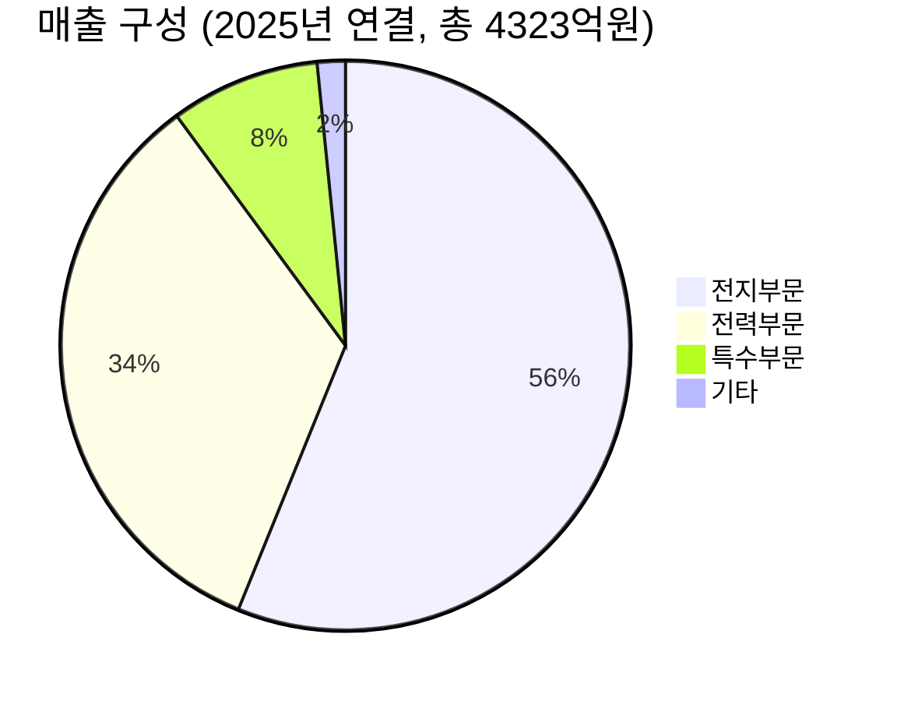

---

company: 비츠로테크
created: 2026-05-07 15:17
date: 2026-05-07 15:17
exchange: KRX
listing: public
market: KR
tags:
- deal-sourcing
- daily
ticker: 042370.KS
title: Deal - 비츠로테크 (042370.KS) 15:17
type: deal-sourcing
publish: true
---


> **오늘의 탐색 분야**: 클라우드, 사이버보안, 중국 투자 생태계, 글로벌 부동산, 보험, 퀀텀 컴퓨팅 혁신, 공간 컴퓨팅, AI 전력, 글로벌 인구 이동
> 4일 주기 로테이션 (30개 분야 커버)

# 비츠로테크 (042370.KS)

<span style="background:#2196F3;color:white;padding:2px 8px;border-radius:4px;font-size:0.85em">042370.KS</span> <span style="background:#D32F2F;color:white;padding:2px 8px;border-radius:4px;font-size:0.85em">🇰🇷 KR</span> <span style="background:#424242;color:white;padding:2px 8px;border-radius:4px;font-size:0.85em">KOSPI</span> <span style="background:#7B1FA2;color:white;padding:2px 8px;border-radius:4px;font-size:0.85em">전력기기 / 이차전지 / 우주항공</span>

---

## Investment Score

<div style="background:#e0e0e0;border-radius:8px;overflow:hidden;margin:8px 0"><div style="background:#FF9800;width:62%;padding:6px 12px;color:white;font-weight:bold;font-size:1em;white-space:nowrap">Investment Score 62/100 — 🟡 Buy (조건부)</div></div>

<div style="background:#e0e0e0;border-radius:8px;overflow:hidden;margin:4px 0"><div style="background:#FF9800;width:63%;padding:4px 8px;color:white;font-size:0.85em;white-space:nowrap">업사이드 비대칭 19/30 — 전력 슈퍼사이클+우주항공+핵융합 옵셔널리티 유효하나 시총 급등으로 여력 축소</div></div>

<div style="background:#e0e0e0;border-radius:8px;overflow:hidden;margin:4px 0"><div style="background:#FF9800;width:64%;padding:4px 8px;color:white;font-size:0.85em;white-space:nowrap">카탈리스트 & 타이밍 16/25 — 전력 수주 모멘텀 지속, 단 주가 先반영 + 전문가 목표가 -23% 괴리</div></div>

<div style="background:#e0e0e0;border-radius:8px;overflow:hidden;margin:4px 0"><div style="background:#4CAF50;width:70%;padding:4px 8px;color:white;font-size:0.85em;white-space:nowrap">비즈니스 품질 14/20 — 진공인터럽터 독자개발 해자, 전지·특수 부문 구조적 성장, 2개 부문 적자는 약점</div></div>

<div style="background:#e0e0e0;border-radius:8px;overflow:hidden;margin:4px 0"><div style="background:#F44336;width:40%;padding:4px 8px;color:white;font-size:0.85em;white-space:nowrap">밸류에이션 6/15 — PER 67-76배, ROE 3.4%, 당기순이익 -20%, AI 주가 예측도 '매우 고평가'</div></div>

<div style="background:#e0e0e0;border-radius:8px;overflow:hidden;margin:4px 0"><div style="background:#FF9800;width:70%;padding:4px 8px;color:white;font-size:0.85em;white-space:nowrap">발견 가치 7/10 — 전문가 커버리지 1명, 다중 테마(전력·우주·핵융합) 발굴 초기 단계</div></div>

---

> [!abstract] 리포트 요약
>
> **한 줄 테시스**: 비츠로테크는 전력기기(진공인터럽터 독자 기술) + 리튬일차전지 세계 1위 + 우주항공/핵융합 옵셔널리티를 보유한 지주회사형 소형주로, 전력 슈퍼사이클의 구조적 수혜를 받고 있으나 현재 주가는 이미 테마성 급등을 상당 부분 반영해 밸류에이션 부담이 크다.
>
> **왜 지금인가**: 52주 저점 대비 +176%(7,260원 → 20,050원) 급등 후 조정 중. AI 데이터센터·북미 전력망 교체 수요는 구조적이지만, 주가는 이미 2025년 실적(매출 +0.9%, 영업이익 +8.9%, 순이익 -20.2%)보다 훨씬 빠르게 달렸다.
>
> **Variant Perception**: 시장은 전력 테마 수혜만 보고 있으나, ① 전력·특수 부문 동시 적자 ② PER 67~76배에 ROE 3.4%라는 극단적 밸류에이션 괴리 ③ 유일한 공식 목표가 13,000원(현재가 대비 -35%)이라는 역설이 공존한다. 진정한 기회는 조정 시 재진입이며, 현재 가격에서의 신규 매수는 높은 밸류에이션 리스크를 감수해야 한다.
>
> **핵심 수치**: 시가총액 5,070억원 / PER(Trailing) 76배 / 2025년 영업이익 557억원(YoY +8.9%)

---

## ① 핵심 지표

| 항목 | 값 | 의미 |
|------|-----|------|
| 현재가 | 20,050원 | 🔴 52주 저점(7,260원) 대비 +176% 급등. 52주 최고(23,800원) 대비 약 -16% 수준이나 1년 수익률 +117%로 테마성 급등 대부분 반영됨 |
| 시가총액 | 5,070억원 | 🟡 소형주. 전력 인프라 슈퍼사이클 수혜 섹터에서 대형주 대비 상대적 비유동성 프리미엄/리스크 공존 |
| PER (Trailing) | 76.48배 | 🔴 극단적 고평가. 매출 성장률 0.9%, 순이익 -20.2%인 기업에 76배 PER은 미래 성장이 이미 상당 부분 선반영됨을 의미 |
| PER (Forward/2026E) | 67.12배 | 🔴 2026년 예상치 기준으로도 67배. 순이익 성장 가속 근거가 불충분한 상황에서 지속 불가능한 멀티플 |
| PBR | 1.96배 | 🟡 자산 대비 약 2배. 소형 제조업 기준으로 과도하진 않으나, ROE 3.4%를 감안하면 ROE/PBR 괴리가 심각 |
| EV/EBITDA | 15.88배 | 🟡 2025년 EBITDA 733억원 추정 기준. 전력기기 업종 중소형주 기준 다소 높은 수준 [추정] |
| 영업이익률 | 14.9% | 🟢 2025년 연결 기준 영업이익률 14.9%(557억원/4,323억원). 중소 제조업 평균 대비 양호. 다만 전력부문 -118억, 특수부문 -74억 적자를 전지부문 이익으로 상쇄하는 구조 |
| 순이익률 | 14.6% (연간) / 2.2% (Q4) | 🟡 연간 14.6%이나 2025년 4Q 순이익 28억원(QoQ 급감)으로 분기 변동성 높음. 연간 수치와 분기 수치의 극단적 괴리 확인 필요 |
| ROE | 3.4% | 🔴 PBR 1.96배에 ROE 3.4%는 자본 효율성이 매우 낮음. Dupont 분해 시 자산회전율·레버리지 구조 문제일 가능성 [확인 필요] |
| 배당수익률 | 0.3% | 🔴 주가 급등 후 사실상 무의미한 배당. 주주환원보다 성장 투자에 집중하는 기업 성격 |
| 52주 고/저 | 23,800원 / 7,260원 | 🟡 변동폭 +228%로 극단적 변동성. 7,260원이 진정한 기저 펀더멘털 가치에 가까울 가능성과 현재가가 테마 프리미엄일 가능성 모두 고려 필요 |
| 2025년 매출 | 4,323억원 (YoY +0.9%) | 🟡 성장이 사실상 정체. 전력 슈퍼사이클 수혜 기업치고 매출 증가율이 실망스러움. 2026년 가속화 여부가 핵심 |
| 2025년 영업이익 | 557억원 (YoY +8.9%) | 🟢 매출 성장 대비 이익률 개선은 긍정적. 전지 부문 레버리지 효과 |

---

## ② 회사 개요, 제품, 핵심 경쟁력

> [!abstract] 섹션 핵심
> 비츠로테크는 전력기기(진공인터럽터 독자개발), 리튬일차전지(비츠로셀), 우주항공/핵융합(비츠로넥스텍) 3개 핵심 사업을 영위하는 **지주회사형 소형 복합 기술 기업**이다. 단순 전력기기 회사가 아닌 "에너지+방위산업+우주" 복합 포트폴리오가 핵심.

### 한 줄 설명
**비츠로테크는 진공인터럽터를 독자 개발한 국내 유일 중소기업으로, 전력기기·리튬일차전지·우주항공/핵융합 부품을 영위하는 지주회사형 복합 기술 기업이다.**

### 사업 모델
비츠로테크는 자회사들을 통해 세 개의 독립적인 수익 흐름을 운영한다:
- **비츠로일렉트릭** (전력부문): 진공차단기, 기중부하개폐기, 고장구간자동개폐기, 보호계전기, 수배전반 제조·판매
- **비츠로셀** (전지부문): 리튬일차전지 설계·제조. 스마트미터, 방산, 석유화학 분야 공급
- **비츠로넥스텍** (특수부문): 우주발사체 엔진 컴포넌트, 핵융합 장치, 가속기 부품 설계·제작·유지보수

지주회사 구조상 각 사업부의 실적이 연결 재무제표에 반영되며, 본사는 전략적 자본배분과 그룹 시너지를 담당한다. 2025년에는 비츠로이엠+비츠로이에스 합병(→비츠로일렉트릭 사명 변경) 및 비츠로밀텍 지분 매각으로 사업 포트폴리오를 단순화했다.

### 매출 구성 (2025년 연결 기준)



| 사업부문 | 매출액 | 비중 | 영업손익 추정 | 핵심 특징 |
|--------|--------|------|------------|---------|
| 전지부문 (비츠로셀) | 2,430억원 | 56.2% | 🟢 흑자 (사상 최대) | 리튬일차전지 세계 1위 [확인 필요], 스마트미터/방산 수요 |
| 전력부문 (비츠로일렉트릭) | 1,461억원 | 33.8% | 🔴 -118억 적자 | 진공인터럽터 독자개발, 전력망 교체 수혜 |
| 특수부문 (비츠로넥스텍) | 368억원 | 8.5% | 🔴 -74억 적자 | 우주항공·핵융합·가속기 부품, 장기 성장성 |
| 기타 | 69억원 | 1.6% | — | — |

> [!warning] 구조적 이익 편중 경고
> 전체 영업이익 557억원이 사실상 전지부문 단독으로 창출되고, 전력부문(-118억)과 특수부문(-74억)은 모두 적자다. "전력 슈퍼사이클 수혜"로 알려진 기업의 전력부문이 실제로는 적자라는 역설이 가장 중요한 리스크 포인트다.

### 핵심 경쟁력

| 경쟁력 | 설명 | 복제 난이도 (1-10) |
|--------|------|:---:|
| **진공인터럽터 독자 개발·생산** | 국내 중소기업 중 유일하게 진공인터럽터를 자체 개발·생산. 핵심 소자의 수직계열화로 원가 경쟁력과 납기 우위 | 9 |
| **리튬일차전지 기술력** | 비츠로셀이 스마트그리드 미터, 방산, 석유화학 등 특수 목적 리튬일차전지 분야에서 고도화된 기술 축적 | 8 |
| **우주·핵융합 부품 경험** | ITER 프로젝트 참여 경험과 누리호 발사체 관련 플라즈마 기술 보유. 레퍼런스 구축에 장기간 소요 | 8 |
| **복합 포트폴리오** | 전력기기+특수전지+우주항공이 하나의 지주구조 안에 존재하여 테마별 투자 수요를 복수로 흡수 | 6 |
| **사업 재편 능력** | 2025년 비츠로밀텍 매각, 자회사 합병으로 선제적 포트폴리오 최적화 실행 | 5 |

### 성장 공식
```
비츠로테크 매출 성장 = 
  전지부문: [스마트미터 보급률 × 리튬일차전지 단가] + 방산 수요
+ 전력부문: [북미/국내 전력망 교체 CapEx] × [수주 → 매출 인식 시차]
+ 특수부문: [우주발사체 발사 횟수 × 단가] + [핵융합 투자 증가 × 수주율]
```

현재 **전지부문이 이익 엔진** 역할을 하고, 전력·특수부문은 적자를 감수하며 시장 포지션 구축 중. 전력부문 흑자전환이 그룹 전체 이익 도약의 결정적 레버.

---

## ③ 왜 100%+ 가능한가? — 업사이드 비대칭

> [!tip] 핵심 인사이트
> 비츠로테크의 잠재적 100%+ 시나리오는 "전력부문 흑자전환 + 전지부문 외형 성장 + 우주항공 테마 본격화"의 3중 촉매가 동시에 실현될 때다. 현재 주가(20,050원)는 이 낙관 시나리오의 상당 부분을 선반영하고 있다는 것이 핵심 딜레마.

### 시총 vs TAM (목표 시장 규모)

| 시장 | 규모 추정 | 비츠로테크 점유율 | 성장 가능성 |
|-----|--------|--------------|----------|
| 국내 전력기기 시장 | (확인 필요) | 소형 니치 | 전력망 교체 수혜 |
| 글로벌 리튬일차전지 | (확인 필요) | 세계 1위 주장 [확인 필요] | 스마트미터 보급 |
| 글로벌 우주발사체 부품 | 연평균 13.22% 성장 [출처: 수집 데이터, 원출처 확인 필요] | 초기 진입 | ITER, 민간 우주 붐 |
| 핵융합 에너지 장비 | 연평균 7.4% 성장 [출처: 수집 데이터, 원출처 확인 필요] | 초기 진입 | 2030년대 실용화 전제 |

시가총액 5,070억원 기준, TAM 대비 점유율은 각 사업별로 **아직 초기 단계**임은 분명하나, 핵심 사업인 전력부문이 현재 적자라는 점에서 TAM 대비 단순 비교보다 수익화 경로가 더 중요하다.

### 성장 가속 구간 여부

2025년 매출 YoY +0.9%, 영업이익 YoY +8.9%라는 숫자는 **아직 가속 구간에 진입하지 않았음**을 시사한다. 단, 2025년 4Q 단일 분기 영업이익 183억원(연간 557억원의 33%)은 하반기 실적 모멘텀이 살아있음을 보여준다.

<div style="border-left:4px solid #FF9800;padding-left:12px;margin:8px 0">
핵심 질문: "2026년에 전력부문(-118억)이 흑자전환하면 그룹 전체 영업이익은 얼마나 도약하는가?"
전력부문이 손익분기점만 도달해도 +118억 증가 → 영업이익 557억 → 675억으로 +21% 증가 [가정].
이것이 주가 추가 상승의 핵심 레버다.
</div>

### 옵셔널리티 (현재 가치에 미반영된 성장 동력)

| 옵셔널리티 | 실현 가능성 | 시간 지평 | 현재 주가 반영도 |
|----------|----------|---------|--------------|
| 북미 차단기/개폐기 수출 확대 | 중간 | 1-2년 | 부분 반영 |
| 비츠로셀 상장/가치 재평가 | 낮음 [추정] | 미정 | 미반영 |
| ITER 핵융합 프로젝트 확대 수주 | 낮음~중간 | 3-5년 | 테마로 일부 반영 |
| 차세대 메탄 로켓 엔진 기술 | 낮음 | 3-10년 | 테마로 일부 반영 |
| 영업현금흐름 806억원 활용 M&A | 미정 | — | 미반영 |

### Compounding Machine 구조 분석

ROE 3.4%, PBR 1.96배 — 이는 현재 비츠로테크가 **강력한 복리 엔진이 아님**을 의미한다. 자본 대비 수익성이 낮으므로, 복리 투자 매력보다는 **구조적 전환 (턴어라운드) 스토리**로 접근해야 한다.

영업현금흐름 806억원은 순이익(427억원)의 약 1.9배로, 이익의 질이 우수하고 실제 현금 창출력은 회계이익보다 강하다. 이 현금이 어디에 재투자되는지가 향후 ROIC 개선의 핵심.

---

## ④ 왜 지금인가? — 카탈리스트 & 타이밍

> [!question] 핵심 딜레마
> 구조적 촉매(전력 슈퍼사이클)는 실재하지만, 주가는 이미 52주 저점 대비 +176% 급등했다. "왜 지금인가?"보다 "지금 당장이어야 하는가?"를 더 강하게 검토해야 하는 시점.

### 구체적 카탈리스트

| 카탈리스트 | 예상 시점 | 실현 가능성 | 주가 반영도 |
|----------|---------|----------|----------|
| 전력부문 흑자전환 (분기 기준) | 2026년 상반기 [추정] | 중간 | 미반영 |
| 북미 데이터센터 차단기·개폐기 수주 공시 | 상시 (예측 불가) | 중간~높음 | 테마로 일부 선반영 |
| 2026년 1Q 실적 발표 (2026.3.23 예정) | 2026년 3월 | 확정 (날짜) | — |
| 2026년 상반기 세무조사 종결 | 2026년 상반기 | 확정 (시점) | 리스크 해소 가능 |
| 비츠로셀 리튬일차전지 수주 확대 | 상시 | 높음 | 부분 반영 |
| 차세대 메탄 로켓 엔진 관련 계약 | 미정 | 낮음 | 테마로 일부 반영 |

### 시장 반영도 점검

<div style="display:flex;border-radius:8px;overflow:hidden;margin:8px 0;font-size:0.85em"><div style="background:#4CAF50;width:60%;padding:6px 8px;color:white">🟢 이미 반영된 것: 전력 슈퍼사이클 테마 60%</div><div style="background:#FF9800;width:25%;padding:6px 8px;color:white">🟡 부분 반영: 우주항공 25%</div><div style="background:#F44336;width:15%;padding:6px 8px;color:white">🔴 미반영 15%</div></div>

**전력 테마 급등의 주체**는 개인 투자자 중심(최근 54.8만주 순매수), 기관 6.2만주 순매수, 외국인 55.6만주 **순매도**다. 외국인의 차익실현 vs. 개인 수급 주도라는 구도는 단기 변동성 확대를 시사한다.

### Variant Perception (시장과의 시각 차이)

| 시장 컨센서스 | 당사 Variant Perception |
|-----------|----------------------|
| "전력 슈퍼사이클 = 비츠로테크 수혜" | 전력부문이 현재 적자이며, 수혜가 이익으로 전환되기까지 시차 존재 |
| "우주항공·핵융합 테마 플레이" | 특수부문도 적자 (-74억). 테마 vs 실적 괴리 |
| "52주 고점 근처라도 추세 상승" | 유일한 공식 전문가 목표가 13,000원 = 현재가 대비 -35% 하락 여지 |
| "전지부문 최대 실적 = 성장 가속" | 그룹 매출 성장률 0.9%로 전지부문 성장이 타 부문 정체로 상쇄됨 |

### 매크로 환경 분석

| 매크로 시나리오 | 비츠로테크 영향 |
|-------------|-------------|
| **금리 동결/완만한 인하** | 🟢 전력 인프라 CapEx 확대 지속. 유틸리티·데이터센터 발주 증가 |
| **경기침체** | 🔴 전력기기 민간 수주 둔화. 특수부문 예산 삭감 우려 |
| **달러 강세 지속** | 🟢 수출 전력기기 환차익. 단, 수입 원자재 비용 상승 상쇄 |
| **미국 인플레이션법(IRA) 지속** | 🟢 북미 전력망 투자 정책 지원 지속 |
| **우주발사 규제 변화** | 🟡 중립. 민간 우주 규제 완화 트렌드이나 비츠로넥스텍 직접 계약 여부 [확인 필요] |

---

## ⑤ 비즈니스 퀄리티

> [!abstract] 섹션 핵심
> 비츠로테크의 퀄리티는 **전지부문(비츠로셀)에 집중**되어 있으며, 전력부문과 특수부문의 손실을 전지부문이 커버하는 구조다. 영업현금흐름 806억원(순이익의 1.9배)은 이익의 질이 우수함을 보여주나, ROE 3.4%는 자본 효율이 낮음을 반증한다.

### 경제적 해자 (Moat) 분석

| 해자 계층 | 내용 | 강도 | 복제 난이도 |
|---------|------|:----:|:-------:|
| **기술 독점 (진공인터럽터)** | 국내 중소기업 중 유일한 진공인터럽터 자체 개발·생산. 수직계열화로 원가 우위 | 🟢 강 | 9/10 |
| **기술 독점 (리튬일차전지)** | 특수 목적 리튬일차전지의 설계·제조 기술. 방산·스마트미터 분야 신뢰도 축적 | 🟢 강 | 8/10 |
| **레퍼런스 자산 (우주·핵융합)** | ITER 참여 경험, 누리호 발사체 관련 플라즈마 기술. 신규 진입자가 동일 레퍼런스 확보에 수년 소요 | 🟡 중 | 7/10 |
| **수직계열화** | 진공인터럽터 → 차단기 → 수배전반으로 이어지는 수직 통합. 납기 및 원가 경쟁력 | 🟡 중 | 6/10 |

> [!success] 핵심 강점
> 진공인터럽터 자체 개발 능력은 국내 중소기업 수준에서 희소하다. 이 기술이 전력망 교체 수요와 맞물리면 수주 경쟁력이 크게 강화될 수 있으며, 차단기·개폐기 후속 수요(변압기→전선 다음 단계)의 구조적 수혜자 위치에 있다.

### ROIC / ROE 추세

| 지표 | 2025년 | 의미 |
|-----|--------|------|
| ROE | 3.4% | 🔴 PBR 1.96배 대비 심각한 자본 효율성 저하. 자본의 2배 주가를 지불하는데 연간 3.4%만 벌어들임 |
| 영업이익률 | 14.9% | 🟢 중소 제조업 기준 양호. 전지부문 고마진이 전체 끌어올림 |
| 순이익률 | 14.6% (연간) / 2.2% (4Q) | 🟡 연간 vs. 분기 극단적 괴리. 4Q 순이익 28억은 이상 징후 가능 [확인 필요] |
| OCF/순이익 비율 | 806억/427억 = 1.89배 | 🟢 현금 창출력이 회계이익 대비 우수. 감가상각, 운전자본 효율이 양호 |

### 마진 방향성

영업이익 YoY +8.9% (매출 +0.9%) — 매출 정체에도 영업레버리지가 작동했다는 의미. 이는 전지부문의 믹스 개선(고수익 제품 비중 증가)에 기인할 가능성이 높다 [추정]. 전력부문과 특수부문의 구조적 적자 해소 시 마진 개선 폭은 매우 크다 [가정].

### 경영진 & 자본배분

| 평가 항목 | 내용 | 판단 |
|---------|------|------|
| 사업 재편 | 비츠로밀텍 매각, 자회사 합병 → 포트폴리오 단순화 | 🟢 주주가치 제고 방향 |
| 해외 전지법인 인수 | 2025년 해외 전지법인 인수로 전지 사업 확장 | 🟡 성장 투자, 성과 확인 필요 |
| 배당 | 배당수익률 0.3% — 성장 재투자 우선 | 🟡 성장주 성격에 부합, 주주환원 낮음 |
| 소송 리스크 | ITRON FRANCE 100억 손해배상 소송 진행 중 | 🔴 경영진 과실 여부 불명확, 리스크 |
| 세무조사 | 2026년 상반기 종결 예정 세무조사 진행 중 | 🔴 결과에 따른 추가 비용 가능성 |

---

## ⑥ 밸류에이션 & 안전마진

> [!warning] 밸류에이션 경고
> PER 76배(Trailing), 67배(Forward 2026E)에 ROE 3.4%. 이 조합은 투자 역사상 가장 위험한 고평가 패턴 중 하나다. 성장률이 매출 +0.9%인 기업에 76배를 지불하는 것은 **순수한 테마 프리미엄**이다.

### 현재 밸류에이션 vs. 내재가치 분석

**역사적 관점**: 52주 최저가 7,260원 대비 현재가 20,050원은 +176%. 이 상승이 **펀더멘털 개선** (영업이익 +8.9%)보다 **테마 재평가** (전력 슈퍼사이클)에 기인했음이 명확하다.

**간이 역산 밸류에이션**:
- 2025년 영업이익 557억원 / 시가총액 5,070억원 = EV/OI 약 9.1배 [가정: EV ≈ 시총]
- 이익 성장률이 연 20%씩 3년간 지속된다면 [가정], 2028년 영업이익 약 962억원
- 이를 합리적 배수(12배)로 적용하면 기업가치 약 1.15조원 → 현재가 대비 +127% [가정, 최낙관 시나리오]
- 이익 성장이 10%에 머문다면 [가정], 2028년 영업이익 741억원 × 10배 = 7,410억 → 현재가 대비 +46%

**안전마진 평가**: 유일한 공식 전문가 목표가 13,000원(현재가 대비 -35%). 이는 현재 주가에 **음(-)의 안전마진**이 존재함을 의미한다.

### FCF Yield 관점

OCF 806억원 / 시가총액 5,070억원 = **FCF Yield 약 15.9%** [가정: CapEx 미차감]

CapEx를 차감한 진정한 FCF는 더 낮을 것이나, OCF 자체만으로도 현금 창출력이 시총 대비 매력적인 수준임은 인정된다. 이것이 이 기업의 **유일한 밸류에이션 안전판**이다.

### 시나리오별 목표가

<div style="display:flex;border-radius:8px;overflow:hidden;margin:8px 0;font-size:0.85em"><div style="background:#4CAF50;width:25%;padding:6px 8px;color:white">🟢 Bull 25%</div><div style="background:#FF9800;width:45%;padding:6px 8px;color:white">🟡 Base 45%</div><div style="background:#F44336;width:30%;padding:6px 8px;color:white">🔴 Bear 30%</div></div>

| 시나리오 | 핵심 가정 | 12개월 목표가 | 현재가 대비 |
|---------|---------|------------|----------|
| 🟢 Bull (25%) | 전력부문 흑자전환 + 북미 수출 가시화 + 전지부문 고성장 유지 | 26,000~30,000원 | +30%~+50% |
| 🟡 Base (45%) | 현 추세 유지, 전력부문 손실 축소, 전지부문 안정 성장 | 16,000~20,000원 | -20%~0% |
| 🔴 Bear (30%) | ITRON 소송 패소 + 세무조사 추징 + 전력 테마 냉각 | 10,000~13,000원 | -50%~-35% |

> [!verdict] 밸류에이션 판정
> Bear 확률 30%, 하락 폭 35-50% vs. Bull 확률 25%, 상승 폭 30-50%. 기대값이 음수에 가깝다. 현재 주가에서의 신규 진입은 비대칭이 투자자에게 불리하다.

---

## ⑦ 리스크 & Devil's Advocate

| 구분 | 핵심 논거 |
|------|---------|
| 🟢 Bull #1 | 전력 슈퍼사이클은 구조적: AI 데이터센터 + 미국 노후 전력망 교체 + IRA로 향후 5-10년 전력 CapEx 급증 불가피. 진공인터럽터 독자 기술 보유 비츠로테크는 직접 수혜자 |
| 🟢 Bull #2 | 비츠로셀 리튬일차전지 세계 1위 [확인 필요] 포지션. 스마트미터 전 세계 보급 가속화로 10억개+ 시장의 구조적 수요. 사상 최대 실적 달성 모멘텀 지속 |
| 🟢 Bull #3 | 전력·특수 부문 흑자전환 시 이익 폭발적 증가. 현재 전지부문 이익 단독으로 만든 557억을, 전력·특수 흑자전환 시 800억~1,000억으로 도약 가능 [가정]. 멀티플 확장까지 기대 가능 |
| 🔴 Bear #1 | **고평가 + 실적 미뒷받침**: 매출 +0.9%, 순이익 -20.2%인 기업에 PER 67-76배. 테마 냉각 시 PER 20-30배로 수렴하면 목표주가 7,000-9,000원. 52주 저점(7,260원)이 의미 있는 심리 지지선 |
| 🔴 Bear #2 | **전력·특수 부문 구조적 적자 지속 위험**: -118억(전력) + -74억(특수) = -192억 적자. 이 구조가 2026년에도 개선되지 않으면 전지부문 성장이 모두 흡수되어 그룹 이익 정체 |
| 🔴 Bear #3 | **외부 리스크 동시 발생 가능성**: ITRON FRANCE 100억 소송 패소 + 세무조사 추징 + 비츠로밀텍 매각 후 공백 → 현금 유출과 신뢰 훼손 동시에 |

### 가장 현실적인 실패 시나리오
**"전력 테마 열기가 식으면서 고평가 멀티플 붕괴"**: 전력기기 슈퍼사이클 내러티브는 유효하지만, 단기 주가 급등이 중장기 실적 성장 속도를 훨씬 앞섰다. 미국 금리 재인상, 데이터센터 투자 둔화, 글로벌 경기 침체 시그널 중 하나만 나타나도 PER 70배 소형주는 빠르게 조정받는다. 이때 기본 PER 30배 적용 시 순이익 66억원 기준 시총 약 2,000억원 → 주가 약 7,600원 수준 [가정].

### 숨겨진 가정 (Hidden Assumptions)

1. [가정] 전지부문(비츠로셀)의 최대 실적이 구조적으로 지속된다는 가정
2. [가정] 전력·특수 부문이 결국 흑자로 돌아선다는 가정 (현재는 적자 지속 중)
3. [가정] 우주항공·핵융합 테마가 단순 테마에서 실제 수주로 전환된다는 가정
4. [가정] ITRON 소송과 세무조사가 회사에 중대한 타격을 주지 않는다는 가정

### Kill Criteria (투자 즉시 재검토/탈출 기준)

| Kill Criteria | 임계값 |
|-------------|-------|
| 영업이익 역성장 | YoY -10% 이상 감소 확인 시 |
| 전지부문 마진 급락 | 비츠로셀 영업이익률 10%p 이상 하락 시 |
| ITRON 소송 패소 | 100억원 이상 손해배상 확정 판결 시 |
| 세무조사 추징 | 50억원 이상 추징금 통보 시 |
| 전력 테마 冷각 | 유사 테마 대형주(LS ELECTRIC 등) 20%+ 하락 시 |
| 수주 공시 없이 주가 재급등 | 실적 근거 없는 테마성 재급등 시 매도 검토 |

---

## ⑧ 발견 가치 & 엣지

> [!tip] 발견 가치
> 전문가 커버리지 1명(목표가 13,000원)의 극도로 낮은 커버리지는 분석의 여지가 있으나, 최근 주가 급등으로 개인투자자 관심이 폭발적으로 증가해 '숨겨진 가치' 프리미엄은 거의 소멸했다.

### 애널리스트 커버리지

수집된 데이터에서 확인된 공식 전문가 커버리지는 **1명** (목표가 13,000원, 4월 30일 종가 기준 -23.30%). 커버리지 부재는 양날의 검이다 — 발견 가치의 잠재력(기관 발굴 시 주가 급등 가능)과 분석 부재로 인한 불확실성 증가가 공존한다.

### 기관 보유 변화

| 주체 | 최근 동향 | 해석 |
|-----|---------|-----|
| 개인 | 최근 1개월 +54.8만주 순매수 | 🟡 테마 수급. 기초체력보다 모멘텀 추종 |
| 기관 | 최근 1개월 +6.2만주 순매수 / 최근 3일 대량 순매수 | 🟢 기관의 조심스러운 진입 시작. 긍정 시그널 |
| 외국인 | 최근 1개월 -55.6만주 순매도 | 🔴 외국인 차익실현. 고평가 인식 반영 가능 |

기관의 점진적 유입 + 외국인 이탈 구도는 **고점 가능성을 시사**하는 동시에, 기관 커버리지 확대 초기 단계일 수 있다는 이중성이 있다.

### 왜 다른 사람들이 이 기회를 놓치고 있는가?

**놓치는 사람들이 놓치는 것**: 비츠로테크의 진정한 가치는 단순 전력기기 회사가 아니라, **진공인터럽터 기술력 + 리튬일차전지 세계 1위 포지션 + 우주항공/핵융합의 3중 사업 포트폴리오**라는 복합성이다. 이 복합 구조를 이해하지 못한 투자자들은 과거 7,000원대에 이 기업을 저평가했다.

**지금 놓치고 있는 리스크**: 역설적으로, 최근 급등 이후 많은 투자자들이 **전력 테마만 보고 밸류에이션 부담을 간과**하고 있다. "좋은 기업 + 좋은 테마 = 지금도 매수 OK"라는 논리가 지배적이지만, PER 76배 + 매출 정체 + 2개 부문 적자 조합은 매우 높은 실망 리스크를 내포한다.

---

## ⑨ 액션 아이템

| 항목 | 판단 |
|------|-----|
| **BUY / WATCH / PASS** | <span style="background:#FF9800;color:white;padding:2px 8px;border-radius:4px;font-size:0.85em">WATCH</span> — 비즈니스 퀄리티는 확인되나 현재 가격(PER 76배, 목표가 대비 -35% 괴리)에서 신규 진입 시 리스크/리워드 불리. 조정 시 재진입 기회 모니터링 |
| **Conviction** | Medium (사업 이해 가능, 가격 우려) |
| **적정 진입가** | 13,000~15,000원 — 전문가 목표가(13,000원) 상단 + 30% 안전마진 구간 [가정]. 이 수준에서 OCF yield 15%+, PER 30-40배 수준으로 적정화 |
| **목표가 (12개월)** | Base 시나리오: 16,000~20,000원 / Bull 시나리오: 26,000~30,000원 |
| **손절 기준** | 진입 후 -20% (또는 Kill Criteria 중 하나 충족 시 즉시) |
| **권장 비중** | 현재가 진입 시 포트폴리오 2% 이하 (고위험). 13,000~15,000원 조정 후 진입 시 3~5% |

### 추가 리서치 필요 사항

| 우선순위 | 확인 사항 |
|--------|---------|
| 🔴 최우선 | 비츠로셀(전지부문) 영업이익 단독 수치 확인. "전지부문이 그룹 이익 전체를 지탱"이 맞는지 공식 세그먼트 손익 확인 |
| 🔴 최우선 | ITRON FRANCE 소송 진행 현황 및 법적 의견 확인 (DART 소송 공시) |
| 🟠 높음 | 전력부문(비츠로일렉트릭) 적자 원인 및 흑자전환 로드맵 (IR 접촉 또는 분기 보고서) |
| 🟠 높음 | 비츠로셀의 '세계 1위' 주장 근거 및 시장 점유율 데이터 확인 |
| 🟡 중간 | 북미 수출 파이프라인: 차단기/개폐기 신규 수주 계약 공시 여부 모니터링 |
| 🟡 중간 | 세무조사 결과 예상 추징금 범위 (2026년 상반기 종결 예정) |

### 모니터링 핵심 지표 / 이벤트

| 체크포인트 | 날짜/시점 | 확인 사항 |
|---------|---------|---------|
| 2026년 1Q 실적 발표 | 2026년 3월 23일 (연결 기준) | 전력부문 적자 규모 변화, 전지부문 성장세 유지 여부 |
| 세무조사 결과 | 2026년 상반기 | 추징금 규모 및 사업 영향 |
| ITRON 소송 | 진행 중 | DART 소송 결과 공시 |
| 북미 전력 수주 | 상시 모니터링 | 차단기/개폐기 대형 수주 공시 여부 |
| 외국인 수급 반전 | 주간 모니터링 | 외국인 순매수 전환 시 매수 시그널 |
| 테마 지수 동향 | 주간 모니터링 | LS ELECTRIC, 효성중공업 등 전력기기 대형주 주가 동향 |

---

> [!verdict] 최종 판단
>
> **비츠로테크는 진정한 기술 해자(진공인터럽터, 리튬일차전지)를 보유한 복합 기술 지주사**로, 전력 슈퍼사이클과 우주항공/핵융합 테마의 구조적 수혜자 위치에 있다. 사업의 방향성은 옳다.
>
> 그러나 **현재 주가 20,050원은 비대칭이 투자자에게 불리한 가격대**다.
> - PER 67~76배 vs. 매출 성장 +0.9%, 순이익 -20.2%
> - 전력·특수 부문 합산 -192억 적자를 전지부문 단독으로 커버
> - 유일한 공식 목표가 13,000원 (현재가 대비 -35%)
> - Bear 시나리오(확률 30%) 하락 폭(-35~-50%) > Bull 시나리오(확률 25%) 상승 폭(+30~+50%)
>
> **13,000~15,000원 수준 조정 시 재진입**이 투자 철학에 부합하는 액션이다. 그 가격에서는 OCF Yield 15%+, PER 30~40배 수준이 되어 안전마진이 확보된다. 현재는 **WATCH 유지, 수급 및 실적 지표 주간 모니터링** 권고.

---

*관련 노트: [[260416_Final Analysis - SNT에너지_1431]] (전력 인프라 유사 테마 비교 참고), [[260413_Final Analysis - 하이록코리아_2152]] (소형 산업재 밸류에이션 프레임워크 참고)*