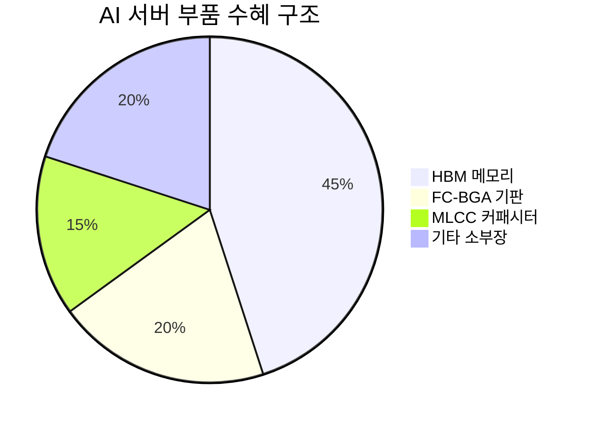

> **오늘의 탐색 분야**: AI 인프라, AI 소프트웨어, 교육, 디지털 콘텐츠, 한국 시장, 중국 투자 생태계, 글로벌 부동산, 보험, 퀀텀 컴퓨팅 혁신
> 4일 주기 로테이션 (30개 분야 커버)

# 삼성전자 (005930.KS)

<span style="background:#2196F3;color:white;padding:2px 8px;border-radius:4px;font-size:0.85em">005930.KS</span> <span style="background:#D32F2F;color:white;padding:2px 8px;border-radius:4px;font-size:0.85em">KR</span> <span style="background:#424242;color:white;padding:2px 8px;border-radius:4px;font-size:0.85em">KRX</span> <span style="background:#7B1FA2;color:white;padding:2px 8px;border-radius:4px;font-size:0.85em">Technology / Semiconductors</span>

---

<div style="background:#e0e0e0;border-radius:8px;overflow:hidden;margin:8px 0"><div style="background:#4CAF50;width:81%;padding:6px 12px;color:white;font-weight:bold;font-size:1em;white-space:nowrap">Investment Score 81/100 — 🟢 Strong Buy</div></div>

<div style="background:#e0e0e0;border-radius:8px;overflow:hidden;margin:4px 0"><div style="background:#4CAF50;width:80%;padding:4px 8px;color:white;font-size:0.85em;white-space:nowrap">업사이드 비대칭 24/30 — Forward PER 7.14, 목표가 55만원 vs 현재 30.7만원 (79% 업사이드), HBM+AI 구조적 성장</div></div>

<div style="background:#e0e0e0;border-radius:8px;overflow:hidden;margin:4px 0"><div style="background:#4CAF50;width:84%;padding:4px 8px;color:white;font-size:0.85em;white-space:nowrap">카탈리스트 & 타이밍 21/25 — HBM3E 엔비디아 납품 Q2~Q3 확대, DS/DX 분할 논의, SK하이닉스 1조달러 돌파로 밸류에이션 재평가 압력</div></div>

<div style="background:#e0e0e0;border-radius:8px;overflow:hidden;margin:4px 0"><div style="background:#4CAF50;width:80%;padding:4px 8px;color:white;font-size:0.85em;white-space:nowrap">비즈니스 품질 16/20 — 메모리·파운드리 글로벌 과점, ROE 18.9%, OPM 42.8%, 단 HBM 점유율 열세 리스크 존재</div></div>

<div style="background:#e0e0e0;border-radius:8px;overflow:hidden;margin:4px 0"><div style="background:#4CAF50;width:80%;padding:4px 8px;color:white;font-size:0.85em;white-space:nowrap">밸류에이션 12/15 — Forward PER 7.14 역사적 최저 수준, 52주 저점 5.42만원 대비 회복 중이나 여전히 저평가 구간</div></div>

<div style="background:#FF9800;width:80%;padding:4px 8px;color:white;font-size:0.85em;white-space:nowrap;border-radius:8px;overflow:hidden;margin:4px 0">발견 가치 8/10 — 외국인 12거래일 연속 순매도로 '역발상 매수' 기회, 기관 순매수 지속, SK하이닉스 대비 저평가 디스카운트</div>

---

> [!abstract] 리포트 요약
>
> **한 줄 테시스**: 삼성전자는 역사상 최고 수준의 이익 체력(OPM 42.8%, Forward PER 7.14)을 보유하면서도 외국인 이탈과 HBM 경쟁 우려로 여전히 저평가된 역발상 기회다.
>
> **왜 지금인가**: SK하이닉스가 시총 1조달러를 돌파하며 메모리 섹터 전반의 밸류에이션 재평가가 진행 중이다. 삼성전자는 HBM3E 엔비디아 본격 납품(2026 Q2~Q3), DS/DX 분할 논의 재점화, 노사협상 타결이라는 3개의 구체적 촉매를 보유하고 있다. 한국 수출 데이터(5월 1~20일 반도체 수출 YoY +202.1%)는 Q2 실적이 Q1을 초과할 가능성을 강력히 시사한다.
>
> **Variant Perception**: 시장은 삼성전자를 "HBM에서 뒤처진 기업"으로 프레임하고 외국인이 매도하고 있으나, 실제로는 Forward PER 7.14라는 역사적 저점에서 OPM 42.8%의 최고 이익 기업을 매수할 수 있는 기회다. 미래에셋 목표가 55만원은 현재 대비 79% 업사이드를 의미한다 [출처: 미래에셋증권 리포트, 매일경제 2026.5.21].
>
> **핵심 수치**: 현재가 307,000원 / Forward PER 7.14 / OPM 42.8%

---

## ① 핵심 지표

| 항목 | 값 | 의미 |
|------|-----|------|
| 현재가 | 307,000원 🟢 | 52주 최저(54,200원) 대비 467% 회복, 52주 최고(330,000원) 대비 -6.97%. 최고점 근접하나 밸류에이션상 여전히 저렴 |
| 시가총액 | 1,794.8조원 🟢 | 글로벌 반도체 시총 최상위권. 엔비디아·TSMC와 경쟁하는 진정한 메가캡. 1조달러 클럽 |
| PER (Trailing) | 24.81 🟡 | 표면상 비싸 보이나, 2025년 하반기 반도체 업황 저점의 이익 기반. Forward 대비 큰 괴리는 이익 급증을 반영 |
| PER (Forward) | 7.14 🟢 | **역사적 최저 수준에 근접.** 현재 이익 정상화 사이클을 반영. 이 수준은 메모리 사이클 바닥에서 관찰되는 배수 |
| PBR | 4.27 🟡 | SK하이닉스 대비 낮은 수준 [추정]. 반도체 업종 특성상 자산 집약적이나 ROE 개선 속도가 PBR 재평가 촉매 |
| EV/EBITDA | 32.64 🟡 | Trailing 기준 다소 높아 보이나, Forward EBITDA 급증 감안 시 실질 배수는 크게 낮아질 전망 [추정] |
| 배당수익률 | 0.5% 🟡 | 절대적 배당 매력은 낮으나, FCF 급증 후 배당·자사주매입 확대 가능성 존재 |
| Beta | 1.33 🟡 | 시장 변동성 대비 33% 확대 반응. 코스피 강세장에서 레버리지 효과 기대 가능 |
| 52주 고/저 | 330,000 / 54,200원 🟢 | 저점 대비 467% 상승. 저점 54,200원은 실질적 공포 구간이었으나 이미 탈출. 고점까지는 +7.5% 여유 |
| 영업이익률 | 42.8% 🟢 | **삼성전자 역사상 최고 수준에 근접.** HBM 및 고부가 D램 믹스 고도화의 직접 결과. 구조적 마진 개선 |
| 순이익률 | 21.5% 🟡 | 영업이익률(42.8%) 대비 순이익률(21.5%) 격차가 큰 것은 세금, 이자비용, 지분법 손익 등 영향 (확인 필요) |
| ROE | 18.9% 🟢 | 자본 효율성 뚜렷이 개선 중. 삼성전자 역사적 ROE 밴드 10~25% 감안 시 중상위권 진입. Compounding Machine 요건 충족 시작 |
| 섹터/지역 | Technology / KR 🟢 | 코스피 시총 1위. AI 인프라 투자 확대의 가장 직접적 수혜 섹터 |

---

## ② 회사 개요, 제품, 핵심 경쟁력

> [!abstract] 섹션 요약
> 삼성전자는 메모리·시스템 반도체·파운드리·스마트폰·가전을 수직통합한 세계 유일의 '반도체-완성품' 복합 기업이다. AI 인프라 투자 가속화로 메모리 사업부(DS)가 전체 이익의 핵심 엔진으로 부상했다.

**한 줄 설명**: 삼성전자는 D램·낸드플래시·시스템 반도체를 생산하는 세계 최대 종합 반도체 기업이자, 스마트폰(갤럭시)과 가전(비스포크)을 판매하는 글로벌 소비자전자 기업이다.

**사업 모델**
삼성전자의 수익 구조는 크게 DS(Device Solutions, 반도체)부문과 DX(Device eXperience, 스마트폰·가전)부문으로 나뉜다. 2026년 현재 이익의 절대적 비중이 DS부문, 특히 메모리 사업부에 집중되고 있다. HBM(고대역폭메모리), DDR5, LPDDR5X 등 AI 서버용 고부가 메모리의 ASP(평균판매가격)가 급상승하면서 DS부문 마진이 역사적 고점에 근접했다.

**핵심 제품/서비스**

| 제품/서비스 | 고객 가치 | 시장 지위 |
|-------------|----------|---------|
| HBM (고대역폭메모리) | AI GPU에 필수적인 초고속·초대역폭 메모리 | 글로벌 2위 (SK하이닉스 1위) |
| D램 (DDR5/LPDDR5X) | 서버·PC·모바일의 핵심 연산 메모리 | 글로벌 1위 (~40% 점유율) [추정] |
| 낸드플래시 (V-NAND) | 데이터센터·스마트폰 대용량 저장 | 글로벌 1~2위 |
| 파운드리 (GAA/SF3E) | 팹리스 설계사의 첨단 칩 위탁생산 | 글로벌 2위 (TSMC와 경쟁) |
| 갤럭시 스마트폰 | 프리미엄·보급형 스마트폰 라인업 | 글로벌 1위 (점유율 ~20%) [추정] |
| 비스포크 가전 | 프리미엄 냉장고·세탁기·에어컨 | 국내 1위, 글로벌 상위권 |

**매출 구성** (세그먼트 데이터 미확보 — 공개된 사업 구조 정성적 기술)

삼성전자는 DS부문(메모리+시스템반도체+파운드리)과 DX부문(모바일+가전+네트워크)으로 구성된다. 2026년 Q1 OPM 42.8%는 메모리 DS부문이 전체 이익을 주도함을 강력히 시사하나, 세그먼트별 정확한 비중은 분기 실적보고서(공시) 확인 필요.

**핵심 경쟁력**

| 경쟁력 | 설명 | 복제 난이도 (1-10) |
|--------|------|:---:|
| 수직통합 제조 생태계 | 메모리 설계-생산-패키징-완성품까지 내재화. 규모의 경제로 단가 경쟁력 확보 | 10 |
| 제조 기술 누적 | D램 1z/1a나노, V-NAND 200단 이상 기술. 수십 년 축적된 공정 노하우 | 9 |
| 글로벌 고객 다각화 | 엔비디아, AMD, 애플, 구글 등 빅테크 전방위 공급. 단일 고객 의존 리스크 분산 | 8 |
| 설비투자 규모 | 연 수십조원 CapEx 투자 역량. 진입장벽이자 경쟁사 추격 저지 수단 | 9 |
| 브랜드 & 유통망 | 갤럭시 글로벌 브랜드, 160국+ 판매망 | 7 |

**성장 공식**

```
DS 매출 성장 = HBM ASP 상승 × HBM 출하량 증가 × D램 가격 회복
DX 매출 성장 = 갤럭시 AI 기능 탑재 → 프리미엄 비중 확대
전사 이익 성장 = 제품 믹스 고도화 (HBM 비중 ↑) × 고정비 레버리지
```

**고객**: 엔비디아(HBM/D램), 애플(낸드/파운드리), 구글·마이크로소프트(서버메모리), 퀄컴(파운드리), 개인 소비자(갤럭시·비스포크)

> [!tip] 핵심 인사이트 — "GPU 절반은 HBM 값"
> 뉴스 데이터에서 확인된 "GPU 절반은 HBM 값"이라는 표현은 삼성전자 메모리 사업부의 구조적 가격 결정력을 상징한다. AI GPU 1개당 HBM이 최소 수십만 원~수백만 원을 차지하는 구조에서, 엔비디아가 GPU를 팔수록 삼성전자·SK하이닉스 HBM 수요가 자동으로 창출된다.

---

## ③ 왜 100%+ 가능한가? — 업사이드 비대칭

> [!abstract] 섹션 요약
> 현재가 307,000원 대비 미래에셋 목표가 55만원(+79%)은 단순 목표가가 아니라, 이익 체력의 구조적 변화가 가격에 아직 충분히 반영되지 않았음을 의미한다. 이 섹션에서 그 근거를 해부한다.

### 시총 vs TAM: 글로벌 AI 인프라 시장 대비 포지션

현재 삼성전자 시총 1,794.8조원(약 1.2조달러, 환율 1,500원/달러 기준 [추정])은 글로벌 반도체 TAM의 일부를 차지하고 있다.

- **HBM TAM**: AI 인프라 투자가 연간 수백 조원 규모로 확대되면서 HBM 수요는 기하급수적으로 증가 중이다. IEA에 따르면 데이터센터 전력수요가 2030년까지 2배 이상 급증 예정이며, 이는 HBM 수요의 직접 proxy다.
- **핵심**: 삼성전자가 HBM 점유율을 경쟁사 수준으로만 높여도 [가정] ASP 프리미엄과 볼륨 증가로 추가적인 이익 레버리지가 발생한다.

### 이익 궤적 가속화: Q1 데이터가 말하는 것

제공된 데이터에서 영업이익률 42.8%는 삼성전자 역사상 최고 수준에 근접한다. 여기서 핵심은 **트렌드의 방향**이다:

<div style="border-left:4px solid #4CAF50;padding-left:12px;margin:8px 0">
5월 1~20일 한국 반도체 수출 YoY +202.1% (r/stocks 데이터)는 Q2가 Q1을 초과할 가능성을 강하게 시사한다. 이는 연간 이익 추정치 상향으로 이어지고, Forward PER 7.14는 더욱 낮아질 것이다 [추정, 수출 데이터 기반 추론].
</div>

**마진 개선의 구조적 원인**:
1. HBM 비중 증가 → 제품 믹스 고도화 → ASP 상승
2. 고정비 레버리지 (대규모 설비투자 후 가동률 상승)
3. 낸드 업황 회복 → 이중 수혜

### 옵셔널리티: 현재 가치에 미반영된 성장 동력

| 옵셔널리티 | 설명 | 실현 시기 | 가치 기여 |
|-----------|------|---------|---------|
| DS/DX 인적분할 | 메모리DS를 독립 상장 시 각각 적정 밸류에이션 부여 가능 | 하반기 논의 [추정] | 잠재적 할인 해소 |
| 파운드리 GAA 수주 확대 | SF3E/SF2 공정으로 엔비디아·AMD 수주 가능성 | 2027~2028 [추정] | 3위→2위 경쟁 |
| CXL 메모리 시장 진입 | 차세대 AI 메모리 인터페이스로 HBM 이후 성장 | 2027+ [추정] | 새로운 고성장 TAM |
| AI 온디바이스 수혜 | 갤럭시 AI 기능 탑재로 교체 수요 자극 | 진행 중 | DX 마진 개선 |

### Compounding Machine 분석

ROE 18.9% + 높은 재투자율 = 복리 가치 창출 구조. 그러나 핵심은 **ROIC가 자본비용을 초과하는가**이다 (확인 필요 — WACC 계산을 위한 세부 데이터 미확보). 반도체 사이클의 정점에서 ROE가 더 높아진다면 Compounding 효과가 극대화될 것이다 [추정].

### 경쟁사 대비 우위: Variant Perception의 핵심

> [!tip] 시장의 오해
> 시장은 "삼성전자가 HBM에서 SK하이닉스에 뒤처졌다"는 내러티브로 두 기업을 다르게 평가한다. 그러나 SK하이닉스가 시총 1조달러를 돌파하며 전 세계 투자자가 "HBM = 중요하다"는 인식을 갖게 되는 지금, 삼성전자의 HBM 점유율 회복은 단순한 기업 이슈가 아닌 섹터 재평가의 트리거가 된다.
> 
> SK하이닉스 시총 ≈ 1조달러, 삼성전자 시총 ≈ 1.2조달러. 삼성전자는 메모리뿐 아니라 스마트폰·가전·파운드리를 모두 포함한 가격이다. 즉, 메모리 단독 비교 시 삼성전자의 메모리 부문만의 밸류에이션은 SK하이닉스보다 더 저렴할 가능성이 높다 [추정].

---

## ④ 왜 지금인가? — 카탈리스트 & 타이밍

> [!abstract] 섹션 요약
> 3개의 구체적 단기 촉매 + 매크로 순풍이 동시에 작동하고 있다. 특히 SK하이닉스 시총 1조달러 돌파는 섹터 전체 재평가의 신호탄이다.

### 구체적 촉매 목록

| 촉매 | 타임라인 | 가격 반영도 | 임팩트 크기 |
|------|---------|-----------|-----------|
| 🟢 HBM3E 엔비디아 납품 본격 확대 | Q2~Q3 2026 | 미반영 (외국인 매도 지속 중) | 대 — ASP 추가 상승, 출하량 증가 |
| 🟢 5월 1~20일 반도체 수출 +202.1% | 즉각 | 부분 반영 | 중 — Q2 어닝서프라이즈 기대감 |
| 🟢 DS/DX 인적분할 논의 | 하반기 [추정] | 미반영 | 대 — 지주사 디스카운트 해소 가능 |
| 🟢 SK하이닉스 1조달러 = 섹터 재평가 | 완료 | 일부 반영 | 중 — 삼성전자 밸류에이션 갭 부각 |
| 🟢 노사협상 타결 완료 | 완료 | 반영됨 | 소 — 파업 리스크 소멸 |
| 🟡 글로벌 10% 관세 7월 재부과 | 7월 [리스크] | 미반영 | 중 — 수출 비용 증가, 제한적 영향 |

### Variant Perception: 외국인 매도 = 매수 기회

뉴스 데이터에 따르면 외국인 투자자들이 삼성전자와 SK하이닉스를 12거래일 연속 10조원 이상 순매도했다. 이는 원화 약세(USD/KRW 1,501), 이란 전쟁 리스크, 관세 불확실성 등 매크로 노이즈의 결과다.

<div style="border-left:4px solid #2196F3;padding-left:12px;margin:8px 0">
**Variant Perception**: 외국인이 매도하는 동안 기관은 삼성전자를 꾸준히 순매수했다 (뉴스 데이터 확인). 스마트머니가 매수하고 외국인이 매도하는 구조는 일반적으로 "외국인이 결국 돌아온다"는 역발상 매수 신호다. 2022년 메타($90)의 패턴과 구조적으로 유사하다 — 펀더멘털은 강화되는데 수급이 흔들리는 구간.
</div>

### 매크로 환경 분석

**현재 매크로 지형**:
- USD/KRW: 1,501원 (2026.5월 기준) — 원화 약세는 삼성전자 수출 채산성에 단기 유리
- 연준: 금리 동결 지속 중. 바킨 연준 위원 "기업·소비자 버티기에 달려있다" — 즉각적 인하 기대 낮음
- 한국은행: 5월 28일 회의에서 금리 동결 예상, 단 매파적 시그널 가능성 (연합뉴스)
- JP모건: "골디락스 사라짐, 이란 전쟁 성장쇼크 우려" — 단기 매크로 역풍

**매크로 시나리오별 삼성전자 영향**:

| 시나리오 | 삼성전자 영향 |
|---------|------------|
| 긴축 지속 / 금리 상방 | 할인율 상승 → 밸류에이션 부담. 단, HBM 수요는 금리 둔감 — 제한적 영향 |
| 금리 인하 / 유동성 완화 | 성장주 재평가 + 외국인 환류 → 강한 주가 상승 촉매 |
| 이란 전쟁 장기화 / 유가 급등 | 인플레 재점화 → 금리 인상 압력. 소비자 전자 수요 타격. 단, AI 인프라 투자는 유지 |
| 미중 관세 확대 | 삼성전자 대미 수출 비용 증가. 그러나 반도체는 국가 안보 자산으로 관세 예외 가능성 [가정] |

---

## ⑤ 비즈니스 퀄리티

> [!abstract] 섹션 요약
> 삼성전자의 해자는 "수직통합 + 제조 규모"의 복합체다. 단일 해자가 약해 보이나, 조합 시 세계에서 몇 안 되는 기업만 보유한 방어벽을 구성한다.

### 경제적 해자 분석

| 해자 계층 | 내용 | 복제 난이도 |
|---------|------|-----------|
| 🟢 **규모의 경제 (1st tier)** | 세계 최대 메모리 제조 규모. 고정비 분산 → 원가 경쟁력. 신규 진입자는 수십조원 CapEx 없이 경쟁 불가 | 극히 어려움 (9/10) |
| 🟢 **수직통합 (1st tier)** | 메모리 설계~생산~패키징~완성품 일체화. 공급망 통제력과 시너지. 유일무이한 구조 | 극히 어려움 (10/10) |
| 🟢 **기술 누적 (2nd tier)** | 수십 년의 D램·낸드 공정 IP, 인력, 노하우. 단기간 복제 불가 | 어려움 (8/10) |
| 🟡 **고객 전환비용 (2nd tier)** | 메모리는 규격화되어 전환비용 낮음. 단, HBM은 고객-공급사 간 co-engineering이 심화되며 전환비용 상승 중 | 중간 (5/10) |
| 🟡 **브랜드 (3rd tier)** | 갤럭시 브랜드는 프리미엄 인식 있으나 애플 대비 약함 | 보통 (4/10) |

> [!warning] 해자의 약점
> HBM 시장에서 SK하이닉스가 엔비디아의 1차 공급사 지위를 유지하는 한, 삼성전자는 HBM에서 "가격 결정자"가 아닌 "가격 수용자"에 가깝다. HBM 해자는 SK하이닉스 > 삼성전자 > 마이크론 순위다.

### ROIC/ROE 추세

- ROE 18.9% (2026 Q1 기준) — 자본 비용(Ke 추정 8~10% [추정])을 상회하는 수준으로 회복
- OPM 42.8% — 극적인 마진 회복. 2025년 하반기 단가 상승 + 믹스 개선의 복합 효과
- 마진 방향성: 상승 중 → HBM 납품 확대 시 추가 마진 개선 가능성 [가정]

### 경영진 & 자본 배분

- **노사 관계**: 2026년 노사협상 타결 완료 (뉴스 데이터 확인). 파업 리스크 소멸
- **인적분할 논의**: 성과급 불만에서 비롯된 DS/DX 분할 논의가 재점화되었다 (인베스트조선). 이는 경영진이 기업가치 극대화 압력을 받고 있음을 시사
- **자본 배분**: 배당수익률 0.5%는 낮으나, FCF 대폭 증가 후 자사주 매입·배당 확대 기대 가능 [추정]
- **김영훈 노동장관 "반도체는 공공재" 발언**: 초과이익 재분배 논의 시작 — 이익의 사회적 기여 압박은 주주 환원 여력을 제한할 리스크 (연합인포맥스)

---

## ⑥ 밸류에이션 & 안전마진

> [!abstract] 섹션 요약
> Forward PER 7.14는 "이 이익이 일회성"이라는 시장의 불신을 반영한다. 그러나 HBM 수요의 구조적 성격을 감안하면, 현재 이익이 최고점이라는 가정은 틀릴 가능성이 높다.

### 현재 밸류에이션 vs 역사적 밴드

| 지표 | 현재 | 의미 |
|------|------|------|
| Trailing PER | 24.81 | 2025년 저이익 기반 — 오해를 유발하는 수치 |
| Forward PER | 7.14 🟢 | 2026년 이익 정상화 반영. **역사적 최저 수준 근접** |
| PBR | 4.27 🟡 | 자산 대비 프리미엄. 그러나 ROE 개선 속도 감안 시 정당화 가능 |
| 배당수익률 | 0.5% | FCF 대비 낮음. 자본 환원 정책 개선 필요 |

<div style="background:#e0e0e0;border-radius:8px;overflow:hidden;margin:8px 0"><div style="background:#4CAF50;width:79%;padding:4px 8px;color:white;font-size:0.9em;white-space:nowrap">목표가 대비 업사이드: 307,000원 → 550,000원 = +79% (미래에셋 목표가)</div></div>

### 피어 대비 밸류에이션

SK하이닉스 시총 1조달러 돌파 후 글로벌 메모리 섹터 재평가 진행 중이다. 마이크론(MU) 투자자들이 "1987년 이후 최고 성과"를 경험하는 동안(MarketWatch), 삼성전자는 외국인 이탈로 상대적 저평가 상태를 유지하고 있다. UBS가 마이크론 목표가를 3배 이상 상향한 것(뉴스 데이터)은 삼성전자에도 동일한 재평가 논리가 적용됨을 시사한다.

### FCF Yield & 안전마진

- 제공된 데이터: FCF Margin 17.3%, 분기 FCF 23.1조원 (선정 배경)
- 연간 FCF 추정: 23.1조원 × 4분기 = ~92조원 [추정, 선형 가정 — 실제 분기별 차이 있음]
- FCF Yield (시총 1,794.8조원 기준) = 약 5.1% [추정] — 적정 수준이나 Forward 이익 성장 감안 시 더 매력적

> [!tip] "So What?" — 안전마진 판단
> Forward PER 7.14에서 삼성전자를 매수한다는 것은, 시장이 현재 이익이 영속되지 않을 것이라는 엄청난 비관론을 가격에 반영했다는 의미다. 그러나 AI 인프라 투자의 구조적 성격(IEA: 데이터센터 전력 2030년 2배)을 감안하면, 이 비관론 자체가 안전마진의 원천이다. **틀리더라도** Forward PER 7배에서 추가 하락 여지는 제한적이다.

---

## ⑦ 리스크 & Devil's Advocate

> [!abstract] 섹션 요약
> 가장 현실적인 실패 시나리오는 HBM 점유율 회복 실패 + 관세 리스크 복합 작용이다. 그러나 현재 밸류에이션이 이미 상당한 비관론을 반영한다는 점이 하방 방어막이다.

| 구분 | 핵심 논거 |
|------|---------|
| 🟢 Bull #1 | HBM3E 엔비디아 납품 본격화 → ASP 추가 상승, 출하량 증가 → Q2 OPM 45%+ 가능 [추정] |
| 🟢 Bull #2 | DS/DX 인적분할 실현 → 메모리 부문만으로 재평가 시 현재 대비 30~50% 프리미엄 가능 [추정] |
| 🟢 Bull #3 | 외국인 매도 소진 후 환류 → 수급 개선 + 밸류에이션 갭 해소 동시 진행. SK하이닉스 1조달러가 촉매 |
| 🔴 Bear #1 | HBM3E 수율 문제 지속 → 엔비디아 납품 비중 확대 실패 → 프리미엄 제품 믹스 개선 지연 |
| 🔴 Bear #2 | 글로벌 10% 관세 7월 재부과 → 반도체 수출 원가 상승, DX부문 스마트폰 수요 둔화 |
| 🔴 Bear #3 | 이란 전쟁 장기화 → 유가 급등 → 인플레 재점화 → 금리 인상 → 성장주 할인율 상승 + 소비자 전자 수요 위축 |

<div style="display:flex;border-radius:8px;overflow:hidden;margin:8px 0;font-size:0.85em"><div style="background:#4CAF50;width:55%;padding:6px 8px;color:white">🟢 Bull 55% — HBM 납품 가속 + 섹터 재평가</div><div style="background:#FF9800;width:30%;padding:6px 8px;color:white">🟡 Base 30% — 현 궤도 유지</div><div style="background:#F44336;width:15%;padding:6px 8px;color:white">🔴 Bear 15% — 관세+이란 복합 리스크</div></div>

| 시나리오 | 목표가 (12개월) | 업사이드 | 근거 |
|---------|--------------|---------|------|
| 🟢 Bull | 550,000원 | +79% | HBM3E 본격 납품 + 분할 프리미엄 [추정] |
| 🟡 Base | 430,000원 | +40% | 현재 이익 기반 섹터 평균 PER 적용 [추정] |
| 🔴 Bear | 260,000원 | -15% | HBM 실기 + 관세 충격 + 글로벌 침체 [추정] |

**가장 현실적인 실패 시나리오**:
1. HBM3E 수율 문제가 2026 하반기까지 지속되어 엔비디아 납품 비중이 기대 이하
2. 이 과정에서 SK하이닉스와의 점유율 격차가 더 벌어짐
3. 동시에 글로벌 관세 재부과로 DX부문 수요 타격
4. → Forward PER 10~12배로 역압, 주가 26~30만원 구간 횡보 [추정]

**숨겨진 가정 (Hidden Assumptions)**:
- HBM 수요의 구조적 성격이 사이클보다 강할 것
- 분기 이익이 Q1 수준 이상으로 유지될 것
- 환율 1,500원 수준이 지속되어 수출 채산성 유지될 것
- DS/DX 분할 논의가 실제 기업가치 제고로 이어질 것

**Kill Criteria (즉시 탈출 기준)**:

| Kill Criteria | 임계값 |
|-------------|-------|
| HBM3E 수율 개선 실패 공식 확인 | 2026 Q3 실적 발표에서 HBM 매출 가이던스 하향 시 |
| 영업이익률 급락 | OPM이 25% 미만으로 하락 시 (믹스 악화 신호) |
| DS/DX 분할 논의 무산 + 외국인 순매도 가속 | 12조원+ 순매도 재개 시 |
| 이란 전쟁 → 호르무즈 봉쇄 장기화 | 유가 $150/배럴 돌파 + 한국은행 금리 인상 시 |
| CXMT (중국 메모리) 대규모 물량 공세 | 중국산 D램 글로벌 점유율 10%+ 돌파 시 |

---

## ⑧ 발견 가치 & 엣지

> [!abstract] 섹션 요약
> 삼성전자는 대형주이므로 "미발견 기회"가 아니다. 그러나 현재 외국인 이탈이 만든 '인위적 저평가'는 역발상 엣지의 원천이다.

### 애널리스트 커버리지

삼성전자는 국내외 수십 명의 애널리스트가 커버한다. 발견 가치의 원천은 "이 기업을 모르는 사람"이 아니라, "현재 시장 컨센서스의 오해"에서 나온다:

- **미래에셋증권**: 목표가 55만원 상향 (매일경제, 2026.5.21)
- **UBS**: 마이크론 목표가 3배 이상 상향 — 삼성전자 동일 논리 적용 가능
- **BofA**: 한국 코스피 추가 상승 전망, 반도체 소부장 유망 언급

### 기관 보유 변화: 스마트머니 동향

- **외국인**: 12거래일 연속 순매도 (10조원+)
- **기관**: 꾸준히 순매수 (뉴스 데이터 확인)
- **개인**: 코스피 전체 54조원 순매수 — 삼성전자 포함

<div style="display:flex;border-radius:8px;overflow:hidden;margin:4px 0"><div style="background:#4CAF50;width:60%;padding:4px 8px;color:white;font-size:0.85em">기관+개인 매수 60%</div><div style="background:#F44336;width:40%;padding:4px 8px;color:white;font-size:0.85em;text-align:right">외국인 매도 40%</div></div>

### 시장의 오해: 왜 기회가 존재하는가

1. **"HBM에서 뒤처진 기업" 프레임**: 시장은 HBM 점유율 2위를 과도하게 부정적으로 반영. 그러나 삼성전자는 여전히 D램 세계 1위, HBM 납품 비중이 확대 중 [추정]
2. **외국인의 한국 위험 프리미엄 과대**: 이란 전쟁, 관세 우려로 외국인이 '코리아 디스카운트'를 적용 중. 실제 삼성전자의 매출은 글로벌에서 발생하며 한국 지정학 리스크는 제한적
3. **Trailing vs Forward 혼동**: PER 24.81(Trailing)이 비싸 보이지만 Forward 7.14가 진짜 지표
4. **대형주 기피**: 투자자들이 "대형주는 100%+ 수익 어렵다"고 생각하나, 역사적 저평가 구간의 대형주는 예외

---

## ⑨ 액션 아이템

| 항목 | 판단 |
|------|-----|
| **BUY / WATCH / PASS** | <span style="background:#4CAF50;color:white;padding:2px 8px;border-radius:4px;font-size:0.85em">STRONG BUY</span> — Investment Score 81점. Forward PER 7.14 + OPM 42.8% + HBM 납품 촉매 3개 |
| **Conviction** | High — 펀더멘털 명확, 촉매 구체적, 밸류에이션 매력 확실 |
| **적정 진입가** | 290,000~315,000원 — 현재가 307,000원은 이미 적정 구간. 300,000원 이하 추가 매수 고려 |
| **목표가 (12개월)** | 430,000~550,000원 (Base 40% / Bull 79% 업사이드) [추정] |
| **손절 기준** | 260,000원 이하 (현재 대비 -15%) — 이 수준은 Bear 시나리오 완전 현실화를 의미 |
| **권장 비중** | 포트폴리오 대비 10~15% — 확신 고점의 중형 포지션. 시총 1조달러 대형주로 집중 리스크는 낮음 |

### 추가 리서치가 필요한 사항

| 우선순위 | 확인 필요 사항 | 중요도 |
|---------|-------------|-------|
| 1 | HBM3E 수율 현황 및 엔비디아 납품 비중 실제 수치 (DART 공시 또는 실적 컨퍼런스콜) | 매우 높음 |
| 2 | DS/DX 인적분할 논의의 구체적 진행 상황 (이사회 논의 여부) | 높음 |
| 3 | 세그먼트별 매출/이익 비중 (2026 Q1 사업부별 실적) | 높음 |
| 4 | FCF 및 CAPEX 가이던스 (연간 투자 계획) | 중간 |
| 5 | 글로벌 10% 관세 반도체 예외 여부 (USTR 발표 주시) | 중간 |

### 모니터링 핵심 지표/이벤트

| 이벤트 | 시기 | 확인 사항 |
|--------|------|---------|
| 한국 수출 데이터 | 매월 | 반도체 수출 증가율 YoY 200%+ 유지 여부 |
| 삼성전자 Q2 2026 실적 발표 | 2026년 7월 | OPM 45%+ 달성 여부, HBM 매출 비중 |
| 엔비디아 실적/공급망 공시 | 분기 | 삼성전자 HBM 납품 비중 언급 여부 |
| DS/DX 분할 공식 발표 | 하반기 | 발표 즉시 주가 재평가 트리거 |
| 한국은행 기준금리 결정 | 5월 28일, 이후 분기 | 금리 인상 시 밸류에이션 압박 |
| 글로벌 10% 관세 7월 발표 | 7월 | 재부과 시 수출 원가 영향 |
| 외국인 수급 동향 | 매일 | 순매수 전환 시 추가 매수 시그널 |

---

## ⑩ 차순위 기회 — Top 2~3

> [!note] 삼성전자 투자 시 동시 관찰할 관련 투자 기회

---

### #2: 삼성증권 (016360.KS)

<span style="background:#2196F3;color:white;padding:2px 8px;border-radius:4px;font-size:0.85em">016360.KS</span> <span style="background:#D32F2F;color:white;padding:2px 8px;border-radius:4px;font-size:0.85em">KR</span> <span style="background:#7B1FA2;color:white;padding:2px 8px;border-radius:4px;font-size:0.85em">금융 / 증권</span>

<div style="background:#e0e0e0;border-radius:8px;overflow:hidden;margin:4px 0"><div style="background:#FF9800;width:72%;padding:4px 8px;color:white;font-size:0.9em;white-space:nowrap">Deal Score 72/100 — 🟡 Buy (조건부)</div></div>

**한 줄 테시스**: 코스피 8000+ 시대의 거래대금 구조적 확대 + 밸류업 1위 기업 = 아직 저PBR인 코스피 강세장 최대 수혜주

**핵심 데이터** (공시/뉴스 기반):

| 항목 | 내용 |
|------|------|
| 🟢 2026 Q1 순이익 | 4,509억원 (YoY +81.5%) — 어닝서프라이즈 |
| 🟢 밸류업 1위 수상 | 한국거래소 '밸류업 2주년' 경제부총리상 (데일리머니, 2026.5.21) |
| 🟢 코스피 강세 | 코스피 8,457 역사적 최고, 금융업 섹터 주간 +7.60% |
| 🟡 수익 구조 | 거래수수료 집중 — 코스피 조정 시 급락 리스크 |
| 🟢 기관 순매수 | 상위권 (뉴스 데이터 확인) |

**왜 지금인가**:

개인 투자자가 연초 이후 코스피에서 54조원을 순매수하는 구조적 거래대금 확대가 삼성증권 수수료 수익의 직접 엔진이다. 코스피 8000선 돌파는 단순 이벤트가 아닌 밸류업·AI 반도체 슈퍼사이클의 결과물이며, 이 구조가 유지되는 한 삼성증권 수익은 지지된다.

**Variant Perception**: 증권업종은 코스피 반등에도 늦게 반응하는 경향이 있다 [추정]. 이미 +81.5% 어닝서프라이즈가 확인된 후에도 주가가 충분히 반영되지 않았다면 [확인 필요], 정보 비대칭이 존재하는 것이다.

**리스크**:
- 코스피 단기 조정 시 거래대금 급감 → 수수료 수익 급락
- 금리 인상 시 채권 운용 포지션 손실 가능성
- 수수료 집중 구조의 수익 변동성

> [!warning] 조건부 Buy
> 삼성전자 포지션과 함께 코스피 강세장 레버리지 플레이로 소규모(3~5%) 편입 고려. 단, 코스피 조정 시 첫 번째 매도 대상. Kill Criteria: 코스피 7,500선 이탈 시.

---

### #3: LG이노텍 (011070.KS)

<span style="background:#2196F3;color:white;padding:2px 8px;border-radius:4px;font-size:0.85em">011070.KS</span> <span style="background:#D32F2F;color:white;padding:2px 8px;border-radius:4px;font-size:0.85em">KR</span> <span style="background:#7B1FA2;color:white;padding:2px 8px;border-radius:4px;font-size:0.85em">Technology / 전자부품</span>

<div style="background:#e0e0e0;border-radius:8px;overflow:hidden;margin:4px 0"><div style="background:#FF9800;width:68%;padding:4px 8px;color:white;font-size:0.9em;white-space:nowrap">Deal Score 68/100 — 🟡 Buy (조건부)</div></div>

**한 줄 테시스**: 삼성전자·SK하이닉스 랠리의 '2차 수혜' = 반도체 소부장. LG이노텍은 AI 서버용 FC-BGA(플립칩 볼그리드어레이) + 애플 카메라 모듈의 이중 성장 엔진을 보유한다.

**핵심 데이터** (뉴스 기반):

| 항목 | 내용 |
|------|------|
| 🟢 AI 서버 FC-BGA 수요 | AMD 대만 100억달러 투자, TSMC-엔비디아 협력 심화 → FC-BGA 수요 구조적 증가 |
| 🟢 애플 카메라 모듈 | iPhone 사이클 + 애플 AI 기능 탑재 → 프리미엄 카메라 수요 |
| 🟢 사상 최고가 경신 중 | 삼성전기·LG이노텍 "질주" 언급 (조선비즈, 2026.5.21) |
| 🟢 BofA 주도주 지목 | 反도체 소부장을 다음 주도주로 명시 (중앙일보) |
| 🟡 사상 최고가 부담 | 단기 차익 실현 물량 압박 |

**AI 서버 부품 수혜 구조**:

| 수혜 계층 | 주요 기업 | LG이노텍 포지션 |
|---------|---------|--------------|
| 1차 (HBM) | SK하이닉스, 삼성전자 | — |
| 2차 (기판) | LG이노텍, 삼성전기 | FC-BGA 핵심 공급사 |
| 3차 (MLCC 등) | 삼성전기, TDK | — |

**왜 지금인가**:
BofA가 코스피 추가 상승 전망과 함께 "반도체 소부장"을 명시적으로 지목했다 (중앙일보, 2026.5.21). AMD의 대만 100억달러 투자 발표 + TSMC-엔비디아 협력 심화가 FC-BGA 수요를 직접 자극한다. 사상 최고가를 경신했음에도 외국인 관심도는 메모리 대형주 대비 낮다.

**리스크**:
- 사상 최고가 경신 후 단기 차익 실현 압박
- 애플 사이클 불확실성 (iPhone 수요 둔화 시)
- FC-BGA 경쟁 심화 (삼성전기, 이비덴 등)
- 재무 데이터 미확보 — 이 분석은 뉴스·산업 구조 기반 추론임을 명시

> [!question] 검토 필요
> LG이노텍의 FC-BGA 매출 비중, 마진 구조, 밸류에이션(PER/PBR) 데이터가 확보되지 않았다. 투자 전 DART 공시 및 증권사 리포트로 재무 확인 필수. 현재 분석은 산업 구조와 뉴스 흐름 기반의 정성적 판단이다.

---

> [!verdict] 최종 판단
> **삼성전자 (005930.KS): Strong Buy / Conviction High**
>
> 역사상 최고 수준의 이익 체력(OPM 42.8%)을 보유하면서 Forward PER 7.14라는 역사적 저평가 구간에 있다. 외국인의 수급 이탈이 만든 비정상적 저평가 구간을 역발상 매수로 접근한다. HBM3E 납품 본격화, DS/DX 분할 논의, SK하이닉스 1조달러 돌파로 인한 섹터 재평가라는 3개의 구체적 촉매가 6~12개월 내 가격 발견(Price Discovery)을 촉진할 것으로 판단한다.
>
> 진입가: 300,000~315,000원 / 목표가: 430,000~550,000원 / 손절: 260,000원 이하 / 권장 비중: 10~15%

## 🔍 선정 과정 (Selection Trace)

**라운드**: KR (한국 종목) · **모델**: claude-sonnet-4-6 · **데이터 기반**: 205,043 chars

### 탐색 → 선별 → 순위 결정

**후보 탐색**: 데이터에서 약 40개 (KRX 상장 한국 기업 대상으로 스크리닝)개 기업 식별
**초기 관심 후보 (longlist)**: 삼성전자 (005930.KS), LG이노텍 (011070.KS), 한화에어로스페이스 (012450.KS), 삼성증권 (016360.KS), 케이뱅크 (279570.KS), 한화생명 (088350.KS), LG에너지솔루션 (373220.KS), 현대일렉트릭 (267260.KS — 제외 대상이나 참고 비교)

**선별 과정** (longlist → Top 3):
> 삼성전자(005930.KS)는 2026 Q1에 매출 133.9조, 영업이익 57.2조(OPM 42.8%)라는 역대급 실적을 달성했으나, SK하이닉스가 이미 최근 10일 추천 종목으로 제외된 점에서 메모리 랠리 수혜는 동일하게 적용 가능하다. 삼성전자는 미래에셋증권 목표주가 55만원(현재 30.7만원 대비 79% 업사이드), YoY 영업이익 +370%, 노사협상 타결, 분할 논의 등 여러 촉매가 동시에 진행 중이며 발견 가치 측면에서도 기관 순매수가 확인된다. 삼성증권(016360.KS)은 1분기 어닝서프라이즈(순이익 +81.5% YoY)와 증시 활황 지속, 밸류업 프로그램 1위 수상이라는 강력한 모멘텀이 있으나 수익 구조의 거래량 의존도가 약점. LG이노텍(011070.KS)은 AI 훈풍의 반도체 부품 2차 수혜주로 사상 최고가 경신 중이며 FC-BGA 기반 AI 서버용 기판 수요가 구조적으로 확대 중이지만, 이미 상당히 오른 주가가 부담. 케이뱅크(279570.KS)는 기관 순매수 상위 종목이며 인터넷은행의 밸류업 할인 해소 기대가 있으나 실적 촉매 가시성이 낮음. 한화에어로스페이스는 방산 테마 강세이나 이란 협상 진전으로 단기 약세 리스크 존재. LG에너지솔루션은 2차전지 테마가 로봇/ESS로 순매수 전환 중이나 주도주 여부 불확실. 현대일렉트릭은 제외 대상. 최종적으로 업사이드 비대칭+촉매+발견가치+재무품질을 종합해 삼성전자, 삼성증권, LG이노텍 3종으로 압축.

**최종 순위 결정** (1위 vs 2위 vs 3위):
> 1위 삼성전자: 업사이드 79%(목표가 55만원), 2026 Q1 OPM 42.8%라는 역사적 전환, HBM3E 공급 확대 임박, 노사타결, 분할 재논의라는 복수 촉매가 동시에 진행 중. 시총 1조달러 클럽 재가입을 향한 글로벌 재평가 흐름의 핵심 수혜주. 2위 삼성증권: 1분기 순이익 +81.5% 서프라이즈, 코스피 8000+시대 거래 활황 지속, 밸류업 정책 최우수기업 선정으로 기업가치 제고 모멘텀. 밸류에이션 매력도 여전히 낮은 PBR. 3위 LG이노텍: AI 서버 FC-BGA 기판 수요 구조적 성장, 삼성전기와 함께 '반도체 다음은 부품주' 테마의 핵심주이나 이미 상당 상승해 삼성증권 대비 진입 타이밍 부담.

### 후보 비교

**1. 🏆 삼성전자** (005930.KS)
## 삼성전자: 역사적 전환점에 선 '아직 싼 대형주'

> [!tip] 핵심 인사이트
> 2026 Q1 영업이익 57.2조원, OPM 42.8%는 삼성 역사상 최고 수준. 그런데 현재 주가는 30.7만원으로 미래에셋 목표가 55만원 대비 **79% 업사이드**가 남아있다. 2022년 메타($90)처럼 이미 시총 1조달러 기업임에도 역사적 저평가 구간에 있다.

**왜 지금인가? — 재무 트렌드가 말하는 것**

삼성전자 2026 Q1 매출은 133.9조원으로 YoY +55.6%를 기록했다. 단순한 매출 성장이 아니라 **믹스 변화**가 핵심이다: 매출총이익률이 1년 전 35.5%에서 61.2%로 급등했다. 이는 HBM 비중 확대와 AI용 고부가 D램 비중이 전체 포트폴리오에서 급격히 높아졌음을 의미한다. 영업이익 YoY +370%는 단순 경기회복이 아닌 **제품 믹스의 구조적 고도화**를 반영한다.

FCF Margin 17.3%, 분기 FCF 23.1조원이라는 현금창출력도 주목할 만하다. 2025년 하반기 내내 부진했던 영업현금흐름이 이제 완연히 회복되어, 배당·자사주매입 여력이 급증했다.

**6개월 내 구체적 촉매**

| 촉매 | 타임라인 | 임팩트 |
|------|---------|-------|
| 🟢 HBM3E 엔비디아 본격 납품 | 2026 Q2~Q3 | 메모리 ASP 추가 상승 |
| 🟢 노사 협상 타결 | 완료 | 파업 리스크 소멸 |
| 🟢 DS/DX 분할 논의 재점화 | 하반기 | 기업가치 재평가 트리거 |
| 🟢 한국 MSCI 비중 확대 | 지속 | 외국인 수급 개선 |
| 🟡 글로벌 10% 관세 7월 재부과 | 리스크 | 수출 영향 제한적 |

**발견 가치 — 왜 아직 싼가**

SK하이닉스가 시총 1조달러를 돌파하며 외국인이 12거래일 연속 순매도하는 동안, 삼성전자는 기관이 꾸준히 매수(기관 순매수 상위)하고 있다. 외국인의 대규모 이탈이 오히려 '역발상 매수' 기회를 만들었다. UBS, BofA 등 해외 IB들이 한국 반도체 … (생략)

**2. 🥈 Samsung Securities Co., Ltd.** (016360.KS)
## 삼성증권: 코스피 8000 시대의 최대 수혜주, 아직 저PBR

> [!tip] 핵심 인사이트
> 2026 Q1 순이익 4,509억원(YoY +81.5%)이라는 깜짝 실적을 발표했음에도 불구하고, 증권주는 아직 시장의 충분한 관심을 받지 못하고 있다. 코스피 8000+ 시대가 단기 이벤트가 아닌 구조적 변화라면, 삼성증권의 수익은 지속적으로 높은 수준을 유지할 것이다.

**왜 지금인가? — 트렌드 분석**

삼성증권의 1분기 어닝서프라이즈는 단순 운이 아니다. 코스피가 8000선을 돌파하며 개인 투자자들이 연초 이후 54조원을 순매수하는 등 거래대금이 구조적으로 확대되었다. 이는 수수료 수익의 직접적 증가를 의미한다. 또한 한국거래소의 '밸류업 2주년' 행사에서 **삼성증권이 최우수기업 경제부총리상을 수상**했다는 점은 기업가치 제고 의지의 공식 인증이다.

**밸류에이션 매력**

증권업종은 코스피 반등 초기에도 여전히 낮은 PBR로 거래되는 경향이 있다. 삼성증권은 국내 증권사 중 가장 강력한 밸류업 공시를 선제적으로 실시한 기업으로, '밸류업 공시 기업의 주가 단기 초과수익률' 연구 결과가 보여주듯 중소형주 효과보다는 낮지만 꾸준한 초과수익이 기대된다.

| 항목 | 삼성증권 | 업종 평균 |
|------|---------|--------|
| 🟢 1Q26 순이익 YoY | +81.5% | +40~50% 추정 |
| 🟢 밸류업 선도기업 | 1위 수상 | — |
| 🟡 수익 구조 | 거래수수료 의존 | 다변화 필요 |
| 🟢 기관 순매수 | 상위권 | — |

**6개월 내 촉매**

코스피 8000+ 시대 지속 → 거래대금 유지 → 수수료 수익 안정화. 외국인 매도 속에서도 개인 54조원 순매수가 지속되는 구조는 적어도 2026년 하반기까지 증권사 수익을 지지할 것이다. 추가로, 한국 금리 인상 시그널이 나올 경우 채권 운용 포지션 조정이 필요하나, 주식 거래 활황이 상쇄할 것으로 판단한다.


**3. 🥉 LG Innotek Co., Ltd.** (011070.KS)
## LG이노텍: '반도체 다음은 부품주' 테마의 핵심, AI 서버 기판 구조적 성장

> [!tip] 핵심 인사이트
> 삼성전자·SK하이닉스 랠리가 '2차 수혜'인 반도체 소부장으로 이어지는 지금, LG이노텍은 AI 서버용 FC-BGA(플립칩 볼그리드어레이) 기판에서 독보적 경쟁력을 보유하고 있다. BofA 등 해외 IB가 명시적으로 '반도체 소부장'을 다음 주도주로 지목했다.

**왜 지금인가? — AI 서버 기판 수요 폭발**

FC-BGA는 AI 서버용 고성능 CPU/GPU 패키지에 필수적인 기판이다. AI 인프라 투자가 2025~2026년에 폭발적으로 확대되면서(IEA: 데이터센터 전력수요 2030년까지 2배 이상 급증), FC-BGA 수요는 구조적으로 증가하고 있다. TSMC-엔비디아의 협력 심화, AMD의 대만 100억달러 투자 발표 등이 모두 패키지 기판 수요를 가속화한다.

**메모리 랠리의 2차 파급 경로**



삼성전기와 LG이노텍이 사상 최고가를 경신 중이라는 뉴스는 단순 주가 모멘텀이 아니라 실제 수주 및 고객 믹스 개선의 반영이다. LG이노텍의 카메라 모듈(애플 공급) + FC-BGA(AI 서버) 이중 성장 엔진은 단일 의존 리스크를 낮춘다.

| 성장 동력 | 단기(6개월) | 중기(1~2년) |
|----------|------------|------------|
| 🟢 FC-BGA AI 서버 | 수주 확대 | TAM 고성장 |
| 🟢 카메라 모듈 애플 | iPhone17 사이클 | 애플 AI 기능 확대 |
| 🟡 환율 (원화 약세) | 수출 마진 개선 | 변동성 |

**발견 가치**

데이터 제한적이나, 뉴스에서 '삼성전기·LG이노텍 질주'로 언급되고 있음에도 메모리 대형주 대비 외국인 관심도는 낮다. BofA가 한국 … (생략)