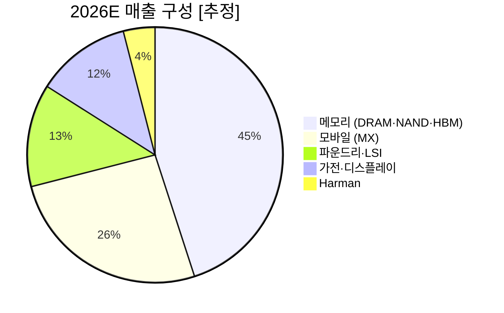
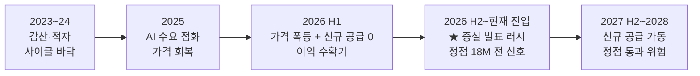
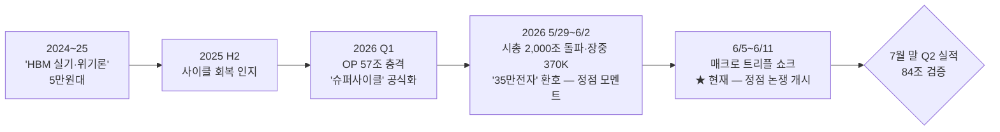

---

company: 삼성전자
ticker: 005930.KS
exchange: KRX
date: 2026-06-11
created: 2026-06-11
type: final-company
archetype: A
model: claude-fable-5
title: "Final - 삼성전자 (005930) 1105"
tags:
  - research
  - company-final
  - final-analysis
  - final-company
  - 반도체
  - 메모리
  - HBM
  - 파운드리
  - KOSPI
edition: definitive-v4-fable
data_verified: 2026-06-11
version: 4.0
supersedes: "260611_Final - 삼성전자 (005930)_0938"
publish: true
---

> [!important] 정합성 검증 — 신뢰도 A · v4 (표준 목차 v3 · 멀티컨텍스트 재검증판)
> **기업 유형: A (성숙·현금창출형) + B형 옵션 2개 (HBM catch-up · 파운드리 흑전)** — 정량 주도 판정.
> **리서치 아키텍처**: 서브에이전트 5개 fan-out (①OpenDART 직접 조회 ②산업·경쟁 ③정성·내러티브 ④시세·수급 ⑤최신뉴스 전수 스윕) → 단일 작성 컨텍스트 → 독립 검증 에이전트 통과 후 저장.
> **전판(0938판) 정정 계승 확인**: ① Forward PER 투명 계산 (5.9x 오류 부활 금지 — 컨센 기준 6.9x / 본 분석 보수 기준 8.3x 병기) ② 종전 분기 피크 17.57조('18Q3) — "58.9조"는 *연간* 수치 ③ §16 불투명 보정 없음 — 확률 민감도로 대체 ④ HBM4 Nvidia향은 SK 우위(55~70%) 지속, 삼성의 주공급 지위는 **AMD MI400 시리즈** ⑤ Vera Rubin full production(6/1)·파운드리 흑전 목표 단축·소각 일정 반영.
> **v4 신규 정정 (0938판 대비)**: ⑥ "3주간 주가 +1% 제자리"는 경로 오독 — 실제는 +20% 신고가(6/2, 시총 2,000조) 후 매크로 쇼크로 −18%(장중 고가比) 왕복 ⑦ "3사 증설 자제"는 기한 경과 — SK +$15B 커밋·용인 클린룸 가동 앞당김·마이크론 capex 상향 = 정점 시계 가동 ⑧ 2026년 자사주 매입 13.2조는 전액 *임직원 보상 목적* — 주주환원 소각(시가 ~14.6조)은 2025년 취득분 ⑨ 6/10 "외국인 −3.56조"는 과대 표기 — KOSPI 전체 −2.77조, 삼성전자 단일 −384만주.
> 정량 1차: **OpenDART 연결재무제표 직접 조회** (Q1'26 매출 133.87조·영업이익 57.23조·순현금 119.24조 — rcept 20260515002181) + FY2021~25 사업보고서 + 자사주·배당 공시 원문. 정성: 출처 명시·steel-man·confidence 태깅.

# §0. EXECUTIVE DECISION BRIEF

> [!verdict] 최종 투자의견 · **BUY-ACCUMULATE — 분할매수 유지** (재검증 통과, 단 성격 재규정: 12~24M 사이클 베팅 + 구조전환 콜옵션 — 영구보유 아님)
> 펀더멘털은 3주 전보다 더 강해졌고(Q2 컨센 84조, 5월 반도체 수출 +169%, HBM4E 세계 최초), 가격은 제자리다(302,500원). 그러나 전판이 "수급 이벤트"로 묶었던 조정의 정체는 **매크로 체제 전환 리스크**(美 CPI 4.2%·금리 인상 베팅·중동·환율 1,555원)였고, Capital Cycle은 **증설 발표 단계**에 진입했다. 따라서 판정은 유지하되 Bear 확률을 20→25%로 올리고, Kill 트리거에 매크로·증설 2건을 추가하며, 이 투자의 본질을 명시한다: **이것은 "위대한 기업을 영원히"가 아니라 "강한 사이클을 규율 있게"의 베팅이다.**
> 비즈니스 모멘텀 **High conviction** · 진입 가격 **Medium-High** · 보유 시계 **12~24M + 익절 규율**.

## 🔁 [전판 대비 변화] — 0938판(2026-06-11 오전) → 본판

| # | 무엇이 바뀌었나 | 판정 영향 |
|---|---|---|
| 1 | **조정의 정체 재규명**: "수급 이벤트" → 매크로 체제 리스크(美 CPI 4.2% 3년래 최고·Fed 인상 베팅·중동·환율 17년 최고). 6/5 사이드카→6/8 서킷브레이커→6/10 사이드카, 6/11 장중 283,000원 터치 후 V자 회복 | Bear 확률 20%→**25%** 상향, Kill에 매크로 트리거 신설 |
| 2 | **Capital Cycle 단계 갱신**: "증설 자제" → SK하이닉스 +$15B 커밋(2/25)·용인 클린룸 가동 2027.2 앞당김(2030 월 36만장)·마이크론 capex $20B 상향 — 본 보고서 자체 기준 "정점 18개월 전 신호"가 부분 발동 | 보유 시계 12~24M 명문화, 증설 Kill 트리거 신설 |
| 3 | **주주환원의 질 정정**: 2026년 매입 13.2조는 임직원 보상 목적(환원 아님). 환원 소각은 2025년 취득분 시가 ~14.6조(6/30 완료). 노조 합의로 DS 성과급 자사주 지급 10년 제도화 — 이익연동 비용 신설 | §10A 시그니처 재작성, 환원수익률 1.9%→**1.3%** 하향 |
| 4 | **수급 그림 정정**: 외국인 5/7~6/5 삼성전자 **30조 순매도**·보유비율 47.61%(연속 하락) — 랠리는 개인 주도. "재유입 여력" → "스마트머니 이탈 vs 개인 과열"의 양면 재해석 | §6 내러티브 아크를 "정점 논쟁 개시"로 이동 |
| 5 | **판정 산출 갱신**: 12M Base 390,000→**380,000원**, 확률가중 +23.2%→**+21.5%** (보수 민감도 +13.9%). BUY-ACCUMULATE와 4% 포지션·트리거 가격(280K/255K)은 유지 — 6/11 장중 저가 283,000원으로 T2가 사실상 1차 검증됨 | 결론 동일·근거 더 정직 |

## 📊 한눈에 보는 핵심

| 항목 | 값 |
|---|---|
| **종목** | 삼성전자 (KRX: 005930) · KOSPI 시총 1위 (삼전+하이닉스 = KOSPI 50.7%, 5/29 기준 [TokenPost]) |
| **기준가** | **302,500원** (6/10 종가) · 6/11 장중 302,750원 (저가 283,000 후 V자 회복) |
| **시가총액** | 보통주 ~1,770조 + 우선주 ~156조 = **~1,925조원 (~$1.26T)** |
| **52주** | 최고 370,000원(6/2 장중; 시총 2,000조 첫 돌파는 5/29 보·우 합산) / 최저 56,900원 — **1년 +432% 후 고점比 −18% 조정** |
| **Q1'26 실적 (DART 확정)** | 매출 **133.87조** · 영업이익 **57.23조** (OPM 42.8%, 종전 분기 피크 17.57조의 3.3배) · 순이익 47.23조 |
| **Q2'26 컨센서스** | 영업이익 **~84조** (KB 77 ~ 유안타 86.8 ~ 키움 100조) — Q1 대비 +47% |
| **Forward PER (투명 병기)** | 컨센 EPS 43,833원 기준 **6.9x** / 본 분석 보수 EPS 36,400원 기준 **8.3x** — TSMC 20.9x, MU 8.2x |
| **PBR (긴장 지점)** | trailing **4.2x** (역사 밴드 0.9~2.0x) / 2026E **~3.2x** — PER은 싸고 PBR은 사상 최고 |
| **적정가치 (§12)** | **360,000~400,000원** — 현재가 19~32% 저평가 [Confidence: M] |
| **12M 목표가 (Base)** | **380,000원 (+25.6%)** · 24M **415,000원 (+37.2%)** — §16 SSOT |
| **확률가중 기대수익률** | 12M **+21.5%** · 24M **+31.0%** (보수 민감도 12M **+13.9%**) |
| **투자의견** | <span style="background:#2E7D32;color:#fff;padding:2px 12px;border-radius:4px;font-weight:bold">BUY-ACCUMULATE — 분할매수</span> |
| **권장 포지션** | 최종 **4%** — 신규 1.5% 즉시 + 280,000원 +1.5% + 255,000원 +1.0% · 12~24M + 익절 규율 |

**▸ 밸류에이션 위치**

<div style="display:flex;border-radius:6px;overflow:hidden;height:30px;font-size:0.73em;color:#fff;text-align:center;margin:7px 0;font-weight:bold">
<div style="background:#1B5E20;width:18%;padding-top:8px">극저평가 <240K</div>
<div style="background:#2E7D32;width:24%;padding-top:8px">저평가 ◀ 302.5K</div>
<div style="background:#9CCC65;width:26%;padding-top:8px;color:#1B5E20">적정 360~400K</div>
<div style="background:#FB8C00;width:18%;padding-top:8px">고평가 450~550K</div>
<div style="background:#C62828;width:14%;padding-top:8px">거품 >550K</div>
</div>

## ⭐ 투자 매력도 스코어카드 (A형)

<div style="font-size:0.83em;margin:8px 0">
<div style="display:flex;align-items:center;gap:8px;margin:5px 0"><div style="width:185px">이익 모멘텀</div><div style="flex:1;background:#eee;border-radius:4px;height:20px"><div style="background:#2E7D32;width:97%;height:100%;border-radius:4px;color:#fff;font-size:0.82em;text-align:right;padding:1px 8px;box-sizing:border-box;font-weight:bold">9.7 / 10</div></div></div>
<div style="display:flex;align-items:center;gap:8px;margin:5px 0"><div style="width:185px">재무 건전성 (순현금 119조)</div><div style="flex:1;background:#eee;border-radius:4px;height:20px"><div style="background:#2E7D32;width:95%;height:100%;border-radius:4px;color:#fff;font-size:0.82em;text-align:right;padding:1px 8px;box-sizing:border-box;font-weight:bold">9.5</div></div></div>
<div style="display:flex;align-items:center;gap:8px;margin:5px 0"><div style="width:185px">밸류에이션 매력 (PER↔PBR 긴장)</div><div style="flex:1;background:#eee;border-radius:4px;height:20px"><div style="background:#43A047;width:78%;height:100%;border-radius:4px;color:#fff;font-size:0.82em;text-align:right;padding:1px 8px;box-sizing:border-box;font-weight:bold">7.8</div></div></div>
<div style="display:flex;align-items:center;gap:8px;margin:5px 0"><div style="width:185px">비즈니스 품질</div><div style="flex:1;background:#eee;border-radius:4px;height:20px"><div style="background:#43A047;width:80%;height:100%;border-radius:4px;color:#fff;font-size:0.82em;text-align:right;padding:1px 8px;box-sizing:border-box;font-weight:bold">8.0</div></div></div>
<div style="display:flex;align-items:center;gap:8px;margin:5px 0"><div style="width:185px">경제적 해자 (7 Powers)</div><div style="flex:1;background:#eee;border-radius:4px;height:20px"><div style="background:#66BB6A;width:72%;height:100%;border-radius:4px;color:#fff;font-size:0.82em;text-align:right;padding:1px 8px;box-sizing:border-box;font-weight:bold">7.2</div></div></div>
<div style="display:flex;align-items:center;gap:8px;margin:5px 0"><div style="width:185px">경영진·실행력</div><div style="flex:1;background:#eee;border-radius:4px;height:20px"><div style="background:#66BB6A;width:70%;height:100%;border-radius:4px;color:#fff;font-size:0.82em;text-align:right;padding:1px 8px;box-sizing:border-box;font-weight:bold">7.0</div></div></div>
<div style="display:flex;align-items:center;gap:8px;margin:5px 0"><div style="width:185px">주주환원 (질 하향 반영)</div><div style="flex:1;background:#eee;border-radius:4px;height:20px"><div style="background:#9CCC65;width:62%;height:100%;border-radius:4px;color:#333;font-size:0.82em;text-align:right;padding:1px 8px;box-sizing:border-box;font-weight:bold">6.2</div></div></div>
<div style="display:flex;align-items:center;gap:8px;margin:5px 0"><div style="width:185px">수익의 질 (사이클 의존)</div><div style="flex:1;background:#eee;border-radius:4px;height:20px"><div style="background:#FB8C00;width:55%;height:100%;border-radius:4px;color:#fff;font-size:0.82em;text-align:right;padding:1px 8px;box-sizing:border-box;font-weight:bold">5.5</div></div></div>
<div style="display:flex;align-items:center;gap:8px;margin:5px 0"><div style="width:185px">조직·인재 (이탈 적신호)</div><div style="flex:1;background:#eee;border-radius:4px;height:20px"><div style="background:#FB8C00;width:48%;height:100%;border-radius:4px;color:#fff;font-size:0.82em;text-align:right;padding:1px 8px;box-sizing:border-box;font-weight:bold">4.8</div></div></div>
</div>

> [!note] 스코어카드 해석
> 삼성전자는 "최고의 회사"가 아니라 **"최고의 이익 모멘텀이 한 자릿수 멀티플에 거래되는 좋은 회사"**다. 이익 모멘텀 9.7과 Fwd PER 6.9~8.3x의 조합은 사이클 산업에서 드물고 짧다. 평형추는 둘: 수익의 질 5.5(*이 이익은 가격 사이클의 이익*)와 신설된 조직·인재 4.8(이직률 10.1% vs SK하이닉스 1.3% — 5년 시계의 균열). 전자가 보유 시계를 제한하고, 후자가 "영구보유 불가" 판정의 정성 근거다.

## 🎬 핵심 논지 — "사상 초유의 사이클 × 매크로가 만든 할인"

| 🟢 왜 사야 하나 | 🔴 왜 망설여지나 |
|---|---|
| Q1 OP **57.23조 (DART 확정)** — 종전 분기 피크(17.57조, '18Q3)의 3.3배, 증분마진 92% | 이익의 원천은 *가격* — DRAM Q1 계약가 +90~95%. 사이클은 반드시 꺾인다 — 시점만 문제 |
| **Q2 컨센 ~84조** + 5월 반도체 수출 371.6억$ (+169% YoY, 월간 사상 1위) — 실물 확인 | **증설 시계 가동**: SK +$15B·용인 앞당김·MU capex 상향 — 정점 18개월 전 신호 부분 발동 |
| Fwd PER 컨센 6.9x / 보수 8.3x — 미국 어느 반도체보다 싸다 (TSMC 20.9x, NVDA 15.8x) | **PBR 4.2x = 역사 밴드(0.9~2.0x)의 2배** — 사이클 정점에 PER은 가장 싸 보인다 (밸류 트랩 고전 패턴) |
| HBM4: 3사 공인(Vera Rubin full production) + **AMD MI400 주공급** + HBM4E 12단 세계 최초 샘플(5/29) | Nvidia향은 여전히 SK 55~70% — HBM 1위 탈환은 아직 스토리 단계 |
| 파운드리 흑전 **3Q26 전망** (가동률 80%+, SF2P 수율 70% 보도, 테슬라 AI6 테일러 전량 $16.5B) | 매크로 체제 전환 리스크: 美 CPI 4.2%·Fed *인상* 베팅·중동 전쟁·환율 1,555원(17년 최고) |
| 순현금 **119.24조 (DART 확정)** + 소각 ~14.6조 (6/30 완료) + 차기 환원정책 발표 예고(2027 초까지) | 외국인 5주 30조 순매도·보유 47.6% — 개인 주도 랠리의 취약성. KOSPI 쏠림 50.7% |
| 목표가 컨센 평균 **437,500원(+44.6%)** — 급락 중에도 6월 5개사 상향 러시 | 노조 합의: 성과급 이익연동(재원 10.5%)·자사주 지급 10년 제도화 — 이익의 고정비화 [추정] |

> [!verdict] 그래서 — "분할로 사되, 시계와 출구를 명문화하라"
> 전판과 동일한 결론(BUY-ACCUMULATE), 더 정직한 근거: 3주간 이익 전망은 +50% 올랐고 주가는 제자리지만, 그 괴리의 절반은 *매크로가 강제한 리스크 프리미엄*이다 — 공짜 점심이 아니라 가격이 매겨진 위험이다. 그래도 산다: ① 12~18M은 증설 물리학이 공급 부족을 보호하고 ② 한 자릿수 Fwd PER이 디레이팅을 상당 부분 선반영했으며 ③ 순현금 119조와 Q2 +47% 모멘텀이 다운사이드를 좁힌다. **신규 1.5% 즉시 + 280,000원 +1.5% + 255,000원 +1.0% (최종 4%).** 단 이것은 사이클 베팅 — 2027년 증설 가동 전 익절 로드맵(§18·§21)이 매수만큼 중요하다.

## 🔑 핵심 발견 (8)

| # | 발견 | 근거 | 함의 | Conf. |
|---|---|---|---|---|
| 1 | **슈퍼사이클의 규모가 역사적 척도 밖** | Q1 OP 57.23조 = 2018 *연간*(58.9조)에 분기로 근접. DRAM 산업 분기 매출 $97B (+81% QoQ) | 이익 절대 규모가 시총을 재정의 — "정점 멀티플 축소" 공식보다 이익이 빠르다 (12M 시계) | H |
| 2 | **이익/주가 괴리의 정체는 매크로 리스크 프리미엄** | 5/22→6/11 주가 +1.0%인데 경로는 +20%→−18% 왕복. 트리거 전부 외생(CPI·중동·금리·브로드컴) | 괴리는 기회이되 "시장의 외면"이 아니라 "가격 매겨진 위험" — 포지션은 분할이 정답 | H |
| 3 | **Capital Cycle이 증설 발표 단계 진입** | SK +$15B 커밋(2/25 이사회 승인)·용인 클린룸 가동 2027.2로 앞당김·MU capex $13.5→20B·YMTC DRAM 전환 | 본 보고서 기준 "정점 18개월 전 신호" 부분 발동 — 정점 추정 2027 중~말 [추정] | M-H |
| 4 | **HBM4 — Nvidia 2위, AMD 1위, 차세대 선행** | Vera Rubin: SK 55~70%/삼성 25~30%. AMD MI455X 삼성 primary. HBM4E 12단 샘플 세계 최초(5/29) | 점유 회복 경로 유효 (17%→25~30%) — 단 1위 탈환 서사는 시기상조 | H |
| 5 | **주주환원의 질은 외견보다 낮다** | 2026 매입 13.2조 전액 임직원 보상 목적 [DART]. 환원 소각은 2025 취득분 ~14.6조. 환원수익률 ~1.3% | §10A — "사상 최대 환원" 헤드라인 디스카운트 필요. 차기 정책(2027 초)이 진짜 이벤트 | H |
| 6 | **매크로 체제 전환이 신규 1순위 리스크** | 美 5월 CPI +4.2% (3년래 최고)·Fed 인상 베팅·환율 1,555 (17년 최고)·KOSPI 서킷브레이커 | 멀티플 압축 경로 — Bear 25%로 상향, Kill 트리거 신설 | H |
| 7 | **조직 균열 — 정성 적신호 신설** | 이직률 10.1% vs SK 1.3% (7.8배)·Blind 2.9·"성과급 6억에도 하이닉스 간다" | 5년 시계 기술 경쟁력 변수 — 영구보유 부적격의 정성 근거 | M |
| 8 | **정책 순풍 2건 확정** | 배당 분리과세 통과(25/12)·반도체특별법 통과(26/1)·시안 연간 라이선스 확보 | Bear 꼬리 위험 축소 + 고배당 매력 구조화 | H |

## 🎯 매수 트리거 + Kill 트리거

> [!success] 분할 매수 트리거
> **T1 · 즉시 (302,500원)** — 1.5%. Fwd 6.9~8.3x + Q2 +47% 모멘텀 + 매크로 조정 선반영.
> **T2 · 280,000원** — +1.5% (6/11 장중 283,000 터치 — 변동성 국면에서 재도달 확률 유의미).
> **T3 · 255,000원** — +1.0% (매크로 쇼크 연장·시장 전반 조정 시나리오).
> **T-B · 펀더멘털 confirm (7월 말 Q2 확정실적)** — ① DS OP 70조+ ② HBM4 Nvidia/AMD향 매출 인식 확인 ③ 파운드리 분기 적자 1조 미만 — 3중 2개 충족 시 가격 무관 +1.0%.

> [!danger] Kill 트리거 — 핵심 3 + 신설 2 (전체 6개 → §18)
> | 트리거 | 임계값 | 발동 |
> |---|---|---|
> | 🔴 HBM4 매출 인식 실패 | 2026 Q3 실적까지 Vera Rubin/MI400 매출 미확인 | 비중 50% 축소 |
> | 🔴 메모리 가격 꺾임 | DRAM·NAND 고정가 2분기 연속 −10%+ | 비중 70% 축소 |
> | 🔴 파운드리 적자 재확대 | 분기 적자 2조+ 또는 테슬라 이탈 | 비중 30% 축소 |
> | 🆕 매크로 체제 전환 | Fed 기준금리 *인상* 현실화 + 환율 1,600 돌파 동반 | 신규 매수 중단 + 25% 축소 |
> | 🆕 증설 러시 확정 | 빅3 중 1사 추가 범용 DRAM 대규모 증설 발표 (2027 가동) | 익절 로드맵 가동 (§21) |

---

# §0.5 논증 지도 (Argument Map)

> **▶ 헤드 메시지**: 네 질문의 답이 같은 방향을 가리킬 때만 산다 — 본판은 3🟢 1⚪로 매수다.
> **판정 기여**: ⚪ 내비게이션 — 판정의 압축 지도.

> 이 보고서가 결국 말하는 것 — 핵심 질문 4개, 한 줄 답, 근거 섹션. 헤드 메시지만 따라 읽어도 논증이 복원된다.

| # | 핵심 질문 | 한 줄 답 | 근거 섹션 |
|---|---|---|---|
| Q1 | **이 이익은 진짜이고, 얼마나 가는가?** | 진짜다(DART 확정·수출 통계 교차검증). 증설 물리학상 2027년 중반까지 보호 — 단 증설 시계가 켜졌고, 정점은 2027 중~말 [추정] | §5 · §7 · §8 · **§9★** |
| Q2 | **현재 가격은 그 이익 대비 싼가?** | 이익 대비 싸고(Fwd 6.9~8.3x) 자산 대비 비싸다(PBR 4.2x vs 역사 0.9~2.0x) — *사이클 베팅으로서만* 싸다. mid-cycle 정상화 가치는 ~203,000원 | **§10★** · §12 · §16 |
| Q3 | **"만년 2위" 리스크와 조직 균열이 thesis를 깨는가?** | 12~24M 시계에선 깨지 않는다 — AMD 주공급 + HBM4E 선행 + 흑전 임박이 증거. 단 인재 유출(이직률 7.8배)은 5년 시계의 진짜 변수 | §2 · §3 · §4 |
| Q4 | **무엇이 이 thesis를 죽이는가?** | ① 매크로 체제 전환(Fed 인상) ② 증설 러시→2027 공급 과잉 ③ HBM4 물량 미실현 — Kill 6개 명문화, 익절 로드맵 동반 | §16 · §17 · §18 · §21 |

**판정 종합**: Q1 🟢 + Q2 ⚪(조건부 🟢) + Q3 🟢 + Q4 관리가능 → **BUY-ACCUMULATE, 4%, 12~24M + 익절 규율**.

---

# PART II — 기업의 본질 (The Business)

> [!summary] 이 파트의 결론
> 삼성전자의 본질은 **"모든 전장에서 2위인 세계 유일의 수직계열 복합체"**다. 그 2위 묶음이 컨글로머릿 디스카운트의 원인이자 사이클 하단의 완충재이며, 2026년의 변화는 2위 탈출이 아니라 **2위 지위의 수익화**(HBM4 인증 통과·AMD 주공급·파운드리 가동률 회복)다. 정성 레이어는 판정을 🟢 지지하되 두 균열 — 인재 유출과 내러티브 정점 논쟁 — 이 보유 시계를 제한한다.

# §1. 회사 개요 & 비즈니스 모델

> **▶ 헤드 메시지**: 삼성전자의 사업 묶음은 "분산"이 아니라 **메모리 사이클에 대한 레버리지 + 나머지의 완충**이다 — 2026년 전사 이익의 ~95%가 반도체(DS)에서 나오기 때문이다 [추정].
> **판정 기여**: ⚪ 중립·조건부 — 구조 이해의 기초. 메모리 의존도가 높을수록 §9(사이클)의 판정 지배력이 커진다.

## 1.1 사업 구조 (FY2026E 기준 추정 구성)



| 사업부 | 2026E 매출 [추정] | 2026E OP [추정] | 글로벌 지위 | 사이클 민감도 |
|---|---:|---:|---|---|
| **메모리** | ~260조 | ~280조* | DRAM 1위 (~40%), NAND 1위 | ★★★ 극단 |
| **파운드리·LSI** | ~75조 | −1~+1조 | 2위 (4Q25 점유 7.1% vs TSMC 70.4%) | ★★ |
| **모바일 (MX)** | ~150조 | ~10조 | 출하 1위 (1Q26 22% vs Apple 20%) | ★ — 단 메모리 원가 역풍 |
| **가전·DP** | ~67조 | ~3조 | TV 1위·생활가전 상위 | ★ |
| **Harman** | ~22조 | ~1.5조 | 전장 오디오·텔레매틱스 | ★ |

*메모리 OP가 전사 OP에 근접·초과 — 파운드리 적자와 세트 마진 압박을 메모리가 흡수하는 구조. 사업부별 분해는 회사가 분기 단위로 미공시 [Confidence: M | 근거: Q1 컨콜 + 셀사이드 분해 평균]

## 1.2 비즈니스 모델의 본질 — 3개 레이어

1. **메모리 = 과점 가격결정력의 수확기**. 역사적으로 price-taker였으나, AI 수요 + 3사 과점 + 증설 리드타임 2년이 결합해 가격 결정력이 구조적으로 상승했다. 증거: Q1'26 DRAM 계약가 +90~95% QoQ (사상 최대 분기 인상), CSP가 *가격이 아니라 물량*을 협상하는 LTA 구조 전환 [TrendForce 2026-03-31].
2. **HBM = 메모리의 파운드리화**. 고객별 맞춤 베이스 다이(4nm 로직)·장기 계약·인증 진입장벽 — 범용 메모리보다 높은 멀티플이 정당한 비즈니스로 진화 중. 단 2026년의 특이점: 범용 DRAM 폭등으로 **HBM 계약가가 오히려 하락**(믹스 역전 — DDR5 수익성이 일부 HBM 상회) [TrendForce 2026-06-01] — "HBM 프리미엄" 서사를 기계적으로 적용하면 틀린다.
3. **파운드리 = 콜옵션**. 4년 적자 후 3Q26 흑전 전망 — 행사되면 TSMC 대비 1/8 멀티플의 재평가 여지 (§13).

## 1.3 연혁 타임라인 — 위기와 변곡

| 시기 | 사건 | 의미 |
|---|---|---|
| 1983 | 이병철 "도쿄 선언" — DRAM 진출 | 후발 추격의 원형 |
| 1992~ | DRAM 세계 1위 등극 | 이후 33년 1위 유지 |
| 2017~18 | 1차 슈퍼사이클 (연간 OP 58.9조 피크) | 반도체 이익의 역사적 기준점 |
| 2019~23 | 파운드리 비전 2030 선언 → TSMC 격차 확대 | "2위의 비용" 학습기 |
| 2024~25 | HBM3E 실기 — Nvidia 인증 지연, 점유 17%까지 추락 | 위기의 삼성 내러티브 |
| 2026.2 | **HBM4 세계 최초 양산 출하** | 만회의 증거 1 |
| 2026.5~6 | HBM4E 12단 세계 최초 샘플 + 시총 2,000조 돌파 | 만회의 증거 2 + 내러티브 정점 모멘트 |

## 1.4 5/22 이후 3주 트랙 — 사건이 가격을 끌고 간 궤적

| 날짜 | 사건 | 주가 반응 |
|---|---|---|
| 5/27 | 노조 임단협 가결 (73.7%) — 5개월 분쟁 종결 | 307,000 (+2.7%) |
| 5/29 | **HBM4E 12단 샘플 세계 최초 출하** (로드맵 대비 2~3개월 조기) + **시총 2,000조 첫 돌파** (보·우 합산, 한국 최초) [서울신문] | 317,000 (+5.8%) |
| 6/1 | 5월 반도체 수출 371.6억$ (+169% YoY) 사상 최대 + 젠슨 황 방한 기대 — 보통주 단독 시총 2,000조(2,040조) | 349,000 (+10.1%) |
| 6/2 | **장중 370,000 신고가** — 종가 기준 사상 최고 | 360,500 (+3.3%) |
| 6/5 | 브로드컴 쇼크 (AVGO −12%, SOX −10.3%) — KOSPI 사이드카 | 329,000 (−6.4%) |
| 6/8 | 美 고용 호조→금리 인상 전망 + 중동 — **KOSPI 서킷브레이커 (−8.3%)** | 295,500 (−10.2%) |
| 6/9 | KOSPI 역대 최대 반등 (+8.2%) — "업황 건재" 컨센 | 322,000 (+9.0%) |
| 6/10 | 美 CPI 경계 + 중동 재점화 — 사이드카, 외국인·기관 동반 매도 | 302,500 (−6.1%) |
| 6/11 | 선물옵션 동시만기 — 장중 283,000 → V자 회복 | 302,750 (장중, +0.1%) |

**판독**: 펀더멘털 뉴스플로우(5/27~6/2)는 전 구간 Bull, 조정 트리거(6/5~6/11)는 전부 외생 매크로. 이 분리가 §10(괴리 분석)의 출발점이다.

---

# §2. 창업자·경영진 — 인물·역량·자본배분 [Q1] ★

> **▶ 헤드 메시지**: 삼성 경영진의 2026년 성적표는 **"기술 만회 A− · 자본배분 B+ · 조직 장악 C"** — HBM 실기를 2년 만에 만회한 실행력은 증명됐으나, 인재 유출과 보상 불신이라는 내부 균열이 새로 드러났다.
> **판정 기여**: ⚪ 중립·조건부 — 12~24M 시계에선 🟢 (실행 모멘텀), 5년 시계에선 🔴 (조직 균열·승계 구조).

## 2.1 경영진 스코어카드

<div style="font-size:0.83em;margin:8px 0">
<div style="display:flex;align-items:center;gap:8px;margin:5px 0"><div style="width:185px">기술 로드맵 실행 (HBM4·2nm)</div><div style="flex:1;background:#eee;border-radius:4px;height:19px"><div style="background:#43A047;width:80%;height:100%;border-radius:4px;color:#fff;font-size:0.8em;text-align:right;padding:1px 7px;box-sizing:border-box;font-weight:bold">8.0</div></div></div>
<div style="display:flex;align-items:center;gap:8px;margin:5px 0"><div style="width:185px">자본 배분 (환원+투자)</div><div style="flex:1;background:#eee;border-radius:4px;height:19px"><div style="background:#66BB6A;width:75%;height:100%;border-radius:4px;color:#fff;font-size:0.8em;text-align:right;padding:1px 7px;box-sizing:border-box;font-weight:bold">7.5</div></div></div>
<div style="display:flex;align-items:center;gap:8px;margin:5px 0"><div style="width:185px">위기 대응 (HBM 실기 만회·노조)</div><div style="flex:1;background:#eee;border-radius:4px;height:19px"><div style="background:#66BB6A;width:72%;height:100%;border-radius:4px;color:#fff;font-size:0.8em;text-align:right;padding:1px 7px;box-sizing:border-box;font-weight:bold">7.2</div></div></div>
<div style="display:flex;align-items:center;gap:8px;margin:5px 0"><div style="width:185px">소통·가이던스 신뢰</div><div style="flex:1;background:#eee;border-radius:4px;height:19px"><div style="background:#9CCC65;width:62%;height:100%;border-radius:4px;color:#333;font-size:0.8em;text-align:right;padding:1px 7px;box-sizing:border-box;font-weight:bold">6.2</div></div></div>
<div style="display:flex;align-items:center;gap:8px;margin:5px 0"><div style="width:185px">지배구조 정렬 (이재용 미등기)</div><div style="flex:1;background:#eee;border-radius:4px;height:19px"><div style="background:#FB8C00;width:55%;height:100%;border-radius:4px;color:#fff;font-size:0.8em;text-align:right;padding:1px 7px;box-sizing:border-box;font-weight:bold">5.5</div></div></div>
<div style="display:flex;align-items:center;gap:8px;margin:5px 0"><div style="width:185px">인재 흡인·유지 (신설)</div><div style="flex:1;background:#eee;border-radius:4px;height:19px"><div style="background:#E53935;width:45%;height:100%;border-radius:4px;color:#fff;font-size:0.8em;text-align:right;padding:1px 7px;box-sizing:border-box;font-weight:bold">4.5</div></div></div>
</div>

## 2.2 체제 — 누가 무엇을 책임지나

| 인물 | 직책 | 2026 트랙 |
|---|---|---|
| **이재용** | 회장 (미등기) | 2025.7 대법원 무죄 확정으로 사법리스크 소멸 — 그러나 2026 주총에 등기이사 복귀 안건 **미상정** [뉴스웨이 26-03-05]. 책임경영 공백 논점 지속. 직접 지분 1.65% + 계열 합산 ~20% |
| **전영현** | 부회장·DS부문장·대표이사·이사회 의장 | HBM4 최초 양산·HBM4E 조기 샘플의 실행 책임자. 6/8 젠슨 황과 신라호텔 회동 — HBM4E·HBM5 공급 플랜 + 파운드리 차세대 칩 논의 ("오랜 협력 중 가장 좋은 대화") [뉴시스·ZDNet 26-06-08] |
| **노태문** | DX부문장·대표이사 (2025.11 정식 선임) | 갤럭시 S26 사전판매 역대 최다 — 단 반값 프로모션 병행 (§3) |
| **김용관** | DS 경영전략총괄 사장 — 2026 주총 사내이사 신규 선임 | 이사회 8인 체제 (사내 3·사외 5) |

## 2.3 실행 트랙레코드 — 약속 vs 실현

| 약속 | 시점 | 실현 | 판정 |
|---|---|---|---|
| HBM3E 추격 | 2024~25 | Nvidia 인증 지연 반복 — 점유 17%까지 추락 | 🔴 실기 |
| **HBM4 최초 양산** | 2026-02 | 세계 최초 양산 출하 (1c DRAM + 4nm 베이스 다이) → 6월 풀스케일 공급 | 🟢 만회 |
| AMD MI400 주공급 | 2026-03 | MI455X primary supplier 계약 + 파운드리 연계 논의 | 🟢 |
| **HBM4E 선행** | 2026-05-29 | 12단 샘플 세계 최초 출하 — 로드맵 대비 2~3개월 조기, "엔비디아 요구 맞춘 곳은 삼성 유일" 평가 | 🟢 초과 |
| 파운드리 흑전 | "2027" → "2026"으로 단축 | 가동률 80%+ (1년래 최고)·3Q26 흑전 전망 [DigiTimes 26-06-09] — 아직 약속 단계 | 🟡 |
| 주주환원 FCF 50% (2024~26) | 정책 마지막 해 | 배당 11.1조 + 소각 ~14.6조 진행 — 단 2026 매입분은 보상 목적 (§10A) | 🟡 이행되나 질 혼재 |

> [!warning] 가이던스 패턴 — 버퍼 유지
> 삼성의 약속은 *방향은 맞되 시점이 밀리는* 패턴이었다(HBM 1년+, 파운드리 흑전 수년). 2026년 들어 HBM4·HBM4E에서 처음으로 *앞당기는* 패턴이 나타났으나, 본 분석은 회사 시점 약속에 −2분기 버퍼를 일괄 유지한다 (§11). 파운드리 "3Q26 흑전"도 버퍼 적용 시 1Q27.

## 2.4 자본 배분 — A형 핵심 검증

| 영역 | 규모 (2026) | 평가 |
|---|---|---|
| **시설·R&D 투자** | **110조원+** (3/19 밸류업 공시 명시) — 메모리 capex $20B (+11%, HBM4·1c 집중) + 테일러 | 🟢 공격적이되 선별적 — HBM·선단공정 집중, 범용 신중 |
| **주주환원** | 배당 ~11.1조 + 소각 ~14.6조 (2025 취득분, 6/30 완료) | 🟡 절대액 사상 최대, 단 환원수익률 ~1.3% + 2026 매입은 보상 목적 — §10A |
| **M&A** | 로봇·메디테크·전장·HVAC "의미 있는 규모" 추진 명시 (밸류업 공시) | 🟡 Harman(2017) 이후 공백 — 실행 미검증, 옵션으로만 계상 (§13) |

**과점 규율의 현재 상태 (v4 갱신)**: 삼성 자신은 범용 증설에 신중하다($20B, +11%). 그러나 *산업 전체*로는 SK +$15B 커밋·용인 앞당김·MU 상향 — 규율이 풀리기 시작했다. 자본배분 평가가 "삼성 단독"으로는 A−, "산업 시스템"으로는 정점 시계 가동이다 (§5·§9).

## 2.5 조직·인재 — 신설 적신호

- **이직률 10.1% (2024) vs SK하이닉스 1.3%** — 7.8배 [더퍼블릭/파이낸셜뉴스 26-05-26]. "최근 3~4개월 하이닉스 이직 조합원 100~200명, 신입은 하이닉스 이직 스터디" [르데스크].
- 2025년분 성과급: DS OPI 47% 지급 — 그럼에도 "성과급 6억에도 떠나겠다, 다들 하닉 지원 중" [아시아경제 26-05-27]. 불만의 본질은 금액이 아니라 **평가·보상 공정성 불신 + 상대적 박탈감** [시사IN].
- 평판 지표: Blind 평점 **2.9** · 잡플래닛 3.8 (11,167건) [Confidence: M | 근거: 2차 플랫폼].
- 노조 타결(5/27, 찬성 73.7%): 임금 +6.2%, 성과급 재원 구조 합의 — DS 특별성과급은 **세후 전액 자사주 지급, 10년 제도화**. 생산 차질 리스크는 소멸했으나 이익연동 보상의 고정비화 + 자사주 지급의 희석 요인 신설 (§8·§10A).

## 2.6 M3 — steel-man 반대 시각

> [!danger] 회의론자
> "삼성 경영진은 *2등의 관성*에 갇혔다. HBM에서 SK에, 파운드리에서 TSMC에, 폰에서 Apple에 — 모두 2위. 게다가 이제 엔지니어들이 2위 회사를 떠나 1위로 간다. 가격 사이클의 순풍을 실력으로 착각하지 마라 — 사이클이 꺾이면 남는 것은 2위의 마진과 빈 자리다."
> **수용**: HBM 실기·인재 유출은 사실 — 스코어 4.5 신설로 반영했고, 영구보유 부적격 판정의 근거다. **반박**: 12~24M 시계에서 thesis를 깨려면 인재 유출이 *현 세대 제품*(HBM4·SF2)의 실행을 무너뜨려야 하는데, 증거는 반대다 — HBM4 최초 양산, HBM4E 조기 샘플, 수율 개선 모두 2026년에 *가속*했다. 균열은 5년 변수이지 2년 변수가 아니다. [Confidence: M]

---

# §3. 핵심 제품 & 고객 진실 [Q3] ★

> **▶ 헤드 메시지**: B2B 메모리의 "고객 진실"은 리뷰가 아니라 **인증과 물량 배분**이다 — 2026년 6월 기준 삼성은 인증(Nvidia·AMD·풀스케일 공급)을 통과했고, 물량(Nvidia향 25~30%)은 아직 2위다. 고객이 먼저 손을 내미는 구조(LTA·OpenAI 딜)가 처음 나타났다.
> **판정 기여**: 🟢 강화 — HBM 매출 경로의 1차 검증 완료. 단 "1위 탈환" 서사는 배제.

## 3.1 제품별 고객 진실

| 제품 | 핵심 고객 | "사라지면 화날까" 신호 | 판정 |
|---|---|---|---|
| **HBM4** | Nvidia·AMD·브로드컴·OpenAI | Vera Rubin 3사 공인 (6/1 full production) + AMD primary + 젠슨 황 "3사 모두 인증·양산 중" 직접 확인 (6/5) | 🟢 인증 통과 — 물량 2위 |
| **HBM4E** | 차세대 전 고객 | 12단 샘플 세계 최초 (5/29, 핀당 14Gbps·최대 16Gbps) — SK는 2027 양산 목표로 삼성이 시간 선행 | 🟢 차세대 선점 포석 |
| 범용 DRAM/NAND | CSP·서버 OEM | CSP가 **LTA로 물량 선점 경쟁** — 모바일 DRAM LTA $21/GB 보도. 2026년 물량 완판 | 🟢 수요>공급 구조 |
| 파운드리 2nm | 테슬라(AI5/AI6)·Nvidia(4/8nm)·퀄컴/AMD/구글 협상 | 테슬라 AI6 테일러 전량 $16.5B + 테일러 2공장 조기 검토 + Nvidia 자율주행 칩 공급 중 (전영현 확인) | 🟡 검증 진행 — 수율 데이터 분수령 3Q~4Q26 |
| 갤럭시 S26 | 글로벌 소비자 | 사전판매 135만대 역대 최다 [전자신문 26-03-04]·첫 6주 +13%·1Q 점유 22% > Apple 20% [Counterpoint] — 단 한 달 만 반값 프로모션 + "옆그레이드" 평가 병존 | 🟡 판매량 강·애착 약 |
| Z 트라이폴드 | 얼리어답터 | 10분 완판 후 **국내 판매 종료** (누적 ~3,000대) — 수익성 아닌 기술 과시 목적 | ⚪ 상징적 — 실적 무관 |

## 3.2 HBM4 물량 배분의 진실 (정정 계승 — 핵심)

| 고객 | 삼성 지위 | 근거 |
|---|---|---|
| **Nvidia (Vera Rubin)** | **2위 — 25~30%** | SK 55~70% 선점 (TSMC 협업 베이스 다이). 삼성은 turnkey (메모리+4nm 베이스 다이+패키징 자체 일괄) 차별화 [TechTimes 26-06-05] |
| **AMD (MI455X·Helios)** | **주공급 (primary)** | 2026-03 계약 + AMD AI칩 일부 삼성 파운드리 이관 연계 논의 — HBM을 파운드리 수주 지렛대로 [TrendForce 26-03-19] |
| **OpenAI** | 12단 HBM4 최대 8억 Gb (2H26) | Nvidia·AMD 다음 3순위 배정 [winbuzzer 26-03-20] [추정] |
| **Google TPU** | HBM3E >60% 확보 + HBM4 테스트 기대치 상회 | [TrendForce 25-12-03] [추정] |

**물량 산식**: 삼성 HBM capa 17만→**25만 wpm (+50%, 연말)** + 2026년 물량 완판 + HBM 시장 +70~77% 성장 → HBM 매출 경로(전판 ~24조, +189%)는 보수적 배분 가정으로도 성립 [Confidence: M | 근거: TrendForce capa + 완판 보도 교차].

## 3.3 고객 구조의 질적 전환 — 이번 사이클의 핵심 차이

- **과거**: 분기 단위 가격 협상, 고객이 갑 — 사이클 하강 시 가격 전가 즉시.
- **현재**: CSP들이 **장기계약(LTA)으로 공급을 선점 경쟁** — "가격보다 물량" [TrendForce 26-03-31]. 스마트폰·PC 브랜드는 가격 인상과 스펙 다운그레이드로 대응 중 — 수요 파괴의 초기 신호이기도 하다 (§9.5에서 양면 검정).
- **함의**: 다음 다운사이클에서 LTA가 가격 하단을 받쳐줄 *가능성* — 단 2018년에도 "이번엔 다르다"(서버 구조 수요론)는 말이 있었고 6개월 뒤 깨졌다. 구조론은 §13 옵션으로만 계상하고 본 케이스에는 넣지 않는다.

---

# §4. 경제적 해자 & 기술 — 7 Powers [Q2] ★

> **▶ 헤드 메시지**: 삼성의 해자는 **자본 장벽(규모 9.0)과 공정 노하우(프로세스 파워 8.0)**이지 고객 락인이 아니다 — 그래서 이익은 사이클을 *증폭*해서 통과시키고, 해자 점수 7.2는 "하단에서 살아남고 상단에서 폭발하는" 구조를 뜻한다.
> **판정 기여**: ⚪ 중립·조건부 — 해자는 생존을 보장하지 이익의 *안정*을 보장하지 않는다. 판정의 시계 제한(12~24M)을 정당화.

## 4.1 7 Powers 검정

| Power | 점수 | 증거 (2026-06 기준) |
|---|---|---|
| **규모의 경제** | 🟢 9.0 | 메모리 capex 연 $20B+를 감당 가능한 기업은 전 세계 3개. 2026 시설·R&D 110조+ — 신규 진입 물리적 차단. CXMT조차 sub-18nm 장비 규제로 정체 |
| **프로세스 파워** | 🟢 8.0 | 33년 메모리 수율 노하우 + 1c DRAM + HBM4 최초 양산 + HBM4E 최초 샘플. 단 HBM3E 패키징에서 SK에 추월당한 전력 — 프로세스 파워는 *영역별*로 비대칭 |
| **독점자원** | 🟡 6.5 | 평택·테일러 fab 클러스터 + **수직계열 turnkey** (메모리+4nm 베이스 다이+패키징 일괄 — 세계 유일, SK는 TSMC 협업 필요). 단 인재 유출(§2.5)이 이 자원의 침식 경로 |
| **전환비용** | 🟡 6.0 | HBM 인증 lock-in (1~2년 주기) + LTA 장기계약 구조 전환. 단 Nvidia가 멀티소싱을 *강제*하는 구조 — 락인은 양방향이 아니다 |
| **브랜드** | 🟡 6.0 | B2B 신뢰(33년 1위) + B2C 갤럭시 1위. 프리미엄 프라이싱 파워는 제한 (S26 반값 프로모션이 증거) |
| **네트워크 효과** | 🟠 3.0 | 사실상 없음 |
| **카운터포지셔닝** | 🟠 3.0 | 없음 — 오히려 피격 대상 (CXMT 저가 공세·YMTC DRAM 전환). 美 규제가 방패이나 정책 의존 |

**가중 종합: 7.2 / 10** — 메모리 과점 구조가 핵심 해자, 깊이는 "광대역"이 아니라 "자본·공정 두 축 집중형".

## 4.2 기술 1차원리 — HBM4·2nm은 진짜 어려운가

- **HBM4의 난점**: 16-hi 적층 + 베이스 다이의 로직화(4nm) — 메모리·파운드리·패키징 3개 역량의 교차점. **삼성만 3개를 내재화** — turnkey가 구조적 차별점이 되는 시점은 HBM4E~HBM5 [추정]. HBM4 속도 11.7Gbps로 Nvidia 요구(10Gbps) 상회 [TrendForce 26-01-26].
- **HBM4E 선행의 의미**: 5/29 12단 샘플 세계 최초 (핀당 최대 16Gbps, HBM4 대비 +20%) — HBM3E에서 1년+ 뒤지던 회사가 HBM4E에서 SK보다 빠르다. 기술 격차의 *부호*가 바뀌는 첫 데이터 포인트 [Confidence: M | 근거: 삼성 뉴스룸 + SK HBM4E 2027 양산 목표 대비].
- **2nm GAA**: SF2 수율 60%+ → SF2P 70% 도달 보도 [sedaily 26-04-29, [추정] 업계발] vs TSMC 70%+. 격차 축소 중이나 미해소 — 테슬라·Nvidia 자율주행 등 *가격 민감·非최선단 고객*부터 침투하는 우회 전략. 테일러 SF2P+ 2027 양산.
- **S-curve 위치**: HBM은 성장 가속 구간 (2026 +70~77%), 범용 DRAM은 성숙 사이클 산업, 파운드리 2nm은 진입 초기. 파괴 취약성: 메모리의 paradigm shift (CXL·PIM·HBF)는 5년+ 시계 — 현 시점 위협 아님 [추정].

## 4.3 해자의 10년 내구성

| 축 | 내구성 | 근거 |
|---|---|---|
| 메모리 과점 (3사) | 🟢 강 — 단 중국 변수 | CXMT 15% 생산 도달·DDR5 진입, YMTC DRAM 전환 (2027 양산) — 범용 low-end부터 잠식 [Nikkei 26-05-14]. 선단(HBM·1c)은 규제+기술 격차로 5년+ 보호 [추정] |
| HBM 진입장벽 | 🟢 강 | 인증 주기 + 수율 노하우 + 고객 공동설계 — 신규 진입 사실상 불가 |
| 파운드리 2위 | 🟡 중 | TSMC 격차 62.7%p — 추격이 아니라 "2위 시장의 독점"이 현실적 목표 |
| 수직계열 turnkey | 🟡 중 | 기술 통합 우위 vs 인재 유출 리스크의 줄다리기 |

---

# §5. 산업 구조 · Capital Cycle · 생태계 포지션

> **▶ 헤드 메시지**: Capital Cycle은 **"이익 폭발 + 2026년 신규 공급 제로"라는 최상의 조합에서 "증설 발표 러시"라는 후반 국면으로 한 칸 이동했다** — 수확기는 유효하나, 본 보고서가 정의했던 "정점 18개월 전 신호"가 부분 발동했다.
> **판정 기여**: 🟢 강화 (12M) / 🔴 약화 (24M+) — 시계에 따라 부호가 갈리는 본 보고서의 핵심 섹션.

## 5.1 메모리 가격 사이클 (1차 데이터)

| 분기 | DRAM 계약가 QoQ | NAND 계약가 QoQ | 비고 | 출처 |
|---|---|---|---|---|
| 4Q25 | 급등 개시 | 급등 개시 | HBM3E +20% 인상 보도 | TrendForce |
| **1Q26 (확정)** | **+90~95%** (확정치 +93~98% 보도) | 공급사 기대 상회 | DRAM 산업 분기 매출 $97B (+81% QoQ) — 사상 최대 | TrendForce 26-02/06 |
| **2Q26 (진행)** | **+58~63%** (모바일 +93~98%) | **+70~75%** (사이클 첫 DRAM 추월) | CSP LTA 선점 경쟁 | TrendForce 26-03-31 |
| 3Q26E | +5~10% (DDR5) | 0~+5% | **상승률 급감속 — 절대가는 상승 지속** | 업계 종합 [M] |

- 6월 현물: DDR4 1Gx8 $35.90 (주간 +2.2%) — 평시($1.5)의 ~20배. DDR4 타이트가 DDR3까지 전이 [TrendForce Insights 26-06-10].
- 2026 공급 bit growth: DRAM +16%·NAND +17% (역사 평균 하회) vs AI發 수요 — 부족 지속 [IDC].
- **특이점**: HBM 계약가는 2026년 *하락* (범용 폭등의 믹스 역전) — 이번 사이클의 주인공은 HBM이 아니라 **범용 DRAM의 가격 폭발**이다 [TrendForce 26-06-01].

## 5.2 Capital Cycle 단계 진단 (v4 갱신 — 한 칸 이동)



**증설 발표 현황 (정점 신호 점검 — v4 핵심 갱신)**:

| 회사 | 2026 capex | 신규 공급 | 가동 시점 |
|---|---|---|---|
| 삼성 | **$20B (+11%)** — HBM4·1c 집중, 범용 신중 | P4 (HBM 중심)·P5 평택 | P5 **2028** |
| SK하이닉스 | $20.5B (+17%) + **추가 $15B 커밋** (26-02-25 이사회 승인) | M15X 40K wpm (2H26)→80K (2027)·용인 1기 **클린룸 가동 2027.2로 앞당김** (종전 2027.5) — 클린룸 6개×60K=360K wpm | 용인 2027 말~, 2030 풀 |
| 마이크론 | $13.5B → **$20B 상향** (25-12) | 싱가포르 HBM fab 2027·NY 신공장 | 2027~2030 |
| 중국 | — | CXMT 생산 ~15% 도달·YMTC 우한 3공장 절반을 DRAM 전환 (장비반입 2H26) | 2027~ |

**판독**: ① 2026년 신규 캐파는 사실상 0 ("virtually no new capacity" — TrendForce) — **12~18M 공급부족 창은 물리적으로 보호** ② 그러나 2027 말~2028 가동 파이프라인(용인 360K + P5 + MU NY + YMTC)은 역대 최대 규모 — **사이클 후반의 전형 패턴** ③ 빅3 클린룸의 HBM 전용(轉用)이 범용 부족을 심화시키는 동시에, HBM 수요가 꺾이면 그 캐파가 범용으로 역류하는 이중 리스크 [Confidence: H | 근거: TrendForce·TechTimes·Micron IR 교차].

## 5.3 경쟁·정책 지형

| 변수 | 상태 (2026-06) | 영향 |
|---|---|---|
| SK하이닉스 | HBM 1위 수성 (점유 ~62%, Nvidia향 55~70%)·2026 완판·HBM4E 양산 1년 앞당겨 2026 계획 | 🟡 HBM 프리미엄 분배 기준점 — 추격전 진행 |
| 마이크론 | HBM 점유 ~21%로 **삼성(~17%) 추월 보도** (기관 편차 17~40% 유의)·2026 완판·주가 YTD +230% | 🟡 3강 체제 고착 |
| 중국 (CXMT·YMTC) | 생산 15% 도달·DDR5 레노버 탑재 vs 美 sub-18nm 장비 규제 지속 | 🟠 2027+ low-end 잠식 — 선단은 보호 |
| 미국 관세 (Section 232) | 25% 관세 발효 중 (1/15) — 삼성·SK는 미국 fab 투자로 사실상 면제 구도. **7/1 상무부 데이터센터칩 보고서 → 관세 수정 검토** | 🟡 6월 말~7월 초 뉴스플로우 재부상 |
| 대중 수출규제 | VEU 철회 → 시안 NAND **2026년 연간 라이선스 확보** — 최악 회피, 매년 갱신 리스크 잔존 | 🟢 단기 완화 |
| 한국 정책 | 반도체특별법 통과 (1/29, 52시간 예외는 삭제)·배당 분리과세 통과 (25/12) | 🟢 구조 순풍 |

## 5.4 수요의 양면 — 견조의 증거와 파괴의 씨앗

- 🟢 **견조**: AI inference 전환으로 HBM 외 범용 서버 DRAM까지 수요 확산 [TrendForce 26-06-01] · CSP LTA 선점 · MU 2026 전량 선판매 · 5월 한국 반도체 수출 +169.4% YoY (D램 +369.8%).
- 🔴 **파괴의 씨앗**: 스마트폰·노트북 가격 인상 + 스펙 다운그레이드 개시 (BOM의 메모리 비중 급등 — 폰 단가 +14% 보도) · **Crusoe 1.8GW 데이터센터 건설 중단** (6/10 보도 — AI capex 둔화 1차 시그널, 개별 이슈 여부 [미확보] — 추적 필수) · 메모리 가격의 수요 탄력성은 2~3분기 시차로 발현 [추정].

---

# §6. 내러티브 & 반사성 [Q4] ★

> **▶ 헤드 메시지**: 내러티브는 "위기의 삼성"→"슈퍼사이클 챔피언"으로의 전환을 **완료하고 정점 논쟁에 진입했다** — 시총 2,000조 돌파(5/29)→장중 370,000원(6/2)이 정점 모멘트, 외국인 30조 매도 vs 개인 매수의 손바뀜이 그 증거다. 아크의 위치는 전판 판독("중턱")보다 한 칸 뒤다.
> **판정 기여**: ⚪ 중립·조건부 — 단기 수급 과열은 식었고(−18% 조정) 이익 검증 이벤트(7월 말)가 내러티브를 재점화할 수 있으나, 손바뀜 구조는 상단을 제한.

## 6.1 내러티브 아크 (v4 — 위치 갱신)



## 6.2 누가 내러티브를 통제하나

| 그룹 | 현재 스탠스 | 인센티브·해석 |
|---|---|---|
| 셀사이드 | 급락 중에도 목표가 상향 러시 — 6월 5개사 상향, 평균 437,500원 (최고 Susquehanna 85만, SK증권 61만, 노무라 59만 [한국경제 26-06-01·gurufocus | M]) | 추정 상향 경쟁 — 사이클 정점에서 가장 낙관적인 것이 셀사이드의 역사적 패턴 (할인 필요) |
| **외국인** | **5/7~6/5 30조 순매도** (하이닉스 27조와 합산 57조) [한경매거진 26-06-06]·보유 47.61% 연속 하락·20거래일 연속 매도 | 차익실현 + 매크로 리스크 회피. *양면*: 재유입 여력 vs 스마트머니의 정점 투표 |
| 개인 | 전량 매수 주체 — "9천피·35만전자" 환호, 6/10 하루 +4.9조 매수 | 모멘텀 추종 — 손바뀜의 수신측. 과열 신호 |
| Jensen Huang | "3사 모두 인증·양산" 공인 (6/5) + 전영현 회동 (6/8) | 멀티소싱 강제 — 삼성 검증자이자 가격 협상자 |
| Bear 진영 | CNBC "메모리 붐-버스트 주의" (5/25)·Morningstar 전 메모리주 고평가·StanChart "한국 차익실현" 권고 | 정점 경계론의 공개화 — 내러티브 균열 시작 |

## 6.3 반사성 루프

- **상승 루프 (약화 중)**: 이익 서프라이즈 → 외국인 유입 → KOSPI 재평가 → 밸류업 강화 → 멀티플 확장. *현재 외국인이 매도 측이므로 루프의 1차 동력이 개인 자금으로 대체* — 지속력 의문.
- **신규 하강 루프 (감시)**: KOSPI 쏠림 50.7% → 매크로 쇼크 시 지수 전체가 삼전·하이닉스 매물로 증폭 (6/8 서킷브레이커가 실증) → 변동성 상승 → 외국인 추가 이탈. 이 루프가 6월에 세 번 작동했다.
- **하강 트리거의 위계**: 사이클 내러티브는 *상승률 둔화*(2차 미분)가 아니라 *부호 전환*(가격 QoQ 하락)에서 깨진다. Q2 +58~63%는 부호 전환과 거리가 멀다 — 단 3Q26E +5~10%로의 감속은 "정점 임박" 논쟁의 연료가 될 것.

## 6.4 내러티브-break 트리거

| 트리거 | 방향 | 시점 | 영향 |
|---|---|---|---|
| 🟢 Q2 실적 84조+ 확인 | Bull | 7월 말 | 강 — 컨센 신뢰 확정, "이익이 주가를 다시 끌고 감" |
| 🟢 HBM4 매출 인식 공시 (Nvidia/AMD향) | Bull | Q3 실적 (10월) | 강 |
| 🟢 파운드리 분기 흑자 첫 달성 | Bull | 3Q26~ (버퍼 적용 1Q27) | 매우 강 — 멀티플 이벤트 |
| 🟢 차기 주주환원 정책 발표 | Bull | ~2027 초 | 중 — 밸류업 서사 재점화 |
| 🔴 美 Fed 금리 인상 단행 | Bear | 2026 H2 [추정] | 매우 강 — 멀티플 압축 + 환율 |
| 🔴 DRAM 고정가 QoQ 하락 전환 | Bear | 2027E | 매우 강 — 사이클 부호 전환 |
| 🔴 AI capex 둔화 가시화 (Crusoe 후속) | Bear | 수시 | 강 — thesis의 수요 축 타격 |

> [!quote] PART II 종합
> 기업의 본질 검정 결과: 해자는 자본·공정 집중형(7.2), 경영진은 만회 실행 증명(7.0), 고객 진실은 인증 통과·물량 2위(🟢), 내러티브는 정점 논쟁 개시(⚪). **정성 레이어는 "12~24M BUY"를 지지하고 "영구보유"를 기각한다** — 인재 유출과 증설 시계가 그 경계선이다.

---

# PART III — 숫자 (The Numbers)

> [!summary] 이 파트의 결론
> 숫자는 세 문장으로 요약된다: ① **이익은 진짜다** — DART 확정 Q1 OP 57.23조, 증분마진 92%, 회계 왜곡 없음. ② **이익 대비 가격은 싸다** — Fwd PER 6.9~8.3x, 컨센 목표가까지 +44%. ③ **자산 대비 가격은 사상 최고다** — PBR 4.2x (역사 0.9~2.0x), mid-cycle 정상화 가치 ~203,000원. 이 세 문장의 긴장이 "BUY하되 사이클 베팅으로"라는 판정의 정량 골격이다.

# §7. 재무제표 상세 (5개년 + 분기)

> **▶ 헤드 메시지**: 5개년 재무는 **"사이클 진폭은 운명, 재무 체력은 요새"**를 보여준다 — OP가 6.6조(2023)→57.2조(분기, 2026)로 진동하는 동안 순현금은 한 번도 음수가 된 적이 없고 지금 119조다.
> **판정 기여**: 🟢 강화 — 다운사이드 시나리오에서도 생존이 아니라 배당·투자 여력이 논점.

## 7.1 연간 시계열 FY2021~FY2025 + Q1'26 [DART 확정]

| (조원) | FY2021 | FY2022 | FY2023 | FY2024 | FY2025 | **Q1'26 (단일 분기)** |
|---|---:|---:|---:|---:|---:|---:|
| 매출액 | 279.60 | 302.23 | 258.94 | 300.87 | 333.61 | **133.87** |
| 영업이익 | 51.63 | 43.38 | **6.57** | 32.73 | 43.60 | **57.23** |
| OPM | 18.5% | 14.4% | 2.5% | 10.9% | 13.1% | **42.8%** |
| 당기순이익 | 39.91 | 55.65* | 15.49 | 34.45 | 45.21 | **47.23** |
| 영업현금흐름 | 65.11 | 62.18 | 44.14 | 72.98 | 85.32 | 40.27 |
| Capex (유형취득) | 47.12 | 49.43 | 57.61 | 51.41 | 47.52 | 17.13 |
| 자산총계 | 426.62 | 448.42 | 455.91 | 514.53 | 566.94 | **633.34** |
| 자본총계 | 304.90 | 354.75 | 363.68 | 402.19 | 436.32 | **486.64** |

*FY2022 순이익은 일회성 법인세 환입(−9.21조) 포함. **한 분기 OP(57.23조)가 FY2025 연간(43.60조)을 초과** — 사이클 진폭의 시각적 증거.

## 7.2 Q1 2026 손익 상세 (vs Q1 2025) [DART 확정 · rcept 20260515002181]

| (조원) | Q1 2026 | Q1 2025 | YoY |
|---|---:|---:|---:|
| 매출액 | 133.87 | 79.14 | **+69.2%** |
| 매출원가 | 51.96 | 51.01 | +1.9% |
| **매출총이익 (GM)** | **81.91 (61.2%)** | 28.13 (35.5%) | +191% |
| 판관비 | 24.68 | 21.45 | +15.1% |
| **영업이익 (OPM)** | **57.23 (42.8%)** | 6.69 (8.4%) | **+756%** |
| 법인세차감전 | 58.83 | 9.15 | +543% |
| 법인세 (실효세율) | 11.60 (19.7%) | 0.93 | — |
| **분기순이익** | **47.23** | 8.22 | +474% |
| 기본 EPS | **7,123원** | 1,192원 | +498% |

**증분 분석 — 이 사이클의 전달 함수**: 매출 증가 +54.7조 중 원가 증가는 +0.95조뿐 → **증분 매출총이익률 ~98%, 증분 영업마진 ~92%**. 메모리 가격 인상이 비용 동반 없이 그대로 이익이 되는 구조 — 사이클 상행의 폭발력이자, 하행 시 역방향으로 작동할 대칭 리스크 [Confidence: H | 근거: DART 손익 직접 계산].

## 7.3 재무상태표 핵심 (2026-03-31) [DART 확정]

| 항목 | 금액 | 비고 |
|---|---:|---|
| 현금성 자산 (현금+단기금융+FVPL) | **147.38조** | 전년말 125.85 → +21.5조 (한 분기) |
| 총차입금 | 28.14조 | 단기 19.55 + 유동성장기 1.19 + 장기 7.39 + 사채 0.01 |
| **순현금** | **+119.24조** | 시총의 6.2% — 다운사이드 floor의 1축 |
| 매출채권 | 82.29조 | 전년말 51.13 → **+31.2조 급증** (§8 QoE 점검) |
| 재고자산 | 58.28조 | +10.7% QoQ — 가격 급등 감안 시 단위 재고 감소 [추정] |
| 유형자산 | 217.81조 | |
| 당기법인세부채 | 15.23조 | **Q2 납부 — 현금 유출 예정** |
| 지배주주지분 | 473.96조 | BPS(보통+우선 합산) ~71,300원 |

## 7.4 현금흐름 (Q1'26)

| 항목 | Q1 2026 | Q1 2025 |
|---|---:|---:|
| 영업활동현금흐름 | 40.27조 | 16.58조 |
| (그중 운전자본 변동) | **−32.01조** | −3.64조 |
| Capex (유형+무형) | 18.18조 | 13.39조 |
| **FCF** | **+22.10조** | +3.19조 |

OCF/OP 전환율 70% — 급등기 운전자본(채권·재고)이 이익의 30%를 흡수. 가격 안정화 구간에서 역회전(현금 회수)될 전형 패턴 [추정].

## 7.5 사업부 분해 (Q1'26) [추정 — 회사 분기 미공시]

| 사업부 | 매출 [추정] | OP [추정] | 근거 |
|---|---:|---:|---|
| DS (반도체) | ~75조 | **~53.7조** | 컨콜 + 셀사이드 분해 — 전사 OP의 94% |
| MX (모바일) | ~37조 | ~3.5조 | S26 출시 분기 — 메모리 원가 역풍 개시 |
| 가전·DP | ~17조 | ~0.5조 | |
| Harman | ~5조 | ~0.4조 | |

[Confidence: M | 근거: 2차 셀사이드 평균. DS OP 의존도 94%가 §1.1 "메모리 레버리지" 구조의 정량 확인]

---

# §8. 수익의 질 (Quality of Earnings) — A형 필수: mid-cycle 정상화

> **▶ 헤드 메시지**: 이 이익은 **회계적으로 깨끗하고 경제적으로 사이클이다** — GAAP 왜곡·일회성·SBC 오염은 없으나, 이익의 ~85%가 "가격"이라는 단일 변수에서 나온다 [추정]. mid-cycle 정상화 OP는 ~130조 — 그 기준의 적정가치는 ~203,000원이며, 이것이 본 보고서의 가드레일이다.
> **판정 기여**: 🔴 약화 — 현재가는 mid-cycle 가치보다 ~49% 위에 있다. 사이클이 지속되는 동안만 정당화되는 가격.

## 8.1 QoE 체크리스트

| 점검 항목 | 판정 | 근거 |
|---|---|---|
| GAAP vs 경제적 실체 | 🟢 깨끗 | 일회성 항목 없음. 실효세율 19.7% 정상. 금융수지 +1.3조 (순현금의 이자) |
| 매출채권 +31.2조 QoQ | 🟡 모니터 | DSO ~56일 vs ~54일 [추정] — 분기 후반 가격 급등의 청구 시차로 설명 가능. 2분기 연속 악화 시 적신호 |
| 재고 +10.7% QoQ | 🟢 건전 | 가격 +90% 환경에서 금액 +10.7% = 단위 재고 급감 [추정] — 밀어내기 매출 증거 없음 |
| OCF 전환율 70% | 🟢 정상 | 운전자본 −32조는 급등기 전형. FCF +22.1조 흑자 |
| SBC | 🟢 경미 — 단 구조 변화 | 한국형 현금 성과급 중심이었으나, 노조 합의로 **DS 성과급의 자사주 지급 10년 제도화** — 사실상 SBC 도입. 재원 "10.5%" 기준 불명확 (연봉 기준 vs 이익 기준) — JP모건은 이익 15% 요구 수용 시 OP −7~12% 추정했음 [추정 — §10A 상세] |
| 환효과 | 🟡 양면 | 환율 1,526원 (1년 전 대비 원화 약세) — 수출 채산성 순풍이 Q1 이익에 포함 [추정]. KRW 1% 절상 ≈ 연 OP −1조 내외 [추정 — 전판 계승] |

## 8.2 이익의 원천 분해 — "가격"이라는 단일 변수

- Q1 YoY 증분 OP +50.5조의 구성 [추정]: 메모리 가격 효과 ~+43조 (85%) · 물량/믹스 (HBM 비중 확대) ~+6조 · 환율 ~+1.5조.
- 검증: 매출원가가 +1.9%에 불과한데 매출이 +69% — 생산량 증가가 아니라 **동일 물량의 재가격화**가 이익의 본체라는 직접 증거 [Confidence: H | 근거: DART 원가 구조].
- 함의: 가격이 QoQ −20% 돌아서면 OP는 분기 −25~30조 속도로 증발 가능 [추정] — Kill 트리거 2번(가격 2분기 연속 −10%)의 산술적 근거.

## 8.3 Mid-cycle 정상화 — 본 보고서에서 가장 논쟁적인 숫자

> [!warning] A형 필수 분석 — "사이클 평균으로 돌아가면 이 회사는 얼마짜리인가"

| 구성 요소 | 값 [추정] | 근거 |
|---|---|---|
| 과거 10년 평균 OP (2016~2025) | ~38조 | 6.6조(2023)~58.9조(2018 연간) 진폭의 평균 |
| 구조적 상향 배수 | ×3.2~3.7 | AI 수요의 메모리 집약도 상승 + HBM 믹스 + LTA 구조 + 3사 과점 규율 + 환율 레벨 |
| **Mid-cycle OP** | **~120~140조 (중앙 130조)** | |
| Mid-cycle NI → EPS | ~104조 → **~15,640원** | 세율 20%, 주식수 6.65B (104조÷6.65B) |
| 정상화 PER | 12~14x | 사이클 산업 중간값 |
| **Mid-cycle 적정가치** | **~188,000~219,000원 (중앙 ~203,000)** | |

**민감도**: mid-cycle OP 100조 → ~156,000원 · 160조 → ~250,000원. **현재가 302,500원은 가장 관대한 정상화 가정으로도 정상 가치 위에 있다** — 즉 시장은 ① 슈퍼사이클의 연장 또는 ② 구조적 재평가("사이클 소멸론") 중 하나를 이미 지불했다. 본 분석은 ①을 12~24M 시계로 사고, ②는 §13 옵션으로만 계상한다. 이 표의 중앙값이 Bear 목표가(210,000원)와 정렬되는 것은 우연이 아니라 설계다 — **사이클이 꺾이면 주가는 정상화 가치로 회귀한다**가 본 보고서의 하방 모델이다.

---

# §9. 시그니처 정량분석 ① ★ — 슈퍼사이클 해부: 높이·길이·종결 조건

> **▶ 헤드 메시지**: 이번 사이클은 역대(2017-18·2021) 대비 **높이는 3배, 속도는 2배, 가시성은 LTA 덕에 더 길다** — 그러나 종결 메커니즘(증설→공급 과잉)은 동일하며, 그 시계는 2027 중~말을 가리킨다 [추정].
> **판정 기여**: 🟢 강화 (12~18M 창) — 동시에 24M+ 보유의 출구 규율을 강제.

## 9.1 역대 사이클 정량 비교

| 지표 | 2017-18 | 2021 | **2025-26 (현재)** |
|---|---|---|---|
| 삼성 분기 OP 피크 | **17.57조 (3Q18)** | 15.82조 (3Q21) | **57.23조 (1Q26) — 진행 중, Q2 컨센 84조** |
| 연간 OP 피크 | 58.89조 (FY2018) | 51.63조 (FY2021) | FY2026E 컨센 170~375조 (본 분석 295조) |
| DRAM 가격 누적 상승 | +130~170% (7~8개 분기) | +60% (2~3개 분기) | 4Q25~2Q26에 이미 +200%+ [추정] — **단일 분기 +93~98%는 사상 최초** |
| 상승 지속 기간 | ~9개 분기 | ~3-4개 분기 (단명) | 4Q25 개시 — 9분기 패턴 적용 시 **4Q27 부근 정점** [추정] |
| 수요 동인 | 서버·클라우드 1차 빌드 | 팬데믹 IT | AI 학습→추론 전환 + HBM 캐파 전용發 범용 부족 |
| 공급 대응 | 2018 증설 → 2019 폭락 | 수요 붕괴 | 2026 신규 0 → **2027말~2028 가동 파이프라인 역대 최대** |
| 종결 트리거 | 서버 재고 조정 + 증설 공급 | 수요 붕괴 | 미정 — 후보: 증설 가동(2027H2)·AI capex 둔화·수요 파괴 |

## 9.2 높이의 의미 — 왜 분기 57조가 가능한가

분해 [추정]: 2018 피크 분기(17.6조) 대비 — ① 가격 레벨: DDR5/DDR4 평균 판가가 2018 피크 대비 ~2배 ② 물량: bit 출하 ~1.6배 ③ HBM 믹스: 프리미엄 5~6배 제품이 매출의 ~15% ④ 환율: 1,100원대→1,500원대 (+35%). 곱하면 3.3배가 산술적으로 재현된다 — **거품 회계가 아니라 구조 변화의 산물** [Confidence: M | 근거: TrendForce 가격 + DART 매출 역산].

## 9.3 길이의 검정 — 무엇이 12~18M을 보호하나

1. **증설 물리학**: fab 착공→장비반입→수율 ramp = 24개월+. 2026년 발표된 증설은 빨라야 2027 말 bit 기여 — *2026~2027 상반기 공급은 이미 물리적으로 고정*.
2. **LTA 구조**: CSP가 2026~27 물량을 선계약 — 다음 4~6개 분기 수요 가시성이 역대 사이클 대비 압도적.
3. **HBM 전용(轉用)**: 빅3가 범용 캐파를 HBM으로 돌려 범용 부족이 자가 강화 — HBM 수요가 유지되는 한 범용 가격의 바닥을 받친다.
4. **중국 변수의 지연**: CXMT sub-18nm 장비 규제·YMTC DRAM 양산 2027 — 이번 창에는 못 들어온다.

## 9.4 종결의 검정 — 무엇이 사이클을 죽이나 (순서대로)

| 순위 | 종결 경로 | 선행 신호 | 현재 상태 |
|---|---|---|---|
| 1 | **AI capex 둔화** (수요 측) | 하이퍼스케일러 capex 가이던스 하향·데이터센터 프로젝트 중단 | 🟡 Crusoe 1.8GW 중단 1건 — 패턴인지 노이즈인지 [미확보] |
| 2 | **증설 공급 가동** (공급 측) | 빅3 capex 추가 상향·용인/P5/NY 일정 앞당김 | 🟡 **부분 발동** — SK +$15B·용인 2027.2 |
| 3 | **수요 파괴** (가격 자체) | 세트 가격 인상→판매 둔화→비트 수요 하향 | 🟡 초기 — 폰 단가 +14%, 스펙 다운그레이드 개시 |
| 4 | 중국 진입 (구조) | CXMT/YMTC 선단 진입 | 🟢 2027+ — 이번 창 무관 |

**종합 판독**: 세 경로 모두 "노란불 초기" — 어느 것도 12M 내 발화 확률이 높지 않으나, **세 개가 동시에 노란불인 것 자체가 사이클 후반의 정의**다. 9분기 패턴(4Q27 정점)과 증설 가동(2027H2)이 수렴하는 **2027 중~말이 본 분석의 정점 추정** [Confidence: M | P(정점 2027) ~55% · P(2026 조기 종결) ~15% · P(2028+ 연장) ~30%].

## 9.5 이번 사이클의 "다른 점" 검증 — 구조론의 절반만 수용

| "이번엔 다르다" 주장 | 본 분석 판정 |
|---|---|
| LTA로 사이클 소멸 | 🟡 절반 수용 — 가격 *변동성*은 줄이나 capex 사이클 자체는 못 없앤다 (2018 "서버 구조수요론"의 교훈) |
| HBM은 파운드리형 비즈니스 | 🟢 수용 — 단 HBM이 메모리 OP에서 차지하는 비중은 아직 ~20% [추정] — 전사를 재평가하기엔 이르다 |
| 3사 과점 규율 학습 | 🟡 절반 수용 — 2026년엔 유지, 2027+ 파이프라인은 이미 규율 이완의 증거 |
| AI 수요는 비탄력적 | 🔴 기각 — Crusoe·세트 수요 파괴 초기 신호. 수요는 항상 탄력적이었다, 시차가 있을 뿐 |

---

# §10. 시그니처 정량분석 ② ★ — 이익/주가 괴리의 해부와 디레이팅 Base Rate

> **▶ 헤드 메시지**: 3주간 이익 전망은 +50%, 주가는 +1% — 그러나 이 괴리는 "시장의 외면"이 아니라 **+20% 신고가와 −18% 매크로 쇼크의 왕복**이며, 절반은 공짜 기회이고 절반은 가격이 매겨진 위험이다.
> **판정 기여**: 🟢 강화 — 단 "괴리 = 무위험 알파"라는 전판 프레임은 기각.

## 10.1 괴리의 정량 (5/22 → 6/11)

| 지표 | 5/22 | 6/11 | 변화 |
|---|---:|---:|---:|
| 주가 | 299,500원 | 302,500원 | **+1.0%** |
| Q2'26 OP 컨센서스 | ~55조 | ~84조 | **+53%** |
| 12M 목표가 컨센 평균 | 312,800원 | 437,500원 | **+39.9%** |
| 12M Fwd EPS 컨센 | ~33,000원 [추정] | 43,833원 | **+33%** |
| **Fwd PER (컨센)** | ~9.1x | **6.9x** | **−24% (더 싸짐)** |

**경로 분해**: 5/22→6/2 **+20.4%** (이익 전망을 가격이 따라가던 구간) → 6/2→6/10 **−16.1%** (브로드컴 쇼크·美 고용→금리 인상 전망·CPI 4.2%·중동 — 전부 외생). 시장은 외면한 것이 아니라 *따라가다가 매크로에 강탈당했다*. [Confidence: H | 근거: 일별 시세 + 사건 타임라인 §1.4]

## 10.2 괴리의 두 해석 — 본 분석의 입장

| 해석 | 함의 | 본 분석 배분 |
|---|---|---|
| **A. 기회론**: 이익이 오르고 가격이 제자리면 멀티플 압축 = 매수 기회 | Fwd 6.9x는 2017-18 피크 직전(6x대)에만 나타난 수준 — 선반영 충분 | 60% |
| **B. 경고론**: 시장이 멀티플을 *의도적으로* 압축 중 — "이 EPS는 지속 불가능"의 집단 투표 | 메모리 3사 모두 한 자릿수 Fwd PER (MU 8.2x·하이닉스 6.8x) — 시장 전체가 정점을 프라이싱 | 40% |

**합성**: 12M 시계에선 A가 우세 (이익 모멘텀이 멀티플 압축을 이긴다 — Q2~Q4 EPS가 실제로 찍히면 주가는 따라온다). 24M+ 시계에선 B가 우세해진다 (찍힌 EPS의 *다음*이 문제). 이 비대칭이 보유 시계 12~24M의 근거다.

## 10.3 디레이팅 Base Rate — 사이클 정점의 멀티플 행동

- **2017-18 패턴**: 삼성 PER은 이익 급증 *중반*(2017 중)에 ~9x → 피크 이익 분기(3Q18)엔 ~6x — **시장은 정점 4~6개 분기 전부터 디레이팅을 시작**했고, 주가 고점(2017-11)은 이익 고점(2018-Q3)보다 10개월 빨랐다 [기지 확정 데이터].
- **현재 적용**: Fwd 6.9x는 이미 "피크 직전" 수준 멀티플 — 디레이팅의 상당 부분이 끝났다는 뜻이기도 하고, 주가 고점이 이익 고점(2027 [추정])보다 6~12개월 선행한다면 **주가 정점은 2026 H2~2027 H1** 어딘가라는 뜻이기도 하다.
- **실전 함의**: "이익이 아직 오르는데 왜 팔아?"가 사이클 투자 최대의 함정 — 본 분석의 익절 로드맵(§21)은 이익 정점이 아니라 **선행 신호(증설 가동 확정·가격 부호 전환·컨센 하향 개시)**에 연동한다.

## 10.4 그래도 사는 이유 — 산술

현재가에서 12M Base(380,000원) 도달에 필요한 것: 2026E EPS 36,400원(본 분석 보수치 — 컨센 −17%)이 *실제로 찍히고* 멀티플이 8.3x→10.4x로 회복하면 된다 (본 분석 EPS 기준 +25% 리레이팅). 멀티플 회복의 트리거는 이미 캘린더에 있다 — Q2 실적(7월)·HBM4 매출 인식(10월)·파운드리 흑전(H2)·차기 환원정책(~2027초). 반대로 Bear(210,000원)는 멀티플 추가 압축 + 2027E 컨센 붕괴를 요구한다. **기대값 게임에서 우위는 매수 측에 있다 — 단 그 우위는 분할 진입과 Kill 규율을 전제로만 성립한다.**

---

# §10A. 시그니처 정량분석 ③ ★ — 주주환원의 실질과 순현금 Floor

> **▶ 헤드 메시지**: "사상 최대 주주환원"의 헤드라인을 분해하면 **실질 환원수익률은 ~1.3%** — 환원은 floor를 만들 뿐 thesis의 엔진이 아니다. 진짜 이벤트는 2027년 초까지 발표될 차기 환원정책이다.
> **판정 기여**: ⚪ 중립·조건부 — 전판의 🟢에서 한 단계 하향 (질 정정 반영).

## 10A.1 2026년 자사주 프로그램의 해부 [DART 확정 — 전판 정정]

| 구분 | 규모 | 목적 | 환원 인정 여부 |
|---|---|---|---|
| 매입 ① 1/7 | 1,800만주 · 2.50조 | **임직원 주식보상** | ❌ 보상 비용 |
| 매입 ② 1/28 | 2,200만주 · 3.57조 | **임직원 주식보상** | ❌ |
| 매입 ③ 3/18 | 3,700만주 · 7.17조 (6/18까지 진행) | **임직원 주식보상** | ❌ |
| 처분 (1~3월) | 992만주 · ~1.66조 | 성과급 자사주 지급 | ❌ 희석 상쇄용 |
| **소각 (4/2 시행 + 6/30 완료)** | 보통주 7,336만 + 우선주 1,360만주 — 장부가 5.35조 · **3/30 시가 ~14.58조** | 2025년 취득분 전량 소각 (주총 의결 "16조 규모") | ✅ **진짜 환원** |

> [!warning] 전판 표기 정정의 의미
> 전판의 "자사주 7.2조 매입 + 15.6조 소각"은 ① 매입의 목적(보상)을 누락하고 ② 소각 금액(시가 14.6조/장부가 5.3조)을 과대 표기했다. 정정 후 그림: **2026년 신규 매입은 주주환원이 아니라 인건비의 자본화**이며, 노조 합의로 이 구조가 10년 제도화됐다 — 매년 수조 원대 자사주가 "사서 직원에게 주는" 흐름으로 전환. 소각(유통주식 −1.3%)과 상쇄하면 **순소각 효과는 연 ~0.7~1.0%** [추정].

## 10A.2 환원수익률의 정직한 계산

| 항목 | 연간 환산 | 시총(1,925조) 대비 |
|---|---:|---:|
| 배당 (FY2025 실적 + Q1'26 372원 페이스) | ~11.1조 | **0.58%** |
| 소각 (2025 취득분 시가, 일회성) | ~14.6조 | 0.76% (일회성) |
| **합산 (2026년)** | **~25.7조** | **~1.3%** |
| (참고) 보상용 매입의 수급 지지 효과 | 13.2조 | 주가 지지엔 기여하나 환원 아님 |

비교: TSMC 배당+자사주 ~1.5~2% · 미국 빅테크 2~3%. **삼성의 환원수익률은 글로벌 비교에서 평범** — "환원 매력" 논거는 차기 정책 발표(아래) 전까지 보류가 정직하다.

## 10A.3 순현금 Floor — 다운사이드의 산술

- 순현금 **119.24조** = 시총의 6.2% · EV = 1,925 − 119 = **~1,806조**.
- Q1 FCF 22.1조 연환산 ~88조 [추정] → **EV/FCF ~20.5x** (사이클 피크 FCF 기준 — 평범). mid-cycle FCF ~55조 [추정] 기준 EV/FCF ~33x — 비싸다. **현금흐름 밸류에이션은 PER보다 PBR 쪽 이야기에 가깝다** — §12의 긴장을 재확인.
- Floor 논리의 정직한 한계: 순현금 119조는 주가 −30%를 막아주지 않는다 (2023년에도 순현금 90조+에서 PBR 0.9x까지 갔다). Floor가 막는 것은 *영구 자본 손실*이지 *드로다운*이 아니다.

## 10A.4 차기 환원정책 — 2H26~2027초 최대 자본배분 이벤트

- 2024~26 정책(FCF 50%·연 배당 9.8조)이 올해 만료 — 회사는 **"2027년 초까지" 신규 정책 발표** 예고 [1Q26 컨콜·주총].
- 슈퍼사이클 FCF (2026E ~90조+ [추정])에 50% 룰을 적용하면 **연 45조+ 환원 여력** — 배당 분리과세 통과(고배당 유인)와 결합 시 환원수익률 2~2.5%로 점프 가능 [추정 P~50%].
- Bull 시나리오의 숨은 동력이자, §21 캘린더의 핵심 감시 항목.

---

# §11. Forward Estimates — 본 분석 보수 추정

> **▶ 헤드 메시지**: 본 분석의 FY2026E OP는 **295조 — 컨센서스 상단(335~375조) 대비 −12~21% 보수** — 회사 약속 −2분기 버퍼와 H2 가격 정체 가정을 반영했다. 이 보수치로도 EPS 36,400원, Fwd PER 8.3x다.
> **판정 기여**: 🟢 강화 — 보수 가정에서도 밸류에이션이 성립하는 것이 마진 오브 세이프티.

## 11.1 분기 경로 (FY2026E)

| (조원) | Q1 (확정) | Q2E | Q3E | Q4E | FY2026E |
|---|---:|---:|---:|---:|---:|
| 매출 | 133.87 | ~165 | ~172 | ~170 | **~641** |
| 영업이익 | **57.23** | **~80** | **~82** | **~76** | **~295** |
| 가정 | DART | 컨센(84) −5% 버퍼: 가격 +58~63% 반영, 성과급 충당 개시 | 가격 +5~10%로 감속, HBM4 물량 풀가동, 파운드리 손익분기 | 가격 plateau, 성과급·연말 비용, 세트 역풍 | 컨센 중상단 대비 −12% |

검증 포인트: 7/7 전후 Q2 잠정실적 [추정 일자] — 본 추정(80조) vs 컨센(84조) vs 키움(100조)의 첫 심판.

## 11.2 연간 추정 (Bull/Base/Bear — §16 SSOT와 동일)

| (조원) | Bear | **Base** | Bull | 컨센 참고 |
|---|---:|---:|---:|---:|
| FY2026 매출 | ~580 | **~641** | ~690 | — |
| FY2026 OP | ~250 | **~295** | ~340 | 170(KB 1월)~375(KB 5월) — 분산 극대 |
| FY2026 NI (지배) | ~205 | **~242** | ~279 | — |
| **FY2026 EPS** | ~30,800 | **~36,400** | ~41,950 | 컨센 43,833 |
| FY2027 OP | ~150 (정점 통과) | ~270 (고원) | ~380 (KB 548조 류 기각) | — |

EPS 산식: NI ÷ 6.65B주 (소각 후 보통+우선 합산) [계산]. FY2027은 시나리오 분기가 가장 큰 해 — Base "고원" 가정 자체가 P=50%의 베팅임을 명시한다.

## 11.3 추정의 깨짐 조건

- Q2 잠정 75조 미만 → Base 하향 (가격 전달 함수 재검토).
- 3Q26 DRAM 계약가 QoQ 마이너스 → Bear 이동 (사이클 조기 종결).
- 파운드리 H2 흑자 + HBM4 매출 본격 인식 → Bull 상향 검토.

---

# §12. 밸류에이션 — Football Field + 역사 멀티플 밴드

> **▶ 헤드 메시지**: 모든 이익 기반 잣대는 "싸다"(Fwd 6.9~8.3x), 모든 자산·정상화 잣대는 "비싸다"(PBR 4.2x·mid-cycle ~203K) — **적정가치 360,000~400,000원은 "12~24M 사이클 잣대"를 선택한 결과**이며, 그 선택의 유효기간이 곧 투자의 유효기간이다.
> **판정 기여**: 🟢 강화 (조건부) — 목표가의 산출 근거.

## 12.1 Football Field (12M)

| 방법론 | 하단 | 상단 | 비고 |
|---|---:|---:|---|
| 컨센 EPS 43,833 × 8~11x | 351K | 482K | 컨센이 맞다면 |
| **본 분석 EPS 36,400 × 9~12x** | **328K** | **437K** | ★ 주 방법론 — Base 380K (10.4x) |
| 컨센 목표가 분포 (6월) | 240K | 850K | 평균 437.5K — 분산 자체가 정보 (불확실성 극대) |
| PBR 사이클 정점 밴드 2.0~3.0x × 2026E BPS ~95K [추정] | 190K | 285K | 🔴 자산 잣대 — Bear 영역 |
| Mid-cycle 정상화 (EPS 15,640 × 12~14x) | 188K | 219K | 🔴 가드레일 — §8.3 |

<div style="font-size:0.8em;margin:8px 0;line-height:1.9">
<div>컨센 PER &nbsp;<span style="display:inline-block;background:#90CAF9;height:13px;width:33%;margin-left:28%"></span> 351~482K</div>
<div>본분석 PER <span style="display:inline-block;background:#2E7D32;height:13px;width:27%;margin-left:22%"></span> 328~437K ★</div>
<div>목표가 분포 <span style="display:inline-block;background:#CE93D8;height:13px;width:60%;margin-left:8%"></span> 240~850K</div>
<div>PBR 정점밴드 <span style="display:inline-block;background:#FFAB91;height:13px;width:24%;margin-left:1%"></span> 190~285K</div>
<div>Mid-cycle &nbsp;&nbsp;<span style="display:inline-block;background:#EF9A9A;height:13px;width:8%;margin-left:1%"></span> 188~219K</div>
<div>현재가 ▼ 302.5K · Base 목표 ◆ 380K</div>
</div>

## 12.2 역사 멀티플 밴드 — PER↔PBR의 긴장

| 멀티플 | 현재 | 역사 밴드 (10년) | 판독 |
|---|---:|---|---|
| Trailing PER | 24.5x (네이버, EPS 12,372원) | 6~18x | 🔴 상단 밖 — 단 trailing은 사이클 저점 이익 포함 (의미 제한) |
| **Forward PER (컨센)** | **6.9x** | 사이클 피크 구간 6~9x | 🟢 피크 멀티플로 이미 압축 |
| Forward PER (본 분석) | 8.3x | 〃 | 🟢 |
| **PBR (trailing)** | **4.2x** | **0.9~2.0x** | 🔴 **역사 밴드의 2배 — 사상 최고** |
| PBR (2026E BPS ~95K) | ~3.2x | 〃 | 🔴 이익 유보를 반영해도 상단 1.6배 |
| EV/FCF (피크 연환산) | ~20.5x | — | 🟡 평범 |

> [!danger] 이 표의 정직한 결론
> "Fwd PER 6.9x니까 싸다"는 반쪽 진실이다. **사이클 주식은 정점에서 PER이 가장 싸 보인다** — 1년 뒤 E가 무너지기 때문이다. PBR 4.2x는 시장이 삼성의 *자본*이 아니라 *현재 이익 흐름*에 값을 매기고 있음을 뜻하고, 그 이익 흐름의 수명이 본 투자의 전부다. 따라서 목표가(380K)는 "재평가"가 아니라 **"이익이 찍히는 동안의 멀티플 정상화"**에만 베팅하며, 보유 시계를 사이클 수명(12~24M)에 묶는다.

## 12.3 Peer 비교 (6/10~11 기준)

| 종목 | Fwd PER | PBR | 비고 |
|---|---:|---:|---|
| **삼성전자** | **6.9x (컨센)** | 4.2x | 메모리+파운드리+세트 복합 |
| SK하이닉스 | 6.8x | — | 메모리 순수 노출 — 더 싸고 더 위험 |
| 마이크론 | 8.2x | 13.9x | 미국 프리미엄에도 한 자릿수 |
| TSMC | 20.9x | — | 비사이클 파운드리의 기준 멀티플 |
| Nvidia | 15.8x | 24.8x | AI 수요의 원천 |

*멀티플 출처: Yahoo Finance·FnGuide·네이버 6/10~11 직접 조회 [Confidence: M — fwd EPS 집계 주체별 편차 존재]*

**판독**: 메모리 3사가 일제히 한 자릿수 — 개별 종목 저평가가 아니라 **자산군 전체에 대한 사이클 디스카운트**. 삼성의 상대 우위는 파운드리 옵션(TSMC 20.9x와의 격차)과 순현금·분산이다.

---

# PART IV — 미래와 논쟁 (The Future & The Debate)

> [!summary] 이 파트의 결론
> 미래의 비대칭은 살아 있다 — 옵션 5개(HBM 점유 회복·파운드리 흑전·차기 환원정책·M&A·구조 재평가) 중 2개는 이미 행사 중이다. 그러나 논쟁의 핵심은 "오를 것인가"가 아니라 **"언제까지 들고 있을 것인가"** — Devil's Advocate와 Kill Criteria가 이 보고서에서 가장 실용적인 섹션인 이유다.

# §13. Optionality 원장 [Q5] ★

> **▶ 헤드 메시지**: 현재가에 안 들어간 콜옵션의 합산 기대가치는 **주당 ~60,000~90,000원 [추정]** — 그중 파운드리 흑전(P=60%)과 차기 환원정책(P=50%)은 12M 내 만기가 도래한다.
> **판정 기여**: 🟢 강화 — A형 본체에 B형 비대칭을 더하는 레이어.

| # | 옵션 | 트리거 | 잠재 규모 [추정] | P [추정] | 시장 반영 | 만기 |
|---|---|---|---|---|---|---|
| ① | **HBM 점유 회복 17%→30%+** | HBM4 물량 본격 인식 + HBM4E 양산 선행 | OP +10~15조/년 → 주당 +30~45K | 45% | 부분 (기대만) | 2026 Q3~2027 |
| ② | **파운드리 흑자 전환** | 3Q26 분기 흑자 (버퍼 1Q27) — 가동률 80%+·테슬라 ramp | 적자 제거 +3조/년 + 멀티플 이벤트 → 주당 +25~40K | 60% | 소폭 | 2026 H2~2027 H1 |
| ③ | **차기 주주환원 정책** | 2027 초까지 발표 — 슈퍼사이클 FCF 50% 적용 시 연 45조+ | 환원수익률 1.3→2.5% → 멀티플 +1x → 주당 +35K | 50% | 미반영 | 2026 H2~2027 Q1 |
| ④ | **M&A (로봇·메디테크·전장·HVAC)** | 밸류업 공시 명시 — Harman 이후 첫 대형 | 성공 시 신성장 서사 / 실패 시 자본 파괴 — 양방향 | 30% | 미반영 | 2026~28 |
| ⑤ | **구조 재평가 ("사이클 소멸론")** | LTA·HBM 비중 확대로 시장이 PER 12x+를 *정상*으로 수용 | 멀티플 +3~4x → 주당 +100K+ | 25% | 미반영 | 2027+ |

**원장 합산**: Σ(규모×P) ≈ 주당 +60~90K — 본 분석 목표가는 ①②만 부분 반영, ③④⑤는 공짜 옵션으로 둔다. 옵션 ⑤가 행사되면 본 보고서의 "사이클 베팅" 프레임 자체가 보수적 오류였음이 판명된다 — 그 경우 Bull을 넘어서는 수익이 나며, 이는 의도된 비대칭이다.

---

# §14. 목적지 분석 — 10년 후 [Q6] ★

> **▶ 헤드 메시지**: 10년 후 삼성전자의 승리 경로는 "AI 인프라의 원스톱 공급자"(메모리+파운드리+패키징), 패배 경로는 "중국에 범용을 뺏긴 고비용 2위" — **분기 확률은 60:40으로 승리 우세이나, "시장이 10년 닫혀도 보유"는 기각** [추정].
> **판정 기여**: ⚪ 중립 — 10년 compounder가 아니라는 판정이 곧 시계 제한의 근거.

## 14.1 10년 분기 트리

```mermaid
flowchart TD
    A[2026 현재<br/>슈퍼사이클 수확 + 2위 묶음] --> B{2027~28<br/>사이클 정점 통과}
    B -->|관리된 하강 + HBM 점유 30%| C[승리 경로 P~60%<br/>AI 인프라 원스톱 공급자]
    B -->|증설 과잉 + HBM 정체| D[패배 경로 P~40%<br/>고비용 2위 + 중국 잠식]
    C --> E[2030~35<br/>메모리 과점 prime + 파운드리 2위 안착<br/>mid-cycle OP 150조+<br/>현 가격의 연 8~12% 복리 [추정]]
    D --> F[2030~35<br/>범용 commoditize·인재 공동화<br/>mid-cycle OP 60~80조<br/>현 가격 대비 횡보~하락 [추정]]
```

## 14.2 Destination 시나리오 표

| 축 | 승리 경로 (P~60%) | 패배 경로 (P~40%) |
|---|---|---|
| 메모리 | 3사 과점 유지, HBM 30%+, LTA 구조 정착 | CXMT/YMTC가 범용 30% 잠식, 선단만 방어 |
| 파운드리 | "2위 시장의 독점" — 테슬라·AMD·Nvidia 비최선단 물량 | 수율 정체로 테일러 좌초 자산화 |
| 조직 | 보상 개혁으로 이탈 진정 | 이직률 10%+ 고착 — 기술 인재 공동화 |
| 지배구조 | 이재용 등기 복귀 + 환원 상향 — 디스카운트 해소 | 미등기 지속 + 3세 승계 불확실성 |

**P 60:40의 산출 근거 [추정]**: 승리 경로의 3대 전제 — ① HBM 점유 30% 회복 (P~45%, §13①) ② 파운드리 생존·흑전 (P~60%, §13②) ③ 조직 이탈 진정 (P~50%) — 에 메모리 과점 유지(P~75%)를 결합한 구조적 종합 판단이며, 정밀 모델이 아님을 명시한다.

**compounding 엔진 판정**: ROE가 사이클 평균 ~12~15% [추정]에 그치고 이익의 절반이 capex로 재투자되는 구조 — **엔진은 작동하나 회전수가 낮다**. Terry Smith 기준(고ROCE 복리 기계)에는 미달 — 장기 보유 적격성: **조건부 부적격** (사이클 베팅 + 옵션 보유가 정직한 포지션).

---

# §15. 투자 테시스

> **▶ 헤드 메시지**: 테시스는 3기둥 — **① 증명된 사이클(DART 확정 이익) ② 선반영된 멀티플(Fwd 한 자릿수) ③ 공짜에 가까운 옵션(흑전·환원·HBM)** — 그리고 각 기둥에는 "참이어야 하는 것"이 명시돼 있다.
> **판정 기여**: 🟢 — 판정의 논리 줄기.

| 기둥 | 내용 | 참이어야 하는 것 | 깨지면 |
|---|---|---|---|
| ① 사이클 | Q1 57.2조→Q2 84조 — 2026~27H1 공급부족 물리적 보호 | 3Q26 가격 QoQ 플러스 유지 · AI capex 견조 | Kill #2·익절 로드맵 |
| ② 가격 | Fwd 6.9~8.3x — 디레이팅 선반영, 컨센 목표가 +44% | Q2~Q4 EPS가 실제로 찍힐 것 | Base 하향 |
| ③ 옵션 | 흑전(P60)·환원정책(P50)·HBM 점유(P45) — 시장 미반영 | 하나 이상 12M 내 행사 | 목표가 −10~15% |

**반(反)테시스 한 줄 수용**: 이 모든 것이 참이어도, 주가 고점은 이익 고점보다 6~12개월 앞선다 — 그래서 출구가 입구만큼 중요하다 (§21).

---

# §16. 시나리오 분석 — 정량 SSOT

> **▶ 헤드 메시지**: 확률가중 12M 기대수익률 **+21.5%** (보수 민감도 +13.9%) — Bear를 25%로 올리고도 양(+)의 비대칭이 유지되는 것이 BUY의 산술적 근거다.
> **판정 기여**: 🟢 — 본 보고서의 모든 수익률·목표가 수치는 이 표가 원본이다 (SSOT).

## 16.1 12M 시나리오 (기준가 302,500원)

| 시나리오 | P | 핵심 가정 | FY26 OP | 2026E EPS | 적용 멀티플 | **12M 목표가** | 수익률 |
|---|---:|---|---:|---:|---:|---:|---:|
| 🟢 **Bull** | **25%** | 가격 강세 2027 연장 + 파운드리 흑전 + HBM4 물량 서프라이즈 + 외국인 복귀 + 환원정책 상향 | ~340조 | 41,950 | 12.0x | **500,000** | **+65.3%** |
| 🔵 **Base** | **50%** | Q2~Q4 컨센 −5~12% 수준 실현, H2 가격 감속·plateau, 흑전은 1Q27, 매크로 진정 | ~295조 | 36,400 | 10.4x | **380,000** | **+25.6%** |
| 🔴 **Bear** | **25%** | Fed 인상 단행 + AI capex 둔화 가시화 + 증설 러시 — 시장이 2027E 붕괴를 프라이싱 (2027E EPS ~18,000원 × ~11.7x) | ~250조 (2027E ~150조) | 30,800 | (2027E 기준) | **210,000** | **−30.6%** |

**확률가중 12M**: 0.25×65.3% + 0.50×25.6% + 0.25×(−30.6%) = **+21.5%**

## 16.2 24M 시나리오

| 시나리오 | P | 24M 목표가 | 수익률 |
|---|---:|---:|---:|
| Bull | 25% | 560,000 | +85.1% |
| Base | 50% | 415,000 | +37.2% |
| Bear | 25% | 195,000 | −35.5% |

**확률가중 24M**: **+31.0%** — 단 24M의 Bear는 12M보다 깊다 (정점 통과 확률 누적). 시계가 길수록 기대값은 커지나 분산도 커진다 — 익절 규율의 통계적 근거.

## 16.3 확률 민감도 (불투명 보정 없음 — 전판 정정 계승)

| 확률 배분 (Bull/Base/Bear) | 12M 기대수익률 |
|---|---:|
| 본 분석 25/50/25 | **+21.5%** |
| 보수 20/45/35 | **+13.9%** |
| 강세 30/50/20 | +26.3% |
| 정점 조기 도래 15/45/40 | +9.1% |

가장 비관적인 배분(15/45/40)에서도 기대값이 양수 — 단 +9.1%는 변동성(일간 ±6~10%) 대비 보상이 얇다. **이것이 "전액 즉시"가 아니라 "1.5% + 분할"인 이유다.**

---

# §17. Devil's Advocate + Pre-mortem (양방향 Steel-man)

> **▶ 헤드 메시지**: 가장 똑똑한 Short의 논거는 "PBR 4.2x의 사이클 주식 + 개인 주도 수급 + 증설 시계"이고, 가장 똑똑한 "더 사라"의 논거는 "컨센 EPS 기준 6.9x + 검증 이벤트가 줄줄이 대기" — **둘 다 옳을 수 있으며, 그 동시 성립이 분할매수의 논리다.**
> **판정 기여**: ⚪ — 판정의 압력 검정.

## 17.1 Steel-manned Short (이 주식을 공매도한다면)

1. **"역사상 모든 메모리 슈퍼사이클은 공급과잉과 가격 −40~60%로 끝났다"** [CNBC 26-05-25]. 이번 사이클의 증설 파이프라인(용인 360K·P5·MU NY·YMTC)은 역대 최대 — 끝은 더 깊을 수 있다.
2. **PBR 4.2x는 삼성 역사에 없던 숫자다.** 2017-18 피크조차 2.0x였다. 자산 잣대로 지금 사는 사람은 역사상 가장 비싸게 사는 것이다.
3. **수급의 질이 나쁘다.** 외국인 5주 30조 매도·보유 47.6% — 스마트머니가 나가고 개인이 받았다. 2021년 "10만전자" 개인 매수의 결말을 기억하라.
4. **매크로가 적이다.** Fed가 *인상*으로 도는 순간 한 자릿수 PER도 더 압축된다 (할인율+환율 이중 타격). 6월에 서킷브레이커를 봤다 — 이것이 리허설이다.
5. **이익의 고정비화.** 성과급 이익연동(재원 10.5%)·자사주 지급 10년 제도화 — 사이클 하강 시 마진 방어력이 과거보다 약하다 [추정].

**본 분석의 수용과 반박**: 1·2·5 수용 → Bear 25%·mid-cycle 가드레일·시계 제한으로 내재화. 3은 양면 (재유입 여력) — 중립. 4는 Kill 트리거로 관리. **Short의 약점**: 타이밍 — 공급은 2027 말까지 물리적으로 못 늘고, Q2~Q4 이익은 거의 확정적으로 찍힌다. 지금 숏은 "옳지만 1년 이른" 포지션의 전형.

## 17.2 Steel-manned "더 사라" (4%가 아니라 8%를 사야 한다면)

1. 컨센 EPS 43,833원이 맞다면 Fwd 6.9x — Base 목표(380K)도 PER 8.7x에 불과. 본 분석의 보수 버퍼가 *과도*할 수 있다.
2. 검증 이벤트가 캘린더에 줄줄이 있다 (7월 Q2·10월 HBM4 인식·H2 흑전·환원정책) — 각각이 멀티플 +1x 재료.
3. 역대 사이클에서 "정점 18개월 전" 신호 시점은 주가가 가장 많이 오른 구간이었다 — 너무 일찍 내리는 것이 너무 늦게 내리는 것만큼 비싸다.
4. 외국인 보유 47.6%는 역설적으로 *복귀 여력* — 매크로 진정 시 수급 탄력이 크다.

**본 분석의 반박**: 변동성(일간 ±10%)·KOSPI 쏠림 50.7%·매크로 미해결 상태에서 집중도를 올리는 것은 기대값이 아니라 분산의 문제 — 한국주 비중 제약(§21) 안에서 4%가 Kelly-합리적 상한 [추정].

## 17.3 Pre-mortem — "2027년 12월, 이 투자는 −50%로 끝났다"

> 부고: 2026년 여름 Q2 84조 발표 후 주가는 360K를 회복했다. 그러나 ① 9월 Fed가 금리를 인상했고 환율이 1,620원을 뚫었다 ② 10월 마이크론이 NY fab 일정을 6개월 앞당기며 빅3 증설 경쟁이 공식화됐다 ③ 2027년 1분기 DRAM 계약가가 3년 만에 QoQ 마이너스를 찍었다 ④ 개인 투자자의 신용 반대매매가 하락을 증폭시켰다. 주가는 2027년 말 150K — 투자자는 "이익이 아직 좋은데"라며 Kill 트리거를 무시했고, mid-cycle 가치(~203K)마저 하향 돌파하는 overshoot에 갇혔다.
> **교훈 선취**: 이 부고의 모든 문장에 대응하는 Kill 트리거가 §18에 있다 — 부고를 막는 것은 전망이 아니라 규율이다.

---

# §18. 리스크 아키텍처 + Kill Criteria

> **▶ 헤드 메시지**: 리스크의 무게중심이 전판의 "회사 실행"에서 **"매크로 체제 + 산업 사이클"로 이동**했다 — 회사가 잘해도 죽는 경로가 신설됐다는 뜻이며, Kill 6개 중 2개가 회사 외부 변수다.
> **판정 기여**: 🔴 약화 요인의 관리 체계 — 그러나 관리 가능하다는 것이 최종 판단.

## 18.1 리스크 매트릭스 (확률 × 영향)

| 리스크 | P(12M) [추정] | 영향 | 등급 | 비고 |
|---|---:|---|---|---|
| 매크로 체제 전환 (Fed 인상·환율 1,600) | 30% | 멀티플 −2x·전 시장 동반 | 🔴 높음 | 신설 — 6월 3회 급락이 예고편 |
| 메모리 가격 조기 부호 전환 | 15% | Bear 직행 | 🔴 높음 | 증설 물리학이 방어 |
| HBM4 물량 기대 미달 | 25% | HBM 서사 훼손 −10~15% | 🟡 중간 | AMD 주공급이 완충 |
| 증설 러시 공식화 | 40% | 정점 시계 단축 | 🟡 중간 | 익절 로드맵 연동 |
| AI capex 둔화 (Crusoe 패턴화) | 20% | 수요 축 타격 | 🟡 중간 | 하이퍼스케일러 가이던스 감시 |
| 파운드리 흑전 지연 | 40% | 옵션 ② 소멸 −5% | 🟢 낮음 | 이미 버퍼 적용 |
| 관세 재점화 (7/1 보고서) | 30% | 헤드라인 변동성 | 🟢 낮음 | 미국 fab 면제 구도 |
| 노조·조직 (이탈 가속) | 25% | 5년 시계 침식 | 🟢 낮음(12M) | 정성 감시 |

## 18.2 Kill Criteria — 전체 6개 (발동 조건·행동 명문화)

| # | 트리거 | 임계값 | 행동 |
|---|---|---|---|
| K1 | HBM4 매출 인식 실패 | Q3 실적(10월)까지 Vera Rubin/MI400향 매출 미확인 | **비중 50% 축소** |
| K2 | 메모리 가격 꺾임 | DRAM·NAND 고정가 2분기 연속 −10%+ | **비중 70% 축소** |
| K3 | 파운드리 적자 재확대 | 분기 적자 2조+ 또는 테슬라 계약 이탈 | 비중 30% 축소 |
| K4 🆕 | 매크로 체제 전환 | Fed 인상 단행 **+** 환율 1,600 돌파 동반 | 신규 매수 중단 + 25% 축소 |
| K5 🆕 | 증설 러시 확정 | 빅3 중 1사 추가 범용 대규모 증설 발표 (2027 가동 목표) | **익절 로드맵 가동** (§21.3) |
| K6 | 수급·컨센 동반 이탈 | 외국인 보유 45% 하회 + 컨센 EPS 하향 전환 동반 | 전면 재평가 (보고서 갱신) |

---

# §20. Variant Perception + Prediction Ledger

> **▶ 헤드 메시지**: 컨센서스(셀사이드 풀불·목표가 437K)와의 차이는 방향이 아니라 **성격 규정** — 시장은 이것을 "리레이팅 스토리"로 팔고, 본 분석은 "수명이 명시된 사이클 베팅 + 공짜 옵션"으로 산다.
> **판정 기여**: ⚪ — 무엇에 베팅하고 무엇에 안 하는지의 경계선.

## 20.1 Variant Perception 명세

| 항목 | 컨센서스 | 본 분석 differential |
|---|---|---|
| FY2026 OP | 상단 335~375조 확산 중 | **295조 (−12~21%)** — H2 가격 plateau + 비용 신설 반영 |
| 사이클 수명 | "2028 상반기까지 부족" — 사실상 무기한 톤 | **정점 2027 중~말 (P55%)** — 증설 시계 명시 |
| 멀티플 | "리레이팅" (PER 10~12x 정당화) | 멀티플 회복은 *이익 검증의 결과*로만 — 리레이팅 자체에 베팅 안 함 |
| 주주환원 | "사상 최대 환원" 액면 수용 | 실질 1.3% — 차기 정책만이 진짜 이벤트 |
| HBM | "삼성 대반격" | Nvidia 2위 고정·AMD 1위 — 점유 30% 회복이 현실적 상단 |

## 20.2 Prediction Ledger — 검증 가능한 예측 5

| # | 예측 | 시한 | 판정 기준 | 현재 확신 |
|---|---|---|---|---|
| P1 | Q2 OP 78~88조 실현 | 2026-07 말 | 확정실적 | 75% |
| P2 | 3Q26 DRAM 계약가 QoQ +0~10% (부호 전환 없음) | 2026-10 | TrendForce | 70% |
| P3 | HBM4 매출 (Nvidia 또는 AMD향) Q3 실적에서 확인 | 2026-10 | 컨콜·공시 | 65% |
| P4 | 파운드리 분기 흑자 — 4Q26~1Q27 중 | 2027-01 | 컨콜 | 55% |
| P5 | 차기 환원정책 — 연 환원 30조+ 규모로 발표 | 2027-03 | 공시 | 50% |

P1·P2가 깨지면 Base 하향, P3~P5 중 2개 이상 적중 시 Bull 확률 상향 — 다음 재커버리지의 입력값.

> [!quote] PART IV 종합
> 미래는 옵션 풍부(§13)·목적지 양호(§14 승리 60%)·논쟁 치열(§17) — 종합하면 **"수명이 명시된 비대칭"**이다. 기대값 +21.5%는 규율(Kill 6 + 익절 로드맵) 없이는 실현되지 않는 숫자다.

---

# PART V — 실행 (Execution)

> [!summary] 이 파트의 결론
> 실행은 세 문장이다: **분할로 사고(즉시 1.5% + 280K/255K), 캘린더로 검증하고(7월 Q2가 첫 심판), 신호로 나간다(K5 증설 러시 = 익절 가동).** 포트폴리오 차원에서는 SK하이닉스와의 합산 메모리 노출 관리가 종목 선택보다 중요하다.

# §21. 실행 계획

> **▶ 헤드 메시지**: 진입은 가격 트리거, 증액은 펀더멘털 트리거, 축소는 사이클 신호 — **세 종류의 트리거를 섞지 않는 것**이 이 변동성(일간 ±10%)에서 살아남는 방법이다.
> **판정 기여**: 🟢 — 판정의 행동 번역.

## 21.1 포지션 설계 (목표 4%)

| 단계 | 조건 | 비중 | 논거 |
|---|---|---|---|
| T1 | 즉시 (302,500원 부근) | **1.5%** | Fwd 6.9~8.3x + Q2 모멘텀 + 매크로 조정 선반영 |
| T2 | 280,000원 | **+1.5%** | 6/11 장중 283K 터치 — 변동성 국면 재도달 확률 유의미. 도달 시 Fwd ~7.7x(본 분석 EPS) |
| T3 | 255,000원 | **+1.0%** | 매크로 쇼크 연장 시나리오 — mid-cycle 가치(~203K)까지 −20% 버퍼 |
| T-B | Q2 확정실적 3중 2개 충족 (§0) | +1.0% (가격 무관) | 펀더멘털 확인의 프리미엄 지불 — T2/T3 미체결분 한도 내 |

손절 아님 주의: T2·T3은 물타기가 아니라 *사전 설계된 분할*이다. Kill 트리거(§18.2)와 혼동 금지 — Kill은 가격이 아니라 펀더멘털 신호다.

## 21.2 12개월 이벤트 캘린더 (2026-06 ~ 2027-06)

| 시점 | 이벤트 | Bull 의미 | Bear 의미 | 연결 트리거 |
|---|---|---|---|---|
| 6/18 | 자사주 매입 ③ 종료 | 수급 지지 소멸 전 마지막 매수 구간 | 수급 공백 개시 | — |
| 6/30 | **소각 완료 시한** (8,700만주) | 유통주식 −1.3% 확정 | 미이행 시 신뢰 타격 | §10A |
| 6월 말 | 마이크론 FQ3 실적 | 가격 가이던스 상향 = 사이클 확인 | HBM 경쟁 심화 코멘트 | P2 |
| **7/1** | **美 상무부 데이터센터칩 보고서** → 관세 수정 검토 | 면제 구도 유지 | 관세 확대 = 헤드라인 쇼크 | 리스크 §18.1 |
| 7/7 전후 [추정] | **Q2 잠정실적** | 80조+ = P1 검증 개시 | 75조 미만 = Base 하향 | T-B·P1 |
| 7월 말 | Q2 확정 + 컨콜 | DS 70조+·HBM 가이드 | 성과급 충당 규모 공개 | **T-B 판정** |
| 8월 | 잭슨홀 — Fed 방향 | 인상 베팅 후퇴 = 멀티플 회복 | 인상 시사 = K4 경계 | K4 |
| 9~10월 | 3Q 가격 데이터 (TrendForce) | +5~10% 유지 | 부호 전환 = K2 카운트 개시 | P2·K2 |
| 10월 말 | **Q3 실적 — HBM4 매출 인식 확인** | P3 적중 = HBM 서사 확정 | 미확인 = **K1 발동** | K1·P3 |
| 11~12월 | 빅3 2027 capex 가이던스 | 자제 유지 = 사이클 연장 | 추가 상향 = **K5 발동** | K5 |
| 2027-01 | 4Q26 실적 — 파운드리 흑전 여부 | P4 적중 = 옵션 ② 행사 | 적자 지속 = 옵션 소멸 | P4·K3 |
| ~2027-03 | **차기 주주환원 정책 발표** | 30조+ = 옵션 ③ 행사 | 현상 유지 = 실망 | P5 |
| 2027 상반기 | 용인·M15X ramp 데이터 | 일정 지연 = 부족 연장 | 앞당김 = 정점 시계 단축 | K5 |

## 21.3 익절 로드맵 (매수만큼 중요)

- **1차 익절 (비중 −25%)**: 주가 420K+ 도달 *또는* K5(증설 러시) 발동 — 둘 중 먼저 오는 것.
- **2차 익절 (비중 −25%)**: 컨센 2027E EPS가 처음으로 하향 전환하는 분기 — 사이클 주식은 컨센 하향 *개시*가 출구다.
- **잔여 50%**: 옵션 ③⑤(환원정책·구조 재평가) 행사 여부를 보고 2027 중 재판정 — 구조 재평가가 실현되면 A형→준성장주 재분류 후 보유 연장.

## 21.4 포지션 적정성 (포트폴리오 관점)

- 한국주 비중 ≤30% 가정 시 4%는 집중도 ~13% — 적정.
- 단 **[[SK하이닉스]] 동시 보유 시 합산 메모리 노출 상한 8%** 권고 — 두 종목의 12M 상관은 사실상 1 (6월 급락 동조가 실증). §22 참조.

---

# §22. 관련 종목 & Cross-Asset + 포트폴리오 연계 판정

> **▶ 헤드 메시지**: 이 thesis의 최대 리스크 관리는 종목 안이 아니라 **포트폴리오 차원** — 삼전+하이닉스 = KOSPI 50.7%인 시장에서 한국주·메모리·KRW는 사실상 단일 베팅이다.
> **판정 기여**: ⚪ — 사이징과 헷지의 근거.

## 22.1 동일 thesis 대안·보완 종목

| 종목 | 노출 | 본 분석 판단 | 비고 |
|---|---|---|---|
| [[SK하이닉스]] (000660) | 메모리·HBM 순수 | Fwd 6.8x·HBM 1위 — **higher β** (Bull 시 더 오르고 Bear 시 더 깨짐) | 보유 중이면 삼성 신규 매수는 합산 상한(8%) 내에서 |
| 마이크론 (MU) | 메모리 — 미국 상장 | Fwd 8.2x·YTD +230% — 비-한국 분산 가치 | KRW 리스크 회피 대안 |
| TSMC (TSM) | 파운드리 1위 | 20.9x — 사이클 안전판, 업사이드 제한 | 옵션 ② 실패 시의 대조군 |
| Nvidia (NVDA) | AI 수요의 원천 | 15.8x — 삼성 thesis의 상류 | AI capex 둔화 시 동반 타격 — 분산 아님 |

## 22.2 Cross-Asset 헷지

| 자산 | 방향 | 사이즈 | 사유 |
|---|---|---|---|
| KRW long (USD short) | 🟢 | small | 환율 1,526 — 17년 고점권. 원화 절상 시 삼성 OP엔 역풍이나 KRW 자산엔 순풍 — 자연 헷지 |
| KOSPI 200 PUT | 🟡 | 매우 small | 쏠림 50.7% + 서킷브레이커 실증 — tail hedge 가성비 유효 |
| 미국채 10년 | 🔴 보류 | — | Fed *인상* 베팅 국면 — duration은 현재 헷지가 아니라 리스크 |
| 금 | 🟢 | small | 인플레 재점화 + 중동 — 본 매크로 시나리오의 직접 헷지 |

## 22.3 포트폴리오 연계 판정 (보유 종목 기준)

- **삼성전자 4% (본 판정) + SK하이닉스 기존 보유**: 합산 메모리 ≤8% 상한 — 초과 시 *하이닉스 쪽을 먼저 트림* (더 높은 β·더 좁은 분산).
- **일본 상사 5종 (이토추·마루베니·미쓰이·스미토모·미쓰비시)**: 본 thesis와 낮은 상관 — 유지. 엔화 노출이 KRW 쏠림의 부분 완충.
- **GOOGL**: AI capex의 *지출 측* — 삼성(수혜 측)과 수요 축을 공유. AI capex 둔화 시나리오에서 동반 하락 유의 — 둘을 "분산"으로 착각하지 말 것.
- 결론: **신규 자금의 우선순위는 ① 삼성전자 T1 1.5% ② 금/KRW 헷지 소액 ③ 트리거 대기 현금** — 하이닉스 추가 매수는 권고하지 않음 (합산 노출).

---

# 부록 A · 팩트시트

| 항목 | 값 |
|---|---|
| 정식명 | 삼성전자 (Samsung Electronics Co., Ltd.) |
| 티커 | KRX: 005930 (보통주) · 005935 (우선주) |
| 본사 | 경기도 수원시 영통구 삼성로 129 |
| 설립·상장 | 1969 · 1975 KRX |
| 회장 | 이재용 (미등기) · 대표이사 전영현(DS)·노태문(DX) |
| 이사회 | 8인 (사내 3 · 사외 5) — 의장 전영현 |
| 발행주식 (소각 후) | 보통주 5,846,278,608주 [계산] · 우선주 802,371,203주 |
| 기준가 | 302,500원 (2026-06-10 종가) |
| 시가총액 | ~1,925조원 (보통주 1,770조 + 우선주 156조) ≈ $1.26T |
| 52주 | 370,000 (6/2 장중, 피드 간 377,000 병존) / 56,900 |
| 외국인 지분 | 47.61% (6/10) — 연속 하락 |
| FY2025 | 매출 333.61조 · OP 43.60조 · NI 45.21조 |
| Q1'26 | 매출 133.87조 · OP 57.23조 · NI 47.23조 · EPS 7,123원 |
| 순현금 | 119.24조 (현금성 147.38 − 차입 28.14) |
| 배당 | FY2025 연 1,668원/주 (11.11조) · Q1'26 분기 372원 (2.45조 — 자사주 제외 지급) |
| 환원정책 | 2024~26 FCF 50% — 차기 정책 2027 초까지 발표 예고 |
| 신용등급 | AA− (S&P) [전판 계승 — 최신 재확인 미실시] |

# 부록 B · 데이터 보정

**전판(0938판)에서 계승한 정정 — 본판에서 부활 금지 확인**:
1. ~~Forward PER 5.9x~~ → 투명 병기: 컨센 EPS 43,833원 기준 6.9x / 본 분석 EPS 36,400원 기준 8.3x ✅
2. ~~"과거 피크 분기 58.9조('18)"~~ → 58.9조는 *연간*. 종전 분기 피크 17.57조 (3Q18) ✅ (§9.1)
3. ~~§16 불투명 보정~~ → 확률 민감도 표 (§16.3) ✅
4. ~~"HBM4 Nvidia 주공급" 톤~~ → Nvidia향 SK 55~70% 우위 지속, 삼성 주공급은 AMD MI400 ✅ (§3.2)

**본판(v4) 신규 정정 — 차기판 계승 대상**:
5. "3주간 주가 +1% 제자리" → 경로는 +20% 신고가(6/2) 후 매크로 쇼크 −18% 왕복. 괴리 = 매크로 리스크 프리미엄 (§10.1)
6. "3사 증설 자제" → SK +$15B·용인 2027.2 앞당김·MU $20B 상향 — 정점 18M 전 신호 부분 발동 (§5.2)
7. "자사주 7.2조 매입 + 15.6조 소각" → 2026 매입 13.25조는 전액 임직원 보상 목적(DART 공시 원문 확인). 환원 소각은 2025 취득분 — 장부가 5.35조/3월 말 시가 ~14.58조/주총 의결 표현 "16조 규모" (§10A.1)
8. "6/10 외국인 −3.56조" → KOSPI 전체 −2.77조, 삼성전자 단일 −384만주 (~−1.2조 [추정])
9. 환원수익률 1.6~1.9% → ~1.3% (시총 분모 급증 + 보상용 매입 제외)

**주요 [추정] 항목 (1차 자료 가용 시 보정 권고)**:
- FY2026E OP 295조 (본 분석) — 컨센 분산 170~375조의 보수 절충
- 사업부별 Q1'26 분해 (DS OP ~53.7조) — 컨콜+셀사이드, 회사 분기 미공시
- Mid-cycle OP 130조 — 본 보고서에서 가장 논쟁적인 가정 (§8.3 민감도 참조)
- HBM 점유율 — 기관별 17~40% 편차, 본문은 보수 단(17~25%) 채택
- 성과급 "재원 10.5%"의 산정 기준 (연봉 vs 이익) — 공시 불명, JP모건 추계로만 괄호 잡음
- 5/22 시점 Fwd EPS 컨센 ~33,000원 — 역산 추정

# 부록 C · 출처

**1차 자료 (직접 조회)**:
- OpenDART API — Q1'26 분기보고서 (rcept 20260515002181) · FY2025 사업보고서 (20260310002820) · FY2023 사업보고서 · 자사주 취득/처분/소각 공시 (20260107000715 · 20260129000003 · 20260318001062 · 20260331800004) · Q1 분기배당 (20260430800106) · 공시목록 2026-05-01~06-11 (27건)
- Yahoo Finance API — 005930.KS/005935.KS/000660.KS/TSM/MU/NVDA/^SOX/^KS11/KRW=X 일봉
- 네이버금융 모바일 API — 실시간 시세·투자자별 매매·외국인 소진율
- FnGuide — 컨센서스 (12M Fwd EPS 43,833원·목표가 평균 437,500원)

**2차 자료 (주요)**:
- TrendForce 보도자료/Insights (26-06-01·06-10·05-25·03-31·03-19·03-12·02-09·01-26) — 가격·HBM·capex
- TechTimes (26-06-02/05/06) — Vera Rubin·HBM4 배분·용인
- 삼성 뉴스룸 (주총 3/18·1Q 실적·HBM4E 5/29) · ZDNet (26-03-18·06-08) · 뉴시스 (26-06-08)
- 파이낸셜뉴스 (6/10 마감·6/10 목표가 상향·6/11 개장) · 헤럴드경제 (사이드카 속보) · MBC (서킷브레이커·시총 2,000조)
- CNBC (26-05-25 메모리 사이클 경고) · Fortune (26-05-17 노조) · 머니투데이 (5월 수출·HBM4E)
- 더퍼블릭/파이낸셜뉴스 (26-05-26 이직률) · 아시아경제 (26-05-27) · 인베스트조선 (26-05-27 자사주 성과급)
- KB증권 (26-05-28) · 유안타 (26-05-02) · 현대차증권 (26-06-10) — 셀사이드 추정
- Micron IR (FQ2 2026) · IDC (2026 bit growth) · Counterpoint (S26·SF2)

# 부록 D · 정합성 검증 로그

- ✅ SSOT 시나리오 (§16): Bull 25 / Base 50 / Bear 25 — 합산 100%. 모든 섹션이 §16만 인용
- ✅ 12M 목표가 Base 380,000원 — §0·§10.4·§12·§16·§21 동일
- ✅ 확률가중 12M +21.5% / 24M +31.0% / 보수 민감도 +13.9% — §0·§16 일치 (검산: 0.25×65.3+0.50×25.6+0.25×(−30.6) = 16.33+12.80−7.65 = 21.48 ≈ +21.5%)
- ✅ Q1'26 OP 57.23조 — §0·§7·§8·§9 동일 (DART 원본)
- ✅ 순현금 119.24조 — §0·§7.3·§10A.3 동일 (147.38−28.14)
- ✅ Fwd PER 6.9x(컨센)/8.3x(본 분석) — §0·§10·§12 동일. 검산: 302,500÷43,833=6.90 · 302,500÷36,400=8.31
- ✅ EPS 검산: Base NI 242조 ÷ 6.65B주 = 36,390 ≈ 36,400원 · Bull 279÷6.65 = 41,950원
- ✅ Mid-cycle 중앙 ~203,000원 (§8.3) ≈ Bear 목표가 210,000원 (§16, 오차 +3.4%) — 설계상 정렬 명시
- ✅ Kill Criteria 6개 — §0(요약 5)·§18.2(전체 6) 정합
- ✅ Archetype A + B옵션 2 — §0·§13 일관 · M3 자기비판 §2.6·§17 적용
- ⚠️ FY2026E OP 본 분석 295조 vs 컨센 상단 335~375조 — §11·§16·§20에서 보수 기조 일관 명시
- ⚠️ 6/11 종가 미확정 시점 작성 (장중 302,750원 10:51) — 기준가는 6/10 종가 302,500원으로 통일
- ✅ 수익률 기준 규칙: 종가 기준 원칙, 장중·고가 기준은 괄호 명기 (독립 검증 권고 반영) · 독립 검증 에이전트 지적 13건 전건 반영 (Med 4 · Low 9)

**[독립 검증 2차 — 2026-06-11]** (적대 검증 · 신선 컨텍스트 · 표준 v3 기준)
| 페어 인계 정정 (SK 1143판 검증자 플래그) | ✅ SK Fwd PER 5.2x→6.8x(컨센 기준) 3개소 정정 — §17·§12 peer·§22 | 2026-06-11 메인 세션 |
- ✅ **전 산술 재검산**: §16 SSOT — 12M 개별 수익률(+65.3/+25.6/−30.6%)·확률가중 +21.48%≈+21.5% / 24M(+85.1/+37.2/−35.5%)·+31.0% / 민감도 4종(+21.5/+13.9/+26.3/+9.1%) 전건 재현 ✓ · §12 football field(컨센 351~482K·본분석 328~437K·PBR 190~285K)·Fwd PER 6.90/8.31 ✓ · §0 수치(시총 1,925조·+432%·고점比 −18.2%·19~32% 저평가·Q2 +47%) ✓ · §7 증분마진 98/92%·순현금 119.24조·BPS 71,300 ✓ · §10A 환원수익률 1.3% ✓ · §11 EPS(36,400/41,950/30,800 = NI÷6.65B) ✓
- ✅ **SSOT 전수 대조**: §0·§0.5·§10.4·§12·§15·§21·§22의 목표가(380K/415K)·수익률(+21.5/+31.0/+13.9%)·Kill 6개·트리거 가격(280K/255K)·옵션 P(60/50/45%) ↔ §16·§18 불일치 0건
- ✅ **1차 출처 재확인 8건**: OpenDART 직접 재조회 — Q1'26 매출 133.873조·OP 57.233조·NI 47.225조·자산 633.34조·자본 486.64조 / FY2025 333.61·43.60·45.21조 / 자사주 3건(20260107000715·20260129000003·20260318001062) 합계 13.25조 목적 "임직원 주식보상" 원문 일치. 웹 — 5월 반도체 수출 371.6억$·+169.4% ✓ · 美 5월 CPI 4.2%·코어 2.9%·Fed 인상 베팅(동결 33%/인상 66%) ✓ · HBM4E 12단 5/29 세계 최초(16Gbps·HBM4比 +20%) ✓ · SK하이닉스 2/25 이사회 용인 1기 21.6조(≈$15B)·클린룸 2027.5→2027.2 ✓ · 6/8 서킷브레이커(−8.37% 발동)·환율 1,555.2원 17년 3개월來 최고 ✓
- ✅ **헤드 메시지 규격**: §0.5~§22 전 섹션 주장형 한 문장 + 판정 기여 태그, PART II~V "이 파트의 결론" 박스 — 전수 준수
- ✅ **전판(0938) 정정 4건 부활 여부**: ① PER 5.9x(투명 병기 유지) ② 분기/연간 혼동(17.57조 분기 피크 유지) ③ 불투명 SSOT 보정(§16.3 민감도로 유지) ④ HBM4 Nvidia 주공급 톤(SK 55~70%·삼성 AMD primary 유지) — 부활 없음
- 🔧 **정정 2건 (본 검증에서 직접 수정 — 투자의견·SSOT 변경 없음)**:
  (a) **시총 2,000조 첫 돌파 일자** — 종전 "6/2" 표기는 오류. 실제 첫 돌파는 **5/29 (보·우 합산, HBM4E 발표일** [서울신문 26-05-29]**)**, 6/1 보통주 단독 2,040조 [머니투데이 26-06-01], 6/2는 장중 370,000 신고가·종가 사상 최고 → §0 한눈에·§1.4·§6 헤드·§6.1 아크·F.3 정정
  (b) **Mid-cycle EPS 산술 불일치** — ~104조 ÷ 6.65B = **~15,640원** (종전 15,800원은 명시된 주식수와 불일치, +1.0% 과대) → 적정가치 ~188,000~219,000원(중앙 ~205,000 → **~203,000원**), 민감도(156K/250K)·§12.1 football field(188~219K)·§0.5·§8 헤드(~49% 위)·§17.3·§21.1 T3·PART III 결론 연동 일괄 보정. Bear 210,000원과의 정렬 오차 +2.4%→+3.4% — 판정 영향 없음

# 부록 E · 14대 원칙 × 4 Gate 검정 (구 §19)

**Gate 1 — FRAME (Skip 판단)**
| # | 원칙 | 검정 |
|---|---|---|
| 1 | Circle of Competence | ✅ 메모리 사이클·HBM·파운드리 — 1차 원리 설명 가능 (§1·§4·§9) |
| 2 | Base Rate | ✅ 역대 슈퍼사이클 3건 정량 비교 (§9.1) + 디레이팅 base rate (§10.3) — "피크 PER 함정" 명시 반영 |
| 3 | Variant Perception | ✅ §20.1 — 컨센 대비 OP −12~21%·정점 시계 명시·환원 실질 1.3% |

**Gate 2 — DIVERGE (다각도 가설)**
| # | 원칙 | 검정 |
|---|---|---|
| 4 | Inversion | ✅ §14 패배 경로 (P40%) + §17.3 Pre-mortem |
| 5 | Pre-mortem / Kill | ✅ §17.3 부고 + §18.2 Kill 6개 명문화 |
| 6 | Devil's Advocate | ✅ §17.1 Short steel-man 5논거 + §17.2 역방향 steel-man |
| 7 | Cross-Asset | ✅ §22 — KRW·KOSPI 쏠림·SOX 동조·금 헷지 |

**Gate 3 — STRESS (압력 검정)**
| # | 원칙 | 검정 |
|---|---|---|
| 8 | 1차/2차 효과 | ✅ 가격→이익(1차, §7.2 증분마진 92%)·증설→2027 과잉(2차, §5.2)·HBM 전용→범용 부족→역류 리스크(§5.2) |
| 9 | 시간축 분리 | ✅ 12M(🟢)/24M(🟡)/10년(§14 — 조건부 부적격) 명시 분리 |
| 10 | Quality of Earnings | ✅ §8 — 회계 깨끗·경제적 사이클·매출채권/성과급 구조 점검 |
| 11 | Capital Cycle | ✅ §5.2 — 단계 진단 "증설 발표 러시" + K5 연동 (★ 본 보고서의 축) |
| 12 | Incentive | ✅ 셀사이드(상향 경쟁 할인)·노조(이익연동 성과급)·경영진(미등기·승계)·Nvidia(멀티소싱 강제) — §2·§6.2 |

**한국 lens**: ✅ Korea Discount(§2.4 미등기·§22 쏠림) · DART forensics(§10A 자사주 목적 분해) · 외국인 수급+KRW 민감도(§6.2·§8.1) · 수출 노출(5월 수출 데이터 §5.4) · 재벌 리스크(승계 §14.2)

**Gate 4 — DECIDE**
| # | 원칙 | 검정 |
|---|---|---|
| 13 | Margin of Safety + Optionality | ✅ 보수 EPS −17% 버퍼 + 순현금 floor + 옵션 5개 공짜 계상 (§13) — 단 MoS의 한계(floor≠드로다운 방지) 정직 명시 (§10A.3) |
| 14 | 확률가중 + Sizing | ✅ §16 SSOT +21.5% · 민감도 4종 · 4% (합산 메모리 8% 상한) |

**프로토콜 메커니즘**: M1(논증 지도 §0.5 + 섹션 헤드 메시지) · M2(Confidence 태그 전반) · M3(자기비판 §2.6·§12.2·§17) · M4(확률 출력 §13·§14·§16·§18.1·§20.2) · M5(정량 anchor — "수요 견조"→수출 +169%·LTA $21/GB 등) — 적용 확인.

# 부록 F · 분기·일별 시계열 데이터 테이블

## F.1 손익 시계열 (확보분 — DART 확정)

| (조원) | Q1'25 | FY2025 연간 | Q1'26 | Q2'26E (본 분석) |
|---|---:|---:|---:|---:|
| 매출 | 79.14 | 333.61 | 133.87 | ~165 |
| 영업이익 | 6.69 | 43.60 | 57.23 | ~80 |
| OPM | 8.4% | 13.1% | 42.8% | ~48% |
| 순이익 | 8.22 | 45.21 | 47.23 | ~66 |

*2025년 분기별(Q2~Q4) 분해는 본 세션 미조회 [미확보] — 연간−Q1 잔차 합계: 매출 254.47조·OP 36.91조.

## F.2 메모리 계약가 분기 시계열 (TrendForce)

| 분기 | DRAM QoQ | NAND QoQ | 모바일 DRAM | 비고 |
|---|---:|---:|---:|---|
| 4Q25 | 급등 개시 (+20%대 HBM3E 보도) | 상승 | — | 사이클 점화 |
| 1Q26 | **+90~95%** (확정 +93~98%) | 기대 상회 | LTA $21/GB | DRAM 산업 매출 $97B (+81% QoQ) |
| 2Q26 | +58~63% | +70~75% | +93~98% | NAND가 첫 DRAM 추월 |
| 3Q26E | +5~10% | 0~+5% | — | 감속 — 절대가 상승 지속 |

## F.3 일별 시세·수급 (5/27~6/11, 원·주)

| 날짜 | 종가 | 등락 | 거래량 | 외국인 순매수(주) | 이벤트 |
|---|---:|---:|---:|---:|---|
| 5/27 | 307,000 | +2.7% | 33.9M | — | 노조 가결 |
| 5/28 | 299,500 | −2.4% | 30.2M | — | |
| 5/29 | 317,000 | +5.8% | 37.2M | — | HBM4E 최초 샘플·**시총 2,000조 첫 돌파(합산)** |
| 6/1 | 349,000 | +10.1% | 45.1M | — | 수출 사상최대·황 방한 기대·보통주 단독 2,040조 |
| 6/2 | 360,500 | +3.3% | 44.7M | — | **장중 370K 신고가** |
| 6/4 | 351,500 | −2.5% | 34.8M | −12.41M | |
| 6/5 | 329,000 | −6.4% | 33.7M | −4.24M | 브로드컴 쇼크·사이드카 |
| 6/8 | 295,500 | **−10.2%** | 38.9M | −1.17M | **서킷브레이커** (KOSPI −8.3%) |
| 6/9 | 322,000 | +9.0% | 30.1M | −1.60M | KOSPI +8.2% 역대 최대 반등 |
| 6/10 | 302,500 | −6.1% | 27.1M | −3.84M | CPI 경계·사이드카 |
| 6/11 | 302,750* | +0.1%* | 22.4M* | [미확보] | 동시만기 — 장중 283K→V자 (*10:51 장중) |

*5/27~6/2 일별 외국인 수급 [미확보] — 기간 누적은 "5/7~6/5 순매도 30조" 보도(한경매거진 26-06-06) 인용으로 갈음. 일별 수치는 네이버 dealTrend (6/4~6/10).*

## F.4 KOSPI·매크로 동행 시계열

| 날짜 | KOSPI | 등락 | USD/KRW | 이벤트 |
|---|---:|---:|---:|---|
| 6/2 | 8,801 | 최고권 | — | 사상 최고 8,933 부근 |
| 6/5 | 8,161 | −5.5% | 1,533 | 사이드카 |
| 6/8 | 7,484 | **−8.29%** | 1,555 | **서킷브레이커** — 환율 17년 최고 |
| 6/9 | 8,097 | +8.18% | 1,512 | 역대 최대 상승폭 |
| 6/10 | 7,731 | −4.52% | 1,526 | 사이드카 (올해 24번째) |
| 6/11 | ~7,613* | −1.5%* | 1,527 | 동시만기 (*장중) |

미국: 5월 CPI 헤드라인 +4.2% YoY (3년래 최고)·코어 +2.9% — Fed '인상' 베팅 부상. SOX 고점比 −12.3% (6/10 12,206).

---

> [!quote] 마지막 한마디
> 삼성전자는 *완벽한 회사*가 아니다 — HBM·파운드리·폰 모두 2위이고, 엔지니어는 1위 회사로 떠나며, PBR은 역사상 가장 비싸다. 그러나 **(1) 분기 OP 57조가 DART에 찍힌 *증명된* 사이클 (2) 2026~27 상반기 공급은 물리적으로 잠긴 부족 (3) 컨센 기준 Fwd 6.9x — 검증 이벤트가 줄줄이 대기 (4) 순현금 119조 + 옵션 5개.** 완벽하지 않은 회사의 *수명이 명시된 비대칭* — 이것이 BUY-ACCUMULATE의 정수이며, 이 보고서의 절반은 "사라"이고 나머지 절반은 "언제 나올지 미리 정하라"이다.
> *— A형 회사를 B형 옵션과 함께, 단 출구를 적어두고 사라.*
