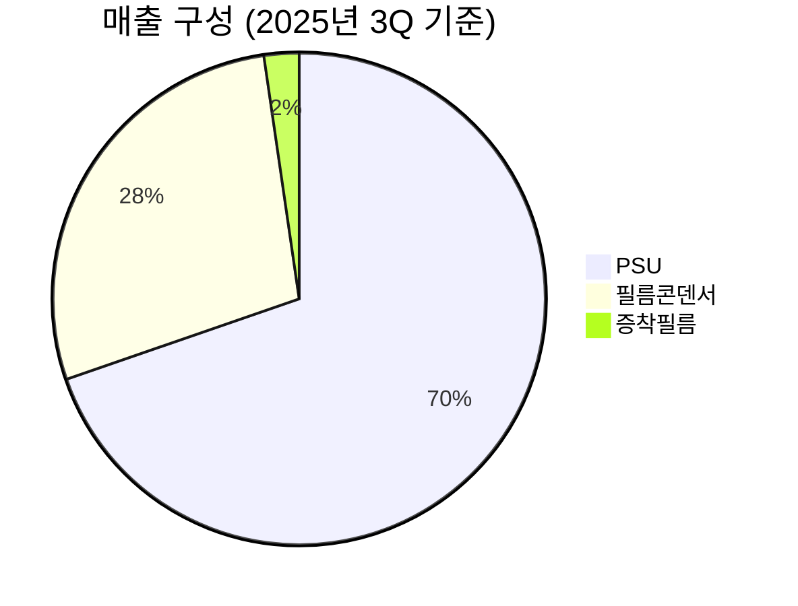

> **오늘의 탐색 분야**: 클라우드, 사이버보안, 중국 정책, 홍콩, 부동산, 보험, 바이오텍, 헬스케어 테크, 원자력
> 4일 주기 로테이션 (27개 분야 커버)

# 성호전자 (043260.KQ)

043260.KQ KR KOSDAQ 전기전자/부품

총점 28/100 — PASS

> [!abstract] 리포트 요약
>
> **한 줄 테시스**: 성호전자는 전원공급장치(PSU)·필름콘덴서 부품 제조사가 AI 데이터센터·CPO 광통신 밸류체인 기업으로 "재포장"되는 스토리지만, 2,800억원 M&A(에이디에스테크)의 실체, 전환사채 오버행, 극도로 고평가된 멀티플이 핵심 테마의 흥분을 압도한다.
>
> **왜 지금인가**: KoAct 코스닥액티브 ETF 편입 수급 이벤트로 3거래일 내 22~23% 급등 → 투자주의 종목 지정. 이는 펀더멘털 재평가가 아닌 수급 이벤트임.
>
> **Variant Perception**: 시장은 "엔비디아 공급사 인수 = 성호전자의 AI 기업화"를 선반영하고 있으나, 실제로는 ① 기존 본업(PSU·콘덴서)의 영업이익률이 1%에 불과하고, ② 948억원 당기순이익의 대부분이 파생상품평가이익 등 일회성 항목, ③ 에이디에스테크 인수 시너지와 양산 타임라인이 전혀 검증되지 않은 상태에서 시가총액 3.3조원(EV/EBITDA 273배)이 형성되어 있다.
>
> **핵심 수치**: 영업이익률 1.0%, EV/EBITDA 273.75배, 52주 최저 895원 → 현재 47,450원(50배 이상 상승)

---

## ① 핵심 지표

| 항목 | 값 | 의미 |
|------|-----|------|
| 현재가 | 47,450원 (3/27 기준 46,100원) | 🔴 52주 최저(895원) 대비 약 53배 수준. 수급 이벤트 주도형 급등 구간 |
| 시가총액 | 약 3.3조원 | 🔴 PSU·콘덴서 본업 매출 2,350억원 대비 시총 14배 이상. 미래가치 선반영 극단적 |
| PER (Trailing) | 34.38 | 🔴 분자(순이익 948억)의 대부분이 파생상품이익 등 일회성. 실질 영업이익 기준 PER은 수백배 수준 [추정] |
| PER (Forward) | N/A | 🔴 데이터 없음 — 실질 이익 예측 컨센서스 부재 |
| PBR | 13.04 | 🔴 장부가 대비 13배. 무형자산·인수가치 반영이지만 극단적 프리미엄 |
| EV/EBITDA | 273.75 | 🔴 글로벌 최고수준 AI 소프트웨어 기업도 60~100배 수준. 이 배수는 사실상 펀더멘털 미반영 상태를 의미 |
| 영업이익률 | 1.0% | 🔴 제조업 평균(5~10%) 대비 극히 낮음. 본업 자체가 저마진 구조 |
| 순이익률 | 3.6% | 🟡 영업이익률보다 높은 순이익률 — 영업외 일회성 수익이 실적을 왜곡 |
| ROE | 1.2% | 🔴 자본 효율성 극히 낮음. 복리 창출 엔진으로서의 자격 미달 |
| 52주 고/저 | 59,600원 / 895원 | 🔴 895원에서 53배 이상 상승. 수급 및 테마 드리프트. 고점 59,600원 대비도 현재 고평가 구간 |
| 매출 성장률 | 13.3% YoY (2025년 연간) | 🟡 성장하고 있으나 시총 14배 프리미엄을 정당화하는 수준 아님 |
| 배당수익률 | N/A | 🔴 배당 없음 |
| 섹터/지역 | 전기전자부품 / 한국 코스닥 | 🟡 중소형 부품주에서 AI 테마주로 리레이팅 시도 중 |

> [!warning] 핵심 경고: EV/EBITDA 273배의 의미
>
> 이 배수는 "향후 273년간 EBITDA를 그대로 창출해야 현재 기업가치를 정당화"한다는 의미다. 엔비디아조차 EV/EBITDA 40~50배 수준임을 고려하면, 성호전자의 현재 밸류에이션은 본업 기반으로는 설명이 불가능하고 오직 에이디에스테크를 통한 AI 밸류체인 스토리의 완전한 실현을 가정해야만 정당화될 수 있다.

---

## ② 회사 개요, 제품, 핵심 경쟁력

> [!abstract] 회사 개요 요약
>
> 성호전자는 전원공급장치(PSU)와 필름 커패시터(Film Capacitor)를 제조·판매하는 중견 부품기업이다. 최근 에이디에스테크(광트랜시버 장비) 인수를 통해 AI 인프라 밸류체인 진입을 선언했다.

**한 줄 설명**: 성호전자는 PSU(전원공급장치)와 필름 커패시터를 핵심으로 하는 전자부품 제조사이며, 2025년 12월 에이디에스테크 인수를 통해 AI 데이터센터 광통신 부품 사업에 진출을 선언한 기업이다.

### 사업 모델
전통적으로 전자제품에 탑재되는 전원 공급 모듈(PSU)과 회로 안정화에 필요한 필름 커패시터를 OEM/ODM 방식으로 가전·산업용 기기 제조사에 공급하는 B2B 모델이다. 에이디에스테크 인수 이후에는 AI 데이터센터용 광트랜시버 장비를 통한 고마진 사업 확장이 목표다.

### 핵심 제품/서비스

| 제품/사업부 | 주요 고객 시장 | 특징 |
|------------|------------|------|
| PSU (전원공급장치) | 프린터, 복합기, 생활가전, LED 조명, STB | STB용 파워 국내 1위 [확인 필요] |
| 필름 커패시터 | 디지털 TV, PC, 전기차(800V 고전압), ESS | 아우디, 포르쉐 등에 전기차용 공급 |
| 증착필름 | 내부 원재료 | 직접 생산으로 원가 경쟁력 확보 |
| 광트랜시버 장비 (에이디에스테크) | AI 데이터센터 서버 간 광통신 | 엔비디아 자회사 멜라녹스가 주요 고객 [확인 필요] |

### 매출 구성 (2025년 3Q 기준, DART 분기보고서)

> [!note] 세그먼트 주의
> 위 비중은 2025년 3Q 기준(에이디에스테크 인수 완료 전). 에이디에스테크가 연결 편입된 이후의 세그먼트 재편 수치는 아직 공시되지 않음(확인 필요).

### 핵심 경쟁력

| 경쟁력 | 설명 | 복제 난이도 (1-10) |
|--------|------|:---:|
| 증착필름 자체 생산 | 필름 커패시터의 핵심 원재료를 내재화해 원가 경쟁력 확보 | 5 |
| 고전압 커패시터 기술 | 전기차 800V 시스템용 필름 커패시터 기술 — 진입장벽 상대적으로 높음 | 6 |
| STB 파워 시장 지위 | 셋톱박스용 PSU 국내 주요 공급사 [확인 필요] | 4 |
| 에이디에스테크 (신규) | AI 데이터센터 광트랜시버 장비, 멜라녹스 공급망 접점 [실체 미검증] | (확인 필요) |

### 성장 공식 (기존 본업 기준)
**TAM(전기차·ESS·AI 데이터센터 커패시터) × 점유율 × 고부가제품 믹스 개선 = 매출 성장**

현재 본업의 성장 공식은 전통 가전에서 전기차·에너지 분야로 응용처를 넓히는 것이 핵심이다. 에이디에스테크 인수 이후에는 광통신 장비라는 별도의 성장 엔진을 추가했으나, 이의 기여도는 아직 검증되지 않았다.

---

## ③ 왜 이 기업인가 (투자 결정의 핵심)

> [!abstract] 섹션 요약
>
> 이 기업이 "오늘의 최고 기회"로 선정된 배경은 명확하다: AI 데이터센터 광통신(CPO) 테마 + ETF 수급 이벤트. 그러나 우리의 투자 철학에서 본 분석의 결론은 다르다.

### 투자 테시스의 핵심 서사 (시장이 보는 시각)

시장이 성호전자를 주목하는 이유는 다음 시나리오다:

1. **에이디에스테크 인수** (2025년 12월, 2,800억원): 광트랜시버 장비사 인수를 통해 엔비디아 멜라녹스 공급망 접점 확보
2. **CPO 기술**: AI 데이터센터에서 광칩 집적도 향상을 위한 차세대 패키징 기술 밸류체인 진입
3. **기존 전기차 커패시터**: 아우디, 포르쉐 등 고급 전기차향 800V 필름 커패시터 공급

만약 이 시나리오가 완전히 실현된다면, 성호전자는 전통 부품사에서 AI 인프라 핵심 부품사로 재평가받을 수 있다.

### 그러나 우리가 다른 판단을 내리는 이유 (Variant Perception)

시장은 "스토리 = 실현 가능성"으로 받아들이고 있지만, 우리는 "스토리와 현실 사이의 갭"에서 리스크를 본다.

**Compounding Machine 요건 체크**:

| 요건 | 현실 | 판단 |
|------|------|------|
| 높은 ROIC/ROE | ROE 1.2% | ❌ 자본 효율성 미달 |
| 넓은 해자 | PSU·커패시터는 경쟁 치열한 부품 시장 | ❌ |
| 재투자 가능한 현금 | 영업이익 84억원, 순이익 948억(대부분 일회성) | ❌ 실질 현금 창출력 의문 |
| 경영진 인센티브 일치 | 전환사채(총 주식 20% 규모, 전환가 약 2,895원) 발행 | 🔴 심각한 희석 리스크 |
| 신뢰 가능한 재무제표 | 영업외 일회성 항목이 순이익의 대부분 | 🟡 주의 요망 |

**10년 후 더 강해질 구조적 이유가 있는가?**

기존 PSU·커패시터 사업은 구조적으로 강해질 이유가 제한적이다. 에이디에스테크 시나리오가 실현되면 가능하지만, 그것은 오늘의 현실이 아니라 미래의 가능성이며, 그 가능성이 이미 시총 3.3조원에 반영되어 있다는 것이 문제다.

> [!warning] 가장 중요한 경고
>
> 이 기업은 투자 철학의 핵심 원칙 중 "재무제표를 신뢰할 수 없는 기업"과 "경영진 인센티브가 주주와 불일치하는 기업" 두 가지 회피 영역에 동시에 근접해 있다.
> - 순이익 948억원 중 영업이익(84억)을 초과하는 864억원의 성격(파생상품평가이익 등 일회성)이 명확히 분리되어야 함
> - 전환사채 전환가 약 2,895원은 현재 주가(47,450원) 대비 94% 이상 할인. 전환 시 엄청난 희석 발생

---

## ④ 비즈니스 퀄리티

> [!abstract] 섹션 요약
>
> 본업(PSU·커패시터)의 비즈니스 퀄리티는 낮다. 영업이익률 1%, ROE 1.2%가 말해주는 것은 "경쟁 심화된 저마진 부품 시장에서 생존하고 있는 기업"이다.

### 경제적 해자 분석

| 해자 계층 | 내용 | 복제 난이도 |
|---------|------|-----------|
| 전환비용 | PSU는 고객사 교체 비용이 낮은 편 — 해자 약함 | 낮음 |
| 기술/무형자산 | 800V 전기차용 필름 커패시터 기술은 일부 장벽 있음 | 중간 |
| 증착필름 내재화 | 원재료 수직계열화로 원가 경쟁력 일부 존재 | 중간 |
| 규모의 경제 | 매출 2,350억원 규모 — 글로벌 경쟁사 대비 소규모 | 낮음 |
| 네트워크 효과 | 없음 | N/A |

### ROIC/ROE 평가

- **ROE 1.2%**: 한국 국채 수익률(약 3% 수준)도 하회. 주주 입장에서 자본이 효율적으로 활용되지 않음
- **영업이익률 1.0%**: 마진이 개선되고 있는지(2025년 영업이익 33.6% 성장)는 긍정적이나 절대 수준이 너무 낮음
- **순이익률 3.6%**: 영업이익률(1%)보다 순이익률(3.6%)이 높다는 것은 영업외 수익 의존도가 높다는 신호

비즈니스 퀄리티 15/100

### 마진 방향성

| 연도 | 매출 | 영업이익 | OPM |
|------|------|---------|-----|
| 2024 (추정) | 약 2,073억원 | 약 63억원 | 약 3% [추정] |
| 2025 (연간) | 2,350억원 | 84억원 | 1.0% |

> [!warning] 마진 역행 주의
>
> 매출이 13.3% 성장했음에도 불구하고 OPM이 하락(혹은 정체)한 것으로 보인다. 성장하면서 마진이 개선되지 않는 사업 구조는 스케일 메리트가 없음을 의미한다. [2024년 OPM 확인 필요 — 데이터 미확인]

### 경영진 인센티브 분석

> [!failure] 가장 심각한 리스크: 전환사채 구조
>
> - **전환사채 발행**: 총 주식 수의 약 20%에 해당하는 규모
> - **전환가액**: 약 2,895원
> - **현재 주가**: 47,450원
> - **갭**: 전환가 대비 현재 주가가 약 16배. 전환 시 기존 주주 지분은 약 20% 희석되며, 전환권자는 즉시 막대한 차익 실현 가능
> - **So What?**: 현재 주가 수준에서 전환사채 보유자의 매도 압력은 구조적으로 존재한다. 이는 주가 상방을 제한하는 강력한 오버행이다.

---

## ⑤ 밸류에이션

> [!abstract] 섹션 요약
>
> 어떤 밸류에이션 방법론을 적용해도 현재 주가(47,450원, 시총 3.3조원)는 극도로 고평가 상태다.

### 본업 기반 밸류에이션 (버핏 스타일)

**Owner Earnings 추정** (2025년 연간, 보수적 접근):
- 영업이익: 84억원 (확인된 수치)
- 일회성 순이익 제거 후 실질 이익: 영업이익 84억원을 상한선으로 가정 [가정]
- 적정 PER 범위: 저마진 부품사 10~15배 적용 시 적정 시총 840억~1,260억원 [가정]
- **현재 시총 3.3조원 대비 적정가치: 현재가의 약 4~7% 수준** [가정 — 본업 가치만 고려 시]

### 에이디에스테크 포함 밸류에이션 (시장 시나리오)

에이디에스테크 인수가 완전히 성공하고 AI 데이터센터 광트랜시버 사업이 성장한다고 가정했을 때:
- 에이디에스테크 인수가: 2,800억원 (현금 지불)
- 시장이 부여한 추가 프리미엄: 3.3조 - 본업 가치 - 인수가 = 막대한 기대가치 [가정]

결론: 현재 주가는 에이디에스테크가 최고의 시나리오로 완전히 실현되더라도 과도하게 선반영된 상태다. "아직 싸지 않다"를 넘어 "이미 모든 좋은 소식이 반영"된 구간이다.

### 안전마진 분석

안전마진 5/100

- 하방이 열려 있음: 테마 식으면 전통 부품사 밸류에이션으로 회귀 가능
- 전환사채 오버행: 지속적인 희석 압력
- 과거 사례: 52주 최저 895원은 "테마 소멸 시 회귀 가능 가격대"의 극단적 예시

---

## ⑥ 촉매 & 타이밍 + 매크로 컨텍스트

> [!abstract] 섹션 요약
>
> 단기 촉매(ETF 수급)는 이미 소진되고 있으며, 장기 촉매(에이디에스테크 실적 기여)의 타임라인은 불확실하다.

### 촉매 분석

| 촉매 | 타임라인 | 주가 반영도 | 평가 |
|------|---------|----------|------|
| KoAct ETF 편입 수급 | 이미 발생 (3거래일 +22~23%) | 거의 완전 반영 | 🔴 소멸 |
| 에이디에스테크 연결 실적 기여 시작 | 2026년 연간 실적 (2027년 2월 공시) | 부분 반영 | 🟡 확인 필요 |
| 엔비디아 멜라녹스향 양산 계약 | 미확인 (추측 수준) | 선반영 가능성 | 🔴 리스크 |
| CPO 기술 상용화 | 중장기 (2027년+ 추정) | 일부 반영 | 🟡 불확실 |
| 전기차 800V 커패시터 수주 확대 | 단계적 | 미반영 | 🟢 유일한 실제 촉매 후보 |

### 왜 지금이 아닌가 (타이밍 분석)

- 주가 급등은 **ETF 수급 이벤트** + **CPO 광통신 테마 환기** (엔비디아 GTC 2026 젠슨황 언급)에 기인
- 수급 이벤트는 ETF 편입 후 수익 실현으로 전환될 가능성
- 금감원의 코스닥 ETF 종목 사전공개 규제 강화 → 동일한 수급 이벤트 재현 어려워짐

### 매크로 환경

| 매크로 시나리오 | 성호전자에 미치는 영향 |
|------------|---------------|
| AI 인프라 투자 확대 지속 (순풍) | 에이디에스테크 광트랜시버 수요 증가 가능성 — 그러나 실제 납품 검증 필요 |
| 금리 인하 (순풍) | 성장주 리레이팅에 유리, 단 본업 실적 개선 없으면 제한적 |
| 경기 침체 (역풍) | 가전/프린터 PSU 수요 감소, 전기차 판매 둔화 |
| 원/달러 환율 상승 | 수출 비중에 따라 다르나 원자재(수입) 비용 상승 가능 |
| 지정학적 리스크 (미-이란 등) | 코스닥 전반 리스크 오프 환경 → 테마주 변동성 확대 |

> [!question] 확인이 필요한 핵심 사항
>
> 에이디에스테크가 엔비디아 멜라녹스에 실제로 납품하고 있는가? 매출 규모와 성장성은? 이것이 검증되지 않으면 스토리 전체가 허구다.

---

## ⑦ 리스크 & Devil's Advocate

> [!abstract] 섹션 요약
>
> 리스크가 업사이드를 구조적으로 압도한다. 이 투자의 주된 위험은 "비싸다"가 아니라 "극도로 비싸다" + "오버행" + "검증되지 않은 M&A"의 조합이다.

### 핵심 리스크

| 리스크 | 심각도 | 확률 | 대응 |
|-------|-------|------|------|
| 전환사채 오버행 (전환가 2,895원, 주식 20% 희석) | 🔴 매우 심각 | 🔴 높음 | 포지션 회피 |
| 에이디에스테크 M&A 실패/시너지 부재 | 🔴 매우 심각 | 🟡 중간 | 양산 실적 확인 전 진입 금지 |
| 테마 소멸 시 밸류에이션 급락 | 🔴 매우 심각 | 🟡 중간 | 손절 임계 설정 |
| 본업(PSU) 수요 둔화 (경기민감) | 🟡 중간 | 🟡 중간 | 수주 동향 모니터링 |
| 부동산 인수 등 비관련 자산 취득 | 🟡 중간 | 🔴 높음(이미 발생) | 경영진 자본배분 신뢰 저하 |
| 순이익 948억의 지속가능성 | 🔴 심각 | 🔴 높음(일회성 가능성) | 2026년 실적 확인 필수 |

### 가장 현실적인 실패 시나리오

🟢 Bull 15%

🟡 Base 30%

🔴 Bear 55%

| 시나리오 | 내용 | 목표 주가 [추정] |
|---------|------|------------|
| 🟢 Bull (15%) | 에이디에스테크 멜라녹스 양산 확인, 2026년 매출 급증, CPO 상용화 선도 | 70,000원+ |
| 🟡 Base (30%) | 에이디에스테크 점진적 기여, 본업 안정, 전환사채 부담 지속 | 25,000~35,000원 |
| 🔴 Bear (55%) | M&A 시너지 기대 미달, 전환사채 전환 및 매도 압력, 테마 소멸 | 10,000~15,000원 |

> [!bear] Bear Case 시나리오 (확률 55%)
>
> 에이디에스테크의 엔비디아 납품이 소량/시범 수준으로 확인될 경우, 시장은 3.3조원 시총을 정당화할 근거를 잃는다. 전환사채 보유자의 대규모 전환 및 매도가 시작되면 주가 급락의 연쇄 반응이 발생할 수 있다. 본업 기준 적정 시총(840~1,260억원 수준) [가정] 대비 현재 3.3조원은 약 26~40배의 프리미엄이다. 테마 소멸 시 이 프리미엄이 급격히 수렴할 가능성이 높다.

> [!bull] Bull Case 시나리오 (확률 15%)
>
> 에이디에스테크가 실제로 엔비디아 GTC에서 언급된 CPO 기술의 핵심 공급사로 자리매김하고, 2026년 연결 매출에 수천억원 규모의 기여를 시작할 경우, 현재 밸류에이션도 일부 정당화될 수 있다. 그러나 이 시나리오조차 현재 주가가 극도로 선반영된 상태다.

### 숨겨진 가정 (Hidden Assumptions)

1. **[가정]**: 에이디에스테크가 멜라녹스의 핵심 공급사 → 아직 공식 확인 없음
2. **[가정]**: CPO 기술 상용화가 에이디에스테크 주도 → 글로벌 경쟁사(II-VI, Lumentum 등) 대비 경쟁력 미검증
3. **[가정]**: 948억원 당기순이익의 지속 가능성 → 파생상품평가이익 등 일회성 포함

### Kill Criteria

| Kill Criteria | 임계값 |
|-------------|-------|
| 에이디에스테크 양산 미확인 | 2026년 2Q 실적까지 구체적 수주/매출 공시 없을 시 |
| 전환사채 전환 시작 | 대규모 전환 공시 발생 즉시 |
| 주가 하락 | 진입 가격 대비 -25% (이미 고평가 구간 진입이라면 진입 자체 비추) |
| 본업 OPM 추가 하락 | OPM이 0% 이하로 하락 시 |
| 부동산/비관련 M&A 추가 | 본업과 무관한 자산 추가 취득 시 |

---

## ⑧ 나의 엣지

> [!abstract] 섹션 요약
>
> 이 투자에서 우리의 엣지는 "과열된 테마 속에서 냉정한 펀더멘털 분석"이다. 그리고 그 분석은 PASS를 가리킨다.

### 이 투자에서 나의 엣지는 무엇인가?

**없다.** 더 정확히는, 현 시점 진입 시 우리가 유리한 포지션에 있지 않다.

- 수급 이벤트(ETF 편입)는 이미 발생했고 우리가 이 정보를 남들보다 먼저 알았던 것이 아니다
- 에이디에스테크의 실체에 대한 Insider 수준의 정보가 없다
- 테마 모멘텀 매매는 우리의 투자 스타일(6개월+ 보유, 펀더멘털 기반)이 아니다

### 시장 컨센서스와의 차이점 (Variant Perception)

| 시장 컨센서스 | 우리의 Variant Perception |
|------------|----------------------|
| "에이디에스테크 인수 = AI 기업화 완성" | "인수가 2,800억원이지만 시너지 검증 전까지는 비용" |
| "엔비디아 공급사 = 수혜 확정" | "공급사의 공급사의 공급사 — 직접 수혜 강도 불명확" |
| "순이익 948억 = 실적 턴어라운드" | "영업이익 84억 = 실질 이익 창출력 판단 기준" |
| "주가 급등 = 상승 트렌드" | "52주 최저 895원 → 47,450원 = 이미 50배 상승한 고점 구간" |

### 회피 영역 체크

| 체크 항목 | 판단 |
|---------|------|
| Insider 의존도 | 🔴 에이디에스테크 내부 정보 없이 투자 시 Insider에 뒤처진 게임 |
| 정치적 결정 의존 | 🟡 ETF 규제, 코스닥 정책 영향 존재 |
| 재무제표 신뢰성 | 🔴 일회성 영업외 수익이 순이익 대부분 — 신중 필요 |
| 경영진-주주 인센티브 일치 | 🔴 전환사채 구조가 기존 주주에게 불리 |

---

## ⑨ 액션 아이템

| 항목 | 판단 |
|------|-----|
| **BUY / WATCH / PASS** | PASS — EV/EBITDA 273배, 영업이익률 1%, 전환사채 오버행, M&A 미검증의 4중 리스크 |
| **Conviction** | High (PASS에 대한 확신) |
| **적정 진입가** | 본업 기준 적정가 5,000원 이하 [가정], 에이디에스테크 양산 검증 후 재평가 |
| **목표가 (12개월)** | Bear: 10,000~15,000원 / Base: 25,000~35,000원 / Bull: 70,000원+ [모두 추정] |
| **손절 기준** | 현재 가격 수준에서 진입 자체를 비권고. 만약 이미 보유 중이라면 전환사채 전환 공시 즉시 매도 |
| **권장 비중** | 0% (진입하지 않음) |

### Deal Score 최종 평가

업사이드 비대칭 6/30

> 이론적 업사이드(CPO 실현 시)는 있으나 이미 대부분 반영. 다운사이드가 훨씬 큼

카탈리스트 & 타이밍 5/25

> ETF 수급 촉매 소진, 실적 촉매는 최소 12개월 후

비즈니스 퀄리티 5/20

> OPM 1%, ROE 1.2%, 전환사채 구조 — 퀄리티 점수 매우 낮음

밸류에이션 매력 2/15

> EV/EBITDA 273배, PBR 13배 — 어떤 지표로도 저평가 근거 없음

발견 가치 10/10

> 유일하게 높은 점수 — 코스닥 소형주로 국내 기관 커버리지 낮음. 단, 이미 개인투자자 관심 폭발

**총점**:

총점 28/100 — PASS

### 추가 리서치가 필요한 사항

| 리서치 항목 | 중요도 | 방법 |
|----------|------|------|
| 에이디에스테크 실제 매출/고객 현황 | 🔴 최우선 | DART 2025년 사업보고서 (2026년 3월 말 제출 예정) |
| 전환사채 발행 조건 및 전환 일정 | 🔴 최우선 | DART 공시 직접 확인 |
| 에이디에스테크의 멜라녹스 납품 공식 확인 | 🔴 최우선 | IR 문의, 공시 확인 |
| 2025년 연간 사업보고서의 영업외 수익 세부 내역 | 🔴 최우선 | DART 사업보고서 (확인 필요) |
| 부동산 인수 규모 및 목적 | 🟡 중요 | 공시 확인 |
| 전기차 800V 커패시터 수주 현황 | 🟡 중요 | IR 문의 |

### 모니터링 핵심 지표

| 지표 | 확인 주기 | 임계 이벤트 |
|-----|---------|-----------|
| 전환사채 전환 공시 | 즉시 | 공시 발생 시 리스크 최고조 |
| 에이디에스테크 연결 매출 공시 | 분기별 (5월, 8월, 11월) | 예상 미달 시 PASS 확신 강화 |
| 주가 동향 | 주간 | 고점 대비 -30% 이상 시 재평가 시작 가능 |
| ETF 편입 비중 변화 | 월간 | KoAct 코스닥액티브 ETF 비중 축소 시 수급 역풍 |

### 다음 체크포인트

| 날짜 | 확인 사항 |
|-----|---------|
| 2026년 4월 (DART 사업보고서) | 2025년 연간 보고서: 영업외 수익 내역, 에이디에스테크 편입 효과 |
| 2026년 5월 (1Q26 실적) | 에이디에스테크 연결 후 첫 분기 실적 — 스토리 검증의 핵심 |
| 전환사채 전환 공시 (수시) | 즉시 매도 신호 여부 판단 |
| 2026년 8월 (2Q26 실적) | 연간 가이던스 대비 진척률 확인 |

---

> [!verdict] 최종 판정: PASS
>
> **성호전자는 매력적인 스토리를 가지고 있지만, 현재 주가는 그 스토리의 최상의 시나리오를 이미 과도하게 선반영하고 있다.**
>
> 핵심 논거:
> 1. **펀더멘털과 밸류에이션의 극단적 괴리**: OPM 1%의 부품사가 EV/EBITDA 273배 → 어떤 정상적인 투자 프레임워크로도 정당화 불가
> 2. **전환사채 오버행**: 전환가 2,895원 vs. 현재 47,450원 — 구조적 희석 압력이 상방을 제한
> 3. **M&A 미검증**: 에이디에스테크 2,800억원 인수의 실질 시너지가 단 하나의 공시로도 확인되지 않음
> 4. **수급 소진**: ETF 편입 이벤트는 이미 소진, 금감원 규제로 재현 어려움
>
> **우리의 투자 원칙으로 돌아가면**: "시장이 아직 모르는 비대칭적 성장 기회"가 아니라, "시장이 너무 잘 알고 있어서 이미 가격에 반영된" 기업이다. 진정한 비대칭 기회는 에이디에스테크 양산이 공식 확인된 후 주가 조정 시 발생할 수 있으며, **그때가 재평가의 시점이다.**