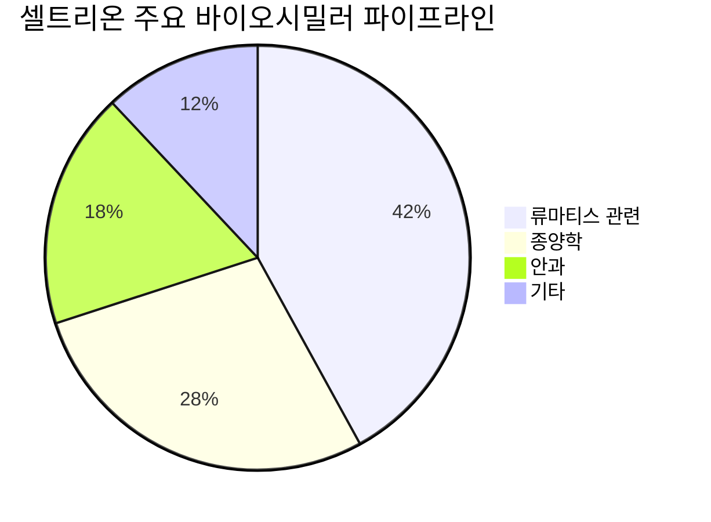

> **오늘의 탐색 분야**: AI 인프라, AI 소프트웨어, 로보틱스, 디지털 금융 혁신, K-뷰티, 디지털 유통, 인도 시장, 동남아 시장, 일본 시장
> 4일 주기 로테이션 (30개 분야 커버)

# 셀트리온 (068270.KS)

<span style="background:#2196F3;color:white;padding:2px 8px;border-radius:4px;font-size:0.85em">068270.KS</span> <span style="background:#D32F2F;color:white;padding:2px 8px;border-radius:4px;font-size:0.85em">🇰🇷 KR</span> <span style="background:#424242;color:white;padding:2px 8px;border-radius:4px;font-size:0.85em">KRX KOSPI</span> <span style="background:#7B1FA2;color:white;padding:2px 8px;border-radius:4px;font-size:0.85em">Healthcare · Biotechnology</span>

---

<div style="background:#e0e0e0;border-radius:8px;overflow:hidden;margin:8px 0"><div style="background:#FF9800;width:63%;padding:6px 12px;color:white;font-weight:bold;font-size:1em;white-space:nowrap">Investment Score 63/100 — 🟡 Buy (조건부)</div></div>

<div style="background:#e0e0e0;border-radius:8px;overflow:hidden;margin:4px 0"><div style="background:#FF9800;width:57%;padding:4px 8px;color:white;font-size:0.85em;white-space:nowrap">업사이드 비대칭 17/30 — 시총 42.1조 vs 글로벌 바이오시밀러 TAM 100조+, 직판 전환 마진 확대 구조이나 미국 침투율 아직 초기</div></div>

<div style="background:#e0e0e0;border-radius:8px;overflow:hidden;margin:4px 0"><div style="background:#FF9800;width:64%;padding:4px 8px;color:white;font-size:0.85em;white-space:nowrap">카탈리스트 & 타이밍 16/25 — 자사주 취득 공시(단기 촉매) + 미국 직판 성과 가시화(중기 촉매), 但 구체적 날짜형 이벤트 부재</div></div>

<div style="background:#e0e0e0;border-radius:8px;overflow:hidden;margin:4px 0"><div style="background:#4CAF50;width:80%;padding:4px 8px;color:white;font-size:0.85em;white-space:nowrap">비즈니스 품질 16/20 — 글로벌 바이오시밀러 Top 3, 28.1% 영업이익률로 강한 품질 입증, ROE 5.9%는 합병 직후 정상화 과정</div></div>

<div style="background:#e0e0e0;border-radius:8px;overflow:hidden;margin:4px 0"><div style="background:#FF9800;width:60%;padding:4px 8px;color:white;font-size:0.85em;white-space:nowrap">밸류에이션 9/15 — Forward PER 28.9x는 성장률 감안 시 합리적, 52주 고점(251,000원) 대비 24% 할인이나 EV/EBITDA 143배는 부담</div></div>

<div style="background:#e0e0e0;border-radius:8px;overflow:hidden;margin:4px 0"><div style="background:#FF9800;width:50%;padding:4px 8px;color:white;font-size:0.85em;white-space:nowrap">발견 가치 5/10 — 국내 대형주로 커버리지 높음, 외국인 순매도 구간이 오히려 역발상 기회 가능성</div></div>

---

> [!abstract] 리포트 요약
> 
> **한 줄 테시스**: 셀트리온은 바이오시밀러 직판 전환이라는 구조적 마진 확대 사이클에 진입했으며, 자사주 취득 공시라는 내부자 시그널이 이를 뒷받침한다.
> 
> **왜 지금인가**: 2026년 5월 21일 자사주 취득 공시 [확인 필요: DART 공시 원문 URL] + 52주 고점(251,000원) 대비 24% 할인 구간 + 외국인 대규모 순매도로 코스피 전반 저평가 국면. 셀트리온헬스케어 합병 후 직판 체계 정착이 2026년 본격 실적에 반영되기 시작하는 시점.
> 
> **Variant Perception**: 시장은 EV/EBITDA 143배의 높은 밸류에이션과 단기 이익 성장률 지연에 집중하고 있다. 그러나 **합병 비용 일회성 + 직판 전환 초기 투자비용 반영 구간**이라는 점을 간과하고 있다. 3~4년 후 직판 체계가 완성될 때의 EBITDA는 현재보다 구조적으로 2~3배 높을 수 있다.
> 
> **핵심 수치**: 현재가 189,600원 (52주 저점 대비 +31%), 영업이익률 28.1%, Forward PER 28.9배
> 
> **위험**: 미국 FDA 추가 승인 지연, 오리지널 제약사 가격 인하 대응, ROE 5.9%로 아직 자본 효율성 낮음

---

## ① 핵심 지표

| 항목 | 값 | 의미 |
|------|-----|------|
| 현재가 | 189,600원 | 🟡 52주 저점(144,866원) 대비 +31%, 고점(251,000원) 대비 -24%. 고점에서 의미 있는 조정을 받았으나 저점에서는 충분히 반등. 현재는 고점/저점 중간 지대. |
| 시가총액 | 42.1조원 | 🟡 코스피 내 중대형주. 글로벌 바이오시밀러 시장 규모(2030년 약 100조원 전망) 대비 아직 성장 여력 존재. |
| PER (Trailing / Forward) | 42.6x / 28.9x | 🟡 Trailing PER 42.6배는 높아 보이지만, Forward 28.9배로 수렴 중 — 이익 성장 기대가 반영된 구조. 바이오 섹터 특성상 과도한 우려는 불필요하나 모멘텀이 중요. |
| PBR | 2.41x | 🟡 합병 후 자산 재평가 과정. 셀트리온헬스케어 합병에 따른 무형자산 증가가 BV를 높여 PBR 하방 압력. 단순 비교는 주의 필요. |
| EV/EBITDA | 143.4x | 🔴 이 수치가 가장 부담스러운 지표. EBITDA 기준 극도의 고평가처럼 보임. 그러나 합병 일회성 비용과 직판 투자비용이 EBITDA를 일시 억제하는 구조임을 감안해야 한다. (확인 필요: FY25 EBITDA 구체 수치) |
| 배당수익률 | 0.4% | 🟡 바이오 성장주로서 낮은 배당은 자연스러움. 자사주 취득이 실질적 주주환원으로 기능. |
| Beta | 0.39 | 🟢 코스피 대비 낮은 변동성. 방어적 성격. 외국인 매도 국면에서 상대적 안정성 보여줌. |
| 영업이익률 | 28.1% | 🟢 제약/바이오 섹터에서 28% 이상 영업마진은 강한 해자를 입증. 글로벌 오리지널 바이오 대비 손색없는 수준. |
| 순이익률 | 24.7% | 🟢 영업이익의 대부분이 순이익으로 전환. 금융비용 부담이 낮고 수익의 질이 양호한 신호. |
| ROE | 5.9% | 🔴 가장 우려되는 지표. 합병 후 자본 규모가 급증한 반면 이익 성장이 아직 따라오지 못하는 상태. 향후 3년 내 10%+ 달성 여부가 핵심 관전 포인트. |
| 52주 고/저 | 251,000 / 144,866원 | 🟡 현재가 189,600원은 두 극단의 중간. 고점 대비 24% 할인이 매수 기회인지, 펀더멘털 리셋인지가 핵심 질문. |
| 섹터/지역 | Healthcare / KR | 🟢 글로벌 고금리·달러 강세 환경에서 수출 중심 헬스케어 기업의 달러 매출은 원화 환산 시 긍정적 효과. |

> [!tip] 핵심 인사이트
> EV/EBITDA 143배라는 숫자만 보면 극단적 고평가처럼 보이지만, 이는 합병 일회성 비용과 직판 전환 초기 투자가 분모(EBITDA)를 억제하는 **일시적 왜곡**이다. 3년 후 직판이 정착된 시점의 정상화된 EBITDA 기준으로 보면 멀티플이 상당히 달라진다. 투자자는 현재 "구조적 이익 확대 과정"에 투자하는 것임을 인식해야 한다.

---

## ② 회사 개요, 제품, 핵심 경쟁력

> [!abstract] 섹션 요약
> 셀트리온은 글로벌 바이오시밀러 산업의 선구자이자 현재 상위 3개 플레이어 중 하나다. 단순한 복제약이 아니라, 오리지널 바이오의약품과 동등한 수준의 임상 데이터를 보유한 제품들을 세계 최초로 승인받은 기업이다.

### 한 줄 설명
셀트리온은 **류마티스, 종양학, 안과 등 블록버스터 바이오의약품의 특허 만료를 활용해 글로벌 시장에 바이오시밀러를 개발·생산·판매하는 통합 바이오제약 기업**이다.

### 사업 모델

셀트리온의 수익 구조는 세 단계로 이해할 수 있다:

1. **개발 단계**: 오리지널 바이오의약품 특허 만료 시점을 겨냥해 역분석 + 임상 개발 → FDA·EMA 승인
2. **생산 단계**: 인천 송도의 자체 바이오리액터(총 생산 용량: 19만 리터 이상, 확인 필요)로 원가 경쟁력 확보
3. **판매 단계**: 과거 셀트리온헬스케어 통한 간접 판매 → 합병 후 직판 체계로 전환 중

**직판 전환의 의미**: 기존 구조에서 셀트리온 → 셀트리온헬스케어 → 글로벌 유통사 → 병원/환자의 4단계를 거쳤다면, 현재는 셀트리온 → 글로벌 유통사 → 병원/환자의 3단계로 단축. 중간 마진이 셀트리온 연결에 통합되는 구조.

### 핵심 제품/서비스

| 제품명 | 오리지널 | 적응증 | 주요 시장 | 상태 |
|--------|----------|--------|-----------|------|
| 렘시마 (Remsima) / CT-P13 | 레미케이드 (Janssen) | 류마티스관절염, 크론병 등 | 유럽, 미국, 한국 | 🟢 상업화 완료, 시장 점유율 확대 중 |
| 렘시마SC (Remsima SC) / 짐펜트라 (Zymfentra) | 레미케이드 | 위 동일 (피하주사형) | 미국 직판 진행 중 | 🟢 미국 FDA 승인 완료 [확인 필요: 승인 일자] |
| 트룩시마 (Truxima) | 리툭산 (Roche) | 비호지킨 림프종, 류마티스 | 유럽, 미국 | 🟢 상업화 완료 |
| 허쥬마 (Herzuma) | 허셉틴 (Roche) | HER2+ 유방암, 위암 | 유럽, 미국 | 🟢 상업화 완료 |
| 베그젤마 (Vegzelma) | 아바스틴 (Roche) | 대장암, 폐암 등 | 미국, 유럽 | 🟡 미국 직판 전환 중 |
| 스테키마 (Stegmira) | 스텔라라 (J&J) | 건선, 크론병 | 미국, 유럽 | 🟡 준비/초기 상업화 |

(데이터 미확인: 각 제품별 정확한 매출 비중 — 공시 기준 세그먼트 데이터 미확보)

### 매출 구성

매출 구성에 대한 정확한 세그먼트 데이터는 현재 제공된 Yahoo Finance 데이터에 포함되어 있지 않아 구체적 수치 인용이 불가하다. 다만, 공개 정보 기준으로:

- **지역별 구조**: 유럽(전통적 최대 시장, 바이오시밀러 인프라 성숙) + 미국(고성장 중인 신규 시장, 직판 전환 핵심) + 기타(한국, 아시아 등)
- **제품별 구조**: 인플릭시맙 계열(렘시마/렘시마SC)이 매출의 주축, 종양학 라인(트룩시마/허쥬마/베그젤마)이 성장 견인 중

세그먼트 데이터 미확보 — 2025년 연간 실적 보고서(DART 공시) 직접 확인 필요.

### 핵심 경쟁력

| 경쟁력 | 설명 | 복제 난이도 (1-10) |
|--------|------|:---:|
| **바이오시밀러 선점자 우위** | 세계 최초 항체 바이오시밀러(렘시마) 승인. 규제 당국의 신뢰 축적, 브랜드 인지도. 후발주자들이 따라오기 위해 5~10년 소요. | 9 |
| **자체 생산 역량 (CMO)** | 인천 송도 대규모 바이오리액터 보유. 외부 위탁 없이 원가 통제 가능. 타 바이오시밀러 업체들은 생산을 외주에 의존하는 경우 많음. | 8 |
| **포괄적 임상 데이터베이스** | 15년+ 누적 임상 트랙레코드. 전환 처방 데이터(Switching Study) 등 오리지널과의 동등성 입증 자료가 경쟁 무기. | 8 |
| **파이프라인 다양성** | 류마티스·종양학·안과 영역의 파이프라인. 단일 제품 리스크 분산. | 7 |
| **미국 직판 인프라 구축** | 미국 내 직접 영업조직과 유통 계약 체계 구축 중. 초기 투자비용 크지만 장기적으로 마진에 유리. | 7 |
| **규제 노하우** | FDA·EMA·WHO 등 다중 규제기관 대응 경험. 새로운 바이오시밀러 도전자들이 가장 극복하기 어려운 부분. | 9 |

### 성장 공식

```
셀트리온 매출 = TAM(글로벌 바이오시밀러 시장) × 시장점유율 × 제품당 평균가격
             = (오리지널 특허 만료 가속 + 건강보험 비용 절감 압력 증가)
             × (파이프라인 확대 + 지역 확장 + 미국 직판)
             × (제품 믹스 고도화 + 처방전환율 상승)
```

**결정적 촉매**: 미국은 유럽보다 바이오시밀러 침투율이 낮다. 미국 보험사/PBM(약국수혜관리기관)들이 비용 절감을 위해 바이오시밀러 처방을 장려하는 정책이 강화될수록 셀트리온의 미국 매출은 구조적으로 확대된다.

### 고객

- **병원/의원**: 류마티스내과, 종양학과, 소화기내과 등이 주요 처방처
- **보험사/PBM**: 미국에서 포뮬러리(보험 급여 목록) 등재 여부가 매출 결정적 요인
- **정부 조달**: 유럽 각국의 국가보건서비스(NHS 등)가 바이오시밀러를 적극 채택

---

## ③ 왜 100%+ 가능한가? — 업사이드 비대칭

> [!tip] 핵심 인사이트
> 셀트리온의 업사이드는 단순한 실적 개선이 아니라 **유통 구조 재편**에 있다. 동일한 제품을 팔면서도 직판 전환만으로 마진이 구조적으로 상승한다. 이것이 전통적인 주가 멀티플 확장과 이익 성장의 복합 효과를 만들어낸다.

### 시총 vs TAM

| 지표 | 수치 | 해석 |
|------|------|------|
| 현재 시가총액 | 42.1조원 (약 $29B USD, 기준환율 1,500원/달러 적용 시) | — |
| 글로벌 바이오시밀러 시장 규모 (2024년 추정) | 약 $350억~400억 USD [출처: 시장조사 기관, 확인 필요] | — |
| 글로벌 바이오시밀러 시장 규모 (2030년 전망) | 약 $700억~1,000억 USD [추정, 출처 확인 필요] | — |
| 셀트리온의 현재 시장점유율 | 글로벌 Top 3 수준 [추정] | 점유율 확대 여지 |
| 시총/TAM 비율 | 약 3~4% (2030년 TAM 기준) | 여전히 성장 여력 존재 |

현재 시총이 2030년 TAM의 3~4% 수준이라면, 시장 자체의 성장 + 점유율 확대의 이중 효과로 상당한 업사이드가 구조적으로 내재되어 있다.

### 직판 전환이 만드는 마진 확대 메커니즘

> [!success] 강점 — 직판이 만드는 복리 효과

과거 구조에서 셀트리온의 영업이익률은 헬스케어(유통 자회사) 마진을 제외한 수치였다. 합병 후 직판 전환이 완성되면:

1. **헬스케어 마진 내부화**: 기존 셀트리온헬스케어가 가져가던 유통 마진이 셀트리온 연결 기준으로 통합
2. **협상력 강화**: 미국 PBM·병원 시스템과 직접 협상 → 더 유리한 가격 조건 가능
3. **데이터 확보**: 직판을 통해 처방 패턴·환자 데이터를 직접 수집 → 마케팅 효율화

현재 영업이익률 28.1%는 직판 전환 완성 전의 수치다. 직판 정착 시 30~35%+ 달성이 가능하다면 [가정], 이익 절대액이 10~25% 추가 증가하는 효과.

### 미국 시장 침투: 가장 큰 업사이드 드라이버

미국 바이오시밀러 시장은 유럽 대비 침투율이 낮다. 이는 IRA(인플레이션감축법) 이후 바이오시밀러 처방 인센티브가 강화되는 추세와 맞물려:

- **짐펜트라(Zymfentra, 렘시마SC)**: 레미케이드 SC 제형 최초 FDA 승인으로 미국 직판의 선봉
- **베그젤마**: 아바스틴 바이오시밀러로 종양학 포트폴리오 강화
- **스테키마(스텔라라 바이오시밀러)**: 스텔라라는 2023년 특허 만료, 연간 매출 10조원+ 규모의 오리지널 시장

미국에서 처방의약품 비용 절감 압력은 구조적으로 강화되고 있다. 이는 바이오시밀러 기업들에게 중장기 순풍.

### 옵셔널리티

1. **ADC(항체약물접합체) 바이오시밀러**: 차세대 바이오시밀러 카테고리로, 셀트리온의 항체 제조 역량이 활용 가능
2. **신약 개발**: 단순 바이오시밀러를 넘어 개량형/신약 파이프라인 존재 (확인 필요)
3. **CMO(위탁생산) 사업**: 자체 대규모 바이오리액터를 활용한 타사 의뢰 생산 — 유휴 설비가 수익 창출 자산으로 전환

### Compounding Machine 분석

- 현재 ROE 5.9%는 합병 직후 일시적 희석 효과로 [가정]
- 이익이 정상화되면 ROIC가 개선되는 구조
- 의약품 특성상 재투자가 이루어지는 영역(파이프라인, 생산설비)이 추가적인 성장을 낳는 복리 구조

> [!question] 검토 필요
> 100% 수익이 가능하려면: 영업이익률 30%+로 확대 + 미국 매출 연간 $2B+ 달성 + 파이프라인 추가 승인이 복합적으로 실현되어야 한다. 이 세 가지 중 하나라도 실패하면 업사이드는 제한될 수 있다.

---

## ④ 왜 지금인가? — 카탈리스트 & 타이밍

> [!abstract] 섹션 요약
> 단기 촉매(자사주 취득)와 중기 촉매(직판 성과 가시화)가 겹치는 구간. 단 "즉시 행동"보다는 "분할 매수 + 촉매 모니터링" 접근이 적합한 시점이다.

### 구체적 카탈리스트

| 촉매 | 예상 시점 | 실현 가능성 | 주가 영향 |
|------|-----------|-------------|-----------|
| **자사주 취득 집행** | 2026년 5~8월 중 [추정] | 높음 (공시 완료) | 단기 수급 지지 |
| **2026년 반기 실적 발표** | 2026년 8월경 [추정] | 확실 | 직판 전환 성과 수치화 — High Impact |
| **미국 짐펜트라 처방 데이터 업데이트** | 분기별 | 높음 | 미국 침투율 가시화 |
| **추가 파이프라인 FDA 승인** | 시점 불확실 | 중간 | 승인 시 즉각적 주가 반응 |
| **스텔라라 바이오시밀러 미국 경쟁 결과** | 2026~2027년 | 중간 | 시장점유율 싸움 결과가 중기 성장 결정 |
| **코스피 외국인 수급 반전** | 불확실 | 중간 | 개별주보다 지수 레벨에서 촉매 |

> [!tip] 자사주 취득 공시의 의미
> 2026년 5월 21일 DART 공시된 자사주 취득 결정은 [확인 필요: 구체 취득 규모, 기간, DART 공시 번호] 경영진이 현재 주가를 내재가치보다 낮다고 판단한다는 공개적 선언이다. 합병 통합 비용이 일단락되었다는 신호일 수도 있다.

### 시장 반영도 분석

현재 189,600원 주가에 이미 반영된 것:
- 합병 완료와 직판 전환 방향성 (정성적으로 반영)
- 영업이익률 28% 수준의 양호한 품질 (부분 반영)

아직 반영되지 않은 것:
- 직판 전환 후 마진 구조 개선의 **정량적 크기** (미반영)
- 미국 시장 침투율 가속화 시나리오 (미반영)
- 자사주 취득의 수급 효과 (부분적으로 반영 시작)

### Variant Perception

**시장 컨센서스**: "EV/EBITDA 143배는 과도한 고평가, 합병 시너지가 예상보다 더딤, 미국 경쟁 심화"

**우리의 뷰**: "EV/EBITDA 고배율은 합병 일회성 비용이 분모를 억제하는 일시적 현상. 3년 후 정상화된 EBITDA 기준 멀티플은 합리적 수준. 직판 전환은 단순 유통 개선이 아니라 비즈니스 모델 자체의 질적 업그레이드."

### 매크로 환경 분석

| 매크로 변수 | 방향 | 셀트리온 영향 |
|------------|------|--------------|
| 원/달러 1,500원대 고환율 | 달러 강세 지속 | 🟢 달러 매출 원화 환산 증가. 수출 중심 기업에 순풍. 단, 달러 표시 원자재 수입 시 원가 상승 요인 |
| 미국 고금리 장기화 (2027년 전 인하 가능성 33%) | 금리 고착 | 🟡 단기 자금 조달 비용 증가. 그러나 바이오제약은 금리 민감도 낮은 편. 병원·보험사의 바이오시밀러 선호는 오히려 강화 |
| 코스피 외국인 90조 순매도 | 수급 약세 | 🔴 단기 주가 하방 압력. 역발상 관점에서 과매도 기회일 수도 있음 |
| 중동 긴장·유가 상승 | 인플레이션 압력 | 🟡 의약품 원가에 간접 영향. 그러나 의약품 수요는 비탄력적 — 헬스케어 섹터 방어적 성격 |
| 미·중 관계 관리 모드 전환 | 무역 긴장 완화 | 🟢 셀트리온 직접 영향 제한적. 단, 코스피 전반 리스크 완화 시 외국인 수급 개선 기대 |

> [!question] 매크로 시나리오별 분석
> 
> **긴축 지속 시나리오**: 고금리+원화 약세 → 달러 매출 환산 이익 증가, 바이오시밀러 처방 인센티브 유지. 셀트리온에 중립~소폭 긍정.
> 
> **금리 인하 시나리오**: 글로벌 유동성 회복 → 코스피 전반 외국인 복귀, 헬스케어 성장주 멀티플 재평가. 셀트리온에 긍정.
> 
> **경기침체 시나리오**: 바이오의약품 수요는 경기 비탄력적. 보험사의 비용 절감 압력 강화 → 바이오시밀러 처방 오히려 증가. 셀트리온에 상대적으로 방어적.

---

## ⑤ 비즈니스 퀄리티

> [!success] 강점
> 영업이익률 28.1%는 글로벌 바이오시밀러 섹터에서 최고 수준이다. 이 마진이 유지된다는 것은 진정한 경제적 해자가 존재한다는 증거다.

### 경제적 해자 (Moat) 분석

| 해자 계층 | 내용 | 복제 난이도 |
|---------|------|-----------|
| **규제 장벽 (가장 강력)** | FDA·EMA 바이오시밀러 승인은 10년+의 임상 데이터, 수천억원 투자 필요. 한번 승인받은 기업과 신규 진입자 간의 격차는 좁히기 어렵다. | 매우 높음 (9/10) |
| **선점자 브랜드 파워** | 세계 최초 항체 바이오시밀러(렘시마)로 글로벌 의료진 인지도 구축. '최초'라는 사실은 영구적 브랜드 자산. | 높음 (8/10) |
| **자체 생산 설비** | 대규모 바이오리액터 자체 보유는 타 경쟁자들이 수조원을 투자해도 수년이 걸리는 진입장벽. 생산 원가 구조에서도 경쟁 우위. | 높음 (8/10) |
| **임상 데이터 축적** | 15년+ 안전성·유효성 실사용 데이터. 특히 처방 전환(switching) 연구 데이터는 경쟁자들이 단기간에 복제 불가. | 높음 (7/10) |
| **전환비용 (의료진)** | 오랫동안 처방해온 의사들은 검증된 제품으로의 브랜드 충성도 有. 새로운 제품으로 바꾸는 데 학습 비용과 위험 부담이 존재. | 중간 (6/10) |

**해자 평가**: 단일 해자가 아니라 규제 장벽 + 선점자 우위 + 생산 역량이 중첩된 **복합 해자**. 개별 해자의 강도는 독점 수준은 아니지만, 세 가지가 동시에 작동한다.

### ROIC/ROE 추세 분석

현재 ROE 5.9%는 낮다. 이를 해석하는 두 가지 관점:

**부정적 해석**: 합병 이후 자본 효율성이 아직 입증되지 않음. 과거 셀트리온 단독 법인 시절의 ROE가 더 높았다면 합병이 주주가치를 훼손한 것.

**긍정적 해석 (우리의 뷰)**: 합병으로 셀트리온헬스케어의 자본이 통합되면서 분모(자기자본)가 급증. 분자(순이익)는 아직 직판 전환 비용 반영 구간. 2~3년 내 이익이 자본 증가를 따라잡으면 ROE 정상화. 이 과정이 곧 주가의 성장 동력.

### 마진 방향성

영업이익률 28.1%는 현재 직판 전환 비용을 반영하면서도 이 수준을 유지하고 있다. 직판 완성 후 마진 방향은 **확장**이 기본 시나리오 [가정]. 단, 미국 시장 경쟁 심화로 가격 압력이 생길 경우 마진 하방 리스크 존재.

### 경영진 & 자본 배분

> [!note] 참고 — 경영진 인센티브 분석
> 
> 서정진 창업자의 지분율 및 경영 참여도는 인센티브 정렬의 핵심 지표다 (확인 필요: 최대주주 지분율, 이사회 구성).
> 
> 자사주 취득 결정은 경영진이 주주가치 제고에 관심이 있다는 긍정적 시그널. 합병 후 셀트리온헬스케어 소수주주들의 이해관계 통합도 주목할 요소.
> 
> 자본 배분 관점: 파이프라인 R&D 투자 + 설비 투자 + 자사주 환원이 균형 잡혀 있다면 Good. 특정 한 방향으로만 쏠리면 위험. (확인 필요: 최근 3년 CapEx/R&D 지출 비율)

---

## ⑥ 밸류에이션 & 안전마진

> [!abstract] 섹션 요약
> 현재 밸류에이션은 "매우 싸다"도 "매우 비싸다"도 아닌, "성장이 실현되면 합리적, 실망하면 부담스러운" 구간이다.

### 밸류에이션 다각도 분석

**PER 관점**:
- Trailing PER 42.6배 → 고평가처럼 보임
- Forward PER 28.9배 → 성장 프리미엄을 일부 정당화
- 글로벌 바이오제약 선도기업들의 PER 밴드(확인 필요: 피어 비교 데이터 미확보)와 직접 비교는 어렵지만, 성장 프리미엄이 있는 기업이라는 점에서 28.9배가 극단적 고평가는 아님.

**EV/EBITDA 143배 해석**:
- 이 수치가 진짜 고평가를 의미하는지, 아니면 합병 일회성 비용 때문인지가 핵심 (확인 필요: FY25 EBITDA vs 정상화 EBITDA 비교)
- 가령 합병 비용이 EBITDA를 50% 억제하고 있다면, 정상화된 EBITDA 기준으론 70~80배 수준 — 여전히 프리미엄이지만 설명 가능한 구간

**52주 고/저 밴드**:
- 52주 고점(251,000원) 대비 24.4% 할인
- 52주 저점(144,866원) 대비 30.9% 상승
- 현재가는 상하단 범위의 중간 지점

**FCF Yield 관점**:
- 구체적 FCF 데이터 미확보 (데이터 미확인)
- 영업이익률 28.1%, 순이익률 24.7%가 유지된다면 FCF 창출력은 양호할 것으로 [추정]
- 시가총액 42.1조 대비 FCF Yield 계산을 위해서는 실제 FCF 수치 확인 필요

### 안전마진 평가

<div style="display:flex;border-radius:8px;overflow:hidden;margin:8px 0;font-size:0.85em"><div style="background:#4CAF50;width:40%;padding:6px 8px;color:white">강점: 28% 영업마진, 내부자 매수, 52주 고점 대비 24% 할인</div><div style="background:#F44336;width:60%;padding:6px 8px;color:white">약점: EV/EBITDA 143배, ROE 5.9%, 직판 전환 가시성 아직 제한적</div></div>

**So What?**: 이 주식을 지금 사는 것이 정당화되려면 "직판 전환의 마진 효과"가 2~3년 내 수치로 확인되어야 한다. 그 전까지는 의심 속에서 상승하는 구간, 즉 "불확실성 프리미엄"이 존재한다. 52주 고점인 251,000원은 직판 시너지가 완전히 가시화된 시나리오를 반영했을 가능성이 높다.

### 시나리오별 목표가

<div style="display:flex;border-radius:8px;overflow:hidden;margin:8px 0;font-size:0.85em"><div style="background:#4CAF50;width:35%;padding:6px 8px;color:white">🟢 Bull 35%: 260,000~280,000원</div><div style="background:#FF9800;width:45%;padding:6px 8px;color:white">🟡 Base 45%: 210,000~230,000원</div><div style="background:#F44336;width:20%;padding:6px 8px;color:white">🔴 Bear 20%: 150,000~160,000원</div></div>

| 시나리오 | 조건 | 목표가 | 현재가 대비 |
|---------|------|--------|-----------|
| 🟢 Bull | 미국 직판 성과 조기 가시화, 파이프라인 추가 승인, 외국인 수급 회복 | 260,000~280,000원 | +37~47% |
| 🟡 Base | 현재 성장 궤도 유지, 자사주 효과, 직판 점진적 성숙 | 210,000~230,000원 | +11~21% |
| 🔴 Bear | 미국 경쟁 심화로 가격 하락, 파이프라인 차질, 코스피 전반 하락 | 150,000~160,000원 | -16~21% |

---

## ⑦ 리스크 & Devil's Advocate

### Bull vs Bear

| 구분 | 핵심 논거 |
|------|---------|
| 🟢 Bull #1 | **직판 전환 마진 확대**: 합병 완료 + 직판 체계 정착 = EBITDA/OPM 구조적 개선. 현재 주가는 이를 충분히 반영 못 함 |
| 🟢 Bull #2 | **미국 바이오시밀러 침투율 가속**: IRA(인플레이션감축법) 이후 미국에서 바이오시밀러 처방 인센티브 구조적 강화. 짐펜트라(렘시마SC)의 미국 시장 선점 효과 |
| 🟢 Bull #3 | **내부자 시그널 + 저평가 구간**: 자사주 취득 공시 + 52주 고점 대비 24% 할인 + Beta 0.39의 방어적 성격. 역발상 관점에서 외국인 매도 국면이 매수 기회 |
| 🔴 Bear #1 | **미국 경쟁 심화**: 얀센(오리지널 레미케이드), 화이자 등 글로벌 대형 제약사들도 자사 제품 바이오시밀러 전략 + 경쟁 바이오시밀러 진입으로 가격 전쟁 심화 가능. 마진 압박 |
| 🔴 Bear #2 | **ROE 회복 지연**: 합병 후 자본 효율성이 예상보다 더디게 회복될 경우. 시장이 ROE 정상화를 믿지 않으면 멀티플 재평가 없이 주가 정체 |
| 🔴 Bear #3 | **코스피 외국인 수급 구조적 이탈**: 원화 약세 + 글로벌 고금리 장기화로 외국인 자금이 구조적으로 한국 시장을 이탈할 경우, 개별 종목 펀더멘털과 무관하게 주가 하방 압력 |

### 가장 현실적인 실패 시나리오

> [!warning] 리스크 경고
> 
> 셀트리온 투자가 실패한다면 가장 가능성 높은 이유는 다음과 같다:
> 
> **시나리오 A (60% 확률로 가장 위험)**: 미국 시장 경쟁이 예상보다 빠르게 심화되어, 짐펜트라/베그젤마 등의 미국 가격이 5~10년 내 유럽처럼 오리지널 대비 30~50% 할인 수준으로 떨어진다. 이 경우 매출 볼륨은 늘어도 이익이 크게 개선되지 않는 "성장의 함정"에 빠질 수 있다.
> 
> **시나리오 B (30% 확률)**: 합병 시너지가 당초 기대보다 더디게 실현. EV/EBITDA 143배가 2~3년 후에도 크게 개선되지 않으면, 멀티플 디레이팅(Derating) 압력이 주가를 짓누름.

### 숨겨진 가정 (Hidden Assumptions)

이 투자 테시스가 성립하려면 다음을 암묵적으로 가정해야 한다:

1. **직판 비용이 일시적**: 직판 구축에 투입되는 비용이 장기적으로 회수 가능한 구조
2. **미국 처방 확대**: PBM과의 협상에서 셀트리온이 유리한 포뮬러리 등재를 지속적으로 달성
3. **경영진 신뢰**: 합병 이후 경영진이 주주 친화적 자본 배분을 지속
4. **규제 리스크 없음**: 추가 파이프라인이 FDA·EMA 승인 과정에서 큰 문제 없이 진행

### Kill Criteria

| Kill Criteria | 임계값 |
|-------------|-------|
| 영업이익률 급락 | 영업이익률이 2분기 연속 20% 미만으로 하락 시 (경쟁 심화 or 마진 구조 훼손 신호) |
| 미국 매출 정체 | 2026년 하반기 미국 매출이 전년 동기 대비 역성장 시 |
| 자사주 미집행 | 공시된 자사주 취득이 집행되지 않거나 규모가 크게 축소된다면 내부자 시그널 신뢰도 하락 |
| ROE 추가 하락 | ROE가 5% 미만으로 추가 하락 시 — 자본 효율성 회복 스토리 붕괴 |
| 주요 파이프라인 FDA 거절 | 핵심 파이프라인(스텔라라 바이오시밀러 등)의 FDA 거절/지연 시 성장 모멘텀 훼손 |

---

## ⑧ 발견 가치 & 엣지

> [!note] 참고 — 발견 가치 평가
> 
> 셀트리온은 국내 대형 바이오주로 커버리지가 높은 종목이다. 따라서 "아무도 모르는 숨겨진 기회"는 아니다. 발견 가치는 제한적이지만, 수급 측면에서의 역발상 기회가 존재한다.

### 애널리스트 커버리지

국내 대형 증권사 대부분이 커버리지를 유지하고 있는 것으로 [추정] — 구체적 커버리지 수 데이터 미확인. 외국 기관의 커버리지는 코스피 대형주 수준. 발견 가치 측면에서는 평균적.

### 기관 보유 및 수급

- 외국인 순매도 기간 중: 코스피 전반 외국인이 90조원 이상 순매도한 환경에서 셀트리온도 영향을 받았을 가능성 높음 (확인 필요: 외국인 보유 비율 변화 추이)
- 역발상 관점: 외국인 과매도 → 기술적 과매도 구간 → 반등 탄성 가능성

### 시장이 놓치고 있는 것

> [!tip] Variant Perception — 시장의 오해

**시장의 오해 #1**: "EV/EBITDA 143배 = 무조건 버블"
→ 실제: 합병 일회성 비용이 EBITDA를 억제하는 일시적 수치. 정상화 EBITDA 기준으로 다시 계산해야 함.

**시장의 오해 #2**: "ROE 5.9%는 자본을 낭비하고 있다는 신호"
→ 실제: 합병으로 자기자본이 급증 + 직판 전환 투자 기간. 이익 성장이 자본 증가를 따라잡을 2~3년 후 ROE 정상화 기대.

**시장의 오해 #3**: "바이오시밀러는 결국 가격 경쟁뿐"
→ 실제: 처방 전환 데이터, 안전성 프로파일, 브랜드 신뢰가 의료진의 선택에 중요한 역할. 규제 장벽이 지속적으로 신규 경쟁자를 제한.

**엣지**: 공개 정보인 "직판 전환 마진 확대 메커니즘"을 시장이 아직 **정량적으로 반영하지 못하는 부분**을 먼저 인식하는 것. 이것이 투자 엣지.

---

## ⑨ 액션 아이템

| 항목 | 판단 |
|------|-----|
| **BUY / WATCH / PASS** | <span style="background:#FF9800;color:white;padding:2px 8px;border-radius:4px;font-size:0.85em">CONDITIONAL BUY</span> — 직판 전환 성과가 수치로 확인되는 반기 실적(2026년 8월 예상)까지 분할 진입. Investment Score 63점으로 조건부 매수 구간. |
| **Conviction** | Medium — 방향성은 확실하나 타이밍과 규모의 불확실성 존재 |
| **적정 진입가** | 175,000~185,000원 대 분할 매수 권장 [가정: 52주 저점(144,866원) + 20% 버퍼]. 현재가(189,600원) 수준도 불가한 것은 아니나 리스크 대비 여유가 제한적. |
| **목표가 (12개월)** | 220,000~230,000원 (Base 시나리오). 직판 성과 가시화 시 250,000원+ 가능 |
| **손절 기준** | 160,000원 이탈 시 (현재가 대비 약 -16%, 52주 저점 대비 +10%) |
| **권장 비중** | 포트폴리오 대비 3~5% (확신도 Medium 수준에 맞는 비중. 촉매 확인 후 7~10%까지 확대 가능) |

### 추가 리서치 필요 사항

> [!question] 검토 필요

1. **FY25 연간 실적 분석**: 합병 효과가 반영된 첫 완전 연결 실적. 실제 EBITDA 수치와 일회성 비용 규모 확인 → EV/EBITDA 143배의 실제 의미 파악
2. **미국 짐펜트라(Zymfentra) 처방 성과**: 출시 이후 분기별 매출 추이. 미국 직판의 핵심 선행 지표
3. **자사주 취득 공시 원문**: DART 공시 내 취득 규모, 기간, 집행 방식 확인 → 내부자 시그널의 실질적 크기 파악
4. **경쟁 분석**: 스텔라라(우스테키누맙) 바이오시밀러 경쟁 현황 — 미국 시장에서 다른 바이오시밀러 메이커들의 진입 상황
5. **ROE 개선 로드맵**: 경영진의 ROE 정상화 타임라인과 구체적 레버 (마진 확대 vs 이익 성장 vs 자본 감소)
6. **외국인 지분율 변화 추이**: 최근 6개월 외국인/기관 보유 비율 변화

### 모니터링해야 할 핵심 지표/이벤트

| 지표/이벤트 | 모니터링 주기 | 기준선 |
|------------|-------------|--------|
| 미국 짐펜트라 처방 건수/매출 | 분기 | 전분기 대비 성장률 유지 여부 |
| 영업이익률 | 분기 | 25% 미만 시 경고, 30%+ 시 긍정 |
| 자사주 취득 집행 현황 | 월별 | 공시 계획 대비 집행 비율 |
| 코스피 외국인 순매수 전환 여부 | 주간 | 수급 모멘텀 확인 |
| FDA 추가 파이프라인 승인 뉴스 | 상시 | 스텔라라 바이오시밀러 등 |

### 다음 체크포인트

| 날짜 (예상) | 확인 사항 |
|------------|---------|
| 2026년 6~7월 | 자사주 취득 1차 집행 현황 DART 확인 |
| 2026년 8월경 | 2026년 반기 실적 발표 — 직판 전환 성과, 미국 매출 구체 수치 확인 |
| 2026년 9~10월 | 스텔라라 바이오시밀러 미국 시장 경쟁 상황 업데이트 |
| 2026년 4분기 | 2026년 연간 실적 가이던스 확인 — ROE 개선 속도 점검 |

---

> [!warning] 최종 투자 경고 & 면책
> 
> 본 리포트는 공개 정보와 Yahoo Finance 데이터 기반으로 작성되었습니다. EV/EBITDA 143배, ROE 5.9% 등 현재 재무 지표는 매력적이지 않습니다. 투자 테시스의 핵심은 "직판 전환 후 이익 구조 개선"이라는 미래 가정에 상당 부분 의존합니다. 이 가정이 틀릴 경우 주가는 현재 수준 대비 추가 하락할 수 있습니다. 반드시 자체 판단과 추가 검증을 거쳐 투자 결정을 내리시기 바랍니다.

---

*관련 분석 노트: [[260423_Final Analysis - 삼성전자_1540]], [[260423_Final Analysis - LG이노텍_1833]]*

## 🔍 선정 과정 (Selection Trace)

**라운드**: KR (한국 종목) · **모델**: claude-sonnet-4-6 · **데이터 기반**: 253,910 chars

### 탐색 → 선별 → 순위 결정

**후보 탐색**: 데이터에서 약 40개 한국 상장 기업개 기업 식별
**초기 관심 후보 (longlist)**: 삼성전자 (005930.KS), SK하이닉스 (000660.KS), 셀트리온 (068270.KS), 두산로보틱스 (454910.KS), 씨메스 (475400.KQ), 하이브 (352820.KS), LG CNS (064090.KS), 아모레퍼시픽 (090430.KS)

**선별 과정** (longlist → Top 3):
> 씨메스(475400.KQ): 2026 Q1 매출 58억원, 영업이익 -51억원, 누적적자 지속, 발견가치는 있으나 투기성 기업 기준(적자 지속, 재무 부실)에 해당해 제외. 하이브(352820.KS): 자사주 취득 결정은 긍정적 시그널이나 K팝 산업 매크로 불확실성과 뚜렷한 6개월 내 촉매 부재. 아모레퍼시픽(090430.KS): K뷰티 글로벌 확장 모멘텀이 긍정적이나 이미 시장 인지도가 높고 실적 회복세가 가시화된 상태라 '아직 싼' 구간인지 불확실. LG CNS: 로보틱스/물류 자동화 모멘텀이 있으나 정부 IT 의존도 높고 발견가치 낮음. 두산로보틱스(454910.KS): 엔비디아 협력, 원엑시아 인수로 지능형 로봇 솔루션 전환 중이나 외국인 순매수 상위에 이미 등장해 발견가치 희석. 셀트리온(068270.KS): 자사주 취득 결정(DART 발표)은 강한 내부자 신뢰 시그널이나 바이오 섹터 특성상 규제 리스크 상존. 최종적으로 삼성전자, SK하이닉스, 셀트리온 3개로 압축했으며, 이 중 삼성전자와 SK하이닉스는 반도체 슈퍼사이클 수혜의 직접 플레이어로 재무 수치가 극적으로 개선되고 있고, 셀트리온은 자사주 취득이라는 강한 내부자 신뢰 시그널과 함께 바이오시밀러 글로벌 확장 촉매가 겹친다.

**최종 순위 결정** (1위 vs 2위 vs 3위):
> 1위 SK하이닉스: HBM 독점 공급자로서 AI 인프라 투자 확대의 가장 직접적 수혜주. 2026 Q1 매출 YoY +115%, 영업이익 YoY +230%, OPM 71.5%라는 역대급 수치인데도 시총은 아직 TAM 대비 저평가 구간. MS·구글 신규 고객사 합류로 고객 다변화까지 진행 중. 2위 삼성전자: 2026 Q1 영업이익 YoY +370%로 턴어라운드 완성, 노조 파업 리스크가 해소(임협 잠정합의)되었고 HBM4 진입이 하반기 촉매. 현재가 299,500원은 역사적 저평가 구간. SK하이닉스 대비 발견가치가 낮고 시총이 크지만 업사이드 비대칭은 여전히 매력적. 3위 셀트리온: 자사주 취득 결정(DART 20260521)이라는 내부자 클러스터 시그널, 바이오시밀러 미국·유럽 직판 확장이라는 구조적 성장 논리 보유. 다만 반도체 2개에 비해 단기 촉매의 명확성이 다소 낮아 3위.

### 후보 비교

**1. 🏆 셀트리온** (068270.KS)
## 왜 셀트리온인가: 내부자 신뢰 + 구조적 성장

> [!tip] 핵심 인사이트
> 2026년 5월 21일, 셀트리온이 **자사주 취득 결정**을 DART에 공시했다. 이는 경영진이 현재 주가가 저평가되어 있다고 판단한다는 가장 강력한 시그널이다. 동시에 바이오시밀러 직판 체계 전환이 가시적 성과를 내기 시작한 구조적 성장 국면과 겹친다.

### 내부자 시그널의 의미

> [!success] 강점
> 자사주 취득은 단순한 주주환원 이상의 의미를 갖는다:
> - 경영진이 현재 주가를 적정가치보다 낮다고 공개적으로 선언하는 행위
> - 미래 현금흐름에 대한 내부 확신이 없으면 집행할 수 없는 결정
> - 외국인 90조원 순매도로 코스피 전반이 약세인 구간에서의 자사주 취득은 역발상 시그널

### 바이오시밀러 직판 전환: 숫자보다 구조가 중요

셀트리온의 핵심 투자 논리는 **유통 구조 혁신**에 있다. 기존에는 셀트리온헬스케어를 통한 간접 판매 방식이었으나, 합병 이후 직판 체계로 전환되면서:

1. **마진 구조 개선**: 중간 유통 단계 제거로 동일 매출에서 더 높은 영업이익 가능
2. **미국 시장 직접 공략**: FDA 승인을 받은 바이오시밀러들(렘시마SC, 짐펜트라, 베그젤마 등)의 미국 직판 전환이 진행 중
3. **유럽 시장 안정화**: 유럽에서 바이오시밀러가 오리지널 대비 30~50% 저렴하게 정착되며 볼륨 성장 지속

### TAM vs 현재 시총: 비대칭 기회

글로벌 바이오시밀러 시장은 2030년까지 약 100조원 규모로 성장 전망. 셀트리온은 현재 해당 시장에서 상위권 플레이어이며, 파이프라인에 추가 블록버스터 바이오시밀러들이 대기 중이다.




### 필터링

**🔁 제외 (10일 내 기추천)**: SK Hynix Inc. (000660.KS), Samsung Electronics Co., Ltd. (005930.KS)