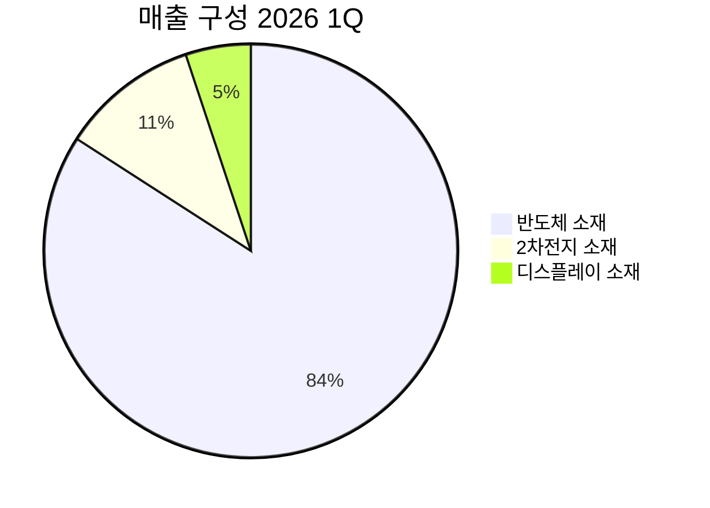

---

company: 솔브레인
created: 2026-05-19 16:09
date: 2026-05-19 16:09
exchange: KRX
listing: public
market: KR
tags:
- daily
- deal-sourcing
ticker: 357780.KS
title: Deal - 솔브레인 (357780.KS) 16:09
type: deal-sourcing
publish: true
---


> **오늘의 탐색 분야**: 클라우드, 사이버보안, 방산, 지속가능 인프라, 농업기술, 교육, 디지털 콘텐츠, 한국 시장, 중국 투자 생태계
> 4일 주기 로테이션 (30개 분야 커버)

# 솔브레인 (357780.KS)

<span style="background:#2196F3;color:white;padding:2px 8px;border-radius:4px;font-size:0.85em">357780.KS</span> <span style="background:#D32F2F;color:white;padding:2px 8px;border-radius:4px;font-size:0.85em">🇰🇷 KR</span> <span style="background:#424242;color:white;padding:2px 8px;border-radius:4px;font-size:0.85em">KOSPI</span> <span style="background:#7B1FA2;color:white;padding:2px 8px;border-radius:4px;font-size:0.85em">반도체 소재 / 화학</span>

---

<div style="background:#e0e0e0;border-radius:8px;overflow:hidden;margin:8px 0"><div style="background:#FF9800;width:68%;padding:6px 12px;color:white;font-weight:bold;font-size:1em;white-space:nowrap">Investment Score 68/100 — 🟡 Buy (조건부)</div></div>

<div style="background:#e0e0e0;border-radius:8px;overflow:hidden;margin:4px 0"><div style="background:#FF9800;width:63%;padding:4px 8px;color:white;font-size:0.85em;white-space:nowrap">업사이드 비대칭 19/30 — DRAM·NAND·Foundry 3중 수혜, 단 3.1조 시총에 일부 반영</div></div>
<div style="background:#e0e0e0;border-radius:8px;overflow:hidden;margin:4px 0"><div style="background:#FF9800;width:72%;padding:4px 8px;color:white;font-size:0.85em;white-space:nowrap">카탈리스트 & 타이밍 18/25 — NAND·HBM 투자 사이클 본격화, 2026년 실적 가시성 양호</div></div>
<div style="background:#e0e0e0;border-radius:8px;overflow:hidden;margin:4px 0"><div style="background:#4CAF50;width:80%;padding:4px 8px;color:white;font-size:0.85em;white-space:nowrap">비즈니스 품질 16/20 — 전환비용·인증장벽 해자 강함, 삼성전자 주주사 희귀 지위</div></div>
<div style="background:#e0e0e0;border-radius:8px;overflow:hidden;margin:4px 0"><div style="background:#FF9800;width:60%;padding:4px 8px;color:white;font-size:0.85em;white-space:nowrap">밸류에이션 9/15 — Forward PER 20x, 성장 가속 감안 시 적정~소폭 매력, 역대 밴드 중간</div></div>
<div style="background:#e0e0e0;border-radius:8px;overflow:hidden;margin:4px 0"><div style="background:#FF9800;width:60%;padding:4px 8px;color:white;font-size:0.85em;white-space:nowrap">발견 가치 6/10 — 13명 커버, 매수 우세하나 목표가 괴리 크지 않아 완전 미발굴은 아님</div></div>

---

> [!abstract] 리포트 요약
> **한 줄 테시스**: 솔브레인은 삼성전자·SK하이닉스의 DRAM·NAND·파운드리 3개 사이클이 동시에 상승하는 시점에 가장 직접적으로 수혜를 입는 반도체 공정 소재 핵심 공급자로, 2026년 영업이익 62%+ 성장이 컨센서스상 가시화되고 있다.
>
> **왜 지금인가**: 2026년 1Q 영업이익 YoY +24% 기록 후 연간 가이던스 상향 여력이 남아 있으며, NAND 증설 사이클 본격화 + HBM 공급망 국산화 가속이 2H26을 더욱 강하게 만들 가능성이 높다. IBK투자증권은 2026년 영업이익 2,180억원(+62.7%) 전망(컨센서스 추정).
>
> **Variant Perception**: 시장은 솔브레인을 '반도체 업황 베타 플레이'로 분류하지만, 실제로는 고객사 가동률 × 공정 미세화 × NAND·DRAM·Foundry 3방향 노출이라는 구조적 레버리지를 보유한다. 단순 사이클 수익보다 복리 성장력이 과소평가되어 있다.
>
> **핵심 리스크**: Forward PER 20x는 소재주 기준 저렴하지 않으며, 삼성전자 의존 집중 위험 + 2차전지 부문 원가 압박이 마진 개선을 일부 상쇄할 수 있다.

---

## ① 핵심 지표

| 항목 | 값 | 의미 |
|------|-----|------|
| 현재가 | 408,000원 (데이터 기준일) | 🟡 52주 고점(530,000) 대비 -23%, 저점(155,000) 대비 +163%. 고점 대비 조정 중이나 저점 대비 급등한 상태 |
| 시가총액 | 3.1조원 | 🟡 코스피 중형주. 대형 소재 기업 대비 여전히 저평가 논리 가능. 글로벌 소재 피어 대비 할인 |
| PER (Trailing / Forward) | 39.45x / 20.15x | 🟢 Forward PER의 급격한 하락(39→20)은 2026년 이익 점프를 시장이 이미 일부 인식. 이익 성장 가속 확인 필요 |
| PBR | 2.91x | 🟡 소재 기업치고 적정. 자산집약적 업종 특성 고려 시 크게 비싸지 않음 |
| EV/EBITDA | 71.08x | 🔴 매우 높음. 단, EBITDA 기준으로 현재 사이클 저점에서의 측정치일 가능성. 이익 정상화 시 급감 예상 [추정] |
| 영업이익률 | 16.9% | 🟢 반도체 소재 업종 양호 수준. 2026년 17% 유지 또는 개선 컨센서스 |
| 순이익률 | 14.4% | 🟢 영업이익률과 갭 적어 금융비용 부담 낮음을 시사. 부채비율 29%와 일관 |
| ROE | 3.3% | 🔴 낮음. 단, 이는 2025년 기준으로 2026년 이익 급증 시 ROE 크게 개선 예상 [추정] |
| 52주 고/저 | 530,000 / 155,000원 | 🟡 변동폭 극심 (+242%). 현재가는 52주 고저 중간보다 약간 아래. 불확실성 반영 |
| 섹터/지역 | 반도체 소재 / 한국 | 🟢 AI 반도체 수요 급증의 직접 수혜 섹터 |
| 2026 1Q 매출 | 2,638억원 (YoY +25.9%) | 🟢 성장 가속. 반도체 84%, 2차전지 11%, 디스플레이 5% |
| 2026 1Q 영업이익 | 447억원 (YoY +24.0%) | 🟢 컨센서스 부합. 2026년 연간 영업이익 2,180억원 목표 시 잔여 분기 가속 필요 |
| 애널리스트 컨센서스 | 매수 11명 / 매도 1명 (13명 전체) | 🟢 강한 매수 쏠림. 평균 목표가 431,154원 (현재가 대비 소폭 업사이드) |

> [!warning] EV/EBITDA 71x 해석 주의
> 이 수치는 현재 이익 사이클이 완전히 정상화되지 않은 시점의 측정값일 가능성이 높습니다. 2026년 영업이익이 2,180억원(컨센서스 추정)으로 상승한다면 EV/EBITDA는 급격히 낮아질 것입니다. 단, 이익 성장 전망이 실현되지 않으면 현재 밸류에이션은 고평가입니다.

---

## ② 회사 개요, 제품, 핵심 경쟁력

> [!abstract] 한 줄 설명
> 솔브레인은 **삼성전자·SK하이닉스가 반도체 칩을 만들 때 반드시 써야 하는 고순도 공정 화학소재**를 만드는 기업이다.

### 사업 모델: 어떻게 돈을 버는가

솔브레인은 반도체 제조 공정에서 사용되는 식각액(Etchant), 세정액(Cleaning Solution), 포토레지스트 관련 소재 등 **공정 화학소재**를 생산·공급한다. 반도체 칩 1개를 만들기 위해서는 수백 개의 공정 단계가 필요하고, 각 단계마다 다양한 화학소재가 소모된다. 이 소재들은 "소모품"이기 때문에 **웨이퍼 생산량에 비례해 반복 매출이 발생**하는 구조다.

핵심은 **고객사 공정과의 긴밀한 연동**이다. 솔브레인의 소재는 삼성전자·SK하이닉스의 공정 조건(온도, 압력, 타겟 식각율, 선택비 등)에 맞게 커스터마이징된다. 한번 공정 인증을 받으면 그 소재를 다른 공급사로 교체하는 데 수개월~수년의 재인증 기간과 수율 리스크가 따른다.

### 핵심 제품/서비스

| 제품군 | 설명 | 적용 공정 |
|--------|------|-----------|
| 불산(HF) 계열 식각액 | 산화막·질화막 선택적 제거 | DRAM, NAND, Logic |
| 인산(H₃PO₄) 계열 식각액 | 질화막 식각 | DRAM, NAND |
| 세정액 | 공정 후 이물질 제거 | 전 공정 |
| EUV용 소재 | 차세대 초미세 공정 핵심 | Foundry (삼성, TSMC향) |
| 2차전지 전해액 | 리튬이온 배터리 이온 전달 매체 | EV, ESS |
| 디스플레이 OLED 소재 | 유기 발광 재료 | OLED 패널 |

### 매출 구성 (2026년 1Q, 출처: 솔브레인 경영실적발표 2026.1Q)



| 사업부문 | 매출액 (억원) | 비중 | 특이사항 |
|----------|--------------|------|---------|
| 반도체 소재 | 2,219 | 84.1% | AI 수요·NAND 증설 수혜, 불산·인산 출하 증가 |
| 2차전지 소재 | 284 | 10.8% | 북미 ESS 물량 회복, 원재료비 압박 |
| 디스플레이 소재 | 135 | 5.1% | 중국향 유기재료 증가, 유리기판 파일럿 |
| **합계** | **2,638** | **100%** | YoY +25.9% |

### 핵심 경쟁력

| 경쟁력 | 설명 | 복제 난이도 (1-10) |
|--------|------|:---:|
| 공정 인증 장벽 | 삼성/하이닉스 공정별 맞춤 소재 인증. 교체 비용 극대 | 9 |
| 삼성전자 주주사 지위 | 삼성전자가 솔브레인의 지분을 보유 — 한국 소재 기업 중 극히 희귀한 케이스 | 10 |
| 장기 공급 계약 관계 | 수십 년 납품 히스토리. 삼성전자, SK하이닉스, 도시바 등 핵심 관계 | 8 |
| 고순도 제조 역량 | 반도체 공정용 초고순도(99.999%) 화학소재 생산 기술. 설비·노하우 축적 | 8 |
| EUV 소재 국산화 | 기존 해외 의존 EUV 관련 소재 국산화 선도 (동진쎄미켐과 양강 구도) | 7 |
| 다중 응용처 | DRAM·NAND·Foundry 3개 사이클 동시 노출 → 단일 사이클 의존 리스크 완화 | 7 |

> [!success] 삼성전자 주주사의 의미
> 삼성전자가 솔브레인의 주주라는 사실은 단순한 재무적 투자가 아니다. 이는 삼성전자가 이 공급사의 안정적 존속에 이해관계를 가진다는 신호이며, 경쟁사의 신규 진입을 사실상 차단하는 소프트 해자로 기능한다. 한국 소재 기업 중 이런 구조를 가진 기업은 매우 드물다.

### 성장 공식

```
매출 성장 = [반도체 웨이퍼 생산량 × 첨단 공정 비중 × 소재 단가 상승]
           + [2차전지 전해액 × 북미 ESS/EV 침투]
           + [EUV 소재 국산화 점유율 확대]
```

- **레이어당 소재 소모 증가**: DRAM이 1z→1a→1b nm로 미세화될수록, NAND가 200단→300단 이상으로 적층될수록 공정 단계 수가 늘어나고 소재 소모량이 비례 이상으로 증가한다.
- **단가 프리미엄**: 첨단 공정용 고순도 소재는 범용 소재보다 ASP(평균 판매가)가 높다.

---

## ③ 왜 100%+ 가능한가? — 업사이드 비대칭

> [!abstract] 핵심 논거
> 현재 시가총액 3.1조원은 DRAM·NAND·Foundry 3개 사이클이 동시에 상승하는 구조에서의 정상화 이익을 충분히 반영하지 못했을 가능성이 있다. 2026년 영업이익 2,180억원 기준 PER는 약 14배 수준으로 낮아진다 [컨센서스 추정].

### 시총 vs TAM

글로벌 반도체 소재 시장 규모는 약 700억 달러(약 93조원) 수준으로 추정되며[추정, 구체적 출처 미확인], 한국이 주요 수혜국이다. 솔브레인의 현재 시총 3.1조원은 이 시장의 약 3.3% 수준이다. 단, 솔브레인이 공략하는 핵심 소재 카테고리(식각액, 세정액 등)는 전체 소재 시장의 일부분이므로 실제 TAM 대비 비율은 더 높다. **진정한 성장 레버는 시장 점유율 확대보다 단가 상승과 소재 소모량 증가**에서 나온다.

### 성장 가속 구간 — 3개의 신호등이 켜졌다

IBK투자증권은 "DRAM, NAND, Foundry 신호등 3개가 모두 켜졌다"고 표현했다 [출처: IBK투자증권 리포트, 뉴스핌 보도].

| 성장 동력 | 현황 | 투자 사이클 타이밍 |
|---------|------|-----------------|
| **NAND 증설** | SK하이닉스 NAND 투자 재개, 삼성전자 평택 P4 풀가동 준비 | 2026~2027년 주요 증설 집중 예상 [추정] |
| **DRAM/HBM** | HBM3E 양산 확대, 삼성 HBM4 개발 | 공정 미세화 → 소재 소모량 증가 |
| **Foundry** | 삼성전자 GAA 2nm 공정 전환 | EUV 소재 수요 구조적 증가 |
| **2차전지** | 북미 ESS 물량 회복, IRA 수혜 기대 | 전기차 수요 정상화 시 추가 레버리지 |

### 수치로 보는 이익 성장 가속

| 구분 | 2026 1Q | 2026F (컨센서스 추정) | 비고 |
|------|---------|-------------------|------|
| 매출 | 2,638억원 | 1조 600억원 [IBK 추정] | YoY +15% |
| 영업이익 | 447억원 | 2,180억원 [IBK 추정] | YoY +62.7% |
| 영업이익률 | 16.9% | ~17% | 안정적 |

> [!tip] 핵심 인사이트: Forward 이익 점프
> 2025년→2026년 영업이익 62.7% 성장 추정이 실현된다면, 현재 주가 기준 Forward PER는 약 14배 수준으로 하락한다 [추정, IBK 추정치 기반 계산: 3.1조원 시총 ÷ 2,180억 영업이익 기준]. 이는 성장하는 독점적 소재 기업 기준으로 싸다.

### 옵셔널리티

1. **EUV 소재 국산화**: 현재 해외 의존도가 높은 EUV용 포토레지스트 관련 소재에서의 국산화 진행. 성공 시 TAM 확대 + 고마진 제품군 추가
2. **2차전지 전해액 북미 진출**: 북미 ESS 시장 성장 + IRA 탈중국 수혜로 솔브레인 북미 전해액 점유율 확대 기회. 현재 2차전지 부문이 가동률 저조 상태여서 정상화 시 레버리지 효과 큼
3. **유리기판 파일럿**: 디스플레이 부문에서 유리기판 파일럿 라인 구축 중. 차세대 반도체 패키징 소재로 확장 가능성 [확인 필요]
4. **OLED 중국향 확대**: 중국 디스플레이 제조사 향 유기재료 공급 증가

### Compounding Machine 구조

솔브레인의 복리 엔진은 **"반도체 공정 고도화 → 소재 소모량 증가 → 납품 단가 상승 → 매출 자동 성장"**의 구조다. 고객사가 CapEx를 늘릴수록, 공정을 고도화할수록, 솔브레인은 추가 영업 없이도 매출이 늘어난다. 이는 진정한 의미의 패시브 성장 구조다.

---

## ④ 왜 지금인가? — 카탈리스트 & 타이밍

> [!abstract] 타이밍 논거
> 2026년은 NAND 증설이 재개되고 HBM 수요가 폭발하는 시점으로, 솔브레인의 연간 실적이 사상 최고치를 경신할 가능성이 높다. 다음 실적 발표(2026년 8월 19일)가 구체적 촉매가 될 것이다.

### 구체적 카탈리스트 목록

| 카탈리스트 | 예상 시점 | 영향 | 실현 가능성 |
|-----------|---------|------|-----------|
| 2Q26 실적 발표 | 2026년 8월 19일 | NAND 증설 효과 가시화, 가이던스 상향 여부 | 높음 |
| 삼성전자 NAND 평택 P4 가동 확대 | 2026년 중 [추정] | 불산/인산 출하량 증가 직결 | 중간-높음 |
| SK하이닉스 HBM4 양산 | 2026~2027년 [추정] | HBM 공정 소재 수요 급증 | 높음 |
| 2차전지 원재료 단가 정상화 | 시점 불확실 | 2차전지 부문 마진 개선 | 중간 |
| EUV 소재 국산화 가시적 성과 | 시점 불확실 | 고마진 신규 매출 추가 | 낮음-중간 |
| 북미 ESS 전해액 수주 확대 | 2026 하반기~2027 [추정] | 2차전지 부문 가동률 정상화 | 중간 |

### 시장 반영도

현재 주가는 이미 반도체 회복 사이클을 일부 반영한 상태다(52주 저점 대비 +163%). 그러나 NAND 증설의 **규모와 속도**가 시장 예상보다 빠를 경우, 추가적인 주가 리레이팅 여지가 존재한다. 특히 IBK 컨센서스상 2026년 영업이익이 2,180억원이라면 현재 주가는 여전히 디스카운트 상태다.

### Variant Perception

> [!tip] 시장과 다른 뷰
> **시장 컨센서스**: 솔브레인 = 반도체 업황 베타 플레이. 사이클이 꺾이면 같이 내린다.
>
> **나의 뷰**: 솔브레인의 진정한 차별점은 **사이클 중립적인 구조적 성장**이다. DRAM이든 NAND든 Foundry든, 반도체가 더 복잡해지고 미세해질수록 소재 소모량은 구조적으로 증가한다. 단순히 "업황 올라가면 실적 좋아지는 기업"이 아니라, **공정 고도화라는 메가트렌드에 올라탄 소비재형 비즈니스**다. 이 차이를 시장이 아직 충분히 반영하지 못하고 있다.

### 매크로 환경

| 시나리오 | 솔브레인 영향 |
|---------|------------|
| **AI 투자 사이클 지속** | 🟢 강한 순풍. HBM, 첨단 NAND 수요 지속 증가 |
| **반도체 투자 사이클 둔화** | 🔴 역풍. 고객사 CapEx 감소 시 소재 수요도 연동 감소 |
| **원/달러 환율 상승** | 🟡 수출 기업 유리하나 원재료 수입 비용도 증가. 순효과 중립~소폭 긍정 |
| **미중 반도체 제재 심화** | 🟡 국산화 수혜 가능성 vs 삼성·SK의 중국 공장 제약 우려 상충 |
| **글로벌 경기침체** | 🔴 반도체 수요 감소 → 고객사 가동률 하락 → 소재 출하 감소 |

---

## ⑤ 비즈니스 퀄리티

> [!abstract] 비즈니스 품질 평가
> 강한 전환비용 해자 + 인증 장벽 + 삼성전자 주주 지위라는 세 겹의 방어막. 다만 고객 집중도(삼성·SK 의존)가 약점.

### 경제적 해자 (Moat)

| 해자 계층 | 내용 | 복제 난이도 |
|---------|------|-----------|
| **공정 인증 전환비용** | 한번 인증된 소재를 교체하려면 수율 리스크 + 수개월 재인증. 반도체 팹은 현재 생산에 지장을 줄 공급사 교체를 극도로 기피 | ★★★★★ (9/10) |
| **삼성전자 주주 관계** | 삼성전자가 직접 주주사. 경쟁사 진입 방어막 + 우선 공급 권리의 소프트 보장 | ★★★★★ (10/10) |
| **초고순도 제조 노하우** | 수십 년간 축적된 불순물 제어 기술. 장비·레시피·인력 동시 구축 필요 | ★★★★☆ (8/10) |
| **고객사 공정 데이터** | 고객사 공정 조건을 수십 년 공유받아 최적화된 소재 개발. 신규 진입자는 이 데이터가 없음 | ★★★★☆ (8/10) |
| **EUV 국산화 선점** | 동진쎄미켐과 함께 한국 EUV 소재 국산화 양강 구도. 선점 효과 | ★★★☆☆ (6/10) |

<div style="display:flex;border-radius:8px;overflow:hidden;margin:8px 0;font-size:0.85em"><div style="background:#4CAF50;width:75%;padding:6px 8px;color:white">🟢 해자 강도: 강 (75%)</div><div style="background:#F44336;width:25%;padding:6px 8px;color:white;text-align:right">🔴 약점: 고객 집중 (25%)</div></div>

### ROIC/ROE 분석

| 지표 | 현황 | 해석 |
|------|------|------|
| ROE | 3.3% | 2025년 이익 사이클 저점. 2026년 이익 급증 시 ROE 10%+ 예상 [추정] |
| 부채비율 | 29% | 보수적 재무 구조. 차입금 56% 급감(2026 1Q 기준) |
| 영업이익률 | 16.9% | 소재 기업 양호 수준. 2차전지 원가 압박 없다면 18%+ 가능 [추정] |

ROE 3.3%는 현재 이익 사이클이 완전히 정상화되지 않은 시점의 스냅샷이다. 2026년 영업이익이 2,180억원(IBK 추정)으로 점프한다면 ROE는 구조적으로 10% 이상으로 개선될 것이다 [추정].

### 마진 방향성

2026년 1Q 영업이익률 16.9%는 견조하다. 다만:
- **긍정 요인**: NAND 증설로 반도체 소재 믹스 개선 → 마진 확대 가능
- **부정 요인**: 2차전지 원재료(LiPF6 등) 단가 49% 급등 → 마진 일부 압박
- **넷**: 반도체 부문(84%) 비중이 압도적이므로, 전사 마진은 개선 방향 [추정]

### 경영진

정문주 대표이사 사장 체제. ESG 경영 강화를 전략 핵심으로 채택하며 장기 지속가능 성장을 표방하고 있다 [출처: 한국경제, 2026.5]. 삼성전자 주주사로서의 관계를 적극 활용하는 B2B 소재 전문 경영 방식이다.

> [!question] 경영진 자본배분 트랙레코드
> 배당수익률 0.6%로 주주환원에 적극적이지 않다. 성장 투자(공장 증설, R&D)에 자본을 집중하는 전략으로 보이나, 수익성 개선 후 주주환원 정책 변화 여부는 별도 확인 필요.

---

## ⑥ 밸류에이션 & 안전마진

> [!abstract] 밸류에이션 요약
> Trailing PER 39x는 비싸 보이지만, 이익 점프가 실현되면 Forward PER 14~20x로 정상화된다. 현재는 "비싼 주식처럼 보이지만 실제로는 싸다"는 해석이 컨센서스이며, 나 역시 이에 동의한다 — 단, 이익 점프 실현이 전제조건이다.

### 현재 밸류에이션 vs 역사적 맥락

| 지표 | 현재 | 해석 |
|------|------|------|
| Trailing PER | 39.45x | 이익 사이클 저점 기준. 과거 정상 사이클 대비 고평가처럼 보임 |
| Forward PER | 20.15x | 2026년 이익 성장 반영. 반도체 소재 업종 대비 적정~소폭 매력 |
| PBR | 2.91x | 자산집약적 기업 고려 시 적정 수준 |
| EV/EBITDA | 71.08x | 높음. 이익 정상화 시 급감 예상 [추정] |
| 배당수익률 | 0.6% | 낮음. 성장주 성격 유지 |

### 애널리스트 목표가 분포

| 구분 | 목표주가 | 현재가 대비 업사이드 |
|------|---------|-------------------|
| 컨센서스 평균 (13명) | 431,154원 | +5.7% (현재가 408,000 기준) |
| 최고 목표가 | 580,000원 | +42.2% |
| 최저 목표가 | 268,000원 | -34.3% |
| 특정 애널리스트 | 530,000원 | +29.9% |

[출처: Investing.com, 리틀비프로젝트 2026.5]

> [!warning] 컨센서스 목표가의 낮은 업사이드
> 평균 목표가가 현재가 대비 +5.7%에 불과하다는 점은 주의가 필요하다. 시장이 이미 상당 부분 반영했거나, 또는 일부 애널리스트의 목표가 업데이트가 늦어진 것일 수 있다. 최고 목표가 580,000원은 +42%로, 이익 레버리지가 실현될 경우의 업사이드를 반영한다.

### FCF & 안전마진 분석

FCF에 대한 구체적 데이터는 제공된 Yahoo Finance 데이터에 없어 직접 계산이 불가능하다. 단, 다음을 근거로 질적 판단:

- 영업이익률 16.9% + 순이익률 14.4%의 높은 전환율 → 현금 창출 구조 우수
- 부채비율 29%, 차입금 56% 급감 → 재무 부담 낮음
- 유동비율 104%p 하락은 일시적 유동부채 증가. 전체 재무 건전성은 유지 [확인 필요]

### "이 품질의 기업을 이 가격에" — So What?

**Forward PER 14~20x 범위**에서 반도체 소재 독점 공급사를 살 수 있다면, 리스크 대비 수익률은 양호하다. 다만 현재가 408,000원은 이미 저점(155,000) 대비 대폭 상승한 상태여서 "저점 매수" 기회는 지났다. 지금의 투자 논리는 **"성장 사이클 중반에 올라탄다"**는 것이지, 역발상 바닥 매수가 아니다.

---

## ⑦ 리스크 & Devil's Advocate

| 구분 | 핵심 논거 |
|------|---------|
| 🟢 Bull #1 | DRAM·NAND·Foundry 3개 사이클 동시 상승 사이클 → 사상 최대 실적 달성 경로 명확 |
| 🟢 Bull #2 | AI 반도체 수요 구조적 성장 → HBM, 첨단 NAND 소재 소모량 수년간 지속 증가 |
| 🟢 Bull #3 | 삼성전자 주주사 지위 + 공정 인증 전환비용 해자 → 경쟁사 진입 사실상 봉쇄 |
| 🔴 Bear #1 | 삼성전자 의존도 과다 — 삼성전자 감산·사고 시 솔브레인 매출 직격탄. 고객 집중 리스크 |
| 🔴 Bear #2 | 2차전지 원재료 단가 급등(49%) + 가동률 저조 → 2차전지 부문 수익성 악화 지속 우려 |
| 🔴 Bear #3 | 현재 주가가 이미 사이클 반등을 상당 부분 반영 — 이익 컨센서스 달성 실패 시 밸류에이션 급격한 재조정 위험 |

### 가장 현실적인 실패 시나리오

> [!bear] Bear 시나리오: 삼성전자 감산 + 이익 miss
> 삼성전자가 메모리 수요 부진으로 2H26에 감산을 결정하면, 솔브레인의 84%를 차지하는 반도체 소재 매출이 직격탄을 맞는다. 동시에 2차전지 원가 압박이 지속되면, 2026년 연간 영업이익 2,180억원 컨센서스 달성이 어렵다. 현재 Forward PER 20x 밸류에이션은 이익 성장이 실현된다는 전제 위에 있으므로, miss 시 PER는 Trailing에 가깝게 리셋 → 주가 30~40% 하방 압박 가능 [추정].

### 숨겨진 가정 (Hidden Assumptions)

1. **[가정]** 삼성전자·SK하이닉스의 2026년 CapEx가 컨센서스 수준으로 집행된다
2. **[가정]** 2차전지 원재료 단가 압박이 하반기부터 완화된다
3. **[가정]** 중국 소재 업체가 한국 고객사 공정 인증을 획득하지 못한다
4. **[가정]** EUV 소재 국산화 진도가 기대 수준으로 진행된다

### Kill Criteria

| Kill Criteria | 임계값 |
|-------------|-------|
| 삼성전자 대규모 감산 발표 | 삼성전자 메모리 CapEx 전년 대비 30%+ 감소 |
| 2026년 반도체 부문 매출 성장률 | YoY +10% 이하 (기대치 크게 미달) |
| 영업이익률 | 14% 이하로 3분기 연속 하락 |
| 중국 소재 업체 공정 인증 취득 | 삼성/SK 핵심 공정 진입 확인 시 |
| 2차전지 부문 원재료비율 | 매출 대비 80% 초과 지속 |

---

## ⑧ 발견 가치 & 엣지

> [!note] 발견 가치 평가
> 솔브레인은 국내 반도체 소재 대장주 중 하나로, 커버리지가 이미 상당히 형성되어 있다. 완전한 "숨겨진 보석"은 아니지만, 시장의 오해가 완전히 해소된 상태도 아니다.

### 애널리스트 커버리지

- 총 13명 커버 (Investing.com 기준) — 매수 11명, 보유 1명, 매도 1명
- 목표가 분산: 268,000원 ~ 580,000원으로 매우 넓음 → **애널리스트 간 견해 차이가 크다**는 것이 역설적으로 Variant Perception 기회를 시사

### 기관/외국인 동향

- 2026년 5월 14일: 기관 17천주 순매도, 외국인 11천주 순매도
- 2026년 5월 13일: 외국인 4천주, 기관 7천주 순매수

외국인과 기관의 단기 매도세는 주가 조정의 원인이지만, 역설적으로 과매도 가능성을 시사한다. 특히 5월 13일 +10.4% 급등 후 매도가 나오는 패턴은 "급등 후 차익 실현" 성격으로 추세 전환보다 조정 국면으로 해석 가능.

### 시장의 오해/편견

> [!tip] 시장이 놓치고 있는 것
> **오해**: "솔브레인 = 반도체 사이클 기업 = 사이클이 꺾이면 팔아야 하는 주식"
>
> **실제**: 솔브레인의 매출은 반도체 생산량보다 **공정 복잡도**에 더 민감하다. 칩 생산량이 같아도 EUV 공정, HBM 적층, NAND 단수 증가로 소재 소모량은 구조적으로 늘어난다. 이는 순수 사이클 기업이 아니라 반도체 공정 진화의 수혜자라는 의미다. 이 차이를 시장이 충분히 프라이싱하지 못하고 있다고 판단한다.

---

## ⑨ 액션 아이템

| 항목 | 판단 |
|------|-----|
| **액션** | <span style="background:#4CAF50;color:white;padding:2px 8px;border-radius:4px;font-size:0.85em">BUY (조건부)</span> — 2026년 NAND·HBM 증설 사이클 수혜 + Forward PER 14~20x 범위에서의 매력적 진입 기회 |
| **Conviction** | Medium — 이익 점프 실현 여부가 핵심 불확실성 |
| **적정 진입가** | 380,000~420,000원 — 현재가(408,000) 근방. 단, 급락 시 360,000원대에서 적극 매수 기회 [추정] |
| **목표가 (12개월)** | 500,000~530,000원 [추정, 컨센서스 최고 목표가 수렴 시] — 2026년 이익 컨센서스 실현 시 달성 가능 |
| **손절 기준** | 345,000원 이하 (현재가 대비 -15%, 또는 Kill Criteria 충족 시 즉시) |
| **권장 비중** | 포트폴리오 5~8% — 확신도 Medium에 맞는 적정 비중 |

<div style="display:flex;border-radius:8px;overflow:hidden;margin:8px 0;font-size:0.85em"><div style="background:#4CAF50;width:40%;padding:6px 8px;color:white">🟢 Bull 40%<br>목표가 530,000</div><div style="background:#FF9800;width:40%;padding:6px 8px;color:white">🟡 Base 40%<br>목표가 460,000</div><div style="background:#F44336;width:20%;padding:6px 8px;color:white">🔴 Bear 20%<br>목표가 300,000</div></div>

| 시나리오 | 조건 | 목표가 | 업사이드 |
|---------|------|-------|---------|
| 🟢 Bull | 2026 OPR 2,180억+ 달성, NAND 증설 가속 | 530,000원 | +29.9% |
| 🟡 Base | 2026 OPR 1,700억 (컨센서스 소폭 하회), 점진적 성장 | 460,000원 | +12.7% |
| 🔴 Bear | 삼성전자 감산 + 이익 miss, 2차전지 부문 부진 지속 | 300,000원 | -26.5% |

### 추가 리서치 필요 사항

- [ ] 솔브레인 vs 동진쎄미켐 vs 이엔에프테크놀로지 재무 비교 (피어 밸류에이션)
- [ ] 삼성전자 지분율 및 최근 지분 변동 내역 확인
- [ ] 2차전지 전해액 북미 공급계약 구체적 내용 확인 (계약 규모, 고객사명)
- [ ] 최근 3~5년 CapEx vs FCF 추이 (성장 투자 효율성 검증)
- [ ] 유리기판 사업 진행 상황 및 시장 진입 타임라인
- [ ] 2025년 연간 재무제표 상세 (세그먼트별 OPM, CapEx 배분)

### 모니터링 핵심 지표/이벤트

| 지표/이벤트 | 체크 주기 | 임계값 |
|-----------|---------|-------|
| 삼성전자·SK하이닉스 분기 CapEx | 분기 실적 발표 시 | YoY -20% 이하 시 포지션 재검토 |
| 솔브레인 분기 영업이익 | 분기 발표 시 | 500억원 이상이면 강한 긍정 신호 |
| 반도체 소재 부문 YoY 성장률 | 분기 발표 시 | 20% 이상 유지 여부 |
| 2차전지 원재료(LiPF6) 가격 | 월간 | 고점 대비 30%+ 하락 시 마진 개선 신호 |
| 기관/외국인 누적 순매수 | 주간 | 대규모 지속 순매도 시 경계 |

### 다음 체크포인트

| 날짜 | 확인 사항 |
|------|---------|
| 2026년 8월 19일 | 2Q26 실적 발표 — 반도체 소재 성장 가속 여부, 가이던스 상향 여부 |
| 2026년 7~8월 | 삼성전자·SK하이닉스 2Q26 실적 발표 — CapEx 계획 변경 여부 |
| 2026년 6~7월 | 2차전지 원재료 가격 동향 — 마진 개선 시그널 확인 |

---

> [!verdict] 최종 판단
> **솔브레인은 68점 수준의 "조건부 매수" 기회다.** 반도체 소재라는 구조적 해자, 삼성전자 주주사 희귀 지위, NAND·HBM·Foundry 3중 노출이라는 장점이 명확하다. Forward PER 14~20x에서 사는 이 기업은 장기적으로 복리 성장이 가능한 비즈니스 구조를 갖고 있다.
>
> 단, 지금이 이미 저점 대비 +163% 상승 후라는 점, 컨센서스 목표가와의 괴리가 크지 않다는 점, 삼성전자 의존 위험이 크다는 점에서 "즉시 대규모 베팅"보다는 **3~6개월 분할 매수 + 이익 확인 후 비중 확대** 전략이 합리적이다.
>
> 핵심 질문: **"2026년 8월 2Q 실적이 컨센서스를 상회하는가?"** — 이것이 다음 주요 판단 포인트다.