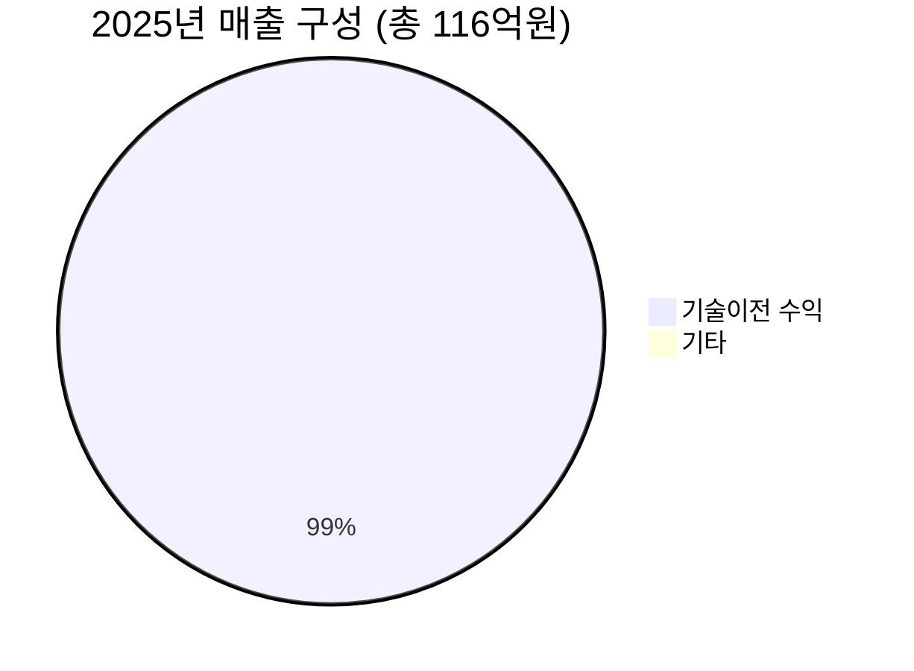

> **오늘의 탐색 분야**: 클라우드, 사이버보안, 인도 시장, 동남아 시장, 일본 시장, 유럽 시장, 중남미, 방산, 인프라
> 4일 주기 로테이션 (27개 분야 커버)

# 아이엠바이오로직스 (493280.KS)

493280.KS 🇰🇷 KR KOSDAQ 바이오텍 / 자가면역

총점 58/100 — WATCH (하이리스크 투기)

> [!abstract] 리포트 요약
> **한 줄 테시스**: 아이엠바이오로직스는 OX40L 타깃 항체 플랫폼을 기반으로 자가면역질환 치료제를 개발·기술이전하는 순수 바이오텍으로, IMB-101의 글로벌 임상 2상 진입이라는 핵심 마일스톤을 방금 통과했다.
>
> **왜 지금인가**: IMB-101(NAV-240)의 글로벌 임상 2a상 첫 환자 투약 성공 → 500만 달러 마일스톤 수령 (2026년 3월). 회사 제시 가이던스 기준 2028년 대규모 수익화 이벤트(매출 977억원, 영업이익 673억원)를 향한 첫 관문 통과.
>
> **Variant Perception**: 시장은 지금 신규상장 모멘텀 소멸 + 공모가 대비 하락(-53%)로 단기 실망 매물이 쏟아지는 국면. 그러나 진짜 가치는 2028년 마일스톤 수령 가능성에 있으며, 현금 725억원(시총 대비 ~105%)이 안전망 역할을 한다.
>
> **핵심 리스크**: ① 2027년 매출 7억원(가이던스) → 실질적 공백기 존재, ② 기술이전 수익 100% 의존 구조의 극단적 변동성, ③ 시총 692억원 vs 현금 725억원 역전 현상은 기회이기도 하지만 임상 실패 시 급속 소진 위험.
>
> **결론**: 현금 대비 시총 역전이라는 특수한 구조적 기회가 존재하나, 2027년 임상 결과가 모든 것을 결정하는 극단적 바이너리 베팅. WATCH 등급 부여.

---

## ① 핵심 지표

| 항목 | 값 | 의미 |
|------|-----|------|
| **현재가** | 49,050원 | 🔴 52주 고점(104,000원) 대비 -52.8%. 공모 직후 고점에서 반토막. 신규상장 모멘텀 완전 소멸. 최근 2거래일 연속 VI 발동(-9.19%, -12.18%, -15.34%) |
| **시가총액** | 692억원 | 🟡 소형 바이오텍. 현금성 자산(725억원)이 시총을 **초과**하는 특수 상황 → 순현금 기준 기업가치는 사실상 마이너스 |
| **PER (Trailing)** | 544.77배 | 🔴 2025년 당기순이익 8.77억원 기준. 의미 없는 수준. 기술이전 수익의 불규칙성으로 인해 PER은 투자 판단 기준 부적합 |
| **PBR** | 11.66배 | 🟡 자본총계 734억원 대비 높은 수준이나, 바이오텍 특성상 무형자산(파이프라인 가치)이 PBR에 미반영 |
| **매출 성장률** | 🔴 YoY -58% | 2024년 276억원 → 2025년 116억원. 표면상 역성장이나, 이는 기술이전 수익의 수령 타이밍 차이. 구조적 감소가 아니라 마일스톤 스케줄 문제 |
| **영업이익률** | 2.6% | 🟡 2025년 영업이익 3억원/매출 116억원. 흑자 유지가 의미 있으나 마진 자체는 미미. 2027년 공백기엔 영업손실(-274억원) 가이던스 |
| **ROE** | ~1.2% | 🔴 자본총계 734억원 대비 순이익 8.77억원. 현재 ROE는 무의미하며, 2028년 수익화 시나리오에서의 ROE 폭발 여부가 관건 |
| **52주 고/저** | 104,000원 / 45,800원 | 🟡 현재가(49,050원)는 52주 저점(45,800원)에서 불과 7% 위. 기술적으로 바닥권이나, 임상 리스크 고려 시 추가 하락 가능 |
| **섹터/지역** | 바이오텍, 한국 코스닥 | 🟡 자가면역 시장은 구조적 성장 섹터. 그러나 소형 국내 바이오텍 특유의 변동성·유동성 리스크 내재 |

> [!warning] 현금 > 시총 = 기회인가, 함정인가?
> 현재 시총 692억원 < 현금성 자산 725억원은 표면상 "청산가치 이상으로 거래"되는 것처럼 보인다. 그러나 이 현금은 임상 비용으로 빠르게 소진될 예정이며(2027년 -274억원 영업손실 가이던스), 파이프라인 가치가 0이 되면 3년 내 현금도 상당 부분 소진된다. **이것은 "싸다"는 신호가 아니라, "시장이 파이프라인 가치를 0으로 본다"는 신호일 수 있다.**

---

## ② 회사 개요, 제품, 핵심 경쟁력

### 한 줄 설명
아이엠바이오로직스(IM Biologics)는 **OX40L 타깃 항체 플랫폼을 기반으로 자가면역질환 치료제를 개발하고, 글로벌 제약사에 기술이전(License-Out)하여 마일스톤 수익을 창출하는 한국의 바이오테크 기업**이다.

### 사업 모델
전형적인 **Discovery & License-Out 모델**:
1. 독자 항체 발굴 플랫폼으로 후보물질 개발
2. 전임상/초기 임상에서 안전성·효능 데이터 확보
3. 글로벌 파트너사에 기술이전 → 계약금 + 임상 단계별 마일스톤 + 로열티 수령
4. 수령한 마일스톤으로 차세대 파이프라인 개발 재투자

직접 신약을 상업화하지 않으므로 대형 영업망 불필요. 그러나 수익의 100%가 마일스톤 타이밍에 종속되어 연도별 변동성 극심.

### 핵심 제품/서비스

| 파이프라인 | 타깃 | 적응증 | 개발 현황 | 파트너사 | 비고 |
|-----------|------|--------|----------|---------|------|
| **IMB-101 (NAV-240)** | OX40L | 자가면역질환 (피부과, 류마티스) | 글로벌 임상 2a상 진행 중 | Navigator Medicine | 2026년 3월 첫 환자 투약, 500만 달러 마일스톤 수령 |
| **NAV-242** | OX40L (차세대) | 자가면역질환 | 호주 임상 1상 (첫 피험자 투약 완료) | Navigator Medicine | IMB-101 개선 버전 |
| **IMB-102** | 미공개 (이중항체) | 자가면역질환 | 전임상~초기 임상 [추정] | 미공개 | 해외 IR에서 OX40L 기반 이중항체로 소개 |

### 매출 구성 (2025년 실적 기준)

기술이전 수익 비중 **99.1%** — 사실상 단일 수익원. 2025년 기술이전 수익 115억원은 Navigator Medicine(IMB-101 파트너사)으로부터의 마일스톤으로 추정 (확인 필요).

### 핵심 경쟁력

| 경쟁력 | 설명 | 복제 난이도 (1-10) |
|--------|------|:---:|
| **OX40L 타깃 선점** | OX40/OX40L 경로는 T세포 활성화 조절의 핵심. 자가면역 치료의 "차세대 타깃"으로 부상. 아이엠바이오로직스가 이 타깃에 집중한 선도 한국 기업 | 7 |
| **항체 엔지니어링 플랫폼** | 자체 항체 발굴·최적화 기술. IMB-101이 글로벌 임상 2상 진입한 것은 플랫폼 유효성 입증 | 6 |
| **Navigator Medicine 파트너십** | 미국 임상 개발 역량 보유 파트너와의 독점 계약. 글로벌 임상 실행 능력 확보 | 8 |
| **이중항체(Bispecific) 기술** | OX40L + 다른 타깃을 동시 겨냥하는 이중항체 IMB-102. 단일항체 대비 차별화된 메커니즘 | 7 |
| **소규모·집중 조직** | 2025년 현금성 자산 725억원 보유로 향후 3~4년 임상 비용 커버 가능. 런웨이 확보 | N/A |

### 성장 공식
**TAM × 마일스톤 캡처율 × 파이프라인 수**

- **TAM**: 글로벌 자가면역질환 치료제 시장은 2030년 기준 약 1,500~2,000억 달러 규모로 추정 [업계 추정, 출처 미확인 — 확인 필요]. OX40L 경로 특이적 치료제 시장은 이보다 작은 서브세그먼트
- **마일스톤 캡처**: IMB-101 계약 총액 미공개. 2026년 임상 2상 첫 환자 투약으로 500만 달러 수령. 향후 2상 완료, 3상 진입, 허가 등 단계별 수령 예정
- **파이프라인 확장**: IMB-101 → NAV-242 → IMB-102로 이어지는 세대 확장 전략

### 고객 (파트너사)
핵심 파트너: **Navigator Medicine** (미국 임상 개발 전문 바이오텍)
- IMB-101/NAV-240의 글로벌 임상을 Navigator Medicine이 직접 운영
- 아이엠바이오로직스는 한국 본사에서 연구개발만 담당
- Navigator Medicine의 재무 상태·임상 역량이 아이엠바이오로직스의 마일스톤 수령 타이밍에 직결 **(파트너 의존 리스크)**

> [!note] OX40/OX40L 경로 간략 설명
> OX40L은 T세포 표면의 OX40 수용체와 결합하여 면역 반응을 증폭. 자가면역질환에서 이 경로의 과활성화가 조직 손상을 유발. OX40L을 차단하면 과도한 면역 반응을 억제하면서도 기초 면역 기능은 보존 가능. IL-4/IL-13(두필루맙 타깃) 등 기존 타깃보다 업스트림(upstream)에서 작용하여 더 광범위한 자가면역 적응증 커버 가능성. 단, 이론적 우위가 임상에서 증명되어야 한다는 것이 핵심 미결 과제.

---

## ③ 왜 이 기업인가

> [!abstract] 투자 테시스의 핵심
> 아이엠바이오로직스의 투자 케이스는 단순하다: **OX40L이라는 검증된 타깃, 임상 2상 진입으로 실증된 플랫폼, 시총보다 많은 현금**. 단, 이 모든 것이 2027~2028년의 임상 결과라는 단일 이벤트에 수렴한다.

### 이 기업이 Compounding Money-Making Machine이 될 수 있는 구조

현재는 컴파운딩 머신이 **아니다**. 그러나 아래 조건이 충족되면 될 수 있다:

1. **마일스톤 재투자 사이클**: IMB-101 마일스톤 → 차세대 파이프라인(NAV-242, IMB-102) 개발 자금 → 다음 기술이전 → 더 큰 마일스톤. 이론적으로는 복리 구조가 가능
2. **OX40L 플랫폼의 적응증 확장성**: 피부과(아토피, 건선) → 류마티스 → 염증성 장질환 → 천식 등으로 동일 플랫폼 반복 적용 가능
3. **이중항체(IMB-102)의 프리미엄 마일스톤**: 이중항체는 단일항체 대비 기술이전 계약 규모가 수 배 큰 경향. 성공 시 훨씬 큰 딜 가능

그러나 현실적으로 2027년은 **딥 밸리(Deep Valley)**: 회사 가이던스에 따르면 2027년 매출 7억원, 영업손실 274억원. 이 공백기를 현금으로 버텨야 한다.

### 시장이 아직 이 기회를 충분히 인식하지 못하는 이유 (Variant Perception)

**시장의 현재 시각**: 공모가(57,000원) 대비 -14%, 52주 고점 대비 -53%로 투매 상태. 신규상장 테마 소멸, 단기 트레이더 이탈이 주된 원인.

**Variant Perception**:
- 시장은 **2027년 적자 가이던스**에 집중하여 팔고 있다
- 그러나 2027년 적자는 **예정된 R&D 투자**이며, 2028년 977억원 매출·673억원 영업이익 달성 시 현재 시총 대비 ROI는 폭발적
- 특히 **현금 725억원이 시총 692억원을 초과**한다는 사실 — 시장이 파이프라인 가치를 **0 이하**로 평가하고 있다는 의미. 이는 임상 실패를 기정사실로 본다는 것
- 반론: 실제로 임상 2상 성공률은 역사적으로 50~70% 수준 (적응증별 상이). OX40L 타깃의 임상 선례가 아직 많지 않아 불확실성 높음

### 경쟁사 대비 우위

| 구분 | 아이엠바이오로직스 | 글로벌 OX40/OX40L 경쟁사 |
|------|-----------------|------------------------|
| **포지셔닝** | OX40L 항체 + 이중항체 | Pfizer(OX40L 단독), Sanofi, AstraZeneca |
| **단계** | 임상 2a상 진입 | 일부는 더 앞선 임상 단계 |
| **전략** | 기술이전 특화 | 직접 개발·상업화 |
| **강점** | 소규모 집중, 낮은 번아웃 비용, 이중항체 차별화 | 자금력, 개발 역량, 상업화 네트워크 |
| **약점** | 파트너 의존, 마일스톤 불확실성 | 내부 경쟁, 느린 의사결정 |

> [!question] 글로벌 OX40L 경쟁 구도 (확인 필요)
> Pfizer, Sanofi, Regeneron 등 빅파마도 OX40/OX40L 경로에 투자하고 있는 것으로 알려져 있으나, 구체적인 임상 단계 및 결과는 공개 데이터로 별도 확인 필요. 만약 빅파마의 OX40L 프로그램이 임상에서 실패했다면 아이엠바이오로직스에도 부정적 신호.

### 10년 후에도 더 강해져 있을 구조적 이유

자가면역질환 환자 수는 노령화·환경오염·식생활 변화로 **구조적으로 증가** 추세. 두필루맙(Dupixent)이 수십조원 블록버스터가 된 것처럼, OX40L 타깃이 동일한 경로를 밟을 수 있다면 아이엠바이오로직스는 플랫폼 오너로서 누적 로열티를 확보할 수 있다. 단, 이는 강한 가정 [가정]이며, 임상 성공이 전제 조건.

---

## ④ 비즈니스 퀄리티

> [!abstract] 현재 단계 평가
> 아이엠바이오로직스는 **상업화 전 바이오텍**으로, 전통적인 비즈니스 품질 지표(ROIC, 마진, 복리 성장)로 평가하기 부적합하다. 현 단계에서의 품질 평가는 파이프라인 가치, 경영진 역량, 현금 런웨이, 기술 차별화로 이루어져야 한다.

### 경제적 해자 (Moat)

| 해자 계층 | 내용 | 복제 난이도 |
|---------|------|-----------|
| **지적재산권 (IP)** | OX40L 타깃 항체 특허 보유 추정 [확인 필요]. 항체 서열 특허는 강력한 진입 장벽 | 🟢 높음 |
| **임상 데이터** | IMB-101의 임상 1b상 완료 데이터 (2026 미국피부과학회 발표). 이 데이터를 재현하려면 수 년 필요 | 🟢 높음 |
| **파트너십** | Navigator Medicine과의 독점 기술이전 계약. 계약 조건상 경쟁사 유사 제품 개발 제한 가능성 | 🟡 중간 |
| **규모의 경제** | 해당 없음 (초기 바이오텍) | 🔴 없음 |
| **네트워크 효과** | 해당 없음 | 🔴 없음 |
| **전환 비용** | 기술이전 계약 파트너 변경은 법적으로 복잡. 기존 파트너의 전환 비용 존재 | 🟡 중간 |

**해자 평가**: 특허와 임상 데이터라는 **IP 해자**가 유일한 방어선. 빅파마 대비 자금력 열위를 독특한 기술로 상쇄해야 하는 구조.

### ROIC/ROE 추세

ROE ~1.2%

현재 ROE/ROIC는 사실상 무의미. 2025년 당기순이익 8.77억원 / 자본총계 734억원 = 1.2%. 기술이전 마일스톤 수익의 특성상 ROE는 수령 연도에 급등, 공백기에 급락. **2028년 영업이익 673억원 달성 시** 자본 대비 ROE는 90%+ 수준 도달 가능 [회사 가이던스 기반 가정].

### 마진 방향성 (가이던스 기준)

| 연도 | 매출 (억원) | 영업이익/손실 (억원) | 영업이익률 |
|------|-----------|-------------------|---------|
| 2025년 (실적) | 116 | +3 | 2.6% |
| 2026년 (가이던스) | 197 | -55 | -27.9% |
| 2027년 (가이던스) | 7 | -274 | -3,914% |
| 2028년 (가이던스) | 977 | +673 | 68.9% |

**출처**: 회사 투자설명서 (IPO 시 제출)

이 패턴은 전형적인 바이오텍 **"J-커브"**: 임상 투자 → 일시적 적자 심화 → 마일스톤/허가 수령 시 폭발적 흑자. 2027년은 가장 어두운 터널. **이 가이던스를 믿을 수 있는가**가 핵심 질문.

> [!warning] 가이던스 신뢰성 경고
> 2027년 매출 7억원 → 2028년 매출 977억원은 YoY +14,000% 성장. 이는 대형 마일스톤 1~2개 수령에 전적으로 의존. 단일 임상 결과에 모든 것이 걸려 있는 구조. 가이던스 달성 실패 가능성을 항상 염두에 두어야 한다.

### 경영진 평가

- **자본 배분 트랙레코드**: IPO를 통해 조달한 자금을 현금성 자산으로 유지 (725억원). 과도한 고정비 지출 없이 린(lean) 조직 운영하는 것으로 보임 [추정]
- **인센티브 구조**: IPO 이후 경영진의 지분 보유 현황, 스톡옵션 구조 (확인 필요)
- **신뢰 시그널**: 해외 IR을 JPM 포함 40개 기관 대상 적극 진행. 기관의 관심을 끄는 능력이 있는 경영진. 그러나 투자자에 대한 약속(가이던스) 이행 여부가 최종 판단 기준

---

## ⑤ 밸류에이션

> [!abstract] 밸류에이션 접근법
> 이익 기반 밸류에이션(PER, EV/EBITDA)은 현재 의미 없음. 파이프라인 가치(rNPV 방식) 또는 **현금 기반 하방 + 마일스톤 기대값** 접근이 적합.

### 현재 밸류에이션 구조 분석

**EV(기업가치) = 시총 - 순현금**
- 시총: 692억원
- 현금성 자산: 725억원
- 차입금: (확인 필요 — 데이터 미확인)
- **이론적 EV ≈ 692억원 - 725억원 = -33억원**

즉, **시장은 현재 아이엠바이오로직스의 파이프라인(IMB-101, NAV-242, IMB-102)의 가치를 0 또는 마이너스로 평가**하고 있다.

이는 두 가지 해석이 가능:
1. **기회**: 시장이 비관적으로 과도하게 할인. 임상 성공 시 폭발적 업사이드
2. **함정**: 시장이 합리적으로 임상 실패 가능성을 높게 봄. 현금도 임상 투자로 소진될 것임을 반영

### 시나리오별 밸류에이션

| 시나리오 | 전제 조건 | 적정 시총 | 업사이드 |
|---------|----------|---------|---------|
| **Bull** | IMB-101 임상 2상 성공 → 2028년 대형 마일스톤 수령. 이중항체 IMB-102 기술이전 추가. 2028년 영업이익 673억원 달성 | 3,000~5,000억원+ [가정] | +330~+620% |
| **Base** | IMB-101 임상 2상 부분 성공 (특정 적응증만). 2028년 가이던스의 50~60% 달성 | 1,000~1,500억원 [가정] | +45~+117% |
| **Bear** | IMB-101 임상 2상 실패 또는 지연. Navigator Medicine 파트너십 문제. 현금 소진 속도 가속화 | 300~400억원 (잔여 현금 할인) | -42~-57% |

🟢 Bull 25%

🟡 Base 45%

🔴 Bear 30%

> [!note] 밸류에이션 주의사항
> 위 목표 시총은 회사 가이던스와 자가면역 바이오텍 유사 사례에 기반한 [가정]이며, 실제 피어 밸류에이션 데이터로 검증되지 않음. 참고 목적으로만 활용할 것.

### 안전마진 (Margin of Safety)
현금 기반 하방: 시총 692억원 vs 현금 725억원. 이론적으로 **현금 기준 하방은 제한적**. 그러나:
- 2027년 -274억원 영업손실 가이던스로 현금 급감 예정
- 이후 임상 지속 비용까지 고려 시 실질 안전마진은 시장이 인식하는 것보다 낮을 수 있음
- **진정한 안전마진은 임상 데이터**에 있음

---

## ⑥ 촉매 & 타이밍 + 매크로 컨텍스트

> [!abstract] 왜 지금인가
> IMB-101 글로벌 임상 2상 첫 환자 투약 성공(2026년 3월)이 방금 발표되었다. 이것이 리포트 시점의 핵심 촉매다. 그러나 임상 2상 데이터 발표까지는 통상 12~24개월이 필요하므로, 지금 당장의 촉매라기보다 **중장기 설계의 출발점**으로 봐야 한다.

### 촉매 목록 및 타임라인

| 촉매 | 실현 가능성 | 예상 타임라인 | 가격 영향 |
|------|-----------|------------|---------|
| **IMB-101 임상 2상 중간 데이터** | 중간 | 2026년 하반기~2027년 상반기 | 🟢 대형 (성공 시 +100~300%) |
| **NAV-242 임상 1상 결과** | 중간-높음 | 2026년 내 | 🟡 중간 |
| **IMB-102 기술이전 딜 발표** | 낮음-중간 | 2026~2027년 | 🟢 대형 |
| **2026년 미국피부과학회 IMB-101 1b상 결과 발표** | 높음 (이미 발표 예정) | 2026년 상반기 | 🟡 중간 |
| **추가 마일스톤 수령** | 중간 | 임상 단계 진행에 따라 | 🟡 중간 |
| **빅파마 직접 기술이전 딜** | 낮음 | 불확실 | 🟢 최대급 |

### 시장 반영도
- 500만 달러 마일스톤 수령 뉴스 발표 후에도 주가는 급락 (-25% 이상 1주일 내). 즉, **긍정적 촉매가 이미 나왔음에도 시장은 부정적으로 반응**. 이는 신규상장 모멘텀 소멸과 단기 트레이더 청산이 뉴스 효과를 압도한 것으로 해석됨
- 역설적으로 이는 나쁜 뉴스가 이미 상당 부분 반영되었을 수 있다는 시그널이기도 함

### 매크로 컨텍스트

| 매크로 요인 | 방향 | 아이엠바이오로직스에 대한 영향 |
|-----------|-----|--------------------------|
| **금리 방향** | 2026년 한국·미국 모두 금리 인하 사이클 진입 시도 중 | 🟢 순풍. 금리 하락 시 성장/바이오텍 할인율 감소 → 밸류에이션 재평가 |
| **원/달러 환율** | 달러 강세 유지 | 🟢 순풍. 마일스톤 수령이 달러 기준이므로 원화 환산 수익 증가 |
| **코스닥 바이오 센티먼트** | 2025~2026년 코스닥 바이오 전반적 약세 | 🔴 역풍. 섹터 전반의 리레이팅 디스카운트 |
| **글로벌 자가면역 시장** | 두필루맙(Dupixent)의 블록버스터 성공으로 자가면역 치료제에 대한 빅파마 투자 증가 | 🟢 순풍. 타깃 치료제에 대한 파트너십 니즈 증가 |
| **트럼프 관세/무역정책** | 한국 바이오텍에 직접 영향 제한적. 단, 미국 임상 비용 증가 가능성 [추정] | 🟡 중립 |

**매크로 시나리오별 영향**:
- **금리인하 지속**: 바이오텍 밸류에이션 재평가 → 소형 바이오 전반 긍정. 아이엠바이오로직스 수혜
- **금리 동결/긴축 재개**: 성장주·바이오텍 전반 압박. 임상 공백기(2027)와 맞물리면 추가 하락 위험
- **경기침체**: 자가면역 치료제 수요는 경기 방어적이나, 빅파마의 기술이전 예산 축소 가능성

---

## ⑦ 리스크 & Devil's Advocate

> [!warning] 핵심 경고
> 아이엠바이오로직스는 **모든 투자 가치가 단일 임상 결과에 수렴하는 고위험 바이너리 베팅**이다. 단순 포트폴리오 분산 투자로 접근해서는 안 된다.

### 핵심 리스크 테이블

| 리스크 | 심각도 | 확률 | 대응 방안 |
|-------|:------:|:----:|---------|
| **IMB-101 임상 2상 실패** | 🔴 치명적 | 🟡 중간 (30~50% 추정 [가정]) | 포지션 크기 제한. Kill Criteria 설정. 중간 데이터 확인 후 판단 |
| **Navigator Medicine 파트너십 해소/재정 문제** | 🔴 매우 심각 | 🟡 낮음-중간 | Navigator Medicine의 재무 상태 지속 모니터링 (확인 필요) |
| **현금 런웨이 소진** | 🔴 심각 | 🟡 중간 | 가이던스 기준 2027년 -274억원 적자 → 725억원에서 상당 차감. 2028년 마일스톤 없으면 2029년 유상증자 가능성 |
| **OX40L 타깃 유효성 불확실** | 🟡 높음 | 🟡 중간 | 기 발표된 임상 1b상 데이터의 세부 내용 분석 필요 |
| **경쟁사 선행 성공** | 🟡 높음 | 🟡 중간 | 빅파마 OX40L 프로그램 현황 지속 모니터링 |
| **유상증자 희석 리스크** | 🟡 중간 | 🟡 높음 | 자본준비금 감액 안건 가결은 주주환원 또는 재무 구조조정 신호 → 목적 확인 필요 |
| **코스닥 신규상장 오버행** | 🟡 중간 | 🔴 높음 (단기) | 공모 후 보호예수 해제 일정 확인 필요 |

### 가장 현실적인 실패 시나리오

**시나리오: "IMB-101 2상 실망스러운 결과"**
1. 2027년 하반기 임상 2상 데이터 발표 → 1차 엔드포인트 미달 또는 경쟁사 대비 효능 열세
2. Navigator Medicine, 기술이전 계약 조건 재협상 또는 반환
3. 2028년 977억원 매출 가이던스 완전 붕괴
4. 현금 런웨이 3~4년 남았으나 신규 기술이전 없을 경우 대규모 유상증자
5. 주가 현재 대비 -60~80% 하락

**이 시나리오의 확률이 낮지 않다는 것이 핵심 리스크.**

### 숨겨진 가정 (Hidden Assumptions)

1. **Navigator Medicine이 임상을 계획대로 진행한다** — 소형 바이오텍 파트너의 재정 문제, 우선순위 변경 리스크 미반영
2. **2028년 977억원 매출이 단일 대형 마일스톤 수령에서 온다** — 이것이 계약에 명시되어 있는지, 조건부인지 공시 미확인
3. **OX40L 타깃이 임상에서 두필루맙급 효능을 보인다** — 이론적 상위 타깃이 반드시 더 좋은 임상 결과를 보장하지 않음
4. **이중항체 IMB-102가 상업적으로 의미 있는 기술이전 딜로 이어진다** — 현재 전임상 단계이며 불확실성 매우 높음

### Kill Criteria (즉시 탈출 기준)

| Kill Criteria | 임계값 |
|-------------|-------|
| IMB-101 임상 2상 1차 엔드포인트 미달 발표 | 발표 즉시 |
| Navigator Medicine 파트너십 해소/반환 공시 | 공시 즉시 |
| 현금성 자산 300억원 미만 하락 (신규 기술이전 없는 상태) | 모니터링 후 판단 |
| 예상치 못한 대규모 유상증자 공시 (300억원+) | 목적·조건 확인 후 판단 |
| OX40L 타깃에 대한 빅파마의 대규모 임상 실패 공시 | 경쟁 환경 재평가 |

---

## ⑧ 나의 엣지

> [!abstract] 이 투자에서 엣지가 있는가?
> 솔직히 말하면, **이 투자에서 일반 투자자의 엣지는 매우 제한적이다**. 임상 성공 여부는 분석이 아닌 과학이며, 내부자 이외의 정보 우위가 거의 없다. 그럼에도 엣지를 찾는다면 아래와 같다.

### 가능한 엣지

**1. 가격 엣지 (Price Edge)**
시장이 파이프라인 가치를 0으로 할인한 현 시점에서 진입하면, 임상 성공 시의 업사이드 비대칭이 매우 크다. 이것은 과학적 엣지가 아닌 **시장 공포를 활용하는 가격 엣지**다.

**2. 정보 처리 엣지**
공개된 임상 설계(1b상 결과, 2상 설계 문서)를 깊이 분석하여 경쟁사 OX40L 데이터와 비교하면 어느 정도의 확률 평가가 가능. 단, 이는 상당한 전문 지식을 요구한다.

**3. 타이밍 엣지**
신규상장 모멘텀 소멸로 인한 단기 트레이더 청산이 마무리되는 시점(기술적 바닥)을 포착하면 진입 가격 개선 가능. 현재 52주 저점(45,800원) 부근에 위치 중.

### Variant Perception (시장과의 차이)

**시장의 뷰**: "2027년 적자, 임상 불확실, 현금 소진 → SELL"
**Variant Perception**: "시장이 파이프라인을 0으로 보는 과도한 할인. 현금 기반 하방 + 임상 성공 시 10배+ 업사이드 → 소규모 포지션으로 비대칭 베팅 가능"

### 회피 영역 체크

| 체크 항목 | 상태 |
|---------|------|
| Insider 정보 의존? | 🟢 해당 없음. 공개된 임상 데이터와 가이던스 기반 |
| 정치적 결정 좌우? | 🟢 해당 없음 (단, 한국 바이오 규제 변화는 모니터링 필요) |
| 재무제표 신뢰성? | 🟡 공시 기반 확인 가능. 기술이전 수익 인식 방법은 검토 필요 |
| 경영진 인센티브 불일치? | 🟡 IPO 이후 경영진 지분 현황 미확인. 추가 확인 필요 |

### 왜 다른 사람들이 이 기회를 놓치는가?

1. **신규상장 손실 트라우마**: 공모가 대비 -14%, 고점 대비 -53%로 단기 투자자들이 청산 완료 → 파는 사람이 많아 기회 창출
2. **2027년 적자 공포**: EPS 기반 투자자들은 -274억원 적자 가이던스를 보고 이탈. 그러나 이것은 가치 파괴가 아닌 가치 투자 구간
3. **소형주 유동성 부족**: 기관 투자자들이 진입하기 어려운 692억원 시총. 개인 투자자 중 장기 관점 보유자만 남을 수 있음
4. **복잡한 임상 이해 장벽**: OX40L 메커니즘을 이해하지 못하면 분석 불가. 정보 비대칭이 이해하는 투자자에게 유리하게 작용

---

## ⑨ 액션 아이템

| 항목 | 판단 |
|------|-----|
| **BUY / WATCH / PASS** | WATCH — 현금 > 시총이라는 특수 상황에서 기술적 바닥 확인 후 소규모 진입 고려. 그러나 2027년 임상 결과라는 극단적 바이너리 리스크가 있어 전면 매수 유보 |
| **Conviction** | Low-Medium — 플랫폼 기술력과 현금 안전망은 인정. 그러나 임상 성공 확률 추정의 불확실성이 너무 큼 |
| **적정 진입가** | 45,000~47,000원 (52주 저점 45,800원 부근. 현금/시총 역전이 심화되는 구간) |
| **목표가 (12개월)** | Base: 65,000~80,000원 (+33~63%). Bull: 120,000원+. Bear: 30,000원 이하 |
| **손절 기준** | Kill Criteria 충족 시 즉시 / 기술적: 43,000원 이탈 시 (52주 저점 하회 시 추세 악화 신호) |
| **권장 비중** | 포트폴리오의 1~3% 이내. 바이너리 베팅 성격상 큰 비중 절대 비권장 |

### 추가 리서치 필요 사항

1. **Navigator Medicine 재무 상태**: 비상장 기업으로 공개 데이터 제한적. LinkedIn, 임상 등록 사이트(clinicaltrials.gov) 통해 활동 현황 확인
2. **IMB-101 계약 총액 및 구조**: 총 계약 규모, 잔여 마일스톤 금액, 조건 세부 공시 확인
3. **임상 1b상 데이터 세부 분석**: 2026 미국피부과학회 발표 내용 입수 후 경쟁사 OX40L 데이터와 비교
4. **경영진 지분 구조**: DART 공시를 통한 대주주 지분 현황, 의무보호예수 해제 일정
5. **자본준비금 감액 목적**: 주주환원 vs 재무 구조조정 여부 확인 (배당 재원 마련인지, 결손금 보전인지)
6. **경쟁사 OX40/OX40L 임상 현황**: ClinicalTrials.gov에서 Pfizer, Sanofi, Regeneron 등의 동일 타깃 임상 단계 및 결과 확인

### 모니터링해야 할 핵심 지표

| 지표 | 모니터링 주기 | 임계값 |
|------|------------|------|
| IMB-101 임상 2상 진행 상황 | 분기별 | 주요 데이터 발표 시 즉각 대응 |
| 현금성 자산 수준 | 분기 실적 | 500억원 하회 시 경고 |
| Navigator Medicine 활동 현황 | 월별 | 임상 등록 업데이트 여부 |
| 코스닥 바이오 섹터 지수 | 주별 | 섹터 전반 약세 지속 시 비중 재검토 |
| 주요 임상 학회 발표 일정 | 즉시 | AAD(미국피부과학회), EADV 등 |

### 다음 체크포인트

| 시점 | 확인 사항 |
|------|---------|
| **2026년 2분기 실적 발표 (6~7월 추정)** | 2026년 가이던스(매출 197억원, 영업손실 55억원) 진행 경과, 추가 마일스톤 수령 여부 |
| **2026년 AAD(미국피부과학회) 발표** | IMB-101 임상 1b상 데이터 세부 공개. 경쟁 데이터 대비 우열 분석 |
| **2026년 하반기** | NAV-242 임상 1상 안전성/내약성 초기 데이터 |
| **2026년 연간 실적 발표 (2027년 초)** | 가이던스 대비 실적 달성 여부. 2027년 공백기 진입 전 마일스톤 수령 현황 |

**최종 판단 요약**: 아이엠바이오로직스는 시총 < 현금이라는 구조적 기회가 있으나, 2027~2028년 임상 결과에 모든 것이 걸린 극단적 바이너리 베팅이다. 포트폴리오의 1~3% 이내 소규모 포지션으로 비대칭 업사이드를 노리는 것은 타당하나, 중심 포지션으로 삼기에는 불확실성이 너무 크다. **52주 저점 부근에서 분할 매수 + Kill Criteria 엄수**가 유일한 합리적 접근법.

---

> [!tip] 핵심 인사이트 — 한 줄 요약
> "시장이 파이프라인을 0원으로 보는 지금, 임상 성공이라는 카드 한 장에 배팅하는 비대칭 옵션 포지션. 포트폴리오의 1~3%로 제한하라."