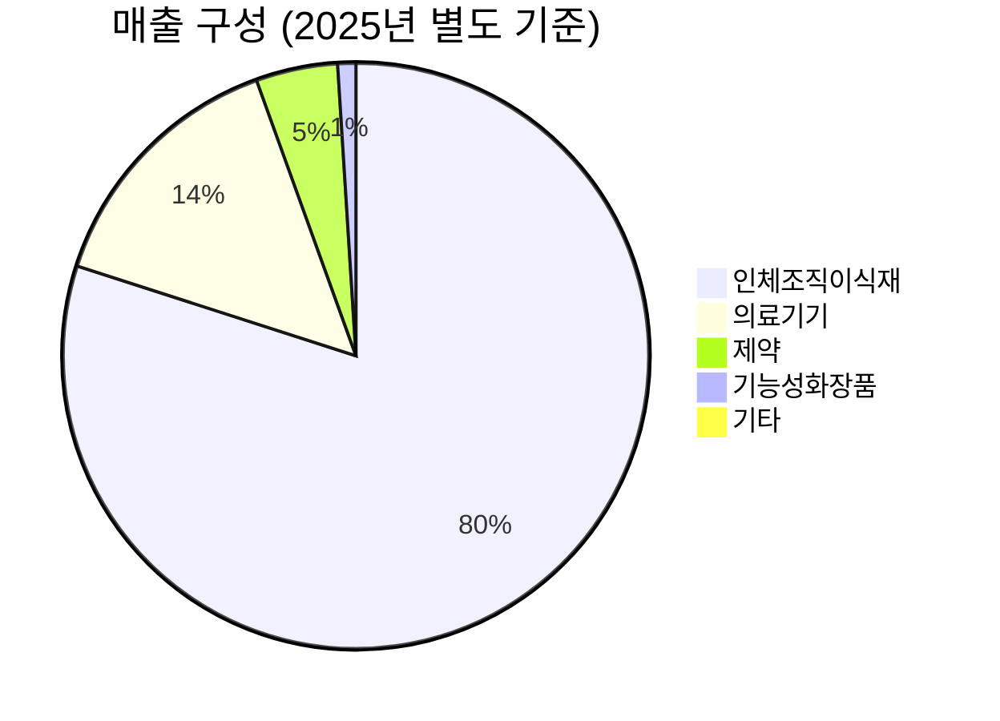

> **오늘의 탐색 분야**: 클라우드, 사이버보안, 인도 시장, 동남아 시장, 일본 시장, 유럽 시장, 중남미, 방산, 인프라
> 4일 주기 로테이션 (27개 분야 커버)

# 엘앤씨바이오 (290650.KS)

290650.KS 🇰🇷 KR KOSDAQ 재생의료 / 메디컬 에스테틱

총점 62/100 — WATCH

> [!abstract] 리포트 요약
> **한 줄 테시스**: 인체조직 유래 ECM(세포외기질) 스킨부스터 '리투오'를 앞세운 메디컬 에스테틱 신카테고리 개척자. 국내 선점 완료, 생산능력 2.5배 확장, 해외 20개국 인허가 진행 중이라는 강력한 촉매가 동시 가동 중이다.
>
> **왜 지금인가**: 2024년 11월 리투오 출시 후 수요가 생산 병목을 초과하는 상태였으나, 2025년 5월부터 월 3만 개 → 8만 개 → 최대 15만 개+로 캐파가 열리기 시작한다. 해외 공급도 하반기부터 본격화된다. 즉 지금은 '매출 가속도의 변곡점' 직전이다.
>
> **Variant Perception**: 시장은 순이익 -1,291억원(CB 파생 비현금 손실)을 보고 기업 펀더멘털이 훼손됐다고 오해하고 있다. 영업이익은 +66.8% YoY 성장했고, 비현금 손실 제거 시 본업은 정상적이다. 이 괴리가 현재 저평가의 핵심이다.
>
> **핵심 수치**: 2025년 매출 855억원(+18.5% YoY), 영업이익 42억원(+66.8% YoY), 현재가 66,600원 (52주 고점 125,000원 대비 -47%)
>
> **리스크**: 정부 인체조직 스킨부스터 규제 강화, 투자경고 지정 예고에 따른 투자 심리 위축, 중국법인 리스크, CB 오버행(Overhang)

---

## ① 핵심 지표

| 항목 | 값 | 의미 |
|------|-----|------|
| 현재가 | 66,600원 | 🟡 52주 고점(125,000원) 대비 -47%. 저점(18,490원) 대비는 +260%. 고점 대비 절반 이하로 내려온 상태로, 고점 추격보다 저점 반등 구조. 단, 고점 자체가 투기적 과열이었을 가능성 존재 |
| 시가총액 | 약 1.6조원 | 🟡 코스닥 중형주. 연간 매출 855억원 대비 PBR 8.08배는 성장 프리미엄이 내포. 연 매출의 약 19배 시총 — 고성장 기대가 주가에 선반영된 상태 |
| PER (Trailing/Forward) | N/A | 🔴 2025년 순이익이 -1,291억원(CB 파생 평가손실)으로 PER 산출 불가. 본업 영업이익 기준으로는 의미 있는 수익화 초기 단계 |
| PBR | 8.08 | 🟡 자산 대비 8배 이상의 프리미엄. 무형자산(기술력, 브랜드, 인체조직 처리 노하우)에 대한 시장의 기대가 반영. 단, 하락 시 자산 지지선이 약함 |
| EV/EBITDA | 339.21 | 🔴 극도로 높은 수준. 현재 영업이익이 낮아 나타나는 현상으로, 수익성 개선이 본격화되어야 정당화 가능. 영업이익률 32% 달성 시 완전히 다른 그림이 됨 |
| 배당수익률 | 0.1% | 🟡 성장주로서 배당보다 재투자 중심. 배당성향 25% 목표 공시 (2025년 기준, 이익배당금 약 12억원) |
| 영업이익률 | 12.8% | 🟡 2025년 기준. 전년 대비 개선 추세. 목표 32%까지 가려면 3~4배 마진 개선 필요 — 실현 가능하지만 시간이 걸리는 여정 |
| 순이익률 | -227.6% | 🔴 CB(전환사채) 파생상품 평가손실 + 중국법인 평가손실 등 비현금성 요인이 지배. 본업과 분리 해석 필수 |
| ROE | -19.2% | 🔴 순손실로 인해 마이너스. 그러나 비현금 손실 제거 시 본업 ROIC는 개선 중 [추정]. CB 전환 완료 후 구조적 개선 기대 |
| 52주 고/저 | 125,000 / 18,490원 | 🟡 극단적 변동성. 저점 대비 +600%+를 기록했다가 고점 대비 반토막. 단기 투기 수요와 실질 가치 간의 큰 간극을 시사 |
| 섹터/지역 | 재생의료·메디컬 에스테틱 / 대한민국 | 🟢 글로벌 재생의료 시장 구조적 성장 사이클 진입 중 |

> [!warning] PER/EV/EBITDA 해석 주의
> 현재 밸류에이션 지표들이 극단적으로 보이는 이유는 CB 파생 평가손실로 인한 회계상 순손실 때문이다. 영업이익 42억원(+66.8% YoY)을 기준으로 판단해야 하며, 단순 PER/EV배수로 고평가를 단정하는 것은 오류다. 단, 그렇다고 해서 현재 밸류에이션이 싸다는 의미도 아님.

---

## ② 회사 개요, 제품, 핵심 경쟁력

> [!abstract] 한 줄 설명
> 엘앤씨바이오는 **인체 기증 조직(피부, 뼈, 연골 등)을 처리·가공하여 이식재 및 재생의료 소재로 만드는 인체조직은행 기반의 재생의학 기업**이다.

### 사업 모델: 어떻게 돈을 버는가?

엘앤씨바이오의 수익 구조는 크게 두 축으로 구성된다:

**1. 인체조직 이식재 (매출의 79.8%)**: 기증된 인체 조직(피부, 뼈, 연골, 근막 등)을 수집 → 안전성 검사 → 처리 → 멸균 → 보관 → 공급하는 과정에서 가치를 창출한다. 이 과정은 GTP(Good Tissue Practice) 인증이 필요한 고도의 규제 산업으로, 진입장벽이 극히 높다.

**2. 스킨부스터 '리투오 (Re2O)' (신성장 동력)**: 2024년 11월 출시한 인체 피부조직 유래 ECM(세포외기질) 스킨부스터. 기존 히알루론산(HA) 기반 필러나 연어 DNA(PDRN) 기반 리쥬란과는 근본적으로 다른 '인체 조직 유래'라는 차별점을 보유한다. 에스테틱 클리닉에 B2B로 공급.

### 매출 구성 (2025년 별도 기준, 사업보고서)

| 세그먼트 | 비중 | 특징 |
|---------|------|------|
| 인체조직이식재 | 79.8% | 핵심 사업. 리투오 포함. 재생의학 소재의 원천 |
| 의료기기 | 14.5% | 조직 처리 관련 기기 등 |
| 제약 | 4.5% | 조직 유래 치료제류 |
| 기능성화장품 | 1.0% | 조직 유래 성분 활용 화장품 |
| 기타 | 0.2% | — |

*(출처: 2026년 3월 24일 DART 제출 사업보고서)*

### 핵심 제품: 리투오 (Re2O)

**리투오**는 인체 피부에서 세포를 제거하고 세포외기질(ECM: 콜라겐, 엘라스틴, 히알루론산 등이 3D 망상구조로 얽힌 것)만을 추출·가공한 스킨부스터다.

> [!tip] 리투오가 혁신적인 이유
> 기존 스킨부스터들은 단일 성분(HA 한 가지, PDRN 한 가지)을 인체에 주입한다. 리투오는 **피부 본연의 ECM 구조 자체**를 그대로 유지한 채 주입함으로써, 단순 보습이나 재생 유도를 넘어 피부 구조의 물리적 재건을 목표로 한다. 이는 마치 "빠진 벽돌을 갈아 끼우는" 것과 유사한 개념으로, 기전적 차별성이 명확하다.

### 핵심 경쟁력 분석

| 경쟁력 | 설명 | 복제 난이도 (1-10) |
|--------|------|:---:|
| **인체조직은행 라이센스** | GTP 인증 시설 + 조직 수집 네트워크는 인허가·시간·신뢰 모두 필요. 한국에서 수십 년 이상 걸리는 자산 | 9 |
| **조직 처리 기술 노하우** | 세포 제거 후 ECM 3D 구조를 손상시키지 않고 보존하는 기술. 노하우 집약적 | 8 |
| **임상 데이터 선점** | 리투오는 이미 임상·논문 데이터 확보 중. 후발주자 대비 2~3년 앞선 증거 기반 | 7 |
| **공급망 독점성** | 인체조직 기증자 네트워크. 확장이 쉽지 않음 | 8 |
| **규제 장벽** | 인체조직 활용은 식약처 + GTP 이중 규제. 진입 자체가 어려움 | 9 |
| **브랜드 & 의료진 신뢰** | 리투오 출시 후 마케팅 없이 의사들의 사용 경험으로 확산. 구전 기반 채택은 가장 강력한 해자 | 7 |

### 성장 공식

**매출 성장 메커니즘**: TAM × 시장침투율 × 가격

- **TAM**: 글로벌 재생의료 시장 2025년 ~$516억 → 2035년 ~$5,556억 (연 CAGR ~27% 추정, Fortune Business Insights). 국내 메디컬 에스테틱 스킨부스터 시장은 필러·톡신 이후 가장 빠르게 성장하는 카테고리로 부상 중
- **시장침투율**: 현재 국내 에스테틱 채널 빠른 침투 중. 해외 20개국 인허가 진행 → 침투율 급증 가능성
- **가격**: 인체조직 유래 프리미엄으로 HA 기반 대비 고가 포지셔닝 가능

### 고객

핵심 고객은 **국내외 성형외과·피부과 클리닉(B2B)**. 리투오의 확산이 마케팅 주도가 아닌 **의료진 임상 경험 기반 구전**이라는 점은, 채택 후 이탈률이 낮음을 시사한다.

---

## ③ 왜 이 기업인가

> [!abstract] 핵심 투자 테시스
> 엘앤씨바이오는 단순히 좋은 제품을 파는 기업이 아니다. **인체조직이라는 대체 불가능한 원재료를 독점적으로 처리할 수 있는 인프라 위에서, 메디컬 에스테틱의 패러다임을 바꾸는 신카테고리를 만들고 있다.** 이 구조가 장기 복리의 핵심이다.

### Compounding Money-Making Machine의 구조

엘앤씨바이오가 복리 머신이 될 수 있는 이유는 **수익이 재투자되어 더 높은 진입장벽을 만드는 선순환** 구조 때문이다:

**① 인체조직 처리 → ② 프리미엄 제품(리투오) 생산 → ③ 의료진 채택(임상 데이터 축적) → ④ 수익 창출 → ⑤ 생산능력·기술 R&D 재투자 → ⑥ 더 강력한 임상 증거 확보 → ⑦ 후발주자와의 격차 확대 → ① 반복**

이 사이클에서 핵심은 **임상 데이터의 복리 효과**다. 리투오가 시장에 1~2년 더 있을수록, 의료진이 경험한 케이스와 논문이 쌓이고, 이는 신규 의사의 처방 결정을 가속화한다. 경쟁자가 ECM 스킨부스터를 출시하더라도, "1년치 임상 데이터"를 따라잡는 데는 시간이 필요하다.

### Variant Perception: 시장이 아직 인식하지 못하는 것

> [!question] 시장의 오해: 순이익 -1,291억원은 본업 훼손인가?
> **아니다.** 2025년 순손실의 실질적 원인은:
> - CB(전환사채) 관련 파생상품 평가손실 (주가 급등으로 인한 비현금 회계 처리)
> - 중국법인 평가손실 (중국 사업 구조화 과정의 회계적 손실)
>
> 이 두 항목은 **현금 유출이 없는 비현금 손실**이다. 영업이익 42억원(+66.8% YoY)은 본업이 정상적으로 성장하고 있음을 보여준다. 시장이 회계 손실을 보고 패닉 셀링한 것이 현재 66,600원(고점 대비 -47%)의 진정한 이유다.

**추가로 시장이 간과하는 것들:**
1. **생산 병목 해소의 S-커브**: 월 3만 개 → 8만 개 → 15만 개+ 전환은 단순 수량 증가가 아니다. 공급이 수요를 따라잡으면서 매출이 **비선형적으로** 증가한다.
2. **해외 매출 제로에서 유의미로의 전환**: 현재 해외 매출은 사실상 0에 가깝다. 20개국 인허가가 하반기부터 결실을 맺기 시작하면, 성장률의 분모가 0에 가까워 % 성장률이 폭발적으로 보일 수 있다.
3. **ECM 카테고리 자체의 교육 효과**: 필러·톡신 시장이 성숙하면서, 의료진과 환자 모두 "다음 단계"를 찾고 있다. ECM 스킨부스터는 이 needs에 정확히 부합한다.

### 경쟁사 대비 우위

| 구분 | 엘앤씨바이오 (리투오) | 후발 ECM 제품들 | HA 기반 (리쥬란 등) |
|------|------|------|------|
| 원재료 | 인체 피부조직 유래 ECM | 동물 조직 또는 합성 ECM | 연어 DNA, 히알루론산 |
| 임상 데이터 | 2024년 11월 출시, 축적 중 | 대부분 초기 단계 | 충분 |
| 생산 진입장벽 | GTP 인증 필수, 조직은행 필요 | 낮음 | 매우 낮음 |
| 규제 지위 | 인체조직은행 + 의료기기 이중 지위 | 대부분 의료기기만 | 의료기기 |
| 가격 포지셔닝 | 프리미엄 (인체 유래 희소성) | 중간 | 저가~중가 |
| 의료진 채택 패턴 | 임상 경험 기반 구전 | 마케팅 주도 | 마케팅 주도 |

### 10년 후에도 더 강해져 있을 구조적 이유

1. **규제 장벽의 강화**: 정부가 인체조직 스킨부스터를 더 엄격히 규제할수록, 이미 GTP 인프라를 갖춘 엘앤씨바이오에게는 오히려 유리하다. 신규 진입이 더 어려워지기 때문이다.
2. **글로벌 재생의료 메가트렌드**: 고령화 사회에서 재생·항노화 수요는 구조적으로 증가한다. 10년 후 시장은 지금의 수 배 규모가 될 것이다.
3. **중국 쿤산 공장 가동**: 중국 GMP 승인 후 중국 현지 생산·판매 체계 구축 시, 중국이라는 세계 최대 에스테틱 시장에 접근 가능. 이 옵셔널리티는 현재 주가에 미반영 [가정].
4. **R&D 다각화**: 피부 ECM에서 출발해 뼈, 연골, 혈관, 신경 등 인체 모든 조직으로 확장 가능. 엘앤씨바이오의 핵심 역량인 "조직 처리 기술"은 범용성이 있다.

---

## ④ 비즈니스 퀄리티

> [!abstract] 퀄리티 평가 요약
> 해자의 질은 상당히 높다. 그러나 수익화는 초기 단계이고, 경영진의 자본 배분은 일부 불명확한 부분이 있다. 지금은 "씨앗을 뿌리는 단계"로, 수확기에 접어드는 과정에 있다.

### 경제적 해자 (Moat) 분석

| 해자 계층 | 내용 | 복제 난이도 |
|---------|------|-----------|
| **규제·인허가 장벽 (1순위)** | GTP 인증 인체조직은행 운영권. 한국 내 동종 업자 수가 극소수. 신규 진입은 최소 수년이 소요됨 | 🔴 매우 높음 (8/10) |
| **기증 조직 공급망** | 조직 기증자 네트워크는 신뢰·윤리·시간 축적이 필요. 자금만으로 복제 불가 | 🔴 매우 높음 (9/10) |
| **기술 노하우** | ECM 3D 구조 보존 처리 기술은 특허+암묵적 노하우의 조합. 특허가 공개되어도 실제 구현은 어려움 | 🟡 높음 (7/10) |
| **임상 데이터 선점** | 리투오의 임상 케이스·논문이 누적될수록 후발주자와의 격차 확대 | 🟡 중간 (6/10, 시간이 지나면 따라잡힐 수 있음) |
| **전환비용** | 의료진이 한번 채택한 스킨부스터를 쉽게 바꾸지 않는 관성 존재. 그러나 에스테틱은 HA·PDRN 등 다양한 대안이 있어 전환비용이 절대적이지 않음 | 🟡 중간 (5/10) |

해자 강도 70%

취약 30%

### ROIC/ROE 추세

| 지표 | 2025년 | 방향성 | 해석 |
|------|-------|--------|------|
| 영업이익 | 42억원 | 🟢 +66.8% YoY | 본업 수익화 가속 |
| 매출 | 855억원 | 🟢 +18.5% YoY | 성장 지속 |
| 영업이익률 | 12.8% | 🟢 개선 중 | 목표 32%까지 레버리지 가능 |
| 순이익 | -1,291억원 | 🔴 비현금 손실 | CB 파생, 중국법인 평가 |
| ROE | -19.2% | 🔴 (비현금 왜곡) | 본업 ROE는 별도 산출 필요 |

**마진 방향성**: 확장 중. 영업이익률 12.8%에서 목표 32%로의 경로는 ①리투오 매출 비중 확대(프리미엄 제품 믹스 개선) ②고정비 레버리지(생산능력 확대) ③해외 매출 추가(추가 고정비 없이 증분 매출)의 세 가지 경로로 달성 가능하다.

### 경영진

> [!tip] 경영진 인센티브 분석
> - 연세대 세브란스 피부과 이주희 교수 부회장 영입은 **임상·학술·글로벌 네트워크** 강화를 위한 전략적 판단으로 보임. 이사회 내 전문성이 추가된 것은 긍정적.
> - **기업가치 제고 계획(Value-Up) 공시** (2026년 4월 1일): 해외 매출 38%, 영업이익률 32% 목표 제시 + 배당성향 25% 제시. 주주친화적 방향성은 긍정적.
> - CB(전환사채) 이슈: 주가 급등 시 CB 파생 손실이 발생하는 구조는 주주에게 불리할 수 있다. CB 물량이 주식으로 전환되면 희석 리스크 존재. 이 부분은 경영진 자본 배분의 약점.

경영진 신뢰도 65/100

---

## ⑤ 밸류에이션

> [!abstract] 밸류에이션 요약
> 현재 밸류에이션은 고성장 기대가 선반영된 상태. 싸지는 않지만, 성장 가속이 현실화될 경우 현재 가격은 합리적이거나 저평가로 전환될 수 있다. 핵심은 "언제 수익성이 규모화되느냐"의 타이밍 문제다.

### 현재 밸류에이션 분석

| 지표 | 현재 값 | 해석 |
|------|---------|------|
| 시가총액 | 약 1.6조원 | 매출 855억원 대비 PBR ~19배 수준의 매출 배수 [추정] |
| EV/EBITDA | 339.21 | 영업이익 42억원 기준. 수익이 더 커져야 의미 있는 배수 |
| 유진투자증권 목표가 | 80,000원 (매수) | 현재가 66,600원 대비 +20.1% 상승여력 (2026년 3월 기준) |
| 컨센서스 목표가 | 80,000원 (1명) | 커버리지가 매우 제한적 — 발견 가치 존재 |

### FCF / Owner Earnings 관점

*(FCF 세부 데이터 미확보)* 현재 생산능력 확장에 CapEx를 투입 중인 시기로, Free Cash Flow는 일시적으로 낮거나 음수일 가능성이 있음 [추정]. 이는 성장 투자의 특성으로, 투자 완료 후 FCF 전환이 핵심 모니터링 지표다.

### 버핏 스타일 적정 가치 추정

**시나리오별 추정 (2027년 목표)**:

영업이익률 32% 달성 시 매출 1,500억원 [추정, 20% CAGR 가정] → 영업이익 480억원
이 수준의 성장 기업에 합리적 EV/EBIT 배수 30~40배 적용 시 [추정, 유사 메디컬 에스테틱 성장주 참고]
→ 기업가치 1.4조~1.9조원 → 시가총액 유사 수준

**현재 시총 1.6조원은 이미 2027년 이상의 가치를 상당 부분 반영 중** [가정]. 더 큰 상승을 위해서는 해외 매출의 폭발적 성장 또는 중국 사업 본격화 같은 **추가 옵셔널리티**가 발현되어야 한다.

### 안전마진 (Margin of Safety)

> [!warning] 안전마진이 제한적
> - 현재가 66,600원은 52주 저점 18,490원 대비 +260% 위치에 있다.
> - 투기적 고점(125,000원)의 절반 수준이라 "싸보이지만", 이것이 진짜 저평가인지 아니면 고점이 과열이었던 것인지 구분이 필요하다.
> - 본업 펀더멘털 기준 적정가는 현재가와 크게 다르지 않을 수 있다 [추정].
> - 안전마진은 "사업 성장이 예상보다 빠를 경우"에만 확보되는 구조 — 즉 성장 옵션에 베팅하는 투자다.

---

## ⑥ 촉매 & 타이밍 + 매크로 컨텍스트

> [!abstract] 촉매 요약
> 2025년 하반기~2026년이 결정적 변곡점. 생산 병목 해소 + 해외 매출 개시 + 중국 GMP 승인이 동시에 현실화되는 타이밍이다.

### 가격을 움직일 구체적 촉매

| 촉매 | 예상 타임라인 | 가격 영향 | 반영도 |
|------|------------|---------|-------|
| **리투오 생산캐파 월 8만개 달성** | 2025년 5월 (이미 발표) | 🟢 매출 가속 직접 확인 | 일부 반영 |
| **리투오 생산캐파 월 15만개+ 달성** | 2025년 하반기 목표 | 🟢 분기 실적 서프라이즈 가능성 | 미반영 |
| **해외 20개국 공급 개시** | 2025년 하반기 | 🟢 신규 매출 파이프라인 | 미반영 |
| **중국 쿤산공장 GMP 승인** | 연내 마무리 목표 | 🟢 중국 시장 본격 진출 옵셔널리티 | 거의 미반영 |
| **2025년 분기별 실적 발표** | 분기마다 | 🟡 매출 성장률 확인 | — |
| **규제 불확실성 해소** | 정부 최종 발표 시 | 🟡 오버행 제거 | 미반영 |
| **CB 전환/상환 완료** | (확인 필요) | 🟢 희석 우려 제거 | 미반영 |

### 왜 지금이어야 하는가?

**지금은 "생산 병목이 풀리는 바로 그 시점"**이다. 수요가 이미 확인된 상태에서 공급이 따라붙기 시작하는 변곡점은 투자 최적 타이밍이다. 실제로 2024년 11월 출시 후 리투오는 물량 부족으로 제한적 공급이 지속되었고, 이 병목이 5월부터 해소된다. 이 공급 증가가 실적으로 나타나는 2025년 2분기~3분기 실적 발표가 주가의 첫 번째 재평가 포인트다.

### 매크로 환경 연계

| 매크로 변수 | 현재 방향 | 엘앤씨바이오 영향 |
|-----------|---------|----------------|
| **한국 금리** | 완만한 인하 기조 | 🟢 성장주 밸류에이션 회복에 순풍. 바이오/헬스케어 섹터 멀티플 확장 가능 |
| **원/달러 환율** | 원화 약세 지속 중 | 🟢 해외 매출 발생 시 환차익 효과. 수출 기업으로서 유리 |
| **메디컬 에스테틱 트렌드** | K-의료관광 + 글로벌 항노화 관심 폭증 | 🟢 구조적 순풍. 중장기 시장 성장 확정적 |
| **중국 경기** | 소비 부진 지속 | 🔴 중국 메가덤플러스 판매 기대에 역풍. 중국 에스테틱 소비 회복 시점 불확실 |
| **글로벌 경기 침체 우려** | 관세 전쟁 + 트럼프 정책 불확실성 | 🟡 국내 에스테틱 소비는 상대적으로 방어적. 해외 시장 진출 속도에 영향 가능 |

**시나리오별 영향**:
- **금리 인하 가속**: 성장주 밸류에이션 재평가 → 리투오 성장 스토리에 배수 확장 → 강한 주가 상승 가능
- **현상 유지(Base)**: 본업 성장 + 해외 확장이 주가 드라이버. 실적 성장률이 주가 결정
- **경기 침체**: 에스테틱 시술은 선택적 지출이므로 수요 위축 가능. 단, 메디컬 에스테틱은 명품 소비보다 resilient한 편

---

## ⑦ 리스크 & Devil's Advocate

> [!warning] 핵심 리스크 경고
> 현재 엘앤씨바이오는 한국거래소의 **투자경고 지정 예고** 상태를 받은 바 있다. 이는 단기 수급에 심각한 악영향을 줄 수 있으며, 기관 및 외국인의 투자 제약으로 이어질 수 있다.

### 리스크 매트릭스

| 리스크 | 심각도 | 확률 | 대응 |
|-------|-------|------|------|
| **규제 강화 (스킨부스터 관리 강화)** | 높음 | 중간 | 선제 대응 완료 주장. 그러나 사용 제한이 생기면 시장 자체가 축소 가능. 정부 최종 발표 시까지 불확실성 유지 |
| **CB 전환에 따른 주식 희석** | 높음 | 중간~높음 | CB 규모와 전환가격 확인 필수 (확인 필요). 주가 반등 시 희석 압력 재발생 가능 |
| **중국 사업 리스크** | 중간 | 중간 | 중국 규제, 현지 파트너십, 시장 진입 속도 모두 불확실. 이미 평가손실 인식 중 |
| **후발주자 경쟁 격화** | 중간 | 높음 | ECM 스킨부스터 붐업으로 다수 기업 진입 발표. 오리지널 지위를 지키려면 임상 데이터와 의사 관계망 선점이 핵심 |
| **투자경고 지정** | 중간 | 중간 | 지정 시 기관 매수 제한, 투자자 심리 위축. 단기 주가 하락 압력 |
| **생산능력 확장 지연** | 중간 | 낮음 | GTP 신규 시설 허가 획득 완료로 리스크 감소. 단, 실제 가동까지 품질 이슈 발생 시 위험 |

### 가장 현실적인 실패 시나리오

**"규제+경쟁+CB의 삼중 악재"**:

정부가 인체조직 스킨부스터에 대해 더 강력한 사용 제한(예: 특정 의료기관만 허용, 적응증 제한)을 시행하면 리투오의 국내 확산 속도가 꺾인다. 동시에 후발주자들이 가격 경쟁을 시작하고, CB 전환으로 주식이 희석되면, 주가는 현재 66,600원에서 30,000원대로 추가 조정될 수 있다.

이 시나리오에서 **해외 매출이 국내 공백을 빠르게 메울 수 있느냐**가 생존 여부를 가른다.

### 숨겨진 가정 (Hidden Assumptions)

1. **[가정]** 리투오 수요의 지속성: 2024년 11월 출시 이후의 수요 급증이 신제품 첫 구매 폭발(novelty effect)이 아니라 재구매 기반의 진성 수요인지 아직 충분히 검증되지 않음
2. **[가정]** 인체조직 기증 공급의 확장 가능성: 생산능력을 늘리려면 원재료(기증 조직) 공급도 함께 늘어야 함. 이 병목이 생산설비보다 더 결정적일 수 있음
3. **[가정]** 해외 인허가의 신속한 상업화: 허가 취득과 실제 매출 발생 사이에는 유통망 구축, 교육, 보험 적용 등 추가 시간이 필요

### Kill Criteria

| Kill Criteria | 임계값 |
|-------------|-------|
| 정부가 인체조직 스킨부스터의 사용 적응증을 현재 대비 50% 이상 제한 | → 즉시 재검토 |
| 리투오 국내 월 처방 건수가 3개월 연속 하락 | → 수요 훼손 확인, 즉시 재검토 |
| CB 전환으로 인한 주식 희석이 20% 이상 | → 목표가 및 비중 조정 |
| 2025년 연간 매출 성장률이 10% 미만으로 둔화 | → 성장 스토리 의문 |
| 투자경고 지정 후 기관 보유 비율 급락 | → 수급 악화, 비중 축소 검토 |
| 경영진의 내부자 매도 물량이 지분의 5% 이상 | → 신뢰 훼손 시그널 |

---

## ⑧ 나의 엣지

> [!tip] 이 투자에서의 엣지
> **비현금 손실로 인한 회계 왜곡을 걷어내고 본업 영업이익의 성장성을 볼 수 있는 능력**이 핵심 엣지다. 대부분의 개인투자자는 순이익 -1,291억원을 보고 공포에 빠지지만, 이것이 비현금 CB 파생 손실임을 이해하는 투자자는 소수다.

### 나의 엣지 구체화

**1. 정보 연결 능력**: 공개된 사업보고서(매출 세그먼트 데이터) + 규제 뉴스 + 생산 캐파 뉴스를 결합하면, 2025년 하반기 매출 가속도의 변곡점이 보인다. 이 연결을 한 분석가가 소수라는 것이 발견 가치다.

**2. 메디컬 에스테틱 시장 이해**: [[260403_Deal - 한스바이오메드 (042520.KS)_1502]]와 같은 에스테틱 분야 선행 분석이 있어, 섹터 맥락 이해가 풍부하다. ECM 스킨부스터 카테고리가 필러·톡신 이후의 "다음 물결"임을 인식하는 것이 Variant Perception의 원천.

**3. 시간적 우위**: 유진투자증권 1곳만 커버하는 종목. 기관 애널리스트 커버리지가 극히 제한적 → 발견 가치 높음 → 정보 우위 가능.

### 시장 컨센서스와 다른 Variant Perception

| 시장의 뷰 | 나의 Variant Perception |
|---------|----------------------|
| "순이익 -1,291억원 = 기업 훼손" | "비현금 손실 제거 시 본업은 정상. 영업이익 +66.8% 성장이 진실" |
| "52주 고점 대비 -47% = 이미 늦은 투자" | "생산 병목 해소 직전의 매출 가속 변곡점 = 지금이 진입 시점" |
| "ECM 경쟁 심화 = 선점 가치 훼손" | "규제 강화가 오히려 GTP 라이센스 보유사에 유리한 해자 강화 효과" |
| "중국법인 = 리스크" | "중국 GMP 승인 후 옵셔널리티 = 현재 주가에 미반영 추가 상승 가능성" |

### Insider 의존 여부 체크

- ✅ 모든 판단은 공개 사업보고서, 공시, 뉴스 기반
- ✅ Insider 정보 의존 없음
- ⚠️ 투자경고 지정 예고 = 특정 계좌 매매 관여 이슈. **정치적·수급적 판단이 개입된 종목**으로, 순수 펀더멘털 분석 이외의 변수가 존재함. 투자 철학의 "정치적 결정에 좌우되는 종목" 회피 원칙을 부분적으로 위반할 가능성이 있음.

> [!question] 왜 다른 투자자들이 이 기회를 놓치고 있는가?
> 1. 순이익 -1,291억원의 회계 복잡성으로 인한 기피
> 2. 투자경고 예고에 따른 기관 투자 제약
> 3. 극단적 변동성(52주 저/고 8배 차이)으로 인한 투기주 낙인
> 4. 애널리스트 커버리지 1곳 → 기관 리서치 부재
> 이 네 가지 이유가 겹쳐 시장이 회피하는 상황 = 역발상 기회의 조건이 갖춰져 있다

---

## ⑨ 액션 아이템

### Deal Score 최종 평가

업사이드 비대칭 18/30

카탈리스트&타이밍 15/25

비즈니스 퀄리티 14/20

밸류에이션 매력 7/15

발견 가치 8/10

총점 62/100 — WATCH

### 최종 판단

| 항목 | 판단 |
|------|-----|
| **BUY / WATCH / PASS** | WATCH — 생산 병목 해소 후 첫 2~3개 분기 실적을 확인한 뒤 본격 진입. 지금은 포지션을 소량만 테스트 |
| **Conviction** | Medium — 비즈니스 퀄리티는 높으나 CB 오버행·규제·투자경고 등 단기 노이즈가 과다 |
| **적정 진입가** | 55,000~62,000원 (현재가 66,600원 대비 약 7~17% 하락 시). 규제 우려 해소 없이는 만기 진입 자제 |
| **목표가 (12개월)** | 95,000~105,000원 [추정, 2025년 하반기 매출 가속 + 해외 매출 개시 시나리오 반영]. 업사이드 약 +43~58% |
| **손절 기준** | 50,000원 이하 (현재가 대비 -25%). 또는 Kill Criteria 발동 시 즉시 |
| **권장 비중** | 포트폴리오의 3~5% (테스트 포지션). 확신 강화 시 7~10%까지 증량 |

### 시나리오별 수익 분석

🟢 Bull 25%

🟡 Base 50%

🔴 Bear 25%

| 시나리오 | 조건 | 목표가 | 업사이드 |
|---------|------|-------|---------|
| 🟢 Bull | 해외 매출 급증 + 중국 GMP 승인 + 규제 해소 + CB 오버행 제거 | 130,000원 | +95% |
| 🟡 Base | 국내 성장 지속 + 해외 일부 개시 + 규제 현상 유지 | 95,000원 | +43% |
| 🔴 Bear | 규제 강화 + 경쟁 심화 + CB 희석 + 투자경고 지정 현실화 | 40,000원 | -40% |

**기대수익(EV)**: 0.25 × 95% + 0.50 × 43% + 0.25 × (-40%) = 23.75% + 21.5% - 10% = **+35.25%** [추정]

### 추가 리서치 필요 사항

| 항목 | 우선순위 | 방법 |
|------|---------|------|
| CB(전환사채) 잔액, 전환가격, 만기 구조 | 🔴 최우선 | DART 사업보고서 CB 주석 확인 |
| 리투오 실제 재구매율(의료진) | 🔴 최우선 | IR 문의 또는 의료진 채널 서베이 |
| 인체조직 기증 공급 현황 및 확장 계획 | 🟡 중요 | 사업보고서 원재료 섹션 |
| 해외 인허가 20개국 중 상업화 가능한 국가 수 | 🟡 중요 | IR 문의 |
| 투자경고 지정 예고 구체적 사유 (특정 계좌 이슈) | 🟡 중요 | 거래소 공시 확인 |
| 중국 쿤산 공장 GMP 승인 진행 상황 | 🟡 중요 | 분기 실적 발표 확인 |

### 모니터링 핵심 지표

| 지표 | 방향 | 확인 방법 |
|------|------|---------|
| 리투오 국내 처방 건수 (월간 추이) | 🟢 증가 유지 | 실적 발표 + IR |
| 분기 매출 성장률 | 🟢 25%+ 유지 여부 | 분기 실적 발표 |
| 영업이익률 | 🟢 15%+ 달성 여부 | 분기 실적 발표 |
| 해외 매출 발생 여부 | 🟢 첫 유의미한 해외 매출 | 실적 공시 |
| 규제 당국 최종 발표 | ⚠️ 모니터링 | 식약처/복지부 공시 |
| CB 전환/상환 물량 | ⚠️ 모니터링 | DART 공시 |

### 다음 체크포인트

| 시점 | 확인 사항 |
|------|---------|
| **2025년 5월** | 리투오 캐파 8만개 달성 확인. 공급 병목 해소 여부 |
| **2025년 2분기 실적 발표 (8월 예상)** | 매출 성장 가속도 확인. YoY 25%+ 달성 여부. 해외 매출 비중 첫 공시 여부 |
| **2025년 하반기** | 중국 GMP 승인 여부. 해외 공급 물량 실질화 여부 |
| **규제 발표 시** | 정부의 인체조직 스킨부스터 관리 강화 최종 방안 발표 시 즉시 재평가 |
| **투자경고 지정 여부** | 지정 확정 시 단기 매수세 위축 확인. 역으로 기술적 저점 매수 기회일 수도 있음 |

---

> [!verdict] 최종 판단: WATCH — "기다리는 것도 투자다"
>
> 엘앤씨바이오는 **인체조직 기반 재생의학의 진정한 개척자**로서, 비즈니스 해자의 질과 성장 스토리는 매력적이다. 리투오의 수요 확인 + 생산 캐파 확장 + 해외 인허가 동시 진행은 강력한 촉매 세트다.
>
> 그러나 지금 당장 풀 비중을 집어넣기엔 **세 가지 불확실성이 너무 크다**: ① CB 전환 희석 구조 미파악, ② 규제 강화의 실질적 영향 불확명, ③ 현재 밸류에이션에 이미 상당 부분 반영된 기대감.
>
> **이상적인 접근**: 55,000~62,000원대에서 3% 테스트 포지션 진입 → 2025년 2분기 실적(8월) 확인 후 성장 가속 확인 시 7~10%로 증량. CB 구조 파악이 선행 조건.
>
> 관련 종목: [[260403_Deal - 한스바이오메드 (042520.KS)_1502]] (메디컬 에스테틱 피어)