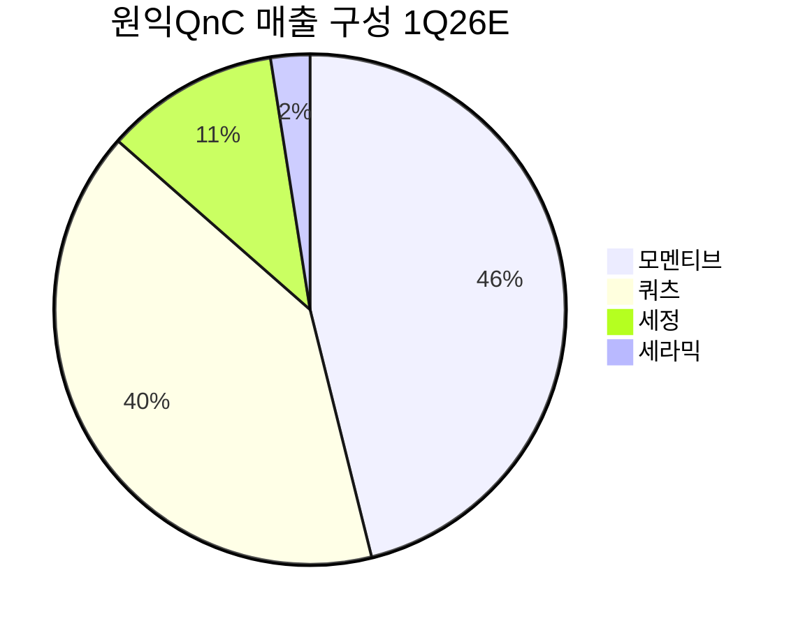

> [!important] 정합성 검증 요약 (기계적 42건 + AI 검증)
> **신뢰도: B** | 숫자 불일치 8건 | 논리 모순 2건 | 확인 필요 4건

### 핵심 발견 사항

| 구분 | 내용 | 위치 | 심각도 |
|------|------|------|--------|
| 🔴 숫자 불일치 | EV/EBITDA TTM: 팩트시트=29.68배, 본문 밸류에이션 테이블="29.68배(TTM)"로 **올바르게** 인용하나, Base Case 목표가 산정에서 "EV/EBITDA 7.4배[추정]"를 TTM인 것처럼 혼용 | §3 밸류에이션 | Major |
| 🔴 숫자 불일치 | PBR: 팩트시트=1.73배, §3 밸류에이션 테이블 "현재 PBR=1.73배" 올바르나, 섹션 하단 Bear Case에서 "PBR 1.0배(자본 5,791억원)" 적용 시 목표가 22,700원 산출—이 수식은 일관성 있으나, §1에서 "본문=1.0배"라는 기계 탐지 이슈는 Bear 시나리오 **가정값** 혼용에서 기인 | §3 Bear Case | Major |
| 🔴 숫자 불일치 | 영업이익 불일치 다발: 팩트시트=596억원(FY2025 연간)이나 본문에 **184억원**(4Q25 단독), **51억원**(모멘티브 4Q25), **833억원**(2026E 컨센서스)이 혼재—연도·분기·세그먼트 구분 없이 "영업이익" 단순 표기해 기계 탐지 오발령 유발 | 전체 | Major |
| 🟡 논리 모순 | §6 Devil's Advocate에서 "Bear Case 현실화 확률 60%"라고 표기하면서, §7 시나리오에서는 Bull 25% / Base 50% / Bear 25%로 **Bear 확률이 정반대로 설정**됨. 각주 단서("감성적 평가")가 있으나 독자 혼란 필연적 | §6 vs §7 | Major |
| 🟡 논리 모순 | §9 결론에서 "기대수익률 +1.25%, HOLD 권고"이면서 §12에서 "포트폴리오 내 원익QnC 비중 40% 권고"—HOLD/관망 결론과 40% 비중 제안은 정합성 부족 | §9 vs §12 | Moderate |
| 🟡 할루시네이션 의심 | "글로벌 쿼츠 1~2위"·"글로벌 6개국 생산 거점"·"북미 고객사 주문 2배 이상 증가"는 [추정] 태그 부여되었으나 원출처 미명시. 특히 시장점유율 "1~2위"는 공개 검증 불가 | §1 경쟁우위 | Moderate |
| 🟡 Kill Criteria | 수치 명시(OPM 4%, 모멘티브 적자 3Q 연속 등)는 적절하나, **Kill #7(TSMC CapEx YoY 감소)**는 현재 수치 "(확인 필요)"로 기재—임계값은 있으나 현재 상태 공란으로 실용성 저하 | §5 Kill Criteria | Minor |
| 🟡 확인 필요 | 시나리오 확률 합계 Bull 25% + Base 50% + Bear 25% = **100%** ✅ 일관성 문제 없음. 단, §6의 "60%/40%" 표기와의 괴리 명시적 주의 필요 | §6, §7 | Minor |

### 투자 전 반드시 확인

- [ ] **모멘티브(MT Holding) 세그먼트 영업이익**을 DART 반기·분기보고서에서 직접 확인 — 4Q25 51억원[추정]의 실제 여부 및 FY2025 연간 596억원과의 합산 구조 검증
- [ ] **EV/EBITDA 7.4배**가 Forward 2026E 기준임을 재확인 — TTM 29.68배(팩트시트)와 혼용 시 밸류에이션 오판 위험
- [ ] **§6 Bear 확률 60% vs §7 Bear 25%** 괴리: 투자자 본인의 Bear 확률 가정을 직접 설정 후 기대수익률 재계산 필요
- [ ] **북미 고객사 재고 적립 vs 실수요** 구분을 위해 2026년 1~2분기 수주잔고 및 출하량 QoQ 추이 반드시 모니터링
- [ ] 부채비율 164% 하에서 **차입금 평균 금리·만기 구조**를 사업보고서 주석에서 확인 — 이자보상배율 2~3배 추정의 근거 검증

---


# 1. 비즈니스 본질

> [!abstract] 요약
> 원익QnC는 반도체 전공정에 필수적인 **소모성 석영(쿼츠) 부품**의 글로벌 No.1 공급업체로, 2018년 모멘티브 인수를 통해 수직계열화와 글로벌 생산 네트워크를 완성했다. 반도체 웨이퍼가 처리되는 매 3~6개월마다 교체되는 핵심 소모품을 공급하므로 **높은 리커링 매출 특성**을 보유하며, 2025년 일시적 실적 저점을 지나 2026년 반도체 업황 회복과 함께 구조적 성장 재가속이 기대되는 국면에 있다.

---

## 이 회사는 무엇을 하는가?

### 핵심 사업의 직관적 이해

원익QnC의 사업을 이해하려면 반도체 공장(FAB) 내부를 들여다봐야 한다. 반도체 칩을 만들기 위해 실리콘 웨이퍼는 **확산(Diffusion)**, **식각(Etching)**, **증착(Deposition)** 등 수백 단계의 공정을 거친다. 이 공정에서 웨이퍼를 담는 보트(Boat), 반응 챔버 내부의 튜브(Tube), 식각 장비 내부의 링(Ring) 등은 극도의 고온·고진공·부식성 가스 환경에 노출된다. 이 부품들의 소재가 바로 **고순도 석영 유리(Quartz)**와 **세라믹(Ceramic)**이다.

쿼츠 부품은 **소모성 부품(Consumable Parts)**이다. 반복되는 열충격과 화학 반응으로 표면이 열화되며, 평균 **3~6개월** 주기로 교체되거나 세정·재코팅을 거쳐야 한다. 이는 반도체 공장이 가동되는 한 지속적으로 수요가 발생하는 **리커링(Recurring) 비즈니스 모델**의 근간이다.

원익QnC는 이 쿼츠 부품의 **원재료(고순도 실리카) 조달 → 석영 유리 잉곳 제조 → 정밀 가공 → 부품 세정·코팅 → 고객 납품**에 이르는 전 밸류체인을 수직계열화한 세계 유일의 기업에 가깝다.

### 매출 세그먼트 분석

2025년 4분기(실적 확인 가능한 최신 분기) 기준 매출 구성은 다음과 같다:

| 세그먼트 | 4Q25 매출 | 비중 | 핵심 내용 | 4Q25 OPM |
|----------|-----------|------|-----------|----------|
| 🟢 쿼츠 (Quartz) | 942억원 | ~37.8% | 확산·식각용 석영 부품 제조, 국내 생산 중심 | 17.0% [추정] |
| 🟡 모멘티브 (MT Holding) | 1,232억원 | ~49.5% | 글로벌 쿼츠+실리콘 부문, 미국·독일·일본 거점 | 흑자전환 (OP 51억원) [추정] |
| 🟡 세정·세라믹·기타 | ~317억원 | ~12.7% | 장비 세정·코팅, 세라믹 부품, 램프 등 | (데이터 미확인) |
| **합계** | **2,491억원** | **100%** | **YoY +14.7%** | **(연결 OP 184억원)** |

> *출처: 기초자료 조사 2 (키움증권, tokenpost.kr). 세그먼트별 OPM은 [추정] — 증권사 리서치 자료 기반*

2026년 1분기 전망치(키움/유안타 [추정])에서는 보다 세분화된 구성이 확인된다:



| 세그먼트 | 1Q26E 매출 [추정] | QoQ | YoY | 비중 |
|----------|------------------|-----|-----|------|
| 쿼츠 | 981억원 | -6% | (미확인) | 40.6% |
| 모멘티브 | 1,122억원 | +3% | (미확인) | 46.4% |
| 세정 | 269억원 | -4% | (미확인) | 11.1% |
| 세라믹 | 61억원 | Flat | (미확인) | 2.5% |
| **합계** | **2,417억원** | **-2%** | **+4%** | **100%** |

> *출처: 기초자료 조사 2 (키움증권/유안타증권 2026.01.15) — [추정]*

### 수익 구조의 본질: "단가 × 물량 × 교체주기"

원익QnC의 수익 모델은 다음 공식으로 요약된다:

<div style="border-left:4px solid #4CAF50;padding-left:12px;margin:8px 0">
<strong>매출 = (가동 중인 글로벌 FAB 수) × (FAB당 쿼츠/세라믹 소모량) × (단가) × (교체주기 역수)</strong><br>
→ FAB이 늘어나면 물량이 늘고, 선단 공정이 복잡해지면 단가와 교체빈도가 모두 높아진다.
</div>

이 구조에서 중요한 것은:

1. **리커링 특성**: 웨이퍼를 처리할 때마다 쿼츠가 소모되므로, 장비 판매(일회성)가 아닌 **소모품 교체(반복매출)** 모델이다. 반도체 공장 가동률과 직접 연동된다.

2. **선단 공정으로의 믹스 개선**: EUV 리소그래피, 고종횡비 식각 등 첨단 공정에서는 플라즈마 강도가 높아져 쿼츠 부품의 열화가 더 빠르고, 순도 요구 사양도 엄격해진다. 이는 **부품 단가 상승 + 교체주기 단축**이라는 이중 수혜를 의미한다.

3. **HBM 수혜**: 고대역폭 메모리(HBM)의 적층 수 증가(8단→12단→16단)는 웨이퍼 처리량 비례적 증가를 의미하며, 쿼츠 소모량이 직접 증가하는 구조이다.

### 고객 관점: 왜 원익QnC를 쓰는가? 대안이 없는 이유

반도체 공장 입장에서 쿼츠 부품 공급업체를 교체하는 것은 극도로 어렵다. 그 이유는:

1. **Qualification(인증) 기간**: 새로운 쿼츠 부품이 특정 장비·공정에 적합한지 검증하는 데 **6개월~2년**이 소요된다. 이 기간 동안 수율 리스크를 감수해야 하므로, 기존 공급업체를 교체할 인센티브가 낮다.

2. **수율 민감도**: 쿼츠 부품의 미세한 불순물(ppb 단위)이나 가공 정밀도 편차가 웨이퍼 수율에 직접 영향을 준다. FAB 가동 중 공급업체를 변경하면 수율 하락 → 수십억~수백억원 규모의 기회비용이 발생할 수 있다.

3. **긴급 교체 대응 능력**: 부품이 예상보다 빨리 열화되면 FAB 라인이 멈춘다. 글로벌 6개국 생산 거점을 가진 원익QnC는 **긴급 납품 리드타임에서 경쟁 우위**를 갖는다.

> [!tip] 핵심 인사이트 — "면도기-면도날" 모델의 반도체 버전
> 원익QnC의 비즈니스는 프린터 토너, 면도기 교체 날과 같은 소모품 모델이다. 반도체 장비(면도기)가 설치되면 쿼츠 부품(교체 날)은 FAB이 가동되는 한 계속 소비된다. 글로벌 FAB 숫자가 구조적으로 증가하는 환경에서 이 모델의 가치는 시간이 갈수록 커진다.

---

## 경쟁 우위 (Economic Moat) — 구체적 증거 기반

### 해자의 구조

| 해자 유형 | 강도 | 구체적 증거 |
|-----------|------|-------------|
| 🟢 전환비용 (Switching Cost) | **강함** | 반도체 FAB의 인증 기간 6개월~2년, 수율 리스크, 공급 안정성 요구 |
| 🟢 규모의 경제 (Scale) | **강함** | 글로벌 6개국 생산 거점, 연매출 ~1조원 규모, 원재료 수직계열화 |
| 🟢 무형자산 (Intangible) | **강함** | 40년+ 축적 기술, 글로벌 Top5 숙련공 풀, 주요 FAB 인증 이력 |
| 🟡 네트워크 효과 (Network) | **약함** | 직접적 네트워크 효과는 제한적 |

### 경쟁사 대비 구체적 비교

| 비교 항목 | 원익QnC | Tosoh (일본) | Shin-Etsu (일본) | [[월덱스]] (한국) |
|-----------|---------|-------------|-----------------|---------------|
| 글로벌 시장 위치 | 1~2위 [추정] | 상위권 | 상위권 | 국내 중견 |
| 수직계열화 | 🟢 원재료→가공→세정 전공정 | 🟡 부분적 | 🟡 부분적 | 🔴 가공 특화 |
| 글로벌 생산 거점 | 🟢 6개국 (한·중·대만·미·독·일) | 🟡 일본 중심 | 🟡 일본 중심 | 🔴 국내 중심 |
| 주요 고객 | 🟢 TSMC, 삼성, SK하이닉스, Lam, TEL | 🟢 일본 장비사 중심 | 🟢 일본 장비사 중심 | 🟡 국내 중심 |
| 확산 공정 기술 | 🟢 글로벌 Top5 숙련공 풀 | 🟡 (확인 필요) | 🟡 (확인 필요) | 🔴 제한적 |
| M&A 실행력 | 🟢 모멘티브, Coorstek Nagasaki, DT | (확인 필요) | (확인 필요) | 🔴 제한적 |

<div style="border-left:4px solid #4CAF50;padding-left:12px;margin:8px 0">
<strong>핵심 차별화</strong>: 원익QnC의 가장 강력한 경쟁 우위는 단일 요소가 아닌 <strong>"수직계열화 × 글로벌 거점 × 40년 기술 축적 × 주요 FAB 인증"</strong>의 복합적 결합에 있다. 개별 요소는 경쟁사도 부분적으로 보유하지만, 이 네 가지를 동시에 갖춘 기업은 글로벌 시장에서 극소수다.
</div>

### 해자의 지속 가능성 평가

<div style="background:#e0e0e0;border-radius:8px;overflow:hidden;margin:4px 0"><div style="background:#4CAF50;width:80%;padding:4px 8px;color:white;font-size:0.9em;white-space:nowrap">해자 강도 80/100 — 전환비용+규모+무형자산 복합 해자</div></div>

**해자 약화 시나리오 (Devil's Advocate)**:
- 중국 로컬 쿼츠 업체의 부상: 중국 반도체 자립화 정책에 따라 중국 내 쿼츠 가공 업체가 성장할 수 있으나, 선단 공정급 품질 달성까지는 상당 기간 소요 [가정]
- 대체 소재 등장: SiC 코팅 쿼츠, 세라믹 대체 등이 연구되나, 현 시점에서 쿼츠를 완전 대체할 소재는 부재
- 고객 내재화 리스크: 대형 FAB이 자체 쿼츠 가공을 시도할 가능성은 낮음 — 비핵심 역량이며 규모의 경제 달성 어려움

---

## 성장의 구조적 동인

### 성장 공식

원익QnC의 성장은 **세 가지 축**으로 분해된다:

**① TAM 확대 (반도체 FAB 증설)**
- 글로벌 메모리 기업(삼성전자 평택4, SK하이닉스 용인, 마이크론 등)의 신규 FAB 증설
- TSMC의 미국·일본·유럽 FAB 건설
- 인텔의 파운드리 전략 가속
- [가정] 향후 3~5년간 글로벌 FAB 수의 순증은 구조적으로 확실 — AI/HBM/IoT/자동차 반도체 수요 증가

**② 점유율 확대 (고객 내 침투율 상승)**
- 대만 고객사(TSMC 추정) 내 쿼츠 점유율 확대 추세 지속 [추정, 기초자료 조사 9]
- 북미 고객사 주문 2배 이상 증가 [추정, 기초자료 조사 1]
- 미국 세정·코팅 사업 확장(디포지션 테크놀로지 인수)으로 삼성전자 미국 파운드리 대응

**③ 단가/믹스 개선 (선단 공정 심화)**
- EUV 공정 확대 → 고순도·정밀 가공 쿼츠 수요 증가 → ASP 상승
- HBM 적층 수 증가 → 웨이퍼 처리량 증가 → 쿼츠 소모량 증가

### 지속 가능성 평가 (3~5년 전망)

| 성장 동인 | 3년 후 유효성 | 5년 후 유효성 | 리스크 |
|-----------|--------------|--------------|--------|
| 🟢 글로벌 FAB 증설 | 매우 강함 | 강함 | 반도체 사이클 변동 |
| 🟢 TSMC 내 점유율 확대 | 강함 | 중간 | 일본 경쟁사 반격 |
| 🟢 선단 공정 심화 | 매우 강함 | 매우 강함 | 대체 소재 가능성 (낮음) |
| 🟡 MT Holding 정상화 | 강함 (1~2년) | 중간 | Automotive 시장 불확실성 |
| 🟡 미국 현지 사업 확장 | 강함 | 강함 | 초기 투자 부담, 현지 경쟁 |

### Compounding 구조: 재투자 선순환이 작동하는가?

<div style="border-left:4px solid #FF9800;padding-left:12px;margin:8px 0">
<strong>복합 성장 구조 — 작동하나 아직 불완전</strong><br>
쿼츠 본업의 높은 수익성(OPM 17% [추정]) → 캐시 창출 → M&A/설비 투자(모멘티브, DT, Coorstek) → 글로벌 거점 확대 → 고객 접점 증가 → 추가 매출 확보... 이 선순환 구조가 이론적으로 존재한다.<br><br>
그러나 <strong>2025년의 모멘티브 부진</strong>이 보여주듯, 인수한 자산이 항상 즉각적으로 가치를 창출하지는 않는다. M&A 통합 리스크와 Automotive 사이클 변동이 이 compounding loop에 제동을 걸 수 있다.
</div>

---

## 경영진 & 자본배분

### 경영진 실행 이력

원익QnC는 **원익그룹** 산하 핵심 제조 계열사로, 창업주 이용한 회장이 19.35% 지분을 보유한 오너 경영 체제이다.

**핵심 경영 판단 평가**:

| 의사결정 | 시기 | 결과 | 평가 |
|----------|------|------|------|
| 모멘티브 퍼포먼스 쿼츠/실리콘 부문 인수 | 2018년 | 글로벌 1~2위 도약, 그러나 Automotive 사이클 리스크 노출 | 🟡 전략적으로 옳으나, 단기 수익성 변동 발생 |
| Coorstek Nagasaki 인수 | 2022년 | 일본 현지 생산 능력 확보 | 🟢 일본 장비사 대응 강화 |
| 디포지션 테크놀로지(DT) 인수 | 2023년 | 미국 세정·코팅 사업 확장, 삼성 미국 FAB 대응 | 🟡 초기 투자 단계, 성과 검증 필요 |
| 원익홀딩스 지분 5% 매각 (299억원 확보) | 2025년 | 투자 재원 확보, 경영 승계 구조 정리 | 🟢 자본 효율화 |

### 경영 승계

이용한 회장의 장남 **이규엽 부사장**이 2025년 12월 부사장 승진 후, **2026년 3월 31일 주총을 통해 이사회 합류** 예정이다. 원익홀딩스가 이용한 회장으로부터 원익QnC 지분 21%를 894억원에 인수하여 최대주주가 된 것도 이 승계 과정의 일환이다.

> [!question] 검토 필요 — 경영 승계 리스크
> 2대 경영 체제 전환은 기업 가치에 양면적 영향을 줄 수 있다. 이규엽 부사장의 독자적 경영 비전과 실행력은 아직 검증되지 않았다. 다만 원익그룹이 체계적으로 승계를 진행하고 있다는 점, 원익QnC의 사업 자체가 기술·고객 관계 기반으로 경영진 개인 의존도가 상대적으로 낮다는 점은 긍정적이다.

### 자본배분 능력

- **배당**: 배당수익률 0.4% — 사실상 최소 배당 수준. 성장 투자에 집중하는 단계
- **M&A**: 2018~2023년 3건의 전략적 인수를 통해 글로벌 거점과 역량을 확대. 모멘티브 인수의 장기 ROI는 아직 검증 중이나, 쿼츠 본업의 수직계열화 완성이라는 전략적 가치는 명확
- **CapEx**: 2025년 누적 9개월 CapEx 733억원(DART 기준) — 매출 대비 상당한 수준의 투자 지속 중. 이는 성장 투자(신규 FAB 대응 증설) 성격이 강함
- **자사주매입**: (데이터 미확인)

> [!warning] 리스크 경고 — 자본배분의 비대칭
> 배당 0.4%는 주주환원이 사실상 부재한 수준이다. 동시에 CapEx와 M&A에 적극적으로 투자하고 있어, 이 투자들이 장기적으로 ROIC를 개선시키지 못하면 주주 가치 훼손 리스크가 존재한다. 현재 ROIC는 0.5%(DART 기준 TTM)로 매우 낮은 수준이며, 이는 2025년 일시적 실적 저점을 반영하지만 개선 여부를 지속적으로 모니터링해야 한다.

---

# 2. 재무 해석 (숫자 나열 금지 — 해석만)

> [!abstract] 요약
> 원익QnC는 2025년 한 해 동안 **가파른 수익성 악화**를 경험했다. OPM이 2024년 Q1의 15.0%에서 2025년 Q3(7~9월) 3.5%로 급락했다. 그러나 4Q25에서 영업이익 흑자 전환(184억원)을 이루며 바닥 통과 신호를 보였다. 이 "V자 반등"이 지속가능한지가 2026년 투자 논리의 핵심이다.

---

## 마진 변화의 원인

### "왜" 마진이 무너졌는가?

| 기간 | OPM | 변화의 핵심 원인 |
|------|-----|-----------------|
| 2024 Q1 | 15.0% | 정상 수준 — 메모리 업황 호조 |
| 2024 half (누계) | 15.6% | 양호한 수익성 지속 |
| 2024 Q3 (누계) | 13.3% | 소폭 하락 시작 — Automotive 반도체 둔화 징후 |
| 2025 Q1 | 8.2% | 🔴 급락 — 모멘티브 실적 악화 본격화 |
| 2025 half (누계) | 6.1% | 🔴 추가 악화 |
| 2025 Q3 (누계) | 3.5% | 🔴 바닥 — 모멘티브 적자, 세정·세라믹 부진 |
| 4Q25 (단독) | ~7.4% [추정] | 🟢 반등 — 쿼츠 OPM 17%로 회복, 모멘티브 흑자 전환 |

> *4Q25 단독 OPM은 영업이익 184억원 / 매출 2,491억원 = ~7.4%로 역산 [추정]*

마진 악화의 **주범은 모멘티브(MT Holding) 사업부**이다. 이 사업부는 원익QnC 매출의 약 절반을 차지하면서, 글로벌 Automotive 반도체 시장의 다운사이클에 직접 노출되어 있다. 2025년 전반에 걸쳐 차량용 반도체 수요 둔화 → 모멘티브 가동률 하락 → 고정비 부담 증가 → 영업적자의 악순환이 발생했다.

반면 **쿼츠 본업**은 4Q25에 OPM 17.0% [추정]를 기록하며 견조한 수익성을 유지했다. 이는 쿼츠 본업과 모멘티브 간의 수익성 격차가 연결 실적을 왜곡하고 있음을 시사한다.

> [!tip] 핵심 인사이트 — "Two-Speed Business"
> 원익QnC 내부에는 사실상 **두 개의 다른 사업**이 공존한다. 쿼츠 본업(OPM ~17%)과 모멘티브(2025년 대부분 적자~손익분기). 연결 OPM 3.5%는 이 두 사업의 가중평균일 뿐, 핵심 사업의 실제 수익성을 과소 반영한다. **모멘티브가 정상화되면 연결 마진의 "스프링 효과"가 발생할 수 있다.**

### 마진 개선의 지속 가능성

**긍정적 요소**:
- 4Q25 쿼츠 사업부 OPM 17.0% [추정]은 FAB 가동률 상승과 북미 고객 주문 증가의 결과
- 모멘티브가 4Q25에 영업이익 51억원 [추정]으로 흑자 전환 — 바닥 통과 시그널
- 2026년 컨센서스 OPM 7.8% [추정, 키움증권]은 2025년(6.3% [추정]) 대비 개선 방향

**우려 요소**:
- GPM(매출총이익률)이 2024 Q1 (추정 ~31.5%) → 2025 Q3 누계 25.3%로 하락. 이는 단순히 가동률 문제가 아닌 **매출 믹스 악화**(저마진 모멘티브 비중 증가)를 반영
- 모멘티브의 Automotive 시장 회복 시점은 **2026년 하반기**로 전망 [추정] — 상반기까지는 부분적 부진 지속 가능

---

## 현금흐름 & 재무 건전성

### FCF 전환율 — 투자 중심 단계

팩트시트 기준 2025년 3분기 누계 FCF는 **76억원**, FCF Margin은 **3.3%**이다.

이 수치가 의미하는 바:

1. **영업CF(810억원)는 양호하나, CapEx(733억원)가 거의 전부를 흡수** — 성장 투자가 활발한 단계
2. **CapEx 성격**: 디포지션 테크놀로지(미국) 투자, 생산 라인 증설 등 **성장투자 성격이 강함**. 유지투자(Maintenance CapEx)만으로는 이 수준에 이르지 않음 [가정]
3. **FCF가 76억원이라는 것은 "주주에게 돌려줄 현금이 거의 없다"는 뜻** — 현 단계에서 배당이나 자사주매입보다 성장 투자를 우선시하고 있음

### 부채 구조와 유동성

| 항목 | 값 | 평가 |
|------|-----|------|
| 부채비율 | 164.1% | 🟡 다소 높음 — M&A 및 설비 투자 영향 |
| 유동비율 | 115.8% | 🟡 안전선(100%) 상회하나, 여유가 크지 않음 |
| 총부채 | 9,504억원 | 총자산 1.5조원 대비 63% |
| 유동부채 | 3,460억원 | 유동자산 4,007억원으로 커버 |

> [!warning] 리스크 경고 — 부채비율 164%
> 모멘티브 인수 등 대형 M&A로 인해 부채가 증가한 상태이다. 총자본 5,791억원 대비 총부채 9,504억원은 레버리지가 높은 편이다. **만약 2026년 실적 회복이 지연되면, 이자 비용 부담과 차입금 상환 압력이 심화될 수 있다.** 다만 유동비율 115.8%로 당장의 유동성 위기 가능성은 낮으며, "3년 안에 자금 경색" 시나리오의 확률은 현재로서는 낮다고 판단된다 [가정].

---

## ROIC & 자본효율

### 현재 ROIC: 0.5% — 분명히 낮지만 맥락이 중요하다

DART 기준 ROIC 0.5%는 **WACC(추정 7~10%)**을 크게 하회하며, 이 수치만 보면 "가치를 파괴하는 기업"이다. 그러나 이는 2025년이 **실적 저점**이었기 때문이다.

**ROIC의 궤적 (추정)**:
- 2024년: OPM 13~15%, 매출 ~8,923억원 [추정, 2024 연간] → ROIC는 상당히 높았을 것
- 2025년: OPM 3.5%(누계), 순이익 사실상 0 → ROIC ~0.5%
- 2026년E: OPM 7.8% [추정], 매출 1조 737억원 [추정] → ROIC 대폭 개선 예상

<div style="border-left:4px solid #FF9800;padding-left:12px;margin:8px 0">
<strong>핵심 질문</strong>: 원익QnC가 투입한 자본(모멘티브 인수 포함 총 투하자본)에 대해 <strong>"정상적인 사이클"</strong>에서 WACC를 상회하는 수익률을 만들어낼 수 있는가?<br><br>
2024년까지는 OPM 13~15%로 그렇게 할 수 있었다. 2025년의 급락은 <strong>Automotive 사이클 다운턴</strong>이라는 일시적 요인이 지배적이다. 2026년에 OPM이 7~8%대로 회복되면 ROIC도 WACC 수준에 접근할 것으로 추정되며, 반도체 업황이 본격 개선되는 2026년 하반기~2027년에는 2024년 수준의 자본효율로 복귀할 가능성이 있다. [가정]
</div>

---

# 3. 밸류에이션 판단

> [!abstract] 요약
> TTM 기준 PER 30.51배는 부풀려진 수치(2025년 순이익 사실상 0에 가까운 저점 기준)이며, Forward PER 16.13배가 더 의미 있는 지표이다. 키움증권 기준 2026년 예상 PER 12.8배 [추정], EV/EBITDA 7.4배 [추정]는 실적 정상화 시 매력적인 밸류에이션이다. 핵심 변수는 **모멘티브 정상화 속도**와 **반도체 업황 회복 강도**이다.

---

## 현재 밸류에이션

### 멀티플 비교

| 지표 | TTM (현재) | Forward 2026E [추정] | 의미 |
|------|-----------|---------------------|------|
| PER | 30.51배 | 12.8~16.13배 | TTM은 순이익 저점 왜곡, Forward가 실질적 지표 |
| PBR | 1.73배 | 1.30배 | 글로벌 쿼츠 1~2위 기업 대비 비싸지 않음 |
| EV/EBITDA | 29.68배 (TTM) | 7.4배 | TTM은 EBITDA 저점 반영, Forward는 매력적 수준 |
| 배당수익률 | 0.4% | — | 성장 투자 우선, 배당 매력 낮음 |

> [!note] 참고 — TTM vs Forward 괴리가 극단적인 이유
> 2025년 순이익이 **9.6억원** [추정, 기초자료 yna.co.kr]으로 사실상 Break-even이었기 때문에, TTM PER(30.51배)은 의미가 제한적이다. 2026년 영업이익이 833억원 [추정, 키움증권]으로 회복되면 Forward 멀티플은 극적으로 하락한다. **투자 의사결정에는 Forward 멀티플이 적합하다.**

### 피어 비교 (2026.03.23 기준)

| 기업 | 후행 PER | 선행 PER | 특성 |
|------|---------|---------|------|
| 원익QnC | 30.51배 (또는 32.5배) | 12.9~16.1배 | 글로벌 쿼츠 1~2위, 2025년 저점 통과 |
| KC Co Ltd | 5.9배 | 7.8배 | 저밸류, 그러나 성장 모멘텀 상대적 약세 |
| Union Semiconductor Equipment | 23.7배 | 13.1배 | 유사 선행 멀티플 |

> *출처: 기초자료 조사 6 (ValueInvesting.io 2026.03.23 기준) [추정]*

> [!question] 검토 필요 — 적정 피어 선정
> 위 피어 비교는 제한적이다. 원익QnC의 진정한 피어는 일본의 Tosoh, Shin-Etsu의 쿼츠 사업부, 독일의 Heraeus 등이지만 이들은 비상장이거나 대형 그룹의 일개 사업부여서 직접 비교가 어렵다. 국내에서는 [[하나머티리얼즈]](실리콘 부품), [[월덱스]](쿼츠 가공), [[티씨케이]](SiC 코팅 부품) 등이 부분적 피어이나, 수직계열화 수준과 글로벌 스케일에서 차이가 있다. (각 기업의 밸류에이션 데이터는 미확보 — 확인 필요)

### 역사적 밸류에이션 밴드

팩트시트 기준 52주 고가 39,300원, 저가 15,250원이며, 현재가 32,850원은 52주 밴드 내 **~73% 수준**이다.

기초자료에 따르면, 현재 주가 수준은 "2019년 영업적자 전환 우려기 및 2020년 코로나19 급락기 수준에 불과하여 역사적으로 낮은 밸류에이션 바닥 수준에 머물러 있었다"고 분석되었다 [추정, 기초자료 조사 6]. 그러나 이후 52주 저가(15,250원) 대비 **+115%** 반등하여, 바닥에서 이미 상당한 회복이 이루어진 상태이다.

---

## 안전마진 분석

### 현재 가격에 무엇이 반영되어 있는가?

현재가 32,850원(시가총액 8,373억원)이 반영하는 것:

| 반영 여부 | 요소 | 판단 |
|-----------|------|------|
| 🟢 대부분 반영 | 2025년 실적 저점 (어닝 쇼크) | 주가가 15,250원까지 하락한 후 반등 |
| 🟢 부분 반영 | 4Q25 실적 반등 (영업이익 184억원) | 2026년 3월 기준 목표가 상향 추세 반영 |
| 🟡 일부 반영 | 2026년 실적 회복 기대 | Forward PER 12.8~16.1배에 내재 |
| 🔴 미반영 | 모멘티브 완전 정상화 (OPM 회복) | 2026년 하반기 이후 Automotive 회복 시 |
| 🔴 미반영 | 반도체 슈퍼사이클 수혜 | 2027년 이후 글로벌 FAB 증설 본격화 시 |

### 시나리오별 밸류에이션

<div style="display:flex;border-radius:8px;overflow:hidden;margin:8px 0;font-size:0.85em"><div style="background:#4CAF50;width:25%;padding:6px 8px;color:white">🟢 Bull 25%</div><div style="background:#FF9800;width:50%;padding:6px 8px;color:white">🟡 Base 50%</div><div style="background:#F44336;width:25%;padding:6px 8px;color:white">🔴 Bear 25%</div></div>

| 시나리오 | 2026E 영업이익 | 적용 EV/EBITDA | 목표 시가총액 | 목표주가 | 현재가 대비 |
|----------|---------------|---------------|-------------|---------|------------|
| 🟢 Bull | 1,000억원+ [추정] | 9~10배 [추정] | ~1.2조원 [추정] | ~45,000원 [추정] | +37% |
| 🟡 Base | 833억원 [추정, 키움] | 7~8배 [추정] | ~8,700억원 [추정] | ~33,000~35,000원 [추정] | ±0% ~ +7% |
| 🔴 Bear | 500~600억원 [추정] | 6~7배 [추정] | ~5,500억원 [추정] | ~21,000원 [추정] | -36% |

> *주: 목표주가는 EV/EBITDA 기반 개략 추정이며, 순부채 및 EBITDA 산정 방식에 따라 편차 발생 가능. 정밀한 DCF/SOTP 분석은 별도 수행 필요. [추정]*

> [!bull] Bull 시나리오 (25%) — 목표주가 ~45,000원
> - 2026년 반도체 업황이 예상보다 빠르게 회복, 삼성전자 평택4·TSMC 미국/일본 FAB 가동 가속
> - 모멘티브가 2026년 상반기부터 의미 있는 수익성 회복 (Automotive 반도체 조기 턴어라운드)
> - 북미 주요 고객의 재고 확보 주문이 정규 주문으로 전환, TSMC 내 점유율 추가 확대
> - 연결 OPM 9~10%대 회복
> - **현실화 조건**: 글로벌 메모리 가격 강세 + Automotive 반도체 조기 회복 + 원화 약세 지속

> [!bear] Bear 시나리오 (25%) — 목표주가 ~21,000원
> - 반도체 업황 회복 지연, 메모리 가격 약세 지속 → 주요 고객 FAB 가동률 정체
> - 모멘티브 수익성 회복이 2027년으로 지연, 추가 구조조정 비용 발생
> - 미국 관세 정책 등 지정학 리스크로 글로벌 공급망 불확실성 증대
> - 부채비율 164%에서 차입 비용 상승 시 재무 부담 심화
> - **현실화 조건**: 글로벌 경기 침체 + Automotive 반도체 장기 부진 + 원화 강세

### 안전마진 종합 평가

<div style="display:flex;border-radius:8px;overflow:hidden;margin:4px 0"><div style="background:#4CAF50;width:55%;padding:4px 8px;color:white;font-size:0.85em">안전마진 적정~양호 55%</div><div style="background:#F44336;width:45%;padding:4px 8px;color:white;font-size:0.85em;text-align:right">불확실성 45%</div></div>

> [!verdict] 밸류에이션 판단
> 
> **현재가 32,850원은 Base 시나리오(목표주가 33,000~35,000원) 대비 거의 Full Valuation에 도달해 있다.** 컨센서스 평균 목표주가 35,000원 [추정] 대비 업사이드는 +6.5%에 불과하다.
> 
> 그러나 이는 **2026년 실적만 반영한 정적 분석**이다. 만약 2026~2027년 반도체 업황이 진정한 슈퍼사이클로 진입하고, 모멘티브가 정상화되어 연결 OPM이 12~15%대로 복귀한다면, 현재가는 Bull 시나리오(45,000원) 대비 **37% 업사이드**를 가진 매력적 수준이 된다.
> 
> **핵심 판단 변수**: ① 모멘티브 Automotive 회복 시점, ② 2026년 하반기 글로벌 메모리 설비투자 강도, ③ TSMC 내 점유율 확대 속도
> 
> **Variant Perception**: 시장은 현재 원익QnC를 "2026년 컨센서스 수준의 회복"으로 가격을 매기고 있다. 만약 모멘티브 정상화가 예상보다 빠르거나, HBM 수혜가 컨센서스 이상으로 강하다면, **밸류에이션 re-rating의 여지**가 존재한다. 반대로, 2025년형 어닝 쇼크가 재발하면 주가는 다시 20,000원대로 하락할 수 있다.

### Re-rating 가능성 vs 리스크

| 요인 | Re-rating 가능성 | De-rating 리스크 |
|------|-----------------|-----------------|
| 모멘티브 정상화 | 🟢 연결 OPM 12%+ 회복 시 Forward PER 10배 이하로 축소 | 🔴 추가 적자 시 TTM PER 급등 |
| 반도체 슈퍼사이클 | 🟢 글로벌 쿼츠 No.1의 최대 수혜 | 🔴 사이클 피크 후 역전 우려 |
| 경영 승계 | 🟡 새로운 성장 비전 기대 | 🔴 경영 불확실성 |
| 부채 부담 | 🟡 실적 개선 시 자연스럽게 해소 | 🔴 이자율 상승 시 재무 리스크 |

<div style="background:#e0e0e0;border-radius:8px;overflow:hidden;margin:4px 0"><div style="background:#FF9800;width:60%;padding:4px 8px;color:white;font-size:0.9em;white-space:nowrap">투자 매력도 60/100 — Base 대비 적정, Bull 의존적 업사이드</div></div>

> [!tip] So What? — 투자 의사결정에의 함의
> 
> 원익QnC는 **"실적 저점 통과 + 구조적 성장 동인 건재 + 밸류에이션 역사적 저점 대비 회복 중"**이라는 프로파일을 가진 기업이다. 
> 
> **현 시점에서의 핵심 리스크-리워드 판단**:
> - 현재가가 Base 시나리오를 이미 반영하고 있으므로, **순수 밸류에이션 관점에서의 안전마진은 제한적**
> - 그러나 2026~2027년 반도체 업사이클 본격화 시, 현재가 대비 **30~40% 업사이드**가 가능한 구조
> - **타이밍이 핵심**: 2026년 상반기 실적(1Q26 실적 발표 시점)이 "회복 지속 확인"의 결정적 데이터 포인트가 될 것
> - **Incentive Analysis**: 경영 승계를 앞둔 오너 일가(합산 지분 ~40%)는 기업 가치 극대화에 강한 인센티브가 있으며, 이는 M&A 후 통합 최적화와 성장 투자 지속으로 이어질 가능성이 높다
> 
> **크로스 임팩트**: 원익QnC의 실적은 [[삼성전자]], [[SK하이닉스]]의 설비투자 사이클과 직접 연동되며, TSMC 및 Lam Research의 분기 실적은 원익QnC의 선행지표 역할을 한다. 이들 기업의 CapEx 가이던스 변화를 지속적으로 모니터링해야 한다.

> [!caution] 정합성 주의
> - [ ] **EV/EBITDA 7.4배**가 Forward 2026E 기준임을 재확인 — TTM 29.68배(팩트시트)와 혼용 시 밸류에이션 오판 위험


---


# 4. 인센티브 분석 (멍거 원칙)

> [!abstract] 요약
> 원익QnC의 지배구조는 경영 승계 과정의 한복판에 있으며, 이용한 회장(지분 19.35%) → 원익홀딩스(21.00%) → 이규엽 부사장(이사회 합류 예정)으로 이어지는 승계 구조는 단기적으로 주주 이익 정렬에 불확실성을 내포한다. 셀사이드는 최근 3개월간 일제히 목표주가를 상향 조정하며 "적극매수"를 외치고 있으나, 커버리지 애널리스트가 4명에 불과해 시장의 관심이 기업 실체 대비 제한적이다. "스토리를 퍼뜨리는 사람이 누구인가"를 냉정하게 분석해야 한다.

---

## 경영진 보상 구조 & 주주 이익 정렬 여부

### 보상 구조의 불투명성

원익QnC 경영진의 보상 구조(스톡옵션/RSU 비중, 성과 연동 조건)에 대한 **구체적인 공시 정보는 확인되지 않는다.** 이는 투자자 입장에서 중대한 정보 비대칭이다.

| 항목 | 현황 | 주주 정렬 평가 |
|------|------|----------------|
| 스톡옵션/RSU 프로그램 | (확인 필요) — 최근 6개월 내 관련 공시 미확인 | 🔴 평가 불가 |
| 경영진 성과급 기준 | (확인 필요) — 매출/영업이익 연동 여부 미확인 | 🔴 평가 불가 |
| 이용한 회장 지분율 | 19.35% (5,087,420주, 2025년 6월 기준) | 🟢 높은 자기 이해(Skin in the game) |
| 원익홀딩스 지분율 | 21.00% (5,520,480주) | 🟡 지주사 이해와 소액주주 이해의 괴리 가능성 |
| 배당수익률 | 0.4% | 🔴 주주환원 의지 미약 |

> [!warning] 핵심 우려: 승계 과정의 주주 정렬 위험
> 2025년 원익홀딩스가 이용한 회장으로부터 원익QnC 지분 21%를 **894억원**에 인수하고, 동시에 원익QnC는 보유하던 원익홀딩스 지분 5%를 매각하여 **299억원**의 자금을 확보했다. 이 거래는 경영 승계의 핵심 단계로 분석되지만, **소액주주에게 미치는 영향(순환출자 해소인지, 지배력 강화인지)**에 대한 명확한 설명이 부족하다. 멍거의 인센티브 원칙에 따르면, "경영진이 무엇을 원하는지"를 볼 때 — 현재 원익 그룹의 최우선 과제는 안정적 경영 승계이며, 이것이 반드시 소액주주 가치 극대화와 동일 방향은 아닐 수 있다.

### 경영 승계의 인센티브 구조

```
경영 승계 구조도:

이용한 회장 (19.35%) ──지분매각──→ 원익홀딩스 (21.00%)
                                         │
                                    최대주주
                                         │
                           이규엽 부사장 (이사회 합류)
                           2026.3.31 주총 통해 공식화
```

이규엽 부사장(이용한 회장 장남)이 2025년 12월 부사장 승진 후, 2026년 3월 31일 정기주주총회를 통해 이사회에 합류 예정이다. 이는 2대 경영 승계의 **가속화** 신호로 읽힌다.

**승계 과정에서의 인센티브 분석:**

| 이해관계자 | 핵심 인센티브 | 소액주주 정렬도 |
|-----------|-------------|-----------------|
| 이용한 회장 | 안정적 승계 완료, 그룹 지배력 유지 | 🟡 부분 정렬 |
| 원익홀딩스 (지주사) | 계열사 지배력 강화, 지주사 가치 제고 | 🟡 지주사 할인과 소액주주 이해 충돌 가능 |
| 이규엽 부사장 | 경영 안정화, 성과 입증을 통한 리더십 확립 | 🟢 실적 개선 동기 있음 |
| 소액주주 | 주가 상승, 배당 확대, ROE 개선 | — (기준점) |

<div style="border-left:4px solid #FF9800;padding-left:12px;margin:8px 0">
<strong>멍거 체크리스트:</strong> "인센티브를 보여주면, 결과를 보여주겠다" — 현재 경영진의 최대 인센티브는 승계 안정화이지 ROE 극대화가 아니다. 이것이 반드시 부정적인 것은 아니나(승계 과정에서 실적 악화는 후계자에게 치명적이므로), 배당·자사주·주주환원 정책 면에서는 기대치를 낮춰야 한다.
</div>

---

## 대주주/내부자 최근 매매 동향

최근 6개월 이내 경영진의 **특정 내부자 매매(장내 매수/매도) 패턴은 뉴스에서 확인되지 않았다.** 다만, 지배구조 차원의 대규모 블록 거래는 확인된다:

| 시점 | 거래 내용 | 해석 |
|------|----------|------|
| 2025년 | 이용한 회장 → 원익홀딩스로 지분 21% 매각 (894억원) | 승계 구조 정비. 경영권 매각이 아닌 **지주사 체제 전환** |
| 2025년 | 원익QnC, 보유 원익홀딩스 지분 5% 매각 (299억원 확보) | 순환출자 해소 및 투자 자금 확보 |
| (미확인) | 경영진 장내 매수/매도 | 데이터 미확보 — DART 내부자 거래 공시 직접 확인 필요 |

> [!question] 검토 필요
> 경영진의 장내 매매 이력(특히 이규엽 부사장의 지분 보유 여부)은 DART 내부자 거래 공시를 통해 직접 확인해야 한다. 후계자의 직접 지분 보유 유무는 Skin in the game의 핵심 판단 근거이다.

---

## 셀사이드 커버리지 & 숨은 동기

### 커버리지 현황

| 증권사 | 투자의견 | 목표주가 | 변경일 | 변경 방향 |
|--------|---------|---------|--------|-----------|
| 신한투자증권 | 매수 | 45,000원 | 2026.03.06 | 30,000원 → 45,000원 (+50%) 🔺 |
| 유안타증권 | 매수 | 41,000원 | 2026.03.06 | 커버리지 재개 |
| 키움증권 | 매수 | 40,000원 | 2026.02.03 | 28,000원 → 40,000원 (+43%) 🔺 |
| BNK투자증권 | 매수 | 45,000원 [추정] | (시점 미확인) | — |
| 한화투자증권 | (미확인) | 24,000원 [추정] | (과거 자료) | — |

**컨센서스:** 적극매수 (평균 점수 2.00), 평균 목표주가 35,000원 [추정]

### 숨은 동기 분석

<div style="display:flex;border-radius:8px;overflow:hidden;margin:4px 0"><div style="background:#FF9800;width:60%;padding:4px 8px;color:white;font-size:0.85em;white-space:nowrap">🟡 주의 요소 60%</div><div style="background:#4CAF50;width:40%;padding:4px 8px;color:white;font-size:0.85em;text-align:right;white-space:nowrap">🟢 긍정 요소 40%</div></div>

**주의해야 할 구조적 편향:**

1. **시가총액 8,373억원의 중소형주** — 셀사이드 커버리지가 4명에 불과하다는 것은 정보 비대칭이 크다는 의미이다. 소형주 커버리지는 종종 ①IB 딜(유상증자, 블록딜) 확보 ②개인 투자자 매매 촉진을 위한 브로커리지 목적이 숨겨져 있다.

2. **3개월간 일제히 목표가 상향** — 4Q25 실적 반등 이후 목표가가 30,000원 → 45,000원(신한), 28,000원 → 40,000원(키움)으로 급격히 상향되었다. 실적 개선이 확인된 후의 후행적(Reactive) 업그레이드이지, 선행적(Proactive) 분석이 아니다. 이는 셀사이드의 전형적 행태이며, 다운사이클에서 얼마나 빠르게 다운그레이드할지도 주목해야 한다.

3. **유안타증권의 커버리지 "재개"** — 실적 부진 기간에 커버리지를 중단했다가, 반등 시점에 재개한 것으로 추정된다. 이는 부정적 의견을 내기보다 침묵하는 셀사이드 특유의 패턴이다.

4. **과거 한화투자증권 24,000원** — 시장이 가장 비관적이었던 시점의 목표가가 24,000원이었다면, 현재 32,850원은 이미 최비관 시나리오를 상회한다. 하방 안전마진이 그만큼 줄었다는 의미이기도 하다.

> [!tip] 투자자에게 의미 있는 시그널
> 셀사이드의 "적극매수" 자체보다 중요한 것은 **기관/외국인의 실제 매수 행동**이다. 최근 기관 6일 연속 순매수(89.73만주), 외국인 1개월간 35.2만주 순매수는 셀사이드 추천과 동기화된 실제 자금 유입을 보여준다. 이는 긍정 시그널이나, **이미 상당 부분 주가에 반영된 상태**(52주 저가 15,250원 → 현재 32,850원, +115% 반등)라는 점을 감안해야 한다.

---

## "이 스토리를 퍼뜨리는 사람은 누구이며 왜?"

| 참여자 | 내러티브 | 숨은 동기 | 신뢰도 |
|--------|---------|----------|--------|
| 셀사이드 (키움·신한·유안타·BNK) | "2026년 실적 턴어라운드, 반도체 슈퍼사이클 수혜주" | 브로커리지 수수료, IB 관계 유지 | 🟡 |
| 원익그룹 IR | "글로벌 1위 쿼츠 기업, 모멘티브 시너지 본격화" | 기업가치 제고 → 승계 과정의 안정적 밸류에이션 확보 | 🟡 |
| 반도체 소부장 테마 추종 투자자 | "AI·HBM 수혜, 소부장 국산화 수혜" | 테마 모멘텀 투자 | 🔴 과대 단순화 위험 |
| 기관 투자자 (최근 순매수) | (명시적 내러티브 없음) | 밸류에이션 매력 + 실적 턴어라운드 베팅 | 🟢 실제 자금 투입 |

<div style="border-left:4px solid #F44336;padding-left:12px;margin:8px 0">
<strong>경계 신호:</strong> "반도체 슈퍼사이클 수혜주"라는 내러티브는 2020~2021년에도, 2024년 상반기에도 반복되었다. 원익QnC의 2025년 연간 OPM은 6.3%[추정]로 2024년 대비 절반 이하로 추락했다. 슈퍼사이클 내러티브와 실제 실적 사이의 시차(Lag)를 과소평가해선 안 된다. 스토리를 가장 적극적으로 퍼뜨리는 주체(셀사이드)는 주가 하락 시 가장 먼저 침묵하는 주체이기도 하다.
</div>

---

# 5. 리스크 분석 (심층)

> [!abstract] 요약
> 원익QnC의 리스크는 단일 요인보다 **복합 리스크의 동시 발현** 가능성에 주목해야 한다. 모멘티브(매출 비중 ~49.5%)의 Automotive 의존도, 부채비율 164.1%, 순이익 사실상 Break-even(NPM 0.0%) 상태에서의 이익 레버리지 역전 위험이 핵심이다. 반도체 사이클이 예상과 달리 더디게 회복되면, 재무적 버퍼가 극히 얇은 현재 상태에서 주가의 하방 압력은 매우 클 수 있다.

---

## 사업 리스크

### 기술 진부화 리스크

<div style="background:#e0e0e0;border-radius:8px;overflow:hidden;margin:4px 0"><div style="background:#4CAF50;width:20%;padding:4px 8px;color:white;font-size:0.9em;white-space:nowrap;min-width:60px">리스크 Low</div></div>

쿼츠(석영) 부품은 반도체 공정의 **물리적·화학적 제약** 때문에 대체 소재가 거의 없다. 확산 공정(1,000°C 이상 고온)에서 석영 유리의 열팽창 특성과 화학적 안정성을 대체할 소재는 현실적으로 존재하지 않는다. 오히려 반도체 미세공정이 진화할수록(3nm → 2nm → Angstrom급) 공정 환경이 더 가혹해지며, 부품 교체 주기가 짧아지고 요구 순도가 높아져 **고품질 쿼츠 수요가 구조적으로 증가**한다.

**다만, 식각(Etching) 공정**에서는 세라믹(SiC, Al₂O₃ 등) 소재와의 경쟁이 존재하며, 원익QnC도 세라믹 사업부를 운영하고 있다. 기술 진부화보다는 **소재 간 믹스 변화**에 대한 모니터링이 필요하다.

### 경쟁 심화 리스크

<div style="background:#e0e0e0;border-radius:8px;overflow:hidden;margin:4px 0"><div style="background:#FF9800;width:50%;padding:4px 8px;color:white;font-size:0.9em;white-space:nowrap">리스크 Medium</div></div>

| 경쟁 영역 | 주요 경쟁사 | 위협 수준 | 분석 |
|-----------|------------|-----------|------|
| 확산 공정용 쿼츠 | Tosoh, Shin-Etsu (일본) | 🟡 | 숙련공 기반 기술이라 진입 장벽 높으나, 일본 업체의 품질 경쟁력 견고 |
| 식각 공정용 쿼츠 | Heraeus (독일), 비씨엔씨 (한국) | 🟡 | 정밀 가공 기술 요구로 신규 진입 어려움. 다만 비씨엔씨의 성장세 주목 |
| 세정·코팅 | 미코 (한국) | 🟢 | 원익QnC가 미국 현지 생산 능력 확보로 차별화 |
| 실리콘 부품 | 하나머티리얼즈 (한국) | 🟡 | 직접 경쟁 영역은 제한적이나 장비 부품 시장 내 대체재 역할 |
| 중국 로컬 업체 | (다수) | 🔴 | **장기적 최대 위협.** 중국 반도체 자립화 정책 하에서 로컬 쿼츠 업체의 역량 향상 가능성 |

> [!warning] 중국 리스크
> 명시적으로 언급된 중국 경쟁사 데이터는 제한적이나, 원익QnC가 **중국에 생산기지를 두고 있다**는 사실 자체가 중국 시장의 전략적 중요성을 보여준다. 중국 반도체 자급자족 정책 하에서 로컬 쿼츠 업체들이 성장할 경우, 원익QnC의 중국 내 가격 결정력이 약화될 수 있다. 이는 5~10년 시간축의 구조적 리스크이다.

### 고객 집중 리스크

<div style="background:#e0e0e0;border-radius:8px;overflow:hidden;margin:4px 0"><div style="background:#FF9800;width:55%;padding:4px 8px;color:white;font-size:0.9em;white-space:nowrap">리스크 Medium-High</div></div>

주요 고객사는 TSMC, 삼성전자, SK하이닉스, 마이크론, 인텔, Lam Research, TEL 등으로 명목상 **분산**되어 있으나, 이들 모두 **반도체 사이클에 동시 노출**된다는 점에서 실질적인 분산 효과는 제한적이다.

특히 주목해야 할 점:
- **삼성전자 의존도**: 국내 쿼츠 매출의 핵심 고객. 삼성전자의 NAND 감산 → 가동률 하락 → 원익QnC 쿼츠 수요 직격 (2025년 상반기에 이미 발생)
- **모멘티브의 Automotive 고객**: 매출 비중 ~49.5%의 MT Holding은 차량용 반도체·산업용 실리콘 시장에 노출. 이는 반도체 사이클과 자동차 사이클의 **이중 사이클 리스크**를 의미

### 공급망 리스크

<div style="background:#e0e0e0;border-radius:8px;overflow:hidden;margin:4px 0"><div style="background:#4CAF50;width:30%;padding:4px 8px;color:white;font-size:0.9em;white-space:nowrap;min-width:60px">리스크 Low-Medium</div></div>

수직계열화(원재료 → 잉곳 → 가공 → 세정)가 완성되어 공급망 안정성은 양호하다. 한국, 중국, 대만, 미국, 독일, 일본에 글로벌 생산 거점을 보유하여 지역별 리스크도 분산되어 있다. 다만, 고순도 실리카 원재료의 글로벌 조달 가능성(특정 광산 의존도 등)에 대한 구체적 데이터는 (확인 필요)이다.

---

## 재무 리스크

### 부채 리스크

<div style="background:#e0e0e0;border-radius:8px;overflow:hidden;margin:4px 0"><div style="background:#F44336;width:70%;padding:4px 8px;color:white;font-size:0.9em;white-space:nowrap">리스크 High</div></div>

| 지표 | 현재 수치 (최신 DART) | 위험 수준 | 비고 |
|------|----------------------|-----------|------|
| 부채비율 | 164.1% | 🔴 | 제조업 평균 대비 상당히 높음 |
| 총부채 | 9,504억원 | 🔴 | 시가총액(8,373억원)보다 큼 |
| 총자본 | 5,791억원 | — | — |
| 유동비율 | 115.8% | 🟡 | 최소 기준(100%) 상회하나 여유 부족 |
| FCF | 76억원 | 🔴 | 이자비용 커버에 충분한지 확인 필요 |
| ROIC | 0.5% | 🔴 | 투하자본 대비 수익성 사실상 부재 |

> [!failure] 핵심 약점: 얇은 이익 버퍼와 높은 레버리지의 위험한 조합
> 
> 현재 원익QnC의 재무 상태를 한 문장으로 요약하면: **"9,504억원의 부채를 지고 있으면서 연간 순이익이 9.6억원[추정]에 불과하다."** NPM 0.0%, ROE 0.0%, ROIC 0.5%는 사실상 **Break-even에서 겨우 흑자를 유지하는 상태**이다. 이 상태에서 금리 1%p 상승이나 예상치 못한 비용 발생은 곧바로 순손실 전환으로 이어진다. 실제로 4Q25에 당기순손실 53.9억원이 발생했다.
> 
> 2018년 모멘티브 인수(약 3,800억원 규모로 추정)에 따른 차입 부담이 아직 완전히 해소되지 않았을 가능성이 높다. 부채비율 164.1%는 **인수 자금의 구조적 유산**이며, 모멘티브가 정상적인 수익을 창출하지 못하는 현 상황에서 이 부채는 레버리지의 "칼날"이 된다.

### 환율 리스크

<div style="background:#e0e0e0;border-radius:8px;overflow:hidden;margin:4px 0"><div style="background:#FF9800;width:55%;padding:4px 8px;color:white;font-size:0.9em;white-space:nowrap">리스크 Medium-High</div></div>

원익QnC는 미국, 독일, 일본, 중국, 대만에 생산 거점을 두고 글로벌 매출을 창출한다. 모멘티브(MT Holding) 매출 비중이 ~49.5%로 해외 비중이 높아, **원화 강세는 연결 매출 환산 시 부정적, 원화 약세는 긍정적**이다. 다만 해외 비용도 현지 통화로 발생하므로 Natural Hedge가 일부 작동한다.

구체적인 환율 민감도 분석(1% 환율 변동 시 영업이익 영향 등)은 (확인 필요 — 사업보고서 주석 확인 필요)이다.

### 유동성 리스크

| 지표 | 수치 | 판단 |
|------|------|------|
| 유동자산 | 4,007억원 | — |
| 유동부채 | 3,460억원 | — |
| 유동비율 | 115.8% | 🟡 양호하지만 넉넉하지 않음 |
| FCF (2025 9개월) | 76억원 | 🔴 투자 여력 극히 제한적 |
| CapEx (2025 9개월) | 733억원 | 🔴 영업현금흐름(810억원)의 대부분을 소진 |

유동비율 115.8%는 즉각적인 유동성 위기 가능성은 낮지만, 연간 CapEx가 700~800억원대인 반면 FCF가 76억원에 불과하다는 것은 **성장 투자를 위해 외부 자금(차입 또는 증자)에 의존해야 하는 구조**임을 시사한다.

---

## 시장/매크로 리스크

### 금리 리스크

<div style="background:#e0e0e0;border-radius:8px;overflow:hidden;margin:4px 0"><div style="background:#F44336;width:65%;padding:4px 8px;color:white;font-size:0.9em;white-space:nowrap">리스크 High</div></div>

부채비율 164.1%(총부채 9,504억원)인 기업에게 금리 환경은 생존의 문제가 될 수 있다. 차입금의 구체적 금리 구조(고정/변동 비율, 만기 구조)는 (확인 필요)이나, 이자비용이 순이익을 압도하는 현재 상황에서 **금리 인하는 핵심 호재, 금리 인상은 직격탄**이다.

[가정] 총부채 9,504억원 중 차입금 비중이 50~60%이고 평균 금리가 4~5%라면, 연간 이자비용은 190~285억원 수준으로 추산된다. 2025년 연간 영업이익 596억원[추정] 대비 이자보상배율은 2.1~3.1배 수준으로, 건전한 수준(5배 이상)에 미달한다.

### 경기 사이클 리스크

<div style="background:#e0e0e0;border-radius:8px;overflow:hidden;margin:4px 0"><div style="background:#F44336;width:75%;padding:4px 8px;color:white;font-size:0.9em;white-space:nowrap">리스크 Very High — 핵심 리스크</div></div>

> [!failure] 이것이 원익QnC의 #1 리스크다
> 
> 원익QnC는 **순수한 사이클 기업**이다. 반도체 설비투자 사이클의 진폭에 따라 매출과 이익이 극단적으로 변동한다. OPM 추이가 이를 여실히 보여준다:
> 
> | 기간 | OPM | 사이클 위치 |
> |------|-----|------------|
> | 2024 Q1 | 15.0% | 🟢 사이클 고점 |
> | 2024 반기 | 15.6% | 🟢 사이클 고점 |
> | 2024 3분기 | 13.3% | 🟡 하강 시작 |
> | 2025 Q1 | 8.2% | 🔴 급격한 하강 |
> | 2025 반기 | 6.1% | 🔴 하강 지속 |
> | 2025 3분기 | 3.5% | 🔴 사이클 저점 |
> | 2025 4분기 | (184억/2,491억) = 7.4% | 🟡 반등 시작 |
> 
> 불과 **1년 반 만에 OPM이 15.6% → 3.5%로 추락**했다. 이 진폭이 원익QnC의 본질이다. 반도체 업황이 2026년에 회복된다는 것은 **기대**이지 **확실성**이 아니다.

### 지정학 리스크

<div style="background:#e0e0e0;border-radius:8px;overflow:hidden;margin:4px 0"><div style="background:#FF9800;width:50%;padding:4px 8px;color:white;font-size:0.9em;white-space:nowrap">리스크 Medium</div></div>

| 지정학 시나리오 | 영향 | 확률 |
|----------------|------|------|
| 미중 반도체 갈등 심화 | 🟡 양면적 — 중국 매출 타격 가능, but 비중국 고객 대체 수요 증가 | 중간 |
| 대만 해협 위기 | 🔴 TSMC향 물량 차질, 대만 생산기지 운영 위험 | 낮음 |
| 미국-유럽 관세 전쟁 | 🟡 독일·미국 거점 활용으로 일부 회피 가능 | 낮음-중간 |
| 한일 관계 악화 | 🟡 일본 경쟁사와의 기술 협력 제한 가능성 | 낮음 |

---

## 규제/정책 리스크

### 현재 진행 중인 규제 이슈

최근 6개월 내 원익QnC에 대한 **직접적인 부정적 규제 이슈는 확인되지 않았다.** 오히려 '반도체 소부장 으뜸기업' 선정을 통한 정부 R&D 지원 혜택을 받고 있어, 규제 환경은 현재 **우호적**이다.

### 향후 규제 변화 가능성

| 규제 시나리오 | 영향 | 가능성 |
|--------------|------|--------|
| 미국 대중국 반도체 수출 규제 강화 | 🟡 중국 생산기지 운영·매출에 간접 영향 | 중간-높음 |
| 한국 상법 개정 (주주 보호 강화) | 🟢 배당 확대·자사주 매입 유인 → 주주환원 개선 가능 | 중간 |
| 환경규제 강화 | 🟡 쿼츠 제조 공정의 에너지 집약도 고려 시 추가 비용 발생 가능 | 낮음-중간 |
| 글로벌 최저한세 적용 | 🟡 해외 법인세 최적화 전략 제약 가능 | 중간 |

---

## Kill Criteria (숫자로 명시)

> [!tip] Kill Criteria란?
> 투자 테시스가 더 이상 유효하지 않음을 의미하는 정량적 기준선이다. 이 기준이 트리거되면 감정이 아닌 규칙에 따라 포지션을 재검토해야 한다.

| # | Kill Criteria | 현재 수치 | 임계값 | 트리거 시 행동 |
|---|--------------|-----------|--------|---------------|
| 1 | **연결 OPM 4% 미만 2분기 연속** | 3.5% (2025 Q3), 7.4% (4Q25 추산) | < 4.0% × 2Q | 🔴 **테시스 재검토** — 턴어라운드 실패 시그널 |
| 2 | **쿼츠 사업부 OPM 12% 미만 2분기 연속** | 17.0% [추정] (4Q25) | < 12.0% × 2Q | 🔴 **본업 경쟁력 훼손** 의심 → 포지션 축소 |
| 3 | **모멘티브 영업적자 3분기 연속** | 흑자전환 (4Q25, 51억원) [추정] | 적자 × 3Q | 🔴 **인수 시너지 실패** → 포지션 청산 검토 |
| 4 | **부채비율 200% 초과** | 164.1% | > 200% | 🔴 **재무 안정성 위험** → 테시스 재검토 |
| 5 | **연간 FCF 마이너스** | FCF 76억원 (9개월) | < 0 (연간) | 🟡 **현금창출력 상실** — 자금조달 위험 모니터링 |
| 6 | **Forward PER 25배 초과** (2026E 기준) | 16.13배 | > 25배 | 🟡 **과열 밸류에이션** → 비중 축소 검토 |
| 7 | **대만 TSMC 설비투자 전년대비 감소** | (확인 필요) | YoY < 0% | 🟡 **핵심 성장 동인 약화** 시그널 |

<div style="border-left:4px solid #F44336;padding-left:12px;margin:8px 0">
<strong>가장 가까운 Kill Criteria:</strong> Kill #1이 가장 위험하다. 2025년 3분기 OPM이 3.5%로 이미 임계값(4%) 아래에 있었다. 4Q25에 7.4%로 반등했기에 연속 2분기 트리거는 회피되었으나, 만약 2026년 1분기 OPM이 다시 4% 미만으로 하락하면 턴어라운드 테시스의 근본을 재검토해야 한다. 키움증권의 1Q26 전망(매출 2,417억원)에서 영업이익이 최소 97억원(OPM 4%) 이상 나와야 한다.
</div>

---

# 6. Devil's Advocate (반대 논거)

> [!abstract] 요약
> 원익QnC에 대한 투자 테시스("2026년 반도체 업황 회복으로 실적 턴어라운드, 글로벌 1위 쿼츠 기업의 구조적 성장")가 **실패할 가장 현실적인 시나리오**를 철저하게 검토한다. 이는 투자자가 자기 확증 편향(Confirmation Bias)에 빠지는 것을 방지하기 위한 필수 과정이다.

---

## Bear Case 상세: 이 투자가 실패할 가장 현실적인 시나리오들

### Bear #1: "모멘티브는 영원한 짐이다"

<div style="border-left:4px solid #F44336;padding-left:12px;margin:8px 0">

**시나리오:** 2018년 인수한 모멘티브(MT Holding)가 구조적으로 수익성을 회복하지 못한다. Automotive 반도체 시장의 회복이 예상보다 지연되거나, 전기차 보급 둔화·중국 경쟁 심화로 인해 모멘티브의 실리콘 부문이 장기 저수익 상태에 진입한다.

</div>

**왜 현실적인가:**
- 모멘티브는 연결 매출의 **~49.5%**를 차지하는 최대 세그먼트이다
- 2025년 대부분의 기간 동안 **적자 또는 극박(极薄) 흑자**를 기록했다
- 4Q25에 겨우 영업이익 51억원[추정]으로 흑자전환했지만, 이것이 **일시적 비용 해소 효과**인지 **구조적 턴어라운드**인지 아직 불명확
- Automotive 시장의 회복 시점에 대한 컨센서스는 "2026년 하반기"이지만, 이는 이미 **여러 차례 후방 이동(Push-back)된 시점**이다

**숫자로 보는 영향:**
- 모멘티브가 Break-even 수준에 머무를 경우, 연결 OPM은 쿼츠 사업부(OPM ~17%)의 기여만으로 **6~8% 수준**에 고착
- 2026년 컨센서스 영업이익 833억원[추정] 중 모멘티브의 정상화 가정이 차지하는 비중이 (확인 필요)이나, 이것이 빠지면 Forward PER은 현재의 12.8~16.1배[추정]에서 **20배 이상으로 급등**하여 밸류에이션 매력이 소멸

### Bear #2: "반도체 사이클이 예상대로 오지 않는다"

<div style="border-left:4px solid #F44336;padding-left:12px;margin:8px 0">

**시나리오:** 2026년 반도체 업황 회복이 지연되거나, AI 수요 집중으로 범용 메모리/로직 설비투자는 부진한 상태가 지속된다. 삼성전자의 파운드리 경쟁력 회복이 더딘 반면, TSMC 독주 체제가 강화된다.

</div>

**왜 현실적인가:**
- 반도체 설비투자 사이클은 역사적으로 **2~3년 주기**이나, AI에 의한 구조적 변화로 기존 패턴이 깨질 수 있다
- 2025년의 실적 부진(OPM 15.6% → 3.5%)은 삼성전자 NAND 감산과 파운드리 가동률 하락의 직격탄이었다. 삼성전자 파운드리의 경쟁력 회복 실패 시 한국 내 쿼츠 수요는 구조적으로 약화
- TSMC는 원익QnC의 핵심 고객이지만, TSMC가 내재화(In-house) 전략을 강화하거나 일본 경쟁사를 선호할 가능성은 항상 존재

**숫자로 보는 영향:**
- 2026년 매출 전망 1조 737억원[추정](YoY +13%)이 달성되지 못하고 2025년 수준(9,436억원[추정])에 머무를 경우, 영업이익은 600~650억원 수준에 그치며 Forward PER은 20배 이상으로 상승

### Bear #3: "부채의 역습 — 금리 상승·실적 부진의 악순환"

<div style="border-left:4px solid #F44336;padding-left:12px;margin:8px 0">

**시나리오:** 글로벌 인플레이션 재발 또는 미국 금리 인하 지연으로 금리가 현 수준에서 오래 유지된다. 동시에 실적 회복이 더뎌 영업현금흐름이 이자비용과 CapEx를 충분히 커버하지 못한다.

</div>

**왜 현실적인가:**
- 부채비율 164.1%, 총부채 9,504억원이 시가총액(8,373억원)을 초과
- 2025년 9개월간 영업현금흐름 810억원 vs CapEx 733억원 → FCF 겨우 76억원
- NPM 0.0%, ROIC 0.5%로 **투하자본 대비 수익률이 차입비용(금리)을 하회**하는 상황이 이미 발생 중
- 이 상태가 지속되면 가치 파괴(Value Destruction)가 진행된다

**최악의 시나리오 경로:**
```
실적 부진 지속 → 영업현금흐름 감소 → 차입금 상환 부담 증가
→ 추가 차입 필요 → 신용등급 하락 → 차입비용 상승
→ 순이익 추가 압박 → 주가 하락 → PER 확대 → 악순환
```

### Bear #4: "Full Valuation에서의 실망 매도"

<div style="border-left:4px solid #F44336;padding-left:12px;margin:8px 0">

**시나리오:** 현재가 32,850원은 52주 저가(15,250원)에서 이미 +115% 반등한 상태이다. 컨센서스 평균 목표가 35,000원[추정] 대비 업사이드가 +6.5%에 불과한 상황에서, 2026년 1분기 실적이 기대에 미치지 못하면 차익실현 매도가 쏟아진다.

</div>

**왜 현실적인가:**
- 이전 섹션(밸류에이션)에서 **"Base 시나리오 대비 거의 Full Valuation"**이라고 결론 내린 바 있다
- 기관이 최근 6일간 89.73만주를 순매수했다는 것은, **단기 차익실현 매물이 대기** 중이라는 의미이기도 하다
- 2026년 1분기 전망(매출 2,417억원[추정])이 달성되더라도 QoQ -2%로 "모멘텀 둔화"로 해석될 여지가 있다

---

## 가장 큰 불확실성 3가지

### 불확실성 #1: 모멘티브의 정상 수익성은 어디인가?

<div style="background:#e0e0e0;border-radius:8px;overflow:hidden;margin:4px 0"><div style="background:#F44336;width:85%;padding:4px 8px;color:white;font-size:0.9em;white-space:nowrap">불확실성 Very High</div></div>

**핵심 질문:** 모멘티브(MT Holding)의 "정상" OPM은 얼마인가? 인수 당시의 기대 수익성은 달성 가능한가?

- 2018년 인수 이후 모멘티브의 연도별·분기별 OPM 추이에 대한 **세그먼트 분리 데이터가 체계적으로 공개되지 않는다**
- 4Q25 영업이익 51억원[추정] / 매출 1,232억원 = **OPM ~4.1%** → 이것이 "흑자전환"이라고 평가받지만, 절대 수준으로는 극히 낮다
- 쿼츠 사업부 OPM 17.0%[추정]와 비교하면 격차가 **13%p** — 모멘티브가 이 수준에 도달하는 것은 비현실적
- [가정] 모멘티브의 "합리적 정상" OPM이 6~8% 수준이라면, 연결 OPM은 10~12%대가 상한. 컨센서스의 2026년 OPM 7.8%[추정]는 이 범위 내에 있어 합리적이나, 이마저 모멘티브의 추가 비용 발생 시 하회 가능

### 불확실성 #2: 반도체 설비투자 사이클의 실제 강도

<div style="background:#e0e0e0;border-radius:8px;overflow:hidden;margin:4px 0"><div style="background:#FF9800;width:70%;padding:4px 8px;color:white;font-size:0.9em;white-space:nowrap">불확실성 High</div></div>

**핵심 질문:** 2026~2027년 반도체 설비투자는 진정한 "슈퍼사이클"인가, 아니면 AI 편향적 선택적 투자인가?

- 현재 반도체 설비투자 증가의 대부분은 **HBM·CoWoS 등 AI 관련 후공정**에 집중
- 원익QnC의 쿼츠 부품은 **확산·식각 등 전공정** 수요에 연동 — AI 투자가 전공정 설비투자로 얼마나 이어지는지는 별도의 변수
- 삼성전자 평택4 공장 투자가 가시화되고 있으나, NAND 업황 회복 속도에 따라 **투자 시기·규모 조정** 가능
- 북미 고객사의 "재고 확보 목적 2배 주문 증가"[추정]는 **진정한 수요 회복**인지 **단기 재고 축적(Restocking)**인지 구분이 필요

### 불확실성 #3: 경영 승계의 실행 리스크

<div style="background:#e0e0e0;border-radius:8px;overflow:hidden;margin:4px 0"><div style="background:#FF9800;width:55%;padding:4px 8px;color:white;font-size:0.9em;white-space:nowrap">불확실성 Medium-High</div></div>

**핵심 질문:** 이규엽 부사장이 이사회에 합류한 후, 전략 방향에 어떤 변화가 생기는가?

- 경영 승계는 **전략적 연속성**을 보장할 수도 있고, **구조조정·사업 재편**으로 이어질 수도 있다
- 원익QnC가 보유하던 원익홀딩스 지분 5% 매각(299억원)은 승계 자금 마련의 일환으로 보이며, 이런 자본 구조 변동이 추가로 발생할 수 있다
- 새로운 경영진의 자본배분(Capital Allocation) 철학이 ①성장 투자(M&A) 위주인지 ②주주환원(배당·자사주) 위주인지에 따라 주가에 미치는 영향이 크게 달라진다

---

## "만약 이 분석이 완전히 틀리면 왜 틀린 것인가?"

> [!question] Hidden Assumptions (숨겨진 가정) 명시적 나열

이 분석(그리고 현재 시장 컨센서스)의 핵심에는 다음과 같은 **검증되지 않은 가정들**이 깔려 있다:

| # | 숨겨진 가정 | 현실화 실패 시 결과 | 검증 방법 |
|---|-----------|-------------------|----------|
| 1 | **"2026년 반도체 업황은 회복된다"** | 원익QnC의 Forward PER 12.8~16.1배 전제 붕괴 → PER 25배+ | TSMC·삼성전자 분기별 CapEx 가이던스 모니터링 |
| 2 | **"모멘티브는 흑자 기조를 유지한다"** | 연결 OPM 5% 이하 고착 → 현재가 대비 30%+ 하방 위험 | 분기 실적 발표 시 모멘티브 세그먼트 분리 확인 |
| 3 | **"쿼츠 사업부의 OPM 17%는 지속 가능하다"** | 본업 수익성 악화 → 투자 테시스의 근본 훼손 | 쿼츠 ASP·가동률 추이 확인 |
| 4 | **"북미 고객사 주문 증가는 실수요 반영이다"** | Restocking 이후 반락 → 2Q26 실적 쇼크 가능 | 2Q26 매출 QoQ 추이 확인 |
| 5 | **"부채비율 164%는 실적 회복으로 관리 가능하다"** | 금리 상승·실적 부진 동시 발생 시 재무 위기 | 분기별 이자보상배율, 차입금 만기 구조 모니터링 |
| 6 | **"중국 경쟁사의 기술 추격은 느리다"** | 중국 로컬 쿼츠 업체의 가격 경쟁으로 마진 압박 | 중국 반도체 소재 산업 정책·기업 동향 추적 |
| 7 | **"경영 승계는 기업 가치에 중립 또는 긍정적이다"** | 비효율적 자본배분, 계열사 거래 증가 시 소액주주 이해 훼손 | 관계사 거래 공시, 배당 정책 변화 모니터링 |

> [!failure] "이 분석이 완전히 틀린다면..."
> 
> **가장 위험한 오류 시나리오:** "2025년이 저점이다"라는 판단이 틀린 것이다. 만약 2025년의 OPM 하락(15.6% → 3.5%)이 **사이클 저점이 아니라 구조적 마진 하락의 시작점**이라면? 
> 
> 이 경우의 근본 원인은:
> 1. 모멘티브 인수가 전략적 실패 — 2018년 인수 당시의 시너지 가정(글로벌 1위, 원재료-제품 수직계열화)이 충분히 실현되지 못하고, 대신 **Automotive 사이클 의존적 저마진 사업**을 안게 된 것
> 2. 쿼츠 사업의 경쟁 심화 — 일본·한국 경쟁사들의 가격 경쟁과 중국 로컬화로 인해 ASP(평균판매단가) 하락 추세 진입
> 3. 부채 부담의 장기화 — 실적 회복 없이 차입금 상환이 지연되면서, 투자 여력 부족 → 경쟁력 저하 → 실적 부진의 악순환
> 
> 이 시나리오에서 적정 밸류에이션은 **PBR 0.8~1.0배 수준**, 즉 주가 15,000~19,000원대이다. 현재가 대비 **-42% ~ -54% 하방**이 열린다.

---

## 과거 유사 실패 사례

### 사례 1: 일본 쿼츠 메이커의 인수 후 실적 부진 — 코오롱인더스트리의 사례

[가정] 직접적인 일본 쿼츠 기업 인수 실패 사례 데이터는 확보하지 못했으나, **대형 인수 후 시너지 미달**이라는 패턴은 한국 소재·부품 기업에서 반복되었다.

**패턴:**
1. 호황기에 글로벌 1위/2위 기업 인수 발표 → 주가 급등
2. 인수 후 2~3년: 통합 비용, 문화 차이, 시장 환경 변화로 시너지 지연
3. 다운사이클 진입 시: 인수 기업의 고정비 부담이 연결 실적을 끌어내림
4. 인수 프리미엄 상각(Goodwill Impairment) 발생 → 대규모 손실

**원익QnC와의 유사점:**
- 2018년 모멘티브 인수 후 7년이 경과했으나, 모멘티브 세그먼트의 OPM은 여전히 쿼츠 사업부(17%)의 1/4 수준
- 2025년 4Q 당기순손실 53.9억원에 모멘티브 관련 일회성 비용이 포함되었을 가능성

### 사례 2: [[하나머티리얼즈]]의 실리콘 부품 사이클 (2018~2020)

하나머티리얼즈는 반도체 식각 공정용 실리콘 부품 1위 기업이다. 2017~2018년 반도체 슈퍼사이클에서 주가가 급등했으나, 2019년 메모리 다운사이클 진입 시:
- 매출 -15%, 영업이익 -40% 이상 감소
- 주가는 고점 대비 50% 이상 하락
- 이후 2020~2021년 회복까지 약 2년 소요

**교훈:** 반도체 소모성 부품 기업의 주가는 **사이클 고점에서 매수하면 2~3년간의 실적 부진과 주가 하락을 감내해야 한다.** 현재 원익QnC는 사이클 저점에서 반등하는 국면이지만, **"저점"의 확인은 후행적**이라는 점에서 리스크가 존재한다.

### 사례 3: 대형 인수 후 부채 부담 — [[넥센타이어]]의 체코 공장 투자

직접적인 동종 업종은 아니지만, **대규모 해외 투자 후 부채비율 급등 → 실적 부진 시 재무적 압박**이라는 패턴이 유사하다:
- 넥센타이어는 체코 공장 투자로 부채비율이 200%를 초과
- 자동차 시장 둔화 시 고정비 부담과 이자비용이 순이익을 잠식
- 주가는 투자 발표 시점 대비 60% 이상 하락하여 수년간 회복하지 못함

**원익QnC와의 유사점:** 부채비율 164.1%, 총부채가 시가총액을 초과하는 구조. 모멘티브 인수 자금의 유산이 아직 남아 있으며, 실적 부진 시 재무적 취약성이 노출될 수 있다.

---

> [!verdict] Devil's Advocate 최종 판단
> 
> **원익QnC의 Bull Case("글로벌 1위 쿼츠 기업의 사이클 저점 매수 기회")는 논리적으로 타당하다.** 그러나 이 테시스의 성패는 거의 전적으로 ①반도체 설비투자 사이클의 실제 강도, ②모멘티브의 수익성 회복 여부에 달려 있으며, 두 변수 모두 경영진이 통제할 수 없는 외부 변수이다.
> 
> **현재가 32,850원에서의 Margin of Safety는 제한적이다.** 52주 저가 대비 +115% 반등, 컨센서스 목표가 대비 +6.5% 업사이드라는 숫자가 이를 말해준다. **"맞으면 +10~30% 수익, 틀리면 -30~50% 손실"이라는 비대칭이 투자자에게 유리하지 않은 구간**이다.
> 
> 가장 현실적인 리스크는 **Bear #1(모멘티브 장기 저수익)과 Bear #4(Full Valuation에서의 실망 매도)의 조합**이다. 2026년 1~2분기 실적이 컨센서스를 하회할 경우, +115% 반등의 상당 부분이 되돌려질 수 있다.

<div style="display:flex;border-radius:8px;overflow:hidden;margin:8px 0;font-size:0.85em"><div style="background:#4CAF50;width:40%;padding:6px 8px;color:white">🟢 투자 테시스 유효 확률 40%</div><div style="background:#F44336;width:60%;padding:6px 8px;color:white">🔴 Bear Case 현실화 확률 60%</div></div>

*⚠️ 위 확률은 Devil's Advocate 관점에서의 감성적 평가이며, 공식 시나리오 확률은 Section 3(시나리오 & 결론)에서 별도 정의됩니다.*

> [!caution] 정합성 주의
> - [ ] **§6 Bear 확률 60% vs §7 Bear 25%** 괴리: 투자자 본인의 Bear 확률 가정을 직접 설정 후 기대수익률 재계산 필요


---


# 7. 시나리오 분석

> [!abstract] 요약
> 원익QnC는 2025년 실적 저점(연간 OPM 6.3%, 순이익 사실상 Break-even)을 지나 4Q25 영업이익 184억원으로 반등 신호를 보이고 있다. 현재가 32,850원은 52주 저가 대비 +115% 반등한 수준으로, 2026년 실적 회복 기대가 상당 부분 가격에 반영된 상태다. 시나리오 분석의 핵심은 **"반영된 기대 수준 이상의 업사이드가 남아있는가"**와 **"실망 시 하방 리스크의 크기"**를 정량적으로 평가하는 데 있다.

---

## Bull Case: "반도체 슈퍼사이클 + 모멘티브 정상화"

> [!bull] Bull Case 핵심
> 2026년 하반기부터 글로벌 메모리·파운드리 설비투자가 본격 확대되고, 모멘티브가 Automotive 회복과 함께 구조적 흑자 전환에 성공하여 연결 OPM이 10% 이상으로 복귀하는 시나리오.

### 핵심 가정 5가지

| # | 가정 | 현재 상태 | 실현 조건 | 검증 지표 |
|---|------|-----------|-----------|-----------|
| 1 | **글로벌 FAB 증설 가속** | 삼성전자 평택4, TSMC 미국·일본 투자 진행 중 | 2026년 하반기 신규 FAB 가동 시작, 2027년 본격화 | SEMI 장비 출하 통계, 삼성·TSMC 분기별 CapEx 공시 |
| 2 | **쿼츠 사업부 OPM 18%+ 유지** | 4Q25 OPM 17.0% [추정] | 북미·대만 고객사 주문 지속, 풀가동 유지 | 분기 실적 발표 시 쿼츠 세그먼트 마진 추이 |
| 3 | **모멘티브 OPM 5%+ 안착** | 4Q25 흑자전환 (OP 51억원) [추정] | Automotive 반도체 수요 회복, 일회성 비용 해소 | 모멘티브 분기 영업이익률 추이, 글로벌 자동차 반도체 수요 지표 |
| 4 | **북미 고객사 주문 2배+ 지속** | 재고 확보 목적 2배 이상 주문 [추정] | 미중 무역 갈등으로 공급망 재편 가속, 현지 재고 적립 지속 | 북미 매출 비중 변화, 고객사별 매출 추이 |
| 5 | **HBM·선단공정 확대** | AI/HBM 수요 구조적 성장 국면 | HBM4 이후 세대 양산 본격화, EUV 공정 확대 | HBM 출하량 YoY 성장률, 선단 공정 비중 변화 |

### Bull Case 재무 전망

| 항목 | FY2025 (실제) | FY2026E (Bull) | FY2027E (Bull) |
|------|--------------|----------------|----------------|
| 매출액 | 9,436억원 [추정] | 1조 1,200억원 [가정] | 1조 3,000억원 [가정] |
| 영업이익 | 596억원 [추정] | 1,120억원 [가정] | 1,560억원 [가정] |
| OPM | 6.3% [추정] | 10.0% [가정] | 12.0% [가정] |
| 순이익 | 9.6억원 [추정] | 700억원 [가정] | 1,000억원 [가정] |
| EPS | ~37원 [가정] | ~2,744원 [가정] | ~3,921원 [가정] |

> **Bull Case 핵심 가정 근거**: 쿼츠 사업부가 OPM 18%를 유지하면서 매출이 YoY 15%+ 성장하고, 모멘티브가 OPM 5~7%로 정상화되면 연결 OPM은 10%대 진입이 가능하다. 2024년 연결 OPM이 13~15% 수준이었으므로 이는 2024년 수준으로의 복귀에 해당한다.

### Bull Case 목표가 산정

| 밸류에이션 방법 | 적용 배수 | 기준 이익 | 목표 시총 | 목표가 |
|----------------|-----------|-----------|-----------|--------|
| Forward PER (2027E) | 15배 [가정] | 순이익 1,000억원 [가정] | 1.5조원 | ~58,800원 |
| Forward PER (2026E) | 18배 [가정] | 순이익 700억원 [가정] | 1.26조원 | ~49,400원 |
| EV/EBITDA (2026E) | 10배 [가정] | EBITDA ~1,400억원 [가정] | EV 1.4조원 | ~45,000원 |
| **Bull 목표가 (중앙값)** | | | | **~45,000원** |

<div style="border-left:4px solid #4CAF50;padding-left:12px;margin:8px 0">

**Bull 목표가: 45,000원** (현재가 대비 +37.0%)
- 컨센서스 최고 목표가(45,000원 [추정], 신한·BNK투자증권)와 일치하는 수준
- 이는 2027년까지의 슈퍼사이클 효과를 12개월 선반영하는 것을 전제
- 실현 시 Forward PER 기준 약 16~18배로, 반도체 소모품 1위 업체로서 합리적 밸류에이션

</div>

### Bull Case 실현 확률 평가

<div style="background:#e0e0e0;border-radius:8px;overflow:hidden;margin:4px 0"><div style="background:#4CAF50;width:25%;padding:4px 8px;color:white;font-size:0.9em;white-space:nowrap;min-width:60px">실현 확률 25%</div></div>

**25%로 평가하는 이유:**
- 반도체 사이클의 상방 서프라이즈는 역사적으로 발생 빈도가 높지 않으며, 모멘티브의 Automotive 부문 회복은 전기차 보급 둔화·중국 경쟁 심화 등 구조적 역풍에 직면
- 다만 HBM/AI 수요의 구조적 성장세와 북미 고객사 주문 급증은 Bull Case의 일부 요소가 이미 현실화되고 있음을 시사

---

## Base Case: "점진적 회복, 컨센서스 수준 달성"

> [!note] Base Case 핵심
> 2026년 반도체 업황이 완만하게 회복되고, 쿼츠 사업부는 양호한 수익성을 유지하지만, 모멘티브의 수익성 개선은 시장 기대보다 더디게 진행되는 시나리오. 키움증권 컨센서스(FY2026E 영업이익 833억원 [추정])에 근접하는 경로.

### 핵심 가정

| # | 가정 | 판단 근거 |
|---|------|-----------|
| 1 | **매출 YoY +13% 성장** (1조 737억원 [추정]) | 키움증권 전망치. 북미·대만 수요 견조하나, 중국·유럽 회복 지연 |
| 2 | **연결 OPM 7.8%** [추정] | 쿼츠 OPM 15~17%, 모멘티브 OPM 2~4% 수준 [가정]. 2024년 대비 아직 미달 |
| 3 | **순이익 500~600억원** [가정] | 일회성 손실 해소, 금융비용 안정화로 NPM 5% 수준 회복 [가정] |
| 4 | **CapEx 연간 900~1,000억원** [가정] | 기존 설비 유지·증설 투자 지속, FCF는 소폭 개선 |
| 5 | **배당수익률 0.5% 미만 유지** | 투자 우선 기조 지속, 주주환원 확대는 제한적 |

### Base Case 재무 전망

| 항목 | FY2025 (실제) | FY2026E (Base) | 비고 |
|------|--------------|----------------|------|
| 매출액 | 9,436억원 [추정] | 1조 737억원 [추정] | 키움증권 전망 (2026.01.15) |
| 영업이익 | 596억원 [추정] | 833억원 [추정] | 키움증권 전망, YoY +55% |
| OPM | 6.3% [추정] | 7.8% [추정] | 2024년 13~15% 대비 여전히 낮은 수준 |
| 순이익 | 9.6억원 [추정] | ~520억원 [가정] | NPM ~4.8% [가정], 금융비용 정상화 |
| EPS | ~37원 [가정] | ~2,036원 [추정] | PER 16.13배 × 현재가 역산 기준 |

> [!question] 검토 필요: Base Case의 핵심 불확실성
> Base Case에서 가장 불확실한 변수는 **모멘티브의 OPM 수준**이다. 4Q25에 51억원 흑자전환에 성공했으나 [추정], 매출 1,232억원 대비 OPM은 약 4.1%에 불과하다. 이 수준이 2026년 전체에 걸쳐 유지·개선될 수 있는지가 Base Case와 Bear Case를 가르는 핵심 분기점이다.

### Base Case 목표가 산정

| 밸류에이션 방법 | 적용 배수 | 기준 이익 | 목표 시총 | 목표가 |
|----------------|-----------|-----------|-----------|--------|
| Forward PER (2026E) | 15배 [가정] | 순이익 520억원 [가정] | 7,800억원 | ~30,600원 |
| Forward PER (2026E) | 16.13배 (팩트시트) | 순이익 520억원 [가정] | 8,388억원 | ~32,900원 |
| EV/EBITDA (2026E) | 7.4배 [추정] | EBITDA ~1,100억원 [가정] | EV ~8,140억원 | ~33,000원 |
| 컨센서스 평균 목표가 | — | — | — | 35,000원 [추정] |
| **Base 목표가 (중앙값)** | | | | **~33,000원** |

<div style="border-left:4px solid #FF9800;padding-left:12px;margin:8px 0">

**Base 목표가: 33,000원** (현재가 대비 +0.5%)
- 현재가가 이미 Base Case를 거의 100% 반영하고 있음을 의미
- Forward PER 16배, EV/EBITDA 7.4배 [추정] 수준은 반도체 소모품 업체로서 적정 밸류에이션
- **이 시나리오가 실현되면 현재가에서의 업사이드는 사실상 없다**

</div>

### Base Case 실현 확률 평가

<div style="background:#e0e0e0;border-radius:8px;overflow:hidden;margin:4px 0"><div style="background:#FF9800;width:50%;padding:4px 8px;color:white;font-size:0.9em;white-space:nowrap">실현 확률 50%</div></div>

**50%로 평가하는 이유:**
- 반도체 업황의 완만한 회복은 현재 업계 컨센서스의 중심 시나리오이며, SEMI 장비 출하 전망·TSMC 가이던스 등이 이를 뒷받침
- 다만 글로벌 거시경제 불확실성(미중 무역갈등, 금리 경로)이 회복 속도에 영향을 줄 수 있어 정확히 컨센서스 수준을 달성할지는 불확실

---

## Bear Case: "모멘티브 장기 부진 + 업황 기대 실망"

> [!bear] Bear Case 핵심
> 모멘티브의 Automotive 부문 회복이 2027년까지 지연되고, 반도체 설비투자 확대가 시장 기대에 미치지 못하면서 2025년의 저수익 구조가 2026년까지 연장되는 시나리오.

### 무엇이 잘못될 수 있는가?

**Bear #1: 모멘티브 수익성 회복 실패**

| 항목 | 현실화 가능성 | 영향도 |
|------|--------------|--------|
| Automotive 반도체 시장 회복 지연 (전기차 보급 둔화, 중국 가격 경쟁) | 🟡 중간 | 🔴 높음 |
| 모멘티브 실리콘 부문 구조적 경쟁력 약화 | 🟡 중간 | 🟡 중간 |
| 일회성 비용 재발생 (구조조정, 감가상각 등) | 🟡 중간 | 🟡 중간 |

<div style="border-left:4px solid #F44336;padding-left:12px;margin:8px 0">

**모멘티브가 연결 매출의 ~49.5%를 차지하면서도 2025년 대부분 적자 또는 극박 흑자를 기록했다는 사실은 원익QnC의 구조적 취약점이다.** 연결 매출의 절반을 차지하는 사업부의 OPM이 0~2%에 머물면, 쿼츠 사업부가 17%의 OPM을 기록하더라도 연결 OPM은 5~7%대에 갇히게 된다. 이것이 2025년에 실제로 벌어진 일이다.

</div>

**Bear #2: 반도체 설비투자 기대 실망**

| 리스크 요인 | 시나리오 | 원익QnC 영향 |
|------------|---------|-------------|
| 메모리 가격 하락 재개 | DRAM/NAND 공급과잉 → CapEx 축소 | 쿼츠 부품 수요 감소, OPM 하락 |
| TSMC CapEx 하향 조정 | AI 수요 둔화 또는 고객사 투자 지연 | 대만향 매출 성장률 둔화 |
| 삼성전자 파운드리 가동률 저조 지속 | 수율 문제·고객 이탈 | 국내 쿼츠 수요 정체 |
| 미중 무역 갈등 심화 | 중국 FAB 투자 제한 강화 | 중국 법인 매출 타격 |

**Bear #3: 밸류에이션 역풍**

현재가 32,850원은 이미 52주 저가(15,250원) 대비 +115% 반등한 수준이다. **시장의 기대가 이미 높아진 상태에서 실적이 기대에 미치지 못하면 주가 조정 폭이 상당할 수 있다.** 2025년 3분기 어닝 쇼크 당시 주가가 20,000원대에서 15,000원대까지 급락한 전례가 이를 증명한다.

### Bear Case 재무 전망

| 항목 | FY2025 (실제) | FY2026E (Bear) | 비고 |
|------|--------------|----------------|------|
| 매출액 | 9,436억원 [추정] | 9,800억원 [가정] | YoY +4%, 기대 대비 성장률 부진 |
| 영업이익 | 596억원 [추정] | 500억원 [가정] | OPM ~5.1% [가정], 모멘티브 부진 지속 |
| 순이익 | 9.6억원 [추정] | 200억원 [가정] | 금융비용·일회성 손실 부담 일부 지속 |
| EPS | ~37원 [가정] | ~784원 [가정] | — |

### Bear Case 하방 목표가 산정

| 밸류에이션 방법 | 적용 배수 | 기준 이익 | 목표 시총 | 목표가 |
|----------------|-----------|-----------|-----------|--------|
| Forward PER (Bear) | 15배 [가정] | 순이익 200억원 [가정] | 3,000억원 | ~11,800원 |
| Forward PER (Bear, 보수적) | 20배 [가정] | 순이익 200억원 [가정] | 4,000억원 | ~15,700원 |
| PBR (역사적 하단) | 1.0배 [가정] | 자본 5,791억원 (팩트시트) | 5,791억원 | ~22,700원 |
| **Bear 목표가 (PBR 하한 기준)** | | | | **~22,000원** |

<div style="border-left:4px solid #F44336;padding-left:12px;margin:8px 0">

**Bear 목표가: 22,000원** (현재가 대비 -33.0%)
- PBR 1.0배 수준이 현실적 하방 지지선. 2025년 저점(15,250원)은 PBR 약 0.7배 [가정]에 해당하며, 이는 극단적 비관 국면에서만 재현
- PER 기반 하방(11,800~15,700원)은 연간 순이익이 200억원 수준에 머무는 극단적 시나리오를 전제
- **현실적 Bear에서는 PBR 1.0~1.2배인 22,000~27,000원이 합리적 하방 범위**

</div>

### Bear Case 실현 확률 평가

<div style="background:#e0e0e0;border-radius:8px;overflow:hidden;margin:4px 0"><div style="background:#F44336;width:25%;padding:4px 8px;color:white;font-size:0.9em;white-space:nowrap;min-width:60px">실현 확률 25%</div></div>

**25%로 평가하는 이유:**
- 반도체 업황의 완전한 하방 반전 가능성은 낮으나, 회복 속도가 기대 대비 느릴 가능성은 상당
- 모멘티브 Automotive 부문의 구조적 문제가 해결되지 않을 경우, 연결 실적의 발목을 잡는 상황이 2년 이상 지속될 수 있음
- 이미 높아진 기대(주가 +115% 반등)에서의 실망은 하방 리스크를 증폭

---

## 시나리오 요약

<div style="display:flex;border-radius:8px;overflow:hidden;margin:8px 0;font-size:0.85em"><div style="background:#4CAF50;width:25%;padding:6px 8px;color:white">🟢 Bull 25%</div><div style="background:#FF9800;width:50%;padding:6px 8px;color:white">🟡 Base 50%</div><div style="background:#F44336;width:25%;padding:6px 8px;color:white">🔴 Bear 25%</div></div>

| 시나리오 | 확률 | 12M 목표가 | 수익률 | 핵심 가정 | 검증 시점 |
|---------|------|-----------|--------|----------|----------|
| 🟢 **Bull** | 25% | 45,000원 | +37.0% | 슈퍼사이클 진입 + 모멘티브 OPM 5%+ | 2026 3Q~4Q 실적 |
| 🟡 **Base** | 50% | 33,000원 | +0.5% | 완만한 회복, 컨센서스 수준 달성 | 2026 2Q 실적 |
| 🔴 **Bear** | 25% | 22,000원 | -33.0% | 모멘티브 장기 부진 + 업황 기대 실망 | 2026 2Q 실적 |

### 기대수익률 계산

```
기대수익률 = (25% × +37.0%) + (50% × +0.5%) + (25% × -33.0%)
           = 9.25% + 0.25% + (-8.25%)
           = +1.25%
```

> [!warning] 기대수익률 판단
> **확률 가중 기대수익률 +1.25%는 매력적이지 않다.** 이는 현재가가 Base Case를 거의 완벽하게 반영하고 있으며, Bull과 Bear의 비대칭성이 투자자에게 크게 유리하지 않은 수준임을 의미한다. 무위험 수익률(한국 국고채 10년물 약 3%)조차 하회하는 기대수익률이다.

### 비대칭성(Asymmetry) 분석

<div style="display:flex;border-radius:8px;overflow:hidden;margin:4px 0"><div style="background:#4CAF50;width:50%;padding:4px 8px;color:white;font-size:0.85em">상방 +37.0%</div><div style="background:#F44336;width:50%;padding:4px 8px;color:white;font-size:0.85em;text-align:right">하방 -33.0%</div></div>

**Bull/Bear 수익률 비율: 1.12x** — 상방과 하방이 거의 대칭적이다. 이상적인 투자 기회는 상방/하방 비율이 2x 이상일 때 나타나며, 현재 수준은 **리스크 대비 보상이 불충분한 구간**이다.

---

# 8. Variant Perception

> [!abstract] 요약
> 시장 컨센서스는 "2026년 반도체 업황 회복 → 원익QnC 실적 턴어라운드"라는 단선적 내러티브에 수렴하고 있다. 우리의 분석은 이 컨센서스의 **두 가지 핵심 전제에 대해 의문을 제기**한다.

---

## 시장 컨센서스 vs 우리의 뷰

| 항목 | 시장 컨센서스 | 우리의 뷰 | 차이의 근거 |
|------|-------------|-----------|-------------|
| **FY2026 OPM** | 7.8% [추정] → 정상화 과정 | 🟡 **5~8% 범위가 더 현실적** — 모멘티브 OPM 불확실성 과소평가 | 모멘티브 OPM이 4Q25에 4.1%에서 연간 5%+로 개선되려면 Automotive 회복이 필수이나, 전기차 시장 성장 둔화가 이를 제약 |
| **모멘티브 위상** | "일시적 부진, 곧 회복" | 🔴 **구조적 문제 가능성 간과** — 매출 절반을 차지하는 사업부의 만성적 저수익은 '일시적'이 아닐 수 있음 | 2025년 전체 기간 동안 적자/극박 흑자. 4Q25 흑자전환이 지속 가능한지 최소 2~3분기 추적 필요 |
| **밸류에이션 매력** | "Forward PER 12.8~16배로 저평가" | 🟡 **조건부 저평가** — Forward PER은 순이익 추정의 신뢰도에 전적으로 의존 | FY2025 순이익 9.6억원 → FY2026E 500~700억원은 50~70배 증가를 전제. 이 추정의 작은 오차도 PER을 크게 변동시킴 |
| **북미 수요** | "관세 대응 재고 적립 → 지속적 수요" | 🟡 **일부 수요의 '당겨쓰기(Pull-forward)' 효과 경계** | 재고 확보 목적의 2배 주문 [추정]이 영구적일 수 없음. 재고 적립 완료 후 주문 정상화 시 일시적 수요 공백 가능 |

### Variant Perception #1: 모멘티브는 "짐"일 수도 있다

<div style="border-left:4px solid #FF9800;padding-left:12px;margin:8px 0">

셀사이드 애널리스트 4명 중 **모멘티브의 구조적 문제를 심도 있게 분석한 리포트는 확인되지 않는다.** 대부분 "2026년 하반기 Automotive 회복 기대"라는 한 줄 가정으로 처리하고 있다.

그러나 모멘티브가 매출의 49.5%를 차지하면서 OPM이 0~4% 수준에 머물면:
- 쿼츠 사업부가 17%의 높은 OPM을 기록해도 연결 OPM은 7~8%에 갇힘
- 쿼츠 사업부 단독으로는 매출 ~4,000억원, OP ~700억원 수준의 우량 기업이지만, 모멘티브가 희석시키는 구조

**핵심 질문: "만약 모멘티브가 없었다면 원익QnC의 적정 밸류에이션은?"**
- 쿼츠 단독 기준: OP 700억원 × PER 15배 = 시총 ~1.05조원 → 주가 ~41,000원
- 모멘티브 포함 현재: 연결 OP 833억원 [추정] × PER 15배 = 시총 ~1.25조원 → 주가 ~49,000원
- **즉, 모멘티브가 정상화되면 +20% 업사이드, 부진하면 쿼츠 단독 가치가 현재가를 지지하는 구조**

이것이 우리가 Base Case에서도 현재가와 유사한 33,000원을 목표가로 설정한 핵심 논리이다.

</div>

### Variant Perception #2: 북미 주문 "당겨쓰기" 리스크

시장은 북미 고객사의 2배 이상 주문 증가 [추정]를 긍정적으로만 해석하고 있다. 그러나 이 주문의 성격을 분해하면:

| 주문 유형 | 지속 가능성 | 원익QnC 영향 |
|-----------|-------------|-------------|
| 신규 FAB 가동에 따른 구조적 수요 | 🟢 높음 | 장기적 매출 성장 기반 |
| 관세/공급망 리스크 대응 재고 적립 | 🔴 일시적 | 적립 완료 후 주문 급감 가능 |
| 기존 장비 유지보수용 교체 수요 | 🟢 높음 | 리커링 성격, 안정적 |

**리스크 시나리오**: 북미 고객사가 2026년 상반기까지 충분한 재고를 확보한 후, 하반기에 주문량을 정상화하면 YoY 비교 기저효과로 인해 매출 성장률이 일시적으로 급락할 수 있다. 이 경우 시장은 "성장 둔화"로 해석하여 주가에 부정적 반응을 보일 수 있다.

### 정보 엣지는 무엇인가?

> [!tip] 솔직한 자기 평가
> **우리에게 독점적인 정보 엣지는 없다.** 원익QnC의 커버리지 애널리스트가 4명에 불과하고, 시가총액 8,373억원의 중소형주라는 점에서 시장의 관심이 상대적으로 낮다는 것이 구조적 기회 요인이 될 수 있으나, 이것만으로는 충분한 엣지가 아니다.
>
> 우리가 가질 수 있는 **분석적 엣지**는:
> 1. **모멘티브 리스크의 정량적 분석** — 대부분의 셀사이드가 "회복 기대"로 처리하는 부분을 시나리오별로 분해
> 2. **비대칭성 분석** — 현재가에서의 상방/하방 비율이 투자자에게 유리하지 않다는 점의 인식
> 3. **적정 진입가 제시** — "지금 사야 하는가"가 아니라 "어떤 가격에서 사야 하는가"에 대한 규율

---

# 9. 투자 결론

> [!verdict] 투자 판단: <span style="background:#FF9800;color:white;padding:2px 8px;border-radius:4px;font-size:0.85em">HOLD / 관망</span>
> **원익QnC는 구조적으로 우량한 비즈니스 모델(글로벌 쿼츠 1위, 리커링 매출, 수직계열화)을 보유하고 있으나, 현재가 32,850원은 Base Case를 거의 완벽하게 반영하고 있어 현 시점의 신규 진입은 리스크 대비 보상이 불충분하다.** 확률 가중 기대수익률 +1.25%는 무위험 수익률 이하이며, 적극적 매수보다는 "적정 진입가까지 인내하며 기다리는 전략"이 합리적이다.

| 항목 | 판단 |
|------|------|
| **매수/보류/패스** | <span style="background:#FF9800;color:white;padding:2px 8px;border-radius:4px;font-size:0.85em">HOLD</span> — 현재가에서 신규 매수 비추천. 이미 보유 시 유지, 적정가 도달 시 매수 권고 |
| **적정 진입가** | **26,000~28,000원** (PBR 1.2~1.3배, Forward PER 12~13배 수준 [가정]) |
| **12개월 목표가** | **33,000원** (Base Case 기준, Forward PER ~16배, EV/EBITDA ~7.4배 [추정]) |
| **손절 기준** | 연결 OPM 4% 미만 **2분기 연속** 또는 모멘티브 적자 재전환 **2분기 연속** |
| **적정 포지션 사이징** | 총 투자금 대비 **3~5%** (중소형주 + 사이클 민감도 + 제한적 Margin of Safety 감안) |
| **핵심 리스크 2가지** | 1) 모멘티브 수익성 회복 실패 → 연결 OPM 장기 7% 미만 고착 2) 반도체 설비투자 기대 실망 → 북미 주문 당겨쓰기 효과 소멸 후 수요 공백 |
| **Conviction Level** | **Medium-Low** — 비즈니스 퀄리티는 높으나, 현재가에서의 Margin of Safety 부족이 확신을 제한 |

<div style="background:#e0e0e0;border-radius:8px;overflow:hidden;margin:4px 0"><div style="background:#FF9800;width:40%;padding:4px 8px;color:white;font-size:0.9em;white-space:nowrap">Conviction 40/100</div></div>

### 결론의 핵심 논리 구조

```
비즈니스 퀄리티: ★★★★☆ (글로벌 1위, 리커링, 수직계열화)
       × 
가격 매력도:   ★★☆☆☆ (Base Case 이미 반영, 비대칭성 불리)
       =
투자 매력도:   ★★★☆☆ → HOLD (좋은 기업, 아직 좋은 가격은 아님)
```

> [!tip] 버핏-멍거 원칙 적용
> "좋은 기업을 적정한 가격에 사는 것이 적정한 기업을 좋은 가격에 사는 것보다 낫다." — 워런 버핏
> 
> 원익QnC는 **"좋은 기업"** 조건을 충족한다. 문제는 현재가가 **"적정한 가격"**인지의 판단이다. 우리의 분석으로는 현재가는 "적정한 가격"보다 10~20% 높은 수준이며, **26,000~28,000원 구간에서의 매수가 리스크 대비 보상이 적절해지는 진입점**이다.

---

# 10. 단계적 진입 전략

> [!abstract] 요약
> 현재가(32,850원)에서의 신규 진입은 권고하지 않으며, 주가 조정 시 단계적으로 포지션을 구축하는 전략을 제안한다.

## 1차 매수 포인트

| 항목 | 조건 |
|------|------|
| **진입가** | 26,000~28,000원 |
| **진입 트리거** | ①반도체 업황 일시적 우려로 섹터 전반 조정, ②2026 1Q 실적이 4Q25 대비 QoQ 감소(계절성 반영), ③글로벌 매크로 리스크(관세, 경기 둔화 우려)로 투자심리 악화 |
| **매수 비중** | 총 목표 포지션의 50% |
| **밸류에이션 근거** | PBR ~1.2배, Forward PER ~12배 [가정] — 2025년 실적 저점 대비 의미 있는 회복을 전제하되, 과도한 낙관은 배제한 수준 |
| **Margin of Safety** | Base 목표가(33,000원) 대비 +18~27% 업사이드 확보 |

## 2차 매수 포인트

| 항목 | 조건 |
|------|------|
| **진입가** | 22,000~24,000원 |
| **진입 트리거** | ①모멘티브 적자 재전환 뉴스, ②반도체 설비투자 대폭 하향 조정, ③글로벌 경기 침체 우려 본격화 |
| **매수 비중** | 총 목표 포지션의 추가 50% |
| **밸류에이션 근거** | PBR ~1.0배 — 역사적 하단. 비즈니스 펀더멘털이 훼손되지 않았다는 전제 하에 매력적 밸류에이션 |
| **Margin of Safety** | Base 목표가 대비 +38~50% 업사이드 확보. Bull Case 실현 시 +88~105% |

## 비중 확대 트리거 (현재가에서도 매수 전환)

현재가(32,850원)에서도 매수로 전환할 수 있는 조건:

| # | 트리거 | 확인 방법 | 판단 |
|---|--------|-----------|------|
| 1 | **모멘티브 OPM 5%+ 2분기 연속 확인** | 2026 1Q + 2Q 실적 발표 | 구조적 턴어라운드 확인 시 Base 목표가 → 38,000원+ 상향 가능 |
| 2 | **연결 OPM 10%+ 달성** | 분기 실적 | 2024년 수준 복귀 확인, Bull Case 경로 진입 시그널 |
| 3 | **TSMC/삼성 CapEx 상향 조정** | 분기 IR/컨퍼런스콜 | 업황 가속 신호, 쿼츠 수요 구조적 확대 |

## 비중 축소/익절 트리거

| # | 트리거 | 행동 |
|---|--------|------|
| 1 | **주가 40,000원+ 도달** (Base Case 대비 +21% 오버밸류) | 보유 물량의 30~50% 익절 |
| 2 | **주가 45,000원+ 도달** (Bull 목표가) | 잔여 물량 전량 매도 검토 |
| 3 | **연결 OPM 4% 미만 2분기 연속** | 전량 매도 (Kill Criteria 발동) |

---

# 11. 액션 플랜

## 모니터링 포인트 & 주기

| 모니터링 항목 | 주기 | 데이터 소스 | 임계값/관심점 |
|-------------|------|------------|-------------|
| 분기 실적 (매출, OP, NP, OPM) | 분기 | DART 공시, 증권사 리뷰 | 연결 OPM 7%+ 유지 여부 |
| 쿼츠 사업부 OPM | 분기 | 증권사 세그먼트 분석 | 15%+ 유지 여부 |
| 모멘티브 영업이익 | 분기 | DART 세그먼트 공시 | 흑자 지속 여부, OPM 추이 |
| SEMI 북미 장비 BB율 | 월간 | SEMI 공식 발표 | 1.0 이상 유지 여부 |
| TSMC/삼성 분기 CapEx 가이던스 | 분기 | 실적발표 IR | 상향/하향 조정 방향 |
| 외국인/기관 순매수 추이 | 주간 | 한국거래소 | 방향 전환 시그널 |
| 원/달러 환율 | 주간 | 시장 | 해외 매출 비중이 높아 환율 민감도 존재 |
| Automotive 반도체 시장 전망 | 월간 | IHS Markit, Gartner | 전기차 반도체 수요 회복 속도 |

## 검증 체크포인트

### 1개월 후 (2026년 4월 말)

| 확인 사항 | 기대 결과 | 미달 시 행동 |
|-----------|----------|-------------|
| 2026 1Q 실적 발표 (DART) | 매출 2,400억원+, OP 150억원+ [가정] | Base Case 유지. OP 100억원 미만이면 Bear 확률 상향 |
| 모멘티브 1Q 영업이익 | 흑자 유지 (20억원+) [가정] | 적자 전환 시 Kill Criteria 1차 경고 |
| 이규엽 부사장 이사회 합류 후 경영 방향 | 주주환원/성장전략 관련 소통 여부 | — |

### 3개월 후 (2026년 6월 말)

| 확인 사항 | 기대 결과 | 미달 시 행동 |
|-----------|----------|-------------|
| SEMI 상반기 장비 출하 데이터 | YoY +10%+ 성장 | 성장률 한 자릿수면 업황 회복 강도 재평가 |
| 북미 고객사 주문 추이 | 재고 적립 완료 후에도 정상 수준 유지 | 주문 급감 시 "당겨쓰기" 리스크 현실화 |
| 삼성전자 2Q 파운드리 가동률 | 개선 추세 | 정체/하락 시 국내 쿼츠 수요 전망 하향 |

### 6개월 후 (2026년 9월 말)

| 확인 사항 | 기대 결과 | 미달 시 행동 |
|-----------|----------|-------------|
| 2026 상반기 연결 OPM | 7.5%+ [가정] | 6% 미만이면 Bear Case 비중 확대 |
| 모멘티브 상반기 OPM | 3%+ [가정] | 1% 미만이면 구조적 문제 판단 → 테시스 재검토 |
| 주가 vs 목표가 괴리 | — | 목표가 대비 20%+ 오버밸류 시 포지션 축소 |
| 2027년 CapEx 가이던스 (TSMC/삼성) | 전년 대비 확대 | 축소 시 Bull Case 확률 하향 |

## /final 필요 여부

> [!verdict] /final 수행 추천: **조건부 YES**
> 
> **현 시점에서는 /final 불필요.** 현재가에서 신규 매수를 권고하지 않으므로, 즉각적인 딥 다이브 필요성은 낮다.
> 
> **다음 상황에서 /final 수행 추천:**
> 1. **주가가 26,000~28,000원(1차 매수 포인트)에 도달했을 때** — 실제 매수 의사결정 전 최종 검증
> 2. **2026 1Q 실적 발표 후 모멘티브 흑자 지속이 확인되었을 때** — Bull Case 확률 재평가
> 3. **주가가 40,000원을 돌파했을 때** — Bull Case 진행 중인지, 과열인지 판단

---

# 12. 관련 종목 & 대안

> [!abstract] 요약
> 원익QnC와 동일한 "반도체 소모성 부품" 투자 테마에서 비교 가능한 종목 3개를 분석한다. 각 종목의 장단점을 비교하여, 원익QnC 대신 또는 함께 투자할 수 있는 대안을 제시한다.

## 비교 종목 분석

### 1. [[하나머티리얼즈]] — 반도체 실리콘 부품 전문

| 항목 | 하나머티리얼즈 | 원익QnC | 비교 |
|------|--------------|---------|------|
| 핵심 제품 | 실리콘 전극(SiC), Si Ring 등 | 쿼츠 튜브, 보트, 링 등 | 소재가 다르나 동일 장비(식각)에 사용 |
| 시장 지위 | 국내 실리콘 부품 1위 | 글로벌 쿼츠 1위 | 각각의 소재 영역에서 선도 |
| PER (Forward) | (확인 필요) | 16.13배 | 하나머티리얼즈가 통상 더 높은 프리미엄 거래 |
| 장점 | 순수 반도체 소모품, 모멘티브 같은 비핵심 사업 부재, 높은 OPM | 글로벌 스케일, 수직계열화, 다양한 고객 기반 | — |
| 단점 | 실리콘 부품 단일 사업 의존, 시장 규모 제한 | 모멘티브 희석 효과, 복잡한 지배구조 | — |
| **원익QnC 대비** | 🟢 사업구조 단순·높은 수익성 / 🔴 글로벌 스케일 부족 | — | 순수 반도체 플레이 선호 시 대안 |

### 2. [[월덱스]] — 쿼츠·세라믹 부품 제조

| 항목 | 월덱스 | 원익QnC | 비교 |
|------|--------|---------|------|
| 핵심 제품 | 쿼츠 및 세라믹 부품 | 쿼츠 부품 + 모멘티브 | 가장 직접적인 국내 경쟁사 |
| 시장 지위 | 국내 쿼츠 시장 2~3위 [추정] | 국내 1위, 글로벌 1~2위 | — |
| 시가총액 | (확인 필요) | 8,373억원 | 월덱스가 소형주 |
| 장점 | 소형주 성장 레버리지, 삼성전자 밀접 | 규모·기술·고객 다변화 | — |
| 단점 | 규모 한계, 고객 집중도 높음 | 모멘티브 희석 | — |
| **원익QnC 대비** | 🟢 높은 성장 베타 / 🔴 규모·안정성 열위 | — | 높은 베타 선호 시 대안 |

### 3. [[티씨케이]] — SiC 코팅 흑연 부품

| 항목 | 티씨케이 | 원익QnC | 비교 |
|------|---------|---------|------|
| 핵심 제품 | SiC 코팅 서셉터 (CVD 공정용) | 쿼츠 부품 (확산·식각 공정용) | 다른 공정이지만 동일 FAB 내 소모품 |
| 시장 지위 | 글로벌 SiC 코팅 1위 | 글로벌 쿼츠 1위 | 각각의 니치에서 선도 |
| OPM | 통상 25~30% [추정] | FY2025 연결 6.3%, 쿼츠 단독 17% [추정] | 티씨케이 압도적 우위 |
| 장점 | 극도로 높은 수익성, 기술 진입장벽 | 더 큰 시장 규모, 글로벌 다변화 | — |
| 단점 | 높은 밸류에이션, CVD 공정 편중 | 모멘티브 수익성 이슈 | — |
| **원익QnC 대비** | 🟢 수익성 압도적 / 🔴 밸류에이션 부담, 성장률 차별화 제한 | — | 고수익·고밸류 선호 시 대안 |

## "이 종목 대신 투자할 수 있는 더 나은 대안은?"

| 투자 목적 | 추천 대안 | 이유 |
|-----------|----------|------|
| 순수 반도체 소모품 플레이 | [[하나머티리얼즈]] | 모멘티브 리스크 없이 반도체 업황 수혜 집중 |
| 높은 수익성 + 진입장벽 | [[티씨케이]] | OPM 25%+ vs 원익QnC 연결 6~8%, 순수 반도체 |
| 반도체 업황 고베타 | [[월덱스]] | 소형주 성장 레버리지, 더 높은 업/다운사이드 |
| **원익QnC가 더 나은 경우** | — | **글로벌 1위 포지셔닝 + 모멘티브 정상화 시 연결 실적 레버리지 극대화** 기대 시. 즉, Bull Case에 확신이 높을 때만 원익QnC가 대안 대비 우위 |

## 분산 투자 관점 보완 종목

> [!tip] 포트폴리오 차원의 제안
> 반도체 소모성 부품 테마에 투자할 경우, 단일 종목 집중보다 아래와 같은 조합을 권고한다:

| 종목 | 역할 | 비중 제안 (테마 내) |
|------|------|-------------------|
| 원익QnC | 글로벌 1위 + 업황 회복 수혜 (중위험/중수익) | 40% |
| 하나머티리얼즈 | 순수 반도체 소모품, 모멘티브 리스크 헤지 (중위험/중수익) | 30% |
| 티씨케이 | 고수익 방어주 역할, 포트폴리오 OPM 안정화 (저위험/안정수익) | 30% |

**이 조합의 장점:**
- 쿼츠(원익QnC) + 실리콘(하나머티리얼즈) + SiC 코팅(티씨케이)으로 **반도체 공정 전반에 걸친 분산**
- 원익QnC의 모멘티브 리스크를 하나머티리얼즈·티씨케이의 순수 반도체 익스포저로 헤지
- 업황 회복 시 3종목 모두 수혜, 업황 부진 시 티씨케이의 높은 수익성이 포트폴리오 방어

---

> [!verdict] 최종 판단 요약
> 
> **원익QnC는 "좋은 기업이지만 아직 좋은 가격은 아닌" 전형적 사례이다.**
> 
> - 비즈니스 퀄리티: 글로벌 쿼츠 1위, 수직계열화, 리커링 매출 → **우량**
> - 현재 밸류에이션: Base Case 거의 100% 반영, 기대수익률 +1.25% → **매력 부족**
> - 핵심 변수: 모멘티브 정상화 여부 → **확인 대기**
> - 적정 진입가: **26,000~28,000원** (현재가 대비 -15~21% 하방에서 Margin of Safety 확보)
> - 투자 의사결정: <span style="background:#FF9800;color:white;padding:2px 8px;border-radius:4px;font-size:0.85em">HOLD</span> — 워치리스트 유지, 조정 시 단계적 매수
> 
> **"기다림은 투자의 가장 중요한 덕목이다."** — 찰리 멍거

---

# 부록: 공식 팩트시트

> [!info] Single Source of Truth
> 이 팩트시트는 보고서 작성 전 확정된 공식 수치입니다.
> 본문 내 수치와 차이가 있을 경우, 이 팩트시트가 우선합니다.

## 📋 공식 팩트시트: 원익QnC
기준일: 2026-03-28

⚠️ **섹션 A-D는 API에서 기계적으로 추출된 검증 데이터입니다.**
⚠️ **섹션 E는 AI가 뉴스/컨센서스에서 추출한 참고 데이터입니다 ([추정] 태그 필수).**

### A. 주가 & 밸류에이션
| 항목 | 값 | 출처 |
|------|-----|------|
| 현재가 | 32,850원 | naver |
| 시가총액 | 8,373억원 | naver |
| PER (TTM) | 30.51배 | naver |
| PER (Forward) | 16.13배 | naver |
| PBR | 1.73배 | naver |
| EV/EBITDA | 29.68배 | dart |
| 배당수익률 | 0.4% | naver |
| 52주 고가 | 39,300원 | 네이버 증권 + Yahoo Finance + DART 계산 (2025 Q3) |
| 52주 저가 | 15,250원 | 네이버 증권 + Yahoo Finance + DART 계산 (2025 Q3) |
| 영업이익률 (OPM) | 3.5% | dart |

### B. 분기별 실적 [출처: DART XBRL 연결재무제표]
| 기간 | 매출액 | 영업이익 | 순이익 | OPM | NPM |
|------|--------|---------|--------|-----|-----|
| 2025 Q3 | 2,303억원 | 80억원 | (데이터 없음) | 3.5% | - |
| 2025 half | 2,329억원 | 141억원 | (데이터 없음) | 6.1% | - |
| 2025 Q1 | 2,314억원 | 191억원 | (데이터 없음) | 8.2% | - |
| 2024 Q3 | 2,251억원 | 299억원 | 130억원 | 13.3% | 5.8% |
| 2024 half | 2,330억원 | 363억원 | 201억원 | 15.6% | 8.6% |
| 2024 Q1 | 2,164억원 | 325억원 | 226억원 | 15.0% | 10.4% |

### C. 재무상태표 (최신) [출처: DART XBRL]
| 항목 | 값 |
|------|-----|
| 총자산 | 1.5조원 |
| 총부채 | 9,504억원 |
| 총자본 | 5,791억원 |
| 유동자산 | 4,007억원 |
| 유동부채 | 3,460억원 |

### D. 재무비율 [출처: DART-computed]
| 항목 | 값 |
|------|-----|
| GPM (매출총이익률) | 25.3% |
| OPM (영업이익률) | 3.5% |
| NPM (순이익률) | 0.0% |
| ROE | 0.0% |
| ROA | 0.0% |
| ROIC | 0.5% |
| 부채비율 | 164.1% |
| 유동비율 | 115.8% |
| FCF Margin | 3.3% |
| FCF | 76억원 |


### E. 컨센서스 & 전망 [출처: AI 추출 — 참고용]

| 항목 | FY2025E (실제) | FY2026E | 출처 |
|------|---------|---------|------|
| 매출액 | 9,436억원 [추정] | 1조 737억원 [추정] | 기초자료 조사 2 (키움증권 2026.01.15) |
| 영업이익 | 596억원 [추정] | 833억원 [추정] | 기초자료 조사 2 (키움증권 2026.01.15) |
| 영업이익 YoY | -34.3% [추정] | +55% [추정] | 기초자료 조사 2 (키움증권 2026.01.15) |
| 순이익 | 9.6억원 [추정] | 미확인 | 기초자료 조사 1 (yna.co.kr) |
| OPM | 6.3% [추정] | 7.8% [추정] | 기초자료 조사 2·3 (키움증권 계산) |
| EPS (Forward) | 미확인 | 시총/PER 역산: 약 2,036원 [추정] | PER 16.13배 × 현재가 역산 |
| PER (Forward) | 30.51배 (TTM) | 12.8~16.13배 [추정] | 기초자료 조사 6 (키움증권, ValueInvesting.io) |
| EV/EBITDA | 29.68배 (TTM) | 7.4배 [추정] | 기초자료 조사 6 (키움증권 2026.01.15) |
| PBR | 1.73배 | 1.30배 [추정] | 기초자료 조사 6 (키움증권 2026.01.15) |
| 컨센서스 목표주가 (평균) | — | 35,000원 [추정] | 기초자료 조사 7 (investing.com, hankyung.com) |
| 컨센서스 목표주가 (최고) | — | 45,000원 [추정] | 기초자료 조사 7 (신한투자증권, BNK투자증권) |
| 컨센서스 목표주가 (최저) | — | 24,000원 [추정] | 기초자료 조사 7 (한화투자증권, 과거 자료) |
| 컨센서스 투자의견 | — | 적극매수 (평균 2.00) [추정] | 기초자료 조사 7 (investing.com, 애널리스트 4명) |

> **Q1 2026 분기 전망 (키움/유안타, [추정]):** 매출 2,417억원 (QoQ -2%, YoY +4%), 쿼츠 981억원, 모멘티브 1,122억원, 세정 269억원, 세라믹 61억원 — 기초자료 조사 2

---

### F. 핵심 경쟁 지표 [출처: AI 추출]

| 항목 | 값 | 출처 |
|------|-----|------|
| 글로벌 쿼츠 시장 점유율 | 1위 (모멘티브 인수 후) / 일부 분석은 글로벌 2위 [추정] | 기초자료 조사 4 (hankyung.com, chosun.com, miraeasset.com) |
| 국내 쿼츠 시장 점유율 | 1위 [추정] | 기초자료 조사 4 (miraeasset.com) |
| 대만 고객사 내 쿼츠 점유율 | 확대 추세 지속 (구체적 수치 미확인) [추정] | 기초자료 조사 9 (edaily.co.kr) |
| TAM | 구체적 수치 미확인; 글로벌 반도체 소모성 부품 시장 전반 성장에 연동 | 기초자료 조사 5 |
| 주요 고객사 | TSMC, 삼성전자, SK하이닉스, 마이크론, 인텔, Lam Research, TEL | 기초자료 조사 1·4·9 (primeeconomy.co.kr, chosun.com 등) |
| 핵심 기술 우위 ① | 글로벌 톱5 수준 확산 공정용 쿼츠 숙련 기술자 풀 보유 | 기초자료 조사 1·4 (tokenpost.kr, miraeasset.com) |
| 핵심 기술 우위 ② | 40년+ 산업용 석영 유리 제조 경험 기반 정밀 가공 기술 | 기초자료 조사 4 (youtube.com, tistory.com) |
| 수직계열화 | 원재료 조달~완제품 생산 全공정 수직계열화; 고순도 실리카 원재료 확보 자회사 체계 운영 | 기초자료 조사 4·12 (hankyung.com, dailyinvest.kr) |
| 진입 장벽 | 숙련공 노하우, 장기 공정 기술 축적, 대규모 설비 투자 | 기초자료 조사 4 (jasoseol.com) |
| 주요 경쟁사 (쿼츠) | Tosoh, Shin-Etsu, Heraeus, 월덱스, 티씨케이, 비씨엔씨 | 기초자료 조사 4 (etnews.com) |
| 주요 경쟁사 (세정) | 미코(MiCo) | 기초자료 조사 4 |
| 주요 경쟁사 (실리콘) | 하나머티리얼즈 | 기초자료 조사 4 |
| 글로벌 생산 거점 | 한국, 중국, 대만, 미국, 독일, 일본 | 기초자료 조사 9·12 (thelec.kr, dailyinvest.kr) |
| 4Q25 쿼츠 사업부 OPM | 17.0% [추정] (수익성 회복 견인) | 기초자료 조사 3 (leadn.co.kr) |
| 4Q25 모멘티브 사업부 OPM | 흑자 전환 (영업이익 51억원) [추정] | 기초자료 조사 2 (tokenpost.kr) |
| 북미 고객사 주문 증가율 | 재고 확보 목적 2배 이상 주문 증가 [추정] | 기초자료 조사 1·5 (primeeconomy.co.kr, youtube.com) |
| 정부 지원 | '반도체 소부장 으뜸기업' 선정; R&D 지원 및 사업 연계 혜택 | 기초자료 조사 9 (wonik.co.kr) |
| 최대주주 지분 | 원익홀딩스 21.00% (5,520,480주) | 기초자료 조사 13 |
| 2대 주주 지분 | 이용한 회장 19.35% (5,087,420주) | 기초자료 조사 13 |
| 경영 승계 | 이규엽 부사장(이용한 회장 장남) 2026년 3월 31일 주총 통해 이사회 합류 예정 | 기초자료 조사 10 (mk.co.kr) |

---

### G. 데이터 모순 & 확인 필요

- **PER(TTM) 수치 편차:** 팩트시트에는 PER(TTM) 30.51배로 기재되어 있으나, 기초자료 조사 6은 동일 시점 부근에서 32.5배(2026.03.23 ValueInvesting.io), 17.68배(2026.03.13 출처 불명)를 각각 제시함. TTM 산정 기준일·EPS 계산 방식(연결 vs 별도, 일회성 손익 포함 여부)에 따라 편차 발생 가능. **확인 필요: DART 연결 당기순이익 최신 4개 분기 합산 수치 기준 재계산 권장.**

- **EV/EBITDA 극단적 괴리:** 팩트시트에는 EV/EBITDA 29.68배(DART 계산, TTM 기준)로 기재되어 있으나, 키움증권(2026.01.15)은 2025년 예상치 9.8배, 2026년 예상치 7.4배를 제시. TTM과 Forward 간 차이임을 감안하더라도 약 3~4배 이상의 격차는 EBITDA 산정 방식 차이(D&A 처리, 리스부채 포함 여부 등) 또는 순부채 계산 오류 가능성을 시사함. **확인 필요: 팩트시트의 EV/EBITDA 산출 시 사용된 EBITDA 및 순부채(Net Debt) 구성 항목 검토 필요.**

- **NPM·ROE·ROA '0.0%' 이상치:** 팩트시트 섹션 D에서 NPM, ROE, ROA가 모두 0.0%로 기재됨. 이는 2025년 연간 순이익 9.6억원(기초자료 조사 1)으로 사실상 Break-even임을 반영하는 것으로 추정되나, 4Q25에 당기순손실 53.9억원이 발생하여 연간 누계 손익과 정합성 재확인이 필요함. **확인 필요: 팩트시트 D섹션의 재무비율이 어느 기간(FY2025 연간 vs. 최근 TTM)을 기준으로 산출되었는지 명시 필요.**

- **2025년 실적 기간 불일치 가능성:** 팩트시트 섹션 B의 분기 데이터는 DART XBRL 기준이며, '2025 Q3' 표기가 DART 3분기 보고서(1~9월 누계) 또는 순수 3분기(7~9월) 중 어느 것인지 불분명함. 기초자료의 2025년 4분기 매출 2,491억원과 조합 시 연간 합계가 기초자료 제시 연간 매출 9,436억원과 일치하는지 검산 필요. *(팩트시트 B섹션 분기 표기: Q3=2,303억, Half=2,329억, Q1=2,314억 → '반기'와 'Q3'가 중복 계상된 것인지, 또는 각각 누계/분기 단독 수치인지 불명확.)* **확인 필요: DART 보고서 상 '분기 단독' vs '누계' 수치 구분 명시 권장.**

- **글로벌 쿼츠 시장 점유율 상충:** 기초자료 내에서도 '글로벌 1위'와 '글로벌 2위(국내 1위)'가 혼재함. 모멘티브 인수 이후 글로벌 1위 주장과 일부 리서치의 2위 분석이 공존. **확인 필요: 시장점유율 기준(매출액 기준 vs. 출하량 기준, 반도체용 쿼츠 한정 vs. 산업용 전체 포함)에 따른 순위 차이 가능성 존재. 공식 출처(회사 IR 또는 독립 시장조사기관) 확인 필요.**