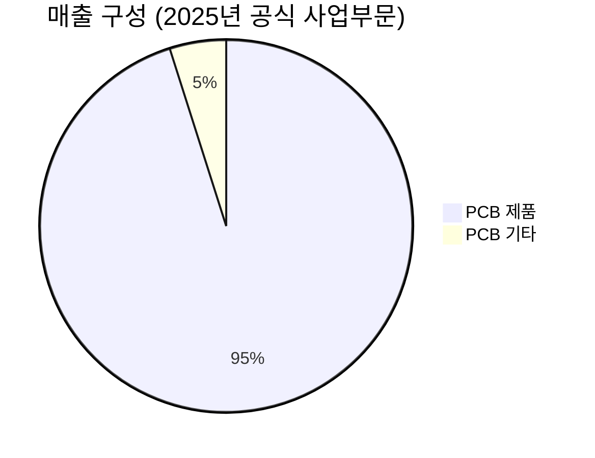

---

company: 이수페타시스
created: 2026-04-19 22:48
date: 2026-04-19 22:48
exchange: KRX
listing: public
market: KR
tags:
- daily
- deal-sourcing
ticker: 007660.KS
title: Deal - 이수페타시스 (007660.KS) 22:48
type: deal-sourcing
publish: true
---

> **오늘의 탐색 분야**: 클라우드, 사이버보안, 바이오텍, 헬스케어 테크, 원자력, 클린에너지, 원자재, 전기차, 로보틱스
> 4일 주기 로테이션 (21개 분야 커버)

# 이수페타시스 (007660.KS)

007660.KS KR KOSPI Technology / Electronic Components

---

## Investment Score

Investment Score 70/100 — 🟡 Buy (조건부)

업사이드 비대칭 22/30 — AI 인프라 MLB 독점적 지위, 다중적층 전환으로 ASP 급등 구조

카탈리스트 & 타이밍 18/25 — 5/18 실적발표+8K CAPA 가동+다중적층 비중 31% 급등 예정

비즈니스 품질 15/20 — 기술해자 강력하나 고객 집중도·ROE 6.6% 개선 여지

밸류에이션 7/15 — PER 53x·PBR 11.7x·EV/EBITDA 90x — 성장 대가지만 안전마진 제한

발견 가치 8/10 — 15개 애널리스트 커버, 그러나 컨센서스 내 Variant 존재 (증설 타이밍 오해)

---

> [!abstract] 리포트 요약
> **한 줄 테시스**: 이수페타시스는 AI 가속기·스위치용 초고다층 MLB(Multi-Layer Board)를 사실상 독점 공급하는 한국 유일의 하드웨어 인프라 기업으로, 공급이 구조적으로 수요를 따라가지 못하는 국면에서 다중적층(MLB) 매출 비중이 2025년 9% → 2026년 31% [추정: BNK투자증권 컨센서스]로 급증하며 ASP와 마진이 동시에 상승하는 변곡점에 있다.
>
> **왜 지금인가**: 2026년 5월 18일 1Q26 실적 발표가 첫 번째 촉매다. 1분기는 계절적 비수기임에도 증권사들이 "견조한 수요, 부족한 공급"을 이구동성으로 언급하고 있으며, 2026년 하반기 8,000 CAPA 가동과 2027년 상반기 10,500 추가 증설 확정이라는 중기 성장 로드맵이 구체화됐다. 단기적으로는 52주 고점(156,600원) 대비 현재가(122,700원)가 22% 할인된 가격대다.
>
> **Variant Perception**: 시장은 이수페타시스를 단순 PCB 업체로 보는 경향이 있으나, 실제로는 기존 재료를 활용한 표면 처리 기술 고도화로 고성능·경제성을 동시 달성하는 독보적 포지션이다. 경쟁사들이 고가 특수 소재로 고다층을 구현할 때, 이수페타시스는 원가 경쟁력을 유지하면서 수율을 높이는 방식으로 진입장벽을 쌓고 있다. 이 구조적 우위가 컨센서스에 충분히 반영되지 않았다.
>
> **핵심 리스크**: PER 53x·EV/EBITDA 90x의 고밸류에이션은 실적 미스 시 급락 취약성을 의미한다. 최대 고객(G사 = Google 추정) 집중도가 리스크이며, 미-중 관세 전쟁 격화 시 AI 설비투자 감속 가능성이 하방 시나리오의 핵심이다.

---

## ① 핵심 지표

| 항목 | 값 | 의미 |
|------|-----|------|
| 현재가 | 122,700원 | 🟡 52주 고점(156,600원) 대비 -22%, 저점(31,550원) 대비 +289%. 고점 대비 조정 국면이나 저점 대비 대폭 회복 |
| 시가총액 | 8.8조원 | 🟡 중대형주. 글로벌 MLB PCB 시장 내 한국 대표주. 대구 지역 시총 1위 (2026.Q1 기준) |
| PER (Trailing) | 53.30 | 🔴 고평가 절대 수준. 단, 2026년 이익 급성장 감안 시 Forward PER 33.6x로 완화 |
| PER (Forward) | 33.62 | 🟡 성장 프리미엄 감안 시 수용 가능. 단 추가 이익 상향 여부가 관건 |
| PBR | 11.69 | 🔴 자산 대비 큰 프리미엄. 기술·브랜드·고객 관계 등 무형가치 반영. 고평가 리스크 존재 |
| EV/EBITDA | 90.86 | 🔴 절대적으로 높음. 성장 가속 국면을 충분히 반영한 수준이나 안전마진 낮음 |
| 영업이익률 | 19.7% | 🟢 PCB 업계 최상위권. 2025년 YoY +7~8%p 개선. 고부가 다중적층 비중 확대 결과 |
| 순이익률 | 15.9% | 🟢 건전한 수준. 영업/순이익 갭 적어 이익의 질 양호 |
| ROE | 6.6% | 🔴 이익률 대비 낮음. 대규모 증설 투자로 자기자본이 빠르게 늘어 ROE 희석 중. 증설 완료 후 개선 기대 [추정] |
| 52주 고/저 | 156,600 / 31,550 | 🟡 고점 대비 22% 할인. 1년 전 저점 대비 5배 수익. 현재는 조정 후 재상승 시도 구간 |
| 배당수익률 | 0.2% | 🔴 배당 투자 목적으로는 부적합. 성장형 기업으로 이익 재투자 중심 |
| Beta | 1.96 | 🔴 고베타. 시장 변동성에 민감. 시장 하락 시 2배 하락 위험 내포 |
| 섹터/업종 | Technology / Electronic Components | 🟢 AI 인프라 수혜 최전선 섹터 |

> [!warning] 밸류에이션 경고
> PER 53x, EV/EBITDA 90x는 현재 가격에 상당한 성장 기대가 이미 반영됐음을 의미한다. 실적이 컨센서스를 단 한 분기라도 하회하면 급격한 멀티플 압축이 발생할 수 있다. 베타 1.96은 리스크가 높다는 시장의 암묵적 인정이다.

---

## ② 회사 개요, 제품, 핵심 경쟁력

> [!abstract] 섹션 요약
> 이수페타시스는 AI 가속기·네트워크 스위치용 초고다층 인쇄회로기판(MLB)을 글로벌 빅테크에 납품하는 국내 유일의 전문 기업이다. 단순 PCB 제조사가 아니라, 고성능 연산 인프라의 핵심 물리적 기반을 공급하는 "AI 인프라 하드웨어" 포지션을 점하고 있다.

### 한 줄 설명
**이수페타시스는 엔비디아 가속기, 구글 TPU, 하이퍼스케일 네트워크 스위치의 심장부에 들어가는 초고다층 인쇄회로기판(MLB)을 만드는 회사다.**

### 사업 모델
- **수익 구조**: 초고다층 PCB(MLB)를 제조해 글로벌 빅테크 및 그 ODM/EMS 파트너에게 공급. PCB 제품이 매출의 95.1%, PCB 기타(상품/용역 등) 4.9% (출처: 2025년 사업보고서 기준)
- **고객 납품 구조**: 최종 수요처는 Google, 엔비디아(AI 가속기), 하이퍼스케일 데이터센터 운영사 등이나, 실제 거래는 주로 ODM/EMS를 통해 이루어짐
- **가격 결정력**: 공급 부족 상황에서 ASP(평균 판매 단가)가 지속 상승 중. 다중적층 전환이 ASP를 구조적으로 끌어올리는 메커니즘

### 핵심 제품/서비스

| 제품 카테고리 | 설명 | 주요 고객 용도 |
|------------|------|-------------|
| AI 가속기용 MLB | 엔비디아 GPU, Google TPU 등 AI 가속기 탑재 보드. 40층 이상 초고다층 | 데이터센터 AI 연산 |
| 네트워크 스위치용 MLB | 800G/1.6T 급 하이퍼스케일 네트워크 스위치. 매출의 ~70% [추정: YouTube 분석] | 데이터센터 네트워크 |
| 다중적층 (MLB Advanced) | 기존 MLB 대비 층수 더 높이고 신호 밀도 극대화. 2026년 주력 성장 제품 | 차세대 AI 인프라 |

> [!note] 세그먼트 데이터 한계
> 공식 사업보고서상 매출 세그먼트는 "PCB 제품 95.1% / PCB 기타 4.9%" (2025년 12월 기준) 수준으로만 공시됨. AI 가속기 vs 스위치 등 응용별 세부 비중은 애널리스트 추정치이며 공식 수치 아님.

### 매출 구성

### 핵심 경쟁력

| 경쟁력 | 설명 | 복제 난이도 (1-10) |
|--------|------|:---:|
| 초고다층 표면 처리 기술 | 기존 재료를 활용하면서 표면 처리 고도화로 고성능·경제성 동시 달성. 경쟁사 대비 원가 우위 | 9 |
| 글로벌 빅테크 승인 이력 | 수년간 검증된 품질로 Google, 엔비디아 벤더 인증 취득. 재인증 장벽이 진입장벽 | 8 |
| 대구 집중형 생산 거점 | 4공장 준공, 5공장 착공 추진 중. 국내 집중 생산으로 기술 유출 방지 및 관리 효율 | 7 |
| 선제적 CAPA 증설 | 업계 전반 CAPA 증설이 제한적인 상황에서 이수페타시스만 선제적 확대로 점유율 선점 | 7 |
| 이수그룹 재무 배경 | 그룹 차원의 지원으로 대규모 CapEx 실행 가능. 2030 비전 내 AI 하드웨어 핵심 축 | 6 |

### 성장 공식
$$\text{매출 성장} = \underbrace{\text{CAPA 확대}}_{\text{양적}} \times \underbrace{\text{다중적층 비중 ↑}}_{\text{ASP 상승}} \times \underbrace{\text{AI 투자 지속}}_{\text{TAM 확대}}$$

- **단기**: CAPA 증설(4공장 → 5공장)로 생산량 증가
- **중기**: 다중적층 매출 비중 9% → 31% 전환으로 ASP 동반 상승 [추정: BNK투자증권]
- **장기**: 글로벌 AI 데이터센터 구조적 성장 (CAGR 5.7%, 전체 PCB 시장 기준 [출처: Global Market Insights 보고서])

### 고객
- **최대 고객 (G사)**: Google 추정 [확인 필요]. AI 가속기 + 스위치 향 공급. 스위치도 2026년 하반기부터 다중적층 적용 예정
- **월평균 수주액**: 최고치 경신 중 (출처: BNK투자증권 2026.3.3)
- **왜 이수페타시스를 선택하는가**: 원가 경쟁력 + 검증된 품질 + 빠른 납기 대응 능력

---

## ③ 왜 100%+ 가능한가? — 업사이드 비대칭

> [!tip] 핵심 인사이트
> 이 기업의 진짜 업사이드는 "더 많이 파는 것"이 아니라 "같은 면적에서 더 비싼 것을 파는 것"이다. 다중적층 전환은 CAPA를 늘리지 않고도 ASP를 구조적으로 끌어올리는 메커니즘이다. 이것이 단순 증설주와 구별되는 포인트.

### 시총 vs TAM
- **글로벌 PCB 시장**: 2025년 802억 달러 → 2035년 1,378억 달러 (CAGR 5.7%) [출처: Global Market Insights 산업 보고서]
- **AI 서버·데이터센터용 고다층 MLB 세부시장**: 전체 PCB의 20~30% 추정 [가정: 업계 일반 추정치], 약 160~240억 달러 규모 (확인 필요)
- **이수페타시스 시총 8.8조원 ≈ 약 65억 달러**: 글로벌 MLB 세부시장의 약 3~4% 수준. 한국 내 독점적 포지션임을 감안하면 성장 여력은 충분
- **이수그룹 2030 목표**: 시총 25조원. 현재 8.8조원 대비 약 3배 목표 — 2030년까지 달성 시 연복리 19% [추정: 그룹 발표 목표 역산]

### 성장 가속 구간의 증거

| 지표 | 2024년 | 2025년 | 변화 |
|------|--------|--------|------|
| 매출액 | 8,368억원 | 1조 880억원 | +30.0% YoY |
| 영업이익 | 1,018억원 | 2,047억원 | +101.0% YoY |
| 당기순이익 | (확인 필요) | (확인 필요) | +116.8% YoY |
| 영업이익률 | ~12% [추정] | 19.7% | +7~8%p |

출처: 매일신문 2026.3.23 / 기업모니터 2026.4.14 (2025년 결산 기준)

> [!success] 강점
> 영업이익이 매출 성장률(+30%)의 3배 이상 증가(+101%)했다. 이는 단순 외형 성장이 아닌, 믹스 개선(고부가 다중적층 비중 증가) + 4공장 규모의 경제 가동 효과가 동시에 작동했음을 의미한다. 마진 레버리지가 살아있다는 뜻.

### 다중적층 전환 — 구조적 ASP 상승 메커니즘

| 구분 | 2025년 | 2026년 전망 |
|------|--------|------------|
| 다중적층 매출 비중 | 9% | 31% [추정: BNK투자증권 2026.3.3] |
| 발생 시기 | 연중 분산 | 주로 하반기 집중 |
| 핵심 트리거 | G사 AI 가속기 | G사 스위치 + AI 가속기 다중적층 동시 적용 |

- 다중적층 제품은 일반 MLB 대비 ASP가 수배 이상 높음 [추정: 업계 일반 통념, 확인 필요]
- G사 스위치도 하반기부터 다중적층 적용 → ASP 상승 + 수량 유지의 이중 효과 기대

### 옵셔널리티
1. **태국 합작법인 설립 (2026년)**: 동남아 시장 진출 본격화. 관세·공급망 다변화 효과
2. **5공장 착공**: 2027년 상반기 CAPA 10,500 목표. 현재 증설이 완료되면 다음 수요 사이클 대응 가능
3. **800G → 1.6T 전환**: 차세대 네트워크 속도 전환이 MLB 사양·단가 상승으로 직결
4. **신규 고객 양산 진입**: 기존 G사 외 추가 빅테크 고객 확보 시 [확인 필요] 집중도 리스크 해소와 동시에 매출 기반 확대

### CAPA 로드맵

| 시기 | CAPA 목표 | 의미 |
|------|---------|------|
| 2026년 하반기 | 8,000 | 현재 대비 증설 완료 구간. 매출 급증 시작 [추정] |
| 2027년 상반기 | 10,500 | 추가 증설 확정 (출처: 한국투자증권 리포트 2026.3) |

---

## ④ 왜 지금인가? — 카탈리스트 & 타이밍

> [!tip] 핵심 인사이트
> 지금이 매력적인 이유는 두 가지다: ① 52주 고점 대비 22% 조정을 통해 밸류에이션 부담이 일부 해소됐고, ② 5월 18일 실적 발표 + 하반기 CAPA 본격 가동이라는 이중 촉매가 6개월 이내에 집중되어 있다.

### 구체적 카탈리스트

| 촉매 | 예상 날짜 | 내용 | 주가 영향 가능성 |
|------|----------|------|----------------|
| **1Q26 실적 발표** | 2026.5.18 | 컨센서스 예상 매출 3,371억원. 계절 비수기임에도 증권사 "견조" 전망 | 상회 시 +5~10%, 하회 시 -5~10% |
| **G사 스위치 다중적층 전환** | 2026년 하반기 | G사 스위치 제품에 다중적층 기술 첫 적용. ASP 구조적 상승 시작 | 공시/확인 시 강한 상승 모멘텀 |
| **8K CAPA 가동** | 2026년 하반기 | 생산능력 증설 완료에 따른 매출 반영 시작 | 3Q26 실적에서 수치 확인 |
| **이수그룹 30주년 비전** | 2026.4.16 발표 | 2030년 시총 25조원 목표 공개. 단기 모멘텀 제공 | 단기 심리적 지지 |
| **5공장 착공 확정** | 미정 | 2027년 상반기 10,500 증설 로드맵 실행 | 중기 성장 가시성 확보 |

### 시장 반영도 평가

> [!question] 검토 필요
> 현재 주가 122,700원은 컨센서스 목표가 174,467원 대비 29% 할인된 수준이다. 이는 ① 실적 미스 리스크, ② 대외 불확실성(미-중 관세), ③ AI 투자 감속 우려가 부분적으로 반영된 결과다. 시장이 이미 알고 있는 긍정적 스토리에 비해, 하방 리스크에 과도하게 반응 중이라면 매수 기회다.

### Variant Perception — 시장 컨센서스와 다른 뷰

**컨센서스의 뷰**: 이수페타시스는 좋은 PCB 업체이나, PCB는 결국 commoditize될 수밖에 없으며 중국 경쟁사들이 따라올 것이다.

**우리의 뷰**: 틀렸다. 이유:
1. **기술 장벽의 본질**: 표면 처리 고도화는 공개된 레시피가 없다. 수율이 핵심 경쟁력이며, 이는 수년간 양산 경험에서 나온다
2. **G사 납품 인증**: 빅테크 벤더 인증은 통상 18~24개월 검증 과정. 신규 경쟁자 진입 시간 충분
3. **공급 부족이 만든 가격 결정력**: 지금은 이수페타시스가 가격을 설정하는 시장. 이 국면이 최소 2027년까지 지속될 가능성 [추정]

### 매크로 환경 분석

| 매크로 변수 | 현재 방향 | 이수페타시스 영향 |
|-----------|---------|----------------|
| 미-중 관세 전쟁 | 격화 중 | 🔴 AI 설비 투자 감속 우려. 단, 하이퍼스케일러들은 AI 투자 유지 의사 반복 확인 |
| 달러/원 환율 | 달러 강세 | 🟢 수출 중심 기업으로 환율 상승 = 원화 환산 이익 증가 |
| AI 서버 수요 | 구조적 증가 | 🟢 빅테크 AI CapEx 감소 조짐 없음. 오히려 경쟁적 투자 |
| 원자재(동, 라미네이트) 가격 | 상승 압력 | 🔴 원가 부담. 대구일보 보도 확인 (호르무즈 긴장 관련 원가 상승 언급) |
| 금리 방향 | 인하 사이클 | 🟢 고베타 성장주에 유리. 할인율 하락 = 밸류에이션 지지 |

**매크로 시나리오별 영향:**
- **긴축 지속**: 설비 투자 감속 우려 반영 → 주가 -20~30% 리스크
- **금리 인하**: 고성장 고밸류 종목에 유리 → 멀티플 확장 가능
- **경기 침체**: AI 데이터센터 투자는 상대적으로 견조할 전망 (빅테크 현금성 풍부) → 방어력 일부 존재

---

## ⑤ 비즈니스 퀄리티

> [!abstract] 섹션 요약
> 영업이익률 19.7%는 PCB 업계 최상위권으로, 기술 해자가 실제로 작동하고 있다는 증거다. 다만 ROE 6.6%는 대규모 증설 CapEx로 자기자본이 팽창한 결과이며, 증설 완료 후 ROIC 개선이 관건이다.

### 경제적 해자 (Moat) 분석

| 해자 계층 | 내용 | 복제 난이도 |
|---------|------|-----------|
| **기술 노하우 (무형자산)** | 기존 재료 기반 표면 처리 기술 고도화. 레시피가 암묵지(tacit knowledge)화되어 있어 특허 회피 어려움 | 🔴 매우 높음 |
| **고객 전환 비용** | 빅테크 품질 인증(QA approval)은 18~24개월 소요. 한번 납품 승인된 공급사를 교체하는 비용이 막대함 | 🔴 매우 높음 |
| **선제적 규모의 경제** | 경쟁사 CAPA 증설이 제한적인 상황에서 이수페타시스만 적극 확대. 선점 효과로 단위 원가 하락 | 🟡 중간 |
| **인력/경험 자산** | 대구 지역 생산 집중으로 숙련 인력 유지. MLB 수율은 인력 경험과 직결 | 🟡 중간 |

> [!success] 강점
> 이수페타시스의 핵심 해자는 단순한 기술 장벽이 아니라 **검증된 납품 이력**이다. 빅테크 AI 인프라에서 한번 실패하면 데이터센터 전체에 영향을 주기 때문에, 공급사 교체는 극도로 신중하다. 이것이 "전환 비용" 해자의 실체다.

### ROIC/ROE 추세

- **ROE 6.6%**: 표면적으로 낮으나, 이는 2024~2026년 대규모 CapEx로 자기자본이 급격히 증가한 결과. 이익이 증가하는 속도보다 투하 자본이 더 빠르게 늘어난 구간
- **영업이익률 19.7%**: 2024년 대비 약 7~8%p 개선. 이는 고부가 믹스 개선과 고정비 레버리지 효과
- **마진 방향성**: 다중적층 비중 확대와 함께 추가 개선 여지 존재 [추정]. 다만 원가(동, 라미네이트) 상승이 제약 요인

### 경영진 평가

<strong>긍정적 요소</strong>: 이수그룹 차원의 중장기 비전(2030년 시총 25조원)과 일치하는 CapEx 집행. AI 수요 사이클에 선제적으로 대응하는 타이밍 판단력은 우수. 4공장 준공 후 즉시 5공장 착공 결정은 수요 확신을 반영.

<strong>주의할 점</strong>: 최근 14일 이내 경영진 내부자 거래 데이터 미확인. 대규모 증설 시기 레버리지 리스크 관리가 핵심. 태국 합작법인 설립 등 해외 확장이 실행 복잡도를 높일 수 있음.

---

## ⑥ 밸류에이션 & 안전마진

> [!abstract] 섹션 요약
> 현재 밸류에이션은 절대적으로 높다. 하지만 이익 성장 가속이 확인되고 있고, 52주 고점 대비 22% 조정된 현재 가격은 일부 리스크를 흡수했다. 안전마진은 낮지만, 성장 모멘텀이 지속된다면 정당화 가능한 수준이다.

### 현재 밸류에이션 vs 맥락

| 지표 | 현재 값 | 해석 |
|------|--------|------|
| PER (Trailing) | 53.3x | 🔴 절대 고평가. 단, 이익 성장 중에 trailing은 의미 감소 |
| PER (Forward) | 33.6x | 🟡 2026년 이익 상향 반영 시 수용 가능 구간 진입 시도 |
| PBR | 11.7x | 🔴 자산 대비 큰 프리미엄. 기술 무형 가치 반영 불가피 |
| EV/EBITDA | 90.9x | 🔴 매우 높음. 성장 프리미엄이 과도하게 반영됐을 가능성 |
| 컨센서스 목표가 | 174,467원 (15개 기관 평균) | 🟢 현재가 대비 +42% 상승 여력. 최고 270,000원, 최저 114,000원 |

### 역사적 맥락
- **52주 저점 31,550원 → 현재 122,700원**: 1년간 289% 상승 후 고점(156,600원) 대비 조정 중
- 52주 밴드 내 위치: **중상단** — 절대 저평가는 아님. 그러나 고점 대비 -22%의 조정이 일부 가격 조정 역할

### FCF / 안전마진 관점

> [!warning] 리스크 경고
> EV/EBITDA 90x는 현재 이익 기준으로 가격을 정당화하기 어렵다는 뜻이다. "현재 이익이 아니라 2027~2028년 이익을 지금 사는 것"이라는 관점이 필요하다. 즉, 이 투자는 **성장 실현이 선행 조건**이다.

- **Owner Earnings 관점**: 영업이익 2,047억원(2025년), Forward 이익이 추가 성장 시 PER 압축 가능. 그러나 CapEx 증가로 FCF가 이익 대비 낮을 가능성 (FCF 데이터 미확인)
- **목표가 범위 분석**:
  - 보수적 시나리오(114,000원): 현재가 대비 하방 -7%
  - 평균 목표가(174,467원): 현재가 대비 +42%
  - 낙관 시나리오(270,000원): 현재가 대비 +120%

**So What?**: 현재 가격은 "좋은 기업을 비싸지 않게"가 아니라 "좋은 기업을 약간 비싸게" 사는 상황이다. 성장 실현 시 +42% (컨센서스), 성장 가속 시 +100%+가 가능하지만, 실적 미스 시 -20~30% 리스크도 존재한다. 안전마진은 높지 않으므로, **분할 매수와 포지션 사이즈 관리**가 필수다.

---

## ⑦ 리스크 & Devil's Advocate

| 구분 | 핵심 논거 |
|------|---------|
| 🟢 Bull #1 | AI 데이터센터 CapEx는 빅테크 실적 발표마다 재확인되는 구조적 수요. 이수페타시스 공급 부족은 2027년까지 해소되기 어려움 |
| 🟢 Bull #2 | 다중적층 비중 9% → 31% 전환은 수량 증가 없이도 매출·마진 폭발적 성장을 만드는 레버리지 포인트 |
| 🟢 Bull #3 | 경쟁사 신규 진입 장벽(빅테크 인증 18~24개월 + 수율 축적 수년)이 단기 위협을 제한. 2026~2027년 초과 이익 지속 가능성 |
| 🔴 Bear #1 | 최대 고객 G사(Google 추정) 집중도가 매우 높음. G사의 AI 전략 변화, TPU 설계 변경, 내재화 시도 시 매출 급락 |
| 🔴 Bear #2 | PER 53x, EV/EBITDA 90x에서 실적 미스는 멀티플 압축을 동반한 급락으로 이어짐. 2025년 4분기 이미 컨센서스 하회 경험(-5% 주가 반응) |
| 🔴 Bear #3 | 미-중 관세 전쟁 + 글로벌 경기 침체 시나리오: AI CapEx 축소 → 이수페타시스 수주 급감. 대규모 증설 CapEx가 고정비로 전환되어 불황 시 적자 전환 가능 [가정] |

### 가장 현실적인 실패 시나리오

> [!failure] 약점
> **단일 고객 집중 리스크**: G사가 MLB PCB 내재화(In-house)를 추진하거나, 차세대 AI 가속기 설계에서 MLB 의존도를 낮추는 아키텍처 변화가 발생하면, 이수페타시스의 테시스 전체가 흔들린다. 이것이 가장 현실적이고 치명적인 실패 경로다.

### 숨겨진 가정 (Hidden Assumptions)

| 가정 | 리스크 수준 |
|------|-----------|
| G사 AI 투자 지속 | 🟢 빅테크 CapEx 발표 지속 확인으로 단기 유효 |
| 다중적층 전환이 실제 수익화로 이어짐 | 🟡 기술 전환 시 수율 하락 가능성 |
| 5공장 증설이 계획대로 진행 | 🟡 건설 지연, 자금 조달 이슈 가능성 |
| 경쟁사 CAPA 급증 없음 | 🟡 삼성전기 베트남 투자 1.8조원 등 대형 경쟁사 확장 중 |
| 원가(동, 라미네이트) 안정화 | 🔴 호르무즈 긴장 등 지정학 변수 |

### Kill Criteria

| Kill Criteria | 임계값 |
|-------------|-------|
| G사 AI 설비 투자 축소 발표 | 연간 CapEx 가이던스 -20% 이상 하향 |
| 분기 영업이익률 | 15% 미만으로 2개 분기 연속 하락 |
| 다중적층 매출 비중 | 2026년 말까지 15% 미달 |
| 신규 경쟁사 빅테크 납품 승인 | 공식 발표 확인 시 |
| 이수페타시스 주가 | 90,000원 하향 돌파 후 3영업일 유지 (기술적 지지선 붕괴) |

---

## ⑧ 발견 가치 & 엣지

> [!abstract] 섹션 요약
> 이수페타시스는 이미 15개 기관 커버리지를 받는 "알려진 종목"이다. 그러나 시장이 놓치고 있는 것은 단순 CAPA 증설이 아니라 ASP를 끌어올리는 다중적층 기술 전환의 이익 레버리지 효과다.

### 애널리스트 커버리지 현황

| 증권사 | 투자의견 | 목표가 | 날짜 |
|--------|--------|--------|------|
| 한국투자증권 | 매수 | 180,000원 | 2026.4.13 |
| 메리츠증권 | Buy | 170,000원 | 2026.4.9 |
| DB증권 | Buy | 155,000원 | 2026.4.7 |
| 컨센서스 (15개 기관) | 적극 매수 | 174,467원 | 최신 |

- **커버리지 수**: 15명. 이미 충분히 커버됨 → 발견 가치 점수 일부 감점 요인
- 단, 분석의 깊이 면에서 기술 전환의 수익화 타이밍을 정확히 모델링한 곳은 제한적

### 기관/외국인 매매 동향

| 날짜 | 기관 | 외국인 |
|------|------|--------|
| 2026.4.13 | +98,652주 순매수 | +173,372주 순매수 |
| 2026.4.14 | +153,745주 순매수 | +158,943주 순매수 |
| 2026.4.15 | +114,208주 순매수 | -10,764주 순매도 |
| 2026.4.16 | -68,555주 순매도 | -62,025주 순매도 |
| 2026.4.17 | -40,374주 순매도 | -43,524주 순매도 |

**해석**: 4월 13~15일 증권사 리포트 발표를 계기로 기관/외국인이 대량 매수 후, 4월 16~17일 단기 차익 실현. 스마트 머니의 방향은 4월 13~15일 기준 "매집" 시그널.

### 시장이 놓치고 있는 것

> [!tip] 핵심 인사이트
> **"단순 PCB 업체" vs "AI 인프라 하드웨어 독점 공급사"의 밸류에이션 갭**
>
> 시장 일부에서는 이수페타시스를 단순 전자부품 업체로 프레임하여 10~20x PER을 적용한다. 그러나 실제 포지션은 엔비디아 생태계, Google TPU 생태계에서 검증된 독점 공급사다. AI 가속기 밸류체인 내에서의 위치를 재평가하면, 현재 밸류에이션은 다른 해석을 받는다.
>
> **다중적층 전환의 비선형적 이익 효과**: 비중 9% → 31%는 선형 매출 증가가 아니다. ASP가 일반 MLB 대비 수배 높다면, 매출 +22%p 비중 증가는 영업이익 성장의 비선형적 가속을 만든다. 컨센서스 모델이 이를 충분히 반영했는지 의문.

---

## ⑨ 액션 아이템

### 투자 결론

| 항목 | 판단 |
|------|-----|
| **판정** | BUY (조건부) — 강력한 구조적 테시스, 단 밸류에이션 부담으로 분할 진입 권장 |
| **Conviction** | Medium — 성장 테시스는 강하나 고밸류 + 단일고객 집중 리스크 |
| **적정 진입가** | 110,000~120,000원 — 현재가(122,700원)와 유사하거나 소폭 하회 시. 52주 고점 대비 -24~30% 구간 |
| **목표가 (12개월)** | 155,000~175,000원 — 컨센서스 평균(174,467원) 하단 보수적 적용. 다중적층 전환 가시화 시 상향 |
| **손절 기준** | 90,000원 — 기술적 지지선. 이하 돌파 시 테시스 재검토 필요 |
| **권장 비중** | 포트폴리오의 3~5% — AI 인프라 포지션 중 일부로 구성. 확신 높아질 시 7%까지 확대 가능 |

### 시나리오 분석

🟢 Bull 30%

🟡 Base 50%

🔴 Bear 20%

| 시나리오 | 조건 | 12개월 목표가 | 업사이드 |
|---------|------|------------|--------|
| 🟢 Bull | 다중적층 비중 31% 실현 + G사 스위치 전환 확인 + 신규 고객 추가 | 220,000~270,000원 | +79~120% |
| 🟡 Base | 다중적층 비중 20~25% 달성 + 안정적 수요 지속 | 155,000~175,000원 | +26~43% |
| 🔴 Bear | AI 투자 감속 + 실적 컨센서스 하회 + 멀티플 압축 | 85,000~100,000원 | -18~31% |

### 추가 리서치 과제

| 리서치 항목 | 우선순위 | 확인 방법 |
|-----------|--------|---------|
| 최대 고객(G사) 확인 및 의존도 정확한 비율 | ★★★ | DART 사업보고서 주요 매출처 공시 |
| FCF (Free Cash Flow) 실제 수치 | ★★★ | 재무제표 현금흐름표 |
| 다중적층 제품 ASP vs 일반 MLB ASP 격차 | ★★★ | 증권사 딥다이브 리포트 입수 |
| 5공장 착공 확정 일정 및 자금 조달 방식 | ★★ | 투자공시, IR 자료 |
| 태국 합작법인 상대방 및 조건 | ★★ | DART 공시 |
| 삼성전기 베트남 FC-BGA 증설이 MLB 시장에 미치는 영향 | ★★ | 경쟁사 분석 |
| 경영진 지분 및 최근 내부자 거래 | ★ | DART 대량보유/임원공시 |

### 모니터링 핵심 지표

| 지표 | 체크 포인트 | 날짜 |
|------|-----------|------|
| 1Q26 실적 | 매출/영업이익 vs 컨센서스. 다중적층 비중 언급 여부 | 2026.5.18 |
| G사 AI 투자 CapEx 발표 | 연간 CapEx 가이던스 유지/상향 여부 | 구글 실적 발표 (분기별) |
| 5공장 착공 공시 | DART 공시 모니터링 | 수시 |
| 경쟁사(대덕전자, 삼성전기) 실적 | PCB 업황 크로스 체크 | 분기별 |
| 기관/외국인 순매수 지속 여부 | 스마트머니 방향 | 매주 |

---

> [!verdict] 최종 판단
> **이수페타시스는 AI 인프라 하드웨어 독점 공급이라는 구조적 테시스가 확실한 기업이다.** 2025년 실적(매출 +30%, 영업이익 +101%)이 테시스를 수치로 증명했으며, 2026년은 다중적층 전환이라는 질적 도약이 더해지는 해다. 다만 PER 53x, EV/EBITDA 90x의 밸류에이션은 안전마진을 거의 허용하지 않는다. **좋은 기업을 "조금 비싸게" 사는 상황**이며, 성장이 지속된다면 정당화 가능하지만 단 하나의 실적 미스도 용납되지 않는 주가 수준이다.
>
> **Buy (조건부) — 분할 진입, 3~5% 비중, 5월 18일 실적 확인 후 비중 결정.**
>
> 관련 종목: [[SK하이닉스]] (AI 밸류체인 연결), [[삼성전기]] (경쟁사 동향), [[대덕전자]] (PCB 업황 비교), [[GST(글로벌스탠다드테크놀로지)]] (AI 인프라 부품 비교)