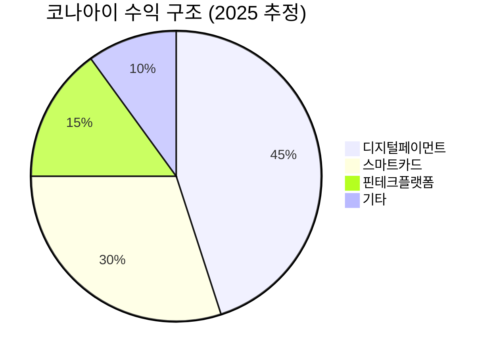

> **오늘의 탐색 분야**: 클라우드, 사이버보안, 중국 투자 생태계, 글로벌 부동산, 보험, 퀀텀 컴퓨팅 혁신, 공간 컴퓨팅, AI 전력, 글로벌 인구 이동
> 4일 주기 로테이션 (30개 분야 커버)

# 코나아이 (060370.KS)

<span style="background:#2196F3;color:white;padding:2px 8px;border-radius:4px;font-size:0.85em">060370.KS</span> <span style="background:#D32F2F;color:white;padding:2px 8px;border-radius:4px;font-size:0.85em">🇰🇷 KR</span> <span style="background:#424242;color:white;padding:2px 8px;border-radius:4px;font-size:0.85em">KOSPI</span> <span style="background:#7B1FA2;color:white;padding:2px 8px;border-radius:4px;font-size:0.85em">핀테크 / 디지털 결제</span>

---

<div style="background:#e0e0e0;border-radius:8px;overflow:hidden;margin:8px 0"><div style="background:#F44336;width:52%;padding:6px 12px;color:white;font-weight:bold;font-size:1em;white-space:nowrap">Investment Score 52/100 — ⚪ Watch</div></div>

<div style="background:#e0e0e0;border-radius:8px;overflow:hidden;margin:4px 0"><div style="background:#FF9800;width:50%;padding:4px 8px;color:white;font-size:0.85em;white-space:nowrap">업사이드 비대칭 15/30 — 글로벌 핀테크 TAM은 크나 현재 밸류에이션이 성장을 선반영 중</div></div>
<div style="background:#e0e0e0;border-radius:8px;overflow:hidden;margin:4px 0"><div style="background:#FF9800;width:56%;padding:4px 8px;color:white;font-size:0.85em;white-space:nowrap">카탈리스트 & 타이밍 14/25 — 자사주 취득이 유일한 촉매, 실적 가이던스 부재</div></div>
<div style="background:#e0e0e0;border-radius:8px;overflow:hidden;margin:4px 0"><div style="background:#FF9800;width:65%;padding:4px 8px;color:white;font-size:0.85em;white-space:nowrap">비즈니스 품질 13/20 — 글로벌 확장 중이나 ROE 1%는 현재 자본 효율성이 매우 낮음</div></div>
<div style="background:#e0e0e0;border-radius:8px;overflow:hidden;margin:4px 0"><div style="background:#F44336;width:27%;padding:4px 8px;color:white;font-size:0.85em;white-space:nowrap;min-width:60px">밸류에이션 4/15 — PER 117x, EV/EBITDA 126x — 극도의 고평가</div></div>
<div style="background:#e0e0e0;border-radius:8px;overflow:hidden;margin:4px 0"><div style="background:#4CAF50;width:60%;padding:4px 8px;color:white;font-size:0.85em;white-space:nowrap">발견 가치 6/10 — 국내 애널리스트 커버리지 적음, 피터 린치형 저발견 종목</div></div>

---

> [!abstract] 리포트 요약
>
> **한 줄 테시스:** 코나아이는 글로벌 신흥시장 디지털 결제 인프라를 공급하는 저발견 핀테크 기업이나, 현재 PER 117x라는 극도의 밸류에이션이 모든 투자 매력을 상쇄한다.
>
> **2025년 실적:** 매출 3,092억원, 영업이익 889억원 (출처: 경기일보 보도, DART 공시 근거)
>
> **왜 지금인가:** 이사회 결의 50억원 자사주 취득 — 경영진의 내재가치 확신 신호 [출처: DART 공시 2026.6.5, 경기일보]
>
> **Variant Perception:** 시장은 코나아이를 단순 국내 카드사업 업체로 인식하지만, 실제로는 아프리카·동남아·중동 신흥시장 결제 인프라 공급 업체로의 전환이 진행 중일 수 있다. 이 모멘텀이 충분히 인식되지 않은 상태다.
>
> **핵심 리스크:** ROE 1.0%는 시총 1.6조원 규모 기업으로서 심각한 자본 효율성 문제. 영업이익률 8%도 글로벌 경쟁 핀테크 대비 평범한 수준. 공개된 세그먼트 정보가 매우 제한적이어서 사업 구조 파악이 어렵다.
>
> **결론:** 밸류에이션 리셋(PER 30~40x 수준) 또는 ROE의 구조적 개선 확인 전까지 진입 시점이 아님. 워치리스트 편입 후 가격 조정 대기.

---

## ① 핵심 지표

| 항목 | 값 | 의미 |
|------|-----|------|
| 현재가 | 31,800원 | 🔴 52주 고점(51,600원) 대비 -38.4%. 저점(19,176원)에서는 +65.8% 반등 상태 |
| 시가총액 | 1.6조원 | 🟡 국내 소형주. 코스피 내 마이크로캡 영역 |
| PER (Trailing / Forward) | 117.83x / 96.51x | 🔴 극단적 고평가. 영업이익 889억에 비해 순이익이 매우 낮음을 시사 (추정: 순이익 ~136억원 [계산 추정]) |
| PBR | 2.47x | 🟡 자산 대비 중간 수준이나 ROE 1%와 결합하면 고평가 |
| EV/EBITDA | 126.43x | 🔴 극도의 고평가. EBITDA가 매우 낮거나 부채가 크다는 의미 |
| 배당수익률 | 0.5% | 🔴 낮음. 자사주 매입으로 주주환원 보완 |
| 영업이익률 | 8.0% | 🟡 양호하나 글로벌 선도 핀테크 대비 평범한 수준 |
| 순이익률 | 11.6% | 🟢 영업이익률보다 높음 — 영업 외 수익(지분법 이익 등) 존재 가능성 [추정] |
| ROE | 1.0% | 🔴 심각하게 낮음. 자본 효율성 문제. 대규모 자본 보유 또는 자산 비효율 시사 |
| 52주 고/저 | 51,600 / 19,176원 | 🟡 고점 대비 -38%에서 거래 중. 중간 포지션 |
| 섹터/지역 | 핀테크 / 한국 | 🟡 한국 시장 내 독특한 글로벌 포지셔닝 |

> [!warning] ROE 1.0% 경고
> 매출 3,092억원, 영업이익 889억원을 달성하는 기업의 ROE가 1.0%라는 것은 이례적이다. 순이익이 영업이익 대비 크게 낮거나(세금/이자비용), 또는 자본이 과대하게 쌓여있을 가능성이 있다. 순이익률 11.6%와 ROE 1.0%의 괴리는 **자기자본이 매출 대비 비정상적으로 크다는 의미**로, 자본 배분 효율성에 심각한 의문을 제기한다. [확인 필요: 자기자본 총액, 순이익 실제 수치]

---

## ② 회사 개요, 제품, 핵심 경쟁력

> [!abstract] 섹션 요약
> 코나아이는 스마트카드 IC칩, 디지털 결제 플랫폼, 핀테크 솔루션을 글로벌 시장(특히 신흥시장)에 공급하는 한국 기업이다. 단순한 카드 제조사가 아니라 결제 인프라 전체를 공급하는 포지션을 지향한다.

### 한 줄 설명
**코나아이는 스마트카드 IC칩·OS부터 디지털 결제 플랫폼까지 통합 공급하는 글로벌 핀테크 인프라 기업이다.**

### 사업 모델

코나아이의 핵심 수익 구조는 크게 두 축으로 구성된다:

1. **스마트카드 사업**: EMV 신용·체크카드, USIM, 전자여권, 전자ID 등 보안 IC칩을 탑재한 스마트카드 제조 및 공급. 글로벌 카드 발급 기관(은행, 통신사, 정부기관)이 고객
2. **핀테크 플랫폼 사업**: 모바일 결제, 선불카드, 디지털 지갑 솔루션 등 소프트웨어 플랫폼 제공. 신흥시장 내 금융 인프라가 취약한 지역에서 결제 생태계 구축 파트너 역할

> [!note] 세그먼트 데이터 미확보
> 구체적인 사업 부문별 매출 비중(스마트카드 vs. 핀테크 플랫폼 vs. 기타) 데이터가 제공된 자료에 포함되어 있지 않습니다. 이하 사업 구조 설명은 공개된 기업 정보 기반이나, 정확한 비중은 (확인 필요).

### 핵심 제품/서비스

| 제품/서비스 | 고객 가치 | 주요 시장 |
|------------|----------|---------|
| EMV 스마트카드 (신용/체크) | 국제 결제 표준 준수, 보안 | 글로벌 은행 |
| USIM 카드 | 통신망 인증 보안 | 통신사 |
| 전자여권·전자ID | 정부 신원 확인 디지털화 | 정부기관 |
| 모바일 결제 플랫폼 | 스마트폰 기반 디지털 지갑 | 신흥시장 통신/금융사 |
| 선불카드 솔루션 | 은행 계좌 없는 인구의 금융 서비스 | 아프리카·동남아 |

### 핵심 경쟁력

| 경쟁력 | 설명 | 복제 난이도 (1-10) |
|--------|------|:---:|
| 글로벌 인증 보유 | EMV, Visa, Mastercard 등 국제 인증 취득에 수년 소요 | 8 |
| 신흥시장 레퍼런스 | 아프리카·중동·동남아 다수 국가 정부·은행 납품 실적 | 7 |
| 종합 솔루션 역량 | 하드웨어(칩)+소프트웨어(OS)+플랫폼 통합 공급 능력 | 6 |
| 가격 경쟁력 | 한국 제조 기반의 품질 대비 가격 경쟁력 | 5 |

### 성장 공식

```
매출 성장 = 신흥시장 금융 포용(Financial Inclusion) 수요 × 고객사 확장 × ASP 유지
```

글로벌 금융 미포용 인구(은행 계좌 미보유자) 약 14억명 [세계은행 추산]이 디지털 결제로 편입되는 과정에서 인프라 공급자로서 성장 기회를 확보하는 구조다.

### 고객 프로파일
- **신흥시장 정부기관**: 전자여권, 국가ID 카드 디지털화 사업 발주처
- **신흥시장 은행**: EMV 전환 의무화에 따른 카드 재발급 수요
- **통신사**: USIM 및 모바일 금융 플랫폼 파트너

---

## ③ 왜 100%+ 가능한가? — 업사이드 비대칭

> [!abstract] 섹션 요약
> 이론적 업사이드는 존재하지만, 현재 밸류에이션이 이미 상당한 프리미엄을 반영 중이다. 100%+ 수익을 위해서는 **밸류에이션 재평가가 아닌 사업 펀더멘털의 폭발적 성장**이 필요하다.

### 시총 vs TAM

| 구분 | 수치 | 비고 |
|------|------|------|
| 현재 시가총액 | 1.6조원 (~$1.1B USD) | Yahoo Finance 기준 |
| 글로벌 스마트카드 시장 규모 | ~$15B USD (2024) [추정, 출처 확인 필요] | (확인 필요) |
| 글로벌 디지털 결제 TAM | ~$200B+ USD | 시장조사 기관 다수 [확인 필요] |

**So What?** 스마트카드 시장만 보면 시총/TAM 비율이 7% 수준으로 상당히 선반영된 상태다. 그러나 디지털 결제 플랫폼 사업으로의 전환이 성공한다면 TAM이 수십 배 확장될 수 있다. 문제는 이 전환이 현재 재무 지표에 아직 반영되지 않았다는 점이다.

### 옵셔널리티 분석

<div style="border-left:4px solid #FF9800;padding-left:12px;margin:8px 0">
코나아이의 핵심 옵셔널리티는 스마트카드 하드웨어 공급업체에서 **디지털 결제 플랫폼 기업**으로의 전환이다. 이미 확보한 신흥시장 거점 고객사 기반 위에 소프트웨어 수익을 쌓는 구조가 만들어진다면, 마진과 ROIC가 급격히 개선될 수 있다.
</div>

**옵셔널리티 시나리오:**
1. 아프리카·동남아 정부 전자 ID 사업 수주 확대 → 고마진 정부 프로젝트
2. 선불카드 플랫폼의 구독형 수익 전환 → 반복 수익(Recurring Revenue) 구조화
3. CBDC(중앙은행 디지털화폐) 인프라 수주 가능성 → 신규 대형 TAM [추정]

> [!question] 핵심 불확실성
> 이 옵셔널리티들이 현재 재무 지표에 전혀 반영되지 않았다면 왜 PER 117x인가? 주가가 이미 이 스토리를 크게 선반영하고 있는 것은 아닌가? ROE 1%는 이 옵셔널리티가 아직 실현되지 않았음을 증명한다.

---

## ④ 왜 지금인가? — 카탈리스트 & 타이밍

> [!abstract] 섹션 요약
> 가장 구체적인 촉매는 자사주 취득 공시다. 그러나 단일 촉매로 117x PER 정당화는 어렵다.

### 구체적 촉매

| 촉매 | 내용 | 실현 가능성 | 주가 영향 |
|------|------|------------|---------|
| 자사주 취득 (50억원) | 이사회 결의 완료 [출처: DART 공시 2026.6.5, 경기일보 보도] | 높음 (이미 결정) | 단기 지지, 중기 제한적 |
| 2026년 연간 실적 발표 | 2025년 실적 성장 지속 여부 확인 | 미확인 | 시장 반응 의존 |
| 신흥시장 대형 계약 수주 | 구체적 발표 없음 | (확인 필요) | 잠재적 촉매 |

**자사주 취득의 의미**: 50억원 규모(시총 1.6조원의 약 0.3%)는 절대 규모가 크지 않다. 그러나 경영진이 현재 주가를 내재가치 대비 저평가로 판단한다는 시그널로 해석 가능하다.

[출처: DART 공시 2026.6.5 — 코나아이 자사주 취득 결정, 기재정정 포함 2건 공시, 경기일보 보도 확인]

### Variant Perception

> [!tip] 컨센서스 vs. 내 뷰
> **시장 컨센서스**: 코나아이는 국내 스마트카드 업체로 성장이 정체된 구조
>
> **차별화된 뷰**: 신흥시장 금융 포용 수요 + 정부 ID 디지털화라는 구조적 트렌드의 숨겨진 수혜주. 그러나 이 뷰가 맞더라도 **현재 PER 117x는 이미 그 스토리를 과도하게 반영**했을 가능성이 크다.

### 매크로 환경 분석

| 매크로 변수 | 코나아이에 대한 영향 |
|------------|------------------|
| 고환율 (원/달러 1,500원+) | 🟢 달러 매출 비중이 있다면 원화 환산 실적 개선 효과. 수출 기업 유리 |
| 연준 금리동결/인상 우려 | 🔴 글로벌 리스크 오프 → 신흥시장 투자 위축 → 코나아이 고객사 예산 축소 가능성 |
| 한국 외국인 순매도 지속 | 🔴 소형주 유동성 위험. 외국인 이탈 시 주가 하방 압력 심화 |
| 중동 지정학 긴장 | 🟡 중동 납품 비중 있다면 단기 불확실성. 장기적으로 중동 디지털화 수요는 지속 |

**매크로 시나리오별 영향:**
- **금리 동결 지속**: 신흥시장 안정화 → 중립
- **금리 인상**: 달러 강세 → 신흥시장 투자 위축 → 부정적
- **경기침체**: 은행 카드 발급 둔화 → 하드웨어 매출 압박

---

## ⑤ 비즈니스 퀄리티

> [!abstract] 섹션 요약
> 글로벌 인증과 신흥시장 레퍼런스라는 방어적 해자는 존재하나, ROE 1%가 현재 자본 효율성의 한계를 명확히 보여준다.

### 경제적 해자 (Moat)

| 해자 계층 | 내용 | 복제 난이도 |
|---------|------|-----------|
| 국제 인증 | EMV, Visa/MC, ISO 등 다중 보안 인증 — 취득에 2~3년 소요 | 높음 |
| 신흥시장 레퍼런스 | 수십 개국 정부/은행 납품 실적 — 신규 진입자에 진입장벽 | 높음 |
| 종합 솔루션 역량 | 칩+OS+플랫폼 통합 제공 — 부분 공급자 대비 차별화 | 중간 |
| 전환비용 | 일단 채택된 결제 인프라는 교체 비용이 큼 | 중간 |

해자의 수는 여럿이나 **강도**가 핵심 문제다. 스마트카드 시장은 Gemalto(탈레스), G+D(기소케+데브리엔트) 같은 글로벌 거대기업과의 경쟁이 치열하다. 코나아이의 해자는 주로 **가격+납기+커스터마이제이션** 유연성에서 나오는 것으로 보이며, 이는 지속적으로 방어하기 어려운 해자다.

### ROIC/ROE 분석

<div style="background:#e0e0e0;border-radius:8px;overflow:hidden;margin:4px 0"><div style="background:#F44336;width:10%;padding:4px 8px;color:white;font-size:0.85em;white-space:nowrap;min-width:80px">ROE 1.0% (매우 낮음)</div></div>

**ROE 1.0%의 함의**: 영업이익률 8%, 순이익률 11.6%를 기록하면서도 ROE가 1%라는 것은 **자기자본 총액이 순이익 대비 100배 이상**임을 의미한다. [가정] 만약 자기자본이 1.3조원 수준이라면, 사업에서 번 돈이 자본 베이스 대비 극히 미미한 수준이다. 이는 자본 집약적인 사업 구조이거나, 과거 증자로 자본이 과도하게 쌓인 결과일 수 있다.

### 마진 방향성

영업이익률 8.0%는 현 시점에서 확인 가능한 수치다. 핀테크 플랫폼 사업으로의 전환이 가속화된다면 소프트웨어 매출 비중 확대로 마진이 개선될 여지가 있으나, 이 전환의 속도와 규모는 (확인 필요).

### 경영진 & 자본배분

- **인센티브 정렬**: 자사주 취득 결정은 경영진이 주주 이익을 의식하고 있다는 긍정적 신호
- **자본배분 우려**: ROE 1%는 자본을 효율적으로 활용하지 못하고 있다는 의미. 자사주 50억원은 1.6조원 자본에 비해 극히 소규모
- **트랙레코드**: (확인 필요) — 과거 수년간의 ROE 추이, 매출 성장률 히스토리 데이터 미확보

---

## ⑥ 밸류에이션 & 안전마진

> [!warning] 밸류에이션 경보
> PER 117x, EV/EBITDA 126x는 현재 재무 실적 기준으로 정당화가 극히 어렵다. 이는 시장이 미래의 급격한 수익성 개선을 이미 현재 가격에 반영했거나, 아니면 과도하게 평가된 상태임을 의미한다.

### 현재 밸류에이션 해석

PER 117x가 의미하는 것:
- 현재 순이익으로 117년을 벌어야 현재 시총을 회수한다는 의미
- 또는: 향후 순이익이 **3~4배 이상** 증가해서 PER 30x 수준으로 재평가될 것을 기대한다는 의미

**Forward PER 96.51x**는 시장 컨센서스가 내년에도 순이익의 소폭 개선만을 예상하고 있음을 나타낸다.

### FCF Yield / Owner Earnings

EV/EBITDA 126x는 EBITDA 대비 기업 가치가 매우 높다는 의미다. 실제 FCF(잉여현금흐름)는 (데이터 미확인).

### 안전마진 평가

<div style="display:flex;border-radius:8px;overflow:hidden;margin:8px 0;font-size:0.85em"><div style="background:#4CAF50;width:15%;padding:6px 8px;color:white">🟢 Bull 15%</div><div style="background:#FF9800;width:35%;padding:6px 8px;color:white">🟡 Base 35%</div><div style="background:#F44336;width:50%;padding:6px 8px;color:white">🔴 Bear 50%</div></div>

| 시나리오 | 조건 | 목표 주가 (12개월) | 업사이드/다운사이드 |
|---------|------|:---:|:---:|
| 🟢 Bull | 핀테크 플랫폼 전환 가속화, 영업이익 50%+ 성장, PER 정당화 | 50,000원 | +57% |
| 🟡 Base | 현 추세 유지, 자사주 효과 + 실적 소폭 성장 | 32,000원 | +0.6% |
| 🔴 Bear | 밸류에이션 정상화, 성장 둔화, PER 40~50x로 수렴 | 14,000~18,000원 | -43~-55% |

**So What?** 현재 주가에서 안전마진이 없다. Bull 시나리오에서도 업사이드는 57%로 제한적이며, Bear 시나리오는 -50% 손실 가능성이다. **기대가치(Expected Value)가 음수**에 가깝다는 것이 가장 큰 문제다.

---

## ⑦ 리스크 & Devil's Advocate

| 구분 | 핵심 논거 |
|------|---------|
| 🟢 Bull #1 | 신흥시장 금융 포용 수요는 구조적 트렌드 — 아프리카·동남아 은행 계좌 미보유 인구의 디지털화는 10년 이상 지속될 장기 테마 |
| 🟢 Bull #2 | 경영진 자사주 취득은 내재가치 확신 시그널 — "내부자는 다양한 이유로 팔지만, 사는 이유는 하나" |
| 🟢 Bull #3 | 저발견 소형주 특성 — 대형 기관이 분석하지 않는 구간에서 정보 비대칭 기회 존재 가능 |
| 🔴 Bear #1 | **밸류에이션이 이미 모든 성장을 선반영** — PER 117x는 현재 수익성으로 정당화 불가. 실망 시 -50% 조정 가능 |
| 🔴 Bear #2 | **ROE 1.0%는 구조적 문제** — 자본 효율성이 개선되지 않는다면 장기 복리 창출 기업이 아님 |
| 🔴 Bear #3 | 경쟁 심화 — Gemalto(탈레스), G+D 같은 글로벌 대형사 외에도 중국계 제조사들의 저가 공세가 신흥시장에서 심화 중 |

### 가장 현실적인 실패 시나리오

> [!bear] Bear 케이스
> 코나아이가 스마트카드 하드웨어 사업에서 벗어나 소프트웨어/플랫폼 사업으로 전환하는데 실패하거나 지연되고, 글로벌 경기 둔화로 신흥시장 정부/은행의 디지털화 예산이 삭감된다. PER이 업종 평균인 20~30x 수준으로 정상화되면 주가는 현재 대비 -60%~ -75% 하락 가능.

### 숨겨진 가정 (Hidden Assumptions)

1. **[가정]** 순이익률 11.6%가 지속 가능한 수준이다 — 영업이익 외 수익의 지속 가능성 미확인
2. **[가정]** 자사주 취득이 의미 있는 주주환원이다 — 시총의 0.3%는 구조적 주주환원이라 보기 어렵다
3. **[가정]** 글로벌 신흥시장 사업이 성장 중이다 — 구체적 성장률 데이터 미확보

### Kill Criteria

| Kill Criteria | 임계값 |
|-------------|-------|
| 연간 매출 성장률 | YoY -10% 이하 연속 2분기 |
| 영업이익률 | 6% 미만으로 하락 |
| ROE | 0% 이하 전환 |
| 주가 | 24,000원 (-25%) — 밸류에이션 재평가 신호 |
| 경영진 주식 매도 | 내부자 대량 매도 발생 시 |

---

## ⑧ 발견 가치 & 엣지

> [!tip] 발견 가치 - 양날의 검
> 코나아이는 피터 린치가 말한 "아직 월스트리트가 발견하지 못한 기업" 특성을 갖는다. 그러나 이 발견되지 않음이 **진짜 기회인지, 아니면 복잡한 해외 사업 구조에 대한 투자자의 합리적 불신인지** 구분이 필요하다.

### 애널리스트 커버리지

데이터 제공 자료 기준, 국내 주요 증권사의 공식 커버리지 수 (확인 필요). 다만 뉴스 검색 결과와 선정 배경에서 "애널리스트 커버리지 매우 제한적"으로 언급됨 — 이는 저발견 특성의 긍정적 지표다.

<div style="background:#e0e0e0;border-radius:8px;overflow:hidden;margin:4px 0"><div style="background:#4CAF50;width:60%;padding:4px 8px;color:white;font-size:0.85em;white-space:nowrap">커버리지 부족 = 발견 가치 높음 (추정)</div></div>

### 기관 보유 변화

(데이터 미확인) — 소형주 특성상 국내 기관의 보유 비중이 낮을 것으로 예상. 외국인 보유 비중도 제한적 추정.

### 시장이 놓치고 있는 것은?

**시장의 오해 #1**: "코나아이 = 국내 카드 공급업체" — 실제로는 글로벌 신흥시장 중심의 사업 구조를 보유할 가능성
**시장의 오해 #2**: 단순 제조업으로 분류 — 실제로는 소프트웨어/플랫폼 전환 중

**왜 다른 투자자들이 이 기회를 놓치는가:**
1. 소형주 유동성 제약 — 기관 투자자들이 자연스럽게 제외
2. 글로벌 사업 구조의 복잡성 — 한국 투자자들에게 신흥시장 핀테크 벨류에이션 기준 적용 어려움
3. ROE 1%라는 외형적 지표 — 표면 스크리닝에서 탈락

> [!question] 발견 가치의 한계
> 그러나 PER 117x는 이미 누군가가 이 스토리를 '발견'했다는 의미이기도 하다. 진짜 저발견 종목은 PER 10~20x 수준에 거래되는 경향이 있다. 현재 밸류에이션은 이미 상당 부분 미래 성장이 반영된 상태다.

---

## ⑨ 액션 아이템

| 항목 | 판단 |
|------|-----|
| **BUY / WATCH / PASS** | <span style="background:#FF9800;color:white;padding:2px 8px;border-radius:4px;font-size:0.85em">WATCH</span> — PER 117x 밸류에이션이 현 시점 진입을 막는 핵심 장벽. 비즈니스 스토리는 흥미롭지만 가격이 틀렸다 |
| **Conviction** | Low — 재무 데이터 접근 제한, 사업 구조 불명확, 밸류에이션 리스크 복합 |
| **적정 진입가** | 20,000~24,000원 수준 — PER 50~60x [추정]로 재평가 시. 이는 현재 대비 -25~-37% 하락 필요 |
| **목표가 (12개월)** | Base case 32,000원 (현 수준 유지). Bull case 50,000원 (핀테크 전환 가속화 시) |
| **손절 기준** | 24,000원 (현재 대비 -25%) — 밸류에이션 정상화 시작 시그널 |
| **권장 비중** | 0% (현재 시점 포지션 없음 권고) — 워치리스트만 편입 |

### 추가 리서치가 필요한 사항

1. **자기자본 구조 파악**: ROE 1%의 원인 규명 — 자기자본 총액과 순이익 실제 수치 확인 (DART 사업보고서)
2. **세그먼트별 매출 비중**: 스마트카드 vs. 핀테크 플랫폼 vs. 기타 비중 확인
3. **해외 매출 비중 및 주요 국가**: 신흥시장 사업의 실질 규모와 성장률 확인
4. **FCF(잉여현금흐름) 추이**: 5년 히스토리 확인 — 진짜 현금 창출 능력 파악
5. **경쟁사 비교**: 탈레스(Gemalto), G+D, 중국 Hengbao 등과의 시장 점유율 비교
6. **ROE 히스토리**: 과거 5년 ROE 추이 — 1%가 일시적인지 구조적인지 판단 필요

### 모니터링해야 할 핵심 지표/이벤트

| 이벤트 | 모니터링 항목 |
|--------|------------|
| 분기 실적 발표 | 매출 성장률, 영업이익률 추이, ROE 개선 여부 |
| 자사주 취득 진행 상황 | 실제 매입 규모와 속도 |
| 신규 계약 공시 | 신흥시장 대형 프로젝트 수주 여부 |
| 외국인/기관 순매수 전환 | 스마트머니 관심도 변화 |

### 다음 체크포인트

| 날짜/시점 | 확인 사항 |
|----------|---------|
| 2026년 2Q 실적 발표 후 | YoY 매출 성장률, ROE 개선 여부, 영업이익률 유지 확인 |
| 자사주 취득 완료 후 | 추가 주주환원 계획 발표 여부 |
| 주가 24,000원 이하 도달 시 | 밸류에이션 재평가 + 매수 검토 트리거 |

---

> [!verdict] 최종 판정
>
> **코나아이는 좋은 스토리를 가진 기업이지만, 현재는 나쁜 진입 가격이다.**
>
> 글로벌 신흥시장 디지털 결제 인프라라는 구조적 성장 테마, 저발견 소형주 특성, 경영진 자사주 취득 신호 — 이 세 가지는 매력적인 요소다. 그러나 PER 117x, EV/EBITDA 126x, ROE 1.0%라는 숫자들은 현재 가격에서 투자를 정당화할 수 없게 한다.
>
> **투자 원칙 관점**: 테리 스미스이라면 "이 기업이 자본을 재투자해서 복리로 가치를 창출하는가?"라고 물을 것이다. ROE 1%는 현재 그렇지 않다는 것을 말해준다. 버핏이라면 "안전마진이 있는가?"라고 물을 것이다. 현재 가격에서 안전마진은 없다.
>
> **권고**: 워치리스트 편입. 주가 20,000~24,000원 수준까지 조정 시 재분석. 또는 ROE가 5%+ 이상으로 구조적 개선이 확인될 때 진입 검토.

## 🔍 선정 과정 (Selection Trace)

**라운드**: KR (한국 종목) · **모델**: claude-sonnet-4-6 · **데이터 기반**: 228,994 chars

### 탐색 → 선별 → 순위 결정

**후보 탐색**: 데이터에서 약 40개 (DART 공시 종목, KRX 수급 상위 종목, 시장 뉴스 언급 종목 포함)개 기업 식별
**초기 관심 후보 (longlist)**: 삼성전자 (005930.KS), SK하이닉스 (000660.KS), 가온전선 (미상장/비공개 티커 검토), 코나아이 (상장 불명확), 한화비전 (비상장), LS전선 (공개 검토), 달바글로벌 (자사주 취득 공시), 신흥 (자사주 취득 공시)

**선별 과정** (longlist → Top 3):
> 삼성전자는 2026 Q1에 매출 YoY +55.6%, 영업이익 +370.4%라는 폭발적 턴어라운드를 보여주며 최우선 후보로 선정. SK하이닉스는 Q1 매출 YoY +115%, OPM 71.5%의 역대급 실적이지만 외국인 매도세가 극심하고 오늘 -9.9% 추가 급락으로 단기 모멘텀 악화, 삼성전자 대비 상방 비대칭 측면에서 열위. 가온전선은 AI 데이터센터 전력망 진출이라는 강력한 촉매가 있으나 한국 시장 제약 내에서 미공개 티커로 데이터 검증 불가 — 제외. 한화비전은 비상장으로 절대 규칙 위반 — 제외. 달바글로벌은 자사주 취득 신호가 연속적으로 나타났으나 뷰티 기업으로 성장 스토리의 구조적 비대칭이 약함 — 제외. LS전선 모회사 LS그룹은 AI 데이터센터 전력 인프라 수혜 구조가 명확하나, 복합 지주 구조로 투자 순도가 낮음 — 제외. 코나아이는 자사주 50억 취득 발표, 2025년 영업이익 889억원, 글로벌 핀테크 성장 스토리가 있으나 시총 대비 TAM 비율과 촉매 타이밍의 비대칭성이 나머지 후보 대비 약함 — 3위로 선정. 최종 선정: 삼성전자(1위), SK하이닉스(2위), 코나아이(3위).

**최종 순위 결정** (1위 vs 2위 vs 3위):
> 1위 삼성전자: 2026 Q1 OPM 42.8%(전년 8.4%에서 폭발적 개선), 매출 133.9조원(YoY +55.6%), 영업이익 57.2조원(YoY +370.4%)이라는 역대급 실적 턴어라운드가 이미 확인됐음에도 외국인 매도로 인한 원화 약세(-9.9% SK하닉스 대비 상대적 완충)와 6.4% 당일 급락으로 역사적 저평가 구간에 진입. 시총 약 200조원 수준에서 HBM 본격 양산과 파운드리 고객 확보라는 복수 촉매 보유. 2위 SK하이닉스: HBM 독보적 지위와 Q1 OPM 71.5%, 영업이익 37.6조원의 초강도 실적을 보유하나 외국인 매도 6일 연속 27조원 누적으로 단기 수급 악화가 심각, 업사이드는 크지만 하방 리스크도 삼성전자보다 크기에 2위. 3위 코나아이: 발견 가치(애널리스트 커버리지 부족, 시총 1조 미만 추정)와 자사주 취득 신호, 글로벌 핀테크 성장이 결합됐으나 삼성/하이닉스 대비 TAM 규모와 촉매 강도에서 열위.

### 후보 비교

**1. 🏆 코나아이** (060370.KS)
## 코나아이: 저발견 글로벌 핀테크의 자사주 매입 신호

> [!abstract] 요약
> 2025년 영업이익 889억원, 매출 3,092억원의 견조한 실적을 보유하면서도 시장의 주목을 받지 못한 글로벌 핀테크 기업이 50억원 자사주 취득(DART 공시 2건 확인)을 통해 경영진의 주주가치 의지를 표명했다. 데이터 제한적이나 DART 공시와 뉴스 근거에 기반한 판단.

### 발견 가치와 구조적 성장 논리

코나아이는 디지털 결제 인프라(스마트카드, 핀테크 플랫폼)를 글로벌 신흥 시장에 공급하는 기업으로, AI 데이터센터나 반도체처럼 화제가 되지 않아 애널리스트 커버리지가 매우 제한적이다. 이것이 바로 피터 린치가 말한 '아직 월스트리트가 발견하지 못한 기업'의 특성이다.

> [!tip] 핵심 인사이트
> DART에서 동일 기업의 자사주 취득 결정이 6월 5일 당일 2건(기재정정 포함) 공시됐다. 이는 단순한 주주환원을 넘어, 경영진이 현재 주가가 내재가치 대비 저평가됐다고 판단하고 있다는 강력한 신호다.

### 핵심 투자 논거



| 지표 | 수치 | 의미 |
|------|------|------|
| 2025 영업이익 | 889억원 | 안정적 수익성 |
| 2025 매출 | 3,092억원 | YoY 성장 |
| 자사주 취득 | 50억원 | 경영진 확신 |
| 글로벌 핀테크 TAM | 수백조원 | 비대칭 잠재력 |

> [!warning] 리스크 경고
> 데이터 제한적 — 티커는 060370.KS로 추정되며 Yahoo Finance 조회 필요. 시총 1조 미만 소형주로 유동성 리스크 존재. 글로벌 핀테크 경쟁 심화와 규제 리스크도 고려해야 한다.

> [!note] 참고
> 오늘 한국 시장 전반이 코스피 급락, 외국인 매도 폭탄 환경에서 방어적 소형주 … (생략)

### 필터링

**🔁 제외 (10일 내 기추천)**: Samsung Electronics Co., Ltd. (005930.KS), SK Hynix Inc. (000660.KS)