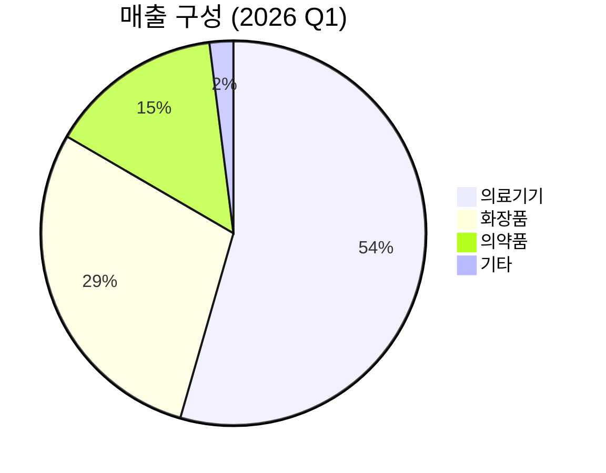

> **오늘의 탐색 분야**: AI 인프라, AI 소프트웨어, 글로벌 부동산, 보험, 퀀텀 컴퓨팅 혁신, 공간 컴퓨팅, AI 전력, 글로벌 인구 이동, 사이버 보안
> 4일 주기 로테이션 (30개 분야 커버)

# 파마리서치 (214450.KS)

214450.KS 🇰🇷 KR KOSDAQ 재생의학 / 메디컬 에스테틱

---

## Investment Score

Investment Score 71/100 — 🟡 Buy (조건부)

업사이드 비대칭 21/30 — 글로벌 스킨부스터 TAM 대비 현재 시총 미반영, 미국/유럽 진출 옵셔널리티

카탈리스트 & 타이밍 18/25 — 2Q 성장사이클 재개 기대 + 유럽 리오더 + 주가 52주 최고 대비 57% 하락 구간

비즈니스 품질 16/20 — 리쥬란 브랜드 해자 + 39%+ 영업이익률 + 분기 최대 실적 경신

밸류에이션 10/15 — Forward PER 15.8x로 역사적 저점권, 컨센서스 목표가 대비 70%+ 업사이드

발견 가치 6/10 — 14명 애널리스트 커버, 기관 순매수 vs 외국인 순매도 스플릿

---

> [!abstract] 리포트 요약
> **한 줄 테시스**: 국내 스킨부스터 시장 점유율 1위 리쥬란 브랜드를 기반으로, 유럽·미국 시장 침투라는 비대칭 성장 옵션이 현재 주가에 충분히 반영되지 않은 상태.
>
> **왜 지금인가**: 52주 고점 71.3만원 대비 57% 하락, Forward PER 15.8x로 역사적 저점 수준. 1Q26 분기 최대 실적(매출 +25%, 영업이익 +28% YoY) 확인 후 "바닥 확인" 내러티브 형성 중. 2Q26 유럽 VIVACY 리오더, 세포라 중국/미국 입점 등 구체적 촉매 가시화.
>
> **Variant Perception**: 시장은 국내 ECM 경쟁 심화와 리쥬란 성장 둔화를 과도하게 반영. 그러나 화장품 사업 +51% YoY 성장과 해외 매출 비중 40% 돌파는 단순 의료기기 회사에서 K-뷰티 플랫폼으로의 구조적 전환 신호. 미국 FDA PRD-101 임상 승인은 장기 옵셔널리티의 공식화.
>
> **핵심 수치**: 1Q26 영업이익률 39.2%, 수출 매출 비중 40%(YoY +30%), 애널리스트 컨센서스 목표가 566,267원 vs 현재가 305,000원 (업사이드 +86%).

---

## ① 핵심 지표

| 항목 | 값 | 의미 |
|------|-----|------|
| 현재가 | 305,000원 | 🔴 52주 고점(713,000원) 대비 -57%, 저점(278,500원) 대비 +9%. 바닥권 확인 구간이나 아직 불확실성 내포 |
| 시가총액 | 3.1조원 | 🟡 코스닥 중형주. 글로벌 메디컬 에스테틱 시장 대비 여전히 작은 규모 |
| PER (Trailing / Forward) | 20.76x / 15.80x | 🟢 Forward PER 15.8x는 25%+ 성장 기업 대비 저평가. 이익 성장 가속 시 멀티플 재평가 여지 |
| PBR | 4.95x | 🟡 자산 경량 비즈니스(브랜드+IP)이므로 높은 PBR은 당연. 단, 성장 둔화 시 프리미엄 축소 리스크 |
| EV/EBITDA | 56.09x | 🔴 표면적으로 높아 보이나, 영업이익률 39%+ 구조와 성장성 감안 필요. 단순 비교 불가 |
| 영업이익률 | 39.2% (1Q26) | 🟢 제조+브랜드 융합 기업으로는 이례적 수준. 강한 가격 결정력의 증거 |
| 배당수익률 | 1.2% | 🟡 성장주 특성상 배당보다 재투자 중심. 부수적 수익원 |
| 52주 고/저 | 713,000 / 278,500원 | 🔴 현재가는 52주 고점 대비 -57%. 하락 원인(성장 둔화 우려) 해소 여부가 핵심 변수 |
| 컨센서스 목표가 | 566,267원 (14명) | 🟢 현재가 대비 +85.7% 업사이드. 최저 목표가 330,000원도 현재가 대비 +8% 수준 |
| 1Q26 매출 | 1,461억원 (+25% YoY) | 🟢 분기 최대 실적. 화장품 +51%, 수출 +30%로 다각화 진행 |

---

## ② 회사 개요, 제품, 핵심 경쟁력

> [!abstract] 섹션 요약
> 파마리서치는 폴리뉴클레오타이드(PN) 기반 재생의학 기술을 핵심으로 한 메디컬 에스테틱 플랫폼 기업. '리쥬란' 브랜드 하나가 수천억원 시장을 창출하며, 이제 B2B 의료기기에서 B2C 화장품으로 브랜드를 확장하는 구조적 전환 중.

### 한 줄 설명
파마리서치는 연어 DNA에서 추출한 **폴리뉴클레오타이드(PN)** 성분으로 피부 재생을 유도하는 스킨부스터 '리쥬란'을 중심으로, 의료기기·화장품·의약품 사업을 운영하는 재생의학 전문기업이다.

### 사업 모델
- **핵심 수익 엔진**: 리쥬란 의료기기(주사제)를 피부과·성형외과에 B2B로 공급. 고마진 반복 구매 구조 (시술 1회당 소비재 특성)
- **브랜드 확장**: 리쥬란 브랜드 인지도를 활용해 화장품(B2C) 사업 영위. 올리브영, 면세점, 세포라 채널 확장
- **파이프라인**: 의약품(톡신) 사업 + 신약 개발(PRD-101, CNT201 등) — 장기 옵셔널리티
- **수익 구조의 핵심**: 높은 진입장벽(임상 데이터 축적, 규제 허가, 브랜드)이 만들어내는 강한 가격 결정력 → 39%+ 영업이익률

### 핵심 제품 및 서비스

| 제품/서비스 | 설명 | 고객 가치 |
|------------|------|----------|
| **리쥬란 (REJURAN)** | PN 기반 스킨부스터 주사제 (HB, HB Plus 등) | 피부 자가 재생 유도, 10년+ 임상 근거 보유 |
| **리쥬란 코스메틱** | 리쥬란 브랜드 홈케어 화장품 라인 | 시술 후 홈케어, 브랜드 경험 연장 |
| **의약품 (톡신 등)** | 보툴리늄 독소 등 미용의약품 | 원스톱 미용 솔루션 |
| **PRD-101** | 나노 항암제 (FDA 임상 승인 획득) [확인 필요: 승인 일자/상세] | 장기 파이프라인 가치 |
| **CNT201** | 셀룰라이트 치료제 파이프라인 [확인 필요: 개발 단계] | 적응증 확장 |

### 매출 구성 (2026년 1분기 기준)

| 사업부 | 매출 | 비중 | YoY 성장 |
|--------|------|------|---------|
| 의료기기 | 795억원 | 54.4% | +14.5% |
| 화장품 | 422억원 | 28.9% | +51.0% |
| 의약품 | 214억원 | 14.6% | +25.0% |
| 기타 | 30억원 | 2.0% | (데이터 미확인) |
| **합계** | **1,461억원** | **100%** | **+25.0%** |

**지역별**: 수출 매출 588억원 (전체의 40%), YoY +30%

### 핵심 경쟁력

| 경쟁력 | 설명 | 복제 난이도 (1-10) |
|--------|------|:---:|
| **PN 기술 선도성** | 연어 DNA 기반 PN 추출·정제 기술의 특허 및 Know-how. 10년+ R&D 축적 | 9 |
| **리쥬란 브랜드 자산** | 피부과 의사·환자 모두에게 인지되는 카테고리 킬러 브랜드. "스킨부스터=리쥬란" 연상 | 8 |
| **임상 데이터 네트워크** | 수십 편의 SCI 논문, 국내외 의료진 네트워크, 학술 심포지엄 인프라 | 8 |
| **규제 허가 포트폴리오** | 국내, 유럽 CE, 일본, 뉴질랜드(MEDSAFE) 등 글로벌 인허가 축적 | 7 |
| **B2B→B2C 브랜드 전환** | 의료기기 브랜드가 화장품으로 이어지는 신뢰 이전 효과 | 7 |
| **원가 구조** | 원료(연어 정액) 소싱-가공-판매 수직 통합으로 39%+ OPM 방어 | 6 |

### 성장 공식

<strong>매출 성장 = (국내 병·의원 리쥬란 시술 건수 × ASP) + (화장품 채널 확장 × 리오더율) + (해외 국가 수 × 현지 침투율)</strong> 
현재 가장 빠른 벡터는 ②화장품(+51%) → ③해외(+30%) 순이며, ①국내 의료기기는 방어 구간

### 고객
- **B2B**: 국내외 피부과·성형외과 원장 (리쥬란 채택 의료기관 수가 핵심 지표)
- **B2C**: 리쥬란 코스메틱 구매 소비자 (올리브영, 면세점, 세포라, 직구 채널)
- **해외 파트너**: 유럽의 VIVACY 등 현지 유통 파트너

---

## ③ 왜 100%+ 가능한가? — 업사이드 비대칭

> [!tip] 핵심 인사이트
> 현재 파마리서치의 3.1조원 시가총액은 글로벌 스킨부스터 시장의 한국 선도 기업이라는 위상에 비해 저평가 구간에 있다. 미국 진출 성공 시 시나리오에서는 현재 시총의 2~3배가 구조적으로 가능하다.

### 시총 vs TAM

| 구분 | 규모 | 의미 |
|------|------|------|
| 현재 시가총액 | 3.1조원 (~21억 USD) | 기준점 |
| 글로벌 스킨부스터 시장 (2024) | 11.7억 USD [출처: 기업모니터, 수집 데이터] | 파마리서치 = 시장 규모를 초과하는 시총? — 단, 이는 매출이 아닌 시장 규모 |
| 글로벌 스킨부스터 시장 (2029E) | 19.1억 USD (CAGR 10.6%) [출처: 기업모니터, 수집 데이터] | 시장 자체가 성장 중 |
| 한국 스킨부스터 시장 (2027E) | 약 1.9조원 [출처: 인사이트코리아, 수집 데이터] | 국내만도 현 시총 60% 수준 |
| 글로벌 메디컬 에스테틱 시장 | [확인 필요] | 스킨부스터는 필러·보톡스와 함께 폭발적 성장 섹터 |

> [!question] TAM 해석 주의
> 현재 스킨부스터 시장 규모가 19억 달러라면, 파마리서치 시총(21억 달러)은 이미 시장 규모에 근접. 그러나 핵심은 **① 시장이 계속 커진다** + **② 리쥬란이 필러/보톡스에 준하는 메가 카테고리를 만들 수 있다** + **③ 화장품·의약품 TAM이 추가**된다는 점.

### 성장 가속 구간인가?

1Q26 실적은 이를 명확히 보여준다:
- 매출 +25% YoY (비수기인 1Q에 분기 최대 실적)
- 영업이익 +28% YoY → 레버리지 효과 작동 중
- 화장품 +51% YoY → 신사업이 이미 매출의 30% 차지
- 수출 +30% YoY → 해외 의존도 상승 중

[가정] 2025년 연간 매출 성장률 53.2% (기업모니터 데이터 인용)에서 2026년 25%+로의 '감속'처럼 보이지만, **절대액 기준으로는 분기 최대치를 계속 경신**하는 구조. 이는 성장 둔화가 아닌 고성장 기저 정상화.

### 옵셔널리티 (현재 가치에 미반영)

| 옵션 | 설명 | 실현 시 영향 |
|------|------|------------|
| **미국 시장 진출** | FDA IND 승인(PRD-101) 획득 [확인 필요: 정확한 날짜, 출처: Investing.com 보도 참조]. 미국은 글로벌 최대 미용 시장 | 시총 2배+ 가능 |
| **유럽 침투 가속** | 서유럽 5개국 로드쇼 완료, VIVACY 리오더 시작 | 해외 매출 비중 50%+ 진입 |
| **화장품 세포라 입점** | 중국·미국 세포라 입점 추진 [출처: 신한투자 리포트, 수집 데이터] | 화장품 사업 연 1,000억+ 규모화 |
| **신약 파이프라인** | PRD-101(항암), CNT201(셀룰라이트) | 현재 가치에 거의 미반영 |
| **M&A 전략** | 국내외 의료기기/화장품 생산·유통 기업 M&A 추진 | 성장 가속화 가능 |

### Compounding Machine 관점

- 영업이익률 39%+ → 높은 현금 창출 능력
- 창출된 FCF를 해외 진출·신제품·M&A에 재투자 → 복리 성장 구조
- [추정] 순이익 기준 1분기 487억원 → 연환산 약 1,950억원 (단순 계산, 계절성 감안 필요)

---

## ④ 왜 지금인가? — 카탈리스트 & 타이밍

> [!tip] Variant Perception
> 시장의 뷰: "국내 ECM 경쟁 심화로 리쥬란 성장이 구조적으로 둔화된다" → 주가 -57% 하락
> 나의 뷰: "국내 방어 + 해외 가속 + 화장품 고성장의 3중 포트폴리오 전환이 완성 단계. 1Q 비수기에도 분기 최대 실적은 우려 과도를 입증"

### 가격을 움직일 구체적 촉매

| 촉매 | 예상 시점 | 실현 가능성 | 영향 |
|------|----------|-----------|------|
| **2Q26 실적 발표** (비수기 극복 확인) | 2026년 8월 | 높음 | ★★★★ |
| **유럽 VIVACY 리오더 본격화** | 2Q26부터 | 높음 (초도 물량 반응 좋음) | ★★★ |
| **세포라 중국·미국 입점** | 2Q26~하반기 | 중간 | ★★★★ |
| **미용기기 EBD 출시** | 2026년 하반기 | 중간 | ★★★ |
| **보툴리늄 톡신 신규 라인업** | 2026년 하반기 | 중간 | ★★ |
| **PRD-101 임상 진행 업데이트** | 중장기 | 낮음-중간 | ★★★★★ |
| **인바운드 외국인 의료관광 성수기** | 2Q~3Q | 높음 (계절적) | ★★★ |

### 시장 반영도 분석

- 52주 고점 713,000원에는 고성장 프리미엄이 과도하게 반영되었음
- 현재 305,000원에는 "성장이 끝났다"는 과도한 비관론 반영
- **Forward PER 15.8x는 25%+ 성장 기업에게 명백한 저평가 구간** [가정: 연간 성장률 유지 가정]

### 매크로 환경

| 매크로 변수 | 방향 | 파마리서치 영향 |
|------------|------|--------------|
| 원/달러 환율 | 약달러→원화 강세 우려 있으나 현 수준에서는 중립 | 수출 매출(40%) 환율 헤지 필요 |
| 금리 방향 (한국) | 인하 사이클 진입 시 | 성장주 멀티플 재평가 순풍 |
| 중국 경기 | 회복 모멘텀 제한적 | 중국 채널 성장 제한 (기회비용) |
| K-뷰티 트렌드 | 글로벌 지속 상승 | 해외 화장품 채널 확장의 강력한 순풍 |

| 매크로 시나리오 | 기업 영향 |
|--------------|---------|
| 금리 인하 지속 | 성장주 멀티플 확장, 긍정적 |
| 경기 연착륙 | 미용 소비 유지, 중립~긍정 |
| 경기 침체 | 미용 지출 감소 가능, 그러나 의료 시술 특성상 소비재보다 방어적 |

---

## ⑤ 비즈니스 퀄리티

> [!success] 강점
> 39.2%의 영업이익률은 단순한 마진이 아니라 **브랜드 가격 결정력의 증거**. 경쟁사들이 가격 경쟁에 뛰어드는 와중에도 리쥬란은 포지셔닝을 유지하고 있음.

### 경제적 해자 (Moat)

| 해자 계층 | 내용 | 복제 난이도 |
|---------|------|-----------|
| **무형자산 (브랜드)** | "스킨부스터 = 리쥬란" — 카테고리 창시자 브랜드 프리미엄. 의사와 소비자 모두에게 각인 | 매우 높음 |
| **임상 데이터 해자** | 10년+ 축적된 SCI 논문, 임상 근거. 후발주자는 최소 5~7년 필요 | 높음 |
| **규제 허가 포트폴리오** | 다국적 의료기기 허가 획득 — 신규 진입자의 시간·비용 장벽 | 높음 |
| **의사 네트워크 효과** | 처방 의사와의 신뢰 관계, 교육 프로그램, 학술 네트워크 | 중간 |
| **전환 비용** | 병원이 특정 제품 교육 후 전환 시 재교육 비용 발생 | 중간 |

> [!warning] 해자의 한계
> ECM(세포외기질) 기반 경쟁자(엘앤씨바이오 리투오, 한스바이오메드 셀르디엠)의 등장은 PN 기술이 유일한 해답이 아님을 보여줌. 브랜드 해자는 강하지만 기술 해자의 범위는 제한적.

### ROIC/ROE 추세

- ROE: (데이터 미확인, Yahoo 제공 데이터 없음)
- 1분기 영업이익률 39.2% — 고자본효율 구조 [추정]
- 분기 순이익 487억원 / 시총 3.1조원 = 연환산 약 6.3% ROE [가정: 단순 계산]

### 마진 방향성

- 1Q26 영업이익률 39.2% vs 매출 성장 25% → 영업 레버리지 작동 (이익 성장 +28% > 매출 +25%)
- 화장품 비중 확대는 단기적으로 마진 중립~소폭 희석 가능성 (B2C 채널 비용 증가)
- 해외 직접 영업 강화 시 판관비 증가로 마진 소폭 압박 예상 [가정]

### 경영진 & 자본 배분

- 배당수익률 1.2% — 성장 재투자 중심 전략 유지
- M&A 전략 가시화 (국내외 의료기기/화장품 기업 대상) — 자본 배분의 방향성 확인
- ESG 경영 체계화(GRI Standards, SASB 적용) — 장기 지배구조 관리 의지
- 경영진 인센티브 구조: (데이터 미확인) [확인 필요]

---

## ⑥ 밸류에이션 & 안전마진

> [!tip] 핵심 인사이트
> Forward PER 15.8x는 25%+ 성장 중인 기업에게 이례적으로 낮은 수준. 단, EV/EBITDA 56x라는 불일치는 감가상각 외 항목이나 순현금 포지션을 확인해야 함.

### 현재 밸류에이션 vs 역사적 밴드

| 지표 | 현재 | 의미 |
|------|------|------|
| PER (Trailing) | 20.76x | 52주 고점 시절 대비 크게 낮아진 수준 |
| PER (Forward) | 15.80x | 🟢 성장주치고 역사적 저점권 [추정] |
| PBR | 4.95x | 무형자산 비중 높은 기업 특성 반영 |
| EV/EBITDA | 56.09x | 🔴 높아 보이나, 영업이익률 39%와의 괴리 원인 확인 필요 (부채/현금 구조 영향 가능) |
| 컨센서스 목표가 | 566,267원 (14명 평균) | 현재가 305,000원 대비 +85.7% 업사이드 |

### 시나리오별 목표가

🟢 Bull 30%

🟡 Base 45%

🔴 Bear 25%

| 시나리오 | 핵심 가정 | 목표가 (12개월) | 업사이드 |
|---------|---------|-------------|--------|
| **Bull** | 미국/유럽 진출 가속, 화장품 성장 지속, Forward PER 25x | 500,000원 [가정] | +64% |
| **Base** | 현 성장 유지, 국내 방어, Forward PER 20x | 380,000원 [가정] | +25% |
| **Bear** | 국내 시장 점유율 추가 하락, 해외 기대 미충족, PER 12x | 230,000원 [가정] | -25% |

> [!warning] 밸류에이션 주의사항
> 위 시나리오별 목표가는 [가정] 기반 추정치로, 정확한 DCF/EPS 추정을 위해서는 순이익률, CAPEX, 부채 구조 데이터 확인이 필요함. 애널리스트 컨센서스(566,267원)는 훨씬 낙관적이나, 이는 성장 유지 가정 하에서의 수치.

### FCF Yield / 안전마진

- 1Q26 순이익 487억원 → 연환산 약 1,950억원 [가정: 단순 4배]
- 시총 3.1조원 → 연환산 순이익 기준 PE = 15.9x
- Forward PER 15.8x에서 "틀려도 안전한가?" → 성장이 완전 멈춰도 합리적 수준. 성장 재가속 시 리레이팅 여지 大

<strong>So What?</strong> 39%+ 영업이익률의 브랜드 기업을 Forward PER 15.8x에 살 수 있다면, 성장이 컨센서스 대비 50% 실망시켜도 원금 보전 가능. 반대로 성장 재가속 시 2배 이상 업사이드. 비대칭성 우위.

---

## ⑦ 리스크 & Devil's Advocate

| 구분 | 핵심 논거 |
|------|---------|
| 🟢 Bull #1 | 1Q26 비수기에 분기 최대 실적 달성 — 성장 둔화 우려가 과도했음을 수치로 입증 |
| 🟢 Bull #2 | 화장품 사업 +51% YoY 고성장 — 단일 제품(리쥬란) 의존에서 멀티 채널 플랫폼으로 구조적 전환 중 |
| 🟢 Bull #3 | 유럽 서유럽 5개국 진출, 뉴질랜드 MEDSAFE 승인, PRD-101 FDA IND 승인 — 글로벌 성장 옵션이 실체화 되고 있음 |
| 🔴 Bear #1 | 국내 스킨부스터 성장률이 90%대 → 20%대로 급격 둔화. ECM 경쟁(리투오, 셀르디엠)이 구조적 점유율 잠식 시 회복 불가 |
| 🔴 Bear #2 | 52주 고점 대비 -57% 하락했음에도 여전히 EV/EBITDA 56x — 성장 기대가 또 꺾이면 추가 멀티플 압축 가능 |
| 🔴 Bear #3 | 글로벌 확장의 실행 리스크 — 유럽/미국은 규제, 파트너십, 마케팅 인프라 모두 불확실. 기대가 현실이 되려면 수년 소요 |

### 가장 현실적인 실패 시나리오

"리쥬란의 국내 시장 점유율이 ECM 기반 경쟁자들에게 지속 잠식되면서, 의료기기 매출 성장이 한 자릿수로 하락. 동시에 화장품 사업의 높은 성장률이 기저효과로 정상화. 해외 진출은 예상보다 느리게 진행. 결과적으로 2026년 전체 성장률이 10~15%대로 떨어지고, 시장은 멀티플을 PER 12~13x까지 압축."

### 숨겨진 가정 (Hidden Assumptions)

1. **리쥬란 브랜드 프리미엄이 유지된다**: ECM이 임상적으로 열등하지 않음이 증명될 경우 가정 붕괴
2. **화장품 성장의 지속 가능성**: 올리브영 채널 외국인 수요가 지속적인지, 일회성 K-뷰티 붐인지 불분명
3. **해외 파트너십의 질**: VIVACY 등 파트너의 현지 영업력에 대한 의존

### Kill Criteria

| Kill Criteria | 임계값 |
|-------------|-------|
| 매출 성장률 (YoY) | 2개 분기 연속 10% 미만 하락 시 재검토 |
| 영업이익률 | 35% 미만으로 하락 시 브랜드 가격 결정력 훼손 신호 |
| 수출 매출 비중 | 35% 미만으로 하락 시 해외 모멘텀 역전 |
| 화장품 성장 둔화 | 2개 분기 연속 YoY 10% 미만 성장 시 |
| 신규 경쟁자의 시장 점유율 | 국내 스킨부스터 시장 내 리쥬란 점유율 50% 이하 확인 시 |
| 경영진 주요 지분 매각 | 대규모 내부자 매도 발생 시 즉시 검토 |

---

## ⑧ 발견 가치 & 엣지

> [!note] 참고
> 파마리서치는 국내에서는 잘 알려진 기업이지만, **글로벌 투자자 관점에서는 여전히 저발견(Under-discovered)** 상태. 해외 커버리지 부재가 오히려 기회.

### 애널리스트 커버리지

- 국내 애널리스트: 14명 커버 (키움, LS, 신한, 미래에셋 등)
- 외국 기관 커버리지: (데이터 미확인, 제한적 추정)
- 목표가 범위: 330,000원 ~ 717,000원 — 넓은 산포는 불확실성이 크지만, 이것 자체가 **Variant Perception 형성의 기회**

### 기관 보유 변화

- **기관 순매수**: 5월 15일 기준 코스닥 기관 순매수 상위 20위 포함
- **외국인 순매도**: 동일 시점 외국인 순매도 상위 20위 포함
- **So What?**: 국내 기관의 저가 매수 vs 외국인 압박 판매의 구조적 전환점 — 외국인 매도세가 진정되면 수급 개선 가능

### 왜 다른 사람들이 이 기회를 놓치고 있는가?

1. **주가 폭락 후 심리적 회피**: -57% 하락한 주식에는 심리적 '손상된 기업' 프레임이 씌워짐
2. **단기 노이즈 과대해석**: ECM 경쟁 심화 뉴스가 '리쥬란 시대 종말'로 과장 해석됨
3. **화장품 사업의 저평가**: 의료기기 기업으로만 분류되어 화장품 플랫폼 확장 가치가 미반영
4. **글로벌 스킨부스터 시장의 초기 단계 인식 부재**: PN 스킨부스터가 아직 서구 시장에서 주류가 아님

### 시장의 오해

<strong>오해</strong>: "ECM 경쟁이 심화되면 리쥬란은 끝이다" 
<strong>현실</strong>: ECM과 PN은 서로 다른 메커니즘(콜라겐 생성 vs DNA 재생)으로 시장을 공유할 수 있으며, 리쥬란은 10년 임상 데이터로 "검증된 선택"의 포지션 유지. 오히려 ECM 제품들이 스킨부스터 카테고리 전체 파이를 키워주는 효과도 있음.

---

## ⑨ 액션 아이템

| 항목 | 판단 |
|------|-----|
| **BUY / WATCH / PASS** | 조건부 BUY — Forward PER 15.8x의 저평가 + 분기 최대 실적 확인. 단, 2Q26 실적에서 국내 의료기기 회복 확인 후 풀 포지션 |
| **Conviction** | Medium (국내 경쟁 리스크 vs 해외 성장 가속의 줄다리기 구간) |
| **적정 진입가** | 290,000~310,000원 (현재가 근방. 52주 저점 278,500원 지지 확인 하에 분할 매수) |
| **목표가 (12개월)** | 380,000~450,000원 (Base ~25% / 국내외 성장 재확인 시 상향) |
| **손절 기준** | 260,000원 이하 (52주 저점 하향 돌파 + Kill Criteria 2개 이상 동시 충족 시) |
| **권장 비중** | 포트폴리오의 3~5% (초기 포지션). 2Q26 실적 확인 후 5~8%로 확대 가능 |

### 추가 리서치가 필요한 사항

1. **PRD-101 FDA IND 승인 정확한 날짜와 임상 계획** — 장기 옵셔널리티 가치 산정에 필수
2. **순이익률 및 FCF 구조** — EV/EBITDA 56x vs Forward PER 15.8x 불일치 원인 파악 (부채/순현금 확인)
3. **국내 스킨부스터 시장 점유율 실제 데이터** — 경쟁 심화의 실제 영향 정량화
4. **VIVACY 유럽 계약 구조** — 단순 유통 vs 독점 파트너십 여부
5. **경영진 지분 구조 및 스톡옵션** — 인센티브 정렬 확인
6. **세포라 중국·미국 입점 계약 현황** — 실제 입점 일정과 예상 매출 규모

### 모니터링해야 할 핵심 지표

| 지표 | 모니터링 이유 | 임계값 |
|------|------------|-------|
| 2Q26 국내 의료기기 매출 | 내수 회복 여부 확인 | QoQ +5% 이상 = 긍정 |
| 화장품 수출 성장률 | 세포라 입점 효과 확인 | YoY 30%+ 유지 |
| 유럽 의료기기 수출 | VIVACY 리오더 실현 여부 | QoQ +28.6% (증권사 전망) 충족 시 긍정 |
| 외국인 보유 비중 변화 | 수급 개선 여부 | 외국인 순매도 → 중립 전환 |
| 영업이익률 분기 추이 | 비용 통제력 유지 여부 | 37% 이상 유지 |

### 다음 체크포인트

| 날짜 | 확인 사항 |
|------|---------|
| **2026년 8월 (2Q26 실적)** | 국내 의료기기 회복, 유럽 리오더, 세포라 입점 효과 확인 |
| **2026년 하반기** | EBD 미용기기·보툴리늄 톡신 신제품 출시 여부 |
| **2026년 하반기** | PRD-101 임상 진행 상황 업데이트 |
| **매월** | 외국인/기관 수급 변화, 경쟁사(엘앤씨바이오, 한스바이오메드) 실적 비교 |

---

> [!verdict] 최종 판단
>
> **파마리서치는 "좋은 기업이 나쁜 이유로 하락한" 전형적인 패턴**에 있다.
>
> 52주 고점 대비 -57% 하락은 시장이 국내 ECM 경쟁 심화를 구조적 해자 붕괴로 과장 해석한 결과다. 그러나 1Q26 분기 최대 실적, 39%+ 영업이익률 유지, 화장품 +51% 고성장, 수출 비중 40% 돌파는 단순 의료기기 기업이 아닌 리쥬란 플랫폼 기업으로의 전환을 실증했다.
>
> **Forward PER 15.8x는 이 사업의 품질 대비 저평가**이며, 컨센서스 목표가(566,267원)와 현재가(305,000원)의 86% 괴리는 이 사실을 확인한다.
>
> 리스크는 실재하지만(국내 경쟁 지속, 해외 실행 불확실성), 현재 가격은 리스크를 충분히 반영 중. 2Q26 실적에서 "국내 방어 + 해외 가속"이 동시 확인된다면 빠른 리레이팅이 가능하다.
>
> **조건부 BUY, 포트폴리오 3~5% 초기 포지션 → 2Q 실적 확인 후 최대 8%까지 확대.**