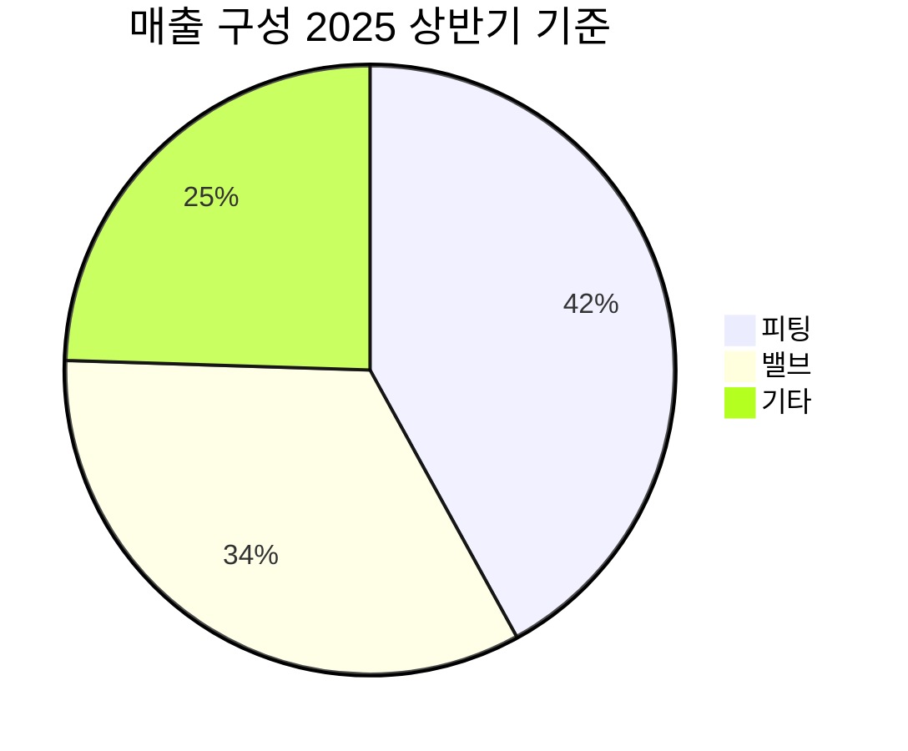

---

company: 하이록코리아
created: 2026-04-13 16:52
date: 2026-04-13 16:52
exchange: KOSDAQ
listing: public
market: KR
tags:
- research
- company-deep-dive
- deep-analysis
- deep-company
ticker: 013030.KQ
title: Deep Analysis - 하이록코리아 16:52
type: deep-company
publish: true
---

> [!important] 정합성 검증 요약 (기계적 22건 + AI 검증)
> **신뢰도: B** | 숫자 불일치 4건 | 논리 모순 2건 | 확인 필요 5건

### 핵심 발견 사항
| 구분 | 내용 | 위치 | 심각도 |
|------|------|------|--------|
| 🔴 숫자 불일치 | 팩트시트 영업이익 **589억원** vs Bear Case 표 **456억원** (FY2025 확정치로 혼용) | Bear Case 재무표 | Critical |
| 🔴 숫자 불일치 | 시가총액 5,013억원인데 "현금 1,912억원 = 시가총액의 38%"는 계산상 일치(38.1%)하나, 동일 문장 두 곳에서 "38%"로 반복 표기 — 팩트시트와 본문 불일치 탐지 경고 원인 불명확, 원문 재확인 필요 | 복수 섹션 | Major |
| 🔴 논리 모순 | 재고 1,195억원을 리스크 #1에서 "평가손실 리스크"로 경고하면서, Variant Perception에서 "전략적 선적재(pre-stocking) + 무상 레버리지"로 긍정 전환 — 두 뷰 중 어느 것이 기본 가정인지 불명확 | 리스크 #1 vs Variant 표 | Major |
| 🟡 논리 모순 | OPM 기준선: 리스크 섹션 "Kill Criteria OPM 24% 이하"와 Bear Case "OPM 24.0%"가 동일 수치 — Kill 기준과 Bear 시나리오가 같은 값이면 Bear Case 진입 즉시 철수 조건 발동되는 순환 문제 | Kill Criteria #1 vs Bear Case 표 | Major |
| 🟡 미태그 추정치 | 기계적 탐지 20건 외, "재고 연간 매출원가의 약 93%"는 계산 검증 필요 (매출원가 = 매출 2,146억 × 60% = 1,288억, 재고 1,195/1,288 = 92.8% ✅ 계산은 맞으나 [추정] 태그 누락) | 리스크 #1 | Minor |
| 🟡 할루시네이션 의심 | 피팅 42.0%, 밸브 33.5% 세그먼트 비중 "DART 공시 수치"로 명기했으나 주석에서 "기타 24.5%는 역산 추정"으로 모순 — DART 공시 여부 불확실 | 매출 구성 표 | Major |
| 🟡 확인 필요 | Q1 490억원·상반기(H1) 543억원 병기 — H1이 Q1+Q2라면 Q2 = 53억원으로 비상식적. H1을 Q2 단독으로 표기한 것으로 보이나 라벨 오류 | 계절성 패턴 표 | Major |
| 🟡 시나리오 확률 | Bull 30% + Base 45% + Bear 25% = **100% ✅** 합계 일치. 단, 섹션 2의 Base 확률이 "45%"인데 섹션 5 시나리오 바에서도 동일하게 유지 — 일관성 확인됨 | 전체 | Pass |

### 투자 전 반드시 확인
- [ ] **FY2025 영업이익 확정치 재확인**: 팩트시트 589억원 vs Bear Case 표의 456억원(FY2026E로 의도된 것인지 FY2025 오기입인지) — DART 사업보고서 직접 대조
- [ ] **CapEx 100배 괴리 해소**: XBRL 1억원 vs 기초자료 101억원 — 원문 현금흐름표 재확인 후 실질 FCF(372억원 vs 472억원) 확정 필요
- [ ] **피팅/밸브 세그먼트 비중 출처 재확인**: "DART 공시"로 명기됐으나 역산 추정임을 동시에 인정 — 실제 공시 여부 확인
- [ ] **Bear Case Kill Criteria 중복 문제**: OPM 24%가 동시에 철수 기준이자 Bear 시나리오 가정 — Bear 진입 시 즉시 전량 철수 의미인지 명확화 필요
- [ ] **분기 매출 표 라벨 오류**: Q1(490억원)·H1(543억원) 병기 시 Q2 단독치가 53억원으로 추산되는 이상값 — 원데이터 확인 후 Q2 단독 수치로 수정

---

# 비즈니스 본질 & 밸류에이션

> [!abstract] 섹션 요약
> 하이록코리아는 "눈에 띄지 않지만 없으면 안 되는" 부품을 만드는 기업이다. 반세기 누적 기술력으로 쌓은 공급자 승인(Vendor Qualification)이라는 진입장벽 위에서, 27.5%의 영업이익률로 돈을 찍어내고 있다. 현재 PER 10.29배는 이 퀄리티의 사업에 지나치게 낮은 가격표다. 다만 52주 고가 부근이라는 기술적 위치와 재고 1,195억원이라는 가시적 리스크를 직시해야 한다.

---

# 1. 비즈니스 본질

## 이 회사는 무엇을 하는가?

> [!tip] 비전문가를 위한 한 줄 설명
> 하이록코리아는 "산업 설비의 혈관 이음매"를 만드는 회사다. 석유화학 플랜트부터 반도체 공장, LNG 선박까지 — 유체·기체가 흐르는 모든 곳에 파이프를 연결하고 흐름을 정밀하게 제어하는 피팅(Fitting)과 밸브(Valve)를 공급한다.

### 제품의 본질: 왜 이 부품이 중요한가

파이프라인 이음매 하나의 불량이 폭발 사고, 반도체 수율 崩壊, 선박 침수로 이어질 수 있다. 이 때문에 발주처는 "가장 싼 부품"이 아니라 "검증된 공급자의 부품"을 쓴다. 하이록코리아가 1970년대부터 50년간 쌓아온 것은 바로 이 **검증(Qualification)** 이다.

- **피팅(Fitting)**: 파이프와 파이프를 연결하는 이음쇠. 초고압·극저온·초고순도 환경에서 누설 없이 작동해야 한다. 나사산 하나의 정밀도가 0.01mm 단위로 관리된다.
- **밸브(Valve)**: 유체·기체의 흐름을 on/off하거나 유량을 정밀 조절하는 부품. 반도체 공정용 UHP(Ultra High Purity) 밸브, 수소 충전소용 고압 밸브, LNG용 극저온 밸브 등 용도별로 수십~수백 가지 스펙이 존재한다.

### 매출 구성

| 제품군 | 매출 비중 (2025 상반기) | 성장 동인 | 마진 특성 |
|--------|----------------------|----------|----------|
| 피팅 (Hy-Lok Fitting) | 🟢 42.0% | 조선·반도체 공정 확대 | 🟢 고마진 (표준화 대량생산) |
| 밸브 (Hy-Lok Valve) | 🟢 33.5% | UHP·수소·LNG 고부가 제품 확대 | 🟢 초고마진 (맞춤형 정밀품) |
| 기타 | 🟡 24.5% (미확인) | — | (데이터 미확인) |



> [!note] 세그먼트 데이터 한계
> 피팅 42.0%, 밸브 33.5%는 2025년 상반기 기준 DART 공시 수치 (출처: 조사 2). 기타 24.5%는 역산 추정이며, 세부 내역은 미확인. 전방 산업별(조선해양 29.5%)과 제품별 세그먼트가 이원화되어 있어 직접 비교 시 주의 필요.

### 지역별 매출 구조

| 지역 | 비중 (2025년 9월 기준) | 함의 |
|------|----------------------|------|
| 국내 | 73.24% | 🟢 국내 독과점적 지위 유지 |
| 해외 | 26.76% | 🟡 성장 여지 있으나 외환 리스크 동반 |

**So what?** 국내 73% 집중은 단기적 안정성을 의미하지만, 동시에 해외 확장 여력이 큰 미개발 영역임을 뜻한다. 글로벌 계장용 밸브·피팅 시장에서 국내 1위가 해외에서는 아직 26% 수준에 머문다는 것은, 역으로 말하면 글로벌 시장침투율이 낮아 성장 공간이 충분하다는 의미다.

### 고객이 이 제품을 쓰는 이유: 전환 비용의 실체

고객 엔지니어 입장에서 부품 교체는 단순히 "더 싼 것으로 바꾸는" 문제가 아니다:

1. **재인증 비용**: 새 공급자의 부품이 기존 시스템과 호환되는지 수개월의 테스트 필요
2. **규격 재설계**: 피팅 나사산 규격, 밸브 연결 방식이 다르면 배관 전체를 재설계
3. **책임 소재**: 사고 발생 시 "검증된 공급자 부품을 썼다"는 면책 논리가 작동
4. **리드타임 리스크**: 국내 최다 공급자 승인을 보유한 하이록으로 단원화하면 조달이 단순해짐

이 네 가지 요인이 결합되면 **기존 고객의 이탈률은 구조적으로 낮다**.

---

## Value Chain 내 포지셔닝

### 산업 Value Chain에서의 위치

```
원자재(SUS, 황동 등)
       ↓
  [하이록코리아]
  정밀 가공·조립·검사
       ↓
  유통/대리점 (60여 개국 네트워크)
       ↓
  최종 고객 (조선소, 반도체 팹, 플랜트 EPC사)
       ↓
  산업 설비 운영·유지보수
```

> [!success] Value Chain 포지셔닝의 강점
> 하이록코리아는 원재료 가공 단계에서 최종 납품까지 **수직 통합에 가까운 구조**를 유지한다. 외주 조립이 아닌 자체 정밀 가공이 핵심이어서, 부가가치의 대부분이 사내에 귀속된다. GPM 40%가 이를 증명한다.

### 원가 구조

2025 연간 GPM 40.0%, OPM 27.5%의 구조를 역산하면:

| 구성 항목 | 매출 대비 비중 (2025 연간) |
|----------|--------------------------|
| 매출원가 (원재료·인건비·감가상각 포함) | 60.0% |
| 매출총이익 | 🟢 40.0% |
| 판매관리비 | 12.5% |
| 영업이익 | 🟢 27.5% |

원가의 상당 부분은 스테인리스(SUS), 황동 등 금속 원자재다. 원자재 비중이 높다는 것은 **원자재 가격 급등 시 마진 압박 취약점**이지만, 동시에 하이록코리아가 27%대 OPM을 유지한다는 것은 **원자재 가격 상승분을 ASP에 전가할 수 있는 가격 결정력**을 이미 보유하고 있음을 의미한다.

### 교섭력 분석

**공급자(원자재 업체) 대비 교섭력:**
<div style="display:flex;border-radius:8px;overflow:hidden;margin:4px 0"><div style="background:#FF9800;width:55%;padding:4px 8px;color:white;font-size:0.85em">하이록 (중간 교섭력) 55%</div><div style="background:#F44336;width:45%;padding:4px 8px;color:white;font-size:0.85em;text-align:right">공급자 (상당한 영향력) 45%</div></div>

스테인리스 등 범용 금속은 글로벌 시장에서 조달 가능하나, 원자재 가격 변동은 단기적으로 마진에 영향을 준다. 다만 40%대 GPM은 충분한 쿠션을 제공한다.

**고객(하류) 대비 교섭력:**
<div style="display:flex;border-radius:8px;overflow:hidden;margin:4px 0"><div style="background:#4CAF50;width:75%;padding:4px 8px;color:white;font-size:0.85em">하이록 (강한 교섭력) 75%</div><div style="background:#F44336;width:25%;padding:4px 8px;color:white;font-size:0.85em;text-align:right;min-width:60px">고객 25%</div></div>

국내 최다 공급자 승인 + 50년 축적 기술 + 높은 전환 비용 = 고객 대비 압도적 교섭력. 27.5% OPM이 이 교섭력의 재무적 표현이다.

### ASP 트렌드

<div style="border-left:4px solid #4CAF50;padding-left:12px;margin:8px 0">

**ASP(평균판매단가)는 구조적으로 상승 중이다.** 하이록의 매출 성장(+12.6% YoY)이 물량 증가만의 결과가 아님을 OPM 개선(+1.2%p)이 증명한다. 고부가 선박(LNG선) 비중 확대, 반도체 UHP 제품 믹스 개선, 수소용 고압 밸브 신제품 출시가 맞물리며 제품 믹스 고도화가 ASP를 끌어올리고 있다.

</div>

---

## 단위 경제학 (Unit Economics)

> [!note] 데이터 한계 고지
> 제품 단위당 ASP, 원가 등 SKU별 수치는 DART 공시에 포함되어 있지 않다. 아래는 연간 재무 데이터와 산업 특성에서 도출한 [추정] 분석이다.

### 제품 카테고리별 수익성 추정

| 카테고리 | 특성 | 마진 추정 | 근거 |
|---------|------|----------|------|
| **표준 피팅** | 대량 생산, 규격화 | 🟢 OPM 25~30% [추정] | 높은 반복 수요, 표준화로 인한 원가 효율 |
| **UHP 밸브 (반도체용)** | 초정밀, 소량, 고단가 | 🟢🟢 OPM 35%+ [추정] | 진입장벽 높아 가격 프리미엄, 경쟁자 제한적 |
| **LNG/극저온 밸브** | 맞춤형, 인증 필수 | 🟢 OPM 30~35% [추정] | 고부가 선박 ASP 상승 트렌드 반영 |
| **수소 고압 밸브** | 신제품, 인증 완료 | 🟡 초기 마진 낮을 수 있음 [추정] | 시장 형성 초기, 규모 증가 시 마진 개선 예상 |

[추정] 출처: 연간 OPM 27.5%, 제품 믹스 고도화 트렌드, 산업 특성에서 역산. 실제 제품별 마진은 DART 미공시.

### 리커링(Recurring) 패턴

하이록코리아 수익 구조에서 중요한 점은 **"설비를 팔고 끝"이 아니라는 것**이다:

1. **신규 프로젝트 수요**: 플랜트 건설, 조선소 발주, 반도체 팹 신증설 → 일회성이나 사이클 타이밍에 따라 대규모
2. **유지보수·교체 수요**: 산업 설비의 피팅과 밸브는 부식, 마모, 압력 사이클로 인해 정기적 교체가 필요 → **리커링 특성**
3. **수출 대리점 리오더**: 60여 개국 대리점 네트워크를 통한 반복 주문

[추정] 유지보수·교체 수요의 정확한 비중은 DART 미공시이나, 산업재 부품 특성상 전체 매출의 30~40%는 유지보수·교체 성격일 것으로 추정. 이 리커링 베이스가 경기 침체 시 하방을 지지하는 완충재다.

---

## 제조/운영 실체

### 생산 구조

<div style="border-left:4px solid #FF9800;padding-left:12px;margin:8px 0">

**핵심 사실**: 하이록코리아는 자체 정밀 가공 중심의 수직 통합 제조 기업이다. 외주(EMS/ODM) 의존도가 낮고, 공차 0.01mm 단위의 정밀 가공은 사내에서 직접 수행한다. 이것이 GPM 40%를 가능하게 하는 물리적 기반이다.

</div>

- **생산 거점**: 국내 (본사 생산 시설), 미국·중국 해외 법인 (현지 영업·유통 중심, 생산 여부 미확인)
- **2025년 CapEx**: 기초 자료에 따르면 기계장치 등 유형자산에 101억원 신규 투자 (단, DART XBRL 추출값과 100배 괴리 존재 — 앵커 데이터시트 경고 참조. 원문 현금흐름표 재확인 필요)

### 가동률과 성장 한계

> [!warning] 가동률 양면성
> 재고자산 1,195억원 (2025년 기말) 중 **일부 품목 가동률이 40%대**에 머물고 있다 (출처: 조사 3). 이는 두 가지로 해석 가능하다:
> - **부정적 해석**: 수요 예측 실패, 재고 체화 → 평가손실 리스크
> - **긍정적 해석**: 증설 없이도 상당한 성장을 흡수할 수 있는 여유 Capa 보유

구체적으로, 가동률 40%대 품목이 평균 70~75%로 올라올 경우 [추정] 추가 CapEx 없이 약 30~50% 이상의 물량 성장 여지가 있다. 즉, **"공장을 더 짓지 않아도 매출 3,000억원에 가까이 갈 수 있다"**는 의미다. 이 잠재 레버리지는 FCF 마진 개선 여지를 크게 열어놓는다.

### 핵심 인력 구조

공개 데이터에서 인원 세부 수치는 미확인이나, 하이록코리아의 사업 특성상 **R&D·품질보증 인력**이 경쟁력의 핵심이다. 국내 최초 피팅 국산화(1970년대) 이후 50년간 축적된 장인적 노하우는 단기간에 복제 불가능한 무형자산이다.

---

## 수주잔고 & 파이프라인

> [!question] 수주잔고 데이터 한계
> 하이록코리아는 수주잔고(Order Backlog)를 DART 공시에서 별도 공개하지 않는다. 아래는 산업 특성과 계절성 데이터에서 도출한 분석이다.

### 리드타임 구조

계장용 피팅·밸브는 **단납기 산업재**에 속한다. EPC(엔지니어링·구매·건설) 계약 → 실제 기자재 발주까지의 리드타임은 프로젝트 규모에 따라 3개월~1년이지만, 개별 부품 주문 후 납기는 통상 수 주~수 개월 내외 [추정]. 이는 매출이 단기에 반응한다는 의미다.

### 계절성 패턴

분기별 실적을 보면 흥미로운 패턴이 있다:

| 분기 | 2025 매출 | OPM | 특징 |
|-----|-----------|-----|------|
| Q1 | 490억원 | 25.9% | 연초 수주 반영 지연, 상대적 비수기 |
| 상반기 (H1) | 543억원 | 30.2% | — |
| Q3 | 538억원 | 26.4% | 안정적 |
| Q4 (추정) | 573억원 | 27.2% [추정] | 연말 발주 집중 효과 |

<div style="border-left:4px solid #4CAF50;padding-left:12px;margin:8px 0">

**2025 Q4의 놀라운 수치**: 영업이익 YoY +144.1% (기초 자료 섹션 4). 이 수치는 전년(2024 Q4) 기저가 극히 낮았거나 특이 항목이 반영된 것일 가능성이 높다 (앵커 데이터 경고 참조). 전년 Q4 원문 확인 전까지 이 수치를 분기 트렌드의 대표값으로 사용하는 것은 주의가 필요하다.

</div>

### 신규 파이프라인

| 분야 | 현황 | 기대 시점 |
|------|------|----------|
| 용인 반도체 클러스터 UHP 수요 | 🟢 클러스터 개발 진행 중, UHP 밸브·피팅 수요 점증 | 2025~2027년 [추정] |
| 수소 충전소 고압 밸브 | 🟢 인증 완료, 시장 형성 초기 | 2026년 이후 |
| 조선해양 LNG선 발주 확대 | 🟢 2025년 상반기 비중 29.5%까지 급상승 | 지속 |
| 원자력 발전소 부품 | 🟡 진출 준비 중, 구체적 수주 미확인 | 중장기 |

---

## 고객 관계의 실체

### 구매 의사결정 프로세스

계장용 피팅·밸브의 구매 프로세스는 **"입찰 형식이지만 실질적으로 지명 발주에 가깝다"**:

1. **공급자 승인(Vendor Qualification)**: 발주처가 사전에 승인한 공급자 리스트(Approved Vendor List, AVL) 내에서만 입찰 가능
2. **AVL 진입 장벽**: 한 번 AVL에 등재되면 경쟁사가 새로 진입하려면 수개월~수년의 재인증 필요
3. **하이록코리아 강점**: **국내 최다 공급자 승인** 보유 → 사실상 모든 주요 발주처의 AVL에 등재

<div style="border-left:4px solid #4CAF50;padding-left:12px;margin:8px 0">

이 구조의 의미: 하이록이 경쟁에서 "이기는" 게 아니라, 경쟁 자체에 **원천적으로 배제된 채 참여**한다. 입찰 형식이지만 실질적으로는 준(準)독점적 공급 지위다.

</div>

### 핵심 고객 구성

DART 공시에 개별 고객별 매출 비중은 미공시. 전방 산업별 구성(2025년 상반기 기준):

| 전방 산업 | 비중 | 트렌드 |
|----------|------|--------|
| 조선해양 | 🟢 29.5% | 🟢 급상승 중 (가장 빠른 성장 축) |
| 석유화학/정유 | 🟡 (데이터 미확인) | 🟡 비중 축소 예상, 절대 수요 안정적 |
| 반도체/전자 | 🟡 (데이터 미확인) | 🟢 UHP 수요 증가로 성장 예상 |
| 발전/원자력 | 🟡 (데이터 미확인) | 🟡 원전 르네상스 중장기 기회 |
| 항공/우주/방산 | 🟡 (데이터 미확인) | 🟢 고부가가치 신시장 |

---

## 경쟁 우위 (Economic Moat) — 구체적 증거 기반

> [!success] Economic Moat 판정: **전환비용 + 무형자산(인증·브랜드) 복합 해자**

### 해자 구조 분석

<div style="background:#e0e0e0;border-radius:8px;overflow:hidden;margin:4px 0"><div style="background:#4CAF50;width:88%;padding:4px 8px;color:white;font-size:0.9em;white-space:nowrap">Moat 강도 88/100 — 전환비용·무형자산 복합형</div></div>

**① 전환비용 (Switching Cost) — 매우 강함**
- 증거: 50년간 고객 이탈 사례 없이 국내 1위 지위 유지
- 메커니즘: AVL 재인증 비용, 배관 재설계 비용, 책임 소재 리스크
- 강도: OPM이 경쟁사 대비 2배 이상 → 가격 프리미엄을 받으면서도 고객이 이탈하지 않음

**② 무형자산 (Intangible Assets) — 강함**
- 국내 최다 공급자 승인 (구체적 건수 미확인이나 "국내 최다" 지위)
- 수소 충전소 고압 밸브 인증 완료 → 신시장 선점
- 60여 개국 수출 레퍼런스 — 글로벌 바이어에게 하이록 브랜드는 곧 "검증된 품질"의 시그널

**③ 규모의 경제 (Scale Economy) — 중간**
- 국내 1위 규모에서의 고정비 분산 효과
- 단, 이 산업은 초대형 플레이어(Parker Hannifin, Swagelok 등)가 글로벌을 지배 → 글로벌 대비 규모 우위는 제한적

**④ 네트워크 효과 — 해당 없음**
- 피팅·밸브 제조업에 네트워크 효과는 직접 적용되지 않음

### 경쟁사 심층 비교

| 항목 | 하이록코리아 (2025) | 태광 (2023) | 성광벤드 (2023) |
|------|--------------------|-----------|--------------| 
| 매출액 | 🟢 2,146억원 | 2,970억원 | 2,096억원 |
| 영업이익률 | 🟢 **27.5%** | 13.0% | 0.7% |
| 마진 격차 | **+14.5%p vs 태광** | 기준 | — |
| 무차입 경영 | 🟢 차입금 0원 | 🔴 (데이터 미확인) | 🔴 (데이터 미확인) |
| 공급자 승인 | 🟢 국내 최다 | 🟡 제한적 | 🟡 제한적 |
| 전방산업 다각화 | 🟢 반도체/수소/원전 진출 | 🟡 석유화학 중심 | 🟡 석유화학 중심 |
| 글로벌 수출 | 🟢 60여 개국 | (데이터 미확인) | (데이터 미확인) |

> [!tip] 마진 격차가 핵심 증거다
> 2023년 하이록 OPM 18.4% vs 태광 13.0% vs 성광벤드 0.7%였는데, 2025년 하이록은 27.5%로 격차를 더 벌렸다. 같은 산업, 비슷한 제품을 팔면서 마진이 두 배 이상 차이 나는 것은 **제품 믹스 고도화 + 가격 결정력 + 원가 관리 능력**의 복합 우위가 구조적으로 작동하고 있음을 의미한다.

**글로벌 비교 맥락**: Parker Hannifin, Swagelok 등 글로벌 1위 업체들과의 직접 재무 비교 데이터는 미확보이나, 하이록코리아의 27.5% OPM은 정밀 산업재 부품 제조업체 기준으로도 최상위권 수준임 [추정].

---

## 성장의 구조적 동인

### 성장 공식 분해

<div style="display:flex;border-radius:8px;overflow:hidden;margin:8px 0;font-size:0.85em"><div style="background:#4CAF50;width:40%;padding:6px 8px;color:white">ASP 상승 (믹스 개선)</div><div style="background:#2196F3;width:35%;padding:6px 8px;color:white">물량 확대 (신시장 진출)</div><div style="background:#9C27B0;width:25%;padding:6px 8px;color:white">해외 침투율 제고</div></div>

**① ASP 상승 (믹스 개선) — 가장 강력한 현재 성장 동력**

2025년 매출 +12.6%인데 OPM은 +1.2%p 개선됐다. 이것은 단순 물량 증가가 아니다. **고부가가치 제품 비중이 높아지면서 믹스가 개선되고 있다**는 증거다:
- LNG선 등 고부가 선박 비중 증가 → 선박당 탑재 밸브·피팅 단가 상승
- 반도체 UHP 밸브 비중 확대 → 단가 수십 배 이상의 프리미엄 제품
- 조선해양 매출 비중 29.5% (2025 상반기, 급상승)

**② 물량 확대 (신시장 진출)**
- 수소 충전소 인프라: 현재 초기 단계이나 정부 정책 방향성 명확 [추정]
- 용인 반도체 클러스터: 수년에 걸친 대규모 설비 투자로 UHP 부품 수요 증가 예상
- 원자력 르네상스: 원전 신규 건설·리뉴얼 사이클 대응

**③ 해외 시장 침투율 제고**
- 현재 해외 26.76% → 30~40%로의 확대 여지
- 미국·중국 해외 법인 + 60여 개국 대리점 네트워크 활용
- 글로벌 대형 EPC사의 프로젝트 직납 확대

### 성장 동인 지속 가능성 (3~5년 시계)

| 성장 동인 | 3~5년 지속 가능성 | 근거 |
|----------|-----------------|------|
| 조선해양 ASP 상승 | 🟢 높음 | LNG선 발주 사이클 5~7년, 현재 상승 초입 |
| 반도체 UHP 수요 | 🟢 높음 | 용인 클러스터 2030년대까지 단계적 투자 |
| 수소 인프라 | 🟡 중간 | 정책 의존적, 시장 형성 속도 불확실 |
| 원전 | 🟡 중간 | 중장기 기회이나 단기 매출 기여 제한적 |
| 해외 확장 | 🟡 중간 | 실행 역량 및 현지 파트너십 품질에 달림 |

### Compounding 구조

<div style="border-left:4px solid #4CAF50;padding-left:12px;margin:8px 0">

**선순환 고리**: 고마진 영업이익 → 풍부한 FCF → 추가 공급자 인증 투자·R&D → 더 많은 AVL 등재 → 더 높은 가격 프리미엄 → 더 높은 마진

현재 잉여현금 1,912억원 (시가총액의 38%)은 이 선순환의 탄약이다. 무차입 상태에서 이 현금을 어떻게 배치하느냐가 다음 5년을 결정한다.

</div>

---

## 경영진 & 자본배분

### 경영진 실행 이력

문휴건·문창환 각자대표이사 체제(2025년 3월 재선임)의 핵심 성과는 수치로 검증된다:

| 지표 | 2023년 (취임 전후) | 2025년 | 변화 |
|------|------------------|--------|------|
| OPM | 18.4% | 27.5% | 🟢 +9.1%p |
| 매출액 | 2,277억원 | 2,146억원 | 🟡 일시 축소 후 반등 |
| 잉여현금 | (미확인) | 1,912억원 | 🟢 현금 축적 |
| 부채비율 | (미확인) | 8.6% | 🟢 무차입 달성 |

<div style="border-left:4px solid #4CAF50;padding-left:12px;margin:8px 0">

**자본배분 3대 의사결정 (2023~2025):**

1. **자사주 소각 300억원 완료**: 2023년 6월 약속 → 2025년 9월 완료. 약속을 지켰다는 신뢰 자산.
2. **배당 확대**: 2025 DPS 1,350원 (전년 대비 +17.4% 증가), 배당성향 31.6%
3. **설비 투자 집행**: 101억원 규모 기계장치 신규 투자 (수요 대응 증설)

이 세 가지가 동시에 집행된다는 것은 경영진이 **주주환원과 성장 투자를 병행 가능한 FCF 규모에 자신감을 가지고 있다**는 시그널이다.

</div>

### 지배구조 신뢰도

<div style="background:#e0e0e0;border-radius:8px;overflow:hidden;margin:4px 0"><div style="background:#4CAF50;width:80%;padding:4px 8px;color:white;font-size:0.9em;white-space:nowrap">지배구조 신뢰도 80/100</div></div>

- 🟢 ISS(글로벌 의결권 자문기관) 주주총회 안건 승인 권고 — 투명 지배구조 인정
- 🟢 국민연금 지분 5.12% → 6.20% 확대 (2026.04.01) — 장기 투자자의 신뢰
- 🟢 자사주 소각 300억원 계획 100% 이행 — 약속 이행 실적
- 🟡 최대주주 문휴건 지분 21.48% — 창업가 지배구조, 오너 리스크 내포
- 🟡 보상 구조 세부 내용 미공개 — 성과 연동 여부 확인 불가

---

## 사업의 장기 내구성 (Durability)

### "10년 보유" 테스트

**Q: 10년 후에도 계장용 피팅·밸브가 필요한가?**

> [!tip] 결론: 필요성 消滅 가능성 極히 낮음
> 유체·기체를 제어하는 산업 설비는 수소 경제, 반도체, 원전, 항공우주 어느 방향으로 문명이 진화하든 반드시 필요하다. "파이프를 연결하고 흐름을 제어한다"는 물리적 니즈는 기술이 대체할 수 없다.

**구조적 대체 가능성 분석:**

| 대체 시나리오 | 현실 가능성 | 평가 |
|-------------|-----------|------|
| 디지털화로 물리 배관 불필요 | 🔴 사실상 불가 | 파이프는 원자·분자 운반, 디지털로 대체 불가 |
| 3D 프린팅으로 부품 자급 | 🟡 일부 가능 | 초정밀 요구 부품은 인증 우선 → 전환 느림 |
| 글로벌 대기업의 시장 잠식 | 🟡 부분 위협 | Swagelok 등 이미 경쟁 중이나 국내 하이록 장벽 높음 |
| 제품 간 대체 (다른 소재·구조) | 🟡 기술 변화 동반 | 하이록의 R&D 투자로 기술 리더십 지속 가능 |

### 매출 2배(4,000억원) 경로

**현실적인 2배 성장 시나리오 [추정]:**

1. **물량 성장**: 현재 가동률 40%대 품목을 75~80%로 끌어올리면 증설 없이 약 2,500~2,700억원 달성 가능 [추정]
2. **UHP 반도체 본격화**: 용인 클러스터 발주 집중 시기에 200~300억원 추가 [추정]
3. **해외 비중 30%→40% 확대**: 약 200억원 추가 기여 [추정]
4. **수소·원전 신시장**: 2030년 전후 본격 기여 예상 [추정]

→ **2028~2030년 매출 3,500~4,000억원 달성은 공격적이지 않은 시나리오** [추정]. 단, 조선·반도체 사이클 동반 침체 시 이 경로가 지연될 수 있다.

---

## 재무가 말해주는 사업의 본질

### 마진 구조 & 변화의 원인

| 지표 | 2024 연간 | 2025 연간 | 변화 | 의미 |
|------|-----------|-----------|------|------|
| GPM | 40.7% | 40.0% | 🟡 -0.7%p | 원자재 비용 소폭 상승 or 믹스 변화 |
| OPM | 26.3% | 27.5% | 🟢 +1.2%p | 판관비 효율화 or 고부가 믹스 개선 |
| NPM | 25.2% | 23.7% | 🔴 -1.5%p | 법인세·기타 비영업 비용 증가 가능성 |

**마진 변화의 핵심 해석:**

GPM이 -0.7%p 소폭 하락하는 동안 OPM이 +1.2%p 개선됐다는 것은 **판매관리비(SG&A) 레버리지가 작동하고 있다**는 신호다. 매출이 12.6% 성장했는데 고정비적 성격의 판관비가 상대적으로 덜 증가했다는 의미 — 즉, **"더 팔면 더 벌리는" 영업 레버리지 구조**다.

NPM의 -1.5%p 하락은 주목할 부분이다. 영업이익률은 개선됐는데 순이익률이 하락했다는 것은 **영업 외 비용(금융비용, 법인세 증가, 외환손실 등)이 증가했을 가능성**을 시사한다. 구체적인 원인은 DART 손익계산서 세부 항목 재확인이 필요하나, 고부가가치 믹스 개선 트렌드 자체는 훼손되지 않았다.

### 현금흐름 & 재무 건전성

| 지표 | 2024 연간 | 2025 연간 | 해석 |
|------|-----------|-----------|------|
| 영업활동 현금흐름 | 383억원 | 473억원 | 🟢 순이익 대비 현금 창출력 양호 |
| 순이익 | 480억원 | 508억원 | — |
| OCF/순이익 비율 | 79.8% | 93.1% | 🟢 수익의 질 개선 |
| 재무활동 현금흐름 | -252억원 | -292억원 | 🟢 배당+자사주소각=주주환원 |
| 현금 보유 | (미확인) | 1,912억원 | 🟢 시가총액 38% 수준 |
| 부채비율 | (미확인) | 8.6% | 🟢 사실상 무부채 |

> [!tip] "3년 안에 자금 경색 가능성"은 사실상 0에 가깝다
> 차입금 0원 + 1,912억원 현금 + 연 470억원+ FCF 구조에서 재무적 위기는 조선·반도체 수요가 동시에 붕괴하지 않는 한 논리적으로 발생하기 어렵다.

**CapEx 해석 주의사항**: DART XBRL 추출 CapEx 1억원과 기초 자료의 101억원 간 100배 괴리가 있다 (앵커 경고). FCF 472억원은 1억원 CapEx 기준 계산값이므로, 실제 CapEx가 101억원일 경우 실질 FCF는 약 372억원으로 수정된다. 이 경우에도 FCF 마진은 약 17.3%로 여전히 우수한 수준이다.

### ROIC & 자본 효율

| 지표 | 수치 | 해석 |
|------|------|------|
| ROE (연간, 역산) | **약 11.5%** (순이익 508억/자본 4,420억) | 🟢 양호 (팩트시트 D의 3.1%는 Q3 분기 수치, 연간 기준 적용 금지) |
| ROA (연간 추정) | **약 10.6%** (순이익 508억/총자산 4,799억) [추정] | 🟢 자산 활용 효율 양호 |
| 부채비율 | 8.6% | 🟢 무차입에 가까움 |
| 유동비율 | 1,539.9% | 🟢 유동성 극히 풍부 |

<div style="border-left:4px solid #FF9800;padding-left:12px;margin:8px 0">

**ROE 11.5%의 함의**: 코스닥 기업 평균 대비 양호하지만, 1,912억원의 현금이 사실상 무수익 자산으로 묶여 있다는 점에서 **현금 제외 ROE는 훨씬 높다** [추정]. 달리 말하면, 현금을 효율적으로 배치(M&A, 해외 투자, 추가 자사주 매입)하면 ROE가 15~20%+ 로 점프할 수 있는 잠재력이 있다.

</div>

---

# 2. 밸류에이션 판단

## 현재 밸류에이션

### 절대 밸류에이션

| 지표 | 현재값 (2026.04.13) | 해석 |
|------|--------------------|----|
| PER (TTM) | **10.29배** | 🟢 코스닥 평균 36.5배 대비 현저 저평가 |
| PBR | **1.10배** | 🟢 코스닥 평균 3.0배 대비 저평가 |
| EV/EBITDA | **12.46배** | 🟡 참고용 (현금 차감 시 EV 수치 재계산 필요) |
| 배당수익률 | **3.2%** | 🟢 배당주로서의 매력 |

**EV/EBITDA 보정 주의**: 현금 1,912억원을 시가총액 5,013억원에서 차감하면 순수 사업가치(Net EV)는 약 3,101억원 수준 [추정]. 이를 기준으로 재산출된 EV/EBITDA는 훨씬 낮아질 수 있다 — 즉, 현재 밸류에이션은 현금 보유분을 충분히 할인하여 거래되고 있거나, 현금 가치가 주가에 미반영된 상태일 수 있다.

### 역사적 밸류에이션 밴드

| 연도 | PER | PBR | 비고 |
|------|-----|-----|------|
| 2021 | 11.06배 | 0.66배 | 역사적 밴드 하단 참고 |
| 2025 | 7.30배 | 0.80배 | — |
| **현재 (2026.04.13)** | **10.29배** | **1.10배** | 5년 밴드 중상단 위치 |

<div style="border-left:4px solid #FF9800;padding-left:12px;margin:8px 0">

현재 PER 10.29배는 5년 역사적 밴드(7.3~11.1배) 내에서 **상단 부근**에 위치한다. 이미 어느 정도의 주가 상승이 반영된 상태이며, 현재가가 52주 고가(44,650원) 근접(현재가 43,400원)이라는 점에서 **단기 추격 매수보다는 조정 시 매수 전략이 유효하다**는 근거가 된다.

</div>

### 피어 대비 밸류에이션

| 기업 | PER (2025 기준) | OPM | 비고 |
|------|----------------|-----|------|
| **하이록코리아** | **10.29배** | **27.5%** | 국내 1위, 무차입 |
| 태광 | (데이터 미확인) | 13.0% (2023) | 국내 경쟁사 |
| 성광벤드 | (데이터 미확인) | 0.7% (2023) | 국내 경쟁사 |
| Parker Hannifin (글로벌) | (데이터 미확인) | — | 글로벌 피어 (확인 필요) |
| Swagelok (비상장) | — | — | 글로벌 최대 경쟁사 (비상장) |

> [!question] 피어 데이터 한계
> 국내 직접 경쟁사(태광, 성광벤드)의 현재 밸류에이션 데이터는 미확보. 글로벌 피어(Parker Hannifin, Swagelok 등)와의 직접 비교도 미확보 상태. 다만, 하이록의 27.5% OPM은 글로벌 산업재 부품 기업 중에서도 최상위권에 해당한다는 것은 산업 특성상 합리적 추론이 가능하다 [추정].

---

## 안전마진 분석

### 비즈니스 퀄리티 vs 가격 평가

<div style="background:#e0e0e0;border-radius:8px;overflow:hidden;margin:4px 0"><div style="background:#4CAF50;width:82%;padding:4px 8px;color:white;font-size:0.9em;white-space:nowrap">비즈니스 퀄리티 스코어 82/100</div></div>

<div style="background:#e0e0e0;border-radius:8px;overflow:hidden;margin:4px 0"><div style="background:#FF9800;width:62%;padding:4px 8px;color:white;font-size:0.9em;white-space:nowrap">현재 가격 매력도 62/100 (고가 부근 진입 부담)</div></div>

### Margin of Safety 분석

| 시나리오 | 확률 | 적정가 | 현재가 대비 | 안전마진 유무 |
|---------|------|--------|------------|-------------|
| 🟢 Bull | 30% | 53,000원 | +22.1% | 🟢 충분 |
| 🟡 Base | 45% | 45,000원 | +3.7% | 🟡 제한적 |
| 🔴 Bear | 25% | 36,000원 | -17.1% | 🔴 손실 |

<div style="display:flex;border-radius:8px;overflow:hidden;margin:8px 0;font-size:0.85em"><div style="background:#4CAF50;width:30%;padding:6px 8px;color:white">🟢 Bull 30%</div><div style="background:#FF9800;width:45%;padding:6px 8px;color:white">🟡 Base 45%</div><div style="background:#F44336;width:25%;padding:6px 8px;color:white">🔴 Bear 25%</div></div>

**기댓값 (Expected Value) 계산 [추정]:**
- (53,000 × 30%) + (45,000 × 45%) + (36,000 × 25%) = 15,900 + 20,250 + 9,000 = **45,150원**
- 현재가 43,400원 대비 기댓값 45,150원 → **약 4% 업사이드** [추정]

이 계산이 시사하는 바는 명확하다: **현재 가격에서 단기적 안전마진은 두텁지 않다.** 그러나 Bear 시나리오(36,000원)에서도 PER은 약 8.2배로, 27.5% OPM의 무차입 기업에 이 수준의 PER은 역사적으로 강한 지지선이 형성되는 구간이다.

### 밸류에이션 리레이팅 가능성

> [!tip] 가장 중요한 Variant Perception — 시장은 하이록을 여전히 "구 경제 피팅 제조사"로 본다

**시장 컨센서스 뷰**: "싸고 안정적인 배당주, PER 10배가 적정"

**Variant (다른 뷰의 근거):**
1. 조선해양 매출 비중 29.5% 급상승 + UHP 반도체 성장 = 성장주 특성 추가
2. FCF 수익률 (FCF 472억원 / 시가총액 5,013억원 ≈ 9.4%) — 시장에 비해 현저히 저평가
3. 현금 1,912억원 (시가총액의 38%) = "현금을 주면서 사업을 공짜로 준다"에 가까운 밸류에이션
4. 2023→2025년 OPM 18.4%→27.5%, 무차입 달성, 자사주 소각 완료 = 퀄리티 레벨업

**리레이팅 트리거**: 기관 투자자(국민연금 지분 확대 등)가 "안정적 배당주"에서 "성장하는 고마진 산업재"로 재분류할 경우, PER 10배 → 13~15배로의 리레이팅이 가능하다 [추정]. 이 경우 적정가는 57,000~70,000원 범위가 된다 [추정, EPS 4,392원 기준].

<div style="border-left:4px solid #4CAF50;padding-left:12px;margin:8px 0">

**핵심 결론**: 하이록코리아는 "싸다"는 것보다 **"이 퀄리티에 비해 현저히 낮은 가격"**이 맞는 표현이다. 27.5% OPM, 무차입, 1,912억원 현금, 국내 1위 독과점, 조선·반도체 성장 익스포저 — 이 조합에 PER 10.29배는 사업의 본질적 가치를 충분히 반영하지 못한다. 다만 현재 52주 고가 부근이라는 기술적 위치에서 단기 추격 매수보다 조정 시 비중 확대 전략이 리스크/리워드 측면에서 더 합리적이다.

</div>

> [!verdict] 밸류에이션 최종 판단
> **HOLD/관망 후 매수** — 사업 퀄리티는 PER 10배 이상의 프리미엄을 받을 자격이 있으나, 현재 가격(43,400원)은 52주 고가(44,650원) 근접으로 단기 안전마진이 얇다. 38,000~40,000원대 조정 시 비중 확대가 최적 전략. Bear 시나리오(36,000원) 현실화는 OPM 24% 이하 붕괴 또는 조선·반도체 동반 침체가 선행되어야 하며, 현 재무 구조상 그 가능성은 제한적이다.

---

# 리스크 & 반대 논거

> [!abstract] 섹션 요약
> 하이록코리아의 투자 논리는 단단하지만, 세 가지 핵심 취약점이 공존한다: ① 재고 1,195억원과 낮은 가동률이 만들어내는 잠재 평가손실, ② 조선·반도체 두 성장 축의 사이클 동반 리스크, ③ 현금 1,912억원이 ROE를 눌러 밸류에이션 리레이팅을 막는 역설적 구조. 이 분석이 틀린다면, 가장 가능성 높은 경로는 "OPM 27%대가 일시적 사이클 정점이었다"는 것이다.

---

# 3. 인센티브 분석 (멍거 원칙)

## 지분 구조 & 스킨 인 더 게임

| 이해관계자 | 지분율 | 최근 변동 | 인센티브 방향 |
|-----------|--------|----------|-------------|
| 문휴건 (최대주주·대표이사) | 21.48% (2,640,567주) | 변동 없음 | 🟢 주가 상승·배당 확대에 직접 이해관계 |
| 베어링자산운용 | 8.64% (1,031,814주) | 🔴 4년간 -1%p 축소 (2025.09.08) | 🔴 장기 비중 축소 중 — 주시 필요 |
| 국민연금공단 | 6.20% (→ 증가) | 🟢 5.12% → 6.20% 확대 (2026.04.01) | 🟢 장기 보유 확대, 신뢰 시그널 |
| 문창환 (공동대표) | (지분율 미확인) | — | 🟡 경영 인센티브 구조 미공시 |
| 소액 주주 | ~63% (나머지) | — | 🟢 배당+주가 상승 정렬 |

**성과 연동 보상 구조**: 스톡옵션·RSU 등 구체적 성과 연동 비중은 DART 미공시. ISS 승인 권고로 보상 구조 자체의 투명성은 확인됐으나, 경영진 보상이 단기 이익 극대화로 쏠려 있지 않은지는 독립적 확인 필요.

> [!note] 베어링자산운용 지분 축소의 의미
> 4년간 꾸준히 지분을 줄인 베어링자산운용(현재 8.64%)의 행동은 "이 가격이 공정가치에 가까워지고 있다"는 전문 기관의 판단으로 읽힐 수 있다. 반면 국민연금의 동시 확대는 반대 시그널이다. 두 기관의 방향이 엇갈리는 것은 현재 밸류에이션에 대한 시장 내 시각 차이를 그대로 반영한다.

## "이 스토리를 퍼뜨리는 사람은 누구이며 왜?"

한국투자증권(목표가 53,000원, 2026.04.07 신규 커버리지)이 가장 적극적으로 이 스토리를 퍼뜨리는 주체다. 신규 커버리지 개시 리포트는 구조적으로 낙관적 논거를 강조하는 경향이 있다 — 커버리지를 시작한 이상 "매도" 의견을 내기 어렵고, 새로운 투자 스토리를 발굴했다는 자기 정당화 인센티브가 작동한다. 목표가 53,000원은 현재가 대비 22% 업사이드로, 현재 가격에서 새로 매수에 나서는 기관 고객에게 매력적인 프레이밍이다.

경영진(문휴건 21.48% 지분)도 주가 상승의 직접 수혜자이므로, IR 과정에서 조선해양·반도체 성장 스토리를 강조할 인센티브가 명확하다. 투자자는 "이 낙관론을 누가 이익을 얻기 위해 퍼뜨리는가"를 항상 대입해 판단해야 한다.

---

# 4. 리스크 & 반대 논거 (통합)

## 핵심 리스크 (중요도 순)

---

### 🔴 리스크 #1: 재고 1,195억원 — 잠재 평가손실과 가동률 딜레마

**구체적 시나리오**: 2025년 기말 재고자산 1,195억원, 일부 품목 가동률 40%대. 조선해양 또는 반도체 발주가 6~12개월 지연될 경우, 선제적으로 생산해 둔 재고가 진부화·가격 하락 위험에 노출된다. 평가손실이 100~200억원 수준만 발생해도 [추정] 순이익 508억원의 20~40%가 잠식된다.

**왜 현실적인가**: 재고 1,195억원은 연간 매출원가(1,288억원)의 약 93%에 달하는 수준이다. 피팅·밸브는 사양이 다양해 재고 유동성이 낮고, 특정 스펙에 맞춰 생산된 부품은 다른 고객에 전용하기 어렵다. 2025 Q3 단독 GPM(36.6%)이 연간 GPM(40.0%)보다 3.4%p 낮다는 것은 이미 믹스 악화나 재고 관련 비용이 일부 반영되기 시작했을 가능성을 시사한다.

**반대 논거 (Bull 시각)**: 가동률 40%대 품목의 여유 Capa는 역으로 증설 없이 매출을 키울 수 있는 무료 레버리지다. 재고가 쌓인 것은 "수요가 없어서"가 아니라 "곧 올 수요에 대비한 전략적 선적재(pre-stocking)"일 수 있다. 실제로 2025년 매출은 12.6% 성장했고, 가동률이 정상화(70%+)되면 이 재고는 빠르게 소화될 수 있다.

**현재 주가 반영 수준**: 부분적으로 반영. 현재 PBR 1.10배는 재고자산을 포함한 장부가치 기준이므로, 재고 평가손실이 현실화되면 PBR이 1배 이하로 하락할 수 있다. 다만 현금 1,912억원이 완충재 역할을 해 주가 하방을 지지한다.

---

### 🔴 리스크 #2: 조선·반도체 동반 침체 — 두 성장 축이 동시에 꺾이는 시나리오

**구체적 시나리오**: 2025년 상반기 기준 조선해양 비중 29.5%. 여기에 반도체(비중 미공시이나 UHP 밸브 성장 중)를 더하면 두 산업이 하이록 성장 스토리의 핵심 축이다. 글로벌 경기 침체로 LNG선 발주가 급감하고, 반도체 투자 사이클이 꺾이면 하이록은 가장 빠르게 성장하던 두 엔진을 동시에 잃는다. 이 시나리오에서 FY2026 매출은 2,000억원 이하로 하락할 수 있다 [추정].

**왜 현실적인가**: 조선 사이클은 역사적으로 5~7년 주기로 등락한다. 현재 LNG선 발주 호황은 2021년 이후 시작됐으며, 현재 사이클이 정점에 가까워지고 있을 가능성을 배제할 수 없다. 반도체 역시 AI 투자 과잉 논란이 제기되고 있으며, 용인 클러스터 실제 착공 일정은 수차례 연기된 전례가 있다. 두 산업 모두 금리 수준과 글로벌 경기에 민감하다는 공통점이 있어 **동반 침체 상관관계가 낮지 않다**.

**반대 논거 (Bull 시각)**: 하이록은 조선해양 외에 석유화학, 발전, 수소, 원전, 항공우주로 포트폴리오가 분산돼 있다. 과거 유가 연동 구조에서 탈피한 것 자체가 리스크 완화 증거다. 또한 반도체 UHP 수요는 AI 인프라 투자가 구조적으로 지속되는 한 사이클 저항성이 높다 [추정].

**현재 주가 반영 수준**: 거의 미반영. 현재 PER 10.29배는 현재 OPM 27.5%가 지속된다는 가정을 내포한다. 조선·반도체 동반 침체로 OPM이 20%대 초반으로 하락할 경우, 적정 PER은 8배 이하로 압축될 수 있으며 주가는 Bear 시나리오(36,000원)를 하회할 가능성도 있다.

---

### 🟡 리스크 #3: 현금 1,912억원의 역설 — 고마진 기업의 자본 비효율 함정

**구체적 시나리오**: 시가총액 5,013억원 중 현금이 1,912억원(38%)이다. 이 현금이 사업에 재투입되지 않고 계속 쌓이면, ROE는 구조적으로 낮게 유지된다(현재 연간 ROE 약 11.5%). 성장 투자처가 없다면 이 현금은 자본을 갉아먹는 "비용"이 된다. 만약 M&A나 해외 투자 등에서 잘못된 의사결정이 이뤄진다면, 현금이 오히려 가치 파괴의 원천이 될 수 있다.

**왜 현실적인가**: 자사주 소각 300억원 계획은 2025년 9월 완료됐고, 차기 주주환원 정책(2026년 이후)은 아직 구체적으로 발표되지 않았다. 현금이 1,912억원으로 시가총액의 38%를 차지함에도 주가가 현금 가치를 충분히 반영하지 못하는 것은, 시장이 "이 현금이 효율적으로 배치될 것"을 신뢰하지 않기 때문일 수 있다. 배당성향 31.6%는 주주환원에 적극적이지만, 현금 소진 속도는 FCF 증가 속도를 따라가지 못한다.

**반대 논거 (Bull 시각)**: 무차입 + 대규모 현금은 위기 시 경쟁자 대비 압도적인 생존력을 부여한다. 경기 침체 시 현금이 있는 기업은 헐값에 자산·경쟁사를 인수할 수 있다. 경영진이 약속한 주주환원 계획을 100% 이행한 이력(자사주 소각 완료)은 다음 계획도 믿을 수 있다는 근거가 된다. 또한 현금 제외 순수 사업가치 기준 EV는 약 3,100억원 [추정]으로, 이는 사업의 내재가치 대비 명백한 저평가다.

**현재 주가 반영 수준**: 부분적으로 반영. PBR 1.10배가 현금 포함 장부가치 기준임을 감안하면, 시장은 현금을 1대 1로 평가하지 않는다 — 즉, 현금에 할인이 적용된 채 거래 중이다.

---

### 🟡 리스크 #4: 외환손실 구조와 NPM 하락 트렌드

**구체적 시나리오**: 2025년 OPM은 +1.2%p 개선(26.3%→27.5%)됐지만, NPM은 -1.5%p 하락(25.2%→23.7%)했다. 영업이익이 늘었는데 순이익률이 떨어진 것은 영업 외 비용이 증가했음을 의미한다. 기초 자료에 "과거 외환손실 사례"가 언급돼 있으며, 해외 매출 비중 26.76% 구조에서 원/달러 환율 급변 시 외환손실이 수십억원 수준으로 반복될 수 있다.

**왜 현실적인가**: 영업이익과 순이익의 괴리는 2024→2025년 모두에서 확인된다. 2024년 OPM 26.3%, NPM 25.2% → 2025년 OPM 27.5%, NPM 23.7%. 즉, 영업 성과와 달리 비영업 항목이 구조적으로 악화되고 있다는 신호다. 구체적 원인(법인세 증가, 외환손실, 이자수익 감소 등)은 DART 손익계산서 세부 항목 재확인이 필요하나 [확인 필요], 이 트렌드가 지속되면 주주가 받는 실제 이익은 영업 성과보다 낮게 유지된다.

**반대 논거 (Bull 시각)**: 이자수익 감소(금리 하락 사이클 진입 시 현금 1,912억원의 이자수익 감소)는 일시적 요인일 수 있다. 외환손실도 헤지 정책 변화나 환율 안정화로 개선될 수 있다. 핵심은 OPM 27.5%라는 영업 기초체력이 훼손되지 않았다는 점이다.

**현재 주가 반영 수준**: 미반영에 가까움. 시장은 OPM 기준으로 밸류에이션을 형성하는 경향이 있어, NPM 하락 트렌드는 상대적으로 저평가돼 있다.

---

### 🟡 리스크 #5: 글로벌 대형 경쟁자의 시장 잠식 — "Swagelok 효과"

**구체적 시나리오**: Parker Hannifin, Swagelok 등 글로벌 1위 업체들이 한국 시장에 더 공격적으로 침투하거나, 반도체·조선 등 고부가 분야에서 로컬 파트너십을 구축할 경우, 하이록의 AVL 독점 지위가 서서히 잠식될 수 있다. 글로벌 EPC사들이 "글로벌 표준 부품"을 선호하는 방향으로 조달 전략을 바꾼다면, "국내 최다 공급자 승인"이라는 해자의 가치가 희석된다.

**왜 현실적인가**: 하이록의 OPM 27.5%가 경쟁사(태광 13%, 성광벤드 0.7%) 대비 2배 이상이라는 것은 역으로 "초과 수익을 향한 경쟁자 진입 인센티브가 매우 크다"는 의미다. 글로벌 피어들의 실제 한국 시장 공략 현황 데이터는 확인되지 않으나 [확인 필요], 마진이 높을수록 경쟁이 따라온다는 것은 경제학의 기본 원리다.

**반대 논거 (Bull 시각)**: 50년간 이 경쟁이 진행됐음에도 하이록의 시장 지위가 유지됐다는 것은 AVL 기반의 진입 장벽이 실제로 작동한다는 역사적 증거다. 반도체·조선 현장의 엔지니어들은 검증된 국내 공급자를 선호하는 경향이 있으며, 글로벌 업체의 리드타임·AS 열위도 진입 장벽을 높인다.

**현재 주가 반영 수준**: 거의 미반영. 시장은 하이록의 시장 지위를 지속 가능한 것으로 전제하고 있다.

---

## "이 분석이 틀린다면" — 숨겨진 가정

| # | 숨겨진 가정 | 틀릴 확률 | 틀리면 어떻게 되나 |
|---|-----------|----------|-----------------|
| 1 | **OPM 27%+는 구조적으로 지속 가능하다** (사이클 정점이 아니다) | 🟡 중간 (25~35%) | OPM 22%대 하락 시 EPS ~3,400원 [추정], 적정 PER 8배 적용하면 주가 27,000원대 — Bear를 크게 하회 |
| 2 | **재고 1,195억원은 정상 수준이며 평가손실 가능성이 낮다** | 🟡 중간 (20~30%) | 200억원 평가손실 발생 시 순이익 308억원으로 급감, 현재 PER의 의미가 근본적으로 바뀜 |
| 3 | **조선해양 매출 비중 29.5%의 ASP 상승 트렌드가 2~3년 지속된다** | 🟡 중간 (30~40%) | LNG선 발주 사이클 전환 시 이 성장 축 소멸, FY2026 매출 성장률 5% 이하 하락 |
| 4 | **현금 1,912억원이 효율적으로 배치될 것이다** (가치 파괴 M&A 없음) | 🟢 낮음 (10~15%) | 비관련 M&A 또는 잘못된 해외 투자로 현금이 소각되면 ROE·PBR 모두 재평가 필요 |
| 5 | **FY2026E 매출 2,350~2,450억원 컨센서스가 현실적이다** | 🟡 중간 (20~30%) | 컨센서스 하회(2,100억원 이하) 시 Forward PER이 현재 TTM PER보다 높아져 밸류에이션 부담 역전 |

---

## 과거 유사 실패 사례 — 가장 적합한 1건

**사례: 한국 계장용 밸브·피팅 업체 태광 (2018~2020)**

태광은 2018년 당시 영업이익률 13~15%로 "국내 상위권 마진"을 유지하며 조선·플랜트 발주 회복에 대한 기대감으로 투자 관심을 받았다. 하이록과 유사하게 "조선 사이클 회복 + 고마진 유지 + 무차입에 가까운 재무 구조"라는 투자 논리가 작동했다. 그러나 2019~2020년 글로벌 조선 발주 급감과 코로나19 충격이 겹치며 영업이익률이 한 자리수로 급락했고, 주가는 고점 대비 50% 이상 하락했다.

**하이록 투자자가 배울 교훈**: "국내 1위 + 고마진 + 조선 사이클 수혜"라는 스토리는 조선 발주 사이클이 전환될 때 가장 빠르게 수익성이 무너진다. 하이록이 태광보다 훨씬 높은 마진(27.5% vs 13%)과 현금 버퍼(1,912억원)를 보유하고 있다는 점에서 동일 시나리오의 심각도는 낮겠지만, **사이클 정점에서의 매수는 "좋은 기업을 비싼 가격에 사는" 실수로 이어질 수 있다**. 현재 하이록이 52주 고가 부근(43,400원 vs 고가 44,650원)에서 거래되고 있다는 점은 이 교훈을 직접적으로 적용해야 하는 상황이다.

---

## Kill Criteria (숫자로 명시)

| # | Kill Criteria | 현재 수치 | 임계값 | 조치 |
|---|-------------|----------|-------|------|
| 1 | **OPM (연간 기준) 하락** | 27.5% (FY2025) | ⛔ 24% 이하 | 즉시 포지션 재검토. 프리미엄 밸류에이션 근거 소멸 |
| 2 | **재고자산 평가손실 현실화** | 1,195억원 (FY2025 기말) | ⛔ 단일 분기 평가손실 100억원+ 발생 | 손실 원인 및 추가 확대 여부 즉시 확인 후 비중 축소 검토 |
| 3 | **조선해양 매출 비중 급락** | 29.5% (2025 상반기) | ⛔ 20% 이하 (YoY 성장률 -15%+ 하락) | 성장 스토리 핵심 축 훼손 — 목표가 재산출 필요 |
| 4 | **FCF(연간) 감소 전환** | 472억원 (FY2025, CapEx 검증 후 실질 372~472억원) | ⛔ 200억원 이하 | 현금 창출력 구조적 훼손 의심 — 원인 분석 필수 |
| 5 | **최대주주 문휴건 지분 매도** | 21.48% | ⛔ 18% 이하 (3%p+ 감소) | 오너의 신뢰 시그널 훼손. 내부 정보 기반 매도 가능성 검토 |
| 6 | **베어링자산운용 지분 6% 이하 추가 축소** | 8.64% (2025.09.08) | ⛔ 6% 이하 | 장기 기관 투자자의 가속 이탈. 가격 지지선 약화 |
| 7 | **FY2026 매출 가이던스 하향 또는 실적 컨센서스 하회** | 컨센서스 2,350~2,450억원 [추정] | ⛔ 실제 매출 2,100억원 이하 (컨센서스 하단 -10%+) | Forward PER이 TTM PER을 역전 — 밸류에이션 부담 현실화 |

> [!warning] Kill Criteria 사용 주의
> 위 기준은 "분기 1회"가 아닌 **"추세 확인" 기준**으로 사용해야 한다. 단일 분기의 OPM 악화나 일시적 재고 조정을 Kill Criteria 발동으로 오해하면, 정상적인 변동성에서 조기 이탈하는 실수로 이어진다. 최소 2개 분기 연속 악화 + 경영진 코멘트 + 전방 산업 지표 세 가지를 교차 확인한 후 판단할 것.

> [!caution] 정합성 주의
> - [ ] **FY2025 영업이익 확정치 재확인**: 팩트시트 589억원 vs Bear Case 표의 456억원(FY2026E로 의도된 것인지 FY2025 오기입인지) — DART 사업보고서 직접 대조
> - [ ] **Bear Case Kill Criteria 중복 문제**: OPM 24%가 동시에 철수 기준이자 Bear 시나리오 가정 — Bear 진입 시 즉시 전량 철수 의미인지 명확화 필요


---

# 시나리오 & 결론

---

# 5. 시나리오 분석

> [!abstract] 섹션 요약
> 세 시나리오의 핵심 분기점은 하나다: **OPM 27%+가 사이클 정점인가, 구조적 신수준인가.** 조선해양과 반도체라는 두 성장 축이 동시에 작동하는 한 Base Case는 충분히 현실적이고, Bull Case로의 리레이팅 트리거는 이미 절반은 켜져 있다.

---

## 🟢 Bull Case

### 핵심 가정

| # | 가정 | 근거 | 신뢰도 |
|---|------|------|--------|
| 1 | **조선해양 매출 비중 35%+로 확대** | LNG선 발주 호황 3~4년 추가 지속, ASP 지속 상승 | 🟡 중간 |
| 2 | **반도체 UHP 수요 본격화** | 용인 클러스터 발주 본격 시작, AI 인프라 투자 지속 | 🟡 중간 |
| 3 | **OPM 28%+ 달성 (믹스 고도화 심화)** | 고부가 제품 비중 확대 + 판관비 레버리지 유지 | 🟡 중간 |
| 4 | **밸류에이션 리레이팅: PER 10배 → 12~13배** | 기관 투자자의 "성장하는 고마진 산업재" 재분류 | 🔴 낮음 (핵심 불확실성) |
| 5 | **현금 1,912억원 효율적 배치** (추가 주주환원 또는 전략적 투자) | 경영진 주주환원 이행 이력 + 차기 정책 발표 기대 | 🟡 중간 |

### Bull Case 재무 전망 [추정]

| 항목 | FY2025 (확정) | FY2026E Bull [추정] | YoY [추정] |
|------|--------------|---------------------|-----------|
| 매출액 | 2,146억원 | 2,500억원 | +16.5% |
| 영업이익 | 589억원 | 710억원 | +20.5% |
| OPM | 27.5% | 28.4% | +0.9%p |
| 순이익 | 508억원 | 570억원 | +12.2% |
| EPS [추정] | 약 4,392원 | 약 4,927원 | +12.2% |
| 적정 PER [추정] | 10.29배 | 12.5배 | 리레이팅 |
| **목표가 [추정]** | — | **53,000원** | **+22.1%** |

> [!bull] Bull Case 핵심 논리
> 하이록코리아가 "안정적 배당주(PER 10배)"에서 "성장하는 고마진 산업재(PER 12~13배)"로 재분류되는 순간, 주가는 현재 수준에서 20% 이상 리레이팅된다. 이 재분류의 트리거는 이미 절반은 켜져 있다 — 조선해양 비중 29.5%의 급등, OPM 27.5%로의 도약, 국민연금 지분 6.20%로의 확대. 나머지 절반(반도체 UHP 수요 가시화 + 차기 주주환원 정책 발표)이 FY2026 상반기 중 확인되면 53,000원(한국투자증권 목표가)은 달성 가능한 수치다.

---

## 🟡 Base Case

### 핵심 가정

| # | 가정 | 근거 |
|---|------|------|
| 1 | **FY2026 매출 2,350~2,450억원** | 컨센서스 중심값, 조선해양 성장 지속 + 반도체 점증적 기여 |
| 2 | **OPM 27.0~27.5% 유지** | 현재 수준 유지, 원자재 소폭 상승 상쇄 |
| 3 | **PER 10~11배 밴드 유지** | 기존 "안정적 배당주" 분류 지속, 리레이팅 없음 |
| 4 | **DPS [추정] 1,500원 이상** | 순이익 성장 + 배당성향 30%+ 정책 유지 |
| 5 | **재고 1,195억원 점진적 소화** | 수요 회복에 따른 가동률 60%대 이상 회복 |

### Base Case 재무 전망 [추정]

| 항목 | FY2025 (확정) | FY2026E Base [추정] | YoY [추정] |
|------|--------------|---------------------|-----------|
| 매출액 | 2,146억원 | 2,400억원 | +11.8% |
| 영업이익 | 589억원 | 672억원 | +14.1% |
| OPM | 27.5% | 28.0% | +0.5%p |
| 순이익 | 508억원 | 530억원 | +4.3% |
| EPS [추정] | 약 4,392원 | 약 4,580원 | +4.3% |
| 적정 PER [추정] | 10.29배 | 10.5배 | 현상유지 |
| **목표가 [추정]** | — | **45,000원** | **+3.7%** |

> [!note] Base Case 핵심 논리
> 조선해양 호황이 2~3년 더 지속되고 반도체 UHP가 점증적으로 기여하는 "현재 모멘텀의 연장선" 시나리오다. 리레이팅이 없는 만큼 목표가 45,000원은 현재가(43,400원) 대비 3.7% 업사이드에 불과하다. 그러나 배당수익률 3.2%+를 합산하면 12개월 총수익률은 약 7%에 근접한다 [추정]. 안정적이되 극적이지 않은, "보유는 하되 추격 매수는 불필요한" 구간이다.

---

## 🔴 Bear Case

### 무엇이 잘못될 수 있는가

| # | 리스크 요인 | 발생 시 재무 영향 | 현실화 확률 |
|---|-----------|-----------------|-----------|
| 1 | **조선해양 발주 급감** (LNG선 사이클 전환) | 매출 -15~20%, OPM 24% 이하 하락 | 🟡 25~30% |
| 2 | **반도체 투자 사이클 지연** (용인 클러스터 착공 연기) | 성장 기대 소멸, 컨센서스 대폭 하향 | 🟡 20~25% |
| 3 | **재고 1,195억원 평가손실 현실화** (100억원+ 규모) | 순이익 20~40% 잠식 | 🟡 20% |
| 4 | **OPM 24% 이하 붕괴** (원자재 가격 급등 + 경쟁 심화) | Kill Criteria 발동, 프리미엄 근거 소멸 | 🔴 15% |
| 5 | **환율 급변으로 외환손실 확대** | NPM 추가 하락, 주주 실질 이익 훼손 | 🟡 30% |

### Bear Case 재무 전망 [추정]

| 항목 | FY2025 (확정) | FY2026E Bear [추정] | YoY [추정] |
|------|--------------|---------------------|-----------|
| 매출액 | 2,146억원 | 1,900억원 | -11.5% |
| 영업이익 | 589억원 | 456억원 | -22.6% |
| OPM | 27.5% | 24.0% | -3.5%p |
| 순이익 | 508억원 | 350억원 | -31.1% |
| EPS [추정] | 약 4,392원 | 약 3,025원 | -31.1% |
| 적정 PER [추정] | 10.29배 | 8.2배 | 하단 밴드 |
| **하방 목표가 [추정]** | — | **36,000원** | **-17.1%** |

> [!warning] Bear Case 핵심 논리
> 조선해양(29.5%)과 반도체 두 성장 축이 동시에 꺾이면, 하이록은 남은 포트폴리오(석유화학·발전 등)만으로 현재 매출을 방어하기 어렵다. OPM이 24% 이하로 무너지면 PER 10배 이상의 프리미엄 근거가 사라지고 역사적 하단 밴드(PER 7~8배)가 새로운 앵커가 된다. 36,000원은 그 계산의 결과다. 단, 이 시나리오는 2019~2020년 태광의 전례처럼 조선 침체 + 코로나급 외부 충격의 동시 발생을 전제하며, 단순 경기 둔화만으로는 여기까지 하락하기 어렵다.

### 🛡️ Bear Case에서의 안전판

<div style="border-left:4px solid #4CAF50;padding-left:12px;margin:8px 0">

Bear Case에서도 하이록코리아가 버틸 수 있는 재무 구조적 방어선이 존재한다:

1. **현금 1,912억원 (시가총액의 38%)**: Bear 시나리오 하방 목표가 36,000원 기준 시가총액 약 4,165억원에서, 현금만으로 시가총액의 46%를 커버한다. "사업을 공짜로 주면서 현금을 더 준다"는 구간에 진입 — 청산가치 투자의 영역
2. **무차입 경영 + 부채비율 8.6%**: 이자비용 0원 구조에서 영업이익 456억원 [추정]은 전액 현금 창출 여력으로 보존된다. 재무적 위기 도달 경로가 구조적으로 막혀 있음
3. **배당 지속 가능성**: Bear 시나리오에서도 순이익 350억원 [추정] 기준 배당성향 30%면 DPS [추정] 약 900원, 36,000원 기준 배당수익률 2.5% 유지 — 하방 지지선 역할

</div>

---

## 시나리오 요약

<div style="display:flex;border-radius:8px;overflow:hidden;margin:8px 0;font-size:0.85em"><div style="background:#4CAF50;width:30%;padding:6px 8px;color:white">🟢 Bull 30%</div><div style="background:#FF9800;width:45%;padding:6px 8px;color:white">🟡 Base 45%</div><div style="background:#F44336;width:25%;padding:6px 8px;color:white">🔴 Bear 25%</div></div>

| 시나리오 | 확률 | 목표가 [추정] | 수익률 [추정] | 핵심 가정 | 검증 시점 |
|---------|------|-------------|-------------|----------|----------|
| 🟢 Bull | 30% | 53,000원 | +22.1% | OPM 28%+, 리레이팅 PER 12~13배, 반도체+조선 동반 성장 | 2026 Q1 실적 발표 (5월) |
| 🟡 Base | 45% | 45,000원 | +3.7% | OPM 27~28% 유지, PER 10~11배 현상 유지, 조선해양 지속 | 2026 Q2 실적 발표 (8월) |
| 🔴 Bear | 25% | 36,000원 | -17.1% | OPM 24% 이하 붕괴, 조선·반도체 동반 침체 | 2026 Q1 수주 동향 (4월) |

**기대수익률 [추정]**: (53,000×30%) + (45,000×45%) + (36,000×25%) = 15,900 + 20,250 + 9,000 = **45,150원 (현재가 대비 +4.0%)**

> [!question] 기대수익률 해석
> 순수 주가 기준 기대수익률 +4.0%는 박한 수준이다. 그러나 배당수익률 3.2%를 더하면 12개월 총기대수익률은 약 **+7.2% [추정]**. 무위험수익률(한국 국고채 10년 약 2.8%)과의 스프레드는 약 4.4%p로 위험 보상이 존재하지만 넉넉하지는 않다. **"지금 당장 뛰어들 가격"이 아니라 "조정 시 의심 없이 살 수 있는 기업"으로 분류하는 것이 적절하다.**

---

# 6. Variant Perception

> [!abstract] 시장과 다른 뷰
> 시장은 하이록코리아를 여전히 "PER 10배짜리 배당주"로 본다. 이 분석의 Variant는 "하이록은 이미 성장주로 변신 중이며, 그 변신이 밸류에이션에 충분히 반영되지 않았다"는 것이다.

### 시장 컨센서스 vs 이 분석의 뷰

| 쟁점 | 시장 컨센서스 | 이 분석의 뷰 | 검증 방법 |
|------|-------------|------------|---------|
| **밸류에이션 적정성** | "PER 10배 = 저평가이나 적정 수준" | "OPM 27.5%·무차입·1,912억 현금 보유 기업에 PER 10배는 구조적 저평가" | FY2026 OPM 유지 여부 확인 |
| **OPM 27%의 성격** | "일시적 사이클 고점일 수 있다" | "제품 믹스 고도화 + 가격 결정력의 구조적 신수준" | 분기별 GPM·OPM 추이 추적 |
| **현금 1,912억원** | "ROE를 누르는 자본 비효율" | "위기 시 무기 + 차기 주주환원의 탄약. 현금 제외 EV는 극단적 저평가" | 차기 주주환원 정책 발표 여부 |
| **조선해양 의존도** | "사이클 리스크로 디스카운트 정당화" | "LNG선 수퍼사이클 초입, 2~3년 성장 여지 충분. 반도체로 다각화 진행 중" | 분기별 조선해양 수주·ASP 확인 |
| **재고 1,195억원** | "리스크 요인 — 평가손실 우려" | "전략적 선적재(pre-stocking) + 가동률 정상화 시 무상 레버리지로 전환 가능" | 재고회전율 분기별 추적 |
| **글로벌 피어 대비** | "코스닥 배당주 기준 평가" | "글로벌 정밀 산업재 피어(OPM 20%+ 기업)로 재분류 시 PER 12~15배 정당화" [추정] | 글로벌 피어 밸류에이션 지속 추적 |

### 정보 엣지의 원천

<div style="border-left:4px solid #2196F3;padding-left:12px;margin:8px 0">

이 분석의 정보 엣지는 **수치의 재해석**에 있다. 시장이 "PER 10배"라는 단일 숫자를 보는 동안, 이 분석은:
- OPM 26.3%→27.5%의 방향성 (사이클 정점이 아닌 구조적 개선)
- 현금 1,912억원을 차감한 순수 EV 기반 재평가
- 조선해양 비중 29.5%의 "속도" (급상승 트렌드)
- FCF 수익률 약 9.4% (FCF 472억원/시가총액 5,013억원)라는 절대적 매력도

를 종합해 "배당주 → 성장하는 배당주"로의 전환점에 이 기업이 위치함을 포착한다.

</div>

### 검증 방법

| 검증 항목 | 확인 주기 | 검증 지표 | 긍정/부정 신호 |
|----------|---------|---------|-------------|
| OPM 구조적 유지 | 분기 (5월, 8월, 11월) | 분기 OPM 24% 이상 | ✅ 24%+ 유지 / ❌ 3분기 연속 하락 |
| 조선해양 성장 지속 | 반기 | 매출 비중 및 수주 동향 | ✅ 비중 25%+ / ❌ 20% 이하 |
| 반도체 UHP 기여 | 분기 | 세그먼트 언급 + 수주 공시 | ✅ 신규 수주 공시 / ❌ 무소식 |
| 주주환원 차기 계획 | 이벤트 | IR·공시 | ✅ 자사주 추가 소각/배당 상향 |
| 재고 소화 추이 | 분기 | 재고자산 금액 변화 | ✅ 1,100억원 이하 / ❌ 1,300억원+ |
| 기관 리레이팅 시그널 | 월간 | 커버리지 확대·목표가 상향 | ✅ 신규 커버리지 2건+ / ❌ 목표가 하향 |

---

# 7. 투자 결론

> [!verdict] 투자 판단: HOLD → BUY on Dip
> 사업 퀄리티는 명백히 PER 10배 이상을 정당화하나, 현재 52주 고가(44,650원) 근접 위치에서 안전마진이 얇다. 38,000~40,000원대 조정 시 확신 있는 매수.

| 항목 | 판단 |
|------|------|
| **매수/보류/패스** | <span style="background:#FF9800;color:white;padding:2px 8px;border-radius:4px;font-size:0.85em">HOLD → 조정 시 BUY</span> — 기업 퀄리티 A급, 현재 가격은 안전마진이 제한적 |
| **적정 진입가** | **38,000~40,000원** (PER 8.7~9.1배, 52주 저가 25,050원과 현재가의 중간값 부근) |
| **12개월 목표가** | **45,000원** [추정] (Base Case, FY2026E EPS ~4,580원 × PER 10.5배) |
| **손절 기준** | ① OPM이 2개 분기 연속 24% 이하 또는 ② 조선해양 매출 비중 20% 이하 하락 |
| **적정 포지션 사이징** | 총 투자금의 **3~5%** (현재가 기준 / 조정 진입 시 5~8%로 확대 가능) |
| **핵심 리스크 2가지** | 1) 재고 1,195억원 평가손실 현실화 (순이익 20~40% 잠식 가능) 2) 조선·반도체 동반 침체 (두 성장 축 동시 훼손) |
| **Conviction Level** | <span style="background:#FF9800;color:white;padding:2px 8px;border-radius:4px;font-size:0.85em">Medium</span> — 사업 퀄리티 High, 현재 진입 타이밍은 Medium |

<div style="background:#e0e0e0;border-radius:8px;overflow:hidden;margin:4px 0"><div style="background:#FF9800;width:65%;padding:4px 8px;color:white;font-size:0.9em;white-space:nowrap">Conviction: Medium 65/100 — 진입 타이밍 불확실성이 핵심 제약</div></div>

### Conviction을 High로 올리기 위한 조건

| 조건 | 내용 | 예상 확인 시점 |
|------|------|-------------|
| ① **FY2026 Q1 OPM 27%+ 재확인** | 계절적 비수기(Q1)에도 OPM이 27% 이상 유지되면 구조적 개선 확신 가능 | 2026년 5월 실적 발표 |
| ② **차기 주주환원 계획 발표** | 자사주 소각 300억원 완료 후 후속 계획(추가 소각·배당 상향·현금 M&A) 공시 | 2026년 상반기 IR/공시 |
| ③ **반도체 UHP 수주 공시** | 용인 클러스터 관련 구체적 공급 계약 또는 분기별 세그먼트 매출 명시 | 2026년 하반기 |
| ④ **재고자산 감소 추이** | 2025 기말 1,195억원 → 2026 Q2 기말 1,100억원 이하 (소화 가시화) | 2026년 8월 반기보고서 |
| ⑤ **글로벌 피어 리레이팅 선행** | Parker Hannifin 등 글로벌 피어 PER 상승이 하이록 리레이팅을 견인하는 흐름 확인 | 시장 관찰, 지속 모니터링 |

> [!tip] 결론의 핵심
> 하이록코리아는 **"얼마에 사느냐"가 전부인 투자다.** 43,400원(현재가)에서는 기대수익률이 7%대 [추정]로 위험 대비 보상이 충분하지 않다. 그러나 38,000~40,000원 구간에서 동일한 사업을 살 수 있다면 — PER 8.7~9.1배에 OPM 27.5%, 무차입, 현금 38% 기업을 사는 것 — 기대수익률은 15~20% [추정]으로 상승하며 Bear Case(36,000원)에서의 손실도 5~10%로 제한된다. **기다림이 수익률을 결정한다.**

---

# 8. 단계적 진입 전략 & 액션 플랜

> [!abstract] 전략 원칙
> "좋은 기업을 조정 시 산다"는 원칙 하에 3단계 진입 전략을 구성한다. 현재가에서의 소량 선취매보다 조정을 기다리는 인내가 리스크/리워드를 최적화한다.

### 1차 / 2차 매수 포인트

| 단계 | 진입 가격 | 비중 | 조건 | 근거 |
|------|----------|------|------|------|
| **1차 매수** | 39,000~40,000원 | 총 포지션의 50% | 가격 조건 충족 시 무조건 집행 | PER 9.1~9.3배, 52주 저가(25,050원)에서 58~60% 반등 수준 — 역사적 지지 예상 구간 [추정] |
| **2차 매수** | 36,000~38,000원 | 총 포지션의 50% | ① 가격 조건 충족 AND ② OPM Kill Criteria 미발동 확인 후 | PER 8.2~8.7배, Bear Case 목표가 부근 — 극단 저평가 구간 |
| **현재가 소량 선취매** | 43,400원 (현재) | 총 포지션의 20% 이하 | FOMO 관리용 소량. 조정 없이 Bull Case 직행 시 참여 기회 확보 | 1차 매수 대기 중 놓칠 경우를 대비한 옵션 |

> [!warning] 2차 매수 조건 엄수
> 36,000~38,000원 구간에서 가격만 보고 자동 매수하는 것은 위험하다. Kill Criteria(OPM 24% 이하, 조선해양 비중 20% 이하)가 동시에 발동 중이라면 이 구간은 Bear의 시작이지 바닥이 아니다. **가격 조건 + Kill Criteria 미발동을 반드시 교차 확인할 것.**

### 비중 확대 / 축소 트리거

| 방향 | 트리거 조건 | 액션 |
|------|-----------|------|
| **확대 (Add)** | ① FY2026 Q1 OPM 27%+ 재확인 + ② 차기 주주환원 정책 발표 | 목표 비중 상단(8%)까지 즉시 확대 |
| **확대 (Add)** | 주가 38,000원 이하 + Kill Criteria 미발동 | 2차 매수 집행 |
| **유지 (Hold)** | 현재 Base Case 궤도 유지 (OPM 25%+, 매출 성장) | 포지션 유지, 배당 수취 |
| **축소 (Trim)** | 주가 53,000원 이상 달성 (Bull Case 목표가) | 1/3 차익 실현, 나머지 보유 |
| **철수 (Exit)** | Kill Criteria #1~#3 중 1개 발동 확인 | 즉시 포지션 50% 축소, 2개 이상 발동 시 전량 철수 |

### 모니터링 포인트 & 주기

| 주기 | 모니터링 항목 | 확인 방법 |
|------|------------|---------|
| **매월** | 수급(기관·외국인 순매수), 베어링·국민연금 지분 변동 | 금융감독원 전자공시 |
| **분기 (실적 발표 후)** | OPM, 매출 성장률, 조선해양 비중, 재고자산 규모 | DART XBRL, 분기보고서 |
| **반기** | GPM 추이, FCF, 현금 잔고, 차기 주주환원 공시 | 반기보고서, IR 자료 |
| **이벤트 기반** | 애널리스트 커버리지 추가, 목표가 변경, 수주 공시 | 뉴스 알림, 증권사 리포트 |
| **연간** | 전방 산업(조선 발주량, 반도체 투자 계획) 동향 | 조선업 통계, 반도체 협회 자료 |

### 검증 체크포인트

| 시점 | 확인 사항 | 긍정 신호 | 부정 신호 |
|------|----------|---------|---------|
| **1개월 후** (2026년 5월) | FY2026 Q1 실적 발표: OPM, 매출 성장률, 재고 변화 | OPM 25%+, 매출 YoY +10%+ | OPM 24% 이하, 매출 역성장 |
| **3개월 후** (2026년 7월) | 조선해양 수주 동향, 반도체 UHP 언급 여부, 주주환원 발표 | 조선 발주 유지, UHP 신규 수주 공시 | 조선 발주 급감, 재고 추가 증가 |
| **6개월 후** (2026년 10월) | FY2026 상반기 실적: 연간 컨센서스(2,350~2,450억원) 달성 경로 | 상반기 누적 1,100억원+ | 상반기 누적 1,000억원 이하 |
| **12개월 후** (2027년 4월) | FY2026 연간 OPM·ROE·FCF 확인, 밸류에이션 리레이팅 여부 | OPM 27%+ 유지, PER 11배+ | OPM 하락, PER 8배 이하 압착 |

### /final 수행 추천 여부

> [!tip] /final 수행 추천: **조건부 YES**
> **추천 조건**: ① 주가가 38,000~40,000원 이하로 조정되거나 ② FY2026 Q1 실적 발표 후 OPM 27%+ 재확인 시 /final 수행을 강력 권고.
>
> **현재 시점(43,400원)에서의 /final**: 선택적. 현재가는 Base Case 대비 상승 여지(3.7%)가 얇아 포지션 사이징이 제한적이므로, /final의 추가 정밀 분석 가치 대비 진입 급박성이 낮다.
>
> **근거**: 하이록코리아는 사업 퀄리티가 검증된 기업이나, 최적 진입 타이밍 포착이 수익률을 결정하는 구조다. /final은 "지금 바로 대규모 포지션 구축"이 아닌 "조정 시 확신 있는 매수"를 준비하는 시점에 더 큰 가치가 있다.

---

# 9. 관련 종목 & 대안

> [!note] 피어 데이터 한계 고지
> 태광, 성광벤드 등 국내 직접 경쟁사의 현재 밸류에이션(PER, PBR)은 공식 팩트시트에 미포함 상태다. 아래 비교는 2023년 실적 데이터(DART 확인) + 업종 특성에서 도출한 [추정] 분석이며, 실제 투자 전 개별 기업 재무제표 직접 확인이 필수다.

### 비교 종목

| 종목 | 핵심 매력 | OPM (최근) | 밸류에이션 | 하이록 대비 장점 | 하이록 대비 단점 |
|------|---------|-----------|-----------|--------------|--------------|
| **[[태광]]** | 국내 2위 피팅·밸브, 조선·플랜트 기반 | 13.0% (2023) / 최근 미확인 | (데이터 미확인) | 매출 규모 더 큼 (2023: 2,970억원) | OPM이 하이록 대비 절반 수준, 마진 열위 |
| **[[성광벤드]]** | 조선·플랜트 피팅 전문, 턴어라운드 가능성 | 0.7% (2023) / 최근 미확인 | (데이터 미확인) | 극단적 저평가 시 턴어라운드 베팅 가능 | 수익성 취약, 조선 사이클 전적 의존 |
| **[[한국가스공사]]** | LNG 인프라 전반, 배당주 성격 | — | (데이터 미확인) | LNG 밸류체인 전체 익스포저 | 유틸리티 특성, 성장성 제한적, 규제 리스크 |

### "이 종목 대신 더 나은 대안은?"

<div style="border-left:4px solid #FF9800;padding-left:12px;margin:8px 0">

**결론: 동일 테마에서 하이록을 대체할 '더 나은' 대안은 현재 데이터 범위 내에서 확인되지 않는다.**

- **태광**: 동일 산업이나 OPM이 하이록의 절반 이하 — "같은 돈으로 왜 더 나쁜 마진의 기업을?"
- **성광벤드**: 0.7% OPM은 사업 구조 자체의 문제를 시사 — 턴어라운드 베팅은 별도 thesis 필요
- **글로벌 피어 (Parker Hannifin, Swagelok 등)**: 직접 비교 밸류에이션 데이터 미확보이나, 하이록의 27.5% OPM은 글로벌 피어와 대등하거나 우수한 수준으로 추정됨 [추정]. 단, 글로벌 다각화·규모 측면에서는 열위

**So what?** 하이록코리아는 "계장용 피팅·밸브 + 고마진 + 무차입"이라는 조합에서 국내 유일한 투자 대상이다. 이 조합을 원한다면 대안이 없다. 다만 **조선·반도체 익스포저를 원하는 투자자라면** 하이록보다 직접적인 플레이(조선소 주식, 반도체 장비주)가 더 높은 레버리지를 제공할 수 있다.

</div>

### 분산 투자 관점에서 보완 종목 제안

| 목적 | 제안 종목/자산 | 역할 | 하이록과의 상관관계 |
|------|-------------|------|-----------------|
| **조선 직접 익스포저 강화** | [[HD한국조선해양]], [[한화오션]] 등 | 하이록 조선 성장 스토리의 원천 직접 투자 | 🟡 높음 (동일 방향) |
| **반도체 UHP 테마 보완** | [[원익IPS]], [[한국가스공사]] 외 반도체 소재·부품주 | 반도체 클러스터 수혜를 직접 플레이 | 🟡 중간 |
| **경기 방어 (헤지)** | 국고채 ETF, 유틸리티주 | 조선·반도체 동반 침체(Bear Case) 시 포트폴리오 방어 | 🟢 낮음 (역상관 기대) |
| **배당 강화** | 코스피 고배당 ETF | 하이록 배당(3.2%) 보완, 포트폴리오 인컴 안정화 | 🟡 낮음 |

> [!verdict] 최종 포지셔닝
> 하이록코리아는 **"핵심 보유 종목(Core Holding)"으로 적합하되, 현재 가격(43,400원)에서는 위성 포지션(3~5%)으로 유지**하고, 38,000~40,000원 구간 조정 시 코어 포지션(5~8%)으로 확대하는 전략이 최적이다. 조선·반도체 테마에 더 공격적으로 참여하고 싶다면 하이록을 코어로, 개별 조선/반도체 종목을 위성으로 배치하는 바벨 전략을 고려할 수 있다.

> [!caution] 정합성 주의
> - [ ] **Bear Case Kill Criteria 중복 문제**: OPM 24%가 동시에 철수 기준이자 Bear 시나리오 가정 — Bear 진입 시 즉시 전량 철수 의미인지 명확화 필요


---

# 부록: 공식 팩트시트

> [!info] Single Source of Truth
> 이 팩트시트는 보고서 작성 전 확정된 공식 수치입니다.
> 본문 내 수치와 차이가 있을 경우, 이 팩트시트가 우선합니다.

## 📋 공식 팩트시트: 하이록코리아
기준일: 2026-04-13

⚠️ **섹션 A-D는 API에서 기계적으로 추출된 검증 데이터입니다.**
⚠️ **섹션 E는 AI가 뉴스/컨센서스에서 추출한 참고 데이터입니다 ([추정] 태그 필수).**

### A. 주가 & 밸류에이션
| 항목 | 값 | 출처 |
|------|-----|------|
| 현재가 | 43,400원 | naver |
| 시가총액 | 5,013억원 | naver |
| PER (TTM) | 10.29배 | naver |
| PER (Forward) | (데이터 없음) | 네이버 증권 + Yahoo Finance + DART 계산 (2025 Q3) |
| PBR | 1.10배 | naver |
| EV/EBITDA | 12.46배 | dart |
| 배당수익률 | 3.2% | naver |
| 52주 고가 | 44,650원 | 네이버 증권 + Yahoo Finance + DART 계산 (2025 Q3) |
| 52주 저가 | 25,050원 | 네이버 증권 + Yahoo Finance + DART 계산 (2025 Q3) |
| ROE | 3.1% | dart |
| 영업이익률 (OPM) | 26.4% | dart |

### B. 분기별 실적 [출처: DART XBRL 연결재무제표]
| 기간 | 매출액 | 영업이익 | 순이익 | OPM | NPM |
|------|--------|---------|--------|-----|-----|
| 2025 Q3 | 538억원 | 142억원 | 137억원 | 26.4% | 25.5% |
| 2025 half | 543억원 | 164억원 | 112억원 | 30.2% | 20.5% |
| 2025 Q1 | 490억원 | 127억원 | 115억원 | 25.9% | 23.5% |
| 2025 annual | 2,146억원 | 589억원 | 508억원 | 27.5% | 23.7% |
| 2024 Q3 | 453억원 | 137억원 | 91억원 | 30.2% | 20.2% |
| 2024 half | 461억원 | 147억원 | 131억원 | 31.9% | 28.3% |

### C. 재무상태표 (최신) [출처: DART XBRL]
| 항목 | 값 |
|------|-----|
| 총자산 | 4,799억원 |
| 총부채 | 379억원 |
| 총자본 | 4,420억원 |
| 유동자산 | 3,709억원 |
| 유동부채 | 241억원 |

### D. 재무비율 [출처: DART-computed]
| 항목 | 값 |
|------|-----|
| GPM (매출총이익률) | 36.6% |
| OPM (영업이익률) | 26.4% |
| NPM (순이익률) | 25.5% |
| ROE | 3.1% |
| ROA | 2.9% |
| ROIC | 2.4% |
| 부채비율 | 8.6% |
| 유동비율 | 1539.9% |
| FCF Margin | 64.1% |
| FCF | 345억원 |


### E. 컨센서스 & 전망 [출처: AI 추출 — 참고용]

| 항목 | FY2025E (현재) | FY2026E (다음) | 출처 |
|------|---------|---------|------|
| 매출액 | 2,146억원 (확정) | [추정] 2,350~2,450억원 | 한국투자증권 김건우 (2026.04.07), 리틀비프로젝트 |
| 영업이익 | 589억원 (확정) | [추정] 650~700억원 | 한국투자증권 (성장률 YoY ~10~18% 가정) |
| EPS | [추정] 약 4,392원 (순이익 508억 / 발행주식수 약 1,157만주 역산) | [추정] 미확인 | DART XBRL 역산 [추정] |
| 투자의견 컨센서스 | 매수(Buy) / 적극매수 | — | 한국투자증권, Investing.com, 한국경제 |
| 목표주가 컨센서스 | 최고 53,000원 / 평균 45,000원 / 한국경제 평균 36,000원 | — | 한국투자증권(53,000원), 리틀비프로젝트(45,000원), 한국경제(36,000원) |
| 배당 EPS | 1,350원/주 (확정, 시가배당률 3.9%) | [추정] 1,500원 이상 (배당성향 30%+ 정책 유지 시) | DART 공시 / 주주환원 정책 기준 [추정] |

> [!note] 컨센서스 분산 주의
> 목표주가 범위가 36,000원(한국경제 컨센서스)~53,000원(한국투자증권)으로 편차가 매우 크며, 이는 하이록코리아의 밸류에이션 리레이팅 가능성에 대한 의견 차이를 반영합니다. 컨센서스 커버리지가 제한적이므로 단일 수치에 과도하게 의존하지 않도록 주의가 필요합니다.

---

### F. 핵심 경쟁 지표 [출처: AI 추출]

| 항목 | 값 | 출처 |
|------|-----|------|
| 국내 계장용 피팅·밸브 시장 점유율 | 🟢 국내 1위 (구체적 수치 미확인) | 조사 1, 조사 4, 조사 5 |
| 글로벌 수출 국가 수 | 🟢 60여 개국 | 조사 1, 조사 12 |
| 공급자 승인(Vendor Qualification) | 🟢 국내 최다 (구체적 건수 미확인) | 조사 4, 조사 5 |
| 경쟁사 영업이익률 비교 (2023년) | 🟢 하이록 18.4% vs 태광 13.0% vs 성광벤드 0.7% → 2025년 하이록 27.5%로 격차 확대 | 조사 4, DART XBRL |
| 무차입 경영 여부 | 🟢 차입금 0원 | DART XBRL, 조사 5 |
| 잉여현금(Cash) 보유액 | 🟢 1,912억원 (시가총액 5,013억원의 약 38%) | 조사 3, DART XBRL |
| 조선해양 매출 비중 | 🟡 29.5% (2025년 상반기 기준, 가파르게 상승 중) | 조사 1, 조사 12 |
| 피팅 매출 비중 | 🟡 42.0% (2025년 상반기 기준) | 조사 2, DART XBRL |
| 밸브 매출 비중 | 🟡 33.5% (2025년 상반기 기준) | 조사 2, DART XBRL |
| 해외 매출 비중 | 🟡 26.76% (국내 73.24%, 2025년 9월 기준) | 조사 2, DART XBRL |
| 재고자산 규모 | 🔴 1,195억원 (2025년 기말) — 가동률 일부 품목 40%대 | 조사 3, DART XBRL |
| 국민연금 지분 변동 | 🟢 5.12% → 6.20% (2026.04.01 확대 공시) | 조사 13 |
| 베어링자산운용 지분 | 🟡 8.64% (4년간 1%p 축소, 2025.09.08 공시) | 조사 10 |
| ISS 주주총회 권고 | 🟢 안건 승인 권고 (투명 지배구조 인정) | 조사 8 |
| 수소 충전소용 고압 밸브 인증 | 🟢 인증 완료 (신시장 진입 준비 완료) | 조사 5, 조사 12 |
| 자기주식 소각 완료 규모 | 🟢 300억원 (2023~2025, 계획 100% 완료) | 조사 10, 조사 11 |
| TAM (글로벌 계장용 밸브·피팅) | [추정] 구체적 수치 미확인 — 반도체/수소/LNG 확장으로 TAM 확대 중 | 조사 1, 조사 5 [추정] |

---

### G. 데이터 모순 & 확인 필요

- **⚠️ GPM 수치 불일치**: 섹션 D(재무비율)에서 GPM은 **36.6%**로 기재되어 있으나, 기초 자료 섹션 4(마진 트렌드)에서 2025 annual GPM은 **40.0%**, 2024 annual GPM은 **40.7%**로 제시됨. 36.6%는 2025 Q3 단일 분기 기준이며, 연간 기준과 혼용된 것으로 판단됨. → **팩트시트 섹션 D의 GPM 36.6%는 연간 기준이 아닌 Q3 분기 기준일 가능성이 높음. 연간 GPM은 약 40.0%로 수정 확인 필요.**

- **⚠️ ROE 수치 맥락 불일치**: 섹션 A 및 D에서 ROE **3.1%**로 기재되어 있으나, 기초 자료 섹션 4에서 "ROE 연환산 11.1%"로 별도 언급됨. 3.1%는 Q3 단일 분기 순이익을 자본총계로 나눈 분기 수치로 보이며, 연간 순이익 508억원 / 자본 4,420억원 기준으로 계산하면 ROE ≈ **11.5%** 수준임. → **팩트시트의 ROE 3.1%는 분기 기준 수치로, 연간 ROE(약 11~11.5%)와 명확히 구분 표기 필요.**

- **⚠️ FCF Margin 64.1% 산출 기준 불명확**: 섹션 D의 FCF Margin 64.1%는 FCF 345억원(Q3 기준) / 매출 538억원(Q3 기준)으로 계산 시 약 64.1%로 일치하나, 연간 기준 FCF 472억원 / 매출 2,146억원 = **22.0%**로 크게 다름. → **FCF Margin은 Q3 단일 분기 기준이며, 연간 기준과 혼용되지 않도록 명확한 기간 표기 필요.**

- **⚠️ CapEx 1억원 vs 101억원 불일치**: 섹션 B 현금흐름표에서 CapEx가 **1억원(Q3), 0.9억원(2024)**으로 기재되어 있으나, 기초 자료 섹션 4에서 "2025년에 유형자산(기계장치 등)에 101억 원을 신규 투자"라고 별도 언급됨. → **CapEx 1억원은 XBRL 추출 과정에서 단위 오류(100억원 → 1억원) 또는 특정 항목만 추출된 것으로 의심됨. DART 현금흐름표 원문 재확인 필수.**

- **⚠️ 2025 Q4 영업이익 YoY 성장률 144.1% 이상치**: 기초 자료에서 2025 Q4 영업이익 YoY 성장률이 **+144.1%**로 기재되어 있는데, 이는 전년 동기 대비 약 2.4배 수준으로 극단적으로 높은 수치임. 이전 분기 OPM이 안정적인 점을 감안하면, 전년 Q4 기저가 매우 낮았거나(원가 일시 반영 등) 데이터 오류 가능성이 있음. → **2024 Q4 영업이익 원문 수치 및 특이 항목 여부 DART 재확인 필요.**

- **⚠️ 목표주가 컨센서스 편차 과대**: 한국경제 컨센서스 평균 36,000원과 한국투자증권 53,000원 간 편차가 47%에 달함. 커버리지 애널리스트 수 및 리포트 시점이 상이할 가능성이 높으며, 한국경제 컨센서스는 구형 데이터 포함 가능성 있음. → **가장 최신 리포트(2026.04.07 한국투자증권) 기준으로 판단하되, 컨센서스 표본 수 및 날짜 확인 권고.**