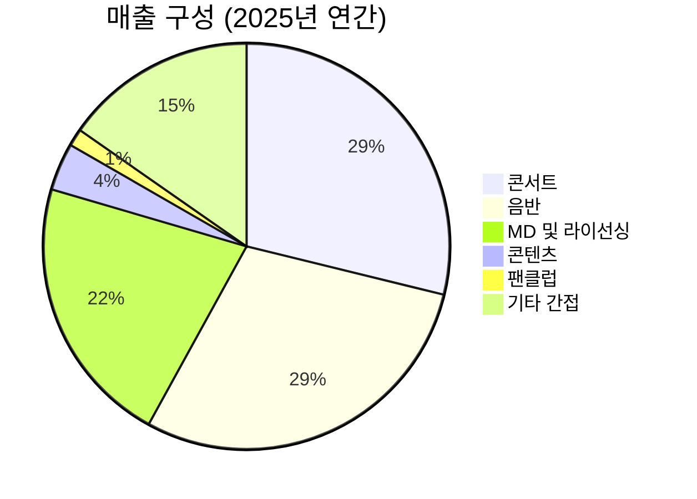

> **오늘의 탐색 분야**: 클라우드, 사이버보안, 인도 시장, 동남아 시장, 일본 시장, 유럽 시장, 중남미, 방산, 인프라
> 4일 주기 로테이션 (27개 분야 커버)

# 하이브 (352820.KS)

352820.KS KR KOSPI Entertainment / Communication Services

총점 62/100 — WATCH

> [!abstract] 리포트 요약
> **한 줄 테시스:** 하이브는 BTS 완전체 컴백이라는 역사적 촉매를 정면에 두고 있지만, 구조적 수익성 훼손과 과도한 글로벌 확장 비용이 동시에 진행 중인 "좋은 IP, 불투명한 이익 가시성"의 기업이다.
>
> **왜 지금인가:** BTS 정규 5집 '아리랑'이 빌보드 200·핫 100 동시 1위를 달성하며 역대급 컴백을 확인. 2025년 4월 고양 월드투어를 시작으로 2027년까지 34개 도시 투어가 예정되어 있어, 2026년은 공연 수익 폭발 구간의 정점에 해당한다.
>
> **Variant Perception:** 시장 컨센서스(애널리스트 26명, 평균 목표가 453,885원, '적극 매수')는 BTS 컴백 효과를 긍정적으로 선반영 중이다. 반면 본 리포트의 시각은 다르다 — **수익성 구조가 매출 성장을 따라가지 못하고 있다는 점이 핵심 리스크**. 2025년 매출은 +17.5% 성장했지만 영업이익은 -72.9% 급락했고, 현재 Trailing EV/EBITDA는 567에 달한다. BTS 컴백 기대감이 이미 52주 최저(209,500원) 대비 +28% 반등에 반영되어 있으며, 목표가 대비 추가 업사이드는 있으나 수익성 회복 타임라인이 불투명하다.
>
> **핵심 수치:** 2025년 연간 매출 2조 6,499억원 (+17.5% YoY) / 영업이익 499억원 (-72.9% YoY) / Forward PER 27.42배 (적자 Trailing, 이익 회복 가정 기반)

---

## ① 핵심 지표

| 항목 | 값 | 의미 |
|------|-----|------|
| 현재가 | 268,500원 | 🟡 52주 최고(418,000원) 대비 -35.8%, 최저(209,500원) 대비 +28.2%. 고점에서 크게 내려왔으나 최저점 반등 이후 안정화 구간. 컨센서스 평균 목표가(453,885원) 대비 약 69% 업사이드 |
| 시가총액 | 11.6조원 | 🟡 국내 엔터 최대 시총. 소/중형주 범주를 벗어난 대형 엔터 기업. 급격한 멀티플 확장보다 실적 회복이 주가를 움직이는 구간 |
| PER (Trailing / Forward) | N/A (적자) / 27.42배 | 🔴 TTM 기준 적자로 Trailing PER 산출 불가. Forward 27.42배는 대규모 이익 회복을 전제한 수치 — 이 이익이 실제로 나와야 정당화 가능 |
| PBR | 3.52배 | 🟡 적자 기업에 3.5배 PBR은 IP 가치를 인정받는 프리미엄. 단, ROE가 -7.2%인 상황에서 이 배수는 "이익 회복 기대"에 전적으로 의존 |
| EV/EBITDA | 567.81배 | 🔴 사실상 의미 있는 평가 지표로 활용 불가 수준. EBITDA가 거의 0에 수렴하는 상황을 반영. 정상화된 이익 기준으로 재평가 필요 |
| 영업이익률 | -5.8% (Yahoo) / 1.73% (Stock Analysis TTM) | 🔴 데이터 소스별 차이가 있으나, 어느 쪽이든 극도로 낮은 수준. 2025년 연간 영업이익 499억원 (OPM ~1.9%)은 2조 6,500억원 매출 대비 심각한 불균형 |
| 순이익률 | -9.0% | 🔴 2025년 TTM 기준 2,372억원 순손실. 영업이익이 극소함에도 금융비용·지분법 손실 등으로 최종 적자 전환 |
| ROE | -7.2% | 🔴 자본을 소각하는 구조. Compounding 머신이 되려면 먼저 수익성 회복이 전제되어야 함 |
| 배당수익률 | 0.2% | 🟡 사실상 배당 투자 관점은 없음. 성장 기대로만 보유해야 하는 종목 |
| 52주 고/저 | 418,000원 / 209,500원 | 🟡 변동성 극심 (고저 차이 2배). 아티스트 이슈, 실적 서프라이즈/쇼크에 따른 주가 민감도가 매우 높음 |
| Beta | 1.02 | 🟡 시장과 유사한 변동성. 단, 개별 이벤트(BTS 컴백, 민희진 사태 등)에 의한 비선형 움직임이 더 중요 |
| 섹터/지역 | Communication Services / 한국 | 🟡 K-팝 섹터는 한국 특수 산업으로 글로벌 엔터 메이저와의 직접 비교는 한계 있음 |

---

## ② 회사 개요, 제품, 핵심 경쟁력

> [!abstract] 한 줄 설명
> 하이브는 **BTS를 비롯한 글로벌 K-팝 아티스트 IP를 기반으로, 음반·공연·MD·플랫폼(위버스)·콘텐츠를 통해 수익을 창출하는 통합 엔터테인먼트 기업**이다.

### 사업 모델: 어떻게 돈을 버는가?

하이브의 수익 모델은 크게 두 축으로 구성된다.

1. **아티스트 직접 참여형 매출 (2025년 비중 63.55%)**: 아티스트가 직접 활동할 때 발생하는 매출. 콘서트(28.83%)와 음반원(29.17%)이 양대 축이다. 아티스트의 스케줄과 인기에 매출이 직결된다는 점에서 예측 변동성이 크다.

2. **아티스트 간접 참여형 매출 (2025년 비중 36.45%)**: 아티스트 IP를 활용하지만 직접 참여 없이도 매출이 발생하는 구조. MD·라이선싱(21.53%), 콘텐츠(3.79%), 팬클럽(1.38%) 등이다. 이 부문은 스케줄과 무관하게 안정적 현금흐름을 제공하는 "해자형 수익"에 가깝다.

### 핵심 제품/서비스

| 제품/서비스 | 고객 제공 가치 | 2025년 매출 |
|------------|--------------|------------|
| **콘서트** | 아티스트와의 직접적 경험, 팬덤의 정서적 연결 | 7,639억원 (+69.4% YoY) |
| **음반** | 소장 가치, 팬덤 참여(포토카드, 위버스 연동) | 7,730억원 (-10.2% YoY) |
| **MD·라이선싱** | 아티스트 IP의 물리적 소유, 브랜드 협업 | 5,706억원 (+35.8% YoY) |
| **위버스 (Weverse)** | 글로벌 팬 커뮤니티 플랫폼, 아티스트-팬 직접 소통 | 2025년 흑자 전환 (확인 필요) |
| **콘텐츠** | 다큐멘터리, OTT 콘텐츠, 리얼리티 등 | 1,006억원 (+61.0% QoQ 4Q25) |
| **팬클럽** | 유료 구독 서비스, 팬 혜택 패키지 | 367억원 (+21.5% YoY 4Q) |

### 매출 구성 (2025년 연간)

### 핵심 경쟁력

| 경쟁력 | 설명 | 복제 난이도 (1-10) |
|--------|------|:---:|
| **BTS IP** | 빌보드 200·핫 100 동시 1위를 달성한 세계 최정상 아티스트. 10년 이상 누적된 글로벌 팬덤(아미)은 대체 불가 | 10 |
| **멀티 레이블 시스템** | 빅히트·어도어·플레디스·쏘스뮤직·KOZ 등 독립 레이블 구조. 세븐틴·뉴진스·엔하이픈·투모로우바이투게더 등 포트폴리오 분산 | 8 |
| **위버스 (Weverse) 플랫폼** | 전 세계 팬이 아티스트와 직접 소통하는 독점 플랫폼. 하이브 외 타 기획사 아티스트도 입점. 네트워크 효과 초기 단계 | 7 |
| **K-팝 제조 방법론** | 체계적인 트레이닝→데뷔→팬덤 빌딩 시스템. 인도, 라틴 등 글로벌 시장에 수출 가능한 IP 제조 공정 | 7 |
| **IP 라이프사이클 관리** | 음반→공연→MD→콘텐츠→게임으로 이어지는 수익화 사슬. 단일 IP로 다중 수익원 창출 | 6 |
| **글로벌 네트워크** | 하이브아메리카(빅머신·이타카·QC뮤직 등), 하이브라틴, 하이브인디아 등 현지화 거점 | 6 |

### 성장 공식

$$\text{하이브 매출} = \underbrace{\text{아티스트 수} \times \text{팬덤 규모}}_{\text{직접형}} + \underbrace{\text{위버스 MAU} \times \text{ARPU}}_{\text{플랫폼}} + \underbrace{\text{IP 라이선싱}}_{\text{간접형}}$$

핵심 변수는 **① BTS 활동 사이클**, **② 신규 아티스트 성공률**, **③ 위버스의 플랫폼 수익화 속도**다.

---

## ③ 왜 이 기업인가

> [!tip] 핵심 투자 논리
> **BTS 완전체 컴백 + 34개 도시 월드투어 = 역대 최대 공연 수익 사이클**이 2026~2027년에 걸쳐 펼쳐진다. 동시에 위버스의 흑자 전환으로 플랫폼 수익화의 1막이 시작된다. 단, "좋은 이야기"가 "좋은 투자"가 되려면 수익성 회복이 실제로 수반되어야 한다.

### BTS라는 비대칭 자산

BTS는 단순히 "유명한 아이돌"이 아니다. 2025년 정규 5집 '아리랑'의 빌보드 200·핫 100 동시 1위는 K-팝 역사상 전례 없는 기록이다. 비교 대상은 테일러 스위프트, 비욘세급의 전 세계적 문화 현상이다.

**BTS의 경제적 의미:**
- 2025년 콘서트 매출이 단일 연도에 7,639억원(+69.4%)을 기록한 것은 대부분 BTS 군 복무 후 재개된 활동 때문 [추정]
- 34개 도시 월드투어(2026~2027년)는 하이브 역사상 가장 큰 단일 공연 사이클
- BTS IP 기반 MD·라이선싱·콘텐츠·위버스 매출은 멤버들이 군복무 중에도 일정 수준 유지되었다는 점에서 IP 내구성을 입증

### 하이브가 Compounding Machine이 될 수 있는 구조

현재는 투자 집중기이지만, 3년 후를 보면 다른 그림이 가능하다:

1. **단기 (2026-2027)**: BTS 월드투어 → 공연 매출 폭발 → 음반 회복 → MD 동반 성장
2. **중기 (2027-2028)**: 위버스 플랫폼 수익화 가속 (타 기획사 아티스트까지 포함한 글로벌 팬 플랫폼) → 플랫폼 수익은 변동비가 낮아 고마진
3. **장기 (2028+)**: 하이브인디아·하이브라틴에서 신규 아티스트 성공 → 다음 세대 BTS 등장 → TAM 확장

> [!note] 멀티 홈·멀티 장르 전략의 의미
> 하이브가 인도에서 걸그룹 오디션, 라틴 시장에서 현지 아티스트 육성을 시도하는 것은 단순한 사업 확장이 아니다. **K-팝 IP 제조 방법론 자체를 수출하는 것**이다. 성공하면 BTS 의존도를 줄이면서 새로운 IP 파이프라인을 확보한다. 실패 비용은 크지만, 성공의 업사이드는 비선형적이다.

### Variant Perception: 시장이 놓치고 있는 것

**컨센서스 뷰**: "BTS 컴백 = 실적 회복 = 주가 상승" → 목표가 453,885원

**본 리포트의 다른 시각:**
- 시장은 매출 성장을 보지만, **비용 증가 속도가 매출 증가를 앞서는 구조적 문제**에 충분한 주의를 기울이지 않는다
- 하이브아메리카(이타카·빅머신 등) 자회사들의 누적 손실과 운영비용이 한국 본사 이익을 잠식하고 있다 [추정 — DART 세부 손익 확인 필요]
- 뉴진스 분쟁(2024년 민희진 사태)으로 인한 법적 비용, 브랜드 신뢰도 훼손, 멤버 이탈 가능성은 지속적인 불확실성
- 위버스의 흑자 전환이 의미 있는 이익 기여를 하려면 얼마나 더 걸리는가? (확인 필요)

### 경쟁사 대비 우위

| 항목 | 하이브 | SM엔터 | JYP엔터 | YG엔터 |
|------|--------|--------|--------|--------|
| 글로벌 IP 파워 | 🟢 BTS (독보적) | 🟡 EXO·에스파 | 🟡 스트레이키즈·TWICE | 🟡 블랙핑크 |
| 멀티 레이블 구조 | 🟢 6개+ 레이블 | 🟡 3개 레이블 | 🟡 단일 중심 | 🔴 제한적 |
| 자체 플랫폼 | 🟢 위버스 (독자 운영) | 🟡 버블(외부) | 🟡 버블(외부) | 🟡 버블(외부) |
| 글로벌 인프라 | 🟢 미국·라틴·인도 | 🟡 제한적 | 🟡 미국 | 🟡 제한적 |
| 수익성 | 🔴 적자 (2025 TTM) | 🟡 (확인 필요) | 🟢 고마진 유지 | 🟡 (확인 필요) |
| 음반 의존도 | 🟡 감소 추세 | 🔴 높음 | 🔴 높음 | 🔴 높음 |

> [!warning] JYP 비교 시사점
> JYP엔터테인먼트는 하이브보다 훨씬 작은 규모지만 안정적 고마진을 유지한다. 규모를 키우며 마진을 희생한 하이브의 현재 전략이 장기적으로 올바른 선택인지는 향후 2~3년이 증명한다.

---

## ④ 비즈니스 퀄리티

> [!abstract] 섹션 요약
> 하이브의 IP 해자는 독보적이나, 그 해자를 이익으로 전환하는 능력이 현재 크게 훼손되어 있다. "좋은 사업인가?"에 대한 답은 YES지만, "지금 잘 운영되고 있는가?"에 대한 답은 NO에 가깝다.

### 경제적 해자 (Moat)

| 해자 계층 | 내용 | 복제 난이도 |
|---------|------|-----------|
| **BTS IP 해자** | 10년 이상 팬덤이 축적한 정서적 자본. 아미(ARMY)는 단순 팬층을 넘어 글로벌 소비 네트워크 | 🟢 극히 높음 (9/10) |
| **네트워크 효과 (위버스)** | 팬이 많을수록 아티스트가 입점하고, 아티스트가 많을수록 팬이 모임. 초기 단계 | 🟡 중간 (6/10) — 아직 형성 중 |
| **전환비용 (팬클럽·MD)** | 팬덤 정체성과 결합된 소비. 경쟁사 아티스트로 이동하는 것이 "배신"으로 인식 | 🟢 높음 (8/10) |
| **K-팝 제조 시스템** | 트레이닝→브랜딩→팬덤 빌딩→수익화 사이클의 체계화. 인력·노하우 축적 | 🟡 중간 (6/10) — 복제 가능하나 시간 소요 |
| **글로벌 유통 인프라** | 하이브아메리카, 빅머신(내슈빌), 이타카(아틀란타) 등 현지 음악 산업 네트워크 | 🟡 중간 (5/10) — 비용이 크고 효과 불확실 |

### ROIC/ROE 추세

현재 ROE -7.2%는 자본이 훼손되는 구간임을 명확히 보여준다. 2025년 매출총이익률 (Gross Margin) 35.32%는 건강한 수준이나, 판관비·인건비·콘텐츠 투자비용이 이를 완전히 흡수하고 있다.

**핵심 문제**: 매출이 17.5% 성장하는 동안 영업이익이 72.9% 급락한 것은 비용 구조의 레버리지가 음(-)의 방향으로 작동했음을 의미한다. 즉, 규모가 커질수록 더 많이 손해 보는 구조가 일시적으로 나타나고 있다.

**무엇이 마진을 죽였는가?** (DART 세부 손익계산서 확인 필요)
- 하이브아메리카 유상증자 참여 (1,508억원, 2026년 3월 기준으로 추가 자금 투입 지속)
- 신규 아티스트 육성 투자 (하이브인디아 등 선행 비용)
- 법적 분쟁 비용 (민희진·어도어 관련 소송)
- 글로벌 인프라 구축 고정비 확대

> [!warning] 마진 회복 타임라인이 핵심
> 이 비용들이 "일회성"이라면 2026~2027년 BTS 투어 매출 급증 시 영업레버리지가 강력하게 작동해 마진이 회복된다. 반면 "구조적"이라면 매출이 아무리 커져도 이익이 따라오지 않는다. 이것이 투자의 핵심 불확실성이다.

### 경영진 분석

- **방시혁 의장**: 하이브의 창업자이자 BTS의 프로듀서. 예술적 방향성과 사업 전략을 동시에 주도. 장기적 비전에 대한 확신이 있지만, 2024년 민희진 사태에서 드러난 내부 갈등 관리 능력은 점검 필요
- **아이작 리 (하이브아메리카 의장)**: 최근 사내이사 선임. 북미·라틴 시장 사업 실행력 강화 목적. 디즈니 출신 케빈 메이어를 기타비상무이사로 선임한 것은 글로벌 콘텐츠 산업의 노하우를 적극 흡수하겠다는 신호
- **인센티브 일치도**: 방시혁의 지분 보유 비중이 높아 주주 이익과 기본적으로 일치 [확인 필요 — 정확한 지분율 DART 확인]
- **자본 배분 트랙레코드**: 하이브아메리카 지분 100% 취득(1,508억원), 이타카·빅머신 등 미국 음악사 인수는 적극적 M&A 전략이지만 수익성 입증에 시간이 걸리고 있음

---

## ⑤ 밸류에이션

> [!abstract] 섹션 요약
> 현재 주가는 "BTS 컴백 기대"가 반영된 상태이나, 이익 기반 밸류에이션으로는 거의 평가 불가 구간이다. 수익성 정상화 시나리오를 가정할 때 비로소 투자 논리가 생긴다.

### 현재 밸류에이션 현황

| 지표 | 값 | 해석 |
|------|-----|------|
| Forward PER | 27.42배 | 2026년 이익 대규모 회복 가정. 컨센서스 추정 EPS 기반 |
| PBR | 3.52배 | IP 프리미엄 반영. 그러나 ROE 음수 상황에서 정당화 어려움 |
| EV/EBITDA | 567.81배 | 사실상 무의미한 수치 — EBITDA가 거의 0 |
| 매출 대비 시가총액 | 11.6조원 / 2.65조원 = ~4.4배 | 성장 기업 기준으로 높은 편 |
| 애널리스트 목표가 (컨센서스) | 453,885원 (26명 평균) | 현재가 대비 +69% 업사이드 |

### 버핏 스타일 간이 적정가치 추정 [가정]

**시나리오 A (정상화)**: 2027년 BTS 투어 완료 후 영업이익 2,000억원 회복 (OPM ~7%), 정상 PER 20배 적용, EPS 기반 주당 이익 가정
- → 이익 2,000억원 × PER 20배 = 시총 4조원 → 주당 약 100,000원? [계산 불일치 — 시총 4조원 / 발행주식수 (약 4,290만주) = 주당 약 93,240원]
- 이 수치가 현재가(268,500원)와 현저히 괴리됨을 주목 — **현재 주가는 더 높은 이익 회복 또는 더 높은 멀티플을 요구**

**시나리오 B (강한 회복)**: 2027년 영업이익 4,000억원 (OPM ~13%), 엔터 성장주 PER 30배 적용
- → 시총 12조원 → 주당 약 279,000원 [추정] — 현재가와 유사한 수준

**시나리오 C (플랫폼 가치 반영)**: 위버스 MAU 1억명 달성, 플랫폼 밸류에이션 별도 부여 시 추가 업사이드 가능 [추정, 가시성 낮음]

> [!warning] 안전마진 (Margin of Safety) 점검
> 현재 주가 268,500원에서 "안전마진"이 충분한가? 솔직히 **그렇지 않다**. 이익이 회복되지 않을 경우, FCF 기반 가치는 현재가를 크게 하회할 가능성이 있다. 반면 52주 저점(209,500원) 부근에서는 BTS 컴백이 내재된 상황에서 안전마진이 더 컸다.

---

## ⑥ 촉매 & 타이밍 + 매크로 컨텍스트

> [!abstract] 섹션 요약
> 단기 촉매는 명확하고 강력하다. BTS 월드투어는 2026년 하이브 실적의 구조적 상승을 담보한다. 단, 이 촉매가 이미 상당 부분 주가에 반영되어 있다는 점이 타이밍 리스크다.

### 핵심 촉매 & 타임라인

| 촉매 | 실현 가능성 | 타임라인 | 주가 반영도 | 잠재 임팩트 |
|------|-----------|---------|-----------|-----------|
| **BTS 월드투어 '아리랑' (34개 도시)** | 🟢 매우 높음 (이미 시작) | 2026년 4월~2027년 말 | 🟡 부분 반영 | 🟢 연간 공연 매출 1조원+ 가능 [추정] |
| **BTS 정규 5집 음반 판매** | 🟢 높음 (빌보드 1위 확인) | 2026년 상반기 | 🟡 일부 반영 | 🟢 음반 매출 회복 가속 |
| **위버스 수익화 심화** | 🟡 중간 | 2026~2027년 | 🔴 미반영 | 🟡 점진적 이익 기여 |
| **하이브인디아 걸그룹 오디션 성공** | 🟡 불확실 | 2026~2028년 | 🔴 미반영 | 🟢 성공 시 비선형 업사이드 |
| **어도어·뉴진스 분쟁 해소** | 🟡 불확실 | (확인 필요) | 🔴 부정적 우려 존재 | 🟢 해소 시 주가 overhang 제거 |
| **글로벌 경영진 (케빈 메이어 등) 성과** | 🟡 중간 | 2026~2027년 | 🔴 미반영 | 🟡 중장기 사업 신뢰도 |

### 왜 지금이어야 하는가?

**지금 사야 하는 이유**: BTS 월드투어가 이미 시작되었다. 2026년은 투어 매출이 본격적으로 인식되는 첫 번째 완전한 연도다. 실적 가시성이 가장 높은 구간이다.

**지금 망설여지는 이유**: 52주 저점 대비 이미 +28% 올랐고, 컨센서스 목표가까지의 업사이드가 크지만 그 업사이드는 이익 회복이라는 조건부다.

🟢 Bull 35%

🟡 Base 40%

🔴 Bear 25%

| 시나리오 | 내용 | 목표가 | 업사이드 |
|---------|------|-------|---------|
| 🟢 Bull | BTS 투어 대성공 + 음반 회복 + 위버스 수익화 가속 + 뉴진스 분쟁 해소 | 450,000~520,000원 | +68%~+94% |
| 🟡 Base | BTS 투어 정상 진행, 음반 소폭 회복, 비용 증가 지속, 이익 회복 더딤 | 300,000~350,000원 | +12%~+30% |
| 🔴 Bear | BTS 멤버 건강 이슈/투어 차질 + 법적 분쟁 악화 + 미국 자회사 추가 손실 | 180,000~220,000원 | -33%~-18% |

### 매크로 환경 연계

| 매크로 변수 | 현황 | 하이브 영향 |
|-----------|------|-----------|
| **금리 방향** | 한국 기준금리 인하 기조 [추정] | 🟢 순풍 — 성장주 밸류에이션에 유리 |
| **원달러 환율** | 고환율 지속 (1,400원 이상 구간) | 🟢 순풍 — 달러 표시 공연·MD 매출의 원화 환산 효과 |
| **글로벌 소비 경기** | 불확실 (미 관세 리스크, 경기 둔화 우려) | 🟡 중립 — 팬덤 소비는 경기 방어적이나 공연 티켓 수요는 일부 영향 |
| **섹터 로테이션** | 성장주 재평가 구간 | 🟢 순풍 — 금리 인하 시 엔터 성장주에 자금 유입 가능 |

**매크로 시나리오별 영향:**
- **금리 인하 가속**: 하이브 멀티플 확장 → 주가에 추가 순풍
- **달러 강세 지속**: 북미 공연 매출·MD 달러 수익의 원화 환산 증가 → 긍정
- **경기침체**: 공연 티켓 수요 감소, 명품형 MD 소비 위축 → 부정적이나 팬덤 특성상 제한적 영향 예상

---

## ⑦ 리스크 & Devil's Advocate

> [!warning] 핵심 리스크 경고
> 하이브의 리스크는 단순히 "실적이 나쁜 것"이 아니다. 수익성 회복이 지연될수록 글로벌 투자를 위한 자금 소요가 커지고, 이는 추가 유상증자 또는 부채 증가로 이어질 수 있다. 주주 희석 리스크에 주의해야 한다.

### 핵심 리스크 테이블

| 리스크 | 심각도 | 확률 | 대응 |
|-------|-------|------|------|
| **BTS 멤버 건강/활동 차질** | 🔴 매우 높음 | 🟡 낮음 (단, 발생 시 치명적) | 분산된 아티스트 포트폴리오로 완충. 그러나 BTS 의존도는 여전히 높음 |
| **뉴진스·어도어 분쟁 장기화** | 🔴 높음 | 🟡 중간 | 법적 결론 전까지 브랜드 리스크 지속. 하이브 레이블 신뢰도 훼손 가능 |
| **미국 자회사 지속 손실** | 🟡 중간 | 🟢 높음 | 이타카·빅머신 등 M&A 자산의 수익성 검증 필요. 추가 자금 투입 시 주주 희석 |
| **음반 시장 구조적 하락** | 🟡 중간 | 🟢 높음 | 스트리밍 대체, 글로벌 팬덤의 실물 앨범 소비 피로감 증가 |
| **위버스 경쟁 격화** | 🟡 중간 | 🟡 중간 | 카카오톡·유튜브·틱톡 등 대형 플랫폼과의 팬 커뮤니티 경쟁 |
| **하이브인디아/라틴 실패** | 🟡 중간 | 🟡 중간 | 신규 시장 개척 비용이 선행, 수익화는 5년 이상 소요 예상 [추정] |
| **글로벌 엔터 메이저 진입** | 🟡 중간 | 🟡 중간 | 유니버설뮤직·소니뮤직이 K-팝 방법론을 흡수하거나 직접 경쟁 시 |

### 가장 현실적인 실패 시나리오

BTS 월드투어가 계획대로 진행되어도, 하이브아메리카의 구조적 손실이 공연 이익을 흡수한다. 뉴진스 분쟁이 법적으로 장기화되며 어도어 레이블의 기업가치가 훼손된다. 위버스는 글로벌 테크 플랫폼과의 경쟁에서 성장이 둔화된다. 결국 2027년에도 하이브의 연결 영업이익이 1,000억원을 넘지 못하고, Forward PER 기반 밸류에이션이 재산정되면서 주가는 200,000원 이하로 하락한다.

### 숨겨진 가정 (Hidden Assumptions)

| 가정 | 검증 방법 |
|------|---------|
| "2025년 비용 증가는 일회성이다" | 2026년 1분기 영업이익률 추이 확인 |
| "BTS 투어 34개 도시 모두 성사된다" | 투어 일정 확인, 멤버 건강 모니터링 |
| "위버스 흑자가 실질적 이익 기여로 이어진다" | DART 위버스 별도 손익 확인 |
| "하이브아메리카 손실이 통제 가능한 수준이다" | 별도/연결 손익 괴리 분석 |

### Kill Criteria

| Kill Criteria | 임계값 |
|-------------|-------|
| BTS 월드투어 대규모 취소/연기 | 전체 일정의 30%+ 취소 |
| 연결 영업이익률 | 2026년에도 2% 미만 유지 시 |
| 하이브아메리카 추가 유상증자 | 연간 2,000억원 이상 지속 자금 투입 |
| 법적 분쟁 패소 및 대규모 배상 | 1,000억원 이상 일회성 손실 발생 |
| 주요 아티스트 2명 이상 계약 해지 | 세븐틴·TXT 등 주요 그룹 이탈 |

---

## ⑧ 나의 엣지

> [!tip] 이 투자의 엣지는 어디에 있는가?

### 시장이 놓치고 있는 것

**컨센서스의 실수**: 26명의 애널리스트가 모두 "매수" 또는 "적극 매수"를 외치며 평균 목표가 453,885원을 제시한다. 이것은 역설적으로 "시장이 이미 알고 있는 정보"다. BTS 컴백은 알려진 사실이다. 빌보드 1위도 알려진 사실이다.

**진짜 질문은 이것이다**: "BTS 투어 매출이 얼마나 나올지"가 아니라, "하이브의 구조적 비용 문제가 투어 이익을 얼마나 흡수할 것인가?" — 이 질문에 대한 답이 컨센서스에서 충분히 다뤄지지 않는다.

### 엣지의 원천

알려진 정보 (촉매) 55%

알려지지 않은 리스크 45%

이 투자의 엣지는 **두 가지 케이스 중 하나를 선택하는 것**이다:
1. **Bull Case 엣지**: 하이브의 비용 증가가 일회성임을 먼저 확인하고, 이익 회복 구간에 진입 → BTS 투어 호실적과 비용 안정화가 동시에 확인되는 시점에 진입이 실제 엣지
2. **Variant Perception 엣지**: 컨센서스가 BTS 촉매에 집중하는 동안, "수익성 미회복 시 현재 주가는 비싸다"는 반대 뷰를 유지하며 더 좋은 진입 기회를 기다림

### Insider 의존 여부 체크

- ✅ 공개 정보 기반 분석
- ✅ DART·실적 발표·뉴스 데이터만 활용
- ✅ Insider 정보에 의존하지 않음
- ✅ 하이브는 정치적 규제 리스크가 낮은 민간 엔터기업 (회피 영역 해당 없음)

### 왜 다른 사람들이 이 기회를 놓치는가?

많은 투자자들이 하이브를 "BTS 회사"로만 인식하고, 위버스라는 플랫폼 비즈니스의 장기 가치를 제대로 평가하지 못한다. 반면, 위버스가 성숙한 플랫폼이 되는 2028~2030년의 그림을 그리는 투자자에게 하이브는 완전히 다른 기업이 된다. 이것이 장기 옵셔널리티(Optionality)의 원천이다.

---

## ⑨ 액션 아이템

### Deal Score 최종 평가

업사이드 비대칭 17/30

카탈리스트&타이밍 19/25

비즈니스 품질 13/20

밸류에이션 7/15

발견 가치 6/10

총점 62/100 — WATCH

### 최종 판단

| 항목 | 판단 |
|------|-----|
| **BUY / WATCH / PASS** | WATCH — BTS 투어 호실적 + 영업이익률 개선 확인 후 진입 |
| **Conviction** | Medium — 촉매는 강력하나 수익성 회복 불확실성이 높음 |
| **적정 진입가** | 230,000~250,000원 이하 — 현재가(268,500원)보다 낮은 수준에서 안전마진 확보 가능. 또는 2026년 1분기 실적 발표 후 이익 회복 확인 시 현재가 근방 진입 고려 |
| **목표가 (12개월)** | 330,000~380,000원 [Base/Bull 중간 시나리오, 추정] — 이익 회복 가시성이 높아지는 시점에 멀티플 재평가 |
| **손절 기준** | 210,000원 이하 (52주 저점 근처) — BTS 투어 차질 또는 추가 대규모 손실 시 |
| **권장 비중** | 포트폴리오 3~5% — 촉매 확인 전까지 풀 포지션 불가. 확인 후 5~7%로 증량 |

### 추가 리서치 필요 사항

1. **DART 연결/별도 손익 분석**: 하이브아메리카·이타카 등 해외 자회사별 손익 현황 (연결 적자 원인 규명)
2. **위버스 MAU 및 수익 구조**: 흑자 전환의 실제 규모와 향후 수익화 로드맵
3. **BTS 월드투어 재무 모델링**: 34개 도시 기준 예상 매출·원가·영업이익 추정
4. **경쟁사 비교**: JYP·SM·YG의 동기간 영업이익률 비교 (하이브 마진 훼손이 업종 공통인지 개별 이슈인지)
5. **어도어·뉴진스 분쟁 법적 현황**: 소송 결과 타임라인 및 잠재 배상 규모

### 모니터링 핵심 지표

| 지표 | 체크 주기 | 임계값 |
|------|---------|-------|
| BTS 투어 공연장 매진율 | 투어 일정마다 | 90%+ 유지 여부 |
| 하이브 분기 영업이익률 | 분기 실적 발표 | 5%+ 회복 여부 |
| 위버스 MAU 및 ARPU | 분기 실적 발표 | 성장 지속 여부 |
| 하이브아메리카 추가 자금 투입 | 공시 실시간 모니터링 | 1,000억원 이상 추가 시 경고 |
| 음반 판매량 (서클차트 주간) | 주간 | 신보 발매 후 판매 모멘텀 |

### 다음 체크포인트

| 날짜 | 확인 사항 |
|------|---------|
| **2026년 5월 (예정)** | 2026년 1분기 실적 발표 — 영업이익률 반등 여부, BTS 투어 초반 매출 인식 규모 |
| **2026년 6월** | 세븐틴 팬미팅('캐럿 랜드') 매출 반응, 위버스 참여도 지표 |
| **2026년 8~9월** | BTS 월드투어 중반기 — 매진율 및 MD 매출 추이 |
| **2026년 11월 (예정)** | 2026년 3분기 실적 — 투어 수익화의 본격적 숫자 확인 |

---

> [!verdict] 최종 판정
> **하이브는 세계 최정상 IP를 보유한 독보적 기업이지만, 현재 주가(268,500원)에서 "싸게 사는 것"은 아니다.** BTS 컴백이라는 강력한 촉매는 실재하나 이미 상당 부분 주가에 반영되어 있고, 수익성 회복의 타임라인은 여전히 불투명하다.
>
> **WATCH 전략**: 2026년 1분기 실적에서 영업이익률이 5%+ 회복되는 것을 확인한 후, 또는 주가가 230,000~250,000원 이하로 조정 시 진입을 검토한다. 위험을 감수하고 지금 진입하는 투자자라면, 절대 풀 포지션이 아닌 관찰 포지션(3% 이내)으로 시작하고 실적 확인 후 증량하는 전략을 권장한다.
>
> **장기 비전 (3년+)**: 위버스가 글로벌 팬 플랫폼으로 성숙하고, 하이브인디아·라틴 아티스트 중 첫 번째 성공 케이스가 나온다면, 하이브는 현재 시총 11.6조원을 훨씬 상회하는 기업이 될 수 있다. 그 옵셔널리티는 매력적이다. 단, 지금은 그 미래에 대한 비용을 치르고 있는 고통의 시간이다.