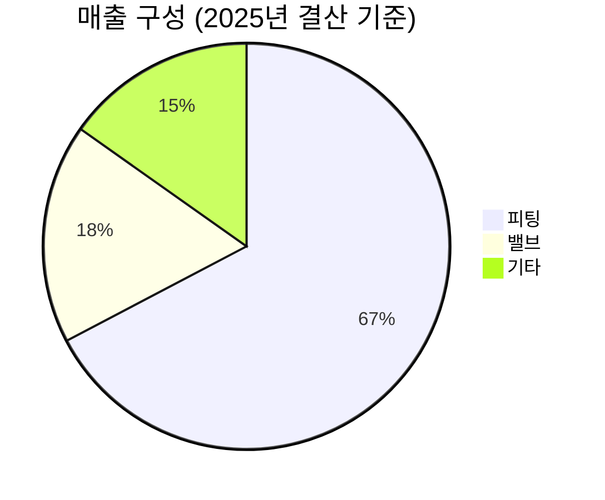

> **오늘의 탐색 분야**: 클라우드, 사이버보안, 보험, 퀀텀 컴퓨팅 혁신, 공간 컴퓨팅, AI 전력, 글로벌 인구 이동, 사이버 보안, 첨단 소재
> 4일 주기 로테이션 (30개 분야 커버)

# 한선엔지니어링 (452280.KS)

<span style="background:#2196F3;color:white;padding:2px 8px;border-radius:4px;font-size:0.85em">452280.KS</span> <span style="background:#D32F2F;color:white;padding:2px 8px;border-radius:4px;font-size:0.85em">🇰🇷 KR</span> <span style="background:#424242;color:white;padding:2px 8px;border-radius:4px;font-size:0.85em">KOSDAQ</span> <span style="background:#7B1FA2;color:white;padding:2px 8px;border-radius:4px;font-size:0.85em">계장용 피팅·밸브 / 산업재</span>

---

<div style="background:#e0e0e0;border-radius:8px;overflow:hidden;margin:8px 0"><div style="background:#FF9800;width:67%;padding:6px 12px;color:white;font-weight:bold;font-size:1em;white-space:nowrap">Investment Score 67/100 — 🟡 Buy (조건부)</div></div>

<div style="background:#e0e0e0;border-radius:8px;overflow:hidden;margin:4px 0"><div style="background:#FF9800;width:70%;padding:4px 8px;color:white;font-size:0.85em;white-space:nowrap">업사이드 비대칭 21/30 — 블룸에너지 단독 납품 + LNG 수혜 옵셔널리티, 시총 4,234억 vs 다중 TAM</div></div>

<div style="background:#e0e0e0;border-radius:8px;overflow:hidden;margin:4px 0"><div style="background:#FF9800;width:68%;padding:4px 8px;color:white;font-size:0.85em;white-space:nowrap">카탈리스트 & 타이밍 17/25 — LNG FID 2025~2026 발주 임박, 블룸에너지 확대 + VI 발동 급등 후 모멘텀 지속</div></div>

<div style="background:#e0e0e0;border-radius:8px;overflow:hidden;margin:4px 0"><div style="background:#4CAF50;width:75%;padding:4px 8px;color:white;font-size:0.85em;white-space:nowrap">비즈니스 품질 15/20 — 영업이익 YoY 98% + 단독 공급 지위, 규모 소형 한계</div></div>

<div style="background:#e0e0e0;border-radius:8px;overflow:hidden;margin:4px 0"><div style="background:#F44336;width:47%;padding:4px 8px;color:white;font-size:0.85em;white-space:nowrap">밸류에이션 7/15 — PER 42x · EV/EBITDA 178x 고평가, 52주 고점 부근</div></div>

<div style="background:#e0e0e0;border-radius:8px;overflow:hidden;margin:4px 0"><div style="background:#4CAF50;width:70%;padding:4px 8px;color:white;font-size:0.85em;white-space:nowrap">발견 가치 7/10 — 애널리스트 커버리지 초기 단계, 기관 연속 순매수로 스마트머니 유입 중</div></div>

---

> [!abstract] 리포트 요약
>
> **한 줄 테시스:** 한선엔지니어링은 계장용 피팅·밸브라는 틈새 산업재에서 석유화학·조선·수소·반도체 등 다중 성장 축을 확보한 소형 고마진 제조 기업이다.
>
> **왜 지금인가:** 2025년 영업이익 YoY +98%라는 검증된 펀더멘털 개선 위에, LNG 수출터미널 FID 발주(2025~2026년 예상 $1.29억~$1.43억 규모) + 블룸에너지(Bloom Energy) SOFC 모듈 국내 단독 공급이라는 두 개의 구체적 촉매가 중첩되고 있다. 52주 저점 6,410원 → 현재 21,300원으로 이미 233% 상승했음에도 기관이 연속 순매수 중이다.
>
> **Variant Perception:** 시장은 이 회사를 단순 '피팅·밸브 테마주'로 묶어 보지만, 실질은 블룸에너지 국내 단독 공급 + UHP 반도체 피팅 신사업 + 부산2공장 캐파 2배 확대라는 3중 성장 구조를 가진 복합 성장 기업이다. 소형주 특성상 시장의 인식 지연이 추가 알파의 원천이다.
>
> **핵심 리스크:** PER 42x · EV/EBITDA 178x는 이미 상당한 성장 기대를 반영. 2026년 실적이 컨센서스를 하회할 경우 급격한 멀티플 리레이팅 리스크. 블룸에너지 단일 고객 의존도도 확인 필요.

---

## ① 핵심 지표

| 항목 | 값 | 의미 |
|------|-----|------|
| 현재가 | 21,300원 | 🟡 52주 저점(6,410원) 대비 233% 상승, 52주 고점(22,100원) 대비 -3.6% — 고점 탈환 시도 중 |
| 시가총액 | 4,234억원 | 🟡 코스닥 소형주 — 기관 집중 매수 시 주가 변동성 큼 (양날의 검) |
| PER (Trailing) | 42.47x | 🔴 단순 PER만 보면 고평가, 단 EPS 성장률 100%+ 감안 시 PEG 약 0.4배 수준 [추정] |
| PBR | 5.56x | 🔴 자산 대비 프리미엄 높음 — 무형자산(기술력·고객관계) 가치 반영으로 해석 가능 |
| EV/EBITDA | 178.39x | 🔴 절대적 고평가 — 매우 공격적인 성장 기대가 선반영된 수준 |
| 배당수익률 | N/A | 🟡 배당 정책 미확인, 성장 단계 기업으로 재투자 우선 가능성 |
| 영업이익률 | 16.0% | 🟢 2025년 YoY 영업이익 +98% 달성 — 고정비 레버리지 효과 발현 중 |
| 순이익률 | 16.7% | 🟢 영업이익률과 순이익률 유사 — 이자비용·비영업 손실 부담 제한적 |
| ROE | 4.0% | 🔴 수익성에 비해 ROE 낮음 — 자본 규모 대비 이익 기반 아직 초기, 개선 여부 주목 |
| 52주 고/저 | 22,100 / 6,410원 | 🟡 현재가는 고점 대비 -3.6%, 저점 대비 +233% — 이미 대부분의 상승을 소화 |
| 매출 성장률 | 30.2% (2025년 YoY) | 🟢 업종 평균 1.54% 대비 압도적 아웃퍼폼 (출처: 증권플러스) |
| 섹터/지역 | 산업재 / 한국 코스닥 | 🟡 2026.5.4부로 코스닥 우량기업부 편입 예정 |

> [!tip] 핵심 지표 해석
> 표면적 PER 42x는 비싸 보이지만, 영업이익 YoY +98%·순이익 YoY +114.9%의 급성장 기업에 단순 트레일링 PER을 적용하는 것은 왜곡된다. 진짜 문제는 EV/EBITDA 178x — 이는 이미 2~3년치 성장이 선반영되어 있음을 의미한다. 따라서 "좋은 기업인가?"보다 "이 가격에 좋은 투자인가?"가 핵심 질문이다.

---

## ② 회사 개요, 제품, 핵심 경쟁력

> [!abstract] 섹션 요약
> 한선엔지니어링은 유체·기체 흐름이 있는 모든 설비에 필수적으로 사용되는 계장용(計裝用) 피팅과 밸브를 제조하는 B2B 전문 기업이다. '보이지 않는 필수재' 공급자로서, 수십 년간의 기술 인증 축적이 진입장벽의 핵심이다.

### 한 줄 설명
> 이 회사는 **석유화학·조선·반도체·수소에너지 설비에 들어가는 계장용 피팅(관이음쇠)·밸브를 국내 단독 또는 핵심 공급자 지위로 납품하는 정밀 산업재 제조 기업**이다.

### 사업 모델
한선엔지니어링의 수익 구조는 철저히 **B2B 장기 공급 계약** 기반이다. 피팅·밸브는 일단 설비에 채택되면 교체 비용과 인증 재취득 비용이 크기 때문에 일종의 전환비용(Switching Cost) 해자가 형성된다. 단가는 낮더라도 설비당 수천~수만 개의 부품이 들어가므로 물량 레버리지가 작동한다.

### 핵심 제품/서비스

| 제품 | 적용 산업 | 핵심 가치 |
|------|---------|---------|
| **계장용 피팅** (Instrumentation Fitting) | 석유화학, 조선(LNG선), 반도체, 수소 | 유체·기체 배관 연결 — 정밀 계측 가능하게 하는 핵심 부품 |
| **밸브** (Valve) | 동일 산업군 + ESS | 유체 흐름 제어 — 안전기능 통합형 고부가가치화 진행 중 |
| **SOFC 플러밍 모듈** | 수소연료전지 (블룸에너지) | 고체산화물 연료전지(SOFC) 내 유체 흐름 통합 모듈 — **국내 단독 공급** |
| **UHP 피팅·밸브** | 반도체·디스플레이 | 초고순도(Ultra High Purity) 환경용 — 공정 오염 최소화 |

### 매출 구성 (2025년 결산, 와이즈리포트/버틀러 출처)



| 사업부문 | 매출 비중 | 비고 |
|---------|---------|------|
| 피팅 | 67.3% | 핵심 캐시카우 — 조선·석유화학 수혜 |
| 밸브 | 17.5% | 고부가가치화 진행 중 |
| 기타 | 15.2% | 플러밍 모듈·신사업 포함 [추정] |

> ⚠️ 세그먼트별 실제 매출액·YoY 성장률 수치는 공시에서 미제공. 비중만 확인 가능. (출처: 와이즈리포트, 버틀러)

### 핵심 경쟁력

| 경쟁력 | 설명 | 복제 난이도 (1-10) |
|--------|------|:---:|
| **산업별 인증 축적** | 석유화학·조선·방산·반도체 각 산업별 품질 인증 취득 — 신규 진입자가 인증 재취득에 수년 소요 | 9 |
| **블룸에너지 국내 단독 공급** | SOFC 플러밍 모듈 국내 유일 공급사 지위 — 블룸에너지의 까다로운 검증 통과 | 9 |
| **다중 산업 포트폴리오** | 조선·석유화학·반도체·수소·ESS에 동시 납품 — 특정 산업 침체 시 헤지 기능 | 7 |
| **부산2공장 캐파 2배 확대** | 550억 원 투자, 피팅 생산능력 약 2배 증가 — 수주 증가에 즉각 대응 가능 | 6 |
| **UHP 기술력** | 반도체용 초고순도 피팅·밸브 — 공정 오염 허용치가 ppb 수준으로 극단적으로 까다로움 | 8 |

### 성장 공식
```
매출 성장 = (조선/LNG 수주 증가 × 피팅 물량) + (블룸에너지 SOFC 납품 확대) + (반도체 UHP 침투율 상승) + (부산2공장 캐파 활용률)
```

### 고객
- **1차 고객 (확인):** 블룸SK퓨얼셀 (블룸에너지), 국내 조선 3사 계열 및 기자재 업체, 국내외 반도체 업체
- **잠재 고객 (확인 필요):** 미국 LNG 수출터미널 EPC 시공사, 해외 수소연료전지 사업자

---

## ③ 왜 100%+ 가능한가? — 업사이드 비대칭

> [!abstract] 섹션 요약
> 이미 52주 저점 대비 233% 상승했음에도 추가 업사이드 논거가 존재한다. 단, 100%+ 추가 상승을 위해서는 '현재 인식된 촉매'를 넘어선 서프라이즈가 필요하다.

### 시총 vs TAM 분석

현재 시가총액은 약 4,234억원(약 3억 USD)이다. 이 회사가 공략하는 복합 TAM을 분해해 보면:

| 시장 | TAM 추정 | 한선의 현재 침투 수준 | 비고 |
|------|---------|-----------------|------|
| 글로벌 계장용 피팅·밸브 | 수십조원 규모 [추정, 확인 필요] | 극히 초기 — 국내 중심 | 동일 카테고리 하이록코리아 시총 약 3,000억원 [확인 필요] |
| 글로벌 SOFC 플러밍 모듈 | 블룸에너지 연간 매출 성장 추종 | 국내 단독 공급 지위 | 블룸에너지 글로벌 확장이 직접 연동 |
| 미국 LNG 수출터미널 피팅 발주 | $1.29억~$1.43억 (2025~2026) | 현재 미수주 (기회) | 출처: 조선비즈 보도 |
| 반도체 UHP 피팅·밸브 | 반도체 설비투자 연동 | 초기 침투 단계 | AI 반도체 설비투자 확대 수혜 |

> [!tip] 업사이드 비대칭의 구조
> 한선엔지니어링의 진짜 매력은 **단일 테마가 아닌 4개 독립 성장축**이다. 조선이 꺼져도 수소가 켜지고, 수소가 꺼져도 반도체가 켜지는 구조. 단, 각 축의 실제 매출 기여도가 아직 불명확하므로 [추정]이 많다.

### 성장 가속 구간 판단

2025년 실적이 이를 수치로 증명했다:
- 매출: 485억 → **632억** (+30.2% YoY)
- 영업이익: 49억 → **97억** (+98.0% YoY)
- 순이익: 41억 → **89억** (+114.9% YoY)

**왜 이렇게 이익이 매출보다 빠르게 성장했는가?**
매출 +30%에 영업이익 +98%가 나왔다는 것은 **고정비 레버리지(Operating Leverage)가 강하게 작동**했다는 뜻이다. 공장과 인력 등 고정비 기반은 이미 깔려있고, 매출이 늘어날수록 이익 증가율이 매출 증가율을 크게 초과한다. 부산2공장 캐파 확대가 완전 가동 단계에 진입할수록 이 레버리지는 더욱 강해질 수 있다. [가정]

### 옵셔널리티

1. **블룸에너지 글로벌 확장 연동**: 블룸에너지가 데이터센터 전력 수요 급증에 따라 SOFC 납품을 확대할 경우, 한선의 모듈 공급도 동반 확대. AI 인프라 전력 수요가 장기 구조적 트렌드임을 감안하면 이 옵션의 가치는 상당히 크다.
2. **LNG 수출터미널 발주**: 2025~2026년 FID 예상 3개 프로젝트 — 미국 현지 진행으로 중국 업체 배제 구조. 국내 업체 수혜 구도 [확인 필요: 실제 수주 여부].
3. **수소 경제 진입**: 수소 배관·피팅은 수소 특성(취성, 고압, 극저온)으로 인해 일반 피팅과 별도의 인증·기술력 필요 — 기존 고객사 확보 기업에 우선 발주 가능성.

---

## ④ 왜 지금인가? — 카탈리스트 & 타이밍

> [!abstract] 섹션 요약
> 단기 모멘텀(52주 신고가 경신, 기관 연속 순매수)과 중기 펀더멘털(LNG 발주, 블룸에너지 확대)이 동시에 진행 중이다. 그러나 이미 일부 촉매가 주가에 선반영되었을 가능성이 높다.

### 카탈리스트 목록

| 촉매 | 예상 시점 | 실현 가능성 | 주가 반영도 |
|------|---------|-----------|-----------|
| 미국 LNG 수출터미널 발주 공식화 | 2025~2026년 [확인 필요] | 중~고 | 낮음 (아직 수주 전) |
| 블룸에너지 납품 물량 공식 증가 공시 | 2026년 1~2분기 실적에서 확인 가능 [추정] | 중 | 일부 반영 |
| 2026년 1분기 실적 발표 | 2026년 5월경 [추정] | 확실 | 기대치 내재화 |
| 코스닥 우량기업부 편입 | 2026년 5월 4일 [출처: 한국거래소 공시] | 확실 | 부분 반영 |
| 반도체 UHP 피팅 신규 수주 발표 | 미정 | 낮~중 | 거의 미반영 |

> [!warning] 촉매 선반영 리스크
> 주가가 52주 저점 대비 이미 233% 상승한 상태다. "LNG 수출터미널 수혜 기대"와 "블룸에너지 수혜"는 이미 상당 부분 테마로 소화되었을 가능성이 있다. 실제 수주 공시가 나왔을 때 "소문에 사고 뉴스에 팔라"는 패턴이 발생할 위험이 있다.

### Variant Perception

**시장의 뷰**: "피팅·밸브 테마주, LNG·수소 수혜 기대"
**나의 뷰**: "블룸에너지 국내 단독 공급자라는 독점적 지위와 고정비 레버리지로 인한 이익 가속이 아직 충분히 가격에 반영되지 않았다. 시장은 이 회사를 사이클 테마주로 보지만, 실질은 구조적 성장 기업에 가깝다."

### 매크로 환경 분석

| 매크로 시나리오 | 한선엔지니어링 영향 |
|-------------|-----------------|
| **금리 유지 (현 상태)** | 중립 — 산업재 밸류에이션 확장 제한적이나 실적 성장이 주도 |
| **금리 인하** | 긍정 — 소형 성장주 멀티플 리레이팅 + 설비투자 증가 |
| **경기 침체** | 부정 — 조선·석유화학 발주 축소, 단 수소·ESS는 정책 지원으로 완충 |
| **AI 인프라 투자 확대** | 강한 긍정 — 블룸에너지 데이터센터 SOFC 납품 확대 직결 |
| **미중 무역분쟁 심화** | 긍정 — 미국 LNG 터미널에서 중국 업체 배제, 국내 업체 반사이익 |

---

## ⑤ 비즈니스 퀄리티

> [!abstract] 섹션 요약
> 영업이익률 16%와 순이익률 16.7%는 단순 제조업치고는 이례적으로 높다. 이는 계장용 피팅·밸브 시장이 단순 가격 경쟁이 아닌 **인증·신뢰 기반의 소수 공급자 구조**임을 시사한다.

### 경제적 해자 (Moat) 분석

| 해자 계층 | 내용 | 복제 난이도 |
|---------|------|-----------|
| **전환비용** (Switching Cost) | 일단 채택된 피팅·밸브는 설비 수명 동안 동일 규격 유지 필요 — 교체 시 전체 계장 시스템 재설계 필요 | 매우 높음 |
| **인증 장벽** | 석유화학·방산·우주항공·반도체 각 산업별 품질 인증 수십 년 축적 — 신규 진입자 인증 취득에 최소 3~7년 [추정] | 높음 |
| **단독 공급 지위** | 블룸에너지 SOFC 플러밍 모듈 국내 단독 공급 — 블룸에너지의 검증 기준 극도로 엄격 | 매우 높음 |
| **기술 특수성** | UHP(초고순도) 피팅 — ppb 수준 오염 허용치, 제조 환경·소재 선정에 극한의 정밀도 요구 | 높음 |

> [!success] 해자의 본질
> 계장용 피팅·밸브는 설비 전체 투자비의 1~3% 미만이지만, 불량 시 설비 전체가 가동 중단되는 **비용 대비 중요도 비대칭** 제품이다. 따라서 발주처는 가격보다 신뢰성·인증·납기를 우선시한다. 이것이 한선의 마진이 16%대를 유지하는 구조적 이유다.

### ROIC/ROE 분석

ROE 4.0%는 영업이익률 16%에 비해 매우 낮게 나타나 직관적으로 모순처럼 보인다. 이는:

1. 자본 규모 대비 이익 기반이 아직 초기 단계
2. 부산2공장 550억 투자로 자본이 크게 늘어난 반면, 신규 캐파의 이익 기여가 아직 초기
3. 전환사채(CB) 관련 자본 구조 효과 가능성 [확인 필요]

**2026년 이후 ROE 개선이 핵심 모니터링 지표다.** 부산2공장 가동률이 높아지면 분자(이익)가 분모(자본)보다 빠르게 증가해야 한다. [가정]

### 마진 방향성

| 지표 | 2024년 | 2025년 | 방향 |
|------|-------|-------|------|
| 매출액 | 485억원 | 632억원 | 🟢 +30.2% |
| 영업이익 | 49억원 | 97억원 | 🟢 +98.0% |
| 영업이익률 | 약 10.1% [계산] | 15.4% [계산] | 🟢 대폭 개선 |
| 순이익 | 약 41억원 [역산 추정] | 89억원 | 🟢 +114.9% |

**마진 개선의 드라이버는 무엇인가?**
1. **고정비 레버리지**: 생산 캐파를 미리 늘려놓은 상태에서 물량이 증가하면 고정비 흡수율 상승 → OPM 급등
2. **제품 믹스 변화**: 블룸에너지 SOFC 모듈 등 고부가가치 신사업 비중 확대로 평균 마진 상승 [추정]
3. **파생상품 평가이익**: 전환사채 공정가치 평가이익이 순이익 부스트에 기여 — **이 부분은 일회성이므로 지속 가능성 낮음** [확인 필요]

### 경영진 & 자본배분

- 대규모 생산 캐파 투자(550억 부산2공장)를 미리 집행한 것은 수요 확신이 있었음을 시사
- 코스닥 우량기업부 편입으로 재무 건전성 공식 인정
- 경영진 인센티브 구조, 주요 주주 현황 (확인 필요)
- 전환사채(CB) 발행: 재무적 유연성 확보 vs 주주가치 희석 우려 [확인 필요]

---

## ⑥ 밸류에이션 & 안전마진

> [!abstract] 섹션 요약
> PER 42x, EV/EBITDA 178x는 결코 싸지 않다. 그러나 이익 성장 궤적을 감안한 Forward 밸류에이션은 다른 이야기를 할 수 있다. 문제는 성장이 컨센서스 기대치를 유지해야 한다는 전제 조건이다.

### 밸류에이션 현황

| 밸류에이션 지표 | 현재 값 | 해석 |
|-------------|-------|------|
| PER (Trailing) | 42.47x | 🔴 절대적 고평가 |
| PBR | 5.56x | 🔴 자산 대비 높음 |
| EV/EBITDA | 178.39x | 🔴 EBITDA 기반 고평가 (사유: EBITDA 절대치 소형) |
| 영업이익 기반 역산 PER [추정] | 약 43x (시총 4,234억 ÷ 영업이익 약 97억+@) | 🟡 성장 기업으로 봐도 부담 수준 |

**Forward 밸류에이션 시나리오 [가정]**:
- 2026년 영업이익이 2025년 대비 추가 50% 성장(145억)한다면 → PER 약 29x [가정]
- 2026년 영업이익이 100% 성장(194억)한다면 → PER 약 22x [가정]
- 만약 성장이 정체(97억 유지)된다면 → PER 43x로 멀티플 리레이팅 하락 리스크

### 역사적 밴드 및 안전마진

- 52주 범위: 6,410원 ~ 22,100원
- 현재 21,300원은 52주 밴드 **상단 95% 수준** — 역사적 안전마진 측면에서 불리한 위치
- 2026년 5월 2일 장중 23,350원까지 상승 — 신고가 돌파 시도

> [!warning] 안전마진 부재
> 이 주가에서는 "틀려도 안전한" 구조가 아니다. 성장이 기대에 부합하면 유지, 기대를 초과하면 추가 상승이 가능하지만, 기대에 미달하면 30~50% 하락 가능성을 배제할 수 없다. 버핏이 강조한 "안전마진"은 현재 거의 없다.

### 피어 대비 상대 밸류에이션

| 기업 | 특성 | 비고 |
|------|-----|------|
| **하이록코리아** | 동일 계장용 피팅·밸브 | [[260413_Final Analysis - 하이록코리아_2152]] 참조 |
| **성광벤드** | 피팅 전문 | 확인 필요 |
| **태광** | 피팅·밸브 | 확인 필요 |
| **디케이락** | 계장용 피팅 | 확인 필요 |

> ⚠️ 피어 피체의 실제 멀티플 데이터가 미제공 상태이므로 정성적 비교만 가능. 증권플러스에 따르면 한선엔지니어링의 PER은 업종 평균보다 낮게 형성되어 있다고 언급되었으나, 업종 평균의 절대값은 확인 불가.

---

## ⑦ 리스크 & Devil's Advocate

### Bull vs Bear 구도

| 구분 | 핵심 논거 |
|------|---------|
| 🟢 Bull #1 | 블룸에너지 데이터센터 SOFC 수요 폭증 → 한선 국내 단독 공급 물량 급증 |
| 🟢 Bull #2 | 미국 LNG 수출터미널 발주(2025~2026) 중국 배제 구도에서 수주 성공 → 신규 매출 발생 |
| 🟢 Bull #3 | 고정비 레버리지 지속 → 매출 성장률보다 이익 성장률 2~3배 초과, 2026년 EPS 100% 성장 유지 가능 |
| 🔴 Bear #1 | 현재 주가는 향후 2~3년 성장을 선반영 → 실적 발표 때마다 '기대치 충족'을 증명해야 하는 부담 |
| 🔴 Bear #2 | 블룸에너지 단일 고객 의존도 리스크 — 블룸에너지 사업 부진 또는 벤더 다변화 시 납품 축소 가능 |
| 🔴 Bear #3 | 일회성 파생상품 평가이익(전환사채)이 2025년 순이익을 부풀렸을 가능성 → 2026년 순이익 기저효과 하락 |

<div style="display:flex;border-radius:8px;overflow:hidden;margin:8px 0;font-size:0.85em"><div style="background:#4CAF50;width:40%;padding:6px 8px;color:white">🟢 Bull 40%</div><div style="background:#FF9800;width:35%;padding:6px 8px;color:white">🟡 Base 35%</div><div style="background:#F44336;width:25%;padding:6px 8px;color:white">🔴 Bear 25%</div></div>

| 시나리오 | 가정 | 목표가 (12개월) | 업사이드 |
|---------|-----|--------------|--------|
| 🟢 Bull | 2026년 영업이익 100%+ 성장 + LNG 수주 확정 + 블룸에너지 납품 2배 | 35,000원 [추정] | +64% |
| 🟡 Base | 2026년 영업이익 40~60% 성장, 촉매 순차 실현 | 25,000원 [추정] | +17% |
| 🔴 Bear | 실적 모멘텀 둔화 + 멀티플 리레이팅 + 블룸에너지 발주 지연 | 13,000원 [추정] | -39% |

> [!question] 가장 현실적인 실패 시나리오
> 2026년 1분기 실적에서 영업이익이 전년 동기 대비 성장률이 50% 이하로 나타날 경우, "성장 정점" 내러티브가 형성되며 멀티플이 42x → 25x로 리레이팅될 위험. 이 경우 주가는 현재 대비 40% 이상 하락 가능. [가정]

### 숨겨진 가정 (Hidden Assumptions)

1. 블룸에너지가 한국 사업(블룸SK퓨얼셀)을 지속 확장한다 — 블룸에너지 자체 사업 리스크는 별도로 모니터링 필요
2. LNG 수출터미널 발주가 실제로 2025~2026년에 집행된다 — FID 지연 리스크 존재
3. 부산2공장이 정상 가동되어 캐파 제약 없이 수주 소화 가능하다
4. 순이익에 포함된 파생상품 평가이익이 없어도 실질 영업 이익이 성장한다

### Kill Criteria

| Kill Criteria | 임계값 |
|-------------|-------|
| 영업이익 성장률 둔화 | 2026년 영업이익 YoY +30% 미만 |
| 블룸에너지 납품 중단·감소 | 공식 납품 계약 종료 또는 물량 50% 이상 감소 |
| 경쟁사 블룸에너지 벤더 진입 | 제2 공급사 선정 공식 발표 |
| LNG 수출터미널 발주 0 | 2026년 말까지 신규 수주 전혀 없음 |
| 경영진 지분 대량 매도 | 내부자 50% 이상 지분 매각 |

---

## ⑧ 발견 가치 & 엣지

> [!abstract] 섹션 요약
> 소형 코스닥 기업으로 기관 커버리지가 초기 단계다. 그러나 최근 52주 신고가 경신과 기관 연속 순매수로 인지도가 빠르게 상승 중이다 — 이는 발견 가치의 창이 닫히고 있음을 의미한다.

### 애널리스트 커버리지 현황

수집된 데이터 기준:
- **한국투자증권** 윤철환 애널리스트 (2026년 4월 16일 분석 — 투자의견 'None' 제시) — 공식 BUY/목표가 없는 초기 단계 커버리지
- **전문가 3인** (리틀비프로젝트, 최고 목표주가 25,000원, 평균 16,333원) — 정식 증권사 리포트 아님
- 공식 증권사 커버리지: 초기 단계 수준 [확인 필요]

이처럼 정식 리서치 커버리지가 거의 없는 상태는 **발견 가치(Discovery Value)가 여전히 존재**함을 시사한다.

### 기관 보유 변화 (스마트머니 동향)

| 기간 | 기관 순매수 |
|------|-----------|
| 최근 3일 (4월 29일 기준) | 110,000주 (11.0만주) |
| 최근 1개월 | 751,000주 (75.1만주) |
| 외국인 1개월 | 194,000주 순매수 |

<div style="border-left:4px solid #4CAF50;padding-left:12px;margin:8px 0">기관과 외국인이 동시에 순매수 중이라는 것은 단순 개인투자자 모멘텀이 아닌, 스마트머니가 이 기업의 펀더멘털 개선을 인식하고 진입하고 있음을 시사한다.</div>

### 왜 다른 사람들이 이 기회를 놓쳤는가?

1. **소형주 유니버스 배제**: 시총 4,234억원은 많은 기관의 투자 최소 규모 미달 — 인식 자체를 못했을 가능성
2. **복잡한 사업 구조**: "피팅·밸브"라는 이름만 보고 단순 부품 제조업으로 오해 — 블룸에너지 단독 공급, UHP 반도체 등 숨겨진 고부가가치 면이 있음
3. **빠른 이익 전환**: 2024년까지는 영업이익 49억원으로 크게 주목받지 못하다가 2025년 97억원으로 급전환 — 트레일링 숫자가 이미 구식

### 시장의 오해

> 시장은 한선엔지니어링을 "LNG·수소 사이클 테마주"로 인식하지만, 실제로는 블룸에너지라는 글로벌 성장 기업의 핵심 공급망 참여자이며, 반도체·ESS 등 추가 성장축이 아직 미반영 상태다. 테마 소멸 후에도 구조적 성장이 가능한지가 차별화 포인트다.

---

## ⑨ 액션 아이템

| 항목 | 판단 |
|------|-----|
| **BUY / WATCH / PASS** | <span style="background:#FF9800;color:white;padding:2px 8px;border-radius:4px;font-size:0.85em">WATCH</span> — Investment Score 67점(조건부 Buy), 그러나 현재가 21,300원은 52주 고점 부근이며 EV/EBITDA 178x의 고평가 상태. 신규 진입은 조정 대기 |
| **Conviction** | Medium — 비즈니스 품질은 확인되나 밸류에이션 부담과 정보 불확실성 존재 |
| **적정 진입가** | 15,000~17,000원 — 2025년 영업이익 97억 기준 PER 25~28x 수준, 역사적 밴드 하단 25% 구간 [추정] |
| **목표가 (12개월)** | 25,000원 (Base) / 35,000원 (Bull) [추정] |
| **손절 기준** | 17,000원 이하 + 영업이익 성장률 30% 미만 확인 시 |
| **권장 비중** | 최대 3~5% — 소형주 특성상 변동성 크고 정보 비대칭 존재 |

### 추가 리서치 필요 사항

1. **블룸에너지 매출 비중**: 블룸에너지 납품이 전체 매출의 몇 %를 차지하는가? 단일 고객 의존도 확인 필수
2. **전환사채(CB) 현황**: 잔액, 전환가격, 만기 — 주주가치 희석 리스크 정량화
3. **부산2공장 가동률**: 현재 얼마나 가동 중인가? 향후 캐파 여력 정확한 수치
4. **경영진 지분 현황**: 오너 또는 주요 주주의 지분율 및 최근 변동 내역
5. **하이록코리아 대비 비교**: [[260413_Final Analysis - 하이록코리아_2152]]와 피어 밸류에이션 직접 비교
6. **LNG 터미널 수주 진행 상황**: 입찰 참여 여부 및 진행 단계 확인

### 모니터링 핵심 지표

| 지표 | 모니터링 방법 | 체크 주기 |
|------|------------|---------|
| 블룸에너지 실적 | 블룸에너지(BE) 분기 실적 발표 | 분기 |
| LNG 수출터미널 FID 발표 | 에너지 전문 미디어, FERC 공시 | 월간 |
| 한선엔지니어링 분기 실적 | DART 공시 | 분기 |
| 기관 순매수 동향 | 증권플러스, 네이버증권 | 주간 |
| 경쟁사 신규 수주 | 하이록코리아, 성광벤드 등 동향 | 월간 |

### 다음 체크포인트

| 날짜 | 확인 사항 |
|------|---------|
| **2026년 5월 4일** | 코스닥 우량기업부 편입 — 기관 편입 모멘텀 확인 |
| **2026년 5월 중** | 2026년 1분기 실적 발표 — 영업이익 YoY 성장률 50% 이상 유지 여부 |
| **2026년 6월** | LNG 터미널 발주 뉴스 플로우 점검 |
| **2026년 8월** | 2026년 2분기 실적 — 블룸에너지 납품 매출 구체적 확인 시도 |

---

> [!warning] 최종 판단 — 좋은 기업, 비싼 가격
>
> 한선엔지니어링은 계장용 피팅·밸브 틈새 시장에서 진짜 해자를 가진 기업이다. 블룸에너지 국내 단독 공급, 다중 성장축(조선·수소·반도체·LNG), 영업이익 98% 성장이라는 펀더멘털은 분명히 존재한다.
>
> 그러나 현재 가격(21,300원)은 이미 상당한 성장 기대를 반영하고 있다. 52주 저점 대비 233% 상승, EV/EBITDA 178x는 버핏이 말한 "좋은 기업을 적정 가격에"의 '적정 가격' 조건을 충족하지 못한다.
>
> **전략:** 현재가에서 신규 진입보다는 15,000~17,000원대 조정 시 분할 매수 관심. 또는 2026년 1분기 실적 발표 후 성장 가속 확인되면 25,000원 이하에서 진입 검토. 현재 보유자라면 홀드 + 손절선(17,000원) 명확히 설정.