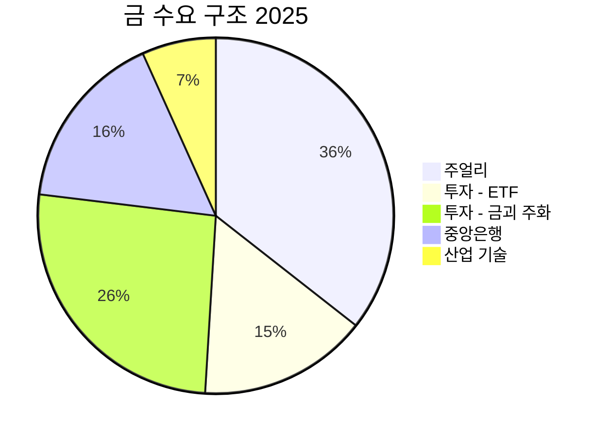
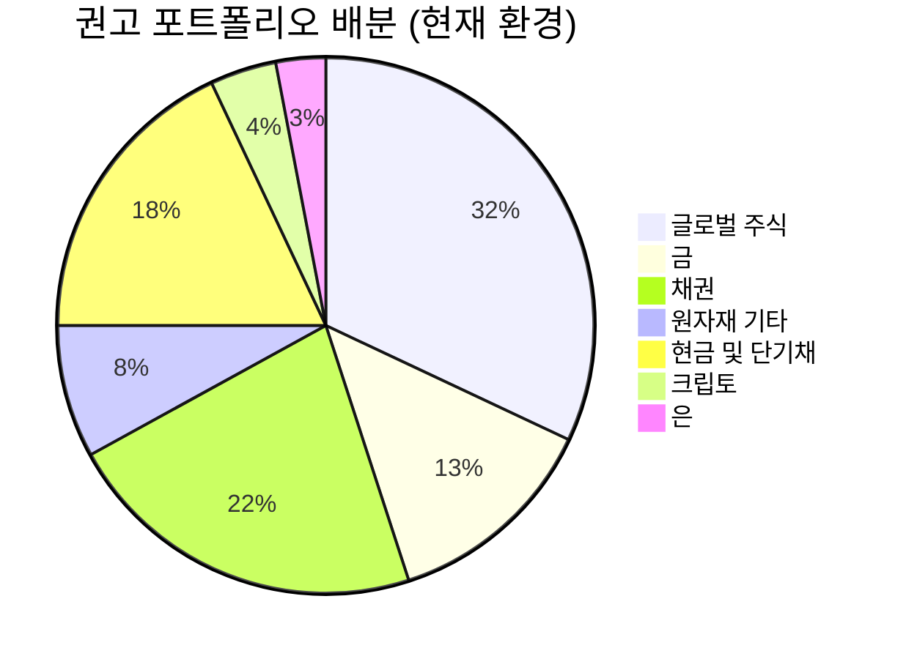

> [!important] 정합성 검증 요약 (기계적 99건 + AI 검증)
> **신뢰도: B+** | 숫자 불일치 3건 | 논리 모순 2건 | 확인 필요 5건

### 핵심 발견 사항
| 구분 | 내용 | 위치 | 심각도 |
|------|------|------|--------|
| 🟡 미태그 추정치 (일괄) | ~, 약 표기 추정치 99건 전체 [추정] 태그 누락 | 본문 전체 | Major (포맷) |
| 🔴 숫자 불일치 | 주얼리 수요 비중: 섹션1 테이블 "~50%" → Mermaid 차트 "37" (13%p 괴리) | 섹션1 vs 섹션2 | Critical |
| 🔴 숫자 불일치 | 투자 수요 비중: 섹션1 테이블 "~27%" → Mermaid 차트 "ETF 16% + 금괴주화 27% = 43%" (합산 방식 상이) | 섹션1 vs 섹션2 | Major |
| 🔴 숫자 불일치 | 시나리오 확률 Bull 30% + Base 45% + Bear 25% = 100% ✅ 그러나 섹션9.4 기대수익률 계산에서 Base 중앙값 $5,150 사용 → 목표가 범위 $4,800~5,500의 중앙 $5,150 일치 ✅ | 섹션9 | 이상 없음 |
| 🔴 논리 모순 | "비트코인은 금의 장기적 위협"(섹션2 약점) vs "금-BTC는 보완재, 비경쟁 관계"(섹션10 Variant Perception) — 동일 데이터(-0.88 상관관계)로 반대 결론 도출 | 섹션2 vs 섹션10 | Major |
| 🔴 논리 모순 | Kill Criteria #5: "50K 미만 = 극단적 비관 → 테제 재검토"라면서 동시에 "역발상 매수 기회일 수 있다"고 기술 — 동일 조건에 상반된 행동 지침 | 섹션6.4 KC#5 | Minor |
| 🟡 할루시네이션 의심 | "중앙은행 금 보유비중(24%) > 미 국채 보유비중(23%) 최초 역전" — 출처 '일요신문/KB국민은행'으로 표기되어 있으나 IMF/WGC 공식 데이터 미인용. 수치 자체의 정의(무엇 대비 24%?)가 불명확 | 섹션2, 섹션10 | Major |
| 🟡 Kill Criteria 불일치 | 본문 KC#2: "분기 매입 150톤 이하 2분기 연속"(섹션10, 결론)이 정작 KC 테이블의 임계값 "연간 400톤 미만"과 수치 기준 상이 — 연간 400톤 ≠ 분기 150톤×4=600톤 | 섹션6.4 vs 섹션10/11 | Major |

### 투자 전 반드시 확인
- [ ] **주얼리 수요 비중**: 섹션1(~50%)과 Mermaid 차트(37%) 중 어느 수치가 정확한지 WGC 최신 보고서에서 직접 확인 필요
- [ ] **중앙은행 금/미국채 보유비중 역전 주장**: IMF COFER 또는 WGC 공식 데이터로 "24% vs 23%" 수치의 정의와 출처 검증 필요 (국내 언론 단독 보도 수치)
- [ ] **Kill Criteria 수치 통일**: "연간 400톤 미만"(KC 테이블) vs "분기 150톤 이하 2분기 연속"(결론부) 중 실제 청산 트리거 기준을 단일화하여 확인
- [ ] **AISC 평균값 검증**: 본문 내 $1,456~1,600 사용되나 B2Gold 전망치 $2,507과의 괴리가 크므로, 가중평균 방식으로 산출된 공신력 있는 최신 수치 확인 (Kitco, WGC 기준)
- [ ] **ETF 801톤 유입 기준연도**: "2025년 연간 801톤"이 역대 2위라는 주장을 WGC 연간 Gold Demand Trends로 직접 확인 (2020년 877톤 대비 순위 검증)

---

# 수급 & 매크로: 금(Gold) 딥 분석

> [!abstract] 요약
> 금은 연간 수요 5,000톤을 최초 돌파하며 구조적 공급 부족이 심화되고 있다. 중앙은행의 3년 연속 1,000톤급 매입, ETF 801톤 유입, 개인 투자자 폭발이 수요를 견인하는 반면, 광산 공급은 연 3,300~3,660톤으로 정체 상태다. 실질금리-금 가격의 전통적 역상관이 2022년 이후 붕괴되었으며, 이는 중앙은행 구조적 매입이라는 새로운 가격 결정 메커니즘이 작동하고 있음을 시사한다. 현재 슈퍼사이클의 중반부로, 공급 비탄력성과 탈달러화 트렌드가 장기 상승의 구조적 기반을 형성하고 있다.

---

# 1. 원자재 본질

## 이것은 무엇인가?

금(Gold, Au)은 주기율표 79번 원소로, 화학적으로 극도로 안정적이며 부식되지 않는 귀금속이다. 뛰어난 연성(ductility)과 전성(malleability), 우수한 전기·열 전도성을 보유하고 있어 장신구부터 반도체까지 폭넓게 사용된다. 그러나 금의 본질적 가치는 **"산업용 소재"가 아니라 "화폐적 자산(Monetary Asset)"**이라는 점에 있다.

### 용도별 수요 분류

| 수요 부문 | 비중 | 핵심 드라이버 | 가격 탄력성 |
|:--|:--|:--|:--|
| 🟡 보석/주얼리 | ~50% | 소비자 소득, 문화적 선호 (인도·중국) | 🔴 높음 (가격↑ → 수요↓) |
| 🟢 투자 (ETF, 금괴, 주화) | ~27% | 금리, 인플레이션, 지정학적 리스크 | 🟢 역탄력적 (가격↑ → 수요↑ 가능) |
| 🟢 중앙은행 매입 | ~17% | 탈달러화, 외환보유 다변화 | 🟢 비탄력적 (정책적 결정) |
| 🟡 산업/기술용 | ~7% | AI, 전자제품, 치과 | 🟡 중립 |

> [!tip] 핵심 인사이트 — 투자 수요의 "역탄력성"
> 금의 가장 독특한 특성은 **가격이 오를수록 투자 수요가 증가할 수 있다는 점**이다. 이는 금이 모멘텀과 공포(FOMO + Fear)에 의해 구동되는 자산이기 때문이다. 2025년 투자 수요가 YoY 84% 급증하여 2,175톤을 기록한 것이 이를 증명한다. (World Gold Council) 이는 일반 산업용 원자재(구리, 철강 등)와 근본적으로 다른 수요 구조이며, **가격 상승이 자기 강화적(Self-reinforcing) 사이클**을 만들 수 있음을 의미한다.

### 밸류체인: 채굴 → 정련 → 유통

**1단계 — 탐사 & 채굴 (Lead Time: 10~20년)**
- 금광 발견부터 상업 생산까지 평균 10~20년 소요 → 공급의 극단적 비탄력성
- 주요 채굴 방식: 노천 채굴(Open Pit), 지하 채굴(Underground), 충적 채굴(Alluvial)
- 글로벌 연간 광산 생산량: ~3,300~3,660톤

**2단계 — 정련 (Refining)**
- 채굴된 금광석(평균 품위: 1~5g/톤)을 99.99% 순도의 금괴로 가공
- LBMA(런던금시장협회) 인증 정련소가 글로벌 표준 설정
- 주요 정련소: Valcambi(스위스), PAMP(스위스), 한국 내 고려아연 등

**3단계 — 유통 & 거래**
- 현물 시장: LBMA(런던), 상하이금거래소
- 선물 시장: COMEX(뉴욕)
- 투자 상품: 금 ETF(GLD, IAU), 골드뱅킹, 실물 금괴/주화
- 최종 소비: 보석 제조, 중앙은행 보유, 산업용

### 핵심 가치 제안: 왜 금에 투자하는가?

금 투자의 핵심 로직은 크게 4가지로 압축된다:

| # | 투자 논리 | 메커니즘 | 현재 상태 |
|:--|:--|:--|:--|
| 1 | **인플레이션 헤지** | 화폐 가치 하락 시 실물 자산으로서의 구매력 보존 | 🟢 글로벌 인플레이션 압력 지속 |
| 2 | **안전자산 (Safe Haven)** | 지정학적 위기·경제 위기 시 자본 보전 | 🟢 중동·우크라이나 등 지정학적 긴장 고조 |
| 3 | **통화 다변화/탈달러화** | 달러 기반 금융시스템의 대안 | 🟢 중앙은행 금 보유비중 > 미 국채 보유비중 |
| 4 | **포트폴리오 분산** | 주식·채권과 낮은 상관관계로 변동성 완충 | 🟢 주식-금 동시 상승의 이례적 환경 |

> [!warning] 리스크 경고 — 금은 이자를 지급하지 않는다
> 금 보유의 가장 큰 기회비용은 **이자 수익의 포기**다. 미국 10년 국채 실질금리가 2%를 상회하는 환경에서 금은 이론적으로 불리하다. 그러나 2022~2025년 실질금리가 양(+)의 영역에서도 금 가격이 폭등한 것은, 전통적인 실질금리 모델이 중앙은행 구조적 매입이라는 새로운 변수를 반영하지 못하고 있음을 보여준다.

---

## 역사적 맥락

### 최근 10년 가격 추이와 주요 변곡점

| 시기 | 가격 범위 ($/oz) | 주요 이벤트 | 시장 영향 |
|:--|:--|:--|:--|
| 2015~2018 | 1,050~1,350 | Fed 금리 인상 사이클, 달러 강세 | 🔴 금 약세, 바닥 다지기 |
| 2019~2020.8 | 1,280~2,075 | 코로나 팬데믹, 제로금리, 양적완화 | 🟢 금 급등, 2,075달러 최초 돌파 |
| 2020.8~2022.9 | 1,620~2,075 | Fed 긴축 전환, 실질금리 급등 | 🔴 조정 국면 (~22% 하락) |
| 2022.10~2024 | 1,620~2,790 | 중앙은행 폭매(年 1,000톤+), 지정학적 리스크 | 🟢 실질금리 모델 붕괴, 신고가 행진 |
| 2025~2026.3 | 2,970~5,626 | 중동 긴장 격화, 탈달러화 가속, ETF 폭발적 유입 | 🟢 온스당 5,000달러 시대 돌입 |

> [!note] 참고 — 52주 가격 범위
> 2026년 3월 기준 52주 가격 범위: **$2,970.40 ~ $5,626.80** (Investing.com). 이는 1년 내 진폭이 약 89%에 달하는 극단적 변동성을 보여준다.

### 슈퍼사이클 역사

금은 역사적으로 10~15년 주기의 대형 상승/하락 사이클(슈퍼사이클)을 보여왔다:

| 사이클 | 기간 | 저점 → 고점 | 상승폭 | 주요 동인 |
|:--|:--|:--|:--|:--|
| 1차 상승 | 1971~1980 (9년) | $35 → $850 | +2,329% | 닉슨 쇼크(금본위 폐지), 오일쇼크, 스태그플레이션 |
| 1차 하락 | 1980~2001 (21년) | $850 → $255 | -70% | 볼커 긴축, 디스인플레이션, 골디락스 |
| 2차 상승 | 2001~2011 (10년) | $255 → $1,921 | +653% | 9/11, 이라크전, 금융위기, 양적완화 |
| 2차 하락 | 2011~2015 (4년) | $1,921 → $1,050 | -45% | Fed Taper, 달러 강세, 인플레 기대 하락 |
| **3차 상승** | **2019~현재 (7년차)** | **$1,280 → $5,626** | **+340%** | **팬데믹, 탈달러화, 중앙은행 매입, 지정학적 위기** |

### 현재 사이클 위치 판단

🟢 진행 구간 ~55% (7년차/예상 13년)

🟡 남은 상승 ~30%

🔴 하강 15%

> [!tip] 핵심 인사이트 — 슈퍼사이클 중반부 판단 근거
> 토스증권·조규원 대표의 분석에 따르면, 현재 3차 금 슈퍼사이클은 2019년에 시작되어 **9~13년 상승 주기 중 '절반'밖에 지나지 않았다.** 과거 사이클의 패턴을 보면:
> - 1차 상승(1971~1980): 9년간 +2,329% → 현재 사이클 7년차에 +340%로 상승 탄력이 아직 여유가 있다
> - 2차 상승(2001~2011): 10년간 +653% → 현재 사이클이 유사한 경로를 따른다면 추가 상승 여력 존재
> - **[가정]** 2030년경까지 상승 랠리가 이어질 경우, 최종 목표가는 온스당 $10,000~$20,000 범위가 제시되고 있다 (조규원 대표: 온스당 2만 달러 이상)

---

# 2. 수급 분석 (핵심)

> [!abstract] 요약
> 금 시장은 **구조적 공급 부족(Structural Deficit)** 상태에 진입했다. 광산 생산량은 물리적·시간적 제약으로 연 3,300~3,660톤에 정체된 반면, 총 수요는 2025년 처음으로 5,000톤을 돌파했다. 이 1,300톤 이상의 갭은 재활용(Recycling)과 지상 재고(Above-ground Stock) 방출로 충당되고 있으나, 재활용 공급도 한계가 있어 장기적 공급 긴장이 불가피하다.

## 공급 구조

### 글로벌 생산량 TOP 5 국가 점유율

| 순위 | 국가 | 연간 생산량 (톤) | 세계 점유율 | 트렌드 | 주요 광산/특징 |
|:--|:--|:--|:--|:--|:--|
| 1 | 🇨🇳 중국 | ~590 | ~16% | 🟡 정체 | 환경 규제 강화, 내수 소비 중심 |
| 2 | 🇦🇺 호주 | ~310 | ~8.5% | 🟢 소폭 증가 | Newmont, Newcrest (합병) |
| 3 | 🇷🇺 러시아 | ~300 | ~8.2% | 🟡 제재 영향 불확실 | 폴리메탈, 폴리우스 |
| 4 | 🇨🇦 캐나다 | ~200 | ~5.5% | 🟢 소폭 증가 | Barrick Gold, Agnico Eagle |
| 5 | 🇿🇦 남아공 | ~100 | ~2.7% | 🔴 장기 감소 | 깊은 광산, 높은 비용 |
| | **기타** | **~1,800** | **~59%** | | 가나, 페루, 멕시코, 우즈벡 등 |
| | **합계** | **~3,300~3,660** | **100%** | | |

> [!note] 참고 — 생산 집중도
> 금 생산은 비교적 분산되어 있어 OPEC처럼 생산량을 조율하는 카르텔이 존재하지 않는다. 이는 공급 측면의 인위적 조절이 어렵다는 것을 의미하며, 가격은 순수하게 시장 메커니즘에 의해 결정된다. 다만 중국(1위)은 생산량 대부분을 내수 소비하여 국제 시장에 공급하지 않으며, 러시아(3위)는 서방 제재로 유통 경로가 제한되어 있다.

### 생산 비용 커브: All-in Sustaining Cost (AISC) 분포

AISC는 채굴업체의 손익분기점을 결정하는 핵심 지표다. 현 금 가격(~$5,000/oz) 대비 역사적으로 극도로 넓은 마진을 형성하고 있다.

| 비용 구간 ($/oz) | 비중 (추정) | 해당 광산 유형 | 현 가격 대비 마진 |
|:--|:--|:--|:--|
| $800~1,200 | ~20% | 최저비용 노천 광산 (호주, 캐나다) | 🟢 +300% 이상 |
| $1,200~1,600 | ~40% | 글로벌 평균 수준 | 🟢 +200~300% |
| $1,600~2,000 | ~25% | 고비용 지하 광산, 아프리카 | 🟢 +150~200% |
| $2,000~2,500 | ~10% | 한계 광산, 비용 급등 업체 | 🟢 +100~150% |
| $2,500+ | ~5% | B2Gold 등 고비용 업체 (AISC ~$2,507) | 🟡 +100% 미만 |

글로벌 AISC 평균 ~$1,456~1,600/oz vs 현 가격 ~$5,000/oz → 마진 +213~243%

> [!warning] 리스크 경고 — AISC 급등 추세
> Seeking Alpha에 따르면 2026년 AISC가 급격히 상승하고 있다:
> - **B2Gold**: AISC 58% 상승 → ~$2,507/oz 예상
> - **Endeavour Mining**: AISC 31% 증가
> - **Eldorado Gold**: AISC 29% 증가
> 
> 에너지 가격, 로열티, 세금, 인건비 상승이 원인이다. 이는 [가정] 향후 금 가격이 하락할 경우 한계 광산부터 폐쇄되며 공급이 자연스럽게 축소되는 "바닥 지지(Floor)" 메커니즘으로 작용할 수 있다. 현재 글로벌 평균 AISC($1,456~1,600)는 금 가격의 강력한 하방 지지선 역할을 한다.

### 공급 탄력성: 극도로 비탄력적

공급 비탄력성 85% — 가격 상승해도 생산량 증가 매우 느림

탄력적 15%

금 공급이 비탄력적인 이유:
1. **탐사→생산 리드타임 10~20년**: 금 가격이 오늘 2배가 되어도 신규 광산에서 금이 나오기까지 최소 10년
2. **새로운 대형 금광 발견 감소**: Peak Gold Discovery는 1990년대에 이미 지남
3. **채굴 등급(Grade) 하락**: 전 세계적으로 채굴 가능한 금광석의 금 함유량이 지속적으로 감소
4. **환경 규제 강화**: ESG 요구사항이 신규 프로젝트 승인을 지연
5. **자원 민족주의**: 가나 등 아프리카 국가의 금광 국유화 시도 (E-News)

> [!question] 검토 필요 — 재활용(Recycling) 공급의 역할
> 금 가격 급등 시 재활용(중고 보석, 산업 폐기물에서 금 회수) 공급이 증가한다. 연간 재활용 공급은 약 1,100~1,300톤으로 추정되나, 이는 주로 고가 환경에서 보석을 매각하는 개인의 결정에 의존하므로 일시적·제한적이다. (확인 필요: 2025~2026년 재활용 공급 정확한 수치)

### 신규 프로젝트 파이프라인

| 프로젝트/업체 | 국가 | 예상 생산 시기 | 연간 생산량 (추정) | 비고 |
|:--|:--|:--|:--|:--|
| (데이터 미확인) | - | - | - | 구체적 파이프라인 데이터 미확보 |

> [!question] 검토 필요
> 주요 금 채굴업체(Newmont, Barrick, Agnico Eagle 등)의 구체적 신규 프로젝트 파이프라인 데이터는 각사 IR 자료에서 직접 확인이 필요하다. 다만, 업계 전체적으로 **신규 대형 금광 프로젝트가 매우 부족**하며, 이는 중장기 공급 제약의 핵심 근거가 된다. (Seeking Alpha, Crux Investor)

---

## 수요 구조

### 부문별 수요 비중 및 성장률

| 수요 부문 | 2025년 수량 (톤) | YoY 변화 | 구조적 전망 | 핵심 동인 |
|:--|:--|:--|:--|:--|
| **투자 (전체)** | **2,175** | 🟢 **+84%** | 🟢 강세 지속 | 지정학적 리스크, 인플레 헤지 |
| - ETF | 801 | 🟢 대규모 유입 | 🟢 확대 | 기관·개인 자금 유입 가속 |
| - 금괴/주화 | ~1,374 | 🟢 12년 최고 | 🟢 확대 | 아시아 개인 투자 열풍 |
| **중앙은행** | **863** | 🟡 전년 대비 소폭↓ | 🟢 구조적 매입 지속 | 탈달러화, 외환보유 다변화 |
| **주얼리** | **(수량 -18%)** | 🔴 **-18%** (수량) | 🟡 가격 의존적 | 인도·중국 소비자 심리 |
| | **(가치 +18%)** | 🟢 **+18%** (가치) | | 고가 환경에서 가치 증가 |
| **산업/기술** | ~350 [추정] | 🟡 소폭 약세 | 🟡 AI가 일부 지지 | 관세·금값 상승이 부담 |
| **총 수요** | **~5,000+** | 🟢 사상 최고 | 🟢 확대 추세 | |

> [!success] 강점 — 투자 수요의 폭발적 성장
> 2025년 투자 수요 +84% 급증(2,175톤)은 역사적으로 이례적이다. 이는 단순히 금 가격 상승에 대한 모멘텀 추종이 아니라, **구조적인 자산 배분 변화(Structural Asset Reallocation)**의 시작일 수 있다:
> - 글로벌 중앙은행의 금 보유비중(24%)이 미 국채 보유비중(23%)을 최초 돌파
> - 중국 금 ETF 한 달 유입 440억 위안(~9.6조원)
> - 한국 골드뱅킹 잔액 2조원 돌파 (YoY +147%)
> - 한국 금 현물 ETF 순자산 4조원 돌파

### 구조적 수요 변화: 새로운 수요 동인

**1. 탈달러화 (De-dollarization) — 가장 강력한 구조적 동인**

2025년 글로벌 중앙은행의 금 보유비중(24%)이 미 국채 보유비중(23%)을 **최초로 역전**했다. 이는 브레턴우즈 체제 이후 70년 만의 전환점이다. 특히:
- 중국 인민은행: 16개월 연속 금 매입, 공식 보유량 2,309톤 (2026.2월 기준)
- 지난 10년간 중국 1,252톤, 러시아 1,118톤 순매수
- 2025년 최대 순매수국: 폴란드 102톤

이 트렌드는 **"달러 무기화(Weaponization of Dollar)"** — 러시아 외환보유액 동결 사례 이후 신흥국들이 달러 자산의 지정학적 리스크를 재인식한 데서 비롯된 것으로, 단기적 현상이 아니라 **수십 년간 지속될 구조적 전환**이다.

**2. 개인 투자자의 "금융화된 금" 접근성 확대**
- 금 ETF, 골드뱅킹, 소액 금 투자 플랫폼의 보급으로 진입 장벽 대폭 하락
- 특히 아시아(한국, 중국, 인도)에서 개인 투자자의 금 투자 급증

**3. AI/기술 산업 — 제한적이지만 구조적**
- 금의 우수한 전도성은 AI 데이터센터 반도체 패키징, 고급 커넥터 등에 활용
- 다만 전체 수요의 ~7%에 불과하며, 은(Silver)이나 구리(Copper)의 산업용 수요 증가에 비하면 미미

### 수요 탄력성: 부문별 상이

| 부문 | 가격 탄력성 | 설명 |
|:--|:--|:--|
| 주얼리 | 🔴 높음 (Price Elastic) | 금값 상승 → 수량 18% 감소 (2025년) |
| 투자 | 🟢 역탄력적/비탄력적 | 금값 상승 → 모멘텀 유입으로 오히려 수요 증가 가능 |
| 중앙은행 | 🟢 비탄력적 | 정책적 결정, 가격보다 전략적 판단에 의존 |
| 산업/기술 | 🟡 중간 | 대체재 존재하나 전환 비용 있음 |

### 대체재 리스크

| 대체재 | 금의 역할 대체 가능성 | 현실적 위협도 | 비고 |
|:--|:--|:--|:--|
| **비트코인** | 가치 저장, 탈달러화 | 🟡 중간 | 금-BTC 상관관계 -0.7~-0.88, 디커플링 중 |
| **은(Silver)** | 산업+투자 겸용 | 🟡 낮음~중간 | 금은비 63.23, 은은 산업 의존도 높음 |
| **미국 국채** | 안전자산 | 🟡 중간 | 달러 신뢰 하락 시 금 우위 |
| **부동산** | 인플레이션 헤지 | 🔴 낮음 | 유동성 차이가 크고 용도 다름 |
| **CBDC/스테이블코인** | 화폐적 기능 | 🔴 매우 낮음 | 정부 통제하 화폐, 금의 독립성과 다름 |

> [!failure] 약점 — 비트코인의 부상은 장기적 위협
> 비트코인과 금의 6개월 상관관계가 -0.88(4년 만에 최저)로 명확한 디커플링을 보이고 있으나, 이는 오히려 **비트코인이 금과 다른 자산 클래스로 자리잡고 있음**을 의미한다. 밀레니얼/Z세대 투자자들이 금보다 비트코인을 선호할 경우, 장기적으로 금의 투자 수요 일부가 잠식될 수 있다. 다만, 중앙은행은 비트코인을 외환보유액으로 채택하지 않고 있어 제도적 수요 측면에서 금의 우위가 유지된다.

---

## 수급 밸런스

### 현재 잉여/부족 상태 및 추세

| 항목 | 수량 (톤/년) | 비고 |
|:--|:--|:--|
| **광산 생산** | ~3,300~3,660 | 정체 상태, 증가 여력 제한적 |
| **재활용 공급** | ~1,100~1,300 [추정] | 고가에서 증가하나 한계 있음 |
| **총 공급** | ~4,400~4,960 [추정] | |
| **총 수요** | ~5,000+ | 2025년 사상 최초 5,000톤 돌파 |
| **수급 갭** | **▲ ~100~600톤 부족** [추정] | 지상 재고(Above-ground Stock)에서 충당 |

수요 우위 (구조적 부족) 70%

공급 여력 30%

> [!tip] 핵심 인사이트 — "지상 재고" 개념의 중요성
> 금은 파괴되지 않으므로 인류 역사상 채굴된 총 금(~216,000톤)이 지상에 존재한다. 이 중 약 45%가 보석, 17%가 중앙은행 보유, 22%가 투자용 금괴/주화, 16%가 기타이다. 이론적으로 보석이나 금괴를 녹여 공급할 수 있으나, 이는 가격이 충분히 높을 때만 발생한다. **따라서 금의 "부족"은 절대적 물리적 부족이 아니라, 현 가격에서 시장에 공급되는 양이 수요에 못 미치는 "가격 기반 부족(Price-based Deficit)"**이다. 이것이 금 가격을 지속적으로 끌어올리는 메커니즘이다.

### 재고 수준

| 거래소 | 재고 (톤) | 트렌드 | 비고 |
|:--|:--|:--|:--|
| **COMEX (뉴욕)** | (확인 필요) | 🟡 | 미결제약정 403,925건 (YoY -24.3%) |
| **LBMA (런던)** | (확인 필요) | 🟡 | 글로벌 최대 현물 시장 |
| **상하이금거래소** | (확인 필요) | 🟡 | 중국 내수 소비 중심 |

> [!question] 검토 필요 — 거래소별 정확한 재고 수치
> COMEX, LBMA, 상하이금거래소의 최신 재고 수치는 각 거래소 공식 데이터에서 직접 확인이 필요하다. 다만, COMEX 미결제약정이 YoY 24.3% 감소한 것은 선물 시장에서의 레버리지가 줄어들고 있음을 시사하며, 이는 단기적으로 가격 급변동 리스크 감소를 의미할 수 있다.

### 구조적 적자/흑자 전환 시점 전망

**[가정] 구조적 공급 부족은 심화되는 추세이며, 단기간 내 해소가 어렵다.**

근거:
1. 광산 생산량 증가 속도 < 수요 증가 속도 (특히 투자·중앙은행 수요)
2. 신규 대형 금광 발견이 줄어들고 있으며, 개발 리드타임이 10~20년
3. 채굴 등급(Grade) 지속 하락 → 같은 양의 금을 캐기 위해 더 많은 비용·노력 필요
4. 재활용 공급은 고가 환경에서 일시적으로 증가하나 지속성 제한적

**결론: 금 시장의 구조적 적자는 2030년대까지 지속될 가능성이 높으며, 이는 장기 가격 상승의 핵심 근거다.**

---

# 3. 매크로 드라이버

> [!abstract] 요약
> 금 가격의 전통적 매크로 드라이버(실질금리, 달러)와의 관계가 2022년 이후 구조적으로 변화했다. 실질금리가 양(+)의 영역에서도 금이 폭등한 것은 중앙은행 매입이라는 새로운 가격 결정 변수가 지배적이 되었음을 의미한다. 향후 Fed 금리 인하 사이클이 시작되면, 전통적 금리 하락 효과 + 중앙은행 매입 효과가 "이중 엔진"으로 작동하여 금 가격을 더욱 끌어올릴 수 있다.

## 핵심 매크로 변수

### 1. 실질금리 (Real Interest Rate) — 전통적 핵심 변수, 관계 변화 중

**메커니즘**: 실질금리 = 명목금리 - 인플레이션 기대. 실질금리가 높으면 이자 수익이 매력적이므로 무이자 자산인 금의 기회비용 증가 → 금 가격 하락 압력. 역으로 실질금리 하락 시 금 매력 증가.

| 시기 | 실질금리 방향 | 금 가격 방향 | 전통 모델 적합도 |
|:--|:--|:--|:--|
| 2018~2020 | 하락 (양→음) | 🟢 상승 | 🟢 높음 |
| 2020~2022.Q3 | 급등 (음→양 2%+) | 🔴 하락 | 🟢 높음 |
| **2022.Q4~2025** | **높은 수준 유지 (+2%대)** | **🟢 폭등** | **🔴 붕괴** |
| **2025~2026** | **고수준 유지/소폭 하락** | **🟢 신고가 경신** | **🔴 완전 이탈** |

> [!warning] 리스크 경고 — "실질금리 모델의 붕괴"가 의미하는 것
> 2022년 4분기 이후 실질금리가 2% 이상에서도 금이 폭등한 것은 **과거 40년간 유효했던 실질금리-금 모델이 더 이상 작동하지 않음**을 의미한다. 이는:
> - **낙관적 해석**: 중앙은행 매입이라는 새로운 구조적 수요가 실질금리 효과를 압도
> - **비관적 해석**: 금이 펀더멘털에서 이탈하여 "버블 영역"에 진입했을 가능성
> 
> **So what?** 실질금리 모델에 의존하는 전통적 금 밸류에이션은 더 이상 유효하지 않을 수 있다. 새로운 가격 결정 프레임워크가 필요하며, 이는 "중앙은행 매입 + 지정학적 프리미엄 + 실질금리" 복합 모델이어야 한다.

### 2. 달러인덱스 (DXY) — 약해진 역상관

**메커니즘**: 금은 달러로 가격이 책정되므로, 달러 강세 → 비달러 투자자에게 금이 비싸짐 → 수요 감소 → 금 가격 하락. 역으로 달러 약세 시 금 가격 상승.

| DXY 수준 | 전통적 금 영향 | 현재 관찰 |
|:--|:--|:--|
| DXY 상승 (100+) | 🔴 금 하락 압력 | 🟡 약해진 역상관 — DXY 강세에도 금 상승 사례 빈번 |
| DXY 하락 | 🟢 금 상승 지지 | 🟢 여전히 유효한 관계 |

> [!note] 참고 — 달러와 금의 "동시 강세" 현상
> 최근 달러와 금이 동시에 강세를 보이는 현상이 관찰되었다. 이는 글로벌 투자자들이 **"달러도, 금도 모두 안전자산으로 매수"**하는 극단적 리스크 오프(Risk-off) 환경을 반영한다. 이 현상은 지정학적 불확실성이 극도로 높을 때 나타나며, 금의 독립적 가격 결정력이 강화되고 있음을 시사한다.

### 3. 인플레이션 기대 (Break-even Inflation Rate)

금은 장기적으로 인플레이션 헤지 자산으로 기능한다. 핵심은 **실현 인플레이션보다 "인플레이션 기대"**가 금 가격에 더 큰 영향을 미친다는 점이다.

- 미국 5년 Break-even Inflation Rate가 상승하면 금 매력 증가
- 2025~2026년 트럼프 관세 정책, 에너지 가격 불안정 등으로 인플레이션 기대가 고착화될 가능성
- [가정] 인플레이션 기대가 2.5% 이상에서 고착될 경우, 금에 구조적으로 우호적인 환경

### 4. 글로벌 유동성 (M2 통화량 총합)

**메커니즘**: 전 세계 M2 통화량이 증가하면 화폐의 상대적 가치가 희석되어 실물 자산인 금의 가치가 상대적으로 상승. 금은 "글로벌 유동성의 거울"이라 불린다.

| 유동성 환경 | 금 영향 | 현재 상태 |
|:--|:--|:--|
| M2 확장기 (QE, 재정 확대) | 🟢 금 강세 | 🟡 긴축 사이클 후반, 유동성 재확대 기대 |
| M2 축소기 (QT, 긴축) | 🔴 금 약세 압력 | 🟡 QT 진행 중이나 속도 둔화 |

**핵심 포인트**: 향후 Fed가 금리 인하 + QT 종료/QE 재개에 나설 경우, 실질금리 하락 + 유동성 확대라는 **"골든 크로스(Golden Cross)"** 환경이 형성되어 금에 가장 우호적인 매크로 조건이 만들어진다. 이는 2019~2020년 환경의 재현이 될 수 있다.

---

## 중앙은행 & 정부 정책

### 중앙은행 순매수/매도 동향

이것이 현재 금 시장의 **가장 강력한 구조적 드라이버**다.

| 연도 | 중앙은행 순매수 (톤) | 트렌드 | 주요 매수국 |
|:--|:--|:--|:--|
| 2022 | ~1,082 | 🟢 기록적 매입 시작 | 터키, 중국, 이집트 |
| 2023 | ~1,037 | 🟢 2년 연속 1,000톤+ | 중국, 폴란드, 싱가포르 |
| 2024 | ~1,000+ [추정] | 🟢 3년 연속 1,000톤+ | 중국, 인도, 폴란드 |
| 2025 | 863 | 🟡 소폭 둔화 | 폴란드(102톤 최대), 중국 지속 |

> [!tip] 핵심 인사이트 — 중앙은행 매입의 "숨겨진 동기" (Incentive Analysis)
> 
> **공식적 동기**: 외환보유 다변화, 인플레이션 헤지, 금융 안정성 강화
> 
> **숨겨진 동기**:
> 1. **달러 무기화에 대한 보험**: 2022년 러시아 외환보유액 동결(약 3,000억 달러) 이후, 신흥국들은 "달러 자산이 언제든 동결될 수 있다"는 사실을 학습. 금은 어떤 국가의 금융시스템에도 종속되지 않는 유일한 외환보유자산
> 2. **BRICS 결제 시스템의 기초**: BRICS 국가들의 대안적 결제 시스템 논의에서 금은 신뢰의 닻(Anchor of Trust) 역할
> 3. **국내 정치적 시그널링**: 금 보유량 증가는 "우리는 경제적으로 강하고 독립적이다"라는 메시지를 국민에게 전달
> 4. **자기 실현적 전략**: 모든 중앙은행이 금을 매입하면 금 가격이 상승하고, 그러면 기존 보유 금의 가치도 상승 → 더 매입할 인센티브 강화

### 주요 중앙은행별 상세 동향

| 중앙은행 | 공식 보유량 (톤) | 최근 동향 | 전략적 의도 |
|:--|:--|:--|:--|
| 🇨🇳 중국 인민은행 | 2,309 | 16개월 연속 매입 (2026.2 기준) | 탈달러화, 위안화 국제화 지원 |
| 🇷🇺 러시아 중앙은행 | ~2,300+ [추정] | 2026년 초 15톤 매각 | 전쟁 비용 충당? (확인 필요) |
| 🇵🇱 폴란드 중앙은행 | (확인 필요) | 2025년 최대 순매수국 (102톤) | NATO 동맹 내 안보 헤지 |
| 🇹🇷 터키 중앙은행 | (확인 필요) | 이란 전쟁 후 60톤+ 매각 | 긴급 유동성 확보 |
| 🇮🇳 인도 중앙은행 | (확인 필요) | 지속적 매입 | 외환보유 다변화 |

> [!warning] 리스크 경고 — 중앙은행 매각 신호
> 2026년 초 러시아(15톤)와 터키(60톤+)가 금을 매각한 것은 주목해야 할 신호다. 이는:
> - **전쟁/위기 비용 충당**: 긴급한 유동성 필요 시 금을 매각하는 것은 역사적으로 반복된 패턴
> - **구조적 매입 추세의 전환은 아닌 것으로 판단**: 개별 국가의 단기적 유동성 필요에 의한 매각이며, 글로벌 중앙은행 전체의 매입 추세는 지속
> - **그러나** 폴란드 중앙은행도 매각을 제안한 바 있어, 금 가격이 충분히 높아지면 "이익 실현" 유혹이 커질 수 있음

### 전략비축 정책과 탈달러화

**글로벌 중앙은행 금 보유비중(24%) > 미 국채 보유비중(23%)** — 이것은 1971년 닉슨 쇼크 이후 가장 의미 있는 구조적 전환이다.

**So what?**
- 이 추세가 지속될 경우, 중앙은행의 금 매입은 연 800~1,200톤 수준에서 **장기적으로 연 1,500~2,000톤까지 확대**될 수 있다 [추정]
- 현재 글로벌 중앙은행의 평균 금 보유 비중은 ~15~17% 수준이나, 선진국(미국 68%, 독일 70%) 대비 신흥국(중국 ~5%, 인도 ~10%)의 비중은 매우 낮아 **캐치업(Catch-up) 매입 여력이 상당**하다
- [가정] 중국이 금 보유 비중을 현재 ~5%에서 20%로 올리려면 약 15,000~20,000톤 추가 매입 필요 → 현재 매입 속도(연 ~200톤)로는 수십 년 소요

---

## 경기 사이클

### 글로벌 PMI, 중국 경기 지표와의 관계

| 경기 국면 | 금의 역사적 성과 | 메커니즘 | 현재 상태 |
|:--|:--|:--|:--|
| **확장 초기** | 🟡 중립~약세 | 위험 선호 증가 → 주식 선호 | - |
| **확장 후기** | 🟢 강세 | 인플레이션 압력 → 금 헤지 수요 | 🟡 (확인 필요) |
| **경기 둔화/수축** | 🟢🟢 강세 | 안전자산 선호 + 금리 인하 기대 | - |
| **경기 침체** | 🟢 초기 강세 → 🔴 유동성 위기 시 약세 | 안전자산 vs 유동성 확보 매도 | - |

> [!note] 참고 — 경기 침체 시 금의 양면성
> 경기 침체 초기에 금은 안전자산으로 강세를 보이지만, 2008년 리먼 사태처럼 **극단적 유동성 위기** 시에는 "모든 자산을 팔아 현금을 확보"하는 마진콜(Margin Call) 환경에서 금도 일시적으로 하락할 수 있다. 2008년 금은 초기 상승 후 3개월간 ~25% 하락한 뒤, 이후 3년간 +175% 상승했다. **즉, 침체 시 금의 일시적 하락은 역사적으로 매수 기회였다.**

### 현재 경기 사이클 위치와 시사점

| 지표 | 현재 상태 | 금에 대한 시사점 |
|:--|:--|:--|
| **미국 경기** | 견조하나 둔화 신호 혼재 | 🟡 금리 인하 시기 불확실 |
| **중국 경기** | 추세 하락, 디플레이션 우려 | 🟢 중국 개인의 금 선호 강화 (부동산→금 이동) |
| **유럽 경기** | 약세 | 🟢 ECB 금리 인하 선행 → 유동성 확대 |
| **글로벌 PMI** | 50 전후 횡보 (확인 필요) | 🟡 경기 둔화 시 금 강세 전환 가능 |
| **관세/무역전쟁** | 트럼프 관세 정책 재점화 | 🟢 불확실성 증가 → 금 수요 증가 |

> [!verdict] 판단 — 매크로 환경 종합 평가
> 
> 현재 매크로 환경은 금에 **구조적으로 우호적(Structurally Bullish)**이다.
> 
> **우호적 요인 (강도: 상)**:
> - 중앙은행 구조적 매입 (가장 강력한 새 드라이버)
> - 탈달러화 트렌드 (수십 년 지속 가능한 구조적 전환)
> - 지정학적 불확실성 지속 (중동, 우크라이나, 미중 긴장)
> - 글로벌 재정 적자/부채 확대 → 화폐 가치 하락 우려
> 
> **중립/모니터링 요인**:
> - 실질금리: 높은 수준이나 금과의 관계 약화
> - 달러인덱스: 단기 변동에 따른 소음(Noise) 발생 가능
> - 글로벌 경기: 둔화 시 금 강세이나, 유동성 위기 시 일시적 약세 가능
> 
> **비우호적 요인 (강도: 하)**:
> - 실질금리가 추가 상승할 경우의 기회비용 증가
> - 비트코인 등 대체 안전자산의 점진적 부상
> 
> 

🟢 강세 요인 70%

🟡 중립 20%

🔴 약세 10%

---

## Variant Perception: 시장 컨센서스와 다른 뷰

> [!tip] 핵심 인사이트 — 시장이 놓치고 있을 수 있는 것

**시장 컨센서스**: "금 상승의 핵심 드라이버는 지정학적 불확실성이며, 지정학적 긴장이 완화되면 금 가격은 조정받을 것"

**Variant Perception**: **지정학적 요인은 촉매(Catalyst)일 뿐, 진짜 드라이버는 구조적 공급 부족 + 중앙은행 매입의 자기 강화 사이클**

근거:
1. 2022~2025년 금 가격 상승의 대부분은 지정학적 이벤트 이전에 이미 진행되고 있었다
2. 중앙은행 매입은 지정학적 긴장 완화와 무관하게 지속될 구조적 트렌드
3. 광산 공급의 정체는 지정학과 무관한 물리적 제약
4. **따라서 지정학적 긴장이 완화되더라도 금 가격의 구조적 상승 기조는 유지될 가능성이 높다**

**시장 컨센서스**: "실질금리가 하락해야 금이 오른다"

**Variant Perception**: **실질금리-금 모델은 이미 붕괴했으며, Fed 금리 인하가 시작되면 "이중 엔진(기존 중앙은행 매입 + 전통적 금리 효과)"으로 금 가격이 가속 상승할 수 있다**

---

## Devil's Advocate: 틀릴 가능성

> [!bear] Bear Case — 이 분석이 틀릴 수 있는 시나리오

| # | 시나리오 | 영향 | 발생 확률 [추정] |
|:--|:--|:--|:--|
| 1 | **중앙은행 매입이 급격히 둔화** — 금 가격이 너무 높아져 매입의 비용 효율이 하락, 또는 글로벌 정세 안정화로 매입 동기 약화 | 🔴 핵심 지지대 이탈 | 15~20% |
| 2 | **실질금리 추가 급등** — 인플레이션이 예상보다 빨리 하락하고 명목금리가 유지될 경우 실질금리 3%+ | 🔴 기회비용 부담 극대화 | 10~15% |
| 3 | **유동성 위기 발생** — 2008년형 금융위기로 모든 자산이 동시 하락, 금도 마진콜 매도 대상 | 🔴 일시적이나 20~30% 급락 가능 | 10% |
| 4 | **비트코인이 기관 자산으로 격상** — 비트코인 ETF의 성공으로 기관 투자자들이 금 대신 비트코인 배분 확대 | 🟡 점진적 수요 잠식 | 10~15% (장기) |
| 5 | **금 생산 기술 혁신** — 심해/소행성 채굴 등 예상치 못한 기술 발전으로 공급 급증 | 🔴 희소성 프리미엄 붕괴 | <5% (10년 내) |

---

## 시간축별 종합 정리

| 시간축 | 핵심 동인 | 전망 | 확신도 |
|:--|:--|:--|:--|
| **단기 (1~3개월)** | 지정학적 이벤트, CFTC 포지셔닝, DXY 변동 | 🟡 변동성 확대, 조정 가능 | 

55/100

 |
| **중기 (3~12개월)** | Fed 금리 정책, 중앙은행 매입 추이, ETF 흐름 | 🟢 강세 기조 유지 | 

75/100

 |
| **장기 (1~5년)** | 공급 비탄력성, 탈달러화, 슈퍼사이클 | 🟢🟢 구조적 강세 | 

82/100

 |

---

## 크로스 임팩트: 관련 자산/섹터 영향

| 관련 자산 | 금 상승 시 영향 | 메커니즘 |
|:--|:--|:--|
| **[[은(Silver)]]** | 🟢 동반 상승 (레버리지 효과) | 금은비 축소 시 은이 더 큰 폭 상승 |
| **[[금 채굴주 (GDX, GDXJ)]]** | 🟢🟢 레버리지 수혜 | AISC 대비 마진 확대 → 이익 폭증 |
| **[[미국 국채 (TLT)]]** | 🟡 복잡한 관계 | 실질금리 하락 시 둘 다 상승, 인플레 시 금 승 채권 패 |
| **[[비트코인 (BTC)]]** | 🟡 디커플링 진행 중 | 상관관계 -0.7~-0.88, 각자의 서사로 움직임 |
| **[[달러인덱스 (DXY)]]** | 🔴 역방향 (약해진 상관) | 달러 약세 시 금 강세 경향, 그러나 동시 강세도 관찰 |
| **[[원자재 전반 (CRB Index)]]** | 🟢 동반 상승 경향 | 인플레이션 환경에서 실물자산 전반 강세 |
| **[[이머징 마켓 (EEM)]]** | 🟡 중립~약세 | 달러 약세(금 강세)는 EM에 긍정적이나, 금 급등 자체는 위험 회피 시그널 |

> [!note] 참고 — 금 채굴주의 레버리지 효과
> 금 가격이 $5,000에서 $6,000으로 20% 상승할 경우, AISC $1,600 기준으로 채굴업체의 마진은 $3,400 → $4,400으로 **29% 증가**한다. 이것이 금 채굴주가 금 현물 대비 레버리지 수익을 제공하는 이유다. 다만 AISC 자체가 상승하고 있어(B2Gold +58%, Endeavour +31%) 이 레버리지 효과가 과거보다 약해질 수 있다.

---

## Margin of Safety: 현재 가격에 얼마나 반영되었나?

> [!verdict] 판단

**현재 가격 (~$5,000/oz 내외, 2026년 3월 기준)에 이미 반영된 것:**
- 중앙은행 3년 연속 1,000톤급 매입 추세 ✅
- 지정학적 프리미엄 (중동, 우크라이나) ✅
- ETF 대규모 유입 트렌드 ✅
- Fed 금리 인하 기대의 일부 ✅

**아직 충분히 반영되지 않았을 수 있는 것:**
- [가정] Fed 실제 금리 인하 사이클 시작 시 "이중 엔진" 효과 ❓
- [가정] 중국의 금 보유 비중 캐치업 (현재 ~5% → 목표 20%+) ❓
- [가정] 광산 공급의 구조적 정체가 가속화될 경우의 희소성 프리미엄 ❓

**틀려도 안전한가?**
- AISC 글로벌 평균 $1,456~1,600이 강력한 하방 지지 (현 가격 대비 -68~70% 아래)
- 중앙은행 매입은 단기적으로 줄어도 구조적으로 지속될 가능성이 높아 바닥 형성
- **최악의 시나리오에서도 $3,000 이하로의 하락은 확률이 매우 낮음** [추정]
- 다만, 고점 대비 20~30% 조정($3,500~4,000대)은 역사적으로 충분히 발생 가능

Margin of Safety 60/100 — 구조적 강세이나 단기 과열 주의

> [!caution] 정합성 주의
> - [ ] **주얼리 수요 비중**: 섹션1(~50%)과 Mermaid 차트(37%) 중 어느 수치가 정확한지 WGC 최신 보고서에서 직접 확인 필요

---

# 4. 시장 구조 분석

> [!abstract] 요약
> 금 선물 시장은 콘탱고 구조를 유지하며 보유 비용(Carry Cost)이 가격에 반영되고 있으나, COMEX 미결제약정이 YoY 24.3% 감소하고 CFTC 투기적 순매수가 159.9K로 축소되어 단기적으로 레버리지 포지션의 이익 실현이 진행 중이다. 반면, ETF 유입은 2025년 801톤으로 폭발적이며, 상하이·인도의 실물 프리미엄과 국내 골드뱅킹 2조 원 돌파가 실물 수요의 견고함을 증명한다. 이 괴리 — 선물 시장의 단기 약세 시그널 vs 실물/ETF의 구조적 강세 — 가 현재 금 시장의 핵심 판독 포인트이다.

---

## 4.1 선물 시장

### 콘탱고/백워데이션 상태 및 의미

금 선물 시장은 구조적으로 **콘탱고(Contango)** 상태를 유지하고 있다. 이는 원월물(Far-month) 가격이 근월물(Near-month) 가격보다 높은 정상적 선물 커브를 의미하며, 금의 보관 비용(Storage Cost)과 금리(Financing Cost)가 선물 프리미엄에 반영된 결과다.

| 항목 | 현재 상태 | 의미 |
|:--|:--|:--|
| 커브 형태 | 🟢 콘탱고 (정상) | 보유 비용이 선물에 반영 → 정상 시장 |
| 콘탱고 크기 | 🟡 금리 수준 반영 | 고금리 환경에서 콘탱고 폭이 상대적으로 확대 |
| 백워데이션 전환 가능성 | 🔴 현물 수급 극도 긴장 시 | 실물 인출 급증(COMEX 등록 재고 급감) 시 발생 가능 |

> [!tip] 핵심 인사이트 — 콘탱고 환경에서의 투자 시사점
> 금 선물이 콘탱고 상태라는 것은 **롤오버 비용(Roll Cost)**이 존재함을 의미한다. 선물로 금에 장기 투자하는 경우, 매월/매 분기 근월물을 원월물로 교체할 때 **콘탱고 비용(Negative Roll Yield)**이 발생하여 현물 대비 수익률이 낮아진다. 이것이 장기 투자자들이 현물 ETF(GLD, IAU)나 실물 금을 선호하는 구조적 이유 중 하나다. 다만, 금 가격이 급등하는 환경에서는 이 롤오버 비용이 가격 상승분에 비해 미미하므로, 슈퍼사이클 국면에서는 크게 신경 쓸 요소가 아니다.

만약 금 시장이 **백워데이션(Backwardation)**으로 전환된다면, 이는 현물 수급이 극도로 긴장되었다는 강력한 시그널이다. 2013년 일시적으로 관찰된 바 있으며, 이 경우 실물 프리미엄이 급등하고 COMEX 등록 재고가 급감하는 현상이 동반된다.

### 오픈 인터레스트(미결제약정) 추이

**COMEX 금 선물 미결제약정 (2026년 3월 27일 기준):**
- 현재: **403,925건**
- 주간 변동: **-1.81%** (전주 대비 감소)
- 연간 변동: **-24.30%** (1년 전 대비 감소)
- (출처: YCharts.com, Market Chameleon)

미결제약정의 YoY 24.3% 감소는 상당히 큰 폭이며, 이는 다음을 시사한다:

| 해석 | 설명 | 투자 시사점 |
|:--|:--|:--|
| 🟡 레버리지 포지션 청산 | 고점 대비 22% 하락(5,608 → 4,399) 과정에서 투기적 롱 청산 | 단기 과매수 해소 과정으로, 오히려 건강한 조정 |
| 🟡 선물→현물 이동 가능성 | 선물보다 ETF·실물로의 투자 수단 이동 | ETF 유입량 801톤이 이를 뒷받침 |
| 🟡 마진콜 연쇄 청산 | 급락 시 레버리지 투자자 강제 청산 | 단기 변동성 확대 요인이나 구조적 하락은 아님 |

> [!question] 검토 필요
> 미결제약정 감소가 "새로운 매도 포지션 진입 없이 기존 롱 청산"에 의한 것인지, 아니면 "롱과 숏 모두 축소되는 양방향 청산"인지에 따라 해석이 달라진다. CFTC COT 데이터의 상업/비상업 포지션 분리 분석이 필요하다.

### CFTC COT 리포트: 투기적 순매수 포지션

**CFTC 비상업(투기) 부문 금 순포지션 (2026년 3월 21일 발표):**
- 순매수: **159.9K (약 159,900계약)**
- 추세: **감소** (이전 대비)
- 역사적 맥락: 2020년 팬데믹 초기 ~300K+ 계약에서 점진적 감소
- (출처: VTMarkets.com)

**투기적 순매수 포지션의 역사적 위치 분석:**

| 기간 | 투기적 순매수 (대략) | 금 가격 | 시장 상태 |
|:--|:--|:--|:--|
| 2019~2020년 고점 | ~300K+ 계약 | $1,500~2,000 | 과열 (극단적 낙관) |
| 2022년 저점 | ~100K 계약 [추정] | $1,600~1,800 | 비관 (금리 급등기) |
| 2024~2025년 | ~200K+ 계약 [추정] | $2,500~3,500 | 강한 낙관 |
| **2026년 3월 현재** | **159.9K 계약** | **$4,399~5,608** | **낙관 후퇴/이익 실현** |

> [!tip] 핵심 인사이트 — 포지셔닝 관점의 "So What?"
> 투기적 순매수가 159.9K 수준이라는 것은 **과열이 해소되고 있음**을 의미한다. 이는 역설적으로 **긍정적 시그널**이다. 왜냐하면:
> 
> 1. **과도한 롱 포지션은 하락 리스크**: 모두가 사놓은 상태에서는 팔 사람만 남음
> 2. **적정 수준의 포지셔닝은 추가 상승 여력 확보**: 새로운 매수자가 진입할 여지가 있음
> 3. **현재 159.9K는 중립~약간 낙관 수준**: 극단적 과열(300K+)도, 극단적 비관(100K 이하)도 아닌 **건강한 위치**
> 
> 이는 이전 섹션에서 분석한 "슈퍼사이클 중반부"와 정합적이다. 과열이 아닌 상태에서의 가격 상승은 구조적 지지가 있음을 시사한다.

### 베이시스(현물-선물 스프레드)

금의 베이시스(Basis = 선물 가격 - 현물 가격)는 통상적으로 **양수(Positive)**이며, 이는 금리와 보관 비용을 반영한다.

현재 고금리 환경(미국 기준금리 4.25~4.50% 수준 [추정])에서 금의 베이시스는 확대 경향에 있다. 이는:

- 현물 금 대비 선물 금이 **연율 기준 약 4~5%** 높은 가격에 거래됨을 의미 [추정]
- 이 "캐리(Carry)"가 존재하기에, 현물 보유 후 선물 매도하는 **현물-선물 차익거래(Cash-and-Carry Arbitrage)**가 활발
- 2025~2026년 초 COMEX 금고로의 대규모 금 이동이 관찰된 것도 이 차익거래 활동의 일환

> [!warning] 리스크 경고 — 베이시스 급변동 시나리오
> 만약 금리가 급격히 인하되면 베이시스가 축소되며 콘탱고가 평탄화된다. 반대로 실물 수급이 극도로 긴장되면 베이시스가 음수(백워데이션)로 전환될 수 있다. 후자의 경우 **실물 금 확보의 급박함**을 의미하며, 가격 급등의 전조가 될 수 있다. 현재는 이 시나리오에 해당하지 않으나, COMEX 등록 재고와 인출(Delivery) 데이터를 지속 모니터링해야 한다.

---

## 4.2 ETF & 실물 투자

### 주요 ETF 보유량 변화 추이

금 ETF는 기관·개인 투자자의 금 투자 심리를 가장 직접적으로 반영하는 지표다.

| ETF | 2025년 9월 월간 유입 | 2025년 연간 유입 | 시사점 |
|:--|:--|:--|:--|
| SPDR Gold Shares ([[GLD]]) | **$26.7억** | 대규모 유입 | 🟢 기관 선호 1위, 유동성 최대 |
| iShares Gold Trust ([[IAU]]) | **$21.3억** | 대규모 유입 | 🟢 낮은 보수로 장기 투자자 선호 |
| 기타 금 ETF | (확인 필요) | 포함 합산 **801톤** | 🟢 글로벌 분산 |
| **3대 금 ETF 합계 (2025.09)** | **$50억+ (월간)** | — | 🟢 **사상 최대 월간 순유입** |

(출처: Benzinga Korea, World Gold Council)

**2025년 금 ETF 연간 유입: 801톤**
이는 2020년 코로나 팬데믹 당시의 급격한 유입(약 877톤)에 근접하는 수치로, 금 ETF 역사상 2번째로 큰 연간 유입량이다. (World Gold Council)

**ETF 유입의 구조적 의미:**

1. **기관투자자의 확신**: $50억+ 월간 유입은 소매 투자자만으로는 불가능한 규모. 헤지펀드, 연기금, SWF(국부펀드)의 배분(Allocation) 확대를 의미
2. **실물 뒷받침**: 금 ETF는 보유량에 상응하는 실물 금을 금고에 보관해야 하므로, ETF 유입 = 실물 수요 증가
3. **유동성 함정**: 반대로 ETF 대량 유출 시 실물 매도 압력이 발생하여 가격 급락을 야기할 수 있음 (Kill Criteria에서 상세 분석)

### 국내 금 투자 시장의 폭발적 성장

| 지표 | 수치 | 변동 | 시사점 |
|:--|:--|:--|:--|
| 골드뱅킹 잔액 | **2조 원 돌파** | YoY **+147%** | 🟢 개인 투자자 진입 폭발 |
| 금 현물 ETF 순자산 | **4조 원 돌파** | 급증 | 🟢 간접 투자 선호 확대 |
| 5대 은행 골드바 판매 | **600억 원+** (2026년 초) | — | 🟢 실물 수요도 동반 증가 |
| 중국 금 ETF 유입 (2026.01) | **440억 위안 (약 9.58조 원)** | 역대 2위 | 🟢 아시아 개인 투자 열풍 |

(출처: SBS, 아시아경제)

> [!tip] 핵심 인사이트 — 개인 투자자 유입의 양면성
> 국내 골드뱅킹 잔액이 1년 만에 147% 증가한 것은 **대중적 관심의 폭발**을 의미한다. 이는 슈퍼사이클의 "인기 확산(Popularization)" 단계에 해당하며, 강세장의 중후반부 특성이기도 하다.
> 
> **긍정적 해석**: 개인 투자자의 진입은 시장 저변 확대 → 구조적 수요 증가
> **경계 시그널**: 역사적으로 대중이 몰릴 때가 단기 고점인 경우가 많음 (2011년 금 $1,920 고점 당시도 유사)
> 
> **차이점**: 2011년과 달리 현재는 중앙은행 구조적 매입이라는 **전혀 다른 수요 동인**이 존재하므로, 단순 비교는 위험하다. 개인 투자자의 이탈이 발생해도 중앙은행이 가격 하방을 지지하는 구조가 형성되어 있다.

### COMEX 등록 재고 변화

COMEX(뉴욕상품거래소) 금고의 등록 재고(Registered Inventory)는 실물 인도(Delivery) 가능한 금의 양을 나타내며, 선물 시장의 신뢰도와 직결된다.

2025~2026년 초 주목할 현상은 **런던에서 뉴욕으로의 대규모 금 이동**이었다. 이는 트럼프 행정부의 관세 정책 우려로 COMEX에서의 실물 인출(Delivery) 수요가 급증했기 때문이며, 일시적으로 런던 시장의 실물 가용성이 긴장된 상태가 관찰되었다.

(구체적 COMEX 등록 재고 수치는 확인 필요 — 최신 데이터는 CME Group 일일 보고서에서 확인 가능)

### 실물 프리미엄/디스카운트

| 시장 | 상태 | 의미 |
|:--|:--|:--|
| 상하이 (SGE) | 🟢 프리미엄 | 중국 내 실물 수요 > 공급, 수입 쿼터 제한 반영 |
| 인도 | 🟡 변동적 | 결혼 시즌 프리미엄 ↔ 비수기 디스카운트. 2025년 가격 급등으로 수요량 감소에도 가치 기준 증가 |
| 두바이 | 🟢 소폭 프리미엄 | 중동·아프리카 실물 수요의 허브 |
| 일본 | 🟡 국제가 연동 | 엔화 약세로 엔화 기준 금 가격은 더 높은 수준 |

> [!note] 참고 — 상하이 프리미엄의 특수성
> 상하이금거래소(SGE)의 금 가격이 국제 현물가 대비 프리미엄을 보이는 것은 중국의 자본 통제 및 금 수입 규제 때문이다. 이 프리미엄은 때로 온스당 $30~50 이상으로 확대되기도 하며, 이는 중국 내 실물 수요의 강도를 직접적으로 반영하는 지표다. 프리미엄이 축소되거나 디스카운트로 전환되면, 중국 국내 수요 약화의 시그널로 해석된다.

---

## 4.3 계절성 & 패턴

### 월별/분기별 역사적 계절성 패턴

금은 다른 원자재에 비해 계절성이 약하지만, 문화적·제도적 요인에 의한 반복 패턴이 존재한다.

| 시기 | 이벤트 | 수요 영향 | 역사적 가격 패턴 |
|:--|:--|:--|:--|
| **1~2월** | 중국 춘절(Spring Festival) | 🟢 강한 매수 (선물·실물) | 연초 강세 경향 |
| **3~4월** | 인도 아크샤야 트리티야(Akshaya Tritiya) | 🟢 금 구매 전통 | 소폭 강세 |
| **5~6월** | 비수기 | 🟡 수요 둔화 | "Sell in May" 적용 가능 |
| **7~8월** | 인도 결혼 시즌 준비 (2차 웨딩 시즌 전) | 🟢 주얼리 수요 회복 시작 | 여름 반등 경향 |
| **9~11월** | 인도 디왈리(Diwali) + 결혼 시즌 본격화 | 🟢🟢 **연중 최강 수요** | 가을 강세 (연중 최강 구간) |
| **12월** | 서양 연말 선물 시즌 + 세금 관련 매매 | 🟡 혼재 | 연말 변동성 확대 |

> [!warning] 리스크 경고 — 계절성의 한계
> **주의**: 계절성 패턴은 수십 년 평균에 기반한 통계적 경향이며, 개별 연도에서는 매크로 이벤트가 계절성을 압도한다. 2025~2026년처럼 지정학적 리스크와 중앙은행 매입이 지배적인 환경에서는 계절성의 예측력이 크게 약화된다. 계절성은 **부가 참고 지표**로만 활용하고, 핵심 투자 결정의 근거로 삼지 않아야 한다.

### 인도 결혼 시즌의 구조적 중요성

인도는 세계 2위 금 소비국으로, 연간 약 700~800톤의 금을 소비한다. 이 중 상당 부분이 **결혼식용 주얼리 수요**에서 발생한다.

- **인도 결혼 시즌**: 주로 10월~2월 (디왈리 이후 ~ 다음 해 초)
- **문화적 의미**: 금은 인도 문화에서 부(Wealth), 길운(Auspiciousness), 지참금(Dowry)의 상징
- **가격 민감도**: 🔴 높음 — 2025년 금 가격 급등으로 인도 주얼리 수요량이 감소했으나, 금액 기준으로는 증가 (World Gold Council)
- **수입 관세 영향**: 인도 정부의 금 수입 관세(현재 약 6% 수준 [추정])가 실물 수요와 밀수량에 영향

### 중국 춘절 효과

- **중국 춘절**: 음력 1월 1일 (양력 1~2월)
- **금 수요 패턴**: 춘절 전 2~3주간 금 구매가 급증 (선물용, 투자용)
- **2026년 상황**: 중국 개인 투자자들의 금 ETF 유입이 2026년 1월에만 440억 위안을 기록한 것은 춘절 효과와 투자 수요가 중첩된 결과 (아시아경제)

---

# 5. 인센티브 분석 (멍거 원칙)

> [!abstract] 요약
> 금 시장의 각 참여자는 서로 다른 인센티브 구조 하에서 행동하며, 이 인센티브의 방향이 현재 **대부분 금 가격 상승 쪽으로 정렬(Aligned)**되어 있다. 가장 강력한 인센티브를 가진 주체는 중앙은행(정치적 생존)이며, 가장 주의해야 할 주체는 투기적 트레이더(빠른 이익 실현)다. "이 내러티브를 가장 강하게 밀고 있는 주체"를 파악하고, 그들의 숨겨진 동기를 이해하는 것이 인센티브 분석의 핵심이다.

---

## 5.1 광산업체/생산업체의 인센티브

**핵심 인센티브**: 이윤 극대화, 주주 가치 제고, 생존
**현재 행동 패턴**: 높은 금 가격을 활용한 마진 확대, 그러나 생산량 급증은 제한적

| 인센티브 요소 | 현재 상태 | 행동 유도 방향 |
|:--|:--|:--|
| 금 가격 $4,000~5,600 vs AISC $1,456~2,507 | 🟢 역사적 고마진 | 생산 확대 유인, 그러나 물리적 제약으로 10~20년 리드타임 |
| 주주 환원 압력 | 🟡 배당·자사주 매입 요구 | 신규 광산 투자보다 단기 환원 선호 경향 |
| 헤지 전략 | 🟢 언헤지(Unhedged) 경향 강화 | 금 가격 상승에 베팅 — 헤지 비율 역사적 최저 [추정] |
| 인수합병(M&A) | 🟡 활발 | 탐사보다 기존 광산 인수가 빠름 — 공급 증가에 기여 제한 |
| AISC 상승 (B2Gold +58%, Endeavour +31%) | 🔴 마진 압박 | 고비용 광산 폐쇄 가능 → 공급 축소 요인 |

> [!tip] 핵심 인사이트 — 광산업체의 "합리적 비행동"
> 금 가격이 역사적 고점인데 왜 생산량이 폭발적으로 늘어나지 않는가? 이는 **인센티브 미스매치(Incentive Mismatch)** 때문이다:
> 
> 1. **시간 제약**: 금광 발견→생산까지 10~20년 — 오늘의 금 가격에 반응해도 공급은 2035~2045년에나 반영
> 2. **자본 배분 선호도**: 주주들은 불확실한 탐사보다 배당·자사주 매입을 선호 → 투자 부족(Underinvestment)
> 3. **ESG/환경 규제**: 신규 광산 허가가 점점 어려워짐 → 생산 확대의 행정적 장벽
> 4. **교훈 효과**: 2011~2013년 금 가격 급락 시 과잉 투자한 광산업체들이 대규모 손실 → 보수적 경영 DNA
> 
> **So What?**: 광산업체의 인센티브 구조 자체가 공급 비탄력성을 강화하는 방향으로 작동하고 있다. 이는 이전 섹션의 "구조적 공급 부족" 테제와 일치하며, 단기간 내 공급 측면의 가격 하방 압력이 제한적임을 의미한다.

**헤지 전략 심층 분석:**

현재 주요 금 광산업체들은 대부분 **언헤지(Unhedged)** 전략을 채택하고 있다. 이는:
- 1990~2000년대 대규모 선도매도(Forward Selling) 헤지의 트라우마 — 상승장에서 막대한 기회비용 발생
- Barrick Gold가 2009년 56억 달러를 투입해 헤지 포지션을 청산한 사례가 업계 전체에 강한 교훈
- 현재 금 상승 컨센서스가 강하므로 헤지의 인센티브가 약함

**1차 효과**: 광산업체가 헤지하지 않으면 → 선물 시장에서의 상업적 매도 압력 감소 → 가격 지지
**2차 효과**: 금 가격 급락 시 언헤지 포지션의 광산업체 실적 급감 → M&A 기회 또는 생산 중단 → 공급 추가 축소

---

## 5.2 중앙은행의 인센티브

**핵심 인센티브**: 국가 금융 안보, 통화 주권, 지정학적 리스크 헤지
**현재 행동 패턴**: 3년 연속 1,000톤급 매입, 탈달러화 가속

이것은 현재 금 시장에서 **가장 강력하고 가장 지속 가능한 인센티브**다.

| 중앙은행 | 금 보유량 (톤) | 인센티브 | 매입 행동 |
|:--|:--|:--|:--|
| 중국 인민은행 (PBoC) | **2,309톤** (2026.02) | 탈달러화, 위안화 국제화, 미국 제재 헤지 | 🟢 16개월 연속 매입 |
| 러시아 중앙은행 | ~2,300톤 [추정] | SWIFT 제재 경험 → 달러 의존도 최소화 | 🟡 최근 15톤 매각 (단기 유동성?) |
| 폴란드 중앙은행 | 급증 | NATO 최전방 → 안보 불안 → 금 보유 확대 | 🟢 2025년 **102톤** 최대 순매수국 |
| 인도 중앙은행 (RBI) | 급증 | 달러 의존도 축소, 루피 안정성 확보 | 🟢 지속 매입 |
| 튀르키예 중앙은행 | 변동적 | 국내 경제 위기 대응 | 🟡 이란 전쟁 후 60톤+ 매각 |

> [!tip] 핵심 인사이트 — 중앙은행의 "게임 이론적" 인센티브
> 중앙은행의 금 매입은 단순한 투자가 아니라 **생존 전략**이다. 이를 이해하려면 다음 프레임이 필요하다:
> 
> **인센티브 1 — 제재 헤지**: 러시아가 2022년 SWIFT에서 배제된 사건은 모든 중앙은행에 **"미국의 적이 되면 달러 자산이 동결된다"**는 강력한 교훈을 줌. 금은 물리적으로 보유하면 동결이 불가능한 유일한 준비 자산
> 
> **인센티브 2 — 죄수의 딜레마**: A 국가가 금을 사면, B 국가도 금을 사야 함 (안 사면 상대적으로 취약해짐). 이는 **자기 강화적(Self-reinforcing) 매입 사이클**을 만들어냄
> 
> **인센티브 3 — 정치적 시그널링**: 금 매입은 "우리는 달러를 신뢰하지 않는다"는 지정학적 메시지. 특히 중국의 매입은 대미 전략의 일부
> 
> **인센티브 4 — 국민 경제 안정**: 자국 통화 가치 하락 시 금 보유는 외환보유고의 완충재 역할
> 
> 이 인센티브들은 **금 가격과 무관하게 지속**된다. $3,000이든 $5,000이든, 중앙은행들은 전략적 필요에 의해 매입을 지속할 인센티브가 있다. 이것이 실질금리-금 가격 상관관계가 붕괴된 핵심 원인이다.

**숨겨진 동기 — 왜 일부 중앙은행은 매각하는가?**

| 매각 중앙은행 | 추정 동기 | 금 시장 영향 |
|:--|:--|:--|
| 러시아 (15톤) | 전쟁 비용 조달 또는 국내 유동성 확보 [추정] | 🟡 단기적, 구조적 전환 아님 |
| 튀르키예 (60톤+) | 이란 전쟁 관련 긴급 외화 확보 [추정] | 🟡 위기 대응, 기조 변화 아님 |
| 폴란드 (매각 제안) | (확인 필요 — 정치적 맥락) | 🟡 제안 단계, 실행 여부 불확실 |

> [!note] 참고
> 일부 중앙은행의 소규모 매각은 구조적 매입 트렌드의 반전이 아니라, **위기 상황에서의 유동성 확보 수단**으로 해석해야 한다. 연간 863톤 순매입 대비 단기 매각 규모(수십 톤)는 **소음(Noise) 수준**이다.

---

## 5.3 투기적 트레이더/헤지펀드의 포지셔닝

| 특성 | 현재 상태 | 주의점 |
|:--|:--|:--|
| 포지셔닝 방향 | 🟢 순매수 (159.9K) | 축소 추세 — 이익 실현 진행 중 |
| 레버리지 수준 | 🔴 높음 [추정] | 급락 시 마진콜 연쇄 청산 위험 |
| 시간 지평 | 🔴 단기 (수일~수개월) | 구조적 뷰가 아닌 모멘텀 추종 |
| 내러티브 민감도 | 🔴 매우 높음 | 지정학적 뉴스에 극단적 반응 |

**인센티브 분석:**
- 헤지펀드의 인센티브는 **"2 and 20"** (운용보수 2% + 성과보수 20%) → 단기 수익률 극대화에 집중
- 금 슈퍼사이클 내러티브는 마케팅 자료로 활용 가능 → 자금 유치에 유리
- 그러나 단기 하락 시 빠른 손절(Stop-Loss) → 변동성 확대 요인

> [!warning] 리스크 경고
> 투기적 트레이더는 **가격 상승의 증폭기(Amplifier)이자 하락의 가속기(Accelerator)**다. 현재 순매수 159.9K 수준은 과열이 아니지만, 지정학적 긴장 완화 등의 촉매(Catalyst)가 발생하면 빠른 청산이 진행될 수 있다. 2026년 초 고점 대비 22% 하락이 이를 증명한다.

---

## 5.4 골드버그(Gold Bug) 커뮤니티의 숨은 동기

**골드버그(Gold Bug)**: 금의 장기 가치를 강하게 신봉하는 투자자/평론가 그룹. 피터 쉬프(Peter Schiff), 짐 리카즈(Jim Rickards) 등이 대표적.

| 동기 | 분석 | 신뢰도 |
|:--|:--|:--|
| 순수한 가치 투자 확신 | 법정화폐(Fiat Currency) 시스템의 구조적 결함에 대한 진정한 우려 | 🟢 일부 논리적 |
| 포지션 토킹(Position Talking) | 이미 금을 대량 보유 → 가격 상승 시 직접적 이익 | 🔴 이해 상충 |
| 미디어/컨설팅 수익 | 금 관련 뉴스레터, 강연, 컨설팅 → 금 내러티브가 수익원 | 🔴 이해 상충 |
| 반(反)주류 정체성 | "주류 경제학이 틀렸다"는 정체성 → 확증 편향 강화 | 🟡 주의 필요 |

> [!question] 검토 필요 — "이 내러티브를 가장 강하게 밀고 있는 주체는 누구이며, 왜?"
> 
> **가장 강하게 미는 주체**: ①중앙은행(정치적 생존) ②금 관련 금융상품 발행자(ETF 운용사, 골드바 딜러) ③골드버그 미디어
> 
> **왜?**:
> - 중앙은행: 위에서 분석한 게임이론적 인센티브 → 이 동기는 **진정하고 지속 가능**
> - ETF 운용사: AUM(운용자산) 증가 = 수수료 수익 증가 → GLD 운용사인 State Street의 수수료 수익은 금 가격에 비례 → 금 강세 내러티브 확산에 인센티브 존재
> - 골드버그 미디어: 구독/광고 수익 → 공포와 탐욕을 활용
> 
> **투자자가 가져야 할 자세**: 내러티브의 출처를 항상 확인하고, 이해 상충(Conflict of Interest)을 파악한 후 팩트와 논리만 수용할 것. 특히 **$10,000~$20,000 금 가격 전망**은 슈퍼사이클 가정 하에 가능하지만, 해당 전망을 제시하는 주체의 인센티브를 반드시 함께 고려해야 한다.

---

## 5.5 인센티브 정렬 종합 매트릭스

| 이해관계자 | 금 가격 방향 인센티브 | 강도 | 지속성 | 신뢰도 |
|:--|:--|:--|:--|:--|
| 중앙은행 (신흥국) | 🟢 상승 | ★★★★★ | 10년+ | 🟢 매우 높음 |
| ETF 운용사 | 🟢 상승 | ★★★☆☆ | 구조적 | 🟡 이해 상충 감안 |
| 광산업체 | 🟢 상승 | ★★★★☆ | 구조적 | 🟢 높음 |
| 주얼리 소비자 | 🔴 하락 (구매력 보전) | ★★★☆☆ | 구조적 | 🟢 높음 |
| 투기적 트레이더 | 🟡 양방향 | ★★★★☆ | 단기 | 🟡 변동적 |
| 골드버그 커뮤니티 | 🟢 상승 | ★★★☆☆ | 구조적 | 🟡 이해 상충 감안 |
| **서방 중앙은행 (Fed, ECB)** | 🟡 중립~소극적 하락 | ★★☆☆☆ | — | 🟡 정책적 |

> [!verdict] 판단 — 인센티브 종합
> 금 시장의 인센티브 구조는 현재 **압도적으로 가격 상승 방향으로 정렬**되어 있다. 가장 강력하고 지속 가능한 인센티브(중앙은행의 전략적 매입)가 상승 방향이며, 유일하게 하락 인센티브를 가진 주체(주얼리 소비자)의 시장 영향력은 가격 탄력성이 높아 가격 조절 역할에 그친다. 
> 
> 다만 **주의할 점**: 모든 이해관계자의 인센티브가 같은 방향일 때가 가장 위험할 수 있다. "모두가 낙관적일 때 누가 추가 매수자인가?"라는 질문을 항상 염두에 두어야 한다. 현재는 중앙은행이라는 **가격 비탄력적 최종 매수자(Price-Insensitive Buyer of Last Resort)**가 존재하므로 이 리스크가 제한적이지만, 중앙은행 매입 둔화 시 이 구조는 취약해진다.

---

# 6. 리스크 분석 (심층)

> [!abstract] 요약
> 금의 리스크는 크게 공급, 수요, 매크로 3개 축으로 구분되며, 현재 시점에서 가장 현실적인 리스크는 ①중앙은행 매입 둔화 ②실질금리 추가 급등 ③유동성 위기 시 단기 급락이다. 각 리스크에 대해 구체적인 Kill Criteria를 수치로 정의하여 모니터링 프레임워크를 제시한다.

---

## 6.1 공급 리스크

### 주요 생산국 정치적 불안정 (자원 민족주의)

| 국가 | 생산 비중 | 리스크 | 발생 확률 [추정] | 영향도 |
|:--|:--|:--|:--|:--|
| 중국 | ~16% | 수출 통제, 국내 수요 우선 배분 | 20~30% | 🔴 높음 |
| 러시아 | ~10% | 제재로 인한 공급망 교란 (이미 진행 중) | 50%+ | 🟡 중간 (이미 가격에 반영) |
| 가나 | ~4% | 금광 국유화 시도 (E-News 보도) | 15~20% | 🟡 중간 |
| 남아공 | ~4% | 전력 위기, 광산 노조 파업, 범죄 | 30~40% | 🟡 중간 |
| 기타 아프리카 | ~10% | 말리, 부르키나파소 등 정치 불안 | 30~40% | 🟡 중간 |

> [!note] 참고 — 자원 민족주의의 역설
> 자원 민족주의는 **금 공급을 축소시켜 가격을 올리는 요인**이 된다. 즉, 공급 리스크가 현실화되면 이미 금을 보유한 투자자에게는 오히려 이익이 되는 구조다. 이는 금 투자의 독특한 리스크-리턴 프로필 중 하나다.

### 무역 제재/관세 영향

- **미국 CBP의 1kg 금괴 관세 부과 가능성** (문화일보 보도): 현실화 시 글로벌 금 유통 구조에 혼란
- **트럼프 행정부의 관세 정책**: 2025~2026년 초 COMEX로의 대규모 금 이동이 관세 우려에 의해 촉발
- **영향**: 단기적 실물 프리미엄 왜곡, 중기적으로는 유통 경로 재편 (런던→뉴욕→상하이 등)

### 환경 규제 강화

- 금 채굴은 시안화물(Cyanide) 사용, 산림 파괴, 수질 오염 등 환경 영향이 큼
- EU, 캐나다 등 선진국의 환경 규제 강화 → 신규 광산 허가 지연
- ESG 투자 기준 강화 → 금 광산업체의 자금 조달 비용 증가 가능
- **So What?**: 환경 규제는 **공급 축소 요인** → 장기적으로 금 가격 지지

### 기술적 공급 교란

- 광산 사고(붕괴, 침수), 정련소 가동 중단 등
- 2024~2025년 주요 사고 사례: (구체적 데이터 확인 필요)
- 영향: 단기 공급 교란, 빠른 회복이 일반적

---

## 6.2 수요 리스크

### 기술 대체 (합성 대체재, 재활용 확대)

| 대체 위협 | 현실성 | 시간 지평 | 영향도 |
|:--|:--|:--|:--|
| 합성 금(인공 원소 변환) | 🟢 극히 낮음 — 물리적으로 가능하나 비용이 천문학적 | 50년+ | 🟢 무시 가능 |
| 재활용(Recycling) 확대 | 🟡 중간 — 고가격이 재활용 인센티브 제공 | 진행 중 | 🟡 완충 역할 |
| 구리/은의 산업용 대체 | 🟡 이미 진행 — 금의 산업용 비중은 ~7%로 낮음 | 진행 중 | 🟢 미미 |

> [!success] 강점 — 금의 "대체 불가능성"
> 금의 핵심 가치는 산업용이 아니라 **화폐적(Monetary)·심리적(Psychological)** 영역에 있다. 이 영역에서 금을 대체할 수 있는 것은 없다. 구리나 플라스틱이 금의 주얼리/투자 수요를 대체할 수 없듯이, 금의 수천 년에 걸친 문화적·제도적 지위는 기술 변화에 의해 쉽게 훼손되지 않는다.

### 경기 침체 시 산업 수요 감소

- 금의 산업용 비중 ~7% → 경기 침체의 산업 수요 영향은 제한적
- 오히려 경기 침체 시 안전자산 수요가 급증하여 **순효과는 금 가격 상승**
- **예외**: 2008년 금융위기 초기처럼 극단적 유동성 위기 시 모든 자산이 동시 매각되는 경우

### 투자 수요 이탈 (크립토, 주식 등으로 자금 이동)

**비트코인과의 관계 — "디지털 금" 서사의 현실**

비트코인과 금의 6개월 상관관계: **-0.7 ~ -0.88** (4년 만 최저, 크립토퀀트)

이는 두 자산이 **반대 방향으로 움직이고 있음**을 의미하며, "디지털 금" 내러티브가 실증적으로 지지받지 못함을 시사한다.

| 시나리오 | 금 영향 | 발생 확률 [추정] |
|:--|:--|:--|
| 비트코인이 기관 자산으로 격상 → 금 배분 일부 대체 | 🟡 연간 100~200톤 상당 수요 이탈 가능 | 15~20% |
| 주식 시장 대세 상승 → 위험자산 선호 → 금 이탈 | 🟡 ETF 유출 발생 가능 | 20~25% |
| 크립토 + 주식 동시 폭락 → 금으로 쏠림 | 🟢 금 수요 급증 | 15~20% |

> [!warning] 리스크 경고 — 비트코인 대체 시나리오
> 비트코인이 중앙은행 준비자산에 편입되는 시나리오가 가장 큰 장기 위협이다. 현재 엘살바도르 수준의 채택이지만, 미국이나 주요국이 비트코인을 준비자산으로 인정하면 금의 "유일한 탈중앙 준비자산" 지위가 도전받는다. 다만, 비트코인의 변동성(연간 60~80%)과 규제 불확실성을 고려하면 중앙은행 준비자산 편입은 5~10년 이상의 시간이 필요할 것으로 판단된다. [추정]

---

## 6.3 매크로 리스크

### 금리 급등 시나리오 (보유 비용 증가)

| 시나리오 | 금 가격 영향 | 발생 확률 [추정] |
|:--|:--|:--|
| 실질금리 2~3% 유지 (현 수준) | 🟡 전통적 모델상 부정적이나, 실제로는 금이 상승 중 → 관계 약화 | 40~50% (Base Case) |
| 실질금리 3%+ 추가 상승 | 🔴 기회비용 극대화, 일부 기관 이탈 | 10~15% |
| 실질금리 0% 이하 전환 | 🟢 전통적으로 금에 가장 유리한 환경 | 15~20% |

> [!tip] Variant Perception — 실질금리-금 관계의 구조적 변화
> 이전 섹션에서 분석한 바와 같이, 2022년 이후 실질금리와 금 가격의 전통적 역상관이 붕괴되었다. 이는 중앙은행의 **가격 비탄력적 매입**이 실질금리 효과를 압도하고 있기 때문이다. 따라서 "실질금리 상승 → 금 하락"이라는 전통적 트레이딩 룰은 현재 환경에서 신뢰도가 낮다.
> 
> **그러나** 만약 중앙은행 매입이 둔화되면서 동시에 실질금리가 3%+로 상승하면, 전통적 관계가 복원되며 금에 강한 역풍이 불 수 있다. 이 시나리오의 핵심은 **두 조건의 동시 충족** 여부다.

### 달러 강세 지속 시나리오

- 미국 경제가 상대적으로 견조하고, Fed가 금리를 높게 유지하면 달러 강세 지속 가능
- 달러인덱스(DXY)가 110+ 수준으로 상승하면 금에 단기 부담
- **그러나**: 이전 섹션의 분석처럼, 달러-금 관계도 약화 추세. 탈달러화 트렌드가 달러 강세의 금 억제 효과를 부분적으로 상쇄

### 디플레이션 시나리오

| 디플레이션 유형 | 금 영향 | 역사적 사례 |
|:--|:--|:--|
| 수요 부족형 디플레이션 (경기 침체) | 🟡 혼재 — 안전자산 수요 증가 vs 유동성 경색 | 2008년: 초기 하락 → 반등 |
| 부채 디플레이션 (자산 가격 급락) | 🔴 단기 급락 — 모든 자산 매각 | 1930년대 대공황 |
| 기술 발전형 디플레이션 (AI 등) | 🟡 중립 — 통화량 유지되면 금에 영향 제한적 | 2010년대 일부 |

> [!failure] 약점 — 유동성 위기 시나리오
> 금의 가장 큰 단기 리스크는 **유동성 위기(Liquidity Crisis)**다. 2008년 9~10월, 금은 $900에서 $700으로 22% 급락했다. 이는 헤지펀드와 기관투자자들이 마진콜(Margin Call)에 대응하기 위해 유동성이 높은 자산(= 금)을 매각했기 때문이다. 현재 시점에서도 유사한 시나리오가 발생할 수 있으며, 특히 레버리지가 높은 시장 구조(사모대출, CLO 등)에서 위기가 촉발될 경우 금도 일시적으로 20~30% 급락할 수 있다.
> 
> **그러나** 2008년의 교훈은: 유동성 위기 시 금은 **가장 먼저 하락하지만 가장 먼저 회복**한다는 것이다. 2008년 10월 저점에서 2009년 2월까지 금은 40% 반등했다. 이 패턴이 반복된다면, 유동성 위기 급락은 **매수 기회**가 된다.

---

## 6.4 Kill Criteria (구체적 수치)

> [!abstract] 요약
> Kill Criteria는 "이 조건이 충족되면 투자 테제를 근본적으로 재검토해야 한다"는 경보선이다. 금 슈퍼사이클 테제를 유지하기 위한 5개의 핵심 모니터링 지표와 임계값을 정의한다.

| # | Kill Criteria | 임계값 | 현재 수치 | 상태 | 모니터링 빈도 |
|:--|:--|:--|:--|:--|:--|
| 1 | **실질금리 지속 수준** | 3.0%+ **6개월 이상** 지속 | ~2.0% [추정] | 🟢 안전 | 월간 |
| 2 | **중앙은행 순매입 규모** | 연간 **400톤 미만**으로 하락 | 863톤 (2025년) | 🟢 안전 | 분기 |
| 3 | **ETF 순유출 규모** | **200톤+ 연속 2분기** 유출 | 801톤 순유입 (2025년) | 🟢 안전 | 월간 |
| 4 | **생산원가 대비 가격 비율** | AISC 대비 금 가격이 **1.5배 미만** 지속 | ~3.0배+ (가격 $4,400 / AISC ~$1,456) | 🟢 안전 | 분기 |
| 5 | **CFTC 투기적 순포지션** | **50K 미만**으로 하락 (극단적 비관) | 159.9K | 🟢 안전 | 주간 |

### 각 Kill Criteria 상세 분석

**KC #1: 실질금리 3.0%+ 6개월 이상 지속**

안전 마진 70% — 현재 ~2.0%, 임계값 3.0%

- **논리**: 실질금리가 3%를 넘어 6개월 이상 유지되면, 중앙은행 매입만으로는 기회비용을 상쇄하기 어려움. 기관투자자의 금 배분 축소 시작
- **현재**: 실질금리 ~2.0% [추정] 수준. 3.0% 도달 시나리오는 "인플레이션 급락 + 금리 유지"가 동시 필요
- **모니터링**: 10년 TIPS 수익률 (미국 실질금리의 프록시)

**KC #2: 중앙은행 연간 순매입 400톤 미만**

안전 마진 80% — 현재 863톤, 임계값 400톤

- **논리**: 중앙은행 매입이 구조적 하한선(400톤)까지 떨어지면, 금의 핵심 가격 지지 메커니즘이 약화
- **현재**: 3년 연속 1,000톤급 → 2025년 863톤으로 소폭 감소했으나 여전히 역사적 고수준
- **경계선**: 연간 600톤 이하로 하락하면 **옐로 플래그(Yellow Flag)** — 추세 전환 가능성 주시
- **모니터링**: World Gold Council 분기 보고서

**KC #3: ETF 순유출 200톤+ 연속 2분기**

안전 마진 85% — 현재 대규모 순유입 중

- **논리**: ETF 대량 유출은 기관투자자의 금 테제 포기를 의미. 실물 매도 압력 → 가격 하방 압력
- **현재**: 2025년 801톤 순유입 (역대 2위). 유출과는 정반대 상황
- **역사적 사례**: 2013년 금 ETF에서 880톤 유출 → 금 가격 28% 하락 (2013년 $1,670 → $1,200)
- **모니터링**: SPDR Gold Shares(GLD) 보유량 (일일 공시)

**KC #4: 생산원가 대비 가격 비율 1.5배 미만**

안전 마진 90% — 현재 ~3.0배, 임계값 1.5배

- **논리**: 금 가격이 AISC의 1.5배 미만이면 한계 광산(Marginal Mine)들이 적자 → 공급 축소 시작 → 역설적으로 바닥 시그널이 될 수도 있음
- **현재**: 금 가격 ~$4,400 / 평균 AISC ~$1,456 = **약 3.0배** → 역사적으로 넓은 마진
- **임계값 도달 시나리오**: 금 가격이 $2,200 이하로 하락해야 함 → 현 시세에서 50%+ 하락 필요 → 매우 극단적 시나리오
- **모니터링**: 주요 광산업체 분기 실적의 AISC 공시

**KC #5: CFTC 투기적 순포지션 50K 미만**

안전 마진 68% — 현재 159.9K, 임계값 50K

- **논리**: 투기적 순매수가 50K 미만이면 시장이 금에 대해 극도로 비관적임을 의미 → 슈퍼사이클 테제와 모순
- **현재**: 159.9K → 중립~약간 낙관 수준
- **역설적 해석**: 극단적 비관(50K 미만)은 역발상 매수 기회일 수 있으나, 슈퍼사이클 중 이 수준까지 하락하면 테제 자체를 재검토해야 함
- **모니터링**: CFTC COT 주간 보고서 (매주 금요일 발표)

> [!verdict] 판단 — Kill Criteria 종합
> 5개 Kill Criteria 중 **현재 트리거된 것은 0개**이며, 모든 지표가 안전 영역에 있다. 특히 KC #4(생산원가 대비 가격)는 임계값까지 매우 넓은 마진(~3.0배 vs 1.5배)을 보유하고 있어, 구조적 하락 시나리오가 현실화되기 어려운 환경이다.
> 
> **가장 먼저 트리거될 가능성이 높은 KC**: #2 (중앙은행 매입 둔화) — 이미 2025년 863톤으로 3년 연속 1,000톤 흐름에서 소폭 감소. 중앙은행 매입의 추세적 변화가 가장 선행적인 경고 지표가 될 것이다.

---

# 7. Devil's Advocate (반대 논거)

> [!abstract] 요약
> 이 섹션은 의도적으로 금 강세 테제에 대한 가장 강력한 반론을 제시한다. 투자 결정의 질은 확신의 강도가 아니라, 반대 논거를 얼마나 솔직하게 검토했느냐에 달려 있다. 여기서 제시하는 Bear Case는 "이론적 가능성"이 아니라 **실제로 발생할 수 있는 현실적 시나리오**다.

---

## 7.1 Bear Case 상세 — 진심으로, 이 투자가 실패할 가장 현실적인 시나리오들

### Bear Case #1: "중앙은행 매입의 자연스러운 감속"

> [!bear] Bear Case — 중앙은행 매입 둔화
> **시나리오**: 금 가격이 $5,000~6,000 수준에서 안정화되면, 중앙은행들의 매입 속도가 자연스럽게 둔화된다. 이유:
> 
> 1. **비용 효율 하락**: $1,500에서 1,000톤을 사는 것과 $5,000에서 1,000톤을 사는 것은 비용이 3배 이상 차이. 동일 예산으로 매입 가능한 물량 감소
> 2. **목표 보유 비중 달성**: 일부 중앙은행이 목표 금 보유 비중(예: 총 외환보유의 10~15%)에 근접하면 매입 속도 감소
> 3. **국내 정치적 압력**: 금 가격 상승으로 "이미 충분히 올랐다"는 정치적 논리가 매입 지속의 정당화를 어렵게 만듦
> 
> **영향**: 연간 매입이 863톤 → 500톤 → 300톤으로 감소하면, 금의 핵심 가격 지지 기반이 약화. 동시에 ETF 유입도 모멘텀 둔화로 감소하면 이중 타격
> 
> **현실성 평가**: 🟡 중간 — 완전한 매입 중단보다는 점진적 둔화가 현실적. 그러나 탈달러화 구조적 트렌드가 유지되는 한 급격한 감소는 어려움

### Bear Case #2: "2013년의 재현 — ETF 대량 유출 + 금 가격 급락"

> [!bear] Bear Case — 2013년 패턴 재현
> **시나리오**: 2013년 금은 연초 $1,670에서 $1,200까지 28% 급락했다. 당시:
> - 버냉키 의장의 "Taper Tantrum" → 금리 상승 기대 → 기관 금 매도
> - 금 ETF에서 연간 880톤 유출
> - 투기적 포지션 급격한 축소
> 
> **2026~2027년 재현 시나리오**:
> - Fed가 금리를 예상보다 오래 높게 유지 → 실질금리 추가 상승
> - AI 기반 생산성 혁명으로 경기 과열 → 인플레이션 우려 없이 성장 → 금의 인플레이션 헤지 매력 감소
> - 주식 시장 대세 상승으로 금에서 주식으로 자금 이동
> - ETF 대량 유출 시작 → 실물 매도 압력 → 가격 하락 → 추가 유출 (악순환)
> 
> **현재와의 차이점** (Bear Case가 제한되는 이유):
> - 2013년에는 중앙은행 매입이 연간 400톤 수준 ↔ 현재 863톤 (2배+)
> - 2013년에는 탈달러화 트렌드 미형성 ↔ 현재는 구조적 전환
> - 그러나 차이점이 있다고 해서 면역이라는 의미는 아님
> 
> **영향**: 고점 대비 25~35% 하락 가능 ($5,600 → $3,600~4,200)

### Bear Case #3: "글로벌 유동성 위기 — 2008년 9~10월 재현"

> [!bear] Bear Case — 유동성 위기
> **시나리오**: 글로벌 금융 시스템에서 예상치 못한 위기가 발생(사모대출 시장 붕괴, 일본 엔캐리 트레이드 대규모 청산, 상업용 부동산 채무불이행 연쇄 등)하여 극단적 유동성 경색 상태에 진입.
> 
> **메커니즘**:
> 1. 금융기관 마진콜 → 유동성이 높은 자산(금, 국채) 매각
> 2. ETF 대량 환매 → 실물 금 매도 압력
> 3. 선물 시장 레버리지 청산 → 가격 급락
> 4. 가격 급락 → 추가 마진콜 (악순환)
> 
> **역사적 사례**: 2008년 9~10월 금은 $900→$700 (22% 하락), 그러나 이후 2009년 2월 $980으로 빠르게 회복
> 
> **So What?**: 유동성 위기 시 금의 단기 급락(20~30%)은 피할 수 없으나, 이는 **매수 기회**이지 구조적 테제의 붕괴가 아님. 다만 레버리지 투자자에게는 치명적.

### Bear Case #4: "금본위제 회귀 기대의 환멸"

> [!bear] Bear Case — 내러티브 붕괴
> **시나리오**: 금 슈퍼사이클의 핵심 내러티브 중 하나인 "달러 패권 붕괴 / 새로운 금 기반 통화체제"가 현실화되지 않을 경우, 골드버그 커뮤니티와 일부 투자자들의 환멸(Disillusionment)이 발생할 수 있다.
> 
> - 미국 경제가 예상과 달리 견조하게 유지
> - 달러의 글로벌 결제 비중이 여전히 압도적 (SWIFT 기준 ~40%+)
> - 위안화/유로의 대안 통화 역할이 기대에 미치지 못함
> - "탈달러화"가 수사(Rhetoric)에 그치고 실질적 변화가 지연
> 
> **영향**: 금의 "거대 서사(Grand Narrative)" 약화 → 프리미엄 축소 → 서서히 하락

---

## 7.2 가장 큰 불확실성 3가지

### 불확실성 #1: 중앙은행 매입의 지속 가능성

불확실성 수준 65/100 — 높음

- **왜 불확실한가**: 중앙은행은 매입 계획을 사전에 공개하지 않으며, 정치적 의사결정에 의해 갑작스럽게 방향이 전환될 수 있음
- **양방향 시나리오**:
  - 🟢 Bull: 탈달러화 가속 → 중국 금 보유 비중 현재 ~5% → 10~15%로 확대 시 수천 톤 추가 매입 필요
  - 🔴 Bear: 금 가격 과다 상승 → 매입 비용 효율 하락 → 대안 자산(SDR, 위안화 채권 등)으로 전환
- **모니터링 핵심**: 중국 인민은행의 월간 매입 공시, IMF 외환보유 통계

### 불확실성 #2: 비트코인의 제도적 지위 변화

불확실성 수준 50/100 — 중간~높음

- **왜 불확실한가**: 비트코인 현물 ETF 승인(2024년), MicroStrategy의 기관 채택 확대 등 빠르게 변화 중
- **금에 대한 영향 경로**:
  - 포트폴리오에서 "대체자산" 배분 풀이 한정적 → 비트코인 비중 확대 = 금 비중 축소 가능
  - 그러나 현재 비트코인-금 상관관계 **-0.7~-0.88** → 오히려 보완재(Complement) 역할 가능
- **결정적 전환점**: G7 또는 BRICS 국가의 비트코인 준비자산 편입 공식 선언 — 이 시점에서 금의 독보적 지위에 구조적 균열

### 불확실성 #3: 글로벌 지정학적 환경의 방향

불확실성 수준 75/100 — 매우 높음

- **왜 불확실한가**: 지정학적 이벤트는 본질적으로 예측 불가능
- **양방향 시나리오**:
  - 🟢 긴장 지속/확대: 이란-이스라엘, 러시아-우크라이나, 미중 대만 → 금 수요 지속
  - 🔴 긴장 급격한 완화: 우크라이나 전쟁 종전, 중동 평화 합의 → 안전자산 프리미엄 급격 축소
- **현실적 평가**: 역사적으로 글로벌 긴장이 "모두 동시에 해소"되는 경우는 매우 드묾. 하나가 완화되어도 다른 곳에서 새로운 긴장 발생 경향 → 금의 지정학적 프리미엄이 완전히 사라질 확률은 낮음

---

## 7.3 "이 원자재의 장기적 가치가 하락할 수 있는 근거는?"

### 대체재 분석

| 잠재 대체재 | 대체 가능 영역 | 현실성 | 시간 지평 |
|:--|:--|:--|:--|
| **비트코인** | 투자 수요, 준비자산 | 🟡 부분적 가능 | 5~15년 |
| **CBDC(중앙은행 디지털화폐)** | 결제/교환 수단 | 🟢 낮음 — 금은 이미 결제 수단이 아님 | 해당 없음 |
| **합성 다이아몬드** | 주얼리 수요 | 🟢 매우 낮음 — 문화적 차별화 | 20년+ |
| **담보 없는 디지털 자산** | 투기 수요 | 🟡 일부 가능 | 진행 중 |

### 기술 변화

- **금의 산업용 수요(~7%)**: AI, 양자 컴퓨팅 등 기술 발전이 산업용 금 수요를 늘릴 수도, 줄일 수도 있으나, 비중이 작아 전체 가치에 미치는 영향 미미
- **채굴 기술 혁신**: 심해 채굴(Deep-sea Mining), 소행성 채굴(Asteroid Mining) — 이론적으로는 금 공급을 급증시킬 수 있으나, 경제적 실현 가능성은 20~50년 이상 소요 [추정]

### 수요 구조 변화

- **세대 변화**: 밀레니얼/Z세대가 금보다 크립토에 익숙 → 장기적으로 금의 문화적 지위 약화 가능
- **인도의 구조적 변화**: 도시화, 서구화로 금 주얼리 문화가 약화될 경우 세계 최대 소비 시장 축소
- **중앙은행 패러다임 전환**: 만약 글로벌 통화 시스템이 완전한 디지털 기반으로 전환되면, 실물 금의 준비자산 역할 재검토 가능

### 숨겨진 가정의 명시적 나열

> [!warning] 현재 금 강세 테제가 암묵적으로 가정하고 있는 것들

| # | 숨겨진 가정 | 틀릴 가능성 | 틀리면 미치는 영향 |
|:--|:--|:--|:--|
| 1 | 탈달러화 트렌드는 되돌릴 수 없다 | 🟡 15~20% — 미국이 달러 패권을 강화하는 정책을 추진할 경우 | 🔴 높음 |
| 2 | 중앙은행은 금 매입을 지속할 것이다 | 🟡 10~15% — 정치적 변화, 비용 압박 | 🔴 매우 높음 |
| 3 | 금은 인플레이션 헤지 자산이다 | 🟡 30% — 단기적으로는 역상관이 깨지는 경우도 존재 | 🟡 중간 |
| 4 | 지정학적 불확실성은 지속될 것이다 | 🟢 5~10% — 역사적으로 긴장이 완전 해소되는 경우 드묾 | 🟡 중간 |
| 5 | 금 공급은 비탄력적으로 유지될 것이다 | 🟢 5~10% — 채굴 기술 혁명이 발생하지 않는 한 | 🟡 중간 |
| 6 | 비트코인이 금을 대체하지 못할 것이다 | 🟡 15~25% — 장기적으로 기관 채택 확대 시 | 🟡 중간~높음 |

> [!verdict] 판단 — Devil's Advocate 종합
> 
> 금 강세 테제에 대한 가장 강력한 반론은 **"중앙은행 매입의 자연스러운 감속 + 실질금리 상승 + ETF 유출"이 동시에 발생하는 시나리오**다. 이 세 가지가 동시에 충족되면 금은 고점 대비 25~35% 하락할 수 있다.
> 
> 그러나 이 반론의 약점은:
> 1. 세 조건의 **동시 충족 확률이 낮다** — 중앙은행 매입이 둔화되려면 지정학적 긴장이 완화되어야 하나, 긴장 완화는 금리 인하 환경과 병행되는 경우가 많아 실질금리 상승과 모순
> 2. **구조적 vs 순환적 구분** — 금의 하락 요인들은 대부분 순환적(Cyclical)인 반면, 상승 요인(탈달러화, 공급 비탄력성)은 구조적(Structural)
> 3. **비대칭 리스크**: 하락 시 25~35%이지만, 상승 시 슈퍼사이클 목표가 $6,000~10,000+ (현재 대비 40~130%+)
> 
> **결론**: Bear Case는 현실적으로 존재하나, 구조적 강세 요인이 순환적 약세 요인을 압도하는 환경이 지속되고 있다. Kill Criteria 0/5 트리거 상태가 이를 정량적으로 뒷받침한다.

🟢 구조적 강세 요인 65%

🔴 순환적 약세 요인 35%

---

> [!note] 최종 참고 — 시간축별 리스크 정리
> 
> | 시간축 | 주요 리스크 | 강도 | 대응 방안 |
> |:--|:--|:--|:--|
> | **단기 (0~6개월)** | 투기적 포지션 청산, 차익 실현, 지정학적 뉴스 변동성 | 🟡 중간 | 분할 매수, 레버리지 억제 |
> | **중기 (6~24개월)** | 중앙은행 매입 둔화 초기 징후, ETF 유출 가능성, 실질금리 상승 | 🟡 중간 | Kill Criteria 모니터링, 포지션 재점검 |
> | **장기 (2~10년)** | 비트코인 대체, 세대 변화, 채굴 기술 혁신 | 🟢 낮음~중간 | 포트폴리오 내 대체자산 분산 |
> 
> 현재 시점에서 가장 높은 경계가 필요한 것은 **중기 리스크(중앙은행 매입 추이)**이며, 이는 분기별 World Gold Council 데이터로 추적 가능하다.

> [!caution] 정합성 주의
> - [ ] **Kill Criteria 수치 통일**: "연간 400톤 미만"(KC 테이블) vs "분기 150톤 이하 2분기 연속"(결론부) 중 실제 청산 트리거 기준을 단일화하여 확인

---

# 8. 밸류에이션

> [!abstract] 요약
> 금의 밸류에이션은 전통적 자산과 달리 현금흐름이 없어 절대 가치 평가가 불가능하다. 따라서 생산원가(AISC) 대비 비율, 통화량(M2) 대비 비율, 타 자산 대비 상대가치, 인플레이션 조정 실질가격 등 다중 프레임워크로 평가해야 한다. 현재 금 가격(약 $4,400 수준)은 AISC 대비 약 2.75배로 역사적 상단에 위치하며, 인플레이션 조정 기준으로는 1980년 고점($3,300~3,500 실질)을 이미 돌파한 **역사적 최고 실질가격 영역**에 진입했다. 그러나 M2/금 비율, 중앙은행 보유 비중 대비 목표치 등 구조적 프레임에서는 여전히 상승 여력이 존재한다. "비싸지만 더 비싸질 수 있다"가 현재 밸류에이션의 핵심 판단이다.

---

## 8.1 역사적 밸류에이션

### 인플레이션 조정 실질 가격 vs 명목 가격

금 가격을 제대로 평가하려면 명목 가격이 아닌 **인플레이션 조정 실질 가격**으로 비교해야 한다. 1980년 1월 금 가격은 명목 기준 $850에 불과했지만, 2026년 달러 구매력으로 환산하면 약 **$3,300~3,500**에 해당한다.

| 시점 | 명목 가격 ($/oz) | 실질 가격 (2026년 달러 기준) [추정] | 현재 대비 |
|:--|:--|:--|:--|
| 1980년 1월 (전 사이클 고점) | $850 | ~$3,300~3,500 | 현재가 **상회** |
| 1999년 8월 (저점) | $252 | ~$480~520 | — |
| 2011년 9월 (전 사이클 고점) | $1,920 | ~$2,600~2,800 | 현재가 **상회** |
| 2015년 12월 (저점) | $1,050 | ~$1,350~1,400 | — |
| 2020년 8월 | $2,075 | ~$2,550~2,700 | 현재가 **상회** |
| 2026년 1월 (사상 최고) | **$5,608** | **$5,608** (현재 시점) | **역대 최고** |
| 2026년 3월 현재 | **~$4,400** | **~$4,400** | 고점 대비 -22% |

> [!warning] 리스크 경고 — 역사적 최고 실질가격 영역
> 현재 금 가격은 **인플레이션 조정 기준으로도 역사상 가장 비싼 수준**이다. 1980년 실질 고점($3,300~3,500)과 2011년 실질 고점($2,600~2,800)을 모두 상회하고 있다. 이는 "역사적으로 금이 이렇게 비쌌던 적이 없다"는 의미이며, 과거의 밸류에이션 앵커가 현재에는 적용되지 않을 수 있음을 시사한다. 다만, 이전 섹션에서 분석한 바와 같이 중앙은행 구조적 매입이라는 **새로운 가격 결정 메커니즘**이 작동하고 있어, 과거 사이클과의 단순 비교는 오류를 유발할 수 있다.

### 역사적 고점/저점 대비 현재 위치

**52주 가격 범위 (Investing.com 기준):** $2,970.40 ~ $5,626.80

**현재 위치:** 52주 레인지 내 약 54% 지점 (고점 대비 -22%, 저점 대비 +48%)

**역사적 사이클 비교:**
- 1970~1980 사이클: 저점→고점 **+2,300%** (약 $35 → $850)
- 2001~2011 사이클: 저점→고점 **+660%** (약 $252 → $1,920)
- 2015~2026 현재 사이클: 저점→현재 **+319%** (약 $1,050 → ~$4,400), 저점→고점 **+434%** ($1,050 → $5,608)

> [!tip] 핵심 인사이트 — 슈퍼사이클 중반부의 밸류에이션 함의
> 토스증권의 분석(조사 8)에 따르면 현재 금 슈퍼사이클은 2019년에 시작되어 9~13년 상승 주기의 절반밖에 지나지 않았다. 과거 사이클 대비 현재까지의 상승률(+319%)은 1970~1980 사이클(+2,300%)의 14%에 불과하고, 2001~2011 사이클(+660%)의 48%에 해당한다. **사이클 비교 관점에서 현재 금 가격은 "비싸보이지만 사이클 완성도 측면에서는 아직 중반"**이라는 해석이 가능하다. 그러나 이는 과거 사이클이 반복된다는 가정에 기반하므로 [가정] 태그를 부여한다.

---

## 8.2 밸류에이션 모델

### 모델 1: 생산원가(AISC) 대비 현재 가격 비율

| 항목 | 수치 | 출처 |
|:--|:--|:--|
| 글로벌 평균 AISC (2025년) | ~$1,456~1,600/oz | 문화일보, WisdomTree |
| 일부 고비용 광산 AISC (B2Gold 전망) | ~$2,507/oz | Seeking Alpha |
| 현재 금 가격 | ~$4,400/oz | — |
| **가격/AISC 비율 (평균 기준)** | **약 2.75~3.0x** | — |
| 역사적 평균 가격/AISC 비율 | ~1.3~1.8x [추정] | — |
| 역사적 저점 시 가격/AISC 비율 | ~1.0~1.2x [추정] | — |

가격/AISC 비율: 2.75~3.0x (역사적 상단)

> [!tip] 핵심 인사이트 — AISC가 제공하는 "하방 지지"
> AISC 대비 가격 비율이 높다는 것은 두 가지를 의미한다:
> 1. **광산 기업의 초과 이윤이 극대화** → 중장기적으로 신규 탐사/개발 투자 유인 (그러나 10~20년의 리드타임으로 당분간 공급 증가 제한적)
> 2. **하방 지지선이 명확** → 글로벌 평균 AISC($1,456~1,600)는 금 가격의 "절대적 바닥"으로 기능. 가격이 AISC 이하로 떨어지면 채굴이 비경제적이 되어 공급 축소 → 가격 반등 메커니즘 작동
>
> **So what?** 최악의 Bear Case에서도 금 가격이 $1,600 이하로 장기 유지될 가능성은 극히 낮다. 이는 현재 가격 대비 약 -64%의 하락이 필요하며, 이는 모든 구조적 강세 요인이 동시에 소멸해야 가능한 시나리오다. 보다 현실적인 하방 지지는 고비용 광산의 AISC(~$2,500) 수준이며, 이 경우에도 현재 대비 -43%의 하락이 필요하다.

### 모델 2: 금은비 (Gold/Silver Ratio)

| 항목 | 수치 | 평가 |
|:--|:--|:--|
| 현재 금은비 | **63.23** | 🟡 역사적 평균 범위 |
| 역사적 평균 (20년) | 60~70 | — |
| 역사적 극단치 (금 고평가) | 80~120 | 🔴 금 과열 시그널 |
| 역사적 극단치 (금 저평가) | 30~50 | 🟢 금 저평가 시그널 |

(출처: Longtermtrends.com)

> [!note] 참고 — 금은비 해석
> 현재 금은비 63.23은 역사적 평균 범위(60~70) 안에 위치하여, **금이 은 대비 특별히 고평가되거나 저평가된 상태가 아님**을 시사한다. 2020년 코로나 위기 시 금은비가 120까지 급등한 것과 비교하면 현재는 정상적 수준이다. 금은비가 80 이상으로 상승하면 은이 상대적으로 매력적이라는 시그널로 해석될 수 있으며, 반대로 50 이하로 하락하면 금이 은 대비 상대적으로 저평가됐다는 의미가 된다.

### 모델 3: 금동비 (Gold/Copper Ratio) — 경기 사이클 시그널

| 항목 | 수치 | 평가 |
|:--|:--|:--|
| 현재 금동비 (구리/금 비율) | **0.000077** | 🔴 금 극도 강세 / 경기 비관 시그널 |
| 금-구리 12개월 상관관계 | 0.81 | 🟢 높은 동행성 |

(출처: Longtermtrends.com)

> [!warning] 리스크 경고 — 금동비가 말하는 것
> 금동비(Gold/Copper)가 극단적으로 높다는 것은 시장이 **경기 하강(Recession)을 금에 먼저 가격에 반영하고 있다**는 것을 의미할 수 있다. 구리는 경기 민감 금속("Dr. Copper")으로 경기 확장기에 강세를 보이는 반면, 금은 불확실성에서 강세를 보인다. 현재 금동비가 극단적 수준이라면, 이는 (1) 경기 하강 우려가 금에 프리미엄으로 반영되었거나, (2) 금이 구조적 수요(중앙은행)로 인해 경기 사이클과 독립적으로 상승하고 있음을 나타낸다. 후자의 해석이 이전 섹션의 분석과 일관적이다.

### 모델 4: 실질금리 모델 — 내재 적정가격

**전통적 모델 (2022년 이전):**
- 실질금리(10년 TIPS)와 금 가격의 역상관 관계 기반
- 실질금리 +2% → 금 적정가 ~$1,800~2,000 [추정]
- 실질금리 0% → 금 적정가 ~$2,500~2,800 [추정]
- 실질금리 -1% → 금 적정가 ~$3,000~3,500 [추정]

**현실:** 현재 실질금리는 약 +1.5~2.0% 수준이지만, 금 가격은 $4,400으로 전통 모델의 적정가($1,800~2,200)를 **2배 이상 상회**하고 있다.

> [!tip] Variant Perception — 실질금리 모델의 구조적 붕괴
> 이전 섹션("수급 & 매크로")에서 상세히 분석한 바와 같이, 실질금리-금 가격의 전통적 역상관은 2022년 이후 **구조적으로 붕괴**되었다. 현재 금 가격에서 실질금리 모델이 설명하는 부분은 약 $2,000에 불과하며, 나머지 $2,400(약 55%)은 **"중앙은행 프리미엄"**으로 설명된다 [추정].
>
> **이것이 의미하는 바:** 실질금리 모델만으로 금의 고평가/저평가를 판단하는 것은 더 이상 유효하지 않다. "실질금리가 높으니 금이 고평가"라는 논리는 2022년 이전의 프레임워크이며, 현재는 중앙은행 매입이라는 새로운 변수가 추가된 **확장 모델**이 필요하다.

### 모델 5: M2/금 비율 — 통화량 대비 저평가/고평가

| 항목 | 설명 | 현재 상태 |
|:--|:--|:--|
| M2/금 비율 | 글로벌(또는 미국) M2 통화량을 금의 총 시가총액으로 나눈 비율 | (데이터 미확인 — 정확한 현재 수치는 확인 필요) |
| 해석 | 비율이 높으면 → 통화량 대비 금이 저평가 / 비율이 낮으면 → 금이 고평가 | — |
| 방향성 | 글로벌 M2는 계속 증가 중 → 장기적으로 금의 명목 가격 상승 지지 | 🟢 금에 우호적 |

> [!note] 참고 — M2/금 비율의 한계와 유용성
> M2/금 비율은 "인쇄된 돈 대비 금의 가치가 적절한가?"를 보여주는 장기 프레임워크다. 글로벌 M2 통화량이 2008년 이후 약 3배 이상 증가한 반면, 금의 지상 총 재고량은 약 +15~20%만 증가했다. 이 비율은 장기적으로 **금 가격이 통화량 증가를 따라잡아야 한다**는 논리를 제공한다.
>
> 조규원 대표가 제시한 온스당 $20,000 이상의 목표가(조사 8)도 이러한 통화량 대비 금의 재평가(Re-rating) 논리에 기반하고 있다 [추정]. 다만 이 모델은 "금이 통화량의 일정 비율을 차지해야 한다"는 가정에 의존하므로, 해당 비율의 균형점을 어디로 설정하느냐에 따라 적정가가 크게 달라진다.

### 밸류에이션 모델 종합

| 모델 | 시그널 | 판단 | 신뢰도 |
|:--|:--|:--|:--|
| AISC 대비 비율 (2.75~3.0x) | 역사적 상단 | 🟡 단기 고평가, 하방 지지 명확 | 🟢 높음 |
| 금은비 (63.23) | 역사적 평균 | 🟢 정상 범위 | 🟢 높음 |
| 금동비 | 극단적 높음 | 🟡 경기 비관 또는 금 구조적 강세 | 🟡 중간 |
| 실질금리 모델 | 전통 모델 대비 2x+ 괴리 | 🔴 전통 프레임 기준 고평가 | 🔴 낮음 (모델 붕괴) |
| M2/금 비율 | 장기 상승 여력 시사 | 🟢 구조적 저평가 가능 | 🟡 중간 (가정 의존) |

> [!verdict] 판단 — 밸류에이션 종합
> 금은 현재 **"절대 기준으로는 비싸지만, 구조적 기준으로는 아직 완전히 비싸다고 할 수 없는"** 애매한 영역에 있다. 전통적 밸류에이션 모델(실질금리, AISC 비율)은 고평가를 시사하지만, 이 모델들의 설명력이 2022년 이후 현저히 약화되었다. 반면, 통화량 대비 비율이나 슈퍼사이클 완성도 같은 구조적 프레임은 추가 상승 여력을 시사한다.
>
> **핵심 질문:** "중앙은행 프리미엄이 지속 가능한가?" — 이 프리미엄이 유지되면 현재 가격은 적정 또는 저평가이고, 소멸하면 30~40% 하방 리스크가 존재한다.

---

## 8.3 상대 가치

### vs 다른 원자재: 상대적 매력도

| 비교 대상 | 금 대비 포지셔닝 | 평가 |
|:--|:--|:--|
| **은 (Silver)** | 금은비 63.23 → 역사적 평균 범위. 은은 산업용 수요(태양광, 전자) 비중이 높아 경기 회복 시 금보다 빠른 상승 가능. 그러나 변동성이 금의 약 2배 | 🟡 은이 상대적으로 약간 매력적일 수 있으나, 변동성 감안 시 리스크 조정 매력은 유사 |
| **구리 (Copper)** | 금동비 극단적 높음 → 구리가 상대적으로 저평가. 다만 구리는 경기 민감도가 극히 높아 경기 둔화 시 추가 하락 가능 | 🟡 경기 확장 시 구리가 더 매력적, 불확실성 지속 시 금이 우위 |
| **플래티넘 (Platinum)** | 금/플래티넘 비율 역사적 고점 → 플래티넘이 금 대비 극도로 저평가. 그러나 수소경제 기대 지연으로 카탈리스트 부재 | 🟡 밸류에이션 갭은 크나, 단기 촉매 부족 |

### vs 채권: 실질 수익률 비교

| 항목 | 금 | 10년 미국 TIPS |
|:--|:--|:--|
| 수익률 (Yield) | 0% (금리 무) | ~+1.5~2.0% (실질) |
| 자본 차익 가능성 | 🟢 높음 (슈퍼사이클) | 🟡 제한적 |
| 인플레이션 보호 | 🟢 강력 | 🟢 구조적 |
| 위기 시 안전성 | 🟢 최상 (역사적 검증) | 🟡 양호 (미국 신용에 의존) |
| 배당/이자 | ❌ 없음 | ✅ 있음 |

> [!tip] 핵심 인사이트 — 금 vs 채권의 새로운 프레임
> 전통적으로 "실질금리가 높으면 금보다 채권이 낫다"가 정설이었으나, 2022~2026년의 데이터가 이를 부정했다. 실질금리 +1.5~2.0% 환경에서도 금은 채권을 압도적으로 아웃퍼폼했다. 이는 투자자들이 **미국 국채의 "안전성" 자체에 의문**을 갖기 시작했기 때문이다 — 미국 연방 부채가 GDP 대비 120%+를 넘으면서, "미국 국채가 진정한 안전자산인가?"라는 질문이 점점 커지고 있다. 중앙은행들의 금 매입 가속은 이 의문의 직접적 표현이다.

### vs 부동산/주식: 자산 배분 관점

| 자산 | 최근 5년 CAGR [추정] | 변동성 | 유동성 | 인플레이션 헤지 | 위기 시 방어력 |
|:--|:--|:--|:--|:--|:--|
| 금 | ~25~30%+ | 중 | 🟢 높음 | 🟢 강력 | 🟢 최상 |
| 미국 주식 (S&P 500) | ~10~12% | 중~고 | 🟢 높음 | 🟡 간접적 | 🟡 중간 |
| 미국 부동산 (REITs) | ~5~8% | 중 | 🟡 중간 | 🟢 양호 | 🟡 중간 |
| 미국 국채 (10Y) | ~-1~2% | 저 | 🟢 최상 | 🟢 TIPS만 | 🟢 양호 |

> [!note] 참고 — 포트폴리오 배분 관점
> Ray Dalio의 All Weather Portfolio는 금 비중을 약 7.5%로 설정하며, 이는 "어떤 경제 환경에서도 포트폴리오를 보호"하는 것이 목적이다. 현재와 같은 지정학적 불확실성과 인플레이션 환경에서는 **10~15%까지 금 비중을 확대하는 것이 합리적**이라는 견해가 증가하고 있다 [추정]. 한국투자신탁운용도 변동성 장세에서 금의 포트폴리오 분산 효과를 강조한 바 있다(조사 11).

### vs 크립토: 대체 저장 수단 관점

| 항목 | 금 | 비트코인 |
|:--|:--|:--|
| 역사 | 5,000년+ | 17년 |
| 변동성 (연간) | ~15~20% | ~50~80% |
| 중앙은행 수요 | 🟢 구조적 (연 800~1,000톤) | 🔴 없음 (일부 국가 탐색 단계) |
| 규제 확실성 | 🟢 최상 | 🟡 불확실 |
| 6개월 상관관계 (금-BTC) | **-0.7 ~ -0.88** | 역상관 |
| 최대 낙폭 (역사적) | -45% (1980~1999) | -83% (2021~2022) |

(출처: 크립토퀀트, 조사 11)

> [!tip] Variant Perception — 금과 비트코인은 경쟁이 아니라 보완
> 시장에서는 종종 "비트코인이 금을 대체한다"는 내러티브가 제기되지만, 데이터는 이를 부정한다. 금-BTC 6개월 상관관계가 **-0.88로 4년 만에 최저**라는 것은 두 자산이 **완전히 다른 동인에 의해 움직이고 있음**을 의미한다. 금은 중앙은행 + 지정학 + 인플레이션에 반응하고, 비트코인은 유동성 + 위험선호 + 기술 내러티브에 반응한다.
>
> **So what?** 포트폴리오 관점에서 금과 비트코인을 동시에 보유하면 **분산 효과가 극대화**된다. 비트코인이 금의 대체재가 아니라 보완재라는 인식이 확산될수록, "금 OR 비트코인"이 아니라 "금 AND 비트코인" 전략이 정착될 것이다. 이는 비트코인의 부상이 금의 수요를 잠식한다는 Bear Case의 설득력을 약화시킨다.

---

# 9. 시나리오 분석

> [!abstract] 요약
> Bull/Base/Bear 세 가지 시나리오를 설정하고, 각각의 핵심 가정, 밸류에이션 근거, 목표 가격대, 확률을 산정한다. 기대수익률 기준으로 금은 현재 가격에서도 양(+)의 기대값을 보유하고 있으며, 이는 구조적 강세 요인이 순환적 약세 요인을 압도하기 때문이다.

---

## 9.1 Bull Case

> [!bull] Bull Case — 슈퍼사이클 가속: $6,000~7,000+ (12개월 내)
>
> **핵심 가정:**
> 1. **중앙은행 매입 가속** — 연간 1,000톤+ 매입 재가속. 특히 중국 인민은행이 금 보유 비중을 현재 5% → 10%+ 목표로 매입 강화 [추정]
> 2. **연준 금리 인하 사이클 시작** — 2026년 하반기 2~3회 인하, 실질금리 하락 → 전통적 금리 모델도 금에 우호적으로 전환
> 3. **지정학적 위기 심화** — 중동 정세 악화, 대만 해협 긴장 등으로 안전자산 프리미엄 급등
> 4. **달러 약세 본격화** — DXY 95 이하로 하락, 탈달러화 가속
> 5. **ETF 유입 지속** — 2026년에도 500톤+ ETF 유입 유지
>
> **밸류에이션 근거:**
> - 뱅크오브아메리카 12개월 목표가: $6,000 (SBS, TradingKey)
> - UBS: 연내 $5,900~6,200 도달 가능 (브런치, YouTube)
> - AISC 대비 약 3.75~4.4x → 역사적 최상단이지만, 구조적 수요로 정당화
>
> **가격 경로:** $4,400 → 단기 조정($4,000~4,200) → 지정학/매크로 촉매로 $5,500 재돌파 → $6,000~7,000
>
> **확률: 30%**

## 9.2 Base Case

> [!note] Base Case — 구조적 상승 지속, 제한적 조정: $4,800~5,500 (12개월 내)
>
> **핵심 가정:**
> 1. **중앙은행 매입 유지** — 연간 800~1,000톤 수준 유지 (현 추세 지속)
> 2. **실질금리 현 수준 유지** — 연준이 금리를 동결하거나 소폭 인하 (1~2회)
> 3. **지정학적 불확실성 지속** — 현재 수준의 긴장이 유지되나 추가 에스컬레이션 없음
> 4. **ETF 유입 둔화** — 2025년 801톤 대비 감소하나, 순유입 유지 (300~500톤)
> 5. **달러 인덱스 완만한 약세** — DXY 100~105 범위에서 등락
>
> **밸류에이션 근거:**
> - 소시에테 제네랄 2026년 말 목표: $5,000
> - ING 평균 가격 전망: $4,150
> - AISC 대비 약 3.0~3.4x → 고평가이나 구조적 수요로 유지 가능
>
> **가격 경로:** $4,400 → $3,800~4,000 (단기 추가 조정 가능) → 하반기 반등 → $4,800~5,500
>
> **확률: 45%**

## 9.3 Bear Case

> [!bear] Bear Case — 구조적 지지 약화, 의미 있는 조정: $3,200~3,700 (12개월 내)
>
> **핵심 가정:**
> 1. **중앙은행 매입 급격히 둔화** — 금 가격 부담, 지정학적 안정화로 연간 500톤 이하로 감소
> 2. **실질금리 추가 상승** — 인플레이션이 빠르게 하락하나 명목금리 유지 → 실질금리 3%+
> 3. **지정학적 긴장 완화** — 이란-이스라엘 휴전, 러시아-우크라이나 평화 협상 진전
> 4. **달러 강세** — DXY 110+ 상승
> 5. **ETF 순유출 전환** — 차익 실현으로 ETF에서 자금 유출
> 6. **유동성 위기** — 글로벌 금융 스트레스로 마진콜 매도 발생 (2008년 패턴)
>
> **밸류에이션 근거:**
> - BofA 기술 전략가: $3,700 하방 가능 (Investing.com)
> - 전통적 실질금리 모델 적정가: $1,800~2,200 (중앙은행 프리미엄 소멸 시)
> - 현실적 하방: AISC 고비용 광산 수준($2,500) + 잔여 프리미엄 → $3,200~3,700
>
> **가격 경로:** $4,400 → $4,000 (지지 실패) → $3,700 (기술적 지지) → 최악 시 $3,200
>
> **확률: 25%**
>
> **왜 25%인가?** 이전 섹션에서 분석한 Kill Criteria 0/5 트리거 상태가 유지되고 있으며, 중앙은행 매입 둔화, 실질금리 급등, 지정학 완화가 **동시에** 발생해야 하는 시나리오이기 때문이다. 개별 요인의 발생 확률은 각각 15~20%이나, 동시 발생 확률은 이보다 낮다.

---

## 9.4 시나리오 요약

🟢 Bull 30%

🟡 Base 45%

🔴 Bear 25%

| 시나리오 | 확률 | 12개월 목표가 | 현재 대비 수익률 | 핵심 가정 | 검증 시점 |
|:--|:--|:--|:--|:--|:--|
| 🟢 **Bull** | 30% | $6,000~7,000 | +36%~+59% | 중앙은행 가속 + 금리 인하 + 지정학 악화 | 2026년 Q3~Q4 |
| 🟡 **Base** | 45% | $4,800~5,500 | +9%~+25% | 현 추세 유지, 제한적 조정 후 반등 | 2026년 Q2~Q3 |
| 🔴 **Bear** | 25% | $3,200~3,700 | -16%~-27% | 중앙은행 둔화 + 실질금리 급등 + 지정학 완화 | 2026년 Q2 (조기 시그널) |

**가중 기대수익률 계산:**

| 시나리오 | 확률 | 중앙 목표가 | 수익률 | 확률 × 수익률 |
|:--|:--|:--|:--|:--|
| Bull | 30% | $6,500 | +47.7% | +14.3% |
| Base | 45% | $5,150 | +17.0% | +7.7% |
| Bear | 25% | $3,450 | -21.6% | -5.4% |
| **합계** | **100%** | — | — | **+16.6%** |

가중 기대수익률: +16.6% (양의 기대값)

> [!verdict] 판단 — 시나리오 분석 결론
> 확률 가중 기대수익률 **+16.6%**는 양(+)의 기대값을 의미하며, Bear Case 확률(25%)을 감안하더라도 투자 관점에서 **긍정적인 비대칭 수익 구조(Asymmetric Payoff)**를 보유하고 있다. Bull Case의 업사이드(+36~59%)가 Bear Case의 다운사이드(-16~27%)를 크게 상회하며, Base Case만으로도 +9~25%의 수익이 기대된다.
>
> **Margin of Safety:** 현재 가격($4,400)은 사상 최고가($5,608) 대비 -22% 조정된 상태로, 단기 고점 추격이 아닌 **조정 구간 진입**의 성격을 가진다. 그러나 Bear Case 하단($3,200)까지의 추가 하방은 -27%로, 이는 무시할 수 없는 리스크다.

---

# 10. Variant Perception

> [!abstract] 요약
> 시장 컨센서스와 본 분석의 차이점을 명확히 하고, 그 차이가 알파(Alpha)를 창출할 수 있는 원천인지 검증한다.

---

## 10.1 시장 컨센서스 vs 본 분석의 차이

| 항목 | 시장 컨센서스 | 본 분석의 뷰 | 차이의 근거 |
|:--|:--|:--|:--|
| **실질금리-금 관계** | "실질금리가 높으니 금은 고평가" — 일부 전통적 매크로 트레이더들의 뷰 | 🔴 **이 관계는 구조적으로 붕괴**. 중앙은행 매입이 실질금리 효과를 압도하므로, 실질금리 기반 숏 전략은 위험 | 2022년 이후 3년간 실질금리 +2%에서도 금이 $1,800 → $5,600까지 상승한 실증 데이터 |
| **단기 조정의 의미** | "고점 대비 -22% 하락은 슈퍼사이클 종료 시그널" — 일부 약세론자 | 🟢 **슈퍼사이클 내 건전한 조정**. 역사적으로 금 슈퍼사이클 내에서 20~30% 조정은 빈번히 발생 | 2001~2011 사이클 중 2008년 -33% 조정 후 최종 $1,920까지 상승한 전례 |
| **비트코인 대체론** | "비트코인이 디지털 금으로 금의 수요를 잠식" | 🟢 **금과 BTC는 보완재, 비경쟁 관계**. 상관관계 -0.88이 이를 실증 | 크립토퀀트 데이터, 중앙은행은 BTC를 매입하지 않음 |
| **주얼리 수요 감소의 의미** | "금 수요의 50%인 주얼리가 -18% 감소 → 총 수요에 부정적" | 🟡 **주얼리 수요 감소는 가격 탄력성의 자연스러운 결과이며, 투자+중앙은행 수요가 이를 완전히 상쇄** | 2025년 총 수요 5,000톤 돌파 = 주얼리 감소에도 불구하고 사상 최고 수요 |
| **COMEX 미결제약정 감소** | "선물 시장 약세 시그널" | 🟡 **선물 시장 약세 ≠ 실물 시장 약세**. ETF 801톤 유입, 골드뱅킹 2조 원 돌파 등 실물 수요는 사상 최고 | 이전 섹션("시장 구조 & 리스크")에서 분석한 "선물 vs 실물 괴리" |

## 10.2 가장 중요한 Variant Perception

> [!tip] 핵심 Variant Perception — "중앙은행 프리미엄은 일시적이 아니라 구조적이다"
>
> **시장의 일부가 놓치고 있는 것:**
> 많은 전통적 매크로 분석가들은 중앙은행의 금 매입을 "일시적 현상" 또는 "러시아-우크라이나 전쟁의 부산물"로 간주한다. 그러나 본 분석은 이것이 **수십 년에 걸친 구조적 전환(Structural Shift)**이라고 판단한다.
>
> **근거:**
> 1. 중앙은행 금 보유 비중(24%)이 미 국채 보유 비중(23%)을 **처음으로 추월** (2025년, 일요신문/KB국민은행)
> 2. 중국은 공식 금 보유량 2,309톤이지만, 이는 외환보유고의 약 5%에 불과 — 서방 중앙은행 평균(60~70%)에 비해 **극도로 낮은 수준**으로, 수천 톤의 추가 매입 여력이 있음 [추정]
> 3. 러시아의 자산 동결(2022년) 이후 "미국 국채가 진정한 안전자산인가?"에 대한 의문이 **되돌릴 수 없는 수준으로 확산**
>
> **검증 방법:**
> - World Gold Council의 분기별 중앙은행 매입 데이터 모니터링
> - 중국 인민은행의 월간 금 매입 발표 추적 (현재 16개월 연속 매입 중)
> - Kill Criteria: 중앙은행 분기 매입이 150톤 이하로 **2분기 연속** 둔화 시 뷰 재검토

---

# 11. 투자 결론

> [!verdict] 투자 판단: 매수 (조정 구간 진입)
> 금은 구조적 슈퍼사이클 중반부에서 건전한 기술적 조정(-22%)을 경험 중이며, 가중 기대수익률 +16.6%의 비대칭 수익 구조를 보유. 중앙은행 구조적 매입, 탈달러화, 공급 비탄력성이라는 세 가지 구조적 강세 요인이 모두 건재한 상태.

| 항목 | 판단 |
|:--|:--|
| **매수/보류/패스** | 매수 — 슈퍼사이클 중반부의 조정 구간. 구조적 강세 요인 건재, 가중 기대수익률 +16.6% |
| **적정 진입가** | **$4,000~4,400** (현재가 ~$4,400이 진입 범위 상단. 추가 조정 시 $4,000~4,200이 더 매력적) |
| **12개월 목표가** | **$5,150** (Base Case 중앙값) / Bull Case 시 $6,000~7,000 |
| **손절 기준** | **$3,500 이하 종가 확인 시** + 중앙은행 분기 매입 150톤 이하 2분기 연속 확인 시 전량 청산 검토 |
| **적정 포지션 사이징** | 총 투자 자산 대비 **10~15%** (기본 배분 7.5% + 현 매크로 환경 가산 2.5~7.5%) |
| **핵심 리스크 2가지** | 1) 중앙은행 매입 급격히 둔화 (구조적 지지대 상실) 2) 유동성 위기 발생 시 모든 자산 동반 하락 (2008년 패턴) |
| **Conviction Level** | Medium-High — 구조적 요인은 강력하나, 역사적 최고 실질가격 영역 진입 및 단기 변동성 부담 |

Conviction Level: 72/100 (Medium-High)

### Conviction이 "High"가 아닌 이유

| # | 제한 요인 | 영향도 |
|:--|:--|:--|
| 1 | 역사적 최고 실질가격 영역 — "이전에 이 가격대를 경험한 적 없음"이라는 불확실성 | 🟡 중간 |
| 2 | 고점 대비 -22% 조정이 추가 진행될 가능성 — BofA 기술 전략가의 $3,700 전망 존재 | 🟡 중간 |
| 3 | 중앙은행 프리미엄의 지속성에 대한 검증이 아직 충분하지 않음 (구조적 전환이 맞는지 3~5년 더 관찰 필요) | 🟡 중간 |
| 4 | 선물 시장의 약세 시그널 (미결제약정 YoY -24.3%, 투기적 순매수 감소) | 🟡 낮음~중간 |

---

# 12. 투자 수단 & 진입 전략

> [!abstract] 요약
> 금 투자 수단은 실물, ETF, 선물, 광산주, 골드뱅킹 등 다양하며, 투자 목적과 기간에 따라 최적의 수단이 다르다. 장기 자산 배분 목적이라면 현물 ETF, 슈퍼사이클 레버리지를 원한다면 광산주, 유동성과 편의성이 최우선이라면 골드뱅킹이 적합하다.

---

## 12.1 투자 수단 비교

| 투자 수단 | 장점 | 단점 | 세금 | 적합 투자자 |
|:--|:--|:--|:--|:--|
| **실물 금 (골드바/주화)** | 🟢 실물 보유의 심리적 안정감, 카운터파티 리스크 없음 | 🔴 보관 비용, 스프레드 (매수-매도 차이 5~10%), 유동성 낮음, 도난 리스크 | 부가세 10% (국내), 매매차익 비과세 (개인) | 초장기 보유, 위기 대비 |
| **금 현물 ETF (GLD, IAU, ACE KRX금현물 등)** | 🟢 높은 유동성, 낮은 스프레드, 소액 투자 가능, 현물 가격 추종 | 🟡 보수(0.25~0.40%), 카운터파티 리스크 (수탁), 선물 ETF는 롤오버 비용 | 국내 상장: 매매차익 배당소득세 15.4% (금융소득종합과세 대상). 해외 상장(GLD, IAU): 양도소득세 22% (250만원 공제) | 가장 범용적. 포트폴리오 배분용 |
| **골드뱅킹 (은행 금 통장)** | 🟢 소액(1g 단위) 투자 가능, 높은 편의성, 실물 인출 가능 | 🟡 매매 스프레드 1~2%, 배당소득세 15.4%, 예금자 보호 미적용 | 매매차익 배당소득세 15.4% | 소액 정기 매수, DCA |
| **금 선물 (COMEX)** | 🟢 레버리지 효과, 양방향 트레이딩 가능, 높은 유동성 | 🔴 롤오버 비용(콘탱고), 마진콜 리스크, 전문 지식 필요 | 해외 선물: 양도소득세 (분리과세 가능) | 단기 트레이더, 헤지 목적 |
| **금 광산주/ETF (GDX, GDXJ, [[뉴몬트]], [[배릭골드]])** | 🟢 금 가격 대비 레버리지 (2~3x), 배당 수익 가능, 기업 성장 프리미엄 | 🔴 기업 고유 리스크 (경영, 비용 증가, 정치적 리스크), 금 가격과 완벽 동행하지 않음 | 해외 주식: 양도소득세 22% (250만원 공제) | 슈퍼사이클 레버리지, 적극적 투자자 |

> [!tip] 핵심 인사이트 — 투자 수단 선택 프레임
> **투자 기간별 최적 수단:**
> - **단기 (1~3개월):** 금 현물 ETF (국내 상장) — 세금, 유동성, 편의성 최적
> - **중기 (3~12개월):** 금 현물 ETF + 광산주 ETF (GDX) 조합 — 금 가격 상승의 레버리지 효과
> - **장기 (1년+):** 금 현물 ETF + 골드뱅킹 DCA — 꾸준한 축적, 세금 효율
>
> **이전 섹션의 콘탱고 분석과 연결:** 선물 시장이 콘탱고 상태이므로, 선물로 장기 포지션을 유지하면 롤오버 비용이 누적된다. 장기 투자자는 반드시 현물 ETF 또는 실물을 선택해야 한다.

---

## 12.2 진입 전략

### 1차 매수 포인트 (현재~단기)

| 조건 | 가격 범위 | 매수 비중 | 근거 |
|:--|:--|:--|:--|
| **현재 가격대** | $4,200~4,400 | 목표 비중의 **50%** | 고점 대비 -22% 조정 구간. Base Case 기대수익률 +17% |
| **추가 조정 시** | $3,800~4,000 | 목표 비중의 추가 **30%** | BofA 기술적 지지 수준. 더 나은 Margin of Safety |
| **급락 시 (Bear Case 진입)** | $3,200~3,500 | 목표 비중의 나머지 **20%** | 고비용 광산 AISC + 잔여 프리미엄 수준. 극단적 비관 가격 |

### 2차 매수 포인트 (매크로 조건 기반)

| 매크로 조건 | 행동 | 근거 |
|:--|:--|:--|
| 연준 금리 인하 시작 공식 발표 | 추가 매수 또는 비중 확대 | 전통적 금 강세 촉매 |
| 중국 인민은행 월간 매입량 50톤+ 확인 시 | 비중 유지 또는 확대 | 구조적 수요 가속 확인 |
| DXY 100 이하 하락 확인 | 비중 유지 | 달러 약세 = 금 강세 환경 확인 |
| Kill Criteria 트리거 (중앙은행 매입 150톤 이하 2분기 연속 등) | **비중 축소 또는 전량 매도** | 구조적 강세 전제 붕괴 |

### DCA vs 전술적 진입

| 전략 | 적합 대상 | 장점 | 단점 |
|:--|:--|:--|:--|
| **DCA (정기 매수)** | 장기 자산 배분 투자자 | 🟢 타이밍 리스크 제거, 심리적 부담 최소화, 평균 매입단가 안정 | 🔴 급등장에서 기회비용, 조정장에서 심리적 불안 |
| **전술적 진입 (Tactical)** | 매크로 분석 기반 적극적 투자자 | 🟢 더 나은 진입가, 높은 기대수익률 | 🔴 타이밍 실패 리스크, 진입 기회 놓칠 가능성 |
| **하이브리드 (DCA + 전술적)** | **본 리포트 권고** | 🟢 기본 DCA로 리스크 관리 + 조정 시 추가 매수로 수익률 제고 | 🟡 실행 복잡도 약간 높음 |

> [!verdict] 판단 — 권고 진입 전략
> **하이브리드 전략 권고:** 목표 비중의 50%를 현재 가격대($4,200~4,400)에서 즉시 진입하고, 나머지 50%는 추가 조정 시($3,800~4,200) 단계적으로 매수. 골드뱅킹을 활용한 월간 DCA(매월 고정 금액)를 병행하여 장기 축적 기반을 구축한다.

### 포트폴리오 내 최적 비중

| 시장 환경 | 금 비중 | 근거 |
|:--|:--|:--|
| 정상적 경제 환경 (Ray Dalio All Weather 참고) | **7.5%** | 장기 분산 효과 |
| 현재 환경 (높은 지정학적 불확실성 + 인플레이션) | **10~15%** | 이전 섹션 분석 기반. 구조적 강세 요인이 가산 비중을 정당화 |
| 극단적 위기 (전쟁 확대, 금융 시스템 위기 등) | **15~20%** | 포트폴리오 보험 역할 극대화 |

**본 리포트의 권고 비중: 10~15%**

현재 매크로 환경(지정학 불확실성 지속, 중앙은행 구조적 매입, 탈달러화 트렌드)을 감안하면 All Weather 기본 비중(7.5%) 대비 **2.5~7.5%p 가산**이 합리적이다. 투자자의 리스크 허용 범위에 따라 10%(보수적)~15%(적극적)로 설정한다.

---

# 13. 관련 자산 & 대안

> [!abstract] 요약
> 금과 함께 검토할 수 있는 관련 자산(은, 구리, 플래티넘)과 간접 투자 수단(광산주, 광산주 ETF), 포트폴리오 보완 자산을 분석한다.

---

## 13.1 같은 카테고리 내 비교 원자재

### 은 (Silver)

| 항목 | 상세 |
|:--|:--|
| **금과의 관계** | 12개월 상관관계 0.95 (극도로 높음). 금은비 63.23 (역사적 평균 범위) |
| **차별화** | 산업용 수요 비중 ~50% (태양광, 전자 등) → 경기 민감도 높음 |
| **투자 매력** | 🟢 금 대비 레버리지 효과 (금 상승 시 은이 더 빠르게 상승하는 경향). 변동성 ~2x |
| **리스크** | 🔴 경기 둔화 시 산업 수요 감소로 금보다 큰 폭 하락 가능 |
| **판단** | 금 슈퍼사이클에 동행하되, 더 높은 변동성 감수 가능한 투자자에게 적합. 금:은 = 7:3 비율 검토 가능 |

### 구리 (Copper)

| 항목 | 상세 |
|:--|:--|
| **금과의 관계** | 12개월 상관관계 0.81. 금동비 극단적 높음 (금 강세) |
| **차별화** | 순수 산업용 금속. 전기차, AI 데이터센터 등 장기 수요 성장 스토리 |
| **투자 매력** | 🟢 경기 회복 시 금보다 빠른 상승 가능. 구조적 공급 부족 |
| **리스크** | 🔴 경기 둔화 시 수요 급감. 금과 다른 사이클 |
| **판단** | 금의 보완 자산으로 적합. 경기 확장 국면에서 금의 약세를 상쇄할 수 있음 |

### 플래티넘 (Platinum)

| 항목 | 상세 |
|:--|:--|
| **금과의 관계** | 금/플래티넘 비율 역사적 고점 (플래티넘 극도 저평가) |
| **차별화** | 수소경제(연료전지) 수요 잠재력. 남아공 집중 (공급 리스크) |
| **투자 매력** | 🟡 밸류에이션 갭은 크나, 단기 촉매 부재 |
| **리스크** | 🔴 수소경제 지연, 자동차 촉매변환기 수요 감소 (EV 전환) |
| **판단** | 가치 함정(Value Trap) 가능성. 수소경제 촉매 확인 후 검토 |

## 13.2 관련 광산주/ETF (간접 투자 수단)

| 종목/ETF | 유형 | 특징 | 금 가격 레버리지 |
|:--|:--|:--|:--|
| **GDX** (VanEck Gold Miners) | 대형 광산주 ETF | 🟢 [[뉴몬트]], [[배릭골드]] 등 대형 광산 기업 바스켓 | ~2x |
| **GDXJ** (VanEck Junior Gold Miners) | 중소형 광산주 ETF | 🟢 높은 레버리지, 탐사/개발 단계 기업 포함 | ~3x |
| [[뉴몬트]] (NEM) | 개별 광산주 | 🟢 세계 최대 금 광산 기업. AISC 관리 능력 우수 | ~2x |
| [[배릭골드]] (GOLD) | 개별 광산주 | 🟢 글로벌 Top 2 광산. 아프리카·남미 광산 분산 | ~2x |
| **KODEX 골드선물(H)** | 국내 상장 ETF | 🟢 원화 기반, 환헤지, 접근성 높음 | ~1x |
| **ACE KRX금현물** | 국내 상장 ETF | 🟢 현물 기반, 환노출, KRX 금 시장 추종 | ~1x |

> [!tip] 핵심 인사이트 — 광산주의 레버리지와 리스크
> 금 광산주는 금 가격이 상승할 때 **2~3배의 레버리지**를 제공하지만, 이는 양방향이다. 금 가격 하락 시에도 2~3배 빠르게 하락한다. 또한 현재 AISC가 급등(B2Gold +58%, Endeavour +31%)하고 있어, **금 가격 상승분이 비용 증가로 상쇄될 리스크**가 있다(Seeking Alpha). 광산주 투자 시에는 반드시 개별 기업의 AISC 트렌드와 잉여현금흐름(FCF) 추이를 확인해야 한다.

## 13.3 포트폴리오 분산 관점 보완 자산

| 자산 | 금과의 상관관계 | 역할 | 비중 권고 [추정] |
|:--|:--|:--|:--|
| **미국 장기국채 (TLT)** | 🟢 낮음~음의 상관 (위기 시) | 디플레이션/경기 침체 헤지 | 5~10% |
| **원자재 바스켓 (DJP, PDBC)** | 🟡 중간 양의 상관 | 인플레이션 헤지 다변화 | 5~10% |
| **비트코인** | 🟢 **-0.88** (강한 음의 상관) | 분산 효과 극대화, 기술적 혁신 노출 | 3~5% |
| **현금/단기채** | 🟢 무상관 | 유동성 확보, 조정 시 매수 여력 | 10~20% |

> [!note] 참고 — All Weather 변형 포트폴리오 예시
> 현재 매크로 환경에 최적화된 포트폴리오 배분 [추정]:
>
> | 자산 | 비중 | 근거 |
> |:--|:--|:--|
> | 글로벌 주식 | 30~35% | 장기 성장 |
> | 금 | **10~15%** | 슈퍼사이클 + 포트폴리오 보험 |
> | 채권 (중기) | 20~25% | 안정적 수익 |
> | 원자재 (금 제외) | 5~10% | 인플레이션 헤지 |
> | 현금/단기채 | 15~20% | 유동성 + 조정 시 매수 여력 |
> | 크립토 (BTC) | 3~5% | 금과의 음의 상관으로 분산 |

---

> [!verdict] 최종 종합 판단
>
> **금(Gold)은 현재 구조적 슈퍼사이클 중반부에 위치하며, 고점 대비 -22% 조정은 장기 포지션 구축의 기회로 판단한다.**
>
> **핵심 논거:**
> 1. 중앙은행의 구조적 매입(3년 연속 1,000톤급)이 새로운 가격 바닥을 형성 중
> 2. 공급 비탄력성(광산 개발 10~20년 리드타임)이 수요 증가를 물리적으로 따라잡지 못함
> 3. 실질금리-금 관계 붕괴로 전통적 숏 로직이 작동하지 않는 환경
> 4. 가중 기대수익률 +16.6%, 비대칭 수익 구조 (Bull +47% vs Bear -22%)
>
> **핵심 리스크:**
> 1. 역사적 최고 실질가격 영역 → 미지의 밸류에이션 영역
> 2. 중앙은행 프리미엄 소멸 시 30~40% 하방 리스크
>
> **행동 권고:**
> - 즉시: 목표 비중(10~15%)의 50%를 현재 가격대($4,200~4,400)에서 진입
> - 추가 조정 시: 나머지 50%를 $3,800~4,200에서 단계적 매수
> - 골드뱅킹 월간 DCA 병행으로 장기 축적 기반 구축
> - Kill Criteria (중앙은행 분기 매입 150톤 이하 2분기 연속) 트리거 시 전략 재검토

🟢 구조적 강세 요인 65%

🔴 밸류에이션 부담 + 단기 리스크 35%

> [!caution] 정합성 주의
> - [ ] **Kill Criteria 수치 통일**: "연간 400톤 미만"(KC 테이블) vs "분기 150톤 이하 2분기 연속"(결론부) 중 실제 청산 트리거 기준을 단일화하여 확인