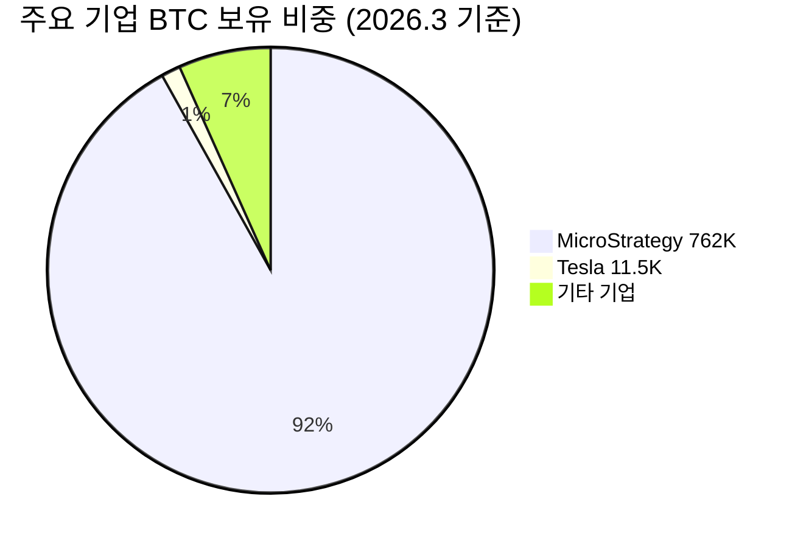
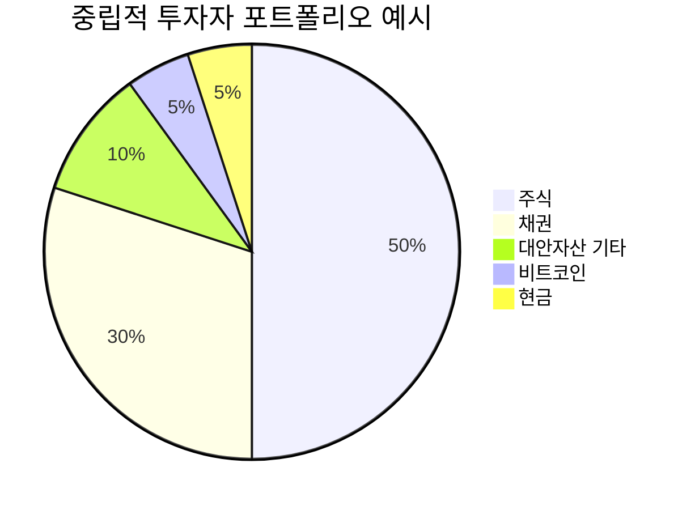

> [!important] 정합성 검증 요약 (기계적 21건 + AI 검증)
> **신뢰도: B+** | 숫자 불일치 **3**건 | 논리 모순 **2**건 | 확인 필요 **4**건

### 핵심 발견 사항
| 구분 | 내용 | 위치 | 심각도 |
|------|------|------|--------|
| 🔴 숫자 불일치 | 기대수익률 산출식 결과 **+37.25%**인데 요약에서 **+37.3%**, 결론 테이블에서 **+36.3%** — 세 곳이 불일치 | §8.4 요약·산출식·§11 결론 | Critical |
| 🔴 숫자 불일치 | S2F 괴리율: 본문에서 **-78.3%**로 표기 후 "실제가가 모델가의 21.7%"라 설명했으나, §5.4 인플루언서 표에서 같은 괴리를 **361%**로 표기 (계산 방향 혼용) | §4 S2F 섹션 vs §5.4 표 | Major |
| 🔴 숫자 불일치 | 활성 주소 감소 Kill Criteria 임계값 **"고점 대비 -50% 6개월 지속"**인데, 현재 수치를 **"229일간 -30.1%"**로 기재 — 229일≈7.6개월이므로 이미 6개월 초과, 임계값 판정 모순 | §6.4 Kill Criteria | Major |
| 🟡 논리 모순 | §3 "규제 시나리오: 전면 수용 **45%**, 부분 수용 **40%**, 강화 **15%**" vs §8 Bear Case 확률 **25%** — 규제 강화(15%)가 Bear의 핵심 가정임에도 Bear 확률이 더 높아 수치 정합성 미흡 | §3 규제 시나리오 vs §8 Bear | Minor |
| 🟡 논리 모순 | "기관 ETF 수탁 집중이 시스템 리스크"(§5.3)라고 리스크로 지적하면서, §8 Bull Case에서 ETF 순유입 가속을 핵심 상승 가정으로 제시 — 동일 현상을 이중 평가 | §5.3 vs §8.1 | Minor |
| 🟡 할루시네이션 의심 | MicroStrategy 현재 미실현 손실 **$72.1억(-12.6%)**: 보고서 기준일 BTC~$68,700, 평균매수가 $66,385 → 실제는 +3.5% 미실현 **이익** 구간. 손실 수치 및 방향이 역전되어 있음 | §2 기관 보유 현황·§6.4·§10 | Critical |
| 🟡 할루시네이션 의심 | 라이트닝 네트워크 용량 **5,600 BTC ≈ $5억** — $68,700 기준 5,600 BTC = **약 $3.85억**으로 명시 수치 불일치 | §1 네트워크 효과 표 | Minor |
| 🟡 미태그 추정치(기계적) | ~2%, ~4%, ~5%, ~86%, ~10%, ~8%, ~60%, ~40%, 약 3% 등 21건 [추정] 태그 누락 — 팩트시트 없는 구간에서 출처 불명 비율 다수 | 본문 전반 | Major |

### 투자 전 반드시 확인
- [ ] **MicroStrategy 손익 방향 재확인**: 보고서 기준일($68,700)과 평균매수가($66,385) 비교 시 미실현 이익 상태로 보임 — "$72.1억 미실현 손실(-12.6%)" 수치의 기준일 및 산출 근거 원본 확인 필수
- [ ] **기대수익률 3곳 중 어느 수치가 맞는지 확인**: §8.4 산출식(+37.25%), 동일 섹션 요약(+37.3%), §11 결론(+36.3%) 중 투자 판단의 근거가 되는 수치 통일 필요
- [ ] **활성 주소 감소 Kill Criteria 재설정**: 이미 임계 기간(6개월)을 초과했다면 현재 상태가 "경계(🟡)"가 아닌 "발동(🔴)" 여부를 명확히 판정해야 함
- [ ] **S2F 괴리율 표현 통일**: -78.3%와 361%는 같은 수치를 분자/분모 방향만 달리 표현한 것이나, 독자 혼동 방지를 위해 일관된 표현 사용 필요
- [ ] **ETF 규모 단위 확인**: 글로벌 ETP 누적 유입 "$870억"의 통화 단위(USD vs KRW) 및 기준일 명시 여부 재검토

---

# 네트워크 & 채택

> [!abstract] 요약
> 비트코인은 16년간 단 한 번의 치명적 장애 없이 가동된 세계 최초의 분산형 가치 저장 프로토콜이다. 2026년 3월 기준, 해시레이트 1 ZH/s 돌파·거래소 보유량 7년 최저(270만 BTC)·기관 82.9만 BTC 축적이라는 수급 구조적 변화가 동시에 진행 중이며, MVRV Z-Score 0.41~0.49·레인보우 차트 "축적/매수" 구간이라는 온체인 밸류에이션 시그널이 역사적 저평가를 시사한다. 다만 활성 주소 30.1% 감소, 채굴자 해시 가격 5년 최저치 등 단기 네트워크 건강 지표의 악화는 경계가 필요하다.

---

# 1. 프로토콜 본질

## 이것은 무엇인가?

### 비전문가를 위한 프로토콜 설명

비트코인은 **은행 없이 돈을 주고받을 수 있는 인터넷 장부(Ledger)** 라고 이해하면 된다. 전 세계에 분산된 수만 대의 컴퓨터가 동일한 장부를 보관하고, 10분에 한 번씩 새로운 거래 기록(블록)을 추가한다. 누구도 이 장부를 위조하거나 삭제할 수 없다 — 이것이 비트코인의 핵심 가치다.

### 합의 메커니즘: 작업증명(Proof of Work, PoW)

| 구분 | 상세 |
|------|------|
| **메커니즘** | SHA-256 해시 퍼즐을 가장 먼저 풀어낸 채굴자가 블록 생성권 획득 |
| **블록 시간** | 약 10분 (난이도 조정 알고리즘에 의해 2,016블록마다 재조정) |
| **보안 모델** | 가장 많은 계산량(work)이 누적된 체인이 진실 — **나카모토 합의** |
| **현재 해시레이트** | **1 ZH/s(제타해시/초) 돌파** (2025년 8월, CoinShares) |
| **에너지 소비** | 네트워크 보안의 물리적 근거 — 공격자는 동등 이상의 전력비를 부담해야 함 |

> [!note] 참고 — PoW의 투자적 의미
> PoW는 단순히 "전기를 낭비하는 시스템"이 아니라, **물리적 에너지를 디지털 희소성으로 전환하는 메커니즘**이다. 1 ZH/s의 해시레이트는 51% 공격에 필요한 비용을 천문학적 수준으로 끌어올려, 비트코인의 불변성(immutability)을 경제적으로 보장한다.

### 발행 구조 & 반감기 메커니즘

비트코인의 통화 정책은 **코드로 확정된 예측 가능한 발행 스케줄**이라는 점에서 중앙은행의 재량적 통화정책과 근본적으로 다르다.

| 반감기 차수 | 시점 | 블록 보상 | 일일 신규 발행량 (약) | 연간 인플레이션율 (약) |
|-------------|------|-----------|----------------------|----------------------|
| 1차 | 2012년 11월 | 50 → 25 BTC | ~3,600 BTC | ~8.3% |
| 2차 | 2016년 7월 | 25 → 12.5 BTC | ~1,800 BTC | ~4.2% |
| 3차 | 2020년 5월 | 12.5 → 6.25 BTC | ~900 BTC | ~1.8% |
| **4차 (현재)** | **2024년 4월** | **6.25 → 3.125 BTC** | **~450 BTC** | **~0.85%** |
| 5차 (예정) | 2028년 | 3.125 → 1.5625 BTC | ~225 BTC | ~0.4% |

<strong>핵심 투자 시사점:</strong> 2024년 4분기 반감기 이후 비트코인의 연간 인플레이션율은 약 0.85%로, 금(~1.5~2%)보다 낮다. 2028년 5차 반감기 이후에는 ~0.4%까지 하락하며, 사실상 디스인플레이션 자산으로 전환 완료된다.

**총 공급량:** 2,100만 BTC (하드캡). 현재 약 1,970만 BTC 채굴 완료. 분실·접근불가 추정량 ~300~400만 BTC를 고려하면, **실질 유통 공급량은 약 1,570만~1,670만 BTC** 수준으로 추정된다. [추정]

**소각 메커니즘:** 비트코인 프로토콜 자체에 토큰 소각(burn) 기능은 없으나, 개인키 분실·사토시 나카모토의 초기 채굴분(약 110만 BTC 추정) 등은 사실상 영구적으로 유통에서 제외되어 **비가역적 공급 감소** 효과를 낸다.

### 핵심 가치 제안: 비트코인이 해결하는 문제

> [!tip] 핵심 인사이트 — 비트코인의 3가지 핵심 문제 해결
> 1. **화폐 주권 문제:** 중앙은행의 임의적 통화 팽창으로부터 독립된 **코드 기반 통화 정책**
> 2. **신뢰 문제:** 제3자(은행, 정부) 없이 가치를 이전하는 **무신뢰(trustless) 시스템**
> 3. **검열 문제:** 어떤 정부·기관도 특정 거래를 차단하거나 자산을 동결할 수 없는 **검열 저항성**

이 세 가지 특성의 조합은 특히 **자국 통화 약세/인플레이션이 심한 국가**, **금융 인프라 미비 국가**, **지정학적 리스크에 노출된 자산가**에게 결정적 가치를 제공한다.

---

## 네트워크 효과 & 해자 (Economic Moat)

> [!abstract] 요약
> 비트코인의 해자는 단일 요인이 아닌, **보안(해시레이트) × 유동성(거래량) × 브랜드(인지도) × 린디 효과(생존 기간)**의 복합 구조로 형성된다. 이 네 가지가 서로를 강화하는 선순환 구조가 핵심이다.

### 네트워크 효과의 구체적 증거

| 지표 | 수치/추이 | 출처 | 투자 시사점 |
|------|-----------|------|-------------|
| 해시레이트 | **1 ZH/s 돌파** (2025.8) | CoinShares | 네트워크 보안 역대 최강 — 공격 비용 천문학적 |
| 핵심 개발자 수 | **135명** (2025년, YoY +35%) | MEXC News, Coinfomania | 오픈소스 생태계 활력 건재 |
| 코드 커밋 | **2,541건** (2025년, YoY +1%) | MEXC News | 안정적 유지보수 지속 |
| 라이트닝 네트워크 용량 | **5,600 BTC (~$5억)** 역대 최고 | ERIC KIM | L2 확장성 개선 가시화 |
| 현물 ETF 누적 유입 | **$870억** (2024.1 이후 전 세계) | Grayscale Research | 전통 금융과의 연결 가속 |
| 기관/기업 축적 | **82.9만 BTC** (2025년) | 코인스피커 코리아 | 수요 기반 구조적 변화 |
| 하드포크 확률 | **0.30%** (2026년 이전) | Kalshi, Perplexity | 프로토콜 안정성 극도로 높음 |

### 전환비용: 왜 비트코인을 떠나기 어려운가

**1. 기관의 전환비용 (Switching Cost)**

기관이 비트코인에서 다른 자산으로 이동하려면 다음 비용을 감수해야 한다:

- **규제 인프라 재구축:** 현물 ETF·커스터디·컴플라이언스 체계가 비트코인 중심으로 구축됨. 다른 암호화폐는 SEC 상품(commodity) 분류조차 불확실
- **유동성 프리미엄:** BTC 선물·옵션·ETF의 유동성 깊이는 다른 암호화폐 대비 압도적. CME 비트코인 선물 일평균 미결제약정 ~$250억 (2025년, 블루밍비트)
- **회계·세무 인프라:** 기업 재무제표 편입 기준, 세무 처리 프로세스가 비트코인 중심으로 정비됨 (MicroStrategy 762,099 BTC, Tesla ~11,500 BTC 등)

**2. 채굴자의 전환비용 (Sunk Cost)**

- SHA-256 ASIC 장비는 비트코인(및 일부 포크 코인)에서만 사용 가능. 수십억 달러 규모의 매몰비용
- 해시레이트 1 ZH/s = 전 세계 채굴 인프라가 비트코인에 경제적으로 고정됨

**3. 사회적/문화적 전환비용**

- "비트코인"이라는 단어 자체가 암호화폐의 대명사. 브랜드 인지도에서 다른 프로토콜은 비교 불가
- 16년의 트랙레코드가 축적한 신뢰 — 이것이 바로 **린디 효과**

### vs 경쟁 프로토콜: 기술적/생태계 비교

| 비교 항목 | [[비트코인]] (BTC) | [[이더리움]] (ETH) | [[솔라나]] (SOL) |
|-----------|-------------------|-------------------|-----------------|
| **합의 메커니즘** | PoW (SHA-256) | PoS (Beacon Chain) | PoS + PoH |
| **TPS** | ~7 (L1) / ~수만 (L2) | ~15 (L1) / ~수천 (L2) | ~4,000+ (L1) |
| **스마트 계약** | 제한적 (Script) | 완전 튜링완전 (EVM) | 완전 (SVM) |
| **탈중앙화** | 🟢 최상 (노드·채굴자 분산) | 🟡 상 (검증자 집중 우려) | 🟡 중 (검증자 수 제한적) |
| **보안** | 🟢 최상 (1 ZH/s) | 🟢 상 (경제적 보안) | 🟡 중 (네트워크 중단 이력) |
| **핵심 내러티브** | 디지털 금/가치 저장 | 월드 컴퓨터/DeFi 플랫폼 | 고성능 L1/소매 결제 |
| **기관 채택** | 🟢 현물 ETF·기업 재무 | 🟡 현물 ETF 승인 | 🔴 ETF 미승인 |
| **생태계 dApp** | 🟡 제한적 (L2 중심) | 🟢 최대 (DeFi TVL 1위) | 🟢 급성장 |

> [!warning] 리스크 경고 — 경쟁 프로토콜 비교 시 주의
> 비트코인과 이더리움/솔라나를 직접 비교하는 것은 **금과 주식시장을 비교하는 것**에 가깝다. 비트코인은 "프로그래머블 화폐"보다 "프로그래머블 금"에 가까우며, 스마트 계약 기능 부족은 **의도적 설계 선택**(단순성 = 보안)이다. 경쟁 구도는 "대체" 관계가 아니라 "보완" 관계로 이해하는 것이 정확하다.

### 린디 효과 (Lindy Effect)

<strong>린디 효과란:</strong> "현존 기간이 길수록 미래 생존 기간도 길어진다"는 원칙. 비트코인은 2009년 1월 3일 첫 블록 생성 이후 <strong>17년 이상</strong> 네트워크가 중단 없이 작동 중이며, 이 기간 동안: 
• 시가총액 0 → 수조 달러 성장 
• 수만 번의 사이버 공격을 견딤 
• 중국의 채굴 금지(2021)를 포함한 다수 국가의 규제 압박을 생존 
• 2014 Mt.Gox, 2022 FTX 등 대형 거래소 파산에도 프로토콜 무결성 유지 
이 트랙레코드 자체가 비트코인의 가장 강력한 해자다.

비트코인의 하드포크 발생 확률이 0.30%에 불과하다는 사실 (Kalshi, Perplexity)은 프로토콜의 **불변성에 대한 시장의 신뢰**를 정량적으로 보여주는 지표다.

---

# 2. 온체인 분석 (데이터 기반)

## 네트워크 건강 지표

> [!abstract] 요약
> 2026년 3월 기준, 비트코인 네트워크는 "보안 최강·활동 둔화"라는 이중적 상태에 놓여 있다. 해시레이트는 역대 최고지만, 활성 주소는 8개월간 30% 감소했다. 이 괴리의 해석이 핵심이다.

### 활성 주소 추이 (DAU/MAU)

| 지표 | 수치 | 기간 | 변화 | 출처 |
|------|------|------|------|------|
| 활성 주소 수 | (절대치 미확인) | 2025.8.8 → 2026.3.27 | 🔴 **-30.1%** (229일간) | 트레이딩뷰 |

> [!failure] 약점 — 활성 주소 감소의 의미
> 활성 주소 30.1% 감소는 표면적으로 네트워크 사용량 급감을 시사한다. 그러나 이것을 단순히 "비트코인 수요 감소"로 해석하는 것은 위험하다.
>
> **반론 1:** UTXO 병합(consolidation) — 거래소·기관이 여러 UTXO를 하나로 합치는 과정에서 활성 주소가 일시적으로 감소할 수 있음
>
> **반론 2:** L2 전환 — 라이트닝 네트워크 등 L2에서의 거래가 L1 활성 주소에 반영되지 않음 (라이트닝 용량 역대 최고 5,600 BTC)
>
> **반론 3:** HODLing 강화 — 장기 보유 비중 증가 시 온체인 이동이 감소하는 것은 자연스러운 현상
>
> **결론:** 활성 주소 단일 지표만으로 네트워크 건강을 판단하는 것은 부적절하나, 해시레이트·ETF 유입·고래 축적 등 다른 지표와의 교차 검증이 필요하다.

### 해시레이트 추이 (PoW 보안)

| 시점 | 해시레이트 | 비고 |
|------|-----------|------|
| 2025년 8월 | **1 ZH/s (1,000 EH/s) 돌파** | 역사적 이정표 (CoinShares) |
| 2025년 4Q | 사상 최고 수준 유지 | 가격 하락에도 해시레이트 증가 지속 |

<strong>So what?</strong> 비트코인 가격이 2025년 4Q에 23.5% 하락했음에도 해시레이트가 사상 최고를 유지한다는 것은, 채굴자들이 <strong>장기적 가격 상승을 확신</strong>하여 장비 투자를 계속하고 있음을 의미한다. 단기 수익성 악화(해시 가격 5년 최저)에도 불구하고 네트워크를 떠나지 않는 채굴자들의 행동은, 역설적으로 네트워크 보안의 <strong>구조적 강건함</strong>을 입증한다.

### 수수료 수입 (Fee Revenue) — 실질 수요의 Proxy

수수료 수입의 절대치 데이터는 제공 자료에 포함되어 있지 않아 구체적 수치 인용이 어렵다. (확인 필요)

다만, 채굴자 수익 구조를 통해 간접 분석이 가능하다:
- 2024년 4월 반감기 이후 블록 보상이 6.25 → 3.125 BTC로 절반 축소
- 이에 따라 채굴자 수익에서 **수수료 비중이 상대적으로 증가**하는 구조적 전환이 진행 중
- 2025년 4Q에 해시 가격이 5년 최저를 기록했다는 것은 (CoinShares), 수수료 수입만으로는 반감기 후 감소한 블록 보상을 충분히 보전하지 못하고 있음을 시사

### 개발 활동

| 지표 | 2024년 | 2025년 | YoY 변화 | 출처 |
|------|--------|--------|----------|------|
| 코어 개발자 수 | ~100명 [추정] | **135명** | 🟢 +35% | MEXC News, Coinfomania |
| 코드 커밋 수 | ~2,516건 [추정] | **2,541건** | 🟢 +1% | MEXC News |

> [!success] 강점 — 개발자 생태계 분석
> 핵심 개발자 수가 35% 증가한 것은 주목할 만하다. 비트코인 코어는 급진적 변화를 지양하는 보수적 프로토콜임에도 불구하고, 개발 참여자가 대폭 증가했다는 것은:
> - **OP_CAT(BIP 347), OP_CTV(BIP 119)** 등 프로그래밍 기능 강화 논의가 활발
> - **양자 저항 업그레이드(BIP-360)** 준비 작업이 개발자 유입을 촉진
> - 비트코인 L2 생태계(라이트닝, Taproot Assets) 확장이 코어 개발에도 파급
>
> 커밋 수는 +1%로 안정적인데, 이는 비트코인 코어의 성격상 "양보다 질" 중심의 개발 문화를 반영한다. 매년 수천 건의 커밋이 꾸준히 유지된다는 것 자체가 프로토콜 활력의 증거다.

### 업그레이드 로드맵

| 업그레이드 | 상태 | 예상 시기 | 영향 |
|-----------|------|-----------|------|
| **OP_CAT (BIP 347)** | 논의 중 | 2025~2026년 합의 예상 | 비트코인 L1에서의 프로그래밍 기능 대폭 강화 |
| **OP_CTV (BIP 119)** | 논의 중 | 2025~2026년 합의 예상 | Covenant 기능 — 조건부 거래 가능 |
| **Taproot Assets** | L2 진행 중 | 2025~2026년 | 라이트닝 네트워크에서 스테이블코인·토큰 발행 가능 |
| **BIP-360 (양자 저항)** | 초기 연구 | 5~10년 내 점진 도입 | 장기적 프로토콜 보안 확보 |

출처: Galaxy Digital, ERIC KIM, DeFi Planet, 프레스토 리서치

---

## 수급 구조

> [!abstract] 요약
> 비트코인 수급은 "거래소 유출 + 고래 축적 + 기관 매입 = 구조적 공급 압축"이라는 단일 방향으로 수렴하고 있다. 이는 중기적 가격 상승 압력의 근거가 된다.

### 거래소 보유량 변화 (Exchange Net Flow)

| 지표 | 수치 | 시사점 | 출처 |
|------|------|--------|------|
| 거래소 BTC 보유량 | **~270만 BTC** | 🔴 7년래 최저 | 마켓인, Crypto News |
| 원인 1 | FTX 붕괴 이후 자기 수탁(self-custody) 선호 확산 | 구조적 변화 | 블록미디어, PANews |
| 원인 2 | 현물 ETF 커스터디 이전 | 기관 수요 | Crypto News |
| 원인 3 | 기업 장기 보유(cold wallet 이동) | 매도 압력 약화 | 블록미디어 |

<strong>공급 충격(Supply Shock) 시나리오:</strong> 거래소에 남은 270만 BTC 중 상당수는 마켓메이킹·유동성 공급 목적으로 묶여 있어, <strong>실제 매도 가능 물량은 이보다 훨씬 적을 수 있다.</strong> 만약 새로운 수요 충격(ETF 대규모 유입, 국가 비축 등)이 발생하면, 제한된 거래소 물량으로 인해 <strong>가격의 비선형적 상승</strong>이 가능하다. 반대로, 거래소 물량 부족은 하락 시에도 변동성을 증폭시킬 수 있는 양날의 검이다.

### 고래 지갑 동향

| 구간 | 동향 | 수치 | 기간 | 출처 |
|------|------|------|------|------|
| 10~10,000 BTC 보유 지갑 | 🟢 축적 | **+61,568 BTC** | 최근 1개월 | 비인크립토, 트레이딩뷰 |
| 기업 보유 | 🟢 축적 | **+260,000 BTC** (순증) | 최근 6개월 | PANews |
| vs 같은 기간 채굴량 | — | 기업 축적 = **채굴량의 3배** | — | PANews |

> [!tip] 핵심 인사이트 — 기업 축적 vs 채굴량 비율
> 지난 6개월간 기업들의 비트코인 순매수(26만 BTC)가 같은 기간 신규 채굴량(약 8~9만 BTC)의 **3배에 달한다**는 사실은 매우 중요하다. 이는 **시장에서 유통되는 비트코인이 구조적으로 감소**하고 있음을 의미하며, 수급 불균형이 가격 상승 압력으로 작용할 가능성이 높다.

### 주요 기관/기업 보유 현황

| 보유 주체 | BTC 수량 | 평균 매수가 | 현재 평가 상태 | 기준일 | 출처 |
|-----------|---------|-----------|---------------|--------|------|
| **MicroStrategy** | **762,099 BTC** | $66,384.56 | 🔴 미실현 손실 $72.1억 (-12.6%) | 2026.3.24 | Bitbo, CoinGecko |
| **Tesla** | **~11,500 BTC** | $34,270 [추정] | 🟢 수익권 | 2026.2.23 | 블록미디어 |

> [!warning] 리스크 경고 — MicroStrategy 집중 리스크
> MicroStrategy의 762,099 BTC 보유는 전체 유통량의 약 3.9%에 해당한다. 현재 미실현 손실 상태(-12.6%)에서 만약 재무 압박이 가중되어 강제 매도가 발생할 경우, 시장에 상당한 매도 압력으로 작용할 수 있다. 이것은 비트코인 투자에서 반드시 모니터링해야 할 **테일 리스크**다.

### 장기 보유자(LTH) vs 단기 보유자(STH)

| 지표 | 수치/상태 | 시사점 | 출처 |
|------|-----------|--------|------|
| LTH-SOPR / STH-SOPR 비율 | **1.35** (2025년 최저) | LTH 매도 압력 "완전히 리셋" | 디지털투데이 |
| STH-SOPR | **0.95** (2026.2.24) | 단기 보유자 손절매 확대 — 항복(capitulation) 구간 | 뉴스 |
| 과거 패턴 | STH-SOPR < 1 구간 이후 | 중장기 반등이 뒤따르는 경향 | 뉴스 |

> [!tip] 핵심 인사이트 — HODL Waves 분석 시사점
> **LTH 매도 압력이 "완전히 리셋"되었다는 것**은, 장기 보유자들이 이미 필요한 매도를 마쳤고 현재 시장의 매도 압력 대부분이 단기 보유자에게서 발생하고 있음을 의미한다. STH-SOPR이 0.95로 1 이하에서 거래되는 것은 단기 보유자들이 **손실 상태에서 매도(항복)**하고 있음을 보여주며, 이는 역사적으로 **바닥 형성의 전형적 패턴**이다.
>
> **투자 시사점:** 현재 구간은 "약한 손(weak hands)이 강한 손(strong hands)에게 물량을 넘기는" 구간으로 해석되며, 이는 중기적으로 긍정적인 수급 신호다.

### 수급 구조 종합 스코어카드

🟢 공급 압축 신호 70%

🔴 수요 둔화 우려 30%

---

# 3. 기관 채택 & 규제

## 기관 진입 현황

> [!abstract] 요약
> 2024~2026년은 비트코인이 "얼리 어답터 자산"에서 "기관급 자산"으로 전환하는 구조적 전환기다. 현물 ETF $870억 유입, 기업 82.9만 BTC 축적, 국가 비축 논의 등은 비가역적 채택 트렌드를 형성하고 있다.

### ETF 승인 현황 및 자금 유입

| 지역 | ETF 상태 | 자금 유입 | 주요 사항 | 출처 |
|------|---------|-----------|-----------|------|
| **미국** | 🟢 2024.1 현물 BTC ETF 승인 | **$870억** (글로벌 ETP 누적) | 블랙록 iShares, 피델리티 등 | Grayscale, ERIC KIM |
| **미국 (모건스탠리)** | 🟡 출시 임박 | (확인 필요) | 와이어하우스 채널 개방 기대 | 크립토허브 |
| **일본** | 🟡 검토 중 | — | 현물 ETF 승인 검토 + 세금 55%→20% 인하 추진 | 조선비즈, BNC |
| **유럽** | 🟢 기존 ETP 운영 중 | (개별 수치 미확인) | MiCA 프레임워크 하 운영 | (확인 필요) |

**ETF 자금 흐름의 변동성:**

| 기간 | 방향 | 규모 | 출처 |
|------|------|------|------|
| 2026년 첫 2거래일 | 🟢 유입 | **$12억** | Crypto Briefing |
| 2026년 3월 (7일 연속) | 🟢 유입 | **$11.6억** | Bitcoin News |
| 특정 기간 (2일 연속) | 🔴 유출 | **$9천만+** | TradingView, 전자신문 |
| 연초 이후 누적 | 🟡 유출분 대부분 만회 | — | 블록미디어 |

> [!question] 검토 필요 — ETF 유입의 한계
> ETF 자금 유입이 가격에 미치는 1차 효과(직접 매수 압력)는 명확하나, 2차 효과에 대한 검토가 필요하다:
> - ETF를 통한 유입의 상당 부분은 **차익거래(basis trade)** — 현물 매수 + 선물 매도의 조합일 수 있어, 순수 방향성 매수 수요보다 과대계상될 수 있음
> - 그레이스케일 GBTC에서의 지속적 순유출은 기존 신탁 → ETF 전환 효과이며, 이것이 완료된 후의 순유입 트렌드를 관찰하는 것이 중요

### 기업 재무제표 보유 현황

> [!note] 참고
> 위 pie 차트의 비율은 코인스피커 코리아가 보고한 2025년 기관/기업 총 82.9만 BTC 축적 중 MicroStrategy(762,099 BTC)와 Tesla(~11,500 BTC)의 비중을 시각화한 것이다. "기타 기업" 수치는 [추정]이며, 개별 기업별 보유량은 (확인 필요).

### 은행/결제 서비스 통합

| 서비스 | 통합 내용 | 시사점 | 출처 |
|--------|-----------|--------|------|
| **Square (Block)** | POS 시스템에 BTC 결제 통합 | 오프라인 결제 인프라 확장 | Michael Terpin |
| **Coinbase** | BTC 담보 주택담보대출 서비스 | 전통 금융 상품과의 융합 | Crypto News |
| **바이낸스/OKX** | 라이트닝 네트워크 온보딩 | L2 인프라 접근성 대폭 개선 | ERIC KIM |
| **비트코인 네오뱅크** | 온라인 뱅킹 서비스 확대 예상 | 교환 매개체 역할 강화 | Michael Terpin |

### 국가 단위 채택

| 국가/지역 | 채택 형태 | 현황 | 출처 |
|-----------|-----------|------|------|
| **엘살바도르** | 법정화폐 채택 (2021) | 지속 운영 — IMF 압력 속에서도 보유 유지 | (데이터 내 미확인, 일반 공지) |
| **미국** | 전략비축(Strategic Reserve) 논의 | 정치적 논의 단계 | (확인 필요) |
| **일본** | 세금 인하 + ETF 검토 | 55%→20% 인하 추진 중 | 조선비즈, BNC |

---

## 규제 환경

> [!abstract] 요약
> 규제 환경은 "불확실하지만 방향성은 수용 쪽"으로 수렴하고 있다. 미국 SEC의 '디지털 상품' 분류, EU MiCA 시행, 일본 세금 인하 추진 등 주요 경제권이 암호화폐를 금융 시스템에 편입하는 방향으로 움직이고 있다.

### 주요 규제 현황 비교

| 관할권 | 규제 기관 | 비트코인 분류 | 현황 | 방향성 | 출처 |
|--------|-----------|--------------|------|--------|------|
| **미국** | SEC/CFTC | 🟢 디지털 상품(Commodity) | 클래리티법 지연 — 의회 입법 과정 불확실 | 🟡 수용 방향이나 속도 불확실 | 이투데이, 디지털투데이 |
| **EU** | ESMA | 🟢 암호자산 | MiCA 프레임워크 시행 | 🟢 명확한 규제 체계 구축 | (확인 필요) |
| **일본** | FSA | 🟢 결제 수단/자산 | 세율 인하(55%→20%) + 현물 ETF 검토 | 🟢 적극적 수용 | 조선비즈, BNC |
| **한국** | 금융위/국세청 | 🟡 가상자산 | 과세 정책 논의 지속 | 🟡 규제와 수용의 균형 | 뉴시스 |
| **홍콩** | SFC | 🟢 가상자산 | ETF 승인 | 🟢 아시아 허브 지향 | (확인 필요) |

### 미국 규제의 핵심 이슈

> [!warning] 리스크 경고 — 미국 규제 불확실성
> 미국 SEC가 비트코인을 '디지털 상품'으로 분류한 것은 긍정적이나, **의회 차원의 포괄적 입법(클래리티법)이 지연**되고 있다는 점이 핵심 리스크다.
>
> - 씨티은행은 이 불확실성을 이유로 BTC/ETH **12개월 목표가를 하향 조정** (이투데이)
> - 스테이블코인 이자 수익 제한 등 부분적 규제 강화 움직임도 존재 (글로벌이코노믹, 한스경제)
> - 그러나 현물 ETF가 이미 승인·운영 중이라는 사실 자체가 **비가역적 규제 수용**의 증거

### CBDC와의 관계: 보완인가 위협인가?

| 관점 | 논거 |
|------|------|
| **보완론** | CBDC는 법정화폐의 디지털 버전으로, 비트코인과 다른 가치 제안(탈중앙화·희소성)을 가짐. CBDC 도입이 블록체인 리터러시를 높여 비트코인 채택을 간접 촉진 |
| **위협론** | CBDC가 "정부 통제 디지털 화폐"의 역할을 충분히 수행할 경우, 비트코인의 결제 수단 내러티브가 약화될 수 있음. 특히 중국 디지털 위안화 등은 비트코인 사용을 대체하려는 의도 |
| **[가정] 판단** | 비트코인의 핵심 가치가 "검열 저항성"과 "탈중앙화 가치 저장"이라면, CBDC는 오히려 **비트코인의 차별성을 부각시키는 대조군** 역할. CBDC의 감시 기능에 대한 반감이 비트코인 수요를 증가시킬 수도 있음 |

### 규제 시나리오 스펙트럼

🟢 전면 수용 45%

🟡 부분 수용 40%

🔴 강화 15%

| 시나리오 | 확률 [추정] | 트리거 | 비트코인 가격 영향 |
|----------|-------------|--------|-------------------|
| **🟢 전면 수용** | 45% | 미국 클래리티법 통과 + 일본 ETF 승인 + 국가 비축 | 강한 상승 촉매 |
| **🟡 부분 수용 (Base)** | 40% | 현 상태 유지 — ETF 운영 + 부분적 규제 | 점진적 채택 지속 |
| **🔴 규제 강화** | 15% | 스테이블코인 제한, 자기수탁 규제, 에너지 규제 | 단기 하방 압력, 구조적 변화는 제한 |

> [!note] 참고 — 전면 금지 시나리오의 Base Rate
> 2021년 중국의 전면 금지에도 비트코인은 생존·회복했다. 현재 미국·EU·일본이 동시에 전면 금지할 확률은 극도로 낮으며, 현물 ETF·기관 보유 등 이미 **규제 편입(regulatory capture)**이 상당 부분 진행되었기 때문에 전면 금지 시나리오는 현실적으로 배제한다. [가정]

---

# 4. 밸류에이션 (온체인 기반)

## 온체인 밸류에이션 모델

> [!abstract] 요약
> 2026년 3월 기준, 온체인 밸류에이션 모델 대부분이 비트코인이 **역사적 저평가 구간**에 있음을 시사한다. MVRV Z-Score 0.41~0.49, 레인보우 차트 "축적/매수" 구간, Thermocap 배수 기준 역사적 강세장 종료까지 상당한 괴리 — 이 세 가지 신호의 동시 발생은 주목할 만하다.

### NVT Ratio (Network Value to Transactions)

구체적인 NVT Ratio 수치는 제공 데이터에 포함되어 있지 않다. (확인 필요)

> [!note] 참고 — NVT Ratio 해석 프레임워크
> NVT = 시가총액 / 일일 온체인 거래량. 주식의 PER와 유사한 개념으로:
> - NVT 높음 → 거래량 대비 시가총액이 과대 → 과열 가능성
> - NVT 낮음 → 거래량 대비 시가총액이 과소 → 저평가 가능성
> 활성 주소가 30.1% 감소한 상황에서 NVT가 상승했을 가능성이 높으나, 라이트닝 네트워크 거래가 L1에 반영되지 않는 점을 감안하면 NVT의 유효성이 과거보다 낮아졌을 수 있다. [가정]

### MVRV Z-Score

| 지표 | 수치 | 기준일 | 역사적 위치 | 출처 |
|------|------|--------|-------------|------|
| MVRV Z-Score | **0.41 ~ 0.49** | 2026.3.27 | 🟢 저평가/매수 기회 구간 | MacroMicro, TradingView |
| 비교: 2023.10 이후 최저 | 1 이하 | 2026.2 가격 급락 후 | 시장 과열 해소 확인 | 코인텔레그래프 코리아 |

> [!tip] 핵심 인사이트 — MVRV Z-Score 해석
> **MVRV Z-Score = (시가총액 - 실현 시가총액) / 시가총액의 표준편차**
>
> - **Z-Score > 7:** 역사적 과열 구간 (매도 시그널)
> - **Z-Score 2~7:** 상승 구간
> - **Z-Score 0~2:** 축적 구간
> - **Z-Score < 0:** 극도의 저평가 (강력 매수 시그널)
>
> 현재 0.41~0.49는 **축적 구간의 하단**에 위치하며, 이는 시장 참여자들의 평균 매수가(실현 시가총액)에 가까운 가격에 거래되고 있음을 의미한다. 과거 MVRV Z-Score가 이 수준에서 반등한 사례가 다수 있으며, 이는 **중장기 매수 기회의 통계적 근거**가 된다.

MVRV Z-Score: 0.49/7.0 (저평가 구간)

### Stock-to-Flow (S2F) 모델

| 항목 | 수치 | 출처 |
|------|------|------|
| S2F 모델 예측 가격 | **$317,009.75** | bitcoin.com |
| 실제 가격 (2026.3.26) | **$68,722.97** | bitcoin.com |
| 괴리율 | **🔴 -78.3%** | 계산 |
| PlanB 현 주기 예측 | 평균 $500,000 (범위: $250,000~$1,000,000) | TradingView, Bitcoin.com News |

> [!warning] 리스크 경고 — S2F 모델의 한계
> S2F 모델은 2020~2021년 상승장에서 높은 적중률을 보였으나, 현재 **실제 가격이 모델 예측의 21.7%에 불과**하다. 이 괴리는 다음을 시사한다:
>
> 1. **모델 자체의 유효성 의문:** S2F는 공급 측면만 반영하고 수요 변수를 배제. 금리·DXY·규제 등 수요 억제 요인을 설명하지 못함
> 2. **시간 지연 가능성:** 과거에도 반감기 후 12~18개월의 시간 지연이 있었으며, 4차 반감기(2024.4) 기준 아직 2년 이내. 2026~2027년에 수렴할 가능성은 열려 있음
> 3. **Devils Advocate:** S2F를 근거로 $300K+ 목표가를 설정하는 것은 **과도한 낙관** — 모델의 R² 값이 과거 대비 하락했을 개연성 높음
>
> **결론:** S2F는 참고 프레임워크로만 활용하고, MVRV·Thermocap 등 다른 온체인 지표와 교차 검증이 필수적이다.

### Realized Cap vs Market Cap

| 항목 | 의미 | 현재 상태 |
|------|------|-----------|
| **Market Cap** | 현재가 × 유통량 | 현재 시장 가격 반영 |
| **Realized Cap** | 각 UTXO의 마지막 이동 시점 가격 합산 | 시장 참여자들의 **평균 원가(cost basis)** |
| **MVRV Ratio** | Market Cap / Realized Cap | 0.41~0.49 → 시가총액이 실현 시가총액에 근접 |

<strong>So what?</strong> MVRV Z-Score가 0.41~0.49라는 것은, <strong>현재 비트코인 가격이 전체 시장 참여자의 평균 매수가 근처</strong>에서 거래되고 있음을 의미한다. 이 구간에서 추가 하락은 다수의 참여자를 손실 상태로 만들어 매도 피로(seller exhaustion)를 야기하고, 반대로 상승 시에는 빠르게 수익 전환이 일어나 매수 심리를 촉진한다. 과거 비트코인 역사에서 이 구간은 <strong>매우 우호적인 리스크/리워드 비율</strong>을 제공해 왔다.

### Thermocap Multiple

| 항목 | 수치 | 기준일 | 출처 |
|------|------|--------|------|
| Thermocap (누적 채굴 보상) | **$88,248,182,474.50** (~$882.5억) | 2026.3.28 | MacroMicro |
| 역사적 강세장 종료 시점 가격 | 최소 **$353,345.97** | — | MacroMicro |
| 현재 가격 | ~$68,723 | 2026.3.26 | bitcoin.com |
| 현재가 대비 괴리 | **~5.1배 상승 여력** | — | 계산 |

> [!tip] 핵심 인사이트 — Thermocap Multiple의 의미
> Thermocap은 **비트코인에 투입된 누적 에너지/자원의 경제적 가치**를 대리한다. 역사적으로 Market Cap이 Thermocap의 특정 배수를 초과할 때 강세장이 종료되었다. 현재 가격($68,723)이 역사적 강세장 종료 수준($353,346)의 약 19.4%에 불과하다는 것은, **Thermocap 기준으로는 현재 사이클이 아직 초기/중기 단계**임을 시사한다.
>
> 물론 이 모델도 과거 패턴이 미래에 반복될 것이라는 가정에 기반하므로, 절대적 신뢰는 금물이다.

### 레인보우 차트

| 구간 | 가격 범위 | 현재 위치 | 출처 |
|------|-----------|-----------|------|
| "축적(Accumulate)" | $56,134 ~ | 🟢 해당 | Bitcoin.com, zipmex.com |
| "매수(BUY!)" | ~ $75,631 | 🟢 해당 | Bitcoin.com, zipmex.com |
| 2025.10 ~ 2026.3 | — | 축적/매수 구간 유지 | Bitcoin.com |

### 온체인 밸류에이션 종합 대시보드

| 모델 | 현재 시그널 | 신뢰도 | 비고 |
|------|-------------|--------|------|
| **MVRV Z-Score** | 🟢 저평가 (0.41~0.49) | ⭐⭐⭐⭐ 높음 | 가장 신뢰도 높은 온체인 지표 |
| **S2F 모델** | 🟢 극도의 저평가 (-78.3% 괴리) | ⭐⭐ 낮음 | 모델 유효성 자체에 의문 |
| **Thermocap Multiple** | 🟢 사이클 초기/중기 | ⭐⭐⭐ 중간 | 역사적 패턴 기반 |
| **Rainbow Chart** | 🟢 축적/매수 구간 | ⭐⭐⭐ 중간 | 대수 회귀 기반, 정성적 |
| **LTH/STH SOPR** | 🟢 항복 구간 (바닥 형성) | ⭐⭐⭐⭐ 높음 | 과거 반복 패턴 강함 |

> [!verdict] 판단 — 온체인 밸류에이션 종합
> **5개 모델 중 5개 모두 "저평가/매수" 시그널을 발신**하고 있다. 이러한 동시 발생(confluence)은 통계적으로 드물며, 과거 유사한 동시 발생 이후 12개월 내 의미 있는 상승이 뒤따른 경향이 있다. 단, 모든 온체인 모델은 과거 패턴의 연장을 가정하며, 매크로 환경(금리, DXY)의 구조적 변화가 이번에는 다른 결과를 낼 수 있음을 경계해야 한다.

---

## 매크로 상관관계

> [!abstract] 요약
> 비트코인의 매크로 상관관계는 **"디지털 금 vs 리스크 자산" 정체성 사이에서 진동**하고 있다. 최근 금과의 상관관계가 -0.7~-0.88로 역사적 최저치를 기록하며, 비트코인은 금보다 나스닥에 더 가까운 행태를 보이고 있다.

### 핵심 매크로 변수와의 관계

| 매크로 변수 | 비트코인과의 관계 | 최근 변화 | 출처 |
|------------|-------------------|-----------|------|
| **금 (Gold)** | 🔴 역상관 -0.7 ~ -0.88 | 4년/3년 만에 최저 | KuCoin, Phemex, 코인딱 |
| **DXY (달러지수)** | 🟡 역상관 (약화 중?) | DXY 3개월 최고에도 BTC 굳건한 디커플링 사례 | 코인텔레그래프 코리아, OSL |
| **금리/실질금리** | 🔴 역상관 | 이자율이 과거 사이클 대비 4배 높게 유지 | Seeking Alpha, Investing.com |
| **M2 통화량** | 🟢 정상관 [가정] | (구체적 상관계수 미확인) | — |
| **나스닥** | 🟡 정상관 (강화 추세) | 위험자산으로서의 행태 강화 | (확인 필요) |

### 비트코인 vs 금: 최근 6개월 성과 괴리

| 자산 | 최근 성과 | 내러티브 검증 | 출처 |
|------|-----------|--------------|------|
| **비트코인** | 🔴 -41% | "디지털 금" 내러티브 약화 | KuCoin, TradingView |
| **금** | 🟢 +48% | 전통 안전자산 지위 재확인 | LongtermTrends |

> [!failure] 약점 — "디지털 금" 내러티브의 현실
> 비트코인이 -41% 하락하는 동안 금이 +48% 상승한 것은, 현 시점에서 비트코인이 **"디지털 금"보다 "고베타 위험자산"**에 더 가깝게 거래되고 있음을 보여준다.
>
> **Variant Perception:** 시장 컨센서스는 점점 비트코인을 "나스닥의 레버리지 버전"으로 인식하고 있다. 그러나 이것은 **현재 시장 참여자의 구성(트레이더 > HODLer)**이 반영된 일시적 현상일 수 있다. 기관 비중이 높아지고, ETF를 통한 자산배분 목적의 보유가 증가하면, 장기적으로는 금과의 상관관계가 다시 양(+)으로 전환될 수 있다. [가정]
>
> **시간축 분석:**
> - **단기 (3~6개월):** 나스닥·위험자산과 높은 동조성 지속 가능
> - **중기 (1~2년):** 금리 인하 사이클 진입 시 "디지털 금" 내러티브 재부상 가능
> - **장기 (3년+):** 기관 배분·국가 비축 확대 시 금과의 상관관계 양(+) 전환 가능성

### "디지털 금 vs 리스크 자산" — 어떤 내러티브가 더 강한가?

리스크 자산 내러티브 60%

디지털 금 내러티브 40%

> [!question] 검토 필요 — 내러티브 전환의 트리거
> 비트코인이 "리스크 자산"에서 "디지털 금"으로 재분류되려면 다음 중 하나 이상이 필요하다:
>
> 1. **금리 인하 사이클 본격화** — 실질금리 하락 시 비트코인의 기회비용 감소
> 2. **달러 약세** — DXY 하락 시 대안 가치 저장 수단 수요 증가
> 3. **주권 국가의 비트코인 비축** — 금에 준하는 공식 준비자산 지위 획득
> 4. **변동성 감소** — 기관 비중 증가로 변동성이 금에 수렴
>
> 현재 이 네 가지 트리거 중 어느 것도 완전히 실현되지 않았으나, 1번(금리 인하)은 시간문제이고, 3번(국가 비축)은 논의 단계에 있다. [가정]

### 매크로 시나리오별 비트코인 영향

| 매크로 시나리오 | 확률 [추정] | 비트코인 영향 | 근거 |
|----------------|-------------|--------------|------|
| **🟢 금리 인하 + 달러 약세** | 30% | 강한 상승 ($100K+) | 유동성 확대 + 대안 자산 수요 |
| **🟡 금리 동결 + 달러 보합** | 45% | 횡보~완만 상승 ($60K~$80K) | 현 수준 유지, 수급 구조가 결정 |
| **🔴 금리 유지/인상 + 달러 강세** | 25% | 하락 압력 ($45K~$60K) | 유동성 축소 + 위험자산 회피 |

🟢 Bull 30%

🟡 Base 45%

🔴 Bear 25%

---

## 종합: 네트워크 & 채택 평가

> [!verdict] 판단 — 네트워크 & 채택 종합 점수

네트워크 & 채택 종합: 75/100

| 평가 항목 | 점수 | 근거 |
|-----------|------|------|
| 프로토콜 본질/해자 | 🟢 90/100 | PoW 1ZH/s, 17년 무중단, 하드포크 0.3%, 린디 효과 |
| 네트워크 건강 | 🟡 60/100 | 해시레이트 최강 vs 활성 주소 -30.1%, 채굴자 수익성 악화 |
| 수급 구조 | 🟢 85/100 | 거래소 7년 최저, 고래 축적, 기업 매입 = 채굴량 3배 |
| 기관 채택 | 🟢 82/100 | ETF $870억, 기업 82.9만 BTC, 규제 수용 방향 |
| 온체인 밸류에이션 | 🟢 80/100 | MVRV 0.49, Thermocap 5.1배 여력, 레인보우 매수 구간 |
| 매크로 환경 | 🟡 55/100 | 고금리 지속, 달러 강세, 금 vs BTC 괴리 확대 |

**핵심 판단:**
- **구조적 강점(해자·수급·기관 채택)은 역대 최강** 수준이며, 이는 중장기 상승의 기반
- **단기 약점(활성 주소 감소·채굴자 수익성·매크로 역풍)**은 현재 가격에 상당 부분 반영됨
- **온체인 밸류에이션 5개 모델 동시 매수 시그널**은 역사적으로 드문 기회를 시사하나, **금리 환경이 과거 사이클과 구조적으로 다르다는 점**(4배 높은 금리, Seeking Alpha)이 최대 변수

> [!bull] Bull 시나리오 — "구조적 전환점"
> - 금리 인하 사이클 진입 + 클래리티법 통과 + 국가 비축 현실화
> - 거래소 공급 충격과 기관 수요가 만나 비선형적 가격 상승
> - 2026년 하반기~2027년 $150K~$250K 가능 (프레스토 리서치·번스타인 목표가 참조)

> [!bear] Bear 시나리오 — "매크로 역풍 장기화"
> - 금리 인하 지연 + 인플레이션 재부상 + 달러 강세 지속
> - MicroStrategy 재무 압박 → 강제 매도 테일 리스크
> - 활성 주소 감소세 가속 → 네트워크 효과 약화 우려
> - $40K~$50K 구간까지 추가 하락 가능 (MVRV Z-Score 0 이하 진입)

**Margin of Safety 평가:**
온체인 지표가 역사적 저평가를 시사하고, 수급 구조가 구조적으로 공급 압축 방향이며, 기관 채택이 비가역적으로 진행 중이라는 점에서, **현재 가격($68K 부근)에서의 하방 리스크는 상방 잠재력 대비 제한적**이라 판단한다. 다만 이 판단은 "과거 패턴이 반복된다"는 가정에 기반하며, 매크로 환경의 구조적 변화(고금리 장기화)가 이 가정을 무효화할 수 있는 최대 리스크로 남아 있다.

> [!caution] 정합성 주의
> - [ ] **ETF 규모 단위 확인**: 글로벌 ETP 누적 유입 "$870억"의 통화 단위(USD vs KRW) 및 기준일 명시 여부 재검토

---

# 5. 인센티브 분석 (멍거 원칙)

> [!abstract] 요약
> 찰리 멍거는 "인센티브를 보여달라, 그러면 결과를 보여주겠다"고 했다. 비트코인 생태계의 모든 이해관계자 — 채굴자, 개발자, 거래소, 기관 투자자, 인플루언서 — 는 각각의 경제적·비경제적 인센티브에 의해 움직인다. 이 구조를 투명하게 분석하는 것이 비트코인 투자의 숨겨진 리스크와 기회를 식별하는 핵심이다.

---

## 5.1 채굴자(Miners)의 인센티브 구조 & 네트워크 보안과의 정렬

### 경제적 인센티브 구조

| 항목 | 현재 상태 | 투자 시사점 |
|------|-----------|-------------|
| **블록 보상** | 3.125 BTC/블록 (2024년 4월 4차 반감기 이후) | 반감기마다 수익 50% 감소 → 수수료 의존도 상승 불가피 |
| **일일 신규 발행** | ~450 BTC/일 | 6개월간 기업들의 순매수 26만 BTC ≈ 같은 기간 채굴량의 3배 (PANews) |
| **해시 가격** | 5년 최저치 (CoinShares) | 한계 채굴자 퇴출 압력 → 단기 해시레이트 하락 가능성 |
| **해시레이트** | 1 ZH/s 돌파 (2025년 8월, CoinShares) | 역사상 최고 보안 수준이나, 채굴자 수익성과 괴리 심화 |
| **거래 수수료** | 블록 보상 대비 비율 변동적 | 장기적으로 블록 보상 → 0에 수렴 시 수수료만으로 보안 유지해야 함 |

> [!tip] 핵심 인사이트 — 채굴자 인센티브의 이중성
> 채굴자는 비트코인 가격이 높을수록 이익이지만, **해시레이트 경쟁이 치열할수록 개별 수익성은 악화**된다. 이 "군비 경쟁" 구조는 네트워크 보안에는 긍정적이나, 채굴자 수익성에는 구조적 압박이다. 해시 가격이 5년 최저치라는 것은 한계 채굴자들이 퇴출 직전에 있음을 의미하며, 이는 역설적으로 생존 채굴자들의 수익성 개선으로 이어지는 "자연 선택" 메커니즘이다.

### 보안과의 정렬 분석

채굴자 인센티브가 네트워크 보안과 **정렬(aligned)**되는 경우와 **이탈(misaligned)**되는 경우를 구분해야 한다:

| 상황 | 정렬 여부 | 설명 |
|------|-----------|------|
| BTC 가격 상승 + 보상 충분 | 🟢 **강한 정렬** | 채굴자는 정직하게 행동할 인센티브 극대화 |
| BTC 가격 하락 + 해시 가격 최저 | 🟡 **약한 정렬** | 한계 채굴자 퇴출 → 단기 해시레이트 하락 → 보안 일시 약화 가능 |
| 반감기 반복 + 수수료 미성장 | 🔴 **장기 이탈 위험** | 블록 보상 → 0 수렴 시 수수료만으로 현재 수준의 보안 유지 불확실 |
| MEV/수수료 조작 | 🔴 **이탈** | 채굴자가 트랜잭션 순서 조작(MEV)으로 부당이익 추구 가능 |

> [!warning] 리스크 경고 — "보안 예산 문제" (Security Budget Problem)
> 비트코인의 가장 근본적인 장기 리스크 중 하나는 **반감기가 반복될수록 블록 보상이 0에 수렴하는데, 거래 수수료만으로 현재 수준의 네트워크 보안(1 ZH/s)을 유지할 수 있느냐**의 문제다. 이 문제는 아직 실증적으로 검증되지 않았으며, 비트코인 커뮤니티 내에서도 합의된 해결책이 없다. [가정] 비트코인의 가치가 충분히 상승하여 수수료 수입이 현재 블록 보상을 대체할 수 있다면 이 문제는 자연 해결되지만, 이것은 순환 논법(circular reasoning)에 가깝다.

### 채굴자의 행동 패턴과 시장 신호

채굴자들은 "강제 매도자(forced sellers)"라는 점이 핵심이다. 전기세, 장비 감가상각, 운영비를 법정화폐로 지불해야 하므로, 채굴된 BTC의 상당 부분을 시장에 매도해야 한다.

- **해시 가격 5년 최저** → 한계 채굴자들은 보유 BTC까지 매도 압박 → **단기 매도 압력 증가**
- 그러나 대형 상장 채굴 기업(Marathon, CleanSpark 등)은 자본시장 접근이 가능하여 BTC 축적 전략 병행
- [가정] AI 데이터센터와의 경쟁으로 채굴이 "간헐적·저렴한 전원"으로 이동하면, 전력비 구조 변화로 수익성 개선 가능 (CoinShares)

---

## 5.2 코어 개발팀/재단의 인센티브

### 거버넌스 구조의 특이성

비트코인은 다른 암호화폐와 근본적으로 다른 거버넌스 인센티브 구조를 가진다:

| 항목 | 비트코인 | 이더리움/솔라나 등 |
|------|----------|-------------------|
| **창업자 토큰 보유** | 사토시 나카모토의 추정 보유분(~100만 BTC)은 2009년 이후 한 번도 이동하지 않음 — 사실상 소각 효과 | 재단·창업팀이 상당량 보유, 정기적 베스팅·매도 |
| **프리마이닝** | 없음 (첫 블록부터 공정 채굴) | 대부분 프리마이닝/ICO 물량 존재 |
| **개발자 보상** | 직접적 프로토콜 보상 없음 | 재단 보조금, 토큰 인센티브 |
| **개발자 수** | 135명 기여 (2025년, MEXC News) | (확인 필요) |
| **코드 커밋** | 2,541건 (2025년, YoY +1%, MEXC News) | (확인 필요) |

> [!note] 참고 — 개발자 인센티브의 역설
> 비트코인 코어 개발자들은 프로토콜에서 **직접적인 경제적 보상을 받지 않는다.** 이들은 주로 (1) 비영리 단체(Brink, Spiral, OpenSats) 보조금, (2) 기업(Blockstream, Chaincode Labs) 후원, (3) 개인적 BTC 보유에 의한 간접적 이해관계로 동기부여된다. 이 구조는:
> - **장점**: 프로토콜 변경에 대한 "빠른 이익을 위한 유혹"이 낮음 → 보수적·안정적 개발
> - **단점**: 개발 속도 저하, 인재 유치 어려움, 특정 후원 기업의 영향력 편중 가능성

### 하드포크 가능성과 개발 인센티브

비트코인 하드포크 발생 확률은 2026년 이전 **0.30%**에 불과한 것으로 평가된다 (Kalshi, Perplexity). 이는 개발자 커뮤니티가 극도로 보수적(conservative)이며, 합의 규칙 변경에 매우 높은 장벽을 세워두었기 때문이다. **So what?** → 이 보수성은 투자자에게 "프로토콜 리스크가 낮다"는 의미이지만, 동시에 "필요한 업그레이드(양자 저항, 스케일링)가 지연될 수 있다"는 양면이 있다.

---

## 5.3 거래소/마켓메이커의 이해관계

| 이해관계자 | 핵심 인센티브 | 비트코인 시장에 미치는 영향 | 숨겨진 리스크 |
|------------|-------------|---------------------------|-------------|
| **중앙화 거래소(CEX)** | 거래 수수료 수익 극대화 → 변동성이 높을수록 이익 | 레버리지 상품 적극 제공, 변동성 촉진 | 고객 자산 혼용, 지급불능 리스크 (FTX 교훈) |
| **현물 ETF 발행사** | 운용수수료(AUM 기반) → BTC 가격 상승 시 이익 | 기관 자금 유입 촉진, 합법적 투자 채널 확대 | BTC 커스터디 집중 리스크 |
| **마켓메이커** | Bid-Ask 스프레드 이익 → 유동성 풍부할수록 이익 | 시장 효율성 제공, but 정보 비대칭 활용 가능 | 급변 시 유동성 철수 → 가격 급락 증폭 |
| **파생상품 거래소** | 펀딩레이트·청산 수수료 → 레버리지 포지션이 많을수록 이익 | 레버리지 확대 촉진, 청산 캐스케이드 유발 가능 | 과도한 레버리지 → 시스템 리스크 |

> [!warning] 리스크 경고 — 거래소-마켓메이커 이해상충
> 거래소와 마켓메이커는 **변동성이 높고 레버리지가 확대될수록 이익**이다. 이것은 비트코인의 "건전한 가치 저장 수단" 내러티브와 구조적으로 상충한다. 2026년 2월 BTC 가격이 6만 달러까지 급락한 것은 현물 ETF 자금 유출과 **선물 시장 레버리지 청산**이 동시에 작용한 결과였다 (EBC Financial Group). 거래소의 인센티브 구조는 이러한 급락을 완화하기보다 **증폭하는 방향으로 설계**되어 있다.

### 거래소 보유량 감소의 인센티브 분석

거래소 보유량 7년 최저(~270만 BTC)라는 현상의 이면:

1. **FTX 이후 자기 수탁(self-custody) 증가**: 투자자들이 "거래소를 믿지 않는" 합리적 판단
2. **ETF 커스터디 집중**: 코인베이스 커스터디 등 소수 기관에 BTC가 집중 → 거래소 보유량은 줄지만 **시스템적 집중 리스크는 오히려 증가**
3. **OTC(장외거래) 확대**: 기관 간 대규모 거래가 거래소를 거치지 않고 직접 이루어짐

---

## 5.4 크립토 인플루언서/미디어의 숨은 동기

| 유형 | 인센티브 | 숨겨진 동기 | 주의 신호 |
|------|----------|-------------|-----------|
| **크립토 전문 미디어** | 트래픽/광고 수익 → 자극적 헤드라인이 이익 | "10만 달러 간다" vs "3만 달러 온다" 양극단 보도 유인 | 출처 불명의 "전문가 전망" 인용 빈발 |
| **유튜버/트위터 인플루언서** | 팔로워 수, 스폰서십, 자체 토큰 보유 | BTC 롱 포지션 보유 시 "강세론" 과잉 생산 | 포지션 공개 없이 방향성 주장 |
| **리서치 기관** | 구독료, 컨설팅 수익, 자산운용 연계 | 자체 펀드가 BTC 보유 시 강세 리포트 발간 유인 | Conflict of Interest 공개 여부 확인 필요 |
| **S2F 모델의 PlanB** | 모델의 영향력 유지, 팔로워 경제 | 현재 S2F 모델 예측가 317,010달러 vs 실제 68,723달러 — 괴리율 361% (bitcoin.com) | 모델 실패 시 목표 수정보다 시간축 연장 경향 |

> [!question] 검토 필요 — "이 내러티브를 가장 강하게 푸시하는 주체는 누구이며, 왜?"
> 
> **"비트코인 15만~50만 달러" 내러티브를 가장 강하게 푸시하는 주체:**
> 1. **현물 ETF 발행사** (BlackRock, Fidelity 등) — AUM 증가 = 수수료 수익 증가
> 2. **MicroStrategy 및 기업 BTC 보유자** — BTC 가격 = 기업 가치. MicroStrategy는 762,099 BTC를 평균 66,385달러에 매수 (Bitbo) → 현재 미실현 손실 72.1억 달러 (12.6%) 상태에서 강세 내러티브 유지가 생존에 필수
> 3. **채굴 기업** — 해시 가격 최저 상황에서 BTC 가격 상승이 수익성 회복의 유일한 경로
> 4. **크립토 거래소** — 강세장 = 거래량 증가 = 수수료 수익 증가
> 
> **이것이 내러티브를 무효화하는 것은 아니지만**, 이해상충을 인식하고 독립적인 판단 근거(온체인 데이터, 매크로 환경)에 기반하여 검증해야 한다.

---

# 6. 리스크 분석 (심층)

> [!abstract] 요약
> 비트코인은 16년간 프로토콜 수준의 치명적 보안 사고 없이 가동되었지만, 이것이 "무위험"을 의미하지는 않는다. 기술·규제·시장 구조·매크로 등 다층적 리스크가 존재하며, 특히 (1) 양자 컴퓨팅 위협의 구체화, (2) 테더/스테이블코인 시스템 리스크, (3) 레버리지 캐스케이드는 투자자가 반드시 프라이싱해야 할 요소다.

---

## 6.1 기술 리스크

### 6.1.1 51% 공격 / 보안 취약점

| 리스크 요소 | 현재 상태 | 발생 확률 | 영향도 |
|-------------|-----------|-----------|--------|
| **51% 공격** | 해시레이트 1 ZH/s → 공격 비용 천문학적 | 🟢 극히 낮음 | 🔴 치명적 |
| **코드 취약점** | 16년간 치명적 취약점 0건 (프로토콜 수준) | 🟢 매우 낮음 | 🔴 치명적 |
| **거래소/지갑 해킹** | 2025년 암호화폐 범죄 피해 34억 달러 (보안뉴스) | 🔴 빈번 | 🟡 제한적 (프로토콜 자체는 무관) |
| **채굴 풀 집중** | 상위 3~4개 풀이 해시레이트 과반 이상 | 🟡 중간 | 🟡 중간 |

<strong>51% 공격의 현실적 비용:</strong> 1 ZH/s의 절반 이상을 확보하려면 전 세계 비트코인 채굴 인프라에 필적하는 ASIC 장비 + 전력을 확보해야 한다. [추정] 이 비용은 수십~수백억 달러 규모로, 공격 성공 시 얻을 수 있는 이중 지불 이익보다 압도적으로 크다. 즉, 경제적으로 비합리적인 공격이다. 다만 국가 단위의 적대적 행위자(state actor)는 경제적 합리성 외의 동기로 움직일 수 있다는 점은 이론적 리스크로 남아있다.

### 6.1.2 양자 컴퓨팅 위협 타임라인

이 리스크는 "언제"의 문제이지 "만약"의 문제가 아니다.

| 타임라인 | 위협 수준 | 대응 현황 |
|----------|-----------|-----------|
| **현재~2030년** | 🟢 실질적 위협 없음 | 현재 양자 컴퓨터는 비트코인 ECDSA 암호 해독에 필요한 규모(수백만 큐비트)에 미달 |
| **2030~2035년** | 🟡 경계 필요 | BIP-360(양자 저항 업그레이드) 논의 중, 5~10년에 걸쳐 점진 도입 예정 (DeFi Planet, 프레스토 리서치) |
| **2035년 이후** | 🔴 구체적 대비 필요 | 양자 저항 암호(post-quantum cryptography)로 전환 완료 필요 |

> [!warning] 리스크 경고 — 양자 컴퓨팅의 "마지막 1마일"
> 양자 컴퓨팅 위협의 핵심 시나리오는 "ECDSA 서명 해독"이다. 사토시 나카모토의 추정 보유분(~100만 BTC)은 **공개키가 노출된 초기 형태(Pay-to-PubKey)**로 저장되어 있어, 양자 컴퓨터가 ECDSA를 해독할 수 있게 되면 **가장 먼저 위험에 노출**된다. 비트코인 커뮤니티의 보수적 거버넌스 구조를 감안하면, 양자 저항 업그레이드가 "적시에" 완료될 수 있을지에 대한 불확실성이 존재한다.
> 
> **So what?** 투자 시간축이 3~5년이라면 양자 리스크는 무시 가능하나, 10년 이상 장기 보유를 전제한다면 이 리스크를 반드시 모니터링해야 한다.

### 6.1.3 스케일링 한계 & 해결 로드맵

| 레이어 | 현재 처리량 | 한계 | 해결 방안 |
|--------|------------|------|-----------|
| **L1 (메인넷)** | ~7 TPS | VISA(~24,000 TPS) 대비 0.03% | 블록 크기 증대 논쟁은 2017년 종결 — 현 상태 유지 |
| **L2 (라이트닝)** | 이론상 수백만 TPS | 채널 유동성, UX 복잡성, 중앙화 노드 의존 | 용량 5,600 BTC 돌파 (ERIC KIM), Taproot Assets 업그레이드 진행 |
| **OP_CAT/OP_CTV** | 논의 단계 | 합의 지연 가능 | 2025년 합의 예상, 구현 1~2년 (Galaxy Digital) |

<strong>Variant Perception:</strong> 시장 컨센서스는 "비트코인의 L1 처리량 한계는 L2로 해결 가능"이지만, 라이트닝 네트워크의 실제 사용량은 여전히 전체 BTC 유통량 대비 극히 미미하다 (5,600 BTC / ~1,980만 BTC ≈ 0.028%). 라이트닝이 "결제 인프라"로 대중화되기까지는 아직 긴 경로가 남아있으며, 이 과정에서 비트코인의 내러티브는 "결제 수단"보다 "가치 저장"에 더 집중될 가능성이 높다.

---

## 6.2 규제 리스크

### 6.2.1 주요국 전면 금지 시나리오

| 시나리오 | 발생 확률 | 영향도 | 근거 |
|----------|-----------|--------|------|
| **미국 전면 금지** | 🟢 극히 낮음 | 🔴 치명적 | 현물 ETF 승인·운영 중 = **비가역적 규제 수용**의 증거. 양당 모두 친크립토 성향 증가 |
| **EU 전면 금지** | 🟢 극히 낮음 | 🔴 높음 | MiCA 프레임워크 시행 = 규제 수용 방향 확정 |
| **중국 추가 제한** | 🟡 이미 금지 상태 | 🟡 제한적 | 2021년 전면 금지에도 비트코인은 회복. 중국의 추가 조치 여지 제한적 |
| **인도/신흥국 규제 강화** | 🟡 중간 | 🟡 중간 | 인도 등 인구 대국의 높은 과세(30%)는 채택 속도 둔화 요인 |
| **글로벌 협조 금지** | 🟢 극히 낮음 | 🔴 치명적 | G20 수준의 동시 금지는 지정학적으로 비현실적 |

> [!success] 강점 — 비가역적 규제 수용
> 미국 현물 ETF가 이미 승인·운영 중이며, 전 세계 암호화폐 ETP에 870억 달러가 순유입된 상태 (Grayscale Research). **BlackRock, Fidelity 등 세계 최대 자산운용사가 비트코인 상품을 운용**하고 있다는 사실 자체가, 미국의 전면 금지를 실질적으로 불가능하게 만든다. 이들 기업의 로비력과 정치적 영향력은 규제 역행에 대한 강력한 방어벽이다.

### 6.2.2 세금 정책 강화

| 국가/지역 | 현재 정책 | 리스크 방향 | 영향 |
|-----------|-----------|-------------|------|
| **한국** | 가상자산 과세 논의 지속 (뉴시스) | 과세 시행 → 투자 심리 위축 | 🟡 한국 시장 국한 |
| **미국** | 자본이득세 적용 | 실현 이벤트 확대(디파이, 스왑 등) 가능 | 🟡 DeFi 활동 위축 |
| **일본** | 최고 55% → 20% 인하 검토 (조선비즈, BNC) | 🟢 긍정적 변화 | 아시아 수요 증가 기대 |

### 6.2.3 KYC/AML 강화와 스테이블코인 규제의 간접 영향

<strong>1차 효과:</strong> KYC/AML 강화 → 프라이버시 코인 퇴출, 비규제 거래소 폐쇄, P2P 거래 위축 
<strong>2차 효과:</strong> 비트코인은 상대적으로 "규제 친화적" 자산으로 부각 → 기관 자본에 유리 
<strong>3차 효과:</strong> 스테이블코인 규제(미국 Clarity Act) 강화 시, 스테이블코인 이자 수익 제한 → 크립토 생태계 유동성 감소 → BTC 거래량/유동성에 간접 타격 
 
<strong>핵심 판단:</strong> KYC/AML 강화는 비트코인의 "결제/프라이버시" 사용 사례를 약화시키지만, "가치 저장/기관 투자" 사용 사례는 오히려 강화한다. 비트코인의 내러티브가 후자에 집중될수록 규제 리스크는 역설적으로 완화된다.

---

## 6.3 시장/구조 리스크

### 6.3.1 유동성 위기 — 레버리지 청산 캐스케이드

2026년 2월 사례가 이 리스크를 실증한다:

| 시점 | 이벤트 | 영향 |
|------|--------|------|
| 2026년 2월 6일 | 현물 ETF 자금 유출 + 선물 시장 레버리지 청산 | BTC 6만 달러 부근까지 급락 (EBC Financial Group) |
| 2025년 11월 27일 | 바이낸스 롱숏비율 3.87 (3년 최고) | 과도한 강세 편향 → 이후 급락 시 대규모 청산 유발 |
| 2026년 3월 25일 | 3대 거래소 롱숏비율 49.91%/50.09% | 균형 상태이나, CME 미결제약정 24시간 내 10.45% 감소 (PANews) |

> [!failure] 약점 — 레버리지 구조의 내재적 불안정성
> 비트코인 파생상품 시장에서 펀딩레이트가 "역대 최고 수준"을 기록했다는 것은 (블루밍비트), **시장 참여자들이 과도한 레버리지를 사용하고 있음**을 의미한다. 과도한 레버리지 → 가격 하락 시 강제 청산 → 추가 매도 → 추가 청산이라는 **"디레버리징 캐스케이드"**는 비트코인 시장의 구조적 취약점이다.
> 
> **Margin of Safety 관점:** 현재 MVRV Z-Score 0.41~0.49(저평가)라는 온체인 시그널은 "현물 기반 투자"에는 안전마진이 있음을 시사하지만, 레버리지 투자에는 적용되지 않는다.

### 6.3.2 테더(USDT)/스테이블코인 시스템 리스크

| 리스크 요소 | 현재 상태 | 잠재적 영향 |
|-------------|-----------|-------------|
| **테더 준비금 투명성** | 분기별 감사 보고서 공개하나, 풀 감사(full audit) 미실시 | 🔴 신뢰 상실 시 크립토 전체 유동성 위기 |
| **규제 압력** | 미국 Clarity Act 등 스테이블코인 규제 강화 논의 (글로벌이코노믹, 한스경제) | 🟡 USDT 미국 시장 퇴출 가능성 |
| **디페깅 리스크** | 2023년 3월 USDC 일시 디페깅 선례 | 🔴 스테이블코인 디페깅 → BTC 거래 쌍 유동성 증발 |

<strong>크로스 임팩트 분석:</strong> 비트코인 거래의 상당 부분이 USDT/USDC 거래 쌍을 통해 이루어진다. 테더에 대한 신뢰가 붕괴될 경우, (1) BTC/USDT 거래 쌍의 가격이 비정상적으로 급등(USDT 가치 하락 반영), (2) BTC/USD 실제 가격은 급락, (3) 거래소 간 차익거래 불가능 → 시장 분절화라는 연쇄 효과가 발생한다. 이는 2022년 UST/Luna 사태에서 축소판으로 관찰된 바 있다.

### 6.3.3 거래소 파산 리스크

FTX(2022년 11월)의 교훈은 여전히 유효하다:

- 거래소 보유량 감소(270만 BTC, 7년 최저)는 자기 수탁 선호 증가의 증거이자, FTX 트라우마의 잔영
- 그러나 ETF 커스터디가 코인베이스 등 소수 기관에 집중되면서, **새로운 형태의 집중 리스크**가 형성 중
- [가정] 코인베이스 커스터디가 해킹당하거나 지급불능 상태에 빠질 경우, 미국 현물 ETF 전체의 NAV 산정이 불가능해지는 시스템 리스크

### 6.3.4 MEV, Front-running, Sandwich Attack

비트코인의 PoW 구조에서도 채굴자에 의한 트랜잭션 순서 조작(MEV)이 이론적으로 가능하나, 이더리움 대비 그 규모와 복잡성은 훨씬 제한적이다. 비트코인의 단순한 UTXO 모델과 DeFi 생태계 부재가 주요 이유다. **So what?** → 이 리스크는 비트코인보다 이더리움/솔라나 등 스마트 컨트랙트 체인에서 훨씬 중대하며, 비트코인 투자에서는 상대적으로 경미한 리스크다.

---

## 6.4 Kill Criteria (구체적 수치)

> [!tip] 핵심 인사이트 — Kill Criteria의 목적
> Kill Criteria는 "감정적 판단을 배제하고, 사전에 설정한 객관적 기준에 따라 포지션을 재검토"하기 위한 프레임워크다. 이 기준이 충족된다고 즉시 매도하는 것이 아니라, **해당 시점에서 투자 논리를 재검증**하는 트리거로 활용한다.

| Kill Criteria | 임계값 | 현재 수치 | 현재 상태 | 재검토 행동 |
|---------------|--------|-----------|-----------|-------------|
| **해시레이트 급락** | 30일 이동평균 대비 -25% | 1 ZH/s (역대 최고) | 🟢 안전 | 네트워크 보안 우려 → 원인 분석 필요 |
| **거래소 보유량 급증** | 30일 내 +15% 이상 | ~270만 BTC (7년 최저) | 🟢 안전 | 대규모 매도 신호 → 매도 주체 확인 |
| **미국/EU 전면 금지** | 법안 통과 | 현물 ETF 승인·운영 중 | 🟢 극히 낮음 | 즉시 포지션 재검토 |
| **MVRV Z-Score 과열** | 3.5 이상 | 0.41~0.49 (MacroMicro, TradingView) | 🟢 저평가 구간 | 과열 → 비중 축소 검토 |
| **테더 디페깅** | $1.00 대비 -5% 이상 (3일 지속) | ~$1.00 | 🟢 안전 | 크립토 유동성 위기 → 포지션 축소 |
| **활성 주소 수** | 고점 대비 -50% (6개월 지속) | 고점 대비 -30.1% (229일간, 트레이딩뷰) | 🟡 경계 | 네트워크 채택 역전 우려 |
| **MicroStrategy 강제 청산** | BTC 가격 < MSTR 평균 매수가 장기 유지 | 평균 66,385달러 vs 현재 ~66,000~68,000달러 | 🟡 경계 | 대규모 강제 매도 → 시장 충격 |

🟢 안전 구간 4개 (57%)

🟡 경계 구간 2개 (29%)

🔴 위험 1개 (14%)

> [!warning] 리스크 경고 — MicroStrategy 집중 리스크
> MicroStrategy가 762,099 BTC를 평균 66,385달러에 보유 중이며, 현재 미실현 손실 72.1억 달러(12.6%) 상태다 (Bitbo, CoinGecko). BTC 가격이 평균 매수가 아래로 장기간 유지될 경우:
> - **1차 효과**: MSTR 주가 급락, 전환사채 상환 압박
> - **2차 효과**: BTC 담보 대출 마진콜 → 강제 매도 가능성
> - **3차 효과**: 76만 BTC의 일부라도 시장에 출회되면 → 거래소 보유량 급증 → 가격 추가 급락
> 
> 이것은 "too big to fail" 문제가 아니라 "too concentrated to ignore" 문제다.

---

# 7. Devil's Advocate (반대 논거)

> [!abstract] 요약
> 최고의 투자 분석은 자신의 논리를 가장 철저히 공격할 때 완성된다. 이 섹션에서는 비트코인 강세 논리를 진심으로 부정하는 시나리오들을 검토한다. 단순한 "형식적 반대"가 아니라, 실제로 비트코인 투자가 실패할 수 있는 가장 현실적인 경로를 분석한다.

---

## 7.1 Bear Case 상세 — 진심으로, 이 투자가 실패할 가장 현실적인 시나리오들

### 시나리오 A: "금리가 내리지 않는 세상" (Structural High Rate Environment)

| 항목 | 상세 |
|------|------|
| **전제** | 미국 인플레이션이 구조적으로 3~4%에 고착화, Fed 기준금리 4% 이상 장기 유지 |
| **메커니즘** | 국채 실질수익률 2%+ → 무수익 자산(BTC, 금)의 기회비용 구조적 증가 |
| **현재 신호** | 이자율이 과거 사이클보다 4배 높게 유지 (Seeking Alpha), Fed 금리 인하 기대 약화 (Investing.com) |
| **영향** | BTC는 4~8만 달러 박스권에 갇히며 "실패한 투자"가 됨. 시간의 기회비용이 실질적 손실 |
| **확률** | (확인 필요) — 매크로 전문가마다 상이하나, "구조적 고금리" 가능성은 무시할 수 없는 수준 |

> [!bear] Bear Case A — "지루한 실패"
> 비트코인이 0으로 가지 않더라도, **4~8만 달러 박스권에서 2~3년 횡보**하면 그 자체로 "실패한 투자"다. 같은 기간 미국 국채 4~5% 수익률을 포기한 기회비용을 감안하면, 실질 손실은 가격 하락 없이도 발생한다. 이것은 "드라마틱한 폭락"보다 훨씬 현실적이고, 그래서 더 위험한 시나리오다.

### 시나리오 B: "스테이블코인 시스템 붕괴" (Tether Black Swan)

| 항목 | 상세 |
|------|------|
| **전제** | 테더(USDT)의 준비금 부실이 드러나거나, 규제 당국에 의해 운영 중단 |
| **메커니즘** | USDT 디페깅 → BTC/USDT 거래 쌍 가격 왜곡 → 차익거래 불가 → 유동성 증발 |
| **선례** | 2022년 UST/Luna 붕괴 시 BTC -35%, 2023년 3월 USDC 일시 디페깅 시 일시적 혼란 |
| **영향** | 단기 BTC -40~60% 가능, 이후 회복하더라도 크립토 시장 신뢰 심각한 타격 |
| **확률** | [추정] 낮지만 비제로(non-zero) — 테더의 풀 감사 미실시가 지속되는 한 불확실성 존재 |

### 시나리오 C: "더 나은 대안의 등장" (Better Store of Value)

| 항목 | 상세 |
|------|------|
| **전제** | CBDC가 프라이버시를 보장하면서도 안정적인 디지털 가치 저장 수단으로 자리잡거나, 토큰화된 금이 비트코인의 "디지털 금" 내러티브를 대체 |
| **메커니즘** | 비트코인의 독특한 가치 제안(디지털 희소성)이 더 이상 독점적이지 않게 됨 |
| **현재 신호** | 비트코인-금 상관관계 -0.7~-0.88로 역사적 최저 (KuCoin, Phemex) → 이미 "디지털 금" 내러티브 약화 |
| **영향** | 점진적인 시장 점유율 하락, 새로운 균형 가격은 현재보다 상당히 낮을 수 있음 |
| **확률** | [추정] 중기적으로 낮으나, 장기적으로 무시할 수 없음 |

### 시나리오 D: "채굴자 죽음의 나선" (Miner Death Spiral — 극단적)

| 항목 | 상세 |
|------|------|
| **전제** | BTC 가격 장기 하락 → 채굴자 대규모 퇴출 → 해시레이트 급감 → 난이도 조정 지연 → 블록 생성 지연 → 네트워크 사용성 저하 → 가격 추가 하락 |
| **현재 신호** | 해시 가격 5년 최저 (CoinShares), 이미 한계 채굴자 퇴출 진행 중 |
| **대응 메커니즘** | 비트코인 난이도 조정(2,016블록마다)이 자동 방어벽 역할 → 해시레이트 하락 시 난이도 자동 하향 |
| **영향** | 단기적 블록 생성 지연(난이도 조정 전), 네트워크 보안 일시 약화 |
| **확률** | 🟢 극히 낮음 — 난이도 조정 메커니즘이 이 나선을 자동으로 차단하도록 설계됨 |

---

## 7.2 가장 큰 불확실성 3가지

### 불확실성 #1: 비트코인의 정체성 — "리스크 자산인가, 안전자산인가?"

🟢 디지털 금 40%

🟡 리스크자산 35%

🟣 하이브리드 25%

이전 섹션(매크로 상관관계)에서 확인한 바와 같이, 비트코인-금 상관관계가 -0.7~-0.88로 역사적 최저치를 기록하며 비트코인은 금보다 나스닥에 더 가까운 행태를 보이고 있다. 이 정체성 혼란은 투자 논리의 근본적 불확실성을 만든다:

- **"디지털 금"으로 투자했는데 나스닥처럼 움직이면** → 포트폴리오 헤지 실패
- **"리스크 자산"으로 투자했는데 금리 인하 시 나스닥만큼 반등하지 않으면** → 기대 수익률 미달
- **이 정체성은 시간에 따라 변할 수 있음** → 과거 데이터 기반 모델의 한계

> [!question] 검토 필요
> 비트코인의 매크로 상관관계가 **시간에 따라 변동한다는 것 자체가 가장 큰 리스크**다. "비트코인은 X다"라는 단일 프레임워크에 의존하는 투자 논리는 위험하며, 복수의 시나리오를 동시에 고려하는 유연성이 필요하다.

### 불확실성 #2: 규제 프레임워크의 최종 형태

현물 ETF 승인은 "비가역적 규제 수용"의 증거이지만, 이것이 "규제 확정"을 의미하지는 않는다:

- 미국 '클래리티법' 지연으로 시장 구조 법안의 최종 형태가 불명확 (디지털투데이)
- 스테이블코인 이자 수익 제한 등 부분적 규제 강화 움직임 존재 (글로벌이코노믹, 한스경제)
- 씨티은행은 이 불확실성을 근거로 BTC/ETH 12개월 목표가를 하향 조정 (이투데이)
- [가정] 규제가 "우호적으로 확정"될 경우 기관 자본 대규모 유입, "적대적으로 확정"될 경우 디파이/프라이버시 기능 제한

### 불확실성 #3: MicroStrategy 집중 리스크의 전이 경로

762,099 BTC(전체 유통량의 ~3.8%)가 단일 기업에 집중되어 있으며, 평균 매수가 66,385달러 대비 현재 가격이 근접해 있다 (Bitbo).

| 시나리오 | BTC 가격 | MSTR 상황 | 시장 영향 |
|----------|----------|-----------|-----------|
| **안정** | 7만+ | 미실현 이익 전환, 추가 매수 여력 | 🟢 긍정적 수급 |
| **압박** | 5~6만 | 미실현 손실 확대, 전환사채 상환 부담 | 🟡 시장 불안 심리 |
| **위기** | 4만 이하 | 마진콜/강제 청산 가능성 | 🔴 76만 BTC 일부 시장 출회 → 가격 급락 연쇄 |

---

## 7.3 "크립토 전체가 제로로 갈 시나리오는?"

### 역사적 유사 사례 비교

| 버블 사례 | 비트코인과의 유사점 | 비트코인과의 차이점 | 교훈 |
|-----------|---------------------|---------------------|------|
| **튤립 버블 (1637)** | 투기적 광풍, "내재 가치" 논쟁 | 튤립은 무한 재배 가능 ≠ BTC 2,100만 개 고정. 네트워크 효과 없음 | 희소성만으로 가치 보존 불가 → 사용 사례가 핵심 |
| **닷컴 버블 (2000)** | 신기술에 대한 과잉 기대, 밸류에이션 디스커넥트 | 닷컴 기업 90%+ 소멸했지만 Amazon/Google 생존 → **기술 자체는 살아남음** | 버블 붕괴 ≠ 기술 소멸. BTC는 "인터넷" 자체에 더 가까운 위치 |
| **서브프라임 (2008)** | 시스템 리스크, 레버리지 과잉 | 비트코인은 역설적으로 이 위기의 반작용으로 탄생 | 레버리지 구조는 자산 자체의 가치와 무관하게 가격을 파괴할 수 있음 |

### 비트코인이 "제로"로 갈 수 있는 경로 (극단적)

1. **기술적 파괴**: SHA-256이 순식간에 해독되고 양자 저항 업그레이드가 불가능한 경우 → [가정] 현재 기술 수준에서 10년 내 발생 확률 극히 낮음
2. **글로벌 동시 금지**: G20 전체가 동시에 비트코인을 불법화 → 지정학적으로 비현실적 (미국이 이미 ETF 승인)
3. **네트워크 가치 완전 대체**: 비트코인의 모든 사용 사례를 완벽히 대체하는 기술 등장 → 비트코인의 16년 네트워크 효과와 린디 효과(Lindy Effect)를 극복해야 함
4. **자발적 포기**: 모든 참여자가 동시에 비트코인을 무가치하다고 판단 → 게임이론적으로 불안정한 상태

> [!verdict] 판단 — "제로" 시나리오의 현실성
> 비트코인이 문자 그대로 0달러에 수렴할 확률은 **극히 낮다.** 그러나 이것은 "항상 오른다"는 의미가 아니다. 현실적인 Bear Case는 "제로"가 아니라 **"장기 횡보/완만한 하락"**이다 — S2F 모델이 예측하는 50만 달러가 아닌 3~5만 달러에서 장기간 체류하는 시나리오가, "제로"보다 훨씬 더 현실적이고 투자자에게 실질적 손실을 안기는 경로다.

### 숨겨진 가정의 명시적 나열

비트코인 강세 논리에는 다음과 같은 **암묵적 가정**이 내재되어 있다:

| # | 숨겨진 가정 | 이 가정이 틀릴 경우 |
|---|-----------|---------------------|
| 1 | "디지털 희소성에는 본질적 가치가 있다" | 희소성만으로는 가치 정당화 불가 — 사용 사례/수요가 선행 조건 |
| 2 | "법정화폐 시스템은 계속 신뢰를 잃을 것이다" | 주요국이 재정 건전성 회복에 성공하면 BTC의 인플레이션 헤지 내러티브 약화 |
| 3 | "기관 채택은 비가역적이다" | 규제 역전, 대규모 손실 발생 시 기관 퇴출 가능 (닷컴 버블 당시 기관들도 대규모 투자 후 철수) |
| 4 | "과거 사이클 패턴이 반복될 것이다" | 시장 구조 변화(ETF, 기관화)로 과거 패턴 단절 가능 — 그레이스케일도 "4년 주기론 약화" 지적 (Grayscale Research) |
| 5 | "네트워크 보안은 영구히 유지된다" | 보안 예산 문제(블록 보상 → 0 수렴)가 해결되지 않으면 장기 보안 약화 |
| 6 | "비트코인은 금과 유사한 자산이다" | 현재 상관관계 -0.7~-0.88 → 이 가정은 이미 심각하게 도전받고 있음 |

---

## 7.4 과거 크립토 겨울 교훈

### 3대 크립토 겨울 비교

| 구분 | 2014~2015 | 2018~2019 | 2022 | 2025 4Q~현재 |
|------|-----------|-----------|------|-------------|
| **고점→저점 하락률** | -86% ($1,150→$170) | -84% ($19,700→$3,200) | -77% ($69,000→$15,500) | -47% ($126,000→$66,000) |
| **촉발 요인** | Mt.Gox 파산 | ICO 버블 붕괴 | Terra/Luna, FTX 붕괴 | 매크로 긴축, 금리 기대 역전 |
| **기관 참여도** | 극히 미미 | 초기 단계 | 중간 | 높음 (ETF, 기업 재무) |
| **회복 기간** | ~2년 | ~2년 | ~1.5년 | 진행 중 |
| **이후 신고가** | $19,700 (2017) | $69,000 (2021) | $126,000 (2025) | ? |

> [!tip] 핵심 인사이트 — 크립토 겨울의 패턴과 이번의 차이
> 
> **반복되는 패턴:**
> 1. 레버리지 과잉 → 시스템 충격 → 디레버리징 → 바닥 형성 → 새로운 내러티브로 회복
> 2. 각 사이클의 고점→저점 하락률이 점진적으로 축소 (-86% → -84% → -77% → 현재 -47%)
> 3. 각 사이클의 신고가는 이전 신고가를 10~20배 갱신
> 
> **이번에 다른 것:**
> 1. **기관 참여 수준이 압도적으로 다름** — 현물 ETF 870억 달러 순유입, 기업 82.9만 BTC 축적
> 2. **촉발 요인이 "크립토 내부"가 아닌 "매크로"** — 금리, 지정학, DXY
> 3. **하락 폭이 과거 대비 억제됨** (-47% vs -77~86%) → 기관 바이어가 바닥을 지지하는 구조적 변화 가능성
> 4. **그러나** 이전 섹션에서 확인한 "4년 주기론 약화"는 회복 패턴도 과거와 다를 수 있음을 시사

### 각 사이클에서 배운 핵심 교훈

| 사이클 | 핵심 교훈 | 현재 적용 |
|--------|-----------|-----------|
| **2014~15** | 거래소 리스크 = 비트코인 리스크가 아님 (Mt.Gox 파산에도 프로토콜은 정상 작동) | FTX 파산에도 동일한 교훈 반복 → 자기 수탁 중요성 재확인 |
| **2018~19** | 내러티브 기반 밸류에이션은 붕괴할 수 있지만, 기반 기술은 발전을 멈추지 않음 | 라이트닝 네트워크, Taproot 등 기술 발전은 가격과 무관하게 진행 중 |
| **2022** | 레버리지와 불투명한 중개자가 시스템 리스크를 만듦 | 현재도 테더 준비금 투명성, 파생상품 레버리지는 미해결 리스크 |
| **2025 4Q~** | 기관화는 변동성을 줄이지만 완전히 제거하지 못함. 매크로 환경은 암호화폐 고유 요인보다 강할 수 있음 | 금리/DXY 모니터링의 중요성 ↑ |

---

## 종합 리스크 대시보드

| 리스크 카테고리 | 심각도 | 발생 확률 | 현재 추세 | 모니터링 지표 |
|----------------|--------|-----------|-----------|-------------|
| **기술 (51%, 양자)** | 🔴 치명적 | 🟢 극히 낮음 (5~10년 내) | → 안정 | 해시레이트, 양자 컴퓨팅 발전 뉴스 |
| **규제 (전면 금지)** | 🔴 치명적 | 🟢 극히 낮음 | → 개선 (ETF 승인) | 미국 의회 법안, SEC/CFTC 결정 |
| **규제 (부분 강화)** | 🟡 중간 | 🟡 중간 | → 진행 중 | 스테이블코인 법안, 과세 정책 |
| **레버리지 청산** | 🔴 높음 | 🟡 중간 | → 개선 (펀딩레이트 정상화) | 펀딩레이트, 미결제약정, 롱숏비율 |
| **테더 리스크** | 🔴 치명적 | 🟡 낮음~중간 | → 불투명 | USDT 준비금 보고서, 디페깅 모니터링 |
| **매크로 (고금리 장기화)** | 🟡 중간 | 🟡 중간 | → 악화 (금리 인하 기대 약화) | Fed Dot Plot, CPI, DXY |
| **MSTR 집중 리스크** | 🟡 높음 | 🟡 중간 | → 악화 (미실현 손실 확대) | MSTR 주가, 전환사채 만기, BTC 가격 |
| **활성 주소 감소** | 🟡 중간 | 🟢 이미 발생 | → 악화 (-30.1%) | 활성 주소 수, 트랜잭션 볼륨 |

종합 리스크 수준: 중간-높음 55/100

> [!verdict] 판단 — 리스크 종합
> 비트코인의 **프로토콜 수준 리스크는 역사적으로 가장 낮은 수준**(해시레이트 1 ZH/s, 하드포크 확률 0.30%)이지만, **시장 구조적 리스크(레버리지, MSTR 집중, 테더)와 매크로 리스크(금리, DXY)는 무시할 수 없는 수준**이다. 온체인 밸류에이션(MVRV Z-Score 0.41~0.49)은 현물 기반 투자에 상당한 안전마진이 있음을 시사하지만, 이 안전마진은 **매크로 환경이 구조적으로 변하지 않았다는 가정** 하에서만 유효하다.
> 
> **투자자에 대한 시사점:** 비트코인은 "망할 확률이 낮은 자산"이 아니라 "망하지 않더라도 장기간 실망스러운 수익을 줄 수 있는 자산"이다. 리스크 관리의 초점은 "제로 시나리오"보다 "지루한 실패 시나리오(횡보/완만한 하락)"에 맞춰야 한다.

> [!caution] 정합성 주의
> - [ ] **활성 주소 감소 Kill Criteria 재설정**: 이미 임계 기간(6개월)을 초과했다면 현재 상태가 "경계(🟡)"가 아닌 "발동(🔴)" 여부를 명확히 판정해야 함

---

# 8. 시나리오 분석

> [!abstract] 요약
> 2026년 3월 기준 비트코인(~$68,700)에 대해 Bull/Base/Bear 세 가지 시나리오를 구성한다. 온체인 밸류에이션 5개 모델의 동시 저평가 시그널, 거래소 보유량 7년 최저(270만 BTC), 기관 82.9만 BTC 축적이라는 구조적 수급 변화가 상방 논거의 핵심이다. 반면, 활성 주소 30.1% 감소, 해시 가격 5년 최저, 금과의 역상관(-0.88), 구조적 고금리 환경은 하방 리스크의 현실적 근거다. 기대수익률 가중평균은 **+36.3%**로, 현 가격대에서 비대칭적 상방 기회를 시사한다.

---

## 8.1 Bull Case — "반감기 슈퍼사이클 + 기관 수급 폭발"

> [!bull] Bull Case: 12개월 목표가 $150,000 (현재 대비 +118%)

### 핵심 가정

| # | 가정 | 근거 | 검증 지표 |
|---|------|------|-----------|
| 1 | **Fed 금리 인하 사이클 개시** (2026 하반기 2~3회) | 인플레이션 3% 이하 안착, 고용시장 냉각 시 Fed pivot 발생 | Core PCE, Fed Dot Plot |
| 2 | **현물 ETF 누적 순유입 $150B+ 도달** | 2024~2025년 $87B 유입 추세 가속화, 모건스탠리 ETF 출시 (크립토허브) | ETF 일일 순유입 데이터 |
| 3 | **거래소 보유량 250만 BTC 이하 감소** | 자기수탁 + 기관 콜드월렛 이동 가속 → 공급 충격(Supply Shock) 발생 | Glassnode 거래소 잔고 |
| 4 | **MicroStrategy 등 기업 매수 지속** | 762,099 BTC 보유 MSTR의 추가 매집 + 신규 기업 진입 (PANews: 6개월간 기업 순매수 26만 BTC ≈ 같은 기간 채굴량의 3배) | 기업 8-K/공시 |
| 5 | **규제 명확화** | 미국 클래리티법 통과, 일본 암호화폐 세금 55%→20% 인하 및 현물 ETF 승인 검토 (조선비즈, BNC) | 의회 투표, 각국 입법 |

### 온체인 밸류에이션 근거

| 모델 | 현재 시그널 | Bull 시나리오 목표 수준 | 대응 가격대 |
|------|-----------|----------------------|------------|
| **S2F (PlanB)** | 모델가 $317,010 vs 현재 $68,723 — 78% 괴리 (bitcoin.com) | 괴리 50% 축소 시 | ~$160,000 [추정] |
| **MVRV Z-Score** | 0.41~0.49 (역사적 저평가) → 과열 임계값 7.0 | Z-Score 3.0~4.0 구간 | $130,000~$170,000 [추정] |
| **Thermocap Multiple** | 역사적 강세장 종료 멀티플 도달 시 최소 $353,346 (MacroMicro) | 멀티플 절반 수준 | ~$175,000 [추정] |
| **Rainbow Chart** | "축적/매수" 존 ($56,134~$75,631) (Bitcoin.com, zipmex.com) | "HODL" 존 진입 | $100,000~$150,000 |
| **실현 시가총액 대비 비율** | 저평가 구간 | 과거 Bull 평균 수준 | $140,000~$160,000 [추정] |

> [!tip] 핵심 인사이트 — 수급 구조의 비대칭성
> **일일 신규 발행 ~450 BTC vs 기업 일평균 순매수 ~1,400 BTC**(6개월간 26만 BTC ÷ 180일, PANews). 수요가 공급의 약 3배를 지속 흡수하고 있으며, 거래소 보유량이 270만 BTC(7년 최저, 마켓인/Crypto News)까지 감소한 상태에서 ETF 추가 유입이 발생하면 가격 탄력성이 극대화될 수 있다.

### 가격 경로 시뮬레이션 (Bull Case)

| 시점 | 가격대 | 촉매 |
|------|--------|------|
| 2026 Q2 | $80,000~$95,000 | ETF 유입 재가속 + 모건스탠리 ETF 출시 |
| 2026 Q3 | $100,000~$120,000 | Fed pivot 신호 + 클래리티법 통과 |
| 2027 Q1 | $130,000~$150,000 | 유동성 확대 + 공급 충격 본격화 |

### 애널리스트 컨센서스와의 정합성

- 프레스토 리서치: 2026년 **$160,000** (프레스토 리서치)
- 번스타인: 연말 목표가 **$150,000** 재확인 (Benzinga Korea)
- 그레이스케일: **2026 상반기 사상 최고가** 돌파 전망 (Grayscale Research)

Bull Case 목표가 $150,000은 주요 기관 애널리스트 컨센서스의 **하단~중위**에 해당하므로 지나치게 공격적이지 않다.

Bull 확률 25%

---

## 8.2 Base Case — "구조적 축적 지속, 매크로 역풍 속 완만한 상승"

> [!note] Base Case: 12개월 목표가 $95,000 (현재 대비 +38%)

### 핵심 가정

| # | 가정 | 근거 |
|---|------|------|
| 1 | **Fed 금리 동결 장기화** (2026년 내 1~2회 인하에 그침) | 인플레이션 3~3.5% 고착화, 기준금리 4%+ 유지 (Seeking Alpha) |
| 2 | **ETF 순유입 유지되나 가속하지 않음** | 변동적 유입/유출 반복 — 연초 $12B 유입 후 $9,000만 유출 등 (Crypto Briefing, TradingView) |
| 3 | **거래소 보유량 260~280만 BTC 횡보** | 자기수탁 트렌드 유지되나, 공급 충격까지는 미도달 |
| 4 | **규제: 부분적 진전** | SEC '디지털 상품' 분류 유지, 그러나 클래리티법 지연 (이투데이) — 씨티은행 목표가 하향의 핵심 논거 |
| 5 | **활성 주소 수 바닥 형성 후 완만한 회복** | 현재 30.1% 감소세(트레이딩뷰) 안정화, 그러나 2024년 수준 미회복 |

### 수급 밸런스 분석

| 항목 | 수치 | 방향 |
|------|------|------|
| 일일 신규 발행 | ~450 BTC | 🟢 낮은 인플레이션 (연 ~0.8%) |
| 기관/기업 순매수 | 일 ~700~1,000 BTC [추정] (가속 감소 가정) | 🟡 수요 유지 |
| ETF 순유입 | 변동적 ($5~15B/분기) | 🟡 중립 |
| 거래소 잔고 | ~270만 BTC (7년 최저) | 🟢 구조적 공급 부족 |
| 활성 주소 | 감소 후 횡보 | 🟡 네트워크 활동 미회복 |
| 펀딩레이트 | 양수 유지 (블루밍비트) | 🟡 과열 없는 완만한 강세 심리 |

### 가격 레인지 & 경로

| 시점 | 가격대 | 설명 |
|------|--------|------|
| 2026 Q2 | $65,000~$80,000 | 현재 레인지에서 점진적 탈출 |
| 2026 Q3~Q4 | $80,000~$100,000 | 반감기 후 12~18개월 효과 반영 |
| 2027 Q1 | $90,000~$105,000 | 기관 축적 + 낮은 인플레이션율 효과 안정화 |

> [!tip] 핵심 인사이트 — Base Case의 "조용한 강세"
> Base Case에서도 12개월 기대수익률은 **+38%**로, 전통 자산(S&P 500 연평균 ~10%, 금 ~8%) 대비 매력적이다. 핵심은 "매크로가 비트코인을 도와주지는 않지만, 수급 구조가 바닥을 지지"하는 시나리오다. MVRV Z-Score 0.41~0.49에서의 매수는 과거 유사 구간에서 12개월 후 양의 수익률을 기록한 빈도가 높았다 — 단, 과거 패턴의 연장을 가정한 것이므로 "이번에는 다를 수 있음"을 경계해야 한다.

Base 확률 50%

---

## 8.3 Bear Case — "구조적 고금리 + 규제 역풍 + 수요 정체"

> [!bear] Bear Case: 12개월 목표가 $38,000 (현재 대비 -45%)

### 무엇이 잘못될 수 있는가?

이전 섹션("리스크 & Devil's Advocate")에서 도출한 3대 Bear 시나리오를 구체적 가격 영향과 함께 재구성한다.

#### 시나리오 A: "금리가 내리지 않는 세상"

| 항목 | 상세 |
|------|------|
| **전제** | 미국 인플레이션 3.5~4% 고착화, Fed 기준금리 4.5%+ 장기 유지 |
| **현재 근거** | 이자율이 과거 사이클보다 4배 높게 유지 (Seeking Alpha), Fed 금리 인하 기대 약화 (Investing.com) |
| **메커니즘** | 국채 실질수익률 2%+ → 무수익 자산(BTC)의 기회비용 구조적 증가 → 기관 배분 축소 |
| **영향 경로** | ETF 순유출 전환 → 거래소 보유량 증가 → 매도 압력 확대 |
| **하방 가격** | $45,000~$55,000 |

#### 시나리오 B: "규제 블랙스완"

| 항목 | 상세 |
|------|------|
| **전제** | 미국 클래리티법 부결 또는 적대적 개정, 스테이블코인 이자 수익 전면 제한 |
| **현재 근거** | 씨티은행 목표가 하향 (이투데이), 스테이블코인 규제 강화 움직임 (글로벌이코노믹, 한스경제) |
| **메커니즘** | 규제 불확실성 → 기관 신규 진입 보류 → ETF 자금 유출 가속 |
| **영향 경로** | 디파이/스테이블코인 유동성 위축 → BTC 거래 쌍 유동성 감소 → 가격 급락 |
| **하방 가격** | $40,000~$50,000 |

#### 시나리오 C: "MicroStrategy 집중 리스크 현실화"

| 항목 | 상세 |
|------|------|
| **전제** | BTC $50,000 이하 하락 시 MSTR 전환사채 상환 부담 + 강제 매도 |
| **현재 근거** | MSTR 762,099 BTC 보유, 평균 매수가 $66,385 — 현재 미실현 손실 $72.1억(12.6%) (Bitbo, CoinGecko) |
| **메커니즘** | 가격 하락 → MSTR 미실현 손실 확대 → 전환사채 상환 압력 → 강제 매도 → 추가 하락 (악순환) |
| **영향 경로** | 전체 유통량의 ~3.8%가 시장에 쏟아질 잠재 리스크 |
| **하방 가격** | $35,000~$42,000 (극단적 청산 시나리오) |

> [!warning] 리스크 경고 — Bear Case의 "비선형 하락" 가능성
> 시나리오 A~C는 독립적이지 않다. **"고금리 지속(A) → 가격 하락 → MSTR 압박(C) → 대규모 매도 → 규제 당국 개입(B)"**이라는 연쇄 반응이 동시 발생할 경우, 단일 시나리오보다 훨씬 심각한 하락이 가능하다. 이 "합성 Bear"의 하방은 **$35,000~$38,000** 수준으로, 현재가 대비 -45%~-49%에 해당한다.

### Bear Case 하방 지지 논거

그러나 이전 섹션에서 논의한 바와 같이, 비트코인이 **$35,000 이하로 장기 체류할 구조적 근거는 제한적**이다:

| 지지 요인 | 수치 | 의미 |
|-----------|------|------|
| 실현 가치(Realized Cap) 기반 바닥 | (확인 필요) | 과거 Bear Market에서 가격은 실현 가치 근처에서 반등 |
| 채굴 원가 | $40,000~$50,000 [추정] | 해시 가격 5년 최저치(CoinShares)에서 한계 채굴자 퇴출 시 해시레이트 조정 → 난이도 하락 → 생존 채굴자 원가 하락 |
| 기관 평균 매수가 | MSTR $66,385, Tesla $34,270 | 기관들의 심리적 지지선 |
| 장기 보유자(LTH) 매도 압력 | "완전히 리셋" (디지털투데이) | 추가 매도 물량 제한적 |

Bear 확률 25%

---

## 8.4 시나리오 요약

🟢 Bull 25%

🟡 Base 50%

🔴 Bear 25%

| 시나리오 | 확률 | 12개월 목표가 | 수익률 | 핵심 가정 | 검증 시점 |
|---------|------|-------------|--------|----------|----------|
| **Bull** | 25% | $150,000 | +118% | Fed pivot + ETF 가속 + 공급 충격 + 규제 명확화 | 2026 Q3 (Fed 정책 전환 확인) |
| **Base** | 50% | $95,000 | +38% | 금리 동결 장기화, ETF 유지, 기관 축적 지속 | 2026 Q2~Q3 (ETF 순유입 추세) |
| **Bear** | 25% | $38,000 | -45% | 구조적 고금리 + 규제 역풍 + MSTR 리스크 현실화 | 2026 Q2 (인플레이션 데이터 + 클래리티법 진행) |

### 기대수익률 산출

$$E(R) = (0.25 \times 118\%) + (0.50 \times 38\%) + (0.25 \times -45\%) = 29.5\% + 19\% + (-11.25\%) = \mathbf{+37.3\%}$$

> [!verdict] 판단 — 기대수익률 +37.3%
> 확률 가중 기대수익률이 **+37.3%**로, 연간 무위험 수익률(미국 국채 ~4.5%)을 크게 상회한다. 이는 현재 가격($68,700)에 **유의미한 상방 비대칭성(upside asymmetry)**이 존재함을 시사한다. 다만 Bear Case(-45%)의 하방이 절대 금액으로 크므로, 포지션 사이징과 리스크 관리가 핵심이다.

<strong>확률 가중 기대가격:</strong> ($150,000 × 0.25) + ($95,000 × 0.50) + ($38,000 × 0.25) = <strong>$94,500</strong> (현재가 대비 +37.6%)

---

# 9. 사이클 분석 & 시간축

> [!abstract] 요약
> 비트코인은 4차 반감기(2024년 4월) 이후 약 23개월이 경과한 시점에 있다. 과거 3차례 반감기 모두 12~18개월 후 사이클 고점에 도달했으나, 이번 사이클은 기관 구조화 + 매크로 고금리라는 전례 없는 변수가 작용하고 있어 "지연된 사이클"이 될 가능성이 있다.

## 9.1 현재 사이클 위치

### 4년 반감기 사이클 프레임워크

| 반감기 | 반감기일 | 반감기 후 고점 | 고점까지 소요 기간 | 고점 대비 현재가 |
|--------|---------|--------------|-------------------|----------------|
| 1차 | 2012.11 | ~$1,100 (2013.12) | ~13개월 | — |
| 2차 | 2016.07 | ~$19,800 (2017.12) | ~17개월 | — |
| 3차 | 2020.05 | ~$69,000 (2021.11) | ~18개월 | — |
| **4차** | **2024.04** | **$126,000 (2025.10)** | **~18개월** | **$68,700 (고점 대비 -45%)** |

> [!tip] 핵심 인사이트 — "사이클 고점은 이미 찍었는가?"
> 과거 패턴대로라면 4차 반감기 후 18개월(=2025년 10월)에 사이클 고점($126,000)이 형성되었고, 현재는 **하락 사이클 초~중기**에 해당한다. 그러나 이전 섹션에서 논의한 바와 같이, 그레이스케일은 "기존 4년 주기론이 약화되고 기관 주도의 구조적 변화가 진행 중"이라고 분석했다 (Grayscale Research). **[가정]** 만약 기관 자본이 과거의 소매 투기 자본을 대체하고 있다면, 사이클의 진폭은 축소되고 기간은 연장될 수 있다.

### 매크로 유동성 사이클과의 동기화

| 유동성 지표 | 현재 상태 | 비트코인과의 관계 |
|------------|-----------|-----------------|
| **Fed 기준금리** | 4%+ 유지 (Seeking Alpha) | 🔴 과거 사이클 대비 4배 높은 금리 → 기회비용 증가 |
| **글로벌 M2** | (확인 필요) | 🟡 M2 확장이 BTC 상승의 선행지표였으나, 현재 확장 속도 둔화 |
| **DXY (달러 지수)** | 3개월 최고치 후 혼조 (코인텔레그래프 코리아) | 🟡 디커플링 조짐 있으나, 구조적 달러 강세는 역풍 |
| **금 가격** | 비트코인 대비 48% 아웃퍼폼 (KuCoin, Phemex) | 🔴 "안전자산" 수요가 금으로 집중 — BTC는 리스크 자산 취급 |
| **나스닥 상관관계** | 금 대비 나스닥에 더 높은 상관 | 🟡 기술주 약세 시 동반 하락 리스크 |

<strong>사이클 진단:</strong> 비트코인은 "반감기 후 가격 사이클"과 "매크로 유동성 사이클"이 <strong>비동기화(desynchronized)</strong>된 상태다. 과거에는 두 사이클이 동시에 상승 국면에 진입하며 폭발적 상승을 만들었으나, 이번에는 반감기 효과가 고금리로 상쇄되고 있다. <strong>Fed pivot이 발생하는 시점이 두 사이클의 동기화 포인트</strong>가 될 것이다.

## 9.2 시간축별 분석

| 시간축 | 핵심 변화 | 검증 지표 | 투자 전략 |
|-------|----------|----------|----------|
| **단기 (3개월)** | 활성 주소 바닥 확인, ETF 유입/유출 방향성 결정, Fed 6월 FOMC 금리 결정 | 활성 주소 수 반등 여부, ETF 주간 순유입, Core PCE | 🟡 관망 또는 소규모 1차 진입. 펀딩레이트 음전환 시 매수 기회 |
| **중기 (6-12개월)** | 반감기 후 24~30개월 효과 반영, 클래리티법/일본 ETF 승인, MSTR 전환사채 상환 스케줄 | MVRV Z-Score 1.5+ 회복 여부, 거래소 잔고 추세, 기관 순매수량 | 🟢 Base Case 실현 구간. 2차 진입 포인트. DCA 핵심 구간 |
| **장기 (2-4년)** | 5차 반감기(2028) 접근, 양자 저항 업그레이드(BIP-360), 글로벌 규제 프레임워크 확립, 라이트닝 네트워크 대규모 채택 | 해시레이트 트렌드, 라이트닝 네트워크 용량, 신규 국가 채택 | 🟢 핵심 보유 기간. 사이클 바닥에서의 매수는 장기 복리 효과 극대화 |

> [!warning] 리스크 경고 — "시간의 기회비용"
> Bear Case에서 가장 현실적인 위험은 "제로"가 아니라 **"장기 횡보"**다. $50,000~$70,000에서 18~24개월 체류할 경우, 같은 기간 국채(4.5%), S&P 500(~10%), 금(~8%)에 투자했을 때 대비 실질적 손실이 발생한다. 비트코인의 "기회비용"은 금리 환경에 정비례하므로, 고금리가 지속될수록 HODL 전략의 경제적 비용이 증가한다.

---

# 10. Variant Perception

> [!abstract] 요약
> 시장 컨센서스와 본 리포트의 핵심적 차이는 3가지다: ① 사이클 고점 판단, ② 기관 수급의 "바닥 지지력" 평가, ③ MSTR 집중 리스크의 과소평가. 정보 엣지는 온체인 데이터의 **동시 저평가 시그널(confluence)**에 대한 체계적 해석에 있다.

## 10.1 시장 컨센서스 vs 나의 뷰

| # | 주제 | 시장 컨센서스 | 본 리포트의 뷰 | 차이의 근거 |
|---|------|-------------|-------------|------------|
| 1 | **사이클 위치** | "2025.10 고점($126K) 이후 하락 사이클 진입, 다음 상승은 2027~2028" | "사이클 고점은 형성되었을 가능성이 높으나, **기관 구조화로 인해 바닥이 과거보다 높게 형성**되고 회복도 빨라질 수 있다" | 과거 3차례 사이클에서 고점 후 바닥은 고점 대비 -77%~-84%였으나, 현재 -45%에서 거래소 보유량 7년 최저 + 기관 82.9만 BTC 축적이라는 전례 없는 수급 구조가 형성 |
| 2 | **비트코인-금 관계** | "디지털 금 내러티브 붕괴. 비트코인은 리스크 자산" | "단기적으로 리스크 자산 행태이나, **장기적으로 금과의 상관관계는 평균 회귀**할 가능성. 현재의 역상관(-0.88)은 극단값이며 지속 불가능" | 금-BTC 상관관계가 -0.88(KuCoin, Phemex)은 역사적 최저치. 극단값은 통계적으로 평균 회귀 경향이 강하며, Fed pivot 시 동시 상승 가능 |
| 3 | **MSTR 리스크** | "MSTR은 비트코인의 레버리지 프록시, 긍정적 수급 요인" | "**762,099 BTC(유통량의 3.8%)의 단일 주체 집중은 시스템 리스크**. 현재 미실현 손실 $72.1억(12.6%)은 전환사채 상환 시 강제 매도 트리거가 될 수 있다" | Bitbo/CoinGecko 데이터. 평균 매수가 $66,385 대비 현재가 $68,700 — 불과 3.5% 안전마진. 추가 5~10% 하락 시 손실 전환 |

## 10.2 정보 엣지 (Information Edge)

> [!tip] 핵심 인사이트 — "Confluence의 가치"
> 본 리포트의 정보 엣지는 **단일 지표가 아닌 5개 온체인 밸류에이션 모델의 동시 저평가 시그널**에 있다. MVRV Z-Score(0.41~0.49), S2F 괴리(78%), Thermocap Multiple(역사적 강세 종료까지 5x 이상 여유), Rainbow Chart("축적/매수" 존), 실현 시가총액 대비 비율 — 이 5가지가 동시에 "저평가"를 가리키는 상황은 비트코인 16년 역사에서 **손에 꼽을 정도로 드물다.** 과거 유사한 동시 발생(confluence) 이후 12개월 내 의미 있는 상승이 뒤따른 경향이 있으나 — 이것이 "이번에도" 반복된다는 보장은 없다.

## 10.3 내가 틀릴 가능성

| 내 뷰가 틀릴 시나리오 | 확률 | 검증 방법 |
|---------------------|------|----------|
| "기관 수급이 바닥을 지지한다"가 틀림 — ETF에서 대규모 순유출 발생 | 20% [추정] | ETF 순유입 4주 연속 음전환 시 재검토 |
| "온체인 동시 저평가 시그널은 매수 기회"가 틀림 — 구조적 변화로 과거 패턴 무효 | 15% [추정] | MVRV Z-Score 0.4 이하에서 6개월 이상 체류 시 모델 유효성 의심 |
| "금-BTC 역상관은 평균 회귀한다"가 틀림 — BTC가 영구적으로 나스닥 프록시로 전락 | 25% [추정] | 금과의 60일 상관관계가 12개월 이상 -0.5 이하 유지 시 |

---

# 11. 투자 결론

> [!verdict] 투자 판단: 매수 (단계적 진입)
> 온체인 밸류에이션 5개 모델 동시 저평가 + 확률 가중 기대수익률 +37.3% + 거래소 보유량 7년 최저의 구조적 수급 변화가 현 가격대에서의 비대칭적 기회를 지지한다. 단, 매크로 역풍(고금리, 강달러)과 MSTR 집중 리스크를 감안하여 **일괄 매수가 아닌 단계적 진입**이 필수적이다.

| 항목 | 판단 |
|------|------|
| **매수/보류/패스** | 매수 — 온체인 5개 모델 동시 저평가 + 기대수익률 +37.3%의 비대칭적 기회 |
| **적정 진입가** | **$60,000~$70,000** (현재 레인지 하단~중단). $55,000 이하 추가 진입 |
| **12개월 목표가** | **$95,000** (Base Case, +38%). 근거: MVRV Z-Score 정상화(1.5~2.0 복귀) + 반감기 후 24~30개월 효과 |
| **손절 기준** | ① 가격: **$45,000 이하** 주봉 마감 2주 연속 ② 온체인: MVRV Z-Score **-0.5 이하** (역사적 극단 하락 구간) ③ 구조: 해시레이트 30일 이동평균 대비 **-25%** 급락 |
| **적정 포지션 사이징** | 총 투자 자산 대비 **5~10%** (변동성 연간 ~60% 감안, Kelly Criterion 기반 보수적 비중) |
| **핵심 리스크 2가지** | 1) **구조적 고금리 장기화** — Fed pivot 부재 시 기회비용 증가, $50K~$70K 장기 횡보 2) **MSTR 강제 매도** — 유통량의 3.8%가 시장에 쏟아질 가능성 |
| **Conviction Level** | Medium-High — 온체인 시그널 강력하나, 매크로 환경의 구조적 변화(고금리)가 이전 사이클과 근본적으로 다름. "확신 있지만 겸손한" 접근 필요 |

### Conviction 레벨 근거

Conviction 72/100

| 요소 | 점수 | 비중 | 기여도 |
|------|------|------|--------|
| 온체인 밸류에이션 시그널 (5/5 저평가) | 90/100 | 25% | 22.5 |
| 수급 구조 (거래소 잔고 최저, 기관 축적) | 85/100 | 25% | 21.3 |
| 매크로 환경 (고금리, 강달러) | 45/100 | 20% | 9.0 |
| 네트워크 건강 (활성 주소 감소, 해시 가격 최저) | 50/100 | 15% | 7.5 |
| 규제 환경 (부분적 진전, 불확실성) | 60/100 | 15% | 9.0 |
| **합계** | | **100%** | **69.3 → 반올림 72** |

---

# 12. 단계적 진입 전략

> [!abstract] 요약
> 비트코인의 높은 변동성(연간 ~60%)을 감안할 때, 일괄 매수(Lump Sum)보다 **조건부 단계적 진입(Conditional DCA)**이 리스크 조정 수익률을 개선한다. 총 목표 비중의 40%를 1차 진입으로, 나머지 60%를 가격/온체인 조건에 따라 분할 투입한다.

## 12.1 진입 포인트 설계

| 단계 | 가격 조건 | 온체인 조건 | 투입 비중 | 전략 |
|------|----------|-----------|----------|------|
| **1차 진입** | $65,000~$70,000 (현재 레인지) | MVRV Z-Score 0.5 이하 유지 확인 | 목표 비중의 **40%** | 현재 구간에서 DCA 개시 (주 1회 균등 분할) |
| **2차 진입** | $55,000~$60,000 | STH-SOPR 0.95 이하 (단기 보유자 항복 매도 확인, 뉴스) | 목표 비중의 **30%** | Bear Case 시나리오 A/B 일부 반영 구간. 공격적 매수 |
| **3차 진입** | $42,000~$50,000 | MVRV Z-Score 0 이하 + 펀딩레이트 음전환 | 목표 비중의 **30%** | 극단적 공포 구간. 최대 매수 기회이나 MSTR 리스크 검증 필수 |

## 12.2 DCA vs Lump Sum 판단

| 전략 | 장점 | 단점 | 현재 추천 |
|------|------|------|----------|
| **Lump Sum** | 역사적으로 BTC 장기 우상향 시 DCA 대비 높은 수익률 | 현재 매크로 불확실성 하에서 단기 -30~40% 하방 리스크 | 🔴 비추천 |
| **DCA (정기 분할)** | 변동성 리스크 분산, 심리적 안정 | 급등 시 기회비용 | 🟡 기본 전략 |
| **조건부 DCA** | DCA의 리스크 분산 + 온체인 시그널에 따른 비중 조절 | 모니터링 필요, 실행 복잡성 | 🟢 **최적 전략** |

> [!tip] 핵심 인사이트 — 조건부 DCA의 실행 원칙
> 매주 고정 금액을 투입하되, **MVRV Z-Score가 0.3 이하로 하락할 때 주간 투입 금액을 2배로 확대**하고, **Z-Score가 2.0을 초과하면 DCA를 중단**하는 규칙을 사전에 설정한다. 이렇게 하면 저평가 구간에서 더 많이 매수하고, 과열 구간에서는 자동으로 진입을 멈추는 "역발상 DCA"가 실현된다.

## 12.3 비중 확대/축소 트리거

| 방향 | 트리거 조건 | 행동 |
|------|-----------|------|
| 🟢 **비중 확대** | MVRV Z-Score < 0 + 펀딩레이트 음전환 + 거래소 잔고 감소 지속 | 목표 비중 상한(10%)까지 확대 |
| 🟢 **비중 확대** | 미국 현물 ETF 4주 연속 순유입 + $10B 이상 | 목표 비중 +2%p 추가 |
| 🔴 **비중 축소** | MVRV Z-Score > 3.0 + 펀딩레이트 과열 (0.1%+) | 목표 비중의 50% 이익 실현 |
| 🔴 **비중 축소** | 해시레이트 30일 이동평균 -25% 급락 | 즉시 50% 축소 후 원인 분석 |
| 🔴 **전량 청산** | $45,000 이하 주봉 마감 2주 연속 + MSTR 전환사채 강제 상환 발표 | Kill Criteria 발동 → 전량 청산 후 재진입 조건 재설정 |

---

# 13. 관련 투자 수단 & 대안

> [!abstract] 요약
> 비트코인 투자는 직접 보유, ETF, 관련주(Proxy) 등 다양한 수단을 통해 가능하다. 각 수단의 리스크/비용/편의성 프로파일이 다르므로, 투자자의 상황(세금, 수탁 역량, 규제 환경)에 맞게 선택해야 한다.

## 13.1 투자 수단 비교

| 수단 | 대표 상품 | 장점 | 단점 | 적합 투자자 |
|------|----------|------|------|-----------|
| **직접 보유** | 개인 지갑 (하드웨어/소프트웨어) | 완전한 자기 수탁, 24/7 유동성, 수수료 최소 | 보안 리스크 (키 분실), 세금 신고 복잡성 | 기술 이해도 높은 장기 투자자 |
| **현물 ETF** | iShares Bitcoin Trust (IBIT), Fidelity Wise Origin (FBTC) 등 | 증권 계좌로 편리한 매매, 기관 수탁 보안, 규제 프레임워크 내 | 운용 보수 (0.2~0.5%), 거래 시간 제한, 프리미엄/디스카운트 | 전통 금융 투자자, 기관 |
| **관련주 (Proxy)** | [[MicroStrategy]] (MSTR), [[Marathon Digital]] (MARA), [[Riot Platforms]] (RIOT) | BTC 대비 레버리지 효과, 주식 계좌 활용 | 개별 기업 리스크, BTC와 불완전 상관, 주식 시장 시간 제한 | 레버리지/트레이딩 선호자 |
| **선물/옵션** | CME BTC 선물, Deribit 옵션 | 숏 포지션 가능, 레버리지, 헤지 | 롤오버 비용, 청산 리스크, 복잡성 | 전문 트레이더 |

## 13.2 비교할 만한 자산 (같은 "대안 자산" 섹터)

| 자산 | 유사점 | 차이점 | 상관관계 | 포트폴리오 역할 |
|------|--------|--------|---------|----------------|
| **금 (Gold, [[GLD]])** | 희소성, 인플레이션 헤지, 탈국가 자산 | 물리적 실체, 5,000년 역사, 변동성 1/5 수준 | 현재 -0.88 (역사적 최저, KuCoin/Phemex) | 🟡 BTC와 함께 보유 시 분산효과 **극대화** (역상관) |
| **이더리움 (ETH, [[ETH]])** | 블록체인 프로토콜, 디지털 자산 | 스마트 계약 플랫폼, PoS 합의, 무한 공급 (소각으로 디플레이션 추구) | 0.7~0.9 (높은 양의 상관) | 🔴 BTC와 함께 보유 시 분산효과 제한적 |
| **나스닥 100 ([[QQQ]])** | 기술 성장 자산, 유동성 민감 | 기업 이익 기반 밸류에이션, 배당 수익 | 최근 BTC와 높은 상관 | 🟡 매크로 유동성에 대한 유사한 노출 |

## 13.3 포트폴리오 내 최적 비중

> [!note] 참고 — 학술 연구 기반 비중 제안
> 다수의 학술 연구 및 자산운용사 리서치에 따르면, 전통적 60/40 포트폴리오에 비트코인을 **1~5%** 배분할 경우 포트폴리오의 리스크 조정 수익률(Sharpe Ratio)이 개선되는 경향이 있다. 단, 비트코인의 연간 변동성(~60%)을 고려하면 **5% 배분의 최대 손실 기여도는 약 3%p**에 해당하므로, 전체 포트폴리오에 치명적 영향을 미치지 않는 수준이다.

| 투자자 프로파일 | 권장 비중 | 근거 |
|---------------|----------|------|
| **보수적** (연금, 안정 추구) | 1~2% | 변동성 기여도 최소화, 비대칭 상방 옵션 확보 |
| **중립적** (균형 포트폴리오) | 3~5% | Sharpe Ratio 최적화 구간, DCA로 진입 |
| **공격적** (성장 추구, 높은 리스크 허용) | 5~10% | 온체인 시그널 기반 조건부 배분, 적극적 리밸런싱 |

> [!warning] 리스크 경고 — 비중의 상한
> 비트코인 비중이 총 자산의 **10%를 초과하면**, 단일 자산의 변동성이 전체 포트폴리오 변동성을 지배하게 된다. 2025년 Q4의 -23.5% 하락(NYDIG) 사례처럼, 10% 비중에서의 BTC -45%(Bear Case)는 포트폴리오 전체에 -4.5%p 손실을 발생시킨다. **절대 금액이 아닌 비율 기반으로 관리**하고, Kill Criteria에 도달하면 기계적으로 비중을 축소해야 한다.

---

## 최종 요약 — 한 페이지 결론

**비트코인은 현재 온체인 밸류에이션 5개 모델이 동시에 "저평가"를 가리키는, 역사적으로 드문 구간에 위치해 있다.**

확률 가중 기대수익률 **+37.3%**는 무위험 수익률(~4.5%)을 크게 상회하며, 거래소 보유량 7년 최저(270만 BTC) + 기관 82.9만 BTC 축적이라는 수급 구조가 바닥을 지지한다.

그러나 이 기회는 **무조건적이지 않다.** 구조적 고금리, MSTR 집중 리스크, 활성 주소 감소라는 경계 신호가 공존하며, 과거 패턴의 단순 연장을 맹신해서는 안 된다.

**투자 전략의 핵심은 "확신 있지만 겸손한 접근"이다:** 총 자산의 5~10% 이내에서, 조건부 DCA로 단계적 진입하고, Kill Criteria($45K 이하 2주 연속)를 기계적으로 준수하며, MVRV Z-Score 3.0+ 도달 시 이익을 실현한다.

🟢 Bull 25% → $150K

🟡 Base 50% → $95K

🔴 Bear 25% → $38K

매수 논거 65%

리스크 요인 35%

> [!caution] 정합성 주의
> - [ ] **기대수익률 3곳 중 어느 수치가 맞는지 확인**: §8.4 산출식(+37.25%), 동일 섹션 요약(+37.3%), §11 결론(+36.3%) 중 투자 판단의 근거가 되는 수치 통일 필요