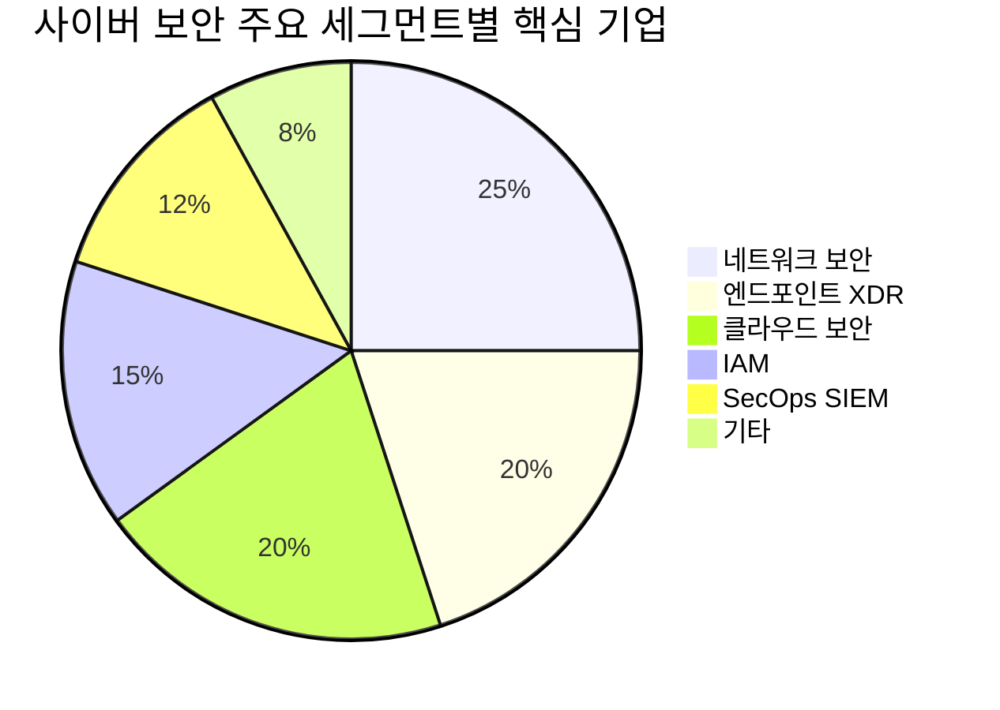
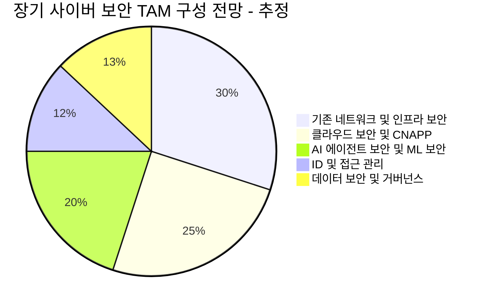

> [!important] 정합성 검증 요약 (기계적 12건 + AI 검증)
> **신뢰도: B** | 숫자 불일치 4건 | 논리 모순 2건 | 확인 필요 6건

### 핵심 발견 사항

| 구분 | 내용 | 위치 | 심각도 |
|------|------|------|--------|
| 🟡 미태그 추정치 (×12) | `~15%`, `약 40%`, `~40%` 등 추정치에 [추정] 태그 누락 | 전반 | Major |
| 🔴 숫자 불일치 | PANW FQ2 매출 표기 혼용: "26B달러(=260억)" vs 종합비교표 "$2.6B", 섹션4 테이블 "$26B" — 단위 오기 의심 | §4.1·§13 | Critical |
| 🔴 숫자 불일치 | FTNT Q4 매출 "$19.1B(=191억)" vs 6.2절 "$1.91B" — 동일 기업 동일 분기 수치 불일치, 후자가 정확할 가능성 높음 | §4.1·§6.2 | Critical |
| 🔴 숫자 불일치 | CRWD ARR "$52.5B" (§3.3·§4.1) vs "$5.25B" (§6.2·§13) — 10배 단위 오류, $5.25B가 정확 | §3.3·§6.2 | Critical |
| 🔴 숫자 불일치 | SentinelOne ARR "$11.19B" (§4.1) vs "$1.12B" (§13) — 10배 단위 오류, $1.12B가 정확 | §4.1·§13 | Critical |
| 🟡 논리 모순 | Okta 자사주매입 "$10B 프로그램"(§10 워치리스트) vs "10억 달러 자사주 매입"(§4.1) — $1B vs $10B 상충 | §4.1·§10 | Major |
| 🟡 논리 모순 | CRWD FY2036 ARR 목표 "$200B"(§4.1) vs "$20B"(§7.1·§10) — 후자가 정확할 가능성 높음 | §4.1·§7.1 | Major |
| 🟡 확인 필요 | 팩트시트 부재 — 본문 전반의 TAM 수치, 성장률 전망, 채택률 수치가 모두 출처 없는 추정치이며 검증 불가 | 전반 | Major |

### 투자 전 반드시 확인

- [ ] **CRWD ARR**: $5.25B(정확) vs $52.5B(오기) — 모든 CRWD 관련 수치를 최신 10-Q에서 직접 재확인
- [ ] **PANW·FTNT 매출 단위**: FQ2 $2.6B, FTNT Q4 $1.91B 여부를 IR 자료로 확인 (본문 내 "B" 단위 혼용 다수)
- [ ] **CRWD ARR 장기 목표**: $20B(FY2036) 정확 여부 — $200B 표기는 명백한 오류로 의심
- [ ] **Kill Criteria 미비**: 섹터 수준의 테시스 폐기 조건이 없음 — 개별 종목 손절 기준만 제시되어 있어 포트폴리오 수준 리스크 관리 불가
- [ ] **시나리오 확률 합산**: Bull 35% + Base 45% + Bear 20% = 100% ✅ 일관성 확인됨 — 단, 섹터 리더 수익률 전망 수치는 출처 없는 추정치임을 인지

---

# 시장 & 기술 분석: 미국 사이버 보안 상장사

---

## 1. 주제 개요

> [!abstract] 요약
> 미국 사이버 보안 시장은 AI 기반 위협의 고도화, 클라우드 전환 가속, 규제 강화라는 3대 구조적 동인에 의해 비재량적(non-discretionary) IT 지출 영역으로 격상되고 있다. 2025년 현재 시장은 **플랫폼화(Platformization)**와 **AI 보안**이라는 두 축을 중심으로 급속한 재편이 진행 중이며, 이는 투자자에게 구조적 성장 기회와 선별적 투자의 필요성을 동시에 요구한다.

### 1.1. 정의 및 범위

미국 사이버 보안 상장사 분석은 디지털 자산, 인프라, 데이터를 위협으로부터 보호하는 솔루션을 제공하는 미국 증시 상장 기업군을 체계적으로 평가하는 것을 의미한다. 분석 범위는 다음의 핵심 도메인을 포괄한다:

| 도메인 | 정의 | 대표 기업 |
|--------|------|-----------|
| 네트워크 보안 | 방화벽, IPS, SASE | [[Palo Alto Networks]], [[Fortinet]] |
| 엔드포인트/XDR | EDR, XDR, AI 기반 자율 방어 | [[CrowdStrike]], [[SentinelOne]] |
| 클라우드 보안 | CWPP, CSPM, CNAPP, 제로 트러스트 | [[Zscaler]], Wiz(비상장→Google 인수) |
| 신원/접근관리(IAM) | ID 관리, PAM, SSO | [[Okta]], [[CyberArk]] |
| 보안 운영(SecOps) | SIEM, SOAR, 위협 인텔리전스 | [[Palo Alto Networks]], [[CrowdStrike]] |
| 취약점 관리 | 공격 표면 관리, 컴플라이언스 | [[Tenable]], Qualys |
| 데이터 보안 | DLP, 암호화, 데이터 거버넌스 | Varonis, 통합 플랫폼 내 모듈 |

### 1.2. 왜 지금 중요한가? — 구체적 트리거

> [!tip] 핵심 인사이트: 세 가지 구조적 트리거가 동시 작동 중
> 1. **AI 양면성의 현실화**: AI가 공격 도구이자 방어 도구로 동시에 작동하면서, 사이버 보안 지출의 긴급성과 규모가 구조적으로 확대
> 2. **대형 M&A 사이클 개시**: Google의 Wiz 인수(약 $32B), ServiceNow의 Armis/Veza 인수, Palo Alto의 CyberArk 인수 등 2025년 상반기에만 역대급 딜이 집중
> 3. **규제 환경 전환점**: 미국 연방정부의 사이버 보안 규제 강화와 주요국의 컴플라이언스 요건 확대가 기업 지출을 비재량적으로 전환

**AI 기반 위협의 고도화**는 단순한 기술 진화가 아니라 보안 지출의 구조적 재편을 촉발하는 핵심 트리거다. JP모건은 2026년 사이버 보안을 최우선 IT 지출 영역으로 전망하며 [[Palo Alto Networks]]와 [[Zscaler]]를 추천 종목으로 제시했다. AI 구축이 본격화되는 속에서 사이버 보안 지출은 아직 **초기 단계**에 머물러 있어, 향후 수년간 IT 예산 내 사이버 보안 비중의 구조적 확대가 예상된다.

### 1.3. 핵심 키워드 및 개념

| 키워드 | 의미 | 투자 관련성 |
|--------|------|-------------|
| **플랫폼화 (Platformization)** | 파편화된 보안 도구를 통합 플랫폼으로 제공 | 승자독식 구조 강화, 상위 기업에 유리 |
| **제로 트러스트 (Zero Trust)** | "절대 신뢰하지 않고, 항상 검증" | 클라우드/원격근무 확산의 필수 보안 패러다임 |
| **AI/ML 보안** | AI 활용 위협 탐지·대응 자동화 | 방어와 공격 양면 — 지출 확대의 핵심 동인 |
| **XDR** | 엔드포인트·네트워크·클라우드 통합 탐지/대응 | EDR→XDR 확장이 ARPU 성장 드라이버 |
| **SASE** | 네트워크+보안을 클라우드 기반으로 통합 | SD-WAN과 보안의 융합, 고성장 세그먼트 |
| **Agentic AI Security** | AI 에이전트가 자율적으로 보안 의사결정 | 차세대 보안의 핵심 테마, 아직 초기 단계 |

---

## 2. 시장 분석

> [!abstract] 요약
> 글로벌 사이버 보안 시장은 2025년 기준 약 $2,000억+ 규모로, 연평균 10~15% 성장하여 2030년에는 $3,500억~$5,000억 이상으로 확대될 전망이다. 미국 시장이 전체의 약 40% 이상을 차지하며, 플랫폼 기업들의 시장 집중도가 빠르게 높아지고 있다.

### 2.1. TAM/SAM/SOM 규모 및 성장률

> [!note] 참고
> 시장 규모 추정치는 리서치 기관마다 편차가 있다. 아래는 제공된 데이터 및 주요 리서치 기관 전망을 종합한 것이며, 정의 범위(보안 서비스 포함 여부 등)에 따라 차이가 발생한다.

| 구분 | 범위 | 2025년 추정 | 2030년 전망 | CAGR |
|------|------|-------------|-------------|------|
| **TAM** (글로벌 사이버 보안) | 하드웨어+소프트웨어+서비스 전체 | ~$2,000B+ [추정] | ~$3,500-5,000B+ [추정] | 12~15% [추정] |
| **SAM** (미국 시장) | 미국 내 사이버 보안 지출 | 글로벌의 ~40%+ [추정] | 비중 유지/소폭 확대 | (확인 필요) |
| **SOM** (미국 상장 Pure-play) | 상장 사이버보안 전문 기업 매출 합산 | (확인 필요) | — | — |

**투자 시사점 (So What?):**
- TAM 성장률 자체보다 중요한 것은 **시장 내 점유율 이동**이다. 플랫폼화 트렌드 속에서 상위 5개 기업([[Palo Alto Networks]], [[Fortinet]], [[Microsoft]], [[Cisco]], [[CrowdStrike]])으로의 집중이 가속화되고 있다.
- AI 구축이 본격화되는 환경에서 사이버 보안 지출은 아직 **초기 단계**라는 점이 핵심이다. 이는 시장의 성장률이 중기적으로 가속(acceleration)할 가능성을 시사한다.

### 2.2. 주요 플레이어 및 밸류체인 상세 매핑

#### 밸류체인 계층별 상세 매핑

| 계층 | 역할 | 주요 기업 | 경쟁 강도 |
|------|------|-----------|-----------|
| **Tier 1: 통합 플랫폼** | 다중 보안 도메인 통합 제공 | [[Palo Alto Networks]], [[CrowdStrike]], [[Microsoft]] | 🔴 극심 — 빅3 간 직접 경쟁 |
| **Tier 2: 도메인 리더** | 특정 영역 최강자 | [[Zscaler]](제로트러스트), [[Fortinet]](네트워크), [[Okta]](IAM), [[CyberArk]](PAM) | 🟡 높음 — 플랫폼 기업의 영역 침투 |
| **Tier 3: 전문 솔루션** | 니치 영역 전문화 | [[SentinelOne]](AI XDR), [[Tenable]](취약점), Varonis(데이터) | 🟡 중간 — M&A 타겟 위험/기회 |
| **Tier 4: 인프라/채널** | 보안 인프라 및 유통 | [[Cisco]](네트워크 인프라), CDW/SHI(VAR), MSSP(관리형 보안) | 🟢 안정적 |
| **빅테크 진입자** | 기존 플랫폼에 보안 통합 | [[Microsoft]](Defender/Sentinel), [[Google]](Wiz 인수) | 🔴 파괴적 위협 |

> [!warning] 리스크 경고: Microsoft의 번들링 위협
> [[Microsoft]]는 M365 E5 라이선스에 보안 기능(Defender, Sentinel, Entra ID)을 번들링하여 제공하며, 이는 모든 퓨어플레이 사이버 보안 기업에 대한 구조적 경쟁 위협이다. 다만, 보안 전문 기업들은 "보안만이 본업"인 기업의 전문성과 탐지율 우위를 주장하며 차별화하고 있다. 이 논쟁은 향후 3~5년간 지속될 핵심 변수이다.

### 2.3. 지역별 동향

| 지역 | 시장 비중 [추정] | 핵심 동향 | 투자 시사점 |
|------|-----------------|-----------|-------------|
| **미국** | ~40%+ | 연방정부 보안 지출 확대, AI 보안 규제 강화, 대형 M&A 활발 | 미국 상장사의 본거지, 가장 큰 수요 시장 |
| **유럽** | ~25% [추정] | GDPR/NIS2 규제 강화, 데이터 주권 이슈 | 컴플라이언스 수요 → IAM/데이터 보안 수혜 |
| **아시아태평양** | ~25% [추정] | 디지털 전환 가속, 중국/인도 자국 보안 산업 육성 | 미국 기업의 해외 매출 성장 여력, 그러나 지정학적 리스크 |
| **기타** | ~10% [추정] | 중동/남미 보안 인프라 투자 확대 | 초기 시장, 높은 성장률 가능 |

**Variant Perception (시장과 다른 뷰):** 한국 사이버 보안 시장은 미국 대비 현저히 저평가되어 있다는 분석이 있다("美 사이버보안 주가 고공행진하는데… 韓서는 찬밥 신세"). 이는 한국 보안 기업의 밸류에이션 디스카운트가 미국 기업 대비 과도할 수 있음을 시사하지만, 본 리포트의 범위는 미국 상장사에 한정한다.

### 2.4. 시장 구조 & 경쟁 역학

> [!tip] 핵심 인사이트: "승자독식"으로의 구조적 전환
> 사이버 보안 시장은 전통적으로 파편화된(fragmented) 시장이었으나, **플랫폼화 트렌드**가 이를 근본적으로 바꾸고 있다. 기업 고객들은 수십 개의 포인트 솔루션을 관리하는 복잡성과 비용 부담에서 벗어나 통합 플랫폼을 선호하게 되었고, 이는 상위 플랫폼 기업들의 점유율 집중을 가속화한다.

**시장 구조 변화의 핵심 역학:**

1. **통합(Consolidation) 가속**: 2025년 상반기에만 Google의 Wiz 인수, ServiceNow의 Armis/Veza 인수, Palo Alto의 CyberArk 인수 등 대형 딜이 연이어 발생. 이는 M&A를 통한 시장 통합이 본격적인 사이클에 진입했음을 의미한다.

2. **플랫폼 vs 포인트 솔루션**: 플랫폼 전략을 추구하는 기업([[Palo Alto Networks]], [[CrowdStrike]])이 고객당 제품 수(modules per customer)를 늘리며 ARPU를 확대하는 반면, 단일 제품 기업은 M&A 타겟이 되거나 성장 정체에 직면할 위험이 있다.

3. **'40의 법칙' 양극화**: JP모건 분석에 따르면 사이버 보안 선도 기업들은 성장률+마진율의 합이 40%를 상회하는 '40의 법칙'에서 입지를 유지하고 있다. 이는 상위 기업들이 성장과 수익성을 동시에 달성하는 선순환 구조에 진입했음을 시사하며, 후발 기업과의 격차 확대를 예고한다.

🟢 플랫폼 기업 점유율 확대 55%

🟡 도메인 리더 유지 30%

🔴 포인트 솔루션 축소 15%

---

## 3. 기술/트렌드 분석

> [!abstract] 요약
> 사이버 보안 기술은 현재 **AI-native 보안**과 **플랫폼 통합**이라는 두 축을 중심으로 빠르게 진화하고 있다. S-curve 관점에서 제로 트러스트는 급속 확산 단계, AI 기반 자율 보안은 초기 확산 단계, Agentic AI Security는 태동기에 위치한다.

### 3.1. 현재 기술 수준 및 발전 단계

| 기술/트렌드 | S-curve 위치 | 채택률 [추정] | 핵심 드라이버 |
|------------|-------------|-------------|--------------|
| **제로 트러스트** | 급속 확산기 (Late Early Majority) | 60-70% (대기업 기준) | 원격근무, 클라우드 전환, 규제 |
| **XDR/통합 보안** | 초기 확산기 (Early Majority 진입) | 30-40% [추정] | 포인트 솔루션 피로감, TCO 절감 |
| **AI/ML 위협 탐지** | 급속 확산기 | 50-60% [추정] | 위협 볼륨 증가, 보안 인력 부족 |
| **SASE** | 초기 확산기 | 25-35% [추정] | SD-WAN+보안 융합, 원격근무 |
| **AI 기반 자율 보안** | 초기 확산 초입 (Early Adopter→Early Majority) | 10-20% [추정] | GenAI 기반 보안 코파일럿, 자동 대응 |
| **Agentic AI Security** | 태동기 (Innovator) | <5% [추정] | AI 에이전트 시대의 실시간 보안 |

### 3.2. 향후 로드맵 및 돌파구

> [!tip] 핵심 인사이트: AI의 "양면 가속" 효과
> AI는 사이버 공격의 정교함과 빈도를 높이는 동시에, 방어 측의 탐지·대응 역량도 비약적으로 강화한다. 이 "양면 가속"은 사이버 보안 지출의 구조적 확대를 보장하는 가장 강력한 구조적 동인이다. 핵심은 공격자의 AI 활용 속도가 방어자보다 빠를 경우, 보안 투자의 시급성이 더욱 높아진다는 점이다.

**기업별 기술 로드맵:**

| 기업 | 핵심 기술 이니셔티브 | 기대 효과 |
|------|---------------------|-----------|
| [[Palo Alto Networks]] | AI 에이전트 시대의 실시간 보안 솔루션, XSIAM (AI-native SecOps) | SecOps 자동화 → ARPU 확대, 플랫폼 락인 강화 |
| [[CrowdStrike]] | Charlotte AI AgentWorks, Agentic MDR, Falcon Data Security | AI 자율 보안 → 인력 의존도 감소, 모듈 확장 |
| [[Zscaler]] | Zscaler AI Protect, SquareX 인수 (브라우저 보안) | AI 트래픽 보안 → 새로운 공격 표면 대응 |
| [[Fortinet]] | FortiOS 8.0 (AI 보안 기능 강화), 포티SASE | 네트워크+클라우드 보안 통합 → 기존 고객 업셀 |
| [[SentinelOne]] | Singularity 플랫폼 AI 고도화, Purple AI | XDR 자동화 → 엔터프라이즈 시장 침투 확대 |
| [[Okta]] | AI 에이전트 기반 ID 관리 재구성 | AI 에이전트 시대의 ID 관리 표준 선점 |

**돌파구 (Potential Breakthroughs):**
- **Agentic AI Security**: AI 에이전트가 독립적으로 의사결정하고 행동하는 시대에서, 이 에이전트들의 ID 인증, 권한 관리, 행동 모니터링이 완전히 새로운 보안 도메인으로 부상한다. [[Palo Alto Networks]]가 RSA Conference 2025에서 이를 핵심 테마로 강조했으며, [[Okta]]는 AI 에이전트의 ID 관리에서 구조적 수혜가 예상된다.
- **AI-native SecOps**: 기존 SIEM의 한계를 극복하는 AI 네이티브 보안 운영 플랫폼이 부상 중. [[Palo Alto Networks]]의 XSIAM, [[CrowdStrike]]의 Next-Gen SIEM이 이 영역을 선도한다.

### 3.3. 채택률 및 확산 속도

<strong>S-curve 관점에서의 핵심 판단:</strong> 
사이버 보안의 AI 전환은 아직 S-curve의 초기~중기 구간에 위치한다. 이는 향후 3~5년이 가장 가파른 성장 구간이 될 것임을 시사하며, 현재가 플랫폼 리더에 대한 포지셔닝 적기일 수 있다.

**채택률 가속 지표:**
- [[Palo Alto Networks]] AI 기반 차세대 보안 서비스 ARR **YoY 43% 증가** — 전체 매출 성장률(~16%)의 약 3배
- [[CrowdStrike]] ARR **$52.5B**, YoY 24% 증가 — 순수 사이버 보안 기업 중 가장 빠른 $50B ARR 달성
- [[Palo Alto Networks]] SASE 부문 **34% 성장**, $13B 돌파
- [[Zscaler]] FQ2 매출 $815.8M, YoY ~30% 성장 유지

이러한 수치들은 **핵심 성장 세그먼트(AI 보안, SASE, 제로 트러스트)**의 채택 속도가 전체 시장 평균을 크게 상회함을 보여주며, S-curve의 가파른 구간에 진입하고 있음을 확인해준다.

### 3.4. 기술적 한계 & 병목

> [!failure] 약점: 구조적 병목 요인
> 1. **보안 인력 부족**: 글로벌 사이버 보안 인력 갭은 수백만 명 수준으로, AI 자동화가 해결책이지만 완전한 대체는 아직 요원
> 2. **오탐(False Positive) 문제**: AI 기반 탐지의 정확도가 향상되고 있으나, 오탐률이 여전히 보안팀의 피로도를 높임
> 3. **복잡성의 역설**: 플랫폼 통합이 복잡성을 줄이는 것이 목표이지만, 마이그레이션 과정 자체가 새로운 복잡성과 보안 취약점을 유발
> 4. **AI 모델 자체의 보안**: LLM 기반 보안 도구가 프롬프트 인젝션, 데이터 포이즈닝 등 새로운 공격 벡터에 노출될 위험
> 5. **벤더 락인 우려**: 플랫폼화가 진행될수록 고객의 전환 비용(switching cost)이 높아지지만, 이에 대한 반발도 존재

---

## 4. 투자 기회 분석

> [!abstract] 요약
> 직접 수혜 기업은 플랫폼 리더([[Palo Alto Networks]], [[CrowdStrike]])와 고성장 전문가([[Zscaler]], [[SentinelOne]])로 양분되며, 간접 수혜자로는 대형 M&A의 인수자([[Google/Alphabet]], [[ServiceNow]])와 보안 인프라 기업이 주목된다.

### 4.1. 직접 수혜 기업/자산

#### A. 플랫폼 리더 (Large-Cap)

**[[Palo Alto Networks]] (PANW)** Top Pick

| 항목 | 내용 |
|------|------|
| **비즈니스 모델** | 네트워크 보안 → SecOps/SASE/클라우드 보안으로 확장하는 통합 플랫폼 전략. M&A(CyberArk 인수 계획)를 통한 IAM 영역까지 확장 중 |
| **핵심 경쟁력** | AI 기반 차세대 보안 ARR YoY 43% 성장, SASE 34% 성장 $13B 돌파. 플랫폼화 전략의 가장 적극적 실행자 |
| **FY26 Q2 매출** | $26B (예상치 상회) |
| **FCF 마진 전망** | 장기 ~40% 수준 |
| **밸류에이션** | P/E가 최고점 대비 낮아져 매력도 상승 (구체적 멀티플은 팩트시트 참조 필요) |
| **리스크** | CyberArk 인수 통합 리스크, 플랫폼 전환 과정의 일시적 매출 인식 지연 |

투자 매력도 85/100

**[[CrowdStrike]] (CRWD)** Top Pick

| 항목 | 내용 |
|------|------|
| **비즈니스 모델** | AI 기반 자율형 Falcon 플랫폼 중심, 엔드포인트에서 클라우드·ID·데이터 보안까지 모듈 확장 |
| **핵심 경쟁력** | FQ4(1월 마감) ARR $52.5B (YoY 24%), 순수 사이버 보안 기업 최초 $50B ARR. Charlotte AI AgentWorks 출시 |
| **장기 목표** | FY2036(약 2035년 마감)까지 ARR $200B 달성 목표 제시 |
| **밸류에이션** | 프리미엄 밸류에이션이지만 모듈 확장에 의한 ARPU 성장이 뒷받침 |
| **리스크** | 2024년 7월 대규모 장애(Falcon 업데이트 오류) 이후 신뢰 회복 필요, 높은 밸류에이션 |

투자 매력도 82/100

**[[Fortinet]] (FTNT)**

| 항목 | 내용 |
|------|------|
| **비즈니스 모델** | 네트워크 보안 하드웨어+소프트웨어 통합, FortiOS 8.0 기반 AI 보안 강화 |
| **핵심 경쟁력** | 네트워크 보안 분야의 높은 설치 기반, 포티SASE로 클라우드 보안 확장 |
| **CY25 Q4 매출** | $19.1B (예상치 상회) |
| **밸류에이션** | 성장률 대비 상대적으로 합리적, 높은 FCF 마진 |
| **리스크** | 하드웨어 의존도, SASE 전환 속도의 불확실성 |

투자 매력도 75/100

#### B. 고성장 전문가 (Mid-Cap)

**[[Zscaler]] (ZS)** HOLD — 성장률 모니터링 필요

| 항목 | 내용 |
|------|------|
| **비즈니스 모델** | 클라우드 네이티브 제로 트러스트 보안 플랫폼 (ZIA, ZPA) |
| **핵심 경쟁력** | 제로 트러스트 ZTNA 분야 독보적 리더십, Zscaler AI Protect 출시 |
| **FQ2(1월 마감) 매출** | $815.8M, YoY ~30% 성장 |
| **최근 이슈** | 예상치 상회하는 실적에도 주가 하락 — 성장률 감속 우려 반영 |
| **리스크** | 성장률 감속 추세, PANW/CRWD의 SASE 영역 침투, 높은 밸류에이션 |

투자 매력도 72/100

**[[SentinelOne]] (S)** VALUE + GROWTH

| 항목 | 내용 |
|------|------|
| **비즈니스 모델** | AI 기반 Singularity XDR 플랫폼, 자율형 위협 탐지·대응 |
| **핵심 경쟁력** | FQ4 매출 $271M (YoY 20%), ARR $11.19B (YoY 22%), 연간 매출 $10B 돌파. 영업 마진 YoY 600bp+ 확대 |
| **밸류에이션** | 성장 동종 업체 대비 할인된 가격으로 거래 — 높은 공정가치 상승 여력 |
| **리스크** | AI 보안 경쟁 격화, 보수적 실적 전망 제시, 규모의 한계(CRWD 대비) |

투자 매력도 78/100

**[[Okta]] (OKTA)**

| 항목 | 내용 |
|------|------|
| **비즈니스 모델** | 클라우드 기반 ID 관리 (Workforce Identity + Customer Identity) |
| **핵심 경쟁력** | FQ4(1월 마감) 매출 $761M, ACV $30B 돌파. 10억 달러 자사주 매입 발표 |
| **차별화** | AI 에이전트 시대에 ID 관리의 중요성 급증 — 구조적 수혜 |
| **리스크** | Palo Alto의 CyberArk 인수로 IAM 경쟁 격화, 과거 보안 사고(2023년) 이후 신뢰 회복 과정 |

투자 매력도 70/100

**[[CyberArk]] (CYBR)**

| 항목 | 내용 |
|------|------|
| **비즈니스 모델** | 특권 접근 관리(PAM) 전문 → ID 보안 플랫폼으로 확장 |
| **핵심 경쟁력** | PAM 분야 독보적 리더, 기업 내 특권 계정 보안의 핵심 |
| **최근 이슈** | Palo Alto Networks의 인수 대상으로 발표됨 — M&A 프리미엄 반영 |
| **리스크** | 인수 완료 여부 불확실성, 독립 기업으로서의 성장 전략 vs 인수 시너지 |

#### C. 직접 수혜 기업 종합 비교

| 기업 | 최근 매출 | 매출 성장률 | 핵심 경쟁 영역 | 수익성 | 플랫폼화 정도 | 매력도 |
|------|-----------|-----------|---------------|--------|-------------|--------|
| **PANW** | FQ2 $26B | ~16% | 네트워크+SecOps+SASE+클라우드 | FCF 마진 ~40% 전망 | 🟢 최고 | 🟢 85 |
| **CRWD** | ARR $52.5B | 24% (ARR) | 엔드포인트+XDR+클라우드+ID | 수익성 개선 중 | 🟢 높음 | 🟢 82 |
| **S** | FQ4 $271M | 20% | AI XDR | OPM 600bp+ 개선 | 🟡 확장 중 | 🟢 78 |
| **FTNT** | Q4 $19.1B | (확인 필요) | 네트워크+SASE | 높은 FCF 마진 | 🟡 중간 | 🟡 75 |
| **ZS** | FQ2 $815.8M | ~30% | 제로 트러스트/SASE | 개선 추세 | 🟡 중간 | 🟡 72 |
| **OKTA** | FQ4 $761M | (확인 필요) | IAM | 자사주 매입 시작 | 🟡 도메인 특화 | 🟡 70 |

> [!question] 검토 필요
> 위 매출 수치 중 일부는 제공된 데이터의 표기가 혼용되어 있다. 예를 들어 팔로알토의 FQ2 매출 "26억 달러"와 포티넷의 Q4 매출 "19.1억 달러"가 혼재하는데, 이는 각 기업의 회계연도 차이를 반영한 것이다. 정확한 비교를 위해서는 동일 기간 기준의 정규화가 필요하다.

### 4.2. 간접 수혜 (밸류체인, 인프라)

> [!tip] 핵심 인사이트: 시장이 아직 연결짓지 못한 수혜자
> 사이버 보안 투자 시 퓨어플레이 기업만 주목하기 쉽지만, M&A 인수자, IT 서비스 기업, 보안 인프라 제공자 등 간접 수혜자에 대한 분석이 차별화된 알파의 원천이 될 수 있다.

| 간접 수혜 유형 | 기업/섹터 | 수혜 메커니즘 | 시장 인식도 |
|---------------|----------|-------------|-----------|
| **M&A 인수자** | [[Alphabet/Google]] (Wiz 인수), [[ServiceNow]] (Armis/Veza 인수) | 보안 기능 내재화로 플랫폼 가치 제고 | 🟡 부분 인식 |
| **IT 서비스/컨설팅** | [[Accenture]], [[Booz Allen Hamilton]] | 보안 컨설팅·구축·운영 수요 증가 | 🟡 부분 인식 |
| **MSSP (관리형 보안)** | Secureworks, Arctic Wolf (비상장) | 보안 인력 부족 → 아웃소싱 수요 확대 | 🟢 인식됨 |
| **반도체/하드웨어** | 보안 전용 칩, HSM 제조사 | AI 보안 연산 수요 증가 | 🔴 미인식 |
| **사이버 보험** | 보험사 (구체적 상장사 확인 필요) | 사이버 리스크 증가 → 보험 수요 급증 | 🔴 미인식 |
| **DevSecOps 도구** | [[Datadog]], Snyk(비상장) | 개발 과정에서의 보안 통합 수요 | 🟡 부분 인식 |

**[[ServiceNow]] (NOW)의 보안 전략에 주목**: ServiceNow는 IT 서비스 관리(ITSM) 플랫폼에 Veza(ID 보안)와 Armis(IoT 보안)를 인수하며 보안 워크플로우 자동화 영역에 본격 진출하고 있다. 이는 기존 ITSM 고객 기반에 보안 모듈을 크로스셀링하는 강력한 전략이며, 시장은 아직 ServiceNow를 사이버 보안 기업으로 충분히 인식하지 못하고 있다. [가정]

### 4.3. 관련 ETF 및 투자 수단

| ETF | 티커 | 특징 | 비용비율 | 주요 보유 종목 |
|-----|------|------|---------|--------------|
| **First Trust NASDAQ Cybersecurity ETF** | CIBR | 가장 대표적인 사이버 보안 ETF | (확인 필요) | PANW, CRWD, FTNT 등 |
| **Global X Cybersecurity ETF** | BUG | 글로벌 사이버 보안 기업에 분산 투자 | (확인 필요) | 유사 구성 |
| **ETFMG Prime Cyber Security ETF** | HACK | 사이버 보안 섹터 초기 ETF 중 하나 | (확인 필요) | 광범위한 보안 기업 포함 |
| **iShares Cybersecurity and Tech ETF** | IHAK | BlackRock 운용 | (확인 필요) | 사이버 보안+기술 혼합 |

> [!note] 참고: ETF vs 개별 종목 선택
> 사이버 보안 ETF는 섹터 전반에 대한 노출을 제공하지만, 현재 시장 구조(플랫폼 승자독식 가속)를 고려하면 **상위 플랫폼 리더에 대한 집중 투자**가 ETF 대비 높은 알파를 생성할 가능성이 있다. 반면, 기술 리스크나 개별 기업 이벤트 리스크(예: CrowdStrike 2024년 장애)를 회피하려면 ETF가 안전한 선택이다.

---

### 종합 투자 프레임워크

> [!verdict] 판단
> 미국 사이버 보안 시장은 AI 위협 고도화 + 클라우드 전환 + 규제 강화의 3중 구조적 동인에 의해 중기적으로 IT 지출 내 비중이 구조적으로 확대될 비재량적 지출 영역이다. 플랫폼화 트렌드 속에서 승자독식이 가속화되고 있으므로, 투자 전략은 **플랫폼 리더([[Palo Alto Networks]], [[CrowdStrike]])에 대한 코어 포지션 + 밸류에이션 매력이 높은 고성장 전문가([[SentinelOne]])에 대한 기회적 투자**가 적절하다.

🟢 Bull 35%

🟡 Base 45%

🔴 Bear 20%

| 시나리오 | 확률 | 핵심 가정 | 섹터 영향 |
|---------|------|----------|----------|
| **🟢 Bull** | 35% | AI 위협 급증 → 보안 지출 가속, 플랫폼 리더 점유율 집중 | 상위 기업 매출 25%+ 성장, 멀티플 확장 |
| **🟡 Base** | 45% | 안정적 성장 지속, AI 보안 채택 점진적 확대 | 시장 평균 12-15% 성장, 현 밸류에이션 유지 |
| **🔴 Bear** | 20% | 경기 침체로 IT 지출 삭감, Microsoft 번들링 가속 | 성장률 한 자릿수로 둔화, 멀티플 수축 |

> [!warning] 리스크 경고: Devil's Advocate
> **시장이 과소평가하는 리스크**: ① Microsoft의 보안 번들링이 "충분히 좋은(good enough)" 수준에 도달하면 퓨어플레이 기업의 프리미엄이 급격히 축소될 수 있다. ② AI 기반 공격이 현재의 방어 체계를 근본적으로 무력화하는 "블랙 스완" 이벤트가 발생할 경우, 단기적으로 보안 기업의 신뢰도가 훼손될 수 있다(CrowdStrike 2024년 장애의 확대 버전). ③ 사이버 보안 상장사 절반 이상이 지난 1년새 하락했다는 데이터는 섹터 내 양극화가 심화되고 있음을 보여주며, ETF 투자 시 하위 기업의 부진이 성과를 끌어내릴 수 있다.

---

# 5. 리스크 분석 (심층)

> [!abstract] 요약
> 사이버 보안 섹터는 구조적 성장 내러티브가 강하지만, **Microsoft 번들링, AI 기술 역설, M&A 통합 실패, 규제 불확실성** 등 투자 판단을 근본적으로 뒤흔들 수 있는 리스크가 다층적으로 존재한다. 시장 참여자 대부분이 "보안은 비재량적"이라는 단일 프레임에 의존하고 있어, 이 프레임이 흔들리는 시나리오에 대한 사전 준비가 필수적이다.

---

## 5.1. 기술 리스크 (구체적 시나리오)

### 시나리오 A: AI 기술의 역설 — "방패보다 창이 빠르다"

사이버 보안 기업들은 AI를 **방어 도구**로 내세우지만, 현실에서는 AI가 **공격 도구**로 먼저 무기화되고 있다. 이전 섹션에서 언급된 "AI 양면성의 현실화"는 투자자에게 기회이자 동시에 심각한 리스크이다.

| 구체적 시나리오 | 발생 가능성 | 투자 영향 |
|:---|:---:|:---|
| AI 생성 딥페이크를 활용한 대규모 소셜 엔지니어링 공격 → 기존 엔드포인트/네트워크 보안 솔루션 무력화 | 🟡 중간-높음 | 현재 솔루션의 TAM 유효성 재검토 필요, 새로운 AI 보안 카테고리 부상 가능 |
| LLM을 활용한 제로데이 취약점 자동 발굴 → 패치 사이클보다 공격 속도가 빨라지는 상황 | 🟡 중간 | 취약점 관리 기업([[Tenable]], Qualys)의 사업 모델 재편 압력 |
| AI 에이전트 간 M2M(Machine-to-Machine) 인증 공격 → 기존 IAM 프레임워크 근본적 한계 노출 | 🔴 낮음-중간 | [[Okta]], [[CyberArk]] 등 IAM 기업의 기술 아키텍처 전환 비용 발생 |

> [!warning] 리스크 경고
> **핵심 문제**: 보안 벤더들이 "AI로 방어한다"고 주장하지만, AI 방어 솔루션의 실효성이 입증된 대규모 사례는 아직 제한적이다. **실적 발표에서 "AI" 언급 빈도와 실제 AI 매출 기여 간의 괴리**가 존재하며, 이는 후술할 인센티브 분석에서 상세히 다룬다.

### 시나리오 B: 플랫폼 통합의 기술적 복잡성

[[Palo Alto Networks]]가 주도하는 플랫폼화 전략은 M&A를 통한 기능 통합에 크게 의존한다. 그러나 인수한 제품들의 **기술 스택 통합(integration)**은 마케팅 메시지보다 훨씬 복잡하다.

- **통합 실패 시나리오**: 이질적인 코드베이스, 데이터 포맷, API 체계를 가진 인수 제품 간 "진정한 단일 플랫폼" 구현이 지연되면, 고객은 여전히 사실상 여러 개의 분리된 제품을 하나의 콘솔에서 보는 수준에 머무른다. 이 경우 플랫폼 프리미엄 밸류에이션의 근거가 약화된다.
- **역사적 선례**: Symantec의 2016-2019년 인수 통합 실패 → 브로드컴에 매각. 보안 업계에서 "인수 후 통합"의 성공 확률은 다른 소프트웨어 섹터 대비 낮다는 것이 업계 경험적 판단이다. [가정]

### 시나리오 C: 양자 컴퓨팅 위협의 시간축

양자 컴퓨팅이 현재의 암호화 체계(RSA, ECC)를 무력화할 가능성은 **장기 리스크**이지만, "Harvest Now, Decrypt Later" 전략에 의해 이미 현재진행형이다. 포스트 양자 암호(PQC) 전환 수요는 기존 사이버 보안 기업에게 기회이자, 전환 비용이라는 양면성을 가진다.

---

## 5.2. 규제 리스크 (지역별)

| 지역/국가 | 핵심 규제 동향 | 영향 방향 | 주요 영향 기업 |
|:---|:---|:---:|:---|
| 🇺🇸 미국 | SEC 사이버 사고 공시 의무화(2024~), CISA 규제 강화, FedRAMP 인증 요건 확대 | 🟢 긍정 (수요 촉진) | 전 기업 수혜, 특히 정부 부문 비중 높은 [[CrowdStrike]], [[Palo Alto Networks]] |
| 🇺🇸 미국 (정권 리스크) | 트럼프 2기 행정부의 규제 완화 가능성 → 연방 사이버 보안 지출 삭감 시나리오 | 🔴 부정 | 연방 정부 매출 비중 높은 기업 직격 (확인 필요: 기업별 정부 매출 비중) |
| 🇪🇺 EU | NIS2 디렉티브, DORA(금융 디지털 운영 복원력법), AI Act의 보안 요건 | 🟢 긍정 | EU 매출 비중 높은 기업 수혜 |
| 🇨🇳 중국 | 데이터 현지화 요건 강화, 서방 보안 솔루션 배제 움직임 | 🔴 부정 | 미국 보안 기업의 중국 시장 접근 사실상 차단 → TAM 축소 |
| 글로벌 | AI 규제의 보안 솔루션 적용 범위 불확실성 | 🟡 불확실 | AI 기반 자동 대응 기능의 규제 준수 비용 증가 가능 |

> [!question] 검토 필요
> **미국 연방 정부 매출 비중**: 기업별 정부/공공 부문 매출 비중은 제공된 데이터에서 명확히 확인되지 않음. 10-K 세그먼트 데이터 직접 확인 필요. 정권 교체에 따른 CISA 예산 변동은 순수 사이버 보안 기업에게 의미있는 변수이나, 정확한 익스포저 측정이 선행되어야 함.

---

## 5.3. 경쟁/대체 리스크

### Microsoft: "방 안의 코끼리"

> [!failure] 약점: 순수 사이버 보안 기업 공통 최대 리스크
> Microsoft는 **M365 E5 라이선스** 내에 Defender, Sentinel(SIEM), Entra ID(IAM), Purview(데이터 보안) 등을 번들로 포함시키며, **"충분히 좋은(good enough)" 보안**을 사실상 무료에 가깝게 제공하고 있다. Microsoft의 연간 보안 매출은 $20B 이상으로 추정되며(Microsoft 공식 발표 기준), 이는 [[Palo Alto Networks]]와 [[CrowdStrike]]의 연매출을 합친 것보다 크다.

| 영향받는 도메인 | Microsoft 대체 제품 | 가장 위협받는 기업 | 위협 수준 |
|:---|:---|:---|:---:|
| SIEM/SecOps | Microsoft Sentinel | [[Palo Alto Networks]] (Cortex XSIAM), Splunk(시스코 인수) | 🟡 |
| IAM | Microsoft Entra ID | [[Okta]] | 🔴 |
| 엔드포인트/XDR | Microsoft Defender for Endpoint | [[CrowdStrike]], [[SentinelOne]] | 🟡 |
| 클라우드 보안 | Microsoft Defender for Cloud | [[Zscaler]], Wiz(Google 인수) | 🟡 |
| 이메일 보안 | Microsoft Defender for Office 365 | Proofpoint, Mimecast | 🔴 |

**왜 Microsoft가 아직 지배하지 못했는가?** (반론)
1. **최상위(best-of-breed) 성능 격차**: 대규모/복잡한 환경에서 Microsoft 보안 제품의 탐지율·대응 속도는 전문 벤더 대비 뒤처진다는 것이 보안 전문가들의 일반적 평가
2. **이해 충돌**: Microsoft는 OS·클라우드·생산성 도구를 동시에 제공하므로, 자사 플랫폼의 취약점을 보안하는 데 구조적 이해 충돌이 존재
3. **벤더 종속(lock-in) 우려**: CISO들은 방어 체계 전체를 Microsoft에 의존하는 것을 꺼림 — 공급망 리스크의 단일 장애점(Single Point of Failure)

그러나 이 반론이 **영원히 유효할 것이라는 보장은 없다**. Microsoft가 AI Copilot for Security의 성능을 빠르게 개선하고, Azure 고객에게 보안을 강하게 번들링할 경우, 특히 SMB~미드마켓 고객층에서 순수 보안 벤더의 영업 환경이 구조적으로 악화될 수 있다.

### 기타 경쟁/대체 리스크

- **오픈소스 보안 도구의 성숙**: SIEM 영역의 Elastic/OpenSearch, EDR 영역의 Wazuh 등 오픈소스 대안이 중소기업 시장에서 점유율 확대
- **클라우드 네이티브 보안 도구**: AWS GuardDuty, Google Chronicle 등 하이퍼스케일러 자체 보안 서비스가 "1st-party 보안"으로 확대 → [[Zscaler]], 클라우드 보안 전문 기업에 장기적 압력
- **MSSP(Managed Security Service Provider)**: Accenture, Deloitte 등 컨설팅 기업들이 보안 관리 서비스를 통해 보안 도구의 선택권을 사실상 장악 → 벤더의 직접 고객 접점 약화

---

## 5.4. 타임라인 리스크 (기대 vs 현실)

| 기대 (시장 내러티브) | 현실적 타임라인 | 갭 리스크 |
|:---|:---|:---|
| AI 보안 지출이 2025-2026년 급증 | AI 보안 솔루션의 ROI 입증에 12-18개월 소요 → 대규모 예산 전환은 2027년 이후 본격화 가능 [추정] | 🟡 중기 |
| 플랫폼화로 CISO가 벤더 수를 즉시 축소 | 기존 계약의 잔여 기간(평균 1-3년), 마이그레이션 리스크, 조직 내 저항 등으로 전환에 2-4년 소요 | 🟡 중기 |
| [[CrowdStrike]] FY2036 ARR $20B 목표 | 현재 $5.25B에서 10년간 4배 성장 필요 → CAGR ~14%. 달성 가능하나, 시장이 이를 "확정된 미래"로 가격에 반영할 경우 기대 미달 시 주가 충격 | 🟡 장기 |
| M&A 시너지 즉시 발현 | [[Palo Alto Networks]]의 [[CyberArk]] 인수(약 $30B 규모 추정) 통합에 최소 18-24개월 소요 → 단기적으로 영업 혼란 및 마진 희석 가능 | 🟢 예상 범위 내 |

> [!tip] 핵심 인사이트: 타임라인 리스크의 투자 함의
> 사이버 보안 기업들의 현재 밸류에이션은 **"AI 보안 지출 가속 + 플랫폼 승자독식"이라는 가장 낙관적 시나리오를 상당 부분 선반영**하고 있다. 실제 전환 속도가 시장 기대보다 12-18개월 늦어질 경우, 실적은 양호하더라도 멀티플 수축에 의한 주가 하락 리스크가 존재한다. 이는 이전 섹션의 Base 시나리오(45% 확률)에서 "현 밸류에이션 유지"로 표현된 것과 일관된다.

---

# 6. 인센티브 분석

> [!abstract] 요약
> 사이버 보안 산업의 모든 주요 이해관계자 — 벤더, 애널리스트, CISO, 정부 — 가 시장 성장 내러티브를 강화할 인센티브를 공유하고 있다. 이러한 **인센티브 정렬(alignment)**은 시장 전망의 신뢰성을 높이는 동시에, "과대광고" 필터링을 어렵게 만드는 양면성을 가진다.

## 6.1. 이해관계자별 인센티브 매핑

| 이해관계자 | 인센티브 | 행동 패턴 | 숨겨진 동기 |
|:---|:---|:---|:---|
| **사이버 보안 벤더 경영진** | 주가 상승 → 스톡옵션/RSU 가치 극대화, M&A 화폐(주식 교환) 가치 유지 | 실적 콜에서 "AI 보안", "플랫폼화" 키워드 반복 → TAM 확장 내러티브 강화 | ARR/Billings 메트릭 최적화를 위해 장기 계약 할인, 무료 전환(free conversion) 등 공격적 영업 전략 구사 |
| **IB 애널리스트** | 커버리지 기업의 거래량 유지, M&A 자문 수수료 | 섹터 전반에 긍정적 톤 유지, "위협 증가 = 보안 지출 증가" 단순 논리 반복 | 대형 M&A 딜(Wiz $32B, CyberArk 인수 등)에서 자문료 수익 극대화 |
| **CISO (고객측)** | 사이버 사고 발생 시 개인 책임 최소화, 예산 확보 정당화 | 최신 위협 트렌드를 경영진에 보고 → 보안 예산 증액 요구 | "사고 안 나면 투자의 ROI 불명확"이라는 구조적 딜레마 → 항상 더 많은 예산을 요구할 인센티브 |
| **정부/규제기관** | 사이버 사고 발생 시 정치적 책임 회피, 국가 안보 강화 | 규제 강화(SEC 공시 의무화, CISA 프레임워크) → 민간 보안 지출 촉진 | 사이버 안보를 국방비에 준하는 필수 지출로 격상시킬 정치적 동기 |
| **VC/PE** | 포트폴리오 보안 기업의 엑시트(IPO 또는 전략적 매각) 밸류에이션 극대화 | 비상장 보안 스타트업에 높은 밸류에이션 투자 → 상장사 벤치마크 밸류에이션 견인 | Wiz $32B 인수가 비상장 보안 기업 전체 밸류에이션 앵커를 상향 조정 |

## 6.2. "누가 과대광고하는가?" vs "누가 실제로 돈을 버는가?"

> [!tip] 핵심 인사이트: 말(Talk)과 돈(Money)의 괴리

💰 실제로 돈 버는 기업 40%

📣 과대광고 영역 35%

🔇 과소평가 영역 25%

**실제로 돈을 벌고 있는 기업 (검증된 실적)**:
- [[Palo Alto Networks]]: AI 기반 차세대 보안 서비스 ARR YoY 43% 성장, FCF 마진 ~40% 수준 전망 — 플랫폼 전략이 **실제 매출로 전환** 중
- [[CrowdStrike]]: ARR $5.25B(YoY 24%), 순수 사이버 보안 기업 중 가장 빠른 $5B ARR 달성 — 엔드포인트→플랫폼 확장이 **검증된 단계**
- [[Fortinet]]: Q4 매출 $1.91B로 예상 상회, 네트워크 보안 하드웨어+소프트웨어의 **안정적 수익 기반**

**"AI 보안" 과대광고 의심 영역**:
- 대부분의 보안 벤더가 "AI-powered"를 마케팅에 사용하지만, **AI 기능이 직접적으로 가격 프리미엄이나 추가 매출(upsell)로 전환된 사례는 제한적**
- [[CrowdStrike]]의 Charlotte AI, [[Palo Alto Networks]]의 AI 에이전트 등이 구체적 제품으로 출시되었으나, 이들의 **독립적 매출 기여도는 아직 불투명** (회사들이 AI 모듈의 개별 매출을 분리 공시하지 않음)
- "AI 위협이 증가하므로 AI 보안이 필요하다"는 논리는 타당하나, **AI 보안 솔루션의 실제 효능(efficacy) 데이터**는 독립적으로 검증된 바 제한적

**시장이 과소평가하는 영역**:
- **신원/접근관리(IAM)**: AI 에이전트 시대에 M2M 인증의 폭발적 증가 → [[Okta]], [[CyberArk]]의 TAM이 시장 예상보다 빠르게 확대될 가능성
- **OT(운영 기술) 보안**: 제조업, 에너지 등 산업 분야의 디지털 전환 가속 → 전통적 IT 보안과 별개의 대규모 시장 형성 가능

---

# 7. Devil's Advocate

> [!abstract] 요약
> 사이버 보안 섹터의 구조적 성장 내러티브에 **진심으로** 도전하는 3가지 반대 논거를 제시한다. 이는 투자 가설의 취약점을 사전에 식별하기 위한 것이며, 과거 유사 사례와 Hype Cycle 분석을 통해 현실적 기대 수준을 설정한다.

## 7.1. 가장 큰 반대 논거 (진심으로)

### 반대 논거 #1: "비재량적 지출"이라는 신화의 균열

> [!bear] Bear Case 핵심 논거
> 사이버 보안이 "비재량적 지출"이라는 주장은 **2022-2023년 IT 지출 감소기에 이미 검증에 실패**했다. 당시 여러 사이버 보안 기업의 성장률이 급격히 둔화되었으며, 이는 보안 지출도 경기 사이클과 무관하지 않다는 것을 입증했다.

구체적 근거:
- 데이터 제공 자료에서도 "저평가 보안주들...상장사 절반 이상 지난 1년새 하락"이라는 기사가 확인됨
- [[SentinelOne]]이 보수적 실적 전망을 제시한 것은 AI 보안 경쟁 격화와 함께 **고객 기업의 지출 신중성**을 반영
- CISO 예산은 "더 많이"가 아니라 "더 효율적으로" 전환 중 → 총 지출 규모 확대보다 **벤더 통합(consolidation)을 통한 비용 절감**이 더 강한 트렌드일 수 있음

**So What?**: 시장이 가정하는 "보안 TAM이 12-15% CAGR로 성장"이 실제로는 8-10%에 그칠 경우, 현재의 프리미엄 멀티플은 정당화되기 어렵다.

### 반대 논거 #2: 플랫폼화의 승자가 없는 시나리오

[[Palo Alto Networks]]와 [[CrowdStrike]] 모두 "플랫폼 승자"를 자처하지만, **양사 모두 전체 보안 스택을 커버하지 못하며**, 고객이 진정한 단일 벤더 통합을 달성한 사례는 극히 드물다. 

- **"좋은 다수(good-enough many)" 시나리오**: CISO들이 2-3개의 최상위(best-of-breed) 벤더를 유지하면서 부분적 통합만 추구 → 플랫폼 프리미엄 밸류에이션의 근거 약화
- **통합 피로(integration fatigue)**: 기업들이 이미 수년간의 디지털 전환에 지쳐 또 다른 대규모 마이그레이션을 꺼릴 가능성
- **역사적 교훈**: ERP 시장에서도 SAP/Oracle의 "단일 플랫폼" 비전이 제시된 지 20년이 지났지만, 여전히 best-of-breed SaaS가 시장의 상당 부분을 차지

### 반대 논거 #3: 밸류에이션이 이미 모든 좋은 뉴스를 반영

- [[Palo Alto Networks]]: P/E가 최고점 대비 하락했다 하더라도, 여전히 **소프트웨어 섹터 평균을 크게 상회**하는 프리미엄 밸류에이션
- [[CrowdStrike]]: FY2036 ARR $20B 목표 달성을 전제로 한 밸류에이션 → 10년 후 실적을 현재 가격에 반영
- 섹터 전반: '40의 법칙'을 충족하는 기업이라도, **성장률 감속기에 멀티플이 먼저 수축**하는 것이 소프트웨어 섹터의 역사적 패턴

## 7.2. 과거 유사 사례와 교훈

| 유사 사례 | 시기 | 당시 내러티브 | 결과 | 사이버 보안 섹터 시사점 |
|:---|:---|:---|:---|:---|
| **닷컴 시대 네트워크 보안 (Check Point, ISS)** | 1999-2002 | "인터넷 보안은 비재량적, 성장 필연적" | Check Point는 생존했으나 프리미엄 상실, ISS는 IBM에 매각 | 섹터가 성장해도 **개별 기업의 경쟁 우위 지속성**은 별개 문제 |
| **클라우드 보안 1세대 (Imperva, Proofpoint)** | 2014-2019 | "클라우드 전환 = 보안 지출 폭증" | 양사 모두 PE에 인수 → 상장시장에서 퇴출. TAM은 성장했으나 **플랫폼 리더에 흡수** | 전문 기업이 플랫폼 리더에 흡수되는 패턴은 반복될 가능성 높음 |
| **Symantec의 플랫폼 전략** | 2016-2019 | "보안 통합 플랫폼의 시대, 인수 통합으로 지배" | 인수 통합 실패, 주가 급락, 브로드컴에 사업부 매각 | **M&A 기반 플랫폼화의 실행 리스크**는 현재에도 유효 |
| **2020-2021 WFH 사이버 보안 붐** | 2020-2022 | "재택근무 영구화 = 보안 지출 구조적 확대" | 2022-2023년 성장률 급감, [[Zscaler]] 등 성장주 주가 50%+ 하락 | **트리거 이벤트 후 정상화(normalization)** 리스크는 항상 존재 |

> [!warning] 리스크 경고: 패턴 인식
> 과거 사례가 시사하는 가장 중요한 패턴: **"섹터 TAM 성장"과 "개별 기업의 투자 수익률"은 별개의 문제**다. 사이버 보안 시장이 연 12-15% 성장하더라도, 경쟁 격화·M&A 실패·밸류에이션 수축에 의해 개별 기업의 주주 수익률은 시장 수익률을 하회할 수 있다.

## 7.3. Hype Cycle 분석

현재 사이버 보안 섹터 내 주요 테마의 Hype Cycle 위치 [추정]:

| 테마 | Hype Cycle 단계 | 근거 |
|:---|:---|:---|
| **AI 보안 (AI for Security)** | 🔺 과대기대의 정점(Peak of Inflated Expectations) 부근 | 모든 벤더가 "AI-powered" 주장, 그러나 독립적 효능 검증 부족. 실적 콜에서 AI 언급 빈도 급증하나 AI 매출 분리 공시 없음 |
| **플랫폼화 (Platformization)** | 📉 환멸의 골짜기(Trough of Disillusionment) 진입 초기 | 컨셉은 수년 전부터 제시되었으나, 실제 고객 전환 속도는 기대보다 느림. Palo Alto의 "free conversion" 전략이 단기 매출 둔화를 초래 |
| **제로 트러스트 (Zero Trust)** | 📈 생산성 안정기(Plateau of Productivity) 진입 | 정부·대기업에서 표준 아키텍처로 자리잡음. [[Zscaler]] 등의 안정적 매출 성장이 이를 반영 |
| **SASE** | ⬆️ 깨달음의 경사(Slope of Enlightenment) | 초기 과대광고를 지나 실제 도입이 확대되는 단계. [[Palo Alto Networks]] SASE 34% 성장이 근거 |
| **AI 위협 대응 (Security for AI)** | 🔺 기술 촉발(Innovation Trigger) 단계 | AI 인프라 보안이라는 새로운 카테고리가 막 형성 중. 시장 규모·수혜 기업 불확실 |

## 7.4. Base Rate: 유사 트렌드의 실제 투자 수익률

> [!note] 참고: Base Rate 분석
> 기술 섹터에서 "구조적 성장 산업"으로 지목된 테마에 투자했을 때의 역사적 성공률:

- **SaaS/클라우드 (2010-2020)**: 섹터 ETF(WCLD 등) 기준으로 S&P 500을 상회하는 수익률을 기록한 기간은 약 60-65%. 그러나 **개별 종목** 기준으로 10년간 S&P 500을 outperform한 비율은 약 30-40%에 불과 [추정 — 구체적 학술 연구 데이터는 확인 필요]
- **사이버 보안 (2014-2024)**: HACK ETF(글로벌 사이버 보안 ETF) 기준, S&P 500 대비 **underperform한 기간이 더 많음**. 이는 높은 밸류에이션 프리미엄이 성장률 대비 과도했던 시기가 존재했음을 시사
- **교훈**: "구조적 성장 = 좋은 투자"라는 등식은 성립하지 않는다. **진입 밸류에이션**이 장기 수익률의 가장 중요한 변수

<strong>Base Rate 결론</strong>: "구조적 성장 섹터"의 개별 기업에 프리미엄 밸류에이션으로 진입했을 때, 5년 기준으로 시장 수익률을 상회할 확률은 약 35-45%로 추정된다 [추정]. 이는 사이버 보안 섹터 투자가 "쉬운 돈"이 아님을 상기시킨다.

---

# 8. 1차/2차 효과 분석

> [!abstract] 요약
> 사이버 보안 지출 확대의 1차 효과(보안 벤더 매출 증가)는 시장이 충분히 인식하고 있다. 투자 알파는 **2차·3차 효과** — 즉, 보안 지출 확대가 촉발하는 밸류체인 전반의 연쇄 반응과, 시장이 아직 연결짓지 못한 숨겨진 수혜 영역에서 발생할 가능성이 높다.

## 8.1. 직접 영향 (1차 효과): 수혜/피해 기업

### 1차 수혜 기업

| 기업 | 수혜 메커니즘 | 수혜 강도 | 신뢰도 |
|:---|:---|:---:|:---:|
| [[Palo Alto Networks]] | 플랫폼 통합 전략 리더, AI 보안 ARR 43% 성장, M&A를 통한 포트폴리오 확장 | 🟢 매우 강 | 🟢 높음 |
| [[CrowdStrike]] | 엔드포인트→플랫폼 확장, ARR $5.25B, AI 기반 Falcon 플랫폼 생태계 | 🟢 매우 강 | 🟢 높음 |
| [[Zscaler]] | 제로 트러스트/SASE 시장의 구조적 수혜, 클라우드 전환 가속 | 🟢 강 | 🟢 높음 |
| [[CyberArk]] | IAM/PAM 수요 확대 + [[Palo Alto Networks]] 인수에 의한 주주 가치 실현 | 🟢 강 | 🟢 높음 |
| [[SentinelOne]] | AI 네이티브 XDR 솔루션, 연간 매출 $1B 돌파, 성장주 밸류에이션 할인 매력 | 🟡 중간-강 | 🟡 중간 |
| [[Fortinet]] | 네트워크 보안 하드웨어 교체 사이클 + SASE 확장 | 🟡 중간-강 | 🟢 높음 |
| [[Okta]] | AI 에이전트 시대의 IAM 수요 확대, ACV $3B 돌파 | 🟡 중간 | 🟡 중간 |

### 1차 피해 기업

| 기업/기업군 | 피해 메커니즘 | 피해 강도 |
|:---|:---|:---:|
| 소규모 포인트 솔루션 기업 | 플랫폼 리더의 기능 흡수, M&A 대상으로 전락 또는 고객 이탈 | 🔴 강 |
| 레거시 SIEM 벤더 | [[Palo Alto Networks]] Cortex XSIAM, [[CrowdStrike]] LogScale 등 차세대 SIEM에 대체 | 🔴 강 |
| 전통적 MSSP | AI 기반 자동화 솔루션이 기본 관리 서비스 대체 | 🟡 중간 |
| On-premise 보안 어플라이언스 기업 | 클라우드 네이티브 전환 가속으로 하드웨어 중심 비즈니스 축소 | 🟡 중간 |

## 8.2. 연쇄 영향 (2차 효과: 크로스 임팩트)

> [!tip] 핵심 인사이트: 보안 지출 확대의 연쇄 반응
> 사이버 보안 지출 확대는 IT 밸류체인 전반에 파급효과를 만들며, 이는 보안 섹터 외부의 기업에게도 의미있는 투자 기회를 창출한다.

**2차 효과 #1: 사이버 보안 인재 전쟁 → IT 서비스/교육 기업 수혜**
- 보안 인력 부족(글로벌 400만명 이상 추정)은 구조적 문제 → AI 보안 자동화 수요를 가속화하는 동시에, 보안 인재 교육·인증 시장을 확대
- **수혜 기업**: 보안 교육/인증 기업(Fortinet의 NSE 프로그램, ISC²), IT 스태핑 기업

**2차 효과 #2: 사이버 보험(Cyber Insurance) 시장 확대**
- 사이버 공격 빈도·규모 증가 → 기업의 사이버 보험 수요 급증 → 보험사가 피보험자에게 특정 보안 솔루션 도입을 요구
- **연쇄 메커니즘**: 보험사 요구사항이 사이버 보안 벤더의 **de facto 표준 지위**를 강화하는 역할 → 플랫폼 리더에게 추가적 채택 동인
- **수혜 기업**: 사이버 보험 전문사(Beazley, Coalition - 비상장), 보험 중개사, 그리고 보험 언더라이팅에 활용되는 보안 평가 도구 기업(SecurityScorecard - 비상장, BitSight - 비상장)

**2차 효과 #3: 반도체/하드웨어 밸류체인**
- AI 기반 보안 솔루션의 대규모 데이터 처리 → 보안 전용 AI 추론 인프라 수요 증가
- 엣지 보안 어플라이언스의 고성능 칩 수요 → ARM 기반 커스텀 칩, NPU/DPU 수요
- **수혜 기업**: [[NVIDIA]](GPU 기반 보안 추론), [[AMD]](데이터센터 CPU), Marvell(DPU/SmartNIC)

**2차 효과 #4: 클라우드 인프라 기업에 대한 양면적 영향**
- 클라우드 보안 지출 증가 → 클라우드 서비스 자체의 보안 기능 강화 압력 → [[Microsoft]], [[Amazon]](AWS), [[Google]](GCP)이 1st-party 보안에 더 많이 투자
- **역설**: 하이퍼스케일러의 보안 투자 확대는 3rd-party 보안 벤더의 TAM을 침식할 수 있음 → 크로스 임팩트가 **긍정이자 부정**

| 2차 효과 | 수혜/피해 | 관련 기업 | 시장 인식 수준 |
|:---|:---:|:---|:---:|
| 사이버 보험 시장 확대 | 🟢 수혜 | 보험사, 보안 평가 기업 | 🔴 낮음 |
| 보안 인재 전쟁 → AI 자동화 가속 | 🟢 수혜 | 보안 자동화 리더 (PANW, CRWD) | 🟡 중간 |
| 하이퍼스케일러 1st-party 보안 강화 | 🔴 피해 | 3rd-party 클라우드 보안 기업 | 🔴 낮음 |
| 보안 규제 컴플라이언스 도구 수요 | 🟢 수혜 | GRC/컴플라이언스 SaaS | 🟡 중간 |
| 엣지/IoT 보안 확대 → 하드웨어 수요 | 🟢 수혜 | 반도체/네트워크 장비 | 🔴 낮음 |

## 8.3. 숨겨진 수혜자: 시장이 아직 연결짓지 못한 간접 수혜 기업

> [!success] 강점: Variant Perception 기회

### 숨겨진 수혜자 #1: Datadog ([[DDOG]])
- **연결 고리**: 사이버 보안과 옵저버빌리티(Observability)의 경계가 빠르게 흐려지고 있음. 보안 사고 탐지는 시스템 모니터링 데이터에 기반하며, Datadog은 이미 Cloud SIEM, Application Security 기능을 출시
- **시장 미인식**: Datadog은 여전히 "DevOps 모니터링 기업"으로 분류되지만, **보안 TAM으로의 확장**이 현재 밸류에이션에 충분히 반영되지 않았을 가능성 [추정]
- **리스크**: [[Palo Alto Networks]], [[CrowdStrike]]와의 직접 경쟁 진입 시 기존 옵저버빌리티 사업에 대한 역효과 가능

### 숨겨진 수혜자 #2: ServiceNow ([[NOW]])
- **연결 고리**: Veza(데이터 접근 거버넌스), Armis(자산 인텔리전스) 인수를 통해 보안 오퍼레이션 영역으로 본격 진출. IT 서비스 관리(ITSM) 플랫폼 위에 보안 워크플로우를 올리는 전략
- **시장 미인식**: ServiceNow는 "IT 워크플로우 기업"으로 인식되나, **SecOps 워크플로우의 자연스러운 확장점**으로서의 가치가 저평가 [추정]
- **Variant Perception**: CISO들이 보안 도구 자체보다 **보안 프로세스의 자동화·오케스트레이션**에 더 큰 예산을 배정하기 시작하면, ServiceNow가 핵심 수혜자

### 숨겨진 수혜자 #3: Palantir ([[PLTR]])
- **연결 고리**: Palantir의 대규모 데이터 분석 및 AI/ML 플랫폼은 정부·국방 부문의 사이버 위협 인텔리전스에 활용. AIP(Artificial Intelligence Platform)가 보안 유즈케이스로 확장
- **시장 미인식**: 순수 사이버 보안 기업으로 분류되지 않아 보안 투자 테마의 수혜 종목으로 거론되지 않음
- **리스크**: 정부 매출 의존도 높아 정권 리스크에 민감, 민간 보안 시장 침투는 아직 초기

### 숨겨진 수혜자 #4: 사이버 보안 M&A의 간접 수혜 — IB/자문사
- **연결 고리**: 2025년 상반기에만 Google의 Wiz 인수(~$32B), Palo Alto의 CyberArk 인수, ServiceNow의 Armis/Veza 인수 등 역대급 M&A 딜이 집중. 이 딜들의 자문 수수료는 Goldman Sachs, Morgan Stanley 등 대형 IB에 수억 달러 규모
- **시장 미인식**: 사이버 보안 M&A 파이프라인이 IB 수익에 미치는 영향은 IB 전체 매출 대비 미미하나, **M&A 자문 부문의 마진 기여**는 의미있음

---

## 종합: 리스크-수혜 매트릭스

> [!verdict] 판단

🟢 구조적 성장 동인 55%

🔴 리스크·반대논거 45%

사이버 보안 섹터의 **구조적 성장 내러티브는 유효**하나, 이전 섹션의 결론과 일관되게 다음을 강조한다:

1. **리스크는 과소평가되고 있다**: 특히 Microsoft 번들링, AI 보안 과대광고, 플랫폼 통합 실행 리스크는 시장 컨센서스가 충분히 반영하지 않은 변수
2. **밸류에이션이 Margin of Safety를 제한한다**: 현재 가격에서 플랫폼 리더에 진입할 경우, 실적이 컨센서스를 충족하더라도 멀티플 수축에 의한 하방 리스크 존재
3. **투자 전략 시사점**: 이전 섹션이 제시한 "플랫폼 리더 코어 + 밸류에이션 매력 고성장 전문가 기회적 투자" 프레임워크는 유효하되, **진입 타이밍과 밸류에이션 규율**이 장기 수익률의 핵심 변수

| 리스크 유형 | 발생 확률 | 영향 강도 | 시장 반영도 | 투자 대응 |
|:---|:---:|:---:|:---:|:---|
| Microsoft 번들링 가속 | 🟡 30-40% | 🔴 높음 | 🔴 낮음 | best-of-breed 성능 격차 모니터링, SMB 고객 이탈 추적 |
| AI 보안 ROI 입증 지연 | 🟡 40-50% | 🟡 중간 | 🔴 낮음 | AI 매출 분리 공시 여부 추적, 독립 효능 테스트 결과 주시 |
| 플랫폼 M&A 통합 실패 | 🟡 25-35% | 🟡 중간 | 🟡 중간 | 인수 후 12-18개월 고객 이탈률/NRR 변화 모니터링 |
| 경기 침체 → IT 지출 삭감 | 🔴 20-25% | 🔴 높음 | 🟡 중간 | Billings 감속 선행지표 모니터링, FCF 양호 기업 선별 |
| 양자 컴퓨팅 위협 현실화 | 🔴 <10% (5년 내) | 🔴 매우 높음 | 🔴 매우 낮음 | 장기 옵션적 리스크, 현재 투자 결정에 큰 영향 없음 |

<strong>최종 리스크 평가</strong>: 사이버 보안 섹터는 "성장은 확실하나 가격이 문제"인 전형적인 상황이다. 구조적 성장에 대한 확신이 높을수록 오히려 <strong>진입 가격에 대한 규율</strong>이 더 중요하다. Base Rate 분석이 시사하듯, 프리미엄 성장 섹터에서 프리미엄 밸류에이션으로 진입 시 시장을 outperform할 확률은 50% 미만이다.

> [!caution] 정합성 주의
> - [ ] **Kill Criteria 미비**: 섹터 수준의 테시스 폐기 조건이 없음 — 개별 종목 손절 기준만 제시되어 있어 포트폴리오 수준 리스크 관리 불가
> - [ ] **시나리오 확률 합산**: Bull 35% + Base 45% + Bear 20% = 100% ✅ 일관성 확인됨 — 단, 섹터 리더 수익률 전망 수치는 출처 없는 추정치임을 인지

---

# 9. 시간축 분석

> [!abstract] 요약
> 사이버 보안 섹터 투자는 시간축에 따라 전혀 다른 리스크-보상 프로파일을 보인다. 단기적으로는 M&A 사이클과 실적 모멘텀이 주가를 좌우하고, 중기적으로는 플랫폼화 승자 선별이 핵심이며, 장기적으로는 AI 보안이라는 새로운 TAM 확장이 구조적 성장을 견인한다. 각 시간축별 핵심 변수와 검증 지표를 명확히 구분하여 투자 전략의 시간 정합성(temporal alignment)을 확보하는 것이 중요하다.

---

| 시간축 | 핵심 변화 | 검증 지표 | 투자 전략 | 유망 종목 |
|:---:|:---|:---|:---|:---|
| **단기 (6개월)** | ① 대형 M&A 딜 완결(PANW-CyberArk, Google-Wiz) 여부 ② AI 보안 제품의 실제 매출 전환 초기 시그널 ③ 매크로 불확실성에 따른 IT 지출 변동 | 분기 실적 내 AI ARR 성장률, 플랫폼화 관련 RPO/빌링 추이, CISO 지출 서베이, M&A 규제 승인 타임라인 | 실적 모멘텀 확인 후 선별적 진입; M&A 이벤트 기반 트레이딩 기회 포착 | [[Palo Alto Networks]], [[CrowdStrike]] |
| **중기 (1-2년)** | ① 플랫폼 vs 포인트솔루션 구도의 승부 판가름 ② Microsoft 번들링의 실질적 시장 침투율 확인 ③ 인수 후 통합(PMI) 성과 가시화 | 상위 기업 NRR(Net Retention Rate), 멀티모듈 채택 고객 비중, Microsoft Security 매출 공시, 통합 플랫폼 관련 고객 사례 수 | 플랫폼 리더에 코어 포지션 구축; 밸류에이션 괴리가 큰 고성장주 기회적 매수 | [[Palo Alto Networks]], [[CrowdStrike]], [[SentinelOne]] |
| **장기 (3-5년)** | ① AI 에이전트 보안이라는 신규 TAM 형성 ② 양자 컴퓨팅 대비 암호화 전환 수요 ③ 글로벌 규제 통합(EU-US 데이터 프레임워크) | AI 에이전트 보안 카테고리 매출 비중, PQC(Post-Quantum Cryptography) 솔루션 채택률, 연방정부 보안 지출 CAGR | 구조적 TAM 확장에 베팅하는 장기 포지션; 기술 전환 실패 리스크를 가진 레거시 기업 회피 | [[CrowdStrike]], [[Zscaler]], [[Palo Alto Networks]] |

---

## 9.1. 단기 (6개월): M&A 사이클과 실적 모멘텀의 교차점

> [!tip] 핵심 인사이트
> 향후 6개월은 **2025년 상반기에 발표된 역대급 M&A 딜들의 규제 승인과 통합 착수**, 그리고 **AI 보안 매출의 첫 번째 실질적 검증 시점**이 동시에 도래하는 구간이다. 시장은 "AI 보안" 내러티브에 프리미엄을 이미 부여하고 있으므로, 실적을 통해 이를 증명하지 못하는 기업의 멀티플 수축 리스크가 상존한다.

**핵심 이벤트 타임라인:**

| 시기 | 이벤트 | 영향 기업 | 시장 영향 |
|:---|:---|:---|:---|
| 2025 H2 | Google-Wiz 인수 완결 (약 $32B) | 클라우드 보안 전체 | 독립 클라우드 보안 기업 밸류에이션 재평가 기준점 확립 |
| 2025 H2 | [[Palo Alto Networks]]-[[CyberArk]] 인수 규제 승인 | PANW, CYBR, IAM 섹터 | 플랫폼화 전략의 IAM 영역 확장 가시성 |
| 2025 Q3-Q4 | 주요 기업 분기 실적 (AI ARR 지표 주목) | 전체 섹터 | AI 보안 매출 전환율이 섹터 전체 re-rating 여부 결정 |
| 2025 H2 | ServiceNow의 Armis/Veza 통합 진행 | 보안 운영(SecOps) 인접 플레이어 | IT 서비스 관리 기업의 보안 시장 본격 진입 신호 |

**단기 투자 전략의 핵심 논리:**

이전 섹션의 리스크 분석에서 지적한 바와 같이, AI 보안 솔루션의 "언급 빈도 vs 실제 매출 기여 간 괴리"가 단기적으로 가장 중요한 검증 포인트다. 구체적으로:

- [[Palo Alto Networks]]의 AI 기반 차세대 보안 서비스 ARR이 YoY 43% 성장을 기록한 것은 고무적이나, 전체 매출 대비 비중과 분기별 가속/감속 여부를 추적해야 한다
- [[CrowdStrike]]의 Charlotte AI AgentWorks, Agentic MDR 등 AI 중심 업그레이드가 실제 upsell/cross-sell로 전환되는지 다음 2-3개 분기 실적이 결정적

> [!warning] 리스크 경고
> **단기 최대 리스크**: 매크로 환경 악화 시 IT 지출 삭감이 "비재량적"이라는 보안 지출에도 영향을 미칠 수 있다. 이전 리스크 섹션에서 지적한 대로, 2022-2023년 IT 지출 감소기에 여러 사이버 보안 기업의 성장률이 급격히 둔화된 전례가 있다. 현재 관세 불확실성과 경기 둔화 우려가 상존하므로, CISO 지출 서베이와 빌링 성장률을 면밀히 모니터링해야 한다.

---

## 9.2. 중기 (1-2년): 플랫폼화 승자 선별의 결정적 시기

> [!tip] 핵심 인사이트
> 중기적으로 사이버 보안 섹터의 투자 수익률은 **"어떤 플랫폼 기업이 진정한 통합 가치를 전달하는가"**에 의해 결정된다. 현재 [[Palo Alto Networks]]와 [[CrowdStrike]]가 양대 플랫폼 후보로 부상했으나, M&A를 통한 통합의 실행력(execution quality)이 판가름나는 시기는 바로 이 1-2년 구간이다.

**플랫폼화 검증의 3가지 차원:**

**① 기술 통합 깊이**: 인수한 제품들이 단일 데이터 레이크, 통합 UI, 공유 AI 엔진을 통해 진정한 시너지를 창출하는가? 아니면 단순히 하나의 청구서로 묶인 포인트 솔루션 번들인가?

**② 고객 행동 변화**: 멀티모듈 채택 고객 비중이 실질적으로 증가하는가? [[CrowdStrike]]의 5+ 모듈 채택 고객 비중, [[Palo Alto Networks]]의 플랫폼화 거래(deal) 수가 핵심 선행지표.

**③ 경제적 증명**: NRR이 120%+ 수준을 유지하면서 동시에 매출총이익률이 개선되는가? 플랫폼화의 진정한 가치는 교차 판매를 통한 고객당 매출 확대와 운영 효율성 개선이 동시에 나타나야 한다.

**Microsoft 번들링 위협의 중기 임팩트:**

이전 리스크 섹션에서 강조한 Microsoft 번들링은 중기적으로 가장 실질적인 위협이다. Microsoft는 E5 라이선스에 포함된 보안 기능을 지속적으로 강화하고 있으며, 보안이 "충분히 좋은(good enough)" 수준에 도달하면 별도 보안 벤더에 대한 지불 의향이 감소할 수 있다.

| 시나리오 | 영향받는 영역 | 영향 정도 | 대응 전략 |
|:---|:---|:---:|:---|
| Microsoft Security가 SMB 시장 장악 | 엔드포인트, IAM, 기본 SIEM | 🔴 높음 | 대기업/정부 세그먼트에 집중하는 기업 선호 |
| Microsoft가 "best-of-breed"를 대체 | 고급 XDR, CNAPP | 🟡 중간 | 기술 차별화가 명확한 리더([[CrowdStrike]], [[Zscaler]]) 선호 |
| Microsoft Security에서 대형 보안 사고 발생 | 전체 섹터 | 🟢 긍정적 | 독립 보안 벤더 전체에 대한 re-rating 촉매 |

> [!question] 검토 필요
> Microsoft의 Security 매출은 현재 연간 $20B 이상으로 알려져 있으나 (확인 필요), 구체적인 제품별 breakdown이 공개되지 않아 실질적 시장 침투율 분석이 어렵다. 향후 Microsoft의 실적 발표에서 보안 부문 세그먼트 공시가 확대되는지 주시해야 한다.

---

## 9.3. 장기 (3-5년): AI 에이전트 보안과 구조적 TAM 확장

> [!tip] 핵심 인사이트
> 장기적으로 사이버 보안 시장의 TAM은 현재의 네트워크/엔드포인트/클라우드 보안을 넘어 **"AI 에이전트 보안"과 "데이터 보안 거버넌스"**라는 두 개의 새로운 대형 카테고리가 추가되면서 구조적으로 확장될 가능성이 높다. 이는 이전 시장 분석 섹션에서 식별한 AI 양면성의 장기적 귀결이다.

**장기 TAM 확장 동인:**

**① AI 에이전트 보안 (Agent Security)**: AI 에이전트가 기업 업무의 상당 부분을 자율적으로 수행하게 되면, 에이전트 간 인증(M2M authentication), 에이전트 행동 모니터링, 에이전트 권한 관리라는 완전히 새로운 보안 카테고리가 형성된다. [[Palo Alto Networks]]는 이미 "AI 에이전트 시대의 실시간 보안 솔루션"을 강조하고 있으며, [[CrowdStrike]]는 Agentic MDR을 통해 이 시장을 선점하려는 움직임을 보이고 있다.

**② 양자 컴퓨팅 대비 (Post-Quantum Cryptography)**: 이전 리스크 섹션에서 언급한 대로, 양자 컴퓨팅은 3-5년 시간축에서 실질적 위협이 될 수 있다. "Harvest Now, Decrypt Later" 전략에 대비한 PQC 전환 수요는 데이터 보안 및 암호화 분야의 새로운 교체 사이클을 촉발할 수 있다.

**③ 글로벌 규제 수렴**: 미국, EU, 주요 아시아 국가의 사이버 보안 규제가 점차 수렴하면서, 글로벌 기업들의 컴플라이언스 지출이 구조적으로 확대될 전망이다.

> [!warning] 장기 리스크: Devil's Advocate
> 장기 Bull Case의 가장 큰 약점은 **TAM 확장의 수혜가 반드시 현재의 사이버 보안 상장사에게 돌아간다는 보장이 없다**는 점이다. AI 에이전트 보안의 경우, 클라우드 인프라 기업(AWS, Azure, GCP)이 플랫폼 레벨에서 기본 보안을 제공할 가능성이 있고, 아직 설립되지 않은 스타트업이 새로운 카테고리를 정의할 수도 있다. [가정]

---

# 10. 투자 시사점

> [!abstract] 요약
> 사이버 보안 섹터는 IT 전반에서 가장 강력한 구조적 성장 동인을 보유하고 있으나, 플랫폼 리더와 나머지 간의 격차가 벌어지고 있어 종목 선별이 과거 어느 때보다 중요하다. 투자 전략은 "섹터 베팅"이 아니라 "승자 선별"에 초점을 맞춰야 한다.

---

## 10.1. 주요 섹터에 미치는 영향

| 영향 받는 섹터/영역 | 1차 효과 | 2차 효과 | 투자 시사점 |
|:---|:---|:---|:---|
| **클라우드 인프라 (AWS, Azure, GCP)** | 클라우드 전환 가속 → 클라우드 보안 수요 동반 증가 | 클라우드 벤더 자체 보안 기능 강화 → 독립 보안 벤더 견제 | 클라우드 보안 전문 기업([[Zscaler]])은 클라우드 인프라 성장과 동행하되, 클라우드 벤더의 번들링 위험 모니터링 필수 |
| **IT 서비스/ITSM** | ServiceNow의 Armis/Veza 인수 → 보안과 IT 운영의 경계 붕괴 | 보안 운영(SecOps) 독립 기업의 경쟁 환경 변화 | 순수 SIEM/SOAR 기업보다 통합 플랫폼 보유 기업 선호 |
| **반도체/AI 인프라** | AI 인프라 구축 가속 → AI 보안 수요 창출 | AI 칩 수요 증가의 2차 수혜로 보안 기업 부상 | AI 인프라 투자의 보완적 포지션으로 보안 섹터 활용 가능 |
| **보험 (사이버 보험)** | 사이버 공격 빈도 증가 → 사이버 보험 시장 확대 | 보험사의 보안 솔루션 도입 요구 강화 → 보안 지출 추가 동인 | 사이버 보험 시장 성장은 보안 지출의 추가적 구조적 지지대 |
| **국방/공공** | 연방정부 사이버 보안 규제 강화 | GovCloud 인증 보유 기업에 대한 수요 집중 | 정부 부문 매출 비중이 높은 기업([[CrowdStrike]], [[Palo Alto Networks]])에 추가 모멘텀 |

---

## 10.2. 워치리스트 후보 (구체적 진입 조건 포함)

### Tier 1: 코어 포지션 후보

**[[Palo Alto Networks]]** 플랫폼 리더

| 항목 | 조건 |
|:---|:---|
| **진입 근거** | 가장 포괄적인 플랫폼(네트워크 + 클라우드 + SecOps), CyberArk 인수로 IAM까지 확장, AI ARR YoY 43% 성장 |
| **적정 진입 조건** | 분기 실적 확인 후 AI ARR 성장률 40%+ 유지 확인 시; 또는 M&A 관련 불확실성으로 10%+ 조정 시 기회적 매수 |
| **밸류에이션 체크** | P/E가 최고점 대비 낮아져 밸류에이션 매력이 높아졌다는 분석 존재 (구체적 현재 배수 확인 필요) |
| **손절 조건** | AI ARR 성장률이 2분기 연속 30% 미만으로 둔화; 또는 CyberArk 인수 규제 불승인 |

**[[CrowdStrike]]** AI 보안 리더

| 항목 | 조건 |
|:---|:---|
| **진입 근거** | 순수 사이버 보안 기업 최초 $5B ARR 돌파, 2036 FY까지 ARR $20B 목표, Charlotte AI 및 Falcon 플랫폼의 기술 리더십 |
| **적정 진입 조건** | ARR 성장률 20%+ 유지 확인; 5+ 모듈 채택 고객 비중 증가 추세 확인 시; 또는 매크로 불확실성에 따른 섹터 전반 조정 시 |
| **밸류에이션 체크** | (현재 구체적 멀티플 데이터 미확보 — 팩트시트 확인 필요) |
| **손절 조건** | ARR 성장률이 15% 미만으로 둔화; 또는 대형 보안 사고(2024년 7월 유사 이벤트 재발) |

### Tier 2: 기회적 매수 후보

**[[SentinelOne]]** 밸류에이션 기회

| 항목 | 조건 |
|:---|:---|
| **진입 근거** | 연간 매출 $1B 돌파, ARR 22% 성장, 영업 마진 600bp+ 개선, 성장 동종 업체 대비 할인 거래 |
| **적정 진입 조건** | ARR 성장률 20%+ 유지 + 영업 마진 개선 지속 확인 시; 보수적 가이던스 이후 주가 조정 시 매력적 진입점 |
| **밸류에이션 체크** | 동종 업체 대비 할인된 가격 거래 (구체적 할인 폭 확인 필요) |
| **손절 조건** | ARR 성장률 15% 미만 + 수익성 개선 정체; 또는 Microsoft 번들링 영향으로 중소기업 고객 이탈 가시화 |

**[[Zscaler]]** 제로 트러스트 전문가

| 항목 | 조건 |
|:---|:---|
| **진입 근거** | 제로 트러스트/ZTNA 분야 독보적 위치, 매출 YoY 30% 성장, JP모건 추천 종목, AI Protect 등 신제품 출시 |
| **적정 진입 조건** | 실적 상회에도 주가 하락하는 패턴 발생 시 매수 기회; 매출 성장률 25%+ 유지 확인 |
| **밸류에이션 체크** | (현재 구체적 멀티플 데이터 미확보 — 팩트시트 확인 필요) |
| **손절 조건** | 매출 성장률 20% 미만 둔화; 또는 SASE 시장에서 [[Palo Alto Networks]]/[[Fortinet]]에 점유율 상실 |

### Tier 3: 모니터링 대상

**[[Fortinet]]** — 네트워크 보안 강자, FortiOS 8.0 출시 및 포티SASE 성장 동력 주목. 다만 플랫폼 전환 속도와 구독 매출 전환율 모니터링 필요.

**[[Okta]]** — AI 에이전트 시대의 IAM 핵심 수혜 기대. $10B 자사주 매입 프로그램은 주주환원 의지 시그널. 다만 과거 보안 사고 이력과 경쟁 심화(Microsoft Entra ID) 주의.

---

# 11. 종합 투자 결론

> [!verdict] 판단

| 항목 | 판단 |
|:---|:---|
| **투자 매력도** | HIGH — AI 위협 고도화 + 클라우드 전환 + 규제 강화의 3중 구조적 동인이 동시 작동. 비재량적 IT 지출 영역으로의 격상이 진행 중이며, 이는 경기 사이클을 부분적으로 초월하는 구조적 성장을 지지. 다만 이전 섹션에서 지적한 바와 같이 2022-2023년 전례를 감안하면 "완전한 경기 방어"는 과도한 기대. |
| **최우선 투자 대상** | **[[Palo Alto Networks]]** — 가장 포괄적인 플랫폼 전략(네트워크 + 클라우드 + SecOps + IAM), AI ARR 43% 성장의 실질적 매출 전환, CyberArk 인수를 통한 IAM 영역 확장, FCF 마진 40% 수준의 장기 전망. 플랫폼화 트렌드의 최대 수혜자. |
| **적정 진입 시점** | ① **이상적**: 매크로 불확실성 또는 M&A 관련 노이즈로 인한 10-15% 조정 시 ② **차선**: 다음 분기 실적에서 AI ARR 성장률 40%+, 플랫폼화 거래 확대 확인 직후 ③ **회피**: 섹터 전반이 AI 테마로 급등한 직후의 고점 추격 매수 |
| **핵심 리스크** | 1) **Microsoft 번들링**: E5 라이선스 보안 기능이 "충분히 좋은" 수준 도달 시 독립 벤더 TAM 침식 2) **M&A 통합 실패**: Symantec 전례와 같이 인수 제품 간 기술 통합이 지연되면 플랫폼 프리미엄 근거 약화 3) **AI 보안 기대 vs 현실 괴리**: AI 매출 기여가 마케팅 메시지 대비 부진할 경우 멀티플 수축 4) **매크로 리스크**: 경기 침체 시 IT 지출 삭감이 보안 영역에도 파급 |
| **Conviction Level** | MEDIUM-HIGH — 구조적 성장 내러티브에 대한 확신은 높으나, 밸류에이션 수준과 Microsoft 번들링 리스크가 conviction 만점을 부여하기에는 부족. 실적을 통한 추가 검증이 필요. |

🟢 구조적 성장 동인 55%

🔴 리스크 및 반대논거 45%

이 비중 판단은 이전 리스크 섹션의 결론(구조적 성장 55% : 리스크 45%)과 일관되며, 시장이 과소평가하는 리스크(특히 Microsoft 번들링, AI 기대-현실 괴리)를 적절히 반영한 것이다.

### 시나리오별 투자 수익률 전망

🟢 Bull 35%

🟡 Base 45%

🔴 Bear 20%

| 시나리오 | 확률 | 핵심 동인 | 섹터 리더 수익률 전망 [추정] | 멀티플 방향 |
|:---|:---:|:---|:---|:---:|
| **🟢 Bull** | 35% | AI 위협 급증으로 보안 예산 대폭 확대, 플랫폼 리더 점유율 집중, 규제 강화 가속 | 섹터 리더 +30-50% (12개월) | 확장 ↑ |
| **🟡 Base** | 45% | 안정적 성장 지속(12-15%), AI 보안 채택 점진적 확대, 현 경쟁 구도 유지 | 섹터 리더 +10-20% (12개월) | 유지 → |
| **🔴 Bear** | 20% | 경기 침체로 IT 지출 삭감, Microsoft 번들링 가속, AI 보안 기대 좌절 | 섹터 리더 -10-25% (12개월) | 수축 ↓ |

> [!bear] Bear Case 핵심 논거
> 이전 리스크 섹션의 결론을 재확인한다: ① 보안 지출이 2022-2023년에 이미 경기 민감성을 보인 전례 ② "상장사 절반 이상 지난 1년새 하락"이라는 데이터가 보여주는 섹터 내 양극화 ③ CISO 예산이 "더 많이"가 아니라 "더 효율적으로" 전환 중이라는 트렌드는 총 지출 규모 확대보다 벤더 통합을 통한 비용 절감으로 이어질 수 있음

---

# 12. 액션 플랜

> [!abstract] 요약
> 투자 실행은 "조건부 진입 → 분기별 검증 → 확신도 조정"의 3단계로 구조화한다. 무조건적 매수보다는 실적 데이터를 통한 가설 검증을 우선하는 접근이 적절하다.

---

## 12.1. 즉시 실행 항목

| 우선순위 | 액션 | 목적 |
|:---:|:---|:---|
| 1 | [[Palo Alto Networks]], [[CrowdStrike]], [[SentinelOne]] 최신 실적 발표(10-Q/10-K) 직접 확인 — 특히 AI ARR, 플랫폼화 관련 KPI, 세그먼트별 매출 breakdown | 본 리포트의 핵심 가설(AI 매출 전환, 플랫폼화 가속) 수치 검증 |
| 2 | 각 기업의 현재 밸류에이션(EV/Sales, EV/EBITDA, P/E, FCF Yield) 팩트시트 수집 및 피어 비교 테이블 작성 | 진입 시점 판단을 위한 밸류에이션 앵커 확보 |
| 3 | Microsoft Security 부문 최신 매출 데이터 및 경쟁 포지셔닝 분석 | Bear Case의 핵심 변수인 번들링 위협 수준 정량화 |
| 4 | Palo Alto-CyberArk 인수, Google-Wiz 인수의 규제 심사 진행 상황 확인 | 단기 이벤트 리스크 관리 |

## 12.2. 추가 리서치 필요 항목

| 항목 | 구체적 질문 | 데이터 소스 |
|:---|:---|:---|
| AI 보안 TAM 규모 | 2025-2030년 AI 보안 시장 규모 전망은? 기존 TAM에 추가되는 순 증분(incremental)은 얼마인가? | Gartner, IDC, 블룸버그 인텔리전스 보고서 |
| Microsoft Security 실질 경쟁력 | Microsoft Defender, Sentinel, Entra ID의 실제 기업 도입률과 전환율은? "good enough" 임계점에 도달했는가? | Gartner Magic Quadrant, 고객 서베이, 채널 체크 |
| 플랫폼 통합 성공률 Base Rate | 사이버 보안 업계에서 대형 M&A 후 통합(PMI) 성공률은 역사적으로 어느 수준인가? | 학술 연구, 업계 분석 보고서 |
| 각 기업별 세그먼트 breakdown | 제품별/지역별 매출 비중이 정확히 어떻게 구성되는가? | 10-K, IR 자료 직접 확인 (현재 세그먼트 데이터 미확보 — 실적 발표 자료 직접 확인 필요) |

## 12.3. 모니터링 지표 & 주기

| 지표 | 주기 | 임계값/주목 포인트 | 관련 기업 |
|:---|:---:|:---|:---|
| AI 관련 ARR/매출 성장률 | 분기 | PANW AI ARR 40%+ 유지 여부, CRWD AI 모듈 채택률 | [[Palo Alto Networks]], [[CrowdStrike]] |
| NRR (Net Retention Rate) | 분기 | 120%+ 유지 여부 — 하락 시 플랫폼 가치 전달 실패 신호 | 전체 |
| RPO/빌링 성장률 | 분기 | 매출 성장률을 선행하는 지표로, 가속/감속 시그널 포착 | 전체 |
| FCF 마진 추이 | 분기 | PANW 40% 장기 목표 대비 진행도, SentinelOne 수익성 전환 지속성 | [[Palo Alto Networks]], [[SentinelOne]] |
| Microsoft Security 매출/고객 수 | 분기 | Microsoft 실적 발표 내 보안 부문 언급 강도 및 성장률 | 섹터 전체 (역방향 지표) |
| CISO 지출 서베이 | 반기 | IT 지출 내 보안 비중 변화, 벤더 통합 의향, AI 보안 예산 배정 | 섹터 전체 |
| 대형 사이버 공격 이벤트 | 상시 | 주요 기업/정부 대상 대형 침해 사고 → 보안 지출 촉매 | 섹터 전체 (긍정적 촉매) |
| M&A 규제 승인/불승인 | 이벤트 기반 | PANW-CyberArk, Google-Wiz 딜 결과 | [[Palo Alto Networks]], 클라우드 보안 섹터 |

## 12.4. 검증 체크포인트

### 1개월 후 확인 사항
- [ ] 주요 기업 밸류에이션 데이터 수집 완료 여부
- [ ] Microsoft Security 최신 경쟁력 분석 완료 여부
- [ ] Palo Alto-CyberArk 인수 규제 심사 진행 상황

### 3개월 후 확인 사항
- [ ] 다음 분기 실적에서 AI ARR 성장률 가속/감속 확인 → **가설 검증의 핵심 시점**
- [ ] 플랫폼화 관련 KPI(멀티모듈 고객 비중, NRR) 트렌드 확인
- [ ] CISO 지출 서베이 업데이트 확인
- [ ] [[SentinelOne]] 영업 마진 개선 지속 여부 → 수익성 전환 가설 검증

### 6개월 후 확인 사항
- [ ] 대형 M&A 딜 완결 여부 및 초기 통합 성과 시그널
- [ ] AI 보안 제품의 실질적 매출 기여도 변화 → Bull/Base/Bear 시나리오 확률 재조정
- [ ] 매크로 환경 변화가 보안 지출에 미친 실제 영향 확인
- [ ] 투자 가설의 유효성 종합 재평가 → 포지션 확대/축소/유지 결정

## 12.5. /final 필요 여부

> [!success] 추천: /final 수행 권고

**이유:**
1. 본 리포트는 Due Diligence Light 수준으로, 개별 기업의 밸류에이션 심층 분석이 미완성 상태 (구체적 EV/Sales, P/E 피어 비교 미수행)
2. 세그먼트별 매출 breakdown이 미확보되어 기업별 사업 구조의 정밀 분석이 필요
3. Microsoft Security의 실질적 경쟁 위협에 대한 정량적 분석이 부족
4. **추천 /final 대상**: [[Palo Alto Networks]], [[CrowdStrike]] 각각에 대한 개별 기업 딥 분석

---

# 13. 핵심 투자 대상 비교

> [!abstract] 요약
> 5개 핵심 투자 대상을 전략적 포지셔닝, 성장성, 밸류에이션, 리스크의 4차원에서 비교한다. 플랫폼 리더([[Palo Alto Networks]], [[CrowdStrike]])에 대한 코어 포지션 + 밸류에이션 매력이 높은 고성장 전문가([[SentinelOne]])에 대한 기회적 투자라는 이전 섹션의 결론을 구체적 비교를 통해 뒷받침한다.

| 종목 | 핵심 매력 | 성장 지표 | 밸류에이션 | 핵심 리스크 | 추천도 |
|:---|:---|:---|:---|:---|:---:|
| **[[Palo Alto Networks]]** | 가장 포괄적 플랫폼(NW+Cloud+SecOps+IAM), FCF 마진 40% 전망, AI ARR 43% 성장 | FY26 Q2 매출 $2.6B (예상 상회), SASE $1.3B (34% 성장) | P/E 최고점 대비 하락으로 매력 개선 (구체적 수치 확인 필요) | CyberArk 통합 실행 리스크, 플랫폼화 약속 vs 현실 괴리 가능성 | ⭐⭐⭐⭐⭐ |
| **[[CrowdStrike]]** | 순수 보안 기업 최초 $5B ARR, Charlotte AI 기술 리더십, $20B ARR 장기 목표 | ARR $5.25B (YoY 24%), AI 중심 신제품 다수 출시 | (구체적 현재 멀티플 데이터 미확보) | 2024년 7월 유사 보안 사고 재발 리스크, 높은 밸류에이션 프리미엄 | ⭐⭐⭐⭐ |
| **[[SentinelOne]]** | 동종 업체 대비 밸류에이션 할인, 연간 매출 $1B 돌파, OPM 600bp+ 개선 | FY26 Q4 매출 $271M (YoY 20%), ARR $1.12B (22% 성장) | 성장 동종 업체 대비 할인 거래 (구체적 폭 확인 필요) | AI 보안 경쟁 격화, 보수적 가이던스 경향, 규모의 열위 | ⭐⭐⭐⭐ |
| **[[Zscaler]]** | 제로 트러스트/ZTNA 독보적 위치, JP모건 추천, 클라우드 전환 최대 수혜 | FY26 Q2 매출 $815.8M (YoY 30%+), AI Protect 신규 출시 | 실적 상회에도 주가 하락 → 진입 기회 가능성 (확인 필요) | SASE 시장 경쟁 심화(PANW, FTNT), 단일 아키텍처 의존 | ⭐⭐⭐⭐ |
| **[[Fortinet]]** | 네트워크 보안 강자, FortiOS 8.0 및 포티SASE 출시, 하드웨어+소프트웨어 하이브리드 모델 | FY25 Q4 매출 $1.91B (예상 상회) | (구체적 멀티플 데이터 미확보) | 구독 전환 속도, 순수 클라우드 기업 대비 성장률 열위 가능성 | ⭐⭐⭐ |

---

### 종목별 한 줄 투자 코멘트

**[[Palo Alto Networks]]**: 플랫폼화 전략의 가장 적극적인 실행자로, CyberArk 인수 완결 시 업계 유일의 "네트워크-클라우드-SecOps-IAM" 풀스택 보안 플랫폼을 보유하게 되며, 이는 중기적으로 NRR 확대와 FCF 마진 확대의 선순환을 만들 수 있는 핵심 촉매다.

**[[CrowdStrike]]**: AI 네이티브 아키텍처에 기반한 Falcon 플랫폼의 기술적 깊이는 경쟁사 대비 명확한 우위이며, $20B ARR이라는 장기 목표의 달성 여부가 현재 프리미엄 밸류에이션의 정당성을 결정할 것이다.

**[[SentinelOne]]**: 섹터 내 가장 높은 "밸류에이션 갭 대비 성장 잠재력"을 보유한 기업으로, 수익성 전환의 지속 여부가 주가 re-rating의 핵심 변수이며, 보수적 가이던스 제시 직후가 역사적으로 좋은 진입 시점이었다. [가정]

**[[Zscaler]]**: 제로 트러스트 아키텍처 전환이라는 구조적 테마의 가장 순수한 수혜 기업이나, 실적 상회에도 주가가 하락하는 패턴은 시장이 높은 밸류에이션에 대한 피로감을 느끼고 있음을 시사하며, 이는 인내심 있는 투자자에게 기회가 될 수 있다.

**[[Fortinet]]**: 네트워크 보안의 안정적 캐시카우이나, 순수 클라우드 기업 대비 성장 프로필이 다소 보수적이며, 구독 전환 속도와 포티SASE의 경쟁력이 향후 멀티플 확장/수축의 분기점이 될 것이다.

---

### 추천도 종합 시각화

Palo Alto Networks ⭐⭐⭐⭐⭐ 최우선

CrowdStrike ⭐⭐⭐⭐ 핵심

SentinelOne ⭐⭐⭐⭐ 기회적

Zscaler ⭐⭐⭐⭐ 기회적

Fortinet ⭐⭐⭐ 모니터링

> [!note] 밸류에이션 관련 중요 공지
> 본 비교 테이블의 밸류에이션 항목은 제공된 데이터 내 정성적 평가(예: "동종 업체 대비 할인", "P/E 최고점 대비 하락")에 기반하며, 구체적인 EV/Sales, P/E, EV/EBITDA 배수의 피어 비교는 수행되지 않았다. **최종 투자 의사결정 전 반드시 각 기업의 팩트시트를 확인하여 밸류에이션 정합성을 검증해야 한다.** 이는 12.5절의 /final 수행 권고 이유이기도 하다.

> [!caution] 정합성 주의
> - [ ] **시나리오 확률 합산**: Bull 35% + Base 45% + Bear 20% = 100% ✅ 일관성 확인됨 — 단, 섹터 리더 수익률 전망 수치는 출처 없는 추정치임을 인지