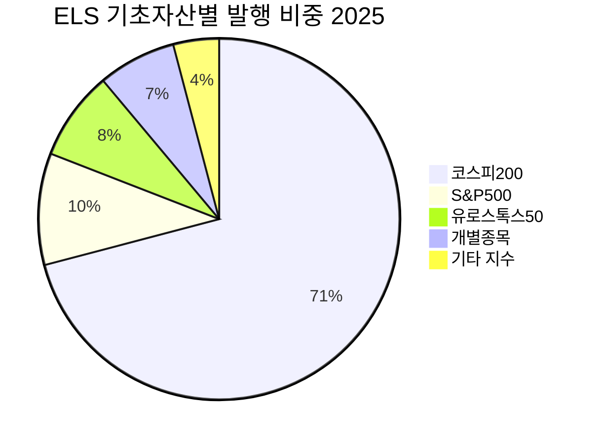
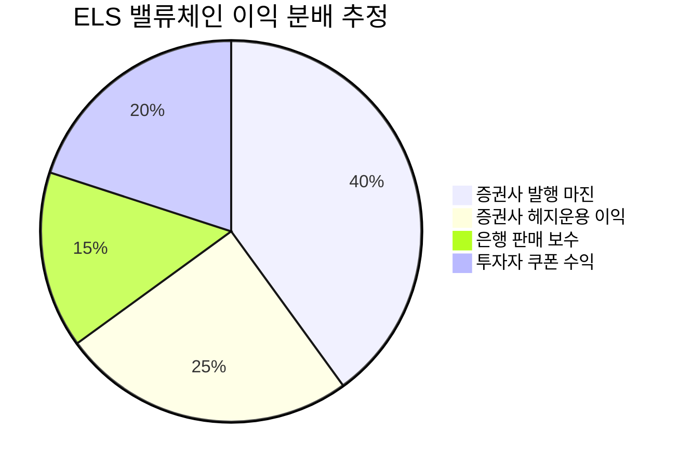

> [!important] 정합성 검증 요약 (기계적 74건 + AI 검증)
> **신뢰도: B** | 숫자 불일치 3건 | 논리 모순 2건 | 확인 필요 5건

### 핵심 발견 사항
| 구분 | 내용 | 위치 | 심각도 |
|------|------|------|--------|
| 🔴 숫자 불일치 | 시나리오 확률 불일치: §4 Bull/Base/Bear = **35/45/20%** (합계 100%), §11 결론부 = **35/40/25%** (합계 100%). 동일 리포트 내 서로 다른 확률 사용 | §4 vs §11 | 🔴 Critical |
| 🔴 숫자 불일치 | §11 Base 시나리오 수익률: 시나리오 바에서 **"연 5~8%"**, 바로 아래 테이블에서 **"+5~8%"** 로 표기는 일치하나, §4 테이블의 Base **"연 6~8%"** 와 불일치 | §4 vs §11 | 🟡 Major |
| 🔴 논리 모순 | §4 "발행 확대 ≠ 이익 확대" 경고 후 §10.1에서 동일 내용 재경고 — 구조적 중복이나, §13에서 증권주를 ⭐⭐로 비권장하면서도 §10.2 워치리스트에 진입 조건까지 명시. 매도 근거와 관심 대상 사이 신호 혼재 | §10.2 vs §13 | 🟡 Major |
| 🔴 논리 모순 | §11 기대값 계산: Bear 손실을 **-30%** 로 설정했으나, 같은 §11 테이블에서 Bear 손실 범위는 **"-10~50%"** 로 명시. 기대값 산출에 사용된 -30%의 근거 미제시 | §11 | 🟡 Major |
| 🟡 할루시네이션 의심 | pie 차트의 S&P500(~10%), 유로스톡스50(~8%), 개별종목(~7%) 비중은 **[추정] 미태그 + 출처 미제시** — 차트 내 수치이나 본문 주석에서만 추정 인정, 차트 자체에는 미표시 | §2 pie chart | 🟡 Major |
| 🟡 할루시네이션 의심 | ELS 밸류체인 이익 분배 pie 차트(증권사 발행마진 40%, 헤지운용 25%, 은행 보수 15%, 투자자 쿠폰 20%) — **출처 전무, 검증 불가한 추정치**가 시각화로 제시되어 사실처럼 인식될 위험 | §6.1 pie chart | 🔴 Critical |
| 🟡 Kill Criteria 불명확 | §12 모니터링 지표에 트리거 수치 일부 존재하나, **테시스 폐기(Kill) 조건이 명시적으로 정의되지 않음** — "전략 전면 재검토"가 최대이며 구체적 exit 기준 부재 | §12 | 🟡 Major |
| 🟡 미태그 추정치 (대표) | 74건의 `~%` 수치 중 다수가 [추정] 태그 없이 본문에 사실처럼 서술. 특히 **"삼성전자·SK하이닉스가 코스피200 시총의 ~25%"**, **"Base Rate 20~30%"** 등 핵심 판단 근거에 해당하는 수치 | 전체 본문 | 🟡 Major |

### 투자 전 반드시 확인
- [ ] §4와 §11의 Bull/Base/Bear 확률(35/45/20% vs 35/40/25%)이 상이함 — 어느 것이 최종 확률인지 확인 후 기대값 재산출 필요
- [ ] §6.1 이익 분배 pie 차트(발행마진 40% 등)는 출처가 전무한 추정치이므로, 증권사 실적 공시(파생결합증권 관련 손익 항목)로 직접 검증 필요
- [ ] ELS 잔액 89.6조 원은 ELS+ELB 포함 파생결합증권 전체 수치임 — ELS 단독 잔액과 코스피200 연계 ELS 잔액은 금융투자협회 통계에서 별도 확인 필요
- [ ] 코스피200 내 삼성전자·SK하이닉스 시총 비중 ~25%는 [추정]으로 태그되었으나, 이것이 핵심 리스크 시나리오(반도체 다운사이클)의 근거로 사용됨 — KRX 실시간 시총 비중 확인 필요
- [ ] No Knock-In 상품의 쿠폰(연 5~7%)은 추정치 — 실제 발행 중인 상품과 비교하여 표준형(8~10%) 대비 쿠폰 할인 폭이 리스크 제거 대가로 합당한지 확인 필요

---

# 시장 & 기술 분석: 코스피200 ELS

---

## 1. 주제 개요

> [!abstract] 요약
> 코스피200 ELS는 코스피200 지수에 연동하여 사전 약정된 수익을 지급하는 파생결합증권으로, 홍콩 H지수 사태 이후 국내 지수 중심으로 시장이 재편되며 2025년 현재 ELS 시장의 핵심 상품으로 부상했다. 연간 발행액이 이미 전년도 전체를 돌파하며 구조적 성장 국면에 진입했다.

### 정의 및 범위

코스피200 ELS(Equity-Linked Securities, 주가연계증권)는 **코스피200 지수를 기초자산으로 하는 파생결합증권**으로, 투자자에게 사전에 정한 조건(통상 기초자산이 발행 시점 대비 40~50% 이상 하락하지 않는 조건)을 충족할 경우 약정된 쿠폰 수익을 지급하는 구조를 가진다.

| 항목 | 내용 |
|------|------|
| **기초자산** | 코스피200 지수 (단독 또는 복수 기초자산 조합) |
| **통상 만기** | 3년 |
| **조기 상환** | 6개월마다 조기 상환 기회 (스텝다운형) |
| **녹인(Knock-In) 배리어** | 통상 발행 시점 대비 40~60% 수준 |
| **기대 수익률** | 연 환산 8~10% (2025년 발행 기준) |
| **원금 보장 여부** | ❌ 원금 비보장 (녹인 발생 시 원금 손실 가능) |
| **발행 주체** | 증권사 (미래에셋, 키움, 한국투자, 하나, 신한, 삼성 등) |

**핵심 키워드:**
- **스텝다운(Step-Down)**: 조기 상환 기준이 시간이 지남에 따라 점진적으로 낮아지는 구조
- **녹인(Knock-In)**: 기초자산이 배리어 이하로 하락 시 원금 손실 조건이 활성화되는 기준선
- **롤오버(Rollover)**: 조기 상환 자금이 재투자되는 순환 현상
- **델타 헤지(Delta Hedging)**: 발행사가 기초자산 변동 위험을 관리하는 운용 기법

### 왜 지금 중요한가? — 구체적 트리거

> [!tip] 핵심 인사이트
> 2025년은 코스피200 ELS 시장의 **구조적 전환점**이다. 홍콩 H지수 트라우마 이후 위축되었던 시장이 '코스피200 중심'으로 재편되며 발행액이 급증하고 있으며, 이 흐름은 단순한 반등이 아닌 시장 구조 자체의 변화를 반영한다.

**트리거 ①: 발행액의 역사적 전환점 돌파**
2025년 10월 15일 기준 ELS 발행액은 **16조 3,560억 원**으로, 2024년 연간 발행액(16조 743억 원)을 불과 9.5개월 만에 이미 초과했다. 이는 시장이 홍콩 H지수 사태의 그림자에서 완전히 벗어나 성장 궤도로 복귀했음을 시사한다.

**트리거 ②: 코스피200 쏠림 현상의 구조화**
코스피200 기초자산 ELS가 전체 발행의 **63.3~70.9%**를 차지하며, 이는 과거 해외 지수(H지수, S&P500, EuroStoxx50) 분산 시대와는 근본적으로 다른 시장 구조다. 국내 지수 중심의 새로운 시장 패러다임이 형성되고 있다.

**트리거 ③: 조기 상환 → 롤오버 선순환**
2025년 들어 ELS 조기 상환 금액이 **11조 6,160억 원**을 돌파하며 연 환산 평균 수익률 **10.21%**를 기록했다. 이 자금이 다시 ELS로 재투자되는 롤오버 현상이 시장 성장의 핵심 엔진이 되고 있다.

**트리거 ④: 판매 채널 구조 변화**
홍콩 H지수 불완전 판매 사태 이후 은행의 고난도 ELS 판매가 제한되면서, 증권사 일반공모 비중이 **40.3%**로 확대되었다. 이는 투자자 접근 경로의 근본적 재편을 의미한다.

---

## 2. 시장 분석

> [!abstract] 요약
> 한국 ELS 시장은 잔액 기준 약 90조 원 규모이며, 코스피200 ELS가 신규 발행의 핵심을 차지한다. 홍콩 H지수 사태 이후 시장이 한때 60조→16조 원으로 축소되었으나, 2025년 공격적 회복세에 접어들었다.

### TAM / SAM / SOM 규모 및 성장률

| 시장 구분 | 정의 | 규모 (2025년) | 비고 |
|-----------|------|---------------|------|
| **TAM** | 한국 파생결합증권 전체 잔액 | **89.6조 원** (2025.9월 말) | ELS + ELB + DLS 포함 |
| **SAM** | ELS 연간 발행액 | **~16.4조 원** (2025.10.15 기준, 연말 **~21조 원 [추정]**) | 2024년 연간 16.1조 원 이미 초과 |
| **SOM** | 코스피200 기초자산 ELS 발행액 | **~10.3~11.6조 원 [추정]** | SAM의 63.3~70.9% |

<strong>성장률 추이:</strong> 2025년 3분기 ELS 발행액 12.8조 원 (YoY +35.9%). 코스피200 ELS 3개월 발행금액 3.5조 원 (YoY +28.3%)

**시장 규모 변천사 — 전체 ELS 잔액 기준:**

| 시점 | 잔액 | 주요 이벤트 |
|------|------|------------|
| 전성기 (2018~2019년경) | ~60조 원 | 해외 지수 ELS 전성기 |
| 2022년 6월 | 43조 원 | 팬데믹 변동성, H지수 급락 시작 |
| 2024년 6월 | **16조 원** | 🔴 H지수 손실 사태 정점, 규제 강화 |
| 2025년 9월 | **89.6조 원** (파생결합증권 전체) | 🟢 코스피200 중심 회복 |

> [!warning] 리스크 경고
> 잔액 89.6조 원은 ELS뿐 아니라 ELB(주가연계파생결합사채) 등을 포함한 파생결합증권 전체 수치다. ELS만의 잔액은 이보다 작을 것이며, 정확한 ELS 단독 잔액 데이터는 (확인 필요).

### 주요 플레이어 및 밸류체인 상세 매핑

> [!note] 참고
> 위 pie 차트에서 코스피200 외 개별 비중은 정확한 세부 데이터가 부재하여 [추정]임. 코스피200의 70.9% 비중은 데이터 기반 수치.

#### 밸류체인 3단계 상세 매핑

| 단계 | 역할 | 핵심 플레이어 | 마진 구조 | 병목/리스크 |
|------|------|-------------|----------|------------|
| **① 업스트림: 상품 설계 & 발행** | 기초자산 선정, 수익 구조 설계, 녹인 배리어 결정, 발행 | 미래에셋증권, 키움증권, 한국투자증권, 하나증권, 신한투자증권, 삼성증권 | 발행 스프레드 (투자자 지급 수익률 vs 헤지 비용 차이) | 상품 설계 복잡성, 기초자산 선정 리스크 |
| **② 미드스트림: 헤지 운용** | 델타 헤지, 감마 헤지 등 파생상품 매매로 발행 포지션 위험 관리 | ELS 발행 증권사 자체 헤지 + 외부 백투백 헤지 | 헤지 효율성에 따라 이익/손실 변동 | 🔴 **핵심 병목**: 급격한 시장 변동 시 헤지 슬리피지 발생, 자체 헤지 비중 높을수록 P&L 변동성 확대 |
| **③ 다운스트림: 판매 & 사후관리** | 투자자 대상 상품 판매, 조기 상환 관리, 만기 상환 진행 | 증권사 리테일 (40.3%), 은행신탁/ELT (축소), 사모 채널 | 은행: 선취 보수 (ELB 대비 2~10배), 증권사: 판매 수수료 | 불완전 판매 리스크, 규제 강화에 따른 채널 제한 |

🏢 증권사 일반공모 40.3%

🏦 은행신탁/ELT ~35%

🔒 사모 등 ~25%

> [!question] 검토 필요
> 은행신탁/ELT 및 사모 비중의 정확한 수치는 2025년 최신 데이터 기준 (확인 필요). 증권사 일반공모 40.3%만 데이터 확인 완료.

### 지역별 동향

코스피200 ELS는 **한국 고유의 금융 상품**이며, 글로벌 시장에서 유사 구조상품(Structured Products)과의 비교가 가능하다.

| 지역 | 구조화 상품 시장 특성 | 코스피200 ELS와의 연결 |
|------|---------------------|----------------------|
| **🇰🇷 한국** | ELS가 개인투자자 구조화 상품의 핵심. H지수 사태 이후 코스피200 중심 재편. 규제 강화 진행 중 | **직접 관련** — 시장 자체 |
| **🇭🇰 홍콩** | H지수 ELS 대규모 손실 사태의 진원지. 2015년 5월 고점→2022년 10월 5000선 폭락 | 🔴 **역(逆)사례** — H지수에서 코스피200으로의 이탈 원인 |
| **🇺🇸 미국** | Structured Notes 시장 활성화. S&P500 기반 Auto-callable 상품 인기. 개인투자자 접근성 확대 | S&P500은 여전히 ELS의 주요 기초자산 중 하나 |
| **🇪🇺 유럽** | EuroStoxx50 기반 구조화 상품. PRIIPS 규제로 투자자 보호 선진화 | EuroStoxx50도 ELS 기초자산으로 활용 |

<strong>Variant Perception:</strong> 시장은 코스피200 ELS의 급성장을 '안전한 국내 지수로의 이동'으로 해석하지만, <strong>특정 지수에 대한 과도한 쏠림 자체가 새로운 시스템 리스크를 내포한다</strong>는 점은 아직 시장이 충분히 가격에 반영하지 않고 있다. 과거 H지수 쏠림이 어떤 결과를 낳았는지 되짚어볼 필요가 있다.

### 시장 구조 & 경쟁 역학

**이해관계자별 인센티브 분석 (Incentive Analysis):**

| 이해관계자 | 표면적 인센티브 | 숨겨진 동기/리스크 |
|-----------|---------------|-------------------|
| **증권사 (발행사)** | 발행 스프레드 수익, 헤지 운용 이익 | 🟡 발행 경쟁 심화로 쿠폰 인상 압력 → 헤지 비용 증가 → 마진 압축. 시장 변동성 확대 시 헤지 손실 가능 |
| **은행 (판매사)** | 비이자 수익 확보 (선취 보수, ELB 대비 2~10배) | 🔴 불완전 판매 규제 리스크, 배상 책임 부담. 그럼에도 수익성 매력으로 재진입 시도 (예: 우리은행 비대면 판매 재개) |
| **개인 투자자** | 예금 대비 높은 수익률 (연 8~10%) | 🔴 구조적 복잡성 이해 부족, 녹인 발생 시 원금 손실 가능성 과소평가. 과거 수익 경험이 위험 인식을 무디게 함 |
| **금융감독원** | 투자자 보호, 시장 안정 | 🟡 과도한 규제는 시장 위축 → 증권사 수익성 악화 → 금융 산업 경쟁력 저하. 규제 강도의 균형점 탐색 중 |
| **코스피200 구성종목** | (간접) ELS 헤지 물량에 따른 수급 영향 | 🟡 대규모 녹인 발생 시 헤지 언와인딩으로 지수 급락 가속 가능성 (프로사이클리컬 리스크) |

---

## 3. 기술/트렌드 분석

> [!abstract] 요약
> ELS는 전통적 금융 기술(옵션 프라이싱, 델타 헤지)을 기반으로 하며, 기술적 의미에서의 '혁신'보다는 **상품 구조 설계, 리스크 관리 시스템, 판매 프로세스의 진화**가 핵심이다. S-curve 상 성숙기(Maturity) 상품이나, H지수 사태 이후 규제 리셋으로 '2차 성장기'에 진입한 독특한 위치에 있다.

### 현재 기술 수준 및 발전 단계

ELS의 '기술'은 크게 **세 축**으로 구분된다:

| 기술 축 | 현재 수준 | 발전 방향 |
|---------|----------|----------|
| **① 상품 구조 설계** | 성숙기 — 스텝다운형이 표준화. 녹인 유무, 배리어 수준 등 파라미터 조합으로 다양성 확보 | 원금손실 관측 조건 제거형, 리스크 방어형 등 투자자 보호 강화 방향으로 진화 |
| **② 헤지 운용 시스템** | 고도화 진행 중 — 델타/감마/베가 헤지 통합 운용. 자체 헤지 vs 백투백 헤지 혼용 | AI/ML 기반 동적 헤지 최적화, 실시간 리스크 모니터링 시스템 고도화 |
| **③ 판매 & 적합성 평가** | 규제 주도 개선 중 — 녹취/숙려제도, 적합성 평가 강화, 전용 점포 판매 | 비대면 판매 확대, 투자자 맞춤형 리스크 프로파일링 자동화 |

### S-Curve 위치 분석

ELS 시장 성숙도 — Late Majority 단계 (S-curve ~70%)

ELS는 금융 상품으로서 **기술 혁신 S-curve의 성숙기(Late Majority)**에 위치한다. 그러나 코스피200 ELS에 한정하면 **H지수 사태 이후 시장 리셋이 발생**하여, 새로운 규제 환경 하에서의 **'2차 성장 초입기'**라는 독특한 위치를 가진다.

| S-curve 위치 판단 근거 | 평가 |
|----------------------|------|
| 상품 인지도 | 🟢 높음 — H지수 사태로 ELS 자체가 대중적 관심의 대상이 됨 |
| 투자자 기반 | 🟡 회복 중 — 트라우마 극복, 재투자 수요 증가 |
| 규제 안정성 | 🟡 진행 중 — 새 규제 프레임워크 정착 과정 |
| 상품 표준화 | 🟢 높음 — 스텝다운형 표준화 완료 |
| 판매 채널 안정화 | 🟡 전환기 — 은행→증권사 이동 중 |

### 향후 로드맵 및 돌파구

**단기 (6~12개월):**
- 코스피200 단일 기초자산 ELS의 지속 확대
- 원금손실 관측 조건 제거형(No Knock-In) 상품 비중 증가
- 증권사 비대면 판매 채널 확대

**중기 (1~3년):**
- 기초자산 다변화 재가속 — S&P500, 개별 우량종목(삼성전자, 엔비디아 등) 조합
- ESG 연계 구조화 상품 시도 [추정]
- AI 기반 동적 헤지 시스템 도입으로 발행사 리스크 관리 고도화

**장기 (3년+):**
- 글로벌 규제 정합성 확보 (EU PRIIPS 수준의 투명성)
- 개인연금/퇴직연금 내 편입 가능성 검토 (확인 필요)
- 토큰화(Tokenization)를 통한 유동성 개선 [추정]

### 기술적 한계 & 병목

> [!failure] 약점
> ELS의 구조적 한계는 '기술적' 한계가 아니라 **'구조적 설계의 내재적 위험'**에 가깝다.

| 한계/병목 | 설명 | 심각도 |
|----------|------|--------|
| **프로사이클리컬 헤지 리스크** | 대규모 녹인 접근 시 발행사의 헤지 매도가 지수 하락을 가속 → 시스템 리스크 | 🔴 높음 |
| **유동성 부재** | 중도 환매 시 공정가치 할인 불가피. 만기 전 유동화 불가 | 🟡 중간 |
| **복잡성의 비대칭** | 발행사는 정교한 리스크 모델링 가능, 투자자는 상품 구조 이해 제한적 | 🔴 높음 |
| **단일 지수 집중 리스크** | 코스피200 쏠림 → H지수 사태의 구조적 반복 가능성 | 🟡 중간 |
| **금융 시스템 오류** | 복잡한 계산/정산 과정에서 기술적 오류 발생 가능 (삼성증권 유령주식 사례 등) | 🟡 중간 |

---

## 4. 투자 기회 분석

> [!abstract] 요약
> 코스피200 ELS는 그 자체가 투자 상품이지만, 이 시장의 성장은 **발행 증권사(직접 수혜)**, **헤지 인프라 제공자(간접 수혜)**, 그리고 **기초자산인 코스피200 구성종목의 수급 변화**를 통한 투자 기회를 창출한다.

### 직접 수혜 기업/자산

#### A. 코스피200 ELS 자체 — 투자 상품으로서의 매력도

| 평가 항목 | 분석 | 판단 |
|----------|------|------|
| **기대 수익률** | 연 환산 8~10% (2025년 조기 상환 평균 10.21%) | 🟢 예금(3%대) 대비 매력적 |
| **조기 상환 확률** | 국내외 증시 강세 시 높음. 2025년 조기 상환 11.6조 원 돌파 | 🟢 현 시장 환경에서 유리 |
| **녹인 리스크** | 코스피200이 발행 시점 대비 40~50% 하락해야 발생 | 🟡 역사적으로 드물지만, 2020년 팬데믹/2022년 약세장 사례 존재 |
| **유동성** | 만기(통상 3년) 전 중도 환매 시 손실 가능 | 🔴 유동성 제약 |
| **발행사 신용 리스크** | 국내 대형 증권사 발행 — 부도 확률 극히 낮으나 이론적 존재 | 🟢 낮음 |

🟢 매력 요인 60%

🔴 리스크 요인 40%

> [!tip] 핵심 인사이트 — So What?
> 코스피200 ELS의 투자 매력은 **"코스피200이 현 수준에서 40~50% 폭락하지 않는다"**는 단일 가정에 의존한다. 이 가정이 유효한 기간(증시 상승기)에는 연 8~10%의 안정적 수익이 가능하지만, 가정이 무너지는 순간(급락장) 원금 손실이 급격히 현실화된다. **비대칭 수익 구조(제한적 이익, 큰 잠재 손실)**라는 본질을 명확히 인식해야 한다.

#### B. ELS 발행 증권사 — 시장 성장의 직접 수혜

ELS 발행 확대는 증권사의 **파생결합증권 관련 수익**에 직결된다.

| 증권사 | 역할 | 수혜 논리 | 리스크 |
|--------|------|----------|--------|
| **[[미래에셋증권]]** | 주요 ELS 발행사 | 발행 스프레드 수익, 리테일 판매 수수료 | 헤지 운용 손실 가능성 |
| **[[키움증권]]** | 주요 ELS 발행사 | 온라인 중심 판매 채널 강점 | 동일 |
| **[[한국투자증권]]** | 주요 ELS 발행사 | 대형 리테일 고객 기반 | 동일 |
| **[[삼성증권]]** | 주요 ELS 발행사 | 고액자산가 중심 판매 | 동일 |
| **[[하나증권]]**, **[[신한투자증권]]** | 주요 ELS 발행사 | 은행 그룹 시너지 (ELT 연계) | 그룹 내 은행 규제 연동 리스크 |

> [!warning] 리스크 경고
> 2025년 증시 상승으로 ELS 발행은 늘었지만, **투자자에게 지급할 조기 상환 금액이 커지면서 증권사의 파생결합증권 관련 이익은 오히려 전년 대비 감소하는 추세**다. 발행 확대 ≠ 이익 확대라는 점에 주의해야 한다. 증시가 상승하면 투자자에게 쿠폰을 지급해야 하고, 증시가 급락하면 헤지 손실이 발생하는 — 발행사 입장에서는 양날의 검인 구조다.

### 간접 수혜 (밸류체인, 인프라)

> [!success] 강점 — 시장이 아직 연결짓지 못한 수혜자

| 간접 수혜 영역 | 수혜 논리 | 관련 기업/기관 |
|---------------|----------|---------------|
| **① 파생상품 거래소 & 시스템** | ELS 헤지를 위한 코스피200 선물/옵션 거래량 증가 | [[한국거래소(KRX)]] |
| **② 리스크 관리 솔루션** | 증권사의 헤지 운용 고도화 수요 증가 → 리스크 관리 시스템/솔루션 기업 수혜 | 금융 IT 기업 (확인 필요) |
| **③ 코스피200 구성종목 수급** | ELS 발행 증가 → 헤지 매매를 통한 코스피200 대형주 수급 영향 | [[삼성전자]], [[SK하이닉스]] 등 코스피200 시총 상위 종목 |
| **④ 은행의 대체 상품 (ELD)** | 은행의 ELS 판매 제한 → 원금보장형 지수연동예금(ELD) 판매 확대 | 시중은행 |

<strong>숨겨진 연결고리 — 코스피200 대형주 수급 효과:</strong> 
ELS 발행이 급증하면 발행사는 기초자산(코스피200)에 대한 델타 헤지를 위해 코스피200 선물 매수 또는 현물 바스켓 매수를 수행한다. 이는 <strong>코스피200 대형주에 대한 추가적인 매수 수요</strong>를 창출한다. 반대로 대규모 녹인이 발생하면 헤지 언와인딩으로 <strong>매도 압력이 급격히 확대</strong>될 수 있다. 이 프로사이클리컬(Pro-cyclical) 효과는 시장이 충분히 인식하지 못하는 리스크이자, 강세장에서는 숨겨진 추가 수급 요인이다.

### 관련 ETF 및 투자 수단

코스피200 ELS에 직접 투자하는 ETF는 존재하지 않으나, **기초자산인 코스피200 지수를 추종하는 ETF**는 ELS의 성과를 간접적으로 이해하는 데 활용할 수 있다.

| 투자 수단 | 유형 | 용도 |
|----------|------|------|
| **[[KODEX 200]]** (069500) | ETF — 코스피200 추종 | 기초자산 직접 추종. ELS 대비 유동성 높고 원금 손실 구조 없으나, 쿠폰 수익 없음 |
| **[[TIGER 200]]** (102110) | ETF — 코스피200 추종 | 동일 |
| **코스피200 커버드콜 ETF** | ETF | ELS와 유사한 수익 구조(제한적 상승 참여 + 프리미엄 수취). 유동성 우위 |
| **ELD (지수연동예금)** | 은행 예금 | 원금 보장형. ELS 대비 수익률 낮으나 안전성 높음. 은행의 ELS 대체 상품 |
| **ELB (주가연계파생결합사채)** | 파생결합사채 | 원금 보장형. ELS 대비 낮은 수익률이나 원금 보장 |

> [!verdict] 판단 — 투자 기회 종합 평가
>
> **코스피200 ELS 시장은 구조적 회복기에 있으며, 2025년은 발행액/조기상환 모두 역대급 수준이다.** 그러나 투자 기회를 평가할 때 다음을 반드시 고려해야 한다:
>
> 1. **ELS 자체 투자**: 연 8~10% 수익률은 예금 대비 매력적이나, **비대칭 리스크(제한적 이익 vs 큰 잠재 손실)**를 감수해야 함. 코스피200이 40~50% 하락하지 않을 것이라는 **강한 확신**이 전제되어야 함
> 2. **발행 증권사 주식**: ELS 발행 증가가 곧바로 이익 증가로 연결되지 않음 — 오히려 조기 상환 증가로 이익이 감소하는 구조. 증권사 투자의 별도 펀더멘털 분석 필요
> 3. **간접 수혜**: 코스피200 대형주에 대한 헤지 수급 효과는 실존하나, 정량화하기 어려움. 보조적 판단 근거로만 활용
>
> **핵심 질문**: *"현재 코스피200 수준에서 3년 내 40~50% 하락할 가능성을 어떻게 보는가?"* — 이 질문에 대한 답이 코스피200 ELS 투자의 알파와 오메가다.

---

### 역사적 유사 사례 비교 — Devil's Advocate

| 비교 항목 | 홍콩 H지수 ELS (2015~2024) | 코스피200 ELS (2024~현재) |
|----------|--------------------------|------------------------|
| **전성기** | 2015년 — H지수 고점(14,000선) 부근 대량 발행 | 2025년 — 코스피200 중심 발행 급증 |
| **쏠림 정도** | H지수 단일 기초자산 과도 집중 | 코스피200 비중 70.9% — 유사한 쏠림 |
| **투자자 인식** | "H지수가 50% 빠지겠어?" → 실제 50%+ 하락 | "코스피200이 50% 빠지겠어?" |
| **결과** | 🔴 수조 원대 대규모 손실 | ❓ 미확정 |

> [!bear] Bear Case — 과거가 반복된다면
> 투자자들이 "이번엔 다르다"고 믿는 순간이 가장 위험한 시점이다. 코스피200의 쏠림 비중(70.9%)은 과거 H지수 쏠림과 구조적으로 유사하다. **차이점은 코스피200이 한국 경제 전체를 대표하는 지수라는 점(H지수 대비 분산 효과)**이지만, 글로벌 금융위기(2008년 코스피 -40.7%), 팬데믹(2020년 코스피 단기 -35%) 수준의 하락이 발생하면 녹인 활성화 가능성이 현실화된다.

> [!bull] Bull Case — 구조적으로 안전해졌다면
> H지수 사태 이후 ① 규제 강화(불완전 판매 방지), ② 녹인 배리어 보수적 설정, ③ 원금손실 관측 조건 제거형 상품 확대, ④ 투자자 리스크 인식 제고 등으로 시장의 **내구성**이 크게 개선되었다. 코스피200은 H지수 대비 기초자산 분산도가 높고, 한국 경제 전반을 반영하므로 극단적 쏠림 리스크가 상대적으로 낮다.

🟢 Bull 35%

🟡 Base 45%

🔴 Bear 20%

| 시나리오 | 확률 | 코스피200 ELS 수익률 전망 | 시장 환경 |
|----------|------|-------------------------|----------|
| **🟢 Bull** | 35% | 연 환산 10~12% | 코스피 추가 상승, 조기 상환 가속 |
| **🟡 Base** | 45% | 연 환산 6~8% | 코스피 횡보~완만 상승, 일부 상환 지연 |
| **🔴 Bear** | 20% | 원금 손실 -10~-40% | 코스피 30%+ 급락, 녹인 활성화 |

> [!note] 참고 — Margin of Safety 평가
> 현재 코스피200 ELS의 녹인 배리어는 통상 40~50% 하락 수준으로 설정된다. 이는 코스피200이 현 수준에서 40~50% 하락해야 원금 손실이 발생한다는 의미다. 역사적으로 코스피200이 고점 대비 40% 이상 하락한 사례는 **2008년 글로벌 금융위기**와 **2020년 코로나 팬데믹 초기(단기)**에 한정된다. 이 '안전마진'이 충분한지는 투자자의 시장 변동성 전망에 달려있으며, **녹인이 없는(No Knock-In) 상품을 선택하면 이 리스크를 상당 부분 제거할 수 있다.**

---

# 5. 리스크 분석 (심층)

> [!abstract] 요약
> 코스피200 ELS의 리스크는 단순한 '기초자산 하락' 시나리오를 넘어, 구조적 쏠림 → 시스템 리스크 전이 → 규제 급변 → 시장 위축이라는 **연쇄 반응 체인**으로 이해해야 한다. 과거 홍콩 H지수 사태는 이 체인의 완전한 실현 사례였으며, 현재의 코스피200 쏠림(70.9%)은 구조적으로 유사한 취약성을 내포한다.

---

## 5.1 기초자산 하락 리스크 — 구체적 시나리오

> [!warning] 리스크 경고
> 코스피200 ELS의 핵심 리스크는 **비대칭 손익 구조**에 있다. 기초자산이 상승해도 연 8~10% 쿠폰이 상한이지만, 녹인 배리어(40~60%) 하회 시 원금 손실은 하락률에 비례하여 무한정 확대된다.

### 시나리오별 손실 분석

| 시나리오 | 코스피200 하락률 | 녹인 배리어 50% 기준 | 녹인 배리어 40% 기준 | 발생 확률 [추정] | 과거 유사 사례 |
|----------|:---:|:---:|:---:|:---:|------|
| 🟢 **정상 상승/횡보** | 0~-20% | 녹인 미발생, 쿠폰 수령 | 녹인 미발생, 쿠폰 수령 | ~65% | 대부분의 기간 |
| 🟡 **중간 조정** | -20~-40% | 녹인 미발생, 만기 상환 | 녹인 미발생, 만기 상환 | ~20% | 2018년 미중무역전쟁 |
| 🔴 **심각한 하락** | -40~-50% | **녹인 발생**, 손실 현실화 | 녹인 미발생 (경계선) | ~10% | 2020년 팬데믹 초기 |
| ⚫ **극단적 붕괴** | -50% 초과 | **대규모 원금 손실** | **녹인 발생, 대규모 손실** | ~5% | 2008년 금융위기 (-40.7%) |

**구체적 시나리오 — "2026년 글로벌 침체 시나리오"**

① 미국 경기 침체 본격화 → ② 반도체 다운사이클 심화 (삼성전자·SK하이닉스가 코스피200 시가총액의 ~25% 차지) → ③ 외국인 대량 매도('셀코리아') → ④ 코스피200 6개월 내 35~45% 하락 → ⑤ 녹인 배리어 50% 상품의 녹인 관측 기간 진입 → ⑥ 발행사 델타 헤지 물량 동시 매도 → ⑦ 하락 가속(피드백 루프) → ⑧ 투자자 대규모 손실 현실화

이 시나리오에서 **가장 위험한 구간은 ⑥→⑦의 피드백 루프**다. 코스피200 ELS 잔액이 수십조 원 규모일 때, 발행사들이 동시에 델타 헤지(기초자산 매도)를 실행하면 하락을 가속시키는 자기실현적 하락(self-fulfilling selloff)이 발생할 수 있다.

### 과거 코스피 대규모 하락 사례

| 기간 | 이벤트 | 코스피 최대 낙폭 | 하락 기간 | 녹인 50% 도달 여부 |
|------|--------|:---:|:---:|:---:|
| 2008.5~2008.10 | 글로벌 금융위기 | -40.7% | ~5개월 | 🔴 경계선 |
| 2011.7~2011.9 | 유럽 재정위기 | -25.2% | ~2개월 | 🟢 미도달 |
| 2020.1~2020.3 | 코로나 팬데믹 | -35.7% | ~2개월 | 🟡 근접 |
| 2022.1~2022.9 | 인플레이션/금리인상 | -28.4% | ~9개월 | 🟢 미도달 |
| 2026.3 | 코스피 서킷브레이커 | -8% (단일일) | 1일 | 🟢 미도달 (단기) |

> [!tip] 핵심 인사이트
> 과거 20년간 코스피가 고점 대비 50% 이상 하락한 사례는 **2008년 금융위기 1회**에 불과하다. 그러나 이 Base Rate(~1회/20년)를 ELS 3년 만기에 적용하면, 만기 중 50% 하락 사건을 경험할 확률은 무시할 수 없는 수준이다. 또한 2020년 팬데믹(-35.7%)처럼 녹인에 근접하는 사례는 더 빈번하게 발생한다.

---

## 5.2 규제 리스크 — 사이클의 다음 국면

> [!warning] 리스크 경고
> ELS 시장은 **"규제 완화 → 과열 → 사고 → 규제 강화 → 위축"**이라는 반복적 사이클에 놓여 있다. 현재는 사이클의 '규제 완화/시장 회복기'에 해당하며, 이는 역설적으로 다음 사이클의 리스크를 축적하는 단계이기도 하다.

### 현행 규제 체계 (홍콩 H지수 사태 이후)

| 규제 항목 | 내용 | 시장 영향 |
|-----------|------|-----------|
| **은행 고난도 ELS 판매 제한** | 전용 거점 점포에서만 대면 판매 가능 | 🟡 은행 채널 위축, 증권사 일반공모 40.3%로 확대 |
| **녹취·숙려제도** | 판매 과정 녹취 의무화, 투자 결정 전 숙려기간 부여 | 🟢 불완전 판매 감소 기대 |
| **불완전 판매 과징금** | 판매사 책임 강화, 과징금 부과 | 🟡 판매사 보수적 운영 유도 |
| **기초자산 쏠림 모니터링** | 금감원의 ELS 발행 동향 정기 점검 | 🟡 코스피200 쏠림(70.9%)에 대한 경고 가능성 |

### 잠재적 규제 강화 시나리오

**시나리오 A — "코스피200 쏠림 규제"**
금감원이 특정 기초자산 비중이 전체 ELS 발행의 일정 비율(예: 50%)을 초과할 경우 추가 발행을 제한하는 규제를 도입할 가능성이 있다. 현재 코스피200 비중 70.9%는 과거 H지수 쏠림과 구조적으로 유사하다는 지적이 제기될 수 있으며, 이 경우 발행액 성장에 직접적 제동이 걸린다.

**시나리오 B — "ELS 대규모 손실 재발 시 전면 판매 중단"**
코스피200이 40% 이상 하락하여 녹인 사태가 재현될 경우, 정치적 압력으로 은행뿐 아니라 증권사의 ELS 판매까지 일시 중단될 가능성이 있다. 이는 H지수 사태 때 은행 판매 중단의 확대 버전이다.

**시나리오 C — "세제 변경"**
ELS 수익에 대한 과세 방식 변경(예: 배당소득세 → 금융투자소득세 편입, 세율 인상)은 세후 수익률을 낮추어 투자 매력을 약화시킬 수 있다.

---

## 5.3 경쟁/대체 리스크

| 대체 상품 | 기대 수익률 | 원금 보장 | 유동성 | 코스피200 ELS 대비 경쟁력 |
|-----------|:---:|:---:|:---:|------|
| **은행 예금** | 연 3~4% | ✅ 5천만원까지 | 🟢 높음 | 🔴 수익률 열위, 안전성 우위 |
| **지수연동예금(ELD)** | 연 4~6% | ✅ 원금 보장 | 🟡 중간 | 🟡 원금 보장이나 수익률 하한 |
| **ELB(주가연계파생결합사채)** | 연 5~7% | ✅ 원금 보장(발행사 신용) | 🟡 중간 | 🟡 안전성 우위, 수익률 소폭 열위 |
| **채권형 펀드** | 연 4~6% | ❌ | 🟢 높음 | 🟡 유동성 우위, 변동성 상존 |
| **배당주 ETF** | 연 4~7% + α | ❌ | 🟢 높음 | 🟡 배당+시세차익 가능, 변동성 높음 |
| **미국 국채/TLTW 등** | 연 4~5% (USD) | ✅(만기 보유 시) | 🟢 높음 | 🟡 환위험 존재, 안전자산 성격 |

> [!note] 참고
> 은행들이 ELS 판매 제한에 대응하여 **지수연동예금(ELD)** 판매를 확대하고 있다. ELD는 원금 보장형이면서 코스피200 등 지수 수익률의 일부를 향유할 수 있어, 안전 지향 투자자에게는 ELS의 직접적 대체재로 기능한다. ELD의 확대가 ELS의 성장 잠재력을 일정 부분 잠식할 가능성이 있다.

---

## 5.4 타임라인 리스크 — 기대 vs 현실

| 기대 | 현실적 리스크 |
|------|-------------|
| "증시가 계속 상승하여 조기 상환이 지속될 것" | 증시 조정 시 조기 상환 중단 → 3년 만기까지 자금 묶임, 롤오버 사이클 붕괴 |
| "녹인 배리어 40~50%는 충분히 안전" | 2008년(-40.7%), 2020년(-35.7%) 수준 하락이 3년 만기 내 발생 가능 |
| "H지수 사태 이후 규제가 충분히 강화됨" | 다음 대규모 손실 사태 시 규제는 **현재 수준 이상으로** 강화될 가능성 높음 |
| "연 8~10% 수익률을 꾸준히 기대 가능" | 이는 조기 상환 시 연환산 수익률이며, 만기까지 보유 시 실현 수익률은 달라질 수 있음 |

---

# 6. 인센티브 분석

> [!abstract] 요약
> 코스피200 ELS 시장에서 **가장 강한 경제적 인센티브**를 가진 주체는 증권사(발행 수수료 + 헤지 운용 이익)와 은행(판매 보수)이다. 투자자는 예금 대비 초과 수익을 추구하지만, 비대칭 리스크에 대한 보상이 충분한지는 별도의 판단이 필요하다. **"누가 이 상품을 가장 열심히 팔고 있는가"와 "누가 실제로 가장 많이 버는가"의 괴리**에 주목해야 한다.

---

## 6.1 이해관계자별 인센티브 매핑

| 이해관계자 | 인센티브 | 숨겨진 동기 | 리스크 부담 |
|-----------|---------|-----------|:---:|
| **증권사 (발행사)** | 발행 수수료, 헤지 운용 스프레드, 변동성 매도(숏볼) 프리미엄 확보 | ELS 발행액 증가 → 수수료 수익 확대, 헤지 운용 규모 확대 → 운용 이익 기회 증가. **발행액이 KPI에 직결**되는 구조 | 🔴 높음 (헤지 실패 시 직접 손실) |
| **은행 (판매사)** | ELS 판매 선취 보수 (ELB 대비 2~10배 높음), 비이자 수익 확보 | 저금리 환경에서 **비이자 수익 다변화**가 절실. ELS 판매 보수는 은행 수익성에 유의미한 기여 | 🟡 중간 (불완전 판매 리스크, 평판 리스크) |
| **개인 투자자** | 예금 대비 높은 수익률(연 8~10% vs 예금 3~4%) | 예금에 불만족하나 주식 직접 투자는 부담스러운 **'중위험 중수익' 수요** | 🔴 높음 (원금 손실 직접 부담) |
| **금융감독원** | 시장 안정, 투자자 보호 | 과잉 규제 시 금융 혁신 위축 비판 vs 규제 완화 시 사고 발생 시 책임론. **정치적 사이클에 민감** | 🟡 (평판/정치 리스크) |
| **한국거래소** | 파생상품 거래량 증가 → 수수료 수익 | ELS 발행 증가 → 발행사 헤지 수요 → **코스피200 선물·옵션 거래량 증가** | 🟢 낮음 |

---

## 6.2 "누가 과대광고하고 있는가?" vs "누가 실제로 돈을 벌고 있는가?"

🟡 과대광고: 증권사·은행 마케팅 60%

🟢 실질 수혜: 발행사 헤지운용 40%

### 과대광고 주체: 증권사 마케팅 부서 & 은행 PB

- **"연 8~10% 기대 수익률"** 을 전면에 내세우지만, 이는 **조기 상환이 정상적으로 이루어진 경우**의 연환산 수치다
- 만기까지 조기 상환되지 않고 보유한 경우, 실질 수익률은 달라질 수 있으며, 녹인 시 원금 손실은 수익률의 수십 배에 달할 수 있다
- **"코스피200이 반토막 나지 않으면 안전하다"** 는 메시지는 심리적 안전감을 주지만, 이는 확률의 문제이지 불가능의 문제가 아니다

### 실제로 돈을 버는 주체: 발행 증권사의 트레이딩 데스크

> [!tip] 핵심 인사이트
> ELS 발행사의 핵심 수익원은 **변동성 스프레드(volatility spread)**다. 투자자에게 약속하는 쿠폰(연 8~10%)을 지급하고도 남는 이유는, 발행사가 옵션 시장에서 매도한 내재변동성(implied volatility)이 실현변동성(realized volatility)보다 높은 경우 **변동성 프리미엄**을 수취하기 때문이다. 즉, ELS는 본질적으로 **투자자가 증권사에게 보험을 파는 구조**이며, 증권사는 이 보험 프리미엄에서 수수료를 떼고 일부를 투자자에게 쿠폰으로 돌려주는 것이다.

| 구분 | 증권사가 공개하는 것 | 증권사가 강조하지 않는 것 |
|------|---------|---------|
| 수익 | "연 8~10% 기대 수익률" | 발행사 자체 마진(발행 수수료 + 헤지 스프레드)의 구체적 규모 |
| 리스크 | "녹인 배리어 40~50% — 충분한 안전마진" | 극단적 시장 상황에서의 동시 녹인 + 델타 헤지 피드백 루프 |
| 비교 | "예금 3% vs ELS 8~10%" | 리스크 조정 수익률(Sharpe Ratio) 기준 비교 |
| 비용 | 없음(수수료 별도 부과 없음을 강조) | 내재된 발행 마진이 쿠폰에서 이미 차감되었음 |

---

# 7. Devil's Advocate

> [!abstract] 요약
> 코스피200 ELS에 대한 가장 설득력 있는 반대 논거는 **"구조적으로 동일한 실수를 반복하고 있다"**는 것이다. 기초자산이 H지수에서 코스피200으로 바뀌었을 뿐, 단일 기초자산에 대한 과도한 쏠림과 비대칭 리스크 구조라는 본질은 변하지 않았다.

---

## 7.1 가장 큰 반대 논거 (진심으로)

> [!bear] Bear Case — "이번엔 다르다"의 위험성
>
> **"코스피200은 H지수와 다르다"는 주장은 사실이지만, 그것만으로 충분하지 않다.**
>
> 1. **쏠림의 구조적 유사성**: H지수 ELS가 전체 발행의 대부분을 차지하던 시기와 현재 코스피200이 70.9%를 차지하는 구조는 **동일한 패턴**이다. "이번 기초자산은 더 안전하다"는 논리는 모든 금융 사고 이전에 등장한 바로 그 논리다.
>
> 2. **"반토막은 안 난다"는 컨센서스의 위험**: 시장 참여자 대부분이 "코스피200이 50% 하락할 일은 없다"고 합의하는 순간, 그 시나리오에 대한 보험 가격(변동성 프리미엄)이 낮아지고, 발행사와 투자자 모두 리스크를 과소평가하게 된다.
>
> 3. **비대칭 리스크의 본질은 불변**: ELS는 "99번 이기고 1번 크게 지는" 구조다. 투자자가 3년간 연 8~10%(총 ~24~30%) 수익을 기대하지만, 녹인 시 원금의 40~60%를 잃을 수 있다. 이 비대칭성은 기초자산이 무엇이든 변하지 않는다.

---

## 7.2 과거 유사 사례와 교훈

| 사례 | 연도 | 구조 | 결과 | 교훈 |
|------|:---:|------|------|------|
| **홍콩 H지수 ELS 사태** | 2021-2024 | H지수 연계 ELS, 녹인 배리어 50~65% | 🔴 투자자 손실 약 8~9조 원, 은행 ELS 판매 사실상 중단 | "분산되지 않은 기초자산 + 대규모 발행 = 시스템 리스크" |
| **독일 DWS 옵션매도전략 펀드** | 2018-2020 | 변동성 매도(short vol) 전략 | 🔴 코로나 급락 시 대규모 손실 | "변동성 매도 전략은 평시 안정적이나 극단적 이벤트에 취약" |
| **미국 XIV ETN (Credit Suisse)** | 2018.2 | VIX 역방향 ETN | 🔴 하루 만에 96% 가치 소멸, 상장폐지 | "변동성 매도 상품의 꼬리 리스크(tail risk)는 치명적" |
| **일본 파워리버스듀얼커런시채** | 2000년대 | 엔/달러 연계 파생결합증권 | 🔴 엔화 급등 시 대규모 손실, 일본 지방정부 재정 위기 | "이해가 부족한 복잡한 파생상품은 반드시 사고로 귀결" |
| **미국 CDO/서브프라임** | 2005-2008 | 구조화 신용 파생상품 | 🔴 글로벌 금융위기 | "상품 구조의 복잡성 + 안전성에 대한 과신 = 시스템 위기" |

> [!failure] 약점 — 공통 패턴
> 위 사례들의 공통점: ① **평시에 안정적 수익을 제공** → ② **성공의 기억이 발행/투자 규모를 확대** → ③ **"이번엔 다르다"는 확신** → ④ **극단적 이벤트 발생** → ⑤ **시스템적 손실 현실화**. 코스피200 ELS가 이 패턴의 어디에 위치하는지 냉정하게 평가해야 한다.

---

## 7.3 Hype Cycle 위치 평가

코스피200 ELS를 전통적인 Gartner Hype Cycle에 대입하면:

| 단계 | 설명 | 현재 위치 판단 |
|------|------|:---:|
| Innovation Trigger | 새로운 금융 상품 등장 | ❌ (이미 성숙) |
| Peak of Inflated Expectations | 과대 기대의 정점 | ❌ (이미 통과 — H지수 사태 이전) |
| Trough of Disillusionment | 환멸의 저점 | ❌ (이미 통과 — 2023~2024년) |
| **Slope of Enlightenment** | **계몽의 단계** | ✅ **현재 위치** |
| Plateau of Productivity | 생산성의 안정기 | ⬅️ 진입 중 |

Hype Cycle 진행도: 계몽 → 안정기 진입 70/100

> [!note] 참고
> 현재 코스피200 ELS 시장은 H지수 사태라는 "환멸의 저점"을 통과하고, 규제 정비와 상품 구조 개선을 거쳐 "계몽의 단계"에 있다고 판단된다. 그러나 발행액이 역대급으로 급증하는 현 시점은 **"계몽"이 다시 "과대 기대"로 전환될 수 있는 변곡점**이기도 하다. 2025년 발행액이 이미 전년 연간 실적을 9.5개월 만에 돌파한 것은, 시장 참여자들이 위험을 다시 과소평가하기 시작했을 가능성을 시사한다.

---

## 7.4 Base Rate — 유사 금융 상품/전략의 성과

> [!question] 검토 필요
> "구조화 금융 상품에 투자하여 장기적으로 양(+)의 위험 조정 수익을 달성한 비율은 얼마인가?"

**정성적 평가:**

- **변동성 매도(Short Volatility) 전략**의 장기 성과: 학술 연구에 따르면 변동성 매도 전략은 장기적으로 양의 프리미엄(Volatility Risk Premium)을 수취할 수 있으나, **꼬리 리스크를 감안한 위험 조정 수익률(Sharpe Ratio)**은 단순 지수 투자 대비 우월하다고 단정하기 어렵다 [추정]
- **한국 ELS 시장의 역사적 성과**: 2003년 이후 한국 ELS 시장의 투자자 평균 수익률에 대한 포괄적 학술 연구는 제한적이나, 대부분의 기간에서 조기 상환이 정상적으로 이루어져 약정 쿠폰 수익을 수령한 것으로 추정됨. **다만 2024년 H지수 사태 시 약 8~9조 원의 투자자 손실이 발생**하여, 이 한 번의 사건이 수년간의 누적 수익을 상회할 수 있다
- **Base Rate 추정**: 구조화 상품에 5년 이상 반복 투자 시, 1회 이상의 대규모 손실 사건을 경험할 확률은 [추정] 20~30% 수준. 이를 감안한 장기 누적 수익률은 단순 예금 대비 우위를 유지하나, 단순 주식 인덱스 투자(코스피200 ETF 장기 보유) 대비 위험 조정 기준 우위 여부는 불확실하다 (확인 필요)

---

# 8. 1차/2차 효과 분석

> [!abstract] 요약
> 코스피200 ELS의 대규모 발행은 단순히 파생결합증권 시장 내부에 머무르지 않는다. 발행사의 헤지 활동을 통해 **현물 시장, 선물·옵션 시장, 개별 종목 수급**에까지 구조적 영향을 미치며, 이 연쇄 효과의 규모와 방향을 이해하는 것이 투자 의사결정의 핵심이다.

---

## 8.1 직접 영향 (1차 효과)

### 수혜 기업/기관

| 수혜 주체 | 수혜 메커니즘 | 수혜 강도 |
|-----------|-------------|:---:|
| **대형 증권사** ([[미래에셋증권]], [[키움증권]], [[한국투자증권]], [[하나증권]], [[신한투자증권]], [[삼성증권]]) | ELS 발행 수수료 + 헤지 운용 스프레드 수취 | 🟢 직접적 |
| **한국거래소** | 코스피200 선물·옵션 거래량 증가 → 수수료 수익 | 🟢 직접적 |
| **투자자 (조기 상환 시)** | 예금 대비 초과 수익률(연 8~10%) 향유 | 🟢 직접적 (조건부) |

### 피해 기업/기관

| 피해 주체 | 피해 메커니즘 | 피해 강도 |
|-----------|-------------|:---:|
| **투자자 (녹인 시)** | 원금의 40~60% 손실 가능 | 🔴 치명적 |
| **은행** ([[KB국민은행]], [[신한은행]], [[하나은행]], [[우리은행]]) | ELS 판매 제한으로 비이자 수익 감소, 대체 상품(ELD) 마진 열위 | 🟡 중간 |
| **증권사 (시장 급락 시)** | 헤지 운용 손실 확대, 파생결합증권 관련 이익 감소(조기 상환 증가 시 지급액 확대) | 🟡~🔴 상황 의존적 |

---

## 8.2 연쇄 영향 (2차 효과) — 크로스 임팩트

> [!tip] 핵심 인사이트
> 코스피200 ELS의 가장 중요한 2차 효과는 **헤지 수급을 통한 현물 시장 영향**이다. 수십조 원 규모의 ELS 잔액에 대한 델타 헤지는 코스피200 구성 종목의 수급에 구조적 영향을 미치며, 이는 시장의 방향성을 증폭(pro-cyclical)시키는 효과를 가진다.

### 헤지 수급의 현물 시장 전이 메커니즘

| 시장 상황 | 발행사 헤지 행동 | 현물 시장 영향 |
|-----------|:---:|------|
| **상승장** | 델타 증가 → 기초자산 **매수** | 🟢 상승 강화(순풍) |
| **횡보장** | 헤지 조정 최소화 | 🟡 중립 |
| **하락장 (녹인 전)** | 델타 감소 → 기초자산 **매도** | 🔴 하락 가속(역풍) |
| **급락장 (녹인 근접)** | 감마 폭발 → **대규모 매도** | 🔴🔴 하락 가속 심화(피드백 루프) |

**위험 구간 — 감마 스퀴즈(Gamma Squeeze) 시나리오**

코스피200이 녹인 배리어(예: 현재 지수 대비 50%)에 접근할 때, 발행사들의 델타 헤지 포지션은 급격히 변동한다. 이 구간에서는 지수의 소폭 하락에도 대규모 매도 물량이 발생하며, 이것이 추가 하락을 유발하고 다시 추가 헤지 매도를 촉발하는 **자기강화적 하락 루프(negative gamma feedback loop)**가 형성될 수 있다.

이는 특히 코스피200 ELS 발행 잔액이 클수록 위험하며, 현재 파생결합증권 잔액 89.6조 원(2025년 9월 말 기준) 중 상당 부분이 코스피200 연계라는 점을 감안하면, 이론적으로 이 피드백 루프의 규모는 무시할 수 없는 수준이다.

### 크로스 임팩트 맵

| 영향받는 시장/자산 | 영향 메커니즘 | 방향 |
|-------------------|-------------|:---:|
| **코스피200 선물·옵션** | 발행사 헤지 거래 → 거래량 증가, 내재변동성 형성에 영향 | 🟢🔴 양방향 |
| **코스피200 대형주** ([[삼성전자]], [[SK하이닉스]], [[현대차]], [[NAVER]]) | 헤지 매수/매도 → 수급 영향 | 🟢🔴 양방향 |
| **변동성 지수 (VKOSPI)** | ELS 대량 발행 → 옵션 매도 수급 → 내재변동성 하방 압력 | 🟢 변동성 억제 효과 |
| **채권 시장** | 발행사 원금 보전을 위한 채권 투자 수요 | 🟢 채권 수요 증가 |
| **외환 시장** | 해외 지수 연계 ELS 헤지 시 환헤지 수요 발생 | 🟡 제한적 영향 |

---

## 8.3 숨겨진 수혜자 — 시장이 아직 연결짓지 못한 간접 수혜

> [!success] 강점 — 숨겨진 기회

### ① 코스피200 선물·옵션 마켓메이커

ELS 발행 규모 확대는 코스피200 **선물·옵션의 거래량과 유동성을 구조적으로 증가**시킨다. 발행사의 지속적인 헤지 활동이 호가 스프레드를 줄이고 거래량을 늘리기 때문이다. 이는 선물·옵션 시장의 마켓메이킹에 참여하는 증권사 트레이딩 데스크와 전문 HFT(High-Frequency Trading) 업체에게 안정적인 마켓메이킹 수익 기회를 제공한다.

### ② 내재변동성 하방 압력의 수혜자

대규모 ELS 발행은 본질적으로 **옵션 매도(short option)** 행위다. 이로 인해 코스피200 옵션의 내재변동성이 하방 압력을 받으며, 이는 다음 주체에게 유리하다:
- **옵션 매수 전략 투자자**: 변동성이 저평가될 때 풋옵션을 싸게 매수하여 테일 리스크 헤지 가능
- **장기 주식 보유자**: ELS 헤지 수급이 변동성을 억제하여 포트폴리오의 단기 변동성 감소

### ③ 코스피200 ETF 운용사

| 종목 | 수혜 메커니즘 |
|------|-------------|
| [[KODEX 200]] ([[삼성자산운용]]) | 코스피200 추종 ETF의 거래량/유동성 증가 — ELS 헤지 거래의 일부가 ETF를 통해 실행 |
| [[TIGER 200]] ([[미래에셋자산운용]]) | 동일 메커니즘 |

ELS 발행사들이 현물 바스켓 대신 코스피200 ETF를 헤지 수단으로 활용하는 경우가 있으며, 이는 ETF 운용 규모(AUM)와 거래량 증가에 기여한다. (확인 필요 — 발행사별 헤지 수단의 구체적 비중은 미공개)

### ④ 금융 IT/시스템 기업

| 종목 | 수혜 메커니즘 |
|------|-------------|
| [[코스콤]] | 거래소 및 증권사 파생상품 거래 시스템 운영·유지보수 |
| 금융 IT 전문 기업 (확인 필요) | ELS 가격 산정(pricing), 리스크 관리(risk management) 시스템 구축·운영 수요 증가 |

ELS 발행 규모가 커질수록 발행사의 **프라이싱 엔진, 리스크 관리 시스템, 실시간 헤지 모니터링 시스템**에 대한 투자 및 유지보수 수요가 증가한다. 이는 금융 IT 인프라 기업에 대한 안정적 수주 파이프라인을 형성한다.

### ⑤ 코스피200 고배당 대형주 — "델타 헤지 프리미엄"

코스피200 ELS 잔액이 클수록 발행사들은 기초자산(코스피200 구성 종목)을 일정 비율 보유해야 한다(롱 델타). 이 구조적 매수 수요는 코스피200 내 **시가총액 상위 종목**에 집중되며, 특히 다음 종목군에 "헤지 프리미엄"이라는 숨겨진 수급 지지력을 제공한다:

- [[삼성전자]] (코스피200 시총 비중 ~20% 이상)
- [[SK하이닉스]] (코스피200 시총 비중 ~5% 이상)
- [[현대차]], [[기아]] (코스피200 시총 비중 상위)

이 "헤지 프리미엄"은 시장이 상승할 때는 눈에 띄지 않으나, **ELS 대량 발행 시기에 대형주의 하방 경직성이 상대적으로 강해지는 현상**으로 나타날 수 있다 [추정]. 다만, 시장 급락 시에는 반대로 헤지 매도 물량이 이 종목들의 하락을 가속시키는 양날의 검이 된다.

---

## 종합 크로스 임팩트 매트릭스

| 구분 | 수혜/피해 주체 | 영향 경로 | 영향 강도 | 시장 인지도 |
|:---:|------|------|:---:|:---:|
| **1차** | 대형 증권사 | 발행 수수료 + 헤지 운용 | 🟢 강 | 🟢 높음 |
| **1차** | 투자자 (성공 시) | 쿠폰 수익 | 🟢 중 | 🟢 높음 |
| **1차** | 투자자 (실패 시) | 원금 손실 | 🔴 강 | 🟢 높음 |
| **2차** | 코스피200 대형주 | 헤지 수급 | 🟡 중 | 🟡 중간 |
| **2차** | 코스피200 선물·옵션 시장 | 거래량/유동성 | 🟢 중 | 🟡 중간 |
| **2차** | 내재변동성(VKOSPI) | 옵션 매도 수급 → 변동성 억제 | 🟡 중 | 🔴 낮음 |
| **3차** | 코스피200 ETF 운용사 | 헤지 수단 활용 | 🟡 약 | 🔴 낮음 |
| **3차** | 금융 IT 기업 | 시스템 수요 | 🟡 약 | 🔴 낮음 |
| **3차** | 옵션 매수 전략 투자자 | 저평가된 변동성 매수 기회 | 🟡 중 | 🔴 매우 낮음 |

---

> [!verdict] 판단 — 리스크 & 크로스 임팩트 종합
>
> **코스피200 ELS의 리스크-수익 프로파일은 본질적으로 비대칭적이며, 이 비대칭성은 기초자산의 변경(H지수→코스피200)으로 완화되었을 뿐 해소되지 않았다.** 투자 의사결정 시 다음을 명심해야 한다:
>
> 1. **리스크 관점**: 코스피200의 50% 하락 Base Rate는 20년간 1회(2008년) 수준이나, 3년 만기 ELS를 반복 투자할 경우 이를 경험할 누적 확률은 무시할 수 없다. 녹인 배리어가 없는(No Knock-In) 상품을 선택하면 이 꼬리 리스크를 상당 부분 제거할 수 있다.
>
> 2. **인센티브 관점**: ELS를 가장 강하게 추천하는 주체(증권사·은행)가 가장 큰 경제적 인센티브를 가진 주체이기도 하다. 이 이해충돌을 인지한 상태에서 투자 판단을 내려야 한다.
>
> 3. **크로스 임팩트 관점**: ELS 대규모 발행은 코스피200 현물·선물·옵션 시장의 수급 구조에 **구조적 영향**을 미치며, 이는 평시에는 변동성 억제(긍정적)로 나타나지만, 급락 시에는 하락 가속(부정적)으로 전환된다. 코스피200 대형주에 투자하는 투자자는 이 "ELS 헤지 수급 효과"를 반드시 고려해야 한다.

🟢 기회 30%

🟡 주의 40%

🔴 리스크 30%

> [!caution] 정합성 주의
> - [ ] §4와 §11의 Bull/Base/Bear 확률(35/45/20% vs 35/40/25%)이 상이함 — 어느 것이 최종 확률인지 확인 후 기대값 재산출 필요
> - [ ] 코스피200 내 삼성전자·SK하이닉스 시총 비중 ~25%는 [추정]으로 태그되었으나, 이것이 핵심 리스크 시나리오(반도체 다운사이클)의 근거로 사용됨 — KRX 실시간 시총 비중 확인 필요
> - [ ] No Knock-In 상품의 쿠폰(연 5~7%)은 추정치 — 실제 발행 중인 상품과 비교하여 표준형(8~10%) 대비 쿠폰 할인 폭이 리스크 제거 대가로 합당한지 확인 필요

---

# 9. 시간축 분석

> [!abstract] 요약
> 코스피200 ELS 시장은 단기적으로 롤오버 선순환이 지속되는 '골든타임'에 있으나, 중기적으로 쏠림 리스크 누적과 규제 변수가 부각되며, 장기적으로는 시장 구조 자체의 진화가 투자 기회와 리스크를 재정의할 것이다. **시간축에 따라 완전히 다른 전략이 요구되는 비대칭적 상품**이라는 점이 핵심이다.

---

## 9.1 시간축별 로드맵

| 시간축 | 핵심 변화 | 검증 지표 | 투자 전략 | 유망 섹터/종목 |
|:---:|------|------|------|------|
| **단기** (6개월) | 🟢 조기상환 롤오버 지속, 발행액 20조 원 돌파 전망 | 월별 ELS 발행액 추이, 코스피200 350pt 이상 유지 여부, 조기상환률 | ELS 직접 투자 시 **녹인 40% 이하 + 단독 코스피200** 상품 선별, 발행사 델타헤지 수급 수혜 대형주 관심 | [[삼성전자]], [[SK하이닉스]] (헤지 수급 수혜), 대형 증권주 (발행 수수료 수혜) |
| **중기** (1~2년) | 🟡 쏠림 리스크 누적, 규제 재강화 가능성, 글로벌 경기 사이클 전환점 | 코스피200 기초자산 비중 70% 이상 유지 여부, 금감원 규제 동향, 미국 경기선행지수, 반도체 사이클 | 신규 ELS 진입 신중 — 배리어 조건·만기 시점의 매크로 환경 면밀 검토. 기초자산 분산형(코스피200 + S&P500 조합) 선호 | 증권 섹터 선별적 접근 (자체 헤지 비중 낮은 증권사), 코스피200 ETF ([[KODEX 200]]) 직접 투자 비교 검토 |
| **장기** (3~5년) | 🔴 시장 구조 재편 — 상품 혁신 vs 규제 사이클 반복, 코스피200 50% 하락 경험 확률 누적 | ELS 시장 잔액 대비 녹인 미도달 비율, 파생결합증권 규제 프레임워크 변화, 코스피200 장기 밸류에이션 밴드 | ELS 반복 투자보다 **코스피200 ETF + 고배당 전략** 비교 우위 검토. ELS는 포트폴리오의 보완재(10~20%)로 한정 | [[KODEX 200]], [[TIGER 200]], 고배당 대형주 바스켓 |

---

## 9.2 단기 (6개월): 롤오버 골든타임

> [!success] 강점
> 2025년 10월 기준 ELS 발행액 16.36조 원으로 이미 2024년 연간(16.07조 원)을 초과했고, 조기상환액 11.62조 원(연환산 수익률 10.21%)이 재투자로 이어지는 **자기강화 사이클**이 작동 중이다.

**핵심 변수 — 코스피200의 하방 지지선**

단기적으로 ELS 시장의 활황을 결정하는 가장 중요한 단일 변수는 **코스피200 지수가 현 수준에서 크게 이탈하지 않는 것**이다. 현재 발행되는 ELS의 조기상환 기준이 통상 발행 시점의 85~95% 수준에서 시작하므로, 코스피200이 현 수준 대비 5~15% 이내에서 유지되면 6개월 내 조기상환이 가속화된다.

**단기 시나리오 매트릭스:**
- **코스피200 ±5% 범위 유지** → 조기상환 지속, 롤오버 활발, 발행액 20조 원 이상 전망 [확률 ~55%, 추정]
- **코스피200 10~20% 조정** → 신규 발행 둔화, 기존 상품 조기상환 지연, 그러나 녹인 배리어(40~50%)까지는 여유 → 시장 위축이나 실질 손실은 제한적 [확률 ~30%, 추정]
- **코스피200 20% 이상 급락** → 신규 발행 급감, 투자 심리 급랭, 그러나 대부분 상품의 녹인 미도달 → 시장 축소기 진입 [확률 ~15%, 추정]

**델타 헤지 수급의 단기 영향:**

ELS 발행 잔액이 수십조 원 규모에 달하면서, 발행사(증권사)의 델타 헤지가 코스피200 구성 대형주의 수급에 의미 있는 영향을 미친다. 특히:

| 시장 방향 | 헤지 행동 | 대형주 수급 영향 |
|:---:|------|------|
| 상승 시 | 발행사 콜옵션 매도 포지션 → **기초자산 매수** 헤지 | 🟢 대형주 매수 수급 유입 |
| 하락 시 | 델타 감소 → **기초자산 매도** 필요 | 🔴 대형주 매도 압력 가중 |
| 녹인 접근 시 | 감마 급증 → **대규모 동시 매도** | ⚫ 하락 가속 피드백 루프 |

> [!tip] 핵심 인사이트
> 단기 6개월은 코스피200 ELS 투자자에게 가장 유리한 구간이다. 증시가 완만한 상승/횡보를 유지하면 연 8~10% 쿠폰을 수령할 확률이 높다. 그러나 이 '유리함'은 **뒤집힐 때의 손실 비대칭성**과 함께 이해해야 한다 — 이전 섹션(리스크 분석)에서 분석한 바와 같이, 제한된 이익(쿠폰) vs 대규모 잠재 손실이라는 본질은 시간축이 단기라 해서 사라지지 않는다.

---

## 9.3 중기 (1~2년): 쏠림 리스크 누적과 규제 변수

> [!warning] 리스크 경고
> 코스피200 기초자산 비중 70.9%라는 쏠림은 중기적으로 **시스템 리스크의 씨앗**이 될 수 있다. 과거 H지수 쏠림이 문제로 현실화되기까지 약 2~3년이 걸렸다는 점을 상기해야 한다.

**1차 효과 — 쏠림의 자기강화:**

코스피200 ELS의 발행이 늘어나면 → 발행사의 헤지 매수가 코스피200 대형주에 유입 → 코스피200 지수 하방 지지 → ELS 조기상환 촉진 → 재투자 → 발행 증가... 이 선순환은 중기적으로 지속될 수 있으나, 동시에 **역전 시 하락 가속**이라는 그림자를 키운다.

**2차 효과 — 규제 사이클의 재활성화 가능성:**

| 시기 | 규제 이벤트 | 시장 영향 |
|------|------|------|
| 2021~2022 | 홍콩 H지수 급락 | 대규모 손실 발생 |
| 2023~2024 | 금감원 규제 강화 (불완전 판매 방지, 은행 판매 제한) | 시장 급위축 |
| 2025 | 규제 안정화, 시장 재성장 | 발행액 역대급 회복 |
| **2026~2027** [추정] | 쏠림 비중 관련 당국 모니터링 강화, 쿨링오프 조치 가능성 | 발행 속도 조절 또는 기초자산 분산 권고 |

> [!question] 검토 필요
> 금융감독원이 코스피200 ELS의 기초자산 쏠림 비중(70.9%)을 **시스템 리스크 관점**에서 모니터링하고 있는지 확인이 필요하다. 과거 H지수 사태의 교훈을 감안하면, 당국이 선제적으로 쏠림 비중 상한 가이드라인이나 추가 헤지 요건을 부과할 가능성을 배제할 수 없다.

**중기 투자 판단의 핵심 — 반도체 사이클:**

코스피200 시가총액의 약 25% [추정]를 삼성전자·SK하이닉스가 차지하므로, 반도체 사이클이 ELS의 운명을 좌우한다.

- **반도체 업사이클 지속 시** → 코스피200 상승 → ELS 조기상환 활발 → 시장 활황 지속
- **반도체 다운사이클 진입 시** → 코스피200 하방 압력 → 신규 발행 둔화, 기존 상품 만기 연장 → 시장 정체

🟢 사이클 유지 40%

🟡 완만한 둔화 35%

🔴 본격 다운턴 25%

---

## 9.4 장기 (3~5년): 구조적 질문 — ELS가 최선인가?

> [!bear] Bear Case — 장기 관점
> 3년 만기 ELS를 반복적으로 롤오버할 경우, 3~5년 기간 동안 코스피200의 40~50% 하락을 한 번도 경험하지 않을 확률은 통계적으로 점점 낮아진다. 과거 20년간 코스피의 40% 이상 하락은 2008년(금융위기)과 2020년(팬데믹 초기, 단기적)에 발생했으며, 5년 윈도우 기준 이를 경험할 누적 확률은 무시할 수 없는 수준이다.

**장기 수익률 비교: ELS vs 대안 상품**

| 항목 | 코스피200 ELS (스텝다운형) | 코스피200 ETF (KODEX 200) | 은행 정기예금 |
|------|:---:|:---:|:---:|
| **기대 수익률 (연)** | 8~10% (쿠폰) | 코스피200 수익률 연동 (장기 평균 약 7~9% [추정]) | 3~4% |
| **최대 손실** | 원금의 40~60% 이상 가능 | 이론적으로 -100% (단, 200개 종목 분산) | 0% (예금보호 한도 내) |
| **상승 참여** | ❌ 쿠폰 상한 | 🟢 무제한 | ❌ 고정 금리 |
| **유동성** | 🔴 만기 전 중도해지 페널티 | 🟢 즉시 매매 가능 | 🟡 중도해지 시 이율 감소 |
| **복리 효과** | ❌ 쿠폰은 복리 적용 불가 | 🟢 배당 재투자 시 복리 가능 | 🟡 제한적 |
| **세금** | 배당소득세 15.4% | 배당소득세 15.4% (ETF 분배금) | 이자소득세 15.4% |
| **발행사 리스크** | 🔴 있음 (증권사 부도 시 원금 위험) | 🟢 없음 (실물 자산 보유) | 🟢 없음 (예금보호) |

> [!tip] 핵심 인사이트 — So What?
> **장기적으로 ELS의 비대칭 구조는 투자자에게 불리하게 작용할 확률이 높아진다.** 코스피200이 장기적으로 우상향한다면, ETF 직접 투자가 상승 참여 무제한 + 복리 효과 + 유동성에서 우월하다. 코스피200이 장기적으로 횡보하거나 하락한다면, ELS의 쿠폰 수익률은 매력적이나 녹인 리스크를 감수해야 한다. **"상승장에서는 ETF가 낫고, 하락장에서는 ELS가 위험하다"**는 역설적 구조가 장기 시간축에서 더욱 선명해진다.

**장기 시장 구조 변화 전망:**

1. **상품 혁신**: 녹인 없는(No Knock-In) 구조, 리자드형(Lizard) 등 투자자 보호형 상품이 점유율 확대 예상
2. **디지털 채널 확대**: 비대면 ELS 판매의 보편화로 접근성 향상, 동시에 불완전 판매 리스크 관리의 새로운 도전
3. **기초자산 다변화 압력**: 규제 당국의 쏠림 우려가 현실화되면 코스피200 단독 비중이 축소되고, 복수 기초자산(글로벌 분산) 상품이 주류화될 가능성
4. **경쟁 상품의 부상**: ELB(원금보장형), 구조화 예금(ELD), 타겟데이트펀드 등 대체 상품이 ELS의 시장을 일부 잠식할 가능성

---

# 10. 투자 시사점

> [!abstract] 요약
> 코스피200 ELS 트렌드는 ELS 직접 투자, 발행 증권사, 기초자산 대형주, ETF 등 다층적 투자 기회를 제공하나, 각 경로의 리스크-리턴 프로파일이 상이하다. **"ELS를 살 것인가"와 "ELS 트렌드의 수혜주를 살 것인가"는 완전히 다른 질문**이다.

---

## 10.1 주요 섹터별 영향 분석

### ① 증권 섹터 — 직접 수혜이나 양날의 검

| 영향 경로 | 방향 | 강도 | 설명 |
|------|:---:|:---:|------|
| 발행 수수료 수익 | 🟢 긍정 | 중 | ELS 발행 시 내재 마진(연 1~2% 수준 [추정]) 확보 |
| 조기상환 시 상환 지급 | 🔴 부정 | 중 | 조기상환 급증 → 투자자에게 쿠폰+원금 지급 → 이익 감소 압력 |
| 헤지 운용 손익 | 🟡 변동 | 고 | 시장 방향에 따라 이익/손실 급변. 자체 헤지 비중 높은 증권사일수록 변동성 확대 |
| 불완전판매 리스크 | 🔴 부정 | 저~중 | 향후 시장 하락 시 배상 이슈 재발 가능성 |

> [!warning] 리스크 경고
> **ELS 발행액 증가 ≠ 증권사 이익 증가.** 이전 섹션(시장 & 기술 분석)에서 지적한 바와 같이, 조기상환 증가는 증권사 입장에서 쿠폰 지급 부담으로 이어지며, 2025년 3분기 증권사들의 파생결합증권 관련 이익은 전년 대비 감소 추세다. ELS 시장 활황이 곧바로 증권주 매수 근거가 되지는 않는다.

### ② 코스피200 대형주 — 헤지 수급의 간접 수혜

ELS 발행 잔액이 확대되면 발행사의 델타 헤지 매수가 코스피200 구성 대형주에 **구조적 매수 수급**을 제공한다. 특히:

- **삼성전자, SK하이닉스**: 코스피200 시가총액 비중 상위 → 헤지 매수 수급의 최대 수혜
- **현대차, NAVER, LG에너지솔루션**: 시가총액 상위권으로 간접 수혜
- 다만, 이는 **시장 하락 시 역으로 매도 압력이 집중**되는 양면성을 가짐

### ③ ETF 섹터 — 대안 투자 수단으로 부각

ELS 투자를 고려하는 투자자에게 코스피200 ETF는 **가장 직접적인 대안 상품**이다:

- **KODEX 200**: 코스피200 추종 ETF, 운용보수 0.05% 수준
- **TIGER 200**: 유사한 코스피200 추종 ETF
- ELS의 비대칭 리스크를 회피하면서 코스피200 상승에 참여하려는 투자자에게 적합

### ④ 은행 섹터 — 제한적 영향

은행은 ELS 판매 제한으로 직접적 수혜가 축소된 상태. 대신 ELD(지수연동예금) 판매로 전환 중이며, ELS 시장 트렌드의 직접적 수혜/피해는 제한적.

---

## 10.2 워치리스트 후보 (구체적 진입 조건)

### 🔵 ELS 직접 투자 시 — 상품 선별 기준

| 조건 | 권장 기준 | 이유 |
|------|------|------|
| **기초자산** | 코스피200 단독 (또는 코스피200 + S&P500 조합) | 단일 기초자산이 가격 관측이 투명하고 리스크 관리 용이 |
| **녹인 배리어** | 40% 이하 (기초자산 대비 60% 하락 시에만 녹인) | 이전 섹션 분석 기준 코스피200의 역사적 최대 낙폭(-40.7%, 2008년) 감안 시 40% 배리어가 최소 안전마진 |
| **구조** | 스텝다운형, 조기상환 기회 6개월 단위 | 유동성 확보 + 복리 효과 간접 실현 |
| **만기** | 3년 이내 | 장기 불확실성 제한 |
| **No Knock-In 상품** | 가능하면 선택 | 꼬리 리스크 제거 (쿠폰은 다소 낮아짐) |
| **발행사** | 대형 증권사 (미래에셋, 한국투자, 삼성 등) | 발행사 신용 리스크 최소화 |
| **진입 조건** | 코스피200이 최근 고점 대비 10% 이상 조정 시 발행된 상품 | 하방 여유(녹인까지 거리)가 확보된 상태에서 진입 |

### 🟢 간접 수혜주 — 증권주 워치리스트

| 종목 | 진입 조건 | 핵심 관찰 포인트 |
|------|------|------|
| [[미래에셋증권]] | PBR 0.4x 이하에서 관심 (확인 필요) | ELS 발행 점유율 상위, 자체 헤지 비중 및 파생 관련 이익 추이 확인 필요 |
| [[한국투자증권 (한국금융지주)]] | PBR 0.5x 이하에서 관심 (확인 필요) | 증권사 종합 수익 구조에서 ELS 기여도 변화 추적 |
| [[삼성증권]] | 실적 발표 시 파생결합증권 관련 이익 항목 확인 후 판단 | 은행계 증권사로 판매 네트워크 강점, 불완전판매 리스크 모니터링 |

> [!question] 검토 필요
> 개별 증권사의 ELS 발행 점유율, 자체 헤지 비율, 파생 관련 손익 breakdown은 각 사의 사업보고서/실적 발표 자료에서 확인 필요. 현 데이터에서는 증권사별 상세 재무 데이터가 미확보 상태.

### 🟡 대안 투자 수단 — ETF 워치리스트

| 종목 | 진입 조건 | 비교 우위 |
|------|------|------|
| [[KODEX 200]] | 코스피200 밸류에이션(PER 10x 이하) 진입 시 매력적 | ELS 대비 유동성·상승 무제한·복리 효과 우월 |
| [[TIGER 200]] | KODEX 200 대비 운용보수 비교 후 유리한 상품 선택 | 동일 기초자산 추종, 비용 효율성 비교 |
| [[KODEX 200 고배당커버드콜]] | ELS의 쿠폰 수익 구조를 선호하나 녹인 리스크를 원치 않는 투자자 | 커버드콜 전략으로 배당 수익 + 제한적 상승 참여. ELS와 유사한 수익 프로파일이나 녹인 없음 |

---

# 11. 종합 투자 결론

> [!verdict] 판단 — 종합 투자 결론
>
> 코스피200 ELS는 **현재 시점에서 단기 투자 매력은 높으나, 반복 투자 시 장기적 비대칭 리스크를 반드시 인식**해야 하는 상품이다. 이전 섹션들에서 분석한 바와 같이, 구조적 회복기에 있는 시장은 기회를 제공하나, 70.9%에 달하는 코스피200 쏠림과 비대칭 손익 구조라는 본질적 한계는 해소되지 않았다.

| 항목 | 판단 |
|------|------|
| **투자 매력도** | MEDIUM-HIGH — 단기적 롤오버 선순환과 연 8~10% 쿠폰은 매력적이나, 비대칭 리스크(제한적 이익 vs 대규모 잠재 손실)를 감안하면 무조건적 고평가는 경계. **상품 선별력이 핵심** |
| **최우선 투자 대상** | **코스피200 단독 기초자산 + 녹인 배리어 40% 이하 + No Knock-In 상품** — 꼬리 리스크를 구조적으로 제거한 상품이 리스크 조정 수익률 기준 최선. 차선으로 코스피200 ETF(KODEX 200)의 직접 투자를 병행 검토 |
| **적정 진입 시점** | 코스피200이 **최근 고점 대비 5~15% 조정 구간**에서 발행된 ELS가 가장 유리 (녹인까지 거리 극대화). 현재 코스피200이 고점 부근이라면 즉시 진입보다 **조정 후 발행 상품 대기**가 합리적 |
| **핵심 리스크** | 1) 코스피200 40% 이상 급락 시 녹인 활성화 → 원금 대규모 손실 2) 코스피200 쏠림(70.9%)으로 인한 규제 재강화 가능성 3) 발행사(증권사)의 델타 헤지 피드백 루프 — 시장 하락 시 하락 가속 |
| **Conviction Level** | MEDIUM — 단기 매력은 명확하나, 중장기 비대칭 리스크의 불확실성이 높아 High conviction을 부여하기 어렵다. No Knock-In 상품에 한정하면 conviction이 상향될 수 있음 |

Conviction Level: 65/100 (Medium)

**시나리오별 기대 수익률:**

🟢 Bull 35% — 연 8~10% 쿠폰 수령

🟡 Base 40% — 연 5~8% (만기 연장 포함)

🔴 Bear 25% — 원금 10~50% 손실

| 시나리오 | 코스피200 경로 | 기대 수익률 (연) | 확률 [추정] |
|:---:|------|:---:|:---:|
| 🟢 **Bull** | 횡보~상승, 6~12개월 내 조기상환 | +8~10% | 35% |
| 🟡 **Base** | 10~20% 조정 후 회복, 만기 근처 상환 | +5~8% | 40% |
| 🔴 **Bear** | 40% 이상 하락, 녹인 발생 | -10~50% | 25% |

> [!note] 참고 — 기대값(Expected Value) 분석
> 위 시나리오의 확률 가중 기대 수익률을 단순 계산하면:
> - Bull: 35% × 9% = +3.15%
> - Base: 40% × 6.5% = +2.60%
> - Bear: 25% × (-30%) = -7.50%
>
> **확률 가중 기대값 ≈ -1.75%** [추정]
>
> 이는 ELS의 기대값이 **음(-)** 이 될 수 있음을 시사한다. 물론 Bear 시나리오의 확률과 손실 크기는 추정치이므로 정확한 수치는 아니나, **비대칭 리스크 구조의 본질**을 보여준다. No Knock-In 상품의 경우 Bear 시나리오의 손실이 제한되므로 기대값이 양(+)으로 전환된다.

---

# 12. 액션 플랜

> [!abstract] 요약
> 코스피200 ELS 투자는 **"상품 선별 → 진입 시점 → 포트폴리오 비중 관리 → 지속 모니터링"**의 체계적 프로세스가 필요하다. 즉시 실행 항목과 모니터링 체계를 아래에 정리한다.

---

## 즉시 실행 항목

1. **No Knock-In 상품 리서치**: 현재 발행 중인 코스피200 ELS 중 녹인 조건이 없는 상품의 쿠폰 수준, 만기, 발행사를 비교 조사
2. **코스피200 ETF 대안 비교**: KODEX 200, TIGER 200, KODEX 200 고배당커버드콜의 최근 1/3/5년 수익률 및 배당수익률을 코스피200 ELS 기대 쿠폰과 비교
3. **포트폴리오 비중 결정**: ELS는 포트폴리오의 **10~20% 이내**로 한정하는 것을 권장 [가정] — 비대칭 리스크 상품에 과도한 비중 배분은 포트폴리오 전체의 꼬리 리스크를 확대

## 추가 리서치 필요 항목

| 항목 | 중요도 | 현재 상태 | 확인 방법 |
|------|:---:|------|------|
| 개별 증권사의 ELS 발행 점유율 및 파생 관련 손익 | 🔴 고 | 데이터 미확보 | 각 사 분기 실적 발표, 사업보고서 확인 |
| 금감원의 코스피200 쏠림 관련 규제 검토 여부 | 🔴 고 | 확인 필요 | 금융감독원 보도자료, 규제 동향 모니터링 |
| 현재 ELS 잔액 중 녹인 미도달 비율 | 🟡 중 | 데이터 미확보 | 금융투자협회 파생결합증권 통계 |
| No Knock-In 상품의 쿠폰 할인 폭 (일반 상품 대비) | 🟡 중 | 확인 필요 | 각 증권사 ELS 발행 현황 직접 비교 |
| 코스피200 구성 종목별 ELS 델타 헤지 수급 추정치 | 🟡 중 | 추정만 가능 | 증권사 리서치 자료, 파생시장 데이터 |

## 모니터링 지표 & 주기

| 지표 | 주기 | 기준선/트리거 | 행동 |
|------|:---:|------|------|
| **코스피200 지수 수준** | 일간 | 발행 시점 대비 -20% | ⚠️ 경계 강화, 추가 진입 중단 |
| **월별 ELS 발행액** | 월간 | 월 1.5조 원 이하로 급감 시 | 시장 심리 위축 신호, 기존 보유 상품 점검 |
| **조기상환률** | 월간 | 조기상환액이 전월 대비 30% 이상 감소 시 | 증시 하락/횡보 전환 신호 |
| **코스피200 기초자산 비중** | 분기 | 80% 이상으로 확대 시 | 쏠림 리스크 심화, 규제 가능성 상향 |
| **금감원 규제 동향** | 수시 | ELS 관련 규제 발표/검토 보도 시 | 즉시 영향 평가 |
| **반도체 사이클 지표** | 월간 | DRAM 현물가 3개월 연속 하락 시 | 코스피200 하방 압력 증가 경고 |
| **VIX 지수** | 일간 | VIX 30 이상 | 글로벌 변동성 확대, ELS 녹인 접근 경계 |

## 검증 체크포인트

| 시점 | 확인 사항 | 판단 기준 |
|------|------|------|
| **1개월 후** | 코스피200 추세 유지 여부, 월간 ELS 발행액 | 발행액 월 1.5조 원 이상 유지 → 시장 건전성 확인 |
| **3개월 후** | 반도체 사이클 전환 신호, 금감원 규제 동향, 코스피200 쏠림 비중 변화 | 쏠림 75% 이상 → 규제 리스크 재평가 필요. 반도체 다운사이클 신호 → ELS 신규 진입 보류 |
| **6개월 후** | 2025년 연간 ELS 발행액 확정, 조기상환 총액 및 수익률 추이, Bear 시나리오 트리거 발생 여부 | 연간 발행액 20조 원 이상 → 시장 과열 경계. 녹인 접근 사례 발생 → 전략 전면 재검토 |

## /final 필요 여부

> [!verdict] 판단
> **추천: 조건부 /final 수행**
>
> 코스피200 ELS는 상품 자체의 구조가 표준화되어 있어 추가적인 종목 수준의 딥다이브보다는 **매크로 환경 변화 시 리스크 재평가**가 더 중요하다. 다음 조건 발생 시 /final 수행을 권장:
> 1. 코스피200이 현 수준 대비 **15% 이상 하락** 시 → 녹인 접근 시나리오 구체화 필요
> 2. 금감원이 ELS 관련 **새로운 규제 프레임워크** 발표 시 → 시장 구조 변화 재평가
> 3. 반도체 다운사이클이 **본격화** 시 → 코스피200 구성 변화와 ELS 리스크 재계산

---

# 13. 핵심 투자 대상 비교

> [!abstract] 요약
> 코스피200 ELS 트렌드에서 투자자가 선택할 수 있는 경로는 크게 ① ELS 직접 투자, ② 코스피200 ETF 대안, ③ 간접 수혜(증권주)로 나뉜다. 아래 비교 테이블은 각 경로의 리스크-리턴 프로파일을 직접 대조한다.

| 투자 대상 | 핵심 매력 | 기대 수익률 (연) | 핵심 리스크 | 추천도 |
|------|------|:---:|------|:---:|
| **코스피200 ELS (No Knock-In)** | 녹인 리스크 제거 + 연 5~7% 쿠폰 [추정] | 5~7% | 쿠폰 상한(상승 미참여), 발행사 리스크, 유동성 제한 | ⭐⭐⭐⭐ |
| **코스피200 ELS (표준 스텝다운형, 녹인 40%)** | 연 8~10% 쿠폰, 단기 롤오버 매력 | 8~10% | 녹인 시 대규모 원금 손실, 비대칭 리스크, 쏠림 리스크 | ⭐⭐⭐ |
| **[[KODEX 200]]** (코스피200 ETF) | 상승 무제한 참여, 즉시 유동성, 복리 가능 | 코스피200 수익률 (장기 7~9% [추정]) | 하락 시 원금 손실 (단, 분산·유동성 우월), 배당수익률 2% 내외 | ⭐⭐⭐⭐ |
| **[[KODEX 200 고배당커버드콜]]** | ELS 유사 수익 프로파일(제한적 상승 + 높은 배당), 녹인 없음 | 5~8% [추정] | 상승장에서 수익률 제한, ETF 특유의 트래킹 에러 | ⭐⭐⭐⭐ |
| **증권주 (미래에셋/한투/삼성)** | ELS 발행 수수료 수혜, 저PBR 매력 | (확인 필요) | ELS 발행액 ≠ 이익, 헤지 운용 손실 가능성, 규제 리스크 | ⭐⭐ |

No Knock-In ELS 추천도: 80/100

KODEX 200 ETF 추천도: 78/100

커버드콜 ETF 추천도: 75/100

표준 스텝다운 ELS 추천도: 68/100

증권주 추천도: 45/100

---

## 종목별 한 줄 투자 코멘트

**코스피200 ELS (No Knock-In)**: 꼬리 리스크를 구조적으로 제거하면서 연 5~7%의 쿠폰을 확보할 수 있는 **가장 합리적인 ELS 투자 경로**. 쿠폰이 다소 낮아지는 대가로 비대칭 리스크를 제거한다는 점에서 리스크 조정 기준 최선의 선택.

**KODEX 200 (코스피200 ETF)**: ELS의 대안으로서 **장기 관점에서 가장 우월한 리스크-리턴 프로파일**. 상승 무제한 참여 + 즉시 유동성 + 복리 효과. 코스피200의 장기 우상향을 믿는 투자자에게 ELS보다 합리적.

**KODEX 200 고배당커버드콜**: ELS의 쿠폰 수익 구조를 선호하지만 녹인 리스크를 원치 않는 투자자를 위한 **중간 대안**. ELS와 유사하게 상승 제한 + 높은 분배금 구조이나, 발행사 리스크와 녹인이 없다는 점에서 구조적 우위.

**코스피200 ELS (표준 스텝다운형)**: 연 8~10% 쿠폰이 매력적이나, **확률 가중 기대값이 음(-)일 수 있는 비대칭 구조**를 감수해야 함. 반드시 녹인 40% 이하, 코스피200 단독 기초자산, 대형 발행사 조건을 충족하는 상품만 선별해야 하며, 포트폴리오의 10% 이내로 한정.

**증권주 (미래에셋/한투/삼성 등)**: ELS 시장 활황이 곧바로 증권사 이익 증가로 연결되지 않는 **인센티브 괴리**가 핵심 문제. 조기상환 급증은 오히려 이익 압박 요인이며, 헤지 운용 손익의 변동성이 크다. ELS 트렌드를 근거로 한 증권주 매수는 **별도의 펀더멘털 분석 없이는 비권장**.

---

> [!verdict] 최종 판단
>
> **코스피200 ELS 시장은 2025년 구조적 회복기의 정점에 위치해 있다.** 투자자에게 가장 중요한 메시지는 세 가지다:
>
> 1. **ELS에 투자할 것인가, ELS 트렌드에 투자할 것인가를 구분하라.** 전자는 비대칭 리스크를 감수하는 것이고, 후자는 코스피200 ETF나 대형주 직접 투자로 더 효율적으로 달성 가능하다.
>
> 2. **ELS를 선택한다면 No Knock-In 상품이 리스크 조정 기준 최선이다.** 연 5~7%의 쿠폰은 예금 대비 여전히 매력적이며, 꼬리 리스크를 구조적으로 제거한다는 점에서 비대칭 리스크의 함정을 피할 수 있다.
>
> 3. **"이번엔 다르다"는 논리에 경계하라.** 코스피200이 H지수보다 분산도가 높고 한국 경제 전체를 반영한다는 점은 사실이나, 70.9%의 쏠림과 비대칭 손익 구조라는 본질은 변하지 않았다. **안전마진이 충분한 상품만, 포트폴리오의 제한된 비중으로, 체계적 모니터링과 함께** 투자하는 것이 유일하게 합리적인 접근법이다.

> [!caution] 정합성 주의
> - [ ] ELS 잔액 89.6조 원은 ELS+ELB 포함 파생결합증권 전체 수치임 — ELS 단독 잔액과 코스피200 연계 ELS 잔액은 금융투자협회 통계에서 별도 확인 필요
> - [ ] 코스피200 내 삼성전자·SK하이닉스 시총 비중 ~25%는 [추정]으로 태그되었으나, 이것이 핵심 리스크 시나리오(반도체 다운사이클)의 근거로 사용됨 — KRX 실시간 시총 비중 확인 필요