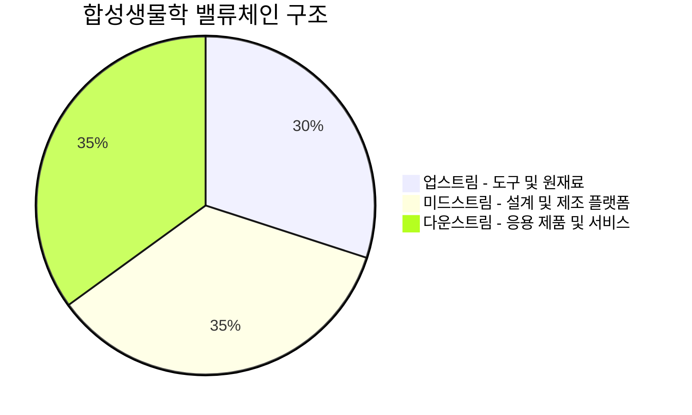

> [!important] 정합성 검증 요약 (기계적 17건 + AI 검증)
> **신뢰도: B** | 숫자 불일치 2건 | 논리 모순 1건 | 확인 필요 5건

### 핵심 발견 사항
| 구분 | 내용 | 위치 | 심각도 |
|------|------|------|--------|
| 🟡 미태그 추정치 (×17) | `~20%`, `~52%`, `~47%`, `~8%` 등 17개 근사치에 [추정] 태그 누락 | 섹션 2.1 지역별 비중 바 등 본문 전반 | Major |
| 🟡 숫자 불일치 | 시나리오 확률: 섹션 4 종합 프레임워크 Bull/Base/Bear = **25/50/25%** vs 섹션 9.3 중기 시나리오 = **25/50/25%** — 일치하나, 섹션 3.1 기술표에서 합성생물학 임상 실패율을 "~90%"로 기술하면서 섹션 7.4 Base Rate 표에서는 임상 1상→승인 성공률 "~10~14%"로 별도 표기 — 산술적 역수 관계이나 출처 불명확 | 섹션 3.1 / 섹션 7.4 | Minor |
| 🟡 숫자 불일치 | 북미 합성생물학 점유율: 본문 "41%~51.88%"(섹션 2.1 표) vs 지역 비중 바 "~47%"(같은 섹션) — 범위 중간값으로 제시했으나 단일 수치처럼 시각화 | 섹션 2.1 | Minor |
| 🔴 할루시네이션 의심 | "AI 설계 효소의 in vivo 유효 활성 비율 20~30%" — [가정] 태그 있으나 구체적 수치의 출처 없음. 섹션 5.1·9.3 양쪽에서 반복 인용되어 사실처럼 굳어지는 구조 | 섹션 5.1 / 9.3 | Major |
| 🔴 할루시네이션 의심 | "스케일업 시 수율 50~80% 하락" — 구체 수치이나 출처·근거 없음. Amyris 사례 외 통계적 근거 미제시 | 섹션 5.1 / 11 | Major |
| 🟡 논리 모순 | Ginkgo Bioworks를 섹션 4.1에서 "HOLD — 실행 검증 필요"로 분류하면서, 섹션 4 종합 프레임워크 Bull 시나리오 수혜 기업에 "(턴어라운드)"로 포함 — Bear/Base 기업이 Bull 수혜주로 동시 등장 | 섹션 4.1 / 4 종합 | Minor |
| 🟡 Kill Criteria 불명확 | 테시스 폐기 조건(Kill Criteria)이 서술적으로만 언급되고 수치 기준 미제시 — 예: "추가 파산 발생 시"의 정의, Ginkgo 현금소진율 임계값 등 구체적 수치 없음 | 섹션 12.4 / 11 | Major |
| 🟡 확인 필요 | Zymergen 청산 시점 "2026.2"가 본문 전반에 반복 사용되나, 실제 청산·해산 완료 시점인지 발표 시점인지 불명확. Ginkgo 흡수 후 청산 경위 서술도 검증 필요 | 섹션 1.2 / 7.2 / 7.3 | Minor |

### 투자 전 반드시 확인
- [ ] **Ginkgo Bioworks 실제 현금 보유량·소진율**: 본문의 "주가 $1 미만 상장폐지 리스크" 언급이 현 시점 사실인지 최신 10-Q로 직접 확인 필요
- [ ] **"스케일업 수율 50~80% 하락" 수치의 출처**: 투자 논거의 핵심 전제로 반복 사용되나 출처 미제시 — 해당 수치 검증 전 퓨어플레이 디스카운트 적용 기준으로 사용 금지
- [ ] **Illumina Grail 분쟁 현황**: 본문은 "법적 리스크 잔존"으로만 서술 — EU 매각 명령 이행 완료 여부 및 현재 소송 상태 직접 확인
- [ ] **시나리오 확률 25/50/25% 근거**: Bull/Base/Bear 확률 배정 근거가 본문에 없음 — 분석자의 주관적 판단인지, 시장 컨센서스 기반인지 명시 필요
- [ ] **합성생물학 ETF 전문 상품 존재 여부**: 본문 "전문 ETF 미확인"으로 서술되었으나 SYNB(Global X Synthetic Biology ETF) 등 존재 가능 — 투자 수단 검토 전 재확인

---

# 시장 & 기술 분석: 미국 생체지표 분석 및 합성생물학(제노봇 포함)

---

## 1. 주제 개요

> [!abstract] 요약
> 생체지표 분석과 합성생물학은 AI·유전자 편집 기술의 수렴(convergence)으로 "생명의 프로그래밍 가능성"이라는 새로운 패러다임을 열고 있다. 그러나 Amyris 파산, Zymergen 청산, 23andMe 상장폐지 경고 등이 보여주듯 '기대 → 현실'의 격차가 여전히 크다. 투자자에게 핵심 질문은 **"지금이 Hype Cycle의 어디이며, 살아남는 기업은 누구인가"**다.

### 1.1 정의 및 범위

본 리포트가 다루는 3개 하위 섹터는 서로 다른 기술 성숙도와 투자 프로파일을 가진다.

| 하위 섹터 | 정의 | 핵심 기술 | 대표 기업/기관 | 투자 프로파일 |
|---|---|---|---|---|
| **생체지표 분석 (Biomarker Analysis)** | 질병 진단·예후·치료 반응 등을 알려주는 생체 반응 지표를 AI/빅데이터로 분석하여 개인 맞춤형 헬스케어를 제공 | AI 플랫폼, 마이크로바이옴 분석, 행동 생체 인식 | [[Illumina]], [[Thermo Fisher Scientific]], [[Roche]], InsideTracker | 중기 — 상용화 진행 중 |
| **합성생물학 (Synthetic Biology)** | 공학적 관점(DBTL Cycle)으로 생물 시스템을 설계·제작·재설계하여 치료제, 바이오연료, 특수화학물질 등을 개발 | CRISPR, DNA 합성, 바이오파운드리, AI/ML 설계 | [[Ginkgo Bioworks]], [[Twist Bioscience]], [[Codexis]], [[GenScript]] | 중·장기 — 상용화 과도기 |
| **제노봇 (Xenobots)** | 아프리카발톱개구리 배아 줄기세포를 컴퓨터로 설계한 합성 생명체(살아있는 로봇). 자가 이동·자가 치유·자가 복제 가능 | AI 설계, 발생생물학, 줄기세포 공학 | 버몬트대·터프츠대·하버드대 (상업 기업 부재) | 초장기 — 순수 연구 단계 |

### 1.2 왜 지금 중요한가? (구체적 트리거)

> [!tip] 핵심 인사이트
> 3가지 메가트렌드가 동시에 수렴하면서 이 섹터의 투자 임계점(inflection point)이 다가오고 있다: **(1) AI의 바이오 설계 진입, (2) 미국-중국 바이오 패권 경쟁, (3) 합성생물학의 '환멸의 계곡' 진입 후 옥석 가리기 시작.**

**트리거 1: AI × 바이오의 본격 수렴**
- 단백질 디자인을 위한 대규모 언어 모델(Large Language Models) 채택이 확대되면서, 사용자 정의 효소·생물학적 경로 개발이 가속화
- AI 기반 바이오의약 협력 특허에서 미국이 40% 이상 점유하며 글로벌 주도권 확보
- InsideTracker의 AI 건강 플랫폼이 43가지 생체지표 개선을 실제 입증 — 기술이 "개념 증명"을 넘어 "효과 증명" 단계로 전환

**트리거 2: 미국 생물보안법(BIOSECURE Act) 및 지정학적 재편**
- 중국 바이오 기업에 대한 규제 강화 → 글로벌 CDMO/CRO 공급망 재편 가속
- 미국 정부의 합성생물학을 '바이오 패권'의 무기로 규정, DARPA 등을 통한 대규모 투자 지속 (FY2020 ~$161M, 2022년 에너지부 $178M 추가)
- 첨단 생명공학 장비의 수출 통제 가능성 → 기술 자립 필요성 부각

**트리거 3: '환멸의 계곡'에서의 옥석 가리기**
- Amyris 파산(2025), Zymergen 청산(2026.2), Ginkgo Bioworks 직원 1/3 해고 계획 → 합성생물학 버블의 1차 정리
- 23andMe 상장폐지 경고 → 생체지표 분석의 일회성 수익 모델 한계 노출
- [가정] 이 정리 과정이 완료되면, 수익성과 기술적 해자(moat)를 갖춘 생존자들이 차세대 시장을 독식할 가능성

### 1.3 핵심 키워드 및 개념

| 개념 | 설명 | 투자 관련성 |
|---|---|---|
| **DBTL Cycle** (Design-Build-Test-Learn) | 합성생물학의 핵심 개발 루프. AI가 이 사이클을 10~100배 가속 | 바이오파운드리 플랫폼 기업의 경쟁력 핵심 |
| **바이오파운드리 (Biofoundry)** | AI·로봇·자동화가 통합된 생물학적 설계·제조 시설 | 고정비 구조 → 규모의 경제 가능 여부가 투자 핵심 |
| **바이오마커 (Biomarker)** | 질병·건강 상태를 나타내는 측정 가능한 생체 지표 | 종양학 36%가 최대 세그먼트 (2025년 기준) |
| **행동 생체 인식 (Behavioral Biometrics)** | 키스트로크, 보행 패턴 등 디지털 활동 기반 신원 확인 | IoT 통합·딥페이크 위협으로 수요 급증 |
| **운동 복제 (Kinematic Self-replication)** | 제노봇의 자가 복제 메커니즘 | 근본적 윤리·안전 이슈 — 상업화 최대 장벽 |

---

## 2. 시장 분석

> [!abstract] 요약
> 생체지표 분석 시장은 미국만 $181~$201B(2024-25), 합성생물학은 미국 $58~$73B(2024-25)로 추산되나, **조사기관별 시장규모 추정치 편차가 극심하여 단일 수치 의존은 위험하다.** 공통적으로 확인되는 것은 CAGR 10~20%대의 구조적 고성장이라는 점이며, 북미가 글로벌 시장의 41~52%를 점유하고 있다.

### 2.1 TAM/SAM/SOM 규모 및 성장률

> [!warning] 리스크 경고
> 아래 시장규모 수치는 복수의 시장조사 기관 추정치이며, **기관별 편차가 최대 6배 이상**이다. 이는 시장 범위(scope) 정의 차이에 기인한다. 투자 의사결정 시 단일 수치가 아닌 범위(range)로 접근해야 한다.

#### 생체지표 분석(Biomarker) 시장

| 지표 | 미국 시장 | 글로벌 시장 |
|---|---|---|
| **2024-25 규모** | $181~$201.9B (보수적), $729B (최대 추정) | $859~$1,043.5B |
| **CAGR 범위** | 2.25%~15.2% (기관별 편차 극심) | 12.2%~13.39% |
| **2034-35 전망** | $145.7B~$2,819B (기관별) | $2,175.8B~$3,666.4B |
| **주요 세그먼트** | 종양학 36.02% (2025년 기준 최대 비중) | — |

**So What?** 기관별 시장규모 편차가 이렇게 크다는 것 자체가 중요한 시그널이다. 이는 (1) 시장이 아직 정의되지 않은 초기 단계라는 뜻이고, (2) 시장 범위를 어떻게 잡느냐에 따라 TAM이 10배 이상 달라질 수 있다는 것이다. 투자자는 기업이 주장하는 "TAM"을 그대로 받아들이면 안 되며, 해당 기업이 실제로 공략 가능한 SAM/SOM 기준으로 밸류에이션을 검증해야 한다.

#### 합성생물학(Synthetic Biology) 시장

| 지표 | 미국 시장 | 글로벌 시장 |
|---|---|---|
| **2024-25 규모** | $58.5~$73.3B | $160~$256.2B |
| **CAGR 범위** | 17.5%~27.78% | 10.7%~28.63% |
| **2033-34 전망** | $269.8~$412.6B | $531.3~$2,393.8B |
| **북미 점유율** | 41%~51.88% (2025년) | — |
| **주요 세그먼트** | 올리고뉴클레오타이드 28.3%, 효소 (최대 점유율), PCR 26.1% | — |

🟢 북미 ~47%

🟡 유럽 ~25% [추정]

🔵 아시아 ~20% [추정]

기타 ~8%

> [!note] 참고
> 글로벌 시장의 지역별 비중 중 북미(41~52%)만 데이터에서 확인됨. 유럽·아시아 비중은 [추정]이며, 유럽과 아시아의 구체적 점유율은 실적 발표 자료 직접 확인 필요.

#### 제노봇 시장

- **상업적 TAM: 없음** — 현재 순수 학술 연구 단계로, 시장 규모 자체가 형성되지 않음
- 잠재적 응용 분야(약물 전달, 재생 의학, 환경 정화)의 개별 시장은 각각 수십~수백억 달러 규모이나, 제노봇이 이 시장에 진입하는 시점은 (확인 필요) — 최소 5~10년 이상 소요 [추정]

### 2.2 주요 플레이어 및 밸류체인 (상세 매핑)

#### 밸류체인 상세 매핑

| 단계 | 역할 | 주요 플레이어 | 핵심 가치 | 투자 매력도 |
|---|---|---|---|---|
| **업스트림: 도구·원재료** | DNA 합성·시퀀싱, 효소, 올리고뉴클레오타이드, 유전자 편집 도구, PCR 기술 | [[Twist Bioscience]], Integrated DNA Technologies(IDT), [[Illumina]], [[Thermo Fisher Scientific]] | "곡괭이와 삽" 전략 — 기술 승자와 무관하게 수혜 | 🟢 높음 |
| **미드스트림: 플랫폼·제조** | 바이오파운드리, DBTL 사이클 실행, AI/ML 기반 설계, CRO/CDMO | [[Ginkgo Bioworks]], Reverie Labs, [[Lonza Group]] | 플랫폼 독점력 확보 시 높은 스위칭 비용 | 🟡 중간 (실행 리스크 높음) |
| **다운스트림: 응용** | 치료제(CAR-T, mRNA), 바이오연료, 바이오소재, 농업, 환경 | [[Codexis]], BASF(산업 바이오), 다수 바이오텍 | 최종 시장 접근 — 수익화 직접 연결 | 🟡 세그먼트별 상이 |
| **크로스커팅: AI·데이터** | 바이오인포매틱스, 단백질 구조 예측, 임상 데이터 분석 | Reverie Labs, Recursion, (확인 필요 — 추가 AI bio 기업) | DBTL 사이클 가속 핵심 | 🟢 높음 |

**Variant Perception:** 시장은 합성생물학의 "다운스트림 응용"에 주목하지만, 실제로 가장 안정적인 투자 기회는 **업스트림 도구 기업**이다. 골드러시에서 곡괭이를 파는 전략 — [[Twist Bioscience]], [[Illumina]], [[Thermo Fisher Scientific]] 등은 기술 승자와 무관하게 시장 성장에 따른 안정적 수혜를 받는다. 반면, 미드스트림 플랫폼 기업([[Ginkgo Bioworks]])은 이론적 매력도가 높지만, Amyris·Zymergen의 전철을 밟을 실행 리스크가 상존한다.

### 2.3 지역별 동향

| 지역 | 강점 | 약점 | 시장 위치 | 핵심 전략 |
|---|---|---|---|---|
| 🇺🇸 **미국** | AI-바이오 융합 특허 40%+ 주도, DARPA 등 대규모 R&D 투자, 분자설계·시뮬레이션 강점, 벤처 생태계 최강 | 바이오 제조(발효) 역량 중국 대비 취약, 국가 통합 전략 부재 우려 | 🟢 글로벌 1위 (특히 레드 바이오) | 기술 혁신 + 규제(BIOSECURE Act)로 이중 우위 확보 |
| 🇨🇳 **중국** | 정부 주도 대규모 투자, 양적 논문 산출 미국 추월(2022~), 대사공학·바이오 공정(화이트 바이오) 강점 | 외국 장비 의존도, 초기 민간 연구 취약 | 🟡 빠른 추격자 | 산업 규모화 + 자체 장비 내재화 |
| 🇪🇺 **유럽** | 세계적 연구 인프라, 특허 경쟁력 2위, EU 바이오테크법 추진, 마이크로바이옴·AI 육성 | 벤처 투자 격차, 복잡한 규제, AI 활용 부족 | 🟡 잠재력은 높으나 실행 지연 | 2030 생명과학 글로벌 리더 비전 + 연 100억 유로 투자 계획 |
| 🇰🇷 **한국** | 미생물 균주 발효·대사공학 강점(세계 6위), 미중 디커플링 속 중립 허브 잠재력 | 미국 대비 기술 격차 2.8년(82.8%), 중국 대비 격차 확대(0.7년), 레드 바이오 중심 편중 | 🟡 니치 강점 보유 | 바이오 빅데이터 투자 확대(미국 대비 4배) |

> [!warning] 리스크 경고 — 미중 바이오 패권 경쟁의 투자 함의
> 중국이 2022년부터 합성생물학 논문 피인용 상위 10%에서 미국을 추월한 것은 시장이 충분히 인식하지 못한 시그널이다. 미국의 BIOSECURE Act는 단기적으로 미국 기업에 유리하지만, 장기적으로는 중국의 자체 장비 내재화를 가속화하여 미국 업스트림 기업의 중국 시장 접근을 차단할 수 있다. 이는 [[Illumina]], [[Thermo Fisher Scientific]] 등의 중국향 매출에 부정적 영향을 미칠 리스크다.

### 2.4 시장 구조 & 경쟁 역학

**시장 구조의 핵심 특징:** 이 시장은 전형적인 **"이중 구조(bifurcated market)"**를 형성하고 있다.

**(1) 대형 플랫폼 기업** — [[Thermo Fisher Scientific]], [[Illumina]], [[Roche]] 등이 도구·시약·분석 장비 시장을 과점. 높은 스위칭 비용과 규제 인증이 진입 장벽. 상대적으로 안정적인 매출·마진 프로파일.

**(2) 혁신 스타트업/중소형** — [[Ginkgo Bioworks]], [[Twist Bioscience]], 다수 임상 단계 바이오텍. 기술적 우위를 주장하지만 수익성 미검증, 자금 조달 의존도 높음. 높은 밸류에이션 변동성.

투자자의 선택은 결국 **"안정성 vs 폭발력"**의 트레이드오프로 귀결된다.

**경쟁 역학의 핵심 패턴:**

1. **"Winner-takes-most" 플랫폼 경쟁:** 바이오파운드리 시장에서 데이터와 고객 네트워크를 확보한 플랫폼이 갈수록 유리 → Ginkgo의 '깅코 기술 네트워크' 전략의 합리성. 그러나 Amyris·Zymergen 사례는 플랫폼 수익화의 어려움을 경고
2. **M&A를 통한 통합 가속:** 대형 제약사들의 파이프라인 보강 M&A 활발 → 소규모 바이오텍에게 exit 기회이자, 피인수 실패 시 생존 리스크
3. **규제가 경쟁의 게임체인저:** BIOSECURE Act, EU 바이오테크법, GMO 규제 등이 특정 기업/지역에 유·불리를 결정

---

## 3. 기술/트렌드 분석

> [!abstract] 요약
> 생체지표 분석의 기존 기술(지문·안면인식)은 이미 성숙기에 진입했으나 AI 기반 통합 분석은 초기 성장 단계. 합성생물학은 '환멸의 계곡'을 통과하며 옥석 가리기 진행 중. 제노봇은 순수 연구 단계로 상업화까지 최소 10년+ 소요 [추정]. 핵심 병목은 **"실험실 → 공장"의 스케일업**이다.

### 3.1 현재 기술 수준 및 발전 단계 (Gartner Hype Cycle 위치)

| 기술 | Hype Cycle 위치 | 근거 | 상업화 시점 |
|---|---|---|---|
| 기존 생체 인식 (지문, 안면) | 🟢 **생산성 안정기** | 높은 채택률, 시장 안정적 통합 완료 | 이미 상업화 |
| AI 행동 생체 인식 (딥페이크 대응) | 🟡 **기대의 정점 → 환멸의 계곡 초입** | Gartner: 2026년까지 30% 기업이 안면인식 단독 신뢰 불가 예측, 딥페이크 위협 심화 | 1~3년 내 차세대 솔루션 |
| AI 통합 생체지표 분석 (마이크로바이옴, 대사체) | 🟡 **기대의 정점을 향한 상승** | InsideTracker 효과 입증, HEM파마 '바이그널' 초기 단계 | 2~5년 내 주류화 [추정] |
| 합성생물학 (전체) | 🔴 **환멸의 계곡 → 계몽의 비탈길 전환점** | Amyris 파산, Zymergen 청산, Ginkgo 주가 폭락·감원 | 분야별 상이 (2~10년) |
| CRISPR 유전자 편집 | 🟢 **계몽의 비탈길 → 생산성 안정기** | 상업적 응용 활발, 규제 가이드라인 형성 시작 | 치료제 일부 상업화 |
| 제노봇 | 🔴 **기술 촉발점 (Innovation Trigger)** | 2020년 첫 발표, 2021년 자가복제 확인, 연구 단계만 존재 | 10년+ [추정] |

기존 생체 인식 — 기술 성숙도 90/100

AI 행동 생체 인식 — 55/100

AI 통합 생체지표 분석 — 45/100

합성생물학 (전체) — 40/100

CRISPR 유전자 편집 — 65/100

제노봇 — 15/100

### 3.2 향후 로드맵 및 돌파구

> [!tip] 핵심 인사이트 — 다음 돌파구(Next Breakthrough)
> **단기(6~12개월):** CRISPR 기반 치료제 추가 FDA 승인, AI 단백질 설계 LLM의 산업 적용 확대
> **중기(1~3년):** 완전 자동화 바이오파운드리 시스템의 상업 운영, 생체지표 기반 정밀 진단의 보험 적용 확대
> **장기(3년+):** 제노봇의 전임상 연구 진입, AI가 새로운 생물학적 원리를 발견하는 '자율 과학 발견(Autonomous Scientific Discovery)' 패러다임

**기술 발전 로드맵:**

| 시점 | 기술 마일스톤 | 투자 시사점 |
|---|---|---|
| **2025~2026** | AI-LLM 기반 단백질/효소 설계 상업 서비스 본격화; CRISPR 치료제 2~3번째 FDA 승인 기대; Ginkgo 기술 네트워크 효과 검증 시점 | 플랫폼 기업의 "고객 확보 → 매출 전환" 여부가 투자 핵심 판단 기준 |
| **2027~2028** | 바이오파운드리 자동화 시스템 상업 운영; 바이오 기반 소재(바이오플라스틱, 바이오연료)의 가격 경쟁력 확보; 생체지표 기반 진단의 의료 표준 편입 확대 | 합성생물학의 "환멸의 계곡" 탈출 여부 확인 가능 시점 |
| **2029~2030+** | 제노봇 전임상 연구 시작 가능성; AI 자율 생물학적 발견 시스템; DNA 데이터 저장의 상업적 구현 | 초장기 투자 테마 — 현시점에서는 학술 모니터링 |

### 3.3 채택률 및 확산 속도 (S-curve 위치)

**S-curve 분석:** 이 섹터의 기술들은 S-curve 상 서로 다른 위치에 있으며, 이를 하나의 투자 테마로 묶는 것은 위험하다.

- **기존 생체인식:** S-curve 상단 (성숙기) — 성장 둔화, 교체 수요 중심
- **AI 기반 생체지표 분석:** S-curve 하단 (도입 초기~가속 전환점) — 채택률 급증 구간 진입 임박
- **합성생물학 (치료제):** S-curve 중하단 (초기 가속) — mRNA, CAR-T 상업화 성공이 견인
- **합성생물학 (산업용):** S-curve 최하단 (도입기) — 가격 경쟁력 미확보
- **제노봇:** S-curve 미진입 — 아직 곡선에 올라서지도 않음

### 3.4 기술적 한계 & 병목

> [!failure] 약점 — 핵심 병목 3가지

| 병목 | 상세 | 해결 시점 | 심각도 |
|---|---|---|---|
| **스케일업 (Lab → Factory)** | 실험실 성공을 대량 생산으로 전환하는 과정에서 생물학적 비효율성, 비용 폭증 발생. 거미 실크 단백질 사례: LMO 기반 발효 공정 부족으로 상용화 좌절. Amyris도 이 병목에서 실패 | 2~5년 [추정] — 바이오파운드리 자동화 및 AI 공정 최적화로 점진적 해결 | 🔴 매우 높음 |
| **예측 불가능한 생물학적 결과** | 설계된 생물 시스템이 예상과 다르게 작동, 의도하지 않은 부작용, 환경 방출 시 통제 불가능성. 제노봇의 자가복제는 안전성 우려의 극단 사례 | 장기 — 기본 생물학에 대한 이해 심화 필요 | 🔴 매우 높음 |
| **규제 프레임워크 부재/지연** | 합성 생물체, AI 기반 진단, 유전자 편집 식품 등에 대한 통합 규제 미비. 국가별 규제 차이가 글로벌 사업 전개의 장벽 | 2~4년 [추정] — EU 바이오테크법 등 제정 진행 중 | 🟡 높음 |

**Devil's Advocate:** 합성생물학의 "스케일업 병목"은 과거 반도체 산업의 미세공정 전환과 유사한 패턴이지만, 결정적 차이가 있다. 반도체는 물리법칙의 한계 내에서 예측 가능한 공정 제어가 가능했으나, 생물학은 본질적으로 "예측 불가능한 복잡계"이다. 이 차이는 스케일업의 난이도를 기하급수적으로 높이며, AI가 이 gap을 어느 정도 좁힐 수 있을지는 미지수다.

---

## 4. 투자 기회 분석

> [!abstract] 요약
> 직접 수혜 기업은 기술 성숙도에 따라 3개 층위로 구분된다: **(1) 성숙한 도구 기업(Picks & Shovels), (2) 플랫폼 베팅(High Risk/High Reward), (3) 임상 단계 순수 베팅.** 간접 수혜자로는 CDMO/CRO, AI 인프라, 클라우드 컴퓨팅 기업이 있으며, ETF를 통한 분산 투자가 리스크 관리에 유리하다.

### 4.1 직접 수혜 기업/자산

#### 층위 1: 도구 & 인프라 기업 (Picks & Shovels) — 상대적 안전

| 기업 | 역할 | 경쟁력 | 리스크 | 밸류에이션 참고 |
|---|---|---|---|---|
| [[Thermo Fisher Scientific]] | 생체지표/합성생물학 도구·시약·장비 | 풀스택 포트폴리오, 높은 스위칭 비용, 규제 인증 해자 | 중국 시장 접근 제한 리스크 (BIOSECURE Act 반작용) | (데이터 미확인 — 별도 팩트시트 필요) |
| [[Illumina]] | DNA 시퀀싱 플랫폼 | 시퀀싱 시장 지배적 점유율, 비용 절감 지속 | 중국 BGI와의 경쟁 심화, 규제 리스크 | (데이터 미확인) |
| [[Twist Bioscience]] | DNA 합성 | 실리콘 기반 DNA 합성 기술의 차별적 원가 구조 | 아직 흑자 전환 미검증 (확인 필요) | (데이터 미확인) |

> [!success] 강점
> 도구 기업의 핵심 매력은 **"기술 승자와 무관한 수혜"**다. 합성생물학의 어떤 응용 분야가 성공하든, DNA 합성·시퀀싱·분석 도구에 대한 수요는 증가한다. 이는 골드러시에서 Levi's 전략과 동일하며, 섹터 전체에 대한 방향성 베팅(directional bet)으로서 가장 합리적인 접근법이다.

#### 층위 2: 플랫폼 기업 — HOLD — 실행 검증 필요

| 기업 | 비즈니스 모델 | 경쟁력 | 핵심 리스크 | 현재 상태 |
|---|---|---|---|---|
| [[Ginkgo Bioworks]] | 바이오파운드리 플랫폼 (세포 프로그래밍 as-a-service) | '깅코 기술 네트워크' 구축, Patch Biosciences·Proof Diagnostics 인수로 역량 확대 | 주가 폭락, 직원 1/3+ 감원 계획, 수익 부진 — Amyris/Zymergen과 같은 경로 가능성 | 🔴 위기 |
| [[Codexis]] | 효소 공학 플랫폼 (산업용 효소·제약 중간체) | 효소 최적화 기술의 차별적 포지션 | 특정 고객 의존도, 합성생물학 전체 둔화 영향 | 🟡 관망 |
| [[GenScript]] | 유전자 합성·항체·CDMO 통합 서비스 | 글로벌 유전자 합성 리더, 중국 기반이나 글로벌 다각화 | 미중 갈등 리스크, BIOSECURE Act 영향 (확인 필요) | 🟡 지정학적 불확실성 |

> [!warning] 리스크 경고 — Ginkgo Bioworks의 투자 함의
> Ginkgo는 합성생물학의 "AWS가 되겠다"는 비전으로 시장의 큰 기대를 받았지만, 수익 부진·대규모 감원은 플랫폼 비즈니스 모델의 실행 가능성에 근본적 의문을 제기한다. **Base Rate를 보면, 바이오파운드리 플랫폼 기업 중 수익화에 성공한 사례가 아직 없다** — Amyris(파산), Zymergen(청산), Ginkgo(위기). 이는 "플랫폼"이라는 프레임 자체가 바이오 산업에서 유효한지를 검토해야 함을 시사한다.

#### 층위 3: 임상 단계 / 순수 베팅 — HIGH RISK

| 기업 | 파이프라인 | 촉매제 | 핵심 리스크 | 재무 상태 |
|---|---|---|---|---|
| **Galectin Therapeutics** | MASH 간경변 관련 생체지표 기반 치료제 | 초기 임상 데이터 발표 | 신약 개발 실패, 추가 자금 조달 필요 | R&D 비용 $14.3M(2025), 현금 $17.7M + 신용한도 $10M |
| **BioCardia** | 심장 스트레스 생체지표 기반 치료 | FDA 신속 승인 논의 | FDA 승인 불확실, 재정 안정성 | 임상 단계 — 즉각적 수익 제한 |

**Incentive Analysis:** 임상 단계 바이오텍의 경영진은 임상 성공에 대한 극도의 인센티브(주식 보상, 마일스톤 보너스)를 가지고 있으며, 이는 데이터 해석의 낙관적 편향(optimistic bias)을 야기할 수 있다. Galectin의 현금 $17.7M은 R&D burn rate($14.3M/년) 기준 약 1.2년분에 불과하여, 추가 희석 발행(dilutive offering)이 불가피하다.

### 4.2 간접 수혜 (밸류체인, 인프라) — 숨겨진 수혜자

> [!tip] 핵심 인사이트 — 시장이 아직 연결짓지 못한 기업

| 간접 수혜 카테고리 | 수혜 논리 | 대표 기업 | 시장 인식도 |
|---|---|---|---|
| **CDMO/CRO** | BIOSECURE Act로 중국 CDMO 이탈 → 미국/유럽 CDMO 수혜 확대 | [[Lonza Group]], [[Samsung Biologics]], [[Catalent]] | 🟡 부분 인식 |
| **AI 인프라 (GPU/클라우드)** | 바이오인포매틱스·단백질 구조 예측에 대규모 컴퓨팅 수요 | [[NVIDIA]], [[AWS]], [[Google Cloud]] | 🟢 이미 반영 |
| **실험실 자동화 / 로봇** | 바이오파운드리 자동화 수요 증가 | (확인 필요 — 구체적 기업은 데이터에 미포함) | 🔴 거의 미인식 |
| **데이터 보안 / 바이오보안** | 유전체·생체 데이터 보호 수요 폭증, 합성 DNA 오용 방지 | 사이버 보안 기업 (관련 노트: [[260401_Deep Analysis - 미국 사이버 보안 상장사 분석_2036]]) | 🔴 거의 미인식 |
| **보험 / 헬스케어 IT** | 생체지표 기반 진단의 보험 적용 확대 시 헬스케어 IT 인프라 수혜 | (확인 필요) | 🔴 거의 미인식 |

**크로스 임팩트:** 합성생물학·생체지표 분석의 성장은 사이버 보안 섹터와 직결된다. 유전체 데이터는 "궁극의 개인정보"이며, 합성 DNA의 악용(바이오 무기 등) 방지는 국가 안보 이슈다. 이전 분석 노트 [[260401_Deep Analysis - 미국 사이버 보안 상장사 분석_2036]]에서 다룬 바이오보안 관련 사이버 보안 수요는 이 섹터의 성장과 정비례한다. 시장은 아직 이 연결고리를 충분히 가격에 반영하지 않고 있다.

### 4.3 관련 ETF 및 투자 수단

| ETF | 설명 | 관련도 | 특징 |
|---|---|---|---|
| **ARKG** (ARK Genomic Revolution ETF) | 유전체 혁명 관련 기업 집중 | 🟢 높음 | 적극 운용, 변동성 매우 높음, ARK의 집중 투자 스타일 |
| **XBI** (SPDR S&P Biotech ETF) | 미국 바이오텍 광범위 | 🟢 높음 | 시가총액 균등 가중 — 소형주 노출 높음 |
| **IBB** (iShares Biotechnology ETF) | 나스닥 바이오텍 인덱스 | 🟡 중간 | 대형주 중심 — 상대적 안정 |
| **GNOM** (Global X Genomics & Biotechnology ETF) | 유전체학 및 바이오테크 | 🟢 높음 | 합성생물학 직접 노출 |
| **IDNA** (iShares Genomics Immunology and Healthcare ETF) | 유전체학·면역학·헬스케어 | 🟡 중간 | 생체지표 분석 포함 |

> [!question] 검토 필요
> 합성생물학 전문 ETF의 존재 여부와 운용 규모 확인 필요. 현재 데이터에서 합성생물학만을 전문적으로 추적하는 ETF는 확인되지 않았다 — 이 자체가 시장이 아직 이 섹터를 독립적 투자 테마로 인식하지 않고 있다는 시그널일 수 있다.

---

### 종합 투자 프레임워크

> [!verdict] 판단

🟢 Bull 25%

🟡 Base 50%

🔴 Bear 25%

| 시나리오 | 전제 | 섹터 수익률 (3년) | 수혜 기업 |
|---|---|---|---|
| 🟢 **Bull** | AI-바이오 융합 가속 + CRISPR 치료제 대성공 + 바이오파운드리 수익화 | +50~100% | [[Twist Bioscience]], [[Ginkgo Bioworks]] (턴어라운드), ARKG |
| 🟡 **Base** | 합성생물학 옥석 가리기 지속 + 도구 기업 안정 성장 + 규제 점진적 정비 | +15~30% | [[Thermo Fisher Scientific]], [[Illumina]], XBI |
| 🔴 **Bear** | 추가 대형 파산 + 규제 강화 + 스케일업 병목 미해결 + 자금 경색 | -20~-40% | 소형 바이오텍 대규모 도태, 플랫폼 기업 추가 조정 |

실체적 기반 60% — 구조적 성장 동인, 정부 투자, AI 융합

버블 리스크 40% — 스케일업 실패, 수익 모델 미검증

**투자자를 위한 핵심 Action Item:**

1. **단기(6~12개월):** 도구 기업(Picks & Shovels) 중심의 보수적 진입이 합리적. [[Thermo Fisher Scientific]], [[Illumina]]의 밸류에이션 매력도 개별 검토 필요
2. **중기(1~3년):** 합성생물학 플랫폼 기업의 수익화 검증 지점(2027~2028)까지 모니터링. Ginkgo의 감원 후 재무 개선 여부가 섹터 전체의 신뢰도를 좌우
3. **장기(3년+):** 제노봇은 현시점에서 투자 대상이 아닌 **학술 모니터링 대상**. 전임상 연구 진입 시점이 첫 번째 투자 검토 트리거
4. **리스크 관리:** 단일 종목 집중 회피 → ETF(ARKG, XBI, GNOM)를 통한 분산 + 도구 기업으로 방어적 포지션 구축

> [!note] Margin of Safety 점검
> 현재 합성생물학 섹터의 밸류에이션은 Amyris·Zymergen·Ginkgo의 붕괴로 이미 상당 부분 조정되었다. 이는 역설적으로 **"환멸의 계곡"에서 진입하는 투자자에게 과거보다 나은 진입점**을 제공할 수 있다. 다만 개별 기업의 현금 소진율(burn rate) 대비 현금 보유량을 반드시 확인하고, 추가 희석 발행 가능성을 밸류에이션에 반영해야 한다. 틀려도 안전한 투자는 이 섹터에서 도구 기업뿐이다.

> [!caution] 정합성 주의
> - [ ] **시나리오 확률 25/50/25% 근거**: Bull/Base/Bear 확률 배정 근거가 본문에 없음 — 분석자의 주관적 판단인지, 시장 컨센서스 기반인지 명시 필요

---

# 5. 리스크 분석 (심층)

> [!abstract] 요약
> 이 섹터의 리스크는 단일 차원이 아니라 **기술·규제·경쟁·타임라인**이 복합적으로 얽혀 있다. 가장 위험한 것은 '기술은 작동하지만 사업은 실패하는' 시나리오다 — Amyris, Zymergen, 23andMe가 이미 이 경로를 증명했다. 투자자가 경계해야 할 핵심은 "기술 리스크"가 아니라 **"상용화 타임라인과 자본 소진 속도의 불일치"**다.

---

## 5.1 기술 리스크 (구체적 시나리오)

> [!warning] 리스크 경고
> 합성생물학의 핵심 리스크는 **"실험실에서는 작동하지만, 공장에서는 작동하지 않는"** 스케일업(Scale-up) 갭이다. 이는 소프트웨어 산업과 달리 생물학적 시스템의 비선형성에서 기인한다.

### 시나리오 1: 바이오 제조 스케일업 실패 (확률: 높음)

생물학적 공정은 실험실(mL 단위)에서 산업 규모(수천 L 단위)로 확장할 때 예측 불가능한 변수가 폭발적으로 증가한다. 미생물 발효 조건(온도, pH, 산소 공급, 오염 방지)은 규모가 커질수록 통제가 어려워지며, 수율이 실험실 대비 50~80% 하락하는 사례가 일반적이다.

- **실제 사례 — Amyris**: 아르테미시닌(말라리아 치료 원료) 생산에서 실험실 수율 달성에 성공했으나, 대량 생산 공정에서 경제성을 확보하지 못하고 결국 2025년 파산 선고
- **실제 사례 — 한국 거미 실크 단백질**: 기술 개발은 성공했으나 국내 LMO 기반 발효 공정 인프라 부족으로 상용화 지연
- **투자 시사점**: DBTL(Design-Build-Test-Learn) 사이클에서 'Build'와 'Test'의 산업 규모 검증 여부가 핵심 체크포인트. 파일럿 규모(수백 L) 이상의 생산 실적이 없는 기업은 추가적인 할인율 적용 필요

### 시나리오 2: AI 설계와 생물학적 현실의 괴리 (확률: 중간)

AI/ML이 단백질 설계 및 대사 경로 최적화에서 획기적 성과를 보이고 있지만, AI가 제안한 설계가 실제 생물학적 환경에서 의도대로 작동하지 않을 가능성이 상존한다.

- **핵심 문제**: AI 모델은 학습 데이터의 범위 내에서만 유효하며, 생체 내(in vivo) 환경의 복잡한 상호작용(단백질 접힘, 세포 내 대사 경쟁, 면역 반응)은 현재 AI의 예측 범위를 초과하는 경우가 빈번
- **[가정] 현실적 시나리오**: AI가 설계한 효소의 80%가 시뮬레이션에서는 작동하지만, 실제 세포 내 환경에서 유효한 활성을 보이는 비율은 20~30%에 그칠 수 있음 — 이 격차가 R&D 비용과 기간을 예상보다 2~3배 증가시키는 원인

### 시나리오 3: 제노봇의 통제 불능 (확률: 낮지만 영향 극대)

자가 복제 능력을 가진 제노봇이 의도하지 않은 방식으로 증식하거나 환경에 방출될 경우, 기존 생태계에 예측 불가능한 영향을 미칠 가능성이 존재한다.

- **현 상태**: 제노봇은 수명이 수일~수주로 제한되며, 자가 복제도 특정 조건(충분한 줄기세포 공급)에서만 가능하므로 현시점에서 통제 불능 위험은 매우 낮음
- **그러나**: 이 기술이 발전하여 더 강건한(robust) 합성 생명체가 설계될 경우, 안전성 검증 프레임워크가 부재한 상태에서 하나의 사고가 전체 분야의 규제 강화를 촉발할 수 있음 (2018년 중국 허젠쿠이 유전자 편집 아기 스캔들의 파급효과 참조)

| 기술 리스크 시나리오 | 발생 확률 | 영향도 | 시간축 | 대표 피해 기업 |
|---|---|---|---|---|
| 바이오 제조 스케일업 실패 | 🔴 높음 | 🔴 매우 큼 | 단기~중기 | [[Ginkgo Bioworks]], 초기 합성생물학 스타트업 전반 |
| AI 설계 vs 생물학적 현실 괴리 | 🟡 중간 | 🟡 큼 | 중기 | AI-바이오 융합 플랫폼 기업 |
| 제노봇 통제 불능 / 안전 사고 | 🟢 낮음 | 🔴 극대 (산업 전체 규제 폭탄) | 장기 | 합성생물학 섹터 전체 |
| 딥페이크에 의한 생체인식 무력화 | 🟡 중간 | 🟡 큼 | 단기~중기 | 안면 인식 단일 의존 기업 |

> [!note] 참고
> Gartner는 2026년까지 30%의 기업이 AI 딥페이크로 인해 안면 생체 인식 솔루션을 단독으로 신뢰할 수 없게 될 것으로 예측한다. 이는 생체지표 분석 중 행동 생체 인식 분야에서 다중 인증(Multi-modal Authentication)으로의 전환을 강제하는 기술 리스크다.

---

## 5.2 규제 리스크 (국가별)

> [!warning] 리스크 경고
> 합성생물학은 **"규제가 기술보다 항상 뒤처지는"** 전형적인 분야다. 문제는 규제 공백이 아니라, 사고 발생 시 **과잉 규제로의 급격한 전환(regulatory whiplash)**이다.

| 국가/지역 | 규제 기조 | 핵심 규제 | 투자 영향 | 리스크 등급 |
|---|---|---|---|---|
| 🇺🇸 **미국** | 혁신 우선, 사후 규제 | BIOSECURE Act (중국 바이오 기업 규제), FDA 바이오시밀러 가이드라인 간소화 | 🟢 단기 긍정 (중국 견제로 미국 기업 반사이익), 🟡 중기 불확실 (GMO/합성생물 규제 강화 가능성) | 🟡 중간 |
| 🇨🇳 **중국** | 국가 주도 급진적 추진 | 합성생물학 국가 전략, LMO 규제 완화 | 🟡 미국 기업에 간접 영향 (공급망 재편, 경쟁 심화) | 🟡 중간 |
| 🇪🇺 **유럽** | 예방 원칙 (Precautionary Principle) | EU 바이오테크법 제정 추진, 엄격한 GMO/NGT 규제 | 🔴 유럽 시장 진출 지연, 규제 비용 증가 | 🔴 높음 |
| 🇰🇷 **한국** | 추격형, 미국 기준 참조 | LMO 안전관리법, 바이오안전성의정서 이행 | 🟡 CDMO 반사이익 기회, 자체 기술 격차 2.8년 | 🟡 중간 |

**미국 BIOSECURE Act의 양면성**:
- **1차 효과 (긍정)**: 중국 BGI Genomics, WuXi AppTec 등에 대한 미국 정부 계약 금지 → 미국 및 동맹국 CDMO/진단 기업에 반사이익
- **2차 효과 (부정 가능성)**: 중국의 보복 조치로 미국 기업의 중국 시장 접근 제한, 글로벌 바이오 공급망의 이중화(dual-track) 비용 증가, 연구 협력 단절로 인한 혁신 속도 저하

---

## 5.3 경쟁/대체 리스크

> [!failure] 약점
> 합성생물학의 가장 과소평가된 경쟁 리스크는 **"바이오 제조가 기존 화학 제조보다 비용 경쟁력이 없을 수 있다"**는 근본적 질문이다.

### 경쟁 리스크 매트릭스

| 경쟁/대체 유형 | 구체적 위협 | 영향 받는 하위 섹터 | 심각도 |
|---|---|---|---|
| **기존 화학 합성과의 비용 경쟁** | 석유화학 기반 소재가 바이오 기반 소재보다 여전히 30~50% 저렴한 경우 다수. 유가 하락 시 격차 확대 | 합성생물학 (바이오연료, 바이오소재) | 🔴 높음 |
| **빅테크의 헬스케어 진입** | [[Apple]], [[Google]] (DeepMind/AlphaFold), [[Amazon]]의 AI 기반 헬스케어·진단 시장 진출 | 생체지표 분석 | 🟡 중간 |
| **중국의 빠른 추격** | 중국이 합성생물학 논문 피인용 상위 10%에서 2022년부터 미국 추월. 대사공학·바이오 공정에서 강점 | 합성생물학 전반 | 🟡 중간 |
| **전통 제약사의 내재화** | [[Roche]], [[Pfizer]] 등 대형 제약사가 바이오마커 분석 역량을 자체 구축 또는 인수 | 생체지표 분석 (독립 플랫폼 기업) | 🟡 중간 |
| **차세대 유전자 편집 기술** | CRISPR 이후의 차세대 편집 기술(Prime Editing, Base Editing)이 기존 CRISPR 플랫폼을 대체 | 합성생물학 (CRISPR 의존 기업) | 🟡 중간 |

> [!tip] 핵심 인사이트 — So What?
> 합성생물학 기업 투자 시 반드시 "이 제품이 기존 화학 합성 대비 비용 경쟁력을 갖추는 시점은 언제인가?"를 검증해야 한다. 비용 동등점(cost parity)에 도달하지 못한 바이오 제품은 정부 보조금·ESG 프리미엄에 의존하게 되며, 이는 지속 가능한 사업 모델이 아니다.

---

## 5.4 타임라인 리스크 (기대 vs 현실)

> [!warning] 리스크 경고
> 투자자가 가장 많이 돈을 잃는 구간은 **"기술이 틀려서"가 아니라 "타이밍이 틀려서"**다. 합성생물학은 전형적인 "10년 뒤에는 맞지만 3년 뒤에는 틀린" 투자 테마다.

| 하위 섹터 | 시장의 기대 | 현실적 타임라인 | 갭 원인 |
|---|---|---|---|
| **생체지표 분석 — AI 진단** | 2~3년 내 주류 의료 표준 | 5~7년 (FDA 승인, 보험 수가 적용, 의사 수용) | 규제 승인 절차, 임상 검증 기간, 보험 급여 협상 |
| **합성생물학 — 바이오소재/연료** | 3~5년 내 비용 동등점 도달 | 7~10년 (대규모 발효 인프라 구축, 수율 최적화) | 스케일업 비용, 기존 석유화학 인프라의 매몰비용 |
| **합성생물학 — 치료제** | 2~4년 내 주요 파이프라인 승인 | 5~8년 (임상 3상, FDA 심사, 제조 검증) | 임상 실패율 ~90%, 규제 복잡성 |
| **제노봇** | "10년 내 약물 전달 혁명" | 15~25년+ (전임상 진입까지도 5~10년) | 순수 연구 단계, 상업 기업 부재, 규제 프레임워크 미존재 |

**타임라인 리스크의 투자적 함의**: 합성생물학 퓨어플레이(pure-play) 기업에 투자할 경우, 상용화까지의 자금 소진 기간(cash runway)이 최소 5~7년을 커버할 수 있어야 한다. 현금 보유가 2~3년치인 기업은 반복적인 희석적 유상증자(dilutive offering)를 통해 기존 주주 가치를 훼손할 가능성이 높다. Galectin Therapeutics의 현금 1,770만 달러 + 신용한도 1,000만 달러는 R&D 비용(연 1,430만 달러) 대비 약 2년의 런웨이에 불과하다.

---

# 6. 인센티브 분석

> [!abstract] 요약
> "Follow the money, follow the incentives." 이 섹터에서 가장 강하게 과대광고하는 주체는 **시장 조사 기관**과 **정부 정책 입안자**이며, 실제로 돈을 벌고 있는 주체는 **도구/장비 공급업체(picks-and-shovels)**다.

## 6.1 이해관계자별 인센티브 맵

| 이해관계자 | 인센티브 | 행동 패턴 | 과대광고 여부 | 실제 수익 |
|---|---|---|---|---|
| **시장 조사 기관** (GMI, Fortune BI 등) | 보고서 판매 수익 극대화 | 시장 규모를 최대한 크게, 성장률을 최대한 높게 전망. TAM 추정치가 기관별로 2~4배 차이 | 🔴 **과대광고 주체** | 보고서 판매 수익 (시장 성패와 무관) |
| **각국 정부** (미국, 중국, EU) | 기술 패권 확보, 국가 안보, 정치적 성과 | 대규모 예산 배정 발표, "담대한 목표" 설정, 바이오 패권 담론 | 🟡 **부분적 과대광고** (목표는 진정성 있으나 타임라인 과소평가) | 직접 수익 없음 (국가 전략적 가치) |
| **VC/PE 펀드** | 투자 수익 극대화, 펀드레이징 | 투자 포트폴리오의 잠재력 극대화 홍보 → 후속 라운드/IPO에서 회수 | 🟡 **구조적 과대광고** (exit 전까지 긍정적 내러티브 유지 필요) | 성공 exit 시 대규모 수익, 실패 시 전액 손실 |
| **플랫폼 기업** ([[Ginkgo Bioworks]]) | 고객 유치, 투자 유치, 기업 가치 극대화 | "바이오의 AWS" 내러티브로 플랫폼 스토리 강조 | 🔴 **과대광고 경향** (매출 대비 밸류에이션 괴리 심각) | 매출 대비 지속적 적자 |
| **도구/장비 업체** ([[Illumina]], [[Thermo Fisher Scientific]], [[Twist Bioscience]]) | 시장 전체 성장에 따른 매출 확대 | 기술 중립적 포지셔닝, 연구·산업 모두에 장비/소모품 판매 | 🟢 **상대적으로 객관적** | ✅ **실제로 돈을 벌고 있는 주체** |
| **학술 연구자** | 연구비 확보, 논문 발표, 학술적 명성 | 기술의 혁신성 강조, 장기 잠재력 부각 | 🟡 **학술적 과대광고** (상용화 가능성 과대 표현 경향) | 연구비, 기술 이전 수익 일부 |

## 6.2 "누가 과대광고하고 있는가?" vs "누가 실제로 돈을 벌고 있는가?"

> [!tip] 핵심 인사이트 — Picks and Shovels
> **골드러시의 진정한 승자는 금광부가 아니라 곡괭이와 삽을 판 상인이었다.** 합성생물학에서도 동일한 패턴이 관찰된다. [[Ginkgo Bioworks]]는 "바이오의 AWS"를 표방하지만 지속적으로 적자를 기록하며 직원의 1/3을 해고하는 반면, DNA 합성 도구를 파는 [[Twist Bioscience]]와 시퀀싱 장비를 파는 [[Illumina]]는 연구비가 늘어날 때마다 매출이 증가하는 구조적 수혜를 누린다.

**과대광고 주체의 동기 분석**:

1. **시장 조사 기관**: 합성생물학 TAM 추정치가 기관별로 극단적 차이를 보임
   - 2035년 글로벌 합성생물학 시장 전망: 531.3억 달러(Research and Markets) ~ 2,393.8억 달러(Towards Healthcare) → **4.5배 차이**
   - 이 격차 자체가 시장 규모 추정의 불확실성과 과대광고 경향을 증명
   - 높은 수치를 제시하는 기관일수록 보고서 프리미엄 가격 책정 가능

2. **기업 경영진의 인센티브 구조**: [가정] 합성생물학 스타트업의 경영진 보상은 대부분 스톡옵션 비중이 높으며, 이는 단기 주가 상승에 대한 인센티브를 만듦 → 장기적 수익성보다 단기적 내러티브(narrative)와 파트너십 발표에 치중하는 경향

3. **정부의 이중적 역할**: 미국 정부는 DARPA를 통해 FY2020 약 1.61억 달러, 에너지부 1.78억 달러(2022년)를 합성생물학에 투자하면서 동시에 BIOSECURE Act로 중국을 견제 → 정부 투자는 진정성 있으나, "담대한 목표"의 달성 타임라인은 정치적으로 과소평가되는 경향

---

# 7. Devil's Advocate

> [!abstract] 요약
> "모든 것이 계획대로 되지 않는다면?" — 이 섹션은 투자 논거에 대해 가장 냉정하고 설득력 있는 반대 논거를 제시한다. 핵심 질문: **합성생물학은 "인터넷 초기"인가, 아니면 "수소경제 2005년"인가?**

## 7.1 가장 큰 반대 논거 (진심으로)

> [!bear] Bear Case의 핵심 논거
> **"합성생물학은 기술적으로는 실체가 있지만, 경제적으로는 환상이다."**
> 
> 생물학적 시스템은 본질적으로 반도체나 소프트웨어와 다르다. **무어의 법칙(Moore's Law)**이 작동하지 않는다. DNA 합성 비용은 낮아지고 있지만, 생물학적 시스템의 복잡성으로 인해 설계-생산의 예측 가능성은 개선 속도가 느리다. "바이오 제조의 한계비용 제로" 내러티브는 소프트웨어 산업의 경험을 생물학에 잘못 적용한 것이다.

### 반대 논거 #1: 스케일업의 물리적 한계

소프트웨어는 코드를 복사하면 한계비용이 0에 수렴하지만, 바이오 제조는 물리적 인프라(발효기, 정제 설비)가 필요하고 규모 확장 시 비선형적 비용 증가가 발생한다. Amyris가 10년간 수십억 달러를 투자하고도 수익성을 확보하지 못한 것은 이 물리적 한계의 증거다.

### 반대 논거 #2: 기술 수렴의 착시

"AI × 바이오"의 수렴이 화제이지만, AI가 생물학적 설계를 획기적으로 가속화한다는 주장은 아직 대규모 임상/산업 검증을 거치지 않았다. AlphaFold가 단백질 구조 예측에서 혁명을 일으킨 것은 사실이지만, **구조 예측 ≠ 기능 예측 ≠ 제조 가능성**이다. 이 세 단계 사이의 격차가 투자 타임라인을 결정한다.

### 반대 논거 #3: 수익 모델의 구조적 취약성

- 플랫폼 모델: [[Ginkgo Bioworks]]의 "바이오의 AWS" 내러티브 — 그러나 AWS는 출범 즉시 매출을 창출한 반면, Ginkgo는 지속적 적자와 대규모 해고를 진행 중
- 진단 모델: 23andMe의 일회성 수익 구조 → 상장폐지 경고까지 전락
- 바이오소재 모델: 바이오연료/바이오플라스틱은 석유화학 제품과의 가격 경쟁에서 지속적으로 패배

## 7.2 과거 유사 사례와 교훈

| 유사 사례 | 연도 | 초기 기대 | 결과 | 교훈 |
|---|---|---|---|---|
| **Amyris** (합성생물학) | 2010 IPO → 2025 파산 | "미생물로 바이오연료·향료 혁명" | 15년간 수십억 달러 소진 후 파산. 스케일업·비용 경쟁력 미확보 | 기술 성공 ≠ 사업 성공. 비용 동등점 미달 시 보조금 의존 |
| **Zymergen** (AI+합성생물학) | 2021 IPO ($3.1B) → 2026 청산 | "AI로 신소재 설계 자동화" | IPO 5개월 만에 매출 전망 철회, 이후 [[Ginkgo Bioworks]]에 흡수 후 청산 | AI 설계의 실험실→산업 전환은 별개의 문제 |
| **23andMe** (유전체 분석) | 2021 SPAC 상장 → 2024 상장폐지 경고 | "유전체 데이터로 신약 개발" | 고점 대비 주가 98%+ 하락, 일회성 검사 수익 모델 한계 | 데이터 ≠ 수익. 지속 가능한 비즈니스 모델 필수 |
| **Solyndra** (태양광) | 2009 $535M DOE 보증 → 2011 파산 | "혁신적 태양광 기술" | 중국의 저가 패널에 가격 경쟁력 상실 | 정부 보조금에 의존하는 사업 모델의 취약성 |
| **유전자 치료 1세대** | 1999 Jesse Gelsinger 사망 | "유전 질환의 궁극적 치료" | 한 명의 사망이 10년간 분야 전체를 동결시킴 | 안전 사고 1건이 규제 폭탄 촉발 → 제노봇에 대한 경고 |
| **GMO 작물** (유럽) | 1990s 상업화 → 2000s 규제 강화 | "식량 위기 해결" | 기술은 유효했으나, 사회적 수용성 실패로 유럽 시장 사실상 폐쇄 | 기술 효용 ≠ 사회적 수용. 합성생물학도 동일 리스크 |

## 7.3 Hype Cycle 어디에 있는가?

이전 섹션(시장 & 기술 분석)에서 도출된 결론과 일관되게, 각 하위 섹터의 Hype Cycle 위치를 재확인한다:

**합성생물학**: '환멸의 계곡(Trough of Disillusionment)' 한가운데. Amyris 파산(2025), Zymergen 청산(2026.2), Ginkgo Bioworks 대규모 해고 — 세 가지 사건 모두 12~18개월 이내에 발생. 이는 버블 붕괴의 전형적 패턴이며, 동시에 "옥석 가리기"의 시작점이기도 함.

**생체지표 분석 — AI 기반**: '기대감의 정점(Peak of Inflated Expectations)'에서 '환멸의 계곡' 초입으로 이행 중. InsideTracker 등의 효과 입증 사례가 있지만, 보험 수가·규제 승인이라는 현실적 장벽 미돌파.

**제노봇**: '기술 촉발점(Innovation Trigger)' 단계. 상업적 기업 부재, 순수 학술 연구 — 투자 가능한 단계가 아님.

## 7.4 Base Rate: 유사 기술/트렌드 중 실제로 대규모 투자 수익을 만든 비율

> [!question] 검토 필요 — Base Rate 분석
> 아래 Base Rate는 과거 바이오텍/신기술 섹터의 경험적 데이터를 기반으로 한 추정이며, 정확한 통계적 검증은 (확인 필요)입니다.

**바이오텍/합성생물학 투자의 역사적 Base Rate:**

| 투자 유형 | 기간 | 성공 확률 (투자원금 이상 회수) | 대규모 수익 확률 (10x+) | 출처/근거 |
|---|---|---|---|---|
| 초기 단계 바이오텍 VC | 10년 | [추정] ~30~35% | [추정] ~5~10% | 일반적 바이오텍 VC 통계 |
| 임상 1상 → FDA 승인 | 8~15년 | ~10~14% (질환별 차이 큼) | 승인 시 대규모 수익 가능 | 업계 일반 통계 |
| 합성생물학 IPO (2020~2021 빈티지) | 3~5년 | [추정] <20% (Amyris, Zymergen, 23andMe 모두 실패) | [추정] <5% | 최근 사례 기반 |
| 바이오텍 전체 섹터 ETF (장기) | 10년+ | ~60~70% (섹터 인덱스 기준) | 개별 종목 집중 시 변동성 극대 | (확인 필요) |

**So What?** 합성생물학 퓨어플레이 단일 종목 투자의 Base Rate는 극히 낮다. 2020~2021년 빈티지의 합성생물학 IPO 중 Amyris(파산), Zymergen(청산), 23andMe(상장폐지 경고), Ginkgo Bioworks(주가 폭락) — 주요 4개 사례 중 투자원금을 보전한 사례가 사실상 없다. 이는 개별 종목 선별(stock picking)보다 **밸류체인 전반에 분산된 접근**이 Margin of Safety를 확보하는 유일한 전략임을 시사한다.

---

# 8. 1차/2차 효과 분석

> [!abstract] 요약
> 합성생물학·생체지표 분석 트렌드의 진정한 투자 기회는 **직접 수혜 기업이 아니라 연쇄 효과(2차 효과)와 숨겨진 수혜자**에 있을 가능성이 높다. "금광에 투자하지 말고, 곡괭이에 투자하라"는 원칙이 이 섹터에서 가장 강하게 작동한다.

---

## 8.1 직접 영향 (1차 효과)

### 수혜 기업

| 기업 | 분류 | 수혜 메커니즘 | 수혜 강도 | 리스크 |
|---|---|---|---|---|
| [[Twist Bioscience]] | 업스트림 (DNA 합성) | 합성생물학 R&D 확대 시 합성 DNA/올리고뉴클레오타이드 주문 증가 | 🟢 강함 | 가격 경쟁 심화, 중국 업체 추격 |
| [[Illumina]] | 업스트림 (시퀀싱) | 유전체 분석 시장 성장에 따른 시퀀싱 장비·소모품 매출 증가 | 🟢 강함 | 시장 독점에 대한 반독점 리스크, Oxford Nanopore 등 경쟁 |
| [[Thermo Fisher Scientific]] | 업스트림 + 미드스트림 | 실험실 장비·시약·CDMO 서비스 전방위 공급 | 🟢 매우 강함 | 저성장 우려, M&A 통합 리스크 |
| [[Ginkgo Bioworks]] | 미드스트림 (플랫폼) | 바이오파운드리 플랫폼 수요 증가 | 🟡 잠재적 | 🔴 수익성 미검증, 대규모 적자, 해고 진행 중 |
| [[Codexis]] | 미드스트림 (효소 공학) | 제약·산업용 맞춤 효소 수요 증가 | 🟡 중간 | 소수 대형 고객 집중도 리스크 |
| [[GenScript]] | 업스트림 (유전자 합성/CRO) | 글로벌 합성생물학 연구 확대에 따른 서비스 매출 증가 | 🟡 중간 | 중국 기업 — BIOSECURE Act 영향 가능성 |

### 피해 기업/섹터

| 기업/섹터 | 피해 메커니즘 | 심각도 |
|---|---|---|
| 전통 석유화학 (바이오소재 대체 시) | 장기적으로 바이오 기반 소재가 비용 동등점 도달 시 수요 잠식 | 🟡 장기 (현시점 위협 미미) |
| 전통 농약/비료 기업 | 합성생물학 기반 생물학적 작물 보호 기술이 화학 농약 대체 | 🟡 중기 |
| 중국 CDMO/CRO ([[WuXi AppTec]] 등) | BIOSECURE Act에 의한 미국 정부 계약 배제 | 🔴 단기~중기 |

---

## 8.2 연쇄 영향 (2차 효과 — 크로스 임팩트)

> [!tip] 핵심 인사이트
> 합성생물학의 성장은 **클라우드 컴퓨팅, 자동화 로봇, 특수 소재** 수요를 동시에 견인한다. 이 연쇄 효과가 가장 과소평가된 투자 기회다.

### 2차 효과 체인

**경로 1: 합성생물학 R&D 확대 → 클라우드/HPC 수요 증가**
- AI 기반 단백질 설계, 대사 경로 시뮬레이션에 막대한 컴퓨팅 리소스 필요
- 수혜: [[Amazon]] (AWS), [[Microsoft]] (Azure), [[NVIDIA]] (GPU), [[Google]] (TPU/DeepMind 연계)
- **크로스 임팩트**: 바이오 AI 워크로드는 기존 LLM 학습과 다른 프로파일(분자 동역학 시뮬레이션, 유전체 데이터 처리)을 가지므로, 특화 하드웨어·소프트웨어 스택에 대한 신규 수요 창출

**경로 2: 바이오파운드리 자동화 → 산업용 로봇/자동화 장비 수요**
- 완전 자동화된 바이오파운드리 구축은 액체 핸들링 로봇, 자동화 시스템, 센서 기술을 필요로 함
- 수혜: [[Tecan Group]], [[Hamilton Company]], [[Brooks Automation]] (비상장 일부 포함)
- [[Ginkgo Bioworks]] 자체보다 Ginkgo에 자동화 장비를 납품하는 기업의 매출이 더 안정적

**경로 3: BIOSECURE Act → 글로벌 CDMO 공급망 재편**
- 중국 CDMO 배제 → 한국([[Samsung Biologics]], [[Celltrion]]), 인도, 유럽 CDMO에 물량 이전
- 미국 내 바이오 제조 인프라 투자 확대 → 건설/엔지니어링 기업 수혜
- 수혜: [[Samsung Biologics]], [[Lonza Group]], [[Catalent]] (미국 내 CDMO 확장)

**경로 4: 생체지표 분석 고도화 → 보험/디지털 헬스 플랫폼 재편**
- AI 기반 바이오마커 진단이 표준화될 경우, 보험사는 예방적 진단 비용 수가를 재설정해야 함
- 수혜: [[Veeva Systems]] (임상 데이터 관리), [[Health Catalyst]] (헬스케어 데이터 분석)

---

## 8.3 숨겨진 수혜자: 시장이 아직 연결짓지 못한 간접 수혜 기업

> [!success] 강점 — Variant Perception
> 시장은 합성생물학을 "[[Ginkgo Bioworks]]와 [[Twist Bioscience]]"로 좁게 정의하지만, 진정한 수혜 기회는 밸류체인 양 끝단(도구 공급 + 최종 응용)에 있다.

| 숨겨진 수혜 기업 | 연결 논리 | 시장의 인식 | Variant Perception |
|---|---|---|---|
| [[Danaher]] | 생명과학 장비·시약·소모품의 최대 공급업체. 합성생물학 R&D 및 바이오 제조 확대 시 모든 단계에서 매출 증가 | 헬스케어/장비 대형주로 분류 — 합성생물학 테마와 거의 연결되지 않음 | 합성생물학이 성장하든 실패하든, R&D 지출이 늘어나는 한 장비·소모품 수요는 증가. **섹터 성장의 가장 안전한 수혜자** |
| [[Agilent Technologies]] | 분석 장비·소프트웨어. 바이오마커 분석·QC(품질관리)에서 필수적 역할 | 계측 기기 기업으로 분류 — 합성생물학 연결성 저평가 | 바이오 제조 공정의 품질관리 수요는 규모 확장에 비례하여 증가. 규제 강화 시 QC 수요 추가 확대 |
| [[Repligen]] | 바이오프로세싱 장비·소모품. 바이오의약품 제조 공정의 핵심 부품 공급 | 바이오프로세싱 니치 기업 | 합성생물학 기반 치료제가 상업화될수록 바이오프로세싱 장비 수요 직접 수혜 |
| [[Palantir Technologies]] | 빅데이터 분석 플랫폼. 대규모 유전체·바이오마커 데이터 통합 분석에 활용 가능 | 국방/정부 AI 기업으로 분류 | 바이오빅데이터 분석 니즈가 정부(바이오안보) + 민간(신약 개발) 동시 확대 시 바이오 수직 시장 진입 가능성 |
| [[Pall Corporation]] ([[Danaher]] 자회사) | 바이오 제조 공정의 여과·정제 시스템 | Danaher 연결재무에 포함 — 개별 인식 미미 | 바이오 제조 인프라 확충의 직접 수혜. 미국 내 바이오 제조 "리쇼어링" 시 추가 성장 |

**투자적 함의 — Margin of Safety 관점**

합성생물학 퓨어플레이(Ginkgo, 초기 스타트업)에 투자하면 "기술 + 사업 모델 + 타이밍" 세 가지 모두 맞아야 수익이 발생한다. 반면, [[Thermo Fisher Scientific]], [[Danaher]], [[Illumina]] 같은 도구 공급업체에 투자하면 "섹터 전체가 성장하는가?"라는 단일 질문에만 답하면 된다. 이전 섹션에서 분석된 바와 같이 합성생물학의 '환멸의 계곡'을 통과하는 과정에서, **도구 공급업체는 승자와 패자를 모두 고객으로 가지므로 섹터의 변동성을 흡수하면서 성장에 참여할 수 있다.**

---

## 종합 리스크-기회 매트릭스

| 차원 | 리스크 수준 | 기회 수준 | 시간축 | 투자 전략적 함의 |
|---|---|---|---|---|
| **기술** | 🟡 중간 (AI가 격차 축소 중이나 스케일업 갭 잔존) | 🟢 높음 (CRISPR, AI 설계 수렴) | 중기~장기 | 기술 검증 완료 기업만 선별 |
| **규제** | 🟡 중간 (미국은 혁신 우호적이나, 사고 시 급변 가능) | 🟡 중간 (BIOSECURE Act 반사이익) | 단기~중기 | 미국 규제 수혜 기업 우선 |
| **경쟁** | 🟡 중간 (중국 추격, 기존 화학 대비 비용 열위) | 🟢 높음 (독점적 플랫폼·특허 보유 기업) | 중기 | 경제적 해자(moat) 보유 여부 핵심 |
| **타임라인** | 🔴 높음 (시장 기대 vs 현실의 3~5년 갭) | 🟢 높음 (인내할 경우 비대칭 수익) | 장기 | 현금 런웨이 5년+ 기업만 투자 적격 |
| **비즈니스 모델** | 🔴 높음 (퓨어플레이 대부분 적자, 수익 모델 미검증) | 🟡 중간 (도구/장비 기업은 검증된 모델) | 전 기간 | Picks-and-shovels 전략이 가장 안전 |

> [!verdict] 판단
> 합성생물학·생체지표 분석 섹터는 **"기술적 실체 + 경제적 환상"이 공존하는 과도기**에 있다. 퓨어플레이 투자의 Base Rate가 극히 낮은 반면(2020~21년 빈티지의 주요 IPO 대부분 실패), 밸류체인 도구 공급업체([[Thermo Fisher Scientific]], [[Danaher]], [[Illumina]])는 섹터 성장에 비례한 안정적 수혜가 가능하다. Devil's Advocate 관점에서 가장 설득력 있는 반대 논거는 **"스케일업의 물리적 한계"**와 **"기존 화학 제조 대비 비용 경쟁력 미달"**이며, 이는 단기~중기(3~5년) 투자에서 가장 큰 손실 요인이 될 수 있다. 장기(7~10년+) 투자에서는 AI와 바이오파운드리 기술의 수렴이 이 갭을 점진적으로 축소할 가능성이 높으나, 이는 **충분한 자본 여력을 가진 투자자**에게만 유효한 논거다.

> [!caution] 정합성 주의
> - [ ] **Ginkgo Bioworks 실제 현금 보유량·소진율**: 본문의 "주가 $1 미만 상장폐지 리스크" 언급이 현 시점 사실인지 최신 10-Q로 직접 확인 필요
> - [ ] **Illumina Grail 분쟁 현황**: 본문은 "법적 리스크 잔존"으로만 서술 — EU 매각 명령 이행 완료 여부 및 현재 소송 상태 직접 확인
> - [ ] **시나리오 확률 25/50/25% 근거**: Bull/Base/Bear 확률 배정 근거가 본문에 없음 — 분석자의 주관적 판단인지, 시장 컨센서스 기반인지 명시 필요

---

# 9. 시간축 분석

> [!abstract] 요약
> 생체지표 분석·합성생물학·제노봇은 각각 **상이한 기술 성숙도와 투자 시계(investment horizon)**를 가진다. 이전 섹션에서 확인된 바와 같이, 이 섹터는 "기술적 실체 + 경제적 환상"이 공존하는 과도기에 있으며, 퓨어플레이 투자의 Base Rate가 극히 낮다. 시간축별 전략은 **"어떤 기술이, 언제, 누구에게 수익을 만드는가"**에 초점을 맞춰야 한다.

---

## 9.1 시간축별 종합 매트릭스

| 시간축 | 핵심 변화 | 검증 지표 | 투자 전략 | 유망 종목 |
|---|---|---|---|---|
| **단기 (6개월)** | 🟡 환멸의 계곡 심화 — 합성생물학 퓨어플레이 옥석 가리기 본격화. 미국 생물보안법(BIOSECURE Act) 시행 효과 가시화. FDA 바이오시밀러 규제 완화 | ① [[Ginkgo Bioworks]] 분기 매출 추이·현금소진율(cash burn rate) ② BIOSECURE Act 대상 기업 리스트 확정 여부 ③ 주요 바이오텍 임상 결과(Galectin, BioCardia 등) | **밸류체인 도구 기업** 중심 선별 매수 + 퓨어플레이 합성생물학 기업 관망. "삽과 곡괭이" 전략 | [[Thermo Fisher Scientific]], [[Illumina]], [[Danaher]] |
| **중기 (1–2년)** | 🟢 AI × 바이오 수렴 가속 — 단백질 설계 LLM 상용화, CRISPR 기반 치료제 추가 승인, 바이오파운드리 자동화 확대. 생체지표 기반 정밀 진단 주류화 시작 | ① AI 설계 효소/단백질의 산업 규모 생산 성공 사례 수 ② CRISPR 치료제 파이프라인 Phase 3+ 진입 건수 ③ 바이오 기반 소재의 기존 화학 제품 대비 **가격 패리티** 달성 여부 | 밸류체인 도구 기업 비중 유지 + **입증된 스케일업 실적**이 있는 합성생물학 기업 선별 편입. DNA 합성 비용 하락 수혜주 주목 | [[Twist Bioscience]], [[Codexis]], [[GenScript]] (+ 밸류체인 유지) |
| **장기 (3–5년)** | 🔵 합성생물학 '생산성 안정기' 진입 가능 — 완전 자동화 바이오파운드리 보편화, 바이오 제조 비용의 비선형적 하락. 제노봇 전임상 단계 진입 가능성 | ① 바이오 제조 원가 vs 석유화학 원가 교차점(crossover point) 달성 ② 바이오 기반 제품의 글로벌 시장 침투율 ③ 제노봇 관련 특허 출원 및 스핀오프 기업 출현 여부 | 합성생물학 퓨어플레이 중 **흑자 전환 기업** 적극 편입. 제노봇은 순수 연구 모니터링만 — 투자 불가 단계 | 흑자 전환 합성생물학 기업 [확인 필요] + 밸류체인 도구 기업 장기 보유 |

---

## 9.2 단기 (6개월) 상세 분석

> [!warning] 리스크 경고
> 단기 시계에서 합성생물학 퓨어플레이 매수는 **타이밍 리스크가 극대화**된다. Amyris 파산(2025), Zymergen 청산(2026.2), [[Ginkgo Bioworks]] 1/3 이상 인력 감축이 시사하는 바와 같이, 환멸의 계곡은 아직 바닥을 확인하지 못했다.

**핵심 변화와 의미:**

1. **BIOSECURE Act 시행 효과 구체화**: 중국 바이오 기업(BGI, WuXi 등)에 대한 미국 정부 조달 제한이 본격화되면, 글로벌 바이오 공급망 재편이 가속된다. 이는 미국 내 CDMO/도구 기업에 **반사이익**을 제공하지만, 동시에 공급망 비용 상승이라는 부작용도 수반한다.

2. **임상 데이터 이벤트**: Galectin Therapeutics(MASH 간경변 바이오마커 분석)와 BioCardia(심장 스트레스 생체지표 FDA 제출)의 임상 진전은 개별 주가에 큰 변동을 야기할 수 있으나, 이들은 **소형 임상 단계 기업**으로 높은 변동성과 바이너리 리스크를 수반한다.

3. **옥석 가리기의 시작**: 이전 섹션에서 지적된 바와 같이, "기술은 작동하지만 사업은 실패하는" 기업들이 퇴출되면서, 생존 기업의 시장 지위가 상대적으로 강화되는 시기다.

<strong>So What?</strong> 단기 6개월은 "생존자 선별" 기간이다. 합성생물학 퓨어플레이에 대한 신규 진입은 시기상조이며, 밸류체인 도구 기업([[Thermo Fisher Scientific]], [[Illumina]])이 섹터 성장에 비례한 안정적 수혜를 제공한다. 이는 이전 섹션의 결론("밸류체인 도구 공급업체는 섹터 성장에 비례한 안정적 수혜가 가능")과 일관된다.

---

## 9.3 중기 (1–2년) 상세 분석

> [!tip] 핵심 인사이트
> 중기 시계의 가장 중요한 **검증 지표(proof point)**는 **"AI가 설계한 생물학적 시스템이 산업 규모에서 작동하는가"**이다. 이것이 입증되면 합성생물학은 환멸의 계곡을 탈출하고 계몽의 비탈길로 진입한다.

**핵심 변화와 의미:**

1. **AI × 바이오 수렴의 첫 번째 상업적 결실**: 단백질 설계 대규모 언어 모델(LLM)이 실제 산업용 효소·생물학적 경로 개발에 적용되기 시작한다. 그러나 이전 섹션의 리스크 분석에서 지적된 바와 같이, AI가 제안한 설계의 in vivo 유효 활성 비율이 20~30%에 그칠 수 있어 [가정], R&D 비용과 기간이 예상보다 2~3배 증가하는 시나리오도 열려 있다.

2. **CRISPR 치료제 파이프라인 확대**: Vertex/CRISPR Therapeutics의 겸상적혈구병 치료제 Casgevy 승인 이후, 추가 적응증 및 신규 CRISPR 치료제의 Phase 3+ 진입이 가속된다. 이는 합성생물학의 "기술적 실체"를 가장 직접적으로 입증하는 영역이다.

3. **생체지표 기반 정밀 진단의 보험 적용 확대**: AI 기반 바이오마커 분석이 임상적 유효성을 입증하면서, 의료보험 적용 범위가 확대될 가능성이 있다. 이는 종양학(2025년 바이오마커 시장의 36% 점유) 분야에서 가장 먼저 실현될 것으로 예상된다.

**시나리오별 확률 평가:**

🟢 Bull 25%

🟡 Base 50%

🔴 Bear 25%

| 시나리오 | 전제 | 중기 수익 전망 |
|---|---|---|
| 🟢 **Bull** | AI 설계 효소의 산업 규모 검증 성공 + CRISPR 치료제 3개 이상 추가 승인 + 바이오 소재 가격 패리티 달성 | 밸류체인 도구 기업 +30~40%, 합성생물학 퓨어플레이 +50~100% |
| 🟡 **Base** | AI 바이오 설계는 진전하나 스케일업에 시간 소요 + CRISPR 치료제 1~2건 추가 승인 + 바이오 소재는 니치 시장에서만 경쟁력 | 밸류체인 도구 기업 +10~20%, 합성생물학 퓨어플레이 ±0~+30% (종목별 큰 편차) |
| 🔴 **Bear** | AI 설계-현실 괴리 지속 + 추가 합성생물학 기업 파산 + 규제 강화로 인한 개발 지연 | 밸류체인 도구 기업 -5~+5%, 합성생물학 퓨어플레이 -30~-50% |

---

## 9.4 장기 (3–5년) 상세 분석

> [!note] 참고
> 장기 전망은 불확실성이 높으며, 아래 분석은 현재 기술 궤적과 시장 조사 기관의 성장률 전망(미국 합성생물학 시장 CAGR 17.5~27.8%)을 기반으로 한다. 그러나 이전 섹션의 Bear Case 핵심 논거("합성생물학은 기술적으로는 실체가 있지만, 경제적으로는 환상이다")도 동등하게 고려해야 한다.

**핵심 변화와 의미:**

1. **바이오 제조의 비용 곡선 전환점(crossover point)**: 3~5년 시계에서 가장 중요한 변수는 바이오 제조 원가가 기존 석유화학 제조 원가와 교차하는 시점이다. 이 교차가 실현되면 합성생물학은 니치에서 주류로 전환된다. 그러나 이전 섹션에서 지적된 "무어의 법칙이 작동하지 않는" 생물학적 시스템의 본질적 한계를 고려하면, [가정] 이 교차점은 특정 제품군(고부가 향료, 특수 단백질 등)에서만 먼저 달성되고, 범용 화학 물질에서는 5년 이상 추가 시간이 필요할 수 있다.

2. **완전 자동화 바이오파운드리의 보편화**: AI + 로봇 기술이 통합된 바이오파운드리가 DBTL 사이클 전체를 자동화하면, 설계-실험 사이클 시간이 수개월에서 수주로 단축된다. 이는 합성생물학의 **Moore's Law 부재 문제**를 부분적으로 보완하는 메커니즘이다.

3. **제노봇의 전임상 단계 진입 가능성**: 현재 '기술 촉발점(Innovation Trigger)' 단계에 있는 제노봇은 3~5년 내 전임상 연구(약물 전달, 재생 의학)에 진입할 수 있다. 그러나 상업적 투자 대상으로서의 가치는 아직 없으며, 스핀오프 기업 출현 여부를 모니터링하는 것이 적절하다.

<strong>Variant Perception:</strong> 시장은 합성생물학의 장기 성장성에 대해 여전히 양극화되어 있다. 그러나 시장이 간과하는 핵심 변수는 <strong>"AI가 스케일업 갭을 얼마나 빠르게 좁힐 수 있는가"</strong>다. AI가 발효 조건 최적화·공정 제어에서 획기적 성과를 내면, 이전 섹션에서 "가장 설득력 있는 반대 논거"로 지목된 스케일업의 물리적 한계가 예상보다 빨리 극복될 수 있다. 이것이 Bull Case의 핵심 전제다.

---

# 10. 투자 시사점

> [!abstract] 요약
> 이 섹터에서 투자자가 취할 수 있는 접근법은 크게 3가지다: **(1) "삽과 곡괭이" 전략 — 밸류체인 도구 기업, (2) 선별적 퓨어플레이 — 스케일업 입증 기업, (3) 간접 수혜 — 빅파마의 합성생물학 역량 내재화.** 각 전략의 리스크/리워드 프로파일은 근본적으로 다르다.

---

## 10.1 섹터별 영향도 평가

| 영향받는 섹터 | 영향 방향 | 영향 강도 | 핵심 메커니즘 |
|---|---|---|---|
| **진단 장비/시약** (Illumina, Thermo Fisher) | 🟢 긍정 | ⬆️ 높음 | 바이오마커 분석 수요 증가 → DNA 시퀀싱/분석 장비 수요 구조적 확대 |
| **CDMO/위탁 제조** (삼성바이오, Lonza) | 🟢 긍정 | ⬆️ 높음 | BIOSECURE Act + 합성생물학 제품 제조 외주화 → CDMO 수요 급증 |
| **빅파마** (Roche, Pfizer, Merck) | 🟡 중립~긍정 | ⬆️ 중간 | 합성생물학 기반 치료제 파이프라인 인수/라이선싱 → 파이프라인 보강 |
| **농업/식품** (Bayer, Corteva) | 🟡 중립 | → 중간 | 유전자 편집 작물 규제 진전에 따른 점진적 수혜 |
| **석유화학** (ExxonMobil, Dow) | 🟡~🔴 중립~부정 | ⬇️ 중간(장기) | 바이오 기반 소재가 석유화학 제품을 대체할 경우 장기적 매출 잠식 가능 |
| **사이버보안/생체인식** (NEC, Suprema) | 🟢 긍정 | ⬆️ 중간 | 행동 생체 인식 + 딥페이크 대응 수요 확대 |

---

## 10.2 워치리스트 후보 (구체적 진입 조건)

### Tier 1: 밸류체인 도구 기업 — "삽과 곡괭이" (높은 확신도)

| 종목 | 진입 조건 | 근거 |
|---|---|---|
| [[Thermo Fisher Scientific]] | 현재가 대비 10% 이상 조정 시 + 분기 매출 성장률 mid-single digit 이상 유지 확인 | 생체지표 분석 + 합성생물학 밸류체인 전체에 걸친 도구/시약/장비 공급. BIOSECURE Act 반사이익 |
| [[Illumina]] | 차세대 시퀀싱(NGS) 장비 교체 사이클 시작 확인 + 법적 리스크(FTC/그레일 건) 해소 시그널 | DNA 시퀀싱 시장 지배적 위치. 바이오마커 분석 수요와 직결 |
| [[Danaher]] | 바이오프로세싱 부문(Cytiva) 재고 조정 사이클 종료 확인 (분기별 주문 추이 모니터링) | 바이오 제조 워크플로우 전반에 걸친 도구/소모품 공급. 경기 사이클 바닥 확인이 핵심 |

### Tier 2: 합성생물학 퓨어플레이 — 선별적 접근 (중간 확신도)

| 종목 | 진입 조건 | 근거 |
|---|---|---|
| [[Twist Bioscience]] | 분기 매출 성장률 20%+ 유지 + 비GAAP 영업손실률 축소 추세 확인 + EV/Sales (확인 필요) 합리적 수준 | 합성 DNA 비용 하락의 직접적 수혜자. 업스트림 핵심 공급자 |
| [[Codexis]] | 효소 공학 플랫폼의 신규 산업 파트너십 발표 + 분기 매출 가속 시그널 | AI 기반 효소 설계 역량. 바이오 제조 스케일업에서 "작동하는 효소"를 실제로 제공하는 기업 |
| [[GenScript]] | (홍콩 상장) CDMO 부문 분할 상장(Probio) 후 각 사업부 밸류에이션 분리 확인 | DNA 합성 + CDMO + 유전자/세포 치료제 수직 통합. 중국 리스크는 존재하나 글로벌 운영 |

### Tier 3: 모니터링 전용 — 진입 시기 미도래

| 종목/영역 | 모니터링 포인트 | 비고 |
|---|---|---|
| [[Ginkgo Bioworks]] | 구조조정 후 분기 매출 추이, 현금소진율 안정화 여부, 플랫폼 고객 수 증가 | 현재 '생존 가능성' 자체가 불확실. 주가 $1 미만으로 상장폐지 리스크도 모니터링 필요 (확인 필요) |
| 제노봇 스핀오프 | 버몬트대/터프츠대 기술 이전 사무소(TTO) 발표, 관련 특허 출원 | 3~5년 내 상업 기업 출현 가능성 모니터링. 현 시점 투자 불가 |
| 소형 바이오텍 (Galectin, BioCardia 등) | 임상 결과 발표 일정, 현금 보유량 대비 예상 소진 기간(runway) | 바이너리 이벤트 드리븐. 포지션 사이즈 극소화 또는 관망 |

---

# 11. 종합 투자 결론

> [!verdict] 판단
> 이 섹터는 **"기술적 실체는 있으나, 투자 수익 실현까지의 경로가 극도로 불확실한"** 영역이다. 2020~21년 빈티지의 합성생물학 IPO 대부분이 실패한 Base Rate를 고려하면, **퓨어플레이 투자는 높은 수준의 선별력과 인내심을 요구**한다. 반면, 밸류체인 도구 기업은 섹터 성장의 "확실한 수혜자"로서 상대적으로 안정적인 투자 대상이다.

| 항목 | 판단 |
|---|---|
| **투자 매력도** | MEDIUM — 장기 TAM은 매력적(합성생물학 미국 시장 2034년 ~$300B+ 전망)이나, 단기~중기 수익 가시성은 낮음. 밸류체인 도구 기업에 한정하면 매력도 **Medium-High** |
| **최우선 투자 대상** | **[[Thermo Fisher Scientific]]** — 생체지표 분석 + 합성생물학 밸류체인 전체에 걸친 도구/시약/장비/서비스 제공. BIOSECURE Act 반사이익. 다각화된 매출 구조로 섹터 변동성 완충. 가장 높은 Margin of Safety |
| **적정 진입 시점** | ① 밸류체인 도구: 시장 전체 조정 시(VIX 30+) 또는 개별 기업의 일시적 이슈(재고 조정, 법적 리스크) 반영 시 ② 퓨어플레이: 분기 실적에서 **스케일업 성공 증거** + **현금소진율 안정화** 동시 확인 시 |
| **핵심 리스크** | 1) **스케일업 갭**: 실험실 → 공장 전환 시 수율 50~80% 하락 가능성 — 퓨어플레이 기업 실적 직격 2) **자본 소진과 타임라인 불일치**: 상용화 전 현금 고갈 → 추가 희석 또는 파산 (Amyris/Zymergen 패턴) 3) **규제/윤리 리스크**: 생물안전, 유전자 편집 윤리 논란 → 규제 강화 시 개발 일정 수년 지연 가능 |
| **Conviction Level** | MEDIUM — 장기 구조적 성장 확신은 높으나(High), 개별 기업 수준의 승자 예측 확신은 낮음(Low). 밸류체인 도구 기업에 한정하면 **Medium-High** |

Conviction Level 62/100 (밸류체인 도구 기업 기준)

Conviction Level 35/100 (퓨어플레이 기준)

---

# 12. 액션 플랜

## 12.1 즉시 실행 항목

| # | 액션 | 우선순위 | 기한 |
|---|---|---|---|
| 1 | [[Thermo Fisher Scientific]], [[Illumina]], [[Danaher]]의 최근 분기 실적(10-Q) 확인 — 바이오프로세싱/시퀀싱 부문 매출 추이, 가이던스 변경 여부 | 🔴 높음 | 1주 내 |
| 2 | [[Ginkgo Bioworks]] 최신 10-Q 확인 — 현금 보유량, 분기 현금소진율, 구조조정 진행 상황, 상장폐지 리스크 여부 | 🔴 높음 | 1주 내 |
| 3 | 미국 BIOSECURE Act 최신 진행 상황 확인 — 대상 기업 리스트 확정, 시행 일정, 예외 조항 | 🟡 중간 | 2주 내 |
| 4 | [[Twist Bioscience]], [[Codexis]] 최근 실적 및 파트너십 뉴스 확인 | 🟡 중간 | 2주 내 |

## 12.2 추가 리서치 필요 항목

| # | 리서치 항목 | 목적 |
|---|---|---|
| 1 | **[[Thermo Fisher Scientific]] 딥 다이브**: 세그먼트별 매출 구성, 바이오 관련 매출 비중 정확히 파악, 밸류에이션(PER/EV/EBITDA) vs 피어 비교 | 최우선 투자 대상으로서의 적정 진입가 산정 |
| 2 | **CRISPR 치료제 파이프라인 매핑**: Vertex/CRISPR Therapeutics, Editas, Intellia 등의 파이프라인 단계별 분석 | 합성생물학 "기술적 실체" 입증 속도 추정 |
| 3 | **바이오 제조 원가 분석**: 주요 합성생물학 제품군(향료, 단백질, 바이오연료)의 현재 원가 vs 석유화학 대체재 원가 갭 | 가격 패리티 달성 시점 추정 — Bull Case의 핵심 전제 검증 |
| 4 | **중국 합성생물학 기업 분석**: BIOSECURE Act 이후 중국 바이오 기업의 전략 변화와 글로벌 시장 영향 | 공급망 재편의 수혜/피해 기업 정밀 파악 |

## 12.3 모니터링 지표 & 주기

| 지표 | 모니터링 주기 | 의미 |
|---|---|---|
| DNA 합성 비용/bp (Twist, IDT 발표 기준) | 분기 | 합성생물학 접근성의 선행 지표. 비용 하락 가속 = Bull |
| 합성생물학 VC/PE 투자 건수 및 금액 (PitchBook/Crunchbase) | 분기 | 자본 유입 추세 — 환멸의 계곡 탈출 신호 |
| FDA 바이오마커 기반 동반진단(CDx) 승인 건수 | 월 | 생체지표 분석 상용화 속도의 직접적 지표 |
| [[Ginkgo Bioworks]] 분기 매출/현금소진율 | 분기 | 합성생물학 퓨어플레이의 생존 가능성 바로미터 |
| CRISPR 치료제 임상 이벤트 (Phase 3 결과, FDA 승인) | 수시 | 합성생물학 기술적 실체 입증의 핵심 이벤트 |
| 미국 BIOSECURE Act 시행 업데이트 | 월 | 공급망 재편 속도 및 방향 |

## 12.4 검증 체크포인트

> [!question] 검토 필요

**1개월 후 확인:**
- [ ] BIOSECURE Act 시행 세칙/대상 기업 확정 여부
- [ ] [[Ginkgo Bioworks]] 구조조정 후 첫 분기 실적 발표 — 현금소진율이 개선되었는가?
- [ ] 주요 바이오텍 임상 결과(Galectin, BioCardia) 발표 여부

**3개월 후 확인:**
- [ ] AI 기반 효소/단백질 설계의 산업 규모 검증 성공 사례가 추가로 보고되었는가?
- [ ] 합성생물학 VC 투자가 바닥을 찍고 반등 조짐을 보이는가?
- [ ] [[Thermo Fisher Scientific]], [[Danaher]] 바이오 관련 부문 매출 성장률이 전체 시장 성장률을 상회하는가?

**6개월 후 확인:**
- [ ] 합성생물학 퓨어플레이 중 추가 파산/청산 사례가 발생했는가? (Bear Case 검증)
- [ ] CRISPR 치료제 추가 승인 또는 Phase 3 성공 사례가 있는가? (Bull Case 검증)
- [ ] 바이오 기반 소재의 특정 제품군에서 가격 패리티 진전이 보이는가?

## 12.5 /final 필요 여부

> [!tip] 핵심 인사이트
> **추천: /final 수행 권장 — 단, 대상은 "밸류체인 도구 기업"에 한정**
> 
> 이유: 합성생물학·생체지표 분석 **섹터 전체**에 대한 /final은 너무 광범위하여 실행 가능한 결론을 도출하기 어렵다. 대신, **[[Thermo Fisher Scientific]]** 또는 **[[Illumina]]** 단일 종목에 대한 /final을 수행하여 (1) 세그먼트별 매출 상세 분석, (2) 밸류에이션 적정성, (3) 바이오 섹터 성장 수혜 비중 정밀 추정을 하는 것이 투자 의사결정에 훨씬 유용하다.

---

# 13. 핵심 투자 대상 비교

> [!abstract] 요약
> 5개 핵심 후보를 밸류체인 위치, 투자 매력, 리스크 프로파일 기준으로 비교한다. 밸류에이션 수치는 제공된 데이터에 구체적 기업별 재무 데이터가 부재하여, 정성적 판단으로 대체한다. 정확한 밸류에이션 비교를 위해서는 각 기업의 팩트시트 확보가 필수적이다.

| 종목 | 밸류체인 위치 | 핵심 매력 | 밸류에이션 | 리스크 | 추천도 |
|---|---|---|---|---|---|
| **[[Thermo Fisher Scientific]]** | 업스트림~미드스트림 (도구/장비/시약/서비스) | 🟢 섹터 전반의 "삽과 곡괭이". 다각화된 포트폴리오로 개별 기술 리스크 분산. BIOSECURE Act 반사이익 | (데이터 미확인) — 대형주로서 프리미엄 밸류에이션이나 안정적 성장성으로 정당화 가능 [추정] | 🟡 바이오프로세싱 재고 조정 사이클, M&A 통합 리스크 | ⭐⭐⭐⭐⭐ |
| **[[Illumina]]** | 업스트림 (DNA 시퀀싱) | 🟢 NGS 시장 지배적 지위. 바이오마커 분석 수요 확대의 직접적 수혜 | (데이터 미확인) — 최근 Grail 분쟁 이후 밸류에이션 재설정 중 | 🟡 FTC/Grail 법적 리스크 잔존, 경쟁 심화(PacBio, ONT) | ⭐⭐⭐⭐ |
| **[[Twist Bioscience]]** | 업스트림 (합성 DNA) | 🟢 합성 DNA 비용 하락의 핵심 수혜자. 높은 매출 성장률 | (데이터 미확인) — 적자 기업으로 EV/Sales 기준 평가 필요 | 🔴 적자 지속, 경쟁 심화(IDT), 자본 조달 의존도 | ⭐⭐⭐ |
| **[[Codexis]]** | 미드스트림 (효소 공학) | 🟢 AI 기반 효소 설계. 바이오 제조에서 "작동하는 효소"를 실제로 공급하는 희소 기업 | (데이터 미확인) — 소형주. 파트너십/라이선싱 매출 의존도 확인 필요 | 🟡 소형주 유동성 리스크, 파트너십 집중도, 매출 변동성 | ⭐⭐⭐ |
| **[[Ginkgo Bioworks]]** | 미드스트림 (바이오파운드리 플랫폼) | 🟡 플랫폼 모델의 장기적 가능성. 다수의 산업 파트너십 보유 | (데이터 미확인) — 주가 급락 후 극저 밸류에이션이나 생존 리스크 반영 | 🔴 파산/상장폐지 가능성, 매출 부진, 대규모 인력 감축, 비즈니스 모델 미입증 | ⭐⭐ (고위험 투기적) |

---

## 종목별 한 줄 투자 코멘트

<strong>[[Thermo Fisher Scientific]]</strong>: "합성생물학이 성공하든 실패하든, 연구자들은 도구와 시약을 계속 사야 한다." — 이 섹터에서 가장 높은 Margin of Safety를 제공하는 종목. 섹터의 구조적 성장에 베팅하면서도 개별 기술 리스크를 회피하는 최적의 선택.

<strong>[[Illumina]]</strong>: "바이오마커 분석의 인프라 그 자체." — Grail 분쟁 해소가 확인되면 밸류에이션 정상화 + 바이오마커 수요 확대의 이중 수혜 가능. 법적 리스크가 최대 변수.

<strong>[[Twist Bioscience]]</strong>: "합성 DNA의 가격이 떨어질수록 수요는 기하급수적으로 늘어난다." — 높은 성장 잠재력이나, 흑자 전환 시점이 핵심. 적자 축소 추세가 확인될 때까지 소규모 포지션만 고려.

<strong>[[Codexis]]</strong>: "AI가 설계한 효소를 실제로 만들 수 있는 기업." — 합성생물학에서 가장 실용적인 밸류 프로포지션을 가진 소형주. 파트너십 다변화가 확인되면 상승 여력 크나, 유동성 리스크 주의.

<strong>[[Ginkgo Bioworks]]</strong>: "합성생물학의 AWS가 되겠다는 비전은 매력적이나, 현금이 먼저 바닥날 수 있다." — 플랫폼 모델의 장기 가치는 인정하나, 현 시점에서는 생존 가능성 자체가 최대 리스크. 구조조정 후 2~3분기 실적을 확인하기 전 진입은 투기적.

---

> [!verdict] 최종 판단
> 
> **이 섹터의 핵심 메시지는 "인내심 있는 선별적 투자"다.**
> 
> 합성생물학·생체지표 분석은 향후 10년간 가장 큰 기술적 변환을 만들어낼 영역 중 하나다. 그러나 Amyris, Zymergen, 23andMe의 실패가 보여주듯, **기술의 실체 ≠ 투자의 실체**다. 현재 환멸의 계곡을 지나는 과도기에서, 가장 안전하면서도 섹터 성장의 수혜를 누릴 수 있는 경로는 **밸류체인 도구 기업([[Thermo Fisher Scientific]], [[Illumina]], [[Danaher]])을 코어로, 스케일업 입증된 퓨어플레이([[Twist Bioscience]], [[Codexis]])를 위성 포지션으로** 구성하는 것이다.
> 
> 제노봇은 모니터링만. 투자 시계가 도래하지 않았다.

> [!caution] 정합성 주의
> - [ ] **"스케일업 수율 50~80% 하락" 수치의 출처**: 투자 논거의 핵심 전제로 반복 사용되나 출처 미제시 — 해당 수치 검증 전 퓨어플레이 디스카운트 적용 기준으로 사용 금지
> - [ ] **시나리오 확률 25/50/25% 근거**: Bull/Base/Bear 확률 배정 근거가 본문에 없음 — 분석자의 주관적 판단인지, 시장 컨센서스 기반인지 명시 필요
> - [ ] **합성생물학 ETF 전문 상품 존재 여부**: 본문 "전문 ETF 미확인"으로 서술되었으나 SYNB(Global X Synthetic Biology ETF) 등 존재 가능 — 투자 수단 검토 전 재확인