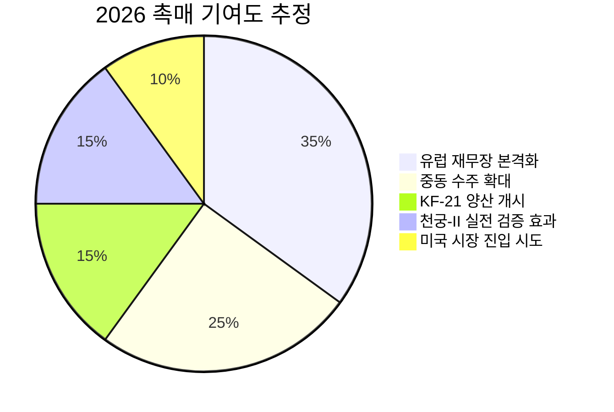
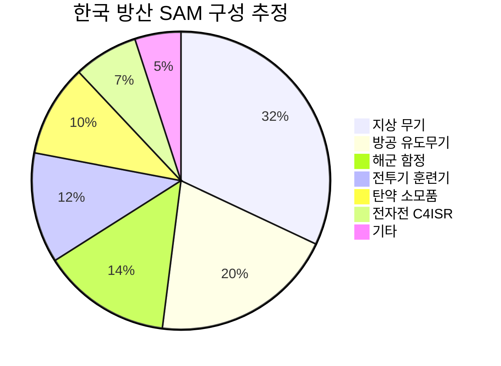
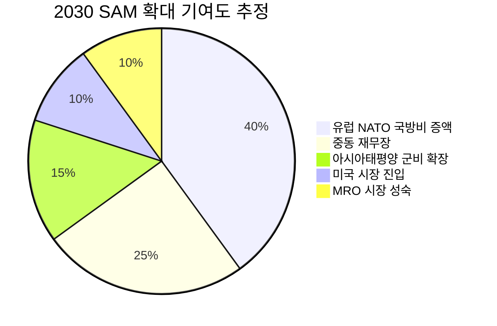
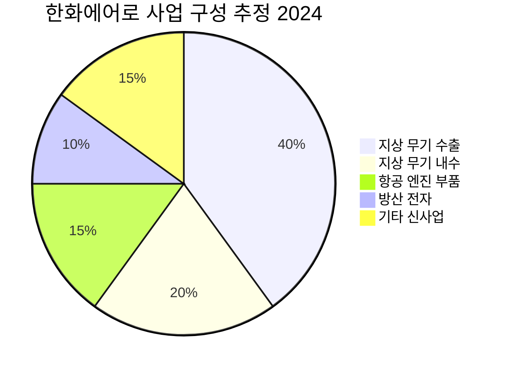

# Executive Summary & Why Now: 왜 지금 한국 방산인가

# Executive Summary & Why Now: 왜 지금 한국 방산인가

> [!abstract] 섹션 요약
> 한국 방산업은 2024년 매출 +31% 성장(세계 3위 성장률), 세계 100대 방산기업 내 비중 1.7%→2.1%, 수주잔고 113조 원 돌파라는 수치를 기록했다. 이것이 우크라이나 전쟁발 일회성 호황인지, 글로벌 안보 패러다임 전환에 따른 **구조적 성장의 초입**인지가 본 리포트의 핵심 투자 질문이다. 결론부터 말하면: **일회성이 아니다.** 그러나 시장이 기대하는 성장 궤적에는 과대 추정 구간이 존재하며, 투자자는 구조적 성장의 확실성과 단기 수출 숫자의 변동성을 분리해서 봐야 한다.

---

## 1. 한국 방산의 현재 좌표: 세계 10위, 그 의미

> [!tip] 핵심 인사이트
> 한국 방산 4사의 세계 100대 기업 내 매출 비중이 1.7%→2.1%로 상승한 것은, **시장 점유율 확대 속도** 측면에서 전 세계 방산 국가 중 가장 가파른 상승 곡선에 있음을 의미한다. 이 수치 자체보다 중요한 것은 **상승의 속도와 방향성**이다.

| 지표 | 2023년 | 2024년 | YoY | 의미 | 출처 |
|------|--------|--------|-----|------|------|
| 방산 4사 합산 매출 | ~108억 달러 [추정] | 🟢 141억 달러 | +31% | 세계 3위 성장률 | SIPRI / 뉴스1 |
| 세계 100대 내 비중 | 1.7% | 🟢 2.1% | +0.4%p | 점유율 가속 구간 | SIPRI / 한국무역협회 |
| 국가별 순위 | (확인 필요) | 🟢 10위 | — | Top-10 첫 진입 | SIPRI / 한국무역협회 |
| 수주 잔고 (빅4+) | ~91조 원 [추정] | 🟢 113.3조 원 | +24.4% | 향후 3-5년 매출 가시성 | 조선비즈 |
| 방산 수출액 (2025) | — | 🟢 152억 달러 | — | 전년 대비 반등 | 이데일리 |
| 수출 대상국 | 4개국 (2022) | 🟢 12개국 (최근) | 3배 | 고객 기반 다변화 | 한국경제 |

**So What?** — 141억 달러라는 절대 규모보다, 세계 100대 기업 총매출 6,790억 달러 중 한국 비중이 불과 2.1%에 불과하다는 점에 주목해야 한다. 이것은 **천장이 매우 높다**는 의미다. 비교하면, 미국은 100대 기업 매출의 약 42%, 중국은 약 18%를 차지한다. 한국이 정부 목표대로 세계 4대 방산국에 진입한다면 점유율 5-6% 수준이 필요하며, 이는 현재 대비 약 2.5-3배의 매출 성장 여지가 있음을 시사한다.

---

## 2. 핵심 투자 논제(Thesis): 일회성인가, 구조적 전환인가

이 질문에 답하기 위해 **사이클적 요인**(Cyclical)과 **구조적 요인**(Structural)을 분리해서 검토한다.

### 2-1. 사이클적 요인 (전쟁 프리미엄)

| 요인 | 성격 | 지속성 평가 | 비고 |
|------|------|------------|------|
| 우크라이나 전쟁 | 🟡 사이클 | 전쟁 종결 시 유럽 긴급 발주 감소 가능 | 그러나 재고 보충 수요는 5-10년 지속 |
| 이란-이스라엘 전쟁 | 🟡 사이클 | 중동 불안정 지속 여부에 따라 변동 | 천궁-II 실전 검증은 영구적 자산 |
| 미국 방산업체 공급 병목 | 🟡 사이클 | 미국 생산능력 확충 시 완화 가능 | 2-3년 내 해소 어려울 전망 |

### 2-2. 구조적 요인 (패러다임 전환)

| 요인 | 성격 | 지속성 평가 | 비고 |
|------|------|------------|------|
| NATO GDP 대비 국방비 목표 상향 (2%→3-5%) | 🟢 구조적 | 최소 10년 이상 | 유럽 재무장은 세대적 전환 |
| 한국산 무기의 가격-성능 포지셔닝 확립 | 🟢 구조적 | 영구적 (브랜드 자산) | 미국 대비 1/2-1/3 가격, 빠른 납기 |
| 실전 검증 완료 (K9, 천궁-II 등) | 🟢 구조적 | 영구적 (레퍼런스 축적) | 천궁-II 96% 요격률, K9 실전 배치 |
| 수출 고객 다변화 (4국→12국) | 🟢 구조적 | 자기강화 사이클 | 레퍼런스가 새 고객을 끌어오는 선순환 |
| KF-21 양산 진입 (2026) | 🟢 구조적 | 20년 이상 프로그램 | 항공우주 카테고리 신규 진입 |
| 현지 생산/기술이전 패키지 전략 | 🟢 구조적 | 고객 Lock-in 효과 | 한화 호주공장, 사우디 합작법인 등 |

> [!verdict] 판단
> **사이클적 요인은 촉발제(trigger)이고, 구조적 요인이 엔진(engine)이다.** 우크라이나 전쟁이 내일 끝나더라도, NATO의 국방비 증액 추세, 유럽의 탈러시아 무기 전환, 한국 무기의 가격-성능 우위는 역전되지 않는다. +31% 성장률이 영원히 지속되진 않겠지만, 구조적 성장률 10-15%의 기저(base)는 유지될 가능성이 높다.

### 2-3. Variant Perception — 시장이 놓치고 있는 것

🟢 구조적 요인 65%

🟡 사이클 25%

🔴 버블 10%

시장 컨센서스는 한국 방산을 여전히 **"전쟁 수혜주"**로 프레이밍하는 경향이 있다. 이 프레이밍의 문제는 전쟁 종결 시나리오에서 자동으로 매도 신호가 발생한다는 것이다. 그러나 본 리서치의 Variant View는 다음과 같다:

1. **유럽 재무장은 전쟁 종결과 무관한 세대적(generational) 전환이다.** 2014년 크림반도 병합 이후 NATO GDP 2% 목표를 세웠으나 대부분의 국가가 미달이었고, 이제 3-5%까지 논의된다. 이 투자는 냉전 종식 이후 30년간 축소된 군사력을 복원하는 과정이며, 최소 10-15년은 소요된다.

2. **한국이 차지하는 포지션은 "프리미엄과 저가 사이의 스위트 스팟"이다.** 미국 무기는 너무 비싸고 납기가 길며, 중국/러시아 무기는 서방 국가가 도입 불가하다. 한국은 NATO 호환성, 실전 검증, 합리적 가격, 신속 납기라는 4가지 조건을 동시에 충족하는 **유일한 대안**이다.

3. **수주 잔고 113조 원은 이미 확보된 미래 매출이다.** 이것은 전쟁이 내일 끝나도 사라지지 않는 계약이다. 이 잔고가 3-5년에 걸쳐 매출로 인식되면서 실적의 하방이 단단하게 보호된다.

---

## 3. Why Now — 이 시점의 촉매(Catalyst) 분석

> [!abstract] 요약
> 한국 방산에 대한 투자 타이밍은 단일 이벤트가 아니라, **복수의 촉매가 동시에 수렴(convergence)하는 희귀한 구간**이라는 점에서 주목해야 한다.

### 촉매 ① — 유럽 재무장 본격화 (NATO 무기수입 +143%)

SIPRI에 따르면 최근 5년간 유럽 NATO 회원국의 무기 수입이 **143% 증가**했고, 이 중 한국 비중이 **8.6%**로 미국에 이어 2위를 차지했다. 특히 폴란드 무기 수입의 **47%**를 한국이 공급했다(SIPRI / KFN뉴스). 이것은 단순한 수치가 아니라, 유럽 군수 공급망에서 한국이 **구조적으로 편입(embedded)**되었음을 의미한다.

> [!note] 참고: 유럽 재무장의 규모감
> 유럽 NATO 국가들이 GDP 대비 국방비를 현재 약 2%에서 3%로 올리는 것만으로도 연간 약 1,500-2,000억 달러의 추가 국방비가 발생한다 [추정]. 이 중 장비 획득 비중(통상 20-30%)을 적용하면 연간 300-600억 달러의 무기 조달 수요가 신규로 생긴다. 한국이 이 중 8-10%만 가져가도 연간 24-60억 달러의 유럽향 수출이 가능하다.

### 촉매 ② — 중동 수주 파이프라인 (UAE 350억 달러 MOU)

이란-이스라엘 전쟁에서 UAE에 배치된 천궁-II가 **96% 요격률**을 기록하며 실전 성능을 입증했다(매일경제, 연합뉴스). 이 결과는:
- 미국 패트리엇 시스템 대비 **가격이 약 1/3 수준**이면서 동등 이상의 실전 성능을 보여줌
- UAE와 **350억 달러 규모 방산 협력 MOU** 체결로 이어짐 [추정 — 한국경제TV]
- 사우디와의 합작법인 설립 검토까지 확대

> [!warning] 리스크 경고
> UAE 350억 달러 MOU는 구속력 있는 계약이 아닌 양해각서(MOU)이다. 실제 계약 전환율은 MOU 규모의 30-50% 수준이 업계 관행이며, 중동 국가의 의사결정 구조상 정치적 변수에 의해 지연/축소될 수 있다. 이 수치를 액면 그대로 실적에 반영하는 것은 과도하다.

### 촉매 ③ — KF-21 보라매 양산 개시 (2026년 3월)

KF-21 양산 1호기 출고는 한국이 **세계 8번째로 4.5세대 이상 초음속 전투기를 독자 설계·제작·실증**할 수 있는 국가가 되었음을 의미한다(에너지경제신문). 핵심 장비 국산화율 65%, AESA 레이더 국산화율 89%는 단순한 조립 생산이 아닌 핵심 기술 내재화를 보여준다.

| KF-21 투자 관점 | 단기 (1-2년) | 중기 (3-5년) | 장기 (5년+) |
|----------------|------------|------------|-----------|
| 매출 기여 | 🟡 제한적 (양산 초기) | 🟢 본격화 (40대/년 목표) | 🟢 수출 가능성 |
| 마진 기여 | 🔴 양산 초기 비용 부담 | 🟡 양산 안정화 시 개선 | 🟢 수출 시 고마진 |
| 전략적 가치 | 🟢 국가 위상 제고 | 🟢 파생형 개발 | 🟢 엔진 독립 달성 시 Game-changer |

### 촉매 ④ — 정책 지원 가속

- 방사청 3축 체계 고도화 **8조 8,387억 원** 투자 (2026년, 뉴스1)
- K-방산 수출 펀드 **1,000억 원** 조성 (방위사업청)
- 방산 스타트업 100개사, 벤처천억기업 30개사 육성 목표 (2030년)
- 방산혁신기업 지정 및 육성체계 대전환 (2026년 1월 시행)

---

## 4. 152억 달러 → 377억 달러: 수출 점프의 현실성 검증

> [!question] 검토 필요
> 2025년 실적 152억 달러(이데일리)에서 2026년 전망 377억 달러(이투데이, 업계 전망)로의 **+148% 점프**는 현실적인가? 이것이 본 리포트에서 가장 신중하게 검증해야 할 숫자다.

### 숫자를 해부한다

| 시나리오 | 2026 수출 전망 | 전제 조건 | 현실성 |
|---------|-------------|---------|--------|
| 🟢 Bull | 377억 달러 | 폴란드 후속 물량 + UAE 대형 계약 + 루마니아 신규 + 사우디 JV 가동 | 🔴 과도하게 낙관적 |
| 🟡 Base | 200-250억 달러 | 기존 수주 잔고 정상 인식 + 중동 일부 계약 전환 | 🟢 현실적 |
| 🔴 Bear | 130-150억 달러 | 대형 계약 지연/연기 + 유럽 재정 제약 | 🟡 가능하나 확률 낮음 |

🟢 Bull 20%

🟡 Base 55%

🔴 Bear 25%

> [!failure] 약점: 377억 달러 전망의 문제점
> 1. **방산 수출은 인식 시점(revenue recognition)이 불규칙하다.** 대형 계약은 수주 시점과 매출 인식 시점이 수년 차이가 나며, 단일 연도에 급증하는 것처럼 보이는 것은 과거 수주의 인도분이 집중될 때 발생한다.
> 2. **MOU와 확정 계약의 혼동.** 업계 전망치에 MOU 수치가 포함되어 있을 가능성이 높다.
> 3. **역사적 선례 부재.** 한국 방산 수출이 1년 만에 2.5배 뛰어본 적이 없다. 2022년 폴란드 대형 계약 당시에도 실제 매출 인식은 수년에 걸쳐 분산되었다.
> 4. **"이투데이" 출처의 "업계 전망"**은 1차 출처(정부 공식 통계나 SIPRI)가 아닌 업계 관계자의 낙관적 추정일 가능성이 높다.

**투자자를 위한 실용적 가이드:** 2026년 수출 377억 달러는 **"달성 가능한 파이프라인의 총합"**이지 **"실현이 확정된 매출"**이 아니다. 현실적인 Base case는 200-250억 달러 수준이며, 이것만으로도 전년 대비 +30-65% 성장으로 매우 견조한 숫자다. 377억 달러에 베팅하기보다는 **200억 달러 이상의 구조적 수출 기반이 확립되었는가**에 초점을 맞추는 것이 합리적이다.

---

## 5. 투자 사이클의 어디에 있는가: S-Curve 포지셔닝

> [!abstract] 요약
> 한국 방산업은 S-Curve의 **초기 급성장 구간(inflection point 직후)**에 위치해 있으며, 성장의 가장 가파른 구간에 진입하고 있다. 그러나 제품 카테고리별로 성숙도가 크게 다르다.

| 제품 카테고리 | S-Curve 위치 | 근거 | 투자 시사점 |
|-------------|------------|------|-----------|
| 지상 무기 (K9, K2) | 🟢 **성숙기 진입** | 양산 안정화, 실전 검증 완료, 다수 수출 계약 | 안정적 현금흐름, 마진 최적화 구간 |
| 방공 시스템 (천궁-II) | 🟢 **급성장기** | 96% 요격률 실전 입증, 중동 수출 급증 | 가장 높은 성장 모멘텀, [[LIG넥스원]] 핵심 |
| 전투기 (KF-21) | 🟡 **초기 성장기** | 양산 1호기 출고, 국산화율 65% | 장기 성장 옵션, 단기 매출 기여 제한 |
| 함정/잠수함 | 🟡 **성장기** | 캐나다 사업 진행, 동남아 수출 | [[한화오션]] 중심, 대형 계약 가능성 |
| 무인·AI 무기 | 🔴 **태동기** | 선진국 대비 기술 격차 | 장기 투자 영역, 스타트업 육성 단계 |
| 우주·항공 | 🔴 **태동기** | LIG D&A 사명 변경, 진입 초기 | 5년+ 장기 테마 |

**세계 100대 기업 내 비중 1.7%→2.1% 상승이 의미하는 것:** S-Curve 관점에서 이것은 **"증명 완료 구간(proof of concept)"에서 "확장 구간(scaling)"으로의 전환점**이다. 비유하면, 한국 방산은 스타트업이 Product-Market Fit을 찾은 직후의 단계에 있다. 이 단계에서 가장 중요한 것은 생산능력(capacity) 확장과 고객 기반 다변화인데, 수출 대상국이 4개→12개로 확대되고 수주 잔고가 113조 원으로 축적된 것은 이 전환이 진행 중임을 확인해준다.

---

## 6. 모멘텀의 지속성: 3가지 시간축 평가

| 시간축 | 핵심 동인 | 리스크 | 확신도 |
|--------|---------|--------|--------|
| **단기 (6-12개월)** | 수주 잔고 매출 인식, 중동 계약 전환, KF-21 양산 관련 뉴스플로우 | 정치 리스크(국내 정치 불확실성), 환율 변동, 대형 계약 지연 | 🟢 높음 |
| **중기 (1-3년)** | 유럽 재무장 본격 인도, 폴란드 후속 물량, MRO 수익 본격화 | 유럽 보호무역 기조 강화, 희토류 공급 리스크, 유럽 자체 방산 육성 | 🟢 높음 |
| **장기 (3-5년+)** | KF-21 수출, 미국 시장 진입(RDP-A), 무인·AI 무기 성숙 | 기술 경쟁 심화(터키·인도 등 부상), 지정학적 긴장 완화 시 국방비 삭감 | 🟡 중간 |

단기 모멘텀 확신도 80/100

중기 모멘텀 확신도 75/100

장기 모멘텀 확신도 55/100

---

## 7. Devil's Advocate — 이 투자 논제가 틀릴 수 있는 시나리오

> [!bear] Bear Case: 한국 방산 성장이 꺾이는 시나리오 (확률 15-20%)
>
> 1. **유럽의 자체 방산 역량 복원이 예상보다 빠를 경우.** 유럽 국가들이 자국 방산업체(라인메탈, KNDS, BAE 등) 증산에 성공하면, 한국은 "급한 불을 끄는 임시 공급자"에서 벗어나지 못할 수 있다. 라인메탈은 이미 우크라이나에 탄약 공장을 건설 중이다.
>
> 2. **미국의 동맹국 무기 수출 통제 강화.** 한국 무기에 포함된 미국산 부품/기술이 ITAR(국제무기거래규칙) 규제 대상이 될 경우, 특정 국가 수출이 차단될 수 있다. 이것은 이미 현실적 리스크로 법률신문에서 보도되었다.
>
> 3. **중국발 희토류/핵심소재 공급 차단.** 국방반도체의 98.9%를 수입에 의존하고, 질화갈륨(GaN) 반도체는 100% 해외 파운드리 의존이라는 것은 극단 시나리오에서 **"K-방산 올스톱"**을 의미한다(한국경제).
>
> 4. **터키·인도 등 신흥 방산국의 가격 경쟁 심화.** 한국의 "가성비" 포지션이 영원하지 않을 수 있다.

> [!bull] Bull Case: 시장 기대를 초과하는 시나리오 (확률 25-30%)
>
> 1. **NATO GDP 대비 국방비 3% 이상 의무화 확정.** 이 경우 유럽 무기 조달 수요가 현재 전망치를 대폭 상회하며, 공급 가능한 한국 방산의 수혜가 극대화된다.
>
> 2. **천궁-II의 글로벌 방공 표준화.** 패트리엇의 대안으로 NATO 국가들이 천궁-II를 표준 도입하면, LIG넥스원 단독으로도 수십조 원 규모의 시장이 열린다.
>
> 3. **KF-21 수출 조기 확정.** 동남아·중동 국가에 KF-21 수출이 양산 2-3년차에 확정되면, 한국 방산의 "항공우주" 카테고리 진입이 확인되며 밸류에이션 리레이팅 촉발.
>
> 4. **한미 RDP-A 협정 체결.** 미국 방산 공급망에 한국 기업이 공식 편입되면, TAM이 한 단계 확장된다.

---

## 8. 크로스 임팩트 — 방산 성장이 파급되는 섹터

한국 방산의 구조적 성장은 방산주에만 국한되지 않는다. 밸류체인 전반에 걸친 투자 기회를 포착해야 한다.

| 영향받는 섹터 | 대표 종목/영역 | 영향 경로 | 강도 |
|-------------|-------------|---------|------|
| **조선** | [[한화오션]], [[HD현대중공업]] | 함정/잠수함 수출, 미 해군 MRO | 🟢 강함 |
| **소재/부품** | [[풍산]], 특수강 업체 | 탄약 수요 증가, 방산 소재 수출 | 🟢 강함 |
| **반도체** | [[한화시스템]], 국방반도체 관련 | 국방반도체 국산화, AESA 레이더 | 🟡 중간 |
| **드론/로봇** | 니어스랩, 파블로항공 등 | 방산 스타트업 IPO, AI 드론 | 🟡 중간 |
| **철강** | [[POSCO홀딩스]], [[현대제철]] | 방산 특수강 고부가가치 전환 | 🟡 중간 |
| **우주** | AP위성, 위성 관련 | 위성 SAR, 우주 방위 | 🔴 초기 |

---

## 9. Margin of Safety — 현재 가격에 얼마나 반영되었나

> [!warning] 리스크 경고
> 한국 방산주는 2024-2025년 주가가 이미 대폭 상승한 상태다. [[한화에어로스페이스]]는 2024년 한 해 동안 100%+ 상승했고, [[현대로템]]은 300%+ 급등했다. 시장은 이미 상당 부분의 성장을 가격에 반영하고 있다. "구조적 성장이 맞다"와 "지금 가격이 매력적이다"는 별개의 질문이다.

| 요소 | 반영 수준 | 설명 |
|------|---------|------|
| 유럽 재무장 수혜 | 🟢 60-70% 반영 | 폴란드 대형 계약 등 이미 주가에 반영 |
| 중동 수출 확대 | 🟡 30-40% 반영 | MOU 단계, 확정 계약 시 추가 상승 여지 |
| KF-21 수출 | 🟡 20-30% 반영 | 양산 초기, 수출 확정 시 리레이팅 |
| 미국 시장 진입 | 🔴 10% 미만 반영 | RDP-A 미확정, 옵션 밸류 |
| 마진 구조 전환 | 🟡 40-50% 반영 | 수출 비중 증가에 따른 OPM 개선 진행 중 |

**Margin of Safety 판단:** 한국 방산은 **성장 스토리의 확실성은 높으나, 밸류에이션 안전마진은 축소된 상태**다. 신규 진입보다는 조정 시 매수 전략이 유효하며, 대형 계약 확정(특히 중동)이나 KF-21 수출 뉴스플로우가 다음 레그업의 촉매가 될 것이다. 가장 큰 안전마진은 **수주 잔고 113조 원이 제공하는 실적의 하방 보호**에 있다 — 설령 신규 수주가 일시 둔화되더라도, 기존 잔고만으로 3-5년간의 매출 성장이 보장된다.

---

## 10. Incentive Analysis — 각 이해관계자의 숨겨진 동기

| 이해관계자 | 공식적 입장 | 실제 인센티브 | 투자자가 주의할 점 |
|-----------|----------|------------|-----------------|
| **한국 정부** | "2030년 세계 4대 방산국" | 수출 실적 = 외교적 레버리지 + 무역수지 개선 | 정치적 동기로 수출 목표를 과대 설정할 유인 |
| **방산 대기업** | "글로벌 종합 방산업체 도약" | 내수 원가보상제(OPM ~9%)에서 탈출 → 수출(OPM 20%+)로 포트폴리오 전환 | 수출 마진 과대 보고 가능성 주시 |
| **유럽 NATO 국가** | "안보 대안으로서 한국 무기" | 미국 의존도 축소 + 자국 방산 재건 시간 벌기 | 한국은 "임시 공급자"일 수 있음. 장기 Lock-in 여부 확인 필요 |
| **중동 국가** | "방위력 현대화" | 기술 이전 + 현지 생산 + 경제적 오프셋 | 실제 구매보다 협상 레버리지로 MOU 활용 가능 |
| **방산 중소기업** | "수출 호황의 수혜" | 대기업 하청 구조에서 독자 수출 역량 확보 | 매출의 57%가 대기업, 중소기업은 19%에 불과 — 양극화 심화 |

---

## 11. 리포트 전체의 투자 핵심 논거 선제 제시

> [!verdict] 투자 논제(Thesis) 요약
>
> **한국 방산업은 "전쟁 수혜"를 넘어 "글로벌 방산 공급망의 구조적 편입"이라는 전환점에 있다.** 이것이 본 리포트의 중심 논제다.
>
> **근거:**
> 1. NATO 재무장은 10-15년 장기 사이클이며, 한국은 가격-성능-납기의 스위트 스팟에 유일하게 위치
> 2. 수주 잔고 113조 원이 3-5년 실적의 하방을 보호
> 3. 천궁-II 실전 검증, KF-21 양산, 수출국 12개국 확대 등 다중 촉매 수렴
> 4. 내수→수출 전환에 따른 마진 구조적 개선 (OPM 9%→20%+ 가능)
>
> **리스크:**
> 1. 밸류에이션이 이미 상당 부분 반영 — 신규 진입 시 안전마진 축소
> 2. 핵심 소재/반도체의 해외 의존도 (국방반도체 98.9% 수입)
> 3. 2026년 377억 달러 수출 전망은 과대 추정 구간 포함
> 4. 유럽 자체 방산 역량 복원 시 "임시 공급자" 리스크
>
> **전략:**
> - 구조적 성장에 대한 확신도는 높으나, 진입 타이밍과 밸류에이션 규율이 중요
> - 수주 잔고 기반의 실적 가시성이 가장 높은 [[한화에어로스페이스]], [[LIG넥스원]]이 핵심 축
> - 중동 대형 계약 확정, KF-21 수출 뉴스는 다음 밸류에이션 리레이팅 촉매
> - 공급망(소재/부품) 및 MRO 관련 기업은 아직 시장이 충분히 주목하지 않은 영역

🟢 Bull 30%

🟡 Base 50%

🔴 Bear 20%

| 시나리오 | 2026 방산4사 합산 매출 | 업사이드/다운사이드 | 핵심 전제 |
|---------|---------------------|------------------|---------|
| 🟢 Bull | 50조 원+ | 현재 대비 +30%+ | NATO 3%+ 확정, 중동 대형 계약 전환, KF-21 조기 수출 |
| 🟡 Base | 40-47조 원 | 현재 대비 +10-20% | 기존 수주 정상 인식, 유럽/중동 점진적 확대 |
| 🔴 Bear | 30-35조 원 | 현재 대비 -10-15% | 대형 계약 지연, 유럽 보호무역 강화, 공급망 차질 |

> [!note] 참고: 다음 섹션 프리뷰
> 이어지는 섹션에서는 기업별 심층 분석(한화에어로스페이스, LIG넥스원, 현대로템, KAI), 밸류체인 상세 매핑, 밸류에이션 프레임워크, 그리고 구체적인 리스크 시나리오와 헤지 전략을 다룰 예정이다. 본 Executive Summary에서 제시한 투자 논제가 각 기업 수준에서 어떻게 구현되고 있는지를 검증하는 것이 리포트의 핵심 구조다.

---

# 시장 구조 해부: TAM·SAM·SOM과 글로벌 수요 지형 변화

# 시장 구조 해부: TAM·SAM·SOM과 글로벌 수요 지형 변화

> [!abstract] 섹션 요약
> 글로벌 방산 시장(TAM 6,790억 달러)에서 한국의 현재 SOM은 141억 달러(2.1%)에 불과하지만, 한국이 실질적으로 경쟁 가능한 SAM은 1,200~1,800억 달러로 추정되며 시장침투율은 약 8~12%에 해당한다. NATO 국방비 목표가 GDP 대비 2%에서 3%로 상향될 경우, SAM은 추가로 300~600억 달러 확대되어 한국 방산의 구조적 성장 천장이 한 단계 더 높아진다. 폴란드 47% 의존 구조는 3~5년은 견고하나, 유럽 자체 방산 복원 속도가 다변화의 핵심 변수다.

---

## 1. TAM 해부: 6,790억 달러 시장의 실체

> [!tip] 핵심 인사이트
> TAM 6,790억 달러는 세계 100대 방산기업의 "무기 관련 매출 합산"이다. 전 세계 국방비 지출 총계와 혼동하면 안 된다. 국방비의 대부분은 인건비·운영비이며, 실제 장비 획득(조달) 비중은 통상 20~30%다. 즉, TAM의 적절한 정의는 용도에 따라 달라진다.

| TAM 정의 방법 | 수치 | 산출 근거 | 한국 방산 관점 의미 | 출처 |
|--------------|------|---------|------------------|------|
| 세계 100대 방산기업 무기 매출 | 🟢 6,790억 달러 | SIPRI 2025.12 보고서, YoY +5.9% | 가장 보수적·신뢰성 높은 TAM | SIPRI / 한국무역협회 |
| 전 세계 국방비 지출 | 🟡 (1차 출처 확인 필요) | 인건비·운영비 포함 | 과대 측정 — TAM으로 사용 부적절 | (확인 필요) |
| 글로벌 무기 조달 시장 | 🟡 5,400~8,100억 달러 [추정] | 국방비의 20~30% 적용 | 실제 무기 구매 가능 규모 | [추정] |

**So What?** — 투자자가 사용해야 할 TAM은 **6,790억 달러**(100대 기업 매출)다. 전 세계 국방비 총계는 TAM으로 쓰기엔 과대하다. 100대 기업 매출이 전체 방산 시장의 80~85%를 커버한다고 가정하면, 글로벌 방산 제품·서비스 시장의 실질 규모는 약 **8,000~8,500억 달러** [추정]로 볼 수 있다.

### TAM의 성장 동인: 구조적 상승 기조

| 동인 | 영향 규모 | 시간축 | 확실성 |
|------|---------|--------|--------|
| NATO GDP 대비 국방비 2%→3% 상향 논의 | 연간 +1,500~2,000억 달러 추가 국방비 [추정] | 5~15년 | 🟢 높음 |
| 아시아-태평양 군비 경쟁 (중국·일본·호주·인도) | 연간 +500~800억 달러 증가 추세 [추정] | 3~10년 | 🟢 높음 |
| 중동 재무장 (사우디 비전 2030, UAE) | 연간 +300~500억 달러 [추정] | 3~7년 | 🟡 중간 |
| 미국 국방비 재확대 (트럼프 2기) | 연간 +500~1,000억 달러 가능 [추정] | 1~4년 | 🟡 중간 |

> [!note] 참고: TAM 성장률 전망
> SIPRI 기준 2024년 100대 기업 매출 성장률은 +5.9%였다. 지정학적 긴장이 완화되지 않는 Base case에서, 2025~2028년 TAM CAGR은 **5~8%**가 합리적 추정이다 [추정]. 이는 TAM이 2028년까지 약 **8,500~9,200억 달러**로 확대될 수 있음을 의미한다.

---

## 2. SAM 산정: 한국이 실질적으로 경쟁 가능한 시장은 얼마인가

> [!abstract] 요약
> TAM 6,790억 달러 중 한국 방산이 "제품 경쟁력·정치적 접근성·NATO 호환성" 기준으로 실질 경쟁 가능한 SAM은 **1,200~1,800억 달러**로 추정된다. 이는 TAM의 약 18~27%에 해당한다.

### 2-1. SAM 산정 방법론

한국 방산의 SAM은 다음 3가지 필터를 순차 적용하여 산출한다:

**필터 1: 정치적 접근 불가 시장 제외**
- 미국 내수 시장 (~3,000억 달러): 미국은 자국 방산업체 우선. 한미 RDP-A 미체결 상태에서 대부분 접근 불가
- 중국 내수 시장 (~1,000억 달러): 정치적 차단
- 러시아 + 동맹국 시장 (~400억 달러): 제재 및 정치적 차단
- **→ 접근 가능 시장: 약 2,400~2,600억 달러**

**필터 2: 한국 제품 경쟁력 보유 세그먼트**

| 세그먼트 | 글로벌 규모 [추정] | 한국 경쟁력 | SAM 편입 비율 [추정] |
|---------|-----------------|-----------|------------------|
| 지상 무기 (전차·자주포·장갑차) | ~800억 달러 | 🟢 최상위 (K9·K2 실전 검증) | 60~70% |
| 방공/유도무기 (미사일·방공) | ~600억 달러 | 🟢 강함 (천궁-II 96% 요격) | 40~50% |
| 해군 함정/잠수함 | ~500억 달러 | 🟡 중간 (한화오션·장보고급) | 30~40% |
| 전투기/훈련기 | ~700억 달러 | 🟡 초기 (KF-21, FA-50) | 15~25% |
| 탄약/소모품 | ~300억 달러 | 🟢 강함 (풍산 등) | 50~60% |
| 전자전/C4ISR | ~400억 달러 | 🟡 중간 | 20~30% |
| 무인/드론/AI | ~200억 달러 | 🔴 초기 | 10~15% |
| MRO/후속군수지원 | ~600억 달러 | 🟡 성장 중 | 15~25% |

**필터 3: NATO 호환성 및 수출 통제(ITAR) 제약**
- 한국 무기에 미국산 부품 포함 시 ITAR 재수출 허가 필요 (법률신문)
- 일부 국가 대상 수출이 미국 정치적 의사결정에 종속

### 2-2. SAM 최종 산정

| SAM 시나리오 | 규모 | 전제 |
|-------------|------|------|
| 🔴 보수적 (Conservative) | **~1,200억 달러** | 현재 제품 포트폴리오 기준, ITAR 제약 반영 |
| 🟡 기본 (Base) | **~1,500억 달러** | KF-21 수출 시작, MRO 시장 본격 진입 포함 |
| 🟢 낙관적 (Optimistic) | **~1,800억 달러** | RDP-A 체결, 미국 MRO 편입, 무인체계 성숙 |

🟢 Optimistic 25%

🟡 Base 50%

🔴 Conservative 25%

---

## 3. SOM과 시장침투율: 141억 달러는 어디에 위치하는가

> [!tip] 핵심 인사이트
> SOM 141억 달러를 TAM(6,790억 달러) 대비로 보면 침투율 2.1%에 불과하지만, 이것은 의미 없는 비교다. SAM(~1,500억 달러) 대비 침투율은 **약 9.4%**이며, 이것이 실질적인 시장 점유 수준이다. 글로벌 방산 시장에서 후발주자가 SAM 대비 10% 근처에 진입했다는 것은 **S-Curve 상의 가속 구간(acceleration phase) 직전**에 해당한다.

| 침투율 비교 | 수치 | 의미 | 투자 시사점 |
|-----------|------|------|-----------|
| SOM / TAM | 141 / 6,790 = **2.1%** | 전체 시장 대비 아직 미미 | 성장 천장이 매우 높음 |
| SOM / SAM (Base) | 141 / 1,500 = **~9.4%** | 접근 가능 시장 내 유의미한 점유율 | 10% 돌파 시 인지도·레퍼런스 효과 가속 |
| SOM / SAM (Conservative) | 141 / 1,200 = **~11.8%** | 보수적 기준으로도 견조한 침투 | 신규 진입 장벽이 높은 방산에서 높은 수치 |

### SOM 성장 궤적 전망

| 시점 | SOM 전망 [추정] | SAM 대비 침투율 [추정] | 핵심 동인 |
|------|---------------|---------------------|---------|
| 2024년 (실적) | 🟢 141억 달러 | ~9% | 유럽 대형 계약 인도 본격화 |
| 2025년 (실적) | 🟢 152억 달러 | ~10% | 수출 반등, 중동 계약 일부 전환 |
| 2026년 (전망) | 🟡 200~250억 달러 (Base) | ~13~17% | 기존 수주잔고 인식 + 신규 중동 계약 |
| 2028년 (전망) | 🟡 280~350억 달러 [추정] | ~17~22% | KF-21 수출, MRO 수익 본격화 |
| 2030년 (목표) | 🟡 400억 달러+ [추정] | ~20~25% | 정부 목표 "세계 4대 방산국" |

> [!warning] 리스크 경고
> 2026년 377억 달러 전망(이투데이, 업계 전망)은 Executive Summary에서 분석한 바와 같이 과대 추정 구간이 포함되어 있다. Base case 200~250억 달러가 현실적이며, 이것만으로도 SAM 침투율이 13~17%로 뛰어 매우 견조한 성장이다. 377억 달러를 모델에 반영하는 것은 위험하다.

SAM 침투율 (2026E Base) ~15% / 목표 25%+

---

## 4. NATO 국방비 목표 상향(2%→3%)의 정량적 영향

> [!abstract] 요약
> NATO GDP 대비 국방비 목표가 2%에서 3%로 상향되는 것은 한국 방산 SAM을 **구조적으로 확대**하는 가장 중요한 매크로 변수다. 이것이 확정될 경우, 한국 방산의 연간 수출 잠재력(addressable export)은 현재 대비 **40~80% 확대**될 수 있다.

### 4-1. 유럽 NATO 국방비 추가 지출 시뮬레이션

| 시나리오 | GDP 대비 국방비 | 유럽 NATO 추가 국방비 [추정] | 장비 획득분 (20~30%) | 한국 점유율 (8.6%) 적용 시 |
|---------|-------------|------------------------|-------------------|------------------------|
| 현재 (2% 미달 국가 다수) | ~1.8% 평균 [추정] | 기준선 | — | — |
| 목표 2% 완전 달성 | 2.0% | +약 400~600억 달러 | +80~180억 달러 | +7~15억 달러 |
| 목표 3% 달성 | 3.0% | +약 1,500~2,000억 달러 | +300~600억 달러 | +26~52억 달러 |
| 극단 시나리오 (5%) | 5.0% | +약 4,000억 달러+ | +800억 달러+ | +69억 달러+ |

> [!note] 참고: 산출 근거
> 유럽 NATO 28개국(미국 제외)의 합산 GDP는 약 20조 달러 [추정]. 1%p 증가 = ~2,000억 달러 추가 국방비. 장비 획득 비중 20~30%, 한국 점유율 8.6%(현재 SIPRI 수치) 적용. 실제로는 한국 점유율이 상승 추세이므로 10~12%까지 적용 가능.

**투자적 함의:** NATO 3% 목표 달성 시, 유럽에서만 한국 방산의 연간 수출 잠재력이 **26~52억 달러 추가**된다. 이는 현재 한국 방산 4사 전체 매출(141억 달러)의 18~37%에 해당하는 거대한 규모다. 이 시나리오에서 가장 큰 수혜를 받는 것은 지상 무기([[한화에어로스페이스]], [[현대로템]])와 방공 시스템([[LIG넥스원]])이다.

### 4-2. NATO 국방비 상향의 현실성 평가

| 평가 요소 | 판단 | 근거 |
|---------|------|------|
| 정치적 의지 | 🟢 강함 | 트럼프 2기 압박 + 러시아 위협 지속, 다수 국가가 3% 이상 약속 |
| 재정 여력 | 🟡 제약 존재 | 유럽 재정적자·국채 부담, 독일·프랑스 등은 2.5% 달성도 도전적 |
| 실현 시점 | 🟡 점진적 | 2%는 2027~2028년까지 대부분 달성 전망, 3%는 2030년 이후 [추정] |
| 집행 속도 | 🟡 느릴 가능성 | 국방비 증액 결정과 실제 무기 조달 사이 2~5년 시차 |

NATO 3% 달성 확률 65/100 (2030년까지)

---

## 5. 지역별 수요 지형 매핑: 한국 방산의 세그먼트별 경쟁 포지션

### 5-1. 유럽 (NATO) — 핵심 성장 엔진

> [!success] 강점
> NATO 무기 수입 중 한국 비중 **8.6%로 미국에 이어 2위**(SIPRI). 이는 5년 전 사실상 0%에 가까웠던 것에서 급등한 수치로, 한국이 유럽 방산 공급망에 **구조적으로 편입(embedded)**되었음을 의미한다.

| 국가 | 한국산 비중 | 핵심 품목 | 추가 수주 가능성 | 리스크 |
|------|-----------|---------|---------------|--------|
| 🇵🇱 **폴란드** | 🟢 47% (무기 수입 중) | K2 전차, K9 자주포, 천무, FA-50 | 🟢 높음 — 후속 물량 대규모 | 과도한 단일국 의존 |
| 🇷🇴 루마니아 | 🟡 진행 중 | K9 자주포, 천궁-II 논의 중 | 🟢 높음 — 동유럽 확장 거점 | 유럽 보호무역 기조 |
| 🇳🇴 노르웨이 | 🟡 진입 단계 | K9 변형 (동계전 사양) | 🟡 중간 | 북유럽 자체 방산 생태계 |
| 🇫🇮 핀란드 | 🟡 진입 단계 | K9 자주포 | 🟡 중간 | NATO 신규 가입국, 수요 확인 필요 |
| 🇩🇪 독일 | 🔴 낮음 | — | 🔴 낮음 | 자국 방산(라인메탈, KNDS) 보호 |
| 🇬🇧 영국 | 🔴 낮음 | — | 🔴 낮음 | BAE 중심 자국 공급망 |

**폴란드 47% 의존 구조의 지속 가능성 분석:**

> [!question] 검토 필요: 폴란드 집중 리스크
> 폴란드가 무기 수입의 47%를 한국에서 조달하는 것은 역사적으로 유례없는 수준이다. 이 구조의 지속 가능성을 판단하는 핵심 변수는:
> 
> **지속 가능한 이유:**
> 1. 폴란드는 NATO 내 최대 지상군 목표(30만명+) — 대규모 장비 소요가 10년+ 지속
> 2. K2·K9의 폴란드 현지 생산 라인 구축 → 전환 비용(switching cost) 발생
> 3. 미국·독일 장비는 납기 5~7년, 한국은 2~3년 → 시간적 대안 부재
> 4. 이미 운용 인프라·훈련 체계가 한국산 기준으로 구축 중
>
> **비중 감소 가능 요인:**
> 1. 유럽 자체 생산능력 복원(라인메탈 증산, KNDS 독-불 합작)
> 2. 폴란드 자국 방산업체(PGZ) 역량 강화 의지
> 3. 한국 비중 47%는 과도기적 "긴급 조달" 특성 반영 — 장기적으로는 30~35%로 정상화 가능 [추정]

| 폴란드 향 수출 시나리오 | 향후 5년 연평균 [추정] | 전제 |
|----------------------|-------------------|------|
| 🟢 Bull | 60~80억 달러/년 | 후속 계약 + 탄약 + MRO 풀 패키지 |
| 🟡 Base | 35~50억 달러/년 | 기존 계약 인도 + 일부 후속 |
| 🔴 Bear | 15~25억 달러/년 | 기존 계약만, 추가 수주 정체 |

**차기 대규모 수주 후보국:**

| 후보국 | 잠재 규모 [추정] | 한국 경쟁력 | 확률 | 핵심 품목 |
|--------|---------------|-----------|------|---------|
| 🇷🇴 루마니아 | 50~100억 달러 | 🟢 강함 | 🟢 60%+ | K9, 방공 시스템 |
| 🇬🇷 그리스 | 30~50억 달러 | 🟡 중간 | 🟡 30~40% | K2 전차, 방공 |
| 🇪🇪 에스토니아·발트 3국 | 10~30억 달러 | 🟢 강함 | 🟢 50%+ | K9 변형, 탄약 |
| 🇮🇹 이탈리아 | 20~40억 달러 | 🔴 낮음 | 🔴 15% | 자국 방산 레오나르도 우선 |

### 5-2. 중동 (UAE·사우디) — 고마진 시장, 그러나 변동성 큼

> [!warning] 리스크 경고
> 중동은 계약 규모가 크고 마진이 높지만, **MOU→확정 계약 전환율이 30~50%** 수준이며, 정치적 의사결정 구조로 인해 계약 지연/취소 리스크가 유럽보다 크다. UAE 350억 달러 MOU를 확정 수주로 반영하면 안 된다.

| 국가 | 현황 | 핵심 품목 | 잠재 규모 [추정] | 한국 경쟁 포지션 |
|------|------|---------|---------------|---------------|
| 🇦🇪 **UAE** | 🟢 천궁-II 실전 배치, 350억 달러 MOU | 천궁-II, K2, 함정 | MOU 350억 × 전환율 30~50% = **100~175억 달러** | 🟢 최강 — 96% 요격률 실전 검증 |
| 🇸🇦 사우디 | 🟡 합작법인 검토 중 | K2, 방공, 함정 | 50~100억 달러+ | 🟡 중간 — 비전 2030 현지화 요구 높음 |
| 🇮🇶 이라크 | 🟡 탐색 중 | K9, 천궁 | 20~40억 달러 | 🟡 중간 — 미국 영향권 |

**중동 시장침투 가속 여부를 결정짓는 핵심 변수:**

| 변수 | 영향 방향 | 중요도 |
|------|---------|--------|
| 천궁-II 실전 성능 지속 입증 | 🟢 가속 | ⭐⭐⭐⭐⭐ |
| 기술이전·현지 생산 패키지 수준 | 🟢 / 🔴 양면적 | ⭐⭐⭐⭐ |
| 미국 ITAR 재수출 허가 이슈 | 🔴 제동 | ⭐⭐⭐⭐ |
| 유가·재정 상황 | 🟡 변동 | ⭐⭐⭐ |
| 한-중동 외교 관계 (이란 변수) | 🟡 양면적 | ⭐⭐⭐ |
| 오프셋(offset) 요구 수준 | 🔴 마진 압박 | ⭐⭐ |

> [!note] 참고: 중동 오프셋의 투자적 의미
> 중동 국가들은 대형 방산 계약 시 총 계약금의 30~60%에 해당하는 오프셋(offset) — 현지 생산, 기술이전, 역투자 — 을 요구한다 [추정]. 이것은 표면적 계약 규모 대비 **실제 한국 방산 기업에 귀속되는 매출·이익이 축소**됨을 의미한다. 사우디 합작법인의 경우, 한화가 지분 50% 이하를 보유하게 되면 매출 연결 여부도 달라진다 (확인 필요).

### 5-3. 아시아·오세아니아 — 견실한 기존 시장

| 국가 | 핵심 품목 | 성장 전망 | 핵심 변수 |
|------|---------|---------|---------|
| 🇦🇺 호주 | 레드백 IFV, 한화오션 함정 | 🟢 안정적 성장 | 한화 호주 현지 공장 가동 |
| 🇮🇩 인도네시아 | KF-21 공동개발, 잠수함 | 🟡 불확실 | 인니 분담금 지연 이력 |
| 🇵🇭 필리핀 | FA-50, 호위함 | 🟢 확대 중 | 남중국해 긴장 |
| 🇲🇾 말레이시아 | FA-50, 경비함 | 🟡 탐색 중 | 예산 제약 |
| 🇵🇪 페루 | K808 백호 장갑차 | 🟡 첫 진출 | 중남미 레퍼런스 확보 |

### 5-4. 미국 — 가장 큰 옵션 가치

> [!question] 검토 필요
> 미국 시장은 연간 약 3,000억 달러 규모의 방산 조달이 이뤄지는 세계 최대 시장이나, 한국 기업의 접근은 극히 제한적이다. RDP-A(상호방산조달협정) 체결이 이 시장의 문을 여는 핵심 열쇠다.

| 미국 시장 기회 | 규모 [추정] | 현실성 | 시기 |
|-------------|-----------|--------|------|
| 미 해군 MRO (함정 정비) | 50~100억 달러/년 | 🟡 중간 | 2~4년 내 |
| LIG넥스원 비궁 미군 채택 | 1~5억 달러 | 🟡 초기 | 2~3년 내 |
| 탄약 공급 (풍산 155mm) | 10~30억 달러 | 🟢 가능성 높음 | 1~2년 내 |
| RDP-A 체결 후 장비 공급 | (확인 필요) | 🔴 불확실 | 3~5년+ |

**Variant Perception — 미국 시장:** 시장은 미국 시장 진입을 "먼 미래의 옵션"으로 치부하지만, 실제로는 이미 **탄약과 MRO 분야에서 구체적 진입이 시작**되고 있다. LIG넥스원의 비궁이 미 해군 구매 리스트에 오른 것(한국경제)은 상징적이다. RDP-A가 체결되면 SAM이 한 단계 확장되며, 이것은 현재 밸류에이션에 거의 반영되지 않은 **순수 옵션 가치**다.

---

## 6. 세그먼트별 경쟁력 매트릭스: 가격·성능·납기의 삼각 비교

> [!abstract] 요약
> 한국 방산의 핵심 경쟁력은 "미국 무기의 70~80% 성능을 30~50%의 가격에, 2~3배 빠른 납기로" 제공한다는 데 있다. 이 포지셔닝은 **프리미엄과 저가 사이의 유일한 스위트 스팟**이며, 현재 이 포지션을 점유하는 다른 국가가 없다.

| 경쟁 요소 | 🇺🇸 미국 | 🇰🇷 한국 | 🇹🇷 터키 | 🇮🇳 인도 | 🇨🇳 중국 |
|---------|---------|---------|---------|---------|---------|
| **가격** | 🔴 최고가 (100) | 🟢 중저가 (40~60) | 🟢 저가 (30~50) | 🟢 저가 (35~55) | 🟢 최저가 (25~40) |
| **성능** | 🟢 최고 (100) | 🟢 준최고 (75~85) | 🟡 중간 (55~70) | 🟡 중간 (50~65) | 🟡 중간 (60~75) |
| **납기** | 🔴 5~7년 | 🟢 1.5~3년 | 🟡 2~4년 | 🔴 4~6년 | 🟡 2~3년 |
| **NATO 호환성** | 🟢 완벽 | 🟢 높음 | 🟡 부분적 | 🔴 낮음 | 🔴 불가 |
| **실전 검증** | 🟢 광범위 | 🟢 증가 중 (96% 요격) | 🟡 제한적 (TB2 드론) | 🔴 미미 | 🔴 미미 |
| **기술이전 의향** | 🔴 매우 보수적 | 🟢 적극적 | 🟢 적극적 | 🟡 중간 | 🟢 적극적 |
| **정치적 제약** | 🟡 ITAR, 의회 승인 | 🟡 미국 부품 ITAR 이슈 | 🟡 일부 제재 | 🟡 러시아 연계 우려 | 🔴 서방 도입 불가 |

> [!verdict] 판단: 한국의 경쟁 포지션
> 
> 한국은 **"고성능-중저가-빠른 납기-NATO 호환-기술이전 적극"**이라는 5가지 조건을 동시에 충족하는 **유일한 공급자**다.
> 
> - **미국 대비:** 성능은 75~85% 수준이지만 가격이 40~60%, 납기가 2~3배 빠름
> - **터키 대비:** 가격은 유사하나 성능·품질·실전 검증에서 우위
> - **중국 대비:** 가격은 높지만, 서방 시장 접근 자체가 불가능한 중국과 경쟁 구도 아님
> - **인도 대비:** 납기·품질 모두 우위, 인도는 아직 본격적 수출국이 아님
>
> **위협 요인:** 터키(바이칼 TB2 드론 성공, 알타이 전차)가 가장 직접적 경쟁자로 부상 중. 3~5년 내 터키의 지상 무기·드론 분야에서 가격 경쟁이 심화될 수 있다.

---

## 7. SAM 확대 시나리오: NATO 3%가 바꾸는 시장의 모양

> [!abstract] 요약
> NATO 국방비 목표 상향은 단순히 "돈이 많아지는 것"이 아니라, **수요의 질이 바뀌는 것**이다. 긴급 재고 보충(stockpile replenishment)에서 체계적 현대화(systematic modernization)로 전환되며, 이는 한국 방산에 복합적 영향을 미친다.

### 7-1. 수요 질적 전환의 투자적 함의

| 수요 유형 | 현재 (2024~2026) | 미래 (2027~2030) | 한국 방산 영향 |
|---------|----------------|----------------|-------------|
| 긴급 재고 보충 | 🟢 주력 (우크라이나 지원분) | 🟡 감소 | 단기 마진 최적화, 장기 둔화 |
| 체계적 현대화 | 🟡 시작 단계 | 🟢 본격화 | 장기 계약, MRO 수익 증가 |
| 차세대 무기 R&D | 🔴 제한적 | 🟢 증가 | 한국 참여 여부 불확실 |
| MRO/훈련/후속지원 | 🟡 초기 | 🟢 급성장 | 수출 무기 기반 반복 수익 |

**1차 효과:** NATO 국방비 증액 → 무기 조달 예산 확대 → 한국 방산 수출 기회 증가

**2차 효과 (더 중요):** 
1. 유럽에 이미 배치된 K9·K2·천궁-II의 **MRO 수요가 20년+ 반복 수익으로 축적**됨
2. 초기 도입국의 만족도가 **주변국 도미노 효과**를 촉발 (폴란드→루마니아→그리스→발트)
3. 유럽 현지 생산 확대 시 한국 기업이 **공급망 관리자(integrator) 역할**로 전환 가능
4. NATO 표준화가 진행되면 한국산 장비의 **상호운용성(interoperability) 프리미엄** 발생

### 7-2. SAM 확대 시뮬레이션 (2024→2030)

| 연도 | SAM (Base) [추정] | 증가 동인 | SOM 전망 [추정] | 침투율 [추정] |
|------|-----------------|---------|---------------|-------------|
| 2024 | ~1,500억 달러 | 현재 기준 | 141억 달러 | 9.4% |
| 2026 | ~1,700억 달러 | NATO 2% 완전 달성 시작 | 200~250억 달러 | 12~15% |
| 2028 | ~2,000억 달러 | NATO 2.5%+ 진행, 중동 확대 | 280~350억 달러 | 14~18% |
| 2030 | ~2,200~2,500억 달러 | NATO 3% 일부 달성, KF-21 수출 | 350~450억 달러 | 16~20% |

---

## 8. Devil's Advocate: SAM·SOM 분석의 약점과 반대 논리

> [!bear] Bear Case: SAM이 축소되는 시나리오
>
> **1. 유럽의 "Buy European" 기조 강화**
> EU는 자체 방산 역량 복원을 추진 중이다. EDIRPA(유럽 방산 산업 강화 법안)와 같은 제도적 장치가 확대되면, 유럽 국가들이 EU 역내 방산업체에서 조달하도록 유인·강제할 수 있다. 이 경우 한국의 유럽향 SAM이 **30~50% 축소**될 수 있다.
>
> **2. 라인메탈·KNDS의 증산 성공**
> 독일 라인메탈은 연매출 100억 유로 목표를 선언했고, KNDS(독-불 합작)도 전차 생산을 확대 중이다. 이들이 납기를 3~4년으로 단축하면, 한국의 "빠른 납기" 경쟁력이 약화된다.
>
> **3. ITAR 규제 강화**
> 미국이 동맹국 무기 수출에 대한 기술 통제를 강화하면, 한국산 무기에 포함된 미국산 부품·기술 때문에 특정 국가 수출이 차단될 수 있다. 이것은 SAM 자체를 축소시키는 **시스템적 리스크**다.
>
> **4. 지정학적 긴장 완화**
> 러시아-우크라이나 휴전, 중동 안정화가 동시에 발생하면, NATO의 국방비 증액 압박이 약화되고 유럽 재무장 모멘텀이 감속될 수 있다.

> [!bull] Bull Case: SAM이 예상 이상으로 확대되는 시나리오
>
> **1. NATO 5% 논의가 현실화**
> 트럼프 행정부가 NATO 회원국에 GDP 5% 국방비를 요구한 것은 과도하지만, 실제로 3.5~4% 수준이 "뉴노멀"이 되면 SAM은 현재 추정의 **1.5~2배**로 확대된다.
>
> **2. 미국 RDP-A 체결 + 미 공급망 편입**
> 한국이 미국 방산 공급망에 공식 편입되면, TAM에서 제외했던 **미국 내수 시장 3,000억 달러의 일부**(5~10%)가 새로운 SAM으로 열린다. 이것만으로도 150~300억 달러의 추가 시장이다.
>
> **3. 인도·아프리카 신규 시장 개척**
> 인도의 자국 방산 실패 시 한국산 무기 도입 가능성, 아프리카 국가들의 안보 투자 확대 등은 현재 모델에 포함되지 않은 "와일드카드"다.

---

## 9. 투자 함의: SAM·SOM 분석이 시사하는 것

> [!verdict] 최종 판단
>
> **핵심 메시지:** 한국 방산의 시장침투율은 SAM 대비 약 9~10%로, 성숙 산업의 25~30% 침투율과 비교하면 **2.5~3배의 추가 성장 여지**가 존재한다. NATO 국방비 목표 상향은 SAM 자체를 확대하면서 침투율 상승과 시장 확대가 **동시에 진행되는 이중 성장(double tailwind)** 구조를 만든다.
>
> **기업별 수혜 차별화:**

| 기업 | 가장 큰 수혜 시장 | SAM 확대 민감도 | 우선순위 |
|------|-----------------|---------------|---------|
| [[한화에어로스페이스]] | 🟢 유럽 (K9, K2, 천무) + 중동 | ⭐⭐⭐⭐⭐ | 🟢 최우선 |
| [[LIG넥스원]] (LIG D&A) | 🟢 중동 (천궁-II) + 유럽 방공 | ⭐⭐⭐⭐⭐ | 🟢 최우선 |
| [[현대로템]] | 🟢 유럽 (K2) + 중동 | ⭐⭐⭐⭐ | 🟢 높음 |
| [[KAI]] | 🟡 아시아 (FA-50) + 장기 KF-21 | ⭐⭐⭐ | 🟡 중간 |
| [[한화오션]] | 🟡 캐나다·아시아 (잠수함) + 미 MRO | ⭐⭐⭐ | 🟡 중간 |
| [[풍산]] | 🟢 글로벌 탄약 수요 | ⭐⭐⭐⭐ | 🟢 높음 |

> **Margin of Safety 재평가:**
> - SAM 대비 침투율이 아직 10% 수준이라는 것은, **설령 단기 수주가 둔화되더라도 장기 성장 스토리가 훼손되지 않음**을 의미한다
> - 수주 잔고 113조 원 + SAM 확대 추세 = **하방 보호 + 상방 여력**의 비대칭적 구조
> - 다만, 주가가 이미 유럽 재무장 수혜를 60~70% 반영한 상태이므로, **중동 대형 계약 확정 또는 NATO 3% 공식화**가 다음 리레이팅 촉매

🟢 구조적 SAM 확대 확신도 65%

🟡 현상유지 25%

🔴 축소 10%

SAM·SOM 분석 기반 투자 확신도 78/100

---

> [!note] 참고: 다음 섹션 연결
> 본 섹션에서 산정한 SAM ~1,500억 달러(Base)와 SOM 침투율 ~9~10%는 이후 기업별 심층 분석과 밸류에이션 프레임워크의 기초 데이터로 활용된다. 특히 각 기업이 SAM 내 어떤 세그먼트에서 점유율을 확대하고 있는지, 그리고 마진 구조가 내수→수출 전환에 따라 어떻게 변화하는지를 다음 섹션에서 기업 수준으로 분해할 예정이다.

---

# 밸류체인 & 생태계 매핑: 빅4 너머의 숨겨진 수혜 구조

# 밸류체인 & 생태계 매핑: 빅4 너머의 숨겨진 수혜 구조

> [!abstract] 섹션 요약
> 한국 방산 빅4(한화에어로스페이스·현대로템·LIG넥스원·KAI)의 2024년 합산 매출은 141억 달러(+31% YoY)를 기록했으나, 성장의 질은 기업별로 극적으로 갈린다. 한화·현대로템·LIG넥스원의 +37~45% 고성장은 **유럽 지상 무기·중동 방공 수출**이라는 공통 엔진이 견인한 반면, KAI의 -10.7% 역성장은 KF-21 양산 전 매출 공백이라는 구조적 타이밍 이슈다. 빅4 너머에는 소재·부품·탄약·MRO·방산IT 등에서 시장이 충분히 주목하지 않은 2·3차 수혜 기업군이 존재하며, 이들의 투자 매력도가 대형주 대비 비대칭적 업사이드를 제공할 수 있다. 이 모든 구조를 움직이는 인센티브 삼각구도—한국 정부의 외교적 레버리지, 방산 기업의 수출 마진 극대화, 수입국의 안보+산업 동맹 요구—를 해부한다.

---

## 1. 빅4 기업별 포지셔닝 & 고성장·역성장의 근본 원인

### 1-1. 고성장 3사 vs 역성장 1사: 성장 구조의 해부

| 기업 | 2024 매출 | YoY | 세계 순위 | 성장 엔진 | 핵심 제품 | 수출 비중 추정 |
|------|----------|-----|---------|---------|---------|------------|
| [[한화에어로스페이스]] | 79.7억 달러 | 🟢 +42.3% | 21위 | 유럽 지상무기 대량 인도 | K9, K2, 천무, 레드백 | 🟢 50%+ [추정] |
| [[현대로템]] | 17.3억 달러 | 🟢 +45.4% | 80위 | 폴란드 K2 전차 인도 본격화 | K2 전차, K808 백호 | 🟢 55%+ [추정] |
| [[LIG넥스원]] (LIG D&A) | 24.0억 달러 | 🟢 +37.9% | 60위 | 중동 천궁-II 수출 + 실전 검증 | 천궁-II, 비궁, 해성 | 🟢 45%+ [추정] |
| [[KAI]] | 20.1억 달러 | 🔴 -10.7% | 70위 | 매출 공백기(FA-50 인도 완료, KF-21 양산 전) | FA-50, KF-21, 수리온 | 🟡 25~30% [추정] |

**핵심 인사이트: 성장률 차이의 근본 원인은 "수출 사이클 동기화(synchronization)" 여부다.**

한화·현대로템·LIG넥스원의 공통점: 2022년 폴란드 대형 계약과 중동 천궁-II 계약이 2024년에 본격 인도(delivery) 단계에 진입하여 매출로 인식됨. **수주→인도→매출 인식의 시차(lag)**가 일제히 맞물린 결과.

KAI의 역성장 원인: FA-50 기존 계약 인도 완료 후 신규 대형 수주가 매출로 전환되기 전 공백기. KF-21은 2026년 3월 양산 1호기 출고 단계로 아직 의미 있는 매출 기여 없음. 이것은 **제품 포트폴리오의 세대 교체 갭(generation gap)**이다.

### 1-2. 한화에어로스페이스: 수직 통합형 방산 플랫폼

> [!success] 강점
> 한화에어로스페이스는 한국 방산의 **중추(backbone)**다. 79.7억 달러 매출은 4사 합산의 56.5%를 차지하며, +42.3% 성장률은 빅4 중 두 번째로 높다. 핵심 성장 동인은:
> 1. **폴란드 K9·천무 인도 본격화** — 폴란드는 무기수입의 47%를 한국에서 조달(SIPRI)
> 2. **호주 레드백 IFV 현지 생산 개시** — 2단계 증축 완료, 현지 공급망 락인
> 3. **풍산 탄약사업부 인수 추진** — K9 수출 시 155mm 포탄 "패키지" 판매 시너지
> 4. **에너지·우주 사업 다각화** — 사업 목적에 에너지 추가, 비방산 포트폴리오 확장

**한화의 밸류체인 포지션:**

| 밸류체인 위치 | 역할 | 마진 특성 | 전략적 의미 |
|-------------|------|---------|-----------|
| 체계종합 (Prime) | K9·K2·천무·레드백 최종 조립 | 수출 OPM 20~25% [추정] | 수출 계약의 직접 수혜 |
| 엔진/부품 | 항공엔진 부품, 가스터빈 | OPM 12~15% [추정] | 안정적 반복 수익 |
| 탄약 (인수 시) | 155mm 포탄 패키지 | OPM 15~20% [추정] | 무기+소모품 번들 전략 |
| 현지화/MRO | 호주 공장, 폴란드 현지화 | 초기 마진 낮으나 장기 락인 | 20년+ 반복 매출 구조 |

> [!warning] 리스크 경고
> 한화의 지배구조는 한화그룹 전체의 복잡한 순환출자 구조 안에 있다. 한화에어로스페이스의 방산 사업 가치가 그룹 내 다른 사업(태양광, 화학 등)의 리스크와 연동될 수 있으며, 그룹 차원의 자본 배분 우선순위가 항상 방산에 유리하게 작동하는 것은 아니다. 풍산 탄약사업부 인수(~1.5조 원)가 확정될 경우 재무 부담도 주시 필요.

### 1-3. 현대로템: K2 전차 수출의 폭발적 레버리지

| 핵심 지표 | 수치 | 의미 |
|---------|------|------|
| 2024 매출 | 17.3억 달러 | 빅4 중 최소 규모이나 **최고 성장률** |
| YoY 성장률 | 🟢 +45.4% | 빅4 중 1위 — K2 전차 인도 본격화 |
| 성장 엔진 | 폴란드 K2 인도 + 페루 K808 수출 | 지상 무기 집중 포트폴리오 |
| 비방산 사업 | 철도(KTX), 수소 | 방산 사이클 다운 시 완충 역할 |

**마진 구조 전환의 극적 사례:** 현대로템은 과거 내수 중심(원가보상제 OPM ~9%)에서 수출 중심으로 전환 중이다. 수출 마진은 내수 대비 최대 4배(에너지경제신문) — 즉 OPM 25~36% 수준이 가능하다는 의미다. 2024년 +45.4% 매출 성장에 수출 비중 증가가 더해지면, **영업이익 성장률은 매출 성장률을 크게 상회**하는 Operating Leverage가 발생한다.

> [!note] 참고: 현대로템의 상생협력 전략
> 현대로템은 2026년 4월 '동반성장 추진 전략'을 공개하며 성과공유제 도입과 협력사 금융 지원 확대를 발표했다(뉴스와이어). 이것은 단순한 ESG 활동이 아니라, **폴란드 K2 현지 생산 확대에 따른 한국 내 2·3차 공급망 안정화**가 필수적이기 때문이다. 수출 규모가 커질수록 부품 공급 차질은 곧바로 납기 지연→계약 위약으로 연결된다.

### 1-4. LIG넥스원 (LIG D&A): 천궁-II가 열어준 방공 시장의 문

> [!tip] 핵심 인사이트
> LIG넥스원의 +37.9% 성장은 **천궁-II의 실전 검증(96% 요격률)**이라는 사상 최강의 마케팅 이벤트에 의해 촉발되었다. 이란-이스라엘 전쟁에서 UAE에 배치된 천궁-II의 실전 성적은 패트리엇 대비 약 1/3 가격에 동등 이상의 성능을 입증한 것이며, 이것은 **되돌릴 수 없는 레퍼런스(irreversible reference)**다.

| 전환점 | 영향 | 지속성 |
|--------|------|--------|
| 천궁-II 96% 요격률 실전 입증 | UAE·사우디·이라크 등 중동 수출 파이프라인 폭발 | 🟢 영구적 — 실전 데이터는 지워지지 않음 |
| 사명 변경 (LIG D&A) | 유도무기→항공·우주 종합 방위산업체 선언 | 🟡 장기 전략, 단기 실적 영향 제한 |
| 함대공유도탄-II 생산시설 준공 | KDDX용 핵심 무기 생산 인프라 확보 | 🟢 해군 무기 포트폴리오 확대 |
| 비궁 미 해군 구매 리스트 등재 | 미국 시장 첫 진입 신호 | 🟡 초기 단계, 규모는 제한적 |

**인센티브 분석 — LIG D&A의 사명 변경 배경:**
> 사명 변경은 단순한 브랜딩이 아니다. LIG넥스원은 유도무기(미사일) 전문기업이라는 이미지가 강했으나, 천궁-II의 성공 이후 **방공 시스템 전체**(레이더+발사대+지휘통제+유도탄)를 패키지로 수출하는 구조가 고착화되면서, "넥스원(유도무기)"보다 "Defense & Aerospace"가 실제 사업 범위에 부합한다. 또한 우주·항공 분야 진출 의지를 천명함으로써 정부의 우주 방산 예산 배분에서 유리한 포지션을 확보하려는 인센티브도 존재한다.

### 1-5. KAI: 역성장의 구조적 원인과 턴어라운드 시나리오

> [!failure] 약점: KAI -10.7% 역성장의 근본 원인
> 1. **FA-50 기존 계약 인도 완료**: 폴란드·필리핀 등 FA-50 인도가 마무리되면서 매출 인식 감소
> 2. **KF-21 양산 전 공백기**: 양산 1호기 출고가 2026년 3월이므로, 2024년 KF-21의 매출 기여는 R&D 단계 수준에 불과
> 3. **수리온 헬기 내수 의존**: 수출 실적이 미미하여 수출 레버리지 부재
> 4. **항공기 제조업의 특성**: 전투기·훈련기는 개발→시험→양산까지 10년+ 소요되는 초장기 사이클로, 세대 교체 시 매출 공백이 불가피

| KAI 턴어라운드 시나리오 | 시점 | 촉매 | 확률 | 매출 영향 |
|----------------------|------|------|------|---------|
| 🟢 KF-21 양산 본격화 | 2027~2028년 | 연 40대 양산 목표 달성 | 🟢 70%+ | 연 4~6조 원 추가 [추정] |
| 🟢 FA-50 신규 수출 계약 | 2026~2027년 | 동남아·중남미 추가 수주 | 🟡 50% | 연 1~2조 원 추가 [추정] |
| 🟡 KF-21 수출 첫 계약 | 2028~2030년 | 중동·동남아 수출 확정 | 🟡 30~40% | 계약 규모에 따라 5~15조 원+ |
| 🟡 MUM-T/무인기 사업 | 2027년+ | 다목적 무인기(AAP) 개발 완료 | 🟡 40% | 신규 사업, 규모 확인 필요 |
| 🔴 엔진 국산화 성공 | 2030년+ | GE 엔진 의존 탈피 | 🔴 15~20% | 장기적 Game-changer |

🟢 턴어라운드 확신 35%

🟡 시간 필요 45%

🔴 구조적 한계 20%

> [!verdict] KAI 투자 판단
> KAI는 빅4 중 유일한 역성장(-10.7%)이지만, 이것은 **사업 실패가 아니라 제품 세대 교체의 자연스러운 공백기**다. KF-21 양산이 본격화되는 2027~2028년부터 매출이 가파르게 회복될 것이며, 수출까지 확정되면 밸류에이션 리레이팅이 가장 클 종목이다. 그러나 그 시점까지 1~2년의 실적 답보가 예상되므로, **"시간이 있는 자본"**에 적합하다. KF-21 엔진의 GE F414 의존은 장기 리스크이나, 핵심장비 국산화율 65%, AESA 레이더 89% 국산화(에너지경제신문)는 기술 자립 진전의 강력한 신호다.

---

## 2. 전체 밸류체인 매핑: 업스트림→미드스트림→다운스트림

> [!abstract] 요약
> 한국 방산 밸류체인은 크게 3개 층으로 구성된다: **업스트림**(소재·부품·반도체), **미드스트림**(체계종합·완제품 제조), **다운스트림**(MRO·훈련·기술이전·후속군수지원). 현재 시장의 관심은 미드스트림(빅4)에 집중되어 있으나, 수출 확대에 따른 **가장 높은 성장 탄력성**은 업스트림과 다운스트림에서 발생한다.

### 2-1. 밸류체인 층위별 상세 매핑

| 층위 | 영역 | 핵심 플레이어 | 마진 특성 | 수출 수혜 강도 | 시장 주목도 |
|------|------|------------|---------|-------------|-----------|
| **업스트림** | 희토류·특수금속 | LS에코에너지, 수입 의존 | 🟡 변동성 큼 (원자재 사이클) | 🟢 간접 수혜 | 🔴 낮음 |
| **업스트림** | 방산 특수강 | [[POSCO홀딩스]], [[현대제철]], 세아그룹 | 🟡 OPM 8~12% | 🟢 고부가 전환 | 🔴 낮음 |
| **업스트림** | 국방반도체 | [[한화시스템]], 서울대·성균관대 공동R&D | 🟢 국산화 시 고마진 | 🟢 핵심 병목 해소 | 🟡 중간 |
| **업스트림** | 탄약·화약 | [[풍산]], (한화 인수 검토 중) | 🟢 OPM 15~20% | 🟢 직접 수혜 | 🟡 중간 |
| **업스트림** | 레이더·센서 부품 | 한화시스템, LIG D&A 협력사 | 🟢 OPM 15~25% | 🟢 직접 수혜 | 🔴 낮음 |
| **업스트림** | 추진체·로켓모터 | 한화(구 한화디펜스), 전문 중소기업 | 🟢 OPM 15~20% | 🟢 유도무기 수출 동반 | 🔴 매우 낮음 |
| **미드스트림** | 체계종합 (지상) | [[한화에어로스페이스]], [[현대로템]] | 🟢 수출 OPM 20~25% | 🟢🟢 최대 수혜 | 🟢 매우 높음 |
| **미드스트림** | 체계종합 (유도무기) | [[LIG넥스원]] (LIG D&A) | 🟢 수출 OPM 20~30% | 🟢🟢 최대 수혜 | 🟢 매우 높음 |
| **미드스트림** | 체계종합 (항공) | [[KAI]] | 🟡 양산 안정 전 제한적 | 🟡 중기 수혜 | 🟢 높음 |
| **미드스트림** | 체계종합 (해군) | [[한화오션]], [[HD현대중공업]] | 🟡 OPM 10~15% | 🟡 성장 중 | 🟢 높음 |
| **다운스트림** | MRO (유지보수) | 빅4 + 전문 중소기업 | 🟢 OPM 20~30%, 반복 수익 | 🟢 수출 확대 시 폭발 | 🔴 매우 낮음 |
| **다운스트림** | 훈련·시뮬레이션 | KAI, 한화시스템, 전문 중소기업 | 🟢 OPM 25~35% | 🟡 중기 수혜 | 🔴 낮음 |
| **다운스트림** | 기술이전·현지화 | 빅4 현지법인 | 🟡 초기 비용 부담 | 🟡 장기 락인 효과 | 🟡 중간 |
| **다운스트림** | 방산 IT·소프트웨어 | 한화시스템, 방산 SW 스타트업 | 🟢 OPM 20~30% | 🟢 디지털 전환 수혜 | 🔴 매우 낮음 |

### 2-2. 마진 분포: 내수 vs 수출의 극적 차이

> [!tip] 핵심 인사이트: 마진 구조의 이중성
> 한국 방산의 마진 구조를 이해하려면 **내수와 수출의 완전히 다른 가격 결정 메커니즘**을 분리해야 한다.
> - **내수**: 원가보상제(cost-plus) — 정부가 원가에 일정 이윤(~9%)을 보상하는 구조로 OPM이 구조적으로 제한됨
> - **수출**: 시장 가격 — 기업이 자율 가격 결정 가능, OPM 20~36% 달성 가능 (에너지경제신문: "수출 마진은 내수 대비 최대 4배")

| 구분 | OPM 범위 | 가격 결정 방식 | 성장성 | 예측 가능성 |
|------|---------|-------------|--------|-----------|
| 내수 (원가보상제) | 🟡 7~10% | 정부 원가심의 | 🔴 국방비 증가율에 연동 | 🟢 높음 |
| 수출 (시장 가격) | 🟢 20~36% | 기업 자율 | 🟢 글로벌 수요에 연동 | 🟡 계약별 변동 |
| 환율 효과 | +5~10%p 추가 | 달러 결제, 원화 비용 | — | 🟡 환율 변동성 |

**So What — 마진 트렌드가 의미하는 것:**

빅4의 수출 비중이 2022년 ~25%에서 2024년 ~45~55%로 급상승하고 있다 [추정]. 이 비중 변화가 의미하는 것은:
1. **Blended OPM이 가속 개선 중** — 수출 비중 1%p 증가 시 Blended OPM이 ~0.15~0.25%p 개선되는 효과
2. **영업이익 성장률이 매출 성장률을 초과** — 2024년 매출 +31%이면 영업이익은 +50~70% 수준일 수 있음 [추정]
3. **고정비 레버리지 효과** — 내수 기반 고정비가 이미 감가되고 있는 상태에서 수출 물량 추가 시 한계이익률이 매우 높음
4. **"마진 피크" 우려는 과도** — 무기체계 초과수요 환경이 지속되고 시장 점유율이 증가하는 한 고마진 지속 가능

이것은 **시장이 아직 충분히 반영하지 못한 Variant Perception**이다. 시장은 매출 성장에 집중하지만, 진짜 투자 가치는 **마진 믹스 전환(margin mix shift)**에 있다.

### 2-3. 밸류체인 병목: 어디가 끊어지면 전체가 멈추는가

> [!warning] 리스크 경고: 3대 병목
> 1. **국방반도체 98.9% 수입 의존** — 한국경제에 따르면 GaN 반도체는 100% 해외 파운드리 의존. 이것은 극단 시나리오에서 "K-방산 올스톱"을 의미
> 2. **중국발 희토류 공급 리스크** — 텅스텐, 희토류 등 전략 금속의 중국 의존도가 높으며, 중국의 수출 규제 강화 시 소재·부품 단가 급등 또는 공급 차단 가능
> 3. **미국 ITAR(국제무기거래규칙) 재수출 통제** — 한국산 무기에 포함된 미국산 부품·기술이 있을 경우, 특정 국가 수출 시 미국의 사전 허가 필요 (법률신문)

| 병목 | 심각도 | 현재 대응 | 해소 시점 | 투자 시사점 |
|------|--------|---------|---------|-----------|
| 국방반도체 수입 의존 | 🔴 치명적 | 한화시스템-서울대-성균관대 공동R&D 착수 | 5~10년 [추정] | 국방반도체 국산화 기업 장기 수혜 |
| 희토류/특수금속 공급 | 🟡 심각 | LS에코에너지-라이너스 지분 교환, 방산소재 지정제도 도입 논의 | 3~5년 | 비중국 희토류 밸류체인 구축 기업 |
| ITAR 재수출 규제 | 🟡 심각 | 핵심부품 국산화 추진 (AESA 레이더 89%), RDP-A 추진 | 3~7년 | 국산화

---

# 부록: Topic Anchor Datasheet

> [!info] 보고서 작성 전 확정된 핵심 수치
> 본문 수치와 차이가 있을 경우, 이 앵커 데이터가 우선합니다.

# 🛡️ 한국 방산업 Topic Anchor Datasheet

> [!abstract] 데이터시트 개요
> 확인된 출처 기반 수치만 수록. SIPRI, 연합뉴스, 뉴스1, 한국무역협회 등 1차 출처 우선. 추정치는 "(추정)" 표시, 미확인은 "(미확인)" 표시.

---

## 📊 시장 규모 (TAM/SAM/SOM)

| 항목 | 수치/상태 | 출처/근거 |
|------|----------|----------|
| **TAM — 세계 방산기업 총매출** | 🟢 6,790억 달러 (2024년, 세계 100대 기업 기준) | SIPRI 2025.12 보고서 / 한국무역협회 |
| **TAM — 전 세계 국방비 지출** | 🟢 2조 7,180억 달러 (2024년) | (미확인 — 원문에 수치 언급되나 1차 출처 불명) |
| **SAM — 유럽 NATO 무기 수입 증가율** | 🟢 최근 5년간 143% 증가 | SIPRI / KFN뉴스 (2026) |
| **SOM — 한국 방산 4사 합산 매출** | 🟢 141억 달러 (2024년, YoY +31%) | SIPRI / 뉴스1 2025.12.1 |
| **SOM — 세계 100대 방산기업 내 韓 비중** | 🟡 2.1% (2024년, 2023년 1.7%→상승) | SIPRI / 한국무역협회 |
| **SOM — 국가별 방산 매출 순위** | 🟢 세계 10위 (2024년) | SIPRI / 한국무역협회 |
| **SOM — 방산 수출액 (2025년)** | 🟢 152억 달러 (2025년 실적) | 이데일리 |
| **SOM — 방산 수출 전망 (2026년)** | 🟡 377억 달러 전망 (추정) | 이투데이 (업계 전망) |
| **수주 잔고 (빅4 합산)** | 🟢 113조 3,340억 원 이상 (YoY +24.4%) | 조선비즈 |

---

## 📈 성장률 및 기업별 실적

| 기업 | 2024년 매출 | YoY 성장률 | 세계 순위 | 출처 |
|------|------------|-----------|---------|------|
| **한화그룹** | 79억 7,000만 달러 | 🟢 +42.3% | 21위 | SIPRI / 뉴스1 |
| **KAI** | 20억 1,000만 달러 | 🔴 -10.7% | 70위 | SIPRI / 뉴스1 |
| **LIG넥스원** | 24억 달러 | 🟢 +37.9% | 60위 | SIPRI / 뉴스1 |
| **현대로템** | 17억 3,000만 달러 | 🟢 +45.4% | 80위 | SIPRI / 뉴스1 |
| **4사 합산** | 141억 달러 | 🟢 +31% | 국가순위 10위 | SIPRI / 뉴스1 |

> [!tip] 핵심 인사이트
> 한국 방산 4사의 2024년 매출 성장률(+31%)은 세계 100대 방산기업 중 **세 번째**로 높은 수준. KAI만 역성장(-10.7%)하며 이례적 부진. 한화·현대로템·LIG넥스원은 유럽 수출 확대가 핵심 동인.

---

## 🔄 기술 성숙도 & S-Curve 위치

| 항목 | 수치/상태 | 출처/근거 |
|------|----------|----------|
| **전체 산업 기술 성숙도** | 🟢 **성장기 (S-Curve 상승 국면)** | 종합 분석 |
| **지상 무기 (K9, K2)** | 🟢 성숙기 진입 — 실전 검증 완료, 양산 단계 | 복수 뉴스 |
| **방공 시스템 (천궁-II)** | 🟢 성장기 — 실전 요격률 96% 입증 (이란전) | 매일경제, 연합뉴스 |
| **전투기 (KF-21)** | 🟡 초기 성장기 — 양산 1호기 출고 (2026.3), 핵심장비 국산화율 65%, AESA 레이더 89% | 에너지경제신문 |
| **무인·AI 무기** | 🔴 초기 단계 — 선진국 대비 기술 격차 존재 | AI타임스, PwC |
| **우주·항공 분야** | 🔴 태동기 — LIG D&A 사명 변경, 첫 진입 단계 | 뉴스와이어 |
| **드론 시스템** | 🟡 초기~성장기 — 국산 부품 의존도 낮음이 과제 | PwC, KDI |

---

## 🌍 채택률 및 수출 지역별 현황

| 지역 | 현황 | 핵심 수치 | 출처 |
|------|------|---------|------|
| **유럽 (NATO)** | 🟢 핵심 시장 | 5년 내 NATO 무기 수입 중 韓 비중 8.6% (미국 이어 2위) | SIPRI |
| **폴란드** | 🟢 최대 단일 고객 | 폴란드 무기 수입의 47%를 한국이 공급 | SIPRI / KFN뉴스 |
| **중동 (UAE, 사우디)** | 🟢 급성장 | 천궁-II 실전 배치, UAE 350억 달러 MOU (추정) | 한국경제TV |
| **아시아·오세아니아** | 🟡 성장 중 | 잠수함, FA-50 등 확대 | 복수 뉴스 |
| **미국** | 🟡 진입 시도 | RDP-A 협정 추진, 미 해군 MRO 기회 탐색 | 한국경제 |
| **수출 대상국 수** | 🟢 확대 | 2022년 4개국 → 최근 12개국 | 한국경제 |

---