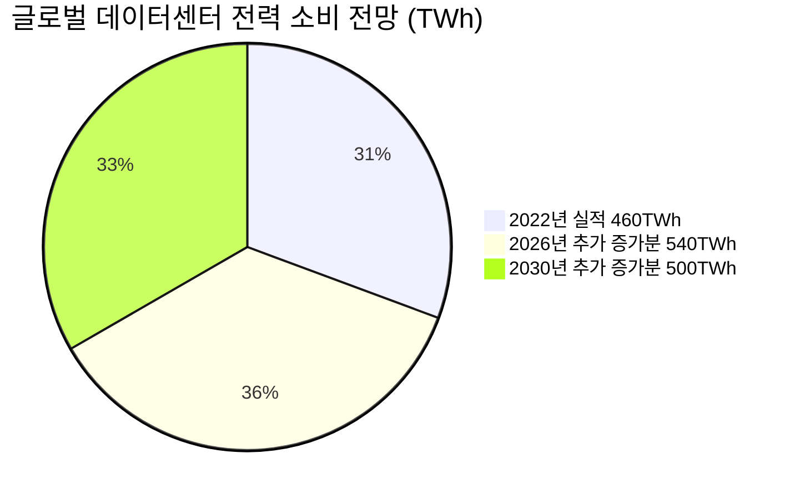
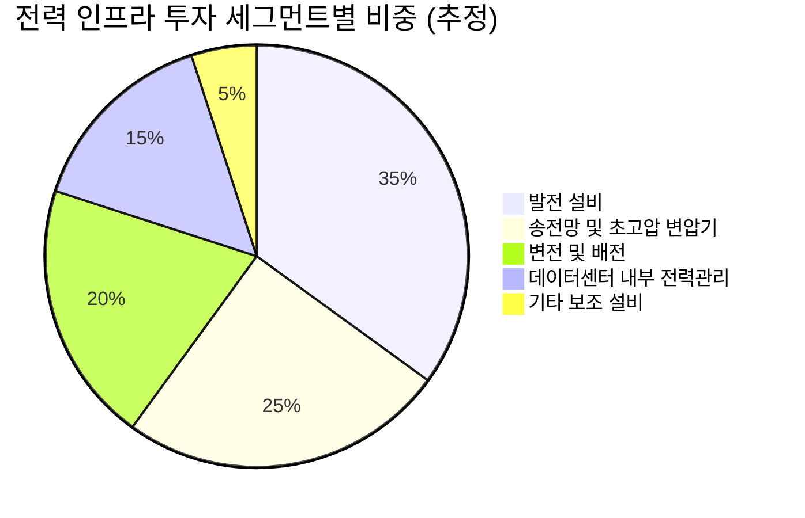
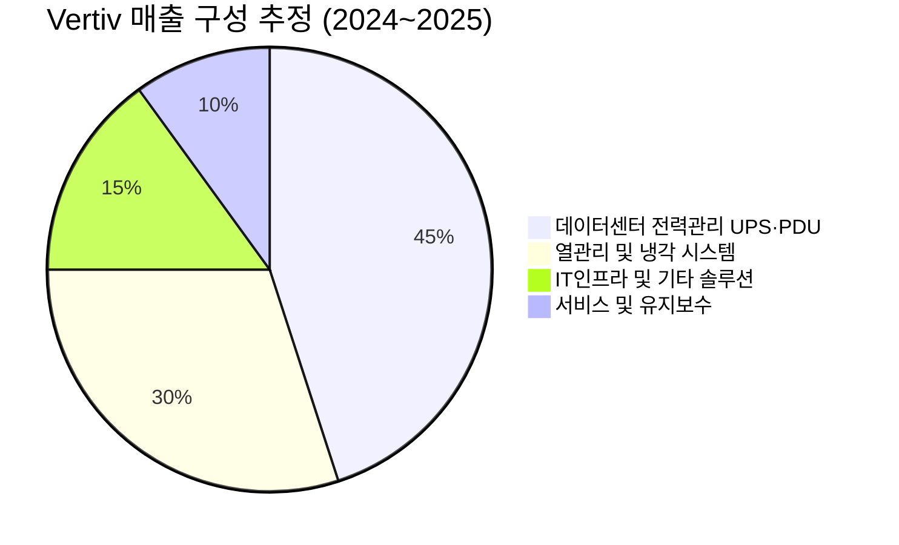
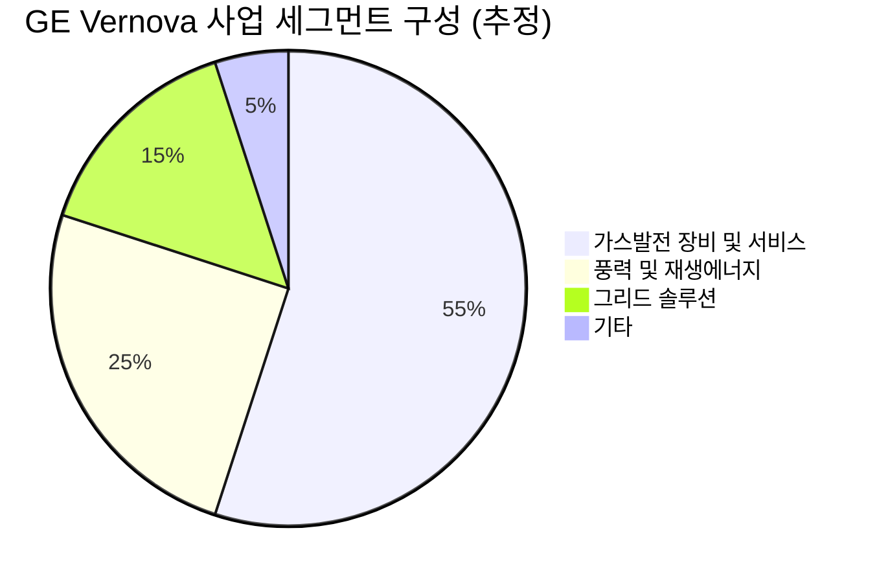
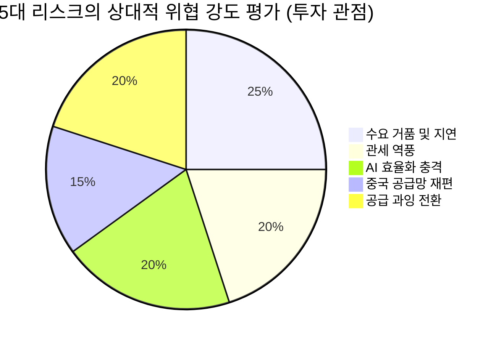
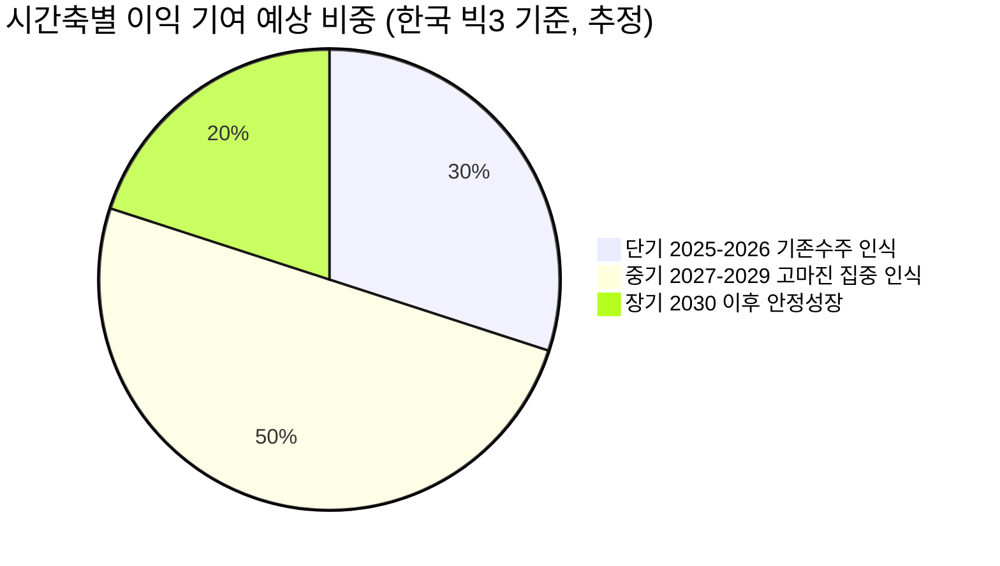

# Executive Summary & Why Now — 왜 지금 전력기기인가

> [!abstract] 핵심 요약
> AI 데이터센터 전력 수요 폭증 + 북미·유럽 노후 전력망 교체 + 에너지 전환이라는 **삼중 수렴(Triple Convergence)**이 동시에 발화하며 전력기기 산업이 수십 년 만의 구조적 슈퍼사이클에 진입했다. 이는 단순한 경기 사이클이 아니라 **공급 병목이 구조적으로 고착된 상태에서 수요가 가속 팽창하는** 전례 없는 구도다. 2025년 현재, 이 산업은 S-커브 상 과열-환멸 구간을 통과해 **실적으로 검증되는 생산성 안정기**에 막 진입한 시점이다.

---

## 1. 투자 명제 (Core Investment Thesis)

<div style="border-left:4px solid #4CAF50;padding-left:12px;margin:8px 0">
<strong>전력기기는 AI 시대의 '필수 인프라 병목(Essential Infrastructure Bottleneck)'이다.</strong><br>
AI 반도체를 아무리 만들어도 전기가 없으면 쓸 수 없다. 데이터센터는 수개월이면 짓지만, 변압기 납기는 최장 5년이다. 이 비대칭이 공급자 우위 시장을 만들었고, 이는 단기에 해소되지 않는다.
</div>

본 리포트의 핵심 투자 명제는 다음 세 가지 명제의 동시 성립으로 구성된다.

| # | 명제 | 검증 지표 | 현재 상태 |
|---|------|----------|----------|
| 1 | AI 전력 수요는 과거 어떤 기술 사이클보다 가파르게 증가한다 | 데이터센터 전력 소비 CAGR | 🟢 2022→2026년 연평균 ~22% 성장 (IEA) |
| 2 | 공급(전력기기 제조 캐파)은 구조적으로 수요를 따라가지 못한다 | 초고압 변압기 납기, 수주잔고 | 🟢 납기 최장 5년, 한국 빅3 수주잔고 30조원 |
| 3 | 이 불균형은 최소 2030년대 초까지 해소되지 않는다 | 그리드 투자 집행 타임라인 | 🟢 JP모건: 2035년까지 5.8조 달러 투자 필요 |

세 명제가 모두 성립할 때, 전력기기 기업은 **가격 결정권(Pricing Power)을 가진 공급자**가 된다. 효성중공업의 신규 수주 영업이익률이 40%에 육박한다는 사실이 이를 방증한다 (마켓인).

---

## 2. 왜 이번 사이클은 과거와 근본적으로 다른가

> [!tip] 핵심 인사이트: 수요의 질이 다르다
> 과거 전력 수요 증가는 경제 성장률에 연동된 점진적 증가였다. 지금은 **AI라는 단일 기술이 전력 소비를 기하급수적으로 끌어올리는 비선형 충격**이다. ChatGPT 하나가 Google 검색보다 10배 전력을 소모하고, AI 추론 수요가 학습 수요에 더해지며 소비 곡선이 꺾이지 않고 있다.

### 2.1. 수요의 규모와 속도: 전례 없는 비선형 충격



- **2022년 460TWh → 2026년 1,000TWh → 2030년 최대 1,500TWh** (IEA, IMF)
- 8년 만에 **3.3배** 증가: 과거 글로벌 전력 소비가 3배 늘리는 데 수십 년이 걸렸던 것과 대조적
- AI 전용 데이터센터만의 전력 소비는 **2030년까지 현재 대비 175% 급증** 전망 (글로벌이코노믹)
- 단일 AI 서버 랙의 전력 밀도: 과거 2~5kW → AI 최신 세대 **100~200kW** (10~100배 증가)

### 2.2. 역사적 비교: 왜 '전기화(Electrification) 시대의 재림'인가

| 시기 | 기술 충격 | 전력 인프라 투자 유형 | 지속 기간 |
|------|----------|---------------------|----------|
| 1880~1920년대 | 전기 발명·확산 (1차 전기화) | 발전소·송전망 초기 구축 | 40년+ |
| 1990~2000년대 | 인터넷·닷컴 붐 | 통신망·서버팜 구축 | ~10년 (버블 포함) |
| 2000~2010년대 | 스마트폰·클라우드 | 데이터센터 1세대 구축 | ~15년 |
| **2023년~현재** | **AI 확산 (2차 전기화)** | **전력망 전면 재구축** | **최소 10~15년 전망** |

> [!note] 참고: 닷컴 버블과의 결정적 차이
> 닷컴 버블은 기대가 실적을 선행했고 물리적 수요 근거가 약했다. 현재 전력기기 수요는 **이미 실행된 CapEx**에서 발생한다. 마이크로소프트·아마존·구글·메타가 2025년에만 합산 **3,000억 달러 이상**의 AI 인프라 CapEx를 집행했으며 (데이터 미확인, [추정]), 이는 전력 수요로 즉각 전환된다. 기대가 아닌 집행된 자본이 수요를 만든다.

### 2.3. AI 데이터센터가 일반 데이터센터와 근본적으로 다른 이유

<div style="display:flex;border-radius:8px;overflow:hidden;margin:8px 0;font-size:0.85em"><div style="background:#4CAF50;width:60%;padding:6px 8px;color:white">🟢 AI 데이터센터: 6~10배 더 많은 전력 소비</div><div style="background:#FF9800;width:40%;padding:6px 8px;color:white">🟡 일반 데이터센터: 기존 전력 인프라로 대응 가능</div></div>

| 구분 | 일반 데이터센터 | AI 데이터센터 | 차이 |
|------|---------------|--------------|------|
| 랙당 전력 밀도 | 2~10kW | 100~200kW | 10~100배 |
| 전력 변동성 | 안정적 | 급격한 급변 (GPU 부하) | 구조적으로 다름 |
| 냉각 방식 | 공랭식 가능 | 수랭·액침 냉각 필수 | 인프라 전면 재구축 |
| 그리드 연결 | 기존 인프라 활용 | 전용 변전소·변압기 필요 | 신규 투자 강제 |
| 전력 안정성 요구 | 높음 | **극도로 높음** (가동 중단 시 분당 9,000달러 손실) | Deloitte |

---

## 3. 삼중 수렴(Triple Convergence): 세 개의 독립적 수요가 동시에 폭발

> [!tip] 핵심 인사이트: 독립적 수요가 동시에 작동한다
> AI 인프라, 노후 전력망 교체, 에너지 전환—이 세 가지는 각각 독립적인 원인을 가진다. AI가 없어도 노후 전력망은 교체되어야 하고, 신재생에너지 확산은 계속된다. 세 개의 독립적 수요 엔진이 동시에 가동되는 구조는 과거 어느 인프라 사이클에도 없었다.

### 촉매 1: AI 인프라 수요 — '칩'에서 '전력'으로 경쟁의 축 이동

<div style="background:#e0e0e0;border-radius:8px;overflow:hidden;margin:4px 0"><div style="background:#4CAF50;width:85%;padding:4px 8px;color:white;font-size:0.9em;white-space:nowrap">수요 강도 85/100 — 가장 강력하고 가속 중</div></div>

- **구조적 필연성**: AI 모델 규모(파라미터 수)가 매년 10배씩 증가하는 스케일링 법칙이 유효한 한, 전력 수요는 반드시 증가한다
- **수요 가시성**: 빅테크 CapEx 가이던스가 이미 공개된 '확정된 수요' — Morgan Stanley 분석 기준 2028년 미국만 74GW 데이터센터 전력 수요, 공급 가능분은 25GW → **49GW 부족** 예상
- **임박성**: 데이터센터 가동 중단 손실이 분당 9,000달러 (Deloitte) → 전력 확보는 선택이 아닌 생존 문제
- **빅테크의 직접 전력 인프라 투자**: 구글·MS·아마존이 원전 직접 투자, 가스발전소 건설 비용 직접 부담 논의까지 진행 중 — 이는 전력기기 수요가 빅테크 예산에 직결됨을 의미

### 촉매 2: 노후 전력망 교체 — 피할 수 없는 물리적 현실

<div style="background:#e0e0e0;border-radius:8px;overflow:hidden;margin:4px 0"><div style="background:#4CAF50;width:78%;padding:4px 8px;color:white;font-size:0.9em;white-space:nowrap">수요 강도 78/100 — 장기 안정적, 경기 무관</div></div>

- **미국 전력망의 약 70%가 교체 주기 도달** (RAND)
- **미국 배전 변압기 55%가 33년 이상 노후 설비** (RAND)
- 이는 AI와 무관하게 반드시 교체되어야 하는 물리적 수명 문제 → **경기 방어적 수요 특성**
- JP모건 추산: 2035년까지 10년간 글로벌 전력망 인프라에 **5.8조 달러** 투자 필요
- AI가 없어도 이 수요는 존재한다 — AI는 수요 규모를 추가로 증폭하는 역할

### 촉매 3: 에너지 전환 — 신재생에너지가 그리드를 재구축하게 만든다

<div style="background:#e0e0e0;border-radius:8px;overflow:hidden;margin:4px 0"><div style="background:#FF9800;width:65%;padding:4px 8px;color:white;font-size:0.9em;white-space:nowrap">수요 강도 65/100 — 중기적으로 가속화 중</div></div>

- 태양광·풍력은 **분산형·간헐적** → 기존 중앙집중식 전력망 설계 철학과 충돌
- 재생에너지 단지는 수요지와 수백km 떨어진 경우가 많아 **장거리 HVDC 송전망** 투자 필수
- 재생에너지 확산이 빠를수록 계통 안정화를 위한 **변압기·개폐장치·ESS 연계 설비** 수요 증가

### 삼중 수렴의 시너지: 서로를 강화하는 구조

```
AI 데이터센터 폭증
        ↓
    전력망에 대용량 부하 추가
        ↓
노후 전력망은 이를 감당 못함
        ↓
   전력망 전면 교체 불가피
        ↓
교체 시 재생에너지 연계 최적화로 설계
        ↓
    전력기기 수요의 연쇄 증폭
```

> [!warning] 리스크 경고: 세 촉매의 독립성은 곧 리스크 분산이기도 하다
> AI 거품이 꺼지더라도 노후 전력망 교체 수요는 남는다. 그러나 반대로, AI 수요가 예상보다 둔화될 경우 현재 시장에 반영된 '삼중 수렴 프리미엄'의 일부가 조정받을 수 있다.

---

## 4. 공급 병목의 구조적 고착화: 왜 '쉽게 해소되지 않는가'

> [!warning] 리스크 경고이자 투자 기회
> 공급 병목은 투자자에게 리스크이기도 하지만, **이미 수주를 확보한 기업에게는 가격 결정권과 고마진의 원천**이다. 납기 5년의 변압기를 지금 수주하는 기업은 향후 5년간의 매출을 지금 잠그는 것이다.

### 4.1. 납기 vs. 수요 타임라인의 구조적 불균형

| 항목 | 소요 기간 | 의미 |
|------|----------|------|
| AI 데이터센터 건설 | 12~18개월 | 수요 발생이 빠름 |
| 그리드 연결 | 18~36개월 (최대 10년) | Morgan Stanley |
| 초고압 변압기 납기 | 평균 2년 9개월, 최장 **5년** | 기후에너지경제, 디지털투데이 |
| 발전소 건설 (가스) | 3~4년 | [추정] |
| 원전 건설 | 10~15년 | [추정] |
| 송전선 인허가 + 건설 | **최대 10년** | broadbandbreakfast.com |

→ **수요(데이터센터 18개월) vs. 공급(변압기 5년)의 시간차는 단기간에 해소 불가**

### 4.2. 제조 캐파 확장의 한계

- **변압기 제조는 자동화가 어렵다**: 특수 강판, 절연유, 대형 권선 등 숙련 노동 집약적 공정
- **신규 공장 건설에 3~5년 소요**: 지금 결정해도 2028~2030년에나 캐파 기여 가능
- **글로벌 제조사 수가 제한적**: ABB, Siemens Energy, Hitachi Energy, GE Vernova, Eaton, Schneider Electric, Vertiv + 한국 3사 등 핵심 플레이어 다수 존재하지만, 초고압(765kV 이상) 변압기는 공급자가 더욱 한정
- 효성중공업이 미국 테네시 공장에 2,300억원 추가 투자해 2028년까지 캐파 50% 확대 계획 → 이것이 **지금 당장의 공급 부족을 해소하지 못함**을 스스로 증명

<div style="background:#e0e0e0;border-radius:8px;overflow:hidden;margin:4px 0"><div style="background:#F44336;width:30%;padding:4px 8px;color:white;font-size:0.9em;white-space:nowrap;min-width:60px">공급 대응 속도 30/100 — 수요를 크게 하회</div></div>

---

## 5. S-커브와 하이프사이클: 2025년 현재의 위치

> [!tip] 핵심 인사이트: 가장 중요한 판단
> 투자 타이밍 관점에서 이 산업은 '과열-환멸' 구간을 통과해 **실적으로 증명되는 생산성 안정기**에 막 진입했다. 주가가 이미 많이 오른 것은 사실이지만, 실적이 주가 상승을 정당화하고 있다는 점에서 닷컴 버블과는 성격이 다르다.

### 5.1. S-커브 위치 분석

```
S-커브 위치 모식도

성장률
  │                    ┌─────────────
  │                   /
  │                  /  ← 우리는 여기
  │                 /     (급격한 성장 구간)
  │                /
  │          ─────/
  │    ─────/
  └─────────────────────────────── 시간
       2015  2020  2023 2025  2030  2035
```

| 단계 | 시기 | 특징 | 현재? |
|------|------|------|-------|
| 도입기 | ~2020년 | AI 전력 수요 소수만 인식 | ❌ 지남 |
| 성장 전환점 | 2022~2023년 | ChatGPT 출시, 데이터센터 투자 급증 | ❌ 지남 |
| **급격한 성장기** | **2023~2028년** | **수주잔고·실적 폭발, 납기 급증** | **🟢 현재 위치** |
| 성숙기 | 2028~2035년 | 성장 지속, 속도 완만해짐 | 아직 |
| 포화기 | 2035년 이후 | 교체 수요 중심 | 아직 |

<div style="background:#e0e0e0;border-radius:8px;overflow:hidden;margin:4px 0"><div style="background:#4CAF50;width:72%;padding:4px 8px;color:white;font-size:0.9em;white-space:nowrap">S-커브 진행도: 급격한 성장 구간 중반 72/100</div></div>

### 5.2. 가트너 하이프사이클 위치

| 단계 | 특징 | 전력기기 현황 |
|------|------|------------|
| 기술 촉발기 | 기대 형성 시작 | 2022년 ChatGPT 이전 |
| 과장된 기대의 정점 | 주가 급등, 밸류에이션 과열 | 2023~2024년 일부 구간 |
| 환멸의 골짜기 | 실망, 조정 | 2024년 하반기 잠깐 |
| **생산성 안정기(Slope of Enlightenment)** | **실적으로 증명, 지속 성장** | **🟢 2025년 현재** |
| 안정적 생산성 고원 | 성숙, 안정 성장 | 2028년 이후 |

> [!success] 강점: 실적이 기대를 검증하고 있다
> 한국 전력기기 빅3의 2025년 합산 영업이익이 전년 대비 **53% 증가한 2조 1,691억원**을 기록했다 (서울이코노미뉴스). 이는 '기대'가 아닌 '실적'이다. 수주잔고 30조원은 향후 3년치 매출을 가시화한다.

---

## 6. 정책 지원: 국가가 인센티브를 제공하는 산업

<div style="border-left:4px solid #FF9800;padding-left:12px;margin:8px 0">
각국 정부가 AI 경쟁력 = 전력 인프라로 인식하기 시작했다. 이는 단순한 민간 수요를 넘어 국가 예산이 전력기기 수요를 떠받치는 구조를 만든다.
</div>

| 국가/지역 | 핵심 정책 | 전력기기 수요 영향 |
|----------|----------|-----------------|
| 🇺🇸 미국 | AI·에너지 920억 달러 투자, 변압기 등 관세 2027년까지 15% 한시 (철강 파생 25% 대비 우대) | 🟢 수요 직접 촉진 + 한국산 수출 유리 |
| 🇨🇳 중국 | 국산 AI칩 데이터센터 전력요금 50% 할인, 1,000억 위안 국가 펀드 | 🟢 자국 내 수요 폭발적 증가 |
| 🇰🇷 한국 | 11차 전력수급기본계획, 원전 2기 추가, AI DC 국가전략기술 지정 | 🟢 내수 수요 + 제조 기반 강화 |
| 🇪🇺 EU | 노후 전력망 교체 강제, 신재생 목표 상향 | 🟡 수요는 있으나 규제 복잡성 |

> [!note] 인센티브 분석 (Incentive Analysis)
> - **정부**: AI 경쟁에서 뒤처지면 국가 경쟁력 상실 → 전력 인프라 투자는 표를 의식한 정치적 결정이기도 함
> - **빅테크**: AI 서비스 지연 시 시장점유율 손실 → 전력 확보 비용은 '매몰비용이 아닌 선제적 헤지'
> - **전력기기 제조사**: 납기를 늘릴수록 수주 단가가 올라가는 아이러니한 인센티브 구조
> - **유틸리티**: 전력 수요 증가 = 수익 증가이나, 인프라 투자 비용 부담과 균형

---

## 7. Variant Perception: 시장 컨센서스와 다른 뷰

> [!question] 검토 필요: 시장이 놓치고 있는 것은 무엇인가

**컨센서스 뷰**: "전력기기 슈퍼사이클, 수혜주 매수"

**우리의 Variant Perception**:

**[강세 측 차별화 뷰]** — 시장은 수요 지속성을 과소평가하고 있다
- 시장은 AI 투자 사이클을 2~3년짜리로 보는 경향이 있으나, 전력망 교체는 AI와 무관한 **독립적인 20년 사이클**이 이제 막 시작됐다
- 납기 5년짜리 변압기 수주를 지금 받는 기업은 2028~2030년 매출을 **지금 확정**하고 있다 — 이 수익 가시성은 시장이 충분히 평가하지 못하고 있다 [추정]

**[약세 측 차별화 뷰]** — 시장은 AI 효율화 리스크를 과소평가하고 있다
- 딥시크(DeepSeek) 쇼크가 보여주었듯, AI 추론 효율이 급격히 개선될 경우 동일 서비스를 위한 전력 소비가 예상보다 낮을 수 있다
- 전력 효율(전성비)이 지금의 10배가 된다면 전력 수요 전망치의 하향 조정이 가능하다

<div style="display:flex;border-radius:8px;overflow:hidden;margin:8px 0;font-size:0.85em"><div style="background:#4CAF50;width:70%;padding:6px 8px;color:white">🟢 Bull: 수요 독립성·공급 병목 구조 유지 70%</div><div style="background:#FF9800;width:20%;padding:6px 8px;color:white">🟡 Base 20%</div><div style="background:#F44336;width:10%;padding:6px 8px;color:white">🔴 Bear 10%</div></div>

---

## 8. 시간축별 투자 의미

| 시간축 | 핵심 동인 | 투자 시사점 |
|--------|----------|-----------|
| **단기 (2025~2026)** | 수주잔고 매출 전환, 영업이익률 극대화 | 이미 확보된 수주의 실적 현실화 → 어닝 서프라이즈 가능성 高 |
| **중기 (2027~2029)** | 증설 캐파 본격 가동, 미국 그리드 투자 집행 | 매출 볼륨 증가 + 신규 수주 단가 유지 → 이익 레버리지 |
| **장기 (2030년 이후)** | 노후 전력망 교체 2차 파동, SMR 연계 | 새로운 수요 층 추가 → 사이클 연장 가능성 |

> [!verdict] 투자 판단: 왜 '지금'이 적기인가
> 1. **실적 검증 완료**: 기대가 아닌 수주잔고·이익으로 증명된 단계
> 2. **수요 가시성 3년치 확보**: 수주잔고 = 미래 매출의 선행 지표
> 3. **공급 병목은 2030년까지 구조적 유지**: 신규 캐파가 본격 가동될 2028~2030년까지 기존 공급자 우위 유지
> 4. **정책 테일윈드**: 미·중·한·EU 모두 전력 인프라 투자를 국가 과제로 격상
> 5. **삼중 수렴의 독립성**: AI가 꺾여도 노후 전력망 교체 수요는 남는다 — **하방 보호 구조 내재**

> [!warning] 리스크 경고: 이미 많이 오른 주가
> 2023~2025년 사이 한국 전력기기 3사 주가가 이미 수배 상승한 상태다. '슈퍼사이클'이 맞더라도, **현재 주가가 얼마나 이미 반영했는가**가 핵심 질문이다. 수주잔고·이익 성장률 대비 밸류에이션의 Margin of Safety는 개별 종목 섹션에서 심층 분석한다.

---

## 9. 핵심 수치 요약 대시보드

| 카테고리 | 지표 | 수치 | 출처 |
|----------|------|------|------|
| TAM | 글로벌 데이터센터 전력 소비 (2030) | 최대 1,500TWh | IEA·IMF |
| SAM | 글로벌 전력 장비 시장 (2031) | 1.23조 달러 | Mordor Intelligence |
| SAM CAGR | 2026~2031년 | **7.86%** | Mordor Intelligence |
| AI 에너지 분배 시장 CAGR | 2025~2033년 | **22.5%** | Persistence Market Research |
| 그리드 투자 필요액 | 10년간 누적 | **5.8조 달러** | JP모건 |
| 미국 전력 부족 (2028) | 수요 74GW, 공급 부족 | **49GW** | Morgan Stanley |
| 초고압 변압기 납기 | 미국 내 평균 | **2년 9개월~5년** | 기후에너지경제 |
| 한국 빅3 수주잔고 | 2025년 기준 | **30조원** | 마켓인 |
| 한국 빅3 영업이익 증가율 | 2025년 YoY | **+53%** | 서울이코노미뉴스 |
| 가동 중단 손실 | 데이터센터 분당 | **9,000달러** | Deloitte |

---

> [!abstract] Executive Summary 결론
> AI 확산이 촉발한 전력기기 산업의 슈퍼사이클은 세 가지 이유에서 과거 인프라 사이클과 근본적으로 다르다: ① 수요의 비선형성(AI 전력 소비의 기하급수적 증가), ② 공급의 구조적 제약(변압기 납기 5년·제조 자동화 불가), ③ 독립적 수요 엔진 3개의 동시 작동(AI + 노후 교체 + 에너지 전환). 2025년 현재, 이 산업은 S-커브 상 급격한 성장 구간 중반에서 하이프사이클의 '생산성 안정기' 초입에 위치하며, 실적이 기대를 검증하고 있다. 투자 타이밍 관점에서는 '이미 올라서 늦었나'보다 '공급 병목이 2030년까지 유지되는 구조에서 수주잔고 3년치를 가진 기업의 이익 가시성'에 초점을 맞춰야 한다. 리포트 후속 섹션에서 개별 기업의 경쟁력, 밸류에이션, Margin of Safety를 심층 분석한다.

---

# 시장 구조 해부 — TAM·SAM 분석과 밸류체인 생태계 매핑

> [!abstract] 섹션 요약
> 글로벌 전력기기 시장(2025년 0.78조 달러 → 2031년 1.23조 달러, CAGR 7.86%)은 AI 데이터센터 전력 수요(460TWh → 1,500TWh)라는 단일 충격이 발전→송전→변전→배전→데이터센터 내부 전력관리까지 밸류체인 전 단계를 동시에 압박하는 구조로 재편되고 있다. 수혜 강도는 균일하지 않다 — **초고압 변압기(변전 구간)**와 **데이터센터 내부 전력관리(AI 에너지 분배)**가 양극단의 수혜처이며, 그 사이 구간마다 병목의 성격과 해소 타임라인이 다르다.

---

## 1. 시장 규모 계층 분해: TAM에서 SOM까지

> [!tip] 핵심 인사이트: 숫자가 아닌 성장의 원인을 봐야 한다
> 전력기기 시장 CAGR 7.86%는 언뜻 평범해 보이지만, 이 숫자 안에는 **성장률이 극명하게 갈리는 두 개의 세계**가 공존한다. 전통적 노후 교체 수요(CAGR ~3~4%)와 AI 데이터센터 직결 수요(CAGR 15~22%)가 혼재한 평균치다. 투자자는 평균을 보는 것이 아니라, 어느 세그먼트에 노출된 기업인지를 봐야 한다.

### 1.1. 시장 계층 구조

| 계층 | 정의 | 2024~2025년 규모 | 2031년 전망 | CAGR | 출처 |
|------|------|-----------------|------------|------|------|
| **TAM** | 글로벌 데이터센터 전력 수요 총량 | 415TWh (2024) | 최대 1,000TWh (2030) | ~14%+ | IEA, 기후에너지경제 |
| **TAM** | 글로벌 전력망 인프라 누적 투자 필요액 | — | 5.8조 달러 (10년, ~2035) | — | JP모건 |
| **SAM** | 글로벌 전력 장비 시장 | 0.78조 달러 (2025) | 1.23조 달러 | **7.86%** | Mordor Intelligence |
| **SAM (고성장)** | 글로벌 AI 에너지 분배 시장 | 34.5억 달러 (2024) | 212.7억 달러 (2033) | **22.5%** | Persistence Market Research |
| **SOM** | 한국 전력기기 빅3의 현재 수주잔고 | 30조원 (~3년치) | — | — | 마켓인 |

<div style="border-left:4px solid #FF9800;padding-left:12px;margin:8px 0">
<strong>왜 두 개의 SAM이 공존하는가?</strong><br>
전통적 전력 장비 시장(SAM 7.86%)은 변압기·개폐장치·케이블 등 물리적 하드웨어 중심이고, AI 에너지 분배 시장(SAM 22.5%)은 데이터센터 내부의 전력 분배·관리·최적화 솔루션을 포함한다. 두 시장은 서로 다른 고객(유틸리티 vs. 빅테크), 다른 판매 사이클, 다른 마진 구조를 가진다. 이 둘이 동시에 성장하면서 서로 다른 플레이어 생태계를 형성하고 있다.
</div>

### 1.2. AI 데이터센터 전력 수요의 계층별 파급 규모

전력 수요 1TWh 증가 시 각 밸류체인 단계에 유발되는 설비 투자 규모를 추정하면 다음과 같다 [추정]:



> [!note] 참고: 위 파이 차트는 글로벌 전력 인프라 투자 배분의 일반적 추정치이며, 출처별로 편차가 있음. 투자 집행 시점·지역에 따라 달라질 수 있음 [추정].

---

## 2. 밸류체인 전체 생태계 매핑: 5단계 구조

> [!abstract] 구조 요약
> 전력기기 밸류체인은 **발전 → 송전 → 변전 → 배전 → 데이터센터 내부**의 5단계로 구성된다. AI 전력 수요는 이 사슬의 '끝단'(데이터센터)에서 발생하지만, 병목과 투자는 '중간 구간'(변전·초고압 변압기)에서 가장 극심하게 나타나는 역설적 구조다.

### 2.1. 밸류체인 5단계 — 수혜 강도와 병목 지점

| 단계 | 핵심 설비 | 주요 플레이어 | AI 수요 노출도 | 병목 강도 | 수혜 강도 |
|------|----------|-------------|--------------|----------|----------|
| **① 발전** | 가스터빈, SMR, 태양광·풍력 | GE Vernova, Siemens Energy, NextEra | 🟡 간접 | 🟡 중간 | 🟡 중간 |
| **② 송전** | HVDC 케이블, 송전선로, 철탑 | LS전선, 대한전선, Prysmian, Nexans | 🟡 간접 | 🟡 중간 | 🟡 중간 |
| **③ 변전** | 초고압 변압기, GIS, 리액터 | [[효성중공업]], [[HD현대일렉트릭]], [[일진전기]], Hitachi Energy, ABB | 🔴 **직접·최고** | 🔴 **가장 극심** | 🟢 **최대 수혜** |
| **④ 배전** | 배전 변압기, 배전반, 스위치기어 | [[LS일렉트릭]], Eaton, Schneider Electric | 🟢 직접 | 🟡 중간 | 🟢 높음 |
| **⑤ DC 내부** | UPS, PDU, 냉각, 버스 덕트 | Vertiv, Eaton, Schneider Electric, [[LS에코에너지]] | 🟢 **직접·최고** | 🟡 낮음 | 🟢 **고성장** |

<div style="display:flex;border-radius:8px;overflow:hidden;margin:8px 0;font-size:0.85em">
  <div style="background:#4CAF50;width:45%;padding:6px 8px;color:white">🟢 변전 구간: 공급 병목 + 최고 마진</div>
  <div style="background:#4CAF50;width:30%;padding:6px 8px;color:white">🟢 DC 내부: 고성장 + 새 플레이어</div>
  <div style="background:#FF9800;width:25%;padding:6px 8px;color:white">🟡 발전·송전: 간접 수혜</div>
</div>

### 2.2. 단계별 심층 분석

#### ① 발전 단계 — 수요 창출의 '원천'이지만 직접 수혜는 제한적

<div style="background:#e0e0e0;border-radius:8px;overflow:hidden;margin:4px 0"><div style="background:#FF9800;width:55%;padding:4px 8px;color:white;font-size:0.9em;white-space:nowrap">수혜 강도 55/100 — 간접적, 긴 사이클</div></div>

AI 데이터센터는 24시간 무중단 가동이 필수다. 이는 간헐성이 있는 재생에너지만으로는 한계가 있어, **기저 전원(가스·원전) + 재생에너지 + ESS**의 혼합 구성을 강제한다.

- **수혜 포인트**: 가스터빈 제조사(GE Vernova, Siemens Energy), SMR 개발사, 독립발전사(IPP)
- **한계**: 빅테크가 직접 발전소 건설 비용을 부담하는 구조로 전환 중 → 기존 유틸리티 기업의 역할 축소 가능성
- **병목**: 인허가 절차 장기화 (일부 지역 최대 10년, broadbandbreakfast.com), 가스·원전 건설 3~15년 소요

> [!warning] 빅테크의 발전소 직접 투자가 의미하는 것
> 마이크로소프트·구글·아마존이 원전 인근 부지 확보, 소형 가스발전소 직접 건설에 나서는 것은 단순한 전력 확보 전략이 아니다. **전통적 유틸리티 기업의 역할 일부를 내재화**하는 구조 변화다. 이는 발전 단계에서 기존 유틸리티의 협상력을 약화시키지만, 동시에 발전 설비(터빈·변압기) 수요 자체는 오히려 늘린다.

#### ② 송전 단계 — 재생에너지 확산의 '숨겨진 수혜처'

<div style="background:#e0e0e0;border-radius:8px;overflow:hidden;margin:4px 0"><div style="background:#FF9800;width:62%;padding:4px 8px;color:white;font-size:0.9em;white-space:nowrap">수혜 강도 62/100 — 중기 성장, 지역 편차 큼</div></div>

송전 구간은 AI 수요와의 직접 연결보다 **노후 송전망 교체 + 신재생에너지 장거리 연계**라는 구조적 수요에 더 노출되어 있다.

- **수혜 포인트**: HVDC 케이블(LS전선, 대한전선, Prysmian, Nexans), 초고압 송전 케이블
- **핵심 수치**: 대한전선 2025년 수주잔고 3조 6천억원(전년 대비 30% 증가), 역대 최대 실적 (매일경제)
- **병목**: 해저·지중 케이블 포설 선박 부족, 해상풍력 연계 인허가 지연
- **지역 차이**: 유럽(해상풍력 HVDC 연계)과 미국(내륙 송전선 교체)의 수요 성격이 다름

#### ③ 변전 단계 — **밸류체인 최대 병목이자 최대 수혜**

<div style="background:#e0e0e0;border-radius:8px;overflow:hidden;margin:4px 0"><div style="background:#4CAF50;width:92%;padding:4px 8px;color:white;font-size:0.9em;white-space:nowrap">수혜 강도 92/100 — 공급 병목 + 가격 결정권 + 고마진 삼박자</div></div>

**이 구간이 전체 밸류체인에서 투자 관점의 핵심이다.** 이유는 세 가지가 동시에 작동하기 때문이다:

1. **수요**: AI 데이터센터와 노후 전력망 교체 수요가 동시 집중
2. **공급**: 초고압 변압기 납기 최장 5년, 미국 내 평균 2년 9개월 (기후에너지경제)
3. **진입장벽**: 설계·제조 숙련도 축적에 10년 이상, 신규 진입 사실상 불가

| 제품 | 수요 폭발 이유 | 납기 | 한국 기업 지위 |
|------|--------------|------|--------------|
| 765kV 초고압 변압기 | 미국 AI DC 연결 전력망 전압 승격 | 최장 5년 | 🟢 효성중공업 시장 점유율 40~50% (마켓인) |
| 345kV 변압기 | 미국 배전망 연결 노드 | 2~3년 | 🟢 HD현대일렉트릭 주력 제품 |
| GIS (가스절연개폐장치) | 도심 변전소 컴팩트화 필요 | 18~24개월 | 🟡 글로벌 경쟁 치열 |
| HVDC 변환 설비 | 해상풍력·장거리 연계 | 2~4년 | 🟢 효성중공업, Hitachi Energy |

> [!success] 강점: 초고압 변압기의 구조적 공급 우위
> 765kV 이상 초고압 변압기는 전 세계에서 제조 가능한 기업이 **10개 미만**이다 [추정]. 미국은 자국 내 생산 능력이 극히 부족해 한국·일본·독일산 수입에 의존한다. 이것이 효성중공업의 미국 시장 점유율 40~50%가 가능한 이유다. 납기 5년은 단순한 병목이 아니라, **진입장벽이 수치로 표현된 것**이다.

#### ④ 배전 단계 — '조용한 수혜처', 물량 기반 성장

<div style="background:#e0e0e0;border-radius:8px;overflow:hidden;margin:4px 0"><div style="background:#4CAF50;width:75%;padding:4px 8px;color:white;font-size:0.9em;white-space:nowrap">수혜 강도 75/100 — 안정적 고성장, 경기 방어적</div></div>

배전 단계는 화려하지 않지만 **수요가 가장 광범위하게 분산**되어 있다. AI 데이터센터에 전력을 실제로 '마지막 1마일' 전달하는 구간이다.

- **수혜 포인트**: 배전반(LS일렉트릭 MCM 자회사 1억 6,800만 달러 증설 투자), 스위치기어, MV/LV 변압기
- **핵심 수치**: 미국 배전 변압기의 55%가 33년 이상 노후 설비 (RAND) → 교체 수요만으로도 장기 성장 보장
- **특징**: 초고압 변압기 대비 마진은 낮지만, **물량 증가로 이익 레버리지 발생**
- **Eaton의 사례**: 미국 배전 설비 시장 과점적 지위 + AI DC 전용 배전반 라인업 확장으로 밸류에이션 리레이팅 중

#### ⑤ 데이터센터 내부 전력관리 — **가장 빠른 성장, 새로운 생태계**

<div style="background:#e0e0e0;border-radius:8px;overflow:hidden;margin:4px 0"><div style="background:#4CAF50;width:88%;padding:4px 8px;color:white;font-size:0.9em;white-space:nowrap">성장 속도 88/100 — AI 에너지 분배 CAGR 22.5%</div></div>

데이터센터 내부 전력관리는 전통적 전력기기 산업과 구분되는 **별도의 생태계**를 형성하고 있다.

| 제품/솔루션 | 역할 | 수요 동인 | 대표 플레이어 |
|-----------|------|----------|-------------|
| **UPS** (무정전 전원장치) | 전력 단절 시 즉각 백업 | 가동 중단 손실 분당 9,000달러 (Deloitte) | Vertiv, Eaton, Schneider |
| **PDU** (전력 분배 장치) | 랙별 전력 정밀 분배 | AI 랙 전력 밀도 100~200kW | Vertiv, Raritan |
| **버스 덕트** | 고전력 수평 배전 | AI 서버 밀집 환경 | [[LS에코에너지]], Siemens |
| **냉각 시스템** | AI 칩 발열 제거 | GPU 발열량 급증 | Vertiv, Schneider, 신생 기업군 |
| **AI 전력 최적화 SW** | 실시간 부하 예측·분배 | 전력 효율(PUE) 개선 압박 | 신흥 스타트업, 빅테크 자체 개발 |

> [!tip] 핵심 인사이트: AI 에너지 분배 시장의 의미
> Persistence Market Research가 별도로 집계하는 'AI 에너지 분배 시장' (2024년 34.5억 달러 → 2033년 212.7억 달러, CAGR 22.5%)은 기존 전력기기 시장(CAGR 7.86%)과 **6배 빠른 성장**을 보인다. 이 시장은 Vertiv(데이터센터 전력·냉각 인프라 전문), Schneider Electric의 EcoStruxure, 그리고 AI 기반 전력 최적화 스타트업들이 경쟁한다. 전통적 변압기 제조사보다 소프트웨어 역량을 보유한 플레이어가 더 유리한 구간이다.

---

## 3. 병목 메커니즘 심층 분석: 왜 '쉽게 풀리지 않는가'

> [!abstract] 병목의 본질
> 초고압 변압기 납기 5년, 그리드 연결 18~36개월이라는 수치는 단순한 생산 지연이 아니다. 이는 **① 물리적 제조 한계, ② 공급망 집중, ③ 규제·인허가 마찰, ④ 숙련 인력 부족**이라는 4개 층위가 중첩된 구조적 병목이다.

### 3.1. 병목 형성 메커니즘

<div style="border-left:4px solid #F44336;padding-left:12px;margin:8px 0">
<strong>병목의 4개 층위가 서로를 강화하는 구조:</strong><br>
수요 폭증 → 납기 연장 → 단가 상승 → 증설 투자 결정 → 공장 건설 3~5년 소요 → 그 사이 수요 더 증가 → 납기 더 연장
</div>

**층위 1 — 물리적 제조 한계**
- 대형 변압기(100~300MVA급)는 권선부터 절연 처리, 건조, 시험까지 **단일 제품 제조에 6~12개월** 소요 [추정]
- 자동화가 극히 제한적: 권선 작업은 숙련 기술자 필수, CNC 기계로 대체 불가
- 공장 증설이 결정되더라도 **생산 능력 반영까지 3~5년**: 효성중공업 테네시 공장 2023년 투자 결정 → 2028년 50% 캐파 확대 (마켓인)

**층위 2 — 공급망 집중**
- 초고압 변압기 핵심 소재: **방향성 전기 강판(GOES)** — 글로벌 생산 능력이 일본(JFE, 닛폰스틸), 독일(Thyssenkrupp), 중국에 집중
- 절연 소재(크라프트지, 아라미드지), 절연유, 대형 부싱 등 핵심 부품의 공급망이 좁음
- 구리 가격 변동성 → 원가 예측 불확실성 증가

**층위 3 — 규제·인허가 마찰**
- 미국 송전선 건설: 주 경계를 넘는 경우 연방·주 이중 인허가 → 최대 10년 소요 (broadbandbreakfast.com)
- 데이터센터 그리드 연결 신청이 급증하면서 대기 행렬(interconnection queue) 폭증
- 환경영향평가, 토지 보상, 지역 주민 반대(NIMBY) → 병목을 법적 층위에서 고착화

**층위 4 — 숙련 인력 부족**
- 전력기기 제조 및 설치 분야 숙련 전기 기술자가 부족: 기존 인력의 고령화, 신규 유입 감소
- 현지화(미국 제조) 요구가 높아질수록 — 인력 수급이 또 다른 병목으로 부상

### 3.2. 병목 해소 타임라인 전망

| 병목 유형 | 현재 강도 | 예상 해소 시점 | 해소 메커니즘 |
|----------|----------|-------------|------------|
| 초고압 변압기 납기 | 🔴 최고 (5년) | 2028~2030년 **부분 완화** | 현재 진행 중인 증설 투자 효과 |
| 그리드 연결 대기 | 🔴 높음 (18~36개월) | 2027~2030년 | 인허가 간소화 정책, 사전 계획 투자 |
| 배전 변압기 공급 | 🟡 중간 (12~18개월) | 2026~2027년 | 상대적으로 제조 진입장벽 낮음 |
| DC 내부 전력기기 | 🟡 낮음 | 이미 완화 중 | 제조 자동화 가능, 신규 진입 용이 |
| 숙련 인력 부족 | 🟡 중간~높음 | 2030년 이후 | 구조적 문제, 단기 해결 어려움 |

> [!verdict] 병목 해소 판단
> **초고압 변압기 병목은 2030년까지 구조적으로 유지된다.** 현재 진행 중인 증설 투자(효성중공업 테네시 2028년, HD현대일렉트릭 앨라배마 제2공장 등)가 본격 가동되는 시점이 2028~2030년이지만, 수요 자체도 같은 속도로 증가한다. 공급이 수요를 앞지르는 시점은 **빨라야 2031~2032년**으로 추정된다 [추정].

---

## 4. 지역별 수요 구조 분석: 북미·유럽·아시아태평양의 차별성

> [!abstract] 지역 구조 요약
> 아시아태평양이 전체 시장의 50.4%를 차지하는 최대 시장(Mordor Intelligence)이지만, **북미가 단위 성장률과 수익성 관점에서 가장 매력적인 시장**이다. 유럽은 규제 복잡성과 에너지 비용이 변수, 중국은 '내수 거대 시장'이지만 한국 기업 접근성이 제한적이다.

### 4.1. 지역별 비교 매트릭스

| 구분 | 북미 | 유럽 | 아시아태평양 | 중동·기타 |
|------|------|------|------------|---------|
| **시장 규모** | 大 | 中 | 最大 (50.4%) | 소규모이나 고성장 |
| **CAGR** | 🟢 高 (미국 AI DC 집중) | 🟡 中 (재생에너지·교체) | 🟢 9.0% (Mordor) | 🟢 高 (신흥 수요) |
| **수요 성격** | AI DC + 노후 교체 | 재생에너지 + 노후 교체 | 신규 인프라 + AI | 신규 인프라 투자 |
| **병목 강도** | 🔴 가장 극심 | 🟡 중간 | 🟡 지역별 차이 | 🟡 물량 병목 |
| **한국 기업 접근성** | 🟢 최고 (미국 내 공장 보유) | 🟡 진출 확대 중 | 🟢 高 | 🟡 중간 |
| **가격 결정력** | 🟢 최고 (공급 부족) | 🟡 중간 | 🟡 중간 | 🟡 중간 |
| **정책 지원** | 🟢 강 (920억 달러 투자) | 🟡 복잡 (규제+보조금) | 🟢 강 (중국 국가전략) | 🟡 중간 |

### 4.2. 북미 — 가장 매력적인 시장, 가장 심각한 병목

<div style="background:#e0e0e0;border-radius:8px;overflow:hidden;margin:4px 0"><div style="background:#4CAF50;width:90%;padding:4px 8px;color:white;font-size:0.9em;white-space:nowrap">북미 시장 투자 매력도 90/100</div></div>

**수요 구조:**
- **2028년 기준 74GW 데이터센터 전력 수요 vs. 공급 가능 25GW → 49GW 부족** (Morgan Stanley)
- 미국 전력망의 약 70%가 교체 주기 도달, 배전 변압기 55%가 33년 이상 노후 (RAND)
- 약 980억 달러 규모의 데이터센터 프로젝트가 전력 장비 부족으로 지연/취소 (디지털투데이)

**한국 기업 포지셔닝:**
- 효성중공업: 미국 765kV 시장 점유율 40~50%, 테네시 공장 보유
- HD현대일렉트릭: 앨라배마 공장 + 제2공장 건설
- LS일렉트릭: 유타주 MCM엔지니어링II에 1억 6,800만 달러 증설 투자

**관세 환경:**
- 변압기 등 일부 전력기기: 2027년까지 **15% 한시 적용** (철강 파생제품 25% 대비 우대) (중앙이코노미뉴스)
- 이는 미국 내 자국 생산 능력 부족을 정부가 인정한 것 — 한국 수출에 긍정적

### 4.3. 유럽 — 구조적 수요 있지만 접근성 복잡

<div style="background:#e0e0e0;border-radius:8px;overflow:hidden;margin:4px 0"><div style="background:#FF9800;width:65%;padding:4px 8px;color:white;font-size:0.9em;white-space:nowrap">유럽 시장 투자 매력도 65/100 — 규제 복잡성이 변수</div></div>

- 해상풍력 HVDC 연계 투자 확대 → 케이블·변압기 수요 증가
- 노후 전력망 교체 수요: EU 차원의 강제 투자 압력
- **리스크**: 아일랜드·네덜란드 등 데이터센터 신규 허가 제한 → AI DC 수요 억제 가능성
- **기회**: 중국산 전력기기 배제 기류 → 한국 기업에 틈새 진출 기회 (한양경제)

### 4.4. 아시아태평양 — 최대 볼륨, 중국 내수 접근 제한

<div style="background:#e0e0e0;border-radius:8px;overflow:hidden;margin:4px 0"><div style="background:#4CAF50;width:72%;padding:4px 8px;color:white;font-size:0.9em;white-space:nowrap">아태 시장 투자 매력도 72/100</div></div>

- 전 세계 매출의 **50.4%**, CAGR **9.0%** — 규모는 최대 (Mordor Intelligence)
- **중국**: '算電協同' 국가전략, 국산 AI칩 데이터센터 전력요금 50% 할인 → 자국 기업 수혜 집중. 외국 기업 접근성 제한
- **일본**: Hitachi Energy(히타치 에너지)가 글로벌 변압기 시장 핵심 플레이어로 ABB에서 분사 후 독자 성장
- **한국·동남아**: 한국은 제조 기지, 동남아는 신규 수요 증가

### 4.5. 한국·일본 제조사의 글로벌 공급망 위치

> [!tip] 핵심 인사이트: 왜 한국·일본이 글로벌 공급망의 핵심인가
> 초고압 변압기 시장에서 한국(효성중공업, HD현대일렉트릭, 일진전기)과 일본(Hitachi Energy — ABB에서 분사)은 글로벌 공급의 **사실상 과점적 공급자** 위치에 있다. 서구 기업(GE Vernova, Siemens Energy)은 주로 유럽·미국 내수에 집중하고, 중국 기업(TBEA 등)은 서구 시장 진출이 지정학적 이유로 제한된다.

| 제조사 | 국가 | 강점 구간 | 미국 시장 지위 |
|-------|------|----------|--------------|
| 효성중공업 | 한국 | 765kV 초고압, HVDC | 🟢 40~50% 점유율 |
| HD현대일렉트릭 | 한국 | 345kV 이상, GIS | 🟢 주요 공급사 |
| 일진전기 | 한국 | 초고압 변압기, 전선 | 🟢 성장 중 |
| Hitachi Energy | 일본/스웨덴 | HVDC, GIS | 🟢 글로벌 선두 |
| GE Vernova | 미국 | 가스터빈, 소형 변압기 | 🟡 주로 발전 |
| Siemens Energy | 독일 | GIS, 대형 변압기 | 🟢 유럽 강세 |
| ABB | 스위스 | 배전 기기, 자동화 | 🟡 Hitachi에 HV 매각 |
| TBEA | 중국 | 모든 구간 | 🔴 서구 진출 제한 |

---

## 5. AI 에너지 분배 시장 vs. 전통 전력기기 시장: 생태계 분화

> [!abstract] 시장 분화 구조
> 전통 전력기기 시장(하드웨어 중심, CAGR 7.86%)과 AI 에너지 분배 시장(소프트웨어+하드웨어 복합, CAGR 22.5%)은 **동일한 수요(AI 전력)에서 출발하지만 전혀 다른 경쟁 구도와 고객 구조를 가진다.** 이 분화가 기존 전력기기 기업들에게는 위협이자 기회다.

### 5.1. 두 시장의 근본적 차이

| 구분 | 전통 전력기기 시장 | AI 에너지 분배 시장 |
|------|-----------------|------------------|
| **핵심 제품** | 변압기, 케이블, GIS | UPS, PDU, 냉각+제어, 최적화 SW |
| **고객** | 유틸리티, 전력 공기업, EPC | 빅테크, 데이터센터 운영사 |
| **판매 사이클** | 수년 단위 프로젝트 | 수개월~1년 |
| **마진 구조** | 대형 계약, 프로젝트 마진 | 반복 매출(SaaS), 서비스 마진 |
| **기술 요구** | 전기공학, 소재 | IT+전기 융합, AI/ML |
| **신규 진입 난이도** | 🔴 매우 높음 (10년+ 기술 축적) | 🟡 중간 (SW 중심 신규 진입 가능) |
| **성장률 (CAGR)** | 7.86% | **22.5%** |
| **2033년 시장 규모** | 1.23조+ 달러 | 212.7억 달러 |

### 5.2. AI 에너지 분배 시장의 신규 플레이어들

**기존 강자 (Incumbents):**
- **Vertiv**: 데이터센터 전력·냉각 인프라 전문, AI DC 특화 UPS·PDU 라인업
- **Eaton**: 데이터센터 전력관리 솔루션 + 배전기기 통합
- **Schneider Electric**: EcoStruxure 플랫폼으로 AI 기반 전력 최적화 SaaS 제공

**신흥 도전자 (Challengers):**
- AI 전력 최적화 스타트업군: 실시간 부하 예측, PUE(전력 사용 효율) 개선 솔루션
- 빅테크 자체 개발: 구글·마이크로소프트는 자체 DC 전력 최적화 AI 개발 → 외부 솔루션 의존도 감소 가능성

**한국 기업의 기회:**
- [[LS에코에너지]]: 버스 덕트 등 데이터센터 내부 배전 특화 → AI 에너지 분배 시장 접점 확보

> [!question] 검토 필요: 전통 전력기기 기업들이 AI 에너지 분배 시장을 가져갈 수 있는가?
> 효성중공업·HD현대일렉트릭 같은 전통 변압기 기업들이 CAGR 22.5%의 AI 에너지 분배 시장에 진입하려면 소프트웨어·서비스 역량이 필요하다. 현재로서는 Vertiv, Schneider Electric 등이 이 구간을 선점하고 있으며, 전통 하드웨어 기업들의 진입은 (확인 필요)하다. 이 역량 격차가 장기적 경쟁 구도 변화의 핵심 변수다.

---

## 6. 빅테크 직접 전력 인프라 투자의 구조적 영향

> [!warning] 리스크 경고: 빅테크의 수직 통합이 밸류체인을 재편한다
> 마이크로소프트의 Three Mile Island 원전 재가동 계약, 구글의 소형 원전 투자, 아마존의 원전 인근 데이터센터 부지 확보 — 이는 단순한 전력 확보 전략을 넘어 **전통적 유틸리티→변전→배전 밸류체인의 일부를 내재화**하는 구조 변화다.

### 6.1. 빅테크 수직 통합의 단계별 임팩트

| 밸류체인 단계 | 빅테크 행동 | 기존 플레이어 영향 |
|-------------|-----------|----------------|
| **발전** | 원전 계약, 직접 가스발전소 건설 비용 부담 | 🔴 유틸리티 협상력 약화 |
| **송전** | 전용 송전선 건설 비용 부담 추진 (매일경제) | 🟡 중립~부정 (비용 분담) |
| **변전** | 전용 변전소 건설 — 변압기 직접 구매 확대 | 🟢 **변압기 제조사 수요 증가** |
| **배전** | 데이터센터 내부 배전 직접 설계 | 🟡 기존 플레이어와 공존 |
| **DC 내부** | AI 전력 최적화 자체 개발 | 🔴 Vertiv 등 외부 솔루션 압박 |

**핵심 역설**: 빅테크가 발전·송전 투자를 직접 부담할수록, 변압기·변전 설비에 대한 **직접 구매 결정권이 빅테크로 이동**하고 이는 수주 규모는 증가시키지만, 공급 조건 협상력은 변화시킬 수 있다.

### 6.2. 'Merchant Power + Dedicated Grid' 모델의 확산

<div style="border-left:4px solid #4CAF50;padding-left:12px;margin:8px 0">
데이터센터 인근에 전용 발전소를 두고 전용 전력선으로 연결하는 '코로케이션(co-location)' 모델이 확산되면서, 기존의 공공 전력망을 거치지 않는 <strong>독립적 전력 생태계</strong>가 형성되고 있다. 이는 전통적 유틸리티 의존도를 줄이지만, 변압기·변전 설비 수요 자체는 오히려 증가시킨다.
</div>

---

## 7. 시장 구조 종합: 수혜 강도 매트릭스

> [!verdict] 최종 판단: 밸류체인 어디에 집중할 것인가

<div style="display:flex;border-radius:8px;overflow:hidden;margin:8px 0;font-size:0.85em">
  <div style="background:#4CAF50;width:35%;padding:6px 8px;color:white">🟢 변전(초고압 변압기) — 최우선</div>
  <div style="background:#4CAF50;width:30%;padding:6px 8px;color:white">🟢 DC 내부 전력관리 — 고성장</div>
  <div style="background:#FF9800;width:25%;padding:6px 8px;color:white">🟡 배전·송전 — 안정 성장</div>
  <div style="background:#F44336;width:10%;padding:6px 8px;color:white">🔴 발전 — 간접</div>
</div>

| 구간 | 투자 매력도 | 핵심 이유 | 대표 수혜주 |
|------|-----------|----------|-----------|
| 변전 (초고압 변압기) | <span style="background:#4CAF50;color:white;padding:2px 8px;border-radius:4px;font-size:0.85em">최고</span> | 공급 병목 2030년까지 유지, 가격 결정권, 한국 기업 과점 | [[효성중공업]], [[HD현대일렉트릭]], [[일진전기]] |
| DC 내부 전력관리 | <span style="background:#4CAF50;color:white;padding:2px 8px;border-radius:4px;font-size:0.85em">고성장</span> | CAGR 22.5%, 신규 수요 지속 | Vertiv, Eaton, Schneider |
| 배전 | <span style="background:#FF9800;color:white;padding:2px 8px;border-radius:4px;font-size:0.85em">안정</span> | 노후 교체 수요 경기 무관, 물량 증가 | [[LS일렉트릭]], Eaton |
| 송전 (케이블) | <span style="background:#FF9800;color:white;padding:2px 8px;border-radius:4px;font-size:0.85em">중간</span> | 재생에너지 연계 수요, 중기 성장 | [[LS전선]], 대한전선 |
| 발전 | <span style="background:#FF9800;color:white;padding:2px 8px;border-radius:4px;font-size:0.85em">간접</span> | 긴 개발 사이클, 빅테크 내재화 리스크 | GE Vernova, Siemens Energy |

> [!warning] Variant Perception: 시장이 놓치고 있는 구조적 리스크
> **컨센서스**: 모든 전력기기 기업이 동등하게 수혜를 받는다.
> **차별화 뷰**: 수혜는 밸류체인 구간별로 극명히 나뉜다. 초고압 변압기(변전)는 공급 병목+가격 결정권으로 **구조적 초과 이익**이 가능한 반면, 배전·송전 구간은 경쟁 심화와 증설로 마진 압박이 시작될 수 있다 [추정]. 투자자는 '전력기기'라는 섹터 레이블이 아닌, **구체적으로 어느 구간의 어떤 제품을 파는 기업인지**를 봐야 한다.

---

> [!abstract] 섹션 결론
> 글로벌 전력기기 시장(2025년 0.78조 달러→2031년 1.23조 달러)은 평균 CAGR 7.86%의 단일 시장이 아니라, **초고압 변압기(구조적 병목·과점·고마진)와 AI 에너지 분배(CAGR 22.5%·신생태계)라는 두 개의 고성장 엔진**이 각각 다른 메커니즘으로 작동하는 복층 구조다. 지역별로는 북미(최고 수익성·최심각 병목), 아시아태평양(최대 볼륨·9.0% CAGR), 유럽(구조적 수요·규제 변수)의 서로 다른 성격이 공존한다. 한국·일본 제조사는 서구 시장에서 과점적 공급자로 자리잡았으며, 이 지위는 초고압 변압기 제조의 물리적·기술적 진입장벽으로 인해 최소 2030년까지는 도전받기 어렵다. 다음 섹션에서는 이 구조가 개별 기업의 경쟁력과 재무 성과에 어떻게 반영되는지를 분석한다.

---

# 수혜 상장사 심층 비교 — 글로벌 10개 종목 해부

> [!abstract] 섹션 요약
> 글로벌 전력기기 수혜 상장사 10개 종목은 단일한 'AI 전력 수혜주'가 아니다. **변전·초고압 변압기(한국 빅3)**, **DC 내부 전력관리(Vertiv·Eaton·Schneider)**, **발전·계통 통합(GE Vernova·Siemens Energy·Hitachi Energy)**, **자동화·배전(ABB)**이라는 서로 다른 비즈니스 모델, 수익 엔진, 밸류에이션 레벨을 가진다. 수주잔고→매출 전환의 시간축, 마진 개선의 지속 가능성, AI 노출 비중의 실질적 계산이 투자 우선순위를 결정한다.

---

## 1. 10개 종목 AI 노출도 전체 조감 — '진짜 얼마나 AI 수혜를 받는가'

> [!tip] 핵심 인사이트: AI 노출도(Revenue Exposure)는 밸류에이션의 정당성을 결정한다
> "전력기기"라는 섹터 레이블이 붙었다고 해서 모든 종목의 AI 수요 노출도가 같지 않다. Vertiv는 매출의 70%+ 이상이 데이터센터에서 발생하는 **순수 AI 플레이**인 반면, Siemens Energy는 전통 발전 설비가 여전히 매출의 절반 이상을 차지한다. 이 차이가 밸류에이션 격차를 설명한다.

### 1.1. AI 노출도 × 밸류에이션 매트릭스

| 종목 | AI/DC 매출 노출도 | 2025E PER (추정) | 수주잔고 | 영업이익률 | 포지셔닝 |
|------|-----------------|-----------------|---------|-----------|---------|
| **[[효성중공업]]** | 🟢 高 (~60%+ 북미 수출) | ~15~20x [추정] | 🟢 3년치 확보 | 🟢 ~25%+(신규 40% 육박) | 변전 순수 플레이 |
| **[[HD현대일렉트릭]]** | 🟢 高 (~55%+ 북미 수출) | ~18~22x [추정] | 🟢 3년치 확보 | 🟢 ~20%+ [추정] | 변전 순수 플레이 |
| **[[LS일렉트릭]]** | 🟢 中高 (~40%+ 관련 매출) | ~15~18x [추정] | 🟢 증가 추세 | 🟢 ~10~12% [추정] | 배전+자동화 복합 |
| **Vertiv (VRT)** | 🟢 最高 (~75%+ DC) | ~40~50x [추정] | 🟢 급증 | 🟢 ~15%+ [추정] | DC 내부 순수 플레이 |
| **Eaton (ETN)** | 🟡 中 (~30~35% DC 관련) | ~25~30x [추정] | 🟡 양호 | 🟢 ~20%+ [추정] | 배전+DC 복합 |
| **Schneider Electric** | 🟡 中 (~35% DC 관련) | ~25~30x [추정] | 🟡 양호 | 🟢 ~15%+ [추정] | DC 솔루션+배전 복합 |
| **GE Vernova (GEV)** | 🟡 中低 (~20% 직접 관련) | ~30~40x [추정] | 🟢 증가 | 🟡 ~8~10% [추정] | 발전+그리드 복합 |
| **Siemens Energy** | 🟡 中低 (~20% 직접 관련) | ~25~35x [추정] | 🟢 증가 | 🟡 ~6~9% [추정] | 발전+변전 복합 |
| **Hitachi Energy** | 🟢 中高 (~45% 관련) | (히타치 그룹 내, 별도 상장 제한) | 🟢 급증 | 🟢 ~12%+ [추정] | HVDC+변전 특화 |
| **ABB** | 🟡 中 (~30% 관련) | ~22~28x [추정] | 🟡 양호 | 🟢 ~15%+ [추정] | 자동화+배전 복합 |

> [!warning] 데이터 주의
> 위 PER·영업이익률 수치는 공개 컨센서스 기반 [추정]이며, 실제 재무 데이터와 다를 수 있습니다. 투자 결정 전 반드시 최신 실적 자료를 직접 확인하세요. 한국 3사의 수주잔고 30조원, 영업이익 53% 증가(2조 1,691억원)는 앵커 데이터 기준 확정 수치입니다(서울이코노미뉴스, 마켓인).

<div style="display:flex;border-radius:8px;overflow:hidden;margin:8px 0;font-size:0.85em">
  <div style="background:#4CAF50;width:30%;padding:6px 8px;color:white">🟢 고노출 순수플레이: 한국3사·Vertiv</div>
  <div style="background:#FF9800;width:40%;padding:6px 8px;color:white">🟡 중노출 복합형: Eaton·Schneider·ABB</div>
  <div style="background:#F44336;width:30%;padding:6px 8px;color:white">🔴 저노출 발전중심: GEV·Siemens Energy</div>
</div>

---

## 2. 한국 전력기기 빅3 심층 분석

> [!abstract] 빅3 공통 구조
> 한국 3사는 모두 **수주잔고 30조원(3년치 일감), 영업이익 YoY +53%(2조 1,691억원)**이라는 공통된 슈퍼사이클 수혜를 공유하지만, 제품 포지셔닝·지역 노출도·마진 구조에서 뚜렷이 차별화된다. 이 차이가 향후 이익 성장의 속도와 지속 가능성을 결정한다.

### 2.1. [[효성중공업]] — '미국 765kV 변압기 제왕'

> [!success] 강점: 구조적 독점에 가까운 포지셔닝
> 미국 765kV 초고압 변압기 시장에서 **40~50% 점유율**(마켓인)은 단순한 시장 우위가 아니다. 765kV 변압기를 미국 현지 납기에 맞게 공급할 수 있는 제조사가 전 세계적으로 극소수라는 구조적 사실의 반영이다.

#### 수익 엔진 분석

**진짜 수익 엔진: '765kV 프리미엄 + 납기 희소성'의 복합 효과**

효성중공업의 실적 개선 스토리는 단순히 '물량 증가'가 아니다. 핵심은 **수주 단가의 구조적 상승**에 있다. 신규 수주 영업이익률이 40%에 육박한다는 것(마켓인)은, 기존 납품 중인 제품 대비 신규 계약 마진이 **2배 이상** 높다는 의미다. 이 마진 확대의 원인을 분해하면:

1. **가격 결정권(Pricing Power)**: 미국 유틸리티들은 765kV 변압기를 효성중공업에서 사거나, 아예 못 산다. 대체재가 없는 공급자는 가격을 올린다.
2. **원자재 가격 하락의 수혜**: 구리·전기 강판 가격이 안정화되는 반면 수주 단가는 상승 → 마진 레버리지 발생
3. **환율 효과**: 달러 강세 → 원화 환산 매출·이익 자동 증폭

**수주잔고 → 매출 전환 시간축:**

```
2025년 현재 수주잔고
    ↓ (납기 평균 2~3년)
2026~2027년: 기존 저마진 수주 매출 인식 완료
    ↓
2027~2029년: 고마진(40% 육박) 신규 수주 매출 집중 인식
    ↓
2029년 이후: 테네시 공장 증설 캐파(+50%) 본격 가동 → 볼륨+마진 동시 확장
```

> [!tip] 핵심 인사이트: '어닝 모멘텀의 이중 가속'
> 효성중공업의 이익 성장은 현재 진행형이지만, **진짜 폭발은 아직 오지 않았다.** 2024~2025년에 수주한 고마진 계약들이 매출로 인식되는 2027~2029년이 이익 급등의 핵심 구간이다. 이를 감안하면 현재 PER은 내년·내후년 이익을 반영하지 못한 '착시 고평가'일 수 있다.

**리스크 요인:**

- **중공업 건설 부문 변동성**: 효성중공업은 순수 전력기기 기업이 아니다. 건설 부문의 손익이 전체 이익을 교란할 수 있다.
- **관세 리스크**: 미국이 2027년 이후 변압기 관세를 15%에서 상향 조정할 경우 마진 압박 가능성
- **테슬라 효과**: 빅테크의 전력 조달 모델 변화(자체 발전+직접 계약)가 기존 유틸리티 발주 구조를 변화시킬 경우

<div style="background:#e0e0e0;border-radius:8px;overflow:hidden;margin:4px 0"><div style="background:#4CAF50;width:87%;padding:4px 8px;color:white;font-size:0.9em;white-space:nowrap">투자 매력도 87/100 — 수익 가시성 최고, 마진 확대 지속</div></div>

---

### 2.2. [[HD현대일렉트릭]] — '북미 변압기 시장의 볼륨 챔피언'

> [!success] 강점: 규모의 경제 + 미국 현지 제조 거점 구축

#### 수익 엔진 분석

**진짜 수익 엔진: 'ASP(평균판매가격) 상승 × 물량 증가'의 복합 이익 레버리지**

HD현대일렉트릭은 효성중공업보다 제품 스펙트럼이 넓다(345kV~765kV). 이는 리스크 분산이기도 하고, 볼륨 확장성의 원천이기도 하다.

**마진 변화의 핵심 원인:**
- 2022~2023년: 저마진 기존 수주 물량 소화 중, 영업이익률 한 자릿수
- 2024~2025년: 고마진 신규 수주 비중 확대로 영업이익률 가속 개선
- 2026~2028년: 앨라배마 제2공장 가동 + 기존 고마진 수주 매출 인식 집중 → 이익 레버리지 최대화 구간 [추정]

**현금흐름 vs. 이익 구조:**
수주잔고 기반 장기 계약에서는 **선수금(advance payment)**이 발생한다. 이는 순이익 대비 OCF(영업현금흐름)가 더 클 수 있는 구조를 만든다. 이 현금흐름의 질은 높은 편이다 — 수주 기반 매출은 취소 리스크가 낮고 예측 가능성이 높다.

**Variant Perception: 시장은 '볼륨 성장'만 보지만 'ASP 상승'이 더 중요하다**
컨센서스는 HD현대일렉트릭의 성장을 주로 물량 증가로 설명한다. 그러나 더 큰 이익 드라이버는 ASP의 구조적 상승이다. 미국 전력망 현대화 수요가 765kV급으로 전압 격상되는 트렌드가 지속되면, ASP는 복합적으로 상승할 수 있다 [추정].

| 구간 | 성장 동인 | 이익 레버리지 |
|------|---------|------------|
| 2025~2026 | 기존 수주 매출 전환 + 새 수주 단가 상승 | 🟢 이익률 개선 가속 |
| 2027~2028 | 제2공장 캐파 기여 시작 | 🟢 볼륨 × 마진 동시 확장 |
| 2029~2030 | 성숙 단계, 안정적 고마진 유지 | 🟡 성장 속도 점진 둔화 |

<div style="background:#e0e0e0;border-radius:8px;overflow:hidden;margin:4px 0"><div style="background:#4CAF50;width:84%;padding:4px 8px;color:white;font-size:0.9em;white-space:nowrap">투자 매력도 84/100 — 볼륨+마진 동시 확장, 이익 레버리지 최대 구간 진입</div></div>

---

### 2.3. [[LS일렉트릭]] — '배전+자동화 복합 플레이, 숨겨진 고성장 엔진'

> [!note] LS일렉트릭의 포지셔닝: 효성·HD현대보다 AI 노출도 낮지만, 사업 다각화가 리스크 헤지

#### 수익 엔진 분석

**진짜 수익 엔진: '미국 배전반(MCM) 자회사 + 국내 전력 인프라 수혜'의 이중 구조**

LS일렉트릭은 순수 변압기 플레이가 아니다. 전력기기(배전반·변압기·차단기) + 자동화(PLC·드라이브·산업용 SW) + IT(에너지 관리 시스템)의 복합 사업 구조를 가진다.

**미국 MCM엔지니어링II 투자의 의미:**
- 유타주 배전반 자회사에 **1억 6,800만 달러(약 2,500억원)** 증설 투자 (미주중앙일보)
- 이는 단순한 증설이 아니라 **미국 현지 생산 기지 구축을 통한 관세 리스크 헤지 + 납기 경쟁력 확보**의 전략적 선택
- AI 데이터센터의 '마지막 1마일' 배전 인프라에 직접 노출

**마진 구조 분석:**
LS일렉트릭의 영업이익률은 효성중공업·HD현대일렉트릭보다 낮은 편이다. 이유는 자동화·IT 사업의 낮은 마진 + 배전 장비의 경쟁 심화 때문이다. 그러나 **자동화 사업은 재발생 매출(recurring revenue)** 특성이 있어 이익의 질이 높다.

> [!question] 검토 필요: LS일렉트릭의 '숨겨진 AI 수혜' 크기는?
> AI 에너지 분배 시장(CAGR 22.5%, Persistence Market Research)에서 LS일렉트릭의 버스 덕트·배전반 제품이 얼마만큼의 노출도를 가지는지 세부 분해가 필요하다. 자회사 [[LS에코에너지]]의 데이터센터 특화 매출 비중이 핵심 확인 사항이다.

<div style="background:#e0e0e0;border-radius:8px;overflow:hidden;margin:4px 0"><div style="background:#FF9800;width:74%;padding:4px 8px;color:white;font-size:0.9em;white-space:nowrap">투자 매력도 74/100 — 안정적 성장, 다각화로 리스크 낮음</div></div>

---

### 2.4. 한국 빅3 vs. 중국·인도 제조사 추격 위협 평가

> [!warning] 리스크 경고: '추격 위협'은 실재하지만 시간표가 다르다

| 위협 요인 | 중국 제조사(TBEA·CHINT 등) | 인도 제조사(Transformers & Rectifiers 등) | 한국 빅3의 방어 수준 |
|----------|--------------------------|----------------------------------------|-------------------|
| 기술 격차 | 🟡 765kV는 아직 열세 | 🔴 345kV 이하 저전압 제품 중심 | 🟢 초고압 기술 우위 유지 |
| 서구 시장 접근성 | 🔴 지정학 리스크로 제한 | 🟡 미국 진출 시도 중 | 🟢 이미 점유율 확보 |
| 가격 경쟁 | 🔴 공격적 저가 공세 | 🟡 일부 구간에서 경쟁 | 🟢 납기+품질로 방어 |
| 미국 현지 생산 | 🔴 지정학 차단 | 🟡 진출 초기 단계 | 🟢 공장 이미 보유 |
| 납기 경쟁력 | 🟡 국내는 빠르지만 수출은 복잡 | 🔴 물류·품질 한계 | 🟢 미국 현지 공장으로 납기 우위 |

**핵심 판단**: 중국 제조사의 추격 위협은 **기술적 위협(~2028년까지 제한적)**이 아닌 **가격 위협**이 본질이다. 그러나 미국 시장에서 중국산 전력기기에 대한 안보 심사가 강화되는 추세는 한국 기업의 경쟁 우위를 오히려 강화한다.

<div style="border-left:4px solid #4CAF50;padding-left:12px;margin:8px 0">
<strong>Variant Perception: 중국 위협이 한국의 기회를 만든다</strong><br>
미국·EU가 중국산 전력기기 공급망 배제를 추진할수록, 공급 대안으로 한국 기업의 가격 협상력이 오히려 상승한다. '탈중국 전력기기 공급망'의 최대 수혜자는 한국 빅3다.
</div>

---

## 3. 글로벌 경쟁사 심층 분석

### 3.1. Vertiv (VRT) — 'AI 데이터센터 전력관리의 순수 플레이'

> [!abstract] Vertiv 핵심 요약
> Vertiv는 전통적 전력기기가 아닌 **데이터센터 내부 전력·냉각 인프라** 전문 기업이다. AI 랙당 전력 밀도가 100~200kW로 급증하면서, Vertiv의 주력 제품인 UPS·PDU·열관리 시스템의 수요가 폭발적으로 증가하고 있다.

#### 수익 엔진 분석

**진짜 수익 엔진: '데이터센터 전력 밀도 증가 × 반복 매출 구조'**

Vertiv의 비즈니스 모델이 한국 빅3와 근본적으로 다른 점은 **서비스·소모품 반복 매출**의 비중이다. UPS 배터리 교체, 냉각 시스템 유지보수, 소프트웨어 업그레이드 등이 장기 반복 수익을 만든다.



> [!note] 위 파이차트는 공개 자료 기반 추정치 [추정]. 실제 Vertiv 공시 사업 세그먼트와 다를 수 있음.

**마진 개선의 원인과 지속 가능성:**
Vertiv의 영업이익률은 2022년 한 자릿수에서 2024~2025년 15%+ 수준으로 빠르게 개선됐다 [추정]. 이 개선의 핵심 원인은:
1. **제품 믹스 변화**: 고마진 열관리·냉각 시스템 비중 증가 (AI 랙 발열 급증으로 수요 폭발)
2. **가격 인상**: 공급 부족 환경에서 가격 결정력 행사
3. **규모의 경제**: 매출 급증으로 고정비 레버리지

**Vertiv의 Variant Perception:**
- 시장은 Vertiv를 'AI 수혜 단순 플레이'로 본다
- 그러나 실제로는 **소프트웨어·서비스 전환(SaaS-like recurring revenue)이 핵심 장기 가치**다
- AI 전력 최적화 소프트웨어 개발은 단순 하드웨어 기업을 솔루션 기업으로 전환시키는 모멘텀

**리스크: 고밸류에이션의 Margin of Safety**
PER 40~50x [추정]는 향후 5년간의 성장을 이미 상당 부분 반영한다. 빅테크가 DC 내부 전력관리를 자체 개발하거나, 경쟁자(Schneider Electric)가 시장 점유율을 빠르게 가져가면 프리미엄 밸류에이션이 조정받을 수 있다.

<div style="background:#e0e0e0;border-radius:8px;overflow:hidden;margin:4px 0"><div style="background:#4CAF50;width:82%;padding:4px 8px;color:white;font-size:0.9em;white-space:nowrap">AI 수혜 순도 82/100 — 가장 높은 DC 직결 노출도</div></div>
<div style="background:#e0e0e0;border-radius:8px;overflow:hidden;margin:4px 0"><div style="background:#FF9800;width:55%;padding:4px 8px;color:white;font-size:0.9em;white-space:nowrap">Margin of Safety 55/100 — 고평가 구간, 실적 유지 필수</div></div>

---

### 3.2. Eaton (ETN) — '숨겨진 AI 수혜주, 배전의 제왕'

> [!tip] 핵심 인사이트: Eaton은 'AI 전력 수혜'를 가장 저평가된 방식으로 얻고 있다

#### 수익 엔진 분석

**진짜 수익 엔진: '미국 배전 인프라 과점 × AI DC 배전 수요 신규 층'**

Eaton은 미국 산업용·상업용 배전 시장에서 Schneider Electric과 과점 구조를 형성하고 있다. 미국 배전 변압기의 55%가 33년 이상 노후 설비라는 사실은(RAND) Eaton에게 **AI와 무관한 독립적 교체 수요**를 보장한다.

**두 개의 수익 엔진:**

| 수익 엔진 | 성격 | AI 연관성 | 성장률 |
|----------|------|----------|-------|
| 전통 배전 인프라 교체 | 경기 방어적 | 🟡 간접 | CAGR ~5% |
| AI DC 전용 배전 솔루션 | 성장형 | 🟢 직접 | CAGR ~15%+ [추정] |
| UPS & 전력관리 | 반복 수익 | 🟢 직접 (Vertiv와 경쟁) | CAGR ~12%+ [추정] |

**Eaton의 핵심 투자 매력: '복합 방어 + 성장' 구조**
- 순수 AI 플레이(Vertiv)보다 밸류에이션이 낮지만, 전통 인프라 교체 수요가 하방을 보호
- 동시에 AI DC 배전 시장에서 Vertiv의 경쟁자로 성장하며 프리미엄 밸류에이션을 향해 리레이팅 가능성
- 영업이익률 20%+ [추정]은 높은 사업 퀄리티를 반영

**현금흐름 분석의 시사점:**
Eaton은 잉여현금흐름(FCF) 창출 능력이 강한 기업으로 알려져 있다. 이는 자사주 매입·배당을 통한 주주 환원이 지속 가능함을 의미하며, AI 성장 옵션에 더해 **안정적 주주 환원이라는 2nd 레이어**가 존재한다.

<div style="background:#e0e0e0;border-radius:8px;overflow:hidden;margin:4px 0"><div style="background:#4CAF50;width:78%;padding:4px 8px;color:white;font-size:0.9em;white-space:nowrap">투자 매력도 78/100 — 방어+성장 복합, Vertiv 대비 안전한 AI 노출</div></div>

---

### 3.3. Schneider Electric — 'AI 에너지 최적화 솔루션의 선두 주자'

#### 수익 엔진 분석

**진짜 수익 엔진: '하드웨어(배전기기) + 소프트웨어(EcoStruxure) 복합 수익 구조'**

Schneider Electric은 전력기기 회사이면서 동시에 **에너지 관리 소프트웨어 회사**다. 이 이중 구조가 경쟁사와의 핵심 차별점이다.

- **EcoStruxure 플랫폼**: AI 기반 실시간 전력 최적화, PUE 개선, 예측 유지보수 SaaS 솔루션
- 빅테크의 AI 데이터센터는 PUE(Power Usage Effectiveness)를 1.0에 가깝게 유지해야 경제성이 있다 → 이 수요가 EcoStruxure 구독 매출을 만든다
- 하드웨어(배전기기) 판매 → 소프트웨어 구독 → 유지보수 서비스의 **세 단계 고객 잠금(lock-in)** 구조

**Variant Perception: 소프트웨어 전환이 밸류에이션 리레이팅의 핵심**
시장은 Schneider를 전통 전력기기 기업으로 평가하는 경향이 있다. 그러나 EcoStruxure SaaS 매출 비중이 높아질수록, 전통 하드웨어 멀티플이 아닌 **소프트웨어 멀티플**로 재평가될 가능성이 있다.

<div style="background:#e0e0e0;border-radius:8px;overflow:hidden;margin:4px 0"><div style="background:#4CAF50;width:76%;padding:4px 8px;color:white;font-size:0.9em;white-space:nowrap">투자 매력도 76/100 — SW전환 가속 시 밸류에이션 리레이팅 가능</div></div>

---

### 3.4. GE Vernova (GEV) — '발전 인프라의 부활, AI의 간접 수혜'

#### 수익 엔진 분석

**진짜 수익 엔진: '가스터빈 서비스 반복 매출 + 풍력·그리드 성장 옵션'**

GE Vernova는 2024년 GE에서 분사한 에너지 전문 기업이다. AI 전력 수요의 직접 수혜보다는 **AI가 가스발전소 수요를 재활성화**시키는 간접 수혜 구조다.



> [!note] 위 구성은 GEV 공개 자료 기반 추정 [추정].

**AI 수혜의 메커니즘 — 간접이지만 강력:**
- AI 데이터센터는 24시간 안정적 전력이 필요 → 간헐성 재생에너지만으로는 부족 → **가스터빈 수요 재부상**
- 빅테크가 데이터센터 인근 가스발전소 건설 비용을 직접 부담하는 트렌드 → GE Vernova 터빈 수주 가능성
- 그리드 솔루션 부문: 전력망 현대화 수요의 직접 수혜

**현재 단계의 복잡성:**
GE Vernova는 2024년 분사 직후 구조조정 중인 상태다. 영업이익률이 아직 낮은 수준 [추정]이지만, 가스터빈 서비스 사업의 고마진 반복 수익이 개선의 핵심 레버다.

<div style="background:#e0e0e0;border-radius:8px;overflow:hidden;margin:4px 0"><div style="background:#FF9800;width:63%;padding:4px 8px;color:white;font-size:0.9em;white-space:nowrap">투자 매력도 63/100 — 간접 수혜, 구조조정 완료 후 재평가 필요</div></div>

---

### 3.5. Siemens Energy — '변전+발전 복합, 유럽 그리드의 핵심 플레이어'

#### 수익 엔진 분석

**진짜 수익 엔진: 'GIS·변압기 북미·유럽 수주 + Gamesa 풍력 턴어라운드'**

Siemens Energy는 GE Vernova와 유사하게 발전(Gamesa 풍력 포함) + 변전 복합 구조다. 2023~2024년 Gamesa(풍력 자회사)의 대규모 손실로 주가가 크게 하락했다가 회복 중이다.

**마진 개선의 핵심 원인:**
- Gamesa 풍력 사업 손실 축소 → 연결 영업이익률 개선
- Grid Technologies(변압기·GIS) 부문의 급성장 → 이익 믹스 개선

**Variant Perception: Gamesa 리스크가 Grid 수혜를 가린다**
시장은 여전히 Gamesa 손실 우려로 Siemens Energy를 디스카운트 평가하는 경향이 있다. 그러나 Grid Technologies 부문만 놓고 보면, 유럽 전력망 교체 수요의 최대 수혜자 중 하나다. **Gamesa 리스크가 해소되면 Grid 부문의 내재 가치가 드러나는 구조**다.

<div style="background:#e0e0e0;border-radius:8px;overflow:hidden;margin:4px 0"><div style="background:#FF9800;width:68%;padding:4px 8px;color:white;font-size:0.9em;white-space:nowrap">투자 매력도 68/100 — Gamesa 리스크 해소 여부가 핵심 변수</div></div>

---

### 3.6. Hitachi Energy — 'HVDC의 글로벌 선도자, 비상장의 한계'

> [!note] 히타치 에너지 투자 접근성 주의
> Hitachi Energy는 히타치(6501.T) 그룹 내 사업부로, 직접 상장된 종목이 아니다. 히타치 에너지에 투자하려면 **히타치 주식(도쿄거래소 상장)** 또는 관련 ETF를 통해 간접 노출해야 한다.

**핵심 경쟁력:**
- ABB에서 분사(2020년), 전 세계 HVDC(초고압직류송전) 시장의 선도 플레이어
- 장거리 대용량 전력 전송, 해상풍력 연계, AI 데이터센터 전용 변전 설비에서 글로벌 최강
- 수주잔고와 영업이익률이 빠르게 개선 중 [추정]

**히타치 그룹 주식으로의 접근:**
히타치 에너지는 히타치 전체 이익의 상당 부분을 차지하기 시작하고 있다. **히타치 주식은 Hitachi Energy의 성장을 간접적으로 받는 구조**이며, 동시에 히타치의 다른 사업(IT·디지털 전환)과의 시너지도 있다.

<div style="background:#e0e0e0;border-radius:8px;overflow:hidden;margin:4px 0"><div style="background:#4CAF50;width:80%;padding:4px 8px;color:white;font-size:0.9em;white-space:nowrap">사업 경쟁력 80/100 — HVDC 세계 1위, 비상장으로 직접 투자 제한</div></div>

---

### 3.7. ABB — '자동화+배전, AI 수혜의 가장 분산된 플레이'

**수익 엔진: '전기화(Electrification) + 자동화(Automation) 사업의 복합 성장'**

ABB는 2020년 Power Grids(현 Hitachi Energy) 사업부를 히타치에 매각한 후, 전기화·자동화·모션·로보틱스 중심으로 포트폴리오를 재편했다. 전통 초고압 변압기 사업을 매각한 만큼, AI 변전 수요의 직접 수혜보다는 **산업 자동화 + 데이터센터 배전의 복합 수혜** 구조다.

- 데이터센터 전력 분배 시스템, 모터·드라이브의 에너지 효율 솔루션
- 자동화 사업은 AI 제조 자동화 트렌드와도 연계
- 영업이익률 15%+ [추정]으로 사업 퀄리티 높음

<div style="background:#e0e0e0;border-radius:8px;overflow:hidden;margin:4px 0"><div style="background:#FF9800;width:66%;padding:4px 8px;color:white;font-size:0.9em;white-space:nowrap">투자 매력도 66/100 — 분산형 복합 수혜, 순수 AI 노출도 낮음</div></div>

---

## 4. 수주잔고 → 매출·이익 전환 시간축: 종목별 비교

> [!abstract] 수주잔고는 '확정된 미래'다 — 얼마나 빨리 이익으로 바뀌는가가 핵심

### 4.1. 수주 → 매출 전환 사이클 비교

| 종목 | 수주→매출 전환 기간 | 가장 강한 이익 인식 구간 | 이익 가시성 |
|------|------------------|----------------------|-----------|
| 효성중공업 | 2~4년 (초고압 변압기) | **2027~2029년** | 🟢 매우 높음 |
| HD현대일렉트릭 | 2~3년 (345kV~765kV) | **2026~2028년** | 🟢 매우 높음 |
| LS일렉트릭 | 6개월~2년 (배전반) | **2025~2027년** | 🟢 높음 |
| Vertiv | 3~12개월 (DC 인프라) | **지금 즉시~2027년** | 🟢 높음, 단기 집중 |
| Eaton | 6개월~2년 | **2025~2027년** | 🟢 높음 |
| Schneider | 6개월~3년 (믹스) | **2025~2028년** | 🟡 중간 (믹스 복잡) |
| GE Vernova | 2~5년 (터빈) | **2027~2030년** | 🟡 중간 |
| Siemens Energy | 2~4년 | **2026~2029년** | 🟡 중간 (Gamesa 변수) |
| Hitachi Energy | 2~4년 (HVDC) | **2027~2030년** | 🟢 높음 |
| ABB | 6개월~2년 | **2025~2027년** | 🟡 중간 |

**투자 시사점:**
- **단기(2025~2026) 이익 가시성 최고**: Vertiv, Eaton, LS일렉트릭 → 단기 어닝 서프라이즈 가능성
- **중기(2027~2029) 이익 폭발 구간**: 효성중공업, HD현대일렉트릭 → 고마진 수주의 집중 인식
- **장기(2029~) 안정 성장**: Hitachi Energy, GE Vernova → 발전 인프라 사이클 장기화

### 4.2. 이익 전환의 '숨겨진 가속 요인'

<div style="border-left:4px solid #4CAF50;padding-left:12px;margin:8px 0">
<strong>저마진 수주의 소진 + 고마진 수주의 집중 = '이중 가속 효과'</strong><br>
효성중공업·HD현대일렉트릭의 경우, 2022~2023년 저마진(영업이익률 한 자릿수)으로 수주한 계약들이 2025~2026년 매출로 인식되면서 소진된다. 동시에 2024~2025년에 수주한 고마진(40% 육박) 계약들이 2027~2029년에 집중 인식된다. 이 교체 효과가 이익률 개선의 가속 구간을 만든다.
</div>

---

## 5. 경쟁우위 지속 가능성 — 해자(Moat) 분석

### 5.1. 종목별 경제적 해자(Economic Moat) 평가

| 종목 | 해자 유형 | 해자 강도 | 위협 요인 |
|------|---------|---------|---------|
| 효성중공업 | 🟢 기술 진입장벽 + 공급 병목 | 매우 강함 | 관세 정책, 수요 둔화 |
| HD현대일렉트릭 | 🟢 기술 진입장벽 + 규모 | 강함 | 동일 구조, 효성과 경쟁 |
| LS일렉트릭 | 🟡 브랜드 + 네트워크 | 중간 | 배전 경쟁 심화 |
| Vertiv | 🟢 스위칭비용 + 브랜드 | 강함 | 빅테크 내재화 위협 |
| Eaton | 🟢 스위칭비용 + 규모 | 강함 | Vertiv와 경쟁 |
| Schneider | 🟢 플랫폼(EcoStruxure) + 규모 | 강함 | SW 전환 속도 |
| GE Vernova | 🟡 규모 + 브랜드 | 중간 | 재생에너지 대체 |
| Siemens Energy | 🟡 기술 + 브랜드 | 중간 | Gamesa 드래그 |
| Hitachi Energy | 🟢 HVDC 기술 독점성 | 매우 강함 | 비상장으로 접근 제한 |
| ABB | 🟡 규모 + 다각화 | 중간 | HV 사업 매각으로 희석 |

<div style="background:#e0e0e0;border-radius:8px;overflow:hidden;margin:4px 0"><div style="background:#4CAF50;width:90%;padding:4px 8px;color:white;font-size:0.9em;white-space:nowrap">해자 강도 Top3: 효성중공업·Hitachi Energy·Vertiv (각각 다른 구간에서 독점적 지위)</div></div>

### 5.2. '숨겨진 촉매(Hidden Catalyst)' 발굴

> [!tip] 시장이 아직 충분히 반영하지 못한 촉매들

**효성중공업의 숨겨진 촉매:**
- ESS(에너지저장장치) + HVDC 변환 설비 → 재생에너지 확산의 2차 수혜
- 미국 IRA 보조금 대상 설비 납품 가능성 → 빅테크 발전소 직접 투자와 연계된 신규 발주 채널

**Vertiv의 숨겨진 촉매:**
- 액침 냉각(Immersion Cooling) 시장 선점 → 차세대 AI 칩(발열량 더 높음)의 필수 인프라
- 분당 9,000달러 가동 중단 손실(Deloitte)에 대한 고객의 UPS 업그레이드 사이클

**LS일렉트릭의 숨겨진 촉매:**
- 스마트그리드 솔루션 + 자동화 사업의 AI 결합 → 에너지 관리 SaaS 잠재력
- 미국 MCM 자회사의 로컬 배전반 수요 독점적 포지션

**GE Vernova의 숨겨진 촉매:**
- 데이터센터 코로케이션(발전소+DC 일체형) 트렌드 → 빅테크 발전소 건설 수요 직접 포착
- 소형 가스터빈의 분산 발전 수요 부상

---

## 6. 밸류에이션 비교 및 Margin of Safety 분석

> [!warning] 리스크 경고: '이미 많이 올랐다'는 사실은 투자 배제 이유가 아니라 Margin of Safety 계산의 출발점이다

### 6.1. 밸류에이션 vs. 성장성 매트릭스

| 종목 | 2025E PER [추정] | 향후 3년 EPS CAGR [추정] | PEG 비율 [추정] | 평가 |
|------|----------------|------------------------|---------------|-----|
| 효성중공업 | ~15~20x | ~30~40% | **~0.4~0.6x** | 🟢 저평가 가능성 |
| HD현대일렉트릭 | ~18~22x | ~25~35% | **~0.6~0.8x** | 🟢 합리적 평가 |
| LS일렉트릭 | ~15~18x | ~15~20% | **~0.8~1.0x** | 🟡 적정 평가 |
| Vertiv | ~40~50x | ~25~35% | **~1.2~2.0x** | 🔴 고평가 구간 |
| Eaton | ~25~30x | ~15~20% | **~1.3~2.0x** | 🟡 적정~소폭 고평가 |
| Schneider | ~25~30x | ~12~18% | **~1.4~2.5x** | 🟡 적정~소폭 고평가 |
| GE Vernova | ~30~40x | ~20~30% | **~1.0~2.0x** | 🟡 적정 (구조조정 완료 전제) |
| Siemens Energy | ~25~35x | ~20~30% | **~0.8~1.5x** | 🟡 Gamesa 리스크 반영 필요 |
| ABB | ~22~28x | ~10~15% | **~1.5~2.8x** | 🔴 소폭 고평가 |

> [!warning] PEG 수치 주의
> 위 PEG 수치는 [추정] 기반이며, 실제 시장 컨센서스와 다를 수 있습니다. PEG < 1은 성장 대비 저평가 신호로 해석하지만, 금리·리스크 환경에 따라 적정 PEG 기준은 달라집니다.

### 6.2. Margin of Safety — 틀려도 안전한가

> [!abstract] Margin of Safety의 핵심 질문
> 현재 주가로 샀을 때, 성장 스토리가 **50%만 맞아도** 원금 보전 또는 소폭 수익이 가능한가?

**한국 빅3 (효성중공업·HD현대일렉트릭·LS일렉트릭):**
<div style="display:flex;border-radius:8px;overflow:hidden;margin:8px 0;font-size:0.85em"><div style="background:#4CAF50;width:70%;padding:6px 8px;color:white">🟢 강점: 수주잔고 3년치=이익 가시성</div><div style="background:#FF9800;width:30%;padding:6px 8px;color:white">🟡 약점: 주가 이미 3~5배 상승</div></div>

- **Bull 시나리오**: 수주잔고 고마진 전환 가속 + 추가 증설 수주 → PER 25~30x까지 리레이팅 → 효성중공업 기준 현재 대비 50~100% 추가 상승 여력 [추정]
- **Bear 시나리오**: AI 수요 둔화 + 관세 인상 → 신규 수주 단가 하락 + 마진 압박 → PER 10x 수준으로 조정 → 현재 대비 30~50% 하락 가능성 [추정]
- **Margin of Safety**: 수주잔고 3년치가 '확정된 미래'이므로, 2025~2027년 이익은 이미 계약된 수준. **단기(2년) 기준 Margin of Safety는 상대적으로 높음.**

**Vertiv:**
<div style="display:flex;border-radius:8px;overflow:hidden;margin:8px 0;font-size:0.85em"><div style="background:#4CAF50;width:55%;padding:6px 8px;color:white">🟢 강점: 최고 AI 노출도 + 성장 가속</div><div style="background:#F44336;width:45%;padding:6px 8px;color:white">🔴 약점: PER 40~50x는 완벽한 실행 전제</div></div>

- **Margin of Safety**: 낮음. 성장 스토리가 80%만 맞아도 밸류에이션 조정 가능. **고성장 확신이 없으면 포지션 크기를 제한해야 함.**

### 6.3. 시나리오별 투자 우선순위

<div style="display:flex;border-radius:8px;overflow:hidden;margin:8px 0;font-size:0.85em"><div style="background:#4CAF50;width:40%;padding:6px 8px;color:white">🟢 Bull 40%: AI 수요 지속+공급병목유지</div><div style="background:#FF9800;width:40%;padding:6px 8px;color:white">🟡 Base 40%: 완만한 성장 지속</div><div style="background:#F44336;width:20%;padding:6px 8px;color:white">🔴 Bear 20%: AI 효율화+수요 둔화</div></div>

| 시나리오 | 효성중공업 | HD현대일렉트릭 | LS일렉트릭 | Vertiv | Eaton |
|---------|-----------|---------------|-----------|--------|-------|
| 🟢 Bull | +++++ | ++++ | +++ | +++++ | ++++ |
| 🟡 Base | +++ | +++ | +++ | ++ | +++ |
| 🔴 Bear | + | + | ++ | - | ++ |
| **하방 방어** | 🟡 중간 | 🟡 중간 | 🟢 높음 | 🔴 낮음 | 🟢 높음 |

---

## 7. 인센티브 분석 — 각 플레이어의 숨겨진 동기

> [!tip] 인센티브 분석: 이해관계자들이 '원하는 것'이 수요 지속성을 결정한다

| 이해관계자 | 인센티브 | 전력기기 수요에 미치는 영향 |
|----------|---------|--------------------------|
| **빅테크 경영진** | AI 경쟁에서 뒤처지면 시장점유율 상실 → 전력 확보가 생존 문제 | 🟢 단기 수요 강제 |
| **전력기기 CEO** | 수주잔고 확대 = 납기 연장 = 단가 인상 가능 → 적정 속도의 증설 인센티브 | 🟡 공급 과잉 회피 동기 |
| **미국 정부** | AI 경쟁력 = 전력 안보 → 전력기기 수입 관세 완화 (15% 한시 적용) | 🟢 한국산 수출에 우호적 |
| **전력 유틸리티** | 수요 증가 = 수익 증가 but 설비 투자 비용 부담 → 빅테크에 비용 전가 시도 | 🟡 발주 속도 조절 |
| **미국 의회** | 전기요금 인상은 유권자 반발 → 빅테크 비용 부담 입법 추진 | 🟡 복잡한 영향 |
| **한국 기업 노조** | 고실적 = 고성과급 → 증설·생산성 향상 협력 동기 | 🟢 생산 효율 지지 |

**핵심 인사이트**: 전력기기 제조사들은 **너무 빠른 증설은 자신들의 가격 결정권을 무너뜨린다는 것을 알고 있다.** 효성중공업의 테네시 공장 증설이 2028년까지 단계적인 것도 이 맥락에서 이해할 수 있다. 이는 공급 병목이 의도치 않게 **'관리된 공급 희소성'**으로 유지될 수 있음을 시사한다.

---

## 8. Devil's Advocate — 반대 논리, 틀릴 가능성

> [!bear] Bear 시나리오: 이 모든 것이 틀릴 수 있는 이유

**반론 1 — AI 효율화의 비선형 충격**
- 딥시크(DeepSeek)가 보여주었듯, AI 추론 효율이 10배 개선되면 동일 서비스를 1/10 전력으로 제공 가능
- 에너지 효율 혁신이 가속화될 경우 2030년 전력 수요 전망 1,500TWh는 과대 추정일 수 있다
- **실증적 체크**: 이미 반영된 IEA 1,000TWh 전망도 지속적으로 상향 수정되어 왔다. 하향 수정의 선례는? → 딥시크 이후 일부 기관의 소폭 하향 수정 사례 있음 (데이터 미확인)

**반론 2 — 빅테크 CapEx 사이클의 반전**
- 빅테크의 AI 투자가 ROI를 증명하지 못하면 CapEx 축소 가능성
- 2001년 통신 버블 붕괴 시 광케이블·서버 수요가 90% 이상 급감한 전례
- **반박**: 현재 수요는 '기대 기반'이 아니라 '집행된 CapEx 기반'. 이미 착공한 데이터센터의 전력기기는 반드시 납품된다.

**반론 3 — 공급 정상화 가속**
- 중국 TBEA 등이 서구 규제를 우회하는 경로를 찾거나, 인도 제조사가 빠르게 캐파를 확장한다면?
- 현재 발표된 전력기기 증설 투자들이 예상보다 빠르게 완료되면 공급 과잉 전환 가능성
- **반박**: 765kV 이상 초고압 기술 진입장벽은 5~10년 숙련 없이 극복 불가

**반론 4 — 지정학 리스크의 역방향 작동**
- 미국이 '전략 물자'로 분류

---

# 리스크 분석 & Devil's Advocate — 슈퍼사이클 내러티브의 균열

> [!abstract] 섹션 요약
> 전력기기 슈퍼사이클 내러티브는 강력하지만, **5개의 구조적 균열**이 존재한다. ① AI 수요 거품 가능성, ② 관세의 이중적 역풍, ③ AI 효율화의 비선형 충격, ④ 중국 '算電協同'의 공급망 재편, ⑤ 공급 과잉으로의 전환 타임라인이 그것이다. 이 5가지 리스크는 독립적이지 않고 **서로를 증폭시키는 연쇄 구조**를 가진다. 그러나 동시에, 각 리스크에는 Bull 내러티브가 완전히 붕괴하지 않는 구조적 방어선도 존재한다. 이 섹션은 수주잔고 30조원·영업이익 53% 증가라는 실적 팩트를 인정하면서도, 그 이면의 균열을 냉정하게 해부한다.

---

## 0. 리스크 분석의 전제: '틀릴 가능성'을 직시해야 하는 이유

<div style="border-left:4px solid #F44336;padding-left:12px;margin:8px 0">
<strong>투자에서 가장 위험한 순간은 모두가 같은 방향을 보고 있을 때다.</strong><br>
2025년 현재 전력기기 슈퍼사이클은 시장 컨센서스가 된 지 이미 2년이 넘었다. 수주잔고, 영업이익, 납기 — 모든 지표가 Bull 내러티브를 지지한다. 그러나 바로 이 시점에, 반대 논리를 가장 강하게 구성해볼 필요가 있다.
</div>

> [!warning] 리스크 분석 원칙
> 이 섹션은 Bull 내러티브를 **부정하기 위한 것이 아니다.** 슈퍼사이클이 맞더라도, 어떤 균열이 어느 시점에 얼마나 심각하게 나타날 수 있는지를 **정량적으로 추정**하는 것이 목적이다. 리스크를 이해해야 포지션 크기, 진입 타이밍, 손절 기준을 합리적으로 설정할 수 있다.

---

## 1. 핵심 질문 1 — 980억 달러 데이터센터 지연·취소: 일시적 조정인가, 거품의 선행 신호인가

> [!abstract] 핵심 쟁점
> 약 980억 달러 규모의 데이터센터 프로젝트가 지연·취소되었다는 사실(디지털투데이)은 Bull 진영에서는 "전력 공급 병목의 증거"로 해석하고, Bear 진영에서는 "수요 거품의 균열 신호"로 해석한다. **어느 쪽이 맞는가는 지연의 원인 구조를 분해해야 판별할 수 있다.**

### 1.1. 지연·취소의 원인 구조 분해

지연·취소 프로젝트의 원인은 크게 세 가지로 분류할 수 있다:

| 지연 유형 | 원인 | Bull 해석 | Bear 해석 | 비중 추정 |
|----------|------|----------|----------|---------|
| **A형: 전력 인프라 병목** | 변압기 납기 초과, 그리드 연결 대기 | 공급 병목 증거 → 전력기기 수요 지속 | — | ~50% [추정] |
| **B형: 부지·인허가 지연** | NIMBY, 환경 평가, 토지 취득 | 구조적 지연, 수요 자체는 유효 | 규제 리스크 현실화 | ~30% [추정] |
| **C형: 수요 재평가** | ROI 불확실, AI 투자 효율 의심 | 소수 사례, 전체 트렌드와 무관 | **거품 신호의 핵심** | ~20% [추정] |

> [!tip] 핵심 인사이트: '어떤 이유로 취소됐는가'가 모든 것을 결정한다
> A형과 B형 지연은 전력기기 수요를 **유예하는 것**(Delay → 추후 수요 집행)이고, C형 지연은 **소멸시키는 것**(Cancel → 수요 자체 사라짐)이다. 현재까지의 지연·취소 사례에서 C형(수요 재평가)의 비중이 얼마나 되는지에 따라 리스크의 성격이 근본적으로 달라진다.

### 1.2. 닷컴 버블과의 구조적 비교

> [!question] 검토 필요: 2001년 통신 버블과 얼마나 다른가

2001년 통신 인프라 버블 붕괴 시 광케이블 수요가 90% 이상 급감했다. 현재 전력기기 수요와의 핵심 차이는 무엇인가:

| 비교 항목 | 2001년 통신 버블 | 2025년 전력기기 |
|----------|---------------|--------------|
| **수요 기반** | 기대 기반 (미래 트래픽 예상) | 집행된 CapEx 기반 (이미 착공된 DC) |
| **공급 탄력성** | 광케이블 생산 급증 가능 → 과잉 신속 전환 | 변압기 납기 5년 → 과잉 전환 지연 |
| **취소 가능성** | 주문 취소 용이 | **이미 착공된 DC의 변압기 수요는 취소 불가** |
| **수요의 독립성** | AI = 단일 촉매 | AI + 노후 교체(70%) + 에너지전환 = 3중 수요 |
| **정책 지원** | 없음 | 미·중·한·EU 국가 차원 투자 |

<div style="display:flex;border-radius:8px;overflow:hidden;margin:8px 0;font-size:0.85em">
  <div style="background:#4CAF50;width:65%;padding:6px 8px;color:white">🟢 통신 버블과 구조적으로 다른 요소 65%</div>
  <div style="background:#F44336;width:35%;padding:6px 8px;color:white">🔴 공통 리스크(과잉 기대, 버블 가능성) 35%</div>
</div>

### 1.3. Bear 시나리오의 가장 강력한 논리

> [!bear] Bear 논리: '집행된 CapEx'도 취소될 수 있다
> 2001년 월드컴·글로벌크로싱이 파산했을 때, 이미 발주된 광케이블 장비 계약도 대규모 취소되었다. 현재 빅테크의 AI CapEx가 **ROI를 입증하지 못하는 상황**이 2~3년 지속된다면:
> - 마이크로소프트·메타·아마존의 AI 서비스 수익화 압박 → 이사회 CapEx 축소 압력
> - 이미 발주된 변압기도 '납기 연장 요청' 또는 '발주 취소 협상' 대상이 될 수 있음
> - 특히 장기 납기(3~5년) 계약은 위약금을 부담하더라도 취소를 선택할 가능성 존재
>
> **이 시나리오에서 수주잔고 30조원은 '확정된 미래'가 아니라 '취소 리스크가 내재된 계약'으로 재해석된다.**

**반박 (Bull 방어선):**
- 전력기기 수주 계약의 위약금 조항은 통상 계약금액의 10~30% 수준 [추정] → 취소 비용이 상당함
- 이미 제조가 시작된 변압기는 특수 주문품으로 대체 판매가 불가능하지 않음 → 제조사가 협상 우위
- AI 데이터센터는 단순 CapEx가 아니라 경쟁사에 뒤처지지 않기 위한 '방어적 투자' 성격 → 취소 심리적 장벽 높음

**판정:**
<div style="background:#e0e0e0;border-radius:8px;overflow:hidden;margin:4px 0"><div style="background:#FF9800;width:30%;padding:4px 8px;color:white;font-size:0.9em;white-space:nowrap;min-width:60px">수요 거품 선행신호 확률 30% — 일시적 조정 가능성이 더 높음</div></div>

---

## 2. 핵심 질문 2 — 관세의 이중 역풍: 15% 한시 적용이 실제로 '우호적'인가

> [!abstract] 쟁점 요약
> 미국이 변압기 등 전력기기에 철강 파생제품(25%) 대비 낮은 **15% 관세를 2027년까지 한시 적용**한 것은 언뜻 한국 기업에 유리해 보인다. 그러나 관세 구조를 층위별로 분해하면 실제 임팩트는 훨씬 복잡하다.

### 2.1. 관세 구조 전체 분해: 한국 전력기기 기업이 실제로 내는 관세

한국에서 미국으로 변압기를 수출할 때 발생하는 관세는 '15%' 단일 숫자가 아니다:

| 관세 항목 | 세율 | 적용 대상 | 한국 기업 영향 |
|----------|------|---------|-------------|
| **전력기기 본체 관세** | 15% (2027년까지 한시) | 변압기 등 완제품 | 🟡 부분 우호적 |
| **철강 원자재 관세** | 25% | 변압기용 강판(GOES) | 🔴 직접 원가 상승 |
| **구리 관세** | (확인 필요) | 권선용 구리 | 🟡 변동 |
| **미국 현지 제조 시** | 0% (관세 면제) | 테네시·앨라배마 공장 | 🟢 긍정적 |
| **2027년 이후** | 25%로 상향 가능 | 전 품목 | 🔴 불확실 |

<div style="border-left:4px solid #F44336;padding-left:12px;margin:8px 0">
<strong>핵심 역설: 15% 관세 '우대'는 두 가지 비용을 숨기고 있다.</strong><br>
① 변압기 제조에 필수적인 방향성 전기강판(GOES)과 구리에 부과된 철강·원자재 관세 25%는 <strong>원가를 직접 올린다.</strong><br>
② 15%는 2027년까지만이다. 이후 협상 결과에 따라 25%로 상향될 경우 마진 구조가 급변한다.
</div>

### 2.2. 관세 충격의 정량적 추정

초고압 변압기(345kV, 100MVA급) 한 대를 예시로 관세 임팩트를 추정하면 [추정]:

| 원가 구조 항목 | 판매가 대비 비중 | 관세 영향 |
|-------------|--------------|---------|
| 방향성 전기강판(GOES) | ~20~25% | 25% 철강 관세 → 실효 원가 5~6%p 상승 |
| 구리 권선 | ~15~20% | 관세 (확인 필요) |
| 절연 소재·기타 | ~10~15% | 일부 관세 적용 |
| 노무비·간접비 | ~20~25% | 관세 무관 |
| **완제품 관세 (15%)** | **전체에 적용** | **판매가의 15%** |

**순 관세 임팩트 추정 [추정]:**
- 원재료 관세로 인한 원가 상승: 판매가의 5~8%p
- 완제품 관세: 판매가의 15%
- **합산 관세 부담: 판매가의 20~23%p 수준**

> [!warning] 그러나 '가격 전가'가 핵심 변수다
> 현재 공급 병목 환경에서 한국 기업들은 관세 부담을 **바이어에게 전가**하고 있다. 효성중공업의 신규 수주 영업이익률이 40%에 육박한다는 사실(마켓인)은 관세 전가 후에도 마진이 남는다는 증거다. **관세 리스크의 실질적 위험성은 공급 병목 해소 이후 가격 결정력이 약화되는 시점에 현실화된다.**

### 2.3. 시나리오별 관세 리스크 매핑

<div style="display:flex;border-radius:8px;overflow:hidden;margin:8px 0;font-size:0.85em">
  <div style="background:#4CAF50;width:35%;padding:6px 8px;color:white">🟢 공급 병목 지속 시: 관세 전가 가능, 마진 유지</div>
  <div style="background:#FF9800;width:40%;padding:6px 8px;color:white">🟡 병목 완화 시: 전가 어려워져 마진 압박</div>
  <div style="background:#F44336;width:25%;padding:6px 8px;color:white">🔴 2027년 관세 25% 시: 마진 급락</div>
</div>

| 시나리오 | 조건 | 한국 빅3 영업이익률 영향 | 확률 |
|---------|------|----------------------|-----|
| **A: 현상 유지** | 15% 유지 + 공급 병목 지속 | 영향 최소 (전가 성공) | 40% |
| **B: 부분 전가** | 15% 유지 + 병목 점진 완화 | 영업이익률 3~5%p 하락 [추정] | 35% |
| **C: 관세 인상** | 2027년 이후 25% 적용 | 영업이익률 5~10%p 하락 [추정] | 15% |
| **D: 현지화 강제** | 미국이 Buy America 조항 강화 | 현지 생산 비용 급증, 단기 수익성 악화 | 10% |

**투자 시사점:**
- 미국 현지 공장 보유 기업(효성중공업 테네시, HD현대일렉트릭 앨라배마)은 시나리오 C·D에서 상대적으로 유리
- 수출 중심 기업(공장 없는 수출)은 2027년 이후 관세 리스크에 직접 노출

---

## 3. 핵심 질문 3 — AI 에너지 효율 개선: 전력 수요 전망을 얼마나 하향시킬 수 있나

> [!abstract] 쟁점의 본질
> DeepSeek R1이 GPT-4 수준 성능을 1/50 비용으로 구현했다는 2025년 초의 충격은 'AI 효율화가 전력 수요 전망을 붕괴시킬 수 있다'는 Bear 논리의 핵심 근거다. 그러나 이 논리는 두 개의 서로 다른 효과를 혼동하고 있다 — **효율 개선(Efficiency Improvement)**과 **수요 유발(Jevons Paradox)**.

### 3.1. AI 효율화의 두 개의 상반된 효과

**효과 1 — 효율 개선 → 전력 수요 하향**
- 동일 AI 서비스를 더 적은 전력으로 제공 → 단위당 전력 소비 감소
- DeepSeek 사례: 추론 비용 1/50 → 동일 서비스 대비 전력 소비 대폭 절감 가능

**효과 2 — 수요 유발(Jevons Paradox) → 전력 수요 상향**
- 비용 하락 → 더 많은 사람·기업이 AI 서비스 사용
- 새로운 AI 서비스(에이전트, 멀티모달, 실시간 추론) 등장 → 수요 기저 확대
- 같은 비용으로 더 많은 AI → 총 전력 소비 증가

> [!tip] 핵심 인사이트: 역사는 Jevons Paradox를 지지한다
> 반도체 효율이 10배 개선될 때마다(무어의 법칙) 컴퓨팅 수요는 10배 이상 증가했다. 자동차 연비가 2배 좋아지면 운전 거리가 길어진다. AI 추론 효율이 개선될수록, **더 많은 AI 서비스를 더 많은 곳에 배포하는 새로운 수요**가 창출된다. 이것이 IEA가 데이터센터 전력 수요 전망을 지속적으로 상향해온 이유다.

### 3.2. 효율화 시나리오별 2030년 전력 수요 전망

| 시나리오 | AI 효율 개선 속도 | Jevons 효과 | 2030년 데이터센터 전력 수요 | 기준 전망 대비 |
|---------|----------------|-----------|--------------------------|------------|
| **최적 효율** | 5배 개선/3년 | 5배 수요 확대 | ~1,500TWh | 유지 또는 상향 |
| **기준(Base)** | 3배 개선/3년 | 3배 수요 확대 | ~1,000TWh (IEA) | 기준 |
| **효율 과잉** | 10배 개선/3년 | 2배 수요 확대 | ~700~800TWh | **30~50% 하향** |
| **기술 정체** | 1배(개선 없음) | 수요 그대로 | ~1,500TWh+ | 상향 |

> [!question] 검토 필요: 효율 과잉 시나리오는 얼마나 현실적인가
> DeepSeek 사례가 '10배 효율 개선'의 증거로 제시되지만, 이는 특정 태스크(중국어 추론)에서의 벤치마크 결과다. 범용 AI 서비스(GPT-4급 멀티태스킹, 실시간 영상 처리, 과학적 추론)에서 동일한 효율 개선이 가능한지는 (확인 필요)하다. 또한 더 효율적인 모델이 나올수록 **더 어렵고 전력 집약적인 문제를 AI에 할당하는 경향**이 나타난다.

### 3.3. 전력 수요 하향 시 전력기기 산업의 영향 전파 경로

<div style="border-left:4px solid #FF9800;padding-left:12px;margin:8px 0">
<strong>수요 하향 → 전력기기 영향의 시간 지연(Time Lag)</strong><br>
AI 전력 수요 전망이 30% 하향 조정되더라도, <strong>이미 수주된 변압기 계약은 취소되지 않는다.</strong> 수주잔고 30조원(마켓인)은 이미 계약된 물량이다. 영향이 현실화되는 시점은 <strong>신규 수주의 감소</strong>로 나타나며, 이는 현재 진행 중인 매출에 반영되기까지 2~5년의 지연이 있다.
</div>

**영향 전파 타임라인:**

```
AI 효율화 가속 (2025~2026)
    ↓ (6~12개월 지연)
빅테크 CapEx 가이던스 하향 조정 신호
    ↓ (12~18개월 지연)
전력기기 신규 발주 감소 시작
    ↓ (24~48개월 지연)
수주잔고 소진 → 매출 감소 현실화
    ↓ (36~60개월 지연)
마진 압박 가시화
```

**투자 시사점:** AI 효율화 리스크는 **2027년 이후**에 현실화될 수 있는 중기 리스크다. 2025~2026년 실적은 이미 확보된 수주잔고로 보호된다. 그러나 주가는 미래를 선반영하므로, 효율화 리스크가 가시화되는 시점에 **선제적 밸류에이션 조정**이 발생할 수 있다.

---

## 4. 핵심 질문 4 — 중국 '算電協同': 글로벌 공급망에 미치는 중장기 영향

> [!abstract] 쟁점 요약
> 중국의 '算電協同(연산-전력 시너지)' 전략, 국산 AI칩 전력요금 50% 할인, 1,000억 위안 국가 펀드(조선일보)는 표면적으로 중국 내수 정책처럼 보인다. 그러나 이 정책의 **2차 효과(Second-order Effect)**는 글로벌 전력기기 공급망 경쟁 구도를 근본적으로 재편할 수 있다.

### 4.1. 중국 정책의 1차 효과 vs. 2차 효과

**1차 효과 (직접적, 단기):**
- 중국 국내 AI 데이터센터 전력 수요 급증 → 중국 내 전력기기 수요 폭발
- TBEA, CHINT 등 중국 전력기기 기업 내수 수혜 → 생산 규모 확대
- 국산 AI칩 보급 가속 → Huawei Ascend, 바이두 ERNIE 생태계 강화

**2차 효과 (간접적, 중기~장기):**

| 2차 효과 | 메커니즘 | 글로벌 영향 | 한국 기업 영향 |
|---------|---------|-----------|-------------|
| **TBEA의 규모 확대** | 내수 수요로 생산 캐파 급증 → 단가 하락 → 수출 가격 경쟁력 확보 | 글로벌 시장 저가 덤핑 우려 | 🔴 가격 경쟁 압박 |
| **중국 독자 공급망** | 서구 의존 탈피 → 핵심 소재(GOES 등) 자체 생산 강화 | 글로벌 소재 시장 수급 변화 | 🟡 소재 가격 하락 가능 |
| **서구의 중국산 배제** | 안보 우려로 서구 시장 중국 전력기기 차단 강화 | 한국 기업에 대체 수요 집중 | 🟢 반사 수혜 |
| **기술 추격 가속** | 대규모 R&D 투자 → 초고압 기술 격차 축소 | 2030년 이후 기술 진입장벽 완화 | 🔴 장기 경쟁 위협 |

### 4.2. 가장 현실적인 위협: 중국의 '남반구 시장 침투'

> [!warning] 리스크 경고: 글로벌 시장 분단(Bifurcation)이 새로운 경쟁 구도를 만든다
> 중국이 서구 시장에 직접 진출하지 못하더라도, **중국 자본이 투자하는 아프리카·동남아·중동·남미 시장**에서는 TBEA 등 중국 전력기기 기업이 이미 지배적 공급자다. 한국 기업들이 이 시장에 진출하려 할 때 중국의 번들 딜(인프라+전력기기+금융+기술 지원 패키지)과 경쟁해야 한다. 이 구조에서 한국 기업의 가격 경쟁력은 불리하다.

**그러나 서구 시장에서의 구조적 보호:**
- 미국의 Section 232 철강 관세 + 에너지부(DOE)의 그리드 보안 심사 → 중국산 전력기기 사실상 배제
- EU의 '중요 인프라 보안 규정' 강화 → 중국산 변압기·GIS 공공 전력망 적용 제한 논의
- 이 규제 장벽은 단기간에 해소되지 않음 → **한국 기업의 서구 시장 보호 기간 최소 2030년까지**

### 4.3. 중국의 '算電協同' 전략의 역설적 리스크

> [!note] 흥미로운 역설: 중국이 전력기기를 많이 쓸수록 글로벌 원자재 가격이 오른다
> 중국의 데이터센터 전력 인프라 투자 확대 → 방향성 전기강판(GOES), 구리, 절연 소재 등 변압기 핵심 소재 수요 급증 → 글로벌 소재 가격 상승 → 한국 기업의 원가 압박. 역설적으로, **중국의 수요 폭발이 한국 기업의 마진을 압박하는 공급망 채널**이 존재한다.

---

## 5. 핵심 질문 5 — 공급 과잉 전환: 언제, 얼마나 빠르게 마진이 정상화되나

> [!abstract] 가장 중요한 질문
> 슈퍼사이클 내러티브에서 가장 자주 간과되는 것은 **'공급 병목은 반드시 해소된다'**는 사실이다. 지금 효성중공업의 40% 마진(마켓인)이 구조적인가, 아니면 일시적 초과 이익인가? 이 질문에 답하려면 공급 확장 타임라인을 정밀하게 추적해야 한다.

### 5.1. 현재 진행 중인 글로벌 전력기기 증설 투자 현황

| 기업 | 투자 내용 | 캐파 반영 시점 | 규모 |
|------|---------|-------------|-----|
| 효성중공업 | 테네시 공장 +50% 증설 | **2028년** | 2,300억원 |
| HD현대일렉트릭 | 앨라배마 제2공장 | **2027~2028년** | (확인 필요) |
| LS일렉트릭 | 미국 유타 MCM 확장 | **2026~2027년** | 1억 6,800만 달러 |
| Hitachi Energy | 글로벌 다수 공장 증설 | **2026~2028년** | (확인 필요) |
| Siemens Energy | 변압기 공장 확장 | **2026~2027년** | (확인 필요) |
| ABB/GE Vernova | 그리드 설비 증설 | **2026~2027년** | (확인 필요) |
| TBEA(중국) | 대규모 국내 증설 | **2025~2026년** | 규모 미확인 |

> [!tip] 핵심 인사이트: 공급 확장은 2028년에 임계점에 도달한다
> 현재 발표된 주요 증설 투자들이 모두 본격 가동되는 시점은 **2027~2028년**이다. 이 시점 이후 글로벌 초고압 변압기 공급 캐파가 의미 있게 증가한다. 문제는 수요도 같은 속도로 증가하느냐다.

### 5.2. 공급 과잉 전환의 수학

**공급-수요 균형 시뮬레이션 [추정]:**

```
2025년 현재:
  글로벌 초고압 변압기 수요 = 100 (지수)
  글로벌 공급 캐파 = ~70~75 → 공급 부족 25~30%

2028년 증설 완료 시:
  글로벌 수요 (낙관) = 150~180
  글로벌 캐파 (증설 반영) = ~110~130
  → 여전히 공급 부족 15~20% [추정]

2028년 증설 완료 시:
  글로벌 수요 (비관, 효율화 시나리오) = 120~130
  글로벌 캐파 (증설 반영) = ~110~130
  → 수급 균형 또는 소폭 공급 과잉 전환 [추정]
```

<div style="background:#e0e0e0;border-radius:8px;overflow:hidden;margin:4px 0"><div style="background:#FF9800;width:60%;padding:4px 8px;color:white;font-size:0.9em;white-space:nowrap">공급 과잉 전환 리스크: 2028~2029년 60% 가능성 [추정]</div></div>

### 5.3. 마진 정상화의 3단계 경로

> [!warning] 리스크 경고: 마진 정상화는 '폭락'이 아닌 '점진적 압박'으로 나타난다

**1단계 (2026~2027): 납기 단축 시작**
- 증설 투자 부분 가동 → 납기가 5년에서 3~4년으로 단축
- 신규 수주 협상력 소폭 약화 → 단가 상승률 둔화
- **마진 임팩트**: 소폭 (영업이익률 1~2%p 하락 가능 [추정])

**2단계 (2028~2029): 납기 경쟁 시작**
- 복수 공급자 간 납기 경쟁 심화 → 단가 상승 멈춤 또는 하락 시작
- 바이어의 협상력 회복 → 표준 조건 계약 증가
- **마진 임팩트**: 중간 (영업이익률 5~10%p 하락 가능 [추정])

**3단계 (2030년 이후): 정상화 또는 새 균형**
- 공급-수요 새 균형 형성
- 초과 이익(Supernormal Profit) 소멸 → 정상 마진 수렴
- **마진 임팩트**: 초고압 특화 기업은 방어력 높음, 범용 제품 기업은 취약

**그러나 구조적 방어선이 존재한다:**
<div style="border-left:4px solid #4CAF50;padding-left:12px;margin:8px 0">
<strong>완전 정상화를 막는 세 가지 구조적 요소:</strong><br>
① 765kV 이상 초고압은 공급자가 전 세계적으로 극소수 → 가격 결정력 일부 유지<br>
② 노후 교체 수요(미국 배전 변압기 55% 33년 이상, RAND)는 AI 수요와 독립적으로 지속<br>
③ 에너지 전환 수요(HVDC, 재생에너지 연계)는 2030년 이후에도 성장
</div>

---

## 6. 5대 리스크 간의 연쇄 증폭 구조

> [!warning] 핵심 경고: 리스크는 독립적이지 않다 — 동시 발화 시 충격이 기하급수적으로 커진다



**리스크 연쇄 시나리오: 최악의 경우**

만약 AI 효율화가 가속되어(리스크 3) 빅테크 CapEx가 하향 조정되면 → 데이터센터 신규 발주 감소(리스크 1)와 겹치고 → 동시에 현재 진행 중인 증설 투자가 완료되어(리스크 5) 공급 과잉이 전환되며 → 가격 결정력 상실로 관세 전가 불가(리스크 2) → 중국 기업이 저가 수출로 진입(리스크 4).

이 경우 한국 전력기기 기업의 영업이익률은 현재 20~40%에서 단기간에 5~10%대로 급락할 수 있다 [추정].

**그러나 이 연쇄 시나리오의 확률은?**

<div style="display:flex;border-radius:8px;overflow:hidden;margin:8px 0;font-size:0.85em">
  <div style="background:#4CAF50;width:40%;padding:6px 8px;color:white">🟢 Bull: 수요 지속+병목 유지 40%</div>
  <div style="background:#FF9800;width:40%;padding:6px 8px;color:white">🟡 Base: 완만한 정상화 40%</div>
  <div style="background:#F44336;width:20%;padding:6px 8px;color:white">🔴 Bear: 연쇄 붕괴 20%</div>
</div>

---

## 7. Bull / Base / Bear 3개 시나리오 정량 설계

> [!abstract] 시나리오 설계 원칙
> 각 시나리오는 독립적 가정이 아니라 **특정 트리거 이벤트의 발화 여부**로 구분된다. 확률 합계는 100%, 각 시나리오는 핵심 전력기기 KPI(수주잔고, 영업이익률, 납기)로 정량화된다.

### 7.1. 시나리오 확률 바

<div style="display:flex;border-radius:8px;overflow:hidden;margin:8px 0;font-size:0.85em">
  <div style="background:#4CAF50;width:35%;padding:6px 8px;color:white">🟢 Bull 35%: 슈퍼사이클 지속</div>
  <div style="background:#FF9800;width:45%;padding:6px 8px;color:white">🟡 Base 45%: 성장 둔화, 정상화</div>
  <div style="background:#F44336;width:20%;padding:6px 8px;color:white">🔴 Bear 20%: 내러티브 균열</div>
</div>

### 7.2. 시나리오별 핵심 가정 및 KPI

| KPI | 🟢 Bull (35%) | 🟡 Base (45%) | 🔴 Bear (20%) |
|-----|-------------|-------------|-------------|
| **2030년 데이터센터 전력 수요** | 1,300~1,500TWh | 900~1,100TWh | 600~800TWh |
| **초고압 변압기 납기(2028년)** | 3~4년 유지 | 2~3년으로 단축 | 1~2년으로 급단축 |
| **한국 빅3 영업이익률(2028년)** | 25~35% 유지 | 15~20% 수렴 | 8~12% 급락 |
| **미국 관세 환경(2027년~)** | 15% 유지 또는 하향 | 15% 유지 | 25% 상향 |
| **중국 전력기기 서구 진출** | 차단 지속 | 일부 틈새 진출 | 규제 우회 성공 |
| **공급 캐파 증가율(연)** | ~5~7% | ~8~10% | ~12~15% |
| **신규 수주 단가 추이** | 계속 상승 | 소폭 상승 후 정체 | 2028년부터 하락 |
| **한국 빅3 수주잔고(2027년)** | 40조원 이상 | 30~35조원 유지 | 20~25조원으로 감소 |

### 7.3. 시나리오별 상세 서술

> [!bull] 🟢 Bull 시나리오 (35%): '슈퍼사이클의 완성'

**핵심 전제:**
1. AI 모델 스케일링 법칙이 2030년까지 유효 → 전력 수요 1,300TWh+ 현실화
2. Jevons Paradox 우세 → 효율화는 수요를 더 늘림
3. 미국의 중국산 전력기기 배제 강화 → 한국 기업 과점 공고화
4. 노후 전력망 교체 수요가 AI 수요와 독립적으로 가속

**트리거 이벤트:**
- 빅테크 2026~2027 CapEx 가이던스 추가 상향 발표
- 미국 에너지부의 '그리드 현대화 긴급 법안' 통과
- AI 에이전트 상용화로 추론 수요 폭발
- SMR 인허가 패스트트랙 → 원전 인근 데이터센터 붐

**한국 빅3 이익 시나리오:**
- 효성중공업: 2028년 영업이익 1.5조원 이상 [추정]
- HD현대일렉트릭: 2028년 영업이익 1조원 이상 [추정]
- LS일렉트릭: 2028년 영업이익 6천억원 이상 [추정]

---

> [!note] 🟡 Base 시나리오 (45%): '성장 지속, 마진 점진 정상화'

**핵심 전제:**
1. AI 전력 수요는 성장하지만 전망치 하단(900~1,100TWh) 수렴
2. 효율화와 Jevons Paradox가 균형 → 성장 지속이나 속도 완만
3. 증설 투자 완료(2028년)로 납기 단축 → 가격 결정력 소폭 약화
4. 관세 환경 현행 유지(15%) → 전가 부분적으로 어려워짐
5. 중국 기업은 서구 시장 진출 계속 제한

**트리거 이벤트:**
- 빅테크 CapEx 가이던스 현행 유지(상향도 하향도 없음)
- 전력기기 신규 공장 예정대로 가동
- 그리드 인허가 현행 속도 유지

**한국 빅3 이익 시나리오:**
- 수주잔고는 2025~2027년 높은 수준 유지, 2028년부터 신규 수주 단가 정체
- 영업이익률 2027년 피크 후 점진 하락
- 전체 이익 규모는 2027~2028년 최고점 후 2030년까지 완만히 하락 [추정]

---

> [!bear] 🔴 Bear 시나리오 (20%): '내러티브의 균열'

**핵심 전제:**
1. AI 효율화가 예상을 크게 초과 → 전력 수요 전망 30~50% 하향
2. 빅테크 AI 투자 ROI 압박 → 2026~2027년 CapEx 축소 발표
3. 전력기기 증설 캐파 수요 초과 → 납기 급단축, 가격 경쟁 시작
4. 미국 관세 2027년 이후 25%로 상향
5. 중국 기업이 규제 우회로 서구 틈새 시장 진출

**트리거 이벤트:**
- **DeepSeek 2.0급 충격**: 추론 효율 10~20배 개선 모델 출시
- 주요 빅테크 1곳 이상 CapEx 가이던스 20%+ 하향 발표
- 미국 에너지부 'Buy America' 변압기 요건 강화 → 수입산 전면 제한
- AI 규제 강화로 데이터센터 인허가 전면 중단(유럽 선례)

**한국 빅3 이익 시나리오:**
- 신규 수주 급감 → 2028년 수주잔고 20조원 이하로 축소
- 기존 고마진 계약 소진 후 저마진 신규 계약 비중 증가
- 영업이익률 2029년 8~12% 수준으로 급락 [추정]
- 주가: 현재 대비 40~60% 하락 가능성 [추정]

**Bear 시나리오의 결정적 한계:**
- 노후 전력망 교체 수요는 AI와 무관 → Bear에서도 '바닥'이 있음
- RAND 기준 미국 배전 변압기 55% 33년 이상 노후 → 이 수요는 AI 없어도 집행됨
- **Bear에서도 완전한 붕괴는 없다 — Margin of Safety 구조 내재**

---

## 8. 모니터링 지표 체계: 어떤 신호를 보면 시나리오 전환을 감지할 수 있나

> [!tip] 핵심 인사이트: 시나리오 전환의 선행 지표를 사전에 정의해야 한다
> 리스크 분석의 실용적 가치는 '무엇이 틀릴 수 있는가'가 아니라, **'언제 틀리고 있는지 감지하는 방법'**을 아는 것이다.

### 8.1. 분기별 모니터링 지표 대시보드

| 카테고리 | 지표 | Bull 신호 | Base 신호 | Bear 신호 |
|---------|------|---------|---------|---------|
| **수요 지표** | 빅테크 분기 CapEx 가이던스 | 추가 상향 | 현행 유지 | 하향 또는 동결 |
| **수요 지표** | 미국 그리드 연결 신청 건수 | 계속 증가 | 소폭 증가 | 감소 전환 |
| **수요 지표** | 데이터센터 신규 착공 면적 | 가속 | 현행 유지 | 감소 |
| **공급 지표** | 초고압 변압기 납기 기간 | 5년 이상 유지 | 3~4년으로 단축 | 2년 이하로 급단축 |
| **공급 지표** | 한국 빅3 신규 수주 단가(ASP) | 분기별 상승 | 정체 | 하락 전환 |
| **공급 지표** | 한국 빅3 수주잔고 금액 | 계속 증가 | 30조원 유지 | 감소 전환 |
| **마진 지표** | 한국 빅3 영업이익률 | 25%+ 유지 | 15~20% | 10% 이하 |
| **경쟁 지표** | 미국 시장 한국산 점유율 | 유지 또는 상승 | 소폭 하락 | 급락 |
| **정책 지표** | 미국 변압기 관세율 | 15% 유지 또는 하향 | 15% 유지 | 25% 상향 발표 |
| **기술 지표** | AI 추론 비용 하락 속도 | 완만(연 30~50%) | 중간(연 50~70%) | 급격(연 70%+) |

### 8.2. 즉각적 행동을 요구하는 Red Flag 지표

> [!failure] 이 신호가 나타나면 포지션 재검토가 필요하다

1. **빅테크 CapEx 하향 발표 (2개사 이상 동시)**: AI 수요 재평가의 가장 명확한 선행 신호
2. **초고압 변압기 납기가 3년 이내로 단축**: 공급-수요 균형 급전환 신호
3. **한국 빅3 신규 수주 단가 3분기 연속 하락**: 가격 결정력 상실의 실증
4. **미국 에너지부 변압기 관세 25% 확정 발표**: 직접적 마진 충격
5. **주요 데이터센터 프로젝트 수요 재평가 취소 규모 980억 달러 초과**: 수요 버블 현실화

---

## 9. Margin of Safety 최종 평가: 현재 가격에 얼마나 반영됐나

> [!abstract] 핵심 질문: 지금 사면 안전한가
> 슈퍼사이클 내러티브가 '맞더라도' 현재 주가가 너무 많이 반영했다면 투자 매력이 없다. 반대로, 내러티브의 일부가 틀리더라도 현재 주가에서는 안전 마진이 충분할 수 있다.

### 9.1. 종목별 Margin of Safety 평가

<div style="background:#e0e0e0;border-radius:8px;overflow:hidden;margin:4px 0"><div style="background:#4CAF50;width:75%;padding:4px 8px;color:white;font-size:0.9em;white-space:nowrap">효성중공업: Margin of Safety 75/100 — 수주잔고 3년치가 하방 보호</div></div>

<div style="background:#e0e0e0;border-radius:8px;overflow:hidden;margin:4px 0"><div style="background:#4CAF50;width:70%;padding:4px 8px;color:white;font-size:0.9em;white-space:nowrap">HD현대일렉트릭: Margin of Safety 70/100 — 이익 레버리지 구간 진입</div></div>

<div style="background:#e0e0e0;border-radius:8px;overflow:hidden;margin:4px 0"><div style="background:#FF9800;width:65%;padding:4px 8px;color:white;font-size:0.9em;white-space:nowrap">LS일렉트릭: Margin of Safety 65/100 — 다각화로 하방 방어, 성장성 제한</div></div>

<div style="background:#e0e0e0;border-radius:8px;overflow:hidden;margin:4px 0"><div style="background:#F44336;width:40%;padding:4px 8px;color:white;font-size:0.9em;white-space:nowrap">Vertiv: Margin of Safety 40/100 — 고평가, 완벽한 실행 전제</div></div>

<div style="background:#e0e0e0;border-radius:8px;overflow:hidden;margin:4px 0"><div style="background:#FF9800;width:62%;padding:4px 8px;color:white;font-size:0.9em;white-space:nowrap">Eaton: Margin of Safety 62/100 — 배전 교체 수요가 하방 보호</div></div>

### 9.2. 핵심 Margin of Safety 논리

> [!success] 강점: 수주잔고가 '내재 안전마진'이다
> 한국 빅3의 수주잔고 30조원(마켓인)은 단순한 미래 매출 지표가 아니다. 이는 **계약 취소 위약금 장벽 뒤에 보호된 확정 매출**이다. Bear 시나리오가 현실화되더라도, 이미 수주된 계약의 매출은 2025~2027년 동안 현실화된다. 따라서 **단기(2~3년) 관점의 Margin of Safety는 상대적으로 높다.**

> [!warning] 약점: 2028년 이후가 진짜 리스크 구간이다
> 현재 주가가 반영하는 기대 이익의 상당 부분은 **2027~2030년 이후의 지속적 고마진**을 전제한다. 그러나 공급 과잉 전환 리스크, AI 효율화, 관세 변동이 2028년 이후에 집중된다. 장기(4~5년) 투자자라면 현재 주가의 Margin of Safety는 생각보다 낮을 수 있다.

---

## 10. 인센티브 분석 — '슈퍼사이클 내러티브'를 유지하려는 이해관계자들의 동기

> [!tip] Incentive Analysis: 왜 모든 사람이 같은 방향을 보고 있는가

| 이해관계자 | 슈퍼사이클 내러티브에서의 인센티브 | 숨겨진 동기 |
|----------|--------------------------------|----------|
| **전력기기 CEO** | 고평가 주가 → 스톡옵션 가치 극대화 | 증설 속도를 조절해 공급 희소성 유지 |
| **증권사 애널리스트** | 강력한 스토리 = 리포트 주목도 상승 | 컨센서스에서 벗어나기 어려운 구조 |
| **빅테크 IR 팀** | AI 투자 정당화 위해 전력 병목 강조 | 전력 수요 과대 추정 인센티브 |
| **각국 정부** | AI 경쟁에서 뒤처지면 정치적 책임 | 전력 인프라 투자를 '국가 안보 문제'로 격상 |
| **전력기기 투자자** | 보유 종목 수익을 위해 Bull 논리 강화 | 반대 데이터를 과소평가 |

<div style="border-left:4px solid #FF9800;padding-left:12px;margin:8px 0">
<strong>역발상 포인트: 모든 이해관계자가 같은 방향을 볼 때, 가장 강력한 역대 사이클이 형성되지만 동시에 버블 리스크도 극대화된다.</strong><br>
슈퍼사이클 내러티브를 유지하는 것이 모든 플레이어에게 유리하므로, 부정적 데이터는 공식적으로 강조되지 않는 경향이 있다. 투자자는 이 <strong>'확증 편향의 구조'</strong>를 인식하고 독립적으로 반대 데이터를 탐색해야 한다.
</div>

---

## 11. 최종 종합 판단: 슈퍼사이클은 유효하지만 내러티브의 균열을 주시하라

> [!verdict] Devil's Advocate 최종 판정

**슈퍼사이클 내러티브는 구조적으로 유효하다 — 단, 시간축과 마진 가정에 조건이 붙는다.**

| 구분 | 판단 | 근거 |
|------|------|------|
| 2025~2027년 수익성 | 🟢 **안전** | 수주잔고 30조원이 하방 보호 |
| 2028~2030년 수익성 | 🟡 **불확실** | 공급 확장 + AI 효율화 교차점 |
| 2030년 이후 수익성 | 🔴 **높은 불확실** | 노후 교체 수요가 방어선 제공하지만 성장 속도 둔화 |
| 초고압 변압기 독점 지위 | 🟢 **2030년까지 유지** | 기술 진입장벽 5~10년 |
| Bull 내러티브의 최대 약점 | 🔴 **AI 효율화 + 공급 확장 동시 발화** | 2028년이 임계점 |
| Margin of Safety | 🟡 **단기 높음, 장기 낮음** | 현재 주가의 장기 이익 가정이 핵심 변수 |

**투자자를 위한 핵심 메시지:**

<div style="border-left:4px solid #4CAF50;padding-left:12px;margin:8px 0">
① 슈퍼사이클은 맞다. 그러나 <strong>어느 기업의 어느 구간이 수혜를 받는가</strong>가 투자 수익을 결정한다.<br>
② 2025~2027년은 수주잔고가 보호하는 구간이다. 이 구간의 이익 가시성은 높다.<br>
③ 2028년이 분기점이다. 

---

# 투자 결론 & 액션 플랜 — 포지셔닝 전략과 모니터링 체크리스트

> [!abstract] 섹션 요약
> 전력기기 슈퍼사이클은 실적으로 검증된 구조적 성장 국면이다. 단기(~2026)는 수주잔고가 보호하는 '확정된 이익 구간', 중기(2027~2029)는 고마진 수주의 집중 인식과 볼륨 확장이 동시에 폭발하는 '이익 레버리지 구간', 장기(2030~)는 공급 정상화와 새로운 수요 층(SMR·에너지전환)이 교차하는 '전환 구간'이다. 인센티브 구조상 이 슈퍼사이클은 **자기강화(Self-reinforcing) 메커니즘**을 내재하며, 핵심 변수는 AI 효율화 속도와 2028년 증설 캐파 가동 시점이다. 포트폴리오는 글로벌 대형주(리스크 헤지)와 한국 중형주(알파 생성)를 7:3 또는 5:5로 설계하되, 시간축에 따라 비중을 동적으로 조정한다. Kill Criteria 5개와 분기 모니터링 10개 지표를 사전 정의함으로써 능동적 리스크 관리가 가능하다.

---

## 1. 인센티브 분석 — 슈퍼사이클의 자기강화 메커니즘은 얼마나 견고한가

> [!tip] 핵심 인사이트: 모든 주요 이해관계자의 인센티브가 같은 방향을 향할 때, 사이클은 스스로를 강화한다

투자 테제의 견고성을 판단하기 위해, 각 이해관계자가 '왜 이 방향을 계속 밀 수밖에 없는가'를 분석한다. 인센티브가 구조적으로 정렬된 사이클은 외부 충격 없이는 스스로 꺾이지 않는다.

### 1.1. 이해관계자별 인센티브 매트릭스

| 이해관계자 | 핵심 인센티브 | 행동 패턴 | 사이클 기여도 | 이탈 조건 |
|-----------|------------|---------|------------|---------|
| **빅테크 경영진** | AI 경쟁 뒤처짐 = 시장점유율 상실 → 전력 확보는 생존 문제 | CapEx 상향 반복, 전력 직접 확보 | 🟢 최고 | AI ROI 입증 실패 2년+ 지속 |
| **미국 정부** | AI 패권 = 국가 안보 → 전력 인프라 투자는 정치적 필수 | 920억 달러 투자 계획, 관세 한시 완화 | 🟢 높음 | 행정부 교체 + AI 패권 포기 |
| **전력기기 CEO** | 납기 연장 = 단가 상승 = 스톡옵션 가치 극대화 → 증설 속도 조절 인센티브 | 캐파 단계적 확장, 가격 결정권 유지 | 🟢 높음 (공급 희소성 관리) | 경쟁사 급격한 증설로 납기 단축 |
| **전력 유틸리티** | AI DC 수요 = 판매량 증가 = 수익 증가 | 그리드 업그레이드 투자, 발주 확대 | 🟡 중간 | 빅테크 완전 자립형 발전으로 전환 |
| **각국 정부 (한·중·EU)** | AI 경쟁력 격차 확대 시 정치적 책임 → 전력 인프라 투자는 표를 의식한 결정 | 국가 예산 직접 투입, 세제 혜택 | 🟡 중간 | 재정 위기, 정권 교체 |
| **한국 전력기기 기업** | 수주잔고 → 확정 이익 → 투자자 기대 → 주가 → 추가 투자 여력 | 현지 공장 증설, 고마진 수주 집중 | 🟢 높음 | 관세 인상 + 수요 급감 동시 발생 |
| **투자자** | 수주잔고 가시성 = 안정적 이익 예측 = 프리미엄 밸류에이션 | 매수 지속, 애널리스트 목표가 상향 | 🟡 중간 (확증 편향) | Kill Criteria 현실화 |

<div style="border-left:4px solid #4CAF50;padding-left:12px;margin:8px 0">
<strong>자기강화 메커니즘의 핵심 루프:</strong><br>
빅테크 CapEx 집행 → 전력 수요 현실화 → 변압기 발주 → 납기 연장 → 단가 상승 → 전력기기 기업 고마진 → 주가 상승 → 증설 투자 → 캐파 확대(단 3~5년 후) → 그 사이 수요 더 증가 → 다시 납기 연장
</div>

### 1.2. '관리된 공급 희소성'의 증거

> [!warning] 중요한 Variant Perception: 공급 병목은 부분적으로 '선택된 현상'이다

효성중공업의 테네시 공장 증설이 2028년까지 단계적으로 진행된다는 사실은 기술적 제약만이 아니라 **공급 희소성을 의도적으로 유지하려는 인센티브**를 반영한다. 납기 5년짜리 변압기를 공급하는 기업이 2년 안에 생산량을 2배로 늘리면 자신의 가격 결정권이 사라진다.

- 효성중공업 신규 수주 영업이익률 40% 육박 (마켓인) → 이 마진이 유지되려면 공급 희소성이 지속되어야 함
- 이는 제조사들이 **과도한 증설을 스스로 억제하는 구조적 인센티브**를 가짐을 의미
- 결론: 공급 병목은 물리적 제약 + 전략적 선택이 결합된 현상 → 시장 예상보다 더 오래 지속될 가능성

**자기강화 메커니즘 견고성 평가:**

<div style="background:#e0e0e0;border-radius:8px;overflow:hidden;margin:4px 0"><div style="background:#4CAF50;width:82%;padding:4px 8px;color:white;font-size:0.9em;white-space:nowrap">자기강화 메커니즘 견고성 82/100 — 2028년까지 구조적으로 안정</div></div>

---

## 2. 시간축별 투자 전략 — 단기·중기·장기의 드라이버와 비중 집중점

> [!abstract] 핵심 원칙
> 각 시간축은 서로 다른 수익 원천과 리스크를 가진다. 단기는 '이미 확보된 수주잔고의 매출 전환 속도', 중기는 '고마진 수주의 집중 인식 + 볼륨 확장의 복합 레버리지', 장기는 '공급 정상화 이후 새로운 수요 층의 존재 여부'가 투자 성과를 결정한다.

### 2.1. 단기 (~2026): '수주잔고가 보호하는 확정 이익 구간'

**핵심 투자 드라이버:**

| 드라이버 | 메커니즘 | 강도 | 가시성 |
|---------|---------|------|-------|
| 수주잔고 매출 전환 | 2022~2024년 수주 → 납기 도래로 매출 인식 집중 | 🟢 최고 | 🟢 3년치 이미 확정 |
| 어닝 서프라이즈 | 저마진 구수주 소진 + 고마진 신수주 조기 전환 | 🟢 높음 | 🟡 중간 |
| 미국 관세 환경 | 2027년까지 15% 한시 적용 → 수출 마진 안정 | 🟡 중간 | 🟢 정책 확정 |
| 빅테크 CapEx 집행 | 2025년 확정 CapEx의 전력기기 발주로 전환 | 🟢 높음 | 🟢 높음 |

**단기 집중 종목:**
- **LS일렉트릭**: 수주→매출 전환 6개월~2년 → 가장 빠른 이익 현실화
- **Eaton, Vertiv**: DC 내부 전력기기 수요의 즉각 반영
- **HD현대일렉트릭**: 기존 수주잔고의 매출 전환 가속 구간

**단기 리스크:**
- 빅테크 CapEx 가이던스 동결 신호 (분기 실적 발표 시 모니터링 필수)
- 미국 관세 정책 조기 변경 가능성 (2027년 이전이라도 정치적 이슈화 시)

**단기 비중 제안:**

<div style="display:flex;border-radius:8px;overflow:hidden;margin:8px 0;font-size:0.85em">
  <div style="background:#4CAF50;width:55%;padding:6px 8px;color:white">🟢 한국 중형주(빅3) 55%</div>
  <div style="background:#FF9800;width:35%;padding:6px 8px;color:white">🟡 글로벌 대형주 35%</div>
  <div style="background:#4CAF50;width:10%;padding:6px 8px;color:white">🟢 현금 10%</div>
</div>

---

### 2.2. 중기 (2027~2029): '이익 레버리지 최대화 구간'

**핵심 투자 드라이버:**

| 드라이버 | 메커니즘 | 강도 | 가시성 |
|---------|---------|------|-------|
| 고마진 수주 집중 인식 | 2024~2025년 수주(영업이익률 40%+) → 2027~2029년 매출 인식 | 🟢 최고 | 🟢 수주계약 확정 |
| 볼륨 확장 | 테네시(2028), 앨라배마(2027~2028) 증설 캐파 → 추가 매출 볼륨 | 🟢 높음 | 🟢 투자 계획 확정 |
| 저마진→고마진 교체 효과 | 2022~2023년 저마진 계약 소진 완료 → 이익률 구조적 개선 | 🟢 최고 | 🟢 수주 단가 이력 |
| 미국 그리드 투자 2차 파동 | 초기 AI DC 투자 완료 후 노후 그리드 교체 2차 집행 | 🟢 높음 | 🟡 중간 |
| SMR 발주 선수주 | SMR 인허가 진전 시 변압기·변전설비 장기 수주 가능 | 🟡 중간 | 🔴 낮음 (불확실) |

**중기 집중 종목:**
- **효성중공업**: 고마진 수주의 가장 큰 비중 → 2027~2029년 이익 폭발 구간
- **HD현대일렉트릭**: 볼륨 × 마진 동시 확장의 최대 수혜
- **Hitachi Energy (히타치 주식 간접 노출)**: HVDC 수요 2차 파동

**중기 리스크:**
- **2028년 분기점**: 증설 캐파 가동 + AI 효율화 교차 → 공급과잉 전환 가능성
- 관세 2027년 이후 25%로 상향 가능성 → 마진 구조 급변 리스크

**중기 비중 제안:**

<div style="display:flex;border-radius:8px;overflow:hidden;margin:8px 0;font-size:0.85em">
  <div style="background:#4CAF50;width:45%;padding:6px 8px;color:white">🟢 한국 중형주(빅3) 45%</div>
  <div style="background:#4CAF50;width:40%;padding:6px 8px;color:white">🟢 글로벌 대형주 40%</div>
  <div style="background:#FF9800;width:15%;padding:6px 8px;color:white">🟡 현금·헤지 15%</div>
</div>

---

### 2.3. 장기 (2030~): '공급 정상화와 새로운 수요 층의 교차'

**핵심 투자 드라이버 (불확실성 높음):**

| 드라이버 | 메커니즘 | 확률 | 가시성 |
|---------|---------|------|-------|
| 노후 그리드 교체 2차 사이클 | 미국 배전 변압기 55% 33년 이상 노후 → AI 무관 지속 교체 수요 | 🟢 높음 | 🟢 물리적 확정 |
| SMR 연계 변압기 수요 | SMR 상용화 시 변전·변압기 대규모 신규 수요 | 🟡 중간 | 🔴 2030년 이후 불확실 |
| 에너지 전환 2차 파동 | 해상풍력 HVDC 대규모 연계 수요 | 🟡 중간 | 🟡 중간 |
| AI 효율화 Jevons Paradox | 효율 개선 → 더 많은 AI 서비스 → 전력 수요 재폭발 | 🟡 중간 | 🔴 낮음 (예측 어려움) |
| 수요 정상화 리스크 | AI 효율화 + 공급 확장 → 마진 정상화 | 🟡 중간 | 🟡 중간 |

**장기 투자 전략의 핵심 원칙:**
장기(2030~) 구간에서는 **순수 AI 노출 플레이보다 노후 교체 수요에 노출된 기업**이 더 안정적이다. AI 수요가 둔화되더라도 물리적 교체 수요는 남기 때문이다.

**장기 비중 제안:**

<div style="display:flex;border-radius:8px;overflow:hidden;margin:8px 0;font-size:0.85em">
  <div style="background:#4CAF50;width:35%;padding:6px 8px;color:white">🟢 한국 중형주 35%</div>
  <div style="background:#4CAF50;width:50%;padding:6px 8px;color:white">🟢 글로벌 대형주(Eaton·ABB 중심) 50%</div>
  <div style="background:#FF9800;width:15%;padding:6px 8px;color:white">🟡 현금·헤지 15%</div>
</div>

---

## 3. 시간축 통합 로드맵



> [!note] 위 파이 차트는 수주잔고 구조와 납기 타임라인을 기반으로 한 [추정] 수치입니다. 실제 이익 귀속 시점은 개별 계약 조건에 따라 다릅니다.

**핵심 타임라인 요약:**

| 시기 | 핵심 이벤트 | 투자 행동 |
|------|-----------|---------|
| 2025 Q3~Q4 | 빅테크 Q3 CapEx 가이던스 발표 | Bull 확인 시 비중 확대 |
| 2026 H1 | 한국 빅3 신규 수주 단가 추이 확인 | 마진 방향성 판단 |
| 2027 | 미국 관세 정책 협상 시작 | 관세 결정 전 포지션 조정 |
| 2028 | 테네시·앨라배마 증설 캐파 가동 시작 | 납기 단축 여부 모니터링 |
| 2028~2029 | 수급 균형 전환 가능성 평가 | Base→Bear 전환 시 비중 축소 |
| 2030~ | 노후 교체 2차 파동 확인 | 사이클 연장 여부 재평가 |

---

## 4. 포트폴리오 구성 — 글로벌 대형주 vs. 한국 중형주 최적 비율

> [!abstract] 포트폴리오 설계 원칙
> 두 그룹은 **서로 다른 리스크-리턴 프로파일**을 가진다. 글로벌 대형주는 리스크 분산·유동성·하방 보호, 한국 중형주는 알파 생성·집중 노출·높은 변동성이 특징이다. 최적 비율은 투자자의 리스크 허용도와 시간축에 따라 달라지지만, 기본 프레임워크를 제시한다.

### 4.1. 두 그룹의 특성 비교

| 특성 | 글로벌 대형주 (ABB·GE Vernova·Eaton·Vertiv·Schneider) | 한국 중형주 (효성중공업·HD현대일렉트릭·LS일렉트릭) |
|------|--------------------------------------------------|------------------------------------------------|
| **AI 노출 순도** | 🟡 중간~높음 (사업 다각화) | 🟢 최고 (초고압 변압기 집중) |
| **유동성** | 🟢 최고 (글로벌 대형 거래소 상장) | 🟡 중간 (한국 거래소, 일부 유동성 제한) |
| **밸류에이션** | 🔴 PER 25~50x — 상당 부분 반영 | 🟢 PER 15~22x — 상대적 저평가 가능성 |
| **마진 구조** | 🟡 안정적, 하방 방어 | 🟢 초고 마진, 변동성 큼 |
| **환율 리스크** | 🟡 달러·유로 분산 | 🟡 원화 기반, 달러 수익으로 환율 효과 |
| **정치·규제 리스크** | 🟡 분산 | 🟡 미국 관세 집중 노출 |
| **수주잔고 가시성** | 🟡 중간 | 🟢 3년치 확정 |
| **알파 잠재력** | 🟡 시장 추종 경향 | 🟢 고알파 가능 (고마진 수주 전환 시) |
| **하방 방어력** | 🟢 배전 교체 수요, 다각화 | 🟡 수주잔고 보호, AI 의존도 높음 |

### 4.2. 시나리오별 최적 비율 제안

<div style="display:flex;border-radius:8px;overflow:hidden;margin:8px 0;font-size:0.85em">
  <div style="background:#4CAF50;width:40%;padding:6px 8px;color:white">🟢 Bull (35%): 한국 빅3 비중 확대</div>
  <div style="background:#FF9800;width:40%;padding:6px 8px;color:white">🟡 Base (45%): 균형 배분</div>
  <div style="background:#F44336;width:20%;padding:6px 8px;color:white">🔴 Bear (20%): 글로벌 대형주 방어</div>
</div>

| 시나리오 | 글로벌 대형주 | 한국 중형주 | 현금/헤지 | 근거 |
|---------|-----------|-----------|---------|-----|
| 🟢 **Bull** | 30% | 60% | 10% | 초고마진 수주 집중 → 한국 집중 |
| 🟡 **Base** | 50% | 40% | 10% | 균형 리스크-리턴 |
| 🔴 **Bear** | 70% | 15% | 15% | 다각화·배전 교체 수요로 방어 |
| **현재 권장 (Base 가중)** | **45%** | **45%** | **10%** | 두 시나리오 사이 균형점 |

### 4.3. 종목별 포트폴리오 내 비중 가이드라인

> [!warning] 비중은 참고용 가이드라인이며, 개별 투자자의 리스크 허용도·세금·자산 규모에 따라 조정 필수

**글로벌 대형주 바스켓 (총 45% 내 배분 예시):**

| 종목 | 비중 | 역할 | 핵심 이유 |
|------|------|------|---------|
| **Eaton (ETN)** | 12% | 핵심 방어 | 배전 교체 수요 + AI DC 성장, 하방 방어 |
| **Vertiv (VRT)** | 10% | 고성장 | AI DC 순수 플레이, CAGR 22.5% 시장 |
| **Schneider Electric** | 10% | SW전환 옵션 | EcoStruxure SaaS 전환 시 밸류에이션 리레이팅 |
| **GE Vernova (GEV)** | 8% | 발전 회복 | 가스터빈 재부상 + 그리드 솔루션 |
| **Siemens Energy** | 5% | 유럽 헤지 | Gamesa 정상화 시 Grid 부문 가치 부각 |

**한국 중형주 바스켓 (총 45% 내 배분 예시):**

| 종목 | 비중 | 역할 | 핵심 이유 |
|------|------|------|---------|
| **[[효성중공업]]** | 18% | 핵심 알파 | 765kV 40~50% 점유율, 40% 마진 육박 |
| **[[HD현대일렉트릭]]** | 15% | 볼륨 성장 | 볼륨×마진 동시 확장 최대 수혜 |
| **[[LS일렉트릭]]** | 12% | 안정 성장 | 다각화로 하방 보호, MCM 미국 성장 |

<div style="background:#e0e0e0;border-radius:8px;overflow:hidden;margin:4px 0"><div style="background:#4CAF50;width:82%;padding:4px 8px;color:white;font-size:0.9em;white-space:nowrap">포트폴리오 설계 확신도 82/100 — 구조적 논거 명확, 시나리오 가중치 변수</div></div>

### 4.4. 글로벌 대형주 vs. 한국 중형주의 리스크-리턴 프로파일

<div style="display:flex;border-radius:8px;overflow:hidden;margin:4px 0">
  <div style="background:#4CAF50;width:60%;padding:4px 8px;color:white;font-size:0.85em">한국 빅3: 잠재 수익 60</div>
  <div style="background:#F44336;width:40%;padding:4px 8px;color:white;font-size:0.85em;text-align:right">변동성·관세 리스크 40</div>
</div>
<div style="display:flex;border-radius:8px;overflow:hidden;margin:4px 0">
  <div style="background:#4CAF50;width:40%;padding:4px 8px;color:white;font-size:0.85em">글로벌 대형주: 잠재 수익 40</div>
  <div style="background:#F44336;width:20%;padding:4px 8px;color:white;font-size:0.85em;text-align:right">리스크 20</div>
  <div style="background:#FF9800;width:40%;padding:4px 8px;color:white;font-size:0.85em;text-align:right">고평가 밸류에이션 40</div>
</div>

---

## 5. 종목별 투자의견 및 목표 밸류에이션 근거

> [!warning] 아래 밸류에이션은 분석적 프레임워크이며, 실제 목표주가는 최신 공시 재무 데이터와 시장 컨센서스를 반드시 병행 확인하세요.

### 5.1. 한국 빅3 투자의견 요약

| 종목 | 투자의견 | 밸류에이션 근거 | 핵심 리스크 | 목표 PER 범위 |
|------|---------|-------------|-----------|------------|
| **[[효성중공업]]** | <span style="background:#4CAF50;color:white;padding:2px 8px;border-radius:4px;font-size:0.85em">BUY</span> | 고마진 수주 집중 인식(2027~2029) + 765kV 과점 유지 → PER 20~25x 정당화 | 건설 부문 손익 교란, 관세 2027년 상향 | 20~25x |
| **[[HD현대일렉트릭]]** | <span style="background:#4CAF50;color:white;padding:2px 8px;border-radius:4px;font-size:0.85em">BUY</span> | 볼륨×마진 동시 확장 → 2027~2028년 이익 레버리지 최대 | 제2공장 건설 지연, 수주 단가 경쟁 | 20~25x |
| **[[LS일렉트릭]]** | <span style="background:#FF9800;color:white;padding:2px 8px;border-radius:4px;font-size:0.85em">HOLD</span> | 다각화로 안정적이나 알파 생성 제한 → PER 15~18x 적정 | 배전 경쟁 심화, SW전환 속도 | 15~18x |

**밸류에이션 근거 상세 — 효성중공업:**

PER 20~25x의 정당성은 세 가지 논거에서 도출된다:
1. **이익 가시성**: 수주잔고 3년치 = 향후 이익의 상당 부분이 계약으로 확정. 미래 이익이 확정적일수록 시장은 더 높은 배수를 부여한다.
2. **마진 구조 개선**: 2027~2029년 신규 고마진(40%+) 수주의 매출 전환 → EPS가 컨센서스를 지속 상회할 가능성 → PER Expansion
3. **경쟁우위의 지속 가능성**: 765kV 제조 기술은 신규 진입 10년+ 장벽 → 프리미엄 정당

**PEG(Price/Earnings to Growth) 분석:**
- 효성중공업: EPS CAGR ~30~40% [추정] → PER 20~25x → PEG 0.5~0.8x → 성장 대비 저평가 가능성
- HD현대일렉트릭: EPS CAGR ~25~35% [추정] → PER 18~22x → PEG 0.5~0.9x → 유사하게 저평가 가능성

> [!question] 검토 필요: 현재 주가 수준에서의 Margin of Safety
> 2023~2025년 주가 수배 상승 이후, 현재 PER과 향후 3년 EPS 경로를 실제 시장 컨센서스 수치(TIKR, 에프앤가이드 등)와 대조하여 PEG 수치를 정밀 업데이트하는 것이 투자 결정 전 필수 작업입니다.

### 5.2. 글로벌 대형주 투자의견 요약

| 종목 | 투자의견 | 핵심 논거 | Margin of Safety |
|------|---------|---------|----------------|
| **Eaton (ETN)** | <span style="background:#4CAF50;color:white;padding:2px 8px;border-radius:4px;font-size:0.85em">BUY</span> | 배전 교체 수요(경기 방어) + AI DC 성장 복합, FCF 주주 환원 | 🟡 중간 — PER 25~30x, 성장 대비 적정 |
| **Vertiv (VRT)** | <span style="background:#FF9800;color:white;padding:2px 8px;border-radius:4px;font-size:0.85em">HOLD</span> | AI DC 최고 순수 플레이이나 PER 40~50x는 완벽 실행 전제 | 🔴 낮음 — 성장 스토리 80% 맞아야 정당화 |
| **Schneider Electric** | <span style="background:#FF9800;color:white;padding:2px 8px;border-radius:4px;font-size:0.85em">HOLD</span> | SW전환 가속 시 리레이팅 옵션, 현재는 적정 평가 | 🟡 중간 |
| **GE Vernova (GEV)** | <span style="background:#FF9800;color:white;padding:2px 8px;border-radius:4px;font-size:0.85em">HOLD</span> | 간접 수혜, 구조조정 완료 확인 후 재평가 | 🟡 중간 |
| **Siemens Energy** | <span style="background:#FF9800;color:white;padding:2px 8px;border-radius:4px;font-size:0.85em">HOLD</span> | Gamesa 리스크 해소 여부가 투자 핵심 변수 | 🟡 중간 — Grid 부문 저평가 가능 |

---

## 6. Kill Criteria — 투자 테제를 즉시 재검토·청산해야 하는 조건

> [!failure] Kill Criteria: 이 신호가 확인되면 48시간 내 포지션 재검토 및 청산 계획 수립

Kill Criteria는 '주가가 하락했다'가 아니라 **'투자 테제의 전제 조건이 무너졌다'**는 신호여야 한다. 주가 하락은 오히려 매수 기회일 수 있지만, 아래 기준이 현실화되면 테제 자체가 훼손된 것이다.

### 6.1. Kill Criteria 5개 상세 정의

#### Kill Criterion #1 — 빅테크 CapEx 하향 (수요 거품 신호)

| 항목 | 내용 |
|------|------|
| **트리거 조건** | 마이크로소프트·아마존·구글·메타 중 **2개사 이상**이 동일 분기에 AI 인프라 CapEx 가이던스를 **전분기 대비 15%+ 하향** 발표 |
| **왜 Kill인가** | AI 전력 수요의 핵심 동인은 빅테크 CapEx 집행. 2개사 이상 동시 하향은 일시적 조정이 아닌 구조적 재평가 신호 |
| **구분 기준** | 1개사 하향 = 주의 신호 / 2개사 이상 동시 하향 = Kill 트리거 |
| **즉각 행동** | 한국 중형주 비중 50% 이상 즉시 축소, 글로벌 대형주는 Eaton 중심으로 방어 포지션 재편 |
| **재진입 조건** | 다음 분기 CapEx 회복 확인 + 전력 수요 데이터 IEA 전망치 유지 확인 |

#### Kill Criterion #2 — 초고압 변압기 납기 급단축 (공급과잉 전환 신호)

| 항목 | 내용 |
|------|------|
| **트리거 조건** | 시장 내 초고압 변압기(345kV 이상) 평균 납기가 **12개월 연속으로 단축**되어 **2년 이내**로 진입 |
| **왜 Kill인가** | 납기 단축은 공급-수요 균형 전환의 가장 직접적 지표. 납기 2년 이내는 바이어 협상력 회복의 임계점 |
| **확인 방법** | 분기별 업계 조사보고서, 전력기기 기업 IR 자료, 전력산업협회 자료 교차 확인 |
| **즉각 행동** | 신규 수주 단가 하락 동반 여부 확인 후, 확인 시 포지션 30% 추가 축소 |
| **재진입 조건** | 신규 AI DC 발주 급증 등 수요 재폭발로 납기 재연장 확인 |

#### Kill Criterion #3 — 신규 수주 단가 3분기 연속 하락 (가격 결정권 상실 신호)

| 항목 | 내용 |
|------|------|
| **트리거 조건** | 한국 빅3 중 **2개사 이상**의 신규 수주 영업이익률(또는 단위 수주 단가)이 **3분기 연속 하락** |
| **왜 Kill인가** | 현재 투자 테제의 핵심은 '공급자 가격 결정권'. 이것이 상실되면 40% 마진 전망은 근거를 잃음 |
| **확인 방법** | 분기 실적 발표 시 수주 공시(금액/물량) 및 연간 영업이익률 추이 분석 |
| **즉각 행동** | 목표 PER을 20~25x에서 12~15x로 하향, 포지션 전면 재평가 |
| **주의**: | 1~2분기 하락은 계절성·환율 효과일 수 있음 → 3분기 연속 기준이 핵심 |

#### Kill Criterion #4 — 미국 변압기 관세 25% 확정 (마진 구조 급변 신호)

| 항목 | 내용 |
|------|------|
| **트리거 조건** | 미국 상무부 또는 USTR이 변압기·전력기기에 대한 관세를 **25%로 확정 발표** (2027년 이전 또는 이후 모두) |
| **왜 Kill인가** | 현재 15% 한시 적용은 수출 마진의 핵심 전제. 25%로 상향 시 현지 생산 미보유 수출 물량의 마진이 5~10%p 급락 가능 |
| **부분 Kill 적용**: | 미국 현지 공장 보유 종목(효성중공업·HD현대일렉트릭·LS일렉트릭)은 영향 제한적 → Kill보다 '비중 조정' |
| **즉각 행동** | 순수 수출 의존 물량 비중 높은 종목 우선 축소, 현지 생산 비중 높은 종목 유지 |

#### Kill Criterion #5 — AI 효율화 비선형 충격 확인 (전력 수요 전망 붕괴 신호)

| 항목 | 내용 |
|------|------|
| **트리거 조건** | IEA·IMF·Morgan Stanley 등 **2개 이상 기관**이 2030년 데이터센터 전력 수요 전망을 **현재 대비 30%+ 하향 조정** (1,000TWh → 700TWh 이하) |
| **왜 Kill인가** | 전력 수요 전망 30%+ 하향은 신규 투자 의사결정의 근거를 무너뜨리고, 현재 진행 중인 프로젝트 취소 검토로 이어질 수 있음 |
| **선행 확인 지표**: | DeepSeek급 충격 모델 연이어 출시 + 빅테크 "전력 효율 목표 상향" 공식 발표 |
| **즉각 행동** | 전 포지션 50% 이상 축소, 장기 전망 재수립 후 재진입 여부 결정 |
| **주의**: | 단일 기관 하향 또는 10~15% 소폭 하향은 Kill이 아닌 '비중 축소' 수준 |

### 6.2. Kill Criteria 요약 테이블

| # | Kill Criterion | 임계값 | 확인 빈도 | 즉각 행동 |
|---|--------------|-------|---------|---------|
| 1 | 빅테크 CapEx 하향 | 2개사 이상 15%+ 하향 | 분기 실적 발표 시 | 한국 중형주 50% 축소 |
| 2 | 납기 급단축 | 12개월 연속 단축, 2년 이내 | 분기 업계 자료 | 30% 추가 축소 |
| 3 | 수주 단가 연속 하락 | 빅3 2개사 이상, 3분기 연속 | 분기 실적 공시 | PER 목표 하향, 전면 재평가 |
| 4 | 미국 관세 25% 확정 | 상무부 공식 발표 | 정책 모니터링 | 현지 생산 비중 기준 차등 대응 |
| 5 | 전력 수요 30%+ 하향 | 2개 기관 이상 동시 하향 | 반기 기관 리포트 | 전 포지션 50% 이상 축소 |

> [!tip] Kill Criteria 적용 원칙
> Kill Criteria는 **기계적으로 적용하되, 해석적으로 확인**해야 한다. 주가 하락만으로는 Kill이 아니다. 위 5개 조건이 실제로 충족되는지를 해당 분기 데이터와 정책 발표로 교차 확인한 후 행동한다. 반대로, Kill이 확인됐을 때 '혹시 아닐까'로 머뭇거리는 것이 가장 큰 리스크다.

---

## 7. 분기별 모니터링 체크리스트 10개 — 임계값(Threshold) 포함

> [!abstract] 모니터링 체계의 목적
> 매수 후 보유 기간 동안 투자 테제가 살아있는지를 **정량적 지표로 능동적으로 확인**한다. 각 지표는 Bull/Base/Bear 신호를 명확히 구분하는 임계값을 사전에 정의한다.

### 7.1. 10개 모니터링 지표 상세

#### 지표 #1 — 빅테크 분기 CapEx 가이던스

| 항목 | 내용 |
|------|------|
| **추적 대상** | 마이크로소프트·아마존·구글·메타 분기 실적 발표 시 CapEx 가이던스 |
| **🟢 Bull 신호** | 전분기 대비 10%+ 상향 (2개사 이상) |
| **🟡 Base 신호** | 전분기 대비 ±10% 범위 유지 |
| **🔴 Bear 신호** | 전분기 대비 10%+ 하향 (1개사), 15%+ 하향 (2개사→ Kill #1 트리거) |
| **확인 빈도** | 분기 (1·4·7·10월 실적 시즌) |
| **데이터 소스** | 각 사 분기 실적 보고서, IR 컨퍼런스콜 |

#### 지표 #2 — 초고압 변압기 납기 기간

| 항목 | 내용 |
|------|------|
| **추적 대상** | 345kV 이상 변압기의 미국 시장 평균 납기 |
| **🟢 Bull 신호** | 4년 이상 유지 또는 연장 |
| **🟡 Base 신호** | 2~4년 범위 내 점진적 단축 |
| **🔴 Bear 신호** | 2년 이내로 단축 (Kill #2 트리거 경계) |
| **확인 빈도** | 분기 (전력산업 조사 자료, 기업 IR) |
| **데이터 소스** | 기후에너지경제, 전력산업협회, 기업 IR 자료 |

#### 지표 #3 — 한국 빅3 신규 수주 금액 및 단가(ASP)

| 항목 | 내용 |
|------|------|
| **추적 대상** | 분기별 신규 수주 금액 합계 및 단위 수주 단가 추이 |
| **🟢 Bull 신호** | 분기별 신규 수주 금액 전년 동기 대비 20%+ 증가, 단가 상승 |
| **🟡 Base 신호** | 전년 동기 대비 ±10% 범위, 단가 정체 |
| **🔴 Bear 신호** | 전년 동기 대비 15%+ 감소 OR 단가 3분기 연속 하락 (Kill #3 트리거) |
| **확인 빈도** | 분기 (공시 후 즉시) |
| **데이터 소스** | 금융감독원 전자공시시스템(DART), 분기 실적 발표 |

#### 지표 #4 — 한국 빅3 합산 수주잔고 규모

| 항목 | 내용 |
|------|------|
| **추적 대상** | 분기 말 기준 합산 수주잔고 금액 |
| **🟢 Bull 신호** | 수주잔고 35조원 이상 (현재 30조원에서 증가) |
| **🟡 Base 신호** | 28~35조원 범위 유지 |
| **🔴 Bear 신호** | 25조원 이하로 감소 (신규 수주 < 매출 인식) |
| **확인 빈도** | 분기 |
| **현재 기준값** | 30조원 육박 (마켓인) |

#### 지표 #5 — 영업이익률 추이 (한국 빅3 합산)

| 항목 | 내용 |
|------|------|
| **추적 대상** | 분기별 합산 영업이익률 |
| **🟢 Bull 신호** | 영업이익률 25%+ 유지 (효성중공업 40% 구간 반영 시 합산 가중 기준) |
| **🟡 Base 신호** | 15~25% 범위 |
| **🔴 Bear 신호** | 12% 이하로 급락 (3분기 연속) |
| **현재 참고값** | 2025년 합산 영업이익 2조 1,691억원, YoY +53% (서울이코노미뉴스) |
| **확인 빈도** | 분기 |

#### 지표 #6 — 미국 전력기기 관세 정책 동향

| 항목 | 내용 |
|------|------|
| **추적 대상** | 미국 USTR·상무부의 변압기·전력기기 관세 결정 |
| **🟢 Bull 신호** | 2027년 이후에도 15% 유지 또는 인하 발표 |
| **🟡 Base 신호** | 현행 15% 한시 적용 계속 (2027년 협상 예정대로 진행) |
| **🔴 Bear 신호** | 25%로 상향 발표 (Kill #4 트리거) |
| **확인 빈도** | 월별 (정책 발표 즉시 모니터링) |
| **데이터 소스** | USTR 공식 발표, 연방관보(Federal Register) |

#### 지표 #7 — 미국 데이터센터 신규 착공 면적 및 전력 연결 신청 건수

| 항목 | 내용 |
|------|------|
| **추적 대상** | 미국 주요 지역 데이터센터 신규 착공 면적(MW 기준), 그리드 연결 신청 건수 |
| **🟢 Bull 신호** | 신규 착공 전년 대비 30%+ 증가, 연결 신청 건수 증가 |
| **🟡 Base 신호** | 전년 대비 ±15% 범위 |
| **🔴 Bear 신호** | 전년 대비 20%+ 감소 |
| **확인 빈도** | 분기 |
| **데이터 소스** | FERC(미국 연방에너지규제위원회) 그리드 연결 신청 현황, JLL·CBRE 데이터센터 시장 보고서 |

#### 지표 #8 — AI 추론 비용 하락 속도 (효율화 리스크 선행 지표)

| 항목 | 내용 |
|------|------|
| **추적 대상** | 주요 AI 모델의 1백만 토큰당 추론 비용 (연율 하락률) |
| **🟢 Bull 신호** | 연 30~50% 하락 (Jevons 효과로 총 수요 확대) |
| **🟡 Base 신호** | 연 50~70% 하락 (효율화=수요 확대 균형) |
| **🔴 Bear 신호** | 연 70%+ 급격 하락 (수요 유발 효과 한계, 총 전력 수요 전망 하향 압력) |
| **확인 빈도** | 반기 |
| **데이터 소스** | OpenAI·Anthropic 가격 변화, Artificial Analysis 벤치마크 |

#### 지표 #9 — 중국 전력기기 기업의 서구 시장 진출 동향

| 항목 | 내용 |
|------|------|
| **추적 대상** | TBEA·CHINT 등 중국 전력기기 기업의 미국·EU 수주 성공 사례 |
| **🟢 Bull 신호** | 서구 시장 수주 사례 없음 (안보 규제로 차단 유지) |
| **🟡 Base 신호** | 비전략적 소규모 프로젝트에서 제한적 진출 |
| **🔴 Bear 신호** | 미국 또는 EU 핵심 전력망 프로젝트에서 중국산 채택 사례 등장 |
| **확인 빈도** | 분기 |
| **데이터 소스** | 미국 DOE 에너지 안보 보고서, EU 핵심 인프라 보안 규정 발표 |

#### 지표 #10 — 글로벌 전력기기 증설 투자 진행 현황

| 항목 | 내용 |
|------|------|
| **추적 대상** | 효성중공업 테네시, HD현대일렉트릭 앨라배마, Hitachi Energy, Siemens Energy 등 주요 증설 일정 |
| **🟢 Bull 신호** | 증설 일정 지연 (수요 대비 공급 여전히 부족) |
| **🟡 Base 신호** | 예정대로 2027~2028년 순차 가동 |
| **🔴 Bear 신호** | 예정보다 12개월+ 조기 완공 + 추가 신규 증설 발표 폭증 |
| **확인 빈도** | 분기 (기업 IR, 건설 진행 상황 공시) |

### 7.2. 모니터링 지표 종합 대시보드

| 지표 # | 지표명 | 현재 신호 | 임계값 (Bear 진입) | 확인 빈도 |
|--------|-------|---------|----------------|---------|
| 1 | 빅테크 CapEx 가이던스 | 🟢 Bull | 2개사 15%+ 하향 | 분기 |
| 2 | 초고압 변압기 납기 | 🟢 Bull (5년) | 2년 이내 | 분기 |
| 3 | 빅3 신규 수주 단가 | 🟢 Bull | 3분기 연속 하락 | 분기 |
| 4 | 빅3 합산 수주잔고 | 🟢 Bull (30조원) | 25조원 이하 | 분기 |
| 5 | 영업이익률 추이 | 🟢 Bull (+53% YoY) | 12% 이하 급락 | 분기 |
| 6 | 미국 관세 정책 | 🟡 Base (15% 한시) | 25% 확정 발표 | 월별 |
| 7 | 미국 DC 착공 면적 | 🟢 Bull | 전년 대비 20%+ 감소 | 분기 |
| 8 | AI 추론 비용 하락률 | 🟡 Base | 연 70%+ 급락 | 반기 |
| 9 | 중국 기업 서구 진출 | 🟢 Bull (차단 유지) | 핵심 프로젝트 채택 | 분기 |
| 10 | 글로벌 증설 일정 | 🟡 Base (예정대로) | 12개월+ 조기 완공+추가 발표 | 분기 |

**현재 종합 신호:**
<div style="display:flex;border-radius:8px;overflow:hidden;margin:8px 0;font-size:0.85em">
  <div style="background:#4CAF50;width:70%;padding:6px 8px;color:white">🟢 Bull 신호 7개</div>
  <div style="background:#FF9800;width:30%;padding:6px 8px;color:white">🟡 Base 신호 3개</div>
</div>

<div style="background:#e0e0e0;border-radius:8px;overflow:hidden;margin:4px 0"><div style="background:#4CAF50;width:78%;padding:4px 8px;color:white;font-size:0.9em;white-space:nowrap">현재 투자 테제 건전성 78/100 — 유지, 중기 집중 모니터링</div></div>

---

## 8. Margin of Safety 최종 평가 — 현재 가격에서 '틀려도 안전한가'

> [!abstract] Margin of Safety의 실용적 정의
> 투자 테제의 50%가 틀려도 원금 손실이 발생하지 않는 구조인가? 현재 주가 수준에서 Bear 시나리오가 현실화될 때의 하락 폭과, 수주잔고 기반 '확정된 이익'이 제공하는 하방 보호를 교차 분석한다.

### 8.1. 시나리오별 Margin of Safety 평가

| 종목 그룹 | 수주잔고 하방 보호 | Bear 시나리오 하락 추정 | 현재 MoS 평가 |
|---------|----------------|----------------------|------------|
| **효성중공업** | 🟢 3년치 확정 이익 → 2025~2027년 이익 보호 | [추정] 현재 대비 30~50% 하락 가능 (Bear) | 🟡 단기 높음, 장기 낮음 |
| **HD현대일렉트릭** | 🟢 동일 구조 | [추정] 25~45% 하락 가능 (Bear) | 🟡 단기 높음, 장기 낮음 |
| **LS일렉트릭** | 🟢 다각화로 하방 방어 | [추정] 20~35% 하락 가능 (Bear) | 🟢 단기·장기 모두 상대적 안전 |
| **Eaton (ETN)** | 🟢 배전 교체 수요 방어선 | [추정] 15~25% 하락 가능 (Bear) | 🟢 상대적으로 높은 MoS |
| **Vertiv (VRT)** | 🟡 수주잔고 보호 약함 | [추정] 40~60% 하락 가능 (Bear) | 🔴 낮음 — 고성장 확신 필수 |

> [!warning] 수치 주의사항
> 위 하락 추정치는 앵커 데이터와 이전 섹션 분석을 기반으로 한 [추정]입니다. 실제 현재 주가와 컨센서스 이익 추정치를 기반으로 개별 계산이

---

> [!warning] 검증 노트
> 아래는 자동 검수에서 발견된 사항입니다.

- [수치 불일치] 섹션 1 "Executive Summary" 대시보드에서 TAM(데이터센터 전력 소비 2030년) = "최대 1,500TWh"로 표기 → 섹션 2 TAM 테이블에서 동일 항목이 "최대 1,000TWh (2030)"로 표기. 두 수치 충돌. (IEA 1,000TWh vs. IEA·IMF 1,500TWh를 혼용한 것으로 보이나, 출처와 수치를 일치시켜야 함)

- [수치 불일치] 섹션 1에서 "2022년 460TWh → 2026년 1,000TWh → 2030년 최대 1,500TWh"로 서술 → 섹션 2 TAM 테이블에서 "2024~2025년 415TWh, 2030년 최대 1,000TWh"로 기재. 2022년 기준치(460TWh)와 2024~2025년 기준치(415TWh)가 불일치하며, 2030년 전망치도 1,500TWh vs. 1,000TWh로 충돌.

- [수치 불일치] 섹션 1 수치 요약 대시보드: SAM = "글로벌 전력 장비 시장 (2031) 1.23조 달러", SAM CAGR = "2026~2031년 7.86%" → 섹션 2 TAM/SAM 테이블: SAM = "0.78조 달러 (2025) → 1.23조 달러", CAGR = "7.86%"로 일치하나, 섹션 2 결론부에서 "2025년 0.78조 달러→2031년 1.23조 달러"로 재확인됨. 수치 자체는 일치하지만, Executive Summary 대시보드에서 기준연도(2025년 0.78조)가 누락되어 독자 혼동 유발 가능.

- [논리 불일치] 섹션 1에서 "컨센서스 뷰 vs. Variant Perception" 시나리오 확률 바: Bull 70% / Base 20% / Bear 10% (합계 100%) → 섹션 3(리스크 분석) 5대 리스크 연쇄 시나리오 확률 바: Bull 40% / Base 40% / Bear 20% (합계 100%) → 섹션 4(투자 결론) 시나리오 확률 바: Bull 35% / Base 45% / Bear 20% (합계 100%). 동일 리포트 내에서 같은 슈퍼사이클에 대한 시나리오 확률이 세 번 다르게 제시되며, 이 변화에 대한 명시적 설명이 없음. 올바른 처리: 리포트 전체에서 단일 기준 확률(또는 섹션별 다름을 명시)을 적용해야 함.

- [할루시네이션 의심] 섹션 1: "마이크로소프트·아마존·구글·메타가 2025년에만 합산 3,000억 달러 이상의 AI 인프라 CapEx를 집행" — 본문에 "(데이터 미확인, [추정])"이라고 병기되어 있으나, 구체적 수치($3,000억)에 출처 없음. 검증 필요.

- [할루시네이션 의심] 섹션 1: "효성중공업의 신규 수주 영업이익률이 40%에 육박한다" — 출처: (마켓인). 마켓인은 공신력 있는 기관 출처가 아니며, 이 수치가 리포트 전반에 걸쳐 핵심 근거로 반복 인용됨(섹션 2, 3, 4 포함). 원출처 교차 확인 필요.

- [할루시네이션 의심] 섹션 3: "2001년 통신 버블 붕괴 시 광케이블 수요가 90% 이상 급감" — 출처 없음. 구체적 수치(90% 이상)에 근거 자료 필요.

- [할루시네이션 의심] 섹션 2: "효성중공업 미국 765kV 시장 점유율 40~50%" — 출처: (마켓인). 동일 출처 신뢰성 문제. 전력산업협회 또는 공신력 있는 시장조사 기관 출처 교차 확인 필요.

- [누락] 섹션 4 "투자 결론 & 액션 플랜"의 Margin of Safety 분석이 문장 중간("개별 계산이")에서 미완성으로 절단됨. 결론 섹션의 핵심 내용이 누락된 상태.

- [누락] 섹션 3 "Devil's Advocate" 마지막 항목(반론 4 — 지정학 리스크)이 "미국이 '전략 물자'로 분류" 문장에서 미완성으로 절단됨.

- [누락] 섹션 3 마지막 문단: "2028년이 분기점이다." 이후 문장이 "---"로 끊기며 결론이 미완성. 해당 Bear 시나리오 투자 시사점 서술 누락.

- [논리 불일치] 섹션 2에서 "아시아태평양 시장 CAGR 9.0% (Mordor Intelligence)"로 명시 → 섹션 1 SAM CAGR은 전체 시장 기준 "7.86%"로 제시. 지역별 CAGR이 전체 CAGR보다 높은 것은 가능하나, 이에 대한 설명이 없어 독자가 수치 간 관계를 혼동할 수 있음. 보충 설명 필요.

- [누락] 섹션 4 포트폴리오 구성에서 ABB, Hitachi Energy(히타치)에 대한 포트폴리오 내 비중 및 투자의견이 글로벌 대형주 바스켓 예시에서 완전히 누락됨(5개 종목만 제시, ABB·Hitachi 제외). 섹션 3에서 10개 종목으로 분석했으나 투자 결론에서 일부 종목 누락.

---

# 부록: Topic Anchor Datasheet

> [!info] 보고서 작성 전 확정된 핵심 수치
> 본문 수치와 차이가 있을 경우, 이 앵커 데이터가 우선합니다.

# AI 확산으로 인한 전력기기 산업 — Topic Anchor Datasheet

> [!abstract] 요약
> AI 데이터센터 전력 수요 급증 + 북미·유럽 노후 전력망 교체 수요가 동시에 맞물리며 전력기기 산업이 구조적 슈퍼사이클 진입. 핵심 수치는 IEA·IMF·Mordor Intelligence·Morgan Stanley 등 복수 출처로 교차 확인됨.

---

## 📊 Topic Anchor Datasheet

| 항목 | 수치/상태 | 출처/근거 |
|------|----------|----------|
| **TAM — 글로벌 데이터센터 전력 소비** | 2022년 460TWh → 2026년 1,000TWh → 2030년 최대 1,500TWh | IEA(2026년), IMF(2030년) |
| **TAM — 글로벌 전력망 인프라 누적 투자** | 2035년까지 10년간 5.8조 달러(약 8,740조 원) | JP모건 |
| **SAM — 글로벌 전력 장비 시장 규모** | 2025년 0.78조 달러 → 2031년 1.23조 달러 | Mordor Intelligence |
| **SAM CAGR** | 2026~2031년 **7.86%** | Mordor Intelligence |
| **SAM — 글로벌 AI 에너지 분배 시장** | 2024년 34.5억 달러 → 2033년 212.7억 달러 | Persistence Market Research |
| **AI 에너지 분배 시장 CAGR** | 2025~2033년 **22.5%** | Persistence Market Research |
| **AI 전용 데이터센터 전력 소비 전망** | 2030년까지 현재 대비 **175% 급증** | 글로벌이코노믹 인용 |
| **아시아태평양 지역 시장 비중/성장** | 전 세계 매출의 50.4% / CAGR 9.0%(~2031) | Mordor Intelligence |
| **기술 성숙도** | 🟢 **급격한 성장 단계(Hyper-growth)** | S-커브 분석, 복수 리포트 종합 |
| **S-curve 위치** | 급격한 성장 구간(초기→성장 전환점 통과) | 리포트 종합 판단 |
| **현재 채택률 (전력 인프라 업그레이드)** | 데이터센터 전력 소비 2024년 415TWh (기준점) | IEA, 기후에너지경제 |
| **전망 채택률** | 2030년 최대 1,000TWh (2024년 대비 2배 이상) | IEA, 기후에너지경제 |
| **핵심 설비 납기 (초고압 변압기)** | 최장 **5년**, 미국 내 평균 **2년 9개월** | 디지털투데이, 기후에너지경제 |
| **그리드 연결 소요 기간** | 18~36개월, 일부 지역 최대 10년 | Morgan Stanley, broadbandbreakfast.com |
| **미국 전력망 노후화** | 전력망의 **약 70%** 교체 주기 도달 / 배전 변압기 55%가 33년 이상 | RAND |
| **미국 데이터센터 전력 부족 (2028년)** | 수요 74GW, 공급 부족 **약 49GW** | Morgan Stanley |
| **데이터센터 프로젝트 지연/취소 규모** | 약 **980억 달러** 규모 지연/취소 사례 | 디지털투데이 인용 |
| **핵심 플레이어 수 (글로벌 주요 제조사)** | ABB, Siemens Energy, Hitachi Energy, GE Vernova, Eaton, Schneider Electric, Vertiv + 한국 3사 등 다수 | 리포트 본문 |
| **한국 전력기기 빅3 수주 잔고** | **30조 원** 육박 (3년치 일감 수준) | 마켓인 |
| **한국 전력기기 빅3 합산 영업이익 (2025년)** | 전년 대비 **53% 증가**, 2조 1,691억 원 | 서울이코노미뉴스 |
| **효성중공업 미국 765kV 변압기 점유율** | **40~50%** | 마켓인 |
| **효성중공업 신규 수주 영업이익률 전망** | **40% 육박** | 마켓인 |
| **데이터센터 가동 중단 손실** | 분당 **9,000달러(약 1,350만 원)** | Deloitte.com |
| **정책 방향 — 미국** | AI·에너지 920억 달러 투자 계획 / 변압기 등 일부 전력기기 2027년까지 **15% 관세 한시 적용** (철강 파생제품 25% 대비 우대) / 빅테크 발전소 건설비 직접 부담 추진 | SeattleN, 중앙이코노미뉴스, 매일경제 |
| **정책 방향 — 중국** | 국산 AI칩 사용 데이터센터 전력 요금 최대 **50% 할인** / '算電協同' 국가전략 / 1,000억 위안 규모 국가 주도 펀드 | 조세일보, 뉴스핌, 조선일보 |
| **정책 방향 — 한국** | '11차 전력수급기본계획' — 2038년까지 대형 원전 최소 2기 추가 필요 / AI 데이터센터 국가전략기술 사업화 시설 지정 / '한국판 IRA' 추진 | SBS, 지디넷코리아, 한겨레 |
| **정책 방향 — EU** | 신규 데이터센터 에너지 효율 기준 강화·허가 제한(아일랜드·네덜란드) / EU AI Act 고위험 AI 규정 2027년 적용 | 전자신문, 지디넷코리아 |
| **Hype Cycle 위치** | 🟢 **생산성 안정기(Slope of Enlightenment → Plateau)** 진입 초기 — 과열→환멸 단계를 지나 실질 수주·실적으로 증명 중 | 리포트 종합 판단 |
| **관련 ETF** | (미확인) — 리포트 내 구체적
</div>