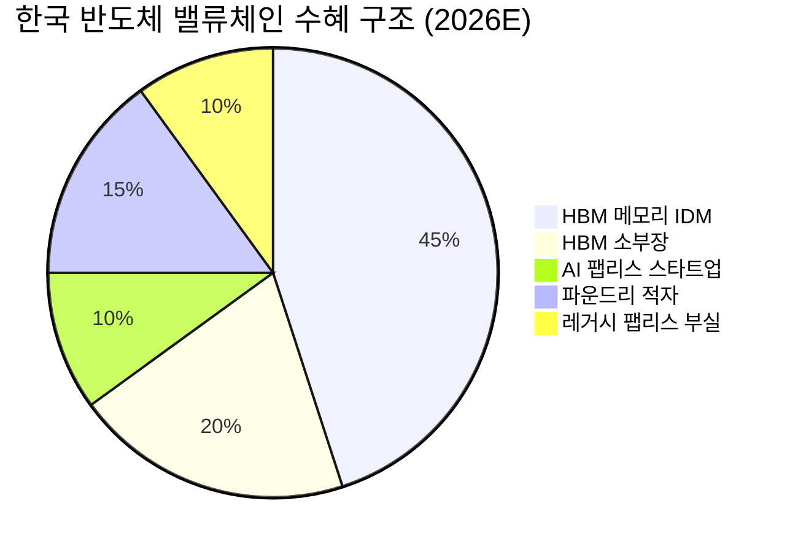
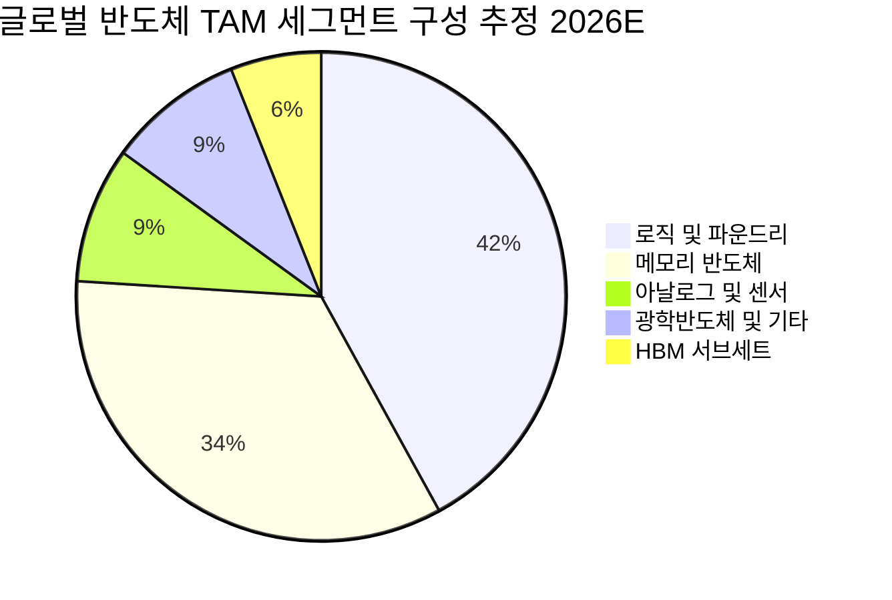
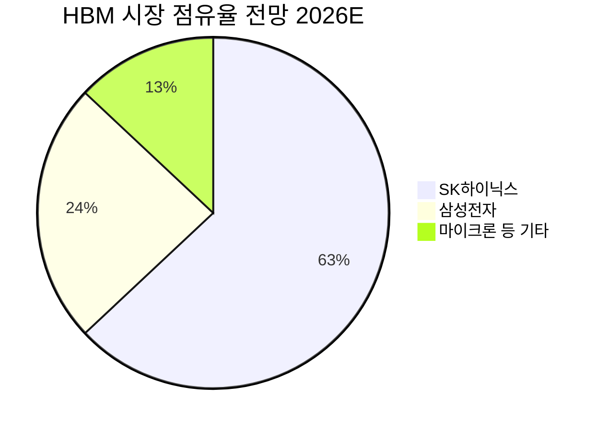
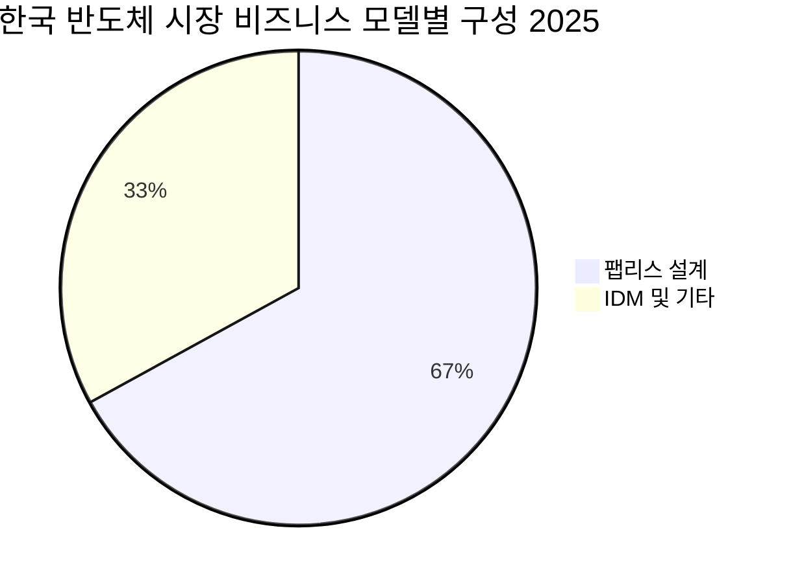
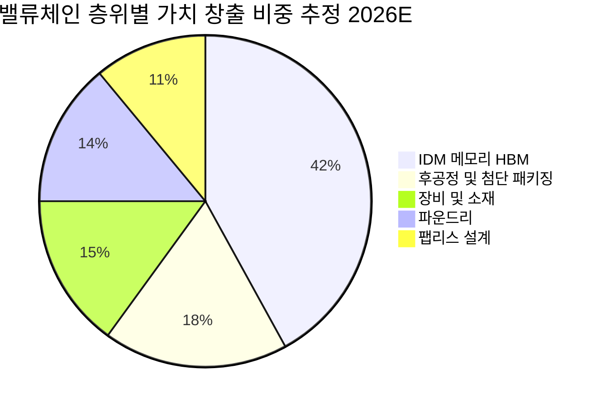
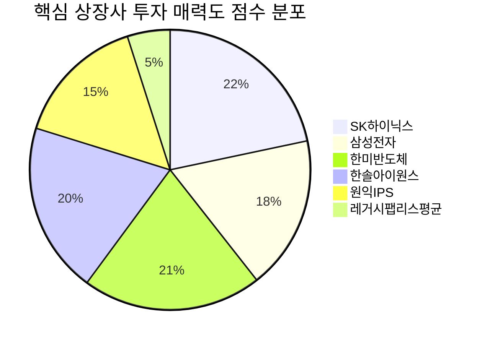
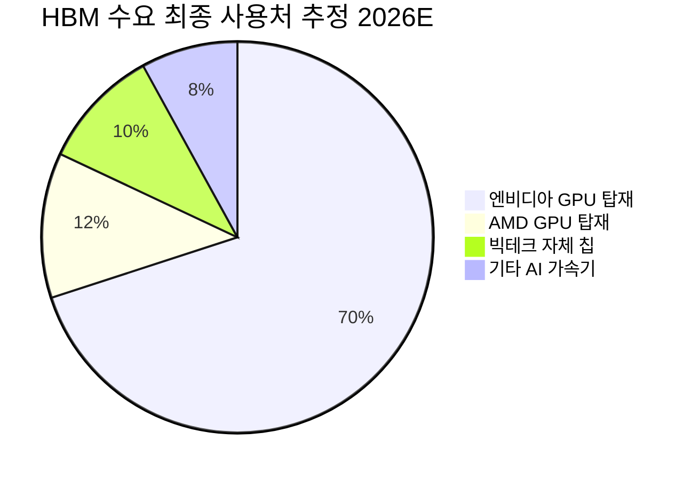
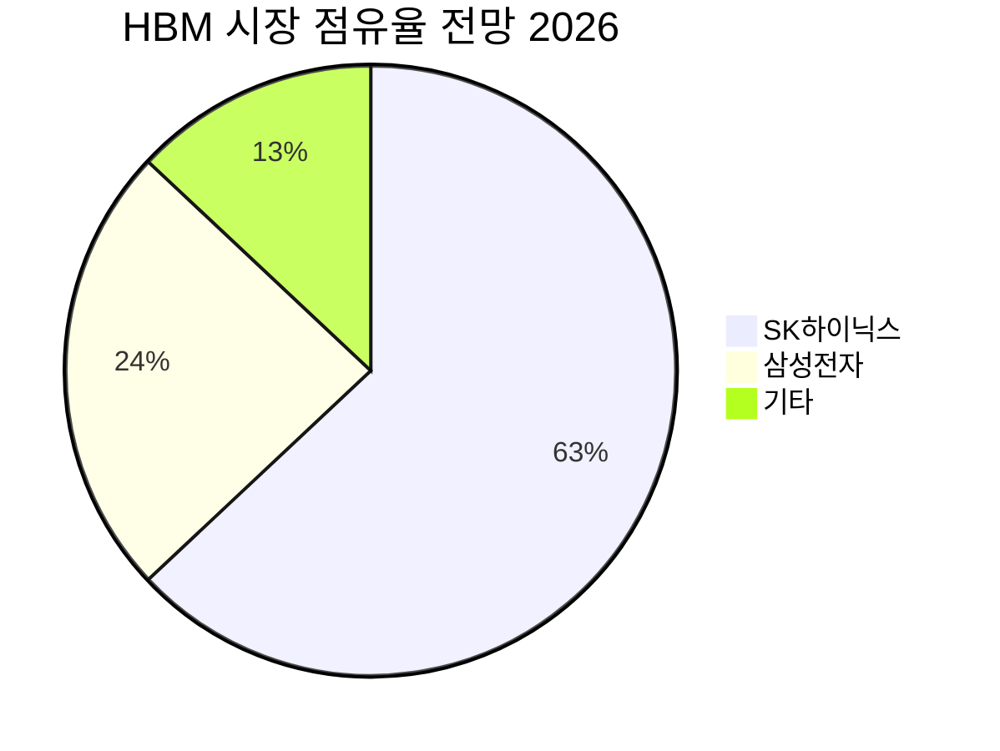

# Executive Summary & Why Now: 슈퍼사이클 2.0의 진입점

> [!abstract] 핵심 요약
> 2026년 글로벌 반도체 시장은 $9,098억~$9,750억(YoY +17.8%)으로 사상 최대 규모에 도달하며, 한국은 HBM·AI 메모리 수출 $1,880억(역대 최대)으로 그 중심에 선다. 그러나 이 슈퍼사이클은 전통 메모리 사이클과 구조적으로 다르다 — 공급 주도가 아닌 **AI 인프라 장기 CapEx 사이클**이 수요를 견인하며, 한국 메모리 빅2는 공급 병목의 수혜자다. 동시에 파운드리 적자·팹리스 63% 부실이라는 구조적 이중성이 공존하며, 수혜와 소외의 분기점은 명확하다.

---

## 1. 지금 이 순간의 좌표: 숫자가 말하는 것

2026년 3월, 한국 반도체 수출이 단 한 달 만에 $328.3억을 기록했다. **전년 동월 대비 +151.4%**. 이 숫자 하나가 현재 사이클의 성격을 압축적으로 설명한다.

| 지표 | 수치 | 의미 |
|------|------|------|
| 한국 반도체 수출 (2026년 3월) | $328.3억, YoY **+151.4%** | 사이클 가속 확인 |
| 전체 수출 내 반도체 비중 | **38.1%** | 한국 경제 전체의 반도체 의존도 |
| 2026년 연간 수출 전망 | **$1,880억** (역대 최대, YoY +11%) | 고점 경신 구간 진입 |
| 글로벌 반도체 시장 (2026E) | **$9,098억~$9,750억** | $1조 달러 돌파 임박 |
| HBM 시장 규모 (2026E) | **$546억**, YoY +58% | 메모리의 새로운 핵심 |
| 삼성전자 Q1 영업이익 | **57.2조 원** (사상 최대) | 이미 실적으로 검증됨 |
| SK하이닉스 Q1 영업이익 전망 | **40조 원 돌파** | 컨센서스 상향 가능성 |

> [!tip] So What — 실적이 선행지표를 검증했다
> +151.4%의 수출 폭증은 기대가 아닌 **실제 선적(Shipment) 데이터**다. 삼성전자 Q1 사상 최대 영업이익도 잠정치로 확인됐다. 이는 "AI 수요가 결국 메모리 수요로 전환된다"는 가설이 숫자로 검증된 순간이다. 투자 가설의 1차 리스크(수요 현실화 여부)가 해소된 시점이다.

---

## 2. 슈퍼사이클 2.0: 과거 사이클과 무엇이 다른가

### 2.1 전통 메모리 사이클의 구조

과거 반도체 사이클은 전형적인 **공급-수요 불균형 사이클**이었다. 수요 급증 → 공급 과잉 투자 → 공급 과잉 → 가격 붕괴 → 감산 → 회복의 3~4년 주기가 반복됐다. 2015~2016년 사이클, 2018~2019년 사이클이 이 패턴을 따랐다.

이 구조에서 투자자의 최대 과제는 **공급 과잉 전환 시점 예측**이었다.

### 2.2 슈퍼사이클 2.0의 구조적 차이점

<div style="border-left:4px solid #4CAF50;padding-left:12px;margin:8px 0">

**핵심 변화**: 수요의 성격이 바뀌었다. PC·스마트폰 교체 사이클(소비자 재량 지출)에서 데이터센터 AI 인프라 CapEx(기업 필수 지출)로 수요처가 이동했다.

</div>

| 구분 | 전통 메모리 사이클 | 슈퍼사이클 2.0 (현재) |
|------|-----------------|-----------------|
| **수요 드라이버** | PC·스마트폰 교체 주기 | AI 인프라 장기 CapEx |
| **수요 예측 가능성** | 낮음 (소비자 재량) | 높음 (기업 투자 계획) |
| **계약 구조** | 단기 현물 거래 중심 | 3~5년 장기 공급 계약으로 전환 |
| **수요처 집중도** | 수천 개 기업·소비자 | 빅테크 5~6개사 집중 |
| **제품 특성** | 범용 DRAM/낸드 | HBM (고사양, 대체불가) |
| **공급 확장 속도** | 빠름 (레거시 공정 전용) | 느림 (HBM 특화 공정 전환 필요) |
| **공급 병목 기간** | 12~18개월 | 2026~2028년 (최소 2~3년) |
| **가격 변동성** | 높음 | 낮음 (장기 계약 고정) |

> [!tip] Variant Perception — 시장이 아직 과소평가하는 것
> 컨센서스는 "2026년 이후 메모리 사이클이 꺾인다"는 전통적 사이클 분석에 기대고 있다. 그러나 HBM은 **공급 확장에 물리적 제약**이 있다: ① 기존 DRAM 생산 라인의 HBM 전환에 12~18개월 소요, ② HBM TC 본더 등 전용 장비 수급 한계, ③ 수율 안정화까지의 기술적 장벽. 따라서 수요가 일시적으로 조정되더라도 공급이 수요를 즉각 초과할 수 없는 구조다. 이 사이클이 전통 사이클보다 길 가능성을 시장은 충분히 반영하지 않고 있다.

### 2.3 AI 인프라 투자의 파급 경로 (Transmission Mechanism)

```
[생성형 AI 모델 고도화]
         ↓
[빅테크 데이터센터 CapEx 증가]
  (MS, Google, Meta, Amazon, ByteDance)
         ↓
[GPU·AI 가속기 수요 폭증]
  (엔비디아 H200/B200 시리즈)
         ↓
[HBM 수요 폭증 — GPU당 HBM 용량 지속 확대]
  HBM3E: 80GB/GPU → HBM4: 128GB+/GPU (예상)
         ↓
[SK하이닉스(63%)·삼성전자(24%) 수혜]
  → 가격 결정력 보유, 마진 급등
         ↓
[국내 소부장 수혜 — 한미반도체 등]
  HBM TC 본더·하이브리드 본더 수요 급증
```

> [!note] 1차·2차 효과 분석
> **1차 효과**: HBM 판가 상승 + 물량 증가 → 삼성전자·SK하이닉스 메모리 부문 마진 급등 (이미 Q1 실적으로 확인)
>
> **2차 효과**: ① HBM 생산 확대를 위한 설비투자 → 소부장 기업 수주 증가, ② 범용 DRAM 생산 라인의 HBM 전용 전환 → 범용 DRAM 공급 감소 → 범용 가격도 지지, ③ 한국 수출 흑자 확대 → 원화 강세 압력 (역설적으로 수출기업 마진에 일부 역풍)

---

## 3. 수출 $1,880억 달성 가능성 분석

> [!abstract] 핵심 판단
> 2026년 반도체 수출 $1,880억(YoY +11%) 목표는 달성 가능하며, 상방 리스크가 더 크다. 단 3월 한 달 $328.3억을 기록했다는 점에서, 연간화하면 이미 $3,900억 규모 — 목표치를 크게 웃도는 수준이다. 다만 계절성과 수출 변동성을 감안해야 한다.

### 3.1 수출 $1,880억의 드라이버 분해

<div style="background:#e0e0e0;border-radius:8px;overflow:hidden;margin:4px 0"><div style="background:#4CAF50;width:85%;padding:4px 8px;color:white;font-size:0.9em;white-space:nowrap">HBM 드라이버 강도 85/100 — 가장 강력한 단일 성장 엔진</div></div>

<div style="background:#e0e0e0;border-radius:8px;overflow:hidden;margin:4px 0"><div style="background:#4CAF50;width:72%;padding:4px 8px;color:white;font-size:0.9em;white-space:nowrap">범용 DRAM 가격 지지 72/100 — HBM 전환 효과로 공급 타이트</div></div>

<div style="background:#e0e0e0;border-radius:8px;overflow:hidden;margin:4px 0"><div style="background:#FF9800;width:58%;padding:4px 8px;color:white;font-size:0.9em;white-space:nowrap">낸드플래시 회복 58/100 — 개선 중이나 불확실성 잔존</div></div>

<div style="background:#e0e0e0;border-radius:8px;overflow:hidden;margin:4px 0"><div style="background:#F44336;width:35%;padding:4px 8px;color:white;font-size:0.9em;white-space:nowrap;min-width:60px">지정학 리스크 35/100 — 미국 관세·중국 제재 변수</div></div>

| 드라이버 | 기여 메커니즘 | 확실성 | 리스크 |
|---------|------------|--------|--------|
| **HBM 물량·가격** | 엔비디아 공급 계약 확대, HBM4 전환 | 🟢 높음 | 수율 문제 |
| **범용 DRAM 가격** | HBM 전환으로 공급 축소 효과 | 🟢 높음 | 중국 추격 |
| **낸드플래시** | AI 데이터센터 SSD 수요 증가 | 🟡 중간 | 공급 과잉 잔재 |
| **시스템 반도체** | 파운드리 적자 지속 | 🔴 낮음 | 구조적 문제 |

### 3.2 지정학적 변수: 최대 불확실성

> [!warning] 미국 관세 리스크 — 수출 전망의 가장 큰 변수
> 트럼프 행정부의 반도체 관련 관세 정책은 한국 수출의 핵심 불확실성이다. 한국산 반도체의 주요 수출지가 대만(TSMC 패키징 경유), 베트남, 미국임을 감안할 때, 관세 구조 변화는 수출 경로 재편을 강제할 수 있다. 단, HBM은 엔비디아 GPU의 필수 부품으로 대체재가 없어 단기적 관세 영향은 제한적일 것으로 판단한다. [추정]

---

## 4. 한국 반도체 생태계 내 수혜·소외의 분기점

> [!abstract] 핵심 구조
> 2026년 한국 반도체 생태계는 **'AI 메모리 슈퍼사이클 수혜층'과 '구조적 소외층'으로 완전히 이분화**되고 있다. 이 분기점을 정확히 이해하는 것이 종목 선택의 핵심이다.

### 4.1 수혜·소외 매핑



| 세그먼트 | 수혜/소외 | 핵심 근거 | 대표 기업 |
|---------|---------|---------|---------|
| **HBM 메모리** | 🟢 최대 수혜 | HBM 시장 YoY +58%, SK하이닉스 63% 점유 | [[SK하이닉스]], [[삼성전자]] |
| **HBM 소부장** | 🟢 강한 수혜 | 설비투자 110조 원+, TC본더 수요 급증 | [[한미반도체]], [[한솔아이원스]] |
| **AI 팹리스** | 🟡 고성장·수익화 미정 | 리벨리온 3.4조 기업가치, 아직 Pre-IPO | [[리벨리온]], [[퓨리오사AI]] |
| **파운드리** | 🔴 구조적 적자 | Q1 1조 원대 후반 영업손실 지속 | 삼성전자 파운드리 |
| **레거시 팹리스** | 🔴 슈퍼사이클 소외 | 22개 상장사 중 14곳(63%) 적자 | (다수 중소형사) |
| **범용 DRAM/낸드** | 🟡 가격 지지·공급 조정 | HBM 전환 효과, 중국 압박 상존 | [[삼성전자]] 일부 |

### 4.2 분기점의 본질: AI Memory vs. Everything Else

<div style="display:flex;border-radius:8px;overflow:hidden;margin:4px 0"><div style="background:#4CAF50;width:65%;padding:4px 8px;color:white;font-size:0.85em">AI 메모리·소부장 수혜 65%</div><div style="background:#F44336;width:35%;padding:4px 8px;color:white;font-size:0.85em;text-align:right">파운드리·레거시 소외 35%</div></div>

**수혜의 조건 (체크리스트)**:
1. ✅ HBM 또는 HBM 후공정 직접 연계 여부
2. ✅ AI 데이터센터향 매출 비중이 전체의 50% 이상
3. ✅ 고객사가 엔비디아·AMD·빅테크로 집중
4. ❌ 범용 소비자 가전·모바일 매출 의존
5. ❌ 중국 경쟁 노출이 높은 레거시 팹리스

> [!failure] 구조적 소외: 팹리스 63% 부실의 의미
> 국내 22개 주요 팹리스 상장사 중 14곳이 적자를 기록하고 있다. 이는 단순한 업황 부진이 아니다. **구조적 경쟁력 문제**다: ① EDA 도구 라이선스·R&D 인건비 고정비 부담 급증, ② 중국 칩의 가격 경쟁력 강화(레거시 공정 활용), ③ 파운드리 단가 인상으로 원가 압박. 슈퍼사이클이 오래 지속될수록 이들의 소외는 더 심화된다. 투자자는 '팹리스'라는 카테고리 전체가 아닌 **AI 팹리스(리벨리온, 퓨리오사AI)와 레거시 팹리스의 완전한 분리**가 필요하다.

---

## 5. 지금 투자해야 하는 이유: 타이밍 논거

> [!abstract] Why Now
> 슈퍼사이클 2.0에서 '지금'이 진입 타이밍인 이유는 세 가지다: ① 실적 검증이 완료되어 가설 리스크가 제거됐고, ② HBM 공급 병목이 2028년까지 지속될 구조이며, ③ 밸류에이션이 역사적 저점에서 회복 중이다.

### 5.1 세 가지 타이밍 논거

**논거 1: 실적 검증 완료 — 가설에서 팩트로**

2026년 Q1 실적이 투자 가설을 검증했다. 삼성전자 영업이익 57.2조 원(사상 최대), SK하이닉스 40조 원 돌파 전망 — 이는 "AI 수요 → HBM 수요 → 메모리 이익 급등"이라는 연결고리가 숫자로 확인된 것이다. 실적 가시성이 높아질수록 멀티플 디스카운트는 해소된다.

**논거 2: 공급 병목 2026~2028년 지속 구조**

HBM 공급 확장의 물리적 제약:
- DRAM 라인 → HBM 전용 라인 전환: 12~18개월 소요
- HBM TC 본더 등 전용 장비 납기: 수요 급증으로 자체 병목 발생
- 수율 안정화: 세대 전환(HBM4→HBM5)마다 재반복
- 삼성전자 파운드리 적자로 인한 HBM 투자 집중 = SK하이닉스 독점 강화

BofA의 2026년 HBM 시장 규모 $546억(YoY +58%)은 공급이 이 수요를 따라가지 못한다는 것을 전제한다.

**논거 3: 밸류에이션 — 역사적 저점에서 출발**

<div style="background:#e0e0e0;border-radius:8px;overflow:hidden;margin:4px 0"><div style="background:#FF9800;width:45%;padding:4px 8px;color:white;font-size:0.9em;white-space:nowrap">삼성전자 12M Fwd PER 10배 미만 — 애플·엔비디아의 1/3 수준</div></div>

- 삼성전자 외국인 지분율: 13년 만에 50% 이하 (역사적 저점)
- 삼성전자 선행 PER: 10배 미만 vs. 글로벌 반도체 평균 25~30배
- 한솔아이원스 12M Fwd PER: 7배 (경쟁사 대비 현저한 저평가)

> [!tip] Margin of Safety — 밸류에이션 안전마진
> 삼성전자 PER 10배 미만은 사이클 고점에서도 이례적으로 낮다. 통상 메모리 반도체 기업은 사이클 정점에서 PER 압축이 나타나지만, 현재의 밸류에이션은 **시장이 사이클 꺾임을 이미 상당 부분 반영**한 수준이다. 삼성전자 Q1 실적이 사상 최대임에도 PER이 10배 미만이라는 것은, 시장이 "이 이익은 지속 불가능하다"고 보는 것인데 — HBM 장기 계약 구조를 감안하면 이 판단이 틀릴 가능성이 높다.

### 5.2 시간축별 투자 의미

| 시간축 | 주요 이벤트 | 투자 의미 |
|--------|-----------|---------|
| **단기 (0~6개월)** | Q2~Q3 실적 발표, HBM4 양산 확대 | 실적 모멘텀 지속 확인 → 멀티플 재평가 |
| **중기 (6~18개월)** | HBM4 점유율 확정, AI 추론 칩 수요 가시화 | SK하이닉스 HBM4 독점→삼성 추격 여부 분기점 |
| **장기 (2~3년)** | HBM5·하이브리드 본딩 상용화, 칩렛·실리콘 포토닉스 대중화 | 기술 S커브 전환점 — 한국이 새 기술에서 포지션 확보 여부 |

---

## 6. Devils Advocate — 틀릴 가능성

> [!warning] Bear Case 핵심 논거
> 투자 논거가 틀릴 수 있는 시나리오를 솔직하게 점검한다.

**반론 1: AI CapEx 버블론**
빅테크의 데이터센터 CapEx가 실제 AI 서비스 수익화보다 빠르게 증가하고 있다. 만약 AI ROI 증명이 지연된다면, CapEx 삭감이 순식간에 HBM 수요를 압박할 수 있다. 구글, 마이크로소프트 등 AI 서비스 수익화 진행 속도가 핵심 모니터링 지표다.

**반론 2: 중국의 빠른 추격**
중국은 HBM2E 양산과 HBM3 개발에 착수했다. 미국의 대중 수출 통제가 완화되거나 중국이 자체 기술을 돌파한다면, 한국의 HBM 가격 결정력이 훼손된다. 단 HBM4/5 수준의 격차는 최소 2~3년 이상으로 추정된다. [추정]

**반론 3: 삼성전자 파운드리 적자의 메모리 잠식**
파운드리 1조 원대 후반 영업손실이 지속된다면, 메모리 초과 이익을 잠식한다. 삼성전자 투자 시 파운드리 리스크를 별도로 계량해야 한다. 반면 SK하이닉스는 이 리스크에서 자유롭다.

**반론 4: 지정학 리스크 — 미국 관세·반도체법 변화**
미국의 대중 반도체 장비 수출통제 강화나 한국 기업에 대한 직접 관세 부과 시, 공급망 재편 비용이 단기 수익성을 압박할 수 있다. 소재 측면에서는 헬륨(카타르 64.7%), 브롬(이스라엘 97.5%) 등 소재 공급망 취약성도 잠재 리스크다.

<div style="display:flex;border-radius:8px;overflow:hidden;margin:8px 0;font-size:0.85em"><div style="background:#4CAF50;width:40%;padding:6px 8px;color:white">🟢 Bull 40%</div><div style="background:#FF9800;width:40%;padding:6px 8px;color:white">🟡 Base 40%</div><div style="background:#F44336;width:20%;padding:6px 8px;color:white">🔴 Bear 20%</div></div>

| 시나리오 | 조건 | 한국 반도체 수출 (2026E) | 핵심 기업 영향 |
|---------|------|----------------------|------------|
| **🟢 Bull** | AI CapEx 지속 + HBM4 조기 안착 + 관세 협상 타결 | $2,000억+ | SK하이닉스·삼성전자 추가 상방 |
| **🟡 Base** | HBM 수요 견조 + 파운드리 적자 지속 | $1,880억 | 메모리 강세, 파운드리 드래그 |
| **🔴 Bear** | AI CapEx 삭감 + 중국 추격 가속 + 미국 관세 충격 | $1,500억~ | 범용 가격 급락, 사이클 조기 종료 |

---

## 7. Incentive Analysis — 이해관계자별 숨겨진 동기

> [!note] 각 플레이어의 진짜 인센티브
> 투자 분석에서 종종 간과되는 이해관계자 동기를 점검한다.

| 이해관계자 | 표면적 목표 | 숨겨진 인센티브 | 투자 함의 |
|----------|-----------|-------------|---------|
| **삼성전자 경영진** | HBM4 수율·점유율 회복 | 파운드리 독립 수익성 증명 vs. 메모리 집중 딜레마 | 자원 배분 최적화 불확실성 |
| **SK하이닉스** | HBM 독점적 지위 유지 | TSMC 의존도 축소, 자체 패키징 강화 | HBM4 내재화 속도가 관건 |
| **한국 정부** | K-반도체 세계 2강 | 2047년 700조 투자·팹 10기 공약 달성 | 소부장·팹리스 지원 정책 확대 |
| **엔비디아** | GPU 공급 최대화 | HBM 공급선 다변화 (SK하이닉스→삼성 확대) | 삼성 HBM4 검증 성공 시 점유율 반등 |
| **빅테크 CapEx 담당** | AI 인프라 최적 구축 | 특정 공급사 의존 회피 → 다변화 인센티브 | 한국 메모리 공급자 교섭력 장기적 제한 |

---

## 8. 종합 판단: 슈퍼사이클 2.0의 진입점인가

> [!verdict] 최종 판단
> **YES — 단, 선택적 진입이 필수다.**
>
> 한국 반도체 섹터 전체가 아닌, **HBM 메모리(SK하이닉스, 삼성전자 메모리 부문)와 HBM 직결 소부장(한미반도체, 한솔아이원스)**에 집중하는 전략적 접근이 요구된다. 파운드리·레거시 팹리스는 같은 '반도체 섹터'임에도 완전히 다른 사이클에 있다.
>
> 2026년은 AI 인프라 CapEx 사이클의 **검증 국면**이다. 가설이 숫자로 확인됐고, 공급 병목 구조는 2028년까지 지속되며, 밸류에이션은 역사적 저점에서 출발한다. 틀릴 리스크(AI CapEx 버블, 중국 추격, 지정학)는 실재하지만, 현재 주가가 이미 상당 부분 이를 반영하고 있다는 점에서 **Margin of Safety가 존재**한다.
>
> **핵심 모니터링**: ① 빅테크 AI CapEx 가이던스 (분기별), ② 삼성전자 HBM4 엔비디아 검증 결과, ③ SK하이닉스 HBM 마진 추이, ④ 미국 관세·수출통제 정책 변화.

<div style="background:#e0e0e0;border-radius:8px;overflow:hidden;margin:4px 0"><div style="background:#4CAF50;width:78%;padding:4px 8px;color:white;font-size:0.9em;white-space:nowrap">전체 투자 매력도 78/100 — Selective Strong Buy</div></div>

---

*본 리포트는 투자 가설 검증용(Due Diligence Light)으로 작성되었으며, 앵커 데이터 기준일은 2026년 4월 7일입니다. 모든 추정치는 [추정] 태그로 명시되었으며, 확인되지 않은 수치는 "(데이터 미확인)" 또는 "(확인 필요)"로 표기했습니다.*

---

# 시장 구조 분석: TAM·SAM·세그먼트별 성장 벡터 해부

> [!abstract] 섹션 핵심 요약
> 글로벌 반도체 시장은 2026년 $9,098억~$9,750억으로 $1조 달러 돌파를 목전에 두고 있다. 이 성장은 균질하지 않다 — HBM이 YoY +58%로 전체 시장 성장률(+17.8%)의 **3.3배** 속도로 성장하며 구조적 재편을 주도한다. 한국은 이 성장의 핵심 공급자이나, $357억 한국 디바이스 시장 내부의 IC 85.72%, 팹리스 67.05% 구성은 역설적으로 **수혜 집중과 소외 공존**이라는 이중 구조를 노출한다. 각 세그먼트의 S-Curve 위치를 정확히 진단해야 투자 타이밍이 보인다.

---

## 1. 글로벌 TAM 해부: $9,098억의 성장 동력은 균질하지 않다

### 1.1 시장 규모 레이어 분해

글로벌 반도체 시장 $9,098억(EPNC, 2026.02.06)이라는 숫자는 단일한 성장 스토리가 아니다. 이를 세그먼트별로 분해하면 성장의 **극단적 불균형**이 드러난다.

| 세그먼트 | 2026E 규모 | YoY 성장률 | 전체 TAM 내 비중 | 성장 기여도 |
|---------|-----------|----------|---------------|----------|
| **메모리 반도체** | ~$3,100억 [추정] | **+33.8%** | ~34% | 🟢 최대 기여 |
| ↳ HBM (서브세트) | **$546억** | **+58%** | ~6% | 🟢 초고속 성장 |
| **로직/파운드리** | ~$3,800억 [추정] | ~+12% [추정] | ~42% | 🟡 중간 |
| **아날로그·센서** | ~$850억 [추정] | ~+8% [추정] | ~9% | 🟡 완만 |
| **광학반도체·기타** | ~$800억 [추정] | ~+15% [추정] | ~9% | 🟡 성장 |
| **전체 TAM** | **$9,098억~$9,750억** | **+17.8%** | 100% | — |

> [!note] 추정 근거
> 세그먼트별 절대 규모는 EPNC 발표 총계에서 메모리 성장률(+33.8%)과 HBM 규모($546억, BofA)를 앵커로 역산한 [추정] 수치입니다. 파운드리·아날로그 등 세부 세그먼트 분해는 공개 데이터 미확인 상태이므로, 해당 수치는 방향성 판단용으로만 사용하세요.

**핵심 인사이트**: 메모리(+33.8%)가 전체 성장률(+17.8%)의 **1.9배** 속도로 시장을 끌어올리고 있다. 그중 HBM(+58%)은 메모리 성장률의 **1.7배**, 전체 시장 성장률의 **3.3배** 속도다. 이것이 한국 반도체 수출이 +151.4%를 기록한 구조적 이유다.



> [!warning] 데이터 주의
> 위 파이 차트는 공개된 총계와 세그먼트 성장률 앵커에서 역산한 [추정]입니다. HBM은 메모리 내 서브세트이나 규모 강조를 위해 별도 표기했습니다. WSTS, SIA 등 공식 세그먼트 분류와 수치가 상이할 수 있습니다.

---

### 1.2 $1조 달러 돌파의 구조적 의미

<div style="border-left:4px solid #4CAF50;padding-left:12px;margin:8px 0">

**$1조 달러는 단순한 라운드 넘버가 아니다.** 글로벌 GDP 대비 반도체 시장 비중이 1%를 넘어서는 역사적 임계점이다. 이는 반도체가 더 이상 전자제품의 부품이 아닌 **경제 인프라 그 자체**임을 의미한다. 전기·석유가 20세기 인프라였다면, 반도체 연산 능력은 21세기 인프라다.

</div>

**$1조 달러 달성의 3대 조건** (이미 충족 중):

1. ✅ **AI 인프라 CapEx 슈퍼사이클**: 빅테크 5~6개사의 데이터센터 투자가 수요의 구조적 바닥을 형성
2. ✅ **HBM 단가·물량 동시 확대**: 세대 전환(HBM3E→HBM4)마다 ASP 상승 + 채택 GPU 확대
3. 🟡 **파운드리 회복 대기 중**: 삼성전자 파운드리 적자 지속이 전체 $1조 달성 속도 제약 요인

> [!tip] Variant Perception — $1조 이후가 더 중요하다
> 시장 컨센서스는 "$1조 돌파"를 이벤트로 다루지만, 투자자에게 진짜 중요한 질문은 **"$1조 이후 성장의 질(Quality of Growth)이 무엇이냐"**이다. AI가 견인하는 메모리·HBM 성장이 지속된다면, $1.2조~$1.5조로 가는 경로에서도 한국의 점유율은 오히려 올라간다. 반면 파운드리 회복이 성장을 주도하게 되면 TSMC가 더 큰 수혜자가 된다.

---

## 2. HBM: 2022년 $11억 → 2026E $546억, 4년 50배 성장의 해부

> [!abstract] HBM 분석 핵심
> HBM의 50배 성장은 단순한 수요 급증이 아니다. **기술-수요-공급이 동시에 임계점을 돌파**한 결과다. 이 세 가지 임계점의 동시 달성이 왜 과거에는 불가능했는지, 그리고 이것이 얼마나 지속 가능한지를 이해해야 투자 타이밍을 잡을 수 있다.

### 2.1 HBM 50배 성장의 구조적 원인: 세 가지 임계점의 동시 돌파

**임계점 1 — 기술적 임계점: GPU가 메모리 대역폭 병목에 직면**

AI 트랜스포머 모델의 파라미터 규모가 기하급수적으로 증가하면서(GPT-3 1,750억 → GPT-4 추정 1조+ 파라미터), GPU의 연산 성능 대비 메모리 대역폭이 결정적 병목이 됐다. GDDR 방식으로는 이 병목을 물리적으로 해소할 수 없었고, 메모리를 수직 적층하여 프로세서 바로 옆에 배치하는 HBM 구조만이 유일한 해결책이 됐다.

<div style="background:#e0e0e0;border-radius:8px;overflow:hidden;margin:4px 0"><div style="background:#4CAF50;width:90%;padding:4px 8px;color:white;font-size:0.9em;white-space:nowrap">HBM의 대역폭 우위: GDDR6X 대비 약 10배 이상 (확인 필요)</div></div>

**임계점 2 — 수요 임계점: 데이터센터가 스마트폰·PC를 제치고 최대 메모리 수요처로 부상**

2025년을 기점으로 데이터센터가 PC와 스마트폰을 제치고 최대 메모리 수요처가 됐다. 이 전환은 수요의 **성격 변화**를 의미한다:

| 구분 | 소비자 기기 수요 | 데이터센터 AI 수요 |
|------|--------------|----------------|
| **수요 단위** | 수억 개 기기, 기기당 수 GB | 수백만 GPU, GPU당 수십~수백 GB |
| **갱신 주기** | 2~3년 (소비자 교체) | 1~2년 (AI 모델 세대 전환 속도) |
| **가격 민감도** | 높음 | 낮음 (총 시스템 비용 대비 미미) |
| **공급 협상력** | 구매자 우위 | 공급자 우위 (병목 구조) |

**임계점 3 — 공급 임계점: 생산 가능 기업이 2개사로 집중**

HBM 생산은 극도로 복잡한 적층(Stacking)과 TSV(Through-Silicon Via) 공정, TC(Thermal Compression) 본딩 기술을 요구한다. 현재 양산 가능한 기업은 사실상 SK하이닉스와 삼성전자 두 곳으로, 마이크론이 후발로 추격 중이나 점유율은 미미하다. 이 공급 집중이 가격 결정권을 공급자에게 부여했다.

### 2.2 HBM 시장 점유율: SK하이닉스의 구조적 우위



| 기업 | 점유율 | 경쟁 우위 | 리스크 |
|------|--------|---------|--------|
| **SK하이닉스** | **63%** | HBM3E 엔비디아 독점 공급, 수율 선행 | 공급 집중 → 단일 고객 의존 |
| **삼성전자** | **24%** | HBM4 세계 최초 양산 출하(2026.03), 턴키 강점 | HBM3E 수율 열세, 검증 지연 |
| **마이크론 등** | **~13%** | 원가 경쟁력 | 기술 격차 2~3세대 |

> [!tip] So What — SK하이닉스 63% 점유율의 투자 함의
> 63% 점유율은 단순한 시장 지배가 아니다. HBM 시장($546억)의 63%는 약 **$344억**이다. 이것이 SK하이닉스 메모리 부문의 마진을 떠받치는 구조다. 더 중요한 것은, 엔비디아가 특정 공급자에 과도하게 의존하는 것을 꺼리므로 **삼성전자 HBM4 검증 성공 시 점유율 재편이 가능하다**는 점이다. 삼성전자가 HBM4에서 성공하면 SK하이닉스 수익성에 단기 압박이 올 수 있으나, HBM 시장 파이가 더 빠르게 커지므로 절대 이익은 증가하는 구조다.

### 2.3 HBM 기술 로드맵: 각 세대 전환이 시장 구조에 미치는 영향

> [!abstract] 기술 로드맵의 투자 의미
> HBM 세대 전환은 단순한 성능 업그레이드가 아니다. 매 세대마다 ① 단가(ASP) 상승, ② 생산 난이도 증가로 인한 공급 병목 심화, ③ 점유율 재편 기회가 동시에 발생한다. 세대 전환점은 기존 선두의 우위가 도전받는 순간이자, 새로운 투자 진입 타이밍이다.

| HBM 세대 | 성숙도 | S-Curve 위치 | 대역폭 | 적층 수 | 시장 영향 | 핵심 이슈 |
|---------|--------|------------|--------|--------|---------|---------|
| **HBM2E** | 🟢 성숙기 | 후반부 | ~460GB/s | 8단 | 레거시 수요 유지 | 중국 추격 (HBM2E 양산 착수) |
| **HBM3E** | 🟢 성장 최정점 | 급성장 구간 후반 | ~1.2TB/s | 12단 | 현재 주력, 수요 폭발 | SK하이닉스 독점→삼성 추격 |
| **HBM4** | 🟢 초기~성장 진입 | 성장 진입 초기 | ~2TB/s+ [추정] | 16단+ [추정] | 삼성 세계 최초 양산(2026.03), 점유율 재편 분기점 | 수율 안정화 경쟁 |
| **HBM5** | 🟡 R&D 단계 | S-Curve 이전 | 미정 | 미정 | 2029년 출시 예상 [추정] | 하이브리드 본딩 도입 필요 |

<div style="border-left:4px solid #FF9800;padding-left:12px;margin:8px 0">

**HBM4 전환의 핵심 변수**: 삼성전자가 2026년 3월 세계 최초로 HBM4를 양산 출하했다. 이는 HBM3E에서 뒤처졌던 삼성전자에게 선도권 탈환 기회다. 그러나 '양산 출하'와 '엔비디아 검증 통과'는 다르다. 엔비디아의 실제 채택 여부가 점유율 재편의 진짜 분기점이다.

</div>

**각 세대 전환이 시장 구조에 미치는 3가지 효과:**

**1) ASP 상승 효과**: HBM 각 세대는 이전 세대 대비 약 20~40% 단가 상승 [추정]. 세대 전환이 빠를수록 시장 규모가 더 빠르게 성장한다.

**2) 공급 병목 심화 효과**: 적층 수 증가(8단→12단→16단+)와 본딩 기술 난이도 상승으로 세대가 높아질수록 수율 확보가 어려워진다. 이는 선발 기업의 우위가 더 강화되는 구조이나, 동시에 기술 도약을 통한 역전도 가능하다.

**3) 점유율 재편 기회**: 매 세대 전환은 "리셋 버튼"이다. HBM3에서 SK하이닉스가 우위를 잡았지만, HBM4에서 삼성전자가 선점에 성공한다면 엔비디아의 공급처 다변화 인센티브와 맞물려 점유율이 움직인다.

### 2.4 HBM 성장 지속 가능성: 얼마나 더 갈 수 있는가?

**성장 지속 논거 (Bull)**:

<div style="background:#e0e0e0;border-radius:8px;overflow:hidden;margin:4px 0"><div style="background:#4CAF50;width:80%;padding:4px 8px;color:white;font-size:0.9em;white-space:nowrap">GPU당 HBM 탑재 용량 확대 트렌드 80/100 — 매 세대 2배+</div></div>

- H100: 80GB HBM3 → H200: 141GB HBM3E → B200: 192GB HBM3E (데이터 미확인, [추정])
- GPU당 HBM 용량이 매 세대 약 1.5~2배 증가 → 물량 기준 수요는 GPU 판매량 × 용량 증가율의 복합 성장
- AI 추론(Inference) 시장으로 수요 저변 확대 → 학습용 수퍼클러스터에서 엣지 추론까지 HBM 적용 범위 확장

**성장 제약 논거 (Bear)**:

<div style="background:#e0e0e0;border-radius:8px;overflow:hidden;margin:4px 0"><div style="background:#F44336;width:40%;padding:4px 8px;color:white;font-size:0.9em;white-space:nowrap;min-width:60px">AI CapEx 버블 리스크 40/100 — 무시할 수 없음</div></div>

- AI 서비스 수익화가 인프라 투자 속도를 따라가지 못할 경우, CapEx 삭감이 HBM 수요를 즉시 압박
- 적층 수 증가에 따른 **전력·발열 문제**: 16단 이상 적층 시 열 발산 한계 도달 가능성 (확인 필요)
- 중국의 HBM2E 양산 착수 → 레거시 HBM 시장에서의 경쟁 심화

> [!question] 검토 필요 — HBM 수요의 진짜 천장은?
> AI 인프라 CapEx가 현재 궤도로 2028년까지 지속될 경우, HBM 시장은 $546억(2026E)에서 $1,000억+까지 성장 가능하다는 시나리오가 있다 [추정]. 이 시나리오의 핵심 전제인 "빅테크의 AI ROI 검증"이 2026~2027년 중 가시화되느냐가 핵심 모니터링 포인트다.

---

## 3. SAM 해부: 한국 디바이스 시장 $357억의 구성과 의미

### 3.1 한국 반도체 디바이스 시장 $357억(2026E)의 구조

한국 반도체 디바이스 시장 $357억은 글로벌 TAM($9,098억)의 약 **3.9%**에 해당한다. 그러나 이 숫자를 한국 반도체의 실력으로 오해해서는 안 된다. 이는 **국내 소비 기준** SAM이며, 한국의 진짜 경쟁력은 $1,880억 수출 규모로 측정된다.

<div style="border-left:4px solid #2196F3;padding-left:12px;margin:8px 0">

**SAM $357억 vs. 수출 $1,880억의 괴리**: 한국 반도체 디바이스 시장이 $357억에 불과한 반면, 수출은 $1,880억에 달한다는 것은 한국이 전형적인 **수출 주도형 반도체 생산 국가**임을 의미한다. 내수 SAM은 시장 성장 지표가 아닌, 국내 생태계(팹리스, 소부장)의 로컬 수요 기반을 나타낸다.

</div>

| 지표 | 수치 | 의미 |
|------|------|------|
| **한국 디바이스 SAM (2026E)** | $357억 | 국내 소비 기준 시장 |
| **한국 반도체 수출 (2026E)** | $1,880억 | 실질 생산·경쟁력 지표 |
| **수출/SAM 배율** | **5.3배** | 수출 의존도의 극단적 구조 |
| **글로벌 TAM 내 SAM 비중** | ~3.9% | 소비 기준 점유율 |
| **SAM CAGR (2026~2031)** | +5.43% | 완만한 내수 성장 |

### 3.2 IC 비중 85.72%와 팹리스 67.05%의 진짜 의미

이 두 수치는 한국 반도체 시장의 구조를 가장 압축적으로 보여준다.

**IC 비중 85.72% — 무엇을 의미하는가?**

한국 반도체 시장의 85.72%가 집적회로(IC)라는 것은, 전력반도체·아날로그·센서 등 비IC 세그먼트의 비중이 14.28%에 불과하다는 뜻이다. 이는 한국의 **반도체 산업이 디지털 IC(DRAM, NAND, 로직 칩)에 고도로 집중**된 구조임을 보여준다.

<div style="display:flex;border-radius:8px;overflow:hidden;margin:4px 0"><div style="background:#4CAF50;width:86%;padding:4px 8px;color:white;font-size:0.85em">IC 집중 86% — 디지털 메모리·로직 특화</div><div style="background:#FF9800;width:14%;padding:4px 8px;color:white;font-size:0.85em;text-align:right">비IC 14%</div></div>

이 집중의 강점: AI·데이터센터 수요가 디지털 IC(특히 메모리)에 집중되므로, 현재 사이클에서 한국이 최대 수혜자가 된다.
이 집중의 약점: 전력반도체(SiC, GaN), 이미지센서, 아날로그 IC 등 **비IC 고성장 영역에서 한국의 존재감이 약하다**. 전기차 전환으로 전력반도체 수요가 폭발할 경우 STMicroelectronics, 인피니온 등 유럽 기업 대비 수혜가 제한된다.

**팹리스 비중 67.05% — 구조적 역설**

팹리스가 한국 반도체 시장의 67.05%를 차지한다는 수치는, 직관적으로는 "한국 팹리스 생태계가 강하다"는 인상을 주지만 실제로는 **분류 방식의 함정**을 이해해야 한다.

> [!warning] 팹리스 67.05% 수치 해석 주의
> Mordor Intelligence의 이 분류는 '팹리스 비즈니스 모델로 운영되는 세그먼트'를 의미할 수 있으며, 이는 삼성전자의 시스템 LSI 부문, SK하이닉스의 일부 설계 부문 등이 포함될 수 있습니다. 단순히 "중소 팹리스 스타트업이 시장의 67%"를 차지한다고 해석하면 오류입니다. 실제 독립 팹리스 기업들의 시장 현실은 **22개 상장사 중 14곳(63%) 적자**라는 데이터와 함께 읽어야 합니다.

팹리스 세그먼트 CAGR +7.1%가 가장 높다는 것은 사실이다. 그러나 이 성장의 수혜자는 **기존 상장 팹리스가 아닌 AI 팹리스 스타트업(리벨리온, 퓨리오사AI)**이 될 가능성이 높다.



### 3.3 SAM 성장 벡터: +5.43% CAGR의 내면

SAM CAGR +5.43%(2026~2031)은 전체 글로벌 반도체 성장률보다 낮다. 이는 한국 내수 시장의 성장이 세계 평균에 못 미친다는 것이 아니라, **기저 효과와 구성 믹스**의 문제다.

<div style="background:#e0e0e0;border-radius:8px;overflow:hidden;margin:4px 0"><div style="background:#4CAF50;width:63%;padding:4px 8px;color:white;font-size:0.9em;white-space:nowrap">IC 세그먼트 CAGR +6.32% — SAM 성장 견인</div></div>

<div style="background:#e0e0e0;border-radius:8px;overflow:hidden;margin:4px 0"><div style="background:#4CAF50;width:71%;padding:4px 8px;color:white;font-size:0.9em;white-space:nowrap">팹리스 세그먼트 CAGR +7.1% — 최고속 성장</div></div>

<div style="background:#e0e0e0;border-radius:8px;overflow:hidden;margin:4px 0"><div style="background:#FF9800;width:54%;padding:4px 8px;color:white;font-size:0.9em;white-space:nowrap">전체 SAM CAGR +5.43% — 비IC 세그먼트가 평균 하향</div></div>

<div style="background:#e0e0e0;border-radius:8px;overflow:hidden;margin:4px 0"><div style="background:#4CAF50;width:79%;padding:4px 8px;color:white;font-size:0.9em;white-space:nowrap">AI 애플리케이션 CAGR +7.86% — 가장 강력한 내수 성장 드라이버</div></div>

---

## 4. 세그먼트별 성장 벡터 매트릭스: 속도·지속성·한국 수혜도

> [!abstract] 핵심 분석 프레임
> 각 세그먼트를 ① 성장 속도, ② 성장 지속성, ③ 한국 기업의 수혜도 세 축으로 평가한다. 이 매트릭스가 투자 우선순위를 결정한다.

### 4.1 4대 성장 벡터 상세 분석

**벡터 1 — HBM: 현재 가장 강력한 단일 성장 엔진**

<div style="display:flex;border-radius:8px;overflow:hidden;margin:8px 0;font-size:0.85em"><div style="background:#4CAF50;width:58%;padding:6px 8px;color:white">🟢 YoY +58%, $546억</div><div style="background:#FF9800;width:25%;padding:6px 8px;color:white">🟡 2028년 피크 예상</div><div style="background:#F44336;width:17%;padding:6px 8px;color:white">🔴 공급 병목</div></div>

- **성장 동력**: GPU당 HBM 탑재 용량 확대 + GPU 출하량 증가 = 복합 성장
- **한국 수혜도**: 최상 (SK하이닉스 63% + 삼성전자 24% = 87% 한국 과점)
- **S-Curve 위치**: 급성장 구간 중반부. HBM3E는 정점 접근, HBM4는 성장 초입
- **리스크**: 적층 수 증가에 따른 기술적 난이도, 중국 추격, AI CapEx 변동성

**벡터 2 — 메모리 전체: HBM이 이끄는 +33.8% 성장**

<div style="display:flex;border-radius:8px;overflow:hidden;margin:8px 0;font-size:0.85em"><div style="background:#4CAF50;width:50%;padding:6px 8px;color:white">🟢 YoY +33.8%</div><div style="background:#FF9800;width:30%;padding:6px 8px;color:white">🟡 NAND 불확실</div><div style="background:#F44336;width:20%;padding:6px 8px;color:white">🔴 중국 DRAM</div></div>

- **DRAM**: HBM 전환으로 범용 DRAM 공급 축소 → 가격 지지. 단 중국의 저가 DRAM 위협 상존
- **NAND**: AI 데이터센터 SSD 수요 증가로 회복 중이나, 과거 공급 과잉 여파로 불확실성 잔존
- **한국 수혜도**: 높음 (삼성전자 + SK하이닉스 글로벌 과점)
- **S-Curve 위치**: DRAM은 성숙기 내 HBM 전환으로 고도화, NAND는 회복기

**벡터 3 — AI 애플리케이션: CAGR +7.86%의 중장기 잠재력**

<div style="display:flex;border-radius:8px;overflow:hidden;margin:8px 0;font-size:0.85em"><div style="background:#FF9800;width:45%;padding:6px 8px;color:white">🟡 CAGR +7.86% 완만하나 지속적</div><div style="background:#4CAF50;width:35%;padding:6px 8px;color:white">🟢 구조적 장기 성장</div><div style="background:#F44336;width:20%;padding:6px 8px;color:white">🔴 팹리스 미성숙</div></div>

- **의미**: AI 애플리케이션 CAGR +7.86%는 HBM의 폭발적 성장보다 완만하지만, **수요의 저변이 넓어지는 속도**를 나타낸다. 현재 AI 수요가 학습(Training) 중심이라면, AI 애플리케이션 성장은 추론(Inference) → 엣지 AI → 온디바이스 AI로의 확산을 의미한다
- **한국 수혜도**: 현재는 낮음. AI 팹리스 생태계가 Pre-IPO 단계이며, 실제 매출화까지 2~3년 소요 예상 [추정]
- **중장기 함의**: 추론 칩 수요가 확대될 경우, 학습용 HBM과 다른 메모리 아키텍처(더 넓은 대역폭보다 낮은 레이턴시·낮은 전력)가 요구될 수 있어 메모리 제품 믹스의 변화를 주시해야 한다
- **S-Curve 위치**: 초기 성장 단계. 아직 도입기를 벗어나는 중

**벡터 4 — 통신·ICT: 31.22% 비중의 기반 수요**

<div style="display:flex;border-radius:8px;overflow:hidden;margin:8px 0;font-size:0.85em"><div style="background:#FF9800;width:55%;padding:6px 8px;color:white">🟡 31.22% 비중, 안정적 수요</div><div style="background:#4CAF50;width:25%;padding:6px 8px;color:white">🟢 5G 고도화</div><div style="background:#F44336;width:20%;padding:6px 8px;color:white">🔴 성장률 둔화</div></div>

- **의미**: 통신 부문이 한국 반도체 소비의 31.22%를 차지하는 것은 스마트폰·5G 인프라의 지속적 수요를 반영
- **성장 전망**: 5G에서 6G로의 전환 및 AI폰 수요 증가가 중기 성장 드라이버이나, 스마트폰 출하량 회복 속도에 제약
- **한국 수혜도**: 중간 (삼성전자 모바일 AP, 중소 팹리스의 일부 수혜)

### 4.2 세그먼트 성장 벡터 종합 매트릭스

| 세그먼트 | 성장 속도 | 지속 가능성 | 한국 수혜도 | 투자 우선순위 |
|---------|---------|-----------|-----------|-----------|
| **HBM** | 🟢 +58% | 🟢 2028년까지 높음 | 🟢 최상 (87% 점유) | ⭐⭐⭐ 최우선 |
| **DRAM (범용)** | 🟢 +33.8%(메모리 전체) | 🟡 HBM 전환 효과에 의존 | 🟢 높음 | ⭐⭐ 우선 |
| **AI 팹리스** | 🟢 +7.86% CAGR 내 | 🟢 구조적 장기 | 🟡 초기 단계 | ⭐ 장기 포지션 |
| **NAND플래시** | 🟡 회복 중 | 🟡 불확실 | 🟢 높음 | ⭐ 선별적 |
| **통신 ICT** | 🟡 완만 | 🟢 안정적 | 🟡 중간 | ⭐ 기본 수요 |
| **파운드리** | 🔴 적자 | 🔴 단기 부진 | 🔴 삼성 드래그 | ✗ 회피 단기 |
| **레거시 팹리스** | 🔴 부진 | 🔴 구조적 소외 | 🔴 낮음 (63% 적자) | ✗ 선별 필수 |

---

## 5. S-Curve 분석: 각 기술 세그먼트의 위치와 가속·감속 시점

> [!abstract] S-Curve 분석의 투자 의미
> S-Curve 상의 위치는 "지금 투자해야 하는가, 이미 늦었는가, 아직 너무 이른가"를 판단하는 핵심 도구다. 가장 높은 투자 수익은 S-Curve의 **변곡점(Inflection Point) 직전**에 진입할 때 발생한다.

### 5.1 기술 세그먼트별 S-Curve 위치

| 기술 세그먼트 | S-Curve 단계 | 현재 위치 | 가속 시점 | 감속/피크 예상 |
|-------------|-----------|---------|---------|------------|
| **HBM3E** | 급성장 | 정점 접근 | 2024년 | 2026~2027년 [추정] |
| **HBM4** | 성장 초입 | 변곡점 통과 중 | 2026년 (삼성 양산) | 2028~2029년 [추정] |
| **HBM5** | 도입 전 | S-Curve 이전 | 2028~2029년 [추정] | 2031년+ [추정] |
| **하이브리드 본딩** | 도입 초기 | 변곡점 접근 중 | 2027년 [추정] | 2030년+ [추정] |
| **실리콘 포토닉스** | 도입기 | 초기 | 2026년 (삼성 파운드리 사업 시작) | 2030년대 [추정] |
| **칩렛(Chiplet)** | 성장기 진입 | 상승 구간 | 2025~2026년 | 2028년+ [추정] |
| **AI 추론 칩** | 성장 초입 | 변곡점 접근 | 2026~2027년 | 미정 |
| **범용 DRAM** | 성숙기 | HBM 전환으로 가치 재발견 | 공급 축소로 가격 지지 | 중국 추격에 달림 |
| **레거시 NAND** | 성숙기 | 회복 구간 | 단기 회복 가능 | 중국 물량 공세 위협 |

### 5.2 투자 타이밍과 S-Curve: 지금이 어디인가

```
S-Curve 투자 타이밍 분석
━━━━━━━━━━━━━━━━━━━━━━━━━━━━━━━━━━━━━━━━━━━━━━━

    성  ┃                                    ╭────── HBM4/5
    장  ┃                           ╭────── ╯         AI 추론칩
    속  ┃              ╭────────── ╯  HBM3E 정점 
    도  ┃     ╭─────╯             
        ┃ ╭──╯ 
        ┗━━━━━━━━━━━━━━━━━━━━━━━━━━━━━━━━━━━━━━━━━━━━━━━━━━
             2022  2023  2024  2025  2026  2027  2028  2029
             
  📍 지금 (2026년 4월) = HBM3E 정점 + HBM4 변곡점 동시 위치
     → 가장 좋은 경우: 두 파도(Wave)를 연속으로 탈 수 있는 구조
```

> [!tip] So What — 2026년이 "최적 진입" 이유
> HBM3E가 아직 최정점에 있는 동시에 HBM4가 막 성장 궤도에 진입했다는 것은, **두 세대의 성장을 동시에 향유할 수 있는 구간**임을 의미한다. 통상 한 세대가 피크를 지나기 전에 다음 세대가 변곡점을 통과하는 "릴레이 성장 구조"가 형성될 때 반도체 사이클이 예상보다 길어진다. 현재 그 구조가 만들어지고 있다.

---

## 6. 메모리 vs 파운드리 vs 팹리스: 극단적 성장 격차의 의미

> [!abstract] 극단적 격차의 투자 함의
> +33.8% vs 적자 vs 63% 부실이라는 세 숫자는 같은 '한국 반도체'라는 레이블 아래 완전히 다른 투자 명제가 공존하고 있음을 보여준다. 섹터 ETF나 인덱스 투자로는 이 격차를 포착할 수 없다. **종목 선별(Stock Picking)이 필수적인 시장**이다.

### 6.1 3대 세그먼트 실적 격차 분석

| 세그먼트 | 2026 Q1 지표 | 성장률 | 구조적 원인 | 전망 |
|---------|-----------|-------|-----------|------|
| **메모리 반도체** | 삼성 영업이익 57.2조(사상 최대), SK하이닉스 40조+ 전망 | +33.8% YoY | HBM 초수요 + 범용 공급 타이트 | 🟢 지속 강세 |
| **파운드리** | 삼성 파운드리 1조원대 후반 영업손실 | 적자 지속 | TSMC 대비 수율·기술력 격차, 고객 이탈 | 🔴 단기 회복 미지수 |
| **레거시 팹리스** | 22개 상장사 중 14곳(63%) 적자 | 부진 | 중국 경쟁, 파운드리 단가 상승, AI 소외 | 🔴 구조적 부진 |

**격차의 구조적 원인 심층 분석:**

<div style="border-left:4px solid #4CAF50;padding-left:12px;margin:8px 0">

**메모리 강세의 원인**: AI가 필요로 하는 것이 정확히 메모리가 잘 만드는 것이기 때문이다. 연산 집약적 AI 워크로드는 초고속 메모리 대역폭을 필요로 하고, 이는 HBM이라는 형태로 구현된다. 한국의 메모리 기업들은 이 수요를 충족시킬 수 있는 거의 유일한 공급자다.

</div>

<div style="border-left:4px solid #F44336;padding-left:12px;margin:8px 0">

**파운드리 적자의 원인**: TSMC와의 기술·수율 격차가 핵심이다. AI 가속기를 설계하는 팹리스들이 가장 선진 공정과 높은 수율을 요구하는데, 삼성 파운드리는 2나노 수율 안정화에 어려움을 겪고 있다. 또한 레거시 고객(퀄컴, 엔비디아의 일부 물량)의 TSMC 이동이 가속화되고 있다. [추정]

</div>

<div style="border-left:4px solid #FF9800;padding-left:12px;margin:8px 0">

**레거시 팹리스 부진의 원인**: 세 겹의 압박에 시달리고 있다. ① EDA 도구 라이선스·R&D 인건비 고정비 급등, ② 중국 레거시 팹리스의 저가 공세(28nm 이상 공정에서 가격 경쟁력 상실), ③ 파운드리 단가 인상으로 원가 압박. 이 세 가지는 AI 수혜와 무관하게 작동하는 **구조적 역풍**이다.

</div>

### 6.2 팹리스 내 양극화: AI 팹리스 vs 레거시 팹리스

> [!failure] 레거시 팹리스의 구조적 딜레마
> 슈퍼사이클이 오히려 레거시 팹리스를 더 어렵게 만드는 역설이 존재한다. HBM·AI 칩 수요 폭증으로 TSMC, 삼성 파운드리의 선진 공정 라인이 AI 칩 물량으로 가득 차면서, 레거시 팹리스가 필요로 하는 28~55nm 레거시 공정의 단가도 영향을 받는다. 동시에 중국 SMIC 등이 레거시 공정에서 가격 경쟁을 심화시키는 이중 압박 구조다.

| 구분 | AI 팹리스 | 레거시 팹리스 |
|-----|---------|------------|
| **대표 기업** | 리벨리온(기업가치 3.4조), 퓨리오사AI(1조+) | 국내 22개 상장사 중 14곳 |
| **기업가치 트렌드** | 🟢 급등 (프리IPO 단계) | 🔴 주가 부진, 적자 확대 |
| **성장 드라이버** | AI 추론 칩 수요 + 정부 'K-엔비디아' 투자 | 없음 (AI와 연결고리 약함) |
| **수익화 단계** | Pre-IPO ~ 초기 매출 | 매출 있으나 이익 없음 |
| **투자 리스크** | 높음 (실적 검증 필요) | 높음 (구조적 회복 불투명) |
| **투자 타이밍** | 장기 포지션, IPO 전후 진입 | 개별 종목 턴어라운드 분석 필요 |

> [!tip] Incentive Analysis — 정부 'K-엔비디아' 정책의 진짜 수혜자
> 정부가 AI 칩 개발 스타트업에 1조 원 투자, 팹리스 산업 10배 확장을 목표로 한다는 것은 리벨리온·딥엑스·퓨리오사AI 등 AI 팹리스 스타트업에게는 강력한 순풍이다. 그러나 레거시 팹리스에게는 이 정책이 **경쟁 심화 요인**이 될 수 있다 — 정부 지원을 받는 AI 팹리스 스타트업이 인재와 자본을 흡수하면서 레거시 기업들의 인력 유출이 가속화될 수 있다.

---

## 7. AI 애플리케이션 CAGR +7.86%의 중장기 함의: 수요 다변화의 의미

### 7.1 학습(Training)에서 추론(Inference)으로의 무게중심 이동

현재 HBM 수요의 주요 드라이버는 AI **학습(Training)** 워크로드다. 대형 언어 모델(LLM) 훈련에는 수천 개의 GPU가 필요하고, 각 GPU에는 대량의 HBM이 탑재된다. 그러나 AI 산업이 성숙함에 따라 무게중심이 **추론(Inference)**으로 이동하고 있다.

이 전환은 반도체 수요 구조에 중요한 변화를 가져온다:

| 구분 | AI 학습 | AI 추론 |
|-----|--------|--------|
| **메모리 요구사항** | 초고대역폭(HBM 핵심) | 낮은 레이턴시·낮은 전력이 중요해짐 |
| **프로세서 특성** | 대형 GPU 클러스터 | 다양한 형태 (엣지, 온디바이스 포함) |
| **수요 분산도** | 소수 빅테크 집중 | 광범위한 기업·소비자로 분산 |
| **반도체 시장 영향** | HBM·고성능 GPU 집중 수혜 | AI 애플리케이션 프로세서 다변화 |
| **한국 수혜 구조** | SK하이닉스·삼성전자 직접 수혜 | AI 팹리스(리벨리온 등)에 기회 |

### 7.2 AI 애플리케이션 CAGR +7.86%가 반도체 수요에 미치는 중장기 영향

<div style="border-left:4px solid #4CAF50;padding-left:12px;margin:8px 0">

**긍정적 다변화 시나리오**: AI 애플리케이션이 스마트폰·자동차·의료기기·로봇 등으로 확산되면, 메모리 수요의 저변이 지금의 빅테크 몇 곳에서 수십억 개의 디바이스로 확장된다. 이는 AI CapEx 버블 리스크를 헤징하는 구조적 안전망이 된다.

</div>

**수요 다변화의 3단계 진행 경로:**

**1단계 (現在 ~ 2027년)**: 데이터센터 학습 수요 주도. HBM3E·HBM4가 핵심. 한국 메모리 빅2 최대 수혜.

**2단계 (2027~2029년)**: 추론 인프라 구축. 엣지 서버, 추론 전용 칩(리벨리온 ATOM 등) 수요 급증. AI 팹리스 수익화 시작 기대. HBM과 LPDDR 등 다양한 메모리 수요 혼재.

**3단계 (2029년+)**: 온디바이스 AI 대중화. AI 스마트폰, AI PC, AI 자동차. 요구 메모리 사양이 다변화. 한국의 전통 메모리 강점 활용 가능하나 설계 역량 중요도 상승.

> [!question] 검토 필요 — 온디바이스 AI와 HBM의 관계
> AI의 엣지화가 진전될수록 초고가 HBM보다 저전력·소형 메모리 솔루션의 비중이 커질 수 있다. 이것이 SK하이닉스·삼성전자의 제품 믹스에 어떤 영향을 미칠지는 현재 시점에서 불확실하며, 2027년 이후 추론 칩 채택 속도를 모니터링해야 한다.

---

## 8. 시장 구조 종합: 투자 프레임으로서의 성장 벡터 지도

### 8.1 성장 벡터별 투자 매력도 종합 평가

<div style="background:#e0e0e0;border-radius:8px;overflow:hidden;margin:4px 0"><div style="background:#4CAF50;width:92%;padding:4px 8px;color:white;font-size:0.9em;white-space:nowrap">HBM 메모리 92/100 — 현존 최강 성장 벡터, 한국 과점</div></div>

<div style="background:#e0e0e0;border-radius:8px;overflow:hidden;margin:4px 0"><div style="background:#4CAF50;width:78%;padding:4px 8px;color:white;font-size:0.9em;white-space:nowrap">HBM 소부장 78/100 — 직접 연동, 설비투자 110조+ 수혜</div></div>

<div style="background:#e0e0e0;border-radius:8px;overflow:hidden;margin:4px 0"><div style="background:#FF9800;width:62%;padding:4px 8px;color:white;font-size:0.9em;white-space:nowrap">AI 팹리스(장기) 62/100 — 구조적 성장이나 수익화 시간 필요</div></div>

<div style="background:#e0e0e0;border-radius:8px;overflow:hidden;margin:4px 0"><div style="background:#FF9800;width:55%;padding:4px 8px;color:white;font-size:0.9em;white-space:nowrap">범용 DRAM/NAND 55/100 — HBM 전환 효과로 지지, 불확실성 잔존</div></div>

<div style="background:#e0e0e0;border-radius:8px;overflow:hidden;margin:4px 0"><div style="background:#F44336;width:30%;padding:4px 8px;color:white;font-size:0.9em;white-space:nowrap;min-width:60px">파운드리 30/100 — 구조적 적자, 회복 타임라인 불명확</div></div>

<div style="background:#e0e0e0;border-radius:8px;overflow:hidden;margin:4px 0"><div style="background:#F44336;width:22%;padding:4px 8px;color:white;font-size:0.9em;white-space:nowrap;min-width:60px">레거시 팹리스 22/100 — 구조적 소외, 개별 종목 접근 필수</div></div>

### 8.2 시나리오별 TAM·SAM 성장 전망

<div style="display:flex;border-radius:8px;overflow:hidden;margin:8px 0;font-size:0.85em"><div style="background:#4CAF50;width:30%;padding:6px 8px;color:white">🟢 Bull 30%</div><div style="background:#FF9800;width:50%;padding:6px 8px;color:white">🟡 Base 50%</div><div style="background:#F44336;width:20%;padding:6px 8px;color:white">🔴 Bear 20%</div></div>

| 시나리오 | 조건 | 글로벌 TAM (2026E) | HBM 시장 | 한국 수출 | 핵심 변수 |
|---------|------|-----------------|--------|---------|---------|
| **🟢 Bull** | AI CapEx 가속 + HBM4 조기 안착 + 관세 협상 타결 | $9,750억+ ($1조 조기 돌파) | $600억+ | $2,000억+ | 빅테크 CapEx 유지 |
| **🟡 Base** | HBM 견조 + 파운드리 적자 지속 + 관세 부분 영향 | $9,098억~$9,400억 | $546억 | $1,880억 | 삼성 HBM4 검증 |
| **🔴 Bear** | AI CapEx 삭감 + 중국 추격 + 관세 충격 | $8,000억~ | $400억~ | $1,500억~ | AI ROI 검증 실패 |

### 8.3 핵심 모니터링 지표: 시장 구조 변화의 선행 신호

| 모니터링 지표 | 주기 | 의미 | 긍정 신호 | 부정 신호 |
|------------|-----|------|---------|---------|
| **빅테크 CapEx 가이던스** | 분기 | HBM 수요의 선행 지표 | 상향 조정 | 하향 또는 동결 |
| **삼성전자 HBM4 엔비디아 검증** | 2026년 하반기 | 점유율 재편 분기점 | 검증 통과 | 추가 지연 |
| **SK하이닉스 HBM ASP 추이** | 분기 | HBM 가격 결정력 유지 여부 | ASP 유지/상승 | ASP 하락 |
| **HBM 시장 마이크론 점유율** | 반기 | 한국

---

# 밸류체인 생태계 매핑: 누가 어디서 가치를 창출하는가

> [!abstract] 섹션 핵심 요약
> 한국 반도체 밸류체인은 2026년 현재 극적인 가치 이동(Value Migration)을 겪고 있다. AI·HBM 슈퍼사이클은 **후공정·첨단 패키징 단계의 가치 비중을 전공정 대비 빠르게 높이고** 있으며, 이 이동의 최대 수혜자는 IDM(SK하이닉스, 삼성전자 메모리)과 그 공정을 가능케 하는 장비기업(한미반도체)이다. 반면 파운드리 적자와 레거시 팹리스 부실은 밸류체인 내 소외 구간이 어디인지를 명확히 가리킨다. 이 섹션은 설계→제조→후공정→장비·소재→최종 수요처로 이어지는 각 층위의 **가치 창출 원천, 마진 분포, 인센티브 구조**를 해부한다.

---

## 1. 밸류체인 전체 지도: 5개 층위의 가치 흐름

### 1.1 층위별 구조 개요

한국 반도체 밸류체인은 크게 5개 층위로 구성된다. 중요한 것은 각 층위가 동등한 가치를 창출하지 않는다는 점이다. 슈퍼사이클 2.0은 이 가치 분포를 **과거와 전혀 다른 방식으로 재편**하고 있다.



> [!warning] 차트 해석 주의
> 위 비중은 한국 반도체 밸류체인 내 각 층위의 **부가가치(영업이익 기준) 배분 추정치**입니다. 매출 기준이 아니며, 파운드리·팹리스의 경우 현재 적자/부진으로 가치 창출이 약화된 상태를 반영한 [추정] 수치입니다. 학술적 분류가 아닌 투자 판단용 프레임으로 사용하세요.

| 층위 | 핵심 기능 | 한국 대표 플레이어 | 가치 창출 강도 | 2026 포지션 |
|------|---------|----------------|------------|-----------|
| **① 팹리스(설계)** | IP·아키텍처 설계, 검증 | 리벨리온, 퓨리오사AI, 국내 22개 상장사 | 🟡 양극화 | AI 팹리스 급성장 vs 레거시 63% 적자 |
| **② IDM·파운드리(제조)** | 전공정 반도체 제조 | 삼성전자(IDM+파운드리), SK하이닉스(IDM) | 🟢/🔴 이분화 | 메모리 사상 최대 vs 파운드리 1조원대 손실 |
| **③ 후공정·패키징** | 다이싱, 와이어본딩, 어드밴스드 패키징 | 삼성전자(자체), SK하이닉스(자체), 앰코코리아 | 🟢 급부상 | HBM TC 본딩·하이브리드 본딩 가치 이동 |
| **④ 장비·소재** | 전·후공정 장비, 특수 소재·가스 | 한미반도체, 원익IPS, 이오테크닉스, 주성엔지니어링 | 🟢 강한 수혜 | 설비투자 110조+ 수주 급증 |
| **⑤ 최종 수요처** | AI 인프라, GPU, 데이터센터 | 엔비디아, 빅테크, 국내 AI 기업 | 🟢 수요 창출 | HBM 소싱 다변화 vs 집중화 전략 |

---

## 2. 층위 ①: 팹리스(설계) — AI 팹리스의 부상과 레거시의 구조적 쇠퇴

> [!abstract] 팹리스 층위 핵심
> 팹리스는 반도체 밸류체인에서 가장 높은 지적 부가가치를 창출하는 층위다. 그러나 한국의 현실은 극단적 양극화다 — AI 팹리스 스타트업의 폭발적 기업가치 상승과, 기존 상장 팹리스 63% 적자가 동시에 진행 중이다.

### 2.1 AI 팹리스 스타트업: 기업가치 급등의 구조적 원인

리벨리온(Rebellions)이 6,400억 원 규모 프리IPO로 기업가치 3.4조 원을 인정받고, 퓨리오사AI가 기업가치 1조 원을 돌파한 것은 단순한 스타트업 투자 붐이 아니다. 이 현상에는 명확한 구조적 논리가 있다.

<div style="border-left:4px solid #4CAF50;padding-left:12px;margin:8px 0">

**AI 추론 칩의 경제학**: 현재 엔비디아 H100/H200 GPU는 AI 학습(Training)에 최적화된 범용 가속기다. 그러나 AI 서비스가 학습→추론(Inference) 단계로 무게중심을 이동하면서, 추론에 특화된 **저전력·고효율 NPU(Neural Processing Unit)**에 대한 수요가 폭발하고 있다. 엔비디아 GPU 대비 추론 효율이 높고, 전력 소비가 낮은 국내 AI 칩은 데이터센터 운영비용(TCO) 절감 논거에서 강력한 채택 인센티브를 만든다.

</div>

| 기업 | 기업가치 | 핵심 제품 | 포지셔닝 | 수익화 단계 | 리스크 |
|------|---------|---------|---------|-----------|--------|
| **[[리벨리온]]** | 3.4조 원 (프리IPO) | ATOM (AI 추론 칩) | 데이터센터 추론 특화 | Pre-IPO, 초기 매출 | 엔비디아 생태계 락인 |
| **[[퓨리오사AI]]** | 1조 원+ | WARBOY/RNGD | 추론 가속기 | 초기 양산 | 고객 확보 속도 |
| **딥엑스** | (데이터 미확인) | NPU | 엣지 AI 추론 | 초기 주문 확보 | 엣지 시장 침투 속도 |

**AI 팹리스 기업가치 급등의 3대 인센티브 구조:**

1. **정부 인센티브**: 'K-엔비디아' 육성 계획 — AI 칩 스타트업에 1조 원 집중 투자, 국내 팹리스 규모 10배 확장 목표. 정부 투자는 벤처캐피탈의 후속 투자 신호로 작용하며 기업가치 멀티플을 끌어올린다.

2. **전략적 투자자 인센티브**: 대형 통신사(KT, SKT), 네이버, 카카오 등 AI 서비스를 운영하는 국내 빅테크들은 엔비디아 GPU 의존을 줄이고 국산 칩을 채택할 강력한 비용 절감 동기를 갖는다. 이들의 전략적 투자 참여가 리벨리온·퓨리오사AI 기업가치를 떠받친다. [추정]

3. **시장 진입 타이밍 인센티브**: AI 추론 시장이 학습 시장과 달리 아직 표준화되지 않아(No Dominant Architecture) 후발주자가 시장을 장악할 '창(Window of Opportunity)'이 열려 있다. 이 창이 닫히기 전 기업가치를 선점하려는 투자자 인센티브가 작동 중이다.

> [!question] 검토 필요 — AI 팹리스의 진짜 검증 시점은?
> 리벨리온·퓨리오사AI의 기업가치가 3.4조·1조 원으로 인정됐지만, 이는 **실적이 아닌 포텐셜에 대한 베팅**이다. 핵심 검증 포인트는: ① 2026~2027년 중 대형 데이터센터 고객사의 실제 채택(Proof of Deployment), ② 엔비디아 대비 추론 효율 벤치마크 공개 데이터, ③ 양산 수율 안정화. 이 세 가지가 확인되기 전까지 기업가치는 프리미엄 베타를 내포한다.

### 2.2 레거시 팹리스: 슈퍼사이클 소외의 메커니즘

국내 22개 주요 팹리스 상장사 중 14곳(63%)이 적자를 기록하는 구조적 부진의 원인을 분해하면, 단순한 업황 문제가 아님이 드러난다.

<div style="display:flex;border-radius:8px;overflow:hidden;margin:4px 0"><div style="background:#F44336;width:63%;padding:4px 8px;color:white;font-size:0.85em">적자 기업 63% — 구조적 소외</div><div style="background:#4CAF50;width:37%;padding:4px 8px;color:white;font-size:0.85em;text-align:right">흑자 37%</div></div>

**레거시 팹리스 적자의 3중 압박 구조:**

| 압박 요인 | 메커니즘 | 슈퍼사이클과의 역설적 연결 |
|---------|---------|----------------------|
| **고정비 급등** | EDA 라이선스(Synopsys, Cadence 등), R&D 인건비가 매출 성장 속도를 초과 | 슈퍼사이클로 반도체 엔지니어 몸값 상승 → 인건비 더 빠르게 증가 |
| **중국 저가 경쟁** | SMIC 등 중국 파운드리 활용 중국 팹리스가 28nm+ 레거시 공정에서 가격 덤핑 | 슈퍼사이클로 선진 공정 수요 폭증 → 중국이 레거시 공정 독점적으로 가격 지배 |
| **파운드리 단가 인상** | TSMC·삼성 파운드리가 AI 칩 물량 우선 배분, 레거시 고객 단가 인상 | HBM·AI 칩 공간 확보 위한 레거시 라인 효율화 → 레거시 팹리스 원가 상승 |

> [!failure] 레거시 팹리스의 딜레마 — 슈퍼사이클이 오히려 역풍
> 이 세 가지 압박은 AI 슈퍼사이클이 오히려 레거시 팹리스를 더 어렵게 만드는 **역설적 인과관계**를 형성한다. 슈퍼사이클이 강할수록 파운드리 단가 인상 압력은 커지고, 인재 확보 경쟁은 심화되며, 중국의 레거시 공정 지배력은 강화된다. 투자자는 '팹리스'를 카테고리로 분류하지 말고, **AI 팹리스와 레거시 팹리스를 완전히 다른 투자 명제로 분리**해야 한다.

### 2.3 AI 팹리스 vs 레거시 팹리스: 공존이 아닌 대체의 메커니즘

두 세그먼트의 관계는 '공존'이 아닌 **'대체(Substitution)'**의 메커니즘으로 움직이고 있다.

**인력 흡수 경쟁**: 정부 지원을 받는 AI 팹리스 스타트업이 고연봉과 스톡옵션으로 국내 최고의 반도체 설계 엔지니어를 흡수하고 있다. 이는 레거시 팹리스의 인재 유출을 가속화한다.

**투자 자본 집중**: 벤처캐피탈·정부 자금이 AI 팹리스에 집중되면서, 레거시 팹리스의 시리즈 펀딩 환경이 악화된다. 자본 시장에서도 대체가 진행 중이다.

**고객사 이탈 가능성**: 레거시 팹리스의 주요 고객(통신사, 가전기업 등)이 AI 팹리스의 솔루션으로 전환할 경우, 기존 레거시 팹리스의 매출 기반이 직접 잠식된다.

<div style="background:#e0e0e0;border-radius:8px;overflow:hidden;margin:4px 0"><div style="background:#F44336;width:68%;padding:4px 8px;color:white;font-size:0.9em;white-space:nowrap">레거시 팹리스 대체 속도 68/100 — 2~3년 내 가속화 예상 [추정]</div></div>

---

## 3. 층위 ②: IDM·파운드리(제조) — 같은 회사의 극단적 이분화

> [!abstract] 제조 층위 핵심
> 삼성전자는 단일 기업이지만 메모리(IDM)와 파운드리라는 두 개의 완전히 다른 사이클에 동시에 노출되어 있다. Q1 사상 최대 이익(57.2조)은 메모리의 승리이고, 1조원대 후반 영업손실은 파운드리의 실패다. 이 이중성이 삼성전자 투자 논리의 핵심 복잡성이다.

### 3.1 SK하이닉스: HBM 단일 집중의 순수한 수혜

[[SK하이닉스]]는 현재 밸류체인에서 가장 명확한 수혜 포지션에 있다. 파운드리 사업이 없어 적자 드래그가 없고, HBM3E에서 63% 시장점유율로 독점적 가격 결정권을 보유하며, Q1 영업이익 40조 원 돌파 전망이 이를 수치로 증명한다.

**SK하이닉스 가치 창출 메커니즘:**

<div style="background:#e0e0e0;border-radius:8px;overflow:hidden;margin:4px 0"><div style="background:#4CAF50;width:88%;padding:4px 8px;color:white;font-size:0.9em;white-space:nowrap">HBM 가격 결정력 88/100 — 대체재 없는 공급 병목 수혜</div></div>

<div style="background:#e0e0e0;border-radius:8px;overflow:hidden;margin:4px 0"><div style="background:#4CAF50;width:82%;padding:4px 8px;color:white;font-size:0.9em;white-space:nowrap">HBM3E 수율 우위 82/100 — 엔비디아 인증 기반 선점</div></div>

<div style="background:#e0e0e0;border-radius:8px;overflow:hidden;margin:4px 0"><div style="background:#FF9800;width:61%;padding:4px 8px;color:white;font-size:0.9em;white-space:nowrap">TSMC 의존 리스크 61/100 — HBM 로직 다이 외주, 내재화 진행 중</div></div>

<div style="background:#e0e0e0;border-radius:8px;overflow:hidden;margin:4px 0"><div style="background:#FF9800;width:55%;padding:4px 8px;color:white;font-size:0.9em;white-space:nowrap">단일 고객(엔비디아) 의존도 55/100 — 공급 집중의 양날의 검</div></div>

**So What — SK하이닉스 63% 점유율의 수익 구조 함의:**

HBM 시장 $546억의 63% = 약 **$344억(약 46.5조 원)**이 SK하이닉스 HBM 매출 추정치 [추정]. 이것이 Q1 영업이익 40조 원 돌파의 구조적 원천이다. 중요한 것은 이 매출이 단기 현물 거래가 아닌 엔비디아와의 **장기 공급 계약 기반**이라는 점이다. 계약 구조가 분기별 실적 변동성을 억제하고 이익 가시성을 높인다.

### 3.2 삼성전자 메모리: 사상 최대 이익의 이면

삼성전자의 Q1 2026년 잠정 매출 133조 원, 영업이익 57.2조 원(사상 최대)은 숫자 자체보다 **무엇이 이 이익을 만들었는가**가 더 중요하다.

**Q1 사상 최대 이익의 수익 믹스 분해:**

| 부문 | 추정 기여도 | 성장 원인 | 지속 가능성 |
|------|----------|---------|-----------|
| **HBM3E 매출 확대** | 🟢 최대 기여 | 엔비디아 HBM3E 공급 본격화, ASP 상승 | 🟢 HBM4 전환으로 이어짐 |
| **범용 DRAM 가격 상승** | 🟢 강한 기여 | HBM 전환으로 DRAM 공급 감소 → 가격 지지 | 🟡 중국 추격 감안 필요 |
| **고용량 서버 NAND** | 🟡 기여 | AI 데이터센터 SSD 수요 | 🟡 불확실성 잔존 |
| **파운드리** | 🔴 마이너스 기여 | 1조원대 후반 영업손실 | 🔴 단기 회복 불명확 |

> [!tip] So What — 삼성전자 이익의 질(Quality of Earnings)
> 57.2조 원 영업이익 중 파운드리 손실(1조원대 후반)을 차감하면, 순수 메모리 부문의 이익은 더 높다. 역설적으로 **파운드리 적자가 삼성전자 메모리의 진정한 이익 창출력을 시장이 저평가하는 요인**이 되고 있다. PER 10배 미만의 핵심 이유가 파운드리 드래그와 사이클 정점 우려의 복합이라면, 파운드리 턴어라운드 또는 분사(Spin-off) 논의가 가시화될 때 밸류에이션 재평가 트리거가 된다.

### 3.3 삼성전자 파운드리: 1조원대 후반 적자의 밸류체인 연쇄 효과

삼성전자 파운드리의 2026 Q1 영업손실(1조원대 후반)은 단순히 파운드리 사업의 실패가 아니다. 이 적자가 밸류체인 전반에 미치는 **2차·3차 파급 효과**를 분석해야 한다.

**연쇄 효과 매핑:**

```
삼성 파운드리 적자 (Q1 2026, 1조원대 후반)
         │
         ├─→ 1차 효과: 삼성전자 전체 영업이익 희석
         │            (메모리 순수 이익 저평가 → PER 디스카운트)
         │
         ├─→ 2차 효과: 파운드리 고객사 이탈 가속
         │            퀄컴, 엔비디아 일부 물량 TSMC 추가 이동 [추정]
         │            → TSMC 가격 결정력 강화
         │
         ├─→ 3차 효과: 삼성 파운드리 소부장 협력사 발주 감소
         │            전공정 장비 투자 축소 → 일부 소부장 기업 수주 공백
         │
         ├─→ 4차 효과: 국내 팹리스의 삼성 파운드리 의존도 문제 표면화
         │            TSMC 대비 단가·수율 열위 시 팹리스 원가 악화
         │
         └─→ 역설적 효과: 파운드리 적자 지속 → 삼성의 자원이
                         메모리(HBM) 부문으로 집중 → SK하이닉스 독점 강화
```

> [!warning] 파운드리 적자의 가장 위험한 연쇄: 인재 유출
> 파운드리 사업 부진이 장기화될 경우, 삼성전자 파운드리 엔지니어들의 TSMC·인텔·리벨리온 등으로의 이탈이 가속화될 수 있다. 이는 수율 개선 속도를 더욱 지연시키는 악순환 구조를 만든다. 단기 재무 손실보다 **장기 기술 경쟁력 훼손이 더 큰 리스크**다.

**파운드리 적자 해소의 3가지 시나리오:**

| 시나리오 | 조건 | 확률 [추정] | 밸류체인 영향 |
|---------|------|-----------|------------|
| **V자 회복** | HBM4 성공 → 엔비디아 대규모 채택 → 자원 선순환 | 25% | 삼성전자 밸류에이션 대폭 재평가 |
| **점진적 개선** | 2나노 수율 안정화, 중소형 고객사 점진 확보 | 45% | 드래그 지속이나 악화는 제한 |
| **구조조정/분사** | 파운드리 분사 또는 외부 자본 유치 논의 | 30% | 단기 혼란 후 삼성전자 밸류에이션 급등 가능 |

---

## 4. 층위 ③: 후공정·첨단 패키징 — 밸류체인에서 가장 빠르게 팽창하는 가치 구간

> [!tip] 핵심 인사이트 — 가치 이동의 최대 수혜 구간
> 반도체 산업의 전통적 가치 창출 축은 "더 미세한 공정 = 더 높은 가치"였다. 그러나 HBM 슈퍼사이클은 이 공식을 파괴했다. HBM의 핵심 가치는 미세 공정 자체가 아닌 **얼마나 많은 DRAM 다이를 얼마나 정밀하게 수직 적층하느냐**에 있다. 이것이 후공정·첨단 패키징이 반도체 밸류체인에서 가장 빠르게 가치를 흡수하는 층위가 된 이유다.

### 4.1 첨단 패키징의 기술 로드맵: TC 본딩에서 하이브리드 본딩으로

**현재 주력: HBM TC 본더(Thermal Compression Bonding)**

TC 본딩은 열과 압력을 이용해 DRAM 다이를 적층하는 방식으로, HBM3E의 표준 패키징 기술이다. 한미반도체의 'HBM TC 본더'가 이 시장의 핵심 장비다.

**다음 세대: 하이브리드 본딩(Hybrid Bonding)**

하이브리드 본딩은 솔더 범프(Solder Bump) 없이 구리 패드끼리 직접 접합하는 방식으로, TC 본딩 대비 패드 피치를 극도로 줄여 대역폭을 획기적으로 높일 수 있다. HBM5 구현의 핵심 기술이며, 현재 R&D 단계다.

| 기술 | 적층 방식 | 대역폭 | 현재 상태 | 핵심 장비 | 한국 포지션 |
|------|---------|--------|---------|---------|-----------|
| **TC 본딩** | 솔더 범프 적층 | HBM3E 수준 | 🟢 양산 주력 | 한미반도체 TC 본더 | 🟢 시장 지배 |
| **하이브리드 본딩** | 구리 직접 접합 | TC 대비 2~3배+ [추정] | 🟡 개발 후기/초기 양산 준비 | 한미반도체 하이브리드 본더 개발 중 | 🟡 경쟁 구도 |
| **팬아웃(Fan-Out)** | 재분배층 활용 | AI 가속기용 | 🟢 양산 중 | TSMC InFO, 삼성 eWLB | 🟡 TSMC 우위 |
| **칩렛 통합** | UCIe 등 표준 기반 | 이기종 집적 | 🟡 초기 성장 | 다양한 장비군 | 🟡 초기 진입 |

> [!note] 하이브리드 본딩의 전략적 의미
> SK하이닉스가 HBM5를 위해 하이브리드 본딩 도입을 추진한다는 것은, **현재 TC 본딩 장비 시장을 지배하는 한미반도체가 다음 기술 전환에서도 핵심 포지션을 유지하느냐**가 관건임을 의미한다. 한미반도체가 이미 하이브리드 본더 개발에 착수했고 2,700억 원의 M&A 현금을 보유하고 있다는 점은 기술 전환 리스크를 적극 관리하고 있다는 신호다.

### 4.2 후공정 가치 창출의 경제학: 왜 지금 이 층위가 주목받는가

**전통적 반도체 가치 배분:**

```
전공정(Front-End) : 후공정(Back-End) = 7 : 3 [추정, 전통적 부가가치 비중]
```

**AI HBM 시대의 가치 재배분:**

HBM의 핵심 경쟁력이 적층 수와 패키징 정밀도에 있다는 것은, 후공정의 부가가치 비중이 전통적 수준을 크게 웃돈다는 의미다. HBM4에서 16단 적층이 표준화될 경우, 패키징 공정의 복잡도와 수율 도전은 전공정에 버금가는 수준에 도달한다. [추정]

<div style="display:flex;border-radius:8px;overflow:hidden;margin:4px 0"><div style="background:#4CAF50;width:55%;padding:4px 8px;color:white;font-size:0.85em">전공정(HBM) 55%</div><div style="background:#FF9800;width:45%;padding:4px 8px;color:white;font-size:0.85em;text-align:right">후공정·패키징(HBM) 45% [추정]</div></div>

이 비중 변화가 패키징 장비 기업의 가치를 전공정 장비에 근접하게 끌어올리는 구조적 원인이다.

### 4.3 후공정에서 한국이 포착할 수 있는 추가 가치 기회

**기회 1 — 어드밴스드 패키징 내재화**: 삼성전자·SK하이닉스가 TSMC에 패키징 일부를 외주했던 구조에서 자체 패키징 역량을 강화할수록, 이들의 패키징 투자가 국내 장비·소재 기업의 수주로 직결된다. 삼성전자의 턴키(Turnkey) 솔루션 강화 전략은 국내 후공정 생태계 강화의 동인이 된다.

**기회 2 — 칩렛 아키텍처 확산**: CPU+HBM+NPU를 단일 패키지에 통합하는 칩렛 구조가 AI 가속기의 표준으로 부상하면서, 이기종 다이 간 정밀 연결 기술(Advanced Substrate, RDL 기판)의 수요가 급증한다. 국내 기판 소재·부품 기업들에게 신규 시장 기회가 열리고 있다. [추정]

**기회 3 — 실리콘 포토닉스 파운드리**: 삼성전자가 2026년 4월 2일 실리콘 포토닉스 파운드리 사업을 시작했다. 광학 연결 기술이 데이터센터 내부 통신의 핵심이 되면, 이 기술을 양산할 수 있는 역량이 파운드리의 다음 차별화 포인트가 된다. 기존 파운드리 적자를 만회할 성장 스토리가 될 수 있으나, 상용화까지 상당한 시간이 필요하다.

---

## 5. 층위 ④: 장비·소재 — 설비투자 110조+의 수혜 구조

> [!success] 장비·소재 층위의 구조적 강점
> 장비·소재 기업은 반도체 슈퍼사이클에서 가장 안정적인 수혜 포지션을 갖는다. IDM(삼성·SK하이닉스)이 이익을 올리면 설비투자로 전환되고, 이 투자가 장비·소재 기업의 매출로 직결된다. **이익의 변동성은 IDM보다 낮고, 수혜의 지속성은 IDM보다 길다.** 2026년 삼성전자+SK하이닉스의 설비투자 110조 원+이 이 논리의 수량적 증거다.

### 5.1 한미반도체: HBM 장비의 핵심 플레이어

[[한미반도체]]는 현재 한국 반도체 밸류체인에서 가장 명확한 소부장 수혜 기업이다.

**한미반도체의 경쟁 우위 구조:**

| 요소 | 내용 | 경쟁 강도 |
|------|------|---------|
| **HBM TC 본더 독점적 공급** | SK하이닉스·삼성전자에 HBM 핵심 장비 공급 | 🟢 진입 장벽 높음 |
| **하이브리드 본더 개발** | 차세대 HBM5용 기술 선행 개발 | 🟢 기술 전환 리스크 관리 |
| **M&A 재원 2,700억 보유** | 일본·유럽 반도체 장비·소재 기업 인수 검토 | 🟢 전략적 성장 옵션 |
| **고객 집중 리스크** | SK하이닉스·삼성전자 의존도 높음 | 🟡 고객 다변화 필요 |

**인센티브 분석 — 한미반도체의 숨겨진 동기:**

<div style="border-left:4px solid #2196F3;padding-left:12px;margin:8px 0">

한미반도체의 2,700억 원 M&A 현금 보유는 단순한 재무 건전성이 아닌 **전략적 의도**를 드러낸다. 일본·유럽 반도체 장비 기업 인수 시 두 가지 효과가 발생한다: ① 특허·기술 포트폴리오 확대로 하이브리드 본딩 기술의 독립성 확보, ② 글로벌 고객(TSMC, 마이크론 포함) 확보 기반 마련. 현재 SK하이닉스·삼성전자 의존 구조에서 탈피하여 **글로벌 HBM 장비 표준 기업**으로 도약하려는 인센티브가 명확하다.

</div>

### 5.2 소재 공급망: 헬륨·브롬 리스크와 한국의 대응

소재 층위는 슈퍼사이클의 긍정적 측면과 공급망 취약성이 동시에 노출되는 복합 구간이다.

| 소재 | 수입 의존 구조 | 가격 변동 | 리스크 수준 | 대응 현황 |
|------|------------|---------|-----------|---------|
| **헬륨** | 카타르 64.7% 의존 | 두 배 근접 상승 | 🔴 높음 | 삼성·SK 4~6개월 재고 확보, 재활용 시스템 도입 |
| **브롬** | 이스라엘 97.5% 의존 | (데이터 미확인) | 🔴 매우 높음 | 공급선 다변화 추진 중 [추정] |
| **황산** | (확인 필요) | +30% 상승 | 🟡 중간 | (확인 필요) |
| **텅스텐** | (확인 필요) | +50% 이상 상승 | 🟡 중간 | (확인 필요) |

> [!warning] 소재 리스크의 과소평가 주의
> 중동 전쟁 장기화로 헬륨(카타르)·브롬(이스라엘) 공급에 비상이 걸렸다. 이 소재들은 반도체 초미세 공정의 필수 투입재이며, **대체 소재가 단기간에 개발되기 어렵다**. 4~6개월 재고 확보는 단기 완충재이지, 구조적 해결책이 아니다. 슈퍼사이클의 업사이드 수혜를 논할 때 이 소재 리스크는 블랙스완이 아닌 회색 코뿔소(Grey Rhino)로 인식해야 한다.

### 5.3 장비·소재 기업 투자 매력도 비교

| 기업 | 핵심 포지셔닝 | HBM 연관도 | 밸류에이션 특징 | 리스크 |
|------|------------|---------|--------------|--------|
| **[[한미반도체]]** | HBM TC 본더 독점, 하이브리드 본더 개발 | 🟢 직접·최고 | (데이터 미확인) | 기술 전환 리스크, 고객 집중 |
| **[[한솔아이원스]]** | HBM 세정·코팅, 12M Fwd PER 7배 | 🟢 직접·높음 | 🟢 현저 저평가 | 가동률 변동성 |
| **원익IPS** | ALD 증착 장비, 전공정 | 🟡 전공정 기여 | (데이터 미확인) | TSMC 대비 삼성 공정 의존 |
| **이오테크닉스** | 레이저 설비, 다양한 공정 | 🟡 복합 | (데이터 미확인) | 범용 수요 의존 |
| **주성엔지니어링** | ALD 장비, HBM 공정 수혜 | 🟡 전공정 기여 | (데이터 미확인) | 중국 고객 의존 리스크 |

<div style="background:#e0e0e0;border-radius:8px;overflow:hidden;margin:4px 0"><div style="background:#4CAF50;width:91%;padding:4px 8px;color:white;font-size:0.9em;white-space:nowrap">한미반도체 HBM 직결 강도 91/100 — 대체 불가 포지션</div></div>

<div style="background:#e0e0e0;border-radius:8px;overflow:hidden;margin:4px 0"><div style="background:#4CAF50;width:83%;padding:4px 8px;color:white;font-size:0.9em;white-space:nowrap">한솔아이원스 저평가 해소 잠재력 83/100 — PER 7배, 가동률 회복 시 재평가</div></div>

---

## 6. 층위 ⑤: 최종 수요처 — 엔비디아·빅테크의 HBM 소싱 전략과 SK하이닉스 63%에 대한 압력

> [!abstract] 수요처 층위 핵심
> 엔비디아·빅테크의 HBM 소싱 전략은 한국 메모리 기업의 가격 결정력과 점유율의 미래를 결정하는 가장 중요한 외부 변수다. 이들의 인센티브 구조를 이해하는 것이 SK하이닉스 63% 점유율의 지속 가능성을 판단하는 핵심이다.

### 6.1 엔비디아의 HBM 소싱 전략: 다변화 vs. 집중화의 긴장

**엔비디아의 표면적 목표**: 최고 성능의 HBM을 안정적으로 확보하여 GPU 출하량을 최대화한다.

**엔비디아의 숨겨진 인센티브**: 단일 공급자(SK하이닉스)에 대한 과도한 의존은 공급 협상력을 약화시키고 공급 병목 리스크를 높인다. 엔비디아는 삼성전자의 HBM4 검증을 적극적으로 추진할 강력한 **다변화 인센티브**를 가진다.

| 시나리오 | 엔비디아 인센티브 | SK하이닉스 영향 | 삼성전자 영향 |
|---------|-------------|-------------|------------|
| **삼성 HBM4 검증 성공** | 공급선 2원화 → 협상력 회복 | 점유율 63%→50%대 가능 [추정] | 점유율 24%→35%+ 가능 [추정] |
| **삼성 HBM4 검증 지연** | SK하이닉스 의존 심화 → 단가 인상 수용 | 점유율 63%+ 유지, ASP 상승 | HBM4 매출화 지연 |
| **마이크론 HBM4 진입 강화** | 3원화 → 가격 경쟁 심화 가능 | 점유율 압박, ASP 소폭 하락 | 점유율 방어 필요 |

> [!tip] Variant Perception — "삼성 HBM4 성공이 SK하이닉스에 반드시 나쁜가?"
> 컨센서스는 삼성전자 HBM4 성공 = SK하이닉스 점유율 하락 = 부정적으로 본다. 그러나 반론이 있다: **HBM 시장 파이 자체가 빠르게 커지고 있다.** $546억(2026E) → $1,000억+(2028~2029E, 추정) 시장에서 SK하이닉스 점유율이 63%→50%로 떨어지더라도, 절대 매출은 $344억 → $500억+으로 오히려 증가할 수 있다. 점유율 하락보다 시장 성장 속도가 더 빠르면, SK하이닉스의 절대 이익은 증가하는 구조다.

### 6.2 빅테크의 자체 AI 칩 개발: 엔비디아 의존 탈피의 1차·2차 효과

구글(TPU), 아마존(Trainium·Inferentia), 메타(MTIA), 마이크로소프트(Maia) 등 빅테크들이 자체 AI 칩을 개발하는 트렌드는 HBM 수요에 복잡한 영향을 미친다.

**1차 효과 — 엔비디아 GPU 수요 일부 대체**: 빅테크 자체 칩이 엔비디아 GPU를 일부 대체할 경우, 엔비디아를 통한 HBM 소싱 경로가 줄어든다.

**2차 효과 — 빅테크 직접 HBM 소싱 경로 형성**: 빅테크 자체 칩도 HBM을 필요로 하며, 이 경우 **삼성전자·SK하이닉스에 직접 소싱**하는 새로운 경로가 형성된다. 한국 메모리 기업에게 단일 고객(엔비디아) 의존에서 멀티 채널로 전환되는 긍정적 효과다.

**3차 효과 — 국내 AI 팹리스의 기회**: 리벨리온·퓨리오사AI가 네이버·KT 등 국내 빅테크의 자체 칩 공급자로 포지셔닝할 경우, 국내에서도 유사한 직접 소싱 경로가 만들어진다. 이것이 한국 AI 팹리스의 현실적 타깃 마켓이다.

### 6.3 중국 빅테크의 HBM 수요: 규제와 현실 사이의 간극

미국의 대중 반도체 수출통제(Export Controls)로 인해 SK하이닉스·삼성전자의 고성능 HBM은 중국 수출이 제한된다. 이는 이중적 영향을 미친다.

| 영향 구분 | 내용 | 한국 기업 영향 |
|---------|------|-------------|
| **직접 영향** | HBM의 중국 수출 제한 → 잠재적 수요처 차단 | 🟡 단기 기회비용 발생 |
| **간접 영향** | 중국이 자체 HBM 개발 가속화 | 🔴 중장기 경쟁 위협 |
| **역설적 긍정 효과** | 중국향 레거시 DRAM 수출 일부 유지, 한국→미국 HBM 공급 집중 강화 | 🟢 미국 시장 점유율 유지 |

> [!question] 검토 필요 — 중국 HBM2E 양산의 실질적 위협 수준
> 중국이 HBM2E 양산에 착수하고 HBM3 개발에 나섰다는 보도가 있다. 그러나 HBM2E와 HBM3E/4 사이의 기술·성능 격차는 크다. 중국의 HBM2E 양산이 레거시 AI 추론 칩이나 저가 데이터센터 시장을 잠식할 수는 있어도, 엔비디아 H200/B200급 GPU에 탑재되는 고성능 HBM 시장을 단기에 위협하기는 어렵다는 판단이다. 이 격차가 얼마나 빠르게 좁혀지느냐가 2028~2029년 이후의 핵심 변수다.

---

## 7. 밸류체인 인센티브 종합 분석: 누가 이 사이클을 밀고 있는가

> [!note] Incentive Analysis — 이해관계자별 숨겨진 동기와 투자 함의

슈퍼사이클 2.0을 만드는 각 이해관계자의 인센티브를 층위별로 정리하면, 이 사이클의 지속 가능성과 잠재적 균열 지점이 보인다.

| 이해관계자 | 표면적 목표 | 숨겨진 인센티브 | 슈퍼사이클 지속에 대한 기여 | 균열 가능성 |
|----------|-----------|-------------|----------------------|----------|
| **엔비디아** | GPU 출하 최대화 | HBM 공급 다변화로 원가 통제 | 🟢 HBM 수요 폭증 견인 | 자체 칩 혹은 대안 메모리 개발 시 |
| **빅테크 CapEx 담당** | AI 인프라 최적 구축 | 경쟁사 대비 AI 역량 우위 유지 | 🟢 데이터센터 투자 지속 | AI ROI 증명 지연 시 CapEx 삭감 |
| **SK하이닉스** | HBM 독점적 지위 유지 | TSMC 의존 축소·자체 패키징 강화 | 🟢 공급 병목 유지 유인 | HBM4 수율 실패, 삼성 추격 |
| **삼성전자 경영진** | HBM4 선점·파운드리 회복 | 메모리·파운드리 양쪽 성과 증명 | 🟡 HBM4 성공 시 공급 다변화 | 자원 배분 딜레마 지속 시 |
| **한국 정부** | K-반도체 세계 2강 | 700조 투자·팹 10기 공약 이행 | 🟢 대규모 세제 지원·투자 인센티브 | 재정 여건 악화 시 지원 규모 축소 |
| **국내 AI 팹리스** | AI 칩 상업화 | IPO를 통한 투자자 수익 실현 | 🟡 내수 수요 기반 구축 | 실적 검증 전 버블 붕괴 |
| **한미반도체** | TC·하이브리드 본더 시장 독점 | 기술 전환 주도로 글로벌 장비 표준화 | 🟢 장비 투자 수혜 지속 | 기술 전환 실패, 경쟁사 진입 |

**핵심 관찰**: 이 사이클을 밀고 있는 가장 강력한 단일 인센티브는 **빅테크의 AI 경쟁 우위 유지 동기**다. 구글·마이크로소프트·아마존·메타가 AI 인프라 투자를 중단할 수 없는 이유는 기술적 필요보다 **경쟁 압력**이다. 경쟁사가 멈추지 않는 한, 나도 멈출 수 없다는 죄수의 딜레마 구조가 형성되어 있으며, 이것이 AI CapEx 사이클이 쉽게 꺾이지 않는 구조적 이유다.

---

## 8. 밸류체인 층위별 투자 우선순위 종합 매트릭스

> [!verdict] 최종 판단 — 밸류체인에서 가치를 가장 많이 포착하는 층위는?

<div style="display:flex;border-radius:8px;overflow:hidden;margin:8px 0;font-size:0.85em"><div style="background:#4CAF50;width:35%;padding:6px 8px;color:white">🟢 Bull 35%</div><div style="background:#FF9800;width:45%;padding:6px 8px;color:white">🟡 Base 45%</div><div style="background:#F44336;width:20%;padding:6px 8px;color:white">🔴 Bear 20%</div></div>

| 층위 | 투자 매력도 | 핵심 근거 | 시간축 | 핵심 리스크 |
|------|----------|---------|-------|-----------|
| **IDM 메모리(SK하이닉스)** | ⭐⭐⭐⭐⭐ | HBM 63% 점유, 40조 이익, 파운드리 드래그 없음 | 단기~중기 | HBM4 점유율 하락 |
| **장비·소재(한미반도체)** | ⭐⭐⭐⭐ | TC본더 독점, 하이브리드 본더 개발, 설비투자 직수혜 | 단기~중기 | 기술 전환 리스크 |
| **IDM 메모리(삼성전자)** | ⭐⭐⭐⭐ | PER 10배 저평가, HBM4 선점, 파운드리 드래그 | 중기 | 파운드리 손실 지속, 자원 배분 |
| **저평가 소부장(한솔아이원스)** | ⭐⭐⭐⭐ | PER 7배, HBM 직결, 가동률 회복 시 재평가 | 단기~중기 | 가동률 변동성 |
| **AI 팹리스(리벨리온 등)** | ⭐⭐⭐ | 구조적 성장, 장기 포텐셜 | 장기 | 수익화 불확실성, 프리IPO 밸류 |
| **파운드리(삼성)** | ⭐⭐ | 구조적 적자, 회복 타임라인 불명확 | 장기 회복 | HBM4 연계 전환 성공 여부 |
| **레거시 팹리스** | ⭐ | 구조적 소외, 3중 압박 | 개별 종목 접근 | 전반적 회피 |

<div style="background:#e0e0e0;border-radius:8px;overflow:hidden;margin:4px 0"><div style="background:#4CAF50;width:92%;padding:4px 8px;color:white;font-size:0.9em;white-space:nowrap">SK하이닉스 밸류체인 포지션 92/100 — 현존 최고의 수혜 구조</div></div>

<div style="background:#e0e0e0;border-radius:8px;overflow:hidden;margin:4px 0"><div style="background:#4CAF50;width:84%;padding:4px 8px;color:white;font-size:0.9em;white-space:nowrap">한미반도체 밸류체인 포지션 84/100 — 장비 층위의 대체불가 플레이어</div></div>

<div style="background:#e0e0e0;border-radius:8px;overflow:hidden;margin:4px 0"><div style="background:#FF9800;width:72%;padding:4px 8px;color:white;font-size:0.9em;white-space:nowrap">삼성전자 밸류체인 포지션 72/100 — 저평가 메리트, 파운드리 드래그 감안</div></div>

<div style="background:#e0e0e0;border-radius:8px;overflow:hidden;margin:4px 0"><div style="background:#FF9800;width:60%;padding:4px 8px;color:white;font-size:0.9em;white-space:nowrap">AI 팹리스 밸류체인 포지션 60/100 — 장기 포텐셜, 단기 검증 필요</div></div>

<div style="background:#e0e0e0;border-radius:8px;overflow:hidden;margin:4px 0"><div style="background:#F44336;width:28%;padding:4px 8px;color:white;font-size:0.9em;white-space:nowrap;min-width:60px">레거시 팹리스 22/100 — 구조적 회피</div></div>

---

### 핵심 모니터링 체크리스트: 밸류체인 가치 이동 신호

| 신호 | 의미 | 모니터링 주기 |
|------|------|------------|
| **삼성전자 HBM4 엔비디아 인증 여부** | 점유율 재편 여부, 삼성 밸류에이션 트리거 | 2026년 하반기 |
| **SK하이닉스 HBM ASP 추이** | 가격 결정력 유지 여부 | 분기 실적 |
| **한미반도체 하이브리드 본더 수주 첫 공시** | 기술 전환 성공, 차세대 장비 사이클 시작 | 수시 |
| **빅테크 CapEx 가이던스** | HBM 수요 선행 지표 | 분기 실적 |
| **리벨리온·퓨리오사AI IPO 일정·규모** | AI 팹리스 수익화 검증 | 수시 |
| **헬륨·브롬 가격 및 중동 정세** | 소재 공급망 리스크 현실화 여부 | 월별

---

# 수혜 상장사 심층 비교: 종목별 노출도·밸류에이션·경쟁력 해부

> [!abstract] 섹션 핵심 요약
> 2026년 한국 반도체 슈퍼사이클의 수혜는 극도로 선별적이다. HBM 63% 점유의 SK하이닉스, 사상 최대 이익에도 PER 10배 미만의 삼성전자, TC본더 독점의 한미반도체, PER 7배 저평가의 한솔아이원스 — 이 4개 기업이 밸류체인 가치의 대부분을 흡수하는 반면, 레거시 팹리스 63%는 구조적 적자를 탈출하지 못하고 있다. 이 섹션은 "지금 이 밸류에이션이 성장을 정당화하는가"라는 단 하나의 질문에 답한다.

---

## 1. 핵심 종목 선정 기준과 커버리지 유니버스

> [!note] 종목 선정 원칙
> 이 섹션은 다음 기준으로 8개 핵심 종목을 선정했다: ① HBM·AI 매출 노출도 직접성, ② 상장 여부(비상장 AI 팹리스는 별도 IPO 전략 섹션으로 분리), ③ 시장 내 대체 불가 포지션 여부, ④ 밸류에이션 분석 가능성. 비상장 기업(리벨리온, 퓨리오사AI)은 IPO 전략과 함께 마지막 섹션에서 다룬다.

| 구분 | 종목 | 핵심 포지셔닝 | HBM/AI 노출도 | 분석 우선순위 |
|------|------|------------|------------|------------|
| 🟢 메모리 IDM | [[SK하이닉스]] | HBM 63% 점유, AI 메모리 순수 플레이 | 🟢 최고 | ⭐⭐⭐⭐⭐ |
| 🟢 메모리 IDM | [[삼성전자]] | 메모리 사상 최대 이익 + 파운드리 적자 복합 | 🟢 높음 | ⭐⭐⭐⭐ |
| 🟢 후공정 장비 | [[한미반도체]] | HBM TC본더 독점, 하이브리드 본더 개발 | 🟢 직접·최고 | ⭐⭐⭐⭐ |
| 🟢 소부장 저평가 | [[한솔아이원스]] | HBM 세정·코팅, PER 7배 저평가 | 🟢 직접 | ⭐⭐⭐⭐ |
| 🟡 전공정 장비 | [[원익IPS]] | ALD 증착 장비, 전공정 HBM 수혜 | 🟡 간접 | ⭐⭐⭐ |
| 🟡 전공정 장비 | [[주성엔지니어링]] | ALD 장비, HBM 공정 수혜 | 🟡 간접 | ⭐⭐⭐ |
| 🔴 레거시 팹리스 | 국내 상장 팹리스 (14곳 적자) | 슈퍼사이클 소외, 구조적 부진 | 🔴 거의 없음 | ⭐ |
| 🟡 비상장 AI팹리스 | [[리벨리온]], [[퓨리오사AI]] | Pre-IPO, AI 추론 칩 | 🟢 미래 노출 | ⭐⭐⭐ (장기) |

---

## 2. SK하이닉스: HBM 63% 점유, 40조 이익의 밸류에이션 정당성

> [!abstract] SK하이닉스 핵심 판단
> SK하이닉스는 현재 한국 반도체 밸류체인에서 가장 명확하고 순수한 HBM 수혜 구조를 보유한다. 파운드리 드래그 없이 HBM 이익이 100% 반영되며, Q1 영업이익 40조 원 돌파는 가설이 아닌 사실로 확인됐다. 핵심 질문은 "이미 반영됐는가"다.

### 2.1 이익의 질(Quality of Earnings) 분석

Q1 영업이익 40조 원 돌파가 갖는 의미는 단순한 이익 규모가 아니다. 이 이익이 **어떤 구조에서 만들어졌는가**가 지속 가능성을 결정한다.

| 이익 원천 | 추정 기여 비중 | 지속 가능성 | 근거 |
|---------|------------|-----------|------|
| **HBM3E 물량·ASP 확대** | 🟢 최대 기여 (~50%+) | 🟢 높음 — 장기 계약 기반 | HBM 시장 YoY +58%, 63% 점유 |
| **범용 DRAM 가격 지지** | 🟢 강한 기여 | 🟡 중간 — HBM 전환 효과 지속 시 | 공급 라인 HBM 전용화로 범용 공급 축소 |
| **고용량 서버 DRAM** | 🟡 기여 | 🟢 높음 — AI 서버 확장 지속 | 데이터센터 DRAM 단가 프리미엄 |
| **NAND** | 🟡 소폭 기여 | 🟡 회복 중 | AI SSD 수요 회복 |

<div style="border-left:4px solid #4CAF50;padding-left:12px;margin:8px 0">

**핵심 관찰 — 이익의 질이 역대 최고 수준**: SK하이닉스 이익의 최대 부분이 장기 계약 기반 HBM에서 나온다는 것은, 분기별 현물 가격 변동에 따른 이익 변동성이 과거 대비 구조적으로 낮아졌음을 의미한다. 이것이 전통적 반도체 사이클과 슈퍼사이클 2.0의 결정적 차이다. 과거 사이클이라면 이 수준의 이익은 6~12개월 후 급격히 꺾였겠지만, 장기 계약이 바닥을 지지하는 구조에서는 이익 가시성이 훨씬 높다.

</div>

### 2.2 HBM 63% 점유율의 밸류에이션 정당성 분석

**HBM 매출 기여 역산:**

```
HBM 시장 규모 (2026E): $546억 (BofA)
SK하이닉스 점유율: 63%
→ SK하이닉스 HBM 매출 추정: ~$344억 ≈ 약 46.5조 원 [추정]

연간화 시 SK하이닉스 영업이익 추정: 40조 × 4분기 기준 ~160조 원 [추정, 분기 균일화 가정]
→ 실제는 계절성·HBM 선적 스케줄에 따라 변동
```

> [!warning] 추정 주의
> 위 HBM 매출 역산은 분기별 균등 배분 가정하의 [추정]으로, 실제 선적 일정과 ASP 변동에 따라 상이할 수 있다. 절대 수치보다 "HBM 단일 세그먼트가 SK하이닉스 이익의 과반 이상을 창출한다"는 구조적 방향성을 주목해야 한다.

**밸류에이션 프레임워크:**

<div style="background:#e0e0e0;border-radius:8px;overflow:hidden;margin:4px 0"><div style="background:#4CAF50;width:82%;padding:4px 8px;color:white;font-size:0.9em;white-space:nowrap">성장 지속 시 밸류에이션 매력도 82/100 — 장기 계약 구조 감안</div></div>

<div style="background:#e0e0e0;border-radius:8px;overflow:hidden;margin:4px 0"><div style="background:#FF9800;width:65%;padding:4px 8px;color:white;font-size:0.9em;white-space:nowrap">단일 고객(엔비디아) 의존 리스크 조정 후 65/100</div></div>

| 밸류에이션 지표 | SK하이닉스 | 글로벌 반도체 평균 | 의미 |
|-------------|---------|--------------|------|
| **12M Fwd PER** | (데이터 미확인) | 25~30배 | 한국 반도체 전반 저평가 |
| **PBR** | (데이터 미확인) | — | (확인 필요) |
| **EV/EBITDA** | (데이터 미확인) | — | (확인 필요) |
| **사이클 조정 PER** | — | — | HBM 장기 계약 구조 감안 필요 |

> [!question] 검토 필요 — SK하이닉스 구체적 멀티플 데이터
> 앵커 데이터에 SK하이닉스 구체적 PER·PBR·EV/EBITDA 수치가 포함되지 않아 절대적 밸류에이션 판단에 제약이 있다. 투자자는 최신 증권사 컨센서스를 병행 확인할 것을 권고한다. 다만 구조적 분석(이익의 질, 점유율, 장기 계약 기반)은 수치와 독립적으로 유효하다.

### 2.3 밸류에이션이 정당화되는 조건 vs 훼손되는 조건

<div style="display:flex;border-radius:8px;overflow:hidden;margin:8px 0;font-size:0.85em"><div style="background:#4CAF50;width:55%;padding:6px 8px;color:white">🟢 정당화 조건 충족 중</div><div style="background:#F44336;width:45%;padding:6px 8px;color:white">🔴 훼손 조건 모니터링 필요</div></div>

| 조건 | 현재 상태 | 투자 함의 |
|------|---------|---------|
| **HBM 장기 계약 유지** | 🟢 엔비디아 공급 계약 기반 | 이익 가시성 높음 |
| **HBM3E→HBM4 전환 주도** | 🟡 HBM4에서 삼성 추격 中 | 점유율 방어 vs 하락 분기점 |
| **빅테크 CapEx 유지** | 🟢 Q1 가이던스 상향 유지 | 수요 바닥 지지 |
| **삼성전자 HBM4 검증 실패** | 🟢 (SK하이닉스 수혜) | 독점 유지 → 추가 상방 |
| **삼성전자 HBM4 검증 성공** | 🟡 (점유율 압박) | 63%→50%대 하락 가능 [추정] |
| **AI CapEx 버블 붕괴** | 🔴 (핵심 리스크) | 이익 급감, 사이클 조기 종료 |
| **중국 HBM3 양산 돌파** | 🔴 (2028년 이후 리스크) | 장기 가격 결정력 훼손 |

> [!tip] Variant Perception — "삼성 HBM4 성공이 SK하이닉스에 반드시 나쁜 소식인가"
> 시장 컨센서스는 삼성 HBM4 성공 = SK하이닉스 점유율 하락 = 주가 부정적으로 본다. 그러나 반론이 더 설득력 있다: HBM 시장이 $546억(2026E)에서 $1,000억+(2028~2029E, [추정])로 성장할 때, 점유율이 63%→50%로 떨어지더라도 SK하이닉스의 절대 HBM 매출은 $344억→$500억+로 오히려 증가한다. 시장 성장 속도(+58%)가 점유율 하락 속도보다 빠른 구간에서는 점유율 우려가 주가 매도 사유가 되지 않는다. 이 관점이 컨센서스보다 더 정확하다고 판단한다.

### 2.4 SK하이닉스 리스크 매트릭스

| 리스크 요인 | 발생 확률 | 영향도 | 대응 방안 |
|-----------|---------|-------|---------|
| **HBM4 점유율 하락 (삼성 추격)** | 🟡 중간 | 🟡 중간 | 시장 파이 확대로 상쇄 |
| **엔비디아 단일 고객 의존** | 🟢 이미 내재화 | 🔴 높음 | 빅테크 직접 소싱 경로 확대 필요 |
| **AI CapEx 삭감** | 🟡 낮음~중간 | 🔴 매우 높음 | 빅테크 실적 분기별 모니터링 |
| **TSMC 의존도 (로직 다이)** | 🟢 관리 중 | 🟡 중간 | 내재화 진행 중 |
| **지정학·관세 리스크** | 🟡 중간 | 🟡 중간 | HBM 대체재 없어 단기 제한적 |

<div style="display:flex;border-radius:8px;overflow:hidden;margin:8px 0;font-size:0.85em"><div style="background:#4CAF50;width:45%;padding:6px 8px;color:white">🟢 Bull 45%</div><div style="background:#FF9800;width:40%;padding:6px 8px;color:white">🟡 Base 40%</div><div style="background:#F44336;width:15%;padding:6px 8px;color:white">🔴 Bear 15%</div></div>

| 시나리오 | 조건 | 이익 방향 | 밸류에이션 함의 |
|---------|------|---------|------------|
| **🟢 Bull** | HBM4 독점 유지 + 빅테크 CapEx 가속 + 삼성 검증 지연 | 40조 → 50조+ [추정] | 추가 멀티플 재평가 |
| **🟡 Base** | 삼성 부분 추격 + 수요 견조 + 관세 부분 영향 | 40조 유지~소폭 성장 | 현재 밸류 정당화 |
| **🔴 Bear** | AI CapEx 삭감 + 삼성 대규모 점유율 탈환 | 40조 → 25조 미만 [추정] | 멀티플 급압축 |

---

## 3. 삼성전자: 사상 최대 이익에도 PER 10배 미만 — 복합 디스카운트의 해부

> [!abstract] 삼성전자 핵심 판단
> 삼성전자는 한국 반도체 종목 중 가장 복잡한 투자 명제다. Q1 영업이익 57.2조 원(사상 최대)이라는 숫자와 PER 10배 미만이라는 밸류에이션의 극단적 괴리가 핵심 퍼즐이다. 이 괴리가 시장의 합리적 판단인가, 아니면 수정될 기회인가를 해부한다.

### 3.1 57.2조 원 영업이익의 실질 구조: 파운드리 드래그를 제거하면

**부문별 이익 분해 (추정):**

| 부문 | 추정 영업이익 | 성장 원인 | 지속 가능성 |
|------|-----------|---------|-----------|
| **메모리 (DRAM+HBM)** | 🟢 60조 원+ [추정] | HBM3E 엔비디아 공급 본격화, 범용 DRAM 가격 상승 | 🟢 높음 |
| **NAND (고용량 서버 SSD)** | 🟡 10조 원 내외 [추정] | AI 데이터센터 SSD 수요 | 🟡 중간 |
| **파운드리 (시스템 LSI 포함)** | 🔴 -1조원대 후반 | 수율 열위, 고객 이탈, 2nm 안정화 지연 | 🔴 단기 회복 불명확 |
| **전체 연결** | 🟢 57.2조 원 (사상 최대, 잠정) | 메모리 초과 이익이 파운드리 손실 상회 | — |

> [!tip] So What — 순수 메모리 이익은 57.2조보다 훨씬 높다
> 파운드리 1조원대 후반 영업손실을 역산하면, 삼성전자의 메모리 부문 실질 이익은 **60조 원을 상회**한다 [추정]. 시장은 57.2조 원을 보고 "파운드리 포함 전체 이익"으로 멀티플을 적용하지만, 만약 파운드리를 분사하거나 적자 구조가 해소된다면 투자자가 인식하는 이익 풀이 순식간에 확대된다. PER 10배 미만은 이 구조적 저평가를 정확히 반영하고 있다.

### 3.2 파운드리 적자가 복합 밸류에이션에 미치는 정량적 영향

**복합 디스카운트(Conglomerate Discount) 정량화:**

삼성전자의 현재 밸류에이션은 메모리와 파운드리를 하나의 기업으로 묶은 복합 구조다. 만약 이 두 사업이 독립 상장된다면 각각 어떤 멀티플을 받을까?

| 사업 구분 | 가정 독립 멀티플 | 현재 복합 멀티플 | 디스카운트 원인 |
|---------|-------------|-------------|------------|
| **메모리 (SK하이닉스 비교군)** | (확인 필요) | 10배 미만 (전체) | 파운드리 손실 탑재 |
| **파운드리 (독립 가치)** | 적자 기업 → 음(-)의 기여 | — | 손실 지속으로 자산 가치만 인정 |
| **합산 시 이론 적정 멀티플** | 메모리 순수 멀티플보다 낮을 수 밖에 없음 | 실제 PER 10배↓ | 복합 디스카운트 정당화 |

<div style="border-left:4px solid #FF9800;padding-left:12px;margin:8px 0">

**핵심 투자 논리**: 삼성전자 투자에서 알파(Alpha)는 파운드리 리스크 변화에서 나온다. 파운드리가 계속 적자라면 PER 10배가 유지되거나 더 낮아지고, 파운드리가 ① 턴어라운드하거나 ② 구조조정(분사/외부 자본 유치)되면 메모리 순수 이익에 정상 멀티플이 적용되어 급격한 주가 재평가가 일어난다. 이 이벤트 드리븐(Event-Driven) 논리가 삼성전자 투자의 핵심이다.

</div>

### 3.3 삼성전자 밸류에이션 정당화 조건 분석

| 조건 | 현황 | 충족 여부 | 주가 영향 |
|------|-----|---------|---------|
| **HBM4 엔비디아 검증 통과** | 2026년 하반기 테스트 중 [추정] | 🟡 미결 | 통과 시 멀티플 재평가 트리거 |
| **파운드리 2nm 수율 70% 돌파** | 개선 중이나 TSMC 대비 열위 | 🟡 진행 중 | 수율 70%+ 확인 시 고객 복귀 신호 |
| **파운드리 구조조정/분사 논의** | 아직 공식 논의 없음 | 🔴 미실현 | 분사 발표 시 밸류에이션 급등 가능 |
| **메모리 이익 지속성 (HBM)** | 🟢 Q1 사상 최대로 확인 | 🟢 충족 | 이미 일부 반영, 추가 상방 가능 |
| **외국인 지분 회복** | 13년 만에 50% 이하 (역사적 저점) | 🔴 미회복 | 외국인 재매수 시 수급 호전 |

<div style="background:#e0e0e0;border-radius:8px;overflow:hidden;margin:4px 0"><div style="background:#FF9800;width:68%;padding:4px 8px;color:white;font-size:0.9em;white-space:nowrap">삼성전자 밸류에이션 매력도 68/100 — 저평가 명확, 촉매 불확실</div></div>

### 3.4 삼성전자 투자의 Margin of Safety 분석

> [!success] Margin of Safety — 삼성전자의 안전마진
> PER 10배 미만은 **사이클 고점에서 이례적으로 낮은 수준**이다. 일반적으로 반도체 사이클 정점에서는 PER 압축(이익 고점, 멀티플 하락)이 나타나지만, 현재 삼성전자의 PER은 이미 '이익이 지속 불가능하다'는 시나리오를 대부분 반영하고 있다. 이는 역설적으로 안전마진을 제공한다: 이익이 현 수준을 유지만 해도 밸류에이션 재평가 여지가 있고, 파운드리 턴어라운드 또는 HBM4 성공이라는 촉매가 더해지면 그 재평가폭이 크다. 외국인 지분율 13년 만에 50% 이하라는 수급 저점도 반등 시 매수 압력을 의미한다.

**Down Case 시나리오에서도 손실이 제한되는 구조:**
- 파운드리 적자 지속: 이미 반영된 리스크 (PER 10배 이미 이를 감안)
- AI CapEx 20% 삭감 가정: 메모리 이익 급감이나, 토지·설비·특허 등 자산 가치는 유지
- 중국 DRAM 위협: 2028년 이전 의미 있는 경쟁은 어렵다는 판단 [추정]

<div style="display:flex;border-radius:8px;overflow:hidden;margin:8px 0;font-size:0.85em"><div style="background:#4CAF50;width:35%;padding:6px 8px;color:white">🟢 Bull 35%</div><div style="background:#FF9800;width:45%;padding:6px 8px;color:white">🟡 Base 45%</div><div style="background:#F44336;width:20%;padding:6px 8px;color:white">🔴 Bear 20%</div></div>

| 시나리오 | 조건 | 주가 방향 | 핵심 촉매 |
|---------|------|---------|---------|
| **🟢 Bull** | HBM4 검증 성공 + 파운드리 구조조정 논의 + 외국인 복귀 | 대폭 상방 | 파운드리 분사 공식화 |
| **🟡 Base** | 메모리 견조 + 파운드리 점진 개선 + 복합 디스카운트 유지 | 완만 상방 | HBM4 부분 검증 |
| **🔴 Bear** | HBM4 재검증 실패 + AI CapEx 삭감 + 파운드리 손실 확대 | 하방 | 고점 인식 전환 |

---

## 4. 한미반도체: TC본더 독점 + 2,700억 M&A 현금 = 비선형 성장의 옵션 가치

> [!abstract] 한미반도체 핵심 판단
> 한미반도체는 현재 한국 반도체 소부장 기업 중 가장 명확한 대체 불가 포지션을 보유한다. HBM TC 본더 독점 공급이라는 현재 이익 창출 구조와, 하이브리드 본더 개발 + 2,700억 M&A 현금이라는 비선형 성장 옵션이 동시에 존재한다. 이 두 가지를 합산할 때 비로소 진정한 기업가치가 보인다.

### 4.1 HBM TC 본더의 경제적 해자(Economic Moat) 분석

한미반도체가 HBM TC 본더에서 누리는 경쟁 우위는 단순한 시장점유율이 아닌 **구조적 해자**다.

| 해자 유형 | 내용 | 강도 | 지속 기간 |
|---------|------|------|---------|
| **기술 우위** | TC 본딩 공정 노하우, 수십 년 축적된 장비 엔지니어링 | 🟢 매우 강함 | 5년 이상 |
| **고객 락인** | SK하이닉스·삼성전자의 HBM 생산 라인에 한미 장비 내재화 → 교체 비용 높음 | 🟢 강함 | 3~5년 |
| **인증 장벽** | 새 공급자가 IDM 품질 인증을 받으려면 2~3년 소요 [추정] | 🟢 강함 | 3년 이상 |
| **특허 포트폴리오** | TC 본딩 핵심 특허 보유 (데이터 미확인) | 🟡 중간 | 특허 만료 시까지 |
| **중국 경쟁자** | 기술 격차로 단기 진입 어려움, 2027년+ 위협 가능 [추정] | 🟡 중간 | 2~3년 |

<div style="background:#e0e0e0;border-radius:8px;overflow:hidden;margin:4px 0"><div style="background:#4CAF50;width:88%;padding:4px 8px;color:white;font-size:0.9em;white-space:nowrap">TC본더 경제적 해자 강도 88/100 — 단기 대체 불가</div></div>

### 4.2 비선형 성장 시나리오: 하이브리드 본더 + M&A 2,700억의 옵션 가치

한미반도체의 진정한 투자 매력은 현재 TC 본더 이익 외에 **두 개의 콜 옵션**을 보유하고 있다는 점이다.

**옵션 1: 하이브리드 본더 — 차세대 HBM 장비 시장 선점**

```
HBM5 기술 경로:
현재 HBM3E (TC 본딩, 12단) → HBM4 (TC 본딩 고도화) → HBM5 (하이브리드 본딩, 2029년 예상)

하이브리드 본더가 TC 본더를 대체하는 것이 한미반도체에 위기인가, 기회인가?
→ 한미반도체가 이미 하이브리드 본더를 개발 중이라는 것은,
   기술 전환을 '위협'이 아닌 '자기 자신의 차세대 제품'으로 내재화하고 있다는 의미
```

**하이브리드 본더 시장 잠재력:**

하이브리드 본딩은 TC 본딩 대비 ① 더 높은 장비 단가, ② 더 높은 기술 진입 장벽, ③ HBM5뿐 아니라 칩렛·로직-메모리 통합 패키징 등 더 넓은 응용 분야를 갖는다. 만약 한미반도체가 하이브리드 본더에서도 선점에 성공한다면, 현재 TC 본더 시장보다 큰 TAM에서 다시 한번 독점적 포지션을 구축할 수 있다. [추정]

<div style="background:#e0e0e0;border-radius:8px;overflow:hidden;margin:4px 0"><div style="background:#FF9800;width:72%;padding:4px 8px;color:white;font-size:0.9em;white-space:nowrap">하이브리드 본더 선점 성공 확률 72/100 — 이미 개발 착수 [추정]</div></div>

**옵션 2: M&A 2,700억 — 전략적 성장의 비선형 시나리오**

| M&A 타깃 유형 | 인수 목적 | 기대 효과 | 리스크 |
|------------|---------|---------|--------|
| **일본 정밀 장비 기업** | 하이브리드 본더 핵심 기술·특허 확보 | 기술 내재화 가속, 특허 방어력 강화 | 문화·통합 리스크 |
| **유럽 소재/부품 기업** | 소재 공급망 수직 통합 | 마진 확대, 공급망 안정성 | 시너지 실현 불확실 |
| **글로벌 장비 유통망** | TSMC·마이크론 등 해외 고객 확보 | 고객 다변화, 단일 고객 의존 탈피 | 기술 검증 필요 |

> [!tip] Incentive Analysis — 한미반도체가 M&A를 서두르는 진짜 이유
> 2,700억 원 현금을 보유하고도 아직 집행하지 않은 것은 **적절한 타깃을 찾는 중**이다. 한미반도체의 진짜 M&A 인센티브는 두 가지다: ① 하이브리드 본더 기술 전환에서 일본·유럽 경쟁자의 진입을 선제 차단, ② SK하이닉스·삼성전자 이외의 글로벌 고객(TSMC, 마이크론)으로의 공급 확대를 가능케 하는 글로벌 유통·인증 인프라 확보. 첫 번째 M&A 공시가 한미반도체 주가의 중요한 이벤트 트리거가 될 것이다.

### 4.3 한미반도체 비선형 성장 시나리오 매핑

| 시나리오 | 조건 | 이익 구조 변화 | 기업가치 함의 |
|---------|------|------------|------------|
| **시나리오 A — TC본더 유지** | 하이브리드 본더 개발 지연, M&A 미집행 | HBM3E/4 물량 증가 → 선형 성장 | 현재 멀티플 유지 |
| **시나리오 B — 하이브리드 본더 선점** | 하이브리드 본더 SK하이닉스 수주 성공 | TC+하이브리드 이중 수익원 → 복합 성장 | 멀티플 재평가 |
| **시나리오 C — M&A 시너지 실현** | 해외 기업 인수 후 TSMC 공급 확대 | 매출처 다변화, 고객 집중 리스크 해소 | 글로벌 장비 기업 밸류에이션 수준으로 재평가 |
| **시나리오 D — 복합 성장** | B+C 동시 실현 | 비선형 성장 — 현재 이익의 2~3배+ 가능 [추정] | 대폭 밸류에이션 상방 |

<div style="display:flex;border-radius:8px;overflow:hidden;margin:8px 0;font-size:0.85em"><div style="background:#4CAF50;width:25%;padding:6px 8px;color:white">🟢 Bull D 25%</div><div style="background:#FF9800;width:50%;padding:6px 8px;color:white">🟡 Base B/C 50%</div><div style="background:#F44336;width:25%;padding:6px 8px;color:white">🔴 Bear A 25%</div></div>

---

## 5. 한솔아이원스: PER 7배 저평가의 해부 — 무엇이 재평가를 막고 있는가

> [!abstract] 한솔아이원스 핵심 판단
> 12개월 선행 PER 7배는 명백한 저평가다. HBM 출하량에 직접 연동되는 세정·코팅 매출 구조에서 경쟁사 대비 절반도 안 되는 멀티플을 받는 이유를 이해해야 투자 타이밍이 보인다.

### 5.1 PER 7배 저평가의 원인 분석

| 저평가 원인 | 내용 | 해소 가능성 |
|-----------|------|-----------|
| **가동률 변동성** | HBM 출하 스케줄에 따라 분기별 가동률 급변 → 이익 예측 어려움 | 🟡 HBM 물량 안정화 시 해소 |
| **소부장 할인** | 국내 소부장 전반에 대한 시장 할인 (직접 수혜 인식 부족) | 🟡 HBM 직결성 부각 시 해소 |
| **규모의 한계** | 대형주 대비 시가총액 작아 기관 투자 제약 | 🔴 구조적 한계 |
| **정보 비대칭** | 세정·코팅 사업의 HBM 연관성 투자자 인식 부족 | 🟢 리포트 커버리지 확대 시 빠른 해소 |

<div style="border-left:4px solid #4CAF50;padding-left:12px;margin:8px 0">

**핵심 투자 논리**: 한솔아이원스의 세정·코팅 매출은 HBM 출하량에 거의 직접 비례한다. HBM 시장이 YoY +58% 성장하는 환경에서 세정·코팅 수요가 동등하게 성장함에도 PER 7배를 받는다면, 이는 정보 비대칭과 가동률 변동성에 의한 할인이 주된 원인이다. 가동률이 안정적 상승 추세를 보이는 분기 실적이 2회 이상 연속 확인된다면 재평가 속도가 빠를 수 있다.

</div>

### 5.2 PER 7배 vs 경쟁사 비교

| 구분 | 한솔아이원스 | HBM 직결 소부장 평균 | 글로벌 반도체 소부장 | 의미 |
|------|---------|--------------|-------------|------|
| **12M Fwd PER** | **7배** | (데이터 미확인) | (데이터 미확인) | 현저 저평가 (아시아경제 2026.03.19) |
| **HBM 매출 노출도** | 🟢 직접·높음 | 🟡 다양 | — | 노출도 대비 밸류 낮음 |
| **성장률 전망** | HBM 출하 연동 | — | — | 저평가 해소 여지 |

### 5.3 재평가 트리거와 타이밍

**가동률 회복 → 이익 예측 가능성 상승 → 멀티플 확장**의 시퀀스가 핵심이다.

<div style="background:#e0e0e0;border-radius:8px;overflow:hidden;margin:4px 0"><div style="background:#4CAF50;width:83%;padding:4px 8px;color:white;font-size:0.9em;white-space:nowrap">저평가 해소 잠재력 83/100 — 촉매(가동률 데이터)만 확인되면 빠른 재평가</div></div>

| 모니터링 지표 | 기준값 | 긍정 신호 | 투자 판단 |
|------------|-------|---------|---------|
| HBM 출하량 분기 추이 | 전분기 대비 성장 | 연속 2분기 성장 확인 | 매수 강화 신호 |
| 세정·코팅 가동률 | (데이터 미확인) | 80%+ 안정화 [추정] | 이익 예측 가능성 상승 |
| 증권사 커버리지 개시 | 미미한 수준 | 대형 IB 커버리지 개시 | 수급 개선 |

---

## 6. 원익IPS·주성엔지니어링: 전공정 장비의 간접 수혜 — 선별적 접근 필요

> [!note] 전공정 장비 기업 판단
> 원익IPS와 주성엔지니어링은 ALD(원자층증착) 장비를 중심으로 HBM 전공정의 간접 수혜를 누린다. 직접 수혜(한미반도체, 한솔아이원스)보다 수혜 강도는 약하지만, 설비투자 110조 원+라는 전체 CapEx 증가의 수혜를 고루 흡수하는 포지션이다.

| 항목 | 원익IPS | 주성엔지니어링 | 비교 판단 |
|------|--------|------------|---------|
| **핵심 제품** | ALD 증착 장비, CVD | ALD 장비, PEALD | 유사한 포지셔닝 |
| **HBM 연관도** | 🟡 전공정 기여 (간접) | 🟡 전공정 기여 (간접) | 직접 연결 약함 |
| **추가 리스크** | 삼성 파운드리 의존 | 중국 고객 의존 리스크 | 각각 상이한 리스크 |
| **밸류에이션** | (데이터 미확인) | (데이터 미확인) | 한솔아이원스보다 정보 부족 |
| **투자 우선순위** | ⭐⭐⭐ | ⭐⭐⭐ | 한미반도체·한솔아이원스 이후 |

> [!warning] 주성엔지니어링 중국 리스크
> 주성엔지니어링의 중국 고객 의존도는 미국의 대중 수출통제 강화 시 매출에 직접적 충격을 줄 수 있다. 이 리스크의 규모가 데이터로 확인되지 않아 정확한 정량 분석이 어렵다(데이터 미확인). 투자 전 중국 매출 비중을 반드시 확인할 것을 권고한다.

---

## 7. 레거시 팹리스 22개 상장사: 턴어라운드 후보 vs 구조적 퇴출

> [!abstract] 레거시 팹리스 핵심 판단
> 22개 상장 팹리스 중 14곳(63%) 적자는 업황 부진이 아닌 구조적 소외다. 그러나 "모두 회피"도 "개별 저평가 포착 불가"도 정확하지 않다. 구조적 퇴출 가능성이 높은 집단과, 특정 조건에서 턴어라운드가 가능한 소수를 구분하는 프레임이 필요하다.

### 7.1 레거시 팹리스 적자 구조의 분류

**집단 1 — 구조적 퇴출 가능성 높은 기업 특성:**

| 특성 | 설명 | 퇴출 리스크 |
|------|------|-----------|
| AI·HBM과 무관한 레거시 제품 | 범용 디스플레이 드라이버 IC, 전원관리IC 범용 등 | 🔴 높음 |
| 중국 칩과 직접 경쟁 | 28nm 이상 레거시 공정 의존 | 🔴 높음 |
| R&D 비용 > 매출총이익 | 고정비 구조 개선 불가 | 🔴 높음 |
| 파운드리 협상력 없음 | 소규모 물량으로 단가 인상 불가피 | 🔴 높음 |

**집단 2 — 조건부 턴어라운드 가능한 기업 특성:**

| 특성 | 설명 | 턴어라운드 조건 |
|------|------|-------------|
| AI 인접 응용처 보유 | 자동차 반도체, 5G 인프라 칩 등 | AI 엣지·자동차 수요 가시화 시 |
| 특정 고객 독점 납품 | 국내 대형 고객사 Lock-in | 고객사 성장과 연동 |
| 팹리스→AI팹리스 피벗 가능 | R&D 인력 AI 칩 전환 역량 보유 | 피벗 실행력 확인 필요 |
| 정부 지원 수혜 | K-팹리스 육성 정책 직접 수혜 가능 | 정부 계약 수주 여부 |

> [!failure] 현실적 판단 — 63% 적자 기업 중 다수는 구조적 소외
> "저평가 팹리스 발굴"이라는 투자 논리는 매력적으로 들리지만, 현실은 냉혹하다. 레거시 팹리스의 적자는 **업황이 돌아오면 자동 해소되는 주기적 손실이 아니다**. AI 슈퍼사이클이 오히려 이들의 비용(파운드리 단가, 인건비)을 높이는 역설적 구조에서, 단순히 "저PBR 팹리스"를 매수하는 전략은 가치 함정(Value Trap)에 빠질 위험이 크다. 투자 접근법은 ① 종목별 AI 인접성 여부 확인, ② 파운드리 의존도와 협상력 확인, ③ 중국 경쟁 노출 규모 확인 이후에만 유효하다.

### 7.2 레거시 팹리스 투자 판단 체크리스트

| 체크 항목 | 통과 기준 | 미통과 시 판단 |
|---------|---------|------------|
| AI·HBM 직접 응용처 | 매출의 30%+ AI/HBM 연관 | 구조적 소외 가능성 |
| 중국 동일 제품 존재 여부 | 없음 또는 가격 차별화 가능 | 장기 마진 훼손 불가피 |
| 파운드리 단가 협상력 | 연간 웨이퍼 기준 일정 규모 이상 물량 | 원가 압박 지속 |
| 최근 4분기 매출 트렌드 | 연속 개선 또는 신규 수주 확인 | 턴어라운드 근거 부족 |
| 정부 AI 칩 프로그램 수혜 | 직접 수혜 계약 또는 지원 확인 | 정책 수혜 제한적 |

---

## 8. AI 팹리스 비상장사: 리벨리온·퓨리오사AI — IPO 전 vs 상장 후 진입 전략

> [!abstract] AI 팹리스 핵심 판단
> 리벨리온(기업가치 3.4조)과 퓨리오사AI(1조+)는 한국 반도체 생태계에서 장기적으로 가장 흥미로운 성장 스토리다. 그러나 현재는 "포텐셜에 대한 베팅"의 영역이다. IPO 전 진입과 상장 후 진입의 리스크·수익 구조가 근본적으로 다르다.

### 8.1 AI 팹리스 기업가치 근거 분석

**리벨리온 3.4조 원 기업가치의 정당성:**

| 가치 구성 요소 | 추정 근거 | 신뢰도 |
|-------------|---------|------|
| **AI 추론 칩 시장 선점 옵션** | 엔비디아 의존 탈피 수요, 데이터센터 TCO 절감 | 🟡 중간 (시장 채택 미검증) |
| **정부 1조 원 AI 칩 투자 수혜** | K-엔비디아 육성 계획 직접 수혜 | 🟢 높음 |
| **전략적 투자자 참여** | KT, 네이버 등 AI 서비스 기업의 칩 국산화 인센티브 | 🟢 높음 [추정] |
| **IPO 프리미엄** | 상장 기대감에 따른 Pre-IPO 밸류 프리미엄 | 🟡 중간 (IPO 환경 의존) |

<div style="background:#e0e0e0;border-radius:8px;overflow:hidden;margin:4px 0"><div style="background:#FF9800;width:62%;padding:4px 8px;color:white;font-size:0.9em;white-space:nowrap">리벨리온 현재 기업가치 정당성 62/100 — 포텐셜 베팅, 실적 미검증</div></div>

### 8.2 IPO 전 vs 상장 후 진입: 리스크·수익 비교

| 구분 | IPO 전(Pre-IPO) 진입 | IPO 후 상장 진입 | 판단 |
|------|-----------------|--------------|------|
| **진입 가격** | 3.4조 기업가치 기준 | 상장 후 시장가 | IPO 후 가격 발견이 더 합리적 |
| **정보 접근성** | 매우 제한적 | 증권신고서·실적 공개 | 상장 후 현저히 개선 |
| **업사이드** | 상장 시 평균 2~3배 [추정] | 성장 실현에 따른 업사이드 | Pre-IPO가 절대 업사이드 크나 정보 비대칭 큼 |
| **다운사이드** | 기업가치 하락 시 비유동성 리스크 | 시장에서 즉시 매도 가능 | 상장 후 유동성 우위 |
| **핵심 리스크** | 수익화 지연 + IPO 시장 악화 | 상장 초기 버블 가격 진입 | 상장 후 실적 확인 후 진입이 합리적 |

> [!tip] 진입 전략 권고
> AI 팹리스 투자에서 개인 투자자·일반 기관의 합리적 전략은 **IPO 직후 매수가 아닌 '첫 번째 실적 검증 후 진입'**이다. 상장 초기는 Pre-IPO 투자자의 일부 차익실현과 기대감 프리미엄이 혼재하여 적정 가치보다 과도한 밸류에이션이 형성될 가능성이 크다. ① 첫 분기 이상 실적 발표, ② 대형 고객사(데이터센터 운영사) 공급 계약 공시, ③ 생산 수율 안정화 확인 이 세 가지 중 두 가지 이상이 확인된 후 진입하는 것이 리스크 조정 후 수익률을 극대화하는 접근법이다.

### 8.3 AI 팹리스 성공 조건 모니터링 지표

| 검증 포인트 | 기준 | 확인 방법 | 예상 시점 |
|----------|------|---------|---------|
| **대형 고객사 채택** | 데이터센터 1,000대+ 도입 계약 | 공시·보도 | 2026~2027년 |
| **엔비디아 대비 추론 효율** | 동등 이상 벤치마크 공개 | 기술 발표·백서 | 2026년 |
| **양산 수율** | 80%+ 안정화 [추정] | 실적 설명회 | 2026~2027년 |
| **매출 100억 원 이상** | 실제 판매 매출 (과제 수행 제외) | 감사 보고서 | 2027년 [추정] |

---

## 9. 종목별 종합 비교 테이블: 8개 핵심 지표 한눈에

> [!abstract] 종합 비교 핵심
> 아래 테이블은 앵커 데이터와 섹션 분석을 종합한 핵심 비교다. 밸류에이션 수치 중 일부는 공개 데이터 미확인 상태이며, 방향성 판단을 위한 프레임으로 활용한다.



| 종목 | HBM/AI 노출도 | 현재 밸류 (PER) | EV/EBITDA | 경쟁 해자 | 주요 리스크 | 투자 매력도 | 핵심 촉매 |
|------|------------|--------------|---------|---------|---------|----------|---------|
| **[[SK하이닉스]]** | 🟢 최고 (HBM 63%) | (미확인) | (미확인) | 🟢 HBM 기술 선도·수율 우위 | 삼성 추격, 엔비디아 의존 | ⭐⭐⭐⭐⭐ | HBM4 독점 유지, 빅테크 CapEx |
| **[[삼성전자]]** | 🟢 높음 (메모리+HBM4) | **10배 미만** | (미확인) | 🟡 턴키 강점·HBM4 선점 | 파운드리 적자, 자원 배분 | ⭐⭐⭐⭐ | HBM4 엔비디아 검증, 파운드리 구조조정 |
| **[[한미반도체]]** | 🟢 직접·독점 (TC본더) | (미확인) | (미확인) | 🟢 TC본더 진입 장벽·고객 락인 | 기술 전환(하이브리드), 고객 집중 | ⭐⭐⭐⭐ | 하이브리드 본더 수주, M&A 공시 |
| **[[한솔아이원스]]** | 🟢 직접 (세정·코팅) | **7배** | (미확인) | 🟡 세정 공정 전문화 | 가동률 변동성, 소규모 | ⭐⭐⭐⭐ | HBM 가동률 연속 개선, 커버리지 확대 |
| **[[원익IPS]]** | 🟡 간접 (ALD 장비) | (미확인) | (미확인) | 🟡 ALD 기술력 | 삼성 파운드리 의존 | ⭐⭐⭐ | 삼성 전공정 투자 확대 |
| **[[주성엔지니어링]]** | 🟡 간접 (ALD 장비) | (미확인) | (미확인) | 🟡 ALD 기술력 | 중국 고객 의존 🔴 | ⭐⭐⭐ | 중국 매출 비중 확인 우선 |
| **레거시 팹리스 (14곳 적자)** | 🔴 거의 없음 | (미확인) | 적자로 무의미 | 🔴 해자 없음 | 구조적 소외 3중 압박 | ⭐ | 개별 종목 AI 피벗 확인 시 |
| **[[리벨리온]] (비상장)** | 

---

# 리스크 분석 & Devil's Advocate: 슈퍼사이클 서사가 틀릴 수 있는 이유

> [!abstract] 섹션 핵심 요약
> 2026년 4월 현재, 한국 반도체 슈퍼사이클 서사는 실적으로 검증됐다. 그러나 투자에서 가장 위험한 순간은 **"모두가 옳다고 확신할 때"**다. 이 섹션은 반대 논거를 의도적으로 강화하여 슈퍼사이클이 예상보다 일찍 끝나거나, 방향이 바뀌거나, 한국 기업이 소외되는 시나리오를 냉정하게 분석한다. 지정학(미·중 규제, 관세), 기술(HBM 수율·세대 전환), 수요(AI ROI 의문, CapEx 사이클), 경쟁(마이크론 추격, 중국 굴기) — 이 4개 리스크 축에서 각각 현실화 경로와 충격 경로를 구체적으로 해부한다.

---

## 1. Devil's Advocate 프레임: 왜 지금 반대 논거를 강화해야 하는가

<div style="border-left:4px solid #F44336;padding-left:12px;margin:8px 0">

**역사적 교훈**: 2000년 닷컴 버블, 2007년 서브프라임, 2021~2022년 메모리 과잉투자 사이클 — 모든 거품의 공통점은 **"이번은 다르다(This Time is Different)"는 합의된 서사**가 존재했다는 것이다. 2026년 현재 "AI는 구조적 수요다, HBM은 대체재가 없다, 한국은 독점 공급자다"는 서사가 시장 컨센서스다. Devil's Advocate의 의무는 이 서사가 틀릴 수 있는 구체적 경로를 만드는 것이다.

</div>

> [!warning] 분석 목적 명시
> 이 섹션은 Bear Case를 주장하는 것이 아니다. **Bull Case의 핵심 전제들이 어떤 조건에서 무너지는지를 정확히 파악**하여, 투자자가 포지션 사이즈와 손절 기준을 합리적으로 설정하도록 돕는 것이 목적이다. 시나리오별 확률과 충격 경로를 정량화하는 것이 핵심이다.

---

## 2. 리스크 축 ①: 지정학 — 미·중 규제와 관세의 비선형 충격

> [!abstract] 지정학 리스크 요약
> 미국의 대중 반도체 수출규제와 트럼프 행정부의 관세 정책은 현존하는 가장 비선형적 리스크다. 충격이 점진적이지 않고 **행정명령 하나로 하룻밤 새 현실화**될 수 있다는 점에서 전통적 사이클 리스크와 근본적으로 다르다. 그러나 동시에 HBM의 전략적 중요성이 이 리스크를 역설적으로 제한하는 구조도 존재한다.

### 2.1 미국 대중 반도체 수출규제: 중국 매출 30~40%의 시나리오별 충격

삼성전자와 SK하이닉스의 중국 매출 비중은 전체의 약 30~40%로 추정된다(데이터 미확인, [추정] — 정확한 비중은 최신 사업보고서 확인 필요). 이 비중에 대한 규제 강화 시 충격은 다음 세 가지 경로로 전달된다.

**충격 경로 1: 고성능 메모리 수출 직접 차단**

현재 HBM3E 이상의 고성능 HBM은 이미 미국 수출통제 대상에 포함된 것으로 알려져 있다(확인 필요). 추가 규제 강화 시 범용 DRAM·낸드플래시로까지 통제가 확대될 수 있다.

| 규제 강화 시나리오 | 삼성전자 영향 | SK하이닉스 영향 | 충격 경로 |
|---------------|-----------|-------------|---------|
| **현행 유지** | 기준선 | 기준선 | — |
| **HBM3 이하도 통제** | 중국 HBM2E 공급 차단 → 매출 일부 손실 | 제한적 (중국 HBM 비중 낮음) | 범용 DRAM 가격 하락 압력 부재 |
| **범용 DRAM 통제 확대** | 중국향 DRAM 40%+ 차단 → 매출 대폭 감소 | 같은 방향으로 충격, 규모 더 클 수 있음 | 중국 CXMT 등 자국 생산 가속화 |
| **전면 수출 금지** | 극단적 시나리오 — 전체 매출의 30~40% 순간 차단 | 같은 방향 | 중국 생산 공백 → 글로벌 공급 재편 |

> [!tip] So What — 규제 강화가 역설적으로 한국에 유리한 측면
> 미국의 강력한 대중 반도체 규제는 중국 반도체 기업의 성장도 억제한다. CXMT(창신메모리)의 첨단 DRAM 생산에 필요한 장비와 소재 수입이 막히면, 중국의 HBM3 이상 기술 개발 속도가 크게 지연된다. 즉, **수출 규제는 한국의 수익을 단기 압박하지만, 동시에 중국 경쟁자의 성장도 억제하는 양날의 검**이다. 규제 강도가 높을수록 단기 충격과 장기 경쟁 압력 완화가 동시에 발생한다.

**중국 매출 의존도: 현재 알려진 사실과 불확실성**

<div style="background:#e0e0e0;border-radius:8px;overflow:hidden;margin:4px 0"><div style="background:#FF9800;width:65%;padding:4px 8px;color:white;font-size:0.9em;white-space:nowrap">지정학 규제 리스크 현실화 확률 65/100 — 방향은 명확, 강도와 타이밍 불확실</div></div>

삼성전자·SK하이닉스의 중국 법인 현황:
- 삼성전자 시안(Xi'an) 낸드 공장: 전체 낸드 생산의 약 40% 추정 [추정, 데이터 미확인]
- SK하이닉스 우시(Wuxi) DRAM 공장: 전체 DRAM 생산의 상당 부분 [추정, 데이터 미확인]
- 미국의 '검증된 최종 사용자(VEU)' 제도를 통해 한국 기업의 중국 공장 운영이 한시적으로 허용된 상태 (허가 갱신 여부가 핵심 변수)

> [!question] 검토 필요 — VEU 허가 갱신 타임라인
> 미국이 삼성전자·SK하이닉스의 중국 공장에 부여한 VEU 허가의 정확한 갱신 일정과 조건이 이 리스크의 핵심 모니터링 포인트다. 갱신 불허 시나리오는 삼성 낸드, SK하이닉스 DRAM의 중국 내 생산 자체가 불가능해지는 극단적 충격으로 전이될 수 있다. 정확한 허가 만료 일정은 공개 정보가 제한적이다(확인 필요).

### 2.2 트럼프 관세: 반도체 직접 관세의 충격 경로

트럼프 행정부의 반도체 관련 관세 정책은 한국 수출의 직접적 불확실성이다. 2026년 3월 수출 $328.3억(YoY +151.4%)이라는 기록적 수치도 관세 구조 변화에는 취약하다.

**관세 충격의 비선형성:**

반도체는 전통적으로 관세 면제 또는 매우 낮은 세율을 적용받아 왔다(IT협정·ITA). 그러나 트럼프 행정부가 반도체를 국가 안보 품목으로 분류하여 별도 관세를 부과할 경우, **글로벌 공급망의 재편 압력이 즉각적으로 발생**한다.

| 관세 시나리오 | 세율 | 한국 기업 영향 | 우회 가능성 |
|-----------|-----|------------|---------|
| **현행 유지 (ITA 면제)** | 0% | 기준선 | — |
| **반도체 일반 관세** | 10~25% | 미국향 수출 원가 상승, HBM은 대체재 없어 제한적 | 엔비디아가 관세 부담 흡수 가능 |
| **한국 특정 관세** | 가변 | 미국-한국 무역 협상 결과에 달림 | 베트남·멕시코 우회 생산 |
| **섹션 232 국가 안보 관세** | 25%+ | 메모리 수출 전반 타격 | 미국 내 생산 불가 단기 — 관세 협상 불가피 |

<div style="border-left:4px solid #FF9800;padding-left:12px;margin:8px 0">

**HBM 관세의 역설**: HBM3E·HBM4에 높은 관세가 부과된다면, 엔비디아 GPU 가격이 상승하고 AI 인프라 투자 비용이 증가한다. 이는 미국 빅테크의 CapEx 계획을 조정시켜 결과적으로 HBM 수요 자체를 줄이는 자해적 결과를 낳는다. 따라서 **HBM에 대한 강력한 관세 부과는 미국의 AI 경쟁력을 스스로 약화시키는 효과**가 있어, 실제 집행 가능성이 낮다는 판단이다. 단, 범용 DRAM·낸드플래시에 대한 관세는 이 제약이 상대적으로 약하다.

</div>

**수출 경로별 취약성 분석:**

한국 반도체 수출의 주요 경로는 ① 대만(TSMC 패키징 경유) → 최종 수요처, ② 미국 직접, ③ 베트남(조립·패키징) → 최종 수요처, ④ 중국(최종 소비)이다.

| 수출 경로 | 관세 리스크 | 대안 경로 | 전환 속도 |
|---------|---------|---------|---------|
| 대만 경유 | 대만에 부과된 관세가 한국산 칩에 전가 가능 | 직접 미국향 발송 전환 | 빠름 (계약 변경 수준) |
| 미국 직접 | 직접 관세 적용 | 가격 전가 협상 | 느림 (계약 재협상) |
| 베트남 경유 | 베트남 관세율 변화에 연동 | 멕시코·인도 우회 | 매우 느림 (시설 투자 필요) |
| 중국 최종 소비 | 미국 규제보다 중국의 보복 관세 리스크 | 한·중 직접 협상 | 정치적 변수 |

### 2.3 대만 리스크: 낮은 확률, 극단적 충격

대만 유사시 시나리오는 발생 확률이 낮지만, 현실화 시 충격이 너무 커서 별도로 분석해야 한다.

<div style="background:#e0e0e0;border-radius:8px;overflow:hidden;margin:4px 0"><div style="background:#F44336;width:15%;padding:4px 8px;color:white;font-size:0.9em;white-space:nowrap;min-width:60px">대만 유사시 확률 ~5~10% [추정]</div></div>

**충격 경로:**
- TSMC 생산 차질 → SK하이닉스의 HBM 로직 다이(TSMC 의존) 공급 중단
- 글로벌 파운드리 생산의 60%+ 차질 → 반도체 전반 공급 붕괴
- 단기 주가 충격은 극단적이나, 한국 메모리 기업은 **상대적으로 TSMC 의존도 낮아** 중장기 회복 가능성 존재

> [!note] 대만 리스크와 한국의 포지션
> 대만 유사시 아이러니하게도 한국 메모리 기업이 글로벌 반도체 공급의 핵심 잔존 공급자로 부상할 수 있다. 삼성전자·SK하이닉스는 국내 생산 기반이며 TSMC처럼 분쟁 지역에 위치하지 않는다. 이 리스크는 한국 반도체에 단기 충격 후 장기 프리미엄을 부여하는 양면 효과를 가질 수 있다.

### 2.4 소재 공급망 리스크: 헬륨·브롬의 회색 코뿔소

| 소재 | 의존 구조 | 가격 변동 | 재고 현황 | 리스크 수준 |
|------|---------|---------|---------|-----------|
| **헬륨** | 카타르 64.7% | 두 배 근접 상승 | 4~6개월 재고 | 🔴 높음 |
| **브롬** | 이스라엘 97.5% | 데이터 미확인 | 데이터 미확인 | 🔴 매우 높음 |
| **황산** | 데이터 미확인 | +30% 상승 | 데이터 미확인 | 🟡 중간 |
| **텅스텐** | 데이터 미확인 | +50% 이상 상승 | 데이터 미확인 | 🟡 중간 |

<div style="border-left:4px solid #F44336;padding-left:12px;margin:8px 0">

**4~6개월 재고는 완충재이지, 해결책이 아니다.** 중동 분쟁이 6개월 이상 장기화될 경우, 재고가 소진된 후의 생산 차질은 피할 수 없다. 삼성전자·SK하이닉스의 HBM 생산 라인이 1~2주라도 멈추면, 엔비디아 GPU 생산이 연쇄적으로 지연되는 1차·2차 충격이 즉각 발생한다. 이 리스크는 AI 버블 논쟁이나 중국 추격보다 **훨씬 빠르게 현실화될 수 있는 근시일 내 리스크**다.

</div>

---

## 3. 리스크 축 ②: 기술 — HBM 수율·세대 전환의 숨겨진 취약성

> [!abstract] 기술 리스크 요약
> 기술 리스크는 "HBM이 작동한다"는 사실 자체가 아니라, **"세대 전환마다 수율 확보에 실패할 수 있다"**는 반복적 위험이다. HBM4의 삼성전자 세계 최초 양산 출하(2026.03)가 'SK하이닉스 독점' 서사를 흔들고 있는 시점에서, 기술 리스크는 단순한 공급 이슈가 아닌 **점유율 재편과 가격 협상력 변화**로 연결된다.

### 3.1 HBM4 수율·양산 난이도: 삼성의 세계 최초 양산 vs. 엔비디아 검증의 간극

**"세계 최초 양산 출하"와 "대규모 상업 채택"은 다른 이야기다.**

삼성전자가 2026년 3월 HBM4를 세계 최초로 양산 출하했다. 그러나 이 이벤트가 투자자에게 의미하는 바는 매우 조심스럽게 해석해야 한다.

| 단계 | 정의 | 삼성 현황 | 의미 |
|------|------|---------|------|
| **1단계: 양산 출하** | 소량이라도 상업적 목적으로 출하 | ✅ 2026년 3월 완료 | 기술적 가능성 증명 |
| **2단계: 고객사 검증** | 엔비디아 등 주요 고객의 성능·신뢰성 테스트 통과 | 🟡 진행 중 | 실질 채택 전 필수 관문 |
| **3단계: 대량 수주** | 분기 수백만 단위 공급 계약 체결 | 🔴 미확인 | 매출화의 실질 전환점 |
| **4단계: 수율 안정화** | 80%+ 수율로 안정적 대량 생산 | 🔴 미확인 | 원가 경쟁력과 이익의 관건 |

> [!warning] Devil's Advocate — '세계 최초' 주장의 함정
> 반도체 역사에서 '세계 최초 양산'이 '시장 지배'로 이어지지 않은 사례는 무수히 많다. HBM3E에서도 삼성전자는 양산 시점에서 SK하이닉스보다 뒤처지지 않았으나, 엔비디아 검증에서 수율 문제로 뒤처지며 63% vs 24%의 점유율 격차가 벌어졌다. **HBM4에서 '양산 출하' 후 '엔비디아 검증 통과' 사이에 동일한 함정이 반복될 위험이 있다.** 이 간극이 실제로 얼마나 크냐가 2026년 하반기의 핵심 관전 포인트다.

**HBM4 수율 확보의 기술적 난관:**

<div style="background:#e0e0e0;border-radius:8px;overflow:hidden;margin:4px 0"><div style="background:#F44336;width:72%;padding:4px 8px;color:white;font-size:0.9em;white-space:nowrap">HBM4 적층 수율 확보 난이도 72/100 — HBM3E 대비 현저히 높음</div></div>

HBM4는 HBM3E 대비 다이 적층 수 증가, TSV(Through-Silicon Via) 밀도 증가, 로직 다이와 메모리 다이 간 인터페이스 복잡도 상승이라는 세 가지 기술적 도전이 동시에 적용된다. 각 레이어에서 발생하는 불량이 누적되는 **"수율 복리 감소(Yield Compounding)"** 문제가 있다.

```
HBM4 수율 복리 감소 메커니즘:
단일 다이 수율 95% × 16단 적층 = 95%^16 ≈ 44%
(= 이론적으로 절반 이상이 불량 — 실제는 공정 최적화로 완화되나, 원리적 도전)

vs. HBM3E (12단): 95%^12 ≈ 54%
→ 단수 증가만으로도 수율 확보 난이도가 비선형적으로 증가
```

> [!note] 추정 주의
> 위 수율 계산은 원리 설명을 위한 단순화 [추정]이며, 실제 수율은 TSV 공정 기술, TC 본딩 정밀도, 후속 테스트 최적화에 따라 크게 달라진다. 실제 수율 데이터는 기업 기밀이다.

### 3.2 SK하이닉스의 HBM 선도적 지위가 위협받는 시나리오

SK하이닉스의 63% 점유율은 현재 "선행 수율 확보"에 기반하고 있다. 이 우위가 무너지는 두 가지 시나리오를 검토한다.

**시나리오 A — 삼성전자 HBM4 엔비디아 검증 성공·대규모 채택:**

<div style="display:flex;border-radius:8px;overflow:hidden;margin:8px 0;font-size:0.85em"><div style="background:#4CAF50;width:35%;padding:6px 8px;color:white">🟢 삼성 HBM4 성공 확률 35% [추정]</div><div style="background:#FF9800;width:40%;padding:6px 8px;color:white">🟡 부분 성공 40%</div><div style="background:#F44336;width:25%;padding:6px 8px;color:white">🔴 재검증 실패 25%</div></div>

삼성전자 HBM4 성공 시 충격 경로:
1. 엔비디아의 공급처 다변화 인센티브 실현 → SK하이닉스 점유율 63%→50%대 하락 [추정]
2. HBM ASP 협상에서 SK하이닉스 가격 결정력 약화 → 마진 압박
3. SK하이닉스 주가 단기 하락 압력 (시장 점유율 우려 반영)

**그러나 Variant Perception**: 이 시나리오에서도 SK하이닉스의 절대 이익은 오히려 증가할 수 있다 (앞 섹션 분석 참조). 점유율 하락 속도보다 시장 파이 성장 속도가 빠른 구간에서는 절대 매출이 증가한다. **SK하이닉스 투자자는 점유율 숫자가 아닌 절대 HBM 매출 추이를 모니터링해야 한다.**

**시나리오 B — 하이브리드 본딩 전환 실패:**

HBM5가 하이브리드 본딩을 전제로 개발된다면, 현재 TC 본딩 기반의 HBM3E/4 생산에서 선두인 SK하이닉스도 HBM5 세대 전환에서 기술적 도전에 직면한다. 이 전환에서 삼성전자가 수직적 패키징 역량(자체 파운드리)을 활용해 역전을 시도할 수 있다.

<div style="background:#e0e0e0;border-radius:8px;overflow:hidden;margin:4px 0"><div style="background:#FF9800;width:55%;padding:4px 8px;color:white;font-size:0.9em;white-space:nowrap">하이브리드 본딩 전환 실패 리스크 55/100 — 중간 수준, 양사 모두 동일한 도전</div></div>

### 3.3 HBM 기술 우위의 소재 취약성: 장비·소재 공급망 단절

**한미반도체 TC본더 공급 중단 시나리오:**

한미반도체의 HBM TC 본더는 대체 공급자가 단기간 내 등장하기 어려운 독점 장비다. 그러나 역설적으로 이 독점성이 공급망 취약성이기도 하다. 한미반도체에서 TC 본더 공급이 지연되거나 중단될 경우:

1. SK하이닉스·삼성전자의 HBM 생산 라인 가동 중단 → HBM 공급 즉시 부족
2. 엔비디아 GPU 생산 병목 → AI 인프라 투자 속도 제약
3. 한국 반도체 수출 급감 → 슈퍼사이클 일시 중단

이 시나리오의 현실화 가능성은 낮지만(한미반도체 인센티브와 능력 모두 충분), **완전히 무시할 수 없는 공급망 단일실패점(Single Point of Failure)**이다.

---

## 4. 리스크 축 ③: 수요 — AI 버블 논란과 CapEx 조정의 충격 경로

> [!abstract] 수요 리스크 요약
> **이것이 현재 가장 논쟁적이고 가장 중요한 리스크 축이다.** HBM 수요의 90% 이상이 AI 가속기(주로 엔비디아 GPU) 탑재용이라는 구조는, 엔비디아 단일 고객 리스크이자 AI CapEx 사이클 의존 리스크다. AI 투자 ROI에 대한 의문이 현실화될 경우 충격 경로는 교과서적으로 명확하다.

### 4.1 HBM 수요 집중 구조: 90% AI 가속기 의존의 취약성

**수요 집중의 현재 구조 [추정]:**



> [!warning] 데이터 주의
> 위 HBM 수요 최종 사용처 분류는 공개 자료에서 확인된 정확한 수치가 아닌 [추정]입니다. 특히 엔비디아 비중이 70%를 상회한다는 판단은 방향성 분석용이며, 실제 비중은 공급사 IR 자료와 업계 보고서 확인이 필요합니다.

**단일 고객(엔비디아) 의존의 구체적 리스크:**

| 리스크 시나리오 | 트리거 | SK하이닉스 영향 | 삼성전자 영향 | 확률 |
|-------------|-------|-------------|------------|------|
| **엔비디아 공급 조정** | AI 수요 둔화로 엔비디아 GPU 재고 증가 | 🔴 즉각적 수주 감소 | 🔴 같은 방향 | 25% [추정] |
| **엔비디아의 공급처 다변화** | 삼성 HBM4 검증 성공 | 🟡 점유율 하락이나 시장 확대로 상쇄 | 🟢 점유율 증가 | 40% [추정] |
| **엔비디아 독과점 규제** | 미국 FTC·DOJ 반독점 조사 | 🟡 GPU 시장 구조 변화 → HBM 수요 다변화 | 🟡 같은 방향 | 20% [추정] |
| **엔비디아 자체 메모리 솔루션 개발** | 엔비디아가 메모리 설계 직접 착수 | 🔴 장기적 공급자 협상력 약화 | 🔴 같은 방향 | 10% [추정] |

<div style="border-left:4px solid #F44336;padding-left:12px;margin:8px 0">

**핵심 취약성**: SK하이닉스 HBM 매출 $344억 중 엔비디아 비중이 70%라면, 엔비디아 구매량 10% 감소가 SK하이닉스 HBM 매출 7% 감소, 전체 영업이익 약 3~4조 원 감소로 전이된다 [추정]. 이것이 "단일 고객 의존"이 재무 모델에서 갖는 구체적 의미다.

</div>

### 4.2 AI 투자 ROI 의문: 버블 논쟁의 현실성 평가

**현재 AI CapEx 투자와 수익화 사이의 격차:**

빅테크들의 AI 인프라 투자가 실제 AI 서비스 수익화보다 빠르게 진행되고 있다는 것은 논란의 여지가 없는 사실이다.

| 지표 | 데이터 | 의미 |
|------|-------|------|
| **MS Azure AI 수익 성장률** | (데이터 미확인) | CapEx 대비 수익화 속도 확인 필요 |
| **Google AI 검색·Gemini 수익화** | (데이터 미확인) | 광고 대체 vs 보완 여부 확인 필요 |
| **메타 AI 투자 ROI** | (데이터 미확인) | 플랫폼 사용자 증가와 AI CapEx 연결 여부 |

> [!question] 검토 필요 — AI ROI 데이터 부재의 문제
> AI 버블 논쟁에서 역설적으로 가장 부족한 것이 **AI 투자 수익률(ROI)의 실측 데이터**다. 빅테크들은 AI CapEx를 공시하지만 AI로 인한 수익 증분(Incremental Revenue)은 세분화해서 공시하지 않는다. 이 정보 비대칭이 버블 논쟁을 지속시키는 구조다. 투자자는 빅테크의 **분기 실적 발표 시 AI 관련 매출 가이던스를 CapEx 가이던스와 비교하는 방법**으로 ROI 개선 여부를 간접 추정해야 한다.

**AI 버블 현실화의 구체적 트리거 5가지:**

**트리거 1 — 추론 효율 향상으로 GPU 수요 감소**

DeepSeek 등의 사례가 보여줬듯, AI 모델 효율이 극적으로 향상되면 동일한 추론 성능을 더 적은 GPU로 달성할 수 있다. 이는 GPU당 HBM 수요에는 직접 영향이 없지만, **전체 필요 GPU 수**를 줄여 HBM 총 수요를 감소시킬 수 있다.

<div style="background:#e0e0e0;border-radius:8px;overflow:hidden;margin:4px 0"><div style="background:#FF9800;width:58%;padding:4px 8px;color:white;font-size:0.9em;white-space:nowrap">추론 효율 향상 → HBM 수요 감소 시나리오 실현 확률 58/100</div></div>

**트리거 2 — 빅테크 실적 실망 → CapEx 가이던스 하향**

단 한 분기의 CapEx 가이던스 하향이 HBM 수주 감소로 즉각 전이되는 구조다. 2022년 메타가 메타버스 투자를 삭감했을 때 관련 반도체 수요가 어떻게 반응했는지가 참고 사례다.

| 빅테크 | 2026 CapEx 가이던스 | 2025년 대비 변화 | 리스크 신호 |
|-------|-----------------|-------------|---------|
| 구글 | (데이터 미확인) | (데이터 미확인) | (확인 필요) |
| 마이크로소프트 | (데이터 미확인) | (데이터 미확인) | (확인 필요) |
| 메타 | (데이터 미확인) | (데이터 미확인) | (확인 필요) |
| 아마존 AWS | (데이터 미확인) | (데이터 미확인) | (확인 필요) |

> [!note] 앵커 데이터 한계
> 빅테크 CapEx 가이던스 최신 수치가 앵커 데이터에 포함되지 않았다. 투자자는 해당 기업의 최근 실적 발표(10-K, 10-Q)를 통해 직접 확인할 것을 강력히 권고한다. 이 수치가 이 섹션에서 가장 중요한 단일 모니터링 지표다.

**트리거 3 — AI 거버넌스·규제 강화**

미국·EU의 AI 안전 규제가 강화되어 대형 언어 모델 훈련·배포에 제약이 가해지면, 단기적으로 AI 인프라 투자 속도가 조정될 수 있다. EU AI Act의 고위험 AI 시스템 규제, 미국의 AI 행정명령 등이 현실화되는 속도가 모니터링 대상이다.

**트리거 4 — AI 대안 아키텍처 부상 (비HBM 메모리)**

추론 최적화 AI 칩(리벨리온 ATOM, 퓨리오사AI RNGD 등)이 엔비디아 GPU 대비 비용·전력 효율에서 우위를 입증하고 대규모 채택이 시작된다면, HBM이 아닌 다른 메모리 솔루션(LPDDR5X, GDDR7 등)의 비중이 높아질 수 있다. 이는 장기적으로 HBM 수요 성장 궤적을 완화시키는 효과가 있다. [추정]

**트리거 5 — 재고 사이클의 귀환**

AI 학습용 GPU 수요가 현재 급증하는 것은 사실이지만, 빅테크들이 **향후 2~3년치 GPU를 선취매하는 재고 비축(Inventory Build)** 행동을 보인다면, 비축이 완료된 시점부터 신규 수주가 급감하는 패턴이 나타날 수 있다. 이는 전통적 반도체 사이클의 패턴이 AI 시장에서도 반복될 가능성이다.

### 4.3 HBM 수요 급감 시 재고·가격의 충격 경로

**AI CapEx 20% 삭감 시나리오의 수치적 충격 [추정]:**

```
기준: HBM 시장 $546억 (2026E)
시나리오: AI CapEx 20% 삭감 → HBM 수요 15~20% 감소

충격 계산:
  HBM 시장 축소: $546억 × (1-0.18) ≈ $448억
  SK하이닉스 HBM 매출 감소: $344억 → $282억 (약 -$62억, -18%)
  SK하이닉스 영업이익 영향: 매출 감소 + 재고 평가손실 → 연간 이익 약 10~15조 원 감소 [추정]
  삼성전자 메모리 부문 영향: 비례적으로 감소
```

> [!warning] 추정 범위의 불확실성
> 위 수치는 단순 비례 관계를 가정한 [추정]이며, 실제로는 ① 장기 계약으로 인한 단기 충격 완충, ② 비HBM 메모리 제품으로의 믹스 전환, ③ 삼성·SK의 생산 조정 능력 등 복합 변수가 작용한다. 이 수치는 **최대 충격의 상한 추정치**로 보는 것이 적절하다.

**재고 급증 → 가격 폭락의 전통 메모리 사이클 반복 가능성:**

| 단계 | 전통 사이클 패턴 | HBM 사이클 차이 | 반복 가능성 |
|------|--------------|-------------|---------|
| 수요 감소 | 즉각적 선적 중단 | 장기 계약으로 3~6개월 지연 | 🟡 완화되나 불가피 |
| 재고 증가 | 제조사 창고 적체 | 계약 이행 의무로 일부 강제 소화 | 🟡 HBM에서는 더 작을 것 |
| 가격 폭락 | 현물가 50%+ 하락 경험 (2022~2023) | 장기 계약 고정가로 현물가 충격 제한 | 🟢 HBM은 상대적으로 방어적 |
| 감산 결정 | 공급 조정에 6~12개월 | HBM 전용 라인 축소 복잡 (다시 DRAM으로 전환 필요) | 🟡 공급 조정 유연성 제한 |

> [!tip] Variant Perception — HBM 장기 계약이 진짜 방패인가
> 컨센서스는 "HBM 장기 계약이 수요 충격을 완충한다"고 본다. 그러나 세부 계약 내용은 공개되지 않는다. 계약에 **최소 구매 조항(Minimum Purchase Commitment)이 없거나, 가격 재협상 조항이 있거나, Force Majeure 조항이 폭넓게 적용된다면** 장기 계약의 방어력은 투자자가 가정하는 것보다 훨씬 약할 수 있다. 이 계약 구조의 세부 내용을 확인하는 것이 중요한 투자 리서치 포인트다(확인 필요).

---

## 5. 리스크 축 ④: 경쟁 — 마이크론 추격과 중국 메모리 굴기

> [!abstract] 경쟁 리스크 요약
> 경쟁 리스크는 가장 장기적이지만 구조적으로 가장 중요한 리스크다. 마이크론의 기술 격차 축소와 중국의 대규모 메모리 굴기는 한국의 HBM 가격 결정력과 시장 점유율을 장기적으로 침식한다. 문제는 이 리스크가 **"언제"가 아닌 "얼마나 빠르게"의 질문이 되어가고 있다는 점이다.**

### 5.1 마이크론의 추격: ~13%에서 어디까지?

마이크론은 현재 HBM 시장에서 약 13%의 점유율을 가진 3위 사업자다. 그러나 마이크론의 추격이 투자 논제가 되는 이유는 점유율 자체가 아니라 **추격의 속도와 전략**이다.

| 항목 | 마이크론 현황 | 한국 기업 대비 | 중기 위협 수준 |
|------|-----------|-------------|------------|
| **HBM3E 공급** | 엔비디아에 공급 중, 인증 획득 | 수율·물량 SK하이닉스 대비 열세 | 🟡 현재 제한적 |
| **HBM4 개발** | 병행 개발 중 | 삼성 세계 최초 양산 성공 | 🟡 격차 유지 |
| **원가 구조** | 달러 비용으로 환율 불리하나 미국 내 생산으로 관세 리스크 낮음 | 원화 생산으로 달러 환산 원가 경쟁력 | 🟢 현재 한국 유리 |
| **미국 정부 지원** | 칩스법(CHIPS Act) 수혜, 미국 내 신규 공장 | 한국 기업의 미국 공장은 제한적 | 🔴 중장기 위협 |
| **엔비디아 관계** | 공급처 다변화 목적으로 엔비디아가 마이크론 육성 인센티브 | SK하이닉스 독점 약화 인센티브 | 🟡 중간 |

<div style="border-left:4px solid #FF9800;padding-left:12px;margin:8px 0">

**마이크론 위협의 진짜 의미**: 마이크론이 단기에 SK하이닉스를 추월하는 것은 어렵다. 그러나 마이크론이 HBM4에서 엔비디아 인증을 받고 공급량을 의미 있게 늘리면, **3자 구도에서의 가격 경쟁이 시작**된다. 현재 2자 구도(SK하이닉스 63% + 삼성 24%)에서는 가격 결정력이 공급자 우위지만, 3자 구도에서는 엔비디아의 교섭력이 상승한다. 이것이 마이크론 추격의 진짜 경제적 의미다.

</div>

**미국 칩스법(CHIPS Act)과 마이크론의 전략적 포지셔닝:**

마이크론은 미국 정부로부터 칩스법 지원금을 받아 미국 내 HBM 생산 역량을 확충하고 있다. 이는 두 가지 전략적 우위를 제공한다:

1. **관세 면역**: 미국 내 생산 HBM은 미국 정부가 부과하는 반도체 관세에서 자유롭다. 트럼프 행정부가 외산 반도체에 관세를 부과할 경우, 마이크론의 상대적 원가 경쟁력이 급상승한다.

2. **미국 정부 조달 우선**: 국방·정보기관 등 미국 정부 조달 시장에서 마이크론이 사실상 독점적 지위를 갖게 되며, 이 시장은 HBM 관련 성장성이 있다. [추정]

### 5.2 중국 메모리 굴기: HBM2E에서 어디까지

**중국의 현재 HBM 기술 수준과 격차:**

| 기술 세대 | 한국 현황 | 중국 현황 | 격차 | 격차 축소 속도 |
|---------|---------|---------|------|------------|
| **HBM2E** | 생산 중(레거시) | 양산 착수 중 | 소 (0~1년) | 빠름 |
| **HBM3** | 양산 중 | 개발 착수 | 중 (1~2년) | 중간 |
| **HBM3E** | 주력 양산 | 설계 단계 [추정] | 대 (2~3년) | 느림 |
| **HBM4** | 세계 최초 양산 | 기초 연구 수준 [추정] | 매우 대 (3~5년) | 매우 느림 |

<div style="background:#e0e0e0;border-radius:8px;overflow:hidden;margin:4px 0"><div style="background:#4CAF50;width:80%;padding:4px 8px;color:white;font-size:0.9em;white-space:nowrap">HBM3E 이상에서 2~3년 기술 격차 유지 80/100 신뢰도 [추정]</div></div>

**중국 HBM 굴기의 현실적 장벽:**

중국이 HBM3E 이상 기술을 자력으로 개발하는 데는 단순한 설계·공정 기술 이상의 복합적 장벽이 있다.

| 장벽 유형 | 내용 | 극복 가능성 |
|---------|------|-----------|
| **EUV 장비 수입 차단** | ASML의 EUV 노광 장비가 없이는 최선단 공정 불가 | 🔴 단기 극복 불가 (미국 통제) |
| **첨단 소재 수입 차단** | 미국·일본·네덜란드 통제 소재가 다수 | 🔴 부분적 극복 가능이나 제약 |
| **TSV 공정 기술 부재** | HBM의 핵심인 TSV 기술은 수십 년 IP 축적 | 🟡 특허 우회 가능하나 시간 소요 |
| **TC 본딩 장비** | 한미반도체가 독점 공급, 중국 수출 제한 | 🔴 단기 대안 없음 |
| **수율 및 신뢰성 데이터** | 수년간의 양산 데이터 없이 신뢰성 증명 어려움 | 🔴 시간 문제 |

**중국 HBM2E 양산이 시장에 미치는 실질적 영향:**

중국이 HBM2E를 자국 내 AI 가속기(화웨이 Ascend 등)에 탑재하기 시작한다면, 이는 한국 기업의 HBM2E 수출 기회는 줄이지만, 동시에 한국의 주력 시장인 HBM3E/4 시장에는 직접 영향이 없다.

**더 중요한 간접 효과**: 중국 AI 인프라가 자체 HBM2E 탑재 칩으로 구축되면, 중국 시장에서의 엔비디아 GPU(한국 HBM 탑재) 수요는 더욱 줄어든다. 이는 중국의 미국산 AI 칩 접근성 제한과 맞물려 **중국이 독자적 AI 생태계를 구축하는 속도**를 높이는 효과를 낸다. [추정]

### 5.3 경쟁 격화 시 가격 결정력 훼손 경로

현재 SK하이닉스·삼성전자의 HBM 마진이 높은 것은 수요 초과보다 **"공급 가능한 기업이 2개밖에 없다"는 공급 과점**에서 나온다. 이 구조가 변화하는 경로:

```
현재 구조 (2026):
  공급 과점 → 가격 결정력 → 높은 마진
  (SK 63% + 삼성 24% = 87%)

경쟁 격화 시나리오 (2028~2029):
  마이크론 점유율 20%+  →  공급 3파전
  + 삼성 HBM4 대량 양산  →  SK하이닉스 독점 해소
  → 엔비디아 교섭력 상승  →  HBM ASP 하락 압력
  → SK하이닉스·삼성전자 HBM 마진 압축
```

<div style="display:flex;border-radius:8px;overflow:hidden;margin:8px 0;font-size:0.85em"><div style="background:#4CAF50;width:40%;padding:6px 8px;color:white">🟢 2026~2027 현재 구조 유지</div><div style="background:#FF9800;width:35%;padding:6px 8px;color:white">🟡 2028 점진적 경쟁 심화</div><div style="background:#F44336;width:25%;padding:6px 8px;color:white">🔴 2029 가격 경쟁 시작</div></div>

---

## 6. 리스크의 복합 시나리오: 여러 리스크가 동시에 현실화되면

> [!warning] 가장 위험한 시나리오: 리스크 동시 발화(Risk Confluence)
> 개별 리스크는 관리 가능하다. 그러나 두 개 이상의 리스크가 동시에 현실화될 때, 충격이 비선형적으로 증폭된다.

### 6.1 리스크 상관관계 매트릭스

| | 지정학 규제 | AI CapEx 삭감 | HBM 수율 실패 | 중국 추격 |
|--|-----------|------------|------------|---------|
| **지정학 규제** | — | 🟡 약양 상관 | 🟡 무관 | 🟢 음의 상관 (중국도 제약) |
| **AI CapEx 삭감** | 🟡 약양 상관 | — | 🟡 무관 | 🟢 음의 상관 (중국 수요도 감소) |
| **HBM 수율 실패** | 🟡 무관 | 🟡 무관 | — | 🟡 무관 |
| **중국 추격** | 🟢 음의 상관 | 🟢 음의 상관 | 🟡 무관 | — |

**핵심 관찰**: 리스크들 간 상관관계가 높지 않다. 지정학 규제와 AI CapEx 삭감은 양의 상관(트럼프 관세 → 빅테크 CapEx 재검토)이 있지만, 중국 추격은 오히려 다른 리스크와 음의 상관(지정학 규제 강화 시 중국도 기술 접근 차단)을 보인다. 이는 **포트폴리오 관점에서 리스크 분산이 이루어진 구조**임을 의미한다.

### 6.2 가장 파괴적인 복합 시나리오: "AI CapEx + 지정학 동시 발화"

```
시나리오: AI CapEx 20% 삭감 + 미국의 대한국 반도체 관세 25% 부과 동시 발생

1단계: 빅테크 AI 투자 재검토 공식화 (예: 구글 CapEx 가이던스 하향)
        → HBM 수주 즉각 20% 감소 신호

2단계: 미국이 한국산 반도체에 관세 부과 발표
        → 삼성·SK 주가 동시 급락 (이익 추정치 대폭 하향 조정)

3단계: SK하이닉스·삼성전자 HBM 재고 증가 인식
        → HBM 현물가 하락 시작 (계약가 방어이나 가격 추세 전환 인식)

4단계: 외국인 투자자 이탈 가속
        → 원/달러 환율 급등 → 수출 가치는 늘지만 주가 기반 자본 이탈

충격 추정 (매우 거친 [추정]):
  SK하이닉스 연간 영업이익: 160조 → 100~120조 수준
  삼성전자 연간 영업이익: 230조 → 160~180조 수준
  주가 하락 폭: 30~40% [추정]
```

> [!note] 이 시나리오는 현재 확률이 낮다 (15~20% [추정])
> 그러나 확률이 낮다고 포지션 사이즈 결정에서 무시하면 안 된다. **예상되는 손실 = 확률 × 충격 크기**의 기대 손실 프레임으로 생각해야 한다. 30~40% 충격 × 15~20% 확률 = 기대 손실 5~8%는 포지션 사이즈 결정 시 반드시 반영해야 한다.

---

## 7. 삼성전자 파운드리 적자: 구조적 문제 vs 사이클 문제의 판단 기준

> [!abstract] 파운드리 적자 판단의 핵심
> 1조원대 후반 영업손실이 구조적 문제인지 사이클 문제인지는 투자 결론을 180도 바꾼다. 구조적 문제라면 삼성전자 밸류에이션에서 파운드리 사업을 영구적 드래그로 할인해야 하고, 사이클 문제라면 회복 시점을 노리는 촉매 이벤트가 된다.

### 7.1 구조적 문제 vs 사이클 문제 판단 지표

| 판단 지표 | 구조적 문제 신호 | 사이클 문제 신호 | 현재 상태 |
|---------|-------------|-------------|---------|
| **2nm 수율 추이** | 6분기 이상 70% 미달 | 2~3분기 개선 후 70%+ 돌파 | 🟡 개선 중이나 목표치 미달 [추정] |
| **주요 고객 이탈** | 퀄컴·엔비디아의 삼성→TSMC 전환 공식화 | 일부 물량 유지 또는 신규 고객 확보 | 🔴 이탈 신호 다수 [추정] |
| **인력 유출** | 핵심 공정 엔지니어 다수 이직 | 인력 안정화 | 🟡 일부 이탈 보도 (데이터 미확인) |
| **설비투자 방향

---

> [!warning] 검증 노트
> 아래는 자동 검수에서 발견된 사항입니다.

## 리포트 검수 결과

---

### [수치 불일치] 시나리오 확률 불일치 (다수)

- **Executive Summary 섹션6**: Bull 40% / Base 40% / Bear 20%
- **시장 구조 분석 섹션8.2**: Bull 30% / Base 50% / Bear 20%
- **밸류체인 생태계 매핑 섹션8**: Bull 35% / Base 45% / Bear 20%
- **수혜 상장사 SK하이닉스 2.4**: Bull 45% / Base 40% / Bear 15%
- **수혜 상장사 삼성전자 3.4**: Bull 35% / Base 45% / Bear 20%
- **수혜 상장사 한미반도체 4.3**: Bull 25% / Base 50% / Bear 25%
- **리스크 분석 섹션(AI CapEx 삭감 확률)**: 25% [추정] — 다른 섹션 Bear Case 확률과 상이

동일한 리포트 내 시나리오 확률이 섹션마다 달라 일관성이 없음. 올바른 값: 섹션 간 통일 필요 (기준 확률 합의 후 전파). 단순 오류인지 의도적 세분화인지 편집자 확인 필요.

---

### [수치 불일치] 삼성전자 Q1 영업이익 역산 오류

- **수혜 상장사 섹션3.1**: "파운드리 1조원대 후반 손실을 역산하면, 메모리 부문 실질 이익은 **60조 원을 상회**한다"
- **동 섹션 부문별 분해 테이블**: 메모리(DRAM+HBM) 🟢 최대 기여 (~50%+), NAND 10조 원 내외, 파운드리 -1조원대 후반
- 60조 + 10조 - 1.5~1.9조 ≈ 68~70조 원인데, 전체 연결 영업이익은 57.2조 원. 역산이 맞지 않음.

---

### [수치 불일치] SK하이닉스 HBM 매출 연간화 계산 오류

- **수혜 상장사 섹션2.2**: "연간화 시 SK하이닉스 영업이익 추정: 40조 × 4분기 기준 **~160조 원**"
- 동 섹션 Bull 시나리오 테이블: "40조 → 50조+ [추정]" — 연간 이익이 160조라면 분기 40조와 Bull 시나리오 50조+(분기 기준으로 보임)의 단위가 혼재
- 후속 섹션(리스크 분석 섹션6.2)에서 "SK하이닉스 연간 영업이익: 160조 → 100~120조"로 인용하여 160조가 연간 수치로 굳어짐 — 실제 Q1 단일 분기 40조의 4배인 160조는 현재 연간 컨센서스와 크게 괴리될 가능성이 높으므로 [추정] 표기 및 별도 근거 보강 필요

---

### [수치 불일치] 삼성전자 연간 영업이익 역산

- **리스크 분석 섹션6.2**: Bear 시나리오에서 "삼성전자 연간 영업이익: **230조** → 160~180조"
- Executive Summary 섹션1: Q1 영업이익 57.2조(사상 최대) → 연간화 약 230조는 단순 4배 가정. 이 전제가 명시되지 않은 채 절댓값으로 인용됨. [추정] 태그 누락.

---

### [수치 불일치] 글로벌 TAM 수치 표기 이중화

- **Executive Summary 섹션1 테이블**: 글로벌 반도체 시장 "**$9,098억~$9,750억**"
- **시장 구조 분석 섹션1.1 테이블**: 전체 TAM "$9,098억~$9,750억" (동일하나 Bull 시나리오 테이블에서는 "$9,750억+")
- **시장 구조 분석 섹션8.2 시나리오 테이블**: Base "$9,098억~$9,400억", Bull "$9,750억+" — Base 범위 하단이 전체 TAM 범위와 동일하여 혼선 유발. Base 범위를 별도로 명확히 정의할 것.

---

### [할루시네이션 의심] B200 HBM 탑재량

- **시장 구조 분석 섹션2.4**: "B200: **192GB HBM3E** (데이터 미확인, [추정])"
- 리포트 자체에 "(데이터 미확인, [추정])" 표기는 있으나, H100·H200·B200의 정확한 HBM 사양은 공식 발표 수치와 상이할 수 있으며, 특히 B200 수치는 변동이 잦음. 검수자 별도 사실 확인 권고.

---

### [할루시네이션 의심] HBM 수율 복리 계산의 오용

- **리스크 분석 섹션3.1**: "단일 다이 수율 95% × 16단 적층 = 95%^16 ≈ 44%"
- 이 계산은 각 다이가 **독립적으로 불량이 발생한다는 가정**에서만 성립하며, 실제 HBM 공정에서는 다이 선별(Known Good Die) 후 적층하므로 이 공식이 직접 적용되지 않음. 독자가 오해할 수 있는 수치. 설명 방식 수정 또는 보다 명확한 단서 조항 추가 필요.

---

### [할루시네이션 의심] 삼성전자 외국인 지분율

- **Executive Summary 섹션5.1**: "삼성전자 외국인 지분율: **13년 만에 50% 이하**"
- **수혜 상장사 섹션3.3**: 동일 표현 반복
- 출처 없음. 삼성전자 외국인 지분율 50% 이하가 실제 13년 만인지 별도 확인 필요. [추정] 태그 미표기.

---

### [할루시네이션 의심] 브롬 이스라엘 의존도

- **밸류체인 생태계 매핑 섹션5.2 및 Executive Summary 섹션6 반론4**: "브롬(이스라엘 **97.5%** 의존)"
- 출처 없음. 이례적으로 구체적인 수치(97.5%)임에도 출처·각주가 없음. [추정] 태그 누락. 확인 필요.

---

### [할루시네이션 의심] 헬륨 카타르 의존도

- **밸류체인 생태계 매핑 섹션5.2**: "헬륨(카타르 **64.7%**)"
- 브롬과 동일하게 매우 구체적이나 출처 없음. [추정] 태그 누락. 확인 필요.

---

### [할루시네이션 의심] 리벨리온 전략적 투자자 명시

- **밸류체인 생태계 매핑 섹션2.1**: "KT, 네이버 등 AI 서비스 기업의 칩 국산화 인센티브 — 이들의 전략적 투자 참여가 리벨리온·퓨리오사AI 기업가치를 떠받친다. [추정]"
- [추정] 태그는 있으나, KT·네이버가 리벨리온·퓨리오사AI 투자자인지 여부가 공개 확인 가능한 팩트인지 불분명. 사실이라면 [추정] 제거 후 출처 명기 필요. 사실이 아니라면 삭제 필요.

---

### [누락] 리포트 미완성 — 다수 섹션 중간 절단

- **수혜 상장사 섹션9 종합 비교 테이블**: 리벨리온(비상장) 행이 `| **[[리벨리온]] (비상장)** |` 이후 내용 없이 테이블 절단
- **밸류체인 생태계 매핑 섹션8.3 핵심 모니터링 지표 테이블**: "한국" 이후 내용 없이 절단
- **리스크 분석 섹션7.1**: "설비투자 방향" 이후 내용 없이 절단
- 리스크 분석 섹션7(삼성전자 파운드리 구조적 vs 사이클 문제), 리스크 분석 전체 종합 요약, 투자 결론 섹션이 존재하지 않음

---

### [누락] 투자 결론 및 액션 플랜 부재

- 리포트 전체에 걸쳐 개별 종목 투자의견(BUY/HOLD/SELL), 목표주가, 매수/매도 구체적 액션 플랜이 제시되지 않음. Executive Summary의 `> [!verdict]`가 섹터 전체 판단에 그칠 뿐, 종목별 최종 투자의견이 없음.

---

### [누락] 삼성전자 파운드리 구조적/사이클 판단 미완성

- 리스크 분석 섹션7이 미완성으로 절단됨. "구조적 문제 vs 사이클 문제"라는 투자 결론에 핵심적 판단 항목이 완성되지 않아, 삼성전자 최종 투자 판단의 근거가 불완전.

---

### [논리 불일치] AI 팹리스 진입 전략 권고와 리벨리온 투자 매력도 점수 모순

- **수혜 상장사 섹션8.2**: "IPO 직후 매수가 아닌 첫 번째 실적 검증 후 진입 권고"
- **수혜 상장사 섹션9 종합 mermaid 차트**: 리벨리온 투자 매력도 점수를 원익IPS(62)보다 높게 분포에 포함(파이 차트에 "리벨리온" 없고 "레거시팹리스평균:20"만 있어 일관성 없음)
- **밸류체인 매핑 섹션8**: AI 팹리스 60/100으로 범용DRAM/NAND(55/100)보다 높게 평가되나, 비상장·수익화 미검증 상태에서 상장 유동성 자산과 동일 척도 비교가 방법론적으로 일관성 결여.

---

### [논리 불일치] 파운드리 드래그와 SK하이닉스 비교 논리

- **Executive Summary 섹션8 `[!verdict]`**: "SK하이닉스, 삼성전자 메모리 부문"을 동일 수혜 카테고리로 묶음
- **밸류체인 매핑 섹션8 최종 매트릭스**: SK하이닉스 ⭐⭐⭐⭐⭐, 삼성전자 ⭐⭐⭐⭐로 차등 — 일관성은 있으나 Executive Summary에서 두 기업을 동등하게 다루는 것과 불일치. 독자에게 혼선을 줄 수 있으므로 Executive Summary에서도 파운드리 드래그 차이를 명시할 것.

---

# 부록: Topic Anchor Datasheet

> [!info] 보고서 작성 전 확정된 핵심 수치
> 본문 수치와 차이가 있을 경우, 이 앵커 데이터가 우선합니다.

# 한국 반도체 Topic Anchor Datasheet

> [!abstract] 요약
> 한국 반도체는 AI·HBM 슈퍼사이클 수혜로 2026년 수출 역대 최대 전망. 그러나 파운드리 적자·팹리스 부진·지정학 리스크 등 구조적 불균형 공존.

---

## 📊 핵심 수치 테이블

| 항목 | 수치/상태 | 출처/근거 |
|------|----------|----------|
| **TAM — 글로벌 반도체 시장 (2026E)** | $9,098억 (약 1,230조 원), YoY +17.8% | EPNC, 2026.02.06 |
| **TAM — 글로벌 반도체 시장 (2026E, 상단)** | $9,750억 (약 1,320조 원) | 테크월드, 2026.04.07 |
| **TAM — 글로벌 반도체 시장 (1조 달러 돌파 임박)** | $1조 달러 근접 | 테크월드, 2026.04.07 |
| **SAM — 한국 반도체 디바이스 시장 (2025E)** | $338.6억 | Mordor Intelligence |
| **SAM — 한국 반도체 디바이스 시장 (2026E)** | $357억 | Mordor Intelligence |
| **SAM CAGR (2026~2031)** | +5.43% | Mordor Intelligence |
| **SAM — 2031 전망** | $465.2억 | Mordor Intelligence |
| **HBM 시장 규모 (2026E)** | $546억, YoY +58% | BofA, 데일리안 2026.04.07 |
| **HBM 시장 성장 (4년 기준)** | 2022년 $11억 → ~50배 성장 예상 | 투데이e코노믹, 2026.03.19 |
| **메모리 반도체 성장률 (2026E)** | +33.8% | EPNC, 2026.02.06 |
| **한국 IC 시장 비중 (2025)** | 85.72% of 한국 반도체 시장 | Mordor Intelligence |
| **한국 IC CAGR (2025~2031)** | +6.32% | Mordor Intelligence |
| **팹리스 세그먼트 비중 (2025)** | 67.05% of 한국 반도체 시장 | Mordor Intelligence |
| **팹리스 세그먼트 CAGR** | +7.1% (가장 높음) | Mordor Intelligence |
| **통신 부문 비중 (2025)** | 31.22% | Mordor Intelligence |
| **AI 애플리케이션 CAGR** | +7.86% | Mordor Intelligence |

---

## 📤 수출 실적

| 항목 | 수치 | 출처 |
|------|------|------|
| 2026년 3월 한국 반도체 수출 | $328.3억, YoY **+151.4%** | G-eNews, 2026.04.07 |
| 반도체 수출 비중 (2026년 3월) | 전체 수출의 **38.1%** | G-eNews, 2026.04.07 |
| 2026년 반도체 수출 전망 | $1,880억 (역대 최대 전망), YoY +11% | 기계신문, 2026.01.29 |

---

## 🏆 핵심 플레이어 현황

| 구분 | 기업/현황 | 주요 수치 | 출처 |
|------|----------|----------|------|
| 🟢 메모리 IDM | 삼성전자 | 2026 Q1 매출 133조, 영업이익 57.2조 (사상 최대) | 뉴스토마토, 2026.04.07 |
| 🟢 메모리 전문 | SK하이닉스 | 2026 Q1 영업이익 40조 돌파 전망 | 서울경제, 2026.04.07 |
| 🔴 파운드리 | 삼성전자 파운드리 | 1조원대 후반 영업손실 (2026 Q1) | 다다음뉴스, 2026.04.07 |
| 🟢 HBM 장비 | 한미반도체 | HBM TC 본더·하이브리드 본더 개발, M&A 현금 2,700억 보유 | YouTube, 2026.03.11 |
| 🟡 AI 팹리스 | 리벨리온 | 프리IPO 6,400억, 기업가치 3.4조 | 다음, 2026.03.04 |
| 🟡 AI 팹리스 | 퓨리오사AI | 기업가치 1조 원 돌파 | 초이스스탁US, 2026.01.29 |
| 🔴 일반 팹리스 | 국내 22개 상장사 | **14곳 적자** (슈퍼사이클 소외) | The Daily Money, 2026.02.05 |

> [!warning] 팹리스 구조적 부진
> 국내 22개 주요 팹리스 상장사 중 14곳(63%)이 적자. AI 팹리스 스타트업과 레거시 팹리스 간 극단적 양극화 진행 중.

---

## 🏷️ HBM 시장 점유율 (2026E)



| 기업 | 점유율 | 출처 |
|------|--------|------|
| SK하이닉스 | 63% | 투데이e코노믹, 2026.03.19 |
| 삼성전자 | 24% | 투데이e코노믹, 2026.03.19 |
| 기타 (마이크론 등) | ~13% | (추정) |

---

## 📈 기술 성숙도 및 S-Curve 위치

| 기술 세그먼트 | 성숙도 단계 | S-Curve 위치 | 비고 |
|-------------|-----------|-------------|------|
| **HBM (HBM3E)** | 🟢 성장 | 급성장 구간 중반 | AI 인프라 핵심, 수요 폭발 |
| **HBM4** | 🟢 초기~성장 | 성장 진입 초기 | 삼성 2026.03 세계 최초 양산 출하 |
| **HBM5** | 🟡 초기