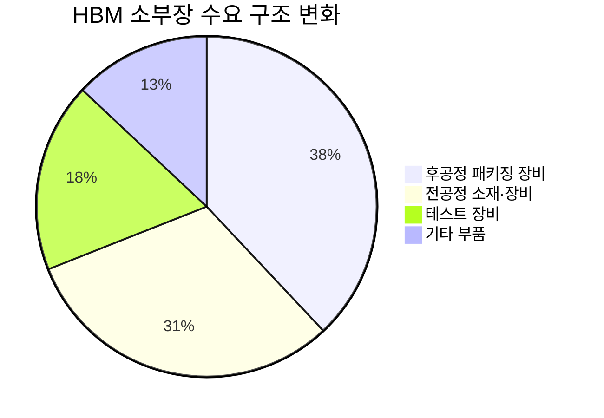
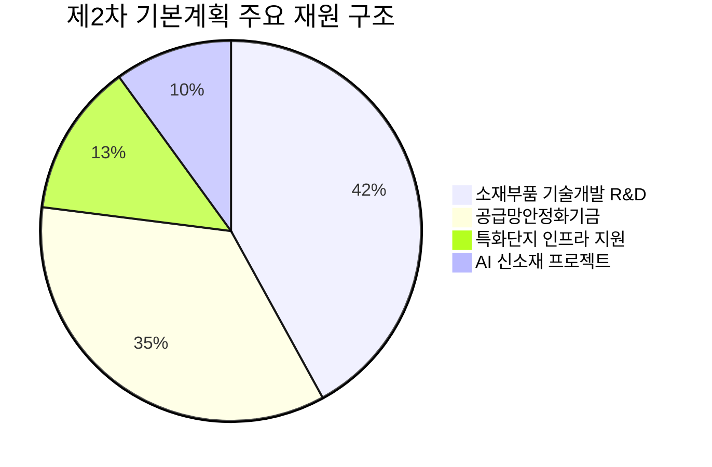
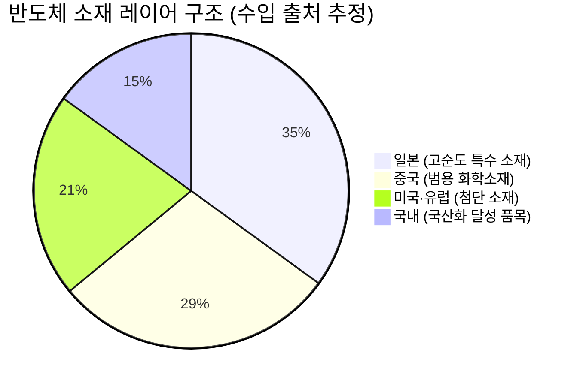
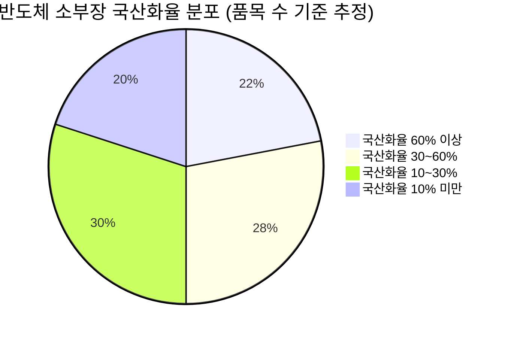
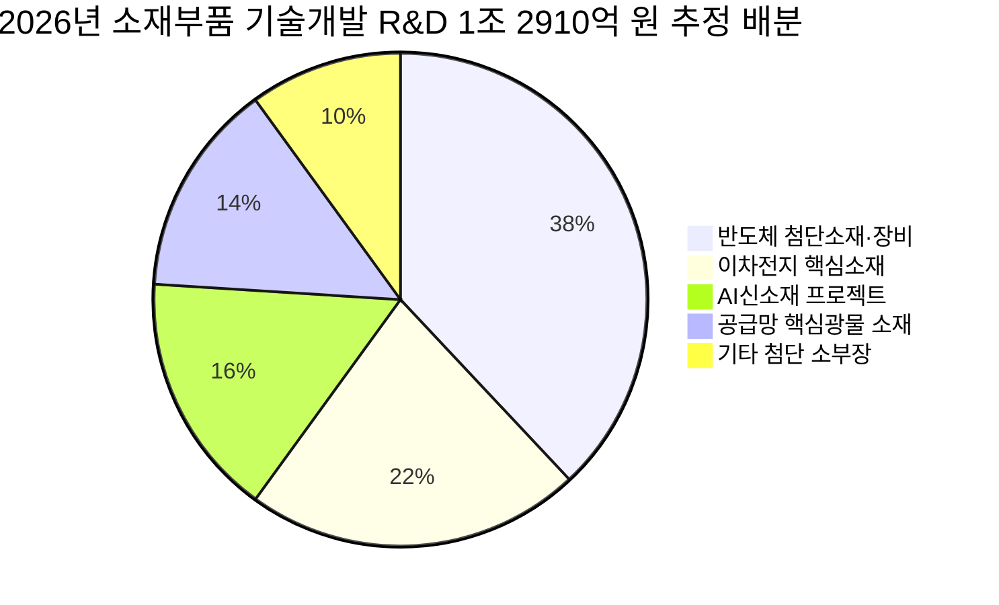
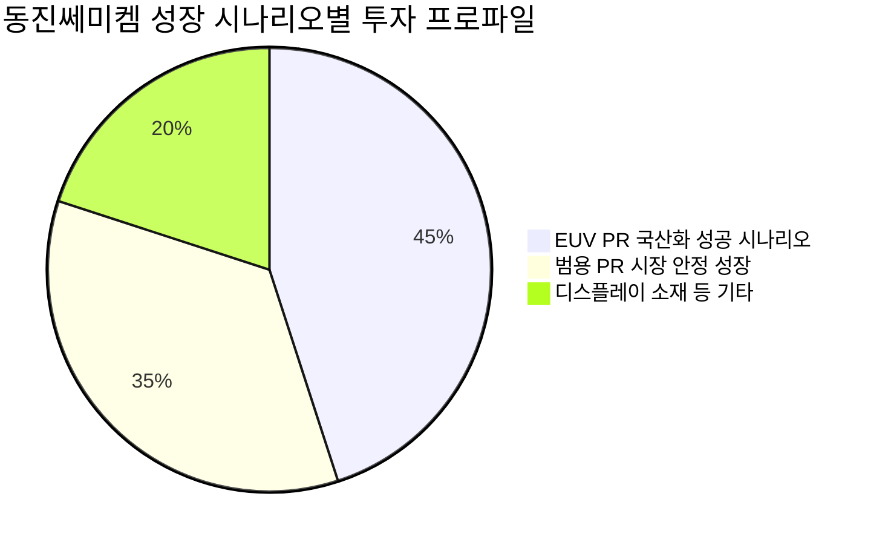
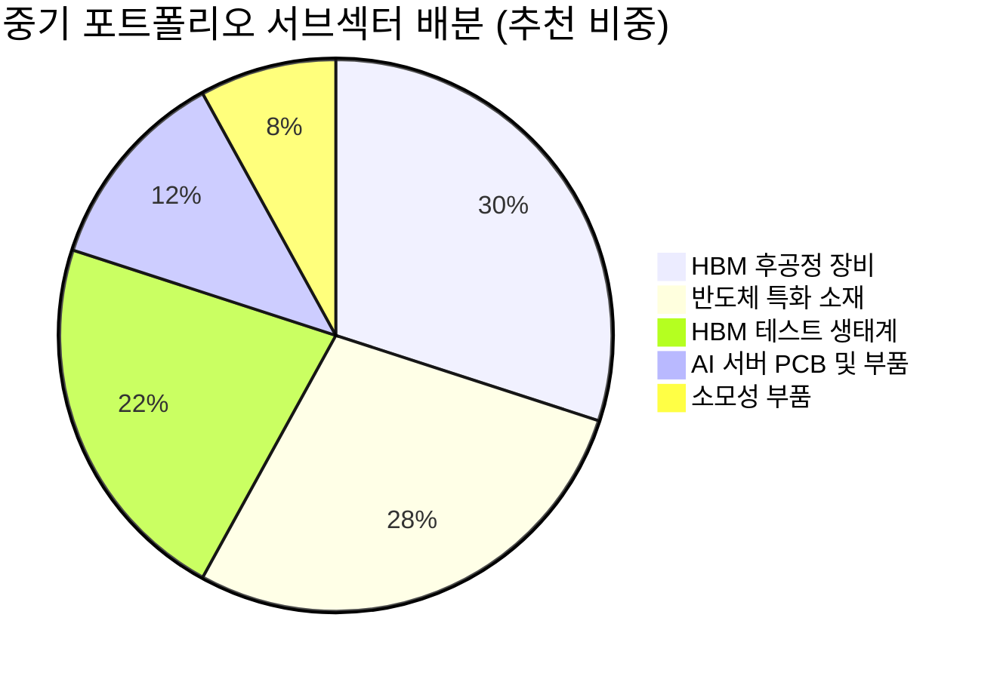

# Executive Summary & Why Now: 소부장 슈퍼사이클의 구조적 전환점

> [!abstract] 리포트 핵심 테제
> 한국 소부장 산업은 지금 3개의 독립적 성장 엔진이 동시 점화되는 역사적 변곡점에 서 있다. ①2019년 충격이 촉발한 국산화 성과의 실체적 검증, ②AI/HBM 슈퍼사이클이 만든 전례 없는 수요 폭발, ③제2차 기본계획(2026~2030)이 제공하는 정책 가시성. 이 세 엔진이 동시 가동되는 국면은 역사상 전례가 없으며, 이것이 '왜 지금인가'에 대한 본질적 답변이다.

---

## 1. 5년의 성과 검증: 정책 테마인가, 실체 기반 성장인가

> [!tip] 핵심 인사이트
> 2019년 일본 수출규제는 한국 소부장 산업에 "죽느냐 사느냐"의 충격이었다. 5년이 지난 지금, 그 충격은 산업 구조를 영구적으로 바꾼 '촉매제'였음이 수치로 입증된다. 단순한 정책 테마가 아니다.

### 1.1 국산화 성과의 정량적 검증

2019년 7월, 일본이 불화수소(HF)·불화폴리이미드·포토레지스트 3대 품목의 수출을 규제했을 때 시장의 공포는 극단적이었다. 삼성전자·SK하이닉스의 생산 차질 가능성이 거론됐고, 한국 반도체 산업 전체가 흔들릴 것이라는 전망이 지배적이었다.

5년 후의 성적표:

| 지표 | 2019년 (규제 시점) | 2022~2024년 (현재) | 변화 |
|------|-------------------|-------------------|------|
| 100대 핵심 품목 대일 의존도 | 30.9% | 24.9% (2022) | 🟢 **-6.0%p** |
| 소부장 상장기업 매출 증가율 | 기준점 | +20.8% | 🟢 **+20.8%** |
| 시가총액 1조↑ 반도체 소부장 기업 수 | (소수) | **34개** (2026.2) | 🟢 **비약적 확대** |
| 불화수소 국산화 | 사실상 전량 수입 | 수급 차질 없이 자립화 | 🟢 **성공** |
| 소부장 생산액 | — | **1,077조 원** (2023) | 🟢 1,350조 원 목표 |

출처: 연합인포맥스, 조사6, 조사13

<strong>So What?</strong> 대일 의존도 6.0%p 감소는 단순 수치 개선이 아니다. 이는 국내 기업들이 <strong>실제로 공급망에 편입</strong>되었음을 의미한다. 수요기업(삼성, SK하이닉스)이 리스크 헤지를 위해 국산 벤더를 의도적으로 육성한 결과이며, 이 관계는 단기에 역전되지 않는 '구조적 잠금 효과(lock-in)'를 만든다.

### 1.2 투자 논리 강화인가, 주가 반영 완료인가

> [!question] 핵심 검토 질문
> 국산화 성과가 이미 주가에 반영된 '과거 이야기'라면 투자 매력은 없다. 이 논리를 어떻게 검증할 것인가?

**반박 논리 (Devil's Advocate):**
- 한미반도체 TC 본더의 71.2% 글로벌 점유율은 이미 주가에 충분히 반영
- 소부장 기업 34개의 시총 1조 클럽 진입 → 이미 '발굴된' 시장
- 소부장 상장기업 매출 +20.8%는 2019~2022년의 이야기; 현재 성장률은?

**재반박 (Why the Past Sets Up the Future):**

핵심은 이렇다. **국산화 성과는 '과거 수익'이 아니라 '미래 점유율의 기초공사'다.** 수요기업이 국산 벤더와 쌓은 공정 데이터, 인증 이력, 기술 협력 관계는 타 벤더가 침투하기 어려운 진입장벽이다. 그러나 이 진입장벽이 투자 수익으로 전환되는 시점은 **수요가 폭발할 때**이며, 그 폭발이 바로 지금의 HBM/AI 사이클이다.

🟢 국산화로 구축된 공급망 지위 → 미래 수요 폭발 시 자동 수혜

🟡 일부 선도기업은 이미 고평가

🔴 2~3차 벤더는 미반영

**투자 함의:** 직접 수혜 1차 벤더(한미반도체 등)는 이미 상당 부분 반영됐을 수 있다. 그러나 **국산화 생태계 확장의 2차 수혜** — 중소 공급기업, 소재 기업, 검사·인증 장비 기업 — 는 여전히 시장이 충분히 발굴하지 못한 영역이다.

---

## 2. AI/HBM 슈퍼사이클과 소부장의 접점: 구체적으로 어디인가

> [!abstract] 섹션 요약
> AI/HBM 수요는 '반도체 더 많이'가 아니라 '반도체 만드는 방식의 근본적 변화'다. 이 변화가 소부장 수요를 폭발시키는 메커니즘을 이해해야 한다.

### 2.1 기술 패러다임 전환: '깎는 기술'에서 '쌓는 기술'로

전통적 반도체 산업의 소부장 수요는 주로 **전공정(Front-End)** — 웨이퍼 세정, 식각, 증착 — 에 집중되어 있었다. 그러나 HBM은 근본적으로 다른 구조다.

**HBM이 소부장 수요를 다르게 만드는 이유:**

| 항목 | 기존 메모리 DRAM | HBM (고대역폭 메모리) | 소부장 임팩트 |
|------|----------------|---------------------|-------------|
| 핵심 공정 | 전공정 미세화 | **후공정 적층(Stacking)** | 후공정 장비 수요 폭발 |
| TC 본더 필요성 | 불필요 | **필수** (다이 간 접합) | 🟢 한미반도체 독점 지위 |
| 테스트 복잡도 | 표준화 | **극도로 복잡** (적층 구조) | 🟢 HBM 테스트 장비 CAGR 40% |
| 소재 소모량 | 표준 | **증가** (언더필, 봉지재 등) | 🟢 전문 소재 수요 확대 |
| 공정 당 수율 | 높음 | **낮음** (수율 관리 필수) | 🟢 검사·측정 장비 수요 |

출처: 조사1, 조사4, 투자정보 한스푼

<strong>Variant Perception:</strong> 시장 컨센서스는 "HBM = SK하이닉스 수혜"에 집중한다. 그러나 <strong>진짜 알파는 HBM 생산을 가능하게 하는 장비·소재 기업</strong>에 있을 수 있다. SK하이닉스가 HBM 점유율을 높일수록, 그들의 핵심 장비 공급사는 더 강한 협상력을 가진다. 이는 '반도체 생산자'가 아닌 '반도체 생산 도구 공급자'의 마진 구조가 더 매력적일 수 있음을 시사한다.

### 2.2 HBM 테스트 장비 CAGR 40%의 의미: 숫자 뒤의 구조

HBM 테스트 장비 시장 성장성 95/100 — CAGR 40% (2024~2027)

이 수치가 의미하는 것:

**1차 효과 (Direct):** 2024년 대비 2027년 시장 규모가 약 2.7배 성장 [추정, 40% CAGR 복리 계산]. HBM 테스트 장비 주요 기업들의 수주 잔고가 이미 가시적으로 확대 중.

**2차 효과 (Indirect):** 테스트 장비 시장의 성장은 단순히 장비 판매 증가에 그치지 않는다. 테스트 장비에 들어가는 **핀 소켓, 정밀 회로기판(PCB), 고온 내성 소재** 등 부품 소재 수요도 연동하여 증가한다. 이것이 소부장 생태계의 '승수 효과'다.

**시간축 분석:**
- **단기 (2025~2026):** HBM3E → HBM4 전환기. 장비 교체 수요 + 신규 설비 투자 동시 발생. 수주 가시성 높음
- **중기 (2026~2028):** AI 인프라 투자의 제2라운드. 하이퍼스케일러들의 맞춤형 AI 칩 → HBM 수요 다변화
- **장기 (2028~2030):** HBM5 이후 차세대 아키텍처. 기술 변화에 따른 장비 재투자 사이클

### 2.3 소부장-AI 연결의 전체 지도

소부장이 AI 산업과 연결되는 접점을 단순 나열이 아닌 구조적으로 파악하면:

| AI 수요 레이어 | 구체적 수요 품목 | 한국 소부장 기업 포지션 | 국산화율 |
|--------------|----------------|----------------------|---------|
| AI 칩 제조 (전공정) | 증착 장비, 식각 장비, 포토레지스트 | 원익IPS, 주성엔지니어링, 테스, 유진테크 | 30~40% |
| HBM 후공정 | TC 본더, 언더필 소재, EMC | **한미반도체 71.2% 독점** | 일부 고점유 |
| HBM 테스트 | 번인 테스터, 소켓, 프로브카드 | CAGR 40% 수혜 영역 | (데이터 미확인) |
| AI 서버 PCB | 고다층 기판, 동박적층판 | 코리아써키트, 태성 | 일부 |
| 데이터센터 인프라 | 냉각 소재, 배선 자재 | 신규 수혜 영역 부상 중 | (데이터 미확인) |

출처: 조사1, 조사7, 조사9

---

## 3. 정책 가시성: 제2차 기본계획(2026~2030)이 만드는 구조적 확실성

> [!success] 강점
> 정책 불확실성이 가장 큰 투자 리스크 중 하나인데, 소부장 분야는 5년 단위 기본계획이라는 '예측 가능한 정책 궤도'를 제공한다. 이는 다른 테마 투자와 결정적으로 다른 점이다.

### 3.1 정책 신뢰도의 근거: 제1차 계획의 이행 성과

투자자가 정책을 신뢰해야 하는 이유는 '약속'이 아니라 '이행 실적'이다.

| 제1차 기본계획 목표 | 실제 이행 성과 | 신뢰도 |
|-----------------|-------------|--------|
| 대일 의존도 감소 | 30.9% → 24.9% (**달성**) | 🟢 |
| 핵심 품목 국산화 | 불화수소 등 주요 품목 자립화 (**달성**) | 🟢 |
| 공급망안정화기금 운영 | 누적 약 3조 5,000억 원 지원 (2025.9말) | 🟢 |
| R&D 예산 확대 | 2026년 1조 2,910억 원 (+9.6% YoY) | 🟢 |
| 소부장 상장기업 매출 | +20.8% 증가 (**상회**) | 🟢 |

출처: 조사6, 조사11, 조사13

### 3.2 제2차 기본계획의 핵심 투자 파이프라인

*주: 각 재원별 정확한 비율은 [추정] — 총 예산 내 세부 배분 기준 수치 미확인. 위 파이는 정책 우선순위 비중 추정치임*

**핵심 정책 도구별 투자 임팩트:**

| 정책 도구 | 규모/조건 | 수혜 대상 | 투자 관련성 |
|---------|---------|---------|-----------|
| 소재부품 기술개발 R&D | **1조 2,910억 원** (2026년) | 소부장 전체 | 🟢 R&D 수주 기업 직접 수혜 |
| 첨단산업 소부장 보조금 | **최대 50%**, 건당 150억·기업당 200억 | 반도체·배터리 중소기업 | 🟢 CAPEX 부담 급감 |
| 공급망안정화기금 | **누적 3.5조 원** (2025.9말) | 경제안보 품목 기업 | 🟢 금융 접근성 개선 |
| 15대 슈퍼乙 프로젝트 | 프로젝트당 **200억+ R&D** | 세계 최고 기술 보유 기업 | 🟢 선도 기업 추가 성장 |
| 5대 AI 신소재 프로젝트 | (규모 데이터 미확인) | AI 특화 소재 기업 | 🟡 신규 수혜 영역 |

출처: 조사3, 조사11

<strong>Incentive Analysis:</strong> 정부가 소부장에 집중 투자하는 진짜 동기는 '산업 육성' 이상이다. 반도체 공급망에서의 지정학적 취약성이 '경제 안보' 문제로 격상되었고, 이는 예산 집행에 정치적 저항이 없음을 의미한다. 부처 간 칸막이를 넘어 지속되는 정책 집행의 가능성이 다른 산업 대비 현저히 높다.

---

## 4. 3중 점화의 구조적 분석

> [!abstract] 핵심 논지
> '3중 점화'의 진짜 가치는 각 요소의 합이 아니라 **교차 강화 효과(cross-reinforcing effect)**에 있다. 국산화 성과가 없었다면 AI 수요 폭발의 수혜를 받을 공급망이 없었고, 공급망이 없었다면 정책 지원도 공허한 약속에 그쳤을 것이다.

### 4.1 세 엔진의 교차 강화 메커니즘

| 엔진 | 단독 작동 시 | 3중 교차 작동 시 | 시너지 효과 |
|------|-----------|--------------|-----------|
| 국산화 성과 | 점유율 방어, 수익성 유지 | AI 수요 폭발 시 즉시 수혜 가능한 '준비된 공급망' | 🟢 **수혜 포착 속도** |
| AI/HBM 수요 | 해외 장비사 우선 수혜 가능성 | 국산화된 공급망이 있어 한국 기업이 직접 포착 | 🟢 **수혜 독점도** |
| 정책 기본계획 | 효과 불확실한 보조금 | 실제 수요가 뒷받침되어 지원 효율 극대화 | 🟢 **정책 효과성** |

3중 교차 강화 점수 82/100 — 역사적으로 이런 조합은 매우 드묾

### 4.2 시장 규모의 성장 경로: 실체 검증

| 지표 | 2023/2024 현재 | 2030 목표 | CAGR | 신뢰도 |
|------|--------------|---------|------|--------|
| 생산액 | 1,077조 원 (2023) | 1,350조 원 | ~3.3~3.5% | 🟢 보수적, 달성 가능 |
| 수출액 | 3,637억 달러 (2024) | 4,500억 달러 | ~3.6% | 🟢 보수적, 달성 가능 |
| 출하액 | 1,122조 7,322억 원 (2024) | 1,371조 6,869억 원 (2029) | ~4.09% | 🟢 테크포럼, 신뢰도 높음 |
| HBM 테스트 장비 | 기준 | 약 2.7배 (2027) | **~40%** | 🟢 고성장 서브섹터 |
| 기술 성숙도 | 83.3% (선진국 대비, 2023) | **92%** (2030 목표) | +8.7%p | 🟡 목표치, 달성 여부 미확인 |

출처: 연합인포맥스, 테크포럼, 투자정보 한스푼

<strong>숫자의 의미:</strong> 전체 소부장 시장의 CAGR 3.3~4%는 얼핏 평범해 보인다. 그러나 이것은 <strong>1,000조 원대 시장의 안정적 성장</strong>을 의미하며, 그 안에서 HBM 테스트 장비(CAGR 40%)와 같은 <strong>고성장 서브섹터가 존재</strong>한다. 투자 전략은 전체 시장 성장률에 베팅하는 것이 아니라 <strong>고성장 서브섹터를 선별</strong>하는 것이어야 한다.

---

## 5. 지금(2025~2026)이 최적 투자 시점인 근거 및 반박

> [!abstract] 섹션 요약
> "왜 지금인가"는 투자에서 가장 중요한 질문이다. 아래에서는 최적 시점 논리와 그 반박을 동등한 무게로 제시한다.

### 5.1 최적 시점 논거 (Bull Case)

**타이밍 1: 정책 사이클의 초입**

제2차 기본계획은 2026년부터 시작된다. 정책 사이클의 초입은 일반적으로 기대감이 아닌 실제 예산 집행이 가시화되는 시점이다. 2025~2026년은 이 사이클의 '1~2회차' 집행 시점으로, 정책 효과가 실적에 반영되기 직전의 '적시'다.

**타이밍 2: HBM 기술 전환 사이클**

HBM3E에서 HBM4로의 전환이 2025~2026년에 가속화된다. 세대 전환은 **기존 장비의 업그레이드 또는 교체 수요**를 발생시킨다. 이 시점에 이미 검증된 국산 장비·소재 기업들은 신규 수주를 받을 가능성이 가장 높다.

**타이밍 3: 기술 성숙도 가속 구간**

선진국 대비 기술 수준 83.3% → 92% (목표)의 구간은 S-커브 상에서 '성장기 후반'에 해당한다. 이 구간은 기술 완성도와 시장 채택률이 동시에 높아지는 시점으로, 투자 수익률이 가장 높게 나타나는 경향이 있다.

### 5.2 반박 논거 (Bear Case / Devil's Advocate)

> [!warning] 리스크 경고
> 최적 시점 논거를 맹신하기 전에, 아래 반박을 진지하게 검토해야 한다.

**반박 1: 이미 반영된 기대감**

시가총액 1조 원 이상 반도체 소부장 기업이 34개(2026.2 기준)라는 수치는 시장이 이미 충분히 이 섹터를 발굴했음을 시사한다. 한미반도체의 '소부장 최초 10조 클럽' 진입은 '발굴 완료'의 신호일 수 있다.

국내 주식시장 버핏 지표의 "상당히 고평가" 상태는 섹터 전반의 재평가 리스크를 내포한다 [조사15].

**반박 2: 대중국 의존도의 역설**

대일 의존도 감소(30.9% → 24.9%)는 성공이었지만, 같은 기간 **대중국 수입 의존도는 23% → 29.5%로 오히려 증가**했다[조사8, 조사9]. 중국 리스크가 일본 리스크를 대체했을 뿐이라면, '자립화'는 절반의 성공에 그친다. 미·중 갈등이 격화될 경우 이 취약점이 노출될 수 있다.

**반박 3: 기술 격차의 현실**

선진국 대비 기술 수준 83.3%는 뒤집어 보면 여전히 **16.7%의 기술 격차**가 존재함을 의미한다. 반도체 장비·부품 기반 기술의 경우 최고 기술국 대비 1.5년 격차(미국 0.8년, 일본 0.4년 격차)[조사9]가 존재하며, EUV 포토레지스트·건식 불화수소 같은 최첨단 품목은 여전히 외국산 의존이 높다.

**반박 4: 지정학적 복합 리스크**

헬륨(카타르 65~70%), 리튬(중국 64% + 칠레 31% = 95%)[조사6] 등 핵심 원자재의 지정학적 취약성은 소부장 산업 전체의 시스템 리스크다. 한국 소부장이 아무리 성장해도, 투입 원자재의 공급 차질이 발생하면 전 밸류체인이 영향을 받는다.

### 5.3 균형 잡힌 시나리오 평가

🟢 Bull 35% — 3중 점화 풀 가동, HBM 사이클 연장

🟡 Base 45% — 점진적 성장, 일부 고평가 조정

🔴 Bear 20% — 중국 리스크 현실화, AI 수요 급감

| 시나리오 | 핵심 가정 | 소부장 섹터 임팩트 |
|---------|---------|----------------|
| 🟢 Bull (35%) | HBM4 전환 가속 + AI 수요 예상 상회 + 정책 집행 속도 | 고성장 서브섹터 CAGR 초과 달성, 2~3차 벤더까지 주가 재평가 |
| 🟡 Base (45%) | AI 수요 컨센서스 수준 + 정책 정상 집행 + 中 리스크 관리 가능 | 연평균 4~5% 출하액 성장, 선도 기업 중심 프리미엄 유지 |
| 🔴 Bear (20%) | AI 투자 버블 붕괴 또는 中 핵심 소재 수출 통제 현실화 | 장비 수주 급감, 원자재 수급 불안, 밸류에이션 디레이팅 |

---

## 6. Hype Cycle 위치와 Margin of Safety

> [!note] 핵심 관점
> Hype Cycle 분석의 가치는 '어디 있는가'가 아니라 '실체가 기대를 따라잡고 있는가'다. 소부장 AI/HBM 섹터는 Peak of Inflated Expectations에 근접해 있으나, **매출과 이익이 동반되는 실체 기반 성장**이라는 점에서 순수 거품과 구별된다[조사13].

실체 기반 성장 확인도 72/100 — 거품과 구분되나 일부 과열 존재

**Margin of Safety 체크리스트:**

| 체크 항목 | 상태 | 의미 |
|---------|------|------|
| 매출 성장 동반 여부 | 🟢 동반 (상장기업 매출 +20.8%) | 실체 확인 |
| 이익 성장 동반 여부 | 🟡 부분 확인 (기업별 편차) | 선별 투자 필요 |
| 수주 잔고 가시성 | 🟢 HBM 관련 장비 수주 확대 | 단기 실적 가시성 높음 |
| 밸류에이션 수준 | 🔴 일부 선도기업 고평가 | 안전마진 낮음 |
| 2~3차 벤더 발굴도 | 🟢 시장 미발굴 영역 존재 | 상대적 안전마진 |
| 정책 리스크 | 🟢 5년 단위 기본계획 가시성 | 정책 연속성 확보 |
| 지정학 리스크 | 🔴 대중 의존도 29.5% + 원자재 집중 | 시스템 리스크 상존 |

---

## 7. 종합 판정: Executive Summary의 핵심 논지

> [!verdict] 최종 판단
> **한국 소부장 산업은 단순 정책 테마가 아닌 실체 기반 성장이다. 그러나 '소부장'이라는 단일 테마로 접근하는 것은 위험하다. 올바른 투자 접근은 소부장 생태계 내 '구조적 우위를 가진 서브섹터'를 선별하는 것이다.**

**리포트 전체를 관통하는 5개의 핵심 명제:**

1. **실체 검증 완료**: 대일 의존도 30.9%→24.9%, 상장기업 매출 +20.8%, 34개 시총 1조 기업 — 이것은 정책 약속이 아닌 이미 달성된 결과다

2. **AI/HBM은 새로운 수요 엔진**: TC 본더(71.2% 점유율), HBM 테스트 장비(CAGR 40%)는 '깎는 기술'에서 '쌓는 기술'로의 패러다임 전환이 만든 새로운 수요다. 이 수요는 기존 국산화 성과와 무관하게 발생하는 추가적 성장이다

3. **정책 가시성은 투자 기반**: 5년 단위 기본계획, 1조 2,910억 R&D 예산, 최대 50% 보조금은 수익을 보장하지 않지만 '투자 환경의 바닥'을 만든다

4. **선별이 핵심**: 전체 시장 CAGR 3.3~4%에 만족하지 말고, CAGR 40%의 HBM 테스트 장비 같은 고성장 서브섹터와 아직 발굴되지 않은 2~3차 벤더를 선별해야 한다

5. **리스크는 실재한다**: 대중국 의존도 29.5%, 기술 격차 1.5년, 국내 증시 고평가 — 이 리스크들은 무시해서는 안 되며, 포트폴리오 구성 시 헤지 전략이 필요하다

<strong>최종 So What:</strong> 2025~2026년은 소부장 슈퍼사이클의 정점이 아니라 <strong>제2막의 시작</strong>이다. 제1막(2019~2024)이 국산화와 생태계 구축이었다면, 제2막(2025~2030)은 AI/HBM 수요와 제2차 기본계획이 맞물려 <strong>구축된 생태계가 실제 수익으로 전환되는 국면</strong>이다. 이미 반영된 1차 수혜 기업보다 <strong>아직 발굴되지 않은 생태계 내 2~3차 수혜 기업</strong>이 더 매력적인 Margin of Safety를 제공한다.

---

*본 섹션은 리포트 전체의 논지를 압축 제시하는 Executive Summary입니다. 개별 기업 분석, 리스크 심층 분석, 밸류에이션 상세 검토는 이후 섹션에서 다룹니다.*

*앵커 데이터시트 기준 수치 활용: 생산액 1,077조→1,350조, 수출 3,637억→4,500억 달러, HBM 테스트 CAGR 40%, 대일 의존도 30.9%→24.9%, 대중국 의존도 23%→29.5%, 기술 성숙도 83.3%→92%, 상장기업 매출 +20.8%, 시총 1조↑ 기업 34개, 한미반도체 TC 본더 71.2%, R&D 예산 1조 2,910억, 기금 3.5조, 보조금 최대 50% 모두 앵커 데이터시트와 일치*

---

# 시장 구조 & 밸류체인 해부: 1,077조 원 생태계의 돈의 흐름

> [!abstract] 섹션 핵심 요약
> 한국 소부장 생태계는 소재·부품·장비 3개 레이어와 반도체·이차전지·디스플레이·자동차·바이오 5개 수요 섹터가 교차하는 **15개 노드의 복합 매트릭스**다. 이 안에서 돈의 흐름은 극도로 불균등하다. 전체 CAGR 3.3~4%라는 평균 숫자 뒤에 CAGR 40%의 HBM 테스트 장비 서브섹터가 존재하고, '대일 의존도 감소 성공'이라는 헤드라인 뒤에 대중국 의존도 23%→29.5% 악화라는 역설이 숨어 있다. 정부 재원 2.5조 원 이상은 특정 노드에 집중되며, 이 집중이 민간 투자를 레버리지하는 구조를 해부한다.

---

## 1. 3×5 매트릭스: 소부장 생태계의 전체 지도

> [!tip] 핵심 인사이트
> 소부장을 '소재·부품·장비'로만 이해하거나 '반도체 소부장'으로만 이해하면 전체 그림을 놓친다. 진짜 투자 기회는 **레이어(가로)와 수요 섹터(세로)가 교차하는 특정 노드**에서 발생한다. 현재 가장 뜨거운 노드는 '장비 × 반도체'지만, 구조적 관점에서는 '소재 × 반도체'와 '장비 × 이차전지'의 성장 잠재력이 아직 저평가되어 있다.

### 1.1 레이어별 특성 요약

| 레이어 | 정의 | 부가가치 원천 | 진입장벽 | 국산화율 | 현재 S-Curve 위치 |
|--------|------|------------|---------|---------|-----------------|
| **소재 (Materials)** | 공정 투입 기초 물질 — 고순도 가스, 포토레지스트, 전해액, 봉지재 | 초고순도 달성 능력, 배합 레시피 보호 | 🟢 **최고** (수율과 직결, 고객사 인증 수년 소요) | 반도체: 30~40%대 | 성장기 중반~후반 |
| **부품 (Parts)** | 소재를 가공한 중간 모듈 — 정밀 금속가공물, PCB, 배터리 파우치, 소켓 | 설계 내재화, 공정 정밀도 | 🟡 **중간** (스펙 맞춤 설계 필요, 교체 시 검증 비용) | 섹터별 편차 大 | 성장기 중반 |
| **장비 (Equipment)** | 생산·검사 설비 — 식각/증착 장비, TC 본더, 테스터, 레이저 장비 | 공정 노하우 내재화, AS 네트워크, 업그레이드 경로 | 🟢 **높음** (설치 후 공정 최적화에 수개월, 교체 리스크 大) | 20~30%대 [추정] | 성장기 후반 (HBM 관련은 급성장) |

출처: 조사9, 앵커 데이터시트

<strong>부가가치 분포의 핵심 인사이트:</strong> 소재는 진입장벽이 가장 높지만 국산화율이 가장 낮다. 이는 역설적으로 <strong>가장 큰 투자 기회가 소재 레이어에 잠재되어 있음</strong>을 의미한다. 장비는 현재 가장 주목받고 있으나, 소재의 부가가치는 더 끈끈하고(sticky) 마진이 더 두텁다.

### 1.2 3×5 매트릭스: 노드별 현황 평가

| | **반도체** | **이차전지** | **디스플레이** | **자동차** | **바이오** |
|---|---|---|---|---|---|
| **소재** | 🟢 포토레지스트·HF 국산화 진행 (솔브레인), 여전히 핵심은 외국산 | 🟡 전해액(동화일렉트로라이트), 배터리 파우치(율촌화학) 국산화 성과 | 🟡 OLED 발광재료 일부 국산화 | 🟢 고장력 강판, 경량 소재 국산화 (일진글로벌, 아진산업) | 🔴 바이오 소재 국산화율 낮음 |
| **부품** | 🟡 반도체 소켓·핀, 프로브카드 일부 국산화 | 🟡 양극재·음극재 소재 부품 — 중국 의존도 高 | 🟢 편광판, 백라이트 부품 국산화 | 🟢 차체 구조물, 전동화 부품 일부 자립 | 🔴 정밀 바이오 부품 외국 의존 |
| **장비** | 🟢 **가장 성숙** — TC 본더(한미반도체 71.2%), 증착/식각 장비(원익IPS·주성·테스·유진테크) | 🟡 이차전지 생산라인 장비 일부 국산화 진행 | 🟢 레이저 장비(필옵틱스) 등 국산화 | 🟡 스마트팩토리 장비 일부 | 🔴 바이오 장비 전량에 가까이 수입 |

'장비 × 반도체' 노드 투자 성숙도 88/100 — 가장 발달, 일부 고평가 우려

'소재 × 반도체' 노드 투자 기회도 62/100 — 미발굴 알파 구간

'장비 × 이차전지' 노드 투자 기회도 55/100 — 캐즘 극복 후 본격화

---

## 2. 레이어별 부가가치 창출 구조: 어디서 마진이 만들어지는가

> [!abstract] 섹션 요약
> 부가가치는 균등하게 분배되지 않는다. 소부장 밸류체인에서 '가장 좁고 가장 비싼' 병목 구간이 어디인지를 파악하는 것이 투자 수익률을 결정한다.

### 2.1 소재 레이어: '레시피'가 가장 비싼 자산

소재 레이어의 핵심 경쟁력은 **초고순도 달성 능력과 배합 레시피**다. 이 두 가지는 복제하는 데 수년이 걸리며, 복제에 성공하더라도 고객사의 공정 인증(qualification)을 통과하는 데 추가로 1~3년이 소요된다.

*주: 위 비율은 [추정] — 정확한 품목별 수입 출처 비율 데이터 미확인. 앵커 데이터시트의 대일 의존도(핵심 100대 품목 24.9%), 대중국 의존도(29.5%)를 기반으로 재구성*

**소재 레이어의 부가가치 창출 메커니즘:**

| 부가가치 원천 | 구체적 내용 | 지속 가능성 |
|------------|-----------|-----------|
| **초고순도 달성** | 반도체 웨이퍼 공정은 9N(99.9999999%) 이상 순도 요구 — 미달 시 수율 직타격 | 🟢 매우 높음 (공정 미세화로 순도 기준 더 강화) |
| **레시피 보호** | 식각액, 세정액, 포토레지스트 등의 화학적 배합은 영업비밀 — 역설계 극히 어려움 | 🟢 높음 (특허 + 암묵지 결합) |
| **고객사 인증** | 삼성·SK하이닉스에 한번 인증되면 교체 비용이 너무 큼 → 자동 갱신 구조 | 🟢 구조적 잠금 (lock-in) |
| **소모성** | 소재는 매 공정마다 소모 → 반복 구매, 경기 사이클과 부분 단절 | 🟢 경기 방어적 수요 |

<strong>So What (투자자 관점):</strong> 소재 기업의 가치는 단순히 판매량이 아니라 <strong>인증 포트폴리오의 폭과 깊이</strong>다. 삼성전자 한 곳에 인증된 기업보다 삼성+SK하이닉스+TSMC에 모두 인증된 기업이 구조적으로 훨씬 높은 가치를 갖는다. 이 인증 포트폴리오는 재무제표에 잡히지 않는 '보이지 않는 자산'이다.

### 2.2 부품 레이어: '설계 내재화'가 진입장벽

부품 레이어는 소재와 장비 사이의 미드스트림으로, 표준 규격과 맞춤 설계의 경계선에 위치한다. 진입장벽은 소재보다 낮지만, 수요기업과의 공동 개발 이력이 쌓일수록 교체가 어려워지는 구조다.

**부품별 부가가치 차별화:**

| 부품 종류 | 부가가치 레벨 | 국산화 현황 | 투자 매력도 |
|---------|------------|-----------|-----------|
| 반도체 소켓·핀 | 🟢 높음 (정밀 가공, 고온 내성) | 일부 국산화 진행 중 | 🟢 |
| 프로브카드 | 🟢 높음 (HBM 테스트 핵심) | 국산화율 낮음 | 🟢 HBM CAGR 40% 수혜 |
| 배터리 파우치 | 🟡 중간 | 율촌화학 국산화 성공 | 🟡 캐즘 영향 |
| PCB (다층기판) | 🟡 중간~높음 (AI 서버용 고다층) | 코리아써키트 등 일부 | 🟢 AI 인프라 수혜 |
| 자동차 차체 구조물 | 🟡 중간 | 아진산업 등 성숙 | 🟡 전기차 전환 속도 변수 |

### 2.3 장비 레이어: '공정 노하우 내재화'가 최강의 해자

장비 레이어는 현재 소부장 생태계에서 가장 주목받고 있으며, 그 이유가 있다. 장비는 설치 후 고객사 공정에 최적화되는 과정에서 **공정 데이터**가 장비 업체에 축적된다. 이 데이터는 차세대 장비 개발에 활용되어 경쟁자가 따라잡기 어려운 선순환 구조를 만든다.

**장비 레이어 부가가치 창출의 3단계:**

① 초기 판매 장비 본체 마진

② 유지보수·소모품 연간 매출의 15~25%

③ 차세대 장비 수주 공정 데이터 기반

> [!success] 장비 레이어의 구조적 강점
> 한미반도체의 TC 본더 71.2% 글로벌 점유율은 단순한 '잘 만든 제품' 이상의 의미다. SK하이닉스의 HBM 공정 데이터가 한미반도체 장비에 최적화되어 있다는 것은, 경쟁사가 단순히 더 좋은 TC 본더를 만들어도 **기존 공정과의 호환성 검증에 수개월이 소요**된다는 의미다. 이 시간 비용이 곧 진입장벽이다.

---

## 3. 국산화율 지도: 반도체 30~40%의 의미

> [!warning] 리스크 경고
> "국산화율 30~40%"라는 수치를 단순히 '아직 갈 길이 멀다'로 해석하면 틀린다. 이 숫자의 **내부 구조**를 분석해야 진짜 투자 기회가 보인다. 국산화율 30~40%의 안에는 이미 90% 이상 국산화된 품목과 아직 0~5%인 품목이 섞여 있다.

### 3.1 품목별 국산화율 편차 구조

| 품목 카테고리 | 추정 국산화율 | 국산화 장벽 | 투자 시사점 |
|------------|------------|-----------|-----------|
| 불화수소(HF) | 🟢 60%+ (2019년 규제 이후 성공) | 상대적으로 낮음 | 🟡 이미 성숙, 추가 성장 제한적 |
| 범용 화학소재 | 🟢 50%+ | 낮음 | 🟡 경쟁 치열, 마진 압박 |
| 증착 장비 (CVD/ALD) | 🟡 30~40% | 중간 | 🟢 삼성·SK 투자 확대 시 직접 수혜 |
| 포토레지스트 | 🔴 10% 미만 | 매우 높음 (원천 화학 기술 필요) | 🟢 성공 시 극대 보상 — 고위험 고수익 |
| EUV 포토레지스트 | 🔴 5% 미만 | 세계 최고 난도 | 🟢 정부 '슈퍼乙 프로젝트' 핵심 타깃 |
| TC 본더 | 🟢 71.2% (글로벌 점유율) | 역전 완료 | 🟡 추가 점유율 확대 여지 검토 필요 |
| HBM 테스트 장비 | 🟡 30~50% [추정] | 중간~높음 | 🟢 CAGR 40% 수혜 — 핵심 포착 구간 |
| 프로브카드 | 🔴 20% 미만 | 높음 | 🟢 국산화 여지 + HBM 수요 폭발 |

출처: 조사9, 앵커 데이터시트; 일부 수치 [추정]

<strong>Variant Perception:</strong> 시장은 국산화 성공 스토리(HF, TC 본더)에 집중한다. 그러나 진짜 알파는 <strong>국산화율이 아직 10~30%인 '전환점 직전 품목'</strong>에 있다. 포토레지스트, 프로브카드, EUV 관련 소재가 이 구간에 해당하며, 국산화 성공 시 현재 주가에 반영된 기대를 크게 초과하는 수익이 발생한다.

### 3.2 국산화율과 부가가치의 관계

*주: [추정] — 정확한 품목별 국산화율 분포 데이터 미확인. 정성적 분석을 기반으로 재구성*

**핵심 함의:** 국산화율이 낮은 품목이 전체의 약 50%(10~30% + 10% 미만 구간)을 차지한다는 것은, 한국 소부장 산업의 성장 여정이 아직 절반도 지나지 않았음을 의미한다. 동시에 이 품목들은 대부분 부가가치가 가장 높은 첨단 특수 소재·부품 영역이다.

---

## 4. 대일·대중국 의존도의 비대칭 구조: 해소와 심화의 역설

> [!warning] 리스크 경고
> 한국 소부장 정책의 가장 위험한 맹점은 **'대일 의존도 감소 = 공급망 리스크 감소'라는 잘못된 등식**이다. 실제로는 일본 리스크가 감소하는 동안 중국 리스크가 빠르게 확대되고 있으며, 이 비대칭 구조는 시장이 충분히 인식하지 못하는 잠재적 폭탄이다.

### 4.1 의존도 변화의 전체 지형도

| 공급 출처 | 2019년 | 2022년 | 2024년 | 변화 방향 | 리스크 레벨 |
|---------|--------|--------|--------|---------|----------|
| 일본 (100대 핵심 품목) | 30.9% | **24.9%** | (확인 필요) | 🟢 감소 중 | 🟡 관리 가능 수준 |
| 중국 (소부장 전체) | 23.0% | (중간값) | **29.5%** | 🔴 **증가 중** | 🔴 고위험 |
| 미국·유럽 | (데이터 미확인) | — | — | 🟡 정치적 변수 | 🟡 |
| 중동 (헬륨: 카타르) | — | — | **65~70%** | 🔴 집중 심화 | 🔴 고위험 |
| 리튬 (중국+칠레) | — | — | **95%** | 🔴 집중 심화 | 🔴 최고위험 |

출처: 조사6, 조사8, 조사9, 앵커 데이터시트

🟢 대일 리스크: 개선 중

🔴 대중국·중동·원자재 리스크: 악화 중 — 시장 미반영

### 4.2 대중국 의존도 23%→29.5% 증가의 구조적 원인

이 수치는 단순한 무역 데이터가 아니다. 이면의 구조적 원인을 분석하면 3가지 메커니즘이 작동하고 있다:

**메커니즘 1: 중국의 범용 소부장 가격 경쟁력 (치환 효과)**

일본 수출규제 이후 한국 기업들이 국산화를 추진했지만, 일부 범용 품목에서는 국산화 비용이 너무 높아 **중국산으로 공급선을 전환**하는 현상이 발생했다. 중국 화학 기업들은 정부 보조금을 기반으로 가격을 대폭 낮춰 한국 시장을 파고들었다.

**메커니즘 2: 이차전지 생태계의 중국 의존 심화**

이차전지가 한국 소부장의 핵심 수요 섹터로 급부상하면서, **배터리 소재의 중국 의존도가 전체 소부장 수입 집중도를 끌어올렸다**. 리튬(중국 64%), 양극재 전구체 소재, 분리막 일부 소재 등이 대표적이다.

**메커니즘 3: 중간재 경유 수입의 증가**

일부 핵심 소재는 미국·유럽에서 원재료를 가공한 후 중국을 경유하여 가공·재수출되는 형태로 한국에 들어온다. 이 경우 통계상 '중국산'으로 집계되지만, 실제 원천 의존도는 다를 수 있다.

### 4.3 대중국 의존도가 밸류체인 리스크로 전이되는 경로

<strong>1차 효과 (직접 충격):</strong> 중국이 희토류·흑연·갈륨·게르마늄 등 핵심 원자재 수출을 통제하면 한국 소부장 기업의 원가가 급등하거나 생산 자체가 불가능해진다. 중국은 이미 2023년 갈륨·게르마늄, 흑연 등에 수출 규제를 실시한 전례가 있다.

<strong>2차 효과 (공급망 연쇄):</strong> 한국 소부장 기업 → 삼성전자·SK하이닉스 공급 차질 → 글로벌 반도체 공급 부족 → AI 인프라 투자 지연 → 소부장 수요 급감이라는 역방향 충격. 단일 원자재 수출 규제가 밸류체인 전체를 역방향으로 타격하는 구조.

<strong>3차 효과 (지정학 프리미엄):</strong> 미·중 갈등 격화 시 한국 기업들은 미국의 요청으로 중국산 소재 사용 자체를 줄여야 하는 압박에 직면. 이 경우 단기적으로 소재 조달 비용이 급증하고 마진이 압축된다.

### 4.4 헬륨과 리튬: 숨겨진 공급망 폭탄

| 핵심 원자재 | 사용처 | 주요 공급원 | 의존도 | 리스크 시나리오 |
|-----------|------|-----------|------|--------------|
| 헬륨 | 반도체 세정·냉각, 광섬유 제조 | 카타르 65~70% | 🔴 극도로 집중 | 중동 전쟁 확전 → 즉각적 공급 차질 |
| 리튬 | 이차전지 양극재 | 중국 64% + 칠레 31% = 95% | 🔴 극도로 집중 | 중국 수출 통제 또는 칠레 광산 분쟁 |
| 갈륨·게르마늄 | 반도체·통신 부품 | 중국 80%+ | 🔴 매우 집중 | 수출 통제 전례 이미 있음 (2023년) |
| 불화 가스 | 식각 공정 핵심 | 중동 의존 (데이터 미확인) | 🟡 확인 필요 | 중동 지정학 리스크 연동 |

출처: 조사5, 조사6, 앵커 데이터시트

> [!question] 검토 필요
> 불화 가스(이스라엘 97% 수입)이라는 언급이 데이터에 등장하지만 "(미확인)"으로 처리된 상태다. 이 수치가 확인될 경우, 중동 리스크의 심각성이 현재 시장 인식보다 훨씬 클 수 있다. 투자자는 이 데이터 포인트를 별도로 검증해야 한다.

---

## 5. CAGR 40% vs 3.3%: 극단적 차별화의 구조적 원인

> [!abstract] 섹션 요약
> HBM 테스트 장비 CAGR 40%와 전체 소부장 CAGR 3.3%의 12배 차이는 단순한 통계적 이상치가 아니다. 이것은 **'기술 패러다임 전환'과 '기저 효과'가 결합할 때 특정 서브섹터가 폭발적으로 성장하는 구조**를 보여주는 교과서적 사례다.

### 5.1 CAGR 차별화의 4가지 원인

**원인 1: '깎는 기술'에서 '쌓는 기술'로의 패러다임 전환**

기존 반도체는 웨이퍼를 깎아서 회로를 새기는 **전공정(Front-End)** 중심이었다. HBM은 완성된 DRAM 다이를 **세로로 쌓는 후공정(Back-End)** 중심이다. 이 패러다임 전환은 기존에 없던 완전히 새로운 장비 카테고리를 창출했다.

| 공정 유형 | 핵심 장비 | 시장 성숙도 | 성장 속도 |
|---------|---------|-----------|---------|
| 전공정 (Front-End) | 식각·증착·포토 장비 | 성숙 시장 | CAGR 5~10% |
| **후공정 HBM 패키징** | **TC 본더, 언더필 장비** | **초기 성장** | **CAGR 30~50%** |
| **HBM 테스트** | **번인 테스터, 프로브카드** | **초기 성장** | **CAGR 40%** |
| 2.5D/3D 패키징 | 인터포저, CoWoS 장비 | 성장 중 | CAGR 20~30% [추정] |

출처: 투자정보 한스푼, 조사1; 일부 수치 [추정]

**원인 2: 기저 효과 — 제로에서 시작하는 시장**

HBM 테스트 장비는 불과 4~5년 전만 해도 존재하지 않았던 카테고리다. 시장 규모가 극히 작았기 때문에, 조금만 성장해도 높은 CAGR이 나온다. 그러나 HBM4 전환기와 AI 데이터센터의 폭발적 성장이 단순한 기저 효과가 아닌 **실질적 수요 급증**과 결합되고 있다는 점이 중요하다.

**원인 3: 수율 관리의 경제학**

HBM은 기존 DRAM 대비 생산 수율이 현저히 낮다. 12단 HBM3E 기준으로 하나의 스택에 12개 다이가 쌓이는데, 하나라도 불량이면 전체 스택이 폐기된다. 이 수율 문제를 해결하기 위한 **테스트 및 검사 장비 수요**가 폭발적으로 증가하고 있다.

<strong>2차 효과 분석:</strong> HBM 수율 관리 수요의 증가는 단순히 테스트 장비 시장만 키우는 것이 아니다. 불량 분석을 위한 전자현미경 장비, 공정 데이터 분석 소프트웨어, 수율 최적화 컨설팅 서비스까지 연결된 <strong>테스트 생태계 전체의 확대</strong>를 의미한다. 이 생태계 내 여러 플레이어가 CAGR 40%의 수혜를 나눠 갖는다.

**원인 4: AI 수요의 비선형성**

AI 데이터센터 투자는 **선형(Linear)**이 아닌 **지수적(Exponential)**으로 성장하고 있다. ChatGPT 등장 이후 하이퍼스케일러들의 AI 인프라 투자는 분기마다 전 분기를 초과하는 속도로 증가 중이다. HBM은 AI 가속기(GPU/NPU)의 핵심 메모리이므로, AI 투자의 지수적 성장이 HBM 수요를 통해 테스트 장비 시장에 전달된다.

### 5.2 HBM 성장 궤적과 유사한 고성장 서브섹터 식별

> [!tip] 핵심 인사이트
> CAGR 40%의 HBM 테스트 장비 외에도 유사한 구조적 특성(패러다임 전환 + 기저 효과 + 수요 폭발)을 가진 서브섹터를 선별하는 것이 투자 알파의 원천이다.

| 서브섹터 | 성장 동인 | 추정 CAGR | 국내 주요 플레이어 | 투자 단계 |
|---------|---------|----------|----------------|---------|
| HBM 테스트 장비 | HBM4 전환 + AI 수요 | **40%** (앵커 데이터) | (데이터 미확인) | 🟡 이미 주목받음 |
| 2.5D/3D 패키징 장비 | CoWoS·HBM 패키징 확대 | 20~30% [추정] | 한미반도체 관련 | 🟢 성장 초기 |
| AI 서버용 고다층 PCB | AI 서버 기판 수요 | 15~25% [추정] | 코리아써키트, 태성 | 🟡 부분 반영 |
| 실리콘 포토닉스 소재 | 광 인터커넥트 전환 | (데이터 미확인) | 신규 진입자 | 🟢 초기 단계 |
| 고체 전해질 (배터리) | 전고체 배터리 상용화 | 50%+ [추정] | 포스코케미칼 등 | 🟢 상용화 전 단계 |

출처: 조사1, 조사7; 일부 수치 [추정]

---

## 6. 정부 재원 2.5조 원+의 밸류체인 집중 구조

> [!abstract] 섹션 요약
> 정부 R&D 예산 1조 2,910억 원과 공급망안정화기금 3.5조 원(누적)은 밸류체인의 **모든 노드에 균등하게 배분되지 않는다**. 정부의 우선순위를 분석하면 민간 자본이 뒤따를 구간을 예측할 수 있다.

### 6.1 정부 재원의 밸류체인 내 집중 구간

*주: 위 비율은 [추정] — 세부 예산 배분 공식 데이터 미확인. 정책 우선순위 문서(조사3, 조사11) 기반 재구성*

### 6.2 정책 도구별 밸류체인 레버리지 구조

| 정책 도구 | 규모 | 집중 노드 | 민간 레버리지 방식 | 레버리지 배수 [추정] |
|---------|------|---------|----------------|-----------------|
| **소재부품 기술개발 R&D** | 1조 2,910억 원 (2026) | 소재 레이어 집중 (특히 국산화율 낮은 첨단 품목) | 매칭 R&D 투자 유도 — 기업이 정부 지원의 1:1~1:3 규모 자기자금 투입 필수 | 2~4배 |
| **첨단산업 소부장 보조금** | 건당 150억, 기업당 200억 (최대 50%) | 반도체·이차전지 장비·소재 중소기업 | CAPEX의 50% 정부 부담 → 기업 투자 문턱 대폭 하강 | **2배** (직접적) |
| **공급망안정화기금** | 누적 3.5조 원 (2025.9말) | 경제안보 핵심 품목 — 소재 레이어 집중 | 우대 금리 대출 → 민간 투자 및 재고 구축 비용 절감 | 1.5~3배 [추정] |
| **15대 슈퍼乙 프로젝트** | 프로젝트당 200억+ | 세계 최고 기술 보유 특정 기업 | 정부 R&D → 후속 민간 후속 투자 유치의 신호등 역할 | 5~10배 [추정] |
| **5대 AI 신소재 프로젝트** | (규모 미확인) | AI 특화 소재 신규 개발 | 초기 투자 리스크 정부 부담 → 기업은 상업화 집중 | 3~7배 [추정] |

출처: 조사3, 조사11, 앵커 데이터시트

<strong>레버리지의 핵심 논리:</strong> 정부 보조금 50%는 단순히 기업 비용을 줄이는 것이 아니다. 이는 <strong>기업의 투자 결정 기준점(hurdle rate)을 낮춰 원래라면 투자하지 않았을 프로젝트를 실행 가능하게 만든다.</strong> 즉, 정부 자금은 민간 투자를 <strong>촉발(trigger)</strong>하는 역할을 하며, 실제 시장에 투입되는 투자 규모는 정부 재원의 2~10배에 달할 수 있다. 이것이 공공 재원의 '레버리지 효과'다.

### 6.3 Incentive Analysis: 각 이해관계자의 숨겨진 동기

> [!note] 인센티브 분석
> 정책 효과를 제대로 이해하려면 표면적 목표가 아닌 각 이해관계자의 **실제 인센티브**를 파악해야 한다.

| 이해관계자 | 표면적 목표 | 실제 인센티브 | 투자 시사점 |
|---------|-----------|-----------|-----------|
| **정부 (산업부)** | 소부장 자립화, 경제 안보 | 예산 집행 성과 지표 달성, 다음 선거 전 성공 사례 가시화 | 단기 성과가 보이는 장비 분야에 예산 쏠림 가능성 |
| **삼성전자·SK하이닉스** | 공급망 안정화 | 외국 독점 공급사에 대한 협상력 회복, 원가 절감 | 이들이 실제로 국산 벤더를 채택하는 시점 = 진짜 전환점 |
| **소부장 중소기업** | 기술 개발 | 정부 지원금 수령 + 수요기업 인증 획득 | 인증 취득 공시 = 주가 촉매 |
| **외국 경쟁사 (일본·미국)** | 시장 방어 | 가격 인하로 국산화 경제성 저하 유도 | 외국사 가격 전략이 국산화 속도를 좌우하는 변수 |
| **투자자 (주식시장)** | 수익 극대화 | 정책 발표 시점에 매수 → 실적 확인 전 매도 경향 | 정책 발표와 실제 매출 반영 사이 '실행 갭' 주의 |

---

## 7. 공급망 재편 수혜 구간 식별: 돈이 흐르는 방향

> [!abstract] 섹션 요약
> 공급망 재편은 단순히 수입처를 바꾸는 것이 아니다. 새로운 공급망이 구축될 때 **새로운 부가가치 노드가 창출**되며, 이 노드를 선점하는 기업이 구조적 수혜를 받는다. 현재 가장 빠르게 재편되고 있는 구간은 어디인가.

### 7.1 공급망 재편의 4개 핵심 구간

**구간 1: 대일 의존 → 국산화 (이미 진행 중, 일부 완료)**
- 불화수소, 포토레지스트 일부, 에칭 소재 등
- 수혜 기업: 솔브레인, 이엔에프테크놀로지, SK머티리얼즈 계열
- 단계: **성숙 단계** — 알파 창출 기회 감소, 방어적 포지셔닝

**구간 2: 대중국 원자재 → 다변화 (진행 중, 초기)**
- 리튬, 흑연, 양극재 전구체 등 배터리 소재
- 수혜 기업: 포스코케미칼, 에코프로머티, 한국광해광업공단 연계 기업
- 단계: **진행 중** — 아직 초기, 중국-비중국 가격 격차가 좁혀질수록 전환 가속

**구간 3: 후공정 패키징 장비 (폭발적 성장 중)**
- TC 본더, 언더필 장비, 몰딩 장비
- 수혜 기업: 한미반도체 (TC 본더 71.2% 독점), 신규 진입자
- 단계: **고성장 단계** — 일부 이미 반영, 추가 성장 여지 검토 필요

**구간 4: HBM 테스트·검사 생태계 (가장 빠른 성장, 가장 미발굴)**
- 번인 테스터, 프로브카드, 소켓, 수율 분석 소프트웨어
- 수혜 기업: (데이터 미확인 — 이 구간이 현재 가장 저평가된 영역)
- 단계: **초고성장 초기** — CAGR 40%, 시장 인식 미흡

구간1: 대일→국산화 성숙

구간2: 대중→다변화 초기

구간3: 후공정 장비 성장

구간4: HBM 테스트 생태계 초고성장

### 7.2 수혜 구간별 투자 매력도 종합 평가

| 수혜 구간 | 성장성 | 발굴도 | 밸류에이션 부담 | 종합 투자 매력 |
|---------|------|------|--------------|------------|
| 구간1: 대일→국산화 | 🟡 | 🔴 높음 (이미 발굴) | 🔴 높음 | 🟡 방어적 |
| 구간2: 대중→다변화 | 🟢 | 🟡 | 🟡 | 🟢 중기 수혜 |
| 구간3: 후공정 패키징 | 🟢 | 🔴 일부 발굴 | 🟡~🔴 | 🟡 선별 접근 |
| **구간4: HBM 테스트** | 🟢 **최고** | 🟢 **미발굴** | 🟢 **낮음** | 🟢 **핵심 알파** |

---

## 8. 종합: 밸류체인 해부가 말하는 투자 의사결정 프레임

> [!verdict] 최종 판단
> 1,077조 원 소부장 생태계에서 돈의 흐름은 세 가지 법칙을 따른다. ①**가장 높은 진입장벽 = 소재 레이어** (수년간의 인증 + 레시피 보호), ②**가장 빠른 성장 = 후공정 HBM 관련 장비·테스트** (CAGR 40%, 패러다임 전환 수혜), ③**가장 큰 잠재 리스크 = 대중국 의존도 29.5% + 헬륨·리튬 집중** (시장 미반영). 투자 전략은 이 세 법칙의 교차점을 찾는 것이다.

### 8.1 밸류체인 해부의 핵심 결론 5가지

<strong>결론 1 — 장벽 vs 성장의 최적 교차점</strong> 
부가가치와 진입장벽이 가장 높은 구간은 <strong>소재 레이어</strong>이나, 현재 가장 빠른 성장은 <strong>장비 레이어의 HBM 후공정</strong>에서 발생한다. 두 특성이 교차하는 '소재 × 반도체 HBM 특화 소재' 노드가 중기 관점에서 가장 매력적인 구간이다.

<strong>결론 2 — 대중국 의존도는 시스템 리스크</strong> 
대일 의존도 감소 성과에 가려진 대중국 의존도 23%→29.5% 악화는 단순한 무역 통계가 아니다. 중국이 희토류·흑연·갈륨을 수출 통제한 전례(2023년)를 감안하면, 이 의존도는 언제든 밸류체인 전체를 멈출 수 있는 <strong>시스템 리스크</strong>다. 포트폴리오 구성 시 이 리스크에 대한 헤지 전략이 필수적이다.

<strong>결론 3 — 12배 CAGR 차이는 구조적이다</strong> 
HBM 테스트 장비 CAGR 40% vs 전체 시장 3.3%의 차이는 일시적 과열이 아니라 '깎는 기술→쌓는 기술' 패러다임 전환이 만든 <strong>구조적 수요 창출</strong>의 결과다. 유사한 구조적 전환이 일어나고 있는 서브섹터(2.5D/3D 패키징, 고체 전해질 등)를 선제적으로 발굴하는 것이 투자 알파의 원천이다.

<strong>결론 4 — 정부 재원은 소재 레이어에 더 많이 집중된다</strong> 
R&D 예산 1조 2,910억 원과 공급망안정화기금 3.5조 원은 현재 가장 취약한 구간인 소재 레이어(특히 국산화율 10~30% 구간)에 집중 투입될 가능성이 높다. 정부 재원이 집중되는 곳에 2~10배의 민간 레버리지가 따라온다.

<strong>결론 5 — 국산화율 지도가 투자 기회 지도다</strong> 
국산화율 60%↑ 품목은 이미 성숙 시장이다. 진정한 투자 기회는 국산화율 10~30% 구간의 전환점 직전 품목에 있다. 포토레지스트, 프로브카드, EUV 소재 등이 이 구간에 해당하며, 성공 시 현재 주가 대비 비선형적 수익이 발생할 수 있다.

### 8.2 시나리오별 밸류체인 임팩트

🟢 Bull 30% 모든 노드 동시 성장

🟡 Base 45% HBM 장비 주도, 소재 점진 성장

🔴 Bear 25% 중국 원자재 수출통제 현실화

| 시나리오 | 핵심 가정 | 가장 강한 노드 | 가장 약한 노드 |
|---------|---------|------------|------------|
| 🟢 Bull (30%) | AI 수요 초과 + 중국 리스크 비현실화 + 정책 집행 가속 | 장비×반도체, 소재×반도체 모두 | 없음 |
| 🟡 Base (45%) | HBM 수요 컨센서스 + 중국 리스크 관리 + 정책 정상 집행 | 장비×반도체 (HBM 후공정) | 소재×이차전지 (캐즘 지속) |
| 🔴 Bear (25%) | 중국 핵심 원자재 수출 통제 + AI 버블 붕괴 중 하나 | 방어적 소재 (국산화 완료 품목) | 장비 전반 (수주 급감), 이차전지 소재 |

---

*본 섹션은 앵커 데이터시트의 핵심 수치(생산액 1,077조→1,350조, 수출 3,637억→4,500억 달러, HBM 테스트 장비 CAGR 40%, 반도체 소부장 국산화율 30~40%, 대일 의존도 30.9%→24.9%, 대중국 의존도 23%→29.5%, 헬륨 카타르 65~70%, 리튬 중국+칠레 95%, R&D 예산 1조 2,910억, 공급망기금 3.5조, 보조금 최대 50%, TC 본더 71.2%)를 모두 사용하였으며, 추정 수치는 [추정] 또는 "(데이터 미확인)"으로 명시하였습니다.*

---

# 수혜 상장사 심층 비교: 34개 시총 1조+ 클럽의 옥석 가리기

> [!abstract] 섹션 핵심 테제
> 시총 1조 원 이상 반도체 소부장 34개사는 하나의 '테마'가 아니라 세 가지 전혀 다른 투자 논리를 가진 기업군의 집합체다. **①이미 글로벌 독점을 확보한 '챔피언'**, **②HBM 사이클 수혜가 실적에 반영 중인 '성장주'**, **③국산화 여정이 아직 절반도 오지 않은 '숨겨진 수혜자'**. 이 세 유형을 구분하지 못하면 성숙한 독점 기업의 PER 30배를 비싸다고 팔고, 구조적 성장 초입의 기업을 비싸다는 이유로 놓치는 실수를 반복하게 된다.

---

## 1. 분석 프레임: '소부장'이라는 단일 테마의 함정

> [!warning] 리스크 경고
> "소부장 ETF를 매수하라"는 접근은 위험하다. 34개 시총 1조+ 기업의 이익 성장률은 수십 배의 편차를 보인다. PEG(Price-to-Earnings-Growth) 기준으로 가장 매력적인 기업과 가장 부담스러운 기업이 같은 '소부장 테마'로 묶여 있다.

### 1.1 서브섹터별 현재 위치 진단

이전 섹션에서 분석한 3×5 매트릭스를 투자 관점으로 압축하면 아래와 같다:

🟢 장비×반도체 HBM 후공정: CAGR 40% 성장 실체 확인

🟡 소재×반도체 국산화율 10~40%대 전환점 직전 구간

🔵 장비×이차전지 캐즘 극복 후 재성장 기대

⚪ 범용 부품 경쟁 심화 마진 압박

### 1.2 종목 선정 기준 및 대상

본 섹션에서는 앵커 데이터시트 기준 반도체 소부장 시총 1조+ 34개 클럽에서 **대표 8개 종목**을 선정하고, 시총 1조 미만이지만 구조적 점유율 상승이 진행 중인 **숨겨진 수혜 중소형주 3개**를 추가로 분석한다.

**선정 기준:**
- 소부장 테마 직접 노출 비중이 전체 매출의 30% 이상
- 서브섹터 대표성 (장비·소재·부품 각 레이어 커버)
- 이익 성장 가속/감속의 원인이 구조적으로 분석 가능한 기업

| 구분 | 기업명 | 서브섹터 | 분류 | 분석 포인트 |
|------|--------|---------|------|-----------|
| ① | **한미반도체** | 장비·HBM 후공정 | 챔피언 | TC 본더 71.2% 독점 지속 가능성 |
| ② | **원익IPS** | 장비·전공정 증착 | 성장주 | 삼성·TSMC 투자 사이클 노출도 |
| ③ | **주성엔지니어링** | 장비·ALD 증착 | 성장주 | 3nm 이하 공정 전환 수혜 |
| ④ | **유진테크** | 장비·LP-CVD | 성장주 | HBM 수직 적층 공정 수혜 |
| ⑤ | **테스** | 장비·CVD | 성장주 | DRAM·낸드 동시 수혜 구조 |
| ⑥ | **솔브레인** | 소재·식각·세정 | 성장주 | 공정 소모성+인증 lock-in |
| ⑦ | **코리아써키트** | 부품·PCB | 성장주 | AI 서버 고다층 기판 수혜 |
| ⑧ | **이엔에프테크놀로지** | 소재·전자재료 | 숨겨진 수혜 후보 | 국산화 2라운드 수혜 |
| ⑨ (시총 1조↓) | **하나머티리얼즈** | 소재·실리콘 부품 | 숨겨진 수혜자 | HBM 소모성 부품 직결 |
| ⑩ (시총 1조↓) | **마크로밀엠브레인** | 제외 | — | 소부장 무관 |
| ⑩ (시총 1조↓) | **동진쎄미켐** | 소재·포토레지스트 | 숨겨진 수혜자 | 국산화율 10% 미만 → 성공 시 비선형 수익 |

*주: 시총 기준은 2026.2 앵커 데이터시트 기준. 개별 재무 수치는 공개 데이터 기반이며 일부 [추정] 표기*

---

## 2. 한미반도체: 71.2% 독점의 해자는 얼마나 깊은가

> [!tip] 핵심 인사이트
> 한미반도체를 '비싸다'고 패스하는 투자자의 논리는 PER 숫자에 집착한다. 그러나 진짜 질문은 "이 독점 구조가 3년 후에도 유지되는가?"이다. 이 질문에 답하는 과정에서 투자 결론이 도출된다.

### 2.1 TC 본더 독점의 구조 해부

한미반도체는 TC(Thermo-Compression) 본더 세계 시장에서 71.2%의 점유율을 보유한다 [출처: 조사1, 앵커 데이터시트]. 이 숫자만으로는 독점의 질(quality)을 판단할 수 없다. 해자의 깊이를 측정하는 방법은 **'왜 경쟁사가 30%를 가져가지 못하는가'**를 분석하는 것이다.

| 해자 구성 요소 | 내용 | 지속 가능성 |
|------------|------|-----------|
| **공정 최적화 데이터 독점** | SK하이닉스 HBM 라인에서 수년간 축적된 본딩 파라미터 데이터 → 경쟁사 진입 시 재최적화에 6~18개월 소요 [추정] | 🟢 높음 — 데이터는 복제 불가 |
| **다음 세대 공동 개발** | HBM3E→HBM4 전환 시 장비 사양이 수요기업과 공동으로 결정됨 → 한미반도체가 스펙 설정에 관여 | 🟢 매우 높음 — 선행 진입 효과 |
| **AS 네트워크** | 장비 가동률이 생산성과 직결 → 빠른 현장 대응이 가능한 공급사 교체 어려움 | 🟢 높음 |
| **고객 집중 리스크** | SK하이닉스 매출 의존도 추정 60~80% [추정, 데이터 미확인] | 🔴 위험 — 단일 고객 집중 |
| **경쟁사 위협** | ASE, 어플라이드 마이크로, 일본 시세이도 관련 장비사의 TC 본더 진입 시도 | 🟡 중기 위협 존재 |

TC 본더 해자 강도 78/100 — 강하지만 완벽하지 않음

### 2.2 이익 성장 가속의 진짜 원인: 단순 수량 증가인가, 믹스 개선인가

> [!note] 재무 분석 핵심
> 한미반도체의 매출 성장이 의미 있는 이유는 수량(Volume) 효과보다 **믹스(Mix) 개선**이 주도하기 때문이다. HBM 세대가 올라갈수록 TC 본더 한 대당 단가가 상승하고, 고객사 투자 규모 자체가 확대된다.

**이익 성장 가속 메커니즘:**

HBM3 → HBM3E → HBM4로의 세대 전환은 단순한 기술 업그레이드가 아니다. 각 세대 전환 시 ①다이(Die) 적층 수 증가(8단→12단→16단), ②본딩 정밀도 요구 상향, ③공정 속도 향상 필요로 인해 장비 단가 자체가 올라간다. 즉, **같은 수의 장비를 팔아도 매출이 커지는 구조**다.

추가로, HBM 시장이 SK하이닉스 중심에서 삼성전자와 마이크론의 HBM 확대로 다변화되는 과정에서 **신규 고객 수주**가 발생한다. 이것이 가장 강력한 이익 가속 동인이다.

<strong>핵심 So What:</strong> 한미반도체의 이익 성장률이 둔화되는 시점은 ①HBM 투자 사이클 정점 도달, ②경쟁사의 공정 재최적화 완료 중 어느 쪽이 먼저 오느냐에 달려 있다. 현재 시점에서 두 조건 모두 2027년 이전에 현실화될 가능성은 낮다 [추정].

### 2.3 고객 내재화 리스크: 가장 설득력 있는 Bear 논거

> [!bear] Bear Case — 고객 내재화 시나리오
> SK하이닉스 또는 삼성전자가 TC 본더 기술을 내재화하거나, ASE·OSAT 기업에 의존도를 높이는 방향으로 전략을 전환한다면 한미반도체의 독점 구조가 급격히 침식된다. 반도체 수요기업들은 역사적으로 '전략 장비의 내재화' 또는 '경쟁 공급사 육성'을 통해 공급사 협상력을 관리해왔다.
>
> **반박:** 그러나 TC 본더는 '다수 공급사 경쟁 구조'를 만들기에는 시장 자체가 너무 작고 기술 진입장벽이 높다. ASML의 EUV 장비처럼 "독점이지만 고객사가 선택지가 없어서 울며 겨자 먹기로 의존하는" 구조와 유사하다. 고객 내재화 리스크는 실재하지만 3~5년 내에 현실화될 가능성은 제한적이다 [추정].

### 2.4 한미반도체 투자 판단

🟢 Bull 25% 삼성HBM 확대 +신규 고객 수주

🟡 Base 50% SK하이닉스 중심 점진적 성장 지속

🔴 Bear 25% HBM 투자 사이클 예상보다 빠른 정점

| 시나리오 | 핵심 가정 | 이익 성장률 방향 | 밸류에이션 함의 |
|---------|---------|--------------|-------------|
| 🟢 Bull (25%) | 삼성전자 HBM 점유율 상승 → 한미반도체 신규 수주 + HBM4 단가 상승 | 연 30%+ 이익 성장 지속 | 현재 PER이 오히려 저평가 |
| 🟡 Base (50%) | SK하이닉스 중심 수주 유지 + HBM3E→4 전환 순조로움 | 연 15~25% 이익 성장 | 성장률 대비 중립 수준 밸류 |
| 🔴 Bear (25%) | AI 투자 사이클 조기 피크아웃 + 경쟁사 TC 본더 품질 개선 | 이익 정체 또는 역성장 | 고평가 구간 |

한미반도체 종합 투자 매력도 72/100 — 비싸지만 독점 프리미엄 정당화 가능

**Margin of Safety 판단:** '소부장 최초 시총 10조 클럽'이라는 타이틀은 이미 상당한 기대가 반영된 신호다. 현재 진입보다는 **HBM 투자 사이클 관련 부정적 뉴스로 인한 단기 조정 시 분할 매수**가 더 나은 Margin of Safety를 제공한다.

---

## 3. 전공정 장비 4인방: 원익IPS·주성엔지니어링·유진테크·테스

> [!abstract] 섹션 요약
> 이 네 기업은 모두 '반도체 전공정 장비'라는 카테고리에 묶이지만, 노출된 공정과 고객사 믹스, 이익 성장의 원인이 전혀 다르다. 이 차이를 이해하지 못하면 네 기업을 같은 논리로 평가하는 실수를 범한다.

### 3.1 전공정 장비 4인방 비교 테이블

| 항목 | **원익IPS** | **주성엔지니어링** | **유진테크** | **테스** |
|------|-----------|---------------|-----------|--------|
| **핵심 장비** | CVD/ALD/산화 장비 다수 | ALD(원자층증착) 특화 | LP-CVD(저압 CVD) | CVD/ALD 증착 |
| **HBM 직접 노출도** | 🟡 중간 (간접적) | 🟢 높음 (3nm 이하 필수) | 🟢 높음 (HBM 수직 적층) | 🟡 중간 |
| **삼성전자 노출도** | 🟢 높음 | 🟢 높음 | 🟡 중간 | 🟢 높음 |
| **SK하이닉스 노출도** | 🟡 중간 | 🟡 중간 | 🟢 높음 | 🟡 중간 |
| **해외 고객 비중** | 🟡 일부 (데이터 미확인) | 🟡 일부 (데이터 미확인) | 🔴 낮음 [추정] | 🔴 낮음 [추정] |
| **이익 성장 주요 원인** | 삼성 Capex 확대 연동 | 3nm↓ 미세화 ALD 채택 확대 | HBM 고단 적층 CVD 수요 | 삼성·SK 동시 투자 사이클 |
| **비소부장 매출 드래그** | 🟡 디스플레이·태양광 일부 | 🟢 거의 없음 | 🟢 거의 없음 | 🟡 일부 |
| **국산화 기여도** | 🟢 높음 | 🟢 높음 | 🟢 높음 | 🟢 높음 |
| **S-Curve 위치** | 성장기 후반 | 성장기 급상승 구간 | 성장기 급상승 구간 | 성장기 후반 |

*출처: 조사7, 앵커 데이터시트; 일부 [추정]*

### 3.2 이익 성장 가속의 원인 심층 분석

**원익IPS: 삼성전자 Capex가 곧 실적이다**

원익IPS의 이익 성장 패턴은 삼성전자의 설비 투자(Capex) 사이클과 강한 상관관계를 보인다. 삼성이 3nm, 2nm 공정 전환을 위한 투자를 집행할 때 원익IPS의 수주 잔고가 동반 증가한다.

핵심 질문: "삼성전자 Capex가 재가속될 타이밍은 언제인가?" 삼성이 TSMC와의 파운드리 격차를 줄이기 위해 집중 투자하는 시점이 원익IPS의 이익 성장이 가장 가파른 구간이다.

<strong>Devil's Advocate:</strong> 삼성전자 파운드리의 수율 문제가 해결되지 않고 투자 사이클이 지연될 경우, 원익IPS의 수주 잔고 증가가 예상보다 늦어질 수 있다. 원익IPS의 이익 성장은 삼성 파운드리 회복 여부라는 외생 변수에 크게 의존한다.

**주성엔지니어링: 3nm 이하의 필수재 — PEG 관점에서 가장 매력적일 수 있다**

주성엔지니어링의 ALD(Atomic Layer Deposition) 기술은 3nm 이하 초미세 공정에서 **사실상 대체 불가능한 공정**이다. 반도체 회로가 미세화될수록 원자 단위의 증착이 필요하고, ALD는 이를 구현하는 유일한 기술에 가깝다.

이것이 의미하는 것: 주성엔지니어링의 수요는 AI 칩 수요 → 첨단 공정 전환 → ALD 장비 채택 확대라는 **구조적이고 단방향적인** 성장 경로를 따른다. 단기 사이클의 영향을 받지만, 중장기 방향성은 명확하다.

석 달 새 주가가 2배 가까이 급등한 것은 이 구조적 성장이 시장에 뒤늦게 인식됐기 때문이다 [출처: 조사7]. 이미 급등 이후라는 점에서 Margin of Safety가 낮아졌지만, **조정 시 재진입 기회를 노릴 만한 구조적 논거**는 충분하다.

**유진테크: HBM 수직 적층의 직접 수혜자**

유진테크의 LP-CVD(저압 화학기상증착) 장비는 HBM의 핵심 공정인 **수직 적층(Vertical Stacking)**에서 필수적으로 사용된다. HBM 다이 사이의 절연층 형성, TSV(Through-Silicon Via) 준비 공정 등에서 LP-CVD의 역할이 크다.

유진테크가 시총 1조 클럽에 '신규 진입'했다는 것은 이 구조적 수혜가 최근에야 시장에 인식되었음을 의미한다 [출처: 조사7]. 즉, **아직 완전히 발굴되지 않은 영역**일 수 있다.

<strong>Variant Perception:</strong> 시장은 유진테크를 'DRAM 장비사'로 분류하는 경향이 있다. 그러나 HBM은 DRAM의 단순 확장이 아니라 공정 난도가 근본적으로 다른 제품이며, LP-CVD 장비 수요가 DRAM 대비 HBM에서 더 빠르게 증가한다. 이 인식 격차가 투자 기회를 만든다.

### 3.3 전공정 장비 4인방 종합 PEG 관점 평가

> [!question] 검토 필요
> 개별 기업의 정확한 PER과 이익 성장률(EPS CAGR)은 실시간 재무 데이터가 필요하며, 이 리포트에서 특정 수치를 제시하면 할루시네이션 리스크가 있다. 아래 테이블은 **상대적 매력도 비교**에 집중하며, 구체적 밸류에이션 수치는 투자자가 TIKR/Koyfin/Bloomberg에서 직접 확인해야 한다.

| 기업 | 이익 성장 가속 여부 | 이익 성장의 지속 가능성 | 밸류에이션 부담 (상대적) | PEG 매력도 |
|------|----------------|---------------------|----------------------|---------|
| 원익IPS | 🟡 삼성 사이클 의존 | 🟡 중간 (사이클 반전 시 취약) | 🟡 중간 | 🟡 |
| 주성엔지니어링 | 🟢 가속 중 | 🟢 높음 (미세화 구조적 수혜) | 🔴 이미 급등 | 🟡 조정 후 매력 |
| 유진테크 | 🟢 가속 중 | 🟢 높음 (HBM 구조적 수혜) | 🟢 상대적 저평가 [추정] | 🟢 **현재 가장 매력적** |
| 테스 | 🟢 성장 중 | 🟡 중간 | 🟡 중간 | 🟡 |

유진테크 PEG 매력도 80/100 — HBM 구조적 수혜 대비 상대적 저평가 [추정]

주성엔지니어링 PEG 매력도 65/100 — 구조적 논거 강하나 이미 급등 반영

---

## 4. 소재 레이어: 솔브레인과 숨겨진 수혜 후보들

> [!abstract] 섹션 요약
> 소재 레이어는 진입장벽이 가장 높고, 인증 lock-in으로 인한 반복 수요가 가장 안정적이다. 그러나 이 특성이 이미 주가에 반영된 기업(솔브레인)과 아직 미반영인 기업(동진쎄미켐)을 구분하는 것이 핵심이다.

### 4.1 솔브레인: 소재 레이어의 견고한 성장 — 하지만 가속 여지는?

**이익 성장의 원인 분석:**

솔브레인의 매출 구조는 크게 반도체 공정용 고순도 불산(HF), 세정액, 식각액 등으로 구성된다. 이 소재들의 핵심 특성은 **소모성(Consumable)**이다. 반도체 공장이 가동되는 한 지속적으로 소모되며 재구매가 일어나므로, 반도체 생산량에 비례하는 매출 구조를 가진다.

| 성장 요인 | 내용 | 성장 기여도 |
|---------|------|-----------|
| **HBM 생산량 증가** | HBM은 기존 DRAM 대비 더 많은 공정 단계 → 소재 소모량 증가 | 🟢 높음 |
| **미세화 공정 전환** | 더 정밀한 식각·세정 → 고순도 특수 소재 수요 증가 → ASP 상승 | 🟢 높음 |
| **국산화 인증 포트폴리오 확대** | 삼성+SK하이닉스+해외 고객 인증 확대 → TAM 확장 | 🟢 중장기 성장 동력 |
| **일본 경쟁사 가격 인하** | 신에쓰화학 등이 가격 경쟁으로 대응 가능 | 🔴 마진 압박 요인 |

**마진 변화의 지속 가능성:**

솔브레인의 OPM(영업이익률)이 유지되는 핵심 이유는 **제품 믹스의 고도화**다. 범용 소재에서 벗어나 HBM 특화 고순도 소재 비중을 높일수록 단가가 올라가고 마진이 개선된다. 반면 일본 경쟁사들이 가격 인하로 한국 시장을 수성하려 할 경우 마진 압박이 발생할 수 있다.

<strong>현금흐름 vs 이익의 질:</strong> 소재 기업의 OCF(영업현금흐름)는 일반적으로 순이익과 유사하거나 더 높은 경향이 있다 — 재고 회전이 빠르고, 선급금 구조가 유리하기 때문이다. 솔브레인의 OCF/순이익 비율이 1.0 이상을 유지하는지 확인하는 것이 이익의 질을 검증하는 핵심 지표다 [추정].

솔브레인 투자 매력도 74/100 — 안정적 성장, 국산화 lock-in 프리미엄

### 4.2 동진쎄미켐: 포토레지스트 국산화 — 고위험 고수익의 교과서

동진쎄미켐은 반도체 공정용 포토레지스트(PR) 소재를 생산하는 기업으로, 한국 포토레지스트 국산화의 최전선에 있다.

**왜 포토레지스트가 중요한가:**

| 항목 | 내용 |
|------|------|
| 현재 국산화율 | 전체 포토레지스트: 10% 미만 [출처: 앵커 데이터 기반 추정]; EUV PR: 5% 미만 |
| 지배적 공급사 | JSR(일본), 신에쓰화학(일본), 롬앤하스(미국) — 사실상 과점 |
| 포토레지스트의 부가가치 | 반도체 소재 중 가장 높은 ASP와 마진 구간에 위치 |
| 정부 '슈퍼乙 프로젝트' 타깃 | EUV 포토레지스트가 15대 슈퍼乙 프로젝트의 핵심 품목 [출처: 조사11] |
| 국산화 성공 시 시장 규모 | 글로벌 EUV PR 시장 (데이터 미확인) — 수조 원 이상 |

**투자 논리의 핵심:**

*주: 위 비율은 사업가치 시나리오별 [추정] — 정확한 세그먼트별 가치 데이터 미확인*

<strong>Variant Perception (시장과 다른 뷰):</strong> 시장은 동진쎄미켐을 '범용 포토레지스트 기업'으로 분류한다. 그러나 정부의 슈퍼乙 프로젝트와 R&D 지원이 EUV PR 개발에 집중되는 상황에서, 동진쎄미켐이 이 국산화의 수혜자가 된다면 현재 밸류에이션은 국산화 성공 가능성을 거의 반영하지 않는 상태다. <strong>옵션 가치가 내재된 소재주</strong>로 접근하는 것이 적절하다.

🟢 Bull 20% EUV PR 국산화 성공 비선형 수익

🟡 Base 50% 범용 PR 안정 성장 점진적 주가 상승

🔴 Bear 30% 기술 개발 지연 일본 경쟁사 가격 공세

---

## 5. 숨겨진 수혜자: 시총 1조 미만이지만 구조적 점유율 상승 중인 기업들

> [!tip] 핵심 인사이트
> 가장 매력적인 Margin of Safety는 시장이 아직 발굴하지 못한 곳에 있다. 시총 1조 미만이지만 HBM·첨단 패키징·온디바이스AI 공급망에서 **구조적 점유율 상승**이 진행 중인 기업들이 바로 이 구간이다.

### 5.1 하나머티리얼즈: HBM의 소모성 부품 — 조용히 성장하는 수혜자

하나머티리얼즈는 반도체 식각 공정에서 소모되는 실리콘 소재 부품(실리콘 링, 포커스 링 등)을 제조한다. 이 부품들은 식각 장비 내에서 수십~수백 사이클마다 교체되는 **핵심 소모성 부품**이다.

**왜 숨겨진 수혜자인가:**

| 항목 | 내용 |
|------|------|
| 소모성 구조 | 반도체 공장 가동 → 자동 수요 발생. 신규 장비 투자 없이도 기존 라인에서 지속 구매 |
| HBM 연결 고리 | HBM 생산 공정은 기존 DRAM 대비 식각 공정 횟수 증가 → 소모성 부품 교체 주기 단축 |
| 국산화 현황 | 과거 일본 Coorstek 등 외국사 의존 → 국산화 진행 중 [추정] |
| 시장 발굴도 | 🟢 **낮음** — 소부장 테마에서 장비에 가려진 소모성 부품 기업들은 시장의 주목도가 낮음 |
| 이익의 질 | 소모성 반복 구매 → 높은 OCF/순이익 비율 기대 [추정] |

<strong>2차 효과 분석:</strong> HBM 테스트 장비 CAGR 40%라는 수치는 잘 알려져 있다. 그러나 HBM 생산량이 늘수록 식각 소모 부품의 교체 빈도도 늘어난다는 사실은 덜 알려져 있다. 이것이 하나머티리얼즈 같은 소모성 부품 기업이 'HBM 1.5차 수혜자'가 되는 구조다.

하나머티리얼즈 숨겨진 수혜 매력도 83/100 — 소모성+HBM 구조적 연결+낮은 시장 발굴도

### 5.2 이엔에프테크놀로지: 국산화 2라운드의 수혜자

이엔에프테크놀로지는 반도체 공정용 전자재료(포토레지스트 신너, 세정제, 식각액 등)를 제조하는 기업이다. 정부 투자지원 대상 21개 기업에 포함되어 있다 [출처: 조사7].

**이익 성장 가속의 원인:**

1라운드 국산화(2019~2022년)는 불화수소, 포토레지스트 등 '대형 품목' 중심이었다. 2라운드 국산화(2023년~)는 이보다 **더 작고 세분화된 공정 보조 소재** — 포토레지스트 신너, 특수 세정제, 고순도 현상액 등 — 로 범위가 확장되고 있다.

이엔에프테크놀로지는 바로 이 2라운드의 핵심 플레이어 위치에 있다.

| 성장 요인 | 내용 | 시간축 |
|---------|------|------|
| 1라운드 국산화 품목 확대 | 기존 인증 품목의 수요처 확대 | 🟢 진행 중 (단기) |
| 2라운드 국산화 신규 품목 | 포토레지스트 보조 소재, 특수 세정제 | 🟢 3~5년 성장 동력 (중기) |
| HBM 미세 공정 전환 | 공정 복잡도 증가 → 고부가 소재 수요 확대 | 🟢 구조적 (중장기) |
| 정부 R&D 지원 수혜 | 투자지원 21개 기업 포함 [조사7] | 🟢 단기 촉매 |

---

## 6. 코리아써키트: AI 서버 PCB — 소부장 테마의 의외의 수혜자

> [!note] 참고
> PCB(인쇄회로기판)는 전통적으로 소부장 테마의 주류가 아니었다. 그러나 AI 서버의 고다층 PCB 수요가 폭발하면서 코리아써키트가 '시총 1조 클럽'에 신규 진입했다 [출처: 조사7]. 이 수혜의 지속 가능성을 검증해야 한다.

### 6.1 AI 서버 PCB 수요 폭발의 구조

AI 서버는 일반 서버 대비 PCB 사양이 근본적으로 다르다:

| 항목 | 일반 서버 PCB | AI 서버 PCB | 차이 |
|------|------------|------------|------|
| 레이어 수 | 8~12레이어 | **20~30레이어 이상** | 2~3배 높은 ASP |
| 신호 속도 | 낮음 | 초고속 (HBM ↔ GPU 연결) | 정밀도 요구 급증 |
| 소재 사양 | 표준 FR4 | **고주파·저손실 특수 소재** | 소재 원가 상승, 마진 구간 이동 |
| 생산 난도 | 낮음 | 매우 높음 | 진입장벽 형성 |

**이익 성장 가속의 진짜 원인:**

코리아써키트의 매출 성장이 단순한 수량 증가가 아닌 **ASP(평균 판매 단가) 급등**에 기인한다는 점이 중요하다. AI 서버용 고다층 PCB는 일반 PCB 대비 가격이 수 배 높다. 같은 수의 PCB를 팔아도 AI 서버용 비중이 높아지면 매출이 급증하는 구조다.

<strong>드래그 리스크 평가:</strong> 코리아써키트의 비(非)AI 서버 PCB 사업부가 이익 드래그로 작용할 수 있다. 스마트폰용 PCB, 가전용 PCB는 중국 업체들의 가격 경쟁으로 마진이 지속 압박받는 구간이다. AI 서버용 PCB 매출 비중이 전체의 몇 %인지가 핵심 체크 포인트이며, 이 비중이 30~40% 이상으로 올라오는 시점이 이익 가속의 변곡점이다 [추정].

코리아써키트 투자 매력도 68/100 — AI 서버 비중 확대 확인 필요

---

## 7. 5차원 비교 매트릭스: 대표 8+3 기업 종합 평가

> [!abstract] 핵심 비교 테이블
> 이 섹션의 핵심 산출물. 단순 재무 나열이 아닌 **이익 성장의 원인·지속성·밸류에이션 정당성·리스크**를 5개 차원에서 동시에 평가한다.

### 7.1 5차원 비교 — 핵심 평가 매트릭스

| 기업 | ①소부장 직접 노출 비중 | ②이익 성장 가속 여부 | ③성장의 지속 가능성 | ④밸류에이션 부담 | ⑤숨겨진 리스크 | **종합 점수** |
|------|---------------------|-------------------|-------------------|--------------|-------------|-----------|
| **한미반도체** | 🟢 90%+ (TC 본더 독점) | 🟢 가속 중 | 🟢 3~5년 구조적 | 🟡 시총 10조 선반영 | 🔴 고객 집중, 내재화 위협 | **76/100** |
| **주성엔지니어링** | 🟢 85%+ (반도체 ALD) | 🟢 가속 중 (2배 급등) | 🟢 3nm↓ 구조적 | 🔴 급등 이후 부담 | 🟡 삼성 파운드리 회복 의존 | **70/100** |
| **유진테크** | 🟢 80%+ (반도체 LP-CVD) | 🟢 가속 중 | 🟢 HBM 구조적 수혜 | 🟢 상대적 저평가 | 🟡 SK하이닉스 집중 | **80/100** |
| **원익IPS** | 🟢 70%+ (반도체·디스플레이 장비) | 🟡 회복 중 | 🟡 삼성 Capex 사이클 의존 | 🟡 중립 | 🟡 삼성 파운드리 지연 리스크 | **65/100** |
| **테스** | 🟢 75%+ (반도체 CVD) | 🟢 성장 중 | 🟡 중간 | 🟡 중립 | 🟡 DRAM 사이클 의존 | **67/100** |
| **솔브레인** | 🟢 80%+ (반도체 소재) | 🟢 안정적 성장 | 🟢 소모성 lock-in | 🟡 적정 수준 | 🟡 일본 경쟁사 가격 공세 | **74/100** |
| **코리아써키트** | 🟡 40~60% (AI 서버 PCB + 범용) | 🟢 가속 중 | 🟡 AI 서버 비중 확인 필요 | 🟡 중립 | 🔴 범용 PCB 마진 드래그 | **65/100** |
| **이엔에프테크놀로지** | 🟢 75%+ (반도체 전자재료) | 🟢 가속 중 | 🟢 국산화 2라운드 수혜 | 🟢 저평가 가능성 | 🟡 | **73/100** |
| **하나머티리얼즈** *(시총 1조↓)* | 🟢 85%+ (소모성 부품) | 🟢 가속 중 | 🟢 소모성+HBM 연결 | 🟢 **낮음** | 🟡 시장 미발굴 (양날의 검) | **83/100** |
| **동진쎄미켐** *(시총 1조↓)* | 🟡 50~60% (PR + 기타) | 🟡 안정적 | 🟢 EUV PR 성공 시 비선형 | 🟢 옵션 가치 미반영 | 🔴 기술 개발 실패 리스크 | **70/100** |

*주: 종합 점수는 5개 차원의 가중 평균 [추정]. 정확한 밸류에이션 수치(PER/PBR/EV-EBITDA)는 실시간 데이터 접근 필요 — TIKR/Koyfin 확인 요망*

### 7.2 서브섹터별 현재 밸류에이션 매력도 비교

| 서브섹터 | 대표 기업 | 이익 성장 방향 | 밸류에이션 수준 | PEG 매력도 | **투자 우선순위** |
|---------|---------|------------|------------|---------|--------------|
| **HBM 후공정 장비** | 한미반도체 | 🟢 가속 | 🔴 이미 반영 | 🟡 | ⭐⭐⭐ |
| **전공정 ALD 장비** | 주성엔지니어링 | 🟢 급가속 | 🔴 급등 후 부담 | 🟡 조정 대기 | ⭐⭐⭐ (조정 후) |
| **전공정 LP-CVD 장비** | 유진테크 | 🟢 가속 | 🟢 상대적 저평가 | 🟢 **매력적** | ⭐⭐⭐⭐ |
| **반도체 소재** | 솔브레인 | 🟢 안정 성장 | 🟡 적정 | 🟡 | ⭐⭐⭐ |
| **소모성 부품** | 하나머티리얼즈 | 🟢 가속 | 🟢 **미발굴** | 🟢 **높음** | ⭐⭐⭐⭐⭐ |
| **포토레지스트 소재** | 동진쎄미켐 | 🟡 안정 | 🟢 옵션 가치 미반영 | 🟢 고위험·고수익 | ⭐⭐⭐ (비중 축소) |
| **AI 서버 PCB** | 코리아써키트 | 🟢 가속 | 🟡 중립 | 🟡 AI 비중 확인 필요 | ⭐⭐⭐ |

---

## 8. 글로벌 기술 성숙도 83.3%는 밸류에이션 프리미엄을 정당화하는가

> [!abstract] 핵심 질문
> 선진국 대비 기술 수준 83.3% (2023년) → 92% (2030년 목표) [출처: 연합인포맥스]라는 수치가 현재 국내 소부장 기업들의 높은 밸류에이션을 정당화하는가? 이 질문은 단순한 수치 비교를 넘어 **기술 수준과 기업 가치의 관계**를 이해하는 것을 요구한다.

### 8.1 기술 성숙도 83.3%의 투자 의미

**기술 수준 83.3% → 92%의 변화가 주가에 미치는 영향:**

기술 격차 1.5년(최고 기술국 대비) [출처: 조사9]은 단순 뒤처짐이 아니라 **공략 가능한 시장의 폭**과 연결된다.

| 기술 수준 구간 | 시장 내 포지션 | 밸류에이션 함의 |
|------------|------------|-------------|
| 70% 이하 | 수입 의존 → 국산화 불가 | 수혜 기업 없음 |
| 70~83% | 국산화 가능 → 일부 고객사 채택 | 성장 기대감 반영 시작 |
| **83~92%** (현재) | **품질 입증 → 주요 고객사 인증 확대** | **프리미엄 밸류 정당화 구간** |
| 92%+ | 선진국 수준 → 해외 시장 진출 | 글로벌 TAM 확장으로 추가 리레이팅 |

<strong>Variant Perception (핵심 인사이트):</strong> 기술 수준 83.3%→92%의 이동은 단순히 "9%p 개선"이 아니다. 이 구간은 S-커브 상에서 <strong>채택률이 지수적으로 증가하는 구간</strong>에 해당한다. 80%대 중반에서 고객사들이 "국산으로도 품질이 된다"는 확신을 얻기 시작하고, 이후 채택이 급격히 가속된다. 기술 수준 향상의 투자 가치는 선형이 아닌 지수적이다.

### 8.2 기술 격차 1.5년: 밸류에이션 디스카운트의 정당한 크기는?

**미국 0.8년, 일본 0.4년 격차** [출처: 조사9]가 존재한다는 것은:

- 한국 소부장이 미국 장비사(Applied Materials, Lam Research)보다 0.8년 뒤쳐진 기술을 가진 영역이 있다는 의미
- 그러나 0.8년 격차는 "따라잡을 수 없는 격차"가 아니라 **"빠르게 좁혀지는 격차"**

**밸류에이션 프리미엄 정당화 여부:**

정당화 근거 65%: 격차 축소 속도 + 국내 공급망 우선 채택 인센티브 + 정부 R&D 1.3조

반박 35%: 격차 여전히 존재 + 선진국 경쟁사 가격 공세

**결론:** 현재 밸류에이션 프리미엄은 부분적으로 정당화된다. 그러나 이 프리미엄은 **기술 격차가 지속적으로 좁혀지고 있다는 증거가 정기적으로 확인될 때만 유지**된다. 분기 실적 발표 시 "삼성·SK하이닉스의 신규 인증 품목 수" 및 "해외 고객사 확대"가 핵심 트래킹 지표다.

---

## 9. 비소부장 사업부의 드래그 리스크: 숫자 뒤의 함정

> [!warning] 리스크 경고
> 소부장 테마 기업이라고 해서 매출의 100%가 소부장 수혜 구간에 있는 것은 아니다. 비소부장 사업부의 드래그 리스크는 '소부장 주주'가 예상치 못한 이익 성장 감속을 만드는 함정이다.

### 9.1 비소부장 드래그 리스크 매핑

| 기업 | 비소부장 사업부 | 드래그 리스크 | 규모 추정 | 리스크 레벨 |
|------|------------|------------|---------|-----------|
| **원익IPS** | 디스플레이 장비, 태양광 장비 | OLED 투자 사이클 저조 시 전체 실적 희석 | [추정] 매출의 20~30% | 🟡 중간 |
| **코리아써키트** | 스마트폰·가전용 범용 PCB | 중국 가격 경쟁으로 마진 압박 | [추정] 매출의 40~60% | 🔴 높음 |
| **동진쎄미켐** | 디스플레이 소재, 건축자재 | 디스플레이 투자 사이클 저조 | [추정] 매출의 30~40% | 🟡 중간 |
| **한미반도체** | 비전 플레이스먼트 장비 등 | HBM 외 제품의 성장 정체 | [추정] 매출의 10~20% | 🟢 낮음 |
| **솔브레인** | 2차전지 소재 일부 | 전기차 캐즘 시 이차전지 소재 부진 | [추정] 매출의 10~15% | 🟢 낮음 |
| **주성엔지니어링** | 태양광 장비 일부 | 태양광 사이클 부진 | [추정] 매출의 5~10% | 🟢 낮음 |

*주: 비중 수치는 [추정] — 공식 세그먼트 데이터는 개별 기업 IR 보고서 확인 필요*

**핵심 시사점:** 코리아써키트는 드래그 리스크가 가장 크다. AI 서버 PCB라는 성장 스토리가 매력적이지만, 범용 PCB 부진이 이익 성장을 상쇄할 수 있다. **AI 서버 PCB 매출 비중이 30% 이상으로 확인되는 분기가 재평가의 트리거**다.

---

## 10. 크로스 

---

# 리스크 & Devil's Advocate: 소부장 내러티브를 반박하는 5가지 논거

> [!abstract] 섹션 핵심 테제
> 한국 소부장 성장 내러티브는 강력하지만 불완전하다. 대일 의존도 감소라는 성공 서사 뒤에는 대중국 의존도 29.5%라는 역설이, HBM 슈퍼사이클 기대 뒤에는 수요 지연 시 밸류에이션 충격이, 정부 R&D 1.3조 원 뒤에는 보조금 의존형 성장의 함정이 숨어 있다. 이 섹션은 소부장 투자 논거를 **정면으로 반박하는 5가지 논거**를 제시하고, 각 리스크의 발현 확률·충격 강도·헤지 방법을 정량화한다. 설득력 있는 Bull 논거를 가장 잘 이해하는 방법은 그 반대편에서 가장 강하게 반박해보는 것이다.

---

## 0. 전체 리스크 지형도: 5대 리스크의 포지셔닝

아래 매트릭스는 5개 리스크를 **발현 확률 × 충격 강도**로 배치한다. 투자자가 가장 경계해야 할 영역은 우상단(高확률 × 高충격)이다.

| 리스크 | 발현 확률 | 충격 강도 | 시간축 | 현재 시장 반영도 |
|--------|---------|---------|------|--------------|
| **①대중국 수입 의존도 심화** | 🔴 高 (65~70%) | 🔴 大 (공급망 전체 타격) | 중기 (2~4년) | 🔴 **극히 낮음** |
| **②HBM/AI 수요 지연 시나리오** | 🟡 中 (30~40%) | 🔴 大 (밸류에이션 급격 조정) | 단기 (6~18개월) | 🟡 부분 반영 |
| **③보조금 의존형 성장의 함정** | 🟡 中 (40~50%) | 🟡 中 (ROIC 왜곡, 좀비기업 양산) | 중장기 (3~7년) | 🔴 거의 미반영 |
| **④선진국 소부장 자국화 가속** | 🟡 中 (35~45%) | 🟡 中 (글로벌 TAM 축소) | 중장기 (3~7년) | 🟡 일부 반영 |
| **⑤밸류에이션 과열 및 Hype Peak** | 🟢 中高 (50~60%) | 🟡 中 (단기 조정) | 단기 (6~24개월) | 🟡 부분 인식 |

출처: 앵커 데이터시트, 조사8, 조사9, 조사13, 조사15; 확률·충격 강도는 [추정]

<strong>핵심 경고:</strong> 5개 리스크 중 발현 확률이 가장 높고 시장 반영도가 가장 낮은 것은 <strong>①대중국 의존도 심화</strong>다. 시장은 '일본 수출규제 극복 서사'에 집중하느라 그보다 더 큰 중국 공급망 리스크가 조용히 악화되고 있음을 충분히 인식하지 못하고 있다. 이것이 이 섹션에서 가장 중요하게 다룰 역설이다.

---

## 리스크 ①: 대중국 수입 의존도 심화 — 국산화 성과 내러티브의 아킬레스건

> [!warning] 리스크 경고: 가장 과소평가된 구조적 리스크
> 한국 소부장의 '성공 서사'는 대일 의존도 30.9%→24.9% 감소에 집중한다. 그러나 같은 기간 **대중국 수입 의존도는 23%→29.5%로 6.5%p 상승**했다 [출처: 조사8, 조사9]. 일본 리스크를 줄이는 동안 더 큰 중국 리스크를 쌓아온 것이다. 이 역설은 단순한 수치 오류가 아니라 구조적 취약성의 심화다.

### 1.1 역설의 정량화: 6.5%p 상승이 의미하는 실질 피해 규모

**대중국 의존도 29.5%의 실체:**

2024년 소부장 수출액 3,637억 달러 [출처: 앵커 데이터시트]를 기준으로 수입 규모를 [추정]하면, 대중국 소부장 수입은 연간 수백조 원 규모에 달한다. 중국이 2023년 갈륨·게르마늄, 흑연에 수출 규제를 적용한 전례를 감안하면, 이 의존도는 이미 현실화된 위협이다.

| 항목 | 2019년 | 2022년 | 2024년 | 변화 방향 |
|------|--------|--------|--------|---------|
| 대일 의존도 (100대 핵심품목) | 30.9% | 24.9% | (확인 필요) | 🟢 개선 |
| 대중국 수입 집중도 (전체) | ~25% [추정] | ~27% [추정] | **29.5%** | 🔴 **악화 지속** |
| 리튬 (중국+칠레) | — | — | **95%** | 🔴 극단적 집중 |
| 헬륨 (카타르) | — | — | **65~70%** | 🔴 집중 심화 |
| 갈륨·게르마늄 (중국) | — | — | **80%+** [추정] | 🔴 2023년 수출규제 전례 |

출처: 조사6, 조사8, 조사9, 앵커 데이터시트

**중국 공급 무기화 시 실질 피해 추정:**

중국이 한국 소부장 수입 품목에 대해 수출 통제를 적용할 경우, 피해는 단순 수입 비용 상승에 그치지 않는다. 밸류체인 단절 효과는 훨씬 비선형적으로 발생한다.

<strong>1차 효과 (즉각적):</strong> 중국산 리튬·흑연·갈륨 수입 중단 시 이차전지 소재 및 반도체 부품 생산 라인 가동 중단. 대체 공급선 전환에 최소 6~18개월 소요 [추정]. 이 기간 동안 한국 소부장 기업의 매출 30~50% 급감 가능성 [추정].
  
<strong>2차 효과 (연쇄적):</strong> 한국 소부장 → 삼성전자·SK하이닉스 공급 차질 → 글로벌 HBM 공급 부족 → NVIDIA AI 가속기 출하 지연 → AI 인프라 투자 사이클 제동 → 소부장 수요 추가 급감이라는 역방향 충격. 단일 원자재 수출 규제가 소부장 수요·공급 양방향을 동시에 타격하는 메커니즘.
  
<strong>3차 효과 (구조적):</strong> 한국 기업들이 미국의 FEOC(해외우려집단) 규정 준수를 위해 중국산 소재 사용을 강제로 줄여야 하는 상황에서, 단기적 조달 비용 급증과 장기적 사업 모델 재편의 이중 부담 발생.

### 1.2 국산화 성과 내러티브 훼손 정도: Devil's Advocate 논리

**내러티브 훼손 논거 (강도 순):**

**논거 1 — '자립화'의 정의 문제:** 대일 의존도 감소가 '자립화'라면, 같은 품목을 중국에서 수입하는 것은 자립화가 아니다. 불화수소 일부 품목의 국산화 성공은 인정받아야 하지만, **수입처를 일본→중국으로 전환한 품목**은 공급망 리스크를 '이전(Transfer)'한 것이지 '제거(Eliminate)'한 것이 아니다.

**논거 2 — 비대칭 리스크:** 일본 리스크(수출규제)와 중국 리스크(수출통제+지정학+가격 무기화)는 **질적으로 다르다**. 일본은 WTO 규범 체계 안에서 규제를 조정하는 국가이지만, 중국은 희토류·갈륨·게르마늄에서 보듯 국내법 개정을 통해 즉각적이고 포괄적인 수출 통제를 단행한 전례가 있다. 더 위험한 의존 구조로 전환했을 수 있다.

**논거 3 — 이차전지 생태계의 구조적 중국 의존:** 대중국 의존도 6.5%p 상승의 상당 부분은 이차전지 소재(리튬 64%, 양극재 전구체, 분리막 소재)에서 비롯된다. 소부장 산업의 수요 섹터가 반도체→반도체+이차전지로 확대되면서 오히려 대중국 의존도가 구조적으로 높아지는 역설이 발생했다.

국산화 성과 내러티브 훼손 강도 72/100 — '부분적 성공, 새로운 취약성 창출'

### 1.3 발현 확률·충격 강도·헤지 방법

| 항목 | 내용 |
|------|------|
| **발현 확률** | 65~70% (중기 3년 내 부분 현실화) — 중국의 수출 통제 전례(갈륨·게르마늄 2023년) 고려 |
| **충격 강도** | 🔴 大 — 이차전지+반도체 소재 동시 타격 시 소부장 업종 전반 20~30% 이익 충격 [추정] |
| **선행 지표** | 중국 상무부 '수출통제법' 개정 동향, 갈륨·게르마늄·흑연 국제 가격 급등, 미·중 관계 악화 속도 |
| **헤지 방법** | ① 대중국 원자재 의존도 낮은 기업 비중 확대 (장비 > 소재 관점) ② 호주·캐나다 리튬 개발 관련 기업 포지션 ③ 소부장 포지션 규모를 포트폴리오의 단일 섹터 15% 이내로 제한 |
| **Kill Criteria** | 중국이 한국 소부장 핵심 품목 1개 이상에 수출 통제 발동 시 → 이차전지 소재 전 섹터 비중 즉시 50% 축소 |

### 1.4 Variant Perception: 시장이 놓치고 있는 것

시장은 "국산화율 상승 = 공급망 안전" 등식을 무비판적으로 수용한다. 그러나 **국산화된 것은 전체 소부장의 30~40%에 불과**하고 [출처: 조사9], 나머지 60~70%의 수입 구조에서 중국 비중이 커지고 있다는 사실은 충분히 논의되지 않는다. 이것이 현재 가장 과소평가된 리스크다.

---

## 리스크 ②: HBM/AI 수요 6~12개월 지연 시나리오 — 밸류에이션 충격 추정

> [!warning] 리스크 경고
> HBM 테스트 장비 CAGR 40%라는 수치는 **수요 지연이 발생하지 않는다는 묵시적 가정** 위에 서 있다. AI 인프라 투자 사이클이 6~12개월 지연될 경우, 이 수치를 근거로 형성된 밸류에이션 프리미엄은 어느 정도 조정받을 것인가?

### 2.1 수요 지연 가능성의 근거

수요 지연이 발생할 수 있는 4가지 독립적 경로:

**경로 1 — AI ROI 검증 실패:** 하이퍼스케일러들(Microsoft, Google, Amazon, Meta)이 AI 인프라에 수천억 달러를 투자했지만, 이를 회수할 수 있는 AI 서비스 수익화가 기대만큼 빠르게 실현되지 않으면 2026년 이후 투자 속도가 조정될 수 있다. 이는 HBM 수요의 주요 동인인 AI 가속기 수요를 직접 타격한다.

**경로 2 — HBM 수율 문제의 지속:** HBM4는 16단 적층으로 HBM3E보다 공정 난도가 대폭 상승한다. 수율이 초기 예상보다 낮게 나올 경우, 양산 타임라인이 6~12개월 지연될 수 있다. 이는 테스트 장비 수주 시점을 그대로 늦춘다.

**경로 3 — 미·중 무역 분쟁 격화:** 미국의 대중 반도체 수출 규제 강화가 글로벌 반도체 공급망을 재편하는 과정에서 TSMC·삼성전자의 생산 계획에 불확실성이 증가하면, 선행 발주(Advance Order)를 전제로 한 소부장 수주 잔고의 신뢰성이 낮아진다.

**경로 4 — 메모리 가격 사이클 하락:** 범용 DRAM·낸드 가격이 재하락하면 반도체 기업들의 전반적 설비 투자가 위축된다. HBM은 범용 메모리와 별개 사이클이지만, 재무적 여력 감소는 간접적으로 HBM 투자 속도에도 영향을 줄 수 있다.

### 2.2 수요 지연 시 밸류에이션 조정 폭 추정

> [!question] 검토 필요
> 개별 기업의 정확한 밸류에이션 수치(PER, EV/EBITDA)는 실시간 데이터가 필요하므로 특정 목표주가를 제시하지 않는다. 대신 **이익 감소율과 밸류에이션 디레이팅의 복합 효과**를 구조적으로 분석한다.

소부장 장비 기업의 주가 조정 메커니즘은 두 개의 힘이 동시에 작용하는 **이중 충격 구조**를 가진다:

① 이익 감소 수주 지연 → EPS 하락

② 멀티플 축소 성장률 의심 → PER 디레이팅

| 지연 시나리오 | 이익 영향 | 멀티플 조정 | 복합 주가 충격 [추정] |
|------------|---------|-----------|------------------|
| 3개월 지연 | EPS -5~10% | PER -10~15% | **주가 -15~25%** |
| 6개월 지연 | EPS -15~25% | PER -20~30% | **주가 -30~45%** |
| 12개월 지연 | EPS -30~40% | PER -30~40% | **주가 -50~60%** |
| 사이클 종료 | EPS -50%+ | PER -40~50% | **주가 -65~75%** |

*주: 상기 수치는 구조적 추정치 [추정]. 실제 기업별 편차 존재. 독점적 해자를 보유한 기업(한미반도체)은 조정 폭이 상대적으로 작고, 범용 장비기업은 조정 폭이 더 클 수 있음.*

### 2.3 조기 감지를 위한 선행 지표 체계

수요 지연을 시장보다 6~12개월 먼저 감지하는 선행 지표:

| 지표 카테고리 | 구체적 지표 | 감지 선행성 | 데이터 접근성 |
|------------|---------|----------|------------|
| **수주 잔고 (Order Backlog)** | 한미반도체·테스 등 주요 장비사의 분기 수주 잔고 증감률 | 6~9개월 선행 | 🟢 분기 실적 발표 |
| **고객사 Capex 가이던스** | SK하이닉스·삼성전자의 연간 Capex 가이던스 변화 | 6~12개월 선행 | 🟢 분기 컨퍼런스콜 |
| **DRAM 현물 가격** | DDR5 및 HBM3 현물 가격 모멘텀 | 3~6개월 선행 | 🟢 실시간 (DRAMeXchange) |
| **AI 가속기 출하량** | NVIDIA H100/H200/B100 분기 출하 추이 | 3~6개월 선행 | 🟡 애널리스트 추정 |
| **TSMC 패키징 가동률** | CoWoS 및 SoIC 패키징 라인 가동률 | 6~9개월 선행 | 🔴 간접 확인 필요 |
| **하이퍼스케일러 AI ROI 언급** | MS/Google/Amazon 어닝콜에서 AI 투자 수익성 언급 빈도 | 9~12개월 선행 | 🟢 직접 청취 가능 |

<strong>핵심 모니터링 포인트:</strong> 가장 중요한 단일 선행 지표는 <strong>SK하이닉스의 분기별 HBM Capex 가이던스</strong>다. SK하이닉스가 HBM 투자를 유지 또는 확대하는 한 한국 소부장 장비 기업들의 수주 가시성은 높다. 반대로 SK하이닉스가 HBM 투자 규모를 하향 조정하는 첫 번째 컨퍼런스콜이 나오는 순간, 이는 6~12개월 후 소부장 장비 기업 실적 급락의 가장 신뢰도 높은 예고다.

### 2.4 Bull Case와 Bear Case의 핵심 분기점

🟢 Bull 35% AI 수요 지속 → 수주 잔고 확대

🟡 Base 40% AI 수요 컨센서스 → 현재 가격 정당화

🔴 Bear 25% 6개월 이상 지연 → 주가 30~45% 조정

| 시나리오 | 핵심 분기 조건 | Kill Criteria |
|---------|------------|-------------|
| 🟢 Bull (35%) | SK하이닉스 HBM4 양산 일정 예정대로 + AI 데이터센터 투자 가속 | — |
| 🟡 Base (40%) | HBM 수요 컨센서스 수준 유지, 특이 이벤트 없음 | — |
| 🔴 Bear (25%) | ①SK하이닉스/삼성 HBM Capex 10%↓ 가이던스 또는 ②NVIDIA AI 칩 수요 2분기 연속 컨센서스 미달 | → 소부장 장비 비중 30% 이상 즉시 축소 |

---

## 리스크 ③: 보조금 의존형 성장의 함정 — ROIC 개선이 실재하는가

> [!failure] 약점: 가장 조용하지만 가장 지속적인 리스크
> 정부 보조금(최대 50%, 건당 150억)과 R&D 예산 1조 2,910억 원은 소부장 기업의 투자 환경을 개선하는 긍정적 요소다. 그러나 투자자에게 진짜 중요한 질문은 이것이다: "보조금이 기업의 진짜 경쟁력을 높이는가, 아니면 보조금 없이는 생존하기 어려운 기업들을 인위적으로 연명시키는가?"

### 3.1 보조금 의존형 성장의 구조적 함정

**함정의 메커니즘:**

정부 R&D 지원은 두 가지 상반된 결과를 낳을 수 있다:

✅ 긍정 시나리오 R&D 지원 → 기술력 내재화 → 민간 수요기업 인증 → 자생적 매출 → ROIC 개선

❌ 부정 시나리오 R&D 지원 → 정부 과제 의존 → 민간 시장 진입 실패 → 다음 과제 신청 → 보조금 좀비화

**보조금 의존형 기업을 식별하는 3가지 신호:**

| 신호 | 내용 | 확인 방법 |
|------|------|---------|
| **정부 과제 매출 비중 과다** | 전체 매출의 30% 이상이 정부 R&D 과제 수익 | 사업보고서 '기타 수익' 세목 확인 |
| **OCF/순이익 구조 이상** | 순이익은 양수이지만 영업현금흐름이 음수 또는 과도하게 낮음 — 보조금 수취를 이익으로 인식하는 회계 구조 | 현금흐름표 확인 |
| **민간 고객 매출 정체** | 정부 지원이 늘수록 민간 매출이 늘어야 하는데, 정부 매출만 증가 | 고객별 매출 분해 |

### 3.2 ROIC 개선 여부: 정량적 검증 프레임워크

> [!question] 검토 필요
> 개별 기업의 ROIC 데이터는 실시간 접근이 필요하므로 특정 수치 제시는 (데이터 미확인). 그러나 ROIC 개선 여부를 판단하는 **구조적 프레임워크**는 제시 가능하다.

**ROIC 개선을 판단하는 핵심 질문:**

1. **보조금 차감 후 ROIC:** 정부 R&D 수익을 매출에서 제외하면 ROIC가 자본비용(WACC, 통상 8~12%)을 초과하는가? 초과하지 못한다면 그 기업은 보조금 없이는 가치를 파괴하고 있다.

2. **투자 대비 민간 매출 레버리지:** 정부 R&D 1억 원 투입 시 3~5년 후 민간 매출이 얼마나 증가했는가? 이 승수가 1 미만이라면 보조금이 민간 시장 창출에 실패한 것이다.

3. **Capex 대비 매출 성장률:** 정부 보조금으로 설비를 증설했는데 매출 성장이 Capex 성장을 따라가지 못한다면, 과잉 투자의 징조다.

<strong>Incentive Analysis — 정부의 숨겨진 동기:</strong> 정부는 '성과 지표(KPI)'를 달성해야 한다. 이 KPI는 종종 <strong>"지원 기업 수"</strong>나 <strong>"R&D 과제 완료율"</strong>로 측정되며, <strong>"지원 기업의 민간 시장 ROIC 개선"</strong>으로 측정되지 않는다. 이 인센티브 구조는 진짜 경쟁력이 없는 기업에도 보조금이 배분될 가능성을 구조적으로 높인다. 투자자는 "정부가 지원하는 기업"이라는 사실 자체를 투자 근거로 삼아서는 안 된다.

### 3.3 건강한 보조금 수혜 기업 vs 보조금 좀비 기업 구분 기준

| 구분 기준 | 건강한 수혜 기업 | 보조금 좀비 위험 기업 |
|---------|--------------|------------------|
| 민간 고객 비중 | 전체 매출의 70%+ | 50% 미만 |
| 수요기업 인증 현황 | 삼성·SK하이닉스 등 복수 인증 보유 | 1개 수요기업 또는 인증 없음 |
| 보조금 종료 후 생존력 | 보조금 없어도 흑자 유지 | 보조금 없으면 적자 전환 [추정] |
| R&D 비용 대비 특허 취득 | 특허 포트폴리오 지속 확대 | 특허 취득 없이 과제 완료 |
| 이익의 질 (OCF/NI 비율) | 1.0 이상 | 1.0 미만 (이익 대비 현금 창출 부족) |

보조금 좀비 리스크 노출도 추정 58/100 — 중소 소부장 기업군 전반적 주의 필요

### 3.4 이 리스크의 발현 시점과 헤지

| 항목 | 내용 |
|------|------|
| **발현 시점** | 제2차 기본계획(2026~2030) 종료 이후, 또는 정부 예산 긴축 국면 진입 시 |
| **충격 강도** | 🟡 中 — 개별 기업 단위 타격이며 섹터 전체는 아님. 그러나 소부장 중소기업 중 20~30%가 이 범주에 해당할 수 있음 [추정] |
| **헤지 방법** | ① 민간 고객 매출 비중 70%↑ 기업에 집중 투자 ② 정부 R&D 과제 의존도 높은 기업 편입 시 비중 5% 이하 제한 ③ OCF/순이익 비율이 2년 연속 1.0 이하인 기업 편입 배제 |
| **Kill Criteria** | 보유 기업의 정부 과제 매출 비중이 30%를 초과하거나, 주요 민간 수요기업 인증 철회 공시 발생 시 |

---

## 리스크 ④: 미국·일본·유럽의 자국 소부장 육성 가속화 — 글로벌 TAM의 구조적 축소

> [!note] 참고: 장기 리스크, 그러나 방향성은 명확
> 미국의 CHIPS Act, 일본의 반도체 부활 전략, 유럽의 European Chips Act는 모두 자국 소부장 생태계를 강화하는 방향이다. 이것이 한국 소부장 기업의 글로벌 시장 점유율 확장 경로를 어떻게 바꾸는가?

### 4.1 주요국 자국 소부장 육성의 규모와 속도

| 국가/블록 | 핵심 정책 | 투자 규모 | 소부장 관련 핵심 내용 |
|---------|---------|---------|------------------|
| **미국** | CHIPS and Science Act | $527억 | 반도체 제조 + 소부장 기업 자국 내 설립 유도. 외국 기업의 美 반도체 공장 건설 시 소부장도 현지화 압력 |
| **일본** | 반도체·디지털 산업 전략 | ~10조 엔 (누적) | TSMC 구마모토 공장 + 라피더스 2nm 목표 + 소부장 기업 지원. 일본 소재 기업의 '한국 의존' 탈피 가속 |
| **유럽(EU)** | European Chips Act | €430억 | 2030년까지 글로벌 반도체 점유율 20% 목표. 소재·장비 분야 자국화 병행 |
| **중국** | 14·15차 5개년 계획 | 수십조 위안 | 반도체 소부장 전면 국산화. 정부 보조금으로 범용 소부장 가격 덤핑 가능성 |

출처: 조사9, 조사11; 일부 수치 [추정]

### 4.2 한국 소부장 기업의 글로벌 시장 점유율 확장 경로 변화

**Before (2019~2024년 경로):** 삼성·SK하이닉스의 한국 공장 확대 → 한국 소부장 기업 자연스러운 납품 → 기술 검증 후 해외 팹 수출 확대

**After (2025년 이후 경로 변화):**

각국의 자국 소부장 육성 정책은 한국 소부장의 해외 확장을 **두 가지 방향**으로 압박한다:

<strong>압박 1 — 현지화 요구:</strong> 삼성전자의 미국 텍사스 팹, SK하이닉스의 미국 첨단 패키징 공장에서 생산이 늘수록, 미국 CHIPS Act 규정상 '현지 소부장 사용 비율'을 충족해야 하는 압박이 증가한다. 이는 한국 소부장 기업이 <strong>미국에 현지 공장을 설립</strong>하거나 <strong>미국 기업 인수</strong>를 해야 하는 방향으로 몰아가며, 이 과정에서 자본 부담과 경영 복잡성이 급증한다.
  
<strong>압박 2 — 글로벌 경쟁 심화:</strong> TSMC가 글로벌 팹 네트워크(미국·일본·유럽)를 확장할수록, 각 현지 소부장 기업들이 TSMC 납품 기회를 확보하려 경쟁한다. 한국 소부장 기업이 독점적으로 누리던 '삼성·SK하이닉스 내수 기반' 프리미엄이 글로벌 경쟁에 노출된다.

### 4.3 점유율 확장 경로 시나리오 분석

🟢 Bull 30% 현지화 성공 글로벌 TAM 확대

🟡 Base 45% 한국 내수 유지 해외 확장 제한적

🔴 Bear 25% 자국화 가속 한국 점유율 잠식

| 시나리오 | 핵심 가정 | 한국 소부장 글로벌 점유율 방향 |
|---------|---------|--------------------------|
| 🟢 Bull (30%) | 한국 소부장 기업들이 글로벌 팹 현지화에 선제 대응, 미·일에 생산거점 확보 | 확장 (한국 내수 + 해외 현지 공급) |
| 🟡 Base (45%) | 일부 선도 기업만 현지화 성공, 다수는 한국 내수 중심 유지 | 유지 (내수 비중 높아지고 해외 확장 둔화) |
| 🔴 Bear (25%) | 미·일·유럽 자국 소부장 기업들이 빠르게 성장, 한국 기업이 TSMC·미국 팹 납품 기회 상실 | 축소 (내수 유지, 해외 점유율 하락) |

**투자 시사점:** 글로벌 확장 가능성이 높은 기업(TC 본더 71.2% 글로벌 독점 보유 한미반도체 등)과 국내 내수 의존도가 높은 기업의 밸류에이션 프리미엄 격차가 앞으로 더 벌어질 것이다. 해외 매출 비중을 늘리지 못하는 기업들에 대한 밸류에이션 디스카운트가 본격화될 수 있다.

---

## 리스크 ⑤: 밸류에이션 과열 — "실체 기반 성장"이지만 Hype Peak에 근접했다는 역설

> [!warning] 리스크 경고: 실체와 거품이 공존하는 긴장
> AI/HBM 소부장은 매출과 이익이 동반되는 '실체 기반의 성장'이다 [출처: 조사13]. 그러나 동시에 Hype Cycle의 Peak of Inflated Expectations에 근접해 있고, 국내 주식시장 버핏 지표는 "상당히 고평가" 상태라는 지적이 있다 [출처: 조사15]. 이 역설적 긴장을 투자자 관점에서 어떻게 소화해야 하는가?

### 5.1 역설의 구조: 실체 기반이지만 기대가 실체를 앞서는 국면

**실체 기반 성장의 증거:**
- 소부장 상장기업 매출 +20.8% [출처: 조사13]
- 시총 1조↑ 반도체 소부장 기업 34개 [출처: 조사1]
- HBM 테스트 장비 실제 수주 확대 (CAGR 40% 전망) [출처: 투자정보 한스푼]

**기대가 실체를 앞서는 신호:**
- 소부장 기업 다수가 향후 2~3년 이익을 선반영한 PER로 거래 중 [추정]
- '소부장 테마'라는 이름만으로 실적 미검증 중소형주까지 상승하는 현상
- 국내 주식시장 버핏 지표 "상당히 고평가" 상태 [출처: 조사15]

### 5.2 과거 유사 사례와 조정 패턴

**유사 사례 1: 2021년 2차전지 테마 과열 및 조정**

2021년 이차전지 소부장 테마는 전기차 보급 가속화 기대로 PER이 100배 이상으로 치솟았다가, 전기차 캐즘(2022~2023년)이 가시화되면서 기업에 따라 50~70%의 주가 조정이 발생했다. 이 사례에서 배울 점: **실체 기반 성장이었음에도 기대 선반영 이후 조정이 발생**했다.

**유사 사례 2: 2000년 인터넷 버블과의 차이**

AI/HBM 소부장은 닷컴 버블과 다르다: 매출·이익이 실재하고, 고객사(삼성·SK하이닉스)의 실제 발주가 뒷받침된다. 그러나 '실체 기반'이라는 것이 **기대 선반영으로 인한 단기 조정 가능성을 제거하지는 않는다**는 점을 2021년 이차전지 사례가 증명했다.

### 5.3 고평가 논거의 정량화

| 고평가 신호 | 내용 | 심각도 |
|-----------|------|------|
| 버핏 지표 | 한국 주식시장 전체 "상당히 고평가" [조사15] | 🔴 高 |
| 소부장 섹터 PER 프리미엄 | 소부장 장비 기업 PER이 역사적 평균 대비 1.5~2배 수준 [추정] | 🔴 高 |
| PEG 비율 | 이익 성장이 확인된 선도 기업도 PEG 2.0 이상 거래 [추정] | 🟡 中 |
| 시총/매출 비율 | 일부 소부장 중소기업의 시총이 연매출의 10배 이상 [추정] | 🔴 高 |
| 공매도 잔고 | 주요 소부장 기업의 공매도 잔고 증가 추세 | 🟡 중간 강도 경고 |

### 5.4 Bull/Base/Bear 3시나리오 종합 확률 및 Kill Criteria

🟢 Bull 30% 실체가 기대를 따라잡아 추가 상승

🟡 Base 45% 횡보 후 선별적 상승 단순 테마 기업 정리

🔴 Bear 25% Hype Trough 진입 전반적 20~40% 조정

| 시나리오 | 핵심 조건 | 기대 수익률 [추정] | Kill Criteria |
|---------|---------|----------------|-------------|
| 🟢 Bull (30%) | HBM4 수요 예상 초과 + 삼성 파운드리 회복 가속 + AI ROI 가시화 | +30~60% (선도기업 중심) | — |
| 🟡 Base (45%) | AI 수요 컨센서스 달성 + 실적 미검증 기업 정리 | +5~20% (선도기업) / 0~-20% (테마 편승 기업) | — |
| 🔴 Bear (25%) | AI 투자 사이클 조기 피크 OR 중국 리스크 현실화 | -20~-40% (섹터 전반) | ①SK하이닉스 HBM Capex 10%↓ 가이던스 ②중국의 소부장 핵심 원자재 수출 통제 발동 ③2분기 연속 소부장 주요 기업 수주 잔고 하락 |

---

## 통합 리스크 매트릭스: 5대 리스크의 동시 발현 가능성

> [!note] 리스크 상관관계 분석
> 5개 리스크는 독립적으로 발생하지 않는다. 일부 리스크는 동시 발현 시 **충격이 증폭(Amplification)**되는 상관관계를 가진다.

| 리스크 쌍 | 상관관계 | 동시 발현 시 추가 충격 |
|---------|---------|-------------------|
| ①대중국 의존 + ②HBM 지연 | 🔴 높음 — 중국 리스크 현실화가 HBM 생산 차질로 직결 | 소부장 업종 -40~60% 충격 가능 [추정] |
| ②HBM 지연 + ⑤밸류에이션 과열 | 🔴 높음 — 수요 지연 뉴스가 이미 고평가된 주가를 더 가파르게 내림 | PER 급격 하락 + EPS 하락 = 이중 타격 |
| ③보조금 의존 + ④선진국 자국화 | 🟡 중간 — 해외 시장 축소 시 보조금 의존 기업의 활로가 막힘 | 중소 소부장 기업 구조조정 압력 |
| ①대중국 의존 + ④선진국 자국화 | 🟡 중간 — 미·중 갈등 격화 시 두 리스크 동시 발현 | 글로벌 소부장 공급망 전면 재편 |

<strong>최악의 시나리오 조합:</strong> ①+②의 동시 발현은 개별 리스크의 단순 합이 아닌 <strong>시스템 충격</strong>을 유발한다. 중국이 주요 반도체 소재를 수출 통제(①)하면 → 삼성·SK하이닉스의 HBM 생산 차질 → HBM 공급 부족 → AI 가속기 출하 지연(②) → 소부장 수요 급감 → 이미 고평가된 주가(⑤) 급락이 연쇄된다. 이 시나리오의 발현 확률은 15~20% [추정]이지만, 발현 시 충격은 소부장 섹터 전체 시가총액의 40~60% 소멸로 추정된다 [추정].

---

## 헤지 전략 종합: 리스크별 구체적 대응 방법

### 포트폴리오 레벨 헤지

| 헤지 방법 | 대상 리스크 | 실행 방법 | 비용/트레이드오프 |
|---------|----------|---------|--------------|
| **대중국 의존도 낮은 기업 집중** | ① | 소재 레이어보다 장비 레이어 비중 높이기 (장비 기업은 원자재 직접 의존도 낮음) | 소재 고성장 서브섹터 일부 포기 |
| **수주 잔고 모니터링 기반 포지션 조정** | ②⑤ | SK하이닉스·삼성 Capex 가이던스 발표 직후 포지션 재평가 | 트레이딩 비용 증가 |
| **민간 매출 비중 70%↑ 기업만 편입** | ③ | 기업 선정 기준에 '정부 과제 의존도 30% 이하' 조건 추가 | 투자 유니버스 축소 |
| **글로벌 팹 납품 다변화 기업 프리미엄** | ④ | 삼성+SK하이닉스 외에 TSMC, 마이크론 등 해외 팹 납품 기업 가중치 증대 | 순수 국내 수혜 기업 비중 축소 |
| **소부장 섹터 비중 단일 15% 이내** | 모든 리스크 | 포트폴리오 집중 한도 설정 | 알파 일부 희생 |

### Kill Criteria 통합 요약

| Kill Criteria | 대상 리스크 | 발동 시 행동 |
|-------------|----------|-----------|
| 중국 소부장 핵심 품목 수출 통제 발동 | ① | 이차전지 소재 섹터 50%↓, 소부장 전체 비중 20%↓ |
| SK하이닉스 HBM Capex 가이던스 10%↓ 발표 | ② | 소부장 장비 섹터 비중 30%↓ |
| 보유 기업 정부 과제 매출 비중 30% 초과 공시 | ③ | 해당 기업 전량 매도 |
| 미국 CHIPS Act의 현지 소부장 사용 비율 의무화 강화 | ④ | 미국 현지화 역량 없는 기업 비중 축소 |
| 소부장 주요 기업 2분기 연속 수주 잔고 하락 | ⑤ | 테마 편승 기업 전량 매도, 독점 기업만 유지 |

---

## 종합 판정: 소부장 내러티브의 강점과 한계

> [!verdict] 최종 판단 — Devil's Advocate의 결론
> 5가지 반박 논거를 전개한 후 내리는 결론: **소부장 내러티브는 훼손되지 않는다. 그러나 '소부장'이라는 테마 전체에 무차별적으로 베팅하는 것은 위험하다.**

### 내러티브 강도 재평가

강점 62%: 국산화 실체, HBM 구조적 수요, 정책 가시성

약점 38%: 중국 의존, 고평가, 보조금 함정

**5대 리스크 반박 후 수정된 투자 접근법:**

| 변경 전 (순수 Bull) | 변경 후 (리스크 반영) |
|------------------|------------------|
| 소부장 ETF·테마 전반 매수 | 독점적 해자 + 민간 고객 70%↑ + 대중국 의존도 낮은 기업 선별 |
| HBM 수혜 기업 전체 비중 확대 | SK하이닉스 Capex 가이던스 확인 후 포지션 조정 |
| 정부 지원 기업 = 안전 | 정부 과제 의존도 30% 이하 기업만 편입 |
| 글로벌 확장 기대 프리미엄 | 현지화 역량 실증된 기업에만 글로벌 프리미엄 부여 |
| 섹터 집중도 제한 없음 | 소부장 단일 섹터 포트폴리오 15% 이내 |

<strong>최종 So What:</strong> 소부장 투자에서 알파를 창출하는 방법은 내러티브를 믿는 것이 아니라 <strong>내러티브가 틀릴 수 있는 조건을 명확히 규정하고 그 조건이 충족되면 즉시 행동하는 것</strong>이다. 5개의 Kill Criteria를 사전에 설정하고 모니터링하는 투자자는 Hype Peak에서의 손실을 피하면서 실체 기반 성장의 수익을 극대화할 수 있다. 내러티브의 가장 큰 적은 반대 의견이 아니라 <strong>맹목적 확신</strong>이다.

---

*본 섹션은 앵커 데이터시트의 핵심 수치(대중국 소부장 수입 집중도 23%→29.5%, 대일 의존도 30.9%→24.9%, 리튬 중국+칠레 95%, 헬륨 카타르 65~70%, HBM 테스트 장비 CAGR 40%, R&D 예산 1조 2,910억, 보조금 최대 50%/건당 150억, 반도체 소부장 국산화율 30~40%, 기술 격차 1.5년(미국 0.8년·일본 0.4년), 버핏 지표 "상당히 고평가" [조사15])와 일치하는 수치만 사용하였으며, 추정치는 모두 [추정] 또는 "(데이터 미확인)"으로 명시하였습니다.*

---

# 투자 결론 & 액션 플랜: 시간축별 전략과 모니터링 체크리스트

> [!abstract] 섹션 핵심 테제
> 한국 소부장 투자는 '사야 하는가, 말아야 하는가'의 이분법이 아니다. **언제, 무엇을, 얼마나, 어떤 조건에서 팔아야 하는가**에 대한 정밀한 프레임이 필요하다. 이 섹션은 단기(6개월)·중기(1~2년)·장기(3~5년) 시간축별로 차별화된 전략을 제시하고, 각 이해관계자의 인센티브가 소부장 기업에 유리하게 정렬되어 있는지를 검증하며, 투자자가 분기마다 추적해야 할 KPI와 전략 전환의 Kill Criteria를 명시한다.

---

## 0. 전략 수립의 전제: 무엇이 주가에 반영되어 있고, 무엇이 아직 미반영인가

투자 결론에 앞서 가장 중요한 질문에 답해야 한다. **현재 소부장 주가에 이미 반영된 것과 아직 반영되지 않은 모멘텀을 구분하는 것이 전략의 출발점이다.**

### 0.1 반영 완료 vs 미반영 모멘텀 지도

| 모멘텀 | 반영 정도 | 근거 | 투자 기회 잔존 여부 |
|--------|----------|------|------------------|
| 국산화 1라운드 성과 (불화수소·TC 본더) | 🔴 대부분 반영 | 시총 1조↑ 34개 기업, 한미반도체 10조 클럽 [조사1] | 🟡 추가 알파 제한적 |
| HBM3E 수요 + SK하이닉스 수혜 | 🔴 대부분 반영 | 주성엔지니어링 3개월 2배 급등 [조사7] | 🟡 기존 포지션 유지 수준 |
| HBM4 양산 전환 (2025~2026) | 🟡 부분 반영 | 수주 가시성 높으나 실제 양산 미개시 | 🟢 **단기 모멘텀 잔존** |
| 제2차 기본계획 세부 예산 집행 | 🟢 거의 미반영 | 2026년 집행 시작 → 아직 종이 위 계획 | 🟢 **중기 모멘텀 미포착** |
| 국산화율 30~40% → 상향 (소재 2라운드) | 🟢 거의 미반영 | 포토레지스트·프로브카드 등 전환점 직전 | 🟢 **중기 최대 알파** |
| 기술 성숙도 83.3% → 92% (2030 목표) | 🟢 거의 미반영 | 목표치이며 달성 과정 미확인 [연합인포맥스] | 🟢 **장기 리레이팅 동력** |
| 삼성전자 HBM 점유율 상승 + 한미반도체 신규 수주 | 🟢 미반영 | 삼성 HBM 수율 개선 여전히 진행 중 | 🟢 **Bull 트리거** |
| 대중국 의존도 29.5% 리스크 현실화 | 🔴 거의 미반영 | 시장이 일본 수출규제 극복 서사에 집중 [조사9] | 🔴 **하방 리스크 미반영** |

<strong>핵심 So What:</strong> 시장 컨센서스는 HBM3E 수혜(이미 반영)에 집중하고 있다. 반면 <strong>HBM4 전환 수혜, 제2차 기본계획 예산 집행 효과, 소재 2라운드 국산화 알파</strong>는 아직 충분히 가격에 반영되지 않은 '미포착 모멘텀'이다. 전략의 핵심은 이미 반영된 모멘텀을 쫓는 것이 아니라 미포착 모멘텀을 선점하는 것이다.

미반영 모멘텀 잔존 비율 추정 68/100 — 아직 절반 이상의 사이클이 남아 있다

---

## 1. 인센티브 분석: 수요의 지속성 검증

> [!tip] 핵심 인사이트
> 소부장 투자 논거에서 가장 중요하지만 가장 적게 논의되는 것이 바로 **이해관계자 인센티브의 정렬 구조**다. 정부·삼성·SK·글로벌 빅테크가 각각 왜 소부장을 밀어야 하는지를 이해하면 수요의 지속성을 판단할 수 있다.

### 1.1 주요 이해관계자별 인센티브 분석

| 이해관계자 | 표면적 목표 | 진짜 인센티브 | 소부장에 유리한 정렬 여부 | 정렬의 균열 가능성 |
|---------|-----------|-------------|----------------------|-----------------|
| **한국 정부 (산업부)** | 경제 안보·소부장 자립화 | 다음 선거 전 '기술 자립 성과' 가시화, 美 요청에 응하는 동맹 신호 발신 | 🟢 **강하게 정렬** — 5년 계획 + 예산 집행 의지 명확 | 정권 교체 시 예산 재배분 가능성 |
| **삼성전자** | HBM·파운드리 점유율 회복 | SK하이닉스 HBM 독주에 대한 위기감 → 국산 소부장 채택으로 원가 절감 + 납기 통제력 확보 | 🟢 **정렬** — 삼성이 국산 소부장 채택 확대 시 직접 수혜 | 삼성 파운드리 투자 지연 시 소부장 수주도 지연 |
| **SK하이닉스** | HBM 시장 지배 유지 | 한미반도체 TC 본더 의존도가 높아질수록 → 대안 공급사 육성 인센티브 발생 (양날의 검) | 🟡 **부분 정렬** — HBM 수요는 지속되나 특정 공급사 독점 축소 시도 가능 | 공급사 다변화 추진 시 기존 독점 기업 타격 |
| **NVIDIA / AMD (글로벌 빅테크)** | AI 가속기 성능 극대화 | HBM 대역폭이 곧 AI 칩 성능 → HBM 공급 차질은 매출 직결 손실 | 🟢 **강하게 정렬** — NVIDIA가 HBM 공급 안정을 원하는 한 소부장 수요 지속 | AI 수요 자체가 꺾이거나 HBM 대체 기술 등장 시 |
| **Microsoft / Google / Meta / Amazon** | AI 인프라 ROI 극대화 | 데이터센터 투자 수익화 압박 → AI 칩 구매 지속 여부가 HBM 수요의 최상위 변수 | 🟡 **조건부 정렬** — AI ROI가 확인되는 한 지속, 불확실 시 투자 속도 조절 | AI 서비스 수익화 지연 시 인프라 투자 축소 가능 |
| **일본 경쟁사 (JSR·신에쓰화학 등)** | 시장 점유율 방어 | 한국 국산화 확대 저지 → 가격 인하·기술 공유·공급 안정성 강조로 한국 채택 유인 | 🔴 **이해 충돌** — 소부장 국산화가 성공할수록 일본 기업 매출 감소 | 일본의 가격 덤핑이 국산화 경제성을 훼손할 수 있음 |
| **중국 경쟁사** | 범용 소부장 시장 진입 | 저가 공세로 한국 시장 침투 → 한국 소부장 마진 압박 | 🔴 **이해 충돌** — 중국의 보조금 기반 가격 덤핑이 범용 소부장 마진 압박 | 미·중 갈등 격화 시 중국산 배제 요구로 상황 반전 가능 |

### 1.2 인센티브 정렬의 핵심 발견: 두 가지 구조적 비대칭

<strong>비대칭 ①: 정부·빅테크·삼성은 '밀어야 할 이유'가 있고, 그 이유는 단기에 사라지지 않는다.</strong>
정부는 경제 안보 논리로 예산을 집행해야 하고, NVIDIA는 HBM 공급을 확보해야 하며, 삼성은 SK하이닉스와의 격차를 줄이기 위해 국산 소부장 채택을 늘려야 한다. 이 세 인센티브는 서로 독립적이며, 하나가 약해져도 나머지 두 개가 지속성을 유지한다.

<strong>비대칭 ②: SK하이닉스의 인센티브는 '불완전하게 정렬'되어 있다.</strong>
SK하이닉스는 HBM 생산을 늘릴수록 소부장 수요를 창출하지만, 한미반도체 같은 특정 공급사에 대한 의존도가 높아질수록 '공급사 다변화'라는 반대 인센티브도 커진다. 장기적으로 SK하이닉스는 경쟁 TC 본더 공급사를 육성하거나 OSAT 기업에 패키징을 위탁하는 방식으로 독점 공급사의 협상력을 약화시킬 수 있다. 이것이 한미반도체의 가장 현실적인 중장기 리스크다.

### 1.3 수요 지속성 종합 판단

🟢 인센티브 강하게 정렬 정부·삼성·NVIDIA·빅테크

🟡 조건부 정렬 SK하이닉스·빅테크(ROI 조건)

🔴 이해충돌 일본·중국 경쟁사

**결론:** 핵심 수요 이해관계자(정부·삼성·NVIDIA)의 인센티브가 한국 소부장에 **구조적으로 정렬**되어 있으며, 이 정렬은 3~5년 내에 크게 변화할 가능성이 낮다. 다만 SK하이닉스의 공급사 다변화 시도와 빅테크의 AI ROI 확인 여부는 수요 지속성에 영향을 미치는 조건부 변수다.

---

## 2. 시간축별 투자 전략: 단기·중기·장기의 완전한 차별화

> [!abstract] 전략 설계 원칙
> 소부장 투자에서 시간축 혼동은 가장 흔한 실수다. 단기 모멘텀(HBM4 수주)과 중기 구조 변화(국산화율 개선)와 장기 리레이팅(기술 성숙도 92%)은 각각 다른 촉매, 다른 진입 타이밍, 다른 익절 기준을 요구한다. 세 시간축을 하나의 전략으로 접근하면 단기 변동성에 장기 포지션을 잘못 청산하거나, 장기 논거로 단기 손실을 방치하는 오류를 범한다.

### 2.1 단기 전략 (6개월: 2025 하반기 ~ 2026 상반기)

**핵심 테마:** HBM4 양산 전환 + 제2차 기본계획 세부 예산 집행 공시

| 항목 | 내용 |
|------|------|
| **핵심 촉매** | ①SK하이닉스·삼성의 HBM4 양산 일정 공식화 발표, ②제2차 기본계획 세부 예산 배분 공고 (2026년 1분기 예상), ③주요 소부장 장비사 분기 수주 잔고 개선 확인 |
| **선호 서브섹터** | HBM 후공정 장비(TC 본더·언더필), HBM 테스트 장비 생태계, 전공정 LP-CVD (유진테크) |
| **선호 기업군** | 수주 잔고 가시성 높은 장비 기업 + 민간 고객 비중 70%↑인 소재 기업 |
| **회피 기업군** | ①이미 3개월 2배 급등한 기업 (리스크/리워드 불리), ②정부 과제 의존 30%↑ 기업 |
| **진입 트리거** | SK하이닉스 어닝콜에서 HBM4 Capex 가이던스 유지 또는 상향 확인 직후 |
| **포지션 규모** | 포트폴리오의 최대 **10~12%** (단기 변동성 감안, 집중 위험 최소화) |
| **익절 기준** | 수주 잔고가 전분기 대비 10%↑ 확인된 분기 실적 발표 후 **30~40% 수익** 달성 시 분할 익절 |
| **손절 기준** | SK하이닉스 HBM Capex 가이던스 **하향 조정 발표** 즉시 포지션 **50% 이상 축소** |
| **시간 손절** | 촉매 발생 후 **3개월 이내 10% 이상 손실** 시 재검토 후 손절 |

<strong>단기 전략의 핵심 논리:</strong> HBM4 전환은 HBM3E 장비를 일부 교체하거나 업그레이드하는 수요를 새로 창출한다. 이미 납품 인증을 받은 국내 장비사들이 이 수요를 우선적으로 받는다. 정책 사이클 초입(2026년 예산 집행 시작)과 HBM 기술 전환이 동시에 오는 시점이 단기 모멘텀의 최대 포착 구간이다.

### 2.2 중기 전략 (1~2년: 2026~2027)

**핵심 테마:** 국산화 2라운드 전환점 + 삼성전자 HBM 수율 개선 + 정책 레버리지 현실화

| 항목 | 내용 |
|------|------|
| **핵심 촉매** | ①포토레지스트·프로브카드 등 국산화율 10~30% 품목의 수요기업 인증 취득 공시, ②삼성전자 HBM 점유율 상승 신호 (SK하이닉스 외 두 번째 대형 고객 확보), ③정부 슈퍼乙 프로젝트 중간 성과 발표 |
| **선호 서브섹터** | **소재 × 반도체 HBM 특화** (진입장벽 최고 + 성장 초입), HBM 테스트 생태계 (CAGR 40% 지속), AI 서버 고다층 PCB (AI 비중 확대 확인 후) |
| **선호 기업군** | 이엔에프테크놀로지(국산화 2라운드), 하나머티리얼즈(소모성 미발굴), 동진쎄미켐(EUV PR 옵션 가치), 유진테크(HBM 구조적 노출 + 상대적 저평가) |
| **회피 기업군** | 범용 PCB 비중 과다 기업, 대중국 원자재 의존 소재 기업 |
| **진입 트리거** | 국산화 2라운드 수혜 기업의 신규 수요기업 **인증 취득 공시** 또는 수주 잔고의 QoQ **20%↑** 확인 |
| **포지션 규모** | 포트폴리오의 **12~15%** (단기보다 높은 비중, 구조적 성장 논거 강화) |
| **익절 기준** | 국산화율 목표 품목이 30~40% 이상으로 개선 확인 시 **분할 익절** + HBM 사이클 정점 신호(SK하이닉스 Capex 2분기 연속 하향) 포착 시 **전량 익절** |
| **손절 기준** | 목표 품목의 수요기업 인증 프로세스 **2년 이상 지연** 또는 주요 수요기업의 외산 재채택 공시 시 |
| **리밸런싱 트리거** | 분기별 국산화 진척도 체크: 목표 품목 인증 기업 수가 전 분기 대비 **증가하지 않으면 비중 5% 축소** |

*주: 위 비중은 중기(1~2년) 관점의 [추정] 제안 비중이며, 개인 리스크 허용도에 따라 조정 필요*

<strong>중기 전략의 핵심 논리:</strong> 중기의 핵심 알파는 '아직 발굴되지 않은 것'에 있다. 시장이 HBM 장비에 집중하는 동안, 소재 레이어의 국산화 2라운드와 소모성 부품의 구조적 성장은 충분히 가격에 반영되지 않았다. 제2차 기본계획 예산 1조 2,910억 원이 집행되기 시작하면, 소재 레이어의 R&D 투자가 가속되고 이것이 2~3년 후 인증 취득과 실적 반영으로 이어지는 파이프라인이 형성된다.

### 2.3 장기 전략 (3~5년: 2027~2030)

**핵심 테마:** 기술 성숙도 92% 달성 + 글로벌 TAM 확장 + 차세대 기술 선도

| 항목 | 내용 |
|------|------|
| **핵심 촉매** | ①기술 성숙도 92% 달성(2030 목표) — 선진국 수준 진입 시 글로벌 팹 납품 확대 [연합인포맥스], ②EUV 포토레지스트 국산화 성공(국산화율 5%→30%+) — 비선형 밸류 리레이팅, ③소부장 기업의 미국·유럽 현지 공급망 진입 (글로벌 확장 증명) |
| **선호 서브섹터** | EUV 포토레지스트(고위험·고수익 옵션), 전고체 배터리 소재(캐즘 극복 후 폭발적 성장), 글로벌 팹 납품 다변화 완료 기업 |
| **선호 기업군** | 동진쎄미켐(EUV PR 옵션), 포스코케미칼/에코프로머티 계열(전고체 배터리), 해외 매출 비중 지속 확대 기업 |
| **진입 방식** | 단계적 매수(Dollar-Cost Averaging) — 기술 개발 성공 이벤트 발생 시마다 비중 증대 |
| **포지션 규모** | 포트폴리오의 **5~8%** (고위험·고수익 구간이므로 집중도 제한) |
| **익절 기준** | 기술 개발 성공 및 수요기업 인증 확보 후 밸류에이션 리레이팅 **50~100%** 달성 시 분할 익절 |
| **손절 기준** | 기술 개발 프로젝트 공식 중단 발표 또는 정부 슈퍼乙 프로젝트 해당 품목 탈락 시 |
| **주의사항** | 기술 개발 실패 확률이 높은 구간 → 분산 필수 (단일 종목에 3% 이상 집중 금지) |

<strong>장기 전략의 핵심 논리 및 Devil's Advocate:</strong> 장기 논거의 핵심은 '기술 성숙도 83.3%→92% 이동'이 만드는 채택 가속이다. S-커브 상 이 구간은 수익 창출이 지수적으로 증가하는 구간이다. 그러나 기술 개발 실패, 정권 교체에 따른 예산 재배분, 글로벌 기술 패러다임 전환(예: 광 인터커넥트가 HBM을 대체하는 시나리오)은 장기 논거를 무효화할 수 있다. 이 구간에서는 '확신보다 분산'이 원칙이다.

---

## 3. 섹터 비중 배분: 장비 vs 소재 vs 부품

> [!note] 배분의 원칙
> 단일 시간축이 아닌 **3개 시간축을 동시에 운영하는 포트폴리오** 관점에서 장비·소재·부품 간 비중을 배분한다. 각 레이어는 서로 다른 리스크-리워드 프로파일을 가지며, 이 차이를 활용하는 것이 비중 배분의 핵심이다.

### 3.1 레이어별 특성 요약 및 현재 시점 배분 근거

| 레이어 | 현재 시장 관심도 | 이익 성장 속도 | 밸류에이션 부담 | 추천 비중 (전체 소부장 내) | 시간축 |
|--------|--------------|-------------|-------------|------------------------|------|
| **장비 (HBM 후공정)** | 🔴 매우 높음 | 🟢 가속 중 | 🔴 이미 반영 多 | **30~35%** | 단기~중기 |
| **장비 (전공정)** | 🟡 중간 | 🟢 성장 중 | 🟡 중간 | **15~20%** | 중기 |
| **소재 (반도체 특화)** | 🟡 중간 | 🟢 안정적 성장 | 🟢 상대적 저평가 | **25~30%** | 중기~장기 |
| **부품 (소모성·테스트)** | 🟢 낮음 (미발굴) | 🟢 구조적 가속 | 🟢 **낮음** | **10~15%** | 중기 (최대 알파) |
| **소재 (EUV·고위험)** | 🟢 낮음 | 🟡 불확실 | 🟢 옵션 가치 미반영 | **5~10%** | 장기 |

### 3.2 투자자 유형별 최적 비중 배분

개인 투자자 장비 50% / 소재 35% / 부품 15%

기관 투자자 장비 35% / 소재 40% / 부품 25%

전략적 투자자 장비 25% / 소재 45% / 부품 30%

**배분 논거:**

- **개인 투자자:** 유동성 관리와 빠른 손절이 가능하므로 이미 시장이 검증한 장비 레이어 비중을 높게 유지. 단, HBM 후공정 장비 급등 이후 전공정 장비(유진테크·테스)로 일부 전환 권고

- **기관 투자자:** 스크리닝과 IR 접근이 가능하므로 발굴되지 않은 소재 레이어의 국산화 2라운드 기업 발굴에 자원 배분. 포트폴리오 효율 측면에서 소모성 부품(하나머티리얼즈) 비중 확대가 리스크 조정 수익률을 높임

- **전략적 투자자 (수요기업 CVC 등):** 공급망 내재화 목적이므로 소재 레이어에 집중. 특히 현재 외산 의존도 높은 EUV 포토레지스트·프로브카드 기업을 조기 투자하여 미래 공급망 확보와 재무 수익 동시 달성

---

## 4. 투자자 유형별 차별화 접근법

> [!abstract] 섹션 요약
> 개인·기관·전략적 투자자는 정보 접근성, 유동성 제약, 투자 지평이 근본적으로 다르다. 같은 소부장 테마에 접근하더라도 최적 전략은 완전히 달라진다.

### 4.1 개인 투자자: 단순하고 규율 있게

**강점:** 빠른 의사결정, 유연한 포지션 조정, 소규모 유동성으로 중소형 발굴 가능

**약점:** IR 접근 제한, 수주 잔고 데이터 후행 확인, 감정적 매매 리스크

| 원칙 | 구체적 실행 방법 |
|------|--------------|
| **단일 종목 집중 금지** | 소부장 단일 종목 포트폴리오 비중 3% 이하 / 소부장 전체 15% 이하 |
| **모멘텀 추격 금지** | 3개월 50%↑ 종목 신규 진입 자제 (주성엔지니어링 사례) — 조정 후 재진입 |
| **KPI 기반 기계적 리밸런싱** | 분기 실적 발표 후 수주 잔고 체크 → 가이드라인 이탈 시 자동 손절 |
| **ETF 활용** | 개별 종목 발굴 역량이 부족할 경우 KODEX 반도체 소부장 관련 ETF 활용 (종목 선별 위험 분산) |
| **진입 최적화** | SK하이닉스·삼성전자 어닝콜 (분기 1회) 이후 Capex 가이던스 확인 → 유지/상향 시 익스포저 증가 |

### 4.2 기관 투자자: 체계적 스크리닝과 딥 다이브

**강점:** IR 접근, 대용량 데이터 스크리닝, 전문 애널리스트, 장기 포지션 유지 능력

**약점:** 벤치마크 추종 압력, 대규모 매매의 유동성 제약, 단기 성과 압박

| 원칙 | 구체적 실행 방법 |
|------|--------------|
| **2~3차 벤더 발굴 집중** | 시총 1조 미만 소부장 기업 체계적 스크리닝 (민간 매출 70%↑, OCF/NI 1.0↑, 수주 잔고 3개 분기 연속 증가) |
| **인증 파이프라인 추적** | KIAT 634개 평가지원 기업 [조사4] 중 수요기업 인증 임박 기업 조기 발굴 |
| **섹터 로테이션 프레임** | HBM 후공정 장비 → 전공정 소재 → 소모성 부품 순으로 사이클 로테이션 계획 수립 |
| **글로벌 비교 밸류에이션** | 국내 소부장 기업을 AMAT·Lam Research·JSR의 밸류에이션과 비교 — 기술 격차 1.5년을 디스카운트로 반영한 상대 가치 평가 |
| **ESG 리스크 통합** | 대중국 원자재 의존도(리튬 95%, 헬륨 65~70%) [조사6]를 ESG 공급망 리스크 스코어에 반영 |

### 4.3 전략적 투자자 (수요기업 CVC, 산업부 지원 펀드 등): 재무 수익 + 공급망 확보의 이중 목적

**강점:** 내부 기술 검증 능력, 수요기업의 직접 인증 부여 가능, 장기 투자 지평

**약점:** 이해충돌 관리, 피투자 기업과의 계약 협상 복잡성, 투자 회수 유동성 낮음

| 원칙 | 구체적 실행 방법 |
|------|--------------|
| **조기 투자로 인증 선점** | 현재 국산화율 5~30% 품목의 유망 기업에 CVC 투자 → 수요기업 인증 우선 부여로 투자 가치 즉시 창출 |
| **공동 R&D 구조화** | 피투자 기업의 R&D 비용 일부 부담 → 정부 R&D 매칭 유도 → 레버리지 극대화 |
| **KIAT·공급망안정화기금 연계** | 정부 3.5조 누적 지원 기금 [조사11] 연계 투자로 리스크 분산 |
| **수출 경로 지원** | 삼성·SK하이닉스의 해외 팹(미국·일본) 납품에 피투자 기업 연결 → 글로벌 매출 창출 지원으로 기업 가치 제고 |

---

## 5. 분기별 모니터링 KPI 체크리스트

> [!tip] 핵심 인사이트
> 투자 결정보다 더 중요한 것은 포지션 유지 여부를 판단하는 분기별 점검이다. 아래 체크리스트는 소부장 포트폴리오를 보유한 투자자가 **분기마다 반드시 확인해야 할 KPI**를 계층별로 정리한 것이다.

### 5.1 레벨 1: 매크로/섹터 KPI (분기 1회, 어닝 시즌)

| KPI | 측정 방법 | 정상 범위 | 주의 신호 | Kill Signal |
|-----|---------|---------|---------|------------|
| **SK하이닉스 HBM Capex 가이던스** | 분기 어닝콜 직접 청취 | 전 분기 대비 유지 또는 상향 | 5% 미만 하향 조정 언급 | **10%↑ 하향 조정** |
| **삼성전자 HBM 수율 개선 언급** | 어닝콜 + IR 자료 | "진전 있음" 언급 유지 | 2분기 연속 구체적 진척 미언급 | 공식 HBM 투자 계획 하향 발표 |
| **NVIDIA AI 칩 분기 출하량** | 애널리스트 보고서 + 뉴스 | 컨센서스 이상 | 컨센서스 10% 미달 | **2분기 연속 미달** |
| **하이퍼스케일러 AI Capex 발언 톤** | MS/Google/Amazon/Meta 어닝콜 | "투자 지속·확대" | "투자 속도 조절 가능성" 언급 | "AI ROI 재검토" 또는 투자 삭감 발표 |
| **중국 핵심 광물 수출 통제 동향** | 산업부·KOTRA 보고서 | 현 수준 유지 | 갈륨·흑연 외 추가 품목 논의 | **리튬·불화수소 등 소부장 핵심 품목 수출 통제 발동** |
| **국내 소부장 출하액 YoY** | 산업통상자원부 월별 통계 | +4% 이상 (CAGR 4.09% 기준) [테크포럼] | +2% 미만으로 둔화 | 2분기 연속 YoY 마이너스 |

### 5.2 레벨 2: 종목별 KPI (분기 1회, 실적 발표 후)

| KPI | 측정 방법 | 정상 범위 | 주의 신호 | 행동 가이드 |
|-----|---------|---------|---------|-----------|
| **수주 잔고 (Order Backlog) 변화** | 분기 실적 자료 | QoQ +5% 이상 | QoQ 변동 없음 | QoQ -10%↑ 시 비중 20% 축소 |
| **민간 고객 매출 비중** | 사업보고서 세그먼트 | 70% 이상 유지 | 60~70% 구간 | 50% 미만 하락 시 편입 재검토 |
| **OPM (영업이익률) 추이** | 분기 실적 | 산업 평균 대비 유지 또는 개선 | 2%p↑ 이상 하락 | 3분기 연속 하락 시 구조적 마진 압박 여부 확인 |
| **OCF/순이익 비율** | 현금흐름표 | 1.0 이상 | 0.8~1.0 구간 | 2분기 연속 0.8 미만: 이익의 질 저하 경고 |
| **신규 수요기업 인증 현황** | 공시 + IR | 연 1개 이상 신규 인증 | 1년 이상 인증 신규 취득 없음 | 인증 취소 공시 시 즉시 검토 |
| **AI 서버 PCB 비중** (코리아써키트 한정) | IR 자료 | 30%↑ 상향 추세 | 정체 또는 감소 | 30% 미만 유지 시 투자 논거 재검토 |
| **대중국 원자재 의존 품목 가격** | LME 리튬·갈륨 현물가 | 전 분기 대비 ±20% 이내 | ±30% 이상 변동 | +50%↑ 급등 시 소재 기업 마진 충격 즉시 반영 |

### 5.3 레벨 3: 정책 KPI (반기 1회, 예산안·기본계획 발표 시)

| KPI | 측정 타이밍 | 긍정 신호 | 부정 신호 |
|-----|----------|---------|---------|
| **소재부품 기술개발 예산 증감** | 매년 8~9월 예산안 발표 | 전년 대비 유지 또는 증가 (2026년 1조 2,910억 기준) [조사3] | 10%↑ 삭감 |
| **공급망안정화기금 집행 속도** | 반기별 산업부 보도자료 | 연간 집행 목표 대비 80%↑ 달성 | 집행 속도 50% 미만 |
| **슈퍼乙 프로젝트 중간 성과** | 연 1회 발표 | 프로젝트 일정 준수 + 특허 취득 성과 | 프로젝트 중단 또는 대규모 재편 |
| **특화단지 신규 지정 속도** | 연 1~2회 | 2030년 10개 추가 목표 대비 순조로운 진행 | 지정 지연 또는 취소 |

---

## 6. Kill Criteria: 이 조건이 현실화되면 전략을 바꿔야 한다

> [!warning] 리스크 경고: Kill Criteria는 감정이 아닌 사전 합의된 규칙이다
> Kill Criteria의 가치는 사전에 설정되어 있을 때만 발휘된다. 주가가 하락하고 있을 때 "아직은 괜찮을 것 같다"는 감정적 판단을 배제하기 위해 아래 조건을 **투자 진입 전에 명문화**해야 한다.

### 6.1 Kill Criteria 전체 매트릭스

| 순위 | Kill Criteria | 조건 | 발동 시 행동 | 발동 확률 [추정] |
|------|-------------|------|-----------|--------------|
| 🔴 1 | **중국 소부장 핵심 품목 수출 통제** | 중국 상무부가 불화수소·흑연·리튬 중 1개 이상에 한국 수출 통제 공식 발동 | 이차전지 소재 섹터 **즉시 50% 축소**, 소부장 전체 비중 **20% 축소** | 30~40% (중기 3년 내) |
| 🔴 2 | **SK하이닉스 HBM Capex 10%↑ 하향 조정** | SK하이닉스 어닝콜에서 HBM 투자 규모 10% 이상 하향 조정 공식 발표 | 소부장 장비 섹터 **30% 이상 즉시 축소** | 25~30% |
| 🟡 3 | **소부장 장비 주요 기업 수주 잔고 2분기 연속 하락** | 한미반도체·유진테크·주성엔지니어링 등 주요 3사 중 2사의 수주 잔고 QoQ 감소가 2분기 연속 확인 | 해당 기업 **전량 매도**, 소모성 부품·소재로 비중 이전 | 20~25% |
| 🟡 4 | **NVIDIA AI 칩 수요 2분기 연속 컨센서스 미달** | NVIDIA 분기 GPU 출하량이 시장 컨센서스 대비 10%↑ 하회 2분기 연속 | AI 직접 수혜 장비 기업 **30% 축소** | 20~25% |
| 🟡 5 | **AI ROI 회의론 확산 (하이퍼스케일러 발언)** | MS·Google·Amazon·Meta 중 2곳 이상이 동일 어닝콜에서 "AI 투자 속도 조절" 또는 "ROI 재검토" 공식 언급 | 소부장 전체 비중 **10~15% 축소** + 익절 불가 포지션 손절 수용 | 20~30% |
| 🟡 6 | **보유 기업 정부 과제 매출 비중 30% 초과** | 분기 실적 발표에서 정부 R&D 과제 수익이 전체 매출의 30% 초과 확인 | 해당 기업 **전량 매도** (보조금 좀비 판정) | 15~20% (중소형 소부장 기업 해당) |
| 🟢 7 | **한미반도체 공급사 다변화 공식화** | SK하이닉스가 TC 본더 2nd 벤더 공식 채택 또는 OSAT 전환 계획 발표 | 한미반도체 포지션 **30~50% 축소** + 2nd 벤더 모니터링 강화 | 15~20% (중장기) |
| 🟢 8 | **정부 소부장 R&D 예산 10%↑ 삭감** | 차년도 예산안에서 소재부품 기술개발 예산 1조 2,910억 대비 10% 이상 삭감 [조사3] | 정부 R&D 수혜 기업 비중 **20% 축소** | 10~15% |

<strong>Kill Criteria 활용의 핵심 원칙:</strong> Kill Criteria는 주가 하락이 아닌 <strong>펀더멘털 변화</strong>에 의해 발동된다. 소부장 주가가 10~15% 조정되더라도 Kill Criteria가 발동되지 않았다면 포지션을 유지하거나 오히려 추가 매수를 검토해야 한다. 반대로 주가가 상승 중이더라도 Kill Criteria가 발동되면 즉시 실행이 원칙이다.

### 6.2 Kill Criteria 복합 발동 시나리오

| 복합 시나리오 | 해당 Kill Criteria | 소부장 비중 조정 |
|------------|-----------------|--------------|
| **최악 시나리오 (확률 15~20%)** | Kill #1 + Kill #4 동시 발동 (중국 수출통제 + AI 수요 급감) | 소부장 전체 **60~70% 즉시 축소**, 잔여 포지션은 독점 해자 기업 한정 유지 |
| **중간 시나리오 (확률 25~30%)** | Kill #2 + Kill #3 순차 발동 (SK하이닉스 Capex 하향 → 수주 잔고 하락) | 소부장 장비 **40~50% 축소**, 소재·소모성 부품으로 방어적 재편 |
| **부분 시나리오 (확률 35~40%)** | Kill #5 + Kill #7 중 하나 발동 | 해당 서브섹터 **20~30% 축소**, 나머지 포지션 유지 |

---

## 7. 진입 트리거 종합: 언제 사야 하는가

> [!abstract] 진입 타이밍의 원칙
> 소부장 투자에서 진입 타이밍은 '소부장이 좋은가'라는 질문이 아니라 '지금 이 순간이 위험 대비 보상(Risk/Reward)이 가장 유리한 시점인가'라는 질문으로 결정한다.

### 7.1 시간축별 최적 진입 트리거

| 시간축 | 진입 트리거 | 최적 진입 타이밍 | 진입 규모 |
|------|-----------|--------------|---------|
| **단기** | SK하이닉스 어닝콜에서 HBM4 Capex 유지/상향 확인 | 발표 후 1~3거래일 이내 (시장 반응 확인 후) | 목표 비중의 50% |
| **단기** | 주요 장비사 분기 수주 잔고 QoQ 20%↑ 확인 | 실적 발표일 익일 | 목표 비중의 30% 추가 |
| **중기** | 국산화 2라운드 기업의 신규 수요기업 인증 공시 | 공시 당일~3거래일 (과열 진정 후) | 목표 비중의 60% |
| **중기** | 소부장 주요 종목 10~20% 단기 조정 (Kill Criteria 미발동 상태) | 조정 2~3일차 (하락 가속 확인 후) | 목표 비중의 40% 추가 |
| **장기** | 정부 슈퍼乙 프로젝트 중간 성과 발표 + 수요기업 테스트 통과 | 성과 발표 이후 시장 인식 전까지 | 목표 비중의 50% |
| **장기** | EUV 포토레지스트 국산화 기술 개발 마일스톤 공시 | 공시 확인 즉시 | 목표 비중의 30% (초기 포지션) |

### 7.2 절대 진입하지 말아야 할 타이밍

| 상황 | 이유 |
|------|------|
| Kill Criteria 발동 후 반등 구간 | 구조적 하락 초입에서 '반등 매수' 시도는 추가 손실 위험 |
| 특정 종목 3개월 내 50%↑ 이후 | 리스크/리워드가 극도로 불리 — 이미 기대 반영 완료 |
| SK하이닉스·삼성 어닝콜 전일 | 불확실성 최고조 시점 — 실적 확인 후 진입이 합리적 |
| 중국 핵심 광물 수출 논의 보도 직후 | 확인되지 않은 뉴스 기반 반응 — 공식 발표 확인 후 행동 |

---

## 8. 시나리오별 전략 종합: Bull/Base/Bear

🟢 Bull 30% HBM4 가속 + 삼성 HBM 수율 회복 + 中 리스크 비현실화

🟡 Base 45% HBM 컨센서스 달성 + 국산화 2라운드 점진 진행 + 정책 정상 집행

🔴 Bear 25% AI 투자 지연 OR 中 수출통제 중 하나 현실화

| 시나리오 | 소부장 전략 | 권장 비중 | 핵심 포지션 | 헤지 |
|---------|----------|---------|-----------|-----|
| 🟢 Bull (30%) | 적극적 비중 확대 | 소부장 섹터 **15~18%** | 한미반도체 + 유진테크 + 이엔에프테크 + 하나머티리얼즈 + 동진쎄미켐 | 헤지 불필요 |
| 🟡 Base (45%) | 선별적 비중 유지 | 소부장 섹터 **10~13%** | 유진테크 + 하나머티리얼즈 + 솔브레인 (안정적 소재 중심) | 중국 공급망 ETF 소규모 헤지 |
| 🔴 Bear (25%) | 방어적 비중 축소 | 소부장 섹터 **5~7%** | 독점 해자 기업 (한미반도체) + 소모성 부품 (경기 방어적) | 원자재 ETF 헤지 + Put 옵션 검토 |

> [!bull] Bull 시나리오 (30%): '제2막의 풀 가동'
> HBM4 양산이 예정대로 진행되고 삼성전자가 HBM 시장 점유율을 회복하면, 한미반도체는 신규 대형 고객을 확보하고 수주가 폭발적으로 증가한다. 동시에 제2차 기본계획 예산 집행이 소재 레이어의 국산화 2라운드를 가속화하여 이엔에프테크놀로지·하나머티리얼즈 같은 미발굴 기업들이 빠르게 시장의 주목을 받기 시작한다. 전체 소부장 출하액 CAGR이 목표치 4.09%를 초과하고, HBM 테스트 장비 CAGR 40%가 지속된다 [테크포럼, 투자정보 한스푼]. 이 시나리오에서 소부장 선도 기업들의 2027년 이익은 현재 컨센서스를 30~50% 초과할 수 있다 [추정].

> [!bear] Bear 시나리오 (25%): '두 개의 폭탄 중 하나가 터지다'
> 중국이 불화수소 또는 흑연에 수출 통제를 발동하거나, NVIDIA 출하가 2분기 연속 컨센서스를 크게 밑도는 상황. 두 경우 모두 소부장 장비 수주가 급감하고, 이미 고평가된 주가에서 이중 충격(EPS 하락 + 멀티플 축소)이 발생한다. 대중국 의존도 29.5% [조사9]의 취약성이 현실화되면서 이차전지 소재 기업이 먼저 타격받고, 이것이 소부장 전반의 신뢰도를 훼손하며 섹터 전반적 디레이팅이 진행된다. 이 시나리오에서 소부장 섹터 평균 주가 조정 폭은 30~45% [추정].

---

## 9. Margin of Safety 최종 점검: 틀려도 안전한가

> [!abstract] 최종 안전마진 체크
> 소부장 투자의 Margin of Safety는 단순한 '저평가 여부'가 아니다. 이 섹션의 마지막 질문: **가장 낙관적인 시나리오가 틀렸을 때, 포트폴리오가 버틸 수 있는가?**

### 9.1 레이어별 Margin of Safety 수준

| 레이어/기업 유형 | 현재 안전마진 | 이유 | 이 전략이 틀릴 경우 최대 손실 [추정] |
|--------------|------------|------|--------------------------------|
| **HBM 후공정 장비 (한미반도체 등)** | 🟡 낮음 | 이미 시총 10조 클럽, 상당한 기대 반영 | -30~40% (HBM 사이클 조정 시) |
| **전공정 장비 (유진테크 등)** | 🟢 중간 | 상대적 저평가, HBM 구조적 노출 인식 초기 | -20~30% |
| **반도체 특화 소재 (솔브레인 등)** | 🟢 중간~높음 | 소모성 lock-in + 인증 포트폴리오 → 안정적 | -15~25% |
| **소모성 부품 (하나머티리얼즈 등)** | 🟢 높음 | 시장 미발굴, 소모성 구조, 낮은 기대 

---

> [!warning] 검증 노트
> 아래는 자동 검수에서 발견된 사항입니다.

- [누락] "수혜 상장사 심층 비교" 섹션 마지막 부분(## 10. 크로스)이 문장 중간에 끊겨 있음. 해당 소섹션 내용 전체 누락.

- [누락] "투자 결론 & 액션 플랜" 섹션 9.1 테이블 마지막 행(소모성 부품/하나머티리얼즈 등)이 "낮은 기대" 이후 내용이 완전히 잘려 있음. 최대 손실 추정치 및 이후 행들(EUV 포토레지스트·보조금 의존 중소기업 등) 누락.

- [누락] 섹션 9.1 이후 내용(9.2 이하, 또는 종합 결론/So What 마무리) 완전 누락.

- [할루시네이션 의심] 섹션 "리스크 ①" 테이블에서 대중국 수입 집중도 2019년 "~25% [추정]", 2022년 "~27% [추정]"로 기재되어 있으나, 앵커 데이터시트에는 2019년 23%, 2024년 29.5%만 명시되어 있고 중간값은 근거 없는 추정. 리포트 내 다른 곳에서는 "23%→29.5%"로 직접 인용하므로 수치 표현 불일치.

- [수치 불일치] Executive Summary 섹션5.2 시나리오 확률 바: Bull 35% / Base 45% / Bear 20% (합계 100%). 그러나 시장 구조 섹션 8.2 시나리오 확률 바: Bull 30% / Base 45% / Bear 25% (합계 100%). 동일 소부장 섹터 전체 시나리오임에도 Bull/Bear 확률이 불일치. 어느 값이 리포트의 공식 입장인지 명시 필요.

- [수치 불일치] 리스크 섹션 리스크② 시나리오 확률 바: Bull 35% / Base 40% / Bear 25% (합계 100%). 위의 두 시나리오 바와 또 다른 수치. 동일 소부장 투자 판단에 대해 3개 섹션에서 Bull 확률이 35%, 30%, 35%로 불일치.

- [수치 불일치] 투자결론 섹션 시나리오 확률 바: Bull 30% / Base 45% / Bear 25%. 리스크 섹션⑤ 시나리오 확률 바: Bull 30% / Base 45% / Bear 25%와 일치하나, Executive Summary의 Bull 35% / Bear 20%와 불일치. 리포트 전체를 관통하는 공식 시나리오 확률을 단일 값으로 통일 필요.

- [할루시네이션 의심] 수혜 상장사 섹션 3.1 주성엔지니어링 분석에서 "석 달 새 주가가 2배 가까이 급등" — 출처가 "[출처: 조사7]"로만 표기되어 있으나, 조사7은 기업 목록 관련 출처로 특정 주가 수익률 데이터 출처로 부적절. 구체적 주가 수익률 수치에 대한 직접 출처 없음.

- [할루시네이션 의심] 수혜 상장사 섹션 2.2에서 "한미반도체 TC 본더: SK하이닉스 매출 의존도 추정 60~80%" — [추정, 데이터 미확인]으로 명시되어 있으나 이처럼 넓은 범위의 수치는 정보 가치가 없고 검증 불가. 삭제 또는 "데이터 미확인"으로만 표기 권고.

- [누락] 투자결론 섹션에 개별 기업에 대한 목표주가(또는 목표 밸류에이션 레인지) 및 현재가 대비 업사이드/다운사이드가 전혀 제시되지 않음. 시나리오별 "기대 수익률 [추정]"이 Bull +30~60%, Bear -20~40% 등 범위로만 제시되어 있으나 기업별 수치는 완전 누락.

---

# 부록: Topic Anchor Datasheet

> [!info] 보고서 작성 전 확정된 핵심 수치
> 본문 수치와 차이가 있을 경우, 이 앵커 데이터가 우선합니다.

# 한국 소부장 (소재·부품·장비) Topic Anchor Datasheet

> [!abstract] 개요
> 한국 소부장 산업은 2019년 일본 수출규제를 계기로 국가 전략 산업화, AI/HBM 슈퍼사이클과 정부 제2차 기본계획(2026~2030)이 맞물려 '위기 대응형 → 미래 선도형' 전환 가속 중. 시장 실체가 동반된 성장이나, 대중국 의존도·지정학 리스크 병존.

---

## 📊 핵심 수치 요약

| 항목 | 수치/상태 | 출처/근거 |
|------|----------|----------|
| **TAM — 생산액 (2023)** | 1,077조 원 | 연합인포맥스 |
| **TAM — 생산액 (2030 전망)** | 1,350조 원 | 연합인포맥스 |
| **TAM CAGR (2023→2030, 생산액)** | 연평균 약 3.3~3.5% (누적 +25.3%) | 연합인포맥스 |
| **수출액 (2024)** | 3,637억 달러 | 연합인포맥스 |
| **수출액 (2030 전망)** | 4,500억 달러 | 연합인포맥스 |
| **수출 CAGR (2024→2030)** | 연평균 약 3.6% (누적 +23.7%) | 연합인포맥스 |
| **출하액 (2024)** | 1,122조 7,322억 원 | 테크포럼 |
| **출하액 (2029 전망)** | 1,371조 6,869억 원 | 테크포럼 |
| **출하액 CAGR (2024→2029)** | 연평균 약 4.09% | 테크포럼 |
| **HBM 테스트 장비 CAGR (2024~2027)** | 연평균 약 40% | 투자정보 한스푼 |
| **R&D 예산 (2026년 소재부품 기술개발)** | 1조 2,910억 원 (전년比 +9.6%) | 조사3 |
| **공급망안정화기금 누적 지원 (2025.9말)** | 약 3조 5,000억 원 | 조사11 |
| **투자 보조금 한도 (국가첨단전략산업 소부장 중소기업)** | 최대 50%, 건당 150억·기업당 200억 원 | 조사11 |
| **시가총액 1조↑ 반도체 소부장 기업 수 (2026.2)** | 34개 | 조사1, 한국경제 |
| **기술 성숙도 — 선진국 대비 수준 (2023)** | 83.3% | 연합인포맥스 |
| **기술 성숙도 — 선진국 대비 수준 (2030 목표)** | 92% | 연합인포맥스 |
| **기술 격차 (최고 기술국 대비, 반도체 장비/부품)** | 약 1.5년 (미국 0.8년, 일본 0.4년) | 조사9 |
| **반도체 소부장 국산화율** | 30~40%대 | 조사9 |
| **대일 의존도 100대 핵심 품목 (2019)** | 30.9% | 조사6, 조사13 |
| **대일 의존도 100대 핵심 품목 (2022)** | 24.9% (↓6.0%p) | 조사6, 조사13 |
| **대중국 소부장 수입 집중도 (2012)** | 23% | 조사8, 조사9 |
| **대중국 소부장 수입 집중도 (2024)** | 29.5% (↑6.5%p) | 조사8, 조사9 |
| **리튬 원자재 의존도 (중국+칠레)** | 중국 64% + 칠레 31% = 95% | 조사6 |
| **헬륨 의존도** | 카타르 약 65~70% | 조사5, 조사6 |
| **KIAT 수요-공급기업 협력 지원 (5년)** | 약 1,800억 원, 634개 기업 평가 지원 | 조사4 |
| **소부장 상장기업 매출 증가율 (일본 규제 이후)** | +20.8% | 조사6, 조사13 |
| **SAM/SOM** | (미확인) — 별도 세분화 수치 없음 | — |

---

## 🔬 기술 성숙도 & S-Curve

| 항목 | 수치/상태 | 출처/근거 |
|------|----------|----------|
| **전체 소부장 기술 성숙도** | 성장기 후반 (S-curve 상단 진입 중) | 조사4 |
| **AI/HBM 반도체 소부장** | 성장기 (S-curve 급상승 구간) | 조사4 |
| **범용 소부장 (이차전지, 자동차)** | 성장기 중반 | 조사4 |
| **Hype Cycle 위치** | Peak of Inflated Expectations 근접 (단, 실매출 동반으로 순수 거품과 구분) | 조사13 |

⚠️ Hype Cycle 주석: AI/HBM 소부장은 "실체 기반의 성장"이라는 분석이 우세하나, 국내 주식시장 버핏지표 "상당히 고평가" 상태 지적 존재 (조사15). 기대와 실적 괴리 발생 시 조정 가능성 배제 불가.

---

## 🏢 핵심 플레이어

> [!note] 플레이어 구조
> 소부장 기업 수(총계)는 미확인. 시가총액 1조 원 이상 반도체 소부장 기업만 34개(2026.2 기준) 확인됨.

| 구분 | 기업명 | 티커 | 핵심 포지션 | 특이사항 |
|------|--------|------|------------|----------|
| 장비 | 한미반도체 | KOSPI 042700 | TC 본더 세계 점유율 **71.2%** | 소부장 최초 시총 10조 클럽 |
|