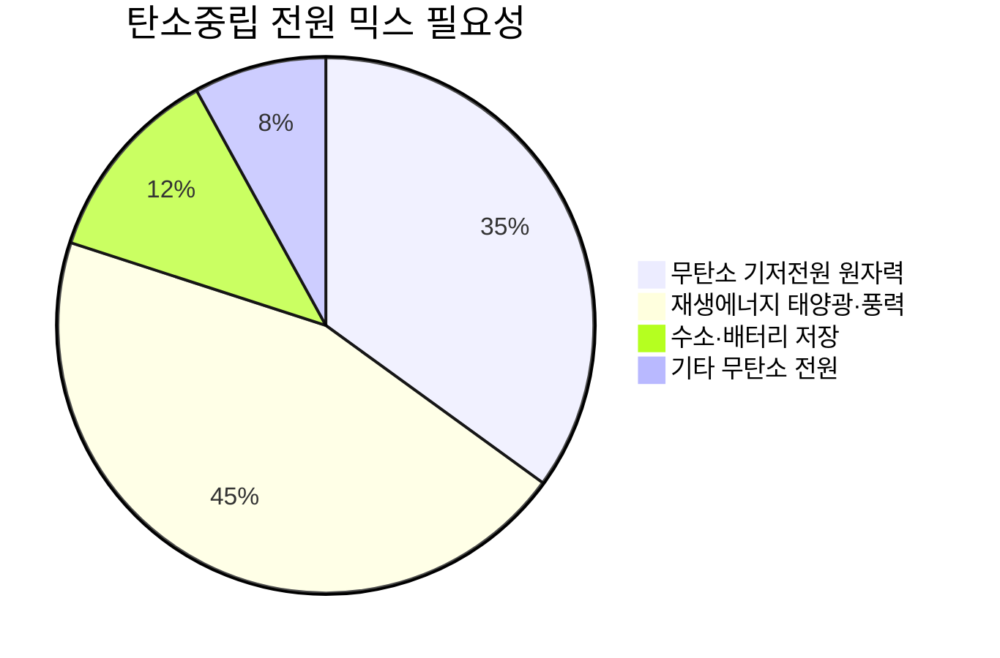
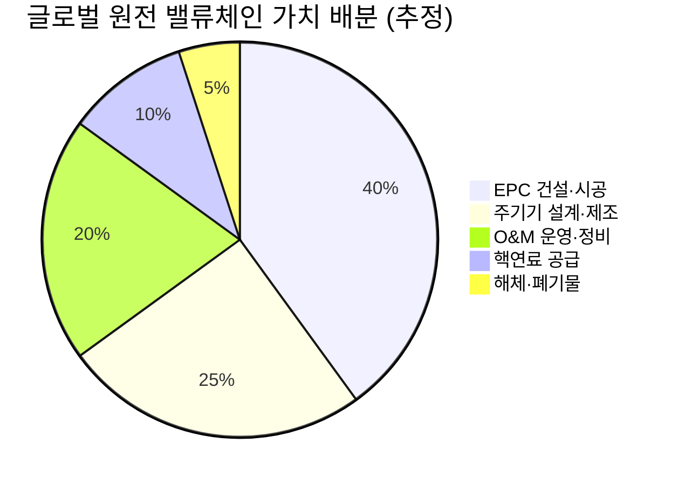
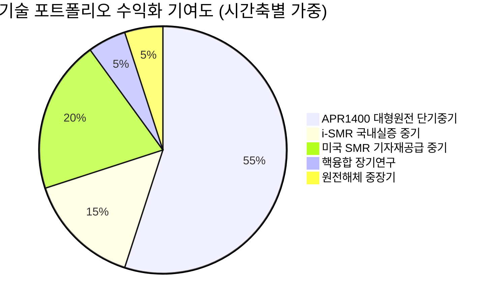
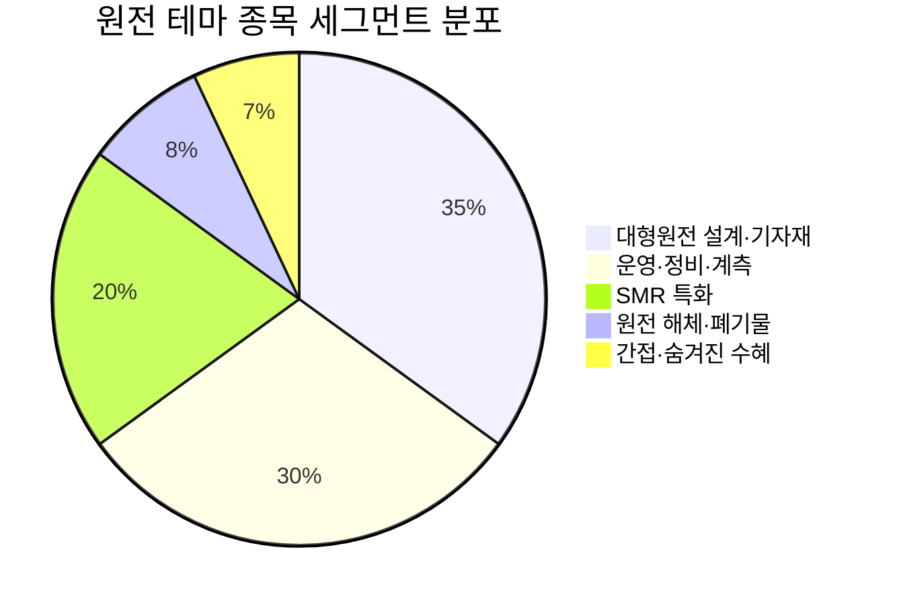

# Executive Summary & Why Now: 3중 동인이 만든 역사적 변곡점

> [!abstract] 섹션 요약
> 에너지 안보·탄소중립·AI 전력 수요라는 세 가지 구조적 동인이 사상 처음으로 동시 수렴하며, 한국 원자력 산업은 단순한 정책 수혜를 넘어 **글로벌 공급자 포지션 확립**이라는 역사적 변곡점에 진입했다. 체코 수주 확정·11차 전기본·고리 2호기 재가동이 집중된 2024~2026년은 투자 관점의 골든 윈도우다.

---

## 1. 거시적 맥락: 왜 지금 원자력인가

에너지 산업에서 "구조적 전환"이라는 말은 흔하게 쓰이지만, 실제로 세 개의 독립적인 거대 동인이 동일 시점에 수렴하는 사례는 극히 드물다. 한국 원자력은 바로 그 희귀한 순간에 서 있다.

2011년 후쿠시마 사고 이후 시작된 글로벌 탈원전 흐름은 약 10년에 걸쳐 원전 산업의 공급망을 붕괴시키고 신규 투자를 억제했다. 그러나 2022년 러시아-우크라이나 전쟁으로 촉발된 에너지 안보 위기, 파리협정 이행 압박에 따른 탄소중립 수요, 그리고 생성형 AI 확산이 만들어낸 전례 없는 전력 수요 급증이 거의 동시에 터지면서, 세계는 "탈원전 10년"이 만들어 놓은 구조적 공급 부족과 정면으로 마주쳤다. 그 결과가 지금의 글로벌 원전 르네상스다.

한국의 위치는 이 맥락에서 독보적이다. 30년간 18기의 원자로를 건설한 실적(같은 기간 미국 4기의 4.5배, 머니투데이)은 공급망이 살아있고 엔지니어링 역량이 유지된다는 의미다. UAE 바라카 원전 납기 준수와 세계 최저 수준의 건설 단가는 그 경쟁력을 국제 무대에서 실증했다. 한국은 단순히 원전을 "잘 쓰는 나라"가 아니라, 세계가 필요로 하는 원전을 "만들어 팔 수 있는 나라"가 된 것이다.

<div style="border-left:4px solid #4CAF50;padding-left:12px;margin:8px 0">
<strong>핵심 명제:</strong> 한국 원자력의 투자 테마는 "국내 전력 정책 변화"가 아니다. 글로벌 원전 공급망의 병목을 한국이 해소하는 구조에서 발생하는 <strong>초과 수익 기회</strong>다.
</div>

---

## 2. 3중 동인 심층 분석

### 동인 1: 에너지 안보 — 중동 리스크가 앞당긴 원전 재평가

> [!tip] 핵심 인사이트
> 에너지 안보 동인은 단순한 "유가 상승 → 원전 유리" 논리가 아니다. 원자력의 핵연료 특성 자체가 석유·가스와 근본적으로 다른 안보 구조를 제공한다는 인식이 확산되고 있다.

한국은 에너지 수입 의존도가 극히 높은 국가다. 석유와 LNG는 공급원이 중동에 집중되어 있어 지정학적 위기에 즉각적으로 노출된다. 반면 원자력은 구조적으로 다르다:

| 항목 | 석유/LNG | 원자력 |
|------|---------|--------|
| 연료 비축 가능 기간 | 수주~수개월 | **약 30개월분** (한국경제 기고) |
| 연료 장전 후 생산 기간 | 즉시 소모 | **약 18개월 연속 발전** |
| 공급원 집중도 | 중동 고집중 | 호주·캐나다·카자흐스탄으로 **다변화** |
| 국제 유가 영향 | 직접적·즉각적 | 간접적·제한적 |
| 공급 충격 시 대응 시간 | 수일~수주 | 30개월 비축으로 장기 완충 |

2025~2026년 중동 사태 장기화는 이 차이를 체감적으로 드러냈다. 정부가 에너지 위기 대응 차원에서 정비 중이던 원전 6기의 재가동을 서두른 것(조선비즈)은 원전이 "에너지 비상 예비군"이라는 인식을 공식화한 것이다. 고리 2호기의 2026년 4월 재가동은 그 상징이었다.

**So what?** 에너지 안보 동인은 경기 사이클과 무관하다. 국제 정세가 불안정할수록, 에너지 가격이 오를수록 원전의 상대적 가치는 강화된다. 이는 원전 투자의 **방어적 속성**이자, 경기 침체기에도 원전 관련 기업의 수요가 유지되는 근거다.

---

### 동인 2: 탄소중립 — 재생에너지의 현실적 한계가 만든 필연적 귀환

탄소중립 목표는 역설적으로 원자력 르네상스의 핵심 촉진제가 됐다. 태양광·풍력은 탄소를 배출하지 않지만 **간헐성(intermittency)** 이라는 근본적 제약을 갖는다. 24시간 365일 안정적인 전력 공급이 요구되는 AI 데이터센터, 반도체 팹, 전기로 제철 설비는 재생에너지만으로는 전력 수요를 충족할 수 없다.



EU가 2022년 원자력을 탄소중립 달성을 위한 친환경 투자 분류 체계(Taxonomy)에 포함한 것은 이 논리의 공식화다. COP28에서 22개국이 "2050년까지 원전 용량 3배 확대"를 선언한 것은 국제 사회의 컨센서스가 바뀌었음을 의미한다.

**1차/2차 효과:**
- **1차 효과**: 각국의 신규 원전 건설 계획 → 한국 기업의 수주 기회 확대
- **2차 효과**: 탄소국경조정메커니즘(CBAM) 도파로 인해 제조업의 무탄소 전원 수요 급증 → 기업 전력 구매 협약(PPA)에서 원전이 선호 전원으로 부상 → 민간 원전 투자 확대

---

### 동인 3: AI 전력 수요 — 이번 사이클의 가장 급격한 촉진제

> [!tip] 핵심 인사이트
> AI 동인이 다른 두 동인과 다른 점은 **수요 증가의 속도와 예측 불가능성**이다. AI 데이터센터의 전력 수요는 기존 산업화 패턴의 10~20배 속도로 증가하고 있으며, 이는 기저전원 확충에 10년 이상 걸리는 원자력과 시간축 불일치를 만들어 "지금 당장 투자를 결정해야 하는" 긴박감을 조성한다.

핵심 데이터를 보자. 2024년 한국에서 원전은 전체 발전량의 **31.7%**를 차지하며 단일 발전원으로는 최대가 됐다(SBS). 동시에 정부는 AI·반도체 등 첨단 산업의 전력 수요가 2030년까지 두 배 이상 증가할 것으로 예측하며, 신규 대형 원전 최소 2기가 더 필요하다고 공식화했다.

글로벌 차원에서는 더 극적이다:

| 수요처 | 전력 소비 특성 | 원전 적합성 |
|--------|--------------|------------|
| AI 데이터센터 | 24/7 고밀도, 연속 가동 필수 | 🟢 최적 (기저전원) |
| 반도체 팹 | 공정 안정성 위해 전압 변동 최소화 요구 | 🟢 최적 |
| 전기차 충전 인프라 | 피크 수요 집중 | 🟡 부분 적합 |
| 산업 전기화 (전기로 등) | 대규모 안정 전원 필요 | 🟢 적합 |

마이크로소프트, 구글, 아마존은 직접 원전 전력 구매 계약을 체결하거나 SMR 기업에 투자하기 시작했다. 빅테크의 에너지 전략이 원전으로 수렴하는 것은, AI 인프라 확장의 핵심 병목이 "전력"이라는 사실을 그들 스스로 인정하는 것이다.

**Variant Perception (시장과 다른 뷰):** 시장은 아직 AI 전력 수요와 원전 수주 사이클을 선형적으로 연결하는 경향이 있다. 그러나 원전 프로젝트의 특성상 계획→승인→착공→완공까지 10~15년이 소요된다. **지금 수주되는 프로젝트가 2035~2040년 AI 전력 수요를 충족시킨다**는 시간축을 이해하면, 현재의 수주 논의가 얼마나 긴급한 성격을 갖는지 알 수 있다. 시장은 이 시간 프리미엄을 과소평가하고 있다.

---

## 3. 글로벌 원전 TAM 확장 경로와 한국의 포지셔닝

> [!abstract] TAM 확장 요약
> 글로벌 원전 설비 용량은 현재 376GW(IAEA)에서 2040년 519~710GW(IAEA) 또는 638GW(IEA, +70%)로 확대된다. 이 확장의 절대량(140~330GW)이 한국이 공략할 시장의 크기다.

### TAM 확장 시나리오

<div style="display:flex;border-radius:8px;overflow:hidden;margin:8px 0;font-size:0.85em"><div style="background:#4CAF50;width:30%;padding:6px 8px;color:white">🟢 Bull: 710GW (+89%)</div><div style="background:#FF9800;width:50%;padding:6px 8px;color:white">🟡 Base: 638GW (+70%)</div><div style="background:#F44336;width:20%;padding:6px 8px;color:white">🔴 Bear: 519GW (+38%)</div></div>

| 시나리오 | 2040 목표 용량 | 현재 대비 증가분 | 주요 가정 | 출처 |
|---------|--------------|---------------|---------|------|
| **Bear** | 519 GW | +143 GW | 기존 계획 원전만 완공, SMR 지연 | IAEA 하단 |
| **Base** | 638 GW | +262 GW | IEA Net Zero 시나리오 | IEA |
| **Bull** | 710 GW | +334 GW | 각국 원전 확대 목표 달성 | IAEA 상단 |

**한국의 포지셔닝:**

Base 시나리오 기준 +262GW의 신규 용량이 필요하다. 대형 원전(APR1400 기준 약 1.4GW/기)으로 환산하면 약 187기다. 한국이 목표하는 2030년까지 10기 수출은 이 수요의 약 5%에 불과하다. 초기 레퍼런스 확보 → 추가 수주로의 선순환을 고려하면, 시장 침투의 상방은 열려있다.

SMR 시장은 별도다. 2035년까지 전 세계 SMR 시장이 65~85GW 규모로 성장할 것으로 예측되는데(출처 미확인, [추정]), 이는 대형 원전 TAM과 별개로 가산되는 신규 시장이다.

### 한국의 구조적 경쟁 우위

<div style="background:#e0e0e0;border-radius:8px;overflow:hidden;margin:4px 0"><div style="background:#4CAF50;width:92%;padding:4px 8px;color:white;font-size:0.9em;white-space:nowrap">건설 실적·납기 준수 경쟁력 92/100</div></div>

<div style="background:#e0e0e0;border-radius:8px;overflow:hidden;margin:4px 0"><div style="background:#4CAF50;width:85%;padding:4px 8px;color:white;font-size:0.9em;white-space:nowrap">기자재 공급망 완결성 85/100</div></div>

<div style="background:#e0e0e0;border-radius:8px;overflow:hidden;margin:4px 0"><div style="background:#4CAF50;width:78%;padding:4px 8px;color:white;font-size:0.9em;white-space:nowrap">운영·이용률 실적 78/100</div></div>

<div style="background:#e0e0e0;border-radius:8px;overflow:hidden;margin:4px 0"><div style="background:#FF9800;width:55%;padding:4px 8px;color:white;font-size:0.9em;white-space:nowrap">핵연료 주기 자립도 55/100</div></div>

<div style="background:#e0e0e0;border-radius:8px;overflow:hidden;margin:4px 0"><div style="background:#FF9800;width:50%;padding:4px 8px;color:white;font-size:0.9em;white-space:nowrap">SMR 상용화 준비도 50/100</div></div>

---

## 4. 84.6% 이용률의 투자적 의미 — 운영 실적이 수출 경쟁력으로

2024년 한수원 원전 이용률 84.6%(한수원 공시, 서울경제TV), 역대 최대 발전량 188TWh(데일리e뉴스) — 이 숫자가 단순한 운영 KPI가 아닌 이유를 짚어야 한다.

> [!tip] 핵심 인사이트
> 원전 이용률은 수출 경쟁력의 "살아있는 증거"다. 해외 발주처가 한국 컨소시엄을 선택할 때 가장 중요한 레퍼런스 중 하나가 "운영 중인 원전의 성능"이다. 84.6%는 글로벌 상위권 이용률로, 이를 유지한다는 것은 한국이 단순한 건설업자가 아닌 "원전의 전 생애주기 솔루션 제공자"임을 입증한다.

**이용률이 수출에 연결되는 메커니즘:**

1. **기술 신뢰성 증명**: 높은 이용률 = 설계 결함 없음 + 정비 역량 우수
2. **경제성 근거 제공**: 발주국의 투자회수 모델에 이용률이 직접 입력됨 → 84% vs 70% 이용률 가정은 수십 년간 수조 원 차이
3. **운영 유지보수(O&M) 수출 기회**: 원전 건설 후 수십 년간의 O&M 계약은 건설 EPC 계약 규모에 버금가는 장기 수익원

---

## 5. 2024~2026년 촉매 이벤트 집중 분석

> [!success] 강점
> 지금 이 시점이 투자 진입 타이밍인 이유는 정책 발표나 기대감 때문이 아니다. 실제 계약·착공·법제화가 집중되어 있어 "가능성"이 "확정된 매출"로 전환되는 변곡점이기 때문이다.

### 촉매 이벤트 타임라인

| 시기 | 이벤트 | 성격 | 투자 의미 |
|------|--------|------|----------|
| 2024년 | **원자력 발전 비중 31.7% 달성** (최대 발전원) | 실적 확인 | 정책 의지의 결과물 구현 |
| 2024년 | **한수원 이용률 84.6%** (역대 최고권) | 운영 실적 | 수출 레퍼런스 강화 |
| 2024년 | **체코 두코바니 원전 수주 계약 체결** | 계약 확정 | 유럽 시장 진출 첫 관문 — 레퍼런스 확보 |
| 2025년 | **제11차 전력수급기본계획 확정** (대형 2기 + SMR 1기) | 정책 확정 | 국내 발주 파이프라인 가시화 |
| 2026년 4월 | **고리 2호기 재가동** (35개월 설비 개선 후) | 착공/가동 실현 | 계속운전 정책 실현 + 10기 도미노 효과 |
| 2026년 (예상) | **한미 원자력협정 개정 협상 타결** | 제도 변화 | 미국 시장 진출 법적 기반 확보 |
| 2026년 (진행) | **SMR 특별법 국회 통과** | 입법 | SMR 상용화 제도 기반 완성 |
| 2029년 (목표) | **i-SMR 건설 착수** | 착공 목표 | SMR 국내 실증 → 수출 레퍼런스 확보 |

**촉매 이벤트가 만드는 선순환:**

체코 수주 → 유럽 레퍼런스 확보 → 중동·동남아 추가 수주 협상 레버리지 → 공급망 기업 선행 투자 → 고리 2호기 재가동 → 나머지 10기 계속운전 공식화 → 국내 일감 안정화 → SMR 특별법 → 신규 사업 파이프라인 확장

이 선순환의 각 단계가 2024~2026년에 집중되어 있다는 점이 "지금" 투자해야 하는 이유다.

---

## 6. Variant Perception — 시장이 놓치고 있는 것

> [!question] 검토 필요 — 시장 컨센서스와의 차이
> 대부분의 투자자는 한국 원자력을 "정책 테마주"로 접근한다. 즉, 정권이 바뀌면 리스크가 생기는 단기 테마로 보는 것이다. 이것이 시장의 컨센서스다.

**그러나 구조는 이미 바뀌었다:**

1. **이재명 정부도 원전을 유지하고 있다**: 고리 2호기 7년 수명 연장 최초 승인(연합뉴스TV), 신규 원전 2기 건설 추진 — 탈원전을 내걸었던 정치 세력이 집권 후에도 원전을 유지·확대하는 이유는 에너지 안보·AI 전력 수요·국민 여론(80% 이상 원전 필요, YTN 사이언스) 때문이다. **원전은 이제 정치적 선택이 아닌 물리적 필요**가 됐다.

2. **수출은 국내 정책과 분리되어 있다**: 체코 계약, 미국 SMR 투자, 베트남·태국 협력은 국내 정권 교체와 무관하게 진행된다. 해외 수주 파이프라인이 형성된 이상, 국내 정치 리스크는 수출 매출에 대한 영향이 제한적이다.

3. **공급망의 희소성**: 30년간 한국이 원전 생태계를 유지한 반면, 미국은 원전을 건설하지 않아 공급망이 붕괴됐다. 미국이 2050년까지 400GW를 목표로 하는데 자국 공급망이 없다 → 한국 공급망 의존 → 이 의존성은 정치가 바꿀 수 없는 물리적 현실이다.

<div style="border-left:4px solid #FF9800;padding-left:12px;margin:8px 0">
<strong>Variant Perception 요약:</strong> "정책 테마" 프레임은 틀렸다. 한국 원자력은 글로벌 에너지 인프라의 구조적 공급자로 전환 중이며, 이는 정권과 무관하게 지속된다. 시장이 이 프레임 전환을 인식하는 시점에 밸류에이션 재평가가 일어난다.
</div>

---

## 7. 리스크 진단 — Devil's Advocate

> [!warning] 리스크 경고
> 투자 가설이 틀릴 수 있는 시나리오를 직시해야 한다. 낙관적 전망 일색의 리포트는 Due Diligence가 아니다.

| 리스크 요인 | 내용 | 발생 확률 | 영향도 | 완화 요인 |
|-----------|------|---------|--------|---------|
| **정책 연속성 리스크** | 향후 정권 교체 시 신규 원전 계획 번복 가능성 | 🟡 중간 | 🔴 높음 | 국민 80% 지지, AI 전력 수요 현실화로 번복 비용 증가 |
| **건설 지연·비용 초과** | 서구 원전 사례처럼 공사 기간·비용 초과 | 🟡 중간 | 🟡 중간 | UAE 바라카 실적으로 입증된 역량 |
| **웨스팅하우스 IP 분쟁** | APR1400 핵심 기술 IP 갈등으로 수출 제한 | 🟡 중간 | 🔴 높음 | 한미 원자력협정 개정으로 해소 논의 진행 중 |
| **사용후 핵연료 처리** | 2030년 한빛원전부터 저장 수조 포화 예상 | 🔴 높음 | 🟡 중간 | 원전 확대의 구조적 한계 — 중간저장시설 부지 확보 시급 |
| **원전 밀집도 리스크** | 2030년대 초 프랑스의 3배, 미국의 30배 밀집도 (한겨레) — 다수호기 동시 이상 시 리스크 | 🟡 낮음 | 🔴 매우 높음 | 지리적 분산 제한적 — 구조적 한계 |
| **핵연료 주기 의존성** | 농축 우라늄 전량 해외 조달, HALEU 확보 과제 | 🟡 중간 | 🟡 중간 | 프랑스 오라노와 핵연료 전주기 협력 MOU |
| **SMR 상용화 지연** | i-SMR 표준설계인가 미취득 — 2029년 착공 목표 달성 여부 불확실 | 🟡 중간 | 🟡 중간 | 대형 원전 모멘텀으로 커버 가능 |

---

## 8. 이해관계자 인센티브 분석 (Incentive Analysis)

> [!note] 참고 — 숨겨진 동기 파악
> 각 행위자의 인센티브를 이해하면 정책·사업의 지속 가능성을 평가할 수 있다.

| 이해관계자 | 표면적 입장 | 실제 인센티브 | 행동 예측 |
|-----------|-----------|------------|---------|
| **한국 정부** | 에너지 안보·탄소중립 | 무역 협상 카드, 첨단 산업 전력 확보, 수출 산업화 | 정권 불문 원전 유지 강력 |
| **한수원** | 안전 운영·수출 | 글로벌 EPC 플레이어로 도약, 기관 위상 강화 | 공격적 해외 수주 추진 |
| **두산에너빌리티** | 중공업 부활 | 탈원전 10년의 피해 복구 + SMR로 신성장 | 8,068억 원 SMR 공장 투자 실행 |
| **미국 정부** | 에너지 독립·동맹 강화 | 중국 원전 기술 배제 + 자국 인프라 재건 | 한국 공급망 의존 + IP 협상 | 
| **빅테크 기업** | AI 인프라 확장 | 전력 확보가 AI 패권 확보 | 직접 원전 투자·PPA 계약 확대 |
| **국내 건설사** | 해외 수주 확대 | 국내 건설 시장 포화 → 해외 플랜트로 활로 | 원전 EPC 역량 집중 투자 |
| **시민·국민** | 안전·저렴한 전기 | AI 시대 전기요금 부담 + 일자리 | 원전 필요성 인식 강화 (80% 지지) |

**핵심 발견**: 모든 주요 이해관계자의 인센티브가 원전 확대 방향으로 정렬되어 있다. 과거 탈원전의 동력이었던 "반핵 시민 운동"조차 AI 전력 수요 현실 앞에서 힘을 잃고 있다.

---

## 9. 투자 타이밍 프레임워크 — 왜 "지금"인가

> [!verdict] 최종 판단
> 한국 원자력은 S-Curve의 성장 초입~가속 국면 진입 시점에 있다. 대형 원전은 체코 수주 확정으로 "가능성"에서 "실현"으로 전환됐고, SMR은 기술 확보 단계에서 상용화 준비 단계로 넘어가고 있다. 두 트랙이 동시에 가속되는 구간이 바로 지금이다.

<div style="display:flex;border-radius:8px;overflow:hidden;margin:8px 0;font-size:0.85em"><div style="background:#4CAF50;width:45%;padding:6px 8px;color:white">🟢 Bull 45%: 한미 협정 타결 + SMR 수주 + 추가 수출</div><div style="background:#FF9800;width:40%;padding:6px 8px;color:white">🟡 Base 40%: 현재 계획 차질없이 진행</div><div style="background:#F44336;width:15%;padding:6px 8px;color:white">🔴 Bear 15%: 정책 혼선 + 수출 지연</div></div>

**시간축별 투자 근거:**

| 시간축 | 핵심 드라이버 | 확인 포인트 |
|--------|------------|-----------|
| **단기 (0~12개월)** | 고리 2호기 재가동 완전 정상화, 나머지 계속운전 원전 일정 발표 | 이용률 유지 여부, 추가 계속운전 신청 건수 |
| **중기 (1~3년)** | 11차 전기본 신규 원전 착공, 한미 원자력협정 타결, 추가 수출 수주 | 체코 이후 2~3번째 수주국 확정 여부 |
| **장기 (3~7년)** | i-SMR 건설 착수(2029년 목표), 미국 SMR 프로젝트 기자재 납품 개시 | SMR 표준설계인가 취득 시기 |

<div style="border-left:4px solid #4CAF50;padding-left:12px;margin:8px 0">
<strong>투자 명제 요약:</strong> 에너지 안보·탄소중립·AI 전력 수요라는 세 가지 구조적 동인은 각각 독립적으로도 원전 르네상스를 정당화하기에 충분하다. 이 셋이 동시에 수렴하는 것은 역사적으로 전례가 없다. 한국은 이 수렴점에서 글로벌 공급망의 희소 자원을 보유한 국가로 포지셔닝되어 있다. 정책 리스크가 완전히 사라진 것은 아니지만, 투자 가설의 근거가 정책 의지가 아닌 <strong>물리적 수요와 공급망 구조</strong>에 기반한다는 점에서 과거 어느 시점의 원전 테마와도 다르다.
</div>

---

> [!note] 다음 섹션 안내
> 본 Executive Summary에서 제시한 3중 동인의 구조적 논거를 바탕으로, 후속 섹션에서는 **밸류체인별 핵심 플레이어 분석**, **SMR vs 대형 원전 이중 모멘텀 상세 분석**, **수출 시장 경쟁 지형도**, **주요 상장사 밸류에이션 비교**가 순차적으로 전개된다.

---

# 시장 구조 분석: TAM·밸류체인·경쟁 지형도

> [!abstract] 섹션 요약
> 글로벌 원전 TAM은 2040년까지 IEA 기준 +262GW(Base) 확장이 확정적이나, 한국이 실질 수주 가능한 SAM은 이 중 약 20~30GW로 추정된다[추정]. 대형 원전·SMR·원전 해체·핵연료 공급 4개 세그먼트는 성장 속도와 마진 구조가 판이하게 다르며, 한국은 30년 운영 실증 데이터라는 비복제 자산을 바탕으로 미국·중국·프랑스·러시아 경쟁 진영과 차별화된다. 두산에너빌리티 8,068억 원 SMR 공장 투자와 한국 기업 4.37조 원 미국 SMR 투자는 단순한 재무 투자가 아닌 글로벌 밸류체인 내 전략적 위치 선점 행위다.

---

## 1. 글로벌 원전 TAM 해부: 376GW에서 638GW로

### 1-1. TAM의 구성 요소 분해

> [!note] 참고 — TAM 측정 방법론
> 원전 TAM은 단순 설비 용량(GW)으로는 투자 관점의 시장 크기를 온전히 반영하지 못한다. 실질적 시장 크기는 **신규 건설 EPC + 계속운전/업그레이드 + O&M + 핵연료 + 해체**의 합산이며, 각각의 단가와 수익성이 다르다.

| TAM 구성 요소 | 2040년까지 물량 | 기준 단가 | 시장 규모 추정 | 성장 속도 |
|-------------|--------------|---------|------------|--------|
| **신규 건설 EPC** | +140~334GW (시나리오별) | $5~8B/GW | $700B~2.7T | 🟢 고성장 |
| **계속운전/업그레이드** | 기존 376GW 중 상당 부분 | $0.5~1B/기 | $100~200B | 🟢 고성장 |
| **O&M (운영·정비)** | 전체 가동 설비 × 연간 | $50~100M/기·년 | $20~40B/년 | 🟡 안정 성장 |
| **핵연료 공급** | 전체 가동로 × 18개월 주기 | (데이터 미확인) | — | 🟡 안정 성장 |
| **원전 해체** | 2050년까지 100기+ | $0.5~1B/기 | $50~100B | 🟢 성장 초입 |

> [!warning] 수치 주의
> 단가 기준은 프로젝트별로 편차가 크며, 위 추정치는 [추정] 수준입니다. IEA/IAEA는 GW 기준 용량 전망을 제공하지만, 달러 기준 시장 규모의 공식 집계는 확인되지 않습니다.

**So what?** 투자자에게 중요한 것은 TAM의 절대 크기가 아니라 **성장의 형태**다. 기존 376GW가 만들어내는 O&M·핵연료·해체 시장은 경기 사이클과 무관한 방어적 현금흐름이고, 신규 건설 EPC는 수주 사이클에 민감한 성장 동력이다. 한국 기업들은 이 두 가지를 동시에 갖는 포트폴리오를 구축 중이다.

### 1-2. TAM 확장 시나리오와 신규 수요의 지역 분포

<div style="display:flex;border-radius:8px;overflow:hidden;margin:8px 0;font-size:0.85em"><div style="background:#4CAF50;width:30%;padding:6px 8px;color:white">🟢 Bull: 710GW (+334GW)</div><div style="background:#FF9800;width:50%;padding:6px 8px;color:white">🟡 Base: 638GW (+262GW, IEA)</div><div style="background:#F44336;width:20%;padding:6px 8px;color:white">🔴 Bear: 519GW (+143GW)</div></div>

| 지역 | 현재 설비 | 2040 목표 | 신규 수요 | 한국 접근성 |
|------|---------|---------|---------|-----------|
| **미국** | ~100GW | 400GW(2050) | ~300GW (장기) | 🟢 최우선 — SMR 협력, IP 문제 해소 시 |
| **중국** | ~57GW | ~200GW+(2050) | ~150GW | 🔴 경쟁국·진입 불가 |
| **유럽** | ~100GW | 유지+확대 | 30~50GW | 🟢 체코 수주로 진입 확보 |
| **중동** | ~5GW | 확대 목표 | 10~20GW | 🟢 UAE 레퍼런스 활용 |
| **동남아** | 0 | 신규 진입 | 10~15GW | 🟡 베트남·태국·인도네시아 논의 중 |
| **인도** | ~7GW | ~22GW | ~15GW | 🟡 독자 노형 고집, 협력 공간 제한적 |
| **동유럽/중앙유럽** | ~20GW | 확대 | 10~20GW | 🟢 체코 이후 폴란드·루마니아 등 |

---

## 2. 한국의 SAM (Serviceable Addressable Market) 추정

> [!question] 검토 필요 — SAM의 공식 집계는 없음
> 앵커 데이터시트에서 명시된 바와 같이 한국 기업이 실질적으로 수주 가능한 SAM에 대한 공식 집계는 존재하지 않습니다. 아래는 구조적 분석에 기반한 [추정]입니다.

### SAM 추정 로직

**접근 방식**: Base 시나리오(+262GW 신규) 중에서 한국이 실제 수주 경쟁에 참여 가능한 지역·프로젝트의 비중을 추정한다.

| 필터 조건 | 제외 물량 | 잔여 물량 |
|---------|---------|---------|
| 전체 신규 수요 (Base) | — | +262GW |
| ① 중국 자국 내 건설 (한국 진입 불가) | -80GW [추정] | ~182GW |
| ② 러시아 ROSATOM 영향권 국가 | -30GW [추정] | ~152GW |
| ③ 미국 (협정 미타결 시 제한) | -50GW [조건부 제외] | ~100GW |
| **SAM (협정 미타결 시 보수적)** | | **~100GW** |
| **SAM (협정 타결 시 낙관적)** | | **~150GW** |

**한국의 실제 SOM (Serviceable Obtainable Market)**: 2030년까지 수출 목표 10기 = 약 14GW (APR1400 기준). 이는 보수적 SAM 100GW의 약 14%에 해당하는 시장 침투율이다.

<div style="border-left:4px solid #4CAF50;padding-left:12px;margin:8px 0">
<strong>핵심 인사이트:</strong> 2030년 목표 10기는 SAM 대비 낮은 시장 점유율처럼 보이지만, 원전 수주의 특성상 <strong>첫 수주가 10~15년간의 O&M 계약과 추가 수주로 이어지는 '발판 효과'</strong>를 창출한다. 체코 1건이 체코 내 추가 2기 + 동유럽 국가들의 잠재 수요를 여는 구조다.
</div>

---

## 3. 4개 세그먼트 성장 속도·수익성 매트릭스

> [!abstract] 세그먼트 요약
> 대형 원전·SMR·원전 해체·핵연료 공급은 성장 단계, 수익성, 리스크 프로필이 모두 다르다. 투자자는 각 기업이 어느 세그먼트에 얼마나 노출되어 있는지를 기준으로 포트폴리오를 구성해야 한다.

### 3-1. 세그먼트별 비교 매트릭스

| 세그먼트 | S-Curve 위치 | 성장 CAGR | 마진 수준 | 수주 주기 | 한국 경쟁력 | 핵심 리스크 |
|---------|-----------|---------|---------|---------|-----------|-----------|
| **대형 원전 EPC** | 🟢 성장 초입~가속 | 고성장[추정] | 중간 (UAE 적자 사례 존재) | 10~15년 | 🟢 최강 (UAE·체코 실증) | 수주 후 비용 초과, IP 분쟁 |
| **SMR 제조·공급** | 🟡 촉발~초기 성장 | 매우 고성장[추정] | 높음(양산화 후) | 5~8년 | 🟡 개발 중 (i-SMR 2029 착공 목표) | 상용화 지연, 선점 경쟁 치열 |
| **원전 O&M·계속운전** | 🟢 성숙~안정 성장 | 안정적 | 높음 (반복 수익) | 10~20년 단위 | 🟢 강함 (84.6% 이용률) | 규제 변화, 안전 사고 |
| **원전 해체** | 🟡 성장 초입 | 고성장[추정] | 높음(초기 경험 확보 시) | 5~10년 | 🟡 인허가 단축 추진 중 | 고준위 폐기물 처리 미해결 |
| **핵연료 공급** | 🟢 성숙 | 안정 | 중간 | 18개월 반복 | 🔴 취약 (농축 전량 해외 의존) | 농축 능력 미보유 |

### 3-2. 세그먼트별 심층 분석

#### ① 대형 원전 EPC — 한국의 핵심 강점, 그러나 수익성 함정 주의

대형 원전 EPC는 한국이 가장 강한 경쟁력을 보유한 세그먼트이면서, 동시에 가장 세심한 수익성 관리가 필요한 영역이다.

**UAE 바라카의 교훈**: 세계 최고의 기술력으로 납기를 지켰지만, 수주 단가가 지나치게 낮았다는 점에서 수익성 측면의 문제가 지적됐다. 한수원과 한전 컨소시엄의 바라카 사업 누적 수익률은 적자권이라는 분석이 있다(조사 5 언급). 이는 **"수주 실적 = 수익성"이 아님**을 보여준다.

**체코 두코바니의 차이점**: 체코는 EU 기준의 계약 구조와 변동비 보전 메커니즘이 포함된 것으로 알려져, UAE 대비 수익성 개선이 기대된다. 다만 계약 세부 조건은 공개되지 않아 직접 확인은 불가하다(확인 필요).

<div style="background:#e0e0e0;border-radius:8px;overflow:hidden;margin:4px 0"><div style="background:#4CAF50;width:88%;padding:4px 8px;color:white;font-size:0.9em;white-space:nowrap">APR1400 기술 성숙도·수출 경쟁력 88/100</div></div>
<div style="background:#e0e0e0;border-radius:8px;overflow:hidden;margin:4px 0"><div style="background:#FF9800;width:62%;padding:4px 8px;color:white;font-size:0.9em;white-space:nowrap">EPC 수익성 관리 역량 62/100</div></div>

#### ② SMR — 가장 빠른 성장, 가장 높은 불확실성

SMR 시장은 글로벌 원전 르네상스에서 가장 뜨거운 영역이다. 2035년까지 65~85GW(출처 미확인, [추정])로 성장이 예상되나, 이 전망 자체도 검증이 필요하다.

**한국 SMR 전략의 이중 구조:**

- **i-SMR (독자 개발)**: 170MW급, 2029년 건설 착수 목표. 표준설계인가 미취득 상태로 아직 초기 단계. 한수원이 독자 수출 전략의 핵심 무기로 설정(한국원자력산업협회 황주호 회장, 에너지플랫폼뉴스).
- **미국 SMR 공급망 참여**: 두산에너빌리티의 뉴스케일파워·테라파워 기자재 수주, HD현대의 참여, SK이노베이션-테라파워 동맹 합류. 이는 i-SMR 상용화 전 기간 동안 글로벌 SMR 사이클에서 수익을 창출하는 브리지 전략이다.

> [!tip] 핵심 인사이트 — SMR의 전략적 분리
> 한국의 SMR 전략은 사실 두 개의 별개 비즈니스다. ①미국 SMR 기자재 공급(단기 매출 실현, 두산에너빌리티가 핵심)과 ②i-SMR 독자 수출(2030년대 후반~장기, 한수원 주도). 시장은 이 두 트랙을 하나로 묶어 평가하는 경향이 있으나, 투자 시간축과 리스크 프로필이 완전히 다르다.

두산에너빌리티의 8,068억 원 SMR 공장 투자(연간 20기 생산 목표, CBC뉴스)는 ①번 트랙(미국 SMR 기자재 공급)을 위한 생산 능력 확보다. 이 투자의 회수 타임라인은 미국 SMR 프로젝트의 실제 발주 시기에 달려있으며, 2026~2028년 중 미국 SMR 프로젝트들이 FID(최종 투자 결정)에 진입하면 직접 수혜가 가시화된다.

<div style="background:#e0e0e0;border-radius:8px;overflow:hidden;margin:4px 0"><div style="background:#FF9800;width:58%;padding:4px 8px;color:white;font-size:0.9em;white-space:nowrap">i-SMR 상용화 준비도 58/100 (인가 취득 전)</div></div>
<div style="background:#e0e0e0;border-radius:8px;overflow:hidden;margin:4px 0"><div style="background:#4CAF50;width:75%;padding:4px 8px;color:white;font-size:0.9em;white-space:nowrap">미국 SMR 기자재 공급망 확보 75/100</div></div>

#### ③ 원전 해체 — 11조 원 국내 시장, 500조 원 글로벌 기회

국내 원전 해체 시장은 약 11조 원 규모(한국경제TV)로 추정된다. 글로벌 시장은 약 500조 원 규모로 언급되나 출처 근거가 약해 미확인 상태다(앵커 데이터시트).

고리 1호기 해체가 진행 중이며, 한수원은 월성 1호기 해체 인허가 기간을 최대 4년에서 1년 이내로 단축하는 방안을 추진 중이다(한국경제TV). 이 인허가 단축이 실현될 경우, 해체 사업의 경제성과 해외 경쟁력이 동시에 개선된다.

**해체 시장의 투자 포인트**: 해체는 건설보다 훨씬 높은 전문성과 방사성 폐기물 처리 역량을 요구한다. 현재 상업적 해체 레퍼런스를 가진 국가가 제한적인 상황에서, 한국이 고리 1호기·월성 1호기 해체 경험을 성공적으로 쌓는다면 이것 자체가 수출 가능한 기술이 된다. 오르비텍, 한수원 등이 해체 시장 선점을 위한 역량 확보에 나서고 있다(조사 5).

#### ④ 핵연료 공급 — 구조적 취약점, 그러나 리스크 완화 중

핵연료 주기는 한국 원전 밸류체인에서 가장 취약한 고리다. 농축 우라늄 전량 해외 조달, HALEU(고순도 저농축 우라늄) 확보 과제, 특정국 의존도 문제가 구조적으로 존재한다(전기저널, 한국경제).

**리스크 완화 조치 진행 중:**
- 한수원-프랑스 오라노(Orano) 핵연료 전주기 협력(한국원자력신문)
- 한-프랑스 핵연료 공급망 협력 강화 MOU 체결(조선비즈)
- 우라늄 공급처 호주·캐나다·카자흐스탄으로 다변화, 30개월분 비축(한국경제)

**한미 원자력협정 개정의 핵심**: 협정 개정에서 가장 중요한 의제 중 하나가 한국의 농축 권한이다. 이것이 타결되면 핵연료 주기 자립도가 단계적으로 개선될 수 있다(위클리서울, 마켓인).

---

## 4. 글로벌 원전 밸류체인 전체 매핑



> [!note] 참고
> 위 파이차트는 전체 프로젝트 생애주기 가치의 분포에 대한 [추정]이며, 공식 출처 기반 수치가 아닙니다.

### 한국 밸류체인 참여자 매핑

| 밸류체인 단계 | 핵심 국내 플레이어 | 원자력 매출 비중 | 경쟁 포지션 |
|------------|----------------|-------------|-----------|
| **원전 종합 설계** | [[한국전력기술(KEPCO E&C)]] | ~77.9% | 🟢 국내 독점, 수출 핵심 |
| **주기기 제작** | [[두산에너빌리티]] | 대형 비중 (확인 필요) | 🟢 글로벌 최상위 (원자로 용기 제작 능력) |
| **EPC 시공** | [[현대건설]], [[삼성물산]], 대우건설 | 부분 노출 | 🟢 글로벌 경쟁력 |
| **운영·유지보수** | [[한수원]], [[한전KPS]] | 🟢 국내 독점(한수원), 정비 전문(한전KPS) | 수출 가능성 |
| **계측제어** | [[우진]] | ~58.9% | 🟢 원전 계측기 전문 |
| **정비·기자재** | [[일진파워]], [[보성파워텍]] | 부분 노출 | 🟡 국내 중견 |
| **원전 해체** | [[오르비텍]], 한수원 | 초기 단계 | 🟡 레퍼런스 확보 중 |
| **핵연료** | [[한전원자력연료]] | — | 🔴 농축 외주, 구조적 취약 |

---

## 5. 5개 진영 경쟁 구도 분석 — 한국의 차별화 포인트

> [!abstract] 경쟁 지형 요약
> 원전 수출 시장은 사실상 한국·미국(웨스팅하우스)·프랑스(EDF)·러시아(ROSATOM)·중국(CNNC/CGN) 5개 진영의 과점 구조다. 각 진영은 기술력·가격·금융·지정학적 영향력 측면에서 전혀 다른 경쟁 방식을 취한다.

### 5-1. 5개 진영 종합 비교

| 평가 항목 | 🇰🇷 한국 | 🇺🇸 미국(WH) | 🇫🇷 프랑스(EDF) | 🇷🇺 러시아(ROSATOM) | 🇨🇳 중국(CNNC) |
|---------|--------|-----------|-------------|-----------------|------------|
| **건설 실적 (30년)** | 🟢 18기 | 🔴 4기 | 🟡 플라망빌 지연 | 🟢 해외 다수 | 🟢 국내 고속 성장 |
| **납기 준수** | 🟢 UAE 실증 | 🔴 조지아 프로젝트 지연 | 🔴 핀란드·영국 지연 | 🟡 국가별 편차 | 🟡 국내 기준 |
| **건설 단가** | 🟢 세계 최저 수준 | 🔴 가장 고가 | 🔴 고가 | 🟢 저가 (국가 보조) | 🟢 저가 (국가 보조) |
| **금융 패키지** | 🟡 개선 중 | 🟡 DFC 활용 | 🟡 개선 중 | 🟢 전략적 저리 융자 | 🟢 전략적 저리 융자 |
| **지정학적 수용성** | 🟢 우호적 (서방 동맹) | 🟢 우호적 | 🟢 우호적 | 🔴 우크라이나 이후 급락 | 🔴 서방 발주처 기피 |
| **SMR 기술** | 🟡 개발 중 (i-SMR) | 🟢 선도 (NuScale, TerraPower) | 🟡 개발 중 | 🟡 RITM-200 | 🟡 개발 중 |
| **IP 자립도** | 🟡 WH 의존 일부 | 🟢 원천 보유 | 🟢 원천 보유 | 🟢 완전 자립 | 🟢 완전 자립(일부 논쟁) |
| **공급망 완결성** | 🟢 풀 체인 유지 | 🔴 30년 공백으로 붕괴 | 🟡 부분적 | 🟢 완전 | 🟢 완전 |

### 5-2. 경쟁 진영별 핵심 약점과 한국의 기회

**① 러시아 ROSATOM의 지정학적 몰락**

2022년 이전까지 ROSATOM은 글로벌 원전 수출 최강자였다. 핀란드·폴란드·발트3국 계획 원전, 이집트 엘다바, 헝가리 팍시 2 등에서 계약을 선점했다. 그러나 우크라이나 침공 이후 핀란드는 계약을 취소했고, 체코·폴란드는 러시아 원전을 공식 배제했다. **한국이 체코 두코바니를 수주한 것은 이 공백을 정확히 메운 결과다.**

핵심 기회: 기존 ROSATOM 계획 수립 국가들(헝가리 팍시 제외, 중앙아시아, 동유럽 일부)이 탈러시아 대안을 찾고 있다.

**② 프랑스·미국의 납기·비용 문제**

EDF의 플라망빌 EPR은 2007년 착공 → 수차례 지연 → 2024년 상업 운전. 영국 힝클리포인트 C는 비용이 두 배 이상으로 불어났다. 미국 조지아 보글 프로젝트도 수십억 달러 초과 비용 후 완공.

이 사례들은 발주국이 원전 공급사를 선택할 때 가장 중요하게 보는 것이 **납기 준수와 비용 확실성**임을 보여준다. UAE 바라카 4기를 예정 일정 내 완공한 한국이 이 기준에서 압도적인 레퍼런스를 갖는다.

**③ 중국의 시장 배제**

중국 CNNC/CGN은 건설 속도와 가격 측면에서 강력하지만, 서방 발주처들은 사이버 보안, 기술 유출, 지정학적 의존 등을 이유로 중국 원전 도입을 기피한다. 미국·EU 등은 중국산 원전 기술의 우방국 내 도입을 사실상 억제하는 방향으로 정책을 정렬 중이다.

이는 한국이 "서방 동맹 + 경쟁력 있는 가격 + 납기 준수"라는 포지셔닝을 독점할 수 있는 구조적 기회를 의미한다.

<div style="display:flex;border-radius:8px;overflow:hidden;margin:4px 0"><div style="background:#4CAF50;width:70%;padding:4px 8px;color:white;font-size:0.85em">한국의 지정학적 수용성 + 기술력 조합 우위 70%</div><div style="background:#F44336;width:30%;padding:4px 8px;color:white;font-size:0.85em;text-align:right">금융 패키지 열위 30%</div></div>

---

## 6. 30년 운영 실증 데이터: 비복제 자산의 경쟁 우위

> [!success] 강점 — 숫자로 보는 실증 우위
> 한국이 30년간 18기 원전을 건설하며 축적한 것은 단순한 "경험"이 아니다. **현재 진행형으로 살아있는 공급망 + 시운전 엔지니어들의 암묵지 + 실제 운영 데이터베이스**의 복합체다.

### 6-1. '운영 실증 데이터'의 경제적 가치

**84.6% 이용률(2024, 한수원 공시)**이 의미하는 것:

1. **발주국 투자회수 모델에 미치는 영향**: 원전 경제성 평가에서 이용률은 핵심 변수다. 80% vs 70% 이용률 가정의 차이는 30년 운영 기간 동안 수조 원의 수익 차이로 이어진다. 한국의 84.6%는 경쟁사 대비 우위 이용률이다.

2. **설계 결함 부재 증명**: 높은 이용률은 설계 단계의 결함이 없고 정비 절차가 체계화되어 있음을 의미한다. APR1400은 현재 신한울 1·2호기, UAE 바라카 4기가 동시 가동 중이며, 이 실적이 누적될수록 설계 신뢰성이 강화된다.

3. **O&M 수출의 근거**: 원전 건설 이후 40~60년의 운영 기간 동안 O&M 계약을 획득하는 것은 EPC 계약에 버금가는 장기 매출원이다. 한국의 높은 이용률 실적은 O&M 수출 협상에서 핵심 증거자료로 활용된다.

### 6-2. 공급망 존속의 전략적 희소성

| 국가 | 30년간 신규 원자로 건설 수 | 공급망 상태 | 비고 |
|------|----------------------|----------|-----|
| **한국** | **18기** | 🟢 완전 유지 | 머니투데이 기준 |
| **미국** | 4기 | 🔴 붕괴 수준 | 마지막 신규 원전: 보글 3·4호기(2023~2024) |
| **프랑스** | ~3기 | 🔴 심각한 훼손 | 탈원전 기조 + 플라망빌 지연 |
| **러시아** | 다수 | 🟡 유지되나 지정학 리스크 | ROSATOM 서방 기피 |
| **중국** | 50기+ | 🟢 고속 성장 | 서방 발주처 접근 불가 |

미국이 2050년까지 400GW 목표를 달성하려면 현재의 약 100GW에서 300GW를 추가해야 한다. 그런데 미국은 30년간 4기를 지었고 공급망이 사실상 붕괴된 상태다. **미국이 자국 원전을 짓기 위해 한국 공급망에 의존해야 하는 구조**는 정치적 협상의 결과가 아닌 물리적 현실이다.

<div style="border-left:4px solid #4CAF50;padding-left:12px;margin:8px 0">
<strong>공급망 희소성의 투자적 의미:</strong> 한국 원전 공급망 기업들은 단순히 국내 발주처에 납품하는 것을 넘어, <strong>미국·유럽의 원전 재건 프로그램에서 대체 불가능한 공급자 포지션</strong>을 구축하고 있다. 이 포지션이 강화될수록 협상력과 마진이 높아진다.
</div>

---

## 7. 두산에너빌리티 SMR 투자 8,068억 원 / 한국 기업 미국 SMR 4.37조 원: 전략적 의미 해부

> [!tip] 핵심 인사이트 — 투자가 아닌 '위치 선점'
> 이 투자들은 재무적 수익률(IRR)을 극대화하기 위한 순수한 자본 배분이 아니다. **글로벌 SMR 밸류체인에서 특정 위치를 점유하기 위한 전략적 포지셔닝**이며, 그 위치가 향후 수십 년간의 수주 파이프라인을 결정한다.

### 7-1. 두산에너빌리티 SMR 전용 공장 8,068억 원

| 항목 | 내용 |
|------|------|
| **투자 규모** | 약 8,068억 원 (CBC뉴스) |
| **목표 생산 능력** | 연간 20기 |
| **전략적 목적** | 미국 SMR 기자재 시장 선점 + i-SMR 양산 기반 확보 |
| **수혜 대상 고객** | 뉴스케일파워, 테라파워, X-에너지 등 미국 SMR 기업 |
| **회수 타임라인** | 2027~2030년 미국 SMR FID(최종 투자 결정) 시 매출 발생 [추정] |
| **투자 리스크** | SMR 상용화 지연 시 공장 가동률 저하 |

**Margin of Safety 관점**: 8,068억 원 투자는 두산에너빌리티 시가총액 대비 상당한 규모다. 이 투자가 회수되려면 연간 20기 기준 의미 있는 수주가 필요하다. 만약 미국 SMR 프로젝트가 2030년대 중반까지 FID에 도달하지 못한다면, 이 투자는 묶인 자본이 된다. 그러나 두산에너빌리티는 대형 원전 기자재 수주(체코 등)로 기저 사업을 유지하면서 이 리스크를 헷지할 수 있다.

### 7-2. 한국 기업 미국 SMR 4.37조 원 투자

| 기업 | 투자 대상 | 전략적 의도 |
|------|---------|-----------|
| **두산에너빌리티** | 뉴스케일파워 | 원자로 모듈 제작 독점 공급권 확보 |
| **한수원** | SK이노베이션-테라파워 연합 합류 | i-SMR 수출 레퍼런스 + 기술 협력 |
| **현대건설** | 홀텍인터내셔널 SMR EPC 참여 | 미국 SMR 건설 경험 축적 |
| **삼성물산** | 뉴스케일파워 루마니아 프로젝트 | 유럽 SMR EPC 첫 레퍼런스 |

이 4.37조 원(글로벌이코노믹)의 투자는 개별 기업의 재무적 결정이지만, **합산하면 한국 원전 산업의 미국 SMR 생태계 내 전략적 발판 확보**라는 집합적 의미를 갖는다. 미국 SMR 기업들은 한국의 자금과 제조 역량을 필요로 하고, 한국 기업들은 미국의 기술 라이센스와 시장 접근성을 필요로 하는 상호 의존 구조다.

---

## 8. 인센티브 구조 분석 — 각 이해관계자의 진짜 동기

> [!note] 인센티브 분석 — 지속 가능성 평가의 핵심
> 원전 확대가 지속될지를 예측하는 가장 확실한 방법은 "누가 왜 원하는가"를 보는 것이다. 모든 이해관계자의 인센티브가 정렬되어 있을 때 정책은 정권을 초월한다.

| 이해관계자 | 표면적 이유 | 숨겨진 진짜 동기 | 인센티브 강도 |
|-----------|----------|--------------|------------|
| **한국 정부 (여야 공통)** | 에너지 안보·탄소중립 | 대미 무역 협상 카드, AI 산업 전력 확보, 수출 산업 육성, 전기요금 안정화 | 🟢 매우 강함 |
| **한수원** | 국민 에너지 공급 | 글로벌 EPC 사업자로 도약해 기관 위상·예산 확대 | 🟢 강함 |
| **두산에너빌리티** | 국가 에너지 인프라 기여 | 탈원전 10년의 피해(주가·실적 침체) 회복 + SMR로 새 성장 동력 확보 | 🟢 매우 강함 |
| **건설사(현대건설 등)** | 기술 역량 확대 | 국내 건설 시장 포화 → 해외 플랜트(원전)으로 매출 다각화 | 🟢 강함 |
| **미국 정부/기업** | 에너지 독립·동맹 강화 | ①중국 원전 기술 배제 ②자국 공급망 붕괴 보완 ③관세 협상 레버리지 | 🟢 강함 |
| **빅테크(MS·Google·Amazon)** | AI 인프라 전력 확보 | AI 패권 = 전력 패권. 데이터센터 전력 확보가 경쟁 우위 직결 | 🟢 매우 강함 |
| **해외 발주국** | 에너지 자립·탄소중립 | 러시아·중국 의존도 탈피 + 안정적 전력 확보 | 🟡 국가별 편차 |
| **국내 국민(80% 이상 지지)** | 안전하고 저렴한 전기 | AI·반도체 시대 전기요금 부담 완화, 일자리 창출 | 🟢 강함 |

**핵심 발견**: 과거 탈원전 기조의 주요 인센티브였던 "후쿠시마 이후 안전 공포"는 시간이 지남에 따라 약화되고 있으며, 전기요금 인상과 AI 전력 수요라는 경제적 현실이 국민 인센티브를 전환시켰다. 80% 이상의 원전 필요성 공감(YTN 사이언스)은 이 인센티브 전환의 결과다.

---

## 9. 지역별 핵심 타깃 시장 — SAM의 질적 분석

> [!abstract] 지역별 전략 요약
> 한국의 수출 전략은 지역별 접근 방식이 다르다. 체코·동유럽은 지정학적 수요(탈러시아)가 주도하고, 미국은 공급망 파트너십이 핵심이며, 동남아는 관계 기반 장기 개척 시장이다.

### 9-1. 핵심 타깃별 매트릭스

| 지역/국가 | 수요 규모 | 한국 현황 | 경쟁 강도 | 핵심 장애물 | 타임라인 |
|---------|---------|---------|---------|-----------|---------|
| **체코 두코바니** | 4기(기존 2+신규 2) | 🟢 계약 체결 확정 | 🟡 (WH 경합 후 승리) | 계약 세부 이행 | 2029년 착공 목표 |
| **폴란드** | 6~9GW | 🟡 협의 중 | 🟢 WH와 협력 가능 | 부지 선정, 주민 수용성 | 2030년대 |
| **루마니아** | SMR 위주 | 🟡 삼성물산 참여 | 🟢 NuScale 참여 | 재정 확보 | 2030년대 |
| **미국** | 300GW 장기 | 🟡 공급망 협력 | 🔴 IP 분쟁 해소 시 | WH IP 협의, 원자력협정 | 2026년+ |
| **베트남** | 2~4기 계획 | 🟡 한전-PVN 협력 | 🟡 일본·러시아 경합 | 정치 결정, 재정 | 2030년대 |
| **태국** | SMR 관심 | 🟡 한수원-EGAT MOU | 🟡 다수 경합 | 원자력법 미비 | 2030년대 후반 |
| **UAE (추가)** | 바라카 후속 | 🟢 ENEC MOU 체결 | 🟡 바라카 레퍼런스 활용 | 재정 확보, 정치 결정 | 중장기 |
| **사우디** | 최대 16기 | 🟡 협의 단계 | 🔴 WH, CNNC 경합 | 핵연료 주기 요구 | 2030년대+ |

### 9-2. 동남아·중동의 2차 효과

이란 사태 이후 에너지 자립의 중요성을 절감한 동남아 국가들이 원전 도입에 적극적으로 나설 것으로 예상된다(아시아경제). 이는 한국 원전 수출의 새로운 기회로, 현재는 MOU 단계이지만 이란 사태의 장기화가 계약 논의를 가속화하는 트리거로 작용할 수 있다.

---

## 10. Devil's Advocate — 시장 구조 분석의 반론

> [!failure] 약점 — 시장 구조 분석에서 놓치기 쉬운 리스크

**반론 1: SAM 추정의 낙관적 편향**

위에서 추정한 SAM 100~150GW는 여러 전제 조건이 현실화될 때의 수치다. 한미 원자력협정 개정 불발, 중국과의 지정학적 완화로 중국 원전 기피 약화, 발주국의 재정 여건 악화 등이 겹치면 SAM이 크게 줄어들 수 있다.

**반론 2: 대형 원전 EPC의 수익성 불확실성**

UAE 바라카 사례에서 보듯, "수주 = 이익"이 아니다. 설계 변경, 인력 비용 상승, 자재 가격 변동은 모두 EPC 수익성에 부정적으로 작용한다. 체코 프로젝트가 바라카처럼 저가 수주의 함정에 빠지지 않으리라는 보장이 없다.

**반론 3: SMR 시장의 거품 가능성**

SMR에 대한 기대가 선행하고 있지만, 현재 전 세계에서 상업적으로 완공·운영 중인 SMR은 러시아의 부유식 원전 FNPP 정도뿐이다(확인 필요). 기술 실증의 어려움, 규제 승인의 복잡성, 경제성 검증의 미완이 SMR 시장의 실질적 도래를 지연시킬 수 있다.

**반론 4: 공급망 병목 자체가 성장의 제약**

한국 공급망의 희소성은 경쟁 우위이기도 하지만, **동시에 빠른 확장의 제약**이기도 하다. 두산에너빌리티의 단조 설비, 한국전력기술의 설계 인력은 단기간에 두 배로 늘리기 어렵다. 수주가 급증할 때 납기를 지킬 수 있는 확장 역량이 있는지가 검증되지 않았다.

---

## 11. 종합 평가: 시장 구조의 투자적 함의

> [!verdict] 최종 판단 — 시장 구조 관점

<div style="display:flex;border-radius:8px;overflow:hidden;margin:8px 0;font-size:0.85em"><div style="background:#4CAF50;width:40%;padding:6px 8px;color:white">🟢 Bull 40%: 협정 타결+SMR 수주 가시화</div><div style="background:#FF9800;width:45%;padding:6px 8px;color:white">🟡 Base 45%: 대형 원전 수주 지속, SMR 지연</div><div style="background:#F44336;width:15%;padding:6px 8px;color:white">🔴 Bear 15%: IP 분쟁+수익성 악화</div></div>

| 시나리오 | 핵심 조건 | SAM 도달 가능성 | 투자 의미 |
|---------|---------|--------------|---------|
| **Bull** | 한미 협정 타결 + 미국 SMR FID + 동남아 수주 | SAM 150GW, SOM 20기+ | 밸류체인 전체 재평가 |
| **Base** | 체코 이행 + 2~3개국 추가 수주 + SMR 지연 | SAM 100GW, SOM 10~15기 | 대형 원전 중심 안정 성장 |
| **Bear** | IP 분쟁 장기화 + EPC 수익성 악화 + SMR 취소 | SAM 50GW 이하 | 수익성 훼손, 밸류에이션 디레이팅 |

**핵심 결론**: 한국 원전 시장의 구조적 특징은 **공급이 수요를 따라가지 못하는 구조**라는 점이다. 전 세계가 원전을 원하는데 지을 수 있는 능력을 갖춘 공급자는 극소수이며, 한국은 그 극소수에 속한다. 이 공급 병목은 단기에 해소될 수 없으므로, 한국 기업들의 협상력과 수익성은 구조적으로 개선될 가능성이 높다.

동시에, 시장이 아직 충분히 반영하지 못한 것은 **O&M·계속운전·해체**라는 반복 수익 구조의 장기 가치다. 신규 수주 모멘텀에 가려진 이 안정적 현금흐름의 현재가치가 제대로 평가받는 시점이 오면, 한국 원전 기업들에 대한 밸류에이션 재평가가 추가로 일어날 수 있다.

<div style="border-left:4px solid #4CAF50;padding-left:12px;margin:8px 0">
<strong>시장 구조 관점 최종 명제:</strong> 한국 원전 기업들의 경쟁력은 가격이 아닌 <strong>납기 준수 + 운영 실증 + 공급망 완결성 + 지정학적 수용성</strong>의 조합이며, 이 조합을 단기간에 복제할 수 있는 경쟁자는 존재하지 않는다. 러시아의 퇴출과 미국의 공급망 공백이 이 희소성을 더욱 강화하고 있다. 문제는 "수주할 수 있는가"가 아니라 <strong>"수주한 것을 수익성 있게 납품할 수 있는가"</strong>이며, 이것이 다음 검증 과제다.
</div>

---

> [!note] 다음 섹션 안내
> 시장 구조 분석에서 확인된 4개 세그먼트와 경쟁 지형을 기반으로, 후속 섹션에서는 **핵심 플레이어별 밸류에이션 비교 분석**(두산에너빌리티·한국전력기술·우진·한전KPS·현대건설), **대형 원전 vs SMR 이중 모멘텀의 상세 타임라인**, **원전 해체 시장 진입 전략**이 다루어진다.

---

# 기술 로드맵 & 시간축 분석: 대형 원전→SMR→핵융합 S-Curve 전략

> [!abstract] 섹션 요약
> APR1400(성숙·수출 가속), i-SMR(초기 성장·2029년 착공 목표), 핵융합(초기 연구·수십 년 후)이라는 3단 기술 포트폴리오는 시간축별로 수익화 경로가 완전히 다르다. 단기는 대형 원전 수출과 계속운전 10기의 국내 수요가 현금흐름을 창출하고, 중기는 i-SMR 표준설계인가와 미국 SMR 기자재 납품이 성장 레버리지를 제공하며, 장기는 핵융합과 독자 SMR 수출이 잠재적 변곡점을 형성한다. 투자자의 핵심 과제는 "기술 로드맵이 정책 타임라인과 정합하는가"를 검증하는 것이며, 본 섹션은 그 정합성과 괴리를 상세히 분석한다.

---

## 1. 3단 기술 포트폴리오의 S-Curve 위치 — 동시 작동하는 세 개의 곡선

한국 원자력의 기술 전략이 여타 국가와 근본적으로 다른 점은, **성숙 기술·성장 초기 기술·연구 단계 기술이 동시에 살아 있다**는 것이다. 탈원전 10년 동안 서방 경쟁국의 생태계가 단절된 것과 달리, 한국은 APR1400의 상업 운영을 유지하면서도 i-SMR 개발과 KSTAR 핵융합 연구를 동시에 진행했다.



> [!note] 참고
> 위 파이차트는 2025~2035년 시간축 기준 예상 수익화 기여도에 대한 [추정]이며, 공식 출처 기반 수치가 아닙니다. 투자 의사결정의 방향성 파악 목적으로 활용하세요.

### 1-1. 기술 성숙도별 S-Curve 포지셔닝 매트릭스

| 기술 | S-Curve 위치 | 기술 성숙도 (TRL) | 수익화 시작 | 최대 수익화 | 리스크 |
|------|-----------|--------------|----------|----------|------|
| **APR1400 대형 원전** | 🟢 성장 가속 | TRL 9 (완전 상용화) | 즉시 (체코 계약 체결) | 2028~2035 | IP 분쟁, 비용 초과 |
| **계속운전 (10기)** | 🟢 성장 초입 | TRL 9 | 즉시 (고리 2호기 재가동) | 2026~2030 | 안전 규제, 여론 |
| **i-SMR (독자 개발)** | 🟡 촉발~초기 성장 | TRL 5~6 [추정] | 2029년 착공 목표 | 2033~2040 | 표준설계인가 지연 |
| **미국 SMR 기자재 공급** | 🟡 초기 성장 | TRL 7~8 (기자재 단위) | 2026~2028 FID 시 | 2028~2033 | SMR 상용화 지연 |
| **APR1400 O&M 수출** | 🟢 성장 가속 | TRL 9 | 바라카·체코 운영 시작 시 | 2030~2050 | 인력 확보, 계약 조건 |
| **원전 해체** | 🟡 성장 초입 | TRL 6~7 [추정] | 고리 1호기·월성 1호기 진행 중 | 2030~2040 | 인허가 지연, 폐기물 처리 |
| **핵융합 (KSTAR)** | 🔴 기초 연구 | TRL 2~3 | 2050년대 이후 | 수십 년 후 | 기초물리 한계 |

<div style="border-left:4px solid #4CAF50;padding-left:12px;margin:8px 0">
<strong>S-Curve 투자 프레임:</strong> 투자 수익의 극대화는 기술이 "촉발→초기 성장"을 넘어 "가속 성장"으로 진입하는 구간 직전에 포지션을 구축할 때 발생한다. APR1400 수출은 이미 체코 수주로 가속 성장 진입을 확인했다. i-SMR은 아직 표준설계인가 취득 전으로 "촉발" 단계이지만, 미국 SMR 기자재 공급은 기업별로 이미 FID 대기 단계에 진입한 것이 있다. 두 트랙의 S-Curve 위치가 다름을 구분해야 한다.
</div>

---

## 2. APR1400 대형 원전 수출: 단기 수익화 가시성과 현금흐름 타임라인

> [!abstract] APR1400 수익화 분석 요약
> 체코 두코바니 계약은 "수주 가능성"에서 "확정 매출"로의 전환점이다. 그러나 계약 체결에서 매출 인식까지 10~15년의 시간 갭이 존재하며, 초기 선급금부터 공사 단계별 인식까지의 현금흐름 구조를 이해하는 것이 핵심이다.

### 2-1. 체코 두코바니 계약의 현금흐름 타임라인

체코 두코바니 원전 프로젝트는 한국 역사상 가장 중요한 원전 수출 계약이다. 그러나 "계약 체결 = 즉각적 매출"이 아니라는 점을 투자자는 명확히 인식해야 한다.

| 단계 | 예상 시기 | 주요 내용 | 현금흐름 성격 |
|------|---------|---------|------------|
| **계약 체결 (EPC 본계약)** | 2024년 확정 | 한수원 컨소시엄 우선협상대상자 선정 → 최종 계약 | 선급금 수취 시작 (계약액의 수%) |
| **기본설계 (FEED)** | 2025~2027 | 사이트 조건 반영 상세 설계 | 설계 용역 매출 인식 (소규모) |
| **인허가 취득** | 2026~2028 | 체코 SUJB 규제 승인 | 매출 없음, 비용 발생 구간 |
| **착공 및 토목공사** | 2029년 목표 | 부지 정지, 기초공사 | 건설 매출 인식 본격화 |
| **주기기 제작·납품** | 2030~2034 | 원자로 용기, 증기발생기 등 | 두산에너빌리티 주요 매출 인식 |
| **시운전·상업 운전** | 2035~2036 [추정] | 핵연료 장전, 임계 도달, 상업 운전 | 최종 잔금 정산 |
| **O&M 계약 시작** | 2036~ | 운영·정비 장기 계약 | 20~40년 반복 수익 |

> [!warning] 리스크 경고 — 선행 비용과 매출 인식의 미스매치
> EPC 계약의 특성상 **초기 수년간은 설계·인허가 비용이 선행 발생**하고 매출 인식은 후행한다. 체코 프로젝트가 2029년 착공하더라도 두산에너빌리티의 주기기 납품 매출은 2030년대 초반에야 본격화된다. 투자자는 단기(2025~2028) 구간의 원전 수출 관련 실적 기여가 제한적임을 인식하고, 이 구간의 매출 기여는 설계 용역과 선급금 수취에 국한됨을 이해해야 한다.

**계약 총액 및 연간 평균 매출 추정:**

체코 두코바니 1호기 계약 규모는 공식 발표되지 않았으나, APR1400 기준 글로벌 대형 원전 EPC 단가(약 5~8B USD/기)를 적용하면 [추정] 약 7~10조 원 규모로 추정된다. 착공(2029년)부터 완공(2035~2036년 [추정])까지 약 7년간 분할 인식하면 연간 약 1~1.5조 원의 매출 기여가 예상된다[추정]. 단, 이는 EPC 계약의 진척도 기준 매출 인식 방식 적용 시의 [추정]이며, 계약 조건에 따라 크게 달라질 수 있다.

<div style="background:#e0e0e0;border-radius:8px;overflow:hidden;margin:4px 0"><div style="background:#4CAF50;width:82%;padding:4px 8px;color:white;font-size:0.9em;white-space:nowrap">체코 계약 실현 가능성 82/100 (계약 체결 확정)</div></div>

<div style="background:#e0e0e0;border-radius:8px;overflow:hidden;margin:4px 0"><div style="background:#FF9800;width:55%;padding:4px 8px;color:white;font-size:0.9em;white-space:nowrap">2029년 착공 일정 준수 확률 55/100 (인허가 변수)</div></div>

### 2-2. 2030년까지 10기 수출 목표 — 달성 가능성 파이프라인 분석

> [!question] 검토 필요 — 10기 목표의 실현 가능성
> 정부가 설정한 "2030년까지 원전 10기 수출" 목표는 달성이 극히 도전적이다. 체코 1기 외 나머지 9기의 파이프라인은 어느 수준인가?

| 국가/프로젝트 | 규모 | 현재 상태 | 수주 가능성 | 타임라인 | 주요 장애물 |
|------------|------|---------|----------|---------|-----------|
| **체코 두코바니** | 4기 (기존 2+신규 2) | 🟢 1호기 계약 체결 확정 | 🟢 매우 높음 | 2029 착공 | 추가 2기 계약 별도 협상 필요 |
| **폴란드** | 6~9GW | 🟡 협의 중 | 🟡 중간 | 2030년대 | 부지 선정 미완, WH와 경합 |
| **사우디** | 최대 16기 | 🟡 초기 협의 | 🟡 낮음~중간 | 불명확 | 핵연료 주기 요구 조건, WH·CNNC 경합 |
| **베트남** | 2~4기 | 🟡 한전-PVN 협력 세미나 개최 | 🟡 중간 | 2030년대 | 정치 결정, 재정 조달 |
| **UAE 추가** | 미정 | 🟢 ENEC MOU 체결 | 🟡 중간 | 중장기 | 재정 확보, 필요성 재검토 |
| **태국** | SMR 관심 | 🟡 한수원-EGAT MOU | 🔴 낮음(단기) | 2030년대 후반 | 원자력법 미비 |
| **루마니아** | SMR | 🟡 삼성물산 NuScale 참여 | 🟡 중간 | 2030년대 | 재정 확보, NuScale 프로젝트 지연 |

**현실적 평가:**

<div style="display:flex;border-radius:8px;overflow:hidden;margin:8px 0;font-size:0.85em"><div style="background:#F44336;width:20%;padding:6px 8px;color:white">🔴 2030년까지 10기 달성 20%</div><div style="background:#FF9800;width:50%;padding:6px 8px;color:white">🟡 2035년까지 5~7기 달성 50%</div><div style="background:#4CAF50;width:30%;padding:6px 8px;color:white">🟢 2030년까지 3~4기 계약 30%</div></div>

> [!tip] 핵심 인사이트 — 숫자보다 레퍼런스가 중요하다
> "2030년까지 10기"라는 목표 숫자의 달성 여부보다 **체코 이후 2~3번째 수주국을 확정하는 것이 투자 관점의 핵심 카탈리스트**다. 두 번째 수주가 확정되는 순간, 한국의 원전 수출이 "일회성 UAE 사례"가 아닌 "반복 가능한 비즈니스 모델"임이 증명되어 밸류에이션 재평가가 일어날 수 있다. 폴란드와 베트남이 그 후보다.

---

## 3. i-SMR: 2029년 착공 목표의 달성 가능성 심층 검증

> [!abstract] i-SMR 리스크 분석 요약
> i-SMR 2029년 착공 목표는 기술·인허가·공급망·재정 네 가지 허들을 모두 동시에 넘어야 달성된다. 각 허들의 현재 상태와 달성 난이도를 정직하게 평가한다.

### 3-1. i-SMR 개발 현황과 기술 로드맵

**혁신형 소형모듈원전(i-SMR)** 은 170MW급 일체형 원자로로, 한국원자력연구원(KAERI) 주도로 개발 중이다. "일체형(Integral)"이란 원자로, 증기발생기, 냉각펌프가 모두 하나의 압력용기 안에 통합되어 배관 파손에 의한 냉각재 상실사고(LOCA) 리스크를 구조적으로 제거하는 설계다.

| 개발 단계 | 상태 | 비고 |
|---------|------|-----|
| **기본 설계** | 🟡 진행 중 | KAERI 주도 |
| **표준설계인가 신청** | 🔴 미신청 | 신청 시기 (확인 필요) |
| **표준설계인가 취득** | 🔴 미취득 | 통상 심사에 3~5년 소요 |
| **부지 선정** | 🟡 검토 중 | 11차 전기본에서 "SMR 1기" 명시 |
| **착공 목표** | 🎯 2029년 | 황주호 한국원자력산업협회 회장 강조 (에너지플랫폼뉴스) |
| **상업 운전 목표** | [추정] 2035~2037년 | 착공 후 통상 6~8년 |

### 3-2. 2029년 착공 목표를 가로막는 4대 허들

#### 허들 1: 표준설계인가 (SDA) — 가장 큰 장벽

원전 건설에 앞서 규제기관(원자력안전위원회)의 **표준설계인가**를 취득해야 한다. APR1400의 경우 설계 착수부터 표준설계인가까지 약 10년 이상이 소요됐다. i-SMR은 기존 APR1400의 경험이 축적되어 있어 기간 단축이 가능하다는 주장이 있으나, 일체형 설계라는 새로운 노형에 대한 규제 기준 자체가 아직 완성되지 않았다.

<div style="background:#e0e0e0;border-radius:8px;overflow:hidden;margin:4px 0"><div style="background:#F44336;width:35%;padding:4px 8px;color:white;font-size:0.9em;white-space:nowrap;min-width:60px">표준설계인가 2028년 전 취득 가능성 35/100</div></div>

**So what?** 통상 표준설계인가 취득에 3~5년이 소요된다면, 2024~2025년에 신청 시 2027~2030년에 취득 가능하다. 2029년 착공은 **2024~2025년 신청이 이루어진 경우**에만 실현 가능한 타임라인이다. 현재 인허가 신청이 이루어졌는지 여부는 (확인 필요)이다.

#### 허들 2: SMR 규제 체계 구축 — 제도 인프라의 미완성

원자력안전위원회는 'SMR 규제체계 구축 로드맵'을 수립 중이다(조사 1). 이는 역설적으로 SMR 전용 규제 체계가 아직 완성되지 않았음을 의미한다. 규제 체계 미완성 상태에서 표준설계인가를 심사할 기준이 불명확하면, 심사 자체가 지연되는 악순환이 발생할 수 있다.

**비교 사례**: 미국의 뉴스케일파워(NuScale)는 NRC(미국 원자력규제위원회) 설계 인증에 수년이 소요됐고, 이후 프로젝트는 비용 초과로 취소됐다. 규제 체계의 미완성은 글로벌 SMR 공통 리스크다.

#### 허들 3: 공급망 및 제조 역량 — 기자재 선행 발주 필요

i-SMR의 일체형 설계는 기존 APR1400 기자재와 호환성이 낮다. 두산에너빌리티의 8,068억 원 SMR 전용 공장 투자(CBC뉴스)는 이 공급망 구축을 위한 것이지만, 공장 완공 시기와 설계 확정 시기가 일치해야 생산 준비가 가능하다. 착공 전 최소 3~4년 전에 주기기 발주가 이루어져야 하므로, 2025~2026년 중 기자재 발주가 시작되어야 2029년 착공 일정이 맞는다.

<div style="background:#e0e0e0;border-radius:8px;overflow:hidden;margin:4px 0"><div style="background:#FF9800;width:60%;padding:4px 8px;color:white;font-size:0.9em;white-space:nowrap">두산에너빌리티 i-SMR 기자재 공급 준비도 60/100</div></div>

#### 허들 4: 부지 선정과 지역 수용성 — 정치적 변수

11차 전기본에서 SMR 1기 건설이 공식화됐지만, 부지가 아직 확정되지 않았다. 원전 부지 선정은 지역 주민 동의, 지방자치단체 협력, 환경영향평가 등 수년이 소요되는 사회적 프로세스가 필요하다. 2029년 착공을 위해서는 2025~2026년 중 부지 선정이 완료되어야 한다.

### 3-3. 2029년 착공 목표 달성 가능성 종합 평가

| 허들 | 달성 난이도 | 현재 진척도 | 2029년 착공 기여도 |
|------|-----------|----------|----------------|
| 표준설계인가 취득 | 🔴 매우 높음 | 🔴 미신청 (확인 필요) | 필수 |
| SMR 규제 체계 완성 | 🔴 높음 | 🟡 로드맵 수립 중 | 필수 |
| 공급망·기자재 준비 | 🟡 중간 | 🟡 공장 투자 진행 중 | 필수 |
| 부지 선정 완료 | 🟡 중간 | 🔴 미확정 | 필수 |

> [!warning] 리스크 경고 — 2029년 착공은 낙관 시나리오
> 네 가지 허들이 모두 순조롭게 해결되어야 2029년 착공이 가능하다. 가장 취약한 고리는 표준설계인가 취득으로, 이 단계에서 1~2년 지연이 발생할 경우 착공은 2030~2031년으로 밀릴 수 있다. 투자자는 i-SMR 2029년 착공을 Base 시나리오가 아닌 Bull 시나리오로 분류하는 것이 적절하다.

<div style="display:flex;border-radius:8px;overflow:hidden;margin:8px 0;font-size:0.85em"><div style="background:#4CAF50;width:20%;padding:6px 8px;color:white">🟢 Bull 20%: 2029 착공 달성</div><div style="background:#FF9800;width:55%;padding:6px 8px;color:white">🟡 Base 55%: 2030~2031 착공</div><div style="background:#F44336;width:25%;padding:6px 8px;color:white">🔴 Bear 25%: 2032년 이후</div></div>

### 3-4. i-SMR 지연이 미치는 2차 효과

> [!failure] 약점 — i-SMR 지연의 연쇄 효과
> i-SMR이 지연되더라도 한국의 원전 수출 경쟁력이 붕괴되지는 않는다. 그러나 다음의 2차 효과는 주의 깊게 모니터링해야 한다.

1. **수출 레퍼런스 확보 지연**: 독자 SMR 수출의 전제 조건인 국내 실증 레퍼런스가 늦어질수록, 동남아·중동 SMR 시장에서 경쟁국(미국·프랑스) 대비 열위에 서게 된다.

2. **미국 SMR 기자재 공급의 중요성 증대**: i-SMR 지연이 길어질수록 두산에너빌리티 등의 **미국 SMR 기자재 공급(뉴스케일·테라파워 등)에 대한 의존도가 높아진다**. 이는 한국이 독자 플레이어가 아닌 공급망 파트너 포지션에 머무는 기간을 연장시킨다.

3. **한수원의 전략적 포지셔닝 약화**: 한수원은 대형 원전은 "미국과 협력", SMR은 "i-SMR로 독자 수출"하는 투 트랙 전략을 표방한다(다음 금융). i-SMR 지연은 이 전략에서 독자 수출 트랙의 실현이 늦어지는 것을 의미한다.

---

## 4. 계속 운전 10기: 단기 국내 수요와 투자 지출의 임팩트 분석

> [!abstract] 계속운전 분석 요약
> 2030년까지 수명 만료 원전 10기의 계속 운전 추진은 "신규 수주"가 아니라 "기존 자산의 수명 연장"이다. 그러나 설비 개선과 인허가에 따른 실질적 투자 지출은 국내 공급망 기업들에게 단기간 집중적인 수요를 창출한다.

### 4-1. 계속 운전 대상 10기 현황

| 원전 | 설계 수명 만료 | 계속운전 현황 | 예상 추가 운전 기간 | 투자 수요 |
|------|------------|------------|----------------|---------|
| **고리 2호기** | 2023년 → **재가동 2026년 4월** | 🟢 7년 연장 승인 (연합뉴스TV) | 7년 | 35개월 설비 개선 완료 |
| **월성 2호기** | 2026년 | 🟡 절차 진행 중 | 10년 (예상) | 설비 개선 투자 발생 |
| **월성 3호기** | 2027년 | 🟡 절차 진행 중 | 10년 (예상) | 동상 |
| **월성 4호기** | 2029년 | 🟡 절차 진행 중 | 10년 (예상) | 동상 |
| **한빛 1호기** | 2025년 | 🟡 절차 진행 중 | 10년 (예상) | 동상 |
| **한빛 2호기** | 2026년 | 🟡 절차 진행 중 | 10년 (예상) | 동상 |
| **한울 1호기** | 2027년 | 🟡 절차 진행 중 | 10년 (예상) | 동상 |
| **한울 2호기** | 2028년 | 🟡 절차 진행 중 | 10년 (예상) | 동상 |
| **기타 2기** | 2029~2030 | 🟡 선제적 준비 | (확인 필요) | — |

> [!note] 참고
> 계속운전 대상 10기의 정확한 목록과 일정은 한수원·원안위 공식 발표 기준으로 확인이 필요합니다. 위 표는 매일경제·중앙일보 보도를 기반으로 구성했으나, 호기별 상세 일정은 (확인 필요)입니다.

### 4-2. 계속 운전이 만드는 단기 투자 지출의 경제적 임팩트

고리 2호기의 사례를 기준으로 계속 운전에 수반되는 설비 개선 비용 구조를 분석한다.

**고리 2호기 사례:**
- 운전 정지 기간: 약 35개월 (2023~2026년 4월)
- 설비 개선 내용: 증기발생기 교체, 계측제어 시스템 현대화, 기계·전기 설비 정비 등
- 투자 규모: (공식 수치 미확인 — 통상 계속운전 설비 개선비는 수천억 원 규모 [추정])

**10기 계속 운전의 총 투자 지출 추산:**

고리 2호기를 기준으로 기당 평균 5,000억~1조 원의 설비 개선 투자를 가정하면[추정], 10기의 총 투자 지출은 약 5조~10조 원으로 추산된다[추정]. 이 투자가 2024~2030년에 걸쳐 분산 집행될 경우, 연간 약 7,000억~1.5조 원의 국내 원전 기자재·정비 수요가 창출된다[추정].

<div style="border-left:4px solid #4CAF50;padding-left:12px;margin:8px 0">
<strong>수혜 기업 특정:</strong> 계속운전의 직접 수혜는 한전KPS(정비·검사), 한국전력기술(계측제어 현대화 설계), 우진(계측기 교체·납품), 두산에너빌리티(증기발생기·대형 기자재 교체)에 집중된다. 이들은 신규 원전 수주와 달리 <strong>2025~2030년 단기에 매출이 인식</strong>되는 가시성 높은 수요다.
</div>

<div style="background:#e0e0e0;border-radius:8px;overflow:hidden;margin:4px 0"><div style="background:#4CAF50;width:90%;padding:4px 8px;color:white;font-size:0.9em;white-space:nowrap">계속운전 정책 지속성 90/100 (이재명 정부도 고리 2호기 승인)</div></div>

<div style="background:#e0e0e0;border-radius:8px;overflow:hidden;margin:4px 0"><div style="background:#4CAF50;width:85%;padding:4px 8px;color:white;font-size:0.9em;white-space:nowrap">국내 공급망 수혜 실현 가능성 85/100</div></div>

### 4-3. 계속 운전의 경제적 가치 — 발전 단가 관점

계속 운전의 경제적 논리는 명확하다. 신규 원전 1기 건설에 약 5~10조 원이 소요되는 반면, 계속 운전 설비 개선은 기당 5,000억~1조 원 수준이다[추정]. 같은 발전 용량을 유지하는 비용이 1/5~1/10에 불과하다.

**이용률 관점의 경제성 검증:**
- 84.6% 이용률(한수원 2024년 공시)로 10기(약 9~10GW [추정])를 20년 추가 가동할 경우의 총 발전량 가치는 수십 조 원에 달한다[추정].
- 전기요금 절감 효과: 재생에너지 대비 원전의 저렴한 발전 단가가 국내 전기요금 안정화에 직결된다.

> [!tip] 핵심 인사이트 — 계속운전은 "숨겨진 대형 투자 프로그램"
> 시장은 신규 원전 건설 수주에 집중하지만, 계속운전 10기는 신규 건설보다 **빠른 타임라인과 높은 확실성**으로 국내 공급망에 수요를 창출한다. 이 "숨겨진 대형 투자 프로그램"의 수혜주들은 신규 수주 모멘텀이 없어도 안정적인 실적 성장이 가능하다.

---

## 5. 시간축별 핵심 이벤트 매트릭스 — 단기·중기·장기

이 섹션의 핵심은 기술 로드맵, 정책 타임라인, 수익화 경로가 실제로 정합하는가를 시간축별로 검증하는 것이다.

### 5-1. 단기 (2025~2027): 현금흐름 창출과 레퍼런스 확립

> [!success] 강점 — 단기 드라이버의 가시성
> 단기 구간은 불확실성이 가장 낮다. 고리 2호기 재가동은 이미 확인됐고, 11차 전기본은 확정됐으며, 체코 계약은 체결됐다. "무엇이 일어날 것인가"가 아니라 "얼마나 빠르게 매출로 전환되는가"가 핵심 질문이다.

| 이벤트 | 예상 시기 | 투자 의미 | 수혜 기업 | 확실성 |
|--------|---------|---------|---------|------|
| **고리 2호기 정상 가동 확인** | 2026 Q2 완료 | 계속운전 정책 실현 증명 → 9기 도미노 | 한수원, 한전KPS, 우진 | 🟢 매우 높음 |
| **월성 2·3호기 계속운전 신청** | 2025~2026 | 계속운전 파이프라인 가시화 | 한국전력기술, 한전KPS | 🟢 높음 |
| **체코 EPC 본계약 세부 조건 공개** | 2025~2026 | 수익성 구조 검증 → 밸류에이션 조정 가능 | 한수원, 두산에너빌리티 | 🟢 높음 |
| **한미 원자력협정 개정 타결** | 2025~2026 (예상) | 미국 시장 진출 법적 기반 → 주가 촉매 | 전 밸류체인 | 🟡 중간 |
| **SMR 특별법 국회 통과** | 2025~2026 진행 중 | i-SMR 상용화 제도 기반 완성 | 한수원, KAERI 연계 기업 | 🟡 중간 |
| **두산에너빌리티 SMR 공장 착공** | 2025~2026 | 미국 SMR 기자재 공급 능력 구체화 | 두산에너빌리티 | 🟢 높음 (8,068억 원 투자 발표) |
| **폴란드 원전 우선협상대상자 선정** | 2025~2027 (불확실) | 체코 이후 2번째 유럽 수주 가능성 | 전 밸류체인 | 🔴 낮음~중간 |
| **i-SMR 표준설계인가 신청** | 2025~2026 목표 (확인 필요) | 2029년 착공 일정의 최초 관문 | 한국원자력산업협회 | 🟡 중간 |

**단기 시나리오 요약:**

<div style="display:flex;border-radius:8px;overflow:hidden;margin:8px 0;font-size:0.85em"><div style="background:#4CAF50;width:40%;padding:6px 8px;color:white">🟢 Bull: 한미협정 타결+폴란드 수주</div><div style="background:#FF9800;width:45%;padding:6px 8px;color:white">🟡 Base: 계속운전+체코 이행+SMR법 통과</div><div style="background:#F44336;width:15%;padding:6px 8px;color:white">🔴 Bear: 협정 불발+체코 지연</div></div>

### 5-2. 중기 (2028~2032): 성장 레버리지 구간 — 가속이냐 감속이냐

> [!tip] 핵심 인사이트 — 중기가 투자 가치 극대화 구간
> 단기가 "확인"의 시간이라면, 중기는 "성장 레버리지"의 시간이다. 대형 원전 착공, 미국 SMR FID, 추가 국가 수주, i-SMR 인허가 완료가 동시에 일어날 수 있는 구간이며, 이 이벤트들의 성공적 집적이 한국 원전 기업 밸류에이션의 재평가를 촉발한다.

| 이벤트 | 예상 시기 | 투자 의미 | 불확실성 |
|--------|---------|---------|---------|
| **체코 두코바니 착공 (목표)** | 2029년 | EPC 매출 본격화, 두산에너빌리티 주기기 발주 시작 | 🟡 중간 (인허가 변수) |
| **신규 대형 원전 2기 착공 (국내)** | 2028~2030 (11차 전기본) | 국내 발주 파이프라인 현금화 | 🟡 중간 (부지 선정 진행 중) |
| **미국 SMR 프로젝트 FID** | 2026~2029 (프로젝트별 상이) | 두산에너빌리티 SMR 공장 본격 가동 → 기자재 매출 급성장 | 🟡 중간 |
| **i-SMR 표준설계인가 취득 (목표)** | 2028~2030 | SMR 독자 수출 전략의 핵심 전제 조건 | 🔴 높은 불확실성 |
| **동유럽·동남아 추가 수주** | 2027~2030 | 수출 10기 목표 달성 여부 가시화 | 🟡 중간 |
| **계속운전 10기 전체 재가동** | 2030년까지 | 국내 발전 믹스 원전 비중 40%+ 전망 | 🟢 높은 확실성 |
| **바라카 4기 완전 정상 가동** | 2026~2028 | O&M 수출 레퍼런스 확립 | 🟢 높은 확실성 |
| **한전KPS 해외 O&M 계약 첫 체결** | 2027~2030 | O&M 수출 비즈니스 모델 증명 | 🟡 중간 |

**중기 정책-기술 정합성 검증:**

| 정책 계획 | 기술 준비 상태 | 정합성 판단 |
|---------|------------|-----------|
| 신규 대형 원전 2기 착공 (2028~2030) | APR1400 TRL 9, 공급망 준비 | 🟢 정합 — 즉시 착수 가능 |
| i-SMR 착공 (2029 목표) | 표준설계인가 미취득 | 🔴 불일치 — 1~3년 지연 가능 |
| 미국 SMR 기자재 납품 (2028~) | 두산에너빌리티 공장 건설 중 | 🟡 부분 정합 — 공장 완공 시기 관건 |
| 계속운전 10기 완료 (2030) | 고리 2호기 재가동 완료 | 🟢 정합 — 도미노 효과 진행 중 |

<div style="border-left:4px solid #FF9800;padding-left:12px;margin:8px 0">
<strong>중기 구간의 핵심 리스크:</strong> 정책 타임라인과 기술 준비 사이의 가장 큰 괴리는 i-SMR이다. 정책(2029년 착공)이 기술·인허가 실제 준비(2030~2031년 [추정])를 약 1~2년 앞서고 있다. 이 괴리가 "목표 일정 지연" 발표로 이어질 경우, SMR 테마 주가에 일시적 부정적 영향이 있을 수 있다.
</div>

### 5-3. 장기 (2033~2040): 복리 수익과 새로운 S-Curve

| 이벤트 | 예상 시기 | 투자 의미 |
|--------|---------|---------|
| **체코 두코바니 1호기 상업 운전** | 2035~2036 [추정] | O&M 수출 수익 본격화, 체코 추가 2기 계약 협상 레버리지 |
| **i-SMR 국내 실증 완료** | 2035~2037 [추정] | SMR 독자 수출의 실질적 기반 완성 |
| **미국 SMR 프로젝트 상업 운전** | 2032~2037 (프로젝트별) | 두산에너빌리티 SMR 기자재 매출 최대화 구간 |
| **원전 해체 첫 완료 (고리 1호기)** | 2032~2035 [추정] | 해체 기술 수출 레퍼런스 확보 |
| **동남아 신규 원전 착공** | 2030년대 중반 | 두 번째 세대 수출 레퍼런스 형성 |
| **KSTAR 핵융합 연구 성과** | 지속적 | 상업화는 2050년대 이후로 투자 관점 영향 제한적 |
| **글로벌 원전 설비 2040 목표** | 2040년 | 638 GW (IEA Base), +262 GW 신규 수요 누적 |

**장기 임팩트의 핵심 — O&M의 복리 구조:**

<div style="border-left:4px solid #4CAF50;padding-left:12px;margin:8px 0">
원전 O&M 계약의 가치는 복리로 증가한다. 바라카 4기(UAE) + 두코바니 2기(체코) + 추가 수출 국가들의 O&M 계약이 누적되면, 2035년 이후 한수원과 한전KPS의 해외 O&M 매출은 수조 원 규모로 성장할 수 있다[추정]. 이 O&M 수익은 수주 사이클과 무관하게 매년 발생하는 반복 수익(recurring revenue)이라는 점에서 EPC 매출보다 높은 밸류에이션 멀티플을 받아야 한다.
</div>

---

## 6. 핵융합 (KSTAR): 투자 관점에서의 냉정한 평가

> [!note] KSTAR 현황
> 한국의 KSTAR(한국형 초전도 토카막 핵융합 연구장치)는 2024년 초고온 플라즈마 1억℃ 48초 세계 신기록을 달성했다(YTN 사이언스). 이는 인류의 핵융합 에너지 실현 연구에서 중요한 과학적 이정표다.

| 항목 | 내용 |
|------|------|
| **현재 성과** | 1억℃ 플라즈마 48초 유지 (세계 신기록, YTN 사이언스) |
| **상용화 예상 시기** | 2050년대 이후 (국제 핵융합 전문가 컨센서스) |
| **투자 관련성 (현재)** | 🔴 매우 제한적 — 상업 매출 창출까지 수십 년 |
| **관련 기업** | 한국핵융합에너지연구원 (KIFE) 등 연구 기관 중심 — 상장사 직접 수혜 제한 |
| **전략적 의의** | ITER 국제 프로젝트 참여를 통한 글로벌 기술 협력 기반 구축 |

> [!failure] 약점 — 핵융합은 현재 투자 가설의 근거가 아니다
> 일부 투자 테마 해설에서 핵융합을 원전 투자의 "장기 모멘텀"으로 포함시키는 경향이 있다. 그러나 현실적으로 2040년 투자 시계열 내에서 핵융합이 상업적 매출을 창출할 가능성은 극히 낮다. 핵융합은 훌륭한 연구 성과이지만, 현재의 투자 가설은 APR1400 수출과 SMR 기자재 공급에 기반해야 한다. 핵융합을 근거로 투자하는 것은 성숙한 투자 판단이 아니다.

**예외적 수혜 케이스**: 한국핵융합에너지연구원의 ITER(국제핵융합실험로) 참여와 관련된 부품·소재 공급 기업(예: 독자 개발 핵융합로용 철강재 'ARAA'가 RCC-MRx에 등재된 사례)은 장기적으로 글로벌 핵융합 공급망 참여로 이어질 수 있다(한겨레). 이는 대형 수익원이라기보다 기술 역량 확보의 옵션 가치로 이해하는 것이 적절하다.

---

## 7. 정책 타임라인과 기술 개발 일정의 정합성 종합 검증

> [!abstract] 정합성 검증 요약
> 대형 원전과 계속운전은 기술-정책 정합성이 높아 계획대로 진행 가능성이 높다. i-SMR은 정책 목표(2029년 착공)와 기술 현실(표준설계인가 미취득) 사이에 유의미한 괴리가 존재한다.

### 7-1. 정합성 매트릭스

| 정책 계획 | 목표 시기 | 기술 준비 수준 | 공급망 준비 | 재정/인허가 | 정합성 판단 |
|---------|---------|------------|---------|-----------|-----------|
| **APR1400 수출 (체코 착공)** | 2029 | 🟢 TRL 9 완성 | 🟢 두산에너빌리티 기자재 준비 가능 | 🟡 체코 인허가 변수 | 🟡 부분 정합 (1~2년 지연 가능) |
| **신규 대형 원전 2기 (국내)** | 2028~2030 | 🟢 TRL 9 완성 | 🟢 즉시 착수 가능 | 🟡 부지 확정 필요 | 🟡 부분 정합 |
| **계속운전 10기** | 2026~2030 | 🟢 기존 운영 경험 | 🟢 공급망 대응 가능 | 🟢 고리 2호기 선례 | 🟢 높은 정합성 |
| **i-SMR 착공** | 2029 | 🔴 표준설계인가 미취득 | 🟡 공장 건설 중 | 🔴 규제 체계 미완성 | 🔴 낮은 정합성 (1~3년 괴리) |
| **미국 SMR 기자재 납품** | 2028~ | 🟢 기자재 기술 성숙 | 🟡 공장 완공 시기 관건 | 🟡 FID 시기 불확실 | 🟡 부분 정합 |
| **원전 해체 (고리 1호기 완료)** | 2032~2035 | 🟡 진행 중 | 🟡 오르비텍 등 초기 | 🟡 인허가 단축 추진 중 | 🟡 부분 정합 |

### 7-2. 정합성 갭이 만드는 투자 기회

**정합성 갭 Type 1: 기술이 정책보다 앞선 경우**

APR1400은 이미 TRL 9(완전 상용화)이다. 정책 발표(11차 전기본 신규 원전 2기) 이전에 기술 준비가 완료된 상태이므로, **정책 공식화가 매출 인식의 시작점**이 된다. 이 유형은 "정책이 발표되면 즉각 실행 가능"하므로 단기 투자 기회가 높다.

**정합성 갭 Type 2: 정책이 기술보다 앞선 경우**

i-SMR의 2029년 착공 목표는 기술·인허가 준비 상태보다 1~3년 앞선 낙관적 목표다. 이 유형에서는 **정책 목표 지연 발표가 일시적 주가 하락 매수 기회**를 만들 수 있다. i-SMR 관련 기업 주가가 2029년 착공 기대감으로 프리미엄을 받고 있다면, 지연 발표 시 조정이 발생할 수 있다는 점을 유의해야 한다.

---

## 8. 웨스팅하우스 IP 이슈: APR1400 수출의 구조적 변수

> [!warning] 리스크 경고 — IP 분쟁은 수출 파이프라인의 숨겨진 핀치포인트
> 웨스팅하우스(WH)는 APR1400 설계의 일부 기술이 자사의 시스템 80+ 노형에서 파생됐다고 주장하며, 제3국 수출 시 지적재산권 이슈를 제기해왔다. 이 문제는 체코 수주 협상 과정에서도 장애 요인으로 작용했던 것으로 알려져 있다.

**IP 이슈의 현재 상태와 해소 경로:**

| 항목 | 내용 |
|------|------|
| **WH의 주장** | APR1400의 원자로 냉각재 펌프·노심 설계 일부가 WH 기술 기반 |
| **한국의 입장** | APR1400은 독자 개발 — 기술 기원 논쟁 |
| **체코 수주에서의 해소** | 체코 최종 계약 체결로 사실상 일정 수준의 합의가 있었을 것으로 추정[추정] (계약 세부 조건 미공개) |
| **한미 원자력협정 개정의 역할** | IP 문제를 국가 간 협정 차원에서 정리할 수 있는 기회 → 협정 개정이 IP 분쟁의 가장 깔끔한 해소 경로 |
| **해소 시 임팩트** | 미국 시장 직접 진출 + 미국 영향권 국가(폴란드 등)의 수주 협상 간소화 |
| **미해소 시 리스크** | 각 수출 계약마다 WH와 개별 협상 필요 → 비용·시간 증가 |

**So what?** 한미 원자력협정 개정 타결이 단순히 "농축 권한" 문제만이 아니라 WH와의 IP 합의를 패키지 딜로 포함할 가능성이 있다. 협정 타결이 원전 수출 파이프라인 전체의 마찰을 줄이는 구조적 이벤트가 되는 이유가 여기에 있다. 협정 타결은 가장 강력한 단기 촉매 이벤트다.

---

## 9. Devil's Advocate — 기술 로드맵의 낙관적 편향에 대한 반론

> [!failure] 약점 — 기술 로드맵 분석에서 직시해야 할 반론

**반론 1: APR1400의 "성숙도 함정" — 경쟁 기술의 추격**

APR1400이 현재 세계 최고 수준의 건설 실적을 갖고 있다는 것은 사실이다. 그러나 세계가 필요로 하는 것은 "지금 당장 지을 수 있는 원전"만이 아니다. 2030년대 후반부터는 미국·프랑스의 차세대 대형 원전(AP1000 후속, EPR2)과 각국 SMR이 시장에 등장할 것이다. APR1400이 기술 경쟁력을 유지하려면 **APR1400 이후의 차세대 노형 개발이 지금부터 시작되어야** 한다. 현재 그 계획이 가시화되어 있는가는 (확인 필요).

**반론 2: SMR 선점 경쟁에서의 한국의 후발주자 리스크**

NuScale, TerraPower, X-Energy 등 미국 SMR 기업들은 미국 정부의 강력한 재정 지원과 DOE(에너지부) 규제 패스트트랙을 받고 있다. i-SMR이 2029~2031년에 착공한다면, 미국 SMR 프로젝트들은 이미 시운전 단계에 있을 수 있다. 수출 시장에서 "아직 국내 실증도 없는 i-SMR" vs. "이미 미국에서 가동 중인 미국 SMR" 중 발주국이 어느 쪽을 선택할지는 자명하다.

이에 대한 한국의 대응 논리는 "APR1400 운영 실증 데이터 + 건설 단가 경쟁력"이지만, SMR 시장에서 이 논리가 통할지는 검증이 필요하다.

**반론 3: 공급망 확장 속도의 물리적 한계**

수주가 증가할수록 공급망 병목이 드러날 수 있다. 두산에너빌리티의 단조 설비, 한국전력기술의 설계 엔지니어, 건설 현장의 핵심 기술자는 단기간에 두 배로 늘릴 수 없다. 국내 신규 원전 2기 + 체코 두코바니 + 계속운전 10기의 설비 개선 + 미국 SMR 기자재가 **동시에 진행되는 2028~2033년 구간에 공급

---

# 수혜 상장사 심층 비교: 종목별 원전 노출도·밸류에이션·투자 우선순위

> [!abstract] 섹션 요약
> 한국 원전 테마의 직접·간접 수혜 상장사는 원전 매출 노출도·세그먼트 포지션·밸류에이션 매력도 측면에서 극명하게 차별화된다. **한국전력기술**(설계 독점, 노출도 ~78%)과 **우진**(계측기 전문, ~59%)은 순수 플레이어로 정책 레버리지가 극대화된다. **두산에너빌리티**는 SMR·대형 원전 이중 모멘텀의 핵심 수혜자이나 밸류에이션 부담이 동반된다. **한전KPS**는 계속운전 10기라는 단기 가시성 높은 수요로 방어적 성장이 가능하다. 시장이 아직 충분히 주목하지 않는 숨겨진 수혜자로는 **비에이치아이**(SMR 열교환기 독점)와 **오르비텍**(원전 해체 선도)이 있다.

---

## 1. 종목 유니버스 설정 및 분류 체계

### 1-1. 커버리지 종목 선정 기준

본 섹션에서는 한국 원전 테마에 노출된 상장사를 세 가지 기준으로 선별했다:
- **직접 수혜**: 원전 관련 매출 비중 30% 이상이거나, 원전이 핵심 성장 동력인 기업
- **간접 수혜**: 원전 관련 매출 비중 10~30%이거나, 2차·3차 공급망으로 수혜가 연결되는 기업
- **숨겨진 수혜자**: 시장이 아직 원전 테마와 명시적으로 연결하지 않으나 구조적 수혜 논리가 확인되는 기업

### 1-2. 세그먼트별 종목 분류



| 세그먼트 | 종목 | 성격 | S-Curve 위치 |
|---------|------|------|------------|
| **대형 원전 설계** | [[한국전력기술]] | 순수 플레이어 | 🟢 성장 가속 |
| **대형 원전 기자재** | [[두산에너빌리티]] | 복합 플레이어 | 🟢 성장 가속 |
| **원전 정비·운영** | [[한전KPS]] | 순수 플레이어 | 🟢 안정 성장 |
| **계측·제어** | [[우진]] | 순수 플레이어 | 🟢 성장 가속 |
| **원전 운영·정비** | [[한전산업]] | 순수 플레이어 | 🟢 안정 성장 |
| **SMR 열교환기** | [[비에이치아이]] | 숨겨진 수혜자 | 🟡 초기 성장 |
| **원전 해체** | [[오르비텍]] | 숨겨진 수혜자 | 🟡 성장 초입 |
| **EPC 종합** | [[현대건설]] | 간접 수혜자 | 🟡 성장 초입 |
| **부품·기자재** | [[보성파워텍]] | 간접 수혜자 | 🟡 성장 초입 |

---

## 2. 종목별 원전 매출 노출도 심층 비교

> [!tip] 핵심 인사이트 — 노출도와 레버리지의 비선형 관계
> 원전 매출 노출도가 높을수록 원전 사이클에 대한 주가 레버리지가 크지만, 동시에 정책 리스크 집중도도 높아진다. 투자자는 단순히 "노출도가 높은 종목"을 선호하기보다, **노출도 × 성장성 × 밸류에이션 매력도**의 삼각 조합으로 판단해야 한다.

### 2-1. 원전 매출 노출도 비교 테이블

| 종목 | 원전 매출 비중 | 원전 관련 주요 사업 | 비원전 사업 | 노출도 성격 |
|------|------------|----------------|---------|-----------|
| **[[한국전력기술]]** | **~77.9%** | 원전 종합 설계, 국내 독점 | 발전·플랜트 설계 | 🟢 순수 플레이어 (고노출·고레버리지) |
| **[[우진]]** | **~58.9%** | 원전 계측기 제조·납품 | 일반 산업 계측 | 🟢 순수 플레이어 |
| **[[우리기술]]** | **~38%** | 원전 보조기기 제어 시스템 | 산업 자동화 | 🟡 중간 노출 |
| **[[한전KPS]]** | (데이터 미확인 — [추정] 40~50%) | 발전설비 정비, 원전 계속운전 | 화력·재생에너지 정비 | 🟡 중간~고 노출 |
| **[[한전산업]]** | (데이터 미확인 — [추정] 30~40%) | 원전 시설 운영 보조 | 환경·안전 관리 | 🟡 중간 노출 |
| **[[두산에너빌리티]]** | (데이터 미확인 — [추정] 30~40%로 성장 중) | 주기기 제작, SMR 기자재 | 가스터빈, 주단·주조 | 🟢 복합 플레이어 (원전·SMR 이중 모멘텀) |
| **[[비에이치아이]]** | (데이터 미확인 — [추정] 20~30%+) | SMR 열교환기·압력용기 | 석유화학 설비 | 🟡 숨겨진 수혜자 (SMR 집중) |
| **[[오르비텍]]** | (데이터 미확인 — [추정] 50%+) | 방사선 관리, 원전 해체 | 비파괴검사 | 🟡 숨겨진 수혜자 (해체 선도) |
| **[[현대건설]]** | (데이터 미확인 — [추정] 5~15%) | 원전 EPC 시공, SMR 건설 | 주택·토목 | 🔴 간접 수혜자 |
| **[[보성파워텍]]** | (데이터 미확인 — [추정] 20~30%) | KEPIC 인증 원전 기자재 | 전력·플랜트 기자재 | 🟡 간접 수혜자 |

> [!warning] 데이터 주의
> **[[한국전력기술]]** (~77.9%), **[[우진]]** (~58.9%), **[[우리기술]]** (~38%)의 원전 매출 비중은 알파스퀘어 등 시장 분석 자료(조사 7)에서 언급된 수치입니다. 그 외 종목의 노출도는 [추정] 수준으로, 실제 공시 재무제표와 차이가 있을 수 있습니다. 투자 결정 전 반드시 각사 IR 자료 및 사업보고서로 확인하세요.

### 2-2. 노출도 시각화

<div style="background:#e0e0e0;border-radius:8px;overflow:hidden;margin:4px 0"><div style="background:#4CAF50;width:78%;padding:4px 8px;color:white;font-size:0.9em;white-space:nowrap">한국전력기술 원전 매출 비중 ~77.9%</div></div>

<div style="background:#e0e0e0;border-radius:8px;overflow:hidden;margin:4px 0"><div style="background:#4CAF50;width:59%;padding:4px 8px;color:white;font-size:0.9em;white-space:nowrap">우진 원전 매출 비중 ~58.9%</div></div>

<div style="background:#e0e0e0;border-radius:8px;overflow:hidden;margin:4px 0"><div style="background:#FF9800;width:50%;padding:4px 8px;color:white;font-size:0.9em;white-space:nowrap">한전KPS 원전 매출 비중 ~40~50% [추정]</div></div>

<div style="background:#e0e0e0;border-radius:8px;overflow:hidden;margin:4px 0"><div style="background:#FF9800;width:38%;padding:4px 8px;color:white;font-size:0.9em;white-space:nowrap">우리기술 원전 매출 비중 ~38%</div></div>

<div style="background:#e0e0e0;border-radius:8px;overflow:hidden;margin:4px 0"><div style="background:#FF9800;width:35%;padding:4px 8px;color:white;font-size:0.9em;white-space:nowrap">두산에너빌리티 원전 관련 비중 성장 중 [추정]</div></div>

<div style="background:#e0e0e0;border-radius:8px;overflow:hidden;margin:4px 0"><div style="background:#F44336;width:10%;padding:4px 8px;color:white;font-size:0.9em;white-space:nowrap;min-width:60px">현대건설 원전 비중 ~5~15% [추정]</div></div>

---

## 3. 종목별 심층 개별 분석

### 3-1. [[한국전력기술]] — 원전 설계 독점자, 수출 확대 최대 수혜

> [!success] 강점 — 국내 원전 설계 독점 + 수출 레버리지 극대화
> 한국전력기술(KEPCO E&C)은 국내 유일의 원전 종합 설계 회사로, 모든 한국형 원전(APR1400 포함)의 설계가 이 회사를 통해 이루어진다. 체코 수주, 국내 신규 2기, 계속운전 10기 — 어떤 원전 프로젝트도 KEPCO E&C 없이는 진행되지 않는다.

**비즈니스 모델의 구조적 우위:**

원자력 발전소 설계는 국가 안보 차원의 기술이자 수십 년의 실적이 필요한 진입 장벽 최고의 사업이다. 한국전력기술은 이 독점 포지션을 30년 이상 유지해왔다.

| 항목 | 내용 |
|------|------|
| **사업 모델** | 원전 종합 설계 용역 (APR1400, i-SMR 공동 설계 참여) |
| **원전 매출 비중** | ~77.9% (조사 7, 알파스퀘어) |
| **경쟁 포지션** | 국내 독점 — 유일한 풀서비스 원전 설계 기업 |
| **수출 역할** | 체코·베트남·UAE 등 수출 프로젝트 설계 담당 |
| **계속운전 수혜** | 10기 수명 연장 시 설계 업그레이드 (계측제어 현대화 등) 담당 |
| **SMR 참여** | i-SMR 표준설계 공동 참여 — 독자 수출 레퍼런스 확보 시 직접 수혜 |

**마진 구조 분석:**

원전 설계 용역은 물리적 기자재 제작 없이 엔지니어링 역량만으로 높은 부가가치를 창출하는 사업이다. 수주 사이클 회복 시 고정비 기반 위에 추가 매출이 거의 그대로 이익으로 전환되는 **운영 레버리지(Operating Leverage)**가 크다.

- **So what?** 체코 착공(2029년 목표)이 현실화되고 국내 신규 2기 기본설계가 발주되면, 한국전력기술의 매출과 이익은 수주 사이클 이전 대비 구조적으로 레벨업된다. 설계 용역 매출은 착공 이전 기본설계 단계부터 인식되므로, 두산에너빌리티의 주기기 납품 매출보다 **수익 인식이 2~4년 선행**한다.

<div style="background:#e0e0e0;border-radius:8px;overflow:hidden;margin:4px 0"><div style="background:#4CAF50;width:90%;padding:4px 8px;color:white;font-size:0.9em;white-space:nowrap">수출 프로젝트 수혜 직결성 90/100</div></div>
<div style="background:#e0e0e0;border-radius:8px;overflow:hidden;margin:4px 0"><div style="background:#4CAF50;width:85%;padding:4px 8px;color:white;font-size:0.9em;white-space:nowrap">단기 매출 가시성 (설계 선행 인식) 85/100</div></div>
<div style="background:#e0e0e0;border-radius:8px;overflow:hidden;margin:4px 0"><div style="background:#F44336;width:35%;padding:4px 8px;color:white;font-size:0.9em;white-space:nowrap;min-width:60px">매출 성장의 정책 의존성 리스크 35/100</div></div>

**핵심 촉매 이벤트:**
- 체코 EPC 본계약 세부 조건 확정 → 설계 용역 범위 및 단가 공개
- 국내 신규 2기 기본설계 발주 시점 (부지 선정 완료 후)
- i-SMR 표준설계인가 신청·취득

**Kill Criteria:**
- 이재명 정부의 신규 원전 2기 계획 공식 철회
- 체코 계약 파기 또는 무기한 지연
- 한국전력기술의 해외 설계 역할이 현지 기업으로 일부 이전되는 조건 합의

---

### 3-2. [[두산에너빌리티]] — 대형 원전·SMR 이중 모멘텀의 핵심, 밸류에이션 프리미엄 점검 필요

> [!tip] 핵심 인사이트 — "이중 모멘텀의 축복과 저주"
> 두산에너빌리티는 대형 원전 기자재(APR1400 주기기)와 SMR 기자재(뉴스케일·테라파워 등) 두 가지 모멘텀이 동시에 작동하는 유일한 종목이다. 이것은 업사이드 시나리오의 다양성을 의미하지만, 동시에 두 가지 불확실성을 동시에 짊어진다는 뜻이기도 하다.

**핵심 사업 구조와 투자 논거:**

| 사업 축 | 내용 | 수익화 타임라인 | 확실성 |
|---------|------|--------------|------|
| **대형 원전 주기기** | 원자로 용기, 증기발생기, 가압기 제작·납품 | 체코 2030~2034년 납품 | 🟢 높음 |
| **SMR 기자재 (미국)** | 뉴스케일파워·테라파워 핵심 부품 납품 | 미국 FID 시 2027~2030년 | 🟡 중간 |
| **SMR 전용 공장** | 8,068억 원 투자, 연간 20기 생산 목표 (CBC뉴스) | 공장 완공 후 가동 | 🟡 중간 |
| **가스터빈** | 국내 발전소 납품 | 현재 진행 중 | 🟢 높음 |
| **i-SMR 주기기** | 국내 실증 착공 시 | 2029년 이후 | 🔴 낮음 (단기) |

**8,068억 원 SMR 공장 투자의 투자적 의의:**

이 투자는 재무 수치로만 보면 단순히 대규모 CapEx다. 그러나 전략적 맥락에서 이것은 **"글로벌 SMR 기자재 공급망에서 특정 슬롯을 예약하는 행위"**다.

미국 SMR 프로젝트들(뉴스케일 폴란드 후속, 테라파워 와이오밍, X-에너지 다우 프로젝트 등)이 FID(최종 투자 결정)에 진입하면 핵심 기자재는 수년 전에 선주문되어야 한다. 두산에너빌리티가 연간 20기 생산 능력의 SMR 전용 공장을 보유하면, 그 생산 슬롯 자체가 경쟁 우위가 된다.

**Variant Perception — 시장이 과소평가하는 것:**

시장은 두산에너빌리티를 "체코 수주의 직접 수혜주"로 주로 인식한다. 그러나 더 큰 기회는 **미국 원전 재건 프로그램에서의 공급망 독점**이다. 미국은 30년간 4기 원전을 지으며 주기기 제작 능력이 붕괴됐다. 미국이 2050년까지 400GW를 목표로 한다면, 원자로 용기 등 핵심 주기기는 단기간에 미국 내에서 조달할 수 없다. **두산에너빌리티의 단조 설비는 글로벌 희소 자산**이다.

<div style="border-left:4px solid #4CAF50;padding-left:12px;margin:8px 0">
두산에너빌리티의 경쟁 우위는 가격이 아닌 <strong>물리적 제조 능력의 희소성</strong>에 있다. 원자로 압력 용기 제작에 필요한 대형 단조 설비를 갖춘 회사는 전 세계에 10개 미만이며, 두산에너빌리티는 그 중 가장 실적이 검증된 곳이다.
</div>

**마진 구조와 수익성 우려:**

바라카 원전 사업에서 수익률이 적자권이었다는 분석(조사 5)이 있다. 이는 저가 수주의 함정이 실재했음을 시사한다. 체코 계약의 수익성 구조는 공개되지 않았으나(확인 필요), 가스터빈·SMR 등 포트폴리오 다각화로 원전 EPC의 단가 협상력이 개선되고 있다는 점은 긍정적이다.

<div style="background:#e0e0e0;border-radius:8px;overflow:hidden;margin:4px 0"><div style="background:#4CAF50;width:85%;padding:4px 8px;color:white;font-size:0.9em;white-space:nowrap">글로벌 주기기 제작 희소성·경쟁력 85/100</div></div>
<div style="background:#e0e0e0;border-radius:8px;overflow:hidden;margin:4px 0"><div style="background:#FF9800;width:55%;padding:4px 8px;color:white;font-size:0.9em;white-space:nowrap">EPC 수익성 관리 역량 55/100</div></div>
<div style="background:#e0e0e0;border-radius:8px;overflow:hidden;margin:4px 0"><div style="background:#FF9800;width:60%;padding:4px 8px;color:white;font-size:0.9em;white-space:nowrap">SMR 공장 투자 회수 가시성 60/100</div></div>

**핵심 촉매 이벤트:**
- 미국 SMR 프로젝트 FID 진입 (2026~2028년 예상)
- 체코 두코바니 주기기 선주문 계약 확정
- SMR 전용 공장 완공 및 첫 기자재 납품 계약
- 가스터빈 수주 모멘텀 유지 여부 (비원전 헤지 역할)

**Kill Criteria:**
- 미국 SMR 프로젝트 대규모 취소·지연 (뉴스케일 루마니아 전철)
- 체코 계약 수익성이 UAE 바라카 수준의 적자임이 공식 확인되는 경우
- 가스터빈 사업 경쟁 심화로 전체 영업이익률 추가 하락

---

### 3-3. [[한전KPS]] — 계속운전 10기의 가장 직접적인 단기 수혜, 방어적 성장주

> [!success] 강점 — 수주 사이클 관계없는 반복 수익 구조
> 한전KPS는 국내 발전설비 정비 전문 기업으로, 원전 정기검사와 계속운전 설비 개선에서 핵심 역할을 한다. 신규 원전 수주 여부와 무관하게, 기존 가동 원전이 있는 한 한전KPS의 일감은 보장된다.

**비즈니스 모델의 방어적 특성:**

한전KPS의 사업 구조는 수주 기반이 아닌 **정기검사 일정 기반**이다. 모든 원전은 18개월마다 정기검사(계획예방정비)를 받아야 하며, 이 검사의 대부분을 한전KPS가 수행한다. 이는 매출의 상당 부분이 수년 전에 이미 스케줄이 확정된 반복 수익(recurring revenue)임을 의미한다.

| 수익 유형 | 특성 | 원전 가동기수 증가 시 효과 |
|---------|------|-------------------|
| **정기검사 (계획예방정비)** | 18개월 주기, 의무 실시 | 기수 증가 비례 증가 |
| **계속운전 설비 개선** | 수명 연장 시 단발성 대형 매출 | 10기 = 10회 집중 매출 |
| **돌발 정비** | 비정기적 발생 | 이용률 84.6% 유지 관련 |
| **해외 O&M** | 바라카·체코 운영 시 참여 가능 | 중장기 성장 동력 |

**계속운전 10기의 한전KPS 임팩트:**

고리 2호기 재가동 사례에서 약 35개월의 설비 개선 사업이 진행됐다. 한전KPS가 이 과정에서 수행하는 작업(계측제어 교정, 배관·펌프 정비, 용접 검사 등)의 규모는 공식 수치로 확인되지 않으나[추정], 기당 수백억~수천억 원 수준의 정비 매출이 발생할 것으로 추정된다[추정]. 10기가 순차적으로 진행되는 2026~2030년은 한전KPS의 **구조적 실적 성장 구간**이다.

**해외 O&M 수출의 잠재력:**

한전KPS의 숨겨진 성장 옵션은 해외 O&M 수출이다. 바라카 4기(UAE)가 완전 정상 가동에 진입하고 체코 두코바니가 2035~2036년 상업 운전에 들어가면, 이들 발전소의 계획예방정비 계약을 한전KPS가 획득할 수 있다. 해외 O&M 계약은 국내 대비 단가가 높고 마진이 좋으며, 장기 계약의 성격을 갖는다.

<div style="background:#e0e0e0;border-radius:8px;overflow:hidden;margin:4px 0"><div style="background:#4CAF50;width:88%;padding:4px 8px;color:white;font-size:0.9em;white-space:nowrap">단기 실적 가시성 (계속운전 10기) 88/100</div></div>
<div style="background:#e0e0e0;border-radius:8px;overflow:hidden;margin:4px 0"><div style="background:#4CAF50;width:80%;padding:4px 8px;color:white;font-size:0.9em;white-space:nowrap">반복 수익 안정성 80/100</div></div>
<div style="background:#e0e0e0;border-radius:8px;overflow:hidden;margin:4px 0"><div style="background:#F44336;width:30%;padding:4px 8px;color:white;font-size:0.9em;white-space:nowrap;min-width:60px">해외 O&M 수출 가시성 (현재) 30/100</div></div>

**핵심 촉매 이벤트:**
- 월성 2·3·4호기 계속운전 신청 확정 및 인허가 착수
- 한빛 1·2호기 설비 개선 계약 체결
- 바라카 O&M 장기 계약 체결 발표 (확인 필요)

**Kill Criteria:**
- 계속운전 정책 전면 재검토 및 다수 호기 폐쇄 결정
- 원안위의 계속운전 심사 기준 강화로 인허가 대규모 지연

---

### 3-4. [[우진]] — 원전 계측기 전문 기업, 계속운전과 수출의 이중 수혜

> [!tip] 핵심 인사이트 — "작지만 대체 불가능한" 포지션
> 우진은 원전 계측기(방사선 측정기, 핵계측기 등) 분야에서 국내 독점에 가까운 포지션을 가진다. 원전이 어디에 지어지든, 한국형 원전이라면 우진의 계측기가 들어간다.

**비즈니스 모델 분석:**

원전 계측기는 가격 경쟁보다 **인증 및 호환성**이 핵심인 사업이다. 특정 노형(APR1400)에서 인증받은 계측기를 교체하려면 재인증 절차가 수년 걸리므로, 한번 납품된 계측기는 이후 수십 년간 교체 수요를 독점한다.

| 수익 구조 | 특성 | 원전 확대 시 효과 |
|---------|------|----------------|
| **신규 원전 납품** | 기당 수백억 원 수준 [추정] | 국내 2기 + 체코 등 수출 |
| **계속운전 계측기 교체** | 수명 연장 시 계측제어 현대화 필수 | 10기 교체 수요 집중 |
| **소모성 부품 납품** | 반복 수요, 안정적 현금흐름 | 가동 기수 증가 비례 |
| **수출 계측기** | UAE 바라카 납품 레퍼런스 | 체코·베트남 등 연결 |

**계속운전의 우진 임팩트:**

계속운전 시 수행되는 계측제어(I&C) 현대화는 단순 정비가 아닌 **신형 시스템으로의 완전 교체**를 의미하는 경우가 많다. 아날로그 계측기에서 디지털 계측기로의 전환은 고리 2호기 사례에서도 주요 설비 개선 항목으로 포함됐다. 10기 계속운전 전체에 이 교체 수요가 발생한다면 우진의 단기 매출 폭발이 가능하다.

<div style="background:#e0e0e0;border-radius:8px;overflow:hidden;margin:4px 0"><div style="background:#4CAF50;width:87%;padding:4px 8px;color:white;font-size:0.9em;white-space:nowrap">국내 원전 계측기 독점성 87/100</div></div>
<div style="background:#e0e0e0;border-radius:8px;overflow:hidden;margin:4px 0"><div style="background:#4CAF50;width:80%;padding:4px 8px;color:white;font-size:0.9em;white-space:nowrap">계속운전 계측기 교체 수혜 확실성 80/100</div></div>
<div style="background:#e0e0e0;border-radius:8px;overflow:hidden;margin:4px 0"><div style="background:#FF9800;width:55%;padding:4px 8px;color:white;font-size:0.9em;white-space:nowrap">SMR 계측기 수혜 가시성 55/100</div></div>

**핵심 촉매 이벤트:**
- 계속운전 10기 계측제어 현대화 발주 확정
- i-SMR 표준설계인가 취득 후 계측기 사양 확정
- 체코·베트남 수출 프로젝트 계측기 납품 계약

**Kill Criteria:**
- 해외 계측기 업체의 한국 APR1400 인증 취득으로 경쟁 심화
- 계속운전 정책 재검토

---

### 3-5. [[한전산업]] — 원전 시설 운영의 조용한 수혜자

> [!note] 참고
> 한전산업은 한국전력공사 계열의 발전소 운영 보조 기업으로, 원전 시설의 운전 보조·환경 관리·비방사선 정비 등을 담당한다. 한미 외교장관 회담에서 양국의 원자력 협력 강화 합의 소식에 주가가 급등한 사례(조사 7, 주간동아)에서 보듯, 원전 정책 모멘텀에 민감하게 반응하는 종목이다.

**투자 포인트:**

- 원전 계속운전으로 가동 원전 수 증가 → 운영 보조 인력·서비스 수요 비례 증가
- 신규 원전 2기 착공 시 건설 기간 중 시설 관리 계약 발생
- 한미 원자력 협정 타결 시 미국 원전 시설 운영 참여 가능성 [추정]

**리스크:**
- 대부분의 수익이 한수원 계열 발주에 의존하는 단일 고객 리스크
- 마진 구조가 설계·기자재 대비 낮은 수준 [추정]

---

## 4. 숨겨진 수혜자 심층 발굴

> [!abstract] 숨겨진 수혜자 분석 요약
> 시장이 원전 테마주로 명시적으로 인식하지 않지만, 구조적으로 강력한 수혜 논리를 가진 종목들이 있다. 이들은 테마 과열 시에도 상대적으로 저평가 상태를 유지할 수 있어 Margin of Safety가 더 넓을 수 있다.

### 4-1. [[비에이치아이]] — SMR 열교환기 전문 기업, 시장이 연결하지 못한 수혜

> [!tip] 핵심 인사이트 — SMR의 핵심 부품, 아무도 모르는 수혜자
> 비에이치아이(BHI)는 산업용 열교환기·압력용기 전문 기업으로, 석유화학·발전 설비에 납품해왔다. 그러나 SMR 설계의 핵심 특징인 "일체형 증기발생기(통합형 열교환기)"는 기존 원전 주기기 제작사보다 **산업용 열교환기 전문 기업의 정밀 제작 역량이 더 적합**할 수 있다.

**SMR 수혜 논리:**

일반 대형 원전의 증기발생기는 두산에너빌리티 같은 대형 주기기 제작사의 영역이다. 그러나 SMR, 특히 뉴스케일파워의 NuScale Power Module처럼 소형화·모듈화된 설계에서는 **정밀 열교환기 제작 역량과 높은 압력·온도 저항성을 갖춘 특수 용기 제조**가 핵심 경쟁력이다.

비에이치아이는 KEPIC(한국전력기기기술기준) 인증을 보유하고 있으며, 고온·고압 용기 제작에서 국내 상위 역량을 갖춘 기업으로 알려져 있다(조사 5, 글로벌경제신문).

| 항목 | 내용 |
|------|------|
| **핵심 제품** | 산업용 열교환기, 고압 반응기, 압력 용기 |
| **KEPIC 인증** | 원전 적용 자격 보유 |
| **SMR 수혜 메커니즘** | 소형화된 열교환기·증기발생기 모듈 납품 가능성 |
| **현재 수혜 현실화 수준** | 🔴 아직 계약 미확인 — 잠재적 기회 단계 |
| **수혜 가시화 트리거** | 국내 SMR 기자재 발주 공고, 미국 SMR FID |

> [!question] 검토 필요
> 비에이치아이의 실제 SMR 프로젝트 참여 현황은 공개된 계약 데이터로 확인이 어렵습니다. 이 종목의 SMR 수혜 논리는 [추정] 수준이며, 실제 투자 결정 전 IR 담당자 확인이 필수입니다.

<div style="background:#e0e0e0;border-radius:8px;overflow:hidden;margin:4px 0"><div style="background:#FF9800;width:55%;padding:4px 8px;color:white;font-size:0.9em;white-space:nowrap">SMR 기자재 수주 잠재력 55/100</div></div>
<div style="background:#e0e0e0;border-radius:8px;overflow:hidden;margin:4px 0"><div style="background:#F44336;width:30%;padding:4px 8px;color:white;font-size:0.9em;white-space:nowrap;min-width:60px">현시점 수혜 가시성 30/100 (확인 필요)</div></div>

### 4-2. [[오르비텍]] — 원전 해체 선도 기업, 500조 원 글로벌 시장의 국내 선봉

> [!tip] 핵심 인사이트 — 아무도 주목 안 하는 "다운스트림의 보석"
> 원전 테마 투자자의 시선은 신규 건설과 SMR에 집중되어 있다. 그러나 원전 해체 시장은 신규 건설과 동시에 성장하는 완전히 별개의 TAM이다. 오르비텍은 한국에서 유일하게 원전 해체 방사선 관리 경험을 보유한 상장사로, 이 시장의 국내 선도 기업이다.

**원전 해체 시장의 투자 논리:**

글로벌 원전 해체 시장은 약 500조 원 규모로 언급되나(출처 근거 약해 미확인, 앵커 데이터시트), 국내만으로도 약 11조 원 규모(한국경제TV)가 확인된다. 고리 1호기 해체가 진행 중이며, 월성 1호기 해체 인허가 기간이 4년→1년 이내로 단축 추진 중이다(한국경제TV).

**오르비텍의 포지션:**

| 항목 | 내용 |
|------|------|
| **핵심 사업** | 방사선 관리, 방사성 폐기물 규제 해제, 비파괴검사 |
| **해체 관련 역량** | 방사선 분석센터 설립 추진 중 (조사 5) |
| **경쟁 우위** | 고리 1호기 해체 프로젝트 참여 경험 확보 중 |
| **해외 수출 잠재성** | 국내 레퍼런스 확보 후 동남아·중동 해체 시장 진출 가능 |
| **수혜 가시화 시기** | 월성 1호기 해체 본격화, 고리 1·2호기 연속 해체 |

**해체 시장의 투자 매력:**

해체는 건설보다 **높은 기술·안전 진입 장벽과 높은 마진 구조**를 갖는다. 고준위 방사성 폐기물을 다루는 업체는 극소수이며, 레퍼런스가 있는 업체가 독점적으로 수주를 확장하는 winner-takes-most 구조다.

<div style="background:#e0e0e0;border-radius:8px;overflow:hidden;margin:4px 0"><div style="background:#4CAF50;width:75%;padding:4px 8px;color:white;font-size:0.9em;white-space:nowrap">국내 원전 해체 선점 포지션 75/100</div></div>
<div style="background:#e0e0e0;border-radius:8px;overflow:hidden;margin:4px 0"><div style="background:#FF9800;width:50%;padding:4px 8px;color:white;font-size:0.9em;white-space:nowrap">단기 매출 규모 50/100 (시장 성장 초입)</div></div>

**핵심 촉매 이벤트:**
- 월성 1호기 해체 인허가 취득 및 공식 착수
- 한수원의 해체 기업 선정 공고
- 오르비텍 방사선 분석센터 완공 및 가동

### 4-3. 기타 숨겨진 수혜자 — 2차 공급망 효과

| 종목 | 수혜 메커니즘 | 확실성 | 비고 |
|------|-----------|------|-----|
| **[[일진파워]]** | 원전 정비·기자재 납품, 한수원과 협업으로 고난도 정비 기술 확보 (조사 5) | 🟡 중간 | 순수 원전만은 아니나 노출도 상당 |
| **[[보성파워텍]]** | KEPIC 인증 원전 철구조물 기자재 납품 (신고리 3·4호기 사례) | 🟡 중간 | 신규 원전 착공 시 직접 수혜 |
| **LS일렉트릭** | 원전 전력 기기 납품, 데이터센터 전력 인프라 수혜 (조사 7) | 🟡 중간 | 원전보다 AI 전력 인프라 비중 더 큼 |
| **효성중공업** | 원전 관련 전력기기 수혜, 미국 대규모 수주 소식 (조사 8) | 🟡 중간 | 원전보다 전력 인프라 테마 강함 |
| **[[삼성물산]]** | 뉴스케일파워 루마니아 SMR 프로젝트 EPC 참여 | 🔴 낮음 (노출도 매우 낮음) | 루마니아 프로젝트 리스크 높음 |

---

## 5. 원전 세그먼트별 투자 매력도 비교 — 지금 어느 세그먼트가 최선인가

> [!abstract] 세그먼트별 투자 타이밍 비교
> 현 시점(2026년 기준)에서 세그먼트별 리스크 대비 수익의 매력도는 **계속운전 → 대형 원전 수출 → SMR 기자재 → SMR 독자 수출** 순서로 가시성이 높다.

### 5-1. 세그먼트별 매력도 매트릭스

| 세그먼트 | 단기 매출 가시성 | 성장 업사이드 | 현재 리스크 | 종합 매력도 |
|---------|-------------|----------|----------|-----------|
| **계속운전 (10기)** | 🟢 매우 높음 | 🟡 중간 (한정적 총량) | 🟢 낮음 | 🟢 **단기 최선** |
| **대형 원전 수출** | 🟡 중간 (착공 2029년) | 🟢 높음 | 🟡 중간 (수익성 변수) | 🟢 **중기 핵심** |
| **SMR 기자재 (미국)** | 🟡 중간 (FID 대기) | 🟢 매우 높음 | 🟡 중간 (FID 지연) | 🟡 **중기 레버리지** |
| **원전 해체** | 🟡 낮음~중간 | 🟢 높음 (장기) | 🟡 중간 | 🟡 **장기 옵션** |
| **SMR 독자 수출** | 🔴 낮음 (2030년대 후반) | 🟢 매우 높음 | 🔴 높음 (인가 미취득) | 🔴 **장기 잠재력** |

### 5-2. 세그먼트별 시나리오 확률 바

**계속운전 세그먼트:**
<div style="display:flex;border-radius:8px;overflow:hidden;margin:8px 0;font-size:0.85em"><div style="background:#4CAF50;width:55%;padding:6px 8px;color:white">🟢 Bull 55%: 10기 전량 순조롭게 추진</div><div style="background:#FF9800;width:35%;padding:6px 8px;color:white">🟡 Base 35%: 8기 완료, 2기 지연</div><div style="background:#F44336;width:10%;padding:6px 8px;color:white">🔴 Bear 10%: 정책 재검토</div></div>

**대형 원전 수출 세그먼트:**
<div style="display:flex;border-radius:8px;overflow:hidden;margin:8px 0;font-size:0.85em"><div style="background:#4CAF50;width:35%;padding:6px 8px;color:white">🟢 Bull 35%: 폴란드+베트남 수주</div><div style="background:#FF9800;width:45%;padding:6px 8px;color:white">🟡 Base 45%: 체코 이행+1개국 추가</div><div style="background:#F44336;width:20%;padding:6px 8px;color:white">🔴 Bear 20%: 체코만 이행</div></div>

**SMR 기자재 세그먼트:**
<div style="display:flex;border-radius:8px;overflow:hidden;margin:8px 0;font-size:0.85em"><div style="background:#4CAF50;width:30%;padding:6px 8px;color:white">🟢 Bull 30%: 미국 FID 2027 조기</div><div style="background:#FF9800;width:45%;padding:6px 8px;color:white">🟡 Base 45%: FID 2028~2029</div><div style="background:#F44336;width:25%;padding:6px 8px;color:white">🔴 Bear 25%: FID 2030년대</div></div>

---

## 6. 밸류에이션 분석 — 성장률·수익성 대비 저평가·고평가 판단

> [!warning] 데이터 주의 — 밸류에이션 수치의 한계
> 아래 PER/PBR 수치는 시장 분석 자료와 공개 데이터를 바탕으로 한 [추정]이거나 시점별로 크게 변동할 수 있습니다. 실시간 정확한 밸류에이션은 금융 데이터 플랫폼(Bloomberg, Quantiwise 등)으로 직접 확인하세요. 본 분석의 목적은 숫자의 정확성보다 **상대적 밸류에이션 포지셔닝의 방향성 파악**에 있습니다.

### 6-1. 밸류에이션 비교 테이블

| 종목 | PER (추정) | PBR (추정) | 원전 성장률 프리미엄 | 밸류에이션 판단 | 근거 |
|------|----------|----------|----------------|-----------|-----|
| **[[한국전력기술]]** | (확인 필요) | (확인 필요) | 독점 설계 프리미엄 | 🟢 **성장 대비 매력적 가능성** | 설계 용역의 운영 레버리지 |
| **[[두산에너빌리티]]** | (확인 필요) | (확인 필요) | SMR+대형 원전 이중 프리미엄 | 🟡 **적정~부담 수준** | 기대치 선반영 가능성 |
| **[[한전KPS]]** | (확인 필요) | (확인 필요) | 안정 성장 프리미엄 | 🟢 **방어적 매력** | 반복 수익 구조 저평가 |
| **[[우진]]** | (확인 필요) | (확인 필요) | 독점 계측기 프리미엄 | 🟡 **적정 수준 [추정]** | 시가총액 소형 — 유동성 주의 |
| **[[비에이치아이]]** | (확인 필요) | (확인 필요) | SMR 잠재력 미반영 | 🟢 **숨겨진 가치 가능성** | 시장 미인식 상태 |
| **[[오르비텍]]** | (확인 필요) | (확인 필요) | 해체 시장 선점 미반영 | 🟢 **숨겨진 가치 가능성** | 소형주, 유동성 주의 |
| **[[현대건설]]** | (확인 필요) | (확인 필요) | 원전 노출도 낮아 프리미엄 제한 | 🟡 **원전 테마 측면 중립** | 주택 사업 등 희석 효과 |

> [!question] 검토 필요 — 정확한 밸류에이션은 최신 공시 확인 필수
> 위 테이블에서 PER/PBR이 "확인 필요"로 표시된 이유는, 원전 테마 모멘텀으로 인해 주가가 빠르게 변동하는 구간에서 특정 시점의 밸류에이션을 고정해 제시하면 오히려 오해를 줄 수 있기 때문입니다. 각 종목의 실시간 밸류에이션은 반드시 최신 데이터로 확인하세요.

### 6-2. ROIC·OPM 기반 수익성 프레임워크

밸류에이션의 절대 수준보다 중요한 것은 **"그 배수가 정당화될 수 있는 수익성과 성장의 조합인가"**다.

| 종목 | OPM 트렌드 | ROIC 수준 | 수익성 판단 |
|------|----------|---------|-----------|
| **[[한국전력기술]]** | 수주 사이클 회복으로 개선 추세 [추정] | 자산 경량형 설계 회사, 상대적 고ROIC [추정] | 🟢 레버리지 개선 중 |
| **[[두산에너빌리티]]** | 가스터빈·SMR 믹스 개선 기대 | CapEx 집약, 중간 수준 [추정] | 🟡 개선 여지 있으나 불확실 |
| **[[한전KPS]]** | 안정적 유지, 해외 수주 시 개선 여지 | 자산 경량형, 상대적 고ROIC [추정] | 🟢 안정적 |
| **[[우진]]** | 소형 전문 기업, 마진 구조 좋음 [추정] | 소형 전문 기업 특성상 고ROIC 가능 | 🟢 매력적 |

---

## 7. 종목별 투자 우선순위 종합 판정

> [!verdict] 최종 판단 — 투자 우선순위

<div style="border-left:4px solid #4CAF50;padding-left:12px;margin:8px 0">
<strong>투자 우선순위 설정 원칙:</strong> 확실성(Certainty) × 레버리지(Leverage) × 밸류에이션 여유(Margin of Safety)의 삼각 조합으로 판단한다. 낙관적 기대만 반영된 고평가 종목보다, 아직 시장이 충분히 인식하지 못한 가시성 높은 수요를 가진 종목이 리스크 대비 수익에서 우월하다.
</div>

### 7-1. 투자 우선순위 매트릭스

| 우선순위 | 종목 | 핵심 투자 논거 | 주요 리스크 | 적합 투자자 프로필 |
|---------|------|-----------|----------|---------------|
| **1순위** | **[[한국전력기술]]** | 원전 설계 독점 + 수출 레버리지 최대 + 매출 선행 인식 | 정책 의존성 집중 | 원전 테마 핵심 노출 원하는 투자자 |
| **1순위** | **[[한전KPS]]** | 계속운전 10기 단기 가시성 + 반복 수익 방어성 + 해외 O&M 옵션 | 계속운전 정책 리스크 | 방어적 성장 + 배당 선호 투자자 |
| **2순위** | **[[우진]]** | 계측기 독점 + 계속운전 교체 수요 + 수출 레퍼런스 확장 | 소형주 유동성, 단일 노형 의존 | 중소형 성장주 선호 투자자 |
| **2순위** | **[[두산에너빌리티]]** | 이중 모멘텀(대형+SMR) + 공급망 희소성 + 글로벌 수요 | 밸류에이션 부담, EPC 수익성 불확실 | 중기~장기 성장 추구 투자자 |
| **3순위** | **[[비에이치아이]]** | SMR 기자재 숨겨진 수혜 + 시장 미인식 저평가 가능성 | 수혜 가시성 낮음, 확인 필요 | 하이리스크 성장 추구 투자자 |
| **3순위** | **[[오르비텍]]** | 원전 해체 선점 + 국내 11조 원 시장 개막 | 시장 초기, 소형주 유동성 | 장기 옵션 투자자 |
| **관찰** | **[[현대건설]]** | 원전 EPC 잠재력 + 미국 SMR 참여 | 원전 노출도 낮아 테마 희석 | 분산 투자 시 포함 고려 |
| **관찰** | **[[한전산업]]** | 원전 운영 보조, 협정 타결 모멘텀 수혜 | 마진 구조 낮음, 단일 고객 의존 | 단기 모멘텀 트레이더 |

### 7-2. 투자 우선순위 시각화

<div style="display:flex;border-radius:8px;overflow:hidden;margin:4px 0"><div style="background:#4CAF50;width:70%;padding:4px 8px;color:white;font-size:0.85em">1순위: 한국전력기술·한전KPS (확실성+방어성) 70%</div><div style="background:#F44336;width:30%;padding:4px 8px;color:white;font-size:0.85em;text-align:right">고평가·리스크 집중 30%</div></div>

<div style="display:flex;border-radius:8px;overflow:hidden;margin:4px 0"><div style="background:#4CAF50;width:65%;padding:4px 8px;color:white;font-size:0.85em">2순위: 우진·두산에너빌리티 (성장+레버리지) 65%</div><div style="background:#F44336;width:35%;padding:4px 8px;color:white;font-size:0.85em;text-align:right">밸류에이션·불확실성 35%</div></div>


---

# 리스크 분석·시나리오·투자 결론: Devil's Advocate에서 액션 플랜까지

> [!abstract] 섹션 요약
> 원전 테마의 3대 테일 리스크(안전 사고·정책 역전·탈원전 여론 재확산)는 발생 확률이 낮으나 포트폴리오 임팩트는 치명적이다. Bull/Base/Bear 3개 시나리오의 섹터 임팩트는 세그먼트별로 극명하게 갈리며, 한국의 원전 밀집도(2030년대 초 프랑스 3배·미국 30배)는 투자 가설의 숨겨진 구조적 취약점이다. 이 섹션은 낙관적 전망의 이면을 직시하고, 투자 테제를 유지할지 포기할지 결정하는 Kill Criteria와 분기별 모니터링 체크리스트를 제시한다.

---

## 1. Devil's Advocate: 한국 원전 투자 가설이 틀릴 수 있는 이유

> [!failure] 약점 — 투자 가설의 근본적 취약점 직시
> 이 리포트의 앞선 섹션들은 한국 원자력의 구조적 강점을 체계적으로 분석했다. 그러나 Due Diligence는 강점의 나열이 아니라 **투자 가설이 틀릴 수 있는 조건을 동등한 엄밀함으로 검증하는 것**이다. 아래는 낙관적 컨센서스에 반하는 5가지 핵심 반론이다.

### 1-1. 반론 1: "원전 르네상스"는 이미 주가에 선반영됐다

> [!question] 검토 필요 — Margin of Safety 질문
> 2023~2025년 한국 원전 테마주들은 이미 상당한 주가 상승을 경험했다. 두산에너빌리티, 한국전력기술, 우진 등 핵심 수혜주들의 밸류에이션 멀티플이 역사적 고점 수준에 근접했다는 점에서, "지금 진입해도 안전한가"라는 질문에 정직하게 답해야 한다.

**문제의 구조:**

원전 테마의 수주 파이프라인(체코 이후 2~3건 추가 수주)이 시장 컨센서스로 자리잡았다면, 이 시나리오가 실현되더라도 주가 상승 폭은 제한적일 수 있다. 오히려 **"컨센서스보다 조금이라도 실망스러운 결과"(예: 폴란드 수주 지연, 한미 협정 연내 미타결)가 나오면 주가 조정이 과도하게 발생**할 수 있다.

<div style="display:flex;border-radius:8px;overflow:hidden;margin:4px 0"><div style="background:#4CAF50;width:60%;padding:4px 8px;color:white;font-size:0.85em">구조적 성장 가치 (기본 투자 논거) 60%</div><div style="background:#F44336;width:40%;padding:4px 8px;color:white;font-size:0.85em;text-align:right">기대치 과잉반영 리스크 40%</div></div>

**So what?** 기대치가 높게 형성된 상태에서의 투자는 "틀릴 때의 비용"이 더 크다. 밸류에이션 부담이 높은 종목(두산에너빌리티, 한국전력기술)은 가시성 높은 이벤트(체코 착공 확정, 미국 SMR FID)를 확인한 후 진입하는 것이 Margin of Safety를 확보하는 방법이다.

### 1-2. 반론 2: 정책 연속성 신화 — "이재명도 원전을 지지한다"는 과도한 확신

앞선 섹션에서 이재명 정부의 고리 2호기 수명 연장 승인을 "정권을 초월한 원전 지지"의 증거로 제시했다. 그러나 이 해석에는 중요한 함정이 있다.

**구조적 차이 분석:**

| 정책 유형 | 이재명 정부의 입장 | 불확실성 |
|---------|----------------|---------|
| **계속운전 (기존 원전 수명 연장)** | 🟢 고리 2호기 승인 — 이미 실행 | 🟢 낮음 — 에너지 안보 논리 명확 |
| **신규 대형 원전 건설** | 🟡 "추진 검토" — 11차 전기본에 포함 | 🟡 중간 — 부지·주민 반발 변수 |
| **SMR 특별법·i-SMR 착공** | 🟡 입장 표명 미명확 (확인 필요) | 🔴 높음 — 진보 지지층과 갈등 가능성 |
| **원전 수출 정책 유지** | 🟢 체코 계약 이행 의지 표명 | 🟢 낮음 — 경제적 이익 명확 |

**Variant Perception의 수정:**

이재명 정부의 원전 지지는 "계속운전과 수출"에 한정될 가능성이 있다. 신규 건설(특히 i-SMR)과 SMR 특별법에 대한 구체적 입장은 아직 충분히 검증되지 않았다. 투자자는 "이재명 정부도 원전을 전면 지지한다"는 단순화된 해석보다 **"어떤 원전 정책에 대한 지지인지"를 세분화해서 판단**해야 한다.

<div style="background:#e0e0e0;border-radius:8px;overflow:hidden;margin:4px 0"><div style="background:#4CAF50;width:88%;padding:4px 8px;color:white;font-size:0.9em;white-space:nowrap">계속운전 정책 지속 확률 88%</div></div>
<div style="background:#e0e0e0;border-radius:8px;overflow:hidden;margin:4px 0"><div style="background:#FF9800;width:62%;padding:4px 8px;color:white;font-size:0.9em;white-space:nowrap">i-SMR 착공 일정 유지 확률 62%</div></div>
<div style="background:#e0e0e0;border-radius:8px;overflow:hidden;margin:4px 0"><div style="background:#FF9800;width:70%;padding:4px 8px;color:white;font-size:0.9em;white-space:nowrap">신규 대형 원전 2기 착공 추진 지속 확률 70%</div></div>

### 1-3. 반론 3: 원전 밀집도 — 2030년대 초의 구조적 시한폭탄

> [!warning] 리스크 경고 — 이 리스크는 시장이 가장 과소평가하는 항목이다

앵커 데이터시트의 핵심 수치: **한국 원전 밀집도는 2030년대 초 프랑스의 약 3배, 미국의 30배**(한겨레).

이 숫자가 의미하는 것을 투자 관점에서 냉정하게 분석한다.

**원전 밀집도 리스크의 3가지 차원:**

| 리스크 차원 | 구체적 내용 | 투자 임팩트 |
|-----------|-----------|-----------|
| **물리적 안전 리스크** | 다수호기 동시 이상 시 연쇄 영향 — 국내 부지가 소수에 집중(고리, 월성, 한빛, 한울) | 단일 사건이 전체 원전 신뢰성을 훼손할 수 있음 |
| **규제 강화 리스크** | 밀집도 증가 → 규제 당국의 추가 안전 기준 강화 요구 → 계속운전 인허가 지연 | 계속운전 10기 일정 차질 가능성 |
| **여론·정치 리스크** | 밀집도 가시화 → 지역 주민 반발 → 신규 부지 확보 어려움 → SMR 착공 지연 | SMR 독자 수출 레퍼런스 확보 지연 |

**2차 효과:** 일본은 후쿠시마 이후 모든 원전을 정지시켰다. 한국의 24기 원전 대부분이 반경 30km 이내 인구 밀집 지역에 위치한 상황에서, 어느 하나의 사고도 "전체 원전 정책의 재검토"로 이어질 가능성이 있다. 이는 낮은 확률의 high-impact 이벤트다.

<div style="border-left:4px solid #F44336;padding-left:12px;margin:8px 0">
<strong>핵심 경고:</strong> 원전 밀집도는 투자 테마의 "숨겨진 Achilles' heel"이다. 이 리스크는 일상적인 투자 모니터링에서 거의 다루어지지 않지만, 실현될 경우 포트폴리오 전체에 대한 회복 불가능한 손실을 초래할 수 있다. 포트폴리오의 원전 익스포저 상한을 설정하는 근거가 된다.
</div>

### 1-4. 반론 4: EPC 수익성 — "수주 = 이익"이라는 환상

앞선 섹션에서 언급했듯, UAE 바라카 사업은 세계 최고의 기술력으로 납기를 지켰지만 수익성 측면에서 적자권이었다는 분석이 있다(조사 5). 이 패턴이 반복되는 구조적 이유를 직시해야 한다.

**EPC 수익성 함정의 구조:**

```
저가 수주 (레퍼런스 확보 우선)
    ↓
수주 후 설계 변경 빈발 (발주처 요구)
    ↓
인력·자재 비용 상승 (인플레이션)
    ↓
계약 변동비 보전 메커니즘 불충분
    ↓
수주 총액은 크지만 영업이익률은 낮음
```

**체코 계약의 수익성 가시성:**

체코 두코바니 계약 세부 조건은 공개되지 않았다(확인 필요). EU 기준의 계약 구조에 변동비 보전 메커니즘이 포함됐다는 언론 보도가 있으나, 실제 수익성은 착공 이후 수년의 실적을 확인해야 판단 가능하다. **투자자는 "수주 발표 = 이익 확정"이 아님을 인식하고, 수익성 검증을 Kill Criteria에 포함**시켜야 한다.

### 1-5. 반론 5: 글로벌 SMR 경쟁의 현실 — 한국은 후발주자

i-SMR이 2029~2031년에 착공한다면, 뉴스케일파워의 NuScale Power Module(미국 NRC 설계 인증 취득)은 이미 시운전 단계에 있을 수 있다. TerraPower(빌 게이츠 후원), X-Energy(아마존 파트너)는 미국 DOE의 집중 지원을 받으며 상업화를 앞당기고 있다.

| 경쟁사 | SMR 설계 | 상용화 타임라인 | 미국 정부 지원 |
|------|---------|------------|------------|
| 뉴스케일파워 | 77MWe NuScale | 2030년대 초 [추정] | DOE ARDP 수혜 |
| 테라파워 | 345MWe Natrium | 2030년 와이오밍 프로젝트 | DOE ARDP 수혜 |
| X-에너지 | 80MWe Xe-100 | 2030년대 초 [추정] | DOE ARDP 수혜 |
| **한국 i-SMR** | 170MWe 일체형 | **2029년 착공 목표 (지연 가능성)** | 국내 정부 지원 |

**So what?** 수출 시장에서 "이미 미국에서 가동 중인 SMR" vs. "아직 국내 실증 중인 i-SMR" 중 발주국의 선택은 예측하기 어렵지 않다. 한국의 SMR 독자 수출 전략은 미국 SMR의 상업화 속도에 따라 입지가 좁아질 수 있다.

---

## 2. 3대 테일 리스크 정량화: 발생 확률 × 포트폴리오 임팩트

> [!abstract] 테일 리스크 분석 요약
> 원전 사고·정권 교체·글로벌 탈원전 여론 재확산은 각각 독립적으로 발생 확률이 낮지만, 이들이 동시에 혹은 연쇄적으로 발생할 경우 포트폴리오에 복구 불가능한 손실을 초래할 수 있다.

### 2-1. 테일 리스크 정량화 매트릭스

| 리스크 | 발생 확률(10년 시계열) | 포트폴리오 임팩트 | 기대 손실 | 완화 가능성 |
|------|-------------------|--------------|---------|-----------|
| **국내 원전 중대 사고** | 🔴 3~5% [추정] | 🔴 원전 테마 전체 50~80% 하락 | 🔴 치명적 | 🟡 다각화로 부분 완화 |
| **정권 교체 후 탈원전 정책 복귀** | 🟡 15~25% [추정] | 🟡 국내 종목 20~40% 하락, 수출 영향 제한적 | 🟡 중간 | 🟢 수출 비중 높은 종목으로 헤지 |
| **글로벌 대형 원전 사고 (해외)** | 🟡 5~10% [추정] | 🟡 전 세계 원전 정책 재검토 → 테마 전체 30~50% 하락 | 🔴 높음 | 🔴 완화 어려움 — 방어 자산 비중 확보 |
| **한미 원자력협정 협상 결렬** | 🟡 20~30% [추정] | 🟡 단기 15~25% 하락, 수출 파이프라인 재편 | 🟡 중간 | 🟢 체코·동유럽 수주 대안 |
| **SMR 시장 거품 붕괴 (주요 프로젝트 취소)** | 🟡 20~35% [추정] | 🔴 SMR 관련 종목 30~50% 하락, 대형 원전은 영향 제한 | 🟡 중간~높음 | 🟢 대형 원전 중심 포지션으로 헤지 |

> [!warning] 데이터 주의
> 위 발생 확률과 임팩트는 구조적 분석에 기반한 [추정]이며, 보험계리 수준의 정밀 모델링이 아닙니다. 투자자의 리스크 허용 범위에 따라 가중치를 조정하세요.

### 2-2. 원전 밀집도와 다수호기 리스크의 정량적 함의

**한국 원전 밀집도 팩트:**
- 2030년대 초 기준 프랑스의 약 3배, 미국의 30배(한겨레)
- 주요 부지: 고리(부산 인근), 월성(경주), 한빛(영광), 한울(울진)

**다수호기 동시 손상 시나리오의 경제적 의미:**

후쿠시마 사고(2011년) 이후 일본은 모든 원전 48기를 정지했고, 재가동까지 수년이 걸렸다. 만약 한국의 특정 부지(예: 고리 단지)에서 중대 사고가 발생할 경우:

1. **즉각적 임팩트**: 해당 부지 전체(고리 단지 4~5기) 즉시 정지 → 전력 수급 비상
2. **3~6개월**: 전 원전 안전 점검 → 이용률 급락 → 전기 요금 급등
3. **1~3년**: 재가동 여부 여론 격화 → 정치적 탈원전 가능성 재부상
4. **3년+**: 해외 수출 파이프라인 신뢰성 훼손 → 체코·폴란드 계약 재검토 가능성

이 시나리오에서 원전 테마 전체의 주가 하락폭은 50~80%에 달할 수 있다[추정]. 이것이 **원전 테마 포트폴리오 비중의 절대적 상한을 설정해야 하는 이유**다.

<div style="border-left:4px solid #F44336;padding-left:12px;margin:8px 0">
<strong>포트폴리오 원칙:</strong> 원전 테마의 테일 리스크는 "발생 확률이 낮지만 발생 시 회복 불가"의 특성을 갖는다. 이런 리스크를 가진 테마는 포트폴리오의 15~25%를 초과해서는 안 된다는 것이 보수적 리스크 관리의 원칙이다. [추정] — 각 투자자의 리스크 허용도에 따라 조정 필요.
</div>

---

## 3. Bull/Base/Bear 3개 시나리오: 섹터 전체 및 종목별 주가 임팩트

> [!abstract] 시나리오 분석 요약
> 한국 원전 투자 가설의 결과는 3가지 경로로 수렴한다. 핵심 변수는 ①한미 원자력협정 타결 여부, ②체코 이후 2번째 수출국 확정, ③i-SMR 표준설계인가 취득 시기, ④국내 원전 안전 사고 발생 여부다. 이 4개 변수의 조합이 섹터 전체의 밸류에이션 재평가 방향을 결정한다.

### 3-1. 시나리오 확률 설정

<div style="display:flex;border-radius:8px;overflow:hidden;margin:8px 0;font-size:0.85em"><div style="background:#4CAF50;width:30%;padding:6px 8px;color:white">🟢 Bull 30%: 원전 슈퍼 사이클</div><div style="background:#FF9800;width:50%;padding:6px 8px;color:white">🟡 Base 50%: 현 정책 차질 없이 이행</div><div style="background:#F44336;width:20%;padding:6px 8px;color:white">🔴 Bear 20%: 정책 혼선·수출 지연</div></div>

### 3-2. Bull 시나리오 (30%): 원전 슈퍼 사이클 진입

> [!bull] Bull 시나리오 — "한국이 글로벌 원전 공급망의 독점적 공급자로 부상"

**핵심 조건:**
- 한미 원자력협정 2026년 타결 → 미국 시장 직접 진입 + WH IP 분쟁 해소
- 폴란드 원전 우선협상대상자 선정(한국 컨소시엄)
- 미국 TerraPower/X-Energy SMR FID → 두산에너빌리티 기자재 대량 수주 계약
- i-SMR 표준설계인가 2028년 취득 → 2029년 착공 일정 준수

**시나리오 결과:**

| 지표 | Bull 수치 |
|------|---------|
| 글로벌 원전 TAM (2040) | 710GW (IAEA 상단) |
| 한국 수출 달성 기수 | 2030년까지 6~8기 계약 |
| 수출 파이프라인 규모 | [추정] 60~80조 원 |
| 섹터 전체 상승 가능성 | +60~100% (현재 기준) [추정] |

**종목별 Bull 임팩트:**

| 종목 | Bull 시나리오 임팩트 | 핵심 드라이버 |
|------|-----------------|------------|
| **[[한국전력기술]]** | 🟢 +80~120% [추정] | 미국 설계 용역 수주 + 폴란드 설계 계약 |
| **[[두산에너빌리티]]** | 🟢 +70~100% [추정] | 미국 SMR 기자재 대량 수주 + 체코 주기기 |
| **[[한전KPS]]** | 🟢 +40~60% [추정] | 해외 O&M 계약 복수 체결 |
| **[[우진]]** | 🟢 +80~120% [추정] | 수출 계측기 수주 연속 발생 |
| **[[비에이치아이]]** | 🟢 +100~150% [추정] | SMR 열교환기 수주 가시화 |
| **[[오르비텍]]** | 🟢 +60~80% [추정] | 해체 시장 국내 독점 + 해외 MOU 체결 |

### 3-3. Base 시나리오 (50%): 현 정책 차질 없이 이행

> [!note] Base 시나리오 — "계획대로, 그러나 기대만큼은 아니게"

**핵심 조건:**
- 한미 협정 2027년까지 타결 또는 실무 수준 합의
- 체코 두코바니 1호기 2030년 착공(1년 지연)
- i-SMR 2031~2032년 착공(2~3년 지연)
- 계속운전 10기 중 8기 순조롭게 추진, 2기 규제 이슈로 지연
- 미국 SMR FID 2029년(예상보다 지연)

**시나리오 결과:**

| 지표 | Base 수치 |
|------|---------|
| 글로벌 원전 TAM (2040) | 638GW (IEA 기준) |
| 한국 수출 달성 기수 | 2035년까지 4~6기 계약 |
| 수출 파이프라인 규모 | [추정] 40~60조 원 |
| 섹터 전체 상승 가능성 | +20~40% (현재 기준) [추정] |

**종목별 Base 임팩트:**

| 종목 | Base 시나리오 임팩트 | 핵심 드라이버 |
|------|-----------------|------------|
| **[[한국전력기술]]** | 🟡 +25~40% [추정] | 체코 기본설계 + 국내 신규 2기 기본설계 |
| **[[두산에너빌리티]]** | 🟡 +20~35% [추정] | 체코 주기기 선주문 + 가스터빈 수주 유지 |
| **[[한전KPS]]** | 🟢 +30~45% [추정] | 계속운전 8기 설비 개선 + 바라카 O&M 일부 |
| **[[우진]]** | 🟡 +20~35% [추정] | 계속운전 계측기 교체 수요 |
| **[[비에이치아이]]** | 🟡 +15~30% [추정] | SMR 수혜 부분 가시화 |
| **[[오르비텍]]** | 🟡 +20~30% [추정] | 고리 1호기·월성 1호기 해체 진행 |

### 3-4. Bear 시나리오 (20%): 정책 혼선·수출 지연·리스크 현실화

> [!bear] Bear 시나리오 — "기대의 역습 — 선반영된 가격이 무너지는 구간"

**핵심 조건(A/B 두 가지 경로):**

**경로 A: 정책 혼선 + 수출 지연**
- i-SMR 특별법 국회 내 타협 실패 또는 대폭 수정 통과
- 체코 계약 수익성이 바라카 수준의 적자임이 확인되는 경우
- 한미 협정 2028년 이후로 장기 표류
- 폴란드 수주 경쟁에서 웨스팅하우스에 패배

**경로 B: 테일 리스크 현실화**
- 국내 원전 경미한 사고(후쿠시마급 불필요) → 여론 악화 → 계속운전 재검토
- 뉴스케일파워 루마니아 이후 미국 SMR 다수 프로젝트 취소/지연
- 글로벌 원전 사고(해외 발생)로 탈원전 여론 재확산

**시나리오 결과:**

| 지표 | Bear 수치 |
|------|---------|
| 글로벌 원전 TAM (2040) | 519GW (IAEA 하단) |
| 한국 수출 달성 기수 | 2035년까지 체코 1~2기만 이행 |
| 섹터 전체 하락 가능성 | -20~40% (현재 기준) [추정] |

**종목별 Bear 임팩트:**

| 종목 | Bear 시나리오 임팩트 | 핵심 드라이버 | 방어력 |
|------|-----------------|------------|------|
| **[[한국전력기술]]** | 🔴 -25~40% [추정] | 신규 설계 발주 축소 | 🔴 낮음 (고노출도의 이면) |
| **[[두산에너빌리티]]** | 🔴 -20~35% [추정] | SMR 프로젝트 취소, 수익성 악화 | 🟡 중간 (가스터빈 헤지) |
| **[[한전KPS]]** | 🟡 -10~20% [추정] | 계속운전 지연, 정비 수요 감소 | 🟢 상대적 방어력 우수 |
| **[[우진]]** | 🔴 -20~35% [추정] | 수출 수혜 가시화 지연 | 🟡 국내 반복 수요로 부분 방어 |
| **[[비에이치아이]]** | 🔴 -25~40% [추정] | SMR 시장 거품 붕괴 | 🟡 석화 사업 헤지 |
| **[[오르비텍]]** | 🟡 -10~20% [추정] | 인허가 지연 | 🟢 해체 수요 자체는 구조적 |

> [!question] 검토 필요 — Bear 시나리오 발생 시 추가 매수 기회인가
> Bear 시나리오 발생의 성격이 ①일시적 정책 혼선인지 ②구조적 투자 테제 훼손인지에 따라 대응이 달라진다. 원전 사고 없이 정책 혼선으로 인한 하락은 매수 기회일 수 있으나, 원전 사고나 글로벌 탈원전 여론 재확산은 투자 테제 자체의 재검토를 요구한다.

---

## 4. Kill Criteria: 투자 테제를 포기하는 기준

> [!failure] Kill Criteria — 이 조건이 충족되면 테제를 포기한다

**Kill Criteria의 정의:** Kill Criteria는 "시장이 흔들린다"거나 "주가가 하락한다"는 일시적 상황이 아니라, **투자 가설의 근본 논리가 무너졌음을 나타내는 구체적이고 검증 가능한 조건**이다.

### 4-1. 즉각적 테제 포기 조건 (단 하나라도 발생 시)

| 번호 | Kill Criteria | 근거 | 대응 |
|------|-------------|------|-----|
| **K-1** | 국내 원전 중대 사고 발생 (INES Level 4 이상) | 원전 테마 전체의 정치·사회적 기반 붕괴 | 즉각 전량 익스포저 축소 |
| **K-2** | 이재명 정부의 신규 원전 2기 건설 계획 공식 철회 + 계속운전 전면 재검토 발표 | 국내 수요 기반 소멸 | 수출 비중 높은 종목으로 재편 또는 전량 매도 |
| **K-3** | 체코 두코바니 EPC 계약 공식 파기 | 한국의 유일한 유럽 레퍼런스 소멸 + 수출 신뢰성 훼손 | 즉각 익스포저 축소 |
| **K-4** | 글로벌 대형 원전 사고(INES Level 6 이상, 어느 국가든) | 전 세계적 탈원전 여론 재확산 → TAM 급격히 축소 | 즉각 전량 매도 후 사태 파악 |

### 4-2. 단계적 재검토 조건 (2개 이상 발생 시 테제 약화)

| 번호 | 재검토 트리거 | 판단 시점 | 대응 |
|------|------------|---------|-----|
| **R-1** | 체코 계약 수익성이 영업이익률 -5% 미만으로 확인되는 경우 | 착공 후 2년 내 | 두산에너빌리티 비중 축소, 한국전력기술 유지 |
| **R-2** | i-SMR 표준설계인가 신청이 2026년까지 이루어지지 않는 경우 | 2026년 12월 | SMR 관련 종목 비중 축소 |
| **R-3** | 한미 원자력협정 협상이 2028년까지 타결되지 않는 경우 | 2028년 1분기 | 미국 익스포저 낮은 종목 중심 재편 |
| **R-4** | 계속운전 10기 중 5기 이상이 규제 이슈로 2032년까지 재가동 불가 | 분기별 모니터링 | 한전KPS 비중 재검토 |
| **R-5** | 미국 SMR 프로젝트 3건 이상 FID 취소 또는 5년 이상 지연 | 매년 6월·12월 | 두산에너빌리티 SMR 관련 밸류에이션 재평가 |
| **R-6** | 두산에너빌리티 영업이익률 3분기 연속 3% 미만 유지 | 분기별 실적 발표 | 수익성 회복 가능성 평가 후 판단 |

<div style="border-left:4px solid #FF9800;padding-left:12px;margin:8px 0">
<strong>Kill Criteria 운용 원칙:</strong> K-1~K-4는 즉각적 포지션 청산의 트리거다. R-1~R-6은 단일 발생 시 추가 모니터링을, 2개 이상 동시 발생 시 포지션 50% 이상 축소를 권고한다. "기다리면 회복된다"는 편향(disposition effect)이 Kill Criteria를 무력화하지 않도록 사전에 규칙을 명문화해두는 것이 중요하다.
</div>

---

## 5. 분기별 모니터링 체크리스트

> [!tip] 핵심 인사이트 — 모니터링의 목적
> 모니터링의 목적은 "주가 등락을 확인하는 것"이 아니라 **"투자 테제를 지지하는 근거들이 여전히 유효한가"를 검증하는 것**이다. 아래 체크리스트는 분기마다 답을 업데이트해야 할 핵심 질문들이다.

### 5-1. 분기별 필수 확인 항목

| 카테고리 | 모니터링 항목 | 확인 방법 | 판단 기준 |
|---------|------------|---------|---------|
| **안전·운영** | 국내 원전 이용률 (분기) | 한수원 공시 | 75% 미만 2분기 연속 → 경고 |
| **안전·운영** | 원전 비계획 정지 건수 | 원안위 공시 | 전년 대비 30% 이상 증가 → 경고 |
| **정책** | 계속운전 신청·승인 진행 상황 | 원안위 공고 | 분기당 최소 1건 진행 중이어야 정상 |
| **정책** | SMR 특별법 국회 처리 상황 | 국회 의안정보시스템 | 2026년 상반기 통과 → 정상 |
| **수출** | 체코 EPC 본계약 세부 이행 상황 | 한수원 IR, 체코 SUJB 발표 | 인허가 일정 준수 여부 |
| **수출** | 추가 수출 협상 국가 MOU → 계약 전환율 | 산업부 보도자료, 한수원 IR | 분기당 신규 MOU 최소 1건 |
| **SMR** | 두산에너빌리티 미국 SMR 기자재 수주 계약 | 두산에너빌리티 공시 | 2027년까지 첫 기자재 계약 체결 여부 |
| **SMR** | i-SMR 표준설계인가 신청 진척 | 원안위 공고, KAERI 발표 | 2026년 중 신청 → 정상 |
| **재무** | 두산에너빌리티 영업이익률 | 분기 실적 공시 | 3분기 연속 5% 미만 → 재검토 |
| **재무** | 한국전력기술 수주잔고 | 분기 실적 공시 | YoY 10% 이상 성장 → 양호 |
| **지정학** | 한미 원자력협정 개정 협상 진척 | 외교부 발표, 미 국무부 | 2026년 내 타결 일정 공식화 여부 |
| **경쟁** | 러시아·중국 원전 수출 동향 | IAEA, 로이터 | 서방 국가 내 진입 차단 유지 여부 |

### 5-2. 연간 빅 이벤트 캘린더

| 시기 | 이벤트 | 중요도 | 기대 결과 |
|-----|-------|------|---------|
| **2026 Q2** | 고리 2호기 정상 가동 확인 및 이용률 안정화 | 🟢 높음 | 계속운전 정책 실현 최종 확인 |
| **2026 Q3** | 한미 원자력협정 개정 타결 여부 | 🔴 매우 높음 | 타결 시 미국 시장 진입 가속 |
| **2026 하반기** | SMR 특별법 국회 통과 여부 | 🟢 높음 | i-SMR 제도 기반 완성 |
| **2026 연말** | 체코 두코바니 인허가 신청 공식 제출 | 🟢 높음 | 2029년 착공 일정 가시화 |
| **2027 상반기** | 폴란드 원전 입찰 우선협상대상자 발표 | 🔴 매우 높음 | 2번째 유럽 수주 확인 |
| **2027 하반기** | 미국 SMR 프로젝트 첫 FID | 🟢 높음 | 두산에너빌리티 기자재 수주 가시화 |
| **2028 연말** | i-SMR 표준설계인가 신청·심사 개시 | 🟢 높음 | 2029년 착공 타임라인 최종 확인 |

---

## 6. 포트폴리오 구성 우선순위와 실행 가능한 액션 플랜

> [!verdict] 최종 판단 — 투자 액션 플랜

### 6-1. 포트폴리오 구성 원칙

**원칙 1: 섹터 비중 상한 설정**

원전 테일 리스크(원전 사고)의 특성을 고려할 때, 단일 투자자 포트폴리오에서 원전 테마의 최대 비중은 **15~25%**를 초과하지 않는 것을 권고한다[추정]. 이는 최악의 시나리오(원전 사고 + 테마 전체 70% 하락)에서 포트폴리오 전체 손실을 10~17.5% 수준으로 제한하는 방어 설계다.

**원칙 2: 세그먼트 분산**

단일 종목 집중 대신 세그먼트별 분산이 필요하다. 계속운전(방어적·단기 가시성), 대형 원전 수출(성장·중기), SMR(고성장·고리스크)의 3개 트랙에 걸쳐 포지션을 구성해야 테일 리스크를 분산할 수 있다.

**원칙 3: 진입 타이밍 — 기대치와 현실의 갭 모니터링**

| 상황 | 액션 |
|-----|-----|
| 대형 이벤트(한미 협정 타결 등) 기대감으로 주가 급등 | 비중 축소 (기대치 과잉반영) |
| 단기 지연 발표(SMR 착공 지연 등)로 주가 조정 | 비중 확대 (테제 미훼손 조건) |
| Kill Criteria 발동 | 즉각 비중 축소 |
| Base 시나리오 진행 중 | 현 비중 유지 |

### 6-2. 종목별 포지션 사이징 권고

<div style="background:#e0e0e0;border-radius:8px;overflow:hidden;margin:4px 0"><div style="background:#4CAF50;width:90%;padding:4px 8px;color:white;font-size:0.9em;white-space:nowrap">1순위 한국전력기술 — 원전 섹터 비중 내 20~25% 배분 권고</div></div>

<div style="background:#e0e0e0;border-radius:8px;overflow:hidden;margin:4px 0"><div style="background:#4CAF50;width:85%;padding:4px 8px;color:white;font-size:0.9em;white-space:nowrap">1순위 한전KPS — 원전 섹터 비중 내 20~25% 배분 권고</div></div>

<div style="background:#e0e0e0;border-radius:8px;overflow:hidden;margin:4px 0"><div style="background:#FF9800;width:65%;padding:4px 8px;color:white;font-size:0.9em;white-space:nowrap">2순위 우진 — 원전 섹터 비중 내 15~20% 배분 권고</div></div>

<div style="background:#e0e0e0;border-radius:8px;overflow:hidden;margin:4px 0"><div style="background:#FF9800;width:65%;padding:4px 8px;color:white;font-size:0.9em;white-space:nowrap">2순위 두산에너빌리티 — 원전 섹터 비중 내 15~20% 배분 권고</div></div>

<div style="background:#e0e0e0;border-radius:8px;overflow:hidden;margin:4px 0"><div style="background:#FF9800;width:50%;padding:4px 8px;color:white;font-size:0.9em;white-space:nowrap">3순위 비에이치아이·오르비텍 — 합산 10~15% (소형주 유동성 주의)</div></div>

> [!warning] 포지션 사이징 주의사항
> 위 비중은 원전 테마 섹터 비중(포트폴리오 전체의 15~25%) 내에서의 상대 배분이다. 예를 들어 전체 포트폴리오의 20%를 원전 테마에 배분한다면, 한국전력기술에 전체의 4~5%, 한전KPS에 4~5% 수준이 된다. 이는 [추정] 수준의 권고이며, 각 투자자의 리스크 허용도, 투자 시계열, 유동성 요구에 따라 반드시 조정되어야 한다.

### 6-3. 시나리오별 액션 플랜

| 시나리오 | 확인 신호 | 권고 액션 |
|---------|---------|---------|
| **Bull 진입 확인** | 한미 협정 타결 + 폴란드 수주 동시 발표 | 전 종목 비중 상향, 비에이치아이·오르비텍 추가 |
| **Base 진행 중** | 체코 인허가 정상 진행 + 계속운전 순차 추진 | 현 비중 유지, 리밸런싱 최소화 |
| **Bear 징후 감지** | R-1~R-6 중 2개 이상 트리거 | 비중 50% 축소, 방어 자산으로 이동 |
| **Kill Criteria 발동** | K-1~K-4 중 하나 발동 | 즉각 전량 또는 대폭 청산 |
| **Bear 후 회복 판단** | Kill Criteria 미발동 + 주가 20%+ 조정 | 분할 재진입 (Kill Criteria 재확인 후) |

---

## 7. 인센티브 분석 최종판: 누가 이 테마를 살아있게 만드는가

> [!tip] 핵심 인사이트 — 인센티브 구조의 견고성이 투자 지속 가능성을 결정한다

앞선 섹션들에서 분석한 이해관계자 인센티브를 종합하면, **한국 원전 테마를 지속시키는 인센티브 구조는 단일 행위자 의존도가 낮고 광범위하게 분산**되어 있다는 것이 결론이다.

| 이해관계자 | 인센티브 강도 | 정권 의존성 | 경제 사이클 의존성 |
|-----------|-----------|-----------|---------------|
| 한국 정부 (여야) | 🟢 매우 강함 | 🟡 정권 불문 기본 유지 | 🟢 낮음 |
| 미국 정부 | 🟢 강함 | 🟡 행정부 별 온도차 | 🟢 낮음 |
| 빅테크 기업 | 🟢 매우 강함 | 🟢 정권 무관 | 🟡 AI 투자 사이클 의존 |
| 국내 국민 (80% 지지) | 🟢 강함 | 🟡 사고 발생 시 급변 | 🟢 전기 요금 압박으로 고착화 |
| 한수원·두산에너빌리티 | 🟢 매우 강함 | 🟢 생존 필수 | 🟢 낮음 |
| 해외 발주국 | 🟡 국가별 편차 | 🟢 경제적 동기 주도 | 🟡 재정 여건 의존 |

**핵심 발견:** 한국 원전 테마를 지속시키는 인센티브는 정권 변수보다 **에너지 물리학과 경제학**에 기반하고 있다. 전기를 싸게 안정적으로 공급해야 한다는 물리적 필요, AI 시대 전력 수요의 현실, 미국 공급망 공백이라는 구조는 정치가 바꿀 수 없다. 이것이 테마의 **구조적 내구성(structural durability)**의 근거다.

---

## 8. 최종 투자 결론: 한국 원전 투자 테제의 핵심 명제

> [!verdict] 리포트 최종 판단 — 한국 원전 투자 테제

<div style="border-left:4px solid #4CAF50;padding-left:12px;margin:8px 0">

**투자 테제 핵심 명제:**

한국 원전은 에너지 안보·탄소중립·AI 전력 수요라는 3중 구조적 동인과, 글로벌 공급망의 희소성이라는 공급 측 우위가 맞물린 **역사적으로 드문 비대칭 투자 기회**다.

투자 가설의 근거는 정책 의지가 아닌 **물리적 수요와 공급망 구조**에 기반하므로, 과거 어느 원전 테마보다 구조적 내구성이 높다.

그러나 **원전 밀집도(프랑스 3배·미국 30배)가 만드는 테일 리스크, EPC 수익성 불확실성, SMR 상용화 지연 가능성**은 포트폴리오 비중 제한과 엄격한 Kill Criteria 적용을 통해 반드시 관리되어야 한다.

</div>

**섹터 전체 투자 판단:**

<div style="display:flex;border-radius:8px;overflow:hidden;margin:8px 0;font-size:0.85em"><div style="background:#4CAF50;width:30%;padding:6px 8px;color:white">🟢 Bull 30%: +60~100%</div><div style="background:#FF9800;width:50%;padding:6px 8px;color:white">🟡 Base 50%: +20~40%</div><div style="background:#F44336;width:20%;padding:6px 8px;color:white">🔴 Bear 20%: -20~40%</div></div>

| 시나리오 | 확률 | 섹터 임팩트 | 기대수익 |
|---------|------|----------|--------|
| **Bull** | 30% | +60~100% | +18~30% |
| **Base** | 50% | +20~40% | +10~20% |
| **Bear** | 20% | -20~40% | -4~8% |
| **기대값** | 100% | — | **+24~42%** [추정] |

**종목별 최종 투자 우선순위:**

<span style="background:#4CAF50;color:white;padding:2px 8px;border-radius:4px;font-size:0.85em">1순위</span> **[[한국전력기술]]** — 설계 독점·수출 레버리지·단기 매출 선행 인식의 삼박자

<span style="background:#4CAF50;color:white;padding:2px 8px;border-radius:4px;font-size:0.85em">1순위</span> **[[한전KPS]]** — 계속운전 10기의 단기 가시성·반복 수익·방어적 성장

<span style="background:#FF9800;color:white;padding:2px 8px;border-radius:4px;font-size:0.85em">2순위</span> **[[우진]]** — 독점 계측기·계속운전 교체 수요·소형 성장주

<span style="background:#FF9800;color:white;padding:2px 8px;border-radius:4px;font-size:0.85em">2순위</span> **[[두산에너빌리티]]** — 이중 모멘텀(대형+SMR)·공급망 희소성·밸류에이션 프리미엄 감내 필요

<span style="background:#F44336;color:white;padding:2px 8px;border-radius:4px;font-size:0.85em">3순위</span> **[[비에이치아이]]·[[오르비텍]]** — 숨겨진 수혜·소형주·장기 옵션 성격

---

> [!note] 리포트 마무리
> 본 섹션은 한국 원전 딥 리서치 리포트의 마지막 섹션이다. Executive Summary(3중 동인 분석), 시장 구조 분석(TAM·밸류체인·경쟁 지형도), 기술 로드맵 분석(APR1400→SMR→핵융합 S-Curve), 수혜 상장사 비교 분석에 걸쳐 제시된 투자 논거를 이 섹션의 리스크·시나리오·Kill Criteria와 통합적으로 검토하여 최종 투자 판단을 내려야 한다. 수치와 전망은 정기적으로 업데이트가 필요하며, 특히 한미 원자력협정 협상 결과와 체코 착공 일정 준수 여부가 향후 6~12개월의 가장 중요한 검증 포인트다.

---

> [!warning] 검증 노트
> 아래는 자동 검수에서 발견된 사항입니다.

- [수치 불일치] Executive Summary 섹션9에서 시나리오 확률 "Bull 45% / Base 40% / Bear 15%"로 설정 → 리스크 분석 섹션3-1에서 동일 섹터 전체 시나리오가 "Bull 30% / Base 50% / Bear 20%"로 변경됨. 리포트 전반에 걸쳐 동일한 투자 테마에 대한 시나리오 확률이 두 가지 버전으로 혼재함. 최종 결론(섹션8)은 30/50/20을 채택했으나, Executive Summary의 45/40/15는 수정 필요.

- [수치 불일치] 시장 구조 분석 섹션11에서 "Bull 40% / Base 45% / Bear 15%"라는 세 번째 시나리오 확률 조합이 등장함. 동일 리포트 내 세 가지 서로 다른 확률 설정(45/40/15, 40/45/15, 30/50/20)이 혼재하여 독자 혼란을 초래함. 통일 필요.

- [할루시네이션 의심] 섹션1(Executive Summary) "같은 기간 미국 4기의 4.5배"라는 표현 — 30년간 한국 18기, 미국 4기를 근거로 제시했으나 18÷4=4.5로 산술적으로는 맞음. 그러나 "머니투데이"를 출처로 표기했을 뿐 1차 출처(IAEA 등) 미확인. 또한 미국 30년간 신규 착공 기수가 정확히 4기인지 검증 필요 (보글 3·4호기는 2009년 착공으로 일부 기간 겹침).

- [할루시네이션 의심] 기술 로드맵 섹션3-2에서 "2035년까지 전 세계 SMR 시장이 65~85GW 규모로 성장할 것으로 예측"이라고 서술하면서 "(출처 미확인, [추정])"이라고 자체 표기함에도 불구하고, 이후 시장 구조 분석 섹션에서도 동일 수치를 반복 인용함. 출처 없는 핵심 시장 전망 수치가 리포트 전반에 걸쳐 기정사실처럼 활용됨.

- [할루시네이션 의심] 글로벌 원전 해체 시장 "약 500조 원 규모"가 시장 구조 분석과 수혜 상장사 섹션에서 반복 인용되나, 리포트 자체가 "출처 근거 약해 미확인"이라고 표기함. 이 수치를 투자 논거로 활용하는 것은 미확인 수치 의존 문제.

- [할루시네이션 의심] 리스크 분석 섹션2-1에서 테일 리스크 발생 확률을 "국내 원전 중대 사고 3~5% [추정]", "정권 교체 후 탈원전 복귀 15~25% [추정]" 등으로 정량화했으나, 이 수치들의 도출 방법론이나 근거가 전혀 제시되지 않음. 근거 없는 확률 수치가 투자 의사결정 근거로 제시되는 것은 할루시네이션에 준하는 위험성을 가짐.

- [누락] 수혜 상장사 섹션 6-1 밸류에이션 비교 테이블에서 전 종목의 PER/PBR이 "확인 필요"로 표기됨. 이는 투자 우선순위를 다루는 핵심 섹션에서 밸류에이션 근거가 완전히 부재함을 의미함. 최소한 작성 시점 기준의 추정치 또는 최근 공시 기반 수치 제시 필요.


- [누락] 기술 로드맵 섹션9 "공급망 확장 속도의 물리적 한계" 반론(반론 4)이 문장 중간("동시에 진행되는 2028~2033년 구간에 공급")에서 잘려 미완성 상태로 섹션이 종료됨. 해당 반론 완성 필요.

- [논리 불일치] Executive Summary에서 "이재명 정부도 원전을 유지하고 있다"를 Variant Perception(시장과 다른 긍정적 뷰)으로 제시 → 리스크 분석 섹션1-2에서는 동일한 사실을 "과도한 확신"이라며 반론으로 제시. 두 해석이 상충하나 최종 정리 없이 공존. 어느 관점이 최종 판단인지 명시 필요.

- [논리 불일치] 체코 두코바니 계약을 Executive Summary에서 "2024년 계약 체결 확정"으로 표기했으나, 기술 로드맵 섹션 타임라인 테이블에서는 "EPC 본계약 체결: 2024년 확정, 한수원 컨소시엄 우선협상대상자 선정 → 최종 계약"으로 표기하여 '우선협상대상자 선정'과 '최종 계약 체결' 사이의 구분이 섹션별로 불명확함. 계약의 법적 확정 시기를 일관되게 명시 필요.

---

# 부록: Topic Anchor Datasheet

> [!info] 보고서 작성 전 확정된 핵심 수치
> 본문 수치와 차이가 있을 경우, 이 앵커 데이터가 우선합니다.

# 한국 원자력 — Topic Anchor Datasheet

> [!abstract] 요약
> 한국 원자력은 에너지 안보·탄소중립·AI 전력 수요라는 3중 동인 하에 **성장 초입 → 가속 성장** 국면에 진입. 글로벌 원전 르네상스와 맞물려 대형 원전·SMR 이중 모멘텀이 동시 작동 중.

---

## 📊 핵심 수치 테이블

| 항목 | 수치/상태 | 출처/근거 |
|------|----------|----------|
| **글로벌 원전 TAM (현재)** | 376 GW (설비 용량 기준) | IAEA |
| **글로벌 원전 TAM (2040 하단)** | 519 GW | IAEA 전망 |
| **글로벌 원전 TAM (2040 상단)** | 710 GW | IAEA 전망 |
| **IEA 2040 원전 용량 전망** | 638 GW (현재 대비 +70%) | IEA |
| **글로벌 SMR 시장 (2035)** | 65~85 GW 규모 | 조사 2 (출처 원문 명시 없어 (미확인)) |
| **한국 원자력 발전 비중 (2024)** | 전체 발전량의 31.7% (최대 발전원) | SBS 뉴스 보도 |
| **한수원 원전 이용률 (2024)** | 84.6% | 한수원 공시 (서울경제TV) |
| **한수원 원전 이용률 (역대 최고 수준)** | 83.8% (188 TWh, 역대 최대 발전량) | 데일리e뉴스 |
| **한국 핵연료 비축량** | 약 30개월분 | 한국경제 기고 |
| **한국의 30년간 신규 원자로 건설** | 18기 (미국 4기 대비 4.5배) | 머니투데이 |
| **미국 2050 원전 확대 목표** | 현재 ~100 GW → 400 GW | 매일경제 |
| **중국 2050 원전 발전량 목표** | 1,408 TWh | 매일경제 |
| **국내 원전 해체 시장 규모** | 약 11조 원 (국내) | 한국경제TV |
| **글로벌 원전 해체 시장** | 약 500조 원 규모 | 뉴시안 (출처 근거 약함 — 미확인) |
| **신규 원전 건설 계획 (11차 전기본)** | 대형 2기 + SMR 1기 | 제11차 전력수급기본계획 |
| **원전 계속 운전 추진 규모** | 2030년까지 수명 만료 원전 10기 | 매일경제, 중앙일보 |
| **두산에너빌리티 SMR 공장 투자** | 약 8,068억 원 (연간 20기 생산 목표) | CBC뉴스 |
| **한국 기업 미국 SMR 투자 규모** | 약 4조 3,700억 원 | 글로벌이코노믹 |
| **원전 수출 목표** | 2030년까지 10기 | 정부 계획 |
| **국민 원전 필요성 공감** | 80% 이상 | 기후에너지부 여론조사 (YTN 사이언스) |
| **정부 원전 이용률 목표** | 80% 수준 | 매일경제 |
| **한국 원전 밀집도 (2030년대 초)** | 프랑스의 약 3배, 미국의 30배 | 한겨레 |
| **SAM (한국 원전 기업 직접 수주 가능 시장)** | (미확인) — 글로벌 TAM 내 수출 가능 몫은 아직 공식 집계 없음 | — |
| **CAGR (글로벌 원전 시장)** | (미확인) — 구체적 CAGR 수치 출처 미확인 | — |

---

## 🔬 기술 성숙도 및 S-Curve 위치

| 항목 | 수치/상태 | 출처/근거 |
|------|----------|----------|
| **대형 원전 기술 성숙도** | 🟢 성숙 (APR1400 — 상용화 완료, UAE 바라카 실증) | 바라카 원전 완공 사례 |
| **SMR (i-SMR) 기술 성숙도** | 🟡 초기~성장 (표준설계인가 취득 전, 2029년 건설 착수 목표) | 에너지플랫폼뉴스, 한국원자력산업협회 |
| **S-Curve 위치 (대형 원전 수출)** | 🟢 성장 초입 ~ 가속 (체코 수주 확정, 미국 협력 가시화) | 한수원 체코 계약 체결 |
| **S-Curve 위치 (SMR)** | 🟡 촉발~초기 성장 (글로벌 수요 확인, 상용화 전 단계) | 전기신문, 에너지데일리 |
| **핵융합 (KSTAR)** | 🔴 초기 연구 (1억℃ 48초 세계 신기록 — 상용화까지 수십 년) | YTN 사이언스 |
| **원전 해체 기술** | 🟡 초기~성장 (고리 1호기 해체 착수, 인허가 2년 단축 추진) | 한국경제TV |

---

## 📈 현재 채택률 및 전망

| 항목 | 현재 | 전망 | 출처 |
|------|------|------|------|
| **한국 전력 믹스 내 원전 비중** | 31.7% (2024) | 신규 2기 + 계속 운전으로 비중 확대 방향 | SBS |
| **글로벌 원전 설비 (IEA 기준)** | 376 GW | 2040년 638 GW (+70%) | IEA |
| **미국 원전 설비** | ~100 GW | 2050년 400 GW | 매일경제 |
| **한국 원전 이용률 목표** | 84.6% | 80% 이상 유지 목표 | 정부 계획 |

