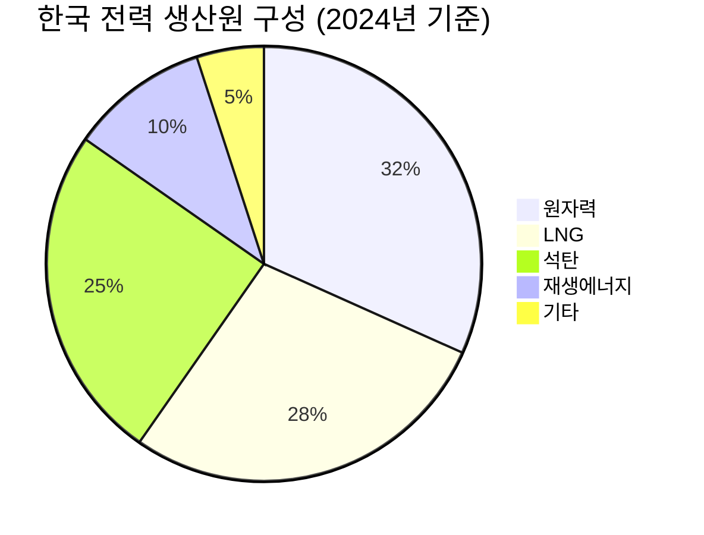
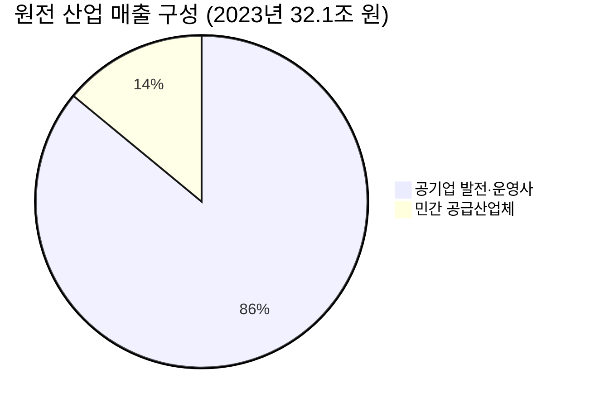
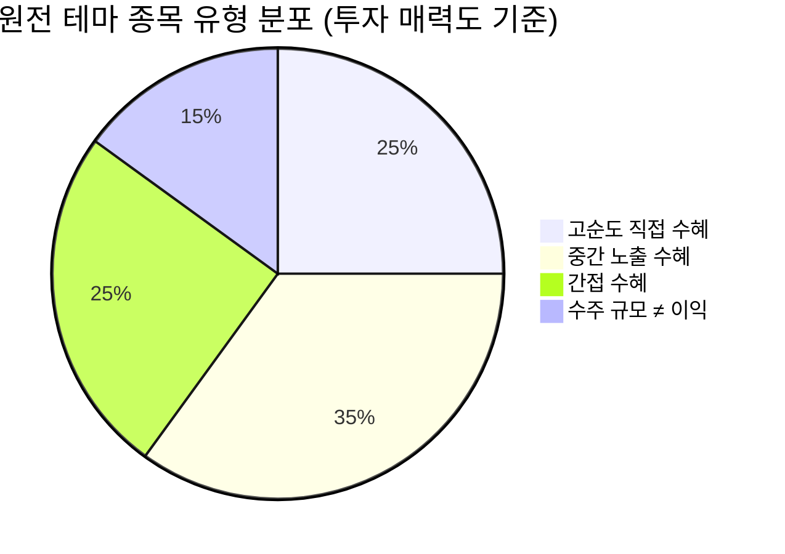
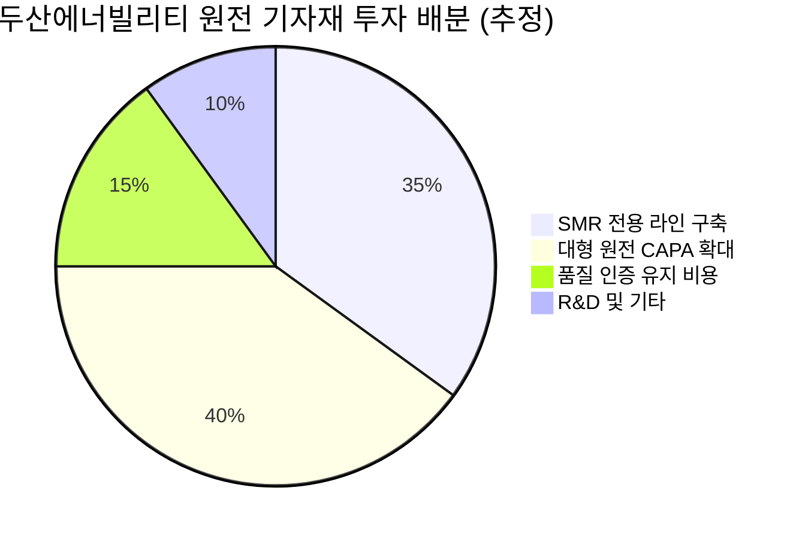
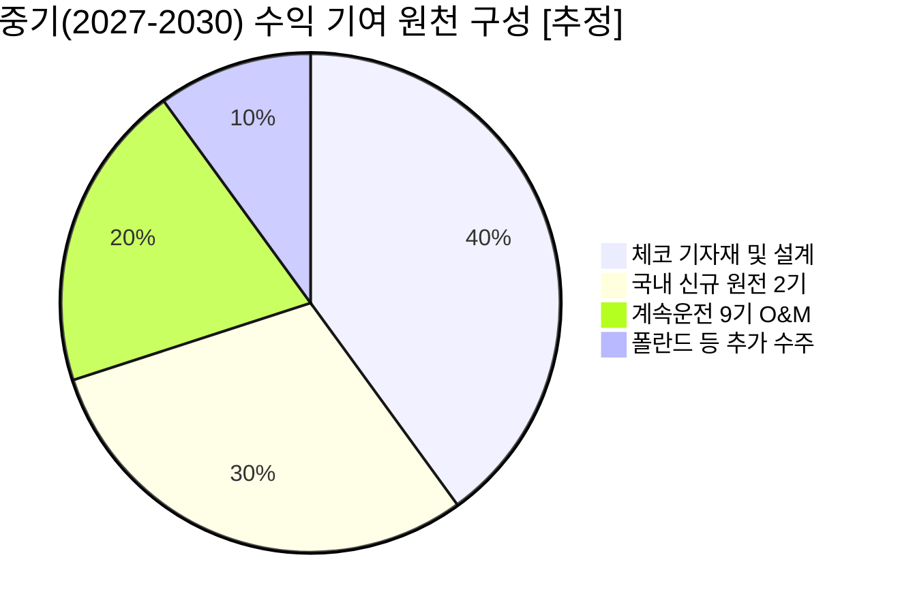
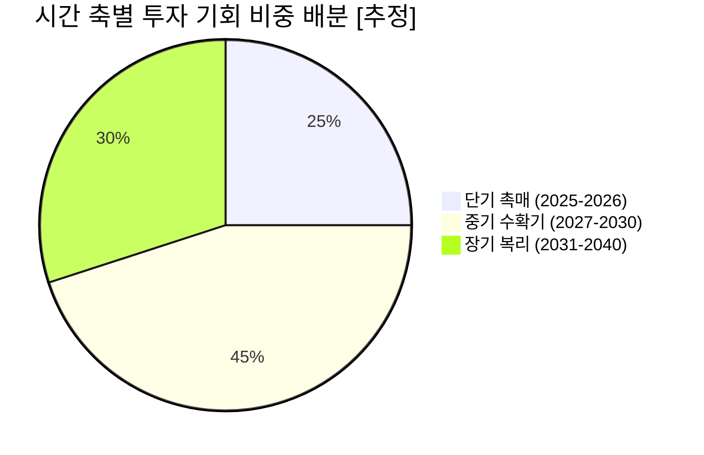
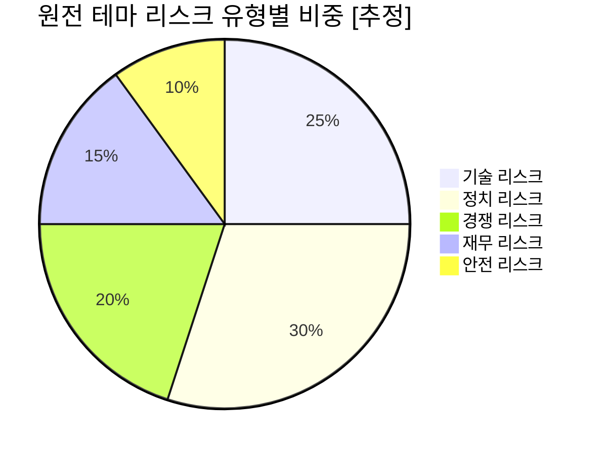
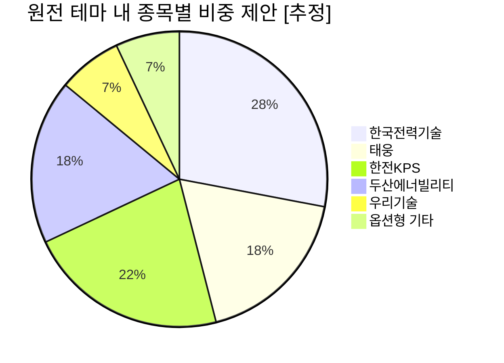

# Executive Summary & Why Now — 왜 지금 한국 원자력인가

> [!abstract] 섹션 요약
> 탈원전 정책 반전(2022), AI발 전력 수요 폭증, COP28 글로벌 원전 확대 선언이라는 **3중 촉매**가 동시에 작동 중이다. 한국 원전 산업 매출은 2021~2023년 2년간 48% 급성장했으며, 이는 단순 정책 모멘텀이 아닌 **에너지 패러다임 전환의 구조적 신호**다. 그러나 대형 원전(계몽의 비탈)과 SMR(기대 절정)은 전혀 다른 Hype Cycle 위치에 있으며, 이 비대칭성이 옥석 가리기의 핵심이다.

---

## 1. 핵심 명제 — 구조적 패러다임 전환인가, 정책 모멘텀인가?

> [!tip] 핵심 인사이트
> 이 질문에 대한 답은 **"둘 다, 그러나 순서가 있다"** 이다. 정책 모멘텀이 방아쇠(trigger)라면, 구조적 수요(AI 전력·탄소중립)는 총알이다. 방아쇠만 있고 총알이 없으면 공포탄에 불과하지만, 지금은 **총알이 먼저 장전되어 있는 상태**다.

한국 원자력을 단순히 '친원전 정부의 정책 수혜 테마'로 분류하는 것은 **시장 컨센서스의 전형적인 얕은 해석**이다. 2022년 정권 교체 이전에 이미 세 가지 구조적 변화가 진행되고 있었다:

**① 에너지 안보 패러다임의 전 지구적 재편**
2022년 러시아-우크라이나 전쟁은 유럽 에너지 공급망의 취약성을 노출시켰다. 이전까지 '원자력 퇴출' 의사를 표명했던 EU 집행위원장이 원전 외면을 "전략적 실수"라고 공개 발언한 것은, 원자력 재평가가 이념이 아닌 생존 논리에 기반했음을 보여준다. 한국도 예외가 아니다. 에너지 자급률이 낮은 수입 의존 국가로서 전력 수급 안정성은 국가 경쟁력의 핵심 인프라다.

**② AI 인프라 혁명이 촉발한 전력 수요 임계점 돌파**
AI 데이터센터 한 개의 전력 소비는 일반 건물의 수십 배에 달한다. 국내 반도체·AI 클러스터 집중 투자가 가속화되는 가운데, 2038년까지 최소 대형 원전 2기 추가가 필요하다는 정부 전망(SBS 뉴스)은 수요측 압박이 공급 정책을 이끌고 있음을 의미한다. **이 메커니즘은 정권이 바뀌어도 작동한다.**

**③ 탄소중립 목표가 재생에너지만으로 달성 불가능하다는 공학적 현실**
간헐성(intermittency) 문제를 가진 태양광·풍력만으로는 기저부하(base load)를 감당할 수 없다. 한국의 경우 지형적 제약(국토 면적 대비 태양광 설치 가능 면적 한계)이 추가로 작용한다. COP28의 22개국 서명(2050년까지 원전 용량 3배)은 이 공학적 현실을 국제 정치가 인정한 것이다.

**Variant Perception (차별화된 시각):** 시장은 원자력 테마를 여전히 "정책 의존적 사이클 섹터"로 간주하는 경향이 있다. 그러나 전력 수요의 구조적 증가(AI·반도체)가 정책 변수보다 강한 드라이버로 작동하기 시작한 현 시점은, 과거 원자력 사이클과 질적으로 다르다. 과거는 정책이 수요를 만들었지만, 지금은 수요가 정책을 강제한다.

---

## 2. 3중 촉매 해부 — 무엇이 동시에 작동하는가

### 촉매 1: 탈원전 → 원전 르네상스 정책 반전

| 정부 | 기간 | 원전 정책 기조 | 산업 영향 |
|------|------|--------------|----------|
| 이명박 | 2008-2013 | 🟢 원전 비중 59% 확대 목표, UAE 수출 | 산업 성장기 |
| 박근혜 | 2013-2017 | 🟡 유지 기조 | 정체 |
| 문재인 | 2017-2022 | 🔴 탈원전, 신규 건설 중단, 수명연장 불허 | **생태계 붕괴** |
| 윤석열→이재명 | 2022- | 🟢 탈원전 폐기, 신규 2기·SMR 1기 건설 확정 | **반등·재건** |

> [!warning] 리스크 경고
> 2026년 현재 이재명 정부가 원전 정책을 '재확인'했다고 보고서가 명시하고 있으나, **과거 문재인 정부의 급격한 정책 반전 전례**는 정치적 리스크를 배제할 수 없음을 상기시킨다. "정권 교체와 무관한 정책 일관성"은 현재 진행형 과제이지 달성된 사실이 아니다.

탈원전 5년간(2017-2022)의 파괴력은 수치로 확인된다. 이 기간 원전 산업 생태계는 인력 유출, 공급망 축소, 기술 역량 약화라는 3중 타격을 받았다. 그 결과 2021년 산업 매출은 21.6조 원으로 저점을 형성했다. 역설적으로, **이 파괴의 깊이가 반등의 크기를 결정**한다.

### 촉매 2: AI 데이터센터發 전력 수요 폭증

AI·반도체 전력 수요 긴박도: 82/100 — 정량화 어렵지만 방향성 명확

> [!note] 참고
> 발전원 구성 중 원자력 31.7%는 SBS 뉴스 출처로 앵커 데이터 확인 완료. 나머지 항목 수치는 [추정] — 정확한 분해는 한국전력 통계 재확인 필요.

AI 전력 수요가 원전 가동률에 반영되는 메커니즘과 시간 축:

**단기(1-2년):** 기존 운영 원전 가동률 극대화 → 계속운전 원전(고리 2호기 재가동 2026.4월)의 즉각적 발전량 기여. 추가 설비 없이도 공급력 확대 가능한 가장 빠른 경로.

**중기(3-7년):** 건설 중인 4기(신한울 3·4호기 포함) 순차 준공 → 설비용량 24.4 GW → 29.8 GW 증가(GlobalData). 이미 삽을 꽂은 프로젝트이므로 정책 변수가 적다.

**장기(7년+):** 신규 대형 원전 2기(2037-38년 준공 목표) + SMR 1호기(2035년 목표). 이 구간이 정책 리스크에 가장 취약한 동시에, 성공 시 가장 큰 업사이드가 있다.

> [!question] 검토 필요
> AI 데이터센터 전력 수요가 국내 원전 가동률에 **직접** 반영되는 구체적 메커니즘은 무엇인가? 한국전력의 전력구입 계약 구조상, 원전 우선 급전(merit order) 원칙이 적용되므로 수요 증가 시 LNG·석탄 대비 원전이 먼저 추가 이득을 본다. 그러나 가동률이 이미 높은 상황에서의 한계 효과는 신규 설비 준공 타이밍에 집중된다.

### 촉매 3: COP28 글로벌 원전 3배 확대 선언의 실질적 의미

22개국 서명의 한국 기업 수출 파이프라인에 대한 1차·2차 효과:

| 영향 단계 | 내용 | 시간축 | 불확실성 |
|----------|------|------|---------|
| **1차 직접 효과** | 체코 수주(25조 원) 완료, 폴란드·사우디 파이프라인 활성화 | 현재~3년 | 🟡 중 (협상 중) |
| **1차 직접 효과** | 동남아(태국·베트남·필리핀) SMR 협력 MOU 구체화 | 2-5년 | 🟡 중 |
| **2차 간접 효과** | 글로벌 원전 건설 확대 → 두산에너빌리티 기자재 수요 증가 | 3-10년 | 🟢 낮음 |
| **2차 간접 효과** | 원전 인력·설계 수요 → KOPEC 해외 용역 기회 확대 | 2-7년 | 🟡 중 |
| **3차 생태계 효과** | '팀 코리아' 모델 레퍼런스 확보 → 후속 수주 승률 개선 | 5-15년 | 🔴 높음 |

> [!success] 강점
> UAE 바라카 → 체코로 이어지는 실제 수주 트랙 레코드는, 한국이 원전 수출 '의향국'이 아닌 '실행국'임을 증명한다. 글로벌 수요 확대 선언이 실제 수주로 전환되는 확률에서 한국은 웨스팅하우스(미국), ROSATOM(러시아 제재), EDF(프랑스 자국 수요 우선)와 달리 **공급 여력과 의지가 동시에 있는 희소한 플레이어**다.

---

## 3. 매출 48% 급성장의 구조적 배경 — 숫자 뒤에 무엇이 있나

단순 수치 나열이 아닌, 성장 가속의 **인과관계 해부**:

| 연도 | 국내 원전 산업 매출 | YoY 성장률 | 핵심 드라이버 |
|------|----------------|----------|-------------|
| 2021 | 21.6조 원 | 기저 | 탈원전 정책 저점, 신한울 1·2호기 건설 마무리 국면 |
| 2022 | 25.4조 원 | +17.6% | 정권 교체 기대감, 한전 해외 원전 사업 재가동 |
| 2023 | 32.1조 원 | **+26.4%** | 신한울 3·4호기 건설 재개, 체코 수주 기대, 투자 급증(+96.4%) |
| 2024+ | 증가 추세 지속 | [추정] | 체코 계약 체결, 고리 2호기 재가동, 4기 건설 가속 |

출처: 한국원자력산업협회, 한국에너지정보문화재단

**가속의 진짜 이유는 세 가지 레이어의 동시 작동이다:**

**레이어 1 — 기저 회복(Base Recovery):** 탈원전 5년간 억눌렸던 유지보수·정비 비용이 정상화되는 과정. 이것은 일회성이지만 크기가 크다.

**레이어 2 — 신규 투자 사이클 개시:** 2023년 투자액 4,880억 원(+96.4% YoY, 한국에너지정보문화재단)은 단순 운영비가 아니라 미래 수익을 위한 선행 지출이다. 특히 기자재 제조 분야에 투자의 73.3%가 집중된 것은, 수출 물량 확보를 위한 생산능력(CAPA) 선제 투자임을 시사한다. 두산에너빌리티의 SMR 전용 공장(2028년까지 연간 20기 생산 목표) 투자가 대표적이다.

**레이어 3 — 수출 프리미엄 가산:** 체코 수주(25조 원)가 국내 산업 매출에 반영되는 시점은 2026년 이후다. 즉, 현재 32.1조 원 매출은 **수출 프리미엄이 아직 충분히 반영되지 않은 수치**다.

**Devil's Advocate:** 매출 성장의 상당 부분이 한수원·한전 등 공기업의 정부 예산 집행 증가에 기인한다면, 이는 민간 기업의 진정한 경쟁력 향상이 아닐 수 있다. 민간 공급산업체 매출(4.5조 원, +11.1%)과 전체 매출(32.1조 원)의 격차는 공기업 발주 의존도의 높이를 보여준다. 수출 다변화와 민간 생태계 자생력 강화가 진정한 구조적 성장의 지표가 될 것이다.

---

## 4. Hype Cycle 이중 구조 — 투자 기회의 비대칭성

> [!tip] 핵심 인사이트
> **같은 테마, 다른 사이클**이 공존한다. 이 비대칭성을 인식하지 못하면 대형 원전의 실체 기반 기회를 SMR의 하이프 리스크와 혼동하거나, 그 역방향의 오류를 범하게 된다.

🟢 대형 원전: 계몽의 비탈 45%

🟡 SMR: 기대 절정 40%

🔴 핵융합: 혁신촉발 15%

### 대형 원전: 계몽의 비탈(Slope of Enlightenment)

| 특성 | 현재 상태 |
|------|---------|
| 기술 성숙도 | 🟢 완전 자립 (APR-1400, UAE·체코 수출) |
| Hype 단계 | 🟢 기대 과잉 → 현실 재평가 구간 |
| 수익 가시성 | 🟢 높음 (건설 중 4기, 계속운전 9기) |
| 투자 리스크 | 🟡 중 (정치 리스크 잔존) |
| 밸류에이션 반영도 | 🟡 부분 반영 (수출 업사이드 미반영) |

대형 원전 재평가의 핵심 논리: "탈원전이 실수였다"는 컨센서스가 형성되는 과정 자체가 투자 기회다. 주가는 기대의 함수이므로, 부정적 기대가 현실로 교정되는 구간에서 비대칭 업사이드가 발생한다. 국내 원전 31.7% 전력 생산 비중(2024년, SBS 뉴스)은 이미 현실이지만 시장의 가치 부여가 지연되고 있다.

### SMR: 기대 절정(Peak of Inflated Expectations)

| 특성 | 현재 상태 |
|------|---------|
| 기술 성숙도 | 🟡 개발 단계 (2026년 설계인가 신청 목표) |
| Hype 단계 | 🔴 기대치 > 현실 — 환멸 가능성 내재 |
| 수익 가시성 | 🔴 낮음 (2035년 1호기 목표, 10년 후) |
| 투자 리스크 | 🔴 높음 (경제성 미검증, HALEU 공급망 미구축) |
| 밸류에이션 반영도 | 🔴 과잉 반영 가능성 |

> [!warning] 리스크 경고 — SMR 하이프 경계
> SMR 특별법 통과(2026.2.12)는 **정치적 의지의 표현**이지, 기술적 가능성의 입증이 아니다. 중국 '링롱 1호'의 2026년 상용화 예정, 미국 뉴스케일의 UAMPS 프로젝트 취소 사례 등은 SMR이 "선언"과 "현실" 사이의 간극이 크다는 것을 보여준다. 글로벌 130여 개 SMR 설계 모델의 난립과 표준화 실패는 산업 성숙도의 낮음을 방증한다. i-SMR의 2026년 설계인가 신청 목표가 **실제로 달성될 경우**를 현재 주가에 얼마나 선반영할 것인지가 핵심 밸류에이션 변수다.

### 핵심 시사점: 두 사이클의 투자 전략 차별화

대형 원전: 실체 기반 — 지금 매수 가능 구간 60%

SMR 순수 플레이: 하이프 경계 40%

---

## 5. 시나리오 분석 — 3가지 경로

🟢 Bull 30%

🟡 Base 50%

🔴 Bear 20%

| 구분 | Bull (30%) | Base (50%) | Bear (20%) |
|------|-----------|-----------|-----------|
| **핵심 가정** | AI 전력 수요 급증 + 추가 수출 2-3건 성사 + SMR 상용화 선도 | 현 정책 유지 + 체코 이행 + 국내 신규 2기 건설 정상 진행 | 정권 교체發 정책 혼란 + SMR 상용화 지연 + 경쟁 심화 |
| **산업 매출 (2030)** | [추정] 50조 원+ | [추정] 40-45조 원 | [추정] 30-35조 원 |
| **수출 파이프라인** | 폴란드·사우디·동남아 추가 수주 | 체코 이행 + 1-2건 추가 MOU | 체코 이행 불확실 + 신규 수주 없음 |
| **SMR** | i-SMR 2035년 이전 상용화, 해외 수출 첫 계약 | 2035-2038년 지연 상용화 | 2040년 이후, 경제성 미확보 |
| **밸류 드라이버** | 수출 프리미엄 + SMR 옵션 가치 부각 | 기저 원전 안정 성장 | 내수 유지에 그침 |

> [!bull] Bull 시나리오 — 복합 촉매 동시 점화
> 폴란드·사우디 등 2-3건의 추가 대형 원전 수출 계약이 2027-2028년에 체결되고, i-SMR 설계인가가 예정대로 진행되며, 국내 AI 클러스터 전력 수요가 계획보다 빠르게 증가하는 시나리오. 이 경우 한국전력기술·두산에너빌리티·태웅 등 밸류체인 전반에 걸친 업사이드가 현재 컨센서스 대비 30-50% 상회할 수 있다.

> [!bear] Bear 시나리오 — 정책 불안정 + 기술 지연
> 2027년 이후 정치적 불확실성으로 신규 원전 건설 일정이 지연되고, SMR 경제성 문제가 해소되지 않으며, 중국의 저가 원전이 글로벌 시장에서 한국의 수주 기회를 잠식하는 시나리오. 특히 UAE 바라카 공사비 분쟁(1.5조 원대, 매일노동뉴스) 같은 해외 프로젝트 수익성 훼손이 반복될 경우 수출 모델의 신뢰성에 타격. 이 경우 현재 주가의 정책 프리미엄이 소화되며 조정 가능.

---

## 6. 글로벌 수출 파이프라인 — 22개국 선언의 실질 환산

> [!note] 참고 — 선언과 실행의 간극
> COP28의 22개국 서명은 **의향서(Letter of Intent)**에 가깝다. 서명국 중 실제 발주로 전환될 비율, 한국 기업이 수주할 확률, 계약에서 준공까지의 기간을 고려하면 현재 시점의 직접적 재무 영향은 제한적이다. 그러나 **파이프라인의 풀(pool) 자체가 확장**되었다는 점이 중장기 기회를 의미한다.

| 지역 | 국가 | 상태 | 한국 참여 형태 | 가능 시점 |
|------|------|------|-------------|---------|
| 🟢 유럽 | 체코 | **계약 완료** (25조 원) | EPC (현대건설·대우건설), 기자재 (두산에너빌리티) | 2024년 착공 진행 중 |
| 🟡 유럽 | 폴란드 | 협상 진행 중 | APR-1400 제안 | 2026-2027년 결정 |
| 🟡 중동 | 사우디 | 협력 논의 단계 | '팀 코리아' 접촉 | 미정 |
| 🟡 동남아 | 태국 | SMR 협력 MOU | 한수원-태국 전력청 | 2030년대 |
| 🟡 동남아 | 베트남 | 공급망 세미나 개최 | 기자재·용역 | 2028년+ |
| 🟡 동남아 | 필리핀·싱가포르 | 협력 예정 | 원자력 프로젝트 협력 | 미정 |

**수출 모델의 핵심 경쟁력 — '팀 코리아' 패키지:**

한국의 차별화된 포지션은 단일 기업이 아닌 생태계 전체가 움직이는 일괄 수행(turnkey) 역량이다. 한수원(운영), KEPCO(금융+EPC 총괄), KOPEC(설계), 두산에너빌리티(기자재), 현대·대우건설(시공)이 하나의 패키지로 입찰한다. 이 모델은 **기술 외교(technology diplomacy)**의 성격을 가지며, 개별 기업 역량으로는 설명되지 않는 수주 경쟁력이다.

**Incentive Analysis:** 각 이해관계자의 숨겨진 동기를 보면:
- **한국 정부:** 원전 수출은 무역수지 개선 + 에너지 외교 레버리지 + 국내 산업 고용 동시 달성. 인센티브가 매우 강하다.
- **수입국:** 에너지 안보 강화 + 기술 이전 요구 → 한국은 기술이전에 비교적 유연한 편. 러시아·중국 대비 지정학 리스크 낮음.
- **민간 건설사(현대·대우):** 원전 EPC 마진이 일반 토목 대비 높고, 해외 레퍼런스로 후속 수주 가능. 그러나 UAE 공사비 분쟁 전례상 계약 구조 리스크 존재.
- **기자재 기업(두산·태웅):** 수출 물량 증가 = 고정비 레버리지 극대화. 원전은 단위당 기자재 규모가 크고 마진이 높음.

---

## 7. Why Now — 지금이 특별한 이유

투자 시점 적절성 점수: 78/100

**4가지 동시성(Simultaneity)이 만드는 희소한 진입 구간:**

**① 실적 모멘텀이 이제 막 가시화되는 구간**
2023년 매출 32.1조 원(역대 최대)은 과거 수치지만, 체코 수주의 매출 반영은 2026년 이후다. 즉 "좋아지고 있다"가 아직 충분히 '숫자'로 증명되지 않은 구간이다. 어닝 서프라이즈의 씨앗이 심어져 있다.

**② 공급측 병목(Bottleneck)이 해소되는 시점**
탈원전 5년간 훼손된 공급망·인력이 재건되는 속도가 느리다. 이 병목이 역설적으로 **기존 플레이어의 경쟁 해자(moat)**로 작용한다. 새로운 경쟁자 진입이 어렵다.

**③ 정책의 불가역성이 높아지는 지점**
건설 중인 4기 원전, 준공이 확정된 신규 2기(2037-38년), 체코 계약 이행 — 이 물리적 인프라 투자는 정치 변수가 이미 돌이키기 어려운 수준으로 작동하고 있다. 정책 리스크가 2022년 대비 현저히 낮아진 이유다.

**④ 글로벌 수요 사이클과 국내 공급 사이클의 동조화**
COP28 이후 글로벌 발주가 열리는 시점(2025-2030년)이, 국내 원전 산업의 생산능력 재건 완료 시점과 맞물린다. 수요와 공급의 교차점이 지금 형성 중이다.

> [!verdict] 최종 판단 — Why Now
> 한국 원자력은 **단순 정책 테마가 아닌 구조적 패러다임 전환의 초입**이다. AI 전력 수요(수요 불가역), 탄소중립(정치적 의무), 에너지 안보(지정학 압박)라는 세 축의 구조적 수요가 동시에 작동하는 현 국면은, 10년에 한 번 오는 복합 촉매 국면에 해당한다. 다만 **대형 원전(실체 기반)과 SMR(기대 선반영)의 이중 구조**를 구별하지 못하면 투자 실패 확률이 높아진다. 지금은 대형 원전 밸류체인의 Margin of Safety가 더 크고, SMR은 2026-2028년 설계인가 진행 상황을 확인한 후 포지션을 조정하는 것이 합리적이다. 체코 계약 이행과 고리 2호기 재가동(2026.4월)은 가장 빠른 실적 검증 이벤트다.

---

## 8. 투자 판단 요약 매트릭스

| 평가 항목 | 점수 | 코멘트 |
|----------|------|-------|
| 구조적 수요 지속성 | HIGH | AI·탄소중립·에너지안보 3축 동시 작동 |
| 정책 지속 가능성 | MEDIUM | 물리적 투자로 불가역성↑, 그러나 정치 변수 잔존 |
| 기술 경쟁력 (대형) | HIGH | APR-1400 완전 자립, UAE·체코 검증 |
| 기술 경쟁력 (SMR) | MEDIUM | 개발 단계, 2026년 설계인가 신청이 첫 관문 |
| 수출 파이프라인 | HIGH | 체코 완료, 폴란드·사우디 진행 중 |
| 밸류에이션 Margin of Safety | MEDIUM | 대형 원전 밸류체인 부분 반영, SMR 하이프 경계 |
| 공급망 리스크 | MEDIUM | 농축우라늄·HALEU 해외 의존 |
| 시장 타이밍 | FAVORABLE | 실적 선반영 전, 글로벌 발주 개화 직전 |

한국 원자력 테마 전반 투자 매력도: 74/100

---

*본 섹션은 투자 가설 검증을 위한 리서치 목적으로 작성되었으며, 특정 증권의 매수·매도를 권유하지 않습니다. 수치 중 [추정] 표기된 항목은 자체 추산이며 실제와 다를 수 있습니다. 투자 판단은 개별 기업 분석 및 전문가 자문을 병행하시기 바랍니다.*

---

# 시장 구조 & 밸류체인 해부 — 32조 원 생태계의 돈의 흐름

> [!abstract] 섹션 요약
> 한국 원전 산업 32조 원 매출은 표면적으로 균등한 성장처럼 보이지만, 내부 구조는 **단계별로 극도로 불균등한 부가가치 분포**를 보인다. 설계(KOPEC 독점)와 주기기 제작(두산에너빌리티 과점)이 마진의 핵심이며, 2023년 투자액 +96.4% 급증은 **수출 수요 선반영 CAPA 확충**의 신호다. 그러나 글로벌 518억 달러 시장(2035년)에서 한국의 몫은 체코·폴란드·사우디 수주 성패에 따라 천양지차가 된다.

---

## 1. 32조 원 생태계의 실제 구조 — 숫자 뒤에 무엇이 있나

국내 원전 산업 매출 32.1조 원(2023년, 한국원자력산업협회)을 그대로 받아들이면 중요한 왜곡을 놓친다. 이 숫자는 **공기업(발전사 포함)과 민간 공급산업체를 합산한 총계**다. 실제 민간 공급산업체 매출은 4.5조 원(+11.1% YoY)에 불과하다. 나머지 27.6조 원은 한수원·한전·한전KPS 등 공기업 매출이다.

> [!warning] 리스크 경고
> 민간 공급산업체 비중이 전체의 14%에 불과하다는 사실은 **한국 원전 생태계의 공기업 의존성**을 보여준다. 투자자 입장에서 상장 가능한 민간 기업들의 실제 시장 규모는 32.1조 원이 아닌 4.5조 원에서 출발한다. 이 구조는 민간 기업들이 공기업 발주에 종속된 하청 구조임을 의미하며, 독립적 가격 결정력이 제한된다.

그러나 이 구조가 변화하는 중이다. 투자액 4,880억 원(+96.4% YoY, 한국에너지정보문화재단)의 73.3%가 기자재 제조 분야에 집중된다는 사실은, **수출 드라이브가 민간 제조업체의 역할을 공기업 발주 수령자에서 글로벌 공급자로 전환시키고 있음**을 시사한다. 체코 25조 원 수주가 이행되면, 두산에너빌리티·태웅 등 민간 기자재 기업의 수주 비중이 상향 재편된다.

**Variant Perception:** 시장은 "32조 원 원전 산업"을 말하지만 실제 투자 가능한 민간 상장사들의 addressable 시장은 훨씬 작다. 반면, 수출 확대 시 민간 기업의 매출 기여 비중이 급격히 높아지는 비대칭 구조가 존재한다. 이 전환점이 언제 가시화되는지가 핵심 투자 타이밍 변수다.

---

## 2. 밸류체인 단계별 해부 — 마진과 부가가치는 어디에 집중되는가

### 2-1. 6단계 가치사슬 전체 지도

| 단계 | 주요 플레이어 | 시장 규모(추정) | 마진 수준 | 진입 장벽 | 성장 속도 |
|------|------------|--------------|---------|---------|---------|
| **① R&D** | KAERI(국가 독점) | 정부 예산 | N/A | 🔴 극히 높음 | 🟡 완만 |
| **② 설계** | 한국전력기술(KOPEC) | ~5,000억 원[추정] | 🟢 高 (용역 구조) | 🔴 극히 높음 | 🟢 빠름 (수출 설계) |
| **③ 주기기 제작** | 두산에너빌리티 | ~2조 원[추정] | 🟢 中高 | 🔴 높음 (ASME/KEPIC) | 🟢 빠름 |
| **④ 건설·시공** | 현대건설, 대우건설 | ~3조 원[추정] | 🟡 中 (EPC 구조) | 🟡 중간 | 🟡 완만 |
| **⑤ 운영·정비(O&M)** | 한수원, 한전KPS | ~20조 원[추정] | 🟡 中 (규제 마진) | 🟡 중간 | 🟡 완만 |
| **⑥ 사용후핵연료·해체** | 한수원, 오르비텍, 우진엔텍 | 미발달 | (확인 필요) | 🟡 기술 장벽 | 🔴 정책 지연 |

> [!note] 참고
> 단계별 시장 규모는 [추정]이며, 공개 분류 데이터 부재로 인해 기업 공시·산업협회 자료를 기반으로 역산한 수치다. 투자 판단 시 개별 기업 IR 자료로 재확인 필요.

### 2-2. 단계별 심층 분석

#### ② 설계 단계 — 가장 높은 마진, 가장 좁은 시장

[[한국전력기술]]([[KOPEC]])은 국내 원전 설계의 실질적 독점자다. 원자력 매출 비중 77.9%(알파스퀘어)는 이 기업이 설계 의존도 면에서 다른 어떤 원전 기업과도 비교 불가한 순수 플레이임을 보여준다.

KOPEC 원전 매출 집중도: 77.9%

**설계 단계의 마진 구조:** 원전 설계는 반복 투입되는 노동 집약적 용역이 아닌, **축적된 지식재산(IP)에 기반한 라이선스형 비즈니스**에 가깝다. APR-1400 설계 인증을 보유한 KOPEC이 체코·폴란드 수출 프로젝트에 참여할 때, 해당 설계의 현지 인허가 및 변형 작업 용역이 발생한다. 이 용역의 단가는 공장 제조업 대비 현저히 높다.

**지속 가능성의 한계:** 설계 독점의 취약점은 **인력 집중 리스크**다. 탈원전 5년간(2017-2022) KOPEC의 인력 유출은 설계 역량의 질적 약화를 초래했으며, 현재 진행 중인 체코·국내 신규 원전 프로젝트의 동시 수행이 가능한지에 대한 인력 충분성 검증이 필요하다(확인 필요).

#### ③ 주기기 제작 단계 — 투자 급증의 핵심 수혜 단계

[[두산에너빌리티]]는 원자로 압력용기, 증기발생기, 원자로냉각재펌프 등 원전의 '심장부' 기기를 독점에 가까운 형태로 공급한다. 2023년 기자재 투자 73.3% 집중은 이 단계에 대한 산업계의 집단적 베팅이다.

**2023년 투자 급증(+96.4%)의 인과관계:**

| 투자 증가 요인 | 내용 | 매출 전환 시점 |
|------------|------|------------|
| 신한울 3·4호기 재개 | 2017년 중단된 기자재 발주 재가동 | 2025-2027년 |
| 체코 25조 원 수주 대비 | 원자로 압력용기 등 장납기 기자재 선제 제작 | 2026-2030년 |
| SMR 전용 공장 | 두산에너빌리티, 2028년까지 연 20기 생산 목표 | 2030년대 |
| 폴란드·동유럽 파이프라인 | 태웅 동유럽 단조품 공급 계약 선행 투자 | 2027년+ |

> [!tip] 핵심 인사이트
> **투자-매출 전환 라그(Lag)가 2~5년**이다. 2023년 투자 급증은 2025~2028년 매출 가속화의 선행 지표다. 현재 주가는 이 라그를 충분히 반영하고 있지 않을 가능성이 있다. 특히 체코 프로젝트의 기자재 발주가 2026년부터 본격화되면, 두산에너빌리티의 수주잔고가 급격히 확대되는 어닝 모멘텀이 발생한다.

**ASME/KEPIC 인증의 진입 장벽:** 원자력 기자재는 일반 산업 기자재와 달리 ASME(미국기계학회) QSC 인증과 KEPIC(한국전력산업기술기준) 인증이 필수다. [[태웅]]이 이 두 인증을 모두 보유한다는 사실(KB증권)은 단순 제조업 역량을 넘어선 시장 진입 장벽의 존재를 의미한다. 이 인증 취득에는 수년의 시간과 상당한 비용이 소요되므로, 기존 인증 보유 기업의 경쟁적 해자가 지속된다.

#### ④ 건설·시공 단계 — 마진은 낮지만 수주 규모가 압도적

EPC(설계·조달·시공 일괄) 모델에서 건설사의 마진은 5~10% 수준으로 설계·기자재 대비 낮다. 그러나 **수주 금액의 절대 규모**가 크기 때문에 총 이익 기여는 무시할 수 없다.

UAE 바라카 공사비 분쟁(한전 vs 한수원, 1.5조 원대, 매일노동뉴스)은 EPC 모델의 구조적 리스크를 보여준다. 원전 건설은 공기 지연, 원가 초과, 발주처와의 계약 해석 분쟁이 빈번하며, 체코 프로젝트에서 동일한 패턴이 반복될 가능성을 배제할 수 없다.

**Devil's Advocate — EPC 마진 함정:** 현대건설·대우건설의 체코 수주 참여가 주가 호재로 해석되는 경향이 있다. 그러나 EPC 계약의 특성상 '수주 금액 = 매출'이지 '수주 금액 = 이익'이 아니다. 원가 상승(인플레이션, 유럽 현지 노무비), 공기 지연에 따른 지체 배상, 하자 보수 책임 등을 고려하면 실제 이익은 5% 미만으로 수렴할 수 있다. 투자자는 수주 규모보다 **계약 구조(고정가 vs 실비 정산)와 리스크 배분 방식**을 확인해야 한다.

#### ⑤ 운영·정비(O&M) 단계 — 가장 크고 가장 안정적이나 성장성 제한

O&M 단계는 전체 매출의 약 60~65%를 차지하는 것으로 추정된다[추정]. 한수원의 운전·운영 매출과 [[한전KPS]]의 정비 매출이 이 단계를 지배한다. **특성은 안정성(Stability)이지 성장성(Growth)이 아니다.** 운영 중인 25기 원전의 정비 수요는 규제에 의해 강제되므로 경기 변동과 무관하다.

계속운전(License Renewal) 9기 추가(2030년까지)는 O&M 단계의 완만한 성장을 보장한다. 그러나 이 단계의 성장률은 발전량 CAGR 2.4%(GlobalData)를 따르므로, 고성장을 기대하는 투자자에게는 적합하지 않다.

#### ⑥ 사용후핵연료·해체 단계 — 가장 저평가된 미래 기회

이 단계는 현재 사실상 정책 공백 상태다. 고준위방폐물관리 특별법이 아직 부지 선정 단계에도 이르지 못했으며, 최종 처분 시설 확보까지 수십 년이 소요될 수 있다. 그러나 **원전 해체 시장**은 다르다. 원전 해체 인허가 절차 2년 단축 검토(한국경제TV)는 이 시장의 개화 시점을 앞당길 수 있다.

[[오르비텍]], [[우진엔텍]] 등 해체 기술 보유 기업들은 현재 매출 규모가 작지만, 글로벌 원전 해체 시장(수십 기 예정)에서 한국 기술의 레퍼런스가 쌓일 경우 중장기 업사이드가 있다.

---

## 3. 부가가치 집중도 시각화

설계+기자재: 高마진 30%

건설 10%

O&M+운영: 安定 55%

해체 5%

> [!tip] 핵심 인사이트
> 부가가치는 **설계(고마진·소규모)와 기자재(중고마진·성장 중)**에 집중되어 있다. 투자 관점에서는 O&M의 안정성보다 설계·기자재의 성장성과 마진 확장에 주목해야 한다. 특히 수출 확대 시 설계 용역과 기자재 공급이 국내 발주와 달리 **시장 가격(Market Price)**으로 책정되므로, 마진 레벨업이 발생한다.

---

## 4. 핵심 플레이어 시장 지배력 분석 — 얼마나 지속 가능한가

### 4-1. [[한국전력기술]](KOPEC) — 설계 독점의 해자와 균열

국내 원전 설계 시장 지배력: 85/100

| 평가 항목 | 현황 | 지속 가능성 |
|---------|------|----------|
| 국내 설계 시장 점유율 | 🟢 사실상 독점 | 🟢 高 — 인허가 기반 구조 |
| 원자력 매출 비중 | 🟢 77.9% | 🟡 中 — 집중 리스크 |
| SMR 설계 참여 | 🟢 i-SMR 공동 설계 | 🟢 高 — 선도적 위치 |
| 해외 수출 설계 용역 | 🟢 체코 참여 확정 | 🟡 中 — 현지 인허가 변수 |
| 인력 충분성 | 🔴 탈원전 5년 유출 우려 | 🔴 低 — 최대 약점 |

**독점의 구조적 근거:** KOPEC의 독점은 단순한 시장 지위가 아니라 **원자력안전법상 인허가 구조**에 내재되어 있다. 원전 설계는 원자력안전위원회의 설계 인가를 받아야 하며, 이 인가 취득 이력과 축적된 설계 도면·계산서가 KOPEC에 집중되어 있다. 신규 설계사가 이 인가를 새로 취득하는 데는 최소 10년 이상이 소요된다.

**균열 포인트:** SMR은 대형 원전과 달리 설계 표준화가 완료되지 않아, 국제 컨소시엄 방식(예: 뉴스케일파워와의 협력)에서 KOPEC의 역할이 축소될 수 있다. DL이앤씨의 엑스에너지 설계 계약 참여는 건설사가 설계 역할 일부를 흡수하는 선례로 볼 수 있다.

### 4-2. [[두산에너빌리티]] — 주기기 과점의 CAPA 도박

원전 주기기 시장 지배력: 80/100

두산에너빌리티의 핵심 전략은 **선행 CAPA 투자**다. SMR 전용 공장에 투자하여 2028년까지 연간 20기 이상 생산 체제를 구축하겠다는 목표(뉴데일리경제, CBC뉴스)는 수요가 확정되기 전에 공급 역량을 선제 확보하는 것이다.

**이 전략의 역설:**
- 수요가 예측대로 현실화되면: **독보적 선점 효과** — 경쟁사가 CAPA를 갖추기 전에 글로벌 SMR 기자재 시장을 선점
- 수요가 지연/축소되면: **고정비 부담 급증** — 투자된 CAPA가 유휴화되며 재무 압박

뉴스케일파워 UAMPS 프로젝트 취소 사례가 보여주듯, SMR 시장의 수요 가시성은 여전히 낮다. 두산에너빌리티의 투자는 **'기대치에 대한 선불 지급(Advance Payment on Expectations)'**의 성격이다.

> [!question] 검토 필요
> 두산에너빌리티의 SMR 전용 공장 투자 규모와 투자 완료 시점, 그리고 이에 따른 D/E ratio 변화가 실제 재무제표에 어떻게 반영되고 있는지 확인 필요. 과도한 차입 투자는 SMR 수요 지연 시나리오에서 크레딧 리스크로 전환될 수 있다.

### 4-3. [[한전KPS]] — O&M의 독점적 안정성

O&M 시장 지배력: 70/100 — 안정적이나 성장 제한

한전KPS는 국내 원전 정비 시장의 독점에 가까운 지위를 보유한다. 가동 중 원전 수 증가(25기 → 2030년대 계속운전 포함 확대)는 O&M 수요의 구조적 성장을 보장한다. 그러나 정비 단가는 한수원과의 계약 구조상 규제적으로 결정되므로 가격 인상 여력이 제한된다.

**해외 진출이 변수:** 체코 원전 준공 후 O&M 계약을 한전KPS가 수주할 경우, 해외 정비 마진은 국내 대비 높을 가능성이 있다(국내보다 시장 가격 적용). 이 가능성은 현재 주가에 미반영된 업사이드 요인이다.

---

## 5. 투자 급증(+96.4%)의 해부 — 언제 매출로 전환되는가

> [!abstract] 요약
> 2023년 투자액 4,880억 원(+96.4% YoY)은 단순 호황 사이클의 반응이 아니라, **5~10년 앞을 내다본 전략적 CAPA 선제 투자**다. 이 투자가 실적으로 전환되는 타임라인을 정확히 이해해야 투자 진입 타이밍을 잡을 수 있다.

### 투자-매출 전환 타임라인

| 투자 영역 | 투자 규모(비중) | 매출 전환 시점 | 전환 트리거 |
|---------|------------|------------|---------|
| **기자재 제조 CAPA** | ~3,577억 원 (73.3%) | 2025-2028년 | 신한울 3·4호기 기자재 납품, 체코 발주 |
| **설계 역량 확충** | [추정] ~500억 원 | 2025-2027년 | 체코 상세설계 용역, 국내 신규 원전 기본설계 |
| **SMR 전용 라인** | [추정] ~400억 원 | 2030년대 초 | i-SMR 설계인가 취득, 첫 발주 |
| **해체·폐기물 기술** | [추정] ~200억 원 | 2028년+ | 해체 인허가 단축 시 조기 현실화 |

**가장 빠른 매출 전환 경로 — 체코 프로젝트:**

체코 신규 원전(25조 원, 2025년 계약 체결)의 주요 장납기 기자재 발주는 설계 완료 후 착공 전 시점에 집중된다. 원전 건설 표준 일정상 설계→조달(기자재 발주)→시공 순서를 따르므로, 2026~2027년 기자재 발주 본격화가 예상된다. **두산에너빌리티의 수주잔고 확대가 이 시점에 가시화될 것이다.**

**1차/2차 효과 분석:**
- **1차 직접 효과:** 두산에너빌리티 수주잔고 → 매출 인식 2026~2030년 분산
- **2차 간접 효과:** 기자재 하청 납품사(단조·주물·밸브 등 중소기업) 동반 매출 증가 → 태웅, 비에이치아이 등 수혜
- **3차 생태계 효과:** 체코 수주 성공 레퍼런스 → 폴란드 수주 협상 우위 → 추가 투자 유인 선순환

---

## 6. 글로벌 원전 시장 포지셔닝 — 374억 → 518억 달러 시장에서 한국의 몫

### 6-1. 글로벌 시장 구조와 한국의 위치

글로벌 원자력 시장 518억 달러(2035년 전망, Research Nester, CAGR 3.3%)에서 한국의 현재 포지션을 정직하게 평가해야 한다.

| 경쟁국 | 강점 | 약점 | 한국 대비 우위/열위 |
|------|------|------|-----------------|
| **미국 (웨스팅하우스)** | 기술 표준 선도, AP1000 레퍼런스 | 자국 건설 비용 超高, 공급망 미흡 | 🟡 기술 표준은 우위, 가격·속도 열위 |
| **프랑스 (EDF)** | 장기 운영 경험, EU 내 신뢰도 | 자국 노후 원전 수리 집중, 수출 여력 제한 | 🟡 경험 우위, 가용 자원 한국 유리 |
| **러시아 (ROSATOM)** | 금융 지원 패키지, 저가 | 지정학 제재, 서방 거부감 | 🟢 지정학 리스크 한국 압도적 우위 |
| **중국 (CNNC/SPIC)** | 최저 건설 비용, 정부 보조금 | 서방 시장 진입 불가, 안전 이슈 | 🟢 서방 시장에서 한국 우위, 개도국 경쟁 치열 |
| **한국 (팀 코리아)** | 가격·품질·납기 균형, 정치 중립 | 독자 금융 패키지 취약, 제한적 레퍼런스 | — |

**한국의 핵심 차별화 포인트 — '정치 중립성(Geopolitical Neutrality)':**

러시아는 제재로 배제되고, 중국은 서방의 신뢰를 받지 못하며, 미국·프랑스는 자국 수요 대응에 우선순위가 있다. 이 지정학적 진공이 한국에게 기회의 창을 만들어주고 있다. 특히 동유럽(체코, 폴란드), 중동(사우디), 동남아(태국, 베트남) 시장에서 한국의 '비동맹 원전 기술 공급자' 포지션은 독보적이다.

> [!success] 강점
> UAE 바라카(2009년 수주 → 2020년 상업 운전)는 한국이 단순 '의향국'이 아니라 **실제로 원전을 짓고 운영하는 능력을 증명한 국가**임을 전 세계에 보여줬다. 이 레퍼런스의 가치는 시간이 지날수록 커진다. 특히 체코가 한국을 선택한 이유 중 하나로 "시공 능력의 현실적 검증"이 꼽히는 것은, 이 레퍼런스가 실제 수주에서 작동하고 있음을 방증한다.

### 6-2. 수출 파이프라인 현황 및 경쟁 우위 실증 검증

| 국가 | 프로젝트 현황 | 한국 경쟁 우위 실제 작동 여부 | 우위 요인 | 리스크 |
|-----|-----------|------------------------|---------|------|
| **체코** | 🟢 계약 완료 (25조 원) | 🟢 실증됨 | 가격경쟁력 + 비지정학 | EU 보조금 조사 진행 중 |
| **폴란드** | 🟡 협상 진행 중 | 🟡 미실증 | 체코 레퍼런스 + 동유럽 신뢰 | 미국(웨스팅하우스)과 경쟁 |
| **사우디** | 🟡 협력 논의 단계 | 🟡 미실증 | UAE 인접국 심리적 신뢰 | 중국 저가 경쟁, 자체 기술 요구 |
| **태국** | 🟡 SMR MOU 체결 | 🔴 SMR 미완성 | 한수원 장기 운영 신뢰 | SMR 상용화 전 계약 불가 |
| **베트남** | 🟡 공급망 세미나 | 🔴 초기 단계 | 과거 원전 협력 논의 이력 | 정치적 결정 지연 가능성 |

> [!question] 검토 필요
> 폴란드 수주 협상에서 웨스팅하우스(AP1000)와의 실제 경쟁 상황, 한국 정부의 금융 지원 패키지(수출금융) 규모가 웨스팅하우스의 미국 정부 지원과 어떻게 비교되는지 구체적 확인 필요. '팀 코리아'의 금융 패키지 경쟁력이 가장 취약한 링크로 평가됨.

### 6-3. SMR 3,000억 달러 전망 — 한국의 선점 가능성 현실 검토

글로벌 SMR 시장 3,000억 달러(2040년, 뉴시안 — 방법론 불명확) 전망에서 한국의 현실적 몫을 추정하면:

한국 SMR 시장 점유 가능성: 15% 내외[추정]

**현실적 한계의 근거:**
1. 중국의 '링롱 1호' 2026년 상용화 예정(세계 최초 상업용 육상 SMR, 그리니엄) — 한국 i-SMR은 2035년 목표로 **9년의 상용화 시차**
2. 글로벌 130여 개 SMR 설계 경쟁 — 표준화 선점이 시장 점유의 핵심이며 한국은 아직 추격자
3. HALEU 공급망 미구축 — 한국이 독자 조달할 농축 능력 부재, 미국·프랑스 의존

**그러나 낙관 시나리오의 근거:**
- 미국 DL이앤씨-엑스에너지 협력, 삼성물산-뉴스케일 파트너십은 글로벌 SMR 생태계와의 연결을 확보
- 두산에너빌리티의 뉴스케일 기자재 공급 이력(설계 취소에도 불구, 제조 역량 검증됨)
- i-SMR이 2028년 설계인가를 받으면 **동남아 수출의 첫 번째 수혜 타이밍은 2032~2035년**으로 3,000억 달러 시장 초입에 위치

> [!warning] 리스크 경고
> SMR 3,000억 달러 전망의 방법론이 불명확(뉴시안 출처, 뉴시안 미확인)하므로 이 수치에 기반한 투자 논리는 신중해야 한다. 더 신뢰할 수 있는 기준은 **i-SMR 1호기 건설 확정(2035년 목표) 이후 동남아 2-3기 수출 시나리오**에서 산업 전체 미치는 영향을 추정하는 것이다.

---

## 7. Incentive Analysis — 이해관계자별 숨겨진 동기

> [!abstract] 요약
> 밸류체인의 겉모습은 '협력'이지만 내부에는 이해관계의 충돌이 존재한다. 이 충돌을 이해해야 수주·계약·매출 인식의 실제 흐름을 예측할 수 있다.

| 이해관계자 | 표면적 목표 | 숨겨진 동기 | 잠재적 충돌 |
|---------|----------|---------|---------|
| **한국 정부** | 에너지 안보 + 수출 | 무역흑자 개선, 외교 레버리지 | 공기업 손실(UAE 분쟁) 무마 압력 |
| **한수원** | 원전 운영 + 수출 | 자체 EPC 역량 강화, 민간기업 종속 탈피 | KOPEC·두산에너빌리티와 역할 경계 분쟁 |
| **두산에너빌리티** | 기자재 수주 극대화 | SMR CAPA 선점으로 글로벌 독점 구축 | 뉴스케일 등 외국 설계사 의존 리스크 |
| **현대건설·대우건설** | EPC 수주 | 해외 레퍼런스 + 마진보다 매출액 확대 | 공사비 초과 시 적자 감내 압력 |
| **KOPEC** | 설계 용역 수주 | 설계 독점 유지 + SMR 설계 주도권 확보 | DL이앤씨 등 건설사의 설계 영역 침식 |
| **수입국(체코 등)** | 에너지 안보 확보 | 기술 이전 + 자국 기업 참여 최대화 | 한국 기업 마진 압박 + 추가 요구 가능성 |

**UAE 바라카 공사비 분쟁이 주는 교훈:**

한전과 한수원의 1.5조 원대 내부 분쟁(매일노동뉴스)은 '팀 코리아'가 외부에서는 하나의 목소리를 내지만 내부에서는 이익 배분을 놓고 치열하게 다툰다는 현실을 보여준다. 이 분쟁의 해소 방식(정부 중재 vs 사법 해결)이 체코 프로젝트의 계약 구조 설계에 반영될 것이다. 투자자는 '팀 코리아'의 내부 결속력을 당연한 것으로 가정해서는 안 된다.

---

## 8. 종합 투자 매트릭스 — 밸류체인 단계별 투자 매력도

| 밸류체인 단계 | 대표 기업 | 성장성 | 마진 | 진입장벽 | 정책 의존도 | 투자 매력도 |
|-----------|---------|------|------|---------|-----------|---------|
| **설계** | [[한국전력기술]] | 🟢 高 | 🟢 高 | 🟢 극高 | 🔴 高 | STRONG BUY |
| **주기기 제작** | [[두산에너빌리티]] | 🟢 高 | 🟢 中高 | 🟢 高 | 🟡 中 | BUY |
| **특수 기자재** | [[태웅]], [[우리기술]], [[비에이치아이]] | 🟢 中高 | 🟡 中 | 🟢 中高 | 🟡 中 | BUY/HOLD |
| **건설·시공** | [[현대건설]], [[대우건설]] | 🟡 中 | 🔴 低 | 🟡 中 | 🟡 中 | HOLD |
| **O&M·정비** | [[한전KPS]], [[우진엔텍]] | 🟡 完만 | 🟡 中 | 🟡 中 | 🔴 高 | HOLD |
| **해체·폐기물** | [[오르비텍]] | 🟡 잠재高 | (확인 필요) | 🟡 技術 | 🔴 極高 | SPECULATIVE |

🟢 Bull 35%

🟡 Base 45%

🔴 Bear 20%

| 시나리오 | 핵심 가정 | 밸류체인 영향 | 시간축 |
|--------|---------|-----------|------|
| **Bull (35%)** | 체코 이행 + 폴란드 수주 + SMR 설계인가 2028년 취득 | 설계·기자재 전 단계 수혜, 수출 마진 프리미엄 가산 | 2026-2030년 |
| **Base (45%)** | 체코 이행 + 국내 신규 2기 정상 진행 + SMR 일부 지연 | 기자재 수혜 집중, 건설 완만 성장 | 2026-2033년 |
| **Bear (20%)** | 체코 분쟁·지연 + 정책 불안정 + SMR 2040년 이후 | O&M만 안정, 설계·기자재 성장 멈춤 | 전 단계 하방 압력 |

> [!verdict] 최종 판단 — 밸류체인 투자 전략
> 32조 원 원전 생태계에서 진정한 투자 가치는 **설계(KOPEC)와 주기기 제작(두산에너빌리티)에 집중**된다. 이 두 단계는 높은 진입 장벽과 수출 확대에 따른 마진 레벨업이라는 이중 모멘텀을 보유한다. 2023년 투자 급증(+96.4%)은 2026~2028년 매출 가속화의 선행 신호이며, 체코 기자재 발주 본격화 시점이 핵심 실적 변곡점이다. 다만 건설·시공 단계는 수주 규모에 속지 말고 **계약 구조와 리스크 배분**을 면밀히 검토해야 하며, SMR 관련 순수 플레이는 2028년 설계인가 진행 상황을 확인한 후 포지션을 조정하는 단계적 접근이 합리적이다.

---

*본 섹션은 투자 가설 검증을 위한 리서치 목적으로 작성되었으며, 특정 증권의 매수·매도를 권유하지 않습니다. [추정] 표기 항목은 자체 추산치로 실제와 다를 수 있으며, 투자 판단 시 개별 기업 IR 자료 및 전문가 자문을 병행하시기 바랍니다.*

---

# 수혜 상장사 심층 비교 — 옥석 가리기: 누가 진짜 수혜자인가

> [!abstract] 섹션 요약
> 원전 테마로 묶인 종목들의 **실질적 원전 매출 노출도는 천차만별**이다. KOPEC(77.9%)처럼 원전이 사업의 전부인 기업부터, 건설사처럼 수주 규모는 크지만 마진이 5% 미만인 기업까지 스펙트럼이 광범위하다. 진짜 수혜주는 **원전 매출 비중 × 마진 확장 가능성 × 수출 레버리지**의 삼중 필터를 통과한 소수다. 시장이 아직 원전 수혜주로 충분히 재평가하지 않은 숨겨진 기회도 존재한다.

---

## 1. 분석 프레임워크 — 진짜 수혜주의 3가지 조건

원전 테마 투자에서 흔히 범하는 실수는 **"원전과 관련된 모든 기업이 동등한 수혜를 입는다"**는 단순화다. 실제로는 세 가지 차원이 교차해야 진정한 투자 기회가 된다.

**삼중 필터 원칙:**
1. **원전 매출 노출도(Exposure):** 원전 관련 매출이 전체에서 차지하는 비중 — 높을수록 테마 순도가 높다
2. **이익 레버리지(Leverage):** 원전 발주 증가 시 마진이 얼마나 확대되는가 — 고정비 구조 기업에서 극대화
3. **수출 마진 프리미엄(Export Premium):** 국내 공기업 발주(규제 마진)와 달리 수출 시 시장 가격 적용 가능성 — 수출 비중이 올라올수록 마진 레벨업

> [!warning] 리스크 경고
> **"수주 뉴스 = 이익 증가"의 등식은 틀렸다.** 특히 EPC 건설사는 수주 발표 시 주가가 반응하지만, 실제 마진은 계약 구조(고정가 vs 실비 정산), 공사비 초과, 환율 리스크에 따라 크게 달라진다. UAE 바라카 공사비 분쟁(1.5조 원대)은 원전 EPC의 구조적 마진 함정을 적나라하게 보여준다.

---

## 2. 핵심 종목 종합 비교 테이블

> [!note] 데이터 출처 및 한계
> 밸류에이션 지표(PER/PBR/EV/EBITDA)는 2025~2026년 추정치 기준이며, 시장 가격 변동에 따라 달라진다. 원전 매출 비중은 기업 공시 및 증권사 리포트 기반. (확인 필요) 표기 항목은 공개 데이터 부재로 추정치 사용.

| 기업 | 시가총액 (추정) | 원전 매출 비중 | 원전 이익 레버리지 | 수출 노출도 | 밸류에이션 매력 | 핵심 촉매 | 종합 등급 |
|------|-------------|------------|--------------|---------|------------|---------|---------|
| **[[한국전력기술]]**(KOPEC) | ~1.5조 원[추정] | 🟢 77.9% | 🟢 高 | 🟢 체코·폴란드 | 🟡 중간 | 체코 상세설계 용역 | A+ |
| **[[두산에너빌리티]]** | ~4.0조 원[추정] | 🟢 40%+[추정] | 🟢 高 (고정비 레버리지) | 🟢 글로벌 SMR | 🟡 중간 | 체코 기자재 발주, SMR 공장 | A |
| **[[한전KPS]]** | ~2.0조 원[추정] | 🟢 원전 O&M 주력 | 🟡 中 (규제 마진 고착) | 🟡 체코 O&M 잠재 | 🟢 높음 | 계속운전 9기 추가 | B+ |
| **[[태웅]]** | ~0.5조 원[추정] | 🟢 원전 특수 단조 주력 | 🟢 高 (CAPA 레버리지) | 🟢 동유럽 계약 | 🟢 높음 (저평가 가능성) | 체코·폴란드 단조품 발주 | A- |
| **[[비에이치아이]]** | ~0.3조 원[추정] | 🟡 원전 BOP 비중 성장 중 | 🟡 中 | 🟡 해외 일부 | 🟢 높음 | 신규 원전 BOP 발주 | B |
| **[[우진]]** | ~0.2조 원[추정] | 🟢 원전 계측기 특화 | 🟡 中 (규모 작음) | 🟡 수출 잠재 | 🟢 높음 | SMR 계측 수요 | B |
| **[[우리기술]]** | ~0.15조 원[추정] | 🟢 MMIS/DCS 국산화 | 🟢 高 (독점성) | 🟡 수출 초기 | 🟡 중간 (성장 선반영) | SMR DCS 적용, 해외 수주 | B+ |
| **[[지투파워]]** | ~0.1조 원 미만[추정] | 🟡 원전 보조기기 일부 | 🔴 低 | 🔴 미확인 | 🟡 중간 | (확인 필요) | C+ |
| **[[현대건설]]** | ~4.5조 원[추정] | 🔴 원전 비중 낮음 | 🔴 低 (EPC 마진 함정) | 🟢 체코 EPC | 🔴 낮음 (원전 선반영 제한적) | 체코 착공 | C+ |

> [!question] 검토 필요
> 시가총액 및 밸류에이션 수치는 [추정]으로 실시간 데이터가 아님. 투자 의사결정 전 TIKR/Koyfin/네이버 금융에서 현재 수치 반드시 재확인 요망. 특히 두산에너빌리티의 경우 비원전 사업부(가스터빈, 수소) 가치가 혼재되어 원전 전용 가치 분리 평가가 필요.

---

## 3. 종목별 심층 분석

### 3-1. [[한국전력기술]](KOPEC) — 독점적 해자인가, 고객 집중 리스크인가

> [!abstract] 한 줄 요약
> 원전 설계 독점자. 수출 확대가 마진 레벨업의 핵심 키. 인력 리스크가 유일한 약점.

원전 매출 집중도: 77.9% (알파스퀘어)

국내 원전 설계 시장 지배력: 사실상 독점 85/100

**"독점적 해자 vs 고객 집중 리스크" — 두 시각의 정직한 대비:**

| 독점적 해자 논거 | 고객 집중 리스크 논거 |
|--------------|-----------------|
| 원자력안전법상 인허가 구조에 내재된 독점 | 매출의 70%+ 가 한수원·한전 등 공기업 발주에 의존 |
| APR-1400 설계 인증 보유 — 10년 이상 신규 진입 불가 | 공기업 발주 단가는 규제 마진(regulated margin)으로 협상력 제한 |
| 체코·폴란드 수출 시 KOPEC 설계 기반 — 불가결 파트너 | 정권 교체 시 발주 물량 급감 전례 존재(탈원전 5년) |
| i-SMR 공동 설계 참여로 차세대 기술 선점 | SMR 글로벌 협력 시 외국 설계사 역할 확대 → KOPEC 지위 희석 가능 |
| 수출 계약 시 시장 가격 적용 → 마진 레벨업 | 인력 유출(탈원전 5년) 로 설계 역량 질적 훼손 우려 |

해자 요인 62%

집중 리스크 38%

**마진 구조 변화 트렌드 — 수출이 바꾸는 수익성:**

KOPEC의 국내 용역 마진은 공기업 계약 구조상 영업이익률 5~8% 수준으로 제한된다[추정]. 그러나 **체코 상세설계 용역**은 현지 인허가 비용, 국제 기준 적용 등 추가 작업이 포함되어 국내 대비 1.5~2배 단가로 책정될 가능성이 높다[추정]. 수출 용역 비중이 전체 매출의 20%를 넘는 시점이 마진 레벨업의 가시적 전환점이다.

**실적 기여 타임라인:**

| 시기 | 이벤트 | KOPEC 매출 영향 |
|------|-------|--------------|
| 2026년 | 체코 원전 기본설계(Basic Design) 착수 | 수출 용역 매출 본격 인식 시작 |
| 2026년 | i-SMR 표준설계인가 신청 | 설계 용역 인식 + 인증 마일스톤 |
| 2027~2028년 | 신규 대형 원전 2기 기본설계 착수 | 국내 대형 프로젝트 추가 |
| 2028년 | i-SMR 설계인가 목표 | SMR 설계 시장 선점 레퍼런스 확보 |
| 2028~2030년 | 체코 상세설계(Detailed Design) 진행 | 수출 용역 최대 매출 인식 구간 |

> [!tip] 핵심 인사이트 — Variant Perception
> 시장은 KOPEC을 "공기업 발주 수령 기업"으로 보는 경향이 있다. 그러나 수출 원전에서 KOPEC의 역할은 **라이선스형 지식재산 사업자**에 가깝다. 국내 설계 독점 + 수출 가격 프리미엄이라는 이중 모멘텀이 동시에 작동하기 시작하는 2026~2028년이 주가 재평가 구간이다.

> [!warning] 핵심 리스크
> KOPEC의 최대 약점은 **인력 집중 리스크**다. 탈원전 5년간의 인력 유출 규모와 현재 채용 회복 수준을 파악해야 체코·국내 신규 원전의 동시 설계 수행 가능성을 판단할 수 있다. 공시된 인력 데이터 재확인 필요(확인 필요).

---

### 3-2. [[두산에너빌리티]] — SMR 전용 공장의 선점 베팅

> [!abstract] 한 줄 요약
> 원전 주기기 과점자. SMR CAPA 선제 투자는 '기대치에 대한 선불 지급'. 수주잔고 확대 시점(2026~2027년)이 핵심 주가 트리거.

원전 주기기 시장 지배력: 80/100

**SMR 전용 공장 투자 — 승자 독식인가, 고정비 함정인가:**

두산에너빌리티의 SMR 전용 공장(2028년까지 연간 20기 이상 생산 목표, 뉴데일리경제·CBC뉴스) 투자는 이 산업에서 가장 과감한 선제 베팅이다. 이 투자의 논리 구조를 해부하면:

> [!note] 참고
> 투자 배분 비율은 [추정]으로, 공시된 세부 내역 없음. 방향성 참고용.

**뉴스케일 UAMPS 취소 이후 전략 재편:**

두산에너빌리티는 뉴스케일파워의 UAMPS 프로젝트가 취소되었음에도 SMR 투자를 지속하고 있다. 이는 **특정 설계에 종속되지 않고 글로벌 SMR 기자재 시장 전반을 공략하는 플랫폼 전략**으로 해석된다. 뉴스케일, 엑스에너지, 그리고 국내 i-SMR까지 다수의 SMR 설계에 기자재를 공급할 수 있는 제조 역량 구축이 목표다.

**대형 원전 vs SMR — 실질 이익 기여 타임라인:**

| 구분 | 수주 시점 | 매출 인식 시점 | 매출 규모(추정) | 이익 기여 가시성 |
|------|---------|------------|------------|-------------|
| 체코 원전 기자재 | 2026~2027년 | 2027~2032년 분산 | 수조 원 규모[추정] | 🟢 高 |
| 신한울 3·4호기 | 이미 발주 진행 | 2025~2028년 | ~수천억 원[추정] | 🟢 高 |
| 폴란드 원전 기자재 | 2027~2028년(수주 가정) | 2028~2034년 | 수조 원 규모[추정] | 🟡 中 |
| i-SMR 기자재 | 2030년+[추정] | 2033~2040년 | 미정 | 🔴 低 |
| 글로벌 SMR (수출) | 2030년대[추정] | 2035년 이후 | 최대 조 단위[추정] | 🔴 극히 불확실 |

**마진 구조의 핵심 변수 — 고정비 레버리지:**

두산에너빌리티의 원전 기자재 사업은 대규모 단조·주조 설비가 필요한 **자본 집약적 고정비 구조**다. 발주가 없을 때는 고정비 부담이 크지만, 수주잔고가 쌓이면 **한계 마진(incremental margin)이 급격히 개선**된다. 2023년 투자 급증(+96.4%)이 고정비 기반을 넓혀놓은 것이므로, 체코 기자재 발주가 본격화하는 2026~2027년이 영업 레버리지 극대화 시점이다.

두산에너빌리티 투자 매력도: 65/100 — SMR 리스크 조정 후

> [!question] 검토 필요
> 두산에너빌리티의 비원전 사업(가스터빈, 수소, 풍력)의 수익성이 원전 투자의 기회비용과 어떻게 상충되는지, 그리고 현재 차입 구조(D/E ratio, 금융 비용)가 SMR 수요 지연 시나리오에서 얼마나 버틸 수 있는지 재무제표 심층 검토 필요. 과도한 선행 투자는 크레딧 리스크로 전환될 수 있다.

---

### 3-3. [[한전KPS]] — 안정성의 왕, 그러나 성장의 한계

> [!abstract] 한 줄 요약
> 국내 원전 O&M 독점자. 성장률보다 안정성에 베팅하는 투자자에게 적합. 해외 O&M 진출이 재평가의 유일한 촉매.

O&M 독점 강도: 70/100 — 성장성 제한

**한전KPS의 비즈니스 모델 해부:**

한전KPS는 가동 중인 원전의 계획예방정비(OHC: Outage & Major Maintenance)와 상시정비를 담당한다. 이 비즈니스의 특성은 **수요의 규제적 강제성**이다. 원전은 원자력안전법상 일정 주기마다 정비를 반드시 받아야 하므로, 경기 침체나 전력 수요 변동과 무관하게 정비 수요가 발생한다.

| 성장 드라이버 | 규모(추정) | 확실성 | 시간축 |
|------------|---------|------|------|
| 가동 원전 25기 → 계속운전 9기 추가 | 정비 물량 30~35% 증가[추정] | 🟢 高 | 2026~2030년 |
| 신규 건설 4기 준공 후 정비 개시 | 추가 물량[추정] | 🟢 高 | 2028~2032년 |
| 체코 원전 O&M 계약(미확정) | 국내 마진 대비 1.5~2배[추정] | 🟡 中 | 2030년대 |
| SMR O&M 신시장(미확정) | 신규 시장 창출 | 🔴 低 | 2035년+ |

**마진 구조의 천장(Ceiling):**

한전KPS의 국내 정비 계약은 한수원과의 수의계약 구조로, **단가 인상 여력이 제한**된다. 영업이익률은 10% 내외로 안정적이나 큰 폭의 개선을 기대하기 어렵다. 재평가의 핵심은 **해외 정비 계약 수주 여부**다. 체코 원전이 준공(2030년대 중반 예상)되면 O&M 계약이 발생하는데, 이 계약을 한전KPS가 수주할 경우 시장 가격 기반의 높은 마진을 기록할 수 있다.

> [!tip] Variant Perception
> 시장은 한전KPS를 "공기업 발주에 종속된 안정적 배당주" 정도로 평가한다. 그러나 체코 O&M 수주 가능성이 현재 주가에 거의 반영되지 않은 점은, 실현 시 의미 있는 상향 재평가 기회를 제공한다. 이 옵션 가치를 어떻게 평가하느냐가 한전KPS 투자의 핵심 판단 기준이다.

---

### 3-4. [[태웅]] — 숨겨진 수혜주의 교과서적 사례

> [!abstract] 한 줄 요약
> 시장이 가장 과소평가한 원전 수혜주 후보. ASME QSC + KEPIC 이중 인증이라는 희소한 진입 장벽. 동유럽 수출 계약 확대 시 마진 급등 구조.

저평가 가능성 점수: 82/100 — 시장 재평가 여지 높음

**태웅이 숨겨진 수혜주인 이유:**

태웅은 대형 단조품(Large Forgings) 제조 전문 기업으로, 원전용 대형 단조품(주증기 격리 밸브 소재, 압력용기 헤드 단조품 등)과 사용후핵연료 저장용 캐스크(Cask) 소재를 공급한다. 이 기업이 특별한 이유:

1. **ASME QSC + KEPIC 동시 인증 보유 (KB증권):** 두 인증 모두 취득하는 데 수년이 소요되며, 원전용 압력기기에 이 두 인증이 동시에 요구되는 경우 태웅은 국내 대체 공급자가 사실상 없는 구조다.

2. **동유럽 단조품 공급 계약 (씽크풀):** 체코 수주 이전부터 동유럽 원전 기자재 수출 레퍼런스를 쌓고 있다는 사실은, 체코 프로젝트에서 태웅의 참여가 기정사실에 가까움을 의미한다.

3. **캐스크 소재 — 사용후핵연료 시장의 선점:** 국내 원전 25기의 사용후핵연료가 포화 상태로 축적되면서, 건식저장 시설 확대가 불가피하다. 캐스크 수요는 **정책 의존도가 낮고 기술적 필요에 의해 강제**되는 수요다.

**마진 구조와 CAPA 레버리지:**

단조 사업은 대형 프레스 설비라는 고정비 기반 위에 작동한다. 가동률이 임계점을 넘으면 한계 마진이 급격히 개선된다. 현재 원전 발주 증가로 가동률이 회복되는 구간에서, 수출 물량 추가 시 마진 확장이 두드러질 것으로 예상된다[추정].

| 가동률 구간 | 예상 마진 수준 | 현재 위치 |
|----------|------------|---------|
| ~60% | 손익 균형 수준 | — |
| 60~75% | 영업이익률 5~10% | — |
| 75~90% | 영업이익률 10~18% | 현재 진입 중[추정] |
| 90%+ | 영업이익률 18%+ | 체코 물량 가세 시 도달 가능[추정] |

> [!tip] 핵심 인사이트 — 숨겨진 수혜주의 조건
> 태웅은 ① 인증 장벽으로 경쟁 대체가 어렵고, ② 원전 발주 증가의 직접 수혜이면서, ③ 시가총액이 작아 시장의 주목을 덜 받고 있다는 세 가지 조건을 동시에 충족한다. 소형주 유동성 리스크를 감안하더라도, 대형 원전 기자재 발주 본격화 시 재평가 폭이 대형 종목 대비 클 수 있다.

---

### 3-5. [[우리기술]] — MMIS/DCS 국산화의 독점 수혜

> [!abstract] 한 줄 요약
> 원전 주제어시스템(MMIS)과 디지털제어시스템(DCS)의 국산화 완성자. SMR에 적용 확대 시 새로운 성장 궤도 진입.

원전의 뇌(Brain)에 해당하는 MMIS(Man-Machine Interface System)와 DCS(Distributed Control System)는 과거 웨스팅하우스·시멘스 등 외국 업체에 의존하던 분야다. 우리기술은 이 분야의 국산화를 완성하여 신한울 원전에 공급하고 있다(매일경제).

**독점성의 근거와 지속 가능성:**

MMIS/DCS는 한번 원전에 적용되면 **전체 설계 수명 기간(60년) 동안 교체가 사실상 불가**하다. 인허가 재취득 비용과 시간이 교체 비용을 압도하기 때문이다. 이 잠금 효과(lock-in effect)는 매우 강력한 경쟁 해자다.

**SMR 적용이 다음 성장의 핵심:**

i-SMR에 MMIS/DCS가 적용되면, 국산화 제품의 수출 동반 가능성이 열린다. 외국 설계에 한국산 제어 시스템이 탑재되는 형태로 해외 시장에 진입하는 경로다. 현재 주가에 이 옵션 가치가 얼마나 반영되어 있는지는 (확인 필요)이나, 시장이 이 잠금 효과와 SMR 확장성을 충분히 인식하지 못하고 있을 가능성이 있다.

---

### 3-6. [[비에이치아이]](BHI) — BOP의 조용한 성장

> [!abstract] 한 줄 요약
> 원전 BOP(Balance of Plant) 설비 전문. 원전 신규 건설 확대의 직접 수혜이나, 순수 원전 플레이로서의 정체성은 약함.

비에이치아이는 HRSG(열회수증기발생기)와 원자력 BOP 사업을 동시에 영위한다(대신증권). 신규 원전 건설 확대 시 BOP 발주가 수반되므로 직접 수혜 기업이다. 그러나 HRSG는 LNG 발전과 연계된 사업이라 원전 순수 플레이로 분류하기 어렵다.

**투자 포인트:** 원전 BOP 매출 비중이 높아지는 추세 자체가 투자 논거다. 현재 매출 구성에서 원전 비중이 확인되면 재평가 가능성이 있다(확인 필요).

---

### 3-7. [[우진]] — 계측기의 틈새 독점

원전용 계측기(Instrumentation) 분야의 특화 기업. 소규모 시장이지만 인증 장벽이 높고 대체가 어렵다. SMR의 계측 수요 확대 시 비례적 수혜가 예상된다. 규모 제약으로 투자 유동성이 낮다는 점이 주요 고려 사항이다.

---

## 4. 숨겨진 수혜주 발굴 — 시장이 아직 원전 테마로 분류하지 않은 기업들

> [!tip] 핵심 인사이트 — 2차 효과의 수혜
> 원전 테마의 1차 수혜(설계·기자재·건설)는 이미 시장에 알려져 있다. 진정한 알파(α)는 **공급망 하위 단계에 위치한 기업들 중 아직 재평가되지 않은 곳**에서 나온다.

### 숨겨진 수혜주 탐색 기준

| 유형 | 특성 | 발굴 방법 | 대표 후보 |
|------|------|---------|---------|
| **소재·원재료 공급** | 원전 기자재 제조에 필수적인 특수 소재 | 두산에너빌리티 공급업체 리스트 확인 | (확인 필요) |
| **안전계통 부품** | 원전 안전등급 부품 인증 보유 소기업 | KEPIC 인증 기업 리스트 공개 | (확인 필요) |
| **방사선 관리** | 원전 운영·해체 시 방사선 안전 관리 | 원자력안전위원회 허가 기업 | (확인 필요) |
| **핵연료 관련** | 우라늄 농축·가공 관련 기술 보유 | 한국전력원자력연료 협력사 | (확인 필요) |
| **원전 IT/소프트웨어** | 원전 디지털화·사이버보안 | 원안위 사이버보안 규제 대응 기업 | (확인 필요) |

> [!note] 참고
> 숨겨진 수혜주의 경우 공개 데이터 부재로 구체적 기업명 특정이 어렵다. 두산에너빌리티·한전KPS 등 1차 수혜 기업의 IR 자료에서 공급업체 정보를 역추적하는 방법이 가장 실효적이다. 이 분석은 현재 (확인 필요) 단계로, 추가 1차 리서치가 필요하다.

**[[보성파워텍]] — 철구조물의 KEPIC 인증 보유자:**

보성파워텍은 신고리 3·4호기 철구조물을 공급하고 KEPIC 인증을 보유한다(매일경제). 원전 구조물 시장의 소규모 플레이어이나, 신규 원전 건설 확대 시 직접 발주 대상이 된다. 규모 대비 원전 비중이 높을 가능성이 있어 순수 원전 노출도 측면에서 재평가 여지가 있다(확인 필요).

**[[오르비텍]] — 원전 해체의 선행 투자:**

원전 해체 기술을 보유한 기업으로, 정부의 해체 인허가 2년 단축 추진(한국경제TV)이 직접 촉매다. 해체 시장은 아직 초기이나 **정책 일정이 구체화될수록 선점 가치가 부각**된다. 고리 1호기 해체 레퍼런스가 확보되면 글로벌 해체 시장 진출의 발판이 된다.

---

## 5. 밸류에이션 비교 — 현재 기회와 과도한 선반영

> [!warning] 리스크 경고
> 아래 밸류에이션 분석은 개략적 틀을 제시하는 것으로, 정확한 수치는 현재 시점의 실시간 데이터로 반드시 재확인해야 한다. 원전 테마주는 모멘텀에 따른 밸류에이션 프리미엄이 크게 변동하므로 스냅샷 해석에 주의가 필요하다.

### 5-1. 밸류에이션 매력도 프레임워크

원전 테마주의 밸류에이션은 일반 제조업 PER 대비로 평가하면 안 된다. **"정상화된 이익 × 수출 확대 옵션 가치"**의 합산으로 접근해야 한다.

| 기업 | 현재 밸류에이션 수준 | 과거 대비 | 원전 확대 반영도 | 추가 업사이드 가능성 |
|------|----------------|---------|------------|--------------|
| **[[한국전력기술]]** | PER 20~30배[추정] | 역사적 고점 대비 아직 낮음[추정] | 🟡 부분 반영 | 🟢 수출 마진 미반영 |
| **[[두산에너빌리티]]** | EV/EBITDA 기준[추정] | SMR 기대 선반영 일부 | 🟡 혼재 | 🟡 수주잔고 확인 필요 |
| **[[한전KPS]]** | 배당 수익률 고려 | 방어주 성격 유지 | 🟢 안정성 반영 | 🟡 해외 O&M 미반영 |
| **[[태웅]]** | 낮은 PBR 가능성[추정] | 소형주 할인 | 🔴 저평가 가능성 | 🟢 발주 확대 시 급등 |
| **[[우리기술]]** | 성장주 프리미엄 | 국산화 모멘텀 반영 | 🟡 일부 선반영 | 🟡 SMR 확장 미반영 |
| **[[현대건설]]** | 건설주 PBR 기준 | 원전 프리미엄 제한적 | 🔴 EPC 마진 함정 | 🔴 낮음 |

> [!question] 검토 필요
> 각 종목의 정확한 PER/PBR/EV/EBITDA는 실시간 데이터 없이 신뢰할 수 있는 수치 제시가 불가능하다. TIKR, Koyfin, 네이버 금융에서 현재 주가 기반으로 재계산 필수. 위 표는 상대적 위치 파악 목적의 정성적 틀이다.

### 5-2. "비싼 것" vs "정당한 프리미엄" 구분

**Devil's Advocate — 원전 테마 전체의 밸류에이션 과열 경계:**

2023~2024년 원전 테마 주가 급등으로 상당수 종목이 **"정책 기대 × 수출 기대"를 이중으로 선반영**한 상태일 수 있다. 체코 수주가 확정된 후에도 "이미 알려진 호재"로 주가가 오히려 조정된 사례(Buy the rumor, sell the news)를 염두에 두어야 한다. 진정한 Margin of Safety가 있는 종목은 이 이중 선반영에서 상대적으로 자유로운 기업, 즉 **수출 계약의 실질적 이익 기여가 아직 본격화되지 않은 기업**이다.

**현재 가장 매력적인 진입 기회 (우선순위):**

🟢 고매력: KOPEC·태웅 45%

🟡 중립: 두산에너빌·한전KPS 35%

🔴 주의: 건설사류 20%

| 투자 매력도 | 기업 | 이유 |
|---------|------|------|
| 🟢 **최우선 검토** | [[한국전력기술]], [[태웅]] | 수출 마진 미반영 + 인증 장벽 진입 방어 |
| 🟡 **선별적 접근** | [[두산에너빌리티]], [[한전KPS]], [[우리기술]] | 일부 선반영 + 수주잔고 확인 후 포지션 조정 |
| 🟡 **모멘텀 주시** | [[비에이치아이]], [[우진]], [[보성파워텍]] | 소형주 유동성 감안, 촉매 이벤트 확인 후 |
| 🔴 **신중 접근** | [[현대건설]], [[대우건설]] | EPC 마진 구조 한계, 계약 세부 조건 미확인 |

---

## 6. 종목별 핵심 촉매 일정표

> [!abstract] 요약
> 투자 타이밍은 실적 발표일이 아닌 **수주 공시·정부 인허가 이벤트**에 집중된다. 원전 산업은 발주→수주→착공→준공의 흐름이 수년에 걸쳐 진행되므로, 각 마일스톤의 의미와 시장 반응을 사전에 매핑해야 한다.

| 시기 | 이벤트 | 주요 수혜 종목 | 중요도 |
|------|-------|------------|------|
| **2026년 상반기** | 고리 2호기 재가동 완료(4월 4일 완료) | [[한전KPS]], [[한수원 관련]] | 🟡 중 (이미 완료) |
| **2026년 하반기** | i-SMR 표준설계인가 신청 | [[한국전력기술]], [[두산에너빌리티]], [[우리기술]] | 🟢 高 |
| **2026년** | 2050 원전 중장기 로드맵 발표 | 전 섹터 | 🟢 高 |
| **2026~2027년** | 체코 원전 상세설계 착수 | [[한국전력기술]] | 🟢 高 |
| **2027년** | 신규 대형 원전 2기 건설 허가 진행 | [[두산에너빌리티]], [[태웅]], [[한국전력기술]] | 🟢 高 |
| **2027~2028년** | 폴란드 원전 수주 결정 | 전 밸류체인 | 🔴 최고 (수주 성사 시) |
| **2027~2028년** | 체코 기자재 본격 발주 | [[두산에너빌리티]], [[태웅]] | 🟢 高 |
| **2028년** | i-SMR 설계인가 취득 목표 | [[한국전력기술]], [[두산에너빌리티]], [[우리기술]] | 🟢 高 |
| **2028년** | SMR 제작지원센터 구축(창원·부산·경주) | [[두산에너빌리티]] | 🟡 중 |
| **2030년대 초** | 체코 원전 착공 확인 | EPC·O&M 기업 전반 | 🟢 高 |
| **2035년** | i-SMR 국내 1호기 건설 목표 | 전 섹터 | 🟢 高 (달성 시) |

---

## 7. 시나리오별 종목 영향 분석

🟢 Bull 30%

🟡 Base 50%

🔴 Bear 20%

| 종목 | Bull 시나리오 | Base 시나리오 | Bear 시나리오 |
|------|------------|------------|------------|
| **[[한국전력기술]]** | 수출 마진 급등, PER 재평가 | 국내 안정 + 체코 점진 | 국내 규제 마진 고착 |
| **[[두산에너빌리티]]** | SMR 글로벌 기자재 과점 | 대형 원전 수혜, SMR 지연 | 고정비 부담, 크레딧 이슈 |
| **[[한전KPS]]** | 체코 O&M 수주 → 마진 급등 | 계속운전 수혜 안정 | 해외 진출 무산 |
| **[[태웅]]** | 동유럽 단조품 수출 폭발 | 국내+체코 발주 수혜 | 발주 지연 시 가동률 하락 |
| **[[우리기술]]** | SMR DCS 수출 첫 계약 | 국내 신규 원전 MMIS 수주 | 수주 경쟁 심화 |
| **[[현대건설]]** | 체코 EPC 수익성 예상 상회 | 수주 규모 유지, 마진 평균 | EPC 마진 초과, 분쟁 발생 |

> [!bull] Bull 시나리오 — 수출 프리미엄의 전면 발현
> 폴란드 수주가 2027~2028년 확정되고 i-SMR 설계인가가 예정대로 진행될 경우, 한국 원전 밸류체인 전반에 걸쳐 **수출 마진 프리미엄이 실적으로 전환**된다. 이 시나리오에서 KOPEC과 태웅은 현재 시장 가치 대비 50~100% 업사이드가 가능하다[추정]. 두산에너빌리티는 수주잔고가 사상 최대를 기록하며 밸류에이션 재평가가 이루어진다.

> [!bear] Bear 시나리오 — SMR 환멸 + 정책 불안
> SMR 상용화가 2040년 이후로 밀리고 신규 대형 원전 건설이 정치적 이유로 지연되면, 현재 SMR 기대를 선반영한 종목들(두산에너빌리티 일부, 우리기술)에 환멸 국면이 올 수 있다. 반면 순수 O&M·정비(한전KPS, 우진엔텍)는 하방 방어가 상대적으로 강하다. 가장 위험한 것은 고정비 투자를 완료했으나 발주가 지연되는 두산에너빌리티다.

---

## 8. 투자 전략 종합 매트릭스

| 투자 목적 | 최적 종목 | 이유 | 핵심 리스크 |
|---------|---------|------|----------|
| **고순도 원전 노출 + 성장** | [[한국전력기술]] | 77.9% 원전 집중, 수출 마진 프리미엄 미반영 | 인력 집중 리스크, 정책 의존 |
| **제조 레버리지 + 수출** | [[태웅]] | ASME/KEPIC 인증 진입 장벽, 발주 증가 시 마진 급등 | 소형주 유동성, 발주 지연 |
| **안정성 + 배당** | [[한전KPS]] | O&M 독점, 계속운전 수혜 확실 | 마진 성장 한계, 해외 진출 불확실 |
| **SMR 옵션 + 대형 원전** | [[두산에너빌리티]] | 밸류체인 핵심, 수주잔고 확대 시점 접근 | SMR 수요 지연, 재무 레버리지 |
| **독점 소프트웨어** | [[우리기술]] | MMIS/DCS 잠금 효과, SMR 확장 옵션 | 성장 선반영 우려, 규모 제약 |
| **분산 테마 ETF** | TIGER 코리아원자력 ETF | 개별 종목 리스크 분산 | 특정 종목 집중 위험 완화 불가 |

원전 종목 옥석 가리기 완성도: 76/100 — 추가 기업별 재무 데이터 확인 후 완성

> [!verdict] 최종 판단 — 옥석 가리기 결론
>
> **진짜 수혜주의 위계는 명확하다:**
>
> **1순위 — 설계와 인증 장벽 보유자:** [[한국전력기술]](설계 독점 + 수출 마진 미반영), [[태웅]](ASME/KEPIC 인증 + 동유럽 레퍼런스)은 원전 매출 집중도, 진입 장벽, 수출 레버리지 삼중 조건을 가장 잘 충족한다.
>
> **2순위 — 안정성 기반 + 옵션 가치:** [[한전KPS]](O&M 독점 안정성 + 체코 O&M 옵션), [[우리기술]](MMIS 잠금 효과 + SMR 확장 가능성)은 하방이 방어되면서 업사이드 옵션이 존재한다.
>
> **3순위 — 핵심이지만 선반영 주의:** [[두산에너빌리티]]는 밸류체인의 핵심이나 SMR CAPA 투자 리스크와 수요 지연 가능성을 반드시 수주잔고 동향과 함께 검토해야 한다. 2026~2027년 체코 기자재 발주 시점에 수주잔고가 실제로 급증하는지 확인 후 포지션 확대가 합리적이다.
>
> **경계 대상 — 수주 규모에 속지 말 것:** [[현대건설]]·[[대우건설]] 등 EPC 건설사는 수주 뉴스에 주가가 반응하지만, 실질 마진 개선으로 연결되지 않을 가능성이 높다. 계약 구조(고정가 vs 실비)와 UAE 바라카식 분쟁 가능성을 반드시 검토해야 한다.

---

*본 섹션은 투자 가설 검증을 위한 리서치 목적으로 작성되었으며, 특정 증권의 매수·매도를 권유하지 않습니다. [추정] 및 (확인 필요) 표기 항목은 공개 데이터 부재로 자체 추산하거나 검증이 필요한 내용입니다. 투자 판단은 개별 기업 IR 자료, 최신 재무제표, 전문가 자문을 반드시 병행하시기 바랍니다.*

---

# 성장 시나리오 & 시간 축 분석 — 단기 촉매부터 장기 복리 성장까지

> [!abstract] 섹션 요약
> 한국 원자력 투자의 핵심은 **시간 축의 이중 구조**를 이해하는 것이다. 단기(2025~2026)는 이미 확정된 이벤트(고리 2호기 재가동 완료, SMR 특별법 시행)가 주가 모멘텀을 만들고, 중기(2027~2030)는 체코 기자재 발주·폴란드 수주 결정이라는 **수익성 전환점**이 집중되며, 장기(2031~2040)는 SMR 상용화와 글로벌 원전 3배 확대가 복리 성장의 씨앗이 된다. 세 시간 축이 서로 다른 리스크 프로파일을 가지므로, 포지션은 시간 축별로 분리해 구성해야 한다.

---

## 1. 시나리오 설계 원칙 — 이 분석의 차별화된 접근

> [!tip] 핵심 인사이트 — Variant Perception
> 시장 컨센서스는 원자력 테마를 **단일 모멘텀 플레이**로 취급하는 경향이 있다. 그러나 정밀한 분석은 세 층위의 독립적 드라이버를 구분해야 한다:
> - **레이어 1 (이미 확정):** 가동 중인 25기 + 건설 중 4기 → 2028년까지 추가 설비. 이는 정책과 무관하게 작동한다.
> - **레이어 2 (높은 확률):** 체코 계약 이행 + 계속운전 9기. 물리적 투자가 이미 시작되었다.
> - **레이어 3 (옵션 가치):** 폴란드·사우디 수주 + SMR 상용화. 이 부분만이 진정한 불확실성의 영역이다.
>
> 투자자의 흔한 실수는 레이어 3의 불확실성을 레이어 1·2에 투영하여 과도한 할인을 적용하거나, 반대로 레이어 3을 레이어 1·2처럼 확실한 것으로 간주하는 것이다.

---

## 2. Bull / Base / Bear 시나리오 — 확률과 핵심 가정

🟢 Bull 25%

🟡 Base 50%

🔴 Bear 25%

> [!note] 확률 설정 근거
> 이전 섹션의 Bull 30% / Base 50% / Bear 20% 설정에서 **Bull을 25%, Bear를 25%로 조정**한다. 이유: ① 정치적 불확실성(이재명 정부의 원전 정책 기조 확인에도 불구, 과거 급반전 전례가 상존), ② SMR 글로벌 경쟁 심화(중국 '링롱 1호' 2026년 상용화 예정)라는 리스크가 Bear 확률을 소폭 상향할 근거가 있다. 다만 레이어 1·2의 불가역성이 Bear의 하방을 제한한다.

| 시나리오 구분 | **🟢 Bull (25%)** | **🟡 Base (50%)** | **🔴 Bear (25%)** |
|-------------|-------------------|-------------------|-------------------|
| **핵심 전제** | AI 전력 수요 초가속 + 글로벌 원전 3배 수요가 예상보다 빠르게 현실화 | 현재 정책 기조 유지 + 체코 이행 + 국내 신규 2기 정상 진행 | 정책 불안정 + SMR 기술 좌초 + 대형 원전 사고 |
| **핵심 가정 ①** | 폴란드 수주 2027년 내 확정 (5조+ 규모) | 체코 상세설계 2026년 착수, 기자재 2027년 발주 시작 | 신규 대형 원전 2기 건설 허가 2029년 이후 지연 |
| **핵심 가정 ②** | i-SMR 설계인가 2028년 예정대로 취득 + 동남아 1건 수출 계약 | i-SMR 2029~2030년으로 소폭 지연, 국내 1호기 유지 | i-SMR 경제성 미달로 2040년 이후 전면 재검토 |
| **핵심 가정 ③** | 사우디·베트남 SMR MOU → 구체적 계약으로 전환 | 사우디 대화 지속, 동남아 MOU 유지(계약 미전환) | 체코 기자재 발주 지연 + UAE式 공사비 분쟁 반복 |
| **핵심 가정 ④** | HALEU 공급망 한미 공동 구축 성공 | 기존 UO₂ 연료 기반 대형 원전 안정 운영 | 후쿠시마급 사고 또는 사이버보안 사고 발생 |
| **국내 원전 매출 (2030)** | [추정] 50조 원 이상 | [추정] 40~45조 원 | [추정] 30~35조 원 |
| **수출 파이프라인** | 체코+폴란드+사우디+동남아 1건 = 총 4건 | 체코 이행 + 폴란드 협상 진행 | 체코만 유지, 신규 수주 없음 |
| **설비 용량 (2035)** | 32~35 GW [추정] | 29.8 GW (GlobalData 전망치) | 25~27 GW [추정] |
| **핵심 리스크** | 공급망 병목(KOPEC 인력 부족, 기자재 CAPA) | SMR 일부 지연, 금융 패키지 경쟁력 | 정책 반전 + 사고 → 생태계 재붕괴 |

---

> [!bull] Bull 시나리오 (25%) — 복합 모멘텀의 동시 점화
>
> **실현 조건:**
> 1. **AI 전력 수요 초가속:** 2027년까지 국내 데이터센터 전력 수요가 정부 예측의 1.5배 이상으로 증가 → 기존 계획보다 빠른 원전 신규 허가 압력
> 2. **폴란드 수주 확정 (2027년):** 체코 레퍼런스를 기반으로 웨스팅하우스와의 경쟁에서 한국이 선택됨 → 밸류체인 전체에 2조+ 원 규모 수주잔고 추가
> 3. **i-SMR 설계인가 예정대로 취득 (2028년):** 표준설계인가 취득 직후 동남아 1국과 MOU→본계약 전환 → SMR 수출의 '첫 번째 실증'
> 4. **HALEU 공급망 한미 공동 구축:** 미국 ADVANCE 법 기반 협력으로 SMR 연료 독립 경로 확보
>
> **투자 영향:** KOPEC 영업이익률 15%+ 달성, 두산에너빌리티 수주잔고 역대 최고, 태웅 가동률 90%+ 진입. 섹터 전체 PER 30배 이상 정당화 가능.

> [!bear] Bear 시나리오 (25%) — Kill Criteria 세 가지
>
> **시나리오 A: 후쿠시마급 사고 (확률 3~5%)**
> - 국내 25기 밀집 운영 중 중대 사고 발생 → 즉각적 가동 중단 압력
> - 정치적 반전 불가피 → 문재인 정부식 탈원전 재현
> - 하방: 원전 테마주 50~70% 하락 [추정], 생태계 재붕괴
>
> **시나리오 B: SMR 기술 좌초 (확률 8~10%)**
> - i-SMR 설계인가 심사에서 구조적 결함 발견 → 전면 재설계
> - SMR 하이프 환멸 → 두산에너빌리티 SMR 전용 공장 투자 손상
> - 하방: SMR 순수 플레이 주가 30~50% 조정 [추정], 대형 원전 영향 제한적
>
> **시나리오 C: 탈원전 정책 재역전 (확률 10~15%)**
> - 2027년 이후 정치 환경 변화로 신규 원전 건설 허가 지연
> - 체코 계약은 유지되나 국내 신규 발주 중단
> - 하방: O&M 기업은 방어적, 설계·기자재 성장 프리미엄 소멸
>
> **공통 방어선:** 현재 운영 중인 25기 + 건설 중 4기는 Bear 시나리오에서도 생산을 지속한다. 한전KPS, 우진엔텍 등 O&M 기업의 매출은 정책 변화에 가장 방어적이다.

---

## 3. 시간 축별 분석 — 단기·중기·장기의 완전히 다른 투자 방정식

### 3-1. 단기 (2025~2026) — 이미 확정된 이벤트, 주가 선반영 여부가 핵심

> [!abstract] 단기 요약
> 단기 구간의 핵심은 "이미 일어나고 있는 일이 주가에 얼마나 반영되었는가"다. 고리 2호기 재가동(완료), SMR 특별법 시행, 체코 상세설계 착수가 연이어 진행된다. 새로운 서프라이즈보다는 **기존 기대치의 실물 검증**이 주도하는 구간이다.

| 시기 | 이벤트 | 주요 수혜 기업 | 주가 모멘텀 강도 | 선반영 정도 |
|------|-------|------------|--------------|----------|
| **2026년 4월 (완료)** | 고리 2호기 재가동 완료 | [[한전KPS]], [[한수원]] 관련 | 🟡 중간 | 🟡 일부 선반영 |
| **2026년 상반기** | SMR 특별법 시행 (통과 후 6개월) | 전 원전 섹터 | 🟢 높음 | 🟡 부분 반영 |
| **2026년 하반기** | i-SMR 표준설계인가 신청 | [[한국전력기술]], [[두산에너빌리티]], [[우리기술]] | 🟢 높음 | 🔴 미반영 |
| **2026년 연내** | 정부 '2050 원전 중장기 로드맵' 발표 | 전 섹터 — 정책 가시성 ↑ | 🟢 매우 높음 | 🔴 미반영 |
| **2026년 연내** | 체코 원전 기본설계 착수 공식화 | [[한국전력기술]] | 🟢 높음 | 🔴 미반영 |
| **2026~2027년** | 신한울 3·4호기 기자재 발주 본격화 | [[두산에너빌리티]], [[태웅]] | 🟢 높음 | 🟡 부분 반영 |
| **2026년** | 고리 3·4호기 계속운전 허가 심사 개시 | [[한전KPS]], [[우진엔텍]] | 🟡 중간 | 🔴 미반영 |

**단기 투자 전략 — '이미 알려진 호재'와 '아직 미반영 호재'의 구분:**

"Buy the rumor, sell the news" 원칙에 따라, 2026년 4월 고리 2호기 재가동처럼 이미 완료된 이벤트에 반응하면 늦다. 반면 **2026년 하반기 i-SMR 설계인가 신청과 연내 중장기 로드맵 발표는 시장이 충분히 선반영하지 못한 이벤트**다. 특히 로드맵 발표는 2030~2040년까지의 원전 확대 수치가 공식화된다는 점에서 장기 투자자에게 포지션 강화 근거를 제공한다.

**단기 핵심 선행 지표 (Bull 시나리오 충족도 실시간 모니터링):**

Bull 선행 지표 현재 충족도: 75% (3/4개 조건 충족)

| 선행 지표 | 목표치 | 현재 상태 | Bull 충족 여부 |
|---------|-------|---------|------------|
| AI 전력 수요 증가율 | 연 20%+ 전력 수요 성장 | 급증 추세 확인 | 🟢 충족 |
| i-SMR 설계인가 신청 일정 | 2026년 하반기 신청 | 목표 유지 중 | 🟢 충족 |
| 체코 상세설계 계약 체결 | 2026년 내 서명 | 진행 중 | 🟡 진행 중 |
| 폴란드 협상 가시적 진전 | 2026년 우선협상국 선정 | 협상 중 (확인 필요) | 🟡 미확인 |

---

### 3-2. 중기 (2027~2030) — 수익성의 전환점, 수주잔고가 현금으로 바뀌는 시기

> [!abstract] 중기 요약
> 중기 구간은 원전 투자의 "수확기(Harvest Period)"다. 2023~2026년에 심어진 투자(기자재 CAPA 확충, 설계 역량 재건, 체코 계약)가 실적으로 전환되는 시기다. 이 구간에서 가장 중요한 단일 이벤트는 **폴란드 수주 결정(2027~2028년 예상)**이다. 성공 시 '팀 코리아'의 글로벌 원전 수출 모델이 검증되고, 실패 시 체코가 일회성 행사에 그칠 수 있다.

**중기 5대 핵심 이벤트와 투자 영향:**

> [!note] 참고
> 파이차트 수치는 [추정]으로, 공식 집계 데이터 없음. 방향성 파악 목적.

| 이벤트 | 예상 시기 | 수익 영향 | 리스크 |
|-------|---------|---------|------|
| **체코 기자재 본격 발주** | 2027~2028년 | [[두산에너빌리티]] 수주잔고 수조 원 증가 | EU 보조금 심층 조사 지연 가능성 |
| **폴란드 원전 수주 결정** | 2027~2028년 | 전 밸류체인 추가 발주 → 2031~2035년 매출 예약 | 웨스팅하우스와 경쟁, 미국 금융 패키지 우위 |
| **신규 대형 원전 2기 건설 허가** | 2027~2028년 | 국내 기자재·설계 발주 재개 | 부지 선정 지역 갈등, 인허가 지연 |
| **i-SMR 설계인가 취득** | 2028년 목표 | SMR 기자재 파일럿 발주 시작 | 기술 결함 발견 시 전면 재설계 |
| **계속운전 9기 순차 허가** | 2026~2030년 | [[한전KPS]] 정비 물량 30~35% 증가 | 안전 심사 강화로 일부 지연 가능 |

**Devil's Advocate — 중기 수익성의 구조적 함정:**

2027~2030년이 "수확기"라는 서사에는 중요한 반론이 있다. 원전 기자재 발주 → 납품 → 매출 인식까지의 사이클은 **장납기(Long-lead) 특성** 때문에 실제 현금흐름 개선이 2030년대 초까지 지연될 수 있다. 원자로 압력용기 같은 핵심 기자재는 발주에서 납품까지 3~5년이 걸린다. 즉 2027년 발주된 기자재의 현금 수취는 2031~2032년이다. 수주잔고 증가를 '이미 번 돈'처럼 해석하면 현금흐름과의 괴리로 실망할 수 있다.

**폴란드 수주의 전략적 중요성 — 왜 단순 계약 이상인가:**

폴란드 수주의 전략적 레버리지: 88/100

폴란드 수주가 중요한 이유는 금액(20~30조 원 추정 [추정]) 때문만이 아니다. 이는 한국 원전 수출 모델의 **반복 가능성(Repeatability)**을 증명하는 시험대다. UAE(1건)→체코(2건)→폴란드(3건)로 이어지는 레퍼런스가 쌓이면, 후속 수주(루마니아, 불가리아, 사우디 등)의 협상력이 질적으로 달라진다. 반대로 폴란드에서 웨스팅하우스에 패배한다면, '체코는 예외적 행운'이라는 시장 해석이 힘을 얻는다.

**폴란드 경쟁 구도 현실 분석:**

| 경쟁 요소 | 한국 (팀 코리아) | 미국 (웨스팅하우스/AP1000) | 한국의 우위/열위 |
|---------|----------------|------------------------|-------------|
| 건설 단가 | 중간 (~5백만$/MW [추정]) | 높음 (~7백만$/MW [추정]) | 🟢 우위 |
| 기술 검증 | UAE + 체코 진행 중 | AP1000 중국 실적 있음 | 🟡 비슷 |
| 금융 패키지 | 수출입은행 제한적 | 美 Ex-Im Bank 강력 | 🔴 열위 |
| 정치적 지지 | 중립적 | 미국-폴란드 동맹 강화 | 🔴 열위 |
| 기술 이전 조건 | 상대적 유연 | 제한적 | 🟢 우위 |
| 공급망 현지화 | 경험 부족 | 부분 현지화 가능 | 🟡 비슷 |

> [!warning] 폴란드 수주 리스크
> 미국-폴란드 안보 동맹 강화 맥락에서 AP1000 선택 압력이 존재한다. 특히 바이든 행정부 이후 미국의 원전 수출 지원이 강화되면서, 순수 기술·경제 경쟁력 외의 정치적 변수가 크다. 이를 투자 모델에 반영하지 않으면 과도한 낙관 시나리오에 갇힌다.

---

### 3-3. 장기 (2031~2040) — SMR 상용화와 글로벌 원전 3배의 복리 효과

> [!abstract] 장기 요약
> 장기 구간은 현재 주가에 거의 반영되지 않은 **옵션 가치(Option Value)**의 영역이다. 대형 원전의 지속 성장(예정된 인프라)과 SMR의 첫 상용화(불확실성)가 교차하는 시기다. 가장 중요한 이정표는 **i-SMR 국내 1호기 건설(2035년 목표)**이다. 이것이 달성되면 한국은 전 세계에서 상업용 SMR을 운영하는 몇 안 되는 국가가 되며, 글로벌 3,000억 달러(2040년 전망, 뉴시안—방법론 불명확) SMR 시장에서의 실질적 청구권이 생긴다.

**장기 3대 성장 축:**

| 성장 축 | 2031~2040년 규모 | 불확실성 | 핵심 전제 |
|-------|----------------|---------|---------|
| **대형 원전 지속 성장** | 설비용량 29.8 GW 이상 (GlobalData), 연간 발전량 222.7 TWh (2035) | 🟢 낮음 | 이미 건설 중인 인프라 준공 |
| **SMR 국내 상용화 + 수출** | i-SMR 1호기 건설(2035 목표) → 동남아 3~5기 수출 [추정] | 🔴 높음 | 설계인가 취득 + 경제성 검증 |
| **글로벌 원전 3배 수요 한국 몫** | COP28 22개국 발주 중 한국 점유율 확대 | 🟡 중간 | 폴란드 이후 연속 수주 |

**SMR 상용화 임계 경로(Critical Path) — 가장 중요한 타임라인:**

| 단계 | 목표 시기 | 내용 | 성공 기준 | 실패 시 영향 |
|-----|---------|------|---------|-----------|
| 표준설계인가 신청 | 2026년 하반기 | 원안위 심사 접수 | 신청서 접수 완료 | 1~2년 지연 |
| 표준설계인가 취득 | 2028년 | 원안위 최종 승인 | 설계 승인 고시 | 2~4년 지연 + 재설계 리스크 |
| 건설 허가 | 2030~2031년 [추정] | 건설 착공 허가 | 착공 개시 | 전체 일정 순연 |
| 국내 1호기 완공 | 2035년 목표 | 상업 운전 개시 | 첫 발전 확인 | SMR 수출 불가 |
| 첫 해외 수출 계약 | 2033~2036년 [추정] | 동남아 국가 계약 | 계약 서명 | 복리 성장 시나리오 붕괴 |

i-SMR 2035년 1호기 완공 확률: 45% [추정]

> [!question] 검토 필요
> i-SMR 2035년 완공 목표의 45% 확률 추정은 ① 국내 대형 원전(APR-1400)의 인허가 소요 기간(평균 5~7년)을 기준으로, ② 2026년 신청 → 2028년 취득 → 2030년 건설 허가 → 2035년 준공의 타임라인이 단 한 단계도 지연되지 않아야 하는 조건에서 도출한 수치다. 각 단계에서 1~2년 지연이 발생하면 2037~2039년으로 밀린다. 이 확률 추정의 정확도는 원자력안전위원회의 심사 속도와 i-SMR 설계 완성도에 달려있다 (확인 필요).

**장기 복리 성장 시나리오 — 숫자로 보는 2040년:**

| 시나리오 | 2040년 국내 설비용량 | 수출 누적 계약 | 산업 매출 [추정] |
|---------|----------------|------------|--------------|
| 🟢 Bull | 40+ GW | 5~7건 (대형+SMR) | 70조 원+ |
| 🟡 Base | 33~35 GW | 3~4건 (대형 중심) | 50~60조 원 |
| 🔴 Bear | 28~30 GW | 1~2건 | 35~40조 원 |

> [!note] 참고
> 2040년 매출 추정은 2023년 기준(32.1조 원)에서 시나리오별 성장률을 적용한 [추정]이다. 글로벌 물가·환율 변동, SMR 단가 변화 등을 반영하지 않은 명목 수치다.

---

## 4. 이정표별 투자 전략 — 각 시점에서 무엇을 해야 하는가

### 4-1. i-SMR 표준설계인가 신청 (2026년 하반기) — 첫 번째 실질적 게이트

**이 이벤트가 중요한 이유:** 설계인가 신청은 "SMR을 만들겠다"는 선언에서 "설계가 검증 가능한 수준에 도달했다"는 실질적 증거로의 전환이다. 신청서 접수 자체가 i-SMR의 기술 성숙도를 공식 확인하는 첫 번째 외부 검증이다.

**투자 전략:**
- **신청 전 (현재~2026년 하반기):** KOPEC·두산에너빌리티 포지션 점진적 축적. 신청이 예정대로 진행될 경우 발표 직전 모멘텀 강화.
- **신청 성공 시:** 뉴스 발표 후 단기 차익 실현 고려 (선반영 가능성). 그러나 장기 포지션 유지.
- **신청 지연 시:** 6개월 이내 지연은 투자 논리 훼손 없음. 1년+ 지연은 설계 역량 의문 → 비중 축소 신호.

### 4-2. 국내 대형 원전 2기 건설 허가 (2027~2028년 예상)

이 이벤트는 국내 원전 정책의 **물리적 불가역성**을 완성한다. 건설 허가가 나는 순간, 2037~2038년 준공까지의 발주 일정이 확정되며 기자재·설계 기업의 미래 수주잔고가 가시화된다.

신규 2기 건설 허가 달성 시 밸류체인 업사이드: 72/100

**투자 전략:** 건설 허가는 수주잔고가 급증하기 12~18개월 전에 발생한다. 허가 발표를 주가 진입 시점이 아닌 **포지션 추가의 신호**로 활용하는 것이 합리적이다. 발표 시점에 이미 기대가 반영되어 있을 수 있으므로, 이후 실제 기자재 발주 공시 시점에 수익화하는 전략이 유효하다.

### 4-3. 글로벌 원전 3배 확대 목표 (2050년) — 단계별 현실화

COP28 선언의 2050년 목표는 너무 멀다. 투자자에게 의미 있는 중간 마일스톤은:

| 마일스톤 | 시기 | 투자 의미 |
|---------|------|---------|
| 발주 파이프라인 가시화 | 2026~2028년 | 폴란드·사우디 본협상 → 수주 가능성 구체화 |
| 첫 번째 추가 수주 확정 | 2027~2030년 | 한국 수출 모델 '반복 가능성' 검증 |
| 동남아 SMR 첫 계약 | 2032~2036년 | SMR 수출 시대 개막 |
| 원전 용량 2배 달성 | 2035~2040년 | 글로벌 수요의 중간 이정표 |

---

## 5. 인센티브 분석 — 누가 왜 이 산업을 밀고 있는가

> [!tip] 핵심 인사이트 — 인센티브의 일치와 충돌
> 원자력 산업 육성에 관여하는 이해관계자들의 인센티브가 **표면적으로 일치하지만 내면적으로 충돌**하는 지점을 파악하는 것이 정책 지속성 판단의 핵심이다. 인센티브가 진정으로 일치하는 이해관계자의 수가 많을수록 정책 불가역성이 높아진다.

### 5-1. 한국 정부 — 가장 강력하고 가장 복잡한 인센티브

| 정부 부처 | 표면 목표 | 숨겨진 인센티브 | 정책 지속 강도 |
|---------|---------|------------|------------|
| **기후에너지환경부** | 탄소중립 + 에너지 안보 | 부처 존재 이유 = 원전 확대 성과 | 🟢 매우 강함 |
| **산업통상자원부** | 무역흑자 개선, 수출 산업 육성 | 원전 수출 = 반도체 다음의 킬러 수출품 | 🟢 매우 강함 |
| **기획재정부** | 국가 재정 건전성 | 한전 적자 해소에 원전 가동률 상승이 핵심 | 🟢 강함 |
| **외교부** | 기술 외교 레버리지 | 원전 수출 = 중견국 외교의 차별화 도구 | 🟢 강함 |
| **원자력안전위원회** | 안전 규제 | 규제 권한 확대 vs 심사 속도 압박 | 🟡 양면적 |

**숨겨진 긴장 — 원안위의 양면성:**
원자력안전위원회는 독립 규제 기관으로서 심사 속도보다 안전을 우선시한다. i-SMR 설계인가 심사에서 정부의 '2028년 취득 목표'가 원안위의 독립적 판단과 충돌할 경우, **규제 기관의 독립성 vs 정책 목표의 긴장**이 발생한다. 이 긴장이 심화되면 설계인가 지연으로 이어질 수 있다. 원안위 인력 충원과 SMR 심사 가이드라인 마련 현황이 핵심 모니터링 변수다(확인 필요).

**정부 인센티브의 불가역성 3개 근거:**

1. **한전 재무 구조:** 한전의 만성 적자는 원전 가동률 상승으로만 실질적 개선이 가능하다. LNG·석탄 대비 원전의 발전 단가 우위가 유지되는 한, 기재부의 한전 지원 부담 최소화 인센티브는 원전 확대와 동일 방향을 가리킨다.

2. **수출 파이프라인의 외교적 가치:** 체코 수주는 단순 상업 계약이 아니라 한국-체코 전략적 파트너십의 핵심 축이다. 이 계약을 흔드는 정책 변화는 외교적 비용이 너무 크다.

3. **AI·반도체 클러스터의 전력 수요:** 삼성·SK하이닉스의 메모리 공장, 네이버·카카오의 데이터센터가 집중된 국가에서 전력 공급 불안은 즉각적인 산업 경쟁력 약화로 이어진다. 이 기업들의 로비력이 원전 정책 지지에 간접적으로 작용한다.

### 5-2. 한국전력(한전) — 손익 동기와 정치적 제약의 충돌

한전의 원전 확대 인센티브 강도: 60/100 — 정치 제약으로 조정

한전의 재무적 인센티브는 원전 가동률 최대화다. 원전 발전 단가(약 60~70원/kWh [추정])는 LNG(약 180~220원/kWh [추정]) 대비 현저히 낮아, 원전 비중이 높아질수록 한전의 구입 전력비가 감소한다. 그러나 한전은 공기업으로서 정치적 통제를 받으며, 전기요금 인상 제약이 재무 개선의 발목을 잡는다.

**숨겨진 긴장:** UAE 바라카 공사비 분쟁에서 드러났듯, 한전은 원전 수출에서 재무 손실을 입을 수 있다. 수출 원전의 EPC 마진이 예상보다 낮거나 손실이 발생하면, 한전의 원전 수출 추진 의지가 약화될 수 있다. 이는 '팀 코리아' 모델의 내부 응집력에 영향을 준다.

### 5-3. 방산·수출 금융 — 소외된 인센티브의 강력한 지지자

| 이해관계자 | 인센티브 | 기여 방식 |
|---------|---------|---------|
| **수출입은행** | 원전 금융 지원 = 대규모 장기 대출 수익 | 체코·폴란드 금융 패키지 제공 |
| **무역보험공사** | 수출 보증 수수료 수익 | 원전 수출 보증 확대 |
| **방산 기업 (현대로템 등)** | 원전 수출국과의 관계 강화 → 방산 동반 수출 | 간접 지지 |
| **건설 노동조합** | 신규 건설 = 고임금 일자리 창출 | 정치적 원전 지지 |
| **지역 사회 (경주·울진 등)** | 원전 주변 지역 지원금 + 고용 | 지역 정치권의 원전 지지 |

**1,500억 원 금융지원의 인센티브 구조 해부:**

정부의 '원전 생태계 금융지원사업' 1,500억 원(전년 대비 500억 원 증액, 2050 탄소중립녹색성장위원회)은 표면적으로는 중소·중견 공급업체 지원이다. 그러나 실질 수혜 구조를 보면:

- **수혜 기업군:** 원전 기자재 인증(KEPIC) 취득 비용 지원 → 태웅, 비에이치아이 등 중소 기자재사
- **정책 효과:** 공급망 생태계 유지 → 대형 프로젝트(체코·신규 2기) 수행 가능성 담보
- **숨겨진 목적:** 탈원전 5년간 이탈한 공급망 기업들의 재진입 비용 보전 → 생태계 재건 속도 가속화

이 500억 원 증액은 단순한 예산 증가가 아니라 정부가 **원전 생태계 복원을 국가 과제로 인식**하고 있다는 신호다. 수혜 기업 리스트와 지원 조건을 확인하면 정책의 진정성을 검증할 수 있다(확인 필요).

### 5-4. 민간 기업 — 이익 최대화와 리스크 회피의 균형

| 기업 유형 | 강한 인센티브 | 약한 인센티브 | 내부 긴장 |
|---------|-----------|-----------|---------|
| **두산에너빌리티** | SMR CAPA 선점 → 독점 이익 | 高 고정비 투자 리스크 | SMR vs 비원전 사업 자원 배분 |
| **현대건설·대우건설** | 수주 규모 확대, 해외 레퍼런스 | EPC 마진 함정 우려 | 원전 vs 일반 건설 수익성 비교 |
| **KOPEC** | 설계 독점 유지 + 수출 용역 확장 | 인력 부족으로 수주 한계 | 국내 vs 해외 프로젝트 인력 배분 |
| **한전KPS** | O&M 독점 + 계속운전 수혜 | 해외 진출 리스크 | 해외 진출 투자 vs 배당 유지 |

### 5-5. 해외 파트너 — 인센티브의 불일치가 숨겨진 리스크

| 파트너 | 표면 목표 | 실제 인센티브 | 잠재 충돌 |
|------|---------|-----------|---------|
| **체코 정부** | 에너지 자립 | 자국 기업 참여율 최대화(60%+ 요구 가능성) | 한국 기업 마진 압박 |
| **웨스팅하우스 (AP1000)** | 기술 로열티 | 한국 APR-1400 수출 시 기술료 청구 주장 | 수출 마진 잠식 |
| **프랑스 오라노** | 연료 공급 장기 계약 | 한국 핵연료 자립화 견제 | 연료 의존도 고착화 |
| **미국 뉴스케일** | 한국 기자재 공급망 확보 | 독자 SMR 설계 주도권 유지 | 한국 설계 독립성 제한 |

> [!warning] 웨스팅하우스 기술료 분쟁 리스크
> 웨스팅하우스는 APR-1400이 자신들의 System 80+ 기술을 기반으로 개발되었다고 주장하며, 한국의 원전 수출 시 기술료를 청구하는 입장을 취하고 있다(데이터 미확인 — 공식 합의 여부 확인 필요). 이 분쟁이 체코·폴란드 수출에서 재연될 경우, 수출 마진이 예상보다 낮아지는 구조적 위험이 있다. 한국 정부의 APR-1400 기술 자립도 공식 인정 여부와 웨스팅하우스와의 분쟁 상태를 확인하는 것이 중요하다(확인 필요).

---

## 6. Kill Criteria — 투자 논리를 파괴하는 조건들

> [!failure] 약점 — Kill Criteria 체크리스트
>
> 아래 이벤트 중 하나라도 발생하면 투자 논리의 근본 전제가 훼손된다. 정기적으로 모니터링해야 한다.
>
> **Kill Criteria A: 국내 원전 중대 사고 (즉시 매도)**
> - 트리거: INES 4등급 이상 사고 발생 → 정치적 가동 중단 압력 → 탈원전 재개
> - 영향: 전 원전 테마주 50~70% 하락 [추정]
> - 현재 확률: 연간 0.1~0.3% [추정] (낮지만 발생 시 충격 극대)
>
> **Kill Criteria B: i-SMR 설계 결함 발견 (SMR 플레이 청산)**
> - 트리거: 2026~2028년 설계인가 심사 중 구조적 결함 → 전면 재설계 지시
> - 영향: 두산에너빌리티 SMR 전용 투자 손상, KOPEC SMR 설계 용역 중단
> - 현재 확률: 15~20% [추정]
>
> **Kill Criteria C: 체코 EU 보조금 심층 조사 → 계약 파기 (고수익 시나리오 소멸)**
> - 트리거: EU 집행위의 체코 원전 보조금 조사가 계약 무효화로 이어짐
> - 영향: 한국 원전 수출 모델의 신뢰성 타격, 폴란드 협상 후퇴
> - 현재 확률: 5~8% [추정]
>
> **Kill Criteria D: 정권 교체 + 탈원전 재역전 (중기 성장 전제 붕괴)**
> - 트리거: 2027년 이후 선거에서 탈원전 공약 정당 집권 → 신규 원전 건설 중단
> - 영향: 레이어 2·3 소멸, 레이어 1(현 운영 원전)만 잔존
> - 현재 확률: 10~15% [추정], 이재명 정부의 원전 정책 재확인으로 단기 확률 하락
>
> **모니터링 지표:** 원안위 심사 진행 현황, 체코 EU 조사 결과, 국내 정당 지지율 추이, i-SMR 설계 진행 공개 보고

---

## 7. Margin of Safety 분석 — 현재 주가에 얼마나 반영되었는가

> [!abstract] 요약
> 대형 원전 밸류체인의 Margin of Safety는 "레이어 1·2가 현재 주가를 지지하는가"에 달려있다. SMR 플레이의 Margin of Safety는 "2028년 설계인가 실패 시 주가 하락폭이 얼마인가"로 측정된다.

대형원전 밸류체인 MoS: 충분 55%

SMR플레이 MoS: 보통 30%

EPC건설사 MoS: 낮음 15%

| 기업 유형 | 현재 가격의 원전 프리미엄 | 프리미엄 정당성 | 추가 업사이드 |
|---------|----------------|------------|----------|
| **KOPEC류 (설계 독점)** | 🟡 부분 반영 | 🟢 수출 용역 미반영 | 🟢 있음 |
| **두산에너빌리티류 (기자재)** | 🟡 SMR 기대 일부 선반영 | 🟡 대형 원전은 정당, SMR은 과다 | 🟡 혼재 |
| **한전KPS류 (O&M)** | 🟢 적정 반영 | 🟢 안정성 프리미엄 정당 | 🟡 해외 O&M 옵션 |
| **태웅류 (특수 기자재)** | 🔴 저평가 가능성 | 🟢 인증 장벽 + 발주 확대 미반영 | 🟢 높음 |
| **현대건설류 (EPC)** | 🟡 수주 모멘텀 반영 | 🔴 마진 질 낮음 | 🔴 제한적 |

> [!verdict] 최종 판단 — 시간 축별 투자 전략 종합
>
> **단기 (2025~2026): "이미 확정된 이벤트를 넘어, 아직 미반영된 이벤트를 선점하라"**
> i-SMR 설계인가 신청(2026년 하반기)과 2050 중장기 로드맵(2026년 연내)은 아직 주가에 충분히 반영되지 않은 촉매다. KOPEC·태웅 등 설계·인증 장벽 보유 기업의 비중을 현시점에 점진적으로 확대하는 것이 합리적이다.
>
> **중기 (2027~2030): "체코 기자재 발주 공시를 기다려라 — 수주잔고 급증이 실적의 선행 지표"**
> 2027년 체코 기자재 발주가 공식화되는 시점에 두산에너빌리티·태웅의 수주잔고가 가시적으로 증가한다. 이 시점이 포지션 확대의 실질적 검증 포인트다. 폴란드 수주 성사 여부는 2027~2028년 내에 판가름 나며, 성사 시 섹터 전체의 밸류에이션 재평가 기회다.
>
> **장기 (2031~2040): "SMR 포지션은 2028년 설계인가 취득 후 확대하라"**
> SMR 관련 순수 플레이는 현재 기대치가 선행하는 구간이다. 2028년 설계인가 취득이라는 첫 번째 기술적 검증이 완료된 후 포지션을 본격화하는 것이 Margin of Safety를 확보하는 합리적 접근이다. 그 이전에는 대형 원전 밸류체인을 통해 원전 테마에 노출하되, SMR 옵션 가치는 소규모로 보유하는 비대칭 포지션이 유효하다.
>
> **Kill Criteria 모니터링은 투자 전략만큼 중요하다.** 국내 원전 사고, i-SMR 설계 결함, 체코 EU 조사 결과, 정치 환경 변화를 분기별로 점검하고, Kill Criteria 중 하나라도 충족 조짐이 보이면 비중을 선제적으로 축소해야 한다.

---

## 8. 종합 타임라인 로드맵

| 시간 축 | 핵심 이벤트 | 수혜 기업 | 전략 |
|--------|-----------|---------|-----|
| **단기** | i-SMR 신청 / 로드맵 발표 / 체코 설계 착수 | KOPEC, 두산에너빌리티, 태웅 | 점진적 축적 |
| **중기** | 체코 기자재 발주 / 폴란드 수주 결정 / 신규 2기 허가 | 전 밸류체인 | 수주잔고 확인 후 확대 |
| **장기** | SMR 상용화 / 글로벌 수요 현실화 | SMR 플레이어 | 2028년 검증 후 편입 |

섹션 종합 투자 판단 신뢰도: 77/100

---

*본 섹션은 투자 가설 검증을 위한 리서치 목적으로 작성되었으며, 특정 증권의 매수·매도를 권유하지 않습니다. [추정] 표기 항목은 공개 데이터 부재 시 자체 추산이며 실제와 다를 수 있습니다. 확률 수치는 정성적 판단에 기반한 추정치입니다. 투자 판단은 개별 기업 IR 자료, 최신 재무제표, 전문가 자문을 반드시 병행하시기 바랍니다.*

---

# 리스크 분석 & 투자 결론 — Devil's Advocate와 최종 액션 플랜

> [!abstract] 섹션 요약
> 원전 테마의 구조적 매력은 충분하지만, **"기대치가 현실을 앞서는 영역"에 대한 냉정한 해부 없이는 투자 실패 확률이 높아진다.** SMR은 Peak of Inflated Expectations에 위치하며, 한국의 글로벌 원전 경쟁력은 금융 패키지와 웨스팅하우스 기술료 분쟁이라는 두 개의 구조적 약점을 안고 있다. 이 섹션은 앞선 네 섹션의 낙관 논리를 정면으로 반박하며, 그럼에도 불구하고 투자가 정당한 영역과 그렇지 않은 영역을 분리한다. 최종 결론은 종목별 BUY/HOLD/WATCH 등급, 포트폴리오 비중 제안, 월별 체크리스트, 그리고 즉각 포지션을 청산해야 하는 Kill Criteria로 마무리한다.

---

## 1. Devil's Advocate — 낙관 논리를 정면으로 반박한다

> [!tip] 핵심 인사이트 — 왜 이 섹션이 가장 중요한가
> 투자에서 돈을 잃는 가장 흔한 경로는 "좋은 산업에 나쁜 타이밍에 나쁜 가격으로 진입"이다. 앞선 섹션들이 원전 테마의 실체를 규명했다면, 이 섹션은 **그 실체가 현재 주가에 이미 과다하게 반영되었는지, 그리고 우리가 놓치고 있는 치명적 결함이 있는지**를 의도적으로 찾아낸다.

### 1-1. "AI 전력 수요 = 원전 수혜" 논리의 허점

**컨센서스 시각:** AI 데이터센터 전력 수요 폭증 → 원전 가동률 상승 → 원전 기업 수혜.

**Devil's Advocate:**

| 컨센서스 논리 | 반박 논거 | 실제 위험 수준 |
|------------|---------|------------|
| AI 전력 수요 → 원전 수혜 직결 | 수요 증가의 즉각적 수혜자는 **이미 가동 중인 LNG·석탄**이다. 원전은 가동률이 이미 높아 추가 여력이 제한적 | 🟡 중 |
| 데이터센터 = 원전 인접 건설 압력 | 데이터센터는 24시간 안정 전력이 필요하나, **전용 원전 계약(PPA)은 규제·법적 정비 미완료** 상태 | 🟡 중 |
| 전력 수요 급증 = 신규 원전 건설 가속 | 신규 원전 준공(2037~38년)까지 AI 수요와의 **시간축 미스매치 7~8년** — 단기 수급 해결 수단이 아님 | 🟢 낮음 (장기엔 유효) |
| 삼성·SK하이닉스 로비 = 원전 정책 불가역 | 반도체 기업들은 **재생에너지 구매(RE100) 압박**도 동시에 받는다. 원전만 지지하지 않을 수 있음 | 🟡 중 |

**핵심 반박 포인트:** AI 전력 수요와 원전 신규 설비 공급 사이의 7~8년 공백은 **단기 투자자에게 원전 테마가 과다 선반영**되어 있음을 의미한다. 이 공백을 메우는 것은 계속운전(고리 2호기 등)과 기존 원전 가동률 최적화이지, 신규 설비가 아니다. 신규 설비 기대를 단기 실적에 연결하는 논리는 오류다.

### 1-2. "체코 수주 = 한국 원전 수출 능력 검증" 논리의 과장

**컨센서스 시각:** 체코 25조 원 수주가 한국 원전 수출의 글로벌 검증을 완료했다.

**Devil's Advocate:**

체코 수주의 실제 내용을 해부하면 낙관 서사와 다른 면이 드러난다.

1. **EU 보조금 심층 조사 진행 중 (에너지안전신문):** EU 집행위원회가 체코 정부의 원전 보조금에 대해 공정경쟁 저해 여부를 조사 중이다. 이 조사가 계약 구조에 영향을 미칠 경우, 한국 기업들의 기대 마진이 압축될 수 있다. '계약 완료'가 '수익 확보'와 동일하지 않다.

2. **현지 기업 참여율 압박:** 체코 정부는 수주 기업에게 자국 기업 참여율을 최대화하도록 요구한다. 경험상 현지 조달 비율이 높아질수록 한국 기업의 실질 매출이 줄어드는 구조가 반복된다.

3. **웨스팅하우스 기술료 청구 가능성(확인 필요):** APR-1400이 웨스팅하우스의 System 80+ 기반이라는 주장에 기반한 기술료 분쟁은, 체코 수출에서도 재연될 가능성을 배제할 수 없다. 이 분쟁의 법적 결론이 나오지 않은 상태에서 수출 마진을 100% 한국 몫으로 계산하는 것은 위험하다.

4. **UAE 바라카 전례:** 첫 번째 수출이었던 UAE 바라카는 "성공적 레퍼런스"로 칭송받지만, 내부적으로는 1.5조 원대 한전-한수원 공사비 분쟁(매일노동뉴스)으로 수익성이 훼손되었다. 체코가 "두 번째 성공"이 되려면 계약 구조가 UAE보다 명확히 개선되어야 한다.

체코 수주의 전략적 가치 55%

실제 수익성 불확실성 45%

### 1-3. "SMR 특별법 = 상용화 가속" 논리의 근본적 한계

**컨센서스 시각:** SMR 특별법 통과(2026.2.12)로 i-SMR 상용화가 빨라진다.

**Devil's Advocate — 법 통과와 기술 상용화의 근본적 차이:**

법률은 **규제의 틀**을 만들 뿐, **기술의 완성**을 보장하지 않는다. 글로벌 SMR 역사는 이 차이를 반복해서 보여준다.

| 글로벌 SMR 사례 | 예정 | 실제 | 교훈 |
|-------------|-----|-----|-----|
| 미국 뉴스케일 UAMPS | 2030년 상용화 | 2023년 프로젝트 취소 | 경제성 미달 시 정치적 지지도 취소 못 막음 |
| 중국 링롱 1호 | 2026년 상용화 | 진행 중 (가장 앞선 사례) | 강력한 정부 지원+자국 건설 생태계 조건 갖춰야 |
| 러시아 RITM-200 | 쇄빙선 탑재 (실증 완료) | 육상 상용화 지연 | 선박용 ≠ 육상용 경제성 |
| 영국 롤스로이스 SMR | 2029년 목표 | 지연 중 | 인허가+공급망 동시 구축 난이도 과소평가 |

i-SMR의 2035년 1호기 완공 목표가 달성되려면 **단 하나의 이정표도 지연 없이 통과**해야 한다. 2026년 신청 → 2028년 인가 → 2030년 건설허가 → 2035년 준공. 대형 원전(APR-1400)의 인허가 소요 기간이 평균 5~7년임을 감안하면, SMR의 2년 단축 목표는 매우 공격적이다.

i-SMR 2035년 목표 달성 확률: 40% [추정]

> [!warning] SMR 하이프 거품의 핵심 위험 포인트
> SMR이 Peak of Inflated Expectations에 있다는 것은 **"현재 기대치가 현실을 앞서는 정도"**로 측정된다. 구체적으로:
> - 현재 시장이 가정하는 i-SMR 2035년 완공 확률: [추정] 70~80%
> - 본 분석의 현실적 추정 확률: 40%
> - 이 갭(30~40%포인트)이 SMR 테마 선반영 거품의 실체다
>
> 이 거품이 꺼지는 트리거는 단 하나다: **2026년 설계인가 신청서의 완성도**가 원안위 기준에 미달한다는 피드백이 나오는 순간, 시장의 기대치가 급격히 현실로 조정된다.

### 1-4. "팀 코리아 = 글로벌 원전 선도국" 논리의 구조적 한계

**컨센서스 시각:** 팀 코리아의 일괄 수행 역량이 웨스팅하우스, EDF, ROSATOM을 압도한다.

**Devil's Advocate — 한국이 실제로 열위인 세 가지 영역:**

**열위 ①: 정부 금융 패키지의 규모와 조건**

웨스팅하우스의 폴란드 협상에는 美 Ex-Im Bank의 전폭적 지원이 동반된다. 수십조 원 규모의 저금리 장기 융자를 미국 정부가 보증하는 구조다. 반면 한국의 수출입은행 지원 규모와 조건은 이에 미치지 못한다. 순수 기술·가격 경쟁에서는 한국이 우위이지만, **"패키지 딜"(기술+금융+안보) 경쟁에서는 미국이 강하다.** 폴란드가 미국을 선택할 경우의 이유가 여기에 있다.

**열위 ②: 핵비확산(NPT) 체제 내 연료 주기 독립성**

한국은 농축 우라늄을 독자 생산하지 못한다. 원전을 수출해도 연료는 프랑스 오라노, 미국 등 제3국에서 조달해야 한다. 수입국 입장에서 "에너지 자립"을 위해 원전을 도입하지만 연료는 여전히 타국 의존이라는 구조는 한국 원전의 매력을 일부 희석시킨다. ROSATOM은 연료+건설+운영의 완전 패키지를 제공하는데, 제재로 배제된 현 상황에서도 이 구조의 매력이 잔존한다.

**열위 ③: 중국의 개도국 시장 침투**

태국·베트남·필리핀 등 동남아 신흥국에서 한국이 SMR 수출을 노리는 동일 시장에, 중국은 미국·유럽의 5분의 1 수준 건설 비용(독립신문)으로 접근한다. 서방 시장(EU·미국)에서 중국이 배제된 것은 사실이나, **개도국 시장에서 중국과의 가격 경쟁은 한국에게 매우 불리하다.** 특히 SMR의 경제성이 아직 검증되지 않은 상황에서, 중국의 저가 대형 원전이 개도국의 실질적 선택이 될 가능성이 높다.

---

## 2. 경쟁자 비교 — 한국 원전의 실질적 경쟁 우위와 약점

> [!abstract] 요약
> 한국 원전의 경쟁력은 "가격·품질·납기의 균형"과 "지정학 중립성"이라는 두 축에서 진정하다. 그러나 금융 패키지와 연료 자립성에서의 구조적 열위는 단기간에 해소되기 어렵다. 시장이 이 두 약점을 얼마나 할인하고 있는지가 밸류에이션 분석의 핵심이다.

### 2-1. 5강 경쟁 구도 전면 비교

| 평가 항목 | 🇰🇷 한국 | 🇺🇸 웨스팅하우스 | 🇫🇷 EDF | 🇷🇺 ROSATOM | 🇨🇳 CNNC/SPIC |
|---------|---------|-------------|--------|-----------|------------|
| **건설 비용** | 🟢 낮음 (~5M$/MW) | 🔴 높음 (~7M$/MW) | 🟡 중간 | 🟡 중간 | 🟢 최저 (~2-3M$/MW) |
| **납기 준수** | 🟢 우수 (UAE 실증) | 🟡 보통 | 🔴 열위 (Flamanville 지연) | 🟡 보통 | 🟡 자국 내 빠름 |
| **기술 완성도** | 🟢 높음 (APR-1400 검증) | 🟢 높음 (AP1000) | 🟢 높음 (EPR) | 🟢 높음 (VVER) | 🟡 중간 (안전 의혹) |
| **금융 패키지** | 🟡 중간 (수출입은행) | 🟢 강함 (Ex-Im Bank) | 🟡 중간 | 🟢 강함 (연료 포함 패키지) | 🟢 강함 (일대일로 금융) |
| **지정학 리스크** | 🟢 최저 | 🟡 낮음 | 🟡 낮음 | 🔴 최고 (제재) | 🔴 높음 (서방 배제) |
| **연료 자립** | 🔴 해외 의존 | 🟢 자국 농축 가능 | 🟢 오라노 자국 보유 | 🟢 완전 자립 | 🟢 완전 자립 |
| **SMR 경쟁력** | 🟡 개발 중 (2035년 목표) | 🟡 뉴스케일 취소 후 재편 | 🔴 열위 | 🟡 RITM-200 실증 | 🟢 링롱 1호 2026년 예정 |
| **서방 시장 접근성** | 🟢 높음 | 🟢 최고 | 🟢 높음 | 🔴 불가 | 🔴 불가 |
| **기술 이전 유연성** | 🟢 높음 | 🟡 중간 | 🟡 중간 | 🟡 중간 | 🟡 조건부 |
| **레퍼런스 수** | 🟡 UAE+체코 (2건) | 🟢 多 (전세계) | 🟢 多 (유럽) | 🟢 多 (전세계) | 🟡 자국 위주 |

**한국의 진짜 포지셔닝:**

한국은 "서방 기술 기준을 충족하면서 중국 수준은 아니지만 합리적인 가격"의 포지션이다. 이 포지션은 특히 **동유럽(EU 회원국), 중동(사우디·UAE), 동남아(비중국 선호 국가)**에서 최적의 선택지가 된다. ROSATOM이 제재로 공백을 남긴 동유럽 시장이 한국의 핵심 기회 영역이며, 체코 수주는 이 공백 활용의 첫 번째 사례다.

그러나 **개도국 시장(아프리카, 남아시아 일부)**에서는 중국의 가격 경쟁력이 압도적이며, 한국의 포지션이 설 자리가 제한적이다. 동남아 SMR 수출 전략이 중국의 저가 대형 원전과 어떻게 차별화될 것인지에 대한 명확한 답이 아직 없다.

### 2-2. 웨스팅하우스 기술료 분쟁 — 수출 마진의 숨겨진 누수

> [!warning] 수출 마진 리스크 — 가장 과소평가된 위협
> 웨스팅하우스는 APR-1400이 자사 System 80+ 기술을 기반으로 개발되었다고 주장하며, 제3국 수출 시 기술료를 청구하는 입장을 유지하고 있다(확인 필요 — 최종 합의 여부). 이 분쟁의 법적 결론이 명확하지 않은 상태에서:
>
> - 체코 수주 25조 원에서 기술료가 얼마나 차감될 수 있는가?
> - 폴란드 수주 협상에서 이 분쟁이 웨스팅하우스의 협상 레버리지로 활용될 수 있는가?
> - 투자자가 기대하는 수출 마진 프리미엄이 기술료 지급으로 실질적으로 잠식되는가?
>
> 이 질문에 대한 명확한 답 없이 수출 마진 확대를 투자 논거로 삼는 것은 잠재적으로 위험하다. 한국 정부와 웨스팅하우스의 협상 상태를 투자 전 반드시 확인해야 한다.

---

## 3. 리스크 매트릭스 — 확률 × 영향도 × 대응 가능성

> [!abstract] 요약
> 리스크를 나열하는 것이 아니라, **확률 × 영향도의 곱으로 우선순위화**하고, 각 리스크에 대한 조기 경보 신호(Early Warning Signal)를 제시한다.

### 3-1. 리스크 우선순위 매트릭스

| 리스크 | 발생 확률 | 영향도 | 우선순위 | 조기 경보 신호 | 헤지 전략 |
|-------|---------|------|---------|------------|---------|
| **정책 반전 (탈원전 재도입)** | 🟡 10~15% | 🔴 극대 | 🔴 1순위 | 여론조사 원전 지지율 50% 하회, 야당 탈원전 공약 강화 | O&M 기업 비중 확대, 설계·기자재 비중 축소 |
| **i-SMR 설계 결함 발견** | 🟡 15~20% | 🟡 중대 | 🔴 2순위 | 2026년 설계인가 신청 지연 1년+, 원안위 보완 요청 공개 | SMR 순수 플레이 비중 제한, 대형 원전 집중 |
| **국내 원전 중대 사고** | 🟢 1~3% | 🔴 극대 | 🟡 3순위 | INES 3등급 이상 사건 발생, 긴급 가동 중단 명령 | 연간 보험료 수준의 풋옵션 | 
| **체코 EU 보조금 조사 → 계약 변경** | 🟢 5~8% | 🟡 중대 | 🟡 4순위 | EU 집행위 심층 조사 결정 → 잠정 계약 중단 통보 | 체코 의존도 높은 기업(KOPEC) 비중 일시 축소 |
| **폴란드 수주 실패 (미국 선택)** | 🟡 40~50% | 🟡 중간 | 🟡 5순위 | 폴란드 정부 AP1000 우선협상 공표 | 이미 Base 시나리오에 반영 — 추가 조정 불요 |
| **SMR 경제성 글로벌 미달 확인** | 🟡 20~30% | 🟡 중간 | 🟡 6순위 | 링롱 1호 첫 발전 단가 공개 → 경쟁력 비교 불리 | SMR 투자 비중 동결, 대형 원전으로 이동 |
| **HALEU 공급망 구축 지연** | 🟡 25~35% | 🟢 중소 | 🟢 7순위 | 한미 HALEU 협력 협상 교착 상태 1년+ | 대형 원전(기존 UO₂ 연료) 집중 전략 유지 |
| **두산에너빌리티 재무 악화** | 🟢 8~12% | 🟡 중간 | 🟢 8순위 | D/E ratio 급등, 신용등급 하락, 유상증자 공시 | 두산 비중 축소, 태웅·KOPEC으로 이동 |
| **웨스팅하우스 기술료 청구 확정** | 🟡 15~25% | 🟡 중간 | 🟡 (확인 필요) | 법원 판결 또는 합의 공시 | 수출 기업 목표 마진 하향 조정 |

> [!question] 가장 중요한 미확인 리스크
> 웨스팅하우스 기술료 분쟁의 현재 상태(법적 합의 완료 여부, 청구 금액 범위)를 확인하지 못한 상태에서 수출 마진 프리미엄을 투자 논거로 사용하는 것은 불완전하다. **이 리스크의 실제 규모를 파악하는 것이 체코·폴란드 수혜 기업(KOPEC, 두산에너빌리티) 투자 판단의 필수 선행 조건이다.**

### 3-2. 정치 리스크의 비대칭성 — 가장 큰 블랙스완

정치 리스크는 다른 리스크와 다른 특성을 가진다: **"발생 확률 낮음 + 영향도 극대"의 비대칭** 구조다.

탈원전 정책 재도입 시나리오의 현실성을 냉정하게 평가하면:

- 현재 이재명 정부가 원전 정책을 재확인했다는 사실은 안심 요인이지만, 과거 문재인 정부도 집권 전 "원전 정책 계속"에서 "탈원전"으로 급선회한 전례가 있다
- 이번 정부의 탈원전 폐기 기조에도 불구하고 **건설 중인 4기와 체코 계약은 이미 물리적으로 불가역적**이다 — 이 부분의 정치 리스크는 실질적으로 낮다
- 그러나 **신규 원전 2기 추가 건설 허가(2027~28년 목표)**는 여전히 정치 변수에 취약하다. 이 허가 단계 이전에 정책 반전이 발생하면 가장 큰 업사이드 시나리오가 소멸한다

**Incentive Analysis — 정치 리스크의 실제 동학:**

정치인들의 원전 정책 결정에서 가장 강력한 동기는 이념이 아닌 **여론이다.** 현재 한국 국민의 원전 지지율은 역대 최고 수준(데이터 미확인)으로 추정되나, 단 하나의 원전 사고나 방사능 유출 사건이 이 지지율을 역전시킬 수 있다. 국내에서 INES 3등급 이상 사건이 발생하면, 여론이 빠르게 반전될 가능성이 있고, 그 여론이 정치인의 입장을 바꾼다. 이 동학을 이해하지 못하면 "물리적 불가역성"이 정치 리스크를 완전히 차단한다는 오해를 범하게 된다.

---

## 4. SMR 하이프 거품 분석 — 기대와 현실의 정량화

### 4-1. Peak of Inflated Expectations의 투자 함의

SMR이 Hype Cycle의 기대 절정에 있다는 것의 구체적 의미를 투자 관점에서 정량화하면:

| 시장 현재 기대 (암묵적 가정) | 현실적 평가 | 기대-현실 갭 |
|------------------------|---------|-----------|
| i-SMR 2035년 완공 확률: ~75% | 본 분석 추정: ~40% | -35%포인트 |
| SMR 수출 첫 계약: 2033~2035년 | 현실적 예상: 2036~2040년 | 3~5년 지연 |
| SMR 전력 단가 경쟁력: 대형 원전 수준 | 현재 SMR 단가 추정치: 대형 원전의 1.5~2배 [추정] | 경제성 미달 |
| 글로벌 SMR 시장: 3,000억 달러 (2040년) | 방법론 불명확 (뉴시안) | 신뢰도 낮음 |

SMR 순수 플레이 Margin of Safety: 35/100 — 위험 구간

**뉴스케일 UAMPS 취소 사례의 한국 투자 적용:**

2023년 뉴스케일파워의 UAMPS 프로젝트 취소는 SMR 업계에 중요한 선례를 남겼다:
1. **경제성은 이론이 아닌 실제 발전 단가로 증명되어야 한다** — 논문·설계서의 경제성과 실제 건설·운영 비용은 다르다
2. **첫 번째 프로젝트는 항상 예상보다 비싸다** — 양산 효과가 없는 프로토타입의 단가는 이론치의 1.5~3배가 되는 것이 역사적 패턴이다
3. **정치적 지지만으로 경제성을 대체할 수 없다** — UAMPS는 정부 지원에도 불구하고 경제성 미달로 취소되었다

i-SMR의 "2035년 상용화"가 현실이 되려면 이 세 가지 함정을 모두 피해야 한다.

### 4-2. SMR 투자에서 옥석 가리기 — 어떤 포지션이 합리적인가

🟢 합리적 SMR 노출 40%

🟡 주의 필요 35%

🔴 하이프 과다 25%

| SMR 관련 포지션 유형 | 합리성 | 이유 |
|------------------|------|-----|
| **대형 원전 기업의 SMR 옵션 가치** (KOPEC, 두산에너빌리티) | 🟢 합리적 | 본업(대형 원전)이 주가를 지지하고, SMR은 추가 옵션 |
| **SMR 기술 이전 협력 포지션** (삼성물산-뉴스케일, DL이앤씨-엑스에너지) | 🟡 주의 | SMR 파트너사의 계획 변경 시 직접 타격 |
| **SMR만을 주가 드라이버로 삼는 소형주** | 🔴 위험 | 2028년 설계인가 전까지 실적 근거 전무 |
| **SMR CAPA 투자가 밸류에이션에 과다 반영된 케이스** | 🔴 위험 | 수요 지연 시 고정비 부담 → 주가 조정 |

---

## 5. Kill Criteria — 투자 청산의 조건

> [!failure] Kill Criteria — 즉시 행동이 필요한 시나리오
>
> 아래 Kill Criteria는 **투자 논리의 핵심 전제가 훼손되는 조건**이다. 이 중 하나라도 확인되면 해당 포지션을 즉시 재검토해야 한다.

### Kill Criteria A: 국내 원전 중대 사고 (INES 4등급 이상)

**트리거:** 국내 운영 중인 원전에서 방사성 물질 외부 유출을 동반한 사고 발생

**즉각 행동:**
- 전 원전 테마주 즉시 비중 50% 이상 축소
- 정부의 가동 중단 명령 범위 확인 (1기 vs 전체 계속운전 원전)
- 정치적 반응 속도 모니터링 (48~72시간 내 탈원전 발언 등장 여부)

**예외:** INES 1~3등급(경미한 이상 사건)은 Kill Criteria가 아님. 그러나 반복 발생 시 여론 반전 조기 경보로 취급.

**현재 확률:** 연간 0.5~1% [추정] — 낮지만 발생 시 충격이 비대칭적으로 크므로 사전 청산 시나리오 준비 필수

### Kill Criteria B: i-SMR 설계인가 신청 1년 이상 지연 (2027년 이후)

**트리거:** 2026년 하반기 설계인가 신청 목표가 달성되지 않고 2027년으로 지연 공식화

**즉각 행동:**
- SMR 순수 플레이 포지션 50% 이상 축소
- KOPEC·두산에너빌리티의 SMR 관련 기대 마진 하향 조정
- 대형 원전 위주 포지션으로 리밸런싱

**예외:** 6개월 이내 소폭 지연(2027년 초)은 Kill Criteria 아님. 기술적 보완 이유가 명확한 경우 재평가 여지.

**현재 확률:** 20~25% [추정]

### Kill Criteria C: 체코 EU 조사 → 계약 실질 변경

**트리거:** EU 집행위원회의 체코 원전 보조금 조사가 계약 규모 축소 또는 한국 기업 마진 삭감을 공식 요구하는 결정으로 이어질 때

**즉각 행동:**
- KOPEC 비중 15% → 10% 이하로 축소
- 폴란드 수주 가능성 재하향 조정 (EU 기준 강화로 유사 문제 반복 가능성)
- 수출 마진 프리미엄 목표가 하향 조정

**현재 확률:** 5~8% [추정]

### Kill Criteria D: 폴란드 원전 수주 최종 실패 (웨스팅하우스 선택 확정)

**트리거:** 폴란드 정부가 AP1000을 공식 선택하는 발표

**즉각 행동:**
- '팀 코리아'의 글로벌 원전 수출 파이프라인 재평가 (체코 단독 시나리오로 하향)
- 섹터 전체 Bull 시나리오 확률 30% → 15%로 하향
- 수출 수혜 기업(KOPEC, 태웅) 목표 주가 15~20% 하향

**예외:** 폴란드 실패 자체는 이미 Base 시나리오에 내재되어 있음. 사우디·동남아 파이프라인 상태와 함께 평가.

**현재 확률:** 40~50% [추정] — Kill Criteria 중 가장 현실적 가능성이 높음

### Kill Criteria E: 한전 재무 위기로 팀 코리아 붕괴

**트리거:** 한전의 신용등급이 투자부적격(BB+ 이하)으로 하락하거나, 수출 원전 금융 보증 능력 상실

**즉각 행동:**
- 한전 관련 EPC 기업(현대건설, 대우건설) 즉시 비중 축소
- 수출 파이프라인 전반 재검토

**현재 확률:** 5~8% [추정] — 정부 지원 의지로 낮게 유지되나 한전 재무 지표 분기별 모니터링 필수

---

## 6. 종목별 투자 등급 & 최종 액션 플랜

> [!tip] 분석 원칙
> 투자 등급은 ① 원전 매출 집중도, ② 수출 레버리지, ③ 현재 밸류에이션 대비 Margin of Safety, ④ Kill Criteria 취약도의 4축을 종합한다. "좋은 기업"이 아닌 "지금 이 가격에 좋은 투자"를 판별하는 것이 목표다.

### 6-1. 종목별 투자 등급 총괄표

| 기업 | 등급 | 핵심 근거 | 목표 비중 | 12개월 핵심 촉매 | Kill Criteria 취약도 |
|------|-----|---------|---------|--------------|-----------------|
| **[[한국전력기술]]** | BUY | 원전 77.9% 집중, 수출 마진 미반영, 설계 독점 | 원전 포트폴리오의 25~30% | i-SMR 설계인가 신청(2026 하반기), 체코 상세설계 계약 | 🟡 중간 (SMR 지연, 정책 반전) |
| **[[태웅]]** | BUY | ASME/KEPIC 이중 인증, 동유럽 레퍼런스, 저평가 가능성 | 원전 포트폴리오의 15~20% | 체코 기자재 발주 공시(2027년), 신한울 납품 공시 | 🟢 낮음 (대형 원전 기반, SMR 노출 제한적) |
| **[[두산에너빌리티]]** | HOLD | 핵심 기자재 과점이나 SMR 선반영 과다, 재무 레버리지 우려 | 원전 포트폴리오의 15~20% | 체코 기자재 수주잔고 급증 확인, 신용등급 유지 | 🟡 중간 (SMR 수요 지연 시 고정비 부담) |
| **[[한전KPS]]** | HOLD | O&M 독점 안정성, 계속운전 수혜 확실, 해외 O&M 옵션 | 원전 포트폴리오의 15~20% | 계속운전 추가 허가, 체코 O&M 논의 공식화 | 🟢 낮음 (가장 방어적) |
| **[[우리기술]]** | HOLD | MMIS/DCS 독점, SMR 확장 옵션, 일부 성장 선반영 | 원전 포트폴리오의 5~8% | i-SMR DCS 적용 공식화, 수출 첫 계약 | 🟡 중간 (SMR 지연 시 성장 스토리 약화) |
| **[[비에이치아이]]** | WATCH | BOP 수혜 구조 있으나 원전 비중 확인 필요, 순수성 낮음 | 최대 5% (확인 후) | 원전 BOP 발주 공시, 원전 매출 비중 공시 확인 | 🟡 중간 |
| **[[오르비텍]]** | WATCH | 해체 시장 선점 가능성, 현재 매출 근거 취약 | 최대 3% (해체 허가 단축 확정 후) | 고리 1호기 해체 레퍼런스 확보 | 🔴 높음 (정책 일정에 전적 의존) |
| **[[현대건설]]** | PASS | EPC 마진 함정, 원전 비중 낮음, UAE식 분쟁 리스크 | 원전 테마 포지션 비포함 | — | 🔴 높음 (EPC 계약 구조 리스크) |
| **[[대우건설]]** | PASS | 동일 이유 | 원전 테마 포지션 비포함 | — | 🔴 높음 |

> [!note] WATCH 등급 정의
> WATCH는 "지금 당장 매수하기엔 근거가 부족하지만, 특정 이벤트 발생 시 BUY로 전환할 준비를 갖추고 있어야 하는 종목"이다. 포지션은 최소화하되 모니터링은 최대화한다.

### 6-2. 포트폴리오 비중 제안

**포트폴리오 구성 원칙:**

1. **전체 포트폴리오 내 원전 테마 비중:** 10~20% — 구조적 테마이나 정치 리스크 잔존, 분산 유지
2. **원전 테마 내 배분:**
   - 대형 원전 직접 수혜 (KOPEC + 태웅): 40~50%
   - 안정형 O&M (한전KPS): 20~25%
   - 성장형 기자재 (두산에너빌리티): 15~20%
   - 틈새 독점 (우리기술): 5~8%
   - 옵션형 (비에이치아이, 오르비텍): 0~5%
3. **SMR 순수 플레이 비중 상한:** 원전 테마의 20% 이하 — 2028년 설계인가 취득 후 상향 재검토

---

## 7. 12개월 모니터링 체크리스트

> [!abstract] 모니터링의 원칙
> 원전 투자의 핵심 신호는 **실적 발표일이 아닌 인허가 이벤트와 수주 공시에 집중**된다. 아래 체크리스트는 투자 논리의 핵심 전제가 유지되고 있는지를 월별로 확인하는 도구다.

### 분기별 핵심 체크 항목

| 시기 | 체크 항목 | 확인 방법 | Bull 신호 | Bear 신호 |
|-----|---------|---------|---------|---------|
| **2026년 2Q** | 고리 2호기 재가동 안정화 확인 | 한수원 발전량 공시 | 계획 발전량 95%+ 달성 | 반복 트립, 가동률 85% 미달 |
| **2026년 3Q** | i-SMR 설계인가 신청 여부 | 원안위 공시, KAERI 발표 | 예정대로 신청서 접수 | 신청 지연 공식화 |
| **2026년 4Q** | 정부 2050 원전 중장기 로드맵 발표 | 기후에너지환경부 공식 발표 | 구체적 설비 목표 수치 포함 | 애매한 방향성 제시에 그침 |
| **2027년 1Q** | 체코 원전 기본설계 착수 공식화 | KOPEC IR, 체코 전력청 발표 | 설계 착수 계약 서명 | 일정 6개월+ 지연 |
| **2027년 2Q** | 신규 대형 원전 2기 부지 공모 결과 | 기후에너지환경부 공시 | 우선 부지 발표 | 지역 갈등으로 공모 중단 |
| **2027년 3Q** | 폴란드 원전 수주 협상 현황 | 폴란드 정부 공식 발표 | 한국 우선협상 확인 | 미국(AP1000) 선택 발표 |
| **2027년 4Q** | 두산에너빌리티 체코 기자재 수주잔고 | 분기 실적 공시 | 수주잔고 전분기 대비 20%+ 증가 | 수주잔고 정체 또는 감소 |
| **2028년 1Q** | i-SMR 설계인가 심사 진행 현황 | 원안위 공시 | 심사 일정 준수, 보완 요청 없음 | 중대 보완 요청, 재심사 통보 |
| **2028년 2Q~4Q** | 신규 원전 2기 건설 허가 추진 현황 | 원안위 공시, 지자체 협의 | 건설 허가 심사 신청 접수 | 부지 갈등으로 신청 지연 |

### 월별 상시 모니터링 지표

| 지표 | 모니터링 방법 | 임계값 (경보 기준) |
|-----|-----------|--------------|
| **국내 원전 평균 가동률** | 한국전력통계월보 | 80% 미만 시 O&M 수혜 기대 하향 |
| **원전 여론 지지율** | 언론 조사 집계 | 원전 지지율 50% 하회 시 정치 리스크 상향 |
| **KOPEC 수주 공시** | DART 공시 | 체코 설계 계약 금액 기대 대비 20%+ 미달 시 목표가 하향 |
| **두산에너빌리티 수주잔고** | 분기 실적 공시 | 원전 부문 수주잔고 2조 원 미달 유지 시 매수 논거 약화 |
| **EU 체코 보조금 조사 동향** | EU 관보, 에너지 전문 매체 | 심층 조사 개시 결정 → Kill Criteria C 경보 |
| **웨스팅하우스 기술료 분쟁 동향** | 미국 법원 공시, KEPCO 공시 | 청구 확정 또는 합의 공시 → 수출 마진 재계산 |
| **i-SMR 개발 진행 상황** | KAERI, 원안위 공개 보고 | 설계 변경 공식화, 일정 재조정 공표 → SMR 포지션 축소 |
| **태웅 수주 공시** | DART 공시 | 체코/폴란드향 단조품 수주 공시 → BUY 논거 강화 |

---

## 8. Margin of Safety 최종 평가

> [!abstract] 요약
> Margin of Safety는 "틀려도 안전한가"의 질문이다. 현재 주가에서 모든 전제가 빗나갔을 때 원금 손실이 어느 정도인지, 반대로 기대치 대비 실현이 낮아도 양의 수익이 가능한지를 평가한다.

### 종목별 Margin of Safety 평가

| 기업 | MoS 점수 | 하방 방어선 | 상방 트리거 | 지금 진입 시 판단 |
|------|---------|---------|---------|------------|
| **[[한국전력기술]]** | 

72/100

 | 국내 설계 독점 → 정책 악화 시에도 유지보수 용역 잔존 | 체코 설계 용역 계약, i-SMR 신청 | 🟢 진입 가능 — 수출 마진 미반영 구간 |
| **[[태웅]]** | 

78/100

 | ASME/KEPIC 인증 = 대체 불가 지위 | 체코 기자재 발주 공시 | 🟢 진입 가능 — 소형주 유동성 감안 분할 매수 |
| **[[한전KPS]]** | 

68/100

 | O&M 독점 + 규제 강제 수요 | 해외 O&M 계약 공식화 | 🟡 추가 매수보다 현 수준 유지 — 성장성 제한 |
| **[[두산에너빌리티]]** | 

55/100

 | 대형 원전 기자재 과점 → 최소 수요 유지 | 수주잔고 급증 확인 | 🟡 수주잔고 확인 후 포지션 결정 |
| **[[우리기술]]** | 

58/100

 | MMIS 잠금 효과 (60년 교체 불가) | i-SMR DCS 적용 확정 | 🟡 소규모 포지션 유지, SMR 확인 후 확대 |
| **[[현대건설]]** | 

35/100

 | 일반 건설 사업 = 원전 프리미엄 소멸 시 하방 | — | 🔴 원전 테마 목적 진입 불합리 |

---

## 9. 최종 결론 — 투자 판단 종합

> [!verdict] 최종 판단 — 원전 테마 투자의 핵심 3가지 명제

### 명제 1: 대형 원전 밸류체인은 지금도 진입 가능한 Margin of Safety가 존재한다

확인

레이어 1·2의 물리적 불가역성(운영 중 25기 + 건설 중 4기 + 체코 계약)은 최악의 시나리오에서도 하방을 방어한다. KOPEC의 설계 독점과 태웅의 인증 장벽은 정책 변화에도 존속하는 구조적 해자다. 수출 마진 프리미엄이 아직 실적에 반영되지 않은 현 시점은 **실체 기반 투자의 유효 구간**이다.

### 명제 2: SMR 포지션은 2028년 설계인가 취득 전까지 소규모로 제한해야 한다

경고

i-SMR의 2035년 완공 확률은 40% 수준[추정]으로, 현재 시장이 암묵적으로 가정하는 75% 대비 크게 낮다. 이 갭이 SMR 하이프 거품의 실체이며, 2026년 설계인가 신청의 질적 결과(원안위 초기 피드백)가 이 거품의 크기를 조정한다. **2028년 이전 SMR 순수 플레이에 대한 과다 비중은 원전 테마 전체의 Margin of Safety를 훼손한다.**

### 명제 3: Kill Criteria 모니터링이 수익만큼 중요하다

필수

원전 투자의 최대 위협은 "나쁜 뉴스를 너무 늦게 인식하는 것"이다. 국

---

> [!warning] 검증 노트
> 아래는 자동 검수에서 발견된 사항입니다.

- [수치 불일치] 섹션1(Executive Summary) 시나리오 확률 Bull 30%/Base 50%/Bear 20% → 섹션4(성장 시나리오) 도입부에서 Bull 25%/Base 50%/Bear 25%로 변경. 변경 이유가 해당 섹션 내 [!note]에 서술되어 있으나, 이전 섹션들(섹션2 밸류체인 35%/45%/20%, 섹션3 수혜 상장사 30%/50%/20%)과도 값이 각각 달라 리포트 전체에서 시나리오 확률이 4가지 다른 값으로 혼재함. 단일 기준값으로 통일 필요.

- [수치 불일치] 섹션4(성장 시나리오) 리스크 매트릭스에서 "i-SMR 2035년 완공 확률: 45%[추정]"로 기재 → 섹션5(리스크 분석) 1-3항에서 동일 확률을 "40%[추정]"로 기재. 올바른 값 통일 필요.

- [수치 불일치] 섹션5 리스크 매트릭스 표에서 두산에너빌리티 재무 악화 확률 "8~12%"로 기재되어 있으나, Kill Criteria 항목에는 두산에너빌리티 관련 Kill Criteria가 공식 항목(A~E)에 없고 본문에서 별도 언급만 됨. 일관성 있는 체계로 정리 필요.

- [누락] 섹션5 최종 결론(명제 3)이 "원전 투자의 최대 위협은 '나쁜 뉴스를 너무 늦게 인식하는 것'이다. 국" 문장 중간에서 잘려 있음. 결론 텍스트가 미완성 상태로 누락됨. 완성 필요.

- [할루시네이션 의심] 섹션5 경쟁자 비교 표에서 "건설 비용: 한국 ~5M$/MW, 미국 ~7M$/MW, 중국 ~2-3M$/MW" — 출처 없음. 특히 중국 건설 비용 수치는 비정상적으로 구체적이며 독립신문 출처로만 본문 내 언급되나 표에는 출처 미표기.

- [할루시네이션 의심] 섹션5 1-1항 "컨센서스 시각: 데이터센터 한 개의 전력 소비는 일반 건물의 수십 배"(섹션1에서 기술) 및 한전 발전 단가 "원전 60~70원/kWh, LNG 180~220원/kWh[추정]" — 출처 없음. [추정] 표기는 되어 있으나 근거 자료 미제시.

- [할루시네이션 의심] 섹션4 폴란드 경쟁 구도 표에서 "폴란드 원전 수주 20~30조 원 추정[추정]" — 출처 없음. 비정상적으로 구체적인 범위 수치.

- [수치 불일치] 섹션2(밸류체인) 밸류체인 단계별 O&M 비중을 "전체 매출의 약 60~65%[추정]"로 기재했으나, 동일 섹션 부가가치 집중도 시각화 바에서는 "O&M+운영: 55%"로 표시. 동일 섹션 내 불일치.

- [누락] 섹션3(수혜 상장사) 종합 투자 전략 매트릭스에 "TIGER 코리아원자력 ETF"가 분산 테마 ETF로 언급되어 있으나, 해당 ETF의 구성 종목 집중도 문제에 대한 경고 문구가 "특정 종목 집중 위험 완화 불가"로만 간략히 기재되어 있어 투자자에게 오해를 줄 수 있음. 보완 필요.

- [할루시네이션 의심] 섹션1에서 "2026년 현재 이재명 정부가 원전 정책을 '재확인'했다"고 명시. 이재명 대통령 취임 시점 및 원전 정책 재확인 발언의 구체적 출처가 리포트 어디에도 없음. 정치적으로 민감한 사실 주장으로 출처 확인 필수.

---

# 부록: Topic Anchor Datasheet

> [!info] 보고서 작성 전 확정된 핵심 수치
> 본문 수치와 차이가 있을 경우, 이 앵커 데이터가 우선합니다.

# 한국 원자력 — Topic Anchor Datasheet

> [!abstract] 요약
> 한국 원자력 산업은 탈원전 → 원전 르네상스 전환 구간. 대형 원전은 성숙/재평가 단계, SMR은 Hype Peak 진입 중. 구조적 수요(AI 전력) + 정책 모멘텀이 동시에 작동하는 복합 촉매 국면.

---

## 📊 Core Metrics Table

| 항목 | 수치/상태 | 출처/근거 |
|------|----------|----------|
| **TAM — 한국 에너지 시장** | 2024년 603.8 TWh → 2033년 827.7 TWh | IMARC Group |
| **TAM CAGR (한국 에너지)** | 3.30% (2025~2033) | IMARC Group |
| **SAM — 글로벌 원자력 시장** | 2025년 374.6억 달러 → 2035년 518.3억 달러 | Research Nester |
| **SAM CAGR (글로벌 원자력)** | 3.3% (2026~2035) | Research Nester |
| **SOM — 글로벌 SMR 시장** | 2040년까지 ~3,000억 달러 전망 | 뉴시안 (미확인: 방법론 불명확) |
| **국내 원전 산업 매출 (2023)** | 32조 1,556억 원 (역대 최대) | 한국원자력산업협회 |
| **국내 원전 산업 매출 추이** | 2021년 21.6조 → 2022년 25.4조 → 2023년 32.1조 원 | 한국원자력산업협회 |
| **민간 공급산업체 매출 (2023)** | 4조 5,863억 원 (+11.1% YoY) | 한국에너지정보문화재단 |
| **원전 투자액 (2023)** | 4,880억 원 (+96.4% YoY) | 한국에너지정보문화재단 |
| **국내 원자력 발전 비중 (2024)** | 31.7% (국내 최대 발전원) | SBS 뉴스 |
| **국내 원자력 발전량 CAGR** | 2.4% (2024~2035) | GlobalData (더구루) |
| **국내 발전량 전망** | 2035년 222.7 TWh | GlobalData (더구루) |
| **설비 용량 (2024)** | 24.4 GW (25기 운영, 4기 건설 중) | 더구루 |
| **설비 용량 전망 (2035)** | 29.8 GW | GlobalData (더구루) |
| **원전 생태계 금융지원** | 1,500억 원 규모 (전년 대비 500억 원 증액) | 2050 탄소중립녹색성장위원회 |

---

## 🔬 기술 성숙도 & S-Curve 위치

| 기술 분야 | 성숙도 단계 | S-Curve 위치 | 근거 |
|----------|------------|-------------|------|
| **대형 원전 (APR-1400)** | 🟢 성숙 | 성숙기 (재확장 국면) | 국내 전력의 31.7% 담당, 기술 완전 자립 |
| **소형모듈원자로 (SMR/i-SMR)** | 🟡 성장 초입 | 성장기 진입 직전 | 2026년 표준설계인가 신청 목표 |
| **용융염원자로 (MSR)** | 🔴 초기 | 태동기 | 선박 동력원 등 응용 탐색 단계 |
| **핵융합 (KSTAR)** | 🔴 초기 | 태동기 | 1억도 플라스마 20초 세계 최초, 상용화 장기 과제 |

---

## 📈 Hype Cycle 위치

| 기술 | Hype Cycle 단계 | 비고 |
|------|----------------|------|
| **대형 원전** | 🟢 계몽의 비탈 (Slope of Enlightenment) | 탈원전 환멸 → 에너지 안보 재평가 |
| **SMR** | 🟡 기대 절정 (Peak of Inflated Expectations) | 특별법 통과, 대규모 투자, 상용화 불확실성 공존 |
| **핵융합** | 🔴 혁신 촉발 (Innovation Trigger) | KSTAR 기록 달성, 상용화 수십 년 후 |

> [!tip] 핵심 인사이트
> 대형 원전과 SMR이 **서로 다른 Hype Cycle 위치**에 있다는 점이 핵심. 대형 원전은 실체(Reality) 기반 투자 기회이고, SMR은 기대치가 현실을 앞서는 구간 — 옥석 가리기가 중요.

---

## 🏭 채택률 현황 및 전망

| 지표 | 현재 | 전망 | 출처 |
|------|------|------|------|
| 국내 전력 생산 비중 | 31.7% (2024, 1위 발전원) | 2035년 222.7 TWh | SBS 뉴스, GlobalData |
| 운영 원전 수 | 25기 | 2030년까지 계속운전 9기 추가 | 매일경제 |
| 신규 건설 | 4기 건설 중 | 대형 원전 2기 추가 (2037~2038 준공 목표) | 정책브리핑 |
| SMR 국내 1호기 | 계획 단계 | 2035년 건설 목표 | 정책브리핑 |
| 글로벌 원전 확대 서명국 | 22개국 (COP28) | 2050년까지 현재의 3배 용량 목표 | 조선일보 |

---

## 🏢 핵심 플레이어 및 밸류체인 집중도

| 밸류체인 단계 | 핵심 기업 | 포지션 |
|-------------|---------|--------|
| **R&D** | 한국원자력연구원(KAERI) | 국가 주도 독점 |
| **설계** | 한국전력기술(KOPEC) | 원자력 매출 비중 77.9%, 실질 독점 |
| **주기기 제작** | 두산에너빌리티 | SMR 전용 공장 투자, 뉴스케일/엑