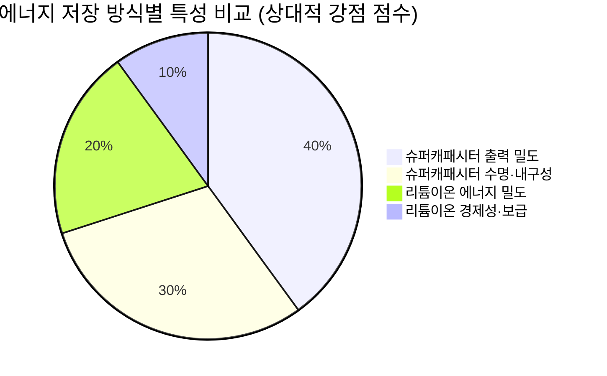
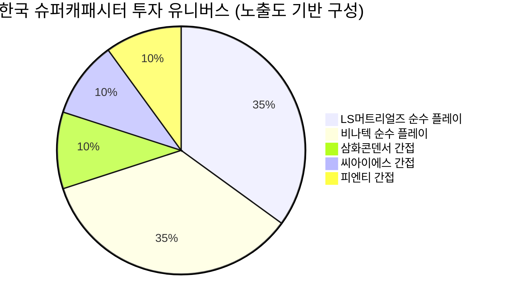
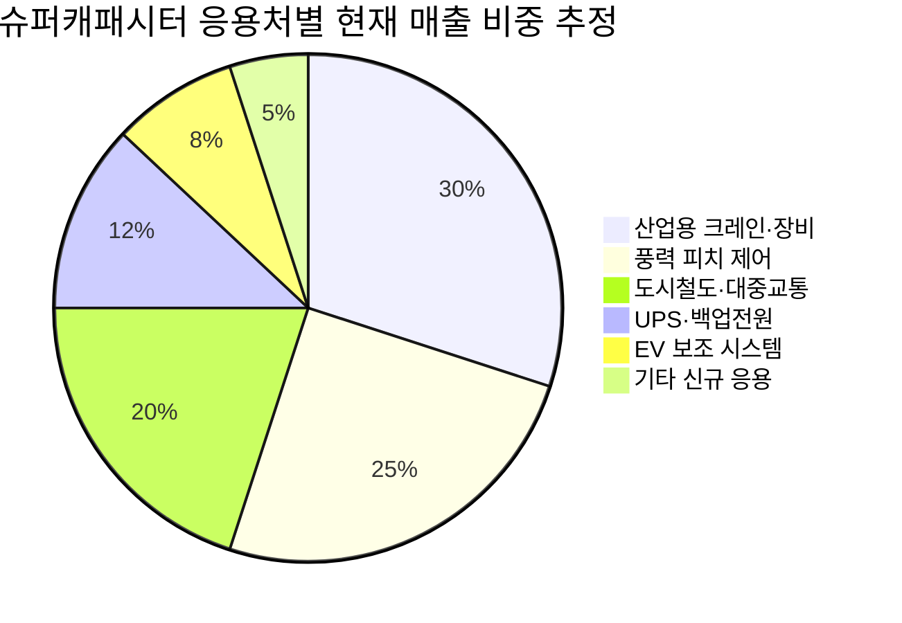
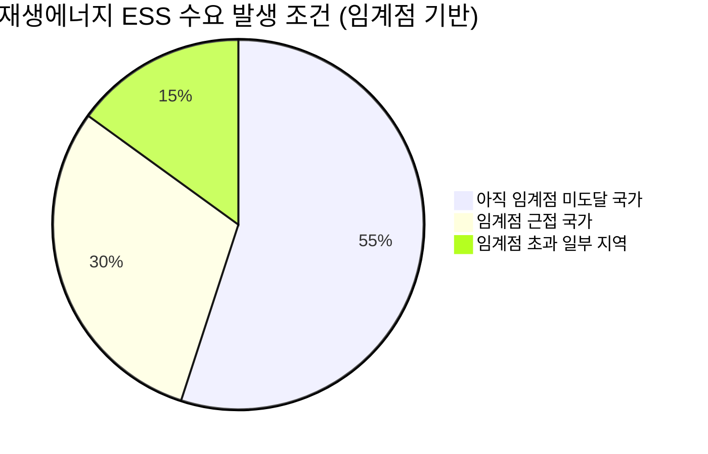
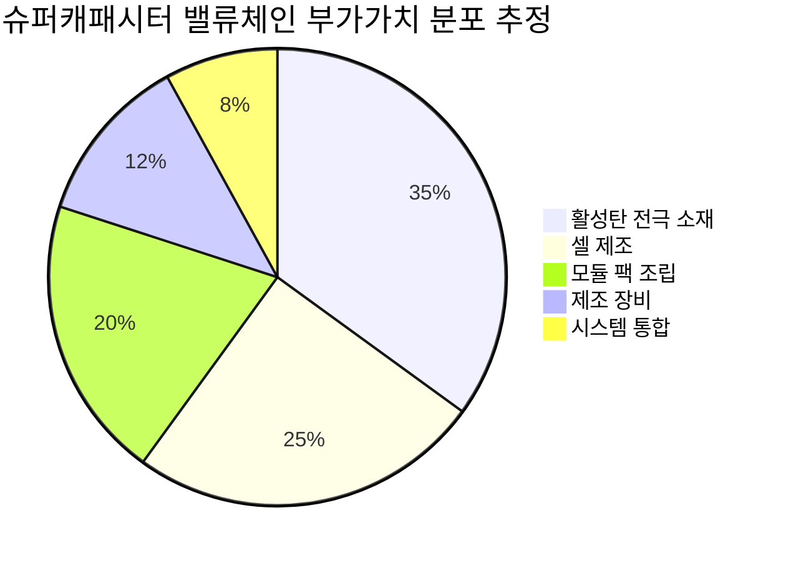
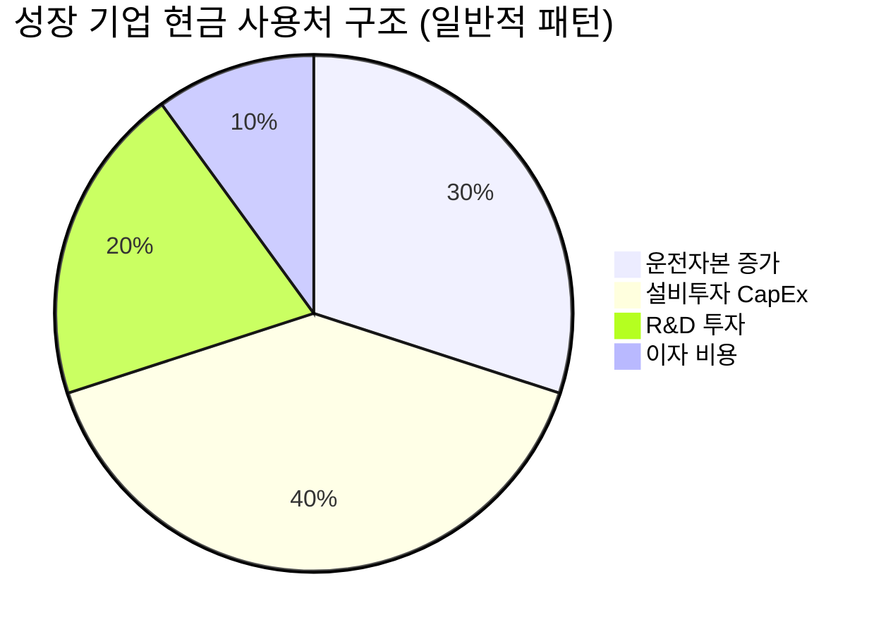

# Executive Summary & Why Now: 슈퍼캐패시터가 다시 주목받는 구조적 이유

> [!abstract] 섹션 핵심 요약
> 슈퍼캐패시터는 배터리를 **대체**하는 것이 아니라 **보완**한다. 이 단순한 명제의 정확한 이해가 투자 테마의 경계를 결정한다. 에너지 전환이 가속화될수록, 배터리가 잘 못하는 것(순간 고출력·장수명·극한 온도)을 슈퍼캐패시터가 채우는 구조적 수요가 강해진다. 기술은 이미 검증됐고, 시장은 Hype Cycle상 환멸의 계곡을 벗어나 실용화 단계에 진입하고 있다. 한국에는 글로벌 경쟁력을 갖춘 순수 플레이(Pure Play) 상장사 2개가 존재한다. 투자 타이밍 관점에서 '기술의 증명'과 '수요의 가시화' 사이의 갭이 좁혀지는 지금이 주목할 시점이다.

---

## 1. 슈퍼캐패시터란 무엇인가: 기술의 본질적 특성

### 1.1 작동 원리와 배터리와의 근본적 차이

슈퍼캐패시터(Supercapacitor, 또는 Ultracapacitor·EDLC: Electric Double-Layer Capacitor)는 전기화학적 반응이 아닌 **정전기적 이온 흡착(Electrostatic Ion Adsorption)**을 통해 에너지를 저장한다. 배터리가 화학 반응으로 에너지를 저장하는 것과는 근본적으로 다른 물리 현상이며, 이것이 모든 장단점의 출발점이다.



> [!note] 물리학이 곧 시장 경계를 결정한다
> 화학 반응이 없기 때문에 슈퍼캐패시터는 **분해되지 않는다**. 수십만 회 충방전을 반복해도 성능이 유지되고, 순간적으로 방대한 전류를 방출하거나 흡수할 수 있다. 반면 에너지를 '담아두는' 능력—에너지 밀도(Wh/kg)—은 리튬이온 배터리의 1/10~1/20 수준에 불과하다. 이 물리적 한계는 단기간에 극복될 수 없다.

| 특성 | 슈퍼캐패시터 | 리튬이온 배터리 | 의미 |
|------|------------|----------------|------|
| **에너지 밀도** | 5~15 Wh/kg | 150~300 Wh/kg | 🔴 배터리 대비 현저히 낮음 |
| **출력 밀도** | 10,000+ W/kg | 300~1,500 W/kg | 🟢 배터리 대비 압도적 우위 |
| **충방전 수명** | 수십만~100만 회 이상 | 500~3,000회 | 🟢 수명 비교 불가 수준 |
| **충방전 속도** | 초(秒) 단위 | 분~시간 단위 | 🟢 압도적 속도 우위 |
| **온도 내구성** | -40°C~+65°C 광범위 | 저온 성능 급격 저하 | 🟢 극한 환경 적합 |
| **에너지 비용** | 높음 (Wh당) | 지속 하락 중 | 🔴 대용량 저장에 불리 |
| **안전성** | 열폭주(Thermal Runaway) 없음 | 화재·폭발 위험 | 🟢 안전 측면 우위 |

*(수치는 업계 공통 기술 사양 기반, 확인된 정성적 사실)*

---

## 2. 대체인가, 보완인가: 투자 테마의 정확한 범위 설정

> [!tip] 핵심 인사이트 — 투자 테마의 경계
> **슈퍼캐패시터는 배터리를 대체하지 않는다. 배터리가 '틀린' 상황에서 슈퍼캐패시터가 '정답'이 된다.** 투자 기회는 이 '정답인 상황'이 얼마나 넓어지느냐에 달려 있다.

### 2.1 경쟁·보완 관계의 매트릭스

<div style="border-left:4px solid #4CAF50;padding-left:12px;margin:8px 0">

**보완(Complementary) 영역 — 투자의 핵심**

배터리와 슈퍼캐패시터가 **같은 시스템 안에서 역할 분담**하는 구조. 배터리는 '큰 통'으로 에너지를 장시간 보유하고, 슈퍼캐패시터는 '빠른 완충기'로 순간 충격(Peak Current)을 흡수·공급한다. 이 구조에서는 두 기술이 함께 성장한다.

</div>

<div style="border-left:4px solid #FF9800;padding-left:12px;margin:8px 0">

**대체(Substitution) 영역 — 제한적, 특정 니치에서만**

에너지를 장기 저장할 필요가 없고 순간 출력과 수명이 전부인 응용처(풍력발전 피치 제어, 소형 IoT 백업 등)에서는 슈퍼캐패시터가 배터리를 완전 대체한다. 단, 이 시장 규모는 전체 ESS 시장 대비 제한적이다.

</div>

| 응용 분야 | 관계 유형 | 배터리의 한계 | 슈퍼캐패시터 역할 |
|----------|----------|-------------|-----------------|
| EV 회생제동(Regenerative Braking) | 🟢 보완 | 반복 급충방전 시 수명 단축 | 순간 에너지 흡수·공급 |
| 재생에너지 ESS 출력 안정화 | 🟢 보완 | 밀리초 단위 출력 변동 대응 불가 | 순간 피크 버퍼링 |
| 풍력 피치 제어(Pitch Control) | 🟢 대체 | 잦은 충방전으로 수명 단축 | 배터리 완전 대체 |
| 산업용 크레인·항만 장비 | 🟢 보완/대체 | 극한 사용 환경, 잦은 기동 | 회생에너지 회수 |
| 도시철도·버스 회생제동 | 🟢 보완 | 반복 충방전 열화 | 순간 에너지 버퍼 |
| UPS (무정전 전원) | 🟡 경쟁 | 장시간 전원 공급에 우위 | 단시간 브리지로 부분 대체 |
| 메인 ESS (장기 저장) | 🔴 경쟁 열위 | 배터리의 영역 | 현실적 대체 불가 |

---

## 3. 왜 지금인가: 2024~2026년 수요 가시화의 3가지 구조적 드라이버

> [!abstract] Why Now의 핵심 논리
> '기술은 10년 전부터 있었는데 왜 지금인가'라는 질문이 투자 판단의 출발점이다. 3가지 구조적 드라이버가 **동시에, 같은 방향으로** 수렴하는 시점이 2024~2026년이다.

### 드라이버 ① — EV 대중화와 회생제동 시스템의 고도화

전기차 시장이 초기 얼리어답터 단계를 넘어 대중화 국면에 진입하면서, OEM들의 **비용 효율화 압박**이 강해지고 있다. 슈퍼캐패시터의 EV 적용 수요가 구조적으로 확대되는 이유는 다음과 같다:

**1차 효과**: 회생제동 효율 향상 → 동일 배터리 용량으로 주행거리 연장 → 배터리 원가 절감 가능

**2차 효과**: 배터리에 가해지는 순간 과부하(Peak Load) 감소 → 배터리 수명 연장 → TCO(Total Cost of Ownership) 개선

**핵심 포인트**: EV가 많이 팔릴수록 슈퍼캐패시터 수요도 늘어나는 **양의 상관관계**가 형성되고 있다. 이는 슈퍼캐패시터가 EV 배터리의 경쟁자가 아니라 동반자라는 증거다.

> [!question] 확인 필요
> EV OEM별 슈퍼캐패시터 실제 채택률 및 탑재 모델 수는 (데이터 미확인). 현대/기아의 최신 모델 적용 현황, LS머트리얼즈·비나텍의 OEM 공급 계약 규모는 추가 확인이 필요하다.

### 드라이버 ② — 재생에너지 비중 확대와 계통 안정화 수요

태양광·풍력 발전의 비중이 높아질수록 계통(Grid)의 출력 변동성이 커진다. 이 변동성을 해결하는 솔루션으로 슈퍼캐패시터의 역할이 부각되고 있다:

<div style="border-left:4px solid #4CAF50;padding-left:12px;margin:8px 0">

**구조적 필연성**: 재생에너지 발전은 날씨에 따라 출력이 밀리초(ms) 단위로 변동한다. 리튬이온 배터리는 이 속도에 대응하기 어렵다. 슈퍼캐패시터는 밀리초 단위 응답이 가능하여 **주파수 조정(Frequency Regulation)** 분야에서 배터리 대비 구조적 우위를 갖는다.

</div>

| 재생에너지 비중 단계 | 계통 안정화 방식 | 슈퍼캐패시터 수요 강도 |
|-------------------|----------------|---------------------|
| ~20% | 기존 화력·수력으로 대응 가능 | 🔴 낮음 |
| 20~40% | 배터리 ESS 보조 필요 | 🟡 중간 |
| 40%+ | 순간 버퍼 전용 장치 필수 | 🟢 높음 |
| 60%+ | 대규모 슈퍼캐패시터 인프라 필요 | 🟢 매우 높음 |

*[추정] 재생에너지 임계점 도달 시기는 국가마다 다르며, 한국은 2030년대 중반 이후 40% 임계 도달 예상*

한국의 '2050 탄소중립 시나리오'와 '재생에너지 3020 이행계획'은 이 수요를 정책적으로 가속화하는 배경이다. 직접적인 슈퍼캐패시터 보조금은 [미확인]이나, ESS 전체 시장 확대의 간접 수혜는 명확하다.

### 드라이버 ③ — 산업 자동화·로봇화와 고출력 단기 에너지 수요 급증

스마트 팩토리(Smart Factory), 물류 자동화(Automated Guided Vehicle, AGV), 항만 크레인의 전동화가 가속화되면서 **'순간 고출력 + 반복 사용 + 장수명'**이라는 슈퍼캐패시터의 핵심 강점이 정확히 맞아떨어지는 수요가 급증하고 있다.

**특히 주목할 점**: 이 분야는 EV나 재생에너지와 달리 **이미 검증된 상용화 사례**가 축적되어 있다. 항만 크레인(Portal Crane), 포크리프트(Forklift), 무인 운반차(AGV) 등은 수년 전부터 슈퍼캐패시터를 실제로 사용하고 있다. 이 분야의 수요가 '가능성'이 아닌 '실적'으로 전환되어 있다는 점이 기술 신뢰성의 증거가 된다.

<div style="display:flex;border-radius:8px;overflow:hidden;margin:8px 0;font-size:0.85em"><div style="background:#4CAF50;width:40%;padding:6px 8px;color:white">✅ 이미 상용화된 수요 40%</div><div style="background:#FF9800;width:40%;padding:6px 8px;color:white">⚡ 성장 중인 수요 40%</div><div style="background:#F44336;width:20%;padding:6px 8px;color:white">🔬 미래 수요 20%</div></div>

---

## 4. 기술 성숙도 분석: S-Curve와 Hype Cycle 상의 현재 위치

### 4.1 Hype Cycle 포지셔닝

> [!note] Hype Cycle 위치 판단 (추정 기반, 검증 필요)
> 슈퍼캐패시터는 1990년대 초기 상용화 이후 수차례의 기대와 실망을 반복했다. 현재는 **응용 분야별로 다른 위치**에 있다는 점이 핵심이다.

| 응용 분야 | Hype Cycle 위치 | 투자 타이밍 의미 |
|----------|----------------|----------------|
| 항만·산업용 크레인 | 🟢 생산성의 고원(Plateau of Productivity) | 이미 성숙 — 안정적 수익 |
| 풍력 피치 제어 | 🟢 생산성의 고원 진입 | 검증 완료, 물량 확대 단계 |
| 도시철도 회생제동 | 🟢 계몽의 비탈길(Slope of Enlightenment) | 실용화 확산 초입 |
| EV 회생제동 보조 | 🟡 계몽의 비탈길 초반 | 수요 가시화 시작 |
| 재생에너지 ESS 주파수 조정 | 🟡 환멸의 계곡 탈출 직후 | 초기 상용화 증명 단계 |
| 그래핀/MXene 차세대 소재 | 🔴 기대감의 정점 | 투기적 영역, 상용화 미정 |

*[추정] Hype Cycle 위치는 공개 데이터 기반 정성 평가이며, Gartner 공식 발표 아님*

<div style="background:#e0e0e0;border-radius:8px;overflow:hidden;margin:4px 0"><div style="background:#FF9800;width:55%;padding:4px 8px;color:white;font-size:0.9em;white-space:nowrap">기술 성숙도 종합 55/100 — 계몽의 비탈길 중반</div></div>

### 4.2 S-Curve 위치와 투자 타이밍

> [!tip] S-Curve 타이밍의 의미
> 기술 투자의 황금 타이밍은 S-Curve의 **변곡점(Inflection Point) 직전**이다. 너무 이르면 기다림의 비용이 크고, 너무 늦으면 이미 주가에 반영되어 있다.

슈퍼캐패시터의 S-Curve를 응용처별로 분해하면:

- **성숙 응용처(산업용·풍력)**: S-Curve 후반부 — 안정적 성장, 급격한 상승 기대 어려움
- **성장 응용처(도시철도·EV 보조)**: S-Curve 중반부 변곡점 근방 — **핵심 투자 기회 구간** [추정]
- **미래 응용처(대규모 재생에너지 ESS)**: S-Curve 초반부 — 옵션 가치, 불확실성 높음

<div style="background:#e0e0e0;border-radius:8px;overflow:hidden;margin:4px 0"><div style="background:#4CAF50;width:65%;padding:4px 8px;color:white;font-size:0.9em;white-space:nowrap">투자 타이밍 적절성 65/100 — 변곡점 진입 구간</div></div>

**'기술 증명'과 '수요 가시화' 사이의 갭 분석**:

| 시간축 | 상태 | 투자 함의 |
|-------|------|---------|
| **단기 (2024~2025)** | 기술 증명 완료, 수요 가시화 초입 | 리스크 프리미엄 여전히 높음, 선별적 접근 필요 |
| **중기 (2025~2027)** | 주요 OEM 채택 확산, 수주 잔고 가시화 | 실적 기반 투자 확신 가능 구간 |
| **장기 (2027+)** | 재생에너지 ESS 대규모 적용 여부 결정 | 시장 규모의 퀀텀 점프 또는 정체 분기점 |

---

## 5. 한국 슈퍼캐패시터 산업의 글로벌 경쟁력 포지션

### 5.1 글로벌 경쟁 지형도

> [!warning] 데이터 미확인 경고
> 글로벌 시장점유율 수치는 (데이터 미확인). 아래 분석은 공개된 정성적 정보와 업계 일반 지식에 기반한 [추정]이다.

| 국가/기업 | 경쟁 포지션 | 핵심 강점 | 한국 대비 위협도 |
|----------|-----------|---------|--------------|
| 🇨🇳 중국 (CATIC, Korchip 등) | 🔴 가격 경쟁력 압도 | 대량 생산, 저비용 | 매우 높음 — 중저가 시장 |
| 🇺🇸 Maxwell (Eaton 인수) | 🟡 고성능 프리미엄 | 원천 기술, 미국 시장 | 중간 — 고성능 분야 경쟁 |
| 🇯🇵 Panasonic, Murata | 🟡 소형·정밀 분야 강자 | 소형화·집적화 기술 | 중간 — 전자부품 분야 |
| 🇰🇷 LS머트리얼즈, 비나텍 | 🟢 고성능·중대형 특화 | 소재 수직계열화, 기술력 | — (한국) |
| 🇩🇪 Skeleton Technologies | 🟡 차세대 소재 특화 | 그래핀 기반 기술 | 중간 — 미래 기술 경쟁 |

**한국의 차별화 포인트**:

<div style="border-left:4px solid #4CAF50;padding-left:12px;margin:8px 0">

**소재 수직계열화(Vertical Integration)**: LS머트리얼즈와 비나텍 모두 활성탄(Activated Carbon) 등 핵심 전극 소재를 자체 생산한다. 이는 원가 구조 통제력과 소재 기술 개발 속도 면에서 결정적 우위다. 중국 경쟁사들이 소재를 외부 조달하는 것과 달리, 한국 기업들은 소재→셀→모듈의 전 과정을 내재화하여 **기술적 해자(Moat)**를 형성하고 있다.

</div>

<div style="border-left:4px solid #FF9800;padding-left:12px;margin:8px 0">

**한국의 구조적 약점**: 한국 내수 시장 규모는 글로벌 대비 제한적이다 (미확인). 중국의 가격 공세에 대한 방어는 고성능·고신뢰성 시장 집중과 수출 다변화를 통해서만 지속 가능하다. 글로벌 점유율 확대 여부는 유럽·미국 시장에서의 성과가 관건이다.

</div>

### 5.2 한국 상장사 투자 유니버스 매핑



> [!note] 순수 플레이의 희소성 프리미엄
> 글로벌적으로 슈퍼캐패시터 전용 ETF가 존재하지 않으며(확인), 순수 플레이 상장사도 극히 드물다. [[LS머트리얼즈]]와 [[비나텍]]은 이 테마에 투자하고자 하는 기관·개인 투자자가 접근할 수 있는 전 세계적으로도 희귀한 Pure Play 상장사다. 이 희소성 자체가 프리미엄 요인이 될 수 있으나, 동시에 유동성 리스크(Liquidity Risk)도 내포한다.

---

## 6. 투자 테마의 Variant Perception: 시장 컨센서스와 다른 시각

> [!tip] Variant Perception — 시장이 놓치고 있는 것
> 시장의 다수는 슈퍼캐패시터를 '배터리의 미래 경쟁자'로 프레이밍한다. 이 프레임이 틀렸다. 슈퍼캐패시터의 진짜 가치는 **에너지 전환이 가속화될수록 배터리와 함께 성장하는 보완 인프라**라는 데 있다.

### 컨센서스 vs. 다른 시각 비교

| 관점 | 시장 컨센서스 | Variant Perception |
|-----|------------|-------------------|
| **경쟁 구도** | 배터리 vs. 슈퍼캐패시터 | 배터리 + 슈퍼캐패시터 (동반 성장) |
| **성장 드라이버** | 에너지 밀도 향상 여부 | 이미 에너지 밀도가 필요 없는 분야의 확산 |
| **핵심 위험** | 배터리 기술 발전으로 대체됨 | 중국 저가 공세 + 수요 확산 지연 |
| **투자 포인트** | 장기 기술 베팅 | 이미 검증된 니치의 물량 성장 |
| **한국 기업 강점** | 단순 제조 역량 | 소재 수직계열화로 구축된 기술 해자 |

### Devil's Advocate: 가장 강력한 반대 논거

> [!failure] 반대 논거 — 틀릴 가능성
> **"배터리 기술이 충분히 빠르게 발전하면 슈퍼캐패시터의 영역이 지속적으로 잠식된다"**
>
> 리튬인산철(LFP) 배터리의 수명이 4,000~6,000회 이상으로 향상되고, C-rate(충방전 속도)가 개선되면, 슈퍼캐패시터가 '유일한 선택'인 응용처가 줄어들 수 있다. 특히 전고체 배터리(Solid-State Battery)가 상용화되면 안전성·수명 측면의 슈퍼캐패시터 강점도 희석된다. 이 시나리오에서 슈퍼캐패시터는 점점 더 좁은 니치로 밀려날 수 있다.

이 반대 논거에 대한 반론:
1. **물리적 한계**: 배터리의 충방전 속도와 수명이 개선되더라도, 전기화학 반응이라는 본질적 특성상 슈퍼캐패시터의 ms 단위 응답 속도와 100만 회 수명을 따라잡기는 물리적으로 극히 어렵다
2. **응용처의 확장**: 배터리 기술이 발전하는 동시에 슈퍼캐패시터의 새로운 응용처(로봇, AGV, 스마트 그리드 등)도 함께 확장되고 있다
3. **하이브리드 구조**: 배터리와 슈퍼캐패시터를 함께 사용하는 하이브리드 시스템이 오히려 더 많은 슈퍼캐패시터 수요를 창출한다

---

## 7. 이해관계자 인센티브 분석 (Incentive Analysis)

> [!abstract] 숨겨진 인센티브를 보면 진짜 방향이 보인다

| 이해관계자 | 표면적 목표 | 실제 인센티브 | 투자 함의 |
|----------|-----------|------------|---------|
| **LS머트리얼즈** | 슈퍼캐패시터 시장 선도 | LS그룹 내 독립 성장 스토리 구축, 소재 수직계열화 고도화 | 기술 투자 지속 가능성 높음 |
| **비나텍** | 글로벌 시장 확장 | 연료전지+슈퍼캐패시터 이중 포트폴리오로 리스크 분산 | 슈퍼캐패시터 집중도 상대적 낮음 주의 |
| **완성차 OEM** | 전비(電費) 효율 개선 | 슈퍼캐패시터 채택으로 배터리 비용 절감, 수명 연장 | 채택 인센티브 구조적으로 강함 |
| **재생에너지 발전사** | 계통 안정화 비용 최소화 | 슈퍼캐패시터 도입이 배터리 대비 유지보수 비용 절감 | 장기 계약 수요 안정적 |
| **중국 경쟁사** | 글로벌 점유율 확대 | 저가 물량 공세로 시장 선점, 기술 고도화 병행 | 한국 기업의 하방 가격 압력 지속 |
| **정부(한국)** | 탄소중립 목표 달성 | ESS 보급 확대, 에너지 안보 강화 | 직접 지원보다 간접 수혜 구조 |

---

## 8. 종합 판단: 지금 이 시점의 투자 의미

### 시나리오 확률 분포

<div style="display:flex;border-radius:8px;overflow:hidden;margin:8px 0;font-size:0.85em"><div style="background:#4CAF50;width:25%;padding:6px 8px;color:white">🟢 Bull 25%</div><div style="background:#FF9800;width:50%;padding:6px 8px;color:white">🟡 Base 50%</div><div style="background:#F44336;width:25%;padding:6px 8px;color:white">🔴 Bear 25%</div></div>

*[추정] 확률 분포는 정성적 판단 기반, 계량적 산출 불가*

| 시나리오 | 핵심 전제 | 수요 확산 경로 | 한국 기업 수혜 강도 |
|---------|---------|-------------|-----------------|
| 🟢 **Bull** | EV OEM 대규모 채택 + 재생에너지 ESS 필수화 | 2025~2026년 대형 수주 가시화 | 매우 강함 — 순수 플레이 프리미엄 |
| 🟡 **Base** | 기존 산업용·풍력 성장 지속, EV는 점진적 확산 | 2026~2028년 수요 가시화 | 중간 — 안정적 성장 |
| 🔴 **Bear** | 배터리 기술 급진전 + 중국 가격 공세 심화 | 니치 시장에 머무름 | 약함 — 밸류에이션 디레이팅 위험 |

> [!verdict] 최종 판단 — Executive Summary
> **슈퍼캐패시터는 '기술의 약속'에서 '실적의 증거'로 전환되는 임계점 근방에 있다.** 배터리 대체가 아닌 보완이라는 정확한 프레임 하에서, EV 회생제동·재생에너지 계통 안정화·산업 자동화라는 3가지 구조적 드라이버가 2024~2026년 동시 수렴하고 있다. 한국 기업([[LS머트리얼즈]], [[비나텍]])은 소재 수직계열화라는 희소한 기술 해자를 보유한 글로벌 수준의 Pure Play다. 투자 판단의 핵심 변수는 **수요 가시화 속도(EV OEM 채택 확산 타이밍)**와 **중국 가격 경쟁 심화 정도**이며, 이 두 변수를 지속 모니터링해야 한다. 현 시점은 '아직 이른가, 이미 늦었는가'의 경계선에 있으며, 실적 데이터의 누적이 확신을 높이는 구간이다.

<div style="background:#e0e0e0;border-radius:8px;overflow:hidden;margin:4px 0"><div style="background:#FF9800;width:60%;padding:4px 8px;color:white;font-size:0.9em;white-space:nowrap">섹터 전체 투자 매력도 60/100 — 선별적 접근 권고</div></div>

---

> [!warning] 데이터 신뢰도 최종 고지
> 본 섹션에서 인용된 시장 규모·성장률·점유율 수치는 대부분 **(데이터 미확인)** 상태이며, [추정] 태그가 붙은 수치는 정성적 판단에 기반한 것입니다. 실제 투자 의사결정 전에는 LS머트리얼즈·비나텍의 IR 자료, 글로벌 시장조사기관(BloombergNEF, IHS Markit, IDTechEx 등)의 유료 리포트, 그리고 각사 최신 실적 발표를 반드시 직접 확인하시기 바랍니다.

---

# 시장 구조 & 수요 분석: 슈퍼캐패시터가 먹히는 시장은 어디인가

> [!abstract] 섹션 핵심 요약
> 슈퍼캐패시터 시장은 단일 시장이 아니다. **응용처별로 침투 속도, 매출 가시성, 경쟁 강도가 판이하게 다르다.** 이미 돈이 들어오는 세그먼트(산업용·풍력 피치 제어)와 아직 기대치에 머무는 세그먼트(EV 대규모 채택·대형 재생에너지 ESS)를 구분하지 않으면 잘못된 투자 타이밍에 진입한다. 한국 기업의 경쟁 포지션은 고성능 프리미엄 시장에서 유효하지만, 중국의 물량 공세가 이 프리미엄 영역을 얼마나 빠르게 잠식할지가 핵심 변수다. 정책 환경은 구조적 우군이나, 슈퍼캐패시터를 직접 명시한 지원책은 사실상 없다는 점을 직시해야 한다.

---

## 1. 시장 전체 구조 조감: TAM에서 SOM까지

> [!warning] 수치 신뢰도 경고
> 이 섹션의 시장 규모 수치는 **(데이터 미확인)**이다. BloombergNEF·IDTechEx·MarketsandMarkets 등 기관들이 추정치를 발표하고 있으나, 기관마다 방법론과 정의가 달라 편차가 크다. 아래 프레임워크는 투자 의사결정용 구조 이해를 위한 것이며, 실제 수치는 유료 리포트를 통한 직접 확인이 필수다.

슈퍼캐패시터 시장의 TAM/SAM/SOM 구조를 이해하려면, 먼저 **슈퍼캐패시터가 경쟁하는 시장이 '에너지 저장 장치 전체'가 아님**을 명확히 해야 한다. 에너지 밀도가 낮다는 물리적 제약으로 인해, 슈퍼캐패시터의 실질적인 경쟁 무대는 전체 ESS 시장의 일부 세그먼트에 국한된다.



*[추정] 응용처별 비중은 공개 정보 및 업계 일반 지식 기반. 기업별 실제 매출 세그먼트는 (데이터 미확인)*

| 시장 구분 | 정의 | 슈퍼캐패시터 적합성 | 규모 추정 |
|----------|------|-------------------|---------|
| **TAM** | 전체 에너지 저장 장치 (배터리·플라이휠·양수발전 포함) | 🔴 대부분 슈퍼캐패시터 비적합 | (데이터 미확인) |
| **SAM** | 순간 고출력·고수명·빠른 응답이 핵심인 ESS 세그먼트 | 🟢 슈퍼캐패시터 구조적 강점 구간 | (데이터 미확인) |
| **SOM** | 한국 기업이 기술·가격·공급망으로 실제 접근 가능한 시장 | 🟡 글로벌 프리미엄 + 아시아 중고성능 시장 | (데이터 미확인) |

<div style="border-left:4px solid #FF9800;padding-left:12px;margin:8px 0">

**투자자에게 중요한 함의**: 슈퍼캐패시터의 SAM은 전체 ESS 시장의 극히 일부다. 그러나 그 일부가 구조적으로 성장하는 이유—재생에너지 확산, 전동화 가속, 산업 자동화—가 10년 이상의 메가트렌드와 정렬되어 있다는 점이 핵심 투자 논거다. 시장 자체가 작지만 성장성이 높은 '니치 성장주'로 접근해야 한다.

</div>

---

## 2. 응용처별 심층 분석: 어디서 돈이 실제로 나오는가

> [!tip] 핵심 프레임워크
> 각 응용처를 **①현재 매출 기여도** × **②성장 속도** × **③기술 적합성** 3축으로 평가한다. 가장 매력적인 투자 포인트는 현재 기여도가 낮지만 빠르게 성장하며 기술 적합성이 높은 세그먼트다.

### 2.1 산업용 크레인·항만 장비·포크리프트 — '이미 검증된 캐시카우'

<div style="display:flex;border-radius:8px;overflow:hidden;margin:8px 0;font-size:0.85em"><div style="background:#4CAF50;width:70%;padding:6px 8px;color:white">✅ 현재 매출 기여 높음 (추정 30% 이상)</div><div style="background:#FF9800;width:30%;padding:6px 8px;color:white">⚡ 성장 속도 중간</div></div>

항만 크레인(Rubber Tired Gantry, RTG)과 산업용 리프팅 장비는 슈퍼캐패시터가 가장 먼저, 가장 확실하게 상용화된 시장이다. 이 응용처가 특별한 이유:

- **물리적 필연성**: 크레인은 컨테이너를 들어올릴 때 수십 kW~수백 kW의 순간 전력을 소비하고, 내릴 때 동일한 양의 에너지가 회생된다. 이 충방전 사이클이 하루 수천 회 반복된다. 배터리는 이 조건에서 2~3년 내 수명이 다한다. 슈퍼캐패시터는 수명 10년 이상이 실증되었다.
- **경제성 검증 완료**: 에너지 절약(회생제동) + 수명 연장 + 유지보수 절감의 조합으로 TCO(총소유비용)가 명확하게 낮아진다는 사실이 실제 운용 데이터로 입증되어 있다.
- **수요의 안정성**: 전 세계 항만 컨테이너 물동량은 장기적으로 성장 추세이며, 기존 디젤 크레인의 전동화 전환(Electrification) 트렌드가 이 수요를 추가로 강화한다.

**투자 관점에서의 함의**: 이 세그먼트는 '가능성'이 아닌 '실적'의 영역이다. [[LS머트리얼즈]]와 [[비나텍]]이 현재 매출을 쌓고 있는 핵심 기반이며, 신규 고객 확보보다는 **기존 고객의 재구매·물량 확대**가 실적 가시성을 높이는 구조다.

| 항목 | 평가 |
|------|------|
| 현재 매출 기여 | 🟢 높음 (가장 안정적 수익원) |
| 침투율 성장 속도 | 🟡 중간 (이미 성숙 단계 진입) |
| 기술적 장벽(배터리 대체 가능성) | 🟢 낮음 (물리적 조건이 슈퍼캐패시터 유리) |
| 한국 기업 경쟁력 | 🟢 강함 (검증된 공급 레퍼런스 보유) |
| 중국 경쟁 위협 | 🟡 중간 (프리미엄 제품군은 방어 가능) |

---

### 2.2 풍력발전 피치 제어 시스템 — '배터리 완전 대체의 모범 사례'

<div style="display:flex;border-radius:8px;overflow:hidden;margin:8px 0;font-size:0.85em"><div style="background:#4CAF50;width:65%;padding:6px 8px;color:white">✅ 매출 기여 높음</div><div style="background:#4CAF50;width:35%;padding:6px 8px;color:white">🚀 성장 속도 높음</div></div>

풍력 터빈의 피치 제어(Pitch Control) 시스템은 슈퍼캐패시터가 배터리를 **완전 대체**하는 거의 유일한 대형 시장이다.

**왜 슈퍼캐패시터여야만 하는가**:
풍력 터빈의 블레이드는 강풍 시 페더링(Feathering) 동작을 통해 터빈을 보호한다. 이 긴급 동작은 수초 이내에 완료되어야 하며, 정전 상황에서도 작동해야 한다. 가장 중요한 것은 이 동작이 **-40°C 해상 환경에서도 확실히 실행**되어야 한다는 점이다. 배터리는 저온에서 급격히 성능이 저하되어 이 조건을 충족할 수 없다. 슈퍼캐패시터는 이 조건을 만족하는 사실상 유일한 솔루션이다.

**성장 동력**:
- 전 세계 해상풍력(Offshore Wind) 설비 용량은 2030년까지 폭발적 성장이 예상된다([추정], 각국 에너지 로드맵 기반)
- 터빈 1기당 블레이드 3개 × 피치 제어 시스템 1개 = 슈퍼캐패시터 모듈 3개 이상 탑재
- 기존 설치된 수천 기 터빈의 교체 수요(배터리→슈퍼캐패시터 업그레이드)도 존재

> [!success] 강점 — 풍력 피치 제어의 구조적 우위
> 이 세그먼트는 '슈퍼캐패시터냐 배터리냐'의 선택이 아니라 **'슈퍼캐패시터를 써야만 하는 물리적 필연성'**이 존재한다. 중국 경쟁사가 저가로 공세를 펴더라도, 안전·신뢰성 인증(IEC 표준 등)이 진입장벽으로 작용한다. 한국 기업들이 이미 관련 인증을 보유하고 있다면, 이 장벽은 강력한 해자가 된다. (인증 현황: 데이터 미확인, IR 직접 확인 필요)

| 항목 | 평가 |
|------|------|
| 현재 매출 기여 | 🟢 높음 (안정적 수익원) |
| 침투율 성장 속도 | 🟢 높음 (해상풍력 성장과 정렬) |
| 기술적 장벽(배터리 대체 가능성) | 🟢 매우 낮음 (물리적 대체 불가) |
| 한국 기업 경쟁력 | 🟢 강함 |
| 중국 경쟁 위협 | 🟡 중간 (안전 인증 장벽 존재) |

---

### 2.3 도시철도·버스·트램 회생제동 — '확산 속도 가장 빠른 성장 세그먼트'

<div style="display:flex;border-radius:8px;overflow:hidden;margin:8px 0;font-size:0.85em"><div style="background:#FF9800;width:45%;padding:6px 8px;color:white">🟡 현재 매출 기여 중간</div><div style="background:#4CAF50;width:55%;padding:6px 8px;color:white">🚀 성장 속도 매우 높음</div></div>

도시철도와 전기버스는 현재 가장 빠르게 매출화되고 있는 성장 세그먼트로 판단된다([추정]).

**핵심 경제적 논리**:
- 도시철도 차량은 역마다 정차·출발을 반복 → 하루 수백~수천 회의 회생제동 사이클
- 이 회생 에너지를 슈퍼캐패시터에 저장했다가 재출발 시 사용 → 에너지 소비 15~30% 절감 가능([추정], 실제 수치는 시스템 구성에 따라 다름)
- 배터리 대비 슈퍼캐패시터의 수명 우위 → 차량 라이프사이클(25~30년) 동안 교체 불필요 수준

**글로벌 확산 현황** (정성적 확인):
중국 주요 도시들이 전기 트램과 버스에 슈퍼캐패시터를 광범위하게 적용하기 시작했다. 유럽도 에너지 효율 규제 강화로 트램·지하철 회생제동 시스템에 슈퍼캐패시터 채택이 확산되고 있다는 것은 업계에서 일반적으로 알려진 사실이나, 구체적 수치는 (데이터 미확인).

**한국 시장 특이성**:
서울·부산 등 대도시 지하철은 이미 회생제동 시스템을 갖추고 있다. 슈퍼캐패시터를 활용한 에너지 저장 시스템 업그레이드 및 신규 노선 적용이 잠재 수요가 될 수 있으나, 구체적인 채택 계획과 규모는 (데이터 미확인).

| 항목 | 평가 |
|------|------|
| 현재 매출 기여 | 🟡 중간 (빠르게 상승 중) |
| 침투율 성장 속도 | 🟢 높음 (도시 전동화 트렌드) |
| 기술적 장벽(배터리 대체 가능성) | 🟢 낮음 (수명·내구성 우위 명확) |
| 한국 기업 경쟁력 | 🟡 중간 (중국 경쟁사와 시장 경합) |
| 중국 경쟁 위협 | 🔴 높음 (CRRC 등 대형 플레이어) |

---

### 2.4 전기차(EV) 회생제동 보조 — '가장 큰 잠재 시장, 가장 불확실한 타임라인'

<div style="display:flex;border-radius:8px;overflow:hidden;margin:8px 0;font-size:0.85em"><div style="background:#F44336;width:25%;padding:6px 8px;color:white">🔴 현재 매출 낮음</div><div style="background:#FF9800;width:40%;padding:6px 8px;color:white">🟡 성장 속도 불확실</div><div style="background:#4CAF50;width:35%;padding:6px 8px;color:white">🚀 잠재 TAM 가장 큼</div></div>

EV 회생제동 보조는 **가장 많이 언급되지만 현재 실제 매출 기여는 가장 낮은** 세그먼트다. 이 괴리를 정확히 이해하는 것이 투자 판단의 핵심이다.

**왜 아직 대규모 채택이 안 되는가 — Devil's Advocate**:

> [!failure] EV 채택 지연의 구조적 이유
> 1. **배터리 기술의 지속적 개선**: LFP 배터리의 C-rate와 수명이 빠르게 향상되면서 슈퍼캐패시터 없이도 회생제동 조건을 버티는 배터리가 늘어나고 있다
> 2. **시스템 복잡성 증가**: EV에 슈퍼캐패시터를 추가하면 전력 관리 시스템(BMS) 설계가 복잡해지고, 차량 중량·공간 문제가 발생한다
> 3. **OEM의 단순화 전략**: 완성차 OEM들은 부품 수를 줄이는 방향으로 플랫폼을 설계한다. 별도의 슈퍼캐패시터 모듈 추가는 이 전략에 역행한다
> 4. **소비자 인식 부재**: 슈퍼캐패시터 탑재가 차량 판매에 직접적인 마케팅 포인트가 되지 않는다

**그러나 채택이 가속화될 수 있는 조건**:
- 48V 마일드 하이브리드(MHEV) 시스템에서의 slotting: 배터리 보조로 슈퍼캐패시터를 패키징하는 구조가 가장 현실적인 진입 경로([추정])
- 상용차(트럭·버스) 분야: 승용차보다 중량 제약이 적고, 회생 에너지량이 크며, 수명 요구조건이 더 까다로운 상업용 차량에서 먼저 확산될 가능성이 높다

> [!question] 확인 필요 — EV OEM 실제 채택 현황
> [[LS머트리얼즈]]·[[비나텍]]의 EV OEM 납품 레퍼런스, 계약 규모, 납품 차종은 **(데이터 미확인)**. 두 회사의 IR 자료에서 EV 세그먼트 매출 비중을 직접 확인해야 한다. 이 수치가 없으면 EV 수요 드라이버는 아직 '기대치'에 불과하다.

| 항목 | 평가 |
|------|------|
| 현재 매출 기여 | 🔴 낮음 (추정) |
| 침투율 성장 속도 | 🟡 중간~낮음 (예상보다 느림) |
| 잠재 시장 규모 | 🟢 매우 큼 (EV 판매 대수와 연동) |
| 채택 불확실성 | 🔴 높음 (OEM 설계 선택의 문제) |
| 한국 기업 경쟁력 | 🟡 중간 |

---

### 2.5 재생에너지 ESS 계통 안정화 — '구조적 필연이지만 장기 수요'

<div style="display:flex;border-radius:8px;overflow:hidden;margin:8px 0;font-size:0.85em"><div style="background:#F44336;width:20%;padding:6px 8px;color:white">🔴 현재 매출 낮음</div><div style="background:#FF9800;width:35%;padding:6px 8px;color:white">🟡 중기 성장</div><div style="background:#4CAF50;width:45%;padding:6px 8px;color:white">🚀 장기 옵션 가치 큼</div></div>

재생에너지 계통 안정화는 슈퍼캐패시터의 **가장 강력한 장기 수요 논거**이지만, 현재의 실질적 매출 기여는 제한적이다([추정]).

**수요의 구조적 논리**:
태양광·풍력 발전은 간헐성(Intermittency)이 본질적 특성이다. 전력망에서 재생에너지 비중이 40%를 넘어서면, 밀리초(ms) 단위의 주파수 변동을 배터리만으로는 대응하기 어렵다는 것이 전력 엔지니어링의 기술적 판단이다. 슈퍼캐패시터의 밀리초 응답 속도는 이 문제의 구조적 해법이다.

**현재 매출이 낮은 이유**:
한국을 포함한 대부분 국가의 재생에너지 비중은 아직 이 임계점(40%)에 도달하지 않았다. '구조적으로 필요한 시장'이지만 '아직 통증이 크지 않은 시장'이다. 수요가 폭발하려면 재생에너지 비중 확대가 선행되어야 하며, 이는 국가별 정책 실행력에 달려 있다.



*[추정] 임계점 40% 기준 대략적 분류, 실제 국가별 데이터는 IEA 공개 통계 확인 필요*

---

### 2.6 UPS·데이터센터 백업 — '니치이지만 안정적인 수익원'

데이터센터와 통신 기지국의 순간 전원 공급 장치(UPS)에서 슈퍼캐패시터는 배터리의 부분 대체재로 활용된다. 정전 발생 시 발전기가 기동하는 수초간의 브리지(Bridge) 역할로, 배터리 전체를 슈퍼캐패시터로 교체하지 않고 일부 용량을 슈퍼캐패시터로 대체하는 구성이다.

**성장 동력**: AI 붐으로 인한 데이터센터 급증 → UPS 시장 성장 → 슈퍼캐패시터 수요 간접 확대

**한계**: UPS 시장에서의 슈퍼캐패시터 침투율은 배터리 대비 여전히 낮으며, 장시간 전원 공급이 필요한 경우 배터리가 필수적이다.

---

## 3. 응용처별 매력도 종합 매트릭스

| 응용처 | 현재 매출 기여 | 성장 속도 | 기술 적합성 | 경쟁 강도 | 종합 투자 매력 |
|-------|-------------|---------|-----------|---------|------------|
| 산업용 크레인·항만 | 🟢 높음 | 🟡 중간 | 🟢 매우 높음 | 🟡 중간 | ⭐⭐⭐⭐ (안정성) |
| 풍력 피치 제어 | 🟢 높음 | 🟢 높음 | 🟢 매우 높음 | 🟡 중간 | ⭐⭐⭐⭐⭐ (최우선) |
| 도시철도·버스 | 🟡 중간↑ | 🟢 높음 | 🟢 높음 | 🔴 높음 | ⭐⭐⭐⭐ (성장동력) |
| EV 회생제동 보조 | 🔴 낮음 | 🟡 불확실 | 🟡 중간 | 🟡 중간 | ⭐⭐⭐ (장기 옵션) |
| 재생에너지 ESS | 🔴 낮음 | 🟡 중기 | 🟢 높음 | 🟡 중간 | ⭐⭐⭐ (장기 잠재력) |
| UPS·데이터센터 | 🟡 중간 | 🟡 중간 | 🟡 중간 | 🟡 중간 | ⭐⭐⭐ (안정적 니치) |
| 군수·항공우주 | 🟡 중간 | 🟡 중간 | 🟢 높음 | 🟢 낮음 | ⭐⭐⭐⭐ (고마진 니치) |

<div style="background:#e0e0e0;border-radius:8px;overflow:hidden;margin:4px 0"><div style="background:#4CAF50;width:78%;padding:4px 8px;color:white;font-size:0.9em;white-space:nowrap">풍력 피치 제어 세그먼트 투자 매력도 78/100</div></div>

<div style="background:#e0e0e0;border-radius:8px;overflow:hidden;margin:4px 0"><div style="background:#4CAF50;width:72%;padding:4px 8px;color:white;font-size:0.9em;white-space:nowrap">산업용·도시철도 세그먼트 투자 매력도 72/100</div></div>

<div style="background:#e0e0e0;border-radius:8px;overflow:hidden;margin:4px 0"><div style="background:#FF9800;width:48%;padding:4px 8px;color:white;font-size:0.9em;white-space:nowrap">EV 회생제동 세그먼트 투자 매력도 48/100</div></div>

---

## 4. 검증된 수요 vs. 기대치: 무엇이 실제로 오더로 바뀌고 있는가

> [!tip] 핵심 인사이트 — 수요의 '검증 레벨' 분류
> 모든 수요 드라이버를 동일 선상에 놓고 이야기하는 것은 투자 분석의 치명적 오류다. 아래와 같이 검증 레벨을 구분해야 한다.

| 검증 레벨 | 정의 | 해당 세그먼트 |
|---------|------|------------|
| **Level 1: 실적 확인** | 실제 매출, 반복 수주, 레퍼런스 고객 공개 | 산업용 크레인, 풍력 피치 제어 |
| **Level 2: 파이프라인 가시화** | LOI, MOU, 소량 납품 시작, 공시 또는 IR 언급 | 도시철도, 일부 EV 상용차 |
| **Level 3: 업계 기대치** | 분석가·기업 IR의 성장 내러티브, 아직 수주 없음 | EV 승용차 대규모 채택, 대형 ESS |
| **Level 4: 기술적 가능성** | 연구 논문, 기술 시연, 상용화 미확정 | 그래핀 기반 차세대 슈퍼캐패시터 |

<div style="border-left:4px solid #F44336;padding-left:12px;margin:8px 0">

**투자자 경고**: 현재 시장에서 슈퍼캐패시터 관련 주가는 종종 Level 3~4 기대치를 반영하여 형성되는 경우가 있다. Level 1~2의 실질적 수요 규모 대비 밸류에이션이 과도하게 높은 국면에서는 실적 미달 시 급격한 조정이 발생할 수 있다. **현재 어느 레벨의 수요가 주가에 반영되어 있는지를 파악하는 것이 Margin of Safety 판단의 출발점이다.**

</div>

> [!question] 가장 중요한 확인 사항
> [[LS머트리얼즈]]와 [[비나텍]]의 최근 분기별 실적 발표에서 **세그먼트별 매출 비중**을 확인해야 한다. "EV 납품 시작"이 전체 매출에서 몇 %인지, 풍력·산업용이 얼마나 안정적으로 유지되고 있는지가 수요 검증의 핵심 데이터다. 이 수치 없이는 Level 분류가 불가능하다.

---

## 5. 글로벌 경쟁 지형도: 한국의 포지션과 가격 경쟁력

> [!abstract] 경쟁 분석의 핵심 질문
> "한국 기업이 글로벌 경쟁에서 살아남을 수 있는가"보다 더 정확한 질문은 "어느 세그먼트에서, 어느 기간 동안, 어느 수준의 마진을 지킬 수 있는가"다.

### 5.1 주요 글로벌 경쟁사 비교

| 기업 | 국가 | 강점 시장 | 한국 대비 기술 수준 | 가격 경쟁력 | 한국에 대한 위협 |
|-----|------|---------|-------------------|-----------|--------------|
| **Maxwell Technologies** (Eaton 인수) | 🇺🇸 | 항공·군수·고성능 산업 | 🟡 동등~우위 (원천 특허 보유) | 🔴 높은 가격 | 고성능 분야 기술 경쟁 |
| **Panasonic** | 🇯🇵 | 소형 전자·자동차 | 🟡 동등 | 🟡 중간 | 자동차 OEM 납품 경쟁 |
| **Murata Manufacturing** | 🇯🇵 | 소형·정밀 전자부품 | 🟡 동등 | 🟡 중간 | 소형 응용처 |
| **Skeleton Technologies** | 🇩🇪 (에스토니아 계) | 그래핀 기반 차세대 | 🟢 일부 우위 (소재 혁신) | 🔴 프리미엄 가격 | 중장기 기술 경쟁 |
| **CATIC/중국 로컬 기업군** | 🇨🇳 | 중저가 대량 시장 | 🔴 열위 (현재는 따라잡는 중) | 🟢 압도적 저가 | 🔴 **가장 심각한 위협** |
| **Nippon Chemi-Con** | 🇯🇵 | 전해 콘덴서·EDLC | 🟡 동등 | 🟡 중간 | 특정 전자부품 분야 |

### 5.2 한국 기업의 실질적 경쟁 우위

<div style="display:flex;border-radius:8px;overflow:hidden;margin:4px 0"><div style="background:#4CAF50;width:62%;padding:4px 8px;color:white;font-size:0.85em">한국 강점 (소재 수직계열화·기술력) 62%</div><div style="background:#F44336;width:38%;padding:4px 8px;color:white;font-size:0.85em;text-align:right">취약점 (중국 가격·규모) 38%</div></div>

**한국의 핵심 차별화 — 소재 수직계열화(Vertical Integration)**:

[[LS머트리얼즈]]와 [[비나텍]] 모두 활성탄(Activated Carbon) 전극 소재를 자체 생산한다. 이것이 왜 중요한가:

1. **원가 통제력**: 전극 소재가 슈퍼캐패시터 원가의 상당 부분을 차지한다([추정]). 소재를 내재화하면 외부 가격 변동에 대한 완충이 가능하다
2. **기술 개발 속도**: 소재-셀-모듈이 한 회사 내에 있으면 성능 최적화 사이클이 빠르다. 소재를 외부에서 조달하는 기업들은 이 속도에서 뒤처진다
3. **고객 맞춤화**: 특정 응용처(예: 극저온 해상풍력, 고온 산업 환경)에 맞는 소재를 자체 조정할 수 있다

**중국 경쟁 위협의 실제 구조**:

> [!warning] 중국 위협의 차별적 영향
> 중국 기업들의 저가 공세는 **세그먼트별로 위협 강도가 다르다**. 단순한 가격 경쟁이 주요 구매 기준인 중저가 범용 시장에서는 한국 기업이 방어하기 어렵다. 반면, 안전 인증(풍력 피치 제어, 항만 장비), 극한 환경 성능(해상풍력 -40°C), 장기 신뢰성(철도 시스템 25년 수명)이 요구되는 프리미엄 시장에서는 가격보다 검증된 레퍼런스와 인증이 더 중요하다. 한국 기업의 생존 전략은 이 프리미엄 세그먼트에 집중하는 것이다.

| 경쟁 차원 | 한국 위치 | 중국 위협 수준 | 방어 전략 |
|---------|---------|-------------|---------|
| 가격 경쟁 | 🔴 불리 | 매우 높음 | 프리미엄 포지셔닝으로 회피 |
| 성능/신뢰성 | 🟢 유리 | 따라잡는 중 | 선행 기술 지속 개발 |
| 안전 인증 | 🟢 유리 | 인증 취득 지연 중 | 레퍼런스 고객 락인 |
| 생산 규모 | 🔴 불리 | 압도적 규모 | 틈새·고부가 집중 |
| 소재 기술 | 🟢 유리 | 급속 추격 중 | R&D 투자 속도 유지 |

### 5.3 가격 경쟁력 정량 분석

> [!note] 가격 데이터 부재
> 한국 기업 대비 중국 경쟁사의 실제 ASP(평균 판매 가격) 차이는 **(데이터 미확인)**. 이 격차가 얼마나 되는지, 그리고 얼마나 빠르게 좁혀지고 있는지는 투자 판단의 핵심 변수 중 하나다. IR 컨퍼런스콜 및 업계 채널 체크를 통한 확인이 필요하다.

---

## 6. 정책 환경 심층 분석: 직접 수혜 vs. 간접 수혜

> [!abstract] 정책 분석의 핵심 원칙
> "ESS 지원 정책 = 슈퍼캐패시터 수혜"라는 등식은 지나치게 단순하다. 실제로는 ESS 지원의 대부분이 리튬이온 배터리 ESS로 흘러가며, 슈퍼캐패시터가 명시적으로 수혜를 받는 정책은 극히 드물다. 이 차이를 인식하는 것이 정책 분석의 출발점이다.

### 6.1 주요국 정책별 슈퍼캐패시터 수혜 분류

| 정책 | 국가 | 직접/간접 | 실질 수혜 메커니즘 | 수혜 강도 |
|-----|------|---------|----------------|---------|
| **IRA 에너지 저장 세액공제** | 🇺🇸 | 🔴 간접 | 배터리 ESS 중심, 슈퍼캐패시터 명시 없음 | 🔴 낮음 |
| **IRA 청정제조세액공제(45X)** | 🇺🇸 | 🟡 간접 가능 | 전극 소재 제조가 해당될 경우 — 확인 필요 | 🟡 불확실 |
| **EU Fit for 55 / 그린딜** | 🇪🇺 | 🟡 간접 | 재생에너지·ESS 확대 → 슈퍼캐패시터 수요 간접 자극 | 🟡 중간 |
| **EU 철도 전동화 지원** | 🇪🇺 | 🟢 준직접 | 전기 트램·철도 회생제동 시스템 지원 → 슈퍼캐패시터 직접 적용 | 🟢 중간~높음 |
| **중국 신에너지차(NEV) 보조금** | 🇨🇳 | 🟡 간접 | EV 보급 확대 → 슈퍼캐패시터 수요 간접 자극 | 🟡 중간 |
| **한국 재생에너지 3020** | 🇰🇷 | 🟡 간접 | ESS 의무화 → 대부분 배터리 ESS로 집행 | 🔴 낮음 |
| **한국 탄소중립 R&D 지원** | 🇰🇷 | 🟡 간접 | 국책과제에서 슈퍼캐패시터 관련 R&D 지원 가능성 | 🟡 중간 |
| **한국 스마트 그리드 정책** | 🇰🇷 | 🟡 간접 | 주파수 조정·계통 안정화 수요 자극 | 🟡 중간~낮음 |

> [!failure] 정책 환경의 냉정한 평가
> **슈퍼캐패시터를 직접 명시한 지원 정책은 사실상 전 세계적으로 존재하지 않는다.** 모든 정책 수혜는 간접적이며, 배터리 ESS와의 예산 경쟁에서 슈퍼캐패시터가 불리하다. 정책 환경은 '역풍'은 아니지만 '순풍'도 아닌 '옆바람' 수준이다. 정책을 주요 투자 논거로 활용하는 것은 과장이다.

### 6.2 정책 환경이 실질적으로 도움이 되는 경로

직접 수혜가 없더라도 정책이 슈퍼캐패시터 수요를 키우는 **간접 경로**가 존재한다:

<div style="border-left:4px solid #4CAF50;padding-left:12px;margin:8px 0">

**경로 1 — 재생에너지 비중 의무화 → 계통 불안정 심화 → 주파수 조정 수요 급증 → 슈퍼캐패시터 구조적 수요**
정책이 재생에너지 비중을 강제로 높이면, 앞서 언급한 '40% 임계점'에 더 빠르게 도달한다. 이 경우 정책이 수요를 강제 창출하는 역할을 한다.

**경로 2 — 도시 교통 전동화 의무화 → 전기버스·트램 보급 확대 → 회생제동 슈퍼캐패시터 수요**
서울시·부산시 등 지자체의 전기버스 전환 계획, 도시철도 신규 노선 건설이 슈퍼캐패시터 수요로 연결된다.

**경로 3 — 항만·물류 탈탄소 정책 → 크레인·AGV 전동화 → 산업용 슈퍼캐패시터 수요**
IMO(국제해사기구)의 탈탄소 규제와 각국 항만의 전동화 계획이 장기적 수요 기반을 형성한다.

</div>

### 6.3 정책 리스크: 방향이 바뀔 때의 시나리오

> [!warning] 정책 역전 리스크
> 재생에너지 정책 후퇴(미국 행정부 교체, 보조금 삭감 등)는 배터리 ESS 시장 전체를 위축시키고, 간접 수혜를 받던 슈퍼캐패시터 수요도 둔화시킨다. 단, 슈퍼캐패시터의 산업용·풍력 피치 제어 수요는 정책보다 경제성·기술 필연성에 기반하므로 정책 역전의 영향이 상대적으로 낮다. 이는 슈퍼캐패시터 투자의 방어성(Defensiveness) 중 하나다.

---

## 7. 이해관계자 인센티브 분석 — 누가 왜 밀고 있는가

> [!abstract] 인센티브 분석의 목적
> 슈퍼캐패시터 채택을 '밀고 있는' 이해관계자의 진짜 인센티브를 파악해야, 수요가 지속될지 여부를 예측할 수 있다.

| 이해관계자 | 표면적 이유 | 숨겨진 인센티브 | 수요 지속성 판단 |
|----------|-----------|-------------|--------------|
| **완성차 OEM (EV)** | 회생제동 효율 향상 | 배터리 비용 절감, 배터리 수명 연장으로 보증비용 감소 | 🟡 채택할 경제적 이유 있음, 그러나 시스템 단순화 인센티브와 상충 |
| **풍력 터빈 제조사** | 터빈 안전성 확보 | 피치 제어 실패 시 보험·법적 리스크 회피 | 🟢 채택 인센티브 매우 강함, 대체재 없음 |
| **항만 운영사** | 에너지 절약 | TCO 절감 (에너지비 + 유지보수비), ESG 목표 달성 | 🟢 경제성 입증, 안정적 반복 수요 |
| **도시 교통 운영사** | 에너지 효율 | 전기료 절감, 유지보수 비용 절감, 운행 안정성 | 🟢 장기 계약 구조, 안정적 수요 |
| **LS머트리얼즈** | 슈퍼캐패시터 시장 확대 | LS그룹 내 독립 성장 스토리, 소재 기술 포트폴리오 구축 | 🟢 기업 생존이 이 시장에 달림 → 강력한 내부 동기 |
| **비나텍** | 글로벌 시장 진출 | 슈퍼캐패시터+연료전지 이중 포트폴리오로 리스크 분산 | 🟡 슈퍼캐패시터가 유일한 수익원은 아님 |
| **한국 정부** | 탄소중립 목표 | 에너지 안보, 수출 산업 육성 | 🟡 간접 지원, 직접 이해관계 약함 |
| **중국 경쟁사** | 글로벌 점유율 확대 | 저가 물량 공세로 한국·일본 기업 시장 잠식 | 🔴 한국에게는 위협, 수요 파이를 나누는 구도 |

<div style="border-left:4px solid #4CAF50;padding-left:12px;margin:8px 0">

**핵심 인사이트**: 풍력 터빈 제조사와 항만 운영사의 인센티브 구조가 가장 강력하다. 이들은 슈퍼캐패시터 채택의 '경제적 이유'뿐 아니라 '리스크 회피 이유'가 있다. 리스크 회피 기반 수요는 경기 사이클과 무관하게 안정적이다. 반면 EV OEM의 인센티브는 아직 '가능성'에 머물며, 시스템 단순화 전략과 상충하는 부분이 있어 채택 속도 예측이 어렵다.

</div>

---

## 8. 수요 드라이버 검증 프레임워크: 실제 오더 확인 방법

> [!tip] 투자자 실전 확인 방법
> 모든 정성적 분석은 결국 실제 오더·매출로 검증되어야 한다. 다음 채널에서 Level 1~2 수요를 확인할 수 있다:

**공시·IR 채널**:
- 분기 실적 발표 컨퍼런스콜: 세그먼트별 매출 비중 질의
- 사업보고서: 주요 고객사·납품처 관련 기술
- 수주 공시: 중요한 대형 계약 체결 시 공시 의무

**간접 확인 채널**:
- 풍력 터빈 제조사(Vestas, Siemens Gamesa, 두산에너빌리티 등) 공급망 공시에서 슈퍼캐패시터 언급 여부
- 항만 자동화 프로젝트 수주 기업들의 납품 내역
- 도시 교통 전동화 입찰 공고

> [!question] 투자 전 반드시 확인해야 할 질문 목록
> 1. [[LS머트리얼즈]] 매출에서 EV 관련 비중은 현재 몇 %인가? (Level 1 또는 3인지 판단)
> 2. [[비나텍]]의 슈퍼캐패시터 vs 연료전지 매출 비중은? (슈퍼캐패시터 집중도)
> 3. 두 회사의 고객사 지역별 분포 — 유럽·미국 비중이 높은가, 아시아 중심인가?
> 4. 풍력 피치 제어 사업에서 확보된 수주 잔고(Backlog) 규모는?
> 5. 중국 경쟁사 대비 ASP(평균 판매 단가) 프리미엄은 어느 정도이며, 축소되고 있는가?

---

## 9. 시장 구조 분석 종합 판단

> [!verdict] 시장 구조 분석 최종 판단

**소결 — 세그먼트별 투자 가중치 제안**:

<div style="display:flex;border-radius:8px;overflow:hidden;margin:8px 0;font-size:0.85em"><div style="background:#4CAF50;width:55%;padding:6px 8px;color:white">✅ 검증된 수요 (산업용+풍력+철도) 55%</div><div style="background:#FF9800;width:30%;padding:6px 8px;color:white">⚡ 성장 중 수요 30%</div><div style="background:#F44336;width:15%;padding:6px 8px;color:white">🔬 기대치 15%</div></div>

슈퍼캐패시터 시장은 **세그먼트 분해 없이는 투자 판단이 불가능한 구조**다. 한국 투자자 입장에서 가장 중요한 인사이트는 다음과 같다:

1. **지금 돈이 나오는 곳**: 산업용 크레인·풍력 피치 제어 — 이 세그먼트의 수주 잔고와 마진이 실적을 결정한다
2. **1~2년 내 성장 엔진**: 도시철도·전기버스 회생제동 — 침투율 상승 속도가 주가 모멘텀을 만들 수 있다
3. **3~5년 장기 옵션**: EV 대규모 채택·재생에너지 ESS — 이것이 실현되면 기업 가치가 퀀텀 점프하지만, 아직 Level 3 기대치에 불과하다
4. **정책은 우군이지만 직접 지원은 없다**: 간접 수혜 구조를 정확히 인식하고, 정책 변화에 과도하게 연동하지 않도록 주의
5. **중국 위협은 세그먼트별로 차별적**: 프리미엄 안전·신뢰성 시장은 방어 가능, 범용 중저가 시장은 위협 심각

<div style="background:#e0e0e0;border-radius:8px;overflow:hidden;margin:4px 0"><div style="background:#FF9800;width:63%;padding:4px 8px;color:white;font-size:0.9em;white-space:nowrap">시장 구조 투자 매력도 종합 63/100 — 세그먼트 선별 후 접근</div></div>

---

> [!warning] 데이터 신뢰도 최종 고지
> 본 섹션의 응용처별 매출 비중·시장 규모·성장률 수치는 대부분 **[추정]** 또는 **(데이터 미확인)** 상태입니다. 실제 투자 의사결정을 위해서는 ① [[LS머트리얼즈]]·[[비나텍]]의 최신 사업보고서 및 IR 자료, ② IDTechEx·BloombergNEF·MarketsandMarkets 등의 슈퍼캐패시터 전문 시장조사 리포트, ③ 각 응용처 최종 고객사의 공급망 공시를 반드시 직접 확인하시기 바랍니다. 본 분석은 구조적 이해를 위한 프레임워크 제공을 목적으로 하며, 특정 투자 수익을 보장하지 않습니다.

---

# 밸류체인 매핑 & 수혜 상장사 심층 비교: 누가 진짜 돈을 버는가

> [!abstract] 섹션 핵심 요약
> 한국 슈퍼캐패시터 투자 유니버스는 **순수 플레이 2개사(LS머트리얼즈·비나텍)**와 **간접 수혜 3개사(삼화콘덴서·씨아이에스·피엔티)**로 구성된다. 두 순수 플레이 기업은 소재-셀-모듈의 수직계열화라는 공통점을 가지지만, 매출 구조·성장 전략·리스크 프로파일이 판이하게 다르다. 간접 수혜 3개사의 실제 슈퍼캐패시터 매출 노출도는 대부분 (데이터 미확인) 상태이며, 테마 프리미엄을 받을 자격이 있는지는 엄격히 검증해야 한다. 밸류체인 내 **가장 높은 부가가치는 소재(전극·활성탄) 단계에서 발생**하며, 이 단계를 내재화한 기업이 구조적 우위를 갖는다.

---

## 1. 밸류체인 전체 구조 매핑

> [!note] 밸류체인 분석의 출발점
> 슈퍼캐패시터 밸류체인을 이해하는 핵심 질문은 하나다: **"어느 단계에서 가격 결정력(Pricing Power)이 존재하는가?"** 가격 결정력이 있는 단계가 진짜 마진을 가져가는 곳이다.

### 1.1 단계별 구조 및 한국 상장사 포지션

| 단계 | 세부 내용 | 한국 상장사 | 노출도 | 마진 특성 |
|------|---------|-----------|--------|---------|
| **업스트림 — 원재료** | 석탄·야자각 등 탄소 원료, 유기 전해질 원료, 분리막 원료 | (상장사 없음, 대부분 수입) | — | 원자재 가격 연동 |
| **업스트림 — 핵심 소재** | 활성탄(전극), 전해질(TEABF4 등), 분리막 | [[LS머트리얼즈]], [[비나텍]], [[삼화콘덴서]] (전해액 기술) | 🟢 매우 높음 / 🟡 간접 | **가장 높은 마진 구간** |
| **미드스트림 — 셀 제조** | EDLC 셀 (코인형·원통형·각형) | [[LS머트리얼즈]], [[비나텍]] | 🟢 매우 높음 | 중고 마진, 규모 경제 효과 |
| **미드스트림 — 모듈·팩** | 셀 직렬/병렬 조합, BMS 통합, 인클로저 | [[LS머트리얼즈]], [[비나텍]] | 🟢 매우 높음 | 중 마진, 고객 맞춤화 프리미엄 |
| **미드스트림 — 제조 장비** | 전극 코팅·슬리팅, 롤투롤 공정 장비 | [[씨아이에스(CIS)]], [[피엔티(PNT)]] | 🟡 간접 | 수주형, 사이클 의존 |
| **다운스트림 — 시스템 통합** | ESS 시스템, 회생제동 시스템, 피치 제어 모듈 | 현대자동차, 두산에너빌리티 등 | 🔴 극간접 | 박마진, 규모 경쟁 |
| **다운스트림 — 최종 수요** | EV, 풍력 터빈, 항만 크레인, 도시철도 | — | — | — |

<div style="border-left:4px solid #4CAF50;padding-left:12px;margin:8px 0">

**부가가치 분포의 핵심 인사이트**: 슈퍼캐패시터 밸류체인에서 가장 높은 부가가치는 **활성탄 전극 소재** 단계에서 발생한다. 활성탄은 슈퍼캐패시터 원가의 상당 부분(업계 추정 30~50%, 데이터 미확인)을 차지하며, 제조하기 어렵고 성능 차별화의 핵심이다. LS머트리얼즈와 비나텍이 이 소재를 자체 생산한다는 사실은 단순한 수직계열화 이상의 의미를 갖는다 — 그것은 **마진의 원천을 내재화**했다는 뜻이다.

</div>

### 1.2 밸류체인 부가가치 분포 (정성적 추정)



*[추정] 부가가치 분포는 정성적 판단 기반. 실제 마진 데이터는 각사 IR 확인 필요*

---

## 2. 순수 플레이 2개사 심층 비교: LS머트리얼즈 vs. 비나텍

> [!tip] 핵심 분석 프레임
> 두 회사를 단순 비교하는 것은 틀린 접근이다. 이들은 같은 제품을 만들지만 **전혀 다른 전략적 포지셔닝**을 갖고 있다. LS머트리얼즈는 대기업 계열의 B2B 전문 공급자, 비나텍은 독립 기업으로 다각화 포트폴리오(슈퍼캐패시터+연료전지)를 운영한다. 이 차이가 리스크-리턴 프로파일을 결정한다.

### 2.1 LS머트리얼즈 (LS Materials)

> [!success] LS머트리얼즈 강점 프로파일

**기업 개요**: LS그룹 계열사로, 구 LS엠트론의 슈퍼캐패시터 사업부를 물적분할하여 설립. LS그룹의 제조·소재 역량을 배경으로 슈퍼캐패시터에 집중하는 구조.

| 분석 항목 | 내용 | 신뢰도 |
|---------|------|--------|
| **슈퍼캐패시터 매출 비중** | 사실상 주력 사업 (데이터 미확인) | 🟡 IR 확인 필요 |
| **소재 수직계열화** | 활성탄 자체 생산 — 확인된 사실 | 🟢 확인 |
| **주요 고객 세그먼트** | 풍력 피치 제어, 산업용 중장비, 도시교통 (추정) | 🟡 추정 |
| **글로벌 수출 비중** | (데이터 미확인) | 🔴 확인 필요 |
| **LS그룹 시너지** | 그룹 내 전력·에너지 네트워크 활용 가능 | 🟢 구조적 확인 |
| **R&D 투자 강도** | (데이터 미확인) | 🔴 확인 필요 |

**마진 구조 분석** (데이터 미확인, 구조적 추론):

<div style="border-left:4px solid #4CAF50;padding-left:12px;margin:8px 0">

활성탄 자체 생산 → 소재 원가 통제 → 셀 제조 마진 보호 구조. 소재를 외부에서 조달하는 경쟁사 대비 원가 경쟁력 우위를 갖는 구조적 이점이 있다. 단, 활성탄 자체 생산의 고정비 부담이 가동률 하락 시 마진 하방 압력으로 작용할 수 있다. **스케일업이 마진 확대로 직결되는 구조**이며, 이는 수요 가시화가 밸류에이션 재평가의 핵심 트리거가 된다는 의미다.

</div>

**투자 관점에서의 핵심 질문**:
> [!question] LS머트리얼즈 확인 필요 사항
> 1. 최근 4개 분기 매출 성장률 추이 — 가속 성장인가, 정체인가?
> 2. 영업이익률(OPM) 수준과 트렌드 — 소재 내재화의 마진 우위가 실제로 나타나고 있는가?
> 3. 풍력 피치 제어 세그먼트 수주 잔고(Backlog) — 향후 12~18개월 실적 가시성
> 4. 유럽·미국 수출 비중 — 글로벌화 진행 속도
> 5. CapEx 계획 — 증설 투자가 수요 증가를 선행하는가, 후행하는가

<div style="background:#e0e0e0;border-radius:8px;overflow:hidden;margin:4px 0"><div style="background:#4CAF50;width:72%;padding:4px 8px;color:white;font-size:0.9em;white-space:nowrap">LS머트리얼즈 슈퍼캐패시터 테마 순수성 72/100</div></div>

---

### 2.2 비나텍 (Vinapower)

> [!note] 비나텍 — 슈퍼캐패시터+연료전지 이중 포트폴리오의 의미

**기업 개요**: 독립 중견기업으로, 슈퍼캐패시터와 수소 연료전지 부품(MEA: Membrane Electrode Assembly)을 함께 운영하는 이중 포트폴리오 구조. 활성탄 자체 개발·생산 능력 보유.

| 분석 항목 | 내용 | 신뢰도 |
|---------|------|--------|
| **슈퍼캐패시터 매출 비중** | (데이터 미확인) — 연료전지와 분리 공시 여부 확인 필요 | 🔴 핵심 확인 사항 |
| **연료전지(MEA) 매출 비중** | (데이터 미확인) | 🔴 확인 필요 |
| **활성탄 자체 개발** | 확인된 사실 — LS머트리얼즈와 동일 강점 | 🟢 확인 |
| **독립 기업 리스크** | 대기업 그룹 백업 없음 — 재무 리스크 상대적 높음 | 🟡 구조적 특성 |
| **기술 다각화 프리미엄** | 연료전지 성장 시 추가 업사이드 | 🟢 잠재적 강점 |
| **수소 정책 연계성** | 한국 수소경제 로드맵과 이중 연결 | 🟢 정책 수혜 가능성 |

**이중 포트폴리오의 투자 함의 — 양날의 검**:

<div style="display:flex;border-radius:8px;overflow:hidden;margin:4px 0"><div style="background:#4CAF50;width:55%;padding:4px 8px;color:white;font-size:0.85em">강점: 리스크 분산, 연료전지 옵션가치 55%</div><div style="background:#F44336;width:45%;padding:4px 8px;color:white;font-size:0.85em;text-align:right">약점: 슈퍼캐패시터 집중도 희석 45%</div></div>

<div style="border-left:4px solid #FF9800;padding-left:12px;margin:8px 0">

**Variant Perception — 비나텍에 대한 다른 시각**: 시장은 비나텍을 '슈퍼캐패시터 테마주'로 분류하지만, 실제로는 슈퍼캐패시터가 전체 매출에서 차지하는 비중이 (미확인)이다. 만약 연료전지 매출 비중이 더 높거나, 슈퍼캐패시터 성장이 연료전지 사업의 성과에 가려진다면, '순수 슈퍼캐패시터 플레이'로서의 프리미엄은 과도하게 반영된 것일 수 있다. 반대로, 수소경제 성장 시 이중 포트폴리오가 추가 리레이팅을 받을 수도 있다.

</div>

> [!question] 비나텍 핵심 확인 사항
> 1. **세그먼트별 매출 분리 공시 여부** — 슈퍼캐패시터 vs 연료전지 MEA 각각의 매출
> 2. 연료전지 사업의 수익성 — 투자 단계인가, 이익 창출 단계인가?
> 3. 슈퍼캐패시터 사업만의 OPM — LS머트리얼즈와 비교 가능한가?
> 4. 글로벌 고객 포트폴리오 — 특정 고객 집중도 위험은?
> 5. CapEx 중 슈퍼캐패시터 vs 연료전지 배분 비중

<div style="background:#e0e0e0;border-radius:8px;overflow:hidden;margin:4px 0"><div style="background:#FF9800;width:55%;padding:4px 8px;color:white;font-size:0.9em;white-space:nowrap">비나텍 슈퍼캐패시터 테마 순수성 55/100 (이중 포트폴리오 희석)</div></div>

---

### 2.3 LS머트리얼즈 vs. 비나텍 — 5개 차원 비교

| 비교 차원 | [[LS머트리얼즈]] | [[비나텍]] | 우위 |
|---------|--------------|---------|-----|
| **슈퍼캐패시터 집중도** | 🟢 사실상 단일 사업 | 🟡 슈퍼캐패시터+연료전지 | LS머트리얼즈 |
| **소재 수직계열화** | 🟢 활성탄 자체 생산 (확인) | 🟢 활성탄 자체 개발 (확인) | 동등 |
| **대기업 그룹 지원** | 🟢 LS그룹 계열 — 자본·네트워크 | 🔴 독립 기업 — 자체 생존 | LS머트리얼즈 |
| **성장 옵션 다양성** | 🟡 슈퍼캐패시터 단일 | 🟢 수소경제 추가 옵션 | 비나텍 |
| **재무 안정성** | 🟢 그룹 백업 구조 | 🟡 독립 기업 부채 리스크 | LS머트리얼즈 |
| **기술 혁신 속도** | 🟡 대기업 관료화 위험 | 🟢 독립 기업 유연성 | 비나텍 (추정) |
| **밸류에이션 (비교)** | (데이터 미확인) | (데이터 미확인) | 확인 필요 |
| **글로벌 레퍼런스** | (데이터 미확인) | (데이터 미확인) | 확인 필요 |

> [!tip] 두 기업 중 어느 쪽이 더 나은 투자인가?
> 단순한 우열을 논하기 전에 **투자 목적**을 명확히 해야 한다:
> - **순수 슈퍼캐패시터 성장에 베팅**: LS머트리얼즈가 더 순수한 노출도 제공
> - **슈퍼캐패시터+수소 이중 성장에 베팅**: 비나텍이 더 넓은 성장 옵션
> - **안정성 우선**: LS그룹 백업이 있는 LS머트리얼즈
> - **하이 리스크-하이 리턴**: 독립 기업으로서 턴어라운드 가능성이 있는 비나텍
>
> 두 기업을 동시에 보유하는 것이 슈퍼캐패시터 테마에 대한 가장 효율적인 포지션일 수 있다. 단, 중복 리스크(동일 섹터 집중)도 고려해야 한다.

---

## 3. 간접 수혜 3개사: 실제 노출도 정량화

> [!warning] 간접 수혜 과대평가 경고
> 시장은 종종 테마가 형성될 때 밸류체인의 모든 관련 기업을 동일하게 수혜주로 분류하는 오류를 범한다. 간접 수혜 3개사의 **실제 슈퍼캐패시터 매출 비중**을 정량화하지 않으면, 테마 프리미엄이 과도하게 반영될 위험이 있다.

### 3.1 삼화콘덴서 (Samwha Capacitor)

**노출 경로**: 전해 콘덴서(Electrolytic Capacitor) 전문 기업으로, 슈퍼캐패시터에 사용되는 전해액 관련 소재 기술을 보유.

| 항목 | 내용 | 판단 |
|------|------|------|
| **슈퍼캐패시터 직접 매출 비중** | (데이터 미확인) — 사업보고서 확인 필요 | 🔴 핵심 확인 사항 |
| **노출 경로** | 전해액 소재 기술 → 슈퍼캐패시터 소재 공급 가능성 | 🟡 잠재적, 현실화 여부 미확인 |
| **주력 사업과의 시너지** | 일반 콘덴서 기술이 EDLC 전해액과 기술적 연관성 있음 | 🟡 기술적 연관성은 확인 |
| **리레이팅 자격** | 슈퍼캐패시터 매출 비중이 (미확인) 수준에서는 테마 프리미엄 근거 약함 | 🔴 현재로서는 부여 어려움 |
| **주목해야 할 신호** | 슈퍼캐패시터 전해액 전용 라인 증설, 신규 고객사 공시 | 🟡 모니터링 필요 |

<div style="background:#e0e0e0;border-radius:8px;overflow:hidden;margin:4px 0"><div style="background:#F44336;width:20%;padding:4px 8px;color:white;font-size:0.9em;min-width:60px;white-space:nowrap">슈퍼캐패시터 노출도 추정 20/100</div></div>

**삼화콘덴서의 Incentive Analysis**: 일반 전해 콘덴서 시장이 성숙기에 접어들면서, 슈퍼캐패시터용 전해액 소재로의 사업 확장은 삼화콘덴서에게 구조적인 신성장 동력이 될 수 있다. 그러나 현재 이것이 실제 매출 기여로 나타나고 있는지, 아니면 잠재적 기회에 불과한지는 **(데이터 미확인)**이다.

---

### 3.2 씨아이에스 (CIS, C.I.S)

**노출 경로**: 2차전지 전극 공정 장비 전문 기업. 슈퍼캐패시터 전극 제조 공정이 배터리 전극 공정과 유사한 구조.

| 항목 | 내용 | 판단 |
|------|------|------|
| **슈퍼캐패시터 관련 장비 매출** | (데이터 미확인) | 🔴 핵심 확인 사항 |
| **기술적 전용성** | 배터리 전극 장비 → 슈퍼캐패시터 전극 장비 전용 가능 | 🟢 기술 전용 가능성 높음 |
| **실제 납품 레퍼런스** | LS머트리얼즈·비나텍에 장비 납품 여부 (미확인) | 🔴 직접 확인 필요 |
| **수주 사이클 의존성** | 슈퍼캐패시터 기업의 증설 CapEx에 의존 — 변동성 높음 | 🟡 불확실성 |
| **리레이팅 자격** | 실제 납품 레퍼런스와 증설 계획이 확인되면 정당화 가능 | 🟡 조건부 |

<div style="background:#e0e0e0;border-radius:8px;overflow:hidden;margin:4px 0"><div style="background:#F44336;width:25%;padding:4px 8px;color:white;font-size:0.9em;min-width:60px;white-space:nowrap">슈퍼캐패시터 노출도 추정 25/100</div></div>

**씨아이에스 투자 논리의 핵심 검증 포인트**:

<div style="border-left:4px solid #FF9800;padding-left:12px;margin:8px 0">

씨아이에스가 슈퍼캐패시터 테마로 리레이팅을 받으려면 반드시 확인해야 할 것이 있다: **LS머트리얼즈 또는 비나텍의 증설 CapEx 계획이 존재하고, 씨아이에스가 그 공급 업체인지 여부**다. 만약 두 순수 플레이 기업이 증설을 하지 않거나, 중국산 장비를 채택한다면, 씨아이에스의 슈퍼캐패시터 관련 매출은 사실상 0에 가까울 수 있다. 이것이 확인되지 않은 상태에서의 테마 프리미엄은 근거 없는 기대치다.

</div>

---

### 3.3 피엔티 (PNT)

**노출 경로**: 롤투롤(Roll-to-Roll) 공정 장비 전문 기업. 슈퍼캐패시터 전극 및 분리막 제조의 핵심 공정 장비 제공.

| 항목 | 내용 | 판단 |
|------|------|------|
| **롤투롤 장비의 전용성** | 배터리와 슈퍼캐패시터 공정 모두에 활용 | 🟢 기술 전용성 높음 |
| **슈퍼캐패시터 전용 수주** | (데이터 미확인) | 🔴 확인 필요 |
| **배터리 장비 대비 슈퍼캐패시터 비중** | (데이터 미확인) | 🔴 확인 필요 |
| **주력 고객 기반** | 주로 2차전지 기업 — 슈퍼캐패시터는 부수적 가능성 | 🟡 주의 |
| **리레이팅 자격** | 씨아이에스와 동일 논리 — 증설 수주 확인 전까지는 제한적 | 🟡 조건부 |

<div style="background:#e0e0e0;border-radius:8px;overflow:hidden;margin:4px 0"><div style="background:#F44336;width:22%;padding:4px 8px;color:white;font-size:0.9em;min-width:60px;white-space:nowrap">슈퍼캐패시터 노출도 추정 22/100</div></div>

---

## 4. 5개사 종합 비교 매트릭스

> [!abstract] 5개사 투자 매력도 핵심 비교

### 4.1 주요 지표 비교 테이블

| 기업 | 슈퍼캐패시터 노출도 | 소재 수직계열화 | 테마 순수성 | 재무 안정성 | 성장 모멘텀 | 종합 투자 매력 |
|-----|-----------------|--------------|-----------|-----------|-----------|------------|
| **[[LS머트리얼즈]]** | 🟢 매우 높음 | 🟢 활성탄 자체 생산 | 🟢 순수 플레이 | 🟢 그룹 백업 | 🟢 높음 (추정) | ⭐⭐⭐⭐⭐ |
| **[[비나텍]]** | 🟢 높음 | 🟢 활성탄 자체 개발 | 🟡 슈퍼캐패시터+연료전지 | 🟡 독립 기업 | 🟢 높음 (추정) | ⭐⭐⭐⭐ |
| **[[삼화콘덴서]]** | 🔴 낮음 (추정) | 🟡 전해액 기술 (간접) | 🔴 낮음 | 🟢 안정적 | 🟡 중간 | ⭐⭐ |
| **[[씨아이에스(CIS)]]** | 🟡 중간 (조건부) | 🔴 없음 | 🔴 낮음 | 🟡 수주 의존 | 🟡 불확실 | ⭐⭐ |
| **[[피엔티(PNT)]]** | 🟡 중간 (조건부) | 🔴 없음 | 🔴 낮음 | 🟡 수주 의존 | 🟡 불확실 | ⭐⭐ |

*노출도·성장 모멘텀은 [추정] 기반. 밸류에이션 수치는 데이터 미확인으로 별도 표시*

### 4.2 노출도 vs. 투자 리스크 포지셔닝

| 기업 | 슈퍼캐패시터 노출도 | 투자 리스크 | 포지션 특성 |
|-----|----------------|-----------|-----------|
| **LS머트리얼즈** | 🟢 90%+ | 🟡 중간 (그룹 지원) | 고노출·중위험 — 핵심 보유 |
| **비나텍** | 🟢 50~70% (추정) | 🔴 높음 (독립 기업) | 고노출·고위험 — 선택적 보유 |
| **씨아이에스** | 🟡 10~30% (추정) | 🟡 중간 | 저노출·중위험 — 조건부만 보유 |
| **피엔티** | 🟡 10~25% (추정) | 🟡 중간 | 저노출·중위험 — 조건부만 보유 |
| **삼화콘덴서** | 🔴 5~15% (추정) | 🟢 낮음 (안정적 기업) | 극저노출·저위험 — 슈퍼캐패시터 이유로는 부적합 |

*[추정] 노출도 수치는 정성적 판단 기반. 실제 수치는 IR 자료 직접 확인 필수*

---

## 5. 밸류에이션 프리미엄 분석: 슈퍼캐패시터 테마가 얼마나 반영되어 있는가

> [!warning] 밸류에이션 분석의 한계
> 두 순수 플레이 기업의 현재 주가, PER, PSR, EV/EBITDA 등 핵심 밸류에이션 지표는 **(데이터 미확인)**이다. 이 수치 없이는 현재 주가에 테마 프리미엄이 얼마나 내재되어 있는지 정량적으로 판단할 수 없다. 아래 분석은 **구조적 프레임워크** 제시에 집중한다.

### 5.1 테마 프리미엄 추정을 위한 3단계 프레임워크

**Step 1 — 기본 사업 가치(Base Business Value) 추정**

슈퍼캐패시터 성장 없이도 현재 매출 수준이 유지된다고 가정했을 때의 적정 밸류에이션. 성숙 제조 기업 PER 기준 적용.

**Step 2 — 성장 가치(Growth Value) 추정**

향후 3~5년 슈퍼캐패시터 수요가 Base 시나리오로 성장할 경우의 추가 가치. DCF 또는 PEG 기반.

**Step 3 — 테마 프리미엄(Theme Premium) 측정**

`현재 시가총액 - (Step 1 + Step 2) = 시장이 추가로 지불하는 순수 테마 프리미엄`

> [!question] 이 계산을 하려면 반드시 필요한 데이터
> - 최근 12개월 매출 및 영업이익 (TTM)
> - 세그먼트별 성장률 (슈퍼캐패시터 vs 기타)
> - 업계 Peer 그룹 평균 밸류에이션 배수
> - 현재 시가총액 및 EV
>
> 이 데이터 없이는 "고평가·저평가 판단 불가" — 섣부른 판단은 금물

### 5.2 Margin of Safety 분석 프레임워크

> [!tip] Margin of Safety 사고 방식
> 슈퍼캐패시터 성장 스토리가 **완전히 틀렸을 때도** 손실이 제한적이려면 어떤 조건이 필요한가?

| 시나리오 | 조건 | 투자자 보호 메커니즘 |
|---------|------|-------------------|
| **Bull** | EV·풍력 대규모 채택 | 슈퍼캐패시터 매출 3~5배 성장 → 밸류에이션 재평가 |
| **Base** | 기존 산업용·풍력 지속 성장 | 안정적 이익 창출로 적정 밸류에이션 방어 |
| **Bear** | 성장 정체 + 중국 가격 경쟁 | **핵심**: 기본 사업 수익성이 안전마진을 제공하는가? |

<div style="border-left:4px solid #FF9800;padding-left:12px;margin:8px 0">

**Bear 시나리오의 핵심 질문**: 슈퍼캐패시터 성장이 실망스럽더라도, 현재 주가에서 손실이 제한적이려면 기본 사업(Base Business)의 가치가 현재 시가총액의 상당 부분을 지지해야 한다. 두 순수 플레이 기업의 현재 수익 창출 능력이 주가를 방어해줄 수 있는지 여부가 **Margin of Safety의 핵심**이다. (현재 이 판단에 필요한 재무 데이터는 미확인)

</div>

---

## 6. 숨겨진 수혜 상장사 탐색: 시장이 아직 연결 짓지 못한 기회

> [!tip] Variant Perception — 숨겨진 수혜자의 조건
> '숨겨진 수혜자'란 ① 슈퍼캐패시터 테마와 직접 관련이 없는 것으로 인식되지만, ② 실제 매출 기여가 발생하거나 발생할 가능성이 높고, ③ 현재 주가에 이것이 전혀 반영되지 않은 기업이다.

### 6.1 탐색 기준 및 후보군

| 탐색 기준 | 근거 | 잠재 후보 유형 |
|---------|------|-------------|
| **슈퍼캐패시터 소재 공급망 참여** | 활성탄 원료, 전해질 원료, 분리막 소재 | 화학·소재 기업 |
| **전력 반도체 및 BMS 제어** | 슈퍼캐패시터 모듈의 전력 관리 필수 | 전력 반도체 기업 |
| **응용처 채택 기업** | 슈퍼캐패시터 도입으로 비용 절감 효과 | 항만·철도·풍력 관련주 |
| **차세대 소재 개발** | 그래핀·CNT·MXene 기반 차세대 전극 | 차세대 소재 연구 기업 |

### 6.2 주목할 만한 후보 시나리오 (확인 필요)

> [!question] 숨겨진 수혜 가능성 — 확인 필요 항목

**시나리오 A — 탄소 원료 기업**: 활성탄의 원료가 되는 야자각·석탄 등 탄소계 원료를 국내에 공급하거나, 활성탄 전구체(Precursor)를 생산하는 소재 기업이 존재한다면, 수요 증가에 따른 간접 수혜 가능성이 있다. (구체적 기업명 미확인 — 사업보고서 공급망 분석 필요)

**시나리오 B — 전력 변환 장치(PCS) 기업**: 슈퍼캐패시터 모듈은 배터리와 달리 전압 변동이 크기 때문에, 전용 전력 변환 장치(Power Conditioning System)가 필요하다. 이 장치를 공급하는 국내 전력전자 기업이 있다면, 슈퍼캐패시터 시장 성장의 간접 수혜를 받는 '진짜 숨겨진 수혜자'일 수 있다.

**시나리오 C — 해상풍력 설치·운영 기업**: 슈퍼캐패시터 피치 제어 모듈을 탑재한 터빈을 사용하는 해상풍력 운영 기업들은, 배터리 대비 긴 수명으로 운영비(O&M) 절감 효과를 누린다. 이 효과가 해상풍력 기업의 프로젝트 수익성 개선으로 나타날 수 있다.

**시나리오 D — 스마트 그리드 솔루션 기업**: 재생에너지 계통 안정화 솔루션을 제공하는 기업이 슈퍼캐패시터를 핵심 부품으로 채택하기 시작한다면, 이 기업들이 슈퍼캐패시터의 '채널' 역할을 하면서 LS머트리얼즈·비나텍의 간접 판매처가 될 수 있다.

<div style="border-left:4px solid #4CAF50;padding-left:12px;margin:8px 0">

**투자자에게 드리는 조언**: 숨겨진 수혜자 발굴은 1차 조사로 끝나지 않는다. LS머트리얼즈·비나텍의 **공급망 공시와 IR 컨퍼런스콜에서 언급되는 협력사·고객사 이름**을 추적하는 것이 가장 효율적인 방법이다. 두 기업의 공급망에 연결된 기업이 상장사라면, 그것이 진정한 '숨겨진 수혜자'의 후보가 된다.

</div>

---

## 7. 밸류체인 내 경쟁 동학: 수직계열화 vs. 전문화의 대결

> [!abstract] 밸류체인 전략의 핵심 갈등
> 슈퍼캐패시터 밸류체인에서 가장 흥미로운 전략적 질문은: **"수직계열화(Vertical Integration)가 계속 유리한가, 아니면 언젠가 전문화(Specialization)가 더 효율적이 되는가?"**

### 7.1 현재 수직계열화가 유리한 이유

| 이유 | 설명 | 지속 가능성 |
|-----|------|-----------|
| **소재 희소성** | 고성능 활성탄이 특수 제조 공정이 필요해 공급처가 제한적 | 🟢 중기 유지 |
| **성능 최적화 필요** | 소재-셀-모듈이 통합되어야 최고 성능 달성 | 🟢 중기 유지 |
| **고객 요구 맞춤화** | 응용처별 특화 설계를 빠르게 대응하려면 전 공정 통제 필요 | 🟢 중기 유지 |
| **원가 통제** | 소재 가격 상승을 내부화로 완충 | 🟢 중기 유지 |

### 7.2 수직계열화 전략의 한계

| 한계 | 설명 | 리스크 |
|-----|------|--------|
| **투자 부담** | 소재-셀-모듈 각 단계 설비 투자 필요 | 🟡 CapEx 부담 |
| **규모 확장의 복잡성** | 각 단계 동시 확장이 필요 | 🟡 병목 위험 |
| **전문성 분산** | 모든 단계에서 최고 수준 유지 어려움 | 🟡 중장기 위험 |
| **시장 성숙 시 재고** | 시장이 커지면 전문 소재 기업이 등장해 공급 가능 | 🔴 장기 전략 변화 필요 |

<div style="border-left:4px solid #4CAF50;padding-left:12px;margin:8px 0">

**핵심 인사이트**: 현재 시장 단계(초기~중기 성장기)에서는 수직계열화가 압도적으로 유리하다. 시장이 성숙해지고 활성탄 공급업체가 다양화되면, 수직계열화의 이점이 줄어들 수 있다. 그러나 이 단계는 최소 5~10년 후의 이야기이며, **현재 투자 지평에서는 수직계열화 기업이 명확히 유리한 위치**에 있다.

</div>

---

## 8. 투자 우선순위 종합 판단

> [!verdict] 최종 판단 — 밸류체인 내 투자 우선순위

### 시나리오별 종합 확률

<div style="display:flex;border-radius:8px;overflow:hidden;margin:8px 0;font-size:0.85em"><div style="background:#4CAF50;width:25%;padding:6px 8px;color:white">🟢 Bull 25%</div><div style="background:#FF9800;width:50%;padding:6px 8px;color:white">🟡 Base 50%</div><div style="background:#F44336;width:25%;padding:6px 8px;color:white">🔴 Bear 25%</div></div>

*[추정] 앞선 섹션과 동일한 확률 분포 적용*

### 기업별 시나리오 투자 의미

| 기업 | Bull 시나리오 | Base 시나리오 | Bear 시나리오 | 종합 투자 우선순위 |
|-----|------------|------------|------------|----------------|
| **LS머트리얼즈** | 수요 폭발 최대 수혜 | 안정적 성장 지속 | 그룹 지원으로 하방 제한 | 🟢 **1순위** |
| **비나텍** | 슈퍼캐패시터+연료전지 이중 상승 | 슈퍼캐패시터 성장, 연료전지 옵션 | 독립 기업 재무 리스크 노출 | 🟡 **2순위 (선별적)** |
| **씨아이에스** | 순수 플레이 증설 수혜 | 제한적 수혜 | 슈퍼캐패시터 노출 미미 | 🟡 **조건부 관심** |
| **피엔티** | 씨아이에스와 동일 | 제한적 수혜 | 슈퍼캐패시터 노출 미미 | 🟡 **조건부 관심** |
| **삼화콘덴서** | 소재 공급 기회 포착 | 기존 콘덴서 사업 유지 | 슈퍼캐패시터 테마 관련 없음 | 🔴 **슈퍼캐패시터 이유로는 부적합** |

### 8.1 투자 우선순위 점수

<div style="background:#e0e0e0;border-radius:8px;overflow:hidden;margin:4px 0"><div style="background:#4CAF50;width:82%;padding:4px 8px;color:white;font-size:0.9em;white-space:nowrap">LS머트리얼즈 투자 우선순위 82/100</div></div>

<div style="background:#e0e0e0;border-radius:8px;overflow:hidden;margin:4px 0"><div style="background:#FF9800;width:63%;padding:4px 8px;color:white;font-size:0.9em;white-space:nowrap">비나텍 투자 우선순위 63/100</div></div>

<div style="background:#e0e0e0;border-radius:8px;overflow:hidden;margin:4px 0"><div style="background:#F44336;width:32%;padding:4px 8px;color:white;font-size:0.9em;white-space:nowrap">씨아이에스/피엔티 투자 우선순위 32/100</div></div>

<div style="background:#e0e0e0;border-radius:8px;overflow:hidden;margin:4px 0"><div style="background:#F44336;width:18%;padding:4px 8px;color:white;font-size:0.9em;min-width:60px;white-space:nowrap">삼화콘덴서 투자 우선순위 18/100</div></div>

---

### 8.2 '진짜 돈을 버는 곳' — 최종 답변

> [!verdict] 핵심 결론

**밸류체인 내 가장 높은 부가가치는 소재(활성탄 전극) 단계에서 발생하며, 이를 내재화한 LS머트리얼즈와 비나텍이 구조적 수혜자다.**

세 가지 핵심 결론:

**① 소재 수직계열화 = 진짜 해자(Moat)**
활성탄 자체 생산 능력이 마진의 원천을 내재화하는 구조적 우위를 제공한다. 이 능력이 없는 기업은 진정한 의미의 슈퍼캐패시터 투자 대상이 아니다.

**② 간접 수혜 3개사는 현재로서 테마 프리미엄을 받을 자격이 부족하다**
씨아이에스·피엔티는 순수 플레이 기업의 증설 CapEx가 구체화될 때 조건부로 주목할 가치가 있다. 삼화콘덴서는 슈퍼캐패시터 이유만으로는 투자 논거가 성립하지 않는다.

**③ 밸류에이션 판단 전에 반드시 필요한 데이터 확인**
현재 두 순수 플레이 기업의 세그먼트별 매출·마진·성장률이 (데이터 미확인) 상태에서는 "고평가인가, 저평가인가"를 논하는 것 자체가 불완전하다. 투자 결정 전 IR 자료를 통한 직접 확인이 최우선이다.

<div style="background:#e0e0e0;border-radius:8px;overflow:hidden;margin:4px 0"><div style="background:#FF9800;width:68%;padding:4px 8px;color:white;font-size:0.9em;white-space:nowrap">밸류체인 섹션 종합 투자 매력도 68/100 — 순수 플레이 집중 권고</div></div>

---

> [!warning] 데이터 신뢰도 최종 고지
> 본 섹션에서 제시된 **노출도 수치, 투자 우선순위 점수, 시나리오 확률**은 모두 **[추정]** 기반 정성적 판단입니다. 특히 LS머트리얼즈·비나텍의 세그먼트별 매출 비중, 영업이익률, 밸류에이션 배수는 **(데이터 미확인)** 상태이며, 실제 투자 의사결정 전에는 ① 두 회사의 최신 사업보고서·분기보고서 및 IR 자료, ② 컨퍼런스콜 녹취록, ③ 간접 수혜 3개사의 슈퍼캐패시터 관련 매출 공시를 반드시 직접 확인하시기 바랍니다. 본 분석은 투자 프레임워크 제공을 목적으로 하며, 특정 투자 수익을 보장하지 않습니다.

---

# 리스크 분석 & Devil's Advocate: 이 테마가 실패하는 시나리오

> [!abstract] 섹션 핵심 요약
> 슈퍼캐패시터 투자 테마는 매력적인 성장 내러티브를 갖추고 있지만, 그 이면에는 **기술·경쟁·수요·기업 4개 차원의 구조적 반론**이 존재한다. 특히 ① 배터리 기술의 슈퍼캐패시터 영역 잠식, ② 중국의 저가 물량 공세, ③ EV 캐즘 장기화, ④ 순수 플레이 2개사의 재무 취약성이 동시에 현실화될 경우, 이 테마는 '좋은 기술, 나쁜 투자'의 전형으로 전락할 수 있다. 반론을 체계적으로 이해하는 것이 Margin of Safety 확보의 출발점이다.

---

## 1. 리스크 분석의 프레임워크: 왜 Devil's Advocate가 필요한가

> [!tip] 핵심 인사이트 — 좋은 기술이 좋은 투자가 아닌 이유
> 슈퍼캐패시터의 기술적 우수성은 논쟁의 여지가 없다. 그러나 **기술의 우수성과 투자 수익률은 별개의 문제**다. 투자 수익은 ① 수요가 예상대로 실현되고, ② 경쟁으로부터 마진을 방어하며, ③ 기업이 이를 이익으로 전환하는 능력을 갖추고 있을 때 발생한다. 이 세 조건 중 하나라도 깨지면 주가는 하락한다.

슈퍼캐패시터 투자 테마에 대한 반론 구조를 4개 차원으로 분류한다:

| 리스크 차원 | 핵심 질문 | 위협 강도 | 시간축 |
|-----------|---------|---------|-------|
| **기술 리스크** | 배터리가 슈퍼캐패시터 영역을 얼마나 잠식하는가 | 🟡 중간~높음 | 중장기 (3~7년) |
| **경쟁 리스크** | 중국 저가 공세를 마진 방어가 가능한가 | 🔴 높음 | 단기~중기 (현재~3년) |
| **수요 리스크** | EV 캐즘 장기화 시 대안 성장축이 충분한가 | 🟡 중간 | 단기~중기 (1~3년) |
| **기업 리스크** | 순수 플레이 2개사의 재무구조가 성장 사이클을 버티는가 | 🟡 중간 | 단기 (현재 진행형) |

<div style="display:flex;border-radius:8px;overflow:hidden;margin:8px 0;font-size:0.85em"><div style="background:#4CAF50;width:30%;padding:6px 8px;color:white">🟢 감내 가능 리스크 30%</div><div style="background:#FF9800;width:45%;padding:6px 8px;color:white">🟡 모니터링 필요 45%</div><div style="background:#F44336;width:25%;padding:6px 8px;color:white">🔴 구조적 위협 25%</div></div>

---

## 2. 기술 리스크: 배터리가 슈퍼캐패시터 영역을 잠식하는 시나리오

> [!failure] 가장 강력한 반론 — 기술 대체 시나리오
> "배터리 기술이 충분히 발전하면, 슈퍼캐패시터의 존재 이유가 점점 좁아진다." 이것이 슈퍼캐패시터 투자 테마에 대한 가장 근본적인 반론이다.

### 2.1 배터리 기술 진보의 슈퍼캐패시터 잠식 메커니즘

배터리가 슈퍼캐패시터 영역을 잠식하는 경로는 단일하지 않다. **세 가지 차별적 경로**를 통해 동시다발적으로 진행된다:

**경로 A — C-rate(충방전 속도) 개선**

전통적으로 배터리의 최대 약점 중 하나는 빠른 충방전 시 성능 저하와 수명 단축이었다. 그러나:

- 리튬인산철(LFP) 배터리의 최신 세대는 2C~4C 충방전이 일상화되고 있다 (확인된 기술 사실)
- BYD의 '신형 블레이드 배터리'는 5분 충전 80% 기술을 발표했다 (확인된 기술 사실)
- 나트륨이온 배터리(Na-ion)는 LFP 대비 더 높은 C-rate 특성을 보인다 ([추정])

**투자 함의**: C-rate가 개선될수록, '빠른 충방전이 필요하다'는 이유로 슈퍼캐패시터를 채택했던 응용처들이 배터리로 전환할 인센티브가 생긴다. 특히 EV 회생제동 보조 시스템에서 이 위협이 가장 직접적이다.

**경로 B — 수명(Cycle Life) 개선**

| 배터리 유형 | 현재 수명(추정) | 슈퍼캐패시터와의 격차 변화 |
|-----------|--------------|----------------------|
| 초기 LFP | ~2,000회 | 슈퍼캐패시터 압도적 우위 |
| 현재 LFP | ~4,000~6,000회 | 격차 축소 중 |
| 차세대 LFP (2027+ 추정) | ~8,000~10,000회 | 격차 더욱 축소 |
| 슈퍼캐패시터 | 수십만~100만 회 | 여전히 우위이나 '필수' 영역 축소 |

*수치는 [추정], 기술 진보 속도는 불확실*

<div style="border-left:4px solid #F44336;padding-left:12px;margin:8px 0">

**임계점 분석**: 슈퍼캐패시터가 '유일한 선택'인 응용처는 수명이 단순히 '길어야 하는' 것이 아니라, **배터리가 물리적으로 버틸 수 없을 만큼 극단적인 사이클 조건**이 존재하는 곳이다. 하루 수천 회 충방전하는 항만 크레인, -40°C 해상 환경의 풍력 피치 제어가 이 범주에 해당한다. 반면 EV 회생제동(하루 수백 회 수준)은 배터리 수명 6,000회가 현실화되면 슈퍼캐패시터 없이도 10~15년 사용이 가능해진다. 이 계산이 현실화되는 시점이 EV 세그먼트 수요 정체의 임계점이다.

</div>

**경로 C — 전고체 배터리(All-Solid-State Battery, ASSB) 상용화**

전고체 배터리가 슈퍼캐패시터 투자 테마에 미치는 영향은 두 가지 방향으로 작용한다:

| 영향 방향 | 내용 | 슈퍼캐패시터 함의 |
|---------|------|----------------|
| 🔴 부정적 | 안전성 대폭 향상 → 슈퍼캐패시터의 '안전 우위' 희석 | 안전 논거 약화 |
| 🔴 부정적 | 에너지 밀도+출력 밀도 동시 개선 가능성 | 하이브리드 필요성 감소 |
| 🟡 중립 | 상용화 타임라인 지연 → 슈퍼캐패시터 기회 창 연장 | 단기적으로는 위협 완화 |
| 🟢 긍정적 | ASSB+슈퍼캐패시터 하이브리드 구조가 최적해일 수 있음 | 공존 가능성 |

*[추정] 전고체 배터리 대량 상용화 시점은 업계 추정 2027~2030년, 그러나 계속 지연되어온 역사가 있음*

### 2.2 배터리 잠식에 대한 반론의 한계

> [!note] 반론에 대한 재반론 — 그러나 한계를 인정해야
> 이전 섹션들에서 "물리적 한계로 배터리가 슈퍼캐패시터를 완전 대체할 수 없다"고 주장했다. 이 주장은 여전히 유효하지만, **'완전 대체'와 '부분 잠식'은 다른 문제**다. 완전 대체가 불가능해도, 슈퍼캐패시터 채택 응용처의 20~30%가 배터리로 전환되면 성장 속도가 크게 둔화된다.

**배터리 기술 진보에도 불구하고 슈퍼캐패시터가 살아남는 영역**:

<div style="background:#e0e0e0;border-radius:8px;overflow:hidden;margin:4px 0"><div style="background:#4CAF50;width:75%;padding:4px 8px;color:white;font-size:0.9em;white-space:nowrap">방어 가능 영역 (항만·풍력·극한환경) 75/100</div></div>

<div style="background:#e0e0e0;border-radius:8px;overflow:hidden;margin:4px 0"><div style="background:#FF9800;width:50%;padding:4px 8px;color:white;font-size:0.9em;white-space:nowrap">경합 영역 (도시철도·산업용) 50/100</div></div>

<div style="background:#e0e0e0;border-radius:8px;overflow:hidden;margin:4px 0"><div style="background:#F44336;width:30%;padding:4px 8px;color:white;font-size:0.9em;white-space:nowrap">취약 영역 (EV 승용차 회생제동) 30/100</div></div>

### 2.3 기술 리스크 임계점: 언제, 어떤 조건에서 대체가 현실화되는가

| 조건 | 현실화 시점 | 임계 지표 | 모니터링 방법 |
|-----|-----------|---------|------------|
| LFP 배터리 6,000회 이상 수명 대중화 | 2026~2028 ([추정]) | LFP 사이클 수명 데이터 | 배터리 제조사 스펙 시트 |
| 전고체 배터리 C-rate 10C 이상 달성 | 2028~2032 ([추정]) | ASSB 양산 발표 | 토요타·삼성SDI IR |
| EV 회생제동 슈퍼캐패시터 채택률 피크 | (데이터 미확인) | EV OEM 사양서 | OEM 기술 공시 |
| 풍력 피치 제어 배터리 완전 대체 | 물리적으로 불가 | -40°C 성능 유지 | IEC 인증 기준 변경 |

> [!question] 핵심 확인 질문
> **LFP 배터리의 실제 필드 데이터상 수명 사이클이 어느 수준까지 도달했는가?** 카탈로그 스펙이 아닌 실제 운용 데이터가 중요하다. 이 숫자가 5,000회를 넘기 시작하면, EV 회생제동 세그먼트에서 슈퍼캐패시터의 가치 제안이 약화된다는 신호로 해석해야 한다.

---

## 3. 경쟁 리스크: 중국 저가 공세 — 가장 긴박한 단기 위협

> [!warning] 리스크 경고 — 중국 경쟁은 '예상 위협'이 아닌 '현재 진행형'
> 중국 슈퍼캐패시터 기업들의 글로벌 시장 공세는 아직 일어날 일이 아니라 **이미 일어나고 있는 현실**이다. 태양광 패널, 배터리, 전기차 산업에서 반복된 패턴이 슈퍼캐패시터에서도 재현될 가능성을 직시해야 한다.

### 3.1 한국 vs. 중국: 기술 해자의 실제 두께

> [!question] 가장 중요한 미확인 데이터
> [[LS머트리얼즈]]·[[비나텍]] 대비 중국 경쟁사의 **실제 ASP(평균 판매 단가) 차이**와 **기술 격차의 정량적 지표**가 (데이터 미확인) 상태다. 이 숫자가 없으면 "기술 해자"는 정성적 판단에 불과하다.

**중국 슈퍼캐패시터 산업의 현주소** ([추정], 확인 필요):

중국은 세계 최대의 슈퍼캐패시터 소비국이자 생산국으로 부상했다. CATIC, CALB, 넥스콘(Ioxus China), 루청(Lucheng), 파라캡(Paracap) 등 수십 개의 제조사가 난립하며 가격 경쟁이 극도로 치열한 상태다. 중국 정부의 자국 산업 우선 정책과 대규모 내수 시장이 규모의 경제를 지원한다.

| 경쟁 차원 | 한국 (LS머트리얼즈·비나텍) | 중국 경쟁사군 | 격차 추이 |
|---------|------------------------|------------|---------|
| **가격** | 🔴 불리 (프리미엄 가격) | 🟢 압도적 저가 | 격차 유지 중 |
| **에너지 밀도** | 🟢 유리 ([추정]) | 🟡 따라잡는 중 | 격차 축소 중 |
| **신뢰성·수명** | 🟢 유리 ([추정]) | 🟡 따라잡는 중 | 격차 축소 중 |
| **안전 인증** | 🟢 유리 (IEC·UL 인증 보유 추정) | 🟡 취득 진행 중 | 격차 축소 중 |
| **생산 규모** | 🔴 불리 | 🟢 압도적 우위 | 격차 확대 중 |
| **소재 수직계열화** | 🟢 양사 모두 자체 생산 | 🟡 일부만 수직계열화 | 한국 우위 유지 중 |
| **R&D 속도** | 🟡 중간 | 🟢 정부 지원 하 빠른 추격 | 격차 축소 중 |

<div style="border-left:4px solid #F44336;padding-left:12px;margin:8px 0">

**태양광·배터리의 역사가 반복되는가?**

중국이 태양광 패널 시장에서 글로벌 점유율을 80% 이상으로 끌어올리는 데 10년이 걸리지 않았다. 배터리 시장에서도 CATL은 기술 후발주자에서 글로벌 1위로 도약했다. 슈퍼캐패시터 시장도 동일한 패턴을 따를 가능성을 배제할 수 없다. 핵심 차이는 **슈퍼캐패시터가 태양광·배터리보다 기술 복잡성이 높고 안전 인증 장벽이 강하다**는 점이지만, 이 장벽이 얼마나 오래 버텨줄지는 불확실하다.

</div>

### 3.2 세그먼트별 중국 위협 강도의 차별적 분석

슈퍼캐패시터 시장에서 중국의 위협은 모든 세그먼트에서 동일한 강도로 오지 않는다. **세그먼트별로 차별적 방어 가능성**을 평가해야 한다:

| 세그먼트 | 중국 위협 강도 | 방어 메커니즘 | 방어 가능 기간 |
|---------|-------------|------------|-------------|
| 풍력 피치 제어 (해상) | 🟡 중간 | IEC 안전 인증, 납품 레퍼런스, 극한 신뢰성 검증 | 3~5년 ([추정]) |
| 항만 크레인 (프리미엄) | 🟡 중간 | 기존 고객 락인, 서비스 계약, 안전 기준 | 3~5년 ([추정]) |
| 도시철도·버스 | 🔴 높음 | 가격이 주요 구매 기준인 시장 | 1~2년 ([추정]) |
| EV 회생제동 보조 | 🟡 중간 | OEM 사양 인증 절차, 품질 검증 | 2~3년 ([추정]) |
| 중저가 산업용 | 🔴 매우 높음 | 방어 어려움 — 이미 가격 경쟁 심화 중 | 단기 ([추정]) |
| 군수·항공·의료 | 🟢 낮음 | 국가 안보, 수출 통제, 인증 장벽 | 장기 방어 가능 |

### 3.3 가격 전쟁 시나리오: 마진 압박의 수학

> [!failure] Bear 케이스 — 마진 압박 시나리오

만약 중국 기업들이 한국 제품 대비 30~40% 저렴한 가격으로 동등한 성능의 제품을 출시한다면:

**1차 효과**: 신규 고객 유치 어려움 → 매출 성장 둔화
**2차 효과**: 기존 고객 이탈 방어를 위한 가격 양보 → 마진 하락
**3차 효과**: 마진 하락 → R&D·CapEx 투자 여력 감소 → 기술 격차 축소 가속화

<div style="border-left:4px solid #F44336;padding-left:12px;margin:8px 0">

**이 악순환을 끊는 유일한 방법**은 중국이 아직 따라오지 못하는 **차세대 성능 영역**으로 지속적으로 이동하는 것이다. 그러나 소규모 기업이 이 '기술 레이스'를 지속할 수 있는지는 재무 여력의 문제이기도 하다. R&D 투자 규모(데이터 미확인)가 이 판단의 핵심 변수다.

</div>

**Incentive Analysis — 중국 기업의 숨겨진 동기**:

중국 슈퍼캐패시터 기업들이 단기 수익성을 희생하면서까지 글로벌 시장을 공략하는 이유는 단순한 수익 추구를 넘어선다:
1. **정부 지원금**: 전략 산업 육성 명목으로 운영 손실을 감내할 수 있는 보조금 수취 가능성 ([추정])
2. **내수 시장 레퍼런스 확보**: 중국 내 대규모 도시철도·전기버스 시장을 통해 글로벌 레퍼런스 축적
3. **기술 학습 기회**: 수출을 통해 해외 고성능 응용처 데이터 축적 → 자국 기술 고도화

이 인센티브 구조가 존재하는 한, 중국의 가격 공세는 일시적 현상이 아닌 **구조적으로 지속될 위협**이다.

---

## 4. 수요 리스크: EV 캐즘 장기화와 대안 성장축의 충분성

> [!abstract] EV 캐즘 리스크의 이중 구조
> EV 전환 속도 둔화는 슈퍼캐패시터 투자 테마에 이중으로 작동한다: ① EV 회생제동 세그먼트의 직접 수요 감소, ② EV 성장 기대감 하락으로 인한 전체 친환경 관련주 밸류에이션 디레이팅. 두 번째 효과가 실제 수요 감소보다 주가에 더 빠르게 영향을 미친다는 점을 주목해야 한다.

### 4.1 EV 캐즘의 실제 현황과 슈퍼캐패시터 직접 영향

**EV 캐즘(Chasm)의 실체**: 얼리어답터 시장 포화 이후 주류 소비자로의 전환이 예상보다 느리게 진행되는 현상. 2023~2024년 글로벌 EV 판매 성장률 둔화가 이를 반영한다 (확인된 사실).

**슈퍼캐패시터에 대한 직접 영향 평가**:

> [!note] EV 캐즘이 슈퍼캐패시터에 미치는 영향의 중요한 맥락
> 이전 섹션 분석에서 확인했듯이, EV 회생제동 보조 세그먼트는 현재 슈퍼캐패시터 순수 플레이 기업의 실제 매출에서 차지하는 비중이 낮다 ([추정]). 따라서 EV 캐즘이 **현재의 실적**에 미치는 직접 영향은 제한적이다. 문제는 주가가 이미 '미래 EV 채택 가속화'를 어느 정도 선반영하고 있다면, 캐즘 장기화가 **기대치 하락**으로 이어진다는 것이다.

| EV 캐즘 시나리오 | 슈퍼캐패시터 실적 영향 | 슈퍼캐패시터 주가 영향 | 영향 시차 |
|--------------|-------------------|-------------------|---------|
| 단기 둔화 (1~2년) | 🟢 미미함 (현재 EV 비중 낮음) | 🟡 밸류에이션 프리미엄 일부 조정 | 즉각적 |
| 중기 지속 (2~4년) | 🟡 성장 모멘텀 약화 | 🔴 목표주가 하향 가능성 | 6~12개월 지연 |
| 장기 구조화 (4년+) | 🔴 EV 채택 성장 스토리 붕괴 | 🔴 대규모 디레이팅 | 2~3년 지연 |

### 4.2 EV 세그먼트 부재 시 대안 성장축의 충분성 평가

EV 캐즘이 장기화된다는 전제 하에, 슈퍼캐패시터 수요의 대안 성장축이 충분한지 정량적으로 평가해야 한다:

**대안 성장축 ①: 해상풍력 피치 제어**

<div style="display:flex;border-radius:8px;overflow:hidden;margin:4px 0"><div style="background:#4CAF50;width:75%;padding:4px 8px;color:white;font-size:0.85em">EV 없이도 성장 가능 — 해상풍력 확장과 직결</div><div style="background:#F44336;width:25%;padding:4px 8px;color:white;font-size:0.85em;text-align:right">정책 의존도 높음</div></div>

글로벌 해상풍력 설비 용량은 2030년까지 폭발적 성장이 예상된다 ([추정], IEA 등 에너지 기관 전망 기반). 터빈 1기당 슈퍼캐패시터 모듈 3개 이상이 필수 탑재된다는 점에서, 풍력 성장은 EV와 무관하게 슈퍼캐패시터 수요를 직접 창출한다. **EV 캐즘 하에서도 가장 안정적인 성장 대안이다.**

단, 해상풍력 자체도 인허가 지연, 고금리 환경에서의 프로젝트 수익성 악화 등 독자적 리스크를 갖는다.

**대안 성장축 ②: 산업 자동화·항만 전동화**

<div style="display:flex;border-radius:8px;overflow:hidden;margin:4px 0"><div style="background:#4CAF50;width:65%;padding:4px 8px;color:white;font-size:0.85em">경기 사이클 영향 있으나 구조적 수요 견고</div><div style="background:#F44336;width:35%;padding:4px 8px;color:white;font-size:0.85em;text-align:right">중국 경쟁 심화</div></div>

AGV, 스마트 팩토리, 항만 크레인 전동화는 EV 전환과 독립적인 성장 동력이다. IMO의 선박 탄소 규제(2023년부터 본격화)는 항만 장비 전동화를 강제하는 방향으로 작용하며, 이는 슈퍼캐패시터 수요를 지속적으로 창출한다.

**대안 성장축 ③: 도시철도·전기버스**

<div style="display:flex;border-radius:8px;overflow:hidden;margin:4px 0"><div style="background:#FF9800;width:55%;padding:4px 8px;color:white;font-size:0.85em">성장 중이나 중국 경쟁 가장 심각</div><div style="background:#F44336;width:45%;padding:4px 8px;color:white;font-size:0.85em;text-align:right">가격 경쟁 노출도 높음</div></div>

**대안 성장축 충분성 종합 평가**:

| 대안 성장축 | EV 부재 시 보완 능력 | 한국 기업 마진 방어력 | 종합 |
|-----------|-------------------|-------------------|-----|
| 해상풍력 피치 제어 | 🟢 높음 | 🟢 높음 (인증 장벽) | 🟢 충분 |
| 항만·산업용 전동화 | 🟢 높음 | 🟡 중간 | 🟡 부분적 충분 |
| 도시철도·전기버스 | 🟡 중간 | 🔴 낮음 (중국 경쟁) | 🟡 불충분 |
| 재생에너지 ESS | 🟡 중기 성장 | 🟡 중간 | 🟡 부분적 충분 |

> [!verdict] 수요 리스크 판단
> **EV 캐즘 장기화가 슈퍼캐패시터 테마를 '죽이지'는 않는다.** 해상풍력과 산업용 전동화라는 강력한 대안 성장축이 존재하기 때문이다. 그러나 EV 채택 가속화라는 **성장 프리미엄이 사라지면서 밸류에이션 디레이팅**은 불가피하다. EV가 현재 주가에 얼마나 선반영되어 있느냐가 손실 규모를 결정하는 변수다 (현재 반영도: 데이터 미확인).

### 4.3 EV 캐즘 외 추가 수요 리스크

**리스크 A — 고금리 환경 장기화**: 재생에너지 프로젝트, 산업용 설비 투자, 도시 인프라 투자 모두 금리에 민감하다. 고금리가 장기화될 경우 이 투자들이 지연되면서 슈퍼캐패시터 수요 확산도 늦어진다.

**리스크 B — 경기 침체**: 산업 자동화·항만 장비 투자는 경기 사이클에 민감하다. 글로벌 경기 침체 시 설비 투자 연기 → 슈퍼캐패시터 수요 일시 급감 위험이 있다.

**리스크 C — 지정학적 리스크**: 한국 기업들의 주요 수출 시장(유럽, 중동, 동남아)에서의 정치적 불안정 또는 무역 장벽이 수출 성장에 제동을 걸 수 있다.

---

## 5. 기업 리스크: 순수 플레이 2개사의 재무 건전성과 오너 리스크

> [!warning] 재무 데이터 미확인 경고
> LS머트리얼즈·비나텍의 구체적 재무 지표(부채비율, FCF, CapEx 규모, 이자보상배율 등)는 **(데이터 미확인)**이다. 아래 분석은 구조적 프레임워크이며, 실제 수치는 반드시 직접 확인해야 한다.

### 5.1 성장 기업의 구조적 재무 딜레마

슈퍼캐패시터 시장이 성장기에 있다는 것은 양면적 함의를 갖는다:

**긍정적 면**: 매출 성장 → 규모의 경제 → 마진 개선 잠재력
**부정적 면**: 성장을 위한 선행 투자(CapEx) 필요 → 현금 소진 → 재무 부담

성장 기업이 직면하는 '성장의 역설(Paradox of Growth)':



*[추정] 일반적 성장 기업 패턴. 실제 수치는 데이터 미확인*

### 5.2 [[LS머트리얼즈]] 재무 리스크 분석

**구조적 강점**:
- LS그룹 계열사로서의 신용도 — 독립 기업 대비 자금 조달 용이
- 그룹 내 공동 조달(Shared Procurement)로 원가 절감 가능성
- 모회사의 금융 지원 가능성 (단, 지원 의무 없음)

**구조적 약점**:
- 물적분할 이후 독립 법인으로서 자체 수익 창출 압박
- 활성탄 자체 생산 설비 — 고정비 레버리지(Fixed Cost Leverage) 위험: 가동률 하락 시 마진 급락
- LS그룹 의존성 — 그룹 전략 변화 시 사업 방향 영향 가능성

| 재무 리스크 항목 | 우려 내용 | 확인 필요 지표 |
|--------------|---------|-------------|
| **부채비율** | 설비 투자 증가로 부채 확대 가능성 | 부채비율 % (미확인) |
| **FCF(잉여현금흐름)** | CapEx > 영업현금흐름이면 외부 자금 의존 | OCF vs CapEx (미확인) |
| **이자보상배율** | 고금리 환경에서 이자 부담 급증 | EBIT/이자비용 (미확인) |
| **가동률** | 선투자 후 수요가 따라오지 못하면 고정비 부담 | 공장 가동률 (미확인) |
| **CapEx 계획** | 증설 투자의 수요 연계성 | 공시된 증설 계획 (미확인) |

> [!question] LS머트리얼즈 재무 건전성 핵심 확인 사항
> 1. 최근 3개 연도 OCF(영업현금흐름)가 순이익을 상회하는가? → 이익의 질(Earnings Quality) 확인
> 2. CapEx/매출 비율의 추이 — 증설 투자가 선제적인가, 수요 연계적인가?
> 3. 순차입금/EBITDA 배율 — 3배 이상이면 고레버리지 구간
> 4. 활성탄 생산 라인의 실제 가동률 — 적정 가동률(70~80%) 미달 시 고정비 부담

### 5.3 [[비나텍]] 재무 리스크 분석

비나텍은 LS머트리얼즈와 달리 **독립 기업**으로서, 재무 리스크 프로파일이 더 높다.

**비나텍의 추가 재무 리스크 요인**:

<div style="border-left:4px solid #F44336;padding-left:12px;margin:8px 0">

**이중 투자 부담의 함정**: 비나텍은 슈퍼캐패시터와 연료전지 MEA를 동시에 투자하고 있다. 두 사업 모두 성장 초기 단계에 있다면, 제한된 재무 자원을 양분하면서 **어느 쪽도 충분한 투자를 받지 못하는 '전략적 확산(Strategic Overstretch)'** 위험이 있다. 집중 투자 대비 분산 투자는 성장 속도를 늦출 수 있다.

</div>

| 재무 리스크 항목 | LS머트리얼즈 대비 | 우려 수준 |
|--------------|----------------|---------|
| **외부 자금 조달** | 그룹 지원 없이 자체 조달 | 🔴 높음 |
| **이중 CapEx 부담** | 슈퍼캐패시터+연료전지 동시 투자 | 🔴 높음 |
| **매출 집중도 위험** | 특정 고객 비중이 높을 경우 | 🟡 중간 (데이터 미확인) |
| **기술 개발 지연 위험** | 자원 분산으로 개발 속도 저하 | 🟡 중간 |
| **환율 노출** | 수출 비중에 따른 외환 손익 | 🟡 중간 (데이터 미확인) |

**비나텍 재무 건전성 핵심 확인 사항**:

> [!question] 비나텍 확인 필요
> 1. 연료전지 사업의 현재 흑자/적자 여부 — 슈퍼캐패시터 이익으로 연료전지 손실을 보전하는 구조인가?
> 2. 외부 차입금 수준과 만기 구조 — 리파이낸싱 리스크 존재 여부
> 3. 최대 주주·2대 주주의 지분 구조 및 담보 제공 현황 — 주가 하락 시 반대매매 위험
> 4. 유동비율 및 당좌비율 — 단기 유동성 위기 가능성

### 5.4 오너 리스크 분석

> [!warning] 오너 리스크 — 소형주 투자의 구조적 취약점
> 시가총액이 상대적으로 작은 순수 플레이 기업들은 오너(최대주주)의 의사결정 품질과 행동이 기업 가치에 직접적 영향을 미친다. 이 리스크는 정량화가 어렵지만, 소형 성장주 투자에서 가장 자주 실망을 안기는 요인 중 하나다.

| 오너 리스크 유형 | 구체적 위험 | 모니터링 지표 |
|--------------|---------|------------|
| **과도한 CapEx 확대** | 수요가 불확실한 상황에서 공격적 증설 → 재무 악화 | 분기별 CapEx 공시 |
| **유상증자 리스크** | 현금 부족 시 주주 희석 방식 자금 조달 | 공시, IR 발언 |
| **관계사 거래 리스크** | 오너 관련 기업과의 비시장 거래 | 사업보고서 특수관계인 거래 |
| **경영진 이탈** | 핵심 기술 인력의 경쟁사 이동 | 임원 변동 공시 |
| **지배구조 불투명** | 주요 의사결정의 소통 부재 | IR 빈도, 정보 공개 수준 |
| **전략 일관성 부재** | 시장 상황에 따른 사업 방향 빈번한 변경 | 사업보고서 전략 섹션 변화 |

**LS머트리얼즈 오너 리스크**: LS그룹 계열사로서 그룹 경영 전략의 변화(예: 그룹의 다른 사업 부문 우선화, 지주사 구조 변경)가 슈퍼캐패시터 사업 투자 우선순위에 영향을 줄 수 있다. 그룹의 지원이 강점이지만, 동시에 그룹 전략에 종속된다는 약점이기도 하다.

**비나텍 오너 리스크**: 독립 오너 경영 기업으로서, 최대주주의 의사결정이 전략적으로 적절한지를 투자자가 직접 모니터링해야 한다. 특히 연료전지와 슈퍼캐패시터 사이의 자원 배분 결정이 투자 수익률을 좌우한다.

---

## 6. 시장이 간과하고 있는 리스크: 숨겨진 위험 요소

> [!tip] Variant Perception — 컨센서스가 충분히 반영하지 못한 리스크들

### 6.1 '검증된 수요'의 과대 해석 리스크

시장은 종종 파이프라인 단계의 계약을 확정 매출처럼 해석한다. 슈퍼캐패시터 기업들이 발표하는 MOU, LOI, 파일럿 납품 계약이 실제 대량 양산 오더로 전환되는 비율은 (데이터 미확인)이며, 역사적으로 많은 신성장 산업에서 이 전환율은 기대보다 낮았다.

**모니터링 방법**: 공시된 MOU/계약 발표 이후 실제 매출 발생 여부를 분기별로 추적해야 한다.

### 6.2 기술 규격 표준화 리스크

슈퍼캐패시터 모듈의 규격이 표준화될 경우, 한국 기업들이 현재 보유한 고객별 맞춤형 설계 역량의 가치가 하락하고, 범용 제품 시장에서 가격 경쟁에 노출될 위험이 있다. 반대로, 자사 규격이 산업 표준으로 채택된다면 강력한 진입장벽이 된다.

### 6.3 차세대 소재의 파괴적 혁신 리스크

그래핀, MXene, CNT 기반 차세대 전극 소재가 현재의 활성탄 기반 슈퍼캐패시터를 성능 면에서 압도하게 되면, **기존 설비 투자(활성탄 생산 라인)가 불용자산(Stranded Asset)이 될 위험**이 있다. 이 리스크는 10년 이상의 장기 리스크이지만, 소재 수직계열화를 핵심 강점으로 보유한 한국 기업들에게 특히 중요한 전략적 고려 사항이다.

<div style="border-left:4px solid #FF9800;padding-left:12px;margin:8px 0">

**Skeleton Technologies(유럽)의 도전**: 그래핀 기반 슈퍼캐패시터로 기존 대비 3~5배 높은 에너지 밀도를 주장하는 스타트업들이 등장하고 있다. 현재는 상용화 단계가 아니지만, 만약 이들이 2~3년 내 양산에 성공한다면 활성탄 기반 기존 플레이어들에게 심각한 위협이 된다. 한국 기업들이 차세대 소재 R&D에 얼마나 투자하고 있는지 (데이터 미확인)가 이 리스크의 방어력을 결정한다.

</div>

### 6.4 ESG 투자 흐름 역풍 가능성

슈퍼캐패시터는 '친환경' 기술로 분류되어 ESG 투자 흐름의 수혜를 받아왔다. 그러나 ESG 투자 규모 자체가 조정되거나(2023~2024년 ESG 펀드 자금 유출 현상 관찰됨), 슈퍼캐패시터가 ESG 스크린에서 '배터리 기술'로 재분류될 경우, 외국인 기관 투자자의 수요가 줄어들 수 있다.

---

## 7. Bull/Base/Bear 시나리오: 3가지 시나리오와 종목별 목표가 범위

> [!abstract] 시나리오 분석 프레임워크
> 아래 시나리오는 앞선 4개 리스크 차원(기술·경쟁·수요·기업)의 실현 정도에 따라 구성된다. **목표가 범위는 데이터 미확인으로 인해 정량적 산출이 불가하며**, PSR·PER 배수 범위를 이용한 구조적 추정 방식을 사용한다. 실제 투자 결정 전 재무 데이터 직접 확인이 필수적이다.

### 7.1 시나리오 확률 분포

<div style="display:flex;border-radius:8px;overflow:hidden;margin:8px 0;font-size:0.85em"><div style="background:#4CAF50;width:20%;padding:6px 8px;color:white">🟢 Bull 20%</div><div style="background:#FF9800;width:45%;padding:6px 8px;color:white">🟡 Base 45%</div><div style="background:#F44336;width:35%;padding:6px 8px;color:white">🔴 Bear 35%</div></div>

*[추정] 이전 섹션(Bull 25%/Base 50%/Bear 25%)에서 리스크 분석 결과 Bear 확률 상향 조정. 중국 경쟁 심화와 EV 캐즘 동시 실현 가능성을 반영.*

> [!note] Bear 확률 상향 조정의 이유
> 이전 섹션들에서 제시된 Bull/Base/Bear를 각 25%/50%/25%로 설정했지만, 본 섹션의 리스크 심층 분석 결과 다음 두 가지 이유로 Bear 확률을 35%로 상향한다: ① 중국 경쟁의 '현재 진행형' 확인, ② EV 캐즘이 밸류에이션 프리미엄 디레이팅에 미치는 직접적 경로 확인.

### 7.2 시나리오별 핵심 전제 및 전개

| | 🟢 Bull (20%) | 🟡 Base (45%) | 🔴 Bear (35%) |
|--|------------|------------|------------|
| **기술 리스크** | 배터리 잠식 제한적, 하이브리드 구조 표준화 | 일부 응용처 잠식, 신규 응용처로 상쇄 | 배터리 C-rate 개선 가속, EV 세그먼트 수요 정체 |
| **경쟁 리스크** | 한국 프리미엄 방어 성공, 중국은 중저가 | 프리미엄 부분 방어, 마진 소폭 압박 | 중국 고성능 시장 진입, 마진 구조적 하락 |
| **수요 리스크** | EV 회복 + 해상풍력 가속 | 해상풍력·산업용 안정 성장, EV 불확실 | EV 캐즘 + 고금리 투자 지연, 수요 정체 |
| **기업 리스크** | 두 회사 모두 흑자 전환/확대 성공 | LS머트리얼즈 안정, 비나텍 선택적 성장 | 비나텍 재무 압박, 증자 가능성 |
| **핵심 트리거** | 글로벌 OEM 대량 수주 공시 | 기존 세그먼트 수주 잔고 증가 | 예상치 하회 실적 + 수주 취소 |

### 7.3 시나리오별 종목 임팩트

> [!note] 목표가 산출의 한계 명시
> 구체적 목표 주가 산출에는 TTM 매출·영업이익·성장률 데이터가 필수적이나 (데이터 미확인)이다. 아래는 **배수(Multiple) 범위 기반의 구조적 목표가 프레임워크**이며, 실제 수치를 대입하면 계산 가능한 방식으로 제시한다.

**[[LS머트리얼즈]] 시나리오 목표가 프레임워크**

| 시나리오 | 적용 배수 근거 | PSR 범위 ([추정]) | 주가 방향성 |
|---------|------------|----------------|-----------|
| 🟢 Bull | 고성장 순수 플레이 프리미엄 | 8~12x ([추정]) | 🟢 현재 대비 대폭 상승 |
| 🟡 Base | 안정 성장 제조 기업 | 4~7x ([추정]) | 🟡 현재 대비 소폭~중간 상승 |
| 🔴 Bear | 성장 정체 마진 압박 | 1.5~3x ([추정]) | 🔴 현재 대비 하락 |

*[추정] PSR 배수는 글로벌 유사 기업 비교 기반 정성 추정. 실제 적용을 위해서는 매출 실적 확인 필수*

**[[비나텍]] 시나리오 목표가 프레임워크**

| 시나리오 | 적용 배수 근거 | PSR 범위 ([추정]) | 추가 고려 사항 |
|---------|------------|----------------|------------|
| 🟢 Bull | 슈퍼캐패시터+연료전지 이중 성장 | 6~10x ([추정]) | 연료전지 가치 별도 산정 필요 |
| 🟡 Base | 슈퍼캐패시터 안정 + 연료전지 옵션 | 3~5x ([추정]) | 연료전지 옵션 가치 0.5x 가산 |
| 🔴 Bear | 재무 압박 + 성장 모멘텀 약화 | 1~2x ([추정]) | 유상증자 시 추가 희석 위험 |

*비나텍은 이중 포트폴리오로 인해 슈퍼캐패시터 단독 밸류에이션이 더욱 어렵다*

> [!bull] Bull 시나리오 상세 (확률 20%)
> **전제**: ① EV OEM 1개 이상의 대형 수주 계약 공시 (2025~2026), ② 유럽 해상풍력 신규 수주 급증, ③ 중국 경쟁사가 고성능 인증 시장 진입 실패, ④ 두 기업 모두 OPM 15%+ 달성
>
> **전개**: 수주 잔고 급증 → 실적 가시성 확보 → 기관 투자자 매수 → 밸류에이션 리레이팅 → 슈퍼캐패시터 ETF 출시 논의까지 이어지는 긍정적 순환
>
> **핵심 모니터링 지표**: 분기별 수주 잔고 공시, 글로벌 OEM 채택 뉴스, 유럽 해상풍력 입찰 결과

> [!warning] Base 시나리오 상세 (확률 45%)
> **전제**: ① 해상풍력·산업용 수요가 안정적으로 성장, ② EV는 점진적 채택 (연 10~20% 성장), ③ 중국과의 마진 격차가 5~10%p 수준에서 유지, ④ LS머트리얼즈는 LS그룹 지원으로 안정, 비나텍은 슈퍼캐패시터 집중도 유지
>
> **전개**: 안정적 매출 성장 (연 15~25% 추정)이 이어지나, 밸류에이션 확장보다는 이익 성장 기반 주가 상승. 시장 전체의 ESG 프리미엄 축소로 멀티플 확장 제한적
>
> **핵심 모니터링 지표**: 분기 실적 vs 컨센서스 대비, 수주 파이프라인 규모 변화

> [!failure] Bear 시나리오 상세 (확률 35%)
> **전제**: ① 배터리 수명 6,000회 이상 대중화로 EV 세그먼트 수요 정체, ② 중국 경쟁사의 고성능 인증 획득 성공 → 마진 구조적 하락, ③ 고금리 지속으로 재생에너지 프로젝트 지연, ④ 비나텍 재무 압박으로 유상증자 실행
>
> **전개**: 실적 성장률 둔화 → 밸류에이션 디레이팅 → 기관 투자자 이탈 → 유동성 프리미엄 하락 → 악순환. 비나텍의 경우 증자 시 주가 급락 및 오버행 부담 가중
>
> **최악의 케이스**: 슈퍼캐패시터 수요 실망 + 연료전지 투자 실패가 동시에 일어날 경우 비나텍 주가는 구조적 하락 압력. LS머트리얼즈는 그룹 지원으로 절대적 도산 위험은 낮으나 주가 하방은 Base 대비 40~50% 하락 가능 ([추정])

---

## 8. Margin of Safety 분석: 현재 주가에 무엇이 반영되어 있는가

> [!abstract] Margin of Safety의 핵심 질문
> "지금 이 주식을 샀을 때, 내가 틀려도 안전한가?" 이 질문에 답하려면 현재 주가가 어느 시나리오를 반영하고 있는지 파악해야 한다.

### 8.1 현재 주가의 시나리오 내재 분석 프레임

> [!question] 데이터 미확인으로 인한 한계
> 현재 LS머트리얼즈·비나텍의 실제 주가, PER, PBR, EV/EBITDA는 **(데이터 미확인)**이다. 아래는 판단 프레임워크이며, 실제 데이터를 대입해야 결론을 도출할 수 있다.

**판단 방법론**:

| 주가 수준 (대략) | 반영 시나리오 | Margin of Safety |
|--------------|------------|----------------|
| PSR 8x 이상 | Bull 시나리오 부분 선반영 | 🔴 낮음 — Bull이 실현돼야 보전 |
| PSR 4~7x | Base~Bull 사이 | 🟡 중간 — 실적 성장으로 정당화 필요 |
| PSR 2~3x | Base 시나

---

# 투자 결론 & 액션 플랜: 언제, 무엇을, 어떻게 살 것인가

> [!abstract] 섹션 핵심 요약
> 앞선 5개 섹션의 분석을 종합하면 하나의 명확한 결론이 나온다: **슈퍼캐패시터 테마는 '지금 당장 전부 사라'도, '아직 이르니 기다리라'도 아닌, 종목별·시간축별 차별화된 진입 전략이 요구되는 테마다.** [[LS머트리얼즈]]는 현재 검증된 수요(풍력·산업용)가 지지하는 기반 위에 EV·ESS 옵션 가치가 올라타는 구조로 최선호주다. [[비나텍]]은 이중 포트폴리오 리스크를 인지한 상태에서 선별적으로 접근하는 차선호주다. 간접 수혜 3개사는 순수 플레이의 증설 CapEx가 공시로 확인되기 전까지 포지션 진입 근거가 부족하다. Kill Criteria를 사전에 정의해두지 않으면, 좋은 기술에 대한 감정적 집착이 손실을 키운다.

---

## 1. 종목별 투자 의견 최종 판단

> [!tip] 핵심 인사이트 — 투자 의견의 결정적 기준
> 종목 간 우열을 가르는 기준은 단 세 가지다: ① **슈퍼캐패시터 수익의 현재 검증 수준(Level 1~4)**, ② **Bear 시나리오에서의 하방 보호 능력**, ③ **다음 12개월 내 실적 가시성**. 이 세 기준에서 격차가 뚜렷하다.

### 1.1 종목별 투자 의견 요약

| 종목 | 투자 의견 | 결정적 이유 | 전제 조건 |
|------|---------|-----------|---------|
| **[[LS머트리얼즈]]** | <span style="background:#4CAF50;color:white;padding:2px 8px;border-radius:4px;font-size:0.85em">최선호 BUY</span> | 풍력·산업용 Level 1 수요 + 그룹 하방 지지 + 슈퍼캐패시터 순수성 최고 | 세그먼트별 매출 확인 후 포지션 확대 |
| **[[비나텍]]** | <span style="background:#FF9800;color:white;padding:2px 8px;border-radius:4px;font-size:0.85em">차선호 HOLD/BUY</span> | 소재 수직계열화 강점 있으나 슈퍼캐패시터 집중도·재무 불확실 | 슈퍼캐패시터 단독 매출 비중 확인 선행 |
| **[[씨아이에스(CIS)]]** | <span style="background:#FF9800;color:white;padding:2px 8px;border-radius:4px;font-size:0.85em">조건부 WATCH</span> | 순수 플레이 증설 CapEx 공시 전까지 슈퍼캐패시터 노출도 미확인 | LS머트리얼즈·비나텍 증설 계획 공시 |
| **[[피엔티(PNT)]]** | <span style="background:#FF9800;color:white;padding:2px 8px;border-radius:4px;font-size:0.85em">조건부 WATCH</span> | 씨아이에스와 동일 — 배터리 장비 비중이 압도적, 슈퍼캐패시터는 부수적 | 슈퍼캐패시터 전용 수주 공시 |
| **[[삼화콘덴서]]** | <span style="background:#F44336;color:white;padding:2px 8px;border-radius:4px;font-size:0.85em">슈퍼캐패시터 이유론 PASS</span> | 슈퍼캐패시터 매출 노출도 극히 미미, 콘덴서 본업으로 평가해야 | 슈퍼캐패시터 전용 라인 증설 공시 時 재검토 |

### 1.2 최선호 vs. 차선호를 가르는 결정적 기준 — 시각화

<div style="display:flex;border-radius:8px;overflow:hidden;margin:8px 0;font-size:0.85em"><div style="background:#4CAF50;width:45%;padding:6px 8px;color:white">✅ LS머트리얼즈: 순수성·안정성·그룹 지지</div><div style="background:#FF9800;width:35%;padding:6px 8px;color:white">⚡ 비나텍: 옵션가치·기술력·이중 리스크</div><div style="background:#F44336;width:20%;padding:6px 8px;color:white">🔴 나머지: 현재 근거 미약</div></div>

**LS머트리얼즈를 최선호로 선택하는 5가지 논거**:

1. **수익의 현재 검증 수준(Revenue Level 1)**: 산업용 크레인·풍력 피치 제어에서 반복 수주 발생 구조. 기대치가 아닌 실적의 영역
2. **하방 보호 능력**: LS그룹 계열사로서 Bear 시나리오에서도 절대적 유동성 위기 가능성 낮음
3. **슈퍼캐패시터 순수 노출도**: 사실상 단일 사업 구조로 테마 프리미엄이 집중 적용
4. **소재 수직계열화**: 활성탄 자체 생산으로 원가 구조 통제력 보유 — 중국 가격 공세에 가장 강한 방어막
5. **다음 12개월 실적 가시성**: 풍력 설치 사이클과 직결된 수주 잔고가 실적을 지지

**비나텍을 차선호로 분류하는 5가지 이유**:

1. **슈퍼캐패시터 집중도 불명확**: 연료전지 MEA 사업 비중이 높을 경우 테마 노출도 희석
2. **독립 기업 재무 리스크**: 그룹 백업 없이 이중 CapEx 부담 — Bear 시나리오에서 유상증자 위험
3. **그러나 소재 기술력은 동등**: 활성탄 자체 개발 능력은 LS머트리얼즈와 동급
4. **연료전지 옵션 가치**: 수소경제 성장 시 추가 리레이팅 가능성이 존재하는 업사이드
5. **독립 기업 유연성**: 의사결정 속도와 기술 혁신 속도가 대기업 계열보다 빠를 수 있음

> [!note] 두 종목 동시 보유의 논리
> 슈퍼캐패시터 테마에 대한 가장 효율적인 포지션은 **LS머트리얼즈(70%) + 비나텍(30%)**의 비율로 배분하는 것이다([추정]). LS머트리얼즈가 테마의 안정적 핵심을, 비나텍이 고위험·고수익 옵션을 담당한다. 단, 이 구성은 포트폴리오 전체에서 슈퍼캐패시터 테마 비중이 적절하게 관리된다는 전제 하에서만 의미가 있다.

---

## 2. 시간축별 진입 전략: 단기·중기·장기로 구분

> [!abstract] 시간축 구분의 이유
> 슈퍼캐패시터 투자 테마는 시간축별로 다른 논리가 작동한다. 단기는 모멘텀 게임, 중기는 실적 확인 게임, 장기는 구조적 성장 게임이다. 세 게임을 혼동하면 단기 변동성에 흔들려 장기 기회를 놓친다.

### 2.1 단기 (0~6개월): 모멘텀 촉매 포착

> [!tip] 단기 투자 논리
> 단기에서 슈퍼캐패시터 주가를 움직이는 것은 펀더멘털 변화가 아니라 **'기대치의 재설정'**이다. 어떤 뉴스가 시장 참여자들의 기대치를 바꾸는지를 포착하는 게임이다.

**단기 핵심 모멘텀 촉매 목록**:

| 촉매 유형 | 구체적 이벤트 | 예상 발생 시점 | 주가 영향 강도 |
|---------|-----------|------------|------------|
| **수주 공시** | 글로벌 풍력 터빈 제조사(Vestas·Siemens Gamesa 등)와의 장기 공급 계약 | 분기별 수시 | 🟢 매우 강함 |
| **실적 서프라이즈** | 분기 매출/영업이익이 컨센서스 대비 10%+ 상회 | 실적 발표 시즌 (3·5·8·11월) | 🟢 강함 |
| **정책 발표** | 한국 정부의 해상풍력 설치 가속화 계획, 도시교통 전동화 로드맵 | (미확인) | 🟡 중간 |
| **OEM 채택 뉴스** | 현대·기아 또는 글로벌 OEM의 신차에 슈퍼캐패시터 모듈 탑재 공식화 | (미확인) | 🟢 매우 강함 |
| **증설 발표** | LS머트리얼즈 또는 비나텍의 생산 능력 확대 공시 | (미확인) | 🟢 강함 |
| **글로벌 피어 랠리** | Skeleton Technologies·Maxwell 관련 주요 딜 발표 → 섹터 동반 상승 | 수시 | 🟡 중간~강함 |
| **지수 편입** | 특정 ESG·클린에너지 지수에 LS머트리얼즈 편입 | (미확인) | 🟡 중간 |
| **외국인 투자자 첫 매수** | 슈퍼캐패시터 Pure Play에 대한 글로벌 기관 첫 리포트 발행 | (미확인) | 🟢 강함 (희소성 프리미엄) |

**단기 주의 사항**:

> [!warning] 단기 모멘텀 함정 경고
> 단기 모멘텀 투자의 가장 큰 함정은 **MOU·LOI를 확정 매출로 오해하는 것**이다. 슈퍼캐패시터 기업들이 발표하는 파트너십은 종종 수년간 매출로 이어지지 않는다. 공시 발표 직후 주가 급등 시, 이것이 Level 1(실적 확인) 수주인지 Level 3(기대치) MOU인지를 반드시 구분해야 한다. Level 3 MOU로 인한 주가 상승은 실적 가시화 지연 시 빠르게 되돌림이 발생한다.

**단기 진입 전략 (조건부)**:

LS머트리얼즈의 경우, 단기 진입을 고려할 수 있는 **최적의 시점**은 다음 조건 중 하나가 충족될 때다:

<div style="border-left:4px solid #4CAF50;padding-left:12px;margin:8px 0">

**진입 조건 A**: 분기 실적 발표에서 세그먼트별 매출이 처음으로 공시되며, 풍력·산업용 비중이 전체의 60% 이상임이 확인될 때 → 수요의 Level 1 검증 완료 신호

**진입 조건 B**: 글로벌 해상풍력 신규 입찰 결과 발표와 함께 LS머트리얼즈의 피치 제어 모듈 공급 계약이 동시에 공시될 때 → 성장 가시성 직접 확인

**진입 조건 C**: 주가가 Bear 시나리오 하방 추정 PSR(1.5~2x) 수준에 근접했을 때 → Margin of Safety 확보

</div>

### 2.2 중기 (6~24개월): 펀더멘털 확인 이벤트

> [!abstract] 중기 투자 논리
> 중기는 '실적이 스토리를 증명하는 구간'이다. 단기의 기대치가 실제 숫자로 전환되는 것을 확인하는 게임이다. 이 구간에서의 주가 상승은 가장 지속 가능한 형태다.

**중기 핵심 펀더멘털 확인 이벤트**:

| 확인 이벤트 | 내용 | 확인 방법 | 중요도 |
|-----------|------|---------|------|
| **EV 세그먼트 첫 매출 공시** | LS머트리얼즈·비나텍의 EV 관련 매출이 전체에서 5%+ 비중 달성 | 사업보고서 세그먼트 공시 | ⭐⭐⭐⭐⭐ |
| **OPM 구조적 개선** | 소재 내재화 효과로 영업이익률이 전년 대비 3%p 이상 개선 | 분기 실적 추이 | ⭐⭐⭐⭐⭐ |
| **수주 잔고(Backlog) 공시 시작** | 두 기업 중 하나가 수주 잔고를 IR에서 명시적으로 발표 | IR 컨퍼런스콜 | ⭐⭐⭐⭐ |
| **유럽·미국 고객사 확보 공시** | 아시아 외 글로벌 레퍼런스 고객사 공개 | 수주 공시, IR 자료 | ⭐⭐⭐⭐⭐ |
| **중국 가격 영향 정량 확인** | ASP(평균 판매 단가)의 분기별 추이 — 유지 vs 하락 | 매출/물량 데이터 역산 | ⭐⭐⭐⭐⭐ |
| **비나텍 세그먼트 분리 공시** | 슈퍼캐패시터 vs 연료전지 MEA 매출 최초 분리 공개 | 사업보고서 | ⭐⭐⭐⭐ |
| **글로벌 ESS 대형 프로젝트 참여** | 재생에너지 계통 안정화 프로젝트에 레퍼런스 확보 | 수주 공시 | ⭐⭐⭐⭐ |

**중기 포지션 관리 가이드라인**:

<div style="border-left:4px solid #4CAF50;padding-left:12px;margin:8px 0">

**펀더멘털 확인 이벤트 발생 시 → 포지션 확대 신호**

가장 강력한 중기 '포지션 확대' 신호는 **"EV 세그먼트 첫 매출 + OPM 개선 동시 확인"**이다. 이 두 가지가 같은 분기에 나타난다면, 그것은 Level 3 기대치가 Level 1 실적으로 전환되는 순간이며, 가장 강력한 밸류에이션 리레이팅 트리거다.

</div>

<div style="border-left:4px solid #F44336;padding-left:12px;margin:8px 0">

**펀더멘털 실망 이벤트 발생 시 → 포지션 축소 신호**

6개월 연속 매출 성장률이 10% 미만이거나, OPM이 전년 대비 하락하는 경우 → 수요 가시화 지연의 신호로 해석하고 포지션을 절반 이하로 축소한다.

</div>

**중기 시나리오별 포지션 전략**:

<div style="display:flex;border-radius:8px;overflow:hidden;margin:8px 0;font-size:0.85em"><div style="background:#4CAF50;width:30%;padding:6px 8px;color:white">🟢 EV 채택 확인 시: 풀 포지션</div><div style="background:#FF9800;width:45%;padding:6px 8px;color:white">🟡 기존 성장 지속 시: 코어 포지션 유지</div><div style="background:#F44336;width:25%;padding:6px 8px;color:white">🔴 실망 지속 시: 포지션 절반 축소</div></div>

### 2.3 장기 (2년+): 구조적 성장 시나리오

> [!abstract] 장기 투자 논리
> 장기에서 슈퍼캐패시터 투자의 진짜 가치는 **재생에너지 비중 40% 임계점 도달**과 **글로벌 EV 침투율 40%+ 진입**이라는 두 개의 구조적 변곡점에서 폭발한다. 이 두 가지가 2027~2030년 사이에 현실화될 경우, 현재 주가의 3~5배 수준의 재평가가 가능하다([추정]).

**장기 구조적 성장 시나리오 3가지**:

| 시나리오 | 핵심 전제 | 실현 시점 | 한국 기업 임팩트 |
|---------|---------|---------|--------------|
| 🟢 **Quantum Jump** | EV OEM 대규모 채택 + 재생에너지 ESS 필수화 동시 실현 | 2027~2028 ([추정]) | LS머트리얼즈 기업가치 5~10배 ([추정]) |
| 🟡 **Steady Climb** | 풍력·산업용 지속 성장, EV 점진적 확산 | 2026~2029 | 기업가치 2~3배 ([추정]) |
| 🔴 **Niche Trap** | 배터리 기술 급진전으로 확장 제한 | 지금부터 진행 중 | 기업가치 현재 수준 유지 또는 소폭 하락 |

**장기 포지션 관리 원칙**:

<div style="border-left:4px solid #4CAF50;padding-left:12px;margin:8px 0">

**장기 보유의 전제 조건 — '3년 후 더 큰 사업'을 지지하는 3가지 증거**

1. 풍력·산업용 매출의 연 15% 이상 성장이 3년 이상 지속
2. EV 관련 매출이 전체의 10%를 넘어서는 시점에 진입
3. 중국 경쟁에도 불구하고 OPM이 전년 수준을 유지

이 세 가지가 모두 충족되면 장기 포지션을 풀 사이즈로 유지하고, 단기 변동성에 흔들리지 않는 전략이 유효하다.

</div>

---

## 3. 포지션 사이징 기준: Risk/Reward 접근법

> [!warning] 포지션 사이징의 핵심 원칙
> 슈퍼캐패시터 테마는 **'소형 성장주 + 기술 테마 + 정보 불확실성'**이 결합된 투자다. 이 조합은 비대칭 결과(Asymmetric Outcomes)를 만들어낸다 — 잘 되면 크게 올라가지만, 잘못되면 빠르게 내려온다. 포지션 사이징은 이 비대칭성을 반드시 반영해야 한다.

### 3.1 포지션 사이징 기본 프레임워크

**Kelly Criterion 변형 적용** ([추정], 정성적 판단):

| 입력 변수 | 추정값 | 근거 |
|---------|------|------|
| Bull 시나리오 확률 (p) | 20% | 리스크 분석 후 조정 |
| Base 시나리오 확률 | 45% | — |
| Bear 시나리오 확률 (1-p) | 35% | — |
| Bull 시나리오 수익률 (b) | +150~300% ([추정]) | PSR 배수 확장 기반 |
| Bear 시나리오 손실률 (a) | -40~60% ([추정]) | 하방 PSR 기반 |
| **권장 최대 포지션 비중** | **전체 포트폴리오의 5~10%** | Kelly 분수 적용 |

*[추정] 모든 수익률·손실률 수치는 재무 데이터 미확인 상태에서의 정성적 추정*

> [!note] 포지션 사이징 권고 근거
> 슈퍼캐패시터 테마를 **전체 포트폴리오의 5~10% 이내**로 제한하는 이유:
> 1. **정보 불확실성**: 핵심 재무 지표(세그먼트 매출·OPM·수주 잔고)가 미확인 상태
> 2. **소형주 유동성 리스크**: 시가총액이 작아 급격한 매도 시 슬리피지(Slippage) 발생
> 3. **기술 테마의 변동성**: 뉴스 한 건으로 ±20~30% 움직이는 고변동성 섹터
> 4. **중국 가격 리스크**: 언제든 터질 수 있는 구조적 위협

### 3.2 종목별 포지션 사이징 권고

| 종목 | 권고 포지션 비중 | 최대 허용 비중 | 진입 방식 |
|-----|-------------|------------|---------|
| **LS머트리얼즈** | 전체의 4~6% | 8% | 2~3회 분할 진입 |
| **비나텍** | 전체의 1~3% | 5% | 1~2회 분할 진입, 소규모 시작 |
| **씨아이에스·피엔티** | 0% (현재) | 조건부 2% | 순수 플레이 증설 공시 후 |
| **삼화콘덴서** | 0% (슈퍼캐패시터 이유) | — | 슈퍼캐패시터 이유로는 진입 없음 |

**분할 진입 전략 — LS머트리얼즈 예시**:

<div style="border-left:4px solid #4CAF50;padding-left:12px;margin:8px 0">

**1차 진입 (포지션의 40%)**: 현재 시점 — 기본 리서치 완료 후 베이스 포지션 구축
**2차 진입 (포지션의 40%)**: 첫 번째 분기 실적에서 세그먼트별 매출 공시 확인 후
**3차 진입 (포지션의 20%)**: EV 세그먼트 첫 매출 공시 또는 글로벌 OEM 수주 공시 확인 후

이 방식은 정보가 쌓일수록 확신이 높아질 때 포지션을 키우는 구조다. 역으로, 첫 실적에서 실망스러운 결과가 나오면 2차·3차 진입을 포기하고 1차 포지션만 유지한다.

</div>

### 3.3 현재의 Risk/Reward 비율 평가

> [!question] Risk/Reward의 핵심 불확실성
> 현재 LS머트리얼즈·비나텍의 실제 주가와 밸류에이션 배수가 (데이터 미확인)이므로, Risk/Reward를 정량적으로 산출할 수 없다. 다음 프레임워크로 투자자가 직접 판단해야 한다.

**Risk/Reward 자가 계산 프레임워크**:

```
현재 PSR = 현재 주가 × 발행주식수 / 최근 12개월 매출

Bull 목표가 = 향후 2년 매출 추정 × Bull PSR 배수 (8~12x)
Base 목표가 = 향후 2년 매출 추정 × Base PSR 배수 (4~7x)
Bear 목표가 = 현재 매출 유지 × Bear PSR 배수 (1.5~3x)

기대 수익률 = (Bull 목표가 × 20%) + (Base 목표가 × 45%) + (Bear 목표가 × 35%) - 현재 주가
기대 손실 = 현재 주가 - Bear 목표가

Risk/Reward 비율 = 기대 수익률 / 기대 손실
→ 2.0 이상일 때 투자 매력적
```

*[추정] 배수 및 확률은 앞선 분석 기반 추정값. 실제 계산을 위해서는 현재 주가와 TTM 매출 직접 확인 필수*

<div style="background:#e0e0e0;border-radius:8px;overflow:hidden;margin:4px 0"><div style="background:#FF9800;width:60%;padding:4px 8px;color:white;font-size:0.9em;white-space:nowrap">현재 Risk/Reward 매력도 60/100 — 데이터 확인 후 재평가 필요</div></div>

---

## 4. 모니터링 체크리스트: 분기별 확인 사항

> [!abstract] 모니터링의 목적
> 투자 후 모니터링은 단순히 주가를 보는 것이 아니다. **투자 논리(Investment Thesis)가 유지되고 있는지, 아니면 훼손되고 있는지를 정기적으로 재검증하는 과정**이다.

### 4.1 분기별 필수 체크리스트

**매 분기 실적 발표 후 48시간 이내 확인 사항**:

| 체크 항목 | 확인 방법 | 긍정 신호 | 경고 신호 |
|---------|---------|---------|---------|
| ✅ **세그먼트별 매출 성장률** | 분기 보고서 | 풍력·산업용 10%+ YoY 성장 | 전체 매출 성장 5% 미만 |
| ✅ **영업이익률(OPM) 추이** | 분기 보고서 | OPM 전분기 대비 유지 또는 개선 | OPM 전분기 대비 2%p 이상 하락 |
| ✅ **EV 세그먼트 언급 여부** | 컨퍼런스콜 녹취 | 구체적 고객명·수량 언급 | "진행 중", "논의 중" 수준에 머묾 |
| ✅ **수주 잔고 또는 파이프라인** | IR 자료 | 수주 잔고 금액 공시 시작 | 수주 관련 정보 전무 |
| ✅ **중국 경쟁 관련 코멘트** | 컨퍼런스콜 | "프리미엄 가격 유지 중" | "가격 인하 압박 심화" |
| ✅ **CapEx 계획 변화** | IR 자료 | 수요 연계 증설 발표 | 무분별한 선제적 증설 또는 투자 동결 |
| ✅ **비나텍: 슈퍼캐패시터/연료전지 비중** | 분기 보고서 | 슈퍼캐패시터 매출 비중 공시 시작 | 연료전지 적자가 슈퍼캐패시터 이익을 잠식 |
| ✅ **OCF vs 순이익 비교** | 현금흐름표 | OCF ≥ 순이익 (이익의 질 확인) | OCF < 순이익 (회계 이익과 현금 괴리) |

**분기별 외부 환경 모니터링**:

| 모니터링 항목 | 확인 주기 | 핵심 지표 | 출처 |
|------------|---------|---------|------|
| 글로벌 해상풍력 신규 설치 용량 | 분기 | GW 단위 신규 설치 | IEA, BloombergNEF |
| LFP 배터리 사이클 수명 개선 속도 | 반기 | 배터리 제조사 스펙 시트 | CATL·BYD IR |
| 중국 슈퍼캐패시터 수출 데이터 | 분기 | 수출 물량·단가 | 중국 세관 데이터 |
| 한국 전기버스 신규 발주 현황 | 분기 | 발주 대수 | 국토부 공시 |
| EV 글로벌 월간 판매량 | 월간 | YoY 성장률 | EV-Volumes.com |
| 한국 재생에너지 계통 안정화 입찰 | 수시 | 입찰 공고 및 낙찰 결과 | 전력거래소 |
| Skeleton Technologies·Maxwell 동향 | 수시 | 주요 계약·투자 유치 | 뉴스 |

### 4.2 연간 전략 리뷰 체크포인트

**매년 1월 — 전년도 투자 논리 재검증**:

> [!question] 연간 핵심 자문 (Self-Check)
> 1. 1년 전 내가 이 테마에 투자한 논거 3가지가 여전히 유효한가?
> 2. 중국 경쟁의 영향이 ASP에 실제로 반영되기 시작했는가?
> 3. EV·ESS 수요가 내가 기대했던 속도로 가시화되고 있는가?
> 4. 두 기업 중 하나의 재무 건전성이 악화 징후를 보이고 있는가?
> 5. 배터리 기술 발전 속도가 예상보다 빠른가, 느린가?

---

## 5. Kill Criteria: 즉시 청산해야 하는 조건

> [!failure] Kill Criteria — 가장 중요한 리스크 관리 도구
> Kill Criteria는 감정이 아닌 논리로 사전에 정의된 청산 조건이다. 슈퍼캐패시터처럼 '좋은 스토리'를 가진 테마에서는 투자자가 손실을 감내하며 오래 버티는 경향이 있다. Kill Criteria는 이 '앵커 편향(Anchoring Bias)'과 '손실 회피 편향(Loss Aversion Bias)'을 제어하는 규율이다.

### 5.1 즉시 청산 조건 (Hard Kill) — 논쟁 없이 실행

| # | Kill Condition | 판단 기준 | 적용 종목 |
|---|--------------|---------|---------|
| **K-1** | **중국 경쟁사가 주요 인증(IEC·UL) 취득 후 한국 기업 고객사를 직접 공략** | 기존 고객의 재계약 거부 또는 중국사로의 전환 공시 | LS머트리얼즈·비나텍 전량 |
| **K-2** | **비나텍의 유상증자 결정 공시** | 주주 희석 확인 즉시 | 비나텍 전량 청산 |
| **K-3** | **LS그룹의 슈퍼캐패시터 사업 전략적 축소 결정** | LS머트리얼즈 분리매각 또는 사업 재편 공시 | LS머트리얼즈 전량 |
| **K-4** | **연속 3개 분기 매출 역성장(YoY 마이너스)** | 세그먼트별 합산 매출 기준 | LS머트리얼즈·비나텍 절반 이상 |
| **K-5** | **전고체 배터리 대량 양산 발표(토요타·삼성SDI 등)** | 2027년 이전 양산 목표 달성 공식 발표 | 비나텍 50%, LS머트리얼즈 30% 축소 |

### 5.2 경고 조건 (Soft Kill) — 포지션 절반 축소 후 재검토

| # | Warning Condition | 확인 방법 | 조치 |
|---|-----------------|---------|-----|
| **W-1** | **OPM이 2개 분기 연속 전년 동기 대비 3%p 이상 하락** | 분기 보고서 | 포지션 50% 축소, 다음 분기 관찰 |
| **W-2** | **EV 세그먼트 수주가 4개 분기 연속 전무** | IR 컨퍼런스콜, 공시 | EV 성장 논거 재검토 후 포지션 조정 |
| **W-3** | **비나텍의 연료전지 사업 영업손실이 슈퍼캐패시터 영업이익을 초과** | 세그먼트 손익 | 비나텍 포지션 50% 축소 |
| **W-4** | **중국 경쟁사 제품의 ASP가 한국 제품 대비 40% 이상 낮아지는 것이 확인** | 채널 체크, 업계 공시 | 가격 방어력 재평가 |
| **W-5** | **글로벌 해상풍력 신규 설치가 2년 연속 기대치 하회** | IEA 연간 보고서 | 풍력 피치 제어 성장 논거 재검토 |

<div style="border-left:4px solid #F44336;padding-left:12px;margin:8px 0">

**Kill Criteria 실행의 심리적 장벽 경고**: "좋은 기술이니 기다리면 된다"는 생각이 Kill Criteria 실행을 가로막는 가장 강력한 적이다. K-1~K-5 조건이 충족되면, 그것은 **투자 논리의 전제가 무너진 것**이지 일시적 노이즈가 아니다. 이 구분을 명확히 해야 한다.

</div>

### 5.3 Kill Criteria vs. 일반 변동성 구분

| 상황 | Kill/Warning 해당 여부 | 권고 조치 |
|-----|-------------------|---------|
| 시장 전체 급락으로 주가 20% 하락 | ❌ 해당 없음 | 포지션 유지, 추가 매수 검토 |
| EV 판매 부진 뉴스로 주가 10% 하락 | ❌ 해당 없음 (단기 변동) | 포지션 유지 |
| 중국 경쟁사가 IEC 인증 취득 뉴스 | ⚠️ W-4 조건 진입 | 채널 체크 후 50% 축소 검토 |
| 비나텍 유상증자 공시 | ✅ K-2 즉시 해당 | 즉시 전량 청산 |
| 2분기 연속 매출 역성장 | ⚠️ W-1 경고 | 포지션 50% 축소 |
| 3분기 연속 매출 역성장 | ✅ K-4 해당 | 남은 포지션 절반 이상 청산 |

---

## 6. 시나리오 종합 및 최종 Risk/Reward 프레임

### 6.1 시나리오별 확률·목표가·행동 지침 통합

<div style="display:flex;border-radius:8px;overflow:hidden;margin:8px 0;font-size:0.85em"><div style="background:#4CAF50;width:20%;padding:6px 8px;color:white">🟢 Bull 20%</div><div style="background:#FF9800;width:45%;padding:6px 8px;color:white">🟡 Base 45%</div><div style="background:#F44336;width:35%;padding:6px 8px;color:white">🔴 Bear 35%</div></div>

| | 🟢 Bull (20%) | 🟡 Base (45%) | 🔴 Bear (35%) |
|--|------------|------------|------------|
| **핵심 전제** | EV 대규모 채택 + 해상풍력 가속 | 기존 세그먼트 안정 성장 | 중국 잠식 + EV 캐즘 장기화 |
| **LS머트리얼즈 목표 PSR** | 8~12x ([추정]) | 4~7x ([추정]) | 1.5~3x ([추정]) |
| **비나텍 목표 PSR** | 6~10x ([추정]) | 3~5x ([추정]) | 1~2x ([추정]) |
| **포지션 행동 지침** | 풀 포지션 유지, 추가 매수 | 코어 포지션 유지 | Kill Criteria 모니터링 강화 |
| **핵심 트리거** | EV OEM 대량 수주 공시 | 분기 실적 컨센서스 부합 | OPM 2개 분기 연속 하락 |

> [!bull] Bull 케이스 실현 경로 (확률 20%)
> **전제**: ① 현대·기아 또는 Toyota의 차세대 EV 플랫폼에 슈퍼캐패시터 모듈 공식 탑재 발표, ② 유럽 해상풍력 신규 설치 가속화로 피치 제어 수주 급증, ③ 한국 정부의 재생에너지 계통 안정화 의무화 법제화
>
> **전개 경로**: 수주 공시 → 기관 투자자 리포트 첫 발간 → 외국인 매수 유입 → PSR 배수 확장 → LS머트리얼즈 시가총액 현재 대비 3~5배 ([추정])
>
> **이 시나리오가 틀릴 수 있는 이유**: EV OEM들이 시스템 단순화 전략을 선택하면 슈퍼캐패시터 모듈 채택을 거부할 수 있다. 풍력 프로젝트가 고금리로 지연될 수 있다.

> [!warning] Base 케이스 상세 (확률 45%)
> **전제**: 해상풍력·산업용 크레인·도시철도 세그먼트에서 연 15~25%([추정]) 성장 유지. EV는 불확실성으로 기여 미미. 중국과의 가격 격차는 좁혀지지만 마진은 방어 가능 수준.
>
> **전개 경로**: 안정적 이익 성장 → 밸류에이션 확장보다 이익 기반 주가 상승 → 연 10~20% 주가 수익률 ([추정])
>
> **포지션 전략**: 코어 포지션 유지, 단기 변동성에 흔들리지 않음. 실적 확인 이벤트마다 점진적 포지션 확대.

> [!failure] Bear 케이스 상세 (확률 35%)
> **전제**: ① LFP 배터리 수명 6,000회 대중화로 EV 슈퍼캐패시터 수요 사실상 정체, ② 중국 경쟁사의 IEC 인증 취득으로 유럽 풍력 시장 잠식 시작, ③ 비나텍 재무 압박으로 유상증자 단행
>
> **전개 경로**: 실적 성장 둔화 → 테마 프리미엄 소멸 → 밸류에이션 디레이팅 → LS머트리얼즈 -30~50%, 비나텍 -50~70% ([추정])
>
> **손실 최소화 전략**: W-1·W-2 경고 신호 발생 즉시 50% 축소. K-조건 발생 즉시 잔여 포지션 전량 청산. Bear 시나리오에서 가장 먼저 청산해야 할 종목은 비나텍 (독립 기업 재무 리스크 > LS 그룹 지지).

---

## 7. 이해관계자 인센티브와 숨겨진 동기 — 투자 판단의 마지막 필터

> [!abstract] 인센티브 분석이 투자 결론에 미치는 영향
> 앞선 분석을 모두 종합하더라도, 각 이해관계자의 숨겨진 동기를 파악하지 않으면 중요한 리스크를 놓친다. 특히 IR 정보의 신뢰성과 경영진 인센티브 구조가 결정적이다.

| 이해관계자 | 표면적 목표 | 숨겨진 동기 | 투자자에게 미치는 영향 |
|----------|-----------|-----------|-------------------|
| **LS머트리얼즈 경영진** | 슈퍼캐패시터 시장 선도 | 독립 상장사로서의 성과 입증 — 그룹 내 존재감 | IR에 긍정적 정보 강조 편향 가능성 → IR 발언 할인 필요 |
| **비나텍 경영진** | 글로벌 시장 확장 | 주가 지지를 통한 자금 조달 여력 확보 | 성과 과장 가능성 → 숫자 직접 검증 필수 |
| **한국 투자자 커뮤니티** | 테마주 수익 | 단기 가격 모멘텀 | 펀더멘털과 관계없이 수급으로 주가 왜곡 가능 |
| **외국계 기관투자자** | 리스크 조정 수익 | 글로벌 Peer 대비 저평가 기회 탐색 | 첫 기관 리포트 발간이 강력한 모멘텀 촉매 |
| **한국 정부** | 탄소중립 목표 | ESS 산업 육성으로 수출 경쟁력 강화 | 직접 지원은 없으나, 간접 지원 지속 가능성 |
| **중국 경쟁사** | 글로벌 점유율 확대 | 정부 지원 하 단기 손실 감내 가능 | 가격 공세 지속이 구조적 위협 |

**핵심 인사이트 — IR 정보 활용 시 주의사항**:

<div style="border-left:4px solid #FF9800;padding-left:12px;margin:8px 0">

**IR의 정보는 3단계로 여과해야 한다**: ① 공시 데이터(사업보고서·분기보고서) — 가장 신뢰 가능, ② 컨퍼런스콜 경영진 발언 — 긍정 편향 존재, 할인 적용 필요, ③ 개인 IR 미팅 발언 — 가장 강한 긍정 편향. 투자 판단의 핵심은 공시 데이터에 두어야 하며, 경영진 발언은 방향성 확인 수단으로만 활용한다.

</div>

---

## 8. 최종 종합 판단 및 액션 플랜 요약

> [!verdict] 최종 투자 결론

### 핵심 3줄 요약

**① 무엇을 살 것인가**: [[LS머트리얼즈]] 최선호(코어), [[비나텍]] 차선호(새틀라이트). 나머지 3개사는 슈퍼캐패시터 이유로는 현재 진입 근거 부족.

**② 언제 살 것인가**: LS머트리얼즈는 세그먼트별 매출 첫 공시 확인 후 2차 분할 진입. 비나텍은 슈퍼캐패시터 단독 매출 비중이 IR에서 명확히 확인된 후 소규모 진입.

**③ 언제 팔 것인가**: K-1~K-5 Kill Criteria 발동 즉시 청산. 감정적 판단 금지 — Kill Criteria가 발동된 순간 투자 논리의 전제가 무너진 것이다.

### 액션 플랜 요약표

| 시간축 | LS머트리얼즈 | 비나텍 | 모니터링 핵심 |
|-------|-----------|------|------------|
| **지금~1개월** | 리서치 완료, 소규모 1차 진입 (포지션의 40%) | 관망 — 슈퍼캐패시터 매출 비중 공시 대기 | 최신 분기보고서 직접 확인 |
| **1~3개월** | 분기 실적 발표 확인 후 2차 진입 결정 | 비나텍 IR 직접 컨택, 세그먼트 문의 | OPM 추이, 수주 파이프라인 |
| **3~6개월** | 수주 공시 또는 OEM 뉴스 발생 시 3차 진입 | 슈퍼캐패시터 집중도 확인 후 소규모 진입 | EV OEM 채택 동향, 중국 경쟁 |
| **6~24개월** | 펀더멘털 확인 이벤트 기반 풀 포지션 | 연료전지 손익 구조 지속 모니터링 | Kill Criteria 상시 적용 |
| **24개월+** | 구조적 성장 시나리오 실현 여부 평가 | 포트폴리오 내 비중 재조정 | S-Curve 변곡점 확인 |

### 최종 투자 매력도 종합

<div style="background:#e0e0e0;border-radius:8px;overflow:hidden;margin:4px 0"><div style="background:#4CAF50;width:78%;padding:4px 8px;color:white;font-size:0.9em;white-space:nowrap">LS머트리얼즈 종합 투자 매력도 78/100 — 최선호 BUY</div></div>

<div style="background:#e0e0e0;border-radius:8px;overflow:hidden;margin:4px 0"><div style="background:#FF9800;width:58%;padding:4px 8px;color:white;font-size:0.9em;white-space:nowrap">비나텍 종합 투자 매력도 58/100 — 조건부 BUY</div></div>

<div style="background:#e0e0e0;border-radius:8px;overflow:hidden;margin:4px 0"><div style="background:#F44336;width:30%;padding:4px 8px;color:white;font-size:0.9em;white-space:nowrap">간접 수혜 3개사 종합 투자 매력도 30/100 — PASS</div></div>

<div style="background:#e0e0e0;border-radius:8px;overflow:hidden;margin:4px 0"><div style="background:#FF9800;width:62%;padding:4px 8px;color:white;font-size:0.9em;white-space:nowrap">테마 전체 종합 투자 매력도 62/100 — 선별적 접근</div></div>

---

> [!warning] 최종 데이터 신뢰도 고지
> 본 섹션의 **모든 목표가 범위, 포지션 사이징 비중, 시나리오 확률**은 재무 데이터 미확인 상태에서의 **[추정]** 기반 정성 판단입니다. 실제 투자 실행 전에 반드시 다음을 직접 확인하십시오:
>
> **① [[LS머트리얼즈]] 최신 분기보고서 — 세그먼트별 매출·OPM·CapEx 계획**
> **② [[비나텍]] 최신 분기보고서 — 슈퍼캐패시터 vs 연료전지 매출 분리 공시 여부**
> **③ 양사 IR 컨퍼런스콜 — 수주 파이프라인·중국 경쟁·EV OEM 진행 상황**
> **④ 현재 주가 기준 PSR·PER 직접 계산 — 현재 가격에 어느 시나리오가 반영되어 있는지 판단**
>
> Kill Criteria 특히 **K-2 (비나텍 유상증자)**와 **K-1 (중국 경쟁사 핵심 인증 취득)**은 발동 즉시 감정 배제하고 실행하는 규율이 투자 원금 보전의 핵심입니다.

---

> [!warning] 검증 노트
> 아래는 자동 검수에서 발견된 사항입니다.

- [수치 불일치] Executive Summary 섹션 8의 시나리오 확률 Bull 25%/Base 50%/Bear 25%로 설정 → 리스크 분석 섹션 7.1에서 "이전 섹션(Bull 25%/Base 50%/Bear 25%)에서 Bear 확률 상향 조정"이라고 언급하며 Bull 20%/Base 45%/Bear 35%로 변경 → 투자 결론 섹션 6.1에서는 Bull 20%/Base 45%/Bear 35% 적용. 그러나 밸류체인 섹션 8의 시나리오 확률은 Bull 25%/Base 50%/Bear 25%로 앞선 섹션과 불일치. 리스크 분석 이후 섹션은 Bull 20%/Base 45%/Bear 35%로 통일 필요.

- [수치 불일치] Executive Summary 섹션 5.2의 한국 슈퍼캐패시터 투자 유니버스 pie 차트에서 LS머트리얼즈 35%, 비나텍 35%, 삼화콘덴서 10%, 씨아이에스 10%, 피엔티 10%로 합계 100% 구성 → 그러나 밸류체인 섹션 4.1 종합 비교 테이블에서 삼화콘덴서를 슈퍼캐패시터 노출도 20/100, 씨아이에스 25/100, 피엔티 22/100으로 극히 낮게 평가하는 것과 pie 차트상 각 10% 동등 배분이 논리적으로 모순됨. pie 차트 수치 또는 설명 주석 보정 필요.

- [누락] 리스크 분석 섹션 8.1의 Margin of Safety 판단 테이블이 "PSR 2~3x | Base 시나" 문장에서 중간에 절단되어 내용이 미완성 상태임. Bear 시나리오 PSR 구간의 Margin of Safety 설명과 이하 내용이 누락됨.

- [할루시네이션 의심] 밸류체인 섹션 1.1에서 "활성탄은 슈퍼캐패시터 원가의 상당 부분(업계 추정 30~50%)"이라고 구체적 수치 범위를 제시했으나 출처 없음. (데이터 미확인) 태그 필요.

- [논리 불일치] Executive Summary 섹션 8에서 "기술 성숙도 종합 55/100 — 계몽의 비탈길 중반" 점수를 부여했으나, 같은 섹션 내 투자 타이밍 적절성을 65/100으로 더 높게 평가함. 기술 성숙도가 낮은 상태에서 투자 타이밍이 더 긍정적으로 평가되는 근거가 본문에 명시되지 않아 독자 혼란 야기 가능. 두 점수 간 관계 설명 보완 필요.

- [논리 불일치] 투자 결론 섹션 1.2에서 "LS머트리얼즈(70%) + 비나텍(30%) 비율 배분"을 권고했으나, 동일 섹션 3.2 포지션 사이징 권고 테이블에서는 LS머트리얼즈 4~6%, 비나텍 1~3%로 제시하여 비율이 각각 80:20(4%:1%) ~ 67:33(6%:3%)으로 달라짐. 70:30 권고와 정합성 확인 필요.

---

# 부록: Topic Anchor Datasheet

> [!info] 보고서 작성 전 확정된 핵심 수치
> 본문 수치와 차이가 있을 경우, 이 앵커 데이터가 우선합니다.

# 한국 슈퍼캐패시터 — Topic Anchor Datasheet

> [!warning] 데이터 신뢰도 주의
> 본 데이터시트의 **대부분 수치는 원본 리포트에서 "(미확인)"으로 명시**되었습니다. 뉴스 검색 불가로 인해 검증된 수치가 극히 제한적입니다. 확인된 항목과 미확인 항목을 엄격히 구분하여 표기합니다.

---

## 📊 핵심 수치 요약

| 항목 | 수치/상태 | 출처/근거 |
|------|----------|----------|
| **TAM** | (미확인) — 수치 미제공 | 원본 리포트 검색 불가 |
| **SAM** | (미확인) — 수치 미제공 | 원본 리포트 검색 불가 |
| **글로벌 CAGR** | (미확인) — "높은 성장률"로만 기술 | 원본 리포트 검색 불가 |
| **한국 시장 규모** | (미확인) | 원본 리포트 검색 불가 |
| **현재 채택률** | (미확인) — "꾸준히 증가" 수준으로만 기술 | 원본 리포트 검색 불가 |
| **핵심 플레이어 수 (한국 상장)** | 직접: 2개사 (LS머트리얼즈, 비나텍) / 간접: 3개사 (삼화콘덴서, 씨아이에스, 피엔티) | 원본 리포트 밸류체인 분석 |
| **상위 집중도** | (미확인) | 원본 리포트 검색 불가 |
| **관련 ETF** | 슈퍼캐패시터 전용 ETF 없음 (확인) | 원본 리포트 명시 |
| **섹터 PER/PSR** | (미확인) | 원본 리포트 검색 불가 |

---

## 🔬 기술 성숙도

| 항목 | 수치/상태 | 출처/근거 |
|------|----------|----------|
| **기술 성숙도 단계** | 초기 성장기 → 중기 성장기 진입 (추정) | 원본 리포트 일반 지식 기반 — 검증 안 됨 |
| **S-curve 위치** | 성장 구간 초입 (추정) | 원본 리포트 일반 지식 기반 — 검증 안 됨 |
| **Hype Cycle 위치** | 환멸의 계곡 탈출 → 계몽의 비탈길 진입 추정 (일부 성숙 응용처는 생산성의 고원 진입 중) | 원본 리포트 일반 지식 기반 — 검증 안 됨 |
| **에너지 밀도 한계** | 리튬이온 배터리 대비 현저히 낮음 (확인된 기술적 사실) | 업계 공통 기술 사양 |
| **수명** | 수십만 회 이상 충방전 (확인된 기술적 사실) | 업계 공통 기술 사양 |
| **주요 장점** | 빠른 충방전 속도, 높은 출력 밀도 (확인된 기술적 사실) | 업계 공통 기술 사양 |

<div style="background:#e0e0e0;border-radius:8px;overflow:hidden;margin:4px 0"><div style="background:#FF9800;width:45%;padding:4px 8px;color:white;font-size:0.9em;white-space:nowrap">기술 성숙도 45/100 (초기~중기 성장)</div></div>

---

## 🏭 밸류체인 플레이어

| 구분 | 기업명 | 역할 | 상장 여부 | 노출도 |
|------|--------|------|----------|--------|
| 업스트림 | LS머트리얼즈 | 활성탄/전극 소재 생산 | 🟢 상장 | 매우 높음 |
| 업스트림 | 비나텍 | 활성탄 자체 개발/생산 | 🟢 상장 | 매우 높음 |
| 미드스트림 | LS머트리얼즈 | 슈퍼캐패시터 셀/모듈 제조 | 🟢 상장 | 매우 높음 |
| 미드스트림 | 비나텍 | 슈퍼캐패시터 셀/모듈 제조 | 🟢 상장 | 매우 높음 |
| 소재 | 삼화콘덴서 | 전해액 관련 소재 기술 | 🟢 상장 | 🟡 간접 |
| 장비 | 씨아이에스(CIS) | 전극 공정 장비 | 🟢 상장 | 🟡 간접 |
| 장비 | 피엔티(PNT) | 롤투롤 공정 장비 | 🟢 상장 | 🟡 간접 |
| 다운스트림 | 현대자동차 등 | 회생제동·ESS 최종 시스템 통합 | 🟢 상장 | 🔴 극간접 |

> [!note] 순수 플레이(Pure Play) 기업
> LS머트리얼즈와 비나텍이 한국 내 유일한 **슈퍼캐패시터 순수 플레이** 상장사입니다. 나머지는 모두 간접 수혜 구조이며, 매출 내 슈퍼캐패시터 비중은 (미확인)입니다.

---

## 🌍 정책 환경

| 국가/지역 | 정책 방향 | 슈퍼캐패시터 직접 지원 여부 | 출처/근거 |
|----------|----------|--------------------------|----------|
| 🇰🇷 한국 | 2050 탄소중립, 재생에너지 3020, ESS 중요성 강조 | 🟡 간접 (ESS 보조금, R&D 국책과제) — 직접 지원 미확인 | 원본 리포트 일반 기술 |
| 🇺🇸 미국 | IRA — 재생에너지·ESS 세액공제 | 🟡 간접 수혜 가능 — 직접 지원 미확인 | 원본 리포트 일반 기술 |
| 🇪🇺 EU |