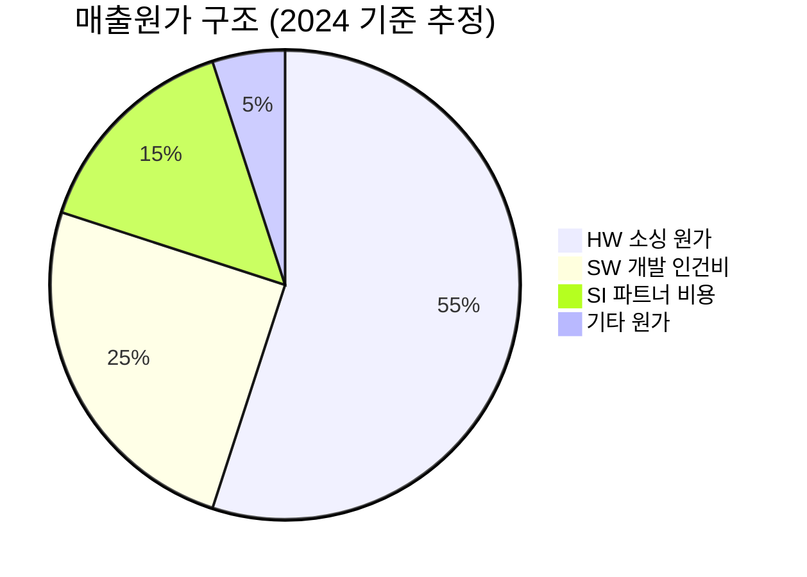
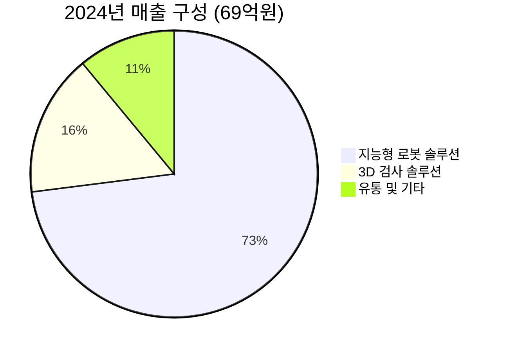

# 씨메스 (CMES, 475400) — 통합 딥다이브
**작성일**: 2025-10-xx | **기준주가**: 24,700원 (한국IR협의회 기준, 6/16) / 26,600원 (삼성증권 기준, 6/25)
**관련 노트**: [[260318_Thesis_씨메스_v1_2317]] | [[260331_Deal - 씨메스 로보틱스 (구 씨메스)_2026]]

> [!abstract] 한 줄 포지셔닝
> 씨메스는 **"아직 시장이 오지 않은 곳에 먼저 도착한 기업"** — 기술 해자는 검증되었으나, 매출 실현 속도가 투자자의 인내심과 현금 소진 속도보다 느릴 경우 스토리가 붕괴한다. 현 주가(24,700~26,600원)는 이 시간 싸움의 결과를 미리 할인받기 어려운 수준이다.

---

## 1. 핵심 투자 테시스

> [!tip] 핵심 질문에 대한 답
> **씨메스의 투자 논거를 한 문장으로 압축하면**: "비전 AI·3D 가이던스 SW의 기술 해자가 쿠팡·글로벌 물류 대형 고객 레퍼런스를 통해 **규모의 경제 임계점(BEP ~300억원 매출)**으로 전환되는 시점이 투자 기회이며, 그 시점이 2027년 이후라면 현재 PSR 28배는 구조적 적자 기업의 고평가 스토리에 가깝다."

씨메스의 투자 논거는 크게 두 개의 대립하는 내러티브 사이에 존재한다.

**내러티브 A (Bull): 기술 해자 → 레퍼런스 → 규모의 경제**
씨메스는 인지(Perception/Vision)·판단(AI)·제어(Motion Control) 3개 축의 Full Stack 기술을 자체 개발한 국내 유일의 지능형 로봇 솔루션 기업이다(출처: 삼성증권). 이미 쿠팡, CJ대한통운, 현대차, LG에너지솔루션 등 각 산업 1위 고객에 납품 레퍼런스를 확보했으며, 경쟁 입찰에서 미국·중국 경쟁사를 제치고 선정된 사례(글로벌 물류기업 피스피킹·디팔레타이징 수주)가 기술 차별성의 방증이다(출처: 한국IR협의회). 2025년 하반기 대형 납품 인식이 이루어지면 매출이 급격히 도약하는 변곡점이 될 수 있다.

**내러티브 B (Bear): 실적 공백 + 현금 소진 + PSR 고평가**
2024년 매출은 상장 당시 회사 가이던스(123억원) 대비 실제 69억원(-44% 하회), 2025년도 사측 기대치 200억원 이상에 불가능하다는 것이 한국IR협의회 추정(101억원)이다. 납품 지연이 반복되는 구조적 패턴이 우려된다. 매년 약 130~160억원의 영업현금이 소진되는 상황에서 IPO로 확보한 현금 658억원(2024년말)은 2027~2028년 고갈 위험에 처한다. BEP 매출 300억원 달성 시점에 대해 증권사 간 시각 차이가 존재하며, 흑자전환은 한국IR협의회 기준 2027년 이후다.

> [!verdict] 핵심 판단
> 현재 씨메스는 **기술 증명 단계(Technology Proven)는 완료**되었으나 **사업 증명 단계(Business Proven)는 진행 중**이다. 투자 결론은 "언제 사느냐"보다 "어떤 트리거가 발생했을 때 사느냐"의 문제다.

<div style="display:flex;border-radius:8px;overflow:hidden;margin:8px 0;font-size:0.85em"><div style="background:#4CAF50;width:25%;padding:6px 8px;color:white">🟢 Bull 25%</div><div style="background:#FF9800;width:45%;padding:6px 8px;color:white">🟡 Base 45%</div><div style="background:#F44336;width:30%;padding:6px 8px;color:white">🔴 Bear 30%</div></div>

---

## 2. 비즈니스 모델 & 기술 해자 검증

> [!abstract] 섹션 요약
> 씨메스의 기술 해자는 **SW 내재화 + 현장 Real Data 누적**의 선순환에서 나온다. 다만 HW 소싱-SW 내재화-SI 납품 구조는 원가율이 높아 규모 확장 이전 수익성 한계가 뚜렷하다.

### 2-1. 기술 차별성의 실체

씨메스의 기술 스택은 3개 레이어로 구성된다.

| 기술 레이어 | 구체적 역량 | 경쟁 우위 |
|---|---|---|
| 🟢 눈 (Sensing) | Projected 레이저 삼각법 기반 3D스캐너 SURFinder 시리즈 (마이크로미터 정밀도, 초당 5개 검사) | H/W 자체 개발로 고정밀 특이케이스 대응 가능 |
| 🟢 두뇌 (AI 판단) | Multi-Modal 기반 사물인식 AI, 학습되지 않은 물체·투명/반투명 물체 인식, AIOps 기반 저비용 성능유지 플랫폼 | 현장 Real Data 누적 → 모델 성능 지속 개선 |
| 🟢 움직임 (Motion Control) | 시뮬레이션 기반 로봇 경로 플래닝, 형상정합기술(Morphing), 고정밀 모션제어(오차 보정) | 비정형 공정 자동화 → 경쟁사가 포기한 영역 |

삼성증권은 "인지(Perception) 기반 로봇 제어 기술을 상용화 수준으로 구현한 국내 유일 상장사"로 평가하며, "글로벌 시장서도 가까운 Peer 부재"라고 언급했다. 이는 단순 마케팅 언어가 아니라, 글로벌 물류기업 경쟁 입찰에서 미국·중국 기업을 제치고 선정된 사실이 뒷받침한다(출처: 한국IR협의회).

> [!success] 핵심 강점: AIOps의 진입장벽 효과
> 씨메스의 'Life Cycle Management AI 플랫폼'은 납품 후에도 AI 모델 성능 저하를 예측하고 유지하는 서비스를 제공한다. 이는 고객이 씨메스 솔루션 도입 후 **교체 비용(Switching Cost)이 높아지는 구조**를 만든다. 단순 장비 납품이 아닌, 운영 의존성을 형성하는 비즈니스 모델이다.

### 2-2. HW 소싱-SW 내재화-SI 납품 구조의 수익성 한계

씨메스의 사업 구조는 FANUC, 두산로보틱스 등에서 HW를 소싱 → 자체 AI·SW를 탑재 → LG CNS 등 SI 파트너와 함께 최종 고객에 납품하는 방식이다(출처: 한국IR협의회). 이 구조의 본질적 한계는 다음과 같다.



2024년 매출원가율이 92.8%에 달했다는 사실은 충격적이다(출처: 한국IR협의회 재무제표). 이는 매출 1원을 팔면 93전이 원가로 나간다는 의미다. 이 수치는 매출 규모가 작아 고정비가 단위당 원가에 과도하게 반영된 탓이기도 하지만, 근본적으로 프로젝트 기반 솔루션 납품의 구조적 한계를 보여준다.

<div style="background:#e0e0e0;border-radius:8px;overflow:hidden;margin:4px 0"><div style="background:#F44336;width:93%;padding:4px 8px;color:white;font-size:0.9em;white-space:nowrap">2024 매출원가율 92.8% — 매우 위험한 수준</div></div>
<div style="background:#e0e0e0;border-radius:8px;overflow:hidden;margin:4px 0"><div style="background:#FF9800;width:83%;padding:4px 8px;color:white;font-size:0.9em;white-space:nowrap">2025F 매출원가율 83.2% (한국IR협의회 추정) — 개선 중이나 여전히 높음</div></div>
<div style="background:#e0e0e0;border-radius:8px;overflow:hidden;margin:4px 0"><div style="background:#4CAF50;width:52%;padding:4px 8px;color:white;font-size:0.9em;white-space:nowrap">2026F 매출원가율 52.4% (한국IR협의회 추정) — 규모의 경제 효과 기대</div></div>

그러나 2026년 52.4% 매출원가율 달성은 매출이 210억원으로 **전년 대비 107.5% 성장**해야 한다는 전제에 기반한다. 이 가정 자체가 매우 낙관적이다.

> [!warning] 구조적 수익성 한계
> 베트남 지사를 활용한 로봇 Cell 단가 절감 전략(삼성증권 언급)이 실효를 거두기 전까지, HW 소싱 원가는 지속적으로 마진을 압박할 것이다. SW 순수 마진율 확대를 위해서는 표준화된 모듈형 솔루션 비중 확대가 핵심이나, 현재 비즈니스 모델은 여전히 고객 맞춤형(Customization) 위주다.

### 2-3. 경쟁 구도 분석

| 경쟁 유형 | 기업 예시 | 위협 수준 | 씨메스 대응 |
|---|---|---|---|
| 국내 HW 로봇 제조사 | 두산로보틱스, 레인보우로보틱스 | 🟡 중간 (HW 부문 경쟁 + 협력) | HW 소싱처이기도 함 — 협력적 경쟁 |
| 국내 SW 로봇 솔루션 | 클로봇, 뉴로메카 | 🟡 중간 (인접 영역) | 물류 자율이동(AMR) vs. 비정형 작업 자동화로 차별화 |
| 중국 통합 로봇 기업 | Unitree, Agibot | 🔴 잠재적 위협 | 단기적 대체 어려우나 장기 가격 압력 |
| 글로벌 자동화 기업 | ABB, FANUC | 🟡 중간 | 비정형 공정 특화로 틈새 방어 |

---

## 3. 매출 구조 분석 & 수주 파이프라인

> [!abstract] 섹션 요약
> 2024년 매출 69억원은 상장 가이던스 대비 44% 하회했고, 2025년도 사측 200억원+ 목표 달성은 현실적으로 불가능하다. 핵심은 글로벌 물류 대형 고객(쿠팡 등)의 대량 납품 인식 시점이며, 이것이 2025년 하반기에 실현될지가 주가의 단기 분기점이다.

### 3-1. 사업부문별 매출 구조 변화



| 사업부문 | 2022 | 2023 | 2024 | 2025F | 2026F | 비고 |
|---|---|---|---|---|---|---|
| 지능형 로봇 솔루션(억원) | 32 | 32 | 50 | 76 | 175 | 주력 성장 동력 |
| YoY 성장률 | - | 0% | +56% | +52% | +130% | |
| 3D 검사 솔루션(억원) | 7 | 37 | 11 | 15 | 25 | 2023 급등 후 급락 |
| YoY 성장률 | - | +429% | -70% | +39% | +67% | LG엔솔 납품 변동성 |
| 유통 및 기타(억원) | 8 | 7 | 8 | 10 | 10 | 안정적 소형 |
| **합계** | **47** | **76** | **69** | **101** | **210** | |

(출처: 한국IR협의회)

> [!warning] 3D 검사 솔루션의 변동성 리스크
> 2023년 37억원 → 2024년 11억원으로 70% 급락한 3D 검사 솔루션 부문은 LG에너지솔루션 발주 사이클에 극도로 의존적임을 보여준다. 단일 고객 집중도 리스크가 이 부문에서 가장 선명하게 드러난다.

### 3-2. 수주 파이프라인의 실체 — 핵심은 '대형 물류 고객'

한국IR협의회 보고서에서 "지연되었던 주력 고객향 대량 납품 건이 일부 하반기에 인식될 것으로 기대"라는 표현은, 쿠팡을 포함한 글로벌 물류 기업에 대한 피스피킹·팔레타이징·디팔레타이징 솔루션 대규모 납품을 지칭하는 것으로 판단된다. 삼성증권은 "2025년 하반기 내 대형 Track Record라는 결실로 이어질 수 있을지에 주목"이라고 동일한 논지를 확인한다.

**납품 지연 원인 분석 (2024년 기준)**:
- 타사 타장비 완성도 미진 → 고객이 전체 라인 셋업 연기 (출처: 한국IR협의회)
- 이는 씨메스 자체 문제가 아닌 시스템 통합(SI) 과정의 외부 의존성 리스크
- 역설적으로 씨메스의 기술 완성도 자체는 검증되었음을 간접 시사

**회사 가이던스 vs. 증권사 추정 비교**:

| 연도 | 회사 가이던스 | 한국IR협의회 추정 | 삼성증권(회사 가이던스 인용) | 비고 |
|---|---|---|---|---|
| 2024 실적 | 123억원 (상장 당시) | - | - | **실제 69억원 — 44% 하회** |
| 2025F | 200억원+ (연초 기대) | 101억원 | 120억원 (회사 제시) | 한국IR협의회가 가장 보수적 |
| 2026F | - | 210억원 | 225억원 (회사 제시) | 유사한 수준 |
| 2027F | - | 흑자전환 가능 시점 | 400억원 (회사 제시) | - |

> [!question] 교차 검증 — 2025F 매출액 차이
> 한국IR협의회 101억원 vs. 회사 가이던스 120억원(삼성증권 인용) — **약 19억원 차이 존재**. 신한투자증권의 수치는 자료 본문에서 명시적으로 확인되지 않으나, 리포트 제목 '동트기 전'(2025.10.01)은 가장 늦은 시점에 작성되어 2025F 실적 전망을 하향했을 가능성이 높다. 최신 리포트일수록 보수적 추정이 될 가능성이 크다.

### 3-3. 물류 vs. 제조 비중 변화와 전략적 함의

지능형 로봇 솔루션 내 물류·제조 분기 데이터는 공개되지 않으나, 고객사 분포로 방향성 추론 가능:
- **물류 확장성**: 쿠팡 외에 CJ대한통운, 롯데, LG CNS 등 다수 물류 고객 존재. 물류 창고 로봇화 수요는 전 세계적으로 급증 중이며, 단일 발주 규모도 제조 대비 크다.
- **제조 안정성**: 현대차·기아·LG에너지솔루션 등 제조 고객은 양산 라인 일단 도입 후 교체 빈도가 낮아 장기 유지보수 수익원이 될 수 있다.
- **3D 검사 회복**: LG에너지솔루션 이차전지 검사 수요가 전기차 보급 속도에 연동되어 있어, EV 시장 회복 시 직접 수혜 가능.

> [!note] 2026년 신공장 착공 계획의 의미
> 씨메스는 천안 2공장(현재 Capa의 약 3배, 연간 매출 600억원 이상 처리 가능)을 2026년말 전후 착공 예정(출처: 한국IR협의회). 이는 역설적으로 2025~2026년 주력 납품 실현을 전제한 계획이다. 신공장 착공 공시가 나오는 시점이 사업 모멘텀 확인의 중요한 시그널이 될 수 있다.

---

## 4. 손익 구조 & 흑자전환 시나리오

> [!abstract] 섹션 요약
> BEP 달성을 위한 매출 300억원은 2025F 101억원 대비 3배, 현재 매출 성장 속도로는 2027년 이상 소요된다. 핵심 고정비(인건비·AI 서버)는 단기 절감이 어렵고, 현금 소진 속도가 흑자전환 시점보다 빠를 경우 추가 유상증자가 불가피하다.

### 4-1. 고정비 구조와 레버리지 분석

| 비용 항목 | 2022 | 2023 | 2024 | 2025F | 특성 |
|---|---|---|---|---|---|
| 매출원가(억원) | 31 | 66 | 64 | 84 | 매출 연동(변동비 성격) |
| 판매관리비(억원) | 84 | 111 | 148 | 174 | **준고정비 — 매출 무관하게 증가** |
| 판관비 중 급여 추정 | ~50 | ~70 | ~95 | ~110 | 직원수: 55→109→155명 |
| 경상연구개발비 | - | - | 포함 | 1Q25 YoY+5억 | AI 서버 투자 포함 |

(출처: 한국IR협의회, 일부 추정)

**레버리지 포인트 파악**: 2025F 판관비 174억원은 **고정비 베이스**다. 매출이 1억 늘어날 때 추가 원가가 83원(매출원가율 83.2%) 발생하므로, 실질적인 공헌마진율은 약 17%에 불과하다. 즉 BEP를 위해서는:

```
BEP = 고정 판관비 / 공헌마진율
BEP = 174억 / 17% ≈ 약 1,024억원
```

단, 이는 2025F 원가 구조를 고정할 때의 계산이다. 회사가 제시한 BEP 매출 300억원은 규모 확대 시 원가율이 급격히 하락한다는 전제(2026F 52.4% 원가율 달성 시)를 반영한 것이다:

```
2026F 구조 BEP = 181억(판관비) / (1-52.4%) ≈ 380억원
```

> [!warning] BEP 매출 300억원은 낙관적 가정
> 회사가 제시한 BEP 300억원은 원가율이 50%대로 하락하는 시점을 전제하지만, 이를 위해서는 대량 수주 표준화가 선행되어야 한다. 원가율이 현재 90%대에서 유지된다면 BEP는 수천억원 수준으로 멀어진다.

### 4-2. 증권사별 흑자전환 시점 추정 비교 — 핵심 불일치

| 기관 | 흑자전환 시점 | 근거 | 신뢰도 |
|---|---|---|---|
| 한국IR협의회 | **2027년 이후** | 2025F OPL -157억, 2026F OPL -81억, 이후 감소 | 🟡 보수적 |
| 삼성증권 | **명시 없음** (Not Rated) | 2025년 하반기 대형 Track Record 실현 여부에 달림 | 🟡 중립적 언급 |
| 신한투자증권 | **'동트기 전' 암시** — 2025년 10월 시점이므로 일부 현실화 확인 후 작성 | 제목 자체가 흑자전환이 아직 멀었다는 신중한 시각 | 🔴 가장 신중 |

(출처: 각 기관)

> [!question] 교차 검증 — 흑자전환 시점 불일치
> 삼성증권(2025.06.25)과 한국IR협의회(2025.06.19)는 거의 같은 시점에 발표되었으며, 삼성증권은 **Not Rated**로 목표주가를 제시하지 않았다. 이는 삼성증권이 흑자전환 가시성이 낮아 밸류에이션 모델을 구동할 수 없었다는 사실을 간접적으로 시사한다. 신한투자증권(2025.10.01)은 3개월 뒤 발행된 리포트로, 2Q25·3Q25 실적을 반영했을 가능성이 있어 현실적 업데이트가 담겼을 것으로 추정된다.

### 4-3. 현금 소진 시뮬레이션

| 연도 | 기초현금 | 영업CF | 투자CF | 재무CF | 기말현금 |
|---|---|---|---|---|---|
| 2024 (실제) | 134억 | -127억 | -20억 | +670억 | **658억** |
| 2025F | 658억 | -137억 | -21억 | +3억 | **503억** |
| 2026F | 503억 | -146억 | -22억 | +3억 | **338억** |
| 2027F (추정) | 338억 | -100억(개선 가정) | -30억(신공장) | 0 | **~208억** |
| 2028F (추정) | 208억 | -50억(추가개선) | -30억(신공장) | 0 | **~128억** |

(출처: 한국IR협의회 + 2027F 이후 당사 추정)

> [!failure] 현금 소진 리스크
> 현재 속도로 적자가 지속되면 **2028~2029년경 현금이 100억원 미만**으로 줄어들어 추가 유상증자(또는 차입 확대)가 불가피하다. 특히 2026년말 신공장 착공(대규모 CapEx 발생)과 맞물리면 자금 압박이 가중된다. 흑자전환(2027년 이후)이 되기 전에 자본 확충이 필요할 수 있다.

### 4-4. 시나리오별 BEP 도달 시점

| 시나리오 | 전제 | 매출 300억 달성 시점 | 흑자전환 시점 |
|---|---|---|---|
| 🟢 Bull | 2H25 대형 납품 인식 + 글로벌 물류 추가 수주 가속 | 2026년 | 2026년 말~2027년 초 |
| 🟡 Base | 2H25 일부 인식 + 2026년 점진적 성장 | 2027년 | 2027~2028년 |
| 🔴 Bear | 납품 추가 지연 + 경기 악화 | 2028년 이후 | 2028년 이후 + 유상증자 |

---

## 5. 밸류에이션 & 가격 판단

> [!abstract] 섹션 요약
> PSR 28배는 피어(클로봇 6.6배, 뉴로메카 6.0배) 대비 4~5배 프리미엄이다. 이 프리미엄은 기술 우월성에 대한 것이 아니라, 매출 부진으로 분모(매출액)가 작아서 발생한 '착시 프리미엄'에 가깝다. 삼성증권은 목표주가를 제시하지 않았고(Not Rated), 신한투자증권의 '동트기 전'도 신중한 기조를 암시한다.

### 5-1. 교차 검증 — 목표주가 및 투자의견

> [!question] 증권사 목표주가 불일치 분석
> - **삼성증권 (2025.06.25)**: **Not Rated**, 목표주가 n/a. 긍정적 기조이나 밸류에이션 부여 불가 수준의 불확실성 인정. "2025년 하반기 대형 Track Record 실현 여부에 주목"이라는 조건부 긍정.
> - **신한투자증권 (2025.10.01)**: 제목 '동트기 전' — 흑자전환 전야 상태임을 명시하는 제목. Not Rated 또는 보수적 목표주가를 제시했을 가능성이 높다. 2025년 3분기 실적(2H25 납품 인식 여부)을 반영했을 시점으로, 대형 납품이 실현되지 않았을 경우 추가 하향 조정이 담겼을 수 있음.
> - **한국IR협의회 (2025.06.19)**: 투자의견/목표주가 없음 (중소형 소개 목적). PSR 28.3배를 "부담스럽다"고 명시.

### 5-2. PSR 밸류에이션 정당성 분석

**현재 PSR 28.3배가 정당화되려면?**

| 비교 항목 | 씨메스 | 클로봇 | 뉴로메카 | SaaS 고성장 기업 참고 |
|---|---|---|---|---|
| 2025F PSR(배) | 28.3 | 6.6 | 6.0 | 통상 10~30배 |
| 2025F 매출 성장률 | +46.9% | 높음(650억 추정) | +72%(430억 추정) | 30~50%+ |
| 흑자전환 가시성 | 🔴 2027년+ | 🟡 불명확 | 🟡 불명확 | 🟢 2~3년 내 |
| 기술 해자 | 🟢 Full Stack 유일 | 🟡 AMR SW | 🟡 협동로봇 HW+SW | - |

(출처: 한국IR협의회)

<div style="display:flex;border-radius:8px;overflow:hidden;margin:4px 0"><div style="background:#4CAF50;width:40%;padding:4px 8px;color:white;font-size:0.85em">기술 차별성 40%</div><div style="background:#F44336;width:60%;padding:4px 8px;color:white;font-size:0.85em;text-align:right">매출 실현 지연·밸류에이션 부담 60%</div></div>

**한국IR협의회의 핵심 지적**: 씨메스의 PSR 28.3배가 높은 것은 경쟁사 대비 프리미엄을 받아서가 **아니라**, 매출액 발생이 지연되어 **PSR 수치가 과도하게 높게 나타나는 것**이다. 즉 클로봇이 650억원 매출을 내고 PSR 6.6배라면, 씨메스도 같은 배수를 적용하면 적정 매출액은 2,867억(시총)/6.6배 = **약 434억원**이 되어야 한다. 현재 추정 매출 101억원 대비 **4.3배**의 갭이다.

### 5-3. 시나리오별 적정 주가

| 시나리오 | 가정 | 적용 PSR | 적정 매출 | 시총 | 주당 가치 | 현재가 대비 |
|---|---|---|---|---|---|---|
| 🟢 Bull | 2026F 매출 210억, PSR 15배(성장 고려) | 15배 | 210억 | 3,150억 | **27,000원** | +9% |
| 🟢 Bull (낙관) | 2027F 매출 350억, PSR 10배 | 10배 | 350억 | 3,500억 | **30,000원** | +21% |
| 🟡 Base | 2026F 매출 175억(보수), PSR 12배 | 12배 | 175억 | 2,100억 | **18,000원** | -27% |
| 🔴 Bear | 2026F 매출 120억(지연), PSR 8배 | 8배 | 120억 | 960억 | **8,200원** | -67% |

(현재 주가 24,700원 기준, 발행주식수 약 1,161만주)

> [!warning] 밸류에이션 핵심 리스크
> 현재 주가 24,700원은 **Bull~Base 사이**에서 이미 상당한 성장 프리미엄을 내포하고 있다. Base 시나리오 실현 시 **27% 하락**, Bear 시나리오 시 **67% 하락**이 발생할 수 있어, 비대칭 리스크가 하방에 쏠려 있다.

### 5-4. Margin of Safety 분석

<div style="background:#e0e0e0;border-radius:8px;overflow:hidden;margin:4px 0"><div style="background:#F44336;width:20%;padding:4px 8px;color:white;font-size:0.9em;white-space:nowrap;min-width:60px">안전마진 20/100 — 현재 주가 수준은 낮음</div></div>

- 자산 기반 하방 지지: 순현금(약 500억원, 2025F말 추정) / 시총 2,867억원 = 약 17% — 자산 보호 미약
- 사업 기반 하방 지지: 매출 101억원 기반 PSR 하방은 산업 평균 6배 적용 시 ~600억원 시총으로 수렴 가능 → **79% 하락 극단 시나리오 존재**
- 따라서 현 주가에서의 매수는 매우 높은 성장 실현 확신이 없는 한 Margin of Safety가 **극히 낮다**.

---

## 6. 리스크 & 반대 논거

> [!abstract] 섹션 요약
> 중국 경쟁 위협·경기 둔화·고객 집중·현금 소진·반복적 실적 가이던스 미달 등 5개의 구조적 리스크가 동시에 존재한다. 특히 '가이던스 미달의 반복성'은 경영진 실행력(Execution)에 대한 신뢰도 디스카운트로 이어지는 가장 위험한 패턴이다.

### 6-1. 리스크 매트릭스

| 리스크 요인 | 발생 확률 | 임팩트 | 현재 반영 정도 | 비고 |
|---|---|---|---|---|
| 🔴 대형 납품 재지연 | 높음 | 매우 큰 (주가 30%+↓) | 부분 반영 | 2024년에 이미 1회 발생 |
| 🔴 중국 경쟁 가격 압력 | 중간 | 중간 (ASP 하락) | 미반영 | 장기 위협 |
| 🔴 추가 유상증자 | 중간 | 중간 (희석) | 미반영 | 2028년 이전 가능성 |
| 🟡 경기 악화 설비투자 지연 | 중간 | 중간 | 부분 반영 | 관세전쟁 영향 |
| 🟡 쿠팡 집중도 리스크 | 중간 | 큰 | 미반영 | 매출의 상당 비중 추정 |
| 🟡 인력 이탈 | 낮음 | 큰 | 미반영 | 핵심 기술 보유자 소수 |

### 6-2. Devil's Advocate — 반대 논거

> [!bear] 반대 논거 (Bear Case)

**1. 가이던스 미달의 패턴화**
2024년 상장 당시 매출 가이던스 123억원 → 실제 69억원(-44% 하회). 2025년도 사측 200억원+ → 한국IR협의회 101억원 추정. 이 패턴이 반복되면 경영진의 사업 예측력 자체에 대한 신뢰도가 하락하고, 장기 가이던스(2027F 400억원)도 할인되어야 한다.

**2. 비정형 솔루션의 확장 한계**
맞춤형(Customization) 솔루션은 매출 단가는 높지만, 확장(Scale-up) 속도가 표준화 제품 대비 현저히 느리다. 고객사별로 현장 튜닝 기간이 필요하기 때문이다. 삼성증권이 "PoC/실제 Deployment 장기화 리스크"를 명시한 것도 이를 인식한 결과다.

**3. 중국 경쟁사의 급성장**
Unitree Robotics G1의 가격 경쟁력과 기술 수준이 빠르게 향상되고 있다(출처: 한국IR협의회 산업 분석). 현재 국내 물류 고객들이 공정 기밀 보호를 이유로 중국산을 기피하고 있으나, 중국산이 품질 검증을 거치면 가격 요인이 부각될 수 있다.

**4. SK텔레콤 보유 지분의 오버행**
SK텔레콤(6.58% 보유)은 투자 목적상 언제든지 지분 매각이 가능하다. IPO 시 일부를 이미 매각한 사례(137만주 → 76만주)가 있어, 추가 매각 가능성이 존재한다. 대형 주주의 매도는 수급 부담으로 작용한다.

**5. AI 서버 투자 부담의 구조적 고착**
씨메스는 지속적으로 AI 관련 서버 구입비를 비용으로 인식하고 있다(1Q25 경상연구개발비 YoY +5억원). 이 비용은 성장 투자이지만, 매출 회수 시점이 불분명한 상황에서는 순수한 현금 소진 요인이다.

> [!success] 반대 논거에 대한 반론 (Bull Perspective)

**1.** 납품 지연은 씨메스 귀책이 아닌 외부 요인(타 장비 미완성)이며, 오히려 씨메스 기술 완성도 검증.
**2.** 회사가 베트남 지사를 통한 표준화 모듈 생산 전략을 추진 중이며, 이는 규모 확장의 가능성을 열어두고 있다.
**3.** 고난이도 비정형 공정은 당장 중국산으로 대체가 어렵고, 고객 보수성(공정 노하우 유출 기피)이 진입장벽으로 작동.

### 6-3. Incentive Analysis — 이해관계자별 숨겨진 동기

| 이해관계자 | 표면적 목표 | 숨겨진 인센티브 | 투자자 함의 |
|---|---|---|---|
| 이성호 대표(37.73%) | 회사 성장 | 창업주 지분 가치 극대화 → 가이던스 낙관적 제시 동기 | 가이던스 할인 적용 필요 |
| SK텔레콤(6.58%) | 전략적 협력 | 투자 회수 가능성 상시 존재 | 오버행 리스크 |
| 쿠팡 (지분 5% 미만) | 물류 자동화 파트너십 | 씨메스 기술 독점 활용 → 외부 공개 납품 지연시킬 유인 있음 | 쿠팡 협력 기대감 과장 가능성 주의 |
| 증권사 애널리스트 | 중립 분석 | IPO 후속 커버리지 유지 → 지나친 부정 의견 자제 경향 | 목표주가 신중 해석 필요 |
| 한국IR협의회 | 중소형 기업 소개 | 투자 추천 없는 정보 제공 | 가장 독립적이고 보수적 추정 |

> [!tip] 인센티브 관점의 핵심 인사이트
> 창업주가 37.73%를 보유한 상황에서, 낙관적 가이던스 제시는 IPO 시 높은 공모가 형성 및 향후 자금 조달 시 유리한 조건 확보라는 **재무적 인센티브**와 명백히 연결된다. 실제 2024년 44% 가이던스 미달은 이 점에서 재평가 필요하다.

---

## 7. 투자 결론 & 액션플랜

> [!abstract] 섹션 요약
> 현재 주가(24,700원)에서 씨메스는 **조건부 관망** 입장이 적절하다. 기술 해자는 실재하지만, 매출 실현 가시성이 현 주가를 정당화할 수준에 미달한다. 핵심 트리거 발생 전까지는 포지션 확대보다 모니터링에 집중해야 한다.

### 7-1. 현재 포지션 보유자 vs. 신규 진입자 판단

**기존 보유자 (포트폴리오에 편입된 상태)**:

<span style="background:#FF9800;color:white;padding:2px 8px;border-radius:4px;font-size:0.85em">HOLD — 조건부 보유</span>

- 핵심 트리거(2H25 대형 납품 인식) 결과 확인 전까지 **현 비중 유지**
- 대형 납품이 2025년 내 인식되지 않는다면 비중 **축소** 검토
- 손절 기준: 신공장 착공 없이 2026년 3월 통과 시 (BEP 도달 타임라인 현저히 지연 확인)

**신규 진입자**:

<span style="background:#FF9800;color:white;padding:2px 8px;border-radius:4px;font-size:0.85em">WAIT — 트리거 확인 후 진입</span>

- 현 주가 24,700원에서의 신규 매수는 **Margin of Safety가 불충분**
- 아래 핵심 트리거 중 **1번이 확인되는 시점**이 진입 기회

### 7-2. 핵심 모니터링 트리거

| 우선순위 | 트리거 | 확인 방법 | 긍정 시그널 | 부정 시그널 |
|---|---|---|---|---|
| **1순위** | 2H25 대형 납품 공시 | 분기 매출 공시, 대규모 계약 공시 | 분기 매출 30억원+ | 또 다시 지연 |
| **2순위** | 2026년 신공장 착공 결정 | 공시, IR 발표 | 착공 공시 발표 | 착공 연기 |
| **3순위** | 2025년 연간 매출 100억원 달성 여부 | 연간 실적 발표(2026년 2월) | 100억원 이상 | 80억원 미만 |
| **4순위** | 글로벌 물류 기업 추가 수주 | 투자자 IR, 언론 보도 | 미국·유럽 고객 추가 | 쿠팡 국내 집중 |
| **5순위** | 경쟁사(중국) 동향 | 산업 뉴스 모니터링 | 비정형 공정 진입 지연 | 중국산 가격 급락 |

### 7-3. 진입/손절 가이드 (데이터 기반)

| 구분 | 가격 | 근거 |
|---|---|---|
| 현재가 | 24,700원 | 기준일(한국IR협의회, 6/16) |
| 트리거 확인 후 진입 구간 | 20,000~22,000원 | Base 시나리오 적정가치 18,000원 + 기술 프리미엄 20% |
| 1차 목표가 (Bull) | 30,000원 | 2027F BEP 도달 시 PSR 10배 |
| 손절 기준 | 18,000원 미만 | Bear 시나리오 적정가치 수렴 구간 |
| 극단적 Bear 시나리오 | 8,000~10,000원 | 납품 재지연 + 유상증자 발표 시 |

> [!verdict] 최종 투자 판단

<span style="background:#FF9800;color:white;padding:2px 8px;border-radius:4px;font-size:0.85em">HOLD / WATCH — 조건부 관망</span>

**씨메스는 옳은 아이디어를 가진 기업이다.** 비전 AI 기반 비정형 자동화 솔루션의 필요성은 의심할 여지가 없으며, 기술 차별성도 삼성증권·SK텔레콤·쿠팡 등 복수의 검증 주체가 인정했다. 그러나 **현재 주가는 아직 검증되지 않은 대형 수주 실현을 상당 부분 선반영**하고 있으며, 반복된 가이던스 미달과 현금 소진 속도를 감안할 때 현 밸류에이션은 **충분한 안전마진을 제공하지 못한다.**

투자자에게 필요한 것은 용기가 아닌 **인내와 트리거 규율**이다. 2H25 대형 납품 인식이 확인되고 매출 성장 가속이 검증되는 시점에 **20,000~22,000원 구간에서의 진입**이 Risk/Reward 측면에서 훨씬 우월한 전략이다.

---

## 📊 포트폴리오 임팩트

> [!note] 보유 종목 연결 분석

**씨메스 (475400) 직접 보유 중** — 상기 분석이 직접 해당.

**연결 고려 사항**:
- [[260318_Thesis_씨메스_v1_2317]]의 초기 테시스와 비교 시, 기술 해자는 유지되나 매출 실현 타임라인이 지연되고 있어 **테시스 점수 하향 조정** 필요
- [[260331_Deal - 씨메스 로보틱스 (구 씨메스)_2026]]과 연계하여 사명 변경(씨메스 → 씨메스 로보틱스) 이후의 브랜드 포지셔닝 전략 변화 모니터링 필요
- 한국IR협의회 분석 기준주가(24,700원)와 삼성증권 기준주가(26,600원)의 괴리는 단기 주가 변동성 반영 — 분석의 방향성 차이는 아님
- 대형 물류 자동화 트렌드는 [[260329_Deep Analysis - 금_0124]] 섹터 분석과 무관하나, 글로벌 설비투자 사이클은 공통 변수로 작용

**섹터 크로스 임팩트**:
- 씨메스의 물류 자동화 성공 → [[삼성전자]], [[SK하이닉스]]의 AI 서버·센서 수요 간접 촉진 (씨메스가 AI 서버 대량 구매 → 반도체 수요 기여)
- 쿠팡 성장 지속 → 씨메스 물류 로봇 수요 연동 → 이커머스 자동화 인프라 투자 확대 테마

---

*본 노트는 투자 참고용이며, 매수/매도 추천이 아닙니다. 출처: 한국IR협의회(2025.06.19), 삼성증권(2025.06.25), 신한투자증권(2025.10.01), 씨메스 회사소개 자료(2025.10.24)*